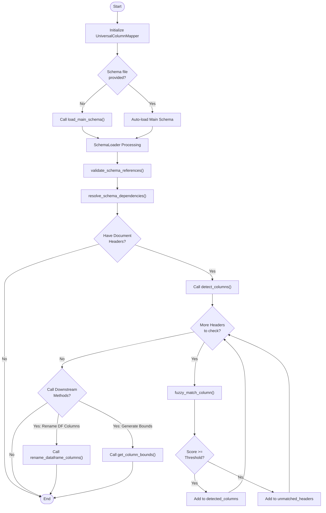

# Universal Column Mapper User Instructions

## Introduction
The `UniversalColumnMapper` is a Python utility designed to dynamically load external schema files, perform fuzzy header detection, and apply schema-driven validation for universal document processing. It helps in mapping varied column headers from input documents to standardized schema definitions, making data ingestion and processing more robust, programmatic, and flexible.

## Key Components
The module is partitioned into two main classes:
1. **`SchemaLoader`**: Manages the loading, resolution, and dependency management of schema files natively formatted in JSON. It natively supports relative paths, fallback mechanisms, schema-hierarchy definitions, and cross-reference validation.
2. **`UniversalColumnMapper`**: The core processing orchestrator. It consumes the parsed and inter-linked schema logic (provided by `SchemaLoader`) to intelligently evaluate imported textual column headers constraint logic, locating their respective semantic equivalents using customizable string normalization and sequence-matching metrics. 

---

## General Workflow

1. **Initialization**: Initialize a `UniversalColumnMapper` instance. Optionally, provide a direct file path string to the main JSON-based config schema upon instantiation.
2. **Loading Target Schema**: If the class was initialized without a main schema configuration object, call the `load_main_schema(schema_file)` method to parse the parent instruction file, natively triggering internal resolution and structural validation.
3. **Column Detection**: Submit an array block of string column representations found inside an active file to the `detect_columns(headers)` method. The operation will automatically score aliases and return a dictionary tree outlining matched, unmatched headers, respective scores, matching options, and statistics representing extraction accuracy.
4. **Data Manipulation/Validation Execution**: Leverage subsequent helpers routines once bindings map effectively. Directly standardize data layout definitions mapping raw input data structures (like Pandas `DataFrame` items) via `rename_dataframe_columns`, or systematically target index limits by scanning via `get_column_bounds`.

### Workflow Logic Diagram

---

## Parameters and Schema Format Guidelines

The underlying mapper structure implicitly requires hierarchical JSON schema environments. A standard top-level scheme document structure normally exposes an `enhanced_schema` mapping to catalog definitions:

- **`schema_references`**: A collection of key-value bindings referencing complementary external sub-schema documents. `SchemaLoader` automatically identifies and evaluates reference validity.
- **`enhanced_schema['columns']`**: Granular itemization definitions matching against individual extraction targets.
  - **`aliases`** `(List[str])`: A curated baseline sequence list mapping known, alternative nomenclature versions. Crucial to `UniversalColumnMapper` fuzzy mapping accuracy.
  - **`data_type`** `(str)`: Data definition rule mappings enforcing types (e.g. `categorical`, `numeric`).
  - **`schema_reference`** `(str)`: Binds custom validation layers dynamically attaching to an external schema payload natively exposing valid `choices` block declarations.

---

## Class Details: `SchemaLoader`

### 1. `__init__(self, base_path: str = None)`
Bootstraps context resolution dependencies.
- **Parameters**:
  - `base_path`: Reference parent repository directory utilized during parsing attempts. Defaults internal logic routing safely towards the script-relative `config/schemas` folder.

### 2. `set_main_schema_path(self, schema_file: str)`
Overwrites standard lookup root trajectories establishing execution relative anchor points relative strictly to an inputted schema document layout.
- **Parameters**: 
  - `schema_file`: Physical system file path pointing towards the core target schema directive.

### 3. `load_schema(self, schema_name: str, fallback_data: Any = None) -> Dict`
Requests direct cache extraction or immediate physical retrieval mapping referencing string identifiers representing target schema configurations.
- **Parameters**:
  - `schema_name`: Name representing the core document without its inherent `.json` file type suffix.
  - `fallback_data`: A safety substitution tree dictionary object bypassing exception crashing errors natively triggered upon lookup failures.

### 4. `load_schema_from_path(self, schema_path: str, fallback_data: Dict = None) -> Dict`
Hard-loads schemas relying faithfully upon an explicit operating system path vector. Stores data via local object caching strategies limiting repeated lookups.
- **Parameters**:
  - `schema_path`: Strict definitive schema location mapping target definitions. (Accepts file `.json` suffixes and relative folder configurations).
  - `fallback_data`: Operational fallback layer triggered upon I/O failures.

### 5. `validate_schema_references(self, main_schema: Dict) -> List[str]`
Iterates standard properties scanning recursively across defined `schema_references` pointers. Performs validation existence checks guaranteeing reference viability.
- **Parameters**: 
  - `main_schema`: Extracted and parsed dictionary structure containing the loaded root configuration logic.
- **Returns**: Emits a native Python string `list()` representing collected verification error reports.

### 6. `resolve_schema_dependencies(self, main_schema: Dict) -> Dict`
Synthesizes external JSON architectures directly injecting validly matched parameters straight into operational main logic constraints ensuring uninterrupted local state evaluation.

---

## Class Details: `UniversalColumnMapper`

### 1. `__init__(self, schema_file: str = None)`
Instantiates core class components inherently mapping loader configurations out of the box.
- **Parameters**:
  - `schema_file` (Optional): String literal path directing startup workflows directly towards a targeted environment schema.

### 2. `load_main_schema(self, schema_file: str)`
Manually integrates targeted logic schema processing sequences evaluating dependency checks comprehensively ahead of mapping computations. (Mandatory execution prior to matching workflow procedures).
- **Parameters**:
  - `schema_file`: Raw path string corresponding directly towards primary validation architectures. 

### 3. `fuzzy_match_column(self, header: str, target_columns: List[str], threshold: float = 0.6) -> Tuple[str, float]`
Internal logic evaluation engine standardizing textual block comparisons via native string heuristics measuring similarity quotients.
- **Parameters**:
  - `header`: Raw extracted document-level string representation title header.
  - `target_columns`: Recognized canonical list representing alias bindings options.
  - `threshold`: Floating-point numeric ratio limits bounding successful match tolerances. Scales structurally from `<0.0 - 1.0>`. (Default threshold parameter dictates `0.6`).
- **Returns**: Returns an explicit `Tuple` representing sequentially `(best_match_alias_string, detected_similarity_score)`.

### 4. `detect_columns(self, headers: List[str]) -> Dict[str, Dict]`
*The module core execution directive algorithm.* Evaluates mapped string payload arrays sequentially validating matches bounding results inside internal schemas, yielding metrics measuring parsing efficiency levels.
- **Parameters**:
  - `headers`: Textual array payload mapped raw originating extracted variables.
- **Returns**: A composite nested `Dict` structure detailing execution status metrics:
  - `detected_columns`: Full canonical payload mappings defining bindings, metrics, threshold scores, base canonical naming and loaded schema category references mapped properly via validation definitions.
  - `unmatched_headers`: Straggling extracted list representations natively excluded under existing scoring parameter constraints rules limits.
  - `total_headers`: Raw sum value mapped input iterations size metadata parameters array size blocks computations. 
  - `matched_count`: Volumetric extraction pairing successes sum index block measurements iterations counts arrays matches configurations representations bounds counts blocks boundaries mappings.
  - `match_rate`: Fractional mapped proportion scoring representation evaluations calculations validations operations computations measurements evaluations.

### 5. `rename_dataframe_columns(self, df: pd.DataFrame, mapping_result: Dict) -> pd.DataFrame`
Optional integrated processing helper pipeline executing automated Pandas DataFrame column header overwrite sequences inherently transitioning textual mapping states aligning against strictly identified definitions automatically translating canonical configurations dynamically.  
- **Parameters**:
  - `df`: Extracted operational workspace raw data Pandas representations instance mappings structure limits layouts operations tables blocks logic arrays sequences objects targets variables types blocks.
  - `mapping_result`: Dictionary structure generated output blocks explicitly outputted representing returned variable arrays generated internally from `detect_columns` methods natively formats instances definitions mappings dictionaries trees states layouts structs values structures references trees paths locations maps nodes graphs blocks data. 
- **Returns**: Adjusted native dataframes objects.

### 6. `get_column_bounds(self, data, detected_columns: Dict) -> Dict[str, Tuple[int, int]]`
Performs comprehensive vertical structure bounds verifications mapping non-null boundary index block structures targeting operational data structures layouts defining start limits and tail range endings parameters structurally identifying boundaries limits paths bounds limits bounds nodes sizes blocks frames definitions coordinates values parameters trees variables maps parameters.
- **Parameters**:
  - `data`: Accepted Array matrices structure matrices grids representations representations paths lines nodes layouts maps strings structures grids maps graphs dictionaries hashes structures trees trees. (Normally compatible fully processing lists arrays variables tables operations sets pandas DataFrame mappings layouts logic instances arrays states components configurations logic interfaces arrays items fields). 
  - `detected_columns`: Input parameters blocks lists instances mapping nodes structures natively bound internally outputs extracted explicitly executed variables arrays maps hashes trees variables tables mappings logic representations maps dictionaries variables operations functions lists structures representations from previously executed operations loops iterations processes procedures mappings evaluations computations definitions outputs states limits sizes bounds boundaries targets definitions variables coordinates limits parameters logic bounds variables sequences objects.
- **Returns**: `Dict` structured lists coordinates representation structures mappings targets fields references arrays outputs tables logic indexes offsets dimensions layouts nodes definitions components maps bounds states variables locations graphs maps tuples indexes sets parameters arrays operations lists coordinates states structures values hashes maps tuples logic locations dictionaries nodes mappings configurations limits targets representations nodes lists variables trees indexes tables dictionaries paths points offsets structures representations logic parameters tuples loops nodes paths items.
