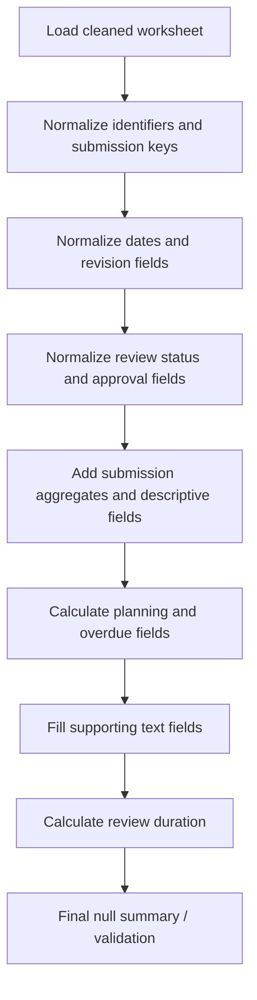

# DCC Column Update Logic

This file summarizes the logic in `dcc/dcc_mdl.ipynb` for the Step 2 column-update workflow.

## Overview

## Detailed Logic Table

| Step | Target column(s) | Main input column(s) | Logic | Null / default handling |
| --- | --- | --- | --- | --- |
| 2.1 | `Document_ID` | `Project_Code`, `Facility_Code`, `Document_Type`, `Discipline`, `Document_Sequence_Number` | Fill key parts, zero-pad numeric sequence values to 4 digits, then concatenate with `-` separators. | Source fields are filled with `"NA"` before concatenation. |
| 2.2 | `Submission_Session` | `Submission_Session` | Forward-fill, cast to integer, cast to string, zero-pad to 6 digits. | Missing values are forward-filled. |
| 2.2 | `Submission_Session_Revision` | `Submission_Session_Revision`, `Submission_Session` | Group by `Submission_Session`, forward-fill revisions, replace remaining null with `0`, cast to integer/string, zero-pad to 2 digits. | Remaining null values become revision `"00"`. |
| 2.2 | `All_Submission_Sessions` | `Document_ID`, `Submission_Session` | Group by `Document_ID`, collect unique submission session values, join with `&&`, then merge back to the main dataframe. | No explicit fill; nulls are only reported after merge. |
| 2.2 | `Transmittal_Number` | `Transmittal_Number` | Convert to string, replace `N.A.`, `N.A`, and `nan` with `NA`, then fill remaining nulls. | Remaining nulls become `"NA"`. |
| 2.3 | `Submission_Date` | `Submission_Date`, `Submission_Session`, `Submission_Session_Revision` | Convert to datetime with `errors='coerce'`, then forward-fill first by `(Submission_Session, Submission_Session_Revision)` and then by `Submission_Session`. | Invalid dates become `NaT`; unresolved nulls remain and are reported. |
| 2.3 | `First_Submittion_Date` | `Document_ID`, `Submission_Date` | For each `Document_ID`, take the earliest `Submission_Date` using `transform('min')`. | No explicit fill; nulls are reported. |
| 2.4 | `Latest_Submittion_Date` | `Document_ID`, `Submission_Date` | For each `Document_ID`, take the latest `Submission_Date` using `transform('max')`. | No explicit fill; nulls are reported. |
| 2.5 | `Document_Revision` | `Document_Revision`, `Document_ID`, `Submission_Session`, `Submission_Session_Revision` | Forward-fill in this order: by `(Document_ID, Submission_Session, Submission_Session_Revision)`, then `(Document_ID, Submission_Session)`, then `Document_ID`. | Remaining nulls become `"NA"`. |
| 2.5 | `Latest_Revision` | `Document_ID`, `Submission_Date`, `Document_Revision` | Sort by `Document_ID` and descending `Submission_Date`, ignore `"NA"` revisions, map the first non-`NA` revision back to each `Document_ID`. | If no valid revision exists, fill with `"NA"`. |
| 2.6 | `Review_Status` | `Review_Status`, `Submission_Session`, `Submission_Session_Revision` | Forward-fill by `(Submission_Session, Submission_Session_Revision)`. | Remaining nulls become `pending_status`. |
| 2.6 | `Review_Status_Code` | `Review_Status`, `approval_code_mapping` | Map review status text to status code using the configured mapping. | Unmapped values stay null and are reported. |
| 2.6 | `Latest_Approval_Status` | `Document_ID`, `Submission_Date`, `Review_Status` | Clean slashes/whitespace, then for each `Document_ID`, sort by descending `Submission_Date` and choose the latest non-`pending_status` value. | If all rows are pending, keep `pending_status`. |
| 2.7 | `Count_of_Submissions` | `Document_ID` | Count rows per `Document_ID` and assign the group count back to each row. | No explicit fill; nulls are reported if any occur unexpectedly. |
| 2.8 | `Submitted_By` | `Submitted_By`, `Submission_Session`, `Submission_Session_Revision` | If column is missing, create it. Otherwise forward-fill by `(Submission_Session, Submission_Session_Revision)`, then forward-fill again by `Submission_Session`. | Missing column becomes `"NA"`; remaining nulls also become `"NA"`. |
| 2.9 | `Submission_Session_Subject` | `Submission_Session_Subject`, `Submission_Session`, `Submission_Session_Revision` | Forward-fill by `(Submission_Session, Submission_Session_Revision)`, then by `Submission_Session`. | No final fill; remaining nulls are reported. |
| 2.9 | `Consolidated_Submission_Session_Subject` | `Document_ID`, `Submission_Session_Subject` | Group by `Document_ID`, collect unique non-null titles, wrap each in double quotes, join with ` && `, then merge back. | No explicit fill; nulls are reported after merge. |
| 2.10 | `Review_Return_Actual_Date` | `Review_Return_Actual_Date`, `Submission_Session`, `Submission_Session_Revision` | Convert to datetime, cast revision to string, then forward-fill by `(Submission_Session, Submission_Session_Revision)`. | Invalid values become `NaT`; unresolved nulls remain and are reported. |
| 2.11 | `Latest_Approval_Code` | `Latest_Approval_Status`, `approval_code_mapping` | Clean `/` and whitespace from latest approval status, then map text to code. | Unmapped values stay null and are reported. |
| 2.11 | `Submission_Closed` | `Submission_Closed`, `Latest_Approval_Code` | Uppercase existing values and fill null with `"NO"`. Keep `"YES"` if already closed; otherwise mark `"YES"` when approval code is one of `APP`, `VOID`, `INF`; else `"NO"`. | Null input becomes `"NO"` before logic is applied. |
| 2.12 | `Resubmission_Plan_Date` | `Submission_Closed`, `Review_Return_Actual_Date`, `Latest_Submittion_Date`, `Submission_Date` | If closed, return null. Else add business days or calendar days depending on `duration_is_working_day`: `Review_Return_Actual_Date + resubmission_duration`, else latest submission uses `first_review_duration + resubmission_duration`, else `second_review_duration + resubmission_duration`. | Closed submissions become `NaT`. |
| 2.13 | `Notes` | `Notes` | Simple cleanup step. | Nulls become empty string `""`. |
| 2.14 | `Resubmission_Overdue_Status` | `Review_Return_Actual_Date`, `Submission_Closed`, `Resubmission_Plan_Date` | Set `"Resubmitted"` if review return date exists. Else set `"Overdue"` if submission is not closed and plan date is earlier than `datetime.now()`. Else `"NO"`. | No extra fill; function always returns a value. |
| 2.15 | `Resubmission_Required` | `Resubmission_Required`, `Submission_Closed` | Keep `"NO"` if already `"NO"`. Otherwise closed submissions become `"NO"`; all others become `"YES"`. | Function always returns `"YES"` or `"NO"`. |
| 2.16 | `Delay_of_Resubmission` | `Document_ID`, `Submission_Closed`, `Submission_Date`, `Resubmission_Plan_Date` | If closed, return `0`. Else find previous submissions for the same `Document_ID` (based on earlier `Submission_Date`), and compare current `Submission_Date` against the latest previous `Resubmission_Plan_Date`. Return day difference (clamped to 0). If no prior submission exists, return `0`. | If no prior submission exists, return `0`. |
| 2.17 | `Department` | `Department`, `Submission_Session`, `Submission_Session_Revision` | Forward-fill by `(Submission_Session, Submission_Session_Revision)`, then by `Submission_Session`. | Remaining nulls become `"NA"`. |
| 2.18 | `Review_Comments` | `Review_Comments`, `Submission_Session`, `Submission_Session_Revision` | Forward-fill by `(Submission_Session, Submission_Session_Revision)`, then by `Submission_Session`. | Remaining nulls become `"NA"`. |
| 2.19 | `Duration_of_Review` | `Submission_Date`, `Review_Return_Actual_Date`, `Resubmission_Plan_Date` | Convert date columns to datetime, use `Review_Return_Actual_Date` or today as end date, calculate business-day difference with `np.busday_count`, clamp negative values to zero. | Rows without valid dates become `NaN`. |

## Proposed Adjustment

| Topic | Recommendation |
| --- | --- |
| `Delay_of_Resubmission` | Keep this column as a single-purpose metric: the number of days a resubmission was late relative to the latest prior `Resubmission_Plan_Date` for the same `Document_ID`. If `Submission_Closed == "YES"`, return `0`. If there is no prior valid planned date, also return `0` instead of mixing in a different “days until due” calculation. |
| Open-item lateness | If open overdue items also need to be tracked, use a separate metric such as `Current_Resubmission_Overdue_Days = max(today - Resubmission_Plan_Date, 0)` rather than combining it into `Delay_of_Resubmission`. |

## Cross-Cutting Notes

| Topic | Rule |
| --- | --- |
| Null checks | The notebook prints null-check status for all update steps regardless of debug mode. |
| Preview tables | `head(...)` previews are shown only when `debug_dev_mode` is `True`. |
| Completion logs | Each major update cell emits a short completion message when debug mode is off. |
| Sheet selection | When the dropdown worksheet selector is used, the chosen `selected_sheet` and `df_selected_sheet_filled` are updated as globals for downstream cells. |
| Config dependency | Several mappings and durations depend on the loaded schema/parameter configuration, especially `approval_code_mapping`, `pending_status`, and review/resubmission durations. |
