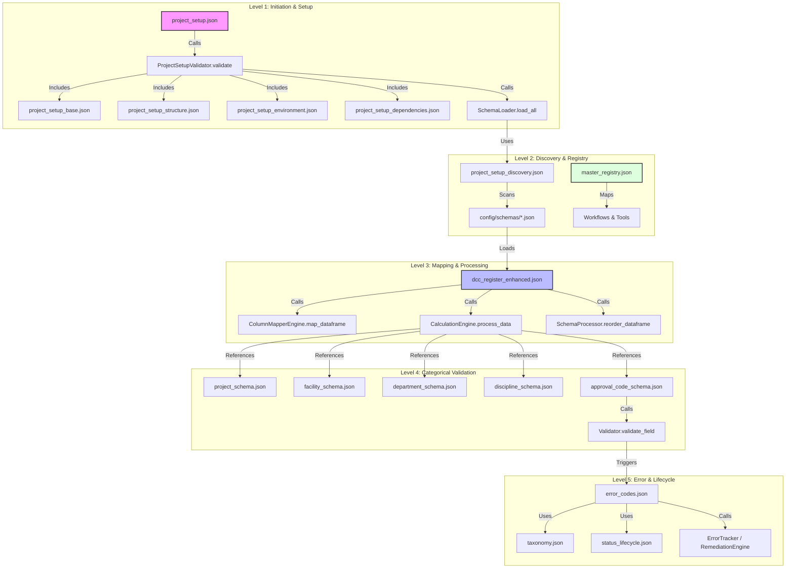

# DCC Schema Framework README

This directory contains the core configuration and validation logic for the DCC (Document Control Center) Pipeline. The framework is designed using a **Unified Schema Registry** pattern, enabling strict validation, modular inheritance, and absolute URI-based resolution.

## 1. Architectural Framework

### Unified Schema Registry
All schemas follow a standardized metadata pattern:
- **`$schema`**: Points to `http://json-schema.org/draft-07/schema#`.
- **`$id`**: A unique absolute URI following the pattern `https://dcc-pipeline.internal/schemas/{name}`.
- **Strict Validation**: All key objects use `additionalProperties: false` to prevent configuration drift and ensure data integrity.
- **URI Resolution**: Schemas reference each other using absolute URIs rather than relative paths, allowing the `RefResolver` to walk the dependency tree regardless of file location.

### Design Patterns
- **Fragment Pattern**: Large schemas (like `project_setup.json`) are broken into reusable fragments (base, structure, environment, etc.) to minimize redundancy.
- **Inheritance Pattern**: Fragments are composed using `allOf` and `$ref` to create specialized configurations from base definitions.
- **Dual-Purpose Data Schemas**: Lookup schemas (e.g., `discipline_schema.json`) contain both validation rules (`field_definitions`) and the actual lookup data (`discipline` array), serving as a single source of truth for the engine.

---

## 2. Comprehensive Schema Catalog

The following table and flow chart provide a detailed mapping of the DCC Pipeline's schema ecosystem, including their types, primary functional calls, and core responsibilities.

### 2.1 Schema Relationship & Workflow Flowchart

### 2.2 Schema Catalog Table
| Schema Name | Type | Primary Function(s) | Core Responsibility |
| :--- | :--- | :--- | :--- |
| `dcc_register_enhanced.json` | **Process Definition** | `UniversalDocumentProcessor.load_schema` `UniversalColumnMapper.load_main_schema` | Core "Brain" defining column sequences, fuzzy-matching aliases, calculations (composite/aggregate), and multi-phase validation. |
| `project_setup.json` | **System Configuration** | `ProjectSetup.verify_environment` `SchemaLoader.load_all` | Root validator for project structure, folder/file requirements, and auto-discovery rules for active schemas. |
| `master_registry.json` | **Resource Registry** | `RegistryLoader` `WorkflowEngine` | Central mapping of document types to schemas and tools to internal python functions. |
| `approval_code_schema.json` | **Logic/Mapping** | `UniversalDocumentProcessor.apply_calculations` `Validator.validate_field` | Normalizes status strings (e.g., "Approved with Comments") to standard codes (e.g., "APP"). |
| `calculation_strategies.json` | **Logic Definition** | `UniversalDocumentProcessor.apply_calculations` | Defines available data preservation modes, processing sequences, and null-handling fallback strategies. |
| `project_schema.json`, `facility_schema.json`, `discipline_schema.json`, `document_type_schema.json`, `department_schema.json` | **Property/Reference** | `Validator.validate_field` (via `schema_reference_check`) | Serves as the single source of truth for categorical metadata validation and allowed value sets. |
| `project_setup_base.json`, `project_setup_structure.json`, `project_setup_environment.json`, `project_setup_dependencies.json`, `project_setup_validation.json`, `project_setup_discovery.json` | **Fragment Definition** | Included by `project_setup.json` | Modular definitions for reusable entries (paths, files, rules, environment variables) within the setup ecosystem. |
| `taxonomy.json`, `error_codes.json`, `remediation_types.json`, `suppression_rules.json`, `status_lifecycle.json`, `approval_workflow.json` | **Engine/Error Logic** | `ErrorTracker` `RemediationEngine` | Located in `workflow/processor_engine/error_handling/config/`. Defines the error code hierarchy (E-M-F-U), remediation rules, and error state machine. |

---

## 3. Inheritance & Correlation Links

The schema framework utilizes **compositional inheritance** to maintain modularity and prevent redundancy.

### 3.1 Structural Composition (Setup)
`project_setup.json` acts as a container that composes definitions from:
- `project_setup_base`: Common file/path entry types.
- `project_setup_structure`: Required folder hierarchies.
- `project_setup_environment`: Local/Server environment variables.
- `project_setup_dependencies`: Engine and library requirements.
- `project_setup_discovery`: Rules for auto-registering other schemas.

### 3.2 Logic Dependencies (Processing)
`dcc_register_enhanced.json` depends on external schemas for field-level validation:
- **Project Validation**: References `project_schema.json`.
- **Facility Validation**: References `facility_schema.json`.
- **Department Validation**: References `department_schema.json`.
- **Discipline Validation**: References `discipline_schema.json`.
- **Status Normalization**: References `approval_code_schema.json`.

---

## 4. How to Extend a Schema

### 4.1 Adding New Categorical Data
To add a new Department or Discipline:
1.  Locate the corresponding schema (e.g., `department_schema.json`).
2.  Add the new entry to the `choices` or `data` array.
3.  Ensure the entry includes all required fields (e.g., `code`, `name`).

### 4.2 Adding a New Column Calculation
1.  Implement the calculation method in `workflow/processor_engine/calculations/`.
2.  Update `dcc_register_enhanced.json`:
    - Add the column name to `column_sequence`.
    - Define the column in `columns` with `is_calculated: true`.
    - Specify the `method` name under the `calculation` property.

### 4.3 Creating a New Setup Fragment
1.  Create a new `.json` file in `config/schemas/` with a unique `$id`.
2.  Define the schema structure using the Fragment Pattern.
3.  Add the schema to the `allOf` section in `project_setup.json` or register it in `project_setup_discovery.json`.

---

## 5. Troubleshooting

| Symptom | Probable Cause | Resolution |
| :--- | :--- | :--- |
| **`RefResolverError`** | URI Mismatch | Ensure the `$id` in the schema file matches exactly the URI used in the `$ref`. |
| **Validation Failure** | Categorical Mismatch | Check the `Validation_Errors` column in output. Verify the value exists in the referenced lookup schema (e.g., `discipline_schema.json`). |
| **Missing Calculated Column** | `dynamic_column_creation` | Set `dynamic_column_creation.enabled: true` in `dcc_register_enhanced.json` parameters. |
| **Duplicate Definition** | Fragment Conflict | Ensure that `additionalProperties: false` is set and that definitions are not overlapping across fragments. |

---

## 6. Workflow & Correlation

### Data Flow
1.  **Initiation**: `project_setup.json` verifies the environment and loads fragments.
2.  **Discovery**: `project_setup_discovery.json` scans `config/schemas/` to register active data schemas.
3.  **Resolution**: `RefResolver` parses `$ref` links across files using URI IDs.
4.  **Processing**: `UniversalDocumentProcessor` loads `dcc_register_enhanced.json`, which pulls in data lookups (Step 2.4) for fuzzy matching and validation.
5.  **Error Tracking**: Any failures trigger lookups in `error_codes.json` and follow the `status_lifecycle.json`.

### Key Functions
- **`RefResolver.resolve(schema_uri)`**: Fetches a schema by its `$id` from the internal registry.
- **`SchemaLoader.load_all()`**: Performs recursive drill-down from `project_setup.json`.
- **`Validator.validate_field(value, schema_ref)`**: Cross-validates data against lookup schemas.

## 7. Developer Policy
- **Adding a Schema**: Must include `$schema`, `$id`, and `additionalProperties: false`. Register it in `project_setup.json` or ensure it matches a discovery pattern.
- **Referencing**: Use absolute URIs: `{"$ref": "https://dcc-pipeline.internal/schemas/project-setup-base#/definitions/file_entry"}`.
- **Strictness**: Always define `type: "object"` and explicit `properties` at the top level of new schemas.
