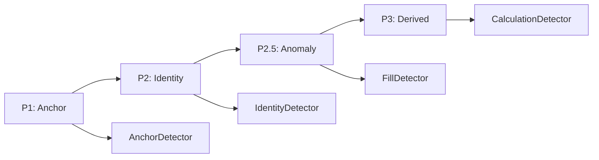

# Business Detector User Instruction

## Table of Contents

1. [Overview](#overview)
2. [Processing Phases](#processing-phases)
3. [Detector Orchestration](#detector-orchestration)
4. [Configuration](#configuration)
5. [Function I/O Reference](#function-io-reference)
6. [Examples](#examples)
7. [Troubleshooting](#troubleshooting)
8. [Best Practices](#best-practices)

---

## Overview

The **BusinessDetector** orchestrates all Layer 3 (Business Logic) detectors during pipeline processing. It manages phase-based detection, coordinates multiple detectors, and aggregates errors across processing phases.

**Location:** `detectors/business.py`  
**Layer:** L3 (Business Logic)  
**Type:** Composite / Orchestrator

**Key Capabilities:**
- Coordinate multiple L3 detectors
- Manage phase transitions (P1, P2, P2.5, P3)
- Collect and aggregate errors by phase
- Support fail-fast error handling
- Provide unified detection interface

---

## Processing Phases



### Phase P1 - Anchor Columns
**Detectors:** AnchorDetector
- Validates Project_Code, Facility_Code
- Checks Document_Type, Discipline

### Phase P2 - Identity Columns
**Detectors:** IdentityDetector
- Validates Document_ID uniqueness
- Checks Document_Revision format

### Phase P2.5 - Anomaly Detection
**Detectors:** FillDetector, IdentityDetector (calculated)
- Analyzes fill operations (F4xx errors)
- Validates calculated Document_ID

### Phase P3 - Derived Values
**Detectors:** CalculationDetector, LogicDetector
- Validates calculations
- Checks business logic rules

---

## Detector Orchestration

### Registered Detectors by Phase

| Phase | Detectors | Purpose |
|-------|-----------|---------|
| P1 | AnchorDetector | Validate anchor columns |
| P2 | IdentityDetector | Validate Document_ID |
| P2.5 | IdentityDetector, FillDetector | Calculated ID + Fill analysis |
| P3 | CalculationDetector | Validate calculations |

### Error Aggregation

Errors are collected by phase:
```python
results = {
    ProcessingPhase.P2: [error1, error2],
    ProcessingPhase.P2_5: [error3, error4],
    ProcessingPhase.P3: [error5]
}
```

---

## Configuration

### Constructor Parameters

```python
BusinessDetector(
    phases: List[ProcessingPhase] = None,    # Phases to enable
    enable_fail_fast: bool = True,          # Stop on critical errors
    logger: StructuredLogger = None         # Logger instance
)
```

### Factory Function

```python
from processor_engine.error_handling.detectors import create_business_detector

detector = create_business_detector(
    phases=["P2", "P2.5"],
    enable_fail_fast=False
)
```

---

## Function I/O Reference

### Core Methods

#### `detect(df, context=None, phases=None)`

**Input:**
- `df` (pd.DataFrame) - Data to validate
- `context` (dict) - Detection context
  - `phase`: Current processing phase
  - `fill_history`: Fill operations for P2.5
  - `schema_data`: Schema definitions
- `phases` (list) - Specific phases to run

**Output:**
- `Dict[ProcessingPhase, List[DetectionResult]]` - Errors by phase

**Example:**
```python
results = business_detector.detect(
    df=processed_df,
    context={
        "phase": "P2.5",
        "fill_history": engine.fill_history,
        "schema_data": schema
    },
    phases=[ProcessingPhase.P2_5]
)
```

#### `register_phase_detector(phase, detector)`

Register a custom detector for a phase:
```python
business_detector.register_phase_detector(
    ProcessingPhase.P2_5,
    CustomDetector()
)
```

---

## Examples

### Example 1: Standard Usage

```python
from processor_engine.error_handling.detectors import (
    BusinessDetector, ProcessingPhase
)

# Create orchestrator for P2.5
detector = BusinessDetector(
    phases=[ProcessingPhase.P2_5],
    enable_fail_fast=False
)

# Context with fill history
context = {
    "phase": "P2.5",
    "schema_data": schema_data,
    "fill_history": engine.fill_history
}

# Run detection
results = detector.detect(
    df=processed_df,
    context=context,
    phases=[ProcessingPhase.P2_5]
)

# Process results
for phase, errors in results.items():
    print(f"Phase {phase.value}: {len(errors)} errors")
    for error in errors:
        print(f"  - {error.error_code}: {error.message}")
```

### Example 2: Multi-Phase Detection

```python
# Create for multiple phases
detector = BusinessDetector(
    phases=[ProcessingPhase.P2, ProcessingPhase.P2_5, ProcessingPhase.P3]
)

# Run all phases
all_results = detector.detect(df, context={})

# Aggregate all errors
total_errors = sum(len(errors) for errors in all_results.values())
print(f"Total errors: {total_errors}")
```

### Example 3: Custom Detector Registration

```python
from processor_engine.error_handling.detectors.base import BaseDetector

class CustomDetector(BaseDetector):
    def detect(self, df, context=None):
        # Custom detection logic
        return self.get_errors()

# Register
detector = BusinessDetector()
detector.register_phase_detector(
    ProcessingPhase.P2_5,
    CustomDetector(layer="L3")
)
```

---

## Troubleshooting

### No Detectors Registered

**Check:** Are phases configured?
```python
print(business_detector._phases)
print(business_detector._phase_detectors)
```

### FillDetector Not Running

**Cause:** FillDetector only registered for P2.5

**Solution:** Ensure P2.5 in phases list
```python
detector = BusinessDetector(phases=[ProcessingPhase.P2_5])
```

### Context Not Passed

**Symptom:** FillDetector shows no errors

**Solution:** Include fill_history in context
```python
context = {"fill_history": engine.fill_history}
```

---

## Best Practices

1. **Use Appropriate Phases** - Only enable phases being processed
2. **Disable Fail-Fast for L3** - Allow all errors to be detected
3. **Pass Complete Context** - Include all required data for detectors
4. **Review Phase Results** - Check errors per phase for debugging
5. **Register Custom Detectors** - Extend with project-specific validators

---

## Related Documentation

- [Error Handling Module](../readme.md)
- [Fill Detector](fill.md)
- [Base Detector](base.md)

---

*Last Updated: 2024-04-12*
*Version: 1.0*
