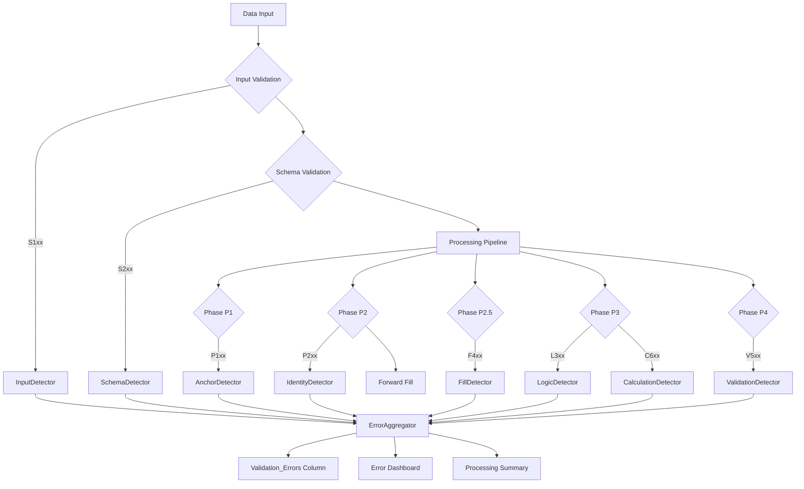

# DCC Engine Error Code Reference

## Table of Contents

1. [Overview](#overview)
2. [Error Code Format](#error-code-format)
3. [Error Code Categories](#error-code-categories)
4. [Complete Error Code List](#complete-error-code-list)
   - [S1xx - Input/Schema Errors](#s1xx---inputschema-errors)
   - [P1xx - Anchor Errors](#p1xx---anchor-errors)
   - [P2xx - Identity Errors](#p2xx---identity-errors)
   - [F4xx - Fill Errors](#f4xx---fill-errors)
   - [L3xx - Logic Errors](#l3xx---logic-errors)
   - [C6xx - Calculation Errors](#c6xx---calculation-errors)
   - [V5xx - Validation Errors](#v5xx---validation-errors)
5. [Error Traceability Matrix](#error-traceability-matrix)
6. [Troubleshooting Guide](#troubleshooting-guide)
7. [Error Handling Flow](#error-handling-flow)

---

## Overview

This document provides a comprehensive reference for all error codes in the DCC Engine Pipeline. Each error code is traceable to:
- **Source Function** - Where the error is detected
- **Trigger Condition** - What causes the error
- **Layer** - Processing layer (L1-L4)
- **Severity** - Impact level
- **Remediation** - How to resolve

**Total Error Codes:** 30+ across 7 categories

---

## Error Code Format

```
[XX]-[C]-[S]-[NNNN]

XX   = Category (2 letters)
C    = Component (1 letter)
S    = Subcategory (1 letter)
NNNN = Sequential number (4 digits)
```

| Position | Meaning | Examples |
|----------|---------|----------|
| Category | Error family | S1=Input, P1=Anchor, F4=Fill, V5=Validation |
| Component | System part | C=Core, I=Input, D=Document, F=Forward |
| Subcategory | Specific area | V=Validation, P=Processing, F=File |
| Number | Unique ID | 0101, 0401, 0501 |

---

## Error Code Categories

| Category | Code Range | Layer | Description |
|----------|------------|-------|-------------|
| S1xx | S1-I-F/V-08xx/05xx | L1/L2 | Input file and schema validation |
| P1xx | P1-A-P/V-01xx | L3 | Anchor column validation |
| P2xx | P2-I-P/V-02xx | L3 | Identity column validation |
| F4xx | F4-C-F-04xx | L3 | Forward fill operations |
| L3xx | L3-L-P/V/W-03xx | L3 | Business logic validation |
| C6xx | C6-C-C-06xx | L3 | Calculation errors |
| V5xx | V5-I-V-05xx | L4 | Output validation |

---

## Complete Error Code List

### S1xx - Input/Schema Errors

#### S1-I-F-0804: File Not Found
| Attribute | Value |
|-----------|-------|
| **Category** | Input |
| **Layer** | L1 |
| **Severity** | CRITICAL |
| **Fail Fast** | Yes |
| **Source File** | `detectors/input.py` |
| **Function** | `InputDetector._validate_file_exists()` |
| **Line** | 106-112 |

**Trigger Condition:**
```python
if not file_path.exists():
    # Error triggered
```

**Input Parameters:**
- `file_path` (Path) - Path to input file

**Output:**
- DetectionResult with error_code="S1-I-F-0804"

**Error Context:**
```json
{
  "file_path": "/path/to/missing_file.xlsx",
  "suggested_action": "Verify file path and ensure file exists"
}
```

**Remediation:**
1. Check file path is correct
2. Verify file exists at location
3. Check file permissions

---

#### S1-I-F-0805: Unsupported File Format / File Too Large
| Attribute | Value |
|-----------|-------|
| **Category** | Input |
| **Layer** | L1 |
| **Severity** | CRITICAL (format), HIGH (size) |
| **Fail Fast** | Yes (format), No (size) |
| **Source File** | `detectors/input.py` |
| **Function** | `InputDetector._validate_format()`, `_validate_size()` |
| **Lines** | 122-128, 142-148 |

**Trigger Conditions:**
```python
# Format check
if suffix not in self.supported_formats:  # .xlsx, .csv, .xls
    # CRITICAL error

# Size check  
if size_mb > self.max_file_size_mb:  # default: 100MB
    # HIGH error
```

**Input Parameters:**
- `file_path` (Path) - Input file path
- `max_file_size_mb` (float) - Size limit

**Remediation:**
- Format: Convert to .xlsx, .csv, or .xls
- Size: Split file or increase limit

---

#### S1-I-V-0501: File Encoding Error
| Attribute | Value |
|-----------|-------|
| **Category** | Input |
| **Layer** | L1 |
| **Severity** | HIGH |
| **Fail Fast** | Yes |
| **Source File** | `detectors/input.py` |
| **Function** | `InputDetector._validate_encoding()` |
| **Line** | 164-170 |

**Trigger Condition:**
```python
try:
    content = file_path.read_text(encoding='utf-8')
except UnicodeDecodeError:
    # Error triggered
```

**Remediation:**
- Re-save file with UTF-8 encoding
- Use text editor to convert encoding

---

#### S1-I-V-0502: Missing Required Columns
| Attribute | Value |
|-----------|-------|
| **Category** | Input |
| **Layer** | L2 |
| **Severity** | CRITICAL |
| **Fail Fast** | Yes |
| **Source File** | `detectors/input.py` |
| **Function** | `InputDetector._validate_required_columns()` |
| **Lines** | 192-198, 243-248 |

**Trigger Condition:**
```python
if missing_columns:
    # Error triggered with list of missing columns
```

**Input Parameters:**
- `required_columns` (List[str]) - From schema
- `actual_columns` (List[str]) - From input file

**Error Context:**
```json
{
  "missing_columns": ["Document_ID", "Submission_Date"],
  "suggested_action": "Add missing columns to input file"
}
```

**Remediation:**
1. Add missing columns to input
2. Update schema if columns not actually required

---

### P1xx - Anchor Errors

#### P1-A-P-0101: Null Anchor Column
| Attribute | Value |
|-----------|-------|
| **Category** | Anchor |
| **Layer** | L3 |
| **Severity** | HIGH |
| **Fail Fast** | Configurable |
| **Source File** | `detectors/anchor.py` |
| **Function** | `AnchorDetector._validate_anchor_completeness()` |
| **Error Code** | `ERROR_NULL_ANCHOR = "P1-A-P-0101"` |

**Trigger Condition:**
```python
if pd.isna(row[anchor_column]) or row[anchor_column] == '':
    # Error triggered for Project_Code, Facility_Code, 
    # Document_Type, Discipline, Submission_Session
```

**Input Parameters:**
- `df` (pd.DataFrame) - Input data
- Anchor columns: Project_Code, Facility_Code, Document_Type, Discipline, Submission_Session

**Output:**
- DetectionResult with severity="HIGH"

**Remediation:**
1. Fill missing anchor values in source data
2. Check if rows should be excluded
3. Verify data extraction process

---

#### P1-A-V-0102: Invalid Session Format
| Attribute | Value |
|-----------|-------|
| **Category** | Anchor |
| **Layer** | L3 |
| **Severity** | MEDIUM |
| **Fail Fast** | No |
| **Source File** | `detectors/anchor.py` |
| **Function** | `AnchorDetector._validate_session_format()` |
| **Pattern** | `r'^\d{6}$'` (6 digits) |

**Trigger Condition:**
```python
if not SESSION_PATTERN.match(str(value)):
    # Error triggered
```

**Remediation:**
- Format as YYYYMM (e.g., "202401")
- Check date parsing in source system

---

#### P1-A-V-0103: Invalid Date Format
| Attribute | Value |
|-----------|-------|
| **Category** | Anchor |
| **Layer** | L3 |
| **Severity** | MEDIUM |
| **Fail Fast** | No |
| **Source File** | `detectors/anchor.py` |
| **Function** | `AnchorDetector._validate_date_format()` |

**Trigger Condition:**
```python
if not is_valid_iso_date(value):  # YYYY-MM-DD
    # Error triggered
```

**Remediation:**
- Format dates as YYYY-MM-DD
- Check locale settings in source system

---

### P2xx - Identity Errors

#### P2-I-P-0201: Uncertain Document_ID
| Attribute | Value |
|-----------|-------|
| **Category** | Identity |
| **Layer** | L3 |
| **Severity** | HIGH |
| **Fail Fast** | No |
| **Source File** | `detectors/identity.py` |
| **Function** | `IdentityDetector._validate_identities()` |
| **Error Code** | `ERROR_ID_UNCERTAIN = "P2-I-P-0201"` |

**Trigger Condition:**
```python
if pd.isna(document_id) or document_id == '':
    # Error triggered
```

**Remediation:**
1. Ensure Document_ID is populated
2. Check if ID should be calculated from components

---

#### P2-I-P-0202: Missing Document Revision
| Attribute | Value |
|-----------|-------|
| **Category** | Identity |
| **Layer** | L3 |
| **Severity** | MEDIUM |
| **Fail Fast** | No |
| **Source File** | `detectors/identity.py` |
| **Function** | `IdentityDetector._validate_revisions()` |
| **Error Code** | `ERROR_REV_MISSING = "P2-I-P-0202"` |

**Remediation:**
- Add revision to source data
- Use default revision if appropriate

---

#### P2-I-V-0203: Duplicate Transmittal
| Attribute | Value |
|-----------|-------|
| **Category** | Identity |
| **Layer** | L3 |
| **Severity** | HIGH |
| **Fail Fast** | No |
| **Source File** | `detectors/identity.py` |
| **Function** | `IdentityDetector._detect_duplicate_transmittals()` |
| **Error Code** | `ERROR_DUPLICATE_TRANS = "P2-I-V-0203"` |

**Trigger Condition:**
```python
if transmittal_number in seen_transmittals:
    # Error triggered
```

**Remediation:**
- Verify transmittal numbers are unique
- Check if duplicates are valid resubmissions

---

#### P2-I-V-0204: Invalid Document_ID Format
| Attribute | Value |
|-----------|-------|
| **Category** | Identity |
| **Layer** | L3 |
| **Severity** | HIGH |
| **Fail Fast** | No |
| **Source File** | `detectors/identity.py` |
| **Function** | `IdentityDetector._validate_id_format()` |
| **Error Code** | `ERROR_ID_FORMAT_INVALID = "P2-I-V-0204"` |

**Expected Format:**
```
PROJECT-FACILITY-TYPE-DISCIPLINE-SEQUENCE
Example: PRJ-FAC-DWG-ARC-0001
```

**Remediation:**
- Follow PROJECT-FACILITY-TYPE-DISCIPLINE-SEQUENCE format
- Check affix extraction if ID has suffixes

---

### F4xx - Fill Errors

#### F4-C-F-0401: Forward Fill Row Jump Exceeded
| Attribute | Value |
|-----------|-------|
| **Category** | Fill |
| **Layer** | L3 |
| **Severity** | HIGH |
| **Fail Fast** | No |
| **Source File** | `detectors/fill.py` |
| **Function** | `FillDetector._check_forward_fill_record()` |
| **Error Code** | `ERROR_JUMP_LIMIT = "F4-C-F-0401"` |

**Trigger Condition:**
```python
# In calculations/null_handling.py:apply_forward_fill()
# Records fill operation to engine.fill_history

# In FillDetector._check_forward_fill_record()
if row_jump > self.jump_limit:  # default: 20
    # Error triggered
```

**Input Parameters:**
- `fill_history` (List[Dict]) - Recorded fill operations
- `jump_limit` (int) - Maximum allowed row jump

**Error Context:**
```json
{
  "fill_strategy": "forward_fill",
  "column": "Reviewer",
  "row_jump": 25,
  "limit": 20,
  "from_row": {"Document_ID": "DOC-001", "row_index": 10},
  "to_row": {"Document_ID": "DOC-001", "row_index": 35},
  "group_by_columns": ["Project_Code", "Document_ID"],
  "suggested_action": "Consider using multi-level fill or manual data entry"
}
```

**Source Chain:**
1. `CalculationEngine.apply_phased_processing()` - Phase 2
2. `apply_forward_fill()` - Records to fill_history
3. `BusinessDetector.detect()` - Phase 2.5
4. `FillDetector._analyze_fill_history()` - Analyzes
5. `FillDetector._check_forward_fill_record()` - Detects error

**Remediation:**
1. Add more grouping columns
2. Increase `jump_limit` (if appropriate)
3. Use manual data entry for large gaps

---

#### F4-C-F-0402: Session Boundary Crossed
| Attribute | Value |
|-----------|-------|
| **Category** | Fill |
| **Layer** | L3 |
| **Severity** | HIGH |
| **Fail Fast** | No |
| **Source File** | `detectors/fill.py` |
| **Function** | `FillDetector._check_forward_fill_record()` |
| **Error Code** | `ERROR_BOUNDARY_CROSS = "F4-C-F-0402"` |

**Trigger Condition:**
```python
if record.get("session_boundary_crossed", False):
    # Error triggered when source_session != target_session
```

**Detection in null_handling.py:**
```python
# In _record_fill_history()
source_session = from_row_key.get("Submission_Session")
target_session = to_row_key.get("Submission_Session")
session_boundary_crossed = (
    source_session != target_session and 
    pd.notna(source_session) and 
    pd.notna(target_session)
)
```

**Remediation:**
- Add `Submission_Session` to `group_by` columns
- Use group-based forward fill within sessions

---

#### F4-C-F-0403: Multi-Level Fill Failed
| Attribute | Value |
|-----------|-------|
| **Category** | Fill |
| **Layer** | L3 |
| **Severity** | WARNING |
| **Fail Fast** | No |
| **Source File** | `detectors/fill.py` |
| **Function** | `FillDetector._check_multi_level_record()`, `_check_default_value_record()` |
| **Error Code** | `ERROR_FILL_INFERRED = "F4-C-F-0403"` |

**Trigger Condition:**
```python
if record.get("all_levels_failed", False):
    # Error triggered when no value found at any grouping level
```

**Source Chain:**
1. `apply_multi_level_forward_fill()` - Tries multiple levels
2. Records `all_levels_failed=True` if no value found
3. May apply `default_value` as fallback
4. FillDetector detects in Phase 2.5

**Remediation:**
- Add higher-level groupings (e.g., Project-only)
- Make column mandatory at data entry
- Review default values for appropriateness

---

#### F4-C-F-0404: Excessive Null Fills
| Attribute | Value |
|-----------|-------|
| **Category** | Fill |
| **Layer** | L3 |
| **Severity** | WARNING |
| **Fail Fast** | No |
| **Source File** | `detectors/fill.py` |
| **Function** | `FillDetector._detect_excessive_nulls_from_stats()` |
| **Error Code** | `ERROR_EXCESSIVE_NULLS = "F4-C-F-0404"` |

**Trigger Condition:**
```python
# Calculate fill percentage per column
fill_percentage = (stats['total_filled_rows'] / total_rows) * 100

if fill_percentage > self.max_fill_percentage:  # default: 80%
    # Error triggered
```

**Statistics Tracked:**
- `total_filled_rows` - Total rows filled
- `forward_fill_rows` - Count of forward fills
- `default_value_rows` - Count of default values
- `multi_level_rows` - Count of multi-level fills
- `max_row_jump` - Largest row jump
- `session_boundary_crosses` - Count of boundary crossings

**Remediation:**
- Improve data quality at source
- Review if column should be mandatory
- Evaluate alternative fill strategies

---

#### F4-C-F-0405: Invalid Grouping Configuration
| Attribute | Value |
|-----------|-------|
| **Category** | Fill |
| **Layer** | L3 |
| **Severity** | ERROR |
| **Fail Fast** | No |
| **Source File** | `detectors/fill.py` |
| **Function** | `FillDetector._detect_invalid_grouping()` |
| **Error Code** | `ERROR_INVALID_GROUPING = "F4-C-F-0405"` |

**Trigger Condition:**
```python
if group_by and len(group_by) == 0:
    # Error triggered for empty group configuration
```

**Remediation:**
- Specify valid grouping columns in schema
- Validate group columns exist before processing

---

### L3xx - Logic Errors

#### L3-L-P-0301: Date Inversion
| Attribute | Value |
|-----------|-------|
| **Category** | Logic |
| **Layer** | L3 |
| **Severity** | HIGH |
| **Fail Fast** | No |
| **Source File** | `detectors/logic.py` |
| **Function** | `LogicDetector._detect_date_inversions()` |
| **Error Code** | `ERROR_DATE_INVERSION = "L3-L-P-0301"` |

**Trigger Condition:**
```python
if submission_date > return_date:
    # Error triggered
```

**Remediation:**
- Correct date values
- Check for data entry errors

---

#### L3-L-V-0302: Revision Regression
| Attribute | Value |
|-----------|-------|
| **Category** | Logic |
| **Layer** | L3 |
| **Severity** | HIGH |
| **Fail Fast** | No |
| **Source File** | `detectors/logic.py` |
| **Function** | `LogicDetector._detect_revision_regression()` |
| **Error Code** | `ERROR_REV_REGRESSION = "L3-L-V-0302"` |

**Trigger Condition:**
```python
if current_rev < previous_rev:
    # Error triggered
```

**Remediation:**
- Ensure revisions increment sequentially
- Check for duplicate transmittals

---

#### L3-L-V-0303: Status Conflict
| Attribute | Value |
|-----------|-------|
| **Category** | Logic |
| **Layer** | L3 |
| **Severity** | HIGH |
| **Fail Fast** | No |
| **Source File** | `detectors/logic.py` |
| **Function** | `LogicDetector._detect_status_conflicts()` |
| **Error Code** | `ERROR_STATUS_CONFLICT = "L3-L-V-0303"` |

**Trigger Condition:**
```python
if approval_status == "APPROVED" and review_status == "REJECTED":
    # Error triggered
```

**Remediation:**
- Review approval workflow
- Correct status values

---

#### L3-L-W-0304: Overdue Pending
| Attribute | Value |
|-----------|-------|
| **Category** | Logic |
| **Layer** | L3 |
| **Severity** | WARNING |
| **Fail Fast** | No |
| **Source File** | `detectors/logic.py` |
| **Function** | `LogicDetector._detect_overdue_pending()` |
| **Error Code** | `ERROR_OVERDUE_PENDING = "L3-L-W-0304"` |

**Trigger Condition:**
```python
if review_status == "PENDING" and days_pending > threshold:
    # Warning triggered
```

**Remediation:**
- Review pending items
- Update status or escalate

---

### C6xx - Calculation Errors

#### C6-C-C-0601: Dependency Failure
| Attribute | Value |
|-----------|-------|
| **Category** | Calculation |
| **Layer** | L3 |
| **Severity** | WARNING |
| **Fail Fast** | No |
| **Source File** | `detectors/calculation.py` |
| **Function** | `CalculationDetector._validate_dependencies()` |
| **Error Code** | `ERROR_DEPENDENCY_FAIL = "C6-C-C-0601"` |

**Trigger Condition:**
```python
if not all(dep in df.columns for dep in dependencies):
    # Error triggered
```

**Remediation:**
- Add missing dependency columns
- Check calculation configuration

---

#### C6-C-C-0602: Circular Dependency
| Attribute | Value |
|-----------|-------|
| **Category** | Calculation |
| **Layer** | L3 |
| **Severity** | WARNING |
| **Fail Fast** | No |
| **Source File** | `detectors/calculation.py` |
| **Function** | `CalculationDetector._detect_circular_dependencies()` |
| **Error Code** | `ERROR_CIRCULAR_DEPENDENCY = "C6-C-C-0602"` |

**Trigger Condition:**
```python
if column in dependency_chain:
    # Error triggered (circular reference)
```

**Remediation:**
- Break circular references
- Restructure calculation order

---

#### C6-C-C-0603: Division by Zero
| Attribute | Value |
|-----------|-------|
| **Category** | Calculation |
| **Layer** | L3 |
| **Severity** | WARNING |
| **Fail Fast** | No |
| **Source File** | `detectors/calculation.py` |
| **Function** | `CalculationDetector._validate_calculation()` |
| **Error Code** | `ERROR_DIVISION_BY_ZERO = "C6-C-C-0603"` |

**Trigger Condition:**
```python
try:
    result = numerator / denominator
except ZeroDivisionError:
    # Error triggered
```

**Remediation:**
- Add zero-check before division
- Use safe division function

---

#### C6-C-C-0604: Aggregate Empty Set
| Attribute | Value |
|-----------|-------|
| **Category** | Calculation |
| **Layer** | L3 |
| **Severity** | WARNING |
| **Fail Fast** | No |
| **Source File** | `detectors/calculation.py` |
| **Function** | `CalculationDetector._validate_aggregate()` |
| **Error Code** | `ERROR_AGGREGATE_EMPTY = "C6-C-C-0604"` |

**Trigger Condition:**
```python
if len(group) == 0:
    # Error triggered for aggregate functions
```

**Remediation:**
- Ensure data exists for aggregation
- Handle empty groups gracefully

---

#### C6-C-C-0605: Date Arithmetic Failure
| Attribute | Value |
|-----------|-------|
| **Category** | Calculation |
| **Layer** | L3 |
| **Severity** | WARNING |
| **Fail Fast** | No |
| **Source File** | `detectors/calculation.py` |
| **Function** | `CalculationDetector._validate_date_calculation()` |
| **Error Code** | `ERROR_DATE_ARITHMETIC_FAIL = "C6-C-C-0605"` |

**Trigger Condition:**
```python
try:
    result = end_date - start_date
except (TypeError, ValueError):
    # Error triggered
```

**Remediation:**
- Ensure valid date formats
- Check for null dates

---

#### C6-C-C-0606: Mapping No Match
| Attribute | Value |
|-----------|-------|
| **Category** | Calculation |
| **Layer** | L3 |
| **Severity** | WARNING |
| **Fail Fast** | No |
| **Source File** | `detectors/calculation.py` |
| **Function** | `CalculationDetector._validate_mapping()` |
| **Error Code** | `ERROR_MAPPING_NO_MATCH = "C6-C-C-0606"` |

**Trigger Condition:**
```python
if value not in mapping_dict:
    # Error triggered
```

**Remediation:**
- Add missing mapping entries
- Use default value fallback

---

### V5xx - Validation Errors

#### V5-I-V-0501: Pattern Mismatch
| Attribute | Value |
|-----------|-------|
| **Category** | Validation |
| **Layer** | L4 |
| **Severity** | WARNING |
| **Fail Fast** | No |
| **Source File** | `detectors/validation.py`, `detectors/schema.py` |
| **Function** | `ValidationDetector._validate_pattern()`, `SchemaDetector._validate_value_against_schema()` |
| **Error Code** | `ERROR_PATTERN_MISMATCH = "V5-I-V-0501"` |

**Trigger Condition:**
```python
if not re.match(pattern, str(value)):
    # Error triggered
```

**Remediation:**
- Correct value to match pattern
- Update pattern if too restrictive

---

#### V5-I-V-0502: Length Exceeded/Too Short
| Attribute | Value |
|-----------|-------|
| **Category** | Validation |
| **Layer** | L4 |
| **Severity** | WARNING |
| **Fail Fast** | No |
| **Source File** | `detectors/validation.py`, `detectors/schema.py` |
| **Function** | `ValidationDetector._validate_length()`, `SchemaDetector._check_length()` |
| **Error Code** | `ERROR_LENGTH_EXCEEDED = "V5-I-V-0502"` |

**Trigger Condition:**
```python
if len(str(value)) > max_length:
    # Error triggered
    
if len(str(value)) < min_length:
    # Error triggered
```

**Remediation:**
- Truncate or correct value length
- Adjust length limits if inappropriate

---

#### V5-I-V-0503: Invalid Enum Value
| Attribute | Value |
|-----------|-------|
| **Category** | Validation |
| **Layer** | L4 |
| **Severity** | WARNING |
| **Fail Fast** | No |
| **Source File** | `detectors/validation.py`, `detectors/schema.py` |
| **Function** | `ValidationDetector._validate_enum()`, `SchemaDetector._validate_value_against_schema()` |
| **Error Code** | `ERROR_INVALID_ENUM = "V5-I-V-0503"` |

**Trigger Condition:**
```python
if value not in allowed_values:
    # Error triggered
```

**Remediation:**
- Use value from allowed list
- Update schema if value should be allowed

---

#### V5-I-V-0504: Type Mismatch
| Attribute | Value |
|-----------|-------|
| **Category** | Validation |
| **Layer** | L4 |
| **Severity** | WARNING |
| **Fail Fast** | No |
| **Source File** | `detectors/validation.py`, `detectors/schema.py` |
| **Function** | `ValidationDetector._validate_type()`, `SchemaDetector._validate_value_against_schema()` |
| **Error Code** | `ERROR_TYPE_MISMATCH = "V5-I-V-0504"` |

**Trigger Condition:**
```python
if not isinstance(value, expected_type):
    # Error triggered
```

**Remediation:**
- Convert value to expected type
- Check data source type consistency

---

#### V5-I-V-0505: Required Value Missing
| Attribute | Value |
|-----------|-------|
| **Category** | Validation |
| **Layer** | L4 |
| **Severity** | WARNING |
| **Fail Fast** | No |
| **Source File** | `detectors/validation.py` |
| **Function** | `ValidationDetector._validate_required()` |
| **Error Code** | `ERROR_REQUIRED_MISSING = "V5-I-V-0505"` |

**Trigger Condition:**
```python
if pd.isna(value) or value == '':
    # Error triggered for required columns
```

**Remediation:**
- Provide required value
- Check if column should be optional

---

#### V5-I-V-0506: Foreign Key Failure
| Attribute | Value |
|-----------|-------|
| **Category** | Validation |
| **Layer** | L4 |
| **Severity** | WARNING |
| **Fail Fast** | No |
| **Source File** | `detectors/validation.py` |
| **Function** | `ValidationDetector._validate_foreign_key()` |
| **Error Code** | `ERROR_FOREIGN_KEY_FAIL = "V5-I-V-0506"` |

**Trigger Condition:**
```python
if value not in reference_table:
    # Error triggered
```

**Remediation:**
- Add missing reference value
- Correct foreign key value

---

## Error Traceability Matrix

| Error Code | Description | Source File | Function | Input | Output | Phase |
|------------|-------------|-------------|----------|-------|--------|-------|
| S1-I-F-0804 | File not found at specified path | input.py | `_validate_file_exists()` | file_path | DetectionResult | Initiation |
| S1-I-F-0805 | Unsupported file format or file exceeds size limit | input.py | `_validate_format()`, `_validate_size()` | file_path | DetectionResult | Initiation |
| S1-I-V-0501 | File encoding error (expected UTF-8) | input.py | `_validate_encoding()` | file_path | DetectionResult | Initiation |
| S1-I-V-0502 | Missing required columns in input file | input.py | `_validate_required_columns()` | df, required_columns | DetectionResult | Initiation |
| P1-A-P-0101 | Null value in anchor column (Project/Facility/Type/Discipline/Session) | anchor.py | `_validate_anchor_completeness()` | df | DetectionResult | P1 |
| P1-A-V-0102 | Invalid Submission_Session format (expected 6 digits) | anchor.py | `_validate_session_format()` | df | DetectionResult | P1 |
| P1-A-V-0103 | Invalid date format (expected YYYY-MM-DD) | anchor.py | `_validate_date_format()` | df | DetectionResult | P1 |
| P2-I-P-0201 | Document_ID is null or empty | identity.py | `_validate_identities()` | df | DetectionResult | P2 |
| P2-I-P-0202 | Document_Revision is missing | identity.py | `_validate_revisions()` | df | DetectionResult | P2 |
| P2-I-V-0203 | Duplicate transmittal number detected | identity.py | `_detect_duplicate_transmittals()` | df | DetectionResult | P2 |
| P2-I-V-0204 | Document_ID format invalid (expected PROJECT-FACILITY-TYPE-DISCIPLINE-SEQUENCE) | identity.py | `_validate_id_format()` | df | DetectionResult | P2 |
| F4-C-F-0401 | Forward fill row jump exceeded configured limit | fill.py | `_check_forward_fill_record()` | fill_history | DetectionResult | P2.5 |
| F4-C-F-0402 | Forward fill crossed submission session boundary | fill.py | `_check_forward_fill_record()` | fill_history | DetectionResult | P2.5 |
| F4-C-F-0403 | Multi-level fill failed to find value, default applied | fill.py | `_check_multi_level_record()` | fill_history | DetectionResult | P2.5 |
| F4-C-F-0404 | Excessive percentage of null values filled (>80% default) | fill.py | `_detect_excessive_nulls_from_stats()` | fill_history | DetectionResult | P2.5 |
| F4-C-F-0405 | Invalid or empty group_by configuration for fill | fill.py | `_detect_invalid_grouping()` | fill_history | DetectionResult | P2.5 |
| L3-L-P-0301 | Date inversion detected (submission after return) | logic.py | `_detect_date_inversions()` | df | DetectionResult | P3 |
| L3-L-V-0302 | Revision regression detected (current < previous) | logic.py | `_detect_revision_regression()` | df | DetectionResult | P3 |
| L3-L-V-0303 | Status conflict (e.g., APPROVED and REJECTED simultaneously) | logic.py | `_detect_status_conflicts()` | df | DetectionResult | P3 |
| L3-L-W-0304 | Overdue pending review item detected | logic.py | `_detect_overdue_pending()` | df | DetectionResult | P3 |
| C6-C-C-0601 | Calculation dependency missing | calculation.py | `_validate_dependencies()` | df | DetectionResult | P3 |
| C6-C-C-0602 | Circular dependency in calculation chain | calculation.py | `_detect_circular_dependencies()` | df | DetectionResult | P3 |
| C6-C-C-0603 | Division by zero in calculation | calculation.py | `_validate_calculation()` | df | DetectionResult | P3 |
| C6-C-C-0604 | Aggregate function on empty dataset | calculation.py | `_validate_aggregate()` | df | DetectionResult | P3 |
| C6-C-C-0605 | Date arithmetic operation failed | calculation.py | `_validate_date_calculation()` | df | DetectionResult | P3 |
| C6-C-C-0606 | Mapping lookup returned no match | calculation.py | `_validate_mapping()` | df | DetectionResult | P3 |
| V5-I-V-0501 | Pattern validation failed (regex mismatch) | validation.py, schema.py | `_validate_pattern()` | df | DetectionResult | P4 |
| V5-I-V-0502 | Length validation failed (too long/short) | validation.py, schema.py | `_validate_length()` | df | DetectionResult | P4 |
| V5-I-V-0503 | Value not in allowed enum list | validation.py, schema.py | `_validate_enum()` | df | DetectionResult | P4 |
| V5-I-V-0504 | Data type mismatch | validation.py, schema.py | `_validate_type()` | df | DetectionResult | P4 |
| V5-I-V-0505 | Required value is missing | validation.py | `_validate_required()` | df | DetectionResult | P4 |
| V5-I-V-0506 | Foreign key reference not found | validation.py | `_validate_foreign_key()` | df | DetectionResult | P4 |

---

## Troubleshooting Guide

### By Error Category

#### Input Errors (S1xx)
| Error | Quick Fix | Deep Investigation |
|-------|-----------|-------------------|
| S1-I-F-0804 | Check file path | Verify file system permissions |
| S1-I-F-0805 | Convert to .xlsx | Check file corruption |
| S1-I-V-0501 | Re-save as UTF-8 | Investigate source system encoding |
| S1-I-V-0502 | Add missing columns | Review data extraction process |

#### Fill Errors (F4xx)
| Error | Quick Fix | Deep Investigation |
|-------|-----------|-------------------|
| F4-C-F-0401 | Add grouping columns | Analyze data distribution patterns |
| F4-C-F-0402 | Add Submission_Session | Review session boundary logic |
| F4-C-F-0403 | Provide default values | Check multi-level strategy |
| F4-C-F-0404 | Improve source data | Analyze null patterns |
| F4-C-F-0405 | Fix schema config | Validate grouping columns exist |

#### Validation Errors (V5xx)
| Error | Quick Fix | Deep Investigation |
|-------|-----------|-------------------|
| V5-I-V-0501 | Correct value format | Review regex patterns |
| V5-I-V-0502 | Adjust value length | Check field size requirements |
| V5-I-V-0503 | Use allowed value | Update reference schemas |
| V5-I-V-0504 | Convert data type | Check source system types |

### Debug Commands

```python
# Check fill history
print(f"Fill history entries: {len(engine.fill_history)}")
for record in engine.fill_history[:5]:  # First 5
    print(f"  {record['column']}: {record.get('row_jump', 0)} rows")

# Check detector registration
from processor_engine.error_handling.detectors import BusinessDetector
bd = BusinessDetector()
print("Registered detectors:")
for phase, detectors in bd._phase_detectors.items():
    print(f"  {phase}: {[d.__class__.__name__ for d in detectors]}")

# Review error details
for error in errors:
    print(f"\nCode: {error.error_code}")
    print(f"Message: {error.message}")
    print(f"Context: {error.additional_context}")
```

---

## Error Handling Flow



### Flow Explanation

1. **Input Phase** - S1xx errors detected first (file-level issues)
2. **Schema Phase** - S2xx errors checked (structure issues)
3. **Processing Phases** - Business logic errors (P1xx, P2xx, F4xx, L3xx, C6xx)
4. **Validation Phase** - Output validation (V5xx)
5. **Aggregation** - All errors collected into Validation_Errors column
6. **Reporting** - Errors exported to dashboard and summary

---

*Last Updated: 2024-04-12*
*Version: 1.0*
*Total Error Codes: 30+
*Categories: 7*
*Layers: L1-L4*
