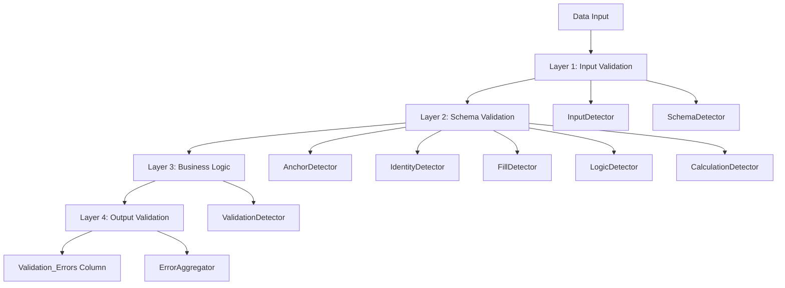

# Error Handling Module User Instruction

## Table of Contents

1. [Overview](#overview)
2. [Error Handling Architecture](#error-handling-architecture)
3. [Error Code Categories](#error-code-categories)
4. [Layer Structure](#layer-structure)
5. [Detector Types](#detector-types)
6. [Module Structure](#module-structure)
7. [Function I/O Reference](#function-io-reference)
8. [Global Parameter Trace Matrix](#global-parameter-trace-matrix)
9. [Validation Category Summary Table](#validation-category-summary-table)
10. [Error Code Reference](#error-code-reference)
11. [Complete Error Code List](error_code_reference.md) - Full reference with traceability
12. [Examples](#examples)
13. [Troubleshooting](#troubleshooting)
14. [Best Practices](#best-practices)

---

## Overview

The Error Handling Module provides comprehensive error detection and validation across the DCC Engine Pipeline. It uses a multi-layer architecture with specialized detectors for different validation stages.

**Key Features:**
- 50+ error codes covering input, schema, business logic, and validation
- Layered architecture (L1-L4) for organized error detection
- Fail-fast capability for critical errors
- Context-rich error messages with remediation suggestions
- Integration with Validation_Errors column aggregation

**Location:** `workflow/processor_engine/error_handling/`

---

## Error Handling Architecture



---

## Error Code Categories

| Category | Code Range | Description | Examples |
|----------|------------|-------------|----------|
| Input | I1xx | File and input validation | Missing files, format errors |
| Schema | S2xx | Schema definition issues | Missing columns, type mismatches |
| Anchor | A3xx | Anchor column validation | Project/Facility code issues |
| Fill | F4xx | Forward fill operations | Row jumps, session crossings |
| Identity | I5xx | Document identity issues | Duplicate IDs, revision conflicts |
| Calculation | C6xx | Calculation errors | Formula errors, type coercion |
| Business | B7xx | Business rule violations | Approval status conflicts |
| Validation | V8xx | Output validation | Pattern mismatches, range errors |

---

## Layer Structure

### Layer 1: Input Validation (L1)
**Detectors:** InputDetector
- Validates input files exist and are readable
- Checks file formats (Excel, CSV)
- Verifies required sheets/columns present

### Layer 2: Schema Validation (L2)
**Detectors:** SchemaDetector
- Validates column names against schema
- Checks data types match schema definitions
- Verifies required columns present

### Layer 3: Business Logic (L3)
**Detectors:**
- **AnchorDetector** - Project, Facility, Document Type validation
- **IdentityDetector** - Document_ID uniqueness and format
- **FillDetector** - Forward fill operations (F4xx errors)
- **LogicDetector** - Cross-column business rules
- **CalculationDetector** - Formula and calculation validation

### Layer 4: Output Validation (L4)
**Detectors:** ValidationDetector
- Pattern validation (regex)
- Range validation (min/max)
- Schema reference validation
- Final error aggregation

---

## Detector Types

### Base Classes
- **BaseDetector** - Abstract base for all detectors
- **CompositeDetector** - Combines multiple detectors
- **FailFastError** - Exception for critical errors

### Specialized Detectors

| Detector | Layer | Purpose | Location |
|----------|-------|---------|----------|
| [InputDetector](detectors/input.md) | L1 | Input file validation | `detectors/input.py` |
| [SchemaDetector](detectors/schema.md) | L2 | Schema compliance | `detectors/schema.py` |
| [AnchorDetector](detectors/anchor.md) | L3 | Anchor column validation | `detectors/anchor.py` |
| [IdentityDetector](detectors/identity.md) | L3 | Document ID validation | `detectors/identity.py` |
| [FillDetector](detectors/fill.md) | L3 | Null handling validation | `detectors/fill.py` |
| [LogicDetector](detectors/logic.md) | L3 | Business logic rules | `detectors/logic.py` |
| [CalculationDetector](detectors/calculation.md) | L3 | Calculation validation | `detectors/calculation.py` |
| [ValidationDetector](detectors/validation.md) | L4 | Output validation | `detectors/validation.py` |
| [BusinessDetector](detectors/business.md) | L3 | Orchestrates L3 detectors | `detectors/business.py` |

---

## Module Structure

```
error_handling/
├── __init__.py                    # Module exports
├── detectors/
│   ├── __init__.py               # Detector exports
│   ├── base.py                   # BaseDetector, DetectionResult
│   ├── anchor.py                 # AnchorDetector (A3xx)
│   ├── business.py               # BusinessDetector orchestrator
│   ├── calculation.py            # CalculationDetector (C6xx)
│   ├── fill.py                   # FillDetector (F4xx)
│   ├── identity.py               # IdentityDetector (I5xx)
│   ├── input.py                  # InputDetector (I1xx)
│   ├── logic.py                  # LogicDetector (B7xx)
│   ├── schema.py                 # SchemaDetector (S2xx)
│   └── validation.py             # ValidationDetector (V8xx)
```

---

## Function I/O Reference

### BaseDetector Interface

```python
detector = BaseDetector(layer="L3", logger=None, enable_fail_fast=True)

# Core methods
detector.detect(df: pd.DataFrame, context: Dict) -> List[DetectionResult]
detector.detect_error(error_code, message, row, column, severity, additional_context)
detector.get_errors() -> List[DetectionResult]
detector.clear_errors()
```

### BusinessDetector (Orchestrator)

```python
business_detector = BusinessDetector(
    phases=[ProcessingPhase.P2, ProcessingPhase.P2_5],
    enable_fail_fast=True,
    logger=structured_logger
)

# Detect by phase
results = business_detector.detect(
    df=processed_df,
    context={"phase": "P2.5", "fill_history": fill_history},
    phases=[ProcessingPhase.P2_5]
)
```

### FillDetector (Example)

```python
fill_detector = FillDetector(
    jump_limit=20,
    max_fill_percentage=80.0,
    enable_fail_fast=True
)

# Analyze fill history
errors = fill_detector.detect(
    df,
    context={"fill_history": engine.fill_history}
)
```

---

## Global Parameter Trace Matrix

| Parameter | Set In | Used In | Description |
|-----------|--------|---------|-------------|
| `enable_fail_fast` | Detector.__init__ | All detectors | Stop on critical errors |
| `layer` | Detector.__init__ | Error categorization | L1, L2, L3, L4 |
| `jump_limit` | FillDetector | Row jump detection | Max rows for forward fill |
| `max_fill_percentage` | FillDetector | Excessive null detection | Threshold for warning |
| `required_identities` | IdentityDetector | Document_ID validation | Columns to validate |
| `error_aggregator` | CalculationEngine | All detectors | Collects all errors |

---

## Validation Category Summary Table

| Category | Code Pattern | Layer | Severity | Fail Fast |
|----------|--------------|-------|----------|-----------|
| Input | I1-C/D/F-01xx | L1 | ERROR | Yes |
| Schema | S2-C/D/F-02xx | L2 | ERROR | Yes |
| Anchor | A3-C/D-03xx | L3 | HIGH/MEDIUM | Configurable |
| Fill | F4-C-F-04xx | L3 | HIGH/WARNING | No |
| Identity | I5-C/D-05xx | L3 | HIGH | Yes |
| Calculation | C6-C/D-06xx | L3 | WARNING | No |
| Business | B7-C/D-07xx | L3 | HIGH | Configurable |
| Validation | V8-C-08xx | L4 | WARNING | No |

### Severity Levels

- **ERROR** - Pipeline stops (fail_fast=True)
- **HIGH** - Critical issue, review required
- **MEDIUM** - Important issue, should review
- **WARNING** - Minor issue, informational

---

## Error Code Reference

### F4xx - Fill Errors (Complete Reference)

| Code | Description | Severity | Detector |
|------|-------------|----------|----------|
| F4-C-F-0401 | Forward fill row jump exceeded | HIGH | FillDetector |
| F4-C-F-0402 | Session boundary crossed | HIGH | FillDetector |
| F4-C-F-0403 | Multi-level fill failed | WARNING | FillDetector |
| F4-C-F-0404 | Excessive null fills (>80%) | WARNING | FillDetector |
| F4-C-F-0405 | Invalid grouping configuration | ERROR | FillDetector |

See [Null Handling Error Guide](null_handling_guide.md) for detailed F4xx documentation.

### Other Common Error Codes

| Code | Category | Description |
|------|----------|-------------|
| I1-C-F-0101 | Input | Input file not found |
| S2-C-F-0201 | Schema | Required column missing |
| A3-C-D-0301 | Anchor | Invalid project code |
| I5-C-D-0501 | Identity | Duplicate Document_ID |
| C6-C-F-0601 | Calculation | Division by zero |
| B7-C-D-0701 | Business | Invalid approval status |
| V8-C-0801 | Validation | Pattern mismatch |

---

## Examples

### Example 1: Using FillDetector Directly

```python
from processor_engine.error_handling.detectors import FillDetector

# Create detector with custom settings
detector = FillDetector(
    jump_limit=15,  # Stricter limit
    max_fill_percentage=75.0
)

# Simulate fill history
fill_history = [
    {
        "operation_type": "forward_fill",
        "column": "Reviewer",
        "from_row": {"row_index": 10, "Document_ID": "DOC-001"},
        "to_row": {"row_index": 30, "Document_ID": "DOC-001"},
        "row_jump": 20,
        "group_by": ["Project_Code"],
        "filled_value": "John Smith"
    }
]

# Detect errors
errors = detector.detect(
    df=pd.DataFrame(),
    context={"fill_history": fill_history}
)

# Review results
for error in errors:
    print(f"{error.error_code}: {error.message}")
    print(f"  Suggestion: {error.additional_context.get('suggested_action')}")
```

### Example 2: BusinessDetector Integration

```python
from processor_engine.error_handling.detectors import (
    BusinessDetector, ProcessingPhase
)

# Create orchestrator
business_detector = BusinessDetector(
    phases=[ProcessingPhase.P2_5],
    enable_fail_fast=False
)

# Process with context
context = {
    "phase": "P2.5",
    "schema_data": schema,
    "fill_history": engine.fill_history
}

results = business_detector.detect(
    df=processed_data,
    context=context,
    phases=[ProcessingPhase.P2_5]
)

# Aggregate errors
for phase, errors in results.items():
    print(f"Phase {phase}: {len(errors)} errors detected")
```

### Example 3: Custom Detector

```python
from processor_engine.error_handling.detectors.base import BaseDetector

class CustomDetector(BaseDetector):
    def __init__(self, **kwargs):
        super().__init__(layer="L3", **kwargs)
        self.ERROR_CUSTOM = "CUST-C-0001"
    
    def detect(self, df, context=None):
        self.clear_errors()
        
        # Custom detection logic
        for idx, row in df.iterrows():
            if row.get("Custom_Column") == "INVALID":
                self.detect_error(
                    error_code=self.ERROR_CUSTOM,
                    message="Invalid value in Custom_Column",
                    row=idx,
                    column="Custom_Column",
                    severity="WARNING",
                    additional_context={"suggestion": "Fix the value"}
                )
        
        return self.get_errors()
```

---

## Troubleshooting

### Common Issues

| Issue | Cause | Solution |
|-------|-------|----------|
| No F4xx errors detected | FillDetector not registered | Check BusinessDetector phase registration |
| Missing error context | Context not passed | Ensure fill_history in context dict |
| Too many F4-C-F-0401 | Large row jumps | Add more grouping columns or increase jump_limit |
| F4-C-F-0402 errors | Session crossing | Add Submission_Session to group_by |
| Empty fill_history | fill_history not initialized | Check engine.fill_history = [] at Phase 2 start |

### Debug Steps

1. **Verify Detector Registration:**
   ```python
   print(business_detector._phase_detectors)
   ```

2. **Check Fill History:**
   ```python
   print(f"Fill history entries: {len(engine.fill_history)}")
   ```

3. **Review Error Context:**
   ```python
   for error in errors:
       print(error.additional_context)
   ```

---

## Best Practices

### 1. Always Use Context

Pass relevant context to detectors:
```python
context = {
    "phase": "P2.5",
    "fill_history": engine.fill_history,
    "schema_data": schema
}
```

### 2. Configure Fail Fast Appropriately

- **L1/L2:** Use `enable_fail_fast=True` (structural issues)
- **L3:** Use `enable_fail_fast=False` (allow detection of all errors)
- **L4:** Use `enable_fail_fast=False` (validation should complete)

### 3. Review Error Dashboard

Always check `output/error_dashboard_data.json` after processing:
```bash
cat output/error_dashboard_data.json | jq '.error_summary'
```

### 4. Use Appropriate Severity

- **ERROR** - Pipeline-blocking issues
- **HIGH** - Data quality issues requiring review
- **WARNING** - Informational, may be acceptable

### 5. Provide Actionable Suggestions

Always include `suggested_action` in error context:
```python
additional_context={
    "suggested_action": "Add Submission_Session to group_by columns"
}
```

---

## Related Documentation

- **[Complete Error Code Reference](error_code_reference.md)** - **Full error code list with traceability (30+ codes)**
- [Null Handling Error Guide](null_handling_guide.md) - F4xx error details
- [Fill Detector](detectors/fill.md) - FillDetector reference
- [Business Detector](detectors/business.md) - Orchestrator reference
- [Base Detector](detectors/base.md) - Base classes

---

*Last Updated: 2024-04-12*
*Version: 1.0*

