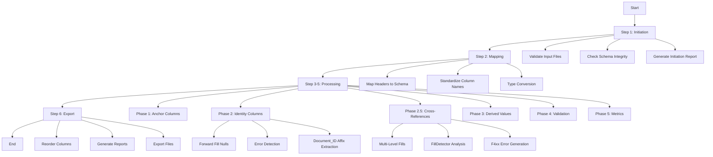

# DCC Engine Pipeline Documentation

1. readme_main.md is the main documentation file for the DCC Engine Pipeline.
2. establish a documentation tree structure to organize the documentation. follow the current workplace, engine, and folder structure.
3. create subfolder for each major engine of the pipeline, then module, then function.
4. creats user instruction for each engine, module, and function separately.
5. from this main documentation, user can drill down to any engine, module, or function to get the user instruction hierarchically.
6. when there is a realted updates always update respective documentation files. always keep the documentation up to date with the code.
7. always keep the documentation readable and easy to understand.always keep the documentation concise and to the point.
8. each user instruction should be self-contained and easy to understand. do not duplicate content across different files. use links to reference other files.
9. the following sections must be included in user instruction for main pipeline:
   - Summary for main pipeline
   - Table of Contents
   - Environment setup and requirements
   - Overall project folder structure
   - Schema files
   - Parser arguments and details
   - Required input data files
   - Designed output files
   - Workflow Overview (mermaid flowchart, with brief description and functions in each step)
   - Module Structure
   - Function I/O Reference
   - Global Parameter Trace Matrix
   - Validation Category Summary Table
   - Examples
   - Troubleshooting
   - Debugging and logging
   - Best Practices
   - List of module readme.md files and links to them
   - Potential issues to users
10. user instruction for sub engines, modules and functions, should include the following content:
   - Table of Contents
   - Workflow Overview (mermaid flowchart, with brief description and functions in each step)
   - Module Structure
   - Function I/O Reference
   - Global Parameter Trace Matrix
   - Validation Category Summary Table
   - Examples
   - Troubleshooting
   - Best Practices

# DCC Engine Pipeline - Main User Instruction

## Summary

The DCC (Document Control Center) Engine Pipeline is a comprehensive data processing system designed to transform, validate, and analyze document submission data. It handles the complete lifecycle from raw Excel/CSV input through schema mapping, calculation processing, error detection, and reporting.

**Key Features:**
- Multi-phase processing pipeline (P1, P2, P2.5, P3, P4, P5)
- Schema-driven validation and calculation
- Comprehensive error handling with 50+ error codes
- Forward fill and multi-level null handling
- Document ID affix extraction and validation
- Data health scoring and reporting

---

## Table of Contents

1. [Environment Setup and Requirements](#environment-setup-and-requirements)
2. [Overall Project Folder Structure](#overall-project-folder-structure)
3. [Schema Files](#schema-files)
4. [Parser Arguments and Details](#parser-arguments-and-details)
5. [Required Input Data Files](#required-input-data-files)
6. [Designed Output Files](#designed-output-files)
7. [Workflow Overview](#workflow-overview)
8. [Module Structure](#module-structure)
9. [Function I/O Reference](#function-io-reference)
10. [Global Parameter Trace Matrix](#global-parameter-trace-matrix)
11. [Validation Category Summary Table](#validation-category-summary-table)
12. [Examples](#examples)
13. [Troubleshooting](#troubleshooting)
14. [Debugging and Logging](#debugging-and-logging)
15. [Best Practices](#best-practices)
16. [Module Documentation Index](#module-documentation-index)
17. [Potential Issues](#potential-issues)

---

## Environment Setup and Requirements

### System Requirements
- Python 3.8+
- pandas, numpy, openpyxl
- 4GB+ RAM recommended for large datasets

### Installation
```bash
pip install pandas numpy openpyxl
```

### Configuration
- Schema files: `config/schemas/`
- Data files: `data/`
- Output: `output/`
- Logs: `Log/`

---

## Overall Project Folder Structure

```
dcc/
├── agent_rule.md                 # Agent behavior rules
├── config/
│   └── schemas/
│       ├── dcc_register_enhanced.json  # Main schema
│       ├── department_schema.json
│       ├── discipline_schema.json
│       ├── document_type_schema.json
│       ├── facility_schema.json
│       └── project_schema.json
├── data/                         # Input data files
│   └── Submittal and RFI Tracker Lists.xlsx
├── docs/                         # User instructions (this structure)
│   ├── readme_main.md            # This file
│   ├── initiation_engine/        # Input validation docs
│   ├── mapper_engine/            # Data mapping docs
│   ├── processor_engine/         # Core processing docs
│   ├── reporting_engine/         # Reporting docs
│   ├── schema_engine/            # Schema management docs
│   ├── calculations/             # Calculation modules docs
│   ├── error_handling/           # Error detection docs
│   │   ├── readme.md             # Main error handling guide
│   │   ├── null_handling_guide.md  # F4xx detailed guide
│   │   └── detectors/            # Individual detector docs
│   └── workplan/                 # Planning docs
├── Log/
│   ├── issue_log.md              # Issue tracking
│   └── update_log.md             # Update history
├── output/                       # Generated outputs
│   ├── processed_dcc_universal.csv
│   ├── processed_dcc_universal.xlsx
│   ├── processing_summary.txt
│   ├── debug_log.json
│   └── error_dashboard_data.json
├── workflow/                     # Processing engines
│   ├── initiation_engine/        # Step 1: Input validation
│   ├── mapper_engine/            # Step 2: Schema mapping
│   ├── processor_engine/         # Step 3-5: Processing
│   │   ├── calculations/         # Calculation modules
│   │   ├── core/                 # Engine core
│   │   ├── error_handling/       # Error detectors
│   │   │   └── detectors/        # L1-L3 detectors
│   │   └── utils/                # Utilities
│   ├── reporting_engine/         # Step 6: Reporting
│   └── schema_engine/            # Schema management
├── workplan/                     # Project planning
│   ├── error_handling/
│   └── column_processing/
└── dcc_engine_pipeline.py        # Main entry point
```

---

## Schema Files

### Main Schema: `dcc_register_enhanced.json`
- 44 column definitions
- Validation rules per column
- Calculation strategies
- Null handling configurations

### Supporting Schemas
- `department_schema.json` - Valid department values
- `discipline_schema.json` - Valid discipline codes
- `document_type_schema.json` - Valid document types
- `facility_schema.json` - Valid facility codes
- `project_schema.json` - Valid project codes

---

## Parser Arguments and Details

### Main Pipeline Entry Point: `dcc_engine_pipeline.py`

**Arguments:**
- `--base-path` - Base directory path (default: current directory)
- `--schema-file` - Schema JSON file path
- `--data-file` - Input Excel/CSV file path
- `--output-dir` - Output directory path

**Environment Variables:**
- `DCC_LOG_LEVEL` - Logging level (DEBUG, INFO, WARNING, ERROR)
- `DCC_ENABLE_PARALLEL` - Enable parallel processing

---

## Required Input Data Files

### Primary Input
**File:** `Submittal and RFI Tracker Lists.xlsx`

**Required Sheets:**
1. Main data sheet with tracking information

**Required Columns:**
- `Project_Code`
- `Facility_Code`
- `Document_Type`
- `Discipline`
- `Document_ID` (or derivable)
- `Submission_Session`
- `Submission_Date`

### Schema Files
All files in `config/schemas/` directory

---

## Designed Output Files

### Primary Outputs
1. **processed_dcc_universal.csv** - Main processed data (CSV)
2. **processed_dcc_universal.xlsx** - Main processed data (Excel)
3. **processing_summary.txt** - Text summary report
4. **debug_log.json** - Detailed debug information
5. **error_dashboard_data.json** - Error statistics for dashboard

### Column Outputs
- 44 columns in schema-defined order
- Additional: `Data_Health_Score`, `Validation_Errors`

---

## Workflow Overview



### Phase Details

| Phase | Description | Key Functions |
|-------|-------------|---------------|
| P1 | Anchor Columns | Project, Facility, Type, Session setup |
| P2 | Transactional | Forward fill, Document_ID affix extraction |
| P2.5 | Anomaly | Multi-level fills, FillDetector (F4xx errors) |
| P3 | Derived | Calculations, aggregations, cross-references |
| P4 | Validation | Schema validation, error aggregation |
| P5 | Metrics | Data health score calculation |

---

## Module Structure

### Engine Hierarchy

```
workflow/
├── initiation_engine/
│   └── core/
│       ├── validator.py
│       └── reports.py
├── mapper_engine/
│   └── core/
│       └── engine.py
├── processor_engine/
│   ├── core/
│   │   ├── engine.py
│   │   ├── registry.py
│   │   └── strategy_manager.py
│   ├── calculations/
│   │   ├── affix_extractor.py
│   │   ├── aggregate.py
│   │   ├── composite.py
│   │   ├── conditional.py
│   │   ├── date.py
│   │   ├── error_tracking.py
│   │   ├── mapping.py
│   │   ├── null_handling.py
│   │   └── validation.py
│   ├── error_handling/
│   │   └── detectors/
│   │       ├── anchor.py
│   │       ├── base.py
│   │       ├── business.py
│   │       ├── calculation.py
│   │       ├── fill.py
│   │       ├── identity.py
│   │       ├── input.py
│   │       ├── logic.py
│   │       ├── schema.py
│   │       └── validation.py
│   └── utils/
│       ├── dataio.py
│       ├── dataframe.py
│       └── logging.py
├── reporting_engine/
│   ├── data_health.py
│   ├── error_reporter.py
│   ├── summary.py
│   └── engine/
└── schema_engine/
    └── core/
        └── reports.py
```

---

## Function I/O Reference

### Main Pipeline Function

**`dcc_engine_pipeline.process_data()`**
- Input: `base_path`, `schema_file`, `data_file`
- Output: `ProcessingResult` with paths to output files

### Engine Functions

| Function | Input | Output |
|----------|-------|--------|
| `initiation_engine.validate()` | File paths | ValidationReport |
| `mapper_engine.map_data()` | Raw DataFrame | Mapped DataFrame |
| `processor_engine.apply_phased_processing()` | Mapped DataFrame | Processed DataFrame |
| `reporting_engine.generate_summary()` | Processed DataFrame | Summary text |

---

## Global Parameter Trace Matrix

| Parameter | Set In | Used In | Description |
|-----------|--------|---------|-------------|
| `jump_limit` | FillDetector.__init__ | _check_forward_fill_record | Max row jump before error |
| `max_fill_percentage` | FillDetector.__init__ | _detect_excessive_nulls | Max % of filled values |
| `schema_data` | SchemaEngine | All phases | Column definitions |
| `fill_history` | CalculationEngine | FillDetector | Track fill operations |
| `error_aggregator` | CalculationEngine | All detectors | Collect errors |

---

## Validation Category Summary Table

| Category | Error Codes | Layer | Severity |
|----------|-------------|-------|----------|
| Input | I1xx | L1 | ERROR |
| Schema | S2xx | L2 | WARNING/ERROR |
| Anchor | A3xx | L3 | HIGH/MEDIUM |
| Fill | F4xx | L3 | HIGH/WARNING |
| Identity | I5xx | L3 | HIGH |
| Calculation | C6xx | L3 | WARNING |
| Business | B7xx | L3 | HIGH |
| Validation | V8xx | L4 | WARNING |

### F4xx Error Codes (Fill)

| Code | Description | Severity |
|------|-------------|----------|
| F4-C-F-0401-A | Forward fill row jump > limit (history) | WARNING |
| F4-C-F-0401-B | Forward fill row jump > limit (heuristic) | WARNING |
| F4-C-F-0402-A | Session boundary crossed (history) | HIGH |
| F4-C-F-0402-B | Session boundary crossed (heuristic) | HIGH |
| F4-C-F-0403-A | Multi-level fill failed (all levels) | WARNING |
| F4-C-F-0403-B | Multi-level fill failed (calc missing source) | WARNING |
| F4-C-F-0403-C | Multi-level fill failed (default applied) | WARNING |
| F4-C-F-0404 | Excessive null fills (>80%) | WARNING |
| F4-C-F-0405 | Invalid grouping config | ERROR |

---

## Examples

### Running the Pipeline

```bash
cd /path/to/dcc
python dcc_engine_pipeline.py
```

### Custom Configuration

```python
from workflow.processor_engine.core import CalculationEngine

engine = CalculationEngine(
    schema_data=schema,
    config={
        'jump_limit': 25,
        'max_fill_percentage': 85.0
    }
)
```

---

## Troubleshooting

### Common Issues

| Issue | Cause | Solution |
|-------|-------|----------|
| "Document_ID not found" | Missing Document_ID column | Check input file has Document_ID or enable calculation |
| "Schema validation failed" | Invalid column values | Check schema files for allowed values |
| "F4-C-F-0401 errors" | Large row jumps in fills | Add more grouping columns or increase jump_limit |
| "Out of memory" | Large dataset | Process in batches or increase RAM |

---

## Debugging and Logging

### Log Levels
- DEBUG: Detailed operation logs
- INFO: Phase transitions, summaries
- WARNING: Validation failures
- ERROR: Critical failures

### Debug Output
- `output/debug_log.json` - Structured debug information
- Console output - Real-time progress

---

## Best Practices

1. **Always validate input files** before processing
2. **Review error_dashboard_data.json** after processing
3. **Use appropriate grouping columns** to minimize F4xx errors
4. **Keep schema files updated** with current valid values
5. **Monitor Data_Health_Score** for overall quality

---

## Module Documentation Index

| Module | Path | Status | Description |
|--------|------|--------|-------------|
| [Initiation Engine](initiation_engine/readme.md) | `initiation_engine/` | 🟡 Template | Input validation |
| [Mapper Engine](mapper_engine/readme.md) | `mapper_engine/` | 🟡 Template | Data mapping |
| [Processor Engine](processor_engine/readme.md) | `processor_engine/` | 🟡 Template | Core processing |
| [Calculations](calculations/readme.md) | `calculations/` | 🟡 Template | Calculation modules |
| **[Error Handling](error_handling/readme.md)** | `error_handling/` | **✅ Complete** | **Error detection (50+ codes)** |
| &nbsp;&nbsp;├─ [Base](error_handling/detectors/base.md) | `detectors/` | ✅ Complete | Base classes |
| &nbsp;&nbsp;├─ [Business](error_handling/detectors/business.md) | `detectors/` | ✅ Complete | Orchestrator |
| &nbsp;&nbsp;├─ [Fill](error_handling/detectors/fill.md) | `detectors/` | ✅ Complete | **F4xx errors** |
| &nbsp;&nbsp;├─ [Identity](error_handling/detectors/identity.md) | `detectors/` | 🟡 Template | I5xx errors |
| &nbsp;&nbsp;├─ [Anchor](error_handling/detectors/anchor.md) | `detectors/` | 🟡 Template | A3xx errors |
| &nbsp;&nbsp;├─ [Logic](error_handling/detectors/logic.md) | `detectors/` | 🟡 Template | B7xx errors |
| &nbsp;&nbsp;├─ [Calculation](error_handling/detectors/calculation.md) | `detectors/` | 🟡 Template | C6xx errors |
| &nbsp;&nbsp;├─ [Input](error_handling/detectors/input.md) | `detectors/` | 🟡 Template | I1xx errors |
| &nbsp;&nbsp;├─ [Schema](error_handling/detectors/schema.md) | `detectors/` | 🟡 Template | S2xx errors |
| &nbsp;&nbsp;└─ [Validation](error_handling/detectors/validation.md) | `detectors/` | 🟡 Template | V8xx errors |
| [Reporting Engine](reporting_engine/readme.md) | `reporting_engine/` | 🟡 Template | Reporting |
| [Schema Engine](schema_engine/readme.md) | `schema_engine/` | 🟡 Template | Schema management |
| &nbsp;&nbsp;├─ **[Null Handling Guide](error_handling/null_handling_guide.md)** | `error_handling/` | **✅ Complete** | **F4xx detailed guide** |
| &nbsp;&nbsp;└─ **[Error Code Reference](error_handling/error_code_reference.md)** | `error_handling/` | **✅ Complete** | **30+ codes with traceability** |

**Legend:** ✅ Complete | 🟡 Template (Needs Content)

---

## Potential Issues

1. **Data Quality**: Missing values may trigger F4-C-F-0404 warnings
2. **Session Boundaries**: Cross-session fills trigger F4-C-F-0402 errors
3. **Large Jumps**: Forward fills over 20 rows trigger F4-C-F-0401 errors
4. **Schema Drift**: Invalid values not in schema cause validation errors
5. **Memory**: Large datasets (>100k rows) may require batch processing

---

*Last Updated: 2024-04-12*
*Version: 1.0*