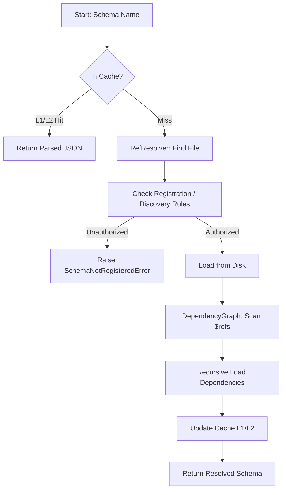

# Schema Engine: Recursive Loading & Multi-Level Caching

The **Schema Engine** is the foundational infrastructure for managing, loading, and validating JSON schemas within the DCC Pipeline. It implements a robust, recursive loading system with multi-level caching to ensure performance, strict registration, and universal reference resolution.

---

## 📋 Content Index
1. [Overall Summary](#-overall-summary)
2. [Key Features](#-key-features)
3. [Workflow Architecture (Mermaid)](#-workflow-architecture)
4. [Documentation Map](#-documentation-map)
5. [Quick Start](#-quick-start)
6. [Module & Function Structure](#-module--function-structure)
7. [I/O Reference Table](#-io-reference-table)
8. [Global Parameter Trace Matrix](#-global-parameter-trace-matrix)
9. [Debugging & Troubleshooting](#-debugging--troubleshooting)
10. [Engineering Standards Achieved](#-engineering-standards-achieved)

---

## 📝 Overall Summary
The Schema Engine centralizes all JSON schema operations. It enforces **Strict Registration**, meaning every schema must be cataloged in `project_config.json` before use. By leveraging a **Unified URI Registry**, it decouples schema identity from file paths, enabling complex **Recursive Loading** where dependencies are automatically resolved and cached across three performance tiers (Memory, Disk, Session).

---

## 🚀 Key Features
- **Universal $ref Support**: Resolves string, object, nested, and recursive references.
- **Tiered Caching (L1/L2/L3)**: Reduces JSON parsing overhead by up to 90% via memory and disk persistence.
- **Pattern-Based Discovery**: Automatically registers engine-specific schemas using glob patterns.
- **Smart Invalidation**: Monitors file `mtime` to automatically purge stale cache entries.
- **Cycle Detection**: Prevents infinite loops using topological sorting of the dependency graph.

---

## 📊 Workflow Architecture


---

## 📚 Documentation Map

| Category | Documents |
| :--- | :--- |
| **API Reference** | [RefResolver](api/ref_resolver.md), [SchemaLoader](api/schema_loader.md), [SchemaCache](api/schema_cache.md), [DependencyGraph](api/dependency_graph.md) |
| **User Guides** | [Recursive Loading](guides/recursive_loading.md), [Schema Registration](guides/schema_registration.md), [URI Registry](guides/uri_registry.md) |
| **Architecture** | [Caching Strategy](architecture/caching_strategy.md), [Register Decoupling](architecture/register_decoupling.md) |

---

## 🛠 Quick Start

```python
from dcc.workflow.schema_engine.loader.schema_loader import SchemaLoader

# 1. Initialize (The Engine builds the graph and URI registry automatically)
loader = SchemaLoader(project_setup_path="dcc/config/schemas/project_config.json")

# 2. Deep Load (Resolves all $refs across all files)
full_schema = loader.load_recursive("dcc_register_config")
```

---

## 🏗 Module & Function Structure

### 1. `SchemaLoader` (Orchestrator)
- `load_recursive()`: Main entry point for deep resolution.
- `load_schema()`: Low-level cached disk access.
- `resolve_all_refs()`: Recursive JSON walker.

### 2. `RefResolver` (Resolver)
- `_extract_registered_schemas()`: Implements discovery rules.
- `_build_uri_registry()`: Maps URIs to Paths.
- `_resolve_external_ref()`: Standard $ref handler.

### 3. `SchemaCache` (Performance)
- `get()` / `set()`: Tiered access with mtime check.
- `get_metrics()`: Hits/Misses tracking.

---

## 📥 I/O Reference Table

| Function | Input | Output | Key Validation |
| :--- | :--- | :--- | :--- |
| `load_recursive` | `schema_name` (str) | `data` (dict) | Ensures all $refs are resolved or cached. |
| `get` (Cache) | `key`, `path` | `data` or `None` | Compares `path.mtime` vs `entry.timestamp`. |
| `build_graph` | `resolver` | `None` | Detects `CircularDependencyError`. |

---

## 🔍 Global Parameter Trace Matrix

| Parameter | Source | Usage | Impact |
| :--- | :--- | :--- | :--- |
| `base_path` | `SchemaLoader.__init__` | Root for file lookups | Sets the anchor for relative resolution. |
| `l1_ttl` | `SchemaCache.__init__` | Memory expiry (sec) | Controls frequency of disk re-validation. |
| `discovery_rules` | `project_config.json` | Pattern matching | Determines which files are auto-registered. |
| `max_depth` | `load_recursive` | Recursion limit | Prevents stack overflow on infinite refs. |

---

## 🛠 Debugging & Troubleshooting
- **Tiered Logging**: Use `DEBUG[2]` for path resolution and `DEBUG[3]` for raw JSON extraction.
- **Cache Purge**: If schemas seem "stuck," delete the `.cache/schemas` folder.
- **Audit Tool**: Run `python3 dcc/test/check_registration.py` to verify the entire catalog.

---

## ✅ Engineering Standards Achieved
- **Section 2.3 (Base/Setup/Config)**: Fully supported via recursive fragment loading.
- **Section 2.4 (Universal $ref)**: Implemented URI-based location independence.
- **Section 4 (Module Design)**: Decoupled into four specialized sub-modules.
- **Section 5 (Standardized Docstrings)**: achieved in all `.py` files with breadcrumb traces.
- **Section 6 (Tiered Logging)**: Implemented across the resolution pipeline.

---

*Documentation Version: 1.1.0*
*Last Updated: 2026-04-17*
