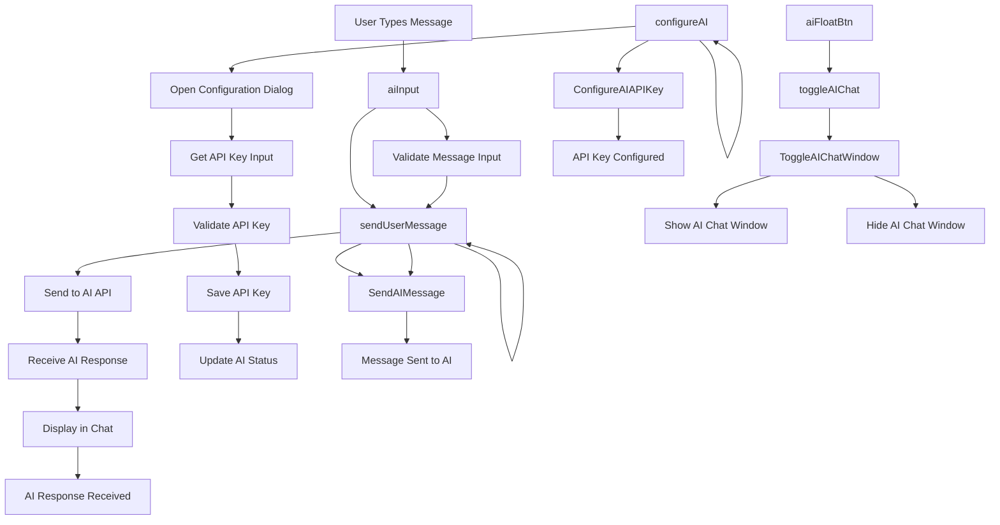

# AI Assistant Events

## Event Handlers

### **AI Assistant Events**
- **Toggle AI Chat**: `toggleAIChat()` - Shows/hides AI chat window
- **Configure AI**: `configureAI()` - Opens API key configuration dialog
- **Send User Message**: `sendUserMessage()` - Sends message to AI API

### **UI Components**
- **AI Float Button**: Floating button to toggle AI chat
- **AI Input Area**: Text input for user messages
- **Send Button**: Sends message to AI
- **Configuration Dialog**: API key setup interface

### **Expected Outputs**
- **Chat Window**: Interactive AI conversation interface
- **API Configuration**: Saved AI API settings
- **Message Exchange**: Two-way communication with AI
- **Response Display**: AI responses shown in chat

### **Data Flow**
1. User clicks AI float button to open chat
2. User types message and clicks send
3. Message is sent to AI API with context
4. AI response is received and displayed
5. Conversation history is maintained
