# Class-Based Event Handlers

```mermaid
graph TD
    %% Multi-Select Components
    multiselectDisplay --> toggleSheetDropdown --> ToggleMultiselectDisplay
    multiselectOptions --> loadSelectedSheets --> LoadFromMultiselectOptions
    optionItem --> handleSelect --> HandleOptionSelection
    optionItem --> applyFilter --> ApplyFilterFromOption
    
    %% Filter Components
    filtersContainer --> buildInterface --> PopulateFiltersContainer
    innerControlBox --> buildInterface --> PopulateInnerControlBox
    
    %% Button Components
    btnToggleCompact1 --> toggleStep1Box --> ToggleStep1Box
    btnToggleCompact2 --> toggleStep2Box --> ToggleStep2Box
    btnToggleCompact3 --> toggleGroupBox --> ToggleGroupBox
    btnToggleCompact4 --> toggleChartsContainer --> ToggleChartsContainer
    btnToggleCompact5 --> toggleFilterBox --> ToggleFilterBox
    
    %% Action Buttons
    btnInit --> buildInterface --> InitializeDashboard
    btnSelectAll --> selectAllColumns --> SelectAllColumns
    btnClearAll --> clearAllColumns --> ClearAllColumns
    btnResetFilters --> resetFilters --> ResetAllFilters
    btnResetGroup --> resetGroupBy --> ResetGroupBy
    
    %% Export Buttons
    btnOutlineChart --> downloadChart --> DownloadChart
    btnOutlineExcel --> downloadExcel --> DownloadExcel
    btnOutlineTheme --> toggleTheme --> ToggleTheme
    btnOutlineDev --> toggleDevMode --> ToggleDevMode
    
    %% Status Box Components
    statusBox --> toggleStatusBox --> ToggleStatusBox
    statusBoxHeader --> toggleWarningHistory --> ToggleWarningHistory
    statusBoxContent --> clearWarnings --> ClearWarnings
    
    %% Status Indicators
    statusItem --> setProgressStatus --> UpdateStatusItem
    statusValue --> setProgressStatus --> UpdateStatusValue
    statusIdle --> setProgressStatus --> SetStatusIdle
    
    %% AI Components
    aiMessages --> sendUserMessage --> SendAIMessage
    aiInputArea --> sendUserMessage --> SendAIMessage
    aiMessage --> sendUserMessage --> DisplayAIMessage
    
    %% Expected Outputs
    ToggleMultiselectDisplay --> MultiselectOpen[Multi-Select Dropdown Open]
    LoadFromMultiselectOptions --> SheetsLoaded[Sheets Loaded from Options]
    HandleOptionSelection --> OptionSelected[Option Selected]
    ApplyFilterFromOption --> FilterApplied[Filter Applied from Option]
```

## Event Handlers

### **Multi-Select Events**
- **Toggle Display**: `toggleSheetDropdown()` - Opens/closes multi-select dropdown
- **Load from Options**: `loadSelectedSheets()` - Loads selected sheet options
- **Handle Selection**: `handleSelect()` - Manages option selection state
- **Apply Filter**: `applyFilter()` - Applies filter from selected option

### **Button Events**
- **Toggle Buttons**: Various `toggle*Box()` functions for section visibility
- **Initialize Dashboard**: `buildInterface()` - Initializes complete dashboard
- **Select/Clear All**: `selectAllColumns()`, `clearAllColumns()` - Bulk operations
- **Reset Functions**: `resetFilters()`, `resetGroupBy()` - Reset operations

### **Export Events**
- **Download Chart**: `downloadChart()` - Exports chart as image
- **Download Excel**: `downloadExcel()` - Exports data as Excel
- **Theme/Dev**: `toggleTheme()`, `toggleDevMode()` - Setting toggles

### **Status Box Events**
- **Toggle Status**: `toggleStatusBox()` - Shows/hides status box
- **Warning History**: `toggleWarningHistory()` - Shows/hides warning history
- **Clear Warnings**: `clearWarnings()` - Clears all warnings

### **Status Updates**
- **Progress Status**: `setProgressStatus()` - Updates all status indicators
- **Status Items**: Individual status element updates
- **Status Values**: Status text content updates
- **Idle Status**: Sets elements to idle state

### **AI Events**
- **Send Message**: `sendUserMessage()` - Sends messages to AI
- **Display Messages**: Shows AI responses in chat
- **Input Area**: Handles AI input interactions
- **Messages Container**: Manages AI conversation display

### **Expected Outputs**
- **UI State Changes**: Visual feedback for all interactions
- **Data Operations**: Bulk selection and reset operations
- **Export Results**: File downloads and exports
- **Status Updates**: Real-time progress and status information
- **AI Interactions**: Complete chat functionality

### **Event Delegation Benefits**
- **Performance**: Single listener handles multiple elements
- **Dynamic Support**: Works for elements added after page load
- **Maintenance**: Easy to update and extend
- **Memory Efficiency**: Reduced memory footprint
