# Dynamic Elements Events

```mermaid
graph TD
    %% Generated Filter Options
    generatedOptions --> buildInterface --> GenerateFilterOptions
    GenerateFilterOptions --> CreateOptionElements[Create Option Elements]
    CreateOptionElements --> AttachEventListeners[Attach Event Listeners]
    AttachEventListeners --> DynamicFilterOptions[Dynamic Filter Options Ready]
    
    %% Generated Column Chips
    generatedChips --> buildInterface --> GenerateColumnChips
    GenerateColumnChips --> CreateChipElements[Create Chip Elements]
    CreateChipElements --> AddChipInteractions[Add Chip Interactions]
    AddChipInteractions --> DynamicColumnChips[Dynamic Column Chips Ready]
    
    %% Generated Filter Controls
    generatedFilters --> buildInterface --> GenerateFilterControls
    GenerateFilterControls --> CreateFilterElements[Create Filter Elements]
    CreateFilterElements --> AddFilterLogic[Add Filter Logic]
    AddFilterLogic --> DynamicFilterControls[Dynamic Filter Controls Ready]
    
    %% Generated Data Table
    generatedTable --> updateTable --> GenerateDataTable
    GenerateDataTable --> CreateTableElements[Create Table Elements]
    CreateTableElements --> AddTableInteractions[Add Table Interactions]
    AddTableInteractions --> DynamicDataTable[Dynamic Data Table Ready]
    
    %% Generated Charts
    generatedCharts --> updateChart --> GenerateCharts
    GenerateCharts --> CreateChartElements[Create Chart Elements]
    CreateChartElements --> AddChartInteractions[Add Chart Interactions]
    AddChartInteractions --> DynamicCharts[Dynamic Charts Ready]
    
    %% Generated Dropdowns
    generatedDropdowns --> buildInterface --> GenerateDropdowns
    GenerateDropdowns --> CreateDropdownElements[Create Dropdown Elements]
    CreateDropdownElements --> AddDropdownLogic[Add Dropdown Logic]
    AddDropdownLogic --> DynamicDropdowns[Dynamic Dropdowns Ready]
    
    %% Event Delegation Pattern
    Document --> EventDelegation[Event Delegation Setup]
    EventDelegation --> CaptureEvents[Capture All Events]
    CaptureEvents --> CheckTarget[Check Event Target]
    CheckTarget --> IsDynamicElement[Is Dynamic Element]
    IsDynamicElement --> TriggerHandler[Trigger Appropriate Handler]
    
    %% Dynamic Element Lifecycle
    DataLoad[Data Loading Complete] --> GenerateElements[Generate Dynamic Elements]
    GenerateElements --> AttachToDOM[Attach to DOM]
    AttachToDOM --> InitializeEvents[Initialize Event Handlers]
    InitializeEvents --> ElementsReady[Dynamic Elements Ready]
    
    %% Cleanup and Update
    DataRefresh[Data Refresh Required] --> RemoveElements[Remove Old Elements]
    RemoveElements --> CleanupEvents[Cleanup Event Handlers]
    CleanupEvents --> GenerateNewElements[Generate New Elements]
    GenerateNewElements --> AttachNewEvents[Attach New Event Handlers]
    
    %% Expected Outputs
    DynamicFilterOptions --> FilterOptionsWorking[Filter Options Working]
    DynamicColumnChips --> ColumnChipsWorking[Column Chips Working]
    DynamicFilterControls --> FilterControlsWorking[Filter Controls Working]
    DynamicDataTable --> DataTableWorking[Data Table Working]
    DynamicCharts --> ChartsWorking[Charts Working]
    DynamicDropdowns --> DropdownsWorking[Dropdowns Working]
```

## Event Handlers

### **Dynamic Element Generation**
- **Generate Filter Options**: `buildInterface()` - Creates filter option elements
- **Generate Column Chips**: `buildInterface()` - Creates column toggle chips
- **Generate Filter Controls**: `buildInterface()` - Creates filter input controls
- **Generate Data Table**: `updateTable()` - Creates table rows and cells
- **Generate Charts**: `updateChart()` - Creates chart elements
- **Generate Dropdowns**: `buildInterface()` - Creates multiselect dropdowns

### **Event Delegation Strategy**
- **Single Listener**: One event listener handles all dynamic elements
- **Target Detection**: Identifies which dynamic element was clicked
- **Handler Routing**: Routes events to appropriate handler functions
- **Performance**: Efficient memory usage and event handling

### **Dynamic Element Lifecycle**
1. **Data Processing**: Data is processed and structured
2. **Element Generation**: HTML elements are created dynamically
3. **DOM Attachment**: Elements are added to the page
4. **Event Binding**: Event handlers are attached to elements
5. **User Interaction**: Elements respond to user actions
6. **Cleanup**: Old elements are removed when data changes

### **Generated Element Types**
- **Filter Options**: Dropdown options for text, number, date filters
- **Column Chips**: Toggle switches for column visibility
- **Filter Controls**: Input fields, sliders, date pickers
- **Data Table**: Table rows, cells, headers with interactions
- **Charts**: Canvas elements, legends, controls
- **Dropdowns**: Multi-select dropdowns with checkboxes

### **Expected Outputs**
- **Interactive Elements**: All generated elements are fully interactive
- **Consistent Behavior**: Uniform interaction patterns across elements
- **Performance**: Efficient event handling for large numbers of elements
- **Maintainability**: Easy to update and extend functionality

### **Advanced Features**
- **Virtual Scrolling**: For large data tables
- **Lazy Loading**: Elements created only when needed
- **Memory Management**: Cleanup of unused elements
- **Accessibility**: Proper ARIA labels and keyboard navigation
- **Responsive**: Elements adapt to different screen sizes
