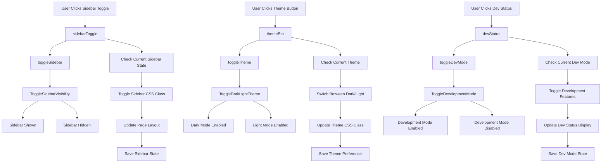

# Header Controls Events

## Event Handlers

### **Header Control Events**
- **Toggle Sidebar**: `toggleSidebar()` - Shows/hides main sidebar
- **Toggle Theme**: `toggleTheme()` - Switches between dark and light modes
- **Toggle Dev Mode**: `toggleDevMode()` - Enables/disables development features

### **UI Components**
- **Sidebar Toggle**: Button to collapse/expand sidebar
- **Theme Button**: Button to switch between themes
- **Dev Status**: Indicator for development mode status

### **Expected Outputs**
- **Sidebar State**: Visible or hidden based on user preference
- **Theme State**: Dark or light mode applied to interface
- **Dev Mode State**: Development features enabled or disabled
- **Persistent Settings**: All preferences saved for future sessions

### **Data Flow**
1. User clicks header control button
2. Current state is checked
3. Appropriate CSS classes are toggled
4. Page layout is updated
5. New state is saved to localStorage

### **Advanced Features**
- **Responsive Design**: Sidebar adapts to screen size
- **Smooth Transitions**: CSS animations for state changes
- **Keyboard Shortcuts**: Alt+S for sidebar, Alt+T for theme
- **Accessibility**: Screen reader compatible state changes
