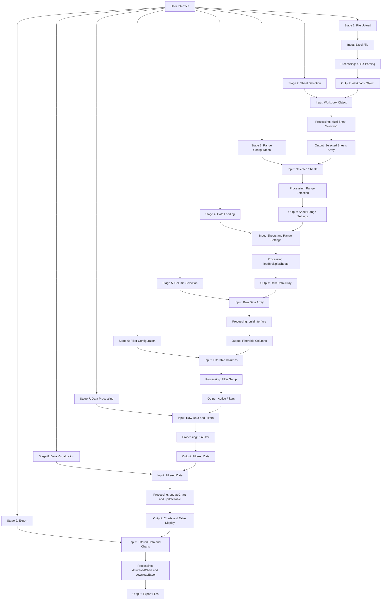

```mermaid
graph TD
 %% Stage 1: File Upload
 Stage1[Stage 1: File Upload] --> Input1[Input: Excel File]
 Input1 --> Process1[Processing: XLSX Parsing]
 Process1 --> Output1[Output: Workbook Object]
 
 %% Stage 2: Sheet Selection
 Stage2[Stage 2: Sheet Selection] --> Input2[Input: Workbook Object]
 Input2 --> Process2[Processing: Multi Sheet Selection]
 Process2 --> Output2[Output: Selected Sheets Array]
 
 %% Stage 3: Range Configuration
 Stage3[Stage 3: Range Configuration] --> Input3[Input: Selected Sheets]
 Input3 --> Process3[Processing: Range Detection]
 Process3 --> Output3[Output: Sheet Range Settings]
 
 %% Stage 4: Data Loading
 Stage4[Stage 4: Data Loading] --> Input4[Input: Sheets and Range Settings]
 Input4 --> Process4[Processing: loadMultipleSheets]
 Process4 --> Output4[Output: Raw Data Array]
 
 %% Stage 5: Column Selection
 Stage5[Stage 5: Column Selection] --> Input5[Input: Raw Data Array]
 Input5 --> Process5[Processing: buildInterface]
 Process5 --> Output5[Output: Filterable Columns]
 
 %% Stage 6: Filter Configuration
 Stage6[Stage 6: Filter Configuration] --> Input6[Input: Filterable Columns]
 Input6 --> Process6[Processing: Filter Setup]
 Process6 --> Output6[Output: Active Filters]
 
 %% Stage 7: Data Processing
 Stage7[Stage 7: Data Processing] --> Input7[Input: Raw Data and Filters]
 Input7 --> Process7[Processing: runFilter]
 Process7 --> Output7[Output: Filtered Data]
 
 %% Stage 8: Data Visualization
 Stage8[Stage 8: Data Visualization] --> Input8[Input: Filtered Data]
 Input8 --> Process8[Processing: updateChart and updateTable]
 Process8 --> Output8[Output: Charts and Table Display]
 
 %% Stage 9: Export
 Stage9[Stage 9: Export] --> Input9[Input: Filtered Data and Charts]
 Input9 --> Process9[Processing: downloadChart and downloadExcel]
 Process9 --> Output9[Output: Export Files]
 
 %% Connect the pipeline
 Output1 --> Input2
 Output2 --> Input3
 Output3 --> Input4
 Output4 --> Input5
 Output5 --> Input6
 Output6 --> Input7
 Output7 --> Input8
 Output8 --> Input9
 
 %% UI Components mapping
 UI[User Interface] --> Stage1
 UI --> Stage2
 UI --> Stage3
 UI --> Stage4
 UI --> Stage5
 UI --> Stage6
 UI --> Stage7
 UI --> Stage8
 UI --> Stage9
```
