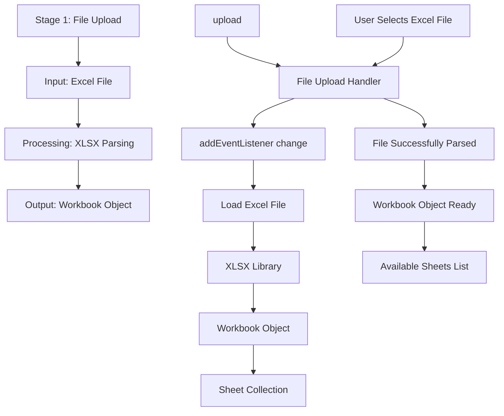

# Stage 1: File Upload

## Event Handlers

### **File Upload Events**
- **File Selection**: `addEventListener change` on `#upload` - Triggers when user selects Excel file
- **File Parsing**: XLSX automatically parses the uploaded file
- **Workbook Creation**: Creates workbook object containing all sheets

### **Expected Outputs**
- **Workbook Object**: Complete Excel file structure with all sheets
- **Sheet Collection**: Array of all available worksheets
- **File Status**: Updated status showing successful file upload

### **Error Handling**
- **Invalid File Type**: Shows warning if file is not Excel format
- **Corrupted File**: Displays error if file cannot be parsed
- **Large File**: Shows warning for files exceeding size limits
