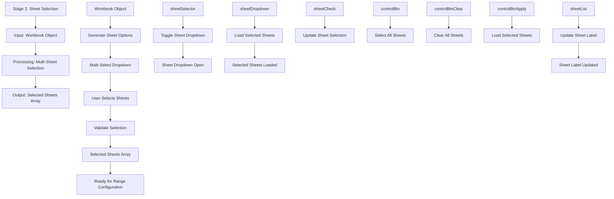

# Stage 2: Sheet Selection

## Event Handlers

### **Sheet Selection Events**
- **Toggle Dropdown**: `toggleSheetDropdown` - Opens/closes sheet selection dropdown
- **Update Selection**: `updateSheetLabel` - Updates when sheets are selected/deselected
- **Select All**: `selectAllSheets(true)` - Selects all available sheets
- **Clear All**: `selectAllSheets(false)` - Deselects all sheets
- **Load Selected**: `loadSelectedSheets` - Loads selected sheets for processing

### **UI Components**
- **Multi-Select Dropdown**: Custom dropdown with checkboxes for each sheet
- **Sheet Checkboxes**: Individual checkboxes for each available sheet
- **Control Buttons**: Select All, Clear All, and Apply buttons
- **Sheet Label**: Displays current selection status

### **Expected Outputs**
- **Selected Sheets Array**: Array of sheet names chosen by user
- **Selection Status**: Visual feedback showing selected count
- **Dropdown State**: Open/closed state of sheet selector
- **Label Update**: Updated text showing selection summary

### **Data Flow**
1. Workbook provides list of available sheets
2. UI generates checkboxes for each sheet
3. User interacts with checkboxes
4. Selection is validated and tracked
5. Selected sheets array is prepared for next stage
