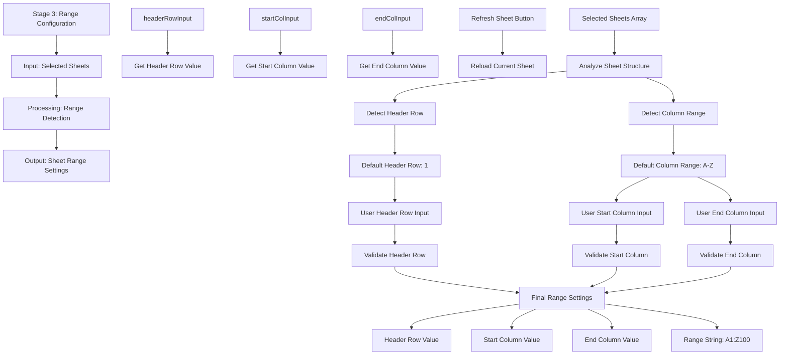

# Stage 3: Range Configuration

## Event Handlers

### **Range Configuration Events**
- **Header Row Input**: `reloadCurrentSheet` - Triggered when header row value changes
- **Start Column Input**: `reloadCurrentSheet` - Triggered when start column changes
- **End Column Input**: `reloadCurrentSheet` - Triggered when end column changes
- **Refresh Button**: `reloadCurrentSheet` - Manual refresh with current settings

### **Auto-Detection Logic**
- **Header Detection**: Automatically identifies first non-empty row as header
- **Column Range**: Detects used columns across all selected sheets
- **Default Values**: Provides sensible defaults for user convenience
- **Validation**: Ensures inputs are within valid ranges

### **UI Components**
- **Header Row Input**: Numeric input for header row number
- **Start Column Input**: Text input for starting column (A, B, etc.)
- **End Column Input**: Text input for ending column
- **Refresh Button**: Reloads sheets with current range settings

### **Expected Outputs**
- **Range Settings**: Complete configuration for data extraction
- **Header Row**: Row number to use as column headers
- **Column Range**: Start and end columns for data extraction
- **Range String**: Human-readable range format (A1:Z100)

### **Data Flow**
1. Analyze selected sheets to detect structure
2. Set default header row and column range
3. Allow user to override defaults
4. Validate user inputs
5. Create final range settings for data loading
