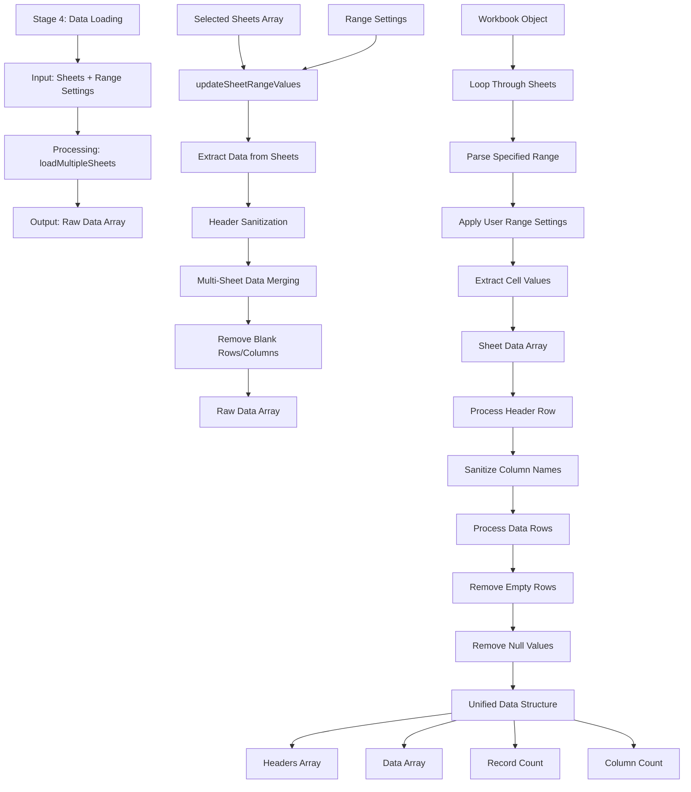

# Stage 4: Data Loading

## Event Handlers

### **Data Loading Events**
- **Load Multiple Sheets**: `loadMultipleSheets` - Main function for loading selected sheets
- **Update Range Values**: `updateSheetRangeValues` - Updates range based on loaded sheets
- **Reload Current Sheet**: `reloadCurrentSheet` - Refreshes with preserved inputs
- **Load with Preserved Inputs**: `loadMultipleSheetsWithPreservedInputs` - Maintains user settings

### **Processing Functions**
- **Range Application**: Applies user-specified header row and column bounds
- **Header Sanitization**: Cleans column names for consistent processing
- **Data Merging**: Combines data from multiple sheets
- **Blank Removal**: Eliminates empty rows and columns

### **Data Flow**
1. **Range Application**: Apply user-defined header row and column range
2. **Data Extraction**: Pull data from specified ranges in each sheet
3. **Header Processing**: Clean and standardize column names
4. **Data Merging**: Combine multiple sheets into unified structure
5. **Data Cleaning**: Remove blanks and null values
6. **Final Array**: Produce clean data array for next stage

### **Expected Outputs**
- **Raw Data Array**: Clean, unified data from all selected sheets
- **Headers Array**: Standardized column names
- **Record Count**: Total number of data rows
- **Column Count**: Total number of columns
- **Data Structure**: Consistent format for filtering and display

### **Error Handling**
- **Invalid Range**: Shows warning for out-of-bounds ranges
- **Empty Sheets**: Handles sheets with no data in specified range
- **Merge Conflicts**: Resolves column name conflicts between sheets
- **Large Data**: Shows progress for large datasets
