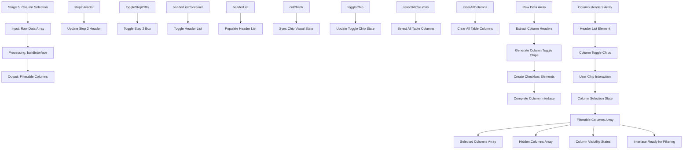

# Stage 5: Column Selection

## Event Handlers

### **Column Selection Events**
- **Build Interface**: `buildInterface` - Main function for building column selection UI
- **Sync Chip**: `syncChip` - Synchronizes chip visual state with checkbox
- **Toggle Step 2**: `toggleStep2Box` - Shows/hides column selection section
- **Select All Columns**: `selectAllColumns` - Selects all available columns
- **Clear All Columns**: `clearAllColumns` - Deselects all columns

### **UI Components**
- **Header List**: Container for column selection checkboxes
- **Column Chips**: Toggle switches for each column
- **Select/Clear All**: Bulk selection controls
- **Initialize Dashboard**: Button to proceed to filtering stage

### **Data Flow**
1. **Header Extraction**: Get column names from raw data array
2. **Chip Generation**: Create toggle elements for each column
3. **Interface Building**: Assemble complete selection interface
4. **User Interaction**: Handle clicks on column toggles
5. **State Management**: Track selected vs hidden columns
6. **Output Preparation**: Prepare arrays for filtering stage

### **Expected Outputs**
- **Filterable Columns**: Array of columns available for filtering
- **Selected Columns**: Array of columns chosen for display
- **Hidden Columns**: Array of columns hidden from view
- **Column States**: Object tracking visibility for each column
- **Interface State**: Complete UI ready for filtering operations

### **User Experience**
- **Visual Feedback**: Immediate visual response to column selection
- **Bulk Operations**: Quick select/clear all functionality
- **Persistent State**: Selections maintained during refresh
- **Intuitive Layout**: Clear organization of available columns
