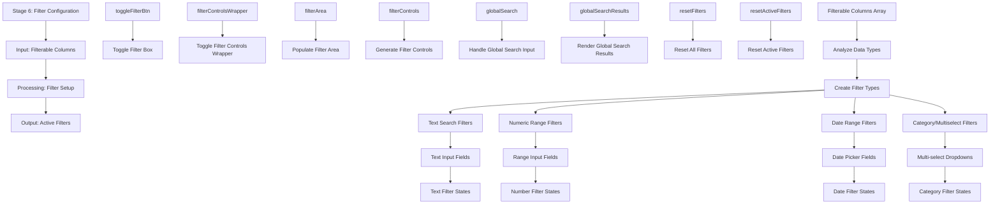

# Stage 6: Filter Configuration

## Event Handlers

### **Filter Configuration Events**
- **Toggle Filter Box**: `toggleFilterBox` - Shows/hides filter controls section
- **Handle Global Search**: `handleGlobalSearchInput` - Processes global search input
- **Render Search Results**: `renderGlobalSearchResults` - Displays search matches
- **Reset Filters**: `resetFilters` - Clears all active filters
- **Reset Active Filters**: `resetActiveFilters` - Clears only active filters

### **Filter Types**
- **Global Search**: Searches across all columns simultaneously
- **Text Filters**: Contains/starts with/ends with options for text columns
- **Numeric Filters**: Range filters (min/max) for number columns
- **Date Filters**: Date range pickers for date columns
- **Category Filters**: Multi-select dropdowns for categorical data

### **UI Components**
- **Filter Controls Container**: Main container for all filter elements
- **Filter Areas**: Individual sections for each filter type
- **Global Search Bar**: Quick search across all data
- **Reset Controls**: Buttons to clear filters

### **Data Flow**
1. **Data Analysis**: Examine column data types
2. **Filter Generation**: Create appropriate filter controls
3. **Interface Assembly**: Build complete filter interface
4. **User Interaction**: Handle filter value changes
5. **State Tracking**: Maintain current filter states
6. **Output Preparation**: Prepare filter configuration for data processing

### **Expected Outputs**
- **Active Filters**: Current filter configuration object
- **Filter States**: Individual state for each filter type
- **Filter Criteria**: Specific values and ranges for filtering
- **Search Results**: Matches from global search functionality
- **Interface Ready**: Complete filter setup for data processing

### **Advanced Features**
- **Debounced Search**: Prevents excessive filtering during typing
- **Filter Persistence**: Maintains filters during data refresh
- **Smart Defaults**: Intelligently suggests filter ranges
- **Real-time Updates**: Immediate feedback on filter changes
