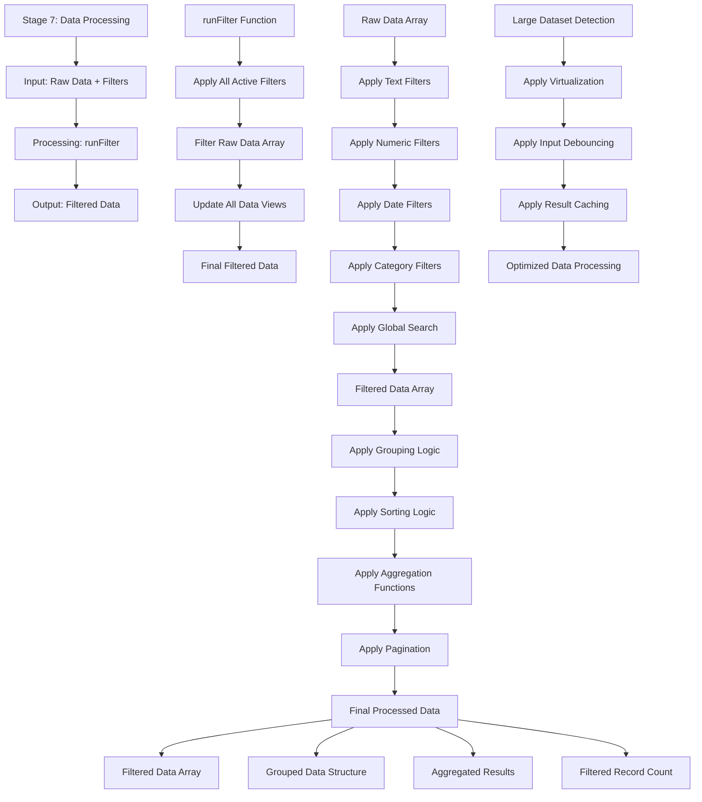

# Stage 7: Data Processing

## Event Handlers

### **Core Processing Events**
- **Run Filter**: `runFilter` - Main function that applies all active filters
- **Apply Filters**: Internal function that processes each filter type
- **Update Views**: Updates table, charts, and status after filtering
- **Process Large Data**: Special handling for datasets exceeding performance thresholds

### **Filter Processing**
- **Text Filters**: Contains, starts with, ends with, exact match
- **Numeric Filters**: Range filters, greater than, less than, equals
- **Date Filters**: Date ranges, relative dates (last 30 days, etc.)
- **Category Filters**: Multi-select, single-select, exclude options
- **Global Search**: Full-text search across all columns

### **Data Operations**
- **Grouping**: Groups data by specified columns
- **Sorting**: Sorts by multiple columns with custom order
- **Aggregation**: Calculates sum, count, avg, min, max functions
- **Pagination**: Implements virtual scrolling for large datasets

### **Performance Features**
- **Debouncing**: Prevents excessive re-filtering during rapid input
- **Virtualization**: Only renders visible rows for large datasets
- **Caching**: Stores filter results to avoid reprocessing
- **Progress Indicators**: Shows progress for long-running operations

### **Expected Outputs**
- **Filtered Data Array**: Data after all filters applied
- **Grouped Data**: Data structured by grouping criteria
- **Aggregated Results**: Summary statistics and calculations
- **Record Count**: Total number of records after filtering
- **Processing Status**: Current state and progress information

### **Error Handling**
- **Invalid Filters**: Handles malformed filter criteria
- **Performance Issues**: Detects and handles slow operations
- **Memory Limits**: Manages large dataset processing
- **Data Corruption**: Validates data integrity during processing
