# Stage 8: Data Visualization

```mermaid
graph TD
    %% Stage Definition
    Stage8[Stage 8: Data Visualization] --> Input8[Input: Filtered Data]
    Input8 --> Process8[Processing: updateChart and updateTable]
    Process8 --> Output8[Output: Charts + Table Display]
    
    %% Chart Components
    toggleChartsBtn --> ToggleChartsContainer[Toggle Charts Container]
    chartsWrapper --> ToggleChartsWrapper[Toggle Charts Wrapper]
    chartType --> UpdateChartType[Update Chart Type]
    chartCanvasContainer --> GetChartCanvas[Get Chart Canvas Container]
    dataChart --> UpdateDataChart[Update Data Chart]
    
    %% Chart Types
    FilteredData[Filtered Data Array] --> LineChart[Line Chart Processing]
    FilteredData --> BarChart[Bar Chart Processing]
    FilteredData --> PieChart[Pie Chart Processing]
    FilteredData --> ScatterChart[Scatter Chart Processing]
    
    %% Chart Processing Flow
    LineChart --> ChartJS[Chart Rendering]
    BarChart --> ChartJS
    PieChart --> ChartJS
    ScatterChart --> ChartJS
    ChartJS --> InteractiveChart[Interactive Chart Display]
    
    %% Table Components
    mainTable --> UpdateMainTable[Update Main Table]
    tBody --> UpdateTableBody[Update Table Body]
    headerList --> GetHeaderList[Get Header List for Table]
    
    %% Table Processing
    FilteredData --> TableRendering[Render Table Data]
    TableRendering --> StickyHeaders[Apply Sticky Headers]
    StickyHeaders --> ColumnResize[Enable Column Resizing]
    ColumnResize --> ColumnSearch[Enable Column Search]
    ColumnSearch --> InteractiveTable[Interactive Data Table]
    
    %% Date Range Chart
    toggleDateRangeChartBtn --> ToggleDateRangeChart[Toggle Date Range Chart]
    dateRangeChartSection --> ToggleDateRangeSection[Toggle Date Range Chart Section]
    dateRangeChart --> UpdateDateRangeChart[Update Date Range Chart]
    
    %% Expected Outputs
    InteractiveChart --> ChartDisplay[Rendered Chart Display]
    InteractiveTable --> TableDisplay[Rendered Table Display]
    ChartDisplay --> ChartInteractions[Chart Interactions Enabled]
    TableDisplay --> TableInteractions[Table Interactions Enabled]
```

## Event Handlers

### **Chart Events**
- **Toggle Charts Container**: `toggleChartsContainer` - Shows/hides chart section
- **Update Chart Type**: `runFilter` triggered by chart type change
- **Update Data Chart**: `updateChart` - Main chart update function
- **Update Date Range Chart**: `updateDateRangeChart` - Updates date-specific chart

### **Table Events**
- **Update Main Table**: `updateTable` - Main table rendering function
- **Update Table Body**: Updates only the data rows for performance
- **Get Header List**: Retrieves current column configuration
- **Finish Update Table**: Finalizes table rendering

### **Chart Features**
- **Multiple Chart Types**: Line, bar, pie, scatter, area charts
- **Interactive Elements**: Hover tooltips, click interactions, zoom
- **Responsive Design**: Adapts to different screen sizes
- **Real-time Updates**: Charts update immediately with filter changes

### **Table Features**
- **Sticky Headers**: Headers remain visible during scrolling
- **Column Resizing**: Interactive column width adjustment
- **Column Search**: Individual column search/filter
- **Virtual Scrolling**: Efficient rendering of large datasets
- **Sort by Column**: Click headers to sort data

### **Data Visualization Flow**
1. **Data Preparation**: Format filtered data for visualization
2. **Chart Rendering**: Create charts using Chart library
3. **Table Rendering**: Generate HTML table with current data
4. **Interactive Features**: Enable user interactions
5. **Responsive Updates**: Handle window resize and data changes
6. **Performance Optimization**: Efficient rendering for large datasets

### **Expected Outputs**
- **Chart Display**: Interactive charts showing data trends
- **Table Display**: Sortable, searchable data table
- **Data Insights**: Visual patterns and relationships
- **Export Options**: Download charts as images
- **Print Ready**: Optimized layouts for printing

### **Advanced Features**
- **Drill-down Capability**: Click chart elements for detailed view
- **Multiple Views**: Side-by-side chart and table views
- **Custom Themes**: Consistent styling with application theme
- **Accessibility**: Screen reader compatible and keyboard navigation
