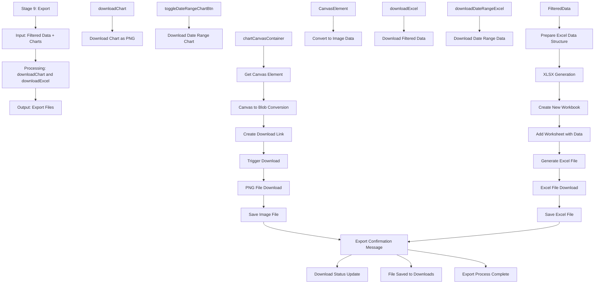

# Stage 9: Export

## Event Handlers

### **Export Events**
- **Download Chart**: `downloadChart` - Exports main chart as PNG
- **Download Date Range Chart**: `downloadDateRangeChart` - Exports date range chart
- **Download Excel**: `downloadExcel` - Exports filtered data as Excel
- **Download Date Range Excel**: `downloadDateRangeExcel` - Exports date-filtered data

### **Chart Export Features**
- **PNG Format**: High-quality image export
- **Canvas Capture**: Direct from HTML5 canvas element
- **Custom Filename**: Uses descriptive naming convention
- **Multiple Charts**: Supports both main and date range charts
- **Background Options**: Transparent or colored backgrounds

### **Excel Export Features**
- **XLSX Format**: Modern Excel file format
- **Filtered Data**: Only includes currently visible data
- **Preserve Formatting**: Maintains data types and formatting
- **Multiple Sheets**: Supports date range in separate sheet
- **Metadata**: Includes export timestamp and filter info

### **Export Process Flow**
1. **Data Collection**: Gather current filtered data
2. **Format Preparation**: Structure data for export format
3. **File Generation**: Create file in appropriate format
4. **Download Trigger**: Initiate browser download
5. **User Notification**: Confirm successful export
6. **File Management**: Handle download completion

### **Chart Export Details**
- **Canvas Extraction**: Gets image data from chart canvas
- **Blob Creation**: Converts canvas to downloadable blob
- **Download Link**: Creates temporary download link
- **Automatic Cleanup**: Removes temporary elements
- **Quality Settings**: High-resolution export options

### **Excel Export Details**
- **Data Validation**: Ensures data integrity
- **Type Detection**: Preserves numeric, date, text types
- **Column Headers**: Includes current column names
- **Filter Metadata**: Adds sheet with current filter settings
- **Large File Handling**: Progress indicators for big exports

### **Expected Outputs**
- **PNG Files**: Chart images saved locally
- **Excel Files**: Data files ready for analysis
- **Export Confirmation**: User feedback on completion
- **Download History**: Track of recent exports
- **Error Handling**: Clear messages for export failures

### **Advanced Features**
- **Batch Export**: Export multiple charts simultaneously
- **Custom Templates**: Predefined export formats
- **Email Integration**: Direct email sending option
- **Cloud Storage**: Save directly to cloud services
- **Scheduled Export**: Automated export capabilities
