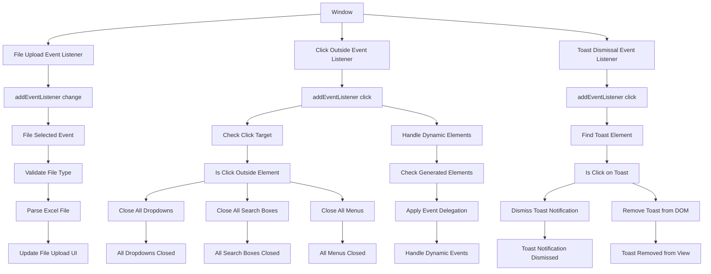

# Window Event Listeners

## Event Handlers

### **Window-Level Events**
- **File Upload Listener**: `addEventListener("change")` on document - Handles file selection
- **Click Outside Listener**: `addEventListener("click")` on document - Closes UI elements
- **Toast Dismissal Listener**: `addEventListener("click")` on document - Handles toast clicks

### **Click Outside Logic**
- **Target Detection**: Checks if click is outside specified elements
- **Element Closing**: Closes dropdowns, search boxes, menus
- **Multiple Elements**: Handles various UI components simultaneously
- **Prevent Conflicts**: Avoids closing when clicking inside elements

### **Toast Management**
- **Auto-Dismiss**: Click anywhere on toast to dismiss
- **DOM Removal**: Cleanly removes toast from page
- **Animation**: Smooth fade-out effect
- **Queue Management**: Handles multiple toasts in sequence

### **Event Delegation**
- **Dynamic Elements**: Handles events for dynamically created elements
- **Performance**: Efficient single listener for multiple elements
- **Future-Proof**: Works for elements added after page load
- **Maintenance**: Easy to update and manage

### **Expected Outputs**
- **Clean UI State**: All floating elements properly closed
- **Responsive Behavior**: Natural user interaction patterns
- **Memory Efficiency**: Single listener handles multiple elements
- **Consistent Experience**: Predictable UI behavior

### **Advanced Features**
- **Debouncing**: Prevents rapid successive triggers
- **Context Awareness**: Differentiates between various UI contexts
- **Accessibility**: Keyboard support for closing elements
- **Mobile Optimization**: Touch-friendly interaction patterns
