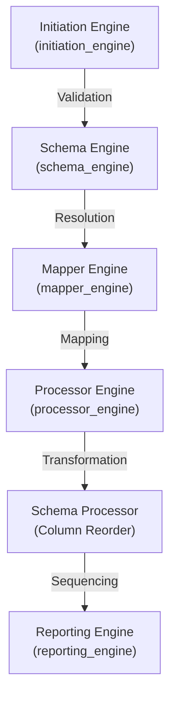

# DCC Engine Pipeline

## Summary for main pipeline
The DCC Engine Pipeline is the central orchestrator for processing Engineering and Design document registers. It provides a modular, schema-driven workflow that automates project setup validation, schema resolution, fuzzy column mapping, complex data calculations, and multi-format reporting. It is designed to handle large-scale document metadata with high reliability and traceability.

---

## Table of Contents
- [Summary for main pipeline](#summary-for-main-pipeline)
- [Environment setup and requirements](#environment-setup-and-requirements)
- [Overall project folder structure](#overall-project-folder-structure)
- [Schema files](#schema-files)
- [Parser arguments and details](#parser-arguments-and-details)
- [Required input data files](#required-input-data-files)
- [Designed output files](#designed-output-files)
- [Workflow Overview](#workflow-overview)
- [Module Structure](#module-structure)
- [Function I/O Reference](#function-io-reference)
- [Global Parameter Trace Matrix](#global-parameter-trace-matrix)
- [Validation Category Summary Table](#validation-category-summary-table)
- [Debugging and logging](#debugging-and-logging)
- [Examples](#examples)
- [Troubleshooting](#troubleshooting)
- [Potential issues to users](#potential-issues-to-users)
- [Best Practices](#best-practices)
- [List of module readme.md files and links to them](#list-of-module-readmemd-files-and-links-to-them)

---

## Environment setup and requirements
- **Python Version**: Python 3.10+ (tested with 3.13)
- **Core Dependencies**:
  - `pandas`: Data manipulation and analysis.
  - `numpy`: Numerical computing.
  - `openpyxl`: Excel file reading/writing.
  - `difflib`: Fuzzy string matching (standard library).
  - `pathlib`: Object-oriented filesystem paths (standard library).
- **Setup**:
  It is recommended to use a Conda environment. A `dcc.yml` file is provided in the project root for environment replication:
  ```bash
  conda env create -f dcc.yml
  conda activate dcc
  ```

---

## Overall project folder structure
```
Engineering-and-Design/
├── dcc/
│   ├── config/             # JSON Schemas and configurations
│   │   └── schemas/        # Main and referenced schemas
│   ├── data/               # Input Excel/data files
│   ├── output/             # Generated CSV, Excel, and Text reports
│   ├── test/               # Automated test suite
│   ├── workflow/           # Main pipeline and engine modules
│   │   ├── initiation_engine/
│   │   ├── schema_engine/
│   │   ├── mapper_engine/
│   │   ├── processor_engine/
│   │   └── reporting_engine/
│   └── tools/              # Standalone utility scripts
├── dcc.yml                 # Environment configuration
└── README.md               # Project root documentation
```

---

## Schema files
The pipeline is governed by a set of interconnected JSON schemas located in `dcc/config/schemas/`:
- **`project_setup.json`**: Defines the required project structure and engine dependencies.
- **`dcc_register_enhanced.json`**: The primary data schema defining columns, aliases, null strategies, and calculations.
- **`facility_schema.json`**, **`discipline_schema.json`**, etc.: Referenced schemas for validating specific code fields.

---

## Parser arguments and details
The pipeline supports the following command-line arguments:

| Argument | Type | Default | Description |
|----------|------|---------|-------------|
| `--base-path` | Path | Root Dir | The absolute anchor for all project paths. |
| `--schema-file` | Path | `dcc_register_enhanced.json` | Path to the main schema register. |
| `--excel-file` | Path | Defined in schema | Path to the source document register (Excel). |
| `--upload-sheet`| String | Defined in schema | The specific sheet name within the Excel file. |
| `--output-file` | Path | `output/processed_dcc_universal.csv` | Final CSV output path. |
| `--start-col` | String | `P` | Starting column for Excel data range. |
| `--end-col` | String | `AP` | Ending column for Excel data range. |
| `--header-row` | Int | `4` | Index of the header row in Excel (0-based). |
| `--overwrite` | Bool | `True` | Whether to overwrite existing output files. |
| `--debug-mode` | Bool | `False` | Enables verbose tiered logging. |
| `--nrows` | Int | `None` | Limit the number of rows to process (for testing). |
| `--json` | Flag | N/A | Output final results as a JSON string. |

---

## Required input data files
- **Source Document Register**: An `.xlsx` file containing the raw document metadata.
- **Configuration Schemas**: Valid `.json` files defining the processing rules.
- **Master Registry**: (Optional) Reference files for code lookups as defined in the schema.

---

## Designed output files
1. **Processed Data (CSV)**: Standardized data for downstream system ingestion.
2. **Processed Data (Excel)**: Formatted data for manual review and reporting.
3. **Processing Summary (TXT)**: Detailed report including match rates, shapes, and warnings.
4. **Validation Status (JSON)**: `schema_validation_status.json` tracks validation currency.
5. **Debug Log (JSON)**: `debug_log.json` containing a structured trace of the execution.

---

## Workflow Overview



### Steps Summary:
- **Initiation**: Environment and project structure health check.
- **Schema Validation**: Dependency resolution and integrity check.
- **Column Mapping**: Fuzzy matching raw headers to schema standards.
- **Document Processing**: Executing multi-stage calculations (Aggregate, Date, Mapping, etc.).
- **Column Reorder**: Aligning output structure with schema sequence.
- **Reporting**: Final summary generation and file export.

---

## Module Structure
- `initiation_engine`: Handles setup, CLI, paths, and environment validation.
- `schema_engine`: Manages schema loading, validation, and status tracking.
- `mapper_engine`: Provides fuzzy header detection and DataFrame renaming.
- `processor_engine`: Core calculation engine with registry-based handlers.
- `reporting_engine`: Generates console summaries and detailed text reports.

---

## Function I/O Reference

| Function | File | Input | Output |
|----------|------|-------|--------|
| `main()` | `dcc_engine_pipeline.py` | CLI Args | Exit code (int) |
| `run_engine_pipeline()` | `dcc_engine_pipeline.py` | base_path, schema_path, params | Results Dict |
| `build_native_defaults()` | `initiation_engine` | base_path | Native defaults Dict |
| `resolve_effective_parameters()`| `initiation_engine` | schema_path, cli_args, defaults | Merged parameters Dict |

---

## Global Parameter Trace Matrix

| Parameter | Source | Consumer | Role |
|-----------|--------|----------|------|
| `base_path` | CLI/Paths | All Engines | Root anchor for all operations |
| `effective_parameters` | CLI/Schema/Defaults | All Engines | Central configuration object |
| `resolved_schema` | Schema Loader | Mapper, Processor | Actionable processing rules |
| `df_processed` | Processor Engine | Export/Reporting | Final transformed dataset |

---

## Validation Category Summary Table

| Category | Source | Description |
|----------|--------|-------------|
| **Environment** | `initiation_engine` | Module availability and Python version |
| **Structure** | `initiation_engine` | File and folder presence |
| **Integrity** | `schema_engine` | JSON validity and dependency loops |
| **Mapping** | `mapper_engine` | Header match score and alias resolution |
| **Calculation**| `processor_engine` | Dependency ordering and handler availability |

---

## Debugging and logging
The pipeline uses a **tiered logging strategy** managed via `initiation_engine`:
- **Level 1 (Status)**: High-level milestone progress.
- **Level 2 (Warning/Debug)**: Path resolutions, parameter values, and warnings.
- **Level 3 (Trace)**: Deep technical info and raw extraction details.

All logs are captured in a structured `debug_log.json` file in the output directory, including timestamps and duration for each step.

---

## Examples

### Processing a full register
```bash
python dcc/workflow/dcc_engine_pipeline.py --excel-file dcc/data/register.xlsx
```

### Debugging a specific range
```bash
python dcc/workflow/dcc_engine_pipeline.py --start-col A --end-col Z --debug-mode True
```

---

## Troubleshooting

| Issue | Potential Cause | Resolution |
|-------|-----------------|------------|
| **Environment test failed** | Missing libraries | Check `dcc.yml` and re-install dependencies. |
| **Circular dependency** | Schema columns reference each other | Break the loop in the `dependencies` field of the schema. |
| **Missing Output** | Overwrite disabled | Set `--overwrite True` or change output file path. |

---

## Potential issues to users
- **Large Files**: Processing extremely large Excel files (>100k rows) may require significant memory; use `--nrows` for testing.
- **Column Aliases**: If a column is not matched, ensure all possible raw header names are added to the `aliases` array in the schema.
- **Permissions**: Ensure write access to the `dcc/output/` directory.

---

## Best Practices
- **Incremental Testing**: Use `--nrows` to test new schema changes on a subset of data.
- **Schema Versioning**: Keep backups of schemas before major modifications.
- **Review Summary**: Always check the `processing_summary.txt` for unmatched headers or null count warnings.

---

## List of module readme.md files and links to them
- [Initiation Engine README](initiation_engine/readme.md)
- [Schema Engine README](schema_engine/readme.md)
- [Mapper Engine README](mapper_engine/readme.md)
- [Processor Engine README](processor_engine/readme.md)
- [Reporting Engine README](reporting_engine/readme.md)
- [Column Priority Reference](explaination/column_priority_reference.md) - Detailed column priority rules (P1/P2/P2.5/P3)
