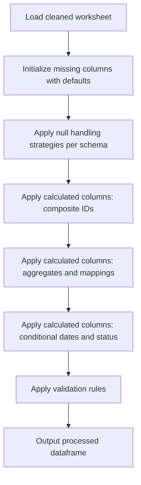

# DCC Column Update Logic

This file summarizes the schema-driven column update logic defined in `dcc_register_enhanced.json` and implemented by `universal_document_processor.py`.

## Overview

## Processing Pipeline

The `UniversalDocumentProcessor.process_data()` method executes these steps in order:

1. **Initialize Missing Columns**: Creates schema-defined columns that don't exist in input data
2. **Verify Required Columns**: Ensures all required non-calculated columns are present
3. **Apply Null Handling**: Executes null handling strategies (forward fill, default values, multi-level fills)
4. **Apply Calculations**: Executes all `is_calculated: true` column definitions
5. **Apply Validation**: Validates data against schema rules (patterns, lengths, allowed values)

## Detailed Logic Table

| Step | Target column(s) | Schema Type | Main input column(s) | Logic / Calculation Method | Null / Default Handling Strategy |
| --- | --- | --- | --- | --- | --- |
| 1 | `Project_Code` | Input | Raw project code column | Direct mapping from aliases | `default_value`: "NA" |
| 2 | `Facility_Code` | Input | Raw facility code column | Direct mapping from aliases | `default_value`: "NA" |
| 3 | `Document_Type` | Input | Raw document type column | Validated against document_type_schema | `default_value`: "NA" |
| 4 | `Discipline` | Input | Raw discipline column | Validated against discipline_schema | `default_value`: "NA" |
| 5 | `Document_Sequence_Number` | Input | Raw sequence number column | Validated with numeric pattern | `default_value`: "NA" |
| 6 | `Document_ID` | Calculated | `Project_Code`, `Facility_Code`, `Document_Type`, `Discipline`, `Document_Sequence_Number` | **composite/build_document_id**: Format `{Project_Code}-{Facility_Code}-{Document_Type}-{Discipline}-{Document_Sequence_Number}` | `leave_null`: Populated by composite calculation |
| 7 | `Document_Revision` | Input | Raw revision column | Multi-level forward fill | `multi_level_forward_fill`: [DocID+Session+Rev → DocID+Session → DocID], final_fill: "NA" |
| 8 | `Document_Title` | Input | Raw title column | Direct mapping | `default_value`: "NA" |
| 9 | `Transmittal_Number` | Input | Raw transmittal column | String conversion, text replacements (N.A.→NA, nan→NA) | `default_value` with text_replacements: "NA" |
| 10 | `Submission_Session` | Input | Raw session column | Forward fill, zero-pad to 6 digits | `forward_fill`: group_by=[], fill_value="0", zero_pad: 6 |
| 11 | `Submission_Session_Revision` | Input | Raw revision column | Forward fill by Session, zero-pad to 2 digits | `forward_fill`: group_by=[Submission_Session], fill_value="0", zero_pad: 2, na_fallback: true |
| 12 | `Submission_Session_Subject` | Input | Raw subject column | Multi-level forward fill | `multi_level_forward_fill`: [Session+Rev → Session] |
| 13 | `Consolidated_Submission_Session_Subject` | Calculated | `Submission_Session_Subject` | **aggregate/concatenate_unique_quoted**: Group by Document_ID, quote each value, join with " && " | N/A (calculated) |
| 14 | `Department` | Input | Raw department column | Validated against department_schema, multi-level forward fill | `multi_level_forward_fill`: [Session+Rev → Session], final_fill: "NA" |
| 15 | `Submitted_By` | Input | Raw submitter column | Multi-level forward fill | `multi_level_forward_fill`: [Session+Rev → Session], final_fill: "NA" |
| 16 | `Submission_Date` | Input | Raw date column | Multi-level forward fill with datetime conversion | `multi_level_forward_fill`: [Session+Rev → Session], datetime_conversion: coerce |
| 17 | `First_Submission_Date` | Calculated | `Submission_Date` | **aggregate/min**: Group by Document_ID, find earliest date | N/A (calculated) |
| 18 | `Latest_Submission_Date` | Calculated | `Submission_Date` | **aggregate/max**: Group by Document_ID, find latest date | N/A (calculated) |
| 19 | `Latest_Revision` | Calculated | `Document_Revision`, `Submission_Date` | **latest_by_date**: Sort by Submission_Date desc, exclude "NA", get first non-NA revision per Document_ID | N/A (calculated), fallback: "NA" |
| 20 | `All_Submission_Sessions` | Calculated | `Submission_Session` | **aggregate/concatenate_unique**: Group by Document_ID, join unique sessions with "&&" | N/A (calculated) |
| 21 | `All_Submission_Dates` | Calculated | `Submission_Date` | **aggregate/concatenate_dates**: Group by Document_ID, sort chronologically, format YYYY-MM-DD, join with ", " | N/A (calculated) |
| 22 | `All_Submission_Session_Revisions` | Calculated | `Submission_Session_Revision` | **aggregate/concatenate_unique**: Group by Document_ID, join unique revisions with ", " | N/A (calculated) |
| 23 | `Count_of_Submissions` | Calculated | `Document_ID` | **aggregate/count**: Count rows per Document_ID, broadcast to all rows via transform | N/A (calculated) |
| 24 | `Reviewer` | Input | Raw reviewer column | Forward fill by Session | `forward_fill`: group_by=[Submission_Session], fill_value="NA", na_fallback: true |
| 25 | `Review_Return_Actual_Date` | Input | Raw return date column | Forward fill by Session+Revision with datetime conversion | `forward_fill`: group_by=[Session, Session_Revision], datetime_conversion: coerce |
| 26 | `Review_Return_Plan_Date` | Calculated | `Submission_Date`, `Submission_Session`, `Submission_Session_Revision` | **conditional_date_calculation/calculate_review_return_plan_date**: If no previous submission → Submission_Date + first_review_duration (20 days), else → Submission_Date + second_review_duration (14 days). Uses working days if duration_is_working_day=true | `leave_null`: Populated by conditional calculation |
| 27 | `Review_Status` | Input | Raw status column | Forward fill by Session+Revision | `forward_fill`: group_by=[Session, Session_Revision], fill_value: "Pending" |
| 28 | `Review_Status_Code` | Calculated | `Review_Status` | **mapping/status_to_code**: Map status text to code via approval_code_schema | N/A (calculated) |
| 29 | `Approval_Code` | Calculated | `Review_Status` | **mapping/status_to_code**: Explicit mapping (Approved→APP, Rejected→REJ, Pending→PEN, etc.), default: "PEN" | N/A (calculated) |
| 30 | `Review_Comments` | Input | Raw comments column | Multi-level forward fill with conditional processing | `multi_level_forward_fill`: [Session+Rev → Session], final_fill: "NA", if_column_exists: true |
| 31 | `Latest_Approval_Status` | Calculated | `Review_Status`, `Submission_Date` | **custom_aggregate/latest_non_pending_status**: Clean slashes/whitespace, sort by Submission_Date desc, exclude pending_status, get latest non-pending status per Document_ID | N/A (calculated), fallback: pending_status |
| 32 | `Latest_Approval_Code` | Calculated | `Latest_Approval_Status` | **mapping/status_to_code**: Map latest status to code, clean "/" and whitespace | N/A (calculated) |
| 33 | `All_Approval_Code` | Calculated | `Approval_Code` | **aggregate/concatenate_unique**: Group by Document_ID, join unique approval codes with ", ", sort by Submission_Date | N/A (calculated) |
| 34 | `Duration_of_Review` | Calculated | `Submission_Date`, `Review_Return_Actual_Date`, `Resubmission_Plan_Date` | **conditional_business_day_calculation/calculate_duration_of_review**: End date = Review_Return_Actual_Date or current_date. If duration_is_working_day=true → np.busday_count, else → calendar days. Clamp to 0, return NaN for invalid dates | N/A (calculated) |
| 35 | `Submission_Closed` | Calculated | `Submission_Closed`, `Latest_Approval_Code` | **conditional/submission_closure_status**: Uppercase, fill null with "NO". If "YES" or Latest_Approval_Code in [APP, VOID, INF] → "YES", else → "NO" | N/A (calculated) |
| 36 | `Resubmission_Required` | Calculated | `Resubmission_Required`, `Submission_Closed` | **conditional/update_resubmission_required**: Keep "NO" if already "NO". If Submission_Closed=="YES" → "NO", else → "YES" | N/A (calculated) |
| 37 | `Resubmission_Plan_Date` | Calculated | `Submission_Closed`, `Review_Return_Actual_Date`, `Latest_Submission_Date`, `Submission_Date` | **custom_conditional_date/calculate_resubmission_plan_date**: If closed → NaT. If Review_Return_Actual_Date exists → add resubmission_duration (14 days). If first submission → Submission_Date + (first_review + resubmission duration). Else → Submission_Date + (second_review + resubmission duration). Uses working days if duration_is_working_day=true | N/A (calculated) |
| 38 | `Resubmission_Forecast_Date` | Input | Raw forecast date column | Multi-level forward fill with datetime conversion | `forward_fill`: group_by=[Session, Session_Revision], fallback: [Session], if_column_exists: true, datetime_conversion: coerce, final_fill: keep_null |
| 39 | `Resubmission_Overdue_Status` | Calculated | `Review_Return_Actual_Date`, `Submission_Closed`, `Resubmission_Plan_Date` | **conditional/calculate_overdue_status**: If Review_Return_Actual_Date exists → "Resubmitted". Else if not closed and Resubmission_Plan_Date < current_date → "Overdue". Else → "NO" | N/A (calculated) |

## Schema Parameters

| Parameter | Value | Description |
| --- | --- | --- |
| `debug_dev_mode` | false | Enable debug output |
| `duration_is_working_day` | true | Use business days (excluding weekends) for date calculations |
| `first_review_duration` | 20 | Days for first review response |
| `second_review_duration` | 14 | Days for subsequent review responses |
| `resubmission_duration` | 14 | Days for resubmission planning |
| `pending_status` | "Awaiting S.O.'s response" | Default pending status value |
| `dynamic_column_creation.enabled` | true | Auto-create missing schema columns |
| `dynamic_column_creation.default_value` | "NA" | Default value for created columns |

## Null Handling Strategies

### Strategy: `default_value`
- **Used by**: Project_Code, Facility_Code, Document_Type, Discipline, Document_Sequence_Number, Document_Title, Transmittal_Number, Submitted_By, Department
- **Logic**: Fill null values with column-specific or global default ("NA")
- **Special cases**: Transmittal_Number performs text replacements (N.A.→NA, nan→NA) before filling

### Strategy: `forward_fill`
- **Used by**: Submission_Session, Submission_Session_Revision, Reviewer, Review_Return_Actual_Date, Resubmission_Forecast_Date
- **Logic**: Forward fill within group_by columns, apply zero-padding formatting where specified
- **Variants**: 
  - Simple forward fill (no group_by)
  - Grouped forward fill (with group_by)
  - With na_fallback (replace remaining NaN with "NA")
  - With zero_pad (format as zero-padded string)

### Strategy: `multi_level_forward_fill`
- **Used by**: Document_Revision, Submission_Session_Subject, Department, Submitted_By, Submission_Date, Review_Comments
- **Logic**: Sequential forward fill through multiple grouping levels, optional final fill
- **Levels**: [Session+Revision → Session → Document_ID] with final_fill: "NA"

### Strategy: `leave_null`
- **Used by**: Document_ID, Review_Return_Plan_Date
- **Logic**: Leave null values as-is; populated by calculated column logic

## Calculation Methods

### Method: `composite/build_document_id`
- **Used by**: Document_ID
- **Logic**: Concatenate source columns using format string `{Project_Code}-{Facility_Code}-{Document_Type}-{Discipline}-{Document_Sequence_Number}`

### Method: `aggregate/*`
- **count**: Count rows per group, broadcast via transform
- **min/max**: Find earliest/latest date per group
- **concatenate_unique**: Join unique values with separator, optional sort
- **concatenate_unique_quoted**: Join unique values with quotes around each value
- **concatenate_dates**: Convert to datetime, sort chronologically, format and join

### Method: `latest_by_date`
- **Used by**: Latest_Revision
- **Logic**: Sort by date descending, filter excluded values, get first value per group, map back to all rows

### Method: `mapping/status_to_code`
- **Used by**: Review_Status_Code, Approval_Code, Latest_Approval_Code
- **Logic**: Map text values to standardized codes using approval_code_schema or explicit mapping

### Method: `conditional_date_calculation`
- **Used by**: Review_Return_Plan_Date
- **Logic**: Branch calculation based on previous submission existence, add working or calendar days

### Method: `conditional/submission_closure_status`
- **Used by**: Submission_Closed
- **Logic**: Check current value and Latest_Approval_Code, determine closure status

### Method: `conditional/update_resubmission_required`
- **Used by**: Resubmission_Required
- **Logic**: Inherit existing flag or derive from Submission_Closed status

### Method: `custom_conditional_date`
- **Used by**: Resubmission_Plan_Date
- **Logic**: Multi-branch date calculation based on closure status, review return date, and submission history

### Method: `conditional_business_day_calculation`
- **Used by**: Duration_of_Review
- **Logic**: Calculate business or calendar days between submission and return dates, clamp to 0

## Cross-Cutting Notes

| Topic | Rule |
| --- | --- |
| Null checks | Validation logs warnings for columns with nulls where allow_null=false |
| Debug mode | Controlled by `debug_dev_mode` parameter in schema |
| Sheet selection | Upload/download paths configured per environment (Windows/Linux/Colab) |
| Config dependency | Mappings and durations loaded from schema parameters and referenced schemas |
| Dynamic column creation | Missing columns auto-created with default values if `create_if_missing: true` |
| Validation | Pattern, length, format, and allowed value checks applied post-processing |
| Working days | When `duration_is_working_day=true`, uses `pd.offsets.BDay()` for business day calculations |
