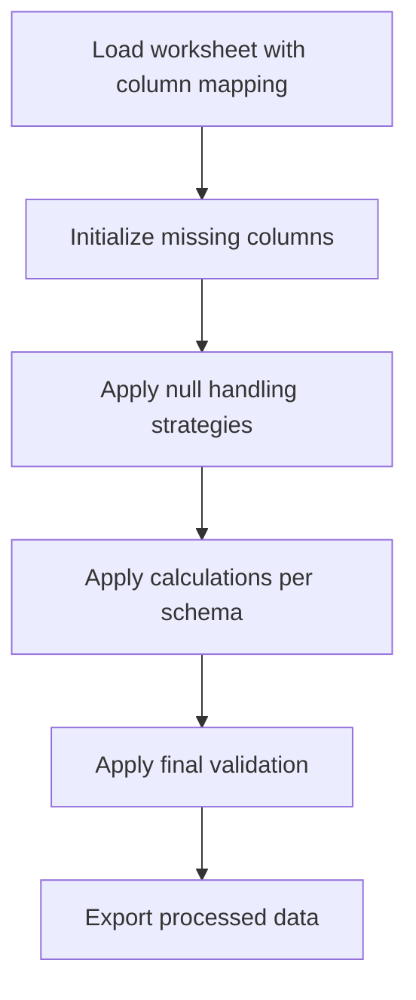

# DCC Column Update Logic

This file summarizes the processing logic in `workflow/universal_document_processor.py` based on `config/schemas/dcc_register_enhanced.json`.

## Overview

## Processing Pipeline Steps

1. **Column Mapping** - Map input columns to schema-defined names using `UniversalColumnMapper`
2. **Initialize Missing Columns** - Create columns marked with `create_if_missing: true`
3. **Apply Null Handling** - Process nulls per `null_handling.strategy` (forward_fill, default_value, etc.)
4. **Apply Calculations** - Execute `is_calculated: true` columns in schema order
5. **Apply Validation** - Check patterns, allowed_values, min/max constraints

## Detailed Logic Table (Processing Sequence)

| Step | Target Column | Input Columns | Processing Logic | Null Handling | Validation | Overwrite Behavior | Schema Reference / Mapping |
|------|--------------|---------------|------------------|---------------|------------|-------------------|---------------------------|
| 1 | **Row_Index** | - | auto_increment (generate_row_index) | leave_null | min_value=1 | Overwrites all | - |
| 2 | **Project_Code** | - | null_handling: default_value | default_value; default=NA | pattern=`^[A-Z0-9-]*$` | Only fills nulls | schema_reference: project_schema |
| 3 | **Facility_Code** | - | null_handling: default_value | default_value; default=NA | pattern=`^[A-Z0-9-]*$` | Only fills nulls | schema_reference: facility_schema |
| 4 | **Document_Type** | - | null_handling: default_value | default_value; default=NA | - | Only fills nulls | schema_reference: document_type_schema |
| 5 | **Discipline** | - | null_handling: default_value | default_value; default=NA | - | Only fills nulls | schema_reference: discipline_schema |
| 6 | **Document_Sequence_Number** | - | null_handling: default_value | default_value; default=NA; zero_pad=4 | pattern=`^[0-9]*$` | Only fills nulls | - |
| 7 | **Document_ID** | Project_Code, Facility_Code, Document_Type, Document_Sequence_Number | composite (build_document_id); format: `{Project_Code}-{Facility_Code}-{Document_Type}-{Document_Sequence_Number}` | leave_null | pattern=`^[A-Z0-9-]+$` | Overwrites all | - |
| 8 | **Document_Revision** | - | null_handling: multi_level_forward_fill | multi_level_forward_fill; levels=[Document_ID→Submission_Session→Revision, Document_ID→Submission_Session, Document_ID] | pattern=`^[A-Z0-9.]*$` | Only fills nulls | - |
| 9 | **Document_Title** | - | null_handling: default_value | default_value; default=NA | - | Only fills nulls | - |
| 10 | **Transmittal_Number** | - | null_handling: default_value | default_value; default=NA | pattern=`^[A-Z0-9-]*$` | Only fills nulls | - |
| 11 | **Submission_Session** | - | null_handling: forward_fill | forward_fill; fill=0; zero_pad=6 | pattern=`^[0-9]{6}$` | Only fills nulls | - |
| 12 | **Submission_Session_Revision** | - | null_handling: forward_fill | forward_fill; fill=0; zero_pad=2 | pattern=`^[0-9]{2}$` | Only fills nulls | - |
| 13 | **Submission_Session_Subject** | - | null_handling: multi_level_forward_fill | multi_level_forward_fill; levels=[Submission_Session+Revision, Submission_Session] | - | Only fills nulls | - |
| 14 | **Consolidated_Submission_Session_Subject** | Submission_Session_Subject | aggregate (concatenate_unique_quoted); group_by: `['Document_ID']` | - | - | Overwrites all | - |
| 15 | **Department** | - | null_handling: multi_level_forward_fill | multi_level_forward_fill; levels=[Submission_Session+Revision, Submission_Session] | - | Only fills nulls | schema_reference: department_schema |
| 16 | **Submitted_By** | - | null_handling: multi_level_forward_fill | multi_level_forward_fill; levels=[Submission_Session+Revision, Submission_Session] | - | Only fills nulls | - |
| 17 | **Submission_Date** | - | null_handling: multi_level_forward_fill | multi_level_forward_fill; levels=[Submission_Session+Revision, Submission_Session] | - | Only fills nulls | - |
| 18 | **First_Submission_Date** | Submission_Date | aggregate (min); group_by: `['Document_ID']` | - | - | Overwrites all | - |
| 19 | **Latest_Submission_Date** | Submission_Date | aggregate (max); group_by: `['Document_ID']` | - | - | Overwrites all | - |
| 20 | **Latest_Revision** | Document_Revision | aggregate (latest_by_date); group_by: `['Document_ID']` | - | pattern=`^[A-Z0-9.]+$` | Overwrites all | - |
| 21 | **All_Submission_Sessions** | Submission_Session | aggregate (concatenate_unique); group_by: `['Document_ID']` | - | - | Overwrites all | - |
| 22 | **All_Submission_Dates** | Submission_Date | aggregate (concatenate_dates); group_by: `['Document_ID']` | - | - | Overwrites all | - |
| 23 | **All_Submission_Session_Revisions** | Submission_Session_Revision | aggregate (concatenate_unique); group_by: `['Document_ID']` | - | - | Overwrites all | - |
| 24 | **Count_of_Submissions** | Document_ID | aggregate (count); group_by: `['Document_ID']` | - | - | Overwrites all | - |
| 25 | **Reviewer** | - | null_handling: forward_fill | forward_fill; group_by=[Submission_Session+Revision]; fill=NA | - | Only fills nulls | - |
| 26 | **Review_Return_Actual_Date** | - | null_handling: forward_fill | forward_fill; group_by=[Submission_Session+Revision] | - | Only fills nulls | - |
| 27 | **Review_Return_Plan_Date** | Submission_Date, Submission_Session, Submission_Session_Revision | conditional_date_calculation (calculate_review_return_plan_date) | leave_null | - | Overwrites all | - |
| 28 | **Review_Status** | - | null_handling: forward_fill | forward_fill; group_by=[Submission_Session+Revision]; fill=Pending | allowed=`['Approved', 'Rejected', 'Pending', 'Approved with Comments', 'Not Approved']` | Only fills nulls | - |
| 29 | **Review_Status_Code** | Review_Status | mapping (status_to_code); source: Review_Status | - | allowed=`['APP', 'REJ', 'PEN', 'AWC', 'NAP', 'INF', 'VOID']` | Overwrites all | mapping_reference: approval_code_mapping |
| 30 | **Approval_Code** | Review_Status | mapping (status_to_code); source: Review_Status | - | allowed=`['APP', 'REJ', 'PEN', 'AWC', 'NAP', 'INF', 'VOID']` | Overwrites all | mapping_reference: approval_code_mapping |
| 31 | **Review_Comments** | - | null_handling: multi_level_forward_fill | multi_level_forward_fill; levels=[Submission_Session+Revision, Submission_Session] | - | Only fills nulls | - |
| 32 | **Latest_Approval_Status** | Review_Status | custom_aggregate (latest_non_pending_status); group_by: `['Document_ID']` | - | allowed=`['Approved', 'Rejected', 'Pending', 'Approved with Comments', 'Not Approved']` | Overwrites all | - |
| 33 | **Latest_Approval_Code** | Latest_Approval_Status | mapping (status_to_code); source: Latest_Approval_Status | - | allowed=`['APP', 'REJ', 'PEN', 'AWC', 'NAP', 'INF', 'VOID']` | Overwrites all | mapping_reference: approval_code_mapping |
| 34 | **All_Approval_Code** | Approval_Code | aggregate (concatenate_unique); group_by: `['Document_ID']` | - | - | Overwrites all | - |
| 35 | **Duration_of_Review** | Submission_Date, Review_Return_Actual_Date, Resubmission_Plan_Date | conditional_business_day_calculation (calculate_duration_of_review) | - | - | Overwrites all | - |
| 36 | **Resubmission_Required** | Resubmission_Required, Submission_Closed | conditional (update_resubmission_required); 4 conditions | - | allowed=`['YES', 'NO']` | **Overwrites YES→NO** when conditions met | - |
| 37 | **Submission_Closed** | Submission_Closed, Latest_Approval_Code | conditional (submission_closure_status); 4 conditions | - | allowed=`['YES', 'NO']` | **Overwrites NO→YES** when conditions met | - |
| 38 | **Resubmission_Plan_Date** | Submission_Closed, Review_Return_Actual_Date, Latest_Submission_Date, Submission_Date | custom_conditional_date (calculate_resubmission_plan_date) | - | - | **Overwrites to null** when Submission_Closed=YES | - |
| 39 | **Resubmission_Forecast_Date** | - | null_handling: forward_fill | forward_fill; group_by=[Submission_Session+Revision] | - | Only fills nulls | - |
| 40 | **Resubmission_Overdue_Status** | Resubmission_Required, Resubmission_Plan_Date | conditional (calculate_overdue_status); 2 conditions | - | allowed=`['Overdue']` or null | Overwrites all | - |
| 41 | **Delay_of_Resubmission** | Submission_Closed, Document_ID, Submission_Date, Resubmission_Plan_Date | complex_lookup (calculate_delay_of_resubmission) | - | - | Overwrites all | - |
| 42 | **Notes** | - | null_handling: default_value | default_value | - | Only fills nulls | - |
| 43 | **Submission_Reference_1** | - | null_handling: forward_fill | forward_fill; group_by=[Document_ID]; fill=NA | - | Only fills nulls | - |
| 44 | **Internal_Reference** | - | null_handling: forward_fill | forward_fill; group_by=[Document_ID]; fill=NA | - | Only fills nulls | - |
| 45 | **This_Submission_Approval_Code** | Approval_Code | conditional (current_row) | - | allowed=`['APP', 'REJ', 'PEN', 'AWC', 'NAP', 'INF', 'VOID']` | Overwrites all | - |

## Key Processing Details

### 1. Null Handling Strategies
- **forward_fill**: Copy last valid value forward within groups
- **multi_level_forward_fill**: Cascading forward fill across multiple grouping levels
- **default_value**: Fill with specified default value
- **leave_null**: Keep null for calculated columns

### 2. Calculation Types
- **auto_increment**: Generate sequential row index starting from 1
- **composite**: Build string from multiple columns using format template
- **aggregate**: Group-based calculations (min, max, count, concatenate)
- **mapping**: Map source values to codes using lookup table
- **conditional**: Multiple if/else conditions with short-circuit logic
- **conditional_date_calculation**: Date calculations based on conditions
- **conditional_business_day_calculation**: Business day aware date math
- **custom_conditional_date**: Custom conditional date logic
- **custom_aggregate**: Custom aggregation with filtering
- **complex_lookup**: Multi-step lookup with previous submission analysis

### 3. Short-Circuit Logic
Conditional calculations use `determined_mask` to skip rows already processed by earlier conditions, ensuring efficient evaluation.

### 4. Zero-Padding Formatting
Applied during null handling for numeric fields (Document_Sequence_Number, Submission_Session, Submission_Session_Revision) to ensure consistent formatting.

### 5. Cross-Column Dependencies
- `Document_ID` depends on Project_Code, Facility_Code, Document_Type, Document_Sequence_Number
- `Resubmission_Required` depends on Submission_Closed, Document_ID, Submission_Date
- `Submission_Closed` depends on Latest_Approval_Code, Resubmission_Required
- `Resubmission_Plan_Date` depends on Submission_Closed (cleared to null when closed)
- `Resubmission_Overdue_Status` depends on Resubmission_Required and Resubmission_Plan_Date

### 6. Schema Reference Application

Columns with `schema_reference` or `mapping_reference` use external schema definitions for validation and mapping:

| Column | Schema Reference | How Rules Are Applied |
|--------|-----------------|----------------------|
| **Project_Code** | schema_reference: project_schema | Values validated against schema's `allowed_values` or pattern. Default "NA" applied if null. |
| **Facility_Code** | schema_reference: facility_schema | Values validated against schema's `allowed_values` or pattern. Default "NA" applied if null. |
| **Document_Type** | schema_reference: document_type_schema | Values validated against schema. Default "NA" applied if null. |
| **Discipline** | schema_reference: discipline_schema | Values validated against schema. Default "NA" applied if null. |
| **Department** | schema_reference: department_schema | Values validated against schema during forward fill. |
| **Review_Status_Code** | mapping_reference: approval_code_mapping | Status text mapped to code using `approval_code_mapping` schema data |
| **Approval_Code** | mapping_reference: approval_code_mapping | Status text mapped to code using `approval_code_mapping` schema data |
| **Latest_Approval_Code** | mapping_reference: approval_code_mapping | Status text mapped to code using `approval_code_mapping` schema data |

**Schema Loading**: References are resolved by `UniversalDocumentProcessor._load_schema_references()` which loads external schema data into `self.schema_data`. Mapping calculations then access these via `self.schema_data.get(f'{mapping_ref}_data', {})`.

## Source Files
- Schema: `config/schemas/dcc_register_enhanced.json`
- Processor: `workflow/universal_document_processor.py`
- Mapper: `workflow/universal_column_mapper.py`
