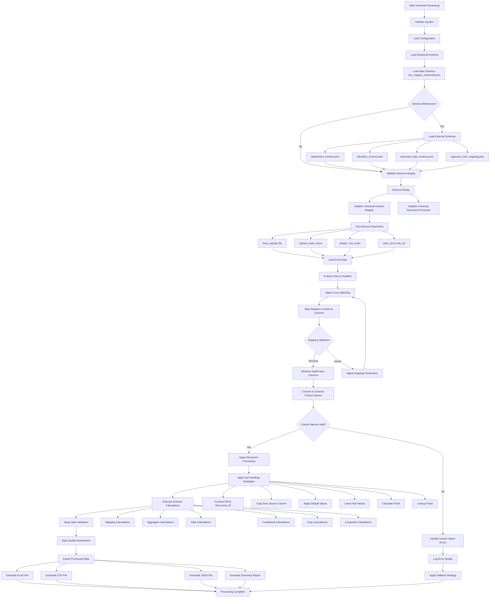
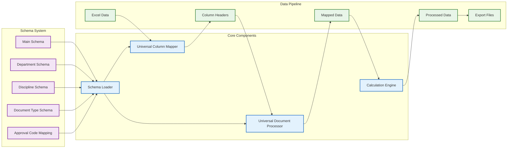
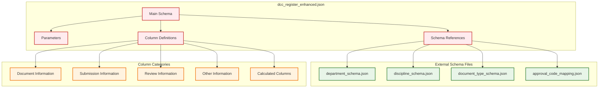
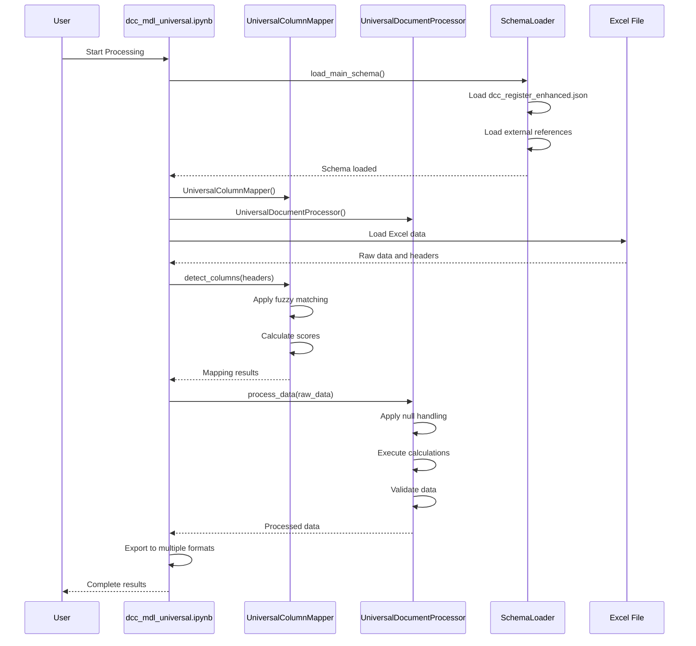

# 🚀 Universal Document Processing Workflow

## 📋 System Architecture Overview

This document provides a comprehensive Mermaid workflow diagram showing the complete universal document processing system, including all functions, schema setup, and data flow.

---

## 🔄 Complete Workflow Diagram


    GET_SHEET --> LOAD_EXCEL
    GET_HEADER_ROW --> LOAD_EXCEL
    GET_COL_RANGE --> LOAD_EXCEL
    
    LOAD_EXCEL --> DATA_LOADED[Raw Data Loaded]
    DATA_LOADED --> EXTRACT_HEADERS[Extract Column Headers]
    
    %% Column Mapping Phase
    EXTRACT_HEADERS --> FUZZY_MATCH[Apply Fuzzy Header Matching]
    FUZZY_MATCH --> CALC_SCORES[Calculate Match Scores]
    CALC_SCORES --> DETECT_COLUMNS[Detect Column Mappings]
    
    %% Column Detection Logic
    DETECT_COLUMNS --> CHECK_ALIASES{Check Aliases}
    CHECK_ALIASES -->|Found| PERFECT_MATCH[Perfect Match: 1.00]
    CHECK_ALIASES -->|Partial| FUZZY_MATCH_SCORE[Fuzzy Match: <1.00]
    CHECK_ALIASES -->|None| UNMATCHED[Unmatched Header]
    
    PERFECT_MATCH --> MAPPING_RESULTS[Column Mapping Results]
    FUZZY_MATCH_SCORE --> MAPPING_RESULTS
    UNMATCHED --> LOG_UNMATCHED[Log Unmatched Headers]
    LOG_UNMATCHED --> MAPPING_RESULTS
    
    %% Document Processing Phase
    MAPPING_RESULTS --> PROCESS_DATA[Process Data with Universal Processor]
    
    %% Processing Pipeline
    PROCESS_DATA --> NULL_HANDLING[Apply Null Handling Strategies]
    NULL_HANDLING --> STRATEGIES{Null Strategy}
    
    STRATEGIES -->|forward_fill| FORWARD_FILL[Forward Fill by Group]
    STRATEGIES -->|copy_from| COPY_FROM[Copy from Source Column]
    STRATEGIES -->|calculate_if_null| CALCULATE[Calculate if Null]
    STRATEGIES -->|default_value| DEFAULT_VALUE[Apply Default Value]
    STRATEGIES -->|leave_null| LEAVE_NULL[Leave as Null]
    STRATEGIES -->|lookup_if_null| LOOKUP[Lookup if Null]
    
    %% Calculation Engine
    FORWARD_FILL --> CALC_ENGINE[Calculation Engine]
    COPY_FROM --> CALC_ENGINE
    CALCULATE --> CALC_ENGINE
    DEFAULT_VALUE --> CALC_ENGINE
    LEAVE_NULL --> CALC_ENGINE
    LOOKUP --> CALC_ENGINE
    
    %% Calculation Types
    CALC_ENGINE --> CALC_TYPES{Calculation Type}
    CALC_TYPES -->|mapping| MAPPING_CALC[Mapping Calculation]
    CALC_TYPES -->|aggregate| AGGREGATE_CALC[Aggregate Calculation]
    CALC_TYPES -->|date_calculation| DATE_CALC[Date Calculation]
    CALC_TYPES -->|conditional| CONDITIONAL_CALC[Conditional Calculation]
    CALC_TYPES -->|copy| COPY_CALC[Copy Calculation]
    CALC_TYPES -->|composite| COMPOSITE_CALC[Composite Calculation]
    
    %% Specific Calculations
    MAPPING_CALC --> STATUS_TO_CODE[Status to Code Mapping]
    AGGREGATE_CALC --> AGG_METHODS{Aggregate Method}
    DATE_CALC --> DATE_METHODS{Date Method}
    CONDITIONAL_CALC --> COND_METHODS{Conditional Method}
    
    AGG_METHODS -->|count| COUNT_OP[Count Operations]
    AGG_METHODS -->|sum| SUM_OP[Sum Operations]
    AGG_METHODS -->|min| MIN_OP[Min Operations]
    AGG_METHODS -->|max| MAX_OP[Max Operations]
    AGG_METHODS -->|concatenate| CONCAT_OP[Concatenate Operations]
    
    DATE_METHODS -->|add_working_days| ADD_DAYS[Add Working Days]
    DATE_METHODS -->|working_days_between| DAYS_BETWEEN[Days Between]
    DATE_METHODS -->|format_date| FORMAT_DATE[Format Date]
    
    COND_METHODS -->|current_row| CURRENT_ROW[Current Row]
    COND_METHODS -->|date_comparison| DATE_COMP[Date Comparison]
    COND_METHODS -->|value_comparison| VALUE_COMP[Value Comparison]
    
    %% Data Validation
    STATUS_TO_CODE --> VALIDATION[Apply Data Validation]
    COUNT_OP --> VALIDATION
    SUM_OP --> VALIDATION
    MIN_OP --> VALIDATION
    MAX_OP --> VALIDATION
    CONCAT_OP --> VALIDATION
    ADD_DAYS --> VALIDATION
    DAYS_BETWEEN --> VALIDATION
    FORMAT_DATE --> VALIDATION
    CURRENT_ROW --> VALIDATION
    DATE_COMP --> VALIDATION
    VALUE_COMP --> VALIDATION
    
    %% Validation Rules
    VALIDATION --> VALIDATION_TYPES{Validation Type}
    VALIDATION_TYPES -->|pattern| PATTERN_VAL[Pattern Validation]
    VALIDATION_TYPES -->|allowed_values| ALLOWED_VAL[Allowed Values Validation]
    VALIDATION_TYPES -->|min_length| MIN_LENGTH_VAL[Min Length Validation]
    VALIDATION_TYPES -->|max_length| MAX_LENGTH_VAL[Max Length Validation]
    VALIDATION_TYPES -->|format| FORMAT_VAL[Format Validation]
    
    %% Validation Results
    PATTERN_VAL --> VALIDATION_RESULTS[Validation Results]
    ALLOWED_VAL --> VALIDATION_RESULTS
    MIN_LENGTH_VAL --> VALIDATION_RESULTS
    MAX_LENGTH_VAL --> VALIDATION_RESULTS
    FORMAT_VAL --> VALIDATION_RESULTS
    
    %% Data Export Phase
    VALIDATION_RESULTS --> EXPORT_DATA[Export Processed Data]
    EXPORT_DATA --> EXPORT_FORMATS{Export Formats}
    
    EXPORT_FORMATS -->|Excel| EXCEL_EXPORT[Export to Excel]
    EXPORT_FORMATS -->|CSV| CSV_EXPORT[Export to CSV]
    EXPORT_FORMATS -->|JSON| JSON_EXPORT[Export to JSON]
    EXPORT_FORMATS -->|Summary| SUMMARY_EXPORT[Generate Summary Report]
    
    %% Export Results
    EXCEL_EXPORT --> OUTPUT_FILES[Output Files Generated]
    CSV_EXPORT --> OUTPUT_FILES
    JSON_EXPORT --> OUTPUT_FILES
    SUMMARY_EXPORT --> OUTPUT_FILES
    
    %% Completion
    OUTPUT_FILES --> COMPLETE[Processing Complete]
    COMPLETE --> END[End Universal Processing]
    
    %% Styling
    classDef config fill:#e1f5fe,stroke:#01579b,stroke-width:2px
    classDef schema fill:#f3e5f5,stroke:#4a148c,stroke-width:2px
    classDef process fill:#e8f5e8,stroke:#1b5e20,stroke-width:2px
    classDef data fill:#fff3e0,stroke:#e65100,stroke-width:2px
    classDef output fill:#fce4ec,stroke:#880e4f,stroke-width:2px
    
    class CONFIG,LOAD_PARAMS config
    class SCHEMA_LOAD,MAIN_SCHEMA,LOAD_EXTERNAL,VALIDATE_SCHEMA schema
    class PROCESS_DATA,NULL_HANDLING,CALC_ENGINE,VALIDATION process
    class LOAD_EXCEL,DATA_LOADED,MAPPING_RESULTS data
    class EXPORT_DATA,OUTPUT_FILES output
```

---

## 📊 Component Architecture Diagram



---

## 🔧 Schema Hierarchy Diagram



---

## 🚀 Function Call Flow



---

## 📋 Key Functions and Their Roles

### **Schema Loading Functions**
- `load_main_schema()` - Loads the main enhanced schema
- `validate_schema_references()` - Validates external schema references
- `load_external_schema()` - Loads modular schema files

### **Column Mapping Functions**
- `detect_columns()` - Detects and maps column headers
- `calculate_match_score()` - Calculates fuzzy matching scores
- `apply_fuzzy_matching()` - Applies fuzzy string matching

### **Data Processing Functions**
- `process_data()` - Main data processing pipeline
- `apply_null_handling()` - Applies null handling strategies
- `execute_calculations()` - Executes schema-defined calculations

### **Calculation Engine Functions**
- `mapping_calculation()` - Status to code mapping
- `aggregate_calculation()` - Aggregate operations
- `date_calculation()` - Date-based calculations
- `conditional_calculation()` - Conditional logic

### **Validation Functions**
- `validate_data()` - Main validation pipeline
- `pattern_validation()` - Pattern matching validation
- `allowed_values_validation()` - Categorical validation

---

## 🎯 Integration Points

### **Excel Integration**
- File path configuration from schema parameters
- Sheet name selection
- Column range filtering (P:AP)
- Header row configuration

### **Schema Integration**
- External schema references
- Dynamic choice loading
- Cross-reference validation
- Fallback handling

### **Export Integration**
- Multiple format support (Excel, CSV, JSON)
- Metadata inclusion
- Processing summary generation
- Validation reporting

---

*Generated on: 2026-03-29*
*Universal Document Processing System v1.0*
