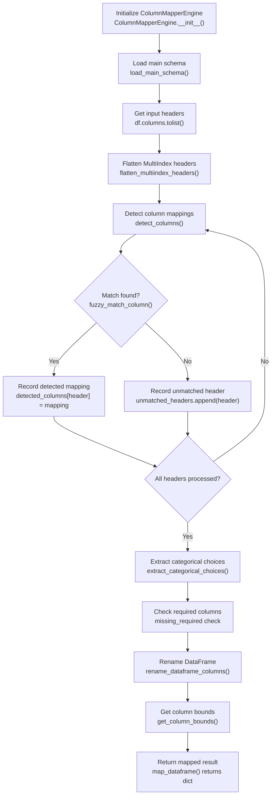

# Column Mapper Engine

A modular engine for fuzzy header detection and schema-driven column mapping. This engine provides tools for detecting column mappings between input data headers and schema-defined columns using fuzzy string matching, handling MultiIndex columns, and renaming DataFrames according to schema specifications.

---

## Table of Contents

- [Module Structure](#module-structure)
- [Workflow Overview](#workflow-overview)
- [Core Functions](#core-functions)
- [Matcher Functions](#matcher-functions)
- [Mapper Functions](#mapper-functions)
- [Utility Functions](#utility-functions)
- [Usage Examples](#usage-examples)
  - [Basic Column Mapping](#basic-column-mapping)
  - [Custom Fuzzy Matching](#custom-fuzzy-matching)
  - [Column Coverage Analysis](#column-coverage-analysis)
- [Import Quick Reference](#import-quick-reference)
- [Error Handling](#error-handling)
- [Best Practices](#best-practices)

---

## Module Structure

```
mapper_engine/engine/
├── __init__.py              # Main engine exports (all public functions)
├── readme.md                # This documentation file
├── core/                    # Core engine components
│   ├── __init__.py          # Core module exports
│   └── engine.py            # ColumnMapperEngine orchestrator class
├── matchers/                # Fuzzy matching algorithms
│   ├── __init__.py          # Matchers module exports
│   └── fuzzy.py             # String normalization and fuzzy matching
├── mappers/                 # Column mapping logic
│   ├── __init__.py          # Mappers module exports
│   └── detection.py         # Column detection and renaming functions
└── utils/                   # Utility functions
    ├── __init__.py          # Utils module exports
    └── columns.py           # Column bounds and coverage analysis
```

---

## Workflow Overview

The mapper engine follows a structured column detection and mapping workflow:



### Function I/O Reference

| Function | File | Input | Output |
|----------|------|-------|--------|
| `ColumnMapperEngine.__init__()` | `core/engine.py` | `schema_loader` (Any, optional), `schema_file` (str, optional) | Engine instance with schema loaded |
| `load_main_schema()` | `core/engine.py` | `schema_file` (str), `schema_loader` (Any) | Loads schema into `self.resolved_schema` |
| `detect_columns()` | `mappers/detection.py` | `headers` (List[str]), `columns` (Dict), `threshold` (float) | Dict with detected_columns, unmatched_headers, missing_required |
| `flatten_multiindex_headers()` | `mappers/detection.py` | `headers` (List[Any]) | List of flattened string headers |
| `fuzzy_match_column()` | `matchers/fuzzy.py` | `header` (str), `target_columns` (List[str]), `threshold` (float) | Tuple of (best_match, similarity_score) |
| `normalize_string()` | `matchers/fuzzy.py` | `text` (str) | Normalized string for comparison |
| `rename_dataframe_columns()` | `mappers/detection.py` | `df` (pd.DataFrame), `mapping_result` (Dict) | DataFrame with renamed columns |
| `extract_categorical_choices()` | `mappers/detection.py` | `detected_columns` (Dict), `resolved_schema` (Dict) | Modifies detected_columns in-place with choices |
| `get_column_bounds()` | `utils/columns.py` | `data` (Any), `detected_columns` (Dict) | Dict mapping column names to (start_row, end_row) |
| `analyze_column_coverage()` | `utils/columns.py` | `bounds` (Dict) | Dict with coverage statistics |
| `map_dataframe()` | `core/engine.py` | `df` (pd.DataFrame), `threshold` (float) | Dict with mapping_result, renamed_df, original_headers |

### Global Parameter Trace Matrix

| Parameter | Initialized In | Modified/Resolved By | Primary Consumers | Role in Engine |
|-----------|---------------|---------------------|-------------------|----------------|
| `schema_loader` | `ColumnMapperEngine.__init__()` | `load_main_schema()` | `detect_columns()`, `extract_categorical_choices()` | Schema loader instance for resolving dependencies |
| `resolved_schema` | `load_main_schema()` | `SchemaLoader.resolve_schema_dependencies()` | `detect_columns()`, `extract_categorical_choices()` | Fully resolved schema with all references |
| `columns` | `detect_columns()` | Extracted from `enhanced_schema['columns']` | `fuzzy_match_column()`, `detect_columns()` | Schema column definitions with aliases |
| `detected_columns` | `detect_columns()` | Populated via fuzzy matching | `extract_categorical_choices()`, `rename_dataframe_columns()` | Maps input headers to schema columns |
| `unmatched_headers` | `detect_columns()` | Populated when no match found | Results inspection, manual mapping | Input headers with no fuzzy match |
| `missing_required` | `detect_columns()` | Populated when required columns not matched | Validation, error reporting | Required schema columns not found in input |
| `threshold` | Caller | Passed to `detect_columns()`, `fuzzy_match_column()` | `fuzzy_match_column()` | Minimum similarity score (0.0-1.0) for matching |

---

## Core Functions

### ColumnMapperEngine Class

**File:** `core/engine.py`

The main orchestrator class that coordinates all column mapping activities.

| Attribute | Details |
|-----------|---------|
| **Input** | `schema_loader` (Any, optional): Schema loader instance<br>`schema_file` (str, optional): Path to main schema file |
| **Output** | Engine instance with loaded schema and resolved dependencies |
| **Function** | Initializes engine, loads schema, prepares for column detection |
| **Dependencies** | `SchemaLoader.load_json_file()`, `SchemaLoader.resolve_schema_dependencies()` |

#### Methods

##### `load_main_schema(schema_file, schema_loader)`

| Attribute | Details |
|-----------|---------|
| **Input** | `schema_file` (str): Path to schema file<br>`schema_loader` (Any): Schema loader instance |
| **Output** | None (sets `self.main_schema`, `self.resolved_schema`) |
| **Function** | Loads and resolves schema dependencies |
| **Workflow** | 1. Load JSON file<br>2. Resolve schema_references<br>3. Store resolved schema |

##### `detect_columns(headers, threshold=0.6)`

| Attribute | Details |
|-----------|---------|
| **Input** | `headers` (List[Any]): Input column headers (may contain tuples)<br>`threshold` (float): Minimum similarity score (default 0.6) |
| **Output** | Dict with detected_columns, unmatched_headers, missing_required, match statistics |
| **Function** | Detects column mappings using fuzzy matching against schema aliases |
| **Workflow** | 1. Flatten MultiIndex headers<br>2. Match each header against schema aliases<br>3. Check for missing required columns<br>4. Extract categorical choices |

##### `rename_dataframe_columns(df, mapping_result)`

| Attribute | Details |
|-----------|---------|
| **Input** | `df` (pd.DataFrame): Input DataFrame<br>`mapping_result` (Dict): Result from detect_columns() |
| **Output** | DataFrame with columns renamed to schema names |
| **Function** | Renames DataFrame columns based on detected mappings |
| **Workflow** | 1. Flatten MultiIndex if present<br>2. Create rename mapping<br>3. Remove duplicate columns<br>4. Return renamed DataFrame |

##### `map_dataframe(df, threshold=0.6)`

| Attribute | Details |
|-----------|---------|
| **Input** | `df` (pd.DataFrame): Input DataFrame<br>`threshold` (float): Minimum similarity score |
| **Output** | Dict with mapping_result, renamed_df, original_headers |
| **Function** | Complete pipeline: detect columns and rename DataFrame |
| **Workflow** | 1. Extract headers<br>2. Detect column mappings<br>3. Rename DataFrame<br>4. Return combined result |

##### `get_column_bounds(data, mapping_result)`

| Attribute | Details |
|-----------|---------|
| **Input** | `data` (Any): Input data (DataFrame or list of lists)<br>`mapping_result` (Dict): Result from detect_columns() |
| **Output** | Dict mapping column names to (start_row, end_row) tuples |
| **Function** | Finds non-null bounds for each detected column |

---

## Matcher Functions

### normalize_string(text)

**File:** `matchers/fuzzy.py`

| Attribute | Details |
|-----------|---------|
| **Input** | `text` (str): String to normalize |
| **Output** | Normalized string (lowercase, no special chars, trimmed) |
| **Function** | Prepares strings for fuzzy comparison |
| **Workflow** | 1. Lowercase and strip<br>2. Remove common prefixes<br>3. Remove special characters<br>4. Normalize whitespace |

### fuzzy_match_column(header, target_columns, threshold=0.6)

**File:** `matchers/fuzzy.py`

| Attribute | Details |
|-----------|---------|
| **Input** | `header` (str): Input header to match<br>`target_columns` (List[str]): List of possible targets<br>`threshold` (float): Minimum similarity (0.0-1.0) |
| **Output** | Tuple of (best_match, similarity_score) |
| **Function** | Finds best fuzzy match for a header against target columns |
| **Workflow** | 1. Normalize header<br>2. Check exact matches<br>3. Calculate fuzzy similarity<br>4. Return best match above threshold |

### fuzzy_match_with_aliases(header, aliases, threshold=0.6)

**File:** `matchers/fuzzy.py`

| Attribute | Details |
|-----------|---------|
| **Input** | `header` (str): Input header<br>`aliases` (List[str]): List of aliases for a column<br>`threshold` (float): Minimum similarity |
| **Output** | Tuple of (best_matching_alias, similarity_score) |
| **Function** | Wrapper for fuzzy_match_column to match against column aliases |

### batch_fuzzy_match(headers, target_columns, threshold=0.6)

**File:** `matchers/fuzzy.py`

| Attribute | Details |
|-----------|---------|
| **Input** | `headers` (List[str]): Multiple headers to match<br>`target_columns` (List[str]): Possible targets<br>`threshold` (float): Minimum similarity |
| **Output** | List of tuples (header, best_match, score) for matches above threshold |
| **Function** | Batch fuzzy matching for multiple headers |

---

## Mapper Functions

### flatten_multiindex_headers(headers)

**File:** `mappers/detection.py`

| Attribute | Details |
|-----------|---------|
| **Input** | `headers` (List[Any]): Headers that may contain tuples from MultiIndex |
| **Output** | List of flattened string headers |
| **Function** | Converts MultiIndex tuple headers to strings |
| **Workflow** | 1. Detect tuple headers<br>2. Join with underscore<br>3. Return string headers |

### detect_columns(headers, columns, threshold=0.6)

**File:** `mappers/detection.py`

| Attribute | Details |
|-----------|---------|
| **Input** | `headers` (List[str]): Flattened input headers<br>`columns` (Dict): Schema column definitions<br>`threshold` (float): Minimum similarity |
| **Output** | Dict with:
- detected_columns: {header: mapping_dict}
- unmatched_headers: [header, ...]
- missing_required: [column_name, ...]
- total_headers, matched_count, match_rate |
| **Function** | Main column detection logic using fuzzy matching |
| **Workflow** | 1. Iterate headers<br>2. Fuzzy match against all column aliases<br>3. Record matches above threshold<br>4. Check for missing required columns |

### extract_categorical_choices(detected_columns, resolved_schema)

**File:** `mappers/detection.py`

| Attribute | Details |
|-----------|---------|
| **Input** | `detected_columns` (Dict): Output from detect_columns()<br>`resolved_schema` (Dict): Fully resolved schema |
| **Output** | None (modifies detected_columns in-place) |
| **Function** | Adds categorical choices to detected column mappings |
| **Workflow** | 1. Find categorical columns<br>2. Load schema_reference data<br>3. Extract code choices<br>4. Add to mapping dict |

### rename_dataframe_columns(df, mapping_result)

**File:** `mappers/detection.py`

| Attribute | Details |
|-----------|---------|
| **Input** | `df` (pd.DataFrame): Input DataFrame<br>`mapping_result` (Dict): Result from detect_columns() |
| **Output** | DataFrame with renamed columns, duplicates removed |
| **Function** | Renames DataFrame based on detected mappings |
| **Workflow** | 1. Handle MultiIndex<br>2. Create rename dict<br>3. Apply rename<br>4. Remove duplicates<br>5. Return renamed DataFrame |

---

## Utility Functions

### get_column_bounds(data, detected_columns)

**File:** `utils/columns.py`

| Attribute | Details |
|-----------|---------|
| **Input** | `data` (Any): DataFrame or list of lists<br>`detected_columns` (Dict): Detected column mappings |
| **Output** | Dict mapping column_name to (start_row, end_row) tuple |
| **Function** | Finds non-null data bounds for each column |
| **Workflow** | 1. Iterate detected columns<br>2. Find first and last non-null values<br>3. Return bounds dict |

### analyze_column_coverage(bounds)

**File:** `utils/columns.py`

| Attribute | Details |
|-----------|---------|
| **Input** | `bounds` (Dict): Output from get_column_bounds() |
| **Output** | Dict with coverage statistics:
- total_columns
- total_data_rows
- average_coverage
- max_coverage
- min_coverage |
| **Function** | Analyzes column coverage statistics |

---

## Usage Examples

### Basic Column Mapping

```python
from dcc.workflow.mapper_engine.engine import ColumnMapperEngine
from dcc.workflow.schema_engine.engine import SchemaLoader

# Create engine and load schema
schema_loader = SchemaLoader()
engine = ColumnMapperEngine()
engine.load_main_schema('config/schemas/dcc_register.json', schema_loader)

# Load your DataFrame
import pandas as pd
df = pd.read_excel('data.xlsx')

# Map columns
result = engine.map_dataframe(df, threshold=0.6)

# Access results
mapped_df = result['renamed_df']
mapping_info = result['mapping_result']

print(f"Matched: {mapping_info['matched_count']}/{mapping_info['total_headers']}")
print(f"Match rate: {mapping_info['match_rate']:.1%}")

if mapping_info['missing_required']:
    print(f"Missing required: {mapping_info['missing_required']}")
```

### Custom Fuzzy Matching

```python
from dcc.workflow.mapper_engine.engine import fuzzy_match_column, normalize_string

# Direct fuzzy matching without engine
headers = ["Doc Type", "Revision", "Date Submit"]
target_columns = ["Document_Type", "Document_Revision", "Submission_Date"]

for header in headers:
    match, score = fuzzy_match_column(header, target_columns, threshold=0.5)
    print(f"{header} -> {match} ({score:.2f})")

# Output:
# Doc Type -> Document_Type (0.85)
# Revision -> Document_Revision (0.72)
# Date Submit -> Submission_Date (0.68)
```

### Column Coverage Analysis

```python
from dcc.workflow.mapper_engine.engine import (
    ColumnMapperEngine,
    get_column_bounds,
    analyze_column_coverage,
)

# After mapping
df_mapped = result['renamed_df']
mapping_info = result['mapping_result']

# Get bounds
bounds = get_column_bounds(df_mapped, mapping_info['detected_columns'])

# Analyze coverage
stats = analyze_column_coverage(bounds)
print(f"Total columns: {stats['total_columns']}")
print(f"Data rows: {stats['total_data_rows']}")
print(f"Average coverage: {stats['average_coverage']:.1f} rows/column")
```

---

## Import Quick Reference

### Full Engine Import

```python
from dcc.workflow.mapper_engine.engine import (
    # Core
    ColumnMapperEngine,
    
    # Matchers
    normalize_string,
    fuzzy_match_column,
    fuzzy_match_with_aliases,
    batch_fuzzy_match,
    
    # Mappers
    flatten_multiindex_headers,
    detect_columns,
    extract_categorical_choices,
    rename_dataframe_columns,
    
    # Utils
    get_column_bounds,
    analyze_column_coverage,
)
```

### Module-Specific Imports

```python
# Core only
from dcc.workflow.mapper_engine.engine.core import ColumnMapperEngine

# Matchers only
from dcc.workflow.mapper_engine.engine.matchers import (
    fuzzy_match_column,
    normalize_string,
)

# Mappers only
from dcc.workflow.mapper_engine.engine.mappers import (
    detect_columns,
    rename_dataframe_columns,
)

# Utils only
from dcc.workflow.mapper_engine.engine.utils import (
    get_column_bounds,
    analyze_column_coverage,
)
```

---

## Error Handling

The engine provides comprehensive error handling:

1. **Schema Loading Errors**: Caught during `load_main_schema()`, raises with context
2. **Missing Required Columns**: Recorded in `missing_required` list, doesn't halt execution
3. **No Schema Loaded**: Raises `ValueError` when `detect_columns()` called before loading schema
4. **Invalid Threshold**: Values outside 0.0-1.0 range are clamped or ignored

---

## Best Practices

1. **Always check `missing_required`** before proceeding with data processing
2. **Use appropriate threshold**: 
   - 0.6-0.7 for strict matching (fewer false positives)
   - 0.4-0.5 for lenient matching (more matches, more review needed)
3. **Review unmatched headers**: Log or display for manual mapping decisions
4. **Validate match rate**: Consider manual review if match_rate < 0.8
5. **Use schema_loader**: Leverage dependency resolution for complex schemas

---

## Dependencies

- Python 3.10+ (uses type hints with `|` syntax)
- pandas: For DataFrame operations
- difflib: For fuzzy string matching (standard library)
- re: For string normalization (standard library)

---

## Notes

- The engine handles both string headers and MultiIndex tuple headers
- Fuzzy matching uses difflib.SequenceMatcher for similarity calculation
- Column aliases in schema provide multiple matching targets per column
- Calculated columns (is_calculated=True) are excluded from missing_required checks
