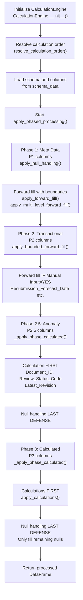

# Document Processor Engine

A modular engine for processing documents with schema-driven calculations, null handling, and validation. This engine provides a comprehensive framework for data transformation including aggregation, conditional logic, date calculations, mapping operations, and null value handling, all orchestrated through a dependency-aware calculation pipeline.

---

## Table of Contents

- [Module Structure](#module-structure)
- [Workflow Overview](#workflow-overview)
- [Core Functions](#core-functions)
- [Registry System](#registry-system)
- [Calculation Types](#calculation-types)
  - [Null Handling](#null-handling)
  - [Aggregate Calculations](#aggregate-calculations)
  - [Composite Calculations](#composite-calculations)
  - [Conditional Calculations](#conditional-calculations)
  - [Date Calculations](#date-calculations)
  - [Mapping Calculations](#mapping-calculations)
- [Schema Processing](#schema-processing)
- [Utility Functions](#utility-functions)
- [Validation Category Summary Table](#validation-category-summary-table)
- [Usage Examples](#usage-examples)
- [Troubleshooting](#troubleshooting)
- [Import Quick Reference](#import-quick-reference)
- [Error Handling](#error-handling)
- [Best Practices](#best-practices)

---

## Module Structure

```
processor_engine/
├── __init__.py              # Main engine exports (all public functions)
├── readme.md                # This documentation file
├── core/                    # Core engine components
│   ├── __init__.py          # Core module exports
│   ├── base.py              # BaseProcessor with shared utilities
│   ├── engine.py            # CalculationEngine orchestrator
│   └── registry.py          # Handler registries
├── calculations/            # Calculation implementations
│   ├── __init__.py          # Calculation module exports
│   ├── aggregate.py         # Grouping/aggregation calculations
│   ├── composite.py         # Composite, row index, delay calculations
│   ├── conditional.py       # Conditional logic calculations
│   ├── date.py              # Date arithmetic calculations
│   ├── mapping.py           # Value mapping calculations
│   ├── null_handling.py     # Null handling strategies
│   └── validation.py        # Data validation functions
├── schema/                  # Schema utilities
│   ├── __init__.py          # Schema module exports
│   ├── dependency.py        # Dependency resolution and ordering
│   └── processor.py         # Schema processing utilities
└── utils/                   # Utility functions
    ├── __init__.py          # Utils module exports
    ├── dataio.py            # Data loading utilities
    └── dateframe.py         # DataFrame manipulation utilities
```

---

## Workflow Overview

The processor engine follows a structured **phased processing pipeline** (P1→P2→P2.5→P3):



### Processing Phases

| Phase | Columns | Processing Rule | Key Functions |
|-------|---------|-----------------|---------------|
| **P1** | Meta Data (11 cols) | Null handling with bounded forward fill | `apply_forward_fill()`, `apply_multi_level_forward_fill()` |
| **P2** | Transactional (11 cols) | Forward fill IF Manual Input = YES | `apply_bounded_forward_fill()` |
| **P2.5** | Anomaly (3 cols) | Calculation FIRST, null handling LAST | `_apply_phase_calculated()` |
| **P3** | Calculated (21 cols) | Calculation FIRST, null handling LAST | `_apply_phase_calculated()` |

### Key Rules Implemented

- **Rule 10**: `Document_ID` - Calculate first, then null_handling
- **Rule 11**: Calculated columns - Calculation FIRST, null handling as LAST DEFENSE
- **Rule 12**: Forward fill within boundary for P1 + P2 Manual Input columns
- **Rule 13**: Process columns in schema `column_sequence` order

### Function I/O Reference

| Function | File | Input | Output |
|----------|------|-------|--------|
| `CalculationEngine.__init__()` | `core/engine.py` | `schema_data` (Dict): Resolved schema | Engine instance with columns, calculation_order |
| `process_data()` | `core/engine.py` | `df` (pd.DataFrame): Input data | Processed DataFrame with all calculations applied |
| `apply_null_handling()` | `core/engine.py` | `df` (pd.DataFrame) | DataFrame with nulls handled per schema |
| `apply_calculations()` | `core/engine.py` | `df` (pd.DataFrame) | DataFrame with calculated columns |
| `resolve_calculation_order()` | `schema/dependency.py` | `columns` (Dict): Column definitions | List of column names in execution order |
| `_extract_column_dependencies()` | `schema/dependency.py` | `column_name`, `column_def`, `all_columns` | Set of column dependencies |
| `_find_cycle_path()` | `schema/dependency.py` | `dependency_graph` (Dict) | List representing cycle path or empty list |
| `get_null_handler()` | `core/registry.py` | `strategy` (str): Strategy name | Handler function or None |
| `get_calculation_handler()` | `core/registry.py` | `calc_type`, `method` | Handler function or None |
| `register_null_handler()` | `core/registry.py` | `strategy`, `func` | None (registers handler) |
| `register_calculation_handler()` | `core/registry.py` | `calc_type`, `method`, `func` | None (registers handler) |
| `prepare_dataframe_for_processing()` | `utils/dateframe.py` | `df` (pd.DataFrame) | Prepared DataFrame |
| `initialize_missing_columns()` | `utils/dateframe.py` | `df`, `columns`, `parameters` | DataFrame with missing columns initialized |
| `load_excel_data()` | `utils/dataio.py` | `file_path`, `sheet_name`, etc. | DataFrame with loaded data |
| `SchemaProcessor.__init__()` | `schema/processor.py` | `schema_data` (Dict) | SchemaProcessor instance |
| `SchemaProcessor.get_ordered_columns()` | `schema/processor.py` | None | Dict of columns in sequence order |
| `SchemaProcessor.resolve_reference()` | `schema/processor.py` | `ref_config` (Dict) | Resolved value or None |

### Global Parameter Trace Matrix

| Parameter | Initialized In | Modified/Resolved By | Primary Consumers | Role in Engine |
|-----------|---------------|---------------------|-------------------|----------------|
| `schema_data` | `CalculationEngine.__init__()` | Passed from resolved schema | `apply_null_handling()`, `apply_calculations()`, all handlers | Full resolved schema with enhanced_schema, columns, parameters |
| `columns` | `CalculationEngine.__init__()` | Extracted from `schema_data['enhanced_schema']['columns']` | `resolve_calculation_order()`, all calculation handlers | Column definitions dict with calculation and null_handling specs |
| `calculation_order` | `CalculationEngine.__init__()` | `resolve_calculation_order()` | `apply_calculations()` | Validated execution order for calculated columns |
| `df` | `process_data()` input | Modified by `apply_null_handling()`, `apply_calculations()` | All processing functions | Working DataFrame throughout pipeline |
| `null_handling` | Column definition | Specified per column in schema | `get_null_handler()`, handler functions | Null handling strategy configuration |
| `calculation` | Column definition | Specified per column in schema | `get_calculation_handler()`, handler functions | Calculation type and method configuration |
| `dependencies` | Column definition | `_extract_column_dependencies()` | `resolve_calculation_order()`, dependency graph | Cross-column dependencies for ordering |

---

## Core Functions

### CalculationEngine Class

**File:** `core/engine.py`

The main orchestrator class that coordinates all data processing activities.

| Attribute | Details |
|-----------|---------|
| **Input** | `schema_data` (Dict): Resolved schema with enhanced_schema, columns, parameters |
| **Output** | Engine instance with columns dict and validated calculation_order |
| **Function** | Initializes engine, resolves dependencies, prepares for processing |
| **Dependencies** | `resolve_calculation_order()`, `BaseProcessor.__init__()` |

#### Methods

##### `process_data(df)`

| Attribute | Details |
|-----------|---------|
| **Input** | `df` (pd.DataFrame): Input data to process |
| **Output** | Processed DataFrame with null handling and calculations applied |
| **Function** | Main entry point for data transformation pipeline |
| **Workflow** | 1. Apply null handling<br>2. Apply calculations in dependency order<br>3. Return processed DataFrame |

##### `apply_null_handling(df)`

| Attribute | Details |
|-----------|---------|
| **Input** | `df` (pd.DataFrame): Input data |
| **Output** | DataFrame with null values handled per schema specifications |
| **Function** | Applies designated null-handling strategy to each column |
| **Workflow** | 1. Prepare DataFrame<br>2. Initialize missing columns<br>3. Get handler for each column's strategy<br>4. Apply handler |

##### `apply_calculations(df)` [Deprecated for direct use]

| Attribute | Details |
|-----------|---------|
| **Input** | `df` (pd.DataFrame): DataFrame after null handling |
| **Output** | DataFrame with calculated columns in dependency order |
| **Function** | Executes calculated columns in validated dependency order |
| **Note** | Now used internally by `_apply_phase_calculated()` which runs calculations FIRST, then null handling as LAST DEFENSE |

#### New Phased Processing Methods

##### `apply_phased_processing(df)`

| Attribute | Details |
|-----------|---------|
| **Input** | `df` (pd.DataFrame): Raw input data |
| **Output** | Processed DataFrame after P1→P2→P2.5→P3 phases |
| **Function** | Main orchestrator for phased column processing |
| **Workflow** | 1. Group columns by processing_phase<br>2. Execute P1 (null handling)<br>3. Execute P2 (transactional with forward fill)<br>4. Execute P2.5 (calculated - anomaly)<br>5. Execute P3 (calculated - standard)<br>6. Return result |

##### `_apply_phase_null_handling(df, column_names)`

| Attribute | Details |
|-----------|---------|
| **Input** | `df` (pd.DataFrame), `column_names` (List[str]): P1 columns |
| **Output** | DataFrame with null handling applied |
| **Function** | Applies null handling strategies for P1 columns |

##### `_apply_phase_transactional(df, column_names)`

| Attribute | Details |
|-----------|---------|
| **Input** | `df` (pd.DataFrame), `column_names` (List[str]): P2 columns |
| **Output** | DataFrame with forward fill applied for Manual Input columns |
| **Function** | Applies bounded forward fill for P2 columns with Manual Input = YES |

##### `_apply_phase_calculated(df, column_names)`

| Attribute | Details |
|-----------|---------|
| **Input** | `df` (pd.DataFrame), `column_names` (List[str]): P2.5 or P3 columns |
| **Output** | DataFrame with calculations and last-defense null handling |
| **Function** | **Rule 11**: Calculation FIRST, then null handling as LAST DEFENSE |
| **Workflow** | 1. Apply calculations in schema sequence order<br>2. Check for remaining nulls<br>3. Apply null handling only to remaining nulls |

---

## Registry System

**File:** `core/registry.py`

The registry system provides dynamic handler registration and retrieval for null handling strategies and calculation types.

### get_null_handler(strategy)

| Attribute | Details |
|-----------|---------|
| **Input** | `strategy` (str): Null handling strategy name |
| **Output** | Handler function or None |
| **Function** | Retrieves registered handler for null handling strategy |

### get_calculation_handler(calc_type, method='default')

| Attribute | Details |
|-----------|---------|
| **Input** | `calc_type` (str): Calculation type<br>`method` (str): Specific method name |
| **Output** | Handler function or None |
| **Function** | Retrieves registered handler for calculation type and method |

### register_null_handler(strategy, func)

| Attribute | Details |
|-----------|---------|
| **Input** | `strategy` (str): Strategy name to register<br>`func` (Callable): Handler function |
| **Output** | None (registers in NULL_HANDLERS dict) |
| **Function** | Dynamically registers new null handling strategy |

### register_calculation_handler(calc_type, method, func)

| Attribute | Details |
|-----------|---------|
| **Input** | `calc_type` (str): Calculation type<br>`method` (str): Method name<br>`func` (Callable): Handler function |
| **Output** | None (registers in CALCULATION_HANDLERS dict) |
| **Function** | Dynamically registers new calculation handler |

### list_registered_handlers()

| Attribute | Details |
|-----------|---------|
| **Input** | None |
| **Output** | Dict with all registered null_handlers and calculation_types |
| **Function** | Returns listing of all registered handlers for debugging |

---

## Calculation Types

### Null Handling

**File:** `calculations/null_handling.py`

| Function | Strategy | Description |
|----------|----------|-------------|
| `apply_forward_fill` | `forward_fill` | Forward fill nulls with grouping support |
| `apply_multi_level_forward_fill` | `multi_level_forward_fill` | Multi-level forward fill (primary, secondary groups) |
| `apply_copy_from` | `copy_from` | Copy values from source column |
| `apply_calculate_if_null` | `calculate_if_null` | Calculate value if null (legacy) |
| `apply_default_value` | `default_value` | Apply default value with optional formatting |
| `apply_lookup_if_null` | `lookup_if_null` | Group-based lookup for null values |

### Aggregate Calculations

**File:** `calculations/aggregate.py`

| Function | Method | Description |
|----------|--------|-------------|
| `apply_aggregate_calculation` | Various | Standard aggregation (count, min, max, concatenate, concatenate_unique, concatenate_dates) |
| `apply_latest_by_date_calculation` | `latest_by_date` | Get latest value based on date column |
| `apply_latest_non_pending_status` | `latest_non_pending_status` | Get latest non-pending status per group |

### Composite Calculations

**File:** `calculations/composite.py`

| Function | Method | Description |
|----------|--------|-------------|
| `apply_composite_calculation` | `build_document_id` | Format string composition from multiple sources |
| `apply_row_index` | `generate_row_index` | Auto-increment row indexing |
| `apply_delay_of_resubmission` | `calculate_delay_of_resubmission` | Delay calculation with vectorized lookup |
| `apply_copy_calculation` | `direct` | Direct column copy |

### Conditional Calculations

**File:** `calculations/conditional.py`

| Function | Method | Description |
|----------|--------|-------------|
| `apply_current_row_calculation` | `current_row` | Current row value extraction |
| `apply_update_resubmission_required` | `update_resubmission_required` | Resubmission logic with short-circuit evaluation |
| `apply_submission_closure_status` | `submission_closure_status` | Submission closure determination |
| `apply_calculate_overdue_status` | `calculate_overdue_status` | Overdue status calculation |

### Date Calculations

**File:** `calculations/date.py`

| Function | Method | Description |
|----------|--------|-------------|
| `apply_date_calculation` | Various | Standard date calculations |
| `calculate_working_days` | `add_working_days` | Add working days to date |
| `calculate_date_difference` | `date_difference` | Calculate difference in days |
| `apply_resubmission_plan_date` | `calculate_resubmission_plan_date` | Conditional resubmission plan date |
| `apply_conditional_date_calculation` | `conditional_date_calculation` | First vs subsequent submission dates |
| `apply_conditional_business_day_calculation` | `conditional_business_day` | Business day calculations with conditional logic |

### Mapping Calculations

**File:** `calculations/mapping.py`

| Function | Method | Description |
|----------|--------|-------------|
| `apply_mapping_calculation` | `status_to_code` | Map status values to codes using lookup tables |
| `apply_status_to_code` | `status_to_code` | Status code resolution from schema references |

---

## Schema Processing

### SchemaProcessor Class

**File:** `schema/processor.py`

Handles translation of schema definitions into actionable instructions for the CalculationEngine.

| Attribute | Details |
|-----------|---------|
| **Input** | `schema_data` (Dict): Full resolved schema |
| **Output** | SchemaProcessor instance with enhanced_schema access |
| **Function** | Processes schema for column ordering and reference resolution |

#### Methods

##### `get_ordered_columns()`

| Attribute | Details |
|-----------|---------|
| **Input** | None (uses instance schema_data) |
| **Output** | Dict of columns ordered by column_sequence |
| **Function** | Returns column definitions in schema-specified order |

##### `resolve_reference(ref_config)`

| Attribute | Details |
|-----------|---------|
| **Input** | `ref_config` (Dict): Contains schema, code, field keys |
| **Output** | Resolved value from referenced schema or None |
| **Function** | Looks up value in schema reference data |

### Dependency Resolution

**File:** `schema/dependency.py`

#### resolve_calculation_order(columns)

| Attribute | Details |
|-----------|---------|
| **Input** | `columns` (Dict): Column definitions with dependencies |
| **Output** | List of column names in validated execution order |
| **Function** | Validates dependencies and returns safe calculation order |
| **Raises** | ValueError on circular dependency or schema order violation |

---

## Utility Functions

### Data Loading

**File:** `utils/dataio.py`

#### load_excel_data(file_path, sheet_name, header_row, ...)

| Attribute | Details |
|-----------|---------|
| **Input** | Excel file parameters (path, sheet, header row, etc.) |
| **Output** | DataFrame with loaded data |
| **Function** | Loads Excel data with configurable options |

### DataFrame Manipulation

**File:** `utils/dateframe.py`

Uses centralized logging from `initiation_engine` (`debug_print`) for all diagnostic output.

#### prepare_dataframe_for_processing(df)

| Attribute | Details |
|-----------|---------|
| **Input** | `df` (pd.DataFrame): Raw input DataFrame |
| **Output** | Prepared DataFrame ready for processing |
| **Function** | Standardizes DataFrame format for pipeline (resets index, ensures clean state) |

#### initialize_missing_columns(df, columns, parameters)

| Attribute | Details |
|-----------|---------|
| **Input** | `df` (pd.DataFrame), `columns` (Dict), `parameters` (Dict) |
| **Output** | DataFrame with missing schema columns initialized |
| **Function** | Adds missing columns from schema with null values |

---

## Validation Category Summary Table

The processor engine handles several categories of data transformation and validation:

| Category | Component | Description |
|----------|-----------|-------------|
| **Dependency** | `schema/dependency.py` | Validates that column calculation order is safe and non-circular |
| **Null Integrity** | `calculations/null_handling.py` | Ensures mandatory fields are populated using designated strategies |
| **Data Types** | Handlers | Validates and converts input data (e.g., date strings to datetime objects) |
| **Calculated Logic** | Handlers | Executes complex business rules (e.g., overdue status, resubmission logic) |

---

## Logging System

The processor engine uses **centralized logging** from `initiation_engine` instead of Python's standard `logging` module. All calculation modules, null handlers, and utilities use:

| Function | Purpose | Output |
|----------|---------|--------|
| `status_print(message)` | User-facing status updates, warnings, errors | Console with hierarchical indentation |
| `debug_print(message)` | Developer-only debug info (hidden unless `--debug` mode) | Console with hierarchical indentation |
| `engine._print_processing_step(phase, column_name, detail)` | Standardized calculation step logging | Console via `status_print` |

### Why Not Python's `logging` Module?

The standard `logging` module was replaced because:
1. **No indentation support** - Raw log lines don't show hierarchy
2. **Not captured by DEBUG_OBJECT** - Standard logger bypasses the custom debug system
3. **Duplicate output** - Was causing messages to appear twice
4. **No file output** - No FileHandler was configured anyway

### Where Logs Go

- **Console**: Hierarchical indented output via `status_print()` / `debug_print()`
- **In-memory**: All messages accumulate in `DEBUG_OBJECT` global dict
- **File**: `debug_log.json` saved to output folder at pipeline end (see `dcc_engine_pipeline.py`)

### Calculation Handler Logging

All calculation handlers follow this pattern:

```python
def apply_some_calculation(engine, df, column_name, calculation):
    # Entry message
    engine._print_processing_step("Phase", column_name, "Description")
    
    # Preserving existing values
    if existing_mask.any():
        engine._print_processing_step("Phase", column_name, f"Preserving {count} existing values")
    
    # Completion message
    engine._print_processing_step("Phase", column_name, f"Applied to {count} rows")
    
    # Skip message (debug only)
    debug_print(f"Skipped {column_name}: all values present")
    
    return df
```

### Phase Names Used

| Phase | Module | Example |
|-------|--------|---------|
| `Null-Handling` | null_handling.py | Forward fill, copy from, default value |
| `Aggregate` | aggregate.py | Grouping, latest-by-date, concatenate |
| `Conditional` | conditional.py | Current row, resubmission logic |
| `Date-Calc` | date.py | Working days, date difference |
| `Working-Days` | date.py | Add working days |
| `Conditional-Date` | date.py | First vs subsequent submission |
| `Business-Day` | date.py | Conditional business day calc |
| `Resubmission-Plan` | date.py | Resubmission plan date |
| `Composite` | composite.py | Document ID, row index |
| `Complex-Lookup` | composite.py | Delay of resubmission |
| `Copy` | composite.py | Direct column copy |
| `Mapping` | mapping.py | Status-to-code mapping |

---

## Troubleshooting

| Issue | Potential Cause | Resolution |
|-------|-----------------|------------|
| **Circular dependency error** | Two or more columns reference each other | Check `dependencies` key in schema for those columns; break the cycle |
| **Missing calculation handler** | Typo in schema `calculation/type` or `method` | Verify name against `list_registered_handlers()` output |
| **Calculation not applied** | Column already has values and `is_calculated` is not forced | Check if the handler preserves existing values; clear column if re-calculation is needed |
| **Date calculation failure** | Non-standard date format in input | Ensure input columns are correctly parsed as dates in `load_excel_data` |

---

## Usage Examples

### Basic Processing

```python
from dcc.workflow.processor_engine import CalculationEngine
from dcc.workflow.schema_engine import SchemaLoader

# Load and resolve schema
schema_loader = SchemaLoader()
schema_loader.set_main_schema_path('config/schemas/dcc_register.json')
main_schema = schema_loader.load_json_file('config/schemas/dcc_register.json')
resolved_schema = schema_loader.resolve_schema_dependencies(main_schema)

# Create engine
engine = CalculationEngine(resolved_schema)

# Process DataFrame
df_processed = engine.process_data(df)

print(f"Input: {len(df.columns)} columns")
print(f"Output: {len(df_processed.columns)} columns")
```

### Custom Handler Registration

```python
from dcc.workflow.processor_engine import (
    CalculationEngine,
    register_calculation_handler,
    get_calculation_handler,
)

# Define custom calculation
def my_custom_calculation(processor, df, column_name, calculation_config):
    """Custom calculation handler."""
    source_col = calculation_config.get('source_column')
    multiplier = calculation_config.get('multiplier', 1.0)
    
    df[column_name] = df[source_col] * multiplier
    return df

# Register handler
register_calculation_handler('custom', 'multiply', my_custom_calculation)

# Verify registration
handler = get_calculation_handler('custom', 'multiply')
assert handler == my_custom_calculation
```

### Dependency Resolution

```python
from dcc.workflow.processor_engine.schema import resolve_calculation_order

# Define columns with dependencies
columns = {
    'A': {'is_calculated': False},
    'B': {
        'is_calculated': True,
        'calculation': {'dependencies': ['A']}
    },
    'C': {
        'is_calculated': True,
        'calculation': {'dependencies': ['B']}
    },
}

# Get execution order
order = resolve_calculation_order(columns)
print(order)  # ['B', 'C'] - A is input, not calculated

# Circular dependencies raise ValueError
circular = {
    'X': {'is_calculated': True, 'calculation': {'dependencies': ['Y']}},
    'Y': {'is_calculated': True, 'calculation': {'dependencies': ['X']}},
}
# resolve_calculation_order(circular)  # Raises ValueError
```

---

## Import Quick Reference

### Full Engine Import

```python
from dcc.workflow.processor_engine import (
    # Core
    CalculationEngine,
    BaseProcessor,
    
    # Registry
    get_null_handler,
    get_calculation_handler,
    register_null_handler,
    register_calculation_handler,
    list_registered_handlers,
    
    # Schema
    SchemaProcessor,
    resolve_calculation_order,
    
    # Utils
    load_excel_data,
)

# Calculations
from dcc.workflow.processor_engine.calculations import (
    # Null handling
    apply_forward_fill,
    apply_multi_level_forward_fill,
    apply_default_value,
    apply_copy_from,
    
    # Aggregate
    apply_aggregate_calculation,
    apply_latest_by_date_calculation,
    apply_latest_non_pending_status,
    
    # Conditional
    apply_current_row_calculation,
    apply_update_resubmission_required,
    apply_submission_closure_status,
    apply_calculate_overdue_status,
    
    # Date
    apply_conditional_date_calculation,
    apply_resubmission_plan_date,
    calculate_working_days,
    
    # Mapping
    apply_mapping_calculation,
    apply_status_to_code,
    
    # Composite
    apply_composite_calculation,
    apply_row_index,
    apply_delay_of_resubmission,
    apply_copy_calculation,
    
    # Validation
    collect_raw_pattern_errors,
    apply_validation,
)
```

### Module-Specific Imports

```python
# Core only
from dcc.workflow.processor_engine.core import (
    CalculationEngine,
    BaseProcessor,
    get_calculation_handler,
    register_calculation_handler,
)

# Schema only
from dcc.workflow.processor_engine.schema import (
    SchemaProcessor,
    resolve_calculation_order,
)

# Calculations only
from dcc.workflow.processor_engine.calculations import (
    apply_aggregate_calculation,
    apply_conditional_date_calculation,
)

# Utils only
from dcc.workflow.processor_engine.utils import load_excel_data
```

---

## Error Handling

The engine provides comprehensive error handling:

1. **Schema Loading Errors**: Caught during engine initialization, raises with context
2. **Circular Dependencies**: `resolve_calculation_order()` raises ValueError with cycle path
3. **Missing Handlers**: `get_calculation_handler()` returns None, logged via `status_print` as warning
4. **Invalid Configurations**: Handler functions validate config and raise descriptive errors
5. **Data Type Errors**: Handlers check data types and convert or raise appropriate errors
6. **Missing Columns**: Detected and reported via `status_print` warnings

---

## Best Practices

1. **Always validate schema first**: Use SchemaValidator before creating CalculationEngine
2. **Check calculation_order**: Log or inspect to understand execution sequence
3. **Use dependency resolution**: Let the engine handle column dependency ordering
4. **Register custom handlers**: For project-specific calculations, register handlers rather than modifying core
5. **Handle missing handlers**: Check for None return from get_calculation_handler()
6. **Process in chunks**: For large datasets, consider chunking before process_data()
7. **Use centralized logging**: All messages should use `status_print()` / `debug_print()` / `engine._print_processing_step()` - never raw `logger.info/warning`
8. **Review debug_log.json**: After pipeline execution, inspect `debug_log.json` in output folder for detailed trace

---

## Dependencies

- Python 3.10+ (uses type hints with `|` syntax)
- pandas: DataFrame operations
- numpy: Numerical operations
- openpyxl: Excel file reading

---

## Notes

- **Phased Processing**: Columns are processed in P1→P2→P2.5→P3 order based on `processing_phase` field in schema
- **Calculation Order**: For P2.5 and P3 columns, calculations run FIRST, then null handling as LAST DEFENSE (Rule 11)
- **Forward Fill Boundaries**: Level 1 = [Submission_Session, Submission_Session_Revision], Level 2 = [Submission_Session] (Rule 12)
- **Column Sequence**: Processing respects schema `column_sequence` order within each phase (Rule 13)
- Dependency graph analysis determines safe execution order within calculated columns
- Circular dependencies are detected and raise ValueError
- All handlers follow signature: `(processor, df, column_name, config) -> df`
- Schema references are resolved at runtime via SchemaProcessor
- The registry system allows dynamic extension without core modifications
