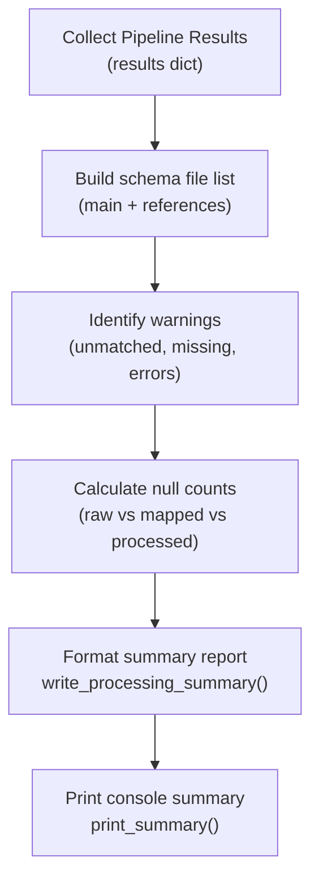

# Reporting Engine

A modular engine for generating processing reports and summaries for the DCC document processing pipeline. This engine provides comprehensive reporting functionality including processing summaries, column mapping reports, and validation status reports.

---

## Table of Contents

- [Module Structure](#module-structure)
- [Workflow Overview](#workflow-overview)
- [Function I/O Reference](#function-io-reference)
- [Global Parameter Trace Matrix](#global-parameter-trace-matrix)
- [Validation Category Summary Table](#validation-category-summary-table)
- [Usage Examples](#usage-examples)
- [Troubleshooting](#troubleshooting)
- [Best Practices](#best-practices)

---

## Module Structure

```
reporting_engine/
├── __init__.py          # Module exports
├── readme.md            # This documentation file
└── summary.py           # Processing summary generator
```

---

## Workflow Overview

The reporting engine operates as the final step in the DCC pipeline, aggregating results from all previous stages (initiation, schema, mapping, processing) into a human-readable format.



The engine provides two primary reporting paths:
1. **File-based Reporting**: `write_processing_summary()` generates a detailed `.txt` file with exhaustive details.
2. **Console-based Reporting**: `print_summary()` provides a high-level overview for immediate feedback.

---

## Function I/O Reference

| Function | File | Input | Output |
|----------|------|-------|--------|
| `write_processing_summary()` | `summary.py` | `summary_path` (Path), `input_file` (Path), `main_schema_path` (Path), `schema_results` (Dict), `raw_columns` (List), `mapped_columns` (List), `processed_columns` (List), `raw_shape` (Tuple), `mapped_shape` (Tuple), `processed_shape` (Tuple), `df_raw` (Any), `df_mapped` (Any), `df_processed` (Any), `mapping_result` (Dict), `schema_reference_count` (int), `csv_path` (Path), `excel_path` (Path) | None (writes text file) |
| `print_summary()` | `summary.py` | `results` (Dict), `status_print_fn` (Callable) | None (prints to console) |

---

## Global Parameter Trace Matrix

| Parameter | Source | Consumer | Role |
|-----------|--------|----------|------|
| `results` | Pipeline Orchestrator | `print_summary()` | Consolidated dictionary containing all execution metadata |
| `df_raw`, `df_mapped`, `df_processed` | Pipeline Stages | `write_processing_summary()` | DataFrames at different stages for null count comparison |
| `mapping_result` | Mapper Engine | `write_processing_summary()` | Source for match rates, aliases, and unmatched headers |
| `schema_results` | Schema Engine | `write_processing_summary()` | Source for schema file paths and validation errors |

---

## Validation Category Summary Table

The reporting engine summarizes several validation categories tracked throughout the pipeline:

| Category | Source Engine | Reported Items |
|----------|---------------|----------------|
| **Project Structure** | initiation_engine | Overall readiness status |
| **Schema Integrity** | schema_engine | Referenced schema paths and validation errors |
| **Header Mapping** | mapper_engine | Match rate, matched vs unmatched headers, alias usage |
| **Data Processing** | processor_engine | Null counts (raw vs processed), new columns added |

---

## Usage Examples

### Generate Full Summary Report

```python
from pathlib import Path
from reporting_engine import write_processing_summary

# Called at the end of the pipeline
write_processing_summary(
    summary_path=Path("output/processing_summary.txt"),
    input_file=Path("data/input.xlsx"),
    main_schema_path=Path("config/schema.json"),
    schema_results=schema_validation_results,
    raw_columns=df_raw.columns.tolist(),
    mapped_columns=df_mapped.columns.tolist(),
    processed_columns=df_processed.columns.tolist(),
    raw_shape=df_raw.shape,
    mapped_shape=df_mapped.shape,
    processed_shape=df_processed.shape,
    df_raw=df_raw,
    df_mapped=df_mapped,
    df_processed=df_processed,
    mapping_result=mapping_details,
    schema_reference_count=len(references),
    csv_path=Path("output/data.csv"),
    excel_path=Path("output/data.xlsx"),
)
```

### Display Console Summary

```python
from reporting_engine import print_summary

# results dict contains all required metadata
print_summary(results)
```

---

## Troubleshooting

| Issue | Potential Cause | Resolution |
|-------|-----------------|------------|
| **Missing schema files in list** | Reference resolution failed in `schema_engine` | Check `schema_results['references']` for error messages |
| **Null counts incorrect** | DataFrames passed in wrong order | Ensure `df_raw`, `df_mapped`, `df_processed` are passed correctly |
| **Summary file not created** | Permission error in output folder | Check folder permissions or use `--base-path` with write access |

---

## Best Practices

1. **Always run as final step**: Ensure all processing and exports are complete before generating the summary.
2. **Include shapes**: Always report (rows, columns) to detect data loss or expansion.
3. **Compare nulls**: The three-stage null summary (Raw -> Mapped -> Processed) is critical for verifying null-handling effectiveness.
4. **Use provided results dict**: For `print_summary()`, use the standard dictionary structure returned by `run_engine_pipeline()`.
