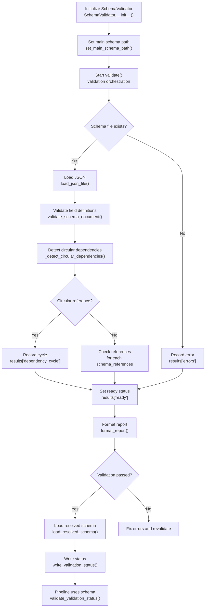

# Schema Engine

A modular engine for schema loading, validation, and dependency resolution. This engine provides comprehensive tools for loading JSON schemas, resolving external schema references, validating field definitions, detecting circular dependencies, and persisting validation status for downstream pipeline consumption.

---

## Table of Contents

- [Module Structure](#module-structure)
- [Workflow Overview](#workflow-overview)
- [Core Functions](#core-functions)
- [Loader Functions](#loader-functions)
- [Validator Functions](#validator-functions)
- [Field Validation Functions](#field-validation-functions)
- [Status Persistence Functions](#status-persistence-functions)
- [Utility Functions](#utility-functions)
- [Usage Examples](#usage-examples)
  - [Basic Validation](#basic-validation)
  - [Schema Loading with Dependencies](#schema-loading-with-dependencies)
  - [Status Persistence](#status-persistence)
- [Import Quick Reference](#import-quick-reference)
- [Error Handling](#error-handling)
- [Best Practices](#best-practices)

---

## Module Structure

```
schema_engine/engine/
├── __init__.py              # Main engine exports (all public functions)
├── readme.md                # This documentation file
├── core/                    # Core components
│   ├── __init__.py          # Core module exports
│   └── reports.py           # Report formatting utilities
├── loader/                  # Schema loading
│   ├── __init__.py          # Loader module exports
│   └── schema_loader.py     # SchemaLoader class
├── validator/               # Schema validation
│   ├── __init__.py          # Validator module exports
│   ├── schema_validator.py  # SchemaValidator class
│   └── fields.py            # Field-level validation functions
├── status/                  # Validation status persistence
│   ├── __init__.py          # Status module exports
│   └── persistence.py       # Status read/write/check functions
└── utils/                   # Utilities
    ├── __init__.py          # Utils module exports
    └── paths.py             # Safe path operations
```

---

## Workflow Overview

The schema engine follows a structured validation and loading workflow:



### Function I/O Reference

| Function | File | Input | Output |
|----------|------|-------|--------|
| `SchemaValidator.__init__()` | `validator/schema_validator.py` | `schema_file` (str/Path) | Validator instance with loader |
| `SchemaLoader.__init__()` | `loader/schema_loader.py` | `base_path` (str/Path, optional) | Loader instance |
| `set_main_schema_path()` | `loader/schema_loader.py` | `schema_file` (str/Path) | Resolved Path |
| `validate()` | `validator/schema_validator.py` | None (uses instance) | Dict with validation results |
| `load_json_file()` | `loader/schema_loader.py` | `path` (str/Path) | Parsed JSON dict |
| `resolve_schema_dependencies()` | `loader/schema_loader.py` | `main_schema` (Dict) | Resolved schema with all references |
| `validate_schema_document()` | `validator/fields.py` | `schema_path`, `schema_data`, `results`, `validated_paths` | None (modifies results) |
| `_detect_circular_dependencies()` | `validator/schema_validator.py` | Multiple path and schema params | List of cycle paths or empty list |
| `find_record_section()` | `validator/fields.py` | `schema_data` (Dict) | Records section or None |
| `validate_record_field()` | `validator/fields.py` | Multiple validation params | None (records errors) |
| `write_validation_status()` | `status/persistence.py` | `results` (Dict), `status_path` (optional) | Path to status file |
| `validate_validation_status()` | `status/persistence.py` | `schema_file`, `status_path` (optional) | Tuple of (is_valid, message) |
| `safe_resolve()` | `utils/paths.py` | `path` (Path) | Absolute Path |
| `format_report()` | `core/reports.py` | `results` (Dict) | Formatted string report |

### Global Parameter Trace Matrix

| Parameter | Initialized In | Modified/Resolved By | Primary Consumers | Role in Engine |
|-----------|---------------|---------------------|-------------------|----------------|
| `schema_file` | `SchemaValidator.__init__()` | `safe_resolve()`, `set_main_schema_path()` | All validation functions | Path to main schema being validated |
| `loader` | `SchemaValidator.__init__()` | `SchemaLoader.__init__()` | `load_json_file()`, `resolve_schema_dependencies()` | SchemaLoader instance for loading/references |
| `main_schema` | `validate()` | `load_json_file()` | `validate_schema_document()`, `_detect_circular_dependencies()` | Parsed main schema document |
| `results` | `validate()` | All validation functions | `format_report()`, `write_validation_status()` | Accumulator dict with validation outcomes |
| `validated_paths` | `validate()` | `validate_schema_document()` | Prevents duplicate validation | Set of already validated schema paths |
| `references` | `_detect_circular_dependencies()` | Populated as references checked | `results['references']`, downstream pipeline | List of reference validation results |
| `base_path` | `SchemaLoader.__init__()` | Defaults to schema directory | `_resolve_reference_path()` | Base directory for relative path resolution |

---

## Core Functions

### SchemaValidator Class

**File:** `validator/schema_validator.py`

The main orchestrator class for schema validation.

| Attribute | Details |
|-----------|---------|
| **Input** | `schema_file` (str/Path): Path to main schema file |
| **Output** | Validator instance with configured loader |
| **Function** | Coordinates schema loading, validation, and dependency checking |
| **Dependencies** | `SchemaLoader`, `safe_resolve()` |

#### Methods

##### `validate()`

| Attribute | Details |
|-----------|---------|
| **Input** | None (uses instance attributes) |
| **Output** | Dict with main_schema_path, references, dependency_cycle, errors, ready |
| **Function** | Runs full schema validation including circular dependency detection |
| **Workflow** | 1. Check schema file exists<br>2. Load JSON<br>3. Validate field definitions<br>4. Detect circular dependencies<br>5. Check references<br>6. Set ready status |

##### `load_main_schema()`

| Attribute | Details |
|-----------|---------|
| **Input** | None |
| **Output** | Parsed main schema dict |
| **Function** | Loads main schema after validation has passed |

##### `load_resolved_schema()`

| Attribute | Details |
|-----------|---------|
| **Input** | None |
| **Output** | Resolved schema with all dependencies |
| **Function** | Loads main schema and resolves all configured dependencies |

---

## Loader Functions

### SchemaLoader Class

**File:** `loader/schema_loader.py`

Handles loading JSON schemas and resolving external schema references. Uses centralized logging from `initiation_engine` (`status_print`, `debug_print`) for consistent output.

| Attribute | Details |
|-----------|---------|
| **Input** | `base_path` (str/Path, optional): Base directory for schema resolution |
| **Output** | Loader instance with path resolution capabilities |
| **Function** | Loads schemas by name or path, resolves dependencies |

#### Methods

##### `set_main_schema_path(schema_file)`

| Attribute | Details |
|-----------|---------|
| **Input** | `schema_file` (str/Path): Path to main schema |
| **Output** | Resolved absolute Path |
| **Function** | Sets main schema path and updates base_path |

##### `load_json_file(path)`

| Attribute | Details |
|-----------|---------|
| **Input** | `path` (str/Path): Path to JSON file |
| **Output** | Parsed JSON document as dict |
| **Function** | Loads and parses JSON from disk |

##### `load_schema(schema_name, fallback_data=None)`

| Attribute | Details |
|-----------|---------|
| **Input** | `schema_name` (str): Schema stem name<br>`fallback_data` (Any, optional): Fallback if load fails |
| **Output** | Schema data dict |
| **Function** | Loads schema by stem name from base_path |

##### `load_schema_from_path(schema_path, fallback_data=None)`

| Attribute | Details |
|-----------|---------|
| **Input** | `schema_path` (str/Path): Schema path<br>`fallback_data` (Any, optional) |
| **Output** | Schema data dict |
| **Function** | Loads schema by path with reference resolution |

##### `resolve_schema_dependencies(main_schema)`

| Attribute | Details |
|-----------|---------|
| **Input** | `main_schema` (Dict): Parsed main schema |
| **Output** | Resolved schema with all `schema_references` loaded |
| **Function** | Recursively resolves all schema_references and appends data |
| **Workflow** | 1. Copy main schema<br>2. Iterate schema_references<br>3. Resolve each reference recursively<br>4. Append `_data` suffix to loaded data |

---

## Validator Functions

### _detect_circular_dependencies(...)

**File:** `validator/schema_validator.py`

| Attribute | Details |
|-----------|---------|
| **Input** | `current_path`, `current_schema`, `visited_paths`, `recursion_stack`, `results`, `validated_paths` |
| **Output** | List of paths forming a cycle, or empty list |
| **Function** | DFS traversal to detect circular schema dependencies |
| **Raises** | Records cycle in results if found |

---

## Field Validation Functions

### validate_schema_document(schema_path, schema_data, results, validated_paths)

**File:** `validator/fields.py`

| Attribute | Details |
|-----------|---------|
| **Input** | Schema path, data, results accumulator, validated paths set |
| **Output** | None (modifies results in-place) |
| **Function** | Validates field_definitions against records in schema |
| **Workflow** | 1. Check already validated<br>2. Find records section<br>3. Validate each record against field_definitions |

### find_record_section(schema_data)

**File:** `validator/fields.py`

| Attribute | Details |
|-----------|---------|
| **Input** | `schema_data` (Dict): Schema document |
| **Output** | Records section (list or dict) or None |
| **Function** | Auto-detects records section from data_section or by searching |

### validate_record_field(...)

**File:** `validator/fields.py`

| Attribute | Details |
|-----------|---------|
| **Input** | `schema_path`, `record`, `record_index`, `field_name`, `field_def`, `results`, `unique_trackers`, `global_item_trackers` |
| **Output** | None (records validation errors) |
| **Function** | Validates a single field in a record |
| **Checks** | Required, type, pattern, unique, min/max, allowed_values |

### validate_scalar_value(...)

**File:** `validator/fields.py`

| Attribute | Details |
|-----------|---------|
| **Input** | `schema_path`, `record_index`, `field_name`, `value`, `field_def`, `results`, `unique_trackers`, `global_item_trackers` |
| **Output** | None (records validation errors) |
| **Function** | Validates a scalar value against field rules |

### validate_scalar_rules(...)

**File:** `validator/fields.py`

| Attribute | Details |
|-----------|---------|
| **Input** | `schema_path`, `record_index`, `field_name`, `value`, `validation`, `results` |
| **Output** | None (records validation errors) |
| **Function** | Validates min, max, pattern, allowed_values rules |

### track_unique_scalar(...)

**File:** `validator/fields.py`

| Attribute | Details |
|-----------|---------|
| **Input** | `field_name`, `value`, `record_index`, `unique_trackers`, `results` |
| **Output** | None (tracks uniqueness) |
| **Function** | Tracks unique values and reports duplicates |

### validate_array_rules(...)

**File:** `validator/fields.py`

| Attribute | Details |
|-----------|---------|
| **Input** | `schema_path`, `record_index`, `field_name`, `value`, `validation`, `results` |
| **Output** | None (records validation errors) |
| **Function** | Validates min_items, max_items, unique_items for arrays |

---

## Status Persistence Functions

### get_validation_status_path(schema_file)

**File:** `status/persistence.py`

| Attribute | Details |
|-----------|---------|
| **Input** | `schema_file` (str/Path): Schema file path |
| **Output** | Path to validation status JSON file |
| **Function** | Returns default path: `{project_root}/output/schema_validation_status.json` |

### write_validation_status(results, status_path=None)

**File:** `status/persistence.py`

| Attribute | Details |
|-----------|---------|
| **Input** | `results` (Dict): Validation results<br>`status_path` (str/Path, optional) |
| **Output** | Path to written status file |
| **Function** | Persists validation status including tracked file mtimes |
| **Workflow** | 1. Create output directory<br>2. Build payload with tracked files<br>3. Write JSON |

### load_validation_status(schema_file, status_path=None)

**File:** `status/persistence.py`

| Attribute | Details |
|-----------|---------|
| **Input** | `schema_file` (str/Path)<br>`status_path` (str/Path, optional) |
| **Output** | Status dict from JSON file |
| **Function** | Loads persisted validation status |

### validate_validation_status(schema_file, status_path=None)

**File:** `status/persistence.py`

| Attribute | Details |
|-----------|---------|
| **Input** | `schema_file` (str/Path)<br>`status_path` (str/Path, optional) |
| **Output** | Tuple of (is_valid: bool, message: str) |
| **Function** | Checks if status is current and schema files unchanged |
| **Checks** | File existence, path match, ready flag, mtime changes |

---

## Utility Functions

### safe_resolve(path)

**File:** `utils/paths.py`

| Attribute | Details |
|-----------|---------|
| **Input** | `path` (Path): Path to resolve |
| **Output** | Absolute Path (no filesystem I/O) |
| **Function** | Returns absolute path without resolve() or expanduser() |

### safe_cwd()

**File:** `utils/paths.py`

| Attribute | Details |
|-----------|---------|
| **Input** | None |
| **Output** | Absolute Path to working directory |
| **Function** | Gets CWD safely with multiple fallbacks |
| **Fallbacks** | Path.cwd() → os.getcwd() → script directory |

### get_default_schema_path()

**File:** `utils/paths.py`

| Attribute | Details |
|-----------|---------|
| **Input** | None |
| **Output** | Path to default schema location |
| **Function** | Returns path to dcc_register_enhanced.json |

### default_schema_path(base_path=None)

**File:** `utils/paths.py`

| Attribute | Details |
|-----------|---------|
| **Input** | `base_path` (Path, optional) |
| **Output** | Path to dcc_register_enhanced.json |
| **Function** | Returns default schema path relative to base_path |

---

## Usage Examples

### Basic Validation

```python
from dcc.workflow.schema_engine.engine import SchemaValidator, format_report

# Create validator
validator = SchemaValidator('config/schemas/dcc_register.json')

# Run validation
results = validator.validate()

# Display report
print(format_report(results))

# Check if ready
if results['ready']:
    print("✓ Schema is valid")
    # Load for downstream use
    resolved = validator.load_resolved_schema()
else:
    print("✗ Validation failed:")
    for error in results['errors']:
        print(f"  - {error}")
```

### Schema Loading with Dependencies

```python
from dcc.workflow.schema_engine.engine import SchemaLoader

# Create loader
loader = SchemaLoader()

# Set main schema path
loader.set_main_schema_path('config/schemas/dcc_register.json')

# Load main schema
main_schema = loader.load_json_file('config/schemas/dcc_register.json')

# Resolve all dependencies (schema_references)
resolved_schema = loader.resolve_schema_dependencies(main_schema)

# Access resolved reference data
approval_codes = resolved_schema.get('approval_code_schema_data', {})
```

### Status Persistence

```python
from dcc.workflow.schema_engine.engine import (
    SchemaValidator,
    write_validation_status,
    validate_validation_status,
    format_report,
)

# Validate and write status
validator = SchemaValidator('config/schemas/dcc_register.json')
results = validator.validate()

if results['ready']:
    status_path = write_validation_status(results)
    print(f"Status written to: {status_path}")

# Later, in downstream pipeline
is_valid, message = validate_validation_status('config/schemas/dcc_register.json')
if is_valid:
    print("✓ Schema status is current")
    # Proceed with processing
else:
    print(f"✗ Status invalid: {message}")
    # Trigger revalidation
```

---

## Import Quick Reference

### Full Engine Import

```python
from dcc.workflow.schema_engine.engine import (
    # Loader
    SchemaLoader,
    load_schema_parameters,
    
    # Validator
    SchemaValidator,
    validate_schema_document,
    validate_scalar_record_section,
    find_record_section,
    validate_scalar_value,
    validate_record_field,
    validate_scalar_rules,
    track_unique_scalar,
    validate_array_rules,
    
    # Status
    get_validation_status_path,
    write_validation_status,
    load_validation_status,
    validate_validation_status,
    
    # Utils
    safe_resolve,
    safe_cwd,
    get_default_schema_path,
    default_schema_path,
    
    # Core
    format_report,
)
```

### Module-Specific Imports

```python
# Loader only
from dcc.workflow.schema_engine.engine.loader import (
    SchemaLoader,
    load_schema_parameters,
)

# Validator only
from dcc.workflow.schema_engine.engine.validator import (
    SchemaValidator,
    validate_schema_document,
    validate_record_field,
)

# Status only
from dcc.workflow.schema_engine.engine.status import (
    write_validation_status,
    validate_validation_status,
)

# Utils only
from dcc.workflow.schema_engine.engine.utils import (
    safe_resolve,
    get_default_schema_path,
)

# Core only
from dcc.workflow.schema_engine.engine.core import format_report
```

---

## Error Handling

The engine provides comprehensive error handling:

1. **Schema File Not Found**: Recorded in results.errors, sets ready=False
2. **Invalid JSON**: Caught during load_json_file(), recorded with context
3. **Circular Dependencies**: Detected and recorded in dependency_cycle
4. **Missing References**: Recorded per reference with resolved_path/error
5. **Field Validation Errors**: Recorded with field name, record index, rule violated
6. **Stale Status**: validate_validation_status() returns False with descriptive message

---

## Best Practices

1. **Always validate before loading**: Use SchemaValidator before downstream processing
2. **Check ready status**: Inspect results['ready'] before proceeding
3. **Use status persistence**: Write validation status for pipeline enforcement
4. **Handle missing references**: Check reference['exists'] before using reference data
5. **Safe path operations**: Use safe_resolve() for path operations without I/O
6. **Resolve dependencies**: Always call resolve_schema_dependencies() for complete schema
7. **Track file changes**: Use validate_validation_status() to detect stale schemas

---

## Dependencies

- Python 3.10+ (uses type hints with `|` syntax)
- json: JSON parsing (standard library)
- pathlib: Path operations (standard library)
- re: Pattern matching for validation (standard library)

---

## Notes

- Schema references use the `schema_references` key in schema JSON
- Resolved reference data is appended with `_data` suffix (e.g., `approval_code_schema_data`)
- Circular dependencies are detected using DFS with recursion stack tracking
- Validation status includes file mtimes to detect changes
- Field validation supports scalar and array types with comprehensive rule checking
