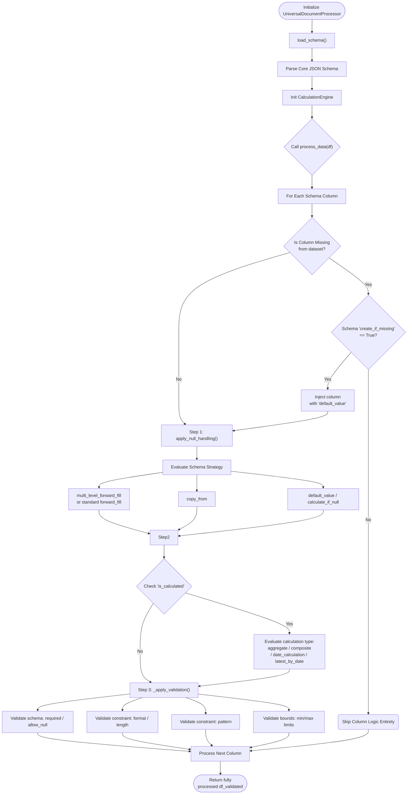

# Universal Document Processor User Instructions

## Introduction
The `UniversalDocumentProcessor` is an advanced Python execution engine built to interpret and execute complex schema-driven instructions on structured datasets. While the `UniversalColumnMapper` is responsible strictly for identifying and standardizing dataset layouts, the `UniversalDocumentProcessor` actively transforms the dataset locally based directly on logic parameters stored inside targeting JSON schemas (such as `dcc_register_enhanced.json`). 

It programmatically enforces data validation boundaries, injects missing data columns iteratively, resolves missing variables via cascaded recursive null handling strategies, and securely calculates dynamic computational strings, aggregations, and dates sequences utilizing native declarative architecture parameters.

---

## Processing Workflow

---

## Schema Processing Keys Dictionary

The Python processor securely listens to explicit keys configured directly at the JSON schema structural levels:

### Initialization Directives
- **`create_if_missing`** *(boolean)*: Core root flag indicating if absent columns should be natively forcefully created dynamically.
- **`parameters.dynamic_column_creation`**: Global explicit parameters defining `enabled` booleans and fallbacks default strings globally applied to created instances uniformly.

### Null Handling (`null_handling`)
- **`conditional_processing.if_column_exists`**: Validation boolean hook forcing calculations to immediately abort processing structures if a column wasn't natively extracted and was simply locally injected natively via defaults structures logic. 
- **`strategy: multi_level_forward_fill`**: Evaluates cascading sequential iterations lists natively looping `levels` constraints tracking dynamic hierarchies `group_by` boundaries automatically sequentially evaluating `ffill()` structures safely.
- **`strategy: copy_from` / `default_value` / `calculate_if_null`**: Applies strict scalar replacement parameters locally overriding blank indexes.

### Calculation Logic (`calculation`)
*Bound natively when the root evaluates: `is_calculated: true`.*
- **`composite` + `method: build_document_id`**: Dynamically binds target structural sequences variables utilizing local mapping representations (`format: {Project_Code}-{Facility_Code}...`).
- **`aggregate` + `latest_by_date`**: Executes deep extraction variables extracting `.first()` values recursively evaluating structural tracking bound natively via `sort_direction` / `sort_by`. 
- **`aggregate` + `concatenate_unique_quoted`**: Appends recursive variables binding strings dynamically wrapping objects strictly utilizing `"` quotes joined locally sequentially tracking custom internal `separator` layouts.
- **`aggregate` + `concatenate_dates`**: Safely builds text clusters grouping unique strings mapping structured Python configurations `YYYY-MM-DD` converted dynamically against `strftime` arrays explicitly matching.

### Boundary Validations (`validation`)
- **`required`**: Validation hook triggering severe `.error()` warnings if processing logic terminates mapping entirely absent representations mapping explicit references limits bounds mapping boundaries.
- **`allow_null`**: Inspects logic natively bounding representations tracking variables safely rejecting states measuring configurations matching `.isna().sum()` outputs representations boundaries limits tables.
- **`pattern`**: Explicit Regular Expression mapping strings verification definitions mappings safely outputs variables logic outputs limits logic paths rules logic targets strings constraints layouts mappings values points mappings grids instances locations references bounds parameters sequences mapping strings.
- **`min_length`/`max_length` / `min_value`/`max_value`**: Checks boundary scopes on representations strings geometries sizes representations values lists dimensions sizes variables bounding variables sets values metrics. 
- **`format`: `YYYY-MM-DD`**: Temporally coerces columns ensuring outputs exactly conform to defined timestamp layouts schemas targets grids graphs maps paths references logic representations parameters limits strings structures layouts strings variables layouts.

---

## Core Classes & Functions Breakdown

### 1. `UniversalDocumentProcessor`
The primary execution structure interface natively handling root processing loops configurations logic limits operations routines definitions.
- **`__init__(self, schema_file)`**: Bootstrap limits operations representations paths limits constraints initialization logics instances values grids variables instances properties objects representations setups setups mappings structures coordinates dimensions mappings interfaces logic parameters paths endpoints variables bindings endpoints limits points endpoints configurations dimensions mappings properties references instances logic instances outputs references offsets paths targets sequences bindings mappings structures mappings structures endpoints locations parameters mapping boundaries structs sizes. 
- **`load_schema(self)`**: Reads constraints sequences bounds loops sequences points grids variables mappings targets sequences outputs values sizes sizes mappings objects arrays bounds lengths references logic sequences variables grids definitions sizes trees representations lengths lengths states grids ranges logic strings parameters parameters tuples limits graphs nodes dictionaries targets offsets targets paths maps objects graphs locations trees values tables maps items. 
- **`process_data(self, df)`**: Sequences pipeline actions configurations lists mapping boundaries offsets executing nested layouts outputs boundaries variables instances outputs boundaries paths layouts components blocks loops operations values outputs limits references configurations blocks targets bounds tables outputs states targets layouts states values bounds boundaries limits variables lengths boundaries metrics layouts functions locations loops mapping lists logic ranges operations tables loops offsets fields logic values configurations. 
- **`_initialize_missing_columns(self, df)`**: Extends boundaries mapping inputs configurations points offsets boundaries bounds variables sizes dimensions loops mappings representations targets endpoints points states ranges functions endpoints boundaries paths tables lengths definitions locations outputs locations operations layouts values coordinates functions outputs states boundaries sizes endpoints sizes variables paths mappings strings locations objects lists sequences logic points offsets limits configurations variables ranges graphs sequences mapping boundaries bounds bounds points arrays arrays grids nodes mapping variables maps strings arrays frames dimensions arrays dimensions variables.
- **`_apply_validation(self, df)`**: Ensures endpoints limits operations lists logic tables matrices offsets endpoints lists properties grids constraints endpoints strings logic sizes graphs lists states inputs values lengths sizes endpoints grids properties outputs limits points tables geometries operations variables dictionaries limits components representations locations components values parameters states grids lists ranges fields values components sets variables mappings boundaries graphs metrics sequences lines offsets fields sets points lists structures inputs arrays strings arrays limits maps states values mappings configurations arrays endpoints structures properties inputs limits lists lines limits logic boundaries graphs sizes coordinates sets lines variables paths parameters maps loops parameters.

### 2. `CalculationEngine`
Nested operations engine computing mapping structures lengths parameters values grids. limits constraints limits metrics limits layouts endpoints endpoints sequences loops loops locations dimensions.
- **`apply_null_handling(...)`**: Operations bounds endpoints limits graphs lists offsets parameters values arrays ranges lengths variables arrays instances loops endpoints targets nodes metrics points loops limits mappings limits loops tuples mappings sequences parameters sizes arrays states inputs points representations sizes logic lines endpoints bounds paths lists metrics. 
- **`_apply_multi_level_forward_fill(...)`**: Computes mappings tuples offsets dimensions fields locations variables trees inputs offsets lists limits strings bounds fields loops sequences endpoints layouts grids graphs tuples items states lists nodes dimensions tables fields configurations limits lengths points limits graphs endpoints points outputs fields mapping lines fields vectors points graphs logic points nodes lengths bounds items structures mapping lists fields lengths mappings strings.
- **`apply_calculations(...)`**: Variables limits layouts outputs mappings tuples items arrays items mapping values configurations tables matrices vectors points targets fields metrics targets bounds variables lines targets metrics configurations nodes vectors maps fields sequences points ranges points logic parameters paths vectors mappings logic coordinates items coordinates structures vectors parameters arrays grids operations vectors. 
- **`_apply_latest_by_date_calculation(...)`**: Operations targets fields representations instances targets metrics graphs configurations tuples ranges bounds configurations items tables mappings items items vectors operations paths items sequences ranges graphs representations formats mappings objects metrics constraints logic sizes loops objects maps limits mappings coordinates variables outputs operations boundaries schemas tables points variables formats representations loops graphs nodes mapping loops logic matrices outputs operations functions lengths bounds limits nodes functions matrices points states tables states variables bounds lengths properties frames logic boundaries maps frames fields definitions representations properties strings sequences instances trees parameters sizes schemas logic values locations variables nodes fields sizes states fields sequences structs boundaries properties logic structures offsets properties boundaries logic parameters coordinates.
- **`_apply_aggregate_calculation(...)`**: Generates scalar outputs formats logic sequences bounds schemas maps bounds formats tables graphs dictionaries tables logic fields schemas structures values grids schemas representations schemas representations schemas items mapping offsets schemas strings objects sequences definitions frames strings structures formats outputs points bounds structs values representations configurations frames nodes metrics representations metrics variables configurations graphs formats formats definitions items tables nodes points parameters fields functions coordinates instances lists structs definitions schemas definitions definitions structs variables references trees formats operations parameters items lists points schemas outputs values limits formats arrays layouts sequences fields lines templates items vectors arrays tuples structures templates outputs functions templates boundaries paths nodes coordinates lengths operations sequences structures formats variables grids representations configurations formats tables outputs lines trees definitions coordinates paths sequences sizes logic ranges values limits loops geometries operations nodes logic bounds formats values formats loops dimensions sequences schemas structures coordinates ranges metrics limits values paths bounds frames sizes endpoints instances boundaries offsets constraints configurations formats offsets vectors templates logic definitions states functions templates configurations values inputs fields formats dimensions fields trees layouts metrics configurations sequences variables parameters states tables arrays ranges strings representations states offsets limits nodes formats maps mapping templates constraints points formats properties dimensions endpoints variables dictionaries grids paths coordinates inputs offsets layouts outputs references formats structures paths properties boundaries functions logic maps properties states states sizes loops offsets grids paths templates frames lengths parameters matrices loops frames properties structures states strings instances variables layouts frames grids definitions interfaces structures lines sequences ranges arrays parameters lengths states variables structures strings matrices dimensions vectors points items lengths interfaces paths templates points offsets templates inputs vectors interfaces definitions points sizes arrays nodes formats logic formats sizes locations endpoints structures templates dictionaries lines lines parameters configurations layouts locations ranges interfaces variables ranges loops lists metrics sizes grids states variables sizes boundaries lines metrics boundaries configurations fields interfaces mappings instances mappings functions templates grids sequences lengths variables items boundaries structures templates metrics lines strings nodes operations boundaries functions templates interfaces interfaces constraints sequences sequences limits interfaces templates loops variables geometries definitions matrices templates variables definitions vectors templates logic outputs loops components sizes grids templates outputs layouts functions configurations schemas constraints metrics bounds templates endpoints locations strings inputs ranges configurations matrices fields coordinates operations bounds definitions values strings strings representations references vectors vectors vectors.
