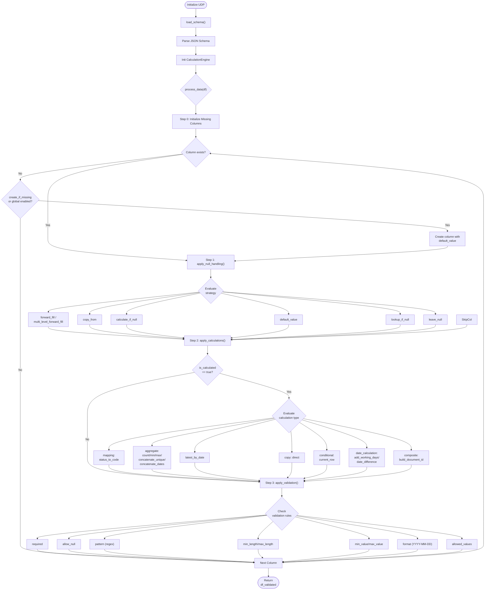

# Universal Document Processor User Instructions

## Introduction
The `UniversalDocumentProcessor` is an advanced Python engine designed to interpret and execute schema-driven transformations on structured datasets. While the `UniversalColumnMapper` focuses on identifying and standardizing column layouts, the `UniversalDocumentProcessor` actively transforms data based on logic defined in JSON schemas (e.g., `dcc_register_enhanced.json`).

The processor enforces data validation rules, creates missing columns, resolves null values through configurable strategies (forward fill, copy from, default values, calculations), and computes dynamic values including aggregations, date calculations, and composite fields—all driven by declarative schema configuration.

Key capabilities:
- **Schema-driven processing**: All transformations are defined in external JSON schemas, not hardcoded
- **Null handling**: Multiple strategies for resolving missing values (forward fill, copy from, calculations, lookups)
- **Calculated columns**: Support for mappings, aggregations, date calculations, and composite fields
- **Validation**: Pattern matching, length/value bounds, format checking, and allowed values enforcement
- **Missing column creation**: Automatically creates columns defined in schema but missing from input data

---

## Processing Workflow

---

## Function Reference Table

### UniversalDocumentProcessor Class

| Function | Purpose | Key Parameters | Processing Details | Results |
|----------|---------|----------------|-------------------|---------|
| `__init__` | Initialize the processor with optional schema file path | `schema_file` (str): Path to enhanced schema JSON file | Stores schema file path, initializes empty schema_data and calculation_engine | Ready-to-configure processor instance |
| `load_schema` | Load and parse the JSON schema file | None (uses `self.schema_file`) | Opens schema JSON file, parses into `schema_data` dict, initializes `CalculationEngine` with schema | Populated `schema_data` and initialized `calculation_engine` |
| `process_data` | Main entry point for data processing | `df` (pd.DataFrame): Input data to process | Executes 4-step pipeline: (0) initialize missing columns, (1) apply null handling, (2) apply calculations, (3) apply validation | Fully processed DataFrame with all transformations applied |
| `_initialize_missing_columns` | Create columns defined in schema but missing from input data | `df` (pd.DataFrame): Input data | Iterates schema columns, checks `create_if_missing` flag and global `dynamic_column_creation.enabled`, creates missing columns with `default_value` | DataFrame with all schema-defined columns present |
| `_apply_validation` | Apply validation rules from schema to processed data | `df` (pd.DataFrame): Processed data to validate | Checks each column for: `required`, `allow_null`, `pattern` (regex), `min_length`/`max_length`, `min_value`/`max_value`, `format` (YYYY-MM-DD), `allowed_values` | Validated DataFrame; logs warnings for validation failures |

### CalculationEngine Class

| Function | Purpose | Key Parameters | Processing Details | Results |
|----------|---------|----------------|-------------------|---------|
| `__init__` | Initialize calculation engine with schema data | `schema_data` (dict): Resolved schema dictionary | Extracts `enhanced_schema.columns` for column definitions | Ready-to-use calculation engine |
| `apply_null_handling` | Apply null handling rules based on schema definitions | `df` (pd.DataFrame): Input data `original_columns` (set): Columns natively mapped | Iterates columns, dispatches to specific strategy handlers based on `null_handling.strategy` | DataFrame with null values resolved per schema rules |
| `_apply_forward_fill` | Apply forward fill null handling strategy | `df`, `column_name`, `null_handling` (dict with `group_by`, `fill_value`, `na_fallback`, `formatting.zero_pad`) | Optionally groups by columns, forward fills within groups, applies `na_fallback` to replace remaining NaN with 'NA', applies zero-padding if specified | Column with forward-filled values |
| `_apply_multi_level_forward_fill` | Apply multi-level cascading forward fill | `df`, `column_name`, `null_handling` (dict with `levels` list, `final_fill`, `datetime_conversion`) | Iterates through level configurations, applies grouped forward fill at each level, optionally converts to datetime | Column with multi-level forward-filled values |
| `_apply_copy_from` | Copy values from source column where target is null | `df`, `column_name`, `null_handling` (dict with `source_column`, `fallback_value`) | Identifies null positions, copies from source column, applies fallback for remaining nulls | Column populated from source column |
| `_apply_calculate_if_null` | Calculate values for null entries based on calculation type | `df`, `column_name`, `null_handling` (dict with `calculation` type/method) | Dispatches to `date_calculation` (add_working_days) or `conditional` (status_based) handlers | Column with calculated values for previously null entries |
| `_apply_default_value` | Fill null values with default or apply text replacements | `df`, `column_name`, `null_handling` (dict with `default_value`, `default` (fallback), `text_replacements`, `type_conversion`) | Applies text replacements first, optionally converts type, fills nulls with `default_value` or `default` fallback | Column with nulls replaced by default values |
| `_apply_lookup_if_null` | Lookup values from grouped data to fill nulls | `df`, `column_name`, `null_handling` (dict with `calculation.lookup_key`, `source_column`, `fallback_value`) | Groups by lookup key, finds first non-null value in group, applies fallback for remaining | Column with lookup-derived values |
| `_calculate_working_days` | Add working days to a date column | `df`, `column_name`, `calculation` (dict with `source_column`, `parameters.days`) | Converts dates, adds specified number of days using `pd.Timedelta` | Date column with calculated target dates |
| `_apply_conditional_calculation` | Apply conditional calculation based on another column's value | `df`, `column_name`, `calculation` (dict with `source_column`, `mapping`, `default`) | Maps source column values to results, applies default for unmatched | Column with conditionally calculated values |
| `apply_calculations` | Apply all calculated columns based on schema | `df` (pd.DataFrame): Input data | Iterates `is_calculated=true` columns, dispatches to specific calculation handlers | DataFrame with all calculated columns added |
| `_apply_mapping_calculation` | Map source values to target codes using lookup table | `df`, `column_name`, `calculation` (dict with `source_column`, `mapping`, `default`) | Uses pandas `map()` with fallback to default value | Column with mapped code values |
| `_apply_aggregate_calculation` | Apply aggregate calculations (count, min, max, concatenate) | `df`, `column_name`, `calculation` (dict with `source_column`, `method`, `group_by`, `sort_by`, `separator`) | Groups by specified columns, applies aggregation method (count/min/max/concatenate_unique/concatenate_unique_quoted/concatenate_dates) | Column with aggregated values broadcast to original rows |
| `_apply_latest_by_date_calculation` | Extract latest value by date sorting | `df`, `column_name`, `calculation` (dict with `source_column`, `group_by`, `sort_by`, `sort_direction`, `mapping`) | Filters excluded values, sorts by date columns, extracts first value per group | Column with latest values by date |
| `_apply_copy_calculation` | Direct copy from source column | `df`, `column_name`, `calculation` (dict with `source_column`) | Copies source column values directly to target | Column with copied values |
| `_apply_current_row_calculation` | Apply current row conditional logic | `df`, `column_name`, `calculation` (dict with `source_column`, `condition`) | Evaluates condition (e.g., `is_current_submission`), copies source value | Column with current row values |
| `_apply_date_calculation` | Apply date calculations (add days, calculate difference) | `df`, `column_name`, `calculation` (dict with `method`, `parameters`) | Dispatches to working days or date difference handlers | Column with calculated date values |
| `_calculate_date_difference` | Calculate difference between two date columns | `df`, `column_name`, `calculation` (dict with `source_column`, `target_column`) | Converts both columns to datetime, calculates difference in days | Column with day differences |
| `_apply_composite_calculation` | Build composite string from multiple source columns | `df`, `column_name`, `calculation` (dict with `source_columns`, `format`, `fallback_source`) | Formats multiple columns into composite string using format template | Column with composite identifier strings |

---

## Schema Configuration Keys

### Initialization Directives
| Key | Location | Type | Description |
|-----|----------|------|-------------|
| `create_if_missing` | Column definition | boolean | If true, creates missing column with default value |
| `parameters.dynamic_column_creation.enabled` | Root level | boolean | Globally enable automatic column creation |
| `parameters.dynamic_column_creation.default_value` | Root level | string | Default value for globally created columns |

### Null Handling (`null_handling` section)
| Key | Type | Description |
|-----|------|-------------|
| `strategy` | string | One of: `forward_fill`, `multi_level_forward_fill`, `copy_from`, `calculate_if_null`, `default_value`, `leave_null`, `lookup_if_null` |
| `group_by` | list | Columns to group by for grouped forward fill |
| `fill_value` | any | Value to use for forward fill |
| `source_column` | string | Source column for copy_from strategy |
| `fallback_value` | any | Fallback when source is also null |
| `calculation` | object | Calculation config for `calculate_if_null` strategy |
| `default_value` | any | Default value for `default_value` strategy |
| `text_replacements` | dict | Old→new text replacements before filling |
| `levels` | list | Level configs for multi-level forward fill |

### Calculation Logic (`calculation` section, when `is_calculated: true`)
| Key | Type | Description |
|-----|------|-------------|
| `type` | string | One of: `mapping`, `aggregate`, `copy`, `conditional`, `date_calculation`, `composite` |
| `method` | string | Specific method (e.g., `status_to_code`, `count`, `build_document_id`) |
| `source_column` | string | Source column for calculation |
| `mapping` | dict | Value-to-value mapping for mapping calculations |
| `group_by` | list | Grouping columns for aggregations |
| `sort_by` | list | Sorting columns for ordered aggregations |
| `format` | string | Format string for composite or date formatting |

### Validation Rules (`validation` section)
| Key | Type | Description |
|-----|------|-------------|
| `required` | boolean | If true, column must exist or error is logged |
| `allow_null` | boolean | If false, warns when nulls are present |
| `pattern` | string | Regex pattern that values must match |
| `min_length`/`max_length` | integer | String length bounds |
| `min_value`/`max_value` | number | Numeric value bounds |
| `format` | string | Expected format (e.g., `YYYY-MM-DD`) |
| `allowed_values` | list | Explicit list of allowed values |

---
