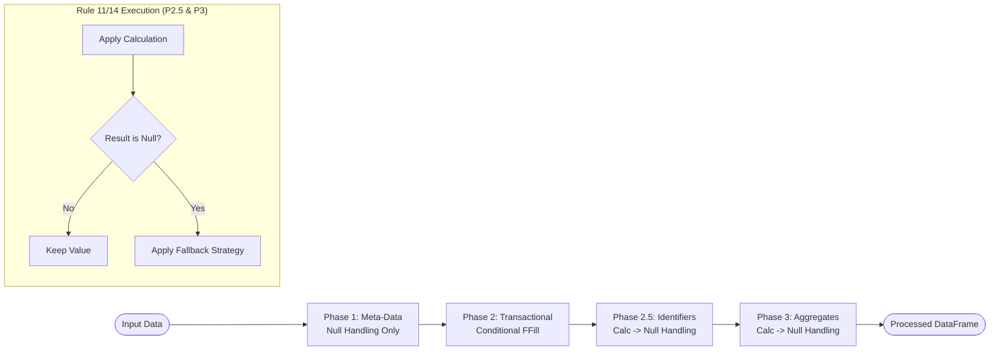

# Column Priority Reference

**Generated:** April 9, 2026  
**Based on:** `agent_rule.md` Section 4 & 5 + `dcc_register_enhanced.json` schema analysis

---

## Table of Contents

- [Section 1. Data Source and Rules for Columns](#section-1-data-source-and-rules-for-columns)
- [Section 2. Priority Definitions](#section-2-priority-definitions)
- [Section 3. Complete Column Priority Table](#section-3-complete-column-priority-table)
- [Section 4. Column Handling Strategy Reference](#section-4-column-handling-strategy-reference)
- [Section 5. Anomaly Columns Requiring Special Handling](#section-5-anomaly-columns-requiring-special-handling)
- [Section 6. Processing Sequence by Phase](#section-6-processing-sequence-by-phase)
- [Section 7. Key Rules Summary](#section-7-key-rules-summary)
- [Section 8. Schema Configuration Status](#section-8-schema-configuration-status)
- [Section 9. Column Regrouping Analysis](#section-9-column-regrouping-analysis-april-9-2026)
- [Section 10. Resolved Decisions](#section-10-resolved-decisions-from-rules-1-13)
- [Section 11. Pending Implementation Approvals](#section-11-pending-implementation-approvals)
- [Section 12. Enhanced Strategy Workflow Summary](#section-12-enhanced-strategy-workflow-summary)

---

## Section 1. Data Soruce and Rules for dcc_register Columns

1. The Excel file to be processed is a submission register file which record the history and status of documents submitted for review.
2. This is a fact table that contains metadata and transactional data for each submission.
3. Only Row_Index is unique.
4. All meta data, relational keys and transactional data can be repeated across different rows.
5. Submission_Session and Submission_Session_Revision are used to group submissions. This is a container for a group of documents to be submitted together, by the same Submitted_By, from same Department, at the same Submission_Time.
6. Boundary conditions:
   - First level for forward fill is the Submission_Session and Submission_Session_Revision. If fails, then try the second level for forward fill which is the Submission_session.
   - when forward fill jumps across Submission_Session or Submission_Session_Revision, it should stop and flag a warning message.
   - when forward fill jumps through rows more then 20, it should be flagged as a warning message to user for attention (forward fill continues, does not stop).
   - when forward fill is applied, it should be logged in the audit trail.
7. The pipeline should be able to handle multiple Submission_Sessions and Submission_Session_Revisions in the same file.
8. Submission_Closed can be overwritten by the user if needed. Calcualtion must look for existing user input and preserve it. When user input is present, forward fill will applied within the boundary before calculation can be processed.
9. Resubmission_Forecast_Date is a user estimate which will not be calculated by the pipeline.
10. Document_ID should be calculated and then apply null_hanlding.
11. if column is_calculated is true, refer to strategy key in the schema for detailed instructions.
12. if manual user input is allowed, forward fill with boundary is allowed.
13. always respect sequence of columns in the schema to process each column.
14. each column will have own 'Strategy' to handle sequence of preservation of existing data, null_handling, calculation, and fallback behavior. if any contradicting rule is found hereinabove, always refer to 'strategy' key in the schema. log a warning message to user for attention.
15. never sort original data set, using min, max if applicable, if not, choose a copy set for sort operation and then map result back to original data set.

### Forward Fill Boundary Rules (Applies to Priority 1 and Priority 2 with Manual Input)

```
Level 1 (Strict): group_by = [Submission_Session, Submission_Session_Revision]
Level 2 (Loose):  group_by = [Submission_Session]
Warning Trigger:  Row jump > 20 rows (session can have 50+ documents)
Hard Stop:        Session/Revision change only
Action:           Log warning + Continue fill + Audit trail
Applies To:       Priority 1 (all) + Priority 2 (Manual Input = YES only)
```

### Special Processing for Submission_Closed (Priority 3 Exception)

Since `Submission_Closed` is the **only** Priority 3 column with Manual Input = YES:

```python
if Submission_Closed has user_input:
    # Step 1: Forward fill within Session/Revision boundary
    apply_bounded_forward_fill(Submission_Closed)
    # Step 2: SKIP calculation - preserve user value
    preserve_user_input(Submission_Closed)
else:
    # No user input - calculate normally
    calculate(Submission_Closed, dependencies=[Latest_Approval_Code, Latest_Submission_Date])
```


## Section 2. Priority Definitions

| Priority | Name | Description | Processing Rule |
|----------|------|-------------|---------------|
| **1** | Meta Data | "Who" & "Where" - Static metadata defining context | Safe for bounded forward fill |
| **2** | Relational Keys & Transactional Data | "Live" data - Unique per submission event | Validate, forward fill IF Manual Input = YES |
| **3** | Derived Logic & Status Flags | Calculated fields dependent on Priority 1 & 2 | Recalculate every run, only fill nulls |

---

## Section 3. Complete Column Priority Table

### Priority 1: Meta Data Columns (Impute First)

| Column | is_calculated | Data Type | Category | Null Handling Strategy | Notes | Manual Input by User |
|--------|---------------|-----------|----------|---------------------|-------|---|
| `Project_Code` | ❌ | categorical | Project Identification | forward_fill / default | Defines project context | YES |
| `Facility_Code` | ❌ | categorical | Organizational Metadata | forward_fill / default | Facility location | YES |
| `Document_Type` | ❌ | categorical | Organizational Metadata | forward_fill / default | Document category | YES |
| `Discipline` | ❌ | categorical | Organizational Metadata | forward_fill / default | Engineering discipline | YES |
| `Department` | ❌ | categorical | Organizational Metadata | forward_fill / default | Originating department | YES |
| `Submission_Session` | ❌ | string (6-digit) | Source Tracking | forward_fill + zero_pad | Submission container | YES |
| `Submission_Session_Revision` | ❌ | string (2-digit) | Source Tracking | forward_fill (grouped by Session) | Revision within session | YES |
| `Submission_Session_Subject` | ❌ | string | Source Tracking | multi_level_forward_fill | Session description | YES |
| `Submission_Date` | ❌ | date | Source Tracking | forward_fill / default | Transaction timestamp | YES |
| `Submitted_By` | ❌ | string | Source Tracking | forward_fill / default | Submitter identity | YES |
| `Transmittal_Number` | ❌ | string | Source Tracking | forward_fill | Transmittal reference | YES |

---

### Priority 2: Relational Keys & Transactional Data (Validate Second)

| Column | is_calculated | Data Type | Category | Constraint | Notes | Manual Input by User | Overwrites Existing¹ |
|--------|---------------|-----------|----------|------------|-------|---|---|
| `Document_ID` | ✅ **ANOMALY** | string | Unique Identifier | **PRIMARY KEY** | Calculated then null_handling applied, can use as a foreign key | NO | YES |
| `Document_Sequence_Number` | ❌ | string (4-digit) | Unique Identifier | Required, pattern validation | Document numbering | YES | NA |
| `Document_Revision` | ❌ | string | Revision Control | Required | Specific revision | YES | NA |
| `Document_Title` | ❌ | string | Unique Identifier | Required, min_length | Document description | YES | NA |
| `Reviewer` | ❌ | string | Workflow Participant | Allow null | Assigned reviewer | YES | NA |
| `Review_Return_Actual_Date` | ❌ | date | Workflow Date | Allow null | Actual return date | YES | NA |
| `Review_Status` | ❌ | categorical | Workflow Status | Allow null | Current review state | YES | NA |
| `Review_Status_Code` | ✅ **ANOMALY** | categorical | Workflow Status | Mapped from Review_Status | Calculated but transactional | NO | YES |
| `Review_Comments` | ❌ | string | Workflow Data | Allow null | Review feedback | YES | NO |
| `Resubmission_Forecast_Date` | ❌ | date | Workflow Date | Allow null | User estimate input | YES | NO |
| `Notes` | ❌ | string | Transactional Data | Allow null | Additional notes | YES | NO |
| `Submission_Reference_1` | ❌ | string | Transactional Data | Allow null | External reference | YES | NO |
| `Internal_Reference` | ❌ | string | Transactional Data | Allow null | Internal tracking | YES | NO |

---

### Priority 3: Derived Logic & Status Flags (Calculate Last)

| Column | is_calculated | Calculation Type | Dependencies | Overwrites Existing¹ | Notes | Manual Input by User |
|--------|---------------|------------------|--------------|---------------------|-------|---|
| `Row_Index` | ✅ | auto_increment | None | YES | Auto-generated row number | NO |
| `First_Submission_Date` | ✅ | aggregate/min | `Submission_Date`, `Document_ID` | ❌ **Preserves** | First submission per document | NO |
| `Latest_Submission_Date` | ✅ | aggregate/max | `Submission_Date`, `Document_ID` | ❌ **Preserves** | Latest submission per document | NO |
| `Latest_Revision` | ✅ **ANOMALY** | aggregate/max | `Document_Revision`, `Document_ID` | ❌ **Preserves** | Calculated revision control | NO |
| `All_Submission_Sessions` | ✅ | aggregate/concatenate_unique | `Submission_Session`, `Document_ID` | ❌ **Preserves** | All sessions per document | NO |
| `All_Submission_Dates` | ✅ | aggregate/concatenate_dates | `Submission_Date`, `Document_ID` | ❌ **Preserves** | All dates per document | NO |
| `All_Submission_Session_Revisions` | ✅ | aggregate/concatenate_unique | `Submission_Session_Revision`, `Document_ID` | ❌ **Preserves** | All revisions per document | NO |
| `Count_of_Submissions` | ✅ | aggregate/count | `Document_ID` | ❌ **Preserves** | Total submissions count | NO |
| `Review_Return_Plan_Date` | ✅ | conditional_date | `Submission_Date`, submission count | ❌ **Preserves** | First/second review duration | NO |
| `Approval_Code` | ✅ | mapping/status_to_code | `Review_Status` | ❌ **Preserves** | Mapped approval code | NO |
| `Latest_Approval_Status` | ✅ | aggregate/latest_non_pending | `Review_Status`, `Document_ID`, `Submission_Date` | ❌ **Preserves** | Latest non-PEN status | NO |
| `Latest_Approval_Code` | ✅ | mapping/status_to_code | `Latest_Approval_Status` | ❌ **Preserves** | Mapped latest code | NO |
| `All_Approval_Code` | ✅ | aggregate/concatenate_unique | `Approval_Code`, `Document_ID` | ❌ **Preserves** | All approval codes per document | NO |
| `Consolidated_Submission_Session_Subject` | ✅ | aggregate/concatenate_unique_quoted | `Submission_Session_Subject`, `Document_ID` | ❌ **Preserves** | Consolidated subjects | NO |
| `Duration_of_Review` | ✅ | conditional_business_day | `Submission_Date`, `Review_Return_Actual_Date` | ❌ **Preserves** | Business days calculation | NO |
| `Submission_Closed` | ✅ | conditional | `Latest_Approval_Code`, `Latest_Submission_Date` | ❌ **Preserves** | YES/NO/PEN closure | YES |
| `Resubmission_Required` | ✅ | conditional | `Review_Return_Actual_Date`, `Latest_Revision` | ❌ **Preserves** | YES/NO/RESUBMITTED/PEN | NO |
| `Resubmission_Plan_Date` | ✅ | conditional_date | `Submission_Date`, `Review_Return_Actual_Date`, `Submission_Closed` | ❌ **Preserves** | Due date for resubmission | NO |
| `Resubmission_Overdue_Status` | ✅ | conditional | `Resubmission_Plan_Date`, current date | ❌ **Preserves** | Overdue/On-Track | NO |
| `Delay_of_Resubmission` | ✅ | complex_lookup | Previous submission history | ❌ **Preserves** | Days delayed | NO |
| `This_Submission_Approval_Code` | ✅ | conditional | `Latest_Approval_Code`, `Submission_Date`, `Latest_Submission_Date` | ❌ **Preserves** | Current submission approval | NO |
| `Validation_Errors` | ✅ | error_tracking | All columns | ✅ **Overwrites²** | Aggregated validation errors (rebuilt each run) | NO |

> **¹ Overwrites Existing**: Indicates whether the calculation handler replaces existing values or only fills null values.
> - All calculations use `null_mask = df[column_name].isna()` and only apply to null rows
> - **² Validation_Errors** is special: it initializes as empty string and aggregates errors (not a traditional calculation)
>
> **Reference Implementation**: See `processor_engine/calculations/*.py` - all handlers preserve existing values using `existing_mask` pattern.

---

## Section 4. Column Handling Strategy Reference

Each calculated column has a defined strategy that controls how it processes data. Strategies are defined in the schema's `strategy` object.

### Strategy Object Structure

```json
{
  "strategy": {
    "data_preservation": {
      "mode": "preserve_existing",
      "description": "Keep existing values, only calculate for nulls"
    },
    "processing_sequence": {
      "calculation_timing": "first",
      "null_handling_timing": "last_defense",
      "description": "Calculate first, then handle remaining nulls"
    },
    "fallback": {
      "type": "leave_null",
      "description": "If calculation fails, leave value as null"
    }
  }
}
```

### Strategy Properties Reference

| Property | Options | Description |
|----------|---------|-------------|
| **Data Preservation Mode** | `preserve_existing` | Keep existing values, only operate on null values (default for most columns) |
| | `overwrite_existing` | Replace all values with calculated results (Validation_Errors) |
| | `conditional_overwrite` | Overwrite only when condition is met (future use) |
| **Calculation Timing** | `first` | Calculate before null handling (standard for calculated columns) |
| | `last` | Calculate after null handling (rare use case) |
| | `conditional` | Calculate only if needed based on state |
| **Null Handling Timing** | `last_defense` | Apply after calculation, only for remaining nulls (most common) |
| | `before_calculation` | Prepare data before calculation runs |
| | `built_in` | Handled within calculation logic itself (Submission_Closed) |
| | `skip` | No separate null handling phase (Validation_Errors, Row_Index) |
| **Fallback Type** | `leave_null` | Keep null if calculation fails (Document_ID default) |
| | `default_value` | Use static default value from schema |
| | `forward_fill` | Use previous non-null value |
| | `calculated_default` | Use alternative calculation result (Submission_Closed → 'NO') |
| | `auto_generate` | Generate value automatically (Row_Index sequence) |

### Column Strategy Matrix

| Column | Preservation | Calc Timing | Null Timing | Fallback | Notes |
|--------|--------------|-------------|-------------|----------|-------|
| `Document_ID` | `preserve_existing` | `first` | `last_defense` | `leave_null` | Composite: keeps existing IDs, calculates if null |
| `Submission_Closed` | `preserve_existing` | `first` | `built_in` | `calculated_default` | Conditional: defaults to 'NO' in else clause |
| `Resubmission_Required` | `preserve_existing` | `first` | `built_in` | `calculated_default` | Conditional: preserves user input |
| `Validation_Errors` | `overwrite_existing` | `first` | `skip` | `default_value` | Error tracking: rebuilds each run |
| `Row_Index` | `preserve_existing` | `first` | `skip` | `auto_generate` | Auto-increment: preserves existing indices |
| `First_Submission_Date` | `preserve_existing` | `first` | `last_defense` | `leave_null` | Aggregate: keeps existing dates |
| `Latest_Submission_Date` | `preserve_existing` | `first` | `last_defense` | `leave_null` | Aggregate: keeps existing dates |
| `Latest_Revision` | `preserve_existing` | `first` | `last_defense` | `leave_null` | Aggregate: keeps existing revisions |
| `All_*` aggregates | `preserve_existing` | `first` | `last_defense` | `leave_null` | All aggregate columns preserve existing |
| `Approval_Code` | `preserve_existing` | `first` | `last_defense` | `leave_null` | Mapping: preserves existing codes |
| `Latest_Approval_Status` | `preserve_existing` | `first` | `last_defense` | `leave_null` | Latest status: preserves existing |
| `Duration_of_Review` | `preserve_existing` | `first` | `last_defense` | `leave_null` | Conditional: preserves existing |
| `Resubmission_Plan_Date` | `preserve_existing` | `first` | `last_defense` | `leave_null` | Conditional date: preserves existing |
| `Delay_of_Resubmission` | `preserve_existing` | `first` | `last_defense` | `leave_null` | Complex lookup: preserves existing |
| `This_Submission_Approval_Code` | `preserve_existing` | `first` | `last_defense` | `leave_null` | Conditional: preserves existing |

### Special Handling Notes

**Document_ID (Composite Calculation):**
- **Rule**: Preserve existing values at all costs
- **Fallback**: If source columns missing for calculation, leave null (not auto-generated)
- **User Override**: User can manually enter Document_ID; calculation only fills nulls

**Submission_Closed (Conditional with Built-in Null Handling):**
- **Preprocessing**: Converts to uppercase, fills nulls with 'NO' before condition evaluation
- **Logic**: `if existing == 'YES' → 'YES'; else if superseded → 'YES'; else if approved → 'YES'; else → 'NO'`
- **Result**: Never null after calculation (always YES or NO)

**Resubmission_Forecast_Date (User Estimate):**
- **is_calculated**: `false`
- **Manual Input**: YES
- **Forward Fill**: Allowed within boundary (20-row limit, session boundary)

**Validation_Errors (Error Tracking):**
- **Overwrite**: Always rebuild from scratch
- **Skip Null Handling**: No separate null phase; initializes as empty string
- **Result**: Aggregates all validation errors per row

---

## Section 5. Anomaly Columns Requiring Special Handling

These columns are marked `is_calculated: true` but serve functions that overlap with lower priorities:

| Column | Current Priority | Issue | Overwrites Existing | Recommended Handling |
|--------|------------------|-------|---------------------|---------------------|
| `Document_ID` | 3 (Calculated) | Acts as PRIMARY KEY | ❌ **Preserves** | Process in Priority 2 phase, or between P1 and P2 |
| `Latest_Revision` | 3 (Calculated) | Revision control data | ❌ **Preserves** | Process after Priority 2, before other Priority 3 |
| `Review_Status_Code` | 3 (Calculated) | Tightly coupled to `Review_Status` | ❌ **Preserves** | Process immediately after `Review_Status` validation |

---

## Section 6. Processing Sequence by Phase

### Phase 1: Impute Meta Data (Priority 1)
```python
apply_null_handling_for([
    Project_Code, Facility_Code, Document_Type, Discipline, Department,
    Submission_Session, Submission_Session_Revision, Submission_Session_Subject,
    Submission_Date, Submitted_By, Transmittal_Number
])
# Strategy: Bounded forward fill OK
```

### Phase 2: Validate Transactional Data (Priority 2)
```python
# Step 2a: Forward fill for columns with Manual Input = YES
apply_bounded_forward_fill_for([
    Resubmission_Forecast_Date,    # User estimate - forward fill within boundary
    # Other P2 columns with Manual Input = YES if needed
])

# Step 2b: Validate all Priority 2 columns
validate_required([
    Document_ID,              # ANOMALY: Calculated but acts as key
    Document_Sequence_Number,
    Document_Revision,
    Document_Title,
    Review_Return_Actual_Date,
    Review_Status,
    Reviewer
])
# Constraint: If null AND no forward fill applied, flag validation error
```

### Phase 2.5: Process Anomaly Columns
```python
# These calculated columns must complete before Phase 3
# NOTE: All calculations preserve existing values (only fill nulls)
calculate_anomalies([
    Document_ID,              # Composite: preserves existing, calculates if null
    Review_Status_Code,       # Mapping: preserves existing, maps if null
    Latest_Revision           # Aggregate: preserves existing, calculates if null
])
```

### Phase 3: Calculate Derived Fields (Priority 3) - Process in Schema Column Sequence
```python
# IMPORTANT: Process columns in the exact order defined in schema_column_sequence
# This ensures dependencies are resolved correctly
# NOTE: All calculations preserve existing values (only fill nulls)

# Step 3a: Apply calculations (calculations run FIRST, preserve existing values)
apply_calculations([
    First_Submission_Date, Latest_Submission_Date,      # Preserves existing
    All_Submission_Sessions, All_Submission_Dates,      # Preserves existing
    Latest_Approval_Status, Latest_Approval_Code,       # Preserves existing
    Submission_Closed, Resubmission_Required,             # Preserves existing
    Duration_of_Review, Resubmission_Plan_Date,         # Preserves existing
    Resubmission_Overdue_Status, Delay_of_Resubmission, # Preserves existing
    This_Submission_Approval_Code,                       # Preserves existing
    # ... all other is_calculated: true columns (all preserve existing)
])
# Rule: Calculations run FIRST, preserve existing values, then null handling as last defense

# Step 3b: Apply null handling as LAST DEFENSE for calculated columns
apply_null_handling_for_calculated([
    # Only fills nulls that calculations couldn't fill
    # Uses column-specific null_handling config from schema
])
```

---

## Section 7. Key Rules Summary

| Rule # | Description | Applies To |
|--------|-------------|------------|
| 1 | Sort column not allowed before forward fill | Priority 1 |
| 2 | Forward fill shall not overwrite existing values | All priorities |
| 3 | Always check for duplicate columns in DataFrame | All |
| 4 | Priority 1 (Meta): Safe for bounded forward fill | Priority 1 columns |
| 4a | **Forward fill boundary: Level 1** = [Submission_Session, Submission_Session_Revision] | Priority 1 + P2 Manual Input |
| 4b | **Forward fill boundary: Level 2** = [Submission_Session] (fallback) | Priority 1 + P2 Manual Input |
| 4c | **Forward fill warning**: Row jump > 20 (continue, don't stop) | Priority 1 + P2 Manual Input |
| 4d | **Forward fill stop**: Session/Revision change only | Priority 1 + P2 Manual Input |
| 5 | Priority 2 (Transactional): Validate, forward fill IF Manual Input = YES | Priority 2 columns |
| 5a | **Exception**: Priority 2 with Manual Input = YES allows bounded forward fill | Resubmission_Forecast_Date, etc. |
| 6 | Priority 3 (Calculated): Recalculate every run | Priority 3 columns |
| 7 | Calculations only fill null values | Priority 3 columns |
| 7a | **Exception**: `Submission_Closed` - forward fill if user input, else calculate | Priority 3 (exception) |
| 8 | Anomaly columns bridge P2 and P3 | Document_ID, Review_Status_Code, Latest_Revision |
| 9 | **Respect column sequence** - Process in schema order | All columns |

---

## Section 8. Schema Configuration Status

| Setting | Current Value | Recommended |
|---------|---------------|-------------|
| `unique_fields` | `Row_Index` | **CORRECT** - Row_Index is unique per Rule 3. Document_ID is foreign key. |
| `dynamic_column_creation.enabled` | `true` | OK - creates missing columns |
| `dynamic_column_creation.default_value` | `NA` | Consider `null` for Priority 2 columns |

---

## Section 9. Column Regrouping Analysis (April 9, 2026)

Based on the "Manual Input by User" column and boundary rules analysis:

### Conclusion: NO REGROUPING NEEDED

The current priority assignments are **CORRECT** with these clarifications:

| Priority | Count | Manual Input = YES | Handling |
|----------|-------|-------------------|----------|
| **1 - Meta Data** | 11 columns | 11/11 (100%) | Bounded forward fill OK |
| **2 - Transactional** | 14 columns | 12/14 (86%) | Validate, forward fill IF Manual Input = YES |
| **3 - Calculated** | 21 columns | 1/21 (5%) | Calculate only, fill nulls |

### Special Cases Identified

| Column | Priority | Special Handling Required |
|--------|----------|-------------------------|
| `Submission_Closed` | 3 | **ONLY** Priority 3 with manual input. Use 2-step: forward fill if user value exists, else calculate |
| `Resubmission_Forecast_Date` | 2 | **User estimate - forward fill WITHIN boundary allowed** |
| `Document_ID` | 2/3 anomaly | Calculated but acts as PRIMARY KEY. Process in P2.5 phase |

---

## Section 10. Resolved Decisions (From Rules 1-13)

| Decision | Resolution | Rule # |
|----------|------------|--------|
| `Document_ID` calculated or input? | **Calculated** (calculation → null_handling) | Rule 10 |
| Calculated column processing order? | **Calculation FIRST, null handling LAST** | Rule 11 |
| Forward fill for Priority 2? | **YES, if Manual Input = YES** | Rule 12 |
| Row_Index vs Document_ID unique? | **Row_Index is unique** (Document_ID = foreign key) | Rule 3 |

## Section 11. Pending Implementation Approvals

1. **Schema updates await your approval** (as requested)
   - No schema changes will be made until you approve
   - Current schema will be used as baseline

2. **Code implementation ready to proceed**
   - Processing order: Calculations → Null Handling
   - Forward fill boundaries for P1 + P2 Manual Input
   - Column sequence processing

---

**Status:** All 13 rules established and documented  
**Next Step:** Your approval to proceed with implementation

---

## Section 12. Enhanced Strategy Workflow Summary

This section provides a high-level visualization and summary of the **Document Processor Engine's** strategy workflow, integrating rules 1-14.

### Summary Workflow Diagram



### Core Strategy Dimensions

| Dimension | Primary Options | Role |
| :--- | :--- | :--- |
| **Data Preservation** | `preserve_existing`, `overwrite_existing` | Controls if calculations replace user data. |
| **Processing Sequence** | `calculation_first`, `null_handling_first` | Defines the relative timing of logic steps. |
| **Null Handling Timing** | `last_defense`, `before_calculation`, `built_in` | Determines when fallbacks activate. |
| **Fallback Behavior** | `leave_null`, `default_value`, `auto_generate` | Final state if primary logic fails. |

> [!TIP]
> Always cross-reference the `strategy` key in `dcc_register_enhanced.json` with this reference to ensure consistent implementation of Rule 14.

