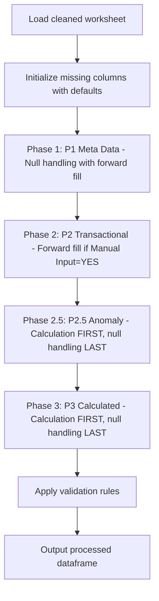

# DCC Column Update Logic

This file summarizes the schema-driven column update logic defined in `dcc_register_enhanced.json` and implemented by `processor_engine` with phased processing (P1→P2→P2.5→P3).

**Last Updated:** April 9, 2026 - Updated for phased processing engine

## Overview

## Processing Pipeline

The `CalculationEngine.apply_phased_processing()` method executes these steps in order:

### Phase 1 (P1): Meta Data - 11 columns
- **Processing**: Null handling with bounded forward fill
- **Columns**: Project_Code, Facility_Code, Document_Type, Discipline, Department, Submission_Session, Submission_Session_Revision, Submission_Session_Subject, Submission_Date, Submitted_By, Transmittal_Number
- **Forward Fill Boundaries**: 
  - Submission_Session: NO group_by (forward fills from previous row, acts as its own boundary)
  - Submission_Session_Revision: group_by=[Submission_Session] (boundary within Submission_Session)
  - Other columns: multi_level_forward_fill with [Session+Rev → Session] fallback

### Phase 2 (P2): Transactional - 11 columns  
- **Processing**: Forward fill IF Manual Input = YES
- **Columns**: Document_Sequence_Number, Document_Revision, Document_Title, Reviewer, Review_Return_Actual_Date, Review_Status, Review_Comments, Resubmission_Forecast_Date, Notes, Submission_Reference_1, Internal_Reference
- **Note**: Resubmission_Forecast_Date allows forward fill within boundary (user estimate input)

### Phase 2.5 (P2.5): Anomaly - 3 columns
- **Processing**: **Calculation FIRST**, null handling as **LAST DEFENSE**
- **Columns**: Document_ID, Review_Status_Code, Latest_Revision
- **Rule 10/11**: Calculated but must complete before P3. Calculation fills nulls, then null handling fills remaining nulls.

### Phase 3 (P3): Calculated - 21 columns
- **Processing**: **Calculation FIRST**, null handling as **LAST DEFENSE** 
- **Columns**: Row_Index, First_Submission_Date, Latest_Submission_Date, All_Submission_Sessions, All_Submission_Dates, All_Submission_Session_Revisions, Count_of_Submissions, Review_Return_Plan_Date, Approval_Code, Latest_Approval_Status, Latest_Approval_Code, All_Approval_Code, Consolidated_Submission_Session_Subject, Duration_of_Review, Submission_Closed, Resubmission_Required, Resubmission_Plan_Date, Resubmission_Overdue_Status, Delay_of_Resubmission, This_Submission_Approval_Code, Validation_Errors
- **Rule 11**: All calculations only fill null values (preserve existing data), then null handling fills any remaining nulls.

### Validation
- **Final Step**: Validates all data against schema rules (patterns, lengths, allowed values)

### Key Rules
- **Rule 11**: `is_calculated=true` → Calculation FIRST, null handling LAST
- **Rule 12**: Manual Input = YES → Forward fill with boundary allowed
- **Rule 13**: Process columns in schema `column_sequence` order

## Detailed Logic Table

**Last verified against pipeline code:** 2026-05-12

| Step | Target column(s) | Processing Phase | Schema Type | Main input column(s) | Logic / Calculation Method | Null / Default Handling Strategy |
| --- | --- | --- | --- | --- | --- | --- |
| 1 | `Project_Code` | **P1** | Input | Raw project code column | Direct mapping from aliases. Validated against `project_code_schema` | `default_value`: `"NA"` |
| 2 | `Facility_Code` | **P1** | Input | Raw facility code column | Direct mapping from aliases. Validated against `facility_schema` | `default_value`: `"NA"` |
| 3 | `Document_Type` | **P1** | Input | Raw document type column | Validated against `document_type_schema` | `default_value`: `"NA"` |
| 4 | `Discipline` | **P1** | Input | Raw discipline column | Validated against `discipline_schema` | `default_value`: `"NA"` |
| 5 | `Document_Sequence_Number` | **P2** | Input | Raw sequence number column | Validated with 4-digit numeric pattern `^[0-9]{4}$` | `default_value`: `"9999"` with `zero_pad: 4` |
| 6 | `Document_ID` | **P2.5 (Anomaly)** | Calculated | `Project_Code`, `Facility_Code`, `Document_Type`, `Discipline`, `Document_Sequence_Number` | **composite/build_document_id**: Format `{Project_Code}-{Facility_Code}-{Document_Type}-{Discipline}-{Document_Sequence_Number}`. Preserves existing values; calculates only for nulls. Affix extraction (`Document_ID_Affixes`) runs after. | Calculation FIRST, then `leave_null` if still null |
| 7 | `Document_Revision` | **P2** | Input | Raw revision column | Multi-level forward fill | `multi_level_forward_fill`: [DocID+Session+Rev → DocID+Session → DocID], `final_fill`: `"NA"` |
| 8 | `Document_Title` | **P2** | Input | Raw title column | Direct mapping | `default_value`: `"NA"` |
| 9 | `Transmittal_Number` | **P1** | Input | Raw transmittal column | String conversion, text replacements (`N.A.`→`NA`, `nan`→`NA`). Duplicate check skipped (fact table attribute per schema strategy) | `default_value` with `text_replacements`: `"NA"` |
| 10 | `Submission_Session` | **P1** | Input | Raw session column | Forward fill from previous row (no group boundary), zero-pad to 6 digits | `forward_fill`: `group_by=[]`, `fill_value="0"`, `zero_pad: 6` |
| 11 | `Submission_Session_Revision` | **P1** | Input | Raw revision column | Forward fill within `Submission_Session` boundary, zero-pad to 2 digits | `forward_fill`: `group_by=[Submission_Session]`, `fill_value="0"`, `zero_pad: 2`, `na_fallback: true` |
| 12 | `Submission_Session_Subject` | **P1** | Input | Raw subject column | Multi-level forward fill | `multi_level_forward_fill`: [Session+Rev → Session], `final_fill`: `"NA"` |
| 13 | `Consolidated_Submission_Session_Subject` | **P3** | Calculated | `Submission_Session_Subject`, `Document_ID` | **aggregate/concatenate_unique_quoted**: Group by `Document_ID`, quote each unique value, join with `" && "`, sort by `Submission_Date` | Calculation FIRST, null handling LAST if needed |
| 14 | `Department` | **P1** | Input | Raw department column | Validated against `department_schema`, multi-level forward fill | `multi_level_forward_fill`: [Session+Rev → Session], `final_fill`: `"NA"` |
| 15 | `Submitted_By` | **P1** | Input | Raw submitter column | Multi-level forward fill | `multi_level_forward_fill`: [Session+Rev → Session], `final_fill`: `"NA"` |
| 16 | `Submission_Date` | **P1** | Input | Raw date column | Multi-level forward fill with `pd.to_datetime(errors='coerce')` conversion | `multi_level_forward_fill`: [Session+Rev → Session], `datetime_conversion: coerce` |
| 17 | `First_Submission_Date` | **P3** | Calculated | `Submission_Date`, `Document_ID` | **aggregate/min**: `groupby(Document_ID)[Submission_Date].transform('min')`. Date column coerced before transform to prevent mixed-type errors. | Calculation FIRST, null handling LAST if needed |
| 18 | `Latest_Submission_Date` | **P3** | Calculated | `Submission_Date`, `Document_ID` | **aggregate/max**: `groupby(Document_ID)[Submission_Date].transform('max')`. Date column coerced before transform. | Calculation FIRST, null handling LAST if needed |
| 19 | `Latest_Revision` | **P2.5 (Anomaly)** | Calculated | `Document_Revision`, `Submission_Date`, `Document_ID` | **latest_by_date**: Sort by `Submission_Date` desc, exclude `"NA"` values, get first non-NA revision per `Document_ID`, map back to all rows. `fallback: "NA"` | Calculation FIRST, null handling LAST if needed |
| 20 | `All_Submission_Sessions` | **P3** | Calculated | `Submission_Session`, `Document_ID` | **aggregate/concatenate_unique**: Group by `Document_ID`, output JSON array of unique session IDs: `["S001", "S002"]` | Calculation FIRST, null handling LAST if needed |
| 21 | `All_Submission_Dates` | **P3** | Calculated | `Submission_Date`, `Document_ID` | **aggregate/concatenate_dates**: Group by `Document_ID`, coerce to datetime, sort chronologically, format `YYYY-MM-DD`, output JSON array of date strings: `["2023-05-15", "2024-05-13"]` | Calculation FIRST, null handling LAST if needed |
| 22 | `All_Submission_Session_Revisions` | **P3** | Calculated | `Submission_Session_Revision`, `Document_ID` | **aggregate/concatenate_unique**: Group by `Document_ID`, output JSON array of unique revisions: `["00", "01"]` | Calculation FIRST, null handling LAST if needed |
| 23 | `Count_of_Submissions` | **P3** | Calculated | `Document_ID` | **aggregate/count**: `groupby(Document_ID)[Document_ID].transform('count')`, broadcast to all rows | Calculation FIRST, null handling LAST if needed |
| 24 | `Reviewer` | **P2** | Input | Raw reviewer column | Forward fill within `Submission_Session` boundary | `forward_fill`: `group_by=[Submission_Session]`, `fill_value="NA"`, `na_fallback: true` |
| 25 | `Review_Return_Actual_Date` | **P2** | Input | Raw return date column | Forward fill within Session+Revision boundary with `pd.to_datetime(errors='coerce')` | `forward_fill`: `group_by=[Submission_Session, Submission_Session_Revision]`, `datetime_conversion: coerce` |
| 26 | `Review_Return_Plan_Date` | **P3** | Calculated | `Submission_Date`, `Document_ID` | **conditional_date_calculation/calculate_review_return_plan_date**: Vectorised — row is "first submission" if `Submission_Date == min(Submission_Date)` per `Document_ID`. First submission → `Submission_Date + first_review_duration (20 cal days)`. Resubmission → `Submission_Date + second_review_duration (14 cal days)`. Note: uses calendar days only (not working days) regardless of `duration_is_working_day` parameter. | Calculation FIRST, `leave_null` if `Submission_Date` is null |
| 27 | `Review_Status` | **P2** | Input | Raw status column | Forward fill within Session+Revision boundary | `forward_fill`: `group_by=[Submission_Session, Submission_Session_Revision]`, `fill_value: "Pending"` |
| 28 | `Review_Status_Code` | **P2.5 (Anomaly)** | Calculated | `Review_Status` | **mapping/status_to_code**: Map status text to code via `approval_code_schema`. Slash/whitespace cleaning applied via preprocessing. | Calculation FIRST, null handling LAST if needed |
| 29 | `Approval_Code` | **P3** | Calculated | `Review_Status` | **mapping/status_to_code**: Map status text to standardised code (Approved→APP, Rejected→REJ, Pending→PEN, etc.) via `approval_code_schema`. Default: `"PEN"` | Calculation FIRST, null handling LAST if needed |
| 30 | `Review_Comments` | **P2** | Input | Raw comments column | Multi-level forward fill, only if column exists in source data | `multi_level_forward_fill`: [Session+Rev → Session], `final_fill: "NA"`, `if_column_exists: true` |
| 31 | `Latest_Approval_Status` | **P3** | Calculated | `Review_Status`, `Submission_Date`, `Document_ID` | **aggregate/latest_non_pending_status**: Preprocessing — strip slashes and whitespace from `Review_Status`. Sort by `Submission_Date` desc per `Document_ID`. Exclude `pending_status` value (resolved from `approval_code_schema` PEN entry). Return first non-pending status. `fallback`: `pending_status` value if all rows are pending. | Calculation FIRST, null handling LAST if needed |
| 32 | `Latest_Approval_Code` | **P3** | Calculated | `Latest_Approval_Status` | **mapping/status_to_code**: Map latest status text to code via `approval_code_schema`. Slash/whitespace cleaning applied. | Calculation FIRST, null handling LAST if needed |
| 33 | `All_Approval_Code` | **P3** | Calculated | `Approval_Code`, `Document_ID`, `Submission_Date` | **aggregate/concatenate_unique**: Group by `Document_ID`, sort by `Submission_Date`, output JSON array of unique approval codes: `["PEN", "AWC", "APP"]` | Calculation FIRST, null handling LAST if needed |
| 34 | `Duration_of_Review` | **P3** | Calculated | `Submission_Date`, `Review_Return_Actual_Date` | **conditional_business_day_calculation**: End date = `Review_Return_Actual_Date` if present, else `current_date` (today). Duration = `(end_date − Submission_Date).days`. Clamp to 0 (no negatives). Returns `NaN` if `Submission_Date` is null. Note: uses calendar days regardless of `duration_is_working_day` parameter. | Calculation FIRST, null handling LAST if needed |
| 35 | `Submission_Closed` | **P3** | Calculated | `Submission_Closed` (source), `Latest_Approval_Code`, `Document_ID`, `Submission_Date`, `Latest_Submission_Date` | **conditional/submission_closure_status**: Preprocessing — uppercase + fill nulls with `"NO"`. Priority order: (1) Keep `"YES"` if already `"YES"`. (2) Set `"YES"` if `Submission_Date < Latest_Submission_Date` (superseded). (3) Set `"YES"` if `Latest_Approval_Code` in terminal codes (`APP`, `VOID`, `INF` — read from `approval_code_schema`). (4) Default `"NO"`. | Calculation FIRST (built-in null handling via preprocessing). Strategy: `preserve_existing` |
| 36 | `Resubmission_Required` | **P3** | Calculated | `Resubmission_Required` (source), `Submission_Closed`, `Document_ID`, `Submission_Date`, `Review_Return_Actual_Date`, `Latest_Submission_Date` | **conditional/update_resubmission_required**: Initialise nulls with `"YES"`. Priority order: (1) Keep `"NO"` if already `"NO"`. (2) Set `"NO"` if `Submission_Closed == "YES"`. (3) Set `"RESUBMITTED"` if `Submission_Date < Latest_Submission_Date` (newer submission exists). (4) Set `"PEN"` if `Submission_Date == Latest_Submission_Date` AND `Review_Return_Actual_Date` is null (latest, awaiting review). (5) Default `"YES"`. Allowed values: `YES`, `NO`, `RESUBMITTED`, `PEN`. Strategy: `overwrite_existing`. | Built-in (initialised to `"YES"` before conditions run) |
| 37 | `Resubmission_Plan_Date` | **P3** | Calculated | `Submission_Closed`, `Review_Return_Actual_Date`, `Latest_Submission_Date`, `Submission_Date`, `Latest_Approval_Code` | **custom_conditional_date/calculate_resubmission_plan_date**: Priority order: (1) `Submission_Date == Latest_Submission_Date` AND `Latest_Approval_Code` in terminal codes (`APP`, `VOID`, `INF`) → `NaT`. Only the latest submission row of a terminally approved/voided document is set to `NaT`. Superseded rows (where `Latest_Approval_Code` may reflect a later terminal approval) always fall through to conditions 2–4 and receive a calculated plan date from their own dates. (2) `Review_Return_Actual_Date` is not null → `Review_Return_Actual_Date + resubmission_duration (14 days)`. (3) `Latest_Submission_Date == Submission_Date` (first/only submission) → `Submission_Date + (first_review_duration + resubmission_duration) = 20+14 = 34 days`. (4) Else (subsequent or superseded submission) → `Submission_Date + (second_review_duration + resubmission_duration) = 14+14 = 28 days`. Working days used when `duration_is_working_day=true` (via `BDay` offset). | Calculation FIRST. Only latest terminally-closed rows overwritten to `NaT`. |
| 38 | `Resubmission_Forecast_Date` | **P2** | Input | Raw forecast date column | **User estimate input** — not calculated by pipeline. Forward fill within Session+Revision boundary with datetime conversion. | `forward_fill`: `group_by=[Submission_Session, Submission_Session_Revision]`, fallback: [Session], `if_column_exists: true`, `datetime_conversion: coerce`, `final_fill: keep_null` |
| 39 | `Resubmission_Overdue_Status` | **P3** | Calculated | `Resubmission_Required`, `Resubmission_Plan_Date` | **conditional/calculate_overdue_status**: Single condition — if `Resubmission_Required == "YES"` AND `Resubmission_Plan_Date` is not null AND `Resubmission_Plan_Date < current_date` → `"Overdue"`. All other rows → `"NO"`. Allowed values: `Resubmitted`, `Overdue`, `NO`. Note: `"Resubmitted"` value is defined in schema `allowed_values` but is **not produced by this calculation** — it is set upstream via `Resubmission_Required == "RESUBMITTED"` logic. | Calculation FIRST, null handling LAST (`fillna("NO")`) |
| 40 | `Delay_of_Resubmission` | **P3** | Calculated | `Submission_Closed`, `Document_ID`, `Submission_Date`, `Resubmission_Plan_Date`, `Review_Return_Actual_Date`, `Latest_Submission_Date` | **complex_lookup/calculate_delay_of_resubmission**: Delay is stored on the row whose plan was missed (forward-looking). **Path 1 — all rows with a next submission**: `delay = max(next_Submission_Date − current_Resubmission_Plan_Date, 0)`. Vectorised via `shift(-1)` on `Submission_Date` sorted by `[Document_ID, Submission_Date]` — gives each row the submission date of the immediately following revision for the same document. **Path 2 — latest row, active overdue** (ISS-014): applies when `Submission_Date == Latest_Submission_Date` AND not terminally closed AND `Review_Return_Actual_Date` is not null AND `Resubmission_Plan_Date < today`: `delay = max(today − Resubmission_Plan_Date, 0)`. Terminal closure override (`Latest_Approval_Code` in APP/VOID/INF) → 0. Superseded rows (`Submission_Closed = YES` but not terminal) keep their delay value. | Calculation FIRST, null handling LAST if needed |
| 41 | `Notes` | **P2** | Input | Raw notes column | Direct mapping | `default_value`: `"NA"` |
| 42 | `Submission_Reference_1` | **P2** | Input | Raw reference column | Direct mapping | `default_value`: `"NA"` |
| 43 | `Internal_Reference` | **P2** | Input | Raw internal reference column | Direct mapping | `default_value`: `"NA"` |
| 44 | `This_Submission_Approval_Code` | **P3** | Calculated | `Latest_Approval_Code`, `Submission_Date`, `Latest_Submission_Date` | **conditional/current_row**: Copies `Latest_Approval_Code` value for rows where `Submission_Date == Latest_Submission_Date` (current submission). Non-latest rows receive the approval code of their own submission row. | Calculation FIRST, null handling LAST if needed |
| 45 | `Row_Index` | **P3** | Calculated | None (auto-generated) | **auto_increment/generate_row_index**: Sequential integer starting from 1, assigned in DataFrame row order | No null handling needed (always generated) |
| 46 | `Validation_Errors` | **P3** | Calculated | All columns | **error_tracking/aggregate_row_errors**: Aggregates all per-row validation error messages as a semicolon-delimited string. Rebuilt every run. | Strategy: `overwrite_existing`. No separate null phase. |

## Schema Parameters

| Parameter | Value | Description |
| --- | --- | --- |
| `debug_dev_mode` | false | Enable debug output |
| `duration_is_working_day` | true | Use business days (excluding weekends) for date calculations |
| `first_review_duration` | 20 | Days for first review response |
| `second_review_duration` | 14 | Days for subsequent review responses |
| `resubmission_duration` | 14 | Days for resubmission planning |
| `pending_status` | "Awaiting S.O.'s response" | Default pending status value |
| `dynamic_column_creation.enabled` | true | Auto-create missing schema columns |
| `dynamic_column_creation.default_value` | "NA" | Default value for created columns |

## Null Handling Strategies

### Strategy: `default_value`
- **Used by**: Project_Code, Facility_Code, Document_Type, Discipline, Document_Sequence_Number, Document_Title, Transmittal_Number, Submitted_By, Department
- **Logic**: Fill null values with column-specific or global default ("NA")
- **Special cases**: Transmittal_Number performs text replacements (N.A.→NA, nan→NA) before filling

### Strategy: `forward_fill`
- **Used by**: P1 (Meta Data) and P2 (Transactional with Manual Input=YES) columns including Submission_Session, Submission_Session_Revision, Reviewer, Review_Return_Actual_Date, Resubmission_Forecast_Date
- **Logic**: Forward fill within boundary (group_by columns), apply zero-padding formatting where specified
- **Boundary Rules**: Level 1 = [Submission_Session, Submission_Session_Revision], Level 2 = [Submission_Session]
- **Variants**: 
  - Simple forward fill (no group_by)
  - Grouped forward fill (with group_by)
  - With na_fallback (replace remaining NaN with "NA")
  - With zero_pad (format as zero-padded string)
  - With warning at row jump > 20 (does not stop, continues filling)

### Strategy: `multi_level_forward_fill`
- **Used by**: P1 (Meta Data) and P2 (Transactional) columns including Document_Revision, Submission_Session_Subject, Department, Submitted_By, Submission_Date, Review_Comments
- **Logic**: Sequential forward fill through multiple grouping levels (boundary-based), optional final fill
- **Levels**: [Session+Revision → Session → Document_ID] with final_fill: "NA"
- **Boundary Rules**: Follows same Level 1/Level 2 boundary structure as `forward_fill`

### Strategy: `leave_null`
- **Used by**: Document_ID, Review_Return_Plan_Date (P2.5 and P3 columns)
- **Logic**: Leave null values as-is initially; populated by **calculation FIRST**, then null handling acts as **LAST DEFENSE** if still null
- **Note**: For calculated columns, this strategy is applied AFTER calculation attempts to fill nulls

## Calculation Methods

### Processing Order for Calculated Columns (P2.5 and P3)

**Rule 11**: For all calculated columns (`is_calculated: true`):
1. **Step 1**: Apply calculation FIRST (only fills null values, preserves existing data)
2. **Step 2**: Apply null handling as LAST DEFENSE (only if nulls remain after calculation)

This ensures calculations take priority while providing a fallback for any remaining nulls.

### Method: `composite/build_document_id`
- **Used by**: Document_ID
- **Logic**: Concatenate source columns using format string `{Project_Code}-{Facility_Code}-{Document_Type}-{Discipline}-{Document_Sequence_Number}`

### Method: `aggregate/*`
- **count**: Count rows per group, broadcast via transform
- **min/max**: Find earliest/latest date per group
- **concatenate_unique**: Join unique values with separator, optional sort
- **concatenate_unique_quoted**: Join unique values with quotes around each value
- **concatenate_dates**: Convert to datetime, sort chronologically, format and join

### Method: `latest_by_date`
- **Used by**: Latest_Revision
- **Logic**: Sort by date descending, filter excluded values, get first value per group, map back to all rows

### Method: `mapping/status_to_code`
- **Used by**: Review_Status_Code, Approval_Code, Latest_Approval_Code
- **Logic**: Map text values to standardized codes using approval_code_schema or explicit mapping

### Method: `conditional_date_calculation`
- **Used by**: Review_Return_Plan_Date
- **Logic**: Branch calculation based on previous submission existence, add working or calendar days

### Method: `conditional/submission_closure_status`
- **Used by**: Submission_Closed
- **Logic**: Check current value and Latest_Approval_Code, determine closure status

### Method: `conditional/update_resubmission_required`
- **Used by**: Resubmission_Required
- **Logic**: Inherit existing flag or derive from Submission_Closed status

### Method: `custom_conditional_date`
- **Used by**: Resubmission_Plan_Date
- **Logic**: Multi-branch date calculation based on closure status, review return date, and submission history

### Method: `conditional_business_day_calculation`
- **Used by**: Duration_of_Review
- **Logic**: Calculate business or calendar days between submission and return dates, clamp to 0

## Cross-Cutting Notes

| Topic | Rule |
| --- | --- |
| **Processing Phases** | P1 (Meta Data) → P2 (Transactional) → P2.5 (Anomaly) → P3 (Calculated) |
| **Phase 1 (P1)** | 11 columns - Meta data with bounded forward fill |
| **Phase 2 (P2)** | 11 columns - Transactional data, forward fill IF Manual Input=YES |
| **Phase 2.5 (P2.5)** | 3 columns - Anomaly columns: Document_ID, Latest_Revision, Review_Status_Code |
| **Phase 3 (P3)** | 21 columns - Calculated fields |
| **Rule 11** | `is_calculated=true`: Calculation FIRST, null handling as LAST DEFENSE |
| **Rule 12** | Manual Input = YES: Forward fill with boundary allowed |
| **Rule 13** | Process columns in schema `column_sequence` order |
| **Forward Fill Boundaries** | Level 1: [Submission_Session, Submission_Session_Revision], Level 2: [Submission_Session] |
| Null checks | Validation logs warnings for columns with nulls where allow_null=false |
| Debug mode | Controlled by `debug_dev_mode` parameter in schema |
| Sheet selection | Upload/download paths configured per environment (Windows/Linux/Colab) |
| Config dependency | Mappings and durations loaded from schema parameters and referenced schemas |
| Dynamic column creation | Missing columns auto-created with default values if `create_if_missing: true` |
| Validation | Pattern, length, format, and allowed value checks applied post-processing |
| Working days | When `duration_is_working_day=true`, uses `pd.offsets.BDay()` for business day calculations |

## Phased Processing Summary

| Phase | Count | Processing | Key Columns |
|-------|-------|------------|-------------|
| **P1 - Meta Data** | 11 | Null handling with bounded forward fill | Project_Code, Facility_Code, Document_Type, Discipline, Department, Submission_Session, Submission_Session_Revision, Submission_Session_Subject, Submission_Date, Submitted_By, Transmittal_Number |
| **P2 - Transactional** | 11 | Forward fill IF Manual Input=YES | Document_Sequence_Number, Document_Revision, Document_Title, Reviewer, Review_Return_Actual_Date, Review_Status, Review_Comments, Resubmission_Forecast_Date, Notes, Submission_Reference_1, Internal_Reference |
| **P2.5 - Anomaly** | 3 | Calculation FIRST, null handling LAST | Document_ID, Latest_Revision, Review_Status_Code |
| **P3 - Calculated** | 21 | Calculation FIRST, null handling LAST | All other calculated columns including Row_Index, Submission_Closed, Resubmission_Required, etc. |
