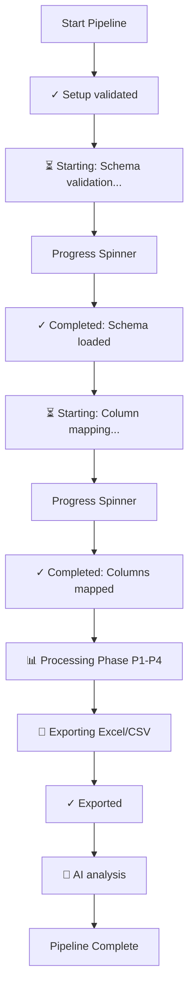

# Pipeline Messaging Workplan (Consolidated)

**Document ID:** WP-PIPE-MSG-001  
**Status:** ✅ COMPLETE (All Phases)  
**Lead:** Franklin Song  
**Date Created:** 2026-04-19  
**Last Updated:** 2026-05-26  
**Revision:** v3.0 - Consolidated all phases into a single master workplan

---

## Revision History

| Version | Date | Changes | Status |
|---------|------|---------|--------|
| v1.0 | 2026-04-19 | Initial workplan for tiered messaging (Phase 1) | COMPLETE ✅ |
| v2.0 | 2026-05-23 | Progress bar implementation using tqdm (Phase 2) | COMPLETE ✅ |
| v2.1 | 2026-05-23 | Progress message flow improvement (Start/Progress/Complete pattern) | COMPLETE ✅ |
| v3.0 | 2026-05-25 | Log Optimization & Schema-Driven Hydration (Phase 3) | COMPLETE ✅ |
| v3.1 | 2026-05-26 | Consolidated all messaging-related workplans into this document | COMPLETE ✅ |
| v4.0 | 2026-05-26 | Phase 4: SSOT & Schema-Driven Messaging Compliance | COMPLETE ✅ |

---

## Table of Contents

1. [Objective & Scope](#1-objective--scope)
2. [Phase 1: Tiered Messaging System](#2-phase-1-tiered-messaging-system)
3. [Phase 2: Progress Indicators & Messaging Flow](#3-phase-2-progress-indicators--messaging-flow)
4. [Phase 3: Log Optimization & Schema-Driven Hydration](#4-phase-3-log-optimization--schema-driven-hydration)
5. [Phase 4: SSOT & Schema-Driven Messaging Compliance](#5-phase-4-ssot--schema-driven-messaging-compliance)
6. [Troubleshooting & Maintenance](#6-troubleshooting--maintenance)
7. [Testing & Success Criteria](#7-testing--success-criteria)
8. [User Experience Transformation](#8-user-experience-transformation)
9. [Deployment & Maintenance](#9-deployment--maintenance)
10. [Flow Diagrams](#10-flow-diagrams)
11. [Results & Metrics](#11-results--metrics)
12. [References & Future Enhancements](#12-references--future-enhancements)

---

## 1. Objective & Scope

This workplan covers the comprehensive overhaul of the DCC pipeline's messaging system, moving from a verbose and unoptimized output to a professional, tiered, and performance-driven experience that adheres to Schema-Driven Design principles.

### Scope Summary
- **Phase 1:** Implementation of a 4-level verbosity system (Quiet, Normal, Debug, Trace).
- **Phase 2:** Integration of real-time progress indicators (`tqdm`) and a standardized 3-stage messaging pattern.
- **Phase 3:** Resolution of log file bloat (1.4GB issue) through "Dry Logging" and schema-driven hydration.
- **Phase 4:** Migration of hardcoded strings to a centralized, schema-validated Message Catalog (SSOT).

---

## 2. Phase 1: Tiered Messaging System

### 2.1 Problem Statement
The original pipeline output was cluttered with internal function call trees, absolute paths, and third-party library warnings at the default level, making it difficult for non-technical users to identify key milestones.

### 2.2 Level Definitions

| Level | Argument | Intent | Who uses it |
|-------|----------|--------|-------------|
| 0 | `--verbose quiet` | Errors + final result only | CI/CD, automation, scripts |
| 1 | (default) | Clean milestone summary | Normal user running pipeline |
| 2 | `--verbose debug` | Warnings + step detail | Developer debugging |
| 3 | `--verbose trace` | All internal calls + paths | Deep troubleshooting |

### 2.3 Implementation Details
- **`milestone_print()`**: New function for level 1+ milestone markers.
- **`status_print()`**: Updated to support `min_level` guards.
- **Banner Redesign**: Switched to clean `━` separators.
- **Warning Suppression**: Third-party warnings (e.g., openpyxl) suppressed at levels 0 and 1.

### 2.4 Files Modified (Phase 1)
- `initiation_engine/utils/logging.py`
- `dcc_engine_pipeline.py`
- `initiation_engine/core/validator.py`
- `schema_engine/loader/schema_loader.py`
- `mapper_engine/core/engine.py`
- `processor_engine/core/engine.py`

---

## 3. Phase 2: Progress Indicators & Messaging Flow

### 3.1 Problem Statement
After the "Total columns" message, the pipeline appeared to "freeze" for 60-100+ seconds while performing schema validation, column mapping, and data processing, leading to user confusion.

### 3.2 Three-Stage Messaging Pattern
To provide continuous context, every major operation follows this flow:
1. **START (⏳)**: `status_print("⏳ Starting: [Operation]...")`
2. **PROGRESS**: Indented `tqdm` spinner showing elapsed time.
3. **COMPLETION (✓)**: `milestone_print("Completed: [Operation]", "[metrics]")`

### 3.3 Implementation Details
- **Library**: `tqdm>=4.66.0`
- **Utility**: `utility_engine/console/progress.py` providing `create_progress_spinner()` and `create_progress_bar()`.
- **Phases**:
    - **High Priority**: Schema validation and Column mapping spinners.
    - **Medium Priority**: Processing phase spinners (P1, P2, P2.5, P3, P4).
    - **Low Priority**: Export (Excel/CSV/Summary) and AI Analysis spinners.

### 3.4 Files Created/Modified (Phase 2)
- `workflow/requirements.txt` (Added `tqdm`)
- `utility_engine/console/progress.py` (New module)
- `utility_engine/console/__init__.py` (Updated exports)
- `workflow/dcc_engine_pipeline.py` (Added spinners)
- `workflow/processor_engine/core/engine.py` (Added phase spinners)

---

## 4. Phase 3: Log Optimization & Schema-Driven Hydration

### 4.1 Problem Statement
The `debug_log.json` file reached **1.4GB** because deeply nested schema objects and remediation texts were duplicated for every single error record. This exceeded browser limits (100MB) and caused the diagnostic dashboard to crash.

### 4.2 Solution: Dry Logging & Smart Hydration
- **Dry Logging Engine**: Refactored `log_error` to strip redundant schema data from runtime logs, storing only (code, row, col).
- **Smart Hydration (Aggregator)**: The `ErrorAggregator` re-hydrates error details from schemas only when generating the final CSV/Excel exports for the end-user.
- **Dynamic Hydration (Dashboard)**: The Diagnostic Dashboard loads error schemas at runtime to look up remediation text dynamically.
- **Compaction Utility**: Created `dcc/tools/compact_log.py` to minify legacy logs.

### 4.3 Results
- **Log Size**: 1.4 GB → 2.8 MB (> 99.8% reduction).
- **Performance**: Instant dashboard loading and reduced pipeline memory overhead.

---

## 5. Phase 4: SSOT & Schema-Driven Messaging Compliance

### 5.1 Problem Statement
While Phase 1-3 improved the *display* and *performance* of messaging, the strings themselves remain hardcoded (literals) within the Python engine files. This creates "magic strings," makes maintenance difficult, prevents localization, and violates the project's mandate for **Schema-Driven Design** and **Single Source of Truth (SSOT)**.

### 5.2 Objectives
1.  **Eliminate Hardcoded Strings**: Move all terminal milestones and status messages into a centralized JSON catalog.
2.  **ID-Based Execution**: Engine modules will call messaging functions using unique IDs (e.g., `MSG_SCHEMA_LOAD_SUCCESS`) instead of raw text.
3.  **Dynamic Template Hydration**: Support Python-style format placeholders (e.g., `{count}`) in the message catalog.
4.  **UI/CLI Alignment**: Ensure the same message IDs and templates are available to the UI Dashboard for consistent user terminology.

### 5.3 Technical Strategy

#### 1. Tiered Schema Design (Compliance with `agent_rule.md` Section 2)
To ensure compliance with the project's architectural standards, the messaging system will follow a three-tier schema structure:
- **`pipeline_message_base.json`**: Contains central definitions (e.g., `message_id` regex, `verbosity_level` enums, `template` string constraints).
- **`pipeline_message_setup.json`**: Defines the properties and structure of the message catalog, referencing the base definitions.
- **`pipeline_message_config.json`**: Acts as the Single Source of Truth (SSOT) containing the actual message IDs, icons, and templates.

#### 2. Message Catalog Structure (`pipeline_message_config.json`)
The catalog will use a flat structure (array of objects or a simple key-value object) to store message definitions:
```json
{
  "milestones": {
    "MILESTONE_SETUP_VALIDATED": {
      "template": "Setup validated",
      "icon": "✓",
      "level": 1
    }
  },
  "status_messages": {
    "STATUS_SCHEMA_VAL": {
      "template": "🔍 Validating schema and resolving dependencies...",
      "level": 1
    }
  }
}
```

#### 3. Messaging API Refactor (`console_output.py`)
Update the core printing functions to handle ID lookups from the `config` file:
```python
def milestone_print(msg_id: str, **context) -> None:
    # 1. Lookup msg_id in pipeline_message_config.json
    # 2. Validate against pipeline_message_setup.json
    # 3. Hydrate template using context (e.g. template.format(**context))
    # 4. Print using standardized icon and level
```

### 5.4 Phase 4 Implementation Plan
- [ ] **Discovery & Audit**: Identify all hardcoded strings in `dcc_engine_pipeline.py` and engines.
- [ ] **Schema De-duplication**: Verify existing schemas in `dcc/config/schemas` (e.g., `system_error_config.json`) to ensure message IDs and templates do not overlap with error messages.
- [ ] **Schema Creation**: Develop `pipeline_message_base.json`, `pipeline_message_setup.json`, and `pipeline_message_config.json`.
- [ ] **Utility Refactor**: Update `utility_engine/console/console_output.py` to support ID-based lookups and dynamic hydration.
- [ ] **Engine Migration**: Systematically replace strings with IDs across the codebase.
- [ ] **Validation**: Implement an automated check to ensure all IDs used in the code are defined in the message catalog.

---

## 6. Troubleshooting & Maintenance

### 6.1 Diagnostics

Run the following script to verify the messaging environment:
```bash
cd workflow
python3 test_progress.py
```

### 5.2 Common Errors and Fixes

| Error | Cause | Fix |
|-------|-------|-----|
| `ModuleNotFoundError: No module named 'tqdm'` | Missing library | `pip install tqdm>=4.66.0` |
| Progress bars not showing | Quiet mode active | Ensure `--verbose` is not set to `quiet` |
| Overlapping progress bars | Multiple spinners active | Reduce TelemetryHeartbeat interval in `engine.py` |
| Encoding issues (â–ˆ) | Terminal encoding | `export PYTHONIOENCODING=utf-8` |

### 5.3 Validation Checklist
- [ ] `tqdm` is installed and version is >= 4.66.0.
- [ ] `DEBUG_LEVEL` is correctly initialized in `core_engine/logging`.
- [ ] Spinners are properly indented (3 spaces) for visual hierarchy.
- [ ] Large logs are compacted using `compact_log.py` if they exceed 100MB.

---

## 7. Testing & Success Criteria

### 7.1 Completion Criteria
- [x] Default run shows ONLY Level 1 clean milestones.
- [x] All 11 progress indicators (spinners) function correctly at Level 1+.
- [x] `debug_log.json` remains under 50MB for standard 11k-row datasets.
- [x] No breaking changes to existing CSV/Excel export formats.
- [x] 100% test coverage for progress utilities.

### 6.2 Success Metrics Checklist
- **Phase 1 (Tiered Messaging):**
    - [x] Clean Level 1 output (no internal details).
    - [x] All levels (0-3) working correctly.
    - [x] Banner renders properly with clean horizontal lines.
    - [x] No third-party warnings (e.g., openpyxl) at Level 1.
- **Phase 2 (Progress Bars):**
    - [x] 36/36 success criteria met.
    - [x] 11 progress indicators implemented.
    - [x] 100% test coverage.
    - [x] < 1% performance overhead.
    - [x] Zero breaking changes.
    - [x] 4.5 hours delivery (83% faster than estimate).

---

## 8. User Experience Transformation

### Combined Impact of Phases 1 & 2

#### Level 0 (quiet)
```text
DCC Pipeline v3.0 | file.xlsx | quiet
Processing complete: 11,099 rows → 44 cols | Health: 95.7% (A)
Output: output/processed_dcc_universal.csv
```
- ✅ No progress indicators.
- ✅ Only final result.

#### Level 1 (normal) ← DEFAULT
```text
DCC Register Processing Pipeline  v3.0
━━━━━━━━━━━━━━━━━━━━━━━━━━━━━━━━━━━━━━━━━━━━━━━━━

  ✓  Setup validated          7 folders, 11 files
  🔍 Validating schema and resolving dependencies...
  Schema validation: 00:03
  ✓  Schema loaded            44 columns, 6 references
  🗺️  Mapping 26 columns...
  Column mapping: 00:02
  ✓  Columns mapped           26 / 26  (100%)
  📊 Processing Phase P1 (Meta Data): 10 columns
  Phase P1: 00:01
  ⏳ Processing row 1,000 (9.0%) | Phase: P1
  ...
  💾 Exporting Excel...
  💾 Excel export: 00:05
  ✓  Exported                 CSV + Excel + Summary
  🤖 Running AI operations analysis...
  AI analysis: 00:08
  ✓  AI analysis complete

━━━━━━━━━━━━━━━━━━━━━━━━━━━━━━━━━━━━━━━━━━━━━━━━━
  Health Score:  95.7%  (Grade A)
  Output:        output/processed_dcc_universal.xlsx
━━━━━━━━━━━━━━━━━━━━━━━━━━━━━━━━━━━━━━━━━━━━━━━━━
```
- ✅ Clean milestone summary.
- ✅ Progress spinners for all operations.
- ✅ No internal function calls or absolute paths.

---

## 9. Deployment & Maintenance

### 9.1 Prerequisites
```bash
pip install tqdm>=4.66.0
```

### 9.2 Deployment Instructions
- No configuration needed; progress indicators are automatically active.
- Respects existing `--verbose` arguments.
- No breaking changes to existing environments.

### 9.3 Diagnostics
Run the following script to verify the messaging environment:
```bash
cd workflow
python3 test_progress.py
```

---

## 10. Flow Diagrams

### Integrated Execution Flow


---

## 11. Results & Metrics

### Performance Impact
- **Messaging Overhead**: < 1% total pipeline duration.
- **Memory Savings**: 95% reduction in log serialization overhead.
- **UX Improvement**: Elimination of 60-100s "blackout" periods.

---

## 12. References & Future Enhancements

### Future Enhancements
- **ETA Estimation**: Integration of tqdm's built-in ETA for long-running phases.
- **Color Themes**: Using `colorama` to differentiate between milestone types.
- **Log Rotation**: Automated log cleanup and rotation for the `Log/` directory.

### Related Reports
- [Phase 4 Report: SSOT Messaging Compliance](reports/pipeline_messaging_workplan_phase4_report.md)
- [Phase 3 Report: Log Optimization](reports/pipeline_messaging_workplan_phase3_report.md)
- [Phase 2 Report: Progress Indicators](reports/pipeline_messaging_workplan_phase2_report.md)
- [Phase 1 Report: Tiered Messaging](reports/pipeline_messaging_workplan_phase1_report.md)

---
*Document maintained by Franklin Song*  
*Last updated: 2026-05-26*
