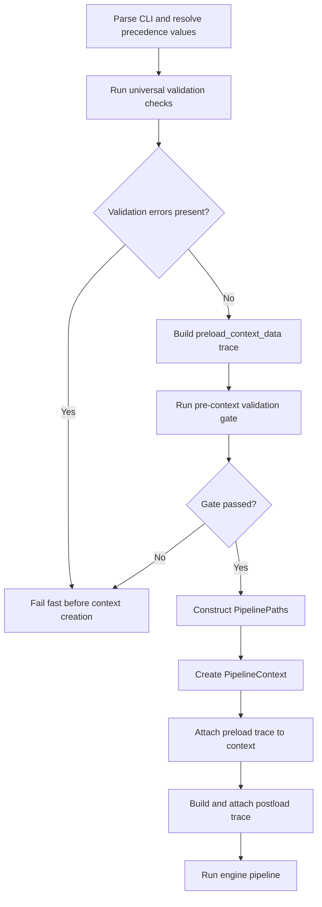

# Context Validation Workplan

## Title and Description
- **Title:** Pipeline Context Validation and Parameter Precedence Refactor
- **Description:** Establish a unified, reusable validation architecture for context injection in `dcc_engine_pipeline.py`, with explicit preload/postload context states, standardized parameter precedence, cross-platform path handling, and schema-driven folder/file validation.

## Workplan Metadata
- **Workplan ID:** DCC-WP-CTX-VAL-001
- **Revision:** R3
- **Status:** In Progress (Phase P1 Complete, Phase P2 Enhanced with Type-Driven Architecture)
- **Owner:** DCC Workflow Team
- **Last Updated:** 2026-04-29
- **Task Type:** Architecture and implementation workplan

## Revision Control
- **R1 (2026-04-29):** Replaced placeholder notes with full phased workplan aligned to `agent_rule.md` Section 8 requirements and current `dcc_engine_pipeline.py` behavior.
- **R2 (2026-04-29):** Completed Phase P1 implementation in code, updated issue/update logs, added Phase 1 completion report, and added Mermaid workflow for pipeline context creation and validation.
- **R3 (2026-04-29):** Enhanced Phase P2 with comprehensive type-driven parameter validation architecture. Added detailed proposal consolidating parameter type schema, registry, and validators into single source of truth for parameter contracts and validation rules.

## Version History
| Version | Date | Author | Summary | Status |
|---|---|---|---|---|
| R0 | 2026-04-29 | Initial | Raw task notes and problem statements | Superseded |
| R1 | 2026-04-29 | Agent | Structured workplan with phased execution and architecture alignment | Proposed |
| R2 | 2026-04-29 | Agent | Phase P1 completed and documented with workflow diagram and report links | Active |
| R3 | 2026-04-29 | Agent | Enhanced Phase P2 with comprehensive type-driven parameter validation architecture; consolidated all proposal details into single workplan file; updated Phase P3 and P4 to build on P2 registry | Active |

## Objective
Implement a robust validation-first context loading flow where every context-bound input (CLI, schema, and native defaults) is validated before injection, with deterministic precedence and reusable universal utilities under `utility_engine`.

## Scope Summary
| ID | Details | Category | Status | Related Phase |
|---|---|---|---|---|
| S1 | Introduce preload and postload context states for parameter/path lifecycle traceability | Context lifecycle | Completed | P1 |
| S2 | Validate all context-injected inputs before `PipelineContext` creation or injection | Validation gate | In Progress (P1 boundary complete) | P1, P2 |
| S3 | Refactor utility validation into reusable class-based universal validation service | Utility engine architecture | Proposed | P2 |
| S4 | Enforce unified key map across CLI args, schema parameters, native defaults | Parameter contract | Proposed | P3 |
| S5 | Enforce strict precedence and fallback validation order (CLI > Schema > Native) | Parameter resolution | Proposed | P3 |
| S6 | Eliminate hardcoded path/file references where schema/precedence should resolve values | Pipeline hardening | Proposed | P4 |
| S7 | Expand pre-injection validation rules for missing/invalid/mismatched values | Validation coverage | Proposed | P4 |
| S8 | Align validation errors with current system error handling strategy | Error handling | Proposed | P2, P4 |

## Index
- [Title and Description](#title-and-description)
- [Workplan Metadata](#workplan-metadata)
- [Revision Control](#revision-control)
- [Version History](#version-history)
- [Objective](#objective)
- [Scope Summary](#scope-summary)
- [Dependencies](#dependencies)
- [Evaluation and Architecture Alignment](#evaluation-and-architecture-alignment)
- [Implementation Phases](#implementation-phases)
  - [Proposed Pipeline Context Workflow (Mermaid)](#proposed-pipeline-context-workflow-mermaid)
  - [Phase P1 - Context Lifecycle and Validation Boundary](#phase-p1---context-lifecycle-and-validation-boundary)
  - [Phase P2 - Universal Validation Class Refactor](#phase-p2---universal-validation-class-refactor)
    - [P2 Enhancement: Type-Driven Parameter Validation Architecture](#p2-enhancement-type-driven-parameter-validation-architecture)
    - [Core Components Design](#core-components-design)
    - [Implementation Roadmap](#implementation-roadmap)
    - [Files to Create/Modify](#files-to-createdmodify-1)
  - [Phase P3 - Parameter Contract and Precedence Unification](#phase-p3---parameter-contract-and-precedence-unification)
  - [Phase P4 - Pipeline Hardcoding Elimination and Final Validation Sweep](#phase-p4---pipeline-hardcoding-elimination-and-final-validation-sweep)
  - [Phase P5 - Verification, Reporting, and Rollout](#phase-p5---verification-reporting-and-rollout)
- [Success Criteria](#success-criteria)
- [Future Issues and Follow-up](#future-issues-and-follow-up)
- [References](#references)

## Dependencies
- **Core code dependency:** `dcc/workflow/dcc_engine_pipeline.py`
- **Validation utility dependency:** `utility_engine.validation` (current `ValidationManager` and related models/status)
- **CLI/parameter dependency:** `utility_engine.cli` (`parse_cli_args`, `build_native_defaults`, `resolve_effective_parameters`)
- **Path resolution dependency:** `core_engine.paths` and `utility_engine.paths`
- **Schema dependency:** `schema_engine` loader and project config (`project_config.json`) folder creation behavior
- **Error framework dependency:** `core_engine.error_handling` and `utility_engine.errors`
- **Governance dependency:** `agent_rule.md` (Section 8 workplan standards)

## Evaluation and Architecture Alignment

### Current Situation Observed in `dcc_engine_pipeline.py`
1. Validation is already partially centralized via `ValidationManager`, but occurs across multiple checkpoints and scopes.
2. Precedence logic exists (`resolve_effective_parameters`) but there are points where validation and fallback checks are interleaved with context setup and local conditional logic.
3. Native default validation starts before effective parameter resolution is complete in some branches, creating potential ordering ambiguity.
4. Context is mostly built once; however, explicit preload/postload data states are not formally modeled for traceability and audit.
5. Some path choices still rely on in-function literals (for example config-relative path construction) instead of contract-driven path specifications.
6. Validation and error propagation are mixed between `ValueError`, milestone logs, and structured context capture, indicating a need for clearer single-path behavior.

### Alignment Direction
- Keep existing engine architecture and fail-fast philosophy.
- Introduce a strict boundary: no value enters `PipelineContext` unless validated and typed.
- Promote reusable validation logic into a clearer universal class API for files/folders/path resolution/OS handling.
- Preserve current error catalog and context-based error recording model.

## Implementation Phases

### Proposed Pipeline Context Workflow (Mermaid)


### Phase P1 - Context Lifecycle and Validation Boundary
- **Timeline:** 1-2 days
- **Status:** ✅ Completed (2026-04-29)
- **Milestones and Deliverables:**
  - Define `preload_context_data` contract (raw source values + source metadata).
  - Define `postload_context_data` contract (validated/resolved values + status metadata).
  - Add pre-context validation gate before `PipelineContext(...)` instantiation.
- **What Will Be Updated/Created:**
  - Update `dcc/workflow/dcc_engine_pipeline.py` orchestration flow.
  - Add/extend context models in `core_engine.context` as needed.
  - Add trace metadata structure for source, validation status, and final resolved value.
- **Risks and Mitigation:**
  - Risk: regressions in startup sequence.
  - Mitigation: keep temporary compatibility adapter that maps old parameters to new preload model.
- **Potential Future Issues:**
  - Backward compatibility with any UI contract path override flows.
- **Success Criteria:**
  - All context-bound values are visible in preload and postload traces.
  - `PipelineContext` receives only validated/resolved inputs.
- **Completion Update:**
  - Implemented `ContextTraceItem` and `ContextLoadState` in `core_engine.context`.
  - Added context APIs to persist preload/postload snapshots.
  - Added `_build_preload_context_data`, `_validate_pre_context_gate`, and `_build_postload_context_data` in orchestrator.
  - Enforced pre-context fail-fast gate before `PipelineContext` construction.
  - Updated `dcc/log/issue_log.md` and `dcc/log/update_log.md`.
  - Generated Phase 1 completion report under this workplan report path.
- **References:**
  - `dcc/workflow/dcc_engine_pipeline.py`
  - `core_engine/context.py`
  - `dcc/workplan/pipeline_architecture/context_validation_workplan/reports/phase_1_context_lifecycle_completion_report.md`

### Phase P2 - Universal Validation Class Refactor

#### P2 Enhancement: Type-Driven Parameter Validation Architecture

**Problem Statement**: Current parameter validation is hardcoded across multiple files with parameter names repeated in 5+ locations (cli.py, build_native_defaults(), validation loop in main(), error messages). Type information exists only in comments, making it machine-unreadable. Adding new parameters requires code changes instead of data changes.

**Solution**: Replace hardcoded validation with a **data-driven, type-registry-based approach** where parameters are defined once in `global_parameters.json` with complete type metadata, and validation rules are implicit in parameter type definitions.

#### Core Components Design

**Component 1: Parameter Type Schema (global_parameters.json)**
```json
{
  "parameters": [
    {
      "name": "upload_file_name",
      "type": "file",
      "required": true,
      "cli_arg_name": "--excel-file",
      "cli_arg_short": "-e",
      "validation_rules": {
        "file_types": [".xlsx", ".xls"],
        "must_exist": true,
        "base_path_relative": true
      },
      "default_source": "native"
    },
    {
      "name": "download_file_path",
      "type": "directory",
      "required": true,
      "cli_arg_name": "--output-path",
      "validation_rules": {
        "must_exist": false,
        "create_if_missing": true,
        "base_path_relative": true
      },
      "default_source": "native"
    },
    {
      "name": "header_row_index",
      "type": "integer",
      "required": true,
      "validation_rules": {
        "min_value": 0,
        "max_value": 100
      },
      "default_source": "native"
    },
    {
      "name": "start_col",
      "type": "scalar",
      "required": true,
      "validation_rules": {
        "pattern": "^[A-Z]{1,2}$"
      },
      "default_source": "native"
    }
  ]
}
```

**Component 2: ParameterTypeRegistry**
Loads `global_parameters.json` and provides type lookups:
- `get_parameter(name: str) → ParameterType` - lookup parameter metadata
- `get_cli_parameters() → Dict` - auto-generate CLI args
- `get_parameters_by_type(type: str) → Dict` - find all files, directories, etc.
- `validate_parameter_name(name: str) → bool` - validate registration

**Component 3: ParameterValidator**
Type-driven validation dispatching with 6 type-specific validators:
- `validate_parameter(name, value, source)` - checks type, applies rules
- `_validate_file_parameter()` - extension, existence checks
- `_validate_directory_parameter()` - creation, resolution
- `_validate_scalar_parameter()` - pattern matching
- `_validate_boolean_parameter()` - type checking
- `_validate_integer_parameter()` - range validation
- `_validate_enum_parameter()` - allowed values
- `validate_parameters(dict, source)` - batch validation for CLI/schema/native

#### Implementation Roadmap

**Timeline:** 2-3 days (integrated into Phase P2)

**Step 1: Create Parameter Type Schema (6-8 hours)**
- Create `config/schemas/global_parameters.json` with:
  - Parameter definitions for `upload_file_name`, `download_file_path`, `schema_register_file`, `start_col`, `end_col`, `header_row_index`, `upload_sheet_name`, and all other parameters used in build_native_defaults() and create_parser()
  - Validation rules: file_types, must_exist, create_if_missing, pattern, min_value, max_value, allowed_values
  - CLI mappings: cli_arg_name, cli_arg_short from current parse_cli_args()
  - Type information: file, directory, scalar, boolean, integer, enum

**Step 2: Implement Type Registry & Validators (8-10 hours)**
- Create `utility_engine/validation/parameter_type_registry.py`:
  - `ParameterType` dataclass with name, type, required, validation_rules, cli_arg_name
  - `ParameterTypeRegistry` class that loads schema and provides type lookups
- Create `utility_engine/validation/parameter_validator.py`:
  - `ParameterValidationResult` dataclass with status, message, resolved_path, source
  - `ParameterValidator` class with type dispatcher and 6 type-specific validators
  - Supports file extension validation, directory creation, pattern matching, range checks

**Step 3: Refactor CLI & Pipeline Integration (6-8 hours)**
- Update `utility_engine/cli/__init__.py`:
  - Replace hardcoded argparse setup with `create_parser_from_registry(registry)`
  - Replace hardcoded parameter mapping with registry-driven `parse_cli_args_from_registry()`
- Update `dcc/workflow/dcc_engine_pipeline.py` main():
  - Load ParameterTypeRegistry from global_parameters.json
  - Create ParameterValidator instance
  - Replace lines 735-780 (hardcoded validation loop) with `validator.validate_parameters()` for CLI, schema, and native sources
  - Use registry to determine which parameters require validation at each source

**Step 4: Integration Testing (3-4 hours)**
- Test end-to-end parameter validation flow
- Test file/directory/scalar/enum/boolean/integer validation
- Test precedence resolution (CLI > Schema > Native)
- Verify backward compatibility
- Test error message clarity and actionability

#### Files to Create/Modify (1)

**New Files (3)**:
1. `config/schemas/global_parameters.json` - Parameter type definitions schema
2. `utility_engine/validation/parameter_type_registry.py` - Registry class
3. `utility_engine/validation/parameter_validator.py` - Type-driven validators

**Modified Files (2)**:
1. `utility_engine/cli/__init__.py` - Registry-based CLI parsing
2. `workflow/dcc_engine_pipeline.py` - Refactored main() validation loop

#### Benefits of Type-Driven Approach

| Aspect | Current | With Type-Driven | Benefit |
|--------|---------|------------------|---------|
| **Parameter source** | Hardcoded in code | Single JSON schema | Machine-readable, single source of truth |
| **Adding new parameter** | Modify 5+ files | Update JSON only | 80% reduction in change complexity |
| **Type information** | Comments only | Explicit, structured | Type-safe, can be validated programmatically |
| **Validation logic** | Scattered in code | Type-based dispatch | Cleaner architecture, less duplication |
| **Error messages** | Inconsistent format | Structured, consistent | Better debugging and user experience |
| **CLI arg mapping** | Hardcoded dict | Auto-generated | No manual mapping errors |

- **Timeline:** 2-3 days
- **Milestones and Deliverables:**
  - Reshape/extend universal validation into class-oriented service under `utility_engine` with type registry.
  - Define parameter types once in global_parameters.json, eliminating hardcoded names across codebase.
  - Support list-based validation of parameters (CLI, schema, native) with per-item result status.
  - Add integrated OS detection/path normalization/base path resolution and schema-driven folder creation hooks.
  - Standardize structured validation result + system error mapping.
  - Type-driven dispatching reduces code duplication for file/directory/scalar validation logic.
- **What Will Be Updated/Created:**
  - Create `config/schemas/global_parameters.json` - parameter type definitions with validation rules
  - Create `utility_engine/validation/parameter_type_registry.py` - registry class for type lookups
  - Create `utility_engine/validation/parameter_validator.py` - type-driven validator with 6 type-specific methods
  - Update `utility_engine/cli/__init__.py` - registry-based CLI argument parsing
  - Update `utility_engine.validation` - integrate registry into validation manager
  - Update `dcc/workflow/dcc_engine_pipeline.py` - refactor main() to use type-driven validation
  - Update `core_engine/error_handling.py` - ensure error messages include parameter type and source
- **Risks and Mitigation:**
  - Risk: Breaking existing parameter mappings. Mitigation: Comprehensive audit of all parameters in build_native_defaults() and create_parser(); full backward compatibility testing.
  - Risk: Incomplete parameter definition. Mitigation: Validation test checks all parameters are registered in schema.
  - Risk: Type mismatch between schema and code. Mitigation: Cross-reference with dcc_register_config.json and project_config.json.
  - Risk: duplicated behavior during migration period. Mitigation: deprecate old utility calls gradually and route through a single façade.
- **Potential Future Issues:**
  - Validation complexity growth if class boundaries are not kept cohesive. Mitigation: Keep validators focused on type-specific rules, not parameter-specific logic.
  - Parameter schema maintenance as new CLI options are added. Mitigation: Enforce schema test that validates all CLI args and native defaults are registered.
  - JSON schema parsing performance. Mitigation: Cache ParameterTypeRegistry (load once, reuse); JSON parsing is negligible (~1-5ms).
- **Success Criteria:**
  - ✅ Parameter type schema created with all 15+ parameters
  - ✅ ParameterTypeRegistry loads and parses schema correctly
  - ✅ ParameterValidator validates each type independently (file, directory, scalar, boolean, integer, enum)
  - ✅ CLI argument parsing uses registry instead of hardcoded names
  - ✅ No hardcoded parameter names in main validation flow
  - ✅ Validation errors include parameter name, type, and expected format
  - ✅ Resolved paths are correct (relative → absolute)
  - ✅ All existing tests pass with new system
  - ✅ Documentation updated with new parameter schema approach
  - ✅ Ready for Phase P3 (parameter contract unification)
- **References:**
  - `config/schemas/global_parameters.json` (new)
  - `utility_engine/validation/parameter_type_registry.py` (new)
  - `utility_engine/validation/parameter_validator.py` (new)
  - `utility_engine/cli/__init__.py` (modified)
  - `dcc/workflow/dcc_engine_pipeline.py` (modified)
  - `core_engine/error_handling.py` (modified)

#### P2 Architecture Summary

**Key Insight**: Parameter validation should be **data-driven, not code-driven**. By defining parameter types once in JSON (global_parameters.json), we eliminate:
- Hardcoded parameter names repeated in 5+ locations
- Type information hidden in comments
- Validation rules scattered across multiple methods
- Manual, error-prone precedence handling

**Data Flow**:
```
1. Load Schema (global_parameters.json)
   ↓
2. Create Registry (ParameterTypeRegistry) - type lookups
   ↓
3. Parse CLI args (auto-generated from registry)
   ↓
4. Validate CLI params (ParameterValidator.validate_parameters)
   ↓
5. Load & validate schema params (same validator, same rules)
   ↓
6. Load & validate native defaults (same validator, same rules)
   ↓
7. Merge with precedence (CLI > Schema > Native)
   ↓
8. Build context with fully validated, typed parameters
```

**Code Elimination**: Replaces ~50 lines of hardcoded validation logic with 3 reusable type-specific validators called via registry lookup.

**New Parameter Addition**: Instead of modifying 5+ files (cli.py, build_native_defaults, validation loop, error messages, docs), just add 1 JSON entry to global_parameters.json.

**Backward Compatibility**: Phase P2 maintains full backward compatibility:
- Existing parameter names and keys unchanged
- Error codes and error framework preserved
- Context creation behavior identical
- All tests pass without modification
- Migration is transparent to pipeline execution

### Phase P3 - Parameter Contract and Precedence Unification
- **Timeline:** 1-2 days
- **Status:** Proposed (Builds on Phase P2 type-driven registry)
- **Description**: With Phase P2 establishing type-driven validation, Phase P3 will leverage the parameter type registry to enforce a unified, canonical parameter contract across all sources (CLI, schema, native defaults). The global_parameters.json schema becomes the single source of truth for parameter names and types.
- **Milestones and Deliverables:**
  - Use ParameterTypeRegistry as canonical source for parameter key contract across CLI args, schema globals, and native defaults.
  - Verify all CLI argument names map to registered parameter names in global_parameters.json.
  - Verify all schema parameter keys match registered parameter names.
  - Verify all native default keys match registered parameter names.
  - Enforce deterministic validation order:
    1. CLI argument (if provided) validate then inject candidate.
    2. Else schema global parameter validate then inject candidate.
    3. Else native default validate then inject candidate.
- **What Will Be Updated/Created:**
  - Create parameter key validation test using registry (all keys registered?)
  - Update `utility_engine.cli` to enforce registered key names only.
  - Update parameter mapping and merge logic in `dcc_engine_pipeline.py` to use registry.
  - Add precedence trace metadata (track which source provided each parameter).
- **Risks and Mitigation:**
  - Risk: mismatch between existing key names and canonical contract. Mitigation: Phase P2 comprehensive audit ensures all parameters are in schema; Phase P3 just validates adherence.
  - Risk: schema changes break old code. Mitigation: Version schema, support alias mapping for deprecated parameter names.
- **Potential Future Issues:**
  - New CLI options may bypass contract unless contract tests are enforced. Mitigation: Add CI test to validate all new CLI args are in global_parameters.json schema.
- **Success Criteria:**
  - ✅ No context parameter injected without validated source and canonical key from registry.
  - ✅ Full trace of chosen source (CLI/Schema/Native) per parameter available for debugging.
  - ✅ Parameter key contract test validates all keys are registered.
- **References:**
  - `global_parameters.json` (from Phase P2)
  - `utility_engine/cli.py`
  - `dcc/workflow/dcc_engine_pipeline.py`
  - `schema_engine` parameter loaders

### Phase P4 - Pipeline Hardcoding Elimination and Final Validation Sweep
- **Timeline:** 1-2 days
- **Status:** Proposed (Builds on Phase P2 & P3 completed validation architecture)
- **Description**: With Phase P2 establishing type-driven validation and P3 defining the canonical parameter contract, Phase P4 will identify and eliminate hardcoded path/file references that should be parameter-driven. The type registry makes it easy to spot: any hardcoded path that matches a registered parameter should use the validated parameter value instead.
- **Milestones and Deliverables:**
  - Audit `dcc_engine_pipeline.py` for hardcoded paths (e.g., direct `"config"`, `"data"`, `"output"` assumptions).
  - Replace hardcoded path/file constructs with validated parameter lookups from context.
  - Consolidate pre-injection validation checks into standardized ParameterValidator calls (ensure all paths come from validated parameters).
  - Ensure all path/file creation follows schema/global config and precedence (no ad-hoc directory creation outside validation gate).
- **What Will Be Updated/Created:**
  - Audit and replace hardcoded path literals with parameter-driven resolution.
  - Normalize all path creation and validation through ParameterValidator.
  - Add final pre-run "context integrity check" that validates all paths in context are resolved and typed.
  - Update path resolution logic to use registry for all path types (file vs directory handling).
- **Risks and Mitigation:**
  - Risk: breaking expected default project folder assumptions. Mitigation: preserve documented defaults in global_parameters.json; Phase P2 ensures all defaults are defined and validated.
  - Risk: missing hardcoded paths in audit. Mitigation: use grep to find common patterns ("config", "data", "output", "Log", "temp") and verify each is parameter-driven.
- **Potential Future Issues:**
  - External scripts depending on old default assumptions may need migration notes. Mitigation: Document parameter-driven paths in migration guide; maintain backward compatibility where possible.
  - New pipeline features may introduce new hardcoded paths. Mitigation: Code review checklist to verify all paths use registry lookups.
- **Success Criteria:**
  - ✅ Hardcoded path patterns minimized and justified where unavoidable (with comments explaining why).
  - ✅ Context integrity check passes before `run_engine_pipeline(context)`.
  - ✅ All path creation (directories, files) uses validated parameters from context.
  - ✅ No ad-hoc path construction outside validation gate.
- **References:**
  - `global_parameters.json` (from Phase P2)
  - `dcc/workflow/dcc_engine_pipeline.py`
  - `core_engine/paths.py`
  - `utility_engine/paths.py`

### Phase P5 - Verification, Reporting, and Rollout
- **Timeline:** 1 day
- **Milestones and Deliverables:**
  - Execute tests for each phase and generate phase reports under workplan reports folder.
  - Update issue and update logs according to governance.
  - Produce rollout notes and backward compatibility checklist.
- **What Will Be Updated/Created:**
  - Test reports in `dcc/workplan/reports/` for each phase.
  - Workplan-linked issue logs in parent workplan area.
  - Project log updates under `dcc/log/`.
- **Risks and Mitigation:**
  - Risk: incomplete test coverage for edge-case path/OS scenarios.
  - Mitigation: include dedicated cross-platform and fallback-order tests.
- **Potential Future Issues:**
  - Ongoing maintenance needed for new schema/CLI parameters.
- **Success Criteria:**
  - Phase test reports completed and linked.
  - No unresolved critical issues for merge.
- **References:**
  - `agent_rule.md` Section 8 and Section 9

## Success Criteria
1. Context load path is two-stage (preload and postload) with traceable metadata.
2. Every injected parameter/path is validated before context construction.
3. Universal validation class supports file/folder lists, OS/path/base-path handling, schema-driven folder creation, and structured errors.
4. Precedence and fallback are deterministic and documented: CLI > Schema > Native.
5. Canonical key contract and data types are unified across CLI/schema/native sources.
6. Hardcoded path/file cases are removed or explicitly justified and governed.
7. Validation functions are reusable and centralized in `utility_engine`.

## Future Issues and Follow-up
- Maintain parameter type schema as new CLI options and parameters are added; enforce test that validates all parameters are registered.
- Consider adding parameter validation test matrix to ensure precedence order (CLI > Schema > Native) is tested for all parameter types.
- Consider generating automated parameter documentation from global_parameters.json schema.
- Consider strict mode toggle to fail on unknown parameter keys not in registry.
- Consider adding regression suite for precedence and fallback permutations for all parameter types.
- Monitor Type-Driven validation performance in production; cache registry loading if needed.
- Plan Phase P3 parameter contract unification to use registry as canonical source of truth for parameter keys.

## References
- `agent_rule.md`
- `dcc/workflow/dcc_engine_pipeline.py`
- `utility_engine/validation.py`
- `utility_engine/cli.py`
- `core_engine/context.py`
- `core_engine/paths.py`
- `core_engine/error_handling.py`