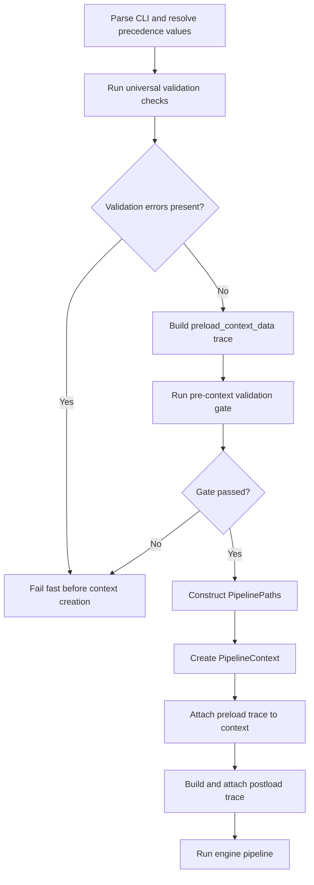

# Context Validation Workplan

## Title and Description
- **Title:** Pipeline Context Validation and Parameter Precedence Refactor
- **Description:** Establish a unified, reusable validation architecture for context injection in `dcc_engine_pipeline.py`, with explicit preload/postload context states, standardized parameter precedence, cross-platform path handling, and schema-driven folder/file validation.

## Workplan Metadata
- **Workplan ID:** DCC-WP-CTX-VAL-001
- **Revision:** R2
- **Status:** In Progress (Phase P1 Complete)
- **Owner:** DCC Workflow Team
- **Last Updated:** 2026-04-29
- **Task Type:** Architecture and implementation workplan

## Revision Control
- **R1 (2026-04-29):** Replaced placeholder notes with full phased workplan aligned to `agent_rule.md` Section 8 requirements and current `dcc_engine_pipeline.py` behavior.
- **R2 (2026-04-29):** Completed Phase P1 implementation in code, updated issue/update logs, added Phase 1 completion report, and added Mermaid workflow for pipeline context creation and validation.

## Version History
| Version | Date | Author | Summary | Status |
|---|---|---|---|---|
| R0 | 2026-04-29 | Initial | Raw task notes and problem statements | Superseded |
| R1 | 2026-04-29 | Agent | Structured workplan with phased execution and architecture alignment | Proposed |
| R2 | 2026-04-29 | Agent | Phase P1 completed and documented with workflow diagram and report links | Active |

## Objective
Implement a robust validation-first context loading flow where every context-bound input (CLI, schema, and native defaults) is validated before injection, with deterministic precedence and reusable universal utilities under `utility_engine`.

## Scope Summary
| ID | Details | Category | Status | Related Phase |
|---|---|---|---|---|
| S1 | Introduce preload and postload context states for parameter/path lifecycle traceability | Context lifecycle | Completed | P1 |
| S2 | Validate all context-injected inputs before `PipelineContext` creation or injection | Validation gate | In Progress (P1 boundary complete) | P1, P2 |
| S3 | Refactor utility validation into reusable class-based universal validation service | Utility engine architecture | Proposed | P2 |
| S4 | Enforce unified key map across CLI args, schema parameters, native defaults | Parameter contract | Proposed | P3 |
| S5 | Enforce strict precedence and fallback validation order (CLI > Schema > Native) | Parameter resolution | Proposed | P3 |
| S6 | Eliminate hardcoded path/file references where schema/precedence should resolve values | Pipeline hardening | Proposed | P4 |
| S7 | Expand pre-injection validation rules for missing/invalid/mismatched values | Validation coverage | Proposed | P4 |
| S8 | Align validation errors with current system error handling strategy | Error handling | Proposed | P2, P4 |

## Index
- [Title and Description](#title-and-description)
- [Workplan Metadata](#workplan-metadata)
- [Revision Control](#revision-control)
- [Version History](#version-history)
- [Objective](#objective)
- [Scope Summary](#scope-summary)
- [Dependencies](#dependencies)
- [Evaluation and Architecture Alignment](#evaluation-and-architecture-alignment)
- [Implementation Phases](#implementation-phases)
  - [Proposed Pipeline Context Workflow (Mermaid)](#proposed-pipeline-context-workflow-mermaid)
  - [Phase P1 - Context Lifecycle and Validation Boundary](#phase-p1---context-lifecycle-and-validation-boundary)
  - [Phase P2 - Universal Validation Class Refactor](#phase-p2---universal-validation-class-refactor)
  - [Phase P3 - Parameter Contract and Precedence Unification](#phase-p3---parameter-contract-and-precedence-unification)
  - [Phase P4 - Pipeline Hardcoding Elimination and Final Validation Sweep](#phase-p4---pipeline-hardcoding-elimination-and-final-validation-sweep)
  - [Phase P5 - Verification, Reporting, and Rollout](#phase-p5---verification-reporting-and-rollout)
- [Success Criteria](#success-criteria)
- [Future Issues and Follow-up](#future-issues-and-follow-up)
- [References](#references)

## Dependencies
- **Core code dependency:** `dcc/workflow/dcc_engine_pipeline.py`
- **Validation utility dependency:** `utility_engine.validation` (current `ValidationManager` and related models/status)
- **CLI/parameter dependency:** `utility_engine.cli` (`parse_cli_args`, `build_native_defaults`, `resolve_effective_parameters`)
- **Path resolution dependency:** `core_engine.paths` and `utility_engine.paths`
- **Schema dependency:** `schema_engine` loader and project config (`project_config.json`) folder creation behavior
- **Error framework dependency:** `core_engine.error_handling` and `utility_engine.errors`
- **Governance dependency:** `agent_rule.md` (Section 8 workplan standards)

## Evaluation and Architecture Alignment

### Current Situation Observed in `dcc_engine_pipeline.py`
1. Validation is already partially centralized via `ValidationManager`, but occurs across multiple checkpoints and scopes.
2. Precedence logic exists (`resolve_effective_parameters`) but there are points where validation and fallback checks are interleaved with context setup and local conditional logic.
3. Native default validation starts before effective parameter resolution is complete in some branches, creating potential ordering ambiguity.
4. Context is mostly built once; however, explicit preload/postload data states are not formally modeled for traceability and audit.
5. Some path choices still rely on in-function literals (for example config-relative path construction) instead of contract-driven path specifications.
6. Validation and error propagation are mixed between `ValueError`, milestone logs, and structured context capture, indicating a need for clearer single-path behavior.

### Alignment Direction
- Keep existing engine architecture and fail-fast philosophy.
- Introduce a strict boundary: no value enters `PipelineContext` unless validated and typed.
- Promote reusable validation logic into a clearer universal class API for files/folders/path resolution/OS handling.
- Preserve current error catalog and context-based error recording model.

## Implementation Phases

### Proposed Pipeline Context Workflow (Mermaid)

### Phase P1 - Context Lifecycle and Validation Boundary
- **Timeline:** 1-2 days
- **Status:** ✅ Completed (2026-04-29)
- **Milestones and Deliverables:**
  - Define `preload_context_data` contract (raw source values + source metadata).
  - Define `postload_context_data` contract (validated/resolved values + status metadata).
  - Add pre-context validation gate before `PipelineContext(...)` instantiation.
- **What Will Be Updated/Created:**
  - Update `dcc/workflow/dcc_engine_pipeline.py` orchestration flow.
  - Add/extend context models in `core_engine.context` as needed.
  - Add trace metadata structure for source, validation status, and final resolved value.
- **Risks and Mitigation:**
  - Risk: regressions in startup sequence.
  - Mitigation: keep temporary compatibility adapter that maps old parameters to new preload model.
- **Potential Future Issues:**
  - Backward compatibility with any UI contract path override flows.
- **Success Criteria:**
  - All context-bound values are visible in preload and postload traces.
  - `PipelineContext` receives only validated/resolved inputs.
- **Completion Update:**
  - Implemented `ContextTraceItem` and `ContextLoadState` in `core_engine.context`.
  - Added context APIs to persist preload/postload snapshots.
  - Added `_build_preload_context_data`, `_validate_pre_context_gate`, and `_build_postload_context_data` in orchestrator.
  - Enforced pre-context fail-fast gate before `PipelineContext` construction.
  - Updated `dcc/log/issue_log.md` and `dcc/log/update_log.md`.
  - Generated Phase 1 completion report under this workplan report path.
- **References:**
  - `dcc/workflow/dcc_engine_pipeline.py`
  - `core_engine/context.py`
  - `dcc/workplan/pipeline_architecture/context_validation_workplan/reports/phase_1_context_lifecycle_completion_report.md`

### Phase P2 - Universal Validation Class Refactor
- **Timeline:** 2-3 days
- **Milestones and Deliverables:**
  - Reshape/extend universal validation into class-oriented service under `utility_engine`.
  - Support list-based validation of folders/files with per-item result status.
  - Add integrated OS detection/path normalization/base path resolution and schema-driven folder creation hooks.
  - Standardize structured validation result + system error mapping.
- **What Will Be Updated/Created:**
  - Refactor in `utility_engine.validation` (or new class module if split is required).
  - Add methods for:
    - list handling for file/folder validations
    - file/folder existence/type checks
    - OS-aware path normalization and resolution
    - base path and relative path resolution
    - conditional folder creation based on schema config
    - structured error return compatible with current error framework
- **Risks and Mitigation:**
  - Risk: duplicated behavior during migration period.
  - Mitigation: deprecate old utility calls gradually and route through a single façade.
- **Potential Future Issues:**
  - Validation complexity growth if class boundaries are not kept cohesive.
- **Success Criteria:**
  - One reusable validation API used by pipeline orchestration and other engines.
  - Output includes item-level status and standardized error structures.
- **References:**
  - `utility_engine/validation.py`
  - `core_engine/error_handling.py`

### Phase P3 - Parameter Contract and Precedence Unification
- **Timeline:** 1-2 days
- **Milestones and Deliverables:**
  - Define canonical key contract shared by CLI args, schema globals, and native defaults.
  - Add data type metadata for parameter values (file path vs folder path vs scalar).
  - Enforce deterministic validation order:
    1. CLI argument (if provided) validate then inject candidate.
    2. Else schema global parameter validate then inject candidate.
    3. Else native default validate then inject candidate.
- **What Will Be Updated/Created:**
  - Update `utility_engine.cli` parameter resolution contracts.
  - Update parameter mapping and merge logic in `dcc_engine_pipeline.py`.
  - Add schema for parameter typing metadata if not already present.
- **Risks and Mitigation:**
  - Risk: mismatch between existing key names and canonical contract.
  - Mitigation: introduce key alias map and validation warnings before full strict mode.
- **Potential Future Issues:**
  - New CLI options may bypass contract unless contract tests are enforced.
- **Success Criteria:**
  - No context parameter injected without validated source and canonical key.
  - Full trace of chosen source (CLI/Schema/Native) per key.
- **References:**
  - `utility_engine/cli.py`
  - `dcc/workflow/dcc_engine_pipeline.py`
  - `schema_engine` parameter loaders

### Phase P4 - Pipeline Hardcoding Elimination and Final Validation Sweep
- **Timeline:** 1-2 days
- **Milestones and Deliverables:**
  - Audit and replace hardcoded path/file constructs that should be derived from validated parameters or schema config.
  - Consolidate pre-injection validation checks into standardized helper calls.
  - Ensure all path/file creation follows schema/global config and precedence.
- **What Will Be Updated/Created:**
  - Replace direct literals where applicable (for example direct `"config"/"schemas"` assumptions) with contract-resolved paths where feasible.
  - Normalize all path creation and validation through universal service.
  - Add final pre-run "context integrity check" before pipeline execution.
- **Risks and Mitigation:**
  - Risk: breaking expected default project folder assumptions.
  - Mitigation: preserve documented defaults and expose override contract with validation warnings.
- **Potential Future Issues:**
  - External scripts depending on old default assumptions may need migration notes.
- **Success Criteria:**
  - Hardcoded path patterns minimized and justified where unavoidable.
  - Context integrity check passes before `run_engine_pipeline(context)`.
- **References:**
  - `dcc/workflow/dcc_engine_pipeline.py`
  - `core_engine/paths.py`
  - `utility_engine/paths.py`

### Phase P5 - Verification, Reporting, and Rollout
- **Timeline:** 1 day
- **Milestones and Deliverables:**
  - Execute tests for each phase and generate phase reports under workplan reports folder.
  - Update issue and update logs according to governance.
  - Produce rollout notes and backward compatibility checklist.
- **What Will Be Updated/Created:**
  - Test reports in `dcc/workplan/reports/` for each phase.
  - Workplan-linked issue logs in parent workplan area.
  - Project log updates under `dcc/log/`.
- **Risks and Mitigation:**
  - Risk: incomplete test coverage for edge-case path/OS scenarios.
  - Mitigation: include dedicated cross-platform and fallback-order tests.
- **Potential Future Issues:**
  - Ongoing maintenance needed for new schema/CLI parameters.
- **Success Criteria:**
  - Phase test reports completed and linked.
  - No unresolved critical issues for merge.
- **References:**
  - `agent_rule.md` Section 8 and Section 9

## Success Criteria
1. Context load path is two-stage (preload and postload) with traceable metadata.
2. Every injected parameter/path is validated before context construction.
3. Universal validation class supports file/folder lists, OS/path/base-path handling, schema-driven folder creation, and structured errors.
4. Precedence and fallback are deterministic and documented: CLI > Schema > Native.
5. Canonical key contract and data types are unified across CLI/schema/native sources.
6. Hardcoded path/file cases are removed or explicitly justified and governed.
7. Validation functions are reusable and centralized in `utility_engine`.

## Future Issues and Follow-up
- Consider formal schema for parameter type metadata (`kind: file|directory|value`).
- Consider generating an automated parameter trace matrix artifact for each run.
- Consider strict mode toggle to fail on unknown parameter keys.
- Consider adding regression suite for precedence and fallback permutations.

## References
- `agent_rule.md`
- `dcc/workflow/dcc_engine_pipeline.py`
- `utility_engine/validation.py`
- `utility_engine/cli.py`
- `core_engine/context.py`
- `core_engine/paths.py`
- `core_engine/error_handling.py`