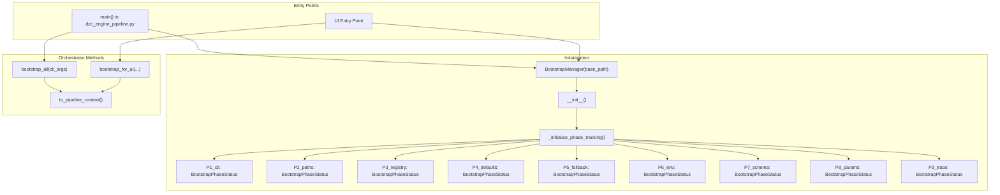
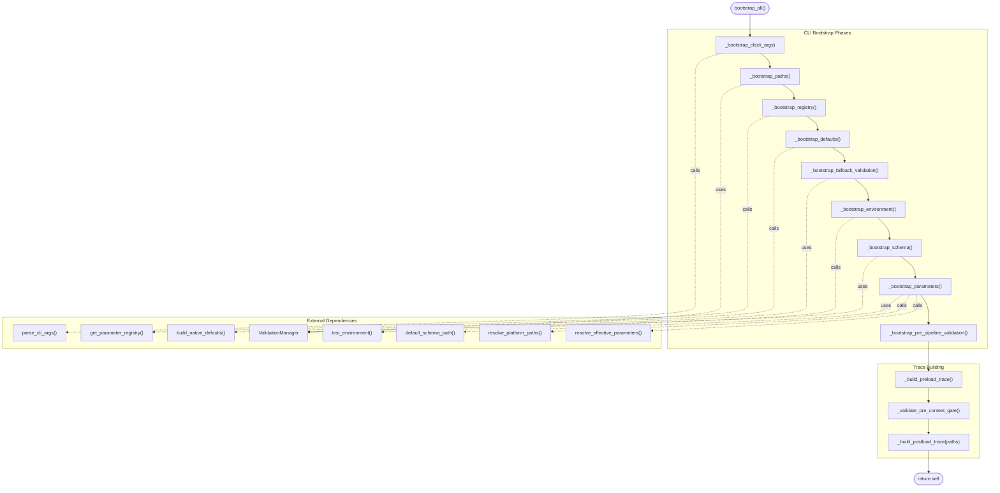
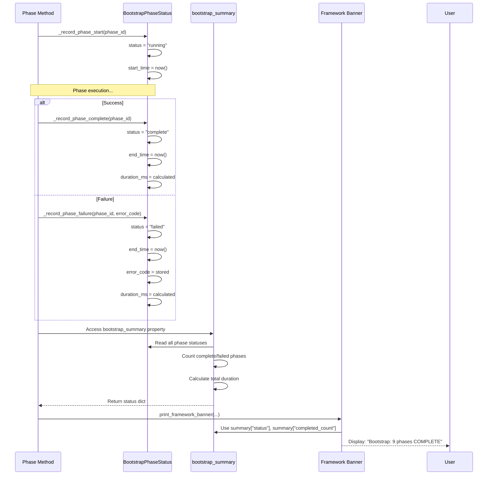
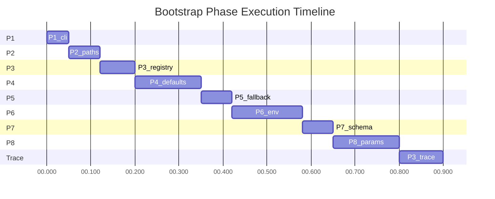
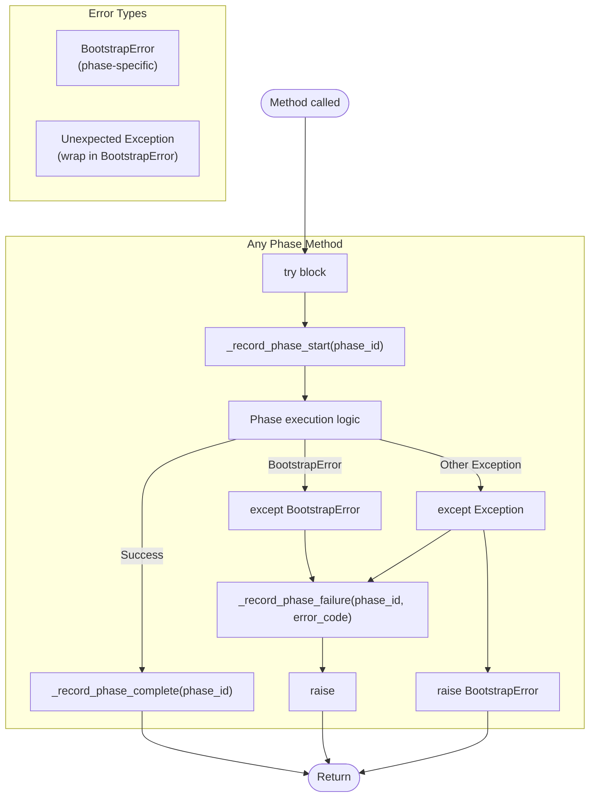
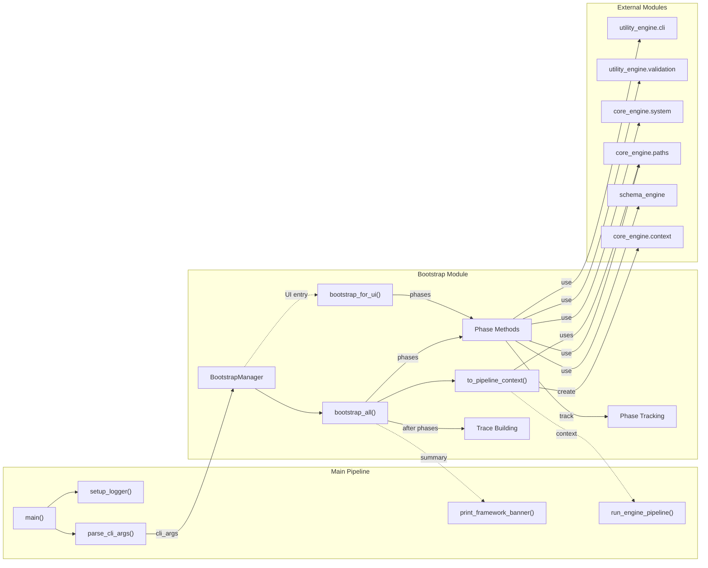

# Bootstrap Module — Function Reference & Call Graph

**Location:** `dcc/workflow/utility_engine/bootstrap.py`  
**Version:** Phase P4 Complete  
**Last Updated:** 2026-05-01

---

## 1. Module Overview

| Attribute | Value |
|:---|:---|
| **Module** | `utility_engine.bootstrap` |
| **Purpose** | Centralized pipeline initialization with phase tracking |
| **Classes** | `BootstrapError`, `BootstrapPhaseStatus`, `BootstrapManager` |
| **Total Functions** | 24 (3 public orchestrators, 17 private phases/helpers, 4 properties) |
| **Entry Points** | `bootstrap_all()`, `bootstrap_for_ui()` |
| **Exit Point** | `to_pipeline_context()` |

---

## 2. Function Table

### 2.1 Exception Class

| Function | Parameters (In) | Returns | Description | Error Handling |
|:---|:---|:---|:---|:---|
| `BootstrapError.__init__` | `code: str`, `message: str`, `phase: str` | `Exception` | Structured bootstrap error with phase context | Stores code, message, phase |
| `BootstrapError.to_system_error` | `self` | `Tuple[str, str]` | Returns (system_code, message) for `system_error_print()` | Converts to S-B-S format |

### 2.2 Data Class

| Function | Parameters (In) | Returns | Description | Error Handling |
|:---|:---|:---|:---|:---|
| `BootstrapPhaseStatus` (dataclass) | `phase_id: str`, `phase_name: str`, `status: str` (default), `start/end_time: Optional[str]`, `duration_ms: Optional[float]`, `error_code: Optional[str]` | `BootstrapPhaseStatus` | Immutable phase tracking record | None (dataclass) |

### 2.3 Public Orchestrator Methods

| Function | Parameters (In) | Returns | Description | Error Handling |
|:---|:---|:---|:---|:---|
| `BootstrapManager.__init__` | `base_path: Path` | `BootstrapManager` | Initialize with base path, init phase tracking | None (initialization) |
| `BootstrapManager.bootstrap_all` | `cli_args: Optional[Dict[str, Any]]` | `BootstrapManager` | CLI mode: Run all 8 phases P1-P8 | `BootstrapError` on failure |
| `BootstrapManager.bootstrap_for_ui` | `upload_file_name: str`, `output_folder: str`, `schema_file_name: Optional[str]`, `debug_mode: bool`, `nrows: Optional[int]`, `**additional_params` | `BootstrapManager` | UI mode: Run phases with UI overrides | `BootstrapError` on failure |
| `BootstrapManager.to_pipeline_context` | `self` | `PipelineContext` | Convert bootstrapped state to context | `BootstrapError` if not bootstrapped |

### 2.4 Phase Tracking Methods (Private)

| Function | Parameters (In) | Returns | Description | Called By |
|:---|:---|:---|:---|:---|
| `_initialize_phase_tracking` | `self` | `None` | Init 9 phase status objects | `__init__` |
| `_record_phase_start` | `phase_id: str` | `None` | Mark phase running, record start time | All phase methods |
| `_record_phase_complete` | `phase_id: str` | `None` | Mark complete, calc duration | All phase methods |
| `_record_phase_failure` | `phase_id: str`, `error_code: str` | `None` | Mark failed, store error | All phase methods on exception |

### 2.5 Bootstrap Phase Methods (Private)

| Function | Parameters (In) | Returns | Description | Error Codes |
|:---|:---|:---|:---|:---|
| `_bootstrap_cli` | `cli_args: Optional[Dict[str, Any]]` | `None` | Phase 1: Parse CLI, set debug mode | `B-CLI-001` |
| `_bootstrap_paths` | `self` | `None` | Phase 2: Validate base_path, home dir | `B-PATH-001`, `B-PATH-002` |
| `_bootstrap_registry` | `self` | `None` | Phase 3: Load ParameterTypeRegistry | `B-REG-001` (warning) |
| `_bootstrap_defaults` | `self` | `None` | Phase 4: Build native defaults | `B-DEFAULT-001` |
| `_bootstrap_fallback_validation` | `self` | `None` | Phase 5: Validate fallback files/dirs | `B-FALLBACK-001` (warning) |
| `_bootstrap_environment` | `self` | `None` | Phase 6: Test Python environment | `B-ENV-001`, `B-ENV-002` |
| `_bootstrap_schema` | `self` | `None` | Phase 7: Resolve schema path | `B-SCHEMA-001`, `B-SCHEMA-002` |
| `_bootstrap_parameters` | `self` | `None` | Phase 8a: Resolve effective params (CLI) | `B-PARAM-001` |
| `_bootstrap_parameters_for_ui` | `**ui_params` | `None` | Phase 8a (UI): Resolve params with overrides | `B-PARAM-002` |
| `_bootstrap_pre_pipeline_validation` | `self` | `None` | Phase 8b: Pre-pipeline input/output validation | `B-PRE-001` |

### 2.6 Trace Building Methods (Private)

| Function | Parameters (In) | Returns | Description | Error Codes |
|:---|:---|:---|:---|:---|
| `_build_preload_trace` | `self` | `None` | Build pre-context trace with phase data | `S-B-S-0603` |
| `_validate_pre_context_gate` | `self` | `None` | Validate trace before context creation | `S-B-S-0604` |
| `_build_postload_trace` | `paths: PipelinePaths` | `None` | Build post-context trace | Warning on failure |

### 2.7 Property Getters

| Property | Type | Description | Dependencies |
|:---|:---|:---|:---|
| `bootstrap_summary` | `Dict[str, Any]` | Dynamic status: phases complete, status, duration | `_phase_status`, `_bootstrap_start_time` |
| `is_bootstrapped` | `bool` | Check if bootstrap completed | `_bootstrapped` |
| `preload_trace` | `Dict[str, ContextTraceItem]` | Pre-context state trace | `_preload_trace` |
| `postload_trace` | `Optional[Dict[str, ContextTraceItem]]` | Post-context state trace | `_postload_trace` |

---

## 3. Function Call Graph (Mermaid)

### 3.1 Entry Points & Orchestration

### 3.2 CLI Bootstrap Flow (bootstrap_all)

### 3.3 Phase Tracking Sequence

### 3.4 Phase Recording Timing

### 3.5 Error Handling Flow

### 3.6 Complete Call Chain

---

## 4. External Dependencies

| Function | External Module | External Function | Purpose |
|:---|:---|:---|:---|
| `_bootstrap_cli` | `utility_engine.cli` | `parse_cli_args()` | Parse command line |
| `_bootstrap_paths` | `utility_engine.validation` | `ValidationManager` | Path validation |
| `_bootstrap_registry` | `utility_engine.validation` | `get_parameter_registry()` | Load registry |
| `_bootstrap_defaults` | `utility_engine.cli` | `build_native_defaults()` | Build defaults |
| `_bootstrap_fallback_validation` | `utility_engine.validation` | `ValidationManager.validate_paths_and_parameters()` | Validate files/dirs |
| `_bootstrap_environment` | `core_engine.system` | `test_environment()` | Check dependencies |
| `_bootstrap_schema` | `schema_engine` | `default_schema_path()` | Get default schema |
| `_bootstrap_parameters` | `utility_engine.cli` | `resolve_effective_parameters()` | Merge parameters |
| `_bootstrap_parameters` | `core_engine.paths` | `resolve_platform_paths()` | Resolve paths |
| `_build_preload_trace` | `core_engine.paths` | `resolve_output_paths()` | Get output paths |
| `to_pipeline_context` | `core_engine.context` | `PipelineContext.__init__()` | Create context |

---

## 5. File Cross-References

| This Module | Referenced By | Purpose |
|:---|:---|:---|
| `BootstrapManager` | `dcc_engine_pipeline.py` | CLI pipeline initialization |
| `BootstrapManager` | `run_engine_pipeline_with_ui()` | UI pipeline initialization |
| `BootstrapError` | `dcc_engine_pipeline.py` | Error handling in main() |
| `bootstrap_summary` | `print_framework_banner()` | Dynamic status display |

---

## 6. Version History

| Version | Date | Changes | Author |
|:---|:---|:---|:---|
| P1 | 2026-04-28 | Initial module creation | - |
| P2 | 2026-04-30 | Pipeline integration | - |
| P3 | 2026-05-01 | Context trace integration | - |
| P4 | 2026-05-01 | Phase tracking & dynamic summary | - |
| P4.1 | 2026-05-01 | Logger cleanup, function reference | - |

---

*Generated per agent_rule.md Section 10 — Function Table and Call Graph*
