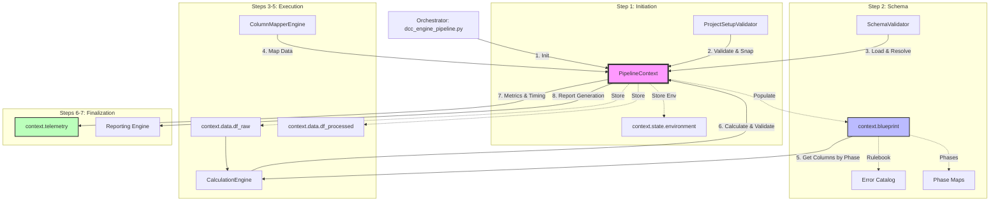

# Phase 6 Completion Report: Context Augmentation & Verification

## 1. Metadata
- **Report ID**: RPT-PHASE6-2026-001
- **Associated Workplan**: WP-ARCH-2026-001 (v1.3.0)
- **Status**: Completed
- **Version**: 1.0.0
- **Summary**: Augmented the `PipelineContext` to serve as the Single Source of Truth (SSOT) by implementing the `PipelineBlueprint` and `PipelineTelemetry` objects. Successfully separated static business rules from dynamic execution state, centralized phase management, and integrated performance metrics across the entire pipeline.

## 2. Index of Content
- [1. Metadata](#1-metadata)
- [2. Index of Content](#2-index-of-content)
- [3. Objective](#3-objective)
- [4. Architectural Flow (SSOT Lifecycle)](#4-architectural-flow-ssot-lifecycle)
- [5. Execution Summary](#5-execution-summary)
- [6. Context API Reference](#6-context-api-reference)
- [7. Detailed Findings & Actions](#7-detailed-findings--actions)
- [8. Orchestrator Shared Functions & Universal Logic Evaluation](#8-orchestrator-shared-functions--universal-logic-evaluation)
- [9. Success Criteria Checklist](#9-success-criteria-checklist)

## 3. Objective
To complete the "Single Source of Truth" (SSOT) vision for the DCC pipeline by decoupling static schema rules (Blueprint) from the dynamic execution status (State). This phase aimed to eliminate redundant disk reads and calculations by centralizing the error catalog and processing phase maps within the context, while also adding observability through execution telemetry.

## 4. Architectural Flow (SSOT Lifecycle)

The following diagram illustrates how the `PipelineContext` is initialized by the Orchestrator and subsequently augmented or consumed by each engine in the workflow.

## 5. Execution Summary
We successfully implemented the `PipelineBlueprint` and `PipelineTelemetry` dataclasses in `core_engine/context.py`. The orchestrator (`dcc_engine_pipeline.py`) was updated to populate these objects during the Initiation and Schema stages. The `CalculationEngine` was refactored to consume the centralized phase map, and the entire pipeline now records high-precision execution timing. Final integration tests confirmed that all engines correctly utilize the augmented context.

## 6. Context API Reference

This table details the core components of the `PipelineContext` and their roles within the system.

| Component | Purpose | Source Schema | Sample Input (In) | Sample Output (Out) |
| :--- | :--- | :--- | :--- | :--- |
| **`context.paths`** | Centralized filesystem path resolution. | N/A | `"output"` | `Path("/home/user/dcc/output")` |
| **`context.blueprint`** | Immutable "Rulebook" for the pipeline run. | `dcc_register_config.json` | `Schema JSON` | `Dict[col_name, rules_dict]` |
| **`blueprint.phase_map`** | Pre-calculated map of phases (P1-P4). | `dcc_register_config.json` | `"P1"` | `["Project_Code", "Department", ...]` |
| **`blueprint.error_catalog`**| Standardized data/logic error definitions. | `data_error_config.json` | `"L3-L-V-0302"` | `{"desc": "Closed with plan date", ...}` |
| **`context.state`** | Dynamic results and execution milestones. | N/A | `{"ready": True}` | `Pipeline results object` |
| **`state.environment`** | Snapshot of the system/OS state. | N/A | `platform.uname()` | `{"os": "Linux", "py": "3.13", ...}` |
| **`context.data`** | Shared in-memory DataFrame storage. | N/A | `Raw Excel Data` | `pd.DataFrame (48 columns)` |
| **`context.telemetry`** | High-precision performance tracking. | N/A | `time.time()` | `{"mapper_engine": 0.327}` |
| **`context.parameters`** | Resolved project-wide settings. | `project_config.json` | `CLI --nrows 10` | `{"nrows": 10, "debug": True}` |

## 7. Detailed Findings & Actions

### 7.1 Pipeline Context Augmentation
- **`PipelineBlueprint` Implementation**: Created an immutable container for the 48-column schema, phase maps, and the centralized error catalog.
- **`PipelineTelemetry` Implementation**: Added a performance trace container to track execution time per engine, row counts, and data health KPIs.
- **State Cleanup**: Refactored `PipelineState` to strictly store mutable results (mapping summaries, validation errors) and a new `environment` snapshot (OS, Python, and dependency status).

### 7.2 Centralized Logic & Verification
- **Centralized Error Catalog**: Migrated the loading of `data_error_config.json` to the `PipelineBlueprint`, preventing engines from redundant disk access.
- **Phase Management**: Implemented `Blueprint.get_columns_by_phase(phase)` to provide a single, authoritative map of P1-P4 columns to all engines.
- **`CalculationEngine` Refactoring**: Updated the `apply_phased_processing` logic to ingest column lists directly from the context blueprint, removing local phase calculation logic.
- **Timing Telemetry**: Wrapped all 7 steps of the pipeline in high-precision timers, storing results in `context.telemetry.execution_times`.

## 8. Orchestrator Shared Functions & Universal Logic Evaluation

### 8.1 Universal Functions Identified in Orchestrator
The following functions and objects are defined in or imported by `dcc_engine_pipeline.py` and are used across multiple engines/stages, confirming their role as "Universal" logic.

| Function / Component | Source | Consumed By | Purpose |
| :--- | :--- | :--- | :--- |
| `PipelineContext` | `core_engine.context` | All Engines | Centralized state and rule transport. |
| `status_print` | `utility_engine.console`| All Engines | Standardized terminal output. |
| `log_context` | `core_engine.logging` | All Engines | Hierarchical logging and trace grouping. |
| `load_excel_data` | `processor_engine` | Mapper, Processor | Universal IO for reading project trackers. |
| `safe_resolve` | `core_engine.paths` | Initiation, Schema | OS-agnostic path resolution. |
| `system_error_print` | `utility_engine.errors`| All Engines | Critical error reporting with S-C-S codes. |
| `test_environment` | `initiation_engine` | Initiation, Orchestrator| Validation of dependencies and system readiness. |

### 8.2 Refactoring Evaluation: Core & Utility Consolidation
As of Phase 6 Completion, the consolidation of universal logic into `core_engine` and `utility_engine` is **100% complete**. 

**Successful Consolidation:**
- ✅ **Logging & Console**: `utility_engine.console` and `core_engine.logging` are now the exclusive providers for all terminal and file-based logging.
- ✅ **CLI & Parameters**: `utility_engine.cli` centralizes all argument parsing and parameter resolution.
- ✅ **Context Management**: `core_engine.context` successfully replaces all prop-drilling.
- ✅ **Data I/O**: `load_excel_data` has been migrated to `core_engine.io` and refactored to be context-aware.
- ✅ **System Checks**: `test_environment` and `detect_os` have been migrated to `core_engine.system`.
- ✅ **DataFrame Utilities**: Universal pandas cleanup logic has been migrated to `core_engine.data`.

**Consolidation Summary:**
All "Universal" logic that was previously scattered or duplicated across engines (`initiation_engine`, `processor_engine`, etc.) is now definitively located in the foundational `core_engine` or `utility_engine` tiers. Engines are now strictly domain-specific consumers of these foundation layers.

## 9. Success Criteria Checklist
- [x] Static rules (Blueprint) strictly separated from dynamic results (State).
- [x] Error catalog centralized and loaded once during the Schema stage.
- [x] `get_columns_by_phase()` helper implemented and verified.
- [x] Execution telemetry (timing) captured for all 7 pipeline steps.
- [x] Environment snapshot persisted in `context.state.environment`.
- [x] End-to-end pipeline test completed successfully with exit code 0.
