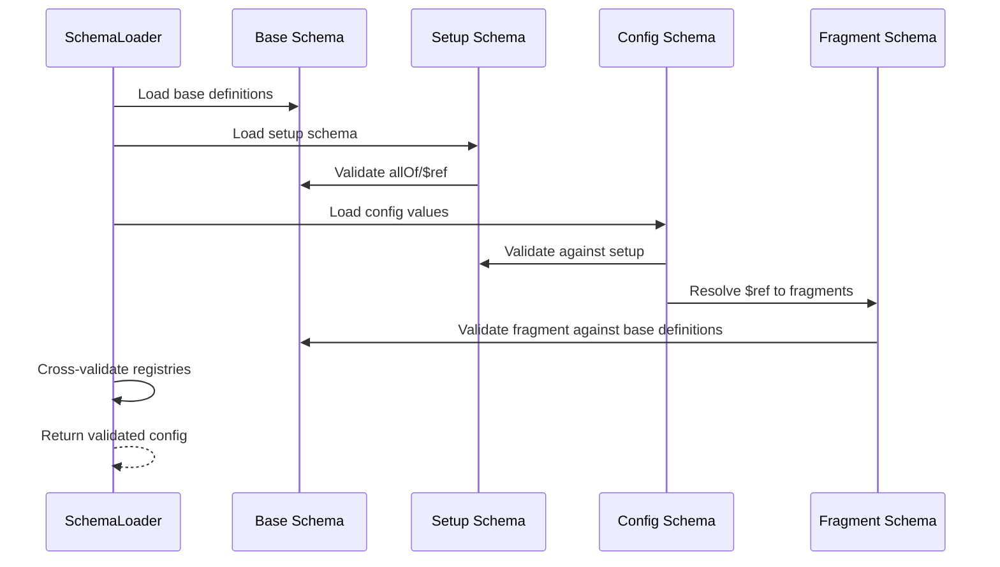

# Appendix E — EKS Schema Design

**Version**: 0.7  
**Last Updated**: 2026-06-25  
**Phase**: 1 — Foundation  
**Status**: ✅ Implemented & Tested  

### Revision History

| Revision | Date | Author | Summary |
| :------- | :--- | :----- | :------ |
| 0.1 | 2026-06-23 | opencode | Initial draft: E1–E5 (Overview, Schema Architecture, 3-Layer Pattern, Fragment Schemas, File Inventory) |
| 0.2 | 2026-06-23 | opencode | Added E6: Schema Layer Distribution tables (per-schema-set breakdown of definitions, properties, values) |
| 0.3 | 2026-06-23 | opencode | Added E6.8: Config vs Fragment comparison table (roles, overlap analysis, design principle) |
| 0.4 | 2026-06-23 | opencode | Consolidated E5 + E6.1–E6.7 into single inventory table; removed E4.1; added Purpose column |
| 0.5 | 2026-06-23 | opencode | Added shared `verbosity_level` and `document_relationship_trigger_map` definitions in `eks_base_schema.json`; cross-schema `$ref` from asset/doc/message setups to base; URI alignment for error/message base schemas (I027); updated Mermaid diagram with cross-schema `$ref` edges |
| 0.6 | 2026-06-25 | opencode | Updated inventory for `asset_context` fragment (14 fragments). Integrated full Schema Inheritance Chain from `schema_inheritance_chain.md` (v1.11) as E11–E12. Added per-key Base→Setup→Config→Actual Value trace tables. Added Business Logic vs Schema Layers section. Removed standalone `schema_inheritance_chain.md` report. |
| 0.7 | 2026-06-25 | opencode | Updated `eks_base_schema.json` from v1.3.1 to v1.5.0. Corrected definition count from 14 to 13 (removed `revision_id` per U087). Updated description to reflect U079 (discipline_code consolidation), U086 (document_relationship_trigger_map shape-only), U087 (revision_id moved to doc schema). Updated inventory table, summary matrix, and Mermaid diagram. |
| 0.8 | 2026-06-25 | opencode | Fixed inventory table inconsistencies: Core Base 12→13 defs, Core Setup v1.2.0→v1.2.2, Document Setup v1.2.0→v1.3.0 with 6→7 properties (added `revision_validation`), Error Setup 5→6 properties (included `migration_log`). Updated summary matrix totals: Base 53→54, Setup 33→34. |
| 0.9 | 2026-06-25 | opencode | Fixed E11.1 Core Setup version to v1.2.2. Fixed E11.3 Document Setup to include `revision_validation` (required). Fixed E11.4 Ontology relationships count 14→15. Updated summary matrix: Document Setup 6→7 properties, Total Setup 34→35. |

---

## E1. Overview

The EKS schema system follows a **3-layer inheritance pattern** defined in AGENTS.md §9. Every schema set consists of three files:

1. **Base Schema** (`*_base_schema.json`) — shared `definitions` (reusable property groups)
2. **Setup Schema** (`*_setup_schema.json`) — `properties` declarations with `allOf`/`$ref` to base
3. **Config Schema** (`*_config.json`) — actual values (registries, mappings, settings)

This pattern ensures:
- **Single Source of Truth**: definitions live in one place (base)
- **Separation of concerns**: structure (setup) vs. data (config)
- **Extensibility**: new values added to config only; new properties added to setup only
- **Cross-schema sharing**: shared definitions (e.g., `verbosity_level`, `document_relationship_trigger_map`) are defined once in `eks_base_schema.json` and `$ref`'d by other schema families (message, asset, document) — preventing semantic drift

**Total schema files**: 23 (as of v1.1); `eks_base_schema.json` serves as the shared definitions hub for cross-schema `$ref` (verbosity_level, document_relationship_trigger_map). The 14th asset fragment `asset_context` was added in v1.3.0, providing explicit project/location/system/relationship/lifecycle context for graph edge creation across all 14 asset types. As of v1.5.0, `eks_base_schema.json` contains 12 definitions (removed `revision_id` per U087).

---

## E2. Schema Architecture — Mermaid Diagram

```mermaid
graph TB
    subgraph "3-Layer Inheritance Pattern"
        direction TB
        BASE["Base Schema<br/><i>definitions</i>"]
        SETUP["Setup Schema<br/><i>properties + allOf/$ref</i>"]
        CONFIG["Config Schema<br/><i>actual values</i>"]
        BASE -->|"allOf/$ref"| SETUP
        SETUP -->|"validates"| CONFIG
    end

    subgraph "Core Pipeline Schemas"
        direction TB
        EKS_BASE["eks_base_schema.json<br/><i>discipline_entry_def, project_entry_def,<br/>department_entry_def, facility_entry_def,<br/>project_rules_def, registry_def, parsers_def,<br/>embedding_def, vector_store_def, logging_def,<br/>global_paths_def,<br/>verbosity_level,<br/>document_relationship_trigger_map</i>"]
        EKS_SETUP["eks_setup_schema.json<br/><i>project_rules_registry,<br/>discipline_registry, project_registry,<br/>department_registry, facility_registry,<br/>global_paths, registry, parsers,<br/>embedding, vector_store, logging</i>"]
        EKS_CONFIG["eks_config.json<br/><i>131101, 131242 project rules,<br/>duckdb, openai embedding,<br/>$ref to fragment schemas</i>"]
        EKS_BASE -->|"allOf"| EKS_SETUP
        EKS_SETUP -->|"validates"| EKS_CONFIG
    end

    subgraph "Asset Schemas"
        direction TB
        ASSET_BASE["eks_asset_base_schema.json<br/><i>14 fragment definitions:<br/>item_core, process_conditions,<br/>manufacturer, asset_lifecycle,<br/>control_system, piping_connection,<br/>valve_internals, actuator,<br/>rotating_equipment, instrumentation,<br/>pipeline_route, specialist_equipment,<br/>motor_control,<br/>asset_context</i>"]
        ASSET_SETUP["eks_asset_setup_schema.json<br/><i>asset_type_registry,<br/>column_normalization,<br/>conditional_fragments,<br/>fragment_name enum (14)</i>"]
        ASSET_CONFIG["eks_asset_config.json<br/><i>14 AT_ type→fragment mappings (14 each),<br/>7-sheet column normalization (+context),<br/>conditional_fragments rules,<br/>ontology_class_map (14),<br/>fragment_category_registry (14)</i>"]
        ASSET_BASE -->|"allOf"| ASSET_SETUP
        ASSET_SETUP -->|"validates"| ASSET_CONFIG
    end

    subgraph "Document Schemas"
        direction TB
        DOC_BASE["eks_doc_base_schema.json<br/><i>document_metadata_def,<br/>project_metadata_def,<br/>document_element_def,<br/>document_type_code enum (7),<br/>file_type_code enum (5),<br/>element_type_code enum (8)</i>"]
        DOC_SETUP["eks_doc_setup_schema.json<br/><i>document_type_registry,<br/>file_type_registry,<br/>element_type_registry,<br/>element_expectations,<br/>health_scoring</i>"]
        DOC_CONFIG["eks_doc_config.json<br/><i>7 doc type entries,<br/>5 file type entries,<br/>8 element type entries,<br/>ontology_triggers,<br/>health_scoring dimensions</i>"]
        DOC_BASE -->|"allOf"| DOC_SETUP
        DOC_SETUP -->|"validates"| DOC_CONFIG
    end

    subgraph "Ontology Schemas"
        direction TB
        ONT_BASE["eks_ontology_base_schema.json<br/><i>class_def, relationship_def,<br/>property_def</i>"]
        ONT_SETUP["eks_ontology_setup_schema.json<br/><i>classes, relationships,<br/>physical_functional_mapping</i>"]
        ONT_CONFIG["eks_ontology_config.json<br/><i>15+ classes (ISO 15926),<br/>relationship pairs,<br/>document_type_mapping</i>"]
        ONT_BASE -->|"allOf"| ONT_SETUP
        ONT_SETUP -->|"validates"| ONT_CONFIG
    end

    subgraph "Error Schemas"
        direction TB
        ERR_BASE["eks_error_code_base.json<br/><i>error_code_format,<br/>severity_levels,<br/>phase_codes, module_codes,<br/>function_codes</i>"]
        ERR_SETUP["eks_error_setup_schema.json<br/><i>system_errors,<br/>data_errors,<br/>allOf + $ref</i>"]
        ERR_CONFIG["eks_error_config.json<br/><i>30 system errors,<br/>35 data errors</i>"]
        ERR_BASE -->|"allOf"| ERR_SETUP
        ERR_SETUP -->|"validates"| ERR_CONFIG
    end

    subgraph "Message Schemas"
        direction TB
        MSG_BASE["eks_message_base.json<br/><i>message_id_format,<br/>verbosity_levels ($ref→base),<br/>categories</i>"]
        MSG_SETUP["eks_message_setup_schema.json<br/><i>milestone_messages,<br/>status_messages,<br/>progress_messages,<br/>allOf + $ref</i>"]
        MSG_CONFIG["eks_message_config.json<br/><i>25 pipeline messages,<br/>template hydration</i>"]
        MSG_BASE -->|"allOf"| MSG_SETUP
        MSG_SETUP -->|"validates"| MSG_CONFIG
    end

    subgraph "Fragment Schemas (Standalone)"
        direction TB
        PROJ["eks_project_code_schema.json<br/><i>131101, 131242, 999999</i>"]
        DISC["eks_discipline_schema.json<br/><i>21 discipline codes</i>"]
        DEPT["eks_department_schema.json<br/><i>11 department codes</i>"]
        FAC["eks_facility_schema.json<br/><i>12 facility prefixes</i>"]
    end

    %% Core → Fragment references
    EKS_CONFIG -->|"project_registry.$ref"| PROJ
    EKS_CONFIG -->|"discipline_registry.$ref"| DISC
    EKS_CONFIG -->|"department_registry.$ref"| DEPT
    EKS_CONFIG -->|"facility_registry.$ref"| FAC

    %% Base definitions used by fragments
    EKS_BASE -.->|"project_entry_def"| PROJ
    EKS_BASE -.->|"discipline_entry_def"| DISC
    EKS_BASE -.->|"department_entry_def"| DEPT
    EKS_BASE -.->|"facility_entry_def"| FAC

    %% Cross-schema references
    ASSET_CONFIG -->|"ontology_class_map"| ONT_CONFIG
    DOC_CONFIG -->|"document_type_mapping"| ONT_CONFIG
    EKS_SETUP -->|"error_schema"| ERR_SETUP
    EKS_SETUP -->|"message_schema"| MSG_SETUP
    
    %% Cross-schema $ref for shared definitions
    MSG_BASE -.->|"verbosity_level $ref"| EKS_BASE
    ASSET_SETUP -.->|"document_triggers $ref"| EKS_BASE
    DOC_SETUP -.->|"ontology_triggers $ref"| EKS_BASE

    %% Styling
    classDef base fill:#e1f5fe,stroke:#0288d1,stroke-width:2px
    classDef setup fill:#fff3e0,stroke:#f57c00,stroke-width:2px
    classDef config fill:#e8f5e9,stroke:#388e3c,stroke-width:2px
    classDef fragment fill:#fce4ec,stroke:#c62828,stroke-width:2px

    class EKS_BASE,ASSET_BASE,DOC_BASE,ONT_BASE,ERR_BASE,MSG_BASE base
    class EKS_SETUP,ASSET_SETUP,DOC_SETUP,ONT_SETUP,ERR_SETUP,MSG_SETUP setup
    class EKS_CONFIG,ASSET_CONFIG,DOC_CONFIG,ONT_CONFIG,ERR_CONFIG,MSG_CONFIG config
    class PROJ,DISC,DEPT,FAC fragment
```



---

## E3. 3-Layer Pattern Details

### E3.1 Base Schema (`*_base_schema.json`)

**Purpose**: Define reusable property groups (`definitions`) that other schemas reference.

**Required fields** (AGENTS.md §9):
- `$schema`: `http://json-schema.org/draft-07/schema#`
- `$id`: Unique URI (e.g., `https://eks.engineering/schemas/eks_base_schema.json`)
- `title`: Human-readable name
- `description`: What the schema defines
- `version`: Semantic version (e.g., `1.2.0`)
- `definitions`: Reusable property groups

**Example** (`eks_base_schema.json` definitions):
```json
{
  "definitions": {
    "discipline_entry_def": {
      "type": "object",
      "properties": {
        "code": { "type": "string" },
        "description": { "type": "string" }
      },
      "required": ["code", "description"],
      "additionalProperties": false
    },
    "project_entry_def": { ... },
    "department_entry_def": { ... },
    "facility_entry_def": { ... },
    "project_rules_def": { ... },
    "registry_def": { ... },
    "parsers_def": { ... },
    "embedding_def": { ... },
    "vector_store_def": { ... },
    "logging_def": { ... }
  }
}
```

### E3.2 Setup Schema (`*_setup_schema.json`)

**Purpose**: Declare top-level `properties` with `allOf`/`$ref` to base definitions.

**Required fields** (AGENTS.md §9):
- `$schema`: `http://json-schema.org/draft-07/schema#`
- `$id`: Unique URI
- `title`, `description`, `version`
- `allOf`: Reference to base schema
- `properties`: Property declarations
- `required`: Mandatory properties
- `additionalProperties: false`

**Example** (`eks_setup_schema.json` structure):
```json
{
  "allOf": [{ "$ref": "eks_base_schema.json" }],
  "properties": {
    "project_rules_registry": {
      "type": "object",
      "additionalProperties": { "$ref": ".../project_rules_def" }
    },
    "discipline_registry": { ... },
    "project_registry": {
      "type": "object",
      "properties": { "$ref": { "type": "string" } },
      "required": ["$ref"]
    }
  },
  "required": ["project_rules_registry", "discipline_registry", ...],
  "additionalProperties": false
}
```

### E3.3 Config Schema (`*_config.json`)

**Purpose**: Contain actual values (registries, mappings, settings).

**Optional fields**:
- `$schema`: Reference to setup schema
- `$id`: Unique URI
- `version`, `title`

**Example** (`eks_config.json` excerpt):
```json
{
  "$schema": "eks_setup_schema.json",
  "project_rules_registry": {
    "131101": {
      "allowed_disciplines": ["SP", "DS", "PI", ...],
      "revision_pattern": "^[A-Z0-9]{1,2}$"
    }
  },
  "discipline_registry": { "$ref": "eks_discipline_schema.json" },
  "project_registry": { "$ref": "eks_project_code_schema.json" },
  "department_registry": { "$ref": "eks_department_schema.json" },
  "facility_registry": { "$ref": "eks_facility_schema.json" }
}
```

---

## E4. Fragment Schemas (Standalone Lookups)

Fragment schemas are standalone files that store lookup data (project codes, disciplines, departments, facilities). They follow the DCC pattern rather than the 3-layer pattern.

**Pattern** (from DCC `discipline_schema.json`):
```json
{
  "$schema": "http://json-schema.org/draft-07/schema#",
  "$id": "https://eks.engineering/schemas/eks_project_code_schema.json",
  "title": "EKS Project Code Schema",
  "description": "Valid project codes and descriptions.",
  "version": "1.0.0",
  "type": "object",
  "additionalProperties": false,
  "allOf": [{ "$ref": "eks_base_schema.json#/definitions/project_entry_def" }],
  "projects": [
    { "code": "131101", "description": "WSD11 — Project Specifications" },
    { "code": "131242", "description": "WSD11 — TWRP Design Documents" }
  ]
}
```

**Key differences from 3-layer pattern**:
- Values stored at top level (e.g., `projects`, `disciplines`) not in `properties`
- `allOf` references base definition for validation structure
- Referenced via `$ref` from `eks_config.json`

### E4.2 Base Definitions for Fragments

| Definition | Schema File | Properties | Required |
| :--------- | :---------- | :--------- | :------- |
| `project_entry_def` | `eks_base_schema.json` | `code`, `description` | both |
| `discipline_entry_def` | `eks_base_schema.json` | `code`, `description` | both |
| `department_entry_def` | `eks_base_schema.json` | `code`, `description` | both |
| `facility_entry_def` | `eks_base_schema.json` | `prefix`, `description` | both |

---

## E5. Complete Schema Inventory & Layer Distribution

All 22 schema files organized by schema set. Each 3-layer set: **Base** (definitions) → **Setup** (properties) → **Config** (actual values). Fragment schemas are standalone.

### E5.1 Consolidated Inventory

| Schema Set | Layer | File | Version | Purpose | Content Type | Count | Key Content | Base Definition |
|:-----------|:------|:-----|:--------|:--------|:-------------|:------|:------------|:----------------|
| **Core** | Base | `eks_base_schema.json` | 1.5.0 | Shared definitions hub for pipeline config | definitions | 13 | `discipline_entry_def`, `project_entry_def`, `department_entry_def`, `facility_entry_def`, `project_rules_def`, `registry_def`, `parsers_def`, `embedding_def`, `vector_store_def`, `logging_def`, `global_paths_def`, `verbosity_level`, `document_relationship_trigger_map` | — |
| | Setup | `eks_setup_schema.json` | 1.2.2 | Property declarations for pipeline config | properties | 11 | `project_rules_registry`, `discipline_registry`, `project_registry`, `department_registry`, `facility_registry`, `global_paths`, `registry`, `parsers`, `embedding`, `vector_store`, `logging` | — |
| | Config | `eks_config.json` | 1.1.0 | Default project configuration | actual values | 11 | `project_rules_registry` (2 rules), 4× fragment `$ref`, `global_paths`, `registry`, `parsers`, `embedding`, `vector_store`, `logging` | — |
| **Asset** | Base | `eks_asset_base_schema.json` | 1.3.0 | Asset fragment definitions | definitions | 14 | `item_core`, `process_conditions`, `manufacturer`, `asset_lifecycle`, `control_system`, `piping_connection`, `valve_internals`, `actuator`, `rotating_equipment`, `instrumentation`, `pipeline_route`, `specialist_equipment`, `motor_control`, `asset_context` | — |
| | Setup | `eks_asset_setup_schema.json` | 1.3.0 | Asset type registry declarations (+ cross-$ref to base) | properties + 2 defs | 7 + 2 | `asset_type_registry`, `column_normalization`, `ontology_class_map`, `fragment_category_registry`, `relationship_triggers`, `document_triggers` ($ref→base); defs: `fragment_name` (14), `conditional_fragment_rule` | — |
| | Config | `eks_asset_config.json` | 1.4.0 | AT_ type→fragment mappings | actual values | 6 | `asset_type_registry` (14 AT_ types, 14 fragments each), `column_normalization` (7 sheets, ~233 cols + context), `ontology_class_map` (14), `fragment_category_registry` (14), `relationship_triggers` (21), `document_triggers` (3) | — |
| **Document** | Base | `eks_doc_base_schema.json` | 1.1.2 | Document + element definitions | definitions | 8 | `doc_id_format`, `revision_id`, `document_type_code`, `file_type_code`, `element_type_code`, `project_metadata_def`, `document_metadata_def`, `document_element_def` | — |
| | Setup | `eks_doc_setup_schema.json` | 1.3.0 | Document table declarations (+ cross-$ref to base) | properties | 7 | `revision_validation`, `document_type_registry`, `file_type_registry`, `element_type_registry`, `element_expectations`, `health_scoring`, `ontology_triggers` ($ref→base) | — |
| | Config | `eks_doc_config.json` | 1.1.0 | Document type mappings | actual values | 6 | `document_type_registry` (7 types), `file_type_registry` (5 formats), `element_type_registry` (8 types), `element_expectations` (7 doc types), `health_scoring` (6 dims, 5 tiers), `ontology_triggers` (5) | — |
| **Ontology** | Base | `eks_ontology_base_schema.json` | 1.1.0 | Ontology class/relationship definitions | definitions | 2 | `ontology_class`, `relationship` | — |
| | Setup | `eks_ontology_setup_schema.json` | 1.1.0 | Ontology schema declarations | properties | 2 | `classes`, `relationships` | — |
| | Config | `eks_ontology_config.json` | 1.6.0 | ISO 15926-aligned ontology | actual values | 2 | `classes` (35 classes), `relationships` (15 types) | — |
| **Error** | Base | `eks_error_code_base.json` | 1.1.0 | Error code format definitions (URI aligned to filename pattern) | definitions | 13 | `error_code_format`, `system_error_code_format`, `error_severity`, `system_category`, `layer_code`, `module_code`, `function_code`, `unique_id`, `data_error_entry`, `system_error_entry`, `error_category_range`, `error_catalog_metadata`, `migration_log_entry` | — |
| | Setup | `eks_error_setup_schema.json` | 1.1.0 | Error schema declarations ($ref updated to aligned URI) | properties | 6 | `metadata`, `system_error_ranges`, `system_errors`, `data_error_ranges`, `data_logic_errors`, `migration_log` | — |
| | Config | `eks_error_config.json` | 1.0.0 | Full error catalog | actual values | 6 | `system_errors` (30 codes), `data_logic_errors` (35 codes), `system_error_ranges` (6 cats), `data_error_ranges` (5 phases), `metadata`, `migration_log` | — |
| **Message** | Base | `eks_message_base.json` | 1.1.0 | Message ID format definitions (+ verbosity_level $ref→base) | definitions | 6 | `message_id`, `verbosity_level` ($ref→base), `template`, `message_category`, `message_metadata`, `message_entry` | — |
| | Setup | `eks_message_setup_schema.json` | 1.1.0 | Message schema declarations ($ref updated to aligned URI) | properties | 2 | `metadata`, `messages` | — |
| | Config | `eks_message_config.json` | 1.0.0 | Full message catalog | actual values | 2 | `metadata`, `messages` (33 messages) | — |
| **Fragment** | — | `eks_project_code_schema.json` | 1.0.0 | Valid project codes | data | 3 entries | `code` (131101, 131242, 999999) | `project_entry_def` |
| | — | `eks_discipline_schema.json` | 1.0.0 | Valid discipline codes | data | 21 entries | `code` (PI, EL, IN, CI, ...) | `discipline_entry_def` |
| | — | `eks_department_schema.json` | 1.0.0 | Valid department codes | data | 11 entries | `code` (PRJ, QAQC, CNT, ...) | `department_entry_def` |
| | — | `eks_facility_schema.json` | 1.0.0 | Valid facility prefixes | data | 12 entries | `prefix` (WSD11, WSW41, ...) | `facility_entry_def` |
| | — | `eks_project_rules_config.json` | 1.1.0 | Per-project business rules (allowed disciplines, required fragment fields) | data | 2 rules | `project_rules{}`: 131101 (9 disciplines, 4 required field paths), 131242 (13 disciplines, 1 required field path) | `project_rules_def` |

_\* = **moved** — `revision_id` moved from `eks_base_schema.json` to `eks_doc_base_schema.json` per U087 (v1.5.0)_

### E5.2 Config vs Fragment — Roles & Comparison

Both config and fragment schemas hold **actual values**, but serve different architectural purposes.

| Aspect | Config (`eks_config.json`, etc.) | Fragment (`eks_*_schema.json`) |
|:-------|:--------------------------------|:-------------------------------|
| **Purpose** | Project-specific deployment settings | Shared reference/lookup data |
| **Content** | Inline settings + delegation `$ref` pointers | Inline code/description entries |
| **Reusability** | One per project deployment | Shared across multiple projects |
| **Schema structure** | No `allOf` to base; validates against setup | Uses `allOf` to base definition |
| **Referenced by** | Engine code at runtime | Config via `$ref` delegation |
| **Validation chain** | config → setup → base | fragment → base (standalone) |

**Config schema contents** (`eks_config.json`):

| Property | Type | Content |
|:---------|:-----|:--------|
| `project_rules_registry` | inline | Project-specific rules (allowed disciplines, revision pattern per project code) |
| `discipline_registry` | `$ref` → fragment | Delegates to shared discipline codes |
| `project_registry` | `$ref` → fragment | Delegates to shared project codes |
| `department_registry` | `$ref` → fragment | Delegates to shared department codes |
| `facility_registry` | `$ref` → fragment | Delegates to shared facility prefixes |
| `global_paths` | inline | Project-specific directory paths |
| `registry` | inline | Project-specific DB connection |
| `parsers` | inline | Project-specific parser mappings |
| `embedding` | inline | Project-specific embedding provider |
| `vector_store` | inline | Project-specific vector DB config |
| `logging` | inline | Project-specific log level/path |

**Fragment schema contents** (`eks_discipline_schema.json` example):

| Property | Type | Content |
|:---------|:-----|:--------|
| `disciplines[]` | inline | Shared code/description pairs (21 entries) |

**Overlap analysis:**

| Overlap Area | Config Key | Fragment Key | Conflict? |
|:-------------|:-----------|:-------------|:---------:|
| Project codes | `project_rules_registry.131101` (rules) | `projects[0].code = "131101"` (description) | **No** — different data (rules vs description) |
| Discipline codes | `discipline_registry.$ref` → fragment | `disciplines[].code` | **No** — config delegates to fragment |
| Department codes | `department_registry.$ref` → fragment | `departments[].code` | **No** — config delegates to fragment |
| Facility codes | `facility_registry.$ref` → fragment | `facilities[].prefix` | **No** — config delegates to fragment |

**Design principle**: Config holds **project-specific rules** (e.g., which disciplines are allowed for project 131101). Fragments hold **shared code tables** (e.g., what "PI" means). No duplication exists.

### E5.3 Summary Matrix

| Schema Set | Base (definitions) | Setup (properties) | Config (values) | Total Files |
|:-----------|:-------------------|:-------------------|:----------------|:------------|
| Core Pipeline | 13 | 11 | 11 keys | 3 |
| Asset | 14 | 7 + 2 defs | 6 | 3 |
| Document | 8 | 7 | 6 | 3 |
| Ontology | 2 | 2 | 2 | 3 |
| Error Code | 13 | 5 | 6 | 3 |
| Pipeline Message | 6 | 2 | 2 | 3 |
| Fragments (×5) | — | — | — | 5 |
| **Total** | **54** | **35** | **33** | **23** |

### E5.4 Key Observations

1. **`discipline_code` consolidation** — `discipline_code` was removed as a standalone def from `eks_base_schema.json` (v1.3.1 per U079); `eks_doc_base_schema.json` now `$ref`s `discipline_entry_def.properties.code` instead.

2. **`revision_id` migration** — `revision_id` was moved from `eks_base_schema.json` to `eks_doc_base_schema.json` (v1.5.0 per U087), eliminating the last known duplicate.

3. **`document_relationship_trigger_map` shape-only** — Stripped to shape-only definition in `eks_base_schema.json` (v1.4.0 per U086); actual entries moved to config files (`eks_asset_config.json`, `eks_doc_config.json`).

4. **Setup schemas rarely define their own definitions** — only `eks_asset_setup_schema.json` adds 2 (`fragment_name`, `conditional_fragment_rule`). All others rely entirely on base.

5. **Config schemas hold only data** — no `definitions`, no `properties` declarations. This is correct per 3-layer pattern.

6. **`eks_asset_setup_schema.json`** is the most complex setup schema (7 properties + 2 definitions + conditional fragment rules).

7. **Fragment schemas break the 3-layer pattern** — they are standalone data files (5 total, including `eks_project_rules_config.json`), not base→setup→config. They use `allOf` to reference a base definition for validation but store values directly.

---

## E6. Cross-Schema References

The EKS schema system uses `$ref` to link schemas across sets:

| Source Schema | Property | Target Schema | Reference Type |
| :------------ | :------- | :------------ | :------------- |
| `eks_config.json` | `project_registry.$ref` | `eks_project_code_schema.json` | Fragment lookup |
| `eks_config.json` | `discipline_registry.$ref` | `eks_discipline_schema.json` | Fragment lookup |
| `eks_config.json` | `department_registry.$ref` | `eks_department_schema.json` | Fragment lookup |
| `eks_config.json` | `facility_registry.$ref` | `eks_facility_schema.json` | Fragment lookup |
| `eks_setup_schema.json` | `project_rules_registry.*` | `eks_base_schema.json#/definitions/project_rules_def` | Definition ref |
| `eks_setup_schema.json` | `discipline_registry.*` | `eks_base_schema.json#/definitions/discipline_entry_def` | Definition ref |
| `eks_asset_config.json` | `ontology_class_map.*` | `eks_ontology_config.json` classes | Semantic link |
| `eks_doc_config.json` | `document_type_registry[].ontology_class` | `eks_ontology_config.json` classes | Semantic link |
| `eks_doc_config.json` | `file_type_registry[].parser_class` | Engine parser modules | Code reference |
| `eks_message_base.json` | `verbosity_level` | `eks_base_schema.json#/definitions/verbosity_level` | Shared definition (SSOT) |
| `eks_asset_setup_schema.json` | `document_triggers` | `eks_base_schema.json#/definitions/document_relationship_trigger_map` | Shared definition (SSOT) |
| `eks_doc_setup_schema.json` | `ontology_triggers` | `eks_base_schema.json#/definitions/document_relationship_trigger_map` | Shared definition (SSOT) |

---

## E7. AGENTS.md §9 Compliance Checklist

| Rule | Status | Evidence |
| :--- | :----: | :------- |
| 3-layer inheritance model | ✅ | All 6 schema sets follow base→setup→config |
| Flat structure; array of objects | ✅ | All registries use `[{"code": "...", ...}]` |
| Use `definitions` for repetitive objects | ✅ | Base schemas define reusable property groups |
| `additionalProperties: false` | ✅ | All setup and fragment schemas |
| Define `required` for properties | ✅ | All setup schemas declare required fields |
| `$schema`, `$id`, `title`, `description`, `version` | ✅ | All 22 files have required metadata |
| `allOf`, `$ref` calls if applicable | ✅ | All setup schemas use `allOf`; fragment schemas use `$ref`; cross-schema `$ref` across 3 schema families |
| Unified Schema Registry (URIs) | ✅ | All `$id` use `https://eks.engineering/schemas/`; all follow consistent filename-based pattern (I027 resolved) |
| Pattern-based discovery | ✅ | Files named `eks_*_schema.json` or `eks_*_config.json` |

---

## E8. Schema Validation Flow



---

## E9. How to Add a New Fragment Schema

1. **Create base definition** in `eks_base_schema.json`:
   ```json
   "new_entry_def": {
     "type": "object",
     "properties": {
       "code": { "type": "string" },
       "description": { "type": "string" }
     },
     "required": ["code", "description"],
     "additionalProperties": false
   }
   ```

2. **Create fragment schema** `eks_new_schema.json`:
   ```json
   {
     "$schema": "http://json-schema.org/draft-07/schema#",
     "$id": "https://eks.engineering/schemas/eks_new_schema.json",
     "title": "EKS New Schema",
     "description": "Valid entries for new lookup.",
     "version": "1.0.0",
     "type": "object",
     "additionalProperties": false,
     "allOf": [{ "$ref": "eks_base_schema.json#/definitions/new_entry_def" }],
     "new_entries": [
       { "code": "X", "description": "Entry description" }
     ]
   }
   ```

3. **Add property declaration** in `eks_setup_schema.json`:
   ```json
   "new_registry": {
     "type": "object",
     "properties": { "$ref": { "type": "string" } },
     "required": ["$ref"]
   }
   ```

4. **Add `$ref`** in `eks_config.json`:
   ```json
   "new_registry": { "$ref": "eks_new_schema.json" }
   ```

5. **Add test** in `test_phase1.py`:
   ```python
   def test_new_fragment_schema_exists(self):
       path = self.config_dir / 'eks_new_schema.json'
       self.assertTrue(path.exists())
   ```

---

## E10. References

- AGENTS.md §9 — Schema Pattern (3-layer inheritance, fragment pattern, URI rules)
- DCC reference: `dcc/config/schemas/discipline_schema.json`, `project_code_schema.json`
- `eks_base_schema.json` — Core definitions
- `eks_setup_schema.json` — Core property declarations
- `eks_config.json` — Core configuration values
- `eks/engine/core/schema_loader.py` — Schema loading and validation logic

---

## E11. Schema Inheritance Chain — Base → Setup → Config → Actual Value

This section provides a per-key trace of every schema key across the 3-layer inheritance chain (Base → Setup → Config → Actual Value). For each key it shows: **type** (Domain/Pipeline), **Base** definition shape, **Setup** mapping/property reference, **Config** where values live, and the **Actual Values** at runtime.

### E11.1 Core Schema Set

| Key | Type | Base `eks_base_schema.json` | Setup `eks_setup_schema.json` v1.2.2 | Config | Actual Values | Purpose |
|-----|------|-----------------------------|--------------------------------------|--------|---------------|---------|
| `discipline_entry_def` | Domain | `{code, description}` both req, no addl | `discipline_registry{$ref: string}` | `$ref: eks_discipline_schema.json` | 20 entries — PI→Piping, EL→Electrical, ..., NA→Not Applicable | Define valid engineering disciplines |
| `project_rules_def` | Domain | `{allowed_disciplines[] req, fragment_required_fields{string→string[]} opt}`, no addl | `project_rules_registry{$ref: string}` | `$ref: eks_project_rules_config.json` | 2 rules: 131101(9 disc, 4 field req), 131242(13 disc, 1 field req) | Bind allowed disciplines + fragment required field overrides per project |
| `project_entry_def` | Domain | `{code, description}` both req, no addl | `project_registry{$ref: string}` req | `$ref: eks_project_code_schema.json` | 3 entries: 131101, 131242, 999999 | Register valid project codes |
| `department_entry_def` | Domain | `{code, description}` both req, no addl | `department_registry{$ref: string}` req | `$ref: eks_department_schema.json` | 11 entries: PRJ, QAQC, CNT, ..., NA | Define valid department codes |
| `facility_entry_def` | Domain | `{prefix, description}` both req, no addl | `facility_registry{$ref: string}` req | `$ref: eks_facility_schema.json` | 12 prefixes: WSD11, WSW41, WST02, ..., WST01 | Register facility prefixes |
| `global_paths_def` | Pipeline | `{data_dir, output_dir, archive_dir, config_dir: string}` all req, no addl | `global_paths` — $ref → def, req | Inline in `eks_config.json` | `"data"`, `"output"`, `"archive"`, `"config"` | Configure pipeline filesystem paths |
| `registry_def` | Pipeline | `{type: enum[duckdb,postgresql], connection_string: string, timeout: int(30)}` req type+conn, no addl | `registry` — $ref → def, req | Inline in `eks_config.json` | duckdb, `output/eks_registry.db`, timeout 30 | Configure database backend |
| `parsers_def` | Pipeline | `additionalProperties: string` | `parsers` — $ref → def, req | Inline in `eks_config.json` | .pdf→PDFParser, .docx→DOCXParser, .xlsx→XLSXParser, .dgn→DGNParserStub, .dwg→DWGParserStub | Map extensions to parser classes |
| `embedding_def` | Pipeline | `{active_provider: enum[openai,ollama], model_name: string, dimensions: int}` all req, no addl | `embedding` — $ref → def, req | Inline in `eks_config.json` | openai, text-embedding-3-small, 1536 | Configure vector embedding provider |
| `vector_store_def` | Pipeline | `{url: string, collection_name: string, distance_metric: enum[Cosine,Euclidean,Dot]}` all req, no addl | `vector_store` — $ref → def, req | Inline in `eks_config.json` | localhost:6333, eks_chunks, Cosine | Configure vector database |
| `logging_def` | Pipeline | `{default_level: $ref verbosity_level(1), debug_file_path: string}` req default_level, no addl | `logging` — $ref → def, req | Inline in `eks_config.json` | level 1, `output/debug_log.json` | Configure logging verbosity |
| `verbosity_level` | Pipeline | `integer enum [0,1,2,3]` — 0=quiet, 1=normal, 2=debug, 3=trace | ref'd by logging_def + `eks_message_base.json` | — | — | Shared log verbosity scale (SSOT) |
| `document_relationship_trigger_map` | Pipeline | `additionalProperties: string` — shape only | ref'd by asset_setup (`document_triggers`) + doc_setup (`ontology_triggers`) | — | Shape only — values live in config files | Define shape for trigger mapping tables |

### E11.2 Asset Schema Set

| Key | Type | Base `eks_asset_base_schema.json` | Setup `eks_asset_setup_schema.json` | Config `eks_asset_config.json` | Actual Values | Purpose |
|-----|------|-----------------------------------|--------------------------------------|--------------------------------|---------------|---------|
| `item_core` | Domain | `{keytag, tag_type, tag_no, unit, service, ..., p_and_id_file, design_specification}` — 15 props, no req (shape-only), no addl | `asset_type_registry[].fragments[]` — by `fragment_name` enum | In asset_type_registry | 14/14 types — universal identity | Provide universal asset identity |
| `process_conditions` | Domain | `{design_pressure, pressure_rating, operating_*: number, test_pressure}` — no req, no addl | Same | In asset_type_registry | 8/14 types — design & operating conditions | Capture design limits and normal ranges |
| `manufacturer` | Domain | `{brand, model_number, serial_number, manufacturer_*: string, lot_number, model_2d/3d_file}` — no req, no addl | Same | In asset_type_registry | 10/14 types — brand & product details | Track supplier and product identification |
| `asset_lifecycle` | Domain | `{ace_category, generic_equipment_type, cost_center, replacement_cost, wbs_element, warranty_*, date_of_commission}` — no req, no addl | Same | In asset_type_registry | 8/14 types — ACE fields, lifecycle, financial | Manage ACE classification and lifecycle tracking |
| `control_system` | Domain | `{lcs_type, plc_panel, plc_panel_location, rio_panel, rio_panel_location}` — no req, no addl | Same | In asset_type_registry | 4/14 types (AT_INST_*, AT_MOTOR) — control & I&C | Map asset to DCS/PLC control system |
| `piping_connection` | Domain | `{pipe_size_nominal_mm, pipeline_tag_number, lining_material, end_condition}` — no req, no addl | Same | In asset_type_registry | 4/14 types (AT_PROCESS, AT_CVALVE, AT_PSV, AT_HVALVE) | Define pipe-to-component connection |
| `valve_internals` | Domain | `{valve_duty, valve_internal_type, body_material, stem_material, closure_element, seat_material, locked_position}` — no req, no addl | Same | In asset_type_registry | 3/14 types (AT_CVALVE, AT_PSV, AT_HVALVE) | Specify valve trim and body materials |
| `actuator` | Domain | 43 props — full actuator + ACE lifecycle, no req, no addl | Same | In asset_type_registry | 2/14 types (AT_CVALVE, AT_HVALVE) | Complete actuator specs plus ACE tracking |
| `rotating_equipment` | Domain | 28 props — pump hydraulics, motor electrical, compressor perf, no req, no addl | Same | In asset_type_registry | 6/14 types — pump, tank, vessel, exchanger, etc. | Capture rotating machinery specs |
| `instrumentation` | Domain | 27 props — sensor type, alarms, signal output, no req, no addl | Same | In asset_type_registry | 4/14 types (AT_INST_*, AT_MOTOR) | Specify sensor, transmitter, alarm thresholds |
| `pipeline_route` | Domain | `{pipe_material, outside_diameter_mm, wall_thickness_mm, from/to_component}` — no req, no addl | Same | In asset_type_registry | 1/14 types (AT_PROCESS) | Define pipeline segment geometry and connectivity |
| `specialist_equipment` | Domain | `{aperture_size, diaphragm_material, lineshaft_type, uv_lamp_type, removal_dosage, flux}` — no req, no addl | `conditional_fragment_rule` when device_type_code in [UV,FILT,CONV,SCR,DOSING] | In conditional_fragments | 1/14 types (AT_EQUIP, conditional) | Specialty equipment for UV, filtration, dosing |
| `motor_control` | Domain | `{starter_type, mcc_fed_from, equipment_number}` — no req, no addl | `asset_type_registry[].fragments[]` — by `fragment_name` enum | In asset_type_registry | 1/14 types (AT_MOTOR) | Motor starter and MCC feed configuration |
| `asset_context` | Domain | 6 sub-objects: `project_context`, `location_hierarchy` (addl:true), `system_hierarchy` (addl:true), `asset_relationships` (13 link types), `document_relationships` (5 link types), `lifecycle_context` — no req (shape-only), top-level no addl | `asset_type_registry[].fragments[]` — by `fragment_name` enum | In asset_type_registry | 14/14 types — explicit relationship/location/system/project/document/lifecycle context | Capture context for graph edge creation |
| `fragment_name` | Domain | — | `definitions.fragment_name` — `string enum [14 names]` | Used as `$ref` target in `asset_type_registry` | Enum of 14 strings | Register valid fragment names for asset composition |
| `conditional_fragment_rule` | Domain | — | `definitions.conditional_fragment_rule{fragment, when, in[]}` — req all 3 | — | 1 rule: specialist_equipment when device_type_code in [UV,FILT,CONV,SCR,DOSING] for AT_EQUIP | Define rules for conditionally applying fragments |
| `relationship_triggers` | Domain | — | `properties.relationship_triggers` — `additionalProperties: string` | In `eks_asset_config.json` | 21 mappings — p_and_id_file→REFERENCED_BY_DWG, etc. | Map property paths to 21 ontology relationships |
| `document_triggers` | Domain | `$ref → eks_base_schema.json#/definitions/document_relationship_trigger_map` (shape-only) | `properties.document_triggers` — `$ref` → base trigger map | In `eks_asset_config.json` | 3 mappings — document_number→SUPERSEDES, asset_tags→REFERENCES_ASSET, originator_company→PRODUCED_BY | Map document properties to ontology relationships |
| `asset_type_registry` | Domain | — | `properties.asset_type_registry` — `{label, fragments[](minItems:2): $ref fragment_name, conditional_fragments[]}` | In `eks_asset_config.json` | 14 types — AT_EQUIP(6f+cond), AT_EQPMP(6f), ..., AT_HVALVE(6f) | Define 14 asset types by composing fragment definitions |
| `ontology_class_map` | Domain | — | `properties.ontology_class_map` — `additionalProperties: string` | In `eks_asset_config.json` | 14 mappings — AT_EQUIP→TaggedEquipment, ..., AT_HVALVE→ManualValveTag | Map each asset type to an ontology class |
| `fragment_category_registry` | Domain | — | `properties.fragment_category_registry` — `additionalProperties: enum[functional,physical]` | In `eks_asset_config.json` | 14 entries — functional(12), physical(2) | Categorize fragments for schema grouping |
| `column_normalization` | Domain | — | `properties.column_normalization` — `additionalProperties: {additionalProperties: string}` | In `eks_asset_config.json` | 7 sheet maps, ~233 total columns + context | Map source spreadsheet columns to normalized fields |

### E11.3 Document Schema Set

| Key | Type | Base `eks_doc_base_schema.json` | Setup `eks_doc_setup_schema.json` | Config `eks_doc_config.json` | Actual Values |
|-----|------|----------------------------------|------------------------------------|-------------------------------|---------------|
| `doc_id_format` | Domain | `string pattern: ^[A-Za-z0-9_-]+-[A-Za-z0-9]+$` | — | — | `{doc_number}-{revision}` |
| `document_type_code` | Domain | `enum [DWG, PI-PID, SPC, DS, MAN, OM, RPT]` | `document_type_registry[{code, label, ontology_class, description, expected_file_types[]}]` | 7 entries | DWG→Drawing(pdf), PI-PID→PID_Drawing(pdf,dgn), SPC→Specification(pdf,docx), ..., RPT→Report(pdf,docx) |
| `file_type_code` | Domain | `enum [pdf, dgn, docx, xlsx, dwg]` | `file_type_registry[{extension, display_name, parser_class, description, mime_type}]` | 5 entries | pdf→PDFParser(application/pdf), ..., dwg→DWGParserStub(image/vnd.dwg) |
| `element_type_code` | Domain | `enum [cover_page, revision_table, section, table, image, link, legend, note]` | `element_type_registry[{element_type, description, source_method, phase_2/3_use, expected_by_cover_types[]}]` | 8 entries | cover_page(regex)→Section→Document node; revision_table(table)→Change→Revision; etc. |
| `project_metadata_def` | Pipeline | `{project_title, project_number, area, discipline($ref disc.code), department}` | — | — | Used in extraction pipeline |
| `document_metadata_def` | Pipeline | 19 props — source_type, doc_type, doc_number, revision, status, is_latest, file_path, ..., asset_tags, page_count, extract_status, extraction_confidence, notes, verified_by | — | — | Used in ingestion pipeline |
| `document_element_def` | Pipeline | 7 props — doc_id, element_type, element_id, title, content, confidence([0,1]), source(enum) | — | — | Used in extraction pipeline |
| `ontology_triggers` | Domain | (ref via `document_relationship_trigger_map` in `eks_base_schema.json`) | `ontology_triggers` — `$ref` → base trigger map | 5 mappings | document_type→IS_A, document_number→SUPERSEDES, asset_tags→REFERENCES_ASSET, originator_company→PRODUCED_BY, file_type→HAS_FORMAT |
| `revision_id` | Pipeline | `{type: string}` — v1.2.0 moved from core base | `revision_validation{project_code → {pattern}}` (req) | 2 entries | 131101→`^[A-Z0-9]{1,2}$`, 131242→`^[0-9]{3}$` |
| `health_scoring` | Pipeline | — | `health_scoring{dimensions[], score_tiers[], weight_tiers{}}` | 6 dims (completeness 0.20, ..., consistency 0.10), 5 tiers (0.90→auto_register, ..., 0.00→manual_entry) | 3 weight tiers: critical(2.0), standard(1.0), optional(0.5) |
| `element_expectations` | Domain | — | `element_expectations{expected_elements[], threshold, cover_type}` | 7 entries | DWG→[cover_page,revision_table,section,image,link] thr:4 A; PI-PID→same thr:4 B; ..., RPT→[cover_page,section,table] thr:2 E |

### E11.4 Ontology Schema Set

| Key | Type | Base `eks_ontology_base_schema.json` | Setup `eks_ontology_setup_schema.json` | Config `eks_ontology_config.json` | Actual Values |
|-----|------|----------------------------------------|------------------------------------------|-------------------------------------|---------------|
| `ontology_class` | Domain | 8 props — name, label, description, subClassOf, tag_type_mapping, document_type_mapping, tag_type_aliases[](uniqueItems), fragments[] — req name+label, no addl | `classes` — array $ref → class, minItems:1 | 35 classes | Root: ISO15926_Entity → L2: FunctionalObject, PhysicalObject, Document, InfrastructureObject, GovernanceObject → L3: TaggedEquipment, TaggedPiping, TaggedInstrument, ..., Drawing, Specification → L4: PumpTag(AT_EQPMP), MotorTag(AT_MOTOR), ValveTag→ControlValveTag/SafetyValveTag/ManualValveTag, ... |
| `relationship` | Domain | 5 props — name, inverse, transitive, symmetric, description — req name, no addl | `relationships` — array $ref → relationship, minItems:1 | 15 relationships | SUBCLASS_OF↔SUPERCLASS_OF, CONNECTS_TO, FLOWS_TO↔FLOWS_FROM, INSTALLED_AT, REFERENCED_BY_DWG, CONTROLS↔CONTROLLED_BY, ENERGIZED_BY↔POWERS, GOVERNED_BY↔VALIDATES_ASSET, SET_POINT_IN, SUPERSEDES↔SUPERSEDED_BY, SUPPLEMENTS↔SUPPLEMENTED_BY, REFERENCES_DOC↔REFERENCED_BY_DOC, PRODUCED_BY↔ORIGINATED, FEEDS_FROM |

### E11.5 Error Schema Set

| Key | Type | Base `eks_error_code_base.json` | Setup `eks_error_setup_schema.json` | Config `eks_error_config.json` | Actual Values |
|-----|------|----------------------------------|--------------------------------------|---------------------------------|---------------|
| `error_code_format` | Pipeline | `string pattern: ^P[0-9]-[A-Z]-[A-Z]-[0-9]{4}$` | — | — | P{phase}-{module}-{function}-{id} |
| `system_error_code_format` | Pipeline | `string pattern: ^S-[A-Z]-S-[0-9]{4}$` | — | — | S-{category}-S-{id} |
| `error_severity` | Pipeline | `enum [FATAL, CRITICAL, HIGH, MEDIUM, WARNING, INFO]` | — | — | 6 severity levels |
| `layer_code` | Pipeline | `string pattern: ^P[0-9]$` (P1=Discovery, P2=Parsing, P3=Extraction, P4=Ingestion) | — | — | Used in data_error_entry.layer |
| `module_code` | Pipeline | `enum [D, P, E, X, R, G, S, C, F, V]` — 10 codes | — | — | Used in data_error_entry.module |
| `function_code` | Pipeline | `enum [P, V, C, F, S, X, G, E]` — 8 codes | — | — | Used in data_error_entry.function |
| `unique_id` | Pipeline | `string pattern: ^[0-9]{4}$` | — | — | Used in code formats |
| `system_category` | Pipeline | `enum [Environment, File, Config, Runtime, AI, Bootstrap]` | — | — | 6 system categories |
| `error_catalog_metadata` | Pipeline | 7 props — version, last_updated, total_codes, system_codes, data_logic_codes, format | `metadata` — $ref → metadata | v1.0.0 | 65 total (30 sys + 35 data) |
| `data_error_entry` | Pipeline | 12 props — code, name, message, severity, layer, module, function, column, source, health_score_impact, remediation, remediation_type — req code+name+severity+layer+module+function | `data_logic_errors` — `additionalProperties` $ref → entry | 35 entries | P1(2): FILE_DISCOVERY_FAILED, DIRECTORY_NOT_FOUND; P2(8): PDF_*, DOCX_*, DGN_*; P3 extract(17); P3 xref(5); P3 graph(3) |
| `system_error_entry` | Pipeline | 9 props — code, name, message, severity, category, stops_pipeline, promote_detail, promotion_text — req code+name+severity+category+stops_pipeline | `system_errors` — `additionalProperties` $ref → entry | 30 entries | Env(5): MISSING_PACKAGE, ...; File(6); Config(8); Runtime(6); AI(3); Bootstrap(2) |
| `error_category_range` | Pipeline | 6 props — prefix, description, count, start_id, end_id — req all | `system_error_ranges` (6 ranges), `data_error_ranges` (5 ranges) | 11 ranges | System: S-E-S-01xx(5) to S-B-S-06xx(2); Data: P1-D-P-01xx(2) to P3-G-G-05xx(3) |
| `migration_log_entry` | Pipeline | 5 props — date, description, changes[](string), references | `migration_log` — $ref → entry | 1 entry | "Initial EKS error catalog", 4 changes |

### E11.6 Message Schema Set

| Key | Type | Base `eks_message_base.json` | Setup `eks_message_setup_schema.json` | Config `eks_message_config.json` | Actual Values |
|-----|------|-------------------------------|----------------------------------------|------------------------------------|---------------|
| `message_id` | Pipeline | `string pattern: ^[A-Z_]+$` | — | — | MILESTONE_PIPELINE_START, STATUS_PARSING_FILE, etc. |
| `verbosity_level` | Pipeline | `$ref → eks_base_schema.json#/definitions/verbosity_level` (0-3) | — | — | Referenced via message_entry.level |
| `template` | Pipeline | `string` — Python-style `{placeholders}` | — | — | "Starting EKS pipeline for {target}" |
| `message_category` | Pipeline | `enum [milestone, status, progress, warning, error]` | — | — | 5 categories |
| `message_metadata` | Pipeline | 3 props — version, last_updated, total_messages — req version+last_updated | `metadata` — $ref → metadata | v1.0.0 | 33 total |
| `message_entry` | Pipeline | 3 props — template, level($ref verbosity), category — req template+level | `messages` — `additionalProperties` $ref → entry | 33 entries | Milestone(8): PIPELINE_START to PIPELINE_DONE; Status(8); Progress(4); Warning(8); Error(4) |

### E11.7 Fragment / Config Schemas

| Key | Type | File | $ref Target (from `eks_base_schema.json`) | Properties | Actual Values |
|-----|------|------|--------------------------------------------|------------|---------------|
| `project_rules` | Domain | `eks_project_rules_config.json` v1.1.0 | `#/definitions/project_rules_def` | `project_rules{}: {code → {allowed_disciplines[]}}` | 2: 131101(9 disc), 131242(13 disc) |
| `projects` | Domain | `eks_project_code_schema.json` v1.0.0 | `#/definitions/project_entry_def` | `projects[]: {code, description}` | 3: 131101, 131242, 999999 |
| `disciplines` | Domain | `eks_discipline_schema.json` v1.0.0 | `#/definitions/discipline_entry_def` | `disciplines[]: {code, description}` | 21: PI, EL, IN, CI, AR, ME, ..., SG, NA |
| `departments` | Domain | `eks_department_schema.json` v1.0.0 | `#/definitions/department_entry_def` | `departments[]: {code, description}` | 11: PRJ, QAQC, CNT, PRC, PIP, ..., NA |
| `facilities` | Domain | `eks_facility_schema.json` v1.0.0 | `#/definitions/facility_entry_def` | `facilities[]: {prefix, description}` | 12: WSD11, WSW41, WST02, WIL00, ..., WST01 |

---

## E12. Business Logic vs Schema Layers

Starting with the `asset_context` addition (v1.3.0), a clean separation is enforced:

| Concern | Layer | File | Scope |
|---------|-------|------|-------|
| **Shape** (what properties exist, their types) | Base | `*_base_schema.json` | Universal |
| **Composition rules** (which fragments compose which types) | Setup | `*_setup_schema.json` | Universal |
| **Standard values** (actual asset types, column maps, triggers) | Config | `*_config.json` | Universal |
| **Business logic** (per-project required field overrides, allowed disciplines) | Project Rules | `eks_project_rules_config.json` | Per-project |

**Rule:** Fragment definitions in `eks_asset_base_schema.json` are **shape-only** — they define properties and types but never carry `required` constraints. Per-project mandatory field rules are defined in `eks_project_rules_config.json` under `fragment_required_fields`.

**Validation flow:**
1. `SchemaLoader.load_all()` validates all schema files against their setup schemas
2. `_validate_project_rules()` cross-checks `fragment_required_fields` against actual fragment definitions
3. At asset ingest time, `ConfigRegistry.resolve_required_fields(project_id, fragment_name)` returns the project's required field list for that fragment
4. Asset instance validation merges base shape + project-specific required constraints

**Aggregate Summary:**

| Schema Set | Source Files | Keys | Config Values | Base Defs → Setup Props → Config |
|------------|-------------|------|---------------|-----------------------------------|
| Core | `eks_base_schema.json` + `eks_setup_schema.json` + `eks_config.json` + 5 fragment/config files | 13 | 11 config groups + 47 fragment entries | 13 defs → 11 props(11 req) → 11 config |
| Asset | `eks_asset_base_schema.json` + `eks_asset_setup_schema.json` + `eks_asset_config.json` | 22 (14 fragments + 8 setup) | 7 groups (233 col maps + context, 14 asset types, 21 triggers, 14 class maps, 14 categories) | 14 base defs + 2 setup defs → 7 props(2 req) → 7 config |
| Document | `eks_doc_base_schema.json` + `eks_doc_setup_schema.json` + `eks_doc_config.json` | 10 | 7 groups (7 doc types, 5 file types, 8 element types, 7 expectations, 5 triggers, 2 revision validation, 1 health) | 7 defs → 7 props(4 req) → 7 config |
| Ontology | `eks_ontology_base_schema.json` + `eks_ontology_setup_schema.json` + `eks_ontology_config.json` | 2 | 2 groups (35 classes, 15 relationships) | 2 defs → 4 props(2 req) → 2 config |
| Error | `eks_error_code_base.json` + `eks_error_setup_schema.json` + `eks_error_config.json` | 11 | 6 groups (30 sys + 35 data errors, 11 ranges, metadata, migration) | 11 defs → 5 props(0 req) → 5 config |
| Message | `eks_message_base.json` + `eks_message_setup_schema.json` + `eks_message_config.json` | 5 | 2 groups (33 messages) | 5 defs → 2 props(0 req) → 2 config |
| Fragments | 5 standalone files | 5 | 47 entries | Direct allOf → base_entry_def |
| **Total** | **23 files** | **63+** | **78+ config sections** | **52 base defs → 35 setup props → 33 config groups** |
