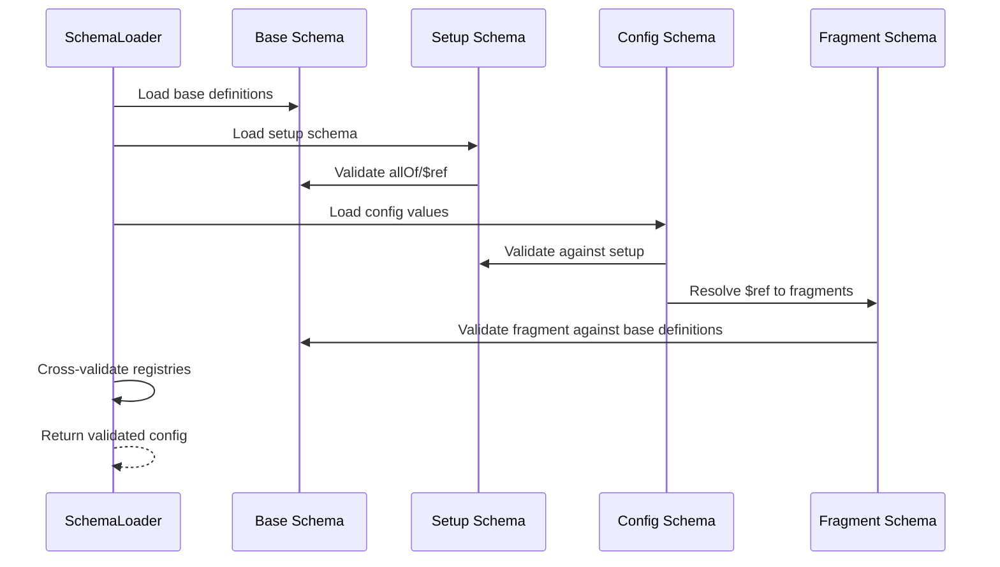

# Appendix E — EKS Schema Design

**Version**: 0.5  
**Last Updated**: 2026-06-23  
**Phase**: 1 — Foundation  
**Status**: ✅ Implemented & Tested  

### Revision History

| Revision | Date | Author | Summary |
| :------- | :--- | :----- | :------ |
| 0.1 | 2026-06-23 | opencode | Initial draft: E1–E5 (Overview, Schema Architecture, 3-Layer Pattern, Fragment Schemas, File Inventory) |
| 0.2 | 2026-06-23 | opencode | Added E6: Schema Layer Distribution tables (per-schema-set breakdown of definitions, properties, values) |
| 0.3 | 2026-06-23 | opencode | Added E6.8: Config vs Fragment comparison table (roles, overlap analysis, design principle) |
| 0.4 | 2026-06-23 | opencode | Consolidated E5 + E6.1–E6.7 into single inventory table; removed E4.1; added Purpose column |
| 0.5 | 2026-06-23 | opencode | Added shared `verbosity_level` and `document_relationship_trigger_map` definitions in `eks_base_schema.json`; cross-schema `$ref` from asset/doc/message setups to base; URI alignment for error/message base schemas (I027); updated Mermaid diagram with cross-schema `$ref` edges |

---

## E1. Overview

The EKS schema system follows a **3-layer inheritance pattern** defined in AGENTS.md §9. Every schema set consists of three files:

1. **Base Schema** (`*_base_schema.json`) — shared `definitions` (reusable property groups)
2. **Setup Schema** (`*_setup_schema.json`) — `properties` declarations with `allOf`/`$ref` to base
3. **Config Schema** (`*_config.json`) — actual values (registries, mappings, settings)

This pattern ensures:
- **Single Source of Truth**: definitions live in one place (base)
- **Separation of concerns**: structure (setup) vs. data (config)
- **Extensibility**: new values added to config only; new properties added to setup only
- **Cross-schema sharing**: shared definitions (e.g., `verbosity_level`, `document_relationship_trigger_map`) are defined once in `eks_base_schema.json` and `$ref`'d by other schema families (message, asset, document) — preventing semantic drift

**Total schema files**: 22 (as of v1.0); `eks_base_schema.json` serves as the shared definitions hub for cross-schema `$ref` (verbosity_level, document_relationship_trigger_map)

---

## E2. Schema Architecture — Mermaid Diagram

```mermaid
graph TB
    subgraph "3-Layer Inheritance Pattern"
        direction TB
        BASE["Base Schema<br/><i>definitions</i>"]
        SETUP["Setup Schema<br/><i>properties + allOf/$ref</i>"]
        CONFIG["Config Schema<br/><i>actual values</i>"]
        BASE -->|"allOf/$ref"| SETUP
        SETUP -->|"validates"| CONFIG
    end

    subgraph "Core Pipeline Schemas"
        direction TB
        EKS_BASE["eks_base_schema.json<br/><i>discipline_entry_def, project_entry_def,<br/>department_entry_def, facility_entry_def,<br/>project_rules_def, registry_def, parsers_def,<br/>embedding_def, vector_store_def, logging_def,<br/>verbosity_level,<br/>document_relationship_trigger_map</i>"]
        EKS_SETUP["eks_setup_schema.json<br/><i>project_rules_registry,<br/>discipline_registry, project_registry,<br/>department_registry, facility_registry,<br/>global_paths, registry, parsers,<br/>embedding, vector_store, logging</i>"]
        EKS_CONFIG["eks_config.json<br/><i>131101, 131242 project rules,<br/>duckdb, openai embedding,<br/>$ref to fragment schemas</i>"]
        EKS_BASE -->|"allOf"| EKS_SETUP
        EKS_SETUP -->|"validates"| EKS_CONFIG
    end

    subgraph "Asset Schemas"
        direction TB
        ASSET_BASE["eks_asset_base_schema.json<br/><i>13 fragment definitions:<br/>item_core, process_conditions,<br/>manufacturer, asset_lifecycle,<br/>control_system, piping_connection,<br/>valve_internals, actuator,<br/>rotating_equipment, instrumentation,<br/>pipeline_route, specialist_equipment,<br/>motor_control</i>"]
        ASSET_SETUP["eks_asset_setup_schema.json<br/><i>asset_type_registry,<br/>column_normalization,<br/>conditional_fragments,<br/>fragment_name enum (13)</i>"]
        ASSET_CONFIG["eks_asset_config.json<br/><i>14 AT_ type→fragment mappings,<br/>7-sheet column normalization,<br/>conditional_fragments rules,<br/>ontology_class_map</i>"]
        ASSET_BASE -->|"allOf"| ASSET_SETUP
        ASSET_SETUP -->|"validates"| ASSET_CONFIG
    end

    subgraph "Document Schemas"
        direction TB
        DOC_BASE["eks_doc_base_schema.json<br/><i>document_metadata_def,<br/>project_metadata_def,<br/>document_element_def,<br/>document_type_code enum (7),<br/>file_type_code enum (5),<br/>element_type_code enum (8)</i>"]
        DOC_SETUP["eks_doc_setup_schema.json<br/><i>document_type_registry,<br/>file_type_registry,<br/>element_type_registry,<br/>element_expectations,<br/>health_scoring</i>"]
        DOC_CONFIG["eks_doc_config.json<br/><i>7 doc type entries,<br/>5 file type entries,<br/>8 element type entries,<br/>ontology_triggers,<br/>health_scoring dimensions</i>"]
        DOC_BASE -->|"allOf"| DOC_SETUP
        DOC_SETUP -->|"validates"| DOC_CONFIG
    end

    subgraph "Ontology Schemas"
        direction TB
        ONT_BASE["eks_ontology_base_schema.json<br/><i>class_def, relationship_def,<br/>property_def</i>"]
        ONT_SETUP["eks_ontology_setup_schema.json<br/><i>classes, relationships,<br/>physical_functional_mapping</i>"]
        ONT_CONFIG["eks_ontology_config.json<br/><i>15+ classes (ISO 15926),<br/>relationship pairs,<br/>document_type_mapping</i>"]
        ONT_BASE -->|"allOf"| ONT_SETUP
        ONT_SETUP -->|"validates"| ONT_CONFIG
    end

    subgraph "Error Schemas"
        direction TB
        ERR_BASE["eks_error_code_base.json<br/><i>error_code_format,<br/>severity_levels,<br/>phase_codes, module_codes,<br/>function_codes</i>"]
        ERR_SETUP["eks_error_setup_schema.json<br/><i>system_errors,<br/>data_errors,<br/>allOf + $ref</i>"]
        ERR_CONFIG["eks_error_config.json<br/><i>30 system errors,<br/>35 data errors</i>"]
        ERR_BASE -->|"allOf"| ERR_SETUP
        ERR_SETUP -->|"validates"| ERR_CONFIG
    end

    subgraph "Message Schemas"
        direction TB
        MSG_BASE["eks_message_base.json<br/><i>message_id_format,<br/>verbosity_levels ($ref→base),<br/>categories</i>"]
        MSG_SETUP["eks_message_setup_schema.json<br/><i>milestone_messages,<br/>status_messages,<br/>progress_messages,<br/>allOf + $ref</i>"]
        MSG_CONFIG["eks_message_config.json<br/><i>25 pipeline messages,<br/>template hydration</i>"]
        MSG_BASE -->|"allOf"| MSG_SETUP
        MSG_SETUP -->|"validates"| MSG_CONFIG
    end

    subgraph "Fragment Schemas (Standalone)"
        direction TB
        PROJ["eks_project_code_schema.json<br/><i>131101, 131242, 999999</i>"]
        DISC["eks_discipline_schema.json<br/><i>21 discipline codes</i>"]
        DEPT["eks_department_schema.json<br/><i>11 department codes</i>"]
        FAC["eks_facility_schema.json<br/><i>12 facility prefixes</i>"]
    end

    %% Core → Fragment references
    EKS_CONFIG -->|"project_registry.$ref"| PROJ
    EKS_CONFIG -->|"discipline_registry.$ref"| DISC
    EKS_CONFIG -->|"department_registry.$ref"| DEPT
    EKS_CONFIG -->|"facility_registry.$ref"| FAC

    %% Base definitions used by fragments
    EKS_BASE -.->|"project_entry_def"| PROJ
    EKS_BASE -.->|"discipline_entry_def"| DISC
    EKS_BASE -.->|"department_entry_def"| DEPT
    EKS_BASE -.->|"facility_entry_def"| FAC

    %% Cross-schema references
    ASSET_CONFIG -->|"ontology_class_map"| ONT_CONFIG
    DOC_CONFIG -->|"document_type_mapping"| ONT_CONFIG
    EKS_SETUP -->|"error_schema"| ERR_SETUP
    EKS_SETUP -->|"message_schema"| MSG_SETUP
    
    %% Cross-schema $ref for shared definitions
    MSG_BASE -.->|"verbosity_level $ref"| EKS_BASE
    ASSET_SETUP -.->|"document_triggers $ref"| EKS_BASE
    DOC_SETUP -.->|"ontology_triggers $ref"| EKS_BASE

    %% Styling
    classDef base fill:#e1f5fe,stroke:#0288d1,stroke-width:2px
    classDef setup fill:#fff3e0,stroke:#f57c00,stroke-width:2px
    classDef config fill:#e8f5e9,stroke:#388e3c,stroke-width:2px
    classDef fragment fill:#fce4ec,stroke:#c62828,stroke-width:2px

    class EKS_BASE,ASSET_BASE,DOC_BASE,ONT_BASE,ERR_BASE,MSG_BASE base
    class EKS_SETUP,ASSET_SETUP,DOC_SETUP,ONT_SETUP,ERR_SETUP,MSG_SETUP setup
    class EKS_CONFIG,ASSET_CONFIG,DOC_CONFIG,ONT_CONFIG,ERR_CONFIG,MSG_CONFIG config
    class PROJ,DISC,DEPT,FAC fragment
```



---

## E3. 3-Layer Pattern Details

### E3.1 Base Schema (`*_base_schema.json`)

**Purpose**: Define reusable property groups (`definitions`) that other schemas reference.

**Required fields** (AGENTS.md §9):
- `$schema`: `http://json-schema.org/draft-07/schema#`
- `$id`: Unique URI (e.g., `https://eks.engineering/schemas/eks_base_schema.json`)
- `title`: Human-readable name
- `description`: What the schema defines
- `version`: Semantic version (e.g., `1.2.0`)
- `definitions`: Reusable property groups

**Example** (`eks_base_schema.json` definitions):
```json
{
  "definitions": {
    "discipline_entry_def": {
      "type": "object",
      "properties": {
        "code": { "type": "string" },
        "description": { "type": "string" }
      },
      "required": ["code", "description"],
      "additionalProperties": false
    },
    "project_entry_def": { ... },
    "department_entry_def": { ... },
    "facility_entry_def": { ... },
    "project_rules_def": { ... },
    "registry_def": { ... },
    "parsers_def": { ... },
    "embedding_def": { ... },
    "vector_store_def": { ... },
    "logging_def": { ... }
  }
}
```

### E3.2 Setup Schema (`*_setup_schema.json`)

**Purpose**: Declare top-level `properties` with `allOf`/`$ref` to base definitions.

**Required fields** (AGENTS.md §9):
- `$schema`: `http://json-schema.org/draft-07/schema#`
- `$id`: Unique URI
- `title`, `description`, `version`
- `allOf`: Reference to base schema
- `properties`: Property declarations
- `required`: Mandatory properties
- `additionalProperties: false`

**Example** (`eks_setup_schema.json` structure):
```json
{
  "allOf": [{ "$ref": "eks_base_schema.json" }],
  "properties": {
    "project_rules_registry": {
      "type": "object",
      "additionalProperties": { "$ref": ".../project_rules_def" }
    },
    "discipline_registry": { ... },
    "project_registry": {
      "type": "object",
      "properties": { "$ref": { "type": "string" } },
      "required": ["$ref"]
    }
  },
  "required": ["project_rules_registry", "discipline_registry", ...],
  "additionalProperties": false
}
```

### E3.3 Config Schema (`*_config.json`)

**Purpose**: Contain actual values (registries, mappings, settings).

**Optional fields**:
- `$schema`: Reference to setup schema
- `$id`: Unique URI
- `version`, `title`

**Example** (`eks_config.json` excerpt):
```json
{
  "$schema": "eks_setup_schema.json",
  "project_rules_registry": {
    "131101": {
      "allowed_disciplines": ["SP", "DS", "PI", ...],
      "revision_pattern": "^[A-Z0-9]{1,2}$"
    }
  },
  "discipline_registry": { "$ref": "eks_discipline_schema.json" },
  "project_registry": { "$ref": "eks_project_code_schema.json" },
  "department_registry": { "$ref": "eks_department_schema.json" },
  "facility_registry": { "$ref": "eks_facility_schema.json" }
}
```

---

## E4. Fragment Schemas (Standalone Lookups)

Fragment schemas are standalone files that store lookup data (project codes, disciplines, departments, facilities). They follow the DCC pattern rather than the 3-layer pattern.

**Pattern** (from DCC `discipline_schema.json`):
```json
{
  "$schema": "http://json-schema.org/draft-07/schema#",
  "$id": "https://eks.engineering/schemas/eks_project_code_schema.json",
  "title": "EKS Project Code Schema",
  "description": "Valid project codes and descriptions.",
  "version": "1.0.0",
  "type": "object",
  "additionalProperties": false,
  "allOf": [{ "$ref": "eks_base_schema.json#/definitions/project_entry_def" }],
  "projects": [
    { "code": "131101", "description": "WSD11 — Project Specifications" },
    { "code": "131242", "description": "WSD11 — TWRP Design Documents" }
  ]
}
```

**Key differences from 3-layer pattern**:
- Values stored at top level (e.g., `projects`, `disciplines`) not in `properties`
- `allOf` references base definition for validation structure
- Referenced via `$ref` from `eks_config.json`

### E4.2 Base Definitions for Fragments

| Definition | Schema File | Properties | Required |
| :--------- | :---------- | :--------- | :------- |
| `project_entry_def` | `eks_base_schema.json` | `code`, `description` | both |
| `discipline_entry_def` | `eks_base_schema.json` | `code`, `description` | both |
| `department_entry_def` | `eks_base_schema.json` | `code`, `description` | both |
| `facility_entry_def` | `eks_base_schema.json` | `prefix`, `description` | both |

---

## E5. Complete Schema Inventory & Layer Distribution

All 22 schema files organized by schema set. Each 3-layer set: **Base** (definitions) → **Setup** (properties) → **Config** (actual values). Fragment schemas are standalone.

### E5.1 Consolidated Inventory

| Schema Set | Layer | File | Version | Purpose | Content Type | Count | Key Content | Base Definition |
|:-----------|:------|:-----|:--------|:--------|:-------------|:------|:------------|:----------------|
| **Core** | Base | `eks_base_schema.json` | 1.3.1 | Shared definitions hub for pipeline config | definitions | 14 | `discipline_entry_def`, `project_entry_def`, `department_entry_def`, `facility_entry_def`, `project_rules_def`, `registry_def`, `parsers_def`, `embedding_def`, `vector_store_def`, `logging_def`, `global_paths_def`, `revision_id`, `verbosity_level`, `document_relationship_trigger_map` | — |
| | Setup | `eks_setup_schema.json` | 1.2.0 | Property declarations for pipeline config | properties | 11 | `project_rules_registry`, `discipline_registry`, `project_registry`, `department_registry`, `facility_registry`, `global_paths`, `registry`, `parsers`, `embedding`, `vector_store`, `logging` | — |
| | Config | `eks_config.json` | 1.1.0 | Default project configuration | actual values | 11 | `project_rules_registry` (2 rules), 4× fragment `$ref`, `global_paths`, `registry`, `parsers`, `embedding`, `vector_store`, `logging` | — |
| **Asset** | Base | `eks_asset_base_schema.json` | 1.2.0 | Asset fragment definitions | definitions | 13 | `item_core`, `process_conditions`, `manufacturer`, `asset_lifecycle`, `control_system`, `piping_connection`, `valve_internals`, `actuator`, `rotating_equipment`, `instrumentation`, `pipeline_route`, `specialist_equipment`, `motor_control` | — |
| | Setup | `eks_asset_setup_schema.json` | 1.2.0 | Asset type registry declarations (+ cross-$ref to base) | properties + 2 defs | 7 + 2 | `asset_type_registry`, `column_normalization`, `ontology_class_map`, `fragment_category_registry`, `relationship_triggers`, `document_triggers` ($ref→base); defs: `fragment_name`, `conditional_fragment_rule` | — |
| | Config | `eks_asset_config.json` | 1.3.0 | AT_ type→fragment mappings | actual values | 6 | `asset_type_registry` (14 AT_ types), `column_normalization` (7 sheets, ~200 cols), `ontology_class_map` (14), `fragment_category_registry` (13), `relationship_triggers` (15), `document_triggers` (3) | — |
| **Document** | Base | `eks_doc_base_schema.json` | 1.1.2 | Document + element definitions | definitions | 8 | `doc_id_format`, `revision_id`*, `document_type_code`, `file_type_code`, `element_type_code`, `project_metadata_def`, `document_metadata_def`, `document_element_def` | — |
| | Setup | `eks_doc_setup_schema.json` | 1.2.0 | Document table declarations (+ cross-$ref to base) | properties | 6 | `document_type_registry`, `file_type_registry`, `element_type_registry`, `element_expectations`, `health_scoring`, `ontology_triggers` ($ref→base) | — |
| | Config | `eks_doc_config.json` | 1.1.0 | Document type mappings | actual values | 6 | `document_type_registry` (7 types), `file_type_registry` (5 formats), `element_type_registry` (8 types), `element_expectations` (7 doc types), `health_scoring` (6 dims, 5 tiers), `ontology_triggers` (5) | — |
| **Ontology** | Base | `eks_ontology_base_schema.json` | 1.1.0 | Ontology class/relationship definitions | definitions | 2 | `ontology_class`, `relationship` | — |
| | Setup | `eks_ontology_setup_schema.json` | 1.1.0 | Ontology schema declarations | properties | 2 | `classes`, `relationships` | — |
| | Config | `eks_ontology_config.json` | 1.6.0 | ISO 15926-aligned ontology | actual values | 2 | `classes` (35 classes), `relationships` (15 types) | — |
| **Error** | Base | `eks_error_code_base.json` | 1.1.0 | Error code format definitions (URI aligned to filename pattern) | definitions | 13 | `error_code_format`, `system_error_code_format`, `error_severity`, `system_category`, `layer_code`, `module_code`, `function_code`, `unique_id`, `data_error_entry`, `system_error_entry`, `error_category_range`, `error_catalog_metadata`, `migration_log_entry` | — |
| | Setup | `eks_error_setup_schema.json` | 1.1.0 | Error schema declarations ($ref updated to aligned URI) | properties | 5 | `metadata`, `system_error_ranges`, `system_errors`, `data_error_ranges`, `data_logic_errors`, `migration_log` | — |
| | Config | `eks_error_config.json` | 1.0.0 | Full error catalog | actual values | 6 | `system_errors` (30 codes), `data_logic_errors` (35 codes), `system_error_ranges` (6 cats), `data_error_ranges` (5 phases), `metadata`, `migration_log` | — |
| **Message** | Base | `eks_message_base.json` | 1.1.0 | Message ID format definitions (+ verbosity_level $ref→base) | definitions | 6 | `message_id`, `verbosity_level` ($ref→base), `template`, `message_category`, `message_metadata`, `message_entry` | — |
| | Setup | `eks_message_setup_schema.json` | 1.1.0 | Message schema declarations ($ref updated to aligned URI) | properties | 2 | `metadata`, `messages` | — |
| | Config | `eks_message_config.json` | 1.0.0 | Full message catalog | actual values | 2 | `metadata`, `messages` (33 messages) | — |
| **Fragment** | — | `eks_project_code_schema.json` | 1.0.0 | Valid project codes | data | 3 entries | `code` (131101, 131242, 999999) | `project_entry_def` |
| | — | `eks_discipline_schema.json` | 1.0.0 | Valid discipline codes | data | 21 entries | `code` (PI, EL, IN, CI, ...) | `discipline_entry_def` |
| | — | `eks_department_schema.json` | 1.0.0 | Valid department codes | data | 11 entries | `code` (PRJ, QAQC, CNT, ...) | `department_entry_def` |
| | — | `eks_facility_schema.json` | 1.0.0 | Valid facility prefixes | data | 12 entries | `prefix` (WSD11, WSW41, ...) | `facility_entry_def` |

_\* = **duplicate** — also exists in `eks_base_schema.json`_

### E5.2 Config vs Fragment — Roles & Comparison

Both config and fragment schemas hold **actual values**, but serve different architectural purposes.

| Aspect | Config (`eks_config.json`, etc.) | Fragment (`eks_*_schema.json`) |
|:-------|:--------------------------------|:-------------------------------|
| **Purpose** | Project-specific deployment settings | Shared reference/lookup data |
| **Content** | Inline settings + delegation `$ref` pointers | Inline code/description entries |
| **Reusability** | One per project deployment | Shared across multiple projects |
| **Schema structure** | No `allOf` to base; validates against setup | Uses `allOf` to base definition |
| **Referenced by** | Engine code at runtime | Config via `$ref` delegation |
| **Validation chain** | config → setup → base | fragment → base (standalone) |

**Config schema contents** (`eks_config.json`):

| Property | Type | Content |
|:---------|:-----|:--------|
| `project_rules_registry` | inline | Project-specific rules (allowed disciplines, revision pattern per project code) |
| `discipline_registry` | `$ref` → fragment | Delegates to shared discipline codes |
| `project_registry` | `$ref` → fragment | Delegates to shared project codes |
| `department_registry` | `$ref` → fragment | Delegates to shared department codes |
| `facility_registry` | `$ref` → fragment | Delegates to shared facility prefixes |
| `global_paths` | inline | Project-specific directory paths |
| `registry` | inline | Project-specific DB connection |
| `parsers` | inline | Project-specific parser mappings |
| `embedding` | inline | Project-specific embedding provider |
| `vector_store` | inline | Project-specific vector DB config |
| `logging` | inline | Project-specific log level/path |

**Fragment schema contents** (`eks_discipline_schema.json` example):

| Property | Type | Content |
|:---------|:-----|:--------|
| `disciplines[]` | inline | Shared code/description pairs (21 entries) |

**Overlap analysis:**

| Overlap Area | Config Key | Fragment Key | Conflict? |
|:-------------|:-----------|:-------------|:---------:|
| Project codes | `project_rules_registry.131101` (rules) | `projects[0].code = "131101"` (description) | **No** — different data (rules vs description) |
| Discipline codes | `discipline_registry.$ref` → fragment | `disciplines[].code` | **No** — config delegates to fragment |
| Department codes | `department_registry.$ref` → fragment | `departments[].code` | **No** — config delegates to fragment |
| Facility codes | `facility_registry.$ref` → fragment | `facilities[].prefix` | **No** — config delegates to fragment |

**Design principle**: Config holds **project-specific rules** (e.g., which disciplines are allowed for project 131101). Fragments hold **shared code tables** (e.g., what "PI" means). No duplication exists.

### E5.3 Summary Matrix

| Schema Set | Base (definitions) | Setup (properties) | Config (values) | Total Files |
|:-----------|:-------------------|:-------------------|:----------------|:------------|
| Core Pipeline | 14 | 11 | 11 keys | 3 |
| Asset | 13 | 7 + 2 defs | 6 | 3 |
| Document | 8 | 6 | 6 | 3 |
| Ontology | 2 | 2 | 2 | 3 |
| Error Code | 13 | 5 | 6 | 3 |
| Pipeline Message | 6 | 2 | 2 | 3 |
| Fragments (×4) | — | — | — | 4 |
| **Total** | **54** | **33** | **33** | **22** |

### E5.4 Key Observations

1. **`discipline_code` consolidation** — `discipline_code` was removed as a standalone def from `eks_base_schema.json` (v1.3.1); `eks_doc_base_schema.json` now `$ref`s `discipline_entry_def.properties.code` instead. `revision_id` remains the last known duplicate — still exists in both base and doc base.

2. **Setup schemas rarely define their own definitions** — only `eks_asset_setup_schema.json` adds 2 (`fragment_name`, `conditional_fragment_rule`). All others rely entirely on base.

3. **Config schemas hold only data** — no `definitions`, no `properties` declarations. This is correct per 3-layer pattern.

4. **`eks_asset_setup_schema.json`** is the most complex setup schema (7 properties + 2 definitions + conditional fragment rules).

5. **Fragment schemas break the 3-layer pattern** — they are standalone data files, not base→setup→config. They use `allOf` to reference a base definition for validation but store values directly.

---

## E6. Cross-Schema References

The EKS schema system uses `$ref` to link schemas across sets:

| Source Schema | Property | Target Schema | Reference Type |
| :------------ | :------- | :------------ | :------------- |
| `eks_config.json` | `project_registry.$ref` | `eks_project_code_schema.json` | Fragment lookup |
| `eks_config.json` | `discipline_registry.$ref` | `eks_discipline_schema.json` | Fragment lookup |
| `eks_config.json` | `department_registry.$ref` | `eks_department_schema.json` | Fragment lookup |
| `eks_config.json` | `facility_registry.$ref` | `eks_facility_schema.json` | Fragment lookup |
| `eks_setup_schema.json` | `project_rules_registry.*` | `eks_base_schema.json#/definitions/project_rules_def` | Definition ref |
| `eks_setup_schema.json` | `discipline_registry.*` | `eks_base_schema.json#/definitions/discipline_entry_def` | Definition ref |
| `eks_asset_config.json` | `ontology_class_map.*` | `eks_ontology_config.json` classes | Semantic link |
| `eks_doc_config.json` | `document_type_registry[].ontology_class` | `eks_ontology_config.json` classes | Semantic link |
| `eks_doc_config.json` | `file_type_registry[].parser_class` | Engine parser modules | Code reference |
| `eks_message_base.json` | `verbosity_level` | `eks_base_schema.json#/definitions/verbosity_level` | Shared definition (SSOT) |
| `eks_asset_setup_schema.json` | `document_triggers` | `eks_base_schema.json#/definitions/document_relationship_trigger_map` | Shared definition (SSOT) |
| `eks_doc_setup_schema.json` | `ontology_triggers` | `eks_base_schema.json#/definitions/document_relationship_trigger_map` | Shared definition (SSOT) |

---

## E7. AGENTS.md §9 Compliance Checklist

| Rule | Status | Evidence |
| :--- | :----: | :------- |
| 3-layer inheritance model | ✅ | All 6 schema sets follow base→setup→config |
| Flat structure; array of objects | ✅ | All registries use `[{"code": "...", ...}]` |
| Use `definitions` for repetitive objects | ✅ | Base schemas define reusable property groups |
| `additionalProperties: false` | ✅ | All setup and fragment schemas |
| Define `required` for properties | ✅ | All setup schemas declare required fields |
| `$schema`, `$id`, `title`, `description`, `version` | ✅ | All 22 files have required metadata |
| `allOf`, `$ref` calls if applicable | ✅ | All setup schemas use `allOf`; fragment schemas use `$ref`; cross-schema `$ref` across 3 schema families |
| Unified Schema Registry (URIs) | ✅ | All `$id` use `https://eks.engineering/schemas/`; all follow consistent filename-based pattern (I027 resolved) |
| Pattern-based discovery | ✅ | Files named `eks_*_schema.json` or `eks_*_config.json` |

---

## E8. Schema Validation Flow



---

## E9. How to Add a New Fragment Schema

1. **Create base definition** in `eks_base_schema.json`:
   ```json
   "new_entry_def": {
     "type": "object",
     "properties": {
       "code": { "type": "string" },
       "description": { "type": "string" }
     },
     "required": ["code", "description"],
     "additionalProperties": false
   }
   ```

2. **Create fragment schema** `eks_new_schema.json`:
   ```json
   {
     "$schema": "http://json-schema.org/draft-07/schema#",
     "$id": "https://eks.engineering/schemas/eks_new_schema.json",
     "title": "EKS New Schema",
     "description": "Valid entries for new lookup.",
     "version": "1.0.0",
     "type": "object",
     "additionalProperties": false,
     "allOf": [{ "$ref": "eks_base_schema.json#/definitions/new_entry_def" }],
     "new_entries": [
       { "code": "X", "description": "Entry description" }
     ]
   }
   ```

3. **Add property declaration** in `eks_setup_schema.json`:
   ```json
   "new_registry": {
     "type": "object",
     "properties": { "$ref": { "type": "string" } },
     "required": ["$ref"]
   }
   ```

4. **Add `$ref`** in `eks_config.json`:
   ```json
   "new_registry": { "$ref": "eks_new_schema.json" }
   ```

5. **Add test** in `test_phase1.py`:
   ```python
   def test_new_fragment_schema_exists(self):
       path = self.config_dir / 'eks_new_schema.json'
       self.assertTrue(path.exists())
   ```

---

## E10. References

- AGENTS.md §9 — Schema Pattern (3-layer inheritance, fragment pattern, URI rules)
- DCC reference: `dcc/config/schemas/discipline_schema.json`, `project_code_schema.json`
- `eks_base_schema.json` — Core definitions
- `eks_setup_schema.json` — Core property declarations
- `eks_config.json` — Core configuration values
- `eks/engine/core/schema_loader.py` — Schema loading and validation logic
