# Appendix P1.1: Phase 1 — Architecture & Design Blueprints

**Document ID**: WP-EKS-P1-APX-1.1  
**Version**: 1.6  
**Last Updated**: 2026-07-21  
**Status**: 🔷 IN PROGRESS — Major restructure: added Contents (TOC), §1 Features Overview & Architecture Summary, consolidated all 10 issue fixes from former §4.4+§5 into single §7 cross-reference table with separate Root Cause / Fix / Outcome columns. Renumbered sections for logical design-first flow. Subsection numbering fixed in Schema Design (§5.x→§6.x). Module inventory promoted to §1.3.  
**Parent Workplan**: [phase_1_foundation_workplan.md](phase_1_foundation_workplan.md) (WP-EKS-P1-001, v5.3, IN PROGRESS)

---

This appendix provides indexed cross-references to Phase 1 architecture and design blueprints. The canonical definitions live in the main workplan and the supporting general appendices; this document serves as a navigation map.

---

## Contents

- [1. Features Overview & Architecture Summary](#1-features-overview--architecture-summary)
  - [1.1 What Phase 1 Delivers](#11-what-phase-1-delivers)
  - [1.2 Architecture at a Glance](#12-architecture-at-a-glance)
  - [1.3 Module Inventory](#13-module-inventory)
- [2. Phase Project Folder Structure](#2-phase-project-folder-structure)
- [3. Phase 1 Pipeline Architecture & Function Tables](#3-phase-1-pipeline-architecture--function-tables)
- [4. Phase 1 Pipeline Orchestrator and Entry Points](#4-phase-1-pipeline-orchestrator-and-entry-points)
- [5. Independent Parser Module Architecture](#5-independent-parser-module-architecture)
- [6. Schema Design](#6-schema-design)
- [7. Issues & Fixes — Summary with Cross-References](#7-issues--fixes--summary-with-cross-references)
- [8. Cross-Reference Index](#8-cross-reference-index)
- [Revision History](#revision-history)

---

## 1. Features Overview & Architecture Summary

### 1.1 What Phase 1 Delivers

Phase 1 establishes the EKS foundation — a complete document ingestion and analysis pipeline:

| Category | Capability |
|:---|:---|
| **Schema System** | 23 JSON schema files across 5 schema sets (Core, Asset, Document, Ontology, Error/Message) following 3-layer inheritance (Base → Setup → Config) |
| **Document Registry** | DuckDB-backed with 37+ metadata columns, schema-synced via auto-DDL, revision chain management, element storage |
| **File Processing** | 5 plug-in parsers (PDF, DOCX, XLSX, DGN stub, DWG stub) with schema-driven discovery via `parser_router.py` |
| **Structure Detection** | 8 element types: cover page, revision table, sections, data tables, images, links, legends, notes |
| **Health Scoring** | 6-dimension per-document composite score: completeness (20%), extraction confidence (20%), structural (20%), source quality (15%), cross-reference quality (15%), consistency (10%) |
| **Error & Messaging** | 111 error codes (61 system + 50 data), 49 pipeline messages, tiered logging (levels 0–3) with debug JSON output |
| **Pipeline Orchestrator** | Phase A (discovery) → Phase B (parse/detect/score) → Phase C (manual review), with checkpoint/resume, rollback, IO contracts |
| **Entry Points** | 3 converging paths — CLI (`eks-pipeline`), Web (`serve.py` proxy), HTTP Backend (`phase1_server.py` port 5001) — all funnel through `run_pipeline(context)` |
| **Bootstrap** | Universal 8-phase BootstrapManager with preload infrastructure guard, environment checks, cross-platform path resolution |
| **Path Resolution** | Schema-driven SSOT with anchor-folder discovery and CLI > Schema > Native precedence |

### 1.2 Architecture at a Glance

The Phase 1 pipeline follows a **Bootstrap → Discovery → Parse → Score → Review** flow executed by 11 core modules across 4 stages:

1. **Bootstrap** (8 phases): Schema loading → config registry → path resolution → registry init → logger/error/message wiring → environment check → context setup → readiness gate
2. **Phase A — File Discovery**: `FileScanner.scan()` walks `data/`, validates file types against schema registries, registers placeholder documents in DuckDB
3. **Phase B — Parse & Score**: `ParserRouter` routes each file → plug-in parser extracts content → `StructureDetector` identifies elements → `HealthScorer` computes 6-dimension score → registry updated
4. **Phase C — Manual Review**: Low-confidence documents flagged → `ManualReviewManager` supports metadata correction, element confirmation, score recalculation, document locking

**Key metrics**: 11 core modules | 23 schema files | 111 error codes | 49 pipeline messages | 37+ registry columns | 5 parsers | 3 entry points.

### 1.3 Module Inventory

#### Pipeline Core

| Module | Workplan § | Appendix | Description |
|--------|-----------|----------|-------------|
| `pipeline_orchestrator.py` | [§9.1.1](#911-pipeline-orchestrator-eksenginecorepipeline_orchestratorpy) / [§23](phase_1_foundation_workplan.md#23-pipeline-orchestration-r54r58r57) | [F §2](appendix_f_pipeline_architecture_design.md#2-proposed-architecture-enhancement) | Coordinates Phase A→B→C, rollback, checkpoints, ErrorManager/MessageManager wiring |
| `file_scanner.py` | [§9.1.2](#912-file-scanner-eksenginecorefile_scannerpy) / [§23](phase_1_foundation_workplan.md#23-pipeline-orchestration-r54r58r57) | — | Directory walk, file type validation, placeholder registration |
| `context.py` | [§9.1.11](#9111-infrastructure-functions) / [§15](phase_1_foundation_workplan.md#15-architectural-patterns--context-factories--orchestration-hardening-appendix-f) | [F §3.1](appendix_f_pipeline_architecture_design.md) | `EKSPipelineContext`, `EKSPaths`, checkpoint serialization |
| `base.py` | [§14](phase_1_foundation_workplan.md#14-foundation-environment--compliance-r99) | [F §3.2](appendix_f_pipeline_architecture_design.md) | `BaseEngine` abstract class |
| `factories.py` | [§15](phase_1_foundation_workplan.md#15-architectural-patterns--context-factories--orchestration-hardening-appendix-f) | [F §3.4](appendix_f_pipeline_architecture_design.md) | `ParserFactory`, `HealthScorerFactory`, `StructureDetectorFactory` |
| `telemetry.py` | [§15](phase_1_foundation_workplan.md#15-architectural-patterns--context-factories--orchestration-hardening-appendix-f) | [F §3.5](appendix_f_pipeline_architecture_design.md) | `TelemetryHeartbeat` — phase tracking, checkpoint recording |
| `validator.py` | [§14](phase_1_foundation_workplan.md#14-foundation-environment--compliance-r99) | — | Multi-stage validation logic |
| `setup_validator.py` | [§14](phase_1_foundation_workplan.md#14-foundation-environment--compliance-r99) / [§24–§26](phase_1_foundation_workplan.md#24-initiation-integrity-hardening--harmonization-t177t189) | — | `ProjectSetupValidator` — fail-fast readiness gate |

#### Document Registry & Parsers

| Module | Workplan § | Appendix | Description |
|--------|-----------|----------|-------------|
| `registry.py` | [§9.1.7](#917-document-registry-eksenginecoreregistrypy) / [§20](phase_1_foundation_workplan.md#20-document-registry--revision-management-r02r21r22r29) | [B](appendix_b_document_registry.md) | DuckDB-backed CRUD, schema sync, 15-column metadata |
| `revision.py` | [§20](phase_1_foundation_workplan.md#20-document-registry--revision-management-r02r21r22r29) | [B §B4](appendix_b_document_registry.md) | Preserve-all revisions, `is_latest` flag, chain lookup |
| `parser_router.py` | [§9.1.3](#913-parser-router-eksengineparsersparser_routerpy) / [§23](phase_1_foundation_workplan.md#23-pipeline-orchestration-r54r58r57) | — | file_type → parser class routing |
| `base_parser.py` | [§13](phase_1_foundation_workplan.md#13-independent-parser-module-architecture-t18---t111) | — | Abstract parser interface |
| `pdf_parser.py` / `docx_parser.py` / `xlsx_parser.py` | [§9.1.4](#914-plug-in-parsers-eksengineparsers) / [§21](phase_1_foundation_workplan.md#21-document-parsers--pdfdocxxlsx-r01r26) | — | Concrete parsers (pymupdf, python-docx, openpyxl) |
| `filename_parser.py` | [§20](phase_1_foundation_workplan.md#20-document-registry--revision-management-r02r21r22r29) | [I](appendix_i_filename_parser.md) | Schema-driven filename parsing (universal class) |
| `file_property_parser.py` | [§20](phase_1_foundation_workplan.md#20-document-registry--revision-management-r02r21r22r29) | [J](appendix_j_file_property_parser.md) | OS-level + embedded property extraction |

#### Health, Errors & Logging

| Module | Workplan § | Appendix | Description |
|--------|-----------|----------|-------------|
| `health_scorer.py` | [§9.1.6](#916-health-scorer-eksenginecorehealth_scorerpy) / [§19](phase_1_foundation_workplan.md#19-logging-errors--health-scoring-r33r34r51) | [D §D7](appendix_d_pipeline_messages_errors.md) | 6-dimension per-document health scoring |
| `structure_detector.py` | [§9.1.5](#915-structure-detector-eksenginecorestructure_detectorpy) / [§19](phase_1_foundation_workplan.md#19-logging-errors--health-scoring-r33r34r51) | — | Cover page, revision table, sections, data tables detection |
| `error_manager.py` | [§19](phase_1_foundation_workplan.md#19-logging-errors--health-scoring-r33r34r51) | [D](appendix_d_pipeline_messages_errors.md) | System/data error catalog — 111 codes |
| `message_manager.py` | [§19](phase_1_foundation_workplan.md#19-logging-errors--health-scoring-r33r34r51) | [D](appendix_d_pipeline_messages_errors.md) | Pipeline message catalog — 49 messages |
| `logger.py` | [§19](phase_1_foundation_workplan.md#19-logging-errors--health-scoring-r33r34r51) | — | Tiered logger (levels 0–3), debug object, trace table |

#### Schema & Config

| Module | Workplan § | Appendix | Description |
|--------|-----------|----------|-------------|
| `schema_loader.py` | [§9.1.9](#919-schema-loader-eksenginecoreschema_loaderpy) / [§16](phase_1_foundation_workplan.md#16-core-schema-suite-basesetupconfig--fragment-schemas) / [§27](phase_1_foundation_workplan.md#27-schema-discovery--registration--discovery-driven-loading-t196) | — | Load & validate 23 JSON schema files; discovery-driven loading |
| `config_registry.py` | [§9.1.10](#9110-config-registry-eksenginecoreconfig_registrypy) / [§14](phase_1_foundation_workplan.md#14-foundation-environment--compliance-r99) | — | SSOT config singleton, dot-path key access |
| `schema_to_ddl.py` | [§23](phase_1_foundation_workplan.md#23-pipeline-orchestration-r54r58r57) | — | Auto-generate SQL DDL from JSON schema definitions |

---

## 2. Phase Project Folder Structure

> **Relocated from [§11 — Proposed Project Folder Structure](phase_1_foundation_workplan.md#11-proposed-project-folder-structure)** of the main workplan (v4.8). Canonical source is now here.

The EKS project folder follows the standard structure defined in `AGENTS.md`. All folders are created in Phase 1 (T1.1) as empty scaffolding so subsequent phases can populate them without restructuring.

```
eks/
├── eks.yml                         # Conda environment file (all phases)
├── readme.md                       # Project overview (existing)
│
├── archive/                        # Archived/superseded files
├── config/                         # Schema and configuration files
│   └── schemas/                    # All schema and config JSON files (AGENTS.md §9)
├── data/                           # Input documents for ingestion
├── output/                         # Pipeline outputs (debug logs, reports, graphs)
│
├── engine/                         # Core processing modules (all phases)
│   ├── core/                       # Foundation: registry, revision, config (Phase 1)
│   ├── logging/                    # Tiered logging infrastructure (Phase 1)
│   ├── parsers/                    # Plug-in document parsers (Phase 1 + 3)
│   ├── chunking/                   # Chunking strategies and registry (Phase 2)
│   ├── embedding/                  # Embedding providers (Phase 2)
│   ├── vector_store/               # Vector DB interface (Phase 2)
│   ├── graph/                      # Knowledge graph (Phase 3)
│   ├── extractors/                 # Engineering object metadata extractors (Phase 3)
│   ├── retrieval/                  # Retrieval and scoring pipeline (Phase 4)
│   └── cache/                      # Retrieval cache (Phase 5)
│
├── ui/                             # User interface (Phase 5)
│   ├── routes/
│   ├── static/                     # Frontend assets (CSS, JS)
│   └── templates/
├── test/                           # Unit and integration tests (all phases)
├── docs/                           # Documentation
├── log/                            # Issue, update, and test logs
└── workplan/                       # Workplans and reports
    └── reports/                    # Phase test reports
```

**Notes:**
- Folders for all phases (chunking, embedding, graph, retrieval, cache, ui) are created as **empty scaffolding** in Phase 1 (T1.1) to establish the full layout upfront
- Each phase populates only its designated folders; no folder restructuring is needed later
- `data/` is for raw input documents supplied by the user; not committed to version control
- `output/` holds runtime artifacts (debug logs, exported graphs); not committed to version control

### Related References

- **Files and modules created/updated in Phase 1**: [§10 — Files and Modules to Create/Update](phase_1_foundation_workplan.md#10-files-and-modules-to-createupdate) — exhaustive per-file action table.
- **Foundation tasks**: [§14 — Foundation, Environment & Compliance (R99)](phase_1_foundation_workplan.md#14-foundation-environment--compliance-r99) — T1.1 scaffolding, T1.2 conda env, T1.14 SSOT config registry, T1.15–T1.16 tests & logs.
- **Deliverable checklist**: [Appendix P1-D](appendix_p1_checklists.md) — 114-item success criteria extracted from the workplan, all checked off.
- **Component mapping**: [Appendix P1-B](appendix_p1_component_specs.md) — section-by-section index mapping components to workplan sections.

---

## 3. Phase 1 Pipeline Architecture & Function Tables

> **Relocated from [§9 — Phase 1 Pipeline Architecture (Detailed)](phase_1_foundation_workplan.md#9-phase-1-pipeline-architecture-detailed)** of the main workplan (v4.8). Canonical source is now here.

```mermaid
graph TB
    subgraph ENTRY["Pipeline Entry Points (I092 / R60) — all converge on shared run_pipeline(context)"]
        direction TB
        ECLI["① CLI — eks/engine/eks_engine_pipeline.py<br/><i>eks-pipeline</i> console_scripts (T1.99.2/T1.99.8 — ✅ COMPLETE)<br/>→ run_pipeline(context)"]
        EWEB["② Web — eks/serve.py<br/>proxies /api/v1/* → phase1_server (T1.99.5 — ✅ COMPLETE)<br/>→ run_pipeline(context)"]
        EHTTP["③ HTTP Backend — eks/ui/backend/phase1_server.py<br/>standalone --port 5001 (✅ exists; T1.99.3 wires to run_full_pipeline)"]
        ERUN["Shared run_pipeline(context) / bootstrap_pipeline()<br/><i>eks/engine/eks_engine_pipeline.py</i> (T1.99.1/T1.99.8/T1.99.11 — ✅ COMPLETE)<br/>→ ConfigRegistry → SchemaLoader.load_all() → DocumentRegistry → ProjectSetupValidator (readiness gate) → PipelineOrchestrator.run_full_pipeline()"]
        ECLI --> ERUN
        EWEB --> ERUN
        EHTTP --> ERUN
        ERUN --> CL
    end

    subgraph BOOT["Bootstrap — Schema & Registry Init"]
        direction TB
        CL["1. ConfigRegistry.__new__()<br/><i>eks/engine/core/config_registry.py</i><br/>Purpose: SSOT global config singleton<br/>Input: config_dir path<br/>Output: ConfigRegistry instance<br/>Calls: SchemaLoader(config_dir).load_all()"]
        SL["2. SchemaLoader.load_all()<br/><i>eks/engine/core/schema_loader.py</i><br/>Purpose: Load & validate 23 JSON schema files<br/>Input: eks/config/schemas/*.json (6 schema triples + 4 fragments)<br/>Output: In-memory dicts: core, asset, ontology, doc, error, message<br/>Dep: jsonschema, referencing"]
        DDL["3. SchemaToDDL.generate_documents_ddl()<br/><i>eks/engine/core/schema_to_ddl.py</i><br/>Purpose: Generate CREATE TABLE from doc_base_schema<br/>Input: eks_doc_base_schema.json<br/>Output: SQL DDL string for documents table"]
        DDL2["4. SchemaToDDL.generate_document_elements_ddl()<br/>Purpose: Generate CREATE TABLE for elements<br/>Output: SQL DDL string for document_elements table"]
        IDX["5. SchemaToDDL.generate_indexes()<br/>Purpose: Generate index DDL<br/>Output: SQL index statements"]
        REG["6. DocumentRegistry.__init__()<br/><i>eks/engine/core/registry.py</i><br/>Purpose: Connect DuckDB, init schema<br/>Input: ConfigRegistry, DDL strings<br/>Output: output/eks_registry.db with documents + document_elements tables<br/>Dep: duckdb, SchemaToDDL"]
        SYNC["7. DocumentRegistry.sync_schema()<br/>Purpose: ALTER TABLE ADD COLUMN for schema evolution<br/>Dep: PRAGMA table_info, SchemaToDDL.generate_migration_ddl()"]
        EM["8. ErrorManager & MessageManager init<br/><i>eks/engine/core/error_manager.py</i><br/><i>eks/engine/core/message_manager.py</i><br/>Purpose: Load error/message catalogs<br/>Input: eks_error_config.json, eks_message_config.json<br/>Output: In-memory error/message catalogs"]
        CL --> SL --> DDL --> DDL2 --> IDX --> REG --> SYNC
        SL --> EM
    end

    subgraph CTX["Phase 1 Context Setup (orchestrator-owned)"]
        direction TB
        PCTX["9. PipelineOrchestrator.initialize_context()<br/><i>eks/engine/core/pipeline_orchestrator.py</i><br/>Purpose: Set EKSPipelineContext paths<br/>Input: data_dir, schema_dir, output_dir, archive_dir, config_dir, log_dir<br/>Output: ctx: EKSPipelineContext<br/>Dep: EKSPipelineContext, TelemetryHeartbeat<br/><br/>✅ T1.74: Cross-platform path — EKSPaths.to_dict() uses .as_posix()"]
    end

    subgraph PHA["Phase A — File Discovery (PipelineOrchestrator.run_phase_a)"]
        direction TB
        I72A["✅ T1.72: Wrap run_phase_a() with DiscoveryInput/Output contracts<br/>Construct DiscoveryInput → validate → pass to phase logic<br/>→ Validate DiscoveryOutput before return"]
        FS["10. FileScanner.scan(root_dir)<br/><i>eks/engine/core/file_scanner.py</i><br/>Purpose: Walk directory, discover recognized files<br/>Input: Filesystem directory tree<br/>Output: List[Dict] {file_path, file_name, file_type, display_name, parser_class}<br/>Dep: os.walk, _build_extension_map(), EKSLogger"]
        FV["11. FileScanner.validate_file_types(discovered)<br/>Purpose: Split by recognized extensions<br/>Input: List[Dict] discovered files<br/>Output: Tuple(valid: List[Dict], unknown: List[Dict])<br/>Dep: document_type_registry from doc_config"]
        FM["12. FileScanner.register_placeholders(valid, registry)<br/>Purpose: Insert placeholder rows in DuckDB<br/>Method: build_placeholder_metadata() per file<br/> → _parse_filename(), _infer_doc_type()<br/> → DocumentRegistry.register_document(metadata)<br/>Output: DuckDB documents rows with extract_status='pending'"]
        I72A --> FS --> FV --> FM
    end

    subgraph PHB["Phase B — Parse → Detect → Score (PipelineOrchestrator.run_phase_b)"]
        direction TB
        FS2["13. FileScanner.scan() + validate_file_types()<br/>Purpose: Discover files again (or use Phase A results)"]
        I72B["✅ T1.72: Wrap _process_file() with ParserInput/Output contracts<br/>Construct ParserInput → validate → pass to _process_file()<br/>→ Validate ParserOutput before returning"]
        PR["14. PipelineOrchestrator._process_file(file_path, file_type)<br/>Purpose: Process single file end-to-end<br/>Input: file_path, file_type from scanner<br/>Output: Dict {parse_status, elements, score, status, error}"]
        PRR["15. ParserRouter.route(file_path, file_type)<br/><i>eks/engine/parsers/parser_router.py</i><br/>Purpose: Route file to correct parser<br/>Method: get_parser_class() → instantiate_parser()<br/>Dep: ParserFactory, dynamic import"]
        PAR["16. Plug-in Parser<br/>PDFParser | DOCXParser | XLSXParser<br/>DGNParserStub | DWGParserStub<br/><i>eks/engine/parsers/</i><br/>Purpose: Extract content + metadata<br/>Input: File (PDF/DOCX/XLSX/DGN/DWG)<br/>Output: List[Dict] content_blocks + Dict metadata<br/>Dep: pymupdf, python-docx, openpyxl"]
        SD["17. StructureDetector.detect(file_path, pages)<br/><i>eks/engine/core/structure_detector.py</i><br/>Purpose: Detect structural elements<br/>Methods: _detect_cover_page, _detect_revision_table, _detect_sections, _detect_data_tables, _detect_images, _detect_links, _detect_legends<br/>Input: Parsed content blocks grouped as pages<br/>Output: List[Dict] {element_type, element_id, title, content, confidence, source}<br/>Dep: re"]
        HS["18. HealthScorer.score(metadata, structural_elements)<br/><i>eks/engine/core/health_scorer.py</i><br/>Purpose: Compute 6-dimension health score<br/>Methods: _score_completeness (20%), _score_extraction_confidence (20%), _score_structural (20%), _score_source_quality (15%), _score_xref_quality (15%), _score_consistency (10%)<br/>Input: document metadata, structural elements<br/>Output: Dict {overall, completeness, extraction_confidence, structural_completeness, source_quality, xref_quality, consistency, extract_status}"]
        UP["19. PipelineOrchestrator._update_doc_status()<br/>Purpose: Write results to DuckDB<br/>Methods: DocumentRegistry.get_document() → registry.update_document_status()<br/>DocumentRegistry.store_elements(doc_id, elements)<br/>Output: Updated DuckDB documents + document_elements rows<br/><br/>✅ T1.71: Raw duckdb.connect() replaced with registry.update_document_status(doc_id, status, confidence, notes) using _with_retry()"]
        ERR["✅ T1.68: ErrorManager/MessageManager wired into pipeline<br/>→ PipelineOrchestrator.run_phase_a/b/c() call ErrorManager.handle_data_error() on per-file parse failures (emit D5 codes)<br/>→ Call MessageManager.format() for D6 milestone messages at phase start/complete<br/>→ PipelineOrchestrator._process_file() calls ErrorManager.handle_data_error() on parse/detect/score failures<br/>→ PipelineOrchestrator.run_phase_b() calls ErrorManager.handle_system_error() on unrecoverable phase errors (emit D4 codes)"]
        FS2 --> I72B --> PR --> PRR --> PAR --> SD --> HS --> UP
        PAR -.->|"on failure"| ERR
        UP -.->|"on failure"| ERR
    end

    subgraph PHC["Phase C — Manual Review (PipelineOrchestrator.run_phase_c)"]
        direction TB
        LIST["20. DocumentRegistry.list_documents(latest_only=False)<br/>Purpose: Query all documents from DuckDB"]
        FLAG["21. Filter: extract_status ≠ 'success' OR extraction_confidence < 0.70<br/>Purpose: Flag low-confidence/failed docs"]
        MR["22. ManualReviewManager<br/><i>eks/engine/core/review_manager.py</i><br/>Main workflow:<br/>→ get_flagged_documents(confidence_threshold=0.70)<br/>→ correct_metadata(doc_id, updates) — allowed_fields validation<br/>→ confirm_elements(doc_id, element_ids)<br/>→ recalculate_score(doc_id) — calls HealthScorer.score()<br/>→ lock_document(doc_number, verified_by) — sets verified_by, is_locked<br/>Dep: DocumentRegistry, HealthScorer, StructureDetector"]
        DONE["23. Document locked & marked ready<br/>→ is_locked = True<br/>→ ready for Phase 2 chunking"]
        CKPT["✅ T1.73: Persist checkpoint JSON to disk<br/>→ After each _set_phase() call, invoke orchestrator.save_checkpoint(phase, PRJ_DIR/eks/output/checkpoints/{job_id}.json)<br/>→ Enables resume after server restart"]
        LIST --> FLAG --> MR --> DONE
        DONE --> CKPT
    end

    BOOT --> CTX --> PHA --> PHB --> PHC

    subgraph LEGEND["Legend"]
        L1["✅ Complete"]:::green
        L2["🔶 Partial / Planned"]:::amber
    end

    M75["✅ T1.75: Activate ErrorManager/MessageManager in phase1_server<br/>→ Construct ErrorManager(registry.logger) + MessageManager(...)<br/>→ Pass to PipelineOrchestrator(...) in _run()<br/>→ Closes silent T1.68 gap (managers were never passed → dead code in prod)"]
    M76["✅ T1.76: Persist debug/message/status JSON to eks/output<br/>→ EKSLogger(debug_file=eks/output/debug_log.json) + save_debug_log() at end of _run()<br/>→ Write pipeline_status_{job_id}.json + pipeline_messages_{job_id}.json<br/>→ Mirrors DCC dcc/output/ artifact convention (AGENTS.md §7/§19)"]

    classDef green fill:#1a3a2a,stroke:#4caf50
    classDef amber fill:#3a3a1a,stroke:#ffc107
    class I72A,I72B,UP,ERR,CKPT,M75,M76,ECLI,EWEB,ERUN green
    class EHTTP green
    style BOOT fill:#1a2a4a,stroke:#4a9eff
    style CTX fill:#1a3a3a,stroke:#26c6da
    style PHA fill:#1a3a2a,stroke:#4caf50
    style PHB fill:#2a1a3a,stroke:#9c27b0
    style PHC fill:#3a1a1a,stroke:#f44336
```



### 3.1. Phase 1 Function Table1

Table organized by module, listing all pipeline-critical public functions per AGENTS.md §17.

#### 3.1.1 Pipeline Orchestrator (`eks/engine/core/pipeline_orchestrator.py`)

| Function | Description | Parameters (In) | Return (Out) | Dependencies | Error Handling | Tracing |
| :------- | :---------- | :-------------- | :----------- | :----------- | :------------- | :------ |
| `PipelineOrchestrator.__init__` | Initialize with config, registry, logger | `config: dict`, `doc_config: dict`, `registry`, `logger: EKSLogger`, `use_telemetry: bool` | `None` | ConfigRegistry, FileScanner, ParserRouter, HealthScorer, StructureDetector, TelemetryHeartbeat | N/A (constructor) | N/A |
| `initialize_context` | Set pipeline paths and context | `data_dir: Path`, `schema_dir: Path`, `output_dir: Path`, `archive_dir: Path`, `config_dir: Path`, `log_dir: Path` | `None` | EKSPipelineContext, EKSPaths | N/A | Sets context attribute |
| `run_phase_a` | Scan directory → register placeholder documents | `root_dir: Path`, `recursive: bool = True` | `dict` with keys: `discovered`, `valid`, `unknown`, `registered` | FileScanner.scan(), validate_file_types(), register_placeholders(), DocumentRegistry | try/except in scanner; caught + logged at orchestrator level | `@log_depth`, telemetry checkpoint per phase |
| `run_phase_b` | Route → parse → detect → score → update for all files | `root_dir: Path`, `recursive: bool = True` | `dict` with keys: `total`, `success`, `partial`, `failed`, `results` | FileScanner, ParserRouter.route(), StructureDetector.detect(), HealthScorer.score(), Registry | `_process_file()` wraps each file in try/except; `failed` status on exception | `@log_depth`, telemetry checkpoint per file + per phase |
| `run_phase_c` | Flag low-confidence / failed documents for review | (none) | `dict` with keys: `flagged`, `documents` | DocumentRegistry.list_documents() | Pass-through from registry | `@log_depth`, telemetry checkpoint |
| `run_full_pipeline` | Execute A → B → C in sequence | `root_dir: Path`, `recursive: bool = True` | `dict` with keys: `phase_a`, `phase_b`, `phase_c` | run_phase_a(), run_phase_b(), run_phase_c(), TelemetryHeartbeat | Individual phase exceptions propagate up | `@log_depth`, telemetry start/stop |
| `_process_file` | Process single file: route → detect → score → update | `file_path: str`, `file_type: str` | `dict` with keys: `file_path`, `file_type`, `parse_status`, `elements`, `score`, `status`, `error` | ParserRouter.route(), StructureDetector.detect(), HealthScorer.score(), _update_doc_status() | try/except — failure sets `status: "failed"` + error message; non-fatal detection failure yields partial result | Error logged via `EKSLogger.error()` |
| `save_checkpoint` | Save pipeline state to file | `phase: str`, `checkpoint_path: Path` | `None` | EKSPipelineContext.save_checkpoint() | IOError caught and logged | Status message on success |
| `rollback_to_checkpoint` | Restore pipeline from saved state | `phase: str`, `checkpoint_path: Path` | `bool` | EKSPipelineContext.load_checkpoint() | Returns `False` on failure; error logged | Status message on success |

#### 3.1.2 File Scanner (`eks/engine/core/file_scanner.py`)

| Function | Description | Parameters (In) | Return (Out) | Dependencies | Error Handling | Tracing |
| :------- | :---------- | :-------------- | :----------- | :----------- | :------------- | :------ |
| `FileScanner.__init__` | Load file + document type registries | `config: dict`, `doc_config: dict`, `logger: EKSLogger` | `None` | file_type_registry, document_type_registry | N/A | N/A |
| `scan` | Walk directory, discover files with recognized extensions | `root_dir: Path`, `recursive: bool = True` | `List[Dict]` — each with `file_path`, `file_name`, `file_type`, `display_name`, `parser_class` | os.walk, Path.exists(), _build_extension_map() | Handles missing directory gracefully; logs warning | `@log_depth`, status message on start |
| `validate_file_types` | Separate discovered files into valid/unknown by extension | `discovered: List[Dict]` | `Tuple[List[Dict], List[Dict]]` — (valid, unknown) | _ext_map | None; returns empty lists on edge cases | Info logged with counts |
| `build_placeholder_metadata` | Construct placeholder metadata dict from file info + filename parsing | `file_info: Dict` | `Dict[str, Any]` with fields: doc_number, revision, project_title, etc. | _parse_filename(), _infer_doc_type() | Default values for unparseable filenames | None |
| `register_placeholders` | Register placeholder rows in registry for valid files | `valid_files: List[Dict]`, `registry: DocumentRegistry` | `int` — count of successfully registered | build_placeholder_metadata(), DocumentRegistry.register_document() | Skips files that fail registration; logs each error | `@log_depth`, status with count |

#### 3.1.3 Parser Router (`eks/engine/parsers/parser_router.py`)

| Function | Description | Parameters (In) | Return (Out) | Dependencies | Error Handling | Tracing |
| :------- | :---------- | :-------------- | :----------- | :----------- | :------------- | :------ |
| `ParserRouter.__init__` | Set up parser mapping from file_type_registry | `doc_config: dict`, `logger: EKSLogger`, `use_factory: bool` | `None` | ParserFactory (if use_factory=True), file_type_registry | N/A | N/A |
| `get_parser_class` | Look up parser class path for file type | `file_type: str` | `Optional[str]` — class path or None | _ext_parser_map or ParserFactory | Returns None if not found; caller handles | None |
| `instantiate_parser` | Create parser instance from class path | `parser_class_path: str`, `file_path: str` | `Any` — parser instance | importlib.import_module() | ImportError or AttributeError caught; logged | None |
| `route` | Full parse flow for single file: look up → instantiate → parse → extract metadata | `file_path: str`, `file_type: str` | `Dict` with keys: `status`, `content_blocks`, `metadata`, `parser_class`, `error` | get_parser_class(), instantiate_parser(), parser.parse(), parser.extract_metadata() | try/except around each step; `status: "failed"` + error detail on failure | `@log_depth` |
| `route_batch` | Batch route for multiple files | `files: List[Dict]` | `List[Dict]` — per-file route results | route() per file | Individual file failures isolated | None |

#### 3.1.4 Plug-in Parsers (`eks/engine/parsers/`)

| Function | Description | Parameters (In) | Return (Out) | Dependencies | Error Handling | Tracing |
| :------- | :---------- | :-------------- | :----------- | :----------- | :------------- | :------ |
| `BaseParser.__init__` | Initialize with file path | `file_path: str | Path` | `None` | pathlib | N/A | N/A |
| `BaseParser.parse` (abstract) | Parse file into structured content blocks | (none — uses `self.file_path`) | `List[Dict]` — each with `type`, `content`, `metadata` | Subclass implementation | Subclass must handle file I/O errors | None |
| `BaseParser.extract_metadata` (abstract) | Extract file metadata | (none — uses `self.file_path`) | `Dict[str, Any]` — metadata fields | Subclass implementation | Subclass must handle | None |
| `PDFParser.parse` | Extract text + tables from PDF | (none) | `List[Dict]` — content blocks with page numbers | pymupdf (fitz) | FileNotFoundError, RuntimeError caught; logged | None |
| `DOCXParser.parse` | Extract text + tables from DOCX | (none) | `List[Dict]` — content blocks | python-docx | FileNotFoundError caught; logged | None |
| `XLSXParser.parse` | Extract data from XLSX sheets | (none) | `List[Dict]` — content blocks | openpyxl | FileNotFoundError caught; logged | None |
| `DGNParserStub.parse` | Stub — returns placeholder | (none) | `List[Dict]` — single block with "DGN parsing not implemented" | None | Returns content block with error status | None |
| `DWGParserStub.parse` | Stub — returns placeholder | (none) | `List[Dict]` — single block with "DWG parsing not implemented" | None | Returns content block with error status | None |

#### 3.1.5 Structure Detector (`eks/engine/core/structure_detector.py`)

| Function | Description | Parameters (In) | Return (Out) | Dependencies | Error Handling | Tracing |
| :------- | :---------- | :-------------- | :----------- | :----------- | :------------- | :------ |
| `StructureDetector.__init__` | Initialize detector | `logger: EKSLogger` | `None` | EKSLogger | N/A | N/A |
| `detect` | Analyze document pages for structural elements | `file_path: str`, `pages: List[Dict]` — each with `text`, `tables`, `images` | `List[Dict]` — elements with `element_type`, `element_id`, `title`, `content`, `confidence`, `source` | Element type heuristics (cover_page, revision_table, section, table, image, link, legend, note) | Logged warning on failure; returns empty list | `@log_depth` |

#### 3.1.6 Health Scorer (`eks/engine/core/health_scorer.py`)

| Function | Description | Parameters (In) | Return (Out) | Dependencies | Error Handling | Tracing |
| :------- | :---------- | :-------------- | :----------- | :----------- | :------------- | :------ |
| `HealthScorer.__init__` | Initialize with 6-dimension weights | `logger: EKSLogger` | `None` | EKSLogger | N/A | N/A |
| `score` | Compute 6-dimension composite health score | `document: Dict`, `elements: List[Dict]` | `Dict` with keys: `overall` (float 0.0–1.0), `completeness`, `extraction_confidence`, `structural_completeness`, `source_quality`, `xref_quality`, `consistency` | Element type analysis, metadata completeness check | Returns all dimensions as 0.0 on error; logged | `@log_depth` |

#### 3.1.7 Document Registry (`eks/engine/core/registry.py`)

| Function | Description | Parameters (In) | Return (Out) | Dependencies | Error Handling | Tracing |
| :------- | :---------- | :-------------- | :----------- | :----------- | :------------- | :------ |
| `DocumentRegistry.__init__` | Connect to DuckDB, init schema | `logger: EKSLogger` | `None` | ConfigRegistry, DuckDB, SchemaToDDL, _init_db(), _migrate_schema() | DB connection failure logged | Status message |
| `register_document` | Insert/update document row | `metadata: Dict` — with `document_number`, `revision`, etc. | `str` — doc_id (`{number}-{rev}`) | DuckDB, COLUMN_ALLOWLIST | Duplicate handled via INSERT OR REPLACE | Status message on success |
| `get_document` | Retrieve document by number + optional revision | `doc_number: str`, `revision: str` | `Optional[Dict]` — row as dict, or None | DuckDB | Returns None on not found | Info logged |
| `list_documents` | List with filters, sorting, latest-only | `filters: Dict`, `latest_only: bool`, `order_by: str` | `List[Dict]` — matching rows | DuckDB, COLUMN_ALLOWLIST validation | Untrusted filter/sort columns silently ignored with warning | Warning logged for rejected columns |
| `store_elements` | Insert structural elements | `doc_id: str`, `elements: List[Dict]` | `int` — count inserted | DuckDB | Insert errors logged | Info with count |
| `get_elements` | Retrieve elements for a document | `doc_id: str` | `List[Dict]` | DuckDB | Returns empty list on error | None |
| `sync_schema` | Sync DB columns with JSON schema | (none) | `Dict` with `documents_added`, `document_elements_added`, `indexes_created` | SchemaToDDL, DuckDB, PRAGMA table_info | Logged per column | Status message with total changes |

#### 3.1.8 Review Manager (`eks/engine/core/review_manager.py`)

| Function | Description | Parameters (In) | Return (Out) | Dependencies | Error Handling | Tracing |
| :------- | :---------- | :-------------- | :----------- | :----------- | :------------- | :------ |
| `ManualReviewManager.__init__` | Initialize with registry + optional config | `registry`, `doc_config: dict`, `logger: EKSLogger` | `None` | DocumentRegistry, HealthScorer, StructureDetector | N/A | N/A |
| `get_flagged_documents` | Query documents needing manual review | `confidence_threshold: float = 0.70` | `List[Dict]` — flagged document metadata | DocumentRegistry.list_documents() | Pass-through from registry | `@log_depth`, info with count |
| `correct_metadata` | Update specific document fields | `doc_id: str`, `updates: Dict` — allowed fields only | `bool` — True on success | DocumentRegistry, allowed_fields validation | Returns False on invalid field; logged | `@log_depth` |
| `lock_document` | Lock document with reviewer attribution | `doc_number: str`, `verified_by: str`, `score_override: float` | `bool` — True on success | HealthScorer.score(), DocumentRegistry | Returns False on document not found; logged | `@log_depth` |

#### 3.1.9 Schema Loader (`eks/engine/core/schema_loader.py`)

| Function | Description | Parameters (In) | Return (Out) | Dependencies | Error Handling | Tracing |
| :------- | :---------- | :-------------- | :----------- | :----------- | :------------- | :------ |
| `SchemaLoader.__init__` | Initialize with config directory | `config_dir: str | Path` | `None` | pathlib, json | N/A | N/A |
| `load_all` | Load all 23 schema files across 6 schema sets + fragments | (none — uses `self.config_dir`) | `Dict` with: `base_schema`, `setup_schema`, `config`, `doc_base_schema`, `doc_setup_schema`, `doc_config`, `asset_base_schema`, `asset_setup_schema`, `asset_config`, `ontology_base_schema`, `ontology_setup_schema`, `ontology_config`, `error_code_base`, `error_setup_schema`, `error_config`, `message_base`, `message_setup_schema`, `message_config`, and fragment schemas, `project_rules_config` | json.load(), file discovery by pattern, $ref resolution | FileNotFoundError → graceful fallback with warning; validation errors collected without aborting | Status message per file loaded |

#### 3.1.10 Config Registry (`eks/engine/core/config_registry.py`)

| Function | Description | Parameters (In) | Return (Out) | Dependencies | Error Handling | Tracing |
| :------- | :---------- | :-------------- | :----------- | :----------- | :------------- | :------ |
| `ConfigRegistry.__init__` | Singleton — load config via SchemaLoader | `config_dir: str | Path` | `ConfigRegistry` instance | SchemaLoader | SchemaLoader errors propagate | N/A |
| `get` | Get config value by dot-separated key path | `key_path: str`, `default: Any` | `Any` — resolved value | SchemaLoader.load_all(), _load_ref() returns None on unresolved `$ref` | Returns default on missing key | None |
| `data_dir` | Shorthand for `get("registry_settings.data_dir")` | (none) | `Path` | get() | Returns fallback path | None |
| `output_dir` | Shorthand for `get("registry_settings.output_dir")` | (none) | `Path` | get() | Returns fallback path | None |

#### 3.1.11 Infrastructure Functions

| Function | Description | Parameters (In) | Return (Out) | Dependencies | Error Handling | Tracing |
| :------- | :---------- | :-------------- | :----------- | :----------- | :------------- | :------ |
| `EKSLogger.__init__` | Create tiered logger | `name: str`, `level: int`, `debug_file: Path` | `None` | psutil (system snapshot) | N/A | N/A |
| `EKSLogger.save_debug_log` | Write debug object to JSON file | (none) | `None` | json.dump | IOError logged | Status message |
| `ErrorManager.handle_system_error` | Look up + log system error | `code: str`, `detail: str` | `Dict` — error info with code, message, severity | error catalog, EKSLogger | Unknown code → fallback to generic error | Logged at error level |
| `ErrorManager.handle_data_error` | Look up + log data error per doc | `code: str`, `doc_id: str`, `detail: str` | `Dict` — error info | error catalog, EKSLogger | Unknown code → fallback | Logged at error level |
| `MessageManager.format` | Format pipeline message with params | `message_id: str`, `**kwargs` | `str` — formatted message | message catalog, string formatting | Unknown ID → returns ID as fallback | None |
| `SchemaToDDL.generate_documents_ddl` | Generate CREATE TABLE for documents | (none) | `str` — SQL DDL | document_metadata_def, project_metadata_def | Missing definition → raises ValueError | None |
| `SchemaToDDL.generate_document_elements_ddl` | Generate CREATE TABLE for elements | (none) | `str` — SQL DDL | document_element_def | Missing definition → raises ValueError | None |
| `SchemaToDDL.generate_migration_ddl` | Generate ALTER TABLE for missing columns | `table_name: str`, `existing_cols: set` | `List[str]` — ALTER TABLE statements | Schema definitions | Empty list if no migration needed | None |
| `TelemetryHeartbeat.add_checkpoint` | Record pipeline progress checkpoint | `phase: str`, `details: Dict`, `document_count: int` | `None` | Checkpoint dataclass | N/A | Verbose output if enabled |
| `EKSPipelineContext.save_checkpoint` | Serialize context to JSON file | `checkpoint_path: Path` | `None` | json.dump, to_json() | IOError caught | Status message |
| `EKSPipelineContext.update_phase` | Track current phase and status | `phase: str`, `status: str` | `None` | TelemetryHeartbeat.add_checkpoint() | N/A | Telemetry checkpoint |

---

### 3.2 Architecture Notes

- **Architecture patterns**: [Appendix F — Pipeline Architecture Design](appendix_f_pipeline_architecture_design.md) (v1.6) — high-level EKS pipeline design, Engine I/O contracts (EngineInput/EngineOutput), BaseEngine pattern, protocol-level orchestrator design.
  - **Parent reference**: [Universal Pipeline Architecture Design](../../common/universal_pipeline_architecture_design.md) — cross-project pipeline architecture standards.
- **Bootstrap subsystem**: [Appendix H — Bootstrap Module Design](appendix_h_bootstrap_module_design.md) (v0.4) — 8-phase bootstrap sequence, BootstrapError, Universal BootstrapManager (L19), EKSBootstrapManager subclass, `to_pipeline_context()`, dual-mode bootstrap, `_preload_infrastructure()` guard.
- **Interface/entry-point architecture**: [Appendix G — Interface Architecture](appendix_g_interface_architecture.md) (v0.5) — two-server pattern, port allocation (5001–5005), proxy routing, `/api/v{N}/` prefix, Phase 1.2 UI server design.

---

## 4. Phase 1 Pipeline Orchestrator and Entry Points

### 4.1 Pipeline Orchestrator

- **Canonical definition**: [§23 — Pipeline Orchestration (R54–R58/R57)](phase_1_foundation_workplan.md#23-pipeline-orchestration-r54r58r57)
  - T1.36 Auto-DDL from schema
  - T1.37 File scanner
  - T1.38 Parser router
  - T1.39 Pipeline orchestrator
  - T1.40 Manual review workflow
  - T1.72 DiscoveryInput/Output + ParserInput/Output contract enforcement
  - T1.73 Checkpoint JSON persistence
- **Orchestration patterns**: [Appendix F §2.3](appendix_f_pipeline_architecture_design.md) — Phase-Based Orchestration, checkpoint/resume, rollback strategy, EngineInput/Output contracts.

### 4.2 Entry Points — CLI, Web & HTTP Backend

- **Canonical definition**: [§30 — Pipeline Entry-Point & Per-Phase Sub-Pipeline Convergence (I092 / R60)](phase_1_foundation_workplan.md#30-pipeline-entry-point--per-phase-sub-pipeline-convergence-i092--r60)
  - §30.1–§30.4: Universal Bootstrap Manager (I108–I111) — L19 `common/library/bootstrap/`, `BootstrapError`, `EKSBootstrapManager`, 37 universal + 29 EKS pipeline tests
  - §30.5: Bootstrap error code alignment with Appendix D (I112) — 14 universal `B-*` codes
  - §30.5.1: Pre-bootstrap logger & verbosity setup (I113)
  - §30.5.2: Environment/dependency check (I114) — L20 `test_environment()`
  - §30.10: Preload infrastructure guard (I117) — `_preload_infrastructure()` pure-stdlib gate
- **Three entry points converging on shared funnel**:
  | Entry Point | File | CLI Command | Workplan Task |
  |-------------|------|-------------|---------------|
  | CLI | `eks/engine/eks_engine_pipeline.py` | `eks-pipeline` | T1.99.2, T1.99.8 |
  | Web | `eks/serve.py` | `python -m eks.serve` | T1.99.5 |
  | HTTP Backend | `eks/ui/backend/phase1_server.py` | `--port 5001` | T1.99.3 |

  All converge on `bootstrap_pipeline()` → `run_pipeline(context)` → `PipelineOrchestrator.run_full_pipeline()`.
- **Server architecture**: [Appendix G §G10](appendix_g_interface_architecture.md) — two-server pattern, `serve.py` proxy routing, `phase1_server.py` run/poll API, `/api/v1/` prefix.
- **Bootstrap architecture**: [Appendix H](appendix_h_bootstrap_module_design.md) — full 8-phase bootstrap design, `main()` simplification, `to_pipeline_context()` chain.
- **CLI parser**: Universal schema-driven CLI parser (L18) in `common/library/cli/schema_cli.py` — [§30 T1.99.27–29](phase_1_foundation_workplan.md#30-pipeline-entry-point--per-phase-sub-pipeline-convergence-i092--r60).

### 4.3 Path Resolution & System Parameters

- **Universal path resolution**: [§29 — Universal Path Resolution & Schema-Driven Initialization (I089 + I090)](phase_1_foundation_workplan.md#29-universal-path-resolution--schema-driven-initialization-i089--i090)
  - L16 canonical path pattern via `common/library/paths/resolver.py` (`resolve_paths`, `ResolvedPaths`)
  - Anchor-folder discovery: `default_base_path("eks")` + `engine/` anchor
  - Schema-driven defaults from `global_paths` (CLI > Schema > Native precedence)
- **System parameters**: [§28 — System Parameters (T1.97)](phase_1_foundation_workplan.md#28-system-parameters--ssot-centralization-t197)
  - L15 universal `get_system_param()` in `common/library/config/`
  - `system_parameters` block in `eks_config.json`

---

## 5. Independent Parser Module Architecture

> **Relocated from [§13 — Independent Parser Module Architecture (T1.8 - T1.11)](phase_1_foundation_workplan.md#13-independent-parser-module-architecture-t18---t111)** of the main workplan (v4.8). Canonical source is now here.

To support diverse engineering document types (PDF, Word, Excel, AutoCAD, DGN) while maintaining system extensibility, EKS implements a **Plug-in Parser Architecture**.

### 5.1 The Parser Interface (`BaseParser`)
Every independent parser module must inherit from the `BaseParser` abstract class located in `engine/parsers/base_parser.py`.
- **`parse(file_path)`**: Returns a list of standardized content dictionaries.
- **`extract_metadata(file_path)`**: Returns file-level metadata (e.g., author, system properties).
- **`get_source_location(element_id)`**: Maps content back to its physical/logical source (e.g., page, sheet, layer, coordinates).

### 5.2 Standardized Output Format
Regardless of the file type, parsers must output a unified structure to prevent downstream logic pollution:
- **Textual Data**: Content string with associated formatting hints.
- **Structural Metadata**: Section headings, table identifiers, or sheet names.
- **Source Context**: Page numbers (PDF/DOCX), Cell references (XLSX), or Layer names/Coordinates (DWG/DGN).

### 5.3 Schema-Driven Discovery (SSOT)
Parsers are mapped to file extensions in `eks_config.json`. The EKS engine uses this mapping to dynamically instantiate the correct parser at runtime:
```json
"parsers": {
    ".pdf": "engine.parsers.pdf_parser.PDFParser",
    ".docx": "engine.parsers.docx_parser.DocxParser",
    ".xlsx": "engine.parsers.xlsx_parser.XlsxParser",
    ".dwg": "engine.parsers.dwg_parser.DWGParserStub",
    ".dgn": "engine.parsers.dgn_parser.DGNParserStub"
}
```

### 5.4 Implementation Strategy
- **Phase 1**: Full implementation of PDF, DOCX, and XLSX parsers.
- **CAD Support**: `DWGParserStub` and `DGNParserStub` will be created to define the interface requirements, returning "Format supported - Implementation Pending" for future Phase 3 integration.

### Related References

- **Parser function tables**: [§9.1.4 — Plug-in Parsers](#914-plug-in-parsers-eksengineparsers) — per-function detail for each concrete parser.
- **Module summary**: [§1.3 — Module Inventory](#13-module-inventory) — parser module inventory.
- **Orchestration integration**: [§4.1 — Pipeline Orchestrator](#41-pipeline-orchestrator) — how parsers route through `ParserRouter`.
- **Parser tasks**: [§21 — Document Parsers — PDF/DOCX/XLSX (R01/R26)](phase_1_foundation_workplan.md#21-document-parsers--pdfdocxxlsx-r01r26) — task definitions for parser implementation.

---

## 6. Schema Design

The EKS schema system follows a **3-layer inheritance pattern** (Base → Setup → Config) across 5 schema sets: Core, Asset, Document, Ontology, Error/Message.

### 6.1 Schema Architecture

- **Canonical definition**: [§12 — Detailed Schema Design (T1.3–T1.5)](phase_1_foundation_workplan.md#12-detailed-schema-design-t13---t15)
- **Comprehensive design**: [Appendix E — EKS Schema Design](appendix_e_schema_design.md) (v0.10)
  - E1–E13: Overview, architecture, 3-layer pattern, fragment schemas, file inventory (23 files across 5 sets), summary matrix, inheritance chains, business logic vs schema layers, schema discovery & registration.

### 6.2 Core Schema Suite

- **Canonical definition**: [§16 — Core Schema Suite](phase_1_foundation_workplan.md#16-core-schema-suite-basesetupconfig--fragment-schemas)
  - `eks_base_schema.json` (v1.8.0) — 13 shared definitions
  - `eks_setup_schema.json` (v1.6.0) — property declarations
  - `eks_config.json` (v1.7.0) — config values
  - 4 fragment schemas: `eks_project_code_schema.json`, `eks_discipline_schema.json`, `eks_department_schema.json`, `eks_facility_schema.json`
  - `asset_context` fragment with extensible location/system hierarchy

### 6.3 Asset Schema — Universal Plant Item

- **Canonical definition**: [§17 — Asset Schema (R36/R39)](phase_1_foundation_workplan.md#17-asset-schema--universal-plant-item-r36r39)
- **Detailed design**: [Appendix A — Universal Plant Item Schema](appendix_a_asset_schema.md) (v0.5)
  - 13 reusable fragments covering all 7 datadrop categories
  - 14 AT_ type composition mappings
  - Zero-code extensibility via `conditional_fragments`
  - Column normalization maps

### 6.4 Document Schema v2

- **Canonical definition**: [§22 — Document Schema v2 (R52/R53)](phase_1_foundation_workplan.md#22-document-schema-v2--3-layer-reorganization-r52r53)
- **Registry design**: [Appendix B — Document Registry](appendix_b_document_registry.md) (v2.0.0)
  - 7 document type codes, 5 file type codes, 8 element type codes
  - 3 registries: document_type, file_type, element_type
  - 15 metadata columns (T1.99.141–146)

### 6.5 Ontology Integration (ISO 15926)

- **Canonical definition**: [§18 — Ontology Integration (R44)](phase_1_foundation_workplan.md#18-ontology-integration-r44-iso-15926)
- **Detailed design**: [Appendix C — Dynamic ISO 15926-Aligned Ontology](appendix_c_ontology.md) (v1.8)
  - Class hierarchy, properties, relationships
  - Specialized engineering relations: Flow, Power, Control, Governance, Set Points
  - Document lifecycle relationships: SUPERSEDES, SUPPLEMENTS, REFERENCES_DOC
  - Fragment-to-ontology class mapping

### 6.6 Error & Message Schemas

- **Canonical definition**: [§19 — Logging, Errors & Health Scoring](phase_1_foundation_workplan.md#19-logging-errors--health-scoring-r33r34r51)
- **Detailed catalog**: [Appendix D — Pipeline Messages & Error Codes](appendix_d_pipeline_messages_errors.md) (v1.0)
  - 111 error codes (61 system + 50 data) in `eks_error_config.json` v1.3.0
  - 49 pipeline messages in `eks_message_config.json` v1.1.0
  - 6-dimension health scoring (completeness, confidence, structural, source, xref, consistency)

---

## 7. Issues & Fixes — Summary with Cross-References

> **Consolidated from former §4.4 (I130) and §5 (I131–I233).** All 13 Phase 1 defect fixes and planned remediations in a single cross-reference table with separate Root Cause, Fix, and Outcome columns. Detailed narratives and task breakdowns are in `eks/log/issue_log.md`.

| # | Issue ID | Title | Severity | Related Design § | Root Cause | Fix | Outcome | Status |
|:---:|:---|:---|:---:|:---|:---|:---|:---|:---:|
| 1 | I130 | Bootstrap Path-Resolution Rooting | 🟠 HIGH | [§4.3](#43-path-resolution--system-parameters), [Appx H](appendix_h_bootstrap_module_design.md) | 5-step chain: `P2_paths` calls `resolve_paths()` before `P3_registry` loads config. Empty `{}` triggers DCC fallback → all 6 paths anchor at repo root instead of `eks/`. P8 patches only `data_dir`; 5 other paths remain broken. | Add `and self.config` guard at `bootstrap.py` L250. When config empty, skip resolver; existing else-branch correctly anchors under `eks/`. | All paths resolve under `eks/`. Stale root-level `engine/`, `archive/`, `test_output/` cleaned up. Tasks T1.99.101–103. | ✅ |
| 2 | I131 | KeyError: 'revision' in register_placeholders | 🟠 HIGH | [§3.2](#912-file-scanner-eksenginecorefile_scannerpy) (File Scanner), [§5.1](#51-the-parser-interface-baseparser) (Parsers) | `_parse_filename()` Path 3 fallback returns dict without `revision` key. `register_document()` direct access `metadata["revision"]` → KeyError. HTTP path already handled via `setdefault`; pipeline path did not. | 3-layer defense: (1) add `"revision": "00"` to Path 3 fallback, (2) `setdefault("revision", "00")` in `build_placeholder_metadata()`, (3) `.get("revision", "00")` in `register_document()`. | All parse paths guarantee `revision` key. Pipeline and HTTP entry paths now consistent. | ✅ |
| 3 | I132 | .dwg File Type Orphan | 🟡 MED | [§1.3](#13-module-inventory) (Registry), [§5.3](#53-schema-driven-discovery-ssot) (Parser routing) | `.dwg` registered in `file_type_registry` but no document type lists it in `expected_file_types`. `scan()` discovers → `validate_file_types()` discards. | New `CAD` document type in `document_type_registry` with `"expected_file_types": ["dwg", "dgn"]`. | DWG and DGN files now pass through validation gate and are registered. | ✅ |
| 4 | I133–I163 | Unified P-Prefix Error Codes + Filename Parser | 🟠 HIGH | [§6.6](#66-error--message-schemas) (Error catalog), [Appx D](appendix_d_pipeline_messages_errors.md), [Appx I](appendix_i_filename_parser.md) | 12 D5-prefix codes only non-conforming format (`D5-PARSE-*`, `D5-PROP-*`) vs. standard `P{n}-{module}-{function}-{id}`. Filename parsing duplicated across 4 call sites. | One-time rename all 12 codes to P-prefix (zero schema changes). Implement universal `FilenameParser` — schema-driven, shared single instance across all call sites, extracts 7 fields. | Single error code format across entire codebase. 4 duplicated parse sites → 1 shared instance. 31 issues total: 2×🟠 + 6×🟡 + 23×🟢. | ✅ |
| 5 | I164–I168 | Document Metadata Schema Gaps | 🟠 HIGH | [§6.4](#64-document-schema-v2) (Doc Schema), [Appx B](appendix_b_document_registry.md) | Registry (37 cols) missing 5 areas: revision-chain (`supersedes`/`superseded_by`, I164), title derivation (I165), lifecycle/revision fields — `lifecycle_stage`, `revision_date`, `revision_description` (I166), embedded metadata + x-refs — `embedded_revision_number`, `references_documents` (I167), and 7 contextual columns — `project_phase`, `contract_package`, `issued_date`, `responsible_engineer`, `total_sheets`, `language`, `vendor_name` (I168). | Add 5 columns to `document_metadata_def`. `SchemaToDDL._migrate_schema()` auto-adds via ALTER TABLE. | 5 columns added. 2 HIGH (G1 `revision_date`, G4 `lifecycle_stage`), 3 MED (G2, G3, G5). | ✅ |
| 6 | I169–I175 | Remaining Metadata Gaps (Phase 1 bulk) | 🟢 LOW | [§6.4](#64-document-schema-v2) (Doc Schema), [Appx B](appendix_b_document_registry.md) | 7 additional Phase 1-relevant columns not in schema: `contract_package`, `issued_date`, `responsible_engineer`, `total_sheets`, `document_title`, `language`, `vendor_name`. | Bulk addition to `document_metadata_def`. Schema-only (nullable with defaults). Population deferred to Phase 2 or manual review. | 7 columns added. Only `document_title` and `language` populated in Phase 1. | ✅ |
| 7 | I182–I183 | File Hash Prerequisites — Scan-Time Hash Computation & DB Column | 🟡 MED | [§1.3](#13-module-inventory) (Registry), [Appx B](appendix_b_document_registry.md) | I184–I187 (3-tier composite-key check, diff logging, UUID migration) all depend on `file_hash` being computed during scan (I182) and stored in the documents table (I183). Neither exists yet — hash computed only on-demand, no DB column to persist it. | Wire `FilePropertyExtractor` (or inline `compute_file_hash()`) into `FileScanner.build_placeholder_metadata()` scan phase. Add `file_hash` column to `document_metadata_def`. | PLANNED — prerequisite for I184–I187. Tasks via §46 dependency chain: I187 (lib) → I186 (UUID) → I183 (DB column) → I182 (compute in scan) → I185 (3-tier check) + I184 (diff). | 🔷 |
| 8 | I184–I187 | File Registration, Change Detection & Cross-Project Abstraction | 🟡 MED | [§1.3](#13-module-inventory) (Registry), [Appx B](appendix_b_document_registry.md) | No change logging (I184); no content-aware `file_hash` causes re-registration every scan (I185); `INSERT OR REPLACE` on business-key PK destroys history (I186); 5 utils duplicated across projects (I187). | Create `file_change_log` DuckDB table + `file_hash` computation at registration + `INSERT OR UPDATE` refactor + extract 5 utilities to `common/library/`. | PLANNED — tasks T1.99.147–152 defined. 1 CRIT (I185), 2 HIGH (I184, I186), 1 MED (I187). | 🔷 |
| 9 | I188–I194 | Pipeline Export, DB Integrity & Cross-Source Audit Fixes | 🟠 HIGH | [§3](#3-phase-1-pipeline-architecture--function-tables) (Export), [§6.4](#64-document-schema-v2) (Schema), [Appx B](appendix_b_document_registry.md) | 7 Phase 1 pipeline bugs: empty CSV/XLSX exports due to status filter mismatch (I188); shared `eks/output/` + test-production DB pollution (I189); issue log wipe → 189 issues lost (I190); zero export files after first run → `pre_doc_numbers` filtering bug (I191); stale root-level copies in bootstrap (I192); Excel number formatting (I193); 11-gap Appendix B vs codebase cross-source inconsistencies (I194). | I188: removed status filter + unconditional catch-all. I189: test-isolated DB + per-run `output/<run_id>/` subdirs. I190: restored from git + reconstructed missing entries. I191: removed `pre_doc_numbers` filtering. I192: exception isolation + stale cleanup. I193: Excel number format preservation. I194: targeted edits to 6 files + Appendix B v0.9→1.0.0. | All 7 resolved. 36/36 tests green. 0 linter errors. Tasks T1.99.147–167. | ✅ |
| 10 | I195–I207 | Appendix D vs. Pipeline Cross-Source Audit (13 gaps) | 🔴 CRIT | [§6.6](#66-error--message-schemas) (Errors), [§3](#3-phase-1-pipeline-architecture--function-tables) (Orchestrator funcs), [Appx D](appendix_d_pipeline_messages_errors.md) | Cross-source audit against 8 pipeline source files found 13 gaps. Key: `HealthScorer.score()` positional arg misrouted (I195), 10 message IDs missing from config (I196), 6 ad-hoc error codes unregistered (I197), D5 taxonomy never implemented (I198). | 5 execution waves. W1–2 ✅: arg fix (I195), 10 messages added (I196), 6 codes registered (I197), health impact wired (I201). W3–5 deferred: health score columns + batch documentation sync. Code is SSOT for doc-vs-code gaps. | 2 CRIT + 2 HIGH + 2 MED gaps closed (Waves 1–2). 13 gaps total: 2×🔴 + 2×🟠 + 4×🟡 + 5×🔵. Waves 1–2 ✅ (7 issues resolved). | 🔷 |
| 11 | I208–I225 | Appendix E+F vs. Pipeline Cross-Source Audit (18 gaps) | 🟠 HIGH | [§4](#4-phase-1-pipeline-orchestrator-and-entry-points) (Orchestrator/Entry points), [Appx E](appendix_e_schema_design.md), [Appx F](appendix_f_pipeline_architecture_design.md) | Comparison of Appx E+F against `eks/engine/` found 18 gaps (G1–G18) across 5 categories, 16 actionable. Largest single change: folder migration ~30 files (I208+I220). | 5-wave dependency graph: W1 (I212 RevMgr, I216 checkpoint, I224 review — parallel) → W2 (I209 BaseEngine, I211 DI factories, I215 telemetry, I221 psutil) → W3 (I210 EngineInput, I214 IO contracts, I218/I219 parser) → W4 (I208+I220 migration ~30 files, I225 SchemaToDDL) → W5 (I217+I222 docs). | 7 resolved (I209, I210, I215, I218, I219, I221, I222) + 11 deferred. Per U199 reclassification: I211, I212, I214, I217, I225 demoted to 🔷 Deferred for further study (each has unresolved pending actions). Tasks T1.99.179–193. | 🔷 |
| 12 | I226 | `str(5)` Bug — 13 Call Sites, 4 Files | 🔴 CRIT | [§4.1](#41-pipeline-orchestrator) (Orchestrator), [§4.2](#42-entry-points--cli-web--http-backend) (Entry points) | Copy-paste bug: `str(5)` used as placeholder in 13 `try/except` blocks across 4 files and never replaced. All error messages became literal `"5"` instead of actual exception text. | Replace all 13 instances with `str(e)` where `e` is scope-verified. Zero `str(5)` remaining confirmed via project-wide grep. | CLI `--scan`, UI pipeline start/poll, file processing, doc export, UI proxy — all 6 call paths recovered actual exception messages. | ✅ |
| 13 | I227–I233 | Pipeline Audit — Scan Efficiency, Asset Integration, Telemetry, Validation, Versioning & Module Split | 🟠 HIGH | [§3](#3-phase-1-pipeline-architecture--function-tables) (Pipeline), [§4](#4-phase-1-pipeline-orchestrator-and-entry-points) (Orchestrator), [Appx A](appendix_a_asset_schema.md), [Appx F](appendix_f_pipeline_architecture_design.md) | Pipeline audit (U198) identified 7 architecture gaps: Phase B re-scans entire directory tree instead of reusing Phase A results (I227); asset schema has zero runtime pipeline integration — schema-only artifact with no engine code (I228); per-file telemetry checkpoints overwhelm storage at scale (I229); no cross-phase data consistency validation gates (I230); 3 sources disagree on EKS version (I231); legacy `doc_id` fallback path conflicts with new `RevisionManager` lookup (I232); `eks_engine_pipeline.py` at 1,500+ lines mixes CLI, bootstrap, pipeline, export concerns (I233). | I227: pass Phase A discovered file list into Phase B. I228: Phase 3 asset loaders (T3.9–T3.15). I229: batch-level telemetry (per-N files or percentage milestones). I230: `validate_phase_transition()` at A→B and B→C boundaries. I231: single `__version__` in `eks/__init__.py`. I232: remove legacy fallback, require `doc_id` always from caller. I233: split into `cli.py` + `pipeline_runner.py` + `exporter.py`. | OPEN — all 7 issues 🔴 Open. Priority sequence: P0 (I227), P1 sprint (I229, I230, I232), P2 closeout (I231, I233). | 🔴 |

> **Status legend**: ✅ = COMPLETE | 🔷 = PLANNED / PARTIAL | 🔴 = OPEN

---

## 8. Cross-Reference Index

### P1-Specific Appendices

| Appendix | File | Description |
|----------|------|-------------|
| P1-B | [appendix_p1_component_specs.md](appendix_p1_component_specs.md) | Component Specification Index — maps all Phase 1 components to workplan sections (§14–§30) |
| P1-C | (deleted) | Resolved Issue Deep-Dives — all content consolidated in [§7 — Issues & Fixes](#7-issues--fixes--summary-with-cross-references): I130 (row 1), I131 (row 2), I132 (row 3), I133–I163 (row 4), I164–I168 (row 5), I169–I175 (row 6), I182–I183 (row 7), I184–I187 (row 8), I188–I194 (row 9), I195–I207 (row 10), I208–I225 (row 11), I226 (row 12), I227–I233 (row 13). |
| P1-D | [appendix_p1_checklists.md](appendix_p1_checklists.md) | Success Criteria (114 items, all ✓) + Deliverables list extracted from main workplan |

### General Appendices (A–J)

| Appendix | File | Description |
|----------|------|-------------|
| A | [appendix_a_asset_schema.md](appendix_a_asset_schema.md) | Universal Plant Item schema — 13 fragments, 14 AT_ types, column normalization |
| B | [appendix_b_document_registry.md](appendix_b_document_registry.md) | Document Registry — DuckDB schema, CRUD, revision chains, 3 registries |
| C | [appendix_c_ontology.md](appendix_c_ontology.md) | ISO 15926 ontology — classes, relationships, document lifecycle |
| D | [appendix_d_pipeline_messages_errors.md](appendix_d_pipeline_messages_errors.md) | Error codes (111) + message catalog (49) + 6-dim health scoring |
| E | [appendix_e_schema_design.md](appendix_e_schema_design.md) | Comprehensive schema design — inheritance chains, cross-schema $ref, file inventory |
| F | [appendix_f_pipeline_architecture_design.md](appendix_f_pipeline_architecture_design.md) | Pipeline architecture — Engine I/O contracts, BaseEngine, orchestration patterns |
| G | [appendix_g_interface_architecture.md](appendix_g_interface_architecture.md) | Interface architecture — two-server pattern, API routes, serve.py proxy |
| H | [appendix_h_bootstrap_module_design.md](appendix_h_bootstrap_module_design.md) | Bootstrap module — 8-phase sequence, L19 BootstrapManager, preload guard |
| I | [appendix_i_filename_parser.md](appendix_i_filename_parser.md) | Schema-driven filename parser (universal class) |
| J | [appendix_j_file_property_parser.md](appendix_j_file_property_parser.md) | Schema-driven file property parser (universal class) |

### Key Workplan Sections

| § | Section | Topics |
|---|---------|--------|
| §9 | [Phase 1 Pipeline Architecture](#3-phase-1-pipeline-architecture--function-tables) | Mermaid diagram, 11 per-module function tables — **relocated here from main workplan** |
| §10 | [Files and Modules](phase_1_foundation_workplan.md#10-files-and-modules-to-createupdate) | Per-file create/update table |
| §11 | [Project Folder Structure](#2-phase-project-folder-structure) | Full 5-phase folder tree — **relocated here from main workplan** |
| §12–§13 | [Schema Design](phase_1_foundation_workplan.md#12-detailed-schema-design-t13---t15) + [Parser Architecture](phase_1_foundation_workplan.md#13-independent-parser-module-architecture-t18---t111) | Canonical schema + plug-in parser design |
| §14 | [Foundation & Compliance](phase_1_foundation_workplan.md#14-foundation-environment--compliance-r99) | T1.1–T1.2, T1.14–T1.16, T1.33, T1.48–T1.49, T1.52–T1.57, T1.65–T1.67, T1.70, T1.74 |
| §15 | [Architectural Patterns](phase_1_foundation_workplan.md#15-architectural-patterns--context-factories--orchestration-hardening-appendix-f) | Context, factories, telemetry, checkpoints, rollback |
| §16–§22 | [Schema & Registry Suite](phase_1_foundation_workplan.md#16-core-schema-suite-basesetupconfig--fragment-schemas) | Core, Asset, Ontology, Error/Message, Document Registry, Parsers, Doc Schema v2 |
| §23 | [Pipeline Orchestration](phase_1_foundation_workplan.md#23-pipeline-orchestration-r54r58r57) | Auto-DDL, file scanner, parser router, orchestrator, review |
| §24–§29 | [Initiation & Infrastructure](phase_1_foundation_workplan.md#24-initiation-integrity-hardening--harmonization-t177t189) | Integrity hardening, validation harmonization, config flattening, schema discovery, system parameters, path resolution |
| §30 | [Entry-Point Convergence](phase_1_foundation_workplan.md#30-pipeline-entry-point--per-phase-sub-pipeline-convergence-i092--r60) | 3 entry points, bootstrap, CLI, CLI parser, context threading |

---

## Revision History

| Version | Date | Author | Summary |
| :------ | :--- | :----- | :------ |
| 1.6 | 2026-07-21 | CodeBuddy | Major restructure — added **Contents (TOC)** and **§1 Features Overview & Architecture Summary** (§1.1 What Phase 1 Delivers, §1.2 Architecture at a Glance, §1.3 Module Inventory promoted from former §3). Consolidated all 10 issue fixes from former §4.4 (I130) + §5 (I131–I226) into single **§7 cross-reference table** with separate Root Cause / Fix / Outcome / Status columns. Renumbered: §1→§2 (Folder), §2→§3 (Pipeline, `§2.1`→`§3.3`), §4.1–4.3→§4 (Orchestrator, I130 removed), §6→§5 (Parser arch), §7→§6 (Schema design, `§5.x`→`§6.x` numbering fixed), §8→§8 (Cross-refs, P1-C + Key Workplan § links updated). |
| 1.5 | 2026-07-20 | CodeBuddy | Relocated 9 sections from main workplan §40–§50 into new §5 (Defect Root-Cause Deep-Dives & System-Wide Fixes): §5.1 I131 KeyError fix, §5.2 I132 .dwg orphan fix, §5.3 I133–I163 P-prefix error codes + Appendix I filename parser, §5.4 I164–I168 metadata schema gaps, §5.5 I169–I175 remaining schema gaps, §5.6 I184–I187 file registration/change detection, §5.7 I195–I207 Appendix D cross-source audit, §5.8 I208–I225 Appendix E+F cross-source audit, §5.9 I226 str(5) bug fix. Renumbered §5→§6, §6→§7, §7→§8. Updated §8 P1-C entry. |
| 1.4 | 2026-07-20 | CodeBuddy | Relocated I130 Bootstrap Path-Resolution Rooting Defect Fix from main workplan §39 into §4.4 (5-step defect chain, Option A fix, T1.99.101–103 task breakdown, cross-references). Updated §7 P1-C cross-reference to reflect content redistribution. |
| 1.3 | 2026-07-20 | CodeBuddy | Relocated Independent Parser Module Architecture (BaseParser interface, standardized output, schema-driven discovery, implementation strategy) from main workplan §13 into §5. Renumbered Schema Design §5→§6 and Cross-Reference §6→§7. |
| 1.2 | 2026-07-20 | CodeBuddy | Relocated full Phase 1 Pipeline Architecture (Mermaid diagram + 11 function tables §9.1.1–§9.1.11) from main workplan §9 into §2. Preserved architecture notes as §2.1. |
| 1.1 | 2026-07-20 | CodeBuddy | Relocated full Project Folder Structure tree from main workplan §11 into §1; §11 now a stub pointing here. Added T1.1 scaffolding notes and cross-references to §10, §14, P1-B, P1-D. |
| 1.0 | 2026-07-20 | CodeBuddy | Initial full blueprint: populated all 5 sections with cross-references to main workplan §9–§30, general appendices A–J, and P1-specific appendices P1-B/P1-C/P1-D. |
