# Appendix P1.1: Phase 1 — Architecture & Design Blueprints

**Document ID**: WP-EKS-P1-APX-1.1  
**Version**: 1.5  
**Last Updated**: 2026-07-20  
**Status**: 🔷 IN PROGRESS — §40–§42, §44–§46, §48–§50 relocated from main workplan into §5 (defect deep-dives + cross-source audits). §43 relocated to [Appendix J](appendix_j_file_property_parser.md). §47 → [P1.3 §11](appendix_p1.3_phase1_data_export.md) (redirect stub).  
**Parent Workplan**: [phase_1_foundation_workplan.md](phase_1_foundation_workplan.md) (WP-EKS-P1-001, v4.8, IN PROGRESS)

---

This appendix provides indexed cross-references to Phase 1 architecture and design blueprints. The canonical definitions live in the main workplan and the supporting general appendices; this document serves as a navigation map.

---

## 1. Phase Project Folder Structure

> **Relocated from [§11 — Proposed Project Folder Structure](phase_1_foundation_workplan.md#11-proposed-project-folder-structure)** of the main workplan (v4.8). Canonical source is now here.

The EKS project folder follows the standard structure defined in `AGENTS.md`. All folders are created in Phase 1 (T1.1) as empty scaffolding so subsequent phases can populate them without restructuring.

```
eks/
├── eks.yml                         # Conda environment file (all phases)
├── readme.md                       # Project overview (existing)
│
├── archive/                        # Archived/superseded files
├── config/                         # Schema and configuration files
│   └── schemas/                    # All schema and config JSON files (AGENTS.md §9)
├── data/                           # Input documents for ingestion
├── output/                         # Pipeline outputs (debug logs, reports, graphs)
│
├── engine/                         # Core processing modules (all phases)
│   ├── core/                       # Foundation: registry, revision, config (Phase 1)
│   ├── logging/                    # Tiered logging infrastructure (Phase 1)
│   ├── parsers/                    # Plug-in document parsers (Phase 1 + 3)
│   ├── chunking/                   # Chunking strategies and registry (Phase 2)
│   ├── embedding/                  # Embedding providers (Phase 2)
│   ├── vector_store/               # Vector DB interface (Phase 2)
│   ├── graph/                      # Knowledge graph (Phase 3)
│   ├── extractors/                 # Engineering object metadata extractors (Phase 3)
│   ├── retrieval/                  # Retrieval and scoring pipeline (Phase 4)
│   └── cache/                      # Retrieval cache (Phase 5)
│
├── ui/                             # User interface (Phase 5)
│   ├── routes/
│   ├── static/                     # Frontend assets (CSS, JS)
│   └── templates/
├── test/                           # Unit and integration tests (all phases)
├── docs/                           # Documentation
├── log/                            # Issue, update, and test logs
└── workplan/                       # Workplans and reports
    └── reports/                    # Phase test reports
```

**Notes:**
- Folders for all phases (chunking, embedding, graph, retrieval, cache, ui) are created as **empty scaffolding** in Phase 1 (T1.1) to establish the full layout upfront
- Each phase populates only its designated folders; no folder restructuring is needed later
- `data/` is for raw input documents supplied by the user; not committed to version control
- `output/` holds runtime artifacts (debug logs, exported graphs); not committed to version control

### Related References

- **Files and modules created/updated in Phase 1**: [§10 — Files and Modules to Create/Update](phase_1_foundation_workplan.md#10-files-and-modules-to-createupdate) — exhaustive per-file action table.
- **Foundation tasks**: [§14 — Foundation, Environment & Compliance (R99)](phase_1_foundation_workplan.md#14-foundation-environment--compliance-r99) — T1.1 scaffolding, T1.2 conda env, T1.14 SSOT config registry, T1.15–T1.16 tests & logs.
- **Deliverable checklist**: [Appendix P1-D](appendix_p1_checklists.md) — 114-item success criteria extracted from the workplan, all checked off.
- **Component mapping**: [Appendix P1-B](appendix_p1_component_specs.md) — section-by-section index mapping components to workplan sections.

---

## 2. Phase 1 Pipeline Architecture & Function Tables

> **Relocated from [§9 — Phase 1 Pipeline Architecture (Detailed)](phase_1_foundation_workplan.md#9-phase-1-pipeline-architecture-detailed)** of the main workplan (v4.8). Canonical source is now here.

```mermaid
graph TB
    subgraph ENTRY["Pipeline Entry Points (I092 / R60) — all converge on shared run_pipeline(context)"]
        direction TB
        ECLI["① CLI — eks/engine/eks_engine_pipeline.py<br/><i>eks-pipeline</i> console_scripts (T1.99.2/T1.99.8 — ✅ COMPLETE)<br/>→ run_pipeline(context)"]
        EWEB["② Web — eks/serve.py<br/>proxies /api/v1/* → phase1_server (T1.99.5 — ✅ COMPLETE)<br/>→ run_pipeline(context)"]
        EHTTP["③ HTTP Backend — eks/ui/backend/phase1_server.py<br/>standalone --port 5001 (✅ exists; T1.99.3 wires to run_full_pipeline)"]
        ERUN["Shared run_pipeline(context) / bootstrap_pipeline()<br/><i>eks/engine/eks_engine_pipeline.py</i> (T1.99.1/T1.99.8/T1.99.11 — ✅ COMPLETE)<br/>→ ConfigRegistry → SchemaLoader.load_all() → DocumentRegistry → ProjectSetupValidator (readiness gate) → PipelineOrchestrator.run_full_pipeline()"]
        ECLI --> ERUN
        EWEB --> ERUN
        EHTTP --> ERUN
        ERUN --> CL
    end

    subgraph BOOT["Bootstrap — Schema & Registry Init"]
        direction TB
        CL["1. ConfigRegistry.__new__()<br/><i>eks/engine/core/config_registry.py</i><br/>Purpose: SSOT global config singleton<br/>Input: config_dir path<br/>Output: ConfigRegistry instance<br/>Calls: SchemaLoader(config_dir).load_all()"]
        SL["2. SchemaLoader.load_all()<br/><i>eks/engine/core/schema_loader.py</i><br/>Purpose: Load & validate 23 JSON schema files<br/>Input: eks/config/schemas/*.json (6 schema triples + 4 fragments)<br/>Output: In-memory dicts: core, asset, ontology, doc, error, message<br/>Dep: jsonschema, referencing"]
        DDL["3. SchemaToDDL.generate_documents_ddl()<br/><i>eks/engine/core/schema_to_ddl.py</i><br/>Purpose: Generate CREATE TABLE from doc_base_schema<br/>Input: eks_doc_base_schema.json<br/>Output: SQL DDL string for documents table"]
        DDL2["4. SchemaToDDL.generate_document_elements_ddl()<br/>Purpose: Generate CREATE TABLE for elements<br/>Output: SQL DDL string for document_elements table"]
        IDX["5. SchemaToDDL.generate_indexes()<br/>Purpose: Generate index DDL<br/>Output: SQL index statements"]
        REG["6. DocumentRegistry.__init__()<br/><i>eks/engine/core/registry.py</i><br/>Purpose: Connect DuckDB, init schema<br/>Input: ConfigRegistry, DDL strings<br/>Output: output/eks_registry.db with documents + document_elements tables<br/>Dep: duckdb, SchemaToDDL"]
        SYNC["7. DocumentRegistry.sync_schema()<br/>Purpose: ALTER TABLE ADD COLUMN for schema evolution<br/>Dep: PRAGMA table_info, SchemaToDDL.generate_migration_ddl()"]
        EM["8. ErrorManager & MessageManager init<br/><i>eks/engine/core/error_manager.py</i><br/><i>eks/engine/core/message_manager.py</i><br/>Purpose: Load error/message catalogs<br/>Input: eks_error_config.json, eks_message_config.json<br/>Output: In-memory error/message catalogs"]
        CL --> SL --> DDL --> DDL2 --> IDX --> REG --> SYNC
        SL --> EM
    end

    subgraph CTX["Phase 1 Context Setup (orchestrator-owned)"]
        direction TB
        PCTX["9. PipelineOrchestrator.initialize_context()<br/><i>eks/engine/core/pipeline_orchestrator.py</i><br/>Purpose: Set EKSPipelineContext paths<br/>Input: data_dir, schema_dir, output_dir, archive_dir, config_dir, log_dir<br/>Output: ctx: EKSPipelineContext<br/>Dep: EKSPipelineContext, TelemetryHeartbeat<br/><br/>✅ T1.74: Cross-platform path — EKSPaths.to_dict() uses .as_posix()"]
    end

    subgraph PHA["Phase A — File Discovery (PipelineOrchestrator.run_phase_a)"]
        direction TB
        I72A["✅ T1.72: Wrap run_phase_a() with DiscoveryInput/Output contracts<br/>Construct DiscoveryInput → validate → pass to phase logic<br/>→ Validate DiscoveryOutput before return"]
        FS["10. FileScanner.scan(root_dir)<br/><i>eks/engine/core/file_scanner.py</i><br/>Purpose: Walk directory, discover recognized files<br/>Input: Filesystem directory tree<br/>Output: List[Dict] {file_path, file_name, file_type, display_name, parser_class}<br/>Dep: os.walk, _build_extension_map(), EKSLogger"]
        FV["11. FileScanner.validate_file_types(discovered)<br/>Purpose: Split by recognized extensions<br/>Input: List[Dict] discovered files<br/>Output: Tuple(valid: List[Dict], unknown: List[Dict])<br/>Dep: document_type_registry from doc_config"]
        FM["12. FileScanner.register_placeholders(valid, registry)<br/>Purpose: Insert placeholder rows in DuckDB<br/>Method: build_placeholder_metadata() per file<br/> → _parse_filename(), _infer_doc_type()<br/> → DocumentRegistry.register_document(metadata)<br/>Output: DuckDB documents rows with extract_status='pending'"]
        I72A --> FS --> FV --> FM
    end

    subgraph PHB["Phase B — Parse → Detect → Score (PipelineOrchestrator.run_phase_b)"]
        direction TB
        FS2["13. FileScanner.scan() + validate_file_types()<br/>Purpose: Discover files again (or use Phase A results)"]
        I72B["✅ T1.72: Wrap _process_file() with ParserInput/Output contracts<br/>Construct ParserInput → validate → pass to _process_file()<br/>→ Validate ParserOutput before returning"]
        PR["14. PipelineOrchestrator._process_file(file_path, file_type)<br/>Purpose: Process single file end-to-end<br/>Input: file_path, file_type from scanner<br/>Output: Dict {parse_status, elements, score, status, error}"]
        PRR["15. ParserRouter.route(file_path, file_type)<br/><i>eks/engine/parsers/parser_router.py</i><br/>Purpose: Route file to correct parser<br/>Method: get_parser_class() → instantiate_parser()<br/>Dep: ParserFactory, dynamic import"]
        PAR["16. Plug-in Parser<br/>PDFParser | DOCXParser | XLSXParser<br/>DGNParserStub | DWGParserStub<br/><i>eks/engine/parsers/</i><br/>Purpose: Extract content + metadata<br/>Input: File (PDF/DOCX/XLSX/DGN/DWG)<br/>Output: List[Dict] content_blocks + Dict metadata<br/>Dep: pymupdf, python-docx, openpyxl"]
        SD["17. StructureDetector.detect(file_path, pages)<br/><i>eks/engine/core/structure_detector.py</i><br/>Purpose: Detect structural elements<br/>Methods: _detect_cover_page, _detect_revision_table, _detect_sections, _detect_data_tables, _detect_images, _detect_links, _detect_legends<br/>Input: Parsed content blocks grouped as pages<br/>Output: List[Dict] {element_type, element_id, title, content, confidence, source}<br/>Dep: re"]
        HS["18. HealthScorer.score(metadata, structural_elements)<br/><i>eks/engine/core/health_scorer.py</i><br/>Purpose: Compute 6-dimension health score<br/>Methods: _score_completeness (20%), _score_extraction_confidence (20%), _score_structural (20%), _score_source_quality (15%), _score_xref_quality (15%), _score_consistency (10%)<br/>Input: document metadata, structural elements<br/>Output: Dict {overall, completeness, extraction_confidence, structural_completeness, source_quality, xref_quality, consistency, extract_status}"]
        UP["19. PipelineOrchestrator._update_doc_status()<br/>Purpose: Write results to DuckDB<br/>Methods: DocumentRegistry.get_document() → registry.update_document_status()<br/>DocumentRegistry.store_elements(doc_id, elements)<br/>Output: Updated DuckDB documents + document_elements rows<br/><br/>✅ T1.71: Raw duckdb.connect() replaced with registry.update_document_status(doc_id, status, confidence, notes) using _with_retry()"]
        ERR["✅ T1.68: ErrorManager/MessageManager wired into pipeline<br/>→ PipelineOrchestrator.run_phase_a/b/c() call ErrorManager.handle_data_error() on per-file parse failures (emit D5 codes)<br/>→ Call MessageManager.format() for D6 milestone messages at phase start/complete<br/>→ PipelineOrchestrator._process_file() calls ErrorManager.handle_data_error() on parse/detect/score failures<br/>→ PipelineOrchestrator.run_phase_b() calls ErrorManager.handle_system_error() on unrecoverable phase errors (emit D4 codes)"]
        FS2 --> I72B --> PR --> PRR --> PAR --> SD --> HS --> UP
        PAR -.->|"on failure"| ERR
        UP -.->|"on failure"| ERR
    end

    subgraph PHC["Phase C — Manual Review (PipelineOrchestrator.run_phase_c)"]
        direction TB
        LIST["20. DocumentRegistry.list_documents(latest_only=False)<br/>Purpose: Query all documents from DuckDB"]
        FLAG["21. Filter: extract_status ≠ 'success' OR extraction_confidence < 0.70<br/>Purpose: Flag low-confidence/failed docs"]
        MR["22. ManualReviewManager<br/><i>eks/engine/core/review_manager.py</i><br/>Main workflow:<br/>→ get_flagged_documents(confidence_threshold=0.70)<br/>→ correct_metadata(doc_id, updates) — allowed_fields validation<br/>→ confirm_elements(doc_id, element_ids)<br/>→ recalculate_score(doc_id) — calls HealthScorer.score()<br/>→ lock_document(doc_number, verified_by) — sets verified_by, is_locked<br/>Dep: DocumentRegistry, HealthScorer, StructureDetector"]
        DONE["23. Document locked & marked ready<br/>→ is_locked = True<br/>→ ready for Phase 2 chunking"]
        CKPT["✅ T1.73: Persist checkpoint JSON to disk<br/>→ After each _set_phase() call, invoke orchestrator.save_checkpoint(phase, PRJ_DIR/eks/output/checkpoints/{job_id}.json)<br/>→ Enables resume after server restart"]
        LIST --> FLAG --> MR --> DONE
        DONE --> CKPT
    end

    BOOT --> CTX --> PHA --> PHB --> PHC

    subgraph LEGEND["Legend"]
        L1["✅ Complete"]:::green
        L2["🔶 Partial / Planned"]:::amber
    end

    M75["✅ T1.75: Activate ErrorManager/MessageManager in phase1_server<br/>→ Construct ErrorManager(registry.logger) + MessageManager(...)<br/>→ Pass to PipelineOrchestrator(...) in _run()<br/>→ Closes silent T1.68 gap (managers were never passed → dead code in prod)"]
    M76["✅ T1.76: Persist debug/message/status JSON to eks/output<br/>→ EKSLogger(debug_file=eks/output/debug_log.json) + save_debug_log() at end of _run()<br/>→ Write pipeline_status_{job_id}.json + pipeline_messages_{job_id}.json<br/>→ Mirrors DCC dcc/output/ artifact convention (AGENTS.md §7/§19)"]

    classDef green fill:#1a3a2a,stroke:#4caf50
    classDef amber fill:#3a3a1a,stroke:#ffc107
    class I72A,I72B,UP,ERR,CKPT,M75,M76,ECLI,EWEB,ERUN green
    class EHTTP green
    style BOOT fill:#1a2a4a,stroke:#4a9eff
    style CTX fill:#1a3a3a,stroke:#26c6da
    style PHA fill:#1a3a2a,stroke:#4caf50
    style PHB fill:#2a1a3a,stroke:#9c27b0
    style PHC fill:#3a1a1a,stroke:#f44336
```



### 9. Phase 1 Function Table1

Table organized by module, listing all pipeline-critical public functions per AGENTS.md §17.

#### 9.1.1 Pipeline Orchestrator (`eks/engine/core/pipeline_orchestrator.py`)

| Function | Description | Parameters (In) | Return (Out) | Dependencies | Error Handling | Tracing |
| :------- | :---------- | :-------------- | :----------- | :----------- | :------------- | :------ |
| `PipelineOrchestrator.__init__` | Initialize with config, registry, logger | `config: dict`, `doc_config: dict`, `registry`, `logger: EKSLogger`, `use_telemetry: bool` | `None` | ConfigRegistry, FileScanner, ParserRouter, HealthScorer, StructureDetector, TelemetryHeartbeat | N/A (constructor) | N/A |
| `initialize_context` | Set pipeline paths and context | `data_dir: Path`, `schema_dir: Path`, `output_dir: Path`, `archive_dir: Path`, `config_dir: Path`, `log_dir: Path` | `None` | EKSPipelineContext, EKSPaths | N/A | Sets context attribute |
| `run_phase_a` | Scan directory → register placeholder documents | `root_dir: Path`, `recursive: bool = True` | `dict` with keys: `discovered`, `valid`, `unknown`, `registered` | FileScanner.scan(), validate_file_types(), register_placeholders(), DocumentRegistry | try/except in scanner; caught + logged at orchestrator level | `@log_depth`, telemetry checkpoint per phase |
| `run_phase_b` | Route → parse → detect → score → update for all files | `root_dir: Path`, `recursive: bool = True` | `dict` with keys: `total`, `success`, `partial`, `failed`, `results` | FileScanner, ParserRouter.route(), StructureDetector.detect(), HealthScorer.score(), Registry | `_process_file()` wraps each file in try/except; `failed` status on exception | `@log_depth`, telemetry checkpoint per file + per phase |
| `run_phase_c` | Flag low-confidence / failed documents for review | (none) | `dict` with keys: `flagged`, `documents` | DocumentRegistry.list_documents() | Pass-through from registry | `@log_depth`, telemetry checkpoint |
| `run_full_pipeline` | Execute A → B → C in sequence | `root_dir: Path`, `recursive: bool = True` | `dict` with keys: `phase_a`, `phase_b`, `phase_c` | run_phase_a(), run_phase_b(), run_phase_c(), TelemetryHeartbeat | Individual phase exceptions propagate up | `@log_depth`, telemetry start/stop |
| `_process_file` | Process single file: route → detect → score → update | `file_path: str`, `file_type: str` | `dict` with keys: `file_path`, `file_type`, `parse_status`, `elements`, `score`, `status`, `error` | ParserRouter.route(), StructureDetector.detect(), HealthScorer.score(), _update_doc_status() | try/except — failure sets `status: "failed"` + error message; non-fatal detection failure yields partial result | Error logged via `EKSLogger.error()` |
| `save_checkpoint` | Save pipeline state to file | `phase: str`, `checkpoint_path: Path` | `None` | EKSPipelineContext.save_checkpoint() | IOError caught and logged | Status message on success |
| `rollback_to_checkpoint` | Restore pipeline from saved state | `phase: str`, `checkpoint_path: Path` | `bool` | EKSPipelineContext.load_checkpoint() | Returns `False` on failure; error logged | Status message on success |

#### 9.1.2 File Scanner (`eks/engine/core/file_scanner.py`)

| Function | Description | Parameters (In) | Return (Out) | Dependencies | Error Handling | Tracing |
| :------- | :---------- | :-------------- | :----------- | :----------- | :------------- | :------ |
| `FileScanner.__init__` | Load file + document type registries | `config: dict`, `doc_config: dict`, `logger: EKSLogger` | `None` | file_type_registry, document_type_registry | N/A | N/A |
| `scan` | Walk directory, discover files with recognized extensions | `root_dir: Path`, `recursive: bool = True` | `List[Dict]` — each with `file_path`, `file_name`, `file_type`, `display_name`, `parser_class` | os.walk, Path.exists(), _build_extension_map() | Handles missing directory gracefully; logs warning | `@log_depth`, status message on start |
| `validate_file_types` | Separate discovered files into valid/unknown by extension | `discovered: List[Dict]` | `Tuple[List[Dict], List[Dict]]` — (valid, unknown) | _ext_map | None; returns empty lists on edge cases | Info logged with counts |
| `build_placeholder_metadata` | Construct placeholder metadata dict from file info + filename parsing | `file_info: Dict` | `Dict[str, Any]` with fields: doc_number, revision, project_title, etc. | _parse_filename(), _infer_doc_type() | Default values for unparseable filenames | None |
| `register_placeholders` | Register placeholder rows in registry for valid files | `valid_files: List[Dict]`, `registry: DocumentRegistry` | `int` — count of successfully registered | build_placeholder_metadata(), DocumentRegistry.register_document() | Skips files that fail registration; logs each error | `@log_depth`, status with count |

#### 9.1.3 Parser Router (`eks/engine/parsers/parser_router.py`)

| Function | Description | Parameters (In) | Return (Out) | Dependencies | Error Handling | Tracing |
| :------- | :---------- | :-------------- | :----------- | :----------- | :------------- | :------ |
| `ParserRouter.__init__` | Set up parser mapping from file_type_registry | `doc_config: dict`, `logger: EKSLogger`, `use_factory: bool` | `None` | ParserFactory (if use_factory=True), file_type_registry | N/A | N/A |
| `get_parser_class` | Look up parser class path for file type | `file_type: str` | `Optional[str]` — class path or None | _ext_parser_map or ParserFactory | Returns None if not found; caller handles | None |
| `instantiate_parser` | Create parser instance from class path | `parser_class_path: str`, `file_path: str` | `Any` — parser instance | importlib.import_module() | ImportError or AttributeError caught; logged | None |
| `route` | Full parse flow for single file: look up → instantiate → parse → extract metadata | `file_path: str`, `file_type: str` | `Dict` with keys: `status`, `content_blocks`, `metadata`, `parser_class`, `error` | get_parser_class(), instantiate_parser(), parser.parse(), parser.extract_metadata() | try/except around each step; `status: "failed"` + error detail on failure | `@log_depth` |
| `route_batch` | Batch route for multiple files | `files: List[Dict]` | `List[Dict]` — per-file route results | route() per file | Individual file failures isolated | None |

#### 9.1.4 Plug-in Parsers (`eks/engine/parsers/`)

| Function | Description | Parameters (In) | Return (Out) | Dependencies | Error Handling | Tracing |
| :------- | :---------- | :-------------- | :----------- | :----------- | :------------- | :------ |
| `BaseParser.__init__` | Initialize with file path | `file_path: str | Path` | `None` | pathlib | N/A | N/A |
| `BaseParser.parse` (abstract) | Parse file into structured content blocks | (none — uses `self.file_path`) | `List[Dict]` — each with `type`, `content`, `metadata` | Subclass implementation | Subclass must handle file I/O errors | None |
| `BaseParser.extract_metadata` (abstract) | Extract file metadata | (none — uses `self.file_path`) | `Dict[str, Any]` — metadata fields | Subclass implementation | Subclass must handle | None |
| `PDFParser.parse` | Extract text + tables from PDF | (none) | `List[Dict]` — content blocks with page numbers | pymupdf (fitz) | FileNotFoundError, RuntimeError caught; logged | None |
| `DOCXParser.parse` | Extract text + tables from DOCX | (none) | `List[Dict]` — content blocks | python-docx | FileNotFoundError caught; logged | None |
| `XLSXParser.parse` | Extract data from XLSX sheets | (none) | `List[Dict]` — content blocks | openpyxl | FileNotFoundError caught; logged | None |
| `DGNParserStub.parse` | Stub — returns placeholder | (none) | `List[Dict]` — single block with "DGN parsing not implemented" | None | Returns content block with error status | None |
| `DWGParserStub.parse` | Stub — returns placeholder | (none) | `List[Dict]` — single block with "DWG parsing not implemented" | None | Returns content block with error status | None |

#### 9.1.5 Structure Detector (`eks/engine/core/structure_detector.py`)

| Function | Description | Parameters (In) | Return (Out) | Dependencies | Error Handling | Tracing |
| :------- | :---------- | :-------------- | :----------- | :----------- | :------------- | :------ |
| `StructureDetector.__init__` | Initialize detector | `logger: EKSLogger` | `None` | EKSLogger | N/A | N/A |
| `detect` | Analyze document pages for structural elements | `file_path: str`, `pages: List[Dict]` — each with `text`, `tables`, `images` | `List[Dict]` — elements with `element_type`, `element_id`, `title`, `content`, `confidence`, `source` | Element type heuristics (cover_page, revision_table, section, table, image, link, legend, note) | Logged warning on failure; returns empty list | `@log_depth` |

#### 9.1.6 Health Scorer (`eks/engine/core/health_scorer.py`)

| Function | Description | Parameters (In) | Return (Out) | Dependencies | Error Handling | Tracing |
| :------- | :---------- | :-------------- | :----------- | :----------- | :------------- | :------ |
| `HealthScorer.__init__` | Initialize with 6-dimension weights | `logger: EKSLogger` | `None` | EKSLogger | N/A | N/A |
| `score` | Compute 6-dimension composite health score | `document: Dict`, `elements: List[Dict]` | `Dict` with keys: `overall` (float 0.0–1.0), `completeness`, `extraction_confidence`, `structural_completeness`, `source_quality`, `xref_quality`, `consistency` | Element type analysis, metadata completeness check | Returns all dimensions as 0.0 on error; logged | `@log_depth` |

#### 9.1.7 Document Registry (`eks/engine/core/registry.py`)

| Function | Description | Parameters (In) | Return (Out) | Dependencies | Error Handling | Tracing |
| :------- | :---------- | :-------------- | :----------- | :----------- | :------------- | :------ |
| `DocumentRegistry.__init__` | Connect to DuckDB, init schema | `logger: EKSLogger` | `None` | ConfigRegistry, DuckDB, SchemaToDDL, _init_db(), _migrate_schema() | DB connection failure logged | Status message |
| `register_document` | Insert/update document row | `metadata: Dict` — with `document_number`, `revision`, etc. | `str` — doc_id (`{number}-{rev}`) | DuckDB, COLUMN_ALLOWLIST | Duplicate handled via INSERT OR REPLACE | Status message on success |
| `get_document` | Retrieve document by number + optional revision | `doc_number: str`, `revision: str` | `Optional[Dict]` — row as dict, or None | DuckDB | Returns None on not found | Info logged |
| `list_documents` | List with filters, sorting, latest-only | `filters: Dict`, `latest_only: bool`, `order_by: str` | `List[Dict]` — matching rows | DuckDB, COLUMN_ALLOWLIST validation | Untrusted filter/sort columns silently ignored with warning | Warning logged for rejected columns |
| `store_elements` | Insert structural elements | `doc_id: str`, `elements: List[Dict]` | `int` — count inserted | DuckDB | Insert errors logged | Info with count |
| `get_elements` | Retrieve elements for a document | `doc_id: str` | `List[Dict]` | DuckDB | Returns empty list on error | None |
| `sync_schema` | Sync DB columns with JSON schema | (none) | `Dict` with `documents_added`, `document_elements_added`, `indexes_created` | SchemaToDDL, DuckDB, PRAGMA table_info | Logged per column | Status message with total changes |

#### 9.1.8 Review Manager (`eks/engine/core/review_manager.py`)

| Function | Description | Parameters (In) | Return (Out) | Dependencies | Error Handling | Tracing |
| :------- | :---------- | :-------------- | :----------- | :----------- | :------------- | :------ |
| `ManualReviewManager.__init__` | Initialize with registry + optional config | `registry`, `doc_config: dict`, `logger: EKSLogger` | `None` | DocumentRegistry, HealthScorer, StructureDetector | N/A | N/A |
| `get_flagged_documents` | Query documents needing manual review | `confidence_threshold: float = 0.70` | `List[Dict]` — flagged document metadata | DocumentRegistry.list_documents() | Pass-through from registry | `@log_depth`, info with count |
| `correct_metadata` | Update specific document fields | `doc_id: str`, `updates: Dict` — allowed fields only | `bool` — True on success | DocumentRegistry, allowed_fields validation | Returns False on invalid field; logged | `@log_depth` |
| `lock_document` | Lock document with reviewer attribution | `doc_number: str`, `verified_by: str`, `score_override: float` | `bool` — True on success | HealthScorer.score(), DocumentRegistry | Returns False on document not found; logged | `@log_depth` |

#### 9.1.9 Schema Loader (`eks/engine/core/schema_loader.py`)

| Function | Description | Parameters (In) | Return (Out) | Dependencies | Error Handling | Tracing |
| :------- | :---------- | :-------------- | :----------- | :----------- | :------------- | :------ |
| `SchemaLoader.__init__` | Initialize with config directory | `config_dir: str | Path` | `None` | pathlib, json | N/A | N/A |
| `load_all` | Load all 23 schema files across 6 schema sets + fragments | (none — uses `self.config_dir`) | `Dict` with: `base_schema`, `setup_schema`, `config`, `doc_base_schema`, `doc_setup_schema`, `doc_config`, `asset_base_schema`, `asset_setup_schema`, `asset_config`, `ontology_base_schema`, `ontology_setup_schema`, `ontology_config`, `error_code_base`, `error_setup_schema`, `error_config`, `message_base`, `message_setup_schema`, `message_config`, and fragment schemas, `project_rules_config` | json.load(), file discovery by pattern, $ref resolution | FileNotFoundError → graceful fallback with warning; validation errors collected without aborting | Status message per file loaded |

#### 9.1.10 Config Registry (`eks/engine/core/config_registry.py`)

| Function | Description | Parameters (In) | Return (Out) | Dependencies | Error Handling | Tracing |
| :------- | :---------- | :-------------- | :----------- | :----------- | :------------- | :------ |
| `ConfigRegistry.__init__` | Singleton — load config via SchemaLoader | `config_dir: str | Path` | `ConfigRegistry` instance | SchemaLoader | SchemaLoader errors propagate | N/A |
| `get` | Get config value by dot-separated key path | `key_path: str`, `default: Any` | `Any` — resolved value | SchemaLoader.load_all(), _load_ref() returns None on unresolved `$ref` | Returns default on missing key | None |
| `data_dir` | Shorthand for `get("registry_settings.data_dir")` | (none) | `Path` | get() | Returns fallback path | None |
| `output_dir` | Shorthand for `get("registry_settings.output_dir")` | (none) | `Path` | get() | Returns fallback path | None |

#### 9.1.11 Infrastructure Functions

| Function | Description | Parameters (In) | Return (Out) | Dependencies | Error Handling | Tracing |
| :------- | :---------- | :-------------- | :----------- | :----------- | :------------- | :------ |
| `EKSLogger.__init__` | Create tiered logger | `name: str`, `level: int`, `debug_file: Path` | `None` | psutil (system snapshot) | N/A | N/A |
| `EKSLogger.save_debug_log` | Write debug object to JSON file | (none) | `None` | json.dump | IOError logged | Status message |
| `ErrorManager.handle_system_error` | Look up + log system error | `code: str`, `detail: str` | `Dict` — error info with code, message, severity | error catalog, EKSLogger | Unknown code → fallback to generic error | Logged at error level |
| `ErrorManager.handle_data_error` | Look up + log data error per doc | `code: str`, `doc_id: str`, `detail: str` | `Dict` — error info | error catalog, EKSLogger | Unknown code → fallback | Logged at error level |
| `MessageManager.format` | Format pipeline message with params | `message_id: str`, `**kwargs` | `str` — formatted message | message catalog, string formatting | Unknown ID → returns ID as fallback | None |
| `SchemaToDDL.generate_documents_ddl` | Generate CREATE TABLE for documents | (none) | `str` — SQL DDL | document_metadata_def, project_metadata_def | Missing definition → raises ValueError | None |
| `SchemaToDDL.generate_document_elements_ddl` | Generate CREATE TABLE for elements | (none) | `str` — SQL DDL | document_element_def | Missing definition → raises ValueError | None |
| `SchemaToDDL.generate_migration_ddl` | Generate ALTER TABLE for missing columns | `table_name: str`, `existing_cols: set` | `List[str]` — ALTER TABLE statements | Schema definitions | Empty list if no migration needed | None |
| `TelemetryHeartbeat.add_checkpoint` | Record pipeline progress checkpoint | `phase: str`, `details: Dict`, `document_count: int` | `None` | Checkpoint dataclass | N/A | Verbose output if enabled |
| `EKSPipelineContext.save_checkpoint` | Serialize context to JSON file | `checkpoint_path: Path` | `None` | json.dump, to_json() | IOError caught | Status message |
| `EKSPipelineContext.update_phase` | Track current phase and status | `phase: str`, `status: str` | `None` | TelemetryHeartbeat.add_checkpoint() | N/A | Telemetry checkpoint |

---

### 2.1 Architecture Notes

- **Architecture patterns**: [Appendix F — Pipeline Architecture Design](appendix_f_pipeline_architecture_design.md) (v1.6) — high-level EKS pipeline design, Engine I/O contracts (EngineInput/EngineOutput), BaseEngine pattern, protocol-level orchestrator design.
  - **Parent reference**: [Universal Pipeline Architecture Design](../../common/universal_pipeline_architecture_design.md) — cross-project pipeline architecture standards.
- **Bootstrap subsystem**: [Appendix H — Bootstrap Module Design](appendix_h_bootstrap_module_design.md) (v0.4) — 8-phase bootstrap sequence, BootstrapError, Universal BootstrapManager (L19), EKSBootstrapManager subclass, `to_pipeline_context()`, dual-mode bootstrap, `_preload_infrastructure()` guard.
- **Interface/entry-point architecture**: [Appendix G — Interface Architecture](appendix_g_interface_architecture.md) (v0.5) — two-server pattern, port allocation (5001–5005), proxy routing, `/api/v{N}/` prefix, Phase 1.2 UI server design.

---
## 3. Key Modules and Their Functional Summary

### 3.1 Pipeline Core

| Module | Workplan § | Appendix | Description |
|--------|-----------|----------|-------------|
| `pipeline_orchestrator.py` | [§9.1.1](#911-pipeline-orchestrator-eksenginecorepipeline_orchestratorpy) / [§23](phase_1_foundation_workplan.md#23-pipeline-orchestration-r54r58r57) | [F §2](appendix_f_pipeline_architecture_design.md#2-proposed-architecture-enhancement) | Coordinates Phase A→B→C, rollback, checkpoints, ErrorManager/MessageManager wiring |
| `file_scanner.py` | [§9.1.2](#912-file-scanner-eksenginecorefile_scannerpy) / [§23](phase_1_foundation_workplan.md#23-pipeline-orchestration-r54r58r57) | — | Directory walk, file type validation, placeholder registration |
| `context.py` | [§9.1.11](#9111-infrastructure-functions) / [§15](phase_1_foundation_workplan.md#15-architectural-patterns--context-factories--orchestration-hardening-appendix-f) | [F §3.1](appendix_f_pipeline_architecture_design.md) | `EKSPipelineContext`, `EKSPaths`, checkpoint serialization |
| `base.py` | [§14](phase_1_foundation_workplan.md#14-foundation-environment--compliance-r99) | [F §3.2](appendix_f_pipeline_architecture_design.md) | `BaseEngine` abstract class |
| `factories.py` | [§15](phase_1_foundation_workplan.md#15-architectural-patterns--context-factories--orchestration-hardening-appendix-f) | [F §3.4](appendix_f_pipeline_architecture_design.md) | `ParserFactory`, `HealthScorerFactory`, `StructureDetectorFactory` |
| `telemetry.py` | [§15](phase_1_foundation_workplan.md#15-architectural-patterns--context-factories--orchestration-hardening-appendix-f) | [F §3.5](appendix_f_pipeline_architecture_design.md) | `TelemetryHeartbeat` — phase tracking, checkpoint recording |
| `validator.py` | [§14](phase_1_foundation_workplan.md#14-foundation-environment--compliance-r99) | — | Multi-stage validation logic |
| `setup_validator.py` | [§14](phase_1_foundation_workplan.md#14-foundation-environment--compliance-r99) / [§24–§26](phase_1_foundation_workplan.md#24-initiation-integrity-hardening--harmonization-t177t189) | — | `ProjectSetupValidator` — fail-fast readiness gate |

### 3.2 Document Registry & Parsers

| Module | Workplan § | Appendix | Description |
|--------|-----------|----------|-------------|
| `registry.py` | [§9.1.7](#917-document-registry-eksenginecoreregistrypy) / [§20](phase_1_foundation_workplan.md#20-document-registry--revision-management-r02r21r22r29) | [B](appendix_b_document_registry.md) | DuckDB-backed CRUD, schema sync, 15-column metadata |
| `revision.py` | [§20](phase_1_foundation_workplan.md#20-document-registry--revision-management-r02r21r22r29) | [B §B4](appendix_b_document_registry.md) | Preserve-all revisions, `is_latest` flag, chain lookup |
| `parser_router.py` | [§9.1.3](#913-parser-router-eksengineparsersparser_routerpy) / [§23](phase_1_foundation_workplan.md#23-pipeline-orchestration-r54r58r57) | — | file_type → parser class routing |
| `base_parser.py` | [§13](phase_1_foundation_workplan.md#13-independent-parser-module-architecture-t18---t111) | — | Abstract parser interface |
| `pdf_parser.py` / `docx_parser.py` / `xlsx_parser.py` | [§9.1.4](#914-plug-in-parsers-eksengineparsers) / [§21](phase_1_foundation_workplan.md#21-document-parsers--pdfdocxxlsx-r01r26) | — | Concrete parsers (pymupdf, python-docx, openpyxl) |
| `filename_parser.py` | [§20](phase_1_foundation_workplan.md#20-document-registry--revision-management-r02r21r22r29) | [I](appendix_i_filename_parser.md) | Schema-driven filename parsing (universal class) |
| `file_property_parser.py` | [§20](phase_1_foundation_workplan.md#20-document-registry--revision-management-r02r21r22r29) | [J](appendix_j_file_property_parser.md) | OS-level + embedded property extraction |

### 3.3 Health, Errors & Logging

| Module | Workplan § | Appendix | Description |
|--------|-----------|----------|-------------|
| `health_scorer.py` | [§9.1.6](#916-health-scorer-eksenginecorehealth_scorerpy) / [§19](phase_1_foundation_workplan.md#19-logging-errors--health-scoring-r33r34r51) | [D §D7](appendix_d_pipeline_messages_errors.md) | 6-dimension per-document health scoring |
| `structure_detector.py` | [§9.1.5](#915-structure-detector-eksenginecorestructure_detectorpy) / [§19](phase_1_foundation_workplan.md#19-logging-errors--health-scoring-r33r34r51) | — | Cover page, revision table, sections, data tables detection |
| `error_manager.py` | [§19](phase_1_foundation_workplan.md#19-logging-errors--health-scoring-r33r34r51) | [D](appendix_d_pipeline_messages_errors.md) | System/data error catalog — 111 codes |
| `message_manager.py` | [§19](phase_1_foundation_workplan.md#19-logging-errors--health-scoring-r33r34r51) | [D](appendix_d_pipeline_messages_errors.md) | Pipeline message catalog — 49 messages |
| `logger.py` | [§19](phase_1_foundation_workplan.md#19-logging-errors--health-scoring-r33r34r51) | — | Tiered logger (levels 0–3), debug object, trace table |

### 3.4 Schema & Config

| Module | Workplan § | Appendix | Description |
|--------|-----------|----------|-------------|
| `schema_loader.py` | [§9.1.9](#919-schema-loader-eksenginecoreschema_loaderpy) / [§16](phase_1_foundation_workplan.md#16-core-schema-suite-basesetupconfig--fragment-schemas) / [§27](phase_1_foundation_workplan.md#27-schema-discovery--registration--discovery-driven-loading-t196) | — | Load & validate 23 JSON schema files; discovery-driven loading |
| `config_registry.py` | [§9.1.10](#9110-config-registry-eksenginecoreconfig_registrypy) / [§14](phase_1_foundation_workplan.md#14-foundation-environment--compliance-r99) | — | SSOT config singleton, dot-path key access |
| `schema_to_ddl.py` | [§23](phase_1_foundation_workplan.md#23-pipeline-orchestration-r54r58r57) | — | Auto-generate SQL DDL from JSON schema definitions |

---

## 4. Phase 1 Pipeline Orchestrator and Entry Points

### 4.1 Pipeline Orchestrator

- **Canonical definition**: [§23 — Pipeline Orchestration (R54–R58/R57)](phase_1_foundation_workplan.md#23-pipeline-orchestration-r54r58r57)
  - T1.36 Auto-DDL from schema
  - T1.37 File scanner
  - T1.38 Parser router
  - T1.39 Pipeline orchestrator
  - T1.40 Manual review workflow
  - T1.72 DiscoveryInput/Output + ParserInput/Output contract enforcement
  - T1.73 Checkpoint JSON persistence
- **Orchestration patterns**: [Appendix F §2.3](appendix_f_pipeline_architecture_design.md) — Phase-Based Orchestration, checkpoint/resume, rollback strategy, EngineInput/Output contracts.

### 4.2 Entry Points — CLI, Web & HTTP Backend

- **Canonical definition**: [§30 — Pipeline Entry-Point & Per-Phase Sub-Pipeline Convergence (I092 / R60)](phase_1_foundation_workplan.md#30-pipeline-entry-point--per-phase-sub-pipeline-convergence-i092--r60)
  - §30.1–§30.4: Universal Bootstrap Manager (I108–I111) — L19 `common/library/bootstrap/`, `BootstrapError`, `EKSBootstrapManager`, 37 universal + 29 EKS pipeline tests
  - §30.5: Bootstrap error code alignment with Appendix D (I112) — 14 universal `B-*` codes
  - §30.5.1: Pre-bootstrap logger & verbosity setup (I113)
  - §30.5.2: Environment/dependency check (I114) — L20 `test_environment()`
  - §30.10: Preload infrastructure guard (I117) — `_preload_infrastructure()` pure-stdlib gate
- **Three entry points converging on shared funnel**:
  | Entry Point | File | CLI Command | Workplan Task |
  |-------------|------|-------------|---------------|
  | CLI | `eks/engine/eks_engine_pipeline.py` | `eks-pipeline` | T1.99.2, T1.99.8 |
  | Web | `eks/serve.py` | `python -m eks.serve` | T1.99.5 |
  | HTTP Backend | `eks/ui/backend/phase1_server.py` | `--port 5001` | T1.99.3 |

  All converge on `bootstrap_pipeline()` → `run_pipeline(context)` → `PipelineOrchestrator.run_full_pipeline()`.
- **Server architecture**: [Appendix G §G10](appendix_g_interface_architecture.md) — two-server pattern, `serve.py` proxy routing, `phase1_server.py` run/poll API, `/api/v1/` prefix.
- **Bootstrap architecture**: [Appendix H](appendix_h_bootstrap_module_design.md) — full 8-phase bootstrap design, `main()` simplification, `to_pipeline_context()` chain.
- **CLI parser**: Universal schema-driven CLI parser (L18) in `common/library/cli/schema_cli.py` — [§30 T1.99.27–29](phase_1_foundation_workplan.md#30-pipeline-entry-point--per-phase-sub-pipeline-convergence-i092--r60).

### 4.3 Path Resolution & System Parameters

- **Universal path resolution**: [§29 — Universal Path Resolution & Schema-Driven Initialization (I089 + I090)](phase_1_foundation_workplan.md#29-universal-path-resolution--schema-driven-initialization-i089--i090)
  - L16 canonical path pattern via `common/library/paths/resolver.py` (`resolve_paths`, `ResolvedPaths`)
  - Anchor-folder discovery: `default_base_path("eks")` + `engine/` anchor
  - Schema-driven defaults from `global_paths` (CLI > Schema > Native precedence)
- **System parameters**: [§28 — System Parameters (T1.97)](phase_1_foundation_workplan.md#28-system-parameters--ssot-centralization-t197)
  - L15 universal `get_system_param()` in `common/library/config/`
  - `system_parameters` block in `eks_config.json`

### 4.4 Bootstrap Path-Resolution Rooting Defect Fix — I130 (T1.99.101–T1.99.103) — ✅ COMPLETE

> **Relocated from [main workplan §39](phase_1_foundation_workplan.md#39-bootstrap-path-resolution-rooting-defect--i130-t199101t199103--complete).**

#### Objective

Fix a 5-step defect chain in `EKSBootstrapManager._bootstrap_paths()` where P2_paths (which runs before P3_registry) calls `resolve_paths()` with empty config `{}`, causing `resolve_paths()` to fall into the DCC branch with `eks_root=""` — anchoring all 6 sub-paths at the repository root instead of under `eks/`.

#### Root Cause (5-Step Defect Chain)

1. Bootstrap phase ordering: `P2_paths` executes before `P3_registry` (by design, universal `BootstrapManager`)
2. During P2, `self.config = {}` (config not yet loaded by P3)
3. `_bootstrap_paths()` L250-251 calls `self._path_resolver(self.project_root, self.config)` with empty config
4. `resolve_paths()` sees no `global_paths` → falls to DCC branch → `ResolvedPaths(eks_root="")`
5. `ResolvedPaths.resolve()` anchors all paths at `root / ""` = repo root

**Secondary defect**: P8 `_bootstrap_params()` only fixes `data_dir` with `eks_root` prefix (L424-433); 5 other paths (`output_dir`, `archive_dir`, `config_dir`, `log_dir`, `schema_dir`) remain anchored at repo root.

**Observed damage**: `engine/` (10 empty subdirs), `archive/` (empty), `test_output/` (56 files) created at `/Engineering-and-Design/` instead of under `eks/`.

#### Fix Strategy — Option A ✅ Selected

**Option A (selected)**: In `_bootstrap_paths()`, add `and self.config` guard to the path resolver call. When config is empty, skip the resolver and use the existing else-branch (L257-267) which correctly anchors under `self.pipeline_root_dir = "eks"`.

**Code change** (`bootstrap.py` L250):
```python
# Before:
if self._path_resolver is not None:

# After:
if self._path_resolver is not None and self.config:
```

**Rejected alternatives**:
- **Option B**: Reorder phases (P3 before P2) — risks circular dependency (P2 resolves config_dir path needed by P3 to load config)
- **Option C**: Fix all 6 paths in `_bootstrap_params()` and `to_pipeline_context()` — band-aid that doesn't address the root cause

#### Task Breakdown

| ID | Area | Task | Detail | Status |
|:---|:---|:---|:---|:---|
| T1.99.101 | `bootstrap.py` | Add `and self.config` guard | One-line logic change at L250: `if self._path_resolver is not None:` → `if self._path_resolver is not None and self.config:` | ✅ |
| T1.99.102 | Cleanup | Remove stale root-level directories | Delete `engine/`, `archive/`, `test_output/` created at repo root by the defect | ✅ |
| T1.99.103 | Verification | Confirm no new root-level directories | Run pipeline and verify zero new directories created outside `eks/` | ✅ |

#### Cross-References

| Ref | Location | Detail |
|:---|:---|:---|
| I130 | `eks/log/issue_log.md` L205 | Full issue description + resolution |
| U181 | `eks/log/update_log.md` | Implementation update entry |
| Appendix H | [appendix_h_bootstrap_module_design.md](appendix_h_bootstrap_module_design.md) | Bootstrap architecture — 8-phase sequence, L19 BootstrapManager |
| §4.3 | [Path Resolution & System Parameters](#43-path-resolution--system-parameters) | Upstream design (L16, `resolve_paths`, anchor-folder discovery) |
| §28–§30 | [main workplan](phase_1_foundation_workplan.md#28-system-parameters--ssot-centralization-t197) | System parameters, path resolution, entry-point convergence |

---

## 5. Defect Root-Cause Deep-Dives & System-Wide Fixes

> **Relocated from [main workplan §40–§46, §48–§50](phase_1_foundation_workplan.md#40-keyerror-revision-in-register_placeholders--i131-t199104t199107--complete).** Canonical source is now here. All sections are ✅ COMPLETE unless otherwise noted.

### 5.1 KeyError: 'revision' in register_placeholders — I131 (T1.99.104–T1.99.107) — ✅ COMPLETE

> **Relocated from [main workplan §40](phase_1_foundation_workplan.md#40-keyerror-revision-in-register_placeholders--i131-t199104t199107--complete).**

#### Objective

Fix `KeyError: 'revision'` thrown by `DocumentRegistry.register_document()` when `_parse_filename()` returns a metadata dict without a `revision` key for filenames that match none of the recognized revision-bearing patterns.

#### Root Cause (5-Step Defect Chain)

1. `_parse_filename()` has 3 code paths: `_rev` pattern (Path 1), short-dash-suffix (Path 2), fallback (Path 3)
2. Filename `131101-WSW41-SP-SG-0101.pdf` stem = `131101-WSW41-SP-SG-0101` — no `_rev`, dash-suffix `0101` = 4 chars > 3 limit → both pattern paths fail
3. Path 3 returns `{"document_number": stem}` only — **no `revision` key**
4. `build_placeholder_metadata()` passes parsed dict through `metadata.update()` — still no `revision`
5. `register_document()` line 256: `revision = metadata["revision"]` — direct dict access → **KeyError**

**Interesting asymmetry**: `phase1_server.py` line 400 already has `metadata.setdefault("revision", "00")` — the HTTP API path handles this gracefully, but the pipeline path (`FileScanner.register_placeholders()`) does not.

#### Fix — 3-Level Layered Defense

| Level | File | Change |
|:---|:---|:---|
| 1 (source) | `file_scanner.py` `_parse_filename()` | Add `revision` default (`"00"`) to Path 3 fallback return dict |
| 2 (gate) | `file_scanner.py` `build_placeholder_metadata()` | Add `metadata.setdefault("revision", "00")` after `_parse_filename()` call |
| 3 (defense) | `registry.py` `register_document()` | Change direct access `metadata["revision"]` to `metadata.get("revision", "00")` |

#### Cross-References

| Ref | Location | Detail |
|:---|:---|:---|
| I131 | `eks/log/issue_log.md` | Full issue description + resolution |
| §20 | [main workplan](phase_1_foundation_workplan.md#20-document-registry--revision-management-r02r21r22r29) | Document Registry design |
| [Appendix B](appendix_b_document_registry.md) | Document Registry — revision columns |

---

### 5.2 .dwg File Type Orphan Fix — I132 / Option B — ✅ COMPLETE

> **Relocated from [main workplan §41](phase_1_foundation_workplan.md#41-dwg-file-type-orphan-fix--i132--option-b--complete).**

#### Objective

Resolve `.dwg` file type orphan: `.dwg` was registered in `file_type_registry` but no document type listed it in `expected_file_types`, so `.dwg` files were discovered by `scan()` but classified as `unknown` by `validate_file_types()` and never registered.

#### Root Cause

- `file_type_registry` had 5 extensions including `.dwg` (AutoCAD Drawing, `DWGParserStub`)
- `document_type_registry` had 7 entries — none with `"expected_file_types": ["dwg"]`
- The existing `DWG` code maps to `["pdf"]` only
- Two-step gate: `scan()` discovers `.dwg` (in `_ext_map`) → `validate_file_types()` discards it (no doc type expects it)

#### Fix — Option B: New "CAD" Document Type

Created a new `CAD` document type in `document_type_registry` with `"expected_file_types": ["dwg", "dgn"]`, giving DWG and DGN files a valid gate path through `validate_file_types()`.

#### Cross-References

| Ref | Location | Detail |
|:---|:---|:---|
| I132 | `eks/log/issue_log.md` | Full issue description + resolution |
| [Appendix B §B3.3](appendix_b_document_registry.md) | file_type_registry + document_type_registry |

---

### 5.3 Option A2 — Unified P-Prefix Error Codes + Appendix I Filename Parser (I133–I146, I155, I157, I163) — ✅ COMPLETE

> **Relocated from [main workplan §42](phase_1_foundation_workplan.md#42-option-a2--unified-p-prefix-error-codes--appendix-i-filename-parser-i133i146-i155-i157-i163--complete).**

#### Objective

1. **Option A2**: Rename all 12 D5-prefix error codes (`D5-PARSE-001..007`, `D5-PROP-001..005`) to the system-standard P-prefix format (`P5-{module}-{function}-{id}`), eliminating the only non-conforming error format in the codebase.
2. **Appendix I**: Implement the universal `FilenameParser` class — schema-driven, single shared instance across all 4 call sites, extracting 7 filename-derived fields per Appendix B §B3.

#### Why Option A2 (Not A1 or A3)

| Factor | A1 (extend schema) | A2 (P-prefix rename) | A3 (oneOf dual format) |
|:---|:---|:---|:---|
| Schema changes | New dual-format validation | Zero schema changes | Complex `oneOf` with 2 branches |
| Backward compatibility | Both formats accepted | All existing codes renamed atomically | Both formats accepted but confusion risk |
| SSOT compliance | Violates — 2 formats coexist | Compliant — single format | Violates — schema admits both |
| Test impact | All test fixtures updated twice | Single pass, grep+replace | Double test fixtures |

**Decision**: Option A2 — one-time rename, single format thereafter.

#### Cross-References

| Ref | Location | Detail |
|:---|:---|:---|
| I133–I146, I155, I157, I163 | `eks/log/issue_log.md` | Error code rename + filename parser issues |
| [Appendix D](appendix_d_pipeline_messages_errors.md) | Error code taxonomy — P5-* codes |
| [Appendix I](appendix_i_filename_parser.md) | Schema-driven filename parser canonical design |

---

### 5.4 Document Metadata Completeness — Schema Gaps (I164–I168) — ✅ COMPLETE

> **Relocated from [main workplan §44](phase_1_foundation_workplan.md#44-document-metadata-completeness--schema-gaps-i164i168--complete).**

#### Objective

Close 5 metadata gaps identified in the 2026-07-19 Document Registry Metadata Review. The Phase 1 registry (37 columns + `document_elements`) captures extraction mechanics well but lacks revision-chain, lifecycle, and cross-reference metadata.

#### Gap Summary

| Gap | Issue | Severity | Schema Change | Registry Impact |
|:---|:---|:---|:---|:---|
| G1 | I164 | 🟠 HIGH | Add `revision_date` to `document_metadata_def` | New column (DATE) |
| G2 | I165 | 🟡 MED | Add `revision_description` to `document_metadata_def` | New column (VARCHAR) |
| G3 | I166 | 🟡 MED | Add `references_documents` cross-ref | New column (JSON array) |
| G4 | I167 | 🟠 HIGH | Add `lifecycle_stage` with enum values | New column (VARCHAR) |
| G5 | I168 | 🟡 MED | Add `project_phase` to `document_metadata_def` | New column (VARCHAR) |

#### Cross-References

| Ref | Location | Detail |
|:---|:---|:---|
| I164–I168 | `eks/log/issue_log.md` | 5 metadata gap issues |
| [Appendix B §B3](appendix_b_document_registry.md) | Registry columns |
| §5.5 below | Continuation: 7 remaining schema gaps |

---

### 5.5 Remaining Metadata Schema Gaps — Phase 1 Bulk Addition (I169–I175) — ✅ COMPLETE

> **Relocated from [main workplan §45](phase_1_foundation_workplan.md#45-remaining-metadata-schema-gaps--phase-1-bulk-addition-i169i175--complete).**

#### Objective

Add 7 remaining metadata columns identified as Phase 1 gaps to `document_metadata_def`. Schema-only additions — nullable columns with sensible defaults, no population logic beyond config defaults. All 7 share the same implementation pattern (add to base schema → `SchemaToDDL._migrate_schema()` auto-adds column → bump version).

#### Column Summary

| # | Issue | Column | Type | Default | Phase 1 Populated? |
|:---|:---|:---|:---|:---|:---|
| 6 | I169 | `contract_package` | VARCHAR | null | No (Phase 2) |
| 7 | I170 | `issued_date` | DATE | null | No (Phase 2) |
| 8 | I171 | `responsible_engineer` | VARCHAR | null | No (manual review) |
| 9 | I172 | `total_sheets` | INTEGER | null | No (Phase 2) |
| 10 | I173 | `document_title` | VARCHAR | null | Yes (from parser metadata) |
| 11 | I174 | `language` | VARCHAR | "en" | Yes (default) |
| 12 | I175 | `vendor_name` | VARCHAR | null | No (manual review) |

#### Cross-References

| Ref | Location | Detail |
|:---|:---|:---|
| I169–I175 | `eks/log/issue_log.md` | 7 remaining metadata gap issues |
| U192 | `eks/log/update_log.md` | 15 new columns across 6 tasks |
| [Appendix B §B3](appendix_b_document_registry.md) | Updated registry column table |

---

### 5.6 File Registration, Change Detection & Cross-Project Abstraction (I184–I187) — 🔷 PLANNED

> **Relocated from [main workplan §46](phase_1_foundation_workplan.md#46-file-registration-change-detection--cross-project-abstraction-i184i187--planned).**

#### Objective

Address four Phase 1 gaps in file registration, change detection, and cross-project code reuse. I184–I186 close critical integrity blind spots in the document registry (no change logging, no content-aware registration, destructive `INSERT OR REPLACE` on business-key PK). I187 extracts five reusable utilities to `common/library/`.

#### Gap Summary

| Issue | Severity | Gap | Resolution |
|:---|:---|:---|:---|
| I184 | 🟠 HIGH | No `file_change_log` table — hash changes, renames, re-registrations invisible | Create `file_change_log` DuckDB table; trigger INSERT on hash change or file rename |
| I185 | 🔴 CRIT | No content-aware `file_hash` registration — same file re-registered on every scan | Compute `file_hash` at registration; skip `INSERT OR REPLACE` when hash matches existing |
| I186 | 🟠 HIGH | `INSERT OR REPLACE` on `document_number` (business-key PK) destroys historical data | Refactor to `INSERT OR UPDATE` with selective column overwrite |
| I187 | 🟡 MED | 5 reusable utilities duplicated in EKS but needed by dcc and code_tracer | Extract to `common/library/`: `file_hash.py`, `file_scanner.py` (reusable), `diff_engine.py`, `hash_registry.py`, `content_dedup.py` |

#### Cross-References

| Ref | Location | Detail |
|:---|:---|:---|
| I184–I187 | `eks/log/issue_log.md` | 4 registration/change-detection issues |
| T1.99.147–152 | [P1.4 Task Details](appendix_p1.4_phase1_tasks.md) | Task breakdown |
| [Appendix B](appendix_b_document_registry.md) | Document Registry design |

---

### 5.7 Appendix D vs. Actual Pipeline Cross-Source Audit (I195–I207) — 🔷 WAVES 1-2 COMPLETE, Waves 3-5 DEFERRED

> **Relocated from [main workplan §48](phase_1_foundation_workplan.md#48-appendix-d-vs-actual-pipeline-cross-source-audit--planned).**

#### Discovery (2026-07-19)

Cross-source audit of Appendix D against 8 pipeline source files. **13 gaps identified**: 2 Critical 🔴, 2 High 🟠, 4 Medium 🟡, 5 Low 🔵.

#### Gap Summary

| Gap | Sev. | Issue | Category | Description |
|:---|:---:|:---|:---|:---|
| GAP-D1 | 🔴 | I195 | Code Bug | `HealthScorer.score()` called with positional args misrouted |
| GAP-D2 | 🔴 | I196 | Config Gap | 10 message IDs called in code do not exist in `eks_message_config.json` |
| GAP-D3 | 🟠 | I197 | Config Gap | 6 ad-hoc error codes not registered in `eks_error_config.json` |
| GAP-D4 | 🟠 | I198 | Doc vs Code | D5 data error taxonomy never implemented in code |
| GAP-D5 | 🟡 | I199 | Code Gap | 15 new schema columns absent from `HealthScorer.ALL_SCOABLE` |
| GAP-D6 | 🟡 | I200 | Code Gap | `COVER_TYPE_SOURCE_SCORES` missing Type F (0.0) |
| GAP-D7 | 🟡 | I201 | Code Gap | `get_health_impact()` never called — error penalties never applied |
| GAP-D8 | 🟡 | I202 | Doc vs Code | Expected elements formula mismatch (5 vs 4) |
| GAP-D9 | 🔵 | I203 | Doc Stale | D7.1 column catalog: 25 listed, actual 54+ |
| GAP-D10 | 🔵 | I204 | Doc Stale | D8 status lifecycle not in code |
| GAP-D11 | 🔵 | I205 | Doc vs Code | System error catalog names swapped |
| GAP-D12 | 🔵 | I206 | Doc vs Code | Database category 05xx relocated to AI services |
| GAP-D13 | 🔵 | I207 | Doc vs Code | File I/O + config codes not implemented |

#### Design Decision

For doc-vs-code gaps, **code is SSOT**. Appendix D documentation updated to reflect reality. For code gaps, code fixes applied per wave plan.

#### Execution Waves

1. **Wave 1** (parallel): D1 + D2 + D6 — ✅ COMPLETE
2. **Wave 2**: D3 → D7 (error config → health impact wiring) — ✅ COMPLETE
3. **Wave 3**: D5 + D8 (health score column/element changes) — 🟡 DEFERRED
4. **Wave 4**: D4 + D9–D13 (batch documentation sync) — 🟡 DEFERRED

#### Success Criteria (Waves 1-2)

- [x] SC-D1: `HealthScorer.score()` receives structural_elements as named kwarg
- [x] SC-D2: All 9 phase/pipeline start/complete messages visible
- [x] SC-D3: 6 ad-hoc error codes resolve to registered config entries
- [x] SC-D6: `HealthScorer.ALL_SCOABLE` covers all 39 scorable columns
- [x] SC-D7: `get_health_impact()` penalties reflected in stored health scores

#### Cross-References

| Ref | Location | Detail |
|:---|:---|:---|
| I195–I207 | `eks/log/issue_log.md` | 13 gap issues |
| T1.99.163–175 | [P1.4 Task Details](appendix_p1.4_phase1_tasks.md) | Task breakdown |
| [Appendix D](appendix_d_pipeline_messages_errors.md) | Document being audited/corrected |

---

### 5.8 Appendix E+F vs. Pipeline Architecture Cross-Source Audit (I208–I225) — 🔷 PLANNED

> **Relocated from [main workplan §49](phase_1_foundation_workplan.md#49-appendix-ef-vs-pipeline-architecture-cross-source-audit--gap-remediation-i208i225).**

#### Discovery (2026-07-19)

Comparison of Appendix E + Appendix F against `eks/engine/` codebase revealed **18 gaps (G1–G18)** across 5 categories. **18 issues → 16 actionable** (1 deferred: I223 per-engine CLI). Code/schema impact: 12, docs-only: 2, no-logic structural: 2.

#### Execution Waves & Dependency Graph

```
Wave 1 (I212, I216, I224) — independent, parallel
  ├── I212 (RevisionManager)
  ├── I216 (Checkpoint restore)
  └── I224 (ReviewManager phase C)

Wave 2 (I209, I211, I215, I221) — depends on Wave 1
  ├── I209 (BaseEngine)
  ├── I211 (DI factories)
  ├── I215 (Telemetry)
  └── I221 (psutil guard)

Wave 3 (I210, I214, I218, I219) — depends on I209
  ├── I210 (EngineInput consolidation)
  ├── I214 (IO contracts)
  ├── I218 (ParserInput defaults)
  └── I219 (extracted_content)

Wave 4 (I208, I220, I225) — depends on Waves 1-2
  ├── I208+I220 (folder migration, ~30 files)
  └── I225 (SchemaToDDL)

Wave 5 (I217, I222) — documentation-only, parallelizable
```

#### Success Criteria

- [ ] SC-A1–A13: 13 criteria covering revision chains, checkpoint/resume, review persistence, BaseEngine, DI factories, telemetry, psutil degradation, IO contracts, extracted_content, folder migration, SchemaToDDL, test regression, issue closure.

#### File Impact

**Total**: 21 existing files modified + 8 new files created. Largest single change: Wave 4 folder migration (~30 files touched).

#### Cross-References

| Ref | Location | Detail |
|:---|:---|:---|
| I208–I225 | `eks/log/issue_log.md` | 18 gap issues |
| T1.99.179–193 | [P1.4 Task Details](appendix_p1.4_phase1_tasks.md) | Task breakdown |
| [Appendix E](appendix_e_schema_design.md) | Schema design doc being audited |
| [Appendix F](appendix_f_pipeline_architecture_design.md) | Pipeline arch doc being audited |

---

### 5.9 `str(5)` Bug Fix — Restore Exception Messages Across All Error Paths (I226) — ✅ COMPLETE

> **Relocated from [main workplan §50](phase_1_foundation_workplan.md#50-str5-bug-fix--restore-exception-messages-across-all-error-paths-i226).**

#### Discovery (2026-07-20)

13 call sites across 4 files use literal `str(5)` where `str(e)` was intended — a copy-paste bug where `str(5)` was used as a placeholder and never replaced. All error messages silently become the literal string `"5"`.

#### Affected Files

| File | Count | Lines |
|:---|:---:|:---|
| `eks/engine/core/pipeline_orchestrator.py` | 5 | L360, L364, L753, L763, L765 |
| `eks/engine/core/discovery_cli.py` | 1 | L160 |
| `eks/ui/backend/phase1_server.py` | 3 | L89, L525, L666 |
| `eks/serve.py` | 4 | L404, L425, L436, L481 |

#### Fix Summary

| Category | Count | Fix |
|:---|:---:|:---|
| Simple `str(5)` → `str(e)` (inside `except ... as e:`) | 13 | Direct replacement — every instance verified against valid `e` in scope |

#### Impact by Call Path

| Path | Before | After |
|:---|:---|:---|
| CLI `--scan` | `error_message: "5"` | Actual Python exception |
| UI pipeline start | `"detail": "5"` | Exact OS error |
| UI job status poll | `"error": "5"` | Actual pipeline exception |
| Pipeline file processing | result=`"5"` | Actual processing exception |
| Document export | `"error": "5"` | Actual health scoring exception |
| UI proxy — backend down | falls to generic `"5"` | `503` with correct message |

#### Success Criteria

- [x] Zero `str(5)` remaining in `eks/**/*.py`
- [x] All 13 instances replaced with `str(e)` where `e` is in scope
- [x] All linter checks pass on modified files
- [x] I226 → Resolved

#### Cross-References

| Ref | Location | Detail |
|:---|:---|:---|
| I226 | `eks/log/issue_log.md` | Full issue description + resolution |
| T1.99.194–197 | [P1.4 Task Details](appendix_p1.4_phase1_tasks.md) | Task breakdown |

---

## 6. Independent Parser Module Architecture

> **Relocated from [§13 — Independent Parser Module Architecture (T1.8 - T1.11)](phase_1_foundation_workplan.md#13-independent-parser-module-architecture-t18---t111)** of the main workplan (v4.8). Canonical source is now here.

To support diverse engineering document types (PDF, Word, Excel, AutoCAD, DGN) while maintaining system extensibility, EKS implements a **Plug-in Parser Architecture**.

### 5.1 The Parser Interface (`BaseParser`)
Every independent parser module must inherit from the `BaseParser` abstract class located in `engine/parsers/base_parser.py`.
- **`parse(file_path)`**: Returns a list of standardized content dictionaries.
- **`extract_metadata(file_path)`**: Returns file-level metadata (e.g., author, system properties).
- **`get_source_location(element_id)`**: Maps content back to its physical/logical source (e.g., page, sheet, layer, coordinates).

### 5.2 Standardized Output Format
Regardless of the file type, parsers must output a unified structure to prevent downstream logic pollution:
- **Textual Data**: Content string with associated formatting hints.
- **Structural Metadata**: Section headings, table identifiers, or sheet names.
- **Source Context**: Page numbers (PDF/DOCX), Cell references (XLSX), or Layer names/Coordinates (DWG/DGN).

### 5.3 Schema-Driven Discovery (SSOT)
Parsers are mapped to file extensions in `eks_config.json`. The EKS engine uses this mapping to dynamically instantiate the correct parser at runtime:
```json
"parsers": {
    ".pdf": "engine.parsers.pdf_parser.PDFParser",
    ".docx": "engine.parsers.docx_parser.DocxParser",
    ".xlsx": "engine.parsers.xlsx_parser.XlsxParser",
    ".dwg": "engine.parsers.dwg_parser.DWGParserStub",
    ".dgn": "engine.parsers.dgn_parser.DGNParserStub"
}
```

### 5.4 Implementation Strategy
- **Phase 1**: Full implementation of PDF, DOCX, and XLSX parsers.
- **CAD Support**: `DWGParserStub` and `DGNParserStub` will be created to define the interface requirements, returning "Format supported - Implementation Pending" for future Phase 3 integration.

### Related References

- **Parser function tables**: [§9.1.4 — Plug-in Parsers](#914-plug-in-parsers-eksengineparsers) — per-function detail for each concrete parser.
- **Module summary**: [§3.2 — Document Registry & Parsers](#32-document-registry--parsers) — parser module inventory.
- **Orchestration integration**: [§4.1 — Pipeline Orchestrator](#41-pipeline-orchestrator) — how parsers route through `ParserRouter`.
- **Parser tasks**: [§21 — Document Parsers — PDF/DOCX/XLSX (R01/R26)](phase_1_foundation_workplan.md#21-document-parsers--pdfdocxxlsx-r01r26) — task definitions for parser implementation.

---

## 7. Schema Design

The EKS schema system follows a **3-layer inheritance pattern** (Base → Setup → Config) across 5 schema sets: Core, Asset, Document, Ontology, Error/Message.

### 5.1 Schema Architecture

- **Canonical definition**: [§12 — Detailed Schema Design (T1.3–T1.5)](phase_1_foundation_workplan.md#12-detailed-schema-design-t13---t15)
- **Comprehensive design**: [Appendix E — EKS Schema Design](appendix_e_schema_design.md) (v0.10)
  - E1–E13: Overview, architecture, 3-layer pattern, fragment schemas, file inventory (23 files across 5 sets), summary matrix, inheritance chains, business logic vs schema layers, schema discovery & registration.

### 5.2 Core Schema Suite

- **Canonical definition**: [§16 — Core Schema Suite](phase_1_foundation_workplan.md#16-core-schema-suite-basesetupconfig--fragment-schemas)
  - `eks_base_schema.json` (v1.8.0) — 13 shared definitions
  - `eks_setup_schema.json` (v1.6.0) — property declarations
  - `eks_config.json` (v1.7.0) — config values
  - 4 fragment schemas: `eks_project_code_schema.json`, `eks_discipline_schema.json`, `eks_department_schema.json`, `eks_facility_schema.json`
  - `asset_context` fragment with extensible location/system hierarchy

### 5.3 Asset Schema — Universal Plant Item

- **Canonical definition**: [§17 — Asset Schema (R36/R39)](phase_1_foundation_workplan.md#17-asset-schema--universal-plant-item-r36r39)
- **Detailed design**: [Appendix A — Universal Plant Item Schema](appendix_a_asset_schema.md) (v0.5)
  - 13 reusable fragments covering all 7 datadrop categories
  - 14 AT_ type composition mappings
  - Zero-code extensibility via `conditional_fragments`
  - Column normalization maps

### 5.4 Document Schema v2

- **Canonical definition**: [§22 — Document Schema v2 (R52/R53)](phase_1_foundation_workplan.md#22-document-schema-v2--3-layer-reorganization-r52r53)
- **Registry design**: [Appendix B — Document Registry](appendix_b_document_registry.md) (v2.0.0)
  - 7 document type codes, 5 file type codes, 8 element type codes
  - 3 registries: document_type, file_type, element_type
  - 15 metadata columns (T1.99.141–146)

### 5.5 Ontology Integration (ISO 15926)

- **Canonical definition**: [§18 — Ontology Integration (R44)](phase_1_foundation_workplan.md#18-ontology-integration-r44-iso-15926)
- **Detailed design**: [Appendix C — Dynamic ISO 15926-Aligned Ontology](appendix_c_ontology.md) (v1.8)
  - Class hierarchy, properties, relationships
  - Specialized engineering relations: Flow, Power, Control, Governance, Set Points
  - Document lifecycle relationships: SUPERSEDES, SUPPLEMENTS, REFERENCES_DOC
  - Fragment-to-ontology class mapping

### 5.6 Error & Message Schemas

- **Canonical definition**: [§19 — Logging, Errors & Health Scoring](phase_1_foundation_workplan.md#19-logging-errors--health-scoring-r33r34r51)
- **Detailed catalog**: [Appendix D — Pipeline Messages & Error Codes](appendix_d_pipeline_messages_errors.md) (v1.0)
  - 111 error codes (61 system + 50 data) in `eks_error_config.json` v1.3.0
  - 49 pipeline messages in `eks_message_config.json` v1.1.0
  - 6-dimension health scoring (completeness, confidence, structural, source, xref, consistency)

---

## 8. Cross-Reference Index

### P1-Specific Appendices

| Appendix | File | Description |
|----------|------|-------------|
| P1-B | [appendix_p1_component_specs.md](appendix_p1_component_specs.md) | Component Specification Index — maps all Phase 1 components to workplan sections (§14–§30) |
| P1-C | (deleted) | Resolved Issue Deep-Dives — content redistributed: I130 → [§4.4](#44-bootstrap-path-resolution-rooting-defect-fix--i130-t199101t199103--complete), I126/I188/I189/I192/I193 → [P1.3](appendix_p1.3_phase1_data_export.md), I131/I132 → [§5.1–§5.2](#51-keyerror-revision-in-register_placeholders--i131-t199104t199107--complete), I133–I163 → [§5.3](#53-option-a2--unified-p-prefix-error-codes--appendix-i-filename-parser-i133i146-i155-i157-i163--complete) + [Appendix I](appendix_i_filename_parser.md) + [Appendix D](appendix_d_pipeline_messages_errors.md), I164–I175 → [§5.4–§5.5](#54-document-metadata-completeness--schema-gaps-i164i168--complete), I184–I187 → [§5.6](#56-file-registration-change-detection--cross-project-abstraction-i184i187--planned), I195–I207 → [§5.7](#57-appendix-d-vs-actual-pipeline-cross-source-audit-i195i207---waves-1-2-complete-waves-3-5-deferred), I208–I225 → [§5.8](#58-appendix-ef-vs-pipeline-architecture-cross-source-audit-i208i225---planned), I226 → [§5.9](#59-str5-bug-fix--restore-exception-messages-across-all-error-paths-i226--complete) |
| P1-D | [appendix_p1_checklists.md](appendix_p1_checklists.md) | Success Criteria (114 items, all ✓) + Deliverables list extracted from main workplan |

### General Appendices (A–J)

| Appendix | File | Description |
|----------|------|-------------|
| A | [appendix_a_asset_schema.md](appendix_a_asset_schema.md) | Universal Plant Item schema — 13 fragments, 14 AT_ types, column normalization |
| B | [appendix_b_document_registry.md](appendix_b_document_registry.md) | Document Registry — DuckDB schema, CRUD, revision chains, 3 registries |
| C | [appendix_c_ontology.md](appendix_c_ontology.md) | ISO 15926 ontology — classes, relationships, document lifecycle |
| D | [appendix_d_pipeline_messages_errors.md](appendix_d_pipeline_messages_errors.md) | Error codes (111) + message catalog (49) + 6-dim health scoring |
| E | [appendix_e_schema_design.md](appendix_e_schema_design.md) | Comprehensive schema design — inheritance chains, cross-schema $ref, file inventory |
| F | [appendix_f_pipeline_architecture_design.md](appendix_f_pipeline_architecture_design.md) | Pipeline architecture — Engine I/O contracts, BaseEngine, orchestration patterns |
| G | [appendix_g_interface_architecture.md](appendix_g_interface_architecture.md) | Interface architecture — two-server pattern, API routes, serve.py proxy |
| H | [appendix_h_bootstrap_module_design.md](appendix_h_bootstrap_module_design.md) | Bootstrap module — 8-phase sequence, L19 BootstrapManager, preload guard |
| I | [appendix_i_filename_parser.md](appendix_i_filename_parser.md) | Schema-driven filename parser (universal class) |
| J | [appendix_j_file_property_parser.md](appendix_j_file_property_parser.md) | Schema-driven file property parser (universal class) |

### Key Workplan Sections

| § | Section | Topics |
|---|---------|--------|
| §9 | [Phase 1 Pipeline Architecture](#2-phase-1-pipeline-architecture--function-tables) | Mermaid diagram, 11 per-module function tables — **relocated here from main workplan** |
| §10 | [Files and Modules](phase_1_foundation_workplan.md#10-files-and-modules-to-createupdate) | Per-file create/update table |
| §11 | [Project Folder Structure](#1-phase-project-folder-structure) | Full 5-phase folder tree — **relocated here from main workplan** |
| §12–§13 | [Schema Design](phase_1_foundation_workplan.md#12-detailed-schema-design-t13---t15) + [Parser Architecture](phase_1_foundation_workplan.md#13-independent-parser-module-architecture-t18---t111) | Canonical schema + plug-in parser design |
| §14 | [Foundation & Compliance](phase_1_foundation_workplan.md#14-foundation-environment--compliance-r99) | T1.1–T1.2, T1.14–T1.16, T1.33, T1.48–T1.49, T1.52–T1.57, T1.65–T1.67, T1.70, T1.74 |
| §15 | [Architectural Patterns](phase_1_foundation_workplan.md#15-architectural-patterns--context-factories--orchestration-hardening-appendix-f) | Context, factories, telemetry, checkpoints, rollback |
| §16–§22 | [Schema & Registry Suite](phase_1_foundation_workplan.md#16-core-schema-suite-basesetupconfig--fragment-schemas) | Core, Asset, Ontology, Error/Message, Document Registry, Parsers, Doc Schema v2 |
| §23 | [Pipeline Orchestration](phase_1_foundation_workplan.md#23-pipeline-orchestration-r54r58r57) | Auto-DDL, file scanner, parser router, orchestrator, review |
| §24–§29 | [Initiation & Infrastructure](phase_1_foundation_workplan.md#24-initiation-integrity-hardening--harmonization-t177t189) | Integrity hardening, validation harmonization, config flattening, schema discovery, system parameters, path resolution |
| §30 | [Entry-Point Convergence](phase_1_foundation_workplan.md#30-pipeline-entry-point--per-phase-sub-pipeline-convergence-i092--r60) | 3 entry points, bootstrap, CLI, CLI parser, context threading |

---

## Revision History

| Version | Date | Author | Summary |
| :------ | :--- | :----- | :------ |
| 1.5 | 2026-07-20 | CodeBuddy | Relocated 9 sections from main workplan §40–§50 into new §5 (Defect Root-Cause Deep-Dives & System-Wide Fixes): §5.1 I131 KeyError fix, §5.2 I132 .dwg orphan fix, §5.3 I133–I163 P-prefix error codes + Appendix I filename parser, §5.4 I164–I168 metadata schema gaps, §5.5 I169–I175 remaining schema gaps, §5.6 I184–I187 file registration/change detection, §5.7 I195–I207 Appendix D cross-source audit, §5.8 I208–I225 Appendix E+F cross-source audit, §5.9 I226 str(5) bug fix. Renumbered §5→§6, §6→§7, §7→§8. Updated §8 P1-C entry. |
| 1.4 | 2026-07-20 | CodeBuddy | Relocated I130 Bootstrap Path-Resolution Rooting Defect Fix from main workplan §39 into §4.4 (5-step defect chain, Option A fix, T1.99.101–103 task breakdown, cross-references). Updated §7 P1-C cross-reference to reflect content redistribution. |
| 1.3 | 2026-07-20 | CodeBuddy | Relocated Independent Parser Module Architecture (BaseParser interface, standardized output, schema-driven discovery, implementation strategy) from main workplan §13 into §5. Renumbered Schema Design §5→§6 and Cross-Reference §6→§7. |
| 1.2 | 2026-07-20 | CodeBuddy | Relocated full Phase 1 Pipeline Architecture (Mermaid diagram + 11 function tables §9.1.1–§9.1.11) from main workplan §9 into §2. Preserved architecture notes as §2.1. |
| 1.1 | 2026-07-20 | CodeBuddy | Relocated full Project Folder Structure tree from main workplan §11 into §1; §11 now a stub pointing here. Added T1.1 scaffolding notes and cross-references to §10, §14, P1-B, P1-D. |
| 1.0 | 2026-07-20 | CodeBuddy | Initial full blueprint: populated all 5 sections with cross-references to main workplan §9–§30, general appendices A–J, and P1-specific appendices P1-B/P1-C/P1-D. |
