# Appendix P1-A: Architecture & Design Blueprints

> Extracted from [phase_1_foundation_workplan.md](phase_1_foundation_workplan.md)
> Auto-generated: 2026-07-20

---

## Contents

- [9. Phase 1 Pipeline Architecture (Detailed)](#phase-1-pipeline-architecture-detailed)
- [11. Proposed Project Folder Structure](#proposed-project-folder-structure)
- [12. Detailed Schema Design (T1.3 - T1.5)](#detailed-schema-design-t13---t15)
- [13. Independent Parser Module Architecture (T1.8 - T1.11)](#independent-parser-module-architecture-t18---t111)
- [15. Architectural Patterns — Context, Factories & Orchestration ](#architectural-patterns---context-factories--orchestration-)

---

## 9. Phase 1 Pipeline Architecture (Detailed)

```mermaid
graph TB
    subgraph ENTRY["Pipeline Entry Points (I092 / R60) — all converge on shared run_pipeline(context)"]
        direction TB
        ECLI["① CLI — eks/engine/eks_engine_pipeline.py<br/><i>eks-pipeline</i> console_scripts (T1.99.2/T1.99.8 — ✅ COMPLETE)<br/>→ run_pipeline(context)"]
        EWEB["② Web — eks/serve.py<br/>proxies /api/v1/* → phase1_server (T1.99.5 — ✅ COMPLETE)<br/>→ run_pipeline(context)"]
        EHTTP["③ HTTP Backend — eks/ui/backend/phase1_server.py<br/>standalone --port 5001 (✅ exists; T1.99.3 wires to run_full_pipeline)"]
        ERUN["Shared run_pipeline(context) / bootstrap_pipeline() funnel<br/><i>eks/engine/eks_engine_pipeline.py</i> (T1.99.1/T1.99.8/T1.99.11 — ✅ COMPLETE)<br/>→ _preload_infrastructure() pure-stdlib guard (I117)<br/>→ EKSBootstrapManager(logger=logger).bootstrap_all(args) (I108-I111)<br/>→ mgr.to_pipeline_context() → run_pipeline(context=ctx) (I110)<br/>→ PipelineOrchestrator.run_full_pipeline()"]
        ECLI --> ERUN
        EWEB --> ERUN
        EHTTP --> ERUN
        ERUN --> P1
    end

    subgraph PRELOAD["Pre-Bootstrap — _preload_infrastructure() (I117)"]
        direction TB
        PL["0. _preload_infrastructure() — pure-stdlib guard<br/><i>eks/engine/eks_engine_pipeline.py</i><br/>Purpose: Gate ALL common.library imports with individual try/except<br/>Output: {ready, errors, project_root, _UniversalLogger, _TelemetryHeartbeat, …}<br/>FATAL messages printed to stderr on failure; exit code 1<br/>● _parse_early_verbosity() — stdlib-only --level/--debug parse<br/>● discover_project_root(pipeline_root_dir='eks', pipeline_dir='engine')<br/>● import UniversalLogger, TelemetryHeartbeat as CLASSES (not instantiated)"]
    end

    subgraph BOOT["Bootstrap — EKSBootstrapManager 8-Phase Init (I108–I111 / L19)"]
        direction TB
        P1["P1 CLI: parse_eks_cli() — L18 schema-driven parser<br/><i>eks/engine/eks_engine_pipeline.py::parse_eks_cli()</i><br/>Purpose: Parse CLI args with CLI>Schema>Native precedence<br/>Output: CliResult with namespace + overrides + pipeline_input<br/>→ EKSBootstrapManager._bootstrap_cli() — P1-BOOT-CONFIG on failure"]
        P2["P2 Paths: resolve_paths(project_root, config) — L16<br/><i>EKSBootstrapManager._bootstrap_paths()</i><br/>Purpose: Schema-driven canonical path resolution via global_paths<br/>Output: {data_dir, output_dir, archive_dir, config_dir, log_dir, schema_dir, eks_root}<br/>→ P1-BOOT-PATHS on failure"]
        P3["P3 Registry: ConfigRegistry SSOT adapter<br/><i>EKSBootstrapManager._bootstrap_registry()</i><br/>Purpose: Load config via ConfigRegistry singleton (or SchemaLoader fallback)<br/>Output: config dict (single load, SSOT)<br/>→ P1-BOOT-CONFIG on failure"]
        P4["P4 Defaults: Schema-driven native defaults<br/><i>EKSBootstrapManager._bootstrap_defaults()</i><br/>Purpose: Build native_defaults from global_paths schema values<br/>Output: {data_dir, output_dir, archive_dir, config_dir, log_dir, eks_root} defaults<br/>→ P1-BOOT-CONFIG on failure"]
        P5["P5 Fallback: Validate config completeness<br/><i>EKSBootstrapManager._bootstrap_fallback()</i><br/>Purpose: Ensure all required config keys exist<br/>→ P1-BOOT-CONFIG on failure"]
        P6["P6 Environment: detect_os(L12) + test_environment(L20)<br/><i>EKSBootstrapManager._bootstrap_env()</i><br/>Purpose: OS detection → dependency testing via universal L20<br/>→ importlib.import_module() loop over schema-driven dependencies<br/>→ P1-BOOT-ENV with 'Run: conda activate eks' guidance on failure"]
        P7["P7 Schema: Validate schema registry integrity<br/><i>EKSBootstrapManager._bootstrap_schema()</i><br/>Purpose: Ensure all schema files are loadable<br/>→ P1-BOOT-CONFIG on failure"]
        P8["P8 Parameters: CLI > Schema > Native precedence merge<br/><i>EKSBootstrapManager._bootstrap_params()</i><br/>Purpose: Merge effective_parameters = native_defaults + schema_params + CLI overrides<br/>Output: {data_dir, level, debug, eks_root, …} final runtime params<br/>→ P1-BOOT-PARAMS on failure<br/>● data_dir resolution: CLI → resolve_paths → native; anchored under eks_root<br/>● log_level: debug flag → 3, CLI → schema → native(1)"]
        RG["Readiness Gate: ProjectSetupValidator.validate_all()<br/><i>EKSBootstrapManager._run_readiness_gate()</i><br/>Purpose: Validate project folders, files, dependencies, schemas<br/>Output: {readiness: YES/NO, results: [...]}<br/>→ P1-BOOT-READINESS BootstrapError on failure<br/>● auto_create folders from global_paths schema<br/>● --skip-readiness flag bypasses gate"]
        CTX_B["Context: to_pipeline_context() → EKSPipelineContext(L06)<br/><i>EKSBootstrapManager.to_pipeline_context()</i><br/>Purpose: Build EKSPipelineContext from bootstrapped state<br/>Output: EKSPipelineContext with EKSPaths, EKSData, EKSState, EKSTelemetry, parameters<br/>● Lazy-inits ErrorManager / MessageManager if needed<br/>● Derives EngineInput from context (DCC pattern)"]
        P1 --> P2 --> P3 --> P4 --> P5 --> P6 --> P7 --> P8
        P8 --> RG --> CTX_B
    end

    subgraph PHA["Phase A — File Discovery (PipelineOrchestrator.run_phase_a)"]
        direction TB
        I72A["✅ T1.72: Wrap run_phase_a() with DiscoveryInput/Output contracts<br/>Construct DiscoveryInput → validate → pass to phase logic<br/>→ Validate DiscoveryOutput before return"]
        FS["10. FileScanner.scan(root_dir)<br/><i>eks/engine/core/file_scanner.py</i><br/>Purpose: Walk directory, discover recognized files<br/>Input: Filesystem directory tree<br/>Output: List[Dict] {file_path, file_name, file_type, display_name, parser_class}<br/>Dep: os.walk, _build_extension_map(), EKSLogger"]
        FV["11. FileScanner.validate_file_types(discovered)<br/>Purpose: Split by recognized extensions<br/>Input: List[Dict] discovered files<br/>Output: Tuple(valid: List[Dict], unknown: List[Dict])<br/>Dep: document_type_registry from doc_config"]
        FM["12. FileScanner.register_placeholders(valid, registry)<br/>Purpose: Insert placeholder rows in DuckDB<br/>Method: build_placeholder_metadata() per file<br/> → _parse_filename(), _infer_doc_type()<br/> → DocumentRegistry.register_document(metadata)<br/>Output: DuckDB documents rows with extract_status='pending'"]
        I72A --> FS --> FV --> FM
    end

    subgraph PHB["Phase B — Parse → Detect → Score (PipelineOrchestrator.run_phase_b)"]
        direction TB
        FS2["13. FileScanner.scan() + validate_file_types()<br/>Purpose: Discover files again (or use Phase A results)"]
        I72B["✅ T1.72: Wrap _process_file() with ParserInput/Output contracts<br/>Construct ParserInput → validate → pass to _process_file()<br/>→ Validate ParserOutput before returning"]
        PR["14. PipelineOrchestrator._process_file(file_path, file_type)<br/>Purpose: Process single file end-to-end<br/>Input: file_path, file_type from scanner<br/>Output: Dict {parse_status, elements, score, status, error}"]
        PRR["15. ParserRouter.route(file_path, file_type)<br/><i>eks/engine/parsers/parser_router.py</i><br/>Purpose: Route file to correct parser<br/>Method: get_parser_class() → instantiate_parser()<br/>Dep: ParserFactory, dynamic import"]
        PAR["16. Plug-in Parser<br/>PDFParser | DOCXParser | XLSXParser<br/>DGNParserStub | DWGParserStub<br/><i>eks/engine/parsers/</i><br/>Purpose: Extract content + metadata<br/>Input: File (PDF/DOCX/XLSX/DGN/DWG)<br/>Output: List[Dict] content_blocks + Dict metadata<br/>Dep: pymupdf, python-docx, openpyxl"]
        SD["17. StructureDetector.detect(file_path, pages)<br/><i>eks/engine/core/structure_detector.py</i><br/>Purpose: Detect structural elements<br/>Methods: _detect_cover_page, _detect_revision_table, _detect_sections, _detect_data_tables, _detect_images, _detect_links, _detect_legends<br/>Input: Parsed content blocks grouped as pages<br/>Output: List[Dict] {element_type, element_id, title, content, confidence, source}<br/>Dep: re"]
        HS["18. HealthScorer.score(metadata, structural_elements)<br/><i>eks/engine/core/health_scorer.py</i><br/>Purpose: Compute 6-dimension health score<br/>Methods: _score_completeness (20%), _score_extraction_confidence (20%), _score_structural (20%), _score_source_quality (15%), _score_xref_quality (15%), _score_consistency (10%)<br/>Input: document metadata, structural elements<br/>Output: Dict {overall, completeness, extraction_confidence, structural_completeness, source_quality, xref_quality, consistency, extract_status}"]
        UP["19. PipelineOrchestrator._update_doc_status()<br/>Purpose: Write results to DuckDB<br/>Methods: DocumentRegistry.get_document() → registry.update_document_status()<br/>DocumentRegistry.store_elements(doc_id, elements)<br/>Output: Updated DuckDB documents + document_elements rows<br/><br/>✅ T1.71: Raw duckdb.connect() replaced with registry.update_document_status(doc_id, status, confidence, notes) using _with_retry()"]
        ERR["✅ T1.68: ErrorManager/MessageManager wired into pipeline<br/>→ PipelineOrchestrator.run_phase_a/b/c() call ErrorManager.handle_data_error() on per-file parse failures (emit D5 codes)<br/>→ Call MessageManager.format() for D6 milestone messages at phase start/complete<br/>→ PipelineOrchestrator._process_file() calls ErrorManager.handle_data_error() on parse/detect/score failures<br/>→ PipelineOrchestrator.run_phase_b() calls ErrorManager.handle_system_error() on unrecoverable phase errors (emit D4 codes)"]
        FS2 --> I72B --> PR --> PRR --> PAR --> SD --> HS --> UP
        PAR -.->|"on failure"| ERR
        UP -.->|"on failure"| ERR
    end

    subgraph PHC["Phase C — Manual Review (PipelineOrchestrator.run_phase_c)"]
        direction TB
        LIST["20. DocumentRegistry.list_documents(latest_only=False)<br/>Purpose: Query all documents from DuckDB"]
        FLAG["21. Filter: extract_status ≠ 'success' OR extraction_confidence < 0.70<br/>Purpose: Flag low-confidence/failed docs"]
        MR["22. ManualReviewManager<br/><i>eks/engine/core/review_manager.py</i><br/>Main workflow:<br/>→ get_flagged_documents(confidence_threshold=0.70)<br/>→ correct_metadata(doc_id, updates) — allowed_fields validation<br/>→ confirm_elements(doc_id, element_ids)<br/>→ recalculate_score(doc_id) — calls HealthScorer.score()<br/>→ lock_document(doc_number, verified_by) — sets verified_by, is_locked<br/>Dep: DocumentRegistry, HealthScorer, StructureDetector"]
        DONE["23. Document locked & marked ready<br/>→ is_locked = True<br/>→ ready for Phase 2 chunking"]
        CKPT["✅ T1.73: Persist checkpoint JSON to disk<br/>→ After each _set_phase() call, invoke orchestrator.save_checkpoint(phase, PRJ_DIR/eks/output/checkpoints/{job_id}.json)<br/>→ Enables resume after server restart"]
        LIST --> FLAG --> MR --> DONE
        DONE --> CKPT
    end

    PRELOAD --> BOOT --> PHA --> PHB --> PHC

    subgraph LEGEND["Legend"]
        L1["✅ Complete"]:::green
        L2["🔶 Partial / Planned"]:::amber
    end

    M75["✅ T1.75: Activate ErrorManager/MessageManager in phase1_server<br/>→ Construct ErrorManager(registry.logger) + MessageManager(...)<br/>→ Pass to PipelineOrchestrator(...) in _run()<br/>→ Closes silent T1.68 gap (managers were never passed → dead code in prod)"]
    M76["✅ T1.76: Persist debug/message/status JSON to eks/output<br/>→ EKSLogger(debug_file=eks/output/debug_log.json) + save_debug_log() at end of _run()<br/>→ Write pipeline_status_{job_id}.json + pipeline_messages_{job_id}.json<br/>→ Mirrors DCC dcc/output/ artifact convention (AGENTS.md §7/§19)"]

    classDef green fill:#1a3a2a,stroke:#4caf50
    classDef amber fill:#3a3a1a,stroke:#ffc107
    class I72A,I72B,UP,ERR,CKPT,M75,M76,ECLI,EWEB,ERUN green
    class EHTTP green
    style BOOT fill:#1a2a4a,stroke:#4a9eff
    style CTX fill:#1a3a3a,stroke:#26c6da
    style PHA fill:#1a3a2a,stroke:#4caf50
    style PHB fill:#2a1a3a,stroke:#9c27b0
    style PHC fill:#3a1a1a,stroke:#f44336
```



### 9. Phase 1 Function Table1

Table organized by module, listing all pipeline-critical public functions per AGENTS.md §17.

#### 9.1.1 Pipeline Orchestrator (`eks/engine/core/pipeline_orchestrator.py`)

| Function | Description | Parameters (In) | Return (Out) | Dependencies | Error Handling | Tracing |
| :---

## 11. Proposed Project Folder Structure

The EKS project folder follows the standard structure defined in `AGENTS.md`. All folders are created in Phase 1 (T1.1) as empty scaffolding so subsequent phases can populate them without restructuring.

```
eks/
├── eks.yml                         # Conda environment file (all phases)
├── readme.md                       # Project overview (existing)
│
├── archive/                        # Archived/superseded files
│
├── config/                         # Schema and configuration files
│   └── schemas/                    # All schema and config JSON files (AGENTS.md §9)
│       ├── eks_base_schema.json        # Core schema — definitions
│       ├── eks_setup_schema.json       # Core schema — property declarations
│       ├── eks_config.json             # Core config values (paths, DB, providers)
│       ├── eks_asset_base_schema.json  # Asset schema — 13 fragment definitions
│       ├── eks_asset_setup_schema.json # Asset schema — declarations
│       ├── eks_asset_config.json       # Asset config — 14 AT_ type mappings
│       ├── eks_doc_base_schema.json    # Document schema — column definitions
│       ├── eks_doc_setup_schema.json   # Document schema — table declarations
│       ├── eks_doc_config.json         # Document config — DB, thresholds
│       ├── eks_ontology_base_schema.json  # Ontology schema — base definitions
│       ├── eks_ontology_setup_schema.json # Ontology schema — property declarations
│       ├── eks_ontology_config.json    # Ontology config — ISO 15926-aligned classes
│       ├── eks_error_code_base.json    # Error code taxonomy base schema
│       ├── eks_error_config.json       # Error code catalog (65 codes)
│       ├── eks_message_base.json       # Pipeline message base schema
│       └── eks_message_config.json     # Pipeline message catalog (25 messages)
│
├── data/                           # Input documents for ingestion
│   └── (user-supplied engineering documents)
│
├── output/                         # Pipeline outputs (debug logs, reports, graphs)
│   └── debug_log.json              # Debug object output
│
├── engine/                         # Core processing modules (all phases)
│   ├── __init__.py                 # Package init with version
│   │
│   ├── core/                       # Foundation: registry, revision, config (Phase 1)
│   │   ├── __init__.py
│   │   ├── registry.py             # Document registry — metadata DB CRUD
│   │   ├── revision.py             # Revision management logic
│   │   ├── config_registry.py     # SSOT global parameter access
│   │   ├── schema_to_ddl.py       # Auto-generate SQL DDL from JSON schema (T1.36)
│   │   ├── file_scanner.py        # Directory walk, type validation, placeholder registration (T1.37)
│   │   └── pipeline_orchestrator.py # Pre-parse → parse → score → review coordinator (T1.39)
│   │
│   ├── logging/                    # Tiered logging infrastructure (Phase 1)
│   │   ├── __init__.py
│   │   └── logger.py               # Levels 0–3, debug object, trace table
│   │
│   ├── parsers/                    # Plug-in document parsers (Phase 1 + 3)
│   │   ├── __init__.py
│   │   ├── base_parser.py          # Abstract parser interface
│   │   ├── pdf_parser.py           # PDF parser
│   │   ├── docx_parser.py          # DOCX parser
│   │   ├── xlsx_parser.py          # XLSX parser
│   │   ├── dwg_parser.py           # DWG stub (Phase 3)
│   │   ├── dgn_parser.py           # DGN stub (Phase 3)
│   │   └── parser_router.py        # File_type → parser class routing (T1.38)
│   │
│   ├── chunking/                   # Chunking strategies and registry (Phase 2)
│   │   ├── __init__.py
│   │   ├── chunker.py              # Abstract + size-based chunker
│   │   ├── section_chunker.py      # Section-aware chunker
│   │   └── chunk_registry.py       # Parent-child chunk management
│   │
│   ├── embedding/                  # Embedding providers (Phase 2)
│   │   ├── __init__.py
│   │   ├── base_embedder.py        # Abstract embedder interface
│   │   ├── openai_embedder.py      # OpenAI provider
│   │   ├── ollama_embedder.py      # Ollama provider
│   │   └── hybrid_strategy.py      # Contextual header + embedding pipeline
│   │
│   ├── vector_store/               # Vector DB interface (Phase 2)
│   │   ├── __init__.py
│   │   ├── base_vector_store.py    # Abstract vector store interface
│   │   └── qdrant_store.py         # Qdrant implementation
│   │
│   ├── graph/                      # Knowledge graph (Phase 3)
│   │   ├── __init__.py
│   │   ├── graph_store.py          # Abstract graph store interface
│   │   ├── neo4j_store.py          # Neo4j implementation
│   │   ├── graph_schema.py         # Node labels and relationship types
│   │   └── relationship_builders.py # Doc-to-doc, doc-to-object builders
│   │
│   ├── extractors/                 # Engineering object metadata extractors (Phase 3)
│   │   ├── __init__.py
│   │   ├── base_extractor.py       # Abstract extractor interface
│   │   ├── equipment_extractor.py  # Equipment metadata
│   │   ├── instrument_extractor.py # Instrument metadata
│   │   ├── valve_extractor.py      # Valve metadata
│   │   └── pipeline_extractor.py   # Pipeline metadata
│   │
│   ├── retrieval/                  # Retrieval and scoring pipeline (Phase 4)
│   │   ├── __init__.py
│   │   ├── metadata_filter.py      # Metadata + revision-aware filtering
│   │   ├── graph_expander.py       # Graph relationship expansion
│   │   ├── vector_search.py        # Qdrant vector similarity search
│   │   ├── keyword_search.py       # BM25/full-text keyword search
│   │   ├── hybrid_search.py        # Merge vector + keyword results
│   │   ├── scorer.py               # Candidate scoring
│   │   ├── reranker.py             # Reranking top-k candidates
│   │   ├── context_assembler.py    # Context window assembly
│   │   ├── llm_interface.py        # Abstract LLM provider interface
│   │   ├── openai_llm.py           # OpenAI LLM provider
│   │   ├── ollama_llm.py           # Ollama LLM provider
│   │   └── pipeline.py             # End-to-end pipeline orchestrator
│   │
│   └── cache/                      # Retrieval cache (Phase 5)
│       ├── __init__.py
│       ├── retrieval_cache.py      # Abstract cache interface
│       ├── memory_cache.py         # In-memory LRU cache
│       └── redis_cache.py          # Redis cache (optional)
│
├── ui/                             # User interface (Phase 5)
│   ├── app.py                      # FastAPI/Flask application entry point
│   ├── routes/
│   │   ├── query.py                # /query endpoint
│   │   ├── ingest.py               # /ingest endpoint
│   │   └── status.py               # /status, /health endpoints
│   ├── static/                     # Frontend assets (CSS, JS)
│   └── templates/
│       └── index.html              # Main query interface
│
├── test/                           # Unit and integration tests (all phases)
│   ├── test_phase1.py              # Phase 1 tests
│   ├── test_phase2.py              # Phase 2 tests
│   ├── test_phase3.py              # Phase 3 tests
│   ├── test_phase4.py              # Phase 4 tests
│   └── test_phase5.py              # Phase 5 tests
│
├── docs/                           # Documentation
│   └── eks_system_documentation.md # 16-section system docs (Phase 5)
│
├── log/                            # Issue, update, and test logs
│   ├── issue_log.md
│   └── update_log.md
│
└── workplan/                       # Workplans and reports
    ├── eks_system_workplan.md      # Master index workplan
    ├── phase_1_foundation_workplan.md
    ├── phase_2_chunking_embedding_workplan.md
    ├── phase_3_knowledge_graph_workplan.md
    ├── phase_4_retrieval_pipeline_workplan.md
    ├── phase_5_ui_integration_workplan.md
    └── reports/                    # Phase test reports
        ├── phase_1_foundation_report.md
        ├── phase_2_chunking_embedding_report.md
        ├── phase_3_knowledge_graph_report.md
        ├── phase_4_retrieval_pipeline_report.md
        └── phase_5_ui_integration_report.md
```

**Notes:**
- Folders for all phases (chunking, embedding, graph, retrieval, cache, ui) are created as **empty scaffolding** in Phase 1 (T1.1) to establish the full layout upfront
- Each phase populates only its designated folders; no folder restructuring is needed later
- `data/` is for raw input documents supplied by the user; not committed to version control
- `output/` holds runtime artifacts (debug logs, exported graphs); not committed to version control

---

## 12. Detailed Schema Design (T1.3 - T1.5)

Following the standards in `AGENTS.md` Section 2 (Schema Fragments & Inheritance) and Section 4 (SSOT), the EKS canonical schema is designed across three files to separate definitions, declarations, and actual values.

### T1.3: `eks_base_schema.json` (Definitions)
- **Purpose**: Store reusable fragments and type definitions (`definitions` or `$defs`).
- **Standard**: Flat structure, use array of objects, `additionalProperties: false`.
- **Key Definitions**:
    - `discipline_code`: Enum (PI, EL, IN, CI, ME, etc.) for engineering discipline identification.
    - `revision_id`: String with regex pattern (e.g., `^[A-Z0-9]{1,2}$`) for strict revision control.
    - `ProjectMetadata`: Shared fragment for project identification (title, number, area, discipline, department).
    - `DocumentMetadata`: Shared fragment for document identification (type, number, revision, status, latest_flag).
    - `EngineeringObject`: Fragment for engineering items (tag, object_type, properties dict).
    - `SourceTraceability`: Fragment for chunk source tracking (file_path, page, section, chunk_id).
        - **Asset Schema Fragments (R36, R39)** — 13 fragments for universal plant item schema (see [appendix_a_asset_schema.md](appendix_a_asset_schema.md)):
        - `item_core_def`, `process_conditions_def`, `manufacturer_def`, `asset_lifecycle_def`, `control_system_def`, `piping_connection_def`, `valve_internals_def`, `actuator_def` (full manufacturer+lifecycle block), `rotating_equipment_def`, `instrumentation_def`, `pipeline_route_def`, `specialist_equipment_def` (UV/filtration/conveyor), `motor_control_def` (starter type, MCC feed). `conditional_fragments` structure added for zero-code extensibility (R39).

### T1.4: `eks_setup_schema.json` (Declarations / Properties)
- **Purpose**: Define the structure and metadata of the system configuration (`properties`).
- **Standard**: One-to-one match with `eks_base_schema.json` via `$ref`.
- **Sections**:
    - `global_paths`: Mandatory directory paths (data, output, archive, config).
    - `registry`: Metadata database configuration (type, connection_string, timeout).
    - `parsers`: Configuration for document parser plugins (enabled list, specific parser settings).
    - `embedding`: SSOT for embedding provider settings (active_provider, model_name, dimensions).
    - `vector_store`: Vector database configuration (qdrant_url, collection_name, distance_metric).
    - `graph_db`: Knowledge graph settings (neo4j_uri, credentials, relationship_labels).
    - `logging`: Tiered logging configuration (default_level, debug_file_path).
    - `asset_type_registry`: Tag-type-to-fragment mapping registry declaring which fragments compose each AT_ category.

### T1.5: `eks_config.json` (Actual Values / Config)
- **Purpose**: Store the actual runtime values used by the EKS engine.
- **Standard**: Validates strictly against `eks_setup_schema.json`.
- **Example SSOT Values**:
    - `registry.type`: "duckdb"
    - `registry.connection`: "output/eks_registry.db"
    - `embedding.active_provider`: "openai"
    - `vector_store.collection_name`: "eks_chunks"
    - `logging.default_level`: 1
    - `project_assets.WSD11.datadrop_path`: "data/twrp/datadrop/Datadrop Summary.xlsx"
    - `asset_type_registry.AT_EQUIP.fragments`: ["core", "process_conditions", "manufacturer", "asset_lifecycle", "control_system", "rotating_equipment"]

---

## 13. Independent Parser Module Architecture (T1.8 - T1.11)

To support diverse engineering document types (PDF, Word, Excel, AutoCAD, DGN) while maintaining system extensibility, EKS implements a **Plug-in Parser Architecture**.

### 1. The Parser Interface (`BaseParser`)
Every independent parser module must inherit from the `BaseParser` abstract class located in `engine/parsers/base_parser.py`.
- **`parse(file_path)`**: Returns a list of standardized content dictionaries.
- **`extract_metadata(file_path)`**: Returns file-level metadata (e.g., author, system properties).
- **`get_source_location(element_id)`**: Maps content back to its physical/logical source (e.g., page, sheet, layer, coordinates).

### 2. Standardized Output Format
Regardless of the file type, parsers must output a unified structure to prevent downstream logic pollution:
- **Textual Data**: Content string with associated formatting hints.
- **Structural Metadata**: Section headings, table identifiers, or sheet names.
- **Source Context**: Page numbers (PDF/DOCX), Cell references (XLSX), or Layer names/Coordinates (DWG/DGN).

### 3. Schema-Driven Discovery (SSOT)
Parsers are mapped to file extensions in `eks_config.json`. The EKS engine uses this mapping to dynamically instantiate the correct parser at runtime:
```json
"parsers": {
    ".pdf": "engine.parsers.pdf_parser.PDFParser",
    ".docx": "engine.parsers.docx_parser.DocxParser",
    ".xlsx": "engine.parsers.xlsx_parser.XlsxParser",
    ".dwg": "engine.parsers.dwg_parser.DWGParserStub",
    ".dgn": "engine.parsers.dgn_parser.DGNParserStub"
}
```

### 4. Implementation Strategy
- **Phase 1**: Full implementation of PDF, DOCX, and XLSX parsers.
- **CAD Support**: `DWGParserStub` and `DGNParserStub` will be created to define the interface requirements, returning "Format supported - Implementation Pending" for future Phase 3 integration.

---

## 15. Architectural Patterns — Context, Factories & Orchestration Hardening (Appendix F)

EKSPipelineContext, BaseEngine, TelemetryHeartbeat, Multi-Stage Validation, checkpoint serialization, parser/health/structure factories, orchestrator enhancement, and phase rollback.

### Task Breakdown

| # | Task | Details | Scope | Status | Related |
| :---

