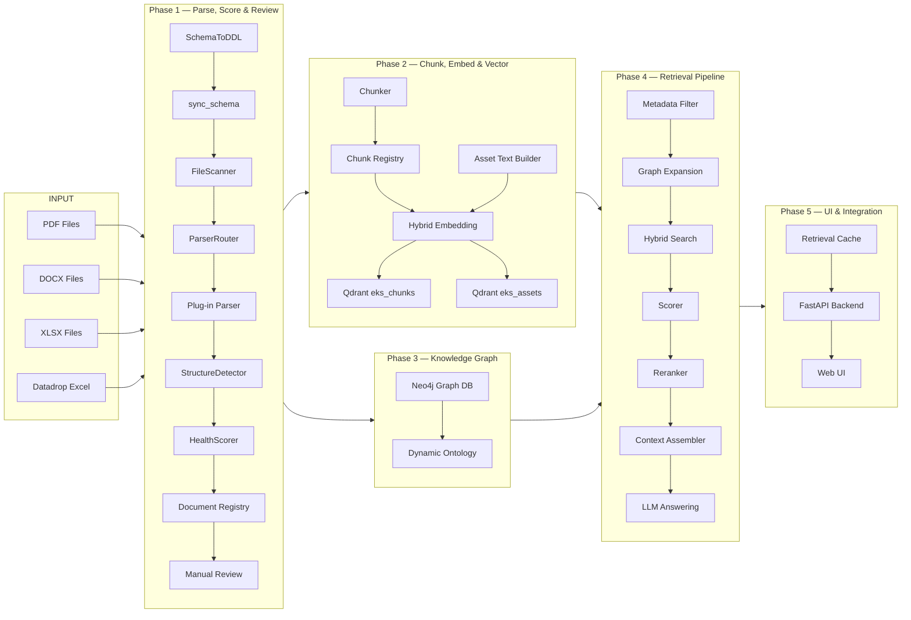

# Engineering Knowledge System (EKS) — Master Workplan

**Document ID**: WP-EKS-001  
**Current Version**: 1.9  
**Status**: 🔶 PARTIAL — Phase 1 PARTIAL (T1.68–T1.74 pending), Phase 1.2 PARTIAL (server hardening + hygiene pending), Phases 2–5 planned. Cross-workplan alignment audit: fixed R54–R58 scope status, added R43, R40(retrieval), R99 scope rows; fixed §9/§10 ordering; added Phase 1.2, Appendix F/G; corrected emoji across all phase workplans.  
**Last Updated**: 2026-07-08  

---

## 1. Title and Description

This is the **master index workplan** for the Engineering Knowledge System (EKS) — a hybrid RAG (Retrieval-Augmented Generation) system that allows users to query and retrieve knowledge from engineering documents using natural language. The system is built on a layered knowledge architecture combining structured metadata, vector embeddings, and a knowledge relationship graph.

Each implementation phase is managed as an **independent workplan file** (see Section 8). This master document tracks overall scope, requirements, and phase status only.

---

## 2. Revision Control & Version History

| Version | Date       | Author | Summary of Changes                                                              |
| :------ | :--------- | :----- | :------------------------------------------------------------------------------ |
| 1.9     | 2026-07-08 | System | Cross-workplan alignment audit: fixed R54–R58 status (PLANNED→PASS), added R43, R40(retrieval), R99 scope rows; fixed §9/§10 section ordering; fixed gap assessment count (53→62); added Phase 1.2 to phase index; added Appendix F/G to references; fixed test count (120→118); aligned Phase 1 status with workplan (COMPLETE→PARTIAL). |
| 1.8     | 2026-07-08 | System | Appended a new revision entry to the history and documented the shared common-library milestone under `common/library` as a reusable foundation for future EKS runtime integration. |
| 1.7     | 2026-07-08 | System | Added note that the shared common-library package structure now exists under `common/library` for architecture-aligned logging, telemetry, pipeline, errors, messages, paths, validation, UI, and factory modules; captured as a reusable foundation for future EKS runtime integration. |
| 0.1     | 2026-06-11 | System | Initial workplan draft — full scope from eks/readme.md                          |
| 0.2     | 2026-06-11 | System | Restructured: master index only. Phase details moved to individual workplan files |
| 0.3     | 2026-06-15 | System | Added project asset data requirements R36–R38: universal plant item schema, structured asset loader, asset-aware retrieval. Updated Phase 1–5 workplans accordingly |
| 0.4     | 2026-06-16 | System | Fixed R36 status: corrected from 🔷 PLANNED to ✅ PASS (delivered in Phase 1 v0.6). Fixed fragment count in Section 6: corrected "10 reusable fragments" to "13 fragments" per gap analysis against actual datadrop (added specialist_equipment A2.12 and motor_control A2.13). |
| 0.5     | 2026-06-17 | System | Added R39: Zero-code asset extensibility — conditional_fragments structure in schema enables adding new plant asset types/sub-types without code changes. Assigned to Phase 1 (schema) and Phase 3 (loader). |
| 0.6     | 2026-06-18 | System | Phase 1 marked PASS: T1.20 complete, all success criteria met, test_phase1.py updated, logs and report updated. R36 and R39 status updated to PASS in master scope table. |
| 0.7     | 2026-06-18 | System | Added Section 10: EKS Pipeline Architecture — full workflow diagram covering ingestion, embedding, graph, retrieval, and UI across all 5 phases. Added R40 (Asset Embedding Strategy), R41 (Asset Chunk Registry Extension), R42 (Asset Vector Upsert) based on datadrop embedding analysis. Updated scope table, phase index, and index of content. |
| 0.8     | 2026-06-16 | System | Ontology Option C gap closure: added R50 (Ontology-Enriched Embedding Headers) and R47 (Ontology-Driven UI Facets) to scope table; added R48 (PhysicalObject + INSTALLED_AT) and R49 (SHACL Constraint Validation) to scope table; updated Phase 3 pipeline architecture description to include PhysicalObject nodes and INSTALLED_AT relationship; added Appendix C reference to references section. |
| 0.9 | 2026-06-19 | opencode | Added R51: Pipeline Messages & Error Codes (schema-driven error catalog, message catalog, 6-dimension health scoring, structural elements table). Added Appendix D reference. Added document_elements to data store summary. |
| 1.0 | 2026-06-22 | opencode | Phase 1 status corrected to ✅ COMPLETE. R51 corrected to ✅ PASS. Added R52 (Document Schema Extraction, ✅ PASS) and R53 (Enhanced Document Schema v2, ✅ PASS). Fixed requirement count: 43 → 48. Fixed Phase 1 R-list (added R51, R52, R53). Added document_elements to data store summary. |
| 1.1 | 2026-06-22 | opencode | R54–R58 (T1.36–T1.40) marked ✅ PASS: Auto-DDL, FileScanner, ParserRouter, PipelineOrchestrator, ManualReviewManager. Phase 1 status confirmed ✅ COMPLETE. Requirement count updated: 48 → 53. |
| 1.2 | 2026-06-22 | opencode | Restructured master workplan: removed detailed phase Mermaid diagrams (§10.2–10.6) to respective phase workplans. Master now contains only high-level overview (§10.1), data store summary (§10.7), and notes (§10.8). Phase-specific diagrams added to Phase 1–5 workplans. |
| 1.3 | 2026-06-22 | opencode | Added §8.1: Phase 1 Summary — inputs, outputs, functionality, key modules, parsers, schemas, test coverage, requirements met, and downstream handoff to Phase 2. |
| 1.4 | 2026-06-23 | opencode | Added §11: Known Data Challenges from twrp sample analysis (I015–I021). Added DGN parsing gap and data incompleteness as risks. |
| 1.5 | 2026-06-23 | opencode | Updated §8.1 Phase 1 Summary: schema count 17 → 21 (added 4 fragment schemas), test count 53 → 59, I005 resolved, I014 resolved. |
| 1.6 | 2026-06-24 | opencode | Remediation: replaced all `agent_rule.md` references with `AGENTS.md`; converted Linux absolute paths to relative; fixed §9/§11 section ordering; added §11 to index; updated status from DRAFT to COMPLETE. |
| 1.7 | 2026-07-08 | System | Added note that the shared common-library package structure now exists under `common/library` for architecture-aligned logging, telemetry, pipeline, errors, messages, paths, validation, UI, and factory modules; captured as a reusable foundation for future EKS runtime integration. |
| 1.8 | 2026-07-08 | opencode | Updated §11: corrected I021 phase assignment from T3.9 (Phase 3) to T1.35/T1.40 (Phase 1); updated I015 task reference to T3.35; updated I016→T2.23, I019→T2.24. Added data incompleteness risk note to Phase 4. |
---

## 3. Objective

Design and implement a production-ready Engineering Knowledge System (EKS) that:
- Ingests and indexes multi-format engineering documents (PDF, DOCX, XLSX, DWG, DGN)
- Ingests structured project asset data (equipment, instruments, pipelines, valves, motors) from Excel datadrop
- Stores and manages structured metadata, vector embeddings, and a knowledge graph
- Provides an interactive user inquiry interface for both documents and plant assets
- Retrieves, re-ranks, and assembles context for LLM-based answering
- Supports SSOT + schema-driven extensibility (no code changes to add new doc types or metadata)
- Enforces revision management, source traceability, and plug-in architecture

---

## 4. Scope Summary

| ID  | Category             | Requirement                              | Details                                                                                      | Status     | Phase |
| :-- | :------------------- | :--------------------------------------- | :------------------------------------------------------------------------------------------- | :--------: | :---: |
| R01 | Knowledge Base       | Document Ingestion                       | Ingest PDF, DOCX, XLSX, DWG, DGN formats via plug-in parsers                                | ✅ PASS    | 1     |
| R02 | Knowledge Base       | Document Registry                        | Store document metadata in structured DB (PostgreSQL/DuckDB)                                 | ✅ PASS    | 1     |
| R03 | Knowledge Base       | Chunk Registry                           | Parent-child chunking strategy with chunk metadata                                           | 🔷 PLANNED | 2     |
| R04 | Knowledge Base       | Vector Storage                           | Embed chunks and store in vector DB (Qdrant)                                                 | 🔷 PLANNED | 2     |
| R05 | Knowledge Base       | Knowledge Graph                          | Neo4j graph for doc-to-doc, doc-to-object, object-to-object relationships                   | 🔷 PLANNED | 3     |
| R06 | Schema               | SSOT Schema-Driven Design                | Metadata schema reuses dcc/config/schemas pattern; project_setup_base / setup / config       | ✅ PASS    | 1     |
| R07 | Schema               | Canonical Data Model                     | Foundation for metadata schemas, retrieval filters, relationship graphs, future integrations | ✅ PASS    | 1     |
| R08 | Schema               | Schema Fragment Pattern                  | Fragment-based, inheritance (base + project) pattern per AGENTS.md Section 2                | ✅ PASS    | 1     |
| R09 | Metadata             | Project & Document Metadata              | project_title, project_number, area, discipline, department, document_type, document_number  | ✅ PASS    | 1     |
| R10 | Metadata             | Source Location Metadata                 | file name, file location, section/paragraph, page                                            | 🔷 PLANNED | 2     |
| R11 | Metadata             | Engineering Object Metadata              | Plant item, item tag, tag properties; cross-reference metadata                               | 🔷 PLANNED | 3     |
| R12 | Metadata             | Multi-Level Metadata                     | Project-level, document-level, and chunk-level metadata hierarchy                            | 🔷 PLANNED | 2     |
| R13 | Embedding            | Embedding Pollution Prevention           | Separate metadata, administrative data, and vector content                                   | 🔷 PLANNED | 2     |
| R14 | Embedding            | Hybrid Embedding Approach                | Prepend small contextual header; store full metadata separately                              | 🔷 PLANNED | 2     |
| R15 | Embedding            | Plug-in Embedding Providers              | Support OpenAI, Ollama, or custom providers without code changes                             | 🔷 PLANNED | 2     |
| R16 | Retrieval Pipeline   | Metadata Filtering                       | Filter candidates by project, discipline, document type, revision                            | 🔷 PLANNED | 4     |
| R17 | Retrieval Pipeline   | Relationship Expansion                   | Use knowledge graph to expand context with related docs/objects                              | 🔷 PLANNED | 4     |
| R18 | Retrieval Pipeline   | Vector + Keyword Search                  | Hybrid semantic + keyword search                                                             | 🔷 PLANNED | 4     |
| R19 | Retrieval Pipeline   | Retrieval Scoring & Reranking            | Score and re-rank retrieved chunks for relevance                                             | 🔷 PLANNED | 4     |
| R20 | Retrieval Pipeline   | Context Assembly & LLM Answering         | Assemble final context and pass to LLM for response generation                              | 🔷 PLANNED | 4     |
| R21 | Revision Management  | Preserve All Revisions                   | All document revisions retained; no overwrite                                                | ✅ PASS    | 1     |
| R22 | Revision Management  | Latest Revision Filtering                | Support filtering to latest revision only                                                    | ✅ PASS    | 1     |
| R23 | Revision Management  | Superseded Lookup                        | Support querying superseded document revisions                                               | 🔷 PLANNED | 3     |
| R24 | Revision Management  | Revision-Aware Retrieval                 | Retrieval pipeline respects document revision context                                        | 🔷 PLANNED | 4     |
| R25 | Traceability         | Source Traceability                      | document_number, revision, page, section, chunk_id, source_file per retrieved chunk         | 🔷 PLANNED | 2     |
| R26 | Plug-in Architecture | Document Parser Plugins                  | Plug-in parsers for PDF, DOCX, XLSX, DWG, DGN                                              | ✅ PASS    | 1     |
| R27 | Plug-in Architecture | Metadata Extractor Plugins               | Plug-in extractors for equipment, instrument, valve, pipeline metadata                      | 🔷 PLANNED | 3     |
| R28 | Plug-in Architecture | Vector DB Plug-in                        | Swappable vector DB provider (Qdrant default)                                               | 🔷 PLANNED | 2     |
| R29 | Infrastructure       | Metadata DB                              | PostgreSQL or DuckDB for structured metadata storage                                        | ✅ PASS    | 1     |
| R30 | Infrastructure       | Vector DB                                | Qdrant for vector storage                                                                    | 🔷 PLANNED | 2     |
| R31 | Infrastructure       | Graph DB                                 | Neo4j for knowledge relationship graph                                                       | 🔷 PLANNED | 3     |
| R32 | UI                   | Standalone Interactive Inquiry Interface | User-facing query interface for natural language retrieval                                   | 🔷 PLANNED | 5     |
| R33 | Logging & Debug      | Tiered Logging (levels 0–3)              | Per AGENTS.md Section 6: status, warning, trace levels                                     | ✅ PASS    | 1     |
| R34 | Logging & Debug      | Debug Object & Structured Trace Table    | Debug dict → debug_log.json, trace table with timestamps                                    | ✅ PASS    | 1     |
| R35 | Module Design        | SSOT Global Parameters                   | All global keys, paths, codes in schema-driven config; no hardcoding                        | ✅ PASS    | 1     |
| R36 | Schema               | Universal Plant Item Schema              | Fragment-based asset schema covering Equipment, Inline Component, Instrument, Motor, Pipeline, Control Valve, Manual Valve | ✅ PASS    | 1     |
| R37 | Knowledge Base       | Structured Asset Ingestion               | Load and index project asset data from Excel datadrop into knowledge graph + document registry | 🔷 PLANNED | 3     |
| R38 | Retrieval Pipeline   | Asset-Aware Retrieval                    | Filter and expand context by asset attributes (unit, service, tag_type, pipeline) and asset-to-document relationships | 🔷 PLANNED | 4     |
| R39 | Schema               | Zero-Code Asset Extensibility (schema design) | `conditional_fragments` structure in `eks_asset_setup_schema.json` and `eks_asset_config.json` enables adding new AT_ tag types and fragment rules without code changes | 🔶 PARTIAL | 1 |
| R39 | Schema               | Zero-Code Asset Extensibility (loader/runtime) | Runtime asset loader applies config-driven conditional fragments during datadrop ingestion | 🔷 PLANNED | 3 |
| R40 | Embedding            | Asset Embedding Strategy (design) | Define asset-to-text representation (contextual header + key field summary); store asset vectors in separate Qdrant collection `eks_assets`; prevent null/code pollution | 🔷 PLANNED | 2 |
| R40 | Embedding            | Asset Embedding Strategy (runtime) | Trigger asset embedding after Neo4j load; support re-embedding on datadrop updates and maintain sync with asset graph | 🔷 PLANNED | 3 |
| R41 | Knowledge Base       | Asset Chunk Registry Extension           | Extend chunk registry to support asset records keyed on `keytag` (no parent-child); asset metadata schema: keytag, tag_type, unit, service, tag_no, p_and_id_file | 🔷 PLANNED | 2     |
| R42 | Knowledge Base       | Asset Vector Upsert                      | When datadrop is re-exported, invalidate and re-embed affected asset vectors in `eks_assets` collection; align with Neo4j node upsert strategy | 🔷 PLANNED | 3     |
| R44 | Schema               | ISO 15926 Ontology Integration (schema design) | Separate FunctionalObject (Tag) and PhysicalObject (Equipment) properties in ontology schema; zero-code config-driven classes and relationships | 🔷 PLANNED | 1 |
| R44 | Schema               | ISO 15926 Ontology Integration (embedding) | Apply ontology taxonomy paths to embedding headers and class-aware asset representation | 🔷 PLANNED | 2 |
| R44 | Schema               | ISO 15926 Ontology Integration (graph) | Load dynamic T-Box classes and relationships, create IS_A / INSTALLED_AT edges in Neo4j asset graph | 🔷 PLANNED | 3 |
| R44 | Schema               | ISO 15926 Ontology Integration (UI) | Expose ontology-driven facets and class hierarchies for asset browsing in UI | 🔷 PLANNED | 5 |
| R45 | Knowledge Base       | Dynamic Ontology Ingestion               | Load T-Box taxonomy dynamically from config; map assets to ontology classes; create IS_A and INSTALLED_AT relationships in Neo4j | 🔷 PLANNED | 3     |
| R46 | Retrieval Pipeline   | Ontology-Aware Retrieval                 | Dynamic query expansion via T-Box subclass traversal; trace piping connections at unlimited depth | 🔷 PLANNED | 4     |
| R50 | Embedding | Ontology-Enriched Embedding Headers | Replace AT_ code in contextual embedding header with human-readable ontology taxonomy path resolved from T-Box (e.g. `[Pump \| Rotating Equipment \| Equipment \| Unit 003 \| Svc G2D]`) | 🔷 PLANNED | 2 |
| R47 | UI | Ontology-Driven UI Facets | Hierarchical class tree in UI sidebar showing ontology class hierarchy with asset instance counts per class; backed by `/api/ontology/classes` endpoint | 🔷 PLANNED | 5 |
| R48 | Knowledge Base | PhysicalObject + INSTALLED_AT | When serial_number is non-null, create PhysicalObject node and INSTALLED_AT edge to FunctionalObject tag; enables physical equipment traceability per ISO 15926 Part 2 | 🔷 PLANNED | 3 |
| R49 | Knowledge Base | SHACL Constraint Validation | Post-load SHACL shape validation against ingested asset nodes; violations logged to issue_log.md | 🔷 PLANNED | 3 |
| R51 | Logging & Debug | Pipeline Messages & Error Codes | Schema-driven error catalog (system + data domains), pipeline message catalog, per-document 6-dimension health scoring (completeness, confidence, structural, source, xref, consistency), structural elements table (`document_elements`), pipeline health grades per AGENTS.md §19 | ✅ PASS | 1 |
| R52 | Schema | Document Schema Extraction | Separate document definitions from pipeline config into dedicated 3-layer pattern (`eks_doc_base/setup/config`); align with asset schema pattern for SSOT compliance | ✅ PASS | 1 |
| R53 | Schema | Enhanced Document Schema v2 | Document type codes (7), file type codes (5), element type codes (8) with enums; 3 registries (document_type, file_type, element_type); element expectations keyed by document type codes | ✅ PASS | 1 |
| R54 | Infrastructure       | Auto-DDL Generation | Auto-generate SQL DDL from JSON schema `definitions`; replaces hard-coded DDL in `registry.py` | ✅ PASS | 1 |
| R55 | Infrastructure       | File Scanner | Walk project directory; validate extensions against `file_type_registry`; register placeholder rows with `extract_status = 'pending'` | ✅ PASS | 1 |
| R56 | Plug-in Architecture | Parser Router | Map `file_type` → parser class from `file_type_registry`; instantiate parser; call parse + extract_metadata + detect in sequence | ✅ PASS | 1 |
| R57 | Pipeline | Pipeline Orchestration | Coordinate scan → register → route → parse → detect → score → update; error handling, logging, rollback | ✅ PASS | 1 |
| R58 | Pipeline | Manual Review Workflow | Surface flagged docs; correct metadata; confirm elements; recalculate score; lock for Phase 2 | ✅ PASS | 1 |
| R43 | Metadata | Engineering Object Metadata Extraction | Automated extraction of engineering object metadata (equipment, instruments, valves, pipelines) from parsed document content using plug-in extractors | 🔷 PLANNED | 3 |
| R40 | Retrieval Pipeline | Asset-Aware Retrieval & Embedding (retrieval) | Use asset embeddings (`eks_assets` collection) during retrieval to filter and expand context by asset attributes and asset-to-document relationships | 🔷 PLANNED | 4 |
| R99 | Foundation | Project Infrastructure & Compliance | Folder scaffolding, environment, tests, logs, schema migration, audit, cross-cutting remediation, architectural patterns (BaseEngine, Validator, CLI, HTTP, factories, setup validation) | ✅ PASS | 1 |

**Status Legend:** ✅ PASS | 🔶 PARTIAL | ❌ FAIL | 🔷 PLANNED

---

## 5. Index of Content

- [1. Title and Description](#1-title-and-description)
- [2. Revision Control & Version History](#2-revision-control--version-history)
- [3. Objective](#3-objective)
- [4. Scope Summary](#4-scope-summary)
- [5. Index of Content](#5-index-of-content)
- [6. Evaluation and Alignment with Existing Architecture](#6-evaluation-and-alignment-with-existing-architecture)
- [7. Dependencies with Other Tasks](#7-dependencies-with-other-tasks)
- [8. Phase Workplan Index](#8-phase-workplan-index)
  - [8.1 Phase 1 Summary — Foundation](#81-phase-1-summary--foundation-partial)
- [9. References](#9-references)
- [10. EKS Pipeline Architecture](#10-eks-pipeline-architecture)
  - [10.1 High-Level Pipeline Overview](#101-high-level-pipeline-overview)
  - [10.2 Data Store Summary](#102-data-store-summary)
  - [10.3 Notes](#103-notes)
- [11. Known Data Challenges](#11-known-data-challenges-from-twrp-sample-data)

---

## 6. Evaluation and Alignment with Existing Architecture

The EKS project is a **clean-slate build** under `eks/`. The only existing artifact is `eks/readme.md`.

**Alignment with Existing Patterns (DCC / AGENTS.md):**
- Schema design reuses the `project_setup_base.json / project_setup.json / project_config.json` inheritance pattern from `dcc/config/schemas`
- Module design follows SSOT + schema-driven global parameters (AGENTS.md Section 4)
- Tiered logging (levels 0–3) and debug object pattern from AGENTS.md Section 6
- Workplan, log, and report structure follows AGENTS.md Sections 8–9
- Plug-in architecture aligns with DCC's modular engine approach

**New Patterns Required:**
- Multi-database integration (metadata DB + vector DB + graph DB)
- Parent-child chunking strategy
- Hybrid retrieval pipeline (metadata → graph → vector → rerank → assemble)
- Revision-aware retrieval logic
- Universal plant item schema with fragment composition (13 fragments)
- Structured asset ingestion (bypasses document chunking; loads directly into graph DB)

**Gap Assessment:**
- 62 requirements identified (35 original + 3 asset data + 1 schema extensibility + 3 asset embedding + 3 pipeline messages + 2 document schema + 5 pipeline workflow + 4 ontology phases + 4 known data challenges + 2 asset-aware retrieval + R99 foundation)
- Full greenfield build — no prior EKS implementation exists

---

## 7. Dependencies with Other Tasks

1. **AGENTS.md** — Governs all coding standards, module design, logging, workplan, and documentation rules
2. **dcc/config/schemas** — Metadata schema patterns to be reused and extended for EKS
3. **dcc/workplan/** — Reference workplans for format and conventions
4. External: PostgreSQL or DuckDB, Qdrant, Neo4j installations/services
5. External: Embedding provider (OpenAI API key or Ollama local instance)
6. **Project asset datadrop** — Structured Excel file at `eks/data/twrp/datadrop/Datadrop Summary.xlsx` with 7 sheets covering 7,681 plant items across 447,867 fields

---

## 8. Phase Workplan Index

Each phase is an independent workplan file. Phase execution requires approval before start.

| Phase | Title                                          | Doc ID        | Status     | Requirements        | Workplan File |
| :---: | :--------------------------------------------- | :------------ | :--------: | :------------------ | :------------ |
| 1     | Foundation — Project Structure, Schema & Registry | WP-EKS-P1-001 | 🔶 PARTIAL | R01,R02,R06–R09,R21,R22,R26,R29,R33–R36,R39(schema),R44,R51,R52,R53,R54–R58,R99 | [phase_1_foundation_workplan.md](phase_1_foundation_workplan.md) |
| 1.2   | Interactive UI, I/O Contracts & Processing     | WP-EKS-P1.2-001 | 🔶 PARTIAL | S1.2.1–S1.2.21 (sub-phase scope) | [phase_1.2_interactive_ui_workplan.md](phase_1.2_interactive_ui_workplan.md) |
| 2     | Chunking, Embedding & Vector Storage           | WP-EKS-P2-001 | 🔷 PLANNED | R03,R04,R10,R12–R15,R25,R28,R30,R40,R41,R50,R44(embedding) | [phase_2_chunking_embedding_workplan.md](phase_2_chunking_embedding_workplan.md) |
| 3     | Knowledge Graph & Structured Asset Ingestion   | WP-EKS-P3-001 | 🔷 PLANNED | R05,R11,R23,R27,R31,R37,R39(loader),R40(asset embed),R42,R43,R45,R48,R49,R44(graph) | [phase_3_knowledge_graph_workplan.md](phase_3_knowledge_graph_workplan.md) |
| 4     | Retrieval & Scoring Pipeline                   | WP-EKS-P4-001 | 🔷 PLANNED | R16–R20,R24,R38,R40(retrieval),R46 | [phase_4_retrieval_pipeline_workplan.md](phase_4_retrieval_pipeline_workplan.md) |
| 5     | UI, Retrieval Cache & System Integration       | WP-EKS-P5-001 | 🔷 PLANNED | R32,R47,cache,R44(UI) | [phase_5_ui_integration_workplan.md](phase_5_ui_integration_workplan.md) |

**Phase Dependency Chain:** Phase 1 → Phase 2 → Phase 3 → Phase 4 → Phase 5  
Each phase must be approved and completed before the next phase begins.

### 8.1 Phase 1 Summary — Foundation (🔶 PARTIAL)

| Aspect | Details |
| :----- | :------ |
| **Inputs** | Engineering documents (PDF, DOCX, XLSX, DWG, DGN); project asset datadrop (Excel, 7 sheets, 7,681 items); JSON schema definitions (23 files in `eks/config/schemas/`) |
| **Outputs** | DuckDB document registry (`documents` + `document_elements` tables, auto-generated DDL); 23 schema/config JSON files; parsed document metadata; health scores; structural element detection; manual review queue; project setup validation |
| **Functionality** | Schema-driven 3-layer design (base/setup/config) for core, asset, document, ontology, error, and message schemas; plug-in parsers (PDF, DOCX, XLSX, DGN stub, DWG stub); file discovery with type validation; auto-DDL from JSON schema; 6-dimension health scoring; structural element detection; manual review workflow with metadata correction and document locking; tiered logging (levels 0–3); SSOT global parameters; project setup validation with ConfigRegistry-driven rules |
| **Key Modules** | `schema_loader.py`, `registry.py`, `schema_to_ddl.py`, `file_scanner.py`, `parser_router.py`, `pipeline_orchestrator.py`, `review_manager.py`, `health_scorer.py`, `structure_detector.py`, `error_manager.py`, `message_manager.py`, `setup_validator.py`, `context.py`, `base.py`, `telemetry.py`, `validator.py`, `factories.py` |
| **Parsers** | `pdf_parser.py`, `docx_parser.py`, `xlsx_parser.py`, `dgn_parser.py` (stub), `dwg_parser.py` (stub) |
| **Schemas** | Core: `eks_base/setup/config.json` (incl. project_setup section); Asset: `eks_asset_base/setup/config.json` (13 fragments, 14 AT_ types); Document: `eks_doc_base/setup/config.json` (7 doc types, 5 file types, 8 element types); Ontology: `eks_ontology_base/setup/config.json`; Error: `eks_error_code_base.json`, `eks_error_setup_schema.json`, `eks_error_config.json` (65 codes); Message: `eks_message_base.json`, `eks_message_setup_schema.json`, `eks_message_config.json` (33 messages); Fragments: `eks_project_code_schema.json`, `eks_discipline_schema.json`, `eks_department_schema.json`, `eks_facility_schema.json`; Project Rules: `eks_project_rules_config.json` |
| **Test Coverage** | 118/118 tests passing (`test_phase1.py` + `test_t132_modules.py` + `test_asset_schema.py` + `test_loader_full.py`) |
| **Requirements Met** | R01, R02, R06–R09, R21, R22, R26, R29, R33–R36, R39, R44, R51–R58 (22 requirements) |
| **Feeds Into** | Phase 2: Parsed documents + metadata → chunking; Document registry → chunk registry; Schema patterns → embedding config |

---

## 9. References

1. [AGENTS.md](../AGENTS.md) — Repository guidelines
2. [eks/readme.md](../readme.md) — EKS project overview
3. [dcc/config/schemas](../../dcc/config/schemas) — Schema pattern reference
4. [dcc pipeline architecture design workplan](../../dcc/workplan/pipeline_architecture/pipeline_architecture_workplan/pipeline_architecture_design_workplan.md) — Workplan format reference
5. [phase_1_foundation_workplan.md](phase_1_foundation_workplan.md)
6. [phase_1.2_interactive_ui_workplan.md](phase_1.2_interactive_ui_workplan.md)
7. [phase_2_chunking_embedding_workplan.md](phase_2_chunking_embedding_workplan.md)
8. [phase_3_knowledge_graph_workplan.md](phase_3_knowledge_graph_workplan.md)
9. [phase_4_retrieval_pipeline_workplan.md](phase_4_retrieval_pipeline_workplan.md)
10. [phase_5_ui_integration_workplan.md](phase_5_ui_integration_workplan.md)
11. [appendix_a_asset_schema.md](appendix_a_asset_schema.md) — Universal Plant Item Schema
12. [appendix_b_document_registry.md](appendix_b_document_registry.md) — Document Registry
13. [appendix_c_ontology.md](appendix_c_ontology.md) — Dynamic ISO 15926-Aligned Ontology
14. [appendix_d_pipeline_messages_errors.md](appendix_d_pipeline_messages_errors.md) — Pipeline Messages & Error Codes (v0.3)
15. [appendix_e_schema_design.md](appendix_e_schema_design.md) — EKS Schema Design (v0.1)
16. [appendix_f_pipeline_architecture_design.md](appendix_f_pipeline_architecture_design.md) — Pipeline Architecture & Engine I/O Contracts
17. [appendix_g_interface_architecture.md](appendix_g_interface_architecture.md) — Universal Interface Architecture

---

## 10. EKS Pipeline Architecture

Full end-to-end workflow across all 5 phases. Two parallel ingestion paths (documents and assets) converge at the retrieval stage.

### 10.1 High-Level Pipeline Overview

### 10.2 Data Store Summary

| Store | Technology | Contents | Phase |
| :---- | :--------- | :------- | :---: |
| Document Registry | DuckDB | Document metadata, revision flags, health scores, extract_status | 1 |
| Document Elements | DuckDB | Structural elements (cover pages, revision tables, sections, tables, images) — 7 columns per `document_element_def` | 1 |
| Chunk Registry | DuckDB | Parent-child chunk metadata (chunk_id, parent_id, doc_number, page, section) | 2 |
| Asset Chunk Registry | DuckDB | Asset record metadata (keytag, tag_type, unit, service, p_and_id_file) | 2 |
| Vector Store — Documents | Qdrant `eks_chunks` | Document chunk vectors + payload | 2 |
| Vector Store — Assets | Qdrant `eks_assets` | Asset contextual summary vectors + payload | 2/3 |
| Knowledge Graph | Neo4j | Document nodes, Asset nodes (14 AT_ types), Chunks, all relationships | 3 |
| Retrieval Cache | Memory / Redis | Query result cache keyed on query+filter hash | 5 |

### 10.3 Notes

- **Phase 1 (v3.2)**: Pipeline workflow complete — SchemaToDDL (T1.36), FileScanner (T1.37), ParserRouter (T1.38), PipelineOrchestrator (T1.39), Manual Review (T1.40). Database tables auto-generated from JSON schema definitions.
- **Phase 3**: Also creates PhysicalObject nodes linked via INSTALLED_AT to FunctionalObject tag nodes when serial numbers are present (R48, ISO 15926 Part 2).
- **Two ingestion paths**: Documents (PDF/DOCX/XLSX) and Assets (Datadrop Excel) run in parallel through Phase 1–3, converge at Phase 4 retrieval.
- **Schema-driven**: All registries (document_type, file_type, element_type, asset_type) are config-driven — no code changes needed to add new types.
- **Detailed Mermaid diagrams**: Each phase's detailed pipeline diagram is maintained in its respective phase workplan file (Phase 1–5).

---

## 11. Known Data Challenges (from twrp sample data)

Analysis of `eks/data/twrp/` sample data identified 7 challenges (I015–I021 in `eks/log/issue_log.md`). These inform downstream phase planning.

| Challenge | Issue | Category | Severity | Phase | Task |
|-----------|-------|----------|----------|------|------|
| DGN parser stub — 48 CAD files unparseable | I015 | Parser | 🟡 Medium | 3 | T3.35 |
| Revision folder hierarchy inconsistency | I016 | FileScanner | 🟢 Low | 2 | T2.23 |
| Two project codes (131101 vs 131242) | I019 | Schema | 🟡 Medium | 2 | T2.24 |
| Datadrop column range (33–112) — fragment coverage | I020 | Schema | 🟡 Medium | 3 | T3.9 |
| 22–64% data incompleteness across sheets | I021 | Data Quality | 🟠 High | 1 | T1.35, T1.40 |
| Mixed file types per submittal | I017 | Pipeline | 🟢 Low | — | RESOLVED (T1.38) |
| Temp file filtering | I018 | FileScanner | 🟢 Low | — | RESOLVED (T1.37) |

**Notes:**
- I017 and I018 are resolved in Phase 1 — FileScanner and ParserRouter handle these patterns
- I015 (DGN gap) is the highest-impact open issue — 48 CAD files will require Phase 3 CAD parser evaluation (T3.35)
- I021 (data incompleteness) is the highest-severity open issue — health scoring (T1.35) and manual review workflow (T1.40) from Phase 1 are critical mitigation; retrieval health scores (Phase 4) filter low-confidence records
