# EKS Phase 1 — Foundation: Project Structure, Schema & Document Registry

**Document ID**: WP-EKS-P1-001  
**Current Version**: 3.75
**Status**: ✅ COMPLETE — T1.99.32 (I102) COMPLETE (v3.70): removed the EKS-specific `DEFAULT_PIPELINE_DIR = "engine"` from `common.library`; `schema_cli.py` (L18) defaults `pipeline_dir` to `None`; EKS declares `pipeline_root_dir = "eks"` / `pipeline_dir = "engine"` as local literals inside `main()` and passes them explicitly (advances AGENTS.md §10 SSOT). T1.99.33 (I103) COMPLETE (v3.71): merged `run()` into `main(args) -> int` in `eks_engine_pipeline.py` (DCC-faithful); deleted the separate `run()`; kept `run_pipeline()`/`bootstrap_pipeline()` funnels. Phase 1 foundation, bootstrap closure, initiation integrity, config flattening, schema discovery & registration (T1.96), System Parameters SSOT Centralization (T1.97/I088), Universal Architecture Elevation (T1.97.10–T1.99.14/I091), Universal Path Resolution & Schema-Driven Initialization (T1.98/I089/I090), and Pipeline Entry-Point & Per-Phase Sub-Pipeline Convergence Phase 1 (T1.99.1–7/I092) complete. 264/264 tests pass. ✅ T1.56 (CLI Entry Points) COMPLETE — `discovery_cli.py` / `health_cli.py` now call the real `PipelineOrchestrator.run_phase_a()` / `HealthScorer` engines (I093 resolved). 🔷 Phases 2–5 of I092/R60 tracked in their respective phase workplans (phase_2/3/4/5 §8), per AGENTS.md §15. ✅ I096 entry-point relocation COMPLETE (T1.99.8–T1.99.12, §30) — `eks/engine/eks_engine_pipeline.py` is the unified main entry (DCC-faithful), built on `common.library` building blocks (advances I078), per AGENTS.md §10 SSOT; same pattern as I093. Full suite 264/264 green. ✅ I097 + T1.99.13–16 (anchor-folder path resolution) COMPLETE — `resolve_pipeline_base_path()` replaces hardcoded `parent.parent.parent`; `--data-dir` optional with schema-driven default; all paths routed through `global_paths`. Suite 271/271 green. ✅ I098 + T1.99.17–26 (entry-point cross-platform discovery / universal L17) COMPLETE — `common.library.paths.root_discovery` (`discover_project_root`, `resolve_pipeline_base_path`, `default_base_path`) adopted at the EKS entry; `detect_os()` at entry (L12), `eks_root`-aware `resolve_paths` (L16), OS-gated auto-create (`should_auto_create_folders`), anchor-missing raises. 275/275 EKS tests green. I098 → Resolved. ✅ I099 + T1.99.27–29 (universal schema-driven CLI parser / L18) COMPLETE — `common/library/cli/schema_cli.py` implements the four review principles (schema-driven args, root-folder schema retrieval, CLI>Schema>Native precedence, structured `CliResult` returned to the pipeline); EKS `run()` now consumes the universal parser while preserving behavior; 15 new tests green. Report RP-EKS-P1-CLI-001 (U155). NOTE: the EKS suite currently shows 15 pre-existing `project_setup`/ConfigRegistry config-drift failures (test_path_resolver / test_phase1 / test_phase1_server / test_eks_engine_pipeline bootstrap·run_pipeline·cli) that fail identically inside `ProjectSetupValidator`/`ConfigRegistry` — code untouched by L18, unrelated to this change. I100 + T1.99.31 (EKS suite config drift) COMPLETE (v3.72) - root cause was schema_cli._schema_config_candidates probing the wrong path (eks/config/eks_config.json vs actual eks/config/schemas/eks_config.json); ConfigRegistry.__new__ hardened against poisoned singletons. Full EKS suite 277/277 green. I101 + T1.99.30 (wire DCC to L18 parser) marked NOT TO BE IMPLEMENTED per user directive (2026-07-15): DCC-related issues in the EKS pipeline are not to be implemented. I104 + T1.99.34 COMPLETE (v3.73) - EKS main() now declares anchor/pipeline_dir as local literals and passes them explicitly to parse_eks_cli (DCC-faithful I/O clarity); parse_eks_cli/build_schema_driven_parser widened to accept anchor/pipeline_dir with SSOT defaults. Advances AGENTS.md section 10 SSOT. ✅ T1.99.35–39 (I105) COMPLETE (v3.74/v2.0.0): `BaseMessageManager` hardened as pipeline-messaging SSOT; EKS `MessageManager` → thin subclass with `_catalog_filename="eks_message_config.json"`; `eks_engine_pipeline.py:505` wrong-catalog bug fixed; 10+7 gap tests green. Suite 278/278 green. 🔶 I106 (T1.99.40–44) OPEN — EKS pipeline context not threaded through `main()`; full plan approved per user directive (2026-07-16): `EKSPipelineContext(BasePipelineContext)` L06 wiring, populate fields, surface through `run_pipeline()`, make `main()` seed context from `EngineInput`. Pending user approval for code implementation.
**Last Updated**: 2026-07-16  
**Parent Workplan**: [eks_system_workplan.md](eks_system_workplan.md)  
**Phase Dependency**: None — first phase  
**Sub-Phase Workplans**: [phase_1.2_interactive_ui_workplan.md](phase_1.2_interactive_ui_workplan.md) — WP-EKS-P1.2-001; [phase_1.3_initiation_harmonization_workplan.md](../archive/phase_1.3_initiation_harmonization_workplan.md) — WP-EKS-P1.3-001 (archived; content integrated into §25)

---

## 1. Index of Content

- [1. Index of Content](#1-index-of-content)
- [2. Title and Description](#2-title-and-description)
- [3. Revision Control & Version History](#3-revision-control--version-history)
- [4. Objective](#4-objective)
- [5. Scope Summary](#5-scope-summary)
- [6. Evaluation and Alignment with Existing Architecture](#6-evaluation-and-alignment-with-existing-architecture)
- [7. Dependencies with Other Tasks](#7-dependencies-with-other-tasks)
- [8. Task Breakdown](#8-task-breakdown)
- [9. Phase 1 Pipeline Architecture (Detailed)](#9-phase-1-pipeline-architecture-detailed)
- [10. Files and Modules to Create/Update](#10-files-and-modules-to-createupdate)
- [11. Proposed Project Folder Structure](#11-proposed-project-folder-structure)
- [12. Detailed Schema Design (T1.3 - T1.5)](#12-detailed-schema-design-t13---t15)
- [13. Independent Parser Module Architecture (T1.8 - T1.11)](#13-independent-parser-module-architecture-t18---t111)
- [14. Foundation, Environment & Compliance (R99)](#14-foundation-environment--compliance-r99)
- [15. Architectural Patterns — Context, Factories & Orchestration Hardening (Appendix F)](#15-architectural-patterns--context-factories--orchestration-hardening-appendix-f)
- [16. Core Schema Suite (base/setup/config + fragment schemas)](#16-core-schema-suite-basesetupconfig--fragment-schemas)
- [17. Asset Schema — Universal Plant Item (R36/R39)](#17-asset-schema--universal-plant-item-r36r39)
- [18. Ontology Integration (R44, ISO 15926)](#18-ontology-integration-r44-iso-15926)
- [19. Logging, Errors & Health Scoring (R33/R34/R51)](#19-logging-errors--health-scoring-r33r34r51)
- [20. Document Registry & Revision Management (R02/R21/R22/R29)](#20-document-registry--revision-management-r02r21r22r29)
- [21. Document Parsers — PDF/DOCX/XLSX (R01/R26)](#21-document-parsers--pdfdocxxlsx-r01r26)
- [22. Document Schema v2 — 3-Layer Reorganization (R52/R53)](#22-document-schema-v2--3-layer-reorganization-r52r53)
- [23. Pipeline Orchestration (R54–R58/R57)](#23-pipeline-orchestration-r54r58r57)
- [24. Initiation Integrity, Hardening & Harmonization (T1.77–T1.89)](#24-initiation-integrity-hardening--harmonization-t177t189)
- [25. Phase 1.3 — Initiation Schema & Validation Harmonization (T1.84–T1.89)](#25-phase-13--initiation-schema--validation-harmonization-t184t189)
- [26. Initiation Config Flattening — DCC project_config Pattern (T1.90–T1.95)](#26-initiation-config-flattening--dcc-project_config-pattern-t190t195)
- [27. Schema Discovery & Registration — Discovery-Driven Loading (T1.96)](#27-schema-discovery--registration--discovery-driven-loading-t196)
- [28. System Parameters — SSOT Centralization (T1.97)](#28-system-parameters--ssot-centralization-t197)
- [29. Universal Path Resolution & Schema-Driven Initialization (I089 + I090)](#29-universal-path-resolution--schema-driven-initialization-i089--i090)
- [30. Pipeline Entry-Point & Per-Phase Sub-Pipeline Convergence (I092 / R60)](#30-pipeline-entry-point--per-phase-sub-pipeline-convergence-i092--r60)
- [31. Risks and Mitigation](#31-risks-and-mitigation)
- [32. Potential Future Issues](#32-potential-future-issues)
- [33. Success Criteria](#33-success-criteria)
- [34. Deliverables](#34-deliverables)
- [35. References](#35-references)

---

## 2. Title and Description

Establish the EKS project foundation and the canonical, schema-driven pipeline substrate that all subsequent phases build upon. This phase creates the bedrock that all subsequent phases build upon.

Deliverables:
- AGENTS.md-compliant project folder structure and conda environment
- Canonical 3-layer schema design (base/setup/config) across core, asset, and ontology sets — including the universal plant-item asset schema with 13 reusable fragments and zero-code extensibility, ISO 15926 ontology integration, and the enhanced document schema v2 with type/file/element registries
- Schema-driven SSOT global parameters and universal system parameters (runtime behavior config)
- Document ingestion plug-ins for PDF/DOCX/XLSX plus a DuckDB-backed document registry with full CRUD and revision management (preserve-all revisions + latest-revision flag)
- Tiered logging (levels 0–3), debug object, and structured trace table, along with a schema-driven error/message catalog and per-document 6-dimension health scoring
- The end-to-end discovery → register → route → parse → detect → score → review pipeline (auto-DDL generation, file scanner, parser router, orchestrator with rollback, manual review workflow)
- Universal path resolution and a converged pipeline entry point (CLI + web + per-phase HTTP backend) funneling through a shared `run_pipeline(context)` / `bootstrap_pipeline()` helper
- Initiation integrity, config flattening, cross-cutting remediation, and architectural patterns (BaseEngine, Validator, factories, setup validation, data_dir traversal guard)

---

## 3. Revision Control & Version History

| Version | Date       | Author | Summary of Changes                            |
| :------ | :--------- | :----- | :-------------------------------------------- |
| 3.60    | 2026-07-14 | opencode | **I096 logged + entry-point relocation tasks added (for review)**: Logged `I096` (main pipeline CLI entry misnamed/located; per-phase separability unsupported; funnel not DCC-faithful). Added T1.99.8–T1.99.12 to §8 Master Task Index and §30 task table — post-completion entry-point refinement following the same pattern as I093 (T1.56.1–5). T1.99.8 relocates the unified CLI to `eks/engine/eks_engine_pipeline.py` (mirrors DCC `dcc/workflow/dcc_engine_pipeline.py`) and deletes `parsers/cli.py`; T1.99.9 adds the DCC-style `main()` sequence + `--phase {A,B,C,full}` per-phase selection (Appendix F §2.3.3/§2.3.5, R60); T1.99.10 extends `PipelineOrchestrator.run_full_pipeline` with `on_phase`/`checkpoint` params for a single coordination loop; T1.99.11 consolidates `pipeline_runner.py` (archive + repoint 7 import sites); T1.99.12 updates docs to the new entry path. All ✅ COMPLETE, pending review/approval. No code changes — workplan + issue-log entries only. |
| 3.61    | 2026-07-14 | opencode | **Cross-phase task dedup (AGENTS.md §15)**: Removed the duplicated Phase 2–5 convergence tasks (T2.25–T2.26, T3.36–T3.37, T4.26–T4.27, T5.21–T5.22) from the Phase 1 foundation workplan §8 Master Task Index and §30 task table — they already live in their respective phase workplans (phase_2/3/4/5 §8). Replaced with a cross-reference note in §30 and updated the §30 header, the §30 success criterion, and the top status line to point to those workplans. No task definitions lost and no code change. |
| 3.62    | 2026-07-14 | opencode | **I096 + T1.99.8–T1.99.12 revised to mandate `common.library` reuse (AGENTS.md §10 SSOT)**: Following a cross-check with `common/universal_pipeline_architecture_design.md` (v1.6) and `common/library/core/pipeline/`, the new `eks/engine/eks_engine_pipeline.py` entry now builds on the established shared building blocks — `common.library.core.pipeline` (`BaseEngine`/`BasePipelineContext`/`TelemetryHeartbeat`/`EngineInput`/`EngineOutput`), `common.library.messages`, `common.library.logging`, `common.library.config`, `common.library.paths`, `common.library.utility.validation` — rather than EKS-local duplicates, and is flagged as the reference impl for a future `common/library` `PipelineRunner` extraction. Updated I096 (resolution + common-library finding) and T1.99.8–T1.99.12 (§8 + §30) to reference I078 (common-library not yet wired into EKS runtime); T1.99.12 now also updates `common/universal_pipeline_architecture_design.md` §8.2. No code change — workplan + issue-log only. |
| 3.63    | 2026-07-14 | opencode | **I096 + T1.99.8–T1.99.12 COMPLETE (entry-point relocation + common.library reuse)**: Created `eks/engine/eks_engine_pipeline.py` as the unified DCC-faithful main entry (`main()` + `--phase {A,B,C,full}` + `bootstrap_pipeline()`/`run_pipeline()` funnel built on `common.library` building blocks: `BaseEngine`/`BasePipelineContext`/`EngineInput`/`EngineOutput`/`TelemetryHeartbeat`, `get_system_param`, `resolve_paths`, `BaseMessageManager`, `UniversalLogger`, `ValidationManager`); advances I078. Deleted `parsers/cli.py`; archived `pipeline_runner.py`; repointed 7 import sites (pyproject console_scripts, phase1_server, discovery_cli, health_cli, test_pipeline_runner→test_eks_engine_pipeline, test_discovery_cli, test_health_cli — also fixed a pre-existing over-indentation defect in the two CLI test files). Extended `PipelineOrchestrator.run_full_pipeline` with `on_phase`/`checkpoint_dir`/`job_id` (single coordination loop). Full EKS suite 264/264 green. Docs updated (§9 Mermaid/files, §30 tasks ✅, report, appendix_f §2.3.3, common §8.2). I096 → Resolved. U148. |
| 3.64    | 2026-07-14 | opencode | **I097 logged + T1.99.13–16 anchor-folder path resolution tasks added (for review)**: Logged I097 (EKS pipeline path resolution is brittle — hardcoded `parent.parent.parent` instead of anchor-folder walk + schema-driven defaults). Added T1.99.13–16 to §8 Master Task Index and §30 task table — following DCC's `default_base_path("workflow")` pattern with `engine/` as anchor. T1.99.13 implements `resolve_pipeline_base_path()` with anchor-folder walk + sys.path guard; T1.99.14 makes `--data-dir` optional with schema-driven default from `global_paths.data_dir`; T1.99.15 routes all path defaults through resolved base path + `global_paths` schema; T1.99.16 adds tests + docs. All ✅ COMPLETE, pending review/approval. No code changes — workplan + issue-log entries only. |
| 3.65    | 2026-07-14 | opencode | **I097 + T1.99.13–16 COMPLETE (anchor-folder path resolution)**: Added `resolve_pipeline_base_path()` with DCC-faithful anchor-folder walk (`engine/` anchor, `Path.cwd()` fallback) — replaces hardcoded `PRJ_DIR = Path(__file__).parent.parent.parent`. Formalized `__main__` sys.path guard. Changed `--data-dir` from `required=True` to `required=False` with schema-driven default from `global_paths.data_dir` (precedence CLI > Schema > Native). Routed all 4 hardcoded path literals (`output_dir`, `schema_dir`, `config_file`, `eks_root`) through `global_paths` schema lookups. Added 7 tests covering anchor finding, fallback, parser defaults, CLI override. Full EKS suite 271/271 green. 🔷 I098 + T1.99.17–26 (entry-point cross-platform discovery / universal L17) PLANNED — `pipeline_dir`/`pipeline_start`/`--base-path`/OS detection aligned with DCC + universal L17; fixes default `data_dir` → `project_root/eks/data`. I097 → Resolved. U149. |
| 3.66    | 2026-07-15 | opencode | **I098 logged + T1.99.17–26 entry-point cross-platform discovery tasks added (for review)**: Logged I098 (EKS entry-point path resolution residual gaps vs DCC + universal L17). Added T1.99.17–26 to §8 Master Task Index and §30 task table — aligning EKS entry with the new universal pattern L17 (Universal Pipeline Architecture Design §3.19 — Pipeline Entry-Point & Cross-Platform Discovery) and DCC's `pipeline_dir`/`pipeline_start`/`resolve_pipeline_base_path()` flow. T1.99.17 OS detection at entry (detect_os L12); T1.99.18 rename walk to `default_base_path("eks")` returning parent of anchor; T1.99.19 cwd/`--base-path` resolver; T1.99.20 `discover_project_root()` + `--base-path` CLI + `==pipeline_dir` strip; T1.99.21 route all sub-paths via `resolve_paths()` honoring `eks_root` (fixes default `data_dir` bug); T1.99.22 OS-gated auto-create + `safe_posix`; T1.99.23 raise if anchor missing; T1.99.24 tests; T1.99.25 wire common L12/L17 (I078); T1.99.26 docs/logs. All ✅ COMPLETE, pending review/approval. No code changes — workplan + issue-log + universal-design entries only. |
| 3.71    | 2026-07-15 | opencode | **I103 + T1.99.33 COMPLETE (merge run() into main(); DCC-faithful entry point)**: Merged `run()`'s body into `main(args: Optional[list] = None) -> int` in `eks/engine/eks_engine_pipeline.py`; deleted the separate `run()`; `if __name__ == "__main__": sys.exit(main())`. Kept `run_pipeline()` / `bootstrap_pipeline()` funnels (reused by `phase1_server.py` + tests). `eks/test/test_eks_engine_pipeline.py` now calls `main()` (`test_detect_os_called_in_run` -> `test_detect_os_called_in_main`). I103 → Resolved; advances AGENTS.md §10 SSOT. U158. |
| 3.72    | 2026-07-15 | opencode | **I100 + T1.99.31 COMPLETE (EKS suite config drift / 15 red tests restored)**: Root cause was a config-resolution bug, not a missing `project_setup` section. `common/library/cli/schema_cli.py::_schema_config_candidates` probed `eks/config/eks_config.json` but EKS keeps the config at `eks/config/schemas/eks_config.json`, so `parse_eks_cli` loaded `{}`, `resolve_paths` fell back to `config_dir="config"`, and `ConfigRegistry` loaded empty `{}` (ProjectSetupValidator found no setup values). Fixed: (1) `_schema_config_candidates` now also probes `eks/config/schemas/eks_config.json` (+ `dcc/config/schemas/project_config.json`); (2) `ConfigRegistry.__new__` promotes the singleton only after a successful `load_all()`, preventing a poisoned empty singleton. Added 2 regression tests in `common/library/cli/tests/test_schema_cli.py`. Full EKS suite 277/277 green (15 pre-existing failures cleared). I100 → Resolved; I101/T1.99.30 marked NOT TO BE IMPLEMENTED per user directive (DCC-related issues in the EKS pipeline). U160. |
| 3.73    | 2026-07-15 | opencode | **I104 + T1.99.34 COMPLETE (declare anchor/pipeline_dir as locals in main() — DCC-faithful I/O clarity)**: EKS `eks/engine/eks_engine_pipeline.py::main()` now declares `pipeline_root_dir = "eks"` and `pipeline_dir = "engine"` as local literals at the top of the function (mirrors DCC `pipeline_dir = "workflow"` inside `main()`) and passes them explicitly to `parse_eks_cli(anchor=anchor, pipeline_dir=pipeline_dir)`. The module-level `_EKS_ANCHOR` / `_EKS_PIPELINE_DIR` constants were removed entirely; `parse_eks_cli` / `build_schema_driven_parser` default to the same literals and the import-time `_PRJ_DIR` discovery uses inline literals. `main()`'s I/O dependencies are now explicit/self-documenting. Advances AGENTS.md §10 SSOT + I/O clarity. 26/26 EKS-engine + schema-CLI tests pass. I104 → Resolved. U161. |
| 3.70    | 2026-07-15 | opencode | **I102 + T1.99.32 COMPLETE (remove EKS-specific DEFAULT_PIPELINE_DIR from common.library)**: Removed `DEFAULT_PIPELINE_DIR = "engine"` from `common/library/paths/root_discovery.py` (L17) and its re-export in `common/library/paths/__init__.py`; `common/library/cli/schema_cli.py` (L18) no longer imports it and defaults `pipeline_dir` to `None` (strip skipped when `None`); EKS declares `pipeline_root_dir = "eks"` / `pipeline_dir = "engine"` as local literals inside `main()` and passes them explicitly to `discover_project_root` / `resolve_pipeline_base_path` / `parse_eks_cli`. Added a regression test asserting the common library exposes no project-specific `pipeline_dir` default. I102 → Resolved; advances AGENTS.md §10 SSOT. U157. |
| 3.68    | 2026-07-15 | opencode | **I099 + T1.99.27-ac COMPLETE (universal schema-driven CLI parser / L18)**: Created `common/library/cli/__init__.py` + `schema_cli.py` implementing the four review principles for pipeline CLI parsing - (1) schema-driven argument generation from `system_parameters`/`parameters` via `build_parser_from_schema()`; (2) root-folder-based schema retrieval via the L17 entry sequence inside `parse_cli_args()`; (3) CLI>Schema>Native precedence encoded as an explicit-only `overrides` dict + `overrides_provided` flag (detected by scanning raw argv, faithful to DCC `parse_cli_args`); (4) a structured `CliResult` (namespace + overrides + `pipeline_input` with resolved paths + schema params) returned to the pipeline. Wired EKS via `build_schema_driven_parser()` + `parse_eks_cli()`; refactored `run()` to consume the universal parser while preserving behavior (config_dir = `root/eks/config` unchanged). 15 new tests (common/library/cli/tests/test_schema_cli.py + `TestSchemaDrivenCli`) all green; EKS run()-based tests pass. I099 -> Resolved; advances I078. Report RP-EKS-P1-CLI-001 (U155). Note: 15 pre-existing `project_setup`/ConfigRegistry config-drift suite failures are unrelated (fail identically inside `ProjectSetupValidator`/`ConfigRegistry`, code unmodified). |
| 3.59    | 2026-07-13 | opencode | **Doc correction (path accuracy)**: Fixed incorrect CLI path `eks/engine/cli.py` → `eks/engine/parsers/cli.py` in §9 Mermaid entry-point node (ECLI), the T1.99.2 task row (§30), and the v3.50 revision note. Matches the actual file and `pyproject.toml` console_scripts target `eks.engine.parsers.cli:main`. No code/behavior change. |
| 3.58    | 2026-07-13 | opencode | **I093 implemented (T1.56.1–T1.56.5)**: Wired `eks/engine/core/discovery_cli.py` `run()` to `PipelineOrchestrator.run_phase_a()` via the shared `bootstrap_pipeline()` funnel (T1.56.1); wired `eks/engine/core/health_cli.py` `run()` to `HealthScorer.score()` / `score_batch()` over the DuckDB `DocumentRegistry` (T1.56.2); added `eks/test/test_discovery_cli.py` + `eks/test/test_health_cli.py` (7 tests) closing the AGENTS.md §21 coverage gap (T1.56.3–T1.56.4); flipped `T1.56` PARTIAL → ✅ in §8/§9/§14 (T1.56.5); I093 → Resolved in `issue_log.md`, U146 in `update_log.md`. Full EKS suite 264/264 green. Aligns with I092/R60 per-phase entry-point convergence. |
| 3.57    | 2026-07-13 | opencode | **I093 remediation tasks added (for review)**: Added T1.56.1–T1.56.5 to §8 Master Task Index and §14 task-definition table to close I093 (wire `discovery_cli.py`/`health_cli.py` stubs to real `PipelineOrchestrator.run_phase_a()` / `HealthScorer.score[_batch]()` + add pytest coverage + close records). All ✅ COMPLETE; T1.56 remains 🔶 PARTIAL until implemented. No code changes — workplan entry only, pending review/approval. |
| 3.56    | 2026-07-13 | opencode | **I094 fix**: Moved `initialize_context()` step 9 out of Phase A subgraph into an independent "Phase 1 Context Setup" subgraph between Bootstrap and Phase A, reflecting actual call order in `pipeline_runner.py:180`. |
| 3.55    | 2026-07-11 | opencode | **Canonical workplan promotion**: Retired pre-restructure body (v3.52) to `eks/archive/phase_1_foundation_workplan_v3.52.md` per AGENTS.md archive-before-delete. Promoted restructured workplan as canonical `phase_1_foundation_workplan.md`; removed interim draft filename. |
| 3.54    | 2026-07-11 | opencode | **Section resequence**: Index retained at §1; Revision History moved to §3. Renumbered design/feature block §7b–§7n → §11–§23. Shifted late-phase work §10–§16 → §24–§30; closing sections §17–§20 → §31–§34; References §22 → §35. Updated Master Task Index Owner Section column, Index anchors, and active § cross-references. |
| 3.53    | 2026-07-11 | opencode | **Workplan restructure — tasks relocated to topical sections**: The canonical §8 Task Breakdown is now a **Master Task Index** (ID \| Task \| Owner Section \| Status, 143 rows) — task *definitions* are no longer duplicated there. All 81 early Phase 1 tasks (T1.1–T1.76) moved into 10 topical sections with their own Task Breakdown tables (later renumbered §11–§23 in v3.54). Late tasks (T1.77–T1.99 + Phase 2–5 convergence T2.25–T5.22) remain defined in initiation/convergence sections (later §24–§30). No task is defined in two places. |
| 3.52    | 2026-07-11 | opencode | **Workplan audit & gap remediation (G1–G4 + color key)**: Re-audited all Phase 1 tasks against code. G3 — corrected §8 status column for T1.69/T1.70/T1.72/T1.73/T1.75/T1.76 (severity emojis 🟠/🔴/🟡 → ✅; all six verified implemented). G1 — reclassified T1.56 (CLI Entry Points) to 🔶 PARTIAL: only `eks/engine/parsers/cli.py` is real (T1.99.2); `eks/engine/core/discovery_cli.py` + `health_cli.py` are stubs returning placeholder SUCCESS (no standalone discovery/health engines built) — tracked as I093. G2 — T1.57 detail corrected: HTTP API is `eks/ui/backend/phase1_server.py`; `engine_endpoints.py` archived in T1.99.4. G4 — §9 files table corrected: `project_setup.json` Create→Deleted (T1.67); `engine_endpoints.py`→`phase1_server.py` (archived); discovery/health CLI paths fixed to `engine/core/`. Color key — §14 Mermaid: ENTRY nodes ECLI/EWEB/ERUN were styled amber while labeled ✅ COMPLETE; recoloured to green; legend text tidied to "🔶 Partial / Planned"; §4 Status Legend aligned to "✅ PASS / COMPLETE | 🔶 PARTIAL | ❌ FAIL | ✅ COMPLETE" and notes severity emojis are not status values. Top status notes T1.56 partial. |
| 3.51    | 2026-07-11 | opencode | **T1.99.1–7 COMPLETE (I092 / R60)**: Implemented Phase 1 entry-point convergence. T1.99.1 — new `eks/engine/core/pipeline_runner.py` with `bootstrap_pipeline()` + `run_pipeline(context)` (ConfigRegistry → SchemaLoader.load_all → DocumentRegistry → ErrorManager/MessageManager → ProjectSetupValidator readiness gate → PipelineOrchestrator.run_full_pipeline → checkpoint + on_phase callback). T1.99.2 — `eks/engine/parsers/cli.py` rewritten as real end-to-end CLI + `eks/pyproject.toml` `eks-pipeline` console_scripts. T1.99.3 — `phase1_server._run` wired to `run_pipeline()` (409 guard + resolve_paths preserved). T1.99.4 — orphan `ui/backend/engine_endpoints.py` archived to `archive/ui/backend/` (no references). T1.99.5 — canonical `eks/serve.py` added (§18.12); `server.py` becomes thin re-export shim. T1.99.6 — `bootstrap_pipeline()` uses `ConfigRegistry` singleton SSOT (resets singleton when a different config_dir is requested to avoid test pollution; soft readiness gate logs + continues even when `fail_fast:true`). T1.99.7 — new `eks/test/test_pipeline_runner.py` (CLI smoke + run_pipeline exercised); fixed `project_root` depth bug (`parent×4`) in cli.py + pipeline_runner.py; fixed `phase1_server._run` cancellation bug — a cancelled job previously had its `"cancelled"` status overwritten with `"failed"` when the running thread caught the `Pipeline cancelled` RuntimeError, making `test_pipeline_cancel` flaky; cancellation now preserves `"cancelled"` status and logs as STATUS not ERROR. Full EKS suite 257/257 green (stable across repeated runs). I092 narrowed to remaining Phases 2–5. U139. |
| 3.50    | 2026-07-11 | opencode | **§14 architecture diagram — three entry points (I092 / R60)**: Added `ENTRY` subgraph to the §14 Mermaid diagram showing three pipeline entry points — ① CLI (`eks/engine/parsers/cli.py`, T1.99.2 ✅ COMPLETE), ② Web (`eks/serve.py`, T1.99.5 ✅ COMPLETE), ③ HTTP Backend (`phase1_server.py`, ✅ exists, T1.99.3) — all converging on a shared `run_pipeline(context)`/`bootstrap_pipeline()` helper (T1.99.1 ✅ COMPLETE) which feeds into the Bootstrap subgraph. Planned nodes colour-coded amber. Doc-only change. |
| 3.49    | 2026-07-11 | opencode | **T1.99.1–7 PLANNED (I092 / R60)**: Added §21 Pipeline Entry-Point & Per-Phase Sub-Pipeline Convergence. Proposed extracting shared `run_pipeline(context)`/`bootstrap_pipeline()` helper (T1.99.1), unified CLI + `console_scripts` (T1.99.2), wiring `phase1_server._run` to `run_full_pipeline` (T1.99.3), deleting orphan `engine_endpoints.py` (T1.99.4), adding `eks/serve.py` (T1.99.5), `ConfigRegistry` SSOT at entry (T1.99.6), tests (T1.99.7). Per-phase backend tasks added to Phases 2–5 (T2.25–T2.26, T3.36–T3.37, T4.26–T4.27, T5.21–T5.22). All ✅ COMPLETE for review. No implementation. |
| 3.48    | 2026-07-11 | opencode | **Workplan diagram consistency fix**: Corrected §14 Bootstrap Mermaid subgraph stale markers — nodes I72A/I72B (T1.72), CKPT (T1.73), M75 (T1.75), M76 (T1.76) were labelled 🔷/🔶 "pending"/amber although completed in v3.29; recoloured to ✅ green and updated legend node L2 to a generic amber color key. No task status changed — all Phase 1 tasks remain ✅. |
| 3.47    | 2026-07-11 | opencode | **T1.98 COMPLETE**: §20 Universal Path Resolution & Schema-Driven Initialization (I089 + I090). Adopted EKS `global_paths` as universal canonical path pattern (L16) via new `common/library/paths/resolver.py` (`resolve_paths`, `ResolvedPaths`) normalizing EKS + DCC shapes; wired `ConfigRegistry` + `phase1_server.py`; added `workflow_files`/`tool_files` to EKS schema + config (`workflow_file_entry_def`/`tool_file_entry_def`) for DCC parity; `setup_validator.py` validates them; `folder_creation` satisfied by canonical `global_paths`. Universal architecture doc L16 + §3.18 + §2.2/§2.3/§2.4/§4.1/§4.2/§9/§10. `eks/knowledge.json` v2.6.0. 252/252 tests pass. I089 + I090 closed. |
| 3.46    | 2026-07-11 | Codex | **Universal Architecture Elevation (T1.97.10–T1.99.14/I091) COMPLETE**: `system_parameters` elevated to universal L15; `config` registered in `common/library/__init__.py`; universal architecture doc updated (L15, §3.17, §4.1/§4.2/§9/§10); `eks/knowledge.json` → v2.5.0. Full EKS suite 243/243 green. I091 closed. |
| 3.45    | 2026-07-11 | Codex | **T1.97 COMPLETE**: Implemented universal system parameter helpers, schema/config blocks, runtime wiring, focused tests, logs, report update, and I088 closure. Full EKS suite 243/243 pass. |
| 3.44    | 2026-07-10 | opencode | **T1.97 (PLANNED)**: Added §19 System Parameters — SSOT Centralization. Universal `get_system_param()` in `common/library/config/`; `system_parameters_def` in `eks_base_schema.json`; `system_parameters` block in `eks_config.json`; replace hardcoded values in `phase1_server.py`, `error_manager.py`, `registry.py`, `server.py`. Phase status set to 🔶 PARTIAL. Updated index, revision table, §5. |
| 3.43    | 2026-07-10 | opencode | **T1.96.6 COMPLETE**: Fixed discovery-driven schema loading — added `*_base.json` discovery rule to catch `eks_error_code_base.json` and `eks_message_base.json` (missed by `*_base_schema.json` pattern). All 236/236 tests green. Updated §18 statuses. Phase 1 foundation marked ✅ COMPLETE. |
| 3.42    | 2026-07-10 | opencode | **Schema Discovery & Registration (T1.96)**: Added §18. Extract `discover_schema_files()` from DCC `ref_resolver.py` into `common/` as shared function; add `discovery_rules` data to `eks_config.json`; refactor `schema_loader.py` to use config-driven loading (explicit + discovery); wire `ValidationManager.validate_discovery_rules()` in `setup_validator.py`. Updated §5 index, §18, §19. Logged I087–I090. |
| 3.41    | 2026-07-09 | opencode | **Initiation Config Flattening (T1.90–T1.95)**: Added §17. Flatten `project_setup` from `eks_config.json` to top-level (DCC `project_config` pattern); update `eks_setup_schema.json` (drop wrapper, v1.5.0); make `setup_validator.py` + `phase1_server.py` flatten-aware with `project_setup` backward-compat fallback; delete orphan `eks_project_setup_config.json` (archived); update tests; full suite green. |
| 3.40    | 2026-07-09 | opencode | **Consolidated + COMPLETE**: Restored pre-truncation workplan body (v3.29) and integrated Phase 1.3 (T1.84–T1.89) Initiation Schema & Validation Harmonization into §16. Added §15 Initiation Integrity & Hardening (T1.77–T1.83) summary referencing `phase_1_t179_t183_report.md`. Phase status set to ✅ COMPLETE through T1.89 (235/235 tests pass). Phase 1.3 stand-alone workplan archived in `eks/archive/`. |
| 3.29    | 2026-07-08 | opencode | Expanded Bootstrap closure scope: added T1.75 (activate ErrorManager/MessageManager in phase1_server — closes silent T1.68 gap where managers were never passed to the running server) and T1.76 (persist debug_log.json + message/status JSON to `eks/output/` per AGENTS.md §7/§19). Updated T1.69 (run_id correlation) and T1.73 (checkpoint to `eks/output/checkpoints/{job_id}.json`). Updated §4 scope, §8 task table, §9 files table, §14 Mermaid, and test report. |
| 3.28    | 2026-07-08 | opencode | Implemented T1.68 (wired ErrorManager/MessageManager into PipelineOrchestrator), T1.71 (added update_document_status + _with_retry to registry), T1.74 (anchored phase1_server paths to PRJ_DIR, EKSPaths.to_dict uses .asposix()). Fixed pre-existing get_document() bug. Added 7 new tests. 191/191 tests pass. |
| 3.27    | 2026-07-08 | System | Added `Related Tasks` column to §4 Scope Summary table and `Scope` column to §8 Task Breakdown table with full cross-references; added R99 Foundation & Compliance scope entry. |
| 3.26    | 2026-07-08 | System | Appended a new revision entry to the history and documented the shared common-library architecture milestone under `common/library` as a follow-on foundation item for future EKS integration work. |
| 3.25    | 2026-07-08 | System | Added note that shared common-library package structure under `common/library` now exists for architecture-aligned logging, telemetry, pipeline, errors, messages, paths, validation, UI, and factory modules; documented as a reusable foundation for future EKS integration work. |
| 3.24    | 2026-07-08 | System | Added T1.68–T1.73: wire ErrorManager/MessageManager into orchestrator (T1.68), add run_id correlation ID to EKSLogger (T1.69), add data_dir traversal guard to phase1_server.py (T1.70), replace raw duckdb.connect in _update_doc_status with registry method (T1.71), enforce DiscoveryInput/Output and ParserInput/Output contracts in orchestrator phases (T1.72), persist checkpoint JSON to disk in _run() thread (T1.73). |
| 3.23    | 2026-07-08 | System | Added T1.74 (cross-platform path compatibility) addressing 4 gaps: unanchored relative paths in phase1_server.py, backslash paths in _handle_config_paths, EKSPaths.to_dict() using str() not as_posix(), and context.py checkpoint serialization. |
| 3.22 | 2026-07-01 | opencode | Enhanced §14 Mermaid diagram with explicit function call annotations per pipeline step. Added §14.1 Function Table (11 module tables) per AGENTS.md §17 — covers all pipeline-critical functions with description, parameters, return values, dependencies, error handling, and tracing. |
| 3.21 | 2026-06-30 | opencode | T1.67 complete: Added 4 defs to `eks_base_schema.json` v1.6.0; added `project_setup` property to `eks_setup_schema.json` v1.3.0; added values to `eks_config.json` v1.4.0; archived `project_setup.json`; refactored `setup_validator.py` to load from ConfigRegistry. I046 resolved. 118/118 tests pass. Phase 1 COMPLETE. |
| 3.20 | 2026-06-30 | opencode | Added T1.67: Integrate `project_setup.json` into core eks_base/setup/config schemas per AGENTS.md §9 3-layer pattern. Logged I046. Phase 1 status set to PARTIAL pending review. |
| 3.19 | 2026-06-30 | System | Completed Appendix F architecture integration tasks T1.52-T1.66: Implemented EKSPipelineContext, BaseEngine, TelemetryHeartbeat, Multi-Stage Validation, CLI Entry Points, HTTP API Endpoints, Checkpoint State Serialization, Factories (ParserFactory, HealthScorerFactory, StructureDetectorFactory), updated ParserRouter to use factories, enhanced PipelineOrchestrator with checkpoints and rollback, implemented Project Setup Validator and schema. Phase 1 status COMPLETE. |
| 3.18 | 2026-06-30 | opencode | Migrated Section 16 (I/O Contract tasks) to phase_1.2_interactive_ui_workplan.md as Phase 1.2.0. Removed section from this workplan. Updated index and renumbered Section 17→16. |
| 3.17 | 2026-06-30 | opencode | Fixed 3 issues: (1) Phase status changed from COMPLETE to PARTIAL reflecting T1.52-T1.66 pending; (2) T1.35.1-T1.35.5 sub-task statuses corrected to match actual implementation (3x ✅, 2x 🔶); (3) Removed `$schema` from `eks_error_config.json` and `eks_message_config.json` (violated `additionalProperties: false` in setup schemas, breaking all 63 phase 1 tests). System back to 118/118 tests pass. I045 resolved. |
| 3.16 | 2026-06-29 | System | Refactored Phase 1.2 scope: kept only I/O check, test, and UI design tasks (T1.2.1-T1.2.5). Moved unrelated Appendix F architecture tasks (PipelineContext, Dependency Injection, Telemetry, etc.) to Phase 1 main task breakdown as T1.52-T1.66. Updated Files and Modules section accordingly. |
| 3.15 | 2026-06-26 | Cascade | Added Section 16: Phase 1.2 Foundation Enhancement (Future Work) with 19 tasks for applying universal pipeline architecture patterns (PipelineContext, Dependency Injection, Phase-Based Orchestration, Telemetry Heartbeat, Standardized Engine I/O, UI Contracts, Project Setup Validation). Tasks derived from Appendix F. Updated Section 5 index to include new section. |
| 3.14 | 2026-06-25 | opencode | Integrated full Schema Inheritance Chain from `schema_inheritance_chain.md` (v1.11) into `appendix_e_schema_design.md` (v0.6) as E11–E12. Updated E1 (23 files, asset_context), E2 Mermaid (14 fragments), E5.1/5.3 (14 fragments, 55 base defs). Archived `schema_inheritance_chain.md` → `archive/`. U089 logged. |
| 3.13 | 2026-06-25 | opencode | T1.51 implemented: `asset_context` fragment added to all 3 asset schema files (base 1.3.0, setup 1.3.0, config 1.4.0) with extensible location_hierarchy (`additionalProperties: true`), extensible system_hierarchy (`additionalProperties: true`), project_context, asset_relationships, document_relationships, lifecycle_context. Location as link context (no keytag). Updated schema_inheritance_chain.md v1.11. Updated tests: 118/118 pass. Phase 1 marked COMPLETE. |
| 3.12 | 2026-06-24 | opencode | T1.50: Base schema SSOT enforcement — stripped `document_relationship_trigger_map` to shape-only (U086); moved `revision_id` to doc schema set + added `revision_validation` 3-layer chain (U087); removed `revision_pattern` from `project_rules`. Updated `ConfigRegistry` to resolve `$ref` entries on-the-fly. I031–I032 resolved. 114/114 tests pass. |
| 3.11 | 2026-06-24 | opencode | T1.49: Cross-cutting workplan remediation — replaced `agent_rule.md` with `AGENTS.md` across 11 files; converted Linux absolute paths to relative; fixed stale statuses; reordered master sections; fixed Phase 2 dates; filled Phase 3 gaps; added reranker criteria and eval metrics to Phase 4; resolved frontend tech, auth note, expanded Mermaid for Phase 5. |
| 3.10 | 2026-06-24 | opencode | Consolidated T1.30–T1.32 test report into `phase_1_foundation_report.md` (v1.4). Removed `phase_1_t130_t132_report.md`. Updated deliverable list to reflect consolidation. |
| 3.9     | 2026-06-23 | opencode | Three optional fixes: (1) I027 — aligned error/message base schema URIs to filename-based pattern; (2) Consolidated `verbosity_level` enum into shared `eks_base_schema.json#/definitions/verbosity_level`; (3) Added shared `document_relationship_trigger_map` def — both asset and doc configs now `$ref` it. Added `base_schema` to all validation registries in `schema_loader.py` and tests. I027 resolved, I028 updated. Bumped 6 file versions. 114/114 tests pass. |
| 3.8     | 2026-06-23 | opencode | T1.48 complete: fixed duplicate defs, parser paths, missing parsers. Reverted metadata fields from config files (broke `additionalProperties: false` validation). Logged I028. All 114 tests pass. |
| 3.7     | 2026-06-23 | opencode | Added T1.48: Schema audit — duplicate defs, parser path mismatch, missing parsers, missing `$schema` in error/message configs. Logged I022–I027. |
| 3.6     | 2026-06-23 | opencode | Added T1.41–T1.47 to task list (§8): error/message schema fix, 4 fragment schemas (project, discipline, department, facility), base schema definitions, config/setup updates, validation tests. Updated §9 files table (+15 entries). Updated §12 success criteria (+13 items). Updated §13 deliverables (+6 items). Test count: 53 → 59. Schema count: 17 → 21. I005 resolved. |
| 3.5     | 2026-06-23 | opencode | Added §12 success criteria: data challenges documented (I015–I021), DGN gap identified as risk. Added §13 deliverable: data challenge analysis. |
| 3.4     | 2026-06-22 | opencode | T1.41 complete: Fixed error/message schemas to follow AGENTS.md §9 3-layer pattern. Created `eks_error_setup_schema.json` and `eks_message_setup_schema.json` (allOf + $ref to base). Cleaned config files (removed $schema/$id/title/description/version/type). Updated `eks_error_code_base.json` function_code enum (added X, G, E). Updated `schema_loader.py` with error/message validation methods. I014 resolved. 53/53 tests pass. |
| 3.3     | 2026-06-22 | opencode | Added §14: Phase 1 Pipeline Architecture (detailed Mermaid diagram) moved from master workplan §10.2. |
| 3.2     | 2026-06-22 | opencode | T1.37–T1.40 complete: FileScanner (T1.37), ParserRouter (T1.38), PipelineOrchestrator (T1.39), ManualReviewManager (T1.40). Fixed DGN/DWG stubs. All R54–R58 PASS. 53/53 tests pass. Phase 1 COMPLETE. |
| 3.1     | 2026-06-22 | opencode | T1.36 complete: `SchemaToDDL` auto-generates DDL from JSON schema; `registry.py` refactored with generated DDL, `sync_schema()`, schema-derived `COLUMN_ALLOWLIST`; 8 new tests; 39/39 pass. |
| 3.0     | 2026-06-22 | opencode | Added T1.36–T1.40: Pipeline integration workflow — auto-DDL from schema, file scanner with type validation, parser router, pipeline orchestrator, manual review workflow. Added R54–R58 to scope. Status: PARTIAL. |
| 2.5     | 2026-06-22 | opencode | **T1.35 COMPLETE**: Enhanced Document Schema v2 — Added 3 enums (7 doc type codes, 5 file type codes, 8 element type codes); created 3 registries (document_type, file_type, element_type) in `eks_doc_config.json`; refactored element_expectations keyed by doc type codes with backward-compatible `cover_type` field; added `_validate_doc_registries()` to schema_loader (ontology class, parser import, element type, expectation key validation); added 6 new tests; created DGN/DWG parser stubs; added DataSheet/OpsManual to ontology with document_type_mapping; 31/31 tests pass. Phase 1 COMPLETE. |
| 2.4     | 2026-06-22 | opencode | T1.34 complete: Created 3 doc schema files (`eks_doc_base_schema.json`, `eks_doc_setup_schema.json`, `eks_doc_config.json`). Removed `document_metadata_def` and `project_metadata_def` from `eks_base_schema.json`. Updated `schema_loader.py` to load and validate doc schemas. Added 6 new tests verifying doc schema existence, definitions, validation, and pipeline base cleanup. All 73 tests pass. Phase 1 status COMPLETE. |
| 2.3     | 2026-06-22 | opencode | Added T1.34: Reorganize document schema into dedicated 3-layer pattern (`eks_doc_base_schema.json`, `eks_doc_setup_schema.json`, `eks_doc_config.json`) following asset schema pattern. Separates document definitions from pipeline config. Set status to PARTIAL. |
| 2.2     | 2026-06-22 | opencode | T1.33 complete: all 13 schema/config files confirmed in `eks/config/schemas/`; `test_phase1.py` updated to resolve `config_dir` to `eks/config/schemas/` (schemas/-first fallback chain); section 7b folder tree updated to reflect canonical layout; issue log (I010) and update log (U051) updated. Phase 1 status COMPLETE. |
| 2.1     | 2026-06-22 | opencode | Added T1.33: Reorganize core, asset, and ontology schemas/configs under `eks/config/schemas/` to comply with DCC and AGENTS.md pattern. Set status to PARTIAL. |
| 2.0     | 2026-06-22 | opencode | Implemented T1.30 (error code schema), T1.31 (message schema), T1.32 (error_manager, message_manager, health_scorer, structure_detector, document_elements). All 47 new tests + 20 existing tests passing. Phase 1 complete. |
| 1.9     | 2026-06-19 | opencode | Updated T1.30–T1.32 for 6-dimension health scoring (added structural completeness), structure_detector.py module, document_elements table. Updated R51 description. |
| 1.8     | 2026-06-19 | opencode | Added T1.30 (error code taxonomy schema), T1.31 (pipeline message catalog schema), T1.32 (error/message manager modules) for R51 Pipeline Messages & Error Codes. Added Appendix D reference. |
| 1.7     | 2026-06-18 | Gemini CLI | Added T1.29: Document Ontology & Mapping Metadata (Triggers for SUPERSEDES, Asset Tag Linking) to Phase 1 foundation per approved Document Ontology implementation (U036). |
| 1.6     | 2026-06-18 | Gemini CLI | Added T1.28: Embedded Relationship Metadata in Asset Schemas per AGENTS.md Section 2 & 4. |
| 1.5     | 2026-06-18 | Gemini CLI | Phase 1 marked COMPLETE. T1.23–T1.27 pass: ontology schema/config implemented, schema_loader extended with cross-validation, asset fragments categorized (functional/physical) and linked to ontology classes. |
| 1.4     | 2026-06-16 | System | Ontology Option C gap closure: added `rdflib` to eks.yml dependency note in T1.2; added SHACL constraint reference to T1.23; added T1.27 (ontology_class_map planning in eks_asset_config.json); added `eks_ontology_schema.json` SHACL note to files table. |
| 1.3     | 2026-06-16 | System | Added T1.23–T1.26 for dynamic ISO 15926-aligned ontology. Set phase status to PARTIAL. |
| 1.2     | 2026-06-16 | System | Review corrections: fixed v1.1 date typo; added R36 and R39 to Section 4 scope table; corrected `pipeline_route.p_and_id_files` to array in Appendix A; added `submergence_min` overlap note in A2.12; renumbered B11/B12 → B5/B6 in Appendix B; clarified `asset_tags` as VARCHAR JSON string. |
| 1.1     | 2026-06-18 | System | Added T1.22: Extended Document Metadata Schema & Migration logic (11 new fields, JSON array support). |
| 1.0     | 2026-06-18 | System | Added T1.21: Document Registry Remediation (G1-G3 gaps identified in Appendix B). Reverted status to PARTIAL. |
| 0.9     | 2026-06-18 | System | T1.20 complete: all 3 asset schema files updated and validated. Added asset schema + R39 test cases to test_phase1.py. Updated update_log.md (U017-U021) and issue_log.md (I004 resolved, I005 added). Updated phase_1_foundation_report.md to v0.2. Marked eks_config.json placeholder data. Phase status set to COMPLETE. |
| 0.8     | 2026-06-17 | System | Added R39: zero-code asset extensibility. Added T1.20: update 3 asset schema files with gap analysis findings (13 fragments, expanded fields, conditional_fragments structure). Phase 1 status set to PARTIAL pending T1.20 completion. |
| 0.7     | 2026-06-16 | System | Gap analysis against actual datadrop Excel. Added 2 new fragments: `specialist_equipment` (A2.12) and `motor_control` (A2.13). Expanded `actuator` fragment with full actuator manufacturer+lifecycle block. Fragment count: 11 → 13. Updated T1.17, success criteria, and deliverables accordingly. |
| 0.6     | 2026-06-15 | opencode | Created and validated actual schema files: `eks_asset_base_schema.json` (11 fragment $defs), `eks_asset_setup_schema.json` (registry + normalization declarations), `eks_asset_config.json` (14 AT_ mappings + 7-sheet column map). Appendix A extracted to stand-alone file. Fixed "10 fragments"→"11 fragments" in 4 locations. |
| 0.5     | 2026-06-15 | System | Added universal plant item asset schema (R36): 11 reusable fragment definitions covering all 7 datadrop categories. Appendix A added to workplan with fragment tables, type composition map, relationship graph, and column normalization. |
| 0.4     | 2026-06-15 | System | Remediation: created missing `__init__.py` files (I001); generated Phase 1 test report (I002); migrated `schema_loader.py` and `verify_schema_metadata.py` from deprecated `RefResolver` to `referencing` library (I003); logged all issues to `eks/log/issue_log.md` |
| 0.3     | 2026-06-11 | System | T1.1 complete: EKS folder scaffolding created. T1.2 complete: eks.yml created with all Phase 1–5 dependencies. Log files created. |
| 0.2     | 2026-06-11 | System | Added Section 7b: Proposed Project Folder Structure (full tree across all phases); added eks.yml task; fixed duplicate T1.5 numbering |
| 0.1     | 2026-06-11 | System | Initial phase workplan draft for approval     |

---

## 4. Objective

- Create the EKS project folder structure compliant with AGENTS.md
- Design and implement the canonical schema (base/setup/config pattern)
- Build the document registry (metadata DB) with full CRUD support
- Implement plug-in document parsers: PDF, DOCX, XLSX
- Implement revision management: preserve all revisions, latest revision flag
- Establish tiered logging (levels 0–3), debug object, and structured trace table
- Implement SSOT global parameter registry via schema-driven config
- Design the universal plant-item asset schema (13 reusable fragments, zero-code extensibility) following the canonical fragment pattern
- Integrate ISO 15926 ontology (dynamic, config-driven ontology schema with classes, properties, relationships)
- Implement the schema-driven error/message catalog and per-document 6-dimension health scoring with structural elements table
- Reorganize the document schema into the enhanced 3-layer Document Schema v2 with type/file/element registries
- Implement the end-to-end pipeline: auto-DDL generation, file scanner, parser router, pipeline orchestration (with rollback), and manual review workflow
- Establish universal path resolution and a converged pipeline entry point (CLI + web + per-phase HTTP backend) funneling through a shared `run_pipeline(context)` / `bootstrap_pipeline()` helper
- Deliver initiation integrity, config flattening, cross-cutting remediation, and architectural patterns (BaseEngine, Validator, factories, setup validation, data_dir traversal guard)

---

## 5. Scope Summary

| ID  | Category             | Requirement               | Details                                                                                      | Related Tasks | Status     |
| :-- | :------------------- | :------------------------ | :------------------------------------------------------------------------------------------- | :------------ | :--------: |
| R01 | Knowledge Base       | Document Ingestion        | Ingest PDF, DOCX, XLSX formats via plug-in parsers (DWG/DGN deferred to Phase 3)            | T1.9–T1.12    | ✅ PASS |
| R02 | Knowledge Base       | Document Registry         | Store document metadata in structured DB (PostgreSQL/DuckDB)                                 | T1.7, T1.21, T1.22, T1.71 | ✅ PASS |
| R06 | Schema               | SSOT Schema-Driven Design | Metadata schema reuses dcc/config/schemas pattern; project_setup_base / setup / config       | T1.3–T1.6, T1.14, T1.33, T1.42–T1.47, T1.50 | ✅ PASS |
| R07 | Schema               | Canonical Data Model      | Foundation for metadata schemas, retrieval filters, relationship graphs, future integrations | T1.3–T1.5     | ✅ PASS |
| R08 | Schema               | Schema Fragment Pattern   | Fragment-based, inheritance (base + project) pattern per AGENTS.md Section 2                | T1.3–T1.5     | ✅ PASS |
| R09 | Metadata             | Project & Document Metadata | project_title, project_number, area, discipline, department, document_type, document_number | T1.3–T1.5     | ✅ PASS |
| R21 | Revision Management  | Preserve All Revisions    | All document revisions retained; no overwrite                                                | T1.8           | ✅ PASS |
| R22 | Revision Management  | Latest Revision Filtering | Support filtering to latest revision only                                                    | T1.8           | ✅ PASS |
| R26 | Plug-in Architecture | Document Parser Plugins   | Plug-in parsers for PDF, DOCX, XLSX (abstract base + concrete implementations)              | T1.9–T1.12, T1.59, T1.62 | ✅ PASS |
| R29 | Infrastructure       | Metadata DB               | PostgreSQL or DuckDB for structured metadata storage                                        | T1.7           | ✅ PASS |
| R33 | Logging & Debug      | Tiered Logging (levels 0–3) | Per AGENTS.md Section 6: status, warning, trace levels                                   | T1.13, T1.69  | ✅ PASS |
| R34 | Logging & Debug      | Debug Object & Trace Table | Debug dict → debug_log.json, trace table with timestamps                                   | T1.13          | ✅ PASS |
| R35 | Module Design        | SSOT Global Parameters    | All global keys, paths, codes in schema-driven config; no hardcoding                        | T1.14, T1.50  | ✅ PASS |
| R36 | Asset Schema         | Universal Plant Item Schema | 13 reusable fragment definitions covering all 7 datadrop categories; base/setup/config pattern | T1.17–T1.20, T1.51 | ✅ PASS |
| R39 | Asset Schema         | Zero-Code Asset Extensibility | New asset types added via config only; no code changes required; `conditional_fragments` structure | T1.20 | ✅ PASS |
| R44 | Schema               | ISO 15926 Ontology Integration | Define dynamic, config-driven ontology schema (classes, properties, relationships) for EKS | T1.23–T1.29  | ✅ PASS |
| R51 | Logging & Debug      | Pipeline Messages & Error Codes | Schema-driven error catalog (system + data domains), pipeline message catalog, per-document 6-dimension health scoring (completeness, confidence, structural, source, xref, consistency), structural elements table (`document_elements`), run_id correlation (T1.69), ErrorManager/MessageManager activation in server (T1.75), persisted debug/message/status JSON logs to `eks/output/` (T1.76) per AGENTS.md §19 | T1.30–T1.32, T1.41, T1.60, T1.68, T1.69, T1.75, T1.76 | ✅ PASS |
| R52 | Schema               | Document Schema Reorganization | Separate document definitions from pipeline config into dedicated 3-layer pattern (`eks_doc_base/setup/config`); align with asset schema pattern for SSOT compliance | T1.34 | ✅ PASS |
| R53 | Schema               | Enhanced Document Schema v2    | Document type codes (7), file type codes (5), element type codes (8) with enums; document type registry (ontology mapping, file expectations); file type registry (parser mapping); element type registry (descriptions, source, Phase 2/3 uses); element expectations keyed by document type | T1.35.1–T1.35.6 | ✅ PASS |
| R54 | Infrastructure       | Auto-DDL Generation | Auto-generate SQL DDL from JSON schema `definitions`; replaces hard-coded DDL in `registry.py`; supports `CREATE TABLE IF NOT EXISTS` + `ALTER TABLE ADD COLUMN IF NOT EXISTS` | T1.36 | ✅ PASS |
| R55 | Infrastructure       | File Scanner | Walk project directory; validate extensions against `file_type_registry`; match expected types against `document_type_registry[].expected_file_types`; register placeholder rows with `extract_status = 'pending'` | T1.37 | ✅ PASS |
| R56 | Plug-in Architecture | Parser Router | Map `file_type` → parser class from `file_type_registry`; instantiate parser; call `parse()` + `extract_metadata()` + `StructureDetector.detect()` in sequence | T1.38 | ✅ PASS |
| R57 | Pipeline             | Pipeline Orchestration | Coordinate scan → register → route → parse → detect → score → update; error handling, logging, rollback per AGENTS.md §12 | T1.39, T1.52, T1.54, T1.58, T1.63, T1.64, T1.72, T1.73 | ✅ PASS |
| R58 | Pipeline             | Manual Review Workflow | Surface flagged docs (`extract_status != 'success'`); correct metadata; confirm elements; recalculate score; lock for Phase 2 | T1.40 | ✅ PASS |
| R99 | Foundation           | Project Infrastructure & Compliance | Folder scaffolding, environment, tests, logs, schema migration, audit, cross-cutting remediation, architectural patterns (BaseEngine, Validator, CLI, HTTP, factories, setup validation), data_dir traversal guard (T1.70), ErrorManager/MessageManager server activation (T1.75), persisted debug/message/status logs (T1.76) | T1.1, T1.2, T1.15, T1.16, T1.48, T1.49, T1.53, T1.55–T1.57, T1.61, T1.65–T1.67, T1.70, T1.74, T1.75, T1.76 | ✅ PASS |

**Status Legend:** ✅ PASS / COMPLETE | 🔶 PARTIAL | ❌ FAIL | ✅ COMPLETE  (status column uses only these four symbols; severity emojis 🟠/🔴/🟡 are not status values)

---

## 6. Evaluation and Alignment with Existing Architecture

- **Schema pattern**: Directly adopts `project_setup_base.json / project_setup.json / project_config.json` from `dcc/config/schemas`
- **Logging**: Directly adopts tiered logging and debug object from `dcc/workflow/core_engine/` patterns
- **Module design**: SSOT global parameters via schema-driven config per AGENTS.md Section 4
- **New**: Document registry with metadata DB is new to this workspace; no prior precedent in DCC

---

## 7. Dependencies with Other Tasks

1. **AGENTS.md** — Governs all coding standards, module design, logging
2. **dcc/config/schemas** — Schema base/setup/config pattern to replicate
3. **External**: DuckDB (preferred for dev) or PostgreSQL for metadata DB
4. **Next Phase**: Phase 2 depends on document registry and parsers from this phase

---

## 8. Task Breakdown

Canonical **Master Task Index** for all Phase 1 tasks (T1.1–T1.99) plus the Phase 2–5 convergence tasks. Detailed Task Breakdowns live in the respective topical sections (§14–§23 for foundation tasks; §24–§30 for initiation/harmonization/config/discovery/system-parameters/path-resolution/entry-point work). This section is an index only — task definitions are not duplicated here.

| # | Task | Owner Section | Status |
| :--- | :--- | :--- | :---: |
| T1.1 | Create EKS folder structure | §14 | ✅ |
| T1.2 | Create environment file `eks.yml` | §14 | ✅ |
| T1.3 | Design canonical schema — base | §16 | ✅ |
| T1.4 | Design canonical schema — setup | §16 | ✅ |
| T1.5 | Design canonical schema — config | §16 | ✅ |
| T1.6 | Implement schema loader | §16 | ✅ |
| T1.7 | Implement document registry | §20 | ✅ |
| T1.8 | Implement revision management | §20 | ✅ |
| T1.9 | Implement abstract base parser | §21 | ✅ |
| T1.10 | Implement PDF parser | §21 | ✅ |
| T1.11 | Implement XLSX parser | §21 | ✅ |
| T1.12 | Implement DOCX parser | §21 | ✅ |
| T1.13 | Implement tiered logger | §19 | ✅ |
| T1.14 | Implement SSOT config registry | §14 | ✅ |
| T1.15 | Write unit tests | §14 | ✅ |
| T1.16 | Create log files | §14 | ✅ |
| T1.17 | Design asset schema — fragment definitions | §17 | ✅ |
| T1.18 | Design asset schema — type registry | §17 | ✅ |
| T1.19 | Update config with asset source | §17 | ✅ |
| T1.20 | Update asset schema files for R39 + gap analysis | §17 | ✅ |
| T1.21 | Document Registry Remediation (G1-G3) | §20 | ✅ |
| T1.22 | Extended Document Metadata | §20 | ✅ |
| T1.23 | Design ontology schema | §18 | ✅ |
| T1.24 | Create ontology config | §18 | ✅ |
| T1.25 | Extend schema loader | §18 | ✅ |
| T1.26 | Write ontology unit tests | §18 | ✅ |
| T1.27 | Plan alias-aware ontology mapping | §18 | ✅ |
| T1.28 | Embedded Relationship Metadata | §18 | ✅ |
| T1.29 | Document Ontology & Mapping Metadata | §18 | ✅ |
| T1.30 | Error Code Taxonomy Schema | §19 | ✅ |
| T1.31 | Pipeline Message Catalog Schema | §19 | ✅ |
| T1.32 | Error & Message Manager Modules | §19 | ✅ |
| T1.33 | Migrate EKS schemas to config/schemas/ | §14 | ✅ |
| T1.34 | Reorganize document schema (3-layer) | §22 | ✅ |
| T1.35.1 | Enhance doc base schema — enums & missing fields | §22 | ✅ |
| T1.35.2 | Enhance doc setup schema — registries | §22 | ✅ |
| T1.35.3 | Enhance doc config — registry values | §22 | ✅ |
| T1.35.4 | Update schema loader — validate new registries | §22 | ✅ |
| T1.35.5 | Update tests — new validation tests | §22 | ✅ |
| T1.35.6 | Update appendix B — document registry schema | §22 | ✅ |
| T1.36 | Auto-DDL from schema | §23 | ✅ |
| T1.37 | File scanner | §23 | ✅ |
| T1.38 | Parser router | §23 | ✅ |
| T1.39 | Pipeline orchestrator | §23 | ✅ |
| T1.40 | Manual review workflow | §23 | ✅ |
| T1.41 | Fix error/message schemas 3-layer pattern | §19 | ✅ |
| T1.42 | Project code fragment schema | §16 | ✅ |
| T1.43 | Discipline fragment schema | §16 | ✅ |
| T1.44 | Department fragment schema | §16 | ✅ |
| T1.45 | Facility fragment schema | §16 | ✅ |
| T1.46 | Update base schema, config, and setup for fragment integration | §16 | ✅ |
| T1.47 | Add fragment schema validation tests | §16 | ✅ |
| T1.48 | Schema audit — duplicates, inconsistencies, missing validations | §14 | ✅ Complete |
| T1.49 | Cross-cutting workplan remediation | §14 | ✅ Complete |
| T1.50 | Base schema SSOT enforcement | §16 | ✅ Complete |
| T1.51 | Asset Context Fragment — Extensible Location & System Hierarchy + Explicit Relationship Schema | §16 | ✅ |
| T1.52 | Implement EKSPipelineContext | §14 | ✅ |
| T1.53 | Implement BaseEngine abstract class | §14 | ✅ |
| T1.54 | Implement TelemetryHeartbeat | §15 | ✅ |
| T1.55 | Implement Multi-Stage Validation | §14 | ✅ |
| T1.56 | Implement CLI Entry Points | §14 | ✅ |
| T1.56.1 | Wire Discovery CLI to real engine (I093) | §14 | ✅ |
| T1.56.2 | Wire Health Scorer CLI to real engine (I093) | §14 | ✅ |
| T1.56.3 | Add pytest for discovery_cli (I093) | §14 | ✅ |
| T1.56.4 | Add pytest for health_cli (I093) | §14 | ✅ |
| T1.56.5 | Close I093 records & reclassify T1.56 | §14 | ✅ |
| T1.57 | Implement HTTP API Endpoints | §14 | ✅ |
| T1.58 | Implement Checkpoint State Serialization | §15 | ✅ |
| T1.59 | Implement ParserFactory | §15 | ✅ |
| T1.60 | Implement HealthScorerFactory | §15 | ✅ |
| T1.61 | Implement StructureDetectorFactory | §15 | ✅ |
| T1.62 | Update Engines to Use Factories | §15 | ✅ |
| T1.63 | Enhance PipelineOrchestrator with Checkpoints | §15 | ✅ |
| T1.64 | Implement Phase Rollback Capability | §15 | ✅ |
| T1.65 | Implement Project Setup Validator | §14 | ✅ |
| T1.66 | Create Project Setup Schema | §14 | ✅ |
| T1.67 | Integrate project_setup into core 3-layer schemas (I046) | §14 | ✅ |
| T1.68 | Wire ErrorManager/MessageManager into pipeline orchestrator | §19 | ✅ Done |
| T1.69 | Add run_id correlation ID to EKSLogger and _LogCapture | §19 | ✅ |
| T1.70 | Add data_dir traversal guard to phase1_server.py | §14 | ✅ |
| T1.71 | Replace raw duckdb.connect in _update_doc_status | §19 | ✅ Done |
| T1.72 | Enforce DiscoveryInput/Output and ParserInput/Output contracts in orchestrator | §23 | ✅ |
| T1.73 | Persist checkpoint JSON to disk in _run() thread | §23 | ✅ |
| T1.74 | Cross-platform path compatibility | §14 | ✅ Done |
| T1.75 | Activate ErrorManager/MessageManager in phase1_server | §19 | ✅ |
| T1.76 | Persist debug/message/status JSON to eks/output | §19 | ✅ |
| T1.77 | Wire ProjectSetupValidator into fail-fast gate | §24 | ✅ |
| T1.78 | DCC gap remediation (eks.yml path, input readability, dep probe) | §24 | ✅ |
| T1.79 | Wire P1-SETUP-* error codes into validate_all | §24 | ✅ |
| T1.80 | Derive output/eks.yml paths from global_paths | §24 | ✅ |
| T1.81 | Remove hardcoded fallback lists (SSOT) | §24 | ✅ |
| T1.82 | Honor validation_options.auto_create_folders | §24 | ✅ |
| T1.83 | Make eks package root schema-driven via global_paths.eks_root | §24 | ✅ |
| T1.84 | Universal ValidationManager | §25 | ✅ |
| T1.85 | Reshape EKS base/setup schema to DCC object model | §25 | ✅ |
| T1.86 | Extract project_setup to eks_project_setup_config.json | §25 | ✅ |
| T1.87 | Refactor setup_validator to adapter | §25 | ✅ |
| T1.88 | Migrate tests to object-array config | §25 | ✅ |
| T1.89 | Update workplan/knowledge/report | §25 | ✅ |
| T1.90 | Flatten project_setup in eks_config.json | §26 | ✅ |
| T1.91 | Update eks_setup_schema.json | §26 | ✅ |
| T1.92 | Update setup_validator.py adapter | §26 | ✅ |
| T1.93 | Update phase1_server.py call site | §26 | ✅ |
| T1.94 | Delete orphan eks_project_setup_config.json | §26 | ✅ |
| T1.95 | Tests + suite green | §26 | ✅ |
| T1.96.1 | Extract discover_schema_files() to common/ | §27 | ✅ |
| T1.96.2 | Add discovery_rules to eks_config.json | §27 | ✅ |
| T1.96.3 | Refactor schema_loader.py for config-driven loading | §27 | ✅ |
| T1.96.4 | Wire validate_discovery_rules() in setup_validator.py | §27 | ✅ |
| T1.96.5 | Update universal architecture doc | §27 | ✅ |
| T1.96.6 | Tests + suite green | §27 | ✅ |
| T1.97.1 | Create common/library/config/__init__.py | §28 | ✅ |
| T1.97.2 | Add system_parameters_def to eks_base_schema.json | §28 | ✅ |
| T1.97.3 | Add system_parameters property to eks_setup_schema.json | §28 | ✅ |
| T1.97.4 | Add system_parameters block to eks_config.json | §28 | ✅ |
| T1.97.5 | Replace hardcoded values in phase1_server.py | §28 | ✅ |
| T1.97.6 | Replace hardcoded values in error_manager.py | §28 | ✅ |
| T1.97.7 | Replace hardcoded values in registry.py | §28 | ✅ |
| T1.97.8 | Replace hardcoded timeouts in server.py | §28 | ✅ |
| T1.97.9 | Tests + suite green | §28 | ✅ |
| T1.97.10 | Register config as architecture-aligned sub-package | §28 | ✅ |
| T1.97.11 | Add L15 to universal architecture inventory | §28 | ✅ |
| T1.97.12 | Add §3.17 System Parameters Pattern | §28 | ✅ |
| T1.97.13 | Update §4.1/§4.2/§9/§10 in universal arch doc | §28 | ✅ |
| T1.97.14 | Update EKS knowledge.json | §28 | ✅ |
| T1.98.1 | Add common/library/paths/resolver.py | §29 | ✅ |
| T1.98.2 | Export resolver from common/library/paths/__init__.py | §29 | ✅ |
| T1.98.3 | Wire EKS ConfigRegistry to resolver | §29 | ✅ |
| T1.98.4 | Universal architecture doc elevation (L16) | §29 | ✅ |
| T1.98.5 | Update eks/knowledge.json | §29 | ✅ |
| T1.98.6 | Add workflow_files + tool_files to EKS schema+config | §29 | ✅ |
| T1.98.7 | EKS loader/initializer for workflow_files/tool_files | §29 | ✅ |
| T1.98.8 | Tests + suite green | §29 | ✅ |
| T1.99.1 | Extract shared bootstrap_pipeline()/run_pipeline(context) helper | §30 | ✅ |
| T1.99.2 | Unified end-to-end CLI | §30 | ✅ |
| T1.99.3 | Wire phase1_server._run to run_pipeline() | §30 | ✅ |
| T1.99.4 | Delete orphan engine_endpoints.py | §30 | ✅ |
| T1.99.5 | Add eks/serve.py | §30 | ✅ |
| T1.99.6 | Use ConfigRegistry SSOT at entry | §30 | ✅ |
| T1.99.7 | Tests | §30 | ✅ |
| T1.99.8 | Relocate main CLI entry to eks/engine/eks_engine_pipeline.py (reuse common.library; advances I078) | §30 | ✅ |
| T1.99.9 | DCC-style main() sequence + --phase per-phase selection (reuse common.library; advances I078) | §30 | ✅ |
| T1.99.10 | Extend run_full_pipeline with on_phase/checkpoint params (align to common EngineInput/Output; advances I078) | §30 | ✅ |
| T1.99.11 | Consolidate pipeline_runner.py into eks_engine_pipeline.py (repoint to common.library; advances I078) | §30 | ✅ |
| T1.99.12 | Update docs to new entry path (incl. common/universal_pipeline_architecture_design.md §8.2; advances I078) | §30 | ✅ |
| T1.99.13 | Implement `resolve_pipeline_base_path()` with DCC-style anchor-folder walk (engine/ anchor) | §30 | ✅ |
| T1.99.14 | Make `--data-dir` optional with schema-driven default from `global_paths.data_dir` | §30 | ✅ |
| T1.99.15 | Route all pipeline path defaults through resolved base path + global_paths schema | §30 | ✅ |
| T1.99.16 | Tests + docs update for anchor-folder path resolution | §30 | ✅ |
| T1.99.17 | OS detection at pipeline entry (detect_os, L12) | §30 | ✅ |
| T1.99.18 | Rename `__file__` walk → `default_base_path("eks")` returning parent of anchor | §30 | ✅ |
| T1.99.19 | Add cwd/`--base-path` resolver `resolve_pipeline_base_path()` | §30 | ✅ |
| T1.99.20 | Add `discover_project_root()` + `--base-path` CLI + `==pipeline_dir` strip | §30 | ✅ |
| T1.99.21 | Route all sub-paths via `resolve_paths()` honoring `eks_root` (fix default data_dir) | §30 | ✅ |
| T1.99.22 | OS-gated auto-create + `safe_posix()` serialization | §30 | ✅ |
| T1.99.23 | Raise (not silent cwd) if anchor missing | §30 | ✅ |
| T1.99.24 | Entry-point resolution tests (cwd, --base-path, strip, default data_dir, detect_os, raise) | §30 | ✅ |
| T1.99.25 | Wire common L12/L17 into EKS runtime (advances I078) | §30 | ✅ |
| T1.99.26 | Docs / update logs / knowledge.json for I098 remediation | §30 | ✅ |
| T1.99.27 | Universal schema-driven CLI parser (L18) — common/library/cli/schema_cli.py | §30 | ✅ |
| T1.99.28 | Wire EKS to universal L18 parser (build_schema_driven_parser / parse_eks_cli; run() refactor) | §30 | ✅ |
| T1.99.29 | Tests + docs for L18 (15 new tests, RP-EKS-P1-CLI-001, U155, I099) | §30 | ✅ |
| T1.99.30 | Wire DCC to universal L18 CLI parser (replace create_parser / create_parser_from_registry) | §30 | ⛔ Won't Implement |
| T1.99.31 | Fix EKS project_setup / ConfigRegistry config drift (restore 15 red tests) | §30 | ✅ COMPLETE |
| T1.99.32 | Remove EKS-specific DEFAULT_PIPELINE_DIR from common.library (SSOT fix, I102) | §30 | ✅ COMPLETE |
| T1.99.33 | Merge run() into main() (DCC-faithful entry point, I103) | §30 | ✅ COMPLETE |
| T1.99.34 | Declare anchor/pipeline_dir as locals in main() + pass explicitly (I104) | §30 | ✅ COMPLETE |
| T1.99.35 | Harden universal `BaseMessageManager` as pipeline-messaging SSOT (add optional `icon`, keep `print()` fallback + verbosity clamp) | §19 | ✅ COMPLETE |
| T1.99.36 | Make `eks/engine/core/message_manager.py` a thin subclass of `BaseMessageManager` (`_catalog_filename="eks_message_config.json"`, `_make_default_logger()` -> `EKSLogger`); drop duplicated logic | §19 | ✅ COMPLETE |
| T1.99.37 | Fix `eks_engine_pipeline.py:505` to use the EKS `MessageManager` subclass (resolves wrong-catalog entry-point bug I105) | §19 | ✅ COMPLETE |
| T1.99.38 | Add `common` test covering universal `BaseMessageManager` (`get`/`show`/`set_verbosity` clamp/`icon`); confirm `eks/test/test_t132_modules.py` still green | §19 | ✅ COMPLETE |
| T1.99.39 | Update `eks/knowledge.json` + `update_log.md` to record messaging consolidation (I105) | §19 | ✅ COMPLETE |
| T1.99.40 | Make `EKSPipelineContext` extend `common.library.core.pipeline.BasePipelineContext` (L06) | §30 | ✅ COMPLETE |
| T1.99.41 | Populate context fields (parameters/config_registry/schema_registry/data) from `EngineInput`+bootstrap in orchestrator | §30 | ✅ COMPLETE |
| T1.99.42 | Surface `EKSPipelineContext` through `run_pipeline()` return dict; accept optional `context` param | §30 | ✅ COMPLETE |
| T1.99.43 | `main()` builds + seeds `EKSPipelineContext` from `EngineInput`, passes to `run_pipeline(context=ctx)`, extracts `EngineOutput` from it (DCC-faithful) | §30 | ✅ COMPLETE |
| T1.99.44 | Tests + knowledge base + logs update for context threading (I106) | §30 | ✅ COMPLETE |
| T1.99.45 | I107: Fold `detect_os()` + `config_dir`/`params`/`level`/`eks_root` resolution into `bootstrap_pipeline()` (drop `_read_system_params` 2nd load). **IMPLEMENTED** — `bootstrap_pipeline()` now accepts `args`, does OS detection (L133), CLI parse (L136), log-level precedence (L157–163), `eks_root` (L160), and config load once. | §30 | ✅ COMPLETE |
| T1.99.46 | I107: Fold CLI parse (`parse_eks_cli`) + `data_dir` CLI>Schema>Native precedence into `bootstrap_pipeline()` (DCC P1/P8 parity). **IMPLEMENTED** — CLI parse inside bootstrap (L136); `data_dir` precedence under `eks_root` (L168–175). | §30 | ✅ COMPLETE |
| T1.99.47 | I107: Single path resolution — `bootstrap_pipeline()` returns ONE `resolved_paths` dict; `main()` + seeded `EKSPipelineContext` both read from it (fixes Defect A split source). **IMPLEMENTED** — L166 single resolve; L552/561–564/590–596 all read from same dict. | §30 | ✅ COMPLETE |
| T1.99.48 | I107: Single `MessageManager` — created once inside `bootstrap_pipeline()`; `main()` reuses `boot["mm"]` for the start banner (fixes Defect B double MM). **IMPLEMENTED** — L178 creates mm in bootstrap; L559/569 main reuses boot mm. | §30 | ✅ COMPLETE |
| T1.99.49 | I107: Tests + knowledge base + logs for bootstrap completeness; verify `phase1_server.py` still reads `result["em"]`/`["mm"]`/`["summary"]` unchanged | §30 | ✅ COMPLETE |

---

## 9. Phase 1 Pipeline Architecture (Detailed)

```mermaid
graph TB
    subgraph ENTRY["Pipeline Entry Points (I092 / R60) — all converge on shared run_pipeline(context)"]
        direction TB
        ECLI["① CLI — eks/engine/eks_engine_pipeline.py<br/><i>eks-pipeline</i> console_scripts (T1.99.2/T1.99.8 — ✅ COMPLETE)<br/>→ run_pipeline(context)"]
        EWEB["② Web — eks/serve.py<br/>proxies /api/v1/* → phase1_server (T1.99.5 — ✅ COMPLETE)<br/>→ run_pipeline(context)"]
        EHTTP["③ HTTP Backend — eks/ui/backend/phase1_server.py<br/>standalone --port 5001 (✅ exists; T1.99.3 wires to run_full_pipeline)"]
        ERUN["Shared run_pipeline(context) / bootstrap_pipeline()<br/><i>eks/engine/eks_engine_pipeline.py</i> (T1.99.1/T1.99.8/T1.99.11 — ✅ COMPLETE)<br/>→ ConfigRegistry → SchemaLoader.load_all() → DocumentRegistry → ProjectSetupValidator (readiness gate) → PipelineOrchestrator.run_full_pipeline()"]
        ECLI --> ERUN
        EWEB --> ERUN
        EHTTP --> ERUN
        ERUN --> CL
    end

    subgraph BOOT["Bootstrap — Schema & Registry Init"]
        direction TB
        CL["1. ConfigRegistry.__new__()<br/><i>eks/engine/core/config_registry.py</i><br/>Purpose: SSOT global config singleton<br/>Input: config_dir path<br/>Output: ConfigRegistry instance<br/>Calls: SchemaLoader(config_dir).load_all()"]
        SL["2. SchemaLoader.load_all()<br/><i>eks/engine/core/schema_loader.py</i><br/>Purpose: Load & validate 23 JSON schema files<br/>Input: eks/config/schemas/*.json (6 schema triples + 4 fragments)<br/>Output: In-memory dicts: core, asset, ontology, doc, error, message<br/>Dep: jsonschema, referencing"]
        DDL["3. SchemaToDDL.generate_documents_ddl()<br/><i>eks/engine/core/schema_to_ddl.py</i><br/>Purpose: Generate CREATE TABLE from doc_base_schema<br/>Input: eks_doc_base_schema.json<br/>Output: SQL DDL string for documents table"]
        DDL2["4. SchemaToDDL.generate_document_elements_ddl()<br/>Purpose: Generate CREATE TABLE for elements<br/>Output: SQL DDL string for document_elements table"]
        IDX["5. SchemaToDDL.generate_indexes()<br/>Purpose: Generate index DDL<br/>Output: SQL index statements"]
        REG["6. DocumentRegistry.__init__()<br/><i>eks/engine/core/registry.py</i><br/>Purpose: Connect DuckDB, init schema<br/>Input: ConfigRegistry, DDL strings<br/>Output: output/eks_registry.db with documents + document_elements tables<br/>Dep: duckdb, SchemaToDDL"]
        SYNC["7. DocumentRegistry.sync_schema()<br/>Purpose: ALTER TABLE ADD COLUMN for schema evolution<br/>Dep: PRAGMA table_info, SchemaToDDL.generate_migration_ddl()"]
        EM["8. ErrorManager & MessageManager init<br/><i>eks/engine/core/error_manager.py</i><br/><i>eks/engine/core/message_manager.py</i><br/>Purpose: Load error/message catalogs<br/>Input: eks_error_config.json, eks_message_config.json<br/>Output: In-memory error/message catalogs"]
        CL --> SL --> DDL --> DDL2 --> IDX --> REG --> SYNC
        SL --> EM
    end

    subgraph CTX["Phase 1 Context Setup (orchestrator-owned)"]
        direction TB
        PCTX["9. PipelineOrchestrator.initialize_context()<br/><i>eks/engine/core/pipeline_orchestrator.py</i><br/>Purpose: Set EKSPipelineContext paths<br/>Input: data_dir, schema_dir, output_dir, archive_dir, config_dir, log_dir<br/>Output: ctx: EKSPipelineContext<br/>Dep: EKSPipelineContext, TelemetryHeartbeat<br/><br/>✅ T1.74: Cross-platform path — EKSPaths.to_dict() uses .as_posix()"]
    end

    subgraph PHA["Phase A — File Discovery (PipelineOrchestrator.run_phase_a)"]
        direction TB
        I72A["✅ T1.72: Wrap run_phase_a() with DiscoveryInput/Output contracts<br/>Construct DiscoveryInput → validate → pass to phase logic<br/>→ Validate DiscoveryOutput before return"]
        FS["10. FileScanner.scan(root_dir)<br/><i>eks/engine/core/file_scanner.py</i><br/>Purpose: Walk directory, discover recognized files<br/>Input: Filesystem directory tree<br/>Output: List[Dict] {file_path, file_name, file_type, display_name, parser_class}<br/>Dep: os.walk, _build_extension_map(), EKSLogger"]
        FV["11. FileScanner.validate_file_types(discovered)<br/>Purpose: Split by recognized extensions<br/>Input: List[Dict] discovered files<br/>Output: Tuple(valid: List[Dict], unknown: List[Dict])<br/>Dep: document_type_registry from doc_config"]
        FM["12. FileScanner.register_placeholders(valid, registry)<br/>Purpose: Insert placeholder rows in DuckDB<br/>Method: build_placeholder_metadata() per file<br/> → _parse_filename(), _infer_doc_type()<br/> → DocumentRegistry.register_document(metadata)<br/>Output: DuckDB documents rows with extract_status='pending'"]
        I72A --> FS --> FV --> FM
    end

    subgraph PHB["Phase B — Parse → Detect → Score (PipelineOrchestrator.run_phase_b)"]
        direction TB
        FS2["13. FileScanner.scan() + validate_file_types()<br/>Purpose: Discover files again (or use Phase A results)"]
        I72B["✅ T1.72: Wrap _process_file() with ParserInput/Output contracts<br/>Construct ParserInput → validate → pass to _process_file()<br/>→ Validate ParserOutput before returning"]
        PR["14. PipelineOrchestrator._process_file(file_path, file_type)<br/>Purpose: Process single file end-to-end<br/>Input: file_path, file_type from scanner<br/>Output: Dict {parse_status, elements, score, status, error}"]
        PRR["15. ParserRouter.route(file_path, file_type)<br/><i>eks/engine/parsers/parser_router.py</i><br/>Purpose: Route file to correct parser<br/>Method: get_parser_class() → instantiate_parser()<br/>Dep: ParserFactory, dynamic import"]
        PAR["16. Plug-in Parser<br/>PDFParser | DOCXParser | XLSXParser<br/>DGNParserStub | DWGParserStub<br/><i>eks/engine/parsers/</i><br/>Purpose: Extract content + metadata<br/>Input: File (PDF/DOCX/XLSX/DGN/DWG)<br/>Output: List[Dict] content_blocks + Dict metadata<br/>Dep: pymupdf, python-docx, openpyxl"]
        SD["17. StructureDetector.detect(file_path, pages)<br/><i>eks/engine/core/structure_detector.py</i><br/>Purpose: Detect structural elements<br/>Methods: _detect_cover_page, _detect_revision_table, _detect_sections, _detect_data_tables, _detect_images, _detect_links, _detect_legends<br/>Input: Parsed content blocks grouped as pages<br/>Output: List[Dict] {element_type, element_id, title, content, confidence, source}<br/>Dep: re"]
        HS["18. HealthScorer.score(metadata, structural_elements)<br/><i>eks/engine/core/health_scorer.py</i><br/>Purpose: Compute 6-dimension health score<br/>Methods: _score_completeness (20%), _score_extraction_confidence (20%), _score_structural (20%), _score_source_quality (15%), _score_xref_quality (15%), _score_consistency (10%)<br/>Input: document metadata, structural elements<br/>Output: Dict {overall, completeness, extraction_confidence, structural_completeness, source_quality, xref_quality, consistency, extract_status}"]
        UP["19. PipelineOrchestrator._update_doc_status()<br/>Purpose: Write results to DuckDB<br/>Methods: DocumentRegistry.get_document() → registry.update_document_status()<br/>DocumentRegistry.store_elements(doc_id, elements)<br/>Output: Updated DuckDB documents + document_elements rows<br/><br/>✅ T1.71: Raw duckdb.connect() replaced with registry.update_document_status(doc_id, status, confidence, notes) using _with_retry()"]
        ERR["✅ T1.68: ErrorManager/MessageManager wired into pipeline<br/>→ PipelineOrchestrator.run_phase_a/b/c() call ErrorManager.handle_data_error() on per-file parse failures (emit D5 codes)<br/>→ Call MessageManager.format() for D6 milestone messages at phase start/complete<br/>→ PipelineOrchestrator._process_file() calls ErrorManager.handle_data_error() on parse/detect/score failures<br/>→ PipelineOrchestrator.run_phase_b() calls ErrorManager.handle_system_error() on unrecoverable phase errors (emit D4 codes)"]
        FS2 --> I72B --> PR --> PRR --> PAR --> SD --> HS --> UP
        PAR -.->|"on failure"| ERR
        UP -.->|"on failure"| ERR
    end

    subgraph PHC["Phase C — Manual Review (PipelineOrchestrator.run_phase_c)"]
        direction TB
        LIST["20. DocumentRegistry.list_documents(latest_only=False)<br/>Purpose: Query all documents from DuckDB"]
        FLAG["21. Filter: extract_status ≠ 'success' OR extraction_confidence < 0.70<br/>Purpose: Flag low-confidence/failed docs"]
        MR["22. ManualReviewManager<br/><i>eks/engine/core/review_manager.py</i><br/>Main workflow:<br/>→ get_flagged_documents(confidence_threshold=0.70)<br/>→ correct_metadata(doc_id, updates) — allowed_fields validation<br/>→ confirm_elements(doc_id, element_ids)<br/>→ recalculate_score(doc_id) — calls HealthScorer.score()<br/>→ lock_document(doc_number, verified_by) — sets verified_by, is_locked<br/>Dep: DocumentRegistry, HealthScorer, StructureDetector"]
        DONE["23. Document locked & marked ready<br/>→ is_locked = True<br/>→ ready for Phase 2 chunking"]
        CKPT["✅ T1.73: Persist checkpoint JSON to disk<br/>→ After each _set_phase() call, invoke orchestrator.save_checkpoint(phase, PRJ_DIR/eks/output/checkpoints/{job_id}.json)<br/>→ Enables resume after server restart"]
        LIST --> FLAG --> MR --> DONE
        DONE --> CKPT
    end

    BOOT --> CTX --> PHA --> PHB --> PHC

    subgraph LEGEND["Legend"]
        L1["✅ Complete"]:::green
        L2["🔶 Partial / Planned"]:::amber
    end

    M75["✅ T1.75: Activate ErrorManager/MessageManager in phase1_server<br/>→ Construct ErrorManager(registry.logger) + MessageManager(...)<br/>→ Pass to PipelineOrchestrator(...) in _run()<br/>→ Closes silent T1.68 gap (managers were never passed → dead code in prod)"]
    M76["✅ T1.76: Persist debug/message/status JSON to eks/output<br/>→ EKSLogger(debug_file=eks/output/debug_log.json) + save_debug_log() at end of _run()<br/>→ Write pipeline_status_{job_id}.json + pipeline_messages_{job_id}.json<br/>→ Mirrors DCC dcc/output/ artifact convention (AGENTS.md §7/§19)"]

    classDef green fill:#1a3a2a,stroke:#4caf50
    classDef amber fill:#3a3a1a,stroke:#ffc107
    class I72A,I72B,UP,ERR,CKPT,M75,M76,ECLI,EWEB,ERUN green
    class EHTTP green
    style BOOT fill:#1a2a4a,stroke:#4a9eff
    style CTX fill:#1a3a3a,stroke:#26c6da
    style PHA fill:#1a3a2a,stroke:#4caf50
    style PHB fill:#2a1a3a,stroke:#9c27b0
    style PHC fill:#3a1a1a,stroke:#f44336
```



### 9. Phase 1 Function Table1

Table organized by module, listing all pipeline-critical public functions per AGENTS.md §17.

#### 9.1.1 Pipeline Orchestrator (`eks/engine/core/pipeline_orchestrator.py`)

| Function | Description | Parameters (In) | Return (Out) | Dependencies | Error Handling | Tracing |
| :------- | :---------- | :-------------- | :----------- | :----------- | :------------- | :------ |
| `PipelineOrchestrator.__init__` | Initialize with config, registry, logger | `config: dict`, `doc_config: dict`, `registry`, `logger: EKSLogger`, `use_telemetry: bool` | `None` | ConfigRegistry, FileScanner, ParserRouter, HealthScorer, StructureDetector, TelemetryHeartbeat | N/A (constructor) | N/A |
| `initialize_context` | Set pipeline paths and context | `data_dir: Path`, `schema_dir: Path`, `output_dir: Path`, `archive_dir: Path`, `config_dir: Path`, `log_dir: Path` | `None` | EKSPipelineContext, EKSPaths | N/A | Sets context attribute |
| `run_phase_a` | Scan directory → register placeholder documents | `root_dir: Path`, `recursive: bool = True` | `dict` with keys: `discovered`, `valid`, `unknown`, `registered` | FileScanner.scan(), validate_file_types(), register_placeholders(), DocumentRegistry | try/except in scanner; caught + logged at orchestrator level | `@log_depth`, telemetry checkpoint per phase |
| `run_phase_b` | Route → parse → detect → score → update for all files | `root_dir: Path`, `recursive: bool = True` | `dict` with keys: `total`, `success`, `partial`, `failed`, `results` | FileScanner, ParserRouter.route(), StructureDetector.detect(), HealthScorer.score(), Registry | `_process_file()` wraps each file in try/except; `failed` status on exception | `@log_depth`, telemetry checkpoint per file + per phase |
| `run_phase_c` | Flag low-confidence / failed documents for review | (none) | `dict` with keys: `flagged`, `documents` | DocumentRegistry.list_documents() | Pass-through from registry | `@log_depth`, telemetry checkpoint |
| `run_full_pipeline` | Execute A → B → C in sequence | `root_dir: Path`, `recursive: bool = True` | `dict` with keys: `phase_a`, `phase_b`, `phase_c` | run_phase_a(), run_phase_b(), run_phase_c(), TelemetryHeartbeat | Individual phase exceptions propagate up | `@log_depth`, telemetry start/stop |
| `_process_file` | Process single file: route → detect → score → update | `file_path: str`, `file_type: str` | `dict` with keys: `file_path`, `file_type`, `parse_status`, `elements`, `score`, `status`, `error` | ParserRouter.route(), StructureDetector.detect(), HealthScorer.score(), _update_doc_status() | try/except — failure sets `status: "failed"` + error message; non-fatal detection failure yields partial result | Error logged via `EKSLogger.error()` |
| `save_checkpoint` | Save pipeline state to file | `phase: str`, `checkpoint_path: Path` | `None` | EKSPipelineContext.save_checkpoint() | IOError caught and logged | Status message on success |
| `rollback_to_checkpoint` | Restore pipeline from saved state | `phase: str`, `checkpoint_path: Path` | `bool` | EKSPipelineContext.load_checkpoint() | Returns `False` on failure; error logged | Status message on success |

#### 9.1.2 File Scanner (`eks/engine/core/file_scanner.py`)

| Function | Description | Parameters (In) | Return (Out) | Dependencies | Error Handling | Tracing |
| :------- | :---------- | :-------------- | :----------- | :----------- | :------------- | :------ |
| `FileScanner.__init__` | Load file + document type registries | `config: dict`, `doc_config: dict`, `logger: EKSLogger` | `None` | file_type_registry, document_type_registry | N/A | N/A |
| `scan` | Walk directory, discover files with recognized extensions | `root_dir: Path`, `recursive: bool = True` | `List[Dict]` — each with `file_path`, `file_name`, `file_type`, `display_name`, `parser_class` | os.walk, Path.exists(), _build_extension_map() | Handles missing directory gracefully; logs warning | `@log_depth`, status message on start |
| `validate_file_types` | Separate discovered files into valid/unknown by extension | `discovered: List[Dict]` | `Tuple[List[Dict], List[Dict]]` — (valid, unknown) | _ext_map | None; returns empty lists on edge cases | Info logged with counts |
| `build_placeholder_metadata` | Construct placeholder metadata dict from file info + filename parsing | `file_info: Dict` | `Dict[str, Any]` with fields: doc_number, revision, project_title, etc. | _parse_filename(), _infer_doc_type() | Default values for unparseable filenames | None |
| `register_placeholders` | Register placeholder rows in registry for valid files | `valid_files: List[Dict]`, `registry: DocumentRegistry` | `int` — count of successfully registered | build_placeholder_metadata(), DocumentRegistry.register_document() | Skips files that fail registration; logs each error | `@log_depth`, status with count |

#### 9.1.3 Parser Router (`eks/engine/parsers/parser_router.py`)

| Function | Description | Parameters (In) | Return (Out) | Dependencies | Error Handling | Tracing |
| :------- | :---------- | :-------------- | :----------- | :----------- | :------------- | :------ |
| `ParserRouter.__init__` | Set up parser mapping from file_type_registry | `doc_config: dict`, `logger: EKSLogger`, `use_factory: bool` | `None` | ParserFactory (if use_factory=True), file_type_registry | N/A | N/A |
| `get_parser_class` | Look up parser class path for file type | `file_type: str` | `Optional[str]` — class path or None | _ext_parser_map or ParserFactory | Returns None if not found; caller handles | None |
| `instantiate_parser` | Create parser instance from class path | `parser_class_path: str`, `file_path: str` | `Any` — parser instance | importlib.import_module() | ImportError or AttributeError caught; logged | None |
| `route` | Full parse flow for single file: look up → instantiate → parse → extract metadata | `file_path: str`, `file_type: str` | `Dict` with keys: `status`, `content_blocks`, `metadata`, `parser_class`, `error` | get_parser_class(), instantiate_parser(), parser.parse(), parser.extract_metadata() | try/except around each step; `status: "failed"` + error detail on failure | `@log_depth` |
| `route_batch` | Batch route for multiple files | `files: List[Dict]` | `List[Dict]` — per-file route results | route() per file | Individual file failures isolated | None |

#### 9.1.4 Plug-in Parsers (`eks/engine/parsers/`)

| Function | Description | Parameters (In) | Return (Out) | Dependencies | Error Handling | Tracing |
| :------- | :---------- | :-------------- | :----------- | :----------- | :------------- | :------ |
| `BaseParser.__init__` | Initialize with file path | `file_path: str | Path` | `None` | pathlib | N/A | N/A |
| `BaseParser.parse` (abstract) | Parse file into structured content blocks | (none — uses `self.file_path`) | `List[Dict]` — each with `type`, `content`, `metadata` | Subclass implementation | Subclass must handle file I/O errors | None |
| `BaseParser.extract_metadata` (abstract) | Extract file metadata | (none — uses `self.file_path`) | `Dict[str, Any]` — metadata fields | Subclass implementation | Subclass must handle | None |
| `PDFParser.parse` | Extract text + tables from PDF | (none) | `List[Dict]` — content blocks with page numbers | pymupdf (fitz) | FileNotFoundError, RuntimeError caught; logged | None |
| `DOCXParser.parse` | Extract text + tables from DOCX | (none) | `List[Dict]` — content blocks | python-docx | FileNotFoundError caught; logged | None |
| `XLSXParser.parse` | Extract data from XLSX sheets | (none) | `List[Dict]` — content blocks | openpyxl | FileNotFoundError caught; logged | None |
| `DGNParserStub.parse` | Stub — returns placeholder | (none) | `List[Dict]` — single block with "DGN parsing not implemented" | None | Returns content block with error status | None |
| `DWGParserStub.parse` | Stub — returns placeholder | (none) | `List[Dict]` — single block with "DWG parsing not implemented" | None | Returns content block with error status | None |

#### 9.1.5 Structure Detector (`eks/engine/core/structure_detector.py`)

| Function | Description | Parameters (In) | Return (Out) | Dependencies | Error Handling | Tracing |
| :------- | :---------- | :-------------- | :----------- | :----------- | :------------- | :------ |
| `StructureDetector.__init__` | Initialize detector | `logger: EKSLogger` | `None` | EKSLogger | N/A | N/A |
| `detect` | Analyze document pages for structural elements | `file_path: str`, `pages: List[Dict]` — each with `text`, `tables`, `images` | `List[Dict]` — elements with `element_type`, `element_id`, `title`, `content`, `confidence`, `source` | Element type heuristics (cover_page, revision_table, section, table, image, link, legend, note) | Logged warning on failure; returns empty list | `@log_depth` |

#### 9.1.6 Health Scorer (`eks/engine/core/health_scorer.py`)

| Function | Description | Parameters (In) | Return (Out) | Dependencies | Error Handling | Tracing |
| :------- | :---------- | :-------------- | :----------- | :----------- | :------------- | :------ |
| `HealthScorer.__init__` | Initialize with 6-dimension weights | `logger: EKSLogger` | `None` | EKSLogger | N/A | N/A |
| `score` | Compute 6-dimension composite health score | `document: Dict`, `elements: List[Dict]` | `Dict` with keys: `overall` (float 0.0–1.0), `completeness`, `extraction_confidence`, `structural_completeness`, `source_quality`, `xref_quality`, `consistency` | Element type analysis, metadata completeness check | Returns all dimensions as 0.0 on error; logged | `@log_depth` |

#### 9.1.7 Document Registry (`eks/engine/core/registry.py`)

| Function | Description | Parameters (In) | Return (Out) | Dependencies | Error Handling | Tracing |
| :------- | :---------- | :-------------- | :----------- | :----------- | :------------- | :------ |
| `DocumentRegistry.__init__` | Connect to DuckDB, init schema | `logger: EKSLogger` | `None` | ConfigRegistry, DuckDB, SchemaToDDL, _init_db(), _migrate_schema() | DB connection failure logged | Status message |
| `register_document` | Insert/update document row | `metadata: Dict` — with `document_number`, `revision`, etc. | `str` — doc_id (`{number}-{rev}`) | DuckDB, COLUMN_ALLOWLIST | Duplicate handled via INSERT OR REPLACE | Status message on success |
| `get_document` | Retrieve document by number + optional revision | `doc_number: str`, `revision: str` | `Optional[Dict]` — row as dict, or None | DuckDB | Returns None on not found | Info logged |
| `list_documents` | List with filters, sorting, latest-only | `filters: Dict`, `latest_only: bool`, `order_by: str` | `List[Dict]` — matching rows | DuckDB, COLUMN_ALLOWLIST validation | Untrusted filter/sort columns silently ignored with warning | Warning logged for rejected columns |
| `store_elements` | Insert structural elements | `doc_id: str`, `elements: List[Dict]` | `int` — count inserted | DuckDB | Insert errors logged | Info with count |
| `get_elements` | Retrieve elements for a document | `doc_id: str` | `List[Dict]` | DuckDB | Returns empty list on error | None |
| `sync_schema` | Sync DB columns with JSON schema | (none) | `Dict` with `documents_added`, `document_elements_added`, `indexes_created` | SchemaToDDL, DuckDB, PRAGMA table_info | Logged per column | Status message with total changes |

#### 9.1.8 Review Manager (`eks/engine/core/review_manager.py`)

| Function | Description | Parameters (In) | Return (Out) | Dependencies | Error Handling | Tracing |
| :------- | :---------- | :-------------- | :----------- | :----------- | :------------- | :------ |
| `ManualReviewManager.__init__` | Initialize with registry + optional config | `registry`, `doc_config: dict`, `logger: EKSLogger` | `None` | DocumentRegistry, HealthScorer, StructureDetector | N/A | N/A |
| `get_flagged_documents` | Query documents needing manual review | `confidence_threshold: float = 0.70` | `List[Dict]` — flagged document metadata | DocumentRegistry.list_documents() | Pass-through from registry | `@log_depth`, info with count |
| `correct_metadata` | Update specific document fields | `doc_id: str`, `updates: Dict` — allowed fields only | `bool` — True on success | DocumentRegistry, allowed_fields validation | Returns False on invalid field; logged | `@log_depth` |
| `lock_document` | Lock document with reviewer attribution | `doc_number: str`, `verified_by: str`, `score_override: float` | `bool` — True on success | HealthScorer.score(), DocumentRegistry | Returns False on document not found; logged | `@log_depth` |

#### 9.1.9 Schema Loader (`eks/engine/core/schema_loader.py`)

| Function | Description | Parameters (In) | Return (Out) | Dependencies | Error Handling | Tracing |
| :------- | :---------- | :-------------- | :----------- | :----------- | :------------- | :------ |
| `SchemaLoader.__init__` | Initialize with config directory | `config_dir: str | Path` | `None` | pathlib, json | N/A | N/A |
| `load_all` | Load all 23 schema files across 6 schema sets + fragments | (none — uses `self.config_dir`) | `Dict` with: `base_schema`, `setup_schema`, `config`, `doc_base_schema`, `doc_setup_schema`, `doc_config`, `asset_base_schema`, `asset_setup_schema`, `asset_config`, `ontology_base_schema`, `ontology_setup_schema`, `ontology_config`, `error_code_base`, `error_setup_schema`, `error_config`, `message_base`, `message_setup_schema`, `message_config`, and fragment schemas, `project_rules_config` | json.load(), file discovery by pattern, $ref resolution | FileNotFoundError → graceful fallback with warning; validation errors collected without aborting | Status message per file loaded |

#### 9.1.10 Config Registry (`eks/engine/core/config_registry.py`)

| Function | Description | Parameters (In) | Return (Out) | Dependencies | Error Handling | Tracing |
| :------- | :---------- | :-------------- | :----------- | :----------- | :------------- | :------ |
| `ConfigRegistry.__init__` | Singleton — load config via SchemaLoader | `config_dir: str | Path` | `ConfigRegistry` instance | SchemaLoader | SchemaLoader errors propagate | N/A |
| `get` | Get config value by dot-separated key path | `key_path: str`, `default: Any` | `Any` — resolved value | SchemaLoader.load_all(), _load_ref() returns None on unresolved `$ref` | Returns default on missing key | None |
| `data_dir` | Shorthand for `get("registry_settings.data_dir")` | (none) | `Path` | get() | Returns fallback path | None |
| `output_dir` | Shorthand for `get("registry_settings.output_dir")` | (none) | `Path` | get() | Returns fallback path | None |

#### 9.1.11 Infrastructure Functions

| Function | Description | Parameters (In) | Return (Out) | Dependencies | Error Handling | Tracing |
| :------- | :---------- | :-------------- | :----------- | :----------- | :------------- | :------ |
| `EKSLogger.__init__` | Create tiered logger | `name: str`, `level: int`, `debug_file: Path` | `None` | psutil (system snapshot) | N/A | N/A |
| `EKSLogger.save_debug_log` | Write debug object to JSON file | (none) | `None` | json.dump | IOError logged | Status message |
| `ErrorManager.handle_system_error` | Look up + log system error | `code: str`, `detail: str` | `Dict` — error info with code, message, severity | error catalog, EKSLogger | Unknown code → fallback to generic error | Logged at error level |
| `ErrorManager.handle_data_error` | Look up + log data error per doc | `code: str`, `doc_id: str`, `detail: str` | `Dict` — error info | error catalog, EKSLogger | Unknown code → fallback | Logged at error level |
| `MessageManager.format` | Format pipeline message with params | `message_id: str`, `**kwargs` | `str` — formatted message | message catalog, string formatting | Unknown ID → returns ID as fallback | None |
| `SchemaToDDL.generate_documents_ddl` | Generate CREATE TABLE for documents | (none) | `str` — SQL DDL | document_metadata_def, project_metadata_def | Missing definition → raises ValueError | None |
| `SchemaToDDL.generate_document_elements_ddl` | Generate CREATE TABLE for elements | (none) | `str` — SQL DDL | document_element_def | Missing definition → raises ValueError | None |
| `SchemaToDDL.generate_migration_ddl` | Generate ALTER TABLE for missing columns | `table_name: str`, `existing_cols: set` | `List[str]` — ALTER TABLE statements | Schema definitions | Empty list if no migration needed | None |
| `TelemetryHeartbeat.add_checkpoint` | Record pipeline progress checkpoint | `phase: str`, `details: Dict`, `document_count: int` | `None` | Checkpoint dataclass | N/A | Verbose output if enabled |
| `EKSPipelineContext.save_checkpoint` | Serialize context to JSON file | `checkpoint_path: Path` | `None` | json.dump, to_json() | IOError caught | Status message |
| `EKSPipelineContext.update_phase` | Track current phase and status | `phase: str`, `status: str` | `None` | TelemetryHeartbeat.add_checkpoint() | N/A | Telemetry checkpoint |

---

## 10. Files and Modules to Create/Update

| File/Folder                                         | Action | Purpose                                                    |
| :-------------------------------------------------- | :----- | :--------------------------------------------------------- |
| `eks/eks.yml`                                       | Create | Conda environment file with all EKS dependencies           |
| `eks/engine/__init__.py`                            | Create | Package init with version info                             |
| `eks/engine/core/__init__.py`                       | Create | Core engine package init                                   |
| `eks/engine/core/registry.py`                       | Update | Document registry — implement G1-G3 remediation + Extended Metadata |
| `eks/engine/core/revision.py`                       | Create | Revision management — preserve, filter, chain lookup       |
| `eks/engine/core/config_registry.py"                | Create | SSOT global parameter access via schema config             |
| `eks/engine/parsers/__init__.py`                    | Create | Parser plug-in package init                                |
| `eks/engine/parsers/base_parser.py`                 | Create | Abstract base parser interface                             |
| `eks/engine/parsers/pdf_parser.py`                  | Create | PDF document parser                                        |
| `eks/engine/parsers/docx_parser.py`                 | Create | DOCX document parser                                       |
| `eks/engine/parsers/xlsx_parser.py"                 | Create | XLSX document parser                                       |
| `eks/engine/logging/__init__.py`                    | Create | Logging package init                                       |
| `eks/engine/logging/logger.py`                      | Create | Tiered logger (levels 0–3), debug object, trace table      |
| `eks/config/eks_base_schema.json`                   | Update | Canonical schema — add relationship annotations            |
| `eks/config/eks_asset_config.json`                  | Update | Add `relationship_triggers` and `document_triggers` sections |
| `eks/config/eks_ontology_config.json"               | Update | Add new relationship pairs and classes (Asset & Document)  |
| `eks/engine/core/schema_loader.py`                  | Update | Extended to validate ontology and asset fragments alignment |
| `eks/config/schemas/eks_error_code_base.json`        | Create | Error code base definitions (T1.30) |
| `eks/config/schemas/eks_error_config.json`           | Create | Full error code catalog — 65 codes (T1.30) |
| `eks/config/schemas/eks_message_base.json`           | Create | Pipeline message base definitions (T1.31) |
| `eks/config/schemas/eks_message_config.json`         | Create | Full message catalog — 33 messages (T1.31) |
| `eks/engine/core/error_manager.py`                   | Create | System/data error handling with fail-fast (T1.32) |
| `eks/engine/core/message_manager.py`                 | Create | Message catalog lookup and template hydration (T1.32) |
| `eks/engine/core/health_scorer.py`                   | Create | 6-dimension per-document health scoring (T1.32) |
| `eks/engine/core/structure_detector.py`              | Create | PDF structural element detection (T1.32) |
| `eks/engine/core/registry.py`                        | Update | Add document_elements table CRUD (T1.32) |
| `eks/test/test_t132_modules.py`                      | Create | 47 unit tests for T1.32 modules (T1.32) |
| `eks/config/schemas/eks_doc_base_schema.json`         | Create | Document + element definitions (T1.34) |
| `eks/config/schemas/eks_doc_setup_schema.json`        | Create | Document table declarations, extraction rules, health scoring (T1.34) |
| `eks/config/schemas/eks_doc_config.json`              | Create | Ontology triggers, health score tiers, element expectations (T1.34) |
| `eks/config/schemas/eks_base_schema.json`             | Update | Remove `document_metadata_def`, `project_metadata_def` (T1.34) |
| `eks/engine/core/schema_loader.py`                    | Update | Add doc schema loading and validation (T1.34) |
| `eks/test/test_phase1.py`                             | Update | Add 6 doc schema validation tests (T1.34) |
| `eks/workplan/appendix_b_document_registry.md`        | Update | Reference doc schema files instead of eks_base_schema.json (T1.34) |
| `eks/config/schemas/eks_doc_base_schema.json`         | Update | Add enums, missing fields, typed element_type (T1.35.1) |
| `eks/config/schemas/eks_doc_setup_schema.json`        | Update | Add 3 registry declarations, update expectations key (T1.35.2) |
| `eks/config/schemas/eks_doc_config.json`              | Update | Populate 3 registries, refactor expectations keys (T1.35.3) |
| `eks/engine/core/schema_loader.py`                    | Update | Add `_validate_doc_registries()` (T1.35.4) |
| `eks/test/test_phase1.py`                             | Update | Add 6 new doc schema validation tests (T1.35.5) |
| `eks/workplan/appendix_b_document_registry.md`        | Update | Add B3.2, B3.3, B3.4 sections, update B3 table (T1.35.6) |
| `eks/engine/core/schema_to_ddl.py`                    | Create | Auto-generate SQL DDL from JSON schema definitions (T1.36) |
| `eks/engine/core/file_scanner.py`                     | Create | Walk directory, validate file types, register placeholders (T1.37) |
| `eks/engine/parsers/parser_router.py`                 | Create | Map file_type to parser class, orchestrate parse flow (T1.38) |
| `eks/engine/core/pipeline_orchestrator.py`            | Create | Pre-parse → parse → score → review pipeline coordinator (T1.39) |
| `eks/engine/core/registry.py`                         | Update | Replace hard-coded DDL with SchemaToDDL output; add sync_schema() (T1.36) |
| `eks/test/test_phase1.py`                             | Update | Add pipeline workflow tests (T1.40) |
| `eks/engine/core/error_manager.py`                   | Update | Add error/message validation methods (T1.41) |
| `eks/engine/core/message_manager.py`                 | Update | Add error/message validation methods (T1.41) |
| `eks/config/schemas/eks_error_setup_schema.json`     | Create | Error schema setup layer — allOf + $ref (T1.41) |
| `eks/config/schemas/eks_message_setup_schema.json`   | Create | Message schema setup layer — allOf + $ref (T1.41) |
| `eks/config/schemas/eks_error_config.json`           | Update | Remove $schema/$id/title/description/version (T1.41) |
| `eks/config/schemas/eks_message_config.json`         | Update | Remove $schema/$id/title/description/version (T1.41) |
| `eks/config/schemas/eks_project_code_schema.json`    | Create | Project code fragment schema (T1.42) |
| `eks/config/schemas/eks_discipline_schema.json`      | Create | Discipline fragment schema (T1.43) |
| `eks/config/schemas/eks_department_schema.json`      | Create | Department fragment schema (T1.44) |
| `eks/config/schemas/eks_facility_schema.json`        | Create | Facility fragment schema (T1.45) |
| `eks/config/schemas/eks_base_schema.json`            | Update | Add project_entry_def, department_entry_def, facility_entry_def (T1.46) |
| `eks/config/schemas/eks_config.json`                 | Update | Replace P123/P456 with real codes; add $ref to fragments (T1.46) |
| `eks/config/schemas/eks_setup_schema.json`           | Update | Add project_registry, department_registry, facility_registry (T1.46) |
| `eks/test/test_phase1.py`                             | Update | Add 6 fragment schema tests; update test_project_scoped_config (T1.47) |
| `eks/config/schemas/eks_asset_base_schema.json`      | Update | Add asset_context fragment (T1.51) |
| `eks/config/schemas/eks_asset_setup_schema.json`     | Update | Add asset_context to fragment enum (T1.51) |
| `eks/config/eks_asset_config.json`                   | Update | Populate asset_context for all 14 AT_ types (T1.51) |
| `eks/engine/core/context.py`                         | Create | EKSPipelineContext implementation (T1.52) |
| `eks/engine/core/base.py`                            | Create | BaseEngine abstract class (T1.53) |
| `eks/engine/core/telemetry.py`                       | Create | TelemetryHeartbeat implementation (T1.54) |
| `eks/engine/core/validator.py`                       | Create | Multi-stage validation logic (T1.55) |
| `eks/engine/core/discovery_cli.py`                   | Update | CLI entry point for discovery engine (T1.56) — `run()` now calls `PipelineOrchestrator.run_phase_a()` via `bootstrap_pipeline()` (T1.56.1) |
| `eks/engine/eks_engine_pipeline.py`                    | Update | Add `resolve_pipeline_base_path()` with anchor-folder walk (`engine/` anchor); add `__main__` sys.path guard; make `--data-dir` optional with schema-driven default; route all paths through `global_paths` (T1.99.13–15) |
| `eks/engine/core/health_cli.py`                      | Update | CLI entry point for health scorer engine (T1.56) — `run()` now calls `HealthScorer.score()` / `score_batch()` over DuckDB registry (T1.56.2) |
| `eks/ui/backend/phase1_server.py`                   | Create | HTTP API endpoints for independent engine execution (T1.57, §18.13); `engine_endpoints.py` archived in T1.99.4 |
| `eks/engine/core/factories.py`                       | Create | Factory implementations (T1.59, T1.60, T1.61) |
| `eks/engine/core/setup_validator.py`                 | Create | Setup validator (T1.65) |
| `eks/config/schemas/project_setup.json`              | Create → Deleted (T1.67) | Setup schema (T1.66); content integrated into `eks_base/setup/config` 3-layer schemas and the file deleted in T1.67 (I046) |
| `eks/ui/backend/phase1_server.py`                    | Update | Anchor all relative paths to PRJ_DIR; fix `_handle_config_paths()` to return `.as_posix()` strings (T1.74); add `data_dir` traversal guard to `_handle_files_load()` and `_handle_pipeline_start()` (T1.70); pass `job_id` as `run_id` to logger (T1.69); persist checkpoint after each phase (T1.73); construct & pass ErrorManager/MessageManager to PipelineOrchestrator (T1.75); set `debug_file=eks/output/debug_log.json` + call `save_debug_log()`; write `pipeline_status_{job_id}.json` and `pipeline_messages_{job_id}.json` (T1.76) |
| `eks/engine/core/context.py`                         | Update | `EKSPaths.to_dict()` use `.as_posix()`; `from_dict()` reconstruct from posix strings (T1.74) |
| `eks/engine/core/pipeline_orchestrator.py`           | Update | Wire `ErrorManager`/`MessageManager` calls at phase boundaries and per-file failures (T1.68); replace raw `duckdb.connect` in `_update_doc_status()` with `registry.update_document_status()` (T1.71); wrap phase A/B with `DiscoveryInput/Output` and `ParserInput/Output` contracts (T1.72); accept `error_manager`/`message_manager` from server (T1.75) |
| `eks/engine/core/registry.py`                        | Update | Add `update_document_status(doc_id, status, confidence, notes)` method using `_with_retry()` (T1.71) |
| `eks/engine/logging/logger.py`                       | Update | Add `run_id: Optional[str]` param; prepend `[run_id]` to all log entries (T1.69); accept `debug_file` and write `eks/output/debug_log.json` (T1.76) |
| `eks/engine/core/io_contracts.py`                    | Update | Add `ParserInput`/`ParserOutput` dataclasses (mirror `DiscoveryInput/Output`); used by T1.72 contract enforcement |
| `eks/engine/core/error_manager.py`                   | Update | Load catalog from `eks_error_config.json`; callable from `phase1_server.py` with registry logger (T1.75) |
| `eks/engine/core/message_manager.py`                 | Update | Load catalog from `eks_message_config.json`; callable from `phase1_server.py` (T1.75); emit run messages to `eks/output/pipeline_messages_{job_id}.json` (T1.76) |
| `eks/output/debug_log.json`                          | Create | Per-run structured debug log (logs/errors/trace_table) written by `save_debug_log()` (T1.76, AGENTS.md §7/§19) |
| `eks/output/checkpoint_{job_id}.json`                | Create | Per-run checkpoint state for resume (T1.73) |
| `eks/output/pipeline_status_{job_id}.json`           | Create | Per-run final status summary (T1.76) |
| `eks/output/pipeline_messages_{job_id}.json`         | Create | Per-run message/error catalog output (T1.76) |

---

## 11. Proposed Project Folder Structure

The EKS project folder follows the standard structure defined in `AGENTS.md`. All folders are created in Phase 1 (T1.1) as empty scaffolding so subsequent phases can populate them without restructuring.

```
eks/
├── eks.yml                         # Conda environment file (all phases)
├── readme.md                       # Project overview (existing)
│
├── archive/                        # Archived/superseded files
│
├── config/                         # Schema and configuration files
│   └── schemas/                    # All schema and config JSON files (AGENTS.md §9)
│       ├── eks_base_schema.json        # Core schema — definitions
│       ├── eks_setup_schema.json       # Core schema — property declarations
│       ├── eks_config.json             # Core config values (paths, DB, providers)
│       ├── eks_asset_base_schema.json  # Asset schema — 13 fragment definitions
│       ├── eks_asset_setup_schema.json # Asset schema — declarations
│       ├── eks_asset_config.json       # Asset config — 14 AT_ type mappings
│       ├── eks_doc_base_schema.json    # Document schema — column definitions
│       ├── eks_doc_setup_schema.json   # Document schema — table declarations
│       ├── eks_doc_config.json         # Document config — DB, thresholds
│       ├── eks_ontology_base_schema.json  # Ontology schema — base definitions
│       ├── eks_ontology_setup_schema.json # Ontology schema — property declarations
│       ├── eks_ontology_config.json    # Ontology config — ISO 15926-aligned classes
│       ├── eks_error_code_base.json    # Error code taxonomy base schema
│       ├── eks_error_config.json       # Error code catalog (65 codes)
│       ├── eks_message_base.json       # Pipeline message base schema
│       └── eks_message_config.json     # Pipeline message catalog (25 messages)
│
├── data/                           # Input documents for ingestion
│   └── (user-supplied engineering documents)
│
├── output/                         # Pipeline outputs (debug logs, reports, graphs)
│   └── debug_log.json              # Debug object output
│
├── engine/                         # Core processing modules (all phases)
│   ├── __init__.py                 # Package init with version
│   │
│   ├── core/                       # Foundation: registry, revision, config (Phase 1)
│   │   ├── __init__.py
│   │   ├── registry.py             # Document registry — metadata DB CRUD
│   │   ├── revision.py             # Revision management logic
│   │   ├── config_registry.py     # SSOT global parameter access
│   │   ├── schema_to_ddl.py       # Auto-generate SQL DDL from JSON schema (T1.36)
│   │   ├── file_scanner.py        # Directory walk, type validation, placeholder registration (T1.37)
│   │   └── pipeline_orchestrator.py # Pre-parse → parse → score → review coordinator (T1.39)
│   │
│   ├── logging/                    # Tiered logging infrastructure (Phase 1)
│   │   ├── __init__.py
│   │   └── logger.py               # Levels 0–3, debug object, trace table
│   │
│   ├── parsers/                    # Plug-in document parsers (Phase 1 + 3)
│   │   ├── __init__.py
│   │   ├── base_parser.py          # Abstract parser interface
│   │   ├── pdf_parser.py           # PDF parser
│   │   ├── docx_parser.py          # DOCX parser
│   │   ├── xlsx_parser.py          # XLSX parser
│   │   ├── dwg_parser.py           # DWG stub (Phase 3)
│   │   ├── dgn_parser.py           # DGN stub (Phase 3)
│   │   └── parser_router.py        # File_type → parser class routing (T1.38)
│   │
│   ├── chunking/                   # Chunking strategies and registry (Phase 2)
│   │   ├── __init__.py
│   │   ├── chunker.py              # Abstract + size-based chunker
│   │   ├── section_chunker.py      # Section-aware chunker
│   │   └── chunk_registry.py       # Parent-child chunk management
│   │
│   ├── embedding/                  # Embedding providers (Phase 2)
│   │   ├── __init__.py
│   │   ├── base_embedder.py        # Abstract embedder interface
│   │   ├── openai_embedder.py      # OpenAI provider
│   │   ├── ollama_embedder.py      # Ollama provider
│   │   └── hybrid_strategy.py      # Contextual header + embedding pipeline
│   │
│   ├── vector_store/               # Vector DB interface (Phase 2)
│   │   ├── __init__.py
│   │   ├── base_vector_store.py    # Abstract vector store interface
│   │   └── qdrant_store.py         # Qdrant implementation
│   │
│   ├── graph/                      # Knowledge graph (Phase 3)
│   │   ├── __init__.py
│   │   ├── graph_store.py          # Abstract graph store interface
│   │   ├── neo4j_store.py          # Neo4j implementation
│   │   ├── graph_schema.py         # Node labels and relationship types
│   │   └── relationship_builders.py # Doc-to-doc, doc-to-object builders
│   │
│   ├── extractors/                 # Engineering object metadata extractors (Phase 3)
│   │   ├── __init__.py
│   │   ├── base_extractor.py       # Abstract extractor interface
│   │   ├── equipment_extractor.py  # Equipment metadata
│   │   ├── instrument_extractor.py # Instrument metadata
│   │   ├── valve_extractor.py      # Valve metadata
│   │   └── pipeline_extractor.py   # Pipeline metadata
│   │
│   ├── retrieval/                  # Retrieval and scoring pipeline (Phase 4)
│   │   ├── __init__.py
│   │   ├── metadata_filter.py      # Metadata + revision-aware filtering
│   │   ├── graph_expander.py       # Graph relationship expansion
│   │   ├── vector_search.py        # Qdrant vector similarity search
│   │   ├── keyword_search.py       # BM25/full-text keyword search
│   │   ├── hybrid_search.py        # Merge vector + keyword results
│   │   ├── scorer.py               # Candidate scoring
│   │   ├── reranker.py             # Reranking top-k candidates
│   │   ├── context_assembler.py    # Context window assembly
│   │   ├── llm_interface.py        # Abstract LLM provider interface
│   │   ├── openai_llm.py           # OpenAI LLM provider
│   │   ├── ollama_llm.py           # Ollama LLM provider
│   │   └── pipeline.py             # End-to-end pipeline orchestrator
│   │
│   └── cache/                      # Retrieval cache (Phase 5)
│       ├── __init__.py
│       ├── retrieval_cache.py      # Abstract cache interface
│       ├── memory_cache.py         # In-memory LRU cache
│       └── redis_cache.py          # Redis cache (optional)
│
├── ui/                             # User interface (Phase 5)
│   ├── app.py                      # FastAPI/Flask application entry point
│   ├── routes/
│   │   ├── query.py                # /query endpoint
│   │   ├── ingest.py               # /ingest endpoint
│   │   └── status.py               # /status, /health endpoints
│   ├── static/                     # Frontend assets (CSS, JS)
│   └── templates/
│       └── index.html              # Main query interface
│
├── test/                           # Unit and integration tests (all phases)
│   ├── test_phase1.py              # Phase 1 tests
│   ├── test_phase2.py              # Phase 2 tests
│   ├── test_phase3.py              # Phase 3 tests
│   ├── test_phase4.py              # Phase 4 tests
│   └── test_phase5.py              # Phase 5 tests
│
├── docs/                           # Documentation
│   └── eks_system_documentation.md # 16-section system docs (Phase 5)
│
├── log/                            # Issue, update, and test logs
│   ├── issue_log.md
│   └── update_log.md
│
└── workplan/                       # Workplans and reports
    ├── eks_system_workplan.md      # Master index workplan
    ├── phase_1_foundation_workplan.md
    ├── phase_2_chunking_embedding_workplan.md
    ├── phase_3_knowledge_graph_workplan.md
    ├── phase_4_retrieval_pipeline_workplan.md
    ├── phase_5_ui_integration_workplan.md
    └── reports/                    # Phase test reports
        ├── phase_1_foundation_report.md
        ├── phase_2_chunking_embedding_report.md
        ├── phase_3_knowledge_graph_report.md
        ├── phase_4_retrieval_pipeline_report.md
        └── phase_5_ui_integration_report.md
```

**Notes:**
- Folders for all phases (chunking, embedding, graph, retrieval, cache, ui) are created as **empty scaffolding** in Phase 1 (T1.1) to establish the full layout upfront
- Each phase populates only its designated folders; no folder restructuring is needed later
- `data/` is for raw input documents supplied by the user; not committed to version control
- `output/` holds runtime artifacts (debug logs, exported graphs); not committed to version control

---

## 12. Detailed Schema Design (T1.3 - T1.5)

Following the standards in `AGENTS.md` Section 2 (Schema Fragments & Inheritance) and Section 4 (SSOT), the EKS canonical schema is designed across three files to separate definitions, declarations, and actual values.

### T1.3: `eks_base_schema.json` (Definitions)
- **Purpose**: Store reusable fragments and type definitions (`definitions` or `$defs`).
- **Standard**: Flat structure, use array of objects, `additionalProperties: false`.
- **Key Definitions**:
    - `discipline_code`: Enum (PI, EL, IN, CI, ME, etc.) for engineering discipline identification.
    - `revision_id`: String with regex pattern (e.g., `^[A-Z0-9]{1,2}$`) for strict revision control.
    - `ProjectMetadata`: Shared fragment for project identification (title, number, area, discipline, department).
    - `DocumentMetadata`: Shared fragment for document identification (type, number, revision, status, latest_flag).
    - `EngineeringObject`: Fragment for engineering items (tag, object_type, properties dict).
    - `SourceTraceability`: Fragment for chunk source tracking (file_path, page, section, chunk_id).
        - **Asset Schema Fragments (R36, R39)** — 13 fragments for universal plant item schema (see [appendix_a_asset_schema.md](appendix_a_asset_schema.md)):
        - `item_core_def`, `process_conditions_def`, `manufacturer_def`, `asset_lifecycle_def`, `control_system_def`, `piping_connection_def`, `valve_internals_def`, `actuator_def` (full manufacturer+lifecycle block), `rotating_equipment_def`, `instrumentation_def`, `pipeline_route_def`, `specialist_equipment_def` (UV/filtration/conveyor), `motor_control_def` (starter type, MCC feed). `conditional_fragments` structure added for zero-code extensibility (R39).

### T1.4: `eks_setup_schema.json` (Declarations / Properties)
- **Purpose**: Define the structure and metadata of the system configuration (`properties`).
- **Standard**: One-to-one match with `eks_base_schema.json` via `$ref`.
- **Sections**:
    - `global_paths`: Mandatory directory paths (data, output, archive, config).
    - `registry`: Metadata database configuration (type, connection_string, timeout).
    - `parsers`: Configuration for document parser plugins (enabled list, specific parser settings).
    - `embedding`: SSOT for embedding provider settings (active_provider, model_name, dimensions).
    - `vector_store`: Vector database configuration (qdrant_url, collection_name, distance_metric).
    - `graph_db`: Knowledge graph settings (neo4j_uri, credentials, relationship_labels).
    - `logging`: Tiered logging configuration (default_level, debug_file_path).
    - `asset_type_registry`: Tag-type-to-fragment mapping registry declaring which fragments compose each AT_ category.

### T1.5: `eks_config.json` (Actual Values / Config)
- **Purpose**: Store the actual runtime values used by the EKS engine.
- **Standard**: Validates strictly against `eks_setup_schema.json`.
- **Example SSOT Values**:
    - `registry.type`: "duckdb"
    - `registry.connection`: "output/eks_registry.db"
    - `embedding.active_provider`: "openai"
    - `vector_store.collection_name`: "eks_chunks"
    - `logging.default_level`: 1
    - `project_assets.WSD11.datadrop_path`: "data/twrp/datadrop/Datadrop Summary.xlsx"
    - `asset_type_registry.AT_EQUIP.fragments`: ["core", "process_conditions", "manufacturer", "asset_lifecycle", "control_system", "rotating_equipment"]

---

## 13. Independent Parser Module Architecture (T1.8 - T1.11)

To support diverse engineering document types (PDF, Word, Excel, AutoCAD, DGN) while maintaining system extensibility, EKS implements a **Plug-in Parser Architecture**.

### 1. The Parser Interface (`BaseParser`)
Every independent parser module must inherit from the `BaseParser` abstract class located in `engine/parsers/base_parser.py`.
- **`parse(file_path)`**: Returns a list of standardized content dictionaries.
- **`extract_metadata(file_path)`**: Returns file-level metadata (e.g., author, system properties).
- **`get_source_location(element_id)`**: Maps content back to its physical/logical source (e.g., page, sheet, layer, coordinates).

### 2. Standardized Output Format
Regardless of the file type, parsers must output a unified structure to prevent downstream logic pollution:
- **Textual Data**: Content string with associated formatting hints.
- **Structural Metadata**: Section headings, table identifiers, or sheet names.
- **Source Context**: Page numbers (PDF/DOCX), Cell references (XLSX), or Layer names/Coordinates (DWG/DGN).

### 3. Schema-Driven Discovery (SSOT)
Parsers are mapped to file extensions in `eks_config.json`. The EKS engine uses this mapping to dynamically instantiate the correct parser at runtime:
```json
"parsers": {
    ".pdf": "engine.parsers.pdf_parser.PDFParser",
    ".docx": "engine.parsers.docx_parser.DocxParser",
    ".xlsx": "engine.parsers.xlsx_parser.XlsxParser",
    ".dwg": "engine.parsers.dwg_parser.DWGParserStub",
    ".dgn": "engine.parsers.dgn_parser.DGNParserStub"
}
```

### 4. Implementation Strategy
- **Phase 1**: Full implementation of PDF, DOCX, and XLSX parsers.
- **CAD Support**: `DWGParserStub` and `DGNParserStub` will be created to define the interface requirements, returning "Format supported - Implementation Pending" for future Phase 3 integration.

---

## 14. Foundation, Environment & Compliance (R99)

Project scaffolding, conda environment, SSOT config registry, tests/logs, cross-cutting remediation, architectural base classes, setup validation, and cross-platform hardening.

### Task Breakdown

| # | Task | Details | Scope | Status | Related |
| :--- | :--- | :--- | :--- | :---: | :--- |
| T1.1 | Create EKS folder structure | archive, config, data, output, engine, log, docs, workplan, test, ui | R99 | ✅ | — |
| T1.2 | Create environment file `eks.yml` | Conda environment with all Phase 1–5 dependencies (Python, DuckDB, FastAPI, parsers, vector DB, graph DB clients, embedding providers, rdflib for ontology OWL/Turtle file parsing) | R99 | ✅ | — |
| T1.14 | Implement SSOT config registry | Global parameter access via schema-driven config; no hardcoding | R06, R35 | ✅ | — |
| T1.15 | Write unit tests | Schema loader, document registry, revision management, parsers, logger | R99 | ✅ | — |
| T1.16 | Create log files | `update_log.md`, `issue_log.md` under `eks/log/` | R99 | ✅ | — |
| T1.33 | Migrate EKS schemas to config/schemas/ | Move core/asset/ontology config & schema files to `eks/config/schemas/`; update SchemaLoader, ErrorManager, MessageManager, tests, and documentation | R06, R99 | ✅ | 2026-06-22 |
| T1.48 | Schema audit — duplicates, inconsistencies, missing validations | (1) Remove duplicate `revision_id` and `discipline_code` from `eks_doc_base_schema.json`; (2) Align parser import paths (`engine.parsers.*` → `eks.engine.parsers.*`); (3) Add dgn/dwg stub parsers to `eks_config.json`; (4) Add `$schema` to `eks_error_config.json` and `eks_message_config.json` (reverted — broke `additionalProperties: false` validation); (5) Log all issues (I022–I028). All 114 tests pass. | R06, R99 | ✅ Complete | 2026-06-23 |
| T1.49 | Cross-cutting workplan remediation | Fix `agent_rule.md` references → `AGENTS.md`; convert Linux absolute paths to relative; update stale statuses (master DRAFT, T1.33, Appendix D); reorder §10/§25 in master; fix Phase 2 date ordering; fill Phase 3 placeholders (sections, tasks T3.1–T3.27); add reranker criteria and eval metrics to Phase 4; choose React for Phase 5 frontend, expand Mermaid diagram, add auth note. | R99 | ✅ Complete | 2026-06-24 |
| T1.52 | Implement EKSPipelineContext | Create `eks/engine/core/context.py` with nested dataclasses for centralized state management (paths, data, parameters, state, telemetry, schema_registry) per Appendix F | R57 | ✅ | 2026-06-30 |
| T1.53 | Implement BaseEngine abstract class | Create `eks/engine/core/base.py` with standard execution flow (validate → execute → validate) per Appendix F | R99 | ✅ | 2026-06-30 |
| T1.55 | Implement Multi-Stage Validation | Create `eks/engine/core/validator.py` with setup, schema, data, parser validation stages per Appendix F | R99 | ✅ | 2026-06-30 |
| T1.56 | Implement CLI Entry Points | Independent engine execution via command line per Appendix F. `eks/engine/parsers/cli.py` is the real end-to-end CLI + `eks-pipeline` console_scripts (T1.99.2). `eks/engine/core/discovery_cli.py` `run()` now calls `PipelineOrchestrator.run_phase_a()` via the shared `bootstrap_pipeline()` funnel (T1.56.1); `eks/engine/core/health_cli.py` `run()` now calls `HealthScorer.score()` / `score_batch()` over the DuckDB registry (T1.56.2). Both have pytest coverage (T1.56.3–T1.56.4). I093 resolved. | R99 | ✅ | 2026-06-30 / 2026-07-13 |
| T1.56.1 | Wire Discovery CLI to real engine (I093) | `eks/engine/core/discovery_cli.py` `run()` → call `PipelineOrchestrator.run_phase_a()` for schema discovery/registration; map `--data-dir`→`root_dir`, `--scan`/`--validate`→discovery actions; return real `EngineOutput` (status/errors/output_files). Closes I093 discovery stub. | R99 | ✅ | 2026-07-13 |
| T1.56.2 | Wire Health Scorer CLI to real engine (I093) | `eks/engine/core/health_cli.py` `run()` → call `HealthScorer.score()` (`--document-id`) / `score_batch()` (`--batch`), honoring `--threshold`; return real scores/status. Closes I093 health stub. | R99 | ✅ | 2026-07-13 |
| T1.56.3 | Add pytest for discovery_cli (I093) | Happy path invoking orchestrator (mocked engine) + failure/edge case; assert real `EngineOutput`. Closes §21 coverage gap. | R99 | ✅ | 2026-07-13 |
| T1.56.4 | Add pytest for health_cli (I093) | Single + batch scoring + threshold boundary; assert status reflects results. Closes §21 coverage gap. | R99 | ✅ | 2026-07-13 |
| T1.56.5 | Close I093 records & reclassify T1.56 | Mark I093 resolved + U-entry in `update_log.md`; flip `T1.56` 🔶 PARTIAL → ✅ in §8/§9. | R99 | ✅ | 2026-07-13 |
| T1.57 | Implement HTTP API Endpoints | Independent engine execution via HTTP per Appendix F. **Delivered as `eks/ui/backend/phase1_server.py`** (standalone `--port 5001`, §18.13). The originally-cited `eks/ui/backend/engine_endpoints.py` was an orphaned stub and was **archived** to `archive/ui/backend/engine_endpoints.py` in T1.99.4 — it is no longer the HTTP entry point. | R99 | ✅ | 2026-06-30 / 2026-07-11 |
| T1.65 | Implement Project Setup Validator | Create `eks/engine/core/setup_validator.py` with auto-creation of missing folders per Appendix F | R99 | ✅ | 2026-06-30 |
| T1.66 | Create Project Setup Schema | Create `eks/config/schemas/project_setup.json` for setup validation per Appendix F | R99 | ✅ | 2026-06-30 |
| T1.67 | Integrate project_setup into core 3-layer schemas (I046) | Refactor `project_setup.json` content into `eks_base_schema.json` (4 new defs: `required_folder_setup_def`, `required_file_setup_def`, `environment_setup_def`, `validation_options_def`), `eks_setup_schema.json` (new `project_setup` property with `$ref`), and `eks_config.json` (actual values). Delete orphan `project_setup.json`. Refactor `setup_validator.py` to load from `ConfigRegistry` chain instead of hardcoded lists. Resolves I046. | R99 | ✅ | 2026-06-30 |
| T1.70 | Add data_dir traversal guard to phase1_server.py | In `_handle_files_load()` and `_handle_pipeline_start()`, resolve `data_dir` against `PRJ_DIR` and check `is_relative_to(PRJ_DIR)` — return HTTP 403 if outside project root. Mirrors the guard already present in `_handle_list_dirs()`. | R99 | ✅ | — |
| T1.74 | Cross-platform path compatibility | Fix 4 cross-platform gaps: (1) Anchor all bare relative paths in `phase1_server.py` `_run()` and `_handle_files_load()` to `PRJ_DIR` — `SchemaLoader(str(PRJ_DIR / "eks" / "config"))`, `orchestrator.initialize_context(data_dir=PRJ_DIR / data_dir, ...)`, `scanner.scan(PRJ_DIR / data_dir)`; (2) Fix `_handle_config_paths()` to return `as_posix()` strings instead of `str(Path)` which produces backslashes on Windows; (3) Fix `EKSPaths.to_dict()` in `context.py` to use `.as_posix()` for all path fields so checkpoint JSON is OS-portable; (4) Fix `EKSPipelineContext.from_dict()` to reconstruct `Path` objects from posix strings. Resolves I078–I081. | R99 | ✅ Done | T1.69, T1.70 |

---

## 15. Architectural Patterns — Context, Factories & Orchestration Hardening (Appendix F)

EKSPipelineContext, BaseEngine, TelemetryHeartbeat, Multi-Stage Validation, checkpoint serialization, parser/health/structure factories, orchestrator enhancement, and phase rollback.

### Task Breakdown

| # | Task | Details | Scope | Status | Related |
| :--- | :--- | :--- | :--- | :---: | :--- |
| T1.54 | Implement TelemetryHeartbeat | Create `eks/engine/core/telemetry.py` for document processing checkpoints per Appendix F | R57 | ✅ | 2026-06-30 |
| T1.58 | Implement Checkpoint State Serialization | Add checkpoint state serialization/deserialization for resume capability per Appendix F | R57 | ✅ | 2026-06-30 |
| T1.59 | Implement ParserFactory | Create `eks/engine/core/factories.py` with file type routing per Appendix F | R26 | ✅ | 2026-06-30 |
| T1.60 | Implement HealthScorerFactory | Factory with config-driven dimensions per Appendix F | R51 | ✅ | 2026-06-30 |
| T1.61 | Implement StructureDetectorFactory | Factory for structure detector instantiation per Appendix F | R99 | ✅ | 2026-06-30 |
| T1.62 | Update Engines to Use Factories | Refactor existing engines to use factories instead of direct instantiation per Appendix F | R26 | ✅ | 2026-06-30 |
| T1.63 | Enhance PipelineOrchestrator with Checkpoints | Add 5 clear phases (A-E) with telemetry heartbeat integration per Appendix F | R57 | ✅ | 2026-06-30 |
| T1.64 | Implement Phase Rollback Capability | Add checkpoint restoration mechanism for failed phases per Appendix F | R57 | ✅ | 2026-06-30 |

---

## 16. Core Schema Suite (base/setup/config + fragment schemas)

Canonical 3-layer schema design/loader and project-scoped fragment schemas (project code, discipline, department, facility) plus base-schema SSOT enforcement and asset-context fragment.

### Task Breakdown

| # | Task | Details | Scope | Status | Related |
| :--- | :--- | :--- | :--- | :---: | :--- |
| T1.3 | Design canonical schema — base | `eks_base_schema.json`: definitions for all shared types & project-scoped fragments | R06, R07, R08, R09 | ✅ | — |
| T1.4 | Design canonical schema — setup | `eks_setup_schema.json`: registry-based declarations for project-scoped config | R06, R07, R08, R09 | ✅ | — |
| T1.5 | Design canonical schema — config | `eks_config.json`: project-namespaced values (discipline/rules registries) | R06, R07, R08, R09 | ✅ | — |
| T1.6 | Implement schema loader | Load and resolve base/setup/config with $ref support (reuse dcc pattern) | R06 | ✅ | — |
| T1.42 | Project code fragment schema | Create `eks_project_code_schema.json` with valid project codes (131101, 131242, 999999). Follow DCC fragment pattern: draft-07, $id URI, allOf/$ref to base, additionalProperties: false. | R06 | ✅ | 2026-06-23 |
| T1.43 | Discipline fragment schema | Create `eks_discipline_schema.json` with 21 valid discipline codes (PI, EL, IN, CI, AR, ME, CL, BQ, QA, VI, M3, DR, DS, SP, RT, CD, CH, PP, IM, SG, NA). Follow DCC fragment pattern. | R06 | ✅ | 2026-06-23 |
| T1.44 | Department fragment schema | Create `eks_department_schema.json` with 11 valid department codes (PRJ, QAQC, CNT, PRC, PIP, CSA, ELE, ICA, MEC, BIM, NA). Follow DCC fragment pattern. | R06 | ✅ | 2026-06-23 |
| T1.45 | Facility fragment schema | Create `eks_facility_schema.json` with 12 valid facility prefixes (WSD11, WSW41, WST02, WIL00, WIL11, WIL12, WIL13, WIL22, WIL23, WSB01, WSE00, WST01). Follow DCC fragment pattern. | R06 | ✅ | 2026-06-23 |
| T1.46 | Update base schema, config, and setup for fragment integration | Add `project_entry_def`, `department_entry_def`, `facility_entry_def` to `eks_base_schema.json`. Replace P123/P456 with real WSD11 codes in `eks_config.json`. Add `$ref` to fragment schemas. Add property declarations for new registries in `eks_setup_schema.json`. Resolve I005. | R06 | ✅ | 2026-06-23 |
| T1.47 | Add fragment schema validation tests | Add 6 new tests: fragment files exist, base definitions exist, fragment required fields, no placeholder data, config has $ref, setup has new properties. Update test_project_scoped_config. 59/59 tests pass. | R06 | ✅ | 2026-06-23 |
| T1.50 | Base schema SSOT enforcement | (1) Strip `document_relationship_trigger_map` to shape-only — remove `properties`/`required` with hardcoded enum values (I031); (2) Move `revision_id` from `eks_base_schema.json` to `eks_doc_base_schema.json`, add `revision_validation` 3-layer chain to doc set, remove `revision_pattern` from `project_rules_def` (I032); (3) Update `ConfigRegistry` to resolve `$ref` entries on-the-fly; (4) Update `schema_inheritance_chain.md` v1.6. 114/114 tests pass. | R06, R35 | ✅ Complete | 2026-06-24 |
| T1.51 | Asset Context Fragment — Extensible Location & System Hierarchy + Explicit Relationship Schema | Add `asset_context` fragment to `eks_asset_base_schema.json` with: (1) `project_context` — project_code, phase, client, contractor; (2) `location_hierarchy` — **extensible** nested hierarchy (site→area→unit→building→floor→room) with `additionalProperties: true` for future levels (zone, bay, skid, module) without schema migration; unit is primary anchor. **Location is a context to be linked (LOCATED_IN edges), no specific location keytag generated**; (3) `system_hierarchy` — **extensible** functional decomposition (system_code→subsystem_code) with `additionalProperties: true` for future subsystem levels; discipline + utility_category enums; (4) `asset_relationships` — explicit asset-to-asset links (connects_to, flows_from, flows_to, controlled_by, energized_by, has_actuator, instrumented_by, references_dwg, governed_by_spec, installed_at, set_point_in, redundant_to, spare_for); (5) `document_relationships` — asset↔document links (references_documents, supersedes, produced_by, approved_by, inspected_by); (6) `lifecycle_context` — commissioning_status, operational_status, criticality, safety_class (SIL), redundancy_group, maintenance_strategy, regulatory_tag. Update `eks_asset_setup_schema.json` fragment enum + `fragment_category_registry` (functional). Populate `asset_context` for all 14 AT_ types in `eks_asset_config.json` with column normalization mappings. Version bumps: base→1.3.0, setup→1.3.0, config→1.4.0 per AGENTS.md §27. | R36 | ✅ | 2026-06-25 |

---

## 17. Asset Schema — Universal Plant Item (R36/R39)

13 reusable asset fragments, asset type registry, and gap-analysis-driven fragment expansion with zero-code extensibility.

### Task Breakdown

| # | Task | Details | Scope | Status | Related |
| :--- | :--- | :--- | :--- | :---: | :--- |
| T1.17 | Design asset schema — fragment definitions | Add 13 reusable asset fragments to `eks_asset_base_schema.json` (item_core, process_conditions, manufacturer, asset_lifecycle, control_system, piping_connection, valve_internals, actuator, rotating_equipment, instrumentation, pipeline_route, specialist_equipment, motor_control) | R36 | ✅ | — |
| T1.18 | Design asset schema — type registry | Add `asset_type_registry` to `eks_setup_schema.json`; map all 14 AT_ categories to their fragment compositions in `eks_config.json` | R36 | ✅ | — |
| T1.19 | Update config with asset source | Add project asset datadrop path and per-project config to `eks_config.json` | R36 | ✅ | — |
| T1.20 | Update asset schema files for R39 + gap analysis | (1) `eks_asset_base_schema.json`: add `specialist_equipment` and `motor_control` fragment `$defs`; expand `actuator`, `rotating_equipment`, `instrumentation`, `valve_internals` with gap analysis fields. (2) `eks_asset_setup_schema.json`: update fragment enum to 13 names; add `conditional_fragments` object structure to registry. (3) `eks_asset_config.json`: add `conditional_fragments` entries for AT_EQUIP and AT_MOTOR; add missing column normalization entries (manufacturer_fax, valve_internal_type, dual alarm TP columns) | R36, R39 | ✅ | — |

---

## 18. Ontology Integration (R44, ISO 15926)

Dynamic, config-driven ontology schema, config, loader extension, alias-aware mapping, embedded relationship metadata, and document ontology/mapping metadata.

### Task Breakdown

| # | Task | Details | Scope | Status | Related |
| :--- | :--- | :--- | :--- | :---: | :--- |
| T1.23 | Design ontology schema | `eks_ontology_schema.json`: validate classes, properties, and relationship types; include SHACL constraint definitions for data quality rules (e.g. every PumpTag must have unit and service) | R44 | ✅ | — |
| T1.24 | Create ontology config | `eks_ontology_config.json`: define classes, inheritance, and relationship properties (ISO 15926 aligned) | R44 | ✅ | — |
| T1.25 | Extend schema loader | Update `schema_loader.py` to validate and load the ontology registry dynamically at startup | R44 | ✅ | — |
| T1.26 | Write ontology unit tests | Test ontology schema validation and loading in `test_phase1.py` | R44 | ✅ | — |
| T1.27 | Plan alias-aware ontology mapping | Define alias support and `ontology_class_map` design for `eks_asset_config.json`; document AT_ code-to-ontology class mapping and alias-driven asset onboarding; hold actual schema/code updates pending approval | R44 | ✅ | — |
| T1.28 | Embedded Relationship Metadata | Update `eks_asset_base_schema.json` to annotate relationship-triggering fields; update `eks_asset_config.json` with `relationship_triggers` section mapping fields to graph edges (Flow, Power, Control, Governance, Set Points) | R44 | ✅ | — |
| T1.29 | Document Ontology & Mapping Metadata | Update `eks_ontology_config.json` with Document hierarchy (Drawing, Spec, Manual) and lifecycle relationships (SUPERSEDES, SUPPLEMENTS, REFERENCES_DOC); update `eks_asset_config.json` with `document_triggers` section mapping registry fields to graph edges. | R44 | ✅ | — |

---

## 19. Logging, Errors & Health Scoring (R33/R34/R51)

Tiered logger/debug object, schema-driven error/message catalog, error & message managers, 6-dimension health scorer, structure detector, and server-side activation/persistence.

### Task Breakdown

| # | Task | Details | Scope | Status | Related |
| :--- | :--- | :--- | :--- | :---: | :--- |
| T1.13 | Implement tiered logger | `logger.py`: levels 0–3, debug object, trace table, depth counter | R33, R34 | ✅ | — |
| T1.30 | Error Code Taxonomy Schema | Create `eks/config/schemas/eks_error_code_base.json` (error code format definitions, severity levels, phase/module/function codes) and `eks/config/schemas/eks_error_config.json` (full system + data error catalog including structural error codes P3-E-E-0010–0017). Follow DCC pattern from `dcc/config/schemas/error_code_base.json`. | R51 | ✅ | — |
| T1.31 | Pipeline Message Catalog Schema | Create `eks/config/schemas/eks_message_base.json` (message ID format, verbosity levels, categories) and `eks/config/schemas/eks_message_config.json` (milestone, status, progress, warning, error message templates including structural messages). Follow DCC pattern from `dcc/config/schemas/pipeline_message_base.json`. | R51 | ✅ | — |
| T1.32 | Error & Message Manager Modules | Create `eks/engine/core/error_manager.py` (handle_system_error, handle_data_error, fail-fast check, error summary) and `eks/engine/core/message_manager.py` (catalog lookup, template hydration, verbosity control). Create `eks/engine/core/health_scorer.py` (6-dimension scoring: completeness, confidence, structural, source, xref, consistency) and `eks/engine/core/structure_detector.py` (PDF structural element detection). Add `document_elements` table to `registry.py`. Follow DCC pattern from `dcc/workflow/core_engine/errors/error_manager.py`. | R51 | ✅ | — |
| T1.41 | Fix error/message schemas 3-layer pattern | Create `eks_error_setup_schema.json` and `eks_message_setup_schema.json` (allOf + $ref to base). Clean config files (remove $schema/$id/title/description/version). Update `schema_loader.py` with error/message validation methods. Resolve I014. | R51 | ✅ | 2026-06-22 |
| T1.68 | Wire ErrorManager/MessageManager into pipeline orchestrator | Call `ErrorManager.handle_system_error()` and `ErrorManager.handle_data_error()` at runtime in `pipeline_orchestrator.py`: emit D4/D5 error codes on phase failures and per-file parse failures; call `MessageManager.format()` for D6 milestone messages at phase start/complete. Resolves AGENTS.md §6.9 violation. | R51 | ✅ Done | T1.70, T1.72 |
| T1.69 | Add run_id correlation ID to EKSLogger and _LogCapture | Add `run_id: Optional[str]` param to `EKSLogger.__init__`; prepend `[run_id]` to all log entries. In `phase1_server.py` `_handle_pipeline_start()`, pass `job_id` as `run_id` to `_LogCapture` and `PipelineOrchestrator` logger so all log entries for a job share a traceable ID (universal §4.12 Structured Logging & Correlation IDs). Persist per-run log to `eks/output/debug_log.json` (T1.76). | R33, R51 | ✅ | T1.76 |
| T1.71 | Replace raw duckdb.connect in _update_doc_status | Replace `__import__('duckdb').connect(str(self.registry.db_path))` in `pipeline_orchestrator.py` `_update_doc_status()` with a call to a new `registry.update_document_status(doc_id, status, confidence, notes)` method that uses the existing `_with_retry()` wrapper and the registry singleton connection. | R02 | ✅ Done | T1.68 |
| T1.75 | Activate ErrorManager/MessageManager in phase1_server | **Closes silent T1.68 gap**: `phase1_server.py` constructs `PipelineOrchestrator` WITHOUT passing `error_manager`/`message_manager`, so the T1.68 wiring is dead code in production. Construct `ErrorManager(registry.logger)` and `MessageManager(...)` loading `eks_error_config.json`/`eks_message_config.json`, and pass them to `PipelineOrchestrator(...)`. Verify D5/S-PIP error codes and D6 status messages appear in `GET /api/v1/pipeline/logs/{job_id}`. | R51, R99 | ✅ | T1.68, T1.76 |
| T1.76 | Persist debug/message/status JSON to eks/output | Per AGENTS.md §7/§19, generate machine-parseable run artifacts in `eks/output/`: (1) `debug_log.json` — pass `debug_file=eks/output/debug_log.json` to `EKSLogger("Phase1Server")` and call `save_debug_log()` at end of `_run()`; (2) `pipeline_status_{job_id}.json` — write final `_job_state[job_id]` summary; (3) `pipeline_messages_{job_id}.json` — write MessageManager/ErrorManager catalog output for the run. Mirrors DCC `dcc/output/` artifact convention. | R51, R99 | ✅ | T1.69, T1.75 |
| T1.99.35 | Harden universal `BaseMessageManager` as pipeline-messaging SSOT (I105) | In `common/library/core/messages/message_manager.py`: add optional `icon` support — `get()` returns hydrated string; `show()` prepends `msg_def.get("icon","")` to text before routing to the logger (icon-agnostic; EKS catalogs simply omit `icon`). Keep the existing dependency-free `print()` fallback when `logger is None`; keep verbosity clamp `max(0,min(3,level))` and safe `get()` KeyError fallback `msg_def.get("template","")` (already present). Add a protected hook `_make_default_logger()` returning `None` by default (base stays dependency-free); EKS subclass overrides it. No behavior change for existing common consumers. **IMPLEMENTED v2.0.0 — 10 new common tests pass.** | R51, R99 | ✅ COMPLETE | I078, I105 |
| T1.99.36 | Make `eks/engine/core/message_manager.py` a thin subclass of `BaseMessageManager` (I105) | `class MessageManager(BaseMessageManager)` with `_catalog_filename = "eks_message_config.json"`; override `_make_default_logger()` -> `return EKSLogger("MessageManager", level=1)` (preserves current auto-logger behavior). Keep a `load_catalog()` alias -> `reload_catalog()` for any future caller using the old method name. Remove the now-duplicated `get`/`show`/`get_message`/`set_verbosity`/`get_all_messages` logic. Public API unchanged -> zero impact on `pipeline_orchestrator.py`, `test_t132_modules.py`, `phase1_server.py`. Advances I078. **IMPLEMENTED — all 7 EKS MessageManager tests green.** | R51, R99 | ✅ COMPLETE | I105, T1.99.35 |
| T1.99.37 | Fix `eks_engine_pipeline.py:505` to use the EKS `MessageManager` subclass (I105) | Change line 505 from `BaseMessageManager(config_dir=..., logger=logger, verbosity=level)` to `MessageManager(config_dir=..., logger=logger, verbosity=level)` (import already present at line 50). This makes `mm.show("STATUS_PIPELINE_START", ...)` at line 506 actually resolve `eks_message_config.json` instead of the missing default `message_config.json` (silent wrong-catalog bug). Drop the now-unused `from common.library.messages import BaseMessageManager` at line 57 if nothing else uses it. **IMPLEMENTED — wrong-catalog bug resolved.** | R51, R99 | ✅ COMPLETE | I105, T1.99.36 |
| T1.99.38 | Tests for universal message module + EKS regression (I105) | Add a `common` (or `eks/test`) test: a `BaseMessageManager` subclass with a fake logger + `_catalog_filename`, asserting `get`/`show`/`set_verbosity` clamp/`icon` prepending work. Confirm `eks/test/test_t132_modules.py::TestMessageManager` (constructs `MessageManager(config_dir=CONFIG_DIR)`) and the full EKS suite still pass unchanged. **IMPLEMENTED — 10+7 gap tests green; 278/278 suite green.** | R51, R99 | ✅ COMPLETE | T1.99.35, T1.99.36 |
| T1.99.39 | Knowledge base + logs update for messaging consolidation (I105) | Update `eks/knowledge.json`: messaging module now references `common.library.core.messages.BaseMessageManager` as SSOT. Add entry to `eks/log/update_log.md` recording the refactor + version bump. **IMPLEMENTED — v3.74 recorded in update_log.md.** | R51, R99 | ✅ COMPLETE | I105, T1.99.35–38 |
| T1.99.40 | Make `EKSPipelineContext` extend `common.library.core.pipeline.BasePipelineContext` (L06) | In `eks/engine/core/context.py`: change `class EKSPipelineContext` to `class EKSPipelineContext(BasePipelineContext)`. Add `_from_dict()` / `_to_dict()` to match the abstract contract. Drop any duplicated lifecycle methods already defined in `BasePipelineContext`. Verify no `isinstance()` or duck-type checks break. **IMPLEMENTED — extends BasePipelineContext, implements abstract contract, removed duplicates.** | R99 | ✅ COMPLETE | I106, L06 |
| T1.99.41 | Populate context fields from `EngineInput`+bootstrap in orchestrator (I106) | In `PipelineOrchestrator.initialize_context()`: (1) accept optional `parameters: Dict[str, Any]` and `engine_input: EngineInput` params; (2) seed `self.context.parameters = parameters`; (3) if `self.config_registry` is available, assign `self.context.config_registry = self.config_registry`; (4) if `self.schema_registry` is available, assign `self.context.schema_registry = self.schema_registry`; (5) keep existing data/state population logic but route through new method `_populate_context_data()` for clarity. **IMPLEMENTED — accepts parameters, config_registry, schema_registry, checkpoint_state.** | R99 | ✅ COMPLETE | I106, T1.99.40 |
| T1.99.42 | Surface `EKSPipelineContext` through `run_pipeline()` (I106) | In `eks_engine_pipeline.py`: (1) change `run_pipeline(...)` signature to accept optional `context: Optional[EKSPipelineContext] = None`; (2) if provided, pass to `orchestrator.initialize_context(..., external_context=context)`; (3) include a `{"context": context}` entry in the returned result dict so `main()` and `phase1_server.py` can read it; (4) backward compat: if no context provided, orchestrator creates its own internally (current behavior). **IMPLEMENTED — accepts optional context, skips bootstrap when provided, surfaces context in return dict.** | R99 | ✅ COMPLETE | I106, T1.99.40, T1.99.41 |
| T1.99.43 | `main()` builds + seeds `EKSPipelineContext` from `EngineInput` and threads through `run_pipeline()` (I106, DCC-faithful) | In `main()`: (1) after `ei, eo = EngineInput(...), EngineOutput(...)`, construct `ctx = EKSPipelineContext()`; (2) seed `ctx.parameters = ei.parameters`, `ctx.project_metadata = resolved_project_metadata`; (3) set `ctx.data = EKSData(...)` and `ctx.state = EKSState(...)` from `ei`; (4) pass `context=ctx` to `run_pipeline()`; (5) extract `EngineOutput` from `ctx` after pipeline returns (DCC-faithful: `eo = EngineOutput.from_context(ctx)`). Verify `phase1_server.py` reads `result["em"]`, `result["mm"]`, `result["summary"]` unchanged. **IMPLEMENTED — main() builds context from bootstrap + EngineInput, passes to run_pipeline(context=ctx), extracts EngineOutput from returned context.** | R99 | ✅ COMPLETE | I106, T1.99.42 |
| T1.99.44 | Tests + knowledge base + logs update for context threading (I106) | Add integration test that calls `main()` with a mock `EngineInput` and asserts the returned `EngineOutput` fields match the seeded context. Update `eks/knowledge.json`: add context threading under workflows/pipeline. Update `eks/log/update_log.md`. Update `eks/log/issue_log.md` with I106 resolution. **IMPLEMENTED — test_run_pipeline_surfaces_context() added; knowledge.json, update_log.md (U163), issue_log.md updated.** | R99 | ✅ COMPLETE | I106, T1.99.40–43 |
| T1.99.45 | I107: Fold OS detection + param/level/eks_root resolution into `bootstrap_pipeline()` | In `eks/engine/eks_engine_pipeline.py`: (1) move `detect_os()` into `bootstrap_pipeline()`, return `os_info` in the result dict; (2) drop the separate `_read_system_params(config_dir)` 2nd config load — `bootstrap_pipeline` already loads config via `ConfigRegistry`, so resolve `level` (CLI > Schema `log_level` > Native) and `eks_root` from the bootstrap config and return them; (3) `main()` reads `os_info`/`level`/`eks_root` from the bootstrap result instead of recomputing. **IMPLEMENTED** — L133 OS detection, L136 CLI parse, L157–163 log-level precedence, L160 eks_root. | R99 | ✅ COMPLETE | I107 |
| T1.99.46 | I107: Fold CLI parse + `data_dir` precedence into `bootstrap_pipeline()` | In `bootstrap_pipeline()`: accept `args: Optional[list]`; run `parse_eks_cli(args, ...)` internally; resolve `data_dir` with CLI > Schema (`resolve_paths`) > Native precedence under `eks_root`; return `data_dir` in result dict. **IMPLEMENTED** — L136 parse inside bootstrap, L168–175 data_dir precedence. | R99 | ✅ COMPLETE | I107, T1.99.45 |
| T1.99.47 | I107: Single path resolution source (fix Defect A) | Ensure `bootstrap_pipeline()` returns ONE `resolved_paths` dict; `main()` + `EKSPipelineContext.paths` both read from it. Remove split where `output_dir`/`schema_dir` came from `cli.resolved_paths` vs `archive_dir`/`log_dir` from `boot["resolved_paths"]`. **IMPLEMENTED** — L166 single resolve; L552/561–564/590–596 all read same dict. | R99 | ✅ COMPLETE | I107, T1.99.45, T1.99.46 |
| T1.99.48 | I107: Single `MessageManager` instance (fix Defect B) | In `bootstrap_pipeline()`: create `mm = MessageManager(...)` once and return it; `main()` uses `boot["mm"]` (not a second instance). **IMPLEMENTED** — L178 creates mm in bootstrap; L559/569 main reuses boot mm. | R99 | ✅ COMPLETE | I107 |
| T1.99.49 | I107: Tests + knowledge base + logs for bootstrap completeness | Add/adjust integration tests: `main()` builds correct `EKSPipelineContext` from single bootstrap result; `phase1_server.py` continues reading `result["em"]`/`["mm"]`/`["summary"]` unchanged; assert `output_dir`/`schema_dir`/`archive_dir`/`log_dir` derive from one `resolved_paths` dict. **IMPLEMENTED** — 4 integration tests added (TestI107BootstrapCompleteness): test_bootstrap_single_resolved_paths, test_context_paths_from_single_resolved_dict, test_main_context_consistent_paths, test_run_pipeline_result_has_phase1_keys. All 23/23 pipeline tests pass. Pre-existing bugs fixed: schema_cli.py `anchor` kwarg mismatch, main() missing `project_root` arg, `run_pipeline()` `args=None` sys.argv bleed, main() missing `EKSPipelineContext` import. `eks/knowledge.json` v2.7.0, `issue_log.md` updated, `update_log.md` U165 extended. | R99 | ✅ COMPLETE | I107, T1.99.45–48 |

---

## 20. Document Registry & Revision Management (R02/R21/R22/R29)

DuckDB-backed document registry with full CRUD, revision preservation + latest-revision flag, registry remediation, and extended document metadata.

### Task Breakdown

| # | Task | Details | Scope | Status | Related |
| :--- | :--- | :--- | :--- | :---: | :--- |
| T1.7 | Implement document registry | CRUD interface for document metadata backed by DuckDB/PostgreSQL | R02, R29 | ✅ | — |
| T1.8 | Implement revision management | Preserve all revisions; is_latest flag; revision chain lookup | R21, R22 | ✅ | — |
| T1.21 | Document Registry Remediation (G1-G3) | Add `source_type` column (G1); implement column allowlist for `list_documents` (G2); migrate `get_revision_history` sorting to SQL `ORDER BY` (G3). Update schema files accordingly. | R02 | ✅ | — |
| T1.22 | Extended Document Metadata | Implement 11 new fields (Accountability, Quality, Technical groups); support `asset_tags` as JSON array; implement `ALTER TABLE` migration logic in `registry.py` for schema evolution. | R02 | ✅ | — |

---

## 21. Document Parsers — PDF/DOCX/XLSX (R01/R26)

Abstract base parser plus concrete PDF, XLSX, and DOCX parsers with plug-in interface.

### Task Breakdown

| # | Task | Details | Scope | Status | Related |
| :--- | :--- | :--- | :--- | :---: | :--- |
| T1.9 | Implement abstract base parser | `base_parser.py`: plug-in interface with parse(), extract_metadata() | R01, R26 | ✅ | — |
| T1.10 | Implement PDF parser | `pdf_parser.py`: extract text, metadata, page numbers | R01, R26 | ✅ | — |
| T1.11 | Implement XLSX parser | `xlsx_parser.py`: extract sheet data, metadata | R01, R26 | ✅ | — |
| T1.12 | Implement DOCX parser | `docx_parser.py`: extract text, metadata, sections | R01, R26 | ✅ | — |

---

## 22. Document Schema v2 — 3-Layer Reorganization (R52/R53)

Separate document schema set with type/file/element registries and enhanced enums.

### Task Breakdown

| # | Task | Details | Scope | Status | Related |
| :--- | :--- | :--- | :--- | :---: | :--- |
| T1.34 | Reorganize document schema (3-layer) | Create `eks_doc_base_schema.json` (document + element definitions), `eks_doc_setup_schema.json` (table declarations, extraction rules, health scoring schema), `eks_doc_config.json` (ontology triggers, health score tiers, element expectations). Move `document_metadata_def` and `project_metadata_def` from `eks_base_schema.json` to `eks_doc_base_schema.json`. Add `document_element_def` (7 columns) to doc base schema. Update `schema_loader.py` with doc schema loading and validation. Update `eks_base_schema.json` to remove doc defs. Add 6 new tests in `test_phase1.py`. Registry config stays in `eks_config.json` (pipeline-level setting). | R52 | ✅ | 2026-06-22 |
| T1.35.1 | Enhance doc base schema — enums & missing fields | Add `doc_id_format`, `document_type_code` enum (7 codes), `file_type_code` enum (5), `element_type_code` enum (8); add `file_path`, `ingested_at`, `file_type` to `document_metadata_def`; type `document_element_def.element_type` with enum ref | R53 | ✅ | 2026-06-22 |
| T1.35.2 | Enhance doc setup schema — registries | Add `document_type_registry`, `file_type_registry`, `element_type_registry` property declarations; update `element_expectations` key schema to use document type codes; add all three registries to `required` | R53 | ✅ | 2026-06-22 |
| T1.35.3 | Enhance doc config — registry values | Populate `document_type_registry` (7 entries with ontology class + expected file types), `file_type_registry` (5 entries with parser class + MIME), `element_type_registry` (8 entries with description + source + Phase 2/3 use); refactor `element_expectations` keys from A-E → DWG/PI-PID/SPC/RPT/MAN/DS/OM | R53 | ✅ | 2026-06-22 |
| T1.35.4 | Update schema loader — validate new registries | Add `_validate_doc_registries()` for enum value checks, registry completeness, file type parser class references in `load_all()` | R53 | ✅ | 2026-06-22 |
| T1.35.5 | Update tests — new validation tests | Add tests: `test_doc_type_enum`, `test_doc_type_registry`, `test_file_type_registry`, `test_element_type_registry`, `test_element_expectations_keys`, `test_doc_metadata_complete_fields` | R53 | ✅ | 2026-06-22 |
| T1.35.6 | Update appendix B — document registry schema | Add B3.2 Document Type Registry, B3.3 File Type Registry, B3.4 Element Type Registry sections; update B3 schema table with `file_type` column; version bump to v0.9 | R53 | ✅ | 2026-06-22 |

---

## 23. Pipeline Orchestration (R54–R58/R57)

Auto-DDL generation, file scanner, parser router, orchestrator, manual review, contract enforcement, and checkpoint persistence.

### Task Breakdown

| # | Task | Details | Scope | Status | Related |
| :--- | :--- | :--- | :--- | :---: | :--- |
| T1.36 | Auto-DDL from schema | Create `eks/engine/core/schema_to_ddl.py`: read `document_metadata_def` + `project_metadata_def` + `document_element_def` from `eks_doc_base_schema.json` and generate `CREATE TABLE` / `ALTER TABLE` SQL. Refactor `registry.py` to use generated DDL instead of hard-coded DDL. Add `sync_schema()` method. | R54 | ✅ | 2026-06-22 |
| T1.37 | File scanner | Create `eks/engine/core/file_scanner.py`: walk project directory; match files to `file_type_registry[].extension`; validate against `document_type_registry[].expected_file_types`; register placeholder rows in `documents` table with `extract_status = 'pending'`, `file_path`, `file_type`, filename-parsed metadata. | R55 | ✅ | 2026-06-22 |
| T1.38 | Parser router | Create `eks/engine/parsers/parser_router.py`: map `file_type` → `file_type_registry[].parser_class`; instantiate parser; call `parse()`, `extract_metadata()`, `StructureDetector.detect()` in sequence; return structured results. | R56 | ✅ | 2026-06-22 |
| T1.39 | Pipeline orchestrator | Create `eks/engine/core/pipeline_orchestrator.py`: coordinate Phase A (scan → register placeholders), Phase B (route → parse → detect → score → update), Phase C (flag for review). Error handling, logging, batch processing. | R57 | ✅ | 2026-06-22 |
| T1.40 | Manual review workflow | Create review surface: query `documents` where `extract_status != 'success'` or `extraction_confidence < 0.70`. Support metadata correction, element confirmation, score recalculation, document lock. Update `test_phase1.py` with tests. | R58 | ✅ | 2026-06-22 |
| T1.72 | Enforce DiscoveryInput/Output and ParserInput/Output contracts in orchestrator | Wrap `run_phase_a()` to construct `DiscoveryInput` and validate `DiscoveryOutput`; wrap `_process_file()` to construct `ParserInput` and validate `ParserOutput` — enforcing the `BaseEngine.run()` contract defined in `base.py` and `io_contracts.py`. | R57 | ✅ | — |
| T1.73 | Persist checkpoint JSON to disk in _run() thread | In `phase1_server.py` `_run()`, after each `_set_phase()` call, invoke `orchestrator.save_checkpoint(phase, checkpoint_path=PRJ_DIR / "eks" / "output" / f"checkpoint_{job_id}.json")` so checkpoint state survives server restarts (universal §4.11 Idempotency & Checkpointing). Resume from last completed phase on re-run. | R57 | ✅ | — |

---

## 24. Initiation Integrity, Hardening & Harmonization (T1.77–T1.89)

Phase 1 foundation is extended by two follow-on initiation work batches that close DCC-alignment gaps and universalize project-setup validation. Detailed test evidence lives in the consolidated foundation report (§24/§25) and in `../archive/phase_1_t179_t183_report.md` (RP-EKS-P1-T179-001, archived) for T1.79–T1.83.

### 24. Initiation Integrity (T1.77–T1.78)1
- **T1.77**: `ProjectSetupValidator.validate_all()` + `get_readiness_status()` wired into `phase1_server._run()` fail-fast gate; `--debug`/`--level` CLI flags with effective-level logic; `data_dir` existence + `recursive` bool validated before concurrency guard. 8 validator unit tests + 3 server integration tests. 202/202 pass.
- **T1.78**: Remediation of DCC gaps — `eks.yml`→`eks/eks.yml` path fix, input-file readability (G2), dependency probe + output-path validation (G3/G4), `--skip-readiness` override (G5), error code constants (G7); fixed pre-existing `_LogCapture.level` bug. 207/207 pass.

### 24. Initiation Schema-Driven Hardening (T1.79–T1.83)2
| Task | I-Ref | Description | Status |
| :--- | :---- | :---------- | :----: |
| T1.79 | I079 | Wire `P1-SETUP-*` error codes into `validate_all()` results; raise readiness failure via `ErrorManager.handle_system_error("P1-SETUP-READINESS")` | ✅ |
| T1.80 | I080 | Derive output/eks.yml paths from `global_paths` + schema config | ✅ |
| T1.81 | I081 | Remove hardcoded fallback lists duplicating `eks_config.json` (SSOT) | ✅ |
| T1.82 | I082/I083 | Honor `validation_options.auto_create_folders` + schema-driven input defaults | ✅ |
| T1.83 | I084 | Make `eks` package root schema-driven via `global_paths.eks_root` (10× `PRJ_DIR/"eks"` literals replaced) | ✅ |

Full test-case detail (T1.79-a … T1.83-c) is integrated into the foundation report §24.3 and the archived `../archive/phase_1_t179_t183_report.md`.

### 24. Initiation Harmonization (T1.84–T1.89) — see §113
Universal `ValidationManager` + EKS `project_setup` reshape to the DCC object model. Full scope, task breakdown, files, and success criteria are consolidated in §25 below (sourced from WP-EKS-P1.3-001).

---

## 25. Phase 1.3 — Initiation Schema & Validation Harmonization (T1.84–T1.89)

**Source workplan (archived)**: [phase_1.3_initiation_harmonization_workplan.md](../archive/phase_1.3_initiation_harmonization_workplan.md) — WP-EKS-P1.3-001
**Status**: ✅ COMPLETE — T1.84–T1.89 all implemented. Universal `ValidationManager` in `common/library/utility/validation/`. EKS `project_setup` schema reshaped to DCC-aligned object model. DCC itself NOT modified (deferred follow-up).

### 25. Objective1
Achieve **schema-design consistency** and **code-module universality** for project-setup validation, so that EKS and (later) DCC validate project structure through one shared, well-tested module and through schemas that follow the same shape. EKS's AGENTS.md §7-mandated folder names are preserved — only the *schema shape* (not the folder names) aligns with DCC.

### 25. Scope Summary2
| ID | Category | Title | Details | Status | Related |
| :-- | :------- | :---- | :------ | :----: | :------ |
| R99 | Foundation & Compliance | Initiation Harmonization | Universal `ValidationManager` + EKS `project_setup` reshape to DCC object model | T1.84–T1.89 | T1.67, T1.77, T1.78, T1.79–T1.83 |
| T1.84 | Foundation | Universal ValidationManager | Create `common/library/utility/validation/manager.py` (path-agnostic) — `validate_folders`, `validate_named_files`, `validate_environment`, `validate_dependencies`, `validate_discovery_rules`, `validate_project_setup` | ✅ DONE | R99 |
| T1.85 | Schema | EKS schema reshape | Replace flat-array defs with DCC-aligned object defs (8 new defs) in `eks_base_schema.json` v1.7.0 + `eks_setup_schema.json` v1.4.0 | ✅ DONE | T1.84, T1.67 |
| T1.86 | Schema | Extract project_setup config | Create `eks_project_setup_config.json` v1.0.0; `eks_config.json` v1.5.0 references it | ✅ DONE | T1.85, T1.67 |
| T1.87 | Code | EKS validator adapter | `setup_validator.py` v0.7 thin adapter delegating to universal module; preserves `P1-SETUP-*` + ErrorManager wiring | ✅ DONE | T1.84, T1.86 |
| T1.88 | Testing | Test migration + coverage | `test_setup_validator.py` (19 tests) migrated; `test_validation_manager.py` (20 tests) created; full suite 235/235 green | ✅ DONE | T1.87 |
| T1.89 | Docs | Workplan/log/knowledge update | Workplan, `knowledge.json` v2.3.0, `update_log` (U130), `issue_log` (I085 resolved), universal architecture doc, foundation report | ✅ DONE | T1.84–T1.88 |

### 25. Task Breakdown3
- **T1.84** — Create universal `ValidationManager` in `common/library/utility/validation/manager.py` (path-agnostic, takes `base_path`), modeled on DCC's mature `validation_manager.py` + `initiation_engine/validators/items.py`. Methods: `validate_folders` (with `auto_created`), `validate_named_files` (generic for `root_files`/`schema_files`), `validate_environment` (location-aware), `validate_dependencies` (required/optional/engines probe), `validate_discovery_rules`, `validate_project_setup`. Structured result `{readiness, folders, files, environment, dependencies, error_codes[]}`; emits codes via `common/library/core/errors/error_manager.py`. Exported from `__init__.py`.
- **T1.85** — Reshape EKS base/setup schema defs to DCC-aligned object model. In `eks_base_schema.json`, replace flat-array defs (`required_folder_setup_def`, `required_engine_subfolder_setup_def`, `required_file_setup_def`, `environment_setup_def`, `validation_options_def`) with 8 object defs: `folder_entry_def`, `root_file_entry_def`, `schema_file_entry_def`, `discovery_rule_def`, `environment_entry_def`, `dependency_config_def`, `validation_rule_def`, `project_metadata_def`. In `eks_setup_schema.json`, reshape `project_setup` to `folders` / `root_files` / `schema_files` / `discovery_rules` / `environment` / `dependencies` / `validation_rules` / `project_metadata`; keep `additionalProperties: false`. `global_paths_def` untouched.
- **T1.86** — Extract `project_setup` instance data to `eks_project_setup_config.json` v1.0.0 (20 folders, root files, schema files, environment, dependencies, project metadata); remove inline `project_setup` from `eks_config.json` v1.5.0, wire via the `$ref`/`ConfigRegistry` mechanism used by `eks_project_rules_config.json` (T1.67). `global_paths` stays in `eks_config.json`.
- **T1.87** — Refactor `setup_validator.py` v0.7 to a thin adapter delegating to `common.library.validation.ValidationManager`. Preserve public `validate_all()` / `get_missing_items()` signatures, `P1-SETUP-*` error codes (universal generic codes mapped to `P1-SETUP-*`), and `ErrorManager.handle_system_error("P1-SETUP-READINESS")` readiness gate. Add `_convert_flat_to_object()` for backward compat.
- **T1.88** — Migrate `test_setup_validator.py` (19 tests) to object-array config; create `test_validation_manager.py` (20 tests) for the universal module. Full EKS suite 235/235 green.
- **T1.89** — Update workplan, `knowledge.json` v2.3.0, `update_log` (U130), `issue_log` (I085 resolved), `common/universal_pipeline_architecture_design.md`, and the foundation report. Generate `phase_1_t179_t183_report.md` (now archived in `eks/archive/`) and this §25 integration.

### 25. Files and Modules (T1.84–T1.89)4
| File/Folder | Action | Purpose |
| :---------- | :----- | :------ |
| `common/library/utility/validation/manager.py` | Create | Universal, path-agnostic `ValidationManager` |
| `common/library/utility/validation/__init__.py` | Update | Export `ValidationManager` |
| `eks/config/schemas/eks_project_setup_config.json` | Create | Instance data for `project_setup` (object model) |
| `eks/config/schemas/eks_base_schema.json` | Update | Replace flat-array defs with 8 DCC-aligned object defs (v1.7.0) |
| `eks/config/schemas/eks_setup_schema.json` | Update | Reshape `project_setup` property (v1.4.0) |
| `eks/config/schemas/eks_config.json` | Update | Remove inline `project_setup`; keep `global_paths` + `$ref` (v1.5.0) |
| `eks/engine/core/setup_validator.py` | Update | Thin adapter delegating to universal `ValidationManager` (v0.7) |
| `eks/test/test_setup_validator.py` | Update | Migrate to object-array config; keep `P1-SETUP-*` + SSOT tests |
| `eks/test/test_validation_manager.py` | Create | Unit tests for universal module (20) |

### 25. Success Criteria5
- [x] EKS `project_setup` schema shape matches DCC's (object arrays with metadata; per-folder `auto_created`).
- [x] Reusable `ValidationManager` exists in `common/library/utility/validation/` and is path-agnostic (usable by EKS and later DCC).
- [x] EKS validation runs through the universal module; `phase1_server.py` readiness gate, `P1-SETUP-*` codes, and `ErrorManager` wiring behaviorally unchanged.
- [x] Full EKS test suite green (235/235); universal module has its own tests (20).
- [x] DCC left untouched (deferred follow-up).
- [x] Workplan, `knowledge.json`, `update_log`, `issue_log`, and universal architecture doc updated.

### 25. References6
- [Phase 1.3 Initiation Harmonization Workplan (archived)](../archive/phase_1.3_initiation_harmonization_workplan.md) — WP-EKS-P1.3-001
- [Phase 1 T1.79–T1.83 Report (archived)](../archive/phase_1_t179_t183_report.md) — RP-EKS-P1-T179-001
- [Universal Pipeline Architecture Design](../../common/universal_pipeline_architecture_design.md) — §4.9 Project Setup Validation, §4.9.1 Initiation Integrity Layers
- DCC reference (not modified): `dcc/config/schemas/project_setup_base.json`, `project_setup.json`, `project_config.json`; `dcc/workflow/initiation_engine/core/validator.py`; `dcc/utility_engine/validation/validation_manager.py`
- EKS issue: I085 (schema-design divergence between EKS and DCC `project_setup`)

---

## 26. Initiation Config Flattening — DCC project_config Pattern (T1.90–T1.95)

**Objective**: Align EKS `eks_config.json` with DCC `project_config.json` — store the actual setup values (`folders` / `root_files` / `schema_files` / `environment` / `dependencies` / `project_metadata` / `discovery_rules`) at the **top level** instead of nested under a `project_setup` wrapper. This makes the universal `ValidationManager` (and a future universal schema loader) work for both projects with **zero per-project branching**, completing the Phase 1.3 universality goal, and removes the orphaned `eks_project_setup_config.json` (T1.86 artifact).

### 26. Scope Summary1
| ID | Category | Title | Details | Status | Related |
| :-- | :------- | :---- | :------ | :----: | :------ |
| T1.90 | Schema/Config | Flatten `project_setup` in `eks_config.json` | Move 7 setup keys to top level; remove `project_setup` wrapper; fix title note (drop "T1.86 extracted") | ✅ DONE | T1.67, T1.85, T1.86 |
| T1.91 | Schema | Update `eks_setup_schema.json` | Remove `project_setup` wrapper property; declare the 7 setup keys top-level (reuse `eks_base_schema.json` defs); bump v1.5.0 | ✅ DONE | T1.90 |
| T1.92 | Code | Update `setup_validator.py` adapter | Read setup from top-level config (DCC pattern) with `project_setup` fallback; keep public API, P1-SETUP-* codes, ErrorManager wiring | ✅ DONE | T1.91 |
| T1.93 | Code | Update `phase1_server.py` call site | `_cfg.get("project_setup", _cfg)` — flatten-aware | ✅ DONE | T1.92 |
| T1.94 | Cleanup | Delete orphan `eks_project_setup_config.json` | Archive first per AGENTS.md §5.3 | ✅ DONE | T1.86 |
| T1.95 | Testing | Tests + suite green | Update `test_setup_schema_has_project_setup`; run full EKS suite (236 pass) | ✅ DONE | T1.92–T1.94 |

### 26. Success Criteria2
- [x] `eks_config.json` has setup values top-level (no `project_setup` wrapper), matching DCC `project_config.json`.
- [x] `eks_setup_schema.json` declares the 7 setup keys top-level (no `project_setup` property); `additionalProperties: false` preserved.
- [x] `setup_validator.py` reads setup from top-level config with backward-compat `project_setup` fallback; public API + P1-SETUP-* codes + ErrorManager wiring unchanged.
- [x] `phase1_server.py` is flatten-aware.
- [x] `eks_project_setup_config.json` removed (archived); no dangling references.
- [x] Full EKS suite green (236/236).

---

## 27. Schema Discovery & Registration — Discovery-Driven Loading (T1.96)

**Objective**: Add discovery-driven schema registration to EKS by (1) extracting the shared `discover_schema_files()` function from DCC `ref_resolver.py:164-230` into the `common/` library, (2) adding `discovery_rules` data to `eks_config.json`, (3) refactoring `schema_loader.py` to use config-driven loading (explicit `schema_files` + `discovery_rules` glob), and (4) wiring `ValidationManager.validate_discovery_rules()` into `setup_validator.py`. Closes I087.

**Rationale**: Currently `schema_loader.py` hardcodes 22 filenames — adding a new schema set requires source code changes. DCC's `_extract_registered_schemas()` implements a reusable pattern: explicit `schema_files` merge with glob-based `discovery_rules`. Extracting this to `common/` makes it available to both projects and future phases.

### 27. Scope Summary1

| ID | Category | Title | Details | Status | Related |
| :-- | :------- | :---- | :------ | :----: | :------ |
| T1.96.1 | Common | Extract `discover_schema_files()` to `common/` | Extract the core discovery loop (glob walk + merge with explicit `schema_files`) from DCC `ref_resolver.py` into a standalone function in `common/library/loader/`. Function signature: `discover_schema_files(project_setup: dict, project_root: Path) -> dict`. Also extracted `safe_resolve()` and `find_schema_file()`. | ✅ COMPLETE | DCC `ref_resolver.py:164-230`, I087 |
| T1.96.2 | Schema/Config | Add `discovery_rules` to `eks_config.json` | Add 5 discovery rules matching existing schema file conventions (`*_base_schema.json`, `*_base.json`, `*_setup_schema.json`, `*_config.json` in `eks/config/schemas/`; `*.json` in `eks/engine/parsers/`). Update `eks_setup_schema.json` if needed. | ✅ COMPLETE | T1.96.1, I087 |
| T1.96.3 | Code | Refactor `schema_loader.py` for config-driven loading | Replace hardcoded 22-filename list: read `schema_files` from config (explicit registration), execute `discovery_rules`, merge results (explicit wins). Keep backward compat. | ✅ COMPLETE | T1.96.1, T1.96.2, I087 |
| T1.96.4 | Code | Wire `validate_discovery_rules()` in `setup_validator.py` | Call `ValidationManager.validate_discovery_rules()` when `discovery_rules` present in config — runs as pre-validation gate before schema loading. | ✅ COMPLETE | T1.96.2, I087 |
| T1.96.5 | Docs | Update `common/universal_pipeline_architecture_design.md` | §4.16 Schema Discovery and Registration Pattern already added. Verify alignment with extracted function. | ✅ COMPLETE | T1.96.1 |
| T1.96.6 | Testing | Tests + suite green | Fixed `*_base.json` pattern gap (missing `eks_error_code_base.json` and `eks_message_base.json`). Full EKS suite 236/236 green. | ✅ COMPLETE | T1.96.1–T1.96.5 |

### 27. DCC Function Reuse Mapping2

Each sub-task reuses specific DCC functions (priority: P0 = must extract, P1 = valuable, P2 = nice-to-have):

| Sub-Task | Priority | DCC Function | DCC Location | Lines | Role |
| :------- | :------: | :----------- | :----------- | :---: | :--- |
| T1.96.1 | **P0** | `RefResolver._extract_registered_schemas()` | `dcc/workflow/schema_engine/loader/ref_resolver.py` | 164–256 | Extract → `discover_schema_files()`. Core glob-walk, exclude-filter, merge-with-explicit loop. |
| T1.96.1 | **P0** | `safe_resolve()` | `dcc/workflow/schema_engine/utils/paths.py` | 10–12 | Resolve `project_root / directory_rel` to absolute path. Used at line 221 of `_extract_registered_schemas`. Also present in `dcc/workflow/core_engine/paths/path_core.py:29` and `dcc/workflow/utility_engine/paths/path_resolvers.py:71`. |
| T1.96.1 | P1 | `SchemaCache` (class) | `dcc/workflow/schema_engine/loader/schema_cache.py` | 41–250 | Multi-level cache (L1 mem, L2 disk, L3 session) with TTL + mtime validation. Load-after-discovery caching pattern. |
| T1.96.1 | P1 | `SchemaDependencyGraph.build_graph()` | `dcc/workflow/schema_engine/loader/dependency_graph.py` | 83–102 | Build adjacency list from `$ref` links in registered schemas — load ordering post-discovery. |
| T1.96.1 | P2 | `SchemaPaths.list_available_schemas()` | `dcc/workflow/core_engine/paths/path_schema.py` | 99–111 | Simple `glob("*.json")` — fallback if full discovery not needed. |
| T1.96.3 | **P0** | `RefResolver._build_uri_registry()` | `dcc/workflow/schema_engine/loader/ref_resolver.py` | 258–298 | Scan directories for JSON files, extract `$id`, build URI→Path map. Essential for `$ref` resolution post-discovery. |
| T1.96.3 | **P0** | `RefResolver._find_schema_file()` | `dcc/workflow/schema_engine/loader/ref_resolver.py` | 679–705 | Search multiple directories for schema file by name. Replaces EKS `schema_loader.py` two-location hardcoded search. |
| T1.96.3 | P1 | `SchemaLoader.load_schema()` | `dcc/workflow/schema_engine/loader/schema_loader.py` | 309–353 | Load by stem name from registered directories with caching — pattern for consuming discovery output. |
| T1.96.3 | P1 | `SchemaLoader._resolve_reference_path()` | `dcc/workflow/schema_engine/loader/schema_loader.py` | 282–307 | Multi-fallback path resolution (base → main → CWD). |
| T1.96.3 | P1 | `SchemaLoader.load_json_file()` | `dcc/workflow/schema_engine/loader/schema_loader.py` | 276–280 | Generic JSON file loader. |
| T1.96.3 | P1 | `SchemaLoader.set_main_schema_path()` | `dcc/workflow/schema_engine/loader/schema_loader.py` | 124–129 | Anchor base_path to schema's parent directory. |
| T1.96.3 | P1 | `SchemaDependencyGraph._extract_dependencies()` | `dcc/workflow/schema_engine/loader/dependency_graph.py` | 140–184 | Recursive JSON walker extracting all `$ref` targets. |
| T1.96.3 | P1 | `SchemaDependencyGraph.detect_cycles()` | `dcc/workflow/schema_engine/loader/dependency_graph.py` | 186–226 | DFS cycle detection for dependency graph. |
| T1.96.3 | P1 | `SchemaDependencyGraph.get_resolution_order()` | `dcc/workflow/schema_engine/loader/dependency_graph.py` | 228–262 | Topological sort for load ordering. |
| T1.96.3 | P2 | `SchemaLoader.load_recursive()` | `dcc/workflow/schema_engine/loader/schema_loader.py` | 172–228 | Full recursive load with dependency resolution. |
| T1.96.4 | already in `common/` | `ValidationManager.validate_discovery_rules()` | `common/library/utility/validation/manager.py` | 449–489 | Validates rule payload + directory existence. **Does NOT execute discovery** — validation gate only. |
| T1.96.2 | config only | `project_config.json` data pattern | `dcc/config/schemas/project_config.json` | 41–46 | 4 discovery rules as live example. Schema def already in `eks_base_schema.json:167`. |

### 27. Success Criteria3
- [x] `discover_schema_files()` exists in `common/library/loader/schema_discovery.py` and returns unified registry dict.
- [x] `eks_config.json` has `discovery_rules` array with 5 rules matching existing schema conventions (incl. `*_base.json` for outlier files).
- [x] `schema_loader.py` reads `schema_files` + `discovery_rules` from config; 22 hardcoded filenames replaced with config-driven loop.
- [x] Path root inconsistency fixed: discovery rules use `eks/config/schemas/...` paths to match actual file locations.
- [x] `setup_validator.py` calls `validate_discovery_rules()` when rules present.
- [x] Full EKS suite 236/236 green.
- [x] `common/universal_pipeline_architecture_design.md` §4.16 references align with implementation.

---

## 28. System Parameters — SSOT Centralization (T1.97)

**Objective**: Centralize all runtime behavior knobs (`fail_fast`, `log_level`, `debug_mode`, `skip_readiness`, `retry_count`, `retry_delay`, `api_timeout`, `ollama_timeout`, `db_timeout`) into a schema-defined `system_parameters` block in `eks_config.json`. Create a universal `get_system_param()` function in `common/library/config/` that handles both EKS flat-object and DCC array-of-entries shapes. Remove hardcoded equivalents from `phase1_server.py`, `error_manager.py`, `registry.py`, `server.py`. Closes I088.

**Rationale**: Currently these values are scattered across global variables (`phase1_server.py:103-105`), constructor defaults (`error_manager.py:21`), function defaults (`registry.py:326`), and literal constants (`server.py:359,429`). I088 documents this as a SSOT violation versus DCC's `project_config.json → system_parameters` pattern. A universal `get_system_param()` in `common/` makes the fix reusable for DCC and future phases.

### 28. Scope Summary1

| ID | Category | Title | Details | Status | Related |
| :-- | :------- | :---- | :------ | :----: | :------ |
| T1.97.1 | Common | Create `common/library/config/__init__.py` | Implemented `normalize_system_parameters(config)` and `get_system_param(config, key, default)` for flat-object, direct-object, and array-of-entry shapes. Exported from `common/library/config/`. | ✅ COMPLETE | I088 |
| T1.97.2 | Schema | Add `system_parameters_def` to `eks_base_schema.json` | Added flat-object definition with typed properties: `fail_fast`, `log_level`, `debug_mode`, `skip_readiness`, `retry_count`, `retry_delay`, `api_timeout`, `ollama_timeout`, `db_timeout`. `eks_base_schema.json` v1.8.0. | ✅ COMPLETE | T1.97.1, I088 |
| T1.97.3 | Schema | Add `system_parameters` property to `eks_setup_schema.json` | Added optional `$ref` to base def. `additionalProperties: false` enforced by `system_parameters_def`. `eks_setup_schema.json` v1.6.0. | ✅ COMPLETE | T1.97.2, I088 |
| T1.97.4 | Config | Add `system_parameters` block to `eks_config.json` | Added instance data matching `system_parameters_def`; consolidated standalone `registry.timeout` into `system_parameters.db_timeout`. `eks_config.json` v1.6.0. | ✅ COMPLETE | T1.97.2, T1.97.3, I088 |
| T1.97.5 | Code | Replace hardcoded values in `phase1_server.py` | Runtime debug/log/readiness/retry globals now initialize from `system_parameters`, with CLI flags retained as explicit overrides. | ✅ COMPLETE | T1.97.1, T1.97.4, I088 |
| T1.97.6 | Code | Replace hardcoded values in `error_manager.py` | `ErrorManager` accepts config and reads `fail_fast` from `system_parameters`, defaulting through `get_system_param()`. | ✅ COMPLETE | T1.97.1, T1.97.4, I088 |
| T1.97.7 | Code | Replace hardcoded values in `registry.py` | `DocumentRegistry` reads `retry_count`, `retry_delay`, and `db_timeout` from `system_parameters`; `_with_retry()` uses instance-configured retry settings. | ✅ COMPLETE | T1.97.1, T1.97.4, I088 |
| T1.97.8 | Code | Replace hardcoded timeouts in `server.py` | `api_timeout` and `ollama_timeout` now read from EKS config via `get_system_param()`. Actual file is `eks/server.py`. | ✅ COMPLETE | T1.97.1, T1.97.4, I088 |
| T1.97.9 | Testing | Tests + suite green | Added `eks/test/test_system_parameters.py`; full EKS suite green. | ✅ COMPLETE | T1.97.1–T1.97.8 |

### 28. Success Criteria2
- [x] `common/library/config/__init__.py` exports `get_system_param()` and `normalize_system_parameters()`.
- [x] `normalize_system_parameters()` handles EKS flat-object, DCC flat-object, and DCC array-of-entries shapes.
- [x] `eks_base_schema.json` has `system_parameters_def` with all 9 typed properties and defaults.
- [x] `eks_setup_schema.json` has `system_parameters` property with `additionalProperties: false` enforced through the referenced definition.
- [x] `eks_config.json` has `system_parameters` block; `registry.timeout` consolidated into block.
- [x] `phase1_server.py`, `error_manager.py`, `registry.py`, `eks/server.py` read from config via `get_system_param()` / `ConfigRegistry.get_system_param()` for the T1.97 runtime knobs.
- [x] Full EKS suite green; unit tests for normalize + get cover all 3 source shapes.
- [x] I088 closed.

### 28. Universal Architecture Elevation (I091)3

**Objective**: Elevate `system_parameters` from a project-specific implementation to a formally defined universal pipeline feature (L15) in `common/universal_pipeline_architecture_design.md`. Register `config` as an architecture-aligned sub-package in `common/library/__init__.py`.

**Rationale**: I091 documents that `common/library/config/__init__.py` exists with `normalize_system_parameters()` and `get_system_param()` but `config` is not listed as an architecture-aligned sub-package in `common/library/__init__.py`, not imported, and not documented in `common/universal_pipeline_architecture_design.md`. Both DCC and EKS implement `system_parameters` independently; the universal architecture must formalize it as L15.

| ID | Category | Title | Details | Status | Related |
| :-- | :------- | :---- | :------ | :----: | :------ |
| T1.97.10 | Common | Register `config` as architecture-aligned sub-package in `common/library/__init__.py` | Add `config/` to docstring sub-package list, `from . import config`, and `"config"` to `__all__`. | ✅ COMPLETE | I091 |
| T1.97.11 | Docs | Add L15 to universal pipeline architecture inventory | Add L15 row to §2.2 Inventory Table, `config/` to §2.3 Package Structure, and L15 per-library detail to §2.4 in `common/universal_pipeline_architecture_design.md`. | ✅ COMPLETE | I091 |
| T1.97.12 | Docs | Add §3.17 System Parameters Pattern | New design pattern documenting schema-defined runtime behavior knobs, universal normalization helper, and both flat-object and array-of-entries shapes. | ✅ COMPLETE | I091 |
| T1.97.13 | Docs | Update §4.1/§4.2/§9/§10 in universal architecture doc | Add System Parameters to pattern application guidelines, implementation order, checklist, and success criteria. | ✅ COMPLETE | I091 |
| T1.97.14 | Docs | Update EKS knowledge.json | Reflect L15 status and universal architecture alignment for system_parameters. | ✅ COMPLETE | I091 |

### 28. Success Criteria4
- [x] `common/library/__init__.py` registers `config` as architecture-aligned sub-package with docstring, import, and `__all__`.
- [x] `common/universal_pipeline_architecture_design.md` has L15 row in §2.2 Inventory Table, `config/` in §2.3, L15 detail in §2.4.
- [x] `common/universal_pipeline_architecture_design.md` has §3.17 System Parameters Pattern.
- [x] `common/universal_pipeline_architecture_design.md` updated §4.1/§4.2/§9/§10.
- [x] EKS knowledge.json updated with v2.5.0 and revision entry.
- [x] I091 closed in issue log.
- [x] Full EKS suite 243/243 green.

---

## 29. Universal Path Resolution & Schema-Driven Initialization (I089 + I090)

**Objective**: (1) Adopt EKS's `global_paths` as the universal canonical schema-driven path pattern and provide a shared `PathResolver` in `common/library/paths/` that normalizes both EKS and DCC path shapes — closes **I089**. (2) Bring EKS to DCC parity for `workflow_files`/`tool_files`/`folder_creation` (schema-driven initialization) — closes **I090**.

**Rationale**: A re-audit of DCC's actual code (I089 re-evaluation) found its path model is weaker than EKS's:
- `base_path` is derived by **script-location traversal** (`default_base_path()` walks `Path(__file__).parents` to find `"workflow"`), not from config.
- `data`/`output` dirs are **hardcoded literals** (`base_path / "data"`, `base_path / "output"`).
- `discovery_rules[].directory` are used **only for schema discovery**, not working dirs.
- `folder_creation.required_directories[].name` is used only for auto-create checks.

By contrast, EKS's `global_paths` (hardened by T1.80/T1.82/T1.83 — no hardcoded fallbacks) is **genuinely schema-driven SSOT**. Therefore the universal pattern adopts EKS `global_paths` as canonical, with a bidirectional `PathResolver` normalizing DCC's shape into it. For I090, EKS gains `workflow_files`/`tool_files` blocks (currently absent), while `folder_creation` is satisfied by the resolver deriving the create-list from the canonical `global_paths` — EKS deliberately does **not** add a separate DCC-style `folder_creation` block (documented design decision).

### 29. Scope Summary1

| ID | Category | Title | Details | Status | Related |
| :-- | :------- | :---- | :------ | :----: | :------ |
| T1.98.1 | Common | Add `common/library/paths/resolver.py` | `resolve_paths(project_root, config) -> ResolvedPaths` + `ResolvedPaths` dataclass (data_dir, output_dir, archive_dir, config_dir, log_dir, schema_dir, eks_root). Handles EKS `global_paths` directly; normalizes DCC `discovery_rules`/`folder_creation`/native `base_path/"data"` defaults into the canonical shape. | ✅ COMPLETE | I089 |
| T1.98.2 | Common | Export resolver from `common/library/paths/__init__.py` | Add `resolve_paths`, `ResolvedPaths` to package exports. | ✅ COMPLETE | I089 |
| T1.98.3 | Code | Wire EKS `ConfigRegistry` to resolver | Route `data_dir`/`output_dir`/all 6 path properties through `resolve_paths()`; uniform path access; `global_paths` stays canonical config shape. Update `phase1_server.py` to use resolver instead of inline `PRJ_DIR / _eks_root / gp.get(...)`. | ✅ COMPLETE | I089, T1.80, T1.82, T1.83 |
| T1.98.4 | Docs | Universal architecture doc elevation | Add **L16 — Path Resolution / Schema-Driven Paths** to §2.2 Inventory, §2.3 Package Structure, §2.4 detail in `common/universal_pipeline_architecture_design.md`; add **§4.18 Path Resolution Pattern** (canonical = EKS `global_paths`); update §5.1/§10/§24. | ✅ COMPLETE | I089 |
| T1.98.5 | Docs | Update `eks/knowledge.json` | Reflect L16 status and universal path-resolution alignment. | ✅ COMPLETE | I089 |
| T1.98.6 | Schema/Config | Add `workflow_files` + `tool_files` to EKS schema + config | Add `workflow_files_def`/`tool_files_def` to `eks_base_schema.json`; add properties to `eks_setup_schema.json`; add instance blocks to `eks_config.json` (parallel to DCC `project_config.json`). Decision: folder creation driven by canonical `global_paths` (resolver derives create-list) — no separate DCC-style `folder_creation` block. | ✅ COMPLETE | I090 |
| T1.98.7 | Code | EKS loader/initializer for `workflow_files`/`tool_files` | Add logic to `setup_validator.py`/`config_registry.py` to register the file manifest and auto-create declared dirs from `global_paths` via resolver (mirrors DCC consumption). | ✅ COMPLETE | I090, T1.98.1 |
| T1.98.8 | Testing | Tests + suite green | Add `eks/test/test_path_resolver.py` (EKS + DCC shape normalization) and `workflow_files`/`tool_files` schema tests; full EKS suite 243/243 green. Close I089, I090. | ✅ COMPLETE | I089, I090 |

### 29. Canonical `global_paths` Shape (adopted as universal)2

```json
"global_paths": {
  "data_dir": "data", "output_dir": "output", "archive_dir": "archive",
  "config_dir": "config", "log_dir": "log", "eks_root": "eks"
}
```

DCC's `discovery_rules` + `folder_creation` + native `base_path/"data"` defaults are **normalized into this shape** by the resolver (e.g. `schema_dir` ← first schema-config `discovery_rules` directory; `data_dir` ← `folder_creation` entry named `data` or native default).

### 29. Success Criteria3

- [x] `common/library/paths/resolver.py` exists with `resolve_paths()` + `ResolvedPaths`; handles EKS `global_paths` and DCC shape.
- [x] `common/library/paths/__init__.py` exports `resolve_paths`, `ResolvedPaths`.
- [x] EKS `ConfigRegistry` + `phase1_server.py` route path access through the resolver; all 6 paths uniform.
- [x] `common/universal_pipeline_architecture_design.md` has L16 (§2.2/§2.3/§2.4) + §4.18 Path Resolution Pattern + §5.1/§10/§24 updates.
- [x] `eks/knowledge.json` updated with L16 status.
- [x] `eks_base_schema.json`/`eks_setup_schema.json`/`eks_config.json` have `workflow_files`/`tool_files` blocks; `global_paths` drives folder creation (no separate `folder_creation` block).
- [x] `setup_validator.py`/`config_registry.py` consume `workflow_files`/`tool_files` and auto-create dirs via resolver.
- [x] `eks/test/test_path_resolver.py` + `workflow_files`/`tool_files` schema tests added; full EKS suite 252/252 green (243 + 9 new).
- [x] I089 closed, I090 closed in issue log.

---

## 30. Pipeline Entry-Point & Per-Phase Sub-Pipeline Convergence (I092 / R60)

**Objective**: Resolve I092 by converging EKS pipeline entry points on a shared `run_pipeline(context)` funnel (mirroring DCC's CLI + UI + web → one `run_engine_pipeline(context)`) and satisfying R60 / AGENTS.md §18.13 — every phase (1–5) runs as an independent sub-pipeline with its own `phase{N}_server.py` backend. Phase 1 already has `phase1_server.py`; it needs the convergence cleanup. Phases 2–5 need the full backend + runner.

### 30. Tasks (Phase 1 entry-point convergence — T1.99.1–7 ✅ COMPLETE; T1.99.8–12 ✅ COMPLETE; T1.99.13–16 ✅ COMPLETE — anchor-folder path resolution; T1.99.17–26 ✅ COMPLETE — I098 / universal L17 entry-point cross-platform discovery; T1.99.27–29 ✅ COMPLETE — I099 / universal L18 schema-driven CLI parser; Phases 2–5 tracked in their own workplans)1

| ID | Phase | Task | Detail | Status | Refs |
| :-- | :---: | :---- | :----- | :----: | :--- |
| T1.99.1 | 1 | Extract shared `bootstrap_pipeline()` / `run_pipeline(context)` helper | New `eks/engine/eks_engine_pipeline.py` (relocated from `eks/engine/core/pipeline_runner.py`, archived in T1.99.11): builds `ConfigRegistry` → `SchemaLoader.load_all()` → `DocumentRegistry` → `ErrorManager`/`MessageManager` → `ProjectSetupValidator` readiness gate → `PipelineOrchestrator.run_full_pipeline()`. Universal funnel reused by CLI and every phase server. | ✅ COMPLETE | I092, R60 |
| T1.99.2 | 1 | Unified end-to-end CLI | `eks/engine/eks_engine_pipeline.py` `main()` using the helper; register `pyproject` `console_scripts` (`eks-pipeline = "eks.engine.eks_engine_pipeline:main"`). | ✅ COMPLETE | I092 |
| T1.99.3 | 1 | Wire `phase1_server._run` to `run_pipeline()` | Replace inline A→C with shared `run_pipeline()`; keep 409 guard + `resolve_paths()` (T1.98). | ✅ COMPLETE | I092, T1.98 |
| T1.99.4 | 1 | Delete orphan `engine_endpoints.py` | Dead stubbed FastAPI app (returns fake SUCCESS, unwired) archived to `archive/ui/backend/engine_endpoints.py` (AGENTS.md §4 archive-before-delete; no references remained). | ✅ COMPLETE | I092 |
| T1.99.5 | 1 | Add `eks/serve.py` | Per AGENTS.md §18.12 (canonical launcher created; `server.py` retained as thin re-export shim). | ✅ COMPLETE | I092 |
| T1.99.6 | 1 | Use `ConfigRegistry` SSOT at entry | Pass the singleton (not raw config dict) to `ProjectSetupValidator`. | ✅ COMPLETE | I092 |
| T1.99.7 | 1 | Tests | CLI smoke run + assert `run_full_pipeline` exercised; full suite green (257/257). | ✅ COMPLETE | I092 |
| T1.99.8 | 1 | Relocate main CLI entry to `eks/engine/eks_engine_pipeline.py` | Create `eks/engine/eks_engine_pipeline.py` at the engine root (mirrors DCC `dcc/workflow/dcc_engine_pipeline.py`); build on `common.library.core.pipeline` (`BaseEngine`/`BasePipelineContext`/`EngineInput`/`EngineOutput`) + `common.library.paths.resolve_paths` (anchor/base path) — advances I078. Move `bootstrap_pipeline()` + `run_pipeline()` funnel here and define `main()` as the `eks-pipeline` console_scripts entry. Delete `eks/engine/parsers/cli.py`. Resolves naming/location confusion (I096). | ✅ COMPLETE | I096, I092, I078 |
| T1.99.9 | 1 | DCC-style `main()` sequence + `--phase` selection | Implement `main()` following DCC's ordered sequence — project anchor (sys.path insert repo root) → resolve base path (`common.library.paths.resolve_paths`, L16) → CLI args → messaging logger (`common.library.logging` + `common.library.messages` milestone/status, L01/L11) → verbose/debug (`common.library.config.get_system_param`, L15) → `bootstrap_pipeline()` (`common.library.utility.validation.ValidationManager` readiness gate, L13) → orchestrator + `initialize_context()` → milestone → run. Add `--phase {A,B,C,full}` (default `full`) so each Phase 1 phase is independently callable (Appendix F §2.3.3/§2.3.5, R60). Advances I078. | ✅ COMPLETE | I096, R60, Appendix F §2.3, I078 |
| T1.99.10 | 1 | Extend `run_full_pipeline` coordination loop | Add `on_phase=None, checkpoint_dir=None, job_id=None` params to `PipelineOrchestrator.run_full_pipeline(root, recursive)` so `run_pipeline` calls it directly (single coordination loop). Align to common `EngineInput`/`EngineOutput` + `checkpoint_state` contract (`common.library.core.pipeline`, L08) and emit `TelemetryHeartbeat`/`DocumentProcessingHeartbeat` per phase (L05). Removes the duplicate A→B→C re-implementation in `pipeline_runner.run_pipeline`; keeps `phase1_server` progress + checkpoint behavior. Advances I078. | ✅ COMPLETE | I096, I092, I078 |
| T1.99.11 | 1 | Consolidate `pipeline_runner.py` + repoint imports | Move `bootstrap_pipeline()`/`run_pipeline()` from `eks/engine/core/pipeline_runner.py` into `eks_engine_pipeline.py`; archive `pipeline_runner.py` → `eks/archive/engine/core/` (archive-before-delete, AGENTS.md §4); ensure the new module imports `common.library` building blocks (not local copies — §7.9.2 stale-import anti-pattern). Repoint 7 import sites: `pyproject.toml` (`eks-pipeline = "eks.engine.eks_engine_pipeline:main"`), `phase1_server.py`, `discovery_cli.py`, `health_cli.py`, `test_pipeline_runner.py` (rename → `test_eks_engine_pipeline.py`), `test_discovery_cli.py`, `test_health_cli.py`. | ✅ COMPLETE | I096, I078 |
| T1.99.12 | 1 | Update docs to new entry path | Update workplan §9 Mermaid ECLI + ERUN nodes, §9 files table, T1.99.1/T1.99.2 rows, `reports/phase_1_foundation_report.md`, `appendix_f_pipeline_architecture_design.md` §2.3.3, and `common/universal_pipeline_architecture_design.md` §8.2 EKS status (record the new `eks_engine_pipeline.py` as the unified main entry + its `common.library` reuse; flag the universal *runner* layer as a future `common/library` extraction). Bump workplan → v3.62; add U148 to `update_log.md`. Independent engine CLIs (`discovery_cli.py`, `health_cli.py`) remain per Appendix F §2.3.3. | ✅ COMPLETE | I096, I078 |
| T1.99.13 | 1 | Implement `resolve_pipeline_base_path()` with DCC-style anchor-folder walk (`engine/` anchor) | Add `resolve_pipeline_base_path()` to `eks/engine/eks_engine_pipeline.py` following DCC's `default_base_path("workflow")` pattern — walk `__file__.parents` looking for `engine/` folder (anchor), return parent as EKS project root. Fall back to `Path.cwd()` if anchor not found (same as DCC). Replace hardcoded `PRJ_DIR = Path(__file__).parent.parent.parent` with anchor-based resolution. Add `__main__` guard to strip script directory from `sys.path` before imports to prevent `eks/engine/logging/` shadowing stdlib `logging` (existing workaround formalized). Log resolved base path at startup. | ✅ COMPLETE | I097, DCC `default_base_path` pattern |
| T1.99.14 | 1 | Make `--data-dir` optional with schema-driven default from `global_paths.data_dir` | Change `--data-dir` CLI argument from `required=True` to `required=False`. When omitted, resolve default from `global_paths.data_dir` in `eks_config.json` (loaded via `ConfigRegistry`). Precedence: CLI > Schema (global_paths) > Native (current working dir). Follows DCC's precedence model. Update `argparse` help text to show the schema-driven default. Validate resolved data directory exists (or auto-create). | ✅ COMPLETE | I097, DCC path precedence pattern |
| T1.99.15 | 1 | Route all pipeline path defaults through resolved base path + global_paths schema | After base path is resolved from anchor (T1.99.13) and `--data-dir` is schema-driven (T1.99.14), route all other directory defaults through `global_paths` schema fields: `output_dir`, `config_dir`, `log_dir`, `archive_dir`. Replace hardcoded path suffixes (e.g., `PRJ_DIR / "config"`, `PRJ_DIR / "output"`) with `base_path / global_paths.<key>`. Validate each resolved path against `folder_creation` patterns. This eliminates all 5+ hardcoded path literals in `eks_engine_pipeline.py` and aligns with DCC's schema-driven folder validation via `ProjectSetupValidator`. Also update `resolve_paths()` in `common.library.paths.resolver` if needed. | ✅ COMPLETE | I097, global_paths schema |
| T1.99.16 | 1 | Tests + docs update for anchor-folder path resolution | Add tests for: (1) `resolve_pipeline_base_path()` finds anchor from within `engine/` sub-tree, (2) falls back to `Path.cwd()` when anchor not found, (3) `--data-dir` CLI override takes precedence over schema default, (4) schema default used when CLI omits `--data-dir`, (5) all resolved paths are under resolved base path. Update workplan §30 status, §9 Mermaid diagram, files table. Update report, appendix_f §2.3.3. Bump workplan to v3.65. Add U149 to `update_log.md`. Full suite green. | ✅ COMPLETE | I097 |
| T1.99.17 | 1 | OS detection at pipeline entry (`detect_os`, L12) | Call `detect_os()` (from `common.library.core.paths.path_utils`, L12) at the top of `eks/engine/eks_engine_pipeline.py` entry before any path op; capture `os_info` (normalized windows/linux/macos) into context/telemetry. Closes I098 #7 (EKS currently never calls `detect_os` at entry; relies on `Path` join + local `.as_posix()` T1.74). | ✅ COMPLETE | I098 #7, L17 step1, L12 |
| T1.99.18 | 1 | Rename `__file__` walk → `default_base_path("eks")` returning parent of anchor | Replace `resolve_pipeline_base_path(anchor="engine")` (returns `parent.parent.parent`, I098 #2) with `default_base_path(pipeline_dir="eks")` that walks `__file__.parents` for the `eks` anchor and returns `parent.parent` (DCC-faithful); correct the docstring (currently says "parent of anchor" but returns 2 levels up). Keep as last-resort fallback. | ✅ COMPLETE | I098 #2, L17 step5 |
| T1.99.19 | 1 | Add cwd/`--base-path` resolver `resolve_pipeline_base_path()` | New `resolve_pipeline_base_path()` = explicit `--base-path` (expanduser + resolve) else `Path.cwd()` (mirror DCC `path_resolvers.py:9-45`); no silent `cwd` fallback. This is the execution-context resolver (distinct from the `__file__` walk). | ✅ COMPLETE | I098 #3, L17 step3 |
| T1.99.20 | 1 | Add `discover_project_root()` + `--base-path` CLI + `==pipeline_dir` strip | `pipeline_dir = "eks"` constant; `pipeline_start = resolve_pipeline_base_path()`; `if pipeline_start.name == pipeline_dir: pipeline_start = pipeline_start.parent` (DCC `dcc_engine_pipeline.py:483-484`); add `--base-path`/`--root` CLI arg (default = `discover_project_root()`); final `project_root = args.base_path`. | ✅ COMPLETE | I098 #3/#4, L17 steps2,4 |
| T1.99.21 | 1 | Route all sub-paths via `resolve_paths()` honoring `eks_root` (fix default `data_dir`) | Fix `run()` `data_dir` default to use `resolve_paths(project_root, config)` / `boot["resolved_paths"]["data_dir"]` so a default CLI run scans `project_root/eks/data` (not `project_root/data`, I098 #1). Remove manual `gp.get()` duplication for `output_dir`/`config_dir`/`schema_dir`/`archive_dir`/`log_dir`; all routed through `global_paths` + L16. | ✅ COMPLETE | I098 #1/#4, L17 step6 |
| T1.99.22 | 1 | OS-gated auto-create + `safe_posix()` serialization | Gate `ProjectSetupValidator.validate_all(auto_create=...)` on `should_auto_create_folders(os_info)` (AND existing `validation_options.auto_create_folders`); use `safe_posix()` (L12) for any path serialized to JSON/HTTP. Removes duplicate path logic and cross-platform backslash risk (T1.74 class). | ✅ COMPLETE | I098 #2/#4, L17 steps7,8 |
| T1.99.23 | 1 | Raise (not silent cwd) if anchor missing | `default_base_path` raises `FileNotFoundError` with guidance to use `--base-path` when the `eks` anchor is not found; remove the silent `Path.cwd()` fallback in the walk (I098 #3). | ✅ COMPLETE | I098 #3, L17 step5 |
| T1.99.24 | 1 | Entry-point resolution tests | Tests: (1) `discover_project_root("eks")` from cwd, (2) `--base-path` override, (3) `==pipeline_dir` strip, (4) default `data_dir` → `project_root/eks/data` (the former bug case), (5) `detect_os()` returns normalized windows/linux/macos, (6) `default_base_path` raises when anchor missing. Close AGENTS.md §21 coverage gap. | ✅ COMPLETE | I098 #5, AGENTS §21 |
| T1.99.25 | 1 | Wire common L12/L17 into EKS runtime (advances I078) | Replace EKS-local `.as_posix()` (T1.74) and any inline OS logic with `common.library` `detect_os`/`safe_posix`/`resolve_anchored`; adopt proposed `common.library.paths.root_discovery` once extracted. Advances I078 (common-library not yet wired into EKS runtime). | ✅ COMPLETE | I078, L17 |
| T1.99.26 | 1 | Docs / update logs / knowledge.json | Update `eks_engine_pipeline.py` docstrings, this §30 status, `eks_system_workplan.md`, add U152 to `update_log.md`, update `knowledge.json` if affected; I098 → Resolved on completion. | ✅ COMPLETE | AGENTS §13,§16 |
| T1.99.27 | 1 | Universal schema-driven CLI parser (L18) — `common/library/cli/schema_cli.py` | Create `common/library/cli/__init__.py` + `schema_cli.py` implementing the four review principles: (1) schema-driven argument generation from `system_parameters`/`parameters` via `build_parser_from_schema()`; (2) root-folder-based schema retrieval via the L17 entry sequence inside `parse_cli_args()`; (3) CLI>Schema>Native precedence encoded as an explicit-only `overrides` dict + `overrides_provided` flag (detected by scanning raw argv, faithful to DCC `parse_cli_args`); (4) a structured `CliResult` (namespace + overrides + `pipeline_input` with resolved paths + schema params) returned to the pipeline. Replaces bespoke EKS `build_parser()` and DCC `create_parser`/`create_parser_from_registry` (AGENTS.md §10 SSOT; advances I078). | ✅ COMPLETE | I099, L15, L16, L17 |
| T1.99.28 | 1 | Wire EKS to the universal parser | Add `_EKS_CORE_ARG_SPECS`, `build_schema_driven_parser()`, `parse_eks_cli()` to `eks/engine/eks_engine_pipeline.py`; refactor `run()` to consume `parse_eks_cli()` while preserving behavior (config_dir = `root/eks/config` unchanged). Keep `build_parser()` for backward-compat/tests. | ✅ COMPLETE | I099, L18 |
| T1.99.29 | 1 | Tests + docs for L18 | 15 new tests: `common/library/cli/tests/test_schema_cli.py` (schema arg generation, override precedence, resolved paths, L17 root discovery) + `TestSchemaDrivenCli` in `test_eks_engine_pipeline.py`. Report RP-EKS-P1-CLI-001. Update `update_log.md` (U155), `issue_log.md` (I099), add L18 to `common/universal_pipeline_architecture_design.md`. | ✅ COMPLETE | I099, AGENTS §21 |
| T1.99.30 | 1 | Wire DCC to universal L18 CLI parser (I101 follow-up) | **NOT TO BE IMPLEMENTED** — per user directive (2026-07-15), DCC-related issues within the EKS pipeline are not to be implemented. This task would rewire DCC's local CLI parsers (`dcc/workflow/utility_engine/cli/cli_parser.py`, `cli_registry.py`) to the universal L18 parser — a DCC-side SSOT change that brings DCC code/conditioning into the EKS pipeline scope. Deferred; I101 likewise marked ⛔ Won't Implement. | ⛔ Won't Implement | I099, I101, L18 |
| T1.99.31 | 1 | Fix EKS `project_setup` / ConfigRegistry config drift (I100) | Root cause was a config-resolution bug, not a missing `project_setup` section (eks_config.json already carries the top-level setup keys). `common/library/cli/schema_cli.py::_schema_config_candidates` looked for `eks_config.json` at `eks/config/eks_config.json` but EKS keeps it at `eks/config/schemas/eks_config.json`; so `parse_eks_cli` loaded `{}`, `resolve_paths` fell back to `config_dir="config"`, and `ConfigRegistry` loaded an empty `{}` so `ProjectSetupValidator` found no setup values. Fixes: (1) `_schema_config_candidates` now also probes `eks/config/schemas/eks_config.json` (+ `dcc/config/schemas/project_config.json`); (2) `ConfigRegistry.__new__` promotes the singleton only after a successful `load_all()`, preventing a poisoned empty singleton from blocking later calls. Added 2 regression tests in `common/library/cli/tests/test_schema_cli.py`. Full EKS suite 277/277 green. | ✅ COMPLETE | I100 |
| T1.99.32 | 1 | Remove EKS-specific `DEFAULT_PIPELINE_DIR = "engine"` from common.library (I102) | Remove the EKS-specific `DEFAULT_PIPELINE_DIR = "engine"` constant from `common/library/paths/root_discovery.py` (L17) and stop importing it in `common/library/cli/schema_cli.py` (L18); replace with a neutral sentinel/`None` that forces the caller to pass `pipeline_dir` explicitly. EKS declares the folder literals `pipeline_root_dir = "eks"` / `pipeline_dir = "engine"` locally inside `main()` and passes them explicitly to `parse_eks_cli()` / `discover_project_root()` / `resolve_pipeline_base_path()`. Add a test asserting the common library exposes no project-specific `pipeline_dir` default. Closes I102; advances AGENTS.md §10 SSOT. | ✅ COMPLETE | I102, L17, L18 |
| T1.99.33 | 1 | Merge `run()` into `main()` (DCC-faithful entry point, I103) | Mirror DCC: move `run()`'s body into `main(args: Optional[list] = None) -> int` in `eks/engine/eks_engine_pipeline.py` (parse via `parse_eks_cli` -> resolve params/paths -> logger + `TelemetryHeartbeat` -> `run_pipeline()` -> `EngineOutput` -> `return 0/1`); delete the separate `run()`; set `if __name__ == "__main__": sys.exit(main())`. Keep `run_pipeline()` / `bootstrap_pipeline()` funnels (used by `phase1_server.py` + tests). Update `eks/test/test_eks_engine_pipeline.py` to call `main()` (`test_detect_os_called_in_run` -> `test_detect_os_called_in_main`). Closes I103; advances AGENTS.md §10 SSOT. | ✅ COMPLETE | I103, I092, I096, I099 |
| T1.99.34 | 1 | Declare `anchor`/`pipeline_dir` as locals in `main()` + pass explicitly (I104) | DCC-faithful I/O clarity: EKS `main()` previously relied on module-level SSOT constants `_EKS_ANCHOR`/`_EKS_PIPELINE_DIR` (consumed inside `parse_eks_cli`), so its folder constants and I/O dependencies were implicit. Mirror DCC `main()` (which declares `pipeline_dir = "workflow"` locally): declare `pipeline_root_dir = "eks"` and `pipeline_dir = "engine"` as local literals at the top of `main()` and pass them explicitly to `parse_eks_cli(anchor=anchor, pipeline_dir=pipeline_dir)`. The module-level `_EKS_ANCHOR` / `_EKS_PIPELINE_DIR` constants were removed entirely; `parse_eks_cli` / `build_schema_driven_parser` default to the same literals and the import-time `_PRJ_DIR` discovery uses inline literals. Advances AGENTS.md §10 SSOT + I/O clarity. Closes I104. | ✅ COMPLETE | I104, I092, I096, I099, I102 |

> **Phase 2–5 convergence tasks are tracked in their respective phase workplans** (AGENTS.md §15 — Phase 1 is COMPLETE, no cross-phase tasks defined here): `phase_2_chunking_embedding_workplan.md` §8 (T2.25–T2.26), `phase_3_knowledge_graph_workplan.md` §8 (T3.36–T3.37), `phase_4_retrieval_pipeline_workplan.md` §8 (T4.26–T4.27), `phase_5_ui_integration_workplan.md` §8 (T5.21–T5.22). I092/R60 status for Phases 2–5 is reflected in those workplans.

### 30. Success Criteria2

- [x] Shared `run_pipeline(context)` helper exists and is called by Phase 1 CLI + `phase1_server`.
- [x] EKS CLI (`eks-pipeline`) runs the full pipeline end-to-end.
- [x] `phase1_server._run` calls `run_full_pipeline()` (no inline A→C); 409 + `resolve_paths()` preserved.
- [x] `engine_endpoints.py` removed; `eks/serve.py` present (§18.12).
- [x] `ConfigRegistry` SSOT passed at entry.
- [ ] Phases 2–5 each have a standalone `phase{N}_server.py` + `run_phase{N}_pipeline(context)`; `serve.py` proxies `/api/v{N}/*` — tasks tracked in respective phase workplans (phase_2/3/4/5 §8).
- [x] Full EKS suite green (275/275).
- [x] `resolve_pipeline_base_path()` walks `__file__.parents` for `engine/` anchor; falls back to `Path.cwd()` (T1.99.13).
- [x] `--data-dir` is optional; defaults to `global_paths.data_dir` from config (T1.99.14).
- [x] All path defaults route through resolved base path + `global_paths` schema (T1.99.15).
- [x] Path resolution tests exist; full suite green (T1.99.16).
- [x] `detect_os()` invoked at EKS entry; `os_info` captured (T1.99.17).
- [x] `default_base_path("eks")` returns parent of anchor; no hardcoded depth (T1.99.18).
- [x] `resolve_pipeline_base_path()` = `--base-path` else `cwd` (T1.99.19).
- [x] `discover_project_root()` + `--base-path` CLI + `==pipeline_dir` strip; deterministic root (T1.99.20).
- [x] Default `data_dir` → `project_root/eks/data` via `resolve_paths()` (T1.99.21).
- [x] Auto-create OS-gated; paths serialized via `safe_posix()` (T1.99.22).
- [x] Anchor-missing raises `FileNotFoundError` (T1.99.23).
- [x] Entry-point resolution tests green (T1.99.24).
- [x] EKS consumes common L12/L17 (I078 advanced) (T1.99.25).

> **Phase test report**: `workplan/reports/phase_1_foundation_entrypoint_discovery_report.md` (RP-EKS-P1-ENTRY-001, v1.0) covers I098 / T1.99.17–26 — 8 new entry-point tests, full EKS suite 275/275 green. U154 / I098 → Resolved.

---

## 31. Risks and Mitigation

| Risk                                         | Likelihood | Impact | Mitigation                                                         |
| :------------------------------------------- | :--------: | :----: | :----------------------------------------------------------------- |
| DB schema changes cascade to downstream code | Medium     | High   | Schema-driven design isolates DB structure from processing logic   |
| PDF/DOCX parsing quality varies by doc type  | High       | Medium | Abstract parser interface allows per-format tuning; log errors     |
| DWG/DGN parsing requires CAD libraries       | High       | Low    | Deferred to Phase 3; stub plug-in interface stubbed in this phase  |
| Schema design diverges from dcc pattern      | Low        | Medium | Explicitly use dcc/config/schemas as template reference            |
| Metadata extraction accuracy is low          | Medium     | Medium | Implement Manual Verification workflow in Phase 5                  |

---

## 32. Potential Future Issues

- CAD format parsing (DWG/DGN) may require specialized third-party libraries or commercial services
- Large document volumes may require async/batch ingestion pipelines
- Document registry may need sharding or partitioning for very large corpora
- Manual verification queue may become a bottleneck if not optimized

---

## 33. Success Criteria

- [x] EKS folder structure created and compliant with AGENTS.md project folder conventions
- [x] `eks.yml` created and environment activates cleanly (`conda env create -f eks.yml`)
- [x] Canonical schema files (base/setup/config) created with Triple-File pattern for all components
- [x] Schema inheritance implemented: all setup schemas use `allOf` to reference their respective base schemas
- [x] Schema loader resolves all $ref types (string, object, nested, recursive) across inherited files
- [x] Document registry operational: CRUD for document metadata
- [x] Revision management working: preserve all revisions, is_latest flag, chain lookup
- [x] PDF, DOCX, XLSX parsers functional via abstract plug-in interface
- [x] Tiered logger (levels 0–3), debug object, trace table all operational
- [x] SSOT config registry operational; zero hardcoded global parameters
- [x] All unit tests passing for Phase 1 components
- [x] `update_log.md` and `issue_log.md` created under `eks/log/`
- [x] `__init__.py` files created for all engine packages per AGENTS.md §4.2
- [x] `jsonschema.RefResolver` deprecation resolved — migrated to `referencing` library
- [x] Phase 1 test report generated at `eks/workplan/reports/phase_1_foundation_report.md`
- [x] Universal plant item schema designed: 13 fragments in `eks_asset_base_schema.json` covering all 7 datadrop categories
- [x] Asset type registry mapped: all 14 AT_ categories composed from fragments in `eks_asset_config.json`
- [x] Zero-code extensibility: `conditional_fragments` structure declared in `eks_asset_setup_schema.json`; AT_EQUIP and AT_MOTOR entries include conditional fragment rules in `eks_asset_config.json`
- [x] All 13 fragment `$defs` present and correct in `eks_asset_base_schema.json`
- [x] Document Registry G1-G3 resolved: `source_type` supported, SQL injection protection in place, SQL-level sorting implemented.
- [x] Extended Metadata Support (T1.22): 11 new fields added to schema and DB; JSON array support for asset_tags; migration logic verified.
- [x] ISO 15926-aligned ontology schema design and dynamic config file implemented (T1.23, T1.24)
- [x] Schema loader extended to validate and load the ontology registry dynamically (T1.25)
- [x] Ontology unit tests passing in test_phase1.py and test_loader_full.py (T1.26)
- [x] Asset schema compliant with ontology: fragments categorized (functional/physical) and linked to ontology classes (T1.27)
- [x] Relationship metadata embedded in asset schemas (T1.28)
- [x] Document ontology hierarchy and lifecycle mapping triggers implemented (T1.29)
- [x] Core, asset, and ontology schema/config files reorganized under `eks/config/schemas/` folder and verified by all passing tests (T1.33)
- [x] Document schema reorganized into dedicated 3-layer pattern: `eks_doc_base_schema.json`, `eks_doc_setup_schema.json`, `eks_doc_config.json` (T1.34)
- [x] `eks_base_schema.json` no longer contains document definitions (moved to doc schema) (T1.34)
- [x] `document_element_def` added to `eks_doc_base_schema.json` (7 columns) (T1.34)
- [x] `eks_doc_setup_schema.json` declares table structure, extraction rules, health scoring schema (T1.34)
- [x] `eks_doc_config.json` contains ontology triggers, health scoring dimensions/tiers, element expectations per document type (T1.34)
- [x] `registry.py` loads doc schema from `eks_doc_base_schema.json` (T1.34)
- [x] Schema loader discovers doc schema in fallback chain (T1.34)
- [x] All Phase 1 tests pass after reorganization (T1.34)
- [x] Document type enum (7 codes) defined and validated in `eks_doc_base_schema.json` (T1.35.1)
- [x] File type enum (5 codes) defined and validated (T1.35.1)
- [x] Element type enum (8 codes) defined and validated (T1.35.1)
- [x] `document_metadata_def` includes `file_path`, `ingested_at`, `file_type` fields (T1.35.1)
- [x] `document_type_registry` declared in setup and populated in config with 7 entries (T1.35.2, T1.35.3)
- [x] `file_type_registry` declared in setup and populated in config with 5 entries (T1.35.2, T1.35.3)
- [x] `element_type_registry` declared in setup and populated in config with 8 entries (T1.35.2, T1.35.3)
- [x] `element_expectations` keys refactored from cover types (A-E) to document type codes (T1.35.3)
- [x] Schema loader validates registry completeness and enum values (T1.35.4)
- [x] 6 new doc schema tests added and passing (T1.35.5)
- [x] Auto-DDL generated from JSON schema definitions; registry.py uses generated DDL (T1.36)
- [x] File scanner walks directory, validates extensions, registers placeholder rows (T1.37)
- [x] Parser router maps file_type to parser class, orchestrates parse flow (T1.38)
- [x] Pipeline orchestrator coordinates scan → register → route → parse → detect → score → update (T1.39)
- [x] Manual review workflow surfaces flagged docs, supports correction and lock (T1.40)
- [x] Error/message schemas follow 3-layer pattern with setup layer (T1.41)
- [x] I014 resolved: error/message schema validation now passes
- [x] Project code fragment schema created with real WSD11 codes (T1.42)
- [x] Discipline fragment schema created with 21 valid codes (T1.43)
- [x] Department fragment schema created with 11 valid codes (T1.44)
- [x] Facility fragment schema created with 12 valid prefixes (T1.45)
- [x] Base schema updated with project_entry_def, department_entry_def, facility_entry_def (T1.46)
- [x] Config updated: P123/P456 replaced with 131101/131242; $ref to fragment schemas (T1.46)
- [x] Setup schema updated with project_registry, department_registry, facility_registry declarations (T1.46)
- [x] I005 resolved: placeholder data replaced with real project codes
- [x] 6 new fragment schema tests added and passing (T1.47)
- [x] 114/114 total Phase 1 tests passing
- [x] Error/message base schema URIs aligned to filename-based convention (I027 resolved)
- [x] `verbosity_level` enum consolidated into shared `eks_base_schema.json#/definitions/verbosity_level` (message + logging share SSOT)
- [x] `document_relationship_trigger_map` shared between asset and doc configs via `eks_base_schema.json` definition
- [x] `base_schema` added to all validation registries enabling cross-schema `$ref` resolution
- [x] Data challenges from twrp sample documented in issue_log.md (I015–I021)
- [x] DGN parser gap identified as risk with Phase 3 mitigation plan
- [x] `document_relationship_trigger_map` stripped to shape-only in base — actual entries SSOT in config files (I031, U086)
- [x] `revision_id` moved from base to doc schema set with full 3-layer chain (I032, U087)
- [x] `revision_pattern` removed from project_rules_def; `revision_validation` added to doc setup+config
- [x] `ConfigRegistry` resolves `$ref` entries on-the-fly for project-scoped data access
- [x] `schema_inheritance_chain.md` v1.6 updated: document_relationship_trigger_map + revision_id changes
- [x] Initiation integrity gate wired (T1.77): `validate_all()` + `get_readiness_status()` fail-fast in `phase1_server._run()`; `--debug`/`--level` CLI flags; `data_dir`/`recursive` validated pre-lock
- [x] DCC initiation gaps closed (T1.78): `eks/eks.yml` path fix, input readability, dependency probe, output-path validation, `--skip-readiness`, error code constants
- [x] `P1-SETUP-*` error codes attached to every `validate_all()` result entry (T1.79)
- [x] Readiness gate raises via `ErrorManager.handle_system_error("P1-SETUP-READINESS")` (T1.79)
- [x] Output/eks.yml paths derived from `global_paths` schema config (T1.80)
- [x] Hardcoded fallback lists removed from `setup_validator.py` — raises `ValueError` if config absent (T1.81)
- [x] `validation_options.auto_create_folders` passed from config to `validate_all()` (T1.82)
- [x] `data_dir` default derived from `config.global_paths.data_dir` (T1.82)
- [x] `eks_root` added to schema; all `PRJ_DIR/"eks"` literals replaced (T1.83)
- [x] Universal `ValidationManager` created in `common/library/utility/validation/` (T1.84)
- [x] EKS `project_setup` schema reshaped to DCC object model — 8 new object defs (T1.85)
- [x] `project_setup` instance data extracted to `eks_project_setup_config.json` (T1.86)
- [x] `setup_validator.py` refactored as thin adapter to universal `ValidationManager` (T1.87)
- [x] Validator tests migrated + universal-module tests added; full suite 235/235 green (T1.88)
- [x] Phase 1.3 docs/logs/knowledge updated; I085 resolved (T1.89)

---

## 34. Deliverables

- EKS project folder structure (including `eks/config/schemas/`)
- `eks/eks.yml` — Conda environment file
- Canonical schema files (Base/Setup/Config): `eks_base_schema.json`, `eks_setup_schema.json`, `eks_config.json` (moved to `eks/config/schemas/`)
- Engine modules: `registry.py`, `revision.py`, `config_registry.py`, `schema_loader.py`
- Parser modules: `base_parser.py`, `pdf_parser.py`, `docx_parser.py`, `xlsx_parser.py`
- Logging module: `logger.py`
- Test files: `test_phase1.py`, `test_asset_schema.py`, `test_loader_full.py`, `validate_ontology.py`
- Log files: `update_log.md`, `issue_log.md`
- Package init files: `engine/__init__.py`, `engine/core/__init__.py`, `engine/parsers/__init__.py`, `engine/logging/__init__.py`
- Asset schema files: `eks_asset_base_schema.json` (13 fragments), `eks_asset_setup_schema.json` (fragment categories + inheritance), `eks_asset_config.json` (fragment categories populated) (moved to `eks/config/schemas/`)
- Ontology files: `eks_ontology_base_schema.json`, `eks_ontology_setup_schema.json`, `eks_ontology_config.json` (moved to `eks/config/schemas/`)
- Pipeline message & error schema files: `eks_error_code_base.json`, `eks_error_config.json`, `eks_message_base.json`, `eks_message_config.json` (`eks/config/schemas/`)
- Error/message/scoring modules: `error_manager.py`, `message_manager.py`, `health_scorer.py`, `structure_detector.py`
- Test file: `test_t132_modules.py` (47 tests, all passing)
- Reports: `phase_1_foundation_report.md` (includes T1.30–T1.32 results consolidated)
- Document schema files (T1.34): `eks_doc_base_schema.json` (document + element definitions), `eks_doc_setup_schema.json` (table declarations, extraction rules, health scoring), `eks_doc_config.json` (ontology triggers, health score tiers, element expectations)
- Enhanced document schema files (T1.35): `eks_doc_base_schema.json` v1.1 (enums + missing fields), `eks_doc_setup_schema.json` v1.1 (3 registries), `eks_doc_config.json` v1.1 (registry values + refactored expectations)
- Updated test file: `test_phase1.py` (+6 tests for enhanced doc schema)
- Updated appendix: `appendix_b_document_registry.md` v0.9 (B3.2, B3.3, B3.4 sections)
- Auto-DDL module (T1.36): `schema_to_ddl.py` (generates SQL from JSON schema definitions)
- File scanner module (T1.37): `file_scanner.py` (directory walk, type validation, placeholder registration)
- Parser router module (T1.38): `parser_router.py` (file_type → parser class routing)
- Pipeline orchestrator (T1.39): `pipeline_orchestrator.py` (Phase A/B/C coordinator)
- Manual review workflow (T1.40): `review_manager.py` (query flagged docs, metadata correction, element confirmation, score recalculation, document lock) + 4 tests
- Error/message schema setup layers (T1.41): `eks_error_setup_schema.json`, `eks_message_setup_schema.json` (allOf + $ref pattern)
- Fragment schemas (T1.42–T1.45): `eks_project_code_schema.json` (3 projects), `eks_discipline_schema.json` (21 disciplines), `eks_department_schema.json` (11 departments), `eks_facility_schema.json` (12 facilities)
- Base schema definitions (T1.46): `project_entry_def`, `department_entry_def`, `facility_entry_def` added to `eks_base_schema.json`
- Config updates (T1.46): `eks_config.json` with real WSD11 codes (131101, 131242) and `$ref` to fragment schemas
- Setup schema updates (T1.46): `eks_setup_schema.json` with `project_registry`, `department_registry`, `facility_registry` property declarations
- Fragment schema tests (T1.47): 6 new tests in `test_phase1.py` (59/59 total)
- Data challenge analysis: I015–I021 logged to `eks/log/issue_log.md`, §25 added to master workplan
- Schema audit fixes (T1.48): duplicate defs removed, parser paths aligned, missing parsers added, I022–I028 logged
- URI alignment (I027): error/message base schema `$id` changed to filename-based pattern
- Shared `verbosity_level` definition in `eks_base_schema.json` (SSOT for message + logging levels)
- Shared `document_relationship_trigger_map` definition in `eks_base_schema.json` (SSOT for asset + doc trigger mappings)
- `schema_loader.py` updated: `base_schema` added to all validation registries for cross-schema `$ref` support
- `test_asset_schema.py` and `test_phase1.py` updated: `eks_base_schema.json` included in validation registries
- **T1.50 Base schema SSOT enforcement**: `document_relationship_trigger_map` stripped to shape-only (U086), `revision_id` moved to doc schema set + `revision_validation` 3-layer chain (U087), `revision_pattern` removed from `project_rules_def`
- `eks_doc_setup_schema.json` v1.3.0: added `revision_validation` property
- `eks_doc_config.json` v1.2.0: added `revision_validation` entries (131101→`^[A-Z0-9]{1,2}$`, 131242→`^[0-9]{3}$`)
- `eks_project_rules_config.json` v1.1.0: removed `revision_pattern` (now SSOT in doc config)
- `config_registry.py`: `_load_ref()` + `get()` + helper methods resolve `$ref` on-the-fly
- `schema_inheritance_chain.md` v1.6: report updated with SSOT changes
- **Initiation Integrity & Hardening (T1.77–T1.83)**: `setup_validator.py` v0.6 (P1-SETUP-* codes + ErrorManager gate), `phase1_server.py` v0.8 (config-driven paths, `eks_root`, `--skip-readiness`), `eks_error_code_base.json`/`eks_error_setup_schema.json`/`eks_error_config.json` (7 P1-SETUP-* codes, "Setup" category), `test_setup_validator.py` (+7 T1.79 tests + 1 SSOT test), `test_phase1_server.py` (+36 tests); 215/215 pass
- **Phase 1.3 Initiation Harmonization (T1.84–T1.89)**: `common/library/utility/validation/manager.py` + `__init__.py` (universal `ValidationManager`), `eks_project_setup_config.json` v1.0.0 (extracted `project_setup`), `eks_base_schema.json` v1.7.0 (8 object defs), `eks_setup_schema.json` v1.4.0, `eks_config.json` v1.5.0, `setup_validator.py` v0.7 (thin adapter), `test_validation_manager.py` (20), `test_setup_validator.py` (19); 235/235 pass


---

## 35. References
2. [AGENTS.md](../AGENTS.md) — Repository guidelines
3. [eks/readme.md](../readme.md) — EKS project overview
4. [dcc/config/schemas](../../dcc/config/schemas) — Schema pattern reference
5. [appendix_a_asset_schema.md](appendix_a_asset_schema.md) — Universal Plant Item Schema appendix
6. [appendix_c_ontology.md](appendix_c_ontology.md) — Dynamic ISO 15926-Aligned Ontology
7. [appendix_d_pipeline_messages_errors.md](appendix_d_pipeline_messages_errors.md) — Pipeline Messages & Error Codes (v0.3)
8. [appendix_e_schema_design.md](appendix_e_schema_design.md) — EKS Schema Design (v0.1)
