# EKS Phase 1 — Foundation: Project Structure, Schema & Document Registry

**Document ID**: WP-EKS-P1-001  
**Current Version**: 4.7
**Status**: 🔷 IN PROGRESS — §44 ✅ COMPLETE (T1.99.141–145). §45 ✅ COMPLETE (T1.99.146). All 15 new metadata columns implemented across 6 tasks (U192). 6 gaps deferred to Phase 2. §46 🔷 PLANNED (I184–I187 — file registration, change detection & cross-project abstraction, T1.99.147–152). §32.8 ✅ COMPLETE (I189 — T1.99.153–156). §47 ✅ COMPLETE (I193 — schema-driven export, T1.99.157–162). §48 🔷 WAVES 1-2 COMPLETE (I195–I202 — Appendix D vs. Pipeline cross-source audit, 7 gaps closed T1.99.163–168). Waves 3-5 🟡 deferred (I203–I207 docs-only, T1.99.169–175). **§49 🔷 PLANNED (I208–I225 — Appendix E+F vs. Pipeline Architecture cross-source audit, 16 actionable tasks across 5 waves, T1.99.179–193).**
**Last Updated**: 2026-07-19
**Parent Workplan**: [eks_system_workplan.md](eks_system_workplan.md)  
**Phase Dependency**: None — first phase  
**Sub-Phase Workplans**: [phase_1.2_interactive_ui_workplan.md](phase_1.2_interactive_ui_workplan.md) — WP-EKS-P1.2-001; [phase_1.3_initiation_harmonization_workplan.md](../archive/phase_1.3_initiation_harmonization_workplan.md) — WP-EKS-P1.3-001 (archived; content integrated into §25)

---

### 32.8 Stale Output + Test-Production DB Pollution Fix (I189) — ✅ COMPLETE

**Discovery (2026-07-19)**: Post-I188, output CSV/Excel files contained dummy DOC-001/DOC-002 data (from test runs) despite production DB having 172 real rows. Four intertwined root causes identified. See `eks/log/issue_log.md` I189 for full analysis.

#### 32.8.1 Root Causes

| Root Cause | Description |
|:---|:---|
| **(A)** Shared `eks/output/` directory | All runs and tests write to the same directory — no per-run isolation. |
| **(B)** Test data pollutes production DB | Tests call `main()` which creates `DocumentRegistry` via singleton `output/eks_registry.db`. Test runs register synthetic docs into production DB. |
| **(C)** Export queries ALL docs | `list_documents(latest_only=True)` returns every doc ever registered, not just current-run docs. |
| **(D)** Tests with `--export both` overwrite production | `test_main_export_both_runs` writes 6 files to `eks/output/`, overwriting production exports. |

#### 32.8.2 Fix Design

| Fix | Approach | File(s) |
|:---|:---|:---|
| **F1** — Test-isolated DB | Add optional `db_path` parameter to `DocumentRegistry.__init__`. Tests pass temp paths. | `registry.py` |
| **F2** — Export scoped to current run | Capture pre-run `document_number` set; post-run filter export to new docs only (set difference). | `eks_engine_pipeline.py::main()` |
| **F3** — Per-run output directories | Write exports to `output/<run_id>/` instead of `output/` root. | `eks_engine_pipeline.py::main()` |
| **F4** — Tests avoid export pollution | `test_main_export_both_runs` uses `mock.patch` for `DocumentRegistry` with temp DB. | `test_eks_engine_pipeline.py` |

#### 32.8.3 Task Breakdown

| # | Scope | Task | Details | Status |
|:---|:---|:---|:---|:---:|
| T1.99.153 | EKS registry | Add `db_path` param to `DocumentRegistry.__init__` | Optional `db_path` parameter bypasses config for explicit path control. Enables test-isolated databases. Bumped registry.py to v0.6. | ✅ COMPLETE |
| T1.99.154 | EKS export | Scope export to current-run docs (F2) | In `main()`: capture pre-run `document_number` set via `reg_pre.list_documents()`, filter post-run `all_docs` to only new docs. | ✅ COMPLETE |
| T1.99.155 | EKS export | Per-run output subdirectories (F3) | Write exports to `output/<run_id>/` (UUID subdirectory). `run_id` already generated in `main()` via `engine_in.run_id`. | ✅ COMPLETE |
| T1.99.156 | EKS test | Isolate export test DB + output (F4) | `test_main_export_both_runs` uses `mock.patch.object(registry_module, "DocumentRegistry", _IsolatedRegistry)` with temp DB path. | ✅ COMPLETE |

#### 32.8.4 Success Criteria

- [x] `DocumentRegistry.__init__` accepts optional `db_path` parameter
- [x] Export only includes docs from current invocation (not stale/test data)
- [x] Each run writes to its own `output/<run_id>/` subdirectory
- [x] Integration test uses temp DB, does not pollute production
- [x] All 36 tests pass
- [x] I189 → Resolved
- [x] `eks/output/` clean — no stale CSV/XLSX files

---

## 1. Index of Content

- [1. Index of Content](#1-index-of-content)
- [2. Title and Description](#2-title-and-description)
- [3. Revision Control & Version History](#3-revision-control--version-history)
- [4. Objective](#4-objective)
- [5. Scope Summary](#5-scope-summary)
- [6. Evaluation and Alignment with Existing Architecture](#6-evaluation-and-alignment-with-existing-architecture)
- [7. Dependencies with Other Tasks](#7-dependencies-with-other-tasks)
- [8. Task Breakdown](#8-task-breakdown)
- [9. Phase 1 Pipeline Architecture (Detailed)](#9-phase-1-pipeline-architecture-detailed)
- [10. Files and Modules to Create/Update](#10-files-and-modules-to-createupdate)
- [11. Proposed Project Folder Structure](#11-proposed-project-folder-structure)
- [12. Detailed Schema Design (T1.3 - T1.5)](#12-detailed-schema-design-t13---

### 32.8 Stale Output + Test-Production DB Pollution Fix (I189) — ✅ COMPLETE

**Discovery (2026-07-19)**: Post-I188, output CSV/Excel files contained dummy DOC-001/DOC-002 data (from test runs) despite production DB having 172 real rows. Four intertwined root causes identified. See `eks/log/issue_log.md` I189 for full analysis.

#### 32.8.1 Root Causes

| Root Cause | Description |
|:---|:---|
| **(A)** Shared `eks/output/` directory | All runs and tests write to the same directory — no per-run isolation. |
| **(B)** Test data pollutes production DB | Tests call `main()` which creates `DocumentRegistry` via singleton `output/eks_registry.db`. Test runs register synthetic docs into production DB. |
| **(C)** Export queries ALL docs | `list_documents(latest_only=True)` returns every doc ever registered, not just current-run docs. |
| **(D)** Tests with `--export both` overwrite production | `test_main_export_both_runs` writes 6 files to `eks/output/`, overwriting production exports. |

#### 32.8.2 Fix Design

| Fix | Approach | File(s) |
|:---|:---|:---|
| **F1** — Test-isolated DB | Add optional `db_path` parameter to `DocumentRegistry.__init__`. Tests pass temp paths. | `registry.py` |
| **F2** — Export scoped to current run | Capture pre-run `document_number` set; post-run filter export to new docs only (set difference). | `eks_engine_pipeline.py::main()` |
| **F3** — Per-run output directories | Write exports to `output/<run_id>/` instead of `output/` root. | `eks_engine_pipeline.py::main()` |
| **F4** — Tests avoid export pollution | `test_main_export_both_runs` uses `mock.patch` for `DocumentRegistry` with temp DB. | `test_eks_engine_pipeline.py` |

#### 32.8.3 Task Breakdown

| # | Scope | Task | Details | Status |
|:---|:---|:---|:---|:---:|
| T1.99.153 | EKS registry | Add `db_path` param to `DocumentRegistry.__init__` | Optional `db_path` parameter bypasses config for explicit path control. Enables test-isolated databases. Bumped registry.py to v0.6. | ✅ COMPLETE |
| T1.99.154 | EKS export | Scope export to current-run docs (F2) | In `main()`: capture pre-run `document_number` set via `reg_pre.list_documents()`, filter post-run `all_docs` to only new docs. | ✅ COMPLETE |
| T1.99.155 | EKS export | Per-run output subdirectories (F3) | Write exports to `output/<run_id>/` (UUID subdirectory). `run_id` already generated in `main()` via `engine_in.run_id`. | ✅ COMPLETE |
| T1.99.156 | EKS test | Isolate export test DB + output (F4) | `test_main_export_both_runs` uses `mock.patch.object(registry_module, "DocumentRegistry", _IsolatedRegistry)` with temp DB path. | ✅ COMPLETE |

#### 32.8.4 Success Criteria

- [x] `DocumentRegistry.__init__` accepts optional `db_path` parameter
- [x] Export only includes docs from current invocation (not stale/test data)
- [x] Each run writes to its own `output/<run_id>/` subdirectory
- [x] Integration test uses temp DB, does not pollute production
- [x] All 36 tests pass
- [x] I189 → Resolved
- [x] `eks/output/` clean — no stale CSV/XLSX files

---t15)
- [13. Independent Parser Module Architecture (T1.8 - T1.11)](#13-independent-parser-module-architecture-t18---

### 32.8 Stale Output + Test-Production DB Pollution Fix (I189) — ✅ COMPLETE

**Discovery (2026-07-19)**: Post-I188, output CSV/Excel files contained dummy DOC-001/DOC-002 data (from test runs) despite production DB having 172 real rows. Four intertwined root causes identified. See `eks/log/issue_log.md` I189 for full analysis.

#### 32.8.1 Root Causes

| Root Cause | Description |
|:---|:---|
| **(A)** Shared `eks/output/` directory | All runs and tests write to the same directory — no per-run isolation. |
| **(B)** Test data pollutes production DB | Tests call `main()` which creates `DocumentRegistry` via singleton `output/eks_registry.db`. Test runs register synthetic docs into production DB. |
| **(C)** Export queries ALL docs | `list_documents(latest_only=True)` returns every doc ever registered, not just current-run docs. |
| **(D)** Tests with `--export both` overwrite production | `test_main_export_both_runs` writes 6 files to `eks/output/`, overwriting production exports. |

#### 32.8.2 Fix Design

| Fix | Approach | File(s) |
|:---|:---|:---|
| **F1** — Test-isolated DB | Add optional `db_path` parameter to `DocumentRegistry.__init__`. Tests pass temp paths. | `registry.py` |
| **F2** — Export scoped to current run | Capture pre-run `document_number` set; post-run filter export to new docs only (set difference). | `eks_engine_pipeline.py::main()` |
| **F3** — Per-run output directories | Write exports to `output/<run_id>/` instead of `output/` root. | `eks_engine_pipeline.py::main()` |
| **F4** — Tests avoid export pollution | `test_main_export_both_runs` uses `mock.patch` for `DocumentRegistry` with temp DB. | `test_eks_engine_pipeline.py` |

#### 32.8.3 Task Breakdown

| # | Scope | Task | Details | Status |
|:---|:---|:---|:---|:---:|
| T1.99.153 | EKS registry | Add `db_path` param to `DocumentRegistry.__init__` | Optional `db_path` parameter bypasses config for explicit path control. Enables test-isolated databases. Bumped registry.py to v0.6. | ✅ COMPLETE |
| T1.99.154 | EKS export | Scope export to current-run docs (F2) | In `main()`: capture pre-run `document_number` set via `reg_pre.list_documents()`, filter post-run `all_docs` to only new docs. | ✅ COMPLETE |
| T1.99.155 | EKS export | Per-run output subdirectories (F3) | Write exports to `output/<run_id>/` (UUID subdirectory). `run_id` already generated in `main()` via `engine_in.run_id`. | ✅ COMPLETE |
| T1.99.156 | EKS test | Isolate export test DB + output (F4) | `test_main_export_both_runs` uses `mock.patch.object(registry_module, "DocumentRegistry", _IsolatedRegistry)` with temp DB path. | ✅ COMPLETE |

#### 32.8.4 Success Criteria

- [x] `DocumentRegistry.__init__` accepts optional `db_path` parameter
- [x] Export only includes docs from current invocation (not stale/test data)
- [x] Each run writes to its own `output/<run_id>/` subdirectory
- [x] Integration test uses temp DB, does not pollute production
- [x] All 36 tests pass
- [x] I189 → Resolved
- [x] `eks/output/` clean — no stale CSV/XLSX files

---t111)
- [14. Foundation, Environment & Compliance (R99)](#14-foundation-environment--compliance-r99)
- [15. Architectural Patterns — Context, Factories & Orchestration Hardening (Appendix F)](#15-architectural-patterns--context-factories--orchestration-hardening-appendix-f)
- [16. Core Schema Suite (base/setup/config + fragment schemas)](#16-core-schema-suite-basesetupconfig--fragment-schemas)
- [17. Asset Schema — Universal Plant Item (R36/R39)](#17-asset-schema--universal-plant-item-r36r39)
- [18. Ontology Integration (R44, ISO 15926)](#18-ontology-integration-r44-iso-15926)
- [19. Logging, Errors & Health Scoring (R33/R34/R51)](#19-logging-errors--health-scoring-r33r34r51)
- [20. Document Registry & Revision Management (R02/R21/R22/R29)](#20-document-registry--revision-management-r02r21r22r29)
- [21. Document Parsers — PDF/DOCX/XLSX (R01/R26)](#21-document-parsers--pdfdocxxlsx-r01r26)
- [22. Document Schema v2 — 3-Layer Reorganization (R52/R53)](#22-document-schema-v2--3-layer-reorganization-r52r53)
- [23. Pipeline Orchestration (R54–R58/R57)](#23-pipeline-orchestration-r54r58r57)
- [24. Initiation Integrity, Hardening & Harmonization (T1.77–T1.89)](#24-initiation-integrity-hardening--harmonization-t177t189)
- [25. Phase 1.3 — Initiation Schema & Validation Harmonization (T1.84–T1.89)](#25-phase-13--initiation-schema--validation-harmonization-t184t189)
- [26. Initiation Config Flattening — DCC project_config Pattern (T1.90–T1.95)](#26-initiation-config-flattening--dcc-project_config-pattern-t190t195)
- [27. Schema Discovery & Registration — Discovery-Driven Loading (T1.96)](#27-schema-discovery--registration--discovery-driven-loading-t196)
- [28. System Parameters — SSOT Centralization (T1.97)](#28-system-parameters--ssot-centralization-t197)
- [29. Universal Path Resolution & Schema-Driven Initialization (I089 + I090)](#29-universal-path-resolution--schema-driven-initialization-i089--i090)
- [30. Pipeline Entry-Point & Per-Phase Sub-Pipeline Convergence (I092 / R60)](#30-pipeline-entry-point--per-phase-sub-pipeline-convergence-i092--r60)
  - [30.1 Universal Bootstrap Manager (I108 / L19) — ✅ COMPLETE](#301-tasks--universal-bootstrap-manager-i108--l19---

### 32.8 Stale Output + Test-Production DB Pollution Fix (I189) — ✅ COMPLETE

**Discovery (2026-07-19)**: Post-I188, output CSV/Excel files contained dummy DOC-001/DOC-002 data (from test runs) despite production DB having 172 real rows. Four intertwined root causes identified. See `eks/log/issue_log.md` I189 for full analysis.

#### 32.8.1 Root Causes

| Root Cause | Description |
|:---|:---|
| **(A)** Shared `eks/output/` directory | All runs and tests write to the same directory — no per-run isolation. |
| **(B)** Test data pollutes production DB | Tests call `main()` which creates `DocumentRegistry` via singleton `output/eks_registry.db`. Test runs register synthetic docs into production DB. |
| **(C)** Export queries ALL docs | `list_documents(latest_only=True)` returns every doc ever registered, not just current-run docs. |
| **(D)** Tests with `--export both` overwrite production | `test_main_export_both_runs` writes 6 files to `eks/output/`, overwriting production exports. |

#### 32.8.2 Fix Design

| Fix | Approach | File(s) |
|:---|:---|:---|
| **F1** — Test-isolated DB | Add optional `db_path` parameter to `DocumentRegistry.__init__`. Tests pass temp paths. | `registry.py` |
| **F2** — Export scoped to current run | Capture pre-run `document_number` set; post-run filter export to new docs only (set difference). | `eks_engine_pipeline.py::main()` |
| **F3** — Per-run output directories | Write exports to `output/<run_id>/` instead of `output/` root. | `eks_engine_pipeline.py::main()` |
| **F4** — Tests avoid export pollution | `test_main_export_both_runs` uses `mock.patch` for `DocumentRegistry` with temp DB. | `test_eks_engine_pipeline.py` |

#### 32.8.3 Task Breakdown

| # | Scope | Task | Details | Status |
|:---|:---|:---|:---|:---:|
| T1.99.153 | EKS registry | Add `db_path` param to `DocumentRegistry.__init__` | Optional `db_path` parameter bypasses config for explicit path control. Enables test-isolated databases. Bumped registry.py to v0.6. | ✅ COMPLETE |
| T1.99.154 | EKS export | Scope export to current-run docs (F2) | In `main()`: capture pre-run `document_number` set via `reg_pre.list_documents()`, filter post-run `all_docs` to only new docs. | ✅ COMPLETE |
| T1.99.155 | EKS export | Per-run output subdirectories (F3) | Write exports to `output/<run_id>/` (UUID subdirectory). `run_id` already generated in `main()` via `engine_in.run_id`. | ✅ COMPLETE |
| T1.99.156 | EKS test | Isolate export test DB + output (F4) | `test_main_export_both_runs` uses `mock.patch.object(registry_module, "DocumentRegistry", _IsolatedRegistry)` with temp DB path. | ✅ COMPLETE |

#### 32.8.4 Success Criteria

- [x] `DocumentRegistry.__init__` accepts optional `db_path` parameter
- [x] Export only includes docs from current invocation (not stale/test data)
- [x] Each run writes to its own `output/<run_id>/` subdirectory
- [x] Integration test uses temp DB, does not pollute production
- [x] All 36 tests pass
- [x] I189 → Resolved
- [x] `eks/output/` clean — no stale CSV/XLSX files

---complete)
  - [30.2 EKS Wiring to Universal BootstrapManager (I109) — ✅ COMPLETE](#302-tasks--eks-wiring-to-universal-bootstrapmanager-i109---

### 32.8 Stale Output + Test-Production DB Pollution Fix (I189) — ✅ COMPLETE

**Discovery (2026-07-19)**: Post-I188, output CSV/Excel files contained dummy DOC-001/DOC-002 data (from test runs) despite production DB having 172 real rows. Four intertwined root causes identified. See `eks/log/issue_log.md` I189 for full analysis.

#### 32.8.1 Root Causes

| Root Cause | Description |
|:---|:---|
| **(A)** Shared `eks/output/` directory | All runs and tests write to the same directory — no per-run isolation. |
| **(B)** Test data pollutes production DB | Tests call `main()` which creates `DocumentRegistry` via singleton `output/eks_registry.db`. Test runs register synthetic docs into production DB. |
| **(C)** Export queries ALL docs | `list_documents(latest_only=True)` returns every doc ever registered, not just current-run docs. |
| **(D)** Tests with `--export both` overwrite production | `test_main_export_both_runs` writes 6 files to `eks/output/`, overwriting production exports. |

#### 32.8.2 Fix Design

| Fix | Approach | File(s) |
|:---|:---|:---|
| **F1** — Test-isolated DB | Add optional `db_path` parameter to `DocumentRegistry.__init__`. Tests pass temp paths. | `registry.py` |
| **F2** — Export scoped to current run | Capture pre-run `document_number` set; post-run filter export to new docs only (set difference). | `eks_engine_pipeline.py::main()` |
| **F3** — Per-run output directories | Write exports to `output/<run_id>/` instead of `output/` root. | `eks_engine_pipeline.py::main()` |
| **F4** — Tests avoid export pollution | `test_main_export_both_runs` uses `mock.patch` for `DocumentRegistry` with temp DB. | `test_eks_engine_pipeline.py` |

#### 32.8.3 Task Breakdown

| # | Scope | Task | Details | Status |
|:---|:---|:---|:---|:---:|
| T1.99.153 | EKS registry | Add `db_path` param to `DocumentRegistry.__init__` | Optional `db_path` parameter bypasses config for explicit path control. Enables test-isolated databases. Bumped registry.py to v0.6. | ✅ COMPLETE |
| T1.99.154 | EKS export | Scope export to current-run docs (F2) | In `main()`: capture pre-run `document_number` set via `reg_pre.list_documents()`, filter post-run `all_docs` to only new docs. | ✅ COMPLETE |
| T1.99.155 | EKS export | Per-run output subdirectories (F3) | Write exports to `output/<run_id>/` (UUID subdirectory). `run_id` already generated in `main()` via `engine_in.run_id`. | ✅ COMPLETE |
| T1.99.156 | EKS test | Isolate export test DB + output (F4) | `test_main_export_both_runs` uses `mock.patch.object(registry_module, "DocumentRegistry", _IsolatedRegistry)` with temp DB path. | ✅ COMPLETE |

#### 32.8.4 Success Criteria

- [x] `DocumentRegistry.__init__` accepts optional `db_path` parameter
- [x] Export only includes docs from current invocation (not stale/test data)
- [x] Each run writes to its own `output/<run_id>/` subdirectory
- [x] Integration test uses temp DB, does not pollute production
- [x] All 36 tests pass
- [x] I189 → Resolved
- [x] `eks/output/` clean — no stale CSV/XLSX files

---complete)
  - [30.3 Simplify main() via Context (I110) — ✅ COMPLETE](#303-tasks--simplify-main-via-context-i110---

### 32.8 Stale Output + Test-Production DB Pollution Fix (I189) — ✅ COMPLETE

**Discovery (2026-07-19)**: Post-I188, output CSV/Excel files contained dummy DOC-001/DOC-002 data (from test runs) despite production DB having 172 real rows. Four intertwined root causes identified. See `eks/log/issue_log.md` I189 for full analysis.

#### 32.8.1 Root Causes

| Root Cause | Description |
|:---|:---|
| **(A)** Shared `eks/output/` directory | All runs and tests write to the same directory — no per-run isolation. |
| **(B)** Test data pollutes production DB | Tests call `main()` which creates `DocumentRegistry` via singleton `output/eks_registry.db`. Test runs register synthetic docs into production DB. |
| **(C)** Export queries ALL docs | `list_documents(latest_only=True)` returns every doc ever registered, not just current-run docs. |
| **(D)** Tests with `--export both` overwrite production | `test_main_export_both_runs` writes 6 files to `eks/output/`, overwriting production exports. |

#### 32.8.2 Fix Design

| Fix | Approach | File(s) |
|:---|:---|:---|
| **F1** — Test-isolated DB | Add optional `db_path` parameter to `DocumentRegistry.__init__`. Tests pass temp paths. | `registry.py` |
| **F2** — Export scoped to current run | Capture pre-run `document_number` set; post-run filter export to new docs only (set difference). | `eks_engine_pipeline.py::main()` |
| **F3** — Per-run output directories | Write exports to `output/<run_id>/` instead of `output/` root. | `eks_engine_pipeline.py::main()` |
| **F4** — Tests avoid export pollution | `test_main_export_both_runs` uses `mock.patch` for `DocumentRegistry` with temp DB. | `test_eks_engine_pipeline.py` |

#### 32.8.3 Task Breakdown

| # | Scope | Task | Details | Status |
|:---|:---|:---|:---|:---:|
| T1.99.153 | EKS registry | Add `db_path` param to `DocumentRegistry.__init__` | Optional `db_path` parameter bypasses config for explicit path control. Enables test-isolated databases. Bumped registry.py to v0.6. | ✅ COMPLETE |
| T1.99.154 | EKS export | Scope export to current-run docs (F2) | In `main()`: capture pre-run `document_number` set via `reg_pre.list_documents()`, filter post-run `all_docs` to only new docs. | ✅ COMPLETE |
| T1.99.155 | EKS export | Per-run output subdirectories (F3) | Write exports to `output/<run_id>/` (UUID subdirectory). `run_id` already generated in `main()` via `engine_in.run_id`. | ✅ COMPLETE |
| T1.99.156 | EKS test | Isolate export test DB + output (F4) | `test_main_export_both_runs` uses `mock.patch.object(registry_module, "DocumentRegistry", _IsolatedRegistry)` with temp DB path. | ✅ COMPLETE |

#### 32.8.4 Success Criteria

- [x] `DocumentRegistry.__init__` accepts optional `db_path` parameter
- [x] Export only includes docs from current invocation (not stale/test data)
- [x] Each run writes to its own `output/<run_id>/` subdirectory
- [x] Integration test uses temp DB, does not pollute production
- [x] All 36 tests pass
- [x] I189 → Resolved
- [x] `eks/output/` clean — no stale CSV/XLSX files

---complete)
  - [30.4 Structured BootstrapError + P1-BOOT-* Codes (I111) — ✅ COMPLETE](#304-tasks--structured-bootstraperror--p1-boot--codes-i111---

### 32.8 Stale Output + Test-Production DB Pollution Fix (I189) — ✅ COMPLETE

**Discovery (2026-07-19)**: Post-I188, output CSV/Excel files contained dummy DOC-001/DOC-002 data (from test runs) despite production DB having 172 real rows. Four intertwined root causes identified. See `eks/log/issue_log.md` I189 for full analysis.

#### 32.8.1 Root Causes

| Root Cause | Description |
|:---|:---|
| **(A)** Shared `eks/output/` directory | All runs and tests write to the same directory — no per-run isolation. |
| **(B)** Test data pollutes production DB | Tests call `main()` which creates `DocumentRegistry` via singleton `output/eks_registry.db`. Test runs register synthetic docs into production DB. |
| **(C)** Export queries ALL docs | `list_documents(latest_only=True)` returns every doc ever registered, not just current-run docs. |
| **(D)** Tests with `--export both` overwrite production | `test_main_export_both_runs` writes 6 files to `eks/output/`, overwriting production exports. |

#### 32.8.2 Fix Design

| Fix | Approach | File(s) |
|:---|:---|:---|
| **F1** — Test-isolated DB | Add optional `db_path` parameter to `DocumentRegistry.__init__`. Tests pass temp paths. | `registry.py` |
| **F2** — Export scoped to current run | Capture pre-run `document_number` set; post-run filter export to new docs only (set difference). | `eks_engine_pipeline.py::main()` |
| **F3** — Per-run output directories | Write exports to `output/<run_id>/` instead of `output/` root. | `eks_engine_pipeline.py::main()` |
| **F4** — Tests avoid export pollution | `test_main_export_both_runs` uses `mock.patch` for `DocumentRegistry` with temp DB. | `test_eks_engine_pipeline.py` |

#### 32.8.3 Task Breakdown

| # | Scope | Task | Details | Status |
|:---|:---|:---|:---|:---:|
| T1.99.153 | EKS registry | Add `db_path` param to `DocumentRegistry.__init__` | Optional `db_path` parameter bypasses config for explicit path control. Enables test-isolated databases. Bumped registry.py to v0.6. | ✅ COMPLETE |
| T1.99.154 | EKS export | Scope export to current-run docs (F2) | In `main()`: capture pre-run `document_number` set via `reg_pre.list_documents()`, filter post-run `all_docs` to only new docs. | ✅ COMPLETE |
| T1.99.155 | EKS export | Per-run output subdirectories (F3) | Write exports to `output/<run_id>/` (UUID subdirectory). `run_id` already generated in `main()` via `engine_in.run_id`. | ✅ COMPLETE |
| T1.99.156 | EKS test | Isolate export test DB + output (F4) | `test_main_export_both_runs` uses `mock.patch.object(registry_module, "DocumentRegistry", _IsolatedRegistry)` with temp DB path. | ✅ COMPLETE |

#### 32.8.4 Success Criteria

- [x] `DocumentRegistry.__init__` accepts optional `db_path` parameter
- [x] Export only includes docs from current invocation (not stale/test data)
- [x] Each run writes to its own `output/<run_id>/` subdirectory
- [x] Integration test uses temp DB, does not pollute production
- [x] All 36 tests pass
- [x] I189 → Resolved
- [x] `eks/output/` clean — no stale CSV/XLSX files

---complete)
  - [30.5 Bootstrap Error Code Alignment with Appendix D (I112) — 🔷 PLANNED](#305-tasks--bootstrap-error-code-alignment-with-appendix-d-i112---

### 32.8 Stale Output + Test-Production DB Pollution Fix (I189) — ✅ COMPLETE

**Discovery (2026-07-19)**: Post-I188, output CSV/Excel files contained dummy DOC-001/DOC-002 data (from test runs) despite production DB having 172 real rows. Four intertwined root causes identified. See `eks/log/issue_log.md` I189 for full analysis.

#### 32.8.1 Root Causes

| Root Cause | Description |
|:---|:---|
| **(A)** Shared `eks/output/` directory | All runs and tests write to the same directory — no per-run isolation. |
| **(B)** Test data pollutes production DB | Tests call `main()` which creates `DocumentRegistry` via singleton `output/eks_registry.db`. Test runs register synthetic docs into production DB. |
| **(C)** Export queries ALL docs | `list_documents(latest_only=True)` returns every doc ever registered, not just current-run docs. |
| **(D)** Tests with `--export both` overwrite production | `test_main_export_both_runs` writes 6 files to `eks/output/`, overwriting production exports. |

#### 32.8.2 Fix Design

| Fix | Approach | File(s) |
|:---|:---|:---|
| **F1** — Test-isolated DB | Add optional `db_path` parameter to `DocumentRegistry.__init__`. Tests pass temp paths. | `registry.py` |
| **F2** — Export scoped to current run | Capture pre-run `document_number` set; post-run filter export to new docs only (set difference). | `eks_engine_pipeline.py::main()` |
| **F3** — Per-run output directories | Write exports to `output/<run_id>/` instead of `output/` root. | `eks_engine_pipeline.py::main()` |
| **F4** — Tests avoid export pollution | `test_main_export_both_runs` uses `mock.patch` for `DocumentRegistry` with temp DB. | `test_eks_engine_pipeline.py` |

#### 32.8.3 Task Breakdown

| # | Scope | Task | Details | Status |
|:---|:---|:---|:---|:---:|
| T1.99.153 | EKS registry | Add `db_path` param to `DocumentRegistry.__init__` | Optional `db_path` parameter bypasses config for explicit path control. Enables test-isolated databases. Bumped registry.py to v0.6. | ✅ COMPLETE |
| T1.99.154 | EKS export | Scope export to current-run docs (F2) | In `main()`: capture pre-run `document_number` set via `reg_pre.list_documents()`, filter post-run `all_docs` to only new docs. | ✅ COMPLETE |
| T1.99.155 | EKS export | Per-run output subdirectories (F3) | Write exports to `output/<run_id>/` (UUID subdirectory). `run_id` already generated in `main()` via `engine_in.run_id`. | ✅ COMPLETE |
| T1.99.156 | EKS test | Isolate export test DB + output (F4) | `test_main_export_both_runs` uses `mock.patch.object(registry_module, "DocumentRegistry", _IsolatedRegistry)` with temp DB path. | ✅ COMPLETE |

#### 32.8.4 Success Criteria

- [x] `DocumentRegistry.__init__` accepts optional `db_path` parameter
- [x] Export only includes docs from current invocation (not stale/test data)
- [x] Each run writes to its own `output/<run_id>/` subdirectory
- [x] Integration test uses temp DB, does not pollute production
- [x] All 36 tests pass
- [x] I189 → Resolved
- [x] `eks/output/` clean — no stale CSV/XLSX files

---planned)
    - [30.5.1 Pre-Bootstrap Logger & Verbosity Setup (I113) — ✅ COMPLETE](#3051-tasks--pre-bootstrap-logger--verbosity-setup-i113---

### 32.8 Stale Output + Test-Production DB Pollution Fix (I189) — ✅ COMPLETE

**Discovery (2026-07-19)**: Post-I188, output CSV/Excel files contained dummy DOC-001/DOC-002 data (from test runs) despite production DB having 172 real rows. Four intertwined root causes identified. See `eks/log/issue_log.md` I189 for full analysis.

#### 32.8.1 Root Causes

| Root Cause | Description |
|:---|:---|
| **(A)** Shared `eks/output/` directory | All runs and tests write to the same directory — no per-run isolation. |
| **(B)** Test data pollutes production DB | Tests call `main()` which creates `DocumentRegistry` via singleton `output/eks_registry.db`. Test runs register synthetic docs into production DB. |
| **(C)** Export queries ALL docs | `list_documents(latest_only=True)` returns every doc ever registered, not just current-run docs. |
| **(D)** Tests with `--export both` overwrite production | `test_main_export_both_runs` writes 6 files to `eks/output/`, overwriting production exports. |

#### 32.8.2 Fix Design

| Fix | Approach | File(s) |
|:---|:---|:---|
| **F1** — Test-isolated DB | Add optional `db_path` parameter to `DocumentRegistry.__init__`. Tests pass temp paths. | `registry.py` |
| **F2** — Export scoped to current run | Capture pre-run `document_number` set; post-run filter export to new docs only (set difference). | `eks_engine_pipeline.py::main()` |
| **F3** — Per-run output directories | Write exports to `output/<run_id>/` instead of `output/` root. | `eks_engine_pipeline.py::main()` |
| **F4** — Tests avoid export pollution | `test_main_export_both_runs` uses `mock.patch` for `DocumentRegistry` with temp DB. | `test_eks_engine_pipeline.py` |

#### 32.8.3 Task Breakdown

| # | Scope | Task | Details | Status |
|:---|:---|:---|:---|:---:|
| T1.99.153 | EKS registry | Add `db_path` param to `DocumentRegistry.__init__` | Optional `db_path` parameter bypasses config for explicit path control. Enables test-isolated databases. Bumped registry.py to v0.6. | ✅ COMPLETE |
| T1.99.154 | EKS export | Scope export to current-run docs (F2) | In `main()`: capture pre-run `document_number` set via `reg_pre.list_documents()`, filter post-run `all_docs` to only new docs. | ✅ COMPLETE |
| T1.99.155 | EKS export | Per-run output subdirectories (F3) | Write exports to `output/<run_id>/` (UUID subdirectory). `run_id` already generated in `main()` via `engine_in.run_id`. | ✅ COMPLETE |
| T1.99.156 | EKS test | Isolate export test DB + output (F4) | `test_main_export_both_runs` uses `mock.patch.object(registry_module, "DocumentRegistry", _IsolatedRegistry)` with temp DB path. | ✅ COMPLETE |

#### 32.8.4 Success Criteria

- [x] `DocumentRegistry.__init__` accepts optional `db_path` parameter
- [x] Export only includes docs from current invocation (not stale/test data)
- [x] Each run writes to its own `output/<run_id>/` subdirectory
- [x] Integration test uses temp DB, does not pollute production
- [x] All 36 tests pass
- [x] I189 → Resolved
- [x] `eks/output/` clean — no stale CSV/XLSX files

---complete)
    - [30.5.2 Environment/Dependency Check in Bootstrap (I114) — ✅ COMPLETE (L20 universal-first + lazy imports v2)](#3052-tasks--environmentdependency-check-in-bootstrap-i114---

### 32.8 Stale Output + Test-Production DB Pollution Fix (I189) — ✅ COMPLETE

**Discovery (2026-07-19)**: Post-I188, output CSV/Excel files contained dummy DOC-001/DOC-002 data (from test runs) despite production DB having 172 real rows. Four intertwined root causes identified. See `eks/log/issue_log.md` I189 for full analysis.

#### 32.8.1 Root Causes

| Root Cause | Description |
|:---|:---|
| **(A)** Shared `eks/output/` directory | All runs and tests write to the same directory — no per-run isolation. |
| **(B)** Test data pollutes production DB | Tests call `main()` which creates `DocumentRegistry` via singleton `output/eks_registry.db`. Test runs register synthetic docs into production DB. |
| **(C)** Export queries ALL docs | `list_documents(latest_only=True)` returns every doc ever registered, not just current-run docs. |
| **(D)** Tests with `--export both` overwrite production | `test_main_export_both_runs` writes 6 files to `eks/output/`, overwriting production exports. |

#### 32.8.2 Fix Design

| Fix | Approach | File(s) |
|:---|:---|:---|
| **F1** — Test-isolated DB | Add optional `db_path` parameter to `DocumentRegistry.__init__`. Tests pass temp paths. | `registry.py` |
| **F2** — Export scoped to current run | Capture pre-run `document_number` set; post-run filter export to new docs only (set difference). | `eks_engine_pipeline.py::main()` |
| **F3** — Per-run output directories | Write exports to `output/<run_id>/` instead of `output/` root. | `eks_engine_pipeline.py::main()` |
| **F4** — Tests avoid export pollution | `test_main_export_both_runs` uses `mock.patch` for `DocumentRegistry` with temp DB. | `test_eks_engine_pipeline.py` |

#### 32.8.3 Task Breakdown

| # | Scope | Task | Details | Status |
|:---|:---|:---|:---|:---:|
| T1.99.153 | EKS registry | Add `db_path` param to `DocumentRegistry.__init__` | Optional `db_path` parameter bypasses config for explicit path control. Enables test-isolated databases. Bumped registry.py to v0.6. | ✅ COMPLETE |
| T1.99.154 | EKS export | Scope export to current-run docs (F2) | In `main()`: capture pre-run `document_number` set via `reg_pre.list_documents()`, filter post-run `all_docs` to only new docs. | ✅ COMPLETE |
| T1.99.155 | EKS export | Per-run output subdirectories (F3) | Write exports to `output/<run_id>/` (UUID subdirectory). `run_id` already generated in `main()` via `engine_in.run_id`. | ✅ COMPLETE |
| T1.99.156 | EKS test | Isolate export test DB + output (F4) | `test_main_export_both_runs` uses `mock.patch.object(registry_module, "DocumentRegistry", _IsolatedRegistry)` with temp DB path. | ✅ COMPLETE |

#### 32.8.4 Success Criteria

- [x] `DocumentRegistry.__init__` accepts optional `db_path` parameter
- [x] Export only includes docs from current invocation (not stale/test data)
- [x] Each run writes to its own `output/<run_id>/` subdirectory
- [x] Integration test uses temp DB, does not pollute production
- [x] All 36 tests pass
- [x] I189 → Resolved
- [x] `eks/output/` clean — no stale CSV/XLSX files

---complete-l20-universal-first--lazy-imports-v2)
  - [30.6 Success Criteria (I108–I111) — ✅ COMPLETE](#306-success-criteria--universal-bootstrap-manager-i108i111---

### 32.8 Stale Output + Test-Production DB Pollution Fix (I189) — ✅ COMPLETE

**Discovery (2026-07-19)**: Post-I188, output CSV/Excel files contained dummy DOC-001/DOC-002 data (from test runs) despite production DB having 172 real rows. Four intertwined root causes identified. See `eks/log/issue_log.md` I189 for full analysis.

#### 32.8.1 Root Causes

| Root Cause | Description |
|:---|:---|
| **(A)** Shared `eks/output/` directory | All runs and tests write to the same directory — no per-run isolation. |
| **(B)** Test data pollutes production DB | Tests call `main()` which creates `DocumentRegistry` via singleton `output/eks_registry.db`. Test runs register synthetic docs into production DB. |
| **(C)** Export queries ALL docs | `list_documents(latest_only=True)` returns every doc ever registered, not just current-run docs. |
| **(D)** Tests with `--export both` overwrite production | `test_main_export_both_runs` writes 6 files to `eks/output/`, overwriting production exports. |

#### 32.8.2 Fix Design

| Fix | Approach | File(s) |
|:---|:---|:---|
| **F1** — Test-isolated DB | Add optional `db_path` parameter to `DocumentRegistry.__init__`. Tests pass temp paths. | `registry.py` |
| **F2** — Export scoped to current run | Capture pre-run `document_number` set; post-run filter export to new docs only (set difference). | `eks_engine_pipeline.py::main()` |
| **F3** — Per-run output directories | Write exports to `output/<run_id>/` instead of `output/` root. | `eks_engine_pipeline.py::main()` |
| **F4** — Tests avoid export pollution | `test_main_export_both_runs` uses `mock.patch` for `DocumentRegistry` with temp DB. | `test_eks_engine_pipeline.py` |

#### 32.8.3 Task Breakdown

| # | Scope | Task | Details | Status |
|:---|:---|:---|:---|:---:|
| T1.99.153 | EKS registry | Add `db_path` param to `DocumentRegistry.__init__` | Optional `db_path` parameter bypasses config for explicit path control. Enables test-isolated databases. Bumped registry.py to v0.6. | ✅ COMPLETE |
| T1.99.154 | EKS export | Scope export to current-run docs (F2) | In `main()`: capture pre-run `document_number` set via `reg_pre.list_documents()`, filter post-run `all_docs` to only new docs. | ✅ COMPLETE |
| T1.99.155 | EKS export | Per-run output subdirectories (F3) | Write exports to `output/<run_id>/` (UUID subdirectory). `run_id` already generated in `main()` via `engine_in.run_id`. | ✅ COMPLETE |
| T1.99.156 | EKS test | Isolate export test DB + output (F4) | `test_main_export_both_runs` uses `mock.patch.object(registry_module, "DocumentRegistry", _IsolatedRegistry)` with temp DB path. | ✅ COMPLETE |

#### 32.8.4 Success Criteria

- [x] `DocumentRegistry.__init__` accepts optional `db_path` parameter
- [x] Export only includes docs from current invocation (not stale/test data)
- [x] Each run writes to its own `output/<run_id>/` subdirectory
- [x] Integration test uses temp DB, does not pollute production
- [x] All 36 tests pass
- [x] I189 → Resolved
- [x] `eks/output/` clean — no stale CSV/XLSX files

---complete)
  - [30.7 Success Criteria (I112) — 🔷 PLANNED](#307-success-criteria--bootstrap-error-code-alignment-with-appendix-d-i112---

### 32.8 Stale Output + Test-Production DB Pollution Fix (I189) — ✅ COMPLETE

**Discovery (2026-07-19)**: Post-I188, output CSV/Excel files contained dummy DOC-001/DOC-002 data (from test runs) despite production DB having 172 real rows. Four intertwined root causes identified. See `eks/log/issue_log.md` I189 for full analysis.

#### 32.8.1 Root Causes

| Root Cause | Description |
|:---|:---|
| **(A)** Shared `eks/output/` directory | All runs and tests write to the same directory — no per-run isolation. |
| **(B)** Test data pollutes production DB | Tests call `main()` which creates `DocumentRegistry` via singleton `output/eks_registry.db`. Test runs register synthetic docs into production DB. |
| **(C)** Export queries ALL docs | `list_documents(latest_only=True)` returns every doc ever registered, not just current-run docs. |
| **(D)** Tests with `--export both` overwrite production | `test_main_export_both_runs` writes 6 files to `eks/output/`, overwriting production exports. |

#### 32.8.2 Fix Design

| Fix | Approach | File(s) |
|:---|:---|:---|
| **F1** — Test-isolated DB | Add optional `db_path` parameter to `DocumentRegistry.__init__`. Tests pass temp paths. | `registry.py` |
| **F2** — Export scoped to current run | Capture pre-run `document_number` set; post-run filter export to new docs only (set difference). | `eks_engine_pipeline.py::main()` |
| **F3** — Per-run output directories | Write exports to `output/<run_id>/` instead of `output/` root. | `eks_engine_pipeline.py::main()` |
| **F4** — Tests avoid export pollution | `test_main_export_both_runs` uses `mock.patch` for `DocumentRegistry` with temp DB. | `test_eks_engine_pipeline.py` |

#### 32.8.3 Task Breakdown

| # | Scope | Task | Details | Status |
|:---|:---|:---|:---|:---:|
| T1.99.153 | EKS registry | Add `db_path` param to `DocumentRegistry.__init__` | Optional `db_path` parameter bypasses config for explicit path control. Enables test-isolated databases. Bumped registry.py to v0.6. | ✅ COMPLETE |
| T1.99.154 | EKS export | Scope export to current-run docs (F2) | In `main()`: capture pre-run `document_number` set via `reg_pre.list_documents()`, filter post-run `all_docs` to only new docs. | ✅ COMPLETE |
| T1.99.155 | EKS export | Per-run output subdirectories (F3) | Write exports to `output/<run_id>/` (UUID subdirectory). `run_id` already generated in `main()` via `engine_in.run_id`. | ✅ COMPLETE |
| T1.99.156 | EKS test | Isolate export test DB + output (F4) | `test_main_export_both_runs` uses `mock.patch.object(registry_module, "DocumentRegistry", _IsolatedRegistry)` with temp DB path. | ✅ COMPLETE |

#### 32.8.4 Success Criteria

- [x] `DocumentRegistry.__init__` accepts optional `db_path` parameter
- [x] Export only includes docs from current invocation (not stale/test data)
- [x] Each run writes to its own `output/<run_id>/` subdirectory
- [x] Integration test uses temp DB, does not pollute production
- [x] All 36 tests pass
- [x] I189 → Resolved
- [x] `eks/output/` clean — no stale CSV/XLSX files

---planned)
  - [30.8 Success Criteria (I113) — ✅ COMPLETE](#308-success-criteria--pre-bootstrap-logger--verbosity-setup-i113---

### 32.8 Stale Output + Test-Production DB Pollution Fix (I189) — ✅ COMPLETE

**Discovery (2026-07-19)**: Post-I188, output CSV/Excel files contained dummy DOC-001/DOC-002 data (from test runs) despite production DB having 172 real rows. Four intertwined root causes identified. See `eks/log/issue_log.md` I189 for full analysis.

#### 32.8.1 Root Causes

| Root Cause | Description |
|:---|:---|
| **(A)** Shared `eks/output/` directory | All runs and tests write to the same directory — no per-run isolation. |
| **(B)** Test data pollutes production DB | Tests call `main()` which creates `DocumentRegistry` via singleton `output/eks_registry.db`. Test runs register synthetic docs into production DB. |
| **(C)** Export queries ALL docs | `list_documents(latest_only=True)` returns every doc ever registered, not just current-run docs. |
| **(D)** Tests with `--export both` overwrite production | `test_main_export_both_runs` writes 6 files to `eks/output/`, overwriting production exports. |

#### 32.8.2 Fix Design

| Fix | Approach | File(s) |
|:---|:---|:---|
| **F1** — Test-isolated DB | Add optional `db_path` parameter to `DocumentRegistry.__init__`. Tests pass temp paths. | `registry.py` |
| **F2** — Export scoped to current run | Capture pre-run `document_number` set; post-run filter export to new docs only (set difference). | `eks_engine_pipeline.py::main()` |
| **F3** — Per-run output directories | Write exports to `output/<run_id>/` instead of `output/` root. | `eks_engine_pipeline.py::main()` |
| **F4** — Tests avoid export pollution | `test_main_export_both_runs` uses `mock.patch` for `DocumentRegistry` with temp DB. | `test_eks_engine_pipeline.py` |

#### 32.8.3 Task Breakdown

| # | Scope | Task | Details | Status |
|:---|:---|:---|:---|:---:|
| T1.99.153 | EKS registry | Add `db_path` param to `DocumentRegistry.__init__` | Optional `db_path` parameter bypasses config for explicit path control. Enables test-isolated databases. Bumped registry.py to v0.6. | ✅ COMPLETE |
| T1.99.154 | EKS export | Scope export to current-run docs (F2) | In `main()`: capture pre-run `document_number` set via `reg_pre.list_documents()`, filter post-run `all_docs` to only new docs. | ✅ COMPLETE |
| T1.99.155 | EKS export | Per-run output subdirectories (F3) | Write exports to `output/<run_id>/` (UUID subdirectory). `run_id` already generated in `main()` via `engine_in.run_id`. | ✅ COMPLETE |
| T1.99.156 | EKS test | Isolate export test DB + output (F4) | `test_main_export_both_runs` uses `mock.patch.object(registry_module, "DocumentRegistry", _IsolatedRegistry)` with temp DB path. | ✅ COMPLETE |

#### 32.8.4 Success Criteria

- [x] `DocumentRegistry.__init__` accepts optional `db_path` parameter
- [x] Export only includes docs from current invocation (not stale/test data)
- [x] Each run writes to its own `output/<run_id>/` subdirectory
- [x] Integration test uses temp DB, does not pollute production
- [x] All 36 tests pass
- [x] I189 → Resolved
- [x] `eks/output/` clean — no stale CSV/XLSX files

---complete)
  - [30.9 Success Criteria (I114) — ✅ COMPLETE (L20 universal-first + lazy imports)](#309-success-criteria--environmentdependency-check-in-bootstrap-i114---

### 32.8 Stale Output + Test-Production DB Pollution Fix (I189) — ✅ COMPLETE

**Discovery (2026-07-19)**: Post-I188, output CSV/Excel files contained dummy DOC-001/DOC-002 data (from test runs) despite production DB having 172 real rows. Four intertwined root causes identified. See `eks/log/issue_log.md` I189 for full analysis.

#### 32.8.1 Root Causes

| Root Cause | Description |
|:---|:---|
| **(A)** Shared `eks/output/` directory | All runs and tests write to the same directory — no per-run isolation. |
| **(B)** Test data pollutes production DB | Tests call `main()` which creates `DocumentRegistry` via singleton `output/eks_registry.db`. Test runs register synthetic docs into production DB. |
| **(C)** Export queries ALL docs | `list_documents(latest_only=True)` returns every doc ever registered, not just current-run docs. |
| **(D)** Tests with `--export both` overwrite production | `test_main_export_both_runs` writes 6 files to `eks/output/`, overwriting production exports. |

#### 32.8.2 Fix Design

| Fix | Approach | File(s) |
|:---|:---|:---|
| **F1** — Test-isolated DB | Add optional `db_path` parameter to `DocumentRegistry.__init__`. Tests pass temp paths. | `registry.py` |
| **F2** — Export scoped to current run | Capture pre-run `document_number` set; post-run filter export to new docs only (set difference). | `eks_engine_pipeline.py::main()` |
| **F3** — Per-run output directories | Write exports to `output/<run_id>/` instead of `output/` root. | `eks_engine_pipeline.py::main()` |
| **F4** — Tests avoid export pollution | `test_main_export_both_runs` uses `mock.patch` for `DocumentRegistry` with temp DB. | `test_eks_engine_pipeline.py` |

#### 32.8.3 Task Breakdown

| # | Scope | Task | Details | Status |
|:---|:---|:---|:---|:---:|
| T1.99.153 | EKS registry | Add `db_path` param to `DocumentRegistry.__init__` | Optional `db_path` parameter bypasses config for explicit path control. Enables test-isolated databases. Bumped registry.py to v0.6. | ✅ COMPLETE |
| T1.99.154 | EKS export | Scope export to current-run docs (F2) | In `main()`: capture pre-run `document_number` set via `reg_pre.list_documents()`, filter post-run `all_docs` to only new docs. | ✅ COMPLETE |
| T1.99.155 | EKS export | Per-run output subdirectories (F3) | Write exports to `output/<run_id>/` (UUID subdirectory). `run_id` already generated in `main()` via `engine_in.run_id`. | ✅ COMPLETE |
| T1.99.156 | EKS test | Isolate export test DB + output (F4) | `test_main_export_both_runs` uses `mock.patch.object(registry_module, "DocumentRegistry", _IsolatedRegistry)` with temp DB path. | ✅ COMPLETE |

#### 32.8.4 Success Criteria

- [x] `DocumentRegistry.__init__` accepts optional `db_path` parameter
- [x] Export only includes docs from current invocation (not stale/test data)
- [x] Each run writes to its own `output/<run_id>/` subdirectory
- [x] Integration test uses temp DB, does not pollute production
- [x] All 36 tests pass
- [x] I189 → Resolved
- [x] `eks/output/` clean — no stale CSV/XLSX files

---complete-l20-universal-first--lazy-imports)
  - [30.10 Preload Infrastructure Guard (I117) — ✅ COMPLETE](#3010-preload-infrastructure-guard-i117---

### 32.8 Stale Output + Test-Production DB Pollution Fix (I189) — ✅ COMPLETE

**Discovery (2026-07-19)**: Post-I188, output CSV/Excel files contained dummy DOC-001/DOC-002 data (from test runs) despite production DB having 172 real rows. Four intertwined root causes identified. See `eks/log/issue_log.md` I189 for full analysis.

#### 32.8.1 Root Causes

| Root Cause | Description |
|:---|:---|
| **(A)** Shared `eks/output/` directory | All runs and tests write to the same directory — no per-run isolation. |
| **(B)** Test data pollutes production DB | Tests call `main()` which creates `DocumentRegistry` via singleton `output/eks_registry.db`. Test runs register synthetic docs into production DB. |
| **(C)** Export queries ALL docs | `list_documents(latest_only=True)` returns every doc ever registered, not just current-run docs. |
| **(D)** Tests with `--export both` overwrite production | `test_main_export_both_runs` writes 6 files to `eks/output/`, overwriting production exports. |

#### 32.8.2 Fix Design

| Fix | Approach | File(s) |
|:---|:---|:---|
| **F1** — Test-isolated DB | Add optional `db_path` parameter to `DocumentRegistry.__init__`. Tests pass temp paths. | `registry.py` |
| **F2** — Export scoped to current run | Capture pre-run `document_number` set; post-run filter export to new docs only (set difference). | `eks_engine_pipeline.py::main()` |
| **F3** — Per-run output directories | Write exports to `output/<run_id>/` instead of `output/` root. | `eks_engine_pipeline.py::main()` |
| **F4** — Tests avoid export pollution | `test_main_export_both_runs` uses `mock.patch` for `DocumentRegistry` with temp DB. | `test_eks_engine_pipeline.py` |

#### 32.8.3 Task Breakdown

| # | Scope | Task | Details | Status |
|:---|:---|:---|:---|:---:|
| T1.99.153 | EKS registry | Add `db_path` param to `DocumentRegistry.__init__` | Optional `db_path` parameter bypasses config for explicit path control. Enables test-isolated databases. Bumped registry.py to v0.6. | ✅ COMPLETE |
| T1.99.154 | EKS export | Scope export to current-run docs (F2) | In `main()`: capture pre-run `document_number` set via `reg_pre.list_documents()`, filter post-run `all_docs` to only new docs. | ✅ COMPLETE |
| T1.99.155 | EKS export | Per-run output subdirectories (F3) | Write exports to `output/<run_id>/` (UUID subdirectory). `run_id` already generated in `main()` via `engine_in.run_id`. | ✅ COMPLETE |
| T1.99.156 | EKS test | Isolate export test DB + output (F4) | `test_main_export_both_runs` uses `mock.patch.object(registry_module, "DocumentRegistry", _IsolatedRegistry)` with temp DB path. | ✅ COMPLETE |

#### 32.8.4 Success Criteria

- [x] `DocumentRegistry.__init__` accepts optional `db_path` parameter
- [x] Export only includes docs from current invocation (not stale/test data)
- [x] Each run writes to its own `output/<run_id>/` subdirectory
- [x] Integration test uses temp DB, does not pollute production
- [x] All 36 tests pass
- [x] I189 → Resolved
- [x] `eks/output/` clean — no stale CSV/XLSX files

---complete)
- [31. Pipeline Output Consolidation — Single Overwrite File (I124) — ✅ COMPLETE](#31-pipeline-output-consolidation--single-overwrite-file-i124---

### 32.8 Stale Output + Test-Production DB Pollution Fix (I189) — ✅ COMPLETE

**Discovery (2026-07-19)**: Post-I188, output CSV/Excel files contained dummy DOC-001/DOC-002 data (from test runs) despite production DB having 172 real rows. Four intertwined root causes identified. See `eks/log/issue_log.md` I189 for full analysis.

#### 32.8.1 Root Causes

| Root Cause | Description |
|:---|:---|
| **(A)** Shared `eks/output/` directory | All runs and tests write to the same directory — no per-run isolation. |
| **(B)** Test data pollutes production DB | Tests call `main()` which creates `DocumentRegistry` via singleton `output/eks_registry.db`. Test runs register synthetic docs into production DB. |
| **(C)** Export queries ALL docs | `list_documents(latest_only=True)` returns every doc ever registered, not just current-run docs. |
| **(D)** Tests with `--export both` overwrite production | `test_main_export_both_runs` writes 6 files to `eks/output/`, overwriting production exports. |

#### 32.8.2 Fix Design

| Fix | Approach | File(s) |
|:---|:---|:---|
| **F1** — Test-isolated DB | Add optional `db_path` parameter to `DocumentRegistry.__init__`. Tests pass temp paths. | `registry.py` |
| **F2** — Export scoped to current run | Capture pre-run `document_number` set; post-run filter export to new docs only (set difference). | `eks_engine_pipeline.py::main()` |
| **F3** — Per-run output directories | Write exports to `output/<run_id>/` instead of `output/` root. | `eks_engine_pipeline.py::main()` |
| **F4** — Tests avoid export pollution | `test_main_export_both_runs` uses `mock.patch` for `DocumentRegistry` with temp DB. | `test_eks_engine_pipeline.py` |

#### 32.8.3 Task Breakdown

| # | Scope | Task | Details | Status |
|:---|:---|:---|:---|:---:|
| T1.99.153 | EKS registry | Add `db_path` param to `DocumentRegistry.__init__` | Optional `db_path` parameter bypasses config for explicit path control. Enables test-isolated databases. Bumped registry.py to v0.6. | ✅ COMPLETE |
| T1.99.154 | EKS export | Scope export to current-run docs (F2) | In `main()`: capture pre-run `document_number` set via `reg_pre.list_documents()`, filter post-run `all_docs` to only new docs. | ✅ COMPLETE |
| T1.99.155 | EKS export | Per-run output subdirectories (F3) | Write exports to `output/<run_id>/` (UUID subdirectory). `run_id` already generated in `main()` via `engine_in.run_id`. | ✅ COMPLETE |
| T1.99.156 | EKS test | Isolate export test DB + output (F4) | `test_main_export_both_runs` uses `mock.patch.object(registry_module, "DocumentRegistry", _IsolatedRegistry)` with temp DB path. | ✅ COMPLETE |

#### 32.8.4 Success Criteria

- [x] `DocumentRegistry.__init__` accepts optional `db_path` parameter
- [x] Export only includes docs from current invocation (not stale/test data)
- [x] Each run writes to its own `output/<run_id>/` subdirectory
- [x] Integration test uses temp DB, does not pollute production
- [x] All 36 tests pass
- [x] I189 → Resolved
- [x] `eks/output/` clean — no stale CSV/XLSX files

---complete)
  - [31.1 Objective](#311-objective)
  - [31.2 Scope Summary](#312-scope-summary)
  - [31.3 Task Breakdown](#313-task-breakdown)
  - [31.4 Success Criteria](#314-success-criteria)
- [32. Data Export — CSV/Excel Pipeline Output (I126 / L22) — 🔷 PLANNED](#32-data-export--csvexcel-pipeline-output-i126--l22---

### 32.8 Stale Output + Test-Production DB Pollution Fix (I189) — ✅ COMPLETE

**Discovery (2026-07-19)**: Post-I188, output CSV/Excel files contained dummy DOC-001/DOC-002 data (from test runs) despite production DB having 172 real rows. Four intertwined root causes identified. See `eks/log/issue_log.md` I189 for full analysis.

#### 32.8.1 Root Causes

| Root Cause | Description |
|:---|:---|
| **(A)** Shared `eks/output/` directory | All runs and tests write to the same directory — no per-run isolation. |
| **(B)** Test data pollutes production DB | Tests call `main()` which creates `DocumentRegistry` via singleton `output/eks_registry.db`. Test runs register synthetic docs into production DB. |
| **(C)** Export queries ALL docs | `list_documents(latest_only=True)` returns every doc ever registered, not just current-run docs. |
| **(D)** Tests with `--export both` overwrite production | `test_main_export_both_runs` writes 6 files to `eks/output/`, overwriting production exports. |

#### 32.8.2 Fix Design

| Fix | Approach | File(s) |
|:---|:---|:---|
| **F1** — Test-isolated DB | Add optional `db_path` parameter to `DocumentRegistry.__init__`. Tests pass temp paths. | `registry.py` |
| **F2** — Export scoped to current run | Capture pre-run `document_number` set; post-run filter export to new docs only (set difference). | `eks_engine_pipeline.py::main()` |
| **F3** — Per-run output directories | Write exports to `output/<run_id>/` instead of `output/` root. | `eks_engine_pipeline.py::main()` |
| **F4** — Tests avoid export pollution | `test_main_export_both_runs` uses `mock.patch` for `DocumentRegistry` with temp DB. | `test_eks_engine_pipeline.py` |

#### 32.8.3 Task Breakdown

| # | Scope | Task | Details | Status |
|:---|:---|:---|:---|:---:|
| T1.99.153 | EKS registry | Add `db_path` param to `DocumentRegistry.__init__` | Optional `db_path` parameter bypasses config for explicit path control. Enables test-isolated databases. Bumped registry.py to v0.6. | ✅ COMPLETE |
| T1.99.154 | EKS export | Scope export to current-run docs (F2) | In `main()`: capture pre-run `document_number` set via `reg_pre.list_documents()`, filter post-run `all_docs` to only new docs. | ✅ COMPLETE |
| T1.99.155 | EKS export | Per-run output subdirectories (F3) | Write exports to `output/<run_id>/` (UUID subdirectory). `run_id` already generated in `main()` via `engine_in.run_id`. | ✅ COMPLETE |
| T1.99.156 | EKS test | Isolate export test DB + output (F4) | `test_main_export_both_runs` uses `mock.patch.object(registry_module, "DocumentRegistry", _IsolatedRegistry)` with temp DB path. | ✅ COMPLETE |

#### 32.8.4 Success Criteria

- [x] `DocumentRegistry.__init__` accepts optional `db_path` parameter
- [x] Export only includes docs from current invocation (not stale/test data)
- [x] Each run writes to its own `output/<run_id>/` subdirectory
- [x] Integration test uses temp DB, does not pollute production
- [x] All 36 tests pass
- [x] I189 → Resolved
- [x] `eks/output/` clean — no stale CSV/XLSX files

---planned)
    - [32.1 Objective](#321-objective)
    - [32.2 Scope Summary](#322-scope-summary)
    - [32.3 Exported Files](#323-exported-files)
    - [32.4 Task Breakdown](#324-task-breakdown)
    - [32.5 Success Criteria](#325-success-criteria)
    - [32.6 Implementation Notes](#326-implementation-notes)
- [33. Preload Import Gate Audit & Hardening (I127) — ✅ COMPLETE](#33-preload-import-gate-audit--hardening-i127---

### 32.8 Stale Output + Test-Production DB Pollution Fix (I189) — ✅ COMPLETE

**Discovery (2026-07-19)**: Post-I188, output CSV/Excel files contained dummy DOC-001/DOC-002 data (from test runs) despite production DB having 172 real rows. Four intertwined root causes identified. See `eks/log/issue_log.md` I189 for full analysis.

#### 32.8.1 Root Causes

| Root Cause | Description |
|:---|:---|
| **(A)** Shared `eks/output/` directory | All runs and tests write to the same directory — no per-run isolation. |
| **(B)** Test data pollutes production DB | Tests call `main()` which creates `DocumentRegistry` via singleton `output/eks_registry.db`. Test runs register synthetic docs into production DB. |
| **(C)** Export queries ALL docs | `list_documents(latest_only=True)` returns every doc ever registered, not just current-run docs. |
| **(D)** Tests with `--export both` overwrite production | `test_main_export_both_runs` writes 6 files to `eks/output/`, overwriting production exports. |

#### 32.8.2 Fix Design

| Fix | Approach | File(s) |
|:---|:---|:---|
| **F1** — Test-isolated DB | Add optional `db_path` parameter to `DocumentRegistry.__init__`. Tests pass temp paths. | `registry.py` |
| **F2** — Export scoped to current run | Capture pre-run `document_number` set; post-run filter export to new docs only (set difference). | `eks_engine_pipeline.py::main()` |
| **F3** — Per-run output directories | Write exports to `output/<run_id>/` instead of `output/` root. | `eks_engine_pipeline.py::main()` |
| **F4** — Tests avoid export pollution | `test_main_export_both_runs` uses `mock.patch` for `DocumentRegistry` with temp DB. | `test_eks_engine_pipeline.py` |

#### 32.8.3 Task Breakdown

| # | Scope | Task | Details | Status |
|:---|:---|:---|:---|:---:|
| T1.99.153 | EKS registry | Add `db_path` param to `DocumentRegistry.__init__` | Optional `db_path` parameter bypasses config for explicit path control. Enables test-isolated databases. Bumped registry.py to v0.6. | ✅ COMPLETE |
| T1.99.154 | EKS export | Scope export to current-run docs (F2) | In `main()`: capture pre-run `document_number` set via `reg_pre.list_documents()`, filter post-run `all_docs` to only new docs. | ✅ COMPLETE |
| T1.99.155 | EKS export | Per-run output subdirectories (F3) | Write exports to `output/<run_id>/` (UUID subdirectory). `run_id` already generated in `main()` via `engine_in.run_id`. | ✅ COMPLETE |
| T1.99.156 | EKS test | Isolate export test DB + output (F4) | `test_main_export_both_runs` uses `mock.patch.object(registry_module, "DocumentRegistry", _IsolatedRegistry)` with temp DB path. | ✅ COMPLETE |

#### 32.8.4 Success Criteria

- [x] `DocumentRegistry.__init__` accepts optional `db_path` parameter
- [x] Export only includes docs from current invocation (not stale/test data)
- [x] Each run writes to its own `output/<run_id>/` subdirectory
- [x] Integration test uses temp DB, does not pollute production
- [x] All 36 tests pass
- [x] I189 → Resolved
- [x] `eks/output/` clean — no stale CSV/XLSX files

---complete)
    - [33.1 Objective](#331-objective)
    - [33.2 Audit Findings — 6 Unguarded Imports in `main()` Call Chain](#332-audit-findings--6-unguarded-imports-in-main-call-chain)
    - [33.3 Task Breakdown](#333-task-breakdown)
    - [33.4 Design — New Preload Keys](#334-design--new-preload-keys)
    - [33.5 Success Criteria](#335-success-criteria)
- [39. Path Resolution Bootstrap Fix — I130 (T1.99.101–T1.99.103) — ✅ COMPLETE](#39-path-resolution-bootstrap-fix--i130-t199101t199103---

### 32.8 Stale Output + Test-Production DB Pollution Fix (I189) — ✅ COMPLETE

**Discovery (2026-07-19)**: Post-I188, output CSV/Excel files contained dummy DOC-001/DOC-002 data (from test runs) despite production DB having 172 real rows. Four intertwined root causes identified. See `eks/log/issue_log.md` I189 for full analysis.

#### 32.8.1 Root Causes

| Root Cause | Description |
|:---|:---|
| **(A)** Shared `eks/output/` directory | All runs and tests write to the same directory — no per-run isolation. |
| **(B)** Test data pollutes production DB | Tests call `main()` which creates `DocumentRegistry` via singleton `output/eks_registry.db`. Test runs register synthetic docs into production DB. |
| **(C)** Export queries ALL docs | `list_documents(latest_only=True)` returns every doc ever registered, not just current-run docs. |
| **(D)** Tests with `--export both` overwrite production | `test_main_export_both_runs` writes 6 files to `eks/output/`, overwriting production exports. |

#### 32.8.2 Fix Design

| Fix | Approach | File(s) |
|:---|:---|:---|
| **F1** — Test-isolated DB | Add optional `db_path` parameter to `DocumentRegistry.__init__`. Tests pass temp paths. | `registry.py` |
| **F2** — Export scoped to current run | Capture pre-run `document_number` set; post-run filter export to new docs only (set difference). | `eks_engine_pipeline.py::main()` |
| **F3** — Per-run output directories | Write exports to `output/<run_id>/` instead of `output/` root. | `eks_engine_pipeline.py::main()` |
| **F4** — Tests avoid export pollution | `test_main_export_both_runs` uses `mock.patch` for `DocumentRegistry` with temp DB. | `test_eks_engine_pipeline.py` |

#### 32.8.3 Task Breakdown

| # | Scope | Task | Details | Status |
|:---|:---|:---|:---|:---:|
| T1.99.153 | EKS registry | Add `db_path` param to `DocumentRegistry.__init__` | Optional `db_path` parameter bypasses config for explicit path control. Enables test-isolated databases. Bumped registry.py to v0.6. | ✅ COMPLETE |
| T1.99.154 | EKS export | Scope export to current-run docs (F2) | In `main()`: capture pre-run `document_number` set via `reg_pre.list_documents()`, filter post-run `all_docs` to only new docs. | ✅ COMPLETE |
| T1.99.155 | EKS export | Per-run output subdirectories (F3) | Write exports to `output/<run_id>/` (UUID subdirectory). `run_id` already generated in `main()` via `engine_in.run_id`. | ✅ COMPLETE |
| T1.99.156 | EKS test | Isolate export test DB + output (F4) | `test_main_export_both_runs` uses `mock.patch.object(registry_module, "DocumentRegistry", _IsolatedRegistry)` with temp DB path. | ✅ COMPLETE |

#### 32.8.4 Success Criteria

- [x] `DocumentRegistry.__init__` accepts optional `db_path` parameter
- [x] Export only includes docs from current invocation (not stale/test data)
- [x] Each run writes to its own `output/<run_id>/` subdirectory
- [x] Integration test uses temp DB, does not pollute production
- [x] All 36 tests pass
- [x] I189 → Resolved
- [x] `eks/output/` clean — no stale CSV/XLSX files

---complete)
- [40. KeyError: 'revision' in register_placeholders — I131 (T1.99.104–T1.99.107) — ✅ COMPLETE](#40-keyerror-revision-in-register_placeholders--i131-t199104t199107---

### 32.8 Stale Output + Test-Production DB Pollution Fix (I189) — ✅ COMPLETE

**Discovery (2026-07-19)**: Post-I188, output CSV/Excel files contained dummy DOC-001/DOC-002 data (from test runs) despite production DB having 172 real rows. Four intertwined root causes identified. See `eks/log/issue_log.md` I189 for full analysis.

#### 32.8.1 Root Causes

| Root Cause | Description |
|:---|:---|
| **(A)** Shared `eks/output/` directory | All runs and tests write to the same directory — no per-run isolation. |
| **(B)** Test data pollutes production DB | Tests call `main()` which creates `DocumentRegistry` via singleton `output/eks_registry.db`. Test runs register synthetic docs into production DB. |
| **(C)** Export queries ALL docs | `list_documents(latest_only=True)` returns every doc ever registered, not just current-run docs. |
| **(D)** Tests with `--export both` overwrite production | `test_main_export_both_runs` writes 6 files to `eks/output/`, overwriting production exports. |

#### 32.8.2 Fix Design

| Fix | Approach | File(s) |
|:---|:---|:---|
| **F1** — Test-isolated DB | Add optional `db_path` parameter to `DocumentRegistry.__init__`. Tests pass temp paths. | `registry.py` |
| **F2** — Export scoped to current run | Capture pre-run `document_number` set; post-run filter export to new docs only (set difference). | `eks_engine_pipeline.py::main()` |
| **F3** — Per-run output directories | Write exports to `output/<run_id>/` instead of `output/` root. | `eks_engine_pipeline.py::main()` |
| **F4** — Tests avoid export pollution | `test_main_export_both_runs` uses `mock.patch` for `DocumentRegistry` with temp DB. | `test_eks_engine_pipeline.py` |

#### 32.8.3 Task Breakdown

| # | Scope | Task | Details | Status |
|:---|:---|:---|:---|:---:|
| T1.99.153 | EKS registry | Add `db_path` param to `DocumentRegistry.__init__` | Optional `db_path` parameter bypasses config for explicit path control. Enables test-isolated databases. Bumped registry.py to v0.6. | ✅ COMPLETE |
| T1.99.154 | EKS export | Scope export to current-run docs (F2) | In `main()`: capture pre-run `document_number` set via `reg_pre.list_documents()`, filter post-run `all_docs` to only new docs. | ✅ COMPLETE |
| T1.99.155 | EKS export | Per-run output subdirectories (F3) | Write exports to `output/<run_id>/` (UUID subdirectory). `run_id` already generated in `main()` via `engine_in.run_id`. | ✅ COMPLETE |
| T1.99.156 | EKS test | Isolate export test DB + output (F4) | `test_main_export_both_runs` uses `mock.patch.object(registry_module, "DocumentRegistry", _IsolatedRegistry)` with temp DB path. | ✅ COMPLETE |

#### 32.8.4 Success Criteria

- [x] `DocumentRegistry.__init__` accepts optional `db_path` parameter
- [x] Export only includes docs from current invocation (not stale/test data)
- [x] Each run writes to its own `output/<run_id>/` subdirectory
- [x] Integration test uses temp DB, does not pollute production
- [x] All 36 tests pass
- [x] I189 → Resolved
- [x] `eks/output/` clean — no stale CSV/XLSX files

---complete)
- [41. .dwg File Type Orphan Fix — I132 / Option B — ✅ COMPLETE](#41-dwg-file-type-orphan-fix--i132--option-b---

### 32.8 Stale Output + Test-Production DB Pollution Fix (I189) — ✅ COMPLETE

**Discovery (2026-07-19)**: Post-I188, output CSV/Excel files contained dummy DOC-001/DOC-002 data (from test runs) despite production DB having 172 real rows. Four intertwined root causes identified. See `eks/log/issue_log.md` I189 for full analysis.

#### 32.8.1 Root Causes

| Root Cause | Description |
|:---|:---|
| **(A)** Shared `eks/output/` directory | All runs and tests write to the same directory — no per-run isolation. |
| **(B)** Test data pollutes production DB | Tests call `main()` which creates `DocumentRegistry` via singleton `output/eks_registry.db`. Test runs register synthetic docs into production DB. |
| **(C)** Export queries ALL docs | `list_documents(latest_only=True)` returns every doc ever registered, not just current-run docs. |
| **(D)** Tests with `--export both` overwrite production | `test_main_export_both_runs` writes 6 files to `eks/output/`, overwriting production exports. |

#### 32.8.2 Fix Design

| Fix | Approach | File(s) |
|:---|:---|:---|
| **F1** — Test-isolated DB | Add optional `db_path` parameter to `DocumentRegistry.__init__`. Tests pass temp paths. | `registry.py` |
| **F2** — Export scoped to current run | Capture pre-run `document_number` set; post-run filter export to new docs only (set difference). | `eks_engine_pipeline.py::main()` |
| **F3** — Per-run output directories | Write exports to `output/<run_id>/` instead of `output/` root. | `eks_engine_pipeline.py::main()` |
| **F4** — Tests avoid export pollution | `test_main_export_both_runs` uses `mock.patch` for `DocumentRegistry` with temp DB. | `test_eks_engine_pipeline.py` |

#### 32.8.3 Task Breakdown

| # | Scope | Task | Details | Status |
|:---|:---|:---|:---|:---:|
| T1.99.153 | EKS registry | Add `db_path` param to `DocumentRegistry.__init__` | Optional `db_path` parameter bypasses config for explicit path control. Enables test-isolated databases. Bumped registry.py to v0.6. | ✅ COMPLETE |
| T1.99.154 | EKS export | Scope export to current-run docs (F2) | In `main()`: capture pre-run `document_number` set via `reg_pre.list_documents()`, filter post-run `all_docs` to only new docs. | ✅ COMPLETE |
| T1.99.155 | EKS export | Per-run output subdirectories (F3) | Write exports to `output/<run_id>/` (UUID subdirectory). `run_id` already generated in `main()` via `engine_in.run_id`. | ✅ COMPLETE |
| T1.99.156 | EKS test | Isolate export test DB + output (F4) | `test_main_export_both_runs` uses `mock.patch.object(registry_module, "DocumentRegistry", _IsolatedRegistry)` with temp DB path. | ✅ COMPLETE |

#### 32.8.4 Success Criteria

- [x] `DocumentRegistry.__init__` accepts optional `db_path` parameter
- [x] Export only includes docs from current invocation (not stale/test data)
- [x] Each run writes to its own `output/<run_id>/` subdirectory
- [x] Integration test uses temp DB, does not pollute production
- [x] All 36 tests pass
- [x] I189 → Resolved
- [x] `eks/output/` clean — no stale CSV/XLSX files

---complete)
- [42. Option A2 — Unified P-Prefix Error Codes + Appendix I Filename Parser (I133–I146, I155, I157, I163) — ✅ COMPLETE](#42-option-a2--unified-p-prefix-error-codes--appendix-i-filename-parser-i133i146-i155-i157-i163---

### 32.8 Stale Output + Test-Production DB Pollution Fix (I189) — ✅ COMPLETE

**Discovery (2026-07-19)**: Post-I188, output CSV/Excel files contained dummy DOC-001/DOC-002 data (from test runs) despite production DB having 172 real rows. Four intertwined root causes identified. See `eks/log/issue_log.md` I189 for full analysis.

#### 32.8.1 Root Causes

| Root Cause | Description |
|:---|:---|
| **(A)** Shared `eks/output/` directory | All runs and tests write to the same directory — no per-run isolation. |
| **(B)** Test data pollutes production DB | Tests call `main()` which creates `DocumentRegistry` via singleton `output/eks_registry.db`. Test runs register synthetic docs into production DB. |
| **(C)** Export queries ALL docs | `list_documents(latest_only=True)` returns every doc ever registered, not just current-run docs. |
| **(D)** Tests with `--export both` overwrite production | `test_main_export_both_runs` writes 6 files to `eks/output/`, overwriting production exports. |

#### 32.8.2 Fix Design

| Fix | Approach | File(s) |
|:---|:---|:---|
| **F1** — Test-isolated DB | Add optional `db_path` parameter to `DocumentRegistry.__init__`. Tests pass temp paths. | `registry.py` |
| **F2** — Export scoped to current run | Capture pre-run `document_number` set; post-run filter export to new docs only (set difference). | `eks_engine_pipeline.py::main()` |
| **F3** — Per-run output directories | Write exports to `output/<run_id>/` instead of `output/` root. | `eks_engine_pipeline.py::main()` |
| **F4** — Tests avoid export pollution | `test_main_export_both_runs` uses `mock.patch` for `DocumentRegistry` with temp DB. | `test_eks_engine_pipeline.py` |

#### 32.8.3 Task Breakdown

| # | Scope | Task | Details | Status |
|:---|:---|:---|:---|:---:|
| T1.99.153 | EKS registry | Add `db_path` param to `DocumentRegistry.__init__` | Optional `db_path` parameter bypasses config for explicit path control. Enables test-isolated databases. Bumped registry.py to v0.6. | ✅ COMPLETE |
| T1.99.154 | EKS export | Scope export to current-run docs (F2) | In `main()`: capture pre-run `document_number` set via `reg_pre.list_documents()`, filter post-run `all_docs` to only new docs. | ✅ COMPLETE |
| T1.99.155 | EKS export | Per-run output subdirectories (F3) | Write exports to `output/<run_id>/` (UUID subdirectory). `run_id` already generated in `main()` via `engine_in.run_id`. | ✅ COMPLETE |
| T1.99.156 | EKS test | Isolate export test DB + output (F4) | `test_main_export_both_runs` uses `mock.patch.object(registry_module, "DocumentRegistry", _IsolatedRegistry)` with temp DB path. | ✅ COMPLETE |

#### 32.8.4 Success Criteria

- [x] `DocumentRegistry.__init__` accepts optional `db_path` parameter
- [x] Export only includes docs from current invocation (not stale/test data)
- [x] Each run writes to its own `output/<run_id>/` subdirectory
- [x] Integration test uses temp DB, does not pollute production
- [x] All 36 tests pass
- [x] I189 → Resolved
- [x] `eks/output/` clean — no stale CSV/XLSX files

---complete)
    - [42.1 Objective](#421-objective)
    - [42.2 Why Option A2](#422-why-option-a2-not-a1-or-a3)
    - [42.3 Error Code Mapping (D → P)](#423-error-code-mapping-d--p)
    - [42.4 Dependency Graph](#424-dependency-graph)
    - [42.5 Task Breakdown](#425-task-breakdown)
    - [42.6 File Changes Summary](#426-file-changes-summary)
    - [42.7 Success Criteria](#427-success-criteria)
    - [42.8 Risks](#428-risks)
- [43. File Property Extraction — Appendix J Implementation (I147–I162) — ✅ COMPLETE](#43-file-property-extraction--appendix-j-implementation-i147i162---

### 32.8 Stale Output + Test-Production DB Pollution Fix (I189) — ✅ COMPLETE

**Discovery (2026-07-19)**: Post-I188, output CSV/Excel files contained dummy DOC-001/DOC-002 data (from test runs) despite production DB having 172 real rows. Four intertwined root causes identified. See `eks/log/issue_log.md` I189 for full analysis.

#### 32.8.1 Root Causes

| Root Cause | Description |
|:---|:---|
| **(A)** Shared `eks/output/` directory | All runs and tests write to the same directory — no per-run isolation. |
| **(B)** Test data pollutes production DB | Tests call `main()` which creates `DocumentRegistry` via singleton `output/eks_registry.db`. Test runs register synthetic docs into production DB. |
| **(C)** Export queries ALL docs | `list_documents(latest_only=True)` returns every doc ever registered, not just current-run docs. |
| **(D)** Tests with `--export both` overwrite production | `test_main_export_both_runs` writes 6 files to `eks/output/`, overwriting production exports. |

#### 32.8.2 Fix Design

| Fix | Approach | File(s) |
|:---|:---|:---|
| **F1** — Test-isolated DB | Add optional `db_path` parameter to `DocumentRegistry.__init__`. Tests pass temp paths. | `registry.py` |
| **F2** — Export scoped to current run | Capture pre-run `document_number` set; post-run filter export to new docs only (set difference). | `eks_engine_pipeline.py::main()` |
| **F3** — Per-run output directories | Write exports to `output/<run_id>/` instead of `output/` root. | `eks_engine_pipeline.py::main()` |
| **F4** — Tests avoid export pollution | `test_main_export_both_runs` uses `mock.patch` for `DocumentRegistry` with temp DB. | `test_eks_engine_pipeline.py` |

#### 32.8.3 Task Breakdown

| # | Scope | Task | Details | Status |
|:---|:---|:---|:---|:---:|
| T1.99.153 | EKS registry | Add `db_path` param to `DocumentRegistry.__init__` | Optional `db_path` parameter bypasses config for explicit path control. Enables test-isolated databases. Bumped registry.py to v0.6. | ✅ COMPLETE |
| T1.99.154 | EKS export | Scope export to current-run docs (F2) | In `main()`: capture pre-run `document_number` set via `reg_pre.list_documents()`, filter post-run `all_docs` to only new docs. | ✅ COMPLETE |
| T1.99.155 | EKS export | Per-run output subdirectories (F3) | Write exports to `output/<run_id>/` (UUID subdirectory). `run_id` already generated in `main()` via `engine_in.run_id`. | ✅ COMPLETE |
| T1.99.156 | EKS test | Isolate export test DB + output (F4) | `test_main_export_both_runs` uses `mock.patch.object(registry_module, "DocumentRegistry", _IsolatedRegistry)` with temp DB path. | ✅ COMPLETE |

#### 32.8.4 Success Criteria

- [x] `DocumentRegistry.__init__` accepts optional `db_path` parameter
- [x] Export only includes docs from current invocation (not stale/test data)
- [x] Each run writes to its own `output/<run_id>/` subdirectory
- [x] Integration test uses temp DB, does not pollute production
- [x] All 36 tests pass
- [x] I189 → Resolved
- [x] `eks/output/` clean — no stale CSV/XLSX files

---planned)
    - [43.1 Objective](#431-objective)
    - [43.2 Scope Summary](#432-scope-summary)
    - [43.3 Dependency Graph](#433-dependency-graph)
    - [43.4 Task Breakdown](#434-task-breakdown)
    - [43.5 File Changes Summary](#435-file-changes-summary)
    - [43.6 Success Criteria](#436-success-criteria)
    - [43.7 Risks](#437-risks)
- [44. Document Metadata Completeness — Schema Gaps (I164–I168) — 🔷 PLANNED](#44-document-metadata-completeness--schema-gaps-i164i168---

### 32.8 Stale Output + Test-Production DB Pollution Fix (I189) — ✅ COMPLETE

**Discovery (2026-07-19)**: Post-I188, output CSV/Excel files contained dummy DOC-001/DOC-002 data (from test runs) despite production DB having 172 real rows. Four intertwined root causes identified. See `eks/log/issue_log.md` I189 for full analysis.

#### 32.8.1 Root Causes

| Root Cause | Description |
|:---|:---|
| **(A)** Shared `eks/output/` directory | All runs and tests write to the same directory — no per-run isolation. |
| **(B)** Test data pollutes production DB | Tests call `main()` which creates `DocumentRegistry` via singleton `output/eks_registry.db`. Test runs register synthetic docs into production DB. |
| **(C)** Export queries ALL docs | `list_documents(latest_only=True)` returns every doc ever registered, not just current-run docs. |
| **(D)** Tests with `--export both` overwrite production | `test_main_export_both_runs` writes 6 files to `eks/output/`, overwriting production exports. |

#### 32.8.2 Fix Design

| Fix | Approach | File(s) |
|:---|:---|:---|
| **F1** — Test-isolated DB | Add optional `db_path` parameter to `DocumentRegistry.__init__`. Tests pass temp paths. | `registry.py` |
| **F2** — Export scoped to current run | Capture pre-run `document_number` set; post-run filter export to new docs only (set difference). | `eks_engine_pipeline.py::main()` |
| **F3** — Per-run output directories | Write exports to `output/<run_id>/` instead of `output/` root. | `eks_engine_pipeline.py::main()` |
| **F4** — Tests avoid export pollution | `test_main_export_both_runs` uses `mock.patch` for `DocumentRegistry` with temp DB. | `test_eks_engine_pipeline.py` |

#### 32.8.3 Task Breakdown

| # | Scope | Task | Details | Status |
|:---|:---|:---|:---|:---:|
| T1.99.153 | EKS registry | Add `db_path` param to `DocumentRegistry.__init__` | Optional `db_path` parameter bypasses config for explicit path control. Enables test-isolated databases. Bumped registry.py to v0.6. | ✅ COMPLETE |
| T1.99.154 | EKS export | Scope export to current-run docs (F2) | In `main()`: capture pre-run `document_number` set via `reg_pre.list_documents()`, filter post-run `all_docs` to only new docs. | ✅ COMPLETE |
| T1.99.155 | EKS export | Per-run output subdirectories (F3) | Write exports to `output/<run_id>/` (UUID subdirectory). `run_id` already generated in `main()` via `engine_in.run_id`. | ✅ COMPLETE |
| T1.99.156 | EKS test | Isolate export test DB + output (F4) | `test_main_export_both_runs` uses `mock.patch.object(registry_module, "DocumentRegistry", _IsolatedRegistry)` with temp DB path. | ✅ COMPLETE |

#### 32.8.4 Success Criteria

- [x] `DocumentRegistry.__init__` accepts optional `db_path` parameter
- [x] Export only includes docs from current invocation (not stale/test data)
- [x] Each run writes to its own `output/<run_id>/` subdirectory
- [x] Integration test uses temp DB, does not pollute production
- [x] All 36 tests pass
- [x] I189 → Resolved
- [x] `eks/output/` clean — no stale CSV/XLSX files

---planned)
    - [44.1 Objective](#441-objective)
    - [44.2 Scope Summary](#442-scope-summary)
    - [44.3 Dependency Graph](#443-dependency-graph)
    - [44.4 Task Breakdown](#444-task-breakdown)
    - [44.5 File Changes Summary](#445-file-changes-summary)
    - [44.6 Success Criteria](#446-success-criteria)
    - [44.7 Risks](#447-risks)
- [45. Remaining Metadata Schema Gaps — Phase 1 Bulk Addition (I169–I175) — 🔷 PLANNED](#45-remaining-metadata-schema-gaps--phase-1-bulk-addition-i169i175---

### 32.8 Stale Output + Test-Production DB Pollution Fix (I189) — ✅ COMPLETE

**Discovery (2026-07-19)**: Post-I188, output CSV/Excel files contained dummy DOC-001/DOC-002 data (from test runs) despite production DB having 172 real rows. Four intertwined root causes identified. See `eks/log/issue_log.md` I189 for full analysis.

#### 32.8.1 Root Causes

| Root Cause | Description |
|:---|:---|
| **(A)** Shared `eks/output/` directory | All runs and tests write to the same directory — no per-run isolation. |
| **(B)** Test data pollutes production DB | Tests call `main()` which creates `DocumentRegistry` via singleton `output/eks_registry.db`. Test runs register synthetic docs into production DB. |
| **(C)** Export queries ALL docs | `list_documents(latest_only=True)` returns every doc ever registered, not just current-run docs. |
| **(D)** Tests with `--export both` overwrite production | `test_main_export_both_runs` writes 6 files to `eks/output/`, overwriting production exports. |

#### 32.8.2 Fix Design

| Fix | Approach | File(s) |
|:---|:---|:---|
| **F1** — Test-isolated DB | Add optional `db_path` parameter to `DocumentRegistry.__init__`. Tests pass temp paths. | `registry.py` |
| **F2** — Export scoped to current run | Capture pre-run `document_number` set; post-run filter export to new docs only (set difference). | `eks_engine_pipeline.py::main()` |
| **F3** — Per-run output directories | Write exports to `output/<run_id>/` instead of `output/` root. | `eks_engine_pipeline.py::main()` |
| **F4** — Tests avoid export pollution | `test_main_export_both_runs` uses `mock.patch` for `DocumentRegistry` with temp DB. | `test_eks_engine_pipeline.py` |

#### 32.8.3 Task Breakdown

| # | Scope | Task | Details | Status |
|:---|:---|:---|:---|:---:|
| T1.99.153 | EKS registry | Add `db_path` param to `DocumentRegistry.__init__` | Optional `db_path` parameter bypasses config for explicit path control. Enables test-isolated databases. Bumped registry.py to v0.6. | ✅ COMPLETE |
| T1.99.154 | EKS export | Scope export to current-run docs (F2) | In `main()`: capture pre-run `document_number` set via `reg_pre.list_documents()`, filter post-run `all_docs` to only new docs. | ✅ COMPLETE |
| T1.99.155 | EKS export | Per-run output subdirectories (F3) | Write exports to `output/<run_id>/` (UUID subdirectory). `run_id` already generated in `main()` via `engine_in.run_id`. | ✅ COMPLETE |
| T1.99.156 | EKS test | Isolate export test DB + output (F4) | `test_main_export_both_runs` uses `mock.patch.object(registry_module, "DocumentRegistry", _IsolatedRegistry)` with temp DB path. | ✅ COMPLETE |

#### 32.8.4 Success Criteria

- [x] `DocumentRegistry.__init__` accepts optional `db_path` parameter
- [x] Export only includes docs from current invocation (not stale/test data)
- [x] Each run writes to its own `output/<run_id>/` subdirectory
- [x] Integration test uses temp DB, does not pollute production
- [x] All 36 tests pass
- [x] I189 → Resolved
- [x] `eks/output/` clean — no stale CSV/XLSX files

---planned)
    - [45.1 Objective](#451-objective)
    - [45.2 Scope Summary](#452-scope-summary)
    - [45.3 Deferred to Phase 2 (I176–I181)](#453-deferred-to-phase-2-i176i181)
    - [45.4 Task Breakdown](#454-task-breakdown)
    - [45.5 File Changes Summary](#455-file-changes-summary)
    - [45.6 Success Criteria](#456-success-criteria)
    - [45.7 Risks](#457-risks)
- [46. File Registration, Change Detection & Cross-Project Abstraction (I184–I187) — 🔷 PLANNED](#46-file-registration-change-detection--cross-project-abstraction-i184i187---

### 32.8 Stale Output + Test-Production DB Pollution Fix (I189) — ✅ COMPLETE

**Discovery (2026-07-19)**: Post-I188, output CSV/Excel files contained dummy DOC-001/DOC-002 data (from test runs) despite production DB having 172 real rows. Four intertwined root causes identified. See `eks/log/issue_log.md` I189 for full analysis.

#### 32.8.1 Root Causes

| Root Cause | Description |
|:---|:---|
| **(A)** Shared `eks/output/` directory | All runs and tests write to the same directory — no per-run isolation. |
| **(B)** Test data pollutes production DB | Tests call `main()` which creates `DocumentRegistry` via singleton `output/eks_registry.db`. Test runs register synthetic docs into production DB. |
| **(C)** Export queries ALL docs | `list_documents(latest_only=True)` returns every doc ever registered, not just current-run docs. |
| **(D)** Tests with `--export both` overwrite production | `test_main_export_both_runs` writes 6 files to `eks/output/`, overwriting production exports. |

#### 32.8.2 Fix Design

| Fix | Approach | File(s) |
|:---|:---|:---|
| **F1** — Test-isolated DB | Add optional `db_path` parameter to `DocumentRegistry.__init__`. Tests pass temp paths. | `registry.py` |
| **F2** — Export scoped to current run | Capture pre-run `document_number` set; post-run filter export to new docs only (set difference). | `eks_engine_pipeline.py::main()` |
| **F3** — Per-run output directories | Write exports to `output/<run_id>/` instead of `output/` root. | `eks_engine_pipeline.py::main()` |
| **F4** — Tests avoid export pollution | `test_main_export_both_runs` uses `mock.patch` for `DocumentRegistry` with temp DB. | `test_eks_engine_pipeline.py` |

#### 32.8.3 Task Breakdown

| # | Scope | Task | Details | Status |
|:---|:---|:---|:---|:---:|
| T1.99.153 | EKS registry | Add `db_path` param to `DocumentRegistry.__init__` | Optional `db_path` parameter bypasses config for explicit path control. Enables test-isolated databases. Bumped registry.py to v0.6. | ✅ COMPLETE |
| T1.99.154 | EKS export | Scope export to current-run docs (F2) | In `main()`: capture pre-run `document_number` set via `reg_pre.list_documents()`, filter post-run `all_docs` to only new docs. | ✅ COMPLETE |
| T1.99.155 | EKS export | Per-run output subdirectories (F3) | Write exports to `output/<run_id>/` (UUID subdirectory). `run_id` already generated in `main()` via `engine_in.run_id`. | ✅ COMPLETE |
| T1.99.156 | EKS test | Isolate export test DB + output (F4) | `test_main_export_both_runs` uses `mock.patch.object(registry_module, "DocumentRegistry", _IsolatedRegistry)` with temp DB path. | ✅ COMPLETE |

#### 32.8.4 Success Criteria

- [x] `DocumentRegistry.__init__` accepts optional `db_path` parameter
- [x] Export only includes docs from current invocation (not stale/test data)
- [x] Each run writes to its own `output/<run_id>/` subdirectory
- [x] Integration test uses temp DB, does not pollute production
- [x] All 36 tests pass
- [x] I189 → Resolved
- [x] `eks/output/` clean — no stale CSV/XLSX files

---planned)
    - [46.1 Objective](#461-objective)
    - [46.2 Scope Summary](#462-scope-summary)
    - [46.3 Dependency Graph](#463-dependency-graph)
    - [46.4 Task Breakdown](#464-task-breakdown)
    - [46.5 File Changes Summary](#465-file-changes-summary)
    - [46.6 Success Criteria](#466-success-criteria)
    - [46.7 Risks](#467-risks)
- [34. Risks and Mitigation](#34-risks-and-mitigation)
- [35. Potential Future Issues](#35-potential-future-issues)
- [36. Success Criteria](#36-success-criteria)
- [37. Deliverables](#37-deliverables)
- [38. References](#38-references)

---

### 32.8 Stale Output + Test-Production DB Pollution Fix (I189) — ✅ COMPLETE

**Discovery (2026-07-19)**: Post-I188, output CSV/Excel files contained dummy DOC-001/DOC-002 data (from test runs) despite production DB having 172 real rows. Four intertwined root causes identified. See `eks/log/issue_log.md` I189 for full analysis.

#### 32.8.1 Root Causes

| Root Cause | Description |
|:---|:---|
| **(A)** Shared `eks/output/` directory | All runs and tests write to the same directory — no per-run isolation. |
| **(B)** Test data pollutes production DB | Tests call `main()` which creates `DocumentRegistry` via singleton `output/eks_registry.db`. Test runs register synthetic docs into production DB. |
| **(C)** Export queries ALL docs | `list_documents(latest_only=True)` returns every doc ever registered, not just current-run docs. |
| **(D)** Tests with `--export both` overwrite production | `test_main_export_both_runs` writes 6 files to `eks/output/`, overwriting production exports. |

#### 32.8.2 Fix Design

| Fix | Approach | File(s) |
|:---|:---|:---|
| **F1** — Test-isolated DB | Add optional `db_path` parameter to `DocumentRegistry.__init__`. Tests pass temp paths. | `registry.py` |
| **F2** — Export scoped to current run | Capture pre-run `document_number` set; post-run filter export to new docs only (set difference). | `eks_engine_pipeline.py::main()` |
| **F3** — Per-run output directories | Write exports to `output/<run_id>/` instead of `output/` root. | `eks_engine_pipeline.py::main()` |
| **F4** — Tests avoid export pollution | `test_main_export_both_runs` uses `mock.patch` for `DocumentRegistry` with temp DB. | `test_eks_engine_pipeline.py` |

#### 32.8.3 Task Breakdown

| # | Scope | Task | Details | Status |
|:---|:---|:---|:---|:---:|
| T1.99.153 | EKS registry | Add `db_path` param to `DocumentRegistry.__init__` | Optional `db_path` parameter bypasses config for explicit path control. Enables test-isolated databases. Bumped registry.py to v0.6. | ✅ COMPLETE |
| T1.99.154 | EKS export | Scope export to current-run docs (F2) | In `main()`: capture pre-run `document_number` set via `reg_pre.list_documents()`, filter post-run `all_docs` to only new docs. | ✅ COMPLETE |
| T1.99.155 | EKS export | Per-run output subdirectories (F3) | Write exports to `output/<run_id>/` (UUID subdirectory). `run_id` already generated in `main()` via `engine_in.run_id`. | ✅ COMPLETE |
| T1.99.156 | EKS test | Isolate export test DB + output (F4) | `test_main_export_both_runs` uses `mock.patch.object(registry_module, "DocumentRegistry", _IsolatedRegistry)` with temp DB path. | ✅ COMPLETE |

#### 32.8.4 Success Criteria

- [x] `DocumentRegistry.__init__` accepts optional `db_path` parameter
- [x] Export only includes docs from current invocation (not stale/test data)
- [x] Each run writes to its own `output/<run_id>/` subdirectory
- [x] Integration test uses temp DB, does not pollute production
- [x] All 36 tests pass
- [x] I189 → Resolved
- [x] `eks/output/` clean — no stale CSV/XLSX files

---

## 2. Title and Description

Establish the EKS project foundation and the canonical, schema-driven pipeline substrate that all subsequent phases build upon. This phase creates the bedrock that all subsequent phases build upon.

Deliverables:
- AGENTS.md-compliant project folder structure and conda environment
- Canonical 3-layer schema design (base/setup/config) across core, asset, and ontology sets — including the universal plant-item asset schema with 13 reusable fragments and zero-code extensibility, ISO 15926 ontology integration, and the enhanced document schema v2 with type/file/element registries
- Schema-driven SSOT global parameters and universal system parameters (runtime behavior config)
- Document ingestion plug-ins for PDF/DOCX/XLSX plus a DuckDB-backed document registry with full CRUD and revision management (preserve-all revisions + latest-revision flag)
- Tiered logging (levels 0–3), debug object, and structured trace table, along with a schema-driven error/message catalog and per-document 6-dimension health scoring
- The end-to-end discovery → register → route → parse → detect → score → review pipeline (auto-DDL generation, file scanner, parser router, orchestrator with rollback, manual review workflow)
- Universal path resolution and a converged pipeline entry point (CLI + web + per-phase HTTP backend) funneling through a shared `run_pipeline(context)` / `bootstrap_pipeline()` helper
- Initiation integrity, config flattening, cross-cutting remediation, and architectural patterns (BaseEngine, Validator, factories, setup validation, data_dir traversal guard)

---

### 32.8 Stale Output + Test-Production DB Pollution Fix (I189) — ✅ COMPLETE

**Discovery (2026-07-19)**: Post-I188, output CSV/Excel files contained dummy DOC-001/DOC-002 data (from test runs) despite production DB having 172 real rows. Four intertwined root causes identified. See `eks/log/issue_log.md` I189 for full analysis.

#### 32.8.1 Root Causes

| Root Cause | Description |
|:---|:---|
| **(A)** Shared `eks/output/` directory | All runs and tests write to the same directory — no per-run isolation. |
| **(B)** Test data pollutes production DB | Tests call `main()` which creates `DocumentRegistry` via singleton `output/eks_registry.db`. Test runs register synthetic docs into production DB. |
| **(C)** Export queries ALL docs | `list_documents(latest_only=True)` returns every doc ever registered, not just current-run docs. |
| **(D)** Tests with `--export both` overwrite production | `test_main_export_both_runs` writes 6 files to `eks/output/`, overwriting production exports. |

#### 32.8.2 Fix Design

| Fix | Approach | File(s) |
|:---|:---|:---|
| **F1** — Test-isolated DB | Add optional `db_path` parameter to `DocumentRegistry.__init__`. Tests pass temp paths. | `registry.py` |
| **F2** — Export scoped to current run | Capture pre-run `document_number` set; post-run filter export to new docs only (set difference). | `eks_engine_pipeline.py::main()` |
| **F3** — Per-run output directories | Write exports to `output/<run_id>/` instead of `output/` root. | `eks_engine_pipeline.py::main()` |
| **F4** — Tests avoid export pollution | `test_main_export_both_runs` uses `mock.patch` for `DocumentRegistry` with temp DB. | `test_eks_engine_pipeline.py` |

#### 32.8.3 Task Breakdown

| # | Scope | Task | Details | Status |
|:---|:---|:---|:---|:---:|
| T1.99.153 | EKS registry | Add `db_path` param to `DocumentRegistry.__init__` | Optional `db_path` parameter bypasses config for explicit path control. Enables test-isolated databases. Bumped registry.py to v0.6. | ✅ COMPLETE |
| T1.99.154 | EKS export | Scope export to current-run docs (F2) | In `main()`: capture pre-run `document_number` set via `reg_pre.list_documents()`, filter post-run `all_docs` to only new docs. | ✅ COMPLETE |
| T1.99.155 | EKS export | Per-run output subdirectories (F3) | Write exports to `output/<run_id>/` (UUID subdirectory). `run_id` already generated in `main()` via `engine_in.run_id`. | ✅ COMPLETE |
| T1.99.156 | EKS test | Isolate export test DB + output (F4) | `test_main_export_both_runs` uses `mock.patch.object(registry_module, "DocumentRegistry", _IsolatedRegistry)` with temp DB path. | ✅ COMPLETE |

#### 32.8.4 Success Criteria

- [x] `DocumentRegistry.__init__` accepts optional `db_path` parameter
- [x] Export only includes docs from current invocation (not stale/test data)
- [x] Each run writes to its own `output/<run_id>/` subdirectory
- [x] Integration test uses temp DB, does not pollute production
- [x] All 36 tests pass
- [x] I189 → Resolved
- [x] `eks/output/` clean — no stale CSV/XLSX files

---

## 3. Revision Control & Version History

| Version | Date       | Author | Summary of Changes                            |
| :---

### 32.8 Stale Output + Test-Production DB Pollution Fix (I189) — ✅ COMPLETE

**Discovery (2026-07-19)**: Post-I188, output CSV/Excel files contained dummy DOC-001/DOC-002 data (from test runs) despite production DB having 172 real rows. Four intertwined root causes identified. See `eks/log/issue_log.md` I189 for full analysis.

#### 32.8.1 Root Causes

| Root Cause | Description |
|:---|:---|
| **(A)** Shared `eks/output/` directory | All runs and tests write to the same directory — no per-run isolation. |
| **(B)** Test data pollutes production DB | Tests call `main()` which creates `DocumentRegistry` via singleton `output/eks_registry.db`. Test runs register synthetic docs into production DB. |
| **(C)** Export queries ALL docs | `list_documents(latest_only=True)` returns every doc ever registered, not just current-run docs. |
| **(D)** Tests with `--export both` overwrite production | `test_main_export_both_runs` writes 6 files to `eks/output/`, overwriting production exports. |

#### 32.8.2 Fix Design

| Fix | Approach | File(s) |
|:---|:---|:---|
| **F1** — Test-isolated DB | Add optional `db_path` parameter to `DocumentRegistry.__init__`. Tests pass temp paths. | `registry.py` |
| **F2** — Export scoped to current run | Capture pre-run `document_number` set; post-run filter export to new docs only (set difference). | `eks_engine_pipeline.py::main()` |
| **F3** — Per-run output directories | Write exports to `output/<run_id>/` instead of `output/` root. | `eks_engine_pipeline.py::main()` |
| **F4** — Tests avoid export pollution | `test_main_export_both_runs` uses `mock.patch` for `DocumentRegistry` with temp DB. | `test_eks_engine_pipeline.py` |

#### 32.8.3 Task Breakdown

| # | Scope | Task | Details | Status |
|:---|:---|:---|:---|:---:|
| T1.99.153 | EKS registry | Add `db_path` param to `DocumentRegistry.__init__` | Optional `db_path` parameter bypasses config for explicit path control. Enables test-isolated databases. Bumped registry.py to v0.6. | ✅ COMPLETE |
| T1.99.154 | EKS export | Scope export to current-run docs (F2) | In `main()`: capture pre-run `document_number` set via `reg_pre.list_documents()`, filter post-run `all_docs` to only new docs. | ✅ COMPLETE |
| T1.99.155 | EKS export | Per-run output subdirectories (F3) | Write exports to `output/<run_id>/` (UUID subdirectory). `run_id` already generated in `main()` via `engine_in.run_id`. | ✅ COMPLETE |
| T1.99.156 | EKS test | Isolate export test DB + output (F4) | `test_main_export_both_runs` uses `mock.patch.object(registry_module, "DocumentRegistry", _IsolatedRegistry)` with temp DB path. | ✅ COMPLETE |

#### 32.8.4 Success Criteria

- [x] `DocumentRegistry.__init__` accepts optional `db_path` parameter
- [x] Export only includes docs from current invocation (not stale/test data)
- [x] Each run writes to its own `output/<run_id>/` subdirectory
- [x] Integration test uses temp DB, does not pollute production
- [x] All 36 tests pass
- [x] I189 → Resolved
- [x] `eks/output/` clean — no stale CSV/XLSX files

------

### 32.8 Stale Output + Test-Production DB Pollution Fix (I189) — ✅ COMPLETE

**Discovery (2026-07-19)**: Post-I188, output CSV/Excel files contained dummy DOC-001/DOC-002 data (from test runs) despite production DB having 172 real rows. Four intertwined root causes identified. See `eks/log/issue_log.md` I189 for full analysis.

#### 32.8.1 Root Causes

| Root Cause | Description |
|:---|:---|
| **(A)** Shared `eks/output/` directory | All runs and tests write to the same directory — no per-run isolation. |
| **(B)** Test data pollutes production DB | Tests call `main()` which creates `DocumentRegistry` via singleton `output/eks_registry.db`. Test runs register synthetic docs into production DB. |
| **(C)** Export queries ALL docs | `list_documents(latest_only=True)` returns every doc ever registered, not just current-run docs. |
| **(D)** Tests with `--export both` overwrite production | `test_main_export_both_runs` writes 6 files to `eks/output/`, overwriting production exports. |

#### 32.8.2 Fix Design

| Fix | Approach | File(s) |
|:---|:---|:---|
| **F1** — Test-isolated DB | Add optional `db_path` parameter to `DocumentRegistry.__init__`. Tests pass temp paths. | `registry.py` |
| **F2** — Export scoped to current run | Capture pre-run `document_number` set; post-run filter export to new docs only (set difference). | `eks_engine_pipeline.py::main()` |
| **F3** — Per-run output directories | Write exports to `output/<run_id>/` instead of `output/` root. | `eks_engine_pipeline.py::main()` |
| **F4** — Tests avoid export pollution | `test_main_export_both_runs` uses `mock.patch` for `DocumentRegistry` with temp DB. | `test_eks_engine_pipeline.py` |

#### 32.8.3 Task Breakdown

| # | Scope | Task | Details | Status |
|:---|:---|:---|:---|:---:|
| T1.99.153 | EKS registry | Add `db_path` param to `DocumentRegistry.__init__` | Optional `db_path` parameter bypasses config for explicit path control. Enables test-isolated databases. Bumped registry.py to v0.6. | ✅ COMPLETE |
| T1.99.154 | EKS export | Scope export to current-run docs (F2) | In `main()`: capture pre-run `document_number` set via `reg_pre.list_documents()`, filter post-run `all_docs` to only new docs. | ✅ COMPLETE |
| T1.99.155 | EKS export | Per-run output subdirectories (F3) | Write exports to `output/<run_id>/` (UUID subdirectory). `run_id` already generated in `main()` via `engine_in.run_id`. | ✅ COMPLETE |
| T1.99.156 | EKS test | Isolate export test DB + output (F4) | `test_main_export_both_runs` uses `mock.patch.object(registry_module, "DocumentRegistry", _IsolatedRegistry)` with temp DB path. | ✅ COMPLETE |

#### 32.8.4 Success Criteria

- [x] `DocumentRegistry.__init__` accepts optional `db_path` parameter
- [x] Export only includes docs from current invocation (not stale/test data)
- [x] Each run writes to its own `output/<run_id>/` subdirectory
- [x] Integration test uses temp DB, does not pollute production
- [x] All 36 tests pass
- [x] I189 → Resolved
- [x] `eks/output/` clean — no stale CSV/XLSX files

--- | :---

### 32.8 Stale Output + Test-Production DB Pollution Fix (I189) — ✅ COMPLETE

**Discovery (2026-07-19)**: Post-I188, output CSV/Excel files contained dummy DOC-001/DOC-002 data (from test runs) despite production DB having 172 real rows. Four intertwined root causes identified. See `eks/log/issue_log.md` I189 for full analysis.

#### 32.8.1 Root Causes

| Root Cause | Description |
|:---|:---|
| **(A)** Shared `eks/output/` directory | All runs and tests write to the same directory — no per-run isolation. |
| **(B)** Test data pollutes production DB | Tests call `main()` which creates `DocumentRegistry` via singleton `output/eks_registry.db`. Test runs register synthetic docs into production DB. |
| **(C)** Export queries ALL docs | `list_documents(latest_only=True)` returns every doc ever registered, not just current-run docs. |
| **(D)** Tests with `--export both` overwrite production | `test_main_export_both_runs` writes 6 files to `eks/output/`, overwriting production exports. |

#### 32.8.2 Fix Design

| Fix | Approach | File(s) |
|:---|:---|:---|
| **F1** — Test-isolated DB | Add optional `db_path` parameter to `DocumentRegistry.__init__`. Tests pass temp paths. | `registry.py` |
| **F2** — Export scoped to current run | Capture pre-run `document_number` set; post-run filter export to new docs only (set difference). | `eks_engine_pipeline.py::main()` |
| **F3** — Per-run output directories | Write exports to `output/<run_id>/` instead of `output/` root. | `eks_engine_pipeline.py::main()` |
| **F4** — Tests avoid export pollution | `test_main_export_both_runs` uses `mock.patch` for `DocumentRegistry` with temp DB. | `test_eks_engine_pipeline.py` |

#### 32.8.3 Task Breakdown

| # | Scope | Task | Details | Status |
|:---|:---|:---|:---|:---:|
| T1.99.153 | EKS registry | Add `db_path` param to `DocumentRegistry.__init__` | Optional `db_path` parameter bypasses config for explicit path control. Enables test-isolated databases. Bumped registry.py to v0.6. | ✅ COMPLETE |
| T1.99.154 | EKS export | Scope export to current-run docs (F2) | In `main()`: capture pre-run `document_number` set via `reg_pre.list_documents()`, filter post-run `all_docs` to only new docs. | ✅ COMPLETE |
| T1.99.155 | EKS export | Per-run output subdirectories (F3) | Write exports to `output/<run_id>/` (UUID subdirectory). `run_id` already generated in `main()` via `engine_in.run_id`. | ✅ COMPLETE |
| T1.99.156 | EKS test | Isolate export test DB + output (F4) | `test_main_export_both_runs` uses `mock.patch.object(registry_module, "DocumentRegistry", _IsolatedRegistry)` with temp DB path. | ✅ COMPLETE |

#### 32.8.4 Success Criteria

- [x] `DocumentRegistry.__init__` accepts optional `db_path` parameter
- [x] Export only includes docs from current invocation (not stale/test data)
- [x] Each run writes to its own `output/<run_id>/` subdirectory
- [x] Integration test uses temp DB, does not pollute production
- [x] All 36 tests pass
- [x] I189 → Resolved
- [x] `eks/output/` clean — no stale CSV/XLSX files

------

### 32.8 Stale Output + Test-Production DB Pollution Fix (I189) — ✅ COMPLETE

**Discovery (2026-07-19)**: Post-I188, output CSV/Excel files contained dummy DOC-001/DOC-002 data (from test runs) despite production DB having 172 real rows. Four intertwined root causes identified. See `eks/log/issue_log.md` I189 for full analysis.

#### 32.8.1 Root Causes

| Root Cause | Description |
|:---|:---|
| **(A)** Shared `eks/output/` directory | All runs and tests write to the same directory — no per-run isolation. |
| **(B)** Test data pollutes production DB | Tests call `main()` which creates `DocumentRegistry` via singleton `output/eks_registry.db`. Test runs register synthetic docs into production DB. |
| **(C)** Export queries ALL docs | `list_documents(latest_only=True)` returns every doc ever registered, not just current-run docs. |
| **(D)** Tests with `--export both` overwrite production | `test_main_export_both_runs` writes 6 files to `eks/output/`, overwriting production exports. |

#### 32.8.2 Fix Design

| Fix | Approach | File(s) |
|:---|:---|:---|
| **F1** — Test-isolated DB | Add optional `db_path` parameter to `DocumentRegistry.__init__`. Tests pass temp paths. | `registry.py` |
| **F2** — Export scoped to current run | Capture pre-run `document_number` set; post-run filter export to new docs only (set difference). | `eks_engine_pipeline.py::main()` |
| **F3** — Per-run output directories | Write exports to `output/<run_id>/` instead of `output/` root. | `eks_engine_pipeline.py::main()` |
| **F4** — Tests avoid export pollution | `test_main_export_both_runs` uses `mock.patch` for `DocumentRegistry` with temp DB. | `test_eks_engine_pipeline.py` |

#### 32.8.3 Task Breakdown

| # | Scope | Task | Details | Status |
|:---|:---|:---|:---|:---:|
| T1.99.153 | EKS registry | Add `db_path` param to `DocumentRegistry.__init__` | Optional `db_path` parameter bypasses config for explicit path control. Enables test-isolated databases. Bumped registry.py to v0.6. | ✅ COMPLETE |
| T1.99.154 | EKS export | Scope export to current-run docs (F2) | In `main()`: capture pre-run `document_number` set via `reg_pre.list_documents()`, filter post-run `all_docs` to only new docs. | ✅ COMPLETE |
| T1.99.155 | EKS export | Per-run output subdirectories (F3) | Write exports to `output/<run_id>/` (UUID subdirectory). `run_id` already generated in `main()` via `engine_in.run_id`. | ✅ COMPLETE |
| T1.99.156 | EKS test | Isolate export test DB + output (F4) | `test_main_export_both_runs` uses `mock.patch.object(registry_module, "DocumentRegistry", _IsolatedRegistry)` with temp DB path. | ✅ COMPLETE |

#### 32.8.4 Success Criteria

- [x] `DocumentRegistry.__init__` accepts optional `db_path` parameter
- [x] Export only includes docs from current invocation (not stale/test data)
- [x] Each run writes to its own `output/<run_id>/` subdirectory
- [x] Integration test uses temp DB, does not pollute production
- [x] All 36 tests pass
- [x] I189 → Resolved
- [x] `eks/output/` clean — no stale CSV/XLSX files

------

### 32.8 Stale Output + Test-Production DB Pollution Fix (I189) — ✅ COMPLETE

**Discovery (2026-07-19)**: Post-I188, output CSV/Excel files contained dummy DOC-001/DOC-002 data (from test runs) despite production DB having 172 real rows. Four intertwined root causes identified. See `eks/log/issue_log.md` I189 for full analysis.

#### 32.8.1 Root Causes

| Root Cause | Description |
|:---|:---|
| **(A)** Shared `eks/output/` directory | All runs and tests write to the same directory — no per-run isolation. |
| **(B)** Test data pollutes production DB | Tests call `main()` which creates `DocumentRegistry` via singleton `output/eks_registry.db`. Test runs register synthetic docs into production DB. |
| **(C)** Export queries ALL docs | `list_documents(latest_only=True)` returns every doc ever registered, not just current-run docs. |
| **(D)** Tests with `--export both` overwrite production | `test_main_export_both_runs` writes 6 files to `eks/output/`, overwriting production exports. |

#### 32.8.2 Fix Design

| Fix | Approach | File(s) |
|:---|:---|:---|
| **F1** — Test-isolated DB | Add optional `db_path` parameter to `DocumentRegistry.__init__`. Tests pass temp paths. | `registry.py` |
| **F2** — Export scoped to current run | Capture pre-run `document_number` set; post-run filter export to new docs only (set difference). | `eks_engine_pipeline.py::main()` |
| **F3** — Per-run output directories | Write exports to `output/<run_id>/` instead of `output/` root. | `eks_engine_pipeline.py::main()` |
| **F4** — Tests avoid export pollution | `test_main_export_both_runs` uses `mock.patch` for `DocumentRegistry` with temp DB. | `test_eks_engine_pipeline.py` |

#### 32.8.3 Task Breakdown

| # | Scope | Task | Details | Status |
|:---|:---|:---|:---|:---:|
| T1.99.153 | EKS registry | Add `db_path` param to `DocumentRegistry.__init__` | Optional `db_path` parameter bypasses config for explicit path control. Enables test-isolated databases. Bumped registry.py to v0.6. | ✅ COMPLETE |
| T1.99.154 | EKS export | Scope export to current-run docs (F2) | In `main()`: capture pre-run `document_number` set via `reg_pre.list_documents()`, filter post-run `all_docs` to only new docs. | ✅ COMPLETE |
| T1.99.155 | EKS export | Per-run output subdirectories (F3) | Write exports to `output/<run_id>/` (UUID subdirectory). `run_id` already generated in `main()` via `engine_in.run_id`. | ✅ COMPLETE |
| T1.99.156 | EKS test | Isolate export test DB + output (F4) | `test_main_export_both_runs` uses `mock.patch.object(registry_module, "DocumentRegistry", _IsolatedRegistry)` with temp DB path. | ✅ COMPLETE |

#### 32.8.4 Success Criteria

- [x] `DocumentRegistry.__init__` accepts optional `db_path` parameter
- [x] Export only includes docs from current invocation (not stale/test data)
- [x] Each run writes to its own `output/<run_id>/` subdirectory
- [x] Integration test uses temp DB, does not pollute production
- [x] All 36 tests pass
- [x] I189 → Resolved
- [x] `eks/output/` clean — no stale CSV/XLSX files

--- | :---

### 32.8 Stale Output + Test-Production DB Pollution Fix (I189) — ✅ COMPLETE

**Discovery (2026-07-19)**: Post-I188, output CSV/Excel files contained dummy DOC-001/DOC-002 data (from test runs) despite production DB having 172 real rows. Four intertwined root causes identified. See `eks/log/issue_log.md` I189 for full analysis.

#### 32.8.1 Root Causes

| Root Cause | Description |
|:---|:---|
| **(A)** Shared `eks/output/` directory | All runs and tests write to the same directory — no per-run isolation. |
| **(B)** Test data pollutes production DB | Tests call `main()` which creates `DocumentRegistry` via singleton `output/eks_registry.db`. Test runs register synthetic docs into production DB. |
| **(C)** Export queries ALL docs | `list_documents(latest_only=True)` returns every doc ever registered, not just current-run docs. |
| **(D)** Tests with `--export both` overwrite production | `test_main_export_both_runs` writes 6 files to `eks/output/`, overwriting production exports. |

#### 32.8.2 Fix Design

| Fix | Approach | File(s) |
|:---|:---|:---|
| **F1** — Test-isolated DB | Add optional `db_path` parameter to `DocumentRegistry.__init__`. Tests pass temp paths. | `registry.py` |
| **F2** — Export scoped to current run | Capture pre-run `document_number` set; post-run filter export to new docs only (set difference). | `eks_engine_pipeline.py::main()` |
| **F3** — Per-run output directories | Write exports to `output/<run_id>/` instead of `output/` root. | `eks_engine_pipeline.py::main()` |
| **F4** — Tests avoid export pollution | `test_main_export_both_runs` uses `mock.patch` for `DocumentRegistry` with temp DB. | `test_eks_engine_pipeline.py` |

#### 32.8.3 Task Breakdown

| # | Scope | Task | Details | Status |
|:---|:---|:---|:---|:---:|
| T1.99.153 | EKS registry | Add `db_path` param to `DocumentRegistry.__init__` | Optional `db_path` parameter bypasses config for explicit path control. Enables test-isolated databases. Bumped registry.py to v0.6. | ✅ COMPLETE |
| T1.99.154 | EKS export | Scope export to current-run docs (F2) | In `main()`: capture pre-run `document_number` set via `reg_pre.list_documents()`, filter post-run `all_docs` to only new docs. | ✅ COMPLETE |
| T1.99.155 | EKS export | Per-run output subdirectories (F3) | Write exports to `output/<run_id>/` (UUID subdirectory). `run_id` already generated in `main()` via `engine_in.run_id`. | ✅ COMPLETE |
| T1.99.156 | EKS test | Isolate export test DB + output (F4) | `test_main_export_both_runs` uses `mock.patch.object(registry_module, "DocumentRegistry", _IsolatedRegistry)` with temp DB path. | ✅ COMPLETE |

#### 32.8.4 Success Criteria

- [x] `DocumentRegistry.__init__` accepts optional `db_path` parameter
- [x] Export only includes docs from current invocation (not stale/test data)
- [x] Each run writes to its own `output/<run_id>/` subdirectory
- [x] Integration test uses temp DB, does not pollute production
- [x] All 36 tests pass
- [x] I189 → Resolved
- [x] `eks/output/` clean — no stale CSV/XLSX files

----- | :---

### 32.8 Stale Output + Test-Production DB Pollution Fix (I189) — ✅ COMPLETE

**Discovery (2026-07-19)**: Post-I188, output CSV/Excel files contained dummy DOC-001/DOC-002 data (from test runs) despite production DB having 172 real rows. Four intertwined root causes identified. See `eks/log/issue_log.md` I189 for full analysis.

#### 32.8.1 Root Causes

| Root Cause | Description |
|:---|:---|
| **(A)** Shared `eks/output/` directory | All runs and tests write to the same directory — no per-run isolation. |
| **(B)** Test data pollutes production DB | Tests call `main()` which creates `DocumentRegistry` via singleton `output/eks_registry.db`. Test runs register synthetic docs into production DB. |
| **(C)** Export queries ALL docs | `list_documents(latest_only=True)` returns every doc ever registered, not just current-run docs. |
| **(D)** Tests with `--export both` overwrite production | `test_main_export_both_runs` writes 6 files to `eks/output/`, overwriting production exports. |

#### 32.8.2 Fix Design

| Fix | Approach | File(s) |
|:---|:---|:---|
| **F1** — Test-isolated DB | Add optional `db_path` parameter to `DocumentRegistry.__init__`. Tests pass temp paths. | `registry.py` |
| **F2** — Export scoped to current run | Capture pre-run `document_number` set; post-run filter export to new docs only (set difference). | `eks_engine_pipeline.py::main()` |
| **F3** — Per-run output directories | Write exports to `output/<run_id>/` instead of `output/` root. | `eks_engine_pipeline.py::main()` |
| **F4** — Tests avoid export pollution | `test_main_export_both_runs` uses `mock.patch` for `DocumentRegistry` with temp DB. | `test_eks_engine_pipeline.py` |

#### 32.8.3 Task Breakdown

| # | Scope | Task | Details | Status |
|:---|:---|:---|:---|:---:|
| T1.99.153 | EKS registry | Add `db_path` param to `DocumentRegistry.__init__` | Optional `db_path` parameter bypasses config for explicit path control. Enables test-isolated databases. Bumped registry.py to v0.6. | ✅ COMPLETE |
| T1.99.154 | EKS export | Scope export to current-run docs (F2) | In `main()`: capture pre-run `document_number` set via `reg_pre.list_documents()`, filter post-run `all_docs` to only new docs. | ✅ COMPLETE |
| T1.99.155 | EKS export | Per-run output subdirectories (F3) | Write exports to `output/<run_id>/` (UUID subdirectory). `run_id` already generated in `main()` via `engine_in.run_id`. | ✅ COMPLETE |
| T1.99.156 | EKS test | Isolate export test DB + output (F4) | `test_main_export_both_runs` uses `mock.patch.object(registry_module, "DocumentRegistry", _IsolatedRegistry)` with temp DB path. | ✅ COMPLETE |

#### 32.8.4 Success Criteria

- [x] `DocumentRegistry.__init__` accepts optional `db_path` parameter
- [x] Export only includes docs from current invocation (not stale/test data)
- [x] Each run writes to its own `output/<run_id>/` subdirectory
- [x] Integration test uses temp DB, does not pollute production
- [x] All 36 tests pass
- [x] I189 → Resolved
- [x] `eks/output/` clean — no stale CSV/XLSX files

------

### 32.8 Stale Output + Test-Production DB Pollution Fix (I189) — ✅ COMPLETE

**Discovery (2026-07-19)**: Post-I188, output CSV/Excel files contained dummy DOC-001/DOC-002 data (from test runs) despite production DB having 172 real rows. Four intertwined root causes identified. See `eks/log/issue_log.md` I189 for full analysis.

#### 32.8.1 Root Causes

| Root Cause | Description |
|:---|:---|
| **(A)** Shared `eks/output/` directory | All runs and tests write to the same directory — no per-run isolation. |
| **(B)** Test data pollutes production DB | Tests call `main()` which creates `DocumentRegistry` via singleton `output/eks_registry.db`. Test runs register synthetic docs into production DB. |
| **(C)** Export queries ALL docs | `list_documents(latest_only=True)` returns every doc ever registered, not just current-run docs. |
| **(D)** Tests with `--export both` overwrite production | `test_main_export_both_runs` writes 6 files to `eks/output/`, overwriting production exports. |

#### 32.8.2 Fix Design

| Fix | Approach | File(s) |
|:---|:---|:---|
| **F1** — Test-isolated DB | Add optional `db_path` parameter to `DocumentRegistry.__init__`. Tests pass temp paths. | `registry.py` |
| **F2** — Export scoped to current run | Capture pre-run `document_number` set; post-run filter export to new docs only (set difference). | `eks_engine_pipeline.py::main()` |
| **F3** — Per-run output directories | Write exports to `output/<run_id>/` instead of `output/` root. | `eks_engine_pipeline.py::main()` |
| **F4** — Tests avoid export pollution | `test_main_export_both_runs` uses `mock.patch` for `DocumentRegistry` with temp DB. | `test_eks_engine_pipeline.py` |

#### 32.8.3 Task Breakdown

| # | Scope | Task | Details | Status |
|:---|:---|:---|:---|:---:|
| T1.99.153 | EKS registry | Add `db_path` param to `DocumentRegistry.__init__` | Optional `db_path` parameter bypasses config for explicit path control. Enables test-isolated databases. Bumped registry.py to v0.6. | ✅ COMPLETE |
| T1.99.154 | EKS export | Scope export to current-run docs (F2) | In `main()`: capture pre-run `document_number` set via `reg_pre.list_documents()`, filter post-run `all_docs` to only new docs. | ✅ COMPLETE |
| T1.99.155 | EKS export | Per-run output subdirectories (F3) | Write exports to `output/<run_id>/` (UUID subdirectory). `run_id` already generated in `main()` via `engine_in.run_id`. | ✅ COMPLETE |
| T1.99.156 | EKS test | Isolate export test DB + output (F4) | `test_main_export_both_runs` uses `mock.patch.object(registry_module, "DocumentRegistry", _IsolatedRegistry)` with temp DB path. | ✅ COMPLETE |

#### 32.8.4 Success Criteria

- [x] `DocumentRegistry.__init__` accepts optional `db_path` parameter
- [x] Export only includes docs from current invocation (not stale/test data)
- [x] Each run writes to its own `output/<run_id>/` subdirectory
- [x] Integration test uses temp DB, does not pollute production
- [x] All 36 tests pass
- [x] I189 → Resolved
- [x] `eks/output/` clean — no stale CSV/XLSX files

------

### 32.8 Stale Output + Test-Production DB Pollution Fix (I189) — ✅ COMPLETE

**Discovery (2026-07-19)**: Post-I188, output CSV/Excel files contained dummy DOC-001/DOC-002 data (from test runs) despite production DB having 172 real rows. Four intertwined root causes identified. See `eks/log/issue_log.md` I189 for full analysis.

#### 32.8.1 Root Causes

| Root Cause | Description |
|:---|:---|
| **(A)** Shared `eks/output/` directory | All runs and tests write to the same directory — no per-run isolation. |
| **(B)** Test data pollutes production DB | Tests call `main()` which creates `DocumentRegistry` via singleton `output/eks_registry.db`. Test runs register synthetic docs into production DB. |
| **(C)** Export queries ALL docs | `list_documents(latest_only=True)` returns every doc ever registered, not just current-run docs. |
| **(D)** Tests with `--export both` overwrite production | `test_main_export_both_runs` writes 6 files to `eks/output/`, overwriting production exports. |

#### 32.8.2 Fix Design

| Fix | Approach | File(s) |
|:---|:---|:---|
| **F1** — Test-isolated DB | Add optional `db_path` parameter to `DocumentRegistry.__init__`. Tests pass temp paths. | `registry.py` |
| **F2** — Export scoped to current run | Capture pre-run `document_number` set; post-run filter export to new docs only (set difference). | `eks_engine_pipeline.py::main()` |
| **F3** — Per-run output directories | Write exports to `output/<run_id>/` instead of `output/` root. | `eks_engine_pipeline.py::main()` |
| **F4** — Tests avoid export pollution | `test_main_export_both_runs` uses `mock.patch` for `DocumentRegistry` with temp DB. | `test_eks_engine_pipeline.py` |

#### 32.8.3 Task Breakdown

| # | Scope | Task | Details | Status |
|:---|:---|:---|:---|:---:|
| T1.99.153 | EKS registry | Add `db_path` param to `DocumentRegistry.__init__` | Optional `db_path` parameter bypasses config for explicit path control. Enables test-isolated databases. Bumped registry.py to v0.6. | ✅ COMPLETE |
| T1.99.154 | EKS export | Scope export to current-run docs (F2) | In `main()`: capture pre-run `document_number` set via `reg_pre.list_documents()`, filter post-run `all_docs` to only new docs. | ✅ COMPLETE |
| T1.99.155 | EKS export | Per-run output subdirectories (F3) | Write exports to `output/<run_id>/` (UUID subdirectory). `run_id` already generated in `main()` via `engine_in.run_id`. | ✅ COMPLETE |
| T1.99.156 | EKS test | Isolate export test DB + output (F4) | `test_main_export_both_runs` uses `mock.patch.object(registry_module, "DocumentRegistry", _IsolatedRegistry)` with temp DB path. | ✅ COMPLETE |

#### 32.8.4 Success Criteria

- [x] `DocumentRegistry.__init__` accepts optional `db_path` parameter
- [x] Export only includes docs from current invocation (not stale/test data)
- [x] Each run writes to its own `output/<run_id>/` subdirectory
- [x] Integration test uses temp DB, does not pollute production
- [x] All 36 tests pass
- [x] I189 → Resolved
- [x] `eks/output/` clean — no stale CSV/XLSX files

------

### 32.8 Stale Output + Test-Production DB Pollution Fix (I189) — ✅ COMPLETE

**Discovery (2026-07-19)**: Post-I188, output CSV/Excel files contained dummy DOC-001/DOC-002 data (from test runs) despite production DB having 172 real rows. Four intertwined root causes identified. See `eks/log/issue_log.md` I189 for full analysis.

#### 32.8.1 Root Causes

| Root Cause | Description |
|:---|:---|
| **(A)** Shared `eks/output/` directory | All runs and tests write to the same directory — no per-run isolation. |
| **(B)** Test data pollutes production DB | Tests call `main()` which creates `DocumentRegistry` via singleton `output/eks_registry.db`. Test runs register synthetic docs into production DB. |
| **(C)** Export queries ALL docs | `list_documents(latest_only=True)` returns every doc ever registered, not just current-run docs. |
| **(D)** Tests with `--export both` overwrite production | `test_main_export_both_runs` writes 6 files to `eks/output/`, overwriting production exports. |

#### 32.8.2 Fix Design

| Fix | Approach | File(s) |
|:---|:---|:---|
| **F1** — Test-isolated DB | Add optional `db_path` parameter to `DocumentRegistry.__init__`. Tests pass temp paths. | `registry.py` |
| **F2** — Export scoped to current run | Capture pre-run `document_number` set; post-run filter export to new docs only (set difference). | `eks_engine_pipeline.py::main()` |
| **F3** — Per-run output directories | Write exports to `output/<run_id>/` instead of `output/` root. | `eks_engine_pipeline.py::main()` |
| **F4** — Tests avoid export pollution | `test_main_export_both_runs` uses `mock.patch` for `DocumentRegistry` with temp DB. | `test_eks_engine_pipeline.py` |

#### 32.8.3 Task Breakdown

| # | Scope | Task | Details | Status |
|:---|:---|:---|:---|:---:|
| T1.99.153 | EKS registry | Add `db_path` param to `DocumentRegistry.__init__` | Optional `db_path` parameter bypasses config for explicit path control. Enables test-isolated databases. Bumped registry.py to v0.6. | ✅ COMPLETE |
| T1.99.154 | EKS export | Scope export to current-run docs (F2) | In `main()`: capture pre-run `document_number` set via `reg_pre.list_documents()`, filter post-run `all_docs` to only new docs. | ✅ COMPLETE |
| T1.99.155 | EKS export | Per-run output subdirectories (F3) | Write exports to `output/<run_id>/` (UUID subdirectory). `run_id` already generated in `main()` via `engine_in.run_id`. | ✅ COMPLETE |
| T1.99.156 | EKS test | Isolate export test DB + output (F4) | `test_main_export_both_runs` uses `mock.patch.object(registry_module, "DocumentRegistry", _IsolatedRegistry)` with temp DB path. | ✅ COMPLETE |

#### 32.8.4 Success Criteria

- [x] `DocumentRegistry.__init__` accepts optional `db_path` parameter
- [x] Export only includes docs from current invocation (not stale/test data)
- [x] Each run writes to its own `output/<run_id>/` subdirectory
- [x] Integration test uses temp DB, does not pollute production
- [x] All 36 tests pass
- [x] I189 → Resolved
- [x] `eks/output/` clean — no stale CSV/XLSX files

------

### 32.8 Stale Output + Test-Production DB Pollution Fix (I189) — ✅ COMPLETE

**Discovery (2026-07-19)**: Post-I188, output CSV/Excel files contained dummy DOC-001/DOC-002 data (from test runs) despite production DB having 172 real rows. Four intertwined root causes identified. See `eks/log/issue_log.md` I189 for full analysis.

#### 32.8.1 Root Causes

| Root Cause | Description |
|:---|:---|
| **(A)** Shared `eks/output/` directory | All runs and tests write to the same directory — no per-run isolation. |
| **(B)** Test data pollutes production DB | Tests call `main()` which creates `DocumentRegistry` via singleton `output/eks_registry.db`. Test runs register synthetic docs into production DB. |
| **(C)** Export queries ALL docs | `list_documents(latest_only=True)` returns every doc ever registered, not just current-run docs. |
| **(D)** Tests with `--export both` overwrite production | `test_main_export_both_runs` writes 6 files to `eks/output/`, overwriting production exports. |

#### 32.8.2 Fix Design

| Fix | Approach | File(s) |
|:---|:---|:---|
| **F1** — Test-isolated DB | Add optional `db_path` parameter to `DocumentRegistry.__init__`. Tests pass temp paths. | `registry.py` |
| **F2** — Export scoped to current run | Capture pre-run `document_number` set; post-run filter export to new docs only (set difference). | `eks_engine_pipeline.py::main()` |
| **F3** — Per-run output directories | Write exports to `output/<run_id>/` instead of `output/` root. | `eks_engine_pipeline.py::main()` |
| **F4** — Tests avoid export pollution | `test_main_export_both_runs` uses `mock.patch` for `DocumentRegistry` with temp DB. | `test_eks_engine_pipeline.py` |

#### 32.8.3 Task Breakdown

| # | Scope | Task | Details | Status |
|:---|:---|:---|:---|:---:|
| T1.99.153 | EKS registry | Add `db_path` param to `DocumentRegistry.__init__` | Optional `db_path` parameter bypasses config for explicit path control. Enables test-isolated databases. Bumped registry.py to v0.6. | ✅ COMPLETE |
| T1.99.154 | EKS export | Scope export to current-run docs (F2) | In `main()`: capture pre-run `document_number` set via `reg_pre.list_documents()`, filter post-run `all_docs` to only new docs. | ✅ COMPLETE |
| T1.99.155 | EKS export | Per-run output subdirectories (F3) | Write exports to `output/<run_id>/` (UUID subdirectory). `run_id` already generated in `main()` via `engine_in.run_id`. | ✅ COMPLETE |
| T1.99.156 | EKS test | Isolate export test DB + output (F4) | `test_main_export_both_runs` uses `mock.patch.object(registry_module, "DocumentRegistry", _IsolatedRegistry)` with temp DB path. | ✅ COMPLETE |

#### 32.8.4 Success Criteria

- [x] `DocumentRegistry.__init__` accepts optional `db_path` parameter
- [x] Export only includes docs from current invocation (not stale/test data)
- [x] Each run writes to its own `output/<run_id>/` subdirectory
- [x] Integration test uses temp DB, does not pollute production
- [x] All 36 tests pass
- [x] I189 → Resolved
- [x] `eks/output/` clean — no stale CSV/XLSX files

------

### 32.8 Stale Output + Test-Production DB Pollution Fix (I189) — ✅ COMPLETE

**Discovery (2026-07-19)**: Post-I188, output CSV/Excel files contained dummy DOC-001/DOC-002 data (from test runs) despite production DB having 172 real rows. Four intertwined root causes identified. See `eks/log/issue_log.md` I189 for full analysis.

#### 32.8.1 Root Causes

| Root Cause | Description |
|:---|:---|
| **(A)** Shared `eks/output/` directory | All runs and tests write to the same directory — no per-run isolation. |
| **(B)** Test data pollutes production DB | Tests call `main()` which creates `DocumentRegistry` via singleton `output/eks_registry.db`. Test runs register synthetic docs into production DB. |
| **(C)** Export queries ALL docs | `list_documents(latest_only=True)` returns every doc ever registered, not just current-run docs. |
| **(D)** Tests with `--export both` overwrite production | `test_main_export_both_runs` writes 6 files to `eks/output/`, overwriting production exports. |

#### 32.8.2 Fix Design

| Fix | Approach | File(s) |
|:---|:---|:---|
| **F1** — Test-isolated DB | Add optional `db_path` parameter to `DocumentRegistry.__init__`. Tests pass temp paths. | `registry.py` |
| **F2** — Export scoped to current run | Capture pre-run `document_number` set; post-run filter export to new docs only (set difference). | `eks_engine_pipeline.py::main()` |
| **F3** — Per-run output directories | Write exports to `output/<run_id>/` instead of `output/` root. | `eks_engine_pipeline.py::main()` |
| **F4** — Tests avoid export pollution | `test_main_export_both_runs` uses `mock.patch` for `DocumentRegistry` with temp DB. | `test_eks_engine_pipeline.py` |

#### 32.8.3 Task Breakdown

| # | Scope | Task | Details | Status |
|:---|:---|:---|:---|:---:|
| T1.99.153 | EKS registry | Add `db_path` param to `DocumentRegistry.__init__` | Optional `db_path` parameter bypasses config for explicit path control. Enables test-isolated databases. Bumped registry.py to v0.6. | ✅ COMPLETE |
| T1.99.154 | EKS export | Scope export to current-run docs (F2) | In `main()`: capture pre-run `document_number` set via `reg_pre.list_documents()`, filter post-run `all_docs` to only new docs. | ✅ COMPLETE |
| T1.99.155 | EKS export | Per-run output subdirectories (F3) | Write exports to `output/<run_id>/` (UUID subdirectory). `run_id` already generated in `main()` via `engine_in.run_id`. | ✅ COMPLETE |
| T1.99.156 | EKS test | Isolate export test DB + output (F4) | `test_main_export_both_runs` uses `mock.patch.object(registry_module, "DocumentRegistry", _IsolatedRegistry)` with temp DB path. | ✅ COMPLETE |

#### 32.8.4 Success Criteria

- [x] `DocumentRegistry.__init__` accepts optional `db_path` parameter
- [x] Export only includes docs from current invocation (not stale/test data)
- [x] Each run writes to its own `output/<run_id>/` subdirectory
- [x] Integration test uses temp DB, does not pollute production
- [x] All 36 tests pass
- [x] I189 → Resolved
- [x] `eks/output/` clean — no stale CSV/XLSX files

------

### 32.8 Stale Output + Test-Production DB Pollution Fix (I189) — ✅ COMPLETE

**Discovery (2026-07-19)**: Post-I188, output CSV/Excel files contained dummy DOC-001/DOC-002 data (from test runs) despite production DB having 172 real rows. Four intertwined root causes identified. See `eks/log/issue_log.md` I189 for full analysis.

#### 32.8.1 Root Causes

| Root Cause | Description |
|:---|:---|
| **(A)** Shared `eks/output/` directory | All runs and tests write to the same directory — no per-run isolation. |
| **(B)** Test data pollutes production DB | Tests call `main()` which creates `DocumentRegistry` via singleton `output/eks_registry.db`. Test runs register synthetic docs into production DB. |
| **(C)** Export queries ALL docs | `list_documents(latest_only=True)` returns every doc ever registered, not just current-run docs. |
| **(D)** Tests with `--export both` overwrite production | `test_main_export_both_runs` writes 6 files to `eks/output/`, overwriting production exports. |

#### 32.8.2 Fix Design

| Fix | Approach | File(s) |
|:---|:---|:---|
| **F1** — Test-isolated DB | Add optional `db_path` parameter to `DocumentRegistry.__init__`. Tests pass temp paths. | `registry.py` |
| **F2** — Export scoped to current run | Capture pre-run `document_number` set; post-run filter export to new docs only (set difference). | `eks_engine_pipeline.py::main()` |
| **F3** — Per-run output directories | Write exports to `output/<run_id>/` instead of `output/` root. | `eks_engine_pipeline.py::main()` |
| **F4** — Tests avoid export pollution | `test_main_export_both_runs` uses `mock.patch` for `DocumentRegistry` with temp DB. | `test_eks_engine_pipeline.py` |

#### 32.8.3 Task Breakdown

| # | Scope | Task | Details | Status |
|:---|:---|:---|:---|:---:|
| T1.99.153 | EKS registry | Add `db_path` param to `DocumentRegistry.__init__` | Optional `db_path` parameter bypasses config for explicit path control. Enables test-isolated databases. Bumped registry.py to v0.6. | ✅ COMPLETE |
| T1.99.154 | EKS export | Scope export to current-run docs (F2) | In `main()`: capture pre-run `document_number` set via `reg_pre.list_documents()`, filter post-run `all_docs` to only new docs. | ✅ COMPLETE |
| T1.99.155 | EKS export | Per-run output subdirectories (F3) | Write exports to `output/<run_id>/` (UUID subdirectory). `run_id` already generated in `main()` via `engine_in.run_id`. | ✅ COMPLETE |
| T1.99.156 | EKS test | Isolate export test DB + output (F4) | `test_main_export_both_runs` uses `mock.patch.object(registry_module, "DocumentRegistry", _IsolatedRegistry)` with temp DB path. | ✅ COMPLETE |

#### 32.8.4 Success Criteria

- [x] `DocumentRegistry.__init__` accepts optional `db_path` parameter
- [x] Export only includes docs from current invocation (not stale/test data)
- [x] Each run writes to its own `output/<run_id>/` subdirectory
- [x] Integration test uses temp DB, does not pollute production
- [x] All 36 tests pass
- [x] I189 → Resolved
- [x] `eks/output/` clean — no stale CSV/XLSX files

------

### 32.8 Stale Output + Test-Production DB Pollution Fix (I189) — ✅ COMPLETE

**Discovery (2026-07-19)**: Post-I188, output CSV/Excel files contained dummy DOC-001/DOC-002 data (from test runs) despite production DB having 172 real rows. Four intertwined root causes identified. See `eks/log/issue_log.md` I189 for full analysis.

#### 32.8.1 Root Causes

| Root Cause | Description |
|:---|:---|
| **(A)** Shared `eks/output/` directory | All runs and tests write to the same directory — no per-run isolation. |
| **(B)** Test data pollutes production DB | Tests call `main()` which creates `DocumentRegistry` via singleton `output/eks_registry.db`. Test runs register synthetic docs into production DB. |
| **(C)** Export queries ALL docs | `list_documents(latest_only=True)` returns every doc ever registered, not just current-run docs. |
| **(D)** Tests with `--export both` overwrite production | `test_main_export_both_runs` writes 6 files to `eks/output/`, overwriting production exports. |

#### 32.8.2 Fix Design

| Fix | Approach | File(s) |
|:---|:---|:---|
| **F1** — Test-isolated DB | Add optional `db_path` parameter to `DocumentRegistry.__init__`. Tests pass temp paths. | `registry.py` |
| **F2** — Export scoped to current run | Capture pre-run `document_number` set; post-run filter export to new docs only (set difference). | `eks_engine_pipeline.py::main()` |
| **F3** — Per-run output directories | Write exports to `output/<run_id>/` instead of `output/` root. | `eks_engine_pipeline.py::main()` |
| **F4** — Tests avoid export pollution | `test_main_export_both_runs` uses `mock.patch` for `DocumentRegistry` with temp DB. | `test_eks_engine_pipeline.py` |

#### 32.8.3 Task Breakdown

| # | Scope | Task | Details | Status |
|:---|:---|:---|:---|:---:|
| T1.99.153 | EKS registry | Add `db_path` param to `DocumentRegistry.__init__` | Optional `db_path` parameter bypasses config for explicit path control. Enables test-isolated databases. Bumped registry.py to v0.6. | ✅ COMPLETE |
| T1.99.154 | EKS export | Scope export to current-run docs (F2) | In `main()`: capture pre-run `document_number` set via `reg_pre.list_documents()`, filter post-run `all_docs` to only new docs. | ✅ COMPLETE |
| T1.99.155 | EKS export | Per-run output subdirectories (F3) | Write exports to `output/<run_id>/` (UUID subdirectory). `run_id` already generated in `main()` via `engine_in.run_id`. | ✅ COMPLETE |
| T1.99.156 | EKS test | Isolate export test DB + output (F4) | `test_main_export_both_runs` uses `mock.patch.object(registry_module, "DocumentRegistry", _IsolatedRegistry)` with temp DB path. | ✅ COMPLETE |

#### 32.8.4 Success Criteria

- [x] `DocumentRegistry.__init__` accepts optional `db_path` parameter
- [x] Export only includes docs from current invocation (not stale/test data)
- [x] Each run writes to its own `output/<run_id>/` subdirectory
- [x] Integration test uses temp DB, does not pollute production
- [x] All 36 tests pass
- [x] I189 → Resolved
- [x] `eks/output/` clean — no stale CSV/XLSX files

------

### 32.8 Stale Output + Test-Production DB Pollution Fix (I189) — ✅ COMPLETE

**Discovery (2026-07-19)**: Post-I188, output CSV/Excel files contained dummy DOC-001/DOC-002 data (from test runs) despite production DB having 172 real rows. Four intertwined root causes identified. See `eks/log/issue_log.md` I189 for full analysis.

#### 32.8.1 Root Causes

| Root Cause | Description |
|:---|:---|
| **(A)** Shared `eks/output/` directory | All runs and tests write to the same directory — no per-run isolation. |
| **(B)** Test data pollutes production DB | Tests call `main()` which creates `DocumentRegistry` via singleton `output/eks_registry.db`. Test runs register synthetic docs into production DB. |
| **(C)** Export queries ALL docs | `list_documents(latest_only=True)` returns every doc ever registered, not just current-run docs. |
| **(D)** Tests with `--export both` overwrite production | `test_main_export_both_runs` writes 6 files to `eks/output/`, overwriting production exports. |

#### 32.8.2 Fix Design

| Fix | Approach | File(s) |
|:---|:---|:---|
| **F1** — Test-isolated DB | Add optional `db_path` parameter to `DocumentRegistry.__init__`. Tests pass temp paths. | `registry.py` |
| **F2** — Export scoped to current run | Capture pre-run `document_number` set; post-run filter export to new docs only (set difference). | `eks_engine_pipeline.py::main()` |
| **F3** — Per-run output directories | Write exports to `output/<run_id>/` instead of `output/` root. | `eks_engine_pipeline.py::main()` |
| **F4** — Tests avoid export pollution | `test_main_export_both_runs` uses `mock.patch` for `DocumentRegistry` with temp DB. | `test_eks_engine_pipeline.py` |

#### 32.8.3 Task Breakdown

| # | Scope | Task | Details | Status |
|:---|:---|:---|:---|:---:|
| T1.99.153 | EKS registry | Add `db_path` param to `DocumentRegistry.__init__` | Optional `db_path` parameter bypasses config for explicit path control. Enables test-isolated databases. Bumped registry.py to v0.6. | ✅ COMPLETE |
| T1.99.154 | EKS export | Scope export to current-run docs (F2) | In `main()`: capture pre-run `document_number` set via `reg_pre.list_documents()`, filter post-run `all_docs` to only new docs. | ✅ COMPLETE |
| T1.99.155 | EKS export | Per-run output subdirectories (F3) | Write exports to `output/<run_id>/` (UUID subdirectory). `run_id` already generated in `main()` via `engine_in.run_id`. | ✅ COMPLETE |
| T1.99.156 | EKS test | Isolate export test DB + output (F4) | `test_main_export_both_runs` uses `mock.patch.object(registry_module, "DocumentRegistry", _IsolatedRegistry)` with temp DB path. | ✅ COMPLETE |

#### 32.8.4 Success Criteria

- [x] `DocumentRegistry.__init__` accepts optional `db_path` parameter
- [x] Export only includes docs from current invocation (not stale/test data)
- [x] Each run writes to its own `output/<run_id>/` subdirectory
- [x] Integration test uses temp DB, does not pollute production
- [x] All 36 tests pass
- [x] I189 → Resolved
- [x] `eks/output/` clean — no stale CSV/XLSX files

------

### 32.8 Stale Output + Test-Production DB Pollution Fix (I189) — ✅ COMPLETE

**Discovery (2026-07-19)**: Post-I188, output CSV/Excel files contained dummy DOC-001/DOC-002 data (from test runs) despite production DB having 172 real rows. Four intertwined root causes identified. See `eks/log/issue_log.md` I189 for full analysis.

#### 32.8.1 Root Causes

| Root Cause | Description |
|:---|:---|
| **(A)** Shared `eks/output/` directory | All runs and tests write to the same directory — no per-run isolation. |
| **(B)** Test data pollutes production DB | Tests call `main()` which creates `DocumentRegistry` via singleton `output/eks_registry.db`. Test runs register synthetic docs into production DB. |
| **(C)** Export queries ALL docs | `list_documents(latest_only=True)` returns every doc ever registered, not just current-run docs. |
| **(D)** Tests with `--export both` overwrite production | `test_main_export_both_runs` writes 6 files to `eks/output/`, overwriting production exports. |

#### 32.8.2 Fix Design

| Fix | Approach | File(s) |
|:---|:---|:---|
| **F1** — Test-isolated DB | Add optional `db_path` parameter to `DocumentRegistry.__init__`. Tests pass temp paths. | `registry.py` |
| **F2** — Export scoped to current run | Capture pre-run `document_number` set; post-run filter export to new docs only (set difference). | `eks_engine_pipeline.py::main()` |
| **F3** — Per-run output directories | Write exports to `output/<run_id>/` instead of `output/` root. | `eks_engine_pipeline.py::main()` |
| **F4** — Tests avoid export pollution | `test_main_export_both_runs` uses `mock.patch` for `DocumentRegistry` with temp DB. | `test_eks_engine_pipeline.py` |

#### 32.8.3 Task Breakdown

| # | Scope | Task | Details | Status |
|:---|:---|:---|:---|:---:|
| T1.99.153 | EKS registry | Add `db_path` param to `DocumentRegistry.__init__` | Optional `db_path` parameter bypasses config for explicit path control. Enables test-isolated databases. Bumped registry.py to v0.6. | ✅ COMPLETE |
| T1.99.154 | EKS export | Scope export to current-run docs (F2) | In `main()`: capture pre-run `document_number` set via `reg_pre.list_documents()`, filter post-run `all_docs` to only new docs. | ✅ COMPLETE |
| T1.99.155 | EKS export | Per-run output subdirectories (F3) | Write exports to `output/<run_id>/` (UUID subdirectory). `run_id` already generated in `main()` via `engine_in.run_id`. | ✅ COMPLETE |
| T1.99.156 | EKS test | Isolate export test DB + output (F4) | `test_main_export_both_runs` uses `mock.patch.object(registry_module, "DocumentRegistry", _IsolatedRegistry)` with temp DB path. | ✅ COMPLETE |

#### 32.8.4 Success Criteria

- [x] `DocumentRegistry.__init__` accepts optional `db_path` parameter
- [x] Export only includes docs from current invocation (not stale/test data)
- [x] Each run writes to its own `output/<run_id>/` subdirectory
- [x] Integration test uses temp DB, does not pollute production
- [x] All 36 tests pass
- [x] I189 → Resolved
- [x] `eks/output/` clean — no stale CSV/XLSX files

------

### 32.8 Stale Output + Test-Production DB Pollution Fix (I189) — ✅ COMPLETE

**Discovery (2026-07-19)**: Post-I188, output CSV/Excel files contained dummy DOC-001/DOC-002 data (from test runs) despite production DB having 172 real rows. Four intertwined root causes identified. See `eks/log/issue_log.md` I189 for full analysis.

#### 32.8.1 Root Causes

| Root Cause | Description |
|:---|:---|
| **(A)** Shared `eks/output/` directory | All runs and tests write to the same directory — no per-run isolation. |
| **(B)** Test data pollutes production DB | Tests call `main()` which creates `DocumentRegistry` via singleton `output/eks_registry.db`. Test runs register synthetic docs into production DB. |
| **(C)** Export queries ALL docs | `list_documents(latest_only=True)` returns every doc ever registered, not just current-run docs. |
| **(D)** Tests with `--export both` overwrite production | `test_main_export_both_runs` writes 6 files to `eks/output/`, overwriting production exports. |

#### 32.8.2 Fix Design

| Fix | Approach | File(s) |
|:---|:---|:---|
| **F1** — Test-isolated DB | Add optional `db_path` parameter to `DocumentRegistry.__init__`. Tests pass temp paths. | `registry.py` |
| **F2** — Export scoped to current run | Capture pre-run `document_number` set; post-run filter export to new docs only (set difference). | `eks_engine_pipeline.py::main()` |
| **F3** — Per-run output directories | Write exports to `output/<run_id>/` instead of `output/` root. | `eks_engine_pipeline.py::main()` |
| **F4** — Tests avoid export pollution | `test_main_export_both_runs` uses `mock.patch` for `DocumentRegistry` with temp DB. | `test_eks_engine_pipeline.py` |

#### 32.8.3 Task Breakdown

| # | Scope | Task | Details | Status |
|:---|:---|:---|:---|:---:|
| T1.99.153 | EKS registry | Add `db_path` param to `DocumentRegistry.__init__` | Optional `db_path` parameter bypasses config for explicit path control. Enables test-isolated databases. Bumped registry.py to v0.6. | ✅ COMPLETE |
| T1.99.154 | EKS export | Scope export to current-run docs (F2) | In `main()`: capture pre-run `document_number` set via `reg_pre.list_documents()`, filter post-run `all_docs` to only new docs. | ✅ COMPLETE |
| T1.99.155 | EKS export | Per-run output subdirectories (F3) | Write exports to `output/<run_id>/` (UUID subdirectory). `run_id` already generated in `main()` via `engine_in.run_id`. | ✅ COMPLETE |
| T1.99.156 | EKS test | Isolate export test DB + output (F4) | `test_main_export_both_runs` uses `mock.patch.object(registry_module, "DocumentRegistry", _IsolatedRegistry)` with temp DB path. | ✅ COMPLETE |

#### 32.8.4 Success Criteria

- [x] `DocumentRegistry.__init__` accepts optional `db_path` parameter
- [x] Export only includes docs from current invocation (not stale/test data)
- [x] Each run writes to its own `output/<run_id>/` subdirectory
- [x] Integration test uses temp DB, does not pollute production
- [x] All 36 tests pass
- [x] I189 → Resolved
- [x] `eks/output/` clean — no stale CSV/XLSX files

------

### 32.8 Stale Output + Test-Production DB Pollution Fix (I189) — ✅ COMPLETE

**Discovery (2026-07-19)**: Post-I188, output CSV/Excel files contained dummy DOC-001/DOC-002 data (from test runs) despite production DB having 172 real rows. Four intertwined root causes identified. See `eks/log/issue_log.md` I189 for full analysis.

#### 32.8.1 Root Causes

| Root Cause | Description |
|:---|:---|
| **(A)** Shared `eks/output/` directory | All runs and tests write to the same directory — no per-run isolation. |
| **(B)** Test data pollutes production DB | Tests call `main()` which creates `DocumentRegistry` via singleton `output/eks_registry.db`. Test runs register synthetic docs into production DB. |
| **(C)** Export queries ALL docs | `list_documents(latest_only=True)` returns every doc ever registered, not just current-run docs. |
| **(D)** Tests with `--export both` overwrite production | `test_main_export_both_runs` writes 6 files to `eks/output/`, overwriting production exports. |

#### 32.8.2 Fix Design

| Fix | Approach | File(s) |
|:---|:---|:---|
| **F1** — Test-isolated DB | Add optional `db_path` parameter to `DocumentRegistry.__init__`. Tests pass temp paths. | `registry.py` |
| **F2** — Export scoped to current run | Capture pre-run `document_number` set; post-run filter export to new docs only (set difference). | `eks_engine_pipeline.py::main()` |
| **F3** — Per-run output directories | Write exports to `output/<run_id>/` instead of `output/` root. | `eks_engine_pipeline.py::main()` |
| **F4** — Tests avoid export pollution | `test_main_export_both_runs` uses `mock.patch` for `DocumentRegistry` with temp DB. | `test_eks_engine_pipeline.py` |

#### 32.8.3 Task Breakdown

| # | Scope | Task | Details | Status |
|:---|:---|:---|:---|:---:|
| T1.99.153 | EKS registry | Add `db_path` param to `DocumentRegistry.__init__` | Optional `db_path` parameter bypasses config for explicit path control. Enables test-isolated databases. Bumped registry.py to v0.6. | ✅ COMPLETE |
| T1.99.154 | EKS export | Scope export to current-run docs (F2) | In `main()`: capture pre-run `document_number` set via `reg_pre.list_documents()`, filter post-run `all_docs` to only new docs. | ✅ COMPLETE |
| T1.99.155 | EKS export | Per-run output subdirectories (F3) | Write exports to `output/<run_id>/` (UUID subdirectory). `run_id` already generated in `main()` via `engine_in.run_id`. | ✅ COMPLETE |
| T1.99.156 | EKS test | Isolate export test DB + output (F4) | `test_main_export_both_runs` uses `mock.patch.object(registry_module, "DocumentRegistry", _IsolatedRegistry)` with temp DB path. | ✅ COMPLETE |

#### 32.8.4 Success Criteria

- [x] `DocumentRegistry.__init__` accepts optional `db_path` parameter
- [x] Export only includes docs from current invocation (not stale/test data)
- [x] Each run writes to its own `output/<run_id>/` subdirectory
- [x] Integration test uses temp DB, does not pollute production
- [x] All 36 tests pass
- [x] I189 → Resolved
- [x] `eks/output/` clean — no stale CSV/XLSX files

------

### 32.8 Stale Output + Test-Production DB Pollution Fix (I189) — ✅ COMPLETE

**Discovery (2026-07-19)**: Post-I188, output CSV/Excel files contained dummy DOC-001/DOC-002 data (from test runs) despite production DB having 172 real rows. Four intertwined root causes identified. See `eks/log/issue_log.md` I189 for full analysis.

#### 32.8.1 Root Causes

| Root Cause | Description |
|:---|:---|
| **(A)** Shared `eks/output/` directory | All runs and tests write to the same directory — no per-run isolation. |
| **(B)** Test data pollutes production DB | Tests call `main()` which creates `DocumentRegistry` via singleton `output/eks_registry.db`. Test runs register synthetic docs into production DB. |
| **(C)** Export queries ALL docs | `list_documents(latest_only=True)` returns every doc ever registered, not just current-run docs. |
| **(D)** Tests with `--export both` overwrite production | `test_main_export_both_runs` writes 6 files to `eks/output/`, overwriting production exports. |

#### 32.8.2 Fix Design

| Fix | Approach | File(s) |
|:---|:---|:---|
| **F1** — Test-isolated DB | Add optional `db_path` parameter to `DocumentRegistry.__init__`. Tests pass temp paths. | `registry.py` |
| **F2** — Export scoped to current run | Capture pre-run `document_number` set; post-run filter export to new docs only (set difference). | `eks_engine_pipeline.py::main()` |
| **F3** — Per-run output directories | Write exports to `output/<run_id>/` instead of `output/` root. | `eks_engine_pipeline.py::main()` |
| **F4** — Tests avoid export pollution | `test_main_export_both_runs` uses `mock.patch` for `DocumentRegistry` with temp DB. | `test_eks_engine_pipeline.py` |

#### 32.8.3 Task Breakdown

| # | Scope | Task | Details | Status |
|:---|:---|:---|:---|:---:|
| T1.99.153 | EKS registry | Add `db_path` param to `DocumentRegistry.__init__` | Optional `db_path` parameter bypasses config for explicit path control. Enables test-isolated databases. Bumped registry.py to v0.6. | ✅ COMPLETE |
| T1.99.154 | EKS export | Scope export to current-run docs (F2) | In `main()`: capture pre-run `document_number` set via `reg_pre.list_documents()`, filter post-run `all_docs` to only new docs. | ✅ COMPLETE |
| T1.99.155 | EKS export | Per-run output subdirectories (F3) | Write exports to `output/<run_id>/` (UUID subdirectory). `run_id` already generated in `main()` via `engine_in.run_id`. | ✅ COMPLETE |
| T1.99.156 | EKS test | Isolate export test DB + output (F4) | `test_main_export_both_runs` uses `mock.patch.object(registry_module, "DocumentRegistry", _IsolatedRegistry)` with temp DB path. | ✅ COMPLETE |

#### 32.8.4 Success Criteria

- [x] `DocumentRegistry.__init__` accepts optional `db_path` parameter
- [x] Export only includes docs from current invocation (not stale/test data)
- [x] Each run writes to its own `output/<run_id>/` subdirectory
- [x] Integration test uses temp DB, does not pollute production
- [x] All 36 tests pass
- [x] I189 → Resolved
- [x] `eks/output/` clean — no stale CSV/XLSX files

------

### 32.8 Stale Output + Test-Production DB Pollution Fix (I189) — ✅ COMPLETE

**Discovery (2026-07-19)**: Post-I188, output CSV/Excel files contained dummy DOC-001/DOC-002 data (from test runs) despite production DB having 172 real rows. Four intertwined root causes identified. See `eks/log/issue_log.md` I189 for full analysis.

#### 32.8.1 Root Causes

| Root Cause | Description |
|:---|:---|
| **(A)** Shared `eks/output/` directory | All runs and tests write to the same directory — no per-run isolation. |
| **(B)** Test data pollutes production DB | Tests call `main()` which creates `DocumentRegistry` via singleton `output/eks_registry.db`. Test runs register synthetic docs into production DB. |
| **(C)** Export queries ALL docs | `list_documents(latest_only=True)` returns every doc ever registered, not just current-run docs. |
| **(D)** Tests with `--export both` overwrite production | `test_main_export_both_runs` writes 6 files to `eks/output/`, overwriting production exports. |

#### 32.8.2 Fix Design

| Fix | Approach | File(s) |
|:---|:---|:---|
| **F1** — Test-isolated DB | Add optional `db_path` parameter to `DocumentRegistry.__init__`. Tests pass temp paths. | `registry.py` |
| **F2** — Export scoped to current run | Capture pre-run `document_number` set; post-run filter export to new docs only (set difference). | `eks_engine_pipeline.py::main()` |
| **F3** — Per-run output directories | Write exports to `output/<run_id>/` instead of `output/` root. | `eks_engine_pipeline.py::main()` |
| **F4** — Tests avoid export pollution | `test_main_export_both_runs` uses `mock.patch` for `DocumentRegistry` with temp DB. | `test_eks_engine_pipeline.py` |

#### 32.8.3 Task Breakdown

| # | Scope | Task | Details | Status |
|:---|:---|:---|:---|:---:|
| T1.99.153 | EKS registry | Add `db_path` param to `DocumentRegistry.__init__` | Optional `db_path` parameter bypasses config for explicit path control. Enables test-isolated databases. Bumped registry.py to v0.6. | ✅ COMPLETE |
| T1.99.154 | EKS export | Scope export to current-run docs (F2) | In `main()`: capture pre-run `document_number` set via `reg_pre.list_documents()`, filter post-run `all_docs` to only new docs. | ✅ COMPLETE |
| T1.99.155 | EKS export | Per-run output subdirectories (F3) | Write exports to `output/<run_id>/` (UUID subdirectory). `run_id` already generated in `main()` via `engine_in.run_id`. | ✅ COMPLETE |
| T1.99.156 | EKS test | Isolate export test DB + output (F4) | `test_main_export_both_runs` uses `mock.patch.object(registry_module, "DocumentRegistry", _IsolatedRegistry)` with temp DB path. | ✅ COMPLETE |

#### 32.8.4 Success Criteria

- [x] `DocumentRegistry.__init__` accepts optional `db_path` parameter
- [x] Export only includes docs from current invocation (not stale/test data)
- [x] Each run writes to its own `output/<run_id>/` subdirectory
- [x] Integration test uses temp DB, does not pollute production
- [x] All 36 tests pass
- [x] I189 → Resolved
- [x] `eks/output/` clean — no stale CSV/XLSX files

----- |
| 4.1     | 2026-07-18 | CodeBuddy | **§43 ADDED — File Property Extraction (I147–I162) 🔷 PLANNED**: Added complete task breakdown for Appendix J implementation across 4 layers / 13 tasks (T1.99.128–T1.99.140). Layer 1 (schema+config): 3 new definitions + 13 new optional columns in `eks_doc_base_schema.json`, setup schema property, and `file_property_patterns` config block for 5 file types. Layer 2 (module+errors): new `file_property_parser.py` with `FilePropertyResult` + `FilePropertyExtractor` (first os.stat/hashlib usage in EKS), parser metadata key additions, 5 P5-F-PROP-* error codes. Layer 3 (integration): extractor instantiation in PipelineOrchestrator, call site in `_process_file()` (closes data-dropping gap), dynamic INSERT + `extra_properties` parameter + ALTER TABLE migration. Layer 4 (health+verify): health scorer bonus/penalty for new dimensions, unit tests, 171-file TWRP verification, docs/logs update. Updated index, status line, and version to 4.1. No code changes — workplan only. |
| 3.95    | 2026-07-18 | opencode | **I127 RESOLVED — T1.99.95–100 ALL COMPLETE: Preload import gate hardening**: **(1)** Added 6 new guarded import blocks to `_preload_infrastructure()`: `EngineInput`/`EngineOutput` (extended existing `common.library.core.pipeline` guard), `parse_cli_args` (`common.library.cli`), `PipelineOrchestrator` (`eks.engine.core.pipeline_orchestrator`), `DocumentRegistry` (`eks.engine.core.registry`), `DataExporter` (`common.library.export`). **(2)** Extended all 3 return dicts + pre-bind defaults with 6 new keys. **(3)** Replaced bare imports in `main()` L821 (EngineInput/EngineOutput), L868 (DataExporter), L874 (DocumentRegistry) with `infra[key]` lookups; removed `try/except ImportError` from export block (now preloaded with None-gate). **(4)** `run_pipeline()` accepts `_PipelineOrchestrator_cls`/`_DocumentRegistry_cls` with deferred-import fallback for non-preload callers. **(5)** `parse_eks_cli()` accepts `_parse_cli_args_fn` with fallback. **(6)** `EKSBootstrapManager._eks_cli_parser` forwards `self._preloaded_parse_cli_args`. **(7)** Updated `eks_engine_pipeline.py` rev 0.9→1.0; `bootstrap.py` rev 0.2→0.3. **(8)** Updated issue_log (I127→Resolved), update_log (U185), workplan §33→✅ COMPLETE, status→✅ COMPLETE. **(9)** Test suite: 12/13 pass (1 pre-existing failure — error code schema mismatch in `test_detect_os_called_in_main`, unrelated to import changes). |
| 3.94    | 2026-07-18 | opencode | **I127 LOGGED — Preload import gate audit: 6 bare imports in `main()` call chain not preload/bootstrap-guarded (pending review)**: **(1)** Full audit of every `from ...` in `eks_engine_pipeline.py::main()` call chain vs `_preload_infrastructure()` + `bootstrap_all()` guards. Found 6 unguarded imports: (G1) L821 `EngineInput`/`EngineOutput` — same module as preloaded `TelemetryHeartbeat`, post-bootstrap crash risk; (G2) L515 `common.library.cli` `parse_cli_args` — in bootstrap but not preload; (G3) L246 `PipelineOrchestrator`, (G4) L247 `DocumentRegistry` — bare in `run_pipeline()`; (G5) L868 `DataExporter`, (G6) L874 `DocumentRegistry` (export) — locally guarded but inconsistent. **(2)** Logged I127 in `issue_log.md`; U184 in `update_log.md`. **(3)** Added new §33 "Preload Import Gate Audit & Hardening (I127)" with T1.99.95–T1.99.100 task breakdown, audit-findings table, design section with new preload keys, and success criteria. **(4)** Renumbered old §33–§37 → §34–§38. **(5)** Updated §1 Index. Phase status → ⚠️ PARTIAL. All 🔷 PLANNED pending review. No code changes — workplan + issue-log entries only. |
| 3.93    | 2026-07-18 | opencode | **I126 T1.99.93 revised — export stays in `main()`, not PipelineOrchestrator**: **(1)** Design review confirmed: L22 export is a post-pipeline output-formatting concern, not a pipeline-processing concern. `PipelineOrchestrator.run_full_pipeline()` stays pure — no `export_config` parameter, no export calls inside the orchestrator. **(2)** T1.99.93 repurposed: all 3 export calls (`discovery_inventory`, `extraction_results`, `review_flags`) happen in `main()` after `run_pipeline()` returns, using `returned_ctx` + `registry` to query DB. **(3)** Confirmed zero changes to: `_preload_infrastructure()` (L22 is not bootstrap infrastructure), `bootstrap.py` (openpyxl already in `eks_config.json` `dependencies.required`, checked via P6 `test_environment()`), `run_pipeline()` (stays pure), `PipelineOrchestrator` (stays pure). **(4)** T1.99.92 now scoped to CLI `--export` flag only (both `_EKS_CORE_ARG_SPECS` + `build_parser()`); T1.99.93 scoped to the actual 3 export calls in `main()`. **(5)** Updated §32.2 scope summary + §32.4 task table + §32.6 implementation notes. |
| 3.92    | 2026-07-18 | opencode | **I126 LOGGED — Missing CSV/Excel export; L22 universal module proposed (pending review)**: **(1)** Logged I126 in `issue_log.md` — Phase 1 outputs only `.db` + `.json`; no human-readable spreadsheet export of discovery inventory / extraction results / review flags. **(2)** Added T1.99.87–T1.99.94 to §8 Master Task Index (all 🔷 PLANNED). **(3)** Added new §32 "Data Export — CSV/Excel Pipeline Output (I126 / L22)" with objective, scope, task breakdown, success criteria, and implementation notes. **(4)** Renumbered old §32–§36 → §33–§37 throughout document. **(5)** Updated §1 Index. All workplan + issue-log changes only — no code. |
| 3.91    | 2026-07-18 | opencode | **I125 RESOLVED — Phase 1 pipeline review: workplan documentation gaps fixed**: **(1)** §9 Mermaid BOOT subgraph replaced with PRELOAD + EKSBootstrapManager 8-phase flow (P1-CLI through P8-Params + readiness gate + context); removed old CTX subgraph; updated ENTRY→BOOT connections. **(2)** §8 Master Task Index: T1.99.50–T1.99.57 status flipped from 🔷 PLANNED to ✅ COMPLETE (I108–I109 universal BootstrapManager + EKS wiring). **(3)** §30.6 and §30.7 success criteria: all I108–I112 checkboxes now checked. **(4)** §31.4 success criteria: I124 checkboxes now checked. **(5)** §30.10.2 pseudo-code fixed to show class-return pattern (v0.8: `_UniversalLogger`, `_TelemetryHeartbeat` as classes, not instantiated objects). **(6)** I125 logged to issue_log.md; total 125 issues (104 resolved). All changes workplan+issue-log only (no code). |
| 3.90    | 2026-07-18 | opencode | **I112 RESOLVED — T1.99.64–69 implemented**: Bootstrap error code alignment with Appendix D pipeline message/error design. **(T1.99.64)** Appendix D v0.4 — added Bootstrap (B) category to D3, S-B errors in D4, P1-BOOT-* format in D2, B-* format in D2, P1-BOOT + B-* data error entries in D5, bootstrap messages in D6, D9 implementation files. **(T1.99.65)** Registered all 15 B-* codes in `eks_error_config.json` v1.1.0 under `bootstrap_universal` range; `eks_error_code_base.json` v1.3.0 pattern updated; total_codes 78→93, system_codes 43→58. **(T1.99.66)** Added 7 bootstrap messages to `eks_message_config.json` v1.1.0; total_messages 39. **(T1.99.67)** Option B: keep P1-BOOT-* as documented hybrid. **(T1.99.68)** Overrode P1-P5, P7 + bootstrap_all/ui + preload/postload_trace in `EKSBootstrapManager` (bootstrap.py rev 0.2) to use P1-BOOT-* codes. **(T1.99.69)** issue_log.md I112 → Resolved; update_log.md U181; status legend counts updated. All T1.99.64–69 marked ✅ COMPLETE. |
| 3.88    | 2026-07-17 | opencode | **I124 logged + T1.99.84–86 tasks added (for review)**: Logged I124 (`eks/output/` accumulates unbounded per-job JSON files — no retention policy and write-only design). Added T1.99.84–86 to §8 Master Task Index and new §31 task table — collapsing per-job status/messages/debug JSON writes into single overwrite `pipeline_output.json` in `phase1_server.py`, removing unused per-phase checkpoint writes in `eks_engine_pipeline.py`, and deleting all stale files from `eks/output/`. Renumbered existing §31–§35 → §32–§36. Updated §1 Index and top status line. All 🔷 PLANNED, pending review/approval. No code changes — workplan + issue-log entries only. |
| 3.87    | 2026-07-17 | opencode | **I117 docs/logs/reports completeness update**: **(a)** `test_log.md` v0.2 — added TL003 (I108–I117 focused: 17 passed) and TL004 (full regression: 265/277 pass, 12 expected P1-BOOT-ENV failures). **(b)** `update_log.md` — U175 entry. **(c)** `appendix_h_bootstrap_module_design.md` v0.4 — added §H.12.1 Preload Infrastructure Guard (I117) with problem analysis, `_preload_infrastructure()` design, return dict, main() flow, and universal preload pattern note; updated §H.1/H.3/H.12. **(d)** `test_eks_engine_pipeline.py` v0.7 — fixed `discover_project_root` import (moved to `common.library.paths.root_discovery` after lazy-import refactor). All docs consistent with `eks_engine_pipeline.py` v0.6. |
| 3.86    | 2026-07-17 | opencode | **I117 RESOLVED + T1.99.81–83 implemented**: Added `_preload_infrastructure()` pure-stdlib guard in `eks_engine_pipeline.py` v0.6 — all `common.library` imports individually try/except-guarded; errors collected and reported at once. `main()` simplified to single `infra["ready"]` gate. Added §30.10 Preload Infrastructure Guard section with problem analysis (chicken-and-egg), solution design, DCC comparison, task table, and success criteria. Documented universal preload pattern (§3.23) — NOT in common.library (circular). I117 → Resolved. Issue log + workplan updated. |
| 3.85    | 2026-07-17 | opencode | **T1.99.80 v2 — Complete lazy-import refactor**: User review found remaining `common.library` module-level imports (`path_utils`, `root_discovery`, `core.system`) in `eks_engine_pipeline.py`. Removed all three; `safe_posix` + `should_auto_create_folders` + `discover_project_root` moved into `main()`; module-level try/except uses deferred import; `detect_os` and `test_environment` were unused at module level — removed entirely. Module now has stdlib-only imports. Updated workplan v3.84→v3.85, appendix H §H.4/H.7/H.8/H.11/H.12, update_log U174. |
| 3.83    | 2026-07-17 | opencode | **I114 revised (v2) + T1.99.80 added — lazy-import refactor in `main()` to close the top-level-import bypass gap**: Analysis found a second, more critical gap: EKS `eks_engine_pipeline.py` L47-63 imports ~15 heavy modules at module level — these execute at Python import time, before `main()` or `test_environment()` is called. If any transitive dependency (pandas, duckdb, jsonschema, etc.) is missing, Python throws bare `ModuleNotFoundError` with no user-friendly guidance — `test_environment()` in P6 never runs. **Solution (Option A — lazy imports)**: T1.99.80 restructures `main()` to defer heavy imports until after `test_environment()` passes — the lightweight L20 `test_environment()` (stdlib-only: `importlib`, `json`, `platform`, `pathlib`) runs first, reports ALL missing packages with friendly guidance ("Run: conda activate eks"), and only then are heavy modules imported. Also updated §30.5.2 task table, §30.9 success criteria, and §30.10 section with T1.99.80. No code changes — workplan + issue-log entries only, pending review. |
| 3.82    | 2026-07-17 | opencode | **I114 revised + T1.99.75–T1.99.79 redesigned (L20 universal-first approach)**: Cross-project analysis found that `test_environment()` (the `importlib.import_module()` loop over schema-driven dependencies) is a universal candidate — both DCC and EKS need identical logic. The original T1.99.75–79 proposal would have added `test_environment()` directly to `EKSBootstrapManager._bootstrap_env()`, duplicating DCC's implementation. **Revised tasks now add `test_environment()` to `common/library/` first as L20**: T1.99.75 creates `common/library/core/system/` with `test_environment(dependencies: dict)`; T1.99.76 adds `env_tester` strategy hook to universal `BootstrapManager._bootstrap_env()`; T1.99.77 wires EKS `EKSBootstrapManager._bootstrap_env()` to call universal `test_environment()` with deps from `eks_config.json`; T1.99.78 registers `P1-BOOT-ENV` error code + message; T1.99.79 tests + docs/logs update. |
| 3.80    | 2026-07-17 | opencode | **I113 RESOLVED + T1.99.70–T1.99.74 implemented**: **(T1.99.70)** Added `_parse_early_verbosity(args)` — lightweight argparse for `--level`/`--debug` only, no schema/config dependency, runs before bootstrap (mirrors DCC `parse_cli_args()` before `setup_logger()`). **(T1.99.71)** `UniversalLogger` created pre-bootstrap, passed into `EKSBootstrapManager(logger=logger)`. **(T1.99.72)** `TelemetryHeartbeat` moved pre-bootstrap, covers all 8 phases. **(T1.99.73)** Hooks verified — `_eks_error_factory` and `_eks_message_factory` already pass `self.logger` through; `BootstrapManager._log()` uses `self.logger`. **(T1.99.74)** Issue log updated (I113 → Resolved); workplan tasks marked ✅ COMPLETE. See `eks/engine/eks_engine_pipeline.py` L470–594. |
| 3.79    | 2026-07-17 | opencode | **I113 logged + T1.99.70–T1.99.74 tasks added (for review)**: Logged I113 (EKS `main()` creates logger + heartbeat post-bootstrap vs DCC pre-bootstrap — 4 gaps found). Added T1.99.70–T1.99.74 to §8 Master Task Index and §30 task table — covering early CLI parse for verbosity, pre-bootstrap `UniversalLogger` creation, passing logger into `EKSBootstrapManager`, pre-bootstrap `TelemetryHeartbeat`, and tests/docs/logs update. All 🔷 PLANNED, pending review/approval. No code changes — workplan + issue-log entries only. |
| 3.78    | 2026-07-17 | opencode | **I112 logged + T1.99.64–T1.99.69 tasks added (for review)**: Logged I112 (bootstrap error codes misaligned with Appendix D pipeline message/error design — 6 misalignments found across `P1-BOOT-*` format, `S-B-S-06xx` category `B` undocumented, 14 universal `B-*` codes unregistered, no bootstrap messages, Appendix D missing bootstrap section). Added T1.99.64–T1.99.69 to §8 Master Task Index and §30 task table — covering Appendix D update, error code registration, message catalog addition, format decision, schema alignment, and docs/logs update. All 🔷 PLANNED, pending review/approval. No code changes — workplan + issue-log entries only. |
| 3.77    | 2026-07-17 | opencode | **I108–I111 + T1.99.50–T1.99.63 ✅ COMPLETE**: Universal `BootstrapManager` created in `common/library/bootstrap/` as L19 — `manager.py` (~500 lines, 8-phase orchestrator), `errors.py` (structured `BootstrapError` with `code`/`message`/`phase` + `to_system_error()`), `phases.py` (`BootstrapPhaseRegistry`), 37 universal tests. EKS `EKSBootstrapManager` subclass created in `eks/engine/core/bootstrap.py` injecting EKS hooks. `bootstrap_pipeline()` refactored as thin wrapper; `main()` simplified via `EKSBootstrapManager().bootstrap_all().to_pipeline_context()` chain (~30 lines collapsed). 5 `P1-BOOT-*` codes registered in `eks_error_config.json` (total_codes 72→77, system_codes 37→42) + schema base/setup updated. `RuntimeError` replaced with `BootstrapError("P1-BOOT-READINESS", ...)` in `bootstrap_pipeline()`; 6 error-path tests added. 66/66 tests pass (37 universal + 29 EKS pipeline). I108–I111 → Resolved. Top status → ✅ COMPLETE. |
| 3.60    | 2026-07-14 | opencode | **I096 logged + entry-point relocation tasks added (for review)**: Logged `I096` (main pipeline CLI entry misnamed/located; per-phase separability unsupported; funnel not DCC-faithful). Added T1.99.8–T1.99.12 to §8 Master Task Index and §30 task table — post-completion entry-point refinement following the same pattern as I093 (T1.56.1–5). T1.99.8 relocates the unified CLI to `eks/engine/eks_engine_pipeline.py` (mirrors DCC `dcc/workflow/dcc_engine_pipeline.py`) and deletes `parsers/cli.py`; T1.99.9 adds the DCC-style `main()` sequence + `--phase {A,B,C,full}` per-phase selection (Appendix F §2.3.3/§2.3.5, R60); T1.99.10 extends `PipelineOrchestrator.run_full_pipeline` with `on_phase`/`checkpoint` params for a single coordination loop; T1.99.11 consolidates `pipeline_runner.py` (archive + repoint 7 import sites); T1.99.12 updates docs to the new entry path. All ✅ COMPLETE, pending review/approval. No code changes — workplan + issue-log entries only. |
| 3.61    | 2026-07-14 | opencode | **Cross-phase task dedup (AGENTS.md §15)**: Removed the duplicated Phase 2–5 convergence tasks (T2.25–T2.26, T3.36–T3.37, T4.26–T4.27, T5.21–T5.22) from the Phase 1 foundation workplan §8 Master Task Index and §30 task table — they already live in their respective phase workplans (phase_2/3/4/5 §8). Replaced with a cross-reference note in §30 and updated the §30 header, the §30 success criterion, and the top status line to point to those workplans. No task definitions lost and no code change. |
| 3.62    | 2026-07-14 | opencode | **I096 + T1.99.8–T1.99.12 revised to mandate `common.library` reuse (AGENTS.md §10 SSOT)**: Following a cross-check with `common/universal_pipeline_architecture_design.md` (v1.6) and `common/library/core/pipeline/`, the new `eks/engine/eks_engine_pipeline.py` entry now builds on the established shared building blocks — `common.library.core.pipeline` (`BaseEngine`/`BasePipelineContext`/`TelemetryHeartbeat`/`EngineInput`/`EngineOutput`), `common.library.messages`, `common.library.logging`, `common.library.config`, `common.library.paths`, `common.library.utility.validation` — rather than EKS-local duplicates, and is flagged as the reference impl for a future `common/library` `PipelineRunner` extraction. Updated I096 (resolution + common-library finding) and T1.99.8–T1.99.12 (§8 + §30) to reference I078 (common-library not yet wired into EKS runtime); T1.99.12 now also updates `common/universal_pipeline_architecture_design.md` §8.2. No code change — workplan + issue-log only. |
| 3.63    | 2026-07-14 | opencode | **I096 + T1.99.8–T1.99.12 COMPLETE (entry-point relocation + common.library reuse)**: Created `eks/engine/eks_engine_pipeline.py` as the unified DCC-faithful main entry (`main()` + `--phase {A,B,C,full}` + `bootstrap_pipeline()`/`run_pipeline()` funnel built on `common.library` building blocks: `BaseEngine`/`BasePipelineContext`/`EngineInput`/`EngineOutput`/`TelemetryHeartbeat`, `get_system_param`, `resolve_paths`, `BaseMessageManager`, `UniversalLogger`, `ValidationManager`); advances I078. Deleted `parsers/cli.py`; archived `pipeline_runner.py`; repointed 7 import sites (pyproject console_scripts, phase1_server, discovery_cli, health_cli, test_pipeline_runner→test_eks_engine_pipeline, test_discovery_cli, test_health_cli — also fixed a pre-existing over-indentation defect in the two CLI test files). Extended `PipelineOrchestrator.run_full_pipeline` with `on_phase`/`checkpoint_dir`/`job_id` (single coordination loop). Full EKS suite 264/264 green. Docs updated (§9 Mermaid/files, §30 tasks ✅, report, appendix_f §2.3.3, common §8.2). I096 → Resolved. U148. |
| 3.64    | 2026-07-14 | opencode | **I097 logged + T1.99.13–16 anchor-folder path resolution tasks added (for review)**: Logged I097 (EKS pipeline path resolution is brittle — hardcoded `parent.parent.parent` instead of anchor-folder walk + schema-driven defaults). Added T1.99.13–16 to §8 Master Task Index and §30 task table — following DCC's `default_base_path("workflow")` pattern with `engine/` as anchor. T1.99.13 implements `resolve_pipeline_base_path()` with anchor-folder walk + sys.path guard; T1.99.14 makes `--data-dir` optional with schema-driven default from `global_paths.data_dir`; T1.99.15 routes all path defaults through resolved base path + `global_paths` schema; T1.99.16 adds tests + docs. All ✅ COMPLETE, pending review/approval. No code changes — workplan + issue-log entries only. |
| 3.65    | 2026-07-14 | opencode | **I097 + T1.99.13–16 COMPLETE (anchor-folder path resolution)**: Added `resolve_pipeline_base_path()` with DCC-faithful anchor-folder walk (`engine/` anchor, `Path.cwd()` fallback) — replaces hardcoded `PRJ_DIR = Path(__file__).parent.parent.parent`. Formalized `__main__` sys.path guard. Changed `--data-dir` from `required=True` to `required=False` with schema-driven default from `global_paths.data_dir` (precedence CLI > Schema > Native). Routed all 4 hardcoded path literals (`output_dir`, `schema_dir`, `config_file`, `eks_root`) through `global_paths` schema lookups. Added 7 tests covering anchor finding, fallback, parser defaults, CLI override. Full EKS suite 271/271 green. 🔷 I098 + T1.99.17–26 (entry-point cross-platform discovery / universal L17) PLANNED — `pipeline_dir`/`pipeline_start`/`--base-path`/OS detection aligned with DCC + universal L17; fixes default `data_dir` → `project_root/eks/data`. I097 → Resolved. U149. |
| 3.66    | 2026-07-15 | opencode | **I098 logged + T1.99.17–26 entry-point cross-platform discovery tasks added (for review)**: Logged I098 (EKS entry-point path resolution residual gaps vs DCC + universal L17). Added T1.99.17–26 to §8 Master Task Index and §30 task table — aligning EKS entry with the new universal pattern L17 (Universal Pipeline Architecture Design §3.19 — Pipeline Entry-Point & Cross-Platform Discovery) and DCC's `pipeline_dir`/`pipeline_start`/`resolve_pipeline_base_path()` flow. T1.99.17 OS detection at entry (detect_os L12); T1.99.18 rename walk to `default_base_path("eks")` returning parent of anchor; T1.99.19 cwd/`--base-path` resolver; T1.99.20 `discover_project_root()` + `--base-path` CLI + `==pipeline_dir` strip; T1.99.21 route all sub-paths via `resolve_paths()` honoring `eks_root` (fixes default `data_dir` bug); T1.99.22 OS-gated auto-create + `safe_posix`; T1.99.23 raise if anchor missing; T1.99.24 tests; T1.99.25 wire common L12/L17 (I078); T1.99.26 docs/logs. All ✅ COMPLETE, pending review/approval. No code changes — workplan + issue-log + universal-design entries only. |
| 3.71    | 2026-07-15 | opencode | **I103 + T1.99.33 COMPLETE (merge run() into main(); DCC-faithful entry point)**: Merged `run()`'s body into `main(args: Optional[list] = None) -> int` in `eks/engine/eks_engine_pipeline.py`; deleted the separate `run()`; `if __name__ == "__main__": sys.exit(main())`. Kept `run_pipeline()` / `bootstrap_pipeline()` funnels (reused by `phase1_server.py` + tests). `eks/test/test_eks_engine_pipeline.py` now calls `main()` (`test_detect_os_called_in_run` -> `test_detect_os_called_in_main`). I103 → Resolved; advances AGENTS.md §10 SSOT. U158. |
| 3.72    | 2026-07-15 | opencode | **I100 + T1.99.31 COMPLETE (EKS suite config drift / 15 red tests restored)**: Root cause was a config-resolution bug, not a missing `project_setup` section. `common/library/cli/schema_cli.py::_schema_config_candidates` probed `eks/config/eks_config.json` but EKS keeps the config at `eks/config/schemas/eks_config.json`, so `parse_eks_cli` loaded `{}`, `resolve_paths` fell back to `config_dir="config"`, and `ConfigRegistry` loaded empty `{}` (ProjectSetupValidator found no setup values). Fixed: (1) `_schema_config_candidates` now also probes `eks/config/schemas/eks_config.json` (+ `dcc/config/schemas/project_config.json`); (2) `ConfigRegistry.__new__` promotes the singleton only after a successful `load_all()`, preventing a poisoned empty singleton. Added 2 regression tests in `common/library/cli/tests/test_schema_cli.py`. Full EKS suite 277/277 green (15 pre-existing failures cleared). I100 → Resolved; I101/T1.99.30 marked NOT TO BE IMPLEMENTED per user directive (DCC-related issues in the EKS pipeline). U160. |
| 3.73    | 2026-07-15 | opencode | **I104 + T1.99.34 COMPLETE (declare anchor/pipeline_dir as locals in main() — DCC-faithful I/O clarity)**: EKS `eks/engine/eks_engine_pipeline.py::main()` now declares `pipeline_root_dir = "eks"` and `pipeline_dir = "engine"` as local literals at the top of the function (mirrors DCC `pipeline_dir = "workflow"` inside `main()`) and passes them explicitly to `parse_eks_cli(anchor=anchor, pipeline_dir=pipeline_dir)`. The module-level `_EKS_ANCHOR` / `_EKS_PIPELINE_DIR` constants were removed entirely; `parse_eks_cli` / `build_schema_driven_parser` default to the same literals and the import-time `_PRJ_DIR` discovery uses inline literals. `main()`'s I/O dependencies are now explicit/self-documenting. Advances AGENTS.md §10 SSOT + I/O clarity. 26/26 EKS-engine + schema-CLI tests pass. I104 → Resolved. U161. |
| 3.70    | 2026-07-15 | opencode | **I102 + T1.99.32 COMPLETE (remove EKS-specific DEFAULT_PIPELINE_DIR from common.library)**: Removed `DEFAULT_PIPELINE_DIR = "engine"` from `common/library/paths/root_discovery.py` (L17) and its re-export in `common/library/paths/__init__.py`; `common/library/cli/schema_cli.py` (L18) no longer imports it and defaults `pipeline_dir` to `None` (strip skipped when `None`); EKS declares `pipeline_root_dir = "eks"` / `pipeline_dir = "engine"` as local literals inside `main()` and passes them explicitly to `discover_project_root` / `resolve_pipeline_base_path` / `parse_eks_cli`. Added a regression test asserting the common library exposes no project-specific `pipeline_dir` default. I102 → Resolved; advances AGENTS.md §10 SSOT. U157. |
| 3.68    | 2026-07-15 | opencode | **I099 + T1.99.27-ac COMPLETE (universal schema-driven CLI parser / L18)**: Created `common/library/cli/__init__.py` + `schema_cli.py` implementing the four review principles for pipeline CLI parsing - (1) schema-driven argument generation from `system_parameters`/`parameters` via `build_parser_from_schema()`; (2) root-folder-based schema retrieval via the L17 entry sequence inside `parse_cli_args()`; (3) CLI>Schema>Native precedence encoded as an explicit-only `overrides` dict + `overrides_provided` flag (detected by scanning raw argv, faithful to DCC `parse_cli_args`); (4) a structured `CliResult` (namespace + overrides + `pipeline_input` with resolved paths + schema params) returned to the pipeline. Wired EKS via `build_schema_driven_parser()` + `parse_eks_cli()`; refactored `run()` to consume the universal parser while preserving behavior (config_dir = `root/eks/config` unchanged). 15 new tests (common/library/cli/tests/test_schema_cli.py + `TestSchemaDrivenCli`) all green; EKS run()-based tests pass. I099 -> Resolved; advances I078. Report RP-EKS-P1-CLI-001 (U155). Note: 15 pre-existing `project_setup`/ConfigRegistry config-drift suite failures are unrelated (fail identically inside `ProjectSetupValidator`/`ConfigRegistry`, code unmodified). |
| 3.59    | 2026-07-13 | opencode | **Doc correction (path accuracy)**: Fixed incorrect CLI path `eks/engine/cli.py` → `eks/engine/parsers/cli.py` in §9 Mermaid entry-point node (ECLI), the T1.99.2 task row (§30), and the v3.50 revision note. Matches the actual file and `pyproject.toml` console_scripts target `eks.engine.parsers.cli:main`. No code/behavior change. |
| 3.58    | 2026-07-13 | opencode | **I093 implemented (T1.56.1–T1.56.5)**: Wired `eks/engine/core/discovery_cli.py` `run()` to `PipelineOrchestrator.run_phase_a()` via the shared `bootstrap_pipeline()` funnel (T1.56.1); wired `eks/engine/core/health_cli.py` `run()` to `HealthScorer.score()` / `score_batch()` over the DuckDB `DocumentRegistry` (T1.56.2); added `eks/test/test_discovery_cli.py` + `eks/test/test_health_cli.py` (7 tests) closing the AGENTS.md §21 coverage gap (T1.56.3–T1.56.4); flipped `T1.56` PARTIAL → ✅ in §8/§9/§14 (T1.56.5); I093 → Resolved in `issue_log.md`, U146 in `update_log.md`. Full EKS suite 264/264 green. Aligns with I092/R60 per-phase entry-point convergence. |
| 3.57    | 2026-07-13 | opencode | **I093 remediation tasks added (for review)**: Added T1.56.1–T1.56.5 to §8 Master Task Index and §14 task-definition table to close I093 (wire `discovery_cli.py`/`health_cli.py` stubs to real `PipelineOrchestrator.run_phase_a()` / `HealthScorer.score[_batch]()` + add pytest coverage + close records). All ✅ COMPLETE; T1.56 remains 🔶 PARTIAL until implemented. No code changes — workplan entry only, pending review/approval. |
| 3.56    | 2026-07-13 | opencode | **I094 fix**: Moved `initialize_context()` step 9 out of Phase A subgraph into an independent "Phase 1 Context Setup" subgraph between Bootstrap and Phase A, reflecting actual call order in `pipeline_runner.py:180`. |
| 3.55    | 2026-07-11 | opencode | **Canonical workplan promotion**: Retired pre-restructure body (v3.52) to `eks/archive/phase_1_foundation_workplan_v3.52.md` per AGENTS.md archive-before-delete. Promoted restructured workplan as canonical `phase_1_foundation_workplan.md`; removed interim draft filename. |
| 3.54    | 2026-07-11 | opencode | **Section resequence**: Index retained at §1; Revision History moved to §3. Renumbered design/feature block §7b–§7n → §11–§23. Shifted late-phase work §10–§16 → §24–§30; closing sections §17–§20 → §31–§34; References §22 → §35. Updated Master Task Index Owner Section column, Index anchors, and active § cross-references. |
| 3.53    | 2026-07-11 | opencode | **Workplan restructure — tasks relocated to topical sections**: The canonical §8 Task Breakdown is now a **Master Task Index** (ID \| Task \| Owner Section \| Status, 143 rows) — task *definitions* are no longer duplicated there. All 81 early Phase 1 tasks (T1.1–T1.76) moved into 10 topical sections with their own Task Breakdown tables (later renumbered §11–§23 in v3.54). Late tasks (T1.77–T1.99 + Phase 2–5 convergence T2.25–T5.22) remain defined in initiation/convergence sections (later §24–§30). No task is defined in two places. |
| 3.52    | 2026-07-11 | opencode | **Workplan audit & gap remediation (G1–G4 + color key)**: Re-audited all Phase 1 tasks against code. G3 — corrected §8 status column for T1.69/T1.70/T1.72/T1.73/T1.75/T1.76 (severity emojis 🟠/🔴/🟡 → ✅; all six verified implemented). G1 — reclassified T1.56 (CLI Entry Points) to 🔶 PARTIAL: only `eks/engine/parsers/cli.py` is real (T1.99.2); `eks/engine/core/discovery_cli.py` + `health_cli.py` are stubs returning placeholder SUCCESS (no standalone discovery/health engines built) — tracked as I093. G2 — T1.57 detail corrected: HTTP API is `eks/ui/backend/phase1_server.py`; `engine_endpoints.py` archived in T1.99.4. G4 — §9 files table corrected: `project_setup.json` Create→Deleted (T1.67); `engine_endpoints.py`→`phase1_server.py` (archived); discovery/health CLI paths fixed to `engine/core/`. Color key — §14 Mermaid: ENTRY nodes ECLI/EWEB/ERUN were styled amber while labeled ✅ COMPLETE; recoloured to green; legend text tidied to "🔶 Partial / Planned"; §4 Status Legend aligned to "✅ PASS / COMPLETE | 🔶 PARTIAL | ❌ FAIL | ✅ COMPLETE" and notes severity emojis are not status values. Top status notes T1.56 partial. |
| 3.51    | 2026-07-11 | opencode | **T1.99.1–7 COMPLETE (I092 / R60)**: Implemented Phase 1 entry-point convergence. T1.99.1 — new `eks/engine/core/pipeline_runner.py` with `bootstrap_pipeline()` + `run_pipeline(context)` (ConfigRegistry → SchemaLoader.load_all → DocumentRegistry → ErrorManager/MessageManager → ProjectSetupValidator readiness gate → PipelineOrchestrator.run_full_pipeline → checkpoint + on_phase callback). T1.99.2 — `eks/engine/parsers/cli.py` rewritten as real end-to-end CLI + `eks/pyproject.toml` `eks-pipeline` console_scripts. T1.99.3 — `phase1_server._run` wired to `run_pipeline()` (409 guard + resolve_paths preserved). T1.99.4 — orphan `ui/backend/engine_endpoints.py` archived to `archive/ui/backend/` (no references). T1.99.5 — canonical `eks/serve.py` added (§18.12); `server.py` becomes thin re-export shim. T1.99.6 — `bootstrap_pipeline()` uses `ConfigRegistry` singleton SSOT (resets singleton when a different config_dir is requested to avoid test pollution; soft readiness gate logs + continues even when `fail_fast:true`). T1.99.7 — new `eks/test/test_pipeline_runner.py` (CLI smoke + run_pipeline exercised); fixed `project_root` depth bug (`parent×4`) in cli.py + pipeline_runner.py; fixed `phase1_server._run` cancellation bug — a cancelled job previously had its `"cancelled"` status overwritten with `"failed"` when the running thread caught the `Pipeline cancelled` RuntimeError, making `test_pipeline_cancel` flaky; cancellation now preserves `"cancelled"` status and logs as STATUS not ERROR. Full EKS suite 257/257 green (stable across repeated runs). I092 narrowed to remaining Phases 2–5. U139. |
| 3.50    | 2026-07-11 | opencode | **§14 architecture diagram — three entry points (I092 / R60)**: Added `ENTRY` subgraph to the §14 Mermaid diagram showing three pipeline entry points — ① CLI (`eks/engine/parsers/cli.py`, T1.99.2 ✅ COMPLETE), ② Web (`eks/serve.py`, T1.99.5 ✅ COMPLETE), ③ HTTP Backend (`phase1_server.py`, ✅ exists, T1.99.3) — all converging on a shared `run_pipeline(context)`/`bootstrap_pipeline()` helper (T1.99.1 ✅ COMPLETE) which feeds into the Bootstrap subgraph. Planned nodes colour-coded amber. Doc-only change. |
| 3.49    | 2026-07-11 | opencode | **T1.99.1–7 PLANNED (I092 / R60)**: Added §21 Pipeline Entry-Point & Per-Phase Sub-Pipeline Convergence. Proposed extracting shared `run_pipeline(context)`/`bootstrap_pipeline()` helper (T1.99.1), unified CLI + `console_scripts` (T1.99.2), wiring `phase1_server._run` to `run_full_pipeline` (T1.99.3), deleting orphan `engine_endpoints.py` (T1.99.4), adding `eks/serve.py` (T1.99.5), `ConfigRegistry` SSOT at entry (T1.99.6), tests (T1.99.7). Per-phase backend tasks added to Phases 2–5 (T2.25–T2.26, T3.36–T3.37, T4.26–T4.27, T5.21–T5.22). All ✅ COMPLETE for review. No implementation. |
| 3.48    | 2026-07-11 | opencode | **Workplan diagram consistency fix**: Corrected §14 Bootstrap Mermaid subgraph stale markers — nodes I72A/I72B (T1.72), CKPT (T1.73), M75 (T1.75), M76 (T1.76) were labelled 🔷/🔶 "pending"/amber although completed in v3.29; recoloured to ✅ green and updated legend node L2 to a generic amber color key. No task status changed — all Phase 1 tasks remain ✅. |
| 3.47    | 2026-07-11 | opencode | **T1.98 COMPLETE**: §20 Universal Path Resolution & Schema-Driven Initialization (I089 + I090). Adopted EKS `global_paths` as universal canonical path pattern (L16) via new `common/library/paths/resolver.py` (`resolve_paths`, `ResolvedPaths`) normalizing EKS + DCC shapes; wired `ConfigRegistry` + `phase1_server.py`; added `workflow_files`/`tool_files` to EKS schema + config (`workflow_file_entry_def`/`tool_file_entry_def`) for DCC parity; `setup_validator.py` validates them; `folder_creation` satisfied by canonical `global_paths`. Universal architecture doc L16 + §3.18 + §2.2/§2.3/§2.4/§4.1/§4.2/§9/§10. `eks/knowledge.json` v2.6.0. 252/252 tests pass. I089 + I090 closed. |
| 3.46    | 2026-07-11 | Codex | **Universal Architecture Elevation (T1.97.10–T1.99.14/I091) COMPLETE**: `system_parameters` elevated to universal L15; `config` registered in `common/library/__init__.py`; universal architecture doc updated (L15, §3.17, §4.1/§4.2/§9/§10); `eks/knowledge.json` → v2.5.0. Full EKS suite 243/243 green. I091 closed. |
| 3.45    | 2026-07-11 | Codex | **T1.97 COMPLETE**: Implemented universal system parameter helpers, schema/config blocks, runtime wiring, focused tests, logs, report update, and I088 closure. Full EKS suite 243/243 pass. |
| 3.44    | 2026-07-10 | opencode | **T1.97 (PLANNED)**: Added §19 System Parameters — SSOT Centralization. Universal `get_system_param()` in `common/library/config/`; `system_parameters_def` in `eks_base_schema.json`; `system_parameters` block in `eks_config.json`; replace hardcoded values in `phase1_server.py`, `error_manager.py`, `registry.py`, `server.py`. Phase status set to 🔶 PARTIAL. Updated index, revision table, §5. |
| 3.43    | 2026-07-10 | opencode | **T1.96.6 COMPLETE**: Fixed discovery-driven schema loading — added `*_base.json` discovery rule to catch `eks_error_code_base.json` and `eks_message_base.json` (missed by `*_base_schema.json` pattern). All 236/236 tests green. Updated §18 statuses. Phase 1 foundation marked ✅ COMPLETE. |
| 3.42    | 2026-07-10 | opencode | **Schema Discovery & Registration (T1.96)**: Added §18. Extract `discover_schema_files()` from DCC `ref_resolver.py` into `common/` as shared function; add `discovery_rules` data to `eks_config.json`; refactor `schema_loader.py` to use config-driven loading (explicit + discovery); wire `ValidationManager.validate_discovery_rules()` in `setup_validator.py`. Updated §5 index, §18, §19. Logged I087–I090. |
| 3.41    | 2026-07-09 | opencode | **Initiation Config Flattening (T1.90–T1.95)**: Added §17. Flatten `project_setup` from `eks_config.json` to top-level (DCC `project_config` pattern); update `eks_setup_schema.json` (drop wrapper, v1.5.0); make `setup_validator.py` + `phase1_server.py` flatten-aware with `project_setup` backward-compat fallback; delete orphan `eks_project_setup_config.json` (archived); update tests; full suite green. |
| 3.40    | 2026-07-09 | opencode | **Consolidated + COMPLETE**: Restored pre-truncation workplan body (v3.29) and integrated Phase 1.3 (T1.84–T1.89) Initiation Schema & Validation Harmonization into §16. Added §15 Initiation Integrity & Hardening (T1.77–T1.83) summary referencing `phase_1_t179_t183_report.md`. Phase status set to ✅ COMPLETE through T1.89 (235/235 tests pass). Phase 1.3 stand-alone workplan archived in `eks/archive/`. |
| 3.29    | 2026-07-08 | opencode | Expanded Bootstrap closure scope: added T1.75 (activate ErrorManager/MessageManager in phase1_server — closes silent T1.68 gap where managers were never passed to the running server) and T1.76 (persist debug_log.json + message/status JSON to `eks/output/` per AGENTS.md §7/§19). Updated T1.69 (run_id correlation) and T1.73 (checkpoint to `eks/output/checkpoints/{job_id}.json`). Updated §4 scope, §8 task table, §9 files table, §14 Mermaid, and test report. |
| 3.28    | 2026-07-08 | opencode | Implemented T1.68 (wired ErrorManager/MessageManager into PipelineOrchestrator), T1.71 (added update_document_status + _with_retry to registry), T1.74 (anchored phase1_server paths to PRJ_DIR, EKSPaths.to_dict uses .asposix()). Fixed pre-existing get_document() bug. Added 7 new tests. 191/191 tests pass. |
| 3.27    | 2026-07-08 | System | Added `Related Tasks` column to §4 Scope Summary table and `Scope` column to §8 Task Breakdown table with full cross-references; added R99 Foundation & Compliance scope entry. |
| 3.26    | 2026-07-08 | System | Appended a new revision entry to the history and documented the shared common-library architecture milestone under `common/library` as a follow-on foundation item for future EKS integration work. |
| 3.25    | 2026-07-08 | System | Added note that shared common-library package structure under `common/library` now exists for architecture-aligned logging, telemetry, pipeline, errors, messages, paths, validation, UI, and factory modules; documented as a reusable foundation for future EKS integration work. |
| 3.24    | 2026-07-08 | System | Added T1.68–T1.73: wire ErrorManager/MessageManager into orchestrator (T1.68), add run_id correlation ID to EKSLogger (T1.69), add data_dir traversal guard to phase1_server.py (T1.70), replace raw duckdb.connect in _update_doc_status with registry method (T1.71), enforce DiscoveryInput/Output and ParserInput/Output contracts in orchestrator phases (T1.72), persist checkpoint JSON to disk in _run() thread (T1.73). |
| 3.23    | 2026-07-08 | System | Added T1.74 (cross-platform path compatibility) addressing 4 gaps: unanchored relative paths in phase1_server.py, backslash paths in _handle_config_paths, EKSPaths.to_dict() using str() not as_posix(), and context.py checkpoint serialization. |
| 3.22 | 2026-07-01 | opencode | Enhanced §14 Mermaid diagram with explicit function call annotations per pipeline step. Added §14.1 Function Table (11 module tables) per AGENTS.md §17 — covers all pipeline-critical functions with description, parameters, return values, dependencies, error handling, and tracing. |
| 3.21 | 2026-06-30 | opencode | T1.67 complete: Added 4 defs to `eks_base_schema.json` v1.6.0; added `project_setup` property to `eks_setup_schema.json` v1.3.0; added values to `eks_config.json` v1.4.0; archived `project_setup.json`; refactored `setup_validator.py` to load from ConfigRegistry. I046 resolved. 118/118 tests pass. Phase 1 COMPLETE. |
| 3.20 | 2026-06-30 | opencode | Added T1.67: Integrate `project_setup.json` into core eks_base/setup/config schemas per AGENTS.md §9 3-layer pattern. Logged I046. Phase 1 status set to PARTIAL pending review. |
| 3.19 | 2026-06-30 | System | Completed Appendix F architecture integration tasks T1.52-T1.66: Implemented EKSPipelineContext, BaseEngine, TelemetryHeartbeat, Multi-Stage Validation, CLI Entry Points, HTTP API Endpoints, Checkpoint State Serialization, Factories (ParserFactory, HealthScorerFactory, StructureDetectorFactory), updated ParserRouter to use factories, enhanced PipelineOrchestrator with checkpoints and rollback, implemented Project Setup Validator and schema. Phase 1 status COMPLETE. |
| 3.18 | 2026-06-30 | opencode | Migrated Section 16 (I/O Contract tasks) to phase_1.2_interactive_ui_workplan.md as Phase 1.2.0. Removed section from this workplan. Updated index and renumbered Section 17→16. |
| 3.17 | 2026-06-30 | opencode | Fixed 3 issues: (1) Phase status changed from COMPLETE to PARTIAL reflecting T1.52-T1.66 pending; (2) T1.35.1-T1.35.5 sub-task statuses corrected to match actual implementation (3x ✅, 2x 🔶); (3) Removed `$schema` from `eks_error_config.json` and `eks_message_config.json` (violated `additionalProperties: false` in setup schemas, breaking all 63 phase 1 tests). System back to 118/118 tests pass. I045 resolved. |
| 3.16 | 2026-06-29 | System | Refactored Phase 1.2 scope: kept only I/O check, test, and UI design tasks (T1.2.1-T1.2.5). Moved unrelated Appendix F architecture tasks (PipelineContext, Dependency Injection, Telemetry, etc.) to Phase 1 main task breakdown as T1.52-T1.66. Updated Files and Modules section accordingly. |
| 3.15 | 2026-06-26 | Cascade | Added Section 16: Phase 1.2 Foundation Enhancement (Future Work) with 19 tasks for applying universal pipeline architecture patterns (PipelineContext, Dependency Injection, Phase-Based Orchestration, Telemetry Heartbeat, Standardized Engine I/O, UI Contracts, Project Setup Validation). Tasks derived from Appendix F. Updated Section 5 index to include new section. |
| 3.14 | 2026-06-25 | opencode | Integrated full Schema Inheritance Chain from `schema_inheritance_chain.md` (v1.11) into `appendix_e_schema_design.md` (v0.6) as E11–E12. Updated E1 (23 files, asset_context), E2 Mermaid (14 fragments), E5.1/5.3 (14 fragments, 55 base defs). Archived `schema_inheritance_chain.md` → `archive/`. U089 logged. |
| 3.13 | 2026-06-25 | opencode | T1.51 implemented: `asset_context` fragment added to all 3 asset schema files (base 1.3.0, setup 1.3.0, config 1.4.0) with extensible location_hierarchy (`additionalProperties: true`), extensible system_hierarchy (`additionalProperties: true`), project_context, asset_relationships, document_relationships, lifecycle_context. Location as link context (no keytag). Updated schema_inheritance_chain.md v1.11. Updated tests: 118/118 pass. Phase 1 marked COMPLETE. |
| 3.12 | 2026-06-24 | opencode | T1.50: Base schema SSOT enforcement — stripped `document_relationship_trigger_map` to shape-only (U086); moved `revision_id` to doc schema set + added `revision_validation` 3-layer chain (U087); removed `revision_pattern` from `project_rules`. Updated `ConfigRegistry` to resolve `$ref` entries on-the-fly. I031–I032 resolved. 114/114 tests pass. |
| 3.11 | 2026-06-24 | opencode | T1.49: Cross-cutting workplan remediation — replaced `agent_rule.md` with `AGENTS.md` across 11 files; converted Linux absolute paths to relative; fixed stale statuses; reordered master sections; fixed Phase 2 dates; filled Phase 3 gaps; added reranker criteria and eval metrics to Phase 4; resolved frontend tech, auth note, expanded Mermaid for Phase 5. |
| 3.10 | 2026-06-24 | opencode | Consolidated T1.30–T1.32 test report into `phase_1_foundation_report.md` (v1.4). Removed `phase_1_t130_t132_report.md`. Updated deliverable list to reflect consolidation. |
| 3.9     | 2026-06-23 | opencode | Three optional fixes: (1) I027 — aligned error/message base schema URIs to filename-based pattern; (2) Consolidated `verbosity_level` enum into shared `eks_base_schema.json#/definitions/verbosity_level`; (3) Added shared `document_relationship_trigger_map` def — both asset and doc configs now `$ref` it. Added `base_schema` to all validation registries in `schema_loader.py` and tests. I027 resolved, I028 updated. Bumped 6 file versions. 114/114 tests pass. |
| 3.8     | 2026-06-23 | opencode | T1.48 complete: fixed duplicate defs, parser paths, missing parsers. Reverted metadata fields from config files (broke `additionalProperties: false` validation). Logged I028. All 114 tests pass. |
| 3.7     | 2026-06-23 | opencode | Added T1.48: Schema audit — duplicate defs, parser path mismatch, missing parsers, missing `$schema` in error/message configs. Logged I022–I027. |
| 3.6     | 2026-06-23 | opencode | Added T1.41–T1.47 to task list (§8): error/message schema fix, 4 fragment schemas (project, discipline, department, facility), base schema definitions, config/setup updates, validation tests. Updated §9 files table (+15 entries). Updated §12 success criteria (+13 items). Updated §13 deliverables (+6 items). Test count: 53 → 59. Schema count: 17 → 21. I005 resolved. |
| 3.5     | 2026-06-23 | opencode | Added §12 success criteria: data challenges documented (I015–I021), DGN gap identified as risk. Added §13 deliverable: data challenge analysis. |
| 3.4     | 2026-06-22 | opencode | T1.41 complete: Fixed error/message schemas to follow AGENTS.md §9 3-layer pattern. Created `eks_error_setup_schema.json` and `eks_message_setup_schema.json` (allOf + $ref to base). Cleaned config files (removed $schema/$id/title/description/version/type). Updated `eks_error_code_base.json` function_code enum (added X, G, E). Updated `schema_loader.py` with error/message validation methods. I014 resolved. 53/53 tests pass. |
| 3.3     | 2026-06-22 | opencode | Added §14: Phase 1 Pipeline Architecture (detailed Mermaid diagram) moved from master workplan §10.2. |
| 3.2     | 2026-06-22 | opencode | T1.37–T1.40 complete: FileScanner (T1.37), ParserRouter (T1.38), PipelineOrchestrator (T1.39), ManualReviewManager (T1.40). Fixed DGN/DWG stubs. All R54–R58 PASS. 53/53 tests pass. Phase 1 COMPLETE. |
| 3.1     | 2026-06-22 | opencode | T1.36 complete: `SchemaToDDL` auto-generates DDL from JSON schema; `registry.py` refactored with generated DDL, `sync_schema()`, schema-derived `COLUMN_ALLOWLIST`; 8 new tests; 39/39 pass. |
| 3.0     | 2026-06-22 | opencode | Added T1.36–T1.40: Pipeline integration workflow — auto-DDL from schema, file scanner with type validation, parser router, pipeline orchestrator, manual review workflow. Added R54–R58 to scope. Status: PARTIAL. |
| 2.5     | 2026-06-22 | opencode | **T1.35 COMPLETE**: Enhanced Document Schema v2 — Added 3 enums (7 doc type codes, 5 file type codes, 8 element type codes); created 3 registries (document_type, file_type, element_type) in `eks_doc_config.json`; refactored element_expectations keyed by doc type codes with backward-compatible `cover_type` field; added `_validate_doc_registries()` to schema_loader (ontology class, parser import, element type, expectation key validation); added 6 new tests; created DGN/DWG parser stubs; added DataSheet/OpsManual to ontology with document_type_mapping; 31/31 tests pass. Phase 1 COMPLETE. |
| 2.4     | 2026-06-22 | opencode | T1.34 complete: Created 3 doc schema files (`eks_doc_base_schema.json`, `eks_doc_setup_schema.json`, `eks_doc_config.json`). Removed `document_metadata_def` and `project_metadata_def` from `eks_base_schema.json`. Updated `schema_loader.py` to load and validate doc schemas. Added 6 new tests verifying doc schema existence, definitions, validation, and pipeline base cleanup. All 73 tests pass. Phase 1 status COMPLETE. |
| 2.3     | 2026-06-22 | opencode | Added T1.34: Reorganize document schema into dedicated 3-layer pattern (`eks_doc_base_schema.json`, `eks_doc_setup_schema.json`, `eks_doc_config.json`) following asset schema pattern. Separates document definitions from pipeline config. Set status to PARTIAL. |
| 2.2     | 2026-06-22 | opencode | T1.33 complete: all 13 schema/config files confirmed in `eks/config/schemas/`; `test_phase1.py` updated to resolve `config_dir` to `eks/config/schemas/` (schemas/-first fallback chain); section 7b folder tree updated to reflect canonical layout; issue log (I010) and update log (U051) updated. Phase 1 status COMPLETE. |
| 2.1     | 2026-06-22 | opencode | Added T1.33: Reorganize core, asset, and ontology schemas/configs under `eks/config/schemas/` to comply with DCC and AGENTS.md pattern. Set status to PARTIAL. |
| 2.0     | 2026-06-22 | opencode | Implemented T1.30 (error code schema), T1.31 (message schema), T1.32 (error_manager, message_manager, health_scorer, structure_detector, document_elements). All 47 new tests + 20 existing tests passing. Phase 1 complete. |
| 1.9     | 2026-06-19 | opencode | Updated T1.30–T1.32 for 6-dimension health scoring (added structural completeness), structure_detector.py module, document_elements table. Updated R51 description. |
| 1.8     | 2026-06-19 | opencode | Added T1.30 (error code taxonomy schema), T1.31 (pipeline message catalog schema), T1.32 (error/message manager modules) for R51 Pipeline Messages & Error Codes. Added Appendix D reference. |
| 1.7     | 2026-06-18 | Gemini CLI | Added T1.29: Document Ontology & Mapping Metadata (Triggers for SUPERSEDES, Asset Tag Linking) to Phase 1 foundation per approved Document Ontology implementation (U036). |
| 1.6     | 2026-06-18 | Gemini CLI | Added T1.28: Embedded Relationship Metadata in Asset Schemas per AGENTS.md Section 2 & 4. |
| 1.5     | 2026-06-18 | Gemini CLI | Phase 1 marked COMPLETE. T1.23–T1.27 pass: ontology schema/config implemented, schema_loader extended with cross-validation, asset fragments categorized (functional/physical) and linked to ontology classes. |
| 1.4     | 2026-06-16 | System | Ontology Option C gap closure: added `rdflib` to eks.yml dependency note in T1.2; added SHACL constraint reference to T1.23; added T1.27 (ontology_class_map planning in eks_asset_config.json); added `eks_ontology_schema.json` SHACL note to files table. |
| 1.3     | 2026-06-16 | System | Added T1.23–T1.26 for dynamic ISO 15926-aligned ontology. Set phase status to PARTIAL. |
| 1.2     | 2026-06-16 | System | Review corrections: fixed v1.1 date typo; added R36 and R39 to Section 4 scope table; corrected `pipeline_route.p_and_id_files` to array in Appendix A; added `submergence_min` overlap note in A2.12; renumbered B11/B12 → B5/B6 in Appendix B; clarified `asset_tags` as VARCHAR JSON string. |
| 1.1     | 2026-06-18 | System | Added T1.22: Extended Document Metadata Schema & Migration logic (11 new fields, JSON array support). |
| 1.0     | 2026-06-18 | System | Added T1.21: Document Registry Remediation (G1-G3 gaps identified in Appendix B). Reverted status to PARTIAL. |
| 0.9     | 2026-06-18 | System | T1.20 complete: all 3 asset schema files updated and validated. Added asset schema + R39 test cases to test_phase1.py. Updated update_log.md (U017-U021) and issue_log.md (I004 resolved, I005 added). Updated phase_1_foundation_report.md to v0.2. Marked eks_config.json placeholder data. Phase status set to COMPLETE. |
| 0.8     | 2026-06-17 | System | Added R39: zero-code asset extensibility. Added T1.20: update 3 asset schema files with gap analysis findings (13 fragments, expanded fields, conditional_fragments structure). Phase 1 status set to PARTIAL pending T1.20 completion. |
| 0.7     | 2026-06-16 | System | Gap analysis against actual datadrop Excel. Added 2 new fragments: `specialist_equipment` (A2.12) and `motor_control` (A2.13). Expanded `actuator` fragment with full actuator manufacturer+lifecycle block. Fragment count: 11 → 13. Updated T1.17, success criteria, and deliverables accordingly. |
| 0.6     | 2026-06-15 | opencode | Created and validated actual schema files: `eks_asset_base_schema.json` (11 fragment $defs), `eks_asset_setup_schema.json` (registry + normalization declarations), `eks_asset_config.json` (14 AT_ mappings + 7-sheet column map). Appendix A extracted to stand-alone file. Fixed "10 fragments"→"11 fragments" in 4 locations. |
| 0.5     | 2026-06-15 | System | Added universal plant item asset schema (R36): 11 reusable fragment definitions covering all 7 datadrop categories. Appendix A added to workplan with fragment tables, type composition map, relationship graph, and column normalization. |
| 0.4     | 2026-06-15 | System | Remediation: created missing `__init__.py` files (I001); generated Phase 1 test report (I002); migrated `schema_loader.py` and `verify_schema_metadata.py` from deprecated `RefResolver` to `referencing` library (I003); logged all issues to `eks/log/issue_log.md` |
| 0.3     | 2026-06-11 | System | T1.1 complete: EKS folder scaffolding created. T1.2 complete: eks.yml created with all Phase 1–5 dependencies. Log files created. |
| 0.2     | 2026-06-11 | System | Added Section 7b: Proposed Project Folder Structure (full tree across all phases); added eks.yml task; fixed duplicate T1.5 numbering |
| 0.1     | 2026-06-11 | System | Initial phase workplan draft for approval     |

---

### 32.8 Stale Output + Test-Production DB Pollution Fix (I189) — ✅ COMPLETE

**Discovery (2026-07-19)**: Post-I188, output CSV/Excel files contained dummy DOC-001/DOC-002 data (from test runs) despite production DB having 172 real rows. Four intertwined root causes identified. See `eks/log/issue_log.md` I189 for full analysis.

#### 32.8.1 Root Causes

| Root Cause | Description |
|:---|:---|
| **(A)** Shared `eks/output/` directory | All runs and tests write to the same directory — no per-run isolation. |
| **(B)** Test data pollutes production DB | Tests call `main()` which creates `DocumentRegistry` via singleton `output/eks_registry.db`. Test runs register synthetic docs into production DB. |
| **(C)** Export queries ALL docs | `list_documents(latest_only=True)` returns every doc ever registered, not just current-run docs. |
| **(D)** Tests with `--export both` overwrite production | `test_main_export_both_runs` writes 6 files to `eks/output/`, overwriting production exports. |

#### 32.8.2 Fix Design

| Fix | Approach | File(s) |
|:---|:---|:---|
| **F1** — Test-isolated DB | Add optional `db_path` parameter to `DocumentRegistry.__init__`. Tests pass temp paths. | `registry.py` |
| **F2** — Export scoped to current run | Capture pre-run `document_number` set; post-run filter export to new docs only (set difference). | `eks_engine_pipeline.py::main()` |
| **F3** — Per-run output directories | Write exports to `output/<run_id>/` instead of `output/` root. | `eks_engine_pipeline.py::main()` |
| **F4** — Tests avoid export pollution | `test_main_export_both_runs` uses `mock.patch` for `DocumentRegistry` with temp DB. | `test_eks_engine_pipeline.py` |

#### 32.8.3 Task Breakdown

| # | Scope | Task | Details | Status |
|:---|:---|:---|:---|:---:|
| T1.99.153 | EKS registry | Add `db_path` param to `DocumentRegistry.__init__` | Optional `db_path` parameter bypasses config for explicit path control. Enables test-isolated databases. Bumped registry.py to v0.6. | ✅ COMPLETE |
| T1.99.154 | EKS export | Scope export to current-run docs (F2) | In `main()`: capture pre-run `document_number` set via `reg_pre.list_documents()`, filter post-run `all_docs` to only new docs. | ✅ COMPLETE |
| T1.99.155 | EKS export | Per-run output subdirectories (F3) | Write exports to `output/<run_id>/` (UUID subdirectory). `run_id` already generated in `main()` via `engine_in.run_id`. | ✅ COMPLETE |
| T1.99.156 | EKS test | Isolate export test DB + output (F4) | `test_main_export_both_runs` uses `mock.patch.object(registry_module, "DocumentRegistry", _IsolatedRegistry)` with temp DB path. | ✅ COMPLETE |

#### 32.8.4 Success Criteria

- [x] `DocumentRegistry.__init__` accepts optional `db_path` parameter
- [x] Export only includes docs from current invocation (not stale/test data)
- [x] Each run writes to its own `output/<run_id>/` subdirectory
- [x] Integration test uses temp DB, does not pollute production
- [x] All 36 tests pass
- [x] I189 → Resolved
- [x] `eks/output/` clean — no stale CSV/XLSX files

---

## 4. Objective

- Create the EKS project folder structure compliant with AGENTS.md
- Design and implement the canonical schema (base/setup/config pattern)
- Build the document registry (metadata DB) with full CRUD support
- Implement plug-in document parsers: PDF, DOCX, XLSX
- Implement revision management: preserve all revisions, latest revision flag
- Establish tiered logging (levels 0–3), debug object, and structured trace table
- Implement SSOT global parameter registry via schema-driven config
- Design the universal plant-item asset schema (13 reusable fragments, zero-code extensibility) following the canonical fragment pattern
- Integrate ISO 15926 ontology (dynamic, config-driven ontology schema with classes, properties, relationships)
- Implement the schema-driven error/message catalog and per-document 6-dimension health scoring with structural elements table
- Reorganize the document schema into the enhanced 3-layer Document Schema v2 with type/file/element registries
- Implement the end-to-end pipeline: auto-DDL generation, file scanner, parser router, pipeline orchestration (with rollback), and manual review workflow
- Establish universal path resolution and a converged pipeline entry point (CLI + web + per-phase HTTP backend) funneling through a shared `run_pipeline(context)` / `bootstrap_pipeline()` helper
- Deliver initiation integrity, config flattening, cross-cutting remediation, and architectural patterns (BaseEngine, Validator, factories, setup validation, data_dir traversal guard)

---

### 32.8 Stale Output + Test-Production DB Pollution Fix (I189) — ✅ COMPLETE

**Discovery (2026-07-19)**: Post-I188, output CSV/Excel files contained dummy DOC-001/DOC-002 data (from test runs) despite production DB having 172 real rows. Four intertwined root causes identified. See `eks/log/issue_log.md` I189 for full analysis.

#### 32.8.1 Root Causes

| Root Cause | Description |
|:---|:---|
| **(A)** Shared `eks/output/` directory | All runs and tests write to the same directory — no per-run isolation. |
| **(B)** Test data pollutes production DB | Tests call `main()` which creates `DocumentRegistry` via singleton `output/eks_registry.db`. Test runs register synthetic docs into production DB. |
| **(C)** Export queries ALL docs | `list_documents(latest_only=True)` returns every doc ever registered, not just current-run docs. |
| **(D)** Tests with `--export both` overwrite production | `test_main_export_both_runs` writes 6 files to `eks/output/`, overwriting production exports. |

#### 32.8.2 Fix Design

| Fix | Approach | File(s) |
|:---|:---|:---|
| **F1** — Test-isolated DB | Add optional `db_path` parameter to `DocumentRegistry.__init__`. Tests pass temp paths. | `registry.py` |
| **F2** — Export scoped to current run | Capture pre-run `document_number` set; post-run filter export to new docs only (set difference). | `eks_engine_pipeline.py::main()` |
| **F3** — Per-run output directories | Write exports to `output/<run_id>/` instead of `output/` root. | `eks_engine_pipeline.py::main()` |
| **F4** — Tests avoid export pollution | `test_main_export_both_runs` uses `mock.patch` for `DocumentRegistry` with temp DB. | `test_eks_engine_pipeline.py` |

#### 32.8.3 Task Breakdown

| # | Scope | Task | Details | Status |
|:---|:---|:---|:---|:---:|
| T1.99.153 | EKS registry | Add `db_path` param to `DocumentRegistry.__init__` | Optional `db_path` parameter bypasses config for explicit path control. Enables test-isolated databases. Bumped registry.py to v0.6. | ✅ COMPLETE |
| T1.99.154 | EKS export | Scope export to current-run docs (F2) | In `main()`: capture pre-run `document_number` set via `reg_pre.list_documents()`, filter post-run `all_docs` to only new docs. | ✅ COMPLETE |
| T1.99.155 | EKS export | Per-run output subdirectories (F3) | Write exports to `output/<run_id>/` (UUID subdirectory). `run_id` already generated in `main()` via `engine_in.run_id`. | ✅ COMPLETE |
| T1.99.156 | EKS test | Isolate export test DB + output (F4) | `test_main_export_both_runs` uses `mock.patch.object(registry_module, "DocumentRegistry", _IsolatedRegistry)` with temp DB path. | ✅ COMPLETE |

#### 32.8.4 Success Criteria

- [x] `DocumentRegistry.__init__` accepts optional `db_path` parameter
- [x] Export only includes docs from current invocation (not stale/test data)
- [x] Each run writes to its own `output/<run_id>/` subdirectory
- [x] Integration test uses temp DB, does not pollute production
- [x] All 36 tests pass
- [x] I189 → Resolved
- [x] `eks/output/` clean — no stale CSV/XLSX files

---

## 5. Scope Summary

| ID  | Category             | Requirement               | Details                                                                                      | Related Tasks | Status     |
| :-- | :---

### 32.8 Stale Output + Test-Production DB Pollution Fix (I189) — ✅ COMPLETE

**Discovery (2026-07-19)**: Post-I188, output CSV/Excel files contained dummy DOC-001/DOC-002 data (from test runs) despite production DB having 172 real rows. Four intertwined root causes identified. See `eks/log/issue_log.md` I189 for full analysis.

#### 32.8.1 Root Causes

| Root Cause | Description |
|:---|:---|
| **(A)** Shared `eks/output/` directory | All runs and tests write to the same directory — no per-run isolation. |
| **(B)** Test data pollutes production DB | Tests call `main()` which creates `DocumentRegistry` via singleton `output/eks_registry.db`. Test runs register synthetic docs into production DB. |
| **(C)** Export queries ALL docs | `list_documents(latest_only=True)` returns every doc ever registered, not just current-run docs. |
| **(D)** Tests with `--export both` overwrite production | `test_main_export_both_runs` writes 6 files to `eks/output/`, overwriting production exports. |

#### 32.8.2 Fix Design

| Fix | Approach | File(s) |
|:---|:---|:---|
| **F1** — Test-isolated DB | Add optional `db_path` parameter to `DocumentRegistry.__init__`. Tests pass temp paths. | `registry.py` |
| **F2** — Export scoped to current run | Capture pre-run `document_number` set; post-run filter export to new docs only (set difference). | `eks_engine_pipeline.py::main()` |
| **F3** — Per-run output directories | Write exports to `output/<run_id>/` instead of `output/` root. | `eks_engine_pipeline.py::main()` |
| **F4** — Tests avoid export pollution | `test_main_export_both_runs` uses `mock.patch` for `DocumentRegistry` with temp DB. | `test_eks_engine_pipeline.py` |

#### 32.8.3 Task Breakdown

| # | Scope | Task | Details | Status |
|:---|:---|:---|:---|:---:|
| T1.99.153 | EKS registry | Add `db_path` param to `DocumentRegistry.__init__` | Optional `db_path` parameter bypasses config for explicit path control. Enables test-isolated databases. Bumped registry.py to v0.6. | ✅ COMPLETE |
| T1.99.154 | EKS export | Scope export to current-run docs (F2) | In `main()`: capture pre-run `document_number` set via `reg_pre.list_documents()`, filter post-run `all_docs` to only new docs. | ✅ COMPLETE |
| T1.99.155 | EKS export | Per-run output subdirectories (F3) | Write exports to `output/<run_id>/` (UUID subdirectory). `run_id` already generated in `main()` via `engine_in.run_id`. | ✅ COMPLETE |
| T1.99.156 | EKS test | Isolate export test DB + output (F4) | `test_main_export_both_runs` uses `mock.patch.object(registry_module, "DocumentRegistry", _IsolatedRegistry)` with temp DB path. | ✅ COMPLETE |

#### 32.8.4 Success Criteria

- [x] `DocumentRegistry.__init__` accepts optional `db_path` parameter
- [x] Export only includes docs from current invocation (not stale/test data)
- [x] Each run writes to its own `output/<run_id>/` subdirectory
- [x] Integration test uses temp DB, does not pollute production
- [x] All 36 tests pass
- [x] I189 → Resolved
- [x] `eks/output/` clean — no stale CSV/XLSX files

------

### 32.8 Stale Output + Test-Production DB Pollution Fix (I189) — ✅ COMPLETE

**Discovery (2026-07-19)**: Post-I188, output CSV/Excel files contained dummy DOC-001/DOC-002 data (from test runs) despite production DB having 172 real rows. Four intertwined root causes identified. See `eks/log/issue_log.md` I189 for full analysis.

#### 32.8.1 Root Causes

| Root Cause | Description |
|:---|:---|
| **(A)** Shared `eks/output/` directory | All runs and tests write to the same directory — no per-run isolation. |
| **(B)** Test data pollutes production DB | Tests call `main()` which creates `DocumentRegistry` via singleton `output/eks_registry.db`. Test runs register synthetic docs into production DB. |
| **(C)** Export queries ALL docs | `list_documents(latest_only=True)` returns every doc ever registered, not just current-run docs. |
| **(D)** Tests with `--export both` overwrite production | `test_main_export_both_runs` writes 6 files to `eks/output/`, overwriting production exports. |

#### 32.8.2 Fix Design

| Fix | Approach | File(s) |
|:---|:---|:---|
| **F1** — Test-isolated DB | Add optional `db_path` parameter to `DocumentRegistry.__init__`. Tests pass temp paths. | `registry.py` |
| **F2** — Export scoped to current run | Capture pre-run `document_number` set; post-run filter export to new docs only (set difference). | `eks_engine_pipeline.py::main()` |
| **F3** — Per-run output directories | Write exports to `output/<run_id>/` instead of `output/` root. | `eks_engine_pipeline.py::main()` |
| **F4** — Tests avoid export pollution | `test_main_export_both_runs` uses `mock.patch` for `DocumentRegistry` with temp DB. | `test_eks_engine_pipeline.py` |

#### 32.8.3 Task Breakdown

| # | Scope | Task | Details | Status |
|:---|:---|:---|:---|:---:|
| T1.99.153 | EKS registry | Add `db_path` param to `DocumentRegistry.__init__` | Optional `db_path` parameter bypasses config for explicit path control. Enables test-isolated databases. Bumped registry.py to v0.6. | ✅ COMPLETE |
| T1.99.154 | EKS export | Scope export to current-run docs (F2) | In `main()`: capture pre-run `document_number` set via `reg_pre.list_documents()`, filter post-run `all_docs` to only new docs. | ✅ COMPLETE |
| T1.99.155 | EKS export | Per-run output subdirectories (F3) | Write exports to `output/<run_id>/` (UUID subdirectory). `run_id` already generated in `main()` via `engine_in.run_id`. | ✅ COMPLETE |
| T1.99.156 | EKS test | Isolate export test DB + output (F4) | `test_main_export_both_runs` uses `mock.patch.object(registry_module, "DocumentRegistry", _IsolatedRegistry)` with temp DB path. | ✅ COMPLETE |

#### 32.8.4 Success Criteria

- [x] `DocumentRegistry.__init__` accepts optional `db_path` parameter
- [x] Export only includes docs from current invocation (not stale/test data)
- [x] Each run writes to its own `output/<run_id>/` subdirectory
- [x] Integration test uses temp DB, does not pollute production
- [x] All 36 tests pass
- [x] I189 → Resolved
- [x] `eks/output/` clean — no stale CSV/XLSX files

------

### 32.8 Stale Output + Test-Production DB Pollution Fix (I189) — ✅ COMPLETE

**Discovery (2026-07-19)**: Post-I188, output CSV/Excel files contained dummy DOC-001/DOC-002 data (from test runs) despite production DB having 172 real rows. Four intertwined root causes identified. See `eks/log/issue_log.md` I189 for full analysis.

#### 32.8.1 Root Causes

| Root Cause | Description |
|:---|:---|
| **(A)** Shared `eks/output/` directory | All runs and tests write to the same directory — no per-run isolation. |
| **(B)** Test data pollutes production DB | Tests call `main()` which creates `DocumentRegistry` via singleton `output/eks_registry.db`. Test runs register synthetic docs into production DB. |
| **(C)** Export queries ALL docs | `list_documents(latest_only=True)` returns every doc ever registered, not just current-run docs. |
| **(D)** Tests with `--export both` overwrite production | `test_main_export_both_runs` writes 6 files to `eks/output/`, overwriting production exports. |

#### 32.8.2 Fix Design

| Fix | Approach | File(s) |
|:---|:---|:---|
| **F1** — Test-isolated DB | Add optional `db_path` parameter to `DocumentRegistry.__init__`. Tests pass temp paths. | `registry.py` |
| **F2** — Export scoped to current run | Capture pre-run `document_number` set; post-run filter export to new docs only (set difference). | `eks_engine_pipeline.py::main()` |
| **F3** — Per-run output directories | Write exports to `output/<run_id>/` instead of `output/` root. | `eks_engine_pipeline.py::main()` |
| **F4** — Tests avoid export pollution | `test_main_export_both_runs` uses `mock.patch` for `DocumentRegistry` with temp DB. | `test_eks_engine_pipeline.py` |

#### 32.8.3 Task Breakdown

| # | Scope | Task | Details | Status |
|:---|:---|:---|:---|:---:|
| T1.99.153 | EKS registry | Add `db_path` param to `DocumentRegistry.__init__` | Optional `db_path` parameter bypasses config for explicit path control. Enables test-isolated databases. Bumped registry.py to v0.6. | ✅ COMPLETE |
| T1.99.154 | EKS export | Scope export to current-run docs (F2) | In `main()`: capture pre-run `document_number` set via `reg_pre.list_documents()`, filter post-run `all_docs` to only new docs. | ✅ COMPLETE |
| T1.99.155 | EKS export | Per-run output subdirectories (F3) | Write exports to `output/<run_id>/` (UUID subdirectory). `run_id` already generated in `main()` via `engine_in.run_id`. | ✅ COMPLETE |
| T1.99.156 | EKS test | Isolate export test DB + output (F4) | `test_main_export_both_runs` uses `mock.patch.object(registry_module, "DocumentRegistry", _IsolatedRegistry)` with temp DB path. | ✅ COMPLETE |

#### 32.8.4 Success Criteria

- [x] `DocumentRegistry.__init__` accepts optional `db_path` parameter
- [x] Export only includes docs from current invocation (not stale/test data)
- [x] Each run writes to its own `output/<run_id>/` subdirectory
- [x] Integration test uses temp DB, does not pollute production
- [x] All 36 tests pass
- [x] I189 → Resolved
- [x] `eks/output/` clean — no stale CSV/XLSX files

------

### 32.8 Stale Output + Test-Production DB Pollution Fix (I189) — ✅ COMPLETE

**Discovery (2026-07-19)**: Post-I188, output CSV/Excel files contained dummy DOC-001/DOC-002 data (from test runs) despite production DB having 172 real rows. Four intertwined root causes identified. See `eks/log/issue_log.md` I189 for full analysis.

#### 32.8.1 Root Causes

| Root Cause | Description |
|:---|:---|
| **(A)** Shared `eks/output/` directory | All runs and tests write to the same directory — no per-run isolation. |
| **(B)** Test data pollutes production DB | Tests call `main()` which creates `DocumentRegistry` via singleton `output/eks_registry.db`. Test runs register synthetic docs into production DB. |
| **(C)** Export queries ALL docs | `list_documents(latest_only=True)` returns every doc ever registered, not just current-run docs. |
| **(D)** Tests with `--export both` overwrite production | `test_main_export_both_runs` writes 6 files to `eks/output/`, overwriting production exports. |

#### 32.8.2 Fix Design

| Fix | Approach | File(s) |
|:---|:---|:---|
| **F1** — Test-isolated DB | Add optional `db_path` parameter to `DocumentRegistry.__init__`. Tests pass temp paths. | `registry.py` |
| **F2** — Export scoped to current run | Capture pre-run `document_number` set; post-run filter export to new docs only (set difference). | `eks_engine_pipeline.py::main()` |
| **F3** — Per-run output directories | Write exports to `output/<run_id>/` instead of `output/` root. | `eks_engine_pipeline.py::main()` |
| **F4** — Tests avoid export pollution | `test_main_export_both_runs` uses `mock.patch` for `DocumentRegistry` with temp DB. | `test_eks_engine_pipeline.py` |

#### 32.8.3 Task Breakdown

| # | Scope | Task | Details | Status |
|:---|:---|:---|:---|:---:|
| T1.99.153 | EKS registry | Add `db_path` param to `DocumentRegistry.__init__` | Optional `db_path` parameter bypasses config for explicit path control. Enables test-isolated databases. Bumped registry.py to v0.6. | ✅ COMPLETE |
| T1.99.154 | EKS export | Scope export to current-run docs (F2) | In `main()`: capture pre-run `document_number` set via `reg_pre.list_documents()`, filter post-run `all_docs` to only new docs. | ✅ COMPLETE |
| T1.99.155 | EKS export | Per-run output subdirectories (F3) | Write exports to `output/<run_id>/` (UUID subdirectory). `run_id` already generated in `main()` via `engine_in.run_id`. | ✅ COMPLETE |
| T1.99.156 | EKS test | Isolate export test DB + output (F4) | `test_main_export_both_runs` uses `mock.patch.object(registry_module, "DocumentRegistry", _IsolatedRegistry)` with temp DB path. | ✅ COMPLETE |

#### 32.8.4 Success Criteria

- [x] `DocumentRegistry.__init__` accepts optional `db_path` parameter
- [x] Export only includes docs from current invocation (not stale/test data)
- [x] Each run writes to its own `output/<run_id>/` subdirectory
- [x] Integration test uses temp DB, does not pollute production
- [x] All 36 tests pass
- [x] I189 → Resolved
- [x] `eks/output/` clean — no stale CSV/XLSX files

------

### 32.8 Stale Output + Test-Production DB Pollution Fix (I189) — ✅ COMPLETE

**Discovery (2026-07-19)**: Post-I188, output CSV/Excel files contained dummy DOC-001/DOC-002 data (from test runs) despite production DB having 172 real rows. Four intertwined root causes identified. See `eks/log/issue_log.md` I189 for full analysis.

#### 32.8.1 Root Causes

| Root Cause | Description |
|:---|:---|
| **(A)** Shared `eks/output/` directory | All runs and tests write to the same directory — no per-run isolation. |
| **(B)** Test data pollutes production DB | Tests call `main()` which creates `DocumentRegistry` via singleton `output/eks_registry.db`. Test runs register synthetic docs into production DB. |
| **(C)** Export queries ALL docs | `list_documents(latest_only=True)` returns every doc ever registered, not just current-run docs. |
| **(D)** Tests with `--export both` overwrite production | `test_main_export_both_runs` writes 6 files to `eks/output/`, overwriting production exports. |

#### 32.8.2 Fix Design

| Fix | Approach | File(s) |
|:---|:---|:---|
| **F1** — Test-isolated DB | Add optional `db_path` parameter to `DocumentRegistry.__init__`. Tests pass temp paths. | `registry.py` |
| **F2** — Export scoped to current run | Capture pre-run `document_number` set; post-run filter export to new docs only (set difference). | `eks_engine_pipeline.py::main()` |
| **F3** — Per-run output directories | Write exports to `output/<run_id>/` instead of `output/` root. | `eks_engine_pipeline.py::main()` |
| **F4** — Tests avoid export pollution | `test_main_export_both_runs` uses `mock.patch` for `DocumentRegistry` with temp DB. | `test_eks_engine_pipeline.py` |

#### 32.8.3 Task Breakdown

| # | Scope | Task | Details | Status |
|:---|:---|:---|:---|:---:|
| T1.99.153 | EKS registry | Add `db_path` param to `DocumentRegistry.__init__` | Optional `db_path` parameter bypasses config for explicit path control. Enables test-isolated databases. Bumped registry.py to v0.6. | ✅ COMPLETE |
| T1.99.154 | EKS export | Scope export to current-run docs (F2) | In `main()`: capture pre-run `document_number` set via `reg_pre.list_documents()`, filter post-run `all_docs` to only new docs. | ✅ COMPLETE |
| T1.99.155 | EKS export | Per-run output subdirectories (F3) | Write exports to `output/<run_id>/` (UUID subdirectory). `run_id` already generated in `main()` via `engine_in.run_id`. | ✅ COMPLETE |
| T1.99.156 | EKS test | Isolate export test DB + output (F4) | `test_main_export_both_runs` uses `mock.patch.object(registry_module, "DocumentRegistry", _IsolatedRegistry)` with temp DB path. | ✅ COMPLETE |

#### 32.8.4 Success Criteria

- [x] `DocumentRegistry.__init__` accepts optional `db_path` parameter
- [x] Export only includes docs from current invocation (not stale/test data)
- [x] Each run writes to its own `output/<run_id>/` subdirectory
- [x] Integration test uses temp DB, does not pollute production
- [x] All 36 tests pass
- [x] I189 → Resolved
- [x] `eks/output/` clean — no stale CSV/XLSX files

------

### 32.8 Stale Output + Test-Production DB Pollution Fix (I189) — ✅ COMPLETE

**Discovery (2026-07-19)**: Post-I188, output CSV/Excel files contained dummy DOC-001/DOC-002 data (from test runs) despite production DB having 172 real rows. Four intertwined root causes identified. See `eks/log/issue_log.md` I189 for full analysis.

#### 32.8.1 Root Causes

| Root Cause | Description |
|:---|:---|
| **(A)** Shared `eks/output/` directory | All runs and tests write to the same directory — no per-run isolation. |
| **(B)** Test data pollutes production DB | Tests call `main()` which creates `DocumentRegistry` via singleton `output/eks_registry.db`. Test runs register synthetic docs into production DB. |
| **(C)** Export queries ALL docs | `list_documents(latest_only=True)` returns every doc ever registered, not just current-run docs. |
| **(D)** Tests with `--export both` overwrite production | `test_main_export_both_runs` writes 6 files to `eks/output/`, overwriting production exports. |

#### 32.8.2 Fix Design

| Fix | Approach | File(s) |
|:---|:---|:---|
| **F1** — Test-isolated DB | Add optional `db_path` parameter to `DocumentRegistry.__init__`. Tests pass temp paths. | `registry.py` |
| **F2** — Export scoped to current run | Capture pre-run `document_number` set; post-run filter export to new docs only (set difference). | `eks_engine_pipeline.py::main()` |
| **F3** — Per-run output directories | Write exports to `output/<run_id>/` instead of `output/` root. | `eks_engine_pipeline.py::main()` |
| **F4** — Tests avoid export pollution | `test_main_export_both_runs` uses `mock.patch` for `DocumentRegistry` with temp DB. | `test_eks_engine_pipeline.py` |

#### 32.8.3 Task Breakdown

| # | Scope | Task | Details | Status |
|:---|:---|:---|:---|:---:|
| T1.99.153 | EKS registry | Add `db_path` param to `DocumentRegistry.__init__` | Optional `db_path` parameter bypasses config for explicit path control. Enables test-isolated databases. Bumped registry.py to v0.6. | ✅ COMPLETE |
| T1.99.154 | EKS export | Scope export to current-run docs (F2) | In `main()`: capture pre-run `document_number` set via `reg_pre.list_documents()`, filter post-run `all_docs` to only new docs. | ✅ COMPLETE |
| T1.99.155 | EKS export | Per-run output subdirectories (F3) | Write exports to `output/<run_id>/` (UUID subdirectory). `run_id` already generated in `main()` via `engine_in.run_id`. | ✅ COMPLETE |
| T1.99.156 | EKS test | Isolate export test DB + output (F4) | `test_main_export_both_runs` uses `mock.patch.object(registry_module, "DocumentRegistry", _IsolatedRegistry)` with temp DB path. | ✅ COMPLETE |

#### 32.8.4 Success Criteria

- [x] `DocumentRegistry.__init__` accepts optional `db_path` parameter
- [x] Export only includes docs from current invocation (not stale/test data)
- [x] Each run writes to its own `output/<run_id>/` subdirectory
- [x] Integration test uses temp DB, does not pollute production
- [x] All 36 tests pass
- [x] I189 → Resolved
- [x] `eks/output/` clean — no stale CSV/XLSX files

---- | :---

### 32.8 Stale Output + Test-Production DB Pollution Fix (I189) — ✅ COMPLETE

**Discovery (2026-07-19)**: Post-I188, output CSV/Excel files contained dummy DOC-001/DOC-002 data (from test runs) despite production DB having 172 real rows. Four intertwined root causes identified. See `eks/log/issue_log.md` I189 for full analysis.

#### 32.8.1 Root Causes

| Root Cause | Description |
|:---|:---|
| **(A)** Shared `eks/output/` directory | All runs and tests write to the same directory — no per-run isolation. |
| **(B)** Test data pollutes production DB | Tests call `main()` which creates `DocumentRegistry` via singleton `output/eks_registry.db`. Test runs register synthetic docs into production DB. |
| **(C)** Export queries ALL docs | `list_documents(latest_only=True)` returns every doc ever registered, not just current-run docs. |
| **(D)** Tests with `--export both` overwrite production | `test_main_export_both_runs` writes 6 files to `eks/output/`, overwriting production exports. |

#### 32.8.2 Fix Design

| Fix | Approach | File(s) |
|:---|:---|:---|
| **F1** — Test-isolated DB | Add optional `db_path` parameter to `DocumentRegistry.__init__`. Tests pass temp paths. | `registry.py` |
| **F2** — Export scoped to current run | Capture pre-run `document_number` set; post-run filter export to new docs only (set difference). | `eks_engine_pipeline.py::main()` |
| **F3** — Per-run output directories | Write exports to `output/<run_id>/` instead of `output/` root. | `eks_engine_pipeline.py::main()` |
| **F4** — Tests avoid export pollution | `test_main_export_both_runs` uses `mock.patch` for `DocumentRegistry` with temp DB. | `test_eks_engine_pipeline.py` |

#### 32.8.3 Task Breakdown

| # | Scope | Task | Details | Status |
|:---|:---|:---|:---|:---:|
| T1.99.153 | EKS registry | Add `db_path` param to `DocumentRegistry.__init__` | Optional `db_path` parameter bypasses config for explicit path control. Enables test-isolated databases. Bumped registry.py to v0.6. | ✅ COMPLETE |
| T1.99.154 | EKS export | Scope export to current-run docs (F2) | In `main()`: capture pre-run `document_number` set via `reg_pre.list_documents()`, filter post-run `all_docs` to only new docs. | ✅ COMPLETE |
| T1.99.155 | EKS export | Per-run output subdirectories (F3) | Write exports to `output/<run_id>/` (UUID subdirectory). `run_id` already generated in `main()` via `engine_in.run_id`. | ✅ COMPLETE |
| T1.99.156 | EKS test | Isolate export test DB + output (F4) | `test_main_export_both_runs` uses `mock.patch.object(registry_module, "DocumentRegistry", _IsolatedRegistry)` with temp DB path. | ✅ COMPLETE |

#### 32.8.4 Success Criteria

- [x] `DocumentRegistry.__init__` accepts optional `db_path` parameter
- [x] Export only includes docs from current invocation (not stale/test data)
- [x] Each run writes to its own `output/<run_id>/` subdirectory
- [x] Integration test uses temp DB, does not pollute production
- [x] All 36 tests pass
- [x] I189 → Resolved
- [x] `eks/output/` clean — no stale CSV/XLSX files

------

### 32.8 Stale Output + Test-Production DB Pollution Fix (I189) — ✅ COMPLETE

**Discovery (2026-07-19)**: Post-I188, output CSV/Excel files contained dummy DOC-001/DOC-002 data (from test runs) despite production DB having 172 real rows. Four intertwined root causes identified. See `eks/log/issue_log.md` I189 for full analysis.

#### 32.8.1 Root Causes

| Root Cause | Description |
|:---|:---|
| **(A)** Shared `eks/output/` directory | All runs and tests write to the same directory — no per-run isolation. |
| **(B)** Test data pollutes production DB | Tests call `main()` which creates `DocumentRegistry` via singleton `output/eks_registry.db`. Test runs register synthetic docs into production DB. |
| **(C)** Export queries ALL docs | `list_documents(latest_only=True)` returns every doc ever registered, not just current-run docs. |
| **(D)** Tests with `--export both` overwrite production | `test_main_export_both_runs` writes 6 files to `eks/output/`, overwriting production exports. |

#### 32.8.2 Fix Design

| Fix | Approach | File(s) |
|:---|:---|:---|
| **F1** — Test-isolated DB | Add optional `db_path` parameter to `DocumentRegistry.__init__`. Tests pass temp paths. | `registry.py` |
| **F2** — Export scoped to current run | Capture pre-run `document_number` set; post-run filter export to new docs only (set difference). | `eks_engine_pipeline.py::main()` |
| **F3** — Per-run output directories | Write exports to `output/<run_id>/` instead of `output/` root. | `eks_engine_pipeline.py::main()` |
| **F4** — Tests avoid export pollution | `test_main_export_both_runs` uses `mock.patch` for `DocumentRegistry` with temp DB. | `test_eks_engine_pipeline.py` |

#### 32.8.3 Task Breakdown

| # | Scope | Task | Details | Status |
|:---|:---|:---|:---|:---:|
| T1.99.153 | EKS registry | Add `db_path` param to `DocumentRegistry.__init__` | Optional `db_path` parameter bypasses config for explicit path control. Enables test-isolated databases. Bumped registry.py to v0.6. | ✅ COMPLETE |
| T1.99.154 | EKS export | Scope export to current-run docs (F2) | In `main()`: capture pre-run `document_number` set via `reg_pre.list_documents()`, filter post-run `all_docs` to only new docs. | ✅ COMPLETE |
| T1.99.155 | EKS export | Per-run output subdirectories (F3) | Write exports to `output/<run_id>/` (UUID subdirectory). `run_id` already generated in `main()` via `engine_in.run_id`. | ✅ COMPLETE |
| T1.99.156 | EKS test | Isolate export test DB + output (F4) | `test_main_export_both_runs` uses `mock.patch.object(registry_module, "DocumentRegistry", _IsolatedRegistry)` with temp DB path. | ✅ COMPLETE |

#### 32.8.4 Success Criteria

- [x] `DocumentRegistry.__init__` accepts optional `db_path` parameter
- [x] Export only includes docs from current invocation (not stale/test data)
- [x] Each run writes to its own `output/<run_id>/` subdirectory
- [x] Integration test uses temp DB, does not pollute production
- [x] All 36 tests pass
- [x] I189 → Resolved
- [x] `eks/output/` clean — no stale CSV/XLSX files

------

### 32.8 Stale Output + Test-Production DB Pollution Fix (I189) — ✅ COMPLETE

**Discovery (2026-07-19)**: Post-I188, output CSV/Excel files contained dummy DOC-001/DOC-002 data (from test runs) despite production DB having 172 real rows. Four intertwined root causes identified. See `eks/log/issue_log.md` I189 for full analysis.

#### 32.8.1 Root Causes

| Root Cause | Description |
|:---|:---|
| **(A)** Shared `eks/output/` directory | All runs and tests write to the same directory — no per-run isolation. |
| **(B)** Test data pollutes production DB | Tests call `main()` which creates `DocumentRegistry` via singleton `output/eks_registry.db`. Test runs register synthetic docs into production DB. |
| **(C)** Export queries ALL docs | `list_documents(latest_only=True)` returns every doc ever registered, not just current-run docs. |
| **(D)** Tests with `--export both` overwrite production | `test_main_export_both_runs` writes 6 files to `eks/output/`, overwriting production exports. |

#### 32.8.2 Fix Design

| Fix | Approach | File(s) |
|:---|:---|:---|
| **F1** — Test-isolated DB | Add optional `db_path` parameter to `DocumentRegistry.__init__`. Tests pass temp paths. | `registry.py` |
| **F2** — Export scoped to current run | Capture pre-run `document_number` set; post-run filter export to new docs only (set difference). | `eks_engine_pipeline.py::main()` |
| **F3** — Per-run output directories | Write exports to `output/<run_id>/` instead of `output/` root. | `eks_engine_pipeline.py::main()` |
| **F4** — Tests avoid export pollution | `test_main_export_both_runs` uses `mock.patch` for `DocumentRegistry` with temp DB. | `test_eks_engine_pipeline.py` |

#### 32.8.3 Task Breakdown

| # | Scope | Task | Details | Status |
|:---|:---|:---|:---|:---:|
| T1.99.153 | EKS registry | Add `db_path` param to `DocumentRegistry.__init__` | Optional `db_path` parameter bypasses config for explicit path control. Enables test-isolated databases. Bumped registry.py to v0.6. | ✅ COMPLETE |
| T1.99.154 | EKS export | Scope export to current-run docs (F2) | In `main()`: capture pre-run `document_number` set via `reg_pre.list_documents()`, filter post-run `all_docs` to only new docs. | ✅ COMPLETE |
| T1.99.155 | EKS export | Per-run output subdirectories (F3) | Write exports to `output/<run_id>/` (UUID subdirectory). `run_id` already generated in `main()` via `engine_in.run_id`. | ✅ COMPLETE |
| T1.99.156 | EKS test | Isolate export test DB + output (F4) | `test_main_export_both_runs` uses `mock.patch.object(registry_module, "DocumentRegistry", _IsolatedRegistry)` with temp DB path. | ✅ COMPLETE |

#### 32.8.4 Success Criteria

- [x] `DocumentRegistry.__init__` accepts optional `db_path` parameter
- [x] Export only includes docs from current invocation (not stale/test data)
- [x] Each run writes to its own `output/<run_id>/` subdirectory
- [x] Integration test uses temp DB, does not pollute production
- [x] All 36 tests pass
- [x] I189 → Resolved
- [x] `eks/output/` clean — no stale CSV/XLSX files

------

### 32.8 Stale Output + Test-Production DB Pollution Fix (I189) — ✅ COMPLETE

**Discovery (2026-07-19)**: Post-I188, output CSV/Excel files contained dummy DOC-001/DOC-002 data (from test runs) despite production DB having 172 real rows. Four intertwined root causes identified. See `eks/log/issue_log.md` I189 for full analysis.

#### 32.8.1 Root Causes

| Root Cause | Description |
|:---|:---|
| **(A)** Shared `eks/output/` directory | All runs and tests write to the same directory — no per-run isolation. |
| **(B)** Test data pollutes production DB | Tests call `main()` which creates `DocumentRegistry` via singleton `output/eks_registry.db`. Test runs register synthetic docs into production DB. |
| **(C)** Export queries ALL docs | `list_documents(latest_only=True)` returns every doc ever registered, not just current-run docs. |
| **(D)** Tests with `--export both` overwrite production | `test_main_export_both_runs` writes 6 files to `eks/output/`, overwriting production exports. |

#### 32.8.2 Fix Design

| Fix | Approach | File(s) |
|:---|:---|:---|
| **F1** — Test-isolated DB | Add optional `db_path` parameter to `DocumentRegistry.__init__`. Tests pass temp paths. | `registry.py` |
| **F2** — Export scoped to current run | Capture pre-run `document_number` set; post-run filter export to new docs only (set difference). | `eks_engine_pipeline.py::main()` |
| **F3** — Per-run output directories | Write exports to `output/<run_id>/` instead of `output/` root. | `eks_engine_pipeline.py::main()` |
| **F4** — Tests avoid export pollution | `test_main_export_both_runs` uses `mock.patch` for `DocumentRegistry` with temp DB. | `test_eks_engine_pipeline.py` |

#### 32.8.3 Task Breakdown

| # | Scope | Task | Details | Status |
|:---|:---|:---|:---|:---:|
| T1.99.153 | EKS registry | Add `db_path` param to `DocumentRegistry.__init__` | Optional `db_path` parameter bypasses config for explicit path control. Enables test-isolated databases. Bumped registry.py to v0.6. | ✅ COMPLETE |
| T1.99.154 | EKS export | Scope export to current-run docs (F2) | In `main()`: capture pre-run `document_number` set via `reg_pre.list_documents()`, filter post-run `all_docs` to only new docs. | ✅ COMPLETE |
| T1.99.155 | EKS export | Per-run output subdirectories (F3) | Write exports to `output/<run_id>/` (UUID subdirectory). `run_id` already generated in `main()` via `engine_in.run_id`. | ✅ COMPLETE |
| T1.99.156 | EKS test | Isolate export test DB + output (F4) | `test_main_export_both_runs` uses `mock.patch.object(registry_module, "DocumentRegistry", _IsolatedRegistry)` with temp DB path. | ✅ COMPLETE |

#### 32.8.4 Success Criteria

- [x] `DocumentRegistry.__init__` accepts optional `db_path` parameter
- [x] Export only includes docs from current invocation (not stale/test data)
- [x] Each run writes to its own `output/<run_id>/` subdirectory
- [x] Integration test uses temp DB, does not pollute production
- [x] All 36 tests pass
- [x] I189 → Resolved
- [x] `eks/output/` clean — no stale CSV/XLSX files

------

### 32.8 Stale Output + Test-Production DB Pollution Fix (I189) — ✅ COMPLETE

**Discovery (2026-07-19)**: Post-I188, output CSV/Excel files contained dummy DOC-001/DOC-002 data (from test runs) despite production DB having 172 real rows. Four intertwined root causes identified. See `eks/log/issue_log.md` I189 for full analysis.

#### 32.8.1 Root Causes

| Root Cause | Description |
|:---|:---|
| **(A)** Shared `eks/output/` directory | All runs and tests write to the same directory — no per-run isolation. |
| **(B)** Test data pollutes production DB | Tests call `main()` which creates `DocumentRegistry` via singleton `output/eks_registry.db`. Test runs register synthetic docs into production DB. |
| **(C)** Export queries ALL docs | `list_documents(latest_only=True)` returns every doc ever registered, not just current-run docs. |
| **(D)** Tests with `--export both` overwrite production | `test_main_export_both_runs` writes 6 files to `eks/output/`, overwriting production exports. |

#### 32.8.2 Fix Design

| Fix | Approach | File(s) |
|:---|:---|:---|
| **F1** — Test-isolated DB | Add optional `db_path` parameter to `DocumentRegistry.__init__`. Tests pass temp paths. | `registry.py` |
| **F2** — Export scoped to current run | Capture pre-run `document_number` set; post-run filter export to new docs only (set difference). | `eks_engine_pipeline.py::main()` |
| **F3** — Per-run output directories | Write exports to `output/<run_id>/` instead of `output/` root. | `eks_engine_pipeline.py::main()` |
| **F4** — Tests avoid export pollution | `test_main_export_both_runs` uses `mock.patch` for `DocumentRegistry` with temp DB. | `test_eks_engine_pipeline.py` |

#### 32.8.3 Task Breakdown

| # | Scope | Task | Details | Status |
|:---|:---|:---|:---|:---:|
| T1.99.153 | EKS registry | Add `db_path` param to `DocumentRegistry.__init__` | Optional `db_path` parameter bypasses config for explicit path control. Enables test-isolated databases. Bumped registry.py to v0.6. | ✅ COMPLETE |
| T1.99.154 | EKS export | Scope export to current-run docs (F2) | In `main()`: capture pre-run `document_number` set via `reg_pre.list_documents()`, filter post-run `all_docs` to only new docs. | ✅ COMPLETE |
| T1.99.155 | EKS export | Per-run output subdirectories (F3) | Write exports to `output/<run_id>/` (UUID subdirectory). `run_id` already generated in `main()` via `engine_in.run_id`. | ✅ COMPLETE |
| T1.99.156 | EKS test | Isolate export test DB + output (F4) | `test_main_export_both_runs` uses `mock.patch.object(registry_module, "DocumentRegistry", _IsolatedRegistry)` with temp DB path. | ✅ COMPLETE |

#### 32.8.4 Success Criteria

- [x] `DocumentRegistry.__init__` accepts optional `db_path` parameter
- [x] Export only includes docs from current invocation (not stale/test data)
- [x] Each run writes to its own `output/<run_id>/` subdirectory
- [x] Integration test uses temp DB, does not pollute production
- [x] All 36 tests pass
- [x] I189 → Resolved
- [x] `eks/output/` clean — no stale CSV/XLSX files

------

### 32.8 Stale Output + Test-Production DB Pollution Fix (I189) — ✅ COMPLETE

**Discovery (2026-07-19)**: Post-I188, output CSV/Excel files contained dummy DOC-001/DOC-002 data (from test runs) despite production DB having 172 real rows. Four intertwined root causes identified. See `eks/log/issue_log.md` I189 for full analysis.

#### 32.8.1 Root Causes

| Root Cause | Description |
|:---|:---|
| **(A)** Shared `eks/output/` directory | All runs and tests write to the same directory — no per-run isolation. |
| **(B)** Test data pollutes production DB | Tests call `main()` which creates `DocumentRegistry` via singleton `output/eks_registry.db`. Test runs register synthetic docs into production DB. |
| **(C)** Export queries ALL docs | `list_documents(latest_only=True)` returns every doc ever registered, not just current-run docs. |
| **(D)** Tests with `--export both` overwrite production | `test_main_export_both_runs` writes 6 files to `eks/output/`, overwriting production exports. |

#### 32.8.2 Fix Design

| Fix | Approach | File(s) |
|:---|:---|:---|
| **F1** — Test-isolated DB | Add optional `db_path` parameter to `DocumentRegistry.__init__`. Tests pass temp paths. | `registry.py` |
| **F2** — Export scoped to current run | Capture pre-run `document_number` set; post-run filter export to new docs only (set difference). | `eks_engine_pipeline.py::main()` |
| **F3** — Per-run output directories | Write exports to `output/<run_id>/` instead of `output/` root. | `eks_engine_pipeline.py::main()` |
| **F4** — Tests avoid export pollution | `test_main_export_both_runs` uses `mock.patch` for `DocumentRegistry` with temp DB. | `test_eks_engine_pipeline.py` |

#### 32.8.3 Task Breakdown

| # | Scope | Task | Details | Status |
|:---|:---|:---|:---|:---:|
| T1.99.153 | EKS registry | Add `db_path` param to `DocumentRegistry.__init__` | Optional `db_path` parameter bypasses config for explicit path control. Enables test-isolated databases. Bumped registry.py to v0.6. | ✅ COMPLETE |
| T1.99.154 | EKS export | Scope export to current-run docs (F2) | In `main()`: capture pre-run `document_number` set via `reg_pre.list_documents()`, filter post-run `all_docs` to only new docs. | ✅ COMPLETE |
| T1.99.155 | EKS export | Per-run output subdirectories (F3) | Write exports to `output/<run_id>/` (UUID subdirectory). `run_id` already generated in `main()` via `engine_in.run_id`. | ✅ COMPLETE |
| T1.99.156 | EKS test | Isolate export test DB + output (F4) | `test_main_export_both_runs` uses `mock.patch.object(registry_module, "DocumentRegistry", _IsolatedRegistry)` with temp DB path. | ✅ COMPLETE |

#### 32.8.4 Success Criteria

- [x] `DocumentRegistry.__init__` accepts optional `db_path` parameter
- [x] Export only includes docs from current invocation (not stale/test data)
- [x] Each run writes to its own `output/<run_id>/` subdirectory
- [x] Integration test uses temp DB, does not pollute production
- [x] All 36 tests pass
- [x] I189 → Resolved
- [x] `eks/output/` clean — no stale CSV/XLSX files

------

### 32.8 Stale Output + Test-Production DB Pollution Fix (I189) — ✅ COMPLETE

**Discovery (2026-07-19)**: Post-I188, output CSV/Excel files contained dummy DOC-001/DOC-002 data (from test runs) despite production DB having 172 real rows. Four intertwined root causes identified. See `eks/log/issue_log.md` I189 for full analysis.

#### 32.8.1 Root Causes

| Root Cause | Description |
|:---|:---|
| **(A)** Shared `eks/output/` directory | All runs and tests write to the same directory — no per-run isolation. |
| **(B)** Test data pollutes production DB | Tests call `main()` which creates `DocumentRegistry` via singleton `output/eks_registry.db`. Test runs register synthetic docs into production DB. |
| **(C)** Export queries ALL docs | `list_documents(latest_only=True)` returns every doc ever registered, not just current-run docs. |
| **(D)** Tests with `--export both` overwrite production | `test_main_export_both_runs` writes 6 files to `eks/output/`, overwriting production exports. |

#### 32.8.2 Fix Design

| Fix | Approach | File(s) |
|:---|:---|:---|
| **F1** — Test-isolated DB | Add optional `db_path` parameter to `DocumentRegistry.__init__`. Tests pass temp paths. | `registry.py` |
| **F2** — Export scoped to current run | Capture pre-run `document_number` set; post-run filter export to new docs only (set difference). | `eks_engine_pipeline.py::main()` |
| **F3** — Per-run output directories | Write exports to `output/<run_id>/` instead of `output/` root. | `eks_engine_pipeline.py::main()` |
| **F4** — Tests avoid export pollution | `test_main_export_both_runs` uses `mock.patch` for `DocumentRegistry` with temp DB. | `test_eks_engine_pipeline.py` |

#### 32.8.3 Task Breakdown

| # | Scope | Task | Details | Status |
|:---|:---|:---|:---|:---:|
| T1.99.153 | EKS registry | Add `db_path` param to `DocumentRegistry.__init__` | Optional `db_path` parameter bypasses config for explicit path control. Enables test-isolated databases. Bumped registry.py to v0.6. | ✅ COMPLETE |
| T1.99.154 | EKS export | Scope export to current-run docs (F2) | In `main()`: capture pre-run `document_number` set via `reg_pre.list_documents()`, filter post-run `all_docs` to only new docs. | ✅ COMPLETE |
| T1.99.155 | EKS export | Per-run output subdirectories (F3) | Write exports to `output/<run_id>/` (UUID subdirectory). `run_id` already generated in `main()` via `engine_in.run_id`. | ✅ COMPLETE |
| T1.99.156 | EKS test | Isolate export test DB + output (F4) | `test_main_export_both_runs` uses `mock.patch.object(registry_module, "DocumentRegistry", _IsolatedRegistry)` with temp DB path. | ✅ COMPLETE |

#### 32.8.4 Success Criteria

- [x] `DocumentRegistry.__init__` accepts optional `db_path` parameter
- [x] Export only includes docs from current invocation (not stale/test data)
- [x] Each run writes to its own `output/<run_id>/` subdirectory
- [x] Integration test uses temp DB, does not pollute production
- [x] All 36 tests pass
- [x] I189 → Resolved
- [x] `eks/output/` clean — no stale CSV/XLSX files

------

### 32.8 Stale Output + Test-Production DB Pollution Fix (I189) — ✅ COMPLETE

**Discovery (2026-07-19)**: Post-I188, output CSV/Excel files contained dummy DOC-001/DOC-002 data (from test runs) despite production DB having 172 real rows. Four intertwined root causes identified. See `eks/log/issue_log.md` I189 for full analysis.

#### 32.8.1 Root Causes

| Root Cause | Description |
|:---|:---|
| **(A)** Shared `eks/output/` directory | All runs and tests write to the same directory — no per-run isolation. |
| **(B)** Test data pollutes production DB | Tests call `main()` which creates `DocumentRegistry` via singleton `output/eks_registry.db`. Test runs register synthetic docs into production DB. |
| **(C)** Export queries ALL docs | `list_documents(latest_only=True)` returns every doc ever registered, not just current-run docs. |
| **(D)** Tests with `--export both` overwrite production | `test_main_export_both_runs` writes 6 files to `eks/output/`, overwriting production exports. |

#### 32.8.2 Fix Design

| Fix | Approach | File(s) |
|:---|:---|:---|
| **F1** — Test-isolated DB | Add optional `db_path` parameter to `DocumentRegistry.__init__`. Tests pass temp paths. | `registry.py` |
| **F2** — Export scoped to current run | Capture pre-run `document_number` set; post-run filter export to new docs only (set difference). | `eks_engine_pipeline.py::main()` |
| **F3** — Per-run output directories | Write exports to `output/<run_id>/` instead of `output/` root. | `eks_engine_pipeline.py::main()` |
| **F4** — Tests avoid export pollution | `test_main_export_both_runs` uses `mock.patch` for `DocumentRegistry` with temp DB. | `test_eks_engine_pipeline.py` |

#### 32.8.3 Task Breakdown

| # | Scope | Task | Details | Status |
|:---|:---|:---|:---|:---:|
| T1.99.153 | EKS registry | Add `db_path` param to `DocumentRegistry.__init__` | Optional `db_path` parameter bypasses config for explicit path control. Enables test-isolated databases. Bumped registry.py to v0.6. | ✅ COMPLETE |
| T1.99.154 | EKS export | Scope export to current-run docs (F2) | In `main()`: capture pre-run `document_number` set via `reg_pre.list_documents()`, filter post-run `all_docs` to only new docs. | ✅ COMPLETE |
| T1.99.155 | EKS export | Per-run output subdirectories (F3) | Write exports to `output/<run_id>/` (UUID subdirectory). `run_id` already generated in `main()` via `engine_in.run_id`. | ✅ COMPLETE |
| T1.99.156 | EKS test | Isolate export test DB + output (F4) | `test_main_export_both_runs` uses `mock.patch.object(registry_module, "DocumentRegistry", _IsolatedRegistry)` with temp DB path. | ✅ COMPLETE |

#### 32.8.4 Success Criteria

- [x] `DocumentRegistry.__init__` accepts optional `db_path` parameter
- [x] Export only includes docs from current invocation (not stale/test data)
- [x] Each run writes to its own `output/<run_id>/` subdirectory
- [x] Integration test uses temp DB, does not pollute production
- [x] All 36 tests pass
- [x] I189 → Resolved
- [x] `eks/output/` clean — no stale CSV/XLSX files

--- | :---

### 32.8 Stale Output + Test-Production DB Pollution Fix (I189) — ✅ COMPLETE

**Discovery (2026-07-19)**: Post-I188, output CSV/Excel files contained dummy DOC-001/DOC-002 data (from test runs) despite production DB having 172 real rows. Four intertwined root causes identified. See `eks/log/issue_log.md` I189 for full analysis.

#### 32.8.1 Root Causes

| Root Cause | Description |
|:---|:---|
| **(A)** Shared `eks/output/` directory | All runs and tests write to the same directory — no per-run isolation. |
| **(B)** Test data pollutes production DB | Tests call `main()` which creates `DocumentRegistry` via singleton `output/eks_registry.db`. Test runs register synthetic docs into production DB. |
| **(C)** Export queries ALL docs | `list_documents(latest_only=True)` returns every doc ever registered, not just current-run docs. |
| **(D)** Tests with `--export both` overwrite production | `test_main_export_both_runs` writes 6 files to `eks/output/`, overwriting production exports. |

#### 32.8.2 Fix Design

| Fix | Approach | File(s) |
|:---|:---|:---|
| **F1** — Test-isolated DB | Add optional `db_path` parameter to `DocumentRegistry.__init__`. Tests pass temp paths. | `registry.py` |
| **F2** — Export scoped to current run | Capture pre-run `document_number` set; post-run filter export to new docs only (set difference). | `eks_engine_pipeline.py::main()` |
| **F3** — Per-run output directories | Write exports to `output/<run_id>/` instead of `output/` root. | `eks_engine_pipeline.py::main()` |
| **F4** — Tests avoid export pollution | `test_main_export_both_runs` uses `mock.patch` for `DocumentRegistry` with temp DB. | `test_eks_engine_pipeline.py` |

#### 32.8.3 Task Breakdown

| # | Scope | Task | Details | Status |
|:---|:---|:---|:---|:---:|
| T1.99.153 | EKS registry | Add `db_path` param to `DocumentRegistry.__init__` | Optional `db_path` parameter bypasses config for explicit path control. Enables test-isolated databases. Bumped registry.py to v0.6. | ✅ COMPLETE |
| T1.99.154 | EKS export | Scope export to current-run docs (F2) | In `main()`: capture pre-run `document_number` set via `reg_pre.list_documents()`, filter post-run `all_docs` to only new docs. | ✅ COMPLETE |
| T1.99.155 | EKS export | Per-run output subdirectories (F3) | Write exports to `output/<run_id>/` (UUID subdirectory). `run_id` already generated in `main()` via `engine_in.run_id`. | ✅ COMPLETE |
| T1.99.156 | EKS test | Isolate export test DB + output (F4) | `test_main_export_both_runs` uses `mock.patch.object(registry_module, "DocumentRegistry", _IsolatedRegistry)` with temp DB path. | ✅ COMPLETE |

#### 32.8.4 Success Criteria

- [x] `DocumentRegistry.__init__` accepts optional `db_path` parameter
- [x] Export only includes docs from current invocation (not stale/test data)
- [x] Each run writes to its own `output/<run_id>/` subdirectory
- [x] Integration test uses temp DB, does not pollute production
- [x] All 36 tests pass
- [x] I189 → Resolved
- [x] `eks/output/` clean — no stale CSV/XLSX files

------

### 32.8 Stale Output + Test-Production DB Pollution Fix (I189) — ✅ COMPLETE

**Discovery (2026-07-19)**: Post-I188, output CSV/Excel files contained dummy DOC-001/DOC-002 data (from test runs) despite production DB having 172 real rows. Four intertwined root causes identified. See `eks/log/issue_log.md` I189 for full analysis.

#### 32.8.1 Root Causes

| Root Cause | Description |
|:---|:---|
| **(A)** Shared `eks/output/` directory | All runs and tests write to the same directory — no per-run isolation. |
| **(B)** Test data pollutes production DB | Tests call `main()` which creates `DocumentRegistry` via singleton `output/eks_registry.db`. Test runs register synthetic docs into production DB. |
| **(C)** Export queries ALL docs | `list_documents(latest_only=True)` returns every doc ever registered, not just current-run docs. |
| **(D)** Tests with `--export both` overwrite production | `test_main_export_both_runs` writes 6 files to `eks/output/`, overwriting production exports. |

#### 32.8.2 Fix Design

| Fix | Approach | File(s) |
|:---|:---|:---|
| **F1** — Test-isolated DB | Add optional `db_path` parameter to `DocumentRegistry.__init__`. Tests pass temp paths. | `registry.py` |
| **F2** — Export scoped to current run | Capture pre-run `document_number` set; post-run filter export to new docs only (set difference). | `eks_engine_pipeline.py::main()` |
| **F3** — Per-run output directories | Write exports to `output/<run_id>/` instead of `output/` root. | `eks_engine_pipeline.py::main()` |
| **F4** — Tests avoid export pollution | `test_main_export_both_runs` uses `mock.patch` for `DocumentRegistry` with temp DB. | `test_eks_engine_pipeline.py` |

#### 32.8.3 Task Breakdown

| # | Scope | Task | Details | Status |
|:---|:---|:---|:---|:---:|
| T1.99.153 | EKS registry | Add `db_path` param to `DocumentRegistry.__init__` | Optional `db_path` parameter bypasses config for explicit path control. Enables test-isolated databases. Bumped registry.py to v0.6. | ✅ COMPLETE |
| T1.99.154 | EKS export | Scope export to current-run docs (F2) | In `main()`: capture pre-run `document_number` set via `reg_pre.list_documents()`, filter post-run `all_docs` to only new docs. | ✅ COMPLETE |
| T1.99.155 | EKS export | Per-run output subdirectories (F3) | Write exports to `output/<run_id>/` (UUID subdirectory). `run_id` already generated in `main()` via `engine_in.run_id`. | ✅ COMPLETE |
| T1.99.156 | EKS test | Isolate export test DB + output (F4) | `test_main_export_both_runs` uses `mock.patch.object(registry_module, "DocumentRegistry", _IsolatedRegistry)` with temp DB path. | ✅ COMPLETE |

#### 32.8.4 Success Criteria

- [x] `DocumentRegistry.__init__` accepts optional `db_path` parameter
- [x] Export only includes docs from current invocation (not stale/test data)
- [x] Each run writes to its own `output/<run_id>/` subdirectory
- [x] Integration test uses temp DB, does not pollute production
- [x] All 36 tests pass
- [x] I189 → Resolved
- [x] `eks/output/` clean — no stale CSV/XLSX files

------

### 32.8 Stale Output + Test-Production DB Pollution Fix (I189) — ✅ COMPLETE

**Discovery (2026-07-19)**: Post-I188, output CSV/Excel files contained dummy DOC-001/DOC-002 data (from test runs) despite production DB having 172 real rows. Four intertwined root causes identified. See `eks/log/issue_log.md` I189 for full analysis.

#### 32.8.1 Root Causes

| Root Cause | Description |
|:---|:---|
| **(A)** Shared `eks/output/` directory | All runs and tests write to the same directory — no per-run isolation. |
| **(B)** Test data pollutes production DB | Tests call `main()` which creates `DocumentRegistry` via singleton `output/eks_registry.db`. Test runs register synthetic docs into production DB. |
| **(C)** Export queries ALL docs | `list_documents(latest_only=True)` returns every doc ever registered, not just current-run docs. |
| **(D)** Tests with `--export both` overwrite production | `test_main_export_both_runs` writes 6 files to `eks/output/`, overwriting production exports. |

#### 32.8.2 Fix Design

| Fix | Approach | File(s) |
|:---|:---|:---|
| **F1** — Test-isolated DB | Add optional `db_path` parameter to `DocumentRegistry.__init__`. Tests pass temp paths. | `registry.py` |
| **F2** — Export scoped to current run | Capture pre-run `document_number` set; post-run filter export to new docs only (set difference). | `eks_engine_pipeline.py::main()` |
| **F3** — Per-run output directories | Write exports to `output/<run_id>/` instead of `output/` root. | `eks_engine_pipeline.py::main()` |
| **F4** — Tests avoid export pollution | `test_main_export_both_runs` uses `mock.patch` for `DocumentRegistry` with temp DB. | `test_eks_engine_pipeline.py` |

#### 32.8.3 Task Breakdown

| # | Scope | Task | Details | Status |
|:---|:---|:---|:---|:---:|
| T1.99.153 | EKS registry | Add `db_path` param to `DocumentRegistry.__init__` | Optional `db_path` parameter bypasses config for explicit path control. Enables test-isolated databases. Bumped registry.py to v0.6. | ✅ COMPLETE |
| T1.99.154 | EKS export | Scope export to current-run docs (F2) | In `main()`: capture pre-run `document_number` set via `reg_pre.list_documents()`, filter post-run `all_docs` to only new docs. | ✅ COMPLETE |
| T1.99.155 | EKS export | Per-run output subdirectories (F3) | Write exports to `output/<run_id>/` (UUID subdirectory). `run_id` already generated in `main()` via `engine_in.run_id`. | ✅ COMPLETE |
| T1.99.156 | EKS test | Isolate export test DB + output (F4) | `test_main_export_both_runs` uses `mock.patch.object(registry_module, "DocumentRegistry", _IsolatedRegistry)` with temp DB path. | ✅ COMPLETE |

#### 32.8.4 Success Criteria

- [x] `DocumentRegistry.__init__` accepts optional `db_path` parameter
- [x] Export only includes docs from current invocation (not stale/test data)
- [x] Each run writes to its own `output/<run_id>/` subdirectory
- [x] Integration test uses temp DB, does not pollute production
- [x] All 36 tests pass
- [x] I189 → Resolved
- [x] `eks/output/` clean — no stale CSV/XLSX files

------

### 32.8 Stale Output + Test-Production DB Pollution Fix (I189) — ✅ COMPLETE

**Discovery (2026-07-19)**: Post-I188, output CSV/Excel files contained dummy DOC-001/DOC-002 data (from test runs) despite production DB having 172 real rows. Four intertwined root causes identified. See `eks/log/issue_log.md` I189 for full analysis.

#### 32.8.1 Root Causes

| Root Cause | Description |
|:---|:---|
| **(A)** Shared `eks/output/` directory | All runs and tests write to the same directory — no per-run isolation. |
| **(B)** Test data pollutes production DB | Tests call `main()` which creates `DocumentRegistry` via singleton `output/eks_registry.db`. Test runs register synthetic docs into production DB. |
| **(C)** Export queries ALL docs | `list_documents(latest_only=True)` returns every doc ever registered, not just current-run docs. |
| **(D)** Tests with `--export both` overwrite production | `test_main_export_both_runs` writes 6 files to `eks/output/`, overwriting production exports. |

#### 32.8.2 Fix Design

| Fix | Approach | File(s) |
|:---|:---|:---|
| **F1** — Test-isolated DB | Add optional `db_path` parameter to `DocumentRegistry.__init__`. Tests pass temp paths. | `registry.py` |
| **F2** — Export scoped to current run | Capture pre-run `document_number` set; post-run filter export to new docs only (set difference). | `eks_engine_pipeline.py::main()` |
| **F3** — Per-run output directories | Write exports to `output/<run_id>/` instead of `output/` root. | `eks_engine_pipeline.py::main()` |
| **F4** — Tests avoid export pollution | `test_main_export_both_runs` uses `mock.patch` for `DocumentRegistry` with temp DB. | `test_eks_engine_pipeline.py` |

#### 32.8.3 Task Breakdown

| # | Scope | Task | Details | Status |
|:---|:---|:---|:---|:---:|
| T1.99.153 | EKS registry | Add `db_path` param to `DocumentRegistry.__init__` | Optional `db_path` parameter bypasses config for explicit path control. Enables test-isolated databases. Bumped registry.py to v0.6. | ✅ COMPLETE |
| T1.99.154 | EKS export | Scope export to current-run docs (F2) | In `main()`: capture pre-run `document_number` set via `reg_pre.list_documents()`, filter post-run `all_docs` to only new docs. | ✅ COMPLETE |
| T1.99.155 | EKS export | Per-run output subdirectories (F3) | Write exports to `output/<run_id>/` (UUID subdirectory). `run_id` already generated in `main()` via `engine_in.run_id`. | ✅ COMPLETE |
| T1.99.156 | EKS test | Isolate export test DB + output (F4) | `test_main_export_both_runs` uses `mock.patch.object(registry_module, "DocumentRegistry", _IsolatedRegistry)` with temp DB path. | ✅ COMPLETE |

#### 32.8.4 Success Criteria

- [x] `DocumentRegistry.__init__` accepts optional `db_path` parameter
- [x] Export only includes docs from current invocation (not stale/test data)
- [x] Each run writes to its own `output/<run_id>/` subdirectory
- [x] Integration test uses temp DB, does not pollute production
- [x] All 36 tests pass
- [x] I189 → Resolved
- [x] `eks/output/` clean — no stale CSV/XLSX files

------

### 32.8 Stale Output + Test-Production DB Pollution Fix (I189) — ✅ COMPLETE

**Discovery (2026-07-19)**: Post-I188, output CSV/Excel files contained dummy DOC-001/DOC-002 data (from test runs) despite production DB having 172 real rows. Four intertwined root causes identified. See `eks/log/issue_log.md` I189 for full analysis.

#### 32.8.1 Root Causes

| Root Cause | Description |
|:---|:---|
| **(A)** Shared `eks/output/` directory | All runs and tests write to the same directory — no per-run isolation. |
| **(B)** Test data pollutes production DB | Tests call `main()` which creates `DocumentRegistry` via singleton `output/eks_registry.db`. Test runs register synthetic docs into production DB. |
| **(C)** Export queries ALL docs | `list_documents(latest_only=True)` returns every doc ever registered, not just current-run docs. |
| **(D)** Tests with `--export both` overwrite production | `test_main_export_both_runs` writes 6 files to `eks/output/`, overwriting production exports. |

#### 32.8.2 Fix Design

| Fix | Approach | File(s) |
|:---|:---|:---|
| **F1** — Test-isolated DB | Add optional `db_path` parameter to `DocumentRegistry.__init__`. Tests pass temp paths. | `registry.py` |
| **F2** — Export scoped to current run | Capture pre-run `document_number` set; post-run filter export to new docs only (set difference). | `eks_engine_pipeline.py::main()` |
| **F3** — Per-run output directories | Write exports to `output/<run_id>/` instead of `output/` root. | `eks_engine_pipeline.py::main()` |
| **F4** — Tests avoid export pollution | `test_main_export_both_runs` uses `mock.patch` for `DocumentRegistry` with temp DB. | `test_eks_engine_pipeline.py` |

#### 32.8.3 Task Breakdown

| # | Scope | Task | Details | Status |
|:---|:---|:---|:---|:---:|
| T1.99.153 | EKS registry | Add `db_path` param to `DocumentRegistry.__init__` | Optional `db_path` parameter bypasses config for explicit path control. Enables test-isolated databases. Bumped registry.py to v0.6. | ✅ COMPLETE |
| T1.99.154 | EKS export | Scope export to current-run docs (F2) | In `main()`: capture pre-run `document_number` set via `reg_pre.list_documents()`, filter post-run `all_docs` to only new docs. | ✅ COMPLETE |
| T1.99.155 | EKS export | Per-run output subdirectories (F3) | Write exports to `output/<run_id>/` (UUID subdirectory). `run_id` already generated in `main()` via `engine_in.run_id`. | ✅ COMPLETE |
| T1.99.156 | EKS test | Isolate export test DB + output (F4) | `test_main_export_both_runs` uses `mock.patch.object(registry_module, "DocumentRegistry", _IsolatedRegistry)` with temp DB path. | ✅ COMPLETE |

#### 32.8.4 Success Criteria

- [x] `DocumentRegistry.__init__` accepts optional `db_path` parameter
- [x] Export only includes docs from current invocation (not stale/test data)
- [x] Each run writes to its own `output/<run_id>/` subdirectory
- [x] Integration test uses temp DB, does not pollute production
- [x] All 36 tests pass
- [x] I189 → Resolved
- [x] `eks/output/` clean — no stale CSV/XLSX files

------

### 32.8 Stale Output + Test-Production DB Pollution Fix (I189) — ✅ COMPLETE

**Discovery (2026-07-19)**: Post-I188, output CSV/Excel files contained dummy DOC-001/DOC-002 data (from test runs) despite production DB having 172 real rows. Four intertwined root causes identified. See `eks/log/issue_log.md` I189 for full analysis.

#### 32.8.1 Root Causes

| Root Cause | Description |
|:---|:---|
| **(A)** Shared `eks/output/` directory | All runs and tests write to the same directory — no per-run isolation. |
| **(B)** Test data pollutes production DB | Tests call `main()` which creates `DocumentRegistry` via singleton `output/eks_registry.db`. Test runs register synthetic docs into production DB. |
| **(C)** Export queries ALL docs | `list_documents(latest_only=True)` returns every doc ever registered, not just current-run docs. |
| **(D)** Tests with `--export both` overwrite production | `test_main_export_both_runs` writes 6 files to `eks/output/`, overwriting production exports. |

#### 32.8.2 Fix Design

| Fix | Approach | File(s) |
|:---|:---|:---|
| **F1** — Test-isolated DB | Add optional `db_path` parameter to `DocumentRegistry.__init__`. Tests pass temp paths. | `registry.py` |
| **F2** — Export scoped to current run | Capture pre-run `document_number` set; post-run filter export to new docs only (set difference). | `eks_engine_pipeline.py::main()` |
| **F3** — Per-run output directories | Write exports to `output/<run_id>/` instead of `output/` root. | `eks_engine_pipeline.py::main()` |
| **F4** — Tests avoid export pollution | `test_main_export_both_runs` uses `mock.patch` for `DocumentRegistry` with temp DB. | `test_eks_engine_pipeline.py` |

#### 32.8.3 Task Breakdown

| # | Scope | Task | Details | Status |
|:---|:---|:---|:---|:---:|
| T1.99.153 | EKS registry | Add `db_path` param to `DocumentRegistry.__init__` | Optional `db_path` parameter bypasses config for explicit path control. Enables test-isolated databases. Bumped registry.py to v0.6. | ✅ COMPLETE |
| T1.99.154 | EKS export | Scope export to current-run docs (F2) | In `main()`: capture pre-run `document_number` set via `reg_pre.list_documents()`, filter post-run `all_docs` to only new docs. | ✅ COMPLETE |
| T1.99.155 | EKS export | Per-run output subdirectories (F3) | Write exports to `output/<run_id>/` (UUID subdirectory). `run_id` already generated in `main()` via `engine_in.run_id`. | ✅ COMPLETE |
| T1.99.156 | EKS test | Isolate export test DB + output (F4) | `test_main_export_both_runs` uses `mock.patch.object(registry_module, "DocumentRegistry", _IsolatedRegistry)` with temp DB path. | ✅ COMPLETE |

#### 32.8.4 Success Criteria

- [x] `DocumentRegistry.__init__` accepts optional `db_path` parameter
- [x] Export only includes docs from current invocation (not stale/test data)
- [x] Each run writes to its own `output/<run_id>/` subdirectory
- [x] Integration test uses temp DB, does not pollute production
- [x] All 36 tests pass
- [x] I189 → Resolved
- [x] `eks/output/` clean — no stale CSV/XLSX files

------

### 32.8 Stale Output + Test-Production DB Pollution Fix (I189) — ✅ COMPLETE

**Discovery (2026-07-19)**: Post-I188, output CSV/Excel files contained dummy DOC-001/DOC-002 data (from test runs) despite production DB having 172 real rows. Four intertwined root causes identified. See `eks/log/issue_log.md` I189 for full analysis.

#### 32.8.1 Root Causes

| Root Cause | Description |
|:---|:---|
| **(A)** Shared `eks/output/` directory | All runs and tests write to the same directory — no per-run isolation. |
| **(B)** Test data pollutes production DB | Tests call `main()` which creates `DocumentRegistry` via singleton `output/eks_registry.db`. Test runs register synthetic docs into production DB. |
| **(C)** Export queries ALL docs | `list_documents(latest_only=True)` returns every doc ever registered, not just current-run docs. |
| **(D)** Tests with `--export both` overwrite production | `test_main_export_both_runs` writes 6 files to `eks/output/`, overwriting production exports. |

#### 32.8.2 Fix Design

| Fix | Approach | File(s) |
|:---|:---|:---|
| **F1** — Test-isolated DB | Add optional `db_path` parameter to `DocumentRegistry.__init__`. Tests pass temp paths. | `registry.py` |
| **F2** — Export scoped to current run | Capture pre-run `document_number` set; post-run filter export to new docs only (set difference). | `eks_engine_pipeline.py::main()` |
| **F3** — Per-run output directories | Write exports to `output/<run_id>/` instead of `output/` root. | `eks_engine_pipeline.py::main()` |
| **F4** — Tests avoid export pollution | `test_main_export_both_runs` uses `mock.patch` for `DocumentRegistry` with temp DB. | `test_eks_engine_pipeline.py` |

#### 32.8.3 Task Breakdown

| # | Scope | Task | Details | Status |
|:---|:---|:---|:---|:---:|
| T1.99.153 | EKS registry | Add `db_path` param to `DocumentRegistry.__init__` | Optional `db_path` parameter bypasses config for explicit path control. Enables test-isolated databases. Bumped registry.py to v0.6. | ✅ COMPLETE |
| T1.99.154 | EKS export | Scope export to current-run docs (F2) | In `main()`: capture pre-run `document_number` set via `reg_pre.list_documents()`, filter post-run `all_docs` to only new docs. | ✅ COMPLETE |
| T1.99.155 | EKS export | Per-run output subdirectories (F3) | Write exports to `output/<run_id>/` (UUID subdirectory). `run_id` already generated in `main()` via `engine_in.run_id`. | ✅ COMPLETE |
| T1.99.156 | EKS test | Isolate export test DB + output (F4) | `test_main_export_both_runs` uses `mock.patch.object(registry_module, "DocumentRegistry", _IsolatedRegistry)` with temp DB path. | ✅ COMPLETE |

#### 32.8.4 Success Criteria

- [x] `DocumentRegistry.__init__` accepts optional `db_path` parameter
- [x] Export only includes docs from current invocation (not stale/test data)
- [x] Each run writes to its own `output/<run_id>/` subdirectory
- [x] Integration test uses temp DB, does not pollute production
- [x] All 36 tests pass
- [x] I189 → Resolved
- [x] `eks/output/` clean — no stale CSV/XLSX files

------

### 32.8 Stale Output + Test-Production DB Pollution Fix (I189) — ✅ COMPLETE

**Discovery (2026-07-19)**: Post-I188, output CSV/Excel files contained dummy DOC-001/DOC-002 data (from test runs) despite production DB having 172 real rows. Four intertwined root causes identified. See `eks/log/issue_log.md` I189 for full analysis.

#### 32.8.1 Root Causes

| Root Cause | Description |
|:---|:---|
| **(A)** Shared `eks/output/` directory | All runs and tests write to the same directory — no per-run isolation. |
| **(B)** Test data pollutes production DB | Tests call `main()` which creates `DocumentRegistry` via singleton `output/eks_registry.db`. Test runs register synthetic docs into production DB. |
| **(C)** Export queries ALL docs | `list_documents(latest_only=True)` returns every doc ever registered, not just current-run docs. |
| **(D)** Tests with `--export both` overwrite production | `test_main_export_both_runs` writes 6 files to `eks/output/`, overwriting production exports. |

#### 32.8.2 Fix Design

| Fix | Approach | File(s) |
|:---|:---|:---|
| **F1** — Test-isolated DB | Add optional `db_path` parameter to `DocumentRegistry.__init__`. Tests pass temp paths. | `registry.py` |
| **F2** — Export scoped to current run | Capture pre-run `document_number` set; post-run filter export to new docs only (set difference). | `eks_engine_pipeline.py::main()` |
| **F3** — Per-run output directories | Write exports to `output/<run_id>/` instead of `output/` root. | `eks_engine_pipeline.py::main()` |
| **F4** — Tests avoid export pollution | `test_main_export_both_runs` uses `mock.patch` for `DocumentRegistry` with temp DB. | `test_eks_engine_pipeline.py` |

#### 32.8.3 Task Breakdown

| # | Scope | Task | Details | Status |
|:---|:---|:---|:---|:---:|
| T1.99.153 | EKS registry | Add `db_path` param to `DocumentRegistry.__init__` | Optional `db_path` parameter bypasses config for explicit path control. Enables test-isolated databases. Bumped registry.py to v0.6. | ✅ COMPLETE |
| T1.99.154 | EKS export | Scope export to current-run docs (F2) | In `main()`: capture pre-run `document_number` set via `reg_pre.list_documents()`, filter post-run `all_docs` to only new docs. | ✅ COMPLETE |
| T1.99.155 | EKS export | Per-run output subdirectories (F3) | Write exports to `output/<run_id>/` (UUID subdirectory). `run_id` already generated in `main()` via `engine_in.run_id`. | ✅ COMPLETE |
| T1.99.156 | EKS test | Isolate export test DB + output (F4) | `test_main_export_both_runs` uses `mock.patch.object(registry_module, "DocumentRegistry", _IsolatedRegistry)` with temp DB path. | ✅ COMPLETE |

#### 32.8.4 Success Criteria

- [x] `DocumentRegistry.__init__` accepts optional `db_path` parameter
- [x] Export only includes docs from current invocation (not stale/test data)
- [x] Each run writes to its own `output/<run_id>/` subdirectory
- [x] Integration test uses temp DB, does not pollute production
- [x] All 36 tests pass
- [x] I189 → Resolved
- [x] `eks/output/` clean — no stale CSV/XLSX files

------

### 32.8 Stale Output + Test-Production DB Pollution Fix (I189) — ✅ COMPLETE

**Discovery (2026-07-19)**: Post-I188, output CSV/Excel files contained dummy DOC-001/DOC-002 data (from test runs) despite production DB having 172 real rows. Four intertwined root causes identified. See `eks/log/issue_log.md` I189 for full analysis.

#### 32.8.1 Root Causes

| Root Cause | Description |
|:---|:---|
| **(A)** Shared `eks/output/` directory | All runs and tests write to the same directory — no per-run isolation. |
| **(B)** Test data pollutes production DB | Tests call `main()` which creates `DocumentRegistry` via singleton `output/eks_registry.db`. Test runs register synthetic docs into production DB. |
| **(C)** Export queries ALL docs | `list_documents(latest_only=True)` returns every doc ever registered, not just current-run docs. |
| **(D)** Tests with `--export both` overwrite production | `test_main_export_both_runs` writes 6 files to `eks/output/`, overwriting production exports. |

#### 32.8.2 Fix Design

| Fix | Approach | File(s) |
|:---|:---|:---|
| **F1** — Test-isolated DB | Add optional `db_path` parameter to `DocumentRegistry.__init__`. Tests pass temp paths. | `registry.py` |
| **F2** — Export scoped to current run | Capture pre-run `document_number` set; post-run filter export to new docs only (set difference). | `eks_engine_pipeline.py::main()` |
| **F3** — Per-run output directories | Write exports to `output/<run_id>/` instead of `output/` root. | `eks_engine_pipeline.py::main()` |
| **F4** — Tests avoid export pollution | `test_main_export_both_runs` uses `mock.patch` for `DocumentRegistry` with temp DB. | `test_eks_engine_pipeline.py` |

#### 32.8.3 Task Breakdown

| # | Scope | Task | Details | Status |
|:---|:---|:---|:---|:---:|
| T1.99.153 | EKS registry | Add `db_path` param to `DocumentRegistry.__init__` | Optional `db_path` parameter bypasses config for explicit path control. Enables test-isolated databases. Bumped registry.py to v0.6. | ✅ COMPLETE |
| T1.99.154 | EKS export | Scope export to current-run docs (F2) | In `main()`: capture pre-run `document_number` set via `reg_pre.list_documents()`, filter post-run `all_docs` to only new docs. | ✅ COMPLETE |
| T1.99.155 | EKS export | Per-run output subdirectories (F3) | Write exports to `output/<run_id>/` (UUID subdirectory). `run_id` already generated in `main()` via `engine_in.run_id`. | ✅ COMPLETE |
| T1.99.156 | EKS test | Isolate export test DB + output (F4) | `test_main_export_both_runs` uses `mock.patch.object(registry_module, "DocumentRegistry", _IsolatedRegistry)` with temp DB path. | ✅ COMPLETE |

#### 32.8.4 Success Criteria

- [x] `DocumentRegistry.__init__` accepts optional `db_path` parameter
- [x] Export only includes docs from current invocation (not stale/test data)
- [x] Each run writes to its own `output/<run_id>/` subdirectory
- [x] Integration test uses temp DB, does not pollute production
- [x] All 36 tests pass
- [x] I189 → Resolved
- [x] `eks/output/` clean — no stale CSV/XLSX files

------

### 32.8 Stale Output + Test-Production DB Pollution Fix (I189) — ✅ COMPLETE

**Discovery (2026-07-19)**: Post-I188, output CSV/Excel files contained dummy DOC-001/DOC-002 data (from test runs) despite production DB having 172 real rows. Four intertwined root causes identified. See `eks/log/issue_log.md` I189 for full analysis.

#### 32.8.1 Root Causes

| Root Cause | Description |
|:---|:---|
| **(A)** Shared `eks/output/` directory | All runs and tests write to the same directory — no per-run isolation. |
| **(B)** Test data pollutes production DB | Tests call `main()` which creates `DocumentRegistry` via singleton `output/eks_registry.db`. Test runs register synthetic docs into production DB. |
| **(C)** Export queries ALL docs | `list_documents(latest_only=True)` returns every doc ever registered, not just current-run docs. |
| **(D)** Tests with `--export both` overwrite production | `test_main_export_both_runs` writes 6 files to `eks/output/`, overwriting production exports. |

#### 32.8.2 Fix Design

| Fix | Approach | File(s) |
|:---|:---|:---|
| **F1** — Test-isolated DB | Add optional `db_path` parameter to `DocumentRegistry.__init__`. Tests pass temp paths. | `registry.py` |
| **F2** — Export scoped to current run | Capture pre-run `document_number` set; post-run filter export to new docs only (set difference). | `eks_engine_pipeline.py::main()` |
| **F3** — Per-run output directories | Write exports to `output/<run_id>/` instead of `output/` root. | `eks_engine_pipeline.py::main()` |
| **F4** — Tests avoid export pollution | `test_main_export_both_runs` uses `mock.patch` for `DocumentRegistry` with temp DB. | `test_eks_engine_pipeline.py` |

#### 32.8.3 Task Breakdown

| # | Scope | Task | Details | Status |
|:---|:---|:---|:---|:---:|
| T1.99.153 | EKS registry | Add `db_path` param to `DocumentRegistry.__init__` | Optional `db_path` parameter bypasses config for explicit path control. Enables test-isolated databases. Bumped registry.py to v0.6. | ✅ COMPLETE |
| T1.99.154 | EKS export | Scope export to current-run docs (F2) | In `main()`: capture pre-run `document_number` set via `reg_pre.list_documents()`, filter post-run `all_docs` to only new docs. | ✅ COMPLETE |
| T1.99.155 | EKS export | Per-run output subdirectories (F3) | Write exports to `output/<run_id>/` (UUID subdirectory). `run_id` already generated in `main()` via `engine_in.run_id`. | ✅ COMPLETE |
| T1.99.156 | EKS test | Isolate export test DB + output (F4) | `test_main_export_both_runs` uses `mock.patch.object(registry_module, "DocumentRegistry", _IsolatedRegistry)` with temp DB path. | ✅ COMPLETE |

#### 32.8.4 Success Criteria

- [x] `DocumentRegistry.__init__` accepts optional `db_path` parameter
- [x] Export only includes docs from current invocation (not stale/test data)
- [x] Each run writes to its own `output/<run_id>/` subdirectory
- [x] Integration test uses temp DB, does not pollute production
- [x] All 36 tests pass
- [x] I189 → Resolved
- [x] `eks/output/` clean — no stale CSV/XLSX files

------

### 32.8 Stale Output + Test-Production DB Pollution Fix (I189) — ✅ COMPLETE

**Discovery (2026-07-19)**: Post-I188, output CSV/Excel files contained dummy DOC-001/DOC-002 data (from test runs) despite production DB having 172 real rows. Four intertwined root causes identified. See `eks/log/issue_log.md` I189 for full analysis.

#### 32.8.1 Root Causes

| Root Cause | Description |
|:---|:---|
| **(A)** Shared `eks/output/` directory | All runs and tests write to the same directory — no per-run isolation. |
| **(B)** Test data pollutes production DB | Tests call `main()` which creates `DocumentRegistry` via singleton `output/eks_registry.db`. Test runs register synthetic docs into production DB. |
| **(C)** Export queries ALL docs | `list_documents(latest_only=True)` returns every doc ever registered, not just current-run docs. |
| **(D)** Tests with `--export both` overwrite production | `test_main_export_both_runs` writes 6 files to `eks/output/`, overwriting production exports. |

#### 32.8.2 Fix Design

| Fix | Approach | File(s) |
|:---|:---|:---|
| **F1** — Test-isolated DB | Add optional `db_path` parameter to `DocumentRegistry.__init__`. Tests pass temp paths. | `registry.py` |
| **F2** — Export scoped to current run | Capture pre-run `document_number` set; post-run filter export to new docs only (set difference). | `eks_engine_pipeline.py::main()` |
| **F3** — Per-run output directories | Write exports to `output/<run_id>/` instead of `output/` root. | `eks_engine_pipeline.py::main()` |
| **F4** — Tests avoid export pollution | `test_main_export_both_runs` uses `mock.patch` for `DocumentRegistry` with temp DB. | `test_eks_engine_pipeline.py` |

#### 32.8.3 Task Breakdown

| # | Scope | Task | Details | Status |
|:---|:---|:---|:---|:---:|
| T1.99.153 | EKS registry | Add `db_path` param to `DocumentRegistry.__init__` | Optional `db_path` parameter bypasses config for explicit path control. Enables test-isolated databases. Bumped registry.py to v0.6. | ✅ COMPLETE |
| T1.99.154 | EKS export | Scope export to current-run docs (F2) | In `main()`: capture pre-run `document_number` set via `reg_pre.list_documents()`, filter post-run `all_docs` to only new docs. | ✅ COMPLETE |
| T1.99.155 | EKS export | Per-run output subdirectories (F3) | Write exports to `output/<run_id>/` (UUID subdirectory). `run_id` already generated in `main()` via `engine_in.run_id`. | ✅ COMPLETE |
| T1.99.156 | EKS test | Isolate export test DB + output (F4) | `test_main_export_both_runs` uses `mock.patch.object(registry_module, "DocumentRegistry", _IsolatedRegistry)` with temp DB path. | ✅ COMPLETE |

#### 32.8.4 Success Criteria

- [x] `DocumentRegistry.__init__` accepts optional `db_path` parameter
- [x] Export only includes docs from current invocation (not stale/test data)
- [x] Each run writes to its own `output/<run_id>/` subdirectory
- [x] Integration test uses temp DB, does not pollute production
- [x] All 36 tests pass
- [x] I189 → Resolved
- [x] `eks/output/` clean — no stale CSV/XLSX files

------

### 32.8 Stale Output + Test-Production DB Pollution Fix (I189) — ✅ COMPLETE

**Discovery (2026-07-19)**: Post-I188, output CSV/Excel files contained dummy DOC-001/DOC-002 data (from test runs) despite production DB having 172 real rows. Four intertwined root causes identified. See `eks/log/issue_log.md` I189 for full analysis.

#### 32.8.1 Root Causes

| Root Cause | Description |
|:---|:---|
| **(A)** Shared `eks/output/` directory | All runs and tests write to the same directory — no per-run isolation. |
| **(B)** Test data pollutes production DB | Tests call `main()` which creates `DocumentRegistry` via singleton `output/eks_registry.db`. Test runs register synthetic docs into production DB. |
| **(C)** Export queries ALL docs | `list_documents(latest_only=True)` returns every doc ever registered, not just current-run docs. |
| **(D)** Tests with `--export both` overwrite production | `test_main_export_both_runs` writes 6 files to `eks/output/`, overwriting production exports. |

#### 32.8.2 Fix Design

| Fix | Approach | File(s) |
|:---|:---|:---|
| **F1** — Test-isolated DB | Add optional `db_path` parameter to `DocumentRegistry.__init__`. Tests pass temp paths. | `registry.py` |
| **F2** — Export scoped to current run | Capture pre-run `document_number` set; post-run filter export to new docs only (set difference). | `eks_engine_pipeline.py::main()` |
| **F3** — Per-run output directories | Write exports to `output/<run_id>/` instead of `output/` root. | `eks_engine_pipeline.py::main()` |
| **F4** — Tests avoid export pollution | `test_main_export_both_runs` uses `mock.patch` for `DocumentRegistry` with temp DB. | `test_eks_engine_pipeline.py` |

#### 32.8.3 Task Breakdown

| # | Scope | Task | Details | Status |
|:---|:---|:---|:---|:---:|
| T1.99.153 | EKS registry | Add `db_path` param to `DocumentRegistry.__init__` | Optional `db_path` parameter bypasses config for explicit path control. Enables test-isolated databases. Bumped registry.py to v0.6. | ✅ COMPLETE |
| T1.99.154 | EKS export | Scope export to current-run docs (F2) | In `main()`: capture pre-run `document_number` set via `reg_pre.list_documents()`, filter post-run `all_docs` to only new docs. | ✅ COMPLETE |
| T1.99.155 | EKS export | Per-run output subdirectories (F3) | Write exports to `output/<run_id>/` (UUID subdirectory). `run_id` already generated in `main()` via `engine_in.run_id`. | ✅ COMPLETE |
| T1.99.156 | EKS test | Isolate export test DB + output (F4) | `test_main_export_both_runs` uses `mock.patch.object(registry_module, "DocumentRegistry", _IsolatedRegistry)` with temp DB path. | ✅ COMPLETE |

#### 32.8.4 Success Criteria

- [x] `DocumentRegistry.__init__` accepts optional `db_path` parameter
- [x] Export only includes docs from current invocation (not stale/test data)
- [x] Each run writes to its own `output/<run_id>/` subdirectory
- [x] Integration test uses temp DB, does not pollute production
- [x] All 36 tests pass
- [x] I189 → Resolved
- [x] `eks/output/` clean — no stale CSV/XLSX files

------

### 32.8 Stale Output + Test-Production DB Pollution Fix (I189) — ✅ COMPLETE

**Discovery (2026-07-19)**: Post-I188, output CSV/Excel files contained dummy DOC-001/DOC-002 data (from test runs) despite production DB having 172 real rows. Four intertwined root causes identified. See `eks/log/issue_log.md` I189 for full analysis.

#### 32.8.1 Root Causes

| Root Cause | Description |
|:---|:---|
| **(A)** Shared `eks/output/` directory | All runs and tests write to the same directory — no per-run isolation. |
| **(B)** Test data pollutes production DB | Tests call `main()` which creates `DocumentRegistry` via singleton `output/eks_registry.db`. Test runs register synthetic docs into production DB. |
| **(C)** Export queries ALL docs | `list_documents(latest_only=True)` returns every doc ever registered, not just current-run docs. |
| **(D)** Tests with `--export both` overwrite production | `test_main_export_both_runs` writes 6 files to `eks/output/`, overwriting production exports. |

#### 32.8.2 Fix Design

| Fix | Approach | File(s) |
|:---|:---|:---|
| **F1** — Test-isolated DB | Add optional `db_path` parameter to `DocumentRegistry.__init__`. Tests pass temp paths. | `registry.py` |
| **F2** — Export scoped to current run | Capture pre-run `document_number` set; post-run filter export to new docs only (set difference). | `eks_engine_pipeline.py::main()` |
| **F3** — Per-run output directories | Write exports to `output/<run_id>/` instead of `output/` root. | `eks_engine_pipeline.py::main()` |
| **F4** — Tests avoid export pollution | `test_main_export_both_runs` uses `mock.patch` for `DocumentRegistry` with temp DB. | `test_eks_engine_pipeline.py` |

#### 32.8.3 Task Breakdown

| # | Scope | Task | Details | Status |
|:---|:---|:---|:---|:---:|
| T1.99.153 | EKS registry | Add `db_path` param to `DocumentRegistry.__init__` | Optional `db_path` parameter bypasses config for explicit path control. Enables test-isolated databases. Bumped registry.py to v0.6. | ✅ COMPLETE |
| T1.99.154 | EKS export | Scope export to current-run docs (F2) | In `main()`: capture pre-run `document_number` set via `reg_pre.list_documents()`, filter post-run `all_docs` to only new docs. | ✅ COMPLETE |
| T1.99.155 | EKS export | Per-run output subdirectories (F3) | Write exports to `output/<run_id>/` (UUID subdirectory). `run_id` already generated in `main()` via `engine_in.run_id`. | ✅ COMPLETE |
| T1.99.156 | EKS test | Isolate export test DB + output (F4) | `test_main_export_both_runs` uses `mock.patch.object(registry_module, "DocumentRegistry", _IsolatedRegistry)` with temp DB path. | ✅ COMPLETE |

#### 32.8.4 Success Criteria

- [x] `DocumentRegistry.__init__` accepts optional `db_path` parameter
- [x] Export only includes docs from current invocation (not stale/test data)
- [x] Each run writes to its own `output/<run_id>/` subdirectory
- [x] Integration test uses temp DB, does not pollute production
- [x] All 36 tests pass
- [x] I189 → Resolved
- [x] `eks/output/` clean — no stale CSV/XLSX files

------

### 32.8 Stale Output + Test-Production DB Pollution Fix (I189) — ✅ COMPLETE

**Discovery (2026-07-19)**: Post-I188, output CSV/Excel files contained dummy DOC-001/DOC-002 data (from test runs) despite production DB having 172 real rows. Four intertwined root causes identified. See `eks/log/issue_log.md` I189 for full analysis.

#### 32.8.1 Root Causes

| Root Cause | Description |
|:---|:---|
| **(A)** Shared `eks/output/` directory | All runs and tests write to the same directory — no per-run isolation. |
| **(B)** Test data pollutes production DB | Tests call `main()` which creates `DocumentRegistry` via singleton `output/eks_registry.db`. Test runs register synthetic docs into production DB. |
| **(C)** Export queries ALL docs | `list_documents(latest_only=True)` returns every doc ever registered, not just current-run docs. |
| **(D)** Tests with `--export both` overwrite production | `test_main_export_both_runs` writes 6 files to `eks/output/`, overwriting production exports. |

#### 32.8.2 Fix Design

| Fix | Approach | File(s) |
|:---|:---|:---|
| **F1** — Test-isolated DB | Add optional `db_path` parameter to `DocumentRegistry.__init__`. Tests pass temp paths. | `registry.py` |
| **F2** — Export scoped to current run | Capture pre-run `document_number` set; post-run filter export to new docs only (set difference). | `eks_engine_pipeline.py::main()` |
| **F3** — Per-run output directories | Write exports to `output/<run_id>/` instead of `output/` root. | `eks_engine_pipeline.py::main()` |
| **F4** — Tests avoid export pollution | `test_main_export_both_runs` uses `mock.patch` for `DocumentRegistry` with temp DB. | `test_eks_engine_pipeline.py` |

#### 32.8.3 Task Breakdown

| # | Scope | Task | Details | Status |
|:---|:---|:---|:---|:---:|
| T1.99.153 | EKS registry | Add `db_path` param to `DocumentRegistry.__init__` | Optional `db_path` parameter bypasses config for explicit path control. Enables test-isolated databases. Bumped registry.py to v0.6. | ✅ COMPLETE |
| T1.99.154 | EKS export | Scope export to current-run docs (F2) | In `main()`: capture pre-run `document_number` set via `reg_pre.list_documents()`, filter post-run `all_docs` to only new docs. | ✅ COMPLETE |
| T1.99.155 | EKS export | Per-run output subdirectories (F3) | Write exports to `output/<run_id>/` (UUID subdirectory). `run_id` already generated in `main()` via `engine_in.run_id`. | ✅ COMPLETE |
| T1.99.156 | EKS test | Isolate export test DB + output (F4) | `test_main_export_both_runs` uses `mock.patch.object(registry_module, "DocumentRegistry", _IsolatedRegistry)` with temp DB path. | ✅ COMPLETE |

#### 32.8.4 Success Criteria

- [x] `DocumentRegistry.__init__` accepts optional `db_path` parameter
- [x] Export only includes docs from current invocation (not stale/test data)
- [x] Each run writes to its own `output/<run_id>/` subdirectory
- [x] Integration test uses temp DB, does not pollute production
- [x] All 36 tests pass
- [x] I189 → Resolved
- [x] `eks/output/` clean — no stale CSV/XLSX files

------

### 32.8 Stale Output + Test-Production DB Pollution Fix (I189) — ✅ COMPLETE

**Discovery (2026-07-19)**: Post-I188, output CSV/Excel files contained dummy DOC-001/DOC-002 data (from test runs) despite production DB having 172 real rows. Four intertwined root causes identified. See `eks/log/issue_log.md` I189 for full analysis.

#### 32.8.1 Root Causes

| Root Cause | Description |
|:---|:---|
| **(A)** Shared `eks/output/` directory | All runs and tests write to the same directory — no per-run isolation. |
| **(B)** Test data pollutes production DB | Tests call `main()` which creates `DocumentRegistry` via singleton `output/eks_registry.db`. Test runs register synthetic docs into production DB. |
| **(C)** Export queries ALL docs | `list_documents(latest_only=True)` returns every doc ever registered, not just current-run docs. |
| **(D)** Tests with `--export both` overwrite production | `test_main_export_both_runs` writes 6 files to `eks/output/`, overwriting production exports. |

#### 32.8.2 Fix Design

| Fix | Approach | File(s) |
|:---|:---|:---|
| **F1** — Test-isolated DB | Add optional `db_path` parameter to `DocumentRegistry.__init__`. Tests pass temp paths. | `registry.py` |
| **F2** — Export scoped to current run | Capture pre-run `document_number` set; post-run filter export to new docs only (set difference). | `eks_engine_pipeline.py::main()` |
| **F3** — Per-run output directories | Write exports to `output/<run_id>/` instead of `output/` root. | `eks_engine_pipeline.py::main()` |
| **F4** — Tests avoid export pollution | `test_main_export_both_runs` uses `mock.patch` for `DocumentRegistry` with temp DB. | `test_eks_engine_pipeline.py` |

#### 32.8.3 Task Breakdown

| # | Scope | Task | Details | Status |
|:---|:---|:---|:---|:---:|
| T1.99.153 | EKS registry | Add `db_path` param to `DocumentRegistry.__init__` | Optional `db_path` parameter bypasses config for explicit path control. Enables test-isolated databases. Bumped registry.py to v0.6. | ✅ COMPLETE |
| T1.99.154 | EKS export | Scope export to current-run docs (F2) | In `main()`: capture pre-run `document_number` set via `reg_pre.list_documents()`, filter post-run `all_docs` to only new docs. | ✅ COMPLETE |
| T1.99.155 | EKS export | Per-run output subdirectories (F3) | Write exports to `output/<run_id>/` (UUID subdirectory). `run_id` already generated in `main()` via `engine_in.run_id`. | ✅ COMPLETE |
| T1.99.156 | EKS test | Isolate export test DB + output (F4) | `test_main_export_both_runs` uses `mock.patch.object(registry_module, "DocumentRegistry", _IsolatedRegistry)` with temp DB path. | ✅ COMPLETE |

#### 32.8.4 Success Criteria

- [x] `DocumentRegistry.__init__` accepts optional `db_path` parameter
- [x] Export only includes docs from current invocation (not stale/test data)
- [x] Each run writes to its own `output/<run_id>/` subdirectory
- [x] Integration test uses temp DB, does not pollute production
- [x] All 36 tests pass
- [x] I189 → Resolved
- [x] `eks/output/` clean — no stale CSV/XLSX files

------

### 32.8 Stale Output + Test-Production DB Pollution Fix (I189) — ✅ COMPLETE

**Discovery (2026-07-19)**: Post-I188, output CSV/Excel files contained dummy DOC-001/DOC-002 data (from test runs) despite production DB having 172 real rows. Four intertwined root causes identified. See `eks/log/issue_log.md` I189 for full analysis.

#### 32.8.1 Root Causes

| Root Cause | Description |
|:---|:---|
| **(A)** Shared `eks/output/` directory | All runs and tests write to the same directory — no per-run isolation. |
| **(B)** Test data pollutes production DB | Tests call `main()` which creates `DocumentRegistry` via singleton `output/eks_registry.db`. Test runs register synthetic docs into production DB. |
| **(C)** Export queries ALL docs | `list_documents(latest_only=True)` returns every doc ever registered, not just current-run docs. |
| **(D)** Tests with `--export both` overwrite production | `test_main_export_both_runs` writes 6 files to `eks/output/`, overwriting production exports. |

#### 32.8.2 Fix Design

| Fix | Approach | File(s) |
|:---|:---|:---|
| **F1** — Test-isolated DB | Add optional `db_path` parameter to `DocumentRegistry.__init__`. Tests pass temp paths. | `registry.py` |
| **F2** — Export scoped to current run | Capture pre-run `document_number` set; post-run filter export to new docs only (set difference). | `eks_engine_pipeline.py::main()` |
| **F3** — Per-run output directories | Write exports to `output/<run_id>/` instead of `output/` root. | `eks_engine_pipeline.py::main()` |
| **F4** — Tests avoid export pollution | `test_main_export_both_runs` uses `mock.patch` for `DocumentRegistry` with temp DB. | `test_eks_engine_pipeline.py` |

#### 32.8.3 Task Breakdown

| # | Scope | Task | Details | Status |
|:---|:---|:---|:---|:---:|
| T1.99.153 | EKS registry | Add `db_path` param to `DocumentRegistry.__init__` | Optional `db_path` parameter bypasses config for explicit path control. Enables test-isolated databases. Bumped registry.py to v0.6. | ✅ COMPLETE |
| T1.99.154 | EKS export | Scope export to current-run docs (F2) | In `main()`: capture pre-run `document_number` set via `reg_pre.list_documents()`, filter post-run `all_docs` to only new docs. | ✅ COMPLETE |
| T1.99.155 | EKS export | Per-run output subdirectories (F3) | Write exports to `output/<run_id>/` (UUID subdirectory). `run_id` already generated in `main()` via `engine_in.run_id`. | ✅ COMPLETE |
| T1.99.156 | EKS test | Isolate export test DB + output (F4) | `test_main_export_both_runs` uses `mock.patch.object(registry_module, "DocumentRegistry", _IsolatedRegistry)` with temp DB path. | ✅ COMPLETE |

#### 32.8.4 Success Criteria

- [x] `DocumentRegistry.__init__` accepts optional `db_path` parameter
- [x] Export only includes docs from current invocation (not stale/test data)
- [x] Each run writes to its own `output/<run_id>/` subdirectory
- [x] Integration test uses temp DB, does not pollute production
- [x] All 36 tests pass
- [x] I189 → Resolved
- [x] `eks/output/` clean — no stale CSV/XLSX files

------

### 32.8 Stale Output + Test-Production DB Pollution Fix (I189) — ✅ COMPLETE

**Discovery (2026-07-19)**: Post-I188, output CSV/Excel files contained dummy DOC-001/DOC-002 data (from test runs) despite production DB having 172 real rows. Four intertwined root causes identified. See `eks/log/issue_log.md` I189 for full analysis.

#### 32.8.1 Root Causes

| Root Cause | Description |
|:---|:---|
| **(A)** Shared `eks/output/` directory | All runs and tests write to the same directory — no per-run isolation. |
| **(B)** Test data pollutes production DB | Tests call `main()` which creates `DocumentRegistry` via singleton `output/eks_registry.db`. Test runs register synthetic docs into production DB. |
| **(C)** Export queries ALL docs | `list_documents(latest_only=True)` returns every doc ever registered, not just current-run docs. |
| **(D)** Tests with `--export both` overwrite production | `test_main_export_both_runs` writes 6 files to `eks/output/`, overwriting production exports. |

#### 32.8.2 Fix Design

| Fix | Approach | File(s) |
|:---|:---|:---|
| **F1** — Test-isolated DB | Add optional `db_path` parameter to `DocumentRegistry.__init__`. Tests pass temp paths. | `registry.py` |
| **F2** — Export scoped to current run | Capture pre-run `document_number` set; post-run filter export to new docs only (set difference). | `eks_engine_pipeline.py::main()` |
| **F3** — Per-run output directories | Write exports to `output/<run_id>/` instead of `output/` root. | `eks_engine_pipeline.py::main()` |
| **F4** — Tests avoid export pollution | `test_main_export_both_runs` uses `mock.patch` for `DocumentRegistry` with temp DB. | `test_eks_engine_pipeline.py` |

#### 32.8.3 Task Breakdown

| # | Scope | Task | Details | Status |
|:---|:---|:---|:---|:---:|
| T1.99.153 | EKS registry | Add `db_path` param to `DocumentRegistry.__init__` | Optional `db_path` parameter bypasses config for explicit path control. Enables test-isolated databases. Bumped registry.py to v0.6. | ✅ COMPLETE |
| T1.99.154 | EKS export | Scope export to current-run docs (F2) | In `main()`: capture pre-run `document_number` set via `reg_pre.list_documents()`, filter post-run `all_docs` to only new docs. | ✅ COMPLETE |
| T1.99.155 | EKS export | Per-run output subdirectories (F3) | Write exports to `output/<run_id>/` (UUID subdirectory). `run_id` already generated in `main()` via `engine_in.run_id`. | ✅ COMPLETE |
| T1.99.156 | EKS test | Isolate export test DB + output (F4) | `test_main_export_both_runs` uses `mock.patch.object(registry_module, "DocumentRegistry", _IsolatedRegistry)` with temp DB path. | ✅ COMPLETE |

#### 32.8.4 Success Criteria

- [x] `DocumentRegistry.__init__` accepts optional `db_path` parameter
- [x] Export only includes docs from current invocation (not stale/test data)
- [x] Each run writes to its own `output/<run_id>/` subdirectory
- [x] Integration test uses temp DB, does not pollute production
- [x] All 36 tests pass
- [x] I189 → Resolved
- [x] `eks/output/` clean — no stale CSV/XLSX files

------

### 32.8 Stale Output + Test-Production DB Pollution Fix (I189) — ✅ COMPLETE

**Discovery (2026-07-19)**: Post-I188, output CSV/Excel files contained dummy DOC-001/DOC-002 data (from test runs) despite production DB having 172 real rows. Four intertwined root causes identified. See `eks/log/issue_log.md` I189 for full analysis.

#### 32.8.1 Root Causes

| Root Cause | Description |
|:---|:---|
| **(A)** Shared `eks/output/` directory | All runs and tests write to the same directory — no per-run isolation. |
| **(B)** Test data pollutes production DB | Tests call `main()` which creates `DocumentRegistry` via singleton `output/eks_registry.db`. Test runs register synthetic docs into production DB. |
| **(C)** Export queries ALL docs | `list_documents(latest_only=True)` returns every doc ever registered, not just current-run docs. |
| **(D)** Tests with `--export both` overwrite production | `test_main_export_both_runs` writes 6 files to `eks/output/`, overwriting production exports. |

#### 32.8.2 Fix Design

| Fix | Approach | File(s) |
|:---|:---|:---|
| **F1** — Test-isolated DB | Add optional `db_path` parameter to `DocumentRegistry.__init__`. Tests pass temp paths. | `registry.py` |
| **F2** — Export scoped to current run | Capture pre-run `document_number` set; post-run filter export to new docs only (set difference). | `eks_engine_pipeline.py::main()` |
| **F3** — Per-run output directories | Write exports to `output/<run_id>/` instead of `output/` root. | `eks_engine_pipeline.py::main()` |
| **F4** — Tests avoid export pollution | `test_main_export_both_runs` uses `mock.patch` for `DocumentRegistry` with temp DB. | `test_eks_engine_pipeline.py` |

#### 32.8.3 Task Breakdown

| # | Scope | Task | Details | Status |
|:---|:---|:---|:---|:---:|
| T1.99.153 | EKS registry | Add `db_path` param to `DocumentRegistry.__init__` | Optional `db_path` parameter bypasses config for explicit path control. Enables test-isolated databases. Bumped registry.py to v0.6. | ✅ COMPLETE |
| T1.99.154 | EKS export | Scope export to current-run docs (F2) | In `main()`: capture pre-run `document_number` set via `reg_pre.list_documents()`, filter post-run `all_docs` to only new docs. | ✅ COMPLETE |
| T1.99.155 | EKS export | Per-run output subdirectories (F3) | Write exports to `output/<run_id>/` (UUID subdirectory). `run_id` already generated in `main()` via `engine_in.run_id`. | ✅ COMPLETE |
| T1.99.156 | EKS test | Isolate export test DB + output (F4) | `test_main_export_both_runs` uses `mock.patch.object(registry_module, "DocumentRegistry", _IsolatedRegistry)` with temp DB path. | ✅ COMPLETE |

#### 32.8.4 Success Criteria

- [x] `DocumentRegistry.__init__` accepts optional `db_path` parameter
- [x] Export only includes docs from current invocation (not stale/test data)
- [x] Each run writes to its own `output/<run_id>/` subdirectory
- [x] Integration test uses temp DB, does not pollute production
- [x] All 36 tests pass
- [x] I189 → Resolved
- [x] `eks/output/` clean — no stale CSV/XLSX files

------

### 32.8 Stale Output + Test-Production DB Pollution Fix (I189) — ✅ COMPLETE

**Discovery (2026-07-19)**: Post-I188, output CSV/Excel files contained dummy DOC-001/DOC-002 data (from test runs) despite production DB having 172 real rows. Four intertwined root causes identified. See `eks/log/issue_log.md` I189 for full analysis.

#### 32.8.1 Root Causes

| Root Cause | Description |
|:---|:---|
| **(A)** Shared `eks/output/` directory | All runs and tests write to the same directory — no per-run isolation. |
| **(B)** Test data pollutes production DB | Tests call `main()` which creates `DocumentRegistry` via singleton `output/eks_registry.db`. Test runs register synthetic docs into production DB. |
| **(C)** Export queries ALL docs | `list_documents(latest_only=True)` returns every doc ever registered, not just current-run docs. |
| **(D)** Tests with `--export both` overwrite production | `test_main_export_both_runs` writes 6 files to `eks/output/`, overwriting production exports. |

#### 32.8.2 Fix Design

| Fix | Approach | File(s) |
|:---|:---|:---|
| **F1** — Test-isolated DB | Add optional `db_path` parameter to `DocumentRegistry.__init__`. Tests pass temp paths. | `registry.py` |
| **F2** — Export scoped to current run | Capture pre-run `document_number` set; post-run filter export to new docs only (set difference). | `eks_engine_pipeline.py::main()` |
| **F3** — Per-run output directories | Write exports to `output/<run_id>/` instead of `output/` root. | `eks_engine_pipeline.py::main()` |
| **F4** — Tests avoid export pollution | `test_main_export_both_runs` uses `mock.patch` for `DocumentRegistry` with temp DB. | `test_eks_engine_pipeline.py` |

#### 32.8.3 Task Breakdown

| # | Scope | Task | Details | Status |
|:---|:---|:---|:---|:---:|
| T1.99.153 | EKS registry | Add `db_path` param to `DocumentRegistry.__init__` | Optional `db_path` parameter bypasses config for explicit path control. Enables test-isolated databases. Bumped registry.py to v0.6. | ✅ COMPLETE |
| T1.99.154 | EKS export | Scope export to current-run docs (F2) | In `main()`: capture pre-run `document_number` set via `reg_pre.list_documents()`, filter post-run `all_docs` to only new docs. | ✅ COMPLETE |
| T1.99.155 | EKS export | Per-run output subdirectories (F3) | Write exports to `output/<run_id>/` (UUID subdirectory). `run_id` already generated in `main()` via `engine_in.run_id`. | ✅ COMPLETE |
| T1.99.156 | EKS test | Isolate export test DB + output (F4) | `test_main_export_both_runs` uses `mock.patch.object(registry_module, "DocumentRegistry", _IsolatedRegistry)` with temp DB path. | ✅ COMPLETE |

#### 32.8.4 Success Criteria

- [x] `DocumentRegistry.__init__` accepts optional `db_path` parameter
- [x] Export only includes docs from current invocation (not stale/test data)
- [x] Each run writes to its own `output/<run_id>/` subdirectory
- [x] Integration test uses temp DB, does not pollute production
- [x] All 36 tests pass
- [x] I189 → Resolved
- [x] `eks/output/` clean — no stale CSV/XLSX files

------

### 32.8 Stale Output + Test-Production DB Pollution Fix (I189) — ✅ COMPLETE

**Discovery (2026-07-19)**: Post-I188, output CSV/Excel files contained dummy DOC-001/DOC-002 data (from test runs) despite production DB having 172 real rows. Four intertwined root causes identified. See `eks/log/issue_log.md` I189 for full analysis.

#### 32.8.1 Root Causes

| Root Cause | Description |
|:---|:---|
| **(A)** Shared `eks/output/` directory | All runs and tests write to the same directory — no per-run isolation. |
| **(B)** Test data pollutes production DB | Tests call `main()` which creates `DocumentRegistry` via singleton `output/eks_registry.db`. Test runs register synthetic docs into production DB. |
| **(C)** Export queries ALL docs | `list_documents(latest_only=True)` returns every doc ever registered, not just current-run docs. |
| **(D)** Tests with `--export both` overwrite production | `test_main_export_both_runs` writes 6 files to `eks/output/`, overwriting production exports. |

#### 32.8.2 Fix Design

| Fix | Approach | File(s) |
|:---|:---|:---|
| **F1** — Test-isolated DB | Add optional `db_path` parameter to `DocumentRegistry.__init__`. Tests pass temp paths. | `registry.py` |
| **F2** — Export scoped to current run | Capture pre-run `document_number` set; post-run filter export to new docs only (set difference). | `eks_engine_pipeline.py::main()` |
| **F3** — Per-run output directories | Write exports to `output/<run_id>/` instead of `output/` root. | `eks_engine_pipeline.py::main()` |
| **F4** — Tests avoid export pollution | `test_main_export_both_runs` uses `mock.patch` for `DocumentRegistry` with temp DB. | `test_eks_engine_pipeline.py` |

#### 32.8.3 Task Breakdown

| # | Scope | Task | Details | Status |
|:---|:---|:---|:---|:---:|
| T1.99.153 | EKS registry | Add `db_path` param to `DocumentRegistry.__init__` | Optional `db_path` parameter bypasses config for explicit path control. Enables test-isolated databases. Bumped registry.py to v0.6. | ✅ COMPLETE |
| T1.99.154 | EKS export | Scope export to current-run docs (F2) | In `main()`: capture pre-run `document_number` set via `reg_pre.list_documents()`, filter post-run `all_docs` to only new docs. | ✅ COMPLETE |
| T1.99.155 | EKS export | Per-run output subdirectories (F3) | Write exports to `output/<run_id>/` (UUID subdirectory). `run_id` already generated in `main()` via `engine_in.run_id`. | ✅ COMPLETE |
| T1.99.156 | EKS test | Isolate export test DB + output (F4) | `test_main_export_both_runs` uses `mock.patch.object(registry_module, "DocumentRegistry", _IsolatedRegistry)` with temp DB path. | ✅ COMPLETE |

#### 32.8.4 Success Criteria

- [x] `DocumentRegistry.__init__` accepts optional `db_path` parameter
- [x] Export only includes docs from current invocation (not stale/test data)
- [x] Each run writes to its own `output/<run_id>/` subdirectory
- [x] Integration test uses temp DB, does not pollute production
- [x] All 36 tests pass
- [x] I189 → Resolved
- [x] `eks/output/` clean — no stale CSV/XLSX files

------

### 32.8 Stale Output + Test-Production DB Pollution Fix (I189) — ✅ COMPLETE

**Discovery (2026-07-19)**: Post-I188, output CSV/Excel files contained dummy DOC-001/DOC-002 data (from test runs) despite production DB having 172 real rows. Four intertwined root causes identified. See `eks/log/issue_log.md` I189 for full analysis.

#### 32.8.1 Root Causes

| Root Cause | Description |
|:---|:---|
| **(A)** Shared `eks/output/` directory | All runs and tests write to the same directory — no per-run isolation. |
| **(B)** Test data pollutes production DB | Tests call `main()` which creates `DocumentRegistry` via singleton `output/eks_registry.db`. Test runs register synthetic docs into production DB. |
| **(C)** Export queries ALL docs | `list_documents(latest_only=True)` returns every doc ever registered, not just current-run docs. |
| **(D)** Tests with `--export both` overwrite production | `test_main_export_both_runs` writes 6 files to `eks/output/`, overwriting production exports. |

#### 32.8.2 Fix Design

| Fix | Approach | File(s) |
|:---|:---|:---|
| **F1** — Test-isolated DB | Add optional `db_path` parameter to `DocumentRegistry.__init__`. Tests pass temp paths. | `registry.py` |
| **F2** — Export scoped to current run | Capture pre-run `document_number` set; post-run filter export to new docs only (set difference). | `eks_engine_pipeline.py::main()` |
| **F3** — Per-run output directories | Write exports to `output/<run_id>/` instead of `output/` root. | `eks_engine_pipeline.py::main()` |
| **F4** — Tests avoid export pollution | `test_main_export_both_runs` uses `mock.patch` for `DocumentRegistry` with temp DB. | `test_eks_engine_pipeline.py` |

#### 32.8.3 Task Breakdown

| # | Scope | Task | Details | Status |
|:---|:---|:---|:---|:---:|
| T1.99.153 | EKS registry | Add `db_path` param to `DocumentRegistry.__init__` | Optional `db_path` parameter bypasses config for explicit path control. Enables test-isolated databases. Bumped registry.py to v0.6. | ✅ COMPLETE |
| T1.99.154 | EKS export | Scope export to current-run docs (F2) | In `main()`: capture pre-run `document_number` set via `reg_pre.list_documents()`, filter post-run `all_docs` to only new docs. | ✅ COMPLETE |
| T1.99.155 | EKS export | Per-run output subdirectories (F3) | Write exports to `output/<run_id>/` (UUID subdirectory). `run_id` already generated in `main()` via `engine_in.run_id`. | ✅ COMPLETE |
| T1.99.156 | EKS test | Isolate export test DB + output (F4) | `test_main_export_both_runs` uses `mock.patch.object(registry_module, "DocumentRegistry", _IsolatedRegistry)` with temp DB path. | ✅ COMPLETE |

#### 32.8.4 Success Criteria

- [x] `DocumentRegistry.__init__` accepts optional `db_path` parameter
- [x] Export only includes docs from current invocation (not stale/test data)
- [x] Each run writes to its own `output/<run_id>/` subdirectory
- [x] Integration test uses temp DB, does not pollute production
- [x] All 36 tests pass
- [x] I189 → Resolved
- [x] `eks/output/` clean — no stale CSV/XLSX files

------

### 32.8 Stale Output + Test-Production DB Pollution Fix (I189) — ✅ COMPLETE

**Discovery (2026-07-19)**: Post-I188, output CSV/Excel files contained dummy DOC-001/DOC-002 data (from test runs) despite production DB having 172 real rows. Four intertwined root causes identified. See `eks/log/issue_log.md` I189 for full analysis.

#### 32.8.1 Root Causes

| Root Cause | Description |
|:---|:---|
| **(A)** Shared `eks/output/` directory | All runs and tests write to the same directory — no per-run isolation. |
| **(B)** Test data pollutes production DB | Tests call `main()` which creates `DocumentRegistry` via singleton `output/eks_registry.db`. Test runs register synthetic docs into production DB. |
| **(C)** Export queries ALL docs | `list_documents(latest_only=True)` returns every doc ever registered, not just current-run docs. |
| **(D)** Tests with `--export both` overwrite production | `test_main_export_both_runs` writes 6 files to `eks/output/`, overwriting production exports. |

#### 32.8.2 Fix Design

| Fix | Approach | File(s) |
|:---|:---|:---|
| **F1** — Test-isolated DB | Add optional `db_path` parameter to `DocumentRegistry.__init__`. Tests pass temp paths. | `registry.py` |
| **F2** — Export scoped to current run | Capture pre-run `document_number` set; post-run filter export to new docs only (set difference). | `eks_engine_pipeline.py::main()` |
| **F3** — Per-run output directories | Write exports to `output/<run_id>/` instead of `output/` root. | `eks_engine_pipeline.py::main()` |
| **F4** — Tests avoid export pollution | `test_main_export_both_runs` uses `mock.patch` for `DocumentRegistry` with temp DB. | `test_eks_engine_pipeline.py` |

#### 32.8.3 Task Breakdown

| # | Scope | Task | Details | Status |
|:---|:---|:---|:---|:---:|
| T1.99.153 | EKS registry | Add `db_path` param to `DocumentRegistry.__init__` | Optional `db_path` parameter bypasses config for explicit path control. Enables test-isolated databases. Bumped registry.py to v0.6. | ✅ COMPLETE |
| T1.99.154 | EKS export | Scope export to current-run docs (F2) | In `main()`: capture pre-run `document_number` set via `reg_pre.list_documents()`, filter post-run `all_docs` to only new docs. | ✅ COMPLETE |
| T1.99.155 | EKS export | Per-run output subdirectories (F3) | Write exports to `output/<run_id>/` (UUID subdirectory). `run_id` already generated in `main()` via `engine_in.run_id`. | ✅ COMPLETE |
| T1.99.156 | EKS test | Isolate export test DB + output (F4) | `test_main_export_both_runs` uses `mock.patch.object(registry_module, "DocumentRegistry", _IsolatedRegistry)` with temp DB path. | ✅ COMPLETE |

#### 32.8.4 Success Criteria

- [x] `DocumentRegistry.__init__` accepts optional `db_path` parameter
- [x] Export only includes docs from current invocation (not stale/test data)
- [x] Each run writes to its own `output/<run_id>/` subdirectory
- [x] Integration test uses temp DB, does not pollute production
- [x] All 36 tests pass
- [x] I189 → Resolved
- [x] `eks/output/` clean — no stale CSV/XLSX files

------

### 32.8 Stale Output + Test-Production DB Pollution Fix (I189) — ✅ COMPLETE

**Discovery (2026-07-19)**: Post-I188, output CSV/Excel files contained dummy DOC-001/DOC-002 data (from test runs) despite production DB having 172 real rows. Four intertwined root causes identified. See `eks/log/issue_log.md` I189 for full analysis.

#### 32.8.1 Root Causes

| Root Cause | Description |
|:---|:---|
| **(A)** Shared `eks/output/` directory | All runs and tests write to the same directory — no per-run isolation. |
| **(B)** Test data pollutes production DB | Tests call `main()` which creates `DocumentRegistry` via singleton `output/eks_registry.db`. Test runs register synthetic docs into production DB. |
| **(C)** Export queries ALL docs | `list_documents(latest_only=True)` returns every doc ever registered, not just current-run docs. |
| **(D)** Tests with `--export both` overwrite production | `test_main_export_both_runs` writes 6 files to `eks/output/`, overwriting production exports. |

#### 32.8.2 Fix Design

| Fix | Approach | File(s) |
|:---|:---|:---|
| **F1** — Test-isolated DB | Add optional `db_path` parameter to `DocumentRegistry.__init__`. Tests pass temp paths. | `registry.py` |
| **F2** — Export scoped to current run | Capture pre-run `document_number` set; post-run filter export to new docs only (set difference). | `eks_engine_pipeline.py::main()` |
| **F3** — Per-run output directories | Write exports to `output/<run_id>/` instead of `output/` root. | `eks_engine_pipeline.py::main()` |
| **F4** — Tests avoid export pollution | `test_main_export_both_runs` uses `mock.patch` for `DocumentRegistry` with temp DB. | `test_eks_engine_pipeline.py` |

#### 32.8.3 Task Breakdown

| # | Scope | Task | Details | Status |
|:---|:---|:---|:---|:---:|
| T1.99.153 | EKS registry | Add `db_path` param to `DocumentRegistry.__init__` | Optional `db_path` parameter bypasses config for explicit path control. Enables test-isolated databases. Bumped registry.py to v0.6. | ✅ COMPLETE |
| T1.99.154 | EKS export | Scope export to current-run docs (F2) | In `main()`: capture pre-run `document_number` set via `reg_pre.list_documents()`, filter post-run `all_docs` to only new docs. | ✅ COMPLETE |
| T1.99.155 | EKS export | Per-run output subdirectories (F3) | Write exports to `output/<run_id>/` (UUID subdirectory). `run_id` already generated in `main()` via `engine_in.run_id`. | ✅ COMPLETE |
| T1.99.156 | EKS test | Isolate export test DB + output (F4) | `test_main_export_both_runs` uses `mock.patch.object(registry_module, "DocumentRegistry", _IsolatedRegistry)` with temp DB path. | ✅ COMPLETE |

#### 32.8.4 Success Criteria

- [x] `DocumentRegistry.__init__` accepts optional `db_path` parameter
- [x] Export only includes docs from current invocation (not stale/test data)
- [x] Each run writes to its own `output/<run_id>/` subdirectory
- [x] Integration test uses temp DB, does not pollute production
- [x] All 36 tests pass
- [x] I189 → Resolved
- [x] `eks/output/` clean — no stale CSV/XLSX files

------

### 32.8 Stale Output + Test-Production DB Pollution Fix (I189) — ✅ COMPLETE

**Discovery (2026-07-19)**: Post-I188, output CSV/Excel files contained dummy DOC-001/DOC-002 data (from test runs) despite production DB having 172 real rows. Four intertwined root causes identified. See `eks/log/issue_log.md` I189 for full analysis.

#### 32.8.1 Root Causes

| Root Cause | Description |
|:---|:---|
| **(A)** Shared `eks/output/` directory | All runs and tests write to the same directory — no per-run isolation. |
| **(B)** Test data pollutes production DB | Tests call `main()` which creates `DocumentRegistry` via singleton `output/eks_registry.db`. Test runs register synthetic docs into production DB. |
| **(C)** Export queries ALL docs | `list_documents(latest_only=True)` returns every doc ever registered, not just current-run docs. |
| **(D)** Tests with `--export both` overwrite production | `test_main_export_both_runs` writes 6 files to `eks/output/`, overwriting production exports. |

#### 32.8.2 Fix Design

| Fix | Approach | File(s) |
|:---|:---|:---|
| **F1** — Test-isolated DB | Add optional `db_path` parameter to `DocumentRegistry.__init__`. Tests pass temp paths. | `registry.py` |
| **F2** — Export scoped to current run | Capture pre-run `document_number` set; post-run filter export to new docs only (set difference). | `eks_engine_pipeline.py::main()` |
| **F3** — Per-run output directories | Write exports to `output/<run_id>/` instead of `output/` root. | `eks_engine_pipeline.py::main()` |
| **F4** — Tests avoid export pollution | `test_main_export_both_runs` uses `mock.patch` for `DocumentRegistry` with temp DB. | `test_eks_engine_pipeline.py` |

#### 32.8.3 Task Breakdown

| # | Scope | Task | Details | Status |
|:---|:---|:---|:---|:---:|
| T1.99.153 | EKS registry | Add `db_path` param to `DocumentRegistry.__init__` | Optional `db_path` parameter bypasses config for explicit path control. Enables test-isolated databases. Bumped registry.py to v0.6. | ✅ COMPLETE |
| T1.99.154 | EKS export | Scope export to current-run docs (F2) | In `main()`: capture pre-run `document_number` set via `reg_pre.list_documents()`, filter post-run `all_docs` to only new docs. | ✅ COMPLETE |
| T1.99.155 | EKS export | Per-run output subdirectories (F3) | Write exports to `output/<run_id>/` (UUID subdirectory). `run_id` already generated in `main()` via `engine_in.run_id`. | ✅ COMPLETE |
| T1.99.156 | EKS test | Isolate export test DB + output (F4) | `test_main_export_both_runs` uses `mock.patch.object(registry_module, "DocumentRegistry", _IsolatedRegistry)` with temp DB path. | ✅ COMPLETE |

#### 32.8.4 Success Criteria

- [x] `DocumentRegistry.__init__` accepts optional `db_path` parameter
- [x] Export only includes docs from current invocation (not stale/test data)
- [x] Each run writes to its own `output/<run_id>/` subdirectory
- [x] Integration test uses temp DB, does not pollute production
- [x] All 36 tests pass
- [x] I189 → Resolved
- [x] `eks/output/` clean — no stale CSV/XLSX files

------

### 32.8 Stale Output + Test-Production DB Pollution Fix (I189) — ✅ COMPLETE

**Discovery (2026-07-19)**: Post-I188, output CSV/Excel files contained dummy DOC-001/DOC-002 data (from test runs) despite production DB having 172 real rows. Four intertwined root causes identified. See `eks/log/issue_log.md` I189 for full analysis.

#### 32.8.1 Root Causes

| Root Cause | Description |
|:---|:---|
| **(A)** Shared `eks/output/` directory | All runs and tests write to the same directory — no per-run isolation. |
| **(B)** Test data pollutes production DB | Tests call `main()` which creates `DocumentRegistry` via singleton `output/eks_registry.db`. Test runs register synthetic docs into production DB. |
| **(C)** Export queries ALL docs | `list_documents(latest_only=True)` returns every doc ever registered, not just current-run docs. |
| **(D)** Tests with `--export both` overwrite production | `test_main_export_both_runs` writes 6 files to `eks/output/`, overwriting production exports. |

#### 32.8.2 Fix Design

| Fix | Approach | File(s) |
|:---|:---|:---|
| **F1** — Test-isolated DB | Add optional `db_path` parameter to `DocumentRegistry.__init__`. Tests pass temp paths. | `registry.py` |
| **F2** — Export scoped to current run | Capture pre-run `document_number` set; post-run filter export to new docs only (set difference). | `eks_engine_pipeline.py::main()` |
| **F3** — Per-run output directories | Write exports to `output/<run_id>/` instead of `output/` root. | `eks_engine_pipeline.py::main()` |
| **F4** — Tests avoid export pollution | `test_main_export_both_runs` uses `mock.patch` for `DocumentRegistry` with temp DB. | `test_eks_engine_pipeline.py` |

#### 32.8.3 Task Breakdown

| # | Scope | Task | Details | Status |
|:---|:---|:---|:---|:---:|
| T1.99.153 | EKS registry | Add `db_path` param to `DocumentRegistry.__init__` | Optional `db_path` parameter bypasses config for explicit path control. Enables test-isolated databases. Bumped registry.py to v0.6. | ✅ COMPLETE |
| T1.99.154 | EKS export | Scope export to current-run docs (F2) | In `main()`: capture pre-run `document_number` set via `reg_pre.list_documents()`, filter post-run `all_docs` to only new docs. | ✅ COMPLETE |
| T1.99.155 | EKS export | Per-run output subdirectories (F3) | Write exports to `output/<run_id>/` (UUID subdirectory). `run_id` already generated in `main()` via `engine_in.run_id`. | ✅ COMPLETE |
| T1.99.156 | EKS test | Isolate export test DB + output (F4) | `test_main_export_both_runs` uses `mock.patch.object(registry_module, "DocumentRegistry", _IsolatedRegistry)` with temp DB path. | ✅ COMPLETE |

#### 32.8.4 Success Criteria

- [x] `DocumentRegistry.__init__` accepts optional `db_path` parameter
- [x] Export only includes docs from current invocation (not stale/test data)
- [x] Each run writes to its own `output/<run_id>/` subdirectory
- [x] Integration test uses temp DB, does not pollute production
- [x] All 36 tests pass
- [x] I189 → Resolved
- [x] `eks/output/` clean — no stale CSV/XLSX files

------

### 32.8 Stale Output + Test-Production DB Pollution Fix (I189) — ✅ COMPLETE

**Discovery (2026-07-19)**: Post-I188, output CSV/Excel files contained dummy DOC-001/DOC-002 data (from test runs) despite production DB having 172 real rows. Four intertwined root causes identified. See `eks/log/issue_log.md` I189 for full analysis.

#### 32.8.1 Root Causes

| Root Cause | Description |
|:---|:---|
| **(A)** Shared `eks/output/` directory | All runs and tests write to the same directory — no per-run isolation. |
| **(B)** Test data pollutes production DB | Tests call `main()` which creates `DocumentRegistry` via singleton `output/eks_registry.db`. Test runs register synthetic docs into production DB. |
| **(C)** Export queries ALL docs | `list_documents(latest_only=True)` returns every doc ever registered, not just current-run docs. |
| **(D)** Tests with `--export both` overwrite production | `test_main_export_both_runs` writes 6 files to `eks/output/`, overwriting production exports. |

#### 32.8.2 Fix Design

| Fix | Approach | File(s) |
|:---|:---|:---|
| **F1** — Test-isolated DB | Add optional `db_path` parameter to `DocumentRegistry.__init__`. Tests pass temp paths. | `registry.py` |
| **F2** — Export scoped to current run | Capture pre-run `document_number` set; post-run filter export to new docs only (set difference). | `eks_engine_pipeline.py::main()` |
| **F3** — Per-run output directories | Write exports to `output/<run_id>/` instead of `output/` root. | `eks_engine_pipeline.py::main()` |
| **F4** — Tests avoid export pollution | `test_main_export_both_runs` uses `mock.patch` for `DocumentRegistry` with temp DB. | `test_eks_engine_pipeline.py` |

#### 32.8.3 Task Breakdown

| # | Scope | Task | Details | Status |
|:---|:---|:---|:---|:---:|
| T1.99.153 | EKS registry | Add `db_path` param to `DocumentRegistry.__init__` | Optional `db_path` parameter bypasses config for explicit path control. Enables test-isolated databases. Bumped registry.py to v0.6. | ✅ COMPLETE |
| T1.99.154 | EKS export | Scope export to current-run docs (F2) | In `main()`: capture pre-run `document_number` set via `reg_pre.list_documents()`, filter post-run `all_docs` to only new docs. | ✅ COMPLETE |
| T1.99.155 | EKS export | Per-run output subdirectories (F3) | Write exports to `output/<run_id>/` (UUID subdirectory). `run_id` already generated in `main()` via `engine_in.run_id`. | ✅ COMPLETE |
| T1.99.156 | EKS test | Isolate export test DB + output (F4) | `test_main_export_both_runs` uses `mock.patch.object(registry_module, "DocumentRegistry", _IsolatedRegistry)` with temp DB path. | ✅ COMPLETE |

#### 32.8.4 Success Criteria

- [x] `DocumentRegistry.__init__` accepts optional `db_path` parameter
- [x] Export only includes docs from current invocation (not stale/test data)
- [x] Each run writes to its own `output/<run_id>/` subdirectory
- [x] Integration test uses temp DB, does not pollute production
- [x] All 36 tests pass
- [x] I189 → Resolved
- [x] `eks/output/` clean — no stale CSV/XLSX files

------

### 32.8 Stale Output + Test-Production DB Pollution Fix (I189) — ✅ COMPLETE

**Discovery (2026-07-19)**: Post-I188, output CSV/Excel files contained dummy DOC-001/DOC-002 data (from test runs) despite production DB having 172 real rows. Four intertwined root causes identified. See `eks/log/issue_log.md` I189 for full analysis.

#### 32.8.1 Root Causes

| Root Cause | Description |
|:---|:---|
| **(A)** Shared `eks/output/` directory | All runs and tests write to the same directory — no per-run isolation. |
| **(B)** Test data pollutes production DB | Tests call `main()` which creates `DocumentRegistry` via singleton `output/eks_registry.db`. Test runs register synthetic docs into production DB. |
| **(C)** Export queries ALL docs | `list_documents(latest_only=True)` returns every doc ever registered, not just current-run docs. |
| **(D)** Tests with `--export both` overwrite production | `test_main_export_both_runs` writes 6 files to `eks/output/`, overwriting production exports. |

#### 32.8.2 Fix Design

| Fix | Approach | File(s) |
|:---|:---|:---|
| **F1** — Test-isolated DB | Add optional `db_path` parameter to `DocumentRegistry.__init__`. Tests pass temp paths. | `registry.py` |
| **F2** — Export scoped to current run | Capture pre-run `document_number` set; post-run filter export to new docs only (set difference). | `eks_engine_pipeline.py::main()` |
| **F3** — Per-run output directories | Write exports to `output/<run_id>/` instead of `output/` root. | `eks_engine_pipeline.py::main()` |
| **F4** — Tests avoid export pollution | `test_main_export_both_runs` uses `mock.patch` for `DocumentRegistry` with temp DB. | `test_eks_engine_pipeline.py` |

#### 32.8.3 Task Breakdown

| # | Scope | Task | Details | Status |
|:---|:---|:---|:---|:---:|
| T1.99.153 | EKS registry | Add `db_path` param to `DocumentRegistry.__init__` | Optional `db_path` parameter bypasses config for explicit path control. Enables test-isolated databases. Bumped registry.py to v0.6. | ✅ COMPLETE |
| T1.99.154 | EKS export | Scope export to current-run docs (F2) | In `main()`: capture pre-run `document_number` set via `reg_pre.list_documents()`, filter post-run `all_docs` to only new docs. | ✅ COMPLETE |
| T1.99.155 | EKS export | Per-run output subdirectories (F3) | Write exports to `output/<run_id>/` (UUID subdirectory). `run_id` already generated in `main()` via `engine_in.run_id`. | ✅ COMPLETE |
| T1.99.156 | EKS test | Isolate export test DB + output (F4) | `test_main_export_both_runs` uses `mock.patch.object(registry_module, "DocumentRegistry", _IsolatedRegistry)` with temp DB path. | ✅ COMPLETE |

#### 32.8.4 Success Criteria

- [x] `DocumentRegistry.__init__` accepts optional `db_path` parameter
- [x] Export only includes docs from current invocation (not stale/test data)
- [x] Each run writes to its own `output/<run_id>/` subdirectory
- [x] Integration test uses temp DB, does not pollute production
- [x] All 36 tests pass
- [x] I189 → Resolved
- [x] `eks/output/` clean — no stale CSV/XLSX files

------

### 32.8 Stale Output + Test-Production DB Pollution Fix (I189) — ✅ COMPLETE

**Discovery (2026-07-19)**: Post-I188, output CSV/Excel files contained dummy DOC-001/DOC-002 data (from test runs) despite production DB having 172 real rows. Four intertwined root causes identified. See `eks/log/issue_log.md` I189 for full analysis.

#### 32.8.1 Root Causes

| Root Cause | Description |
|:---|:---|
| **(A)** Shared `eks/output/` directory | All runs and tests write to the same directory — no per-run isolation. |
| **(B)** Test data pollutes production DB | Tests call `main()` which creates `DocumentRegistry` via singleton `output/eks_registry.db`. Test runs register synthetic docs into production DB. |
| **(C)** Export queries ALL docs | `list_documents(latest_only=True)` returns every doc ever registered, not just current-run docs. |
| **(D)** Tests with `--export both` overwrite production | `test_main_export_both_runs` writes 6 files to `eks/output/`, overwriting production exports. |

#### 32.8.2 Fix Design

| Fix | Approach | File(s) |
|:---|:---|:---|
| **F1** — Test-isolated DB | Add optional `db_path` parameter to `DocumentRegistry.__init__`. Tests pass temp paths. | `registry.py` |
| **F2** — Export scoped to current run | Capture pre-run `document_number` set; post-run filter export to new docs only (set difference). | `eks_engine_pipeline.py::main()` |
| **F3** — Per-run output directories | Write exports to `output/<run_id>/` instead of `output/` root. | `eks_engine_pipeline.py::main()` |
| **F4** — Tests avoid export pollution | `test_main_export_both_runs` uses `mock.patch` for `DocumentRegistry` with temp DB. | `test_eks_engine_pipeline.py` |

#### 32.8.3 Task Breakdown

| # | Scope | Task | Details | Status |
|:---|:---|:---|:---|:---:|
| T1.99.153 | EKS registry | Add `db_path` param to `DocumentRegistry.__init__` | Optional `db_path` parameter bypasses config for explicit path control. Enables test-isolated databases. Bumped registry.py to v0.6. | ✅ COMPLETE |
| T1.99.154 | EKS export | Scope export to current-run docs (F2) | In `main()`: capture pre-run `document_number` set via `reg_pre.list_documents()`, filter post-run `all_docs` to only new docs. | ✅ COMPLETE |
| T1.99.155 | EKS export | Per-run output subdirectories (F3) | Write exports to `output/<run_id>/` (UUID subdirectory). `run_id` already generated in `main()` via `engine_in.run_id`. | ✅ COMPLETE |
| T1.99.156 | EKS test | Isolate export test DB + output (F4) | `test_main_export_both_runs` uses `mock.patch.object(registry_module, "DocumentRegistry", _IsolatedRegistry)` with temp DB path. | ✅ COMPLETE |

#### 32.8.4 Success Criteria

- [x] `DocumentRegistry.__init__` accepts optional `db_path` parameter
- [x] Export only includes docs from current invocation (not stale/test data)
- [x] Each run writes to its own `output/<run_id>/` subdirectory
- [x] Integration test uses temp DB, does not pollute production
- [x] All 36 tests pass
- [x] I189 → Resolved
- [x] `eks/output/` clean — no stale CSV/XLSX files

------

### 32.8 Stale Output + Test-Production DB Pollution Fix (I189) — ✅ COMPLETE

**Discovery (2026-07-19)**: Post-I188, output CSV/Excel files contained dummy DOC-001/DOC-002 data (from test runs) despite production DB having 172 real rows. Four intertwined root causes identified. See `eks/log/issue_log.md` I189 for full analysis.

#### 32.8.1 Root Causes

| Root Cause | Description |
|:---|:---|
| **(A)** Shared `eks/output/` directory | All runs and tests write to the same directory — no per-run isolation. |
| **(B)** Test data pollutes production DB | Tests call `main()` which creates `DocumentRegistry` via singleton `output/eks_registry.db`. Test runs register synthetic docs into production DB. |
| **(C)** Export queries ALL docs | `list_documents(latest_only=True)` returns every doc ever registered, not just current-run docs. |
| **(D)** Tests with `--export both` overwrite production | `test_main_export_both_runs` writes 6 files to `eks/output/`, overwriting production exports. |

#### 32.8.2 Fix Design

| Fix | Approach | File(s) |
|:---|:---|:---|
| **F1** — Test-isolated DB | Add optional `db_path` parameter to `DocumentRegistry.__init__`. Tests pass temp paths. | `registry.py` |
| **F2** — Export scoped to current run | Capture pre-run `document_number` set; post-run filter export to new docs only (set difference). | `eks_engine_pipeline.py::main()` |
| **F3** — Per-run output directories | Write exports to `output/<run_id>/` instead of `output/` root. | `eks_engine_pipeline.py::main()` |
| **F4** — Tests avoid export pollution | `test_main_export_both_runs` uses `mock.patch` for `DocumentRegistry` with temp DB. | `test_eks_engine_pipeline.py` |

#### 32.8.3 Task Breakdown

| # | Scope | Task | Details | Status |
|:---|:---|:---|:---|:---:|
| T1.99.153 | EKS registry | Add `db_path` param to `DocumentRegistry.__init__` | Optional `db_path` parameter bypasses config for explicit path control. Enables test-isolated databases. Bumped registry.py to v0.6. | ✅ COMPLETE |
| T1.99.154 | EKS export | Scope export to current-run docs (F2) | In `main()`: capture pre-run `document_number` set via `reg_pre.list_documents()`, filter post-run `all_docs` to only new docs. | ✅ COMPLETE |
| T1.99.155 | EKS export | Per-run output subdirectories (F3) | Write exports to `output/<run_id>/` (UUID subdirectory). `run_id` already generated in `main()` via `engine_in.run_id`. | ✅ COMPLETE |
| T1.99.156 | EKS test | Isolate export test DB + output (F4) | `test_main_export_both_runs` uses `mock.patch.object(registry_module, "DocumentRegistry", _IsolatedRegistry)` with temp DB path. | ✅ COMPLETE |

#### 32.8.4 Success Criteria

- [x] `DocumentRegistry.__init__` accepts optional `db_path` parameter
- [x] Export only includes docs from current invocation (not stale/test data)
- [x] Each run writes to its own `output/<run_id>/` subdirectory
- [x] Integration test uses temp DB, does not pollute production
- [x] All 36 tests pass
- [x] I189 → Resolved
- [x] `eks/output/` clean — no stale CSV/XLSX files

------

### 32.8 Stale Output + Test-Production DB Pollution Fix (I189) — ✅ COMPLETE

**Discovery (2026-07-19)**: Post-I188, output CSV/Excel files contained dummy DOC-001/DOC-002 data (from test runs) despite production DB having 172 real rows. Four intertwined root causes identified. See `eks/log/issue_log.md` I189 for full analysis.

#### 32.8.1 Root Causes

| Root Cause | Description |
|:---|:---|
| **(A)** Shared `eks/output/` directory | All runs and tests write to the same directory — no per-run isolation. |
| **(B)** Test data pollutes production DB | Tests call `main()` which creates `DocumentRegistry` via singleton `output/eks_registry.db`. Test runs register synthetic docs into production DB. |
| **(C)** Export queries ALL docs | `list_documents(latest_only=True)` returns every doc ever registered, not just current-run docs. |
| **(D)** Tests with `--export both` overwrite production | `test_main_export_both_runs` writes 6 files to `eks/output/`, overwriting production exports. |

#### 32.8.2 Fix Design

| Fix | Approach | File(s) |
|:---|:---|:---|
| **F1** — Test-isolated DB | Add optional `db_path` parameter to `DocumentRegistry.__init__`. Tests pass temp paths. | `registry.py` |
| **F2** — Export scoped to current run | Capture pre-run `document_number` set; post-run filter export to new docs only (set difference). | `eks_engine_pipeline.py::main()` |
| **F3** — Per-run output directories | Write exports to `output/<run_id>/` instead of `output/` root. | `eks_engine_pipeline.py::main()` |
| **F4** — Tests avoid export pollution | `test_main_export_both_runs` uses `mock.patch` for `DocumentRegistry` with temp DB. | `test_eks_engine_pipeline.py` |

#### 32.8.3 Task Breakdown

| # | Scope | Task | Details | Status |
|:---|:---|:---|:---|:---:|
| T1.99.153 | EKS registry | Add `db_path` param to `DocumentRegistry.__init__` | Optional `db_path` parameter bypasses config for explicit path control. Enables test-isolated databases. Bumped registry.py to v0.6. | ✅ COMPLETE |
| T1.99.154 | EKS export | Scope export to current-run docs (F2) | In `main()`: capture pre-run `document_number` set via `reg_pre.list_documents()`, filter post-run `all_docs` to only new docs. | ✅ COMPLETE |
| T1.99.155 | EKS export | Per-run output subdirectories (F3) | Write exports to `output/<run_id>/` (UUID subdirectory). `run_id` already generated in `main()` via `engine_in.run_id`. | ✅ COMPLETE |
| T1.99.156 | EKS test | Isolate export test DB + output (F4) | `test_main_export_both_runs` uses `mock.patch.object(registry_module, "DocumentRegistry", _IsolatedRegistry)` with temp DB path. | ✅ COMPLETE |

#### 32.8.4 Success Criteria

- [x] `DocumentRegistry.__init__` accepts optional `db_path` parameter
- [x] Export only includes docs from current invocation (not stale/test data)
- [x] Each run writes to its own `output/<run_id>/` subdirectory
- [x] Integration test uses temp DB, does not pollute production
- [x] All 36 tests pass
- [x] I189 → Resolved
- [x] `eks/output/` clean — no stale CSV/XLSX files

---- | :---

### 32.8 Stale Output + Test-Production DB Pollution Fix (I189) — ✅ COMPLETE

**Discovery (2026-07-19)**: Post-I188, output CSV/Excel files contained dummy DOC-001/DOC-002 data (from test runs) despite production DB having 172 real rows. Four intertwined root causes identified. See `eks/log/issue_log.md` I189 for full analysis.

#### 32.8.1 Root Causes

| Root Cause | Description |
|:---|:---|
| **(A)** Shared `eks/output/` directory | All runs and tests write to the same directory — no per-run isolation. |
| **(B)** Test data pollutes production DB | Tests call `main()` which creates `DocumentRegistry` via singleton `output/eks_registry.db`. Test runs register synthetic docs into production DB. |
| **(C)** Export queries ALL docs | `list_documents(latest_only=True)` returns every doc ever registered, not just current-run docs. |
| **(D)** Tests with `--export both` overwrite production | `test_main_export_both_runs` writes 6 files to `eks/output/`, overwriting production exports. |

#### 32.8.2 Fix Design

| Fix | Approach | File(s) |
|:---|:---|:---|
| **F1** — Test-isolated DB | Add optional `db_path` parameter to `DocumentRegistry.__init__`. Tests pass temp paths. | `registry.py` |
| **F2** — Export scoped to current run | Capture pre-run `document_number` set; post-run filter export to new docs only (set difference). | `eks_engine_pipeline.py::main()` |
| **F3** — Per-run output directories | Write exports to `output/<run_id>/` instead of `output/` root. | `eks_engine_pipeline.py::main()` |
| **F4** — Tests avoid export pollution | `test_main_export_both_runs` uses `mock.patch` for `DocumentRegistry` with temp DB. | `test_eks_engine_pipeline.py` |

#### 32.8.3 Task Breakdown

| # | Scope | Task | Details | Status |
|:---|:---|:---|:---|:---:|
| T1.99.153 | EKS registry | Add `db_path` param to `DocumentRegistry.__init__` | Optional `db_path` parameter bypasses config for explicit path control. Enables test-isolated databases. Bumped registry.py to v0.6. | ✅ COMPLETE |
| T1.99.154 | EKS export | Scope export to current-run docs (F2) | In `main()`: capture pre-run `document_number` set via `reg_pre.list_documents()`, filter post-run `all_docs` to only new docs. | ✅ COMPLETE |
| T1.99.155 | EKS export | Per-run output subdirectories (F3) | Write exports to `output/<run_id>/` (UUID subdirectory). `run_id` already generated in `main()` via `engine_in.run_id`. | ✅ COMPLETE |
| T1.99.156 | EKS test | Isolate export test DB + output (F4) | `test_main_export_both_runs` uses `mock.patch.object(registry_module, "DocumentRegistry", _IsolatedRegistry)` with temp DB path. | ✅ COMPLETE |

#### 32.8.4 Success Criteria

- [x] `DocumentRegistry.__init__` accepts optional `db_path` parameter
- [x] Export only includes docs from current invocation (not stale/test data)
- [x] Each run writes to its own `output/<run_id>/` subdirectory
- [x] Integration test uses temp DB, does not pollute production
- [x] All 36 tests pass
- [x] I189 → Resolved
- [x] `eks/output/` clean — no stale CSV/XLSX files

------

### 32.8 Stale Output + Test-Production DB Pollution Fix (I189) — ✅ COMPLETE

**Discovery (2026-07-19)**: Post-I188, output CSV/Excel files contained dummy DOC-001/DOC-002 data (from test runs) despite production DB having 172 real rows. Four intertwined root causes identified. See `eks/log/issue_log.md` I189 for full analysis.

#### 32.8.1 Root Causes

| Root Cause | Description |
|:---|:---|
| **(A)** Shared `eks/output/` directory | All runs and tests write to the same directory — no per-run isolation. |
| **(B)** Test data pollutes production DB | Tests call `main()` which creates `DocumentRegistry` via singleton `output/eks_registry.db`. Test runs register synthetic docs into production DB. |
| **(C)** Export queries ALL docs | `list_documents(latest_only=True)` returns every doc ever registered, not just current-run docs. |
| **(D)** Tests with `--export both` overwrite production | `test_main_export_both_runs` writes 6 files to `eks/output/`, overwriting production exports. |

#### 32.8.2 Fix Design

| Fix | Approach | File(s) |
|:---|:---|:---|
| **F1** — Test-isolated DB | Add optional `db_path` parameter to `DocumentRegistry.__init__`. Tests pass temp paths. | `registry.py` |
| **F2** — Export scoped to current run | Capture pre-run `document_number` set; post-run filter export to new docs only (set difference). | `eks_engine_pipeline.py::main()` |
| **F3** — Per-run output directories | Write exports to `output/<run_id>/` instead of `output/` root. | `eks_engine_pipeline.py::main()` |
| **F4** — Tests avoid export pollution | `test_main_export_both_runs` uses `mock.patch` for `DocumentRegistry` with temp DB. | `test_eks_engine_pipeline.py` |

#### 32.8.3 Task Breakdown

| # | Scope | Task | Details | Status |
|:---|:---|:---|:---|:---:|
| T1.99.153 | EKS registry | Add `db_path` param to `DocumentRegistry.__init__` | Optional `db_path` parameter bypasses config for explicit path control. Enables test-isolated databases. Bumped registry.py to v0.6. | ✅ COMPLETE |
| T1.99.154 | EKS export | Scope export to current-run docs (F2) | In `main()`: capture pre-run `document_number` set via `reg_pre.list_documents()`, filter post-run `all_docs` to only new docs. | ✅ COMPLETE |
| T1.99.155 | EKS export | Per-run output subdirectories (F3) | Write exports to `output/<run_id>/` (UUID subdirectory). `run_id` already generated in `main()` via `engine_in.run_id`. | ✅ COMPLETE |
| T1.99.156 | EKS test | Isolate export test DB + output (F4) | `test_main_export_both_runs` uses `mock.patch.object(registry_module, "DocumentRegistry", _IsolatedRegistry)` with temp DB path. | ✅ COMPLETE |

#### 32.8.4 Success Criteria

- [x] `DocumentRegistry.__init__` accepts optional `db_path` parameter
- [x] Export only includes docs from current invocation (not stale/test data)
- [x] Each run writes to its own `output/<run_id>/` subdirectory
- [x] Integration test uses temp DB, does not pollute production
- [x] All 36 tests pass
- [x] I189 → Resolved
- [x] `eks/output/` clean — no stale CSV/XLSX files

------

### 32.8 Stale Output + Test-Production DB Pollution Fix (I189) — ✅ COMPLETE

**Discovery (2026-07-19)**: Post-I188, output CSV/Excel files contained dummy DOC-001/DOC-002 data (from test runs) despite production DB having 172 real rows. Four intertwined root causes identified. See `eks/log/issue_log.md` I189 for full analysis.

#### 32.8.1 Root Causes

| Root Cause | Description |
|:---|:---|
| **(A)** Shared `eks/output/` directory | All runs and tests write to the same directory — no per-run isolation. |
| **(B)** Test data pollutes production DB | Tests call `main()` which creates `DocumentRegistry` via singleton `output/eks_registry.db`. Test runs register synthetic docs into production DB. |
| **(C)** Export queries ALL docs | `list_documents(latest_only=True)` returns every doc ever registered, not just current-run docs. |
| **(D)** Tests with `--export both` overwrite production | `test_main_export_both_runs` writes 6 files to `eks/output/`, overwriting production exports. |

#### 32.8.2 Fix Design

| Fix | Approach | File(s) |
|:---|:---|:---|
| **F1** — Test-isolated DB | Add optional `db_path` parameter to `DocumentRegistry.__init__`. Tests pass temp paths. | `registry.py` |
| **F2** — Export scoped to current run | Capture pre-run `document_number` set; post-run filter export to new docs only (set difference). | `eks_engine_pipeline.py::main()` |
| **F3** — Per-run output directories | Write exports to `output/<run_id>/` instead of `output/` root. | `eks_engine_pipeline.py::main()` |
| **F4** — Tests avoid export pollution | `test_main_export_both_runs` uses `mock.patch` for `DocumentRegistry` with temp DB. | `test_eks_engine_pipeline.py` |

#### 32.8.3 Task Breakdown

| # | Scope | Task | Details | Status |
|:---|:---|:---|:---|:---:|
| T1.99.153 | EKS registry | Add `db_path` param to `DocumentRegistry.__init__` | Optional `db_path` parameter bypasses config for explicit path control. Enables test-isolated databases. Bumped registry.py to v0.6. | ✅ COMPLETE |
| T1.99.154 | EKS export | Scope export to current-run docs (F2) | In `main()`: capture pre-run `document_number` set via `reg_pre.list_documents()`, filter post-run `all_docs` to only new docs. | ✅ COMPLETE |
| T1.99.155 | EKS export | Per-run output subdirectories (F3) | Write exports to `output/<run_id>/` (UUID subdirectory). `run_id` already generated in `main()` via `engine_in.run_id`. | ✅ COMPLETE |
| T1.99.156 | EKS test | Isolate export test DB + output (F4) | `test_main_export_both_runs` uses `mock.patch.object(registry_module, "DocumentRegistry", _IsolatedRegistry)` with temp DB path. | ✅ COMPLETE |

#### 32.8.4 Success Criteria

- [x] `DocumentRegistry.__init__` accepts optional `db_path` parameter
- [x] Export only includes docs from current invocation (not stale/test data)
- [x] Each run writes to its own `output/<run_id>/` subdirectory
- [x] Integration test uses temp DB, does not pollute production
- [x] All 36 tests pass
- [x] I189 → Resolved
- [x] `eks/output/` clean — no stale CSV/XLSX files

------

### 32.8 Stale Output + Test-Production DB Pollution Fix (I189) — ✅ COMPLETE

**Discovery (2026-07-19)**: Post-I188, output CSV/Excel files contained dummy DOC-001/DOC-002 data (from test runs) despite production DB having 172 real rows. Four intertwined root causes identified. See `eks/log/issue_log.md` I189 for full analysis.

#### 32.8.1 Root Causes

| Root Cause | Description |
|:---|:---|
| **(A)** Shared `eks/output/` directory | All runs and tests write to the same directory — no per-run isolation. |
| **(B)** Test data pollutes production DB | Tests call `main()` which creates `DocumentRegistry` via singleton `output/eks_registry.db`. Test runs register synthetic docs into production DB. |
| **(C)** Export queries ALL docs | `list_documents(latest_only=True)` returns every doc ever registered, not just current-run docs. |
| **(D)** Tests with `--export both` overwrite production | `test_main_export_both_runs` writes 6 files to `eks/output/`, overwriting production exports. |

#### 32.8.2 Fix Design

| Fix | Approach | File(s) |
|:---|:---|:---|
| **F1** — Test-isolated DB | Add optional `db_path` parameter to `DocumentRegistry.__init__`. Tests pass temp paths. | `registry.py` |
| **F2** — Export scoped to current run | Capture pre-run `document_number` set; post-run filter export to new docs only (set difference). | `eks_engine_pipeline.py::main()` |
| **F3** — Per-run output directories | Write exports to `output/<run_id>/` instead of `output/` root. | `eks_engine_pipeline.py::main()` |
| **F4** — Tests avoid export pollution | `test_main_export_both_runs` uses `mock.patch` for `DocumentRegistry` with temp DB. | `test_eks_engine_pipeline.py` |

#### 32.8.3 Task Breakdown

| # | Scope | Task | Details | Status |
|:---|:---|:---|:---|:---:|
| T1.99.153 | EKS registry | Add `db_path` param to `DocumentRegistry.__init__` | Optional `db_path` parameter bypasses config for explicit path control. Enables test-isolated databases. Bumped registry.py to v0.6. | ✅ COMPLETE |
| T1.99.154 | EKS export | Scope export to current-run docs (F2) | In `main()`: capture pre-run `document_number` set via `reg_pre.list_documents()`, filter post-run `all_docs` to only new docs. | ✅ COMPLETE |
| T1.99.155 | EKS export | Per-run output subdirectories (F3) | Write exports to `output/<run_id>/` (UUID subdirectory). `run_id` already generated in `main()` via `engine_in.run_id`. | ✅ COMPLETE |
| T1.99.156 | EKS test | Isolate export test DB + output (F4) | `test_main_export_both_runs` uses `mock.patch.object(registry_module, "DocumentRegistry", _IsolatedRegistry)` with temp DB path. | ✅ COMPLETE |

#### 32.8.4 Success Criteria

- [x] `DocumentRegistry.__init__` accepts optional `db_path` parameter
- [x] Export only includes docs from current invocation (not stale/test data)
- [x] Each run writes to its own `output/<run_id>/` subdirectory
- [x] Integration test uses temp DB, does not pollute production
- [x] All 36 tests pass
- [x] I189 → Resolved
- [x] `eks/output/` clean — no stale CSV/XLSX files

--- | :---

### 32.8 Stale Output + Test-Production DB Pollution Fix (I189) — ✅ COMPLETE

**Discovery (2026-07-19)**: Post-I188, output CSV/Excel files contained dummy DOC-001/DOC-002 data (from test runs) despite production DB having 172 real rows. Four intertwined root causes identified. See `eks/log/issue_log.md` I189 for full analysis.

#### 32.8.1 Root Causes

| Root Cause | Description |
|:---|:---|
| **(A)** Shared `eks/output/` directory | All runs and tests write to the same directory — no per-run isolation. |
| **(B)** Test data pollutes production DB | Tests call `main()` which creates `DocumentRegistry` via singleton `output/eks_registry.db`. Test runs register synthetic docs into production DB. |
| **(C)** Export queries ALL docs | `list_documents(latest_only=True)` returns every doc ever registered, not just current-run docs. |
| **(D)** Tests with `--export both` overwrite production | `test_main_export_both_runs` writes 6 files to `eks/output/`, overwriting production exports. |

#### 32.8.2 Fix Design

| Fix | Approach | File(s) |
|:---|:---|:---|
| **F1** — Test-isolated DB | Add optional `db_path` parameter to `DocumentRegistry.__init__`. Tests pass temp paths. | `registry.py` |
| **F2** — Export scoped to current run | Capture pre-run `document_number` set; post-run filter export to new docs only (set difference). | `eks_engine_pipeline.py::main()` |
| **F3** — Per-run output directories | Write exports to `output/<run_id>/` instead of `output/` root. | `eks_engine_pipeline.py::main()` |
| **F4** — Tests avoid export pollution | `test_main_export_both_runs` uses `mock.patch` for `DocumentRegistry` with temp DB. | `test_eks_engine_pipeline.py` |

#### 32.8.3 Task Breakdown

| # | Scope | Task | Details | Status |
|:---|:---|:---|:---|:---:|
| T1.99.153 | EKS registry | Add `db_path` param to `DocumentRegistry.__init__` | Optional `db_path` parameter bypasses config for explicit path control. Enables test-isolated databases. Bumped registry.py to v0.6. | ✅ COMPLETE |
| T1.99.154 | EKS export | Scope export to current-run docs (F2) | In `main()`: capture pre-run `document_number` set via `reg_pre.list_documents()`, filter post-run `all_docs` to only new docs. | ✅ COMPLETE |
| T1.99.155 | EKS export | Per-run output subdirectories (F3) | Write exports to `output/<run_id>/` (UUID subdirectory). `run_id` already generated in `main()` via `engine_in.run_id`. | ✅ COMPLETE |
| T1.99.156 | EKS test | Isolate export test DB + output (F4) | `test_main_export_both_runs` uses `mock.patch.object(registry_module, "DocumentRegistry", _IsolatedRegistry)` with temp DB path. | ✅ COMPLETE |

#### 32.8.4 Success Criteria

- [x] `DocumentRegistry.__init__` accepts optional `db_path` parameter
- [x] Export only includes docs from current invocation (not stale/test data)
- [x] Each run writes to its own `output/<run_id>/` subdirectory
- [x] Integration test uses temp DB, does not pollute production
- [x] All 36 tests pass
- [x] I189 → Resolved
- [x] `eks/output/` clean — no stale CSV/XLSX files

------

### 32.8 Stale Output + Test-Production DB Pollution Fix (I189) — ✅ COMPLETE

**Discovery (2026-07-19)**: Post-I188, output CSV/Excel files contained dummy DOC-001/DOC-002 data (from test runs) despite production DB having 172 real rows. Four intertwined root causes identified. See `eks/log/issue_log.md` I189 for full analysis.

#### 32.8.1 Root Causes

| Root Cause | Description |
|:---|:---|
| **(A)** Shared `eks/output/` directory | All runs and tests write to the same directory — no per-run isolation. |
| **(B)** Test data pollutes production DB | Tests call `main()` which creates `DocumentRegistry` via singleton `output/eks_registry.db`. Test runs register synthetic docs into production DB. |
| **(C)** Export queries ALL docs | `list_documents(latest_only=True)` returns every doc ever registered, not just current-run docs. |
| **(D)** Tests with `--export both` overwrite production | `test_main_export_both_runs` writes 6 files to `eks/output/`, overwriting production exports. |

#### 32.8.2 Fix Design

| Fix | Approach | File(s) |
|:---|:---|:---|
| **F1** — Test-isolated DB | Add optional `db_path` parameter to `DocumentRegistry.__init__`. Tests pass temp paths. | `registry.py` |
| **F2** — Export scoped to current run | Capture pre-run `document_number` set; post-run filter export to new docs only (set difference). | `eks_engine_pipeline.py::main()` |
| **F3** — Per-run output directories | Write exports to `output/<run_id>/` instead of `output/` root. | `eks_engine_pipeline.py::main()` |
| **F4** — Tests avoid export pollution | `test_main_export_both_runs` uses `mock.patch` for `DocumentRegistry` with temp DB. | `test_eks_engine_pipeline.py` |

#### 32.8.3 Task Breakdown

| # | Scope | Task | Details | Status |
|:---|:---|:---|:---|:---:|
| T1.99.153 | EKS registry | Add `db_path` param to `DocumentRegistry.__init__` | Optional `db_path` parameter bypasses config for explicit path control. Enables test-isolated databases. Bumped registry.py to v0.6. | ✅ COMPLETE |
| T1.99.154 | EKS export | Scope export to current-run docs (F2) | In `main()`: capture pre-run `document_number` set via `reg_pre.list_documents()`, filter post-run `all_docs` to only new docs. | ✅ COMPLETE |
| T1.99.155 | EKS export | Per-run output subdirectories (F3) | Write exports to `output/<run_id>/` (UUID subdirectory). `run_id` already generated in `main()` via `engine_in.run_id`. | ✅ COMPLETE |
| T1.99.156 | EKS test | Isolate export test DB + output (F4) | `test_main_export_both_runs` uses `mock.patch.object(registry_module, "DocumentRegistry", _IsolatedRegistry)` with temp DB path. | ✅ COMPLETE |

#### 32.8.4 Success Criteria

- [x] `DocumentRegistry.__init__` accepts optional `db_path` parameter
- [x] Export only includes docs from current invocation (not stale/test data)
- [x] Each run writes to its own `output/<run_id>/` subdirectory
- [x] Integration test uses temp DB, does not pollute production
- [x] All 36 tests pass
- [x] I189 → Resolved
- [x] `eks/output/` clean — no stale CSV/XLSX files

-----: |
| R01 | Knowledge Base       | Document Ingestion        | Ingest PDF, DOCX, XLSX formats via plug-in parsers (DWG/DGN deferred to Phase 3)            | T1.9–T1.12    | ✅ PASS |
| R02 | Knowledge Base       | Document Registry         | Store document metadata in structured DB (PostgreSQL/DuckDB)                                 | T1.7, T1.21, T1.22, T1.71 | ✅ PASS |
| R06 | Schema               | SSOT Schema-Driven Design | Metadata schema reuses dcc/config/schemas pattern; project_setup_base / setup / config       | T1.3–T1.6, T1.14, T1.33, T1.42–T1.47, T1.50 | ✅ PASS |
| R07 | Schema               | Canonical Data Model      | Foundation for metadata schemas, retrieval filters, relationship graphs, future integrations | T1.3–T1.5     | ✅ PASS |
| R08 | Schema               | Schema Fragment Pattern   | Fragment-based, inheritance (base + project) pattern per AGENTS.md Section 2                | T1.3–T1.5     | ✅ PASS |
| R09 | Metadata             | Project & Document Metadata | project_title, project_number, area, discipline, department, document_type, document_number | T1.3–T1.5     | ✅ PASS |
| R21 | Revision Management  | Preserve All Revisions    | All document revisions retained; no overwrite                                                | T1.8           | ✅ PASS |
| R22 | Revision Management  | Latest Revision Filtering | Support filtering to latest revision only                                                    | T1.8           | ✅ PASS |
| R26 | Plug-in Architecture | Document Parser Plugins   | Plug-in parsers for PDF, DOCX, XLSX (abstract base + concrete implementations)              | T1.9–T1.12, T1.59, T1.62 | ✅ PASS |
| R29 | Infrastructure       | Metadata DB               | PostgreSQL or DuckDB for structured metadata storage                                        | T1.7           | ✅ PASS |
| R33 | Logging & Debug      | Tiered Logging (levels 0–3) | Per AGENTS.md Section 6: status, warning, trace levels                                   | T1.13, T1.69  | ✅ PASS |
| R34 | Logging & Debug      | Debug Object & Trace Table | Debug dict → debug_log.json, trace table with timestamps                                   | T1.13          | ✅ PASS |
| R35 | Module Design        | SSOT Global Parameters    | All global keys, paths, codes in schema-driven config; no hardcoding                        | T1.14, T1.50  | ✅ PASS |
| R36 | Asset Schema         | Universal Plant Item Schema | 13 reusable fragment definitions covering all 7 datadrop categories; base/setup/config pattern | T1.17–T1.20, T1.51 | ✅ PASS |
| R39 | Asset Schema         | Zero-Code Asset Extensibility | New asset types added via config only; no code changes required; `conditional_fragments` structure | T1.20 | ✅ PASS |
| R44 | Schema               | ISO 15926 Ontology Integration | Define dynamic, config-driven ontology schema (classes, properties, relationships) for EKS | T1.23–T1.29  | ✅ PASS |
| R51 | Logging & Debug      | Pipeline Messages & Error Codes | Schema-driven error catalog (system + data domains), pipeline message catalog, per-document 6-dimension health scoring (completeness, confidence, structural, source, xref, consistency), structural elements table (`document_elements`), run_id correlation (T1.69), ErrorManager/MessageManager activation in server (T1.75), persisted debug/message/status JSON logs to `eks/output/` (T1.76) per AGENTS.md §19 | T1.30–T1.32, T1.41, T1.60, T1.68, T1.69, T1.75, T1.76 | ✅ PASS |
| R52 | Schema               | Document Schema Reorganization | Separate document definitions from pipeline config into dedicated 3-layer pattern (`eks_doc_base/setup/config`); align with asset schema pattern for SSOT compliance | T1.34 | ✅ PASS |
| R53 | Schema               | Enhanced Document Schema v2    | Document type codes (7), file type codes (5), element type codes (8) with enums; document type registry (ontology mapping, file expectations); file type registry (parser mapping); element type registry (descriptions, source, Phase 2/3 uses); element expectations keyed by document type | T1.35.1–T1.35.6 | ✅ PASS |
| R54 | Infrastructure       | Auto-DDL Generation | Auto-generate SQL DDL from JSON schema `definitions`; replaces hard-coded DDL in `registry.py`; supports `CREATE TABLE IF NOT EXISTS` + `ALTER TABLE ADD COLUMN IF NOT EXISTS` | T1.36 | ✅ PASS |
| R55 | Infrastructure       | File Scanner | Walk project directory; validate extensions against `file_type_registry`; match expected types against `document_type_registry[].expected_file_types`; register placeholder rows with `extract_status = 'pending'` | T1.37 | ✅ PASS |
| R56 | Plug-in Architecture | Parser Router | Map `file_type` → parser class from `file_type_registry`; instantiate parser; call `parse()` + `extract_metadata()` + `StructureDetector.detect()` in sequence | T1.38 | ✅ PASS |
| R57 | Pipeline             | Pipeline Orchestration | Coordinate scan → register → route → parse → detect → score → update; error handling, logging, rollback per AGENTS.md §12 | T1.39, T1.52, T1.54, T1.58, T1.63, T1.64, T1.72, T1.73 | ✅ PASS |
| R58 | Pipeline             | Manual Review Workflow | Surface flagged docs (`extract_status != 'success'`); correct metadata; confirm elements; recalculate score; lock for Phase 2 | T1.40 | ✅ PASS |
| R99 | Foundation           | Project Infrastructure & Compliance | Folder scaffolding, environment, tests, logs, schema migration, audit, cross-cutting remediation, architectural patterns (BaseEngine, Validator, CLI, HTTP, factories, setup validation), data_dir traversal guard (T1.70), ErrorManager/MessageManager server activation (T1.75), persisted debug/message/status logs (T1.76) | T1.1, T1.2, T1.15, T1.16, T1.48, T1.49, T1.53, T1.55–T1.57, T1.61, T1.65–T1.67, T1.70, T1.74, T1.75, T1.76 | ✅ PASS |
| R100 | Bootstrap            | Universal Bootstrap Manager (Option A / L19) | Extract DCC's mature `BootstrapManager` (~1223 lines, 8 phases) into `common/library/bootstrap/` as L19 — phase tracking, pre/post-load traces, `to_pipeline_context()` → `BasePipelineContext` (L06), dual-mode (`bootstrap_all`/`bootstrap_for_ui`), structured `BootstrapError`; wire EKS to delegate (I108–I111) | T1.99.50–T1.99.63 | ✅ COMPLETE |

**Status Legend:** ✅ PASS / COMPLETE | 🔶 PARTIAL | ❌ FAIL | ✅ COMPLETE  (status column uses only these four symbols; severity emojis 🟠/🔴/🟡 are not status values)

---

### 32.8 Stale Output + Test-Production DB Pollution Fix (I189) — ✅ COMPLETE

**Discovery (2026-07-19)**: Post-I188, output CSV/Excel files contained dummy DOC-001/DOC-002 data (from test runs) despite production DB having 172 real rows. Four intertwined root causes identified. See `eks/log/issue_log.md` I189 for full analysis.

#### 32.8.1 Root Causes

| Root Cause | Description |
|:---|:---|
| **(A)** Shared `eks/output/` directory | All runs and tests write to the same directory — no per-run isolation. |
| **(B)** Test data pollutes production DB | Tests call `main()` which creates `DocumentRegistry` via singleton `output/eks_registry.db`. Test runs register synthetic docs into production DB. |
| **(C)** Export queries ALL docs | `list_documents(latest_only=True)` returns every doc ever registered, not just current-run docs. |
| **(D)** Tests with `--export both` overwrite production | `test_main_export_both_runs` writes 6 files to `eks/output/`, overwriting production exports. |

#### 32.8.2 Fix Design

| Fix | Approach | File(s) |
|:---|:---|:---|
| **F1** — Test-isolated DB | Add optional `db_path` parameter to `DocumentRegistry.__init__`. Tests pass temp paths. | `registry.py` |
| **F2** — Export scoped to current run | Capture pre-run `document_number` set; post-run filter export to new docs only (set difference). | `eks_engine_pipeline.py::main()` |
| **F3** — Per-run output directories | Write exports to `output/<run_id>/` instead of `output/` root. | `eks_engine_pipeline.py::main()` |
| **F4** — Tests avoid export pollution | `test_main_export_both_runs` uses `mock.patch` for `DocumentRegistry` with temp DB. | `test_eks_engine_pipeline.py` |

#### 32.8.3 Task Breakdown

| # | Scope | Task | Details | Status |
|:---|:---|:---|:---|:---:|
| T1.99.153 | EKS registry | Add `db_path` param to `DocumentRegistry.__init__` | Optional `db_path` parameter bypasses config for explicit path control. Enables test-isolated databases. Bumped registry.py to v0.6. | ✅ COMPLETE |
| T1.99.154 | EKS export | Scope export to current-run docs (F2) | In `main()`: capture pre-run `document_number` set via `reg_pre.list_documents()`, filter post-run `all_docs` to only new docs. | ✅ COMPLETE |
| T1.99.155 | EKS export | Per-run output subdirectories (F3) | Write exports to `output/<run_id>/` (UUID subdirectory). `run_id` already generated in `main()` via `engine_in.run_id`. | ✅ COMPLETE |
| T1.99.156 | EKS test | Isolate export test DB + output (F4) | `test_main_export_both_runs` uses `mock.patch.object(registry_module, "DocumentRegistry", _IsolatedRegistry)` with temp DB path. | ✅ COMPLETE |

#### 32.8.4 Success Criteria

- [x] `DocumentRegistry.__init__` accepts optional `db_path` parameter
- [x] Export only includes docs from current invocation (not stale/test data)
- [x] Each run writes to its own `output/<run_id>/` subdirectory
- [x] Integration test uses temp DB, does not pollute production
- [x] All 36 tests pass
- [x] I189 → Resolved
- [x] `eks/output/` clean — no stale CSV/XLSX files

---

## 6. Evaluation and Alignment with Existing Architecture

- **Schema pattern**: Directly adopts `project_setup_base.json / project_setup.json / project_config.json` from `dcc/config/schemas`
- **Logging**: Directly adopts tiered logging and debug object from `dcc/workflow/core_engine/` patterns
- **Module design**: SSOT global parameters via schema-driven config per AGENTS.md Section 4
- **New**: Document registry with metadata DB is new to this workspace; no prior precedent in DCC

---

### 32.8 Stale Output + Test-Production DB Pollution Fix (I189) — ✅ COMPLETE

**Discovery (2026-07-19)**: Post-I188, output CSV/Excel files contained dummy DOC-001/DOC-002 data (from test runs) despite production DB having 172 real rows. Four intertwined root causes identified. See `eks/log/issue_log.md` I189 for full analysis.

#### 32.8.1 Root Causes

| Root Cause | Description |
|:---|:---|
| **(A)** Shared `eks/output/` directory | All runs and tests write to the same directory — no per-run isolation. |
| **(B)** Test data pollutes production DB | Tests call `main()` which creates `DocumentRegistry` via singleton `output/eks_registry.db`. Test runs register synthetic docs into production DB. |
| **(C)** Export queries ALL docs | `list_documents(latest_only=True)` returns every doc ever registered, not just current-run docs. |
| **(D)** Tests with `--export both` overwrite production | `test_main_export_both_runs` writes 6 files to `eks/output/`, overwriting production exports. |

#### 32.8.2 Fix Design

| Fix | Approach | File(s) |
|:---|:---|:---|
| **F1** — Test-isolated DB | Add optional `db_path` parameter to `DocumentRegistry.__init__`. Tests pass temp paths. | `registry.py` |
| **F2** — Export scoped to current run | Capture pre-run `document_number` set; post-run filter export to new docs only (set difference). | `eks_engine_pipeline.py::main()` |
| **F3** — Per-run output directories | Write exports to `output/<run_id>/` instead of `output/` root. | `eks_engine_pipeline.py::main()` |
| **F4** — Tests avoid export pollution | `test_main_export_both_runs` uses `mock.patch` for `DocumentRegistry` with temp DB. | `test_eks_engine_pipeline.py` |

#### 32.8.3 Task Breakdown

| # | Scope | Task | Details | Status |
|:---|:---|:---|:---|:---:|
| T1.99.153 | EKS registry | Add `db_path` param to `DocumentRegistry.__init__` | Optional `db_path` parameter bypasses config for explicit path control. Enables test-isolated databases. Bumped registry.py to v0.6. | ✅ COMPLETE |
| T1.99.154 | EKS export | Scope export to current-run docs (F2) | In `main()`: capture pre-run `document_number` set via `reg_pre.list_documents()`, filter post-run `all_docs` to only new docs. | ✅ COMPLETE |
| T1.99.155 | EKS export | Per-run output subdirectories (F3) | Write exports to `output/<run_id>/` (UUID subdirectory). `run_id` already generated in `main()` via `engine_in.run_id`. | ✅ COMPLETE |
| T1.99.156 | EKS test | Isolate export test DB + output (F4) | `test_main_export_both_runs` uses `mock.patch.object(registry_module, "DocumentRegistry", _IsolatedRegistry)` with temp DB path. | ✅ COMPLETE |

#### 32.8.4 Success Criteria

- [x] `DocumentRegistry.__init__` accepts optional `db_path` parameter
- [x] Export only includes docs from current invocation (not stale/test data)
- [x] Each run writes to its own `output/<run_id>/` subdirectory
- [x] Integration test uses temp DB, does not pollute production
- [x] All 36 tests pass
- [x] I189 → Resolved
- [x] `eks/output/` clean — no stale CSV/XLSX files

---

## 7. Dependencies with Other Tasks

1. **AGENTS.md** — Governs all coding standards, module design, logging
2. **dcc/config/schemas** — Schema base/setup/config pattern to replicate
3. **External**: DuckDB (preferred for dev) or PostgreSQL for metadata DB
4. **Next Phase**: Phase 2 depends on document registry and parsers from this phase

---

### 32.8 Stale Output + Test-Production DB Pollution Fix (I189) — ✅ COMPLETE

**Discovery (2026-07-19)**: Post-I188, output CSV/Excel files contained dummy DOC-001/DOC-002 data (from test runs) despite production DB having 172 real rows. Four intertwined root causes identified. See `eks/log/issue_log.md` I189 for full analysis.

#### 32.8.1 Root Causes

| Root Cause | Description |
|:---|:---|
| **(A)** Shared `eks/output/` directory | All runs and tests write to the same directory — no per-run isolation. |
| **(B)** Test data pollutes production DB | Tests call `main()` which creates `DocumentRegistry` via singleton `output/eks_registry.db`. Test runs register synthetic docs into production DB. |
| **(C)** Export queries ALL docs | `list_documents(latest_only=True)` returns every doc ever registered, not just current-run docs. |
| **(D)** Tests with `--export both` overwrite production | `test_main_export_both_runs` writes 6 files to `eks/output/`, overwriting production exports. |

#### 32.8.2 Fix Design

| Fix | Approach | File(s) |
|:---|:---|:---|
| **F1** — Test-isolated DB | Add optional `db_path` parameter to `DocumentRegistry.__init__`. Tests pass temp paths. | `registry.py` |
| **F2** — Export scoped to current run | Capture pre-run `document_number` set; post-run filter export to new docs only (set difference). | `eks_engine_pipeline.py::main()` |
| **F3** — Per-run output directories | Write exports to `output/<run_id>/` instead of `output/` root. | `eks_engine_pipeline.py::main()` |
| **F4** — Tests avoid export pollution | `test_main_export_both_runs` uses `mock.patch` for `DocumentRegistry` with temp DB. | `test_eks_engine_pipeline.py` |

#### 32.8.3 Task Breakdown

| # | Scope | Task | Details | Status |
|:---|:---|:---|:---|:---:|
| T1.99.153 | EKS registry | Add `db_path` param to `DocumentRegistry.__init__` | Optional `db_path` parameter bypasses config for explicit path control. Enables test-isolated databases. Bumped registry.py to v0.6. | ✅ COMPLETE |
| T1.99.154 | EKS export | Scope export to current-run docs (F2) | In `main()`: capture pre-run `document_number` set via `reg_pre.list_documents()`, filter post-run `all_docs` to only new docs. | ✅ COMPLETE |
| T1.99.155 | EKS export | Per-run output subdirectories (F3) | Write exports to `output/<run_id>/` (UUID subdirectory). `run_id` already generated in `main()` via `engine_in.run_id`. | ✅ COMPLETE |
| T1.99.156 | EKS test | Isolate export test DB + output (F4) | `test_main_export_both_runs` uses `mock.patch.object(registry_module, "DocumentRegistry", _IsolatedRegistry)` with temp DB path. | ✅ COMPLETE |

#### 32.8.4 Success Criteria

- [x] `DocumentRegistry.__init__` accepts optional `db_path` parameter
- [x] Export only includes docs from current invocation (not stale/test data)
- [x] Each run writes to its own `output/<run_id>/` subdirectory
- [x] Integration test uses temp DB, does not pollute production
- [x] All 36 tests pass
- [x] I189 → Resolved
- [x] `eks/output/` clean — no stale CSV/XLSX files

---

## 8. Task Breakdown

Canonical **Master Task Index** for all Phase 1 tasks (T1.1–T1.99) plus the Phase 2–5 convergence tasks. Detailed Task Breakdowns live in the respective topical sections (§14–§23 for foundation tasks; §24–§30 for initiation/harmonization/config/discovery/system-parameters/path-resolution/entry-point work). This section is an index only — task definitions are not duplicated here.

| # | Task | Owner Section | Status |
| :---

### 32.8 Stale Output + Test-Production DB Pollution Fix (I189) — ✅ COMPLETE

**Discovery (2026-07-19)**: Post-I188, output CSV/Excel files contained dummy DOC-001/DOC-002 data (from test runs) despite production DB having 172 real rows. Four intertwined root causes identified. See `eks/log/issue_log.md` I189 for full analysis.

#### 32.8.1 Root Causes

| Root Cause | Description |
|:---|:---|
| **(A)** Shared `eks/output/` directory | All runs and tests write to the same directory — no per-run isolation. |
| **(B)** Test data pollutes production DB | Tests call `main()` which creates `DocumentRegistry` via singleton `output/eks_registry.db`. Test runs register synthetic docs into production DB. |
| **(C)** Export queries ALL docs | `list_documents(latest_only=True)` returns every doc ever registered, not just current-run docs. |
| **(D)** Tests with `--export both` overwrite production | `test_main_export_both_runs` writes 6 files to `eks/output/`, overwriting production exports. |

#### 32.8.2 Fix Design

| Fix | Approach | File(s) |
|:---|:---|:---|
| **F1** — Test-isolated DB | Add optional `db_path` parameter to `DocumentRegistry.__init__`. Tests pass temp paths. | `registry.py` |
| **F2** — Export scoped to current run | Capture pre-run `document_number` set; post-run filter export to new docs only (set difference). | `eks_engine_pipeline.py::main()` |
| **F3** — Per-run output directories | Write exports to `output/<run_id>/` instead of `output/` root. | `eks_engine_pipeline.py::main()` |
| **F4** — Tests avoid export pollution | `test_main_export_both_runs` uses `mock.patch` for `DocumentRegistry` with temp DB. | `test_eks_engine_pipeline.py` |

#### 32.8.3 Task Breakdown

| # | Scope | Task | Details | Status |
|:---|:---|:---|:---|:---:|
| T1.99.153 | EKS registry | Add `db_path` param to `DocumentRegistry.__init__` | Optional `db_path` parameter bypasses config for explicit path control. Enables test-isolated databases. Bumped registry.py to v0.6. | ✅ COMPLETE |
| T1.99.154 | EKS export | Scope export to current-run docs (F2) | In `main()`: capture pre-run `document_number` set via `reg_pre.list_documents()`, filter post-run `all_docs` to only new docs. | ✅ COMPLETE |
| T1.99.155 | EKS export | Per-run output subdirectories (F3) | Write exports to `output/<run_id>/` (UUID subdirectory). `run_id` already generated in `main()` via `engine_in.run_id`. | ✅ COMPLETE |
| T1.99.156 | EKS test | Isolate export test DB + output (F4) | `test_main_export_both_runs` uses `mock.patch.object(registry_module, "DocumentRegistry", _IsolatedRegistry)` with temp DB path. | ✅ COMPLETE |

#### 32.8.4 Success Criteria

- [x] `DocumentRegistry.__init__` accepts optional `db_path` parameter
- [x] Export only includes docs from current invocation (not stale/test data)
- [x] Each run writes to its own `output/<run_id>/` subdirectory
- [x] Integration test uses temp DB, does not pollute production
- [x] All 36 tests pass
- [x] I189 → Resolved
- [x] `eks/output/` clean — no stale CSV/XLSX files

--- | :---

### 32.8 Stale Output + Test-Production DB Pollution Fix (I189) — ✅ COMPLETE

**Discovery (2026-07-19)**: Post-I188, output CSV/Excel files contained dummy DOC-001/DOC-002 data (from test runs) despite production DB having 172 real rows. Four intertwined root causes identified. See `eks/log/issue_log.md` I189 for full analysis.

#### 32.8.1 Root Causes

| Root Cause | Description |
|:---|:---|
| **(A)** Shared `eks/output/` directory | All runs and tests write to the same directory — no per-run isolation. |
| **(B)** Test data pollutes production DB | Tests call `main()` which creates `DocumentRegistry` via singleton `output/eks_registry.db`. Test runs register synthetic docs into production DB. |
| **(C)** Export queries ALL docs | `list_documents(latest_only=True)` returns every doc ever registered, not just current-run docs. |
| **(D)** Tests with `--export both` overwrite production | `test_main_export_both_runs` writes 6 files to `eks/output/`, overwriting production exports. |

#### 32.8.2 Fix Design

| Fix | Approach | File(s) |
|:---|:---|:---|
| **F1** — Test-isolated DB | Add optional `db_path` parameter to `DocumentRegistry.__init__`. Tests pass temp paths. | `registry.py` |
| **F2** — Export scoped to current run | Capture pre-run `document_number` set; post-run filter export to new docs only (set difference). | `eks_engine_pipeline.py::main()` |
| **F3** — Per-run output directories | Write exports to `output/<run_id>/` instead of `output/` root. | `eks_engine_pipeline.py::main()` |
| **F4** — Tests avoid export pollution | `test_main_export_both_runs` uses `mock.patch` for `DocumentRegistry` with temp DB. | `test_eks_engine_pipeline.py` |

#### 32.8.3 Task Breakdown

| # | Scope | Task | Details | Status |
|:---|:---|:---|:---|:---:|
| T1.99.153 | EKS registry | Add `db_path` param to `DocumentRegistry.__init__` | Optional `db_path` parameter bypasses config for explicit path control. Enables test-isolated databases. Bumped registry.py to v0.6. | ✅ COMPLETE |
| T1.99.154 | EKS export | Scope export to current-run docs (F2) | In `main()`: capture pre-run `document_number` set via `reg_pre.list_documents()`, filter post-run `all_docs` to only new docs. | ✅ COMPLETE |
| T1.99.155 | EKS export | Per-run output subdirectories (F3) | Write exports to `output/<run_id>/` (UUID subdirectory). `run_id` already generated in `main()` via `engine_in.run_id`. | ✅ COMPLETE |
| T1.99.156 | EKS test | Isolate export test DB + output (F4) | `test_main_export_both_runs` uses `mock.patch.object(registry_module, "DocumentRegistry", _IsolatedRegistry)` with temp DB path. | ✅ COMPLETE |

#### 32.8.4 Success Criteria

- [x] `DocumentRegistry.__init__` accepts optional `db_path` parameter
- [x] Export only includes docs from current invocation (not stale/test data)
- [x] Each run writes to its own `output/<run_id>/` subdirectory
- [x] Integration test uses temp DB, does not pollute production
- [x] All 36 tests pass
- [x] I189 → Resolved
- [x] `eks/output/` clean — no stale CSV/XLSX files

--- | :---

### 32.8 Stale Output + Test-Production DB Pollution Fix (I189) — ✅ COMPLETE

**Discovery (2026-07-19)**: Post-I188, output CSV/Excel files contained dummy DOC-001/DOC-002 data (from test runs) despite production DB having 172 real rows. Four intertwined root causes identified. See `eks/log/issue_log.md` I189 for full analysis.

#### 32.8.1 Root Causes

| Root Cause | Description |
|:---|:---|
| **(A)** Shared `eks/output/` directory | All runs and tests write to the same directory — no per-run isolation. |
| **(B)** Test data pollutes production DB | Tests call `main()` which creates `DocumentRegistry` via singleton `output/eks_registry.db`. Test runs register synthetic docs into production DB. |
| **(C)** Export queries ALL docs | `list_documents(latest_only=True)` returns every doc ever registered, not just current-run docs. |
| **(D)** Tests with `--export both` overwrite production | `test_main_export_both_runs` writes 6 files to `eks/output/`, overwriting production exports. |

#### 32.8.2 Fix Design

| Fix | Approach | File(s) |
|:---|:---|:---|
| **F1** — Test-isolated DB | Add optional `db_path` parameter to `DocumentRegistry.__init__`. Tests pass temp paths. | `registry.py` |
| **F2** — Export scoped to current run | Capture pre-run `document_number` set; post-run filter export to new docs only (set difference). | `eks_engine_pipeline.py::main()` |
| **F3** — Per-run output directories | Write exports to `output/<run_id>/` instead of `output/` root. | `eks_engine_pipeline.py::main()` |
| **F4** — Tests avoid export pollution | `test_main_export_both_runs` uses `mock.patch` for `DocumentRegistry` with temp DB. | `test_eks_engine_pipeline.py` |

#### 32.8.3 Task Breakdown

| # | Scope | Task | Details | Status |
|:---|:---|:---|:---|:---:|
| T1.99.153 | EKS registry | Add `db_path` param to `DocumentRegistry.__init__` | Optional `db_path` parameter bypasses config for explicit path control. Enables test-isolated databases. Bumped registry.py to v0.6. | ✅ COMPLETE |
| T1.99.154 | EKS export | Scope export to current-run docs (F2) | In `main()`: capture pre-run `document_number` set via `reg_pre.list_documents()`, filter post-run `all_docs` to only new docs. | ✅ COMPLETE |
| T1.99.155 | EKS export | Per-run output subdirectories (F3) | Write exports to `output/<run_id>/` (UUID subdirectory). `run_id` already generated in `main()` via `engine_in.run_id`. | ✅ COMPLETE |
| T1.99.156 | EKS test | Isolate export test DB + output (F4) | `test_main_export_both_runs` uses `mock.patch.object(registry_module, "DocumentRegistry", _IsolatedRegistry)` with temp DB path. | ✅ COMPLETE |

#### 32.8.4 Success Criteria

- [x] `DocumentRegistry.__init__` accepts optional `db_path` parameter
- [x] Export only includes docs from current invocation (not stale/test data)
- [x] Each run writes to its own `output/<run_id>/` subdirectory
- [x] Integration test uses temp DB, does not pollute production
- [x] All 36 tests pass
- [x] I189 → Resolved
- [x] `eks/output/` clean — no stale CSV/XLSX files

--- | :---

### 32.8 Stale Output + Test-Production DB Pollution Fix (I189) — ✅ COMPLETE

**Discovery (2026-07-19)**: Post-I188, output CSV/Excel files contained dummy DOC-001/DOC-002 data (from test runs) despite production DB having 172 real rows. Four intertwined root causes identified. See `eks/log/issue_log.md` I189 for full analysis.

#### 32.8.1 Root Causes

| Root Cause | Description |
|:---|:---|
| **(A)** Shared `eks/output/` directory | All runs and tests write to the same directory — no per-run isolation. |
| **(B)** Test data pollutes production DB | Tests call `main()` which creates `DocumentRegistry` via singleton `output/eks_registry.db`. Test runs register synthetic docs into production DB. |
| **(C)** Export queries ALL docs | `list_documents(latest_only=True)` returns every doc ever registered, not just current-run docs. |
| **(D)** Tests with `--export both` overwrite production | `test_main_export_both_runs` writes 6 files to `eks/output/`, overwriting production exports. |

#### 32.8.2 Fix Design

| Fix | Approach | File(s) |
|:---|:---|:---|
| **F1** — Test-isolated DB | Add optional `db_path` parameter to `DocumentRegistry.__init__`. Tests pass temp paths. | `registry.py` |
| **F2** — Export scoped to current run | Capture pre-run `document_number` set; post-run filter export to new docs only (set difference). | `eks_engine_pipeline.py::main()` |
| **F3** — Per-run output directories | Write exports to `output/<run_id>/` instead of `output/` root. | `eks_engine_pipeline.py::main()` |
| **F4** — Tests avoid export pollution | `test_main_export_both_runs` uses `mock.patch` for `DocumentRegistry` with temp DB. | `test_eks_engine_pipeline.py` |

#### 32.8.3 Task Breakdown

| # | Scope | Task | Details | Status |
|:---|:---|:---|:---|:---:|
| T1.99.153 | EKS registry | Add `db_path` param to `DocumentRegistry.__init__` | Optional `db_path` parameter bypasses config for explicit path control. Enables test-isolated databases. Bumped registry.py to v0.6. | ✅ COMPLETE |
| T1.99.154 | EKS export | Scope export to current-run docs (F2) | In `main()`: capture pre-run `document_number` set via `reg_pre.list_documents()`, filter post-run `all_docs` to only new docs. | ✅ COMPLETE |
| T1.99.155 | EKS export | Per-run output subdirectories (F3) | Write exports to `output/<run_id>/` (UUID subdirectory). `run_id` already generated in `main()` via `engine_in.run_id`. | ✅ COMPLETE |
| T1.99.156 | EKS test | Isolate export test DB + output (F4) | `test_main_export_both_runs` uses `mock.patch.object(registry_module, "DocumentRegistry", _IsolatedRegistry)` with temp DB path. | ✅ COMPLETE |

#### 32.8.4 Success Criteria

- [x] `DocumentRegistry.__init__` accepts optional `db_path` parameter
- [x] Export only includes docs from current invocation (not stale/test data)
- [x] Each run writes to its own `output/<run_id>/` subdirectory
- [x] Integration test uses temp DB, does not pollute production
- [x] All 36 tests pass
- [x] I189 → Resolved
- [x] `eks/output/` clean — no stale CSV/XLSX files

---: |
| T1.1 | Create EKS folder structure | §14 | ✅ |
| T1.2 | Create environment file `eks.yml` | §14 | ✅ |
| T1.3 | Design canonical schema — base | §16 | ✅ |
| T1.4 | Design canonical schema — setup | §16 | ✅ |
| T1.5 | Design canonical schema — config | §16 | ✅ |
| T1.6 | Implement schema loader | §16 | ✅ |
| T1.7 | Implement document registry | §20 | ✅ |
| T1.8 | Implement revision management | §20 | ✅ |
| T1.9 | Implement abstract base parser | §21 | ✅ |
| T1.10 | Implement PDF parser | §21 | ✅ |
| T1.11 | Implement XLSX parser | §21 | ✅ |
| T1.12 | Implement DOCX parser | §21 | ✅ |
| T1.13 | Implement tiered logger | §19 | ✅ |
| T1.14 | Implement SSOT config registry | §14 | ✅ |
| T1.15 | Write unit tests | §14 | ✅ |
| T1.16 | Create log files | §14 | ✅ |
| T1.17 | Design asset schema — fragment definitions | §17 | ✅ |
| T1.18 | Design asset schema — type registry | §17 | ✅ |
| T1.19 | Update config with asset source | §17 | ✅ |
| T1.20 | Update asset schema files for R39 + gap analysis | §17 | ✅ |
| T1.21 | Document Registry Remediation (G1-G3) | §20 | ✅ |
| T1.22 | Extended Document Metadata | §20 | ✅ |
| T1.23 | Design ontology schema | §18 | ✅ |
| T1.24 | Create ontology config | §18 | ✅ |
| T1.25 | Extend schema loader | §18 | ✅ |
| T1.26 | Write ontology unit tests | §18 | ✅ |
| T1.27 | Plan alias-aware ontology mapping | §18 | ✅ |
| T1.28 | Embedded Relationship Metadata | §18 | ✅ |
| T1.29 | Document Ontology & Mapping Metadata | §18 | ✅ |
| T1.30 | Error Code Taxonomy Schema | §19 | ✅ |
| T1.31 | Pipeline Message Catalog Schema | §19 | ✅ |
| T1.32 | Error & Message Manager Modules | §19 | ✅ |
| T1.33 | Migrate EKS schemas to config/schemas/ | §14 | ✅ |
| T1.34 | Reorganize document schema (3-layer) | §22 | ✅ |
| T1.35.1 | Enhance doc base schema — enums & missing fields | §22 | ✅ |
| T1.35.2 | Enhance doc setup schema — registries | §22 | ✅ |
| T1.35.3 | Enhance doc config — registry values | §22 | ✅ |
| T1.35.4 | Update schema loader — validate new registries | §22 | ✅ |
| T1.35.5 | Update tests — new validation tests | §22 | ✅ |
| T1.35.6 | Update appendix B — document registry schema | §22 | ✅ |
| T1.36 | Auto-DDL from schema | §23 | ✅ |
| T1.37 | File scanner | §23 | ✅ |
| T1.38 | Parser router | §23 | ✅ |
| T1.39 | Pipeline orchestrator | §23 | ✅ |
| T1.40 | Manual review workflow | §23 | ✅ |
| T1.41 | Fix error/message schemas 3-layer pattern | §19 | ✅ |
| T1.42 | Project code fragment schema | §16 | ✅ |
| T1.43 | Discipline fragment schema | §16 | ✅ |
| T1.44 | Department fragment schema | §16 | ✅ |
| T1.45 | Facility fragment schema | §16 | ✅ |
| T1.46 | Update base schema, config, and setup for fragment integration | §16 | ✅ |
| T1.47 | Add fragment schema validation tests | §16 | ✅ |
| T1.48 | Schema audit — duplicates, inconsistencies, missing validations | §14 | ✅ Complete |
| T1.49 | Cross-cutting workplan remediation | §14 | ✅ Complete |
| T1.50 | Base schema SSOT enforcement | §16 | ✅ Complete |
| T1.51 | Asset Context Fragment — Extensible Location & System Hierarchy + Explicit Relationship Schema | §16 | ✅ |
| T1.52 | Implement EKSPipelineContext | §14 | ✅ |
| T1.53 | Implement BaseEngine abstract class | §14 | ✅ |
| T1.54 | Implement TelemetryHeartbeat | §15 | ✅ |
| T1.55 | Implement Multi-Stage Validation | §14 | ✅ |
| T1.56 | Implement CLI Entry Points | §14 | ✅ |
| T1.56.1 | Wire Discovery CLI to real engine (I093) | §14 | ✅ |
| T1.56.2 | Wire Health Scorer CLI to real engine (I093) | §14 | ✅ |
| T1.56.3 | Add pytest for discovery_cli (I093) | §14 | ✅ |
| T1.56.4 | Add pytest for health_cli (I093) | §14 | ✅ |
| T1.56.5 | Close I093 records & reclassify T1.56 | §14 | ✅ |
| T1.57 | Implement HTTP API Endpoints | §14 | ✅ |
| T1.58 | Implement Checkpoint State Serialization | §15 | ✅ |
| T1.59 | Implement ParserFactory | §15 | ✅ |
| T1.60 | Implement HealthScorerFactory | §15 | ✅ |
| T1.61 | Implement StructureDetectorFactory | §15 | ✅ |
| T1.62 | Update Engines to Use Factories | §15 | ✅ |
| T1.63 | Enhance PipelineOrchestrator with Checkpoints | §15 | ✅ |
| T1.64 | Implement Phase Rollback Capability | §15 | ✅ |
| T1.65 | Implement Project Setup Validator | §14 | ✅ |
| T1.66 | Create Project Setup Schema | §14 | ✅ |
| T1.67 | Integrate project_setup into core 3-layer schemas (I046) | §14 | ✅ |
| T1.68 | Wire ErrorManager/MessageManager into pipeline orchestrator | §19 | ✅ Done |
| T1.69 | Add run_id correlation ID to EKSLogger and _LogCapture | §19 | ✅ |
| T1.70 | Add data_dir traversal guard to phase1_server.py | §14 | ✅ |
| T1.71 | Replace raw duckdb.connect in _update_doc_status | §19 | ✅ Done |
| T1.72 | Enforce DiscoveryInput/Output and ParserInput/Output contracts in orchestrator | §23 | ✅ |
| T1.73 | Persist checkpoint JSON to disk in _run() thread | §23 | ✅ |
| T1.74 | Cross-platform path compatibility | §14 | ✅ Done |
| T1.75 | Activate ErrorManager/MessageManager in phase1_server | §19 | ✅ |
| T1.76 | Persist debug/message/status JSON to eks/output | §19 | ✅ |
| T1.77 | Wire ProjectSetupValidator into fail-fast gate | §24 | ✅ |
| T1.78 | DCC gap remediation (eks.yml path, input readability, dep probe) | §24 | ✅ |
| T1.79 | Wire P1-SETUP-* error codes into validate_all | §24 | ✅ |
| T1.80 | Derive output/eks.yml paths from global_paths | §24 | ✅ |
| T1.81 | Remove hardcoded fallback lists (SSOT) | §24 | ✅ |
| T1.82 | Honor validation_options.auto_create_folders | §24 | ✅ |
| T1.83 | Make eks package root schema-driven via global_paths.eks_root | §24 | ✅ |
| T1.84 | Universal ValidationManager | §25 | ✅ |
| T1.85 | Reshape EKS base/setup schema to DCC object model | §25 | ✅ |
| T1.86 | Extract project_setup to eks_project_setup_config.json | §25 | ✅ |
| T1.87 | Refactor setup_validator to adapter | §25 | ✅ |
| T1.88 | Migrate tests to object-array config | §25 | ✅ |
| T1.89 | Update workplan/knowledge/report | §25 | ✅ |
| T1.90 | Flatten project_setup in eks_config.json | §26 | ✅ |
| T1.91 | Update eks_setup_schema.json | §26 | ✅ |
| T1.92 | Update setup_validator.py adapter | §26 | ✅ |
| T1.93 | Update phase1_server.py call site | §26 | ✅ |
| T1.94 | Delete orphan eks_project_setup_config.json | §26 | ✅ |
| T1.95 | Tests + suite green | §26 | ✅ |
| T1.96.1 | Extract discover_schema_files() to common/ | §27 | ✅ |
| T1.96.2 | Add discovery_rules to eks_config.json | §27 | ✅ |
| T1.96.3 | Refactor schema_loader.py for config-driven loading | §27 | ✅ |
| T1.96.4 | Wire validate_discovery_rules() in setup_validator.py | §27 | ✅ |
| T1.96.5 | Update universal architecture doc | §27 | ✅ |
| T1.96.6 | Tests + suite green | §27 | ✅ |
| T1.97.1 | Create common/library/config/__init__.py | §28 | ✅ |
| T1.97.2 | Add system_parameters_def to eks_base_schema.json | §28 | ✅ |
| T1.97.3 | Add system_parameters property to eks_setup_schema.json | §28 | ✅ |
| T1.97.4 | Add system_parameters block to eks_config.json | §28 | ✅ |
| T1.97.5 | Replace hardcoded values in phase1_server.py | §28 | ✅ |
| T1.97.6 | Replace hardcoded values in error_manager.py | §28 | ✅ |
| T1.97.7 | Replace hardcoded values in registry.py | §28 | ✅ |
| T1.97.8 | Replace hardcoded timeouts in server.py | §28 | ✅ |
| T1.97.9 | Tests + suite green | §28 | ✅ |
| T1.97.10 | Register config as architecture-aligned sub-package | §28 | ✅ |
| T1.97.11 | Add L15 to universal architecture inventory | §28 | ✅ |
| T1.97.12 | Add §3.17 System Parameters Pattern | §28 | ✅ |
| T1.97.13 | Update §4.1/§4.2/§9/§10 in universal arch doc | §28 | ✅ |
| T1.97.14 | Update EKS knowledge.json | §28 | ✅ |
| T1.98.1 | Add common/library/paths/resolver.py | §29 | ✅ |
| T1.98.2 | Export resolver from common/library/paths/__init__.py | §29 | ✅ |
| T1.98.3 | Wire EKS ConfigRegistry to resolver | §29 | ✅ |
| T1.98.4 | Universal architecture doc elevation (L16) | §29 | ✅ |
| T1.98.5 | Update eks/knowledge.json | §29 | ✅ |
| T1.98.6 | Add workflow_files + tool_files to EKS schema+config | §29 | ✅ |
| T1.98.7 | EKS loader/initializer for workflow_files/tool_files | §29 | ✅ |
| T1.98.8 | Tests + suite green | §29 | ✅ |
| T1.99.1 | Extract shared bootstrap_pipeline()/run_pipeline(context) helper | §30 | ✅ |
| T1.99.2 | Unified end-to-end CLI | §30 | ✅ |
| T1.99.3 | Wire phase1_server._run to run_pipeline() | §30 | ✅ |
| T1.99.4 | Delete orphan engine_endpoints.py | §30 | ✅ |
| T1.99.5 | Add eks/serve.py | §30 | ✅ |
| T1.99.6 | Use ConfigRegistry SSOT at entry | §30 | ✅ |
| T1.99.7 | Tests | §30 | ✅ |
| T1.99.8 | Relocate main CLI entry to eks/engine/eks_engine_pipeline.py (reuse common.library; advances I078) | §30 | ✅ |
| T1.99.9 | DCC-style main() sequence + --phase per-phase selection (reuse common.library; advances I078) | §30 | ✅ |
| T1.99.10 | Extend run_full_pipeline with on_phase/checkpoint params (align to common EngineInput/Output; advances I078) | §30 | ✅ |
| T1.99.11 | Consolidate pipeline_runner.py into eks_engine_pipeline.py (repoint to common.library; advances I078) | §30 | ✅ |
| T1.99.12 | Update docs to new entry path (incl. common/universal_pipeline_architecture_design.md §8.2; advances I078) | §30 | ✅ |
| T1.99.13 | Implement `resolve_pipeline_base_path()` with DCC-style anchor-folder walk (engine/ anchor) | §30 | ✅ |
| T1.99.14 | Make `--data-dir` optional with schema-driven default from `global_paths.data_dir` | §30 | ✅ |
| T1.99.15 | Route all pipeline path defaults through resolved base path + global_paths schema | §30 | ✅ |
| T1.99.16 | Tests + docs update for anchor-folder path resolution | §30 | ✅ |
| T1.99.17 | OS detection at pipeline entry (detect_os, L12) | §30 | ✅ |
| T1.99.18 | Rename `__file__` walk → `default_base_path("eks")` returning parent of anchor | §30 | ✅ |
| T1.99.19 | Add cwd/`--base-path` resolver `resolve_pipeline_base_path()` | §30 | ✅ |
| T1.99.20 | Add `discover_project_root()` + `--base-path` CLI + `==pipeline_dir` strip | §30 | ✅ |
| T1.99.21 | Route all sub-paths via `resolve_paths()` honoring `eks_root` (fix default data_dir) | §30 | ✅ |
| T1.99.22 | OS-gated auto-create + `safe_posix()` serialization | §30 | ✅ |
| T1.99.23 | Raise (not silent cwd) if anchor missing | §30 | ✅ |
| T1.99.24 | Entry-point resolution tests (cwd, --base-path, strip, default data_dir, detect_os, raise) | §30 | ✅ |
| T1.99.25 | Wire common L12/L17 into EKS runtime (advances I078) | §30 | ✅ |
| T1.99.26 | Docs / update logs / knowledge.json for I098 remediation | §30 | ✅ |
| T1.99.27 | Universal schema-driven CLI parser (L18) — common/library/cli/schema_cli.py | §30 | ✅ |
| T1.99.28 | Wire EKS to universal L18 parser (build_schema_driven_parser / parse_eks_cli; run() refactor) | §30 | ✅ |
| T1.99.29 | Tests + docs for L18 (15 new tests, RP-EKS-P1-CLI-001, U155, I099) | §30 | ✅ |
| T1.99.30 | Wire DCC to universal L18 CLI parser (replace create_parser / create_parser_from_registry) | §30 | ⛔ Won't Implement |
| T1.99.31 | Fix EKS project_setup / ConfigRegistry config drift (restore 15 red tests) | §30 | ✅ COMPLETE |
| T1.99.32 | Remove EKS-specific DEFAULT_PIPELINE_DIR from common.library (SSOT fix, I102) | §30 | ✅ COMPLETE |
| T1.99.33 | Merge run() into main() (DCC-faithful entry point, I103) | §30 | ✅ COMPLETE |
| T1.99.34 | Declare anchor/pipeline_dir as locals in main() + pass explicitly (I104) | §30 | ✅ COMPLETE |
| T1.99.35 | Harden universal `BaseMessageManager` as pipeline-messaging SSOT (add optional `icon`, keep `print()` fallback + verbosity clamp) | §19 | ✅ COMPLETE |
| T1.99.36 | Make `eks/engine/core/message_manager.py` a thin subclass of `BaseMessageManager` (`_catalog_filename="eks_message_config.json"`, `_make_default_logger()` -> `EKSLogger`); drop duplicated logic | §19 | ✅ COMPLETE |
| T1.99.37 | Fix `eks_engine_pipeline.py:505` to use the EKS `MessageManager` subclass (resolves wrong-catalog entry-point bug I105) | §19 | ✅ COMPLETE |
| T1.99.38 | Add `common` test covering universal `BaseMessageManager` (`get`/`show`/`set_verbosity` clamp/`icon`); confirm `eks/test/test_t132_modules.py` still green | §19 | ✅ COMPLETE |
| T1.99.39 | Update `eks/knowledge.json` + `update_log.md` to record messaging consolidation (I105) | §19 | ✅ COMPLETE |
| T1.99.40 | Make `EKSPipelineContext` extend `common.library.core.pipeline.BasePipelineContext` (L06) | §30 | ✅ COMPLETE |
| T1.99.41 | Populate context fields (parameters/config_registry/schema_registry/data) from `EngineInput`+bootstrap in orchestrator | §30 | ✅ COMPLETE |
| T1.99.42 | Surface `EKSPipelineContext` through `run_pipeline()` return dict; accept optional `context` param | §30 | ✅ COMPLETE |
| T1.99.43 | `main()` builds + seeds `EKSPipelineContext` from `EngineInput`, passes to `run_pipeline(context=ctx)`, extracts `EngineOutput` from it (DCC-faithful) | §30 | ✅ COMPLETE |
| T1.99.44 | Tests + knowledge base + logs update for context threading (I106) | §30 | ✅ COMPLETE |
| T1.99.45 | I107: Fold `detect_os()` + `config_dir`/`params`/`level`/`eks_root` resolution into `bootstrap_pipeline()` (drop `_read_system_params` 2nd load). **IMPLEMENTED** — `bootstrap_pipeline()` now accepts `args`, does OS detection (L133), CLI parse (L136), log-level precedence (L157–163), `eks_root` (L160), and config load once. | §30 | ✅ COMPLETE |
| T1.99.46 | I107: Fold CLI parse (`parse_eks_cli`) + `data_dir` CLI>Schema>Native precedence into `bootstrap_pipeline()` (DCC P1/P8 parity). **IMPLEMENTED** — CLI parse inside bootstrap (L136); `data_dir` precedence under `eks_root` (L168–175). | §30 | ✅ COMPLETE |
| T1.99.47 | I107: Single path resolution — `bootstrap_pipeline()` returns ONE `resolved_paths` dict; `main()` + seeded `EKSPipelineContext` both read from it (fixes Defect A split source). **IMPLEMENTED** — L166 single resolve; L552/561–564/590–596 all read from same dict. | §30 | ✅ COMPLETE |
| T1.99.48 | I107: Single `MessageManager` — created once inside `bootstrap_pipeline()`; `main()` reuses `boot["mm"]` for the start banner (fixes Defect B double MM). **IMPLEMENTED** — L178 creates mm in bootstrap; L559/569 main reuses boot mm. | §30 | ✅ COMPLETE |
| T1.99.49 | I107: Tests + knowledge base + logs for bootstrap completeness; verify `phase1_server.py` still reads `result["em"]`/`["mm"]`/`["summary"]` unchanged | §30 | ✅ COMPLETE |
| T1.99.50 | **I108 (L19)**: Extract DCC `BootstrapManager` (~1223 lines) into `common/library/bootstrap/` as universal L19 — phase tracking, pre/post-load traces, `to_pipeline_context()`, dual-mode, structured errors | §30 | ✅ COMPLETE |
| T1.99.51 | **I108 (L19)**: Create universal phase registry (`BootstrapPhaseRegistry`) in `common/library/bootstrap/` — configurable phase ordering, project-agnostic | §30 | ✅ COMPLETE |
| T1.99.52 | **I108 (L19)**: Implement `to_pipeline_context()` → `BasePipelineContext` (L06) in universal `BootstrapManager` — return `BasePipelineContext` with validated paths + parameters | §30 | ✅ COMPLETE |
| T1.99.53 | **I108 (L19)**: Add `bootstrap_for_ui()` dual-mode to universal `BootstrapManager` — skips CLI parsing, uses UI-provided values | §30 | ✅ COMPLETE |
| T1.99.54 | **I108 (L19)**: Add universal `BootstrapError` in `common/library/bootstrap/errors.py` — `code`/`message`/`phase` attrs, `to_system_error()`, wired to L10 `BaseErrorManager` | §30 | ✅ COMPLETE |
| T1.99.55 | **I108 (L19)**: Add universal tests for `BootstrapManager` (phase tracking, trace, dual-mode, error paths) in `common/library/bootstrap/tests/` | §30 | ✅ COMPLETE |
| T1.99.56 | **I108 (L19)**: Update `common/universal_pipeline_architecture_design.md` §3.19 — register L19, document universal bootstrap pattern | §30 | ✅ COMPLETE |
| T1.99.57 | **I109**: Create EKS-specific `BootstrapManager` subclass or config in `eks/engine/core/bootstrap.py` — hooks: `pipeline_root_dir="eks"`, `ConfigRegistry` adapter, `ProjectSetupValidator` readiness gate | §30 | ✅ COMPLETE |
| T1.99.58 | **I109**: Refactor `bootstrap_pipeline()` as thin wrapper → instantiate EKS `BootstrapManager`, return dict from structured state (backward-compat shim if needed for `phase1_server.py` + tests) | §30 | ✅ COMPLETE |
| T1.99.59 | **I109**: Update `main()` → `manager.bootstrap_all(cli_args).to_pipeline_context()` → `run_pipeline(context=ctx)` (DCC-faithful chain pattern) | §30 | ✅ COMPLETE |
| T1.99.60 | **I110**: Collapse manual context assembly (L601–631, ~30 lines) into single `to_pipeline_context()` call; `main()` becomes thin shell (parse → bootstrap → run → report) | §30 | ✅ COMPLETE |
| T1.99.61 | **I110**: Derive `EngineInput` from context (not hand-built); update telemetry/heartbeat to read from context | §30 | ✅ COMPLETE |
| T1.99.62 | **I111**: Register EKS-specific `P1-BOOT-*` codes in `eks_error_config.json` under `system_errors` — proper ranges, message templates, severity | §30 | ✅ COMPLETE |
| T1.99.63 | **I111**: Replace bare `RuntimeError` in `bootstrap_pipeline()` L197 with structured `BootstrapError` / `ErrorManager.handle_system_error("P1-BOOT-READINESS")`; add tests for each bootstrap error path | §30 | ✅ COMPLETE |
| T1.99.64 | **I112**: Update Appendix D D3 — add Bootstrap (`B`) category to system error categories with range `S-B-S-0600–0699`; document `P1-BOOT-*` format as setup/bootstrap hybrid | §30 | ✅ COMPLETE |
| T1.99.65 | **I112**: Register all 15 universal `B-*` codes (`B-CLI-001` through `B-UNK-002`) in `eks_error_config.json` under new `bootstrap_universal` range + update `eks_error_code_base.json` pattern | §30 | ✅ COMPLETE |
| T1.99.66 | **I112**: Add bootstrap milestone/status messages to `eks_message_config.json` (e.g., `MILESTONE_BOOTSTRAP_START`, `STATUS_CONFIG_LOADED`, etc.) + update `eks_message_base.json` | §30 | ✅ COMPLETE |
| T1.99.67 | **I112**: Decide `P1-BOOT-*` format resolution — Option B selected: keep `P1-BOOT-*` and document as setup/bootstrap hybrid in Appendix D | §30 | ✅ COMPLETE |
| T1.99.68 | **I112**: Ensure all EKS code paths use EKS-registered error codes — overrode P1–P5, P7, bootstrap_all(), bootstrap_for_ui(), preload_trace/postload_trace in EKS subclass to use `P1-BOOT-*` codes | §30 | ✅ COMPLETE |
| T1.99.69 | **I112**: Tests + docs/logs update — verified ErrorManager resolves all bootstrap codes; updated Appendix D with bootstrap section; updated `update_log.md` + `issue_log.md` (I112 → Resolved) | §30 | ✅ COMPLETE |
| T1.99.70 | **I113**: Add early CLI parse in `main()` to extract verbosity/level before bootstrap — parse raw `sys.argv` or call a lightweight `parse_eks_cli` variant that only resolves `--level`/`--debug`/`--verbose` (no schema/config dependency) | §30 | ✅ COMPLETE |
| T1.99.71 | **I113**: Create `UniversalLogger` pre-bootstrap in `main()` using the early-parsed level; pass into `EKSBootstrapManager(logger=logger)` (constructor already accepts `logger` param at L58) — mirrors DCC `setup_logger()` before `BootstrapManager.bootstrap_all()` | §30 | ✅ COMPLETE |
| T1.99.72 | **I113**: Move `TelemetryHeartbeat` creation pre-bootstrap so all 8 bootstrap phases are covered by telemetry (mirrors DCC where logger is warm during all bootstrap phases) | §30 | ✅ COMPLETE |
| T1.99.73 | **I113**: Verify `EKSBootstrapManager` passes the logger through to all hooks — `_eks_config_loader`, `_eks_cli_parser`, `_eks_readiness_factory`, `_eks_error_factory`, `_eks_message_factory` — so bootstrap phases log to the pre-created logger | §30 | ✅ COMPLETE |
| T1.99.74 | **I113**: Tests + docs/logs update — verify bootstrap phases emit log messages; update `update_log.md` + `issue_log.md` (I113 → Resolved); full EKS suite green | §30 | ✅ COMPLETE |
| T1.99.75 | **I114 (L20)**: Create `common/library/core/system/` with `test_environment(dependencies: dict)` — universal `importlib.import_module()` loop accepting schema-driven `{required, optional, engines}` dict, returns `{ready, errors, required_modules, optional_modules, engine_modules}`. Eliminates DCC→EKS code duplication; both projects call the same function. | §30 | ✅ COMPLETE |
| T1.99.76 | **I114 (L19)**: Add `env_tester` strategy hook to universal `BootstrapManager._bootstrap_env()` (Phase 6) — like `os_detector`, accepts `Callable[[Dict], Dict[str, Any]]`. If injected, calls it after OS detection; result stored as `self.env_results`. If not injected, P6 remains OS-detection-only (backward-compat). | §30 | ✅ COMPLETE |
| T1.99.77 | **I114 (EKS)**: Wire `EKSBootstrapManager._bootstrap_env()` to call universal `test_environment()` — extract `dependencies` from `self.config` (already schema-driven in `eks_config.json`), pass to `test_environment()`, if `ready=False` raise `BootstrapError("P1-BOOT-ENV", ...)` with missing-package names + "Run: conda activate eks" guidance. | §30 | ✅ COMPLETE |
| T1.99.78 | **I114 (EKS)**: Register `P1-BOOT-ENV` error code in `eks_error_config.json` under `system_errors` + `bootstrap_p1` range; add corresponding message to `eks_message_config.json`; update `eks_error_code_base.json` pattern if needed. | §30 | ✅ COMPLETE |
| T1.99.79 | **I114**: Tests + docs/logs update — (1) universal `test_environment()` tests in `common/`; (2) EKS tests: correct env passes, missing required → BootstrapError, missing optional → warns/ready=True; (3) update `update_log.md` + `issue_log.md` (I114 → Resolved); (4) full EKS + common suites green. | §30 | ✅ COMPLETE |
| T1.99.80 | **I114 (EKS)**: Lazy-import refactor in `main()` — restructure `eks_engine_pipeline.py` to defer heavy module-level imports (L47-63: `SchemaLoader`, `PipelineOrchestrator`, `ErrorManager`, `MessageManager`, `ProjectSetupValidator`, `DocumentRegistry`, `resolve_paths`, `UniversalLogger`, `discover_project_root`, etc.) until after `test_environment()` passes. The lightweight L20 `test_environment()` (stdlib-only) runs first, reports ALL missing packages, then heavy imports execute only if `ready=True`. Ensures no bare `ModuleNotFoundError` reaches the user. | §30 | ✅ COMPLETE |
| T1.99.81 | **I117**: Create `_preload_infrastructure()` pure-stdlib guard in `eks_engine_pipeline.py` — individually try/except-guards all `common.library` imports (logger, heartbeat, path utils, project-root discovery); collects errors into single dict; `main()` gates on `infra["ready"]`. Universal preload pattern (§3.23) — NOT in common.library (circular). | §30 | ✅ COMPLETE |
| T1.99.82 | **I117**: Update `eks/log/issue_log.md` — log I117 with root-cause analysis (chicken-and-egg: cannot defer imports bootstrap needs; solution: pure-stdlib guard at module level). | §30 | ✅ COMPLETE |
| T1.99.83 | **I117**: Update `eks/workplan/phase_1_foundation_workplan.md` — add T1.99.81–83 tasks, §30.10 section, success criteria; document universal preload pattern. | §30 | ✅ COMPLETE |
| T1.99.84 | **I124**: Collapse per-job status/messages/debug JSON writes in `phase1_server.py` into single overwrite `pipeline_output.json` — structure: `{job_id, timestamp, status, messages, errors, debug}`. No `{job_id}` in filename; overwritten every run. | §31 | ✅ COMPLETE |
| T1.99.85 | **I124**: Remove unused per-phase checkpoint writes (`save_checkpoint()`) in `eks_engine_pipeline.py` L314–316 and `pipeline_orchestrator.py` `run_full_pipeline()` `_after()` closure — unused by resume logic; context held in memory. | §31 | ✅ COMPLETE |
| T1.99.86 | **I124**: Delete all stale checkpoint/status/messages/debug files from `eks/output/`; verify only `pipeline_output.json` written on test run; update `issue_log.md` (I124 status), `update_log.md` (U180), bump workplan to v3.89. | §31 | ✅ COMPLETE |
| T1.99.87 | **I126 (L22)**: Create `common/library/export/` — universal `DataExporter` class with `export_to_csv(rows, path)`, `export_to_excel(rows, path, sheet_name)`, `export_multi_sheet(sheets, path)`. Dependencies: csv (stdlib) + openpyxl (already in eks.yml/dcc.yml). Follows L10 error code pattern (`S-DE-*` range) + L13 overwrite validation + L16 path resolution. | §32 | 🔷 PLANNED |
| T1.99.88 | **I126 (L22)**: Implement `export_to_csv()` — uses `csv.DictWriter` (stdlib), column ordering, BOM for Excel UTF-8 compatibility. No extra deps. | §32 | 🔷 PLANNED |
| T1.99.89 | **I126 (L22)**: Implement `export_to_excel()` + `export_multi_sheet()` — uses `openpyxl.Workbook`, auto-column-width, header formatting (bold), optional sheet naming. Reuses DCC's `df.to_excel(index=False)` pattern but avoids pandas DataFrame requirement — works with `list[dict]` rows directly. | §32 | 🔷 PLANNED |
| T1.99.90 | **I126 (L22)**: Add universal tests in `common/library/export/tests/test_exporter.py` — csv round-trip, excel round-trip, multi-sheet, empty rows, Unicode, error paths (invalid path, read-only dir). | §32 | 🔷 PLANNED |
| T1.99.91 | **I126 (L22)**: Update `common/universal_pipeline_architecture_design.md` — register L22 in §2.2 Inventory Table, add §3.23 design pattern, update package structure diagram, bump counts. | §32 | 🔷 PLANNED |
| T1.99.92 | **I126 (EKS CLI)**: Add `--export {csv,xlsx,both,none}` flag to `eks_engine_pipeline.py` `main()` — after pipeline completes, call exporter with DB query results. Default: `none` (backward-compat). Supported by L18 schema-driven CLI parser. | §32 | 🔷 PLANNED |
| T1.99.93 | **I126 (EKS main())**: Wire 3 export calls in `eks_engine_pipeline.py` `main()` after `run_pipeline()` returns: **(a)** Phase A data → `discovery_inventory.{fmt}`, **(b)** Phase B data → `extraction_results.{fmt}`, **(c)** Phase C data → `review_flags.{fmt}`. Query DB via `returned_ctx.registry.list_documents()`; no changes to `_preload_infrastructure()`, `bootstrap.py`, `run_pipeline()`, or `PipelineOrchestrator`. Output paths via `resolve_paths()` → `output_dir`. | §32 | 🔷 PLANNED |
| T1.99.94 | **I126 (EKS API + docs)**: Add `GET /api/v1/export/{phase}/{format}` endpoint to `phase1_server.py` — returns file download. Update `update_log.md` + `issue_log.md` (I126 status) + `test_log.md`. | §32 | 🔷 PLANNED |

---

### 32.8 Stale Output + Test-Production DB Pollution Fix (I189) — ✅ COMPLETE

**Discovery (2026-07-19)**: Post-I188, output CSV/Excel files contained dummy DOC-001/DOC-002 data (from test runs) despite production DB having 172 real rows. Four intertwined root causes identified. See `eks/log/issue_log.md` I189 for full analysis.

#### 32.8.1 Root Causes

| Root Cause | Description |
|:---|:---|
| **(A)** Shared `eks/output/` directory | All runs and tests write to the same directory — no per-run isolation. |
| **(B)** Test data pollutes production DB | Tests call `main()` which creates `DocumentRegistry` via singleton `output/eks_registry.db`. Test runs register synthetic docs into production DB. |
| **(C)** Export queries ALL docs | `list_documents(latest_only=True)` returns every doc ever registered, not just current-run docs. |
| **(D)** Tests with `--export both` overwrite production | `test_main_export_both_runs` writes 6 files to `eks/output/`, overwriting production exports. |

#### 32.8.2 Fix Design

| Fix | Approach | File(s) |
|:---|:---|:---|
| **F1** — Test-isolated DB | Add optional `db_path` parameter to `DocumentRegistry.__init__`. Tests pass temp paths. | `registry.py` |
| **F2** — Export scoped to current run | Capture pre-run `document_number` set; post-run filter export to new docs only (set difference). | `eks_engine_pipeline.py::main()` |
| **F3** — Per-run output directories | Write exports to `output/<run_id>/` instead of `output/` root. | `eks_engine_pipeline.py::main()` |
| **F4** — Tests avoid export pollution | `test_main_export_both_runs` uses `mock.patch` for `DocumentRegistry` with temp DB. | `test_eks_engine_pipeline.py` |

#### 32.8.3 Task Breakdown

| # | Scope | Task | Details | Status |
|:---|:---|:---|:---|:---:|
| T1.99.153 | EKS registry | Add `db_path` param to `DocumentRegistry.__init__` | Optional `db_path` parameter bypasses config for explicit path control. Enables test-isolated databases. Bumped registry.py to v0.6. | ✅ COMPLETE |
| T1.99.154 | EKS export | Scope export to current-run docs (F2) | In `main()`: capture pre-run `document_number` set via `reg_pre.list_documents()`, filter post-run `all_docs` to only new docs. | ✅ COMPLETE |
| T1.99.155 | EKS export | Per-run output subdirectories (F3) | Write exports to `output/<run_id>/` (UUID subdirectory). `run_id` already generated in `main()` via `engine_in.run_id`. | ✅ COMPLETE |
| T1.99.156 | EKS test | Isolate export test DB + output (F4) | `test_main_export_both_runs` uses `mock.patch.object(registry_module, "DocumentRegistry", _IsolatedRegistry)` with temp DB path. | ✅ COMPLETE |

#### 32.8.4 Success Criteria

- [x] `DocumentRegistry.__init__` accepts optional `db_path` parameter
- [x] Export only includes docs from current invocation (not stale/test data)
- [x] Each run writes to its own `output/<run_id>/` subdirectory
- [x] Integration test uses temp DB, does not pollute production
- [x] All 36 tests pass
- [x] I189 → Resolved
- [x] `eks/output/` clean — no stale CSV/XLSX files

---

## 9. Phase 1 Pipeline Architecture (Detailed)

```mermaid
graph TB
    subgraph ENTRY["Pipeline Entry Points (I092 / R60) — all converge on shared run_pipeline(context)"]
        direction TB
        ECLI["① CLI — eks/engine/eks_engine_pipeline.py<br/><i>eks-pipeline</i> console_scripts (T1.99.2/T1.99.8 — ✅ COMPLETE)<br/>→ run_pipeline(context)"]
        EWEB["② Web — eks/serve.py<br/>proxies /api/v1/* → phase1_server (T1.99.5 — ✅ COMPLETE)<br/>→ run_pipeline(context)"]
        EHTTP["③ HTTP Backend — eks/ui/backend/phase1_server.py<br/>standalone --port 5001 (✅ exists; T1.99.3 wires to run_full_pipeline)"]
        ERUN["Shared run_pipeline(context) / bootstrap_pipeline() funnel<br/><i>eks/engine/eks_engine_pipeline.py</i> (T1.99.1/T1.99.8/T1.99.11 — ✅ COMPLETE)<br/>→ _preload_infrastructure() pure-stdlib guard (I117)<br/>→ EKSBootstrapManager(logger=logger).bootstrap_all(args) (I108-I111)<br/>→ mgr.to_pipeline_context() → run_pipeline(context=ctx) (I110)<br/>→ PipelineOrchestrator.run_full_pipeline()"]
        ECLI --> ERUN
        EWEB --> ERUN
        EHTTP --> ERUN
        ERUN --> P1
    end

    subgraph PRELOAD["Pre-Bootstrap — _preload_infrastructure() (I117)"]
        direction TB
        PL["0. _preload_infrastructure() — pure-stdlib guard<br/><i>eks/engine/eks_engine_pipeline.py</i><br/>Purpose: Gate ALL common.library imports with individual try/except<br/>Output: {ready, errors, project_root, _UniversalLogger, _TelemetryHeartbeat, …}<br/>FATAL messages printed to stderr on failure; exit code 1<br/>● _parse_early_verbosity() — stdlib-only --level/--debug parse<br/>● discover_project_root(pipeline_root_dir='eks', pipeline_dir='engine')<br/>● import UniversalLogger, TelemetryHeartbeat as CLASSES (not instantiated)"]
    end

    subgraph BOOT["Bootstrap — EKSBootstrapManager 8-Phase Init (I108–I111 / L19)"]
        direction TB
        P1["P1 CLI: parse_eks_cli() — L18 schema-driven parser<br/><i>eks/engine/eks_engine_pipeline.py::parse_eks_cli()</i><br/>Purpose: Parse CLI args with CLI>Schema>Native precedence<br/>Output: CliResult with namespace + overrides + pipeline_input<br/>→ EKSBootstrapManager._bootstrap_cli() — P1-BOOT-CONFIG on failure"]
        P2["P2 Paths: resolve_paths(project_root, config) — L16<br/><i>EKSBootstrapManager._bootstrap_paths()</i><br/>Purpose: Schema-driven canonical path resolution via global_paths<br/>Output: {data_dir, output_dir, archive_dir, config_dir, log_dir, schema_dir, eks_root}<br/>→ P1-BOOT-PATHS on failure"]
        P3["P3 Registry: ConfigRegistry SSOT adapter<br/><i>EKSBootstrapManager._bootstrap_registry()</i><br/>Purpose: Load config via ConfigRegistry singleton (or SchemaLoader fallback)<br/>Output: config dict (single load, SSOT)<br/>→ P1-BOOT-CONFIG on failure"]
        P4["P4 Defaults: Schema-driven native defaults<br/><i>EKSBootstrapManager._bootstrap_defaults()</i><br/>Purpose: Build native_defaults from global_paths schema values<br/>Output: {data_dir, output_dir, archive_dir, config_dir, log_dir, eks_root} defaults<br/>→ P1-BOOT-CONFIG on failure"]
        P5["P5 Fallback: Validate config completeness<br/><i>EKSBootstrapManager._bootstrap_fallback()</i><br/>Purpose: Ensure all required config keys exist<br/>→ P1-BOOT-CONFIG on failure"]
        P6["P6 Environment: detect_os(L12) + test_environment(L20)<br/><i>EKSBootstrapManager._bootstrap_env()</i><br/>Purpose: OS detection → dependency testing via universal L20<br/>→ importlib.import_module() loop over schema-driven dependencies<br/>→ P1-BOOT-ENV with 'Run: conda activate eks' guidance on failure"]
        P7["P7 Schema: Validate schema registry integrity<br/><i>EKSBootstrapManager._bootstrap_schema()</i><br/>Purpose: Ensure all schema files are loadable<br/>→ P1-BOOT-CONFIG on failure"]
        P8["P8 Parameters: CLI > Schema > Native precedence merge<br/><i>EKSBootstrapManager._bootstrap_params()</i><br/>Purpose: Merge effective_parameters = native_defaults + schema_params + CLI overrides<br/>Output: {data_dir, level, debug, eks_root, …} final runtime params<br/>→ P1-BOOT-PARAMS on failure<br/>● data_dir resolution: CLI → resolve_paths → native; anchored under eks_root<br/>● log_level: debug flag → 3, CLI → schema → native(1)"]
        RG["Readiness Gate: ProjectSetupValidator.validate_all()<br/><i>EKSBootstrapManager._run_readiness_gate()</i><br/>Purpose: Validate project folders, files, dependencies, schemas<br/>Output: {readiness: YES/NO, results: [...]}<br/>→ P1-BOOT-READINESS BootstrapError on failure<br/>● auto_create folders from global_paths schema<br/>● --skip-readiness flag bypasses gate"]
        CTX_B["Context: to_pipeline_context() → EKSPipelineContext(L06)<br/><i>EKSBootstrapManager.to_pipeline_context()</i><br/>Purpose: Build EKSPipelineContext from bootstrapped state<br/>Output: EKSPipelineContext with EKSPaths, EKSData, EKSState, EKSTelemetry, parameters<br/>● Lazy-inits ErrorManager / MessageManager if needed<br/>● Derives EngineInput from context (DCC pattern)"]
        P1 --> P2 --> P3 --> P4 --> P5 --> P6 --> P7 --> P8
        P8 --> RG --> CTX_B
    end

    subgraph PHA["Phase A — File Discovery (PipelineOrchestrator.run_phase_a)"]
        direction TB
        I72A["✅ T1.72: Wrap run_phase_a() with DiscoveryInput/Output contracts<br/>Construct DiscoveryInput → validate → pass to phase logic<br/>→ Validate DiscoveryOutput before return"]
        FS["10. FileScanner.scan(root_dir)<br/><i>eks/engine/core/file_scanner.py</i><br/>Purpose: Walk directory, discover recognized files<br/>Input: Filesystem directory tree<br/>Output: List[Dict] {file_path, file_name, file_type, display_name, parser_class}<br/>Dep: os.walk, _build_extension_map(), EKSLogger"]
        FV["11. FileScanner.validate_file_types(discovered)<br/>Purpose: Split by recognized extensions<br/>Input: List[Dict] discovered files<br/>Output: Tuple(valid: List[Dict], unknown: List[Dict])<br/>Dep: document_type_registry from doc_config"]
        FM["12. FileScanner.register_placeholders(valid, registry)<br/>Purpose: Insert placeholder rows in DuckDB<br/>Method: build_placeholder_metadata() per file<br/> → _parse_filename(), _infer_doc_type()<br/> → DocumentRegistry.register_document(metadata)<br/>Output: DuckDB documents rows with extract_status='pending'"]
        I72A --> FS --> FV --> FM
    end

    subgraph PHB["Phase B — Parse → Detect → Score (PipelineOrchestrator.run_phase_b)"]
        direction TB
        FS2["13. FileScanner.scan() + validate_file_types()<br/>Purpose: Discover files again (or use Phase A results)"]
        I72B["✅ T1.72: Wrap _process_file() with ParserInput/Output contracts<br/>Construct ParserInput → validate → pass to _process_file()<br/>→ Validate ParserOutput before returning"]
        PR["14. PipelineOrchestrator._process_file(file_path, file_type)<br/>Purpose: Process single file end-to-end<br/>Input: file_path, file_type from scanner<br/>Output: Dict {parse_status, elements, score, status, error}"]
        PRR["15. ParserRouter.route(file_path, file_type)<br/><i>eks/engine/parsers/parser_router.py</i><br/>Purpose: Route file to correct parser<br/>Method: get_parser_class() → instantiate_parser()<br/>Dep: ParserFactory, dynamic import"]
        PAR["16. Plug-in Parser<br/>PDFParser | DOCXParser | XLSXParser<br/>DGNParserStub | DWGParserStub<br/><i>eks/engine/parsers/</i><br/>Purpose: Extract content + metadata<br/>Input: File (PDF/DOCX/XLSX/DGN/DWG)<br/>Output: List[Dict] content_blocks + Dict metadata<br/>Dep: pymupdf, python-docx, openpyxl"]
        SD["17. StructureDetector.detect(file_path, pages)<br/><i>eks/engine/core/structure_detector.py</i><br/>Purpose: Detect structural elements<br/>Methods: _detect_cover_page, _detect_revision_table, _detect_sections, _detect_data_tables, _detect_images, _detect_links, _detect_legends<br/>Input: Parsed content blocks grouped as pages<br/>Output: List[Dict] {element_type, element_id, title, content, confidence, source}<br/>Dep: re"]
        HS["18. HealthScorer.score(metadata, structural_elements)<br/><i>eks/engine/core/health_scorer.py</i><br/>Purpose: Compute 6-dimension health score<br/>Methods: _score_completeness (20%), _score_extraction_confidence (20%), _score_structural (20%), _score_source_quality (15%), _score_xref_quality (15%), _score_consistency (10%)<br/>Input: document metadata, structural elements<br/>Output: Dict {overall, completeness, extraction_confidence, structural_completeness, source_quality, xref_quality, consistency, extract_status}"]
        UP["19. PipelineOrchestrator._update_doc_status()<br/>Purpose: Write results to DuckDB<br/>Methods: DocumentRegistry.get_document() → registry.update_document_status()<br/>DocumentRegistry.store_elements(doc_id, elements)<br/>Output: Updated DuckDB documents + document_elements rows<br/><br/>✅ T1.71: Raw duckdb.connect() replaced with registry.update_document_status(doc_id, status, confidence, notes) using _with_retry()"]
        ERR["✅ T1.68: ErrorManager/MessageManager wired into pipeline<br/>→ PipelineOrchestrator.run_phase_a/b/c() call ErrorManager.handle_data_error() on per-file parse failures (emit D5 codes)<br/>→ Call MessageManager.format() for D6 milestone messages at phase start/complete<br/>→ PipelineOrchestrator._process_file() calls ErrorManager.handle_data_error() on parse/detect/score failures<br/>→ PipelineOrchestrator.run_phase_b() calls ErrorManager.handle_system_error() on unrecoverable phase errors (emit D4 codes)"]
        FS2 --> I72B --> PR --> PRR --> PAR --> SD --> HS --> UP
        PAR -.->|"on failure"| ERR
        UP -.->|"on failure"| ERR
    end

    subgraph PHC["Phase C — Manual Review (PipelineOrchestrator.run_phase_c)"]
        direction TB
        LIST["20. DocumentRegistry.list_documents(latest_only=False)<br/>Purpose: Query all documents from DuckDB"]
        FLAG["21. Filter: extract_status ≠ 'success' OR extraction_confidence < 0.70<br/>Purpose: Flag low-confidence/failed docs"]
        MR["22. ManualReviewManager<br/><i>eks/engine/core/review_manager.py</i><br/>Main workflow:<br/>→ get_flagged_documents(confidence_threshold=0.70)<br/>→ correct_metadata(doc_id, updates) — allowed_fields validation<br/>→ confirm_elements(doc_id, element_ids)<br/>→ recalculate_score(doc_id) — calls HealthScorer.score()<br/>→ lock_document(doc_number, verified_by) — sets verified_by, is_locked<br/>Dep: DocumentRegistry, HealthScorer, StructureDetector"]
        DONE["23. Document locked & marked ready<br/>→ is_locked = True<br/>→ ready for Phase 2 chunking"]
        CKPT["✅ T1.73: Persist checkpoint JSON to disk<br/>→ After each _set_phase() call, invoke orchestrator.save_checkpoint(phase, PRJ_DIR/eks/output/checkpoints/{job_id}.json)<br/>→ Enables resume after server restart"]
        LIST --> FLAG --> MR --> DONE
        DONE --> CKPT
    end

    PRELOAD --> BOOT --> PHA --> PHB --> PHC

    subgraph LEGEND["Legend"]
        L1["✅ Complete"]:::green
        L2["🔶 Partial / Planned"]:::amber
    end

    M75["✅ T1.75: Activate ErrorManager/MessageManager in phase1_server<br/>→ Construct ErrorManager(registry.logger) + MessageManager(...)<br/>→ Pass to PipelineOrchestrator(...) in _run()<br/>→ Closes silent T1.68 gap (managers were never passed → dead code in prod)"]
    M76["✅ T1.76: Persist debug/message/status JSON to eks/output<br/>→ EKSLogger(debug_file=eks/output/debug_log.json) + save_debug_log() at end of _run()<br/>→ Write pipeline_status_{job_id}.json + pipeline_messages_{job_id}.json<br/>→ Mirrors DCC dcc/output/ artifact convention (AGENTS.md §7/§19)"]

    classDef green fill:#1a3a2a,stroke:#4caf50
    classDef amber fill:#3a3a1a,stroke:#ffc107
    class I72A,I72B,UP,ERR,CKPT,M75,M76,ECLI,EWEB,ERUN green
    class EHTTP green
    style BOOT fill:#1a2a4a,stroke:#4a9eff
    style CTX fill:#1a3a3a,stroke:#26c6da
    style PHA fill:#1a3a2a,stroke:#4caf50
    style PHB fill:#2a1a3a,stroke:#9c27b0
    style PHC fill:#3a1a1a,stroke:#f44336
```



### 9. Phase 1 Function Table1

Table organized by module, listing all pipeline-critical public functions per AGENTS.md §17.

#### 9.1.1 Pipeline Orchestrator (`eks/engine/core/pipeline_orchestrator.py`)

| Function | Description | Parameters (In) | Return (Out) | Dependencies | Error Handling | Tracing |
| :---

### 32.8 Stale Output + Test-Production DB Pollution Fix (I189) — ✅ COMPLETE

**Discovery (2026-07-19)**: Post-I188, output CSV/Excel files contained dummy DOC-001/DOC-002 data (from test runs) despite production DB having 172 real rows. Four intertwined root causes identified. See `eks/log/issue_log.md` I189 for full analysis.

#### 32.8.1 Root Causes

| Root Cause | Description |
|:---|:---|
| **(A)** Shared `eks/output/` directory | All runs and tests write to the same directory — no per-run isolation. |
| **(B)** Test data pollutes production DB | Tests call `main()` which creates `DocumentRegistry` via singleton `output/eks_registry.db`. Test runs register synthetic docs into production DB. |
| **(C)** Export queries ALL docs | `list_documents(latest_only=True)` returns every doc ever registered, not just current-run docs. |
| **(D)** Tests with `--export both` overwrite production | `test_main_export_both_runs` writes 6 files to `eks/output/`, overwriting production exports. |

#### 32.8.2 Fix Design

| Fix | Approach | File(s) |
|:---|:---|:---|
| **F1** — Test-isolated DB | Add optional `db_path` parameter to `DocumentRegistry.__init__`. Tests pass temp paths. | `registry.py` |
| **F2** — Export scoped to current run | Capture pre-run `document_number` set; post-run filter export to new docs only (set difference). | `eks_engine_pipeline.py::main()` |
| **F3** — Per-run output directories | Write exports to `output/<run_id>/` instead of `output/` root. | `eks_engine_pipeline.py::main()` |
| **F4** — Tests avoid export pollution | `test_main_export_both_runs` uses `mock.patch` for `DocumentRegistry` with temp DB. | `test_eks_engine_pipeline.py` |

#### 32.8.3 Task Breakdown

| # | Scope | Task | Details | Status |
|:---|:---|:---|:---|:---:|
| T1.99.153 | EKS registry | Add `db_path` param to `DocumentRegistry.__init__` | Optional `db_path` parameter bypasses config for explicit path control. Enables test-isolated databases. Bumped registry.py to v0.6. | ✅ COMPLETE |
| T1.99.154 | EKS export | Scope export to current-run docs (F2) | In `main()`: capture pre-run `document_number` set via `reg_pre.list_documents()`, filter post-run `all_docs` to only new docs. | ✅ COMPLETE |
| T1.99.155 | EKS export | Per-run output subdirectories (F3) | Write exports to `output/<run_id>/` (UUID subdirectory). `run_id` already generated in `main()` via `engine_in.run_id`. | ✅ COMPLETE |
| T1.99.156 | EKS test | Isolate export test DB + output (F4) | `test_main_export_both_runs` uses `mock.patch.object(registry_module, "DocumentRegistry", _IsolatedRegistry)` with temp DB path. | ✅ COMPLETE |

#### 32.8.4 Success Criteria

- [x] `DocumentRegistry.__init__` accepts optional `db_path` parameter
- [x] Export only includes docs from current invocation (not stale/test data)
- [x] Each run writes to its own `output/<run_id>/` subdirectory
- [x] Integration test uses temp DB, does not pollute production
- [x] All 36 tests pass
- [x] I189 → Resolved
- [x] `eks/output/` clean — no stale CSV/XLSX files

------

### 32.8 Stale Output + Test-Production DB Pollution Fix (I189) — ✅ COMPLETE

**Discovery (2026-07-19)**: Post-I188, output CSV/Excel files contained dummy DOC-001/DOC-002 data (from test runs) despite production DB having 172 real rows. Four intertwined root causes identified. See `eks/log/issue_log.md` I189 for full analysis.

#### 32.8.1 Root Causes

| Root Cause | Description |
|:---|:---|
| **(A)** Shared `eks/output/` directory | All runs and tests write to the same directory — no per-run isolation. |
| **(B)** Test data pollutes production DB | Tests call `main()` which creates `DocumentRegistry` via singleton `output/eks_registry.db`. Test runs register synthetic docs into production DB. |
| **(C)** Export queries ALL docs | `list_documents(latest_only=True)` returns every doc ever registered, not just current-run docs. |
| **(D)** Tests with `--export both` overwrite production | `test_main_export_both_runs` writes 6 files to `eks/output/`, overwriting production exports. |

#### 32.8.2 Fix Design

| Fix | Approach | File(s) |
|:---|:---|:---|
| **F1** — Test-isolated DB | Add optional `db_path` parameter to `DocumentRegistry.__init__`. Tests pass temp paths. | `registry.py` |
| **F2** — Export scoped to current run | Capture pre-run `document_number` set; post-run filter export to new docs only (set difference). | `eks_engine_pipeline.py::main()` |
| **F3** — Per-run output directories | Write exports to `output/<run_id>/` instead of `output/` root. | `eks_engine_pipeline.py::main()` |
| **F4** — Tests avoid export pollution | `test_main_export_both_runs` uses `mock.patch` for `DocumentRegistry` with temp DB. | `test_eks_engine_pipeline.py` |

#### 32.8.3 Task Breakdown

| # | Scope | Task | Details | Status |
|:---|:---|:---|:---|:---:|
| T1.99.153 | EKS registry | Add `db_path` param to `DocumentRegistry.__init__` | Optional `db_path` parameter bypasses config for explicit path control. Enables test-isolated databases. Bumped registry.py to v0.6. | ✅ COMPLETE |
| T1.99.154 | EKS export | Scope export to current-run docs (F2) | In `main()`: capture pre-run `document_number` set via `reg_pre.list_documents()`, filter post-run `all_docs` to only new docs. | ✅ COMPLETE |
| T1.99.155 | EKS export | Per-run output subdirectories (F3) | Write exports to `output/<run_id>/` (UUID subdirectory). `run_id` already generated in `main()` via `engine_in.run_id`. | ✅ COMPLETE |
| T1.99.156 | EKS test | Isolate export test DB + output (F4) | `test_main_export_both_runs` uses `mock.patch.object(registry_module, "DocumentRegistry", _IsolatedRegistry)` with temp DB path. | ✅ COMPLETE |

#### 32.8.4 Success Criteria

- [x] `DocumentRegistry.__init__` accepts optional `db_path` parameter
- [x] Export only includes docs from current invocation (not stale/test data)
- [x] Each run writes to its own `output/<run_id>/` subdirectory
- [x] Integration test uses temp DB, does not pollute production
- [x] All 36 tests pass
- [x] I189 → Resolved
- [x] `eks/output/` clean — no stale CSV/XLSX files

---- | :---

### 32.8 Stale Output + Test-Production DB Pollution Fix (I189) — ✅ COMPLETE

**Discovery (2026-07-19)**: Post-I188, output CSV/Excel files contained dummy DOC-001/DOC-002 data (from test runs) despite production DB having 172 real rows. Four intertwined root causes identified. See `eks/log/issue_log.md` I189 for full analysis.

#### 32.8.1 Root Causes

| Root Cause | Description |
|:---|:---|
| **(A)** Shared `eks/output/` directory | All runs and tests write to the same directory — no per-run isolation. |
| **(B)** Test data pollutes production DB | Tests call `main()` which creates `DocumentRegistry` via singleton `output/eks_registry.db`. Test runs register synthetic docs into production DB. |
| **(C)** Export queries ALL docs | `list_documents(latest_only=True)` returns every doc ever registered, not just current-run docs. |
| **(D)** Tests with `--export both` overwrite production | `test_main_export_both_runs` writes 6 files to `eks/output/`, overwriting production exports. |

#### 32.8.2 Fix Design

| Fix | Approach | File(s) |
|:---|:---|:---|
| **F1** — Test-isolated DB | Add optional `db_path` parameter to `DocumentRegistry.__init__`. Tests pass temp paths. | `registry.py` |
| **F2** — Export scoped to current run | Capture pre-run `document_number` set; post-run filter export to new docs only (set difference). | `eks_engine_pipeline.py::main()` |
| **F3** — Per-run output directories | Write exports to `output/<run_id>/` instead of `output/` root. | `eks_engine_pipeline.py::main()` |
| **F4** — Tests avoid export pollution | `test_main_export_both_runs` uses `mock.patch` for `DocumentRegistry` with temp DB. | `test_eks_engine_pipeline.py` |

#### 32.8.3 Task Breakdown

| # | Scope | Task | Details | Status |
|:---|:---|:---|:---|:---:|
| T1.99.153 | EKS registry | Add `db_path` param to `DocumentRegistry.__init__` | Optional `db_path` parameter bypasses config for explicit path control. Enables test-isolated databases. Bumped registry.py to v0.6. | ✅ COMPLETE |
| T1.99.154 | EKS export | Scope export to current-run docs (F2) | In `main()`: capture pre-run `document_number` set via `reg_pre.list_documents()`, filter post-run `all_docs` to only new docs. | ✅ COMPLETE |
| T1.99.155 | EKS export | Per-run output subdirectories (F3) | Write exports to `output/<run_id>/` (UUID subdirectory). `run_id` already generated in `main()` via `engine_in.run_id`. | ✅ COMPLETE |
| T1.99.156 | EKS test | Isolate export test DB + output (F4) | `test_main_export_both_runs` uses `mock.patch.object(registry_module, "DocumentRegistry", _IsolatedRegistry)` with temp DB path. | ✅ COMPLETE |

#### 32.8.4 Success Criteria

- [x] `DocumentRegistry.__init__` accepts optional `db_path` parameter
- [x] Export only includes docs from current invocation (not stale/test data)
- [x] Each run writes to its own `output/<run_id>/` subdirectory
- [x] Integration test uses temp DB, does not pollute production
- [x] All 36 tests pass
- [x] I189 → Resolved
- [x] `eks/output/` clean — no stale CSV/XLSX files

------

### 32.8 Stale Output + Test-Production DB Pollution Fix (I189) — ✅ COMPLETE

**Discovery (2026-07-19)**: Post-I188, output CSV/Excel files contained dummy DOC-001/DOC-002 data (from test runs) despite production DB having 172 real rows. Four intertwined root causes identified. See `eks/log/issue_log.md` I189 for full analysis.

#### 32.8.1 Root Causes

| Root Cause | Description |
|:---|:---|
| **(A)** Shared `eks/output/` directory | All runs and tests write to the same directory — no per-run isolation. |
| **(B)** Test data pollutes production DB | Tests call `main()` which creates `DocumentRegistry` via singleton `output/eks_registry.db`. Test runs register synthetic docs into production DB. |
| **(C)** Export queries ALL docs | `list_documents(latest_only=True)` returns every doc ever registered, not just current-run docs. |
| **(D)** Tests with `--export both` overwrite production | `test_main_export_both_runs` writes 6 files to `eks/output/`, overwriting production exports. |

#### 32.8.2 Fix Design

| Fix | Approach | File(s) |
|:---|:---|:---|
| **F1** — Test-isolated DB | Add optional `db_path` parameter to `DocumentRegistry.__init__`. Tests pass temp paths. | `registry.py` |
| **F2** — Export scoped to current run | Capture pre-run `document_number` set; post-run filter export to new docs only (set difference). | `eks_engine_pipeline.py::main()` |
| **F3** — Per-run output directories | Write exports to `output/<run_id>/` instead of `output/` root. | `eks_engine_pipeline.py::main()` |
| **F4** — Tests avoid export pollution | `test_main_export_both_runs` uses `mock.patch` for `DocumentRegistry` with temp DB. | `test_eks_engine_pipeline.py` |

#### 32.8.3 Task Breakdown

| # | Scope | Task | Details | Status |
|:---|:---|:---|:---|:---:|
| T1.99.153 | EKS registry | Add `db_path` param to `DocumentRegistry.__init__` | Optional `db_path` parameter bypasses config for explicit path control. Enables test-isolated databases. Bumped registry.py to v0.6. | ✅ COMPLETE |
| T1.99.154 | EKS export | Scope export to current-run docs (F2) | In `main()`: capture pre-run `document_number` set via `reg_pre.list_documents()`, filter post-run `all_docs` to only new docs. | ✅ COMPLETE |
| T1.99.155 | EKS export | Per-run output subdirectories (F3) | Write exports to `output/<run_id>/` (UUID subdirectory). `run_id` already generated in `main()` via `engine_in.run_id`. | ✅ COMPLETE |
| T1.99.156 | EKS test | Isolate export test DB + output (F4) | `test_main_export_both_runs` uses `mock.patch.object(registry_module, "DocumentRegistry", _IsolatedRegistry)` with temp DB path. | ✅ COMPLETE |

#### 32.8.4 Success Criteria

- [x] `DocumentRegistry.__init__` accepts optional `db_path` parameter
- [x] Export only includes docs from current invocation (not stale/test data)
- [x] Each run writes to its own `output/<run_id>/` subdirectory
- [x] Integration test uses temp DB, does not pollute production
- [x] All 36 tests pass
- [x] I189 → Resolved
- [x] `eks/output/` clean — no stale CSV/XLSX files

------

### 32.8 Stale Output + Test-Production DB Pollution Fix (I189) — ✅ COMPLETE

**Discovery (2026-07-19)**: Post-I188, output CSV/Excel files contained dummy DOC-001/DOC-002 data (from test runs) despite production DB having 172 real rows. Four intertwined root causes identified. See `eks/log/issue_log.md` I189 for full analysis.

#### 32.8.1 Root Causes

| Root Cause | Description |
|:---|:---|
| **(A)** Shared `eks/output/` directory | All runs and tests write to the same directory — no per-run isolation. |
| **(B)** Test data pollutes production DB | Tests call `main()` which creates `DocumentRegistry` via singleton `output/eks_registry.db`. Test runs register synthetic docs into production DB. |
| **(C)** Export queries ALL docs | `list_documents(latest_only=True)` returns every doc ever registered, not just current-run docs. |
| **(D)** Tests with `--export both` overwrite production | `test_main_export_both_runs` writes 6 files to `eks/output/`, overwriting production exports. |

#### 32.8.2 Fix Design

| Fix | Approach | File(s) |
|:---|:---|:---|
| **F1** — Test-isolated DB | Add optional `db_path` parameter to `DocumentRegistry.__init__`. Tests pass temp paths. | `registry.py` |
| **F2** — Export scoped to current run | Capture pre-run `document_number` set; post-run filter export to new docs only (set difference). | `eks_engine_pipeline.py::main()` |
| **F3** — Per-run output directories | Write exports to `output/<run_id>/` instead of `output/` root. | `eks_engine_pipeline.py::main()` |
| **F4** — Tests avoid export pollution | `test_main_export_both_runs` uses `mock.patch` for `DocumentRegistry` with temp DB. | `test_eks_engine_pipeline.py` |

#### 32.8.3 Task Breakdown

| # | Scope | Task | Details | Status |
|:---|:---|:---|:---|:---:|
| T1.99.153 | EKS registry | Add `db_path` param to `DocumentRegistry.__init__` | Optional `db_path` parameter bypasses config for explicit path control. Enables test-isolated databases. Bumped registry.py to v0.6. | ✅ COMPLETE |
| T1.99.154 | EKS export | Scope export to current-run docs (F2) | In `main()`: capture pre-run `document_number` set via `reg_pre.list_documents()`, filter post-run `all_docs` to only new docs. | ✅ COMPLETE |
| T1.99.155 | EKS export | Per-run output subdirectories (F3) | Write exports to `output/<run_id>/` (UUID subdirectory). `run_id` already generated in `main()` via `engine_in.run_id`. | ✅ COMPLETE |
| T1.99.156 | EKS test | Isolate export test DB + output (F4) | `test_main_export_both_runs` uses `mock.patch.object(registry_module, "DocumentRegistry", _IsolatedRegistry)` with temp DB path. | ✅ COMPLETE |

#### 32.8.4 Success Criteria

- [x] `DocumentRegistry.__init__` accepts optional `db_path` parameter
- [x] Export only includes docs from current invocation (not stale/test data)
- [x] Each run writes to its own `output/<run_id>/` subdirectory
- [x] Integration test uses temp DB, does not pollute production
- [x] All 36 tests pass
- [x] I189 → Resolved
- [x] `eks/output/` clean — no stale CSV/XLSX files

---- | :---

### 32.8 Stale Output + Test-Production DB Pollution Fix (I189) — ✅ COMPLETE

**Discovery (2026-07-19)**: Post-I188, output CSV/Excel files contained dummy DOC-001/DOC-002 data (from test runs) despite production DB having 172 real rows. Four intertwined root causes identified. See `eks/log/issue_log.md` I189 for full analysis.

#### 32.8.1 Root Causes

| Root Cause | Description |
|:---|:---|
| **(A)** Shared `eks/output/` directory | All runs and tests write to the same directory — no per-run isolation. |
| **(B)** Test data pollutes production DB | Tests call `main()` which creates `DocumentRegistry` via singleton `output/eks_registry.db`. Test runs register synthetic docs into production DB. |
| **(C)** Export queries ALL docs | `list_documents(latest_only=True)` returns every doc ever registered, not just current-run docs. |
| **(D)** Tests with `--export both` overwrite production | `test_main_export_both_runs` writes 6 files to `eks/output/`, overwriting production exports. |

#### 32.8.2 Fix Design

| Fix | Approach | File(s) |
|:---|:---|:---|
| **F1** — Test-isolated DB | Add optional `db_path` parameter to `DocumentRegistry.__init__`. Tests pass temp paths. | `registry.py` |
| **F2** — Export scoped to current run | Capture pre-run `document_number` set; post-run filter export to new docs only (set difference). | `eks_engine_pipeline.py::main()` |
| **F3** — Per-run output directories | Write exports to `output/<run_id>/` instead of `output/` root. | `eks_engine_pipeline.py::main()` |
| **F4** — Tests avoid export pollution | `test_main_export_both_runs` uses `mock.patch` for `DocumentRegistry` with temp DB. | `test_eks_engine_pipeline.py` |

#### 32.8.3 Task Breakdown

| # | Scope | Task | Details | Status |
|:---|:---|:---|:---|:---:|
| T1.99.153 | EKS registry | Add `db_path` param to `DocumentRegistry.__init__` | Optional `db_path` parameter bypasses config for explicit path control. Enables test-isolated databases. Bumped registry.py to v0.6. | ✅ COMPLETE |
| T1.99.154 | EKS export | Scope export to current-run docs (F2) | In `main()`: capture pre-run `document_number` set via `reg_pre.list_documents()`, filter post-run `all_docs` to only new docs. | ✅ COMPLETE |
| T1.99.155 | EKS export | Per-run output subdirectories (F3) | Write exports to `output/<run_id>/` (UUID subdirectory). `run_id` already generated in `main()` via `engine_in.run_id`. | ✅ COMPLETE |
| T1.99.156 | EKS test | Isolate export test DB + output (F4) | `test_main_export_both_runs` uses `mock.patch.object(registry_module, "DocumentRegistry", _IsolatedRegistry)` with temp DB path. | ✅ COMPLETE |

#### 32.8.4 Success Criteria

- [x] `DocumentRegistry.__init__` accepts optional `db_path` parameter
- [x] Export only includes docs from current invocation (not stale/test data)
- [x] Each run writes to its own `output/<run_id>/` subdirectory
- [x] Integration test uses temp DB, does not pollute production
- [x] All 36 tests pass
- [x] I189 → Resolved
- [x] `eks/output/` clean — no stale CSV/XLSX files

------

### 32.8 Stale Output + Test-Production DB Pollution Fix (I189) — ✅ COMPLETE

**Discovery (2026-07-19)**: Post-I188, output CSV/Excel files contained dummy DOC-001/DOC-002 data (from test runs) despite production DB having 172 real rows. Four intertwined root causes identified. See `eks/log/issue_log.md` I189 for full analysis.

#### 32.8.1 Root Causes

| Root Cause | Description |
|:---|:---|
| **(A)** Shared `eks/output/` directory | All runs and tests write to the same directory — no per-run isolation. |
| **(B)** Test data pollutes production DB | Tests call `main()` which creates `DocumentRegistry` via singleton `output/eks_registry.db`. Test runs register synthetic docs into production DB. |
| **(C)** Export queries ALL docs | `list_documents(latest_only=True)` returns every doc ever registered, not just current-run docs. |
| **(D)** Tests with `--export both` overwrite production | `test_main_export_both_runs` writes 6 files to `eks/output/`, overwriting production exports. |

#### 32.8.2 Fix Design

| Fix | Approach | File(s) |
|:---|:---|:---|
| **F1** — Test-isolated DB | Add optional `db_path` parameter to `DocumentRegistry.__init__`. Tests pass temp paths. | `registry.py` |
| **F2** — Export scoped to current run | Capture pre-run `document_number` set; post-run filter export to new docs only (set difference). | `eks_engine_pipeline.py::main()` |
| **F3** — Per-run output directories | Write exports to `output/<run_id>/` instead of `output/` root. | `eks_engine_pipeline.py::main()` |
| **F4** — Tests avoid export pollution | `test_main_export_both_runs` uses `mock.patch` for `DocumentRegistry` with temp DB. | `test_eks_engine_pipeline.py` |

#### 32.8.3 Task Breakdown

| # | Scope | Task | Details | Status |
|:---|:---|:---|:---|:---:|
| T1.99.153 | EKS registry | Add `db_path` param to `DocumentRegistry.__init__` | Optional `db_path` parameter bypasses config for explicit path control. Enables test-isolated databases. Bumped registry.py to v0.6. | ✅ COMPLETE |
| T1.99.154 | EKS export | Scope export to current-run docs (F2) | In `main()`: capture pre-run `document_number` set via `reg_pre.list_documents()`, filter post-run `all_docs` to only new docs. | ✅ COMPLETE |
| T1.99.155 | EKS export | Per-run output subdirectories (F3) | Write exports to `output/<run_id>/` (UUID subdirectory). `run_id` already generated in `main()` via `engine_in.run_id`. | ✅ COMPLETE |
| T1.99.156 | EKS test | Isolate export test DB + output (F4) | `test_main_export_both_runs` uses `mock.patch.object(registry_module, "DocumentRegistry", _IsolatedRegistry)` with temp DB path. | ✅ COMPLETE |

#### 32.8.4 Success Criteria

- [x] `DocumentRegistry.__init__` accepts optional `db_path` parameter
- [x] Export only includes docs from current invocation (not stale/test data)
- [x] Each run writes to its own `output/<run_id>/` subdirectory
- [x] Integration test uses temp DB, does not pollute production
- [x] All 36 tests pass
- [x] I189 → Resolved
- [x] `eks/output/` clean — no stale CSV/XLSX files

------

### 32.8 Stale Output + Test-Production DB Pollution Fix (I189) — ✅ COMPLETE

**Discovery (2026-07-19)**: Post-I188, output CSV/Excel files contained dummy DOC-001/DOC-002 data (from test runs) despite production DB having 172 real rows. Four intertwined root causes identified. See `eks/log/issue_log.md` I189 for full analysis.

#### 32.8.1 Root Causes

| Root Cause | Description |
|:---|:---|
| **(A)** Shared `eks/output/` directory | All runs and tests write to the same directory — no per-run isolation. |
| **(B)** Test data pollutes production DB | Tests call `main()` which creates `DocumentRegistry` via singleton `output/eks_registry.db`. Test runs register synthetic docs into production DB. |
| **(C)** Export queries ALL docs | `list_documents(latest_only=True)` returns every doc ever registered, not just current-run docs. |
| **(D)** Tests with `--export both` overwrite production | `test_main_export_both_runs` writes 6 files to `eks/output/`, overwriting production exports. |

#### 32.8.2 Fix Design

| Fix | Approach | File(s) |
|:---|:---|:---|
| **F1** — Test-isolated DB | Add optional `db_path` parameter to `DocumentRegistry.__init__`. Tests pass temp paths. | `registry.py` |
| **F2** — Export scoped to current run | Capture pre-run `document_number` set; post-run filter export to new docs only (set difference). | `eks_engine_pipeline.py::main()` |
| **F3** — Per-run output directories | Write exports to `output/<run_id>/` instead of `output/` root. | `eks_engine_pipeline.py::main()` |
| **F4** — Tests avoid export pollution | `test_main_export_both_runs` uses `mock.patch` for `DocumentRegistry` with temp DB. | `test_eks_engine_pipeline.py` |

#### 32.8.3 Task Breakdown

| # | Scope | Task | Details | Status |
|:---|:---|:---|:---|:---:|
| T1.99.153 | EKS registry | Add `db_path` param to `DocumentRegistry.__init__` | Optional `db_path` parameter bypasses config for explicit path control. Enables test-isolated databases. Bumped registry.py to v0.6. | ✅ COMPLETE |
| T1.99.154 | EKS export | Scope export to current-run docs (F2) | In `main()`: capture pre-run `document_number` set via `reg_pre.list_documents()`, filter post-run `all_docs` to only new docs. | ✅ COMPLETE |
| T1.99.155 | EKS export | Per-run output subdirectories (F3) | Write exports to `output/<run_id>/` (UUID subdirectory). `run_id` already generated in `main()` via `engine_in.run_id`. | ✅ COMPLETE |
| T1.99.156 | EKS test | Isolate export test DB + output (F4) | `test_main_export_both_runs` uses `mock.patch.object(registry_module, "DocumentRegistry", _IsolatedRegistry)` with temp DB path. | ✅ COMPLETE |

#### 32.8.4 Success Criteria

- [x] `DocumentRegistry.__init__` accepts optional `db_path` parameter
- [x] Export only includes docs from current invocation (not stale/test data)
- [x] Each run writes to its own `output/<run_id>/` subdirectory
- [x] Integration test uses temp DB, does not pollute production
- [x] All 36 tests pass
- [x] I189 → Resolved
- [x] `eks/output/` clean — no stale CSV/XLSX files

------

### 32.8 Stale Output + Test-Production DB Pollution Fix (I189) — ✅ COMPLETE

**Discovery (2026-07-19)**: Post-I188, output CSV/Excel files contained dummy DOC-001/DOC-002 data (from test runs) despite production DB having 172 real rows. Four intertwined root causes identified. See `eks/log/issue_log.md` I189 for full analysis.

#### 32.8.1 Root Causes

| Root Cause | Description |
|:---|:---|
| **(A)** Shared `eks/output/` directory | All runs and tests write to the same directory — no per-run isolation. |
| **(B)** Test data pollutes production DB | Tests call `main()` which creates `DocumentRegistry` via singleton `output/eks_registry.db`. Test runs register synthetic docs into production DB. |
| **(C)** Export queries ALL docs | `list_documents(latest_only=True)` returns every doc ever registered, not just current-run docs. |
| **(D)** Tests with `--export both` overwrite production | `test_main_export_both_runs` writes 6 files to `eks/output/`, overwriting production exports. |

#### 32.8.2 Fix Design

| Fix | Approach | File(s) |
|:---|:---|:---|
| **F1** — Test-isolated DB | Add optional `db_path` parameter to `DocumentRegistry.__init__`. Tests pass temp paths. | `registry.py` |
| **F2** — Export scoped to current run | Capture pre-run `document_number` set; post-run filter export to new docs only (set difference). | `eks_engine_pipeline.py::main()` |
| **F3** — Per-run output directories | Write exports to `output/<run_id>/` instead of `output/` root. | `eks_engine_pipeline.py::main()` |
| **F4** — Tests avoid export pollution | `test_main_export_both_runs` uses `mock.patch` for `DocumentRegistry` with temp DB. | `test_eks_engine_pipeline.py` |

#### 32.8.3 Task Breakdown

| # | Scope | Task | Details | Status |
|:---|:---|:---|:---|:---:|
| T1.99.153 | EKS registry | Add `db_path` param to `DocumentRegistry.__init__` | Optional `db_path` parameter bypasses config for explicit path control. Enables test-isolated databases. Bumped registry.py to v0.6. | ✅ COMPLETE |
| T1.99.154 | EKS export | Scope export to current-run docs (F2) | In `main()`: capture pre-run `document_number` set via `reg_pre.list_documents()`, filter post-run `all_docs` to only new docs. | ✅ COMPLETE |
| T1.99.155 | EKS export | Per-run output subdirectories (F3) | Write exports to `output/<run_id>/` (UUID subdirectory). `run_id` already generated in `main()` via `engine_in.run_id`. | ✅ COMPLETE |
| T1.99.156 | EKS test | Isolate export test DB + output (F4) | `test_main_export_both_runs` uses `mock.patch.object(registry_module, "DocumentRegistry", _IsolatedRegistry)` with temp DB path. | ✅ COMPLETE |

#### 32.8.4 Success Criteria

- [x] `DocumentRegistry.__init__` accepts optional `db_path` parameter
- [x] Export only includes docs from current invocation (not stale/test data)
- [x] Each run writes to its own `output/<run_id>/` subdirectory
- [x] Integration test uses temp DB, does not pollute production
- [x] All 36 tests pass
- [x] I189 → Resolved
- [x] `eks/output/` clean — no stale CSV/XLSX files

----- | :---

### 32.8 Stale Output + Test-Production DB Pollution Fix (I189) — ✅ COMPLETE

**Discovery (2026-07-19)**: Post-I188, output CSV/Excel files contained dummy DOC-001/DOC-002 data (from test runs) despite production DB having 172 real rows. Four intertwined root causes identified. See `eks/log/issue_log.md` I189 for full analysis.

#### 32.8.1 Root Causes

| Root Cause | Description |
|:---|:---|
| **(A)** Shared `eks/output/` directory | All runs and tests write to the same directory — no per-run isolation. |
| **(B)** Test data pollutes production DB | Tests call `main()` which creates `DocumentRegistry` via singleton `output/eks_registry.db`. Test runs register synthetic docs into production DB. |
| **(C)** Export queries ALL docs | `list_documents(latest_only=True)` returns every doc ever registered, not just current-run docs. |
| **(D)** Tests with `--export both` overwrite production | `test_main_export_both_runs` writes 6 files to `eks/output/`, overwriting production exports. |

#### 32.8.2 Fix Design

| Fix | Approach | File(s) |
|:---|:---|:---|
| **F1** — Test-isolated DB | Add optional `db_path` parameter to `DocumentRegistry.__init__`. Tests pass temp paths. | `registry.py` |
| **F2** — Export scoped to current run | Capture pre-run `document_number` set; post-run filter export to new docs only (set difference). | `eks_engine_pipeline.py::main()` |
| **F3** — Per-run output directories | Write exports to `output/<run_id>/` instead of `output/` root. | `eks_engine_pipeline.py::main()` |
| **F4** — Tests avoid export pollution | `test_main_export_both_runs` uses `mock.patch` for `DocumentRegistry` with temp DB. | `test_eks_engine_pipeline.py` |

#### 32.8.3 Task Breakdown

| # | Scope | Task | Details | Status |
|:---|:---|:---|:---|:---:|
| T1.99.153 | EKS registry | Add `db_path` param to `DocumentRegistry.__init__` | Optional `db_path` parameter bypasses config for explicit path control. Enables test-isolated databases. Bumped registry.py to v0.6. | ✅ COMPLETE |
| T1.99.154 | EKS export | Scope export to current-run docs (F2) | In `main()`: capture pre-run `document_number` set via `reg_pre.list_documents()`, filter post-run `all_docs` to only new docs. | ✅ COMPLETE |
| T1.99.155 | EKS export | Per-run output subdirectories (F3) | Write exports to `output/<run_id>/` (UUID subdirectory). `run_id` already generated in `main()` via `engine_in.run_id`. | ✅ COMPLETE |
| T1.99.156 | EKS test | Isolate export test DB + output (F4) | `test_main_export_both_runs` uses `mock.patch.object(registry_module, "DocumentRegistry", _IsolatedRegistry)` with temp DB path. | ✅ COMPLETE |

#### 32.8.4 Success Criteria

- [x] `DocumentRegistry.__init__` accepts optional `db_path` parameter
- [x] Export only includes docs from current invocation (not stale/test data)
- [x] Each run writes to its own `output/<run_id>/` subdirectory
- [x] Integration test uses temp DB, does not pollute production
- [x] All 36 tests pass
- [x] I189 → Resolved
- [x] `eks/output/` clean — no stale CSV/XLSX files

------

### 32.8 Stale Output + Test-Production DB Pollution Fix (I189) — ✅ COMPLETE

**Discovery (2026-07-19)**: Post-I188, output CSV/Excel files contained dummy DOC-001/DOC-002 data (from test runs) despite production DB having 172 real rows. Four intertwined root causes identified. See `eks/log/issue_log.md` I189 for full analysis.

#### 32.8.1 Root Causes

| Root Cause | Description |
|:---|:---|
| **(A)** Shared `eks/output/` directory | All runs and tests write to the same directory — no per-run isolation. |
| **(B)** Test data pollutes production DB | Tests call `main()` which creates `DocumentRegistry` via singleton `output/eks_registry.db`. Test runs register synthetic docs into production DB. |
| **(C)** Export queries ALL docs | `list_documents(latest_only=True)` returns every doc ever registered, not just current-run docs. |
| **(D)** Tests with `--export both` overwrite production | `test_main_export_both_runs` writes 6 files to `eks/output/`, overwriting production exports. |

#### 32.8.2 Fix Design

| Fix | Approach | File(s) |
|:---|:---|:---|
| **F1** — Test-isolated DB | Add optional `db_path` parameter to `DocumentRegistry.__init__`. Tests pass temp paths. | `registry.py` |
| **F2** — Export scoped to current run | Capture pre-run `document_number` set; post-run filter export to new docs only (set difference). | `eks_engine_pipeline.py::main()` |
| **F3** — Per-run output directories | Write exports to `output/<run_id>/` instead of `output/` root. | `eks_engine_pipeline.py::main()` |
| **F4** — Tests avoid export pollution | `test_main_export_both_runs` uses `mock.patch` for `DocumentRegistry` with temp DB. | `test_eks_engine_pipeline.py` |

#### 32.8.3 Task Breakdown

| # | Scope | Task | Details | Status |
|:---|:---|:---|:---|:---:|
| T1.99.153 | EKS registry | Add `db_path` param to `DocumentRegistry.__init__` | Optional `db_path` parameter bypasses config for explicit path control. Enables test-isolated databases. Bumped registry.py to v0.6. | ✅ COMPLETE |
| T1.99.154 | EKS export | Scope export to current-run docs (F2) | In `main()`: capture pre-run `document_number` set via `reg_pre.list_documents()`, filter post-run `all_docs` to only new docs. | ✅ COMPLETE |
| T1.99.155 | EKS export | Per-run output subdirectories (F3) | Write exports to `output/<run_id>/` (UUID subdirectory). `run_id` already generated in `main()` via `engine_in.run_id`. | ✅ COMPLETE |
| T1.99.156 | EKS test | Isolate export test DB + output (F4) | `test_main_export_both_runs` uses `mock.patch.object(registry_module, "DocumentRegistry", _IsolatedRegistry)` with temp DB path. | ✅ COMPLETE |

#### 32.8.4 Success Criteria

- [x] `DocumentRegistry.__init__` accepts optional `db_path` parameter
- [x] Export only includes docs from current invocation (not stale/test data)
- [x] Each run writes to its own `output/<run_id>/` subdirectory
- [x] Integration test uses temp DB, does not pollute production
- [x] All 36 tests pass
- [x] I189 → Resolved
- [x] `eks/output/` clean — no stale CSV/XLSX files

------

### 32.8 Stale Output + Test-Production DB Pollution Fix (I189) — ✅ COMPLETE

**Discovery (2026-07-19)**: Post-I188, output CSV/Excel files contained dummy DOC-001/DOC-002 data (from test runs) despite production DB having 172 real rows. Four intertwined root causes identified. See `eks/log/issue_log.md` I189 for full analysis.

#### 32.8.1 Root Causes

| Root Cause | Description |
|:---|:---|
| **(A)** Shared `eks/output/` directory | All runs and tests write to the same directory — no per-run isolation. |
| **(B)** Test data pollutes production DB | Tests call `main()` which creates `DocumentRegistry` via singleton `output/eks_registry.db`. Test runs register synthetic docs into production DB. |
| **(C)** Export queries ALL docs | `list_documents(latest_only=True)` returns every doc ever registered, not just current-run docs. |
| **(D)** Tests with `--export both` overwrite production | `test_main_export_both_runs` writes 6 files to `eks/output/`, overwriting production exports. |

#### 32.8.2 Fix Design

| Fix | Approach | File(s) |
|:---|:---|:---|
| **F1** — Test-isolated DB | Add optional `db_path` parameter to `DocumentRegistry.__init__`. Tests pass temp paths. | `registry.py` |
| **F2** — Export scoped to current run | Capture pre-run `document_number` set; post-run filter export to new docs only (set difference). | `eks_engine_pipeline.py::main()` |
| **F3** — Per-run output directories | Write exports to `output/<run_id>/` instead of `output/` root. | `eks_engine_pipeline.py::main()` |
| **F4** — Tests avoid export pollution | `test_main_export_both_runs` uses `mock.patch` for `DocumentRegistry` with temp DB. | `test_eks_engine_pipeline.py` |

#### 32.8.3 Task Breakdown

| # | Scope | Task | Details | Status |
|:---|:---|:---|:---|:---:|
| T1.99.153 | EKS registry | Add `db_path` param to `DocumentRegistry.__init__` | Optional `db_path` parameter bypasses config for explicit path control. Enables test-isolated databases. Bumped registry.py to v0.6. | ✅ COMPLETE |
| T1.99.154 | EKS export | Scope export to current-run docs (F2) | In `main()`: capture pre-run `document_number` set via `reg_pre.list_documents()`, filter post-run `all_docs` to only new docs. | ✅ COMPLETE |
| T1.99.155 | EKS export | Per-run output subdirectories (F3) | Write exports to `output/<run_id>/` (UUID subdirectory). `run_id` already generated in `main()` via `engine_in.run_id`. | ✅ COMPLETE |
| T1.99.156 | EKS test | Isolate export test DB + output (F4) | `test_main_export_both_runs` uses `mock.patch.object(registry_module, "DocumentRegistry", _IsolatedRegistry)` with temp DB path. | ✅ COMPLETE |

#### 32.8.4 Success Criteria

- [x] `DocumentRegistry.__init__` accepts optional `db_path` parameter
- [x] Export only includes docs from current invocation (not stale/test data)
- [x] Each run writes to its own `output/<run_id>/` subdirectory
- [x] Integration test uses temp DB, does not pollute production
- [x] All 36 tests pass
- [x] I189 → Resolved
- [x] `eks/output/` clean — no stale CSV/XLSX files

----- | :---

### 32.8 Stale Output + Test-Production DB Pollution Fix (I189) — ✅ COMPLETE

**Discovery (2026-07-19)**: Post-I188, output CSV/Excel files contained dummy DOC-001/DOC-002 data (from test runs) despite production DB having 172 real rows. Four intertwined root causes identified. See `eks/log/issue_log.md` I189 for full analysis.

#### 32.8.1 Root Causes

| Root Cause | Description |
|:---|:---|
| **(A)** Shared `eks/output/` directory | All runs and tests write to the same directory — no per-run isolation. |
| **(B)** Test data pollutes production DB | Tests call `main()` which creates `DocumentRegistry` via singleton `output/eks_registry.db`. Test runs register synthetic docs into production DB. |
| **(C)** Export queries ALL docs | `list_documents(latest_only=True)` returns every doc ever registered, not just current-run docs. |
| **(D)** Tests with `--export both` overwrite production | `test_main_export_both_runs` writes 6 files to `eks/output/`, overwriting production exports. |

#### 32.8.2 Fix Design

| Fix | Approach | File(s) |
|:---|:---|:---|
| **F1** — Test-isolated DB | Add optional `db_path` parameter to `DocumentRegistry.__init__`. Tests pass temp paths. | `registry.py` |
| **F2** — Export scoped to current run | Capture pre-run `document_number` set; post-run filter export to new docs only (set difference). | `eks_engine_pipeline.py::main()` |
| **F3** — Per-run output directories | Write exports to `output/<run_id>/` instead of `output/` root. | `eks_engine_pipeline.py::main()` |
| **F4** — Tests avoid export pollution | `test_main_export_both_runs` uses `mock.patch` for `DocumentRegistry` with temp DB. | `test_eks_engine_pipeline.py` |

#### 32.8.3 Task Breakdown

| # | Scope | Task | Details | Status |
|:---|:---|:---|:---|:---:|
| T1.99.153 | EKS registry | Add `db_path` param to `DocumentRegistry.__init__` | Optional `db_path` parameter bypasses config for explicit path control. Enables test-isolated databases. Bumped registry.py to v0.6. | ✅ COMPLETE |
| T1.99.154 | EKS export | Scope export to current-run docs (F2) | In `main()`: capture pre-run `document_number` set via `reg_pre.list_documents()`, filter post-run `all_docs` to only new docs. | ✅ COMPLETE |
| T1.99.155 | EKS export | Per-run output subdirectories (F3) | Write exports to `output/<run_id>/` (UUID subdirectory). `run_id` already generated in `main()` via `engine_in.run_id`. | ✅ COMPLETE |
| T1.99.156 | EKS test | Isolate export test DB + output (F4) | `test_main_export_both_runs` uses `mock.patch.object(registry_module, "DocumentRegistry", _IsolatedRegistry)` with temp DB path. | ✅ COMPLETE |

#### 32.8.4 Success Criteria

- [x] `DocumentRegistry.__init__` accepts optional `db_path` parameter
- [x] Export only includes docs from current invocation (not stale/test data)
- [x] Each run writes to its own `output/<run_id>/` subdirectory
- [x] Integration test uses temp DB, does not pollute production
- [x] All 36 tests pass
- [x] I189 → Resolved
- [x] `eks/output/` clean — no stale CSV/XLSX files

------

### 32.8 Stale Output + Test-Production DB Pollution Fix (I189) — ✅ COMPLETE

**Discovery (2026-07-19)**: Post-I188, output CSV/Excel files contained dummy DOC-001/DOC-002 data (from test runs) despite production DB having 172 real rows. Four intertwined root causes identified. See `eks/log/issue_log.md` I189 for full analysis.

#### 32.8.1 Root Causes

| Root Cause | Description |
|:---|:---|
| **(A)** Shared `eks/output/` directory | All runs and tests write to the same directory — no per-run isolation. |
| **(B)** Test data pollutes production DB | Tests call `main()` which creates `DocumentRegistry` via singleton `output/eks_registry.db`. Test runs register synthetic docs into production DB. |
| **(C)** Export queries ALL docs | `list_documents(latest_only=True)` returns every doc ever registered, not just current-run docs. |
| **(D)** Tests with `--export both` overwrite production | `test_main_export_both_runs` writes 6 files to `eks/output/`, overwriting production exports. |

#### 32.8.2 Fix Design

| Fix | Approach | File(s) |
|:---|:---|:---|
| **F1** — Test-isolated DB | Add optional `db_path` parameter to `DocumentRegistry.__init__`. Tests pass temp paths. | `registry.py` |
| **F2** — Export scoped to current run | Capture pre-run `document_number` set; post-run filter export to new docs only (set difference). | `eks_engine_pipeline.py::main()` |
| **F3** — Per-run output directories | Write exports to `output/<run_id>/` instead of `output/` root. | `eks_engine_pipeline.py::main()` |
| **F4** — Tests avoid export pollution | `test_main_export_both_runs` uses `mock.patch` for `DocumentRegistry` with temp DB. | `test_eks_engine_pipeline.py` |

#### 32.8.3 Task Breakdown

| # | Scope | Task | Details | Status |
|:---|:---|:---|:---|:---:|
| T1.99.153 | EKS registry | Add `db_path` param to `DocumentRegistry.__init__` | Optional `db_path` parameter bypasses config for explicit path control. Enables test-isolated databases. Bumped registry.py to v0.6. | ✅ COMPLETE |
| T1.99.154 | EKS export | Scope export to current-run docs (F2) | In `main()`: capture pre-run `document_number` set via `reg_pre.list_documents()`, filter post-run `all_docs` to only new docs. | ✅ COMPLETE |
| T1.99.155 | EKS export | Per-run output subdirectories (F3) | Write exports to `output/<run_id>/` (UUID subdirectory). `run_id` already generated in `main()` via `engine_in.run_id`. | ✅ COMPLETE |
| T1.99.156 | EKS test | Isolate export test DB + output (F4) | `test_main_export_both_runs` uses `mock.patch.object(registry_module, "DocumentRegistry", _IsolatedRegistry)` with temp DB path. | ✅ COMPLETE |

#### 32.8.4 Success Criteria

- [x] `DocumentRegistry.__init__` accepts optional `db_path` parameter
- [x] Export only includes docs from current invocation (not stale/test data)
- [x] Each run writes to its own `output/<run_id>/` subdirectory
- [x] Integration test uses temp DB, does not pollute production
- [x] All 36 tests pass
- [x] I189 → Resolved
- [x] `eks/output/` clean — no stale CSV/XLSX files

------

### 32.8 Stale Output + Test-Production DB Pollution Fix (I189) — ✅ COMPLETE

**Discovery (2026-07-19)**: Post-I188, output CSV/Excel files contained dummy DOC-001/DOC-002 data (from test runs) despite production DB having 172 real rows. Four intertwined root causes identified. See `eks/log/issue_log.md` I189 for full analysis.

#### 32.8.1 Root Causes

| Root Cause | Description |
|:---|:---|
| **(A)** Shared `eks/output/` directory | All runs and tests write to the same directory — no per-run isolation. |
| **(B)** Test data pollutes production DB | Tests call `main()` which creates `DocumentRegistry` via singleton `output/eks_registry.db`. Test runs register synthetic docs into production DB. |
| **(C)** Export queries ALL docs | `list_documents(latest_only=True)` returns every doc ever registered, not just current-run docs. |
| **(D)** Tests with `--export both` overwrite production | `test_main_export_both_runs` writes 6 files to `eks/output/`, overwriting production exports. |

#### 32.8.2 Fix Design

| Fix | Approach | File(s) |
|:---|:---|:---|
| **F1** — Test-isolated DB | Add optional `db_path` parameter to `DocumentRegistry.__init__`. Tests pass temp paths. | `registry.py` |
| **F2** — Export scoped to current run | Capture pre-run `document_number` set; post-run filter export to new docs only (set difference). | `eks_engine_pipeline.py::main()` |
| **F3** — Per-run output directories | Write exports to `output/<run_id>/` instead of `output/` root. | `eks_engine_pipeline.py::main()` |
| **F4** — Tests avoid export pollution | `test_main_export_both_runs` uses `mock.patch` for `DocumentRegistry` with temp DB. | `test_eks_engine_pipeline.py` |

#### 32.8.3 Task Breakdown

| # | Scope | Task | Details | Status |
|:---|:---|:---|:---|:---:|
| T1.99.153 | EKS registry | Add `db_path` param to `DocumentRegistry.__init__` | Optional `db_path` parameter bypasses config for explicit path control. Enables test-isolated databases. Bumped registry.py to v0.6. | ✅ COMPLETE |
| T1.99.154 | EKS export | Scope export to current-run docs (F2) | In `main()`: capture pre-run `document_number` set via `reg_pre.list_documents()`, filter post-run `all_docs` to only new docs. | ✅ COMPLETE |
| T1.99.155 | EKS export | Per-run output subdirectories (F3) | Write exports to `output/<run_id>/` (UUID subdirectory). `run_id` already generated in `main()` via `engine_in.run_id`. | ✅ COMPLETE |
| T1.99.156 | EKS test | Isolate export test DB + output (F4) | `test_main_export_both_runs` uses `mock.patch.object(registry_module, "DocumentRegistry", _IsolatedRegistry)` with temp DB path. | ✅ COMPLETE |

#### 32.8.4 Success Criteria

- [x] `DocumentRegistry.__init__` accepts optional `db_path` parameter
- [x] Export only includes docs from current invocation (not stale/test data)
- [x] Each run writes to its own `output/<run_id>/` subdirectory
- [x] Integration test uses temp DB, does not pollute production
- [x] All 36 tests pass
- [x] I189 → Resolved
- [x] `eks/output/` clean — no stale CSV/XLSX files

----- | :---

### 32.8 Stale Output + Test-Production DB Pollution Fix (I189) — ✅ COMPLETE

**Discovery (2026-07-19)**: Post-I188, output CSV/Excel files contained dummy DOC-001/DOC-002 data (from test runs) despite production DB having 172 real rows. Four intertwined root causes identified. See `eks/log/issue_log.md` I189 for full analysis.

#### 32.8.1 Root Causes

| Root Cause | Description |
|:---|:---|
| **(A)** Shared `eks/output/` directory | All runs and tests write to the same directory — no per-run isolation. |
| **(B)** Test data pollutes production DB | Tests call `main()` which creates `DocumentRegistry` via singleton `output/eks_registry.db`. Test runs register synthetic docs into production DB. |
| **(C)** Export queries ALL docs | `list_documents(latest_only=True)` returns every doc ever registered, not just current-run docs. |
| **(D)** Tests with `--export both` overwrite production | `test_main_export_both_runs` writes 6 files to `eks/output/`, overwriting production exports. |

#### 32.8.2 Fix Design

| Fix | Approach | File(s) |
|:---|:---|:---|
| **F1** — Test-isolated DB | Add optional `db_path` parameter to `DocumentRegistry.__init__`. Tests pass temp paths. | `registry.py` |
| **F2** — Export scoped to current run | Capture pre-run `document_number` set; post-run filter export to new docs only (set difference). | `eks_engine_pipeline.py::main()` |
| **F3** — Per-run output directories | Write exports to `output/<run_id>/` instead of `output/` root. | `eks_engine_pipeline.py::main()` |
| **F4** — Tests avoid export pollution | `test_main_export_both_runs` uses `mock.patch` for `DocumentRegistry` with temp DB. | `test_eks_engine_pipeline.py` |

#### 32.8.3 Task Breakdown

| # | Scope | Task | Details | Status |
|:---|:---|:---|:---|:---:|
| T1.99.153 | EKS registry | Add `db_path` param to `DocumentRegistry.__init__` | Optional `db_path` parameter bypasses config for explicit path control. Enables test-isolated databases. Bumped registry.py to v0.6. | ✅ COMPLETE |
| T1.99.154 | EKS export | Scope export to current-run docs (F2) | In `main()`: capture pre-run `document_number` set via `reg_pre.list_documents()`, filter post-run `all_docs` to only new docs. | ✅ COMPLETE |
| T1.99.155 | EKS export | Per-run output subdirectories (F3) | Write exports to `output/<run_id>/` (UUID subdirectory). `run_id` already generated in `main()` via `engine_in.run_id`. | ✅ COMPLETE |
| T1.99.156 | EKS test | Isolate export test DB + output (F4) | `test_main_export_both_runs` uses `mock.patch.object(registry_module, "DocumentRegistry", _IsolatedRegistry)` with temp DB path. | ✅ COMPLETE |

#### 32.8.4 Success Criteria

- [x] `DocumentRegistry.__init__` accepts optional `db_path` parameter
- [x] Export only includes docs from current invocation (not stale/test data)
- [x] Each run writes to its own `output/<run_id>/` subdirectory
- [x] Integration test uses temp DB, does not pollute production
- [x] All 36 tests pass
- [x] I189 → Resolved
- [x] `eks/output/` clean — no stale CSV/XLSX files

------

### 32.8 Stale Output + Test-Production DB Pollution Fix (I189) — ✅ COMPLETE

**Discovery (2026-07-19)**: Post-I188, output CSV/Excel files contained dummy DOC-001/DOC-002 data (from test runs) despite production DB having 172 real rows. Four intertwined root causes identified. See `eks/log/issue_log.md` I189 for full analysis.

#### 32.8.1 Root Causes

| Root Cause | Description |
|:---|:---|
| **(A)** Shared `eks/output/` directory | All runs and tests write to the same directory — no per-run isolation. |
| **(B)** Test data pollutes production DB | Tests call `main()` which creates `DocumentRegistry` via singleton `output/eks_registry.db`. Test runs register synthetic docs into production DB. |
| **(C)** Export queries ALL docs | `list_documents(latest_only=True)` returns every doc ever registered, not just current-run docs. |
| **(D)** Tests with `--export both` overwrite production | `test_main_export_both_runs` writes 6 files to `eks/output/`, overwriting production exports. |

#### 32.8.2 Fix Design

| Fix | Approach | File(s) |
|:---|:---|:---|
| **F1** — Test-isolated DB | Add optional `db_path` parameter to `DocumentRegistry.__init__`. Tests pass temp paths. | `registry.py` |
| **F2** — Export scoped to current run | Capture pre-run `document_number` set; post-run filter export to new docs only (set difference). | `eks_engine_pipeline.py::main()` |
| **F3** — Per-run output directories | Write exports to `output/<run_id>/` instead of `output/` root. | `eks_engine_pipeline.py::main()` |
| **F4** — Tests avoid export pollution | `test_main_export_both_runs` uses `mock.patch` for `DocumentRegistry` with temp DB. | `test_eks_engine_pipeline.py` |

#### 32.8.3 Task Breakdown

| # | Scope | Task | Details | Status |
|:---|:---|:---|:---|:---:|
| T1.99.153 | EKS registry | Add `db_path` param to `DocumentRegistry.__init__` | Optional `db_path` parameter bypasses config for explicit path control. Enables test-isolated databases. Bumped registry.py to v0.6. | ✅ COMPLETE |
| T1.99.154 | EKS export | Scope export to current-run docs (F2) | In `main()`: capture pre-run `document_number` set via `reg_pre.list_documents()`, filter post-run `all_docs` to only new docs. | ✅ COMPLETE |
| T1.99.155 | EKS export | Per-run output subdirectories (F3) | Write exports to `output/<run_id>/` (UUID subdirectory). `run_id` already generated in `main()` via `engine_in.run_id`. | ✅ COMPLETE |
| T1.99.156 | EKS test | Isolate export test DB + output (F4) | `test_main_export_both_runs` uses `mock.patch.object(registry_module, "DocumentRegistry", _IsolatedRegistry)` with temp DB path. | ✅ COMPLETE |

#### 32.8.4 Success Criteria

- [x] `DocumentRegistry.__init__` accepts optional `db_path` parameter
- [x] Export only includes docs from current invocation (not stale/test data)
- [x] Each run writes to its own `output/<run_id>/` subdirectory
- [x] Integration test uses temp DB, does not pollute production
- [x] All 36 tests pass
- [x] I189 → Resolved
- [x] `eks/output/` clean — no stale CSV/XLSX files

------

### 32.8 Stale Output + Test-Production DB Pollution Fix (I189) — ✅ COMPLETE

**Discovery (2026-07-19)**: Post-I188, output CSV/Excel files contained dummy DOC-001/DOC-002 data (from test runs) despite production DB having 172 real rows. Four intertwined root causes identified. See `eks/log/issue_log.md` I189 for full analysis.

#### 32.8.1 Root Causes

| Root Cause | Description |
|:---|:---|
| **(A)** Shared `eks/output/` directory | All runs and tests write to the same directory — no per-run isolation. |
| **(B)** Test data pollutes production DB | Tests call `main()` which creates `DocumentRegistry` via singleton `output/eks_registry.db`. Test runs register synthetic docs into production DB. |
| **(C)** Export queries ALL docs | `list_documents(latest_only=True)` returns every doc ever registered, not just current-run docs. |
| **(D)** Tests with `--export both` overwrite production | `test_main_export_both_runs` writes 6 files to `eks/output/`, overwriting production exports. |

#### 32.8.2 Fix Design

| Fix | Approach | File(s) |
|:---|:---|:---|
| **F1** — Test-isolated DB | Add optional `db_path` parameter to `DocumentRegistry.__init__`. Tests pass temp paths. | `registry.py` |
| **F2** — Export scoped to current run | Capture pre-run `document_number` set; post-run filter export to new docs only (set difference). | `eks_engine_pipeline.py::main()` |
| **F3** — Per-run output directories | Write exports to `output/<run_id>/` instead of `output/` root. | `eks_engine_pipeline.py::main()` |
| **F4** — Tests avoid export pollution | `test_main_export_both_runs` uses `mock.patch` for `DocumentRegistry` with temp DB. | `test_eks_engine_pipeline.py` |

#### 32.8.3 Task Breakdown

| # | Scope | Task | Details | Status |
|:---|:---|:---|:---|:---:|
| T1.99.153 | EKS registry | Add `db_path` param to `DocumentRegistry.__init__` | Optional `db_path` parameter bypasses config for explicit path control. Enables test-isolated databases. Bumped registry.py to v0.6. | ✅ COMPLETE |
| T1.99.154 | EKS export | Scope export to current-run docs (F2) | In `main()`: capture pre-run `document_number` set via `reg_pre.list_documents()`, filter post-run `all_docs` to only new docs. | ✅ COMPLETE |
| T1.99.155 | EKS export | Per-run output subdirectories (F3) | Write exports to `output/<run_id>/` (UUID subdirectory). `run_id` already generated in `main()` via `engine_in.run_id`. | ✅ COMPLETE |
| T1.99.156 | EKS test | Isolate export test DB + output (F4) | `test_main_export_both_runs` uses `mock.patch.object(registry_module, "DocumentRegistry", _IsolatedRegistry)` with temp DB path. | ✅ COMPLETE |

#### 32.8.4 Success Criteria

- [x] `DocumentRegistry.__init__` accepts optional `db_path` parameter
- [x] Export only includes docs from current invocation (not stale/test data)
- [x] Each run writes to its own `output/<run_id>/` subdirectory
- [x] Integration test uses temp DB, does not pollute production
- [x] All 36 tests pass
- [x] I189 → Resolved
- [x] `eks/output/` clean — no stale CSV/XLSX files

------

### 32.8 Stale Output + Test-Production DB Pollution Fix (I189) — ✅ COMPLETE

**Discovery (2026-07-19)**: Post-I188, output CSV/Excel files contained dummy DOC-001/DOC-002 data (from test runs) despite production DB having 172 real rows. Four intertwined root causes identified. See `eks/log/issue_log.md` I189 for full analysis.

#### 32.8.1 Root Causes

| Root Cause | Description |
|:---|:---|
| **(A)** Shared `eks/output/` directory | All runs and tests write to the same directory — no per-run isolation. |
| **(B)** Test data pollutes production DB | Tests call `main()` which creates `DocumentRegistry` via singleton `output/eks_registry.db`. Test runs register synthetic docs into production DB. |
| **(C)** Export queries ALL docs | `list_documents(latest_only=True)` returns every doc ever registered, not just current-run docs. |
| **(D)** Tests with `--export both` overwrite production | `test_main_export_both_runs` writes 6 files to `eks/output/`, overwriting production exports. |

#### 32.8.2 Fix Design

| Fix | Approach | File(s) |
|:---|:---|:---|
| **F1** — Test-isolated DB | Add optional `db_path` parameter to `DocumentRegistry.__init__`. Tests pass temp paths. | `registry.py` |
| **F2** — Export scoped to current run | Capture pre-run `document_number` set; post-run filter export to new docs only (set difference). | `eks_engine_pipeline.py::main()` |
| **F3** — Per-run output directories | Write exports to `output/<run_id>/` instead of `output/` root. | `eks_engine_pipeline.py::main()` |
| **F4** — Tests avoid export pollution | `test_main_export_both_runs` uses `mock.patch` for `DocumentRegistry` with temp DB. | `test_eks_engine_pipeline.py` |

#### 32.8.3 Task Breakdown

| # | Scope | Task | Details | Status |
|:---|:---|:---|:---|:---:|
| T1.99.153 | EKS registry | Add `db_path` param to `DocumentRegistry.__init__` | Optional `db_path` parameter bypasses config for explicit path control. Enables test-isolated databases. Bumped registry.py to v0.6. | ✅ COMPLETE |
| T1.99.154 | EKS export | Scope export to current-run docs (F2) | In `main()`: capture pre-run `document_number` set via `reg_pre.list_documents()`, filter post-run `all_docs` to only new docs. | ✅ COMPLETE |
| T1.99.155 | EKS export | Per-run output subdirectories (F3) | Write exports to `output/<run_id>/` (UUID subdirectory). `run_id` already generated in `main()` via `engine_in.run_id`. | ✅ COMPLETE |
| T1.99.156 | EKS test | Isolate export test DB + output (F4) | `test_main_export_both_runs` uses `mock.patch.object(registry_module, "DocumentRegistry", _IsolatedRegistry)` with temp DB path. | ✅ COMPLETE |

#### 32.8.4 Success Criteria

- [x] `DocumentRegistry.__init__` accepts optional `db_path` parameter
- [x] Export only includes docs from current invocation (not stale/test data)
- [x] Each run writes to its own `output/<run_id>/` subdirectory
- [x] Integration test uses temp DB, does not pollute production
- [x] All 36 tests pass
- [x] I189 → Resolved
- [x] `eks/output/` clean — no stale CSV/XLSX files

---- | :---

### 32.8 Stale Output + Test-Production DB Pollution Fix (I189) — ✅ COMPLETE

**Discovery (2026-07-19)**: Post-I188, output CSV/Excel files contained dummy DOC-001/DOC-002 data (from test runs) despite production DB having 172 real rows. Four intertwined root causes identified. See `eks/log/issue_log.md` I189 for full analysis.

#### 32.8.1 Root Causes

| Root Cause | Description |
|:---|:---|
| **(A)** Shared `eks/output/` directory | All runs and tests write to the same directory — no per-run isolation. |
| **(B)** Test data pollutes production DB | Tests call `main()` which creates `DocumentRegistry` via singleton `output/eks_registry.db`. Test runs register synthetic docs into production DB. |
| **(C)** Export queries ALL docs | `list_documents(latest_only=True)` returns every doc ever registered, not just current-run docs. |
| **(D)** Tests with `--export both` overwrite production | `test_main_export_both_runs` writes 6 files to `eks/output/`, overwriting production exports. |

#### 32.8.2 Fix Design

| Fix | Approach | File(s) |
|:---|:---|:---|
| **F1** — Test-isolated DB | Add optional `db_path` parameter to `DocumentRegistry.__init__`. Tests pass temp paths. | `registry.py` |
| **F2** — Export scoped to current run | Capture pre-run `document_number` set; post-run filter export to new docs only (set difference). | `eks_engine_pipeline.py::main()` |
| **F3** — Per-run output directories | Write exports to `output/<run_id>/` instead of `output/` root. | `eks_engine_pipeline.py::main()` |
| **F4** — Tests avoid export pollution | `test_main_export_both_runs` uses `mock.patch` for `DocumentRegistry` with temp DB. | `test_eks_engine_pipeline.py` |

#### 32.8.3 Task Breakdown

| # | Scope | Task | Details | Status |
|:---|:---|:---|:---|:---:|
| T1.99.153 | EKS registry | Add `db_path` param to `DocumentRegistry.__init__` | Optional `db_path` parameter bypasses config for explicit path control. Enables test-isolated databases. Bumped registry.py to v0.6. | ✅ COMPLETE |
| T1.99.154 | EKS export | Scope export to current-run docs (F2) | In `main()`: capture pre-run `document_number` set via `reg_pre.list_documents()`, filter post-run `all_docs` to only new docs. | ✅ COMPLETE |
| T1.99.155 | EKS export | Per-run output subdirectories (F3) | Write exports to `output/<run_id>/` (UUID subdirectory). `run_id` already generated in `main()` via `engine_in.run_id`. | ✅ COMPLETE |
| T1.99.156 | EKS test | Isolate export test DB + output (F4) | `test_main_export_both_runs` uses `mock.patch.object(registry_module, "DocumentRegistry", _IsolatedRegistry)` with temp DB path. | ✅ COMPLETE |

#### 32.8.4 Success Criteria

- [x] `DocumentRegistry.__init__` accepts optional `db_path` parameter
- [x] Export only includes docs from current invocation (not stale/test data)
- [x] Each run writes to its own `output/<run_id>/` subdirectory
- [x] Integration test uses temp DB, does not pollute production
- [x] All 36 tests pass
- [x] I189 → Resolved
- [x] `eks/output/` clean — no stale CSV/XLSX files

------

### 32.8 Stale Output + Test-Production DB Pollution Fix (I189) — ✅ COMPLETE

**Discovery (2026-07-19)**: Post-I188, output CSV/Excel files contained dummy DOC-001/DOC-002 data (from test runs) despite production DB having 172 real rows. Four intertwined root causes identified. See `eks/log/issue_log.md` I189 for full analysis.

#### 32.8.1 Root Causes

| Root Cause | Description |
|:---|:---|
| **(A)** Shared `eks/output/` directory | All runs and tests write to the same directory — no per-run isolation. |
| **(B)** Test data pollutes production DB | Tests call `main()` which creates `DocumentRegistry` via singleton `output/eks_registry.db`. Test runs register synthetic docs into production DB. |
| **(C)** Export queries ALL docs | `list_documents(latest_only=True)` returns every doc ever registered, not just current-run docs. |
| **(D)** Tests with `--export both` overwrite production | `test_main_export_both_runs` writes 6 files to `eks/output/`, overwriting production exports. |

#### 32.8.2 Fix Design

| Fix | Approach | File(s) |
|:---|:---|:---|
| **F1** — Test-isolated DB | Add optional `db_path` parameter to `DocumentRegistry.__init__`. Tests pass temp paths. | `registry.py` |
| **F2** — Export scoped to current run | Capture pre-run `document_number` set; post-run filter export to new docs only (set difference). | `eks_engine_pipeline.py::main()` |
| **F3** — Per-run output directories | Write exports to `output/<run_id>/` instead of `output/` root. | `eks_engine_pipeline.py::main()` |
| **F4** — Tests avoid export pollution | `test_main_export_both_runs` uses `mock.patch` for `DocumentRegistry` with temp DB. | `test_eks_engine_pipeline.py` |

#### 32.8.3 Task Breakdown

| # | Scope | Task | Details | Status |
|:---|:---|:---|:---|:---:|
| T1.99.153 | EKS registry | Add `db_path` param to `DocumentRegistry.__init__` | Optional `db_path` parameter bypasses config for explicit path control. Enables test-isolated databases. Bumped registry.py to v0.6. | ✅ COMPLETE |
| T1.99.154 | EKS export | Scope export to current-run docs (F2) | In `main()`: capture pre-run `document_number` set via `reg_pre.list_documents()`, filter post-run `all_docs` to only new docs. | ✅ COMPLETE |
| T1.99.155 | EKS export | Per-run output subdirectories (F3) | Write exports to `output/<run_id>/` (UUID subdirectory). `run_id` already generated in `main()` via `engine_in.run_id`. | ✅ COMPLETE |
| T1.99.156 | EKS test | Isolate export test DB + output (F4) | `test_main_export_both_runs` uses `mock.patch.object(registry_module, "DocumentRegistry", _IsolatedRegistry)` with temp DB path. | ✅ COMPLETE |

#### 32.8.4 Success Criteria

- [x] `DocumentRegistry.__init__` accepts optional `db_path` parameter
- [x] Export only includes docs from current invocation (not stale/test data)
- [x] Each run writes to its own `output/<run_id>/` subdirectory
- [x] Integration test uses temp DB, does not pollute production
- [x] All 36 tests pass
- [x] I189 → Resolved
- [x] `eks/output/` clean — no stale CSV/XLSX files

--- |
| `PipelineOrchestrator.__init__` | Initialize with config, registry, logger | `config: dict`, `doc_config: dict`, `registry`, `logger: EKSLogger`, `use_telemetry: bool` | `None` | ConfigRegistry, FileScanner, ParserRouter, HealthScorer, StructureDetector, TelemetryHeartbeat | N/A (constructor) | N/A |
| `initialize_context` | Set pipeline paths and context | `data_dir: Path`, `schema_dir: Path`, `output_dir: Path`, `archive_dir: Path`, `config_dir: Path`, `log_dir: Path` | `None` | EKSPipelineContext, EKSPaths | N/A | Sets context attribute |
| `run_phase_a` | Scan directory → register placeholder documents | `root_dir: Path`, `recursive: bool = True` | `dict` with keys: `discovered`, `valid`, `unknown`, `registered` | FileScanner.scan(), validate_file_types(), register_placeholders(), DocumentRegistry | try/except in scanner; caught + logged at orchestrator level | `@log_depth`, telemetry checkpoint per phase |
| `run_phase_b` | Route → parse → detect → score → update for all files | `root_dir: Path`, `recursive: bool = True` | `dict` with keys: `total`, `success`, `partial`, `failed`, `results` | FileScanner, ParserRouter.route(), StructureDetector.detect(), HealthScorer.score(), Registry | `_process_file()` wraps each file in try/except; `failed` status on exception | `@log_depth`, telemetry checkpoint per file + per phase |
| `run_phase_c` | Flag low-confidence / failed documents for review | (none) | `dict` with keys: `flagged`, `documents` | DocumentRegistry.list_documents() | Pass-through from registry | `@log_depth`, telemetry checkpoint |
| `run_full_pipeline` | Execute A → B → C in sequence | `root_dir: Path`, `recursive: bool = True` | `dict` with keys: `phase_a`, `phase_b`, `phase_c` | run_phase_a(), run_phase_b(), run_phase_c(), TelemetryHeartbeat | Individual phase exceptions propagate up | `@log_depth`, telemetry start/stop |
| `_process_file` | Process single file: route → detect → score → update | `file_path: str`, `file_type: str` | `dict` with keys: `file_path`, `file_type`, `parse_status`, `elements`, `score`, `status`, `error` | ParserRouter.route(), StructureDetector.detect(), HealthScorer.score(), _update_doc_status() | try/except — failure sets `status: "failed"` + error message; non-fatal detection failure yields partial result | Error logged via `EKSLogger.error()` |
| `save_checkpoint` | Save pipeline state to file | `phase: str`, `checkpoint_path: Path` | `None` | EKSPipelineContext.save_checkpoint() | IOError caught and logged | Status message on success |
| `rollback_to_checkpoint` | Restore pipeline from saved state | `phase: str`, `checkpoint_path: Path` | `bool` | EKSPipelineContext.load_checkpoint() | Returns `False` on failure; error logged | Status message on success |

#### 9.1.2 File Scanner (`eks/engine/core/file_scanner.py`)

| Function | Description | Parameters (In) | Return (Out) | Dependencies | Error Handling | Tracing |
| :---

### 32.8 Stale Output + Test-Production DB Pollution Fix (I189) — ✅ COMPLETE

**Discovery (2026-07-19)**: Post-I188, output CSV/Excel files contained dummy DOC-001/DOC-002 data (from test runs) despite production DB having 172 real rows. Four intertwined root causes identified. See `eks/log/issue_log.md` I189 for full analysis.

#### 32.8.1 Root Causes

| Root Cause | Description |
|:---|:---|
| **(A)** Shared `eks/output/` directory | All runs and tests write to the same directory — no per-run isolation. |
| **(B)** Test data pollutes production DB | Tests call `main()` which creates `DocumentRegistry` via singleton `output/eks_registry.db`. Test runs register synthetic docs into production DB. |
| **(C)** Export queries ALL docs | `list_documents(latest_only=True)` returns every doc ever registered, not just current-run docs. |
| **(D)** Tests with `--export both` overwrite production | `test_main_export_both_runs` writes 6 files to `eks/output/`, overwriting production exports. |

#### 32.8.2 Fix Design

| Fix | Approach | File(s) |
|:---|:---|:---|
| **F1** — Test-isolated DB | Add optional `db_path` parameter to `DocumentRegistry.__init__`. Tests pass temp paths. | `registry.py` |
| **F2** — Export scoped to current run | Capture pre-run `document_number` set; post-run filter export to new docs only (set difference). | `eks_engine_pipeline.py::main()` |
| **F3** — Per-run output directories | Write exports to `output/<run_id>/` instead of `output/` root. | `eks_engine_pipeline.py::main()` |
| **F4** — Tests avoid export pollution | `test_main_export_both_runs` uses `mock.patch` for `DocumentRegistry` with temp DB. | `test_eks_engine_pipeline.py` |

#### 32.8.3 Task Breakdown

| # | Scope | Task | Details | Status |
|:---|:---|:---|:---|:---:|
| T1.99.153 | EKS registry | Add `db_path` param to `DocumentRegistry.__init__` | Optional `db_path` parameter bypasses config for explicit path control. Enables test-isolated databases. Bumped registry.py to v0.6. | ✅ COMPLETE |
| T1.99.154 | EKS export | Scope export to current-run docs (F2) | In `main()`: capture pre-run `document_number` set via `reg_pre.list_documents()`, filter post-run `all_docs` to only new docs. | ✅ COMPLETE |
| T1.99.155 | EKS export | Per-run output subdirectories (F3) | Write exports to `output/<run_id>/` (UUID subdirectory). `run_id` already generated in `main()` via `engine_in.run_id`. | ✅ COMPLETE |
| T1.99.156 | EKS test | Isolate export test DB + output (F4) | `test_main_export_both_runs` uses `mock.patch.object(registry_module, "DocumentRegistry", _IsolatedRegistry)` with temp DB path. | ✅ COMPLETE |

#### 32.8.4 Success Criteria

- [x] `DocumentRegistry.__init__` accepts optional `db_path` parameter
- [x] Export only includes docs from current invocation (not stale/test data)
- [x] Each run writes to its own `output/<run_id>/` subdirectory
- [x] Integration test uses temp DB, does not pollute production
- [x] All 36 tests pass
- [x] I189 → Resolved
- [x] `eks/output/` clean — no stale CSV/XLSX files

------

### 32.8 Stale Output + Test-Production DB Pollution Fix (I189) — ✅ COMPLETE

**Discovery (2026-07-19)**: Post-I188, output CSV/Excel files contained dummy DOC-001/DOC-002 data (from test runs) despite production DB having 172 real rows. Four intertwined root causes identified. See `eks/log/issue_log.md` I189 for full analysis.

#### 32.8.1 Root Causes

| Root Cause | Description |
|:---|:---|
| **(A)** Shared `eks/output/` directory | All runs and tests write to the same directory — no per-run isolation. |
| **(B)** Test data pollutes production DB | Tests call `main()` which creates `DocumentRegistry` via singleton `output/eks_registry.db`. Test runs register synthetic docs into production DB. |
| **(C)** Export queries ALL docs | `list_documents(latest_only=True)` returns every doc ever registered, not just current-run docs. |
| **(D)** Tests with `--export both` overwrite production | `test_main_export_both_runs` writes 6 files to `eks/output/`, overwriting production exports. |

#### 32.8.2 Fix Design

| Fix | Approach | File(s) |
|:---|:---|:---|
| **F1** — Test-isolated DB | Add optional `db_path` parameter to `DocumentRegistry.__init__`. Tests pass temp paths. | `registry.py` |
| **F2** — Export scoped to current run | Capture pre-run `document_number` set; post-run filter export to new docs only (set difference). | `eks_engine_pipeline.py::main()` |
| **F3** — Per-run output directories | Write exports to `output/<run_id>/` instead of `output/` root. | `eks_engine_pipeline.py::main()` |
| **F4** — Tests avoid export pollution | `test_main_export_both_runs` uses `mock.patch` for `DocumentRegistry` with temp DB. | `test_eks_engine_pipeline.py` |

#### 32.8.3 Task Breakdown

| # | Scope | Task | Details | Status |
|:---|:---|:---|:---|:---:|
| T1.99.153 | EKS registry | Add `db_path` param to `DocumentRegistry.__init__` | Optional `db_path` parameter bypasses config for explicit path control. Enables test-isolated databases. Bumped registry.py to v0.6. | ✅ COMPLETE |
| T1.99.154 | EKS export | Scope export to current-run docs (F2) | In `main()`: capture pre-run `document_number` set via `reg_pre.list_documents()`, filter post-run `all_docs` to only new docs. | ✅ COMPLETE |
| T1.99.155 | EKS export | Per-run output subdirectories (F3) | Write exports to `output/<run_id>/` (UUID subdirectory). `run_id` already generated in `main()` via `engine_in.run_id`. | ✅ COMPLETE |
| T1.99.156 | EKS test | Isolate export test DB + output (F4) | `test_main_export_both_runs` uses `mock.patch.object(registry_module, "DocumentRegistry", _IsolatedRegistry)` with temp DB path. | ✅ COMPLETE |

#### 32.8.4 Success Criteria

- [x] `DocumentRegistry.__init__` accepts optional `db_path` parameter
- [x] Export only includes docs from current invocation (not stale/test data)
- [x] Each run writes to its own `output/<run_id>/` subdirectory
- [x] Integration test uses temp DB, does not pollute production
- [x] All 36 tests pass
- [x] I189 → Resolved
- [x] `eks/output/` clean — no stale CSV/XLSX files

---- | :---

### 32.8 Stale Output + Test-Production DB Pollution Fix (I189) — ✅ COMPLETE

**Discovery (2026-07-19)**: Post-I188, output CSV/Excel files contained dummy DOC-001/DOC-002 data (from test runs) despite production DB having 172 real rows. Four intertwined root causes identified. See `eks/log/issue_log.md` I189 for full analysis.

#### 32.8.1 Root Causes

| Root Cause | Description |
|:---|:---|
| **(A)** Shared `eks/output/` directory | All runs and tests write to the same directory — no per-run isolation. |
| **(B)** Test data pollutes production DB | Tests call `main()` which creates `DocumentRegistry` via singleton `output/eks_registry.db`. Test runs register synthetic docs into production DB. |
| **(C)** Export queries ALL docs | `list_documents(latest_only=True)` returns every doc ever registered, not just current-run docs. |
| **(D)** Tests with `--export both` overwrite production | `test_main_export_both_runs` writes 6 files to `eks/output/`, overwriting production exports. |

#### 32.8.2 Fix Design

| Fix | Approach | File(s) |
|:---|:---|:---|
| **F1** — Test-isolated DB | Add optional `db_path` parameter to `DocumentRegistry.__init__`. Tests pass temp paths. | `registry.py` |
| **F2** — Export scoped to current run | Capture pre-run `document_number` set; post-run filter export to new docs only (set difference). | `eks_engine_pipeline.py::main()` |
| **F3** — Per-run output directories | Write exports to `output/<run_id>/` instead of `output/` root. | `eks_engine_pipeline.py::main()` |
| **F4** — Tests avoid export pollution | `test_main_export_both_runs` uses `mock.patch` for `DocumentRegistry` with temp DB. | `test_eks_engine_pipeline.py` |

#### 32.8.3 Task Breakdown

| # | Scope | Task | Details | Status |
|:---|:---|:---|:---|:---:|
| T1.99.153 | EKS registry | Add `db_path` param to `DocumentRegistry.__init__` | Optional `db_path` parameter bypasses config for explicit path control. Enables test-isolated databases. Bumped registry.py to v0.6. | ✅ COMPLETE |
| T1.99.154 | EKS export | Scope export to current-run docs (F2) | In `main()`: capture pre-run `document_number` set via `reg_pre.list_documents()`, filter post-run `all_docs` to only new docs. | ✅ COMPLETE |
| T1.99.155 | EKS export | Per-run output subdirectories (F3) | Write exports to `output/<run_id>/` (UUID subdirectory). `run_id` already generated in `main()` via `engine_in.run_id`. | ✅ COMPLETE |
| T1.99.156 | EKS test | Isolate export test DB + output (F4) | `test_main_export_both_runs` uses `mock.patch.object(registry_module, "DocumentRegistry", _IsolatedRegistry)` with temp DB path. | ✅ COMPLETE |

#### 32.8.4 Success Criteria

- [x] `DocumentRegistry.__init__` accepts optional `db_path` parameter
- [x] Export only includes docs from current invocation (not stale/test data)
- [x] Each run writes to its own `output/<run_id>/` subdirectory
- [x] Integration test uses temp DB, does not pollute production
- [x] All 36 tests pass
- [x] I189 → Resolved
- [x] `eks/output/` clean — no stale CSV/XLSX files

------

### 32.8 Stale Output + Test-Production DB Pollution Fix (I189) — ✅ COMPLETE

**Discovery (2026-07-19)**: Post-I188, output CSV/Excel files contained dummy DOC-001/DOC-002 data (from test runs) despite production DB having 172 real rows. Four intertwined root causes identified. See `eks/log/issue_log.md` I189 for full analysis.

#### 32.8.1 Root Causes

| Root Cause | Description |
|:---|:---|
| **(A)** Shared `eks/output/` directory | All runs and tests write to the same directory — no per-run isolation. |
| **(B)** Test data pollutes production DB | Tests call `main()` which creates `DocumentRegistry` via singleton `output/eks_registry.db`. Test runs register synthetic docs into production DB. |
| **(C)** Export queries ALL docs | `list_documents(latest_only=True)` returns every doc ever registered, not just current-run docs. |
| **(D)** Tests with `--export both` overwrite production | `test_main_export_both_runs` writes 6 files to `eks/output/`, overwriting production exports. |

#### 32.8.2 Fix Design

| Fix | Approach | File(s) |
|:---|:---|:---|
| **F1** — Test-isolated DB | Add optional `db_path` parameter to `DocumentRegistry.__init__`. Tests pass temp paths. | `registry.py` |
| **F2** — Export scoped to current run | Capture pre-run `document_number` set; post-run filter export to new docs only (set difference). | `eks_engine_pipeline.py::main()` |
| **F3** — Per-run output directories | Write exports to `output/<run_id>/` instead of `output/` root. | `eks_engine_pipeline.py::main()` |
| **F4** — Tests avoid export pollution | `test_main_export_both_runs` uses `mock.patch` for `DocumentRegistry` with temp DB. | `test_eks_engine_pipeline.py` |

#### 32.8.3 Task Breakdown

| # | Scope | Task | Details | Status |
|:---|:---|:---|:---|:---:|
| T1.99.153 | EKS registry | Add `db_path` param to `DocumentRegistry.__init__` | Optional `db_path` parameter bypasses config for explicit path control. Enables test-isolated databases. Bumped registry.py to v0.6. | ✅ COMPLETE |
| T1.99.154 | EKS export | Scope export to current-run docs (F2) | In `main()`: capture pre-run `document_number` set via `reg_pre.list_documents()`, filter post-run `all_docs` to only new docs. | ✅ COMPLETE |
| T1.99.155 | EKS export | Per-run output subdirectories (F3) | Write exports to `output/<run_id>/` (UUID subdirectory). `run_id` already generated in `main()` via `engine_in.run_id`. | ✅ COMPLETE |
| T1.99.156 | EKS test | Isolate export test DB + output (F4) | `test_main_export_both_runs` uses `mock.patch.object(registry_module, "DocumentRegistry", _IsolatedRegistry)` with temp DB path. | ✅ COMPLETE |

#### 32.8.4 Success Criteria

- [x] `DocumentRegistry.__init__` accepts optional `db_path` parameter
- [x] Export only includes docs from current invocation (not stale/test data)
- [x] Each run writes to its own `output/<run_id>/` subdirectory
- [x] Integration test uses temp DB, does not pollute production
- [x] All 36 tests pass
- [x] I189 → Resolved
- [x] `eks/output/` clean — no stale CSV/XLSX files

------

### 32.8 Stale Output + Test-Production DB Pollution Fix (I189) — ✅ COMPLETE

**Discovery (2026-07-19)**: Post-I188, output CSV/Excel files contained dummy DOC-001/DOC-002 data (from test runs) despite production DB having 172 real rows. Four intertwined root causes identified. See `eks/log/issue_log.md` I189 for full analysis.

#### 32.8.1 Root Causes

| Root Cause | Description |
|:---|:---|
| **(A)** Shared `eks/output/` directory | All runs and tests write to the same directory — no per-run isolation. |
| **(B)** Test data pollutes production DB | Tests call `main()` which creates `DocumentRegistry` via singleton `output/eks_registry.db`. Test runs register synthetic docs into production DB. |
| **(C)** Export queries ALL docs | `list_documents(latest_only=True)` returns every doc ever registered, not just current-run docs. |
| **(D)** Tests with `--export both` overwrite production | `test_main_export_both_runs` writes 6 files to `eks/output/`, overwriting production exports. |

#### 32.8.2 Fix Design

| Fix | Approach | File(s) |
|:---|:---|:---|
| **F1** — Test-isolated DB | Add optional `db_path` parameter to `DocumentRegistry.__init__`. Tests pass temp paths. | `registry.py` |
| **F2** — Export scoped to current run | Capture pre-run `document_number` set; post-run filter export to new docs only (set difference). | `eks_engine_pipeline.py::main()` |
| **F3** — Per-run output directories | Write exports to `output/<run_id>/` instead of `output/` root. | `eks_engine_pipeline.py::main()` |
| **F4** — Tests avoid export pollution | `test_main_export_both_runs` uses `mock.patch` for `DocumentRegistry` with temp DB. | `test_eks_engine_pipeline.py` |

#### 32.8.3 Task Breakdown

| # | Scope | Task | Details | Status |
|:---|:---|:---|:---|:---:|
| T1.99.153 | EKS registry | Add `db_path` param to `DocumentRegistry.__init__` | Optional `db_path` parameter bypasses config for explicit path control. Enables test-isolated databases. Bumped registry.py to v0.6. | ✅ COMPLETE |
| T1.99.154 | EKS export | Scope export to current-run docs (F2) | In `main()`: capture pre-run `document_number` set via `reg_pre.list_documents()`, filter post-run `all_docs` to only new docs. | ✅ COMPLETE |
| T1.99.155 | EKS export | Per-run output subdirectories (F3) | Write exports to `output/<run_id>/` (UUID subdirectory). `run_id` already generated in `main()` via `engine_in.run_id`. | ✅ COMPLETE |
| T1.99.156 | EKS test | Isolate export test DB + output (F4) | `test_main_export_both_runs` uses `mock.patch.object(registry_module, "DocumentRegistry", _IsolatedRegistry)` with temp DB path. | ✅ COMPLETE |

#### 32.8.4 Success Criteria

- [x] `DocumentRegistry.__init__` accepts optional `db_path` parameter
- [x] Export only includes docs from current invocation (not stale/test data)
- [x] Each run writes to its own `output/<run_id>/` subdirectory
- [x] Integration test uses temp DB, does not pollute production
- [x] All 36 tests pass
- [x] I189 → Resolved
- [x] `eks/output/` clean — no stale CSV/XLSX files

---- | :---

### 32.8 Stale Output + Test-Production DB Pollution Fix (I189) — ✅ COMPLETE

**Discovery (2026-07-19)**: Post-I188, output CSV/Excel files contained dummy DOC-001/DOC-002 data (from test runs) despite production DB having 172 real rows. Four intertwined root causes identified. See `eks/log/issue_log.md` I189 for full analysis.

#### 32.8.1 Root Causes

| Root Cause | Description |
|:---|:---|
| **(A)** Shared `eks/output/` directory | All runs and tests write to the same directory — no per-run isolation. |
| **(B)** Test data pollutes production DB | Tests call `main()` which creates `DocumentRegistry` via singleton `output/eks_registry.db`. Test runs register synthetic docs into production DB. |
| **(C)** Export queries ALL docs | `list_documents(latest_only=True)` returns every doc ever registered, not just current-run docs. |
| **(D)** Tests with `--export both` overwrite production | `test_main_export_both_runs` writes 6 files to `eks/output/`, overwriting production exports. |

#### 32.8.2 Fix Design

| Fix | Approach | File(s) |
|:---|:---|:---|
| **F1** — Test-isolated DB | Add optional `db_path` parameter to `DocumentRegistry.__init__`. Tests pass temp paths. | `registry.py` |
| **F2** — Export scoped to current run | Capture pre-run `document_number` set; post-run filter export to new docs only (set difference). | `eks_engine_pipeline.py::main()` |
| **F3** — Per-run output directories | Write exports to `output/<run_id>/` instead of `output/` root. | `eks_engine_pipeline.py::main()` |
| **F4** — Tests avoid export pollution | `test_main_export_both_runs` uses `mock.patch` for `DocumentRegistry` with temp DB. | `test_eks_engine_pipeline.py` |

#### 32.8.3 Task Breakdown

| # | Scope | Task | Details | Status |
|:---|:---|:---|:---|:---:|
| T1.99.153 | EKS registry | Add `db_path` param to `DocumentRegistry.__init__` | Optional `db_path` parameter bypasses config for explicit path control. Enables test-isolated databases. Bumped registry.py to v0.6. | ✅ COMPLETE |
| T1.99.154 | EKS export | Scope export to current-run docs (F2) | In `main()`: capture pre-run `document_number` set via `reg_pre.list_documents()`, filter post-run `all_docs` to only new docs. | ✅ COMPLETE |
| T1.99.155 | EKS export | Per-run output subdirectories (F3) | Write exports to `output/<run_id>/` (UUID subdirectory). `run_id` already generated in `main()` via `engine_in.run_id`. | ✅ COMPLETE |
| T1.99.156 | EKS test | Isolate export test DB + output (F4) | `test_main_export_both_runs` uses `mock.patch.object(registry_module, "DocumentRegistry", _IsolatedRegistry)` with temp DB path. | ✅ COMPLETE |

#### 32.8.4 Success Criteria

- [x] `DocumentRegistry.__init__` accepts optional `db_path` parameter
- [x] Export only includes docs from current invocation (not stale/test data)
- [x] Each run writes to its own `output/<run_id>/` subdirectory
- [x] Integration test uses temp DB, does not pollute production
- [x] All 36 tests pass
- [x] I189 → Resolved
- [x] `eks/output/` clean — no stale CSV/XLSX files

------

### 32.8 Stale Output + Test-Production DB Pollution Fix (I189) — ✅ COMPLETE

**Discovery (2026-07-19)**: Post-I188, output CSV/Excel files contained dummy DOC-001/DOC-002 data (from test runs) despite production DB having 172 real rows. Four intertwined root causes identified. See `eks/log/issue_log.md` I189 for full analysis.

#### 32.8.1 Root Causes

| Root Cause | Description |
|:---|:---|
| **(A)** Shared `eks/output/` directory | All runs and tests write to the same directory — no per-run isolation. |
| **(B)** Test data pollutes production DB | Tests call `main()` which creates `DocumentRegistry` via singleton `output/eks_registry.db`. Test runs register synthetic docs into production DB. |
| **(C)** Export queries ALL docs | `list_documents(latest_only=True)` returns every doc ever registered, not just current-run docs. |
| **(D)** Tests with `--export both` overwrite production | `test_main_export_both_runs` writes 6 files to `eks/output/`, overwriting production exports. |

#### 32.8.2 Fix Design

| Fix | Approach | File(s) |
|:---|:---|:---|
| **F1** — Test-isolated DB | Add optional `db_path` parameter to `DocumentRegistry.__init__`. Tests pass temp paths. | `registry.py` |
| **F2** — Export scoped to current run | Capture pre-run `document_number` set; post-run filter export to new docs only (set difference). | `eks_engine_pipeline.py::main()` |
| **F3** — Per-run output directories | Write exports to `output/<run_id>/` instead of `output/` root. | `eks_engine_pipeline.py::main()` |
| **F4** — Tests avoid export pollution | `test_main_export_both_runs` uses `mock.patch` for `DocumentRegistry` with temp DB. | `test_eks_engine_pipeline.py` |

#### 32.8.3 Task Breakdown

| # | Scope | Task | Details | Status |
|:---|:---|:---|:---|:---:|
| T1.99.153 | EKS registry | Add `db_path` param to `DocumentRegistry.__init__` | Optional `db_path` parameter bypasses config for explicit path control. Enables test-isolated databases. Bumped registry.py to v0.6. | ✅ COMPLETE |
| T1.99.154 | EKS export | Scope export to current-run docs (F2) | In `main()`: capture pre-run `document_number` set via `reg_pre.list_documents()`, filter post-run `all_docs` to only new docs. | ✅ COMPLETE |
| T1.99.155 | EKS export | Per-run output subdirectories (F3) | Write exports to `output/<run_id>/` (UUID subdirectory). `run_id` already generated in `main()` via `engine_in.run_id`. | ✅ COMPLETE |
| T1.99.156 | EKS test | Isolate export test DB + output (F4) | `test_main_export_both_runs` uses `mock.patch.object(registry_module, "DocumentRegistry", _IsolatedRegistry)` with temp DB path. | ✅ COMPLETE |

#### 32.8.4 Success Criteria

- [x] `DocumentRegistry.__init__` accepts optional `db_path` parameter
- [x] Export only includes docs from current invocation (not stale/test data)
- [x] Each run writes to its own `output/<run_id>/` subdirectory
- [x] Integration test uses temp DB, does not pollute production
- [x] All 36 tests pass
- [x] I189 → Resolved
- [x] `eks/output/` clean — no stale CSV/XLSX files

------

### 32.8 Stale Output + Test-Production DB Pollution Fix (I189) — ✅ COMPLETE

**Discovery (2026-07-19)**: Post-I188, output CSV/Excel files contained dummy DOC-001/DOC-002 data (from test runs) despite production DB having 172 real rows. Four intertwined root causes identified. See `eks/log/issue_log.md` I189 for full analysis.

#### 32.8.1 Root Causes

| Root Cause | Description |
|:---|:---|
| **(A)** Shared `eks/output/` directory | All runs and tests write to the same directory — no per-run isolation. |
| **(B)** Test data pollutes production DB | Tests call `main()` which creates `DocumentRegistry` via singleton `output/eks_registry.db`. Test runs register synthetic docs into production DB. |
| **(C)** Export queries ALL docs | `list_documents(latest_only=True)` returns every doc ever registered, not just current-run docs. |
| **(D)** Tests with `--export both` overwrite production | `test_main_export_both_runs` writes 6 files to `eks/output/`, overwriting production exports. |

#### 32.8.2 Fix Design

| Fix | Approach | File(s) |
|:---|:---|:---|
| **F1** — Test-isolated DB | Add optional `db_path` parameter to `DocumentRegistry.__init__`. Tests pass temp paths. | `registry.py` |
| **F2** — Export scoped to current run | Capture pre-run `document_number` set; post-run filter export to new docs only (set difference). | `eks_engine_pipeline.py::main()` |
| **F3** — Per-run output directories | Write exports to `output/<run_id>/` instead of `output/` root. | `eks_engine_pipeline.py::main()` |
| **F4** — Tests avoid export pollution | `test_main_export_both_runs` uses `mock.patch` for `DocumentRegistry` with temp DB. | `test_eks_engine_pipeline.py` |

#### 32.8.3 Task Breakdown

| # | Scope | Task | Details | Status |
|:---|:---|:---|:---|:---:|
| T1.99.153 | EKS registry | Add `db_path` param to `DocumentRegistry.__init__` | Optional `db_path` parameter bypasses config for explicit path control. Enables test-isolated databases. Bumped registry.py to v0.6. | ✅ COMPLETE |
| T1.99.154 | EKS export | Scope export to current-run docs (F2) | In `main()`: capture pre-run `document_number` set via `reg_pre.list_documents()`, filter post-run `all_docs` to only new docs. | ✅ COMPLETE |
| T1.99.155 | EKS export | Per-run output subdirectories (F3) | Write exports to `output/<run_id>/` (UUID subdirectory). `run_id` already generated in `main()` via `engine_in.run_id`. | ✅ COMPLETE |
| T1.99.156 | EKS test | Isolate export test DB + output (F4) | `test_main_export_both_runs` uses `mock.patch.object(registry_module, "DocumentRegistry", _IsolatedRegistry)` with temp DB path. | ✅ COMPLETE |

#### 32.8.4 Success Criteria

- [x] `DocumentRegistry.__init__` accepts optional `db_path` parameter
- [x] Export only includes docs from current invocation (not stale/test data)
- [x] Each run writes to its own `output/<run_id>/` subdirectory
- [x] Integration test uses temp DB, does not pollute production
- [x] All 36 tests pass
- [x] I189 → Resolved
- [x] `eks/output/` clean — no stale CSV/XLSX files

------

### 32.8 Stale Output + Test-Production DB Pollution Fix (I189) — ✅ COMPLETE

**Discovery (2026-07-19)**: Post-I188, output CSV/Excel files contained dummy DOC-001/DOC-002 data (from test runs) despite production DB having 172 real rows. Four intertwined root causes identified. See `eks/log/issue_log.md` I189 for full analysis.

#### 32.8.1 Root Causes

| Root Cause | Description |
|:---|:---|
| **(A)** Shared `eks/output/` directory | All runs and tests write to the same directory — no per-run isolation. |
| **(B)** Test data pollutes production DB | Tests call `main()` which creates `DocumentRegistry` via singleton `output/eks_registry.db`. Test runs register synthetic docs into production DB. |
| **(C)** Export queries ALL docs | `list_documents(latest_only=True)` returns every doc ever registered, not just current-run docs. |
| **(D)** Tests with `--export both` overwrite production | `test_main_export_both_runs` writes 6 files to `eks/output/`, overwriting production exports. |

#### 32.8.2 Fix Design

| Fix | Approach | File(s) |
|:---|:---|:---|
| **F1** — Test-isolated DB | Add optional `db_path` parameter to `DocumentRegistry.__init__`. Tests pass temp paths. | `registry.py` |
| **F2** — Export scoped to current run | Capture pre-run `document_number` set; post-run filter export to new docs only (set difference). | `eks_engine_pipeline.py::main()` |
| **F3** — Per-run output directories | Write exports to `output/<run_id>/` instead of `output/` root. | `eks_engine_pipeline.py::main()` |
| **F4** — Tests avoid export pollution | `test_main_export_both_runs` uses `mock.patch` for `DocumentRegistry` with temp DB. | `test_eks_engine_pipeline.py` |

#### 32.8.3 Task Breakdown

| # | Scope | Task | Details | Status |
|:---|:---|:---|:---|:---:|
| T1.99.153 | EKS registry | Add `db_path` param to `DocumentRegistry.__init__` | Optional `db_path` parameter bypasses config for explicit path control. Enables test-isolated databases. Bumped registry.py to v0.6. | ✅ COMPLETE |
| T1.99.154 | EKS export | Scope export to current-run docs (F2) | In `main()`: capture pre-run `document_number` set via `reg_pre.list_documents()`, filter post-run `all_docs` to only new docs. | ✅ COMPLETE |
| T1.99.155 | EKS export | Per-run output subdirectories (F3) | Write exports to `output/<run_id>/` (UUID subdirectory). `run_id` already generated in `main()` via `engine_in.run_id`. | ✅ COMPLETE |
| T1.99.156 | EKS test | Isolate export test DB + output (F4) | `test_main_export_both_runs` uses `mock.patch.object(registry_module, "DocumentRegistry", _IsolatedRegistry)` with temp DB path. | ✅ COMPLETE |

#### 32.8.4 Success Criteria

- [x] `DocumentRegistry.__init__` accepts optional `db_path` parameter
- [x] Export only includes docs from current invocation (not stale/test data)
- [x] Each run writes to its own `output/<run_id>/` subdirectory
- [x] Integration test uses temp DB, does not pollute production
- [x] All 36 tests pass
- [x] I189 → Resolved
- [x] `eks/output/` clean — no stale CSV/XLSX files

----- | :---

### 32.8 Stale Output + Test-Production DB Pollution Fix (I189) — ✅ COMPLETE

**Discovery (2026-07-19)**: Post-I188, output CSV/Excel files contained dummy DOC-001/DOC-002 data (from test runs) despite production DB having 172 real rows. Four intertwined root causes identified. See `eks/log/issue_log.md` I189 for full analysis.

#### 32.8.1 Root Causes

| Root Cause | Description |
|:---|:---|
| **(A)** Shared `eks/output/` directory | All runs and tests write to the same directory — no per-run isolation. |
| **(B)** Test data pollutes production DB | Tests call `main()` which creates `DocumentRegistry` via singleton `output/eks_registry.db`. Test runs register synthetic docs into production DB. |
| **(C)** Export queries ALL docs | `list_documents(latest_only=True)` returns every doc ever registered, not just current-run docs. |
| **(D)** Tests with `--export both` overwrite production | `test_main_export_both_runs` writes 6 files to `eks/output/`, overwriting production exports. |

#### 32.8.2 Fix Design

| Fix | Approach | File(s) |
|:---|:---|:---|
| **F1** — Test-isolated DB | Add optional `db_path` parameter to `DocumentRegistry.__init__`. Tests pass temp paths. | `registry.py` |
| **F2** — Export scoped to current run | Capture pre-run `document_number` set; post-run filter export to new docs only (set difference). | `eks_engine_pipeline.py::main()` |
| **F3** — Per-run output directories | Write exports to `output/<run_id>/` instead of `output/` root. | `eks_engine_pipeline.py::main()` |
| **F4** — Tests avoid export pollution | `test_main_export_both_runs` uses `mock.patch` for `DocumentRegistry` with temp DB. | `test_eks_engine_pipeline.py` |

#### 32.8.3 Task Breakdown

| # | Scope | Task | Details | Status |
|:---|:---|:---|:---|:---:|
| T1.99.153 | EKS registry | Add `db_path` param to `DocumentRegistry.__init__` | Optional `db_path` parameter bypasses config for explicit path control. Enables test-isolated databases. Bumped registry.py to v0.6. | ✅ COMPLETE |
| T1.99.154 | EKS export | Scope export to current-run docs (F2) | In `main()`: capture pre-run `document_number` set via `reg_pre.list_documents()`, filter post-run `all_docs` to only new docs. | ✅ COMPLETE |
| T1.99.155 | EKS export | Per-run output subdirectories (F3) | Write exports to `output/<run_id>/` (UUID subdirectory). `run_id` already generated in `main()` via `engine_in.run_id`. | ✅ COMPLETE |
| T1.99.156 | EKS test | Isolate export test DB + output (F4) | `test_main_export_both_runs` uses `mock.patch.object(registry_module, "DocumentRegistry", _IsolatedRegistry)` with temp DB path. | ✅ COMPLETE |

#### 32.8.4 Success Criteria

- [x] `DocumentRegistry.__init__` accepts optional `db_path` parameter
- [x] Export only includes docs from current invocation (not stale/test data)
- [x] Each run writes to its own `output/<run_id>/` subdirectory
- [x] Integration test uses temp DB, does not pollute production
- [x] All 36 tests pass
- [x] I189 → Resolved
- [x] `eks/output/` clean — no stale CSV/XLSX files

------

### 32.8 Stale Output + Test-Production DB Pollution Fix (I189) — ✅ COMPLETE

**Discovery (2026-07-19)**: Post-I188, output CSV/Excel files contained dummy DOC-001/DOC-002 data (from test runs) despite production DB having 172 real rows. Four intertwined root causes identified. See `eks/log/issue_log.md` I189 for full analysis.

#### 32.8.1 Root Causes

| Root Cause | Description |
|:---|:---|
| **(A)** Shared `eks/output/` directory | All runs and tests write to the same directory — no per-run isolation. |
| **(B)** Test data pollutes production DB | Tests call `main()` which creates `DocumentRegistry` via singleton `output/eks_registry.db`. Test runs register synthetic docs into production DB. |
| **(C)** Export queries ALL docs | `list_documents(latest_only=True)` returns every doc ever registered, not just current-run docs. |
| **(D)** Tests with `--export both` overwrite production | `test_main_export_both_runs` writes 6 files to `eks/output/`, overwriting production exports. |

#### 32.8.2 Fix Design

| Fix | Approach | File(s) |
|:---|:---|:---|
| **F1** — Test-isolated DB | Add optional `db_path` parameter to `DocumentRegistry.__init__`. Tests pass temp paths. | `registry.py` |
| **F2** — Export scoped to current run | Capture pre-run `document_number` set; post-run filter export to new docs only (set difference). | `eks_engine_pipeline.py::main()` |
| **F3** — Per-run output directories | Write exports to `output/<run_id>/` instead of `output/` root. | `eks_engine_pipeline.py::main()` |
| **F4** — Tests avoid export pollution | `test_main_export_both_runs` uses `mock.patch` for `DocumentRegistry` with temp DB. | `test_eks_engine_pipeline.py` |

#### 32.8.3 Task Breakdown

| # | Scope | Task | Details | Status |
|:---|:---|:---|:---|:---:|
| T1.99.153 | EKS registry | Add `db_path` param to `DocumentRegistry.__init__` | Optional `db_path` parameter bypasses config for explicit path control. Enables test-isolated databases. Bumped registry.py to v0.6. | ✅ COMPLETE |
| T1.99.154 | EKS export | Scope export to current-run docs (F2) | In `main()`: capture pre-run `document_number` set via `reg_pre.list_documents()`, filter post-run `all_docs` to only new docs. | ✅ COMPLETE |
| T1.99.155 | EKS export | Per-run output subdirectories (F3) | Write exports to `output/<run_id>/` (UUID subdirectory). `run_id` already generated in `main()` via `engine_in.run_id`. | ✅ COMPLETE |
| T1.99.156 | EKS test | Isolate export test DB + output (F4) | `test_main_export_both_runs` uses `mock.patch.object(registry_module, "DocumentRegistry", _IsolatedRegistry)` with temp DB path. | ✅ COMPLETE |

#### 32.8.4 Success Criteria

- [x] `DocumentRegistry.__init__` accepts optional `db_path` parameter
- [x] Export only includes docs from current invocation (not stale/test data)
- [x] Each run writes to its own `output/<run_id>/` subdirectory
- [x] Integration test uses temp DB, does not pollute production
- [x] All 36 tests pass
- [x] I189 → Resolved
- [x] `eks/output/` clean — no stale CSV/XLSX files

------

### 32.8 Stale Output + Test-Production DB Pollution Fix (I189) — ✅ COMPLETE

**Discovery (2026-07-19)**: Post-I188, output CSV/Excel files contained dummy DOC-001/DOC-002 data (from test runs) despite production DB having 172 real rows. Four intertwined root causes identified. See `eks/log/issue_log.md` I189 for full analysis.

#### 32.8.1 Root Causes

| Root Cause | Description |
|:---|:---|
| **(A)** Shared `eks/output/` directory | All runs and tests write to the same directory — no per-run isolation. |
| **(B)** Test data pollutes production DB | Tests call `main()` which creates `DocumentRegistry` via singleton `output/eks_registry.db`. Test runs register synthetic docs into production DB. |
| **(C)** Export queries ALL docs | `list_documents(latest_only=True)` returns every doc ever registered, not just current-run docs. |
| **(D)** Tests with `--export both` overwrite production | `test_main_export_both_runs` writes 6 files to `eks/output/`, overwriting production exports. |

#### 32.8.2 Fix Design

| Fix | Approach | File(s) |
|:---|:---|:---|
| **F1** — Test-isolated DB | Add optional `db_path` parameter to `DocumentRegistry.__init__`. Tests pass temp paths. | `registry.py` |
| **F2** — Export scoped to current run | Capture pre-run `document_number` set; post-run filter export to new docs only (set difference). | `eks_engine_pipeline.py::main()` |
| **F3** — Per-run output directories | Write exports to `output/<run_id>/` instead of `output/` root. | `eks_engine_pipeline.py::main()` |
| **F4** — Tests avoid export pollution | `test_main_export_both_runs` uses `mock.patch` for `DocumentRegistry` with temp DB. | `test_eks_engine_pipeline.py` |

#### 32.8.3 Task Breakdown

| # | Scope | Task | Details | Status |
|:---|:---|:---|:---|:---:|
| T1.99.153 | EKS registry | Add `db_path` param to `DocumentRegistry.__init__` | Optional `db_path` parameter bypasses config for explicit path control. Enables test-isolated databases. Bumped registry.py to v0.6. | ✅ COMPLETE |
| T1.99.154 | EKS export | Scope export to current-run docs (F2) | In `main()`: capture pre-run `document_number` set via `reg_pre.list_documents()`, filter post-run `all_docs` to only new docs. | ✅ COMPLETE |
| T1.99.155 | EKS export | Per-run output subdirectories (F3) | Write exports to `output/<run_id>/` (UUID subdirectory). `run_id` already generated in `main()` via `engine_in.run_id`. | ✅ COMPLETE |
| T1.99.156 | EKS test | Isolate export test DB + output (F4) | `test_main_export_both_runs` uses `mock.patch.object(registry_module, "DocumentRegistry", _IsolatedRegistry)` with temp DB path. | ✅ COMPLETE |

#### 32.8.4 Success Criteria

- [x] `DocumentRegistry.__init__` accepts optional `db_path` parameter
- [x] Export only includes docs from current invocation (not stale/test data)
- [x] Each run writes to its own `output/<run_id>/` subdirectory
- [x] Integration test uses temp DB, does not pollute production
- [x] All 36 tests pass
- [x] I189 → Resolved
- [x] `eks/output/` clean — no stale CSV/XLSX files

----- | :---

### 32.8 Stale Output + Test-Production DB Pollution Fix (I189) — ✅ COMPLETE

**Discovery (2026-07-19)**: Post-I188, output CSV/Excel files contained dummy DOC-001/DOC-002 data (from test runs) despite production DB having 172 real rows. Four intertwined root causes identified. See `eks/log/issue_log.md` I189 for full analysis.

#### 32.8.1 Root Causes

| Root Cause | Description |
|:---|:---|
| **(A)** Shared `eks/output/` directory | All runs and tests write to the same directory — no per-run isolation. |
| **(B)** Test data pollutes production DB | Tests call `main()` which creates `DocumentRegistry` via singleton `output/eks_registry.db`. Test runs register synthetic docs into production DB. |
| **(C)** Export queries ALL docs | `list_documents(latest_only=True)` returns every doc ever registered, not just current-run docs. |
| **(D)** Tests with `--export both` overwrite production | `test_main_export_both_runs` writes 6 files to `eks/output/`, overwriting production exports. |

#### 32.8.2 Fix Design

| Fix | Approach | File(s) |
|:---|:---|:---|
| **F1** — Test-isolated DB | Add optional `db_path` parameter to `DocumentRegistry.__init__`. Tests pass temp paths. | `registry.py` |
| **F2** — Export scoped to current run | Capture pre-run `document_number` set; post-run filter export to new docs only (set difference). | `eks_engine_pipeline.py::main()` |
| **F3** — Per-run output directories | Write exports to `output/<run_id>/` instead of `output/` root. | `eks_engine_pipeline.py::main()` |
| **F4** — Tests avoid export pollution | `test_main_export_both_runs` uses `mock.patch` for `DocumentRegistry` with temp DB. | `test_eks_engine_pipeline.py` |

#### 32.8.3 Task Breakdown

| # | Scope | Task | Details | Status |
|:---|:---|:---|:---|:---:|
| T1.99.153 | EKS registry | Add `db_path` param to `DocumentRegistry.__init__` | Optional `db_path` parameter bypasses config for explicit path control. Enables test-isolated databases. Bumped registry.py to v0.6. | ✅ COMPLETE |
| T1.99.154 | EKS export | Scope export to current-run docs (F2) | In `main()`: capture pre-run `document_number` set via `reg_pre.list_documents()`, filter post-run `all_docs` to only new docs. | ✅ COMPLETE |
| T1.99.155 | EKS export | Per-run output subdirectories (F3) | Write exports to `output/<run_id>/` (UUID subdirectory). `run_id` already generated in `main()` via `engine_in.run_id`. | ✅ COMPLETE |
| T1.99.156 | EKS test | Isolate export test DB + output (F4) | `test_main_export_both_runs` uses `mock.patch.object(registry_module, "DocumentRegistry", _IsolatedRegistry)` with temp DB path. | ✅ COMPLETE |

#### 32.8.4 Success Criteria

- [x] `DocumentRegistry.__init__` accepts optional `db_path` parameter
- [x] Export only includes docs from current invocation (not stale/test data)
- [x] Each run writes to its own `output/<run_id>/` subdirectory
- [x] Integration test uses temp DB, does not pollute production
- [x] All 36 tests pass
- [x] I189 → Resolved
- [x] `eks/output/` clean — no stale CSV/XLSX files

------

### 32.8 Stale Output + Test-Production DB Pollution Fix (I189) — ✅ COMPLETE

**Discovery (2026-07-19)**: Post-I188, output CSV/Excel files contained dummy DOC-001/DOC-002 data (from test runs) despite production DB having 172 real rows. Four intertwined root causes identified. See `eks/log/issue_log.md` I189 for full analysis.

#### 32.8.1 Root Causes

| Root Cause | Description |
|:---|:---|
| **(A)** Shared `eks/output/` directory | All runs and tests write to the same directory — no per-run isolation. |
| **(B)** Test data pollutes production DB | Tests call `main()` which creates `DocumentRegistry` via singleton `output/eks_registry.db`. Test runs register synthetic docs into production DB. |
| **(C)** Export queries ALL docs | `list_documents(latest_only=True)` returns every doc ever registered, not just current-run docs. |
| **(D)** Tests with `--export both` overwrite production | `test_main_export_both_runs` writes 6 files to `eks/output/`, overwriting production exports. |

#### 32.8.2 Fix Design

| Fix | Approach | File(s) |
|:---|:---|:---|
| **F1** — Test-isolated DB | Add optional `db_path` parameter to `DocumentRegistry.__init__`. Tests pass temp paths. | `registry.py` |
| **F2** — Export scoped to current run | Capture pre-run `document_number` set; post-run filter export to new docs only (set difference). | `eks_engine_pipeline.py::main()` |
| **F3** — Per-run output directories | Write exports to `output/<run_id>/` instead of `output/` root. | `eks_engine_pipeline.py::main()` |
| **F4** — Tests avoid export pollution | `test_main_export_both_runs` uses `mock.patch` for `DocumentRegistry` with temp DB. | `test_eks_engine_pipeline.py` |

#### 32.8.3 Task Breakdown

| # | Scope | Task | Details | Status |
|:---|:---|:---|:---|:---:|
| T1.99.153 | EKS registry | Add `db_path` param to `DocumentRegistry.__init__` | Optional `db_path` parameter bypasses config for explicit path control. Enables test-isolated databases. Bumped registry.py to v0.6. | ✅ COMPLETE |
| T1.99.154 | EKS export | Scope export to current-run docs (F2) | In `main()`: capture pre-run `document_number` set via `reg_pre.list_documents()`, filter post-run `all_docs` to only new docs. | ✅ COMPLETE |
| T1.99.155 | EKS export | Per-run output subdirectories (F3) | Write exports to `output/<run_id>/` (UUID subdirectory). `run_id` already generated in `main()` via `engine_in.run_id`. | ✅ COMPLETE |
| T1.99.156 | EKS test | Isolate export test DB + output (F4) | `test_main_export_both_runs` uses `mock.patch.object(registry_module, "DocumentRegistry", _IsolatedRegistry)` with temp DB path. | ✅ COMPLETE |

#### 32.8.4 Success Criteria

- [x] `DocumentRegistry.__init__` accepts optional `db_path` parameter
- [x] Export only includes docs from current invocation (not stale/test data)
- [x] Each run writes to its own `output/<run_id>/` subdirectory
- [x] Integration test uses temp DB, does not pollute production
- [x] All 36 tests pass
- [x] I189 → Resolved
- [x] `eks/output/` clean — no stale CSV/XLSX files

------

### 32.8 Stale Output + Test-Production DB Pollution Fix (I189) — ✅ COMPLETE

**Discovery (2026-07-19)**: Post-I188, output CSV/Excel files contained dummy DOC-001/DOC-002 data (from test runs) despite production DB having 172 real rows. Four intertwined root causes identified. See `eks/log/issue_log.md` I189 for full analysis.

#### 32.8.1 Root Causes

| Root Cause | Description |
|:---|:---|
| **(A)** Shared `eks/output/` directory | All runs and tests write to the same directory — no per-run isolation. |
| **(B)** Test data pollutes production DB | Tests call `main()` which creates `DocumentRegistry` via singleton `output/eks_registry.db`. Test runs register synthetic docs into production DB. |
| **(C)** Export queries ALL docs | `list_documents(latest_only=True)` returns every doc ever registered, not just current-run docs. |
| **(D)** Tests with `--export both` overwrite production | `test_main_export_both_runs` writes 6 files to `eks/output/`, overwriting production exports. |

#### 32.8.2 Fix Design

| Fix | Approach | File(s) |
|:---|:---|:---|
| **F1** — Test-isolated DB | Add optional `db_path` parameter to `DocumentRegistry.__init__`. Tests pass temp paths. | `registry.py` |
| **F2** — Export scoped to current run | Capture pre-run `document_number` set; post-run filter export to new docs only (set difference). | `eks_engine_pipeline.py::main()` |
| **F3** — Per-run output directories | Write exports to `output/<run_id>/` instead of `output/` root. | `eks_engine_pipeline.py::main()` |
| **F4** — Tests avoid export pollution | `test_main_export_both_runs` uses `mock.patch` for `DocumentRegistry` with temp DB. | `test_eks_engine_pipeline.py` |

#### 32.8.3 Task Breakdown

| # | Scope | Task | Details | Status |
|:---|:---|:---|:---|:---:|
| T1.99.153 | EKS registry | Add `db_path` param to `DocumentRegistry.__init__` | Optional `db_path` parameter bypasses config for explicit path control. Enables test-isolated databases. Bumped registry.py to v0.6. | ✅ COMPLETE |
| T1.99.154 | EKS export | Scope export to current-run docs (F2) | In `main()`: capture pre-run `document_number` set via `reg_pre.list_documents()`, filter post-run `all_docs` to only new docs. | ✅ COMPLETE |
| T1.99.155 | EKS export | Per-run output subdirectories (F3) | Write exports to `output/<run_id>/` (UUID subdirectory). `run_id` already generated in `main()` via `engine_in.run_id`. | ✅ COMPLETE |
| T1.99.156 | EKS test | Isolate export test DB + output (F4) | `test_main_export_both_runs` uses `mock.patch.object(registry_module, "DocumentRegistry", _IsolatedRegistry)` with temp DB path. | ✅ COMPLETE |

#### 32.8.4 Success Criteria

- [x] `DocumentRegistry.__init__` accepts optional `db_path` parameter
- [x] Export only includes docs from current invocation (not stale/test data)
- [x] Each run writes to its own `output/<run_id>/` subdirectory
- [x] Integration test uses temp DB, does not pollute production
- [x] All 36 tests pass
- [x] I189 → Resolved
- [x] `eks/output/` clean — no stale CSV/XLSX files

----- | :---

### 32.8 Stale Output + Test-Production DB Pollution Fix (I189) — ✅ COMPLETE

**Discovery (2026-07-19)**: Post-I188, output CSV/Excel files contained dummy DOC-001/DOC-002 data (from test runs) despite production DB having 172 real rows. Four intertwined root causes identified. See `eks/log/issue_log.md` I189 for full analysis.

#### 32.8.1 Root Causes

| Root Cause | Description |
|:---|:---|
| **(A)** Shared `eks/output/` directory | All runs and tests write to the same directory — no per-run isolation. |
| **(B)** Test data pollutes production DB | Tests call `main()` which creates `DocumentRegistry` via singleton `output/eks_registry.db`. Test runs register synthetic docs into production DB. |
| **(C)** Export queries ALL docs | `list_documents(latest_only=True)` returns every doc ever registered, not just current-run docs. |
| **(D)** Tests with `--export both` overwrite production | `test_main_export_both_runs` writes 6 files to `eks/output/`, overwriting production exports. |

#### 32.8.2 Fix Design

| Fix | Approach | File(s) |
|:---|:---|:---|
| **F1** — Test-isolated DB | Add optional `db_path` parameter to `DocumentRegistry.__init__`. Tests pass temp paths. | `registry.py` |
| **F2** — Export scoped to current run | Capture pre-run `document_number` set; post-run filter export to new docs only (set difference). | `eks_engine_pipeline.py::main()` |
| **F3** — Per-run output directories | Write exports to `output/<run_id>/` instead of `output/` root. | `eks_engine_pipeline.py::main()` |
| **F4** — Tests avoid export pollution | `test_main_export_both_runs` uses `mock.patch` for `DocumentRegistry` with temp DB. | `test_eks_engine_pipeline.py` |

#### 32.8.3 Task Breakdown

| # | Scope | Task | Details | Status |
|:---|:---|:---|:---|:---:|
| T1.99.153 | EKS registry | Add `db_path` param to `DocumentRegistry.__init__` | Optional `db_path` parameter bypasses config for explicit path control. Enables test-isolated databases. Bumped registry.py to v0.6. | ✅ COMPLETE |
| T1.99.154 | EKS export | Scope export to current-run docs (F2) | In `main()`: capture pre-run `document_number` set via `reg_pre.list_documents()`, filter post-run `all_docs` to only new docs. | ✅ COMPLETE |
| T1.99.155 | EKS export | Per-run output subdirectories (F3) | Write exports to `output/<run_id>/` (UUID subdirectory). `run_id` already generated in `main()` via `engine_in.run_id`. | ✅ COMPLETE |
| T1.99.156 | EKS test | Isolate export test DB + output (F4) | `test_main_export_both_runs` uses `mock.patch.object(registry_module, "DocumentRegistry", _IsolatedRegistry)` with temp DB path. | ✅ COMPLETE |

#### 32.8.4 Success Criteria

- [x] `DocumentRegistry.__init__` accepts optional `db_path` parameter
- [x] Export only includes docs from current invocation (not stale/test data)
- [x] Each run writes to its own `output/<run_id>/` subdirectory
- [x] Integration test uses temp DB, does not pollute production
- [x] All 36 tests pass
- [x] I189 → Resolved
- [x] `eks/output/` clean — no stale CSV/XLSX files

------

### 32.8 Stale Output + Test-Production DB Pollution Fix (I189) — ✅ COMPLETE

**Discovery (2026-07-19)**: Post-I188, output CSV/Excel files contained dummy DOC-001/DOC-002 data (from test runs) despite production DB having 172 real rows. Four intertwined root causes identified. See `eks/log/issue_log.md` I189 for full analysis.

#### 32.8.1 Root Causes

| Root Cause | Description |
|:---|:---|
| **(A)** Shared `eks/output/` directory | All runs and tests write to the same directory — no per-run isolation. |
| **(B)** Test data pollutes production DB | Tests call `main()` which creates `DocumentRegistry` via singleton `output/eks_registry.db`. Test runs register synthetic docs into production DB. |
| **(C)** Export queries ALL docs | `list_documents(latest_only=True)` returns every doc ever registered, not just current-run docs. |
| **(D)** Tests with `--export both` overwrite production | `test_main_export_both_runs` writes 6 files to `eks/output/`, overwriting production exports. |

#### 32.8.2 Fix Design

| Fix | Approach | File(s) |
|:---|:---|:---|
| **F1** — Test-isolated DB | Add optional `db_path` parameter to `DocumentRegistry.__init__`. Tests pass temp paths. | `registry.py` |
| **F2** — Export scoped to current run | Capture pre-run `document_number` set; post-run filter export to new docs only (set difference). | `eks_engine_pipeline.py::main()` |
| **F3** — Per-run output directories | Write exports to `output/<run_id>/` instead of `output/` root. | `eks_engine_pipeline.py::main()` |
| **F4** — Tests avoid export pollution | `test_main_export_both_runs` uses `mock.patch` for `DocumentRegistry` with temp DB. | `test_eks_engine_pipeline.py` |

#### 32.8.3 Task Breakdown

| # | Scope | Task | Details | Status |
|:---|:---|:---|:---|:---:|
| T1.99.153 | EKS registry | Add `db_path` param to `DocumentRegistry.__init__` | Optional `db_path` parameter bypasses config for explicit path control. Enables test-isolated databases. Bumped registry.py to v0.6. | ✅ COMPLETE |
| T1.99.154 | EKS export | Scope export to current-run docs (F2) | In `main()`: capture pre-run `document_number` set via `reg_pre.list_documents()`, filter post-run `all_docs` to only new docs. | ✅ COMPLETE |
| T1.99.155 | EKS export | Per-run output subdirectories (F3) | Write exports to `output/<run_id>/` (UUID subdirectory). `run_id` already generated in `main()` via `engine_in.run_id`. | ✅ COMPLETE |
| T1.99.156 | EKS test | Isolate export test DB + output (F4) | `test_main_export_both_runs` uses `mock.patch.object(registry_module, "DocumentRegistry", _IsolatedRegistry)` with temp DB path. | ✅ COMPLETE |

#### 32.8.4 Success Criteria

- [x] `DocumentRegistry.__init__` accepts optional `db_path` parameter
- [x] Export only includes docs from current invocation (not stale/test data)
- [x] Each run writes to its own `output/<run_id>/` subdirectory
- [x] Integration test uses temp DB, does not pollute production
- [x] All 36 tests pass
- [x] I189 → Resolved
- [x] `eks/output/` clean — no stale CSV/XLSX files

------

### 32.8 Stale Output + Test-Production DB Pollution Fix (I189) — ✅ COMPLETE

**Discovery (2026-07-19)**: Post-I188, output CSV/Excel files contained dummy DOC-001/DOC-002 data (from test runs) despite production DB having 172 real rows. Four intertwined root causes identified. See `eks/log/issue_log.md` I189 for full analysis.

#### 32.8.1 Root Causes

| Root Cause | Description |
|:---|:---|
| **(A)** Shared `eks/output/` directory | All runs and tests write to the same directory — no per-run isolation. |
| **(B)** Test data pollutes production DB | Tests call `main()` which creates `DocumentRegistry` via singleton `output/eks_registry.db`. Test runs register synthetic docs into production DB. |
| **(C)** Export queries ALL docs | `list_documents(latest_only=True)` returns every doc ever registered, not just current-run docs. |
| **(D)** Tests with `--export both` overwrite production | `test_main_export_both_runs` writes 6 files to `eks/output/`, overwriting production exports. |

#### 32.8.2 Fix Design

| Fix | Approach | File(s) |
|:---|:---|:---|
| **F1** — Test-isolated DB | Add optional `db_path` parameter to `DocumentRegistry.__init__`. Tests pass temp paths. | `registry.py` |
| **F2** — Export scoped to current run | Capture pre-run `document_number` set; post-run filter export to new docs only (set difference). | `eks_engine_pipeline.py::main()` |
| **F3** — Per-run output directories | Write exports to `output/<run_id>/` instead of `output/` root. | `eks_engine_pipeline.py::main()` |
| **F4** — Tests avoid export pollution | `test_main_export_both_runs` uses `mock.patch` for `DocumentRegistry` with temp DB. | `test_eks_engine_pipeline.py` |

#### 32.8.3 Task Breakdown

| # | Scope | Task | Details | Status |
|:---|:---|:---|:---|:---:|
| T1.99.153 | EKS registry | Add `db_path` param to `DocumentRegistry.__init__` | Optional `db_path` parameter bypasses config for explicit path control. Enables test-isolated databases. Bumped registry.py to v0.6. | ✅ COMPLETE |
| T1.99.154 | EKS export | Scope export to current-run docs (F2) | In `main()`: capture pre-run `document_number` set via `reg_pre.list_documents()`, filter post-run `all_docs` to only new docs. | ✅ COMPLETE |
| T1.99.155 | EKS export | Per-run output subdirectories (F3) | Write exports to `output/<run_id>/` (UUID subdirectory). `run_id` already generated in `main()` via `engine_in.run_id`. | ✅ COMPLETE |
| T1.99.156 | EKS test | Isolate export test DB + output (F4) | `test_main_export_both_runs` uses `mock.patch.object(registry_module, "DocumentRegistry", _IsolatedRegistry)` with temp DB path. | ✅ COMPLETE |

#### 32.8.4 Success Criteria

- [x] `DocumentRegistry.__init__` accepts optional `db_path` parameter
- [x] Export only includes docs from current invocation (not stale/test data)
- [x] Each run writes to its own `output/<run_id>/` subdirectory
- [x] Integration test uses temp DB, does not pollute production
- [x] All 36 tests pass
- [x] I189 → Resolved
- [x] `eks/output/` clean — no stale CSV/XLSX files

------

### 32.8 Stale Output + Test-Production DB Pollution Fix (I189) — ✅ COMPLETE

**Discovery (2026-07-19)**: Post-I188, output CSV/Excel files contained dummy DOC-001/DOC-002 data (from test runs) despite production DB having 172 real rows. Four intertwined root causes identified. See `eks/log/issue_log.md` I189 for full analysis.

#### 32.8.1 Root Causes

| Root Cause | Description |
|:---|:---|
| **(A)** Shared `eks/output/` directory | All runs and tests write to the same directory — no per-run isolation. |
| **(B)** Test data pollutes production DB | Tests call `main()` which creates `DocumentRegistry` via singleton `output/eks_registry.db`. Test runs register synthetic docs into production DB. |
| **(C)** Export queries ALL docs | `list_documents(latest_only=True)` returns every doc ever registered, not just current-run docs. |
| **(D)** Tests with `--export both` overwrite production | `test_main_export_both_runs` writes 6 files to `eks/output/`, overwriting production exports. |

#### 32.8.2 Fix Design

| Fix | Approach | File(s) |
|:---|:---|:---|
| **F1** — Test-isolated DB | Add optional `db_path` parameter to `DocumentRegistry.__init__`. Tests pass temp paths. | `registry.py` |
| **F2** — Export scoped to current run | Capture pre-run `document_number` set; post-run filter export to new docs only (set difference). | `eks_engine_pipeline.py::main()` |
| **F3** — Per-run output directories | Write exports to `output/<run_id>/` instead of `output/` root. | `eks_engine_pipeline.py::main()` |
| **F4** — Tests avoid export pollution | `test_main_export_both_runs` uses `mock.patch` for `DocumentRegistry` with temp DB. | `test_eks_engine_pipeline.py` |

#### 32.8.3 Task Breakdown

| # | Scope | Task | Details | Status |
|:---|:---|:---|:---|:---:|
| T1.99.153 | EKS registry | Add `db_path` param to `DocumentRegistry.__init__` | Optional `db_path` parameter bypasses config for explicit path control. Enables test-isolated databases. Bumped registry.py to v0.6. | ✅ COMPLETE |
| T1.99.154 | EKS export | Scope export to current-run docs (F2) | In `main()`: capture pre-run `document_number` set via `reg_pre.list_documents()`, filter post-run `all_docs` to only new docs. | ✅ COMPLETE |
| T1.99.155 | EKS export | Per-run output subdirectories (F3) | Write exports to `output/<run_id>/` (UUID subdirectory). `run_id` already generated in `main()` via `engine_in.run_id`. | ✅ COMPLETE |
| T1.99.156 | EKS test | Isolate export test DB + output (F4) | `test_main_export_both_runs` uses `mock.patch.object(registry_module, "DocumentRegistry", _IsolatedRegistry)` with temp DB path. | ✅ COMPLETE |

#### 32.8.4 Success Criteria

- [x] `DocumentRegistry.__init__` accepts optional `db_path` parameter
- [x] Export only includes docs from current invocation (not stale/test data)
- [x] Each run writes to its own `output/<run_id>/` subdirectory
- [x] Integration test uses temp DB, does not pollute production
- [x] All 36 tests pass
- [x] I189 → Resolved
- [x] `eks/output/` clean — no stale CSV/XLSX files

---- | :---

### 32.8 Stale Output + Test-Production DB Pollution Fix (I189) — ✅ COMPLETE

**Discovery (2026-07-19)**: Post-I188, output CSV/Excel files contained dummy DOC-001/DOC-002 data (from test runs) despite production DB having 172 real rows. Four intertwined root causes identified. See `eks/log/issue_log.md` I189 for full analysis.

#### 32.8.1 Root Causes

| Root Cause | Description |
|:---|:---|
| **(A)** Shared `eks/output/` directory | All runs and tests write to the same directory — no per-run isolation. |
| **(B)** Test data pollutes production DB | Tests call `main()` which creates `DocumentRegistry` via singleton `output/eks_registry.db`. Test runs register synthetic docs into production DB. |
| **(C)** Export queries ALL docs | `list_documents(latest_only=True)` returns every doc ever registered, not just current-run docs. |
| **(D)** Tests with `--export both` overwrite production | `test_main_export_both_runs` writes 6 files to `eks/output/`, overwriting production exports. |

#### 32.8.2 Fix Design

| Fix | Approach | File(s) |
|:---|:---|:---|
| **F1** — Test-isolated DB | Add optional `db_path` parameter to `DocumentRegistry.__init__`. Tests pass temp paths. | `registry.py` |
| **F2** — Export scoped to current run | Capture pre-run `document_number` set; post-run filter export to new docs only (set difference). | `eks_engine_pipeline.py::main()` |
| **F3** — Per-run output directories | Write exports to `output/<run_id>/` instead of `output/` root. | `eks_engine_pipeline.py::main()` |
| **F4** — Tests avoid export pollution | `test_main_export_both_runs` uses `mock.patch` for `DocumentRegistry` with temp DB. | `test_eks_engine_pipeline.py` |

#### 32.8.3 Task Breakdown

| # | Scope | Task | Details | Status |
|:---|:---|:---|:---|:---:|
| T1.99.153 | EKS registry | Add `db_path` param to `DocumentRegistry.__init__` | Optional `db_path` parameter bypasses config for explicit path control. Enables test-isolated databases. Bumped registry.py to v0.6. | ✅ COMPLETE |
| T1.99.154 | EKS export | Scope export to current-run docs (F2) | In `main()`: capture pre-run `document_number` set via `reg_pre.list_documents()`, filter post-run `all_docs` to only new docs. | ✅ COMPLETE |
| T1.99.155 | EKS export | Per-run output subdirectories (F3) | Write exports to `output/<run_id>/` (UUID subdirectory). `run_id` already generated in `main()` via `engine_in.run_id`. | ✅ COMPLETE |
| T1.99.156 | EKS test | Isolate export test DB + output (F4) | `test_main_export_both_runs` uses `mock.patch.object(registry_module, "DocumentRegistry", _IsolatedRegistry)` with temp DB path. | ✅ COMPLETE |

#### 32.8.4 Success Criteria

- [x] `DocumentRegistry.__init__` accepts optional `db_path` parameter
- [x] Export only includes docs from current invocation (not stale/test data)
- [x] Each run writes to its own `output/<run_id>/` subdirectory
- [x] Integration test uses temp DB, does not pollute production
- [x] All 36 tests pass
- [x] I189 → Resolved
- [x] `eks/output/` clean — no stale CSV/XLSX files

------

### 32.8 Stale Output + Test-Production DB Pollution Fix (I189) — ✅ COMPLETE

**Discovery (2026-07-19)**: Post-I188, output CSV/Excel files contained dummy DOC-001/DOC-002 data (from test runs) despite production DB having 172 real rows. Four intertwined root causes identified. See `eks/log/issue_log.md` I189 for full analysis.

#### 32.8.1 Root Causes

| Root Cause | Description |
|:---|:---|
| **(A)** Shared `eks/output/` directory | All runs and tests write to the same directory — no per-run isolation. |
| **(B)** Test data pollutes production DB | Tests call `main()` which creates `DocumentRegistry` via singleton `output/eks_registry.db`. Test runs register synthetic docs into production DB. |
| **(C)** Export queries ALL docs | `list_documents(latest_only=True)` returns every doc ever registered, not just current-run docs. |
| **(D)** Tests with `--export both` overwrite production | `test_main_export_both_runs` writes 6 files to `eks/output/`, overwriting production exports. |

#### 32.8.2 Fix Design

| Fix | Approach | File(s) |
|:---|:---|:---|
| **F1** — Test-isolated DB | Add optional `db_path` parameter to `DocumentRegistry.__init__`. Tests pass temp paths. | `registry.py` |
| **F2** — Export scoped to current run | Capture pre-run `document_number` set; post-run filter export to new docs only (set difference). | `eks_engine_pipeline.py::main()` |
| **F3** — Per-run output directories | Write exports to `output/<run_id>/` instead of `output/` root. | `eks_engine_pipeline.py::main()` |
| **F4** — Tests avoid export pollution | `test_main_export_both_runs` uses `mock.patch` for `DocumentRegistry` with temp DB. | `test_eks_engine_pipeline.py` |

#### 32.8.3 Task Breakdown

| # | Scope | Task | Details | Status |
|:---|:---|:---|:---|:---:|
| T1.99.153 | EKS registry | Add `db_path` param to `DocumentRegistry.__init__` | Optional `db_path` parameter bypasses config for explicit path control. Enables test-isolated databases. Bumped registry.py to v0.6. | ✅ COMPLETE |
| T1.99.154 | EKS export | Scope export to current-run docs (F2) | In `main()`: capture pre-run `document_number` set via `reg_pre.list_documents()`, filter post-run `all_docs` to only new docs. | ✅ COMPLETE |
| T1.99.155 | EKS export | Per-run output subdirectories (F3) | Write exports to `output/<run_id>/` (UUID subdirectory). `run_id` already generated in `main()` via `engine_in.run_id`. | ✅ COMPLETE |
| T1.99.156 | EKS test | Isolate export test DB + output (F4) | `test_main_export_both_runs` uses `mock.patch.object(registry_module, "DocumentRegistry", _IsolatedRegistry)` with temp DB path. | ✅ COMPLETE |

#### 32.8.4 Success Criteria

- [x] `DocumentRegistry.__init__` accepts optional `db_path` parameter
- [x] Export only includes docs from current invocation (not stale/test data)
- [x] Each run writes to its own `output/<run_id>/` subdirectory
- [x] Integration test uses temp DB, does not pollute production
- [x] All 36 tests pass
- [x] I189 → Resolved
- [x] `eks/output/` clean — no stale CSV/XLSX files

--- |
| `FileScanner.__init__` | Load file + document type registries | `config: dict`, `doc_config: dict`, `logger: EKSLogger` | `None` | file_type_registry, document_type_registry | N/A | N/A |
| `scan` | Walk directory, discover files with recognized extensions | `root_dir: Path`, `recursive: bool = True` | `List[Dict]` — each with `file_path`, `file_name`, `file_type`, `display_name`, `parser_class` | os.walk, Path.exists(), _build_extension_map() | Handles missing directory gracefully; logs warning | `@log_depth`, status message on start |
| `validate_file_types` | Separate discovered files into valid/unknown by extension | `discovered: List[Dict]` | `Tuple[List[Dict], List[Dict]]` — (valid, unknown) | _ext_map | None; returns empty lists on edge cases | Info logged with counts |
| `build_placeholder_metadata` | Construct placeholder metadata dict from file info + filename parsing | `file_info: Dict` | `Dict[str, Any]` with fields: doc_number, revision, project_title, etc. | _parse_filename(), _infer_doc_type() | Default values for unparseable filenames | None |
| `register_placeholders` | Register placeholder rows in registry for valid files | `valid_files: List[Dict]`, `registry: DocumentRegistry` | `int` — count of successfully registered | build_placeholder_metadata(), DocumentRegistry.register_document() | Skips files that fail registration; logs each error | `@log_depth`, status with count |

#### 9.1.3 Parser Router (`eks/engine/parsers/parser_router.py`)

| Function | Description | Parameters (In) | Return (Out) | Dependencies | Error Handling | Tracing |
| :---

### 32.8 Stale Output + Test-Production DB Pollution Fix (I189) — ✅ COMPLETE

**Discovery (2026-07-19)**: Post-I188, output CSV/Excel files contained dummy DOC-001/DOC-002 data (from test runs) despite production DB having 172 real rows. Four intertwined root causes identified. See `eks/log/issue_log.md` I189 for full analysis.

#### 32.8.1 Root Causes

| Root Cause | Description |
|:---|:---|
| **(A)** Shared `eks/output/` directory | All runs and tests write to the same directory — no per-run isolation. |
| **(B)** Test data pollutes production DB | Tests call `main()` which creates `DocumentRegistry` via singleton `output/eks_registry.db`. Test runs register synthetic docs into production DB. |
| **(C)** Export queries ALL docs | `list_documents(latest_only=True)` returns every doc ever registered, not just current-run docs. |
| **(D)** Tests with `--export both` overwrite production | `test_main_export_both_runs` writes 6 files to `eks/output/`, overwriting production exports. |

#### 32.8.2 Fix Design

| Fix | Approach | File(s) |
|:---|:---|:---|
| **F1** — Test-isolated DB | Add optional `db_path` parameter to `DocumentRegistry.__init__`. Tests pass temp paths. | `registry.py` |
| **F2** — Export scoped to current run | Capture pre-run `document_number` set; post-run filter export to new docs only (set difference). | `eks_engine_pipeline.py::main()` |
| **F3** — Per-run output directories | Write exports to `output/<run_id>/` instead of `output/` root. | `eks_engine_pipeline.py::main()` |
| **F4** — Tests avoid export pollution | `test_main_export_both_runs` uses `mock.patch` for `DocumentRegistry` with temp DB. | `test_eks_engine_pipeline.py` |

#### 32.8.3 Task Breakdown

| # | Scope | Task | Details | Status |
|:---|:---|:---|:---|:---:|
| T1.99.153 | EKS registry | Add `db_path` param to `DocumentRegistry.__init__` | Optional `db_path` parameter bypasses config for explicit path control. Enables test-isolated databases. Bumped registry.py to v0.6. | ✅ COMPLETE |
| T1.99.154 | EKS export | Scope export to current-run docs (F2) | In `main()`: capture pre-run `document_number` set via `reg_pre.list_documents()`, filter post-run `all_docs` to only new docs. | ✅ COMPLETE |
| T1.99.155 | EKS export | Per-run output subdirectories (F3) | Write exports to `output/<run_id>/` (UUID subdirectory). `run_id` already generated in `main()` via `engine_in.run_id`. | ✅ COMPLETE |
| T1.99.156 | EKS test | Isolate export test DB + output (F4) | `test_main_export_both_runs` uses `mock.patch.object(registry_module, "DocumentRegistry", _IsolatedRegistry)` with temp DB path. | ✅ COMPLETE |

#### 32.8.4 Success Criteria

- [x] `DocumentRegistry.__init__` accepts optional `db_path` parameter
- [x] Export only includes docs from current invocation (not stale/test data)
- [x] Each run writes to its own `output/<run_id>/` subdirectory
- [x] Integration test uses temp DB, does not pollute production
- [x] All 36 tests pass
- [x] I189 → Resolved
- [x] `eks/output/` clean — no stale CSV/XLSX files

------

### 32.8 Stale Output + Test-Production DB Pollution Fix (I189) — ✅ COMPLETE

**Discovery (2026-07-19)**: Post-I188, output CSV/Excel files contained dummy DOC-001/DOC-002 data (from test runs) despite production DB having 172 real rows. Four intertwined root causes identified. See `eks/log/issue_log.md` I189 for full analysis.

#### 32.8.1 Root Causes

| Root Cause | Description |
|:---|:---|
| **(A)** Shared `eks/output/` directory | All runs and tests write to the same directory — no per-run isolation. |
| **(B)** Test data pollutes production DB | Tests call `main()` which creates `DocumentRegistry` via singleton `output/eks_registry.db`. Test runs register synthetic docs into production DB. |
| **(C)** Export queries ALL docs | `list_documents(latest_only=True)` returns every doc ever registered, not just current-run docs. |
| **(D)** Tests with `--export both` overwrite production | `test_main_export_both_runs` writes 6 files to `eks/output/`, overwriting production exports. |

#### 32.8.2 Fix Design

| Fix | Approach | File(s) |
|:---|:---|:---|
| **F1** — Test-isolated DB | Add optional `db_path` parameter to `DocumentRegistry.__init__`. Tests pass temp paths. | `registry.py` |
| **F2** — Export scoped to current run | Capture pre-run `document_number` set; post-run filter export to new docs only (set difference). | `eks_engine_pipeline.py::main()` |
| **F3** — Per-run output directories | Write exports to `output/<run_id>/` instead of `output/` root. | `eks_engine_pipeline.py::main()` |
| **F4** — Tests avoid export pollution | `test_main_export_both_runs` uses `mock.patch` for `DocumentRegistry` with temp DB. | `test_eks_engine_pipeline.py` |

#### 32.8.3 Task Breakdown

| # | Scope | Task | Details | Status |
|:---|:---|:---|:---|:---:|
| T1.99.153 | EKS registry | Add `db_path` param to `DocumentRegistry.__init__` | Optional `db_path` parameter bypasses config for explicit path control. Enables test-isolated databases. Bumped registry.py to v0.6. | ✅ COMPLETE |
| T1.99.154 | EKS export | Scope export to current-run docs (F2) | In `main()`: capture pre-run `document_number` set via `reg_pre.list_documents()`, filter post-run `all_docs` to only new docs. | ✅ COMPLETE |
| T1.99.155 | EKS export | Per-run output subdirectories (F3) | Write exports to `output/<run_id>/` (UUID subdirectory). `run_id` already generated in `main()` via `engine_in.run_id`. | ✅ COMPLETE |
| T1.99.156 | EKS test | Isolate export test DB + output (F4) | `test_main_export_both_runs` uses `mock.patch.object(registry_module, "DocumentRegistry", _IsolatedRegistry)` with temp DB path. | ✅ COMPLETE |

#### 32.8.4 Success Criteria

- [x] `DocumentRegistry.__init__` accepts optional `db_path` parameter
- [x] Export only includes docs from current invocation (not stale/test data)
- [x] Each run writes to its own `output/<run_id>/` subdirectory
- [x] Integration test uses temp DB, does not pollute production
- [x] All 36 tests pass
- [x] I189 → Resolved
- [x] `eks/output/` clean — no stale CSV/XLSX files

---- | :---

### 32.8 Stale Output + Test-Production DB Pollution Fix (I189) — ✅ COMPLETE

**Discovery (2026-07-19)**: Post-I188, output CSV/Excel files contained dummy DOC-001/DOC-002 data (from test runs) despite production DB having 172 real rows. Four intertwined root causes identified. See `eks/log/issue_log.md` I189 for full analysis.

#### 32.8.1 Root Causes

| Root Cause | Description |
|:---|:---|
| **(A)** Shared `eks/output/` directory | All runs and tests write to the same directory — no per-run isolation. |
| **(B)** Test data pollutes production DB | Tests call `main()` which creates `DocumentRegistry` via singleton `output/eks_registry.db`. Test runs register synthetic docs into production DB. |
| **(C)** Export queries ALL docs | `list_documents(latest_only=True)` returns every doc ever registered, not just current-run docs. |
| **(D)** Tests with `--export both` overwrite production | `test_main_export_both_runs` writes 6 files to `eks/output/`, overwriting production exports. |

#### 32.8.2 Fix Design

| Fix | Approach | File(s) |
|:---|:---|:---|
| **F1** — Test-isolated DB | Add optional `db_path` parameter to `DocumentRegistry.__init__`. Tests pass temp paths. | `registry.py` |
| **F2** — Export scoped to current run | Capture pre-run `document_number` set; post-run filter export to new docs only (set difference). | `eks_engine_pipeline.py::main()` |
| **F3** — Per-run output directories | Write exports to `output/<run_id>/` instead of `output/` root. | `eks_engine_pipeline.py::main()` |
| **F4** — Tests avoid export pollution | `test_main_export_both_runs` uses `mock.patch` for `DocumentRegistry` with temp DB. | `test_eks_engine_pipeline.py` |

#### 32.8.3 Task Breakdown

| # | Scope | Task | Details | Status |
|:---|:---|:---|:---|:---:|
| T1.99.153 | EKS registry | Add `db_path` param to `DocumentRegistry.__init__` | Optional `db_path` parameter bypasses config for explicit path control. Enables test-isolated databases. Bumped registry.py to v0.6. | ✅ COMPLETE |
| T1.99.154 | EKS export | Scope export to current-run docs (F2) | In `main()`: capture pre-run `document_number` set via `reg_pre.list_documents()`, filter post-run `all_docs` to only new docs. | ✅ COMPLETE |
| T1.99.155 | EKS export | Per-run output subdirectories (F3) | Write exports to `output/<run_id>/` (UUID subdirectory). `run_id` already generated in `main()` via `engine_in.run_id`. | ✅ COMPLETE |
| T1.99.156 | EKS test | Isolate export test DB + output (F4) | `test_main_export_both_runs` uses `mock.patch.object(registry_module, "DocumentRegistry", _IsolatedRegistry)` with temp DB path. | ✅ COMPLETE |

#### 32.8.4 Success Criteria

- [x] `DocumentRegistry.__init__` accepts optional `db_path` parameter
- [x] Export only includes docs from current invocation (not stale/test data)
- [x] Each run writes to its own `output/<run_id>/` subdirectory
- [x] Integration test uses temp DB, does not pollute production
- [x] All 36 tests pass
- [x] I189 → Resolved
- [x] `eks/output/` clean — no stale CSV/XLSX files

------

### 32.8 Stale Output + Test-Production DB Pollution Fix (I189) — ✅ COMPLETE

**Discovery (2026-07-19)**: Post-I188, output CSV/Excel files contained dummy DOC-001/DOC-002 data (from test runs) despite production DB having 172 real rows. Four intertwined root causes identified. See `eks/log/issue_log.md` I189 for full analysis.

#### 32.8.1 Root Causes

| Root Cause | Description |
|:---|:---|
| **(A)** Shared `eks/output/` directory | All runs and tests write to the same directory — no per-run isolation. |
| **(B)** Test data pollutes production DB | Tests call `main()` which creates `DocumentRegistry` via singleton `output/eks_registry.db`. Test runs register synthetic docs into production DB. |
| **(C)** Export queries ALL docs | `list_documents(latest_only=True)` returns every doc ever registered, not just current-run docs. |
| **(D)** Tests with `--export both` overwrite production | `test_main_export_both_runs` writes 6 files to `eks/output/`, overwriting production exports. |

#### 32.8.2 Fix Design

| Fix | Approach | File(s) |
|:---|:---|:---|
| **F1** — Test-isolated DB | Add optional `db_path` parameter to `DocumentRegistry.__init__`. Tests pass temp paths. | `registry.py` |
| **F2** — Export scoped to current run | Capture pre-run `document_number` set; post-run filter export to new docs only (set difference). | `eks_engine_pipeline.py::main()` |
| **F3** — Per-run output directories | Write exports to `output/<run_id>/` instead of `output/` root. | `eks_engine_pipeline.py::main()` |
| **F4** — Tests avoid export pollution | `test_main_export_both_runs` uses `mock.patch` for `DocumentRegistry` with temp DB. | `test_eks_engine_pipeline.py` |

#### 32.8.3 Task Breakdown

| # | Scope | Task | Details | Status |
|:---|:---|:---|:---|:---:|
| T1.99.153 | EKS registry | Add `db_path` param to `DocumentRegistry.__init__` | Optional `db_path` parameter bypasses config for explicit path control. Enables test-isolated databases. Bumped registry.py to v0.6. | ✅ COMPLETE |
| T1.99.154 | EKS export | Scope export to current-run docs (F2) | In `main()`: capture pre-run `document_number` set via `reg_pre.list_documents()`, filter post-run `all_docs` to only new docs. | ✅ COMPLETE |
| T1.99.155 | EKS export | Per-run output subdirectories (F3) | Write exports to `output/<run_id>/` (UUID subdirectory). `run_id` already generated in `main()` via `engine_in.run_id`. | ✅ COMPLETE |
| T1.99.156 | EKS test | Isolate export test DB + output (F4) | `test_main_export_both_runs` uses `mock.patch.object(registry_module, "DocumentRegistry", _IsolatedRegistry)` with temp DB path. | ✅ COMPLETE |

#### 32.8.4 Success Criteria

- [x] `DocumentRegistry.__init__` accepts optional `db_path` parameter
- [x] Export only includes docs from current invocation (not stale/test data)
- [x] Each run writes to its own `output/<run_id>/` subdirectory
- [x] Integration test uses temp DB, does not pollute production
- [x] All 36 tests pass
- [x] I189 → Resolved
- [x] `eks/output/` clean — no stale CSV/XLSX files

------

### 32.8 Stale Output + Test-Production DB Pollution Fix (I189) — ✅ COMPLETE

**Discovery (2026-07-19)**: Post-I188, output CSV/Excel files contained dummy DOC-001/DOC-002 data (from test runs) despite production DB having 172 real rows. Four intertwined root causes identified. See `eks/log/issue_log.md` I189 for full analysis.

#### 32.8.1 Root Causes

| Root Cause | Description |
|:---|:---|
| **(A)** Shared `eks/output/` directory | All runs and tests write to the same directory — no per-run isolation. |
| **(B)** Test data pollutes production DB | Tests call `main()` which creates `DocumentRegistry` via singleton `output/eks_registry.db`. Test runs register synthetic docs into production DB. |
| **(C)** Export queries ALL docs | `list_documents(latest_only=True)` returns every doc ever registered, not just current-run docs. |
| **(D)** Tests with `--export both` overwrite production | `test_main_export_both_runs` writes 6 files to `eks/output/`, overwriting production exports. |

#### 32.8.2 Fix Design

| Fix | Approach | File(s) |
|:---|:---|:---|
| **F1** — Test-isolated DB | Add optional `db_path` parameter to `DocumentRegistry.__init__`. Tests pass temp paths. | `registry.py` |
| **F2** — Export scoped to current run | Capture pre-run `document_number` set; post-run filter export to new docs only (set difference). | `eks_engine_pipeline.py::main()` |
| **F3** — Per-run output directories | Write exports to `output/<run_id>/` instead of `output/` root. | `eks_engine_pipeline.py::main()` |
| **F4** — Tests avoid export pollution | `test_main_export_both_runs` uses `mock.patch` for `DocumentRegistry` with temp DB. | `test_eks_engine_pipeline.py` |

#### 32.8.3 Task Breakdown

| # | Scope | Task | Details | Status |
|:---|:---|:---|:---|:---:|
| T1.99.153 | EKS registry | Add `db_path` param to `DocumentRegistry.__init__` | Optional `db_path` parameter bypasses config for explicit path control. Enables test-isolated databases. Bumped registry.py to v0.6. | ✅ COMPLETE |
| T1.99.154 | EKS export | Scope export to current-run docs (F2) | In `main()`: capture pre-run `document_number` set via `reg_pre.list_documents()`, filter post-run `all_docs` to only new docs. | ✅ COMPLETE |
| T1.99.155 | EKS export | Per-run output subdirectories (F3) | Write exports to `output/<run_id>/` (UUID subdirectory). `run_id` already generated in `main()` via `engine_in.run_id`. | ✅ COMPLETE |
| T1.99.156 | EKS test | Isolate export test DB + output (F4) | `test_main_export_both_runs` uses `mock.patch.object(registry_module, "DocumentRegistry", _IsolatedRegistry)` with temp DB path. | ✅ COMPLETE |

#### 32.8.4 Success Criteria

- [x] `DocumentRegistry.__init__` accepts optional `db_path` parameter
- [x] Export only includes docs from current invocation (not stale/test data)
- [x] Each run writes to its own `output/<run_id>/` subdirectory
- [x] Integration test uses temp DB, does not pollute production
- [x] All 36 tests pass
- [x] I189 → Resolved
- [x] `eks/output/` clean — no stale CSV/XLSX files

---- | :---

### 32.8 Stale Output + Test-Production DB Pollution Fix (I189) — ✅ COMPLETE

**Discovery (2026-07-19)**: Post-I188, output CSV/Excel files contained dummy DOC-001/DOC-002 data (from test runs) despite production DB having 172 real rows. Four intertwined root causes identified. See `eks/log/issue_log.md` I189 for full analysis.

#### 32.8.1 Root Causes

| Root Cause | Description |
|:---|:---|
| **(A)** Shared `eks/output/` directory | All runs and tests write to the same directory — no per-run isolation. |
| **(B)** Test data pollutes production DB | Tests call `main()` which creates `DocumentRegistry` via singleton `output/eks_registry.db`. Test runs register synthetic docs into production DB. |
| **(C)** Export queries ALL docs | `list_documents(latest_only=True)` returns every doc ever registered, not just current-run docs. |
| **(D)** Tests with `--export both` overwrite production | `test_main_export_both_runs` writes 6 files to `eks/output/`, overwriting production exports. |

#### 32.8.2 Fix Design

| Fix | Approach | File(s) |
|:---|:---|:---|
| **F1** — Test-isolated DB | Add optional `db_path` parameter to `DocumentRegistry.__init__`. Tests pass temp paths. | `registry.py` |
| **F2** — Export scoped to current run | Capture pre-run `document_number` set; post-run filter export to new docs only (set difference). | `eks_engine_pipeline.py::main()` |
| **F3** — Per-run output directories | Write exports to `output/<run_id>/` instead of `output/` root. | `eks_engine_pipeline.py::main()` |
| **F4** — Tests avoid export pollution | `test_main_export_both_runs` uses `mock.patch` for `DocumentRegistry` with temp DB. | `test_eks_engine_pipeline.py` |

#### 32.8.3 Task Breakdown

| # | Scope | Task | Details | Status |
|:---|:---|:---|:---|:---:|
| T1.99.153 | EKS registry | Add `db_path` param to `DocumentRegistry.__init__` | Optional `db_path` parameter bypasses config for explicit path control. Enables test-isolated databases. Bumped registry.py to v0.6. | ✅ COMPLETE |
| T1.99.154 | EKS export | Scope export to current-run docs (F2) | In `main()`: capture pre-run `document_number` set via `reg_pre.list_documents()`, filter post-run `all_docs` to only new docs. | ✅ COMPLETE |
| T1.99.155 | EKS export | Per-run output subdirectories (F3) | Write exports to `output/<run_id>/` (UUID subdirectory). `run_id` already generated in `main()` via `engine_in.run_id`. | ✅ COMPLETE |
| T1.99.156 | EKS test | Isolate export test DB + output (F4) | `test_main_export_both_runs` uses `mock.patch.object(registry_module, "DocumentRegistry", _IsolatedRegistry)` with temp DB path. | ✅ COMPLETE |

#### 32.8.4 Success Criteria

- [x] `DocumentRegistry.__init__` accepts optional `db_path` parameter
- [x] Export only includes docs from current invocation (not stale/test data)
- [x] Each run writes to its own `output/<run_id>/` subdirectory
- [x] Integration test uses temp DB, does not pollute production
- [x] All 36 tests pass
- [x] I189 → Resolved
- [x] `eks/output/` clean — no stale CSV/XLSX files

------

### 32.8 Stale Output + Test-Production DB Pollution Fix (I189) — ✅ COMPLETE

**Discovery (2026-07-19)**: Post-I188, output CSV/Excel files contained dummy DOC-001/DOC-002 data (from test runs) despite production DB having 172 real rows. Four intertwined root causes identified. See `eks/log/issue_log.md` I189 for full analysis.

#### 32.8.1 Root Causes

| Root Cause | Description |
|:---|:---|
| **(A)** Shared `eks/output/` directory | All runs and tests write to the same directory — no per-run isolation. |
| **(B)** Test data pollutes production DB | Tests call `main()` which creates `DocumentRegistry` via singleton `output/eks_registry.db`. Test runs register synthetic docs into production DB. |
| **(C)** Export queries ALL docs | `list_documents(latest_only=True)` returns every doc ever registered, not just current-run docs. |
| **(D)** Tests with `--export both` overwrite production | `test_main_export_both_runs` writes 6 files to `eks/output/`, overwriting production exports. |

#### 32.8.2 Fix Design

| Fix | Approach | File(s) |
|:---|:---|:---|
| **F1** — Test-isolated DB | Add optional `db_path` parameter to `DocumentRegistry.__init__`. Tests pass temp paths. | `registry.py` |
| **F2** — Export scoped to current run | Capture pre-run `document_number` set; post-run filter export to new docs only (set difference). | `eks_engine_pipeline.py::main()` |
| **F3** — Per-run output directories | Write exports to `output/<run_id>/` instead of `output/` root. | `eks_engine_pipeline.py::main()` |
| **F4** — Tests avoid export pollution | `test_main_export_both_runs` uses `mock.patch` for `DocumentRegistry` with temp DB. | `test_eks_engine_pipeline.py` |

#### 32.8.3 Task Breakdown

| # | Scope | Task | Details | Status |
|:---|:---|:---|:---|:---:|
| T1.99.153 | EKS registry | Add `db_path` param to `DocumentRegistry.__init__` | Optional `db_path` parameter bypasses config for explicit path control. Enables test-isolated databases. Bumped registry.py to v0.6. | ✅ COMPLETE |
| T1.99.154 | EKS export | Scope export to current-run docs (F2) | In `main()`: capture pre-run `document_number` set via `reg_pre.list_documents()`, filter post-run `all_docs` to only new docs. | ✅ COMPLETE |
| T1.99.155 | EKS export | Per-run output subdirectories (F3) | Write exports to `output/<run_id>/` (UUID subdirectory). `run_id` already generated in `main()` via `engine_in.run_id`. | ✅ COMPLETE |
| T1.99.156 | EKS test | Isolate export test DB + output (F4) | `test_main_export_both_runs` uses `mock.patch.object(registry_module, "DocumentRegistry", _IsolatedRegistry)` with temp DB path. | ✅ COMPLETE |

#### 32.8.4 Success Criteria

- [x] `DocumentRegistry.__init__` accepts optional `db_path` parameter
- [x] Export only includes docs from current invocation (not stale/test data)
- [x] Each run writes to its own `output/<run_id>/` subdirectory
- [x] Integration test uses temp DB, does not pollute production
- [x] All 36 tests pass
- [x] I189 → Resolved
- [x] `eks/output/` clean — no stale CSV/XLSX files

------

### 32.8 Stale Output + Test-Production DB Pollution Fix (I189) — ✅ COMPLETE

**Discovery (2026-07-19)**: Post-I188, output CSV/Excel files contained dummy DOC-001/DOC-002 data (from test runs) despite production DB having 172 real rows. Four intertwined root causes identified. See `eks/log/issue_log.md` I189 for full analysis.

#### 32.8.1 Root Causes

| Root Cause | Description |
|:---|:---|
| **(A)** Shared `eks/output/` directory | All runs and tests write to the same directory — no per-run isolation. |
| **(B)** Test data pollutes production DB | Tests call `main()` which creates `DocumentRegistry` via singleton `output/eks_registry.db`. Test runs register synthetic docs into production DB. |
| **(C)** Export queries ALL docs | `list_documents(latest_only=True)` returns every doc ever registered, not just current-run docs. |
| **(D)** Tests with `--export both` overwrite production | `test_main_export_both_runs` writes 6 files to `eks/output/`, overwriting production exports. |

#### 32.8.2 Fix Design

| Fix | Approach | File(s) |
|:---|:---|:---|
| **F1** — Test-isolated DB | Add optional `db_path` parameter to `DocumentRegistry.__init__`. Tests pass temp paths. | `registry.py` |
| **F2** — Export scoped to current run | Capture pre-run `document_number` set; post-run filter export to new docs only (set difference). | `eks_engine_pipeline.py::main()` |
| **F3** — Per-run output directories | Write exports to `output/<run_id>/` instead of `output/` root. | `eks_engine_pipeline.py::main()` |
| **F4** — Tests avoid export pollution | `test_main_export_both_runs` uses `mock.patch` for `DocumentRegistry` with temp DB. | `test_eks_engine_pipeline.py` |

#### 32.8.3 Task Breakdown

| # | Scope | Task | Details | Status |
|:---|:---|:---|:---|:---:|
| T1.99.153 | EKS registry | Add `db_path` param to `DocumentRegistry.__init__` | Optional `db_path` parameter bypasses config for explicit path control. Enables test-isolated databases. Bumped registry.py to v0.6. | ✅ COMPLETE |
| T1.99.154 | EKS export | Scope export to current-run docs (F2) | In `main()`: capture pre-run `document_number` set via `reg_pre.list_documents()`, filter post-run `all_docs` to only new docs. | ✅ COMPLETE |
| T1.99.155 | EKS export | Per-run output subdirectories (F3) | Write exports to `output/<run_id>/` (UUID subdirectory). `run_id` already generated in `main()` via `engine_in.run_id`. | ✅ COMPLETE |
| T1.99.156 | EKS test | Isolate export test DB + output (F4) | `test_main_export_both_runs` uses `mock.patch.object(registry_module, "DocumentRegistry", _IsolatedRegistry)` with temp DB path. | ✅ COMPLETE |

#### 32.8.4 Success Criteria

- [x] `DocumentRegistry.__init__` accepts optional `db_path` parameter
- [x] Export only includes docs from current invocation (not stale/test data)
- [x] Each run writes to its own `output/<run_id>/` subdirectory
- [x] Integration test uses temp DB, does not pollute production
- [x] All 36 tests pass
- [x] I189 → Resolved
- [x] `eks/output/` clean — no stale CSV/XLSX files

------

### 32.8 Stale Output + Test-Production DB Pollution Fix (I189) — ✅ COMPLETE

**Discovery (2026-07-19)**: Post-I188, output CSV/Excel files contained dummy DOC-001/DOC-002 data (from test runs) despite production DB having 172 real rows. Four intertwined root causes identified. See `eks/log/issue_log.md` I189 for full analysis.

#### 32.8.1 Root Causes

| Root Cause | Description |
|:---|:---|
| **(A)** Shared `eks/output/` directory | All runs and tests write to the same directory — no per-run isolation. |
| **(B)** Test data pollutes production DB | Tests call `main()` which creates `DocumentRegistry` via singleton `output/eks_registry.db`. Test runs register synthetic docs into production DB. |
| **(C)** Export queries ALL docs | `list_documents(latest_only=True)` returns every doc ever registered, not just current-run docs. |
| **(D)** Tests with `--export both` overwrite production | `test_main_export_both_runs` writes 6 files to `eks/output/`, overwriting production exports. |

#### 32.8.2 Fix Design

| Fix | Approach | File(s) |
|:---|:---|:---|
| **F1** — Test-isolated DB | Add optional `db_path` parameter to `DocumentRegistry.__init__`. Tests pass temp paths. | `registry.py` |
| **F2** — Export scoped to current run | Capture pre-run `document_number` set; post-run filter export to new docs only (set difference). | `eks_engine_pipeline.py::main()` |
| **F3** — Per-run output directories | Write exports to `output/<run_id>/` instead of `output/` root. | `eks_engine_pipeline.py::main()` |
| **F4** — Tests avoid export pollution | `test_main_export_both_runs` uses `mock.patch` for `DocumentRegistry` with temp DB. | `test_eks_engine_pipeline.py` |

#### 32.8.3 Task Breakdown

| # | Scope | Task | Details | Status |
|:---|:---|:---|:---|:---:|
| T1.99.153 | EKS registry | Add `db_path` param to `DocumentRegistry.__init__` | Optional `db_path` parameter bypasses config for explicit path control. Enables test-isolated databases. Bumped registry.py to v0.6. | ✅ COMPLETE |
| T1.99.154 | EKS export | Scope export to current-run docs (F2) | In `main()`: capture pre-run `document_number` set via `reg_pre.list_documents()`, filter post-run `all_docs` to only new docs. | ✅ COMPLETE |
| T1.99.155 | EKS export | Per-run output subdirectories (F3) | Write exports to `output/<run_id>/` (UUID subdirectory). `run_id` already generated in `main()` via `engine_in.run_id`. | ✅ COMPLETE |
| T1.99.156 | EKS test | Isolate export test DB + output (F4) | `test_main_export_both_runs` uses `mock.patch.object(registry_module, "DocumentRegistry", _IsolatedRegistry)` with temp DB path. | ✅ COMPLETE |

#### 32.8.4 Success Criteria

- [x] `DocumentRegistry.__init__` accepts optional `db_path` parameter
- [x] Export only includes docs from current invocation (not stale/test data)
- [x] Each run writes to its own `output/<run_id>/` subdirectory
- [x] Integration test uses temp DB, does not pollute production
- [x] All 36 tests pass
- [x] I189 → Resolved
- [x] `eks/output/` clean — no stale CSV/XLSX files

----- | :---

### 32.8 Stale Output + Test-Production DB Pollution Fix (I189) — ✅ COMPLETE

**Discovery (2026-07-19)**: Post-I188, output CSV/Excel files contained dummy DOC-001/DOC-002 data (from test runs) despite production DB having 172 real rows. Four intertwined root causes identified. See `eks/log/issue_log.md` I189 for full analysis.

#### 32.8.1 Root Causes

| Root Cause | Description |
|:---|:---|
| **(A)** Shared `eks/output/` directory | All runs and tests write to the same directory — no per-run isolation. |
| **(B)** Test data pollutes production DB | Tests call `main()` which creates `DocumentRegistry` via singleton `output/eks_registry.db`. Test runs register synthetic docs into production DB. |
| **(C)** Export queries ALL docs | `list_documents(latest_only=True)` returns every doc ever registered, not just current-run docs. |
| **(D)** Tests with `--export both` overwrite production | `test_main_export_both_runs` writes 6 files to `eks/output/`, overwriting production exports. |

#### 32.8.2 Fix Design

| Fix | Approach | File(s) |
|:---|:---|:---|
| **F1** — Test-isolated DB | Add optional `db_path` parameter to `DocumentRegistry.__init__`. Tests pass temp paths. | `registry.py` |
| **F2** — Export scoped to current run | Capture pre-run `document_number` set; post-run filter export to new docs only (set difference). | `eks_engine_pipeline.py::main()` |
| **F3** — Per-run output directories | Write exports to `output/<run_id>/` instead of `output/` root. | `eks_engine_pipeline.py::main()` |
| **F4** — Tests avoid export pollution | `test_main_export_both_runs` uses `mock.patch` for `DocumentRegistry` with temp DB. | `test_eks_engine_pipeline.py` |

#### 32.8.3 Task Breakdown

| # | Scope | Task | Details | Status |
|:---|:---|:---|:---|:---:|
| T1.99.153 | EKS registry | Add `db_path` param to `DocumentRegistry.__init__` | Optional `db_path` parameter bypasses config for explicit path control. Enables test-isolated databases. Bumped registry.py to v0.6. | ✅ COMPLETE |
| T1.99.154 | EKS export | Scope export to current-run docs (F2) | In `main()`: capture pre-run `document_number` set via `reg_pre.list_documents()`, filter post-run `all_docs` to only new docs. | ✅ COMPLETE |
| T1.99.155 | EKS export | Per-run output subdirectories (F3) | Write exports to `output/<run_id>/` (UUID subdirectory). `run_id` already generated in `main()` via `engine_in.run_id`. | ✅ COMPLETE |
| T1.99.156 | EKS test | Isolate export test DB + output (F4) | `test_main_export_both_runs` uses `mock.patch.object(registry_module, "DocumentRegistry", _IsolatedRegistry)` with temp DB path. | ✅ COMPLETE |

#### 32.8.4 Success Criteria

- [x] `DocumentRegistry.__init__` accepts optional `db_path` parameter
- [x] Export only includes docs from current invocation (not stale/test data)
- [x] Each run writes to its own `output/<run_id>/` subdirectory
- [x] Integration test uses temp DB, does not pollute production
- [x] All 36 tests pass
- [x] I189 → Resolved
- [x] `eks/output/` clean — no stale CSV/XLSX files

------

### 32.8 Stale Output + Test-Production DB Pollution Fix (I189) — ✅ COMPLETE

**Discovery (2026-07-19)**: Post-I188, output CSV/Excel files contained dummy DOC-001/DOC-002 data (from test runs) despite production DB having 172 real rows. Four intertwined root causes identified. See `eks/log/issue_log.md` I189 for full analysis.

#### 32.8.1 Root Causes

| Root Cause | Description |
|:---|:---|
| **(A)** Shared `eks/output/` directory | All runs and tests write to the same directory — no per-run isolation. |
| **(B)** Test data pollutes production DB | Tests call `main()` which creates `DocumentRegistry` via singleton `output/eks_registry.db`. Test runs register synthetic docs into production DB. |
| **(C)** Export queries ALL docs | `list_documents(latest_only=True)` returns every doc ever registered, not just current-run docs. |
| **(D)** Tests with `--export both` overwrite production | `test_main_export_both_runs` writes 6 files to `eks/output/`, overwriting production exports. |

#### 32.8.2 Fix Design

| Fix | Approach | File(s) |
|:---|:---|:---|
| **F1** — Test-isolated DB | Add optional `db_path` parameter to `DocumentRegistry.__init__`. Tests pass temp paths. | `registry.py` |
| **F2** — Export scoped to current run | Capture pre-run `document_number` set; post-run filter export to new docs only (set difference). | `eks_engine_pipeline.py::main()` |
| **F3** — Per-run output directories | Write exports to `output/<run_id>/` instead of `output/` root. | `eks_engine_pipeline.py::main()` |
| **F4** — Tests avoid export pollution | `test_main_export_both_runs` uses `mock.patch` for `DocumentRegistry` with temp DB. | `test_eks_engine_pipeline.py` |

#### 32.8.3 Task Breakdown

| # | Scope | Task | Details | Status |
|:---|:---|:---|:---|:---:|
| T1.99.153 | EKS registry | Add `db_path` param to `DocumentRegistry.__init__` | Optional `db_path` parameter bypasses config for explicit path control. Enables test-isolated databases. Bumped registry.py to v0.6. | ✅ COMPLETE |
| T1.99.154 | EKS export | Scope export to current-run docs (F2) | In `main()`: capture pre-run `document_number` set via `reg_pre.list_documents()`, filter post-run `all_docs` to only new docs. | ✅ COMPLETE |
| T1.99.155 | EKS export | Per-run output subdirectories (F3) | Write exports to `output/<run_id>/` (UUID subdirectory). `run_id` already generated in `main()` via `engine_in.run_id`. | ✅ COMPLETE |
| T1.99.156 | EKS test | Isolate export test DB + output (F4) | `test_main_export_both_runs` uses `mock.patch.object(registry_module, "DocumentRegistry", _IsolatedRegistry)` with temp DB path. | ✅ COMPLETE |

#### 32.8.4 Success Criteria

- [x] `DocumentRegistry.__init__` accepts optional `db_path` parameter
- [x] Export only includes docs from current invocation (not stale/test data)
- [x] Each run writes to its own `output/<run_id>/` subdirectory
- [x] Integration test uses temp DB, does not pollute production
- [x] All 36 tests pass
- [x] I189 → Resolved
- [x] `eks/output/` clean — no stale CSV/XLSX files

------

### 32.8 Stale Output + Test-Production DB Pollution Fix (I189) — ✅ COMPLETE

**Discovery (2026-07-19)**: Post-I188, output CSV/Excel files contained dummy DOC-001/DOC-002 data (from test runs) despite production DB having 172 real rows. Four intertwined root causes identified. See `eks/log/issue_log.md` I189 for full analysis.

#### 32.8.1 Root Causes

| Root Cause | Description |
|:---|:---|
| **(A)** Shared `eks/output/` directory | All runs and tests write to the same directory — no per-run isolation. |
| **(B)** Test data pollutes production DB | Tests call `main()` which creates `DocumentRegistry` via singleton `output/eks_registry.db`. Test runs register synthetic docs into production DB. |
| **(C)** Export queries ALL docs | `list_documents(latest_only=True)` returns every doc ever registered, not just current-run docs. |
| **(D)** Tests with `--export both` overwrite production | `test_main_export_both_runs` writes 6 files to `eks/output/`, overwriting production exports. |

#### 32.8.2 Fix Design

| Fix | Approach | File(s) |
|:---|:---|:---|
| **F1** — Test-isolated DB | Add optional `db_path` parameter to `DocumentRegistry.__init__`. Tests pass temp paths. | `registry.py` |
| **F2** — Export scoped to current run | Capture pre-run `document_number` set; post-run filter export to new docs only (set difference). | `eks_engine_pipeline.py::main()` |
| **F3** — Per-run output directories | Write exports to `output/<run_id>/` instead of `output/` root. | `eks_engine_pipeline.py::main()` |
| **F4** — Tests avoid export pollution | `test_main_export_both_runs` uses `mock.patch` for `DocumentRegistry` with temp DB. | `test_eks_engine_pipeline.py` |

#### 32.8.3 Task Breakdown

| # | Scope | Task | Details | Status |
|:---|:---|:---|:---|:---:|
| T1.99.153 | EKS registry | Add `db_path` param to `DocumentRegistry.__init__` | Optional `db_path` parameter bypasses config for explicit path control. Enables test-isolated databases. Bumped registry.py to v0.6. | ✅ COMPLETE |
| T1.99.154 | EKS export | Scope export to current-run docs (F2) | In `main()`: capture pre-run `document_number` set via `reg_pre.list_documents()`, filter post-run `all_docs` to only new docs. | ✅ COMPLETE |
| T1.99.155 | EKS export | Per-run output subdirectories (F3) | Write exports to `output/<run_id>/` (UUID subdirectory). `run_id` already generated in `main()` via `engine_in.run_id`. | ✅ COMPLETE |
| T1.99.156 | EKS test | Isolate export test DB + output (F4) | `test_main_export_both_runs` uses `mock.patch.object(registry_module, "DocumentRegistry", _IsolatedRegistry)` with temp DB path. | ✅ COMPLETE |

#### 32.8.4 Success Criteria

- [x] `DocumentRegistry.__init__` accepts optional `db_path` parameter
- [x] Export only includes docs from current invocation (not stale/test data)
- [x] Each run writes to its own `output/<run_id>/` subdirectory
- [x] Integration test uses temp DB, does not pollute production
- [x] All 36 tests pass
- [x] I189 → Resolved
- [x] `eks/output/` clean — no stale CSV/XLSX files

----- | :---

### 32.8 Stale Output + Test-Production DB Pollution Fix (I189) — ✅ COMPLETE

**Discovery (2026-07-19)**: Post-I188, output CSV/Excel files contained dummy DOC-001/DOC-002 data (from test runs) despite production DB having 172 real rows. Four intertwined root causes identified. See `eks/log/issue_log.md` I189 for full analysis.

#### 32.8.1 Root Causes

| Root Cause | Description |
|:---|:---|
| **(A)** Shared `eks/output/` directory | All runs and tests write to the same directory — no per-run isolation. |
| **(B)** Test data pollutes production DB | Tests call `main()` which creates `DocumentRegistry` via singleton `output/eks_registry.db`. Test runs register synthetic docs into production DB. |
| **(C)** Export queries ALL docs | `list_documents(latest_only=True)` returns every doc ever registered, not just current-run docs. |
| **(D)** Tests with `--export both` overwrite production | `test_main_export_both_runs` writes 6 files to `eks/output/`, overwriting production exports. |

#### 32.8.2 Fix Design

| Fix | Approach | File(s) |
|:---|:---|:---|
| **F1** — Test-isolated DB | Add optional `db_path` parameter to `DocumentRegistry.__init__`. Tests pass temp paths. | `registry.py` |
| **F2** — Export scoped to current run | Capture pre-run `document_number` set; post-run filter export to new docs only (set difference). | `eks_engine_pipeline.py::main()` |
| **F3** — Per-run output directories | Write exports to `output/<run_id>/` instead of `output/` root. | `eks_engine_pipeline.py::main()` |
| **F4** — Tests avoid export pollution | `test_main_export_both_runs` uses `mock.patch` for `DocumentRegistry` with temp DB. | `test_eks_engine_pipeline.py` |

#### 32.8.3 Task Breakdown

| # | Scope | Task | Details | Status |
|:---|:---|:---|:---|:---:|
| T1.99.153 | EKS registry | Add `db_path` param to `DocumentRegistry.__init__` | Optional `db_path` parameter bypasses config for explicit path control. Enables test-isolated databases. Bumped registry.py to v0.6. | ✅ COMPLETE |
| T1.99.154 | EKS export | Scope export to current-run docs (F2) | In `main()`: capture pre-run `document_number` set via `reg_pre.list_documents()`, filter post-run `all_docs` to only new docs. | ✅ COMPLETE |
| T1.99.155 | EKS export | Per-run output subdirectories (F3) | Write exports to `output/<run_id>/` (UUID subdirectory). `run_id` already generated in `main()` via `engine_in.run_id`. | ✅ COMPLETE |
| T1.99.156 | EKS test | Isolate export test DB + output (F4) | `test_main_export_both_runs` uses `mock.patch.object(registry_module, "DocumentRegistry", _IsolatedRegistry)` with temp DB path. | ✅ COMPLETE |

#### 32.8.4 Success Criteria

- [x] `DocumentRegistry.__init__` accepts optional `db_path` parameter
- [x] Export only includes docs from current invocation (not stale/test data)
- [x] Each run writes to its own `output/<run_id>/` subdirectory
- [x] Integration test uses temp DB, does not pollute production
- [x] All 36 tests pass
- [x] I189 → Resolved
- [x] `eks/output/` clean — no stale CSV/XLSX files

------

### 32.8 Stale Output + Test-Production DB Pollution Fix (I189) — ✅ COMPLETE

**Discovery (2026-07-19)**: Post-I188, output CSV/Excel files contained dummy DOC-001/DOC-002 data (from test runs) despite production DB having 172 real rows. Four intertwined root causes identified. See `eks/log/issue_log.md` I189 for full analysis.

#### 32.8.1 Root Causes

| Root Cause | Description |
|:---|:---|
| **(A)** Shared `eks/output/` directory | All runs and tests write to the same directory — no per-run isolation. |
| **(B)** Test data pollutes production DB | Tests call `main()` which creates `DocumentRegistry` via singleton `output/eks_registry.db`. Test runs register synthetic docs into production DB. |
| **(C)** Export queries ALL docs | `list_documents(latest_only=True)` returns every doc ever registered, not just current-run docs. |
| **(D)** Tests with `--export both` overwrite production | `test_main_export_both_runs` writes 6 files to `eks/output/`, overwriting production exports. |

#### 32.8.2 Fix Design

| Fix | Approach | File(s) |
|:---|:---|:---|
| **F1** — Test-isolated DB | Add optional `db_path` parameter to `DocumentRegistry.__init__`. Tests pass temp paths. | `registry.py` |
| **F2** — Export scoped to current run | Capture pre-run `document_number` set; post-run filter export to new docs only (set difference). | `eks_engine_pipeline.py::main()` |
| **F3** — Per-run output directories | Write exports to `output/<run_id>/` instead of `output/` root. | `eks_engine_pipeline.py::main()` |
| **F4** — Tests avoid export pollution | `test_main_export_both_runs` uses `mock.patch` for `DocumentRegistry` with temp DB. | `test_eks_engine_pipeline.py` |

#### 32.8.3 Task Breakdown

| # | Scope | Task | Details | Status |
|:---|:---|:---|:---|:---:|
| T1.99.153 | EKS registry | Add `db_path` param to `DocumentRegistry.__init__` | Optional `db_path` parameter bypasses config for explicit path control. Enables test-isolated databases. Bumped registry.py to v0.6. | ✅ COMPLETE |
| T1.99.154 | EKS export | Scope export to current-run docs (F2) | In `main()`: capture pre-run `document_number` set via `reg_pre.list_documents()`, filter post-run `all_docs` to only new docs. | ✅ COMPLETE |
| T1.99.155 | EKS export | Per-run output subdirectories (F3) | Write exports to `output/<run_id>/` (UUID subdirectory). `run_id` already generated in `main()` via `engine_in.run_id`. | ✅ COMPLETE |
| T1.99.156 | EKS test | Isolate export test DB + output (F4) | `test_main_export_both_runs` uses `mock.patch.object(registry_module, "DocumentRegistry", _IsolatedRegistry)` with temp DB path. | ✅ COMPLETE |

#### 32.8.4 Success Criteria

- [x] `DocumentRegistry.__init__` accepts optional `db_path` parameter
- [x] Export only includes docs from current invocation (not stale/test data)
- [x] Each run writes to its own `output/<run_id>/` subdirectory
- [x] Integration test uses temp DB, does not pollute production
- [x] All 36 tests pass
- [x] I189 → Resolved
- [x] `eks/output/` clean — no stale CSV/XLSX files

------

### 32.8 Stale Output + Test-Production DB Pollution Fix (I189) — ✅ COMPLETE

**Discovery (2026-07-19)**: Post-I188, output CSV/Excel files contained dummy DOC-001/DOC-002 data (from test runs) despite production DB having 172 real rows. Four intertwined root causes identified. See `eks/log/issue_log.md` I189 for full analysis.

#### 32.8.1 Root Causes

| Root Cause | Description |
|:---|:---|
| **(A)** Shared `eks/output/` directory | All runs and tests write to the same directory — no per-run isolation. |
| **(B)** Test data pollutes production DB | Tests call `main()` which creates `DocumentRegistry` via singleton `output/eks_registry.db`. Test runs register synthetic docs into production DB. |
| **(C)** Export queries ALL docs | `list_documents(latest_only=True)` returns every doc ever registered, not just current-run docs. |
| **(D)** Tests with `--export both` overwrite production | `test_main_export_both_runs` writes 6 files to `eks/output/`, overwriting production exports. |

#### 32.8.2 Fix Design

| Fix | Approach | File(s) |
|:---|:---|:---|
| **F1** — Test-isolated DB | Add optional `db_path` parameter to `DocumentRegistry.__init__`. Tests pass temp paths. | `registry.py` |
| **F2** — Export scoped to current run | Capture pre-run `document_number` set; post-run filter export to new docs only (set difference). | `eks_engine_pipeline.py::main()` |
| **F3** — Per-run output directories | Write exports to `output/<run_id>/` instead of `output/` root. | `eks_engine_pipeline.py::main()` |
| **F4** — Tests avoid export pollution | `test_main_export_both_runs` uses `mock.patch` for `DocumentRegistry` with temp DB. | `test_eks_engine_pipeline.py` |

#### 32.8.3 Task Breakdown

| # | Scope | Task | Details | Status |
|:---|:---|:---|:---|:---:|
| T1.99.153 | EKS registry | Add `db_path` param to `DocumentRegistry.__init__` | Optional `db_path` parameter bypasses config for explicit path control. Enables test-isolated databases. Bumped registry.py to v0.6. | ✅ COMPLETE |
| T1.99.154 | EKS export | Scope export to current-run docs (F2) | In `main()`: capture pre-run `document_number` set via `reg_pre.list_documents()`, filter post-run `all_docs` to only new docs. | ✅ COMPLETE |
| T1.99.155 | EKS export | Per-run output subdirectories (F3) | Write exports to `output/<run_id>/` (UUID subdirectory). `run_id` already generated in `main()` via `engine_in.run_id`. | ✅ COMPLETE |
| T1.99.156 | EKS test | Isolate export test DB + output (F4) | `test_main_export_both_runs` uses `mock.patch.object(registry_module, "DocumentRegistry", _IsolatedRegistry)` with temp DB path. | ✅ COMPLETE |

#### 32.8.4 Success Criteria

- [x] `DocumentRegistry.__init__` accepts optional `db_path` parameter
- [x] Export only includes docs from current invocation (not stale/test data)
- [x] Each run writes to its own `output/<run_id>/` subdirectory
- [x] Integration test uses temp DB, does not pollute production
- [x] All 36 tests pass
- [x] I189 → Resolved
- [x] `eks/output/` clean — no stale CSV/XLSX files

----- | :---

### 32.8 Stale Output + Test-Production DB Pollution Fix (I189) — ✅ COMPLETE

**Discovery (2026-07-19)**: Post-I188, output CSV/Excel files contained dummy DOC-001/DOC-002 data (from test runs) despite production DB having 172 real rows. Four intertwined root causes identified. See `eks/log/issue_log.md` I189 for full analysis.

#### 32.8.1 Root Causes

| Root Cause | Description |
|:---|:---|
| **(A)** Shared `eks/output/` directory | All runs and tests write to the same directory — no per-run isolation. |
| **(B)** Test data pollutes production DB | Tests call `main()` which creates `DocumentRegistry` via singleton `output/eks_registry.db`. Test runs register synthetic docs into production DB. |
| **(C)** Export queries ALL docs | `list_documents(latest_only=True)` returns every doc ever registered, not just current-run docs. |
| **(D)** Tests with `--export both` overwrite production | `test_main_export_both_runs` writes 6 files to `eks/output/`, overwriting production exports. |

#### 32.8.2 Fix Design

| Fix | Approach | File(s) |
|:---|:---|:---|
| **F1** — Test-isolated DB | Add optional `db_path` parameter to `DocumentRegistry.__init__`. Tests pass temp paths. | `registry.py` |
| **F2** — Export scoped to current run | Capture pre-run `document_number` set; post-run filter export to new docs only (set difference). | `eks_engine_pipeline.py::main()` |
| **F3** — Per-run output directories | Write exports to `output/<run_id>/` instead of `output/` root. | `eks_engine_pipeline.py::main()` |
| **F4** — Tests avoid export pollution | `test_main_export_both_runs` uses `mock.patch` for `DocumentRegistry` with temp DB. | `test_eks_engine_pipeline.py` |

#### 32.8.3 Task Breakdown

| # | Scope | Task | Details | Status |
|:---|:---|:---|:---|:---:|
| T1.99.153 | EKS registry | Add `db_path` param to `DocumentRegistry.__init__` | Optional `db_path` parameter bypasses config for explicit path control. Enables test-isolated databases. Bumped registry.py to v0.6. | ✅ COMPLETE |
| T1.99.154 | EKS export | Scope export to current-run docs (F2) | In `main()`: capture pre-run `document_number` set via `reg_pre.list_documents()`, filter post-run `all_docs` to only new docs. | ✅ COMPLETE |
| T1.99.155 | EKS export | Per-run output subdirectories (F3) | Write exports to `output/<run_id>/` (UUID subdirectory). `run_id` already generated in `main()` via `engine_in.run_id`. | ✅ COMPLETE |
| T1.99.156 | EKS test | Isolate export test DB + output (F4) | `test_main_export_both_runs` uses `mock.patch.object(registry_module, "DocumentRegistry", _IsolatedRegistry)` with temp DB path. | ✅ COMPLETE |

#### 32.8.4 Success Criteria

- [x] `DocumentRegistry.__init__` accepts optional `db_path` parameter
- [x] Export only includes docs from current invocation (not stale/test data)
- [x] Each run writes to its own `output/<run_id>/` subdirectory
- [x] Integration test uses temp DB, does not pollute production
- [x] All 36 tests pass
- [x] I189 → Resolved
- [x] `eks/output/` clean — no stale CSV/XLSX files

------

### 32.8 Stale Output + Test-Production DB Pollution Fix (I189) — ✅ COMPLETE

**Discovery (2026-07-19)**: Post-I188, output CSV/Excel files contained dummy DOC-001/DOC-002 data (from test runs) despite production DB having 172 real rows. Four intertwined root causes identified. See `eks/log/issue_log.md` I189 for full analysis.

#### 32.8.1 Root Causes

| Root Cause | Description |
|:---|:---|
| **(A)** Shared `eks/output/` directory | All runs and tests write to the same directory — no per-run isolation. |
| **(B)** Test data pollutes production DB | Tests call `main()` which creates `DocumentRegistry` via singleton `output/eks_registry.db`. Test runs register synthetic docs into production DB. |
| **(C)** Export queries ALL docs | `list_documents(latest_only=True)` returns every doc ever registered, not just current-run docs. |
| **(D)** Tests with `--export both` overwrite production | `test_main_export_both_runs` writes 6 files to `eks/output/`, overwriting production exports. |

#### 32.8.2 Fix Design

| Fix | Approach | File(s) |
|:---|:---|:---|
| **F1** — Test-isolated DB | Add optional `db_path` parameter to `DocumentRegistry.__init__`. Tests pass temp paths. | `registry.py` |
| **F2** — Export scoped to current run | Capture pre-run `document_number` set; post-run filter export to new docs only (set difference). | `eks_engine_pipeline.py::main()` |
| **F3** — Per-run output directories | Write exports to `output/<run_id>/` instead of `output/` root. | `eks_engine_pipeline.py::main()` |
| **F4** — Tests avoid export pollution | `test_main_export_both_runs` uses `mock.patch` for `DocumentRegistry` with temp DB. | `test_eks_engine_pipeline.py` |

#### 32.8.3 Task Breakdown

| # | Scope | Task | Details | Status |
|:---|:---|:---|:---|:---:|
| T1.99.153 | EKS registry | Add `db_path` param to `DocumentRegistry.__init__` | Optional `db_path` parameter bypasses config for explicit path control. Enables test-isolated databases. Bumped registry.py to v0.6. | ✅ COMPLETE |
| T1.99.154 | EKS export | Scope export to current-run docs (F2) | In `main()`: capture pre-run `document_number` set via `reg_pre.list_documents()`, filter post-run `all_docs` to only new docs. | ✅ COMPLETE |
| T1.99.155 | EKS export | Per-run output subdirectories (F3) | Write exports to `output/<run_id>/` (UUID subdirectory). `run_id` already generated in `main()` via `engine_in.run_id`. | ✅ COMPLETE |
| T1.99.156 | EKS test | Isolate export test DB + output (F4) | `test_main_export_both_runs` uses `mock.patch.object(registry_module, "DocumentRegistry", _IsolatedRegistry)` with temp DB path. | ✅ COMPLETE |

#### 32.8.4 Success Criteria

- [x] `DocumentRegistry.__init__` accepts optional `db_path` parameter
- [x] Export only includes docs from current invocation (not stale/test data)
- [x] Each run writes to its own `output/<run_id>/` subdirectory
- [x] Integration test uses temp DB, does not pollute production
- [x] All 36 tests pass
- [x] I189 → Resolved
- [x] `eks/output/` clean — no stale CSV/XLSX files

------

### 32.8 Stale Output + Test-Production DB Pollution Fix (I189) — ✅ COMPLETE

**Discovery (2026-07-19)**: Post-I188, output CSV/Excel files contained dummy DOC-001/DOC-002 data (from test runs) despite production DB having 172 real rows. Four intertwined root causes identified. See `eks/log/issue_log.md` I189 for full analysis.

#### 32.8.1 Root Causes

| Root Cause | Description |
|:---|:---|
| **(A)** Shared `eks/output/` directory | All runs and tests write to the same directory — no per-run isolation. |
| **(B)** Test data pollutes production DB | Tests call `main()` which creates `DocumentRegistry` via singleton `output/eks_registry.db`. Test runs register synthetic docs into production DB. |
| **(C)** Export queries ALL docs | `list_documents(latest_only=True)` returns every doc ever registered, not just current-run docs. |
| **(D)** Tests with `--export both` overwrite production | `test_main_export_both_runs` writes 6 files to `eks/output/`, overwriting production exports. |

#### 32.8.2 Fix Design

| Fix | Approach | File(s) |
|:---|:---|:---|
| **F1** — Test-isolated DB | Add optional `db_path` parameter to `DocumentRegistry.__init__`. Tests pass temp paths. | `registry.py` |
| **F2** — Export scoped to current run | Capture pre-run `document_number` set; post-run filter export to new docs only (set difference). | `eks_engine_pipeline.py::main()` |
| **F3** — Per-run output directories | Write exports to `output/<run_id>/` instead of `output/` root. | `eks_engine_pipeline.py::main()` |
| **F4** — Tests avoid export pollution | `test_main_export_both_runs` uses `mock.patch` for `DocumentRegistry` with temp DB. | `test_eks_engine_pipeline.py` |

#### 32.8.3 Task Breakdown

| # | Scope | Task | Details | Status |
|:---|:---|:---|:---|:---:|
| T1.99.153 | EKS registry | Add `db_path` param to `DocumentRegistry.__init__` | Optional `db_path` parameter bypasses config for explicit path control. Enables test-isolated databases. Bumped registry.py to v0.6. | ✅ COMPLETE |
| T1.99.154 | EKS export | Scope export to current-run docs (F2) | In `main()`: capture pre-run `document_number` set via `reg_pre.list_documents()`, filter post-run `all_docs` to only new docs. | ✅ COMPLETE |
| T1.99.155 | EKS export | Per-run output subdirectories (F3) | Write exports to `output/<run_id>/` (UUID subdirectory). `run_id` already generated in `main()` via `engine_in.run_id`. | ✅ COMPLETE |
| T1.99.156 | EKS test | Isolate export test DB + output (F4) | `test_main_export_both_runs` uses `mock.patch.object(registry_module, "DocumentRegistry", _IsolatedRegistry)` with temp DB path. | ✅ COMPLETE |

#### 32.8.4 Success Criteria

- [x] `DocumentRegistry.__init__` accepts optional `db_path` parameter
- [x] Export only includes docs from current invocation (not stale/test data)
- [x] Each run writes to its own `output/<run_id>/` subdirectory
- [x] Integration test uses temp DB, does not pollute production
- [x] All 36 tests pass
- [x] I189 → Resolved
- [x] `eks/output/` clean — no stale CSV/XLSX files

------

### 32.8 Stale Output + Test-Production DB Pollution Fix (I189) — ✅ COMPLETE

**Discovery (2026-07-19)**: Post-I188, output CSV/Excel files contained dummy DOC-001/DOC-002 data (from test runs) despite production DB having 172 real rows. Four intertwined root causes identified. See `eks/log/issue_log.md` I189 for full analysis.

#### 32.8.1 Root Causes

| Root Cause | Description |
|:---|:---|
| **(A)** Shared `eks/output/` directory | All runs and tests write to the same directory — no per-run isolation. |
| **(B)** Test data pollutes production DB | Tests call `main()` which creates `DocumentRegistry` via singleton `output/eks_registry.db`. Test runs register synthetic docs into production DB. |
| **(C)** Export queries ALL docs | `list_documents(latest_only=True)` returns every doc ever registered, not just current-run docs. |
| **(D)** Tests with `--export both` overwrite production | `test_main_export_both_runs` writes 6 files to `eks/output/`, overwriting production exports. |

#### 32.8.2 Fix Design

| Fix | Approach | File(s) |
|:---|:---|:---|
| **F1** — Test-isolated DB | Add optional `db_path` parameter to `DocumentRegistry.__init__`. Tests pass temp paths. | `registry.py` |
| **F2** — Export scoped to current run | Capture pre-run `document_number` set; post-run filter export to new docs only (set difference). | `eks_engine_pipeline.py::main()` |
| **F3** — Per-run output directories | Write exports to `output/<run_id>/` instead of `output/` root. | `eks_engine_pipeline.py::main()` |
| **F4** — Tests avoid export pollution | `test_main_export_both_runs` uses `mock.patch` for `DocumentRegistry` with temp DB. | `test_eks_engine_pipeline.py` |

#### 32.8.3 Task Breakdown

| # | Scope | Task | Details | Status |
|:---|:---|:---|:---|:---:|
| T1.99.153 | EKS registry | Add `db_path` param to `DocumentRegistry.__init__` | Optional `db_path` parameter bypasses config for explicit path control. Enables test-isolated databases. Bumped registry.py to v0.6. | ✅ COMPLETE |
| T1.99.154 | EKS export | Scope export to current-run docs (F2) | In `main()`: capture pre-run `document_number` set via `reg_pre.list_documents()`, filter post-run `all_docs` to only new docs. | ✅ COMPLETE |
| T1.99.155 | EKS export | Per-run output subdirectories (F3) | Write exports to `output/<run_id>/` (UUID subdirectory). `run_id` already generated in `main()` via `engine_in.run_id`. | ✅ COMPLETE |
| T1.99.156 | EKS test | Isolate export test DB + output (F4) | `test_main_export_both_runs` uses `mock.patch.object(registry_module, "DocumentRegistry", _IsolatedRegistry)` with temp DB path. | ✅ COMPLETE |

#### 32.8.4 Success Criteria

- [x] `DocumentRegistry.__init__` accepts optional `db_path` parameter
- [x] Export only includes docs from current invocation (not stale/test data)
- [x] Each run writes to its own `output/<run_id>/` subdirectory
- [x] Integration test uses temp DB, does not pollute production
- [x] All 36 tests pass
- [x] I189 → Resolved
- [x] `eks/output/` clean — no stale CSV/XLSX files

---- | :---

### 32.8 Stale Output + Test-Production DB Pollution Fix (I189) — ✅ COMPLETE

**Discovery (2026-07-19)**: Post-I188, output CSV/Excel files contained dummy DOC-001/DOC-002 data (from test runs) despite production DB having 172 real rows. Four intertwined root causes identified. See `eks/log/issue_log.md` I189 for full analysis.

#### 32.8.1 Root Causes

| Root Cause | Description |
|:---|:---|
| **(A)** Shared `eks/output/` directory | All runs and tests write to the same directory — no per-run isolation. |
| **(B)** Test data pollutes production DB | Tests call `main()` which creates `DocumentRegistry` via singleton `output/eks_registry.db`. Test runs register synthetic docs into production DB. |
| **(C)** Export queries ALL docs | `list_documents(latest_only=True)` returns every doc ever registered, not just current-run docs. |
| **(D)** Tests with `--export both` overwrite production | `test_main_export_both_runs` writes 6 files to `eks/output/`, overwriting production exports. |

#### 32.8.2 Fix Design

| Fix | Approach | File(s) |
|:---|:---|:---|
| **F1** — Test-isolated DB | Add optional `db_path` parameter to `DocumentRegistry.__init__`. Tests pass temp paths. | `registry.py` |
| **F2** — Export scoped to current run | Capture pre-run `document_number` set; post-run filter export to new docs only (set difference). | `eks_engine_pipeline.py::main()` |
| **F3** — Per-run output directories | Write exports to `output/<run_id>/` instead of `output/` root. | `eks_engine_pipeline.py::main()` |
| **F4** — Tests avoid export pollution | `test_main_export_both_runs` uses `mock.patch` for `DocumentRegistry` with temp DB. | `test_eks_engine_pipeline.py` |

#### 32.8.3 Task Breakdown

| # | Scope | Task | Details | Status |
|:---|:---|:---|:---|:---:|
| T1.99.153 | EKS registry | Add `db_path` param to `DocumentRegistry.__init__` | Optional `db_path` parameter bypasses config for explicit path control. Enables test-isolated databases. Bumped registry.py to v0.6. | ✅ COMPLETE |
| T1.99.154 | EKS export | Scope export to current-run docs (F2) | In `main()`: capture pre-run `document_number` set via `reg_pre.list_documents()`, filter post-run `all_docs` to only new docs. | ✅ COMPLETE |
| T1.99.155 | EKS export | Per-run output subdirectories (F3) | Write exports to `output/<run_id>/` (UUID subdirectory). `run_id` already generated in `main()` via `engine_in.run_id`. | ✅ COMPLETE |
| T1.99.156 | EKS test | Isolate export test DB + output (F4) | `test_main_export_both_runs` uses `mock.patch.object(registry_module, "DocumentRegistry", _IsolatedRegistry)` with temp DB path. | ✅ COMPLETE |

#### 32.8.4 Success Criteria

- [x] `DocumentRegistry.__init__` accepts optional `db_path` parameter
- [x] Export only includes docs from current invocation (not stale/test data)
- [x] Each run writes to its own `output/<run_id>/` subdirectory
- [x] Integration test uses temp DB, does not pollute production
- [x] All 36 tests pass
- [x] I189 → Resolved
- [x] `eks/output/` clean — no stale CSV/XLSX files

------

### 32.8 Stale Output + Test-Production DB Pollution Fix (I189) — ✅ COMPLETE

**Discovery (2026-07-19)**: Post-I188, output CSV/Excel files contained dummy DOC-001/DOC-002 data (from test runs) despite production DB having 172 real rows. Four intertwined root causes identified. See `eks/log/issue_log.md` I189 for full analysis.

#### 32.8.1 Root Causes

| Root Cause | Description |
|:---|:---|
| **(A)** Shared `eks/output/` directory | All runs and tests write to the same directory — no per-run isolation. |
| **(B)** Test data pollutes production DB | Tests call `main()` which creates `DocumentRegistry` via singleton `output/eks_registry.db`. Test runs register synthetic docs into production DB. |
| **(C)** Export queries ALL docs | `list_documents(latest_only=True)` returns every doc ever registered, not just current-run docs. |
| **(D)** Tests with `--export both` overwrite production | `test_main_export_both_runs` writes 6 files to `eks/output/`, overwriting production exports. |

#### 32.8.2 Fix Design

| Fix | Approach | File(s) |
|:---|:---|:---|
| **F1** — Test-isolated DB | Add optional `db_path` parameter to `DocumentRegistry.__init__`. Tests pass temp paths. | `registry.py` |
| **F2** — Export scoped to current run | Capture pre-run `document_number` set; post-run filter export to new docs only (set difference). | `eks_engine_pipeline.py::main()` |
| **F3** — Per-run output directories | Write exports to `output/<run_id>/` instead of `output/` root. | `eks_engine_pipeline.py::main()` |
| **F4** — Tests avoid export pollution | `test_main_export_both_runs` uses `mock.patch` for `DocumentRegistry` with temp DB. | `test_eks_engine_pipeline.py` |

#### 32.8.3 Task Breakdown

| # | Scope | Task | Details | Status |
|:---|:---|:---|:---|:---:|
| T1.99.153 | EKS registry | Add `db_path` param to `DocumentRegistry.__init__` | Optional `db_path` parameter bypasses config for explicit path control. Enables test-isolated databases. Bumped registry.py to v0.6. | ✅ COMPLETE |
| T1.99.154 | EKS export | Scope export to current-run docs (F2) | In `main()`: capture pre-run `document_number` set via `reg_pre.list_documents()`, filter post-run `all_docs` to only new docs. | ✅ COMPLETE |
| T1.99.155 | EKS export | Per-run output subdirectories (F3) | Write exports to `output/<run_id>/` (UUID subdirectory). `run_id` already generated in `main()` via `engine_in.run_id`. | ✅ COMPLETE |
| T1.99.156 | EKS test | Isolate export test DB + output (F4) | `test_main_export_both_runs` uses `mock.patch.object(registry_module, "DocumentRegistry", _IsolatedRegistry)` with temp DB path. | ✅ COMPLETE |

#### 32.8.4 Success Criteria

- [x] `DocumentRegistry.__init__` accepts optional `db_path` parameter
- [x] Export only includes docs from current invocation (not stale/test data)
- [x] Each run writes to its own `output/<run_id>/` subdirectory
- [x] Integration test uses temp DB, does not pollute production
- [x] All 36 tests pass
- [x] I189 → Resolved
- [x] `eks/output/` clean — no stale CSV/XLSX files

--- |
| `ParserRouter.__init__` | Set up parser mapping from file_type_registry | `doc_config: dict`, `logger: EKSLogger`, `use_factory: bool` | `None` | ParserFactory (if use_factory=True), file_type_registry | N/A | N/A |
| `get_parser_class` | Look up parser class path for file type | `file_type: str` | `Optional[str]` — class path or None | _ext_parser_map or ParserFactory | Returns None if not found; caller handles | None |
| `instantiate_parser` | Create parser instance from class path | `parser_class_path: str`, `file_path: str` | `Any` — parser instance | importlib.import_module() | ImportError or AttributeError caught; logged | None |
| `route` | Full parse flow for single file: look up → instantiate → parse → extract metadata | `file_path: str`, `file_type: str` | `Dict` with keys: `status`, `content_blocks`, `metadata`, `parser_class`, `error` | get_parser_class(), instantiate_parser(), parser.parse(), parser.extract_metadata() | try/except around each step; `status: "failed"` + error detail on failure | `@log_depth` |
| `route_batch` | Batch route for multiple files | `files: List[Dict]` | `List[Dict]` — per-file route results | route() per file | Individual file failures isolated | None |

#### 9.1.4 Plug-in Parsers (`eks/engine/parsers/`)

| Function | Description | Parameters (In) | Return (Out) | Dependencies | Error Handling | Tracing |
| :---

### 32.8 Stale Output + Test-Production DB Pollution Fix (I189) — ✅ COMPLETE

**Discovery (2026-07-19)**: Post-I188, output CSV/Excel files contained dummy DOC-001/DOC-002 data (from test runs) despite production DB having 172 real rows. Four intertwined root causes identified. See `eks/log/issue_log.md` I189 for full analysis.

#### 32.8.1 Root Causes

| Root Cause | Description |
|:---|:---|
| **(A)** Shared `eks/output/` directory | All runs and tests write to the same directory — no per-run isolation. |
| **(B)** Test data pollutes production DB | Tests call `main()` which creates `DocumentRegistry` via singleton `output/eks_registry.db`. Test runs register synthetic docs into production DB. |
| **(C)** Export queries ALL docs | `list_documents(latest_only=True)` returns every doc ever registered, not just current-run docs. |
| **(D)** Tests with `--export both` overwrite production | `test_main_export_both_runs` writes 6 files to `eks/output/`, overwriting production exports. |

#### 32.8.2 Fix Design

| Fix | Approach | File(s) |
|:---|:---|:---|
| **F1** — Test-isolated DB | Add optional `db_path` parameter to `DocumentRegistry.__init__`. Tests pass temp paths. | `registry.py` |
| **F2** — Export scoped to current run | Capture pre-run `document_number` set; post-run filter export to new docs only (set difference). | `eks_engine_pipeline.py::main()` |
| **F3** — Per-run output directories | Write exports to `output/<run_id>/` instead of `output/` root. | `eks_engine_pipeline.py::main()` |
| **F4** — Tests avoid export pollution | `test_main_export_both_runs` uses `mock.patch` for `DocumentRegistry` with temp DB. | `test_eks_engine_pipeline.py` |

#### 32.8.3 Task Breakdown

| # | Scope | Task | Details | Status |
|:---|:---|:---|:---|:---:|
| T1.99.153 | EKS registry | Add `db_path` param to `DocumentRegistry.__init__` | Optional `db_path` parameter bypasses config for explicit path control. Enables test-isolated databases. Bumped registry.py to v0.6. | ✅ COMPLETE |
| T1.99.154 | EKS export | Scope export to current-run docs (F2) | In `main()`: capture pre-run `document_number` set via `reg_pre.list_documents()`, filter post-run `all_docs` to only new docs. | ✅ COMPLETE |
| T1.99.155 | EKS export | Per-run output subdirectories (F3) | Write exports to `output/<run_id>/` (UUID subdirectory). `run_id` already generated in `main()` via `engine_in.run_id`. | ✅ COMPLETE |
| T1.99.156 | EKS test | Isolate export test DB + output (F4) | `test_main_export_both_runs` uses `mock.patch.object(registry_module, "DocumentRegistry", _IsolatedRegistry)` with temp DB path. | ✅ COMPLETE |

#### 32.8.4 Success Criteria

- [x] `DocumentRegistry.__init__` accepts optional `db_path` parameter
- [x] Export only includes docs from current invocation (not stale/test data)
- [x] Each run writes to its own `output/<run_id>/` subdirectory
- [x] Integration test uses temp DB, does not pollute production
- [x] All 36 tests pass
- [x] I189 → Resolved
- [x] `eks/output/` clean — no stale CSV/XLSX files

------

### 32.8 Stale Output + Test-Production DB Pollution Fix (I189) — ✅ COMPLETE

**Discovery (2026-07-19)**: Post-I188, output CSV/Excel files contained dummy DOC-001/DOC-002 data (from test runs) despite production DB having 172 real rows. Four intertwined root causes identified. See `eks/log/issue_log.md` I189 for full analysis.

#### 32.8.1 Root Causes

| Root Cause | Description |
|:---|:---|
| **(A)** Shared `eks/output/` directory | All runs and tests write to the same directory — no per-run isolation. |
| **(B)** Test data pollutes production DB | Tests call `main()` which creates `DocumentRegistry` via singleton `output/eks_registry.db`. Test runs register synthetic docs into production DB. |
| **(C)** Export queries ALL docs | `list_documents(latest_only=True)` returns every doc ever registered, not just current-run docs. |
| **(D)** Tests with `--export both` overwrite production | `test_main_export_both_runs` writes 6 files to `eks/output/`, overwriting production exports. |

#### 32.8.2 Fix Design

| Fix | Approach | File(s) |
|:---|:---|:---|
| **F1** — Test-isolated DB | Add optional `db_path` parameter to `DocumentRegistry.__init__`. Tests pass temp paths. | `registry.py` |
| **F2** — Export scoped to current run | Capture pre-run `document_number` set; post-run filter export to new docs only (set difference). | `eks_engine_pipeline.py::main()` |
| **F3** — Per-run output directories | Write exports to `output/<run_id>/` instead of `output/` root. | `eks_engine_pipeline.py::main()` |
| **F4** — Tests avoid export pollution | `test_main_export_both_runs` uses `mock.patch` for `DocumentRegistry` with temp DB. | `test_eks_engine_pipeline.py` |

#### 32.8.3 Task Breakdown

| # | Scope | Task | Details | Status |
|:---|:---|:---|:---|:---:|
| T1.99.153 | EKS registry | Add `db_path` param to `DocumentRegistry.__init__` | Optional `db_path` parameter bypasses config for explicit path control. Enables test-isolated databases. Bumped registry.py to v0.6. | ✅ COMPLETE |
| T1.99.154 | EKS export | Scope export to current-run docs (F2) | In `main()`: capture pre-run `document_number` set via `reg_pre.list_documents()`, filter post-run `all_docs` to only new docs. | ✅ COMPLETE |
| T1.99.155 | EKS export | Per-run output subdirectories (F3) | Write exports to `output/<run_id>/` (UUID subdirectory). `run_id` already generated in `main()` via `engine_in.run_id`. | ✅ COMPLETE |
| T1.99.156 | EKS test | Isolate export test DB + output (F4) | `test_main_export_both_runs` uses `mock.patch.object(registry_module, "DocumentRegistry", _IsolatedRegistry)` with temp DB path. | ✅ COMPLETE |

#### 32.8.4 Success Criteria

- [x] `DocumentRegistry.__init__` accepts optional `db_path` parameter
- [x] Export only includes docs from current invocation (not stale/test data)
- [x] Each run writes to its own `output/<run_id>/` subdirectory
- [x] Integration test uses temp DB, does not pollute production
- [x] All 36 tests pass
- [x] I189 → Resolved
- [x] `eks/output/` clean — no stale CSV/XLSX files

---- | :---

### 32.8 Stale Output + Test-Production DB Pollution Fix (I189) — ✅ COMPLETE

**Discovery (2026-07-19)**: Post-I188, output CSV/Excel files contained dummy DOC-001/DOC-002 data (from test runs) despite production DB having 172 real rows. Four intertwined root causes identified. See `eks/log/issue_log.md` I189 for full analysis.

#### 32.8.1 Root Causes

| Root Cause | Description |
|:---|:---|
| **(A)** Shared `eks/output/` directory | All runs and tests write to the same directory — no per-run isolation. |
| **(B)** Test data pollutes production DB | Tests call `main()` which creates `DocumentRegistry` via singleton `output/eks_registry.db`. Test runs register synthetic docs into production DB. |
| **(C)** Export queries ALL docs | `list_documents(latest_only=True)` returns every doc ever registered, not just current-run docs. |
| **(D)** Tests with `--export both` overwrite production | `test_main_export_both_runs` writes 6 files to `eks/output/`, overwriting production exports. |

#### 32.8.2 Fix Design

| Fix | Approach | File(s) |
|:---|:---|:---|
| **F1** — Test-isolated DB | Add optional `db_path` parameter to `DocumentRegistry.__init__`. Tests pass temp paths. | `registry.py` |
| **F2** — Export scoped to current run | Capture pre-run `document_number` set; post-run filter export to new docs only (set difference). | `eks_engine_pipeline.py::main()` |
| **F3** — Per-run output directories | Write exports to `output/<run_id>/` instead of `output/` root. | `eks_engine_pipeline.py::main()` |
| **F4** — Tests avoid export pollution | `test_main_export_both_runs` uses `mock.patch` for `DocumentRegistry` with temp DB. | `test_eks_engine_pipeline.py` |

#### 32.8.3 Task Breakdown

| # | Scope | Task | Details | Status |
|:---|:---|:---|:---|:---:|
| T1.99.153 | EKS registry | Add `db_path` param to `DocumentRegistry.__init__` | Optional `db_path` parameter bypasses config for explicit path control. Enables test-isolated databases. Bumped registry.py to v0.6. | ✅ COMPLETE |
| T1.99.154 | EKS export | Scope export to current-run docs (F2) | In `main()`: capture pre-run `document_number` set via `reg_pre.list_documents()`, filter post-run `all_docs` to only new docs. | ✅ COMPLETE |
| T1.99.155 | EKS export | Per-run output subdirectories (F3) | Write exports to `output/<run_id>/` (UUID subdirectory). `run_id` already generated in `main()` via `engine_in.run_id`. | ✅ COMPLETE |
| T1.99.156 | EKS test | Isolate export test DB + output (F4) | `test_main_export_both_runs` uses `mock.patch.object(registry_module, "DocumentRegistry", _IsolatedRegistry)` with temp DB path. | ✅ COMPLETE |

#### 32.8.4 Success Criteria

- [x] `DocumentRegistry.__init__` accepts optional `db_path` parameter
- [x] Export only includes docs from current invocation (not stale/test data)
- [x] Each run writes to its own `output/<run_id>/` subdirectory
- [x] Integration test uses temp DB, does not pollute production
- [x] All 36 tests pass
- [x] I189 → Resolved
- [x] `eks/output/` clean — no stale CSV/XLSX files

------

### 32.8 Stale Output + Test-Production DB Pollution Fix (I189) — ✅ COMPLETE

**Discovery (2026-07-19)**: Post-I188, output CSV/Excel files contained dummy DOC-001/DOC-002 data (from test runs) despite production DB having 172 real rows. Four intertwined root causes identified. See `eks/log/issue_log.md` I189 for full analysis.

#### 32.8.1 Root Causes

| Root Cause | Description |
|:---|:---|
| **(A)** Shared `eks/output/` directory | All runs and tests write to the same directory — no per-run isolation. |
| **(B)** Test data pollutes production DB | Tests call `main()` which creates `DocumentRegistry` via singleton `output/eks_registry.db`. Test runs register synthetic docs into production DB. |
| **(C)** Export queries ALL docs | `list_documents(latest_only=True)` returns every doc ever registered, not just current-run docs. |
| **(D)** Tests with `--export both` overwrite production | `test_main_export_both_runs` writes 6 files to `eks/output/`, overwriting production exports. |

#### 32.8.2 Fix Design

| Fix | Approach | File(s) |
|:---|:---|:---|
| **F1** — Test-isolated DB | Add optional `db_path` parameter to `DocumentRegistry.__init__`. Tests pass temp paths. | `registry.py` |
| **F2** — Export scoped to current run | Capture pre-run `document_number` set; post-run filter export to new docs only (set difference). | `eks_engine_pipeline.py::main()` |
| **F3** — Per-run output directories | Write exports to `output/<run_id>/` instead of `output/` root. | `eks_engine_pipeline.py::main()` |
| **F4** — Tests avoid export pollution | `test_main_export_both_runs` uses `mock.patch` for `DocumentRegistry` with temp DB. | `test_eks_engine_pipeline.py` |

#### 32.8.3 Task Breakdown

| # | Scope | Task | Details | Status |
|:---|:---|:---|:---|:---:|
| T1.99.153 | EKS registry | Add `db_path` param to `DocumentRegistry.__init__` | Optional `db_path` parameter bypasses config for explicit path control. Enables test-isolated databases. Bumped registry.py to v0.6. | ✅ COMPLETE |
| T1.99.154 | EKS export | Scope export to current-run docs (F2) | In `main()`: capture pre-run `document_number` set via `reg_pre.list_documents()`, filter post-run `all_docs` to only new docs. | ✅ COMPLETE |
| T1.99.155 | EKS export | Per-run output subdirectories (F3) | Write exports to `output/<run_id>/` (UUID subdirectory). `run_id` already generated in `main()` via `engine_in.run_id`. | ✅ COMPLETE |
| T1.99.156 | EKS test | Isolate export test DB + output (F4) | `test_main_export_both_runs` uses `mock.patch.object(registry_module, "DocumentRegistry", _IsolatedRegistry)` with temp DB path. | ✅ COMPLETE |

#### 32.8.4 Success Criteria

- [x] `DocumentRegistry.__init__` accepts optional `db_path` parameter
- [x] Export only includes docs from current invocation (not stale/test data)
- [x] Each run writes to its own `output/<run_id>/` subdirectory
- [x] Integration test uses temp DB, does not pollute production
- [x] All 36 tests pass
- [x] I189 → Resolved
- [x] `eks/output/` clean — no stale CSV/XLSX files

------

### 32.8 Stale Output + Test-Production DB Pollution Fix (I189) — ✅ COMPLETE

**Discovery (2026-07-19)**: Post-I188, output CSV/Excel files contained dummy DOC-001/DOC-002 data (from test runs) despite production DB having 172 real rows. Four intertwined root causes identified. See `eks/log/issue_log.md` I189 for full analysis.

#### 32.8.1 Root Causes

| Root Cause | Description |
|:---|:---|
| **(A)** Shared `eks/output/` directory | All runs and tests write to the same directory — no per-run isolation. |
| **(B)** Test data pollutes production DB | Tests call `main()` which creates `DocumentRegistry` via singleton `output/eks_registry.db`. Test runs register synthetic docs into production DB. |
| **(C)** Export queries ALL docs | `list_documents(latest_only=True)` returns every doc ever registered, not just current-run docs. |
| **(D)** Tests with `--export both` overwrite production | `test_main_export_both_runs` writes 6 files to `eks/output/`, overwriting production exports. |

#### 32.8.2 Fix Design

| Fix | Approach | File(s) |
|:---|:---|:---|
| **F1** — Test-isolated DB | Add optional `db_path` parameter to `DocumentRegistry.__init__`. Tests pass temp paths. | `registry.py` |
| **F2** — Export scoped to current run | Capture pre-run `document_number` set; post-run filter export to new docs only (set difference). | `eks_engine_pipeline.py::main()` |
| **F3** — Per-run output directories | Write exports to `output/<run_id>/` instead of `output/` root. | `eks_engine_pipeline.py::main()` |
| **F4** — Tests avoid export pollution | `test_main_export_both_runs` uses `mock.patch` for `DocumentRegistry` with temp DB. | `test_eks_engine_pipeline.py` |

#### 32.8.3 Task Breakdown

| # | Scope | Task | Details | Status |
|:---|:---|:---|:---|:---:|
| T1.99.153 | EKS registry | Add `db_path` param to `DocumentRegistry.__init__` | Optional `db_path` parameter bypasses config for explicit path control. Enables test-isolated databases. Bumped registry.py to v0.6. | ✅ COMPLETE |
| T1.99.154 | EKS export | Scope export to current-run docs (F2) | In `main()`: capture pre-run `document_number` set via `reg_pre.list_documents()`, filter post-run `all_docs` to only new docs. | ✅ COMPLETE |
| T1.99.155 | EKS export | Per-run output subdirectories (F3) | Write exports to `output/<run_id>/` (UUID subdirectory). `run_id` already generated in `main()` via `engine_in.run_id`. | ✅ COMPLETE |
| T1.99.156 | EKS test | Isolate export test DB + output (F4) | `test_main_export_both_runs` uses `mock.patch.object(registry_module, "DocumentRegistry", _IsolatedRegistry)` with temp DB path. | ✅ COMPLETE |

#### 32.8.4 Success Criteria

- [x] `DocumentRegistry.__init__` accepts optional `db_path` parameter
- [x] Export only includes docs from current invocation (not stale/test data)
- [x] Each run writes to its own `output/<run_id>/` subdirectory
- [x] Integration test uses temp DB, does not pollute production
- [x] All 36 tests pass
- [x] I189 → Resolved
- [x] `eks/output/` clean — no stale CSV/XLSX files

---- | :---

### 32.8 Stale Output + Test-Production DB Pollution Fix (I189) — ✅ COMPLETE

**Discovery (2026-07-19)**: Post-I188, output CSV/Excel files contained dummy DOC-001/DOC-002 data (from test runs) despite production DB having 172 real rows. Four intertwined root causes identified. See `eks/log/issue_log.md` I189 for full analysis.

#### 32.8.1 Root Causes

| Root Cause | Description |
|:---|:---|
| **(A)** Shared `eks/output/` directory | All runs and tests write to the same directory — no per-run isolation. |
| **(B)** Test data pollutes production DB | Tests call `main()` which creates `DocumentRegistry` via singleton `output/eks_registry.db`. Test runs register synthetic docs into production DB. |
| **(C)** Export queries ALL docs | `list_documents(latest_only=True)` returns every doc ever registered, not just current-run docs. |
| **(D)** Tests with `--export both` overwrite production | `test_main_export_both_runs` writes 6 files to `eks/output/`, overwriting production exports. |

#### 32.8.2 Fix Design

| Fix | Approach | File(s) |
|:---|:---|:---|
| **F1** — Test-isolated DB | Add optional `db_path` parameter to `DocumentRegistry.__init__`. Tests pass temp paths. | `registry.py` |
| **F2** — Export scoped to current run | Capture pre-run `document_number` set; post-run filter export to new docs only (set difference). | `eks_engine_pipeline.py::main()` |
| **F3** — Per-run output directories | Write exports to `output/<run_id>/` instead of `output/` root. | `eks_engine_pipeline.py::main()` |
| **F4** — Tests avoid export pollution | `test_main_export_both_runs` uses `mock.patch` for `DocumentRegistry` with temp DB. | `test_eks_engine_pipeline.py` |

#### 32.8.3 Task Breakdown

| # | Scope | Task | Details | Status |
|:---|:---|:---|:---|:---:|
| T1.99.153 | EKS registry | Add `db_path` param to `DocumentRegistry.__init__` | Optional `db_path` parameter bypasses config for explicit path control. Enables test-isolated databases. Bumped registry.py to v0.6. | ✅ COMPLETE |
| T1.99.154 | EKS export | Scope export to current-run docs (F2) | In `main()`: capture pre-run `document_number` set via `reg_pre.list_documents()`, filter post-run `all_docs` to only new docs. | ✅ COMPLETE |
| T1.99.155 | EKS export | Per-run output subdirectories (F3) | Write exports to `output/<run_id>/` (UUID subdirectory). `run_id` already generated in `main()` via `engine_in.run_id`. | ✅ COMPLETE |
| T1.99.156 | EKS test | Isolate export test DB + output (F4) | `test_main_export_both_runs` uses `mock.patch.object(registry_module, "DocumentRegistry", _IsolatedRegistry)` with temp DB path. | ✅ COMPLETE |

#### 32.8.4 Success Criteria

- [x] `DocumentRegistry.__init__` accepts optional `db_path` parameter
- [x] Export only includes docs from current invocation (not stale/test data)
- [x] Each run writes to its own `output/<run_id>/` subdirectory
- [x] Integration test uses temp DB, does not pollute production
- [x] All 36 tests pass
- [x] I189 → Resolved
- [x] `eks/output/` clean — no stale CSV/XLSX files

------

### 32.8 Stale Output + Test-Production DB Pollution Fix (I189) — ✅ COMPLETE

**Discovery (2026-07-19)**: Post-I188, output CSV/Excel files contained dummy DOC-001/DOC-002 data (from test runs) despite production DB having 172 real rows. Four intertwined root causes identified. See `eks/log/issue_log.md` I189 for full analysis.

#### 32.8.1 Root Causes

| Root Cause | Description |
|:---|:---|
| **(A)** Shared `eks/output/` directory | All runs and tests write to the same directory — no per-run isolation. |
| **(B)** Test data pollutes production DB | Tests call `main()` which creates `DocumentRegistry` via singleton `output/eks_registry.db`. Test runs register synthetic docs into production DB. |
| **(C)** Export queries ALL docs | `list_documents(latest_only=True)` returns every doc ever registered, not just current-run docs. |
| **(D)** Tests with `--export both` overwrite production | `test_main_export_both_runs` writes 6 files to `eks/output/`, overwriting production exports. |

#### 32.8.2 Fix Design

| Fix | Approach | File(s) |
|:---|:---|:---|
| **F1** — Test-isolated DB | Add optional `db_path` parameter to `DocumentRegistry.__init__`. Tests pass temp paths. | `registry.py` |
| **F2** — Export scoped to current run | Capture pre-run `document_number` set; post-run filter export to new docs only (set difference). | `eks_engine_pipeline.py::main()` |
| **F3** — Per-run output directories | Write exports to `output/<run_id>/` instead of `output/` root. | `eks_engine_pipeline.py::main()` |
| **F4** — Tests avoid export pollution | `test_main_export_both_runs` uses `mock.patch` for `DocumentRegistry` with temp DB. | `test_eks_engine_pipeline.py` |

#### 32.8.3 Task Breakdown

| # | Scope | Task | Details | Status |
|:---|:---|:---|:---|:---:|
| T1.99.153 | EKS registry | Add `db_path` param to `DocumentRegistry.__init__` | Optional `db_path` parameter bypasses config for explicit path control. Enables test-isolated databases. Bumped registry.py to v0.6. | ✅ COMPLETE |
| T1.99.154 | EKS export | Scope export to current-run docs (F2) | In `main()`: capture pre-run `document_number` set via `reg_pre.list_documents()`, filter post-run `all_docs` to only new docs. | ✅ COMPLETE |
| T1.99.155 | EKS export | Per-run output subdirectories (F3) | Write exports to `output/<run_id>/` (UUID subdirectory). `run_id` already generated in `main()` via `engine_in.run_id`. | ✅ COMPLETE |
| T1.99.156 | EKS test | Isolate export test DB + output (F4) | `test_main_export_both_runs` uses `mock.patch.object(registry_module, "DocumentRegistry", _IsolatedRegistry)` with temp DB path. | ✅ COMPLETE |

#### 32.8.4 Success Criteria

- [x] `DocumentRegistry.__init__` accepts optional `db_path` parameter
- [x] Export only includes docs from current invocation (not stale/test data)
- [x] Each run writes to its own `output/<run_id>/` subdirectory
- [x] Integration test uses temp DB, does not pollute production
- [x] All 36 tests pass
- [x] I189 → Resolved
- [x] `eks/output/` clean — no stale CSV/XLSX files

------

### 32.8 Stale Output + Test-Production DB Pollution Fix (I189) — ✅ COMPLETE

**Discovery (2026-07-19)**: Post-I188, output CSV/Excel files contained dummy DOC-001/DOC-002 data (from test runs) despite production DB having 172 real rows. Four intertwined root causes identified. See `eks/log/issue_log.md` I189 for full analysis.

#### 32.8.1 Root Causes

| Root Cause | Description |
|:---|:---|
| **(A)** Shared `eks/output/` directory | All runs and tests write to the same directory — no per-run isolation. |
| **(B)** Test data pollutes production DB | Tests call `main()` which creates `DocumentRegistry` via singleton `output/eks_registry.db`. Test runs register synthetic docs into production DB. |
| **(C)** Export queries ALL docs | `list_documents(latest_only=True)` returns every doc ever registered, not just current-run docs. |
| **(D)** Tests with `--export both` overwrite production | `test_main_export_both_runs` writes 6 files to `eks/output/`, overwriting production exports. |

#### 32.8.2 Fix Design

| Fix | Approach | File(s) |
|:---|:---|:---|
| **F1** — Test-isolated DB | Add optional `db_path` parameter to `DocumentRegistry.__init__`. Tests pass temp paths. | `registry.py` |
| **F2** — Export scoped to current run | Capture pre-run `document_number` set; post-run filter export to new docs only (set difference). | `eks_engine_pipeline.py::main()` |
| **F3** — Per-run output directories | Write exports to `output/<run_id>/` instead of `output/` root. | `eks_engine_pipeline.py::main()` |
| **F4** — Tests avoid export pollution | `test_main_export_both_runs` uses `mock.patch` for `DocumentRegistry` with temp DB. | `test_eks_engine_pipeline.py` |

#### 32.8.3 Task Breakdown

| # | Scope | Task | Details | Status |
|:---|:---|:---|:---|:---:|
| T1.99.153 | EKS registry | Add `db_path` param to `DocumentRegistry.__init__` | Optional `db_path` parameter bypasses config for explicit path control. Enables test-isolated databases. Bumped registry.py to v0.6. | ✅ COMPLETE |
| T1.99.154 | EKS export | Scope export to current-run docs (F2) | In `main()`: capture pre-run `document_number` set via `reg_pre.list_documents()`, filter post-run `all_docs` to only new docs. | ✅ COMPLETE |
| T1.99.155 | EKS export | Per-run output subdirectories (F3) | Write exports to `output/<run_id>/` (UUID subdirectory). `run_id` already generated in `main()` via `engine_in.run_id`. | ✅ COMPLETE |
| T1.99.156 | EKS test | Isolate export test DB + output (F4) | `test_main_export_both_runs` uses `mock.patch.object(registry_module, "DocumentRegistry", _IsolatedRegistry)` with temp DB path. | ✅ COMPLETE |

#### 32.8.4 Success Criteria

- [x] `DocumentRegistry.__init__` accepts optional `db_path` parameter
- [x] Export only includes docs from current invocation (not stale/test data)
- [x] Each run writes to its own `output/<run_id>/` subdirectory
- [x] Integration test uses temp DB, does not pollute production
- [x] All 36 tests pass
- [x] I189 → Resolved
- [x] `eks/output/` clean — no stale CSV/XLSX files

------

### 32.8 Stale Output + Test-Production DB Pollution Fix (I189) — ✅ COMPLETE

**Discovery (2026-07-19)**: Post-I188, output CSV/Excel files contained dummy DOC-001/DOC-002 data (from test runs) despite production DB having 172 real rows. Four intertwined root causes identified. See `eks/log/issue_log.md` I189 for full analysis.

#### 32.8.1 Root Causes

| Root Cause | Description |
|:---|:---|
| **(A)** Shared `eks/output/` directory | All runs and tests write to the same directory — no per-run isolation. |
| **(B)** Test data pollutes production DB | Tests call `main()` which creates `DocumentRegistry` via singleton `output/eks_registry.db`. Test runs register synthetic docs into production DB. |
| **(C)** Export queries ALL docs | `list_documents(latest_only=True)` returns every doc ever registered, not just current-run docs. |
| **(D)** Tests with `--export both` overwrite production | `test_main_export_both_runs` writes 6 files to `eks/output/`, overwriting production exports. |

#### 32.8.2 Fix Design

| Fix | Approach | File(s) |
|:---|:---|:---|
| **F1** — Test-isolated DB | Add optional `db_path` parameter to `DocumentRegistry.__init__`. Tests pass temp paths. | `registry.py` |
| **F2** — Export scoped to current run | Capture pre-run `document_number` set; post-run filter export to new docs only (set difference). | `eks_engine_pipeline.py::main()` |
| **F3** — Per-run output directories | Write exports to `output/<run_id>/` instead of `output/` root. | `eks_engine_pipeline.py::main()` |
| **F4** — Tests avoid export pollution | `test_main_export_both_runs` uses `mock.patch` for `DocumentRegistry` with temp DB. | `test_eks_engine_pipeline.py` |

#### 32.8.3 Task Breakdown

| # | Scope | Task | Details | Status |
|:---|:---|:---|:---|:---:|
| T1.99.153 | EKS registry | Add `db_path` param to `DocumentRegistry.__init__` | Optional `db_path` parameter bypasses config for explicit path control. Enables test-isolated databases. Bumped registry.py to v0.6. | ✅ COMPLETE |
| T1.99.154 | EKS export | Scope export to current-run docs (F2) | In `main()`: capture pre-run `document_number` set via `reg_pre.list_documents()`, filter post-run `all_docs` to only new docs. | ✅ COMPLETE |
| T1.99.155 | EKS export | Per-run output subdirectories (F3) | Write exports to `output/<run_id>/` (UUID subdirectory). `run_id` already generated in `main()` via `engine_in.run_id`. | ✅ COMPLETE |
| T1.99.156 | EKS test | Isolate export test DB + output (F4) | `test_main_export_both_runs` uses `mock.patch.object(registry_module, "DocumentRegistry", _IsolatedRegistry)` with temp DB path. | ✅ COMPLETE |

#### 32.8.4 Success Criteria

- [x] `DocumentRegistry.__init__` accepts optional `db_path` parameter
- [x] Export only includes docs from current invocation (not stale/test data)
- [x] Each run writes to its own `output/<run_id>/` subdirectory
- [x] Integration test uses temp DB, does not pollute production
- [x] All 36 tests pass
- [x] I189 → Resolved
- [x] `eks/output/` clean — no stale CSV/XLSX files

----- | :---

### 32.8 Stale Output + Test-Production DB Pollution Fix (I189) — ✅ COMPLETE

**Discovery (2026-07-19)**: Post-I188, output CSV/Excel files contained dummy DOC-001/DOC-002 data (from test runs) despite production DB having 172 real rows. Four intertwined root causes identified. See `eks/log/issue_log.md` I189 for full analysis.

#### 32.8.1 Root Causes

| Root Cause | Description |
|:---|:---|
| **(A)** Shared `eks/output/` directory | All runs and tests write to the same directory — no per-run isolation. |
| **(B)** Test data pollutes production DB | Tests call `main()` which creates `DocumentRegistry` via singleton `output/eks_registry.db`. Test runs register synthetic docs into production DB. |
| **(C)** Export queries ALL docs | `list_documents(latest_only=True)` returns every doc ever registered, not just current-run docs. |
| **(D)** Tests with `--export both` overwrite production | `test_main_export_both_runs` writes 6 files to `eks/output/`, overwriting production exports. |

#### 32.8.2 Fix Design

| Fix | Approach | File(s) |
|:---|:---|:---|
| **F1** — Test-isolated DB | Add optional `db_path` parameter to `DocumentRegistry.__init__`. Tests pass temp paths. | `registry.py` |
| **F2** — Export scoped to current run | Capture pre-run `document_number` set; post-run filter export to new docs only (set difference). | `eks_engine_pipeline.py::main()` |
| **F3** — Per-run output directories | Write exports to `output/<run_id>/` instead of `output/` root. | `eks_engine_pipeline.py::main()` |
| **F4** — Tests avoid export pollution | `test_main_export_both_runs` uses `mock.patch` for `DocumentRegistry` with temp DB. | `test_eks_engine_pipeline.py` |

#### 32.8.3 Task Breakdown

| # | Scope | Task | Details | Status |
|:---|:---|:---|:---|:---:|
| T1.99.153 | EKS registry | Add `db_path` param to `DocumentRegistry.__init__` | Optional `db_path` parameter bypasses config for explicit path control. Enables test-isolated databases. Bumped registry.py to v0.6. | ✅ COMPLETE |
| T1.99.154 | EKS export | Scope export to current-run docs (F2) | In `main()`: capture pre-run `document_number` set via `reg_pre.list_documents()`, filter post-run `all_docs` to only new docs. | ✅ COMPLETE |
| T1.99.155 | EKS export | Per-run output subdirectories (F3) | Write exports to `output/<run_id>/` (UUID subdirectory). `run_id` already generated in `main()` via `engine_in.run_id`. | ✅ COMPLETE |
| T1.99.156 | EKS test | Isolate export test DB + output (F4) | `test_main_export_both_runs` uses `mock.patch.object(registry_module, "DocumentRegistry", _IsolatedRegistry)` with temp DB path. | ✅ COMPLETE |

#### 32.8.4 Success Criteria

- [x] `DocumentRegistry.__init__` accepts optional `db_path` parameter
- [x] Export only includes docs from current invocation (not stale/test data)
- [x] Each run writes to its own `output/<run_id>/` subdirectory
- [x] Integration test uses temp DB, does not pollute production
- [x] All 36 tests pass
- [x] I189 → Resolved
- [x] `eks/output/` clean — no stale CSV/XLSX files

------

### 32.8 Stale Output + Test-Production DB Pollution Fix (I189) — ✅ COMPLETE

**Discovery (2026-07-19)**: Post-I188, output CSV/Excel files contained dummy DOC-001/DOC-002 data (from test runs) despite production DB having 172 real rows. Four intertwined root causes identified. See `eks/log/issue_log.md` I189 for full analysis.

#### 32.8.1 Root Causes

| Root Cause | Description |
|:---|:---|
| **(A)** Shared `eks/output/` directory | All runs and tests write to the same directory — no per-run isolation. |
| **(B)** Test data pollutes production DB | Tests call `main()` which creates `DocumentRegistry` via singleton `output/eks_registry.db`. Test runs register synthetic docs into production DB. |
| **(C)** Export queries ALL docs | `list_documents(latest_only=True)` returns every doc ever registered, not just current-run docs. |
| **(D)** Tests with `--export both` overwrite production | `test_main_export_both_runs` writes 6 files to `eks/output/`, overwriting production exports. |

#### 32.8.2 Fix Design

| Fix | Approach | File(s) |
|:---|:---|:---|
| **F1** — Test-isolated DB | Add optional `db_path` parameter to `DocumentRegistry.__init__`. Tests pass temp paths. | `registry.py` |
| **F2** — Export scoped to current run | Capture pre-run `document_number` set; post-run filter export to new docs only (set difference). | `eks_engine_pipeline.py::main()` |
| **F3** — Per-run output directories | Write exports to `output/<run_id>/` instead of `output/` root. | `eks_engine_pipeline.py::main()` |
| **F4** — Tests avoid export pollution | `test_main_export_both_runs` uses `mock.patch` for `DocumentRegistry` with temp DB. | `test_eks_engine_pipeline.py` |

#### 32.8.3 Task Breakdown

| # | Scope | Task | Details | Status |
|:---|:---|:---|:---|:---:|
| T1.99.153 | EKS registry | Add `db_path` param to `DocumentRegistry.__init__` | Optional `db_path` parameter bypasses config for explicit path control. Enables test-isolated databases. Bumped registry.py to v0.6. | ✅ COMPLETE |
| T1.99.154 | EKS export | Scope export to current-run docs (F2) | In `main()`: capture pre-run `document_number` set via `reg_pre.list_documents()`, filter post-run `all_docs` to only new docs. | ✅ COMPLETE |
| T1.99.155 | EKS export | Per-run output subdirectories (F3) | Write exports to `output/<run_id>/` (UUID subdirectory). `run_id` already generated in `main()` via `engine_in.run_id`. | ✅ COMPLETE |
| T1.99.156 | EKS test | Isolate export test DB + output (F4) | `test_main_export_both_runs` uses `mock.patch.object(registry_module, "DocumentRegistry", _IsolatedRegistry)` with temp DB path. | ✅ COMPLETE |

#### 32.8.4 Success Criteria

- [x] `DocumentRegistry.__init__` accepts optional `db_path` parameter
- [x] Export only includes docs from current invocation (not stale/test data)
- [x] Each run writes to its own `output/<run_id>/` subdirectory
- [x] Integration test uses temp DB, does not pollute production
- [x] All 36 tests pass
- [x] I189 → Resolved
- [x] `eks/output/` clean — no stale CSV/XLSX files

------

### 32.8 Stale Output + Test-Production DB Pollution Fix (I189) — ✅ COMPLETE

**Discovery (2026-07-19)**: Post-I188, output CSV/Excel files contained dummy DOC-001/DOC-002 data (from test runs) despite production DB having 172 real rows. Four intertwined root causes identified. See `eks/log/issue_log.md` I189 for full analysis.

#### 32.8.1 Root Causes

| Root Cause | Description |
|:---|:---|
| **(A)** Shared `eks/output/` directory | All runs and tests write to the same directory — no per-run isolation. |
| **(B)** Test data pollutes production DB | Tests call `main()` which creates `DocumentRegistry` via singleton `output/eks_registry.db`. Test runs register synthetic docs into production DB. |
| **(C)** Export queries ALL docs | `list_documents(latest_only=True)` returns every doc ever registered, not just current-run docs. |
| **(D)** Tests with `--export both` overwrite production | `test_main_export_both_runs` writes 6 files to `eks/output/`, overwriting production exports. |

#### 32.8.2 Fix Design

| Fix | Approach | File(s) |
|:---|:---|:---|
| **F1** — Test-isolated DB | Add optional `db_path` parameter to `DocumentRegistry.__init__`. Tests pass temp paths. | `registry.py` |
| **F2** — Export scoped to current run | Capture pre-run `document_number` set; post-run filter export to new docs only (set difference). | `eks_engine_pipeline.py::main()` |
| **F3** — Per-run output directories | Write exports to `output/<run_id>/` instead of `output/` root. | `eks_engine_pipeline.py::main()` |
| **F4** — Tests avoid export pollution | `test_main_export_both_runs` uses `mock.patch` for `DocumentRegistry` with temp DB. | `test_eks_engine_pipeline.py` |

#### 32.8.3 Task Breakdown

| # | Scope | Task | Details | Status |
|:---|:---|:---|:---|:---:|
| T1.99.153 | EKS registry | Add `db_path` param to `DocumentRegistry.__init__` | Optional `db_path` parameter bypasses config for explicit path control. Enables test-isolated databases. Bumped registry.py to v0.6. | ✅ COMPLETE |
| T1.99.154 | EKS export | Scope export to current-run docs (F2) | In `main()`: capture pre-run `document_number` set via `reg_pre.list_documents()`, filter post-run `all_docs` to only new docs. | ✅ COMPLETE |
| T1.99.155 | EKS export | Per-run output subdirectories (F3) | Write exports to `output/<run_id>/` (UUID subdirectory). `run_id` already generated in `main()` via `engine_in.run_id`. | ✅ COMPLETE |
| T1.99.156 | EKS test | Isolate export test DB + output (F4) | `test_main_export_both_runs` uses `mock.patch.object(registry_module, "DocumentRegistry", _IsolatedRegistry)` with temp DB path. | ✅ COMPLETE |

#### 32.8.4 Success Criteria

- [x] `DocumentRegistry.__init__` accepts optional `db_path` parameter
- [x] Export only includes docs from current invocation (not stale/test data)
- [x] Each run writes to its own `output/<run_id>/` subdirectory
- [x] Integration test uses temp DB, does not pollute production
- [x] All 36 tests pass
- [x] I189 → Resolved
- [x] `eks/output/` clean — no stale CSV/XLSX files

----- | :---

### 32.8 Stale Output + Test-Production DB Pollution Fix (I189) — ✅ COMPLETE

**Discovery (2026-07-19)**: Post-I188, output CSV/Excel files contained dummy DOC-001/DOC-002 data (from test runs) despite production DB having 172 real rows. Four intertwined root causes identified. See `eks/log/issue_log.md` I189 for full analysis.

#### 32.8.1 Root Causes

| Root Cause | Description |
|:---|:---|
| **(A)** Shared `eks/output/` directory | All runs and tests write to the same directory — no per-run isolation. |
| **(B)** Test data pollutes production DB | Tests call `main()` which creates `DocumentRegistry` via singleton `output/eks_registry.db`. Test runs register synthetic docs into production DB. |
| **(C)** Export queries ALL docs | `list_documents(latest_only=True)` returns every doc ever registered, not just current-run docs. |
| **(D)** Tests with `--export both` overwrite production | `test_main_export_both_runs` writes 6 files to `eks/output/`, overwriting production exports. |

#### 32.8.2 Fix Design

| Fix | Approach | File(s) |
|:---|:---|:---|
| **F1** — Test-isolated DB | Add optional `db_path` parameter to `DocumentRegistry.__init__`. Tests pass temp paths. | `registry.py` |
| **F2** — Export scoped to current run | Capture pre-run `document_number` set; post-run filter export to new docs only (set difference). | `eks_engine_pipeline.py::main()` |
| **F3** — Per-run output directories | Write exports to `output/<run_id>/` instead of `output/` root. | `eks_engine_pipeline.py::main()` |
| **F4** — Tests avoid export pollution | `test_main_export_both_runs` uses `mock.patch` for `DocumentRegistry` with temp DB. | `test_eks_engine_pipeline.py` |

#### 32.8.3 Task Breakdown

| # | Scope | Task | Details | Status |
|:---|:---|:---|:---|:---:|
| T1.99.153 | EKS registry | Add `db_path` param to `DocumentRegistry.__init__` | Optional `db_path` parameter bypasses config for explicit path control. Enables test-isolated databases. Bumped registry.py to v0.6. | ✅ COMPLETE |
| T1.99.154 | EKS export | Scope export to current-run docs (F2) | In `main()`: capture pre-run `document_number` set via `reg_pre.list_documents()`, filter post-run `all_docs` to only new docs. | ✅ COMPLETE |
| T1.99.155 | EKS export | Per-run output subdirectories (F3) | Write exports to `output/<run_id>/` (UUID subdirectory). `run_id` already generated in `main()` via `engine_in.run_id`. | ✅ COMPLETE |
| T1.99.156 | EKS test | Isolate export test DB + output (F4) | `test_main_export_both_runs` uses `mock.patch.object(registry_module, "DocumentRegistry", _IsolatedRegistry)` with temp DB path. | ✅ COMPLETE |

#### 32.8.4 Success Criteria

- [x] `DocumentRegistry.__init__` accepts optional `db_path` parameter
- [x] Export only includes docs from current invocation (not stale/test data)
- [x] Each run writes to its own `output/<run_id>/` subdirectory
- [x] Integration test uses temp DB, does not pollute production
- [x] All 36 tests pass
- [x] I189 → Resolved
- [x] `eks/output/` clean — no stale CSV/XLSX files

------

### 32.8 Stale Output + Test-Production DB Pollution Fix (I189) — ✅ COMPLETE

**Discovery (2026-07-19)**: Post-I188, output CSV/Excel files contained dummy DOC-001/DOC-002 data (from test runs) despite production DB having 172 real rows. Four intertwined root causes identified. See `eks/log/issue_log.md` I189 for full analysis.

#### 32.8.1 Root Causes

| Root Cause | Description |
|:---|:---|
| **(A)** Shared `eks/output/` directory | All runs and tests write to the same directory — no per-run isolation. |
| **(B)** Test data pollutes production DB | Tests call `main()` which creates `DocumentRegistry` via singleton `output/eks_registry.db`. Test runs register synthetic docs into production DB. |
| **(C)** Export queries ALL docs | `list_documents(latest_only=True)` returns every doc ever registered, not just current-run docs. |
| **(D)** Tests with `--export both` overwrite production | `test_main_export_both_runs` writes 6 files to `eks/output/`, overwriting production exports. |

#### 32.8.2 Fix Design

| Fix | Approach | File(s) |
|:---|:---|:---|
| **F1** — Test-isolated DB | Add optional `db_path` parameter to `DocumentRegistry.__init__`. Tests pass temp paths. | `registry.py` |
| **F2** — Export scoped to current run | Capture pre-run `document_number` set; post-run filter export to new docs only (set difference). | `eks_engine_pipeline.py::main()` |
| **F3** — Per-run output directories | Write exports to `output/<run_id>/` instead of `output/` root. | `eks_engine_pipeline.py::main()` |
| **F4** — Tests avoid export pollution | `test_main_export_both_runs` uses `mock.patch` for `DocumentRegistry` with temp DB. | `test_eks_engine_pipeline.py` |

#### 32.8.3 Task Breakdown

| # | Scope | Task | Details | Status |
|:---|:---|:---|:---|:---:|
| T1.99.153 | EKS registry | Add `db_path` param to `DocumentRegistry.__init__` | Optional `db_path` parameter bypasses config for explicit path control. Enables test-isolated databases. Bumped registry.py to v0.6. | ✅ COMPLETE |
| T1.99.154 | EKS export | Scope export to current-run docs (F2) | In `main()`: capture pre-run `document_number` set via `reg_pre.list_documents()`, filter post-run `all_docs` to only new docs. | ✅ COMPLETE |
| T1.99.155 | EKS export | Per-run output subdirectories (F3) | Write exports to `output/<run_id>/` (UUID subdirectory). `run_id` already generated in `main()` via `engine_in.run_id`. | ✅ COMPLETE |
| T1.99.156 | EKS test | Isolate export test DB + output (F4) | `test_main_export_both_runs` uses `mock.patch.object(registry_module, "DocumentRegistry", _IsolatedRegistry)` with temp DB path. | ✅ COMPLETE |

#### 32.8.4 Success Criteria

- [x] `DocumentRegistry.__init__` accepts optional `db_path` parameter
- [x] Export only includes docs from current invocation (not stale/test data)
- [x] Each run writes to its own `output/<run_id>/` subdirectory
- [x] Integration test uses temp DB, does not pollute production
- [x] All 36 tests pass
- [x] I189 → Resolved
- [x] `eks/output/` clean — no stale CSV/XLSX files

------

### 32.8 Stale Output + Test-Production DB Pollution Fix (I189) — ✅ COMPLETE

**Discovery (2026-07-19)**: Post-I188, output CSV/Excel files contained dummy DOC-001/DOC-002 data (from test runs) despite production DB having 172 real rows. Four intertwined root causes identified. See `eks/log/issue_log.md` I189 for full analysis.

#### 32.8.1 Root Causes

| Root Cause | Description |
|:---|:---|
| **(A)** Shared `eks/output/` directory | All runs and tests write to the same directory — no per-run isolation. |
| **(B)** Test data pollutes production DB | Tests call `main()` which creates `DocumentRegistry` via singleton `output/eks_registry.db`. Test runs register synthetic docs into production DB. |
| **(C)** Export queries ALL docs | `list_documents(latest_only=True)` returns every doc ever registered, not just current-run docs. |
| **(D)** Tests with `--export both` overwrite production | `test_main_export_both_runs` writes 6 files to `eks/output/`, overwriting production exports. |

#### 32.8.2 Fix Design

| Fix | Approach | File(s) |
|:---|:---|:---|
| **F1** — Test-isolated DB | Add optional `db_path` parameter to `DocumentRegistry.__init__`. Tests pass temp paths. | `registry.py` |
| **F2** — Export scoped to current run | Capture pre-run `document_number` set; post-run filter export to new docs only (set difference). | `eks_engine_pipeline.py::main()` |
| **F3** — Per-run output directories | Write exports to `output/<run_id>/` instead of `output/` root. | `eks_engine_pipeline.py::main()` |
| **F4** — Tests avoid export pollution | `test_main_export_both_runs` uses `mock.patch` for `DocumentRegistry` with temp DB. | `test_eks_engine_pipeline.py` |

#### 32.8.3 Task Breakdown

| # | Scope | Task | Details | Status |
|:---|:---|:---|:---|:---:|
| T1.99.153 | EKS registry | Add `db_path` param to `DocumentRegistry.__init__` | Optional `db_path` parameter bypasses config for explicit path control. Enables test-isolated databases. Bumped registry.py to v0.6. | ✅ COMPLETE |
| T1.99.154 | EKS export | Scope export to current-run docs (F2) | In `main()`: capture pre-run `document_number` set via `reg_pre.list_documents()`, filter post-run `all_docs` to only new docs. | ✅ COMPLETE |
| T1.99.155 | EKS export | Per-run output subdirectories (F3) | Write exports to `output/<run_id>/` (UUID subdirectory). `run_id` already generated in `main()` via `engine_in.run_id`. | ✅ COMPLETE |
| T1.99.156 | EKS test | Isolate export test DB + output (F4) | `test_main_export_both_runs` uses `mock.patch.object(registry_module, "DocumentRegistry", _IsolatedRegistry)` with temp DB path. | ✅ COMPLETE |

#### 32.8.4 Success Criteria

- [x] `DocumentRegistry.__init__` accepts optional `db_path` parameter
- [x] Export only includes docs from current invocation (not stale/test data)
- [x] Each run writes to its own `output/<run_id>/` subdirectory
- [x] Integration test uses temp DB, does not pollute production
- [x] All 36 tests pass
- [x] I189 → Resolved
- [x] `eks/output/` clean — no stale CSV/XLSX files

----- | :---

### 32.8 Stale Output + Test-Production DB Pollution Fix (I189) — ✅ COMPLETE

**Discovery (2026-07-19)**: Post-I188, output CSV/Excel files contained dummy DOC-001/DOC-002 data (from test runs) despite production DB having 172 real rows. Four intertwined root causes identified. See `eks/log/issue_log.md` I189 for full analysis.

#### 32.8.1 Root Causes

| Root Cause | Description |
|:---|:---|
| **(A)** Shared `eks/output/` directory | All runs and tests write to the same directory — no per-run isolation. |
| **(B)** Test data pollutes production DB | Tests call `main()` which creates `DocumentRegistry` via singleton `output/eks_registry.db`. Test runs register synthetic docs into production DB. |
| **(C)** Export queries ALL docs | `list_documents(latest_only=True)` returns every doc ever registered, not just current-run docs. |
| **(D)** Tests with `--export both` overwrite production | `test_main_export_both_runs` writes 6 files to `eks/output/`, overwriting production exports. |

#### 32.8.2 Fix Design

| Fix | Approach | File(s) |
|:---|:---|:---|
| **F1** — Test-isolated DB | Add optional `db_path` parameter to `DocumentRegistry.__init__`. Tests pass temp paths. | `registry.py` |
| **F2** — Export scoped to current run | Capture pre-run `document_number` set; post-run filter export to new docs only (set difference). | `eks_engine_pipeline.py::main()` |
| **F3** — Per-run output directories | Write exports to `output/<run_id>/` instead of `output/` root. | `eks_engine_pipeline.py::main()` |
| **F4** — Tests avoid export pollution | `test_main_export_both_runs` uses `mock.patch` for `DocumentRegistry` with temp DB. | `test_eks_engine_pipeline.py` |

#### 32.8.3 Task Breakdown

| # | Scope | Task | Details | Status |
|:---|:---|:---|:---|:---:|
| T1.99.153 | EKS registry | Add `db_path` param to `DocumentRegistry.__init__` | Optional `db_path` parameter bypasses config for explicit path control. Enables test-isolated databases. Bumped registry.py to v0.6. | ✅ COMPLETE |
| T1.99.154 | EKS export | Scope export to current-run docs (F2) | In `main()`: capture pre-run `document_number` set via `reg_pre.list_documents()`, filter post-run `all_docs` to only new docs. | ✅ COMPLETE |
| T1.99.155 | EKS export | Per-run output subdirectories (F3) | Write exports to `output/<run_id>/` (UUID subdirectory). `run_id` already generated in `main()` via `engine_in.run_id`. | ✅ COMPLETE |
| T1.99.156 | EKS test | Isolate export test DB + output (F4) | `test_main_export_both_runs` uses `mock.patch.object(registry_module, "DocumentRegistry", _IsolatedRegistry)` with temp DB path. | ✅ COMPLETE |

#### 32.8.4 Success Criteria

- [x] `DocumentRegistry.__init__` accepts optional `db_path` parameter
- [x] Export only includes docs from current invocation (not stale/test data)
- [x] Each run writes to its own `output/<run_id>/` subdirectory
- [x] Integration test uses temp DB, does not pollute production
- [x] All 36 tests pass
- [x] I189 → Resolved
- [x] `eks/output/` clean — no stale CSV/XLSX files

------

### 32.8 Stale Output + Test-Production DB Pollution Fix (I189) — ✅ COMPLETE

**Discovery (2026-07-19)**: Post-I188, output CSV/Excel files contained dummy DOC-001/DOC-002 data (from test runs) despite production DB having 172 real rows. Four intertwined root causes identified. See `eks/log/issue_log.md` I189 for full analysis.

#### 32.8.1 Root Causes

| Root Cause | Description |
|:---|:---|
| **(A)** Shared `eks/output/` directory | All runs and tests write to the same directory — no per-run isolation. |
| **(B)** Test data pollutes production DB | Tests call `main()` which creates `DocumentRegistry` via singleton `output/eks_registry.db`. Test runs register synthetic docs into production DB. |
| **(C)** Export queries ALL docs | `list_documents(latest_only=True)` returns every doc ever registered, not just current-run docs. |
| **(D)** Tests with `--export both` overwrite production | `test_main_export_both_runs` writes 6 files to `eks/output/`, overwriting production exports. |

#### 32.8.2 Fix Design

| Fix | Approach | File(s) |
|:---|:---|:---|
| **F1** — Test-isolated DB | Add optional `db_path` parameter to `DocumentRegistry.__init__`. Tests pass temp paths. | `registry.py` |
| **F2** — Export scoped to current run | Capture pre-run `document_number` set; post-run filter export to new docs only (set difference). | `eks_engine_pipeline.py::main()` |
| **F3** — Per-run output directories | Write exports to `output/<run_id>/` instead of `output/` root. | `eks_engine_pipeline.py::main()` |
| **F4** — Tests avoid export pollution | `test_main_export_both_runs` uses `mock.patch` for `DocumentRegistry` with temp DB. | `test_eks_engine_pipeline.py` |

#### 32.8.3 Task Breakdown

| # | Scope | Task | Details | Status |
|:---|:---|:---|:---|:---:|
| T1.99.153 | EKS registry | Add `db_path` param to `DocumentRegistry.__init__` | Optional `db_path` parameter bypasses config for explicit path control. Enables test-isolated databases. Bumped registry.py to v0.6. | ✅ COMPLETE |
| T1.99.154 | EKS export | Scope export to current-run docs (F2) | In `main()`: capture pre-run `document_number` set via `reg_pre.list_documents()`, filter post-run `all_docs` to only new docs. | ✅ COMPLETE |
| T1.99.155 | EKS export | Per-run output subdirectories (F3) | Write exports to `output/<run_id>/` (UUID subdirectory). `run_id` already generated in `main()` via `engine_in.run_id`. | ✅ COMPLETE |
| T1.99.156 | EKS test | Isolate export test DB + output (F4) | `test_main_export_both_runs` uses `mock.patch.object(registry_module, "DocumentRegistry", _IsolatedRegistry)` with temp DB path. | ✅ COMPLETE |

#### 32.8.4 Success Criteria

- [x] `DocumentRegistry.__init__` accepts optional `db_path` parameter
- [x] Export only includes docs from current invocation (not stale/test data)
- [x] Each run writes to its own `output/<run_id>/` subdirectory
- [x] Integration test uses temp DB, does not pollute production
- [x] All 36 tests pass
- [x] I189 → Resolved
- [x] `eks/output/` clean — no stale CSV/XLSX files

------

### 32.8 Stale Output + Test-Production DB Pollution Fix (I189) — ✅ COMPLETE

**Discovery (2026-07-19)**: Post-I188, output CSV/Excel files contained dummy DOC-001/DOC-002 data (from test runs) despite production DB having 172 real rows. Four intertwined root causes identified. See `eks/log/issue_log.md` I189 for full analysis.

#### 32.8.1 Root Causes

| Root Cause | Description |
|:---|:---|
| **(A)** Shared `eks/output/` directory | All runs and tests write to the same directory — no per-run isolation. |
| **(B)** Test data pollutes production DB | Tests call `main()` which creates `DocumentRegistry` via singleton `output/eks_registry.db`. Test runs register synthetic docs into production DB. |
| **(C)** Export queries ALL docs | `list_documents(latest_only=True)` returns every doc ever registered, not just current-run docs. |
| **(D)** Tests with `--export both` overwrite production | `test_main_export_both_runs` writes 6 files to `eks/output/`, overwriting production exports. |

#### 32.8.2 Fix Design

| Fix | Approach | File(s) |
|:---|:---|:---|
| **F1** — Test-isolated DB | Add optional `db_path` parameter to `DocumentRegistry.__init__`. Tests pass temp paths. | `registry.py` |
| **F2** — Export scoped to current run | Capture pre-run `document_number` set; post-run filter export to new docs only (set difference). | `eks_engine_pipeline.py::main()` |
| **F3** — Per-run output directories | Write exports to `output/<run_id>/` instead of `output/` root. | `eks_engine_pipeline.py::main()` |
| **F4** — Tests avoid export pollution | `test_main_export_both_runs` uses `mock.patch` for `DocumentRegistry` with temp DB. | `test_eks_engine_pipeline.py` |

#### 32.8.3 Task Breakdown

| # | Scope | Task | Details | Status |
|:---|:---|:---|:---|:---:|
| T1.99.153 | EKS registry | Add `db_path` param to `DocumentRegistry.__init__` | Optional `db_path` parameter bypasses config for explicit path control. Enables test-isolated databases. Bumped registry.py to v0.6. | ✅ COMPLETE |
| T1.99.154 | EKS export | Scope export to current-run docs (F2) | In `main()`: capture pre-run `document_number` set via `reg_pre.list_documents()`, filter post-run `all_docs` to only new docs. | ✅ COMPLETE |
| T1.99.155 | EKS export | Per-run output subdirectories (F3) | Write exports to `output/<run_id>/` (UUID subdirectory). `run_id` already generated in `main()` via `engine_in.run_id`. | ✅ COMPLETE |
| T1.99.156 | EKS test | Isolate export test DB + output (F4) | `test_main_export_both_runs` uses `mock.patch.object(registry_module, "DocumentRegistry", _IsolatedRegistry)` with temp DB path. | ✅ COMPLETE |

#### 32.8.4 Success Criteria

- [x] `DocumentRegistry.__init__` accepts optional `db_path` parameter
- [x] Export only includes docs from current invocation (not stale/test data)
- [x] Each run writes to its own `output/<run_id>/` subdirectory
- [x] Integration test uses temp DB, does not pollute production
- [x] All 36 tests pass
- [x] I189 → Resolved
- [x] `eks/output/` clean — no stale CSV/XLSX files

------

### 32.8 Stale Output + Test-Production DB Pollution Fix (I189) — ✅ COMPLETE

**Discovery (2026-07-19)**: Post-I188, output CSV/Excel files contained dummy DOC-001/DOC-002 data (from test runs) despite production DB having 172 real rows. Four intertwined root causes identified. See `eks/log/issue_log.md` I189 for full analysis.

#### 32.8.1 Root Causes

| Root Cause | Description |
|:---|:---|
| **(A)** Shared `eks/output/` directory | All runs and tests write to the same directory — no per-run isolation. |
| **(B)** Test data pollutes production DB | Tests call `main()` which creates `DocumentRegistry` via singleton `output/eks_registry.db`. Test runs register synthetic docs into production DB. |
| **(C)** Export queries ALL docs | `list_documents(latest_only=True)` returns every doc ever registered, not just current-run docs. |
| **(D)** Tests with `--export both` overwrite production | `test_main_export_both_runs` writes 6 files to `eks/output/`, overwriting production exports. |

#### 32.8.2 Fix Design

| Fix | Approach | File(s) |
|:---|:---|:---|
| **F1** — Test-isolated DB | Add optional `db_path` parameter to `DocumentRegistry.__init__`. Tests pass temp paths. | `registry.py` |
| **F2** — Export scoped to current run | Capture pre-run `document_number` set; post-run filter export to new docs only (set difference). | `eks_engine_pipeline.py::main()` |
| **F3** — Per-run output directories | Write exports to `output/<run_id>/` instead of `output/` root. | `eks_engine_pipeline.py::main()` |
| **F4** — Tests avoid export pollution | `test_main_export_both_runs` uses `mock.patch` for `DocumentRegistry` with temp DB. | `test_eks_engine_pipeline.py` |

#### 32.8.3 Task Breakdown

| # | Scope | Task | Details | Status |
|:---|:---|:---|:---|:---:|
| T1.99.153 | EKS registry | Add `db_path` param to `DocumentRegistry.__init__` | Optional `db_path` parameter bypasses config for explicit path control. Enables test-isolated databases. Bumped registry.py to v0.6. | ✅ COMPLETE |
| T1.99.154 | EKS export | Scope export to current-run docs (F2) | In `main()`: capture pre-run `document_number` set via `reg_pre.list_documents()`, filter post-run `all_docs` to only new docs. | ✅ COMPLETE |
| T1.99.155 | EKS export | Per-run output subdirectories (F3) | Write exports to `output/<run_id>/` (UUID subdirectory). `run_id` already generated in `main()` via `engine_in.run_id`. | ✅ COMPLETE |
| T1.99.156 | EKS test | Isolate export test DB + output (F4) | `test_main_export_both_runs` uses `mock.patch.object(registry_module, "DocumentRegistry", _IsolatedRegistry)` with temp DB path. | ✅ COMPLETE |

#### 32.8.4 Success Criteria

- [x] `DocumentRegistry.__init__` accepts optional `db_path` parameter
- [x] Export only includes docs from current invocation (not stale/test data)
- [x] Each run writes to its own `output/<run_id>/` subdirectory
- [x] Integration test uses temp DB, does not pollute production
- [x] All 36 tests pass
- [x] I189 → Resolved
- [x] `eks/output/` clean — no stale CSV/XLSX files

---- | :---

### 32.8 Stale Output + Test-Production DB Pollution Fix (I189) — ✅ COMPLETE

**Discovery (2026-07-19)**: Post-I188, output CSV/Excel files contained dummy DOC-001/DOC-002 data (from test runs) despite production DB having 172 real rows. Four intertwined root causes identified. See `eks/log/issue_log.md` I189 for full analysis.

#### 32.8.1 Root Causes

| Root Cause | Description |
|:---|:---|
| **(A)** Shared `eks/output/` directory | All runs and tests write to the same directory — no per-run isolation. |
| **(B)** Test data pollutes production DB | Tests call `main()` which creates `DocumentRegistry` via singleton `output/eks_registry.db`. Test runs register synthetic docs into production DB. |
| **(C)** Export queries ALL docs | `list_documents(latest_only=True)` returns every doc ever registered, not just current-run docs. |
| **(D)** Tests with `--export both` overwrite production | `test_main_export_both_runs` writes 6 files to `eks/output/`, overwriting production exports. |

#### 32.8.2 Fix Design

| Fix | Approach | File(s) |
|:---|:---|:---|
| **F1** — Test-isolated DB | Add optional `db_path` parameter to `DocumentRegistry.__init__`. Tests pass temp paths. | `registry.py` |
| **F2** — Export scoped to current run | Capture pre-run `document_number` set; post-run filter export to new docs only (set difference). | `eks_engine_pipeline.py::main()` |
| **F3** — Per-run output directories | Write exports to `output/<run_id>/` instead of `output/` root. | `eks_engine_pipeline.py::main()` |
| **F4** — Tests avoid export pollution | `test_main_export_both_runs` uses `mock.patch` for `DocumentRegistry` with temp DB. | `test_eks_engine_pipeline.py` |

#### 32.8.3 Task Breakdown

| # | Scope | Task | Details | Status |
|:---|:---|:---|:---|:---:|
| T1.99.153 | EKS registry | Add `db_path` param to `DocumentRegistry.__init__` | Optional `db_path` parameter bypasses config for explicit path control. Enables test-isolated databases. Bumped registry.py to v0.6. | ✅ COMPLETE |
| T1.99.154 | EKS export | Scope export to current-run docs (F2) | In `main()`: capture pre-run `document_number` set via `reg_pre.list_documents()`, filter post-run `all_docs` to only new docs. | ✅ COMPLETE |
| T1.99.155 | EKS export | Per-run output subdirectories (F3) | Write exports to `output/<run_id>/` (UUID subdirectory). `run_id` already generated in `main()` via `engine_in.run_id`. | ✅ COMPLETE |
| T1.99.156 | EKS test | Isolate export test DB + output (F4) | `test_main_export_both_runs` uses `mock.patch.object(registry_module, "DocumentRegistry", _IsolatedRegistry)` with temp DB path. | ✅ COMPLETE |

#### 32.8.4 Success Criteria

- [x] `DocumentRegistry.__init__` accepts optional `db_path` parameter
- [x] Export only includes docs from current invocation (not stale/test data)
- [x] Each run writes to its own `output/<run_id>/` subdirectory
- [x] Integration test uses temp DB, does not pollute production
- [x] All 36 tests pass
- [x] I189 → Resolved
- [x] `eks/output/` clean — no stale CSV/XLSX files

------

### 32.8 Stale Output + Test-Production DB Pollution Fix (I189) — ✅ COMPLETE

**Discovery (2026-07-19)**: Post-I188, output CSV/Excel files contained dummy DOC-001/DOC-002 data (from test runs) despite production DB having 172 real rows. Four intertwined root causes identified. See `eks/log/issue_log.md` I189 for full analysis.

#### 32.8.1 Root Causes

| Root Cause | Description |
|:---|:---|
| **(A)** Shared `eks/output/` directory | All runs and tests write to the same directory — no per-run isolation. |
| **(B)** Test data pollutes production DB | Tests call `main()` which creates `DocumentRegistry` via singleton `output/eks_registry.db`. Test runs register synthetic docs into production DB. |
| **(C)** Export queries ALL docs | `list_documents(latest_only=True)` returns every doc ever registered, not just current-run docs. |
| **(D)** Tests with `--export both` overwrite production | `test_main_export_both_runs` writes 6 files to `eks/output/`, overwriting production exports. |

#### 32.8.2 Fix Design

| Fix | Approach | File(s) |
|:---|:---|:---|
| **F1** — Test-isolated DB | Add optional `db_path` parameter to `DocumentRegistry.__init__`. Tests pass temp paths. | `registry.py` |
| **F2** — Export scoped to current run | Capture pre-run `document_number` set; post-run filter export to new docs only (set difference). | `eks_engine_pipeline.py::main()` |
| **F3** — Per-run output directories | Write exports to `output/<run_id>/` instead of `output/` root. | `eks_engine_pipeline.py::main()` |
| **F4** — Tests avoid export pollution | `test_main_export_both_runs` uses `mock.patch` for `DocumentRegistry` with temp DB. | `test_eks_engine_pipeline.py` |

#### 32.8.3 Task Breakdown

| # | Scope | Task | Details | Status |
|:---|:---|:---|:---|:---:|
| T1.99.153 | EKS registry | Add `db_path` param to `DocumentRegistry.__init__` | Optional `db_path` parameter bypasses config for explicit path control. Enables test-isolated databases. Bumped registry.py to v0.6. | ✅ COMPLETE |
| T1.99.154 | EKS export | Scope export to current-run docs (F2) | In `main()`: capture pre-run `document_number` set via `reg_pre.list_documents()`, filter post-run `all_docs` to only new docs. | ✅ COMPLETE |
| T1.99.155 | EKS export | Per-run output subdirectories (F3) | Write exports to `output/<run_id>/` (UUID subdirectory). `run_id` already generated in `main()` via `engine_in.run_id`. | ✅ COMPLETE |
| T1.99.156 | EKS test | Isolate export test DB + output (F4) | `test_main_export_both_runs` uses `mock.patch.object(registry_module, "DocumentRegistry", _IsolatedRegistry)` with temp DB path. | ✅ COMPLETE |

#### 32.8.4 Success Criteria

- [x] `DocumentRegistry.__init__` accepts optional `db_path` parameter
- [x] Export only includes docs from current invocation (not stale/test data)
- [x] Each run writes to its own `output/<run_id>/` subdirectory
- [x] Integration test uses temp DB, does not pollute production
- [x] All 36 tests pass
- [x] I189 → Resolved
- [x] `eks/output/` clean — no stale CSV/XLSX files

--- |
| `BaseParser.__init__` | Initialize with file path | `file_path: str | Path` | `None` | pathlib | N/A | N/A |
| `BaseParser.parse` (abstract) | Parse file into structured content blocks | (none — uses `self.file_path`) | `List[Dict]` — each with `type`, `content`, `metadata` | Subclass implementation | Subclass must handle file I/O errors | None |
| `BaseParser.extract_metadata` (abstract) | Extract file metadata | (none — uses `self.file_path`) | `Dict[str, Any]` — metadata fields | Subclass implementation | Subclass must handle | None |
| `PDFParser.parse` | Extract text + tables from PDF | (none) | `List[Dict]` — content blocks with page numbers | pymupdf (fitz) | FileNotFoundError, RuntimeError caught; logged | None |
| `DOCXParser.parse` | Extract text + tables from DOCX | (none) | `List[Dict]` — content blocks | python-docx | FileNotFoundError caught; logged | None |
| `XLSXParser.parse` | Extract data from XLSX sheets | (none) | `List[Dict]` — content blocks | openpyxl | FileNotFoundError caught; logged | None |
| `DGNParserStub.parse` | Stub — returns placeholder | (none) | `List[Dict]` — single block with "DGN parsing not implemented" | None | Returns content block with error status | None |
| `DWGParserStub.parse` | Stub — returns placeholder | (none) | `List[Dict]` — single block with "DWG parsing not implemented" | None | Returns content block with error status | None |

#### 9.1.5 Structure Detector (`eks/engine/core/structure_detector.py`)

| Function | Description | Parameters (In) | Return (Out) | Dependencies | Error Handling | Tracing |
| :---

### 32.8 Stale Output + Test-Production DB Pollution Fix (I189) — ✅ COMPLETE

**Discovery (2026-07-19)**: Post-I188, output CSV/Excel files contained dummy DOC-001/DOC-002 data (from test runs) despite production DB having 172 real rows. Four intertwined root causes identified. See `eks/log/issue_log.md` I189 for full analysis.

#### 32.8.1 Root Causes

| Root Cause | Description |
|:---|:---|
| **(A)** Shared `eks/output/` directory | All runs and tests write to the same directory — no per-run isolation. |
| **(B)** Test data pollutes production DB | Tests call `main()` which creates `DocumentRegistry` via singleton `output/eks_registry.db`. Test runs register synthetic docs into production DB. |
| **(C)** Export queries ALL docs | `list_documents(latest_only=True)` returns every doc ever registered, not just current-run docs. |
| **(D)** Tests with `--export both` overwrite production | `test_main_export_both_runs` writes 6 files to `eks/output/`, overwriting production exports. |

#### 32.8.2 Fix Design

| Fix | Approach | File(s) |
|:---|:---|:---|
| **F1** — Test-isolated DB | Add optional `db_path` parameter to `DocumentRegistry.__init__`. Tests pass temp paths. | `registry.py` |
| **F2** — Export scoped to current run | Capture pre-run `document_number` set; post-run filter export to new docs only (set difference). | `eks_engine_pipeline.py::main()` |
| **F3** — Per-run output directories | Write exports to `output/<run_id>/` instead of `output/` root. | `eks_engine_pipeline.py::main()` |
| **F4** — Tests avoid export pollution | `test_main_export_both_runs` uses `mock.patch` for `DocumentRegistry` with temp DB. | `test_eks_engine_pipeline.py` |

#### 32.8.3 Task Breakdown

| # | Scope | Task | Details | Status |
|:---|:---|:---|:---|:---:|
| T1.99.153 | EKS registry | Add `db_path` param to `DocumentRegistry.__init__` | Optional `db_path` parameter bypasses config for explicit path control. Enables test-isolated databases. Bumped registry.py to v0.6. | ✅ COMPLETE |
| T1.99.154 | EKS export | Scope export to current-run docs (F2) | In `main()`: capture pre-run `document_number` set via `reg_pre.list_documents()`, filter post-run `all_docs` to only new docs. | ✅ COMPLETE |
| T1.99.155 | EKS export | Per-run output subdirectories (F3) | Write exports to `output/<run_id>/` (UUID subdirectory). `run_id` already generated in `main()` via `engine_in.run_id`. | ✅ COMPLETE |
| T1.99.156 | EKS test | Isolate export test DB + output (F4) | `test_main_export_both_runs` uses `mock.patch.object(registry_module, "DocumentRegistry", _IsolatedRegistry)` with temp DB path. | ✅ COMPLETE |

#### 32.8.4 Success Criteria

- [x] `DocumentRegistry.__init__` accepts optional `db_path` parameter
- [x] Export only includes docs from current invocation (not stale/test data)
- [x] Each run writes to its own `output/<run_id>/` subdirectory
- [x] Integration test uses temp DB, does not pollute production
- [x] All 36 tests pass
- [x] I189 → Resolved
- [x] `eks/output/` clean — no stale CSV/XLSX files

------

### 32.8 Stale Output + Test-Production DB Pollution Fix (I189) — ✅ COMPLETE

**Discovery (2026-07-19)**: Post-I188, output CSV/Excel files contained dummy DOC-001/DOC-002 data (from test runs) despite production DB having 172 real rows. Four intertwined root causes identified. See `eks/log/issue_log.md` I189 for full analysis.

#### 32.8.1 Root Causes

| Root Cause | Description |
|:---|:---|
| **(A)** Shared `eks/output/` directory | All runs and tests write to the same directory — no per-run isolation. |
| **(B)** Test data pollutes production DB | Tests call `main()` which creates `DocumentRegistry` via singleton `output/eks_registry.db`. Test runs register synthetic docs into production DB. |
| **(C)** Export queries ALL docs | `list_documents(latest_only=True)` returns every doc ever registered, not just current-run docs. |
| **(D)** Tests with `--export both` overwrite production | `test_main_export_both_runs` writes 6 files to `eks/output/`, overwriting production exports. |

#### 32.8.2 Fix Design

| Fix | Approach | File(s) |
|:---|:---|:---|
| **F1** — Test-isolated DB | Add optional `db_path` parameter to `DocumentRegistry.__init__`. Tests pass temp paths. | `registry.py` |
| **F2** — Export scoped to current run | Capture pre-run `document_number` set; post-run filter export to new docs only (set difference). | `eks_engine_pipeline.py::main()` |
| **F3** — Per-run output directories | Write exports to `output/<run_id>/` instead of `output/` root. | `eks_engine_pipeline.py::main()` |
| **F4** — Tests avoid export pollution | `test_main_export_both_runs` uses `mock.patch` for `DocumentRegistry` with temp DB. | `test_eks_engine_pipeline.py` |

#### 32.8.3 Task Breakdown

| # | Scope | Task | Details | Status |
|:---|:---|:---|:---|:---:|
| T1.99.153 | EKS registry | Add `db_path` param to `DocumentRegistry.__init__` | Optional `db_path` parameter bypasses config for explicit path control. Enables test-isolated databases. Bumped registry.py to v0.6. | ✅ COMPLETE |
| T1.99.154 | EKS export | Scope export to current-run docs (F2) | In `main()`: capture pre-run `document_number` set via `reg_pre.list_documents()`, filter post-run `all_docs` to only new docs. | ✅ COMPLETE |
| T1.99.155 | EKS export | Per-run output subdirectories (F3) | Write exports to `output/<run_id>/` (UUID subdirectory). `run_id` already generated in `main()` via `engine_in.run_id`. | ✅ COMPLETE |
| T1.99.156 | EKS test | Isolate export test DB + output (F4) | `test_main_export_both_runs` uses `mock.patch.object(registry_module, "DocumentRegistry", _IsolatedRegistry)` with temp DB path. | ✅ COMPLETE |

#### 32.8.4 Success Criteria

- [x] `DocumentRegistry.__init__` accepts optional `db_path` parameter
- [x] Export only includes docs from current invocation (not stale/test data)
- [x] Each run writes to its own `output/<run_id>/` subdirectory
- [x] Integration test uses temp DB, does not pollute production
- [x] All 36 tests pass
- [x] I189 → Resolved
- [x] `eks/output/` clean — no stale CSV/XLSX files

---- | :---

### 32.8 Stale Output + Test-Production DB Pollution Fix (I189) — ✅ COMPLETE

**Discovery (2026-07-19)**: Post-I188, output CSV/Excel files contained dummy DOC-001/DOC-002 data (from test runs) despite production DB having 172 real rows. Four intertwined root causes identified. See `eks/log/issue_log.md` I189 for full analysis.

#### 32.8.1 Root Causes

| Root Cause | Description |
|:---|:---|
| **(A)** Shared `eks/output/` directory | All runs and tests write to the same directory — no per-run isolation. |
| **(B)** Test data pollutes production DB | Tests call `main()` which creates `DocumentRegistry` via singleton `output/eks_registry.db`. Test runs register synthetic docs into production DB. |
| **(C)** Export queries ALL docs | `list_documents(latest_only=True)` returns every doc ever registered, not just current-run docs. |
| **(D)** Tests with `--export both` overwrite production | `test_main_export_both_runs` writes 6 files to `eks/output/`, overwriting production exports. |

#### 32.8.2 Fix Design

| Fix | Approach | File(s) |
|:---|:---|:---|
| **F1** — Test-isolated DB | Add optional `db_path` parameter to `DocumentRegistry.__init__`. Tests pass temp paths. | `registry.py` |
| **F2** — Export scoped to current run | Capture pre-run `document_number` set; post-run filter export to new docs only (set difference). | `eks_engine_pipeline.py::main()` |
| **F3** — Per-run output directories | Write exports to `output/<run_id>/` instead of `output/` root. | `eks_engine_pipeline.py::main()` |
| **F4** — Tests avoid export pollution | `test_main_export_both_runs` uses `mock.patch` for `DocumentRegistry` with temp DB. | `test_eks_engine_pipeline.py` |

#### 32.8.3 Task Breakdown

| # | Scope | Task | Details | Status |
|:---|:---|:---|:---|:---:|
| T1.99.153 | EKS registry | Add `db_path` param to `DocumentRegistry.__init__` | Optional `db_path` parameter bypasses config for explicit path control. Enables test-isolated databases. Bumped registry.py to v0.6. | ✅ COMPLETE |
| T1.99.154 | EKS export | Scope export to current-run docs (F2) | In `main()`: capture pre-run `document_number` set via `reg_pre.list_documents()`, filter post-run `all_docs` to only new docs. | ✅ COMPLETE |
| T1.99.155 | EKS export | Per-run output subdirectories (F3) | Write exports to `output/<run_id>/` (UUID subdirectory). `run_id` already generated in `main()` via `engine_in.run_id`. | ✅ COMPLETE |
| T1.99.156 | EKS test | Isolate export test DB + output (F4) | `test_main_export_both_runs` uses `mock.patch.object(registry_module, "DocumentRegistry", _IsolatedRegistry)` with temp DB path. | ✅ COMPLETE |

#### 32.8.4 Success Criteria

- [x] `DocumentRegistry.__init__` accepts optional `db_path` parameter
- [x] Export only includes docs from current invocation (not stale/test data)
- [x] Each run writes to its own `output/<run_id>/` subdirectory
- [x] Integration test uses temp DB, does not pollute production
- [x] All 36 tests pass
- [x] I189 → Resolved
- [x] `eks/output/` clean — no stale CSV/XLSX files

------

### 32.8 Stale Output + Test-Production DB Pollution Fix (I189) — ✅ COMPLETE

**Discovery (2026-07-19)**: Post-I188, output CSV/Excel files contained dummy DOC-001/DOC-002 data (from test runs) despite production DB having 172 real rows. Four intertwined root causes identified. See `eks/log/issue_log.md` I189 for full analysis.

#### 32.8.1 Root Causes

| Root Cause | Description |
|:---|:---|
| **(A)** Shared `eks/output/` directory | All runs and tests write to the same directory — no per-run isolation. |
| **(B)** Test data pollutes production DB | Tests call `main()` which creates `DocumentRegistry` via singleton `output/eks_registry.db`. Test runs register synthetic docs into production DB. |
| **(C)** Export queries ALL docs | `list_documents(latest_only=True)` returns every doc ever registered, not just current-run docs. |
| **(D)** Tests with `--export both` overwrite production | `test_main_export_both_runs` writes 6 files to `eks/output/`, overwriting production exports. |

#### 32.8.2 Fix Design

| Fix | Approach | File(s) |
|:---|:---|:---|
| **F1** — Test-isolated DB | Add optional `db_path` parameter to `DocumentRegistry.__init__`. Tests pass temp paths. | `registry.py` |
| **F2** — Export scoped to current run | Capture pre-run `document_number` set; post-run filter export to new docs only (set difference). | `eks_engine_pipeline.py::main()` |
| **F3** — Per-run output directories | Write exports to `output/<run_id>/` instead of `output/` root. | `eks_engine_pipeline.py::main()` |
| **F4** — Tests avoid export pollution | `test_main_export_both_runs` uses `mock.patch` for `DocumentRegistry` with temp DB. | `test_eks_engine_pipeline.py` |

#### 32.8.3 Task Breakdown

| # | Scope | Task | Details | Status |
|:---|:---|:---|:---|:---:|
| T1.99.153 | EKS registry | Add `db_path` param to `DocumentRegistry.__init__` | Optional `db_path` parameter bypasses config for explicit path control. Enables test-isolated databases. Bumped registry.py to v0.6. | ✅ COMPLETE |
| T1.99.154 | EKS export | Scope export to current-run docs (F2) | In `main()`: capture pre-run `document_number` set via `reg_pre.list_documents()`, filter post-run `all_docs` to only new docs. | ✅ COMPLETE |
| T1.99.155 | EKS export | Per-run output subdirectories (F3) | Write exports to `output/<run_id>/` (UUID subdirectory). `run_id` already generated in `main()` via `engine_in.run_id`. | ✅ COMPLETE |
| T1.99.156 | EKS test | Isolate export test DB + output (F4) | `test_main_export_both_runs` uses `mock.patch.object(registry_module, "DocumentRegistry", _IsolatedRegistry)` with temp DB path. | ✅ COMPLETE |

#### 32.8.4 Success Criteria

- [x] `DocumentRegistry.__init__` accepts optional `db_path` parameter
- [x] Export only includes docs from current invocation (not stale/test data)
- [x] Each run writes to its own `output/<run_id>/` subdirectory
- [x] Integration test uses temp DB, does not pollute production
- [x] All 36 tests pass
- [x] I189 → Resolved
- [x] `eks/output/` clean — no stale CSV/XLSX files

------

### 32.8 Stale Output + Test-Production DB Pollution Fix (I189) — ✅ COMPLETE

**Discovery (2026-07-19)**: Post-I188, output CSV/Excel files contained dummy DOC-001/DOC-002 data (from test runs) despite production DB having 172 real rows. Four intertwined root causes identified. See `eks/log/issue_log.md` I189 for full analysis.

#### 32.8.1 Root Causes

| Root Cause | Description |
|:---|:---|
| **(A)** Shared `eks/output/` directory | All runs and tests write to the same directory — no per-run isolation. |
| **(B)** Test data pollutes production DB | Tests call `main()` which creates `DocumentRegistry` via singleton `output/eks_registry.db`. Test runs register synthetic docs into production DB. |
| **(C)** Export queries ALL docs | `list_documents(latest_only=True)` returns every doc ever registered, not just current-run docs. |
| **(D)** Tests with `--export both` overwrite production | `test_main_export_both_runs` writes 6 files to `eks/output/`, overwriting production exports. |

#### 32.8.2 Fix Design

| Fix | Approach | File(s) |
|:---|:---|:---|
| **F1** — Test-isolated DB | Add optional `db_path` parameter to `DocumentRegistry.__init__`. Tests pass temp paths. | `registry.py` |
| **F2** — Export scoped to current run | Capture pre-run `document_number` set; post-run filter export to new docs only (set difference). | `eks_engine_pipeline.py::main()` |
| **F3** — Per-run output directories | Write exports to `output/<run_id>/` instead of `output/` root. | `eks_engine_pipeline.py::main()` |
| **F4** — Tests avoid export pollution | `test_main_export_both_runs` uses `mock.patch` for `DocumentRegistry` with temp DB. | `test_eks_engine_pipeline.py` |

#### 32.8.3 Task Breakdown

| # | Scope | Task | Details | Status |
|:---|:---|:---|:---|:---:|
| T1.99.153 | EKS registry | Add `db_path` param to `DocumentRegistry.__init__` | Optional `db_path` parameter bypasses config for explicit path control. Enables test-isolated databases. Bumped registry.py to v0.6. | ✅ COMPLETE |
| T1.99.154 | EKS export | Scope export to current-run docs (F2) | In `main()`: capture pre-run `document_number` set via `reg_pre.list_documents()`, filter post-run `all_docs` to only new docs. | ✅ COMPLETE |
| T1.99.155 | EKS export | Per-run output subdirectories (F3) | Write exports to `output/<run_id>/` (UUID subdirectory). `run_id` already generated in `main()` via `engine_in.run_id`. | ✅ COMPLETE |
| T1.99.156 | EKS test | Isolate export test DB + output (F4) | `test_main_export_both_runs` uses `mock.patch.object(registry_module, "DocumentRegistry", _IsolatedRegistry)` with temp DB path. | ✅ COMPLETE |

#### 32.8.4 Success Criteria

- [x] `DocumentRegistry.__init__` accepts optional `db_path` parameter
- [x] Export only includes docs from current invocation (not stale/test data)
- [x] Each run writes to its own `output/<run_id>/` subdirectory
- [x] Integration test uses temp DB, does not pollute production
- [x] All 36 tests pass
- [x] I189 → Resolved
- [x] `eks/output/` clean — no stale CSV/XLSX files

---- | :---

### 32.8 Stale Output + Test-Production DB Pollution Fix (I189) — ✅ COMPLETE

**Discovery (2026-07-19)**: Post-I188, output CSV/Excel files contained dummy DOC-001/DOC-002 data (from test runs) despite production DB having 172 real rows. Four intertwined root causes identified. See `eks/log/issue_log.md` I189 for full analysis.

#### 32.8.1 Root Causes

| Root Cause | Description |
|:---|:---|
| **(A)** Shared `eks/output/` directory | All runs and tests write to the same directory — no per-run isolation. |
| **(B)** Test data pollutes production DB | Tests call `main()` which creates `DocumentRegistry` via singleton `output/eks_registry.db`. Test runs register synthetic docs into production DB. |
| **(C)** Export queries ALL docs | `list_documents(latest_only=True)` returns every doc ever registered, not just current-run docs. |
| **(D)** Tests with `--export both` overwrite production | `test_main_export_both_runs` writes 6 files to `eks/output/`, overwriting production exports. |

#### 32.8.2 Fix Design

| Fix | Approach | File(s) |
|:---|:---|:---|
| **F1** — Test-isolated DB | Add optional `db_path` parameter to `DocumentRegistry.__init__`. Tests pass temp paths. | `registry.py` |
| **F2** — Export scoped to current run | Capture pre-run `document_number` set; post-run filter export to new docs only (set difference). | `eks_engine_pipeline.py::main()` |
| **F3** — Per-run output directories | Write exports to `output/<run_id>/` instead of `output/` root. | `eks_engine_pipeline.py::main()` |
| **F4** — Tests avoid export pollution | `test_main_export_both_runs` uses `mock.patch` for `DocumentRegistry` with temp DB. | `test_eks_engine_pipeline.py` |

#### 32.8.3 Task Breakdown

| # | Scope | Task | Details | Status |
|:---|:---|:---|:---|:---:|
| T1.99.153 | EKS registry | Add `db_path` param to `DocumentRegistry.__init__` | Optional `db_path` parameter bypasses config for explicit path control. Enables test-isolated databases. Bumped registry.py to v0.6. | ✅ COMPLETE |
| T1.99.154 | EKS export | Scope export to current-run docs (F2) | In `main()`: capture pre-run `document_number` set via `reg_pre.list_documents()`, filter post-run `all_docs` to only new docs. | ✅ COMPLETE |
| T1.99.155 | EKS export | Per-run output subdirectories (F3) | Write exports to `output/<run_id>/` (UUID subdirectory). `run_id` already generated in `main()` via `engine_in.run_id`. | ✅ COMPLETE |
| T1.99.156 | EKS test | Isolate export test DB + output (F4) | `test_main_export_both_runs` uses `mock.patch.object(registry_module, "DocumentRegistry", _IsolatedRegistry)` with temp DB path. | ✅ COMPLETE |

#### 32.8.4 Success Criteria

- [x] `DocumentRegistry.__init__` accepts optional `db_path` parameter
- [x] Export only includes docs from current invocation (not stale/test data)
- [x] Each run writes to its own `output/<run_id>/` subdirectory
- [x] Integration test uses temp DB, does not pollute production
- [x] All 36 tests pass
- [x] I189 → Resolved
- [x] `eks/output/` clean — no stale CSV/XLSX files

------

### 32.8 Stale Output + Test-Production DB Pollution Fix (I189) — ✅ COMPLETE

**Discovery (2026-07-19)**: Post-I188, output CSV/Excel files contained dummy DOC-001/DOC-002 data (from test runs) despite production DB having 172 real rows. Four intertwined root causes identified. See `eks/log/issue_log.md` I189 for full analysis.

#### 32.8.1 Root Causes

| Root Cause | Description |
|:---|:---|
| **(A)** Shared `eks/output/` directory | All runs and tests write to the same directory — no per-run isolation. |
| **(B)** Test data pollutes production DB | Tests call `main()` which creates `DocumentRegistry` via singleton `output/eks_registry.db`. Test runs register synthetic docs into production DB. |
| **(C)** Export queries ALL docs | `list_documents(latest_only=True)` returns every doc ever registered, not just current-run docs. |
| **(D)** Tests with `--export both` overwrite production | `test_main_export_both_runs` writes 6 files to `eks/output/`, overwriting production exports. |

#### 32.8.2 Fix Design

| Fix | Approach | File(s) |
|:---|:---|:---|
| **F1** — Test-isolated DB | Add optional `db_path` parameter to `DocumentRegistry.__init__`. Tests pass temp paths. | `registry.py` |
| **F2** — Export scoped to current run | Capture pre-run `document_number` set; post-run filter export to new docs only (set difference). | `eks_engine_pipeline.py::main()` |
| **F3** — Per-run output directories | Write exports to `output/<run_id>/` instead of `output/` root. | `eks_engine_pipeline.py::main()` |
| **F4** — Tests avoid export pollution | `test_main_export_both_runs` uses `mock.patch` for `DocumentRegistry` with temp DB. | `test_eks_engine_pipeline.py` |

#### 32.8.3 Task Breakdown

| # | Scope | Task | Details | Status |
|:---|:---|:---|:---|:---:|
| T1.99.153 | EKS registry | Add `db_path` param to `DocumentRegistry.__init__` | Optional `db_path` parameter bypasses config for explicit path control. Enables test-isolated databases. Bumped registry.py to v0.6. | ✅ COMPLETE |
| T1.99.154 | EKS export | Scope export to current-run docs (F2) | In `main()`: capture pre-run `document_number` set via `reg_pre.list_documents()`, filter post-run `all_docs` to only new docs. | ✅ COMPLETE |
| T1.99.155 | EKS export | Per-run output subdirectories (F3) | Write exports to `output/<run_id>/` (UUID subdirectory). `run_id` already generated in `main()` via `engine_in.run_id`. | ✅ COMPLETE |
| T1.99.156 | EKS test | Isolate export test DB + output (F4) | `test_main_export_both_runs` uses `mock.patch.object(registry_module, "DocumentRegistry", _IsolatedRegistry)` with temp DB path. | ✅ COMPLETE |

#### 32.8.4 Success Criteria

- [x] `DocumentRegistry.__init__` accepts optional `db_path` parameter
- [x] Export only includes docs from current invocation (not stale/test data)
- [x] Each run writes to its own `output/<run_id>/` subdirectory
- [x] Integration test uses temp DB, does not pollute production
- [x] All 36 tests pass
- [x] I189 → Resolved
- [x] `eks/output/` clean — no stale CSV/XLSX files

------

### 32.8 Stale Output + Test-Production DB Pollution Fix (I189) — ✅ COMPLETE

**Discovery (2026-07-19)**: Post-I188, output CSV/Excel files contained dummy DOC-001/DOC-002 data (from test runs) despite production DB having 172 real rows. Four intertwined root causes identified. See `eks/log/issue_log.md` I189 for full analysis.

#### 32.8.1 Root Causes

| Root Cause | Description |
|:---|:---|
| **(A)** Shared `eks/output/` directory | All runs and tests write to the same directory — no per-run isolation. |
| **(B)** Test data pollutes production DB | Tests call `main()` which creates `DocumentRegistry` via singleton `output/eks_registry.db`. Test runs register synthetic docs into production DB. |
| **(C)** Export queries ALL docs | `list_documents(latest_only=True)` returns every doc ever registered, not just current-run docs. |
| **(D)** Tests with `--export both` overwrite production | `test_main_export_both_runs` writes 6 files to `eks/output/`, overwriting production exports. |

#### 32.8.2 Fix Design

| Fix | Approach | File(s) |
|:---|:---|:---|
| **F1** — Test-isolated DB | Add optional `db_path` parameter to `DocumentRegistry.__init__`. Tests pass temp paths. | `registry.py` |
| **F2** — Export scoped to current run | Capture pre-run `document_number` set; post-run filter export to new docs only (set difference). | `eks_engine_pipeline.py::main()` |
| **F3** — Per-run output directories | Write exports to `output/<run_id>/` instead of `output/` root. | `eks_engine_pipeline.py::main()` |
| **F4** — Tests avoid export pollution | `test_main_export_both_runs` uses `mock.patch` for `DocumentRegistry` with temp DB. | `test_eks_engine_pipeline.py` |

#### 32.8.3 Task Breakdown

| # | Scope | Task | Details | Status |
|:---|:---|:---|:---|:---:|
| T1.99.153 | EKS registry | Add `db_path` param to `DocumentRegistry.__init__` | Optional `db_path` parameter bypasses config for explicit path control. Enables test-isolated databases. Bumped registry.py to v0.6. | ✅ COMPLETE |
| T1.99.154 | EKS export | Scope export to current-run docs (F2) | In `main()`: capture pre-run `document_number` set via `reg_pre.list_documents()`, filter post-run `all_docs` to only new docs. | ✅ COMPLETE |
| T1.99.155 | EKS export | Per-run output subdirectories (F3) | Write exports to `output/<run_id>/` (UUID subdirectory). `run_id` already generated in `main()` via `engine_in.run_id`. | ✅ COMPLETE |
| T1.99.156 | EKS test | Isolate export test DB + output (F4) | `test_main_export_both_runs` uses `mock.patch.object(registry_module, "DocumentRegistry", _IsolatedRegistry)` with temp DB path. | ✅ COMPLETE |

#### 32.8.4 Success Criteria

- [x] `DocumentRegistry.__init__` accepts optional `db_path` parameter
- [x] Export only includes docs from current invocation (not stale/test data)
- [x] Each run writes to its own `output/<run_id>/` subdirectory
- [x] Integration test uses temp DB, does not pollute production
- [x] All 36 tests pass
- [x] I189 → Resolved
- [x] `eks/output/` clean — no stale CSV/XLSX files

------

### 32.8 Stale Output + Test-Production DB Pollution Fix (I189) — ✅ COMPLETE

**Discovery (2026-07-19)**: Post-I188, output CSV/Excel files contained dummy DOC-001/DOC-002 data (from test runs) despite production DB having 172 real rows. Four intertwined root causes identified. See `eks/log/issue_log.md` I189 for full analysis.

#### 32.8.1 Root Causes

| Root Cause | Description |
|:---|:---|
| **(A)** Shared `eks/output/` directory | All runs and tests write to the same directory — no per-run isolation. |
| **(B)** Test data pollutes production DB | Tests call `main()` which creates `DocumentRegistry` via singleton `output/eks_registry.db`. Test runs register synthetic docs into production DB. |
| **(C)** Export queries ALL docs | `list_documents(latest_only=True)` returns every doc ever registered, not just current-run docs. |
| **(D)** Tests with `--export both` overwrite production | `test_main_export_both_runs` writes 6 files to `eks/output/`, overwriting production exports. |

#### 32.8.2 Fix Design

| Fix | Approach | File(s) |
|:---|:---|:---|
| **F1** — Test-isolated DB | Add optional `db_path` parameter to `DocumentRegistry.__init__`. Tests pass temp paths. | `registry.py` |
| **F2** — Export scoped to current run | Capture pre-run `document_number` set; post-run filter export to new docs only (set difference). | `eks_engine_pipeline.py::main()` |
| **F3** — Per-run output directories | Write exports to `output/<run_id>/` instead of `output/` root. | `eks_engine_pipeline.py::main()` |
| **F4** — Tests avoid export pollution | `test_main_export_both_runs` uses `mock.patch` for `DocumentRegistry` with temp DB. | `test_eks_engine_pipeline.py` |

#### 32.8.3 Task Breakdown

| # | Scope | Task | Details | Status |
|:---|:---|:---|:---|:---:|
| T1.99.153 | EKS registry | Add `db_path` param to `DocumentRegistry.__init__` | Optional `db_path` parameter bypasses config for explicit path control. Enables test-isolated databases. Bumped registry.py to v0.6. | ✅ COMPLETE |
| T1.99.154 | EKS export | Scope export to current-run docs (F2) | In `main()`: capture pre-run `document_number` set via `reg_pre.list_documents()`, filter post-run `all_docs` to only new docs. | ✅ COMPLETE |
| T1.99.155 | EKS export | Per-run output subdirectories (F3) | Write exports to `output/<run_id>/` (UUID subdirectory). `run_id` already generated in `main()` via `engine_in.run_id`. | ✅ COMPLETE |
| T1.99.156 | EKS test | Isolate export test DB + output (F4) | `test_main_export_both_runs` uses `mock.patch.object(registry_module, "DocumentRegistry", _IsolatedRegistry)` with temp DB path. | ✅ COMPLETE |

#### 32.8.4 Success Criteria

- [x] `DocumentRegistry.__init__` accepts optional `db_path` parameter
- [x] Export only includes docs from current invocation (not stale/test data)
- [x] Each run writes to its own `output/<run_id>/` subdirectory
- [x] Integration test uses temp DB, does not pollute production
- [x] All 36 tests pass
- [x] I189 → Resolved
- [x] `eks/output/` clean — no stale CSV/XLSX files

----- | :---

### 32.8 Stale Output + Test-Production DB Pollution Fix (I189) — ✅ COMPLETE

**Discovery (2026-07-19)**: Post-I188, output CSV/Excel files contained dummy DOC-001/DOC-002 data (from test runs) despite production DB having 172 real rows. Four intertwined root causes identified. See `eks/log/issue_log.md` I189 for full analysis.

#### 32.8.1 Root Causes

| Root Cause | Description |
|:---|:---|
| **(A)** Shared `eks/output/` directory | All runs and tests write to the same directory — no per-run isolation. |
| **(B)** Test data pollutes production DB | Tests call `main()` which creates `DocumentRegistry` via singleton `output/eks_registry.db`. Test runs register synthetic docs into production DB. |
| **(C)** Export queries ALL docs | `list_documents(latest_only=True)` returns every doc ever registered, not just current-run docs. |
| **(D)** Tests with `--export both` overwrite production | `test_main_export_both_runs` writes 6 files to `eks/output/`, overwriting production exports. |

#### 32.8.2 Fix Design

| Fix | Approach | File(s) |
|:---|:---|:---|
| **F1** — Test-isolated DB | Add optional `db_path` parameter to `DocumentRegistry.__init__`. Tests pass temp paths. | `registry.py` |
| **F2** — Export scoped to current run | Capture pre-run `document_number` set; post-run filter export to new docs only (set difference). | `eks_engine_pipeline.py::main()` |
| **F3** — Per-run output directories | Write exports to `output/<run_id>/` instead of `output/` root. | `eks_engine_pipeline.py::main()` |
| **F4** — Tests avoid export pollution | `test_main_export_both_runs` uses `mock.patch` for `DocumentRegistry` with temp DB. | `test_eks_engine_pipeline.py` |

#### 32.8.3 Task Breakdown

| # | Scope | Task | Details | Status |
|:---|:---|:---|:---|:---:|
| T1.99.153 | EKS registry | Add `db_path` param to `DocumentRegistry.__init__` | Optional `db_path` parameter bypasses config for explicit path control. Enables test-isolated databases. Bumped registry.py to v0.6. | ✅ COMPLETE |
| T1.99.154 | EKS export | Scope export to current-run docs (F2) | In `main()`: capture pre-run `document_number` set via `reg_pre.list_documents()`, filter post-run `all_docs` to only new docs. | ✅ COMPLETE |
| T1.99.155 | EKS export | Per-run output subdirectories (F3) | Write exports to `output/<run_id>/` (UUID subdirectory). `run_id` already generated in `main()` via `engine_in.run_id`. | ✅ COMPLETE |
| T1.99.156 | EKS test | Isolate export test DB + output (F4) | `test_main_export_both_runs` uses `mock.patch.object(registry_module, "DocumentRegistry", _IsolatedRegistry)` with temp DB path. | ✅ COMPLETE |

#### 32.8.4 Success Criteria

- [x] `DocumentRegistry.__init__` accepts optional `db_path` parameter
- [x] Export only includes docs from current invocation (not stale/test data)
- [x] Each run writes to its own `output/<run_id>/` subdirectory
- [x] Integration test uses temp DB, does not pollute production
- [x] All 36 tests pass
- [x] I189 → Resolved
- [x] `eks/output/` clean — no stale CSV/XLSX files

------

### 32.8 Stale Output + Test-Production DB Pollution Fix (I189) — ✅ COMPLETE

**Discovery (2026-07-19)**: Post-I188, output CSV/Excel files contained dummy DOC-001/DOC-002 data (from test runs) despite production DB having 172 real rows. Four intertwined root causes identified. See `eks/log/issue_log.md` I189 for full analysis.

#### 32.8.1 Root Causes

| Root Cause | Description |
|:---|:---|
| **(A)** Shared `eks/output/` directory | All runs and tests write to the same directory — no per-run isolation. |
| **(B)** Test data pollutes production DB | Tests call `main()` which creates `DocumentRegistry` via singleton `output/eks_registry.db`. Test runs register synthetic docs into production DB. |
| **(C)** Export queries ALL docs | `list_documents(latest_only=True)` returns every doc ever registered, not just current-run docs. |
| **(D)** Tests with `--export both` overwrite production | `test_main_export_both_runs` writes 6 files to `eks/output/`, overwriting production exports. |

#### 32.8.2 Fix Design

| Fix | Approach | File(s) |
|:---|:---|:---|
| **F1** — Test-isolated DB | Add optional `db_path` parameter to `DocumentRegistry.__init__`. Tests pass temp paths. | `registry.py` |
| **F2** — Export scoped to current run | Capture pre-run `document_number` set; post-run filter export to new docs only (set difference). | `eks_engine_pipeline.py::main()` |
| **F3** — Per-run output directories | Write exports to `output/<run_id>/` instead of `output/` root. | `eks_engine_pipeline.py::main()` |
| **F4** — Tests avoid export pollution | `test_main_export_both_runs` uses `mock.patch` for `DocumentRegistry` with temp DB. | `test_eks_engine_pipeline.py` |

#### 32.8.3 Task Breakdown

| # | Scope | Task | Details | Status |
|:---|:---|:---|:---|:---:|
| T1.99.153 | EKS registry | Add `db_path` param to `DocumentRegistry.__init__` | Optional `db_path` parameter bypasses config for explicit path control. Enables test-isolated databases. Bumped registry.py to v0.6. | ✅ COMPLETE |
| T1.99.154 | EKS export | Scope export to current-run docs (F2) | In `main()`: capture pre-run `document_number` set via `reg_pre.list_documents()`, filter post-run `all_docs` to only new docs. | ✅ COMPLETE |
| T1.99.155 | EKS export | Per-run output subdirectories (F3) | Write exports to `output/<run_id>/` (UUID subdirectory). `run_id` already generated in `main()` via `engine_in.run_id`. | ✅ COMPLETE |
| T1.99.156 | EKS test | Isolate export test DB + output (F4) | `test_main_export_both_runs` uses `mock.patch.object(registry_module, "DocumentRegistry", _IsolatedRegistry)` with temp DB path. | ✅ COMPLETE |

#### 32.8.4 Success Criteria

- [x] `DocumentRegistry.__init__` accepts optional `db_path` parameter
- [x] Export only includes docs from current invocation (not stale/test data)
- [x] Each run writes to its own `output/<run_id>/` subdirectory
- [x] Integration test uses temp DB, does not pollute production
- [x] All 36 tests pass
- [x] I189 → Resolved
- [x] `eks/output/` clean — no stale CSV/XLSX files

------

### 32.8 Stale Output + Test-Production DB Pollution Fix (I189) — ✅ COMPLETE

**Discovery (2026-07-19)**: Post-I188, output CSV/Excel files contained dummy DOC-001/DOC-002 data (from test runs) despite production DB having 172 real rows. Four intertwined root causes identified. See `eks/log/issue_log.md` I189 for full analysis.

#### 32.8.1 Root Causes

| Root Cause | Description |
|:---|:---|
| **(A)** Shared `eks/output/` directory | All runs and tests write to the same directory — no per-run isolation. |
| **(B)** Test data pollutes production DB | Tests call `main()` which creates `DocumentRegistry` via singleton `output/eks_registry.db`. Test runs register synthetic docs into production DB. |
| **(C)** Export queries ALL docs | `list_documents(latest_only=True)` returns every doc ever registered, not just current-run docs. |
| **(D)** Tests with `--export both` overwrite production | `test_main_export_both_runs` writes 6 files to `eks/output/`, overwriting production exports. |

#### 32.8.2 Fix Design

| Fix | Approach | File(s) |
|:---|:---|:---|
| **F1** — Test-isolated DB | Add optional `db_path` parameter to `DocumentRegistry.__init__`. Tests pass temp paths. | `registry.py` |
| **F2** — Export scoped to current run | Capture pre-run `document_number` set; post-run filter export to new docs only (set difference). | `eks_engine_pipeline.py::main()` |
| **F3** — Per-run output directories | Write exports to `output/<run_id>/` instead of `output/` root. | `eks_engine_pipeline.py::main()` |
| **F4** — Tests avoid export pollution | `test_main_export_both_runs` uses `mock.patch` for `DocumentRegistry` with temp DB. | `test_eks_engine_pipeline.py` |

#### 32.8.3 Task Breakdown

| # | Scope | Task | Details | Status |
|:---|:---|:---|:---|:---:|
| T1.99.153 | EKS registry | Add `db_path` param to `DocumentRegistry.__init__` | Optional `db_path` parameter bypasses config for explicit path control. Enables test-isolated databases. Bumped registry.py to v0.6. | ✅ COMPLETE |
| T1.99.154 | EKS export | Scope export to current-run docs (F2) | In `main()`: capture pre-run `document_number` set via `reg_pre.list_documents()`, filter post-run `all_docs` to only new docs. | ✅ COMPLETE |
| T1.99.155 | EKS export | Per-run output subdirectories (F3) | Write exports to `output/<run_id>/` (UUID subdirectory). `run_id` already generated in `main()` via `engine_in.run_id`. | ✅ COMPLETE |
| T1.99.156 | EKS test | Isolate export test DB + output (F4) | `test_main_export_both_runs` uses `mock.patch.object(registry_module, "DocumentRegistry", _IsolatedRegistry)` with temp DB path. | ✅ COMPLETE |

#### 32.8.4 Success Criteria

- [x] `DocumentRegistry.__init__` accepts optional `db_path` parameter
- [x] Export only includes docs from current invocation (not stale/test data)
- [x] Each run writes to its own `output/<run_id>/` subdirectory
- [x] Integration test uses temp DB, does not pollute production
- [x] All 36 tests pass
- [x] I189 → Resolved
- [x] `eks/output/` clean — no stale CSV/XLSX files

----- | :---

### 32.8 Stale Output + Test-Production DB Pollution Fix (I189) — ✅ COMPLETE

**Discovery (2026-07-19)**: Post-I188, output CSV/Excel files contained dummy DOC-001/DOC-002 data (from test runs) despite production DB having 172 real rows. Four intertwined root causes identified. See `eks/log/issue_log.md` I189 for full analysis.

#### 32.8.1 Root Causes

| Root Cause | Description |
|:---|:---|
| **(A)** Shared `eks/output/` directory | All runs and tests write to the same directory — no per-run isolation. |
| **(B)** Test data pollutes production DB | Tests call `main()` which creates `DocumentRegistry` via singleton `output/eks_registry.db`. Test runs register synthetic docs into production DB. |
| **(C)** Export queries ALL docs | `list_documents(latest_only=True)` returns every doc ever registered, not just current-run docs. |
| **(D)** Tests with `--export both` overwrite production | `test_main_export_both_runs` writes 6 files to `eks/output/`, overwriting production exports. |

#### 32.8.2 Fix Design

| Fix | Approach | File(s) |
|:---|:---|:---|
| **F1** — Test-isolated DB | Add optional `db_path` parameter to `DocumentRegistry.__init__`. Tests pass temp paths. | `registry.py` |
| **F2** — Export scoped to current run | Capture pre-run `document_number` set; post-run filter export to new docs only (set difference). | `eks_engine_pipeline.py::main()` |
| **F3** — Per-run output directories | Write exports to `output/<run_id>/` instead of `output/` root. | `eks_engine_pipeline.py::main()` |
| **F4** — Tests avoid export pollution | `test_main_export_both_runs` uses `mock.patch` for `DocumentRegistry` with temp DB. | `test_eks_engine_pipeline.py` |

#### 32.8.3 Task Breakdown

| # | Scope | Task | Details | Status |
|:---|:---|:---|:---|:---:|
| T1.99.153 | EKS registry | Add `db_path` param to `DocumentRegistry.__init__` | Optional `db_path` parameter bypasses config for explicit path control. Enables test-isolated databases. Bumped registry.py to v0.6. | ✅ COMPLETE |
| T1.99.154 | EKS export | Scope export to current-run docs (F2) | In `main()`: capture pre-run `document_number` set via `reg_pre.list_documents()`, filter post-run `all_docs` to only new docs. | ✅ COMPLETE |
| T1.99.155 | EKS export | Per-run output subdirectories (F3) | Write exports to `output/<run_id>/` (UUID subdirectory). `run_id` already generated in `main()` via `engine_in.run_id`. | ✅ COMPLETE |
| T1.99.156 | EKS test | Isolate export test DB + output (F4) | `test_main_export_both_runs` uses `mock.patch.object(registry_module, "DocumentRegistry", _IsolatedRegistry)` with temp DB path. | ✅ COMPLETE |

#### 32.8.4 Success Criteria

- [x] `DocumentRegistry.__init__` accepts optional `db_path` parameter
- [x] Export only includes docs from current invocation (not stale/test data)
- [x] Each run writes to its own `output/<run_id>/` subdirectory
- [x] Integration test uses temp DB, does not pollute production
- [x] All 36 tests pass
- [x] I189 → Resolved
- [x] `eks/output/` clean — no stale CSV/XLSX files

------

### 32.8 Stale Output + Test-Production DB Pollution Fix (I189) — ✅ COMPLETE

**Discovery (2026-07-19)**: Post-I188, output CSV/Excel files contained dummy DOC-001/DOC-002 data (from test runs) despite production DB having 172 real rows. Four intertwined root causes identified. See `eks/log/issue_log.md` I189 for full analysis.

#### 32.8.1 Root Causes

| Root Cause | Description |
|:---|:---|
| **(A)** Shared `eks/output/` directory | All runs and tests write to the same directory — no per-run isolation. |
| **(B)** Test data pollutes production DB | Tests call `main()` which creates `DocumentRegistry` via singleton `output/eks_registry.db`. Test runs register synthetic docs into production DB. |
| **(C)** Export queries ALL docs | `list_documents(latest_only=True)` returns every doc ever registered, not just current-run docs. |
| **(D)** Tests with `--export both` overwrite production | `test_main_export_both_runs` writes 6 files to `eks/output/`, overwriting production exports. |

#### 32.8.2 Fix Design

| Fix | Approach | File(s) |
|:---|:---|:---|
| **F1** — Test-isolated DB | Add optional `db_path` parameter to `DocumentRegistry.__init__`. Tests pass temp paths. | `registry.py` |
| **F2** — Export scoped to current run | Capture pre-run `document_number` set; post-run filter export to new docs only (set difference). | `eks_engine_pipeline.py::main()` |
| **F3** — Per-run output directories | Write exports to `output/<run_id>/` instead of `output/` root. | `eks_engine_pipeline.py::main()` |
| **F4** — Tests avoid export pollution | `test_main_export_both_runs` uses `mock.patch` for `DocumentRegistry` with temp DB. | `test_eks_engine_pipeline.py` |

#### 32.8.3 Task Breakdown

| # | Scope | Task | Details | Status |
|:---|:---|:---|:---|:---:|
| T1.99.153 | EKS registry | Add `db_path` param to `DocumentRegistry.__init__` | Optional `db_path` parameter bypasses config for explicit path control. Enables test-isolated databases. Bumped registry.py to v0.6. | ✅ COMPLETE |
| T1.99.154 | EKS export | Scope export to current-run docs (F2) | In `main()`: capture pre-run `document_number` set via `reg_pre.list_documents()`, filter post-run `all_docs` to only new docs. | ✅ COMPLETE |
| T1.99.155 | EKS export | Per-run output subdirectories (F3) | Write exports to `output/<run_id>/` (UUID subdirectory). `run_id` already generated in `main()` via `engine_in.run_id`. | ✅ COMPLETE |
| T1.99.156 | EKS test | Isolate export test DB + output (F4) | `test_main_export_both_runs` uses `mock.patch.object(registry_module, "DocumentRegistry", _IsolatedRegistry)` with temp DB path. | ✅ COMPLETE |

#### 32.8.4 Success Criteria

- [x] `DocumentRegistry.__init__` accepts optional `db_path` parameter
- [x] Export only includes docs from current invocation (not stale/test data)
- [x] Each run writes to its own `output/<run_id>/` subdirectory
- [x] Integration test uses temp DB, does not pollute production
- [x] All 36 tests pass
- [x] I189 → Resolved
- [x] `eks/output/` clean — no stale CSV/XLSX files

------

### 32.8 Stale Output + Test-Production DB Pollution Fix (I189) — ✅ COMPLETE

**Discovery (2026-07-19)**: Post-I188, output CSV/Excel files contained dummy DOC-001/DOC-002 data (from test runs) despite production DB having 172 real rows. Four intertwined root causes identified. See `eks/log/issue_log.md` I189 for full analysis.

#### 32.8.1 Root Causes

| Root Cause | Description |
|:---|:---|
| **(A)** Shared `eks/output/` directory | All runs and tests write to the same directory — no per-run isolation. |
| **(B)** Test data pollutes production DB | Tests call `main()` which creates `DocumentRegistry` via singleton `output/eks_registry.db`. Test runs register synthetic docs into production DB. |
| **(C)** Export queries ALL docs | `list_documents(latest_only=True)` returns every doc ever registered, not just current-run docs. |
| **(D)** Tests with `--export both` overwrite production | `test_main_export_both_runs` writes 6 files to `eks/output/`, overwriting production exports. |

#### 32.8.2 Fix Design

| Fix | Approach | File(s) |
|:---|:---|:---|
| **F1** — Test-isolated DB | Add optional `db_path` parameter to `DocumentRegistry.__init__`. Tests pass temp paths. | `registry.py` |
| **F2** — Export scoped to current run | Capture pre-run `document_number` set; post-run filter export to new docs only (set difference). | `eks_engine_pipeline.py::main()` |
| **F3** — Per-run output directories | Write exports to `output/<run_id>/` instead of `output/` root. | `eks_engine_pipeline.py::main()` |
| **F4** — Tests avoid export pollution | `test_main_export_both_runs` uses `mock.patch` for `DocumentRegistry` with temp DB. | `test_eks_engine_pipeline.py` |

#### 32.8.3 Task Breakdown

| # | Scope | Task | Details | Status |
|:---|:---|:---|:---|:---:|
| T1.99.153 | EKS registry | Add `db_path` param to `DocumentRegistry.__init__` | Optional `db_path` parameter bypasses config for explicit path control. Enables test-isolated databases. Bumped registry.py to v0.6. | ✅ COMPLETE |
| T1.99.154 | EKS export | Scope export to current-run docs (F2) | In `main()`: capture pre-run `document_number` set via `reg_pre.list_documents()`, filter post-run `all_docs` to only new docs. | ✅ COMPLETE |
| T1.99.155 | EKS export | Per-run output subdirectories (F3) | Write exports to `output/<run_id>/` (UUID subdirectory). `run_id` already generated in `main()` via `engine_in.run_id`. | ✅ COMPLETE |
| T1.99.156 | EKS test | Isolate export test DB + output (F4) | `test_main_export_both_runs` uses `mock.patch.object(registry_module, "DocumentRegistry", _IsolatedRegistry)` with temp DB path. | ✅ COMPLETE |

#### 32.8.4 Success Criteria

- [x] `DocumentRegistry.__init__` accepts optional `db_path` parameter
- [x] Export only includes docs from current invocation (not stale/test data)
- [x] Each run writes to its own `output/<run_id>/` subdirectory
- [x] Integration test uses temp DB, does not pollute production
- [x] All 36 tests pass
- [x] I189 → Resolved
- [x] `eks/output/` clean — no stale CSV/XLSX files

----- | :---

### 32.8 Stale Output + Test-Production DB Pollution Fix (I189) — ✅ COMPLETE

**Discovery (2026-07-19)**: Post-I188, output CSV/Excel files contained dummy DOC-001/DOC-002 data (from test runs) despite production DB having 172 real rows. Four intertwined root causes identified. See `eks/log/issue_log.md` I189 for full analysis.

#### 32.8.1 Root Causes

| Root Cause | Description |
|:---|:---|
| **(A)** Shared `eks/output/` directory | All runs and tests write to the same directory — no per-run isolation. |
| **(B)** Test data pollutes production DB | Tests call `main()` which creates `DocumentRegistry` via singleton `output/eks_registry.db`. Test runs register synthetic docs into production DB. |
| **(C)** Export queries ALL docs | `list_documents(latest_only=True)` returns every doc ever registered, not just current-run docs. |
| **(D)** Tests with `--export both` overwrite production | `test_main_export_both_runs` writes 6 files to `eks/output/`, overwriting production exports. |

#### 32.8.2 Fix Design

| Fix | Approach | File(s) |
|:---|:---|:---|
| **F1** — Test-isolated DB | Add optional `db_path` parameter to `DocumentRegistry.__init__`. Tests pass temp paths. | `registry.py` |
| **F2** — Export scoped to current run | Capture pre-run `document_number` set; post-run filter export to new docs only (set difference). | `eks_engine_pipeline.py::main()` |
| **F3** — Per-run output directories | Write exports to `output/<run_id>/` instead of `output/` root. | `eks_engine_pipeline.py::main()` |
| **F4** — Tests avoid export pollution | `test_main_export_both_runs` uses `mock.patch` for `DocumentRegistry` with temp DB. | `test_eks_engine_pipeline.py` |

#### 32.8.3 Task Breakdown

| # | Scope | Task | Details | Status |
|:---|:---|:---|:---|:---:|
| T1.99.153 | EKS registry | Add `db_path` param to `DocumentRegistry.__init__` | Optional `db_path` parameter bypasses config for explicit path control. Enables test-isolated databases. Bumped registry.py to v0.6. | ✅ COMPLETE |
| T1.99.154 | EKS export | Scope export to current-run docs (F2) | In `main()`: capture pre-run `document_number` set via `reg_pre.list_documents()`, filter post-run `all_docs` to only new docs. | ✅ COMPLETE |
| T1.99.155 | EKS export | Per-run output subdirectories (F3) | Write exports to `output/<run_id>/` (UUID subdirectory). `run_id` already generated in `main()` via `engine_in.run_id`. | ✅ COMPLETE |
| T1.99.156 | EKS test | Isolate export test DB + output (F4) | `test_main_export_both_runs` uses `mock.patch.object(registry_module, "DocumentRegistry", _IsolatedRegistry)` with temp DB path. | ✅ COMPLETE |

#### 32.8.4 Success Criteria

- [x] `DocumentRegistry.__init__` accepts optional `db_path` parameter
- [x] Export only includes docs from current invocation (not stale/test data)
- [x] Each run writes to its own `output/<run_id>/` subdirectory
- [x] Integration test uses temp DB, does not pollute production
- [x] All 36 tests pass
- [x] I189 → Resolved
- [x] `eks/output/` clean — no stale CSV/XLSX files

------

### 32.8 Stale Output + Test-Production DB Pollution Fix (I189) — ✅ COMPLETE

**Discovery (2026-07-19)**: Post-I188, output CSV/Excel files contained dummy DOC-001/DOC-002 data (from test runs) despite production DB having 172 real rows. Four intertwined root causes identified. See `eks/log/issue_log.md` I189 for full analysis.

#### 32.8.1 Root Causes

| Root Cause | Description |
|:---|:---|
| **(A)** Shared `eks/output/` directory | All runs and tests write to the same directory — no per-run isolation. |
| **(B)** Test data pollutes production DB | Tests call `main()` which creates `DocumentRegistry` via singleton `output/eks_registry.db`. Test runs register synthetic docs into production DB. |
| **(C)** Export queries ALL docs | `list_documents(latest_only=True)` returns every doc ever registered, not just current-run docs. |
| **(D)** Tests with `--export both` overwrite production | `test_main_export_both_runs` writes 6 files to `eks/output/`, overwriting production exports. |

#### 32.8.2 Fix Design

| Fix | Approach | File(s) |
|:---|:---|:---|
| **F1** — Test-isolated DB | Add optional `db_path` parameter to `DocumentRegistry.__init__`. Tests pass temp paths. | `registry.py` |
| **F2** — Export scoped to current run | Capture pre-run `document_number` set; post-run filter export to new docs only (set difference). | `eks_engine_pipeline.py::main()` |
| **F3** — Per-run output directories | Write exports to `output/<run_id>/` instead of `output/` root. | `eks_engine_pipeline.py::main()` |
| **F4** — Tests avoid export pollution | `test_main_export_both_runs` uses `mock.patch` for `DocumentRegistry` with temp DB. | `test_eks_engine_pipeline.py` |

#### 32.8.3 Task Breakdown

| # | Scope | Task | Details | Status |
|:---|:---|:---|:---|:---:|
| T1.99.153 | EKS registry | Add `db_path` param to `DocumentRegistry.__init__` | Optional `db_path` parameter bypasses config for explicit path control. Enables test-isolated databases. Bumped registry.py to v0.6. | ✅ COMPLETE |
| T1.99.154 | EKS export | Scope export to current-run docs (F2) | In `main()`: capture pre-run `document_number` set via `reg_pre.list_documents()`, filter post-run `all_docs` to only new docs. | ✅ COMPLETE |
| T1.99.155 | EKS export | Per-run output subdirectories (F3) | Write exports to `output/<run_id>/` (UUID subdirectory). `run_id` already generated in `main()` via `engine_in.run_id`. | ✅ COMPLETE |
| T1.99.156 | EKS test | Isolate export test DB + output (F4) | `test_main_export_both_runs` uses `mock.patch.object(registry_module, "DocumentRegistry", _IsolatedRegistry)` with temp DB path. | ✅ COMPLETE |

#### 32.8.4 Success Criteria

- [x] `DocumentRegistry.__init__` accepts optional `db_path` parameter
- [x] Export only includes docs from current invocation (not stale/test data)
- [x] Each run writes to its own `output/<run_id>/` subdirectory
- [x] Integration test uses temp DB, does not pollute production
- [x] All 36 tests pass
- [x] I189 → Resolved
- [x] `eks/output/` clean — no stale CSV/XLSX files

------

### 32.8 Stale Output + Test-Production DB Pollution Fix (I189) — ✅ COMPLETE

**Discovery (2026-07-19)**: Post-I188, output CSV/Excel files contained dummy DOC-001/DOC-002 data (from test runs) despite production DB having 172 real rows. Four intertwined root causes identified. See `eks/log/issue_log.md` I189 for full analysis.

#### 32.8.1 Root Causes

| Root Cause | Description |
|:---|:---|
| **(A)** Shared `eks/output/` directory | All runs and tests write to the same directory — no per-run isolation. |
| **(B)** Test data pollutes production DB | Tests call `main()` which creates `DocumentRegistry` via singleton `output/eks_registry.db`. Test runs register synthetic docs into production DB. |
| **(C)** Export queries ALL docs | `list_documents(latest_only=True)` returns every doc ever registered, not just current-run docs. |
| **(D)** Tests with `--export both` overwrite production | `test_main_export_both_runs` writes 6 files to `eks/output/`, overwriting production exports. |

#### 32.8.2 Fix Design

| Fix | Approach | File(s) |
|:---|:---|:---|
| **F1** — Test-isolated DB | Add optional `db_path` parameter to `DocumentRegistry.__init__`. Tests pass temp paths. | `registry.py` |
| **F2** — Export scoped to current run | Capture pre-run `document_number` set; post-run filter export to new docs only (set difference). | `eks_engine_pipeline.py::main()` |
| **F3** — Per-run output directories | Write exports to `output/<run_id>/` instead of `output/` root. | `eks_engine_pipeline.py::main()` |
| **F4** — Tests avoid export pollution | `test_main_export_both_runs` uses `mock.patch` for `DocumentRegistry` with temp DB. | `test_eks_engine_pipeline.py` |

#### 32.8.3 Task Breakdown

| # | Scope | Task | Details | Status |
|:---|:---|:---|:---|:---:|
| T1.99.153 | EKS registry | Add `db_path` param to `DocumentRegistry.__init__` | Optional `db_path` parameter bypasses config for explicit path control. Enables test-isolated databases. Bumped registry.py to v0.6. | ✅ COMPLETE |
| T1.99.154 | EKS export | Scope export to current-run docs (F2) | In `main()`: capture pre-run `document_number` set via `reg_pre.list_documents()`, filter post-run `all_docs` to only new docs. | ✅ COMPLETE |
| T1.99.155 | EKS export | Per-run output subdirectories (F3) | Write exports to `output/<run_id>/` (UUID subdirectory). `run_id` already generated in `main()` via `engine_in.run_id`. | ✅ COMPLETE |
| T1.99.156 | EKS test | Isolate export test DB + output (F4) | `test_main_export_both_runs` uses `mock.patch.object(registry_module, "DocumentRegistry", _IsolatedRegistry)` with temp DB path. | ✅ COMPLETE |

#### 32.8.4 Success Criteria

- [x] `DocumentRegistry.__init__` accepts optional `db_path` parameter
- [x] Export only includes docs from current invocation (not stale/test data)
- [x] Each run writes to its own `output/<run_id>/` subdirectory
- [x] Integration test uses temp DB, does not pollute production
- [x] All 36 tests pass
- [x] I189 → Resolved
- [x] `eks/output/` clean — no stale CSV/XLSX files

------

### 32.8 Stale Output + Test-Production DB Pollution Fix (I189) — ✅ COMPLETE

**Discovery (2026-07-19)**: Post-I188, output CSV/Excel files contained dummy DOC-001/DOC-002 data (from test runs) despite production DB having 172 real rows. Four intertwined root causes identified. See `eks/log/issue_log.md` I189 for full analysis.

#### 32.8.1 Root Causes

| Root Cause | Description |
|:---|:---|
| **(A)** Shared `eks/output/` directory | All runs and tests write to the same directory — no per-run isolation. |
| **(B)** Test data pollutes production DB | Tests call `main()` which creates `DocumentRegistry` via singleton `output/eks_registry.db`. Test runs register synthetic docs into production DB. |
| **(C)** Export queries ALL docs | `list_documents(latest_only=True)` returns every doc ever registered, not just current-run docs. |
| **(D)** Tests with `--export both` overwrite production | `test_main_export_both_runs` writes 6 files to `eks/output/`, overwriting production exports. |

#### 32.8.2 Fix Design

| Fix | Approach | File(s) |
|:---|:---|:---|
| **F1** — Test-isolated DB | Add optional `db_path` parameter to `DocumentRegistry.__init__`. Tests pass temp paths. | `registry.py` |
| **F2** — Export scoped to current run | Capture pre-run `document_number` set; post-run filter export to new docs only (set difference). | `eks_engine_pipeline.py::main()` |
| **F3** — Per-run output directories | Write exports to `output/<run_id>/` instead of `output/` root. | `eks_engine_pipeline.py::main()` |
| **F4** — Tests avoid export pollution | `test_main_export_both_runs` uses `mock.patch` for `DocumentRegistry` with temp DB. | `test_eks_engine_pipeline.py` |

#### 32.8.3 Task Breakdown

| # | Scope | Task | Details | Status |
|:---|:---|:---|:---|:---:|
| T1.99.153 | EKS registry | Add `db_path` param to `DocumentRegistry.__init__` | Optional `db_path` parameter bypasses config for explicit path control. Enables test-isolated databases. Bumped registry.py to v0.6. | ✅ COMPLETE |
| T1.99.154 | EKS export | Scope export to current-run docs (F2) | In `main()`: capture pre-run `document_number` set via `reg_pre.list_documents()`, filter post-run `all_docs` to only new docs. | ✅ COMPLETE |
| T1.99.155 | EKS export | Per-run output subdirectories (F3) | Write exports to `output/<run_id>/` (UUID subdirectory). `run_id` already generated in `main()` via `engine_in.run_id`. | ✅ COMPLETE |
| T1.99.156 | EKS test | Isolate export test DB + output (F4) | `test_main_export_both_runs` uses `mock.patch.object(registry_module, "DocumentRegistry", _IsolatedRegistry)` with temp DB path. | ✅ COMPLETE |

#### 32.8.4 Success Criteria

- [x] `DocumentRegistry.__init__` accepts optional `db_path` parameter
- [x] Export only includes docs from current invocation (not stale/test data)
- [x] Each run writes to its own `output/<run_id>/` subdirectory
- [x] Integration test uses temp DB, does not pollute production
- [x] All 36 tests pass
- [x] I189 → Resolved
- [x] `eks/output/` clean — no stale CSV/XLSX files

---- | :---

### 32.8 Stale Output + Test-Production DB Pollution Fix (I189) — ✅ COMPLETE

**Discovery (2026-07-19)**: Post-I188, output CSV/Excel files contained dummy DOC-001/DOC-002 data (from test runs) despite production DB having 172 real rows. Four intertwined root causes identified. See `eks/log/issue_log.md` I189 for full analysis.

#### 32.8.1 Root Causes

| Root Cause | Description |
|:---|:---|
| **(A)** Shared `eks/output/` directory | All runs and tests write to the same directory — no per-run isolation. |
| **(B)** Test data pollutes production DB | Tests call `main()` which creates `DocumentRegistry` via singleton `output/eks_registry.db`. Test runs register synthetic docs into production DB. |
| **(C)** Export queries ALL docs | `list_documents(latest_only=True)` returns every doc ever registered, not just current-run docs. |
| **(D)** Tests with `--export both` overwrite production | `test_main_export_both_runs` writes 6 files to `eks/output/`, overwriting production exports. |

#### 32.8.2 Fix Design

| Fix | Approach | File(s) |
|:---|:---|:---|
| **F1** — Test-isolated DB | Add optional `db_path` parameter to `DocumentRegistry.__init__`. Tests pass temp paths. | `registry.py` |
| **F2** — Export scoped to current run | Capture pre-run `document_number` set; post-run filter export to new docs only (set difference). | `eks_engine_pipeline.py::main()` |
| **F3** — Per-run output directories | Write exports to `output/<run_id>/` instead of `output/` root. | `eks_engine_pipeline.py::main()` |
| **F4** — Tests avoid export pollution | `test_main_export_both_runs` uses `mock.patch` for `DocumentRegistry` with temp DB. | `test_eks_engine_pipeline.py` |

#### 32.8.3 Task Breakdown

| # | Scope | Task | Details | Status |
|:---|:---|:---|:---|:---:|
| T1.99.153 | EKS registry | Add `db_path` param to `DocumentRegistry.__init__` | Optional `db_path` parameter bypasses config for explicit path control. Enables test-isolated databases. Bumped registry.py to v0.6. | ✅ COMPLETE |
| T1.99.154 | EKS export | Scope export to current-run docs (F2) | In `main()`: capture pre-run `document_number` set via `reg_pre.list_documents()`, filter post-run `all_docs` to only new docs. | ✅ COMPLETE |
| T1.99.155 | EKS export | Per-run output subdirectories (F3) | Write exports to `output/<run_id>/` (UUID subdirectory). `run_id` already generated in `main()` via `engine_in.run_id`. | ✅ COMPLETE |
| T1.99.156 | EKS test | Isolate export test DB + output (F4) | `test_main_export_both_runs` uses `mock.patch.object(registry_module, "DocumentRegistry", _IsolatedRegistry)` with temp DB path. | ✅ COMPLETE |

#### 32.8.4 Success Criteria

- [x] `DocumentRegistry.__init__` accepts optional `db_path` parameter
- [x] Export only includes docs from current invocation (not stale/test data)
- [x] Each run writes to its own `output/<run_id>/` subdirectory
- [x] Integration test uses temp DB, does not pollute production
- [x] All 36 tests pass
- [x] I189 → Resolved
- [x] `eks/output/` clean — no stale CSV/XLSX files

------

### 32.8 Stale Output + Test-Production DB Pollution Fix (I189) — ✅ COMPLETE

**Discovery (2026-07-19)**: Post-I188, output CSV/Excel files contained dummy DOC-001/DOC-002 data (from test runs) despite production DB having 172 real rows. Four intertwined root causes identified. See `eks/log/issue_log.md` I189 for full analysis.

#### 32.8.1 Root Causes

| Root Cause | Description |
|:---|:---|
| **(A)** Shared `eks/output/` directory | All runs and tests write to the same directory — no per-run isolation. |
| **(B)** Test data pollutes production DB | Tests call `main()` which creates `DocumentRegistry` via singleton `output/eks_registry.db`. Test runs register synthetic docs into production DB. |
| **(C)** Export queries ALL docs | `list_documents(latest_only=True)` returns every doc ever registered, not just current-run docs. |
| **(D)** Tests with `--export both` overwrite production | `test_main_export_both_runs` writes 6 files to `eks/output/`, overwriting production exports. |

#### 32.8.2 Fix Design

| Fix | Approach | File(s) |
|:---|:---|:---|
| **F1** — Test-isolated DB | Add optional `db_path` parameter to `DocumentRegistry.__init__`. Tests pass temp paths. | `registry.py` |
| **F2** — Export scoped to current run | Capture pre-run `document_number` set; post-run filter export to new docs only (set difference). | `eks_engine_pipeline.py::main()` |
| **F3** — Per-run output directories | Write exports to `output/<run_id>/` instead of `output/` root. | `eks_engine_pipeline.py::main()` |
| **F4** — Tests avoid export pollution | `test_main_export_both_runs` uses `mock.patch` for `DocumentRegistry` with temp DB. | `test_eks_engine_pipeline.py` |

#### 32.8.3 Task Breakdown

| # | Scope | Task | Details | Status |
|:---|:---|:---|:---|:---:|
| T1.99.153 | EKS registry | Add `db_path` param to `DocumentRegistry.__init__` | Optional `db_path` parameter bypasses config for explicit path control. Enables test-isolated databases. Bumped registry.py to v0.6. | ✅ COMPLETE |
| T1.99.154 | EKS export | Scope export to current-run docs (F2) | In `main()`: capture pre-run `document_number` set via `reg_pre.list_documents()`, filter post-run `all_docs` to only new docs. | ✅ COMPLETE |
| T1.99.155 | EKS export | Per-run output subdirectories (F3) | Write exports to `output/<run_id>/` (UUID subdirectory). `run_id` already generated in `main()` via `engine_in.run_id`. | ✅ COMPLETE |
| T1.99.156 | EKS test | Isolate export test DB + output (F4) | `test_main_export_both_runs` uses `mock.patch.object(registry_module, "DocumentRegistry", _IsolatedRegistry)` with temp DB path. | ✅ COMPLETE |

#### 32.8.4 Success Criteria

- [x] `DocumentRegistry.__init__` accepts optional `db_path` parameter
- [x] Export only includes docs from current invocation (not stale/test data)
- [x] Each run writes to its own `output/<run_id>/` subdirectory
- [x] Integration test uses temp DB, does not pollute production
- [x] All 36 tests pass
- [x] I189 → Resolved
- [x] `eks/output/` clean — no stale CSV/XLSX files

--- |
| `StructureDetector.__init__` | Initialize detector | `logger: EKSLogger` | `None` | EKSLogger | N/A | N/A |
| `detect` | Analyze document pages for structural elements | `file_path: str`, `pages: List[Dict]` — each with `text`, `tables`, `images` | `List[Dict]` — elements with `element_type`, `element_id`, `title`, `content`, `confidence`, `source` | Element type heuristics (cover_page, revision_table, section, table, image, link, legend, note) | Logged warning on failure; returns empty list | `@log_depth` |

#### 9.1.6 Health Scorer (`eks/engine/core/health_scorer.py`)

| Function | Description | Parameters (In) | Return (Out) | Dependencies | Error Handling | Tracing |
| :---

### 32.8 Stale Output + Test-Production DB Pollution Fix (I189) — ✅ COMPLETE

**Discovery (2026-07-19)**: Post-I188, output CSV/Excel files contained dummy DOC-001/DOC-002 data (from test runs) despite production DB having 172 real rows. Four intertwined root causes identified. See `eks/log/issue_log.md` I189 for full analysis.

#### 32.8.1 Root Causes

| Root Cause | Description |
|:---|:---|
| **(A)** Shared `eks/output/` directory | All runs and tests write to the same directory — no per-run isolation. |
| **(B)** Test data pollutes production DB | Tests call `main()` which creates `DocumentRegistry` via singleton `output/eks_registry.db`. Test runs register synthetic docs into production DB. |
| **(C)** Export queries ALL docs | `list_documents(latest_only=True)` returns every doc ever registered, not just current-run docs. |
| **(D)** Tests with `--export both` overwrite production | `test_main_export_both_runs` writes 6 files to `eks/output/`, overwriting production exports. |

#### 32.8.2 Fix Design

| Fix | Approach | File(s) |
|:---|:---|:---|
| **F1** — Test-isolated DB | Add optional `db_path` parameter to `DocumentRegistry.__init__`. Tests pass temp paths. | `registry.py` |
| **F2** — Export scoped to current run | Capture pre-run `document_number` set; post-run filter export to new docs only (set difference). | `eks_engine_pipeline.py::main()` |
| **F3** — Per-run output directories | Write exports to `output/<run_id>/` instead of `output/` root. | `eks_engine_pipeline.py::main()` |
| **F4** — Tests avoid export pollution | `test_main_export_both_runs` uses `mock.patch` for `DocumentRegistry` with temp DB. | `test_eks_engine_pipeline.py` |

#### 32.8.3 Task Breakdown

| # | Scope | Task | Details | Status |
|:---|:---|:---|:---|:---:|
| T1.99.153 | EKS registry | Add `db_path` param to `DocumentRegistry.__init__` | Optional `db_path` parameter bypasses config for explicit path control. Enables test-isolated databases. Bumped registry.py to v0.6. | ✅ COMPLETE |
| T1.99.154 | EKS export | Scope export to current-run docs (F2) | In `main()`: capture pre-run `document_number` set via `reg_pre.list_documents()`, filter post-run `all_docs` to only new docs. | ✅ COMPLETE |
| T1.99.155 | EKS export | Per-run output subdirectories (F3) | Write exports to `output/<run_id>/` (UUID subdirectory). `run_id` already generated in `main()` via `engine_in.run_id`. | ✅ COMPLETE |
| T1.99.156 | EKS test | Isolate export test DB + output (F4) | `test_main_export_both_runs` uses `mock.patch.object(registry_module, "DocumentRegistry", _IsolatedRegistry)` with temp DB path. | ✅ COMPLETE |

#### 32.8.4 Success Criteria

- [x] `DocumentRegistry.__init__` accepts optional `db_path` parameter
- [x] Export only includes docs from current invocation (not stale/test data)
- [x] Each run writes to its own `output/<run_id>/` subdirectory
- [x] Integration test uses temp DB, does not pollute production
- [x] All 36 tests pass
- [x] I189 → Resolved
- [x] `eks/output/` clean — no stale CSV/XLSX files

------

### 32.8 Stale Output + Test-Production DB Pollution Fix (I189) — ✅ COMPLETE

**Discovery (2026-07-19)**: Post-I188, output CSV/Excel files contained dummy DOC-001/DOC-002 data (from test runs) despite production DB having 172 real rows. Four intertwined root causes identified. See `eks/log/issue_log.md` I189 for full analysis.

#### 32.8.1 Root Causes

| Root Cause | Description |
|:---|:---|
| **(A)** Shared `eks/output/` directory | All runs and tests write to the same directory — no per-run isolation. |
| **(B)** Test data pollutes production DB | Tests call `main()` which creates `DocumentRegistry` via singleton `output/eks_registry.db`. Test runs register synthetic docs into production DB. |
| **(C)** Export queries ALL docs | `list_documents(latest_only=True)` returns every doc ever registered, not just current-run docs. |
| **(D)** Tests with `--export both` overwrite production | `test_main_export_both_runs` writes 6 files to `eks/output/`, overwriting production exports. |

#### 32.8.2 Fix Design

| Fix | Approach | File(s) |
|:---|:---|:---|
| **F1** — Test-isolated DB | Add optional `db_path` parameter to `DocumentRegistry.__init__`. Tests pass temp paths. | `registry.py` |
| **F2** — Export scoped to current run | Capture pre-run `document_number` set; post-run filter export to new docs only (set difference). | `eks_engine_pipeline.py::main()` |
| **F3** — Per-run output directories | Write exports to `output/<run_id>/` instead of `output/` root. | `eks_engine_pipeline.py::main()` |
| **F4** — Tests avoid export pollution | `test_main_export_both_runs` uses `mock.patch` for `DocumentRegistry` with temp DB. | `test_eks_engine_pipeline.py` |

#### 32.8.3 Task Breakdown

| # | Scope | Task | Details | Status |
|:---|:---|:---|:---|:---:|
| T1.99.153 | EKS registry | Add `db_path` param to `DocumentRegistry.__init__` | Optional `db_path` parameter bypasses config for explicit path control. Enables test-isolated databases. Bumped registry.py to v0.6. | ✅ COMPLETE |
| T1.99.154 | EKS export | Scope export to current-run docs (F2) | In `main()`: capture pre-run `document_number` set via `reg_pre.list_documents()`, filter post-run `all_docs` to only new docs. | ✅ COMPLETE |
| T1.99.155 | EKS export | Per-run output subdirectories (F3) | Write exports to `output/<run_id>/` (UUID subdirectory). `run_id` already generated in `main()` via `engine_in.run_id`. | ✅ COMPLETE |
| T1.99.156 | EKS test | Isolate export test DB + output (F4) | `test_main_export_both_runs` uses `mock.patch.object(registry_module, "DocumentRegistry", _IsolatedRegistry)` with temp DB path. | ✅ COMPLETE |

#### 32.8.4 Success Criteria

- [x] `DocumentRegistry.__init__` accepts optional `db_path` parameter
- [x] Export only includes docs from current invocation (not stale/test data)
- [x] Each run writes to its own `output/<run_id>/` subdirectory
- [x] Integration test uses temp DB, does not pollute production
- [x] All 36 tests pass
- [x] I189 → Resolved
- [x] `eks/output/` clean — no stale CSV/XLSX files

---- | :---

### 32.8 Stale Output + Test-Production DB Pollution Fix (I189) — ✅ COMPLETE

**Discovery (2026-07-19)**: Post-I188, output CSV/Excel files contained dummy DOC-001/DOC-002 data (from test runs) despite production DB having 172 real rows. Four intertwined root causes identified. See `eks/log/issue_log.md` I189 for full analysis.

#### 32.8.1 Root Causes

| Root Cause | Description |
|:---|:---|
| **(A)** Shared `eks/output/` directory | All runs and tests write to the same directory — no per-run isolation. |
| **(B)** Test data pollutes production DB | Tests call `main()` which creates `DocumentRegistry` via singleton `output/eks_registry.db`. Test runs register synthetic docs into production DB. |
| **(C)** Export queries ALL docs | `list_documents(latest_only=True)` returns every doc ever registered, not just current-run docs. |
| **(D)** Tests with `--export both` overwrite production | `test_main_export_both_runs` writes 6 files to `eks/output/`, overwriting production exports. |

#### 32.8.2 Fix Design

| Fix | Approach | File(s) |
|:---|:---|:---|
| **F1** — Test-isolated DB | Add optional `db_path` parameter to `DocumentRegistry.__init__`. Tests pass temp paths. | `registry.py` |
| **F2** — Export scoped to current run | Capture pre-run `document_number` set; post-run filter export to new docs only (set difference). | `eks_engine_pipeline.py::main()` |
| **F3** — Per-run output directories | Write exports to `output/<run_id>/` instead of `output/` root. | `eks_engine_pipeline.py::main()` |
| **F4** — Tests avoid export pollution | `test_main_export_both_runs` uses `mock.patch` for `DocumentRegistry` with temp DB. | `test_eks_engine_pipeline.py` |

#### 32.8.3 Task Breakdown

| # | Scope | Task | Details | Status |
|:---|:---|:---|:---|:---:|
| T1.99.153 | EKS registry | Add `db_path` param to `DocumentRegistry.__init__` | Optional `db_path` parameter bypasses config for explicit path control. Enables test-isolated databases. Bumped registry.py to v0.6. | ✅ COMPLETE |
| T1.99.154 | EKS export | Scope export to current-run docs (F2) | In `main()`: capture pre-run `document_number` set via `reg_pre.list_documents()`, filter post-run `all_docs` to only new docs. | ✅ COMPLETE |
| T1.99.155 | EKS export | Per-run output subdirectories (F3) | Write exports to `output/<run_id>/` (UUID subdirectory). `run_id` already generated in `main()` via `engine_in.run_id`. | ✅ COMPLETE |
| T1.99.156 | EKS test | Isolate export test DB + output (F4) | `test_main_export_both_runs` uses `mock.patch.object(registry_module, "DocumentRegistry", _IsolatedRegistry)` with temp DB path. | ✅ COMPLETE |

#### 32.8.4 Success Criteria

- [x] `DocumentRegistry.__init__` accepts optional `db_path` parameter
- [x] Export only includes docs from current invocation (not stale/test data)
- [x] Each run writes to its own `output/<run_id>/` subdirectory
- [x] Integration test uses temp DB, does not pollute production
- [x] All 36 tests pass
- [x] I189 → Resolved
- [x] `eks/output/` clean — no stale CSV/XLSX files

------

### 32.8 Stale Output + Test-Production DB Pollution Fix (I189) — ✅ COMPLETE

**Discovery (2026-07-19)**: Post-I188, output CSV/Excel files contained dummy DOC-001/DOC-002 data (from test runs) despite production DB having 172 real rows. Four intertwined root causes identified. See `eks/log/issue_log.md` I189 for full analysis.

#### 32.8.1 Root Causes

| Root Cause | Description |
|:---|:---|
| **(A)** Shared `eks/output/` directory | All runs and tests write to the same directory — no per-run isolation. |
| **(B)** Test data pollutes production DB | Tests call `main()` which creates `DocumentRegistry` via singleton `output/eks_registry.db`. Test runs register synthetic docs into production DB. |
| **(C)** Export queries ALL docs | `list_documents(latest_only=True)` returns every doc ever registered, not just current-run docs. |
| **(D)** Tests with `--export both` overwrite production | `test_main_export_both_runs` writes 6 files to `eks/output/`, overwriting production exports. |

#### 32.8.2 Fix Design

| Fix | Approach | File(s) |
|:---|:---|:---|
| **F1** — Test-isolated DB | Add optional `db_path` parameter to `DocumentRegistry.__init__`. Tests pass temp paths. | `registry.py` |
| **F2** — Export scoped to current run | Capture pre-run `document_number` set; post-run filter export to new docs only (set difference). | `eks_engine_pipeline.py::main()` |
| **F3** — Per-run output directories | Write exports to `output/<run_id>/` instead of `output/` root. | `eks_engine_pipeline.py::main()` |
| **F4** — Tests avoid export pollution | `test_main_export_both_runs` uses `mock.patch` for `DocumentRegistry` with temp DB. | `test_eks_engine_pipeline.py` |

#### 32.8.3 Task Breakdown

| # | Scope | Task | Details | Status |
|:---|:---|:---|:---|:---:|
| T1.99.153 | EKS registry | Add `db_path` param to `DocumentRegistry.__init__` | Optional `db_path` parameter bypasses config for explicit path control. Enables test-isolated databases. Bumped registry.py to v0.6. | ✅ COMPLETE |
| T1.99.154 | EKS export | Scope export to current-run docs (F2) | In `main()`: capture pre-run `document_number` set via `reg_pre.list_documents()`, filter post-run `all_docs` to only new docs. | ✅ COMPLETE |
| T1.99.155 | EKS export | Per-run output subdirectories (F3) | Write exports to `output/<run_id>/` (UUID subdirectory). `run_id` already generated in `main()` via `engine_in.run_id`. | ✅ COMPLETE |
| T1.99.156 | EKS test | Isolate export test DB + output (F4) | `test_main_export_both_runs` uses `mock.patch.object(registry_module, "DocumentRegistry", _IsolatedRegistry)` with temp DB path. | ✅ COMPLETE |

#### 32.8.4 Success Criteria

- [x] `DocumentRegistry.__init__` accepts optional `db_path` parameter
- [x] Export only includes docs from current invocation (not stale/test data)
- [x] Each run writes to its own `output/<run_id>/` subdirectory
- [x] Integration test uses temp DB, does not pollute production
- [x] All 36 tests pass
- [x] I189 → Resolved
- [x] `eks/output/` clean — no stale CSV/XLSX files

------

### 32.8 Stale Output + Test-Production DB Pollution Fix (I189) — ✅ COMPLETE

**Discovery (2026-07-19)**: Post-I188, output CSV/Excel files contained dummy DOC-001/DOC-002 data (from test runs) despite production DB having 172 real rows. Four intertwined root causes identified. See `eks/log/issue_log.md` I189 for full analysis.

#### 32.8.1 Root Causes

| Root Cause | Description |
|:---|:---|
| **(A)** Shared `eks/output/` directory | All runs and tests write to the same directory — no per-run isolation. |
| **(B)** Test data pollutes production DB | Tests call `main()` which creates `DocumentRegistry` via singleton `output/eks_registry.db`. Test runs register synthetic docs into production DB. |
| **(C)** Export queries ALL docs | `list_documents(latest_only=True)` returns every doc ever registered, not just current-run docs. |
| **(D)** Tests with `--export both` overwrite production | `test_main_export_both_runs` writes 6 files to `eks/output/`, overwriting production exports. |

#### 32.8.2 Fix Design

| Fix | Approach | File(s) |
|:---|:---|:---|
| **F1** — Test-isolated DB | Add optional `db_path` parameter to `DocumentRegistry.__init__`. Tests pass temp paths. | `registry.py` |
| **F2** — Export scoped to current run | Capture pre-run `document_number` set; post-run filter export to new docs only (set difference). | `eks_engine_pipeline.py::main()` |
| **F3** — Per-run output directories | Write exports to `output/<run_id>/` instead of `output/` root. | `eks_engine_pipeline.py::main()` |
| **F4** — Tests avoid export pollution | `test_main_export_both_runs` uses `mock.patch` for `DocumentRegistry` with temp DB. | `test_eks_engine_pipeline.py` |

#### 32.8.3 Task Breakdown

| # | Scope | Task | Details | Status |
|:---|:---|:---|:---|:---:|
| T1.99.153 | EKS registry | Add `db_path` param to `DocumentRegistry.__init__` | Optional `db_path` parameter bypasses config for explicit path control. Enables test-isolated databases. Bumped registry.py to v0.6. | ✅ COMPLETE |
| T1.99.154 | EKS export | Scope export to current-run docs (F2) | In `main()`: capture pre-run `document_number` set via `reg_pre.list_documents()`, filter post-run `all_docs` to only new docs. | ✅ COMPLETE |
| T1.99.155 | EKS export | Per-run output subdirectories (F3) | Write exports to `output/<run_id>/` (UUID subdirectory). `run_id` already generated in `main()` via `engine_in.run_id`. | ✅ COMPLETE |
| T1.99.156 | EKS test | Isolate export test DB + output (F4) | `test_main_export_both_runs` uses `mock.patch.object(registry_module, "DocumentRegistry", _IsolatedRegistry)` with temp DB path. | ✅ COMPLETE |

#### 32.8.4 Success Criteria

- [x] `DocumentRegistry.__init__` accepts optional `db_path` parameter
- [x] Export only includes docs from current invocation (not stale/test data)
- [x] Each run writes to its own `output/<run_id>/` subdirectory
- [x] Integration test uses temp DB, does not pollute production
- [x] All 36 tests pass
- [x] I189 → Resolved
- [x] `eks/output/` clean — no stale CSV/XLSX files

---- | :---

### 32.8 Stale Output + Test-Production DB Pollution Fix (I189) — ✅ COMPLETE

**Discovery (2026-07-19)**: Post-I188, output CSV/Excel files contained dummy DOC-001/DOC-002 data (from test runs) despite production DB having 172 real rows. Four intertwined root causes identified. See `eks/log/issue_log.md` I189 for full analysis.

#### 32.8.1 Root Causes

| Root Cause | Description |
|:---|:---|
| **(A)** Shared `eks/output/` directory | All runs and tests write to the same directory — no per-run isolation. |
| **(B)** Test data pollutes production DB | Tests call `main()` which creates `DocumentRegistry` via singleton `output/eks_registry.db`. Test runs register synthetic docs into production DB. |
| **(C)** Export queries ALL docs | `list_documents(latest_only=True)` returns every doc ever registered, not just current-run docs. |
| **(D)** Tests with `--export both` overwrite production | `test_main_export_both_runs` writes 6 files to `eks/output/`, overwriting production exports. |

#### 32.8.2 Fix Design

| Fix | Approach | File(s) |
|:---|:---|:---|
| **F1** — Test-isolated DB | Add optional `db_path` parameter to `DocumentRegistry.__init__`. Tests pass temp paths. | `registry.py` |
| **F2** — Export scoped to current run | Capture pre-run `document_number` set; post-run filter export to new docs only (set difference). | `eks_engine_pipeline.py::main()` |
| **F3** — Per-run output directories | Write exports to `output/<run_id>/` instead of `output/` root. | `eks_engine_pipeline.py::main()` |
| **F4** — Tests avoid export pollution | `test_main_export_both_runs` uses `mock.patch` for `DocumentRegistry` with temp DB. | `test_eks_engine_pipeline.py` |

#### 32.8.3 Task Breakdown

| # | Scope | Task | Details | Status |
|:---|:---|:---|:---|:---:|
| T1.99.153 | EKS registry | Add `db_path` param to `DocumentRegistry.__init__` | Optional `db_path` parameter bypasses config for explicit path control. Enables test-isolated databases. Bumped registry.py to v0.6. | ✅ COMPLETE |
| T1.99.154 | EKS export | Scope export to current-run docs (F2) | In `main()`: capture pre-run `document_number` set via `reg_pre.list_documents()`, filter post-run `all_docs` to only new docs. | ✅ COMPLETE |
| T1.99.155 | EKS export | Per-run output subdirectories (F3) | Write exports to `output/<run_id>/` (UUID subdirectory). `run_id` already generated in `main()` via `engine_in.run_id`. | ✅ COMPLETE |
| T1.99.156 | EKS test | Isolate export test DB + output (F4) | `test_main_export_both_runs` uses `mock.patch.object(registry_module, "DocumentRegistry", _IsolatedRegistry)` with temp DB path. | ✅ COMPLETE |

#### 32.8.4 Success Criteria

- [x] `DocumentRegistry.__init__` accepts optional `db_path` parameter
- [x] Export only includes docs from current invocation (not stale/test data)
- [x] Each run writes to its own `output/<run_id>/` subdirectory
- [x] Integration test uses temp DB, does not pollute production
- [x] All 36 tests pass
- [x] I189 → Resolved
- [x] `eks/output/` clean — no stale CSV/XLSX files

------

### 32.8 Stale Output + Test-Production DB Pollution Fix (I189) — ✅ COMPLETE

**Discovery (2026-07-19)**: Post-I188, output CSV/Excel files contained dummy DOC-001/DOC-002 data (from test runs) despite production DB having 172 real rows. Four intertwined root causes identified. See `eks/log/issue_log.md` I189 for full analysis.

#### 32.8.1 Root Causes

| Root Cause | Description |
|:---|:---|
| **(A)** Shared `eks/output/` directory | All runs and tests write to the same directory — no per-run isolation. |
| **(B)** Test data pollutes production DB | Tests call `main()` which creates `DocumentRegistry` via singleton `output/eks_registry.db`. Test runs register synthetic docs into production DB. |
| **(C)** Export queries ALL docs | `list_documents(latest_only=True)` returns every doc ever registered, not just current-run docs. |
| **(D)** Tests with `--export both` overwrite production | `test_main_export_both_runs` writes 6 files to `eks/output/`, overwriting production exports. |

#### 32.8.2 Fix Design

| Fix | Approach | File(s) |
|:---|:---|:---|
| **F1** — Test-isolated DB | Add optional `db_path` parameter to `DocumentRegistry.__init__`. Tests pass temp paths. | `registry.py` |
| **F2** — Export scoped to current run | Capture pre-run `document_number` set; post-run filter export to new docs only (set difference). | `eks_engine_pipeline.py::main()` |
| **F3** — Per-run output directories | Write exports to `output/<run_id>/` instead of `output/` root. | `eks_engine_pipeline.py::main()` |
| **F4** — Tests avoid export pollution | `test_main_export_both_runs` uses `mock.patch` for `DocumentRegistry` with temp DB. | `test_eks_engine_pipeline.py` |

#### 32.8.3 Task Breakdown

| # | Scope | Task | Details | Status |
|:---|:---|:---|:---|:---:|
| T1.99.153 | EKS registry | Add `db_path` param to `DocumentRegistry.__init__` | Optional `db_path` parameter bypasses config for explicit path control. Enables test-isolated databases. Bumped registry.py to v0.6. | ✅ COMPLETE |
| T1.99.154 | EKS export | Scope export to current-run docs (F2) | In `main()`: capture pre-run `document_number` set via `reg_pre.list_documents()`, filter post-run `all_docs` to only new docs. | ✅ COMPLETE |
| T1.99.155 | EKS export | Per-run output subdirectories (F3) | Write exports to `output/<run_id>/` (UUID subdirectory). `run_id` already generated in `main()` via `engine_in.run_id`. | ✅ COMPLETE |
| T1.99.156 | EKS test | Isolate export test DB + output (F4) | `test_main_export_both_runs` uses `mock.patch.object(registry_module, "DocumentRegistry", _IsolatedRegistry)` with temp DB path. | ✅ COMPLETE |

#### 32.8.4 Success Criteria

- [x] `DocumentRegistry.__init__` accepts optional `db_path` parameter
- [x] Export only includes docs from current invocation (not stale/test data)
- [x] Each run writes to its own `output/<run_id>/` subdirectory
- [x] Integration test uses temp DB, does not pollute production
- [x] All 36 tests pass
- [x] I189 → Resolved
- [x] `eks/output/` clean — no stale CSV/XLSX files

------

### 32.8 Stale Output + Test-Production DB Pollution Fix (I189) — ✅ COMPLETE

**Discovery (2026-07-19)**: Post-I188, output CSV/Excel files contained dummy DOC-001/DOC-002 data (from test runs) despite production DB having 172 real rows. Four intertwined root causes identified. See `eks/log/issue_log.md` I189 for full analysis.

#### 32.8.1 Root Causes

| Root Cause | Description |
|:---|:---|
| **(A)** Shared `eks/output/` directory | All runs and tests write to the same directory — no per-run isolation. |
| **(B)** Test data pollutes production DB | Tests call `main()` which creates `DocumentRegistry` via singleton `output/eks_registry.db`. Test runs register synthetic docs into production DB. |
| **(C)** Export queries ALL docs | `list_documents(latest_only=True)` returns every doc ever registered, not just current-run docs. |
| **(D)** Tests with `--export both` overwrite production | `test_main_export_both_runs` writes 6 files to `eks/output/`, overwriting production exports. |

#### 32.8.2 Fix Design

| Fix | Approach | File(s) |
|:---|:---|:---|
| **F1** — Test-isolated DB | Add optional `db_path` parameter to `DocumentRegistry.__init__`. Tests pass temp paths. | `registry.py` |
| **F2** — Export scoped to current run | Capture pre-run `document_number` set; post-run filter export to new docs only (set difference). | `eks_engine_pipeline.py::main()` |
| **F3** — Per-run output directories | Write exports to `output/<run_id>/` instead of `output/` root. | `eks_engine_pipeline.py::main()` |
| **F4** — Tests avoid export pollution | `test_main_export_both_runs` uses `mock.patch` for `DocumentRegistry` with temp DB. | `test_eks_engine_pipeline.py` |

#### 32.8.3 Task Breakdown

| # | Scope | Task | Details | Status |
|:---|:---|:---|:---|:---:|
| T1.99.153 | EKS registry | Add `db_path` param to `DocumentRegistry.__init__` | Optional `db_path` parameter bypasses config for explicit path control. Enables test-isolated databases. Bumped registry.py to v0.6. | ✅ COMPLETE |
| T1.99.154 | EKS export | Scope export to current-run docs (F2) | In `main()`: capture pre-run `document_number` set via `reg_pre.list_documents()`, filter post-run `all_docs` to only new docs. | ✅ COMPLETE |
| T1.99.155 | EKS export | Per-run output subdirectories (F3) | Write exports to `output/<run_id>/` (UUID subdirectory). `run_id` already generated in `main()` via `engine_in.run_id`. | ✅ COMPLETE |
| T1.99.156 | EKS test | Isolate export test DB + output (F4) | `test_main_export_both_runs` uses `mock.patch.object(registry_module, "DocumentRegistry", _IsolatedRegistry)` with temp DB path. | ✅ COMPLETE |

#### 32.8.4 Success Criteria

- [x] `DocumentRegistry.__init__` accepts optional `db_path` parameter
- [x] Export only includes docs from current invocation (not stale/test data)
- [x] Each run writes to its own `output/<run_id>/` subdirectory
- [x] Integration test uses temp DB, does not pollute production
- [x] All 36 tests pass
- [x] I189 → Resolved
- [x] `eks/output/` clean — no stale CSV/XLSX files

------

### 32.8 Stale Output + Test-Production DB Pollution Fix (I189) — ✅ COMPLETE

**Discovery (2026-07-19)**: Post-I188, output CSV/Excel files contained dummy DOC-001/DOC-002 data (from test runs) despite production DB having 172 real rows. Four intertwined root causes identified. See `eks/log/issue_log.md` I189 for full analysis.

#### 32.8.1 Root Causes

| Root Cause | Description |
|:---|:---|
| **(A)** Shared `eks/output/` directory | All runs and tests write to the same directory — no per-run isolation. |
| **(B)** Test data pollutes production DB | Tests call `main()` which creates `DocumentRegistry` via singleton `output/eks_registry.db`. Test runs register synthetic docs into production DB. |
| **(C)** Export queries ALL docs | `list_documents(latest_only=True)` returns every doc ever registered, not just current-run docs. |
| **(D)** Tests with `--export both` overwrite production | `test_main_export_both_runs` writes 6 files to `eks/output/`, overwriting production exports. |

#### 32.8.2 Fix Design

| Fix | Approach | File(s) |
|:---|:---|:---|
| **F1** — Test-isolated DB | Add optional `db_path` parameter to `DocumentRegistry.__init__`. Tests pass temp paths. | `registry.py` |
| **F2** — Export scoped to current run | Capture pre-run `document_number` set; post-run filter export to new docs only (set difference). | `eks_engine_pipeline.py::main()` |
| **F3** — Per-run output directories | Write exports to `output/<run_id>/` instead of `output/` root. | `eks_engine_pipeline.py::main()` |
| **F4** — Tests avoid export pollution | `test_main_export_both_runs` uses `mock.patch` for `DocumentRegistry` with temp DB. | `test_eks_engine_pipeline.py` |

#### 32.8.3 Task Breakdown

| # | Scope | Task | Details | Status |
|:---|:---|:---|:---|:---:|
| T1.99.153 | EKS registry | Add `db_path` param to `DocumentRegistry.__init__` | Optional `db_path` parameter bypasses config for explicit path control. Enables test-isolated databases. Bumped registry.py to v0.6. | ✅ COMPLETE |
| T1.99.154 | EKS export | Scope export to current-run docs (F2) | In `main()`: capture pre-run `document_number` set via `reg_pre.list_documents()`, filter post-run `all_docs` to only new docs. | ✅ COMPLETE |
| T1.99.155 | EKS export | Per-run output subdirectories (F3) | Write exports to `output/<run_id>/` (UUID subdirectory). `run_id` already generated in `main()` via `engine_in.run_id`. | ✅ COMPLETE |
| T1.99.156 | EKS test | Isolate export test DB + output (F4) | `test_main_export_both_runs` uses `mock.patch.object(registry_module, "DocumentRegistry", _IsolatedRegistry)` with temp DB path. | ✅ COMPLETE |

#### 32.8.4 Success Criteria

- [x] `DocumentRegistry.__init__` accepts optional `db_path` parameter
- [x] Export only includes docs from current invocation (not stale/test data)
- [x] Each run writes to its own `output/<run_id>/` subdirectory
- [x] Integration test uses temp DB, does not pollute production
- [x] All 36 tests pass
- [x] I189 → Resolved
- [x] `eks/output/` clean — no stale CSV/XLSX files

----- | :---

### 32.8 Stale Output + Test-Production DB Pollution Fix (I189) — ✅ COMPLETE

**Discovery (2026-07-19)**: Post-I188, output CSV/Excel files contained dummy DOC-001/DOC-002 data (from test runs) despite production DB having 172 real rows. Four intertwined root causes identified. See `eks/log/issue_log.md` I189 for full analysis.

#### 32.8.1 Root Causes

| Root Cause | Description |
|:---|:---|
| **(A)** Shared `eks/output/` directory | All runs and tests write to the same directory — no per-run isolation. |
| **(B)** Test data pollutes production DB | Tests call `main()` which creates `DocumentRegistry` via singleton `output/eks_registry.db`. Test runs register synthetic docs into production DB. |
| **(C)** Export queries ALL docs | `list_documents(latest_only=True)` returns every doc ever registered, not just current-run docs. |
| **(D)** Tests with `--export both` overwrite production | `test_main_export_both_runs` writes 6 files to `eks/output/`, overwriting production exports. |

#### 32.8.2 Fix Design

| Fix | Approach | File(s) |
|:---|:---|:---|
| **F1** — Test-isolated DB | Add optional `db_path` parameter to `DocumentRegistry.__init__`. Tests pass temp paths. | `registry.py` |
| **F2** — Export scoped to current run | Capture pre-run `document_number` set; post-run filter export to new docs only (set difference). | `eks_engine_pipeline.py::main()` |
| **F3** — Per-run output directories | Write exports to `output/<run_id>/` instead of `output/` root. | `eks_engine_pipeline.py::main()` |
| **F4** — Tests avoid export pollution | `test_main_export_both_runs` uses `mock.patch` for `DocumentRegistry` with temp DB. | `test_eks_engine_pipeline.py` |

#### 32.8.3 Task Breakdown

| # | Scope | Task | Details | Status |
|:---|:---|:---|:---|:---:|
| T1.99.153 | EKS registry | Add `db_path` param to `DocumentRegistry.__init__` | Optional `db_path` parameter bypasses config for explicit path control. Enables test-isolated databases. Bumped registry.py to v0.6. | ✅ COMPLETE |
| T1.99.154 | EKS export | Scope export to current-run docs (F2) | In `main()`: capture pre-run `document_number` set via `reg_pre.list_documents()`, filter post-run `all_docs` to only new docs. | ✅ COMPLETE |
| T1.99.155 | EKS export | Per-run output subdirectories (F3) | Write exports to `output/<run_id>/` (UUID subdirectory). `run_id` already generated in `main()` via `engine_in.run_id`. | ✅ COMPLETE |
| T1.99.156 | EKS test | Isolate export test DB + output (F4) | `test_main_export_both_runs` uses `mock.patch.object(registry_module, "DocumentRegistry", _IsolatedRegistry)` with temp DB path. | ✅ COMPLETE |

#### 32.8.4 Success Criteria

- [x] `DocumentRegistry.__init__` accepts optional `db_path` parameter
- [x] Export only includes docs from current invocation (not stale/test data)
- [x] Each run writes to its own `output/<run_id>/` subdirectory
- [x] Integration test uses temp DB, does not pollute production
- [x] All 36 tests pass
- [x] I189 → Resolved
- [x] `eks/output/` clean — no stale CSV/XLSX files

------

### 32.8 Stale Output + Test-Production DB Pollution Fix (I189) — ✅ COMPLETE

**Discovery (2026-07-19)**: Post-I188, output CSV/Excel files contained dummy DOC-001/DOC-002 data (from test runs) despite production DB having 172 real rows. Four intertwined root causes identified. See `eks/log/issue_log.md` I189 for full analysis.

#### 32.8.1 Root Causes

| Root Cause | Description |
|:---|:---|
| **(A)** Shared `eks/output/` directory | All runs and tests write to the same directory — no per-run isolation. |
| **(B)** Test data pollutes production DB | Tests call `main()` which creates `DocumentRegistry` via singleton `output/eks_registry.db`. Test runs register synthetic docs into production DB. |
| **(C)** Export queries ALL docs | `list_documents(latest_only=True)` returns every doc ever registered, not just current-run docs. |
| **(D)** Tests with `--export both` overwrite production | `test_main_export_both_runs` writes 6 files to `eks/output/`, overwriting production exports. |

#### 32.8.2 Fix Design

| Fix | Approach | File(s) |
|:---|:---|:---|
| **F1** — Test-isolated DB | Add optional `db_path` parameter to `DocumentRegistry.__init__`. Tests pass temp paths. | `registry.py` |
| **F2** — Export scoped to current run | Capture pre-run `document_number` set; post-run filter export to new docs only (set difference). | `eks_engine_pipeline.py::main()` |
| **F3** — Per-run output directories | Write exports to `output/<run_id>/` instead of `output/` root. | `eks_engine_pipeline.py::main()` |
| **F4** — Tests avoid export pollution | `test_main_export_both_runs` uses `mock.patch` for `DocumentRegistry` with temp DB. | `test_eks_engine_pipeline.py` |

#### 32.8.3 Task Breakdown

| # | Scope | Task | Details | Status |
|:---|:---|:---|:---|:---:|
| T1.99.153 | EKS registry | Add `db_path` param to `DocumentRegistry.__init__` | Optional `db_path` parameter bypasses config for explicit path control. Enables test-isolated databases. Bumped registry.py to v0.6. | ✅ COMPLETE |
| T1.99.154 | EKS export | Scope export to current-run docs (F2) | In `main()`: capture pre-run `document_number` set via `reg_pre.list_documents()`, filter post-run `all_docs` to only new docs. | ✅ COMPLETE |
| T1.99.155 | EKS export | Per-run output subdirectories (F3) | Write exports to `output/<run_id>/` (UUID subdirectory). `run_id` already generated in `main()` via `engine_in.run_id`. | ✅ COMPLETE |
| T1.99.156 | EKS test | Isolate export test DB + output (F4) | `test_main_export_both_runs` uses `mock.patch.object(registry_module, "DocumentRegistry", _IsolatedRegistry)` with temp DB path. | ✅ COMPLETE |

#### 32.8.4 Success Criteria

- [x] `DocumentRegistry.__init__` accepts optional `db_path` parameter
- [x] Export only includes docs from current invocation (not stale/test data)
- [x] Each run writes to its own `output/<run_id>/` subdirectory
- [x] Integration test uses temp DB, does not pollute production
- [x] All 36 tests pass
- [x] I189 → Resolved
- [x] `eks/output/` clean — no stale CSV/XLSX files

------

### 32.8 Stale Output + Test-Production DB Pollution Fix (I189) — ✅ COMPLETE

**Discovery (2026-07-19)**: Post-I188, output CSV/Excel files contained dummy DOC-001/DOC-002 data (from test runs) despite production DB having 172 real rows. Four intertwined root causes identified. See `eks/log/issue_log.md` I189 for full analysis.

#### 32.8.1 Root Causes

| Root Cause | Description |
|:---|:---|
| **(A)** Shared `eks/output/` directory | All runs and tests write to the same directory — no per-run isolation. |
| **(B)** Test data pollutes production DB | Tests call `main()` which creates `DocumentRegistry` via singleton `output/eks_registry.db`. Test runs register synthetic docs into production DB. |
| **(C)** Export queries ALL docs | `list_documents(latest_only=True)` returns every doc ever registered, not just current-run docs. |
| **(D)** Tests with `--export both` overwrite production | `test_main_export_both_runs` writes 6 files to `eks/output/`, overwriting production exports. |

#### 32.8.2 Fix Design

| Fix | Approach | File(s) |
|:---|:---|:---|
| **F1** — Test-isolated DB | Add optional `db_path` parameter to `DocumentRegistry.__init__`. Tests pass temp paths. | `registry.py` |
| **F2** — Export scoped to current run | Capture pre-run `document_number` set; post-run filter export to new docs only (set difference). | `eks_engine_pipeline.py::main()` |
| **F3** — Per-run output directories | Write exports to `output/<run_id>/` instead of `output/` root. | `eks_engine_pipeline.py::main()` |
| **F4** — Tests avoid export pollution | `test_main_export_both_runs` uses `mock.patch` for `DocumentRegistry` with temp DB. | `test_eks_engine_pipeline.py` |

#### 32.8.3 Task Breakdown

| # | Scope | Task | Details | Status |
|:---|:---|:---|:---|:---:|
| T1.99.153 | EKS registry | Add `db_path` param to `DocumentRegistry.__init__` | Optional `db_path` parameter bypasses config for explicit path control. Enables test-isolated databases. Bumped registry.py to v0.6. | ✅ COMPLETE |
| T1.99.154 | EKS export | Scope export to current-run docs (F2) | In `main()`: capture pre-run `document_number` set via `reg_pre.list_documents()`, filter post-run `all_docs` to only new docs. | ✅ COMPLETE |
| T1.99.155 | EKS export | Per-run output subdirectories (F3) | Write exports to `output/<run_id>/` (UUID subdirectory). `run_id` already generated in `main()` via `engine_in.run_id`. | ✅ COMPLETE |
| T1.99.156 | EKS test | Isolate export test DB + output (F4) | `test_main_export_both_runs` uses `mock.patch.object(registry_module, "DocumentRegistry", _IsolatedRegistry)` with temp DB path. | ✅ COMPLETE |

#### 32.8.4 Success Criteria

- [x] `DocumentRegistry.__init__` accepts optional `db_path` parameter
- [x] Export only includes docs from current invocation (not stale/test data)
- [x] Each run writes to its own `output/<run_id>/` subdirectory
- [x] Integration test uses temp DB, does not pollute production
- [x] All 36 tests pass
- [x] I189 → Resolved
- [x] `eks/output/` clean — no stale CSV/XLSX files

----- | :---

### 32.8 Stale Output + Test-Production DB Pollution Fix (I189) — ✅ COMPLETE

**Discovery (2026-07-19)**: Post-I188, output CSV/Excel files contained dummy DOC-001/DOC-002 data (from test runs) despite production DB having 172 real rows. Four intertwined root causes identified. See `eks/log/issue_log.md` I189 for full analysis.

#### 32.8.1 Root Causes

| Root Cause | Description |
|:---|:---|
| **(A)** Shared `eks/output/` directory | All runs and tests write to the same directory — no per-run isolation. |
| **(B)** Test data pollutes production DB | Tests call `main()` which creates `DocumentRegistry` via singleton `output/eks_registry.db`. Test runs register synthetic docs into production DB. |
| **(C)** Export queries ALL docs | `list_documents(latest_only=True)` returns every doc ever registered, not just current-run docs. |
| **(D)** Tests with `--export both` overwrite production | `test_main_export_both_runs` writes 6 files to `eks/output/`, overwriting production exports. |

#### 32.8.2 Fix Design

| Fix | Approach | File(s) |
|:---|:---|:---|
| **F1** — Test-isolated DB | Add optional `db_path` parameter to `DocumentRegistry.__init__`. Tests pass temp paths. | `registry.py` |
| **F2** — Export scoped to current run | Capture pre-run `document_number` set; post-run filter export to new docs only (set difference). | `eks_engine_pipeline.py::main()` |
| **F3** — Per-run output directories | Write exports to `output/<run_id>/` instead of `output/` root. | `eks_engine_pipeline.py::main()` |
| **F4** — Tests avoid export pollution | `test_main_export_both_runs` uses `mock.patch` for `DocumentRegistry` with temp DB. | `test_eks_engine_pipeline.py` |

#### 32.8.3 Task Breakdown

| # | Scope | Task | Details | Status |
|:---|:---|:---|:---|:---:|
| T1.99.153 | EKS registry | Add `db_path` param to `DocumentRegistry.__init__` | Optional `db_path` parameter bypasses config for explicit path control. Enables test-isolated databases. Bumped registry.py to v0.6. | ✅ COMPLETE |
| T1.99.154 | EKS export | Scope export to current-run docs (F2) | In `main()`: capture pre-run `document_number` set via `reg_pre.list_documents()`, filter post-run `all_docs` to only new docs. | ✅ COMPLETE |
| T1.99.155 | EKS export | Per-run output subdirectories (F3) | Write exports to `output/<run_id>/` (UUID subdirectory). `run_id` already generated in `main()` via `engine_in.run_id`. | ✅ COMPLETE |
| T1.99.156 | EKS test | Isolate export test DB + output (F4) | `test_main_export_both_runs` uses `mock.patch.object(registry_module, "DocumentRegistry", _IsolatedRegistry)` with temp DB path. | ✅ COMPLETE |

#### 32.8.4 Success Criteria

- [x] `DocumentRegistry.__init__` accepts optional `db_path` parameter
- [x] Export only includes docs from current invocation (not stale/test data)
- [x] Each run writes to its own `output/<run_id>/` subdirectory
- [x] Integration test uses temp DB, does not pollute production
- [x] All 36 tests pass
- [x] I189 → Resolved
- [x] `eks/output/` clean — no stale CSV/XLSX files

------

### 32.8 Stale Output + Test-Production DB Pollution Fix (I189) — ✅ COMPLETE

**Discovery (2026-07-19)**: Post-I188, output CSV/Excel files contained dummy DOC-001/DOC-002 data (from test runs) despite production DB having 172 real rows. Four intertwined root causes identified. See `eks/log/issue_log.md` I189 for full analysis.

#### 32.8.1 Root Causes

| Root Cause | Description |
|:---|:---|
| **(A)** Shared `eks/output/` directory | All runs and tests write to the same directory — no per-run isolation. |
| **(B)** Test data pollutes production DB | Tests call `main()` which creates `DocumentRegistry` via singleton `output/eks_registry.db`. Test runs register synthetic docs into production DB. |
| **(C)** Export queries ALL docs | `list_documents(latest_only=True)` returns every doc ever registered, not just current-run docs. |
| **(D)** Tests with `--export both` overwrite production | `test_main_export_both_runs` writes 6 files to `eks/output/`, overwriting production exports. |

#### 32.8.2 Fix Design

| Fix | Approach | File(s) |
|:---|:---|:---|
| **F1** — Test-isolated DB | Add optional `db_path` parameter to `DocumentRegistry.__init__`. Tests pass temp paths. | `registry.py` |
| **F2** — Export scoped to current run | Capture pre-run `document_number` set; post-run filter export to new docs only (set difference). | `eks_engine_pipeline.py::main()` |
| **F3** — Per-run output directories | Write exports to `output/<run_id>/` instead of `output/` root. | `eks_engine_pipeline.py::main()` |
| **F4** — Tests avoid export pollution | `test_main_export_both_runs` uses `mock.patch` for `DocumentRegistry` with temp DB. | `test_eks_engine_pipeline.py` |

#### 32.8.3 Task Breakdown

| # | Scope | Task | Details | Status |
|:---|:---|:---|:---|:---:|
| T1.99.153 | EKS registry | Add `db_path` param to `DocumentRegistry.__init__` | Optional `db_path` parameter bypasses config for explicit path control. Enables test-isolated databases. Bumped registry.py to v0.6. | ✅ COMPLETE |
| T1.99.154 | EKS export | Scope export to current-run docs (F2) | In `main()`: capture pre-run `document_number` set via `reg_pre.list_documents()`, filter post-run `all_docs` to only new docs. | ✅ COMPLETE |
| T1.99.155 | EKS export | Per-run output subdirectories (F3) | Write exports to `output/<run_id>/` (UUID subdirectory). `run_id` already generated in `main()` via `engine_in.run_id`. | ✅ COMPLETE |
| T1.99.156 | EKS test | Isolate export test DB + output (F4) | `test_main_export_both_runs` uses `mock.patch.object(registry_module, "DocumentRegistry", _IsolatedRegistry)` with temp DB path. | ✅ COMPLETE |

#### 32.8.4 Success Criteria

- [x] `DocumentRegistry.__init__` accepts optional `db_path` parameter
- [x] Export only includes docs from current invocation (not stale/test data)
- [x] Each run writes to its own `output/<run_id>/` subdirectory
- [x] Integration test uses temp DB, does not pollute production
- [x] All 36 tests pass
- [x] I189 → Resolved
- [x] `eks/output/` clean — no stale CSV/XLSX files

------

### 32.8 Stale Output + Test-Production DB Pollution Fix (I189) — ✅ COMPLETE

**Discovery (2026-07-19)**: Post-I188, output CSV/Excel files contained dummy DOC-001/DOC-002 data (from test runs) despite production DB having 172 real rows. Four intertwined root causes identified. See `eks/log/issue_log.md` I189 for full analysis.

#### 32.8.1 Root Causes

| Root Cause | Description |
|:---|:---|
| **(A)** Shared `eks/output/` directory | All runs and tests write to the same directory — no per-run isolation. |
| **(B)** Test data pollutes production DB | Tests call `main()` which creates `DocumentRegistry` via singleton `output/eks_registry.db`. Test runs register synthetic docs into production DB. |
| **(C)** Export queries ALL docs | `list_documents(latest_only=True)` returns every doc ever registered, not just current-run docs. |
| **(D)** Tests with `--export both` overwrite production | `test_main_export_both_runs` writes 6 files to `eks/output/`, overwriting production exports. |

#### 32.8.2 Fix Design

| Fix | Approach | File(s) |
|:---|:---|:---|
| **F1** — Test-isolated DB | Add optional `db_path` parameter to `DocumentRegistry.__init__`. Tests pass temp paths. | `registry.py` |
| **F2** — Export scoped to current run | Capture pre-run `document_number` set; post-run filter export to new docs only (set difference). | `eks_engine_pipeline.py::main()` |
| **F3** — Per-run output directories | Write exports to `output/<run_id>/` instead of `output/` root. | `eks_engine_pipeline.py::main()` |
| **F4** — Tests avoid export pollution | `test_main_export_both_runs` uses `mock.patch` for `DocumentRegistry` with temp DB. | `test_eks_engine_pipeline.py` |

#### 32.8.3 Task Breakdown

| # | Scope | Task | Details | Status |
|:---|:---|:---|:---|:---:|
| T1.99.153 | EKS registry | Add `db_path` param to `DocumentRegistry.__init__` | Optional `db_path` parameter bypasses config for explicit path control. Enables test-isolated databases. Bumped registry.py to v0.6. | ✅ COMPLETE |
| T1.99.154 | EKS export | Scope export to current-run docs (F2) | In `main()`: capture pre-run `document_number` set via `reg_pre.list_documents()`, filter post-run `all_docs` to only new docs. | ✅ COMPLETE |
| T1.99.155 | EKS export | Per-run output subdirectories (F3) | Write exports to `output/<run_id>/` (UUID subdirectory). `run_id` already generated in `main()` via `engine_in.run_id`. | ✅ COMPLETE |
| T1.99.156 | EKS test | Isolate export test DB + output (F4) | `test_main_export_both_runs` uses `mock.patch.object(registry_module, "DocumentRegistry", _IsolatedRegistry)` with temp DB path. | ✅ COMPLETE |

#### 32.8.4 Success Criteria

- [x] `DocumentRegistry.__init__` accepts optional `db_path` parameter
- [x] Export only includes docs from current invocation (not stale/test data)
- [x] Each run writes to its own `output/<run_id>/` subdirectory
- [x] Integration test uses temp DB, does not pollute production
- [x] All 36 tests pass
- [x] I189 → Resolved
- [x] `eks/output/` clean — no stale CSV/XLSX files

----- | :---

### 32.8 Stale Output + Test-Production DB Pollution Fix (I189) — ✅ COMPLETE

**Discovery (2026-07-19)**: Post-I188, output CSV/Excel files contained dummy DOC-001/DOC-002 data (from test runs) despite production DB having 172 real rows. Four intertwined root causes identified. See `eks/log/issue_log.md` I189 for full analysis.

#### 32.8.1 Root Causes

| Root Cause | Description |
|:---|:---|
| **(A)** Shared `eks/output/` directory | All runs and tests write to the same directory — no per-run isolation. |
| **(B)** Test data pollutes production DB | Tests call `main()` which creates `DocumentRegistry` via singleton `output/eks_registry.db`. Test runs register synthetic docs into production DB. |
| **(C)** Export queries ALL docs | `list_documents(latest_only=True)` returns every doc ever registered, not just current-run docs. |
| **(D)** Tests with `--export both` overwrite production | `test_main_export_both_runs` writes 6 files to `eks/output/`, overwriting production exports. |

#### 32.8.2 Fix Design

| Fix | Approach | File(s) |
|:---|:---|:---|
| **F1** — Test-isolated DB | Add optional `db_path` parameter to `DocumentRegistry.__init__`. Tests pass temp paths. | `registry.py` |
| **F2** — Export scoped to current run | Capture pre-run `document_number` set; post-run filter export to new docs only (set difference). | `eks_engine_pipeline.py::main()` |
| **F3** — Per-run output directories | Write exports to `output/<run_id>/` instead of `output/` root. | `eks_engine_pipeline.py::main()` |
| **F4** — Tests avoid export pollution | `test_main_export_both_runs` uses `mock.patch` for `DocumentRegistry` with temp DB. | `test_eks_engine_pipeline.py` |

#### 32.8.3 Task Breakdown

| # | Scope | Task | Details | Status |
|:---|:---|:---|:---|:---:|
| T1.99.153 | EKS registry | Add `db_path` param to `DocumentRegistry.__init__` | Optional `db_path` parameter bypasses config for explicit path control. Enables test-isolated databases. Bumped registry.py to v0.6. | ✅ COMPLETE |
| T1.99.154 | EKS export | Scope export to current-run docs (F2) | In `main()`: capture pre-run `document_number` set via `reg_pre.list_documents()`, filter post-run `all_docs` to only new docs. | ✅ COMPLETE |
| T1.99.155 | EKS export | Per-run output subdirectories (F3) | Write exports to `output/<run_id>/` (UUID subdirectory). `run_id` already generated in `main()` via `engine_in.run_id`. | ✅ COMPLETE |
| T1.99.156 | EKS test | Isolate export test DB + output (F4) | `test_main_export_both_runs` uses `mock.patch.object(registry_module, "DocumentRegistry", _IsolatedRegistry)` with temp DB path. | ✅ COMPLETE |

#### 32.8.4 Success Criteria

- [x] `DocumentRegistry.__init__` accepts optional `db_path` parameter
- [x] Export only includes docs from current invocation (not stale/test data)
- [x] Each run writes to its own `output/<run_id>/` subdirectory
- [x] Integration test uses temp DB, does not pollute production
- [x] All 36 tests pass
- [x] I189 → Resolved
- [x] `eks/output/` clean — no stale CSV/XLSX files

------

### 32.8 Stale Output + Test-Production DB Pollution Fix (I189) — ✅ COMPLETE

**Discovery (2026-07-19)**: Post-I188, output CSV/Excel files contained dummy DOC-001/DOC-002 data (from test runs) despite production DB having 172 real rows. Four intertwined root causes identified. See `eks/log/issue_log.md` I189 for full analysis.

#### 32.8.1 Root Causes

| Root Cause | Description |
|:---|:---|
| **(A)** Shared `eks/output/` directory | All runs and tests write to the same directory — no per-run isolation. |
| **(B)** Test data pollutes production DB | Tests call `main()` which creates `DocumentRegistry` via singleton `output/eks_registry.db`. Test runs register synthetic docs into production DB. |
| **(C)** Export queries ALL docs | `list_documents(latest_only=True)` returns every doc ever registered, not just current-run docs. |
| **(D)** Tests with `--export both` overwrite production | `test_main_export_both_runs` writes 6 files to `eks/output/`, overwriting production exports. |

#### 32.8.2 Fix Design

| Fix | Approach | File(s) |
|:---|:---|:---|
| **F1** — Test-isolated DB | Add optional `db_path` parameter to `DocumentRegistry.__init__`. Tests pass temp paths. | `registry.py` |
| **F2** — Export scoped to current run | Capture pre-run `document_number` set; post-run filter export to new docs only (set difference). | `eks_engine_pipeline.py::main()` |
| **F3** — Per-run output directories | Write exports to `output/<run_id>/` instead of `output/` root. | `eks_engine_pipeline.py::main()` |
| **F4** — Tests avoid export pollution | `test_main_export_both_runs` uses `mock.patch` for `DocumentRegistry` with temp DB. | `test_eks_engine_pipeline.py` |

#### 32.8.3 Task Breakdown

| # | Scope | Task | Details | Status |
|:---|:---|:---|:---|:---:|
| T1.99.153 | EKS registry | Add `db_path` param to `DocumentRegistry.__init__` | Optional `db_path` parameter bypasses config for explicit path control. Enables test-isolated databases. Bumped registry.py to v0.6. | ✅ COMPLETE |
| T1.99.154 | EKS export | Scope export to current-run docs (F2) | In `main()`: capture pre-run `document_number` set via `reg_pre.list_documents()`, filter post-run `all_docs` to only new docs. | ✅ COMPLETE |
| T1.99.155 | EKS export | Per-run output subdirectories (F3) | Write exports to `output/<run_id>/` (UUID subdirectory). `run_id` already generated in `main()` via `engine_in.run_id`. | ✅ COMPLETE |
| T1.99.156 | EKS test | Isolate export test DB + output (F4) | `test_main_export_both_runs` uses `mock.patch.object(registry_module, "DocumentRegistry", _IsolatedRegistry)` with temp DB path. | ✅ COMPLETE |

#### 32.8.4 Success Criteria

- [x] `DocumentRegistry.__init__` accepts optional `db_path` parameter
- [x] Export only includes docs from current invocation (not stale/test data)
- [x] Each run writes to its own `output/<run_id>/` subdirectory
- [x] Integration test uses temp DB, does not pollute production
- [x] All 36 tests pass
- [x] I189 → Resolved
- [x] `eks/output/` clean — no stale CSV/XLSX files

------

### 32.8 Stale Output + Test-Production DB Pollution Fix (I189) — ✅ COMPLETE

**Discovery (2026-07-19)**: Post-I188, output CSV/Excel files contained dummy DOC-001/DOC-002 data (from test runs) despite production DB having 172 real rows. Four intertwined root causes identified. See `eks/log/issue_log.md` I189 for full analysis.

#### 32.8.1 Root Causes

| Root Cause | Description |
|:---|:---|
| **(A)** Shared `eks/output/` directory | All runs and tests write to the same directory — no per-run isolation. |
| **(B)** Test data pollutes production DB | Tests call `main()` which creates `DocumentRegistry` via singleton `output/eks_registry.db`. Test runs register synthetic docs into production DB. |
| **(C)** Export queries ALL docs | `list_documents(latest_only=True)` returns every doc ever registered, not just current-run docs. |
| **(D)** Tests with `--export both` overwrite production | `test_main_export_both_runs` writes 6 files to `eks/output/`, overwriting production exports. |

#### 32.8.2 Fix Design

| Fix | Approach | File(s) |
|:---|:---|:---|
| **F1** — Test-isolated DB | Add optional `db_path` parameter to `DocumentRegistry.__init__`. Tests pass temp paths. | `registry.py` |
| **F2** — Export scoped to current run | Capture pre-run `document_number` set; post-run filter export to new docs only (set difference). | `eks_engine_pipeline.py::main()` |
| **F3** — Per-run output directories | Write exports to `output/<run_id>/` instead of `output/` root. | `eks_engine_pipeline.py::main()` |
| **F4** — Tests avoid export pollution | `test_main_export_both_runs` uses `mock.patch` for `DocumentRegistry` with temp DB. | `test_eks_engine_pipeline.py` |

#### 32.8.3 Task Breakdown

| # | Scope | Task | Details | Status |
|:---|:---|:---|:---|:---:|
| T1.99.153 | EKS registry | Add `db_path` param to `DocumentRegistry.__init__` | Optional `db_path` parameter bypasses config for explicit path control. Enables test-isolated databases. Bumped registry.py to v0.6. | ✅ COMPLETE |
| T1.99.154 | EKS export | Scope export to current-run docs (F2) | In `main()`: capture pre-run `document_number` set via `reg_pre.list_documents()`, filter post-run `all_docs` to only new docs. | ✅ COMPLETE |
| T1.99.155 | EKS export | Per-run output subdirectories (F3) | Write exports to `output/<run_id>/` (UUID subdirectory). `run_id` already generated in `main()` via `engine_in.run_id`. | ✅ COMPLETE |
| T1.99.156 | EKS test | Isolate export test DB + output (F4) | `test_main_export_both_runs` uses `mock.patch.object(registry_module, "DocumentRegistry", _IsolatedRegistry)` with temp DB path. | ✅ COMPLETE |

#### 32.8.4 Success Criteria

- [x] `DocumentRegistry.__init__` accepts optional `db_path` parameter
- [x] Export only includes docs from current invocation (not stale/test data)
- [x] Each run writes to its own `output/<run_id>/` subdirectory
- [x] Integration test uses temp DB, does not pollute production
- [x] All 36 tests pass
- [x] I189 → Resolved
- [x] `eks/output/` clean — no stale CSV/XLSX files

------

### 32.8 Stale Output + Test-Production DB Pollution Fix (I189) — ✅ COMPLETE

**Discovery (2026-07-19)**: Post-I188, output CSV/Excel files contained dummy DOC-001/DOC-002 data (from test runs) despite production DB having 172 real rows. Four intertwined root causes identified. See `eks/log/issue_log.md` I189 for full analysis.

#### 32.8.1 Root Causes

| Root Cause | Description |
|:---|:---|
| **(A)** Shared `eks/output/` directory | All runs and tests write to the same directory — no per-run isolation. |
| **(B)** Test data pollutes production DB | Tests call `main()` which creates `DocumentRegistry` via singleton `output/eks_registry.db`. Test runs register synthetic docs into production DB. |
| **(C)** Export queries ALL docs | `list_documents(latest_only=True)` returns every doc ever registered, not just current-run docs. |
| **(D)** Tests with `--export both` overwrite production | `test_main_export_both_runs` writes 6 files to `eks/output/`, overwriting production exports. |

#### 32.8.2 Fix Design

| Fix | Approach | File(s) |
|:---|:---|:---|
| **F1** — Test-isolated DB | Add optional `db_path` parameter to `DocumentRegistry.__init__`. Tests pass temp paths. | `registry.py` |
| **F2** — Export scoped to current run | Capture pre-run `document_number` set; post-run filter export to new docs only (set difference). | `eks_engine_pipeline.py::main()` |
| **F3** — Per-run output directories | Write exports to `output/<run_id>/` instead of `output/` root. | `eks_engine_pipeline.py::main()` |
| **F4** — Tests avoid export pollution | `test_main_export_both_runs` uses `mock.patch` for `DocumentRegistry` with temp DB. | `test_eks_engine_pipeline.py` |

#### 32.8.3 Task Breakdown

| # | Scope | Task | Details | Status |
|:---|:---|:---|:---|:---:|
| T1.99.153 | EKS registry | Add `db_path` param to `DocumentRegistry.__init__` | Optional `db_path` parameter bypasses config for explicit path control. Enables test-isolated databases. Bumped registry.py to v0.6. | ✅ COMPLETE |
| T1.99.154 | EKS export | Scope export to current-run docs (F2) | In `main()`: capture pre-run `document_number` set via `reg_pre.list_documents()`, filter post-run `all_docs` to only new docs. | ✅ COMPLETE |
| T1.99.155 | EKS export | Per-run output subdirectories (F3) | Write exports to `output/<run_id>/` (UUID subdirectory). `run_id` already generated in `main()` via `engine_in.run_id`. | ✅ COMPLETE |
| T1.99.156 | EKS test | Isolate export test DB + output (F4) | `test_main_export_both_runs` uses `mock.patch.object(registry_module, "DocumentRegistry", _IsolatedRegistry)` with temp DB path. | ✅ COMPLETE |

#### 32.8.4 Success Criteria

- [x] `DocumentRegistry.__init__` accepts optional `db_path` parameter
- [x] Export only includes docs from current invocation (not stale/test data)
- [x] Each run writes to its own `output/<run_id>/` subdirectory
- [x] Integration test uses temp DB, does not pollute production
- [x] All 36 tests pass
- [x] I189 → Resolved
- [x] `eks/output/` clean — no stale CSV/XLSX files

---- | :---

### 32.8 Stale Output + Test-Production DB Pollution Fix (I189) — ✅ COMPLETE

**Discovery (2026-07-19)**: Post-I188, output CSV/Excel files contained dummy DOC-001/DOC-002 data (from test runs) despite production DB having 172 real rows. Four intertwined root causes identified. See `eks/log/issue_log.md` I189 for full analysis.

#### 32.8.1 Root Causes

| Root Cause | Description |
|:---|:---|
| **(A)** Shared `eks/output/` directory | All runs and tests write to the same directory — no per-run isolation. |
| **(B)** Test data pollutes production DB | Tests call `main()` which creates `DocumentRegistry` via singleton `output/eks_registry.db`. Test runs register synthetic docs into production DB. |
| **(C)** Export queries ALL docs | `list_documents(latest_only=True)` returns every doc ever registered, not just current-run docs. |
| **(D)** Tests with `--export both` overwrite production | `test_main_export_both_runs` writes 6 files to `eks/output/`, overwriting production exports. |

#### 32.8.2 Fix Design

| Fix | Approach | File(s) |
|:---|:---|:---|
| **F1** — Test-isolated DB | Add optional `db_path` parameter to `DocumentRegistry.__init__`. Tests pass temp paths. | `registry.py` |
| **F2** — Export scoped to current run | Capture pre-run `document_number` set; post-run filter export to new docs only (set difference). | `eks_engine_pipeline.py::main()` |
| **F3** — Per-run output directories | Write exports to `output/<run_id>/` instead of `output/` root. | `eks_engine_pipeline.py::main()` |
| **F4** — Tests avoid export pollution | `test_main_export_both_runs` uses `mock.patch` for `DocumentRegistry` with temp DB. | `test_eks_engine_pipeline.py` |

#### 32.8.3 Task Breakdown

| # | Scope | Task | Details | Status |
|:---|:---|:---|:---|:---:|
| T1.99.153 | EKS registry | Add `db_path` param to `DocumentRegistry.__init__` | Optional `db_path` parameter bypasses config for explicit path control. Enables test-isolated databases. Bumped registry.py to v0.6. | ✅ COMPLETE |
| T1.99.154 | EKS export | Scope export to current-run docs (F2) | In `main()`: capture pre-run `document_number` set via `reg_pre.list_documents()`, filter post-run `all_docs` to only new docs. | ✅ COMPLETE |
| T1.99.155 | EKS export | Per-run output subdirectories (F3) | Write exports to `output/<run_id>/` (UUID subdirectory). `run_id` already generated in `main()` via `engine_in.run_id`. | ✅ COMPLETE |
| T1.99.156 | EKS test | Isolate export test DB + output (F4) | `test_main_export_both_runs` uses `mock.patch.object(registry_module, "DocumentRegistry", _IsolatedRegistry)` with temp DB path. | ✅ COMPLETE |

#### 32.8.4 Success Criteria

- [x] `DocumentRegistry.__init__` accepts optional `db_path` parameter
- [x] Export only includes docs from current invocation (not stale/test data)
- [x] Each run writes to its own `output/<run_id>/` subdirectory
- [x] Integration test uses temp DB, does not pollute production
- [x] All 36 tests pass
- [x] I189 → Resolved
- [x] `eks/output/` clean — no stale CSV/XLSX files

------

### 32.8 Stale Output + Test-Production DB Pollution Fix (I189) — ✅ COMPLETE

**Discovery (2026-07-19)**: Post-I188, output CSV/Excel files contained dummy DOC-001/DOC-002 data (from test runs) despite production DB having 172 real rows. Four intertwined root causes identified. See `eks/log/issue_log.md` I189 for full analysis.

#### 32.8.1 Root Causes

| Root Cause | Description |
|:---|:---|
| **(A)** Shared `eks/output/` directory | All runs and tests write to the same directory — no per-run isolation. |
| **(B)** Test data pollutes production DB | Tests call `main()` which creates `DocumentRegistry` via singleton `output/eks_registry.db`. Test runs register synthetic docs into production DB. |
| **(C)** Export queries ALL docs | `list_documents(latest_only=True)` returns every doc ever registered, not just current-run docs. |
| **(D)** Tests with `--export both` overwrite production | `test_main_export_both_runs` writes 6 files to `eks/output/`, overwriting production exports. |

#### 32.8.2 Fix Design

| Fix | Approach | File(s) |
|:---|:---|:---|
| **F1** — Test-isolated DB | Add optional `db_path` parameter to `DocumentRegistry.__init__`. Tests pass temp paths. | `registry.py` |
| **F2** — Export scoped to current run | Capture pre-run `document_number` set; post-run filter export to new docs only (set difference). | `eks_engine_pipeline.py::main()` |
| **F3** — Per-run output directories | Write exports to `output/<run_id>/` instead of `output/` root. | `eks_engine_pipeline.py::main()` |
| **F4** — Tests avoid export pollution | `test_main_export_both_runs` uses `mock.patch` for `DocumentRegistry` with temp DB. | `test_eks_engine_pipeline.py` |

#### 32.8.3 Task Breakdown

| # | Scope | Task | Details | Status |
|:---|:---|:---|:---|:---:|
| T1.99.153 | EKS registry | Add `db_path` param to `DocumentRegistry.__init__` | Optional `db_path` parameter bypasses config for explicit path control. Enables test-isolated databases. Bumped registry.py to v0.6. | ✅ COMPLETE |
| T1.99.154 | EKS export | Scope export to current-run docs (F2) | In `main()`: capture pre-run `document_number` set via `reg_pre.list_documents()`, filter post-run `all_docs` to only new docs. | ✅ COMPLETE |
| T1.99.155 | EKS export | Per-run output subdirectories (F3) | Write exports to `output/<run_id>/` (UUID subdirectory). `run_id` already generated in `main()` via `engine_in.run_id`. | ✅ COMPLETE |
| T1.99.156 | EKS test | Isolate export test DB + output (F4) | `test_main_export_both_runs` uses `mock.patch.object(registry_module, "DocumentRegistry", _IsolatedRegistry)` with temp DB path. | ✅ COMPLETE |

#### 32.8.4 Success Criteria

- [x] `DocumentRegistry.__init__` accepts optional `db_path` parameter
- [x] Export only includes docs from current invocation (not stale/test data)
- [x] Each run writes to its own `output/<run_id>/` subdirectory
- [x] Integration test uses temp DB, does not pollute production
- [x] All 36 tests pass
- [x] I189 → Resolved
- [x] `eks/output/` clean — no stale CSV/XLSX files

--- |
| `HealthScorer.__init__` | Initialize with 6-dimension weights | `logger: EKSLogger` | `None` | EKSLogger | N/A | N/A |
| `score` | Compute 6-dimension composite health score | `document: Dict`, `elements: List[Dict]` | `Dict` with keys: `overall` (float 0.0–1.0), `completeness`, `extraction_confidence`, `structural_completeness`, `source_quality`, `xref_quality`, `consistency` | Element type analysis, metadata completeness check | Returns all dimensions as 0.0 on error; logged | `@log_depth` |

#### 9.1.7 Document Registry (`eks/engine/core/registry.py`)

| Function | Description | Parameters (In) | Return (Out) | Dependencies | Error Handling | Tracing |
| :---

### 32.8 Stale Output + Test-Production DB Pollution Fix (I189) — ✅ COMPLETE

**Discovery (2026-07-19)**: Post-I188, output CSV/Excel files contained dummy DOC-001/DOC-002 data (from test runs) despite production DB having 172 real rows. Four intertwined root causes identified. See `eks/log/issue_log.md` I189 for full analysis.

#### 32.8.1 Root Causes

| Root Cause | Description |
|:---|:---|
| **(A)** Shared `eks/output/` directory | All runs and tests write to the same directory — no per-run isolation. |
| **(B)** Test data pollutes production DB | Tests call `main()` which creates `DocumentRegistry` via singleton `output/eks_registry.db`. Test runs register synthetic docs into production DB. |
| **(C)** Export queries ALL docs | `list_documents(latest_only=True)` returns every doc ever registered, not just current-run docs. |
| **(D)** Tests with `--export both` overwrite production | `test_main_export_both_runs` writes 6 files to `eks/output/`, overwriting production exports. |

#### 32.8.2 Fix Design

| Fix | Approach | File(s) |
|:---|:---|:---|
| **F1** — Test-isolated DB | Add optional `db_path` parameter to `DocumentRegistry.__init__`. Tests pass temp paths. | `registry.py` |
| **F2** — Export scoped to current run | Capture pre-run `document_number` set; post-run filter export to new docs only (set difference). | `eks_engine_pipeline.py::main()` |
| **F3** — Per-run output directories | Write exports to `output/<run_id>/` instead of `output/` root. | `eks_engine_pipeline.py::main()` |
| **F4** — Tests avoid export pollution | `test_main_export_both_runs` uses `mock.patch` for `DocumentRegistry` with temp DB. | `test_eks_engine_pipeline.py` |

#### 32.8.3 Task Breakdown

| # | Scope | Task | Details | Status |
|:---|:---|:---|:---|:---:|
| T1.99.153 | EKS registry | Add `db_path` param to `DocumentRegistry.__init__` | Optional `db_path` parameter bypasses config for explicit path control. Enables test-isolated databases. Bumped registry.py to v0.6. | ✅ COMPLETE |
| T1.99.154 | EKS export | Scope export to current-run docs (F2) | In `main()`: capture pre-run `document_number` set via `reg_pre.list_documents()`, filter post-run `all_docs` to only new docs. | ✅ COMPLETE |
| T1.99.155 | EKS export | Per-run output subdirectories (F3) | Write exports to `output/<run_id>/` (UUID subdirectory). `run_id` already generated in `main()` via `engine_in.run_id`. | ✅ COMPLETE |
| T1.99.156 | EKS test | Isolate export test DB + output (F4) | `test_main_export_both_runs` uses `mock.patch.object(registry_module, "DocumentRegistry", _IsolatedRegistry)` with temp DB path. | ✅ COMPLETE |

#### 32.8.4 Success Criteria

- [x] `DocumentRegistry.__init__` accepts optional `db_path` parameter
- [x] Export only includes docs from current invocation (not stale/test data)
- [x] Each run writes to its own `output/<run_id>/` subdirectory
- [x] Integration test uses temp DB, does not pollute production
- [x] All 36 tests pass
- [x] I189 → Resolved
- [x] `eks/output/` clean — no stale CSV/XLSX files

------

### 32.8 Stale Output + Test-Production DB Pollution Fix (I189) — ✅ COMPLETE

**Discovery (2026-07-19)**: Post-I188, output CSV/Excel files contained dummy DOC-001/DOC-002 data (from test runs) despite production DB having 172 real rows. Four intertwined root causes identified. See `eks/log/issue_log.md` I189 for full analysis.

#### 32.8.1 Root Causes

| Root Cause | Description |
|:---|:---|
| **(A)** Shared `eks/output/` directory | All runs and tests write to the same directory — no per-run isolation. |
| **(B)** Test data pollutes production DB | Tests call `main()` which creates `DocumentRegistry` via singleton `output/eks_registry.db`. Test runs register synthetic docs into production DB. |
| **(C)** Export queries ALL docs | `list_documents(latest_only=True)` returns every doc ever registered, not just current-run docs. |
| **(D)** Tests with `--export both` overwrite production | `test_main_export_both_runs` writes 6 files to `eks/output/`, overwriting production exports. |

#### 32.8.2 Fix Design

| Fix | Approach | File(s) |
|:---|:---|:---|
| **F1** — Test-isolated DB | Add optional `db_path` parameter to `DocumentRegistry.__init__`. Tests pass temp paths. | `registry.py` |
| **F2** — Export scoped to current run | Capture pre-run `document_number` set; post-run filter export to new docs only (set difference). | `eks_engine_pipeline.py::main()` |
| **F3** — Per-run output directories | Write exports to `output/<run_id>/` instead of `output/` root. | `eks_engine_pipeline.py::main()` |
| **F4** — Tests avoid export pollution | `test_main_export_both_runs` uses `mock.patch` for `DocumentRegistry` with temp DB. | `test_eks_engine_pipeline.py` |

#### 32.8.3 Task Breakdown

| # | Scope | Task | Details | Status |
|:---|:---|:---|:---|:---:|
| T1.99.153 | EKS registry | Add `db_path` param to `DocumentRegistry.__init__` | Optional `db_path` parameter bypasses config for explicit path control. Enables test-isolated databases. Bumped registry.py to v0.6. | ✅ COMPLETE |
| T1.99.154 | EKS export | Scope export to current-run docs (F2) | In `main()`: capture pre-run `document_number` set via `reg_pre.list_documents()`, filter post-run `all_docs` to only new docs. | ✅ COMPLETE |
| T1.99.155 | EKS export | Per-run output subdirectories (F3) | Write exports to `output/<run_id>/` (UUID subdirectory). `run_id` already generated in `main()` via `engine_in.run_id`. | ✅ COMPLETE |
| T1.99.156 | EKS test | Isolate export test DB + output (F4) | `test_main_export_both_runs` uses `mock.patch.object(registry_module, "DocumentRegistry", _IsolatedRegistry)` with temp DB path. | ✅ COMPLETE |

#### 32.8.4 Success Criteria

- [x] `DocumentRegistry.__init__` accepts optional `db_path` parameter
- [x] Export only includes docs from current invocation (not stale/test data)
- [x] Each run writes to its own `output/<run_id>/` subdirectory
- [x] Integration test uses temp DB, does not pollute production
- [x] All 36 tests pass
- [x] I189 → Resolved
- [x] `eks/output/` clean — no stale CSV/XLSX files

---- | :---

### 32.8 Stale Output + Test-Production DB Pollution Fix (I189) — ✅ COMPLETE

**Discovery (2026-07-19)**: Post-I188, output CSV/Excel files contained dummy DOC-001/DOC-002 data (from test runs) despite production DB having 172 real rows. Four intertwined root causes identified. See `eks/log/issue_log.md` I189 for full analysis.

#### 32.8.1 Root Causes

| Root Cause | Description |
|:---|:---|
| **(A)** Shared `eks/output/` directory | All runs and tests write to the same directory — no per-run isolation. |
| **(B)** Test data pollutes production DB | Tests call `main()` which creates `DocumentRegistry` via singleton `output/eks_registry.db`. Test runs register synthetic docs into production DB. |
| **(C)** Export queries ALL docs | `list_documents(latest_only=True)` returns every doc ever registered, not just current-run docs. |
| **(D)** Tests with `--export both` overwrite production | `test_main_export_both_runs` writes 6 files to `eks/output/`, overwriting production exports. |

#### 32.8.2 Fix Design

| Fix | Approach | File(s) |
|:---|:---|:---|
| **F1** — Test-isolated DB | Add optional `db_path` parameter to `DocumentRegistry.__init__`. Tests pass temp paths. | `registry.py` |
| **F2** — Export scoped to current run | Capture pre-run `document_number` set; post-run filter export to new docs only (set difference). | `eks_engine_pipeline.py::main()` |
| **F3** — Per-run output directories | Write exports to `output/<run_id>/` instead of `output/` root. | `eks_engine_pipeline.py::main()` |
| **F4** — Tests avoid export pollution | `test_main_export_both_runs` uses `mock.patch` for `DocumentRegistry` with temp DB. | `test_eks_engine_pipeline.py` |

#### 32.8.3 Task Breakdown

| # | Scope | Task | Details | Status |
|:---|:---|:---|:---|:---:|
| T1.99.153 | EKS registry | Add `db_path` param to `DocumentRegistry.__init__` | Optional `db_path` parameter bypasses config for explicit path control. Enables test-isolated databases. Bumped registry.py to v0.6. | ✅ COMPLETE |
| T1.99.154 | EKS export | Scope export to current-run docs (F2) | In `main()`: capture pre-run `document_number` set via `reg_pre.list_documents()`, filter post-run `all_docs` to only new docs. | ✅ COMPLETE |
| T1.99.155 | EKS export | Per-run output subdirectories (F3) | Write exports to `output/<run_id>/` (UUID subdirectory). `run_id` already generated in `main()` via `engine_in.run_id`. | ✅ COMPLETE |
| T1.99.156 | EKS test | Isolate export test DB + output (F4) | `test_main_export_both_runs` uses `mock.patch.object(registry_module, "DocumentRegistry", _IsolatedRegistry)` with temp DB path. | ✅ COMPLETE |

#### 32.8.4 Success Criteria

- [x] `DocumentRegistry.__init__` accepts optional `db_path` parameter
- [x] Export only includes docs from current invocation (not stale/test data)
- [x] Each run writes to its own `output/<run_id>/` subdirectory
- [x] Integration test uses temp DB, does not pollute production
- [x] All 36 tests pass
- [x] I189 → Resolved
- [x] `eks/output/` clean — no stale CSV/XLSX files

------

### 32.8 Stale Output + Test-Production DB Pollution Fix (I189) — ✅ COMPLETE

**Discovery (2026-07-19)**: Post-I188, output CSV/Excel files contained dummy DOC-001/DOC-002 data (from test runs) despite production DB having 172 real rows. Four intertwined root causes identified. See `eks/log/issue_log.md` I189 for full analysis.

#### 32.8.1 Root Causes

| Root Cause | Description |
|:---|:---|
| **(A)** Shared `eks/output/` directory | All runs and tests write to the same directory — no per-run isolation. |
| **(B)** Test data pollutes production DB | Tests call `main()` which creates `DocumentRegistry` via singleton `output/eks_registry.db`. Test runs register synthetic docs into production DB. |
| **(C)** Export queries ALL docs | `list_documents(latest_only=True)` returns every doc ever registered, not just current-run docs. |
| **(D)** Tests with `--export both` overwrite production | `test_main_export_both_runs` writes 6 files to `eks/output/`, overwriting production exports. |

#### 32.8.2 Fix Design

| Fix | Approach | File(s) |
|:---|:---|:---|
| **F1** — Test-isolated DB | Add optional `db_path` parameter to `DocumentRegistry.__init__`. Tests pass temp paths. | `registry.py` |
| **F2** — Export scoped to current run | Capture pre-run `document_number` set; post-run filter export to new docs only (set difference). | `eks_engine_pipeline.py::main()` |
| **F3** — Per-run output directories | Write exports to `output/<run_id>/` instead of `output/` root. | `eks_engine_pipeline.py::main()` |
| **F4** — Tests avoid export pollution | `test_main_export_both_runs` uses `mock.patch` for `DocumentRegistry` with temp DB. | `test_eks_engine_pipeline.py` |

#### 32.8.3 Task Breakdown

| # | Scope | Task | Details | Status |
|:---|:---|:---|:---|:---:|
| T1.99.153 | EKS registry | Add `db_path` param to `DocumentRegistry.__init__` | Optional `db_path` parameter bypasses config for explicit path control. Enables test-isolated databases. Bumped registry.py to v0.6. | ✅ COMPLETE |
| T1.99.154 | EKS export | Scope export to current-run docs (F2) | In `main()`: capture pre-run `document_number` set via `reg_pre.list_documents()`, filter post-run `all_docs` to only new docs. | ✅ COMPLETE |
| T1.99.155 | EKS export | Per-run output subdirectories (F3) | Write exports to `output/<run_id>/` (UUID subdirectory). `run_id` already generated in `main()` via `engine_in.run_id`. | ✅ COMPLETE |
| T1.99.156 | EKS test | Isolate export test DB + output (F4) | `test_main_export_both_runs` uses `mock.patch.object(registry_module, "DocumentRegistry", _IsolatedRegistry)` with temp DB path. | ✅ COMPLETE |

#### 32.8.4 Success Criteria

- [x] `DocumentRegistry.__init__` accepts optional `db_path` parameter
- [x] Export only includes docs from current invocation (not stale/test data)
- [x] Each run writes to its own `output/<run_id>/` subdirectory
- [x] Integration test uses temp DB, does not pollute production
- [x] All 36 tests pass
- [x] I189 → Resolved
- [x] `eks/output/` clean — no stale CSV/XLSX files

------

### 32.8 Stale Output + Test-Production DB Pollution Fix (I189) — ✅ COMPLETE

**Discovery (2026-07-19)**: Post-I188, output CSV/Excel files contained dummy DOC-001/DOC-002 data (from test runs) despite production DB having 172 real rows. Four intertwined root causes identified. See `eks/log/issue_log.md` I189 for full analysis.

#### 32.8.1 Root Causes

| Root Cause | Description |
|:---|:---|
| **(A)** Shared `eks/output/` directory | All runs and tests write to the same directory — no per-run isolation. |
| **(B)** Test data pollutes production DB | Tests call `main()` which creates `DocumentRegistry` via singleton `output/eks_registry.db`. Test runs register synthetic docs into production DB. |
| **(C)** Export queries ALL docs | `list_documents(latest_only=True)` returns every doc ever registered, not just current-run docs. |
| **(D)** Tests with `--export both` overwrite production | `test_main_export_both_runs` writes 6 files to `eks/output/`, overwriting production exports. |

#### 32.8.2 Fix Design

| Fix | Approach | File(s) |
|:---|:---|:---|
| **F1** — Test-isolated DB | Add optional `db_path` parameter to `DocumentRegistry.__init__`. Tests pass temp paths. | `registry.py` |
| **F2** — Export scoped to current run | Capture pre-run `document_number` set; post-run filter export to new docs only (set difference). | `eks_engine_pipeline.py::main()` |
| **F3** — Per-run output directories | Write exports to `output/<run_id>/` instead of `output/` root. | `eks_engine_pipeline.py::main()` |
| **F4** — Tests avoid export pollution | `test_main_export_both_runs` uses `mock.patch` for `DocumentRegistry` with temp DB. | `test_eks_engine_pipeline.py` |

#### 32.8.3 Task Breakdown

| # | Scope | Task | Details | Status |
|:---|:---|:---|:---|:---:|
| T1.99.153 | EKS registry | Add `db_path` param to `DocumentRegistry.__init__` | Optional `db_path` parameter bypasses config for explicit path control. Enables test-isolated databases. Bumped registry.py to v0.6. | ✅ COMPLETE |
| T1.99.154 | EKS export | Scope export to current-run docs (F2) | In `main()`: capture pre-run `document_number` set via `reg_pre.list_documents()`, filter post-run `all_docs` to only new docs. | ✅ COMPLETE |
| T1.99.155 | EKS export | Per-run output subdirectories (F3) | Write exports to `output/<run_id>/` (UUID subdirectory). `run_id` already generated in `main()` via `engine_in.run_id`. | ✅ COMPLETE |
| T1.99.156 | EKS test | Isolate export test DB + output (F4) | `test_main_export_both_runs` uses `mock.patch.object(registry_module, "DocumentRegistry", _IsolatedRegistry)` with temp DB path. | ✅ COMPLETE |

#### 32.8.4 Success Criteria

- [x] `DocumentRegistry.__init__` accepts optional `db_path` parameter
- [x] Export only includes docs from current invocation (not stale/test data)
- [x] Each run writes to its own `output/<run_id>/` subdirectory
- [x] Integration test uses temp DB, does not pollute production
- [x] All 36 tests pass
- [x] I189 → Resolved
- [x] `eks/output/` clean — no stale CSV/XLSX files

---- | :---

### 32.8 Stale Output + Test-Production DB Pollution Fix (I189) — ✅ COMPLETE

**Discovery (2026-07-19)**: Post-I188, output CSV/Excel files contained dummy DOC-001/DOC-002 data (from test runs) despite production DB having 172 real rows. Four intertwined root causes identified. See `eks/log/issue_log.md` I189 for full analysis.

#### 32.8.1 Root Causes

| Root Cause | Description |
|:---|:---|
| **(A)** Shared `eks/output/` directory | All runs and tests write to the same directory — no per-run isolation. |
| **(B)** Test data pollutes production DB | Tests call `main()` which creates `DocumentRegistry` via singleton `output/eks_registry.db`. Test runs register synthetic docs into production DB. |
| **(C)** Export queries ALL docs | `list_documents(latest_only=True)` returns every doc ever registered, not just current-run docs. |
| **(D)** Tests with `--export both` overwrite production | `test_main_export_both_runs` writes 6 files to `eks/output/`, overwriting production exports. |

#### 32.8.2 Fix Design

| Fix | Approach | File(s) |
|:---|:---|:---|
| **F1** — Test-isolated DB | Add optional `db_path` parameter to `DocumentRegistry.__init__`. Tests pass temp paths. | `registry.py` |
| **F2** — Export scoped to current run | Capture pre-run `document_number` set; post-run filter export to new docs only (set difference). | `eks_engine_pipeline.py::main()` |
| **F3** — Per-run output directories | Write exports to `output/<run_id>/` instead of `output/` root. | `eks_engine_pipeline.py::main()` |
| **F4** — Tests avoid export pollution | `test_main_export_both_runs` uses `mock.patch` for `DocumentRegistry` with temp DB. | `test_eks_engine_pipeline.py` |

#### 32.8.3 Task Breakdown

| # | Scope | Task | Details | Status |
|:---|:---|:---|:---|:---:|
| T1.99.153 | EKS registry | Add `db_path` param to `DocumentRegistry.__init__` | Optional `db_path` parameter bypasses config for explicit path control. Enables test-isolated databases. Bumped registry.py to v0.6. | ✅ COMPLETE |
| T1.99.154 | EKS export | Scope export to current-run docs (F2) | In `main()`: capture pre-run `document_number` set via `reg_pre.list_documents()`, filter post-run `all_docs` to only new docs. | ✅ COMPLETE |
| T1.99.155 | EKS export | Per-run output subdirectories (F3) | Write exports to `output/<run_id>/` (UUID subdirectory). `run_id` already generated in `main()` via `engine_in.run_id`. | ✅ COMPLETE |
| T1.99.156 | EKS test | Isolate export test DB + output (F4) | `test_main_export_both_runs` uses `mock.patch.object(registry_module, "DocumentRegistry", _IsolatedRegistry)` with temp DB path. | ✅ COMPLETE |

#### 32.8.4 Success Criteria

- [x] `DocumentRegistry.__init__` accepts optional `db_path` parameter
- [x] Export only includes docs from current invocation (not stale/test data)
- [x] Each run writes to its own `output/<run_id>/` subdirectory
- [x] Integration test uses temp DB, does not pollute production
- [x] All 36 tests pass
- [x] I189 → Resolved
- [x] `eks/output/` clean — no stale CSV/XLSX files

------

### 32.8 Stale Output + Test-Production DB Pollution Fix (I189) — ✅ COMPLETE

**Discovery (2026-07-19)**: Post-I188, output CSV/Excel files contained dummy DOC-001/DOC-002 data (from test runs) despite production DB having 172 real rows. Four intertwined root causes identified. See `eks/log/issue_log.md` I189 for full analysis.

#### 32.8.1 Root Causes

| Root Cause | Description |
|:---|:---|
| **(A)** Shared `eks/output/` directory | All runs and tests write to the same directory — no per-run isolation. |
| **(B)** Test data pollutes production DB | Tests call `main()` which creates `DocumentRegistry` via singleton `output/eks_registry.db`. Test runs register synthetic docs into production DB. |
| **(C)** Export queries ALL docs | `list_documents(latest_only=True)` returns every doc ever registered, not just current-run docs. |
| **(D)** Tests with `--export both` overwrite production | `test_main_export_both_runs` writes 6 files to `eks/output/`, overwriting production exports. |

#### 32.8.2 Fix Design

| Fix | Approach | File(s) |
|:---|:---|:---|
| **F1** — Test-isolated DB | Add optional `db_path` parameter to `DocumentRegistry.__init__`. Tests pass temp paths. | `registry.py` |
| **F2** — Export scoped to current run | Capture pre-run `document_number` set; post-run filter export to new docs only (set difference). | `eks_engine_pipeline.py::main()` |
| **F3** — Per-run output directories | Write exports to `output/<run_id>/` instead of `output/` root. | `eks_engine_pipeline.py::main()` |
| **F4** — Tests avoid export pollution | `test_main_export_both_runs` uses `mock.patch` for `DocumentRegistry` with temp DB. | `test_eks_engine_pipeline.py` |

#### 32.8.3 Task Breakdown

| # | Scope | Task | Details | Status |
|:---|:---|:---|:---|:---:|
| T1.99.153 | EKS registry | Add `db_path` param to `DocumentRegistry.__init__` | Optional `db_path` parameter bypasses config for explicit path control. Enables test-isolated databases. Bumped registry.py to v0.6. | ✅ COMPLETE |
| T1.99.154 | EKS export | Scope export to current-run docs (F2) | In `main()`: capture pre-run `document_number` set via `reg_pre.list_documents()`, filter post-run `all_docs` to only new docs. | ✅ COMPLETE |
| T1.99.155 | EKS export | Per-run output subdirectories (F3) | Write exports to `output/<run_id>/` (UUID subdirectory). `run_id` already generated in `main()` via `engine_in.run_id`. | ✅ COMPLETE |
| T1.99.156 | EKS test | Isolate export test DB + output (F4) | `test_main_export_both_runs` uses `mock.patch.object(registry_module, "DocumentRegistry", _IsolatedRegistry)` with temp DB path. | ✅ COMPLETE |

#### 32.8.4 Success Criteria

- [x] `DocumentRegistry.__init__` accepts optional `db_path` parameter
- [x] Export only includes docs from current invocation (not stale/test data)
- [x] Each run writes to its own `output/<run_id>/` subdirectory
- [x] Integration test uses temp DB, does not pollute production
- [x] All 36 tests pass
- [x] I189 → Resolved
- [x] `eks/output/` clean — no stale CSV/XLSX files

------

### 32.8 Stale Output + Test-Production DB Pollution Fix (I189) — ✅ COMPLETE

**Discovery (2026-07-19)**: Post-I188, output CSV/Excel files contained dummy DOC-001/DOC-002 data (from test runs) despite production DB having 172 real rows. Four intertwined root causes identified. See `eks/log/issue_log.md` I189 for full analysis.

#### 32.8.1 Root Causes

| Root Cause | Description |
|:---|:---|
| **(A)** Shared `eks/output/` directory | All runs and tests write to the same directory — no per-run isolation. |
| **(B)** Test data pollutes production DB | Tests call `main()` which creates `DocumentRegistry` via singleton `output/eks_registry.db`. Test runs register synthetic docs into production DB. |
| **(C)** Export queries ALL docs | `list_documents(latest_only=True)` returns every doc ever registered, not just current-run docs. |
| **(D)** Tests with `--export both` overwrite production | `test_main_export_both_runs` writes 6 files to `eks/output/`, overwriting production exports. |

#### 32.8.2 Fix Design

| Fix | Approach | File(s) |
|:---|:---|:---|
| **F1** — Test-isolated DB | Add optional `db_path` parameter to `DocumentRegistry.__init__`. Tests pass temp paths. | `registry.py` |
| **F2** — Export scoped to current run | Capture pre-run `document_number` set; post-run filter export to new docs only (set difference). | `eks_engine_pipeline.py::main()` |
| **F3** — Per-run output directories | Write exports to `output/<run_id>/` instead of `output/` root. | `eks_engine_pipeline.py::main()` |
| **F4** — Tests avoid export pollution | `test_main_export_both_runs` uses `mock.patch` for `DocumentRegistry` with temp DB. | `test_eks_engine_pipeline.py` |

#### 32.8.3 Task Breakdown

| # | Scope | Task | Details | Status |
|:---|:---|:---|:---|:---:|
| T1.99.153 | EKS registry | Add `db_path` param to `DocumentRegistry.__init__` | Optional `db_path` parameter bypasses config for explicit path control. Enables test-isolated databases. Bumped registry.py to v0.6. | ✅ COMPLETE |
| T1.99.154 | EKS export | Scope export to current-run docs (F2) | In `main()`: capture pre-run `document_number` set via `reg_pre.list_documents()`, filter post-run `all_docs` to only new docs. | ✅ COMPLETE |
| T1.99.155 | EKS export | Per-run output subdirectories (F3) | Write exports to `output/<run_id>/` (UUID subdirectory). `run_id` already generated in `main()` via `engine_in.run_id`. | ✅ COMPLETE |
| T1.99.156 | EKS test | Isolate export test DB + output (F4) | `test_main_export_both_runs` uses `mock.patch.object(registry_module, "DocumentRegistry", _IsolatedRegistry)` with temp DB path. | ✅ COMPLETE |

#### 32.8.4 Success Criteria

- [x] `DocumentRegistry.__init__` accepts optional `db_path` parameter
- [x] Export only includes docs from current invocation (not stale/test data)
- [x] Each run writes to its own `output/<run_id>/` subdirectory
- [x] Integration test uses temp DB, does not pollute production
- [x] All 36 tests pass
- [x] I189 → Resolved
- [x] `eks/output/` clean — no stale CSV/XLSX files

------

### 32.8 Stale Output + Test-Production DB Pollution Fix (I189) — ✅ COMPLETE

**Discovery (2026-07-19)**: Post-I188, output CSV/Excel files contained dummy DOC-001/DOC-002 data (from test runs) despite production DB having 172 real rows. Four intertwined root causes identified. See `eks/log/issue_log.md` I189 for full analysis.

#### 32.8.1 Root Causes

| Root Cause | Description |
|:---|:---|
| **(A)** Shared `eks/output/` directory | All runs and tests write to the same directory — no per-run isolation. |
| **(B)** Test data pollutes production DB | Tests call `main()` which creates `DocumentRegistry` via singleton `output/eks_registry.db`. Test runs register synthetic docs into production DB. |
| **(C)** Export queries ALL docs | `list_documents(latest_only=True)` returns every doc ever registered, not just current-run docs. |
| **(D)** Tests with `--export both` overwrite production | `test_main_export_both_runs` writes 6 files to `eks/output/`, overwriting production exports. |

#### 32.8.2 Fix Design

| Fix | Approach | File(s) |
|:---|:---|:---|
| **F1** — Test-isolated DB | Add optional `db_path` parameter to `DocumentRegistry.__init__`. Tests pass temp paths. | `registry.py` |
| **F2** — Export scoped to current run | Capture pre-run `document_number` set; post-run filter export to new docs only (set difference). | `eks_engine_pipeline.py::main()` |
| **F3** — Per-run output directories | Write exports to `output/<run_id>/` instead of `output/` root. | `eks_engine_pipeline.py::main()` |
| **F4** — Tests avoid export pollution | `test_main_export_both_runs` uses `mock.patch` for `DocumentRegistry` with temp DB. | `test_eks_engine_pipeline.py` |

#### 32.8.3 Task Breakdown

| # | Scope | Task | Details | Status |
|:---|:---|:---|:---|:---:|
| T1.99.153 | EKS registry | Add `db_path` param to `DocumentRegistry.__init__` | Optional `db_path` parameter bypasses config for explicit path control. Enables test-isolated databases. Bumped registry.py to v0.6. | ✅ COMPLETE |
| T1.99.154 | EKS export | Scope export to current-run docs (F2) | In `main()`: capture pre-run `document_number` set via `reg_pre.list_documents()`, filter post-run `all_docs` to only new docs. | ✅ COMPLETE |
| T1.99.155 | EKS export | Per-run output subdirectories (F3) | Write exports to `output/<run_id>/` (UUID subdirectory). `run_id` already generated in `main()` via `engine_in.run_id`. | ✅ COMPLETE |
| T1.99.156 | EKS test | Isolate export test DB + output (F4) | `test_main_export_both_runs` uses `mock.patch.object(registry_module, "DocumentRegistry", _IsolatedRegistry)` with temp DB path. | ✅ COMPLETE |

#### 32.8.4 Success Criteria

- [x] `DocumentRegistry.__init__` accepts optional `db_path` parameter
- [x] Export only includes docs from current invocation (not stale/test data)
- [x] Each run writes to its own `output/<run_id>/` subdirectory
- [x] Integration test uses temp DB, does not pollute production
- [x] All 36 tests pass
- [x] I189 → Resolved
- [x] `eks/output/` clean — no stale CSV/XLSX files

----- | :---

### 32.8 Stale Output + Test-Production DB Pollution Fix (I189) — ✅ COMPLETE

**Discovery (2026-07-19)**: Post-I188, output CSV/Excel files contained dummy DOC-001/DOC-002 data (from test runs) despite production DB having 172 real rows. Four intertwined root causes identified. See `eks/log/issue_log.md` I189 for full analysis.

#### 32.8.1 Root Causes

| Root Cause | Description |
|:---|:---|
| **(A)** Shared `eks/output/` directory | All runs and tests write to the same directory — no per-run isolation. |
| **(B)** Test data pollutes production DB | Tests call `main()` which creates `DocumentRegistry` via singleton `output/eks_registry.db`. Test runs register synthetic docs into production DB. |
| **(C)** Export queries ALL docs | `list_documents(latest_only=True)` returns every doc ever registered, not just current-run docs. |
| **(D)** Tests with `--export both` overwrite production | `test_main_export_both_runs` writes 6 files to `eks/output/`, overwriting production exports. |

#### 32.8.2 Fix Design

| Fix | Approach | File(s) |
|:---|:---|:---|
| **F1** — Test-isolated DB | Add optional `db_path` parameter to `DocumentRegistry.__init__`. Tests pass temp paths. | `registry.py` |
| **F2** — Export scoped to current run | Capture pre-run `document_number` set; post-run filter export to new docs only (set difference). | `eks_engine_pipeline.py::main()` |
| **F3** — Per-run output directories | Write exports to `output/<run_id>/` instead of `output/` root. | `eks_engine_pipeline.py::main()` |
| **F4** — Tests avoid export pollution | `test_main_export_both_runs` uses `mock.patch` for `DocumentRegistry` with temp DB. | `test_eks_engine_pipeline.py` |

#### 32.8.3 Task Breakdown

| # | Scope | Task | Details | Status |
|:---|:---|:---|:---|:---:|
| T1.99.153 | EKS registry | Add `db_path` param to `DocumentRegistry.__init__` | Optional `db_path` parameter bypasses config for explicit path control. Enables test-isolated databases. Bumped registry.py to v0.6. | ✅ COMPLETE |
| T1.99.154 | EKS export | Scope export to current-run docs (F2) | In `main()`: capture pre-run `document_number` set via `reg_pre.list_documents()`, filter post-run `all_docs` to only new docs. | ✅ COMPLETE |
| T1.99.155 | EKS export | Per-run output subdirectories (F3) | Write exports to `output/<run_id>/` (UUID subdirectory). `run_id` already generated in `main()` via `engine_in.run_id`. | ✅ COMPLETE |
| T1.99.156 | EKS test | Isolate export test DB + output (F4) | `test_main_export_both_runs` uses `mock.patch.object(registry_module, "DocumentRegistry", _IsolatedRegistry)` with temp DB path. | ✅ COMPLETE |

#### 32.8.4 Success Criteria

- [x] `DocumentRegistry.__init__` accepts optional `db_path` parameter
- [x] Export only includes docs from current invocation (not stale/test data)
- [x] Each run writes to its own `output/<run_id>/` subdirectory
- [x] Integration test uses temp DB, does not pollute production
- [x] All 36 tests pass
- [x] I189 → Resolved
- [x] `eks/output/` clean — no stale CSV/XLSX files

------

### 32.8 Stale Output + Test-Production DB Pollution Fix (I189) — ✅ COMPLETE

**Discovery (2026-07-19)**: Post-I188, output CSV/Excel files contained dummy DOC-001/DOC-002 data (from test runs) despite production DB having 172 real rows. Four intertwined root causes identified. See `eks/log/issue_log.md` I189 for full analysis.

#### 32.8.1 Root Causes

| Root Cause | Description |
|:---|:---|
| **(A)** Shared `eks/output/` directory | All runs and tests write to the same directory — no per-run isolation. |
| **(B)** Test data pollutes production DB | Tests call `main()` which creates `DocumentRegistry` via singleton `output/eks_registry.db`. Test runs register synthetic docs into production DB. |
| **(C)** Export queries ALL docs | `list_documents(latest_only=True)` returns every doc ever registered, not just current-run docs. |
| **(D)** Tests with `--export both` overwrite production | `test_main_export_both_runs` writes 6 files to `eks/output/`, overwriting production exports. |

#### 32.8.2 Fix Design

| Fix | Approach | File(s) |
|:---|:---|:---|
| **F1** — Test-isolated DB | Add optional `db_path` parameter to `DocumentRegistry.__init__`. Tests pass temp paths. | `registry.py` |
| **F2** — Export scoped to current run | Capture pre-run `document_number` set; post-run filter export to new docs only (set difference). | `eks_engine_pipeline.py::main()` |
| **F3** — Per-run output directories | Write exports to `output/<run_id>/` instead of `output/` root. | `eks_engine_pipeline.py::main()` |
| **F4** — Tests avoid export pollution | `test_main_export_both_runs` uses `mock.patch` for `DocumentRegistry` with temp DB. | `test_eks_engine_pipeline.py` |

#### 32.8.3 Task Breakdown

| # | Scope | Task | Details | Status |
|:---|:---|:---|:---|:---:|
| T1.99.153 | EKS registry | Add `db_path` param to `DocumentRegistry.__init__` | Optional `db_path` parameter bypasses config for explicit path control. Enables test-isolated databases. Bumped registry.py to v0.6. | ✅ COMPLETE |
| T1.99.154 | EKS export | Scope export to current-run docs (F2) | In `main()`: capture pre-run `document_number` set via `reg_pre.list_documents()`, filter post-run `all_docs` to only new docs. | ✅ COMPLETE |
| T1.99.155 | EKS export | Per-run output subdirectories (F3) | Write exports to `output/<run_id>/` (UUID subdirectory). `run_id` already generated in `main()` via `engine_in.run_id`. | ✅ COMPLETE |
| T1.99.156 | EKS test | Isolate export test DB + output (F4) | `test_main_export_both_runs` uses `mock.patch.object(registry_module, "DocumentRegistry", _IsolatedRegistry)` with temp DB path. | ✅ COMPLETE |

#### 32.8.4 Success Criteria

- [x] `DocumentRegistry.__init__` accepts optional `db_path` parameter
- [x] Export only includes docs from current invocation (not stale/test data)
- [x] Each run writes to its own `output/<run_id>/` subdirectory
- [x] Integration test uses temp DB, does not pollute production
- [x] All 36 tests pass
- [x] I189 → Resolved
- [x] `eks/output/` clean — no stale CSV/XLSX files

------

### 32.8 Stale Output + Test-Production DB Pollution Fix (I189) — ✅ COMPLETE

**Discovery (2026-07-19)**: Post-I188, output CSV/Excel files contained dummy DOC-001/DOC-002 data (from test runs) despite production DB having 172 real rows. Four intertwined root causes identified. See `eks/log/issue_log.md` I189 for full analysis.

#### 32.8.1 Root Causes

| Root Cause | Description |
|:---|:---|
| **(A)** Shared `eks/output/` directory | All runs and tests write to the same directory — no per-run isolation. |
| **(B)** Test data pollutes production DB | Tests call `main()` which creates `DocumentRegistry` via singleton `output/eks_registry.db`. Test runs register synthetic docs into production DB. |
| **(C)** Export queries ALL docs | `list_documents(latest_only=True)` returns every doc ever registered, not just current-run docs. |
| **(D)** Tests with `--export both` overwrite production | `test_main_export_both_runs` writes 6 files to `eks/output/`, overwriting production exports. |

#### 32.8.2 Fix Design

| Fix | Approach | File(s) |
|:---|:---|:---|
| **F1** — Test-isolated DB | Add optional `db_path` parameter to `DocumentRegistry.__init__`. Tests pass temp paths. | `registry.py` |
| **F2** — Export scoped to current run | Capture pre-run `document_number` set; post-run filter export to new docs only (set difference). | `eks_engine_pipeline.py::main()` |
| **F3** — Per-run output directories | Write exports to `output/<run_id>/` instead of `output/` root. | `eks_engine_pipeline.py::main()` |
| **F4** — Tests avoid export pollution | `test_main_export_both_runs` uses `mock.patch` for `DocumentRegistry` with temp DB. | `test_eks_engine_pipeline.py` |

#### 32.8.3 Task Breakdown

| # | Scope | Task | Details | Status |
|:---|:---|:---|:---|:---:|
| T1.99.153 | EKS registry | Add `db_path` param to `DocumentRegistry.__init__` | Optional `db_path` parameter bypasses config for explicit path control. Enables test-isolated databases. Bumped registry.py to v0.6. | ✅ COMPLETE |
| T1.99.154 | EKS export | Scope export to current-run docs (F2) | In `main()`: capture pre-run `document_number` set via `reg_pre.list_documents()`, filter post-run `all_docs` to only new docs. | ✅ COMPLETE |
| T1.99.155 | EKS export | Per-run output subdirectories (F3) | Write exports to `output/<run_id>/` (UUID subdirectory). `run_id` already generated in `main()` via `engine_in.run_id`. | ✅ COMPLETE |
| T1.99.156 | EKS test | Isolate export test DB + output (F4) | `test_main_export_both_runs` uses `mock.patch.object(registry_module, "DocumentRegistry", _IsolatedRegistry)` with temp DB path. | ✅ COMPLETE |

#### 32.8.4 Success Criteria

- [x] `DocumentRegistry.__init__` accepts optional `db_path` parameter
- [x] Export only includes docs from current invocation (not stale/test data)
- [x] Each run writes to its own `output/<run_id>/` subdirectory
- [x] Integration test uses temp DB, does not pollute production
- [x] All 36 tests pass
- [x] I189 → Resolved
- [x] `eks/output/` clean — no stale CSV/XLSX files

----- | :---

### 32.8 Stale Output + Test-Production DB Pollution Fix (I189) — ✅ COMPLETE

**Discovery (2026-07-19)**: Post-I188, output CSV/Excel files contained dummy DOC-001/DOC-002 data (from test runs) despite production DB having 172 real rows. Four intertwined root causes identified. See `eks/log/issue_log.md` I189 for full analysis.

#### 32.8.1 Root Causes

| Root Cause | Description |
|:---|:---|
| **(A)** Shared `eks/output/` directory | All runs and tests write to the same directory — no per-run isolation. |
| **(B)** Test data pollutes production DB | Tests call `main()` which creates `DocumentRegistry` via singleton `output/eks_registry.db`. Test runs register synthetic docs into production DB. |
| **(C)** Export queries ALL docs | `list_documents(latest_only=True)` returns every doc ever registered, not just current-run docs. |
| **(D)** Tests with `--export both` overwrite production | `test_main_export_both_runs` writes 6 files to `eks/output/`, overwriting production exports. |

#### 32.8.2 Fix Design

| Fix | Approach | File(s) |
|:---|:---|:---|
| **F1** — Test-isolated DB | Add optional `db_path` parameter to `DocumentRegistry.__init__`. Tests pass temp paths. | `registry.py` |
| **F2** — Export scoped to current run | Capture pre-run `document_number` set; post-run filter export to new docs only (set difference). | `eks_engine_pipeline.py::main()` |
| **F3** — Per-run output directories | Write exports to `output/<run_id>/` instead of `output/` root. | `eks_engine_pipeline.py::main()` |
| **F4** — Tests avoid export pollution | `test_main_export_both_runs` uses `mock.patch` for `DocumentRegistry` with temp DB. | `test_eks_engine_pipeline.py` |

#### 32.8.3 Task Breakdown

| # | Scope | Task | Details | Status |
|:---|:---|:---|:---|:---:|
| T1.99.153 | EKS registry | Add `db_path` param to `DocumentRegistry.__init__` | Optional `db_path` parameter bypasses config for explicit path control. Enables test-isolated databases. Bumped registry.py to v0.6. | ✅ COMPLETE |
| T1.99.154 | EKS export | Scope export to current-run docs (F2) | In `main()`: capture pre-run `document_number` set via `reg_pre.list_documents()`, filter post-run `all_docs` to only new docs. | ✅ COMPLETE |
| T1.99.155 | EKS export | Per-run output subdirectories (F3) | Write exports to `output/<run_id>/` (UUID subdirectory). `run_id` already generated in `main()` via `engine_in.run_id`. | ✅ COMPLETE |
| T1.99.156 | EKS test | Isolate export test DB + output (F4) | `test_main_export_both_runs` uses `mock.patch.object(registry_module, "DocumentRegistry", _IsolatedRegistry)` with temp DB path. | ✅ COMPLETE |

#### 32.8.4 Success Criteria

- [x] `DocumentRegistry.__init__` accepts optional `db_path` parameter
- [x] Export only includes docs from current invocation (not stale/test data)
- [x] Each run writes to its own `output/<run_id>/` subdirectory
- [x] Integration test uses temp DB, does not pollute production
- [x] All 36 tests pass
- [x] I189 → Resolved
- [x] `eks/output/` clean — no stale CSV/XLSX files

------

### 32.8 Stale Output + Test-Production DB Pollution Fix (I189) — ✅ COMPLETE

**Discovery (2026-07-19)**: Post-I188, output CSV/Excel files contained dummy DOC-001/DOC-002 data (from test runs) despite production DB having 172 real rows. Four intertwined root causes identified. See `eks/log/issue_log.md` I189 for full analysis.

#### 32.8.1 Root Causes

| Root Cause | Description |
|:---|:---|
| **(A)** Shared `eks/output/` directory | All runs and tests write to the same directory — no per-run isolation. |
| **(B)** Test data pollutes production DB | Tests call `main()` which creates `DocumentRegistry` via singleton `output/eks_registry.db`. Test runs register synthetic docs into production DB. |
| **(C)** Export queries ALL docs | `list_documents(latest_only=True)` returns every doc ever registered, not just current-run docs. |
| **(D)** Tests with `--export both` overwrite production | `test_main_export_both_runs` writes 6 files to `eks/output/`, overwriting production exports. |

#### 32.8.2 Fix Design

| Fix | Approach | File(s) |
|:---|:---|:---|
| **F1** — Test-isolated DB | Add optional `db_path` parameter to `DocumentRegistry.__init__`. Tests pass temp paths. | `registry.py` |
| **F2** — Export scoped to current run | Capture pre-run `document_number` set; post-run filter export to new docs only (set difference). | `eks_engine_pipeline.py::main()` |
| **F3** — Per-run output directories | Write exports to `output/<run_id>/` instead of `output/` root. | `eks_engine_pipeline.py::main()` |
| **F4** — Tests avoid export pollution | `test_main_export_both_runs` uses `mock.patch` for `DocumentRegistry` with temp DB. | `test_eks_engine_pipeline.py` |

#### 32.8.3 Task Breakdown

| # | Scope | Task | Details | Status |
|:---|:---|:---|:---|:---:|
| T1.99.153 | EKS registry | Add `db_path` param to `DocumentRegistry.__init__` | Optional `db_path` parameter bypasses config for explicit path control. Enables test-isolated databases. Bumped registry.py to v0.6. | ✅ COMPLETE |
| T1.99.154 | EKS export | Scope export to current-run docs (F2) | In `main()`: capture pre-run `document_number` set via `reg_pre.list_documents()`, filter post-run `all_docs` to only new docs. | ✅ COMPLETE |
| T1.99.155 | EKS export | Per-run output subdirectories (F3) | Write exports to `output/<run_id>/` (UUID subdirectory). `run_id` already generated in `main()` via `engine_in.run_id`. | ✅ COMPLETE |
| T1.99.156 | EKS test | Isolate export test DB + output (F4) | `test_main_export_both_runs` uses `mock.patch.object(registry_module, "DocumentRegistry", _IsolatedRegistry)` with temp DB path. | ✅ COMPLETE |

#### 32.8.4 Success Criteria

- [x] `DocumentRegistry.__init__` accepts optional `db_path` parameter
- [x] Export only includes docs from current invocation (not stale/test data)
- [x] Each run writes to its own `output/<run_id>/` subdirectory
- [x] Integration test uses temp DB, does not pollute production
- [x] All 36 tests pass
- [x] I189 → Resolved
- [x] `eks/output/` clean — no stale CSV/XLSX files

------

### 32.8 Stale Output + Test-Production DB Pollution Fix (I189) — ✅ COMPLETE

**Discovery (2026-07-19)**: Post-I188, output CSV/Excel files contained dummy DOC-001/DOC-002 data (from test runs) despite production DB having 172 real rows. Four intertwined root causes identified. See `eks/log/issue_log.md` I189 for full analysis.

#### 32.8.1 Root Causes

| Root Cause | Description |
|:---|:---|
| **(A)** Shared `eks/output/` directory | All runs and tests write to the same directory — no per-run isolation. |
| **(B)** Test data pollutes production DB | Tests call `main()` which creates `DocumentRegistry` via singleton `output/eks_registry.db`. Test runs register synthetic docs into production DB. |
| **(C)** Export queries ALL docs | `list_documents(latest_only=True)` returns every doc ever registered, not just current-run docs. |
| **(D)** Tests with `--export both` overwrite production | `test_main_export_both_runs` writes 6 files to `eks/output/`, overwriting production exports. |

#### 32.8.2 Fix Design

| Fix | Approach | File(s) |
|:---|:---|:---|
| **F1** — Test-isolated DB | Add optional `db_path` parameter to `DocumentRegistry.__init__`. Tests pass temp paths. | `registry.py` |
| **F2** — Export scoped to current run | Capture pre-run `document_number` set; post-run filter export to new docs only (set difference). | `eks_engine_pipeline.py::main()` |
| **F3** — Per-run output directories | Write exports to `output/<run_id>/` instead of `output/` root. | `eks_engine_pipeline.py::main()` |
| **F4** — Tests avoid export pollution | `test_main_export_both_runs` uses `mock.patch` for `DocumentRegistry` with temp DB. | `test_eks_engine_pipeline.py` |

#### 32.8.3 Task Breakdown

| # | Scope | Task | Details | Status |
|:---|:---|:---|:---|:---:|
| T1.99.153 | EKS registry | Add `db_path` param to `DocumentRegistry.__init__` | Optional `db_path` parameter bypasses config for explicit path control. Enables test-isolated databases. Bumped registry.py to v0.6. | ✅ COMPLETE |
| T1.99.154 | EKS export | Scope export to current-run docs (F2) | In `main()`: capture pre-run `document_number` set via `reg_pre.list_documents()`, filter post-run `all_docs` to only new docs. | ✅ COMPLETE |
| T1.99.155 | EKS export | Per-run output subdirectories (F3) | Write exports to `output/<run_id>/` (UUID subdirectory). `run_id` already generated in `main()` via `engine_in.run_id`. | ✅ COMPLETE |
| T1.99.156 | EKS test | Isolate export test DB + output (F4) | `test_main_export_both_runs` uses `mock.patch.object(registry_module, "DocumentRegistry", _IsolatedRegistry)` with temp DB path. | ✅ COMPLETE |

#### 32.8.4 Success Criteria

- [x] `DocumentRegistry.__init__` accepts optional `db_path` parameter
- [x] Export only includes docs from current invocation (not stale/test data)
- [x] Each run writes to its own `output/<run_id>/` subdirectory
- [x] Integration test uses temp DB, does not pollute production
- [x] All 36 tests pass
- [x] I189 → Resolved
- [x] `eks/output/` clean — no stale CSV/XLSX files

----- | :---

### 32.8 Stale Output + Test-Production DB Pollution Fix (I189) — ✅ COMPLETE

**Discovery (2026-07-19)**: Post-I188, output CSV/Excel files contained dummy DOC-001/DOC-002 data (from test runs) despite production DB having 172 real rows. Four intertwined root causes identified. See `eks/log/issue_log.md` I189 for full analysis.

#### 32.8.1 Root Causes

| Root Cause | Description |
|:---|:---|
| **(A)** Shared `eks/output/` directory | All runs and tests write to the same directory — no per-run isolation. |
| **(B)** Test data pollutes production DB | Tests call `main()` which creates `DocumentRegistry` via singleton `output/eks_registry.db`. Test runs register synthetic docs into production DB. |
| **(C)** Export queries ALL docs | `list_documents(latest_only=True)` returns every doc ever registered, not just current-run docs. |
| **(D)** Tests with `--export both` overwrite production | `test_main_export_both_runs` writes 6 files to `eks/output/`, overwriting production exports. |

#### 32.8.2 Fix Design

| Fix | Approach | File(s) |
|:---|:---|:---|
| **F1** — Test-isolated DB | Add optional `db_path` parameter to `DocumentRegistry.__init__`. Tests pass temp paths. | `registry.py` |
| **F2** — Export scoped to current run | Capture pre-run `document_number` set; post-run filter export to new docs only (set difference). | `eks_engine_pipeline.py::main()` |
| **F3** — Per-run output directories | Write exports to `output/<run_id>/` instead of `output/` root. | `eks_engine_pipeline.py::main()` |
| **F4** — Tests avoid export pollution | `test_main_export_both_runs` uses `mock.patch` for `DocumentRegistry` with temp DB. | `test_eks_engine_pipeline.py` |

#### 32.8.3 Task Breakdown

| # | Scope | Task | Details | Status |
|:---|:---|:---|:---|:---:|
| T1.99.153 | EKS registry | Add `db_path` param to `DocumentRegistry.__init__` | Optional `db_path` parameter bypasses config for explicit path control. Enables test-isolated databases. Bumped registry.py to v0.6. | ✅ COMPLETE |
| T1.99.154 | EKS export | Scope export to current-run docs (F2) | In `main()`: capture pre-run `document_number` set via `reg_pre.list_documents()`, filter post-run `all_docs` to only new docs. | ✅ COMPLETE |
| T1.99.155 | EKS export | Per-run output subdirectories (F3) | Write exports to `output/<run_id>/` (UUID subdirectory). `run_id` already generated in `main()` via `engine_in.run_id`. | ✅ COMPLETE |
| T1.99.156 | EKS test | Isolate export test DB + output (F4) | `test_main_export_both_runs` uses `mock.patch.object(registry_module, "DocumentRegistry", _IsolatedRegistry)` with temp DB path. | ✅ COMPLETE |

#### 32.8.4 Success Criteria

- [x] `DocumentRegistry.__init__` accepts optional `db_path` parameter
- [x] Export only includes docs from current invocation (not stale/test data)
- [x] Each run writes to its own `output/<run_id>/` subdirectory
- [x] Integration test uses temp DB, does not pollute production
- [x] All 36 tests pass
- [x] I189 → Resolved
- [x] `eks/output/` clean — no stale CSV/XLSX files

------

### 32.8 Stale Output + Test-Production DB Pollution Fix (I189) — ✅ COMPLETE

**Discovery (2026-07-19)**: Post-I188, output CSV/Excel files contained dummy DOC-001/DOC-002 data (from test runs) despite production DB having 172 real rows. Four intertwined root causes identified. See `eks/log/issue_log.md` I189 for full analysis.

#### 32.8.1 Root Causes

| Root Cause | Description |
|:---|:---|
| **(A)** Shared `eks/output/` directory | All runs and tests write to the same directory — no per-run isolation. |
| **(B)** Test data pollutes production DB | Tests call `main()` which creates `DocumentRegistry` via singleton `output/eks_registry.db`. Test runs register synthetic docs into production DB. |
| **(C)** Export queries ALL docs | `list_documents(latest_only=True)` returns every doc ever registered, not just current-run docs. |
| **(D)** Tests with `--export both` overwrite production | `test_main_export_both_runs` writes 6 files to `eks/output/`, overwriting production exports. |

#### 32.8.2 Fix Design

| Fix | Approach | File(s) |
|:---|:---|:---|
| **F1** — Test-isolated DB | Add optional `db_path` parameter to `DocumentRegistry.__init__`. Tests pass temp paths. | `registry.py` |
| **F2** — Export scoped to current run | Capture pre-run `document_number` set; post-run filter export to new docs only (set difference). | `eks_engine_pipeline.py::main()` |
| **F3** — Per-run output directories | Write exports to `output/<run_id>/` instead of `output/` root. | `eks_engine_pipeline.py::main()` |
| **F4** — Tests avoid export pollution | `test_main_export_both_runs` uses `mock.patch` for `DocumentRegistry` with temp DB. | `test_eks_engine_pipeline.py` |

#### 32.8.3 Task Breakdown

| # | Scope | Task | Details | Status |
|:---|:---|:---|:---|:---:|
| T1.99.153 | EKS registry | Add `db_path` param to `DocumentRegistry.__init__` | Optional `db_path` parameter bypasses config for explicit path control. Enables test-isolated databases. Bumped registry.py to v0.6. | ✅ COMPLETE |
| T1.99.154 | EKS export | Scope export to current-run docs (F2) | In `main()`: capture pre-run `document_number` set via `reg_pre.list_documents()`, filter post-run `all_docs` to only new docs. | ✅ COMPLETE |
| T1.99.155 | EKS export | Per-run output subdirectories (F3) | Write exports to `output/<run_id>/` (UUID subdirectory). `run_id` already generated in `main()` via `engine_in.run_id`. | ✅ COMPLETE |
| T1.99.156 | EKS test | Isolate export test DB + output (F4) | `test_main_export_both_runs` uses `mock.patch.object(registry_module, "DocumentRegistry", _IsolatedRegistry)` with temp DB path. | ✅ COMPLETE |

#### 32.8.4 Success Criteria

- [x] `DocumentRegistry.__init__` accepts optional `db_path` parameter
- [x] Export only includes docs from current invocation (not stale/test data)
- [x] Each run writes to its own `output/<run_id>/` subdirectory
- [x] Integration test uses temp DB, does not pollute production
- [x] All 36 tests pass
- [x] I189 → Resolved
- [x] `eks/output/` clean — no stale CSV/XLSX files

------

### 32.8 Stale Output + Test-Production DB Pollution Fix (I189) — ✅ COMPLETE

**Discovery (2026-07-19)**: Post-I188, output CSV/Excel files contained dummy DOC-001/DOC-002 data (from test runs) despite production DB having 172 real rows. Four intertwined root causes identified. See `eks/log/issue_log.md` I189 for full analysis.

#### 32.8.1 Root Causes

| Root Cause | Description |
|:---|:---|
| **(A)** Shared `eks/output/` directory | All runs and tests write to the same directory — no per-run isolation. |
| **(B)** Test data pollutes production DB | Tests call `main()` which creates `DocumentRegistry` via singleton `output/eks_registry.db`. Test runs register synthetic docs into production DB. |
| **(C)** Export queries ALL docs | `list_documents(latest_only=True)` returns every doc ever registered, not just current-run docs. |
| **(D)** Tests with `--export both` overwrite production | `test_main_export_both_runs` writes 6 files to `eks/output/`, overwriting production exports. |

#### 32.8.2 Fix Design

| Fix | Approach | File(s) |
|:---|:---|:---|
| **F1** — Test-isolated DB | Add optional `db_path` parameter to `DocumentRegistry.__init__`. Tests pass temp paths. | `registry.py` |
| **F2** — Export scoped to current run | Capture pre-run `document_number` set; post-run filter export to new docs only (set difference). | `eks_engine_pipeline.py::main()` |
| **F3** — Per-run output directories | Write exports to `output/<run_id>/` instead of `output/` root. | `eks_engine_pipeline.py::main()` |
| **F4** — Tests avoid export pollution | `test_main_export_both_runs` uses `mock.patch` for `DocumentRegistry` with temp DB. | `test_eks_engine_pipeline.py` |

#### 32.8.3 Task Breakdown

| # | Scope | Task | Details | Status |
|:---|:---|:---|:---|:---:|
| T1.99.153 | EKS registry | Add `db_path` param to `DocumentRegistry.__init__` | Optional `db_path` parameter bypasses config for explicit path control. Enables test-isolated databases. Bumped registry.py to v0.6. | ✅ COMPLETE |
| T1.99.154 | EKS export | Scope export to current-run docs (F2) | In `main()`: capture pre-run `document_number` set via `reg_pre.list_documents()`, filter post-run `all_docs` to only new docs. | ✅ COMPLETE |
| T1.99.155 | EKS export | Per-run output subdirectories (F3) | Write exports to `output/<run_id>/` (UUID subdirectory). `run_id` already generated in `main()` via `engine_in.run_id`. | ✅ COMPLETE |
| T1.99.156 | EKS test | Isolate export test DB + output (F4) | `test_main_export_both_runs` uses `mock.patch.object(registry_module, "DocumentRegistry", _IsolatedRegistry)` with temp DB path. | ✅ COMPLETE |

#### 32.8.4 Success Criteria

- [x] `DocumentRegistry.__init__` accepts optional `db_path` parameter
- [x] Export only includes docs from current invocation (not stale/test data)
- [x] Each run writes to its own `output/<run_id>/` subdirectory
- [x] Integration test uses temp DB, does not pollute production
- [x] All 36 tests pass
- [x] I189 → Resolved
- [x] `eks/output/` clean — no stale CSV/XLSX files

------

### 32.8 Stale Output + Test-Production DB Pollution Fix (I189) — ✅ COMPLETE

**Discovery (2026-07-19)**: Post-I188, output CSV/Excel files contained dummy DOC-001/DOC-002 data (from test runs) despite production DB having 172 real rows. Four intertwined root causes identified. See `eks/log/issue_log.md` I189 for full analysis.

#### 32.8.1 Root Causes

| Root Cause | Description |
|:---|:---|
| **(A)** Shared `eks/output/` directory | All runs and tests write to the same directory — no per-run isolation. |
| **(B)** Test data pollutes production DB | Tests call `main()` which creates `DocumentRegistry` via singleton `output/eks_registry.db`. Test runs register synthetic docs into production DB. |
| **(C)** Export queries ALL docs | `list_documents(latest_only=True)` returns every doc ever registered, not just current-run docs. |
| **(D)** Tests with `--export both` overwrite production | `test_main_export_both_runs` writes 6 files to `eks/output/`, overwriting production exports. |

#### 32.8.2 Fix Design

| Fix | Approach | File(s) |
|:---|:---|:---|
| **F1** — Test-isolated DB | Add optional `db_path` parameter to `DocumentRegistry.__init__`. Tests pass temp paths. | `registry.py` |
| **F2** — Export scoped to current run | Capture pre-run `document_number` set; post-run filter export to new docs only (set difference). | `eks_engine_pipeline.py::main()` |
| **F3** — Per-run output directories | Write exports to `output/<run_id>/` instead of `output/` root. | `eks_engine_pipeline.py::main()` |
| **F4** — Tests avoid export pollution | `test_main_export_both_runs` uses `mock.patch` for `DocumentRegistry` with temp DB. | `test_eks_engine_pipeline.py` |

#### 32.8.3 Task Breakdown

| # | Scope | Task | Details | Status |
|:---|:---|:---|:---|:---:|
| T1.99.153 | EKS registry | Add `db_path` param to `DocumentRegistry.__init__` | Optional `db_path` parameter bypasses config for explicit path control. Enables test-isolated databases. Bumped registry.py to v0.6. | ✅ COMPLETE |
| T1.99.154 | EKS export | Scope export to current-run docs (F2) | In `main()`: capture pre-run `document_number` set via `reg_pre.list_documents()`, filter post-run `all_docs` to only new docs. | ✅ COMPLETE |
| T1.99.155 | EKS export | Per-run output subdirectories (F3) | Write exports to `output/<run_id>/` (UUID subdirectory). `run_id` already generated in `main()` via `engine_in.run_id`. | ✅ COMPLETE |
| T1.99.156 | EKS test | Isolate export test DB + output (F4) | `test_main_export_both_runs` uses `mock.patch.object(registry_module, "DocumentRegistry", _IsolatedRegistry)` with temp DB path. | ✅ COMPLETE |

#### 32.8.4 Success Criteria

- [x] `DocumentRegistry.__init__` accepts optional `db_path` parameter
- [x] Export only includes docs from current invocation (not stale/test data)
- [x] Each run writes to its own `output/<run_id>/` subdirectory
- [x] Integration test uses temp DB, does not pollute production
- [x] All 36 tests pass
- [x] I189 → Resolved
- [x] `eks/output/` clean — no stale CSV/XLSX files

---- | :---

### 32.8 Stale Output + Test-Production DB Pollution Fix (I189) — ✅ COMPLETE

**Discovery (2026-07-19)**: Post-I188, output CSV/Excel files contained dummy DOC-001/DOC-002 data (from test runs) despite production DB having 172 real rows. Four intertwined root causes identified. See `eks/log/issue_log.md` I189 for full analysis.

#### 32.8.1 Root Causes

| Root Cause | Description |
|:---|:---|
| **(A)** Shared `eks/output/` directory | All runs and tests write to the same directory — no per-run isolation. |
| **(B)** Test data pollutes production DB | Tests call `main()` which creates `DocumentRegistry` via singleton `output/eks_registry.db`. Test runs register synthetic docs into production DB. |
| **(C)** Export queries ALL docs | `list_documents(latest_only=True)` returns every doc ever registered, not just current-run docs. |
| **(D)** Tests with `--export both` overwrite production | `test_main_export_both_runs` writes 6 files to `eks/output/`, overwriting production exports. |

#### 32.8.2 Fix Design

| Fix | Approach | File(s) |
|:---|:---|:---|
| **F1** — Test-isolated DB | Add optional `db_path` parameter to `DocumentRegistry.__init__`. Tests pass temp paths. | `registry.py` |
| **F2** — Export scoped to current run | Capture pre-run `document_number` set; post-run filter export to new docs only (set difference). | `eks_engine_pipeline.py::main()` |
| **F3** — Per-run output directories | Write exports to `output/<run_id>/` instead of `output/` root. | `eks_engine_pipeline.py::main()` |
| **F4** — Tests avoid export pollution | `test_main_export_both_runs` uses `mock.patch` for `DocumentRegistry` with temp DB. | `test_eks_engine_pipeline.py` |

#### 32.8.3 Task Breakdown

| # | Scope | Task | Details | Status |
|:---|:---|:---|:---|:---:|
| T1.99.153 | EKS registry | Add `db_path` param to `DocumentRegistry.__init__` | Optional `db_path` parameter bypasses config for explicit path control. Enables test-isolated databases. Bumped registry.py to v0.6. | ✅ COMPLETE |
| T1.99.154 | EKS export | Scope export to current-run docs (F2) | In `main()`: capture pre-run `document_number` set via `reg_pre.list_documents()`, filter post-run `all_docs` to only new docs. | ✅ COMPLETE |
| T1.99.155 | EKS export | Per-run output subdirectories (F3) | Write exports to `output/<run_id>/` (UUID subdirectory). `run_id` already generated in `main()` via `engine_in.run_id`. | ✅ COMPLETE |
| T1.99.156 | EKS test | Isolate export test DB + output (F4) | `test_main_export_both_runs` uses `mock.patch.object(registry_module, "DocumentRegistry", _IsolatedRegistry)` with temp DB path. | ✅ COMPLETE |

#### 32.8.4 Success Criteria

- [x] `DocumentRegistry.__init__` accepts optional `db_path` parameter
- [x] Export only includes docs from current invocation (not stale/test data)
- [x] Each run writes to its own `output/<run_id>/` subdirectory
- [x] Integration test uses temp DB, does not pollute production
- [x] All 36 tests pass
- [x] I189 → Resolved
- [x] `eks/output/` clean — no stale CSV/XLSX files

------

### 32.8 Stale Output + Test-Production DB Pollution Fix (I189) — ✅ COMPLETE

**Discovery (2026-07-19)**: Post-I188, output CSV/Excel files contained dummy DOC-001/DOC-002 data (from test runs) despite production DB having 172 real rows. Four intertwined root causes identified. See `eks/log/issue_log.md` I189 for full analysis.

#### 32.8.1 Root Causes

| Root Cause | Description |
|:---|:---|
| **(A)** Shared `eks/output/` directory | All runs and tests write to the same directory — no per-run isolation. |
| **(B)** Test data pollutes production DB | Tests call `main()` which creates `DocumentRegistry` via singleton `output/eks_registry.db`. Test runs register synthetic docs into production DB. |
| **(C)** Export queries ALL docs | `list_documents(latest_only=True)` returns every doc ever registered, not just current-run docs. |
| **(D)** Tests with `--export both` overwrite production | `test_main_export_both_runs` writes 6 files to `eks/output/`, overwriting production exports. |

#### 32.8.2 Fix Design

| Fix | Approach | File(s) |
|:---|:---|:---|
| **F1** — Test-isolated DB | Add optional `db_path` parameter to `DocumentRegistry.__init__`. Tests pass temp paths. | `registry.py` |
| **F2** — Export scoped to current run | Capture pre-run `document_number` set; post-run filter export to new docs only (set difference). | `eks_engine_pipeline.py::main()` |
| **F3** — Per-run output directories | Write exports to `output/<run_id>/` instead of `output/` root. | `eks_engine_pipeline.py::main()` |
| **F4** — Tests avoid export pollution | `test_main_export_both_runs` uses `mock.patch` for `DocumentRegistry` with temp DB. | `test_eks_engine_pipeline.py` |

#### 32.8.3 Task Breakdown

| # | Scope | Task | Details | Status |
|:---|:---|:---|:---|:---:|
| T1.99.153 | EKS registry | Add `db_path` param to `DocumentRegistry.__init__` | Optional `db_path` parameter bypasses config for explicit path control. Enables test-isolated databases. Bumped registry.py to v0.6. | ✅ COMPLETE |
| T1.99.154 | EKS export | Scope export to current-run docs (F2) | In `main()`: capture pre-run `document_number` set via `reg_pre.list_documents()`, filter post-run `all_docs` to only new docs. | ✅ COMPLETE |
| T1.99.155 | EKS export | Per-run output subdirectories (F3) | Write exports to `output/<run_id>/` (UUID subdirectory). `run_id` already generated in `main()` via `engine_in.run_id`. | ✅ COMPLETE |
| T1.99.156 | EKS test | Isolate export test DB + output (F4) | `test_main_export_both_runs` uses `mock.patch.object(registry_module, "DocumentRegistry", _IsolatedRegistry)` with temp DB path. | ✅ COMPLETE |

#### 32.8.4 Success Criteria

- [x] `DocumentRegistry.__init__` accepts optional `db_path` parameter
- [x] Export only includes docs from current invocation (not stale/test data)
- [x] Each run writes to its own `output/<run_id>/` subdirectory
- [x] Integration test uses temp DB, does not pollute production
- [x] All 36 tests pass
- [x] I189 → Resolved
- [x] `eks/output/` clean — no stale CSV/XLSX files

--- |
| `DocumentRegistry.__init__` | Connect to DuckDB, init schema | `logger: EKSLogger` | `None` | ConfigRegistry, DuckDB, SchemaToDDL, _init_db(), _migrate_schema() | DB connection failure logged | Status message |
| `register_document` | Insert/update document row | `metadata: Dict` — with `document_number`, `revision`, etc. | `str` — doc_id (`{number}-{rev}`) | DuckDB, COLUMN_ALLOWLIST | Duplicate handled via INSERT OR REPLACE | Status message on success |
| `get_document` | Retrieve document by number + optional revision | `doc_number: str`, `revision: str` | `Optional[Dict]` — row as dict, or None | DuckDB | Returns None on not found | Info logged |
| `list_documents` | List with filters, sorting, latest-only | `filters: Dict`, `latest_only: bool`, `order_by: str` | `List[Dict]` — matching rows | DuckDB, COLUMN_ALLOWLIST validation | Untrusted filter/sort columns silently ignored with warning | Warning logged for rejected columns |
| `store_elements` | Insert structural elements | `doc_id: str`, `elements: List[Dict]` | `int` — count inserted | DuckDB | Insert errors logged | Info with count |
| `get_elements` | Retrieve elements for a document | `doc_id: str` | `List[Dict]` | DuckDB | Returns empty list on error | None |
| `sync_schema` | Sync DB columns with JSON schema | (none) | `Dict` with `documents_added`, `document_elements_added`, `indexes_created` | SchemaToDDL, DuckDB, PRAGMA table_info | Logged per column | Status message with total changes |

#### 9.1.8 Review Manager (`eks/engine/core/review_manager.py`)

| Function | Description | Parameters (In) | Return (Out) | Dependencies | Error Handling | Tracing |
| :---

### 32.8 Stale Output + Test-Production DB Pollution Fix (I189) — ✅ COMPLETE

**Discovery (2026-07-19)**: Post-I188, output CSV/Excel files contained dummy DOC-001/DOC-002 data (from test runs) despite production DB having 172 real rows. Four intertwined root causes identified. See `eks/log/issue_log.md` I189 for full analysis.

#### 32.8.1 Root Causes

| Root Cause | Description |
|:---|:---|
| **(A)** Shared `eks/output/` directory | All runs and tests write to the same directory — no per-run isolation. |
| **(B)** Test data pollutes production DB | Tests call `main()` which creates `DocumentRegistry` via singleton `output/eks_registry.db`. Test runs register synthetic docs into production DB. |
| **(C)** Export queries ALL docs | `list_documents(latest_only=True)` returns every doc ever registered, not just current-run docs. |
| **(D)** Tests with `--export both` overwrite production | `test_main_export_both_runs` writes 6 files to `eks/output/`, overwriting production exports. |

#### 32.8.2 Fix Design

| Fix | Approach | File(s) |
|:---|:---|:---|
| **F1** — Test-isolated DB | Add optional `db_path` parameter to `DocumentRegistry.__init__`. Tests pass temp paths. | `registry.py` |
| **F2** — Export scoped to current run | Capture pre-run `document_number` set; post-run filter export to new docs only (set difference). | `eks_engine_pipeline.py::main()` |
| **F3** — Per-run output directories | Write exports to `output/<run_id>/` instead of `output/` root. | `eks_engine_pipeline.py::main()` |
| **F4** — Tests avoid export pollution | `test_main_export_both_runs` uses `mock.patch` for `DocumentRegistry` with temp DB. | `test_eks_engine_pipeline.py` |

#### 32.8.3 Task Breakdown

| # | Scope | Task | Details | Status |
|:---|:---|:---|:---|:---:|
| T1.99.153 | EKS registry | Add `db_path` param to `DocumentRegistry.__init__` | Optional `db_path` parameter bypasses config for explicit path control. Enables test-isolated databases. Bumped registry.py to v0.6. | ✅ COMPLETE |
| T1.99.154 | EKS export | Scope export to current-run docs (F2) | In `main()`: capture pre-run `document_number` set via `reg_pre.list_documents()`, filter post-run `all_docs` to only new docs. | ✅ COMPLETE |
| T1.99.155 | EKS export | Per-run output subdirectories (F3) | Write exports to `output/<run_id>/` (UUID subdirectory). `run_id` already generated in `main()` via `engine_in.run_id`. | ✅ COMPLETE |
| T1.99.156 | EKS test | Isolate export test DB + output (F4) | `test_main_export_both_runs` uses `mock.patch.object(registry_module, "DocumentRegistry", _IsolatedRegistry)` with temp DB path. | ✅ COMPLETE |

#### 32.8.4 Success Criteria

- [x] `DocumentRegistry.__init__` accepts optional `db_path` parameter
- [x] Export only includes docs from current invocation (not stale/test data)
- [x] Each run writes to its own `output/<run_id>/` subdirectory
- [x] Integration test uses temp DB, does not pollute production
- [x] All 36 tests pass
- [x] I189 → Resolved
- [x] `eks/output/` clean — no stale CSV/XLSX files

------

### 32.8 Stale Output + Test-Production DB Pollution Fix (I189) — ✅ COMPLETE

**Discovery (2026-07-19)**: Post-I188, output CSV/Excel files contained dummy DOC-001/DOC-002 data (from test runs) despite production DB having 172 real rows. Four intertwined root causes identified. See `eks/log/issue_log.md` I189 for full analysis.

#### 32.8.1 Root Causes

| Root Cause | Description |
|:---|:---|
| **(A)** Shared `eks/output/` directory | All runs and tests write to the same directory — no per-run isolation. |
| **(B)** Test data pollutes production DB | Tests call `main()` which creates `DocumentRegistry` via singleton `output/eks_registry.db`. Test runs register synthetic docs into production DB. |
| **(C)** Export queries ALL docs | `list_documents(latest_only=True)` returns every doc ever registered, not just current-run docs. |
| **(D)** Tests with `--export both` overwrite production | `test_main_export_both_runs` writes 6 files to `eks/output/`, overwriting production exports. |

#### 32.8.2 Fix Design

| Fix | Approach | File(s) |
|:---|:---|:---|
| **F1** — Test-isolated DB | Add optional `db_path` parameter to `DocumentRegistry.__init__`. Tests pass temp paths. | `registry.py` |
| **F2** — Export scoped to current run | Capture pre-run `document_number` set; post-run filter export to new docs only (set difference). | `eks_engine_pipeline.py::main()` |
| **F3** — Per-run output directories | Write exports to `output/<run_id>/` instead of `output/` root. | `eks_engine_pipeline.py::main()` |
| **F4** — Tests avoid export pollution | `test_main_export_both_runs` uses `mock.patch` for `DocumentRegistry` with temp DB. | `test_eks_engine_pipeline.py` |

#### 32.8.3 Task Breakdown

| # | Scope | Task | Details | Status |
|:---|:---|:---|:---|:---:|
| T1.99.153 | EKS registry | Add `db_path` param to `DocumentRegistry.__init__` | Optional `db_path` parameter bypasses config for explicit path control. Enables test-isolated databases. Bumped registry.py to v0.6. | ✅ COMPLETE |
| T1.99.154 | EKS export | Scope export to current-run docs (F2) | In `main()`: capture pre-run `document_number` set via `reg_pre.list_documents()`, filter post-run `all_docs` to only new docs. | ✅ COMPLETE |
| T1.99.155 | EKS export | Per-run output subdirectories (F3) | Write exports to `output/<run_id>/` (UUID subdirectory). `run_id` already generated in `main()` via `engine_in.run_id`. | ✅ COMPLETE |
| T1.99.156 | EKS test | Isolate export test DB + output (F4) | `test_main_export_both_runs` uses `mock.patch.object(registry_module, "DocumentRegistry", _IsolatedRegistry)` with temp DB path. | ✅ COMPLETE |

#### 32.8.4 Success Criteria

- [x] `DocumentRegistry.__init__` accepts optional `db_path` parameter
- [x] Export only includes docs from current invocation (not stale/test data)
- [x] Each run writes to its own `output/<run_id>/` subdirectory
- [x] Integration test uses temp DB, does not pollute production
- [x] All 36 tests pass
- [x] I189 → Resolved
- [x] `eks/output/` clean — no stale CSV/XLSX files

---- | :---

### 32.8 Stale Output + Test-Production DB Pollution Fix (I189) — ✅ COMPLETE

**Discovery (2026-07-19)**: Post-I188, output CSV/Excel files contained dummy DOC-001/DOC-002 data (from test runs) despite production DB having 172 real rows. Four intertwined root causes identified. See `eks/log/issue_log.md` I189 for full analysis.

#### 32.8.1 Root Causes

| Root Cause | Description |
|:---|:---|
| **(A)** Shared `eks/output/` directory | All runs and tests write to the same directory — no per-run isolation. |
| **(B)** Test data pollutes production DB | Tests call `main()` which creates `DocumentRegistry` via singleton `output/eks_registry.db`. Test runs register synthetic docs into production DB. |
| **(C)** Export queries ALL docs | `list_documents(latest_only=True)` returns every doc ever registered, not just current-run docs. |
| **(D)** Tests with `--export both` overwrite production | `test_main_export_both_runs` writes 6 files to `eks/output/`, overwriting production exports. |

#### 32.8.2 Fix Design

| Fix | Approach | File(s) |
|:---|:---|:---|
| **F1** — Test-isolated DB | Add optional `db_path` parameter to `DocumentRegistry.__init__`. Tests pass temp paths. | `registry.py` |
| **F2** — Export scoped to current run | Capture pre-run `document_number` set; post-run filter export to new docs only (set difference). | `eks_engine_pipeline.py::main()` |
| **F3** — Per-run output directories | Write exports to `output/<run_id>/` instead of `output/` root. | `eks_engine_pipeline.py::main()` |
| **F4** — Tests avoid export pollution | `test_main_export_both_runs` uses `mock.patch` for `DocumentRegistry` with temp DB. | `test_eks_engine_pipeline.py` |

#### 32.8.3 Task Breakdown

| # | Scope | Task | Details | Status |
|:---|:---|:---|:---|:---:|
| T1.99.153 | EKS registry | Add `db_path` param to `DocumentRegistry.__init__` | Optional `db_path` parameter bypasses config for explicit path control. Enables test-isolated databases. Bumped registry.py to v0.6. | ✅ COMPLETE |
| T1.99.154 | EKS export | Scope export to current-run docs (F2) | In `main()`: capture pre-run `document_number` set via `reg_pre.list_documents()`, filter post-run `all_docs` to only new docs. | ✅ COMPLETE |
| T1.99.155 | EKS export | Per-run output subdirectories (F3) | Write exports to `output/<run_id>/` (UUID subdirectory). `run_id` already generated in `main()` via `engine_in.run_id`. | ✅ COMPLETE |
| T1.99.156 | EKS test | Isolate export test DB + output (F4) | `test_main_export_both_runs` uses `mock.patch.object(registry_module, "DocumentRegistry", _IsolatedRegistry)` with temp DB path. | ✅ COMPLETE |

#### 32.8.4 Success Criteria

- [x] `DocumentRegistry.__init__` accepts optional `db_path` parameter
- [x] Export only includes docs from current invocation (not stale/test data)
- [x] Each run writes to its own `output/<run_id>/` subdirectory
- [x] Integration test uses temp DB, does not pollute production
- [x] All 36 tests pass
- [x] I189 → Resolved
- [x] `eks/output/` clean — no stale CSV/XLSX files

------

### 32.8 Stale Output + Test-Production DB Pollution Fix (I189) — ✅ COMPLETE

**Discovery (2026-07-19)**: Post-I188, output CSV/Excel files contained dummy DOC-001/DOC-002 data (from test runs) despite production DB having 172 real rows. Four intertwined root causes identified. See `eks/log/issue_log.md` I189 for full analysis.

#### 32.8.1 Root Causes

| Root Cause | Description |
|:---|:---|
| **(A)** Shared `eks/output/` directory | All runs and tests write to the same directory — no per-run isolation. |
| **(B)** Test data pollutes production DB | Tests call `main()` which creates `DocumentRegistry` via singleton `output/eks_registry.db`. Test runs register synthetic docs into production DB. |
| **(C)** Export queries ALL docs | `list_documents(latest_only=True)` returns every doc ever registered, not just current-run docs. |
| **(D)** Tests with `--export both` overwrite production | `test_main_export_both_runs` writes 6 files to `eks/output/`, overwriting production exports. |

#### 32.8.2 Fix Design

| Fix | Approach | File(s) |
|:---|:---|:---|
| **F1** — Test-isolated DB | Add optional `db_path` parameter to `DocumentRegistry.__init__`. Tests pass temp paths. | `registry.py` |
| **F2** — Export scoped to current run | Capture pre-run `document_number` set; post-run filter export to new docs only (set difference). | `eks_engine_pipeline.py::main()` |
| **F3** — Per-run output directories | Write exports to `output/<run_id>/` instead of `output/` root. | `eks_engine_pipeline.py::main()` |
| **F4** — Tests avoid export pollution | `test_main_export_both_runs` uses `mock.patch` for `DocumentRegistry` with temp DB. | `test_eks_engine_pipeline.py` |

#### 32.8.3 Task Breakdown

| # | Scope | Task | Details | Status |
|:---|:---|:---|:---|:---:|
| T1.99.153 | EKS registry | Add `db_path` param to `DocumentRegistry.__init__` | Optional `db_path` parameter bypasses config for explicit path control. Enables test-isolated databases. Bumped registry.py to v0.6. | ✅ COMPLETE |
| T1.99.154 | EKS export | Scope export to current-run docs (F2) | In `main()`: capture pre-run `document_number` set via `reg_pre.list_documents()`, filter post-run `all_docs` to only new docs. | ✅ COMPLETE |
| T1.99.155 | EKS export | Per-run output subdirectories (F3) | Write exports to `output/<run_id>/` (UUID subdirectory). `run_id` already generated in `main()` via `engine_in.run_id`. | ✅ COMPLETE |
| T1.99.156 | EKS test | Isolate export test DB + output (F4) | `test_main_export_both_runs` uses `mock.patch.object(registry_module, "DocumentRegistry", _IsolatedRegistry)` with temp DB path. | ✅ COMPLETE |

#### 32.8.4 Success Criteria

- [x] `DocumentRegistry.__init__` accepts optional `db_path` parameter
- [x] Export only includes docs from current invocation (not stale/test data)
- [x] Each run writes to its own `output/<run_id>/` subdirectory
- [x] Integration test uses temp DB, does not pollute production
- [x] All 36 tests pass
- [x] I189 → Resolved
- [x] `eks/output/` clean — no stale CSV/XLSX files

------

### 32.8 Stale Output + Test-Production DB Pollution Fix (I189) — ✅ COMPLETE

**Discovery (2026-07-19)**: Post-I188, output CSV/Excel files contained dummy DOC-001/DOC-002 data (from test runs) despite production DB having 172 real rows. Four intertwined root causes identified. See `eks/log/issue_log.md` I189 for full analysis.

#### 32.8.1 Root Causes

| Root Cause | Description |
|:---|:---|
| **(A)** Shared `eks/output/` directory | All runs and tests write to the same directory — no per-run isolation. |
| **(B)** Test data pollutes production DB | Tests call `main()` which creates `DocumentRegistry` via singleton `output/eks_registry.db`. Test runs register synthetic docs into production DB. |
| **(C)** Export queries ALL docs | `list_documents(latest_only=True)` returns every doc ever registered, not just current-run docs. |
| **(D)** Tests with `--export both` overwrite production | `test_main_export_both_runs` writes 6 files to `eks/output/`, overwriting production exports. |

#### 32.8.2 Fix Design

| Fix | Approach | File(s) |
|:---|:---|:---|
| **F1** — Test-isolated DB | Add optional `db_path` parameter to `DocumentRegistry.__init__`. Tests pass temp paths. | `registry.py` |
| **F2** — Export scoped to current run | Capture pre-run `document_number` set; post-run filter export to new docs only (set difference). | `eks_engine_pipeline.py::main()` |
| **F3** — Per-run output directories | Write exports to `output/<run_id>/` instead of `output/` root. | `eks_engine_pipeline.py::main()` |
| **F4** — Tests avoid export pollution | `test_main_export_both_runs` uses `mock.patch` for `DocumentRegistry` with temp DB. | `test_eks_engine_pipeline.py` |

#### 32.8.3 Task Breakdown

| # | Scope | Task | Details | Status |
|:---|:---|:---|:---|:---:|
| T1.99.153 | EKS registry | Add `db_path` param to `DocumentRegistry.__init__` | Optional `db_path` parameter bypasses config for explicit path control. Enables test-isolated databases. Bumped registry.py to v0.6. | ✅ COMPLETE |
| T1.99.154 | EKS export | Scope export to current-run docs (F2) | In `main()`: capture pre-run `document_number` set via `reg_pre.list_documents()`, filter post-run `all_docs` to only new docs. | ✅ COMPLETE |
| T1.99.155 | EKS export | Per-run output subdirectories (F3) | Write exports to `output/<run_id>/` (UUID subdirectory). `run_id` already generated in `main()` via `engine_in.run_id`. | ✅ COMPLETE |
| T1.99.156 | EKS test | Isolate export test DB + output (F4) | `test_main_export_both_runs` uses `mock.patch.object(registry_module, "DocumentRegistry", _IsolatedRegistry)` with temp DB path. | ✅ COMPLETE |

#### 32.8.4 Success Criteria

- [x] `DocumentRegistry.__init__` accepts optional `db_path` parameter
- [x] Export only includes docs from current invocation (not stale/test data)
- [x] Each run writes to its own `output/<run_id>/` subdirectory
- [x] Integration test uses temp DB, does not pollute production
- [x] All 36 tests pass
- [x] I189 → Resolved
- [x] `eks/output/` clean — no stale CSV/XLSX files

---- | :---

### 32.8 Stale Output + Test-Production DB Pollution Fix (I189) — ✅ COMPLETE

**Discovery (2026-07-19)**: Post-I188, output CSV/Excel files contained dummy DOC-001/DOC-002 data (from test runs) despite production DB having 172 real rows. Four intertwined root causes identified. See `eks/log/issue_log.md` I189 for full analysis.

#### 32.8.1 Root Causes

| Root Cause | Description |
|:---|:---|
| **(A)** Shared `eks/output/` directory | All runs and tests write to the same directory — no per-run isolation. |
| **(B)** Test data pollutes production DB | Tests call `main()` which creates `DocumentRegistry` via singleton `output/eks_registry.db`. Test runs register synthetic docs into production DB. |
| **(C)** Export queries ALL docs | `list_documents(latest_only=True)` returns every doc ever registered, not just current-run docs. |
| **(D)** Tests with `--export both` overwrite production | `test_main_export_both_runs` writes 6 files to `eks/output/`, overwriting production exports. |

#### 32.8.2 Fix Design

| Fix | Approach | File(s) |
|:---|:---|:---|
| **F1** — Test-isolated DB | Add optional `db_path` parameter to `DocumentRegistry.__init__`. Tests pass temp paths. | `registry.py` |
| **F2** — Export scoped to current run | Capture pre-run `document_number` set; post-run filter export to new docs only (set difference). | `eks_engine_pipeline.py::main()` |
| **F3** — Per-run output directories | Write exports to `output/<run_id>/` instead of `output/` root. | `eks_engine_pipeline.py::main()` |
| **F4** — Tests avoid export pollution | `test_main_export_both_runs` uses `mock.patch` for `DocumentRegistry` with temp DB. | `test_eks_engine_pipeline.py` |

#### 32.8.3 Task Breakdown

| # | Scope | Task | Details | Status |
|:---|:---|:---|:---|:---:|
| T1.99.153 | EKS registry | Add `db_path` param to `DocumentRegistry.__init__` | Optional `db_path` parameter bypasses config for explicit path control. Enables test-isolated databases. Bumped registry.py to v0.6. | ✅ COMPLETE |
| T1.99.154 | EKS export | Scope export to current-run docs (F2) | In `main()`: capture pre-run `document_number` set via `reg_pre.list_documents()`, filter post-run `all_docs` to only new docs. | ✅ COMPLETE |
| T1.99.155 | EKS export | Per-run output subdirectories (F3) | Write exports to `output/<run_id>/` (UUID subdirectory). `run_id` already generated in `main()` via `engine_in.run_id`. | ✅ COMPLETE |
| T1.99.156 | EKS test | Isolate export test DB + output (F4) | `test_main_export_both_runs` uses `mock.patch.object(registry_module, "DocumentRegistry", _IsolatedRegistry)` with temp DB path. | ✅ COMPLETE |

#### 32.8.4 Success Criteria

- [x] `DocumentRegistry.__init__` accepts optional `db_path` parameter
- [x] Export only includes docs from current invocation (not stale/test data)
- [x] Each run writes to its own `output/<run_id>/` subdirectory
- [x] Integration test uses temp DB, does not pollute production
- [x] All 36 tests pass
- [x] I189 → Resolved
- [x] `eks/output/` clean — no stale CSV/XLSX files

------

### 32.8 Stale Output + Test-Production DB Pollution Fix (I189) — ✅ COMPLETE

**Discovery (2026-07-19)**: Post-I188, output CSV/Excel files contained dummy DOC-001/DOC-002 data (from test runs) despite production DB having 172 real rows. Four intertwined root causes identified. See `eks/log/issue_log.md` I189 for full analysis.

#### 32.8.1 Root Causes

| Root Cause | Description |
|:---|:---|
| **(A)** Shared `eks/output/` directory | All runs and tests write to the same directory — no per-run isolation. |
| **(B)** Test data pollutes production DB | Tests call `main()` which creates `DocumentRegistry` via singleton `output/eks_registry.db`. Test runs register synthetic docs into production DB. |
| **(C)** Export queries ALL docs | `list_documents(latest_only=True)` returns every doc ever registered, not just current-run docs. |
| **(D)** Tests with `--export both` overwrite production | `test_main_export_both_runs` writes 6 files to `eks/output/`, overwriting production exports. |

#### 32.8.2 Fix Design

| Fix | Approach | File(s) |
|:---|:---|:---|
| **F1** — Test-isolated DB | Add optional `db_path` parameter to `DocumentRegistry.__init__`. Tests pass temp paths. | `registry.py` |
| **F2** — Export scoped to current run | Capture pre-run `document_number` set; post-run filter export to new docs only (set difference). | `eks_engine_pipeline.py::main()` |
| **F3** — Per-run output directories | Write exports to `output/<run_id>/` instead of `output/` root. | `eks_engine_pipeline.py::main()` |
| **F4** — Tests avoid export pollution | `test_main_export_both_runs` uses `mock.patch` for `DocumentRegistry` with temp DB. | `test_eks_engine_pipeline.py` |

#### 32.8.3 Task Breakdown

| # | Scope | Task | Details | Status |
|:---|:---|:---|:---|:---:|
| T1.99.153 | EKS registry | Add `db_path` param to `DocumentRegistry.__init__` | Optional `db_path` parameter bypasses config for explicit path control. Enables test-isolated databases. Bumped registry.py to v0.6. | ✅ COMPLETE |
| T1.99.154 | EKS export | Scope export to current-run docs (F2) | In `main()`: capture pre-run `document_number` set via `reg_pre.list_documents()`, filter post-run `all_docs` to only new docs. | ✅ COMPLETE |
| T1.99.155 | EKS export | Per-run output subdirectories (F3) | Write exports to `output/<run_id>/` (UUID subdirectory). `run_id` already generated in `main()` via `engine_in.run_id`. | ✅ COMPLETE |
| T1.99.156 | EKS test | Isolate export test DB + output (F4) | `test_main_export_both_runs` uses `mock.patch.object(registry_module, "DocumentRegistry", _IsolatedRegistry)` with temp DB path. | ✅ COMPLETE |

#### 32.8.4 Success Criteria

- [x] `DocumentRegistry.__init__` accepts optional `db_path` parameter
- [x] Export only includes docs from current invocation (not stale/test data)
- [x] Each run writes to its own `output/<run_id>/` subdirectory
- [x] Integration test uses temp DB, does not pollute production
- [x] All 36 tests pass
- [x] I189 → Resolved
- [x] `eks/output/` clean — no stale CSV/XLSX files

------

### 32.8 Stale Output + Test-Production DB Pollution Fix (I189) — ✅ COMPLETE

**Discovery (2026-07-19)**: Post-I188, output CSV/Excel files contained dummy DOC-001/DOC-002 data (from test runs) despite production DB having 172 real rows. Four intertwined root causes identified. See `eks/log/issue_log.md` I189 for full analysis.

#### 32.8.1 Root Causes

| Root Cause | Description |
|:---|:---|
| **(A)** Shared `eks/output/` directory | All runs and tests write to the same directory — no per-run isolation. |
| **(B)** Test data pollutes production DB | Tests call `main()` which creates `DocumentRegistry` via singleton `output/eks_registry.db`. Test runs register synthetic docs into production DB. |
| **(C)** Export queries ALL docs | `list_documents(latest_only=True)` returns every doc ever registered, not just current-run docs. |
| **(D)** Tests with `--export both` overwrite production | `test_main_export_both_runs` writes 6 files to `eks/output/`, overwriting production exports. |

#### 32.8.2 Fix Design

| Fix | Approach | File(s) |
|:---|:---|:---|
| **F1** — Test-isolated DB | Add optional `db_path` parameter to `DocumentRegistry.__init__`. Tests pass temp paths. | `registry.py` |
| **F2** — Export scoped to current run | Capture pre-run `document_number` set; post-run filter export to new docs only (set difference). | `eks_engine_pipeline.py::main()` |
| **F3** — Per-run output directories | Write exports to `output/<run_id>/` instead of `output/` root. | `eks_engine_pipeline.py::main()` |
| **F4** — Tests avoid export pollution | `test_main_export_both_runs` uses `mock.patch` for `DocumentRegistry` with temp DB. | `test_eks_engine_pipeline.py` |

#### 32.8.3 Task Breakdown

| # | Scope | Task | Details | Status |
|:---|:---|:---|:---|:---:|
| T1.99.153 | EKS registry | Add `db_path` param to `DocumentRegistry.__init__` | Optional `db_path` parameter bypasses config for explicit path control. Enables test-isolated databases. Bumped registry.py to v0.6. | ✅ COMPLETE |
| T1.99.154 | EKS export | Scope export to current-run docs (F2) | In `main()`: capture pre-run `document_number` set via `reg_pre.list_documents()`, filter post-run `all_docs` to only new docs. | ✅ COMPLETE |
| T1.99.155 | EKS export | Per-run output subdirectories (F3) | Write exports to `output/<run_id>/` (UUID subdirectory). `run_id` already generated in `main()` via `engine_in.run_id`. | ✅ COMPLETE |
| T1.99.156 | EKS test | Isolate export test DB + output (F4) | `test_main_export_both_runs` uses `mock.patch.object(registry_module, "DocumentRegistry", _IsolatedRegistry)` with temp DB path. | ✅ COMPLETE |

#### 32.8.4 Success Criteria

- [x] `DocumentRegistry.__init__` accepts optional `db_path` parameter
- [x] Export only includes docs from current invocation (not stale/test data)
- [x] Each run writes to its own `output/<run_id>/` subdirectory
- [x] Integration test uses temp DB, does not pollute production
- [x] All 36 tests pass
- [x] I189 → Resolved
- [x] `eks/output/` clean — no stale CSV/XLSX files

------

### 32.8 Stale Output + Test-Production DB Pollution Fix (I189) — ✅ COMPLETE

**Discovery (2026-07-19)**: Post-I188, output CSV/Excel files contained dummy DOC-001/DOC-002 data (from test runs) despite production DB having 172 real rows. Four intertwined root causes identified. See `eks/log/issue_log.md` I189 for full analysis.

#### 32.8.1 Root Causes

| Root Cause | Description |
|:---|:---|
| **(A)** Shared `eks/output/` directory | All runs and tests write to the same directory — no per-run isolation. |
| **(B)** Test data pollutes production DB | Tests call `main()` which creates `DocumentRegistry` via singleton `output/eks_registry.db`. Test runs register synthetic docs into production DB. |
| **(C)** Export queries ALL docs | `list_documents(latest_only=True)` returns every doc ever registered, not just current-run docs. |
| **(D)** Tests with `--export both` overwrite production | `test_main_export_both_runs` writes 6 files to `eks/output/`, overwriting production exports. |

#### 32.8.2 Fix Design

| Fix | Approach | File(s) |
|:---|:---|:---|
| **F1** — Test-isolated DB | Add optional `db_path` parameter to `DocumentRegistry.__init__`. Tests pass temp paths. | `registry.py` |
| **F2** — Export scoped to current run | Capture pre-run `document_number` set; post-run filter export to new docs only (set difference). | `eks_engine_pipeline.py::main()` |
| **F3** — Per-run output directories | Write exports to `output/<run_id>/` instead of `output/` root. | `eks_engine_pipeline.py::main()` |
| **F4** — Tests avoid export pollution | `test_main_export_both_runs` uses `mock.patch` for `DocumentRegistry` with temp DB. | `test_eks_engine_pipeline.py` |

#### 32.8.3 Task Breakdown

| # | Scope | Task | Details | Status |
|:---|:---|:---|:---|:---:|
| T1.99.153 | EKS registry | Add `db_path` param to `DocumentRegistry.__init__` | Optional `db_path` parameter bypasses config for explicit path control. Enables test-isolated databases. Bumped registry.py to v0.6. | ✅ COMPLETE |
| T1.99.154 | EKS export | Scope export to current-run docs (F2) | In `main()`: capture pre-run `document_number` set via `reg_pre.list_documents()`, filter post-run `all_docs` to only new docs. | ✅ COMPLETE |
| T1.99.155 | EKS export | Per-run output subdirectories (F3) | Write exports to `output/<run_id>/` (UUID subdirectory). `run_id` already generated in `main()` via `engine_in.run_id`. | ✅ COMPLETE |
| T1.99.156 | EKS test | Isolate export test DB + output (F4) | `test_main_export_both_runs` uses `mock.patch.object(registry_module, "DocumentRegistry", _IsolatedRegistry)` with temp DB path. | ✅ COMPLETE |

#### 32.8.4 Success Criteria

- [x] `DocumentRegistry.__init__` accepts optional `db_path` parameter
- [x] Export only includes docs from current invocation (not stale/test data)
- [x] Each run writes to its own `output/<run_id>/` subdirectory
- [x] Integration test uses temp DB, does not pollute production
- [x] All 36 tests pass
- [x] I189 → Resolved
- [x] `eks/output/` clean — no stale CSV/XLSX files

----- | :---

### 32.8 Stale Output + Test-Production DB Pollution Fix (I189) — ✅ COMPLETE

**Discovery (2026-07-19)**: Post-I188, output CSV/Excel files contained dummy DOC-001/DOC-002 data (from test runs) despite production DB having 172 real rows. Four intertwined root causes identified. See `eks/log/issue_log.md` I189 for full analysis.

#### 32.8.1 Root Causes

| Root Cause | Description |
|:---|:---|
| **(A)** Shared `eks/output/` directory | All runs and tests write to the same directory — no per-run isolation. |
| **(B)** Test data pollutes production DB | Tests call `main()` which creates `DocumentRegistry` via singleton `output/eks_registry.db`. Test runs register synthetic docs into production DB. |
| **(C)** Export queries ALL docs | `list_documents(latest_only=True)` returns every doc ever registered, not just current-run docs. |
| **(D)** Tests with `--export both` overwrite production | `test_main_export_both_runs` writes 6 files to `eks/output/`, overwriting production exports. |

#### 32.8.2 Fix Design

| Fix | Approach | File(s) |
|:---|:---|:---|
| **F1** — Test-isolated DB | Add optional `db_path` parameter to `DocumentRegistry.__init__`. Tests pass temp paths. | `registry.py` |
| **F2** — Export scoped to current run | Capture pre-run `document_number` set; post-run filter export to new docs only (set difference). | `eks_engine_pipeline.py::main()` |
| **F3** — Per-run output directories | Write exports to `output/<run_id>/` instead of `output/` root. | `eks_engine_pipeline.py::main()` |
| **F4** — Tests avoid export pollution | `test_main_export_both_runs` uses `mock.patch` for `DocumentRegistry` with temp DB. | `test_eks_engine_pipeline.py` |

#### 32.8.3 Task Breakdown

| # | Scope | Task | Details | Status |
|:---|:---|:---|:---|:---:|
| T1.99.153 | EKS registry | Add `db_path` param to `DocumentRegistry.__init__` | Optional `db_path` parameter bypasses config for explicit path control. Enables test-isolated databases. Bumped registry.py to v0.6. | ✅ COMPLETE |
| T1.99.154 | EKS export | Scope export to current-run docs (F2) | In `main()`: capture pre-run `document_number` set via `reg_pre.list_documents()`, filter post-run `all_docs` to only new docs. | ✅ COMPLETE |
| T1.99.155 | EKS export | Per-run output subdirectories (F3) | Write exports to `output/<run_id>/` (UUID subdirectory). `run_id` already generated in `main()` via `engine_in.run_id`. | ✅ COMPLETE |
| T1.99.156 | EKS test | Isolate export test DB + output (F4) | `test_main_export_both_runs` uses `mock.patch.object(registry_module, "DocumentRegistry", _IsolatedRegistry)` with temp DB path. | ✅ COMPLETE |

#### 32.8.4 Success Criteria

- [x] `DocumentRegistry.__init__` accepts optional `db_path` parameter
- [x] Export only includes docs from current invocation (not stale/test data)
- [x] Each run writes to its own `output/<run_id>/` subdirectory
- [x] Integration test uses temp DB, does not pollute production
- [x] All 36 tests pass
- [x] I189 → Resolved
- [x] `eks/output/` clean — no stale CSV/XLSX files

------

### 32.8 Stale Output + Test-Production DB Pollution Fix (I189) — ✅ COMPLETE

**Discovery (2026-07-19)**: Post-I188, output CSV/Excel files contained dummy DOC-001/DOC-002 data (from test runs) despite production DB having 172 real rows. Four intertwined root causes identified. See `eks/log/issue_log.md` I189 for full analysis.

#### 32.8.1 Root Causes

| Root Cause | Description |
|:---|:---|
| **(A)** Shared `eks/output/` directory | All runs and tests write to the same directory — no per-run isolation. |
| **(B)** Test data pollutes production DB | Tests call `main()` which creates `DocumentRegistry` via singleton `output/eks_registry.db`. Test runs register synthetic docs into production DB. |
| **(C)** Export queries ALL docs | `list_documents(latest_only=True)` returns every doc ever registered, not just current-run docs. |
| **(D)** Tests with `--export both` overwrite production | `test_main_export_both_runs` writes 6 files to `eks/output/`, overwriting production exports. |

#### 32.8.2 Fix Design

| Fix | Approach | File(s) |
|:---|:---|:---|
| **F1** — Test-isolated DB | Add optional `db_path` parameter to `DocumentRegistry.__init__`. Tests pass temp paths. | `registry.py` |
| **F2** — Export scoped to current run | Capture pre-run `document_number` set; post-run filter export to new docs only (set difference). | `eks_engine_pipeline.py::main()` |
| **F3** — Per-run output directories | Write exports to `output/<run_id>/` instead of `output/` root. | `eks_engine_pipeline.py::main()` |
| **F4** — Tests avoid export pollution | `test_main_export_both_runs` uses `mock.patch` for `DocumentRegistry` with temp DB. | `test_eks_engine_pipeline.py` |

#### 32.8.3 Task Breakdown

| # | Scope | Task | Details | Status |
|:---|:---|:---|:---|:---:|
| T1.99.153 | EKS registry | Add `db_path` param to `DocumentRegistry.__init__` | Optional `db_path` parameter bypasses config for explicit path control. Enables test-isolated databases. Bumped registry.py to v0.6. | ✅ COMPLETE |
| T1.99.154 | EKS export | Scope export to current-run docs (F2) | In `main()`: capture pre-run `document_number` set via `reg_pre.list_documents()`, filter post-run `all_docs` to only new docs. | ✅ COMPLETE |
| T1.99.155 | EKS export | Per-run output subdirectories (F3) | Write exports to `output/<run_id>/` (UUID subdirectory). `run_id` already generated in `main()` via `engine_in.run_id`. | ✅ COMPLETE |
| T1.99.156 | EKS test | Isolate export test DB + output (F4) | `test_main_export_both_runs` uses `mock.patch.object(registry_module, "DocumentRegistry", _IsolatedRegistry)` with temp DB path. | ✅ COMPLETE |

#### 32.8.4 Success Criteria

- [x] `DocumentRegistry.__init__` accepts optional `db_path` parameter
- [x] Export only includes docs from current invocation (not stale/test data)
- [x] Each run writes to its own `output/<run_id>/` subdirectory
- [x] Integration test uses temp DB, does not pollute production
- [x] All 36 tests pass
- [x] I189 → Resolved
- [x] `eks/output/` clean — no stale CSV/XLSX files

------

### 32.8 Stale Output + Test-Production DB Pollution Fix (I189) — ✅ COMPLETE

**Discovery (2026-07-19)**: Post-I188, output CSV/Excel files contained dummy DOC-001/DOC-002 data (from test runs) despite production DB having 172 real rows. Four intertwined root causes identified. See `eks/log/issue_log.md` I189 for full analysis.

#### 32.8.1 Root Causes

| Root Cause | Description |
|:---|:---|
| **(A)** Shared `eks/output/` directory | All runs and tests write to the same directory — no per-run isolation. |
| **(B)** Test data pollutes production DB | Tests call `main()` which creates `DocumentRegistry` via singleton `output/eks_registry.db`. Test runs register synthetic docs into production DB. |
| **(C)** Export queries ALL docs | `list_documents(latest_only=True)` returns every doc ever registered, not just current-run docs. |
| **(D)** Tests with `--export both` overwrite production | `test_main_export_both_runs` writes 6 files to `eks/output/`, overwriting production exports. |

#### 32.8.2 Fix Design

| Fix | Approach | File(s) |
|:---|:---|:---|
| **F1** — Test-isolated DB | Add optional `db_path` parameter to `DocumentRegistry.__init__`. Tests pass temp paths. | `registry.py` |
| **F2** — Export scoped to current run | Capture pre-run `document_number` set; post-run filter export to new docs only (set difference). | `eks_engine_pipeline.py::main()` |
| **F3** — Per-run output directories | Write exports to `output/<run_id>/` instead of `output/` root. | `eks_engine_pipeline.py::main()` |
| **F4** — Tests avoid export pollution | `test_main_export_both_runs` uses `mock.patch` for `DocumentRegistry` with temp DB. | `test_eks_engine_pipeline.py` |

#### 32.8.3 Task Breakdown

| # | Scope | Task | Details | Status |
|:---|:---|:---|:---|:---:|
| T1.99.153 | EKS registry | Add `db_path` param to `DocumentRegistry.__init__` | Optional `db_path` parameter bypasses config for explicit path control. Enables test-isolated databases. Bumped registry.py to v0.6. | ✅ COMPLETE |
| T1.99.154 | EKS export | Scope export to current-run docs (F2) | In `main()`: capture pre-run `document_number` set via `reg_pre.list_documents()`, filter post-run `all_docs` to only new docs. | ✅ COMPLETE |
| T1.99.155 | EKS export | Per-run output subdirectories (F3) | Write exports to `output/<run_id>/` (UUID subdirectory). `run_id` already generated in `main()` via `engine_in.run_id`. | ✅ COMPLETE |
| T1.99.156 | EKS test | Isolate export test DB + output (F4) | `test_main_export_both_runs` uses `mock.patch.object(registry_module, "DocumentRegistry", _IsolatedRegistry)` with temp DB path. | ✅ COMPLETE |

#### 32.8.4 Success Criteria

- [x] `DocumentRegistry.__init__` accepts optional `db_path` parameter
- [x] Export only includes docs from current invocation (not stale/test data)
- [x] Each run writes to its own `output/<run_id>/` subdirectory
- [x] Integration test uses temp DB, does not pollute production
- [x] All 36 tests pass
- [x] I189 → Resolved
- [x] `eks/output/` clean — no stale CSV/XLSX files

----- | :---

### 32.8 Stale Output + Test-Production DB Pollution Fix (I189) — ✅ COMPLETE

**Discovery (2026-07-19)**: Post-I188, output CSV/Excel files contained dummy DOC-001/DOC-002 data (from test runs) despite production DB having 172 real rows. Four intertwined root causes identified. See `eks/log/issue_log.md` I189 for full analysis.

#### 32.8.1 Root Causes

| Root Cause | Description |
|:---|:---|
| **(A)** Shared `eks/output/` directory | All runs and tests write to the same directory — no per-run isolation. |
| **(B)** Test data pollutes production DB | Tests call `main()` which creates `DocumentRegistry` via singleton `output/eks_registry.db`. Test runs register synthetic docs into production DB. |
| **(C)** Export queries ALL docs | `list_documents(latest_only=True)` returns every doc ever registered, not just current-run docs. |
| **(D)** Tests with `--export both` overwrite production | `test_main_export_both_runs` writes 6 files to `eks/output/`, overwriting production exports. |

#### 32.8.2 Fix Design

| Fix | Approach | File(s) |
|:---|:---|:---|
| **F1** — Test-isolated DB | Add optional `db_path` parameter to `DocumentRegistry.__init__`. Tests pass temp paths. | `registry.py` |
| **F2** — Export scoped to current run | Capture pre-run `document_number` set; post-run filter export to new docs only (set difference). | `eks_engine_pipeline.py::main()` |
| **F3** — Per-run output directories | Write exports to `output/<run_id>/` instead of `output/` root. | `eks_engine_pipeline.py::main()` |
| **F4** — Tests avoid export pollution | `test_main_export_both_runs` uses `mock.patch` for `DocumentRegistry` with temp DB. | `test_eks_engine_pipeline.py` |

#### 32.8.3 Task Breakdown

| # | Scope | Task | Details | Status |
|:---|:---|:---|:---|:---:|
| T1.99.153 | EKS registry | Add `db_path` param to `DocumentRegistry.__init__` | Optional `db_path` parameter bypasses config for explicit path control. Enables test-isolated databases. Bumped registry.py to v0.6. | ✅ COMPLETE |
| T1.99.154 | EKS export | Scope export to current-run docs (F2) | In `main()`: capture pre-run `document_number` set via `reg_pre.list_documents()`, filter post-run `all_docs` to only new docs. | ✅ COMPLETE |
| T1.99.155 | EKS export | Per-run output subdirectories (F3) | Write exports to `output/<run_id>/` (UUID subdirectory). `run_id` already generated in `main()` via `engine_in.run_id`. | ✅ COMPLETE |
| T1.99.156 | EKS test | Isolate export test DB + output (F4) | `test_main_export_both_runs` uses `mock.patch.object(registry_module, "DocumentRegistry", _IsolatedRegistry)` with temp DB path. | ✅ COMPLETE |

#### 32.8.4 Success Criteria

- [x] `DocumentRegistry.__init__` accepts optional `db_path` parameter
- [x] Export only includes docs from current invocation (not stale/test data)
- [x] Each run writes to its own `output/<run_id>/` subdirectory
- [x] Integration test uses temp DB, does not pollute production
- [x] All 36 tests pass
- [x] I189 → Resolved
- [x] `eks/output/` clean — no stale CSV/XLSX files

------

### 32.8 Stale Output + Test-Production DB Pollution Fix (I189) — ✅ COMPLETE

**Discovery (2026-07-19)**: Post-I188, output CSV/Excel files contained dummy DOC-001/DOC-002 data (from test runs) despite production DB having 172 real rows. Four intertwined root causes identified. See `eks/log/issue_log.md` I189 for full analysis.

#### 32.8.1 Root Causes

| Root Cause | Description |
|:---|:---|
| **(A)** Shared `eks/output/` directory | All runs and tests write to the same directory — no per-run isolation. |
| **(B)** Test data pollutes production DB | Tests call `main()` which creates `DocumentRegistry` via singleton `output/eks_registry.db`. Test runs register synthetic docs into production DB. |
| **(C)** Export queries ALL docs | `list_documents(latest_only=True)` returns every doc ever registered, not just current-run docs. |
| **(D)** Tests with `--export both` overwrite production | `test_main_export_both_runs` writes 6 files to `eks/output/`, overwriting production exports. |

#### 32.8.2 Fix Design

| Fix | Approach | File(s) |
|:---|:---|:---|
| **F1** — Test-isolated DB | Add optional `db_path` parameter to `DocumentRegistry.__init__`. Tests pass temp paths. | `registry.py` |
| **F2** — Export scoped to current run | Capture pre-run `document_number` set; post-run filter export to new docs only (set difference). | `eks_engine_pipeline.py::main()` |
| **F3** — Per-run output directories | Write exports to `output/<run_id>/` instead of `output/` root. | `eks_engine_pipeline.py::main()` |
| **F4** — Tests avoid export pollution | `test_main_export_both_runs` uses `mock.patch` for `DocumentRegistry` with temp DB. | `test_eks_engine_pipeline.py` |

#### 32.8.3 Task Breakdown

| # | Scope | Task | Details | Status |
|:---|:---|:---|:---|:---:|
| T1.99.153 | EKS registry | Add `db_path` param to `DocumentRegistry.__init__` | Optional `db_path` parameter bypasses config for explicit path control. Enables test-isolated databases. Bumped registry.py to v0.6. | ✅ COMPLETE |
| T1.99.154 | EKS export | Scope export to current-run docs (F2) | In `main()`: capture pre-run `document_number` set via `reg_pre.list_documents()`, filter post-run `all_docs` to only new docs. | ✅ COMPLETE |
| T1.99.155 | EKS export | Per-run output subdirectories (F3) | Write exports to `output/<run_id>/` (UUID subdirectory). `run_id` already generated in `main()` via `engine_in.run_id`. | ✅ COMPLETE |
| T1.99.156 | EKS test | Isolate export test DB + output (F4) | `test_main_export_both_runs` uses `mock.patch.object(registry_module, "DocumentRegistry", _IsolatedRegistry)` with temp DB path. | ✅ COMPLETE |

#### 32.8.4 Success Criteria

- [x] `DocumentRegistry.__init__` accepts optional `db_path` parameter
- [x] Export only includes docs from current invocation (not stale/test data)
- [x] Each run writes to its own `output/<run_id>/` subdirectory
- [x] Integration test uses temp DB, does not pollute production
- [x] All 36 tests pass
- [x] I189 → Resolved
- [x] `eks/output/` clean — no stale CSV/XLSX files

------

### 32.8 Stale Output + Test-Production DB Pollution Fix (I189) — ✅ COMPLETE

**Discovery (2026-07-19)**: Post-I188, output CSV/Excel files contained dummy DOC-001/DOC-002 data (from test runs) despite production DB having 172 real rows. Four intertwined root causes identified. See `eks/log/issue_log.md` I189 for full analysis.

#### 32.8.1 Root Causes

| Root Cause | Description |
|:---|:---|
| **(A)** Shared `eks/output/` directory | All runs and tests write to the same directory — no per-run isolation. |
| **(B)** Test data pollutes production DB | Tests call `main()` which creates `DocumentRegistry` via singleton `output/eks_registry.db`. Test runs register synthetic docs into production DB. |
| **(C)** Export queries ALL docs | `list_documents(latest_only=True)` returns every doc ever registered, not just current-run docs. |
| **(D)** Tests with `--export both` overwrite production | `test_main_export_both_runs` writes 6 files to `eks/output/`, overwriting production exports. |

#### 32.8.2 Fix Design

| Fix | Approach | File(s) |
|:---|:---|:---|
| **F1** — Test-isolated DB | Add optional `db_path` parameter to `DocumentRegistry.__init__`. Tests pass temp paths. | `registry.py` |
| **F2** — Export scoped to current run | Capture pre-run `document_number` set; post-run filter export to new docs only (set difference). | `eks_engine_pipeline.py::main()` |
| **F3** — Per-run output directories | Write exports to `output/<run_id>/` instead of `output/` root. | `eks_engine_pipeline.py::main()` |
| **F4** — Tests avoid export pollution | `test_main_export_both_runs` uses `mock.patch` for `DocumentRegistry` with temp DB. | `test_eks_engine_pipeline.py` |

#### 32.8.3 Task Breakdown

| # | Scope | Task | Details | Status |
|:---|:---|:---|:---|:---:|
| T1.99.153 | EKS registry | Add `db_path` param to `DocumentRegistry.__init__` | Optional `db_path` parameter bypasses config for explicit path control. Enables test-isolated databases. Bumped registry.py to v0.6. | ✅ COMPLETE |
| T1.99.154 | EKS export | Scope export to current-run docs (F2) | In `main()`: capture pre-run `document_number` set via `reg_pre.list_documents()`, filter post-run `all_docs` to only new docs. | ✅ COMPLETE |
| T1.99.155 | EKS export | Per-run output subdirectories (F3) | Write exports to `output/<run_id>/` (UUID subdirectory). `run_id` already generated in `main()` via `engine_in.run_id`. | ✅ COMPLETE |
| T1.99.156 | EKS test | Isolate export test DB + output (F4) | `test_main_export_both_runs` uses `mock.patch.object(registry_module, "DocumentRegistry", _IsolatedRegistry)` with temp DB path. | ✅ COMPLETE |

#### 32.8.4 Success Criteria

- [x] `DocumentRegistry.__init__` accepts optional `db_path` parameter
- [x] Export only includes docs from current invocation (not stale/test data)
- [x] Each run writes to its own `output/<run_id>/` subdirectory
- [x] Integration test uses temp DB, does not pollute production
- [x] All 36 tests pass
- [x] I189 → Resolved
- [x] `eks/output/` clean — no stale CSV/XLSX files

----- | :---

### 32.8 Stale Output + Test-Production DB Pollution Fix (I189) — ✅ COMPLETE

**Discovery (2026-07-19)**: Post-I188, output CSV/Excel files contained dummy DOC-001/DOC-002 data (from test runs) despite production DB having 172 real rows. Four intertwined root causes identified. See `eks/log/issue_log.md` I189 for full analysis.

#### 32.8.1 Root Causes

| Root Cause | Description |
|:---|:---|
| **(A)** Shared `eks/output/` directory | All runs and tests write to the same directory — no per-run isolation. |
| **(B)** Test data pollutes production DB | Tests call `main()` which creates `DocumentRegistry` via singleton `output/eks_registry.db`. Test runs register synthetic docs into production DB. |
| **(C)** Export queries ALL docs | `list_documents(latest_only=True)` returns every doc ever registered, not just current-run docs. |
| **(D)** Tests with `--export both` overwrite production | `test_main_export_both_runs` writes 6 files to `eks/output/`, overwriting production exports. |

#### 32.8.2 Fix Design

| Fix | Approach | File(s) |
|:---|:---|:---|
| **F1** — Test-isolated DB | Add optional `db_path` parameter to `DocumentRegistry.__init__`. Tests pass temp paths. | `registry.py` |
| **F2** — Export scoped to current run | Capture pre-run `document_number` set; post-run filter export to new docs only (set difference). | `eks_engine_pipeline.py::main()` |
| **F3** — Per-run output directories | Write exports to `output/<run_id>/` instead of `output/` root. | `eks_engine_pipeline.py::main()` |
| **F4** — Tests avoid export pollution | `test_main_export_both_runs` uses `mock.patch` for `DocumentRegistry` with temp DB. | `test_eks_engine_pipeline.py` |

#### 32.8.3 Task Breakdown

| # | Scope | Task | Details | Status |
|:---|:---|:---|:---|:---:|
| T1.99.153 | EKS registry | Add `db_path` param to `DocumentRegistry.__init__` | Optional `db_path` parameter bypasses config for explicit path control. Enables test-isolated databases. Bumped registry.py to v0.6. | ✅ COMPLETE |
| T1.99.154 | EKS export | Scope export to current-run docs (F2) | In `main()`: capture pre-run `document_number` set via `reg_pre.list_documents()`, filter post-run `all_docs` to only new docs. | ✅ COMPLETE |
| T1.99.155 | EKS export | Per-run output subdirectories (F3) | Write exports to `output/<run_id>/` (UUID subdirectory). `run_id` already generated in `main()` via `engine_in.run_id`. | ✅ COMPLETE |
| T1.99.156 | EKS test | Isolate export test DB + output (F4) | `test_main_export_both_runs` uses `mock.patch.object(registry_module, "DocumentRegistry", _IsolatedRegistry)` with temp DB path. | ✅ COMPLETE |

#### 32.8.4 Success Criteria

- [x] `DocumentRegistry.__init__` accepts optional `db_path` parameter
- [x] Export only includes docs from current invocation (not stale/test data)
- [x] Each run writes to its own `output/<run_id>/` subdirectory
- [x] Integration test uses temp DB, does not pollute production
- [x] All 36 tests pass
- [x] I189 → Resolved
- [x] `eks/output/` clean — no stale CSV/XLSX files

------

### 32.8 Stale Output + Test-Production DB Pollution Fix (I189) — ✅ COMPLETE

**Discovery (2026-07-19)**: Post-I188, output CSV/Excel files contained dummy DOC-001/DOC-002 data (from test runs) despite production DB having 172 real rows. Four intertwined root causes identified. See `eks/log/issue_log.md` I189 for full analysis.

#### 32.8.1 Root Causes

| Root Cause | Description |
|:---|:---|
| **(A)** Shared `eks/output/` directory | All runs and tests write to the same directory — no per-run isolation. |
| **(B)** Test data pollutes production DB | Tests call `main()` which creates `DocumentRegistry` via singleton `output/eks_registry.db`. Test runs register synthetic docs into production DB. |
| **(C)** Export queries ALL docs | `list_documents(latest_only=True)` returns every doc ever registered, not just current-run docs. |
| **(D)** Tests with `--export both` overwrite production | `test_main_export_both_runs` writes 6 files to `eks/output/`, overwriting production exports. |

#### 32.8.2 Fix Design

| Fix | Approach | File(s) |
|:---|:---|:---|
| **F1** — Test-isolated DB | Add optional `db_path` parameter to `DocumentRegistry.__init__`. Tests pass temp paths. | `registry.py` |
| **F2** — Export scoped to current run | Capture pre-run `document_number` set; post-run filter export to new docs only (set difference). | `eks_engine_pipeline.py::main()` |
| **F3** — Per-run output directories | Write exports to `output/<run_id>/` instead of `output/` root. | `eks_engine_pipeline.py::main()` |
| **F4** — Tests avoid export pollution | `test_main_export_both_runs` uses `mock.patch` for `DocumentRegistry` with temp DB. | `test_eks_engine_pipeline.py` |

#### 32.8.3 Task Breakdown

| # | Scope | Task | Details | Status |
|:---|:---|:---|:---|:---:|
| T1.99.153 | EKS registry | Add `db_path` param to `DocumentRegistry.__init__` | Optional `db_path` parameter bypasses config for explicit path control. Enables test-isolated databases. Bumped registry.py to v0.6. | ✅ COMPLETE |
| T1.99.154 | EKS export | Scope export to current-run docs (F2) | In `main()`: capture pre-run `document_number` set via `reg_pre.list_documents()`, filter post-run `all_docs` to only new docs. | ✅ COMPLETE |
| T1.99.155 | EKS export | Per-run output subdirectories (F3) | Write exports to `output/<run_id>/` (UUID subdirectory). `run_id` already generated in `main()` via `engine_in.run_id`. | ✅ COMPLETE |
| T1.99.156 | EKS test | Isolate export test DB + output (F4) | `test_main_export_both_runs` uses `mock.patch.object(registry_module, "DocumentRegistry", _IsolatedRegistry)` with temp DB path. | ✅ COMPLETE |

#### 32.8.4 Success Criteria

- [x] `DocumentRegistry.__init__` accepts optional `db_path` parameter
- [x] Export only includes docs from current invocation (not stale/test data)
- [x] Each run writes to its own `output/<run_id>/` subdirectory
- [x] Integration test uses temp DB, does not pollute production
- [x] All 36 tests pass
- [x] I189 → Resolved
- [x] `eks/output/` clean — no stale CSV/XLSX files

------

### 32.8 Stale Output + Test-Production DB Pollution Fix (I189) — ✅ COMPLETE

**Discovery (2026-07-19)**: Post-I188, output CSV/Excel files contained dummy DOC-001/DOC-002 data (from test runs) despite production DB having 172 real rows. Four intertwined root causes identified. See `eks/log/issue_log.md` I189 for full analysis.

#### 32.8.1 Root Causes

| Root Cause | Description |
|:---|:---|
| **(A)** Shared `eks/output/` directory | All runs and tests write to the same directory — no per-run isolation. |
| **(B)** Test data pollutes production DB | Tests call `main()` which creates `DocumentRegistry` via singleton `output/eks_registry.db`. Test runs register synthetic docs into production DB. |
| **(C)** Export queries ALL docs | `list_documents(latest_only=True)` returns every doc ever registered, not just current-run docs. |
| **(D)** Tests with `--export both` overwrite production | `test_main_export_both_runs` writes 6 files to `eks/output/`, overwriting production exports. |

#### 32.8.2 Fix Design

| Fix | Approach | File(s) |
|:---|:---|:---|
| **F1** — Test-isolated DB | Add optional `db_path` parameter to `DocumentRegistry.__init__`. Tests pass temp paths. | `registry.py` |
| **F2** — Export scoped to current run | Capture pre-run `document_number` set; post-run filter export to new docs only (set difference). | `eks_engine_pipeline.py::main()` |
| **F3** — Per-run output directories | Write exports to `output/<run_id>/` instead of `output/` root. | `eks_engine_pipeline.py::main()` |
| **F4** — Tests avoid export pollution | `test_main_export_both_runs` uses `mock.patch` for `DocumentRegistry` with temp DB. | `test_eks_engine_pipeline.py` |

#### 32.8.3 Task Breakdown

| # | Scope | Task | Details | Status |
|:---|:---|:---|:---|:---:|
| T1.99.153 | EKS registry | Add `db_path` param to `DocumentRegistry.__init__` | Optional `db_path` parameter bypasses config for explicit path control. Enables test-isolated databases. Bumped registry.py to v0.6. | ✅ COMPLETE |
| T1.99.154 | EKS export | Scope export to current-run docs (F2) | In `main()`: capture pre-run `document_number` set via `reg_pre.list_documents()`, filter post-run `all_docs` to only new docs. | ✅ COMPLETE |
| T1.99.155 | EKS export | Per-run output subdirectories (F3) | Write exports to `output/<run_id>/` (UUID subdirectory). `run_id` already generated in `main()` via `engine_in.run_id`. | ✅ COMPLETE |
| T1.99.156 | EKS test | Isolate export test DB + output (F4) | `test_main_export_both_runs` uses `mock.patch.object(registry_module, "DocumentRegistry", _IsolatedRegistry)` with temp DB path. | ✅ COMPLETE |

#### 32.8.4 Success Criteria

- [x] `DocumentRegistry.__init__` accepts optional `db_path` parameter
- [x] Export only includes docs from current invocation (not stale/test data)
- [x] Each run writes to its own `output/<run_id>/` subdirectory
- [x] Integration test uses temp DB, does not pollute production
- [x] All 36 tests pass
- [x] I189 → Resolved
- [x] `eks/output/` clean — no stale CSV/XLSX files

------

### 32.8 Stale Output + Test-Production DB Pollution Fix (I189) — ✅ COMPLETE

**Discovery (2026-07-19)**: Post-I188, output CSV/Excel files contained dummy DOC-001/DOC-002 data (from test runs) despite production DB having 172 real rows. Four intertwined root causes identified. See `eks/log/issue_log.md` I189 for full analysis.

#### 32.8.1 Root Causes

| Root Cause | Description |
|:---|:---|
| **(A)** Shared `eks/output/` directory | All runs and tests write to the same directory — no per-run isolation. |
| **(B)** Test data pollutes production DB | Tests call `main()` which creates `DocumentRegistry` via singleton `output/eks_registry.db`. Test runs register synthetic docs into production DB. |
| **(C)** Export queries ALL docs | `list_documents(latest_only=True)` returns every doc ever registered, not just current-run docs. |
| **(D)** Tests with `--export both` overwrite production | `test_main_export_both_runs` writes 6 files to `eks/output/`, overwriting production exports. |

#### 32.8.2 Fix Design

| Fix | Approach | File(s) |
|:---|:---|:---|
| **F1** — Test-isolated DB | Add optional `db_path` parameter to `DocumentRegistry.__init__`. Tests pass temp paths. | `registry.py` |
| **F2** — Export scoped to current run | Capture pre-run `document_number` set; post-run filter export to new docs only (set difference). | `eks_engine_pipeline.py::main()` |
| **F3** — Per-run output directories | Write exports to `output/<run_id>/` instead of `output/` root. | `eks_engine_pipeline.py::main()` |
| **F4** — Tests avoid export pollution | `test_main_export_both_runs` uses `mock.patch` for `DocumentRegistry` with temp DB. | `test_eks_engine_pipeline.py` |

#### 32.8.3 Task Breakdown

| # | Scope | Task | Details | Status |
|:---|:---|:---|:---|:---:|
| T1.99.153 | EKS registry | Add `db_path` param to `DocumentRegistry.__init__` | Optional `db_path` parameter bypasses config for explicit path control. Enables test-isolated databases. Bumped registry.py to v0.6. | ✅ COMPLETE |
| T1.99.154 | EKS export | Scope export to current-run docs (F2) | In `main()`: capture pre-run `document_number` set via `reg_pre.list_documents()`, filter post-run `all_docs` to only new docs. | ✅ COMPLETE |
| T1.99.155 | EKS export | Per-run output subdirectories (F3) | Write exports to `output/<run_id>/` (UUID subdirectory). `run_id` already generated in `main()` via `engine_in.run_id`. | ✅ COMPLETE |
| T1.99.156 | EKS test | Isolate export test DB + output (F4) | `test_main_export_both_runs` uses `mock.patch.object(registry_module, "DocumentRegistry", _IsolatedRegistry)` with temp DB path. | ✅ COMPLETE |

#### 32.8.4 Success Criteria

- [x] `DocumentRegistry.__init__` accepts optional `db_path` parameter
- [x] Export only includes docs from current invocation (not stale/test data)
- [x] Each run writes to its own `output/<run_id>/` subdirectory
- [x] Integration test uses temp DB, does not pollute production
- [x] All 36 tests pass
- [x] I189 → Resolved
- [x] `eks/output/` clean — no stale CSV/XLSX files

---- | :---

### 32.8 Stale Output + Test-Production DB Pollution Fix (I189) — ✅ COMPLETE

**Discovery (2026-07-19)**: Post-I188, output CSV/Excel files contained dummy DOC-001/DOC-002 data (from test runs) despite production DB having 172 real rows. Four intertwined root causes identified. See `eks/log/issue_log.md` I189 for full analysis.

#### 32.8.1 Root Causes

| Root Cause | Description |
|:---|:---|
| **(A)** Shared `eks/output/` directory | All runs and tests write to the same directory — no per-run isolation. |
| **(B)** Test data pollutes production DB | Tests call `main()` which creates `DocumentRegistry` via singleton `output/eks_registry.db`. Test runs register synthetic docs into production DB. |
| **(C)** Export queries ALL docs | `list_documents(latest_only=True)` returns every doc ever registered, not just current-run docs. |
| **(D)** Tests with `--export both` overwrite production | `test_main_export_both_runs` writes 6 files to `eks/output/`, overwriting production exports. |

#### 32.8.2 Fix Design

| Fix | Approach | File(s) |
|:---|:---|:---|
| **F1** — Test-isolated DB | Add optional `db_path` parameter to `DocumentRegistry.__init__`. Tests pass temp paths. | `registry.py` |
| **F2** — Export scoped to current run | Capture pre-run `document_number` set; post-run filter export to new docs only (set difference). | `eks_engine_pipeline.py::main()` |
| **F3** — Per-run output directories | Write exports to `output/<run_id>/` instead of `output/` root. | `eks_engine_pipeline.py::main()` |
| **F4** — Tests avoid export pollution | `test_main_export_both_runs` uses `mock.patch` for `DocumentRegistry` with temp DB. | `test_eks_engine_pipeline.py` |

#### 32.8.3 Task Breakdown

| # | Scope | Task | Details | Status |
|:---|:---|:---|:---|:---:|
| T1.99.153 | EKS registry | Add `db_path` param to `DocumentRegistry.__init__` | Optional `db_path` parameter bypasses config for explicit path control. Enables test-isolated databases. Bumped registry.py to v0.6. | ✅ COMPLETE |
| T1.99.154 | EKS export | Scope export to current-run docs (F2) | In `main()`: capture pre-run `document_number` set via `reg_pre.list_documents()`, filter post-run `all_docs` to only new docs. | ✅ COMPLETE |
| T1.99.155 | EKS export | Per-run output subdirectories (F3) | Write exports to `output/<run_id>/` (UUID subdirectory). `run_id` already generated in `main()` via `engine_in.run_id`. | ✅ COMPLETE |
| T1.99.156 | EKS test | Isolate export test DB + output (F4) | `test_main_export_both_runs` uses `mock.patch.object(registry_module, "DocumentRegistry", _IsolatedRegistry)` with temp DB path. | ✅ COMPLETE |

#### 32.8.4 Success Criteria

- [x] `DocumentRegistry.__init__` accepts optional `db_path` parameter
- [x] Export only includes docs from current invocation (not stale/test data)
- [x] Each run writes to its own `output/<run_id>/` subdirectory
- [x] Integration test uses temp DB, does not pollute production
- [x] All 36 tests pass
- [x] I189 → Resolved
- [x] `eks/output/` clean — no stale CSV/XLSX files

------

### 32.8 Stale Output + Test-Production DB Pollution Fix (I189) — ✅ COMPLETE

**Discovery (2026-07-19)**: Post-I188, output CSV/Excel files contained dummy DOC-001/DOC-002 data (from test runs) despite production DB having 172 real rows. Four intertwined root causes identified. See `eks/log/issue_log.md` I189 for full analysis.

#### 32.8.1 Root Causes

| Root Cause | Description |
|:---|:---|
| **(A)** Shared `eks/output/` directory | All runs and tests write to the same directory — no per-run isolation. |
| **(B)** Test data pollutes production DB | Tests call `main()` which creates `DocumentRegistry` via singleton `output/eks_registry.db`. Test runs register synthetic docs into production DB. |
| **(C)** Export queries ALL docs | `list_documents(latest_only=True)` returns every doc ever registered, not just current-run docs. |
| **(D)** Tests with `--export both` overwrite production | `test_main_export_both_runs` writes 6 files to `eks/output/`, overwriting production exports. |

#### 32.8.2 Fix Design

| Fix | Approach | File(s) |
|:---|:---|:---|
| **F1** — Test-isolated DB | Add optional `db_path` parameter to `DocumentRegistry.__init__`. Tests pass temp paths. | `registry.py` |
| **F2** — Export scoped to current run | Capture pre-run `document_number` set; post-run filter export to new docs only (set difference). | `eks_engine_pipeline.py::main()` |
| **F3** — Per-run output directories | Write exports to `output/<run_id>/` instead of `output/` root. | `eks_engine_pipeline.py::main()` |
| **F4** — Tests avoid export pollution | `test_main_export_both_runs` uses `mock.patch` for `DocumentRegistry` with temp DB. | `test_eks_engine_pipeline.py` |

#### 32.8.3 Task Breakdown

| # | Scope | Task | Details | Status |
|:---|:---|:---|:---|:---:|
| T1.99.153 | EKS registry | Add `db_path` param to `DocumentRegistry.__init__` | Optional `db_path` parameter bypasses config for explicit path control. Enables test-isolated databases. Bumped registry.py to v0.6. | ✅ COMPLETE |
| T1.99.154 | EKS export | Scope export to current-run docs (F2) | In `main()`: capture pre-run `document_number` set via `reg_pre.list_documents()`, filter post-run `all_docs` to only new docs. | ✅ COMPLETE |
| T1.99.155 | EKS export | Per-run output subdirectories (F3) | Write exports to `output/<run_id>/` (UUID subdirectory). `run_id` already generated in `main()` via `engine_in.run_id`. | ✅ COMPLETE |
| T1.99.156 | EKS test | Isolate export test DB + output (F4) | `test_main_export_both_runs` uses `mock.patch.object(registry_module, "DocumentRegistry", _IsolatedRegistry)` with temp DB path. | ✅ COMPLETE |

#### 32.8.4 Success Criteria

- [x] `DocumentRegistry.__init__` accepts optional `db_path` parameter
- [x] Export only includes docs from current invocation (not stale/test data)
- [x] Each run writes to its own `output/<run_id>/` subdirectory
- [x] Integration test uses temp DB, does not pollute production
- [x] All 36 tests pass
- [x] I189 → Resolved
- [x] `eks/output/` clean — no stale CSV/XLSX files

--- |
| `ManualReviewManager.__init__` | Initialize with registry + optional config | `registry`, `doc_config: dict`, `logger: EKSLogger` | `None` | DocumentRegistry, HealthScorer, StructureDetector | N/A | N/A |
| `get_flagged_documents` | Query documents needing manual review | `confidence_threshold: float = 0.70` | `List[Dict]` — flagged document metadata | DocumentRegistry.list_documents() | Pass-through from registry | `@log_depth`, info with count |
| `correct_metadata` | Update specific document fields | `doc_id: str`, `updates: Dict` — allowed fields only | `bool` — True on success | DocumentRegistry, allowed_fields validation | Returns False on invalid field; logged | `@log_depth` |
| `lock_document` | Lock document with reviewer attribution | `doc_number: str`, `verified_by: str`, `score_override: float` | `bool` — True on success | HealthScorer.score(), DocumentRegistry | Returns False on document not found; logged | `@log_depth` |

#### 9.1.9 Schema Loader (`eks/engine/core/schema_loader.py`)

| Function | Description | Parameters (In) | Return (Out) | Dependencies | Error Handling | Tracing |
| :---

### 32.8 Stale Output + Test-Production DB Pollution Fix (I189) — ✅ COMPLETE

**Discovery (2026-07-19)**: Post-I188, output CSV/Excel files contained dummy DOC-001/DOC-002 data (from test runs) despite production DB having 172 real rows. Four intertwined root causes identified. See `eks/log/issue_log.md` I189 for full analysis.

#### 32.8.1 Root Causes

| Root Cause | Description |
|:---|:---|
| **(A)** Shared `eks/output/` directory | All runs and tests write to the same directory — no per-run isolation. |
| **(B)** Test data pollutes production DB | Tests call `main()` which creates `DocumentRegistry` via singleton `output/eks_registry.db`. Test runs register synthetic docs into production DB. |
| **(C)** Export queries ALL docs | `list_documents(latest_only=True)` returns every doc ever registered, not just current-run docs. |
| **(D)** Tests with `--export both` overwrite production | `test_main_export_both_runs` writes 6 files to `eks/output/`, overwriting production exports. |

#### 32.8.2 Fix Design

| Fix | Approach | File(s) |
|:---|:---|:---|
| **F1** — Test-isolated DB | Add optional `db_path` parameter to `DocumentRegistry.__init__`. Tests pass temp paths. | `registry.py` |
| **F2** — Export scoped to current run | Capture pre-run `document_number` set; post-run filter export to new docs only (set difference). | `eks_engine_pipeline.py::main()` |
| **F3** — Per-run output directories | Write exports to `output/<run_id>/` instead of `output/` root. | `eks_engine_pipeline.py::main()` |
| **F4** — Tests avoid export pollution | `test_main_export_both_runs` uses `mock.patch` for `DocumentRegistry` with temp DB. | `test_eks_engine_pipeline.py` |

#### 32.8.3 Task Breakdown

| # | Scope | Task | Details | Status |
|:---|:---|:---|:---|:---:|
| T1.99.153 | EKS registry | Add `db_path` param to `DocumentRegistry.__init__` | Optional `db_path` parameter bypasses config for explicit path control. Enables test-isolated databases. Bumped registry.py to v0.6. | ✅ COMPLETE |
| T1.99.154 | EKS export | Scope export to current-run docs (F2) | In `main()`: capture pre-run `document_number` set via `reg_pre.list_documents()`, filter post-run `all_docs` to only new docs. | ✅ COMPLETE |
| T1.99.155 | EKS export | Per-run output subdirectories (F3) | Write exports to `output/<run_id>/` (UUID subdirectory). `run_id` already generated in `main()` via `engine_in.run_id`. | ✅ COMPLETE |
| T1.99.156 | EKS test | Isolate export test DB + output (F4) | `test_main_export_both_runs` uses `mock.patch.object(registry_module, "DocumentRegistry", _IsolatedRegistry)` with temp DB path. | ✅ COMPLETE |

#### 32.8.4 Success Criteria

- [x] `DocumentRegistry.__init__` accepts optional `db_path` parameter
- [x] Export only includes docs from current invocation (not stale/test data)
- [x] Each run writes to its own `output/<run_id>/` subdirectory
- [x] Integration test uses temp DB, does not pollute production
- [x] All 36 tests pass
- [x] I189 → Resolved
- [x] `eks/output/` clean — no stale CSV/XLSX files

------

### 32.8 Stale Output + Test-Production DB Pollution Fix (I189) — ✅ COMPLETE

**Discovery (2026-07-19)**: Post-I188, output CSV/Excel files contained dummy DOC-001/DOC-002 data (from test runs) despite production DB having 172 real rows. Four intertwined root causes identified. See `eks/log/issue_log.md` I189 for full analysis.

#### 32.8.1 Root Causes

| Root Cause | Description |
|:---|:---|
| **(A)** Shared `eks/output/` directory | All runs and tests write to the same directory — no per-run isolation. |
| **(B)** Test data pollutes production DB | Tests call `main()` which creates `DocumentRegistry` via singleton `output/eks_registry.db`. Test runs register synthetic docs into production DB. |
| **(C)** Export queries ALL docs | `list_documents(latest_only=True)` returns every doc ever registered, not just current-run docs. |
| **(D)** Tests with `--export both` overwrite production | `test_main_export_both_runs` writes 6 files to `eks/output/`, overwriting production exports. |

#### 32.8.2 Fix Design

| Fix | Approach | File(s) |
|:---|:---|:---|
| **F1** — Test-isolated DB | Add optional `db_path` parameter to `DocumentRegistry.__init__`. Tests pass temp paths. | `registry.py` |
| **F2** — Export scoped to current run | Capture pre-run `document_number` set; post-run filter export to new docs only (set difference). | `eks_engine_pipeline.py::main()` |
| **F3** — Per-run output directories | Write exports to `output/<run_id>/` instead of `output/` root. | `eks_engine_pipeline.py::main()` |
| **F4** — Tests avoid export pollution | `test_main_export_both_runs` uses `mock.patch` for `DocumentRegistry` with temp DB. | `test_eks_engine_pipeline.py` |

#### 32.8.3 Task Breakdown

| # | Scope | Task | Details | Status |
|:---|:---|:---|:---|:---:|
| T1.99.153 | EKS registry | Add `db_path` param to `DocumentRegistry.__init__` | Optional `db_path` parameter bypasses config for explicit path control. Enables test-isolated databases. Bumped registry.py to v0.6. | ✅ COMPLETE |
| T1.99.154 | EKS export | Scope export to current-run docs (F2) | In `main()`: capture pre-run `document_number` set via `reg_pre.list_documents()`, filter post-run `all_docs` to only new docs. | ✅ COMPLETE |
| T1.99.155 | EKS export | Per-run output subdirectories (F3) | Write exports to `output/<run_id>/` (UUID subdirectory). `run_id` already generated in `main()` via `engine_in.run_id`. | ✅ COMPLETE |
| T1.99.156 | EKS test | Isolate export test DB + output (F4) | `test_main_export_both_runs` uses `mock.patch.object(registry_module, "DocumentRegistry", _IsolatedRegistry)` with temp DB path. | ✅ COMPLETE |

#### 32.8.4 Success Criteria

- [x] `DocumentRegistry.__init__` accepts optional `db_path` parameter
- [x] Export only includes docs from current invocation (not stale/test data)
- [x] Each run writes to its own `output/<run_id>/` subdirectory
- [x] Integration test uses temp DB, does not pollute production
- [x] All 36 tests pass
- [x] I189 → Resolved
- [x] `eks/output/` clean — no stale CSV/XLSX files

---- | :---

### 32.8 Stale Output + Test-Production DB Pollution Fix (I189) — ✅ COMPLETE

**Discovery (2026-07-19)**: Post-I188, output CSV/Excel files contained dummy DOC-001/DOC-002 data (from test runs) despite production DB having 172 real rows. Four intertwined root causes identified. See `eks/log/issue_log.md` I189 for full analysis.

#### 32.8.1 Root Causes

| Root Cause | Description |
|:---|:---|
| **(A)** Shared `eks/output/` directory | All runs and tests write to the same directory — no per-run isolation. |
| **(B)** Test data pollutes production DB | Tests call `main()` which creates `DocumentRegistry` via singleton `output/eks_registry.db`. Test runs register synthetic docs into production DB. |
| **(C)** Export queries ALL docs | `list_documents(latest_only=True)` returns every doc ever registered, not just current-run docs. |
| **(D)** Tests with `--export both` overwrite production | `test_main_export_both_runs` writes 6 files to `eks/output/`, overwriting production exports. |

#### 32.8.2 Fix Design

| Fix | Approach | File(s) |
|:---|:---|:---|
| **F1** — Test-isolated DB | Add optional `db_path` parameter to `DocumentRegistry.__init__`. Tests pass temp paths. | `registry.py` |
| **F2** — Export scoped to current run | Capture pre-run `document_number` set; post-run filter export to new docs only (set difference). | `eks_engine_pipeline.py::main()` |
| **F3** — Per-run output directories | Write exports to `output/<run_id>/` instead of `output/` root. | `eks_engine_pipeline.py::main()` |
| **F4** — Tests avoid export pollution | `test_main_export_both_runs` uses `mock.patch` for `DocumentRegistry` with temp DB. | `test_eks_engine_pipeline.py` |

#### 32.8.3 Task Breakdown

| # | Scope | Task | Details | Status |
|:---|:---|:---|:---|:---:|
| T1.99.153 | EKS registry | Add `db_path` param to `DocumentRegistry.__init__` | Optional `db_path` parameter bypasses config for explicit path control. Enables test-isolated databases. Bumped registry.py to v0.6. | ✅ COMPLETE |
| T1.99.154 | EKS export | Scope export to current-run docs (F2) | In `main()`: capture pre-run `document_number` set via `reg_pre.list_documents()`, filter post-run `all_docs` to only new docs. | ✅ COMPLETE |
| T1.99.155 | EKS export | Per-run output subdirectories (F3) | Write exports to `output/<run_id>/` (UUID subdirectory). `run_id` already generated in `main()` via `engine_in.run_id`. | ✅ COMPLETE |
| T1.99.156 | EKS test | Isolate export test DB + output (F4) | `test_main_export_both_runs` uses `mock.patch.object(registry_module, "DocumentRegistry", _IsolatedRegistry)` with temp DB path. | ✅ COMPLETE |

#### 32.8.4 Success Criteria

- [x] `DocumentRegistry.__init__` accepts optional `db_path` parameter
- [x] Export only includes docs from current invocation (not stale/test data)
- [x] Each run writes to its own `output/<run_id>/` subdirectory
- [x] Integration test uses temp DB, does not pollute production
- [x] All 36 tests pass
- [x] I189 → Resolved
- [x] `eks/output/` clean — no stale CSV/XLSX files

------

### 32.8 Stale Output + Test-Production DB Pollution Fix (I189) — ✅ COMPLETE

**Discovery (2026-07-19)**: Post-I188, output CSV/Excel files contained dummy DOC-001/DOC-002 data (from test runs) despite production DB having 172 real rows. Four intertwined root causes identified. See `eks/log/issue_log.md` I189 for full analysis.

#### 32.8.1 Root Causes

| Root Cause | Description |
|:---|:---|
| **(A)** Shared `eks/output/` directory | All runs and tests write to the same directory — no per-run isolation. |
| **(B)** Test data pollutes production DB | Tests call `main()` which creates `DocumentRegistry` via singleton `output/eks_registry.db`. Test runs register synthetic docs into production DB. |
| **(C)** Export queries ALL docs | `list_documents(latest_only=True)` returns every doc ever registered, not just current-run docs. |
| **(D)** Tests with `--export both` overwrite production | `test_main_export_both_runs` writes 6 files to `eks/output/`, overwriting production exports. |

#### 32.8.2 Fix Design

| Fix | Approach | File(s) |
|:---|:---|:---|
| **F1** — Test-isolated DB | Add optional `db_path` parameter to `DocumentRegistry.__init__`. Tests pass temp paths. | `registry.py` |
| **F2** — Export scoped to current run | Capture pre-run `document_number` set; post-run filter export to new docs only (set difference). | `eks_engine_pipeline.py::main()` |
| **F3** — Per-run output directories | Write exports to `output/<run_id>/` instead of `output/` root. | `eks_engine_pipeline.py::main()` |
| **F4** — Tests avoid export pollution | `test_main_export_both_runs` uses `mock.patch` for `DocumentRegistry` with temp DB. | `test_eks_engine_pipeline.py` |

#### 32.8.3 Task Breakdown

| # | Scope | Task | Details | Status |
|:---|:---|:---|:---|:---:|
| T1.99.153 | EKS registry | Add `db_path` param to `DocumentRegistry.__init__` | Optional `db_path` parameter bypasses config for explicit path control. Enables test-isolated databases. Bumped registry.py to v0.6. | ✅ COMPLETE |
| T1.99.154 | EKS export | Scope export to current-run docs (F2) | In `main()`: capture pre-run `document_number` set via `reg_pre.list_documents()`, filter post-run `all_docs` to only new docs. | ✅ COMPLETE |
| T1.99.155 | EKS export | Per-run output subdirectories (F3) | Write exports to `output/<run_id>/` (UUID subdirectory). `run_id` already generated in `main()` via `engine_in.run_id`. | ✅ COMPLETE |
| T1.99.156 | EKS test | Isolate export test DB + output (F4) | `test_main_export_both_runs` uses `mock.patch.object(registry_module, "DocumentRegistry", _IsolatedRegistry)` with temp DB path. | ✅ COMPLETE |

#### 32.8.4 Success Criteria

- [x] `DocumentRegistry.__init__` accepts optional `db_path` parameter
- [x] Export only includes docs from current invocation (not stale/test data)
- [x] Each run writes to its own `output/<run_id>/` subdirectory
- [x] Integration test uses temp DB, does not pollute production
- [x] All 36 tests pass
- [x] I189 → Resolved
- [x] `eks/output/` clean — no stale CSV/XLSX files

------

### 32.8 Stale Output + Test-Production DB Pollution Fix (I189) — ✅ COMPLETE

**Discovery (2026-07-19)**: Post-I188, output CSV/Excel files contained dummy DOC-001/DOC-002 data (from test runs) despite production DB having 172 real rows. Four intertwined root causes identified. See `eks/log/issue_log.md` I189 for full analysis.

#### 32.8.1 Root Causes

| Root Cause | Description |
|:---|:---|
| **(A)** Shared `eks/output/` directory | All runs and tests write to the same directory — no per-run isolation. |
| **(B)** Test data pollutes production DB | Tests call `main()` which creates `DocumentRegistry` via singleton `output/eks_registry.db`. Test runs register synthetic docs into production DB. |
| **(C)** Export queries ALL docs | `list_documents(latest_only=True)` returns every doc ever registered, not just current-run docs. |
| **(D)** Tests with `--export both` overwrite production | `test_main_export_both_runs` writes 6 files to `eks/output/`, overwriting production exports. |

#### 32.8.2 Fix Design

| Fix | Approach | File(s) |
|:---|:---|:---|
| **F1** — Test-isolated DB | Add optional `db_path` parameter to `DocumentRegistry.__init__`. Tests pass temp paths. | `registry.py` |
| **F2** — Export scoped to current run | Capture pre-run `document_number` set; post-run filter export to new docs only (set difference). | `eks_engine_pipeline.py::main()` |
| **F3** — Per-run output directories | Write exports to `output/<run_id>/` instead of `output/` root. | `eks_engine_pipeline.py::main()` |
| **F4** — Tests avoid export pollution | `test_main_export_both_runs` uses `mock.patch` for `DocumentRegistry` with temp DB. | `test_eks_engine_pipeline.py` |

#### 32.8.3 Task Breakdown

| # | Scope | Task | Details | Status |
|:---|:---|:---|:---|:---:|
| T1.99.153 | EKS registry | Add `db_path` param to `DocumentRegistry.__init__` | Optional `db_path` parameter bypasses config for explicit path control. Enables test-isolated databases. Bumped registry.py to v0.6. | ✅ COMPLETE |
| T1.99.154 | EKS export | Scope export to current-run docs (F2) | In `main()`: capture pre-run `document_number` set via `reg_pre.list_documents()`, filter post-run `all_docs` to only new docs. | ✅ COMPLETE |
| T1.99.155 | EKS export | Per-run output subdirectories (F3) | Write exports to `output/<run_id>/` (UUID subdirectory). `run_id` already generated in `main()` via `engine_in.run_id`. | ✅ COMPLETE |
| T1.99.156 | EKS test | Isolate export test DB + output (F4) | `test_main_export_both_runs` uses `mock.patch.object(registry_module, "DocumentRegistry", _IsolatedRegistry)` with temp DB path. | ✅ COMPLETE |

#### 32.8.4 Success Criteria

- [x] `DocumentRegistry.__init__` accepts optional `db_path` parameter
- [x] Export only includes docs from current invocation (not stale/test data)
- [x] Each run writes to its own `output/<run_id>/` subdirectory
- [x] Integration test uses temp DB, does not pollute production
- [x] All 36 tests pass
- [x] I189 → Resolved
- [x] `eks/output/` clean — no stale CSV/XLSX files

---- | :---

### 32.8 Stale Output + Test-Production DB Pollution Fix (I189) — ✅ COMPLETE

**Discovery (2026-07-19)**: Post-I188, output CSV/Excel files contained dummy DOC-001/DOC-002 data (from test runs) despite production DB having 172 real rows. Four intertwined root causes identified. See `eks/log/issue_log.md` I189 for full analysis.

#### 32.8.1 Root Causes

| Root Cause | Description |
|:---|:---|
| **(A)** Shared `eks/output/` directory | All runs and tests write to the same directory — no per-run isolation. |
| **(B)** Test data pollutes production DB | Tests call `main()` which creates `DocumentRegistry` via singleton `output/eks_registry.db`. Test runs register synthetic docs into production DB. |
| **(C)** Export queries ALL docs | `list_documents(latest_only=True)` returns every doc ever registered, not just current-run docs. |
| **(D)** Tests with `--export both` overwrite production | `test_main_export_both_runs` writes 6 files to `eks/output/`, overwriting production exports. |

#### 32.8.2 Fix Design

| Fix | Approach | File(s) |
|:---|:---|:---|
| **F1** — Test-isolated DB | Add optional `db_path` parameter to `DocumentRegistry.__init__`. Tests pass temp paths. | `registry.py` |
| **F2** — Export scoped to current run | Capture pre-run `document_number` set; post-run filter export to new docs only (set difference). | `eks_engine_pipeline.py::main()` |
| **F3** — Per-run output directories | Write exports to `output/<run_id>/` instead of `output/` root. | `eks_engine_pipeline.py::main()` |
| **F4** — Tests avoid export pollution | `test_main_export_both_runs` uses `mock.patch` for `DocumentRegistry` with temp DB. | `test_eks_engine_pipeline.py` |

#### 32.8.3 Task Breakdown

| # | Scope | Task | Details | Status |
|:---|:---|:---|:---|:---:|
| T1.99.153 | EKS registry | Add `db_path` param to `DocumentRegistry.__init__` | Optional `db_path` parameter bypasses config for explicit path control. Enables test-isolated databases. Bumped registry.py to v0.6. | ✅ COMPLETE |
| T1.99.154 | EKS export | Scope export to current-run docs (F2) | In `main()`: capture pre-run `document_number` set via `reg_pre.list_documents()`, filter post-run `all_docs` to only new docs. | ✅ COMPLETE |
| T1.99.155 | EKS export | Per-run output subdirectories (F3) | Write exports to `output/<run_id>/` (UUID subdirectory). `run_id` already generated in `main()` via `engine_in.run_id`. | ✅ COMPLETE |
| T1.99.156 | EKS test | Isolate export test DB + output (F4) | `test_main_export_both_runs` uses `mock.patch.object(registry_module, "DocumentRegistry", _IsolatedRegistry)` with temp DB path. | ✅ COMPLETE |

#### 32.8.4 Success Criteria

- [x] `DocumentRegistry.__init__` accepts optional `db_path` parameter
- [x] Export only includes docs from current invocation (not stale/test data)
- [x] Each run writes to its own `output/<run_id>/` subdirectory
- [x] Integration test uses temp DB, does not pollute production
- [x] All 36 tests pass
- [x] I189 → Resolved
- [x] `eks/output/` clean — no stale CSV/XLSX files

------

### 32.8 Stale Output + Test-Production DB Pollution Fix (I189) — ✅ COMPLETE

**Discovery (2026-07-19)**: Post-I188, output CSV/Excel files contained dummy DOC-001/DOC-002 data (from test runs) despite production DB having 172 real rows. Four intertwined root causes identified. See `eks/log/issue_log.md` I189 for full analysis.

#### 32.8.1 Root Causes

| Root Cause | Description |
|:---|:---|
| **(A)** Shared `eks/output/` directory | All runs and tests write to the same directory — no per-run isolation. |
| **(B)** Test data pollutes production DB | Tests call `main()` which creates `DocumentRegistry` via singleton `output/eks_registry.db`. Test runs register synthetic docs into production DB. |
| **(C)** Export queries ALL docs | `list_documents(latest_only=True)` returns every doc ever registered, not just current-run docs. |
| **(D)** Tests with `--export both` overwrite production | `test_main_export_both_runs` writes 6 files to `eks/output/`, overwriting production exports. |

#### 32.8.2 Fix Design

| Fix | Approach | File(s) |
|:---|:---|:---|
| **F1** — Test-isolated DB | Add optional `db_path` parameter to `DocumentRegistry.__init__`. Tests pass temp paths. | `registry.py` |
| **F2** — Export scoped to current run | Capture pre-run `document_number` set; post-run filter export to new docs only (set difference). | `eks_engine_pipeline.py::main()` |
| **F3** — Per-run output directories | Write exports to `output/<run_id>/` instead of `output/` root. | `eks_engine_pipeline.py::main()` |
| **F4** — Tests avoid export pollution | `test_main_export_both_runs` uses `mock.patch` for `DocumentRegistry` with temp DB. | `test_eks_engine_pipeline.py` |

#### 32.8.3 Task Breakdown

| # | Scope | Task | Details | Status |
|:---|:---|:---|:---|:---:|
| T1.99.153 | EKS registry | Add `db_path` param to `DocumentRegistry.__init__` | Optional `db_path` parameter bypasses config for explicit path control. Enables test-isolated databases. Bumped registry.py to v0.6. | ✅ COMPLETE |
| T1.99.154 | EKS export | Scope export to current-run docs (F2) | In `main()`: capture pre-run `document_number` set via `reg_pre.list_documents()`, filter post-run `all_docs` to only new docs. | ✅ COMPLETE |
| T1.99.155 | EKS export | Per-run output subdirectories (F3) | Write exports to `output/<run_id>/` (UUID subdirectory). `run_id` already generated in `main()` via `engine_in.run_id`. | ✅ COMPLETE |
| T1.99.156 | EKS test | Isolate export test DB + output (F4) | `test_main_export_both_runs` uses `mock.patch.object(registry_module, "DocumentRegistry", _IsolatedRegistry)` with temp DB path. | ✅ COMPLETE |

#### 32.8.4 Success Criteria

- [x] `DocumentRegistry.__init__` accepts optional `db_path` parameter
- [x] Export only includes docs from current invocation (not stale/test data)
- [x] Each run writes to its own `output/<run_id>/` subdirectory
- [x] Integration test uses temp DB, does not pollute production
- [x] All 36 tests pass
- [x] I189 → Resolved
- [x] `eks/output/` clean — no stale CSV/XLSX files

------

### 32.8 Stale Output + Test-Production DB Pollution Fix (I189) — ✅ COMPLETE

**Discovery (2026-07-19)**: Post-I188, output CSV/Excel files contained dummy DOC-001/DOC-002 data (from test runs) despite production DB having 172 real rows. Four intertwined root causes identified. See `eks/log/issue_log.md` I189 for full analysis.

#### 32.8.1 Root Causes

| Root Cause | Description |
|:---|:---|
| **(A)** Shared `eks/output/` directory | All runs and tests write to the same directory — no per-run isolation. |
| **(B)** Test data pollutes production DB | Tests call `main()` which creates `DocumentRegistry` via singleton `output/eks_registry.db`. Test runs register synthetic docs into production DB. |
| **(C)** Export queries ALL docs | `list_documents(latest_only=True)` returns every doc ever registered, not just current-run docs. |
| **(D)** Tests with `--export both` overwrite production | `test_main_export_both_runs` writes 6 files to `eks/output/`, overwriting production exports. |

#### 32.8.2 Fix Design

| Fix | Approach | File(s) |
|:---|:---|:---|
| **F1** — Test-isolated DB | Add optional `db_path` parameter to `DocumentRegistry.__init__`. Tests pass temp paths. | `registry.py` |
| **F2** — Export scoped to current run | Capture pre-run `document_number` set; post-run filter export to new docs only (set difference). | `eks_engine_pipeline.py::main()` |
| **F3** — Per-run output directories | Write exports to `output/<run_id>/` instead of `output/` root. | `eks_engine_pipeline.py::main()` |
| **F4** — Tests avoid export pollution | `test_main_export_both_runs` uses `mock.patch` for `DocumentRegistry` with temp DB. | `test_eks_engine_pipeline.py` |

#### 32.8.3 Task Breakdown

| # | Scope | Task | Details | Status |
|:---|:---|:---|:---|:---:|
| T1.99.153 | EKS registry | Add `db_path` param to `DocumentRegistry.__init__` | Optional `db_path` parameter bypasses config for explicit path control. Enables test-isolated databases. Bumped registry.py to v0.6. | ✅ COMPLETE |
| T1.99.154 | EKS export | Scope export to current-run docs (F2) | In `main()`: capture pre-run `document_number` set via `reg_pre.list_documents()`, filter post-run `all_docs` to only new docs. | ✅ COMPLETE |
| T1.99.155 | EKS export | Per-run output subdirectories (F3) | Write exports to `output/<run_id>/` (UUID subdirectory). `run_id` already generated in `main()` via `engine_in.run_id`. | ✅ COMPLETE |
| T1.99.156 | EKS test | Isolate export test DB + output (F4) | `test_main_export_both_runs` uses `mock.patch.object(registry_module, "DocumentRegistry", _IsolatedRegistry)` with temp DB path. | ✅ COMPLETE |

#### 32.8.4 Success Criteria

- [x] `DocumentRegistry.__init__` accepts optional `db_path` parameter
- [x] Export only includes docs from current invocation (not stale/test data)
- [x] Each run writes to its own `output/<run_id>/` subdirectory
- [x] Integration test uses temp DB, does not pollute production
- [x] All 36 tests pass
- [x] I189 → Resolved
- [x] `eks/output/` clean — no stale CSV/XLSX files

------

### 32.8 Stale Output + Test-Production DB Pollution Fix (I189) — ✅ COMPLETE

**Discovery (2026-07-19)**: Post-I188, output CSV/Excel files contained dummy DOC-001/DOC-002 data (from test runs) despite production DB having 172 real rows. Four intertwined root causes identified. See `eks/log/issue_log.md` I189 for full analysis.

#### 32.8.1 Root Causes

| Root Cause | Description |
|:---|:---|
| **(A)** Shared `eks/output/` directory | All runs and tests write to the same directory — no per-run isolation. |
| **(B)** Test data pollutes production DB | Tests call `main()` which creates `DocumentRegistry` via singleton `output/eks_registry.db`. Test runs register synthetic docs into production DB. |
| **(C)** Export queries ALL docs | `list_documents(latest_only=True)` returns every doc ever registered, not just current-run docs. |
| **(D)** Tests with `--export both` overwrite production | `test_main_export_both_runs` writes 6 files to `eks/output/`, overwriting production exports. |

#### 32.8.2 Fix Design

| Fix | Approach | File(s) |
|:---|:---|:---|
| **F1** — Test-isolated DB | Add optional `db_path` parameter to `DocumentRegistry.__init__`. Tests pass temp paths. | `registry.py` |
| **F2** — Export scoped to current run | Capture pre-run `document_number` set; post-run filter export to new docs only (set difference). | `eks_engine_pipeline.py::main()` |
| **F3** — Per-run output directories | Write exports to `output/<run_id>/` instead of `output/` root. | `eks_engine_pipeline.py::main()` |
| **F4** — Tests avoid export pollution | `test_main_export_both_runs` uses `mock.patch` for `DocumentRegistry` with temp DB. | `test_eks_engine_pipeline.py` |

#### 32.8.3 Task Breakdown

| # | Scope | Task | Details | Status |
|:---|:---|:---|:---|:---:|
| T1.99.153 | EKS registry | Add `db_path` param to `DocumentRegistry.__init__` | Optional `db_path` parameter bypasses config for explicit path control. Enables test-isolated databases. Bumped registry.py to v0.6. | ✅ COMPLETE |
| T1.99.154 | EKS export | Scope export to current-run docs (F2) | In `main()`: capture pre-run `document_number` set via `reg_pre.list_documents()`, filter post-run `all_docs` to only new docs. | ✅ COMPLETE |
| T1.99.155 | EKS export | Per-run output subdirectories (F3) | Write exports to `output/<run_id>/` (UUID subdirectory). `run_id` already generated in `main()` via `engine_in.run_id`. | ✅ COMPLETE |
| T1.99.156 | EKS test | Isolate export test DB + output (F4) | `test_main_export_both_runs` uses `mock.patch.object(registry_module, "DocumentRegistry", _IsolatedRegistry)` with temp DB path. | ✅ COMPLETE |

#### 32.8.4 Success Criteria

- [x] `DocumentRegistry.__init__` accepts optional `db_path` parameter
- [x] Export only includes docs from current invocation (not stale/test data)
- [x] Each run writes to its own `output/<run_id>/` subdirectory
- [x] Integration test uses temp DB, does not pollute production
- [x] All 36 tests pass
- [x] I189 → Resolved
- [x] `eks/output/` clean — no stale CSV/XLSX files

----- | :---

### 32.8 Stale Output + Test-Production DB Pollution Fix (I189) — ✅ COMPLETE

**Discovery (2026-07-19)**: Post-I188, output CSV/Excel files contained dummy DOC-001/DOC-002 data (from test runs) despite production DB having 172 real rows. Four intertwined root causes identified. See `eks/log/issue_log.md` I189 for full analysis.

#### 32.8.1 Root Causes

| Root Cause | Description |
|:---|:---|
| **(A)** Shared `eks/output/` directory | All runs and tests write to the same directory — no per-run isolation. |
| **(B)** Test data pollutes production DB | Tests call `main()` which creates `DocumentRegistry` via singleton `output/eks_registry.db`. Test runs register synthetic docs into production DB. |
| **(C)** Export queries ALL docs | `list_documents(latest_only=True)` returns every doc ever registered, not just current-run docs. |
| **(D)** Tests with `--export both` overwrite production | `test_main_export_both_runs` writes 6 files to `eks/output/`, overwriting production exports. |

#### 32.8.2 Fix Design

| Fix | Approach | File(s) |
|:---|:---|:---|
| **F1** — Test-isolated DB | Add optional `db_path` parameter to `DocumentRegistry.__init__`. Tests pass temp paths. | `registry.py` |
| **F2** — Export scoped to current run | Capture pre-run `document_number` set; post-run filter export to new docs only (set difference). | `eks_engine_pipeline.py::main()` |
| **F3** — Per-run output directories | Write exports to `output/<run_id>/` instead of `output/` root. | `eks_engine_pipeline.py::main()` |
| **F4** — Tests avoid export pollution | `test_main_export_both_runs` uses `mock.patch` for `DocumentRegistry` with temp DB. | `test_eks_engine_pipeline.py` |

#### 32.8.3 Task Breakdown

| # | Scope | Task | Details | Status |
|:---|:---|:---|:---|:---:|
| T1.99.153 | EKS registry | Add `db_path` param to `DocumentRegistry.__init__` | Optional `db_path` parameter bypasses config for explicit path control. Enables test-isolated databases. Bumped registry.py to v0.6. | ✅ COMPLETE |
| T1.99.154 | EKS export | Scope export to current-run docs (F2) | In `main()`: capture pre-run `document_number` set via `reg_pre.list_documents()`, filter post-run `all_docs` to only new docs. | ✅ COMPLETE |
| T1.99.155 | EKS export | Per-run output subdirectories (F3) | Write exports to `output/<run_id>/` (UUID subdirectory). `run_id` already generated in `main()` via `engine_in.run_id`. | ✅ COMPLETE |
| T1.99.156 | EKS test | Isolate export test DB + output (F4) | `test_main_export_both_runs` uses `mock.patch.object(registry_module, "DocumentRegistry", _IsolatedRegistry)` with temp DB path. | ✅ COMPLETE |

#### 32.8.4 Success Criteria

- [x] `DocumentRegistry.__init__` accepts optional `db_path` parameter
- [x] Export only includes docs from current invocation (not stale/test data)
- [x] Each run writes to its own `output/<run_id>/` subdirectory
- [x] Integration test uses temp DB, does not pollute production
- [x] All 36 tests pass
- [x] I189 → Resolved
- [x] `eks/output/` clean — no stale CSV/XLSX files

------

### 32.8 Stale Output + Test-Production DB Pollution Fix (I189) — ✅ COMPLETE

**Discovery (2026-07-19)**: Post-I188, output CSV/Excel files contained dummy DOC-001/DOC-002 data (from test runs) despite production DB having 172 real rows. Four intertwined root causes identified. See `eks/log/issue_log.md` I189 for full analysis.

#### 32.8.1 Root Causes

| Root Cause | Description |
|:---|:---|
| **(A)** Shared `eks/output/` directory | All runs and tests write to the same directory — no per-run isolation. |
| **(B)** Test data pollutes production DB | Tests call `main()` which creates `DocumentRegistry` via singleton `output/eks_registry.db`. Test runs register synthetic docs into production DB. |
| **(C)** Export queries ALL docs | `list_documents(latest_only=True)` returns every doc ever registered, not just current-run docs. |
| **(D)** Tests with `--export both` overwrite production | `test_main_export_both_runs` writes 6 files to `eks/output/`, overwriting production exports. |

#### 32.8.2 Fix Design

| Fix | Approach | File(s) |
|:---|:---|:---|
| **F1** — Test-isolated DB | Add optional `db_path` parameter to `DocumentRegistry.__init__`. Tests pass temp paths. | `registry.py` |
| **F2** — Export scoped to current run | Capture pre-run `document_number` set; post-run filter export to new docs only (set difference). | `eks_engine_pipeline.py::main()` |
| **F3** — Per-run output directories | Write exports to `output/<run_id>/` instead of `output/` root. | `eks_engine_pipeline.py::main()` |
| **F4** — Tests avoid export pollution | `test_main_export_both_runs` uses `mock.patch` for `DocumentRegistry` with temp DB. | `test_eks_engine_pipeline.py` |

#### 32.8.3 Task Breakdown

| # | Scope | Task | Details | Status |
|:---|:---|:---|:---|:---:|
| T1.99.153 | EKS registry | Add `db_path` param to `DocumentRegistry.__init__` | Optional `db_path` parameter bypasses config for explicit path control. Enables test-isolated databases. Bumped registry.py to v0.6. | ✅ COMPLETE |
| T1.99.154 | EKS export | Scope export to current-run docs (F2) | In `main()`: capture pre-run `document_number` set via `reg_pre.list_documents()`, filter post-run `all_docs` to only new docs. | ✅ COMPLETE |
| T1.99.155 | EKS export | Per-run output subdirectories (F3) | Write exports to `output/<run_id>/` (UUID subdirectory). `run_id` already generated in `main()` via `engine_in.run_id`. | ✅ COMPLETE |
| T1.99.156 | EKS test | Isolate export test DB + output (F4) | `test_main_export_both_runs` uses `mock.patch.object(registry_module, "DocumentRegistry", _IsolatedRegistry)` with temp DB path. | ✅ COMPLETE |

#### 32.8.4 Success Criteria

- [x] `DocumentRegistry.__init__` accepts optional `db_path` parameter
- [x] Export only includes docs from current invocation (not stale/test data)
- [x] Each run writes to its own `output/<run_id>/` subdirectory
- [x] Integration test uses temp DB, does not pollute production
- [x] All 36 tests pass
- [x] I189 → Resolved
- [x] `eks/output/` clean — no stale CSV/XLSX files

------

### 32.8 Stale Output + Test-Production DB Pollution Fix (I189) — ✅ COMPLETE

**Discovery (2026-07-19)**: Post-I188, output CSV/Excel files contained dummy DOC-001/DOC-002 data (from test runs) despite production DB having 172 real rows. Four intertwined root causes identified. See `eks/log/issue_log.md` I189 for full analysis.

#### 32.8.1 Root Causes

| Root Cause | Description |
|:---|:---|
| **(A)** Shared `eks/output/` directory | All runs and tests write to the same directory — no per-run isolation. |
| **(B)** Test data pollutes production DB | Tests call `main()` which creates `DocumentRegistry` via singleton `output/eks_registry.db`. Test runs register synthetic docs into production DB. |
| **(C)** Export queries ALL docs | `list_documents(latest_only=True)` returns every doc ever registered, not just current-run docs. |
| **(D)** Tests with `--export both` overwrite production | `test_main_export_both_runs` writes 6 files to `eks/output/`, overwriting production exports. |

#### 32.8.2 Fix Design

| Fix | Approach | File(s) |
|:---|:---|:---|
| **F1** — Test-isolated DB | Add optional `db_path` parameter to `DocumentRegistry.__init__`. Tests pass temp paths. | `registry.py` |
| **F2** — Export scoped to current run | Capture pre-run `document_number` set; post-run filter export to new docs only (set difference). | `eks_engine_pipeline.py::main()` |
| **F3** — Per-run output directories | Write exports to `output/<run_id>/` instead of `output/` root. | `eks_engine_pipeline.py::main()` |
| **F4** — Tests avoid export pollution | `test_main_export_both_runs` uses `mock.patch` for `DocumentRegistry` with temp DB. | `test_eks_engine_pipeline.py` |

#### 32.8.3 Task Breakdown

| # | Scope | Task | Details | Status |
|:---|:---|:---|:---|:---:|
| T1.99.153 | EKS registry | Add `db_path` param to `DocumentRegistry.__init__` | Optional `db_path` parameter bypasses config for explicit path control. Enables test-isolated databases. Bumped registry.py to v0.6. | ✅ COMPLETE |
| T1.99.154 | EKS export | Scope export to current-run docs (F2) | In `main()`: capture pre-run `document_number` set via `reg_pre.list_documents()`, filter post-run `all_docs` to only new docs. | ✅ COMPLETE |
| T1.99.155 | EKS export | Per-run output subdirectories (F3) | Write exports to `output/<run_id>/` (UUID subdirectory). `run_id` already generated in `main()` via `engine_in.run_id`. | ✅ COMPLETE |
| T1.99.156 | EKS test | Isolate export test DB + output (F4) | `test_main_export_both_runs` uses `mock.patch.object(registry_module, "DocumentRegistry", _IsolatedRegistry)` with temp DB path. | ✅ COMPLETE |

#### 32.8.4 Success Criteria

- [x] `DocumentRegistry.__init__` accepts optional `db_path` parameter
- [x] Export only includes docs from current invocation (not stale/test data)
- [x] Each run writes to its own `output/<run_id>/` subdirectory
- [x] Integration test uses temp DB, does not pollute production
- [x] All 36 tests pass
- [x] I189 → Resolved
- [x] `eks/output/` clean — no stale CSV/XLSX files

----- | :---

### 32.8 Stale Output + Test-Production DB Pollution Fix (I189) — ✅ COMPLETE

**Discovery (2026-07-19)**: Post-I188, output CSV/Excel files contained dummy DOC-001/DOC-002 data (from test runs) despite production DB having 172 real rows. Four intertwined root causes identified. See `eks/log/issue_log.md` I189 for full analysis.

#### 32.8.1 Root Causes

| Root Cause | Description |
|:---|:---|
| **(A)** Shared `eks/output/` directory | All runs and tests write to the same directory — no per-run isolation. |
| **(B)** Test data pollutes production DB | Tests call `main()` which creates `DocumentRegistry` via singleton `output/eks_registry.db`. Test runs register synthetic docs into production DB. |
| **(C)** Export queries ALL docs | `list_documents(latest_only=True)` returns every doc ever registered, not just current-run docs. |
| **(D)** Tests with `--export both` overwrite production | `test_main_export_both_runs` writes 6 files to `eks/output/`, overwriting production exports. |

#### 32.8.2 Fix Design

| Fix | Approach | File(s) |
|:---|:---|:---|
| **F1** — Test-isolated DB | Add optional `db_path` parameter to `DocumentRegistry.__init__`. Tests pass temp paths. | `registry.py` |
| **F2** — Export scoped to current run | Capture pre-run `document_number` set; post-run filter export to new docs only (set difference). | `eks_engine_pipeline.py::main()` |
| **F3** — Per-run output directories | Write exports to `output/<run_id>/` instead of `output/` root. | `eks_engine_pipeline.py::main()` |
| **F4** — Tests avoid export pollution | `test_main_export_both_runs` uses `mock.patch` for `DocumentRegistry` with temp DB. | `test_eks_engine_pipeline.py` |

#### 32.8.3 Task Breakdown

| # | Scope | Task | Details | Status |
|:---|:---|:---|:---|:---:|
| T1.99.153 | EKS registry | Add `db_path` param to `DocumentRegistry.__init__` | Optional `db_path` parameter bypasses config for explicit path control. Enables test-isolated databases. Bumped registry.py to v0.6. | ✅ COMPLETE |
| T1.99.154 | EKS export | Scope export to current-run docs (F2) | In `main()`: capture pre-run `document_number` set via `reg_pre.list_documents()`, filter post-run `all_docs` to only new docs. | ✅ COMPLETE |
| T1.99.155 | EKS export | Per-run output subdirectories (F3) | Write exports to `output/<run_id>/` (UUID subdirectory). `run_id` already generated in `main()` via `engine_in.run_id`. | ✅ COMPLETE |
| T1.99.156 | EKS test | Isolate export test DB + output (F4) | `test_main_export_both_runs` uses `mock.patch.object(registry_module, "DocumentRegistry", _IsolatedRegistry)` with temp DB path. | ✅ COMPLETE |

#### 32.8.4 Success Criteria

- [x] `DocumentRegistry.__init__` accepts optional `db_path` parameter
- [x] Export only includes docs from current invocation (not stale/test data)
- [x] Each run writes to its own `output/<run_id>/` subdirectory
- [x] Integration test uses temp DB, does not pollute production
- [x] All 36 tests pass
- [x] I189 → Resolved
- [x] `eks/output/` clean — no stale CSV/XLSX files

------

### 32.8 Stale Output + Test-Production DB Pollution Fix (I189) — ✅ COMPLETE

**Discovery (2026-07-19)**: Post-I188, output CSV/Excel files contained dummy DOC-001/DOC-002 data (from test runs) despite production DB having 172 real rows. Four intertwined root causes identified. See `eks/log/issue_log.md` I189 for full analysis.

#### 32.8.1 Root Causes

| Root Cause | Description |
|:---|:---|
| **(A)** Shared `eks/output/` directory | All runs and tests write to the same directory — no per-run isolation. |
| **(B)** Test data pollutes production DB | Tests call `main()` which creates `DocumentRegistry` via singleton `output/eks_registry.db`. Test runs register synthetic docs into production DB. |
| **(C)** Export queries ALL docs | `list_documents(latest_only=True)` returns every doc ever registered, not just current-run docs. |
| **(D)** Tests with `--export both` overwrite production | `test_main_export_both_runs` writes 6 files to `eks/output/`, overwriting production exports. |

#### 32.8.2 Fix Design

| Fix | Approach | File(s) |
|:---|:---|:---|
| **F1** — Test-isolated DB | Add optional `db_path` parameter to `DocumentRegistry.__init__`. Tests pass temp paths. | `registry.py` |
| **F2** — Export scoped to current run | Capture pre-run `document_number` set; post-run filter export to new docs only (set difference). | `eks_engine_pipeline.py::main()` |
| **F3** — Per-run output directories | Write exports to `output/<run_id>/` instead of `output/` root. | `eks_engine_pipeline.py::main()` |
| **F4** — Tests avoid export pollution | `test_main_export_both_runs` uses `mock.patch` for `DocumentRegistry` with temp DB. | `test_eks_engine_pipeline.py` |

#### 32.8.3 Task Breakdown

| # | Scope | Task | Details | Status |
|:---|:---|:---|:---|:---:|
| T1.99.153 | EKS registry | Add `db_path` param to `DocumentRegistry.__init__` | Optional `db_path` parameter bypasses config for explicit path control. Enables test-isolated databases. Bumped registry.py to v0.6. | ✅ COMPLETE |
| T1.99.154 | EKS export | Scope export to current-run docs (F2) | In `main()`: capture pre-run `document_number` set via `reg_pre.list_documents()`, filter post-run `all_docs` to only new docs. | ✅ COMPLETE |
| T1.99.155 | EKS export | Per-run output subdirectories (F3) | Write exports to `output/<run_id>/` (UUID subdirectory). `run_id` already generated in `main()` via `engine_in.run_id`. | ✅ COMPLETE |
| T1.99.156 | EKS test | Isolate export test DB + output (F4) | `test_main_export_both_runs` uses `mock.patch.object(registry_module, "DocumentRegistry", _IsolatedRegistry)` with temp DB path. | ✅ COMPLETE |

#### 32.8.4 Success Criteria

- [x] `DocumentRegistry.__init__` accepts optional `db_path` parameter
- [x] Export only includes docs from current invocation (not stale/test data)
- [x] Each run writes to its own `output/<run_id>/` subdirectory
- [x] Integration test uses temp DB, does not pollute production
- [x] All 36 tests pass
- [x] I189 → Resolved
- [x] `eks/output/` clean — no stale CSV/XLSX files

------

### 32.8 Stale Output + Test-Production DB Pollution Fix (I189) — ✅ COMPLETE

**Discovery (2026-07-19)**: Post-I188, output CSV/Excel files contained dummy DOC-001/DOC-002 data (from test runs) despite production DB having 172 real rows. Four intertwined root causes identified. See `eks/log/issue_log.md` I189 for full analysis.

#### 32.8.1 Root Causes

| Root Cause | Description |
|:---|:---|
| **(A)** Shared `eks/output/` directory | All runs and tests write to the same directory — no per-run isolation. |
| **(B)** Test data pollutes production DB | Tests call `main()` which creates `DocumentRegistry` via singleton `output/eks_registry.db`. Test runs register synthetic docs into production DB. |
| **(C)** Export queries ALL docs | `list_documents(latest_only=True)` returns every doc ever registered, not just current-run docs. |
| **(D)** Tests with `--export both` overwrite production | `test_main_export_both_runs` writes 6 files to `eks/output/`, overwriting production exports. |

#### 32.8.2 Fix Design

| Fix | Approach | File(s) |
|:---|:---|:---|
| **F1** — Test-isolated DB | Add optional `db_path` parameter to `DocumentRegistry.__init__`. Tests pass temp paths. | `registry.py` |
| **F2** — Export scoped to current run | Capture pre-run `document_number` set; post-run filter export to new docs only (set difference). | `eks_engine_pipeline.py::main()` |
| **F3** — Per-run output directories | Write exports to `output/<run_id>/` instead of `output/` root. | `eks_engine_pipeline.py::main()` |
| **F4** — Tests avoid export pollution | `test_main_export_both_runs` uses `mock.patch` for `DocumentRegistry` with temp DB. | `test_eks_engine_pipeline.py` |

#### 32.8.3 Task Breakdown

| # | Scope | Task | Details | Status |
|:---|:---|:---|:---|:---:|
| T1.99.153 | EKS registry | Add `db_path` param to `DocumentRegistry.__init__` | Optional `db_path` parameter bypasses config for explicit path control. Enables test-isolated databases. Bumped registry.py to v0.6. | ✅ COMPLETE |
| T1.99.154 | EKS export | Scope export to current-run docs (F2) | In `main()`: capture pre-run `document_number` set via `reg_pre.list_documents()`, filter post-run `all_docs` to only new docs. | ✅ COMPLETE |
| T1.99.155 | EKS export | Per-run output subdirectories (F3) | Write exports to `output/<run_id>/` (UUID subdirectory). `run_id` already generated in `main()` via `engine_in.run_id`. | ✅ COMPLETE |
| T1.99.156 | EKS test | Isolate export test DB + output (F4) | `test_main_export_both_runs` uses `mock.patch.object(registry_module, "DocumentRegistry", _IsolatedRegistry)` with temp DB path. | ✅ COMPLETE |

#### 32.8.4 Success Criteria

- [x] `DocumentRegistry.__init__` accepts optional `db_path` parameter
- [x] Export only includes docs from current invocation (not stale/test data)
- [x] Each run writes to its own `output/<run_id>/` subdirectory
- [x] Integration test uses temp DB, does not pollute production
- [x] All 36 tests pass
- [x] I189 → Resolved
- [x] `eks/output/` clean — no stale CSV/XLSX files

----- | :---

### 32.8 Stale Output + Test-Production DB Pollution Fix (I189) — ✅ COMPLETE

**Discovery (2026-07-19)**: Post-I188, output CSV/Excel files contained dummy DOC-001/DOC-002 data (from test runs) despite production DB having 172 real rows. Four intertwined root causes identified. See `eks/log/issue_log.md` I189 for full analysis.

#### 32.8.1 Root Causes

| Root Cause | Description |
|:---|:---|
| **(A)** Shared `eks/output/` directory | All runs and tests write to the same directory — no per-run isolation. |
| **(B)** Test data pollutes production DB | Tests call `main()` which creates `DocumentRegistry` via singleton `output/eks_registry.db`. Test runs register synthetic docs into production DB. |
| **(C)** Export queries ALL docs | `list_documents(latest_only=True)` returns every doc ever registered, not just current-run docs. |
| **(D)** Tests with `--export both` overwrite production | `test_main_export_both_runs` writes 6 files to `eks/output/`, overwriting production exports. |

#### 32.8.2 Fix Design

| Fix | Approach | File(s) |
|:---|:---|:---|
| **F1** — Test-isolated DB | Add optional `db_path` parameter to `DocumentRegistry.__init__`. Tests pass temp paths. | `registry.py` |
| **F2** — Export scoped to current run | Capture pre-run `document_number` set; post-run filter export to new docs only (set difference). | `eks_engine_pipeline.py::main()` |
| **F3** — Per-run output directories | Write exports to `output/<run_id>/` instead of `output/` root. | `eks_engine_pipeline.py::main()` |
| **F4** — Tests avoid export pollution | `test_main_export_both_runs` uses `mock.patch` for `DocumentRegistry` with temp DB. | `test_eks_engine_pipeline.py` |

#### 32.8.3 Task Breakdown

| # | Scope | Task | Details | Status |
|:---|:---|:---|:---|:---:|
| T1.99.153 | EKS registry | Add `db_path` param to `DocumentRegistry.__init__` | Optional `db_path` parameter bypasses config for explicit path control. Enables test-isolated databases. Bumped registry.py to v0.6. | ✅ COMPLETE |
| T1.99.154 | EKS export | Scope export to current-run docs (F2) | In `main()`: capture pre-run `document_number` set via `reg_pre.list_documents()`, filter post-run `all_docs` to only new docs. | ✅ COMPLETE |
| T1.99.155 | EKS export | Per-run output subdirectories (F3) | Write exports to `output/<run_id>/` (UUID subdirectory). `run_id` already generated in `main()` via `engine_in.run_id`. | ✅ COMPLETE |
| T1.99.156 | EKS test | Isolate export test DB + output (F4) | `test_main_export_both_runs` uses `mock.patch.object(registry_module, "DocumentRegistry", _IsolatedRegistry)` with temp DB path. | ✅ COMPLETE |

#### 32.8.4 Success Criteria

- [x] `DocumentRegistry.__init__` accepts optional `db_path` parameter
- [x] Export only includes docs from current invocation (not stale/test data)
- [x] Each run writes to its own `output/<run_id>/` subdirectory
- [x] Integration test uses temp DB, does not pollute production
- [x] All 36 tests pass
- [x] I189 → Resolved
- [x] `eks/output/` clean — no stale CSV/XLSX files

------

### 32.8 Stale Output + Test-Production DB Pollution Fix (I189) — ✅ COMPLETE

**Discovery (2026-07-19)**: Post-I188, output CSV/Excel files contained dummy DOC-001/DOC-002 data (from test runs) despite production DB having 172 real rows. Four intertwined root causes identified. See `eks/log/issue_log.md` I189 for full analysis.

#### 32.8.1 Root Causes

| Root Cause | Description |
|:---|:---|
| **(A)** Shared `eks/output/` directory | All runs and tests write to the same directory — no per-run isolation. |
| **(B)** Test data pollutes production DB | Tests call `main()` which creates `DocumentRegistry` via singleton `output/eks_registry.db`. Test runs register synthetic docs into production DB. |
| **(C)** Export queries ALL docs | `list_documents(latest_only=True)` returns every doc ever registered, not just current-run docs. |
| **(D)** Tests with `--export both` overwrite production | `test_main_export_both_runs` writes 6 files to `eks/output/`, overwriting production exports. |

#### 32.8.2 Fix Design

| Fix | Approach | File(s) |
|:---|:---|:---|
| **F1** — Test-isolated DB | Add optional `db_path` parameter to `DocumentRegistry.__init__`. Tests pass temp paths. | `registry.py` |
| **F2** — Export scoped to current run | Capture pre-run `document_number` set; post-run filter export to new docs only (set difference). | `eks_engine_pipeline.py::main()` |
| **F3** — Per-run output directories | Write exports to `output/<run_id>/` instead of `output/` root. | `eks_engine_pipeline.py::main()` |
| **F4** — Tests avoid export pollution | `test_main_export_both_runs` uses `mock.patch` for `DocumentRegistry` with temp DB. | `test_eks_engine_pipeline.py` |

#### 32.8.3 Task Breakdown

| # | Scope | Task | Details | Status |
|:---|:---|:---|:---|:---:|
| T1.99.153 | EKS registry | Add `db_path` param to `DocumentRegistry.__init__` | Optional `db_path` parameter bypasses config for explicit path control. Enables test-isolated databases. Bumped registry.py to v0.6. | ✅ COMPLETE |
| T1.99.154 | EKS export | Scope export to current-run docs (F2) | In `main()`: capture pre-run `document_number` set via `reg_pre.list_documents()`, filter post-run `all_docs` to only new docs. | ✅ COMPLETE |
| T1.99.155 | EKS export | Per-run output subdirectories (F3) | Write exports to `output/<run_id>/` (UUID subdirectory). `run_id` already generated in `main()` via `engine_in.run_id`. | ✅ COMPLETE |
| T1.99.156 | EKS test | Isolate export test DB + output (F4) | `test_main_export_both_runs` uses `mock.patch.object(registry_module, "DocumentRegistry", _IsolatedRegistry)` with temp DB path. | ✅ COMPLETE |

#### 32.8.4 Success Criteria

- [x] `DocumentRegistry.__init__` accepts optional `db_path` parameter
- [x] Export only includes docs from current invocation (not stale/test data)
- [x] Each run writes to its own `output/<run_id>/` subdirectory
- [x] Integration test uses temp DB, does not pollute production
- [x] All 36 tests pass
- [x] I189 → Resolved
- [x] `eks/output/` clean — no stale CSV/XLSX files

------

### 32.8 Stale Output + Test-Production DB Pollution Fix (I189) — ✅ COMPLETE

**Discovery (2026-07-19)**: Post-I188, output CSV/Excel files contained dummy DOC-001/DOC-002 data (from test runs) despite production DB having 172 real rows. Four intertwined root causes identified. See `eks/log/issue_log.md` I189 for full analysis.

#### 32.8.1 Root Causes

| Root Cause | Description |
|:---|:---|
| **(A)** Shared `eks/output/` directory | All runs and tests write to the same directory — no per-run isolation. |
| **(B)** Test data pollutes production DB | Tests call `main()` which creates `DocumentRegistry` via singleton `output/eks_registry.db`. Test runs register synthetic docs into production DB. |
| **(C)** Export queries ALL docs | `list_documents(latest_only=True)` returns every doc ever registered, not just current-run docs. |
| **(D)** Tests with `--export both` overwrite production | `test_main_export_both_runs` writes 6 files to `eks/output/`, overwriting production exports. |

#### 32.8.2 Fix Design

| Fix | Approach | File(s) |
|:---|:---|:---|
| **F1** — Test-isolated DB | Add optional `db_path` parameter to `DocumentRegistry.__init__`. Tests pass temp paths. | `registry.py` |
| **F2** — Export scoped to current run | Capture pre-run `document_number` set; post-run filter export to new docs only (set difference). | `eks_engine_pipeline.py::main()` |
| **F3** — Per-run output directories | Write exports to `output/<run_id>/` instead of `output/` root. | `eks_engine_pipeline.py::main()` |
| **F4** — Tests avoid export pollution | `test_main_export_both_runs` uses `mock.patch` for `DocumentRegistry` with temp DB. | `test_eks_engine_pipeline.py` |

#### 32.8.3 Task Breakdown

| # | Scope | Task | Details | Status |
|:---|:---|:---|:---|:---:|
| T1.99.153 | EKS registry | Add `db_path` param to `DocumentRegistry.__init__` | Optional `db_path` parameter bypasses config for explicit path control. Enables test-isolated databases. Bumped registry.py to v0.6. | ✅ COMPLETE |
| T1.99.154 | EKS export | Scope export to current-run docs (F2) | In `main()`: capture pre-run `document_number` set via `reg_pre.list_documents()`, filter post-run `all_docs` to only new docs. | ✅ COMPLETE |
| T1.99.155 | EKS export | Per-run output subdirectories (F3) | Write exports to `output/<run_id>/` (UUID subdirectory). `run_id` already generated in `main()` via `engine_in.run_id`. | ✅ COMPLETE |
| T1.99.156 | EKS test | Isolate export test DB + output (F4) | `test_main_export_both_runs` uses `mock.patch.object(registry_module, "DocumentRegistry", _IsolatedRegistry)` with temp DB path. | ✅ COMPLETE |

#### 32.8.4 Success Criteria

- [x] `DocumentRegistry.__init__` accepts optional `db_path` parameter
- [x] Export only includes docs from current invocation (not stale/test data)
- [x] Each run writes to its own `output/<run_id>/` subdirectory
- [x] Integration test uses temp DB, does not pollute production
- [x] All 36 tests pass
- [x] I189 → Resolved
- [x] `eks/output/` clean — no stale CSV/XLSX files

------

### 32.8 Stale Output + Test-Production DB Pollution Fix (I189) — ✅ COMPLETE

**Discovery (2026-07-19)**: Post-I188, output CSV/Excel files contained dummy DOC-001/DOC-002 data (from test runs) despite production DB having 172 real rows. Four intertwined root causes identified. See `eks/log/issue_log.md` I189 for full analysis.

#### 32.8.1 Root Causes

| Root Cause | Description |
|:---|:---|
| **(A)** Shared `eks/output/` directory | All runs and tests write to the same directory — no per-run isolation. |
| **(B)** Test data pollutes production DB | Tests call `main()` which creates `DocumentRegistry` via singleton `output/eks_registry.db`. Test runs register synthetic docs into production DB. |
| **(C)** Export queries ALL docs | `list_documents(latest_only=True)` returns every doc ever registered, not just current-run docs. |
| **(D)** Tests with `--export both` overwrite production | `test_main_export_both_runs` writes 6 files to `eks/output/`, overwriting production exports. |

#### 32.8.2 Fix Design

| Fix | Approach | File(s) |
|:---|:---|:---|
| **F1** — Test-isolated DB | Add optional `db_path` parameter to `DocumentRegistry.__init__`. Tests pass temp paths. | `registry.py` |
| **F2** — Export scoped to current run | Capture pre-run `document_number` set; post-run filter export to new docs only (set difference). | `eks_engine_pipeline.py::main()` |
| **F3** — Per-run output directories | Write exports to `output/<run_id>/` instead of `output/` root. | `eks_engine_pipeline.py::main()` |
| **F4** — Tests avoid export pollution | `test_main_export_both_runs` uses `mock.patch` for `DocumentRegistry` with temp DB. | `test_eks_engine_pipeline.py` |

#### 32.8.3 Task Breakdown

| # | Scope | Task | Details | Status |
|:---|:---|:---|:---|:---:|
| T1.99.153 | EKS registry | Add `db_path` param to `DocumentRegistry.__init__` | Optional `db_path` parameter bypasses config for explicit path control. Enables test-isolated databases. Bumped registry.py to v0.6. | ✅ COMPLETE |
| T1.99.154 | EKS export | Scope export to current-run docs (F2) | In `main()`: capture pre-run `document_number` set via `reg_pre.list_documents()`, filter post-run `all_docs` to only new docs. | ✅ COMPLETE |
| T1.99.155 | EKS export | Per-run output subdirectories (F3) | Write exports to `output/<run_id>/` (UUID subdirectory). `run_id` already generated in `main()` via `engine_in.run_id`. | ✅ COMPLETE |
| T1.99.156 | EKS test | Isolate export test DB + output (F4) | `test_main_export_both_runs` uses `mock.patch.object(registry_module, "DocumentRegistry", _IsolatedRegistry)` with temp DB path. | ✅ COMPLETE |

#### 32.8.4 Success Criteria

- [x] `DocumentRegistry.__init__` accepts optional `db_path` parameter
- [x] Export only includes docs from current invocation (not stale/test data)
- [x] Each run writes to its own `output/<run_id>/` subdirectory
- [x] Integration test uses temp DB, does not pollute production
- [x] All 36 tests pass
- [x] I189 → Resolved
- [x] `eks/output/` clean — no stale CSV/XLSX files

---- | :---

### 32.8 Stale Output + Test-Production DB Pollution Fix (I189) — ✅ COMPLETE

**Discovery (2026-07-19)**: Post-I188, output CSV/Excel files contained dummy DOC-001/DOC-002 data (from test runs) despite production DB having 172 real rows. Four intertwined root causes identified. See `eks/log/issue_log.md` I189 for full analysis.

#### 32.8.1 Root Causes

| Root Cause | Description |
|:---|:---|
| **(A)** Shared `eks/output/` directory | All runs and tests write to the same directory — no per-run isolation. |
| **(B)** Test data pollutes production DB | Tests call `main()` which creates `DocumentRegistry` via singleton `output/eks_registry.db`. Test runs register synthetic docs into production DB. |
| **(C)** Export queries ALL docs | `list_documents(latest_only=True)` returns every doc ever registered, not just current-run docs. |
| **(D)** Tests with `--export both` overwrite production | `test_main_export_both_runs` writes 6 files to `eks/output/`, overwriting production exports. |

#### 32.8.2 Fix Design

| Fix | Approach | File(s) |
|:---|:---|:---|
| **F1** — Test-isolated DB | Add optional `db_path` parameter to `DocumentRegistry.__init__`. Tests pass temp paths. | `registry.py` |
| **F2** — Export scoped to current run | Capture pre-run `document_number` set; post-run filter export to new docs only (set difference). | `eks_engine_pipeline.py::main()` |
| **F3** — Per-run output directories | Write exports to `output/<run_id>/` instead of `output/` root. | `eks_engine_pipeline.py::main()` |
| **F4** — Tests avoid export pollution | `test_main_export_both_runs` uses `mock.patch` for `DocumentRegistry` with temp DB. | `test_eks_engine_pipeline.py` |

#### 32.8.3 Task Breakdown

| # | Scope | Task | Details | Status |
|:---|:---|:---|:---|:---:|
| T1.99.153 | EKS registry | Add `db_path` param to `DocumentRegistry.__init__` | Optional `db_path` parameter bypasses config for explicit path control. Enables test-isolated databases. Bumped registry.py to v0.6. | ✅ COMPLETE |
| T1.99.154 | EKS export | Scope export to current-run docs (F2) | In `main()`: capture pre-run `document_number` set via `reg_pre.list_documents()`, filter post-run `all_docs` to only new docs. | ✅ COMPLETE |
| T1.99.155 | EKS export | Per-run output subdirectories (F3) | Write exports to `output/<run_id>/` (UUID subdirectory). `run_id` already generated in `main()` via `engine_in.run_id`. | ✅ COMPLETE |
| T1.99.156 | EKS test | Isolate export test DB + output (F4) | `test_main_export_both_runs` uses `mock.patch.object(registry_module, "DocumentRegistry", _IsolatedRegistry)` with temp DB path. | ✅ COMPLETE |

#### 32.8.4 Success Criteria

- [x] `DocumentRegistry.__init__` accepts optional `db_path` parameter
- [x] Export only includes docs from current invocation (not stale/test data)
- [x] Each run writes to its own `output/<run_id>/` subdirectory
- [x] Integration test uses temp DB, does not pollute production
- [x] All 36 tests pass
- [x] I189 → Resolved
- [x] `eks/output/` clean — no stale CSV/XLSX files

------

### 32.8 Stale Output + Test-Production DB Pollution Fix (I189) — ✅ COMPLETE

**Discovery (2026-07-19)**: Post-I188, output CSV/Excel files contained dummy DOC-001/DOC-002 data (from test runs) despite production DB having 172 real rows. Four intertwined root causes identified. See `eks/log/issue_log.md` I189 for full analysis.

#### 32.8.1 Root Causes

| Root Cause | Description |
|:---|:---|
| **(A)** Shared `eks/output/` directory | All runs and tests write to the same directory — no per-run isolation. |
| **(B)** Test data pollutes production DB | Tests call `main()` which creates `DocumentRegistry` via singleton `output/eks_registry.db`. Test runs register synthetic docs into production DB. |
| **(C)** Export queries ALL docs | `list_documents(latest_only=True)` returns every doc ever registered, not just current-run docs. |
| **(D)** Tests with `--export both` overwrite production | `test_main_export_both_runs` writes 6 files to `eks/output/`, overwriting production exports. |

#### 32.8.2 Fix Design

| Fix | Approach | File(s) |
|:---|:---|:---|
| **F1** — Test-isolated DB | Add optional `db_path` parameter to `DocumentRegistry.__init__`. Tests pass temp paths. | `registry.py` |
| **F2** — Export scoped to current run | Capture pre-run `document_number` set; post-run filter export to new docs only (set difference). | `eks_engine_pipeline.py::main()` |
| **F3** — Per-run output directories | Write exports to `output/<run_id>/` instead of `output/` root. | `eks_engine_pipeline.py::main()` |
| **F4** — Tests avoid export pollution | `test_main_export_both_runs` uses `mock.patch` for `DocumentRegistry` with temp DB. | `test_eks_engine_pipeline.py` |

#### 32.8.3 Task Breakdown

| # | Scope | Task | Details | Status |
|:---|:---|:---|:---|:---:|
| T1.99.153 | EKS registry | Add `db_path` param to `DocumentRegistry.__init__` | Optional `db_path` parameter bypasses config for explicit path control. Enables test-isolated databases. Bumped registry.py to v0.6. | ✅ COMPLETE |
| T1.99.154 | EKS export | Scope export to current-run docs (F2) | In `main()`: capture pre-run `document_number` set via `reg_pre.list_documents()`, filter post-run `all_docs` to only new docs. | ✅ COMPLETE |
| T1.99.155 | EKS export | Per-run output subdirectories (F3) | Write exports to `output/<run_id>/` (UUID subdirectory). `run_id` already generated in `main()` via `engine_in.run_id`. | ✅ COMPLETE |
| T1.99.156 | EKS test | Isolate export test DB + output (F4) | `test_main_export_both_runs` uses `mock.patch.object(registry_module, "DocumentRegistry", _IsolatedRegistry)` with temp DB path. | ✅ COMPLETE |

#### 32.8.4 Success Criteria

- [x] `DocumentRegistry.__init__` accepts optional `db_path` parameter
- [x] Export only includes docs from current invocation (not stale/test data)
- [x] Each run writes to its own `output/<run_id>/` subdirectory
- [x] Integration test uses temp DB, does not pollute production
- [x] All 36 tests pass
- [x] I189 → Resolved
- [x] `eks/output/` clean — no stale CSV/XLSX files

--- |
| `SchemaLoader.__init__` | Initialize with config directory | `config_dir: str | Path` | `None` | pathlib, json | N/A | N/A |
| `load_all` | Load all 23 schema files across 6 schema sets + fragments | (none — uses `self.config_dir`) | `Dict` with: `base_schema`, `setup_schema`, `config`, `doc_base_schema`, `doc_setup_schema`, `doc_config`, `asset_base_schema`, `asset_setup_schema`, `asset_config`, `ontology_base_schema`, `ontology_setup_schema`, `ontology_config`, `error_code_base`, `error_setup_schema`, `error_config`, `message_base`, `message_setup_schema`, `message_config`, and fragment schemas, `project_rules_config` | json.load(), file discovery by pattern, $ref resolution | FileNotFoundError → graceful fallback with warning; validation errors collected without aborting | Status message per file loaded |

#### 9.1.10 Config Registry (`eks/engine/core/config_registry.py`)

| Function | Description | Parameters (In) | Return (Out) | Dependencies | Error Handling | Tracing |
| :---

### 32.8 Stale Output + Test-Production DB Pollution Fix (I189) — ✅ COMPLETE

**Discovery (2026-07-19)**: Post-I188, output CSV/Excel files contained dummy DOC-001/DOC-002 data (from test runs) despite production DB having 172 real rows. Four intertwined root causes identified. See `eks/log/issue_log.md` I189 for full analysis.

#### 32.8.1 Root Causes

| Root Cause | Description |
|:---|:---|
| **(A)** Shared `eks/output/` directory | All runs and tests write to the same directory — no per-run isolation. |
| **(B)** Test data pollutes production DB | Tests call `main()` which creates `DocumentRegistry` via singleton `output/eks_registry.db`. Test runs register synthetic docs into production DB. |
| **(C)** Export queries ALL docs | `list_documents(latest_only=True)` returns every doc ever registered, not just current-run docs. |
| **(D)** Tests with `--export both` overwrite production | `test_main_export_both_runs` writes 6 files to `eks/output/`, overwriting production exports. |

#### 32.8.2 Fix Design

| Fix | Approach | File(s) |
|:---|:---|:---|
| **F1** — Test-isolated DB | Add optional `db_path` parameter to `DocumentRegistry.__init__`. Tests pass temp paths. | `registry.py` |
| **F2** — Export scoped to current run | Capture pre-run `document_number` set; post-run filter export to new docs only (set difference). | `eks_engine_pipeline.py::main()` |
| **F3** — Per-run output directories | Write exports to `output/<run_id>/` instead of `output/` root. | `eks_engine_pipeline.py::main()` |
| **F4** — Tests avoid export pollution | `test_main_export_both_runs` uses `mock.patch` for `DocumentRegistry` with temp DB. | `test_eks_engine_pipeline.py` |

#### 32.8.3 Task Breakdown

| # | Scope | Task | Details | Status |
|:---|:---|:---|:---|:---:|
| T1.99.153 | EKS registry | Add `db_path` param to `DocumentRegistry.__init__` | Optional `db_path` parameter bypasses config for explicit path control. Enables test-isolated databases. Bumped registry.py to v0.6. | ✅ COMPLETE |
| T1.99.154 | EKS export | Scope export to current-run docs (F2) | In `main()`: capture pre-run `document_number` set via `reg_pre.list_documents()`, filter post-run `all_docs` to only new docs. | ✅ COMPLETE |
| T1.99.155 | EKS export | Per-run output subdirectories (F3) | Write exports to `output/<run_id>/` (UUID subdirectory). `run_id` already generated in `main()` via `engine_in.run_id`. | ✅ COMPLETE |
| T1.99.156 | EKS test | Isolate export test DB + output (F4) | `test_main_export_both_runs` uses `mock.patch.object(registry_module, "DocumentRegistry", _IsolatedRegistry)` with temp DB path. | ✅ COMPLETE |

#### 32.8.4 Success Criteria

- [x] `DocumentRegistry.__init__` accepts optional `db_path` parameter
- [x] Export only includes docs from current invocation (not stale/test data)
- [x] Each run writes to its own `output/<run_id>/` subdirectory
- [x] Integration test uses temp DB, does not pollute production
- [x] All 36 tests pass
- [x] I189 → Resolved
- [x] `eks/output/` clean — no stale CSV/XLSX files

------

### 32.8 Stale Output + Test-Production DB Pollution Fix (I189) — ✅ COMPLETE

**Discovery (2026-07-19)**: Post-I188, output CSV/Excel files contained dummy DOC-001/DOC-002 data (from test runs) despite production DB having 172 real rows. Four intertwined root causes identified. See `eks/log/issue_log.md` I189 for full analysis.

#### 32.8.1 Root Causes

| Root Cause | Description |
|:---|:---|
| **(A)** Shared `eks/output/` directory | All runs and tests write to the same directory — no per-run isolation. |
| **(B)** Test data pollutes production DB | Tests call `main()` which creates `DocumentRegistry` via singleton `output/eks_registry.db`. Test runs register synthetic docs into production DB. |
| **(C)** Export queries ALL docs | `list_documents(latest_only=True)` returns every doc ever registered, not just current-run docs. |
| **(D)** Tests with `--export both` overwrite production | `test_main_export_both_runs` writes 6 files to `eks/output/`, overwriting production exports. |

#### 32.8.2 Fix Design

| Fix | Approach | File(s) |
|:---|:---|:---|
| **F1** — Test-isolated DB | Add optional `db_path` parameter to `DocumentRegistry.__init__`. Tests pass temp paths. | `registry.py` |
| **F2** — Export scoped to current run | Capture pre-run `document_number` set; post-run filter export to new docs only (set difference). | `eks_engine_pipeline.py::main()` |
| **F3** — Per-run output directories | Write exports to `output/<run_id>/` instead of `output/` root. | `eks_engine_pipeline.py::main()` |
| **F4** — Tests avoid export pollution | `test_main_export_both_runs` uses `mock.patch` for `DocumentRegistry` with temp DB. | `test_eks_engine_pipeline.py` |

#### 32.8.3 Task Breakdown

| # | Scope | Task | Details | Status |
|:---|:---|:---|:---|:---:|
| T1.99.153 | EKS registry | Add `db_path` param to `DocumentRegistry.__init__` | Optional `db_path` parameter bypasses config for explicit path control. Enables test-isolated databases. Bumped registry.py to v0.6. | ✅ COMPLETE |
| T1.99.154 | EKS export | Scope export to current-run docs (F2) | In `main()`: capture pre-run `document_number` set via `reg_pre.list_documents()`, filter post-run `all_docs` to only new docs. | ✅ COMPLETE |
| T1.99.155 | EKS export | Per-run output subdirectories (F3) | Write exports to `output/<run_id>/` (UUID subdirectory). `run_id` already generated in `main()` via `engine_in.run_id`. | ✅ COMPLETE |
| T1.99.156 | EKS test | Isolate export test DB + output (F4) | `test_main_export_both_runs` uses `mock.patch.object(registry_module, "DocumentRegistry", _IsolatedRegistry)` with temp DB path. | ✅ COMPLETE |

#### 32.8.4 Success Criteria

- [x] `DocumentRegistry.__init__` accepts optional `db_path` parameter
- [x] Export only includes docs from current invocation (not stale/test data)
- [x] Each run writes to its own `output/<run_id>/` subdirectory
- [x] Integration test uses temp DB, does not pollute production
- [x] All 36 tests pass
- [x] I189 → Resolved
- [x] `eks/output/` clean — no stale CSV/XLSX files

---- | :---

### 32.8 Stale Output + Test-Production DB Pollution Fix (I189) — ✅ COMPLETE

**Discovery (2026-07-19)**: Post-I188, output CSV/Excel files contained dummy DOC-001/DOC-002 data (from test runs) despite production DB having 172 real rows. Four intertwined root causes identified. See `eks/log/issue_log.md` I189 for full analysis.

#### 32.8.1 Root Causes

| Root Cause | Description |
|:---|:---|
| **(A)** Shared `eks/output/` directory | All runs and tests write to the same directory — no per-run isolation. |
| **(B)** Test data pollutes production DB | Tests call `main()` which creates `DocumentRegistry` via singleton `output/eks_registry.db`. Test runs register synthetic docs into production DB. |
| **(C)** Export queries ALL docs | `list_documents(latest_only=True)` returns every doc ever registered, not just current-run docs. |
| **(D)** Tests with `--export both` overwrite production | `test_main_export_both_runs` writes 6 files to `eks/output/`, overwriting production exports. |

#### 32.8.2 Fix Design

| Fix | Approach | File(s) |
|:---|:---|:---|
| **F1** — Test-isolated DB | Add optional `db_path` parameter to `DocumentRegistry.__init__`. Tests pass temp paths. | `registry.py` |
| **F2** — Export scoped to current run | Capture pre-run `document_number` set; post-run filter export to new docs only (set difference). | `eks_engine_pipeline.py::main()` |
| **F3** — Per-run output directories | Write exports to `output/<run_id>/` instead of `output/` root. | `eks_engine_pipeline.py::main()` |
| **F4** — Tests avoid export pollution | `test_main_export_both_runs` uses `mock.patch` for `DocumentRegistry` with temp DB. | `test_eks_engine_pipeline.py` |

#### 32.8.3 Task Breakdown

| # | Scope | Task | Details | Status |
|:---|:---|:---|:---|:---:|
| T1.99.153 | EKS registry | Add `db_path` param to `DocumentRegistry.__init__` | Optional `db_path` parameter bypasses config for explicit path control. Enables test-isolated databases. Bumped registry.py to v0.6. | ✅ COMPLETE |
| T1.99.154 | EKS export | Scope export to current-run docs (F2) | In `main()`: capture pre-run `document_number` set via `reg_pre.list_documents()`, filter post-run `all_docs` to only new docs. | ✅ COMPLETE |
| T1.99.155 | EKS export | Per-run output subdirectories (F3) | Write exports to `output/<run_id>/` (UUID subdirectory). `run_id` already generated in `main()` via `engine_in.run_id`. | ✅ COMPLETE |
| T1.99.156 | EKS test | Isolate export test DB + output (F4) | `test_main_export_both_runs` uses `mock.patch.object(registry_module, "DocumentRegistry", _IsolatedRegistry)` with temp DB path. | ✅ COMPLETE |

#### 32.8.4 Success Criteria

- [x] `DocumentRegistry.__init__` accepts optional `db_path` parameter
- [x] Export only includes docs from current invocation (not stale/test data)
- [x] Each run writes to its own `output/<run_id>/` subdirectory
- [x] Integration test uses temp DB, does not pollute production
- [x] All 36 tests pass
- [x] I189 → Resolved
- [x] `eks/output/` clean — no stale CSV/XLSX files

------

### 32.8 Stale Output + Test-Production DB Pollution Fix (I189) — ✅ COMPLETE

**Discovery (2026-07-19)**: Post-I188, output CSV/Excel files contained dummy DOC-001/DOC-002 data (from test runs) despite production DB having 172 real rows. Four intertwined root causes identified. See `eks/log/issue_log.md` I189 for full analysis.

#### 32.8.1 Root Causes

| Root Cause | Description |
|:---|:---|
| **(A)** Shared `eks/output/` directory | All runs and tests write to the same directory — no per-run isolation. |
| **(B)** Test data pollutes production DB | Tests call `main()` which creates `DocumentRegistry` via singleton `output/eks_registry.db`. Test runs register synthetic docs into production DB. |
| **(C)** Export queries ALL docs | `list_documents(latest_only=True)` returns every doc ever registered, not just current-run docs. |
| **(D)** Tests with `--export both` overwrite production | `test_main_export_both_runs` writes 6 files to `eks/output/`, overwriting production exports. |

#### 32.8.2 Fix Design

| Fix | Approach | File(s) |
|:---|:---|:---|
| **F1** — Test-isolated DB | Add optional `db_path` parameter to `DocumentRegistry.__init__`. Tests pass temp paths. | `registry.py` |
| **F2** — Export scoped to current run | Capture pre-run `document_number` set; post-run filter export to new docs only (set difference). | `eks_engine_pipeline.py::main()` |
| **F3** — Per-run output directories | Write exports to `output/<run_id>/` instead of `output/` root. | `eks_engine_pipeline.py::main()` |
| **F4** — Tests avoid export pollution | `test_main_export_both_runs` uses `mock.patch` for `DocumentRegistry` with temp DB. | `test_eks_engine_pipeline.py` |

#### 32.8.3 Task Breakdown

| # | Scope | Task | Details | Status |
|:---|:---|:---|:---|:---:|
| T1.99.153 | EKS registry | Add `db_path` param to `DocumentRegistry.__init__` | Optional `db_path` parameter bypasses config for explicit path control. Enables test-isolated databases. Bumped registry.py to v0.6. | ✅ COMPLETE |
| T1.99.154 | EKS export | Scope export to current-run docs (F2) | In `main()`: capture pre-run `document_number` set via `reg_pre.list_documents()`, filter post-run `all_docs` to only new docs. | ✅ COMPLETE |
| T1.99.155 | EKS export | Per-run output subdirectories (F3) | Write exports to `output/<run_id>/` (UUID subdirectory). `run_id` already generated in `main()` via `engine_in.run_id`. | ✅ COMPLETE |
| T1.99.156 | EKS test | Isolate export test DB + output (F4) | `test_main_export_both_runs` uses `mock.patch.object(registry_module, "DocumentRegistry", _IsolatedRegistry)` with temp DB path. | ✅ COMPLETE |

#### 32.8.4 Success Criteria

- [x] `DocumentRegistry.__init__` accepts optional `db_path` parameter
- [x] Export only includes docs from current invocation (not stale/test data)
- [x] Each run writes to its own `output/<run_id>/` subdirectory
- [x] Integration test uses temp DB, does not pollute production
- [x] All 36 tests pass
- [x] I189 → Resolved
- [x] `eks/output/` clean — no stale CSV/XLSX files

------

### 32.8 Stale Output + Test-Production DB Pollution Fix (I189) — ✅ COMPLETE

**Discovery (2026-07-19)**: Post-I188, output CSV/Excel files contained dummy DOC-001/DOC-002 data (from test runs) despite production DB having 172 real rows. Four intertwined root causes identified. See `eks/log/issue_log.md` I189 for full analysis.

#### 32.8.1 Root Causes

| Root Cause | Description |
|:---|:---|
| **(A)** Shared `eks/output/` directory | All runs and tests write to the same directory — no per-run isolation. |
| **(B)** Test data pollutes production DB | Tests call `main()` which creates `DocumentRegistry` via singleton `output/eks_registry.db`. Test runs register synthetic docs into production DB. |
| **(C)** Export queries ALL docs | `list_documents(latest_only=True)` returns every doc ever registered, not just current-run docs. |
| **(D)** Tests with `--export both` overwrite production | `test_main_export_both_runs` writes 6 files to `eks/output/`, overwriting production exports. |

#### 32.8.2 Fix Design

| Fix | Approach | File(s) |
|:---|:---|:---|
| **F1** — Test-isolated DB | Add optional `db_path` parameter to `DocumentRegistry.__init__`. Tests pass temp paths. | `registry.py` |
| **F2** — Export scoped to current run | Capture pre-run `document_number` set; post-run filter export to new docs only (set difference). | `eks_engine_pipeline.py::main()` |
| **F3** — Per-run output directories | Write exports to `output/<run_id>/` instead of `output/` root. | `eks_engine_pipeline.py::main()` |
| **F4** — Tests avoid export pollution | `test_main_export_both_runs` uses `mock.patch` for `DocumentRegistry` with temp DB. | `test_eks_engine_pipeline.py` |

#### 32.8.3 Task Breakdown

| # | Scope | Task | Details | Status |
|:---|:---|:---|:---|:---:|
| T1.99.153 | EKS registry | Add `db_path` param to `DocumentRegistry.__init__` | Optional `db_path` parameter bypasses config for explicit path control. Enables test-isolated databases. Bumped registry.py to v0.6. | ✅ COMPLETE |
| T1.99.154 | EKS export | Scope export to current-run docs (F2) | In `main()`: capture pre-run `document_number` set via `reg_pre.list_documents()`, filter post-run `all_docs` to only new docs. | ✅ COMPLETE |
| T1.99.155 | EKS export | Per-run output subdirectories (F3) | Write exports to `output/<run_id>/` (UUID subdirectory). `run_id` already generated in `main()` via `engine_in.run_id`. | ✅ COMPLETE |
| T1.99.156 | EKS test | Isolate export test DB + output (F4) | `test_main_export_both_runs` uses `mock.patch.object(registry_module, "DocumentRegistry", _IsolatedRegistry)` with temp DB path. | ✅ COMPLETE |

#### 32.8.4 Success Criteria

- [x] `DocumentRegistry.__init__` accepts optional `db_path` parameter
- [x] Export only includes docs from current invocation (not stale/test data)
- [x] Each run writes to its own `output/<run_id>/` subdirectory
- [x] Integration test uses temp DB, does not pollute production
- [x] All 36 tests pass
- [x] I189 → Resolved
- [x] `eks/output/` clean — no stale CSV/XLSX files

---- | :---

### 32.8 Stale Output + Test-Production DB Pollution Fix (I189) — ✅ COMPLETE

**Discovery (2026-07-19)**: Post-I188, output CSV/Excel files contained dummy DOC-001/DOC-002 data (from test runs) despite production DB having 172 real rows. Four intertwined root causes identified. See `eks/log/issue_log.md` I189 for full analysis.

#### 32.8.1 Root Causes

| Root Cause | Description |
|:---|:---|
| **(A)** Shared `eks/output/` directory | All runs and tests write to the same directory — no per-run isolation. |
| **(B)** Test data pollutes production DB | Tests call `main()` which creates `DocumentRegistry` via singleton `output/eks_registry.db`. Test runs register synthetic docs into production DB. |
| **(C)** Export queries ALL docs | `list_documents(latest_only=True)` returns every doc ever registered, not just current-run docs. |
| **(D)** Tests with `--export both` overwrite production | `test_main_export_both_runs` writes 6 files to `eks/output/`, overwriting production exports. |

#### 32.8.2 Fix Design

| Fix | Approach | File(s) |
|:---|:---|:---|
| **F1** — Test-isolated DB | Add optional `db_path` parameter to `DocumentRegistry.__init__`. Tests pass temp paths. | `registry.py` |
| **F2** — Export scoped to current run | Capture pre-run `document_number` set; post-run filter export to new docs only (set difference). | `eks_engine_pipeline.py::main()` |
| **F3** — Per-run output directories | Write exports to `output/<run_id>/` instead of `output/` root. | `eks_engine_pipeline.py::main()` |
| **F4** — Tests avoid export pollution | `test_main_export_both_runs` uses `mock.patch` for `DocumentRegistry` with temp DB. | `test_eks_engine_pipeline.py` |

#### 32.8.3 Task Breakdown

| # | Scope | Task | Details | Status |
|:---|:---|:---|:---|:---:|
| T1.99.153 | EKS registry | Add `db_path` param to `DocumentRegistry.__init__` | Optional `db_path` parameter bypasses config for explicit path control. Enables test-isolated databases. Bumped registry.py to v0.6. | ✅ COMPLETE |
| T1.99.154 | EKS export | Scope export to current-run docs (F2) | In `main()`: capture pre-run `document_number` set via `reg_pre.list_documents()`, filter post-run `all_docs` to only new docs. | ✅ COMPLETE |
| T1.99.155 | EKS export | Per-run output subdirectories (F3) | Write exports to `output/<run_id>/` (UUID subdirectory). `run_id` already generated in `main()` via `engine_in.run_id`. | ✅ COMPLETE |
| T1.99.156 | EKS test | Isolate export test DB + output (F4) | `test_main_export_both_runs` uses `mock.patch.object(registry_module, "DocumentRegistry", _IsolatedRegistry)` with temp DB path. | ✅ COMPLETE |

#### 32.8.4 Success Criteria

- [x] `DocumentRegistry.__init__` accepts optional `db_path` parameter
- [x] Export only includes docs from current invocation (not stale/test data)
- [x] Each run writes to its own `output/<run_id>/` subdirectory
- [x] Integration test uses temp DB, does not pollute production
- [x] All 36 tests pass
- [x] I189 → Resolved
- [x] `eks/output/` clean — no stale CSV/XLSX files

------

### 32.8 Stale Output + Test-Production DB Pollution Fix (I189) — ✅ COMPLETE

**Discovery (2026-07-19)**: Post-I188, output CSV/Excel files contained dummy DOC-001/DOC-002 data (from test runs) despite production DB having 172 real rows. Four intertwined root causes identified. See `eks/log/issue_log.md` I189 for full analysis.

#### 32.8.1 Root Causes

| Root Cause | Description |
|:---|:---|
| **(A)** Shared `eks/output/` directory | All runs and tests write to the same directory — no per-run isolation. |
| **(B)** Test data pollutes production DB | Tests call `main()` which creates `DocumentRegistry` via singleton `output/eks_registry.db`. Test runs register synthetic docs into production DB. |
| **(C)** Export queries ALL docs | `list_documents(latest_only=True)` returns every doc ever registered, not just current-run docs. |
| **(D)** Tests with `--export both` overwrite production | `test_main_export_both_runs` writes 6 files to `eks/output/`, overwriting production exports. |

#### 32.8.2 Fix Design

| Fix | Approach | File(s) |
|:---|:---|:---|
| **F1** — Test-isolated DB | Add optional `db_path` parameter to `DocumentRegistry.__init__`. Tests pass temp paths. | `registry.py` |
| **F2** — Export scoped to current run | Capture pre-run `document_number` set; post-run filter export to new docs only (set difference). | `eks_engine_pipeline.py::main()` |
| **F3** — Per-run output directories | Write exports to `output/<run_id>/` instead of `output/` root. | `eks_engine_pipeline.py::main()` |
| **F4** — Tests avoid export pollution | `test_main_export_both_runs` uses `mock.patch` for `DocumentRegistry` with temp DB. | `test_eks_engine_pipeline.py` |

#### 32.8.3 Task Breakdown

| # | Scope | Task | Details | Status |
|:---|:---|:---|:---|:---:|
| T1.99.153 | EKS registry | Add `db_path` param to `DocumentRegistry.__init__` | Optional `db_path` parameter bypasses config for explicit path control. Enables test-isolated databases. Bumped registry.py to v0.6. | ✅ COMPLETE |
| T1.99.154 | EKS export | Scope export to current-run docs (F2) | In `main()`: capture pre-run `document_number` set via `reg_pre.list_documents()`, filter post-run `all_docs` to only new docs. | ✅ COMPLETE |
| T1.99.155 | EKS export | Per-run output subdirectories (F3) | Write exports to `output/<run_id>/` (UUID subdirectory). `run_id` already generated in `main()` via `engine_in.run_id`. | ✅ COMPLETE |
| T1.99.156 | EKS test | Isolate export test DB + output (F4) | `test_main_export_both_runs` uses `mock.patch.object(registry_module, "DocumentRegistry", _IsolatedRegistry)` with temp DB path. | ✅ COMPLETE |

#### 32.8.4 Success Criteria

- [x] `DocumentRegistry.__init__` accepts optional `db_path` parameter
- [x] Export only includes docs from current invocation (not stale/test data)
- [x] Each run writes to its own `output/<run_id>/` subdirectory
- [x] Integration test uses temp DB, does not pollute production
- [x] All 36 tests pass
- [x] I189 → Resolved
- [x] `eks/output/` clean — no stale CSV/XLSX files

------

### 32.8 Stale Output + Test-Production DB Pollution Fix (I189) — ✅ COMPLETE

**Discovery (2026-07-19)**: Post-I188, output CSV/Excel files contained dummy DOC-001/DOC-002 data (from test runs) despite production DB having 172 real rows. Four intertwined root causes identified. See `eks/log/issue_log.md` I189 for full analysis.

#### 32.8.1 Root Causes

| Root Cause | Description |
|:---|:---|
| **(A)** Shared `eks/output/` directory | All runs and tests write to the same directory — no per-run isolation. |
| **(B)** Test data pollutes production DB | Tests call `main()` which creates `DocumentRegistry` via singleton `output/eks_registry.db`. Test runs register synthetic docs into production DB. |
| **(C)** Export queries ALL docs | `list_documents(latest_only=True)` returns every doc ever registered, not just current-run docs. |
| **(D)** Tests with `--export both` overwrite production | `test_main_export_both_runs` writes 6 files to `eks/output/`, overwriting production exports. |

#### 32.8.2 Fix Design

| Fix | Approach | File(s) |
|:---|:---|:---|
| **F1** — Test-isolated DB | Add optional `db_path` parameter to `DocumentRegistry.__init__`. Tests pass temp paths. | `registry.py` |
| **F2** — Export scoped to current run | Capture pre-run `document_number` set; post-run filter export to new docs only (set difference). | `eks_engine_pipeline.py::main()` |
| **F3** — Per-run output directories | Write exports to `output/<run_id>/` instead of `output/` root. | `eks_engine_pipeline.py::main()` |
| **F4** — Tests avoid export pollution | `test_main_export_both_runs` uses `mock.patch` for `DocumentRegistry` with temp DB. | `test_eks_engine_pipeline.py` |

#### 32.8.3 Task Breakdown

| # | Scope | Task | Details | Status |
|:---|:---|:---|:---|:---:|
| T1.99.153 | EKS registry | Add `db_path` param to `DocumentRegistry.__init__` | Optional `db_path` parameter bypasses config for explicit path control. Enables test-isolated databases. Bumped registry.py to v0.6. | ✅ COMPLETE |
| T1.99.154 | EKS export | Scope export to current-run docs (F2) | In `main()`: capture pre-run `document_number` set via `reg_pre.list_documents()`, filter post-run `all_docs` to only new docs. | ✅ COMPLETE |
| T1.99.155 | EKS export | Per-run output subdirectories (F3) | Write exports to `output/<run_id>/` (UUID subdirectory). `run_id` already generated in `main()` via `engine_in.run_id`. | ✅ COMPLETE |
| T1.99.156 | EKS test | Isolate export test DB + output (F4) | `test_main_export_both_runs` uses `mock.patch.object(registry_module, "DocumentRegistry", _IsolatedRegistry)` with temp DB path. | ✅ COMPLETE |

#### 32.8.4 Success Criteria

- [x] `DocumentRegistry.__init__` accepts optional `db_path` parameter
- [x] Export only includes docs from current invocation (not stale/test data)
- [x] Each run writes to its own `output/<run_id>/` subdirectory
- [x] Integration test uses temp DB, does not pollute production
- [x] All 36 tests pass
- [x] I189 → Resolved
- [x] `eks/output/` clean — no stale CSV/XLSX files

------

### 32.8 Stale Output + Test-Production DB Pollution Fix (I189) — ✅ COMPLETE

**Discovery (2026-07-19)**: Post-I188, output CSV/Excel files contained dummy DOC-001/DOC-002 data (from test runs) despite production DB having 172 real rows. Four intertwined root causes identified. See `eks/log/issue_log.md` I189 for full analysis.

#### 32.8.1 Root Causes

| Root Cause | Description |
|:---|:---|
| **(A)** Shared `eks/output/` directory | All runs and tests write to the same directory — no per-run isolation. |
| **(B)** Test data pollutes production DB | Tests call `main()` which creates `DocumentRegistry` via singleton `output/eks_registry.db`. Test runs register synthetic docs into production DB. |
| **(C)** Export queries ALL docs | `list_documents(latest_only=True)` returns every doc ever registered, not just current-run docs. |
| **(D)** Tests with `--export both` overwrite production | `test_main_export_both_runs` writes 6 files to `eks/output/`, overwriting production exports. |

#### 32.8.2 Fix Design

| Fix | Approach | File(s) |
|:---|:---|:---|
| **F1** — Test-isolated DB | Add optional `db_path` parameter to `DocumentRegistry.__init__`. Tests pass temp paths. | `registry.py` |
| **F2** — Export scoped to current run | Capture pre-run `document_number` set; post-run filter export to new docs only (set difference). | `eks_engine_pipeline.py::main()` |
| **F3** — Per-run output directories | Write exports to `output/<run_id>/` instead of `output/` root. | `eks_engine_pipeline.py::main()` |
| **F4** — Tests avoid export pollution | `test_main_export_both_runs` uses `mock.patch` for `DocumentRegistry` with temp DB. | `test_eks_engine_pipeline.py` |

#### 32.8.3 Task Breakdown

| # | Scope | Task | Details | Status |
|:---|:---|:---|:---|:---:|
| T1.99.153 | EKS registry | Add `db_path` param to `DocumentRegistry.__init__` | Optional `db_path` parameter bypasses config for explicit path control. Enables test-isolated databases. Bumped registry.py to v0.6. | ✅ COMPLETE |
| T1.99.154 | EKS export | Scope export to current-run docs (F2) | In `main()`: capture pre-run `document_number` set via `reg_pre.list_documents()`, filter post-run `all_docs` to only new docs. | ✅ COMPLETE |
| T1.99.155 | EKS export | Per-run output subdirectories (F3) | Write exports to `output/<run_id>/` (UUID subdirectory). `run_id` already generated in `main()` via `engine_in.run_id`. | ✅ COMPLETE |
| T1.99.156 | EKS test | Isolate export test DB + output (F4) | `test_main_export_both_runs` uses `mock.patch.object(registry_module, "DocumentRegistry", _IsolatedRegistry)` with temp DB path. | ✅ COMPLETE |

#### 32.8.4 Success Criteria

- [x] `DocumentRegistry.__init__` accepts optional `db_path` parameter
- [x] Export only includes docs from current invocation (not stale/test data)
- [x] Each run writes to its own `output/<run_id>/` subdirectory
- [x] Integration test uses temp DB, does not pollute production
- [x] All 36 tests pass
- [x] I189 → Resolved
- [x] `eks/output/` clean — no stale CSV/XLSX files

----- | :---

### 32.8 Stale Output + Test-Production DB Pollution Fix (I189) — ✅ COMPLETE

**Discovery (2026-07-19)**: Post-I188, output CSV/Excel files contained dummy DOC-001/DOC-002 data (from test runs) despite production DB having 172 real rows. Four intertwined root causes identified. See `eks/log/issue_log.md` I189 for full analysis.

#### 32.8.1 Root Causes

| Root Cause | Description |
|:---|:---|
| **(A)** Shared `eks/output/` directory | All runs and tests write to the same directory — no per-run isolation. |
| **(B)** Test data pollutes production DB | Tests call `main()` which creates `DocumentRegistry` via singleton `output/eks_registry.db`. Test runs register synthetic docs into production DB. |
| **(C)** Export queries ALL docs | `list_documents(latest_only=True)` returns every doc ever registered, not just current-run docs. |
| **(D)** Tests with `--export both` overwrite production | `test_main_export_both_runs` writes 6 files to `eks/output/`, overwriting production exports. |

#### 32.8.2 Fix Design

| Fix | Approach | File(s) |
|:---|:---|:---|
| **F1** — Test-isolated DB | Add optional `db_path` parameter to `DocumentRegistry.__init__`. Tests pass temp paths. | `registry.py` |
| **F2** — Export scoped to current run | Capture pre-run `document_number` set; post-run filter export to new docs only (set difference). | `eks_engine_pipeline.py::main()` |
| **F3** — Per-run output directories | Write exports to `output/<run_id>/` instead of `output/` root. | `eks_engine_pipeline.py::main()` |
| **F4** — Tests avoid export pollution | `test_main_export_both_runs` uses `mock.patch` for `DocumentRegistry` with temp DB. | `test_eks_engine_pipeline.py` |

#### 32.8.3 Task Breakdown

| # | Scope | Task | Details | Status |
|:---|:---|:---|:---|:---:|
| T1.99.153 | EKS registry | Add `db_path` param to `DocumentRegistry.__init__` | Optional `db_path` parameter bypasses config for explicit path control. Enables test-isolated databases. Bumped registry.py to v0.6. | ✅ COMPLETE |
| T1.99.154 | EKS export | Scope export to current-run docs (F2) | In `main()`: capture pre-run `document_number` set via `reg_pre.list_documents()`, filter post-run `all_docs` to only new docs. | ✅ COMPLETE |
| T1.99.155 | EKS export | Per-run output subdirectories (F3) | Write exports to `output/<run_id>/` (UUID subdirectory). `run_id` already generated in `main()` via `engine_in.run_id`. | ✅ COMPLETE |
| T1.99.156 | EKS test | Isolate export test DB + output (F4) | `test_main_export_both_runs` uses `mock.patch.object(registry_module, "DocumentRegistry", _IsolatedRegistry)` with temp DB path. | ✅ COMPLETE |

#### 32.8.4 Success Criteria

- [x] `DocumentRegistry.__init__` accepts optional `db_path` parameter
- [x] Export only includes docs from current invocation (not stale/test data)
- [x] Each run writes to its own `output/<run_id>/` subdirectory
- [x] Integration test uses temp DB, does not pollute production
- [x] All 36 tests pass
- [x] I189 → Resolved
- [x] `eks/output/` clean — no stale CSV/XLSX files

------

### 32.8 Stale Output + Test-Production DB Pollution Fix (I189) — ✅ COMPLETE

**Discovery (2026-07-19)**: Post-I188, output CSV/Excel files contained dummy DOC-001/DOC-002 data (from test runs) despite production DB having 172 real rows. Four intertwined root causes identified. See `eks/log/issue_log.md` I189 for full analysis.

#### 32.8.1 Root Causes

| Root Cause | Description |
|:---|:---|
| **(A)** Shared `eks/output/` directory | All runs and tests write to the same directory — no per-run isolation. |
| **(B)** Test data pollutes production DB | Tests call `main()` which creates `DocumentRegistry` via singleton `output/eks_registry.db`. Test runs register synthetic docs into production DB. |
| **(C)** Export queries ALL docs | `list_documents(latest_only=True)` returns every doc ever registered, not just current-run docs. |
| **(D)** Tests with `--export both` overwrite production | `test_main_export_both_runs` writes 6 files to `eks/output/`, overwriting production exports. |

#### 32.8.2 Fix Design

| Fix | Approach | File(s) |
|:---|:---|:---|
| **F1** — Test-isolated DB | Add optional `db_path` parameter to `DocumentRegistry.__init__`. Tests pass temp paths. | `registry.py` |
| **F2** — Export scoped to current run | Capture pre-run `document_number` set; post-run filter export to new docs only (set difference). | `eks_engine_pipeline.py::main()` |
| **F3** — Per-run output directories | Write exports to `output/<run_id>/` instead of `output/` root. | `eks_engine_pipeline.py::main()` |
| **F4** — Tests avoid export pollution | `test_main_export_both_runs` uses `mock.patch` for `DocumentRegistry` with temp DB. | `test_eks_engine_pipeline.py` |

#### 32.8.3 Task Breakdown

| # | Scope | Task | Details | Status |
|:---|:---|:---|:---|:---:|
| T1.99.153 | EKS registry | Add `db_path` param to `DocumentRegistry.__init__` | Optional `db_path` parameter bypasses config for explicit path control. Enables test-isolated databases. Bumped registry.py to v0.6. | ✅ COMPLETE |
| T1.99.154 | EKS export | Scope export to current-run docs (F2) | In `main()`: capture pre-run `document_number` set via `reg_pre.list_documents()`, filter post-run `all_docs` to only new docs. | ✅ COMPLETE |
| T1.99.155 | EKS export | Per-run output subdirectories (F3) | Write exports to `output/<run_id>/` (UUID subdirectory). `run_id` already generated in `main()` via `engine_in.run_id`. | ✅ COMPLETE |
| T1.99.156 | EKS test | Isolate export test DB + output (F4) | `test_main_export_both_runs` uses `mock.patch.object(registry_module, "DocumentRegistry", _IsolatedRegistry)` with temp DB path. | ✅ COMPLETE |

#### 32.8.4 Success Criteria

- [x] `DocumentRegistry.__init__` accepts optional `db_path` parameter
- [x] Export only includes docs from current invocation (not stale/test data)
- [x] Each run writes to its own `output/<run_id>/` subdirectory
- [x] Integration test uses temp DB, does not pollute production
- [x] All 36 tests pass
- [x] I189 → Resolved
- [x] `eks/output/` clean — no stale CSV/XLSX files

------

### 32.8 Stale Output + Test-Production DB Pollution Fix (I189) — ✅ COMPLETE

**Discovery (2026-07-19)**: Post-I188, output CSV/Excel files contained dummy DOC-001/DOC-002 data (from test runs) despite production DB having 172 real rows. Four intertwined root causes identified. See `eks/log/issue_log.md` I189 for full analysis.

#### 32.8.1 Root Causes

| Root Cause | Description |
|:---|:---|
| **(A)** Shared `eks/output/` directory | All runs and tests write to the same directory — no per-run isolation. |
| **(B)** Test data pollutes production DB | Tests call `main()` which creates `DocumentRegistry` via singleton `output/eks_registry.db`. Test runs register synthetic docs into production DB. |
| **(C)** Export queries ALL docs | `list_documents(latest_only=True)` returns every doc ever registered, not just current-run docs. |
| **(D)** Tests with `--export both` overwrite production | `test_main_export_both_runs` writes 6 files to `eks/output/`, overwriting production exports. |

#### 32.8.2 Fix Design

| Fix | Approach | File(s) |
|:---|:---|:---|
| **F1** — Test-isolated DB | Add optional `db_path` parameter to `DocumentRegistry.__init__`. Tests pass temp paths. | `registry.py` |
| **F2** — Export scoped to current run | Capture pre-run `document_number` set; post-run filter export to new docs only (set difference). | `eks_engine_pipeline.py::main()` |
| **F3** — Per-run output directories | Write exports to `output/<run_id>/` instead of `output/` root. | `eks_engine_pipeline.py::main()` |
| **F4** — Tests avoid export pollution | `test_main_export_both_runs` uses `mock.patch` for `DocumentRegistry` with temp DB. | `test_eks_engine_pipeline.py` |

#### 32.8.3 Task Breakdown

| # | Scope | Task | Details | Status |
|:---|:---|:---|:---|:---:|
| T1.99.153 | EKS registry | Add `db_path` param to `DocumentRegistry.__init__` | Optional `db_path` parameter bypasses config for explicit path control. Enables test-isolated databases. Bumped registry.py to v0.6. | ✅ COMPLETE |
| T1.99.154 | EKS export | Scope export to current-run docs (F2) | In `main()`: capture pre-run `document_number` set via `reg_pre.list_documents()`, filter post-run `all_docs` to only new docs. | ✅ COMPLETE |
| T1.99.155 | EKS export | Per-run output subdirectories (F3) | Write exports to `output/<run_id>/` (UUID subdirectory). `run_id` already generated in `main()` via `engine_in.run_id`. | ✅ COMPLETE |
| T1.99.156 | EKS test | Isolate export test DB + output (F4) | `test_main_export_both_runs` uses `mock.patch.object(registry_module, "DocumentRegistry", _IsolatedRegistry)` with temp DB path. | ✅ COMPLETE |

#### 32.8.4 Success Criteria

- [x] `DocumentRegistry.__init__` accepts optional `db_path` parameter
- [x] Export only includes docs from current invocation (not stale/test data)
- [x] Each run writes to its own `output/<run_id>/` subdirectory
- [x] Integration test uses temp DB, does not pollute production
- [x] All 36 tests pass
- [x] I189 → Resolved
- [x] `eks/output/` clean — no stale CSV/XLSX files

----- | :---

### 32.8 Stale Output + Test-Production DB Pollution Fix (I189) — ✅ COMPLETE

**Discovery (2026-07-19)**: Post-I188, output CSV/Excel files contained dummy DOC-001/DOC-002 data (from test runs) despite production DB having 172 real rows. Four intertwined root causes identified. See `eks/log/issue_log.md` I189 for full analysis.

#### 32.8.1 Root Causes

| Root Cause | Description |
|:---|:---|
| **(A)** Shared `eks/output/` directory | All runs and tests write to the same directory — no per-run isolation. |
| **(B)** Test data pollutes production DB | Tests call `main()` which creates `DocumentRegistry` via singleton `output/eks_registry.db`. Test runs register synthetic docs into production DB. |
| **(C)** Export queries ALL docs | `list_documents(latest_only=True)` returns every doc ever registered, not just current-run docs. |
| **(D)** Tests with `--export both` overwrite production | `test_main_export_both_runs` writes 6 files to `eks/output/`, overwriting production exports. |

#### 32.8.2 Fix Design

| Fix | Approach | File(s) |
|:---|:---|:---|
| **F1** — Test-isolated DB | Add optional `db_path` parameter to `DocumentRegistry.__init__`. Tests pass temp paths. | `registry.py` |
| **F2** — Export scoped to current run | Capture pre-run `document_number` set; post-run filter export to new docs only (set difference). | `eks_engine_pipeline.py::main()` |
| **F3** — Per-run output directories | Write exports to `output/<run_id>/` instead of `output/` root. | `eks_engine_pipeline.py::main()` |
| **F4** — Tests avoid export pollution | `test_main_export_both_runs` uses `mock.patch` for `DocumentRegistry` with temp DB. | `test_eks_engine_pipeline.py` |

#### 32.8.3 Task Breakdown

| # | Scope | Task | Details | Status |
|:---|:---|:---|:---|:---:|
| T1.99.153 | EKS registry | Add `db_path` param to `DocumentRegistry.__init__` | Optional `db_path` parameter bypasses config for explicit path control. Enables test-isolated databases. Bumped registry.py to v0.6. | ✅ COMPLETE |
| T1.99.154 | EKS export | Scope export to current-run docs (F2) | In `main()`: capture pre-run `document_number` set via `reg_pre.list_documents()`, filter post-run `all_docs` to only new docs. | ✅ COMPLETE |
| T1.99.155 | EKS export | Per-run output subdirectories (F3) | Write exports to `output/<run_id>/` (UUID subdirectory). `run_id` already generated in `main()` via `engine_in.run_id`. | ✅ COMPLETE |
| T1.99.156 | EKS test | Isolate export test DB + output (F4) | `test_main_export_both_runs` uses `mock.patch.object(registry_module, "DocumentRegistry", _IsolatedRegistry)` with temp DB path. | ✅ COMPLETE |

#### 32.8.4 Success Criteria

- [x] `DocumentRegistry.__init__` accepts optional `db_path` parameter
- [x] Export only includes docs from current invocation (not stale/test data)
- [x] Each run writes to its own `output/<run_id>/` subdirectory
- [x] Integration test uses temp DB, does not pollute production
- [x] All 36 tests pass
- [x] I189 → Resolved
- [x] `eks/output/` clean — no stale CSV/XLSX files

------

### 32.8 Stale Output + Test-Production DB Pollution Fix (I189) — ✅ COMPLETE

**Discovery (2026-07-19)**: Post-I188, output CSV/Excel files contained dummy DOC-001/DOC-002 data (from test runs) despite production DB having 172 real rows. Four intertwined root causes identified. See `eks/log/issue_log.md` I189 for full analysis.

#### 32.8.1 Root Causes

| Root Cause | Description |
|:---|:---|
| **(A)** Shared `eks/output/` directory | All runs and tests write to the same directory — no per-run isolation. |
| **(B)** Test data pollutes production DB | Tests call `main()` which creates `DocumentRegistry` via singleton `output/eks_registry.db`. Test runs register synthetic docs into production DB. |
| **(C)** Export queries ALL docs | `list_documents(latest_only=True)` returns every doc ever registered, not just current-run docs. |
| **(D)** Tests with `--export both` overwrite production | `test_main_export_both_runs` writes 6 files to `eks/output/`, overwriting production exports. |

#### 32.8.2 Fix Design

| Fix | Approach | File(s) |
|:---|:---|:---|
| **F1** — Test-isolated DB | Add optional `db_path` parameter to `DocumentRegistry.__init__`. Tests pass temp paths. | `registry.py` |
| **F2** — Export scoped to current run | Capture pre-run `document_number` set; post-run filter export to new docs only (set difference). | `eks_engine_pipeline.py::main()` |
| **F3** — Per-run output directories | Write exports to `output/<run_id>/` instead of `output/` root. | `eks_engine_pipeline.py::main()` |
| **F4** — Tests avoid export pollution | `test_main_export_both_runs` uses `mock.patch` for `DocumentRegistry` with temp DB. | `test_eks_engine_pipeline.py` |

#### 32.8.3 Task Breakdown

| # | Scope | Task | Details | Status |
|:---|:---|:---|:---|:---:|
| T1.99.153 | EKS registry | Add `db_path` param to `DocumentRegistry.__init__` | Optional `db_path` parameter bypasses config for explicit path control. Enables test-isolated databases. Bumped registry.py to v0.6. | ✅ COMPLETE |
| T1.99.154 | EKS export | Scope export to current-run docs (F2) | In `main()`: capture pre-run `document_number` set via `reg_pre.list_documents()`, filter post-run `all_docs` to only new docs. | ✅ COMPLETE |
| T1.99.155 | EKS export | Per-run output subdirectories (F3) | Write exports to `output/<run_id>/` (UUID subdirectory). `run_id` already generated in `main()` via `engine_in.run_id`. | ✅ COMPLETE |
| T1.99.156 | EKS test | Isolate export test DB + output (F4) | `test_main_export_both_runs` uses `mock.patch.object(registry_module, "DocumentRegistry", _IsolatedRegistry)` with temp DB path. | ✅ COMPLETE |

#### 32.8.4 Success Criteria

- [x] `DocumentRegistry.__init__` accepts optional `db_path` parameter
- [x] Export only includes docs from current invocation (not stale/test data)
- [x] Each run writes to its own `output/<run_id>/` subdirectory
- [x] Integration test uses temp DB, does not pollute production
- [x] All 36 tests pass
- [x] I189 → Resolved
- [x] `eks/output/` clean — no stale CSV/XLSX files

------

### 32.8 Stale Output + Test-Production DB Pollution Fix (I189) — ✅ COMPLETE

**Discovery (2026-07-19)**: Post-I188, output CSV/Excel files contained dummy DOC-001/DOC-002 data (from test runs) despite production DB having 172 real rows. Four intertwined root causes identified. See `eks/log/issue_log.md` I189 for full analysis.

#### 32.8.1 Root Causes

| Root Cause | Description |
|:---|:---|
| **(A)** Shared `eks/output/` directory | All runs and tests write to the same directory — no per-run isolation. |
| **(B)** Test data pollutes production DB | Tests call `main()` which creates `DocumentRegistry` via singleton `output/eks_registry.db`. Test runs register synthetic docs into production DB. |
| **(C)** Export queries ALL docs | `list_documents(latest_only=True)` returns every doc ever registered, not just current-run docs. |
| **(D)** Tests with `--export both` overwrite production | `test_main_export_both_runs` writes 6 files to `eks/output/`, overwriting production exports. |

#### 32.8.2 Fix Design

| Fix | Approach | File(s) |
|:---|:---|:---|
| **F1** — Test-isolated DB | Add optional `db_path` parameter to `DocumentRegistry.__init__`. Tests pass temp paths. | `registry.py` |
| **F2** — Export scoped to current run | Capture pre-run `document_number` set; post-run filter export to new docs only (set difference). | `eks_engine_pipeline.py::main()` |
| **F3** — Per-run output directories | Write exports to `output/<run_id>/` instead of `output/` root. | `eks_engine_pipeline.py::main()` |
| **F4** — Tests avoid export pollution | `test_main_export_both_runs` uses `mock.patch` for `DocumentRegistry` with temp DB. | `test_eks_engine_pipeline.py` |

#### 32.8.3 Task Breakdown

| # | Scope | Task | Details | Status |
|:---|:---|:---|:---|:---:|
| T1.99.153 | EKS registry | Add `db_path` param to `DocumentRegistry.__init__` | Optional `db_path` parameter bypasses config for explicit path control. Enables test-isolated databases. Bumped registry.py to v0.6. | ✅ COMPLETE |
| T1.99.154 | EKS export | Scope export to current-run docs (F2) | In `main()`: capture pre-run `document_number` set via `reg_pre.list_documents()`, filter post-run `all_docs` to only new docs. | ✅ COMPLETE |
| T1.99.155 | EKS export | Per-run output subdirectories (F3) | Write exports to `output/<run_id>/` (UUID subdirectory). `run_id` already generated in `main()` via `engine_in.run_id`. | ✅ COMPLETE |
| T1.99.156 | EKS test | Isolate export test DB + output (F4) | `test_main_export_both_runs` uses `mock.patch.object(registry_module, "DocumentRegistry", _IsolatedRegistry)` with temp DB path. | ✅ COMPLETE |

#### 32.8.4 Success Criteria

- [x] `DocumentRegistry.__init__` accepts optional `db_path` parameter
- [x] Export only includes docs from current invocation (not stale/test data)
- [x] Each run writes to its own `output/<run_id>/` subdirectory
- [x] Integration test uses temp DB, does not pollute production
- [x] All 36 tests pass
- [x] I189 → Resolved
- [x] `eks/output/` clean — no stale CSV/XLSX files

----- | :---

### 32.8 Stale Output + Test-Production DB Pollution Fix (I189) — ✅ COMPLETE

**Discovery (2026-07-19)**: Post-I188, output CSV/Excel files contained dummy DOC-001/DOC-002 data (from test runs) despite production DB having 172 real rows. Four intertwined root causes identified. See `eks/log/issue_log.md` I189 for full analysis.

#### 32.8.1 Root Causes

| Root Cause | Description |
|:---|:---|
| **(A)** Shared `eks/output/` directory | All runs and tests write to the same directory — no per-run isolation. |
| **(B)** Test data pollutes production DB | Tests call `main()` which creates `DocumentRegistry` via singleton `output/eks_registry.db`. Test runs register synthetic docs into production DB. |
| **(C)** Export queries ALL docs | `list_documents(latest_only=True)` returns every doc ever registered, not just current-run docs. |
| **(D)** Tests with `--export both` overwrite production | `test_main_export_both_runs` writes 6 files to `eks/output/`, overwriting production exports. |

#### 32.8.2 Fix Design

| Fix | Approach | File(s) |
|:---|:---|:---|
| **F1** — Test-isolated DB | Add optional `db_path` parameter to `DocumentRegistry.__init__`. Tests pass temp paths. | `registry.py` |
| **F2** — Export scoped to current run | Capture pre-run `document_number` set; post-run filter export to new docs only (set difference). | `eks_engine_pipeline.py::main()` |
| **F3** — Per-run output directories | Write exports to `output/<run_id>/` instead of `output/` root. | `eks_engine_pipeline.py::main()` |
| **F4** — Tests avoid export pollution | `test_main_export_both_runs` uses `mock.patch` for `DocumentRegistry` with temp DB. | `test_eks_engine_pipeline.py` |

#### 32.8.3 Task Breakdown

| # | Scope | Task | Details | Status |
|:---|:---|:---|:---|:---:|
| T1.99.153 | EKS registry | Add `db_path` param to `DocumentRegistry.__init__` | Optional `db_path` parameter bypasses config for explicit path control. Enables test-isolated databases. Bumped registry.py to v0.6. | ✅ COMPLETE |
| T1.99.154 | EKS export | Scope export to current-run docs (F2) | In `main()`: capture pre-run `document_number` set via `reg_pre.list_documents()`, filter post-run `all_docs` to only new docs. | ✅ COMPLETE |
| T1.99.155 | EKS export | Per-run output subdirectories (F3) | Write exports to `output/<run_id>/` (UUID subdirectory). `run_id` already generated in `main()` via `engine_in.run_id`. | ✅ COMPLETE |
| T1.99.156 | EKS test | Isolate export test DB + output (F4) | `test_main_export_both_runs` uses `mock.patch.object(registry_module, "DocumentRegistry", _IsolatedRegistry)` with temp DB path. | ✅ COMPLETE |

#### 32.8.4 Success Criteria

- [x] `DocumentRegistry.__init__` accepts optional `db_path` parameter
- [x] Export only includes docs from current invocation (not stale/test data)
- [x] Each run writes to its own `output/<run_id>/` subdirectory
- [x] Integration test uses temp DB, does not pollute production
- [x] All 36 tests pass
- [x] I189 → Resolved
- [x] `eks/output/` clean — no stale CSV/XLSX files

------

### 32.8 Stale Output + Test-Production DB Pollution Fix (I189) — ✅ COMPLETE

**Discovery (2026-07-19)**: Post-I188, output CSV/Excel files contained dummy DOC-001/DOC-002 data (from test runs) despite production DB having 172 real rows. Four intertwined root causes identified. See `eks/log/issue_log.md` I189 for full analysis.

#### 32.8.1 Root Causes

| Root Cause | Description |
|:---|:---|
| **(A)** Shared `eks/output/` directory | All runs and tests write to the same directory — no per-run isolation. |
| **(B)** Test data pollutes production DB | Tests call `main()` which creates `DocumentRegistry` via singleton `output/eks_registry.db`. Test runs register synthetic docs into production DB. |
| **(C)** Export queries ALL docs | `list_documents(latest_only=True)` returns every doc ever registered, not just current-run docs. |
| **(D)** Tests with `--export both` overwrite production | `test_main_export_both_runs` writes 6 files to `eks/output/`, overwriting production exports. |

#### 32.8.2 Fix Design

| Fix | Approach | File(s) |
|:---|:---|:---|
| **F1** — Test-isolated DB | Add optional `db_path` parameter to `DocumentRegistry.__init__`. Tests pass temp paths. | `registry.py` |
| **F2** — Export scoped to current run | Capture pre-run `document_number` set; post-run filter export to new docs only (set difference). | `eks_engine_pipeline.py::main()` |
| **F3** — Per-run output directories | Write exports to `output/<run_id>/` instead of `output/` root. | `eks_engine_pipeline.py::main()` |
| **F4** — Tests avoid export pollution | `test_main_export_both_runs` uses `mock.patch` for `DocumentRegistry` with temp DB. | `test_eks_engine_pipeline.py` |

#### 32.8.3 Task Breakdown

| # | Scope | Task | Details | Status |
|:---|:---|:---|:---|:---:|
| T1.99.153 | EKS registry | Add `db_path` param to `DocumentRegistry.__init__` | Optional `db_path` parameter bypasses config for explicit path control. Enables test-isolated databases. Bumped registry.py to v0.6. | ✅ COMPLETE |
| T1.99.154 | EKS export | Scope export to current-run docs (F2) | In `main()`: capture pre-run `document_number` set via `reg_pre.list_documents()`, filter post-run `all_docs` to only new docs. | ✅ COMPLETE |
| T1.99.155 | EKS export | Per-run output subdirectories (F3) | Write exports to `output/<run_id>/` (UUID subdirectory). `run_id` already generated in `main()` via `engine_in.run_id`. | ✅ COMPLETE |
| T1.99.156 | EKS test | Isolate export test DB + output (F4) | `test_main_export_both_runs` uses `mock.patch.object(registry_module, "DocumentRegistry", _IsolatedRegistry)` with temp DB path. | ✅ COMPLETE |

#### 32.8.4 Success Criteria

- [x] `DocumentRegistry.__init__` accepts optional `db_path` parameter
- [x] Export only includes docs from current invocation (not stale/test data)
- [x] Each run writes to its own `output/<run_id>/` subdirectory
- [x] Integration test uses temp DB, does not pollute production
- [x] All 36 tests pass
- [x] I189 → Resolved
- [x] `eks/output/` clean — no stale CSV/XLSX files

------

### 32.8 Stale Output + Test-Production DB Pollution Fix (I189) — ✅ COMPLETE

**Discovery (2026-07-19)**: Post-I188, output CSV/Excel files contained dummy DOC-001/DOC-002 data (from test runs) despite production DB having 172 real rows. Four intertwined root causes identified. See `eks/log/issue_log.md` I189 for full analysis.

#### 32.8.1 Root Causes

| Root Cause | Description |
|:---|:---|
| **(A)** Shared `eks/output/` directory | All runs and tests write to the same directory — no per-run isolation. |
| **(B)** Test data pollutes production DB | Tests call `main()` which creates `DocumentRegistry` via singleton `output/eks_registry.db`. Test runs register synthetic docs into production DB. |
| **(C)** Export queries ALL docs | `list_documents(latest_only=True)` returns every doc ever registered, not just current-run docs. |
| **(D)** Tests with `--export both` overwrite production | `test_main_export_both_runs` writes 6 files to `eks/output/`, overwriting production exports. |

#### 32.8.2 Fix Design

| Fix | Approach | File(s) |
|:---|:---|:---|
| **F1** — Test-isolated DB | Add optional `db_path` parameter to `DocumentRegistry.__init__`. Tests pass temp paths. | `registry.py` |
| **F2** — Export scoped to current run | Capture pre-run `document_number` set; post-run filter export to new docs only (set difference). | `eks_engine_pipeline.py::main()` |
| **F3** — Per-run output directories | Write exports to `output/<run_id>/` instead of `output/` root. | `eks_engine_pipeline.py::main()` |
| **F4** — Tests avoid export pollution | `test_main_export_both_runs` uses `mock.patch` for `DocumentRegistry` with temp DB. | `test_eks_engine_pipeline.py` |

#### 32.8.3 Task Breakdown

| # | Scope | Task | Details | Status |
|:---|:---|:---|:---|:---:|
| T1.99.153 | EKS registry | Add `db_path` param to `DocumentRegistry.__init__` | Optional `db_path` parameter bypasses config for explicit path control. Enables test-isolated databases. Bumped registry.py to v0.6. | ✅ COMPLETE |
| T1.99.154 | EKS export | Scope export to current-run docs (F2) | In `main()`: capture pre-run `document_number` set via `reg_pre.list_documents()`, filter post-run `all_docs` to only new docs. | ✅ COMPLETE |
| T1.99.155 | EKS export | Per-run output subdirectories (F3) | Write exports to `output/<run_id>/` (UUID subdirectory). `run_id` already generated in `main()` via `engine_in.run_id`. | ✅ COMPLETE |
| T1.99.156 | EKS test | Isolate export test DB + output (F4) | `test_main_export_both_runs` uses `mock.patch.object(registry_module, "DocumentRegistry", _IsolatedRegistry)` with temp DB path. | ✅ COMPLETE |

#### 32.8.4 Success Criteria

- [x] `DocumentRegistry.__init__` accepts optional `db_path` parameter
- [x] Export only includes docs from current invocation (not stale/test data)
- [x] Each run writes to its own `output/<run_id>/` subdirectory
- [x] Integration test uses temp DB, does not pollute production
- [x] All 36 tests pass
- [x] I189 → Resolved
- [x] `eks/output/` clean — no stale CSV/XLSX files

------

### 32.8 Stale Output + Test-Production DB Pollution Fix (I189) — ✅ COMPLETE

**Discovery (2026-07-19)**: Post-I188, output CSV/Excel files contained dummy DOC-001/DOC-002 data (from test runs) despite production DB having 172 real rows. Four intertwined root causes identified. See `eks/log/issue_log.md` I189 for full analysis.

#### 32.8.1 Root Causes

| Root Cause | Description |
|:---|:---|
| **(A)** Shared `eks/output/` directory | All runs and tests write to the same directory — no per-run isolation. |
| **(B)** Test data pollutes production DB | Tests call `main()` which creates `DocumentRegistry` via singleton `output/eks_registry.db`. Test runs register synthetic docs into production DB. |
| **(C)** Export queries ALL docs | `list_documents(latest_only=True)` returns every doc ever registered, not just current-run docs. |
| **(D)** Tests with `--export both` overwrite production | `test_main_export_both_runs` writes 6 files to `eks/output/`, overwriting production exports. |

#### 32.8.2 Fix Design

| Fix | Approach | File(s) |
|:---|:---|:---|
| **F1** — Test-isolated DB | Add optional `db_path` parameter to `DocumentRegistry.__init__`. Tests pass temp paths. | `registry.py` |
| **F2** — Export scoped to current run | Capture pre-run `document_number` set; post-run filter export to new docs only (set difference). | `eks_engine_pipeline.py::main()` |
| **F3** — Per-run output directories | Write exports to `output/<run_id>/` instead of `output/` root. | `eks_engine_pipeline.py::main()` |
| **F4** — Tests avoid export pollution | `test_main_export_both_runs` uses `mock.patch` for `DocumentRegistry` with temp DB. | `test_eks_engine_pipeline.py` |

#### 32.8.3 Task Breakdown

| # | Scope | Task | Details | Status |
|:---|:---|:---|:---|:---:|
| T1.99.153 | EKS registry | Add `db_path` param to `DocumentRegistry.__init__` | Optional `db_path` parameter bypasses config for explicit path control. Enables test-isolated databases. Bumped registry.py to v0.6. | ✅ COMPLETE |
| T1.99.154 | EKS export | Scope export to current-run docs (F2) | In `main()`: capture pre-run `document_number` set via `reg_pre.list_documents()`, filter post-run `all_docs` to only new docs. | ✅ COMPLETE |
| T1.99.155 | EKS export | Per-run output subdirectories (F3) | Write exports to `output/<run_id>/` (UUID subdirectory). `run_id` already generated in `main()` via `engine_in.run_id`. | ✅ COMPLETE |
| T1.99.156 | EKS test | Isolate export test DB + output (F4) | `test_main_export_both_runs` uses `mock.patch.object(registry_module, "DocumentRegistry", _IsolatedRegistry)` with temp DB path. | ✅ COMPLETE |

#### 32.8.4 Success Criteria

- [x] `DocumentRegistry.__init__` accepts optional `db_path` parameter
- [x] Export only includes docs from current invocation (not stale/test data)
- [x] Each run writes to its own `output/<run_id>/` subdirectory
- [x] Integration test uses temp DB, does not pollute production
- [x] All 36 tests pass
- [x] I189 → Resolved
- [x] `eks/output/` clean — no stale CSV/XLSX files

---- | :---

### 32.8 Stale Output + Test-Production DB Pollution Fix (I189) — ✅ COMPLETE

**Discovery (2026-07-19)**: Post-I188, output CSV/Excel files contained dummy DOC-001/DOC-002 data (from test runs) despite production DB having 172 real rows. Four intertwined root causes identified. See `eks/log/issue_log.md` I189 for full analysis.

#### 32.8.1 Root Causes

| Root Cause | Description |
|:---|:---|
| **(A)** Shared `eks/output/` directory | All runs and tests write to the same directory — no per-run isolation. |
| **(B)** Test data pollutes production DB | Tests call `main()` which creates `DocumentRegistry` via singleton `output/eks_registry.db`. Test runs register synthetic docs into production DB. |
| **(C)** Export queries ALL docs | `list_documents(latest_only=True)` returns every doc ever registered, not just current-run docs. |
| **(D)** Tests with `--export both` overwrite production | `test_main_export_both_runs` writes 6 files to `eks/output/`, overwriting production exports. |

#### 32.8.2 Fix Design

| Fix | Approach | File(s) |
|:---|:---|:---|
| **F1** — Test-isolated DB | Add optional `db_path` parameter to `DocumentRegistry.__init__`. Tests pass temp paths. | `registry.py` |
| **F2** — Export scoped to current run | Capture pre-run `document_number` set; post-run filter export to new docs only (set difference). | `eks_engine_pipeline.py::main()` |
| **F3** — Per-run output directories | Write exports to `output/<run_id>/` instead of `output/` root. | `eks_engine_pipeline.py::main()` |
| **F4** — Tests avoid export pollution | `test_main_export_both_runs` uses `mock.patch` for `DocumentRegistry` with temp DB. | `test_eks_engine_pipeline.py` |

#### 32.8.3 Task Breakdown

| # | Scope | Task | Details | Status |
|:---|:---|:---|:---|:---:|
| T1.99.153 | EKS registry | Add `db_path` param to `DocumentRegistry.__init__` | Optional `db_path` parameter bypasses config for explicit path control. Enables test-isolated databases. Bumped registry.py to v0.6. | ✅ COMPLETE |
| T1.99.154 | EKS export | Scope export to current-run docs (F2) | In `main()`: capture pre-run `document_number` set via `reg_pre.list_documents()`, filter post-run `all_docs` to only new docs. | ✅ COMPLETE |
| T1.99.155 | EKS export | Per-run output subdirectories (F3) | Write exports to `output/<run_id>/` (UUID subdirectory). `run_id` already generated in `main()` via `engine_in.run_id`. | ✅ COMPLETE |
| T1.99.156 | EKS test | Isolate export test DB + output (F4) | `test_main_export_both_runs` uses `mock.patch.object(registry_module, "DocumentRegistry", _IsolatedRegistry)` with temp DB path. | ✅ COMPLETE |

#### 32.8.4 Success Criteria

- [x] `DocumentRegistry.__init__` accepts optional `db_path` parameter
- [x] Export only includes docs from current invocation (not stale/test data)
- [x] Each run writes to its own `output/<run_id>/` subdirectory
- [x] Integration test uses temp DB, does not pollute production
- [x] All 36 tests pass
- [x] I189 → Resolved
- [x] `eks/output/` clean — no stale CSV/XLSX files

------

### 32.8 Stale Output + Test-Production DB Pollution Fix (I189) — ✅ COMPLETE

**Discovery (2026-07-19)**: Post-I188, output CSV/Excel files contained dummy DOC-001/DOC-002 data (from test runs) despite production DB having 172 real rows. Four intertwined root causes identified. See `eks/log/issue_log.md` I189 for full analysis.

#### 32.8.1 Root Causes

| Root Cause | Description |
|:---|:---|
| **(A)** Shared `eks/output/` directory | All runs and tests write to the same directory — no per-run isolation. |
| **(B)** Test data pollutes production DB | Tests call `main()` which creates `DocumentRegistry` via singleton `output/eks_registry.db`. Test runs register synthetic docs into production DB. |
| **(C)** Export queries ALL docs | `list_documents(latest_only=True)` returns every doc ever registered, not just current-run docs. |
| **(D)** Tests with `--export both` overwrite production | `test_main_export_both_runs` writes 6 files to `eks/output/`, overwriting production exports. |

#### 32.8.2 Fix Design

| Fix | Approach | File(s) |
|:---|:---|:---|
| **F1** — Test-isolated DB | Add optional `db_path` parameter to `DocumentRegistry.__init__`. Tests pass temp paths. | `registry.py` |
| **F2** — Export scoped to current run | Capture pre-run `document_number` set; post-run filter export to new docs only (set difference). | `eks_engine_pipeline.py::main()` |
| **F3** — Per-run output directories | Write exports to `output/<run_id>/` instead of `output/` root. | `eks_engine_pipeline.py::main()` |
| **F4** — Tests avoid export pollution | `test_main_export_both_runs` uses `mock.patch` for `DocumentRegistry` with temp DB. | `test_eks_engine_pipeline.py` |

#### 32.8.3 Task Breakdown

| # | Scope | Task | Details | Status |
|:---|:---|:---|:---|:---:|
| T1.99.153 | EKS registry | Add `db_path` param to `DocumentRegistry.__init__` | Optional `db_path` parameter bypasses config for explicit path control. Enables test-isolated databases. Bumped registry.py to v0.6. | ✅ COMPLETE |
| T1.99.154 | EKS export | Scope export to current-run docs (F2) | In `main()`: capture pre-run `document_number` set via `reg_pre.list_documents()`, filter post-run `all_docs` to only new docs. | ✅ COMPLETE |
| T1.99.155 | EKS export | Per-run output subdirectories (F3) | Write exports to `output/<run_id>/` (UUID subdirectory). `run_id` already generated in `main()` via `engine_in.run_id`. | ✅ COMPLETE |
| T1.99.156 | EKS test | Isolate export test DB + output (F4) | `test_main_export_both_runs` uses `mock.patch.object(registry_module, "DocumentRegistry", _IsolatedRegistry)` with temp DB path. | ✅ COMPLETE |

#### 32.8.4 Success Criteria

- [x] `DocumentRegistry.__init__` accepts optional `db_path` parameter
- [x] Export only includes docs from current invocation (not stale/test data)
- [x] Each run writes to its own `output/<run_id>/` subdirectory
- [x] Integration test uses temp DB, does not pollute production
- [x] All 36 tests pass
- [x] I189 → Resolved
- [x] `eks/output/` clean — no stale CSV/XLSX files

--- |
| `ConfigRegistry.__init__` | Singleton — load config via SchemaLoader | `config_dir: str | Path` | `ConfigRegistry` instance | SchemaLoader | SchemaLoader errors propagate | N/A |
| `get` | Get config value by dot-separated key path | `key_path: str`, `default: Any` | `Any` — resolved value | SchemaLoader.load_all(), _load_ref() returns None on unresolved `$ref` | Returns default on missing key | None |
| `data_dir` | Shorthand for `get("registry_settings.data_dir")` | (none) | `Path` | get() | Returns fallback path | None |
| `output_dir` | Shorthand for `get("registry_settings.output_dir")` | (none) | `Path` | get() | Returns fallback path | None |

#### 9.1.11 Infrastructure Functions

| Function | Description | Parameters (In) | Return (Out) | Dependencies | Error Handling | Tracing |
| :---

### 32.8 Stale Output + Test-Production DB Pollution Fix (I189) — ✅ COMPLETE

**Discovery (2026-07-19)**: Post-I188, output CSV/Excel files contained dummy DOC-001/DOC-002 data (from test runs) despite production DB having 172 real rows. Four intertwined root causes identified. See `eks/log/issue_log.md` I189 for full analysis.

#### 32.8.1 Root Causes

| Root Cause | Description |
|:---|:---|
| **(A)** Shared `eks/output/` directory | All runs and tests write to the same directory — no per-run isolation. |
| **(B)** Test data pollutes production DB | Tests call `main()` which creates `DocumentRegistry` via singleton `output/eks_registry.db`. Test runs register synthetic docs into production DB. |
| **(C)** Export queries ALL docs | `list_documents(latest_only=True)` returns every doc ever registered, not just current-run docs. |
| **(D)** Tests with `--export both` overwrite production | `test_main_export_both_runs` writes 6 files to `eks/output/`, overwriting production exports. |

#### 32.8.2 Fix Design

| Fix | Approach | File(s) |
|:---|:---|:---|
| **F1** — Test-isolated DB | Add optional `db_path` parameter to `DocumentRegistry.__init__`. Tests pass temp paths. | `registry.py` |
| **F2** — Export scoped to current run | Capture pre-run `document_number` set; post-run filter export to new docs only (set difference). | `eks_engine_pipeline.py::main()` |
| **F3** — Per-run output directories | Write exports to `output/<run_id>/` instead of `output/` root. | `eks_engine_pipeline.py::main()` |
| **F4** — Tests avoid export pollution | `test_main_export_both_runs` uses `mock.patch` for `DocumentRegistry` with temp DB. | `test_eks_engine_pipeline.py` |

#### 32.8.3 Task Breakdown

| # | Scope | Task | Details | Status |
|:---|:---|:---|:---|:---:|
| T1.99.153 | EKS registry | Add `db_path` param to `DocumentRegistry.__init__` | Optional `db_path` parameter bypasses config for explicit path control. Enables test-isolated databases. Bumped registry.py to v0.6. | ✅ COMPLETE |
| T1.99.154 | EKS export | Scope export to current-run docs (F2) | In `main()`: capture pre-run `document_number` set via `reg_pre.list_documents()`, filter post-run `all_docs` to only new docs. | ✅ COMPLETE |
| T1.99.155 | EKS export | Per-run output subdirectories (F3) | Write exports to `output/<run_id>/` (UUID subdirectory). `run_id` already generated in `main()` via `engine_in.run_id`. | ✅ COMPLETE |
| T1.99.156 | EKS test | Isolate export test DB + output (F4) | `test_main_export_both_runs` uses `mock.patch.object(registry_module, "DocumentRegistry", _IsolatedRegistry)` with temp DB path. | ✅ COMPLETE |

#### 32.8.4 Success Criteria

- [x] `DocumentRegistry.__init__` accepts optional `db_path` parameter
- [x] Export only includes docs from current invocation (not stale/test data)
- [x] Each run writes to its own `output/<run_id>/` subdirectory
- [x] Integration test uses temp DB, does not pollute production
- [x] All 36 tests pass
- [x] I189 → Resolved
- [x] `eks/output/` clean — no stale CSV/XLSX files

------

### 32.8 Stale Output + Test-Production DB Pollution Fix (I189) — ✅ COMPLETE

**Discovery (2026-07-19)**: Post-I188, output CSV/Excel files contained dummy DOC-001/DOC-002 data (from test runs) despite production DB having 172 real rows. Four intertwined root causes identified. See `eks/log/issue_log.md` I189 for full analysis.

#### 32.8.1 Root Causes

| Root Cause | Description |
|:---|:---|
| **(A)** Shared `eks/output/` directory | All runs and tests write to the same directory — no per-run isolation. |
| **(B)** Test data pollutes production DB | Tests call `main()` which creates `DocumentRegistry` via singleton `output/eks_registry.db`. Test runs register synthetic docs into production DB. |
| **(C)** Export queries ALL docs | `list_documents(latest_only=True)` returns every doc ever registered, not just current-run docs. |
| **(D)** Tests with `--export both` overwrite production | `test_main_export_both_runs` writes 6 files to `eks/output/`, overwriting production exports. |

#### 32.8.2 Fix Design

| Fix | Approach | File(s) |
|:---|:---|:---|
| **F1** — Test-isolated DB | Add optional `db_path` parameter to `DocumentRegistry.__init__`. Tests pass temp paths. | `registry.py` |
| **F2** — Export scoped to current run | Capture pre-run `document_number` set; post-run filter export to new docs only (set difference). | `eks_engine_pipeline.py::main()` |
| **F3** — Per-run output directories | Write exports to `output/<run_id>/` instead of `output/` root. | `eks_engine_pipeline.py::main()` |
| **F4** — Tests avoid export pollution | `test_main_export_both_runs` uses `mock.patch` for `DocumentRegistry` with temp DB. | `test_eks_engine_pipeline.py` |

#### 32.8.3 Task Breakdown

| # | Scope | Task | Details | Status |
|:---|:---|:---|:---|:---:|
| T1.99.153 | EKS registry | Add `db_path` param to `DocumentRegistry.__init__` | Optional `db_path` parameter bypasses config for explicit path control. Enables test-isolated databases. Bumped registry.py to v0.6. | ✅ COMPLETE |
| T1.99.154 | EKS export | Scope export to current-run docs (F2) | In `main()`: capture pre-run `document_number` set via `reg_pre.list_documents()`, filter post-run `all_docs` to only new docs. | ✅ COMPLETE |
| T1.99.155 | EKS export | Per-run output subdirectories (F3) | Write exports to `output/<run_id>/` (UUID subdirectory). `run_id` already generated in `main()` via `engine_in.run_id`. | ✅ COMPLETE |
| T1.99.156 | EKS test | Isolate export test DB + output (F4) | `test_main_export_both_runs` uses `mock.patch.object(registry_module, "DocumentRegistry", _IsolatedRegistry)` with temp DB path. | ✅ COMPLETE |

#### 32.8.4 Success Criteria

- [x] `DocumentRegistry.__init__` accepts optional `db_path` parameter
- [x] Export only includes docs from current invocation (not stale/test data)
- [x] Each run writes to its own `output/<run_id>/` subdirectory
- [x] Integration test uses temp DB, does not pollute production
- [x] All 36 tests pass
- [x] I189 → Resolved
- [x] `eks/output/` clean — no stale CSV/XLSX files

---- | :---

### 32.8 Stale Output + Test-Production DB Pollution Fix (I189) — ✅ COMPLETE

**Discovery (2026-07-19)**: Post-I188, output CSV/Excel files contained dummy DOC-001/DOC-002 data (from test runs) despite production DB having 172 real rows. Four intertwined root causes identified. See `eks/log/issue_log.md` I189 for full analysis.

#### 32.8.1 Root Causes

| Root Cause | Description |
|:---|:---|
| **(A)** Shared `eks/output/` directory | All runs and tests write to the same directory — no per-run isolation. |
| **(B)** Test data pollutes production DB | Tests call `main()` which creates `DocumentRegistry` via singleton `output/eks_registry.db`. Test runs register synthetic docs into production DB. |
| **(C)** Export queries ALL docs | `list_documents(latest_only=True)` returns every doc ever registered, not just current-run docs. |
| **(D)** Tests with `--export both` overwrite production | `test_main_export_both_runs` writes 6 files to `eks/output/`, overwriting production exports. |

#### 32.8.2 Fix Design

| Fix | Approach | File(s) |
|:---|:---|:---|
| **F1** — Test-isolated DB | Add optional `db_path` parameter to `DocumentRegistry.__init__`. Tests pass temp paths. | `registry.py` |
| **F2** — Export scoped to current run | Capture pre-run `document_number` set; post-run filter export to new docs only (set difference). | `eks_engine_pipeline.py::main()` |
| **F3** — Per-run output directories | Write exports to `output/<run_id>/` instead of `output/` root. | `eks_engine_pipeline.py::main()` |
| **F4** — Tests avoid export pollution | `test_main_export_both_runs` uses `mock.patch` for `DocumentRegistry` with temp DB. | `test_eks_engine_pipeline.py` |

#### 32.8.3 Task Breakdown

| # | Scope | Task | Details | Status |
|:---|:---|:---|:---|:---:|
| T1.99.153 | EKS registry | Add `db_path` param to `DocumentRegistry.__init__` | Optional `db_path` parameter bypasses config for explicit path control. Enables test-isolated databases. Bumped registry.py to v0.6. | ✅ COMPLETE |
| T1.99.154 | EKS export | Scope export to current-run docs (F2) | In `main()`: capture pre-run `document_number` set via `reg_pre.list_documents()`, filter post-run `all_docs` to only new docs. | ✅ COMPLETE |
| T1.99.155 | EKS export | Per-run output subdirectories (F3) | Write exports to `output/<run_id>/` (UUID subdirectory). `run_id` already generated in `main()` via `engine_in.run_id`. | ✅ COMPLETE |
| T1.99.156 | EKS test | Isolate export test DB + output (F4) | `test_main_export_both_runs` uses `mock.patch.object(registry_module, "DocumentRegistry", _IsolatedRegistry)` with temp DB path. | ✅ COMPLETE |

#### 32.8.4 Success Criteria

- [x] `DocumentRegistry.__init__` accepts optional `db_path` parameter
- [x] Export only includes docs from current invocation (not stale/test data)
- [x] Each run writes to its own `output/<run_id>/` subdirectory
- [x] Integration test uses temp DB, does not pollute production
- [x] All 36 tests pass
- [x] I189 → Resolved
- [x] `eks/output/` clean — no stale CSV/XLSX files

------

### 32.8 Stale Output + Test-Production DB Pollution Fix (I189) — ✅ COMPLETE

**Discovery (2026-07-19)**: Post-I188, output CSV/Excel files contained dummy DOC-001/DOC-002 data (from test runs) despite production DB having 172 real rows. Four intertwined root causes identified. See `eks/log/issue_log.md` I189 for full analysis.

#### 32.8.1 Root Causes

| Root Cause | Description |
|:---|:---|
| **(A)** Shared `eks/output/` directory | All runs and tests write to the same directory — no per-run isolation. |
| **(B)** Test data pollutes production DB | Tests call `main()` which creates `DocumentRegistry` via singleton `output/eks_registry.db`. Test runs register synthetic docs into production DB. |
| **(C)** Export queries ALL docs | `list_documents(latest_only=True)` returns every doc ever registered, not just current-run docs. |
| **(D)** Tests with `--export both` overwrite production | `test_main_export_both_runs` writes 6 files to `eks/output/`, overwriting production exports. |

#### 32.8.2 Fix Design

| Fix | Approach | File(s) |
|:---|:---|:---|
| **F1** — Test-isolated DB | Add optional `db_path` parameter to `DocumentRegistry.__init__`. Tests pass temp paths. | `registry.py` |
| **F2** — Export scoped to current run | Capture pre-run `document_number` set; post-run filter export to new docs only (set difference). | `eks_engine_pipeline.py::main()` |
| **F3** — Per-run output directories | Write exports to `output/<run_id>/` instead of `output/` root. | `eks_engine_pipeline.py::main()` |
| **F4** — Tests avoid export pollution | `test_main_export_both_runs` uses `mock.patch` for `DocumentRegistry` with temp DB. | `test_eks_engine_pipeline.py` |

#### 32.8.3 Task Breakdown

| # | Scope | Task | Details | Status |
|:---|:---|:---|:---|:---:|
| T1.99.153 | EKS registry | Add `db_path` param to `DocumentRegistry.__init__` | Optional `db_path` parameter bypasses config for explicit path control. Enables test-isolated databases. Bumped registry.py to v0.6. | ✅ COMPLETE |
| T1.99.154 | EKS export | Scope export to current-run docs (F2) | In `main()`: capture pre-run `document_number` set via `reg_pre.list_documents()`, filter post-run `all_docs` to only new docs. | ✅ COMPLETE |
| T1.99.155 | EKS export | Per-run output subdirectories (F3) | Write exports to `output/<run_id>/` (UUID subdirectory). `run_id` already generated in `main()` via `engine_in.run_id`. | ✅ COMPLETE |
| T1.99.156 | EKS test | Isolate export test DB + output (F4) | `test_main_export_both_runs` uses `mock.patch.object(registry_module, "DocumentRegistry", _IsolatedRegistry)` with temp DB path. | ✅ COMPLETE |

#### 32.8.4 Success Criteria

- [x] `DocumentRegistry.__init__` accepts optional `db_path` parameter
- [x] Export only includes docs from current invocation (not stale/test data)
- [x] Each run writes to its own `output/<run_id>/` subdirectory
- [x] Integration test uses temp DB, does not pollute production
- [x] All 36 tests pass
- [x] I189 → Resolved
- [x] `eks/output/` clean — no stale CSV/XLSX files

------

### 32.8 Stale Output + Test-Production DB Pollution Fix (I189) — ✅ COMPLETE

**Discovery (2026-07-19)**: Post-I188, output CSV/Excel files contained dummy DOC-001/DOC-002 data (from test runs) despite production DB having 172 real rows. Four intertwined root causes identified. See `eks/log/issue_log.md` I189 for full analysis.

#### 32.8.1 Root Causes

| Root Cause | Description |
|:---|:---|
| **(A)** Shared `eks/output/` directory | All runs and tests write to the same directory — no per-run isolation. |
| **(B)** Test data pollutes production DB | Tests call `main()` which creates `DocumentRegistry` via singleton `output/eks_registry.db`. Test runs register synthetic docs into production DB. |
| **(C)** Export queries ALL docs | `list_documents(latest_only=True)` returns every doc ever registered, not just current-run docs. |
| **(D)** Tests with `--export both` overwrite production | `test_main_export_both_runs` writes 6 files to `eks/output/`, overwriting production exports. |

#### 32.8.2 Fix Design

| Fix | Approach | File(s) |
|:---|:---|:---|
| **F1** — Test-isolated DB | Add optional `db_path` parameter to `DocumentRegistry.__init__`. Tests pass temp paths. | `registry.py` |
| **F2** — Export scoped to current run | Capture pre-run `document_number` set; post-run filter export to new docs only (set difference). | `eks_engine_pipeline.py::main()` |
| **F3** — Per-run output directories | Write exports to `output/<run_id>/` instead of `output/` root. | `eks_engine_pipeline.py::main()` |
| **F4** — Tests avoid export pollution | `test_main_export_both_runs` uses `mock.patch` for `DocumentRegistry` with temp DB. | `test_eks_engine_pipeline.py` |

#### 32.8.3 Task Breakdown

| # | Scope | Task | Details | Status |
|:---|:---|:---|:---|:---:|
| T1.99.153 | EKS registry | Add `db_path` param to `DocumentRegistry.__init__` | Optional `db_path` parameter bypasses config for explicit path control. Enables test-isolated databases. Bumped registry.py to v0.6. | ✅ COMPLETE |
| T1.99.154 | EKS export | Scope export to current-run docs (F2) | In `main()`: capture pre-run `document_number` set via `reg_pre.list_documents()`, filter post-run `all_docs` to only new docs. | ✅ COMPLETE |
| T1.99.155 | EKS export | Per-run output subdirectories (F3) | Write exports to `output/<run_id>/` (UUID subdirectory). `run_id` already generated in `main()` via `engine_in.run_id`. | ✅ COMPLETE |
| T1.99.156 | EKS test | Isolate export test DB + output (F4) | `test_main_export_both_runs` uses `mock.patch.object(registry_module, "DocumentRegistry", _IsolatedRegistry)` with temp DB path. | ✅ COMPLETE |

#### 32.8.4 Success Criteria

- [x] `DocumentRegistry.__init__` accepts optional `db_path` parameter
- [x] Export only includes docs from current invocation (not stale/test data)
- [x] Each run writes to its own `output/<run_id>/` subdirectory
- [x] Integration test uses temp DB, does not pollute production
- [x] All 36 tests pass
- [x] I189 → Resolved
- [x] `eks/output/` clean — no stale CSV/XLSX files

---- | :---

### 32.8 Stale Output + Test-Production DB Pollution Fix (I189) — ✅ COMPLETE

**Discovery (2026-07-19)**: Post-I188, output CSV/Excel files contained dummy DOC-001/DOC-002 data (from test runs) despite production DB having 172 real rows. Four intertwined root causes identified. See `eks/log/issue_log.md` I189 for full analysis.

#### 32.8.1 Root Causes

| Root Cause | Description |
|:---|:---|
| **(A)** Shared `eks/output/` directory | All runs and tests write to the same directory — no per-run isolation. |
| **(B)** Test data pollutes production DB | Tests call `main()` which creates `DocumentRegistry` via singleton `output/eks_registry.db`. Test runs register synthetic docs into production DB. |
| **(C)** Export queries ALL docs | `list_documents(latest_only=True)` returns every doc ever registered, not just current-run docs. |
| **(D)** Tests with `--export both` overwrite production | `test_main_export_both_runs` writes 6 files to `eks/output/`, overwriting production exports. |

#### 32.8.2 Fix Design

| Fix | Approach | File(s) |
|:---|:---|:---|
| **F1** — Test-isolated DB | Add optional `db_path` parameter to `DocumentRegistry.__init__`. Tests pass temp paths. | `registry.py` |
| **F2** — Export scoped to current run | Capture pre-run `document_number` set; post-run filter export to new docs only (set difference). | `eks_engine_pipeline.py::main()` |
| **F3** — Per-run output directories | Write exports to `output/<run_id>/` instead of `output/` root. | `eks_engine_pipeline.py::main()` |
| **F4** — Tests avoid export pollution | `test_main_export_both_runs` uses `mock.patch` for `DocumentRegistry` with temp DB. | `test_eks_engine_pipeline.py` |

#### 32.8.3 Task Breakdown

| # | Scope | Task | Details | Status |
|:---|:---|:---|:---|:---:|
| T1.99.153 | EKS registry | Add `db_path` param to `DocumentRegistry.__init__` | Optional `db_path` parameter bypasses config for explicit path control. Enables test-isolated databases. Bumped registry.py to v0.6. | ✅ COMPLETE |
| T1.99.154 | EKS export | Scope export to current-run docs (F2) | In `main()`: capture pre-run `document_number` set via `reg_pre.list_documents()`, filter post-run `all_docs` to only new docs. | ✅ COMPLETE |
| T1.99.155 | EKS export | Per-run output subdirectories (F3) | Write exports to `output/<run_id>/` (UUID subdirectory). `run_id` already generated in `main()` via `engine_in.run_id`. | ✅ COMPLETE |
| T1.99.156 | EKS test | Isolate export test DB + output (F4) | `test_main_export_both_runs` uses `mock.patch.object(registry_module, "DocumentRegistry", _IsolatedRegistry)` with temp DB path. | ✅ COMPLETE |

#### 32.8.4 Success Criteria

- [x] `DocumentRegistry.__init__` accepts optional `db_path` parameter
- [x] Export only includes docs from current invocation (not stale/test data)
- [x] Each run writes to its own `output/<run_id>/` subdirectory
- [x] Integration test uses temp DB, does not pollute production
- [x] All 36 tests pass
- [x] I189 → Resolved
- [x] `eks/output/` clean — no stale CSV/XLSX files

------

### 32.8 Stale Output + Test-Production DB Pollution Fix (I189) — ✅ COMPLETE

**Discovery (2026-07-19)**: Post-I188, output CSV/Excel files contained dummy DOC-001/DOC-002 data (from test runs) despite production DB having 172 real rows. Four intertwined root causes identified. See `eks/log/issue_log.md` I189 for full analysis.

#### 32.8.1 Root Causes

| Root Cause | Description |
|:---|:---|
| **(A)** Shared `eks/output/` directory | All runs and tests write to the same directory — no per-run isolation. |
| **(B)** Test data pollutes production DB | Tests call `main()` which creates `DocumentRegistry` via singleton `output/eks_registry.db`. Test runs register synthetic docs into production DB. |
| **(C)** Export queries ALL docs | `list_documents(latest_only=True)` returns every doc ever registered, not just current-run docs. |
| **(D)** Tests with `--export both` overwrite production | `test_main_export_both_runs` writes 6 files to `eks/output/`, overwriting production exports. |

#### 32.8.2 Fix Design

| Fix | Approach | File(s) |
|:---|:---|:---|
| **F1** — Test-isolated DB | Add optional `db_path` parameter to `DocumentRegistry.__init__`. Tests pass temp paths. | `registry.py` |
| **F2** — Export scoped to current run | Capture pre-run `document_number` set; post-run filter export to new docs only (set difference). | `eks_engine_pipeline.py::main()` |
| **F3** — Per-run output directories | Write exports to `output/<run_id>/` instead of `output/` root. | `eks_engine_pipeline.py::main()` |
| **F4** — Tests avoid export pollution | `test_main_export_both_runs` uses `mock.patch` for `DocumentRegistry` with temp DB. | `test_eks_engine_pipeline.py` |

#### 32.8.3 Task Breakdown

| # | Scope | Task | Details | Status |
|:---|:---|:---|:---|:---:|
| T1.99.153 | EKS registry | Add `db_path` param to `DocumentRegistry.__init__` | Optional `db_path` parameter bypasses config for explicit path control. Enables test-isolated databases. Bumped registry.py to v0.6. | ✅ COMPLETE |
| T1.99.154 | EKS export | Scope export to current-run docs (F2) | In `main()`: capture pre-run `document_number` set via `reg_pre.list_documents()`, filter post-run `all_docs` to only new docs. | ✅ COMPLETE |
| T1.99.155 | EKS export | Per-run output subdirectories (F3) | Write exports to `output/<run_id>/` (UUID subdirectory). `run_id` already generated in `main()` via `engine_in.run_id`. | ✅ COMPLETE |
| T1.99.156 | EKS test | Isolate export test DB + output (F4) | `test_main_export_both_runs` uses `mock.patch.object(registry_module, "DocumentRegistry", _IsolatedRegistry)` with temp DB path. | ✅ COMPLETE |

#### 32.8.4 Success Criteria

- [x] `DocumentRegistry.__init__` accepts optional `db_path` parameter
- [x] Export only includes docs from current invocation (not stale/test data)
- [x] Each run writes to its own `output/<run_id>/` subdirectory
- [x] Integration test uses temp DB, does not pollute production
- [x] All 36 tests pass
- [x] I189 → Resolved
- [x] `eks/output/` clean — no stale CSV/XLSX files

------

### 32.8 Stale Output + Test-Production DB Pollution Fix (I189) — ✅ COMPLETE

**Discovery (2026-07-19)**: Post-I188, output CSV/Excel files contained dummy DOC-001/DOC-002 data (from test runs) despite production DB having 172 real rows. Four intertwined root causes identified. See `eks/log/issue_log.md` I189 for full analysis.

#### 32.8.1 Root Causes

| Root Cause | Description |
|:---|:---|
| **(A)** Shared `eks/output/` directory | All runs and tests write to the same directory — no per-run isolation. |
| **(B)** Test data pollutes production DB | Tests call `main()` which creates `DocumentRegistry` via singleton `output/eks_registry.db`. Test runs register synthetic docs into production DB. |
| **(C)** Export queries ALL docs | `list_documents(latest_only=True)` returns every doc ever registered, not just current-run docs. |
| **(D)** Tests with `--export both` overwrite production | `test_main_export_both_runs` writes 6 files to `eks/output/`, overwriting production exports. |

#### 32.8.2 Fix Design

| Fix | Approach | File(s) |
|:---|:---|:---|
| **F1** — Test-isolated DB | Add optional `db_path` parameter to `DocumentRegistry.__init__`. Tests pass temp paths. | `registry.py` |
| **F2** — Export scoped to current run | Capture pre-run `document_number` set; post-run filter export to new docs only (set difference). | `eks_engine_pipeline.py::main()` |
| **F3** — Per-run output directories | Write exports to `output/<run_id>/` instead of `output/` root. | `eks_engine_pipeline.py::main()` |
| **F4** — Tests avoid export pollution | `test_main_export_both_runs` uses `mock.patch` for `DocumentRegistry` with temp DB. | `test_eks_engine_pipeline.py` |

#### 32.8.3 Task Breakdown

| # | Scope | Task | Details | Status |
|:---|:---|:---|:---|:---:|
| T1.99.153 | EKS registry | Add `db_path` param to `DocumentRegistry.__init__` | Optional `db_path` parameter bypasses config for explicit path control. Enables test-isolated databases. Bumped registry.py to v0.6. | ✅ COMPLETE |
| T1.99.154 | EKS export | Scope export to current-run docs (F2) | In `main()`: capture pre-run `document_number` set via `reg_pre.list_documents()`, filter post-run `all_docs` to only new docs. | ✅ COMPLETE |
| T1.99.155 | EKS export | Per-run output subdirectories (F3) | Write exports to `output/<run_id>/` (UUID subdirectory). `run_id` already generated in `main()` via `engine_in.run_id`. | ✅ COMPLETE |
| T1.99.156 | EKS test | Isolate export test DB + output (F4) | `test_main_export_both_runs` uses `mock.patch.object(registry_module, "DocumentRegistry", _IsolatedRegistry)` with temp DB path. | ✅ COMPLETE |

#### 32.8.4 Success Criteria

- [x] `DocumentRegistry.__init__` accepts optional `db_path` parameter
- [x] Export only includes docs from current invocation (not stale/test data)
- [x] Each run writes to its own `output/<run_id>/` subdirectory
- [x] Integration test uses temp DB, does not pollute production
- [x] All 36 tests pass
- [x] I189 → Resolved
- [x] `eks/output/` clean — no stale CSV/XLSX files

------

### 32.8 Stale Output + Test-Production DB Pollution Fix (I189) — ✅ COMPLETE

**Discovery (2026-07-19)**: Post-I188, output CSV/Excel files contained dummy DOC-001/DOC-002 data (from test runs) despite production DB having 172 real rows. Four intertwined root causes identified. See `eks/log/issue_log.md` I189 for full analysis.

#### 32.8.1 Root Causes

| Root Cause | Description |
|:---|:---|
| **(A)** Shared `eks/output/` directory | All runs and tests write to the same directory — no per-run isolation. |
| **(B)** Test data pollutes production DB | Tests call `main()` which creates `DocumentRegistry` via singleton `output/eks_registry.db`. Test runs register synthetic docs into production DB. |
| **(C)** Export queries ALL docs | `list_documents(latest_only=True)` returns every doc ever registered, not just current-run docs. |
| **(D)** Tests with `--export both` overwrite production | `test_main_export_both_runs` writes 6 files to `eks/output/`, overwriting production exports. |

#### 32.8.2 Fix Design

| Fix | Approach | File(s) |
|:---|:---|:---|
| **F1** — Test-isolated DB | Add optional `db_path` parameter to `DocumentRegistry.__init__`. Tests pass temp paths. | `registry.py` |
| **F2** — Export scoped to current run | Capture pre-run `document_number` set; post-run filter export to new docs only (set difference). | `eks_engine_pipeline.py::main()` |
| **F3** — Per-run output directories | Write exports to `output/<run_id>/` instead of `output/` root. | `eks_engine_pipeline.py::main()` |
| **F4** — Tests avoid export pollution | `test_main_export_both_runs` uses `mock.patch` for `DocumentRegistry` with temp DB. | `test_eks_engine_pipeline.py` |

#### 32.8.3 Task Breakdown

| # | Scope | Task | Details | Status |
|:---|:---|:---|:---|:---:|
| T1.99.153 | EKS registry | Add `db_path` param to `DocumentRegistry.__init__` | Optional `db_path` parameter bypasses config for explicit path control. Enables test-isolated databases. Bumped registry.py to v0.6. | ✅ COMPLETE |
| T1.99.154 | EKS export | Scope export to current-run docs (F2) | In `main()`: capture pre-run `document_number` set via `reg_pre.list_documents()`, filter post-run `all_docs` to only new docs. | ✅ COMPLETE |
| T1.99.155 | EKS export | Per-run output subdirectories (F3) | Write exports to `output/<run_id>/` (UUID subdirectory). `run_id` already generated in `main()` via `engine_in.run_id`. | ✅ COMPLETE |
| T1.99.156 | EKS test | Isolate export test DB + output (F4) | `test_main_export_both_runs` uses `mock.patch.object(registry_module, "DocumentRegistry", _IsolatedRegistry)` with temp DB path. | ✅ COMPLETE |

#### 32.8.4 Success Criteria

- [x] `DocumentRegistry.__init__` accepts optional `db_path` parameter
- [x] Export only includes docs from current invocation (not stale/test data)
- [x] Each run writes to its own `output/<run_id>/` subdirectory
- [x] Integration test uses temp DB, does not pollute production
- [x] All 36 tests pass
- [x] I189 → Resolved
- [x] `eks/output/` clean — no stale CSV/XLSX files

----- | :---

### 32.8 Stale Output + Test-Production DB Pollution Fix (I189) — ✅ COMPLETE

**Discovery (2026-07-19)**: Post-I188, output CSV/Excel files contained dummy DOC-001/DOC-002 data (from test runs) despite production DB having 172 real rows. Four intertwined root causes identified. See `eks/log/issue_log.md` I189 for full analysis.

#### 32.8.1 Root Causes

| Root Cause | Description |
|:---|:---|
| **(A)** Shared `eks/output/` directory | All runs and tests write to the same directory — no per-run isolation. |
| **(B)** Test data pollutes production DB | Tests call `main()` which creates `DocumentRegistry` via singleton `output/eks_registry.db`. Test runs register synthetic docs into production DB. |
| **(C)** Export queries ALL docs | `list_documents(latest_only=True)` returns every doc ever registered, not just current-run docs. |
| **(D)** Tests with `--export both` overwrite production | `test_main_export_both_runs` writes 6 files to `eks/output/`, overwriting production exports. |

#### 32.8.2 Fix Design

| Fix | Approach | File(s) |
|:---|:---|:---|
| **F1** — Test-isolated DB | Add optional `db_path` parameter to `DocumentRegistry.__init__`. Tests pass temp paths. | `registry.py` |
| **F2** — Export scoped to current run | Capture pre-run `document_number` set; post-run filter export to new docs only (set difference). | `eks_engine_pipeline.py::main()` |
| **F3** — Per-run output directories | Write exports to `output/<run_id>/` instead of `output/` root. | `eks_engine_pipeline.py::main()` |
| **F4** — Tests avoid export pollution | `test_main_export_both_runs` uses `mock.patch` for `DocumentRegistry` with temp DB. | `test_eks_engine_pipeline.py` |

#### 32.8.3 Task Breakdown

| # | Scope | Task | Details | Status |
|:---|:---|:---|:---|:---:|
| T1.99.153 | EKS registry | Add `db_path` param to `DocumentRegistry.__init__` | Optional `db_path` parameter bypasses config for explicit path control. Enables test-isolated databases. Bumped registry.py to v0.6. | ✅ COMPLETE |
| T1.99.154 | EKS export | Scope export to current-run docs (F2) | In `main()`: capture pre-run `document_number` set via `reg_pre.list_documents()`, filter post-run `all_docs` to only new docs. | ✅ COMPLETE |
| T1.99.155 | EKS export | Per-run output subdirectories (F3) | Write exports to `output/<run_id>/` (UUID subdirectory). `run_id` already generated in `main()` via `engine_in.run_id`. | ✅ COMPLETE |
| T1.99.156 | EKS test | Isolate export test DB + output (F4) | `test_main_export_both_runs` uses `mock.patch.object(registry_module, "DocumentRegistry", _IsolatedRegistry)` with temp DB path. | ✅ COMPLETE |

#### 32.8.4 Success Criteria

- [x] `DocumentRegistry.__init__` accepts optional `db_path` parameter
- [x] Export only includes docs from current invocation (not stale/test data)
- [x] Each run writes to its own `output/<run_id>/` subdirectory
- [x] Integration test uses temp DB, does not pollute production
- [x] All 36 tests pass
- [x] I189 → Resolved
- [x] `eks/output/` clean — no stale CSV/XLSX files

------

### 32.8 Stale Output + Test-Production DB Pollution Fix (I189) — ✅ COMPLETE

**Discovery (2026-07-19)**: Post-I188, output CSV/Excel files contained dummy DOC-001/DOC-002 data (from test runs) despite production DB having 172 real rows. Four intertwined root causes identified. See `eks/log/issue_log.md` I189 for full analysis.

#### 32.8.1 Root Causes

| Root Cause | Description |
|:---|:---|
| **(A)** Shared `eks/output/` directory | All runs and tests write to the same directory — no per-run isolation. |
| **(B)** Test data pollutes production DB | Tests call `main()` which creates `DocumentRegistry` via singleton `output/eks_registry.db`. Test runs register synthetic docs into production DB. |
| **(C)** Export queries ALL docs | `list_documents(latest_only=True)` returns every doc ever registered, not just current-run docs. |
| **(D)** Tests with `--export both` overwrite production | `test_main_export_both_runs` writes 6 files to `eks/output/`, overwriting production exports. |

#### 32.8.2 Fix Design

| Fix | Approach | File(s) |
|:---|:---|:---|
| **F1** — Test-isolated DB | Add optional `db_path` parameter to `DocumentRegistry.__init__`. Tests pass temp paths. | `registry.py` |
| **F2** — Export scoped to current run | Capture pre-run `document_number` set; post-run filter export to new docs only (set difference). | `eks_engine_pipeline.py::main()` |
| **F3** — Per-run output directories | Write exports to `output/<run_id>/` instead of `output/` root. | `eks_engine_pipeline.py::main()` |
| **F4** — Tests avoid export pollution | `test_main_export_both_runs` uses `mock.patch` for `DocumentRegistry` with temp DB. | `test_eks_engine_pipeline.py` |

#### 32.8.3 Task Breakdown

| # | Scope | Task | Details | Status |
|:---|:---|:---|:---|:---:|
| T1.99.153 | EKS registry | Add `db_path` param to `DocumentRegistry.__init__` | Optional `db_path` parameter bypasses config for explicit path control. Enables test-isolated databases. Bumped registry.py to v0.6. | ✅ COMPLETE |
| T1.99.154 | EKS export | Scope export to current-run docs (F2) | In `main()`: capture pre-run `document_number` set via `reg_pre.list_documents()`, filter post-run `all_docs` to only new docs. | ✅ COMPLETE |
| T1.99.155 | EKS export | Per-run output subdirectories (F3) | Write exports to `output/<run_id>/` (UUID subdirectory). `run_id` already generated in `main()` via `engine_in.run_id`. | ✅ COMPLETE |
| T1.99.156 | EKS test | Isolate export test DB + output (F4) | `test_main_export_both_runs` uses `mock.patch.object(registry_module, "DocumentRegistry", _IsolatedRegistry)` with temp DB path. | ✅ COMPLETE |

#### 32.8.4 Success Criteria

- [x] `DocumentRegistry.__init__` accepts optional `db_path` parameter
- [x] Export only includes docs from current invocation (not stale/test data)
- [x] Each run writes to its own `output/<run_id>/` subdirectory
- [x] Integration test uses temp DB, does not pollute production
- [x] All 36 tests pass
- [x] I189 → Resolved
- [x] `eks/output/` clean — no stale CSV/XLSX files

------

### 32.8 Stale Output + Test-Production DB Pollution Fix (I189) — ✅ COMPLETE

**Discovery (2026-07-19)**: Post-I188, output CSV/Excel files contained dummy DOC-001/DOC-002 data (from test runs) despite production DB having 172 real rows. Four intertwined root causes identified. See `eks/log/issue_log.md` I189 for full analysis.

#### 32.8.1 Root Causes

| Root Cause | Description |
|:---|:---|
| **(A)** Shared `eks/output/` directory | All runs and tests write to the same directory — no per-run isolation. |
| **(B)** Test data pollutes production DB | Tests call `main()` which creates `DocumentRegistry` via singleton `output/eks_registry.db`. Test runs register synthetic docs into production DB. |
| **(C)** Export queries ALL docs | `list_documents(latest_only=True)` returns every doc ever registered, not just current-run docs. |
| **(D)** Tests with `--export both` overwrite production | `test_main_export_both_runs` writes 6 files to `eks/output/`, overwriting production exports. |

#### 32.8.2 Fix Design

| Fix | Approach | File(s) |
|:---|:---|:---|
| **F1** — Test-isolated DB | Add optional `db_path` parameter to `DocumentRegistry.__init__`. Tests pass temp paths. | `registry.py` |
| **F2** — Export scoped to current run | Capture pre-run `document_number` set; post-run filter export to new docs only (set difference). | `eks_engine_pipeline.py::main()` |
| **F3** — Per-run output directories | Write exports to `output/<run_id>/` instead of `output/` root. | `eks_engine_pipeline.py::main()` |
| **F4** — Tests avoid export pollution | `test_main_export_both_runs` uses `mock.patch` for `DocumentRegistry` with temp DB. | `test_eks_engine_pipeline.py` |

#### 32.8.3 Task Breakdown

| # | Scope | Task | Details | Status |
|:---|:---|:---|:---|:---:|
| T1.99.153 | EKS registry | Add `db_path` param to `DocumentRegistry.__init__` | Optional `db_path` parameter bypasses config for explicit path control. Enables test-isolated databases. Bumped registry.py to v0.6. | ✅ COMPLETE |
| T1.99.154 | EKS export | Scope export to current-run docs (F2) | In `main()`: capture pre-run `document_number` set via `reg_pre.list_documents()`, filter post-run `all_docs` to only new docs. | ✅ COMPLETE |
| T1.99.155 | EKS export | Per-run output subdirectories (F3) | Write exports to `output/<run_id>/` (UUID subdirectory). `run_id` already generated in `main()` via `engine_in.run_id`. | ✅ COMPLETE |
| T1.99.156 | EKS test | Isolate export test DB + output (F4) | `test_main_export_both_runs` uses `mock.patch.object(registry_module, "DocumentRegistry", _IsolatedRegistry)` with temp DB path. | ✅ COMPLETE |

#### 32.8.4 Success Criteria

- [x] `DocumentRegistry.__init__` accepts optional `db_path` parameter
- [x] Export only includes docs from current invocation (not stale/test data)
- [x] Each run writes to its own `output/<run_id>/` subdirectory
- [x] Integration test uses temp DB, does not pollute production
- [x] All 36 tests pass
- [x] I189 → Resolved
- [x] `eks/output/` clean — no stale CSV/XLSX files

----- | :---

### 32.8 Stale Output + Test-Production DB Pollution Fix (I189) — ✅ COMPLETE

**Discovery (2026-07-19)**: Post-I188, output CSV/Excel files contained dummy DOC-001/DOC-002 data (from test runs) despite production DB having 172 real rows. Four intertwined root causes identified. See `eks/log/issue_log.md` I189 for full analysis.

#### 32.8.1 Root Causes

| Root Cause | Description |
|:---|:---|
| **(A)** Shared `eks/output/` directory | All runs and tests write to the same directory — no per-run isolation. |
| **(B)** Test data pollutes production DB | Tests call `main()` which creates `DocumentRegistry` via singleton `output/eks_registry.db`. Test runs register synthetic docs into production DB. |
| **(C)** Export queries ALL docs | `list_documents(latest_only=True)` returns every doc ever registered, not just current-run docs. |
| **(D)** Tests with `--export both` overwrite production | `test_main_export_both_runs` writes 6 files to `eks/output/`, overwriting production exports. |

#### 32.8.2 Fix Design

| Fix | Approach | File(s) |
|:---|:---|:---|
| **F1** — Test-isolated DB | Add optional `db_path` parameter to `DocumentRegistry.__init__`. Tests pass temp paths. | `registry.py` |
| **F2** — Export scoped to current run | Capture pre-run `document_number` set; post-run filter export to new docs only (set difference). | `eks_engine_pipeline.py::main()` |
| **F3** — Per-run output directories | Write exports to `output/<run_id>/` instead of `output/` root. | `eks_engine_pipeline.py::main()` |
| **F4** — Tests avoid export pollution | `test_main_export_both_runs` uses `mock.patch` for `DocumentRegistry` with temp DB. | `test_eks_engine_pipeline.py` |

#### 32.8.3 Task Breakdown

| # | Scope | Task | Details | Status |
|:---|:---|:---|:---|:---:|
| T1.99.153 | EKS registry | Add `db_path` param to `DocumentRegistry.__init__` | Optional `db_path` parameter bypasses config for explicit path control. Enables test-isolated databases. Bumped registry.py to v0.6. | ✅ COMPLETE |
| T1.99.154 | EKS export | Scope export to current-run docs (F2) | In `main()`: capture pre-run `document_number` set via `reg_pre.list_documents()`, filter post-run `all_docs` to only new docs. | ✅ COMPLETE |
| T1.99.155 | EKS export | Per-run output subdirectories (F3) | Write exports to `output/<run_id>/` (UUID subdirectory). `run_id` already generated in `main()` via `engine_in.run_id`. | ✅ COMPLETE |
| T1.99.156 | EKS test | Isolate export test DB + output (F4) | `test_main_export_both_runs` uses `mock.patch.object(registry_module, "DocumentRegistry", _IsolatedRegistry)` with temp DB path. | ✅ COMPLETE |

#### 32.8.4 Success Criteria

- [x] `DocumentRegistry.__init__` accepts optional `db_path` parameter
- [x] Export only includes docs from current invocation (not stale/test data)
- [x] Each run writes to its own `output/<run_id>/` subdirectory
- [x] Integration test uses temp DB, does not pollute production
- [x] All 36 tests pass
- [x] I189 → Resolved
- [x] `eks/output/` clean — no stale CSV/XLSX files

------

### 32.8 Stale Output + Test-Production DB Pollution Fix (I189) — ✅ COMPLETE

**Discovery (2026-07-19)**: Post-I188, output CSV/Excel files contained dummy DOC-001/DOC-002 data (from test runs) despite production DB having 172 real rows. Four intertwined root causes identified. See `eks/log/issue_log.md` I189 for full analysis.

#### 32.8.1 Root Causes

| Root Cause | Description |
|:---|:---|
| **(A)** Shared `eks/output/` directory | All runs and tests write to the same directory — no per-run isolation. |
| **(B)** Test data pollutes production DB | Tests call `main()` which creates `DocumentRegistry` via singleton `output/eks_registry.db`. Test runs register synthetic docs into production DB. |
| **(C)** Export queries ALL docs | `list_documents(latest_only=True)` returns every doc ever registered, not just current-run docs. |
| **(D)** Tests with `--export both` overwrite production | `test_main_export_both_runs` writes 6 files to `eks/output/`, overwriting production exports. |

#### 32.8.2 Fix Design

| Fix | Approach | File(s) |
|:---|:---|:---|
| **F1** — Test-isolated DB | Add optional `db_path` parameter to `DocumentRegistry.__init__`. Tests pass temp paths. | `registry.py` |
| **F2** — Export scoped to current run | Capture pre-run `document_number` set; post-run filter export to new docs only (set difference). | `eks_engine_pipeline.py::main()` |
| **F3** — Per-run output directories | Write exports to `output/<run_id>/` instead of `output/` root. | `eks_engine_pipeline.py::main()` |
| **F4** — Tests avoid export pollution | `test_main_export_both_runs` uses `mock.patch` for `DocumentRegistry` with temp DB. | `test_eks_engine_pipeline.py` |

#### 32.8.3 Task Breakdown

| # | Scope | Task | Details | Status |
|:---|:---|:---|:---|:---:|
| T1.99.153 | EKS registry | Add `db_path` param to `DocumentRegistry.__init__` | Optional `db_path` parameter bypasses config for explicit path control. Enables test-isolated databases. Bumped registry.py to v0.6. | ✅ COMPLETE |
| T1.99.154 | EKS export | Scope export to current-run docs (F2) | In `main()`: capture pre-run `document_number` set via `reg_pre.list_documents()`, filter post-run `all_docs` to only new docs. | ✅ COMPLETE |
| T1.99.155 | EKS export | Per-run output subdirectories (F3) | Write exports to `output/<run_id>/` (UUID subdirectory). `run_id` already generated in `main()` via `engine_in.run_id`. | ✅ COMPLETE |
| T1.99.156 | EKS test | Isolate export test DB + output (F4) | `test_main_export_both_runs` uses `mock.patch.object(registry_module, "DocumentRegistry", _IsolatedRegistry)` with temp DB path. | ✅ COMPLETE |

#### 32.8.4 Success Criteria

- [x] `DocumentRegistry.__init__` accepts optional `db_path` parameter
- [x] Export only includes docs from current invocation (not stale/test data)
- [x] Each run writes to its own `output/<run_id>/` subdirectory
- [x] Integration test uses temp DB, does not pollute production
- [x] All 36 tests pass
- [x] I189 → Resolved
- [x] `eks/output/` clean — no stale CSV/XLSX files

------

### 32.8 Stale Output + Test-Production DB Pollution Fix (I189) — ✅ COMPLETE

**Discovery (2026-07-19)**: Post-I188, output CSV/Excel files contained dummy DOC-001/DOC-002 data (from test runs) despite production DB having 172 real rows. Four intertwined root causes identified. See `eks/log/issue_log.md` I189 for full analysis.

#### 32.8.1 Root Causes

| Root Cause | Description |
|:---|:---|
| **(A)** Shared `eks/output/` directory | All runs and tests write to the same directory — no per-run isolation. |
| **(B)** Test data pollutes production DB | Tests call `main()` which creates `DocumentRegistry` via singleton `output/eks_registry.db`. Test runs register synthetic docs into production DB. |
| **(C)** Export queries ALL docs | `list_documents(latest_only=True)` returns every doc ever registered, not just current-run docs. |
| **(D)** Tests with `--export both` overwrite production | `test_main_export_both_runs` writes 6 files to `eks/output/`, overwriting production exports. |

#### 32.8.2 Fix Design

| Fix | Approach | File(s) |
|:---|:---|:---|
| **F1** — Test-isolated DB | Add optional `db_path` parameter to `DocumentRegistry.__init__`. Tests pass temp paths. | `registry.py` |
| **F2** — Export scoped to current run | Capture pre-run `document_number` set; post-run filter export to new docs only (set difference). | `eks_engine_pipeline.py::main()` |
| **F3** — Per-run output directories | Write exports to `output/<run_id>/` instead of `output/` root. | `eks_engine_pipeline.py::main()` |
| **F4** — Tests avoid export pollution | `test_main_export_both_runs` uses `mock.patch` for `DocumentRegistry` with temp DB. | `test_eks_engine_pipeline.py` |

#### 32.8.3 Task Breakdown

| # | Scope | Task | Details | Status |
|:---|:---|:---|:---|:---:|
| T1.99.153 | EKS registry | Add `db_path` param to `DocumentRegistry.__init__` | Optional `db_path` parameter bypasses config for explicit path control. Enables test-isolated databases. Bumped registry.py to v0.6. | ✅ COMPLETE |
| T1.99.154 | EKS export | Scope export to current-run docs (F2) | In `main()`: capture pre-run `document_number` set via `reg_pre.list_documents()`, filter post-run `all_docs` to only new docs. | ✅ COMPLETE |
| T1.99.155 | EKS export | Per-run output subdirectories (F3) | Write exports to `output/<run_id>/` (UUID subdirectory). `run_id` already generated in `main()` via `engine_in.run_id`. | ✅ COMPLETE |
| T1.99.156 | EKS test | Isolate export test DB + output (F4) | `test_main_export_both_runs` uses `mock.patch.object(registry_module, "DocumentRegistry", _IsolatedRegistry)` with temp DB path. | ✅ COMPLETE |

#### 32.8.4 Success Criteria

- [x] `DocumentRegistry.__init__` accepts optional `db_path` parameter
- [x] Export only includes docs from current invocation (not stale/test data)
- [x] Each run writes to its own `output/<run_id>/` subdirectory
- [x] Integration test uses temp DB, does not pollute production
- [x] All 36 tests pass
- [x] I189 → Resolved
- [x] `eks/output/` clean — no stale CSV/XLSX files

----- | :---

### 32.8 Stale Output + Test-Production DB Pollution Fix (I189) — ✅ COMPLETE

**Discovery (2026-07-19)**: Post-I188, output CSV/Excel files contained dummy DOC-001/DOC-002 data (from test runs) despite production DB having 172 real rows. Four intertwined root causes identified. See `eks/log/issue_log.md` I189 for full analysis.

#### 32.8.1 Root Causes

| Root Cause | Description |
|:---|:---|
| **(A)** Shared `eks/output/` directory | All runs and tests write to the same directory — no per-run isolation. |
| **(B)** Test data pollutes production DB | Tests call `main()` which creates `DocumentRegistry` via singleton `output/eks_registry.db`. Test runs register synthetic docs into production DB. |
| **(C)** Export queries ALL docs | `list_documents(latest_only=True)` returns every doc ever registered, not just current-run docs. |
| **(D)** Tests with `--export both` overwrite production | `test_main_export_both_runs` writes 6 files to `eks/output/`, overwriting production exports. |

#### 32.8.2 Fix Design

| Fix | Approach | File(s) |
|:---|:---|:---|
| **F1** — Test-isolated DB | Add optional `db_path` parameter to `DocumentRegistry.__init__`. Tests pass temp paths. | `registry.py` |
| **F2** — Export scoped to current run | Capture pre-run `document_number` set; post-run filter export to new docs only (set difference). | `eks_engine_pipeline.py::main()` |
| **F3** — Per-run output directories | Write exports to `output/<run_id>/` instead of `output/` root. | `eks_engine_pipeline.py::main()` |
| **F4** — Tests avoid export pollution | `test_main_export_both_runs` uses `mock.patch` for `DocumentRegistry` with temp DB. | `test_eks_engine_pipeline.py` |

#### 32.8.3 Task Breakdown

| # | Scope | Task | Details | Status |
|:---|:---|:---|:---|:---:|
| T1.99.153 | EKS registry | Add `db_path` param to `DocumentRegistry.__init__` | Optional `db_path` parameter bypasses config for explicit path control. Enables test-isolated databases. Bumped registry.py to v0.6. | ✅ COMPLETE |
| T1.99.154 | EKS export | Scope export to current-run docs (F2) | In `main()`: capture pre-run `document_number` set via `reg_pre.list_documents()`, filter post-run `all_docs` to only new docs. | ✅ COMPLETE |
| T1.99.155 | EKS export | Per-run output subdirectories (F3) | Write exports to `output/<run_id>/` (UUID subdirectory). `run_id` already generated in `main()` via `engine_in.run_id`. | ✅ COMPLETE |
| T1.99.156 | EKS test | Isolate export test DB + output (F4) | `test_main_export_both_runs` uses `mock.patch.object(registry_module, "DocumentRegistry", _IsolatedRegistry)` with temp DB path. | ✅ COMPLETE |

#### 32.8.4 Success Criteria

- [x] `DocumentRegistry.__init__` accepts optional `db_path` parameter
- [x] Export only includes docs from current invocation (not stale/test data)
- [x] Each run writes to its own `output/<run_id>/` subdirectory
- [x] Integration test uses temp DB, does not pollute production
- [x] All 36 tests pass
- [x] I189 → Resolved
- [x] `eks/output/` clean — no stale CSV/XLSX files

------

### 32.8 Stale Output + Test-Production DB Pollution Fix (I189) — ✅ COMPLETE

**Discovery (2026-07-19)**: Post-I188, output CSV/Excel files contained dummy DOC-001/DOC-002 data (from test runs) despite production DB having 172 real rows. Four intertwined root causes identified. See `eks/log/issue_log.md` I189 for full analysis.

#### 32.8.1 Root Causes

| Root Cause | Description |
|:---|:---|
| **(A)** Shared `eks/output/` directory | All runs and tests write to the same directory — no per-run isolation. |
| **(B)** Test data pollutes production DB | Tests call `main()` which creates `DocumentRegistry` via singleton `output/eks_registry.db`. Test runs register synthetic docs into production DB. |
| **(C)** Export queries ALL docs | `list_documents(latest_only=True)` returns every doc ever registered, not just current-run docs. |
| **(D)** Tests with `--export both` overwrite production | `test_main_export_both_runs` writes 6 files to `eks/output/`, overwriting production exports. |

#### 32.8.2 Fix Design

| Fix | Approach | File(s) |
|:---|:---|:---|
| **F1** — Test-isolated DB | Add optional `db_path` parameter to `DocumentRegistry.__init__`. Tests pass temp paths. | `registry.py` |
| **F2** — Export scoped to current run | Capture pre-run `document_number` set; post-run filter export to new docs only (set difference). | `eks_engine_pipeline.py::main()` |
| **F3** — Per-run output directories | Write exports to `output/<run_id>/` instead of `output/` root. | `eks_engine_pipeline.py::main()` |
| **F4** — Tests avoid export pollution | `test_main_export_both_runs` uses `mock.patch` for `DocumentRegistry` with temp DB. | `test_eks_engine_pipeline.py` |

#### 32.8.3 Task Breakdown

| # | Scope | Task | Details | Status |
|:---|:---|:---|:---|:---:|
| T1.99.153 | EKS registry | Add `db_path` param to `DocumentRegistry.__init__` | Optional `db_path` parameter bypasses config for explicit path control. Enables test-isolated databases. Bumped registry.py to v0.6. | ✅ COMPLETE |
| T1.99.154 | EKS export | Scope export to current-run docs (F2) | In `main()`: capture pre-run `document_number` set via `reg_pre.list_documents()`, filter post-run `all_docs` to only new docs. | ✅ COMPLETE |
| T1.99.155 | EKS export | Per-run output subdirectories (F3) | Write exports to `output/<run_id>/` (UUID subdirectory). `run_id` already generated in `main()` via `engine_in.run_id`. | ✅ COMPLETE |
| T1.99.156 | EKS test | Isolate export test DB + output (F4) | `test_main_export_both_runs` uses `mock.patch.object(registry_module, "DocumentRegistry", _IsolatedRegistry)` with temp DB path. | ✅ COMPLETE |

#### 32.8.4 Success Criteria

- [x] `DocumentRegistry.__init__` accepts optional `db_path` parameter
- [x] Export only includes docs from current invocation (not stale/test data)
- [x] Each run writes to its own `output/<run_id>/` subdirectory
- [x] Integration test uses temp DB, does not pollute production
- [x] All 36 tests pass
- [x] I189 → Resolved
- [x] `eks/output/` clean — no stale CSV/XLSX files

------

### 32.8 Stale Output + Test-Production DB Pollution Fix (I189) — ✅ COMPLETE

**Discovery (2026-07-19)**: Post-I188, output CSV/Excel files contained dummy DOC-001/DOC-002 data (from test runs) despite production DB having 172 real rows. Four intertwined root causes identified. See `eks/log/issue_log.md` I189 for full analysis.

#### 32.8.1 Root Causes

| Root Cause | Description |
|:---|:---|
| **(A)** Shared `eks/output/` directory | All runs and tests write to the same directory — no per-run isolation. |
| **(B)** Test data pollutes production DB | Tests call `main()` which creates `DocumentRegistry` via singleton `output/eks_registry.db`. Test runs register synthetic docs into production DB. |
| **(C)** Export queries ALL docs | `list_documents(latest_only=True)` returns every doc ever registered, not just current-run docs. |
| **(D)** Tests with `--export both` overwrite production | `test_main_export_both_runs` writes 6 files to `eks/output/`, overwriting production exports. |

#### 32.8.2 Fix Design

| Fix | Approach | File(s) |
|:---|:---|:---|
| **F1** — Test-isolated DB | Add optional `db_path` parameter to `DocumentRegistry.__init__`. Tests pass temp paths. | `registry.py` |
| **F2** — Export scoped to current run | Capture pre-run `document_number` set; post-run filter export to new docs only (set difference). | `eks_engine_pipeline.py::main()` |
| **F3** — Per-run output directories | Write exports to `output/<run_id>/` instead of `output/` root. | `eks_engine_pipeline.py::main()` |
| **F4** — Tests avoid export pollution | `test_main_export_both_runs` uses `mock.patch` for `DocumentRegistry` with temp DB. | `test_eks_engine_pipeline.py` |

#### 32.8.3 Task Breakdown

| # | Scope | Task | Details | Status |
|:---|:---|:---|:---|:---:|
| T1.99.153 | EKS registry | Add `db_path` param to `DocumentRegistry.__init__` | Optional `db_path` parameter bypasses config for explicit path control. Enables test-isolated databases. Bumped registry.py to v0.6. | ✅ COMPLETE |
| T1.99.154 | EKS export | Scope export to current-run docs (F2) | In `main()`: capture pre-run `document_number` set via `reg_pre.list_documents()`, filter post-run `all_docs` to only new docs. | ✅ COMPLETE |
| T1.99.155 | EKS export | Per-run output subdirectories (F3) | Write exports to `output/<run_id>/` (UUID subdirectory). `run_id` already generated in `main()` via `engine_in.run_id`. | ✅ COMPLETE |
| T1.99.156 | EKS test | Isolate export test DB + output (F4) | `test_main_export_both_runs` uses `mock.patch.object(registry_module, "DocumentRegistry", _IsolatedRegistry)` with temp DB path. | ✅ COMPLETE |

#### 32.8.4 Success Criteria

- [x] `DocumentRegistry.__init__` accepts optional `db_path` parameter
- [x] Export only includes docs from current invocation (not stale/test data)
- [x] Each run writes to its own `output/<run_id>/` subdirectory
- [x] Integration test uses temp DB, does not pollute production
- [x] All 36 tests pass
- [x] I189 → Resolved
- [x] `eks/output/` clean — no stale CSV/XLSX files

------

### 32.8 Stale Output + Test-Production DB Pollution Fix (I189) — ✅ COMPLETE

**Discovery (2026-07-19)**: Post-I188, output CSV/Excel files contained dummy DOC-001/DOC-002 data (from test runs) despite production DB having 172 real rows. Four intertwined root causes identified. See `eks/log/issue_log.md` I189 for full analysis.

#### 32.8.1 Root Causes

| Root Cause | Description |
|:---|:---|
| **(A)** Shared `eks/output/` directory | All runs and tests write to the same directory — no per-run isolation. |
| **(B)** Test data pollutes production DB | Tests call `main()` which creates `DocumentRegistry` via singleton `output/eks_registry.db`. Test runs register synthetic docs into production DB. |
| **(C)** Export queries ALL docs | `list_documents(latest_only=True)` returns every doc ever registered, not just current-run docs. |
| **(D)** Tests with `--export both` overwrite production | `test_main_export_both_runs` writes 6 files to `eks/output/`, overwriting production exports. |

#### 32.8.2 Fix Design

| Fix | Approach | File(s) |
|:---|:---|:---|
| **F1** — Test-isolated DB | Add optional `db_path` parameter to `DocumentRegistry.__init__`. Tests pass temp paths. | `registry.py` |
| **F2** — Export scoped to current run | Capture pre-run `document_number` set; post-run filter export to new docs only (set difference). | `eks_engine_pipeline.py::main()` |
| **F3** — Per-run output directories | Write exports to `output/<run_id>/` instead of `output/` root. | `eks_engine_pipeline.py::main()` |
| **F4** — Tests avoid export pollution | `test_main_export_both_runs` uses `mock.patch` for `DocumentRegistry` with temp DB. | `test_eks_engine_pipeline.py` |

#### 32.8.3 Task Breakdown

| # | Scope | Task | Details | Status |
|:---|:---|:---|:---|:---:|
| T1.99.153 | EKS registry | Add `db_path` param to `DocumentRegistry.__init__` | Optional `db_path` parameter bypasses config for explicit path control. Enables test-isolated databases. Bumped registry.py to v0.6. | ✅ COMPLETE |
| T1.99.154 | EKS export | Scope export to current-run docs (F2) | In `main()`: capture pre-run `document_number` set via `reg_pre.list_documents()`, filter post-run `all_docs` to only new docs. | ✅ COMPLETE |
| T1.99.155 | EKS export | Per-run output subdirectories (F3) | Write exports to `output/<run_id>/` (UUID subdirectory). `run_id` already generated in `main()` via `engine_in.run_id`. | ✅ COMPLETE |
| T1.99.156 | EKS test | Isolate export test DB + output (F4) | `test_main_export_both_runs` uses `mock.patch.object(registry_module, "DocumentRegistry", _IsolatedRegistry)` with temp DB path. | ✅ COMPLETE |

#### 32.8.4 Success Criteria

- [x] `DocumentRegistry.__init__` accepts optional `db_path` parameter
- [x] Export only includes docs from current invocation (not stale/test data)
- [x] Each run writes to its own `output/<run_id>/` subdirectory
- [x] Integration test uses temp DB, does not pollute production
- [x] All 36 tests pass
- [x] I189 → Resolved
- [x] `eks/output/` clean — no stale CSV/XLSX files

---- | :---

### 32.8 Stale Output + Test-Production DB Pollution Fix (I189) — ✅ COMPLETE

**Discovery (2026-07-19)**: Post-I188, output CSV/Excel files contained dummy DOC-001/DOC-002 data (from test runs) despite production DB having 172 real rows. Four intertwined root causes identified. See `eks/log/issue_log.md` I189 for full analysis.

#### 32.8.1 Root Causes

| Root Cause | Description |
|:---|:---|
| **(A)** Shared `eks/output/` directory | All runs and tests write to the same directory — no per-run isolation. |
| **(B)** Test data pollutes production DB | Tests call `main()` which creates `DocumentRegistry` via singleton `output/eks_registry.db`. Test runs register synthetic docs into production DB. |
| **(C)** Export queries ALL docs | `list_documents(latest_only=True)` returns every doc ever registered, not just current-run docs. |
| **(D)** Tests with `--export both` overwrite production | `test_main_export_both_runs` writes 6 files to `eks/output/`, overwriting production exports. |

#### 32.8.2 Fix Design

| Fix | Approach | File(s) |
|:---|:---|:---|
| **F1** — Test-isolated DB | Add optional `db_path` parameter to `DocumentRegistry.__init__`. Tests pass temp paths. | `registry.py` |
| **F2** — Export scoped to current run | Capture pre-run `document_number` set; post-run filter export to new docs only (set difference). | `eks_engine_pipeline.py::main()` |
| **F3** — Per-run output directories | Write exports to `output/<run_id>/` instead of `output/` root. | `eks_engine_pipeline.py::main()` |
| **F4** — Tests avoid export pollution | `test_main_export_both_runs` uses `mock.patch` for `DocumentRegistry` with temp DB. | `test_eks_engine_pipeline.py` |

#### 32.8.3 Task Breakdown

| # | Scope | Task | Details | Status |
|:---|:---|:---|:---|:---:|
| T1.99.153 | EKS registry | Add `db_path` param to `DocumentRegistry.__init__` | Optional `db_path` parameter bypasses config for explicit path control. Enables test-isolated databases. Bumped registry.py to v0.6. | ✅ COMPLETE |
| T1.99.154 | EKS export | Scope export to current-run docs (F2) | In `main()`: capture pre-run `document_number` set via `reg_pre.list_documents()`, filter post-run `all_docs` to only new docs. | ✅ COMPLETE |
| T1.99.155 | EKS export | Per-run output subdirectories (F3) | Write exports to `output/<run_id>/` (UUID subdirectory). `run_id` already generated in `main()` via `engine_in.run_id`. | ✅ COMPLETE |
| T1.99.156 | EKS test | Isolate export test DB + output (F4) | `test_main_export_both_runs` uses `mock.patch.object(registry_module, "DocumentRegistry", _IsolatedRegistry)` with temp DB path. | ✅ COMPLETE |

#### 32.8.4 Success Criteria

- [x] `DocumentRegistry.__init__` accepts optional `db_path` parameter
- [x] Export only includes docs from current invocation (not stale/test data)
- [x] Each run writes to its own `output/<run_id>/` subdirectory
- [x] Integration test uses temp DB, does not pollute production
- [x] All 36 tests pass
- [x] I189 → Resolved
- [x] `eks/output/` clean — no stale CSV/XLSX files

------

### 32.8 Stale Output + Test-Production DB Pollution Fix (I189) — ✅ COMPLETE

**Discovery (2026-07-19)**: Post-I188, output CSV/Excel files contained dummy DOC-001/DOC-002 data (from test runs) despite production DB having 172 real rows. Four intertwined root causes identified. See `eks/log/issue_log.md` I189 for full analysis.

#### 32.8.1 Root Causes

| Root Cause | Description |
|:---|:---|
| **(A)** Shared `eks/output/` directory | All runs and tests write to the same directory — no per-run isolation. |
| **(B)** Test data pollutes production DB | Tests call `main()` which creates `DocumentRegistry` via singleton `output/eks_registry.db`. Test runs register synthetic docs into production DB. |
| **(C)** Export queries ALL docs | `list_documents(latest_only=True)` returns every doc ever registered, not just current-run docs. |
| **(D)** Tests with `--export both` overwrite production | `test_main_export_both_runs` writes 6 files to `eks/output/`, overwriting production exports. |

#### 32.8.2 Fix Design

| Fix | Approach | File(s) |
|:---|:---|:---|
| **F1** — Test-isolated DB | Add optional `db_path` parameter to `DocumentRegistry.__init__`. Tests pass temp paths. | `registry.py` |
| **F2** — Export scoped to current run | Capture pre-run `document_number` set; post-run filter export to new docs only (set difference). | `eks_engine_pipeline.py::main()` |
| **F3** — Per-run output directories | Write exports to `output/<run_id>/` instead of `output/` root. | `eks_engine_pipeline.py::main()` |
| **F4** — Tests avoid export pollution | `test_main_export_both_runs` uses `mock.patch` for `DocumentRegistry` with temp DB. | `test_eks_engine_pipeline.py` |

#### 32.8.3 Task Breakdown

| # | Scope | Task | Details | Status |
|:---|:---|:---|:---|:---:|
| T1.99.153 | EKS registry | Add `db_path` param to `DocumentRegistry.__init__` | Optional `db_path` parameter bypasses config for explicit path control. Enables test-isolated databases. Bumped registry.py to v0.6. | ✅ COMPLETE |
| T1.99.154 | EKS export | Scope export to current-run docs (F2) | In `main()`: capture pre-run `document_number` set via `reg_pre.list_documents()`, filter post-run `all_docs` to only new docs. | ✅ COMPLETE |
| T1.99.155 | EKS export | Per-run output subdirectories (F3) | Write exports to `output/<run_id>/` (UUID subdirectory). `run_id` already generated in `main()` via `engine_in.run_id`. | ✅ COMPLETE |
| T1.99.156 | EKS test | Isolate export test DB + output (F4) | `test_main_export_both_runs` uses `mock.patch.object(registry_module, "DocumentRegistry", _IsolatedRegistry)` with temp DB path. | ✅ COMPLETE |

#### 32.8.4 Success Criteria

- [x] `DocumentRegistry.__init__` accepts optional `db_path` parameter
- [x] Export only includes docs from current invocation (not stale/test data)
- [x] Each run writes to its own `output/<run_id>/` subdirectory
- [x] Integration test uses temp DB, does not pollute production
- [x] All 36 tests pass
- [x] I189 → Resolved
- [x] `eks/output/` clean — no stale CSV/XLSX files

--- |
| `EKSLogger.__init__` | Create tiered logger | `name: str`, `level: int`, `debug_file: Path` | `None` | psutil (system snapshot) | N/A | N/A |
| `EKSLogger.save_debug_log` | Write debug object to JSON file | (none) | `None` | json.dump | IOError logged | Status message |
| `ErrorManager.handle_system_error` | Look up + log system error | `code: str`, `detail: str` | `Dict` — error info with code, message, severity | error catalog, EKSLogger | Unknown code → fallback to generic error | Logged at error level |
| `ErrorManager.handle_data_error` | Look up + log data error per doc | `code: str`, `doc_id: str`, `detail: str` | `Dict` — error info | error catalog, EKSLogger | Unknown code → fallback | Logged at error level |
| `MessageManager.format` | Format pipeline message with params | `message_id: str`, `**kwargs` | `str` — formatted message | message catalog, string formatting | Unknown ID → returns ID as fallback | None |
| `SchemaToDDL.generate_documents_ddl` | Generate CREATE TABLE for documents | (none) | `str` — SQL DDL | document_metadata_def, project_metadata_def | Missing definition → raises ValueError | None |
| `SchemaToDDL.generate_document_elements_ddl` | Generate CREATE TABLE for elements | (none) | `str` — SQL DDL | document_element_def | Missing definition → raises ValueError | None |
| `SchemaToDDL.generate_migration_ddl` | Generate ALTER TABLE for missing columns | `table_name: str`, `existing_cols: set` | `List[str]` — ALTER TABLE statements | Schema definitions | Empty list if no migration needed | None |
| `TelemetryHeartbeat.add_checkpoint` | Record pipeline progress checkpoint | `phase: str`, `details: Dict`, `document_count: int` | `None` | Checkpoint dataclass | N/A | Verbose output if enabled |
| `EKSPipelineContext.save_checkpoint` | Serialize context to JSON file | `checkpoint_path: Path` | `None` | json.dump, to_json() | IOError caught | Status message |
| `EKSPipelineContext.update_phase` | Track current phase and status | `phase: str`, `status: str` | `None` | TelemetryHeartbeat.add_checkpoint() | N/A | Telemetry checkpoint |

---

### 32.8 Stale Output + Test-Production DB Pollution Fix (I189) — ✅ COMPLETE

**Discovery (2026-07-19)**: Post-I188, output CSV/Excel files contained dummy DOC-001/DOC-002 data (from test runs) despite production DB having 172 real rows. Four intertwined root causes identified. See `eks/log/issue_log.md` I189 for full analysis.

#### 32.8.1 Root Causes

| Root Cause | Description |
|:---|:---|
| **(A)** Shared `eks/output/` directory | All runs and tests write to the same directory — no per-run isolation. |
| **(B)** Test data pollutes production DB | Tests call `main()` which creates `DocumentRegistry` via singleton `output/eks_registry.db`. Test runs register synthetic docs into production DB. |
| **(C)** Export queries ALL docs | `list_documents(latest_only=True)` returns every doc ever registered, not just current-run docs. |
| **(D)** Tests with `--export both` overwrite production | `test_main_export_both_runs` writes 6 files to `eks/output/`, overwriting production exports. |

#### 32.8.2 Fix Design

| Fix | Approach | File(s) |
|:---|:---|:---|
| **F1** — Test-isolated DB | Add optional `db_path` parameter to `DocumentRegistry.__init__`. Tests pass temp paths. | `registry.py` |
| **F2** — Export scoped to current run | Capture pre-run `document_number` set; post-run filter export to new docs only (set difference). | `eks_engine_pipeline.py::main()` |
| **F3** — Per-run output directories | Write exports to `output/<run_id>/` instead of `output/` root. | `eks_engine_pipeline.py::main()` |
| **F4** — Tests avoid export pollution | `test_main_export_both_runs` uses `mock.patch` for `DocumentRegistry` with temp DB. | `test_eks_engine_pipeline.py` |

#### 32.8.3 Task Breakdown

| # | Scope | Task | Details | Status |
|:---|:---|:---|:---|:---:|
| T1.99.153 | EKS registry | Add `db_path` param to `DocumentRegistry.__init__` | Optional `db_path` parameter bypasses config for explicit path control. Enables test-isolated databases. Bumped registry.py to v0.6. | ✅ COMPLETE |
| T1.99.154 | EKS export | Scope export to current-run docs (F2) | In `main()`: capture pre-run `document_number` set via `reg_pre.list_documents()`, filter post-run `all_docs` to only new docs. | ✅ COMPLETE |
| T1.99.155 | EKS export | Per-run output subdirectories (F3) | Write exports to `output/<run_id>/` (UUID subdirectory). `run_id` already generated in `main()` via `engine_in.run_id`. | ✅ COMPLETE |
| T1.99.156 | EKS test | Isolate export test DB + output (F4) | `test_main_export_both_runs` uses `mock.patch.object(registry_module, "DocumentRegistry", _IsolatedRegistry)` with temp DB path. | ✅ COMPLETE |

#### 32.8.4 Success Criteria

- [x] `DocumentRegistry.__init__` accepts optional `db_path` parameter
- [x] Export only includes docs from current invocation (not stale/test data)
- [x] Each run writes to its own `output/<run_id>/` subdirectory
- [x] Integration test uses temp DB, does not pollute production
- [x] All 36 tests pass
- [x] I189 → Resolved
- [x] `eks/output/` clean — no stale CSV/XLSX files

---

## 10. Files and Modules to Create/Update

| File/Folder                                         | Action | Purpose                                                    |
| :---

### 32.8 Stale Output + Test-Production DB Pollution Fix (I189) — ✅ COMPLETE

**Discovery (2026-07-19)**: Post-I188, output CSV/Excel files contained dummy DOC-001/DOC-002 data (from test runs) despite production DB having 172 real rows. Four intertwined root causes identified. See `eks/log/issue_log.md` I189 for full analysis.

#### 32.8.1 Root Causes

| Root Cause | Description |
|:---|:---|
| **(A)** Shared `eks/output/` directory | All runs and tests write to the same directory — no per-run isolation. |
| **(B)** Test data pollutes production DB | Tests call `main()` which creates `DocumentRegistry` via singleton `output/eks_registry.db`. Test runs register synthetic docs into production DB. |
| **(C)** Export queries ALL docs | `list_documents(latest_only=True)` returns every doc ever registered, not just current-run docs. |
| **(D)** Tests with `--export both` overwrite production | `test_main_export_both_runs` writes 6 files to `eks/output/`, overwriting production exports. |

#### 32.8.2 Fix Design

| Fix | Approach | File(s) |
|:---|:---|:---|
| **F1** — Test-isolated DB | Add optional `db_path` parameter to `DocumentRegistry.__init__`. Tests pass temp paths. | `registry.py` |
| **F2** — Export scoped to current run | Capture pre-run `document_number` set; post-run filter export to new docs only (set difference). | `eks_engine_pipeline.py::main()` |
| **F3** — Per-run output directories | Write exports to `output/<run_id>/` instead of `output/` root. | `eks_engine_pipeline.py::main()` |
| **F4** — Tests avoid export pollution | `test_main_export_both_runs` uses `mock.patch` for `DocumentRegistry` with temp DB. | `test_eks_engine_pipeline.py` |

#### 32.8.3 Task Breakdown

| # | Scope | Task | Details | Status |
|:---|:---|:---|:---|:---:|
| T1.99.153 | EKS registry | Add `db_path` param to `DocumentRegistry.__init__` | Optional `db_path` parameter bypasses config for explicit path control. Enables test-isolated databases. Bumped registry.py to v0.6. | ✅ COMPLETE |
| T1.99.154 | EKS export | Scope export to current-run docs (F2) | In `main()`: capture pre-run `document_number` set via `reg_pre.list_documents()`, filter post-run `all_docs` to only new docs. | ✅ COMPLETE |
| T1.99.155 | EKS export | Per-run output subdirectories (F3) | Write exports to `output/<run_id>/` (UUID subdirectory). `run_id` already generated in `main()` via `engine_in.run_id`. | ✅ COMPLETE |
| T1.99.156 | EKS test | Isolate export test DB + output (F4) | `test_main_export_both_runs` uses `mock.patch.object(registry_module, "DocumentRegistry", _IsolatedRegistry)` with temp DB path. | ✅ COMPLETE |

#### 32.8.4 Success Criteria

- [x] `DocumentRegistry.__init__` accepts optional `db_path` parameter
- [x] Export only includes docs from current invocation (not stale/test data)
- [x] Each run writes to its own `output/<run_id>/` subdirectory
- [x] Integration test uses temp DB, does not pollute production
- [x] All 36 tests pass
- [x] I189 → Resolved
- [x] `eks/output/` clean — no stale CSV/XLSX files

------

### 32.8 Stale Output + Test-Production DB Pollution Fix (I189) — ✅ COMPLETE

**Discovery (2026-07-19)**: Post-I188, output CSV/Excel files contained dummy DOC-001/DOC-002 data (from test runs) despite production DB having 172 real rows. Four intertwined root causes identified. See `eks/log/issue_log.md` I189 for full analysis.

#### 32.8.1 Root Causes

| Root Cause | Description |
|:---|:---|
| **(A)** Shared `eks/output/` directory | All runs and tests write to the same directory — no per-run isolation. |
| **(B)** Test data pollutes production DB | Tests call `main()` which creates `DocumentRegistry` via singleton `output/eks_registry.db`. Test runs register synthetic docs into production DB. |
| **(C)** Export queries ALL docs | `list_documents(latest_only=True)` returns every doc ever registered, not just current-run docs. |
| **(D)** Tests with `--export both` overwrite production | `test_main_export_both_runs` writes 6 files to `eks/output/`, overwriting production exports. |

#### 32.8.2 Fix Design

| Fix | Approach | File(s) |
|:---|:---|:---|
| **F1** — Test-isolated DB | Add optional `db_path` parameter to `DocumentRegistry.__init__`. Tests pass temp paths. | `registry.py` |
| **F2** — Export scoped to current run | Capture pre-run `document_number` set; post-run filter export to new docs only (set difference). | `eks_engine_pipeline.py::main()` |
| **F3** — Per-run output directories | Write exports to `output/<run_id>/` instead of `output/` root. | `eks_engine_pipeline.py::main()` |
| **F4** — Tests avoid export pollution | `test_main_export_both_runs` uses `mock.patch` for `DocumentRegistry` with temp DB. | `test_eks_engine_pipeline.py` |

#### 32.8.3 Task Breakdown

| # | Scope | Task | Details | Status |
|:---|:---|:---|:---|:---:|
| T1.99.153 | EKS registry | Add `db_path` param to `DocumentRegistry.__init__` | Optional `db_path` parameter bypasses config for explicit path control. Enables test-isolated databases. Bumped registry.py to v0.6. | ✅ COMPLETE |
| T1.99.154 | EKS export | Scope export to current-run docs (F2) | In `main()`: capture pre-run `document_number` set via `reg_pre.list_documents()`, filter post-run `all_docs` to only new docs. | ✅ COMPLETE |
| T1.99.155 | EKS export | Per-run output subdirectories (F3) | Write exports to `output/<run_id>/` (UUID subdirectory). `run_id` already generated in `main()` via `engine_in.run_id`. | ✅ COMPLETE |
| T1.99.156 | EKS test | Isolate export test DB + output (F4) | `test_main_export_both_runs` uses `mock.patch.object(registry_module, "DocumentRegistry", _IsolatedRegistry)` with temp DB path. | ✅ COMPLETE |

#### 32.8.4 Success Criteria

- [x] `DocumentRegistry.__init__` accepts optional `db_path` parameter
- [x] Export only includes docs from current invocation (not stale/test data)
- [x] Each run writes to its own `output/<run_id>/` subdirectory
- [x] Integration test uses temp DB, does not pollute production
- [x] All 36 tests pass
- [x] I189 → Resolved
- [x] `eks/output/` clean — no stale CSV/XLSX files

------

### 32.8 Stale Output + Test-Production DB Pollution Fix (I189) — ✅ COMPLETE

**Discovery (2026-07-19)**: Post-I188, output CSV/Excel files contained dummy DOC-001/DOC-002 data (from test runs) despite production DB having 172 real rows. Four intertwined root causes identified. See `eks/log/issue_log.md` I189 for full analysis.

#### 32.8.1 Root Causes

| Root Cause | Description |
|:---|:---|
| **(A)** Shared `eks/output/` directory | All runs and tests write to the same directory — no per-run isolation. |
| **(B)** Test data pollutes production DB | Tests call `main()` which creates `DocumentRegistry` via singleton `output/eks_registry.db`. Test runs register synthetic docs into production DB. |
| **(C)** Export queries ALL docs | `list_documents(latest_only=True)` returns every doc ever registered, not just current-run docs. |
| **(D)** Tests with `--export both` overwrite production | `test_main_export_both_runs` writes 6 files to `eks/output/`, overwriting production exports. |

#### 32.8.2 Fix Design

| Fix | Approach | File(s) |
|:---|:---|:---|
| **F1** — Test-isolated DB | Add optional `db_path` parameter to `DocumentRegistry.__init__`. Tests pass temp paths. | `registry.py` |
| **F2** — Export scoped to current run | Capture pre-run `document_number` set; post-run filter export to new docs only (set difference). | `eks_engine_pipeline.py::main()` |
| **F3** — Per-run output directories | Write exports to `output/<run_id>/` instead of `output/` root. | `eks_engine_pipeline.py::main()` |
| **F4** — Tests avoid export pollution | `test_main_export_both_runs` uses `mock.patch` for `DocumentRegistry` with temp DB. | `test_eks_engine_pipeline.py` |

#### 32.8.3 Task Breakdown

| # | Scope | Task | Details | Status |
|:---|:---|:---|:---|:---:|
| T1.99.153 | EKS registry | Add `db_path` param to `DocumentRegistry.__init__` | Optional `db_path` parameter bypasses config for explicit path control. Enables test-isolated databases. Bumped registry.py to v0.6. | ✅ COMPLETE |
| T1.99.154 | EKS export | Scope export to current-run docs (F2) | In `main()`: capture pre-run `document_number` set via `reg_pre.list_documents()`, filter post-run `all_docs` to only new docs. | ✅ COMPLETE |
| T1.99.155 | EKS export | Per-run output subdirectories (F3) | Write exports to `output/<run_id>/` (UUID subdirectory). `run_id` already generated in `main()` via `engine_in.run_id`. | ✅ COMPLETE |
| T1.99.156 | EKS test | Isolate export test DB + output (F4) | `test_main_export_both_runs` uses `mock.patch.object(registry_module, "DocumentRegistry", _IsolatedRegistry)` with temp DB path. | ✅ COMPLETE |

#### 32.8.4 Success Criteria

- [x] `DocumentRegistry.__init__` accepts optional `db_path` parameter
- [x] Export only includes docs from current invocation (not stale/test data)
- [x] Each run writes to its own `output/<run_id>/` subdirectory
- [x] Integration test uses temp DB, does not pollute production
- [x] All 36 tests pass
- [x] I189 → Resolved
- [x] `eks/output/` clean — no stale CSV/XLSX files

------

### 32.8 Stale Output + Test-Production DB Pollution Fix (I189) — ✅ COMPLETE

**Discovery (2026-07-19)**: Post-I188, output CSV/Excel files contained dummy DOC-001/DOC-002 data (from test runs) despite production DB having 172 real rows. Four intertwined root causes identified. See `eks/log/issue_log.md` I189 for full analysis.

#### 32.8.1 Root Causes

| Root Cause | Description |
|:---|:---|
| **(A)** Shared `eks/output/` directory | All runs and tests write to the same directory — no per-run isolation. |
| **(B)** Test data pollutes production DB | Tests call `main()` which creates `DocumentRegistry` via singleton `output/eks_registry.db`. Test runs register synthetic docs into production DB. |
| **(C)** Export queries ALL docs | `list_documents(latest_only=True)` returns every doc ever registered, not just current-run docs. |
| **(D)** Tests with `--export both` overwrite production | `test_main_export_both_runs` writes 6 files to `eks/output/`, overwriting production exports. |

#### 32.8.2 Fix Design

| Fix | Approach | File(s) |
|:---|:---|:---|
| **F1** — Test-isolated DB | Add optional `db_path` parameter to `DocumentRegistry.__init__`. Tests pass temp paths. | `registry.py` |
| **F2** — Export scoped to current run | Capture pre-run `document_number` set; post-run filter export to new docs only (set difference). | `eks_engine_pipeline.py::main()` |
| **F3** — Per-run output directories | Write exports to `output/<run_id>/` instead of `output/` root. | `eks_engine_pipeline.py::main()` |
| **F4** — Tests avoid export pollution | `test_main_export_both_runs` uses `mock.patch` for `DocumentRegistry` with temp DB. | `test_eks_engine_pipeline.py` |

#### 32.8.3 Task Breakdown

| # | Scope | Task | Details | Status |
|:---|:---|:---|:---|:---:|
| T1.99.153 | EKS registry | Add `db_path` param to `DocumentRegistry.__init__` | Optional `db_path` parameter bypasses config for explicit path control. Enables test-isolated databases. Bumped registry.py to v0.6. | ✅ COMPLETE |
| T1.99.154 | EKS export | Scope export to current-run docs (F2) | In `main()`: capture pre-run `document_number` set via `reg_pre.list_documents()`, filter post-run `all_docs` to only new docs. | ✅ COMPLETE |
| T1.99.155 | EKS export | Per-run output subdirectories (F3) | Write exports to `output/<run_id>/` (UUID subdirectory). `run_id` already generated in `main()` via `engine_in.run_id`. | ✅ COMPLETE |
| T1.99.156 | EKS test | Isolate export test DB + output (F4) | `test_main_export_both_runs` uses `mock.patch.object(registry_module, "DocumentRegistry", _IsolatedRegistry)` with temp DB path. | ✅ COMPLETE |

#### 32.8.4 Success Criteria

- [x] `DocumentRegistry.__init__` accepts optional `db_path` parameter
- [x] Export only includes docs from current invocation (not stale/test data)
- [x] Each run writes to its own `output/<run_id>/` subdirectory
- [x] Integration test uses temp DB, does not pollute production
- [x] All 36 tests pass
- [x] I189 → Resolved
- [x] `eks/output/` clean — no stale CSV/XLSX files

------

### 32.8 Stale Output + Test-Production DB Pollution Fix (I189) — ✅ COMPLETE

**Discovery (2026-07-19)**: Post-I188, output CSV/Excel files contained dummy DOC-001/DOC-002 data (from test runs) despite production DB having 172 real rows. Four intertwined root causes identified. See `eks/log/issue_log.md` I189 for full analysis.

#### 32.8.1 Root Causes

| Root Cause | Description |
|:---|:---|
| **(A)** Shared `eks/output/` directory | All runs and tests write to the same directory — no per-run isolation. |
| **(B)** Test data pollutes production DB | Tests call `main()` which creates `DocumentRegistry` via singleton `output/eks_registry.db`. Test runs register synthetic docs into production DB. |
| **(C)** Export queries ALL docs | `list_documents(latest_only=True)` returns every doc ever registered, not just current-run docs. |
| **(D)** Tests with `--export both` overwrite production | `test_main_export_both_runs` writes 6 files to `eks/output/`, overwriting production exports. |

#### 32.8.2 Fix Design

| Fix | Approach | File(s) |
|:---|:---|:---|
| **F1** — Test-isolated DB | Add optional `db_path` parameter to `DocumentRegistry.__init__`. Tests pass temp paths. | `registry.py` |
| **F2** — Export scoped to current run | Capture pre-run `document_number` set; post-run filter export to new docs only (set difference). | `eks_engine_pipeline.py::main()` |
| **F3** — Per-run output directories | Write exports to `output/<run_id>/` instead of `output/` root. | `eks_engine_pipeline.py::main()` |
| **F4** — Tests avoid export pollution | `test_main_export_both_runs` uses `mock.patch` for `DocumentRegistry` with temp DB. | `test_eks_engine_pipeline.py` |

#### 32.8.3 Task Breakdown

| # | Scope | Task | Details | Status |
|:---|:---|:---|:---|:---:|
| T1.99.153 | EKS registry | Add `db_path` param to `DocumentRegistry.__init__` | Optional `db_path` parameter bypasses config for explicit path control. Enables test-isolated databases. Bumped registry.py to v0.6. | ✅ COMPLETE |
| T1.99.154 | EKS export | Scope export to current-run docs (F2) | In `main()`: capture pre-run `document_number` set via `reg_pre.list_documents()`, filter post-run `all_docs` to only new docs. | ✅ COMPLETE |
| T1.99.155 | EKS export | Per-run output subdirectories (F3) | Write exports to `output/<run_id>/` (UUID subdirectory). `run_id` already generated in `main()` via `engine_in.run_id`. | ✅ COMPLETE |
| T1.99.156 | EKS test | Isolate export test DB + output (F4) | `test_main_export_both_runs` uses `mock.patch.object(registry_module, "DocumentRegistry", _IsolatedRegistry)` with temp DB path. | ✅ COMPLETE |

#### 32.8.4 Success Criteria

- [x] `DocumentRegistry.__init__` accepts optional `db_path` parameter
- [x] Export only includes docs from current invocation (not stale/test data)
- [x] Each run writes to its own `output/<run_id>/` subdirectory
- [x] Integration test uses temp DB, does not pollute production
- [x] All 36 tests pass
- [x] I189 → Resolved
- [x] `eks/output/` clean — no stale CSV/XLSX files

------

### 32.8 Stale Output + Test-Production DB Pollution Fix (I189) — ✅ COMPLETE

**Discovery (2026-07-19)**: Post-I188, output CSV/Excel files contained dummy DOC-001/DOC-002 data (from test runs) despite production DB having 172 real rows. Four intertwined root causes identified. See `eks/log/issue_log.md` I189 for full analysis.

#### 32.8.1 Root Causes

| Root Cause | Description |
|:---|:---|
| **(A)** Shared `eks/output/` directory | All runs and tests write to the same directory — no per-run isolation. |
| **(B)** Test data pollutes production DB | Tests call `main()` which creates `DocumentRegistry` via singleton `output/eks_registry.db`. Test runs register synthetic docs into production DB. |
| **(C)** Export queries ALL docs | `list_documents(latest_only=True)` returns every doc ever registered, not just current-run docs. |
| **(D)** Tests with `--export both` overwrite production | `test_main_export_both_runs` writes 6 files to `eks/output/`, overwriting production exports. |

#### 32.8.2 Fix Design

| Fix | Approach | File(s) |
|:---|:---|:---|
| **F1** — Test-isolated DB | Add optional `db_path` parameter to `DocumentRegistry.__init__`. Tests pass temp paths. | `registry.py` |
| **F2** — Export scoped to current run | Capture pre-run `document_number` set; post-run filter export to new docs only (set difference). | `eks_engine_pipeline.py::main()` |
| **F3** — Per-run output directories | Write exports to `output/<run_id>/` instead of `output/` root. | `eks_engine_pipeline.py::main()` |
| **F4** — Tests avoid export pollution | `test_main_export_both_runs` uses `mock.patch` for `DocumentRegistry` with temp DB. | `test_eks_engine_pipeline.py` |

#### 32.8.3 Task Breakdown

| # | Scope | Task | Details | Status |
|:---|:---|:---|:---|:---:|
| T1.99.153 | EKS registry | Add `db_path` param to `DocumentRegistry.__init__` | Optional `db_path` parameter bypasses config for explicit path control. Enables test-isolated databases. Bumped registry.py to v0.6. | ✅ COMPLETE |
| T1.99.154 | EKS export | Scope export to current-run docs (F2) | In `main()`: capture pre-run `document_number` set via `reg_pre.list_documents()`, filter post-run `all_docs` to only new docs. | ✅ COMPLETE |
| T1.99.155 | EKS export | Per-run output subdirectories (F3) | Write exports to `output/<run_id>/` (UUID subdirectory). `run_id` already generated in `main()` via `engine_in.run_id`. | ✅ COMPLETE |
| T1.99.156 | EKS test | Isolate export test DB + output (F4) | `test_main_export_both_runs` uses `mock.patch.object(registry_module, "DocumentRegistry", _IsolatedRegistry)` with temp DB path. | ✅ COMPLETE |

#### 32.8.4 Success Criteria

- [x] `DocumentRegistry.__init__` accepts optional `db_path` parameter
- [x] Export only includes docs from current invocation (not stale/test data)
- [x] Each run writes to its own `output/<run_id>/` subdirectory
- [x] Integration test uses temp DB, does not pollute production
- [x] All 36 tests pass
- [x] I189 → Resolved
- [x] `eks/output/` clean — no stale CSV/XLSX files

------

### 32.8 Stale Output + Test-Production DB Pollution Fix (I189) — ✅ COMPLETE

**Discovery (2026-07-19)**: Post-I188, output CSV/Excel files contained dummy DOC-001/DOC-002 data (from test runs) despite production DB having 172 real rows. Four intertwined root causes identified. See `eks/log/issue_log.md` I189 for full analysis.

#### 32.8.1 Root Causes

| Root Cause | Description |
|:---|:---|
| **(A)** Shared `eks/output/` directory | All runs and tests write to the same directory — no per-run isolation. |
| **(B)** Test data pollutes production DB | Tests call `main()` which creates `DocumentRegistry` via singleton `output/eks_registry.db`. Test runs register synthetic docs into production DB. |
| **(C)** Export queries ALL docs | `list_documents(latest_only=True)` returns every doc ever registered, not just current-run docs. |
| **(D)** Tests with `--export both` overwrite production | `test_main_export_both_runs` writes 6 files to `eks/output/`, overwriting production exports. |

#### 32.8.2 Fix Design

| Fix | Approach | File(s) |
|:---|:---|:---|
| **F1** — Test-isolated DB | Add optional `db_path` parameter to `DocumentRegistry.__init__`. Tests pass temp paths. | `registry.py` |
| **F2** — Export scoped to current run | Capture pre-run `document_number` set; post-run filter export to new docs only (set difference). | `eks_engine_pipeline.py::main()` |
| **F3** — Per-run output directories | Write exports to `output/<run_id>/` instead of `output/` root. | `eks_engine_pipeline.py::main()` |
| **F4** — Tests avoid export pollution | `test_main_export_both_runs` uses `mock.patch` for `DocumentRegistry` with temp DB. | `test_eks_engine_pipeline.py` |

#### 32.8.3 Task Breakdown

| # | Scope | Task | Details | Status |
|:---|:---|:---|:---|:---:|
| T1.99.153 | EKS registry | Add `db_path` param to `DocumentRegistry.__init__` | Optional `db_path` parameter bypasses config for explicit path control. Enables test-isolated databases. Bumped registry.py to v0.6. | ✅ COMPLETE |
| T1.99.154 | EKS export | Scope export to current-run docs (F2) | In `main()`: capture pre-run `document_number` set via `reg_pre.list_documents()`, filter post-run `all_docs` to only new docs. | ✅ COMPLETE |
| T1.99.155 | EKS export | Per-run output subdirectories (F3) | Write exports to `output/<run_id>/` (UUID subdirectory). `run_id` already generated in `main()` via `engine_in.run_id`. | ✅ COMPLETE |
| T1.99.156 | EKS test | Isolate export test DB + output (F4) | `test_main_export_both_runs` uses `mock.patch.object(registry_module, "DocumentRegistry", _IsolatedRegistry)` with temp DB path. | ✅ COMPLETE |

#### 32.8.4 Success Criteria

- [x] `DocumentRegistry.__init__` accepts optional `db_path` parameter
- [x] Export only includes docs from current invocation (not stale/test data)
- [x] Each run writes to its own `output/<run_id>/` subdirectory
- [x] Integration test uses temp DB, does not pollute production
- [x] All 36 tests pass
- [x] I189 → Resolved
- [x] `eks/output/` clean — no stale CSV/XLSX files

------

### 32.8 Stale Output + Test-Production DB Pollution Fix (I189) — ✅ COMPLETE

**Discovery (2026-07-19)**: Post-I188, output CSV/Excel files contained dummy DOC-001/DOC-002 data (from test runs) despite production DB having 172 real rows. Four intertwined root causes identified. See `eks/log/issue_log.md` I189 for full analysis.

#### 32.8.1 Root Causes

| Root Cause | Description |
|:---|:---|
| **(A)** Shared `eks/output/` directory | All runs and tests write to the same directory — no per-run isolation. |
| **(B)** Test data pollutes production DB | Tests call `main()` which creates `DocumentRegistry` via singleton `output/eks_registry.db`. Test runs register synthetic docs into production DB. |
| **(C)** Export queries ALL docs | `list_documents(latest_only=True)` returns every doc ever registered, not just current-run docs. |
| **(D)** Tests with `--export both` overwrite production | `test_main_export_both_runs` writes 6 files to `eks/output/`, overwriting production exports. |

#### 32.8.2 Fix Design

| Fix | Approach | File(s) |
|:---|:---|:---|
| **F1** — Test-isolated DB | Add optional `db_path` parameter to `DocumentRegistry.__init__`. Tests pass temp paths. | `registry.py` |
| **F2** — Export scoped to current run | Capture pre-run `document_number` set; post-run filter export to new docs only (set difference). | `eks_engine_pipeline.py::main()` |
| **F3** — Per-run output directories | Write exports to `output/<run_id>/` instead of `output/` root. | `eks_engine_pipeline.py::main()` |
| **F4** — Tests avoid export pollution | `test_main_export_both_runs` uses `mock.patch` for `DocumentRegistry` with temp DB. | `test_eks_engine_pipeline.py` |

#### 32.8.3 Task Breakdown

| # | Scope | Task | Details | Status |
|:---|:---|:---|:---|:---:|
| T1.99.153 | EKS registry | Add `db_path` param to `DocumentRegistry.__init__` | Optional `db_path` parameter bypasses config for explicit path control. Enables test-isolated databases. Bumped registry.py to v0.6. | ✅ COMPLETE |
| T1.99.154 | EKS export | Scope export to current-run docs (F2) | In `main()`: capture pre-run `document_number` set via `reg_pre.list_documents()`, filter post-run `all_docs` to only new docs. | ✅ COMPLETE |
| T1.99.155 | EKS export | Per-run output subdirectories (F3) | Write exports to `output/<run_id>/` (UUID subdirectory). `run_id` already generated in `main()` via `engine_in.run_id`. | ✅ COMPLETE |
| T1.99.156 | EKS test | Isolate export test DB + output (F4) | `test_main_export_both_runs` uses `mock.patch.object(registry_module, "DocumentRegistry", _IsolatedRegistry)` with temp DB path. | ✅ COMPLETE |

#### 32.8.4 Success Criteria

- [x] `DocumentRegistry.__init__` accepts optional `db_path` parameter
- [x] Export only includes docs from current invocation (not stale/test data)
- [x] Each run writes to its own `output/<run_id>/` subdirectory
- [x] Integration test uses temp DB, does not pollute production
- [x] All 36 tests pass
- [x] I189 → Resolved
- [x] `eks/output/` clean — no stale CSV/XLSX files

------

### 32.8 Stale Output + Test-Production DB Pollution Fix (I189) — ✅ COMPLETE

**Discovery (2026-07-19)**: Post-I188, output CSV/Excel files contained dummy DOC-001/DOC-002 data (from test runs) despite production DB having 172 real rows. Four intertwined root causes identified. See `eks/log/issue_log.md` I189 for full analysis.

#### 32.8.1 Root Causes

| Root Cause | Description |
|:---|:---|
| **(A)** Shared `eks/output/` directory | All runs and tests write to the same directory — no per-run isolation. |
| **(B)** Test data pollutes production DB | Tests call `main()` which creates `DocumentRegistry` via singleton `output/eks_registry.db`. Test runs register synthetic docs into production DB. |
| **(C)** Export queries ALL docs | `list_documents(latest_only=True)` returns every doc ever registered, not just current-run docs. |
| **(D)** Tests with `--export both` overwrite production | `test_main_export_both_runs` writes 6 files to `eks/output/`, overwriting production exports. |

#### 32.8.2 Fix Design

| Fix | Approach | File(s) |
|:---|:---|:---|
| **F1** — Test-isolated DB | Add optional `db_path` parameter to `DocumentRegistry.__init__`. Tests pass temp paths. | `registry.py` |
| **F2** — Export scoped to current run | Capture pre-run `document_number` set; post-run filter export to new docs only (set difference). | `eks_engine_pipeline.py::main()` |
| **F3** — Per-run output directories | Write exports to `output/<run_id>/` instead of `output/` root. | `eks_engine_pipeline.py::main()` |
| **F4** — Tests avoid export pollution | `test_main_export_both_runs` uses `mock.patch` for `DocumentRegistry` with temp DB. | `test_eks_engine_pipeline.py` |

#### 32.8.3 Task Breakdown

| # | Scope | Task | Details | Status |
|:---|:---|:---|:---|:---:|
| T1.99.153 | EKS registry | Add `db_path` param to `DocumentRegistry.__init__` | Optional `db_path` parameter bypasses config for explicit path control. Enables test-isolated databases. Bumped registry.py to v0.6. | ✅ COMPLETE |
| T1.99.154 | EKS export | Scope export to current-run docs (F2) | In `main()`: capture pre-run `document_number` set via `reg_pre.list_documents()`, filter post-run `all_docs` to only new docs. | ✅ COMPLETE |
| T1.99.155 | EKS export | Per-run output subdirectories (F3) | Write exports to `output/<run_id>/` (UUID subdirectory). `run_id` already generated in `main()` via `engine_in.run_id`. | ✅ COMPLETE |
| T1.99.156 | EKS test | Isolate export test DB + output (F4) | `test_main_export_both_runs` uses `mock.patch.object(registry_module, "DocumentRegistry", _IsolatedRegistry)` with temp DB path. | ✅ COMPLETE |

#### 32.8.4 Success Criteria

- [x] `DocumentRegistry.__init__` accepts optional `db_path` parameter
- [x] Export only includes docs from current invocation (not stale/test data)
- [x] Each run writes to its own `output/<run_id>/` subdirectory
- [x] Integration test uses temp DB, does not pollute production
- [x] All 36 tests pass
- [x] I189 → Resolved
- [x] `eks/output/` clean — no stale CSV/XLSX files

------

### 32.8 Stale Output + Test-Production DB Pollution Fix (I189) — ✅ COMPLETE

**Discovery (2026-07-19)**: Post-I188, output CSV/Excel files contained dummy DOC-001/DOC-002 data (from test runs) despite production DB having 172 real rows. Four intertwined root causes identified. See `eks/log/issue_log.md` I189 for full analysis.

#### 32.8.1 Root Causes

| Root Cause | Description |
|:---|:---|
| **(A)** Shared `eks/output/` directory | All runs and tests write to the same directory — no per-run isolation. |
| **(B)** Test data pollutes production DB | Tests call `main()` which creates `DocumentRegistry` via singleton `output/eks_registry.db`. Test runs register synthetic docs into production DB. |
| **(C)** Export queries ALL docs | `list_documents(latest_only=True)` returns every doc ever registered, not just current-run docs. |
| **(D)** Tests with `--export both` overwrite production | `test_main_export_both_runs` writes 6 files to `eks/output/`, overwriting production exports. |

#### 32.8.2 Fix Design

| Fix | Approach | File(s) |
|:---|:---|:---|
| **F1** — Test-isolated DB | Add optional `db_path` parameter to `DocumentRegistry.__init__`. Tests pass temp paths. | `registry.py` |
| **F2** — Export scoped to current run | Capture pre-run `document_number` set; post-run filter export to new docs only (set difference). | `eks_engine_pipeline.py::main()` |
| **F3** — Per-run output directories | Write exports to `output/<run_id>/` instead of `output/` root. | `eks_engine_pipeline.py::main()` |
| **F4** — Tests avoid export pollution | `test_main_export_both_runs` uses `mock.patch` for `DocumentRegistry` with temp DB. | `test_eks_engine_pipeline.py` |

#### 32.8.3 Task Breakdown

| # | Scope | Task | Details | Status |
|:---|:---|:---|:---|:---:|
| T1.99.153 | EKS registry | Add `db_path` param to `DocumentRegistry.__init__` | Optional `db_path` parameter bypasses config for explicit path control. Enables test-isolated databases. Bumped registry.py to v0.6. | ✅ COMPLETE |
| T1.99.154 | EKS export | Scope export to current-run docs (F2) | In `main()`: capture pre-run `document_number` set via `reg_pre.list_documents()`, filter post-run `all_docs` to only new docs. | ✅ COMPLETE |
| T1.99.155 | EKS export | Per-run output subdirectories (F3) | Write exports to `output/<run_id>/` (UUID subdirectory). `run_id` already generated in `main()` via `engine_in.run_id`. | ✅ COMPLETE |
| T1.99.156 | EKS test | Isolate export test DB + output (F4) | `test_main_export_both_runs` uses `mock.patch.object(registry_module, "DocumentRegistry", _IsolatedRegistry)` with temp DB path. | ✅ COMPLETE |

#### 32.8.4 Success Criteria

- [x] `DocumentRegistry.__init__` accepts optional `db_path` parameter
- [x] Export only includes docs from current invocation (not stale/test data)
- [x] Each run writes to its own `output/<run_id>/` subdirectory
- [x] Integration test uses temp DB, does not pollute production
- [x] All 36 tests pass
- [x] I189 → Resolved
- [x] `eks/output/` clean — no stale CSV/XLSX files

------

### 32.8 Stale Output + Test-Production DB Pollution Fix (I189) — ✅ COMPLETE

**Discovery (2026-07-19)**: Post-I188, output CSV/Excel files contained dummy DOC-001/DOC-002 data (from test runs) despite production DB having 172 real rows. Four intertwined root causes identified. See `eks/log/issue_log.md` I189 for full analysis.

#### 32.8.1 Root Causes

| Root Cause | Description |
|:---|:---|
| **(A)** Shared `eks/output/` directory | All runs and tests write to the same directory — no per-run isolation. |
| **(B)** Test data pollutes production DB | Tests call `main()` which creates `DocumentRegistry` via singleton `output/eks_registry.db`. Test runs register synthetic docs into production DB. |
| **(C)** Export queries ALL docs | `list_documents(latest_only=True)` returns every doc ever registered, not just current-run docs. |
| **(D)** Tests with `--export both` overwrite production | `test_main_export_both_runs` writes 6 files to `eks/output/`, overwriting production exports. |

#### 32.8.2 Fix Design

| Fix | Approach | File(s) |
|:---|:---|:---|
| **F1** — Test-isolated DB | Add optional `db_path` parameter to `DocumentRegistry.__init__`. Tests pass temp paths. | `registry.py` |
| **F2** — Export scoped to current run | Capture pre-run `document_number` set; post-run filter export to new docs only (set difference). | `eks_engine_pipeline.py::main()` |
| **F3** — Per-run output directories | Write exports to `output/<run_id>/` instead of `output/` root. | `eks_engine_pipeline.py::main()` |
| **F4** — Tests avoid export pollution | `test_main_export_both_runs` uses `mock.patch` for `DocumentRegistry` with temp DB. | `test_eks_engine_pipeline.py` |

#### 32.8.3 Task Breakdown

| # | Scope | Task | Details | Status |
|:---|:---|:---|:---|:---:|
| T1.99.153 | EKS registry | Add `db_path` param to `DocumentRegistry.__init__` | Optional `db_path` parameter bypasses config for explicit path control. Enables test-isolated databases. Bumped registry.py to v0.6. | ✅ COMPLETE |
| T1.99.154 | EKS export | Scope export to current-run docs (F2) | In `main()`: capture pre-run `document_number` set via `reg_pre.list_documents()`, filter post-run `all_docs` to only new docs. | ✅ COMPLETE |
| T1.99.155 | EKS export | Per-run output subdirectories (F3) | Write exports to `output/<run_id>/` (UUID subdirectory). `run_id` already generated in `main()` via `engine_in.run_id`. | ✅ COMPLETE |
| T1.99.156 | EKS test | Isolate export test DB + output (F4) | `test_main_export_both_runs` uses `mock.patch.object(registry_module, "DocumentRegistry", _IsolatedRegistry)` with temp DB path. | ✅ COMPLETE |

#### 32.8.4 Success Criteria

- [x] `DocumentRegistry.__init__` accepts optional `db_path` parameter
- [x] Export only includes docs from current invocation (not stale/test data)
- [x] Each run writes to its own `output/<run_id>/` subdirectory
- [x] Integration test uses temp DB, does not pollute production
- [x] All 36 tests pass
- [x] I189 → Resolved
- [x] `eks/output/` clean — no stale CSV/XLSX files

------

### 32.8 Stale Output + Test-Production DB Pollution Fix (I189) — ✅ COMPLETE

**Discovery (2026-07-19)**: Post-I188, output CSV/Excel files contained dummy DOC-001/DOC-002 data (from test runs) despite production DB having 172 real rows. Four intertwined root causes identified. See `eks/log/issue_log.md` I189 for full analysis.

#### 32.8.1 Root Causes

| Root Cause | Description |
|:---|:---|
| **(A)** Shared `eks/output/` directory | All runs and tests write to the same directory — no per-run isolation. |
| **(B)** Test data pollutes production DB | Tests call `main()` which creates `DocumentRegistry` via singleton `output/eks_registry.db`. Test runs register synthetic docs into production DB. |
| **(C)** Export queries ALL docs | `list_documents(latest_only=True)` returns every doc ever registered, not just current-run docs. |
| **(D)** Tests with `--export both` overwrite production | `test_main_export_both_runs` writes 6 files to `eks/output/`, overwriting production exports. |

#### 32.8.2 Fix Design

| Fix | Approach | File(s) |
|:---|:---|:---|
| **F1** — Test-isolated DB | Add optional `db_path` parameter to `DocumentRegistry.__init__`. Tests pass temp paths. | `registry.py` |
| **F2** — Export scoped to current run | Capture pre-run `document_number` set; post-run filter export to new docs only (set difference). | `eks_engine_pipeline.py::main()` |
| **F3** — Per-run output directories | Write exports to `output/<run_id>/` instead of `output/` root. | `eks_engine_pipeline.py::main()` |
| **F4** — Tests avoid export pollution | `test_main_export_both_runs` uses `mock.patch` for `DocumentRegistry` with temp DB. | `test_eks_engine_pipeline.py` |

#### 32.8.3 Task Breakdown

| # | Scope | Task | Details | Status |
|:---|:---|:---|:---|:---:|
| T1.99.153 | EKS registry | Add `db_path` param to `DocumentRegistry.__init__` | Optional `db_path` parameter bypasses config for explicit path control. Enables test-isolated databases. Bumped registry.py to v0.6. | ✅ COMPLETE |
| T1.99.154 | EKS export | Scope export to current-run docs (F2) | In `main()`: capture pre-run `document_number` set via `reg_pre.list_documents()`, filter post-run `all_docs` to only new docs. | ✅ COMPLETE |
| T1.99.155 | EKS export | Per-run output subdirectories (F3) | Write exports to `output/<run_id>/` (UUID subdirectory). `run_id` already generated in `main()` via `engine_in.run_id`. | ✅ COMPLETE |
| T1.99.156 | EKS test | Isolate export test DB + output (F4) | `test_main_export_both_runs` uses `mock.patch.object(registry_module, "DocumentRegistry", _IsolatedRegistry)` with temp DB path. | ✅ COMPLETE |

#### 32.8.4 Success Criteria

- [x] `DocumentRegistry.__init__` accepts optional `db_path` parameter
- [x] Export only includes docs from current invocation (not stale/test data)
- [x] Each run writes to its own `output/<run_id>/` subdirectory
- [x] Integration test uses temp DB, does not pollute production
- [x] All 36 tests pass
- [x] I189 → Resolved
- [x] `eks/output/` clean — no stale CSV/XLSX files

------

### 32.8 Stale Output + Test-Production DB Pollution Fix (I189) — ✅ COMPLETE

**Discovery (2026-07-19)**: Post-I188, output CSV/Excel files contained dummy DOC-001/DOC-002 data (from test runs) despite production DB having 172 real rows. Four intertwined root causes identified. See `eks/log/issue_log.md` I189 for full analysis.

#### 32.8.1 Root Causes

| Root Cause | Description |
|:---|:---|
| **(A)** Shared `eks/output/` directory | All runs and tests write to the same directory — no per-run isolation. |
| **(B)** Test data pollutes production DB | Tests call `main()` which creates `DocumentRegistry` via singleton `output/eks_registry.db`. Test runs register synthetic docs into production DB. |
| **(C)** Export queries ALL docs | `list_documents(latest_only=True)` returns every doc ever registered, not just current-run docs. |
| **(D)** Tests with `--export both` overwrite production | `test_main_export_both_runs` writes 6 files to `eks/output/`, overwriting production exports. |

#### 32.8.2 Fix Design

| Fix | Approach | File(s) |
|:---|:---|:---|
| **F1** — Test-isolated DB | Add optional `db_path` parameter to `DocumentRegistry.__init__`. Tests pass temp paths. | `registry.py` |
| **F2** — Export scoped to current run | Capture pre-run `document_number` set; post-run filter export to new docs only (set difference). | `eks_engine_pipeline.py::main()` |
| **F3** — Per-run output directories | Write exports to `output/<run_id>/` instead of `output/` root. | `eks_engine_pipeline.py::main()` |
| **F4** — Tests avoid export pollution | `test_main_export_both_runs` uses `mock.patch` for `DocumentRegistry` with temp DB. | `test_eks_engine_pipeline.py` |

#### 32.8.3 Task Breakdown

| # | Scope | Task | Details | Status |
|:---|:---|:---|:---|:---:|
| T1.99.153 | EKS registry | Add `db_path` param to `DocumentRegistry.__init__` | Optional `db_path` parameter bypasses config for explicit path control. Enables test-isolated databases. Bumped registry.py to v0.6. | ✅ COMPLETE |
| T1.99.154 | EKS export | Scope export to current-run docs (F2) | In `main()`: capture pre-run `document_number` set via `reg_pre.list_documents()`, filter post-run `all_docs` to only new docs. | ✅ COMPLETE |
| T1.99.155 | EKS export | Per-run output subdirectories (F3) | Write exports to `output/<run_id>/` (UUID subdirectory). `run_id` already generated in `main()` via `engine_in.run_id`. | ✅ COMPLETE |
| T1.99.156 | EKS test | Isolate export test DB + output (F4) | `test_main_export_both_runs` uses `mock.patch.object(registry_module, "DocumentRegistry", _IsolatedRegistry)` with temp DB path. | ✅ COMPLETE |

#### 32.8.4 Success Criteria

- [x] `DocumentRegistry.__init__` accepts optional `db_path` parameter
- [x] Export only includes docs from current invocation (not stale/test data)
- [x] Each run writes to its own `output/<run_id>/` subdirectory
- [x] Integration test uses temp DB, does not pollute production
- [x] All 36 tests pass
- [x] I189 → Resolved
- [x] `eks/output/` clean — no stale CSV/XLSX files

------

### 32.8 Stale Output + Test-Production DB Pollution Fix (I189) — ✅ COMPLETE

**Discovery (2026-07-19)**: Post-I188, output CSV/Excel files contained dummy DOC-001/DOC-002 data (from test runs) despite production DB having 172 real rows. Four intertwined root causes identified. See `eks/log/issue_log.md` I189 for full analysis.

#### 32.8.1 Root Causes

| Root Cause | Description |
|:---|:---|
| **(A)** Shared `eks/output/` directory | All runs and tests write to the same directory — no per-run isolation. |
| **(B)** Test data pollutes production DB | Tests call `main()` which creates `DocumentRegistry` via singleton `output/eks_registry.db`. Test runs register synthetic docs into production DB. |
| **(C)** Export queries ALL docs | `list_documents(latest_only=True)` returns every doc ever registered, not just current-run docs. |
| **(D)** Tests with `--export both` overwrite production | `test_main_export_both_runs` writes 6 files to `eks/output/`, overwriting production exports. |

#### 32.8.2 Fix Design

| Fix | Approach | File(s) |
|:---|:---|:---|
| **F1** — Test-isolated DB | Add optional `db_path` parameter to `DocumentRegistry.__init__`. Tests pass temp paths. | `registry.py` |
| **F2** — Export scoped to current run | Capture pre-run `document_number` set; post-run filter export to new docs only (set difference). | `eks_engine_pipeline.py::main()` |
| **F3** — Per-run output directories | Write exports to `output/<run_id>/` instead of `output/` root. | `eks_engine_pipeline.py::main()` |
| **F4** — Tests avoid export pollution | `test_main_export_both_runs` uses `mock.patch` for `DocumentRegistry` with temp DB. | `test_eks_engine_pipeline.py` |

#### 32.8.3 Task Breakdown

| # | Scope | Task | Details | Status |
|:---|:---|:---|:---|:---:|
| T1.99.153 | EKS registry | Add `db_path` param to `DocumentRegistry.__init__` | Optional `db_path` parameter bypasses config for explicit path control. Enables test-isolated databases. Bumped registry.py to v0.6. | ✅ COMPLETE |
| T1.99.154 | EKS export | Scope export to current-run docs (F2) | In `main()`: capture pre-run `document_number` set via `reg_pre.list_documents()`, filter post-run `all_docs` to only new docs. | ✅ COMPLETE |
| T1.99.155 | EKS export | Per-run output subdirectories (F3) | Write exports to `output/<run_id>/` (UUID subdirectory). `run_id` already generated in `main()` via `engine_in.run_id`. | ✅ COMPLETE |
| T1.99.156 | EKS test | Isolate export test DB + output (F4) | `test_main_export_both_runs` uses `mock.patch.object(registry_module, "DocumentRegistry", _IsolatedRegistry)` with temp DB path. | ✅ COMPLETE |

#### 32.8.4 Success Criteria

- [x] `DocumentRegistry.__init__` accepts optional `db_path` parameter
- [x] Export only includes docs from current invocation (not stale/test data)
- [x] Each run writes to its own `output/<run_id>/` subdirectory
- [x] Integration test uses temp DB, does not pollute production
- [x] All 36 tests pass
- [x] I189 → Resolved
- [x] `eks/output/` clean — no stale CSV/XLSX files

------

### 32.8 Stale Output + Test-Production DB Pollution Fix (I189) — ✅ COMPLETE

**Discovery (2026-07-19)**: Post-I188, output CSV/Excel files contained dummy DOC-001/DOC-002 data (from test runs) despite production DB having 172 real rows. Four intertwined root causes identified. See `eks/log/issue_log.md` I189 for full analysis.

#### 32.8.1 Root Causes

| Root Cause | Description |
|:---|:---|
| **(A)** Shared `eks/output/` directory | All runs and tests write to the same directory — no per-run isolation. |
| **(B)** Test data pollutes production DB | Tests call `main()` which creates `DocumentRegistry` via singleton `output/eks_registry.db`. Test runs register synthetic docs into production DB. |
| **(C)** Export queries ALL docs | `list_documents(latest_only=True)` returns every doc ever registered, not just current-run docs. |
| **(D)** Tests with `--export both` overwrite production | `test_main_export_both_runs` writes 6 files to `eks/output/`, overwriting production exports. |

#### 32.8.2 Fix Design

| Fix | Approach | File(s) |
|:---|:---|:---|
| **F1** — Test-isolated DB | Add optional `db_path` parameter to `DocumentRegistry.__init__`. Tests pass temp paths. | `registry.py` |
| **F2** — Export scoped to current run | Capture pre-run `document_number` set; post-run filter export to new docs only (set difference). | `eks_engine_pipeline.py::main()` |
| **F3** — Per-run output directories | Write exports to `output/<run_id>/` instead of `output/` root. | `eks_engine_pipeline.py::main()` |
| **F4** — Tests avoid export pollution | `test_main_export_both_runs` uses `mock.patch` for `DocumentRegistry` with temp DB. | `test_eks_engine_pipeline.py` |

#### 32.8.3 Task Breakdown

| # | Scope | Task | Details | Status |
|:---|:---|:---|:---|:---:|
| T1.99.153 | EKS registry | Add `db_path` param to `DocumentRegistry.__init__` | Optional `db_path` parameter bypasses config for explicit path control. Enables test-isolated databases. Bumped registry.py to v0.6. | ✅ COMPLETE |
| T1.99.154 | EKS export | Scope export to current-run docs (F2) | In `main()`: capture pre-run `document_number` set via `reg_pre.list_documents()`, filter post-run `all_docs` to only new docs. | ✅ COMPLETE |
| T1.99.155 | EKS export | Per-run output subdirectories (F3) | Write exports to `output/<run_id>/` (UUID subdirectory). `run_id` already generated in `main()` via `engine_in.run_id`. | ✅ COMPLETE |
| T1.99.156 | EKS test | Isolate export test DB + output (F4) | `test_main_export_both_runs` uses `mock.patch.object(registry_module, "DocumentRegistry", _IsolatedRegistry)` with temp DB path. | ✅ COMPLETE |

#### 32.8.4 Success Criteria

- [x] `DocumentRegistry.__init__` accepts optional `db_path` parameter
- [x] Export only includes docs from current invocation (not stale/test data)
- [x] Each run writes to its own `output/<run_id>/` subdirectory
- [x] Integration test uses temp DB, does not pollute production
- [x] All 36 tests pass
- [x] I189 → Resolved
- [x] `eks/output/` clean — no stale CSV/XLSX files

------

### 32.8 Stale Output + Test-Production DB Pollution Fix (I189) — ✅ COMPLETE

**Discovery (2026-07-19)**: Post-I188, output CSV/Excel files contained dummy DOC-001/DOC-002 data (from test runs) despite production DB having 172 real rows. Four intertwined root causes identified. See `eks/log/issue_log.md` I189 for full analysis.

#### 32.8.1 Root Causes

| Root Cause | Description |
|:---|:---|
| **(A)** Shared `eks/output/` directory | All runs and tests write to the same directory — no per-run isolation. |
| **(B)** Test data pollutes production DB | Tests call `main()` which creates `DocumentRegistry` via singleton `output/eks_registry.db`. Test runs register synthetic docs into production DB. |
| **(C)** Export queries ALL docs | `list_documents(latest_only=True)` returns every doc ever registered, not just current-run docs. |
| **(D)** Tests with `--export both` overwrite production | `test_main_export_both_runs` writes 6 files to `eks/output/`, overwriting production exports. |

#### 32.8.2 Fix Design

| Fix | Approach | File(s) |
|:---|:---|:---|
| **F1** — Test-isolated DB | Add optional `db_path` parameter to `DocumentRegistry.__init__`. Tests pass temp paths. | `registry.py` |
| **F2** — Export scoped to current run | Capture pre-run `document_number` set; post-run filter export to new docs only (set difference). | `eks_engine_pipeline.py::main()` |
| **F3** — Per-run output directories | Write exports to `output/<run_id>/` instead of `output/` root. | `eks_engine_pipeline.py::main()` |
| **F4** — Tests avoid export pollution | `test_main_export_both_runs` uses `mock.patch` for `DocumentRegistry` with temp DB. | `test_eks_engine_pipeline.py` |

#### 32.8.3 Task Breakdown

| # | Scope | Task | Details | Status |
|:---|:---|:---|:---|:---:|
| T1.99.153 | EKS registry | Add `db_path` param to `DocumentRegistry.__init__` | Optional `db_path` parameter bypasses config for explicit path control. Enables test-isolated databases. Bumped registry.py to v0.6. | ✅ COMPLETE |
| T1.99.154 | EKS export | Scope export to current-run docs (F2) | In `main()`: capture pre-run `document_number` set via `reg_pre.list_documents()`, filter post-run `all_docs` to only new docs. | ✅ COMPLETE |
| T1.99.155 | EKS export | Per-run output subdirectories (F3) | Write exports to `output/<run_id>/` (UUID subdirectory). `run_id` already generated in `main()` via `engine_in.run_id`. | ✅ COMPLETE |
| T1.99.156 | EKS test | Isolate export test DB + output (F4) | `test_main_export_both_runs` uses `mock.patch.object(registry_module, "DocumentRegistry", _IsolatedRegistry)` with temp DB path. | ✅ COMPLETE |

#### 32.8.4 Success Criteria

- [x] `DocumentRegistry.__init__` accepts optional `db_path` parameter
- [x] Export only includes docs from current invocation (not stale/test data)
- [x] Each run writes to its own `output/<run_id>/` subdirectory
- [x] Integration test uses temp DB, does not pollute production
- [x] All 36 tests pass
- [x] I189 → Resolved
- [x] `eks/output/` clean — no stale CSV/XLSX files

----- | :---

### 32.8 Stale Output + Test-Production DB Pollution Fix (I189) — ✅ COMPLETE

**Discovery (2026-07-19)**: Post-I188, output CSV/Excel files contained dummy DOC-001/DOC-002 data (from test runs) despite production DB having 172 real rows. Four intertwined root causes identified. See `eks/log/issue_log.md` I189 for full analysis.

#### 32.8.1 Root Causes

| Root Cause | Description |
|:---|:---|
| **(A)** Shared `eks/output/` directory | All runs and tests write to the same directory — no per-run isolation. |
| **(B)** Test data pollutes production DB | Tests call `main()` which creates `DocumentRegistry` via singleton `output/eks_registry.db`. Test runs register synthetic docs into production DB. |
| **(C)** Export queries ALL docs | `list_documents(latest_only=True)` returns every doc ever registered, not just current-run docs. |
| **(D)** Tests with `--export both` overwrite production | `test_main_export_both_runs` writes 6 files to `eks/output/`, overwriting production exports. |

#### 32.8.2 Fix Design

| Fix | Approach | File(s) |
|:---|:---|:---|
| **F1** — Test-isolated DB | Add optional `db_path` parameter to `DocumentRegistry.__init__`. Tests pass temp paths. | `registry.py` |
| **F2** — Export scoped to current run | Capture pre-run `document_number` set; post-run filter export to new docs only (set difference). | `eks_engine_pipeline.py::main()` |
| **F3** — Per-run output directories | Write exports to `output/<run_id>/` instead of `output/` root. | `eks_engine_pipeline.py::main()` |
| **F4** — Tests avoid export pollution | `test_main_export_both_runs` uses `mock.patch` for `DocumentRegistry` with temp DB. | `test_eks_engine_pipeline.py` |

#### 32.8.3 Task Breakdown

| # | Scope | Task | Details | Status |
|:---|:---|:---|:---|:---:|
| T1.99.153 | EKS registry | Add `db_path` param to `DocumentRegistry.__init__` | Optional `db_path` parameter bypasses config for explicit path control. Enables test-isolated databases. Bumped registry.py to v0.6. | ✅ COMPLETE |
| T1.99.154 | EKS export | Scope export to current-run docs (F2) | In `main()`: capture pre-run `document_number` set via `reg_pre.list_documents()`, filter post-run `all_docs` to only new docs. | ✅ COMPLETE |
| T1.99.155 | EKS export | Per-run output subdirectories (F3) | Write exports to `output/<run_id>/` (UUID subdirectory). `run_id` already generated in `main()` via `engine_in.run_id`. | ✅ COMPLETE |
| T1.99.156 | EKS test | Isolate export test DB + output (F4) | `test_main_export_both_runs` uses `mock.patch.object(registry_module, "DocumentRegistry", _IsolatedRegistry)` with temp DB path. | ✅ COMPLETE |

#### 32.8.4 Success Criteria

- [x] `DocumentRegistry.__init__` accepts optional `db_path` parameter
- [x] Export only includes docs from current invocation (not stale/test data)
- [x] Each run writes to its own `output/<run_id>/` subdirectory
- [x] Integration test uses temp DB, does not pollute production
- [x] All 36 tests pass
- [x] I189 → Resolved
- [x] `eks/output/` clean — no stale CSV/XLSX files

----- | :---

### 32.8 Stale Output + Test-Production DB Pollution Fix (I189) — ✅ COMPLETE

**Discovery (2026-07-19)**: Post-I188, output CSV/Excel files contained dummy DOC-001/DOC-002 data (from test runs) despite production DB having 172 real rows. Four intertwined root causes identified. See `eks/log/issue_log.md` I189 for full analysis.

#### 32.8.1 Root Causes

| Root Cause | Description |
|:---|:---|
| **(A)** Shared `eks/output/` directory | All runs and tests write to the same directory — no per-run isolation. |
| **(B)** Test data pollutes production DB | Tests call `main()` which creates `DocumentRegistry` via singleton `output/eks_registry.db`. Test runs register synthetic docs into production DB. |
| **(C)** Export queries ALL docs | `list_documents(latest_only=True)` returns every doc ever registered, not just current-run docs. |
| **(D)** Tests with `--export both` overwrite production | `test_main_export_both_runs` writes 6 files to `eks/output/`, overwriting production exports. |

#### 32.8.2 Fix Design

| Fix | Approach | File(s) |
|:---|:---|:---|
| **F1** — Test-isolated DB | Add optional `db_path` parameter to `DocumentRegistry.__init__`. Tests pass temp paths. | `registry.py` |
| **F2** — Export scoped to current run | Capture pre-run `document_number` set; post-run filter export to new docs only (set difference). | `eks_engine_pipeline.py::main()` |
| **F3** — Per-run output directories | Write exports to `output/<run_id>/` instead of `output/` root. | `eks_engine_pipeline.py::main()` |
| **F4** — Tests avoid export pollution | `test_main_export_both_runs` uses `mock.patch` for `DocumentRegistry` with temp DB. | `test_eks_engine_pipeline.py` |

#### 32.8.3 Task Breakdown

| # | Scope | Task | Details | Status |
|:---|:---|:---|:---|:---:|
| T1.99.153 | EKS registry | Add `db_path` param to `DocumentRegistry.__init__` | Optional `db_path` parameter bypasses config for explicit path control. Enables test-isolated databases. Bumped registry.py to v0.6. | ✅ COMPLETE |
| T1.99.154 | EKS export | Scope export to current-run docs (F2) | In `main()`: capture pre-run `document_number` set via `reg_pre.list_documents()`, filter post-run `all_docs` to only new docs. | ✅ COMPLETE |
| T1.99.155 | EKS export | Per-run output subdirectories (F3) | Write exports to `output/<run_id>/` (UUID subdirectory). `run_id` already generated in `main()` via `engine_in.run_id`. | ✅ COMPLETE |
| T1.99.156 | EKS test | Isolate export test DB + output (F4) | `test_main_export_both_runs` uses `mock.patch.object(registry_module, "DocumentRegistry", _IsolatedRegistry)` with temp DB path. | ✅ COMPLETE |

#### 32.8.4 Success Criteria

- [x] `DocumentRegistry.__init__` accepts optional `db_path` parameter
- [x] Export only includes docs from current invocation (not stale/test data)
- [x] Each run writes to its own `output/<run_id>/` subdirectory
- [x] Integration test uses temp DB, does not pollute production
- [x] All 36 tests pass
- [x] I189 → Resolved
- [x] `eks/output/` clean — no stale CSV/XLSX files

------

### 32.8 Stale Output + Test-Production DB Pollution Fix (I189) — ✅ COMPLETE

**Discovery (2026-07-19)**: Post-I188, output CSV/Excel files contained dummy DOC-001/DOC-002 data (from test runs) despite production DB having 172 real rows. Four intertwined root causes identified. See `eks/log/issue_log.md` I189 for full analysis.

#### 32.8.1 Root Causes

| Root Cause | Description |
|:---|:---|
| **(A)** Shared `eks/output/` directory | All runs and tests write to the same directory — no per-run isolation. |
| **(B)** Test data pollutes production DB | Tests call `main()` which creates `DocumentRegistry` via singleton `output/eks_registry.db`. Test runs register synthetic docs into production DB. |
| **(C)** Export queries ALL docs | `list_documents(latest_only=True)` returns every doc ever registered, not just current-run docs. |
| **(D)** Tests with `--export both` overwrite production | `test_main_export_both_runs` writes 6 files to `eks/output/`, overwriting production exports. |

#### 32.8.2 Fix Design

| Fix | Approach | File(s) |
|:---|:---|:---|
| **F1** — Test-isolated DB | Add optional `db_path` parameter to `DocumentRegistry.__init__`. Tests pass temp paths. | `registry.py` |
| **F2** — Export scoped to current run | Capture pre-run `document_number` set; post-run filter export to new docs only (set difference). | `eks_engine_pipeline.py::main()` |
| **F3** — Per-run output directories | Write exports to `output/<run_id>/` instead of `output/` root. | `eks_engine_pipeline.py::main()` |
| **F4** — Tests avoid export pollution | `test_main_export_both_runs` uses `mock.patch` for `DocumentRegistry` with temp DB. | `test_eks_engine_pipeline.py` |

#### 32.8.3 Task Breakdown

| # | Scope | Task | Details | Status |
|:---|:---|:---|:---|:---:|
| T1.99.153 | EKS registry | Add `db_path` param to `DocumentRegistry.__init__` | Optional `db_path` parameter bypasses config for explicit path control. Enables test-isolated databases. Bumped registry.py to v0.6. | ✅ COMPLETE |
| T1.99.154 | EKS export | Scope export to current-run docs (F2) | In `main()`: capture pre-run `document_number` set via `reg_pre.list_documents()`, filter post-run `all_docs` to only new docs. | ✅ COMPLETE |
| T1.99.155 | EKS export | Per-run output subdirectories (F3) | Write exports to `output/<run_id>/` (UUID subdirectory). `run_id` already generated in `main()` via `engine_in.run_id`. | ✅ COMPLETE |
| T1.99.156 | EKS test | Isolate export test DB + output (F4) | `test_main_export_both_runs` uses `mock.patch.object(registry_module, "DocumentRegistry", _IsolatedRegistry)` with temp DB path. | ✅ COMPLETE |

#### 32.8.4 Success Criteria

- [x] `DocumentRegistry.__init__` accepts optional `db_path` parameter
- [x] Export only includes docs from current invocation (not stale/test data)
- [x] Each run writes to its own `output/<run_id>/` subdirectory
- [x] Integration test uses temp DB, does not pollute production
- [x] All 36 tests pass
- [x] I189 → Resolved
- [x] `eks/output/` clean — no stale CSV/XLSX files

------

### 32.8 Stale Output + Test-Production DB Pollution Fix (I189) — ✅ COMPLETE

**Discovery (2026-07-19)**: Post-I188, output CSV/Excel files contained dummy DOC-001/DOC-002 data (from test runs) despite production DB having 172 real rows. Four intertwined root causes identified. See `eks/log/issue_log.md` I189 for full analysis.

#### 32.8.1 Root Causes

| Root Cause | Description |
|:---|:---|
| **(A)** Shared `eks/output/` directory | All runs and tests write to the same directory — no per-run isolation. |
| **(B)** Test data pollutes production DB | Tests call `main()` which creates `DocumentRegistry` via singleton `output/eks_registry.db`. Test runs register synthetic docs into production DB. |
| **(C)** Export queries ALL docs | `list_documents(latest_only=True)` returns every doc ever registered, not just current-run docs. |
| **(D)** Tests with `--export both` overwrite production | `test_main_export_both_runs` writes 6 files to `eks/output/`, overwriting production exports. |

#### 32.8.2 Fix Design

| Fix | Approach | File(s) |
|:---|:---|:---|
| **F1** — Test-isolated DB | Add optional `db_path` parameter to `DocumentRegistry.__init__`. Tests pass temp paths. | `registry.py` |
| **F2** — Export scoped to current run | Capture pre-run `document_number` set; post-run filter export to new docs only (set difference). | `eks_engine_pipeline.py::main()` |
| **F3** — Per-run output directories | Write exports to `output/<run_id>/` instead of `output/` root. | `eks_engine_pipeline.py::main()` |
| **F4** — Tests avoid export pollution | `test_main_export_both_runs` uses `mock.patch` for `DocumentRegistry` with temp DB. | `test_eks_engine_pipeline.py` |

#### 32.8.3 Task Breakdown

| # | Scope | Task | Details | Status |
|:---|:---|:---|:---|:---:|
| T1.99.153 | EKS registry | Add `db_path` param to `DocumentRegistry.__init__` | Optional `db_path` parameter bypasses config for explicit path control. Enables test-isolated databases. Bumped registry.py to v0.6. | ✅ COMPLETE |
| T1.99.154 | EKS export | Scope export to current-run docs (F2) | In `main()`: capture pre-run `document_number` set via `reg_pre.list_documents()`, filter post-run `all_docs` to only new docs. | ✅ COMPLETE |
| T1.99.155 | EKS export | Per-run output subdirectories (F3) | Write exports to `output/<run_id>/` (UUID subdirectory). `run_id` already generated in `main()` via `engine_in.run_id`. | ✅ COMPLETE |
| T1.99.156 | EKS test | Isolate export test DB + output (F4) | `test_main_export_both_runs` uses `mock.patch.object(registry_module, "DocumentRegistry", _IsolatedRegistry)` with temp DB path. | ✅ COMPLETE |

#### 32.8.4 Success Criteria

- [x] `DocumentRegistry.__init__` accepts optional `db_path` parameter
- [x] Export only includes docs from current invocation (not stale/test data)
- [x] Each run writes to its own `output/<run_id>/` subdirectory
- [x] Integration test uses temp DB, does not pollute production
- [x] All 36 tests pass
- [x] I189 → Resolved
- [x] `eks/output/` clean — no stale CSV/XLSX files

------

### 32.8 Stale Output + Test-Production DB Pollution Fix (I189) — ✅ COMPLETE

**Discovery (2026-07-19)**: Post-I188, output CSV/Excel files contained dummy DOC-001/DOC-002 data (from test runs) despite production DB having 172 real rows. Four intertwined root causes identified. See `eks/log/issue_log.md` I189 for full analysis.

#### 32.8.1 Root Causes

| Root Cause | Description |
|:---|:---|
| **(A)** Shared `eks/output/` directory | All runs and tests write to the same directory — no per-run isolation. |
| **(B)** Test data pollutes production DB | Tests call `main()` which creates `DocumentRegistry` via singleton `output/eks_registry.db`. Test runs register synthetic docs into production DB. |
| **(C)** Export queries ALL docs | `list_documents(latest_only=True)` returns every doc ever registered, not just current-run docs. |
| **(D)** Tests with `--export both` overwrite production | `test_main_export_both_runs` writes 6 files to `eks/output/`, overwriting production exports. |

#### 32.8.2 Fix Design

| Fix | Approach | File(s) |
|:---|:---|:---|
| **F1** — Test-isolated DB | Add optional `db_path` parameter to `DocumentRegistry.__init__`. Tests pass temp paths. | `registry.py` |
| **F2** — Export scoped to current run | Capture pre-run `document_number` set; post-run filter export to new docs only (set difference). | `eks_engine_pipeline.py::main()` |
| **F3** — Per-run output directories | Write exports to `output/<run_id>/` instead of `output/` root. | `eks_engine_pipeline.py::main()` |
| **F4** — Tests avoid export pollution | `test_main_export_both_runs` uses `mock.patch` for `DocumentRegistry` with temp DB. | `test_eks_engine_pipeline.py` |

#### 32.8.3 Task Breakdown

| # | Scope | Task | Details | Status |
|:---|:---|:---|:---|:---:|
| T1.99.153 | EKS registry | Add `db_path` param to `DocumentRegistry.__init__` | Optional `db_path` parameter bypasses config for explicit path control. Enables test-isolated databases. Bumped registry.py to v0.6. | ✅ COMPLETE |
| T1.99.154 | EKS export | Scope export to current-run docs (F2) | In `main()`: capture pre-run `document_number` set via `reg_pre.list_documents()`, filter post-run `all_docs` to only new docs. | ✅ COMPLETE |
| T1.99.155 | EKS export | Per-run output subdirectories (F3) | Write exports to `output/<run_id>/` (UUID subdirectory). `run_id` already generated in `main()` via `engine_in.run_id`. | ✅ COMPLETE |
| T1.99.156 | EKS test | Isolate export test DB + output (F4) | `test_main_export_both_runs` uses `mock.patch.object(registry_module, "DocumentRegistry", _IsolatedRegistry)` with temp DB path. | ✅ COMPLETE |

#### 32.8.4 Success Criteria

- [x] `DocumentRegistry.__init__` accepts optional `db_path` parameter
- [x] Export only includes docs from current invocation (not stale/test data)
- [x] Each run writes to its own `output/<run_id>/` subdirectory
- [x] Integration test uses temp DB, does not pollute production
- [x] All 36 tests pass
- [x] I189 → Resolved
- [x] `eks/output/` clean — no stale CSV/XLSX files

------

### 32.8 Stale Output + Test-Production DB Pollution Fix (I189) — ✅ COMPLETE

**Discovery (2026-07-19)**: Post-I188, output CSV/Excel files contained dummy DOC-001/DOC-002 data (from test runs) despite production DB having 172 real rows. Four intertwined root causes identified. See `eks/log/issue_log.md` I189 for full analysis.

#### 32.8.1 Root Causes

| Root Cause | Description |
|:---|:---|
| **(A)** Shared `eks/output/` directory | All runs and tests write to the same directory — no per-run isolation. |
| **(B)** Test data pollutes production DB | Tests call `main()` which creates `DocumentRegistry` via singleton `output/eks_registry.db`. Test runs register synthetic docs into production DB. |
| **(C)** Export queries ALL docs | `list_documents(latest_only=True)` returns every doc ever registered, not just current-run docs. |
| **(D)** Tests with `--export both` overwrite production | `test_main_export_both_runs` writes 6 files to `eks/output/`, overwriting production exports. |

#### 32.8.2 Fix Design

| Fix | Approach | File(s) |
|:---|:---|:---|
| **F1** — Test-isolated DB | Add optional `db_path` parameter to `DocumentRegistry.__init__`. Tests pass temp paths. | `registry.py` |
| **F2** — Export scoped to current run | Capture pre-run `document_number` set; post-run filter export to new docs only (set difference). | `eks_engine_pipeline.py::main()` |
| **F3** — Per-run output directories | Write exports to `output/<run_id>/` instead of `output/` root. | `eks_engine_pipeline.py::main()` |
| **F4** — Tests avoid export pollution | `test_main_export_both_runs` uses `mock.patch` for `DocumentRegistry` with temp DB. | `test_eks_engine_pipeline.py` |

#### 32.8.3 Task Breakdown

| # | Scope | Task | Details | Status |
|:---|:---|:---|:---|:---:|
| T1.99.153 | EKS registry | Add `db_path` param to `DocumentRegistry.__init__` | Optional `db_path` parameter bypasses config for explicit path control. Enables test-isolated databases. Bumped registry.py to v0.6. | ✅ COMPLETE |
| T1.99.154 | EKS export | Scope export to current-run docs (F2) | In `main()`: capture pre-run `document_number` set via `reg_pre.list_documents()`, filter post-run `all_docs` to only new docs. | ✅ COMPLETE |
| T1.99.155 | EKS export | Per-run output subdirectories (F3) | Write exports to `output/<run_id>/` (UUID subdirectory). `run_id` already generated in `main()` via `engine_in.run_id`. | ✅ COMPLETE |
| T1.99.156 | EKS test | Isolate export test DB + output (F4) | `test_main_export_both_runs` uses `mock.patch.object(registry_module, "DocumentRegistry", _IsolatedRegistry)` with temp DB path. | ✅ COMPLETE |

#### 32.8.4 Success Criteria

- [x] `DocumentRegistry.__init__` accepts optional `db_path` parameter
- [x] Export only includes docs from current invocation (not stale/test data)
- [x] Each run writes to its own `output/<run_id>/` subdirectory
- [x] Integration test uses temp DB, does not pollute production
- [x] All 36 tests pass
- [x] I189 → Resolved
- [x] `eks/output/` clean — no stale CSV/XLSX files

------

### 32.8 Stale Output + Test-Production DB Pollution Fix (I189) — ✅ COMPLETE

**Discovery (2026-07-19)**: Post-I188, output CSV/Excel files contained dummy DOC-001/DOC-002 data (from test runs) despite production DB having 172 real rows. Four intertwined root causes identified. See `eks/log/issue_log.md` I189 for full analysis.

#### 32.8.1 Root Causes

| Root Cause | Description |
|:---|:---|
| **(A)** Shared `eks/output/` directory | All runs and tests write to the same directory — no per-run isolation. |
| **(B)** Test data pollutes production DB | Tests call `main()` which creates `DocumentRegistry` via singleton `output/eks_registry.db`. Test runs register synthetic docs into production DB. |
| **(C)** Export queries ALL docs | `list_documents(latest_only=True)` returns every doc ever registered, not just current-run docs. |
| **(D)** Tests with `--export both` overwrite production | `test_main_export_both_runs` writes 6 files to `eks/output/`, overwriting production exports. |

#### 32.8.2 Fix Design

| Fix | Approach | File(s) |
|:---|:---|:---|
| **F1** — Test-isolated DB | Add optional `db_path` parameter to `DocumentRegistry.__init__`. Tests pass temp paths. | `registry.py` |
| **F2** — Export scoped to current run | Capture pre-run `document_number` set; post-run filter export to new docs only (set difference). | `eks_engine_pipeline.py::main()` |
| **F3** — Per-run output directories | Write exports to `output/<run_id>/` instead of `output/` root. | `eks_engine_pipeline.py::main()` |
| **F4** — Tests avoid export pollution | `test_main_export_both_runs` uses `mock.patch` for `DocumentRegistry` with temp DB. | `test_eks_engine_pipeline.py` |

#### 32.8.3 Task Breakdown

| # | Scope | Task | Details | Status |
|:---|:---|:---|:---|:---:|
| T1.99.153 | EKS registry | Add `db_path` param to `DocumentRegistry.__init__` | Optional `db_path` parameter bypasses config for explicit path control. Enables test-isolated databases. Bumped registry.py to v0.6. | ✅ COMPLETE |
| T1.99.154 | EKS export | Scope export to current-run docs (F2) | In `main()`: capture pre-run `document_number` set via `reg_pre.list_documents()`, filter post-run `all_docs` to only new docs. | ✅ COMPLETE |
| T1.99.155 | EKS export | Per-run output subdirectories (F3) | Write exports to `output/<run_id>/` (UUID subdirectory). `run_id` already generated in `main()` via `engine_in.run_id`. | ✅ COMPLETE |
| T1.99.156 | EKS test | Isolate export test DB + output (F4) | `test_main_export_both_runs` uses `mock.patch.object(registry_module, "DocumentRegistry", _IsolatedRegistry)` with temp DB path. | ✅ COMPLETE |

#### 32.8.4 Success Criteria

- [x] `DocumentRegistry.__init__` accepts optional `db_path` parameter
- [x] Export only includes docs from current invocation (not stale/test data)
- [x] Each run writes to its own `output/<run_id>/` subdirectory
- [x] Integration test uses temp DB, does not pollute production
- [x] All 36 tests pass
- [x] I189 → Resolved
- [x] `eks/output/` clean — no stale CSV/XLSX files

------

### 32.8 Stale Output + Test-Production DB Pollution Fix (I189) — ✅ COMPLETE

**Discovery (2026-07-19)**: Post-I188, output CSV/Excel files contained dummy DOC-001/DOC-002 data (from test runs) despite production DB having 172 real rows. Four intertwined root causes identified. See `eks/log/issue_log.md` I189 for full analysis.

#### 32.8.1 Root Causes

| Root Cause | Description |
|:---|:---|
| **(A)** Shared `eks/output/` directory | All runs and tests write to the same directory — no per-run isolation. |
| **(B)** Test data pollutes production DB | Tests call `main()` which creates `DocumentRegistry` via singleton `output/eks_registry.db`. Test runs register synthetic docs into production DB. |
| **(C)** Export queries ALL docs | `list_documents(latest_only=True)` returns every doc ever registered, not just current-run docs. |
| **(D)** Tests with `--export both` overwrite production | `test_main_export_both_runs` writes 6 files to `eks/output/`, overwriting production exports. |

#### 32.8.2 Fix Design

| Fix | Approach | File(s) |
|:---|:---|:---|
| **F1** — Test-isolated DB | Add optional `db_path` parameter to `DocumentRegistry.__init__`. Tests pass temp paths. | `registry.py` |
| **F2** — Export scoped to current run | Capture pre-run `document_number` set; post-run filter export to new docs only (set difference). | `eks_engine_pipeline.py::main()` |
| **F3** — Per-run output directories | Write exports to `output/<run_id>/` instead of `output/` root. | `eks_engine_pipeline.py::main()` |
| **F4** — Tests avoid export pollution | `test_main_export_both_runs` uses `mock.patch` for `DocumentRegistry` with temp DB. | `test_eks_engine_pipeline.py` |

#### 32.8.3 Task Breakdown

| # | Scope | Task | Details | Status |
|:---|:---|:---|:---|:---:|
| T1.99.153 | EKS registry | Add `db_path` param to `DocumentRegistry.__init__` | Optional `db_path` parameter bypasses config for explicit path control. Enables test-isolated databases. Bumped registry.py to v0.6. | ✅ COMPLETE |
| T1.99.154 | EKS export | Scope export to current-run docs (F2) | In `main()`: capture pre-run `document_number` set via `reg_pre.list_documents()`, filter post-run `all_docs` to only new docs. | ✅ COMPLETE |
| T1.99.155 | EKS export | Per-run output subdirectories (F3) | Write exports to `output/<run_id>/` (UUID subdirectory). `run_id` already generated in `main()` via `engine_in.run_id`. | ✅ COMPLETE |
| T1.99.156 | EKS test | Isolate export test DB + output (F4) | `test_main_export_both_runs` uses `mock.patch.object(registry_module, "DocumentRegistry", _IsolatedRegistry)` with temp DB path. | ✅ COMPLETE |

#### 32.8.4 Success Criteria

- [x] `DocumentRegistry.__init__` accepts optional `db_path` parameter
- [x] Export only includes docs from current invocation (not stale/test data)
- [x] Each run writes to its own `output/<run_id>/` subdirectory
- [x] Integration test uses temp DB, does not pollute production
- [x] All 36 tests pass
- [x] I189 → Resolved
- [x] `eks/output/` clean — no stale CSV/XLSX files

------

### 32.8 Stale Output + Test-Production DB Pollution Fix (I189) — ✅ COMPLETE

**Discovery (2026-07-19)**: Post-I188, output CSV/Excel files contained dummy DOC-001/DOC-002 data (from test runs) despite production DB having 172 real rows. Four intertwined root causes identified. See `eks/log/issue_log.md` I189 for full analysis.

#### 32.8.1 Root Causes

| Root Cause | Description |
|:---|:---|
| **(A)** Shared `eks/output/` directory | All runs and tests write to the same directory — no per-run isolation. |
| **(B)** Test data pollutes production DB | Tests call `main()` which creates `DocumentRegistry` via singleton `output/eks_registry.db`. Test runs register synthetic docs into production DB. |
| **(C)** Export queries ALL docs | `list_documents(latest_only=True)` returns every doc ever registered, not just current-run docs. |
| **(D)** Tests with `--export both` overwrite production | `test_main_export_both_runs` writes 6 files to `eks/output/`, overwriting production exports. |

#### 32.8.2 Fix Design

| Fix | Approach | File(s) |
|:---|:---|:---|
| **F1** — Test-isolated DB | Add optional `db_path` parameter to `DocumentRegistry.__init__`. Tests pass temp paths. | `registry.py` |
| **F2** — Export scoped to current run | Capture pre-run `document_number` set; post-run filter export to new docs only (set difference). | `eks_engine_pipeline.py::main()` |
| **F3** — Per-run output directories | Write exports to `output/<run_id>/` instead of `output/` root. | `eks_engine_pipeline.py::main()` |
| **F4** — Tests avoid export pollution | `test_main_export_both_runs` uses `mock.patch` for `DocumentRegistry` with temp DB. | `test_eks_engine_pipeline.py` |

#### 32.8.3 Task Breakdown

| # | Scope | Task | Details | Status |
|:---|:---|:---|:---|:---:|
| T1.99.153 | EKS registry | Add `db_path` param to `DocumentRegistry.__init__` | Optional `db_path` parameter bypasses config for explicit path control. Enables test-isolated databases. Bumped registry.py to v0.6. | ✅ COMPLETE |
| T1.99.154 | EKS export | Scope export to current-run docs (F2) | In `main()`: capture pre-run `document_number` set via `reg_pre.list_documents()`, filter post-run `all_docs` to only new docs. | ✅ COMPLETE |
| T1.99.155 | EKS export | Per-run output subdirectories (F3) | Write exports to `output/<run_id>/` (UUID subdirectory). `run_id` already generated in `main()` via `engine_in.run_id`. | ✅ COMPLETE |
| T1.99.156 | EKS test | Isolate export test DB + output (F4) | `test_main_export_both_runs` uses `mock.patch.object(registry_module, "DocumentRegistry", _IsolatedRegistry)` with temp DB path. | ✅ COMPLETE |

#### 32.8.4 Success Criteria

- [x] `DocumentRegistry.__init__` accepts optional `db_path` parameter
- [x] Export only includes docs from current invocation (not stale/test data)
- [x] Each run writes to its own `output/<run_id>/` subdirectory
- [x] Integration test uses temp DB, does not pollute production
- [x] All 36 tests pass
- [x] I189 → Resolved
- [x] `eks/output/` clean — no stale CSV/XLSX files

------

### 32.8 Stale Output + Test-Production DB Pollution Fix (I189) — ✅ COMPLETE

**Discovery (2026-07-19)**: Post-I188, output CSV/Excel files contained dummy DOC-001/DOC-002 data (from test runs) despite production DB having 172 real rows. Four intertwined root causes identified. See `eks/log/issue_log.md` I189 for full analysis.

#### 32.8.1 Root Causes

| Root Cause | Description |
|:---|:---|
| **(A)** Shared `eks/output/` directory | All runs and tests write to the same directory — no per-run isolation. |
| **(B)** Test data pollutes production DB | Tests call `main()` which creates `DocumentRegistry` via singleton `output/eks_registry.db`. Test runs register synthetic docs into production DB. |
| **(C)** Export queries ALL docs | `list_documents(latest_only=True)` returns every doc ever registered, not just current-run docs. |
| **(D)** Tests with `--export both` overwrite production | `test_main_export_both_runs` writes 6 files to `eks/output/`, overwriting production exports. |

#### 32.8.2 Fix Design

| Fix | Approach | File(s) |
|:---|:---|:---|
| **F1** — Test-isolated DB | Add optional `db_path` parameter to `DocumentRegistry.__init__`. Tests pass temp paths. | `registry.py` |
| **F2** — Export scoped to current run | Capture pre-run `document_number` set; post-run filter export to new docs only (set difference). | `eks_engine_pipeline.py::main()` |
| **F3** — Per-run output directories | Write exports to `output/<run_id>/` instead of `output/` root. | `eks_engine_pipeline.py::main()` |
| **F4** — Tests avoid export pollution | `test_main_export_both_runs` uses `mock.patch` for `DocumentRegistry` with temp DB. | `test_eks_engine_pipeline.py` |

#### 32.8.3 Task Breakdown

| # | Scope | Task | Details | Status |
|:---|:---|:---|:---|:---:|
| T1.99.153 | EKS registry | Add `db_path` param to `DocumentRegistry.__init__` | Optional `db_path` parameter bypasses config for explicit path control. Enables test-isolated databases. Bumped registry.py to v0.6. | ✅ COMPLETE |
| T1.99.154 | EKS export | Scope export to current-run docs (F2) | In `main()`: capture pre-run `document_number` set via `reg_pre.list_documents()`, filter post-run `all_docs` to only new docs. | ✅ COMPLETE |
| T1.99.155 | EKS export | Per-run output subdirectories (F3) | Write exports to `output/<run_id>/` (UUID subdirectory). `run_id` already generated in `main()` via `engine_in.run_id`. | ✅ COMPLETE |
| T1.99.156 | EKS test | Isolate export test DB + output (F4) | `test_main_export_both_runs` uses `mock.patch.object(registry_module, "DocumentRegistry", _IsolatedRegistry)` with temp DB path. | ✅ COMPLETE |

#### 32.8.4 Success Criteria

- [x] `DocumentRegistry.__init__` accepts optional `db_path` parameter
- [x] Export only includes docs from current invocation (not stale/test data)
- [x] Each run writes to its own `output/<run_id>/` subdirectory
- [x] Integration test uses temp DB, does not pollute production
- [x] All 36 tests pass
- [x] I189 → Resolved
- [x] `eks/output/` clean — no stale CSV/XLSX files

------

### 32.8 Stale Output + Test-Production DB Pollution Fix (I189) — ✅ COMPLETE

**Discovery (2026-07-19)**: Post-I188, output CSV/Excel files contained dummy DOC-001/DOC-002 data (from test runs) despite production DB having 172 real rows. Four intertwined root causes identified. See `eks/log/issue_log.md` I189 for full analysis.

#### 32.8.1 Root Causes

| Root Cause | Description |
|:---|:---|
| **(A)** Shared `eks/output/` directory | All runs and tests write to the same directory — no per-run isolation. |
| **(B)** Test data pollutes production DB | Tests call `main()` which creates `DocumentRegistry` via singleton `output/eks_registry.db`. Test runs register synthetic docs into production DB. |
| **(C)** Export queries ALL docs | `list_documents(latest_only=True)` returns every doc ever registered, not just current-run docs. |
| **(D)** Tests with `--export both` overwrite production | `test_main_export_both_runs` writes 6 files to `eks/output/`, overwriting production exports. |

#### 32.8.2 Fix Design

| Fix | Approach | File(s) |
|:---|:---|:---|
| **F1** — Test-isolated DB | Add optional `db_path` parameter to `DocumentRegistry.__init__`. Tests pass temp paths. | `registry.py` |
| **F2** — Export scoped to current run | Capture pre-run `document_number` set; post-run filter export to new docs only (set difference). | `eks_engine_pipeline.py::main()` |
| **F3** — Per-run output directories | Write exports to `output/<run_id>/` instead of `output/` root. | `eks_engine_pipeline.py::main()` |
| **F4** — Tests avoid export pollution | `test_main_export_both_runs` uses `mock.patch` for `DocumentRegistry` with temp DB. | `test_eks_engine_pipeline.py` |

#### 32.8.3 Task Breakdown

| # | Scope | Task | Details | Status |
|:---|:---|:---|:---|:---:|
| T1.99.153 | EKS registry | Add `db_path` param to `DocumentRegistry.__init__` | Optional `db_path` parameter bypasses config for explicit path control. Enables test-isolated databases. Bumped registry.py to v0.6. | ✅ COMPLETE |
| T1.99.154 | EKS export | Scope export to current-run docs (F2) | In `main()`: capture pre-run `document_number` set via `reg_pre.list_documents()`, filter post-run `all_docs` to only new docs. | ✅ COMPLETE |
| T1.99.155 | EKS export | Per-run output subdirectories (F3) | Write exports to `output/<run_id>/` (UUID subdirectory). `run_id` already generated in `main()` via `engine_in.run_id`. | ✅ COMPLETE |
| T1.99.156 | EKS test | Isolate export test DB + output (F4) | `test_main_export_both_runs` uses `mock.patch.object(registry_module, "DocumentRegistry", _IsolatedRegistry)` with temp DB path. | ✅ COMPLETE |

#### 32.8.4 Success Criteria

- [x] `DocumentRegistry.__init__` accepts optional `db_path` parameter
- [x] Export only includes docs from current invocation (not stale/test data)
- [x] Each run writes to its own `output/<run_id>/` subdirectory
- [x] Integration test uses temp DB, does not pollute production
- [x] All 36 tests pass
- [x] I189 → Resolved
- [x] `eks/output/` clean — no stale CSV/XLSX files

------

### 32.8 Stale Output + Test-Production DB Pollution Fix (I189) — ✅ COMPLETE

**Discovery (2026-07-19)**: Post-I188, output CSV/Excel files contained dummy DOC-001/DOC-002 data (from test runs) despite production DB having 172 real rows. Four intertwined root causes identified. See `eks/log/issue_log.md` I189 for full analysis.

#### 32.8.1 Root Causes

| Root Cause | Description |
|:---|:---|
| **(A)** Shared `eks/output/` directory | All runs and tests write to the same directory — no per-run isolation. |
| **(B)** Test data pollutes production DB | Tests call `main()` which creates `DocumentRegistry` via singleton `output/eks_registry.db`. Test runs register synthetic docs into production DB. |
| **(C)** Export queries ALL docs | `list_documents(latest_only=True)` returns every doc ever registered, not just current-run docs. |
| **(D)** Tests with `--export both` overwrite production | `test_main_export_both_runs` writes 6 files to `eks/output/`, overwriting production exports. |

#### 32.8.2 Fix Design

| Fix | Approach | File(s) |
|:---|:---|:---|
| **F1** — Test-isolated DB | Add optional `db_path` parameter to `DocumentRegistry.__init__`. Tests pass temp paths. | `registry.py` |
| **F2** — Export scoped to current run | Capture pre-run `document_number` set; post-run filter export to new docs only (set difference). | `eks_engine_pipeline.py::main()` |
| **F3** — Per-run output directories | Write exports to `output/<run_id>/` instead of `output/` root. | `eks_engine_pipeline.py::main()` |
| **F4** — Tests avoid export pollution | `test_main_export_both_runs` uses `mock.patch` for `DocumentRegistry` with temp DB. | `test_eks_engine_pipeline.py` |

#### 32.8.3 Task Breakdown

| # | Scope | Task | Details | Status |
|:---|:---|:---|:---|:---:|
| T1.99.153 | EKS registry | Add `db_path` param to `DocumentRegistry.__init__` | Optional `db_path` parameter bypasses config for explicit path control. Enables test-isolated databases. Bumped registry.py to v0.6. | ✅ COMPLETE |
| T1.99.154 | EKS export | Scope export to current-run docs (F2) | In `main()`: capture pre-run `document_number` set via `reg_pre.list_documents()`, filter post-run `all_docs` to only new docs. | ✅ COMPLETE |
| T1.99.155 | EKS export | Per-run output subdirectories (F3) | Write exports to `output/<run_id>/` (UUID subdirectory). `run_id` already generated in `main()` via `engine_in.run_id`. | ✅ COMPLETE |
| T1.99.156 | EKS test | Isolate export test DB + output (F4) | `test_main_export_both_runs` uses `mock.patch.object(registry_module, "DocumentRegistry", _IsolatedRegistry)` with temp DB path. | ✅ COMPLETE |

#### 32.8.4 Success Criteria

- [x] `DocumentRegistry.__init__` accepts optional `db_path` parameter
- [x] Export only includes docs from current invocation (not stale/test data)
- [x] Each run writes to its own `output/<run_id>/` subdirectory
- [x] Integration test uses temp DB, does not pollute production
- [x] All 36 tests pass
- [x] I189 → Resolved
- [x] `eks/output/` clean — no stale CSV/XLSX files

------

### 32.8 Stale Output + Test-Production DB Pollution Fix (I189) — ✅ COMPLETE

**Discovery (2026-07-19)**: Post-I188, output CSV/Excel files contained dummy DOC-001/DOC-002 data (from test runs) despite production DB having 172 real rows. Four intertwined root causes identified. See `eks/log/issue_log.md` I189 for full analysis.

#### 32.8.1 Root Causes

| Root Cause | Description |
|:---|:---|
| **(A)** Shared `eks/output/` directory | All runs and tests write to the same directory — no per-run isolation. |
| **(B)** Test data pollutes production DB | Tests call `main()` which creates `DocumentRegistry` via singleton `output/eks_registry.db`. Test runs register synthetic docs into production DB. |
| **(C)** Export queries ALL docs | `list_documents(latest_only=True)` returns every doc ever registered, not just current-run docs. |
| **(D)** Tests with `--export both` overwrite production | `test_main_export_both_runs` writes 6 files to `eks/output/`, overwriting production exports. |

#### 32.8.2 Fix Design

| Fix | Approach | File(s) |
|:---|:---|:---|
| **F1** — Test-isolated DB | Add optional `db_path` parameter to `DocumentRegistry.__init__`. Tests pass temp paths. | `registry.py` |
| **F2** — Export scoped to current run | Capture pre-run `document_number` set; post-run filter export to new docs only (set difference). | `eks_engine_pipeline.py::main()` |
| **F3** — Per-run output directories | Write exports to `output/<run_id>/` instead of `output/` root. | `eks_engine_pipeline.py::main()` |
| **F4** — Tests avoid export pollution | `test_main_export_both_runs` uses `mock.patch` for `DocumentRegistry` with temp DB. | `test_eks_engine_pipeline.py` |

#### 32.8.3 Task Breakdown

| # | Scope | Task | Details | Status |
|:---|:---|:---|:---|:---:|
| T1.99.153 | EKS registry | Add `db_path` param to `DocumentRegistry.__init__` | Optional `db_path` parameter bypasses config for explicit path control. Enables test-isolated databases. Bumped registry.py to v0.6. | ✅ COMPLETE |
| T1.99.154 | EKS export | Scope export to current-run docs (F2) | In `main()`: capture pre-run `document_number` set via `reg_pre.list_documents()`, filter post-run `all_docs` to only new docs. | ✅ COMPLETE |
| T1.99.155 | EKS export | Per-run output subdirectories (F3) | Write exports to `output/<run_id>/` (UUID subdirectory). `run_id` already generated in `main()` via `engine_in.run_id`. | ✅ COMPLETE |
| T1.99.156 | EKS test | Isolate export test DB + output (F4) | `test_main_export_both_runs` uses `mock.patch.object(registry_module, "DocumentRegistry", _IsolatedRegistry)` with temp DB path. | ✅ COMPLETE |

#### 32.8.4 Success Criteria

- [x] `DocumentRegistry.__init__` accepts optional `db_path` parameter
- [x] Export only includes docs from current invocation (not stale/test data)
- [x] Each run writes to its own `output/<run_id>/` subdirectory
- [x] Integration test uses temp DB, does not pollute production
- [x] All 36 tests pass
- [x] I189 → Resolved
- [x] `eks/output/` clean — no stale CSV/XLSX files

------

### 32.8 Stale Output + Test-Production DB Pollution Fix (I189) — ✅ COMPLETE

**Discovery (2026-07-19)**: Post-I188, output CSV/Excel files contained dummy DOC-001/DOC-002 data (from test runs) despite production DB having 172 real rows. Four intertwined root causes identified. See `eks/log/issue_log.md` I189 for full analysis.

#### 32.8.1 Root Causes

| Root Cause | Description |
|:---|:---|
| **(A)** Shared `eks/output/` directory | All runs and tests write to the same directory — no per-run isolation. |
| **(B)** Test data pollutes production DB | Tests call `main()` which creates `DocumentRegistry` via singleton `output/eks_registry.db`. Test runs register synthetic docs into production DB. |
| **(C)** Export queries ALL docs | `list_documents(latest_only=True)` returns every doc ever registered, not just current-run docs. |
| **(D)** Tests with `--export both` overwrite production | `test_main_export_both_runs` writes 6 files to `eks/output/`, overwriting production exports. |

#### 32.8.2 Fix Design

| Fix | Approach | File(s) |
|:---|:---|:---|
| **F1** — Test-isolated DB | Add optional `db_path` parameter to `DocumentRegistry.__init__`. Tests pass temp paths. | `registry.py` |
| **F2** — Export scoped to current run | Capture pre-run `document_number` set; post-run filter export to new docs only (set difference). | `eks_engine_pipeline.py::main()` |
| **F3** — Per-run output directories | Write exports to `output/<run_id>/` instead of `output/` root. | `eks_engine_pipeline.py::main()` |
| **F4** — Tests avoid export pollution | `test_main_export_both_runs` uses `mock.patch` for `DocumentRegistry` with temp DB. | `test_eks_engine_pipeline.py` |

#### 32.8.3 Task Breakdown

| # | Scope | Task | Details | Status |
|:---|:---|:---|:---|:---:|
| T1.99.153 | EKS registry | Add `db_path` param to `DocumentRegistry.__init__` | Optional `db_path` parameter bypasses config for explicit path control. Enables test-isolated databases. Bumped registry.py to v0.6. | ✅ COMPLETE |
| T1.99.154 | EKS export | Scope export to current-run docs (F2) | In `main()`: capture pre-run `document_number` set via `reg_pre.list_documents()`, filter post-run `all_docs` to only new docs. | ✅ COMPLETE |
| T1.99.155 | EKS export | Per-run output subdirectories (F3) | Write exports to `output/<run_id>/` (UUID subdirectory). `run_id` already generated in `main()` via `engine_in.run_id`. | ✅ COMPLETE |
| T1.99.156 | EKS test | Isolate export test DB + output (F4) | `test_main_export_both_runs` uses `mock.patch.object(registry_module, "DocumentRegistry", _IsolatedRegistry)` with temp DB path. | ✅ COMPLETE |

#### 32.8.4 Success Criteria

- [x] `DocumentRegistry.__init__` accepts optional `db_path` parameter
- [x] Export only includes docs from current invocation (not stale/test data)
- [x] Each run writes to its own `output/<run_id>/` subdirectory
- [x] Integration test uses temp DB, does not pollute production
- [x] All 36 tests pass
- [x] I189 → Resolved
- [x] `eks/output/` clean — no stale CSV/XLSX files

------

### 32.8 Stale Output + Test-Production DB Pollution Fix (I189) — ✅ COMPLETE

**Discovery (2026-07-19)**: Post-I188, output CSV/Excel files contained dummy DOC-001/DOC-002 data (from test runs) despite production DB having 172 real rows. Four intertwined root causes identified. See `eks/log/issue_log.md` I189 for full analysis.

#### 32.8.1 Root Causes

| Root Cause | Description |
|:---|:---|
| **(A)** Shared `eks/output/` directory | All runs and tests write to the same directory — no per-run isolation. |
| **(B)** Test data pollutes production DB | Tests call `main()` which creates `DocumentRegistry` via singleton `output/eks_registry.db`. Test runs register synthetic docs into production DB. |
| **(C)** Export queries ALL docs | `list_documents(latest_only=True)` returns every doc ever registered, not just current-run docs. |
| **(D)** Tests with `--export both` overwrite production | `test_main_export_both_runs` writes 6 files to `eks/output/`, overwriting production exports. |

#### 32.8.2 Fix Design

| Fix | Approach | File(s) |
|:---|:---|:---|
| **F1** — Test-isolated DB | Add optional `db_path` parameter to `DocumentRegistry.__init__`. Tests pass temp paths. | `registry.py` |
| **F2** — Export scoped to current run | Capture pre-run `document_number` set; post-run filter export to new docs only (set difference). | `eks_engine_pipeline.py::main()` |
| **F3** — Per-run output directories | Write exports to `output/<run_id>/` instead of `output/` root. | `eks_engine_pipeline.py::main()` |
| **F4** — Tests avoid export pollution | `test_main_export_both_runs` uses `mock.patch` for `DocumentRegistry` with temp DB. | `test_eks_engine_pipeline.py` |

#### 32.8.3 Task Breakdown

| # | Scope | Task | Details | Status |
|:---|:---|:---|:---|:---:|
| T1.99.153 | EKS registry | Add `db_path` param to `DocumentRegistry.__init__` | Optional `db_path` parameter bypasses config for explicit path control. Enables test-isolated databases. Bumped registry.py to v0.6. | ✅ COMPLETE |
| T1.99.154 | EKS export | Scope export to current-run docs (F2) | In `main()`: capture pre-run `document_number` set via `reg_pre.list_documents()`, filter post-run `all_docs` to only new docs. | ✅ COMPLETE |
| T1.99.155 | EKS export | Per-run output subdirectories (F3) | Write exports to `output/<run_id>/` (UUID subdirectory). `run_id` already generated in `main()` via `engine_in.run_id`. | ✅ COMPLETE |
| T1.99.156 | EKS test | Isolate export test DB + output (F4) | `test_main_export_both_runs` uses `mock.patch.object(registry_module, "DocumentRegistry", _IsolatedRegistry)` with temp DB path. | ✅ COMPLETE |

#### 32.8.4 Success Criteria

- [x] `DocumentRegistry.__init__` accepts optional `db_path` parameter
- [x] Export only includes docs from current invocation (not stale/test data)
- [x] Each run writes to its own `output/<run_id>/` subdirectory
- [x] Integration test uses temp DB, does not pollute production
- [x] All 36 tests pass
- [x] I189 → Resolved
- [x] `eks/output/` clean — no stale CSV/XLSX files

------

### 32.8 Stale Output + Test-Production DB Pollution Fix (I189) — ✅ COMPLETE

**Discovery (2026-07-19)**: Post-I188, output CSV/Excel files contained dummy DOC-001/DOC-002 data (from test runs) despite production DB having 172 real rows. Four intertwined root causes identified. See `eks/log/issue_log.md` I189 for full analysis.

#### 32.8.1 Root Causes

| Root Cause | Description |
|:---|:---|
| **(A)** Shared `eks/output/` directory | All runs and tests write to the same directory — no per-run isolation. |
| **(B)** Test data pollutes production DB | Tests call `main()` which creates `DocumentRegistry` via singleton `output/eks_registry.db`. Test runs register synthetic docs into production DB. |
| **(C)** Export queries ALL docs | `list_documents(latest_only=True)` returns every doc ever registered, not just current-run docs. |
| **(D)** Tests with `--export both` overwrite production | `test_main_export_both_runs` writes 6 files to `eks/output/`, overwriting production exports. |

#### 32.8.2 Fix Design

| Fix | Approach | File(s) |
|:---|:---|:---|
| **F1** — Test-isolated DB | Add optional `db_path` parameter to `DocumentRegistry.__init__`. Tests pass temp paths. | `registry.py` |
| **F2** — Export scoped to current run | Capture pre-run `document_number` set; post-run filter export to new docs only (set difference). | `eks_engine_pipeline.py::main()` |
| **F3** — Per-run output directories | Write exports to `output/<run_id>/` instead of `output/` root. | `eks_engine_pipeline.py::main()` |
| **F4** — Tests avoid export pollution | `test_main_export_both_runs` uses `mock.patch` for `DocumentRegistry` with temp DB. | `test_eks_engine_pipeline.py` |

#### 32.8.3 Task Breakdown

| # | Scope | Task | Details | Status |
|:---|:---|:---|:---|:---:|
| T1.99.153 | EKS registry | Add `db_path` param to `DocumentRegistry.__init__` | Optional `db_path` parameter bypasses config for explicit path control. Enables test-isolated databases. Bumped registry.py to v0.6. | ✅ COMPLETE |
| T1.99.154 | EKS export | Scope export to current-run docs (F2) | In `main()`: capture pre-run `document_number` set via `reg_pre.list_documents()`, filter post-run `all_docs` to only new docs. | ✅ COMPLETE |
| T1.99.155 | EKS export | Per-run output subdirectories (F3) | Write exports to `output/<run_id>/` (UUID subdirectory). `run_id` already generated in `main()` via `engine_in.run_id`. | ✅ COMPLETE |
| T1.99.156 | EKS test | Isolate export test DB + output (F4) | `test_main_export_both_runs` uses `mock.patch.object(registry_module, "DocumentRegistry", _IsolatedRegistry)` with temp DB path. | ✅ COMPLETE |

#### 32.8.4 Success Criteria

- [x] `DocumentRegistry.__init__` accepts optional `db_path` parameter
- [x] Export only includes docs from current invocation (not stale/test data)
- [x] Each run writes to its own `output/<run_id>/` subdirectory
- [x] Integration test uses temp DB, does not pollute production
- [x] All 36 tests pass
- [x] I189 → Resolved
- [x] `eks/output/` clean — no stale CSV/XLSX files

------

### 32.8 Stale Output + Test-Production DB Pollution Fix (I189) — ✅ COMPLETE

**Discovery (2026-07-19)**: Post-I188, output CSV/Excel files contained dummy DOC-001/DOC-002 data (from test runs) despite production DB having 172 real rows. Four intertwined root causes identified. See `eks/log/issue_log.md` I189 for full analysis.

#### 32.8.1 Root Causes

| Root Cause | Description |
|:---|:---|
| **(A)** Shared `eks/output/` directory | All runs and tests write to the same directory — no per-run isolation. |
| **(B)** Test data pollutes production DB | Tests call `main()` which creates `DocumentRegistry` via singleton `output/eks_registry.db`. Test runs register synthetic docs into production DB. |
| **(C)** Export queries ALL docs | `list_documents(latest_only=True)` returns every doc ever registered, not just current-run docs. |
| **(D)** Tests with `--export both` overwrite production | `test_main_export_both_runs` writes 6 files to `eks/output/`, overwriting production exports. |

#### 32.8.2 Fix Design

| Fix | Approach | File(s) |
|:---|:---|:---|
| **F1** — Test-isolated DB | Add optional `db_path` parameter to `DocumentRegistry.__init__`. Tests pass temp paths. | `registry.py` |
| **F2** — Export scoped to current run | Capture pre-run `document_number` set; post-run filter export to new docs only (set difference). | `eks_engine_pipeline.py::main()` |
| **F3** — Per-run output directories | Write exports to `output/<run_id>/` instead of `output/` root. | `eks_engine_pipeline.py::main()` |
| **F4** — Tests avoid export pollution | `test_main_export_both_runs` uses `mock.patch` for `DocumentRegistry` with temp DB. | `test_eks_engine_pipeline.py` |

#### 32.8.3 Task Breakdown

| # | Scope | Task | Details | Status |
|:---|:---|:---|:---|:---:|
| T1.99.153 | EKS registry | Add `db_path` param to `DocumentRegistry.__init__` | Optional `db_path` parameter bypasses config for explicit path control. Enables test-isolated databases. Bumped registry.py to v0.6. | ✅ COMPLETE |
| T1.99.154 | EKS export | Scope export to current-run docs (F2) | In `main()`: capture pre-run `document_number` set via `reg_pre.list_documents()`, filter post-run `all_docs` to only new docs. | ✅ COMPLETE |
| T1.99.155 | EKS export | Per-run output subdirectories (F3) | Write exports to `output/<run_id>/` (UUID subdirectory). `run_id` already generated in `main()` via `engine_in.run_id`. | ✅ COMPLETE |
| T1.99.156 | EKS test | Isolate export test DB + output (F4) | `test_main_export_both_runs` uses `mock.patch.object(registry_module, "DocumentRegistry", _IsolatedRegistry)` with temp DB path. | ✅ COMPLETE |

#### 32.8.4 Success Criteria

- [x] `DocumentRegistry.__init__` accepts optional `db_path` parameter
- [x] Export only includes docs from current invocation (not stale/test data)
- [x] Each run writes to its own `output/<run_id>/` subdirectory
- [x] Integration test uses temp DB, does not pollute production
- [x] All 36 tests pass
- [x] I189 → Resolved
- [x] `eks/output/` clean — no stale CSV/XLSX files

------

### 32.8 Stale Output + Test-Production DB Pollution Fix (I189) — ✅ COMPLETE

**Discovery (2026-07-19)**: Post-I188, output CSV/Excel files contained dummy DOC-001/DOC-002 data (from test runs) despite production DB having 172 real rows. Four intertwined root causes identified. See `eks/log/issue_log.md` I189 for full analysis.

#### 32.8.1 Root Causes

| Root Cause | Description |
|:---|:---|
| **(A)** Shared `eks/output/` directory | All runs and tests write to the same directory — no per-run isolation. |
| **(B)** Test data pollutes production DB | Tests call `main()` which creates `DocumentRegistry` via singleton `output/eks_registry.db`. Test runs register synthetic docs into production DB. |
| **(C)** Export queries ALL docs | `list_documents(latest_only=True)` returns every doc ever registered, not just current-run docs. |
| **(D)** Tests with `--export both` overwrite production | `test_main_export_both_runs` writes 6 files to `eks/output/`, overwriting production exports. |

#### 32.8.2 Fix Design

| Fix | Approach | File(s) |
|:---|:---|:---|
| **F1** — Test-isolated DB | Add optional `db_path` parameter to `DocumentRegistry.__init__`. Tests pass temp paths. | `registry.py` |
| **F2** — Export scoped to current run | Capture pre-run `document_number` set; post-run filter export to new docs only (set difference). | `eks_engine_pipeline.py::main()` |
| **F3** — Per-run output directories | Write exports to `output/<run_id>/` instead of `output/` root. | `eks_engine_pipeline.py::main()` |
| **F4** — Tests avoid export pollution | `test_main_export_both_runs` uses `mock.patch` for `DocumentRegistry` with temp DB. | `test_eks_engine_pipeline.py` |

#### 32.8.3 Task Breakdown

| # | Scope | Task | Details | Status |
|:---|:---|:---|:---|:---:|
| T1.99.153 | EKS registry | Add `db_path` param to `DocumentRegistry.__init__` | Optional `db_path` parameter bypasses config for explicit path control. Enables test-isolated databases. Bumped registry.py to v0.6. | ✅ COMPLETE |
| T1.99.154 | EKS export | Scope export to current-run docs (F2) | In `main()`: capture pre-run `document_number` set via `reg_pre.list_documents()`, filter post-run `all_docs` to only new docs. | ✅ COMPLETE |
| T1.99.155 | EKS export | Per-run output subdirectories (F3) | Write exports to `output/<run_id>/` (UUID subdirectory). `run_id` already generated in `main()` via `engine_in.run_id`. | ✅ COMPLETE |
| T1.99.156 | EKS test | Isolate export test DB + output (F4) | `test_main_export_both_runs` uses `mock.patch.object(registry_module, "DocumentRegistry", _IsolatedRegistry)` with temp DB path. | ✅ COMPLETE |

#### 32.8.4 Success Criteria

- [x] `DocumentRegistry.__init__` accepts optional `db_path` parameter
- [x] Export only includes docs from current invocation (not stale/test data)
- [x] Each run writes to its own `output/<run_id>/` subdirectory
- [x] Integration test uses temp DB, does not pollute production
- [x] All 36 tests pass
- [x] I189 → Resolved
- [x] `eks/output/` clean — no stale CSV/XLSX files

------

### 32.8 Stale Output + Test-Production DB Pollution Fix (I189) — ✅ COMPLETE

**Discovery (2026-07-19)**: Post-I188, output CSV/Excel files contained dummy DOC-001/DOC-002 data (from test runs) despite production DB having 172 real rows. Four intertwined root causes identified. See `eks/log/issue_log.md` I189 for full analysis.

#### 32.8.1 Root Causes

| Root Cause | Description |
|:---|:---|
| **(A)** Shared `eks/output/` directory | All runs and tests write to the same directory — no per-run isolation. |
| **(B)** Test data pollutes production DB | Tests call `main()` which creates `DocumentRegistry` via singleton `output/eks_registry.db`. Test runs register synthetic docs into production DB. |
| **(C)** Export queries ALL docs | `list_documents(latest_only=True)` returns every doc ever registered, not just current-run docs. |
| **(D)** Tests with `--export both` overwrite production | `test_main_export_both_runs` writes 6 files to `eks/output/`, overwriting production exports. |

#### 32.8.2 Fix Design

| Fix | Approach | File(s) |
|:---|:---|:---|
| **F1** — Test-isolated DB | Add optional `db_path` parameter to `DocumentRegistry.__init__`. Tests pass temp paths. | `registry.py` |
| **F2** — Export scoped to current run | Capture pre-run `document_number` set; post-run filter export to new docs only (set difference). | `eks_engine_pipeline.py::main()` |
| **F3** — Per-run output directories | Write exports to `output/<run_id>/` instead of `output/` root. | `eks_engine_pipeline.py::main()` |
| **F4** — Tests avoid export pollution | `test_main_export_both_runs` uses `mock.patch` for `DocumentRegistry` with temp DB. | `test_eks_engine_pipeline.py` |

#### 32.8.3 Task Breakdown

| # | Scope | Task | Details | Status |
|:---|:---|:---|:---|:---:|
| T1.99.153 | EKS registry | Add `db_path` param to `DocumentRegistry.__init__` | Optional `db_path` parameter bypasses config for explicit path control. Enables test-isolated databases. Bumped registry.py to v0.6. | ✅ COMPLETE |
| T1.99.154 | EKS export | Scope export to current-run docs (F2) | In `main()`: capture pre-run `document_number` set via `reg_pre.list_documents()`, filter post-run `all_docs` to only new docs. | ✅ COMPLETE |
| T1.99.155 | EKS export | Per-run output subdirectories (F3) | Write exports to `output/<run_id>/` (UUID subdirectory). `run_id` already generated in `main()` via `engine_in.run_id`. | ✅ COMPLETE |
| T1.99.156 | EKS test | Isolate export test DB + output (F4) | `test_main_export_both_runs` uses `mock.patch.object(registry_module, "DocumentRegistry", _IsolatedRegistry)` with temp DB path. | ✅ COMPLETE |

#### 32.8.4 Success Criteria

- [x] `DocumentRegistry.__init__` accepts optional `db_path` parameter
- [x] Export only includes docs from current invocation (not stale/test data)
- [x] Each run writes to its own `output/<run_id>/` subdirectory
- [x] Integration test uses temp DB, does not pollute production
- [x] All 36 tests pass
- [x] I189 → Resolved
- [x] `eks/output/` clean — no stale CSV/XLSX files

------

### 32.8 Stale Output + Test-Production DB Pollution Fix (I189) — ✅ COMPLETE

**Discovery (2026-07-19)**: Post-I188, output CSV/Excel files contained dummy DOC-001/DOC-002 data (from test runs) despite production DB having 172 real rows. Four intertwined root causes identified. See `eks/log/issue_log.md` I189 for full analysis.

#### 32.8.1 Root Causes

| Root Cause | Description |
|:---|:---|
| **(A)** Shared `eks/output/` directory | All runs and tests write to the same directory — no per-run isolation. |
| **(B)** Test data pollutes production DB | Tests call `main()` which creates `DocumentRegistry` via singleton `output/eks_registry.db`. Test runs register synthetic docs into production DB. |
| **(C)** Export queries ALL docs | `list_documents(latest_only=True)` returns every doc ever registered, not just current-run docs. |
| **(D)** Tests with `--export both` overwrite production | `test_main_export_both_runs` writes 6 files to `eks/output/`, overwriting production exports. |

#### 32.8.2 Fix Design

| Fix | Approach | File(s) |
|:---|:---|:---|
| **F1** — Test-isolated DB | Add optional `db_path` parameter to `DocumentRegistry.__init__`. Tests pass temp paths. | `registry.py` |
| **F2** — Export scoped to current run | Capture pre-run `document_number` set; post-run filter export to new docs only (set difference). | `eks_engine_pipeline.py::main()` |
| **F3** — Per-run output directories | Write exports to `output/<run_id>/` instead of `output/` root. | `eks_engine_pipeline.py::main()` |
| **F4** — Tests avoid export pollution | `test_main_export_both_runs` uses `mock.patch` for `DocumentRegistry` with temp DB. | `test_eks_engine_pipeline.py` |

#### 32.8.3 Task Breakdown

| # | Scope | Task | Details | Status |
|:---|:---|:---|:---|:---:|
| T1.99.153 | EKS registry | Add `db_path` param to `DocumentRegistry.__init__` | Optional `db_path` parameter bypasses config for explicit path control. Enables test-isolated databases. Bumped registry.py to v0.6. | ✅ COMPLETE |
| T1.99.154 | EKS export | Scope export to current-run docs (F2) | In `main()`: capture pre-run `document_number` set via `reg_pre.list_documents()`, filter post-run `all_docs` to only new docs. | ✅ COMPLETE |
| T1.99.155 | EKS export | Per-run output subdirectories (F3) | Write exports to `output/<run_id>/` (UUID subdirectory). `run_id` already generated in `main()` via `engine_in.run_id`. | ✅ COMPLETE |
| T1.99.156 | EKS test | Isolate export test DB + output (F4) | `test_main_export_both_runs` uses `mock.patch.object(registry_module, "DocumentRegistry", _IsolatedRegistry)` with temp DB path. | ✅ COMPLETE |

#### 32.8.4 Success Criteria

- [x] `DocumentRegistry.__init__` accepts optional `db_path` parameter
- [x] Export only includes docs from current invocation (not stale/test data)
- [x] Each run writes to its own `output/<run_id>/` subdirectory
- [x] Integration test uses temp DB, does not pollute production
- [x] All 36 tests pass
- [x] I189 → Resolved
- [x] `eks/output/` clean — no stale CSV/XLSX files

--- |
| `eks/eks.yml`                                       | Create | Conda environment file with all EKS dependencies           |
| `eks/engine/__init__.py`                            | Create | Package init with version info                             |
| `eks/engine/core/__init__.py`                       | Create | Core engine package init                                   |
| `eks/engine/core/registry.py`                       | Update | Document registry — implement G1-G3 remediation + Extended Metadata |
| `eks/engine/core/revision.py`                       | Create | Revision management — preserve, filter, chain lookup       |
| `eks/engine/core/config_registry.py"                | Create | SSOT global parameter access via schema config             |
| `eks/engine/parsers/__init__.py`                    | Create | Parser plug-in package init                                |
| `eks/engine/parsers/base_parser.py`                 | Create | Abstract base parser interface                             |
| `eks/engine/parsers/pdf_parser.py`                  | Create | PDF document parser                                        |
| `eks/engine/parsers/docx_parser.py`                 | Create | DOCX document parser                                       |
| `eks/engine/parsers/xlsx_parser.py"                 | Create | XLSX document parser                                       |
| `eks/engine/logging/__init__.py`                    | Create | Logging package init                                       |
| `eks/engine/logging/logger.py`                      | Create | Tiered logger (levels 0–3), debug object, trace table      |
| `eks/config/eks_base_schema.json`                   | Update | Canonical schema — add relationship annotations            |
| `eks/config/eks_asset_config.json`                  | Update | Add `relationship_triggers` and `document_triggers` sections |
| `eks/config/eks_ontology_config.json"               | Update | Add new relationship pairs and classes (Asset & Document)  |
| `eks/engine/core/schema_loader.py`                  | Update | Extended to validate ontology and asset fragments alignment |
| `eks/config/schemas/eks_error_code_base.json`        | Create | Error code base definitions (T1.30) |
| `eks/config/schemas/eks_error_config.json`           | Create | Full error code catalog — 65 codes (T1.30) |
| `eks/config/schemas/eks_message_base.json`           | Create | Pipeline message base definitions (T1.31) |
| `eks/config/schemas/eks_message_config.json`         | Create | Full message catalog — 33 messages (T1.31) |
| `eks/engine/core/error_manager.py`                   | Create | System/data error handling with fail-fast (T1.32) |
| `eks/engine/core/message_manager.py`                 | Create | Message catalog lookup and template hydration (T1.32) |
| `eks/engine/core/health_scorer.py`                   | Create | 6-dimension per-document health scoring (T1.32) |
| `eks/engine/core/structure_detector.py`              | Create | PDF structural element detection (T1.32) |
| `eks/engine/core/registry.py`                        | Update | Add document_elements table CRUD (T1.32) |
| `eks/test/test_t132_modules.py`                      | Create | 47 unit tests for T1.32 modules (T1.32) |
| `eks/config/schemas/eks_doc_base_schema.json`         | Create | Document + element definitions (T1.34) |
| `eks/config/schemas/eks_doc_setup_schema.json`        | Create | Document table declarations, extraction rules, health scoring (T1.34) |
| `eks/config/schemas/eks_doc_config.json`              | Create | Ontology triggers, health score tiers, element expectations (T1.34) |
| `eks/config/schemas/eks_base_schema.json`             | Update | Remove `document_metadata_def`, `project_metadata_def` (T1.34) |
| `eks/engine/core/schema_loader.py`                    | Update | Add doc schema loading and validation (T1.34) |
| `eks/test/test_phase1.py`                             | Update | Add 6 doc schema validation tests (T1.34) |
| `eks/workplan/appendix_b_document_registry.md`        | Update | Reference doc schema files instead of eks_base_schema.json (T1.34) |
| `eks/config/schemas/eks_doc_base_schema.json`         | Update | Add enums, missing fields, typed element_type (T1.35.1) |
| `eks/config/schemas/eks_doc_setup_schema.json`        | Update | Add 3 registry declarations, update expectations key (T1.35.2) |
| `eks/config/schemas/eks_doc_config.json`              | Update | Populate 3 registries, refactor expectations keys (T1.35.3) |
| `eks/engine/core/schema_loader.py`                    | Update | Add `_validate_doc_registries()` (T1.35.4) |
| `eks/test/test_phase1.py`                             | Update | Add 6 new doc schema validation tests (T1.35.5) |
| `eks/workplan/appendix_b_document_registry.md`        | Update | Add B3.2, B3.3, B3.4 sections, update B3 table (T1.35.6) |
| `eks/engine/core/schema_to_ddl.py`                    | Create | Auto-generate SQL DDL from JSON schema definitions (T1.36) |
| `eks/engine/core/file_scanner.py`                     | Create | Walk directory, validate file types, register placeholders (T1.37) |
| `eks/engine/parsers/parser_router.py`                 | Create | Map file_type to parser class, orchestrate parse flow (T1.38) |
| `eks/engine/core/pipeline_orchestrator.py`            | Create | Pre-parse → parse → score → review pipeline coordinator (T1.39) |
| `eks/engine/core/registry.py`                         | Update | Replace hard-coded DDL with SchemaToDDL output; add sync_schema() (T1.36) |
| `eks/test/test_phase1.py`                             | Update | Add pipeline workflow tests (T1.40) |
| `eks/engine/core/error_manager.py`                   | Update | Add error/message validation methods (T1.41) |
| `eks/engine/core/message_manager.py`                 | Update | Add error/message validation methods (T1.41) |
| `eks/config/schemas/eks_error_setup_schema.json`     | Create | Error schema setup layer — allOf + $ref (T1.41) |
| `eks/config/schemas/eks_message_setup_schema.json`   | Create | Message schema setup layer — allOf + $ref (T1.41) |
| `eks/config/schemas/eks_error_config.json`           | Update | Remove $schema/$id/title/description/version (T1.41) |
| `eks/config/schemas/eks_message_config.json`         | Update | Remove $schema/$id/title/description/version (T1.41) |
| `eks/config/schemas/eks_project_code_schema.json`    | Create | Project code fragment schema (T1.42) |
| `eks/config/schemas/eks_discipline_schema.json`      | Create | Discipline fragment schema (T1.43) |
| `eks/config/schemas/eks_department_schema.json`      | Create | Department fragment schema (T1.44) |
| `eks/config/schemas/eks_facility_schema.json`        | Create | Facility fragment schema (T1.45) |
| `eks/config/schemas/eks_base_schema.json`            | Update | Add project_entry_def, department_entry_def, facility_entry_def (T1.46) |
| `eks/config/schemas/eks_config.json`                 | Update | Replace P123/P456 with real codes; add $ref to fragments (T1.46) |
| `eks/config/schemas/eks_setup_schema.json`           | Update | Add project_registry, department_registry, facility_registry (T1.46) |
| `eks/test/test_phase1.py`                             | Update | Add 6 fragment schema tests; update test_project_scoped_config (T1.47) |
| `eks/config/schemas/eks_asset_base_schema.json`      | Update | Add asset_context fragment (T1.51) |
| `eks/config/schemas/eks_asset_setup_schema.json`     | Update | Add asset_context to fragment enum (T1.51) |
| `eks/config/eks_asset_config.json`                   | Update | Populate asset_context for all 14 AT_ types (T1.51) |
| `eks/engine/core/context.py`                         | Create | EKSPipelineContext implementation (T1.52) |
| `eks/engine/core/base.py`                            | Create | BaseEngine abstract class (T1.53) |
| `eks/engine/core/telemetry.py`                       | Create | TelemetryHeartbeat implementation (T1.54) |
| `eks/engine/core/validator.py`                       | Create | Multi-stage validation logic (T1.55) |
| `eks/engine/core/discovery_cli.py`                   | Update | CLI entry point for discovery engine (T1.56) — `run()` now calls `PipelineOrchestrator.run_phase_a()` via `bootstrap_pipeline()` (T1.56.1) |
| `eks/engine/eks_engine_pipeline.py`                    | Update | Add `resolve_pipeline_base_path()` with anchor-folder walk (`engine/` anchor); add `__main__` sys.path guard; make `--data-dir` optional with schema-driven default; route all paths through `global_paths` (T1.99.13–15) |
| `eks/engine/core/health_cli.py`                      | Update | CLI entry point for health scorer engine (T1.56) — `run()` now calls `HealthScorer.score()` / `score_batch()` over DuckDB registry (T1.56.2) |
| `eks/ui/backend/phase1_server.py`                   | Create | HTTP API endpoints for independent engine execution (T1.57, §18.13); `engine_endpoints.py` archived in T1.99.4 |
| `eks/engine/core/factories.py`                       | Create | Factory implementations (T1.59, T1.60, T1.61) |
| `eks/engine/core/setup_validator.py`                 | Create | Setup validator (T1.65) |
| `eks/config/schemas/project_setup.json`              | Create → Deleted (T1.67) | Setup schema (T1.66); content integrated into `eks_base/setup/config` 3-layer schemas and the file deleted in T1.67 (I046) |
| `eks/ui/backend/phase1_server.py`                    | Update | Anchor all relative paths to PRJ_DIR; fix `_handle_config_paths()` to return `.as_posix()` strings (T1.74); add `data_dir` traversal guard to `_handle_files_load()` and `_handle_pipeline_start()` (T1.70); pass `job_id` as `run_id` to logger (T1.69); persist checkpoint after each phase (T1.73); construct & pass ErrorManager/MessageManager to PipelineOrchestrator (T1.75); set `debug_file=eks/output/debug_log.json` + call `save_debug_log()`; write `pipeline_status_{job_id}.json` and `pipeline_messages_{job_id}.json` (T1.76) |
| `eks/engine/core/context.py`                         | Update | `EKSPaths.to_dict()` use `.as_posix()`; `from_dict()` reconstruct from posix strings (T1.74) |
| `eks/engine/core/pipeline_orchestrator.py`           | Update | Wire `ErrorManager`/`MessageManager` calls at phase boundaries and per-file failures (T1.68); replace raw `duckdb.connect` in `_update_doc_status()` with `registry.update_document_status()` (T1.71); wrap phase A/B with `DiscoveryInput/Output` and `ParserInput/Output` contracts (T1.72); accept `error_manager`/`message_manager` from server (T1.75) |
| `eks/engine/core/registry.py`                        | Update | Add `update_document_status(doc_id, status, confidence, notes)` method using `_with_retry()` (T1.71) |
| `eks/engine/logging/logger.py`                       | Update | Add `run_id: Optional[str]` param; prepend `[run_id]` to all log entries (T1.69); accept `debug_file` and write `eks/output/debug_log.json` (T1.76) |
| `eks/engine/core/io_contracts.py`                    | Update | Add `ParserInput`/`ParserOutput` dataclasses (mirror `DiscoveryInput/Output`); used by T1.72 contract enforcement |
| `eks/engine/core/error_manager.py`                   | Update | Load catalog from `eks_error_config.json`; callable from `phase1_server.py` with registry logger (T1.75) |
| `eks/engine/core/message_manager.py`                 | Update | Load catalog from `eks_message_config.json`; callable from `phase1_server.py` (T1.75); emit run messages to `eks/output/pipeline_messages_{job_id}.json` (T1.76) |
| `eks/output/debug_log.json`                          | Create | Per-run structured debug log (logs/errors/trace_table) written by `save_debug_log()` (T1.76, AGENTS.md §7/§19) |
| `eks/output/checkpoint_{job_id}.json`                | Create | Per-run checkpoint state for resume (T1.73) |
| `eks/output/pipeline_status_{job_id}.json`           | Create | Per-run final status summary (T1.76) |
| `eks/output/pipeline_messages_{job_id}.json`         | Create | Per-run message/error catalog output (T1.76) |

---

### 32.8 Stale Output + Test-Production DB Pollution Fix (I189) — ✅ COMPLETE

**Discovery (2026-07-19)**: Post-I188, output CSV/Excel files contained dummy DOC-001/DOC-002 data (from test runs) despite production DB having 172 real rows. Four intertwined root causes identified. See `eks/log/issue_log.md` I189 for full analysis.

#### 32.8.1 Root Causes

| Root Cause | Description |
|:---|:---|
| **(A)** Shared `eks/output/` directory | All runs and tests write to the same directory — no per-run isolation. |
| **(B)** Test data pollutes production DB | Tests call `main()` which creates `DocumentRegistry` via singleton `output/eks_registry.db`. Test runs register synthetic docs into production DB. |
| **(C)** Export queries ALL docs | `list_documents(latest_only=True)` returns every doc ever registered, not just current-run docs. |
| **(D)** Tests with `--export both` overwrite production | `test_main_export_both_runs` writes 6 files to `eks/output/`, overwriting production exports. |

#### 32.8.2 Fix Design

| Fix | Approach | File(s) |
|:---|:---|:---|
| **F1** — Test-isolated DB | Add optional `db_path` parameter to `DocumentRegistry.__init__`. Tests pass temp paths. | `registry.py` |
| **F2** — Export scoped to current run | Capture pre-run `document_number` set; post-run filter export to new docs only (set difference). | `eks_engine_pipeline.py::main()` |
| **F3** — Per-run output directories | Write exports to `output/<run_id>/` instead of `output/` root. | `eks_engine_pipeline.py::main()` |
| **F4** — Tests avoid export pollution | `test_main_export_both_runs` uses `mock.patch` for `DocumentRegistry` with temp DB. | `test_eks_engine_pipeline.py` |

#### 32.8.3 Task Breakdown

| # | Scope | Task | Details | Status |
|:---|:---|:---|:---|:---:|
| T1.99.153 | EKS registry | Add `db_path` param to `DocumentRegistry.__init__` | Optional `db_path` parameter bypasses config for explicit path control. Enables test-isolated databases. Bumped registry.py to v0.6. | ✅ COMPLETE |
| T1.99.154 | EKS export | Scope export to current-run docs (F2) | In `main()`: capture pre-run `document_number` set via `reg_pre.list_documents()`, filter post-run `all_docs` to only new docs. | ✅ COMPLETE |
| T1.99.155 | EKS export | Per-run output subdirectories (F3) | Write exports to `output/<run_id>/` (UUID subdirectory). `run_id` already generated in `main()` via `engine_in.run_id`. | ✅ COMPLETE |
| T1.99.156 | EKS test | Isolate export test DB + output (F4) | `test_main_export_both_runs` uses `mock.patch.object(registry_module, "DocumentRegistry", _IsolatedRegistry)` with temp DB path. | ✅ COMPLETE |

#### 32.8.4 Success Criteria

- [x] `DocumentRegistry.__init__` accepts optional `db_path` parameter
- [x] Export only includes docs from current invocation (not stale/test data)
- [x] Each run writes to its own `output/<run_id>/` subdirectory
- [x] Integration test uses temp DB, does not pollute production
- [x] All 36 tests pass
- [x] I189 → Resolved
- [x] `eks/output/` clean — no stale CSV/XLSX files

---

## 11. Proposed Project Folder Structure

The EKS project folder follows the standard structure defined in `AGENTS.md`. All folders are created in Phase 1 (T1.1) as empty scaffolding so subsequent phases can populate them without restructuring.

```
eks/
├── eks.yml                         # Conda environment file (all phases)
├── readme.md                       # Project overview (existing)
│
├── archive/                        # Archived/superseded files
│
├── config/                         # Schema and configuration files
│   └── schemas/                    # All schema and config JSON files (AGENTS.md §9)
│       ├── eks_base_schema.json        # Core schema — definitions
│       ├── eks_setup_schema.json       # Core schema — property declarations
│       ├── eks_config.json             # Core config values (paths, DB, providers)
│       ├── eks_asset_base_schema.json  # Asset schema — 13 fragment definitions
│       ├── eks_asset_setup_schema.json # Asset schema — declarations
│       ├── eks_asset_config.json       # Asset config — 14 AT_ type mappings
│       ├── eks_doc_base_schema.json    # Document schema — column definitions
│       ├── eks_doc_setup_schema.json   # Document schema — table declarations
│       ├── eks_doc_config.json         # Document config — DB, thresholds
│       ├── eks_ontology_base_schema.json  # Ontology schema — base definitions
│       ├── eks_ontology_setup_schema.json # Ontology schema — property declarations
│       ├── eks_ontology_config.json    # Ontology config — ISO 15926-aligned classes
│       ├── eks_error_code_base.json    # Error code taxonomy base schema
│       ├── eks_error_config.json       # Error code catalog (65 codes)
│       ├── eks_message_base.json       # Pipeline message base schema
│       └── eks_message_config.json     # Pipeline message catalog (25 messages)
│
├── data/                           # Input documents for ingestion
│   └── (user-supplied engineering documents)
│
├── output/                         # Pipeline outputs (debug logs, reports, graphs)
│   └── debug_log.json              # Debug object output
│
├── engine/                         # Core processing modules (all phases)
│   ├── __init__.py                 # Package init with version
│   │
│   ├── core/                       # Foundation: registry, revision, config (Phase 1)
│   │   ├── __init__.py
│   │   ├── registry.py             # Document registry — metadata DB CRUD
│   │   ├── revision.py             # Revision management logic
│   │   ├── config_registry.py     # SSOT global parameter access
│   │   ├── schema_to_ddl.py       # Auto-generate SQL DDL from JSON schema (T1.36)
│   │   ├── file_scanner.py        # Directory walk, type validation, placeholder registration (T1.37)
│   │   └── pipeline_orchestrator.py # Pre-parse → parse → score → review coordinator (T1.39)
│   │
│   ├── logging/                    # Tiered logging infrastructure (Phase 1)
│   │   ├── __init__.py
│   │   └── logger.py               # Levels 0–3, debug object, trace table
│   │
│   ├── parsers/                    # Plug-in document parsers (Phase 1 + 3)
│   │   ├── __init__.py
│   │   ├── base_parser.py          # Abstract parser interface
│   │   ├── pdf_parser.py           # PDF parser
│   │   ├── docx_parser.py          # DOCX parser
│   │   ├── xlsx_parser.py          # XLSX parser
│   │   ├── dwg_parser.py           # DWG stub (Phase 3)
│   │   ├── dgn_parser.py           # DGN stub (Phase 3)
│   │   └── parser_router.py        # File_type → parser class routing (T1.38)
│   │
│   ├── chunking/                   # Chunking strategies and registry (Phase 2)
│   │   ├── __init__.py
│   │   ├── chunker.py              # Abstract + size-based chunker
│   │   ├── section_chunker.py      # Section-aware chunker
│   │   └── chunk_registry.py       # Parent-child chunk management
│   │
│   ├── embedding/                  # Embedding providers (Phase 2)
│   │   ├── __init__.py
│   │   ├── base_embedder.py        # Abstract embedder interface
│   │   ├── openai_embedder.py      # OpenAI provider
│   │   ├── ollama_embedder.py      # Ollama provider
│   │   └── hybrid_strategy.py      # Contextual header + embedding pipeline
│   │
│   ├── vector_store/               # Vector DB interface (Phase 2)
│   │   ├── __init__.py
│   │   ├── base_vector_store.py    # Abstract vector store interface
│   │   └── qdrant_store.py         # Qdrant implementation
│   │
│   ├── graph/                      # Knowledge graph (Phase 3)
│   │   ├── __init__.py
│   │   ├── graph_store.py          # Abstract graph store interface
│   │   ├── neo4j_store.py          # Neo4j implementation
│   │   ├── graph_schema.py         # Node labels and relationship types
│   │   └── relationship_builders.py # Doc-to-doc, doc-to-object builders
│   │
│   ├── extractors/                 # Engineering object metadata extractors (Phase 3)
│   │   ├── __init__.py
│   │   ├── base_extractor.py       # Abstract extractor interface
│   │   ├── equipment_extractor.py  # Equipment metadata
│   │   ├── instrument_extractor.py # Instrument metadata
│   │   ├── valve_extractor.py      # Valve metadata
│   │   └── pipeline_extractor.py   # Pipeline metadata
│   │
│   ├── retrieval/                  # Retrieval and scoring pipeline (Phase 4)
│   │   ├── __init__.py
│   │   ├── metadata_filter.py      # Metadata + revision-aware filtering
│   │   ├── graph_expander.py       # Graph relationship expansion
│   │   ├── vector_search.py        # Qdrant vector similarity search
│   │   ├── keyword_search.py       # BM25/full-text keyword search
│   │   ├── hybrid_search.py        # Merge vector + keyword results
│   │   ├── scorer.py               # Candidate scoring
│   │   ├── reranker.py             # Reranking top-k candidates
│   │   ├── context_assembler.py    # Context window assembly
│   │   ├── llm_interface.py        # Abstract LLM provider interface
│   │   ├── openai_llm.py           # OpenAI LLM provider
│   │   ├── ollama_llm.py           # Ollama LLM provider
│   │   └── pipeline.py             # End-to-end pipeline orchestrator
│   │
│   └── cache/                      # Retrieval cache (Phase 5)
│       ├── __init__.py
│       ├── retrieval_cache.py      # Abstract cache interface
│       ├── memory_cache.py         # In-memory LRU cache
│       └── redis_cache.py          # Redis cache (optional)
│
├── ui/                             # User interface (Phase 5)
│   ├── app.py                      # FastAPI/Flask application entry point
│   ├── routes/
│   │   ├── query.py                # /query endpoint
│   │   ├── ingest.py               # /ingest endpoint
│   │   └── status.py               # /status, /health endpoints
│   ├── static/                     # Frontend assets (CSS, JS)
│   └── templates/
│       └── index.html              # Main query interface
│
├── test/                           # Unit and integration tests (all phases)
│   ├── test_phase1.py              # Phase 1 tests
│   ├── test_phase2.py              # Phase 2 tests
│   ├── test_phase3.py              # Phase 3 tests
│   ├── test_phase4.py              # Phase 4 tests
│   └── test_phase5.py              # Phase 5 tests
│
├── docs/                           # Documentation
│   └── eks_system_documentation.md # 16-section system docs (Phase 5)
│
├── log/                            # Issue, update, and test logs
│   ├── issue_log.md
│   └── update_log.md
│
└── workplan/                       # Workplans and reports
    ├── eks_system_workplan.md      # Master index workplan
    ├── phase_1_foundation_workplan.md
    ├── phase_2_chunking_embedding_workplan.md
    ├── phase_3_knowledge_graph_workplan.md
    ├── phase_4_retrieval_pipeline_workplan.md
    ├── phase_5_ui_integration_workplan.md
    └── reports/                    # Phase test reports
        ├── phase_1_foundation_report.md
        ├── phase_2_chunking_embedding_report.md
        ├── phase_3_knowledge_graph_report.md
        ├── phase_4_retrieval_pipeline_report.md
        └── phase_5_ui_integration_report.md
```

**Notes:**
- Folders for all phases (chunking, embedding, graph, retrieval, cache, ui) are created as **empty scaffolding** in Phase 1 (T1.1) to establish the full layout upfront
- Each phase populates only its designated folders; no folder restructuring is needed later
- `data/` is for raw input documents supplied by the user; not committed to version control
- `output/` holds runtime artifacts (debug logs, exported graphs); not committed to version control

---

### 32.8 Stale Output + Test-Production DB Pollution Fix (I189) — ✅ COMPLETE

**Discovery (2026-07-19)**: Post-I188, output CSV/Excel files contained dummy DOC-001/DOC-002 data (from test runs) despite production DB having 172 real rows. Four intertwined root causes identified. See `eks/log/issue_log.md` I189 for full analysis.

#### 32.8.1 Root Causes

| Root Cause | Description |
|:---|:---|
| **(A)** Shared `eks/output/` directory | All runs and tests write to the same directory — no per-run isolation. |
| **(B)** Test data pollutes production DB | Tests call `main()` which creates `DocumentRegistry` via singleton `output/eks_registry.db`. Test runs register synthetic docs into production DB. |
| **(C)** Export queries ALL docs | `list_documents(latest_only=True)` returns every doc ever registered, not just current-run docs. |
| **(D)** Tests with `--export both` overwrite production | `test_main_export_both_runs` writes 6 files to `eks/output/`, overwriting production exports. |

#### 32.8.2 Fix Design

| Fix | Approach | File(s) |
|:---|:---|:---|
| **F1** — Test-isolated DB | Add optional `db_path` parameter to `DocumentRegistry.__init__`. Tests pass temp paths. | `registry.py` |
| **F2** — Export scoped to current run | Capture pre-run `document_number` set; post-run filter export to new docs only (set difference). | `eks_engine_pipeline.py::main()` |
| **F3** — Per-run output directories | Write exports to `output/<run_id>/` instead of `output/` root. | `eks_engine_pipeline.py::main()` |
| **F4** — Tests avoid export pollution | `test_main_export_both_runs` uses `mock.patch` for `DocumentRegistry` with temp DB. | `test_eks_engine_pipeline.py` |

#### 32.8.3 Task Breakdown

| # | Scope | Task | Details | Status |
|:---|:---|:---|:---|:---:|
| T1.99.153 | EKS registry | Add `db_path` param to `DocumentRegistry.__init__` | Optional `db_path` parameter bypasses config for explicit path control. Enables test-isolated databases. Bumped registry.py to v0.6. | ✅ COMPLETE |
| T1.99.154 | EKS export | Scope export to current-run docs (F2) | In `main()`: capture pre-run `document_number` set via `reg_pre.list_documents()`, filter post-run `all_docs` to only new docs. | ✅ COMPLETE |
| T1.99.155 | EKS export | Per-run output subdirectories (F3) | Write exports to `output/<run_id>/` (UUID subdirectory). `run_id` already generated in `main()` via `engine_in.run_id`. | ✅ COMPLETE |
| T1.99.156 | EKS test | Isolate export test DB + output (F4) | `test_main_export_both_runs` uses `mock.patch.object(registry_module, "DocumentRegistry", _IsolatedRegistry)` with temp DB path. | ✅ COMPLETE |

#### 32.8.4 Success Criteria

- [x] `DocumentRegistry.__init__` accepts optional `db_path` parameter
- [x] Export only includes docs from current invocation (not stale/test data)
- [x] Each run writes to its own `output/<run_id>/` subdirectory
- [x] Integration test uses temp DB, does not pollute production
- [x] All 36 tests pass
- [x] I189 → Resolved
- [x] `eks/output/` clean — no stale CSV/XLSX files

---

## 12. Detailed Schema Design (T1.3 - T1.5)

Following the standards in `AGENTS.md` Section 2 (Schema Fragments & Inheritance) and Section 4 (SSOT), the EKS canonical schema is designed across three files to separate definitions, declarations, and actual values.

### T1.3: `eks_base_schema.json` (Definitions)
- **Purpose**: Store reusable fragments and type definitions (`definitions` or `$defs`).
- **Standard**: Flat structure, use array of objects, `additionalProperties: false`.
- **Key Definitions**:
    - `discipline_code`: Enum (PI, EL, IN, CI, ME, etc.) for engineering discipline identification.
    - `revision_id`: String with regex pattern (e.g., `^[A-Z0-9]{1,2}$`) for strict revision control.
    - `ProjectMetadata`: Shared fragment for project identification (title, number, area, discipline, department).
    - `DocumentMetadata`: Shared fragment for document identification (type, number, revision, status, latest_flag).
    - `EngineeringObject`: Fragment for engineering items (tag, object_type, properties dict).
    - `SourceTraceability`: Fragment for chunk source tracking (file_path, page, section, chunk_id).
        - **Asset Schema Fragments (R36, R39)** — 13 fragments for universal plant item schema (see [appendix_a_asset_schema.md](appendix_a_asset_schema.md)):
        - `item_core_def`, `process_conditions_def`, `manufacturer_def`, `asset_lifecycle_def`, `control_system_def`, `piping_connection_def`, `valve_internals_def`, `actuator_def` (full manufacturer+lifecycle block), `rotating_equipment_def`, `instrumentation_def`, `pipeline_route_def`, `specialist_equipment_def` (UV/filtration/conveyor), `motor_control_def` (starter type, MCC feed). `conditional_fragments` structure added for zero-code extensibility (R39).

### T1.4: `eks_setup_schema.json` (Declarations / Properties)
- **Purpose**: Define the structure and metadata of the system configuration (`properties`).
- **Standard**: One-to-one match with `eks_base_schema.json` via `$ref`.
- **Sections**:
    - `global_paths`: Mandatory directory paths (data, output, archive, config).
    - `registry`: Metadata database configuration (type, connection_string, timeout).
    - `parsers`: Configuration for document parser plugins (enabled list, specific parser settings).
    - `embedding`: SSOT for embedding provider settings (active_provider, model_name, dimensions).
    - `vector_store`: Vector database configuration (qdrant_url, collection_name, distance_metric).
    - `graph_db`: Knowledge graph settings (neo4j_uri, credentials, relationship_labels).
    - `logging`: Tiered logging configuration (default_level, debug_file_path).
    - `asset_type_registry`: Tag-type-to-fragment mapping registry declaring which fragments compose each AT_ category.

### T1.5: `eks_config.json` (Actual Values / Config)
- **Purpose**: Store the actual runtime values used by the EKS engine.
- **Standard**: Validates strictly against `eks_setup_schema.json`.
- **Example SSOT Values**:
    - `registry.type`: "duckdb"
    - `registry.connection`: "output/eks_registry.db"
    - `embedding.active_provider`: "openai"
    - `vector_store.collection_name`: "eks_chunks"
    - `logging.default_level`: 1
    - `project_assets.WSD11.datadrop_path`: "data/twrp/datadrop/Datadrop Summary.xlsx"
    - `asset_type_registry.AT_EQUIP.fragments`: ["core", "process_conditions", "manufacturer", "asset_lifecycle", "control_system", "rotating_equipment"]

---

### 32.8 Stale Output + Test-Production DB Pollution Fix (I189) — ✅ COMPLETE

**Discovery (2026-07-19)**: Post-I188, output CSV/Excel files contained dummy DOC-001/DOC-002 data (from test runs) despite production DB having 172 real rows. Four intertwined root causes identified. See `eks/log/issue_log.md` I189 for full analysis.

#### 32.8.1 Root Causes

| Root Cause | Description |
|:---|:---|
| **(A)** Shared `eks/output/` directory | All runs and tests write to the same directory — no per-run isolation. |
| **(B)** Test data pollutes production DB | Tests call `main()` which creates `DocumentRegistry` via singleton `output/eks_registry.db`. Test runs register synthetic docs into production DB. |
| **(C)** Export queries ALL docs | `list_documents(latest_only=True)` returns every doc ever registered, not just current-run docs. |
| **(D)** Tests with `--export both` overwrite production | `test_main_export_both_runs` writes 6 files to `eks/output/`, overwriting production exports. |

#### 32.8.2 Fix Design

| Fix | Approach | File(s) |
|:---|:---|:---|
| **F1** — Test-isolated DB | Add optional `db_path` parameter to `DocumentRegistry.__init__`. Tests pass temp paths. | `registry.py` |
| **F2** — Export scoped to current run | Capture pre-run `document_number` set; post-run filter export to new docs only (set difference). | `eks_engine_pipeline.py::main()` |
| **F3** — Per-run output directories | Write exports to `output/<run_id>/` instead of `output/` root. | `eks_engine_pipeline.py::main()` |
| **F4** — Tests avoid export pollution | `test_main_export_both_runs` uses `mock.patch` for `DocumentRegistry` with temp DB. | `test_eks_engine_pipeline.py` |

#### 32.8.3 Task Breakdown

| # | Scope | Task | Details | Status |
|:---|:---|:---|:---|:---:|
| T1.99.153 | EKS registry | Add `db_path` param to `DocumentRegistry.__init__` | Optional `db_path` parameter bypasses config for explicit path control. Enables test-isolated databases. Bumped registry.py to v0.6. | ✅ COMPLETE |
| T1.99.154 | EKS export | Scope export to current-run docs (F2) | In `main()`: capture pre-run `document_number` set via `reg_pre.list_documents()`, filter post-run `all_docs` to only new docs. | ✅ COMPLETE |
| T1.99.155 | EKS export | Per-run output subdirectories (F3) | Write exports to `output/<run_id>/` (UUID subdirectory). `run_id` already generated in `main()` via `engine_in.run_id`. | ✅ COMPLETE |
| T1.99.156 | EKS test | Isolate export test DB + output (F4) | `test_main_export_both_runs` uses `mock.patch.object(registry_module, "DocumentRegistry", _IsolatedRegistry)` with temp DB path. | ✅ COMPLETE |

#### 32.8.4 Success Criteria

- [x] `DocumentRegistry.__init__` accepts optional `db_path` parameter
- [x] Export only includes docs from current invocation (not stale/test data)
- [x] Each run writes to its own `output/<run_id>/` subdirectory
- [x] Integration test uses temp DB, does not pollute production
- [x] All 36 tests pass
- [x] I189 → Resolved
- [x] `eks/output/` clean — no stale CSV/XLSX files

---

## 13. Independent Parser Module Architecture (T1.8 - T1.11)

To support diverse engineering document types (PDF, Word, Excel, AutoCAD, DGN) while maintaining system extensibility, EKS implements a **Plug-in Parser Architecture**.

### 1. The Parser Interface (`BaseParser`)
Every independent parser module must inherit from the `BaseParser` abstract class located in `engine/parsers/base_parser.py`.
- **`parse(file_path)`**: Returns a list of standardized content dictionaries.
- **`extract_metadata(file_path)`**: Returns file-level metadata (e.g., author, system properties).
- **`get_source_location(element_id)`**: Maps content back to its physical/logical source (e.g., page, sheet, layer, coordinates).

### 2. Standardized Output Format
Regardless of the file type, parsers must output a unified structure to prevent downstream logic pollution:
- **Textual Data**: Content string with associated formatting hints.
- **Structural Metadata**: Section headings, table identifiers, or sheet names.
- **Source Context**: Page numbers (PDF/DOCX), Cell references (XLSX), or Layer names/Coordinates (DWG/DGN).

### 3. Schema-Driven Discovery (SSOT)
Parsers are mapped to file extensions in `eks_config.json`. The EKS engine uses this mapping to dynamically instantiate the correct parser at runtime:
```json
"parsers": {
    ".pdf": "engine.parsers.pdf_parser.PDFParser",
    ".docx": "engine.parsers.docx_parser.DocxParser",
    ".xlsx": "engine.parsers.xlsx_parser.XlsxParser",
    ".dwg": "engine.parsers.dwg_parser.DWGParserStub",
    ".dgn": "engine.parsers.dgn_parser.DGNParserStub"
}
```

### 4. Implementation Strategy
- **Phase 1**: Full implementation of PDF, DOCX, and XLSX parsers.
- **CAD Support**: `DWGParserStub` and `DGNParserStub` will be created to define the interface requirements, returning "Format supported - Implementation Pending" for future Phase 3 integration.

---

### 32.8 Stale Output + Test-Production DB Pollution Fix (I189) — ✅ COMPLETE

**Discovery (2026-07-19)**: Post-I188, output CSV/Excel files contained dummy DOC-001/DOC-002 data (from test runs) despite production DB having 172 real rows. Four intertwined root causes identified. See `eks/log/issue_log.md` I189 for full analysis.

#### 32.8.1 Root Causes

| Root Cause | Description |
|:---|:---|
| **(A)** Shared `eks/output/` directory | All runs and tests write to the same directory — no per-run isolation. |
| **(B)** Test data pollutes production DB | Tests call `main()` which creates `DocumentRegistry` via singleton `output/eks_registry.db`. Test runs register synthetic docs into production DB. |
| **(C)** Export queries ALL docs | `list_documents(latest_only=True)` returns every doc ever registered, not just current-run docs. |
| **(D)** Tests with `--export both` overwrite production | `test_main_export_both_runs` writes 6 files to `eks/output/`, overwriting production exports. |

#### 32.8.2 Fix Design

| Fix | Approach | File(s) |
|:---|:---|:---|
| **F1** — Test-isolated DB | Add optional `db_path` parameter to `DocumentRegistry.__init__`. Tests pass temp paths. | `registry.py` |
| **F2** — Export scoped to current run | Capture pre-run `document_number` set; post-run filter export to new docs only (set difference). | `eks_engine_pipeline.py::main()` |
| **F3** — Per-run output directories | Write exports to `output/<run_id>/` instead of `output/` root. | `eks_engine_pipeline.py::main()` |
| **F4** — Tests avoid export pollution | `test_main_export_both_runs` uses `mock.patch` for `DocumentRegistry` with temp DB. | `test_eks_engine_pipeline.py` |

#### 32.8.3 Task Breakdown

| # | Scope | Task | Details | Status |
|:---|:---|:---|:---|:---:|
| T1.99.153 | EKS registry | Add `db_path` param to `DocumentRegistry.__init__` | Optional `db_path` parameter bypasses config for explicit path control. Enables test-isolated databases. Bumped registry.py to v0.6. | ✅ COMPLETE |
| T1.99.154 | EKS export | Scope export to current-run docs (F2) | In `main()`: capture pre-run `document_number` set via `reg_pre.list_documents()`, filter post-run `all_docs` to only new docs. | ✅ COMPLETE |
| T1.99.155 | EKS export | Per-run output subdirectories (F3) | Write exports to `output/<run_id>/` (UUID subdirectory). `run_id` already generated in `main()` via `engine_in.run_id`. | ✅ COMPLETE |
| T1.99.156 | EKS test | Isolate export test DB + output (F4) | `test_main_export_both_runs` uses `mock.patch.object(registry_module, "DocumentRegistry", _IsolatedRegistry)` with temp DB path. | ✅ COMPLETE |

#### 32.8.4 Success Criteria

- [x] `DocumentRegistry.__init__` accepts optional `db_path` parameter
- [x] Export only includes docs from current invocation (not stale/test data)
- [x] Each run writes to its own `output/<run_id>/` subdirectory
- [x] Integration test uses temp DB, does not pollute production
- [x] All 36 tests pass
- [x] I189 → Resolved
- [x] `eks/output/` clean — no stale CSV/XLSX files

---

## 14. Foundation, Environment & Compliance (R99)

Project scaffolding, conda environment, SSOT config registry, tests/logs, cross-cutting remediation, architectural base classes, setup validation, and cross-platform hardening.

### Task Breakdown

| # | Task | Details | Scope | Status | Related |
| :---

### 32.8 Stale Output + Test-Production DB Pollution Fix (I189) — ✅ COMPLETE

**Discovery (2026-07-19)**: Post-I188, output CSV/Excel files contained dummy DOC-001/DOC-002 data (from test runs) despite production DB having 172 real rows. Four intertwined root causes identified. See `eks/log/issue_log.md` I189 for full analysis.

#### 32.8.1 Root Causes

| Root Cause | Description |
|:---|:---|
| **(A)** Shared `eks/output/` directory | All runs and tests write to the same directory — no per-run isolation. |
| **(B)** Test data pollutes production DB | Tests call `main()` which creates `DocumentRegistry` via singleton `output/eks_registry.db`. Test runs register synthetic docs into production DB. |
| **(C)** Export queries ALL docs | `list_documents(latest_only=True)` returns every doc ever registered, not just current-run docs. |
| **(D)** Tests with `--export both` overwrite production | `test_main_export_both_runs` writes 6 files to `eks/output/`, overwriting production exports. |

#### 32.8.2 Fix Design

| Fix | Approach | File(s) |
|:---|:---|:---|
| **F1** — Test-isolated DB | Add optional `db_path` parameter to `DocumentRegistry.__init__`. Tests pass temp paths. | `registry.py` |
| **F2** — Export scoped to current run | Capture pre-run `document_number` set; post-run filter export to new docs only (set difference). | `eks_engine_pipeline.py::main()` |
| **F3** — Per-run output directories | Write exports to `output/<run_id>/` instead of `output/` root. | `eks_engine_pipeline.py::main()` |
| **F4** — Tests avoid export pollution | `test_main_export_both_runs` uses `mock.patch` for `DocumentRegistry` with temp DB. | `test_eks_engine_pipeline.py` |

#### 32.8.3 Task Breakdown

| # | Scope | Task | Details | Status |
|:---|:---|:---|:---|:---:|
| T1.99.153 | EKS registry | Add `db_path` param to `DocumentRegistry.__init__` | Optional `db_path` parameter bypasses config for explicit path control. Enables test-isolated databases. Bumped registry.py to v0.6. | ✅ COMPLETE |
| T1.99.154 | EKS export | Scope export to current-run docs (F2) | In `main()`: capture pre-run `document_number` set via `reg_pre.list_documents()`, filter post-run `all_docs` to only new docs. | ✅ COMPLETE |
| T1.99.155 | EKS export | Per-run output subdirectories (F3) | Write exports to `output/<run_id>/` (UUID subdirectory). `run_id` already generated in `main()` via `engine_in.run_id`. | ✅ COMPLETE |
| T1.99.156 | EKS test | Isolate export test DB + output (F4) | `test_main_export_both_runs` uses `mock.patch.object(registry_module, "DocumentRegistry", _IsolatedRegistry)` with temp DB path. | ✅ COMPLETE |

#### 32.8.4 Success Criteria

- [x] `DocumentRegistry.__init__` accepts optional `db_path` parameter
- [x] Export only includes docs from current invocation (not stale/test data)
- [x] Each run writes to its own `output/<run_id>/` subdirectory
- [x] Integration test uses temp DB, does not pollute production
- [x] All 36 tests pass
- [x] I189 → Resolved
- [x] `eks/output/` clean — no stale CSV/XLSX files

--- | :---

### 32.8 Stale Output + Test-Production DB Pollution Fix (I189) — ✅ COMPLETE

**Discovery (2026-07-19)**: Post-I188, output CSV/Excel files contained dummy DOC-001/DOC-002 data (from test runs) despite production DB having 172 real rows. Four intertwined root causes identified. See `eks/log/issue_log.md` I189 for full analysis.

#### 32.8.1 Root Causes

| Root Cause | Description |
|:---|:---|
| **(A)** Shared `eks/output/` directory | All runs and tests write to the same directory — no per-run isolation. |
| **(B)** Test data pollutes production DB | Tests call `main()` which creates `DocumentRegistry` via singleton `output/eks_registry.db`. Test runs register synthetic docs into production DB. |
| **(C)** Export queries ALL docs | `list_documents(latest_only=True)` returns every doc ever registered, not just current-run docs. |
| **(D)** Tests with `--export both` overwrite production | `test_main_export_both_runs` writes 6 files to `eks/output/`, overwriting production exports. |

#### 32.8.2 Fix Design

| Fix | Approach | File(s) |
|:---|:---|:---|
| **F1** — Test-isolated DB | Add optional `db_path` parameter to `DocumentRegistry.__init__`. Tests pass temp paths. | `registry.py` |
| **F2** — Export scoped to current run | Capture pre-run `document_number` set; post-run filter export to new docs only (set difference). | `eks_engine_pipeline.py::main()` |
| **F3** — Per-run output directories | Write exports to `output/<run_id>/` instead of `output/` root. | `eks_engine_pipeline.py::main()` |
| **F4** — Tests avoid export pollution | `test_main_export_both_runs` uses `mock.patch` for `DocumentRegistry` with temp DB. | `test_eks_engine_pipeline.py` |

#### 32.8.3 Task Breakdown

| # | Scope | Task | Details | Status |
|:---|:---|:---|:---|:---:|
| T1.99.153 | EKS registry | Add `db_path` param to `DocumentRegistry.__init__` | Optional `db_path` parameter bypasses config for explicit path control. Enables test-isolated databases. Bumped registry.py to v0.6. | ✅ COMPLETE |
| T1.99.154 | EKS export | Scope export to current-run docs (F2) | In `main()`: capture pre-run `document_number` set via `reg_pre.list_documents()`, filter post-run `all_docs` to only new docs. | ✅ COMPLETE |
| T1.99.155 | EKS export | Per-run output subdirectories (F3) | Write exports to `output/<run_id>/` (UUID subdirectory). `run_id` already generated in `main()` via `engine_in.run_id`. | ✅ COMPLETE |
| T1.99.156 | EKS test | Isolate export test DB + output (F4) | `test_main_export_both_runs` uses `mock.patch.object(registry_module, "DocumentRegistry", _IsolatedRegistry)` with temp DB path. | ✅ COMPLETE |

#### 32.8.4 Success Criteria

- [x] `DocumentRegistry.__init__` accepts optional `db_path` parameter
- [x] Export only includes docs from current invocation (not stale/test data)
- [x] Each run writes to its own `output/<run_id>/` subdirectory
- [x] Integration test uses temp DB, does not pollute production
- [x] All 36 tests pass
- [x] I189 → Resolved
- [x] `eks/output/` clean — no stale CSV/XLSX files

--- | :---

### 32.8 Stale Output + Test-Production DB Pollution Fix (I189) — ✅ COMPLETE

**Discovery (2026-07-19)**: Post-I188, output CSV/Excel files contained dummy DOC-001/DOC-002 data (from test runs) despite production DB having 172 real rows. Four intertwined root causes identified. See `eks/log/issue_log.md` I189 for full analysis.

#### 32.8.1 Root Causes

| Root Cause | Description |
|:---|:---|
| **(A)** Shared `eks/output/` directory | All runs and tests write to the same directory — no per-run isolation. |
| **(B)** Test data pollutes production DB | Tests call `main()` which creates `DocumentRegistry` via singleton `output/eks_registry.db`. Test runs register synthetic docs into production DB. |
| **(C)** Export queries ALL docs | `list_documents(latest_only=True)` returns every doc ever registered, not just current-run docs. |
| **(D)** Tests with `--export both` overwrite production | `test_main_export_both_runs` writes 6 files to `eks/output/`, overwriting production exports. |

#### 32.8.2 Fix Design

| Fix | Approach | File(s) |
|:---|:---|:---|
| **F1** — Test-isolated DB | Add optional `db_path` parameter to `DocumentRegistry.__init__`. Tests pass temp paths. | `registry.py` |
| **F2** — Export scoped to current run | Capture pre-run `document_number` set; post-run filter export to new docs only (set difference). | `eks_engine_pipeline.py::main()` |
| **F3** — Per-run output directories | Write exports to `output/<run_id>/` instead of `output/` root. | `eks_engine_pipeline.py::main()` |
| **F4** — Tests avoid export pollution | `test_main_export_both_runs` uses `mock.patch` for `DocumentRegistry` with temp DB. | `test_eks_engine_pipeline.py` |

#### 32.8.3 Task Breakdown

| # | Scope | Task | Details | Status |
|:---|:---|:---|:---|:---:|
| T1.99.153 | EKS registry | Add `db_path` param to `DocumentRegistry.__init__` | Optional `db_path` parameter bypasses config for explicit path control. Enables test-isolated databases. Bumped registry.py to v0.6. | ✅ COMPLETE |
| T1.99.154 | EKS export | Scope export to current-run docs (F2) | In `main()`: capture pre-run `document_number` set via `reg_pre.list_documents()`, filter post-run `all_docs` to only new docs. | ✅ COMPLETE |
| T1.99.155 | EKS export | Per-run output subdirectories (F3) | Write exports to `output/<run_id>/` (UUID subdirectory). `run_id` already generated in `main()` via `engine_in.run_id`. | ✅ COMPLETE |
| T1.99.156 | EKS test | Isolate export test DB + output (F4) | `test_main_export_both_runs` uses `mock.patch.object(registry_module, "DocumentRegistry", _IsolatedRegistry)` with temp DB path. | ✅ COMPLETE |

#### 32.8.4 Success Criteria

- [x] `DocumentRegistry.__init__` accepts optional `db_path` parameter
- [x] Export only includes docs from current invocation (not stale/test data)
- [x] Each run writes to its own `output/<run_id>/` subdirectory
- [x] Integration test uses temp DB, does not pollute production
- [x] All 36 tests pass
- [x] I189 → Resolved
- [x] `eks/output/` clean — no stale CSV/XLSX files

--- | :---

### 32.8 Stale Output + Test-Production DB Pollution Fix (I189) — ✅ COMPLETE

**Discovery (2026-07-19)**: Post-I188, output CSV/Excel files contained dummy DOC-001/DOC-002 data (from test runs) despite production DB having 172 real rows. Four intertwined root causes identified. See `eks/log/issue_log.md` I189 for full analysis.

#### 32.8.1 Root Causes

| Root Cause | Description |
|:---|:---|
| **(A)** Shared `eks/output/` directory | All runs and tests write to the same directory — no per-run isolation. |
| **(B)** Test data pollutes production DB | Tests call `main()` which creates `DocumentRegistry` via singleton `output/eks_registry.db`. Test runs register synthetic docs into production DB. |
| **(C)** Export queries ALL docs | `list_documents(latest_only=True)` returns every doc ever registered, not just current-run docs. |
| **(D)** Tests with `--export both` overwrite production | `test_main_export_both_runs` writes 6 files to `eks/output/`, overwriting production exports. |

#### 32.8.2 Fix Design

| Fix | Approach | File(s) |
|:---|:---|:---|
| **F1** — Test-isolated DB | Add optional `db_path` parameter to `DocumentRegistry.__init__`. Tests pass temp paths. | `registry.py` |
| **F2** — Export scoped to current run | Capture pre-run `document_number` set; post-run filter export to new docs only (set difference). | `eks_engine_pipeline.py::main()` |
| **F3** — Per-run output directories | Write exports to `output/<run_id>/` instead of `output/` root. | `eks_engine_pipeline.py::main()` |
| **F4** — Tests avoid export pollution | `test_main_export_both_runs` uses `mock.patch` for `DocumentRegistry` with temp DB. | `test_eks_engine_pipeline.py` |

#### 32.8.3 Task Breakdown

| # | Scope | Task | Details | Status |
|:---|:---|:---|:---|:---:|
| T1.99.153 | EKS registry | Add `db_path` param to `DocumentRegistry.__init__` | Optional `db_path` parameter bypasses config for explicit path control. Enables test-isolated databases. Bumped registry.py to v0.6. | ✅ COMPLETE |
| T1.99.154 | EKS export | Scope export to current-run docs (F2) | In `main()`: capture pre-run `document_number` set via `reg_pre.list_documents()`, filter post-run `all_docs` to only new docs. | ✅ COMPLETE |
| T1.99.155 | EKS export | Per-run output subdirectories (F3) | Write exports to `output/<run_id>/` (UUID subdirectory). `run_id` already generated in `main()` via `engine_in.run_id`. | ✅ COMPLETE |
| T1.99.156 | EKS test | Isolate export test DB + output (F4) | `test_main_export_both_runs` uses `mock.patch.object(registry_module, "DocumentRegistry", _IsolatedRegistry)` with temp DB path. | ✅ COMPLETE |

#### 32.8.4 Success Criteria

- [x] `DocumentRegistry.__init__` accepts optional `db_path` parameter
- [x] Export only includes docs from current invocation (not stale/test data)
- [x] Each run writes to its own `output/<run_id>/` subdirectory
- [x] Integration test uses temp DB, does not pollute production
- [x] All 36 tests pass
- [x] I189 → Resolved
- [x] `eks/output/` clean — no stale CSV/XLSX files

--- | :---

### 32.8 Stale Output + Test-Production DB Pollution Fix (I189) — ✅ COMPLETE

**Discovery (2026-07-19)**: Post-I188, output CSV/Excel files contained dummy DOC-001/DOC-002 data (from test runs) despite production DB having 172 real rows. Four intertwined root causes identified. See `eks/log/issue_log.md` I189 for full analysis.

#### 32.8.1 Root Causes

| Root Cause | Description |
|:---|:---|
| **(A)** Shared `eks/output/` directory | All runs and tests write to the same directory — no per-run isolation. |
| **(B)** Test data pollutes production DB | Tests call `main()` which creates `DocumentRegistry` via singleton `output/eks_registry.db`. Test runs register synthetic docs into production DB. |
| **(C)** Export queries ALL docs | `list_documents(latest_only=True)` returns every doc ever registered, not just current-run docs. |
| **(D)** Tests with `--export both` overwrite production | `test_main_export_both_runs` writes 6 files to `eks/output/`, overwriting production exports. |

#### 32.8.2 Fix Design

| Fix | Approach | File(s) |
|:---|:---|:---|
| **F1** — Test-isolated DB | Add optional `db_path` parameter to `DocumentRegistry.__init__`. Tests pass temp paths. | `registry.py` |
| **F2** — Export scoped to current run | Capture pre-run `document_number` set; post-run filter export to new docs only (set difference). | `eks_engine_pipeline.py::main()` |
| **F3** — Per-run output directories | Write exports to `output/<run_id>/` instead of `output/` root. | `eks_engine_pipeline.py::main()` |
| **F4** — Tests avoid export pollution | `test_main_export_both_runs` uses `mock.patch` for `DocumentRegistry` with temp DB. | `test_eks_engine_pipeline.py` |

#### 32.8.3 Task Breakdown

| # | Scope | Task | Details | Status |
|:---|:---|:---|:---|:---:|
| T1.99.153 | EKS registry | Add `db_path` param to `DocumentRegistry.__init__` | Optional `db_path` parameter bypasses config for explicit path control. Enables test-isolated databases. Bumped registry.py to v0.6. | ✅ COMPLETE |
| T1.99.154 | EKS export | Scope export to current-run docs (F2) | In `main()`: capture pre-run `document_number` set via `reg_pre.list_documents()`, filter post-run `all_docs` to only new docs. | ✅ COMPLETE |
| T1.99.155 | EKS export | Per-run output subdirectories (F3) | Write exports to `output/<run_id>/` (UUID subdirectory). `run_id` already generated in `main()` via `engine_in.run_id`. | ✅ COMPLETE |
| T1.99.156 | EKS test | Isolate export test DB + output (F4) | `test_main_export_both_runs` uses `mock.patch.object(registry_module, "DocumentRegistry", _IsolatedRegistry)` with temp DB path. | ✅ COMPLETE |

#### 32.8.4 Success Criteria

- [x] `DocumentRegistry.__init__` accepts optional `db_path` parameter
- [x] Export only includes docs from current invocation (not stale/test data)
- [x] Each run writes to its own `output/<run_id>/` subdirectory
- [x] Integration test uses temp DB, does not pollute production
- [x] All 36 tests pass
- [x] I189 → Resolved
- [x] `eks/output/` clean — no stale CSV/XLSX files

---: | :---

### 32.8 Stale Output + Test-Production DB Pollution Fix (I189) — ✅ COMPLETE

**Discovery (2026-07-19)**: Post-I188, output CSV/Excel files contained dummy DOC-001/DOC-002 data (from test runs) despite production DB having 172 real rows. Four intertwined root causes identified. See `eks/log/issue_log.md` I189 for full analysis.

#### 32.8.1 Root Causes

| Root Cause | Description |
|:---|:---|
| **(A)** Shared `eks/output/` directory | All runs and tests write to the same directory — no per-run isolation. |
| **(B)** Test data pollutes production DB | Tests call `main()` which creates `DocumentRegistry` via singleton `output/eks_registry.db`. Test runs register synthetic docs into production DB. |
| **(C)** Export queries ALL docs | `list_documents(latest_only=True)` returns every doc ever registered, not just current-run docs. |
| **(D)** Tests with `--export both` overwrite production | `test_main_export_both_runs` writes 6 files to `eks/output/`, overwriting production exports. |

#### 32.8.2 Fix Design

| Fix | Approach | File(s) |
|:---|:---|:---|
| **F1** — Test-isolated DB | Add optional `db_path` parameter to `DocumentRegistry.__init__`. Tests pass temp paths. | `registry.py` |
| **F2** — Export scoped to current run | Capture pre-run `document_number` set; post-run filter export to new docs only (set difference). | `eks_engine_pipeline.py::main()` |
| **F3** — Per-run output directories | Write exports to `output/<run_id>/` instead of `output/` root. | `eks_engine_pipeline.py::main()` |
| **F4** — Tests avoid export pollution | `test_main_export_both_runs` uses `mock.patch` for `DocumentRegistry` with temp DB. | `test_eks_engine_pipeline.py` |

#### 32.8.3 Task Breakdown

| # | Scope | Task | Details | Status |
|:---|:---|:---|:---|:---:|
| T1.99.153 | EKS registry | Add `db_path` param to `DocumentRegistry.__init__` | Optional `db_path` parameter bypasses config for explicit path control. Enables test-isolated databases. Bumped registry.py to v0.6. | ✅ COMPLETE |
| T1.99.154 | EKS export | Scope export to current-run docs (F2) | In `main()`: capture pre-run `document_number` set via `reg_pre.list_documents()`, filter post-run `all_docs` to only new docs. | ✅ COMPLETE |
| T1.99.155 | EKS export | Per-run output subdirectories (F3) | Write exports to `output/<run_id>/` (UUID subdirectory). `run_id` already generated in `main()` via `engine_in.run_id`. | ✅ COMPLETE |
| T1.99.156 | EKS test | Isolate export test DB + output (F4) | `test_main_export_both_runs` uses `mock.patch.object(registry_module, "DocumentRegistry", _IsolatedRegistry)` with temp DB path. | ✅ COMPLETE |

#### 32.8.4 Success Criteria

- [x] `DocumentRegistry.__init__` accepts optional `db_path` parameter
- [x] Export only includes docs from current invocation (not stale/test data)
- [x] Each run writes to its own `output/<run_id>/` subdirectory
- [x] Integration test uses temp DB, does not pollute production
- [x] All 36 tests pass
- [x] I189 → Resolved
- [x] `eks/output/` clean — no stale CSV/XLSX files

--- |
| T1.1 | Create EKS folder structure | archive, config, data, output, engine, log, docs, workplan, test, ui | R99 | ✅ | — |
| T1.2 | Create environment file `eks.yml` | Conda environment with all Phase 1–5 dependencies (Python, DuckDB, FastAPI, parsers, vector DB, graph DB clients, embedding providers, rdflib for ontology OWL/Turtle file parsing) | R99 | ✅ | — |
| T1.14 | Implement SSOT config registry | Global parameter access via schema-driven config; no hardcoding | R06, R35 | ✅ | — |
| T1.15 | Write unit tests | Schema loader, document registry, revision management, parsers, logger | R99 | ✅ | — |
| T1.16 | Create log files | `update_log.md`, `issue_log.md` under `eks/log/` | R99 | ✅ | — |
| T1.33 | Migrate EKS schemas to config/schemas/ | Move core/asset/ontology config & schema files to `eks/config/schemas/`; update SchemaLoader, ErrorManager, MessageManager, tests, and documentation | R06, R99 | ✅ | 2026-06-22 |
| T1.48 | Schema audit — duplicates, inconsistencies, missing validations | (1) Remove duplicate `revision_id` and `discipline_code` from `eks_doc_base_schema.json`; (2) Align parser import paths (`engine.parsers.*` → `eks.engine.parsers.*`); (3) Add dgn/dwg stub parsers to `eks_config.json`; (4) Add `$schema` to `eks_error_config.json` and `eks_message_config.json` (reverted — broke `additionalProperties: false` validation); (5) Log all issues (I022–I028). All 114 tests pass. | R06, R99 | ✅ Complete | 2026-06-23 |
| T1.49 | Cross-cutting workplan remediation | Fix `agent_rule.md` references → `AGENTS.md`; convert Linux absolute paths to relative; update stale statuses (master DRAFT, T1.33, Appendix D); reorder §10/§25 in master; fix Phase 2 date ordering; fill Phase 3 placeholders (sections, tasks T3.1–T3.27); add reranker criteria and eval metrics to Phase 4; choose React for Phase 5 frontend, expand Mermaid diagram, add auth note. | R99 | ✅ Complete | 2026-06-24 |
| T1.52 | Implement EKSPipelineContext | Create `eks/engine/core/context.py` with nested dataclasses for centralized state management (paths, data, parameters, state, telemetry, schema_registry) per Appendix F | R57 | ✅ | 2026-06-30 |
| T1.53 | Implement BaseEngine abstract class | Create `eks/engine/core/base.py` with standard execution flow (validate → execute → validate) per Appendix F | R99 | ✅ | 2026-06-30 |
| T1.55 | Implement Multi-Stage Validation | Create `eks/engine/core/validator.py` with setup, schema, data, parser validation stages per Appendix F | R99 | ✅ | 2026-06-30 |
| T1.56 | Implement CLI Entry Points | Independent engine execution via command line per Appendix F. `eks/engine/parsers/cli.py` is the real end-to-end CLI + `eks-pipeline` console_scripts (T1.99.2). `eks/engine/core/discovery_cli.py` `run()` now calls `PipelineOrchestrator.run_phase_a()` via the shared `bootstrap_pipeline()` funnel (T1.56.1); `eks/engine/core/health_cli.py` `run()` now calls `HealthScorer.score()` / `score_batch()` over the DuckDB registry (T1.56.2). Both have pytest coverage (T1.56.3–T1.56.4). I093 resolved. | R99 | ✅ | 2026-06-30 / 2026-07-13 |
| T1.56.1 | Wire Discovery CLI to real engine (I093) | `eks/engine/core/discovery_cli.py` `run()` → call `PipelineOrchestrator.run_phase_a()` for schema discovery/registration; map `--data-dir`→`root_dir`, `--scan`/`--validate`→discovery actions; return real `EngineOutput` (status/errors/output_files). Closes I093 discovery stub. | R99 | ✅ | 2026-07-13 |
| T1.56.2 | Wire Health Scorer CLI to real engine (I093) | `eks/engine/core/health_cli.py` `run()` → call `HealthScorer.score()` (`--document-id`) / `score_batch()` (`--batch`), honoring `--threshold`; return real scores/status. Closes I093 health stub. | R99 | ✅ | 2026-07-13 |
| T1.56.3 | Add pytest for discovery_cli (I093) | Happy path invoking orchestrator (mocked engine) + failure/edge case; assert real `EngineOutput`. Closes §21 coverage gap. | R99 | ✅ | 2026-07-13 |
| T1.56.4 | Add pytest for health_cli (I093) | Single + batch scoring + threshold boundary; assert status reflects results. Closes §21 coverage gap. | R99 | ✅ | 2026-07-13 |
| T1.56.5 | Close I093 records & reclassify T1.56 | Mark I093 resolved + U-entry in `update_log.md`; flip `T1.56` 🔶 PARTIAL → ✅ in §8/§9. | R99 | ✅ | 2026-07-13 |
| T1.57 | Implement HTTP API Endpoints | Independent engine execution via HTTP per Appendix F. **Delivered as `eks/ui/backend/phase1_server.py`** (standalone `--port 5001`, §18.13). The originally-cited `eks/ui/backend/engine_endpoints.py` was an orphaned stub and was **archived** to `archive/ui/backend/engine_endpoints.py` in T1.99.4 — it is no longer the HTTP entry point. | R99 | ✅ | 2026-06-30 / 2026-07-11 |
| T1.65 | Implement Project Setup Validator | Create `eks/engine/core/setup_validator.py` with auto-creation of missing folders per Appendix F | R99 | ✅ | 2026-06-30 |
| T1.66 | Create Project Setup Schema | Create `eks/config/schemas/project_setup.json` for setup validation per Appendix F | R99 | ✅ | 2026-06-30 |
| T1.67 | Integrate project_setup into core 3-layer schemas (I046) | Refactor `project_setup.json` content into `eks_base_schema.json` (4 new defs: `required_folder_setup_def`, `required_file_setup_def`, `environment_setup_def`, `validation_options_def`), `eks_setup_schema.json` (new `project_setup` property with `$ref`), and `eks_config.json` (actual values). Delete orphan `project_setup.json`. Refactor `setup_validator.py` to load from `ConfigRegistry` chain instead of hardcoded lists. Resolves I046. | R99 | ✅ | 2026-06-30 |
| T1.70 | Add data_dir traversal guard to phase1_server.py | In `_handle_files_load()` and `_handle_pipeline_start()`, resolve `data_dir` against `PRJ_DIR` and check `is_relative_to(PRJ_DIR)` — return HTTP 403 if outside project root. Mirrors the guard already present in `_handle_list_dirs()`. | R99 | ✅ | — |
| T1.74 | Cross-platform path compatibility | Fix 4 cross-platform gaps: (1) Anchor all bare relative paths in `phase1_server.py` `_run()` and `_handle_files_load()` to `PRJ_DIR` — `SchemaLoader(str(PRJ_DIR / "eks" / "config"))`, `orchestrator.initialize_context(data_dir=PRJ_DIR / data_dir, ...)`, `scanner.scan(PRJ_DIR / data_dir)`; (2) Fix `_handle_config_paths()` to return `as_posix()` strings instead of `str(Path)` which produces backslashes on Windows; (3) Fix `EKSPaths.to_dict()` in `context.py` to use `.as_posix()` for all path fields so checkpoint JSON is OS-portable; (4) Fix `EKSPipelineContext.from_dict()` to reconstruct `Path` objects from posix strings. Resolves I078–I081. | R99 | ✅ Done | T1.69, T1.70 |

---

### 32.8 Stale Output + Test-Production DB Pollution Fix (I189) — ✅ COMPLETE

**Discovery (2026-07-19)**: Post-I188, output CSV/Excel files contained dummy DOC-001/DOC-002 data (from test runs) despite production DB having 172 real rows. Four intertwined root causes identified. See `eks/log/issue_log.md` I189 for full analysis.

#### 32.8.1 Root Causes

| Root Cause | Description |
|:---|:---|
| **(A)** Shared `eks/output/` directory | All runs and tests write to the same directory — no per-run isolation. |
| **(B)** Test data pollutes production DB | Tests call `main()` which creates `DocumentRegistry` via singleton `output/eks_registry.db`. Test runs register synthetic docs into production DB. |
| **(C)** Export queries ALL docs | `list_documents(latest_only=True)` returns every doc ever registered, not just current-run docs. |
| **(D)** Tests with `--export both` overwrite production | `test_main_export_both_runs` writes 6 files to `eks/output/`, overwriting production exports. |

#### 32.8.2 Fix Design

| Fix | Approach | File(s) |
|:---|:---|:---|
| **F1** — Test-isolated DB | Add optional `db_path` parameter to `DocumentRegistry.__init__`. Tests pass temp paths. | `registry.py` |
| **F2** — Export scoped to current run | Capture pre-run `document_number` set; post-run filter export to new docs only (set difference). | `eks_engine_pipeline.py::main()` |
| **F3** — Per-run output directories | Write exports to `output/<run_id>/` instead of `output/` root. | `eks_engine_pipeline.py::main()` |
| **F4** — Tests avoid export pollution | `test_main_export_both_runs` uses `mock.patch` for `DocumentRegistry` with temp DB. | `test_eks_engine_pipeline.py` |

#### 32.8.3 Task Breakdown

| # | Scope | Task | Details | Status |
|:---|:---|:---|:---|:---:|
| T1.99.153 | EKS registry | Add `db_path` param to `DocumentRegistry.__init__` | Optional `db_path` parameter bypasses config for explicit path control. Enables test-isolated databases. Bumped registry.py to v0.6. | ✅ COMPLETE |
| T1.99.154 | EKS export | Scope export to current-run docs (F2) | In `main()`: capture pre-run `document_number` set via `reg_pre.list_documents()`, filter post-run `all_docs` to only new docs. | ✅ COMPLETE |
| T1.99.155 | EKS export | Per-run output subdirectories (F3) | Write exports to `output/<run_id>/` (UUID subdirectory). `run_id` already generated in `main()` via `engine_in.run_id`. | ✅ COMPLETE |
| T1.99.156 | EKS test | Isolate export test DB + output (F4) | `test_main_export_both_runs` uses `mock.patch.object(registry_module, "DocumentRegistry", _IsolatedRegistry)` with temp DB path. | ✅ COMPLETE |

#### 32.8.4 Success Criteria

- [x] `DocumentRegistry.__init__` accepts optional `db_path` parameter
- [x] Export only includes docs from current invocation (not stale/test data)
- [x] Each run writes to its own `output/<run_id>/` subdirectory
- [x] Integration test uses temp DB, does not pollute production
- [x] All 36 tests pass
- [x] I189 → Resolved
- [x] `eks/output/` clean — no stale CSV/XLSX files

---

## 15. Architectural Patterns — Context, Factories & Orchestration Hardening (Appendix F)

EKSPipelineContext, BaseEngine, TelemetryHeartbeat, Multi-Stage Validation, checkpoint serialization, parser/health/structure factories, orchestrator enhancement, and phase rollback.

### Task Breakdown

| # | Task | Details | Scope | Status | Related |
| :---

### 32.8 Stale Output + Test-Production DB Pollution Fix (I189) — ✅ COMPLETE

**Discovery (2026-07-19)**: Post-I188, output CSV/Excel files contained dummy DOC-001/DOC-002 data (from test runs) despite production DB having 172 real rows. Four intertwined root causes identified. See `eks/log/issue_log.md` I189 for full analysis.

#### 32.8.1 Root Causes

| Root Cause | Description |
|:---|:---|
| **(A)** Shared `eks/output/` directory | All runs and tests write to the same directory — no per-run isolation. |
| **(B)** Test data pollutes production DB | Tests call `main()` which creates `DocumentRegistry` via singleton `output/eks_registry.db`. Test runs register synthetic docs into production DB. |
| **(C)** Export queries ALL docs | `list_documents(latest_only=True)` returns every doc ever registered, not just current-run docs. |
| **(D)** Tests with `--export both` overwrite production | `test_main_export_both_runs` writes 6 files to `eks/output/`, overwriting production exports. |

#### 32.8.2 Fix Design

| Fix | Approach | File(s) |
|:---|:---|:---|
| **F1** — Test-isolated DB | Add optional `db_path` parameter to `DocumentRegistry.__init__`. Tests pass temp paths. | `registry.py` |
| **F2** — Export scoped to current run | Capture pre-run `document_number` set; post-run filter export to new docs only (set difference). | `eks_engine_pipeline.py::main()` |
| **F3** — Per-run output directories | Write exports to `output/<run_id>/` instead of `output/` root. | `eks_engine_pipeline.py::main()` |
| **F4** — Tests avoid export pollution | `test_main_export_both_runs` uses `mock.patch` for `DocumentRegistry` with temp DB. | `test_eks_engine_pipeline.py` |

#### 32.8.3 Task Breakdown

| # | Scope | Task | Details | Status |
|:---|:---|:---|:---|:---:|
| T1.99.153 | EKS registry | Add `db_path` param to `DocumentRegistry.__init__` | Optional `db_path` parameter bypasses config for explicit path control. Enables test-isolated databases. Bumped registry.py to v0.6. | ✅ COMPLETE |
| T1.99.154 | EKS export | Scope export to current-run docs (F2) | In `main()`: capture pre-run `document_number` set via `reg_pre.list_documents()`, filter post-run `all_docs` to only new docs. | ✅ COMPLETE |
| T1.99.155 | EKS export | Per-run output subdirectories (F3) | Write exports to `output/<run_id>/` (UUID subdirectory). `run_id` already generated in `main()` via `engine_in.run_id`. | ✅ COMPLETE |
| T1.99.156 | EKS test | Isolate export test DB + output (F4) | `test_main_export_both_runs` uses `mock.patch.object(registry_module, "DocumentRegistry", _IsolatedRegistry)` with temp DB path. | ✅ COMPLETE |

#### 32.8.4 Success Criteria

- [x] `DocumentRegistry.__init__` accepts optional `db_path` parameter
- [x] Export only includes docs from current invocation (not stale/test data)
- [x] Each run writes to its own `output/<run_id>/` subdirectory
- [x] Integration test uses temp DB, does not pollute production
- [x] All 36 tests pass
- [x] I189 → Resolved
- [x] `eks/output/` clean — no stale CSV/XLSX files

--- | :---

### 32.8 Stale Output + Test-Production DB Pollution Fix (I189) — ✅ COMPLETE

**Discovery (2026-07-19)**: Post-I188, output CSV/Excel files contained dummy DOC-001/DOC-002 data (from test runs) despite production DB having 172 real rows. Four intertwined root causes identified. See `eks/log/issue_log.md` I189 for full analysis.

#### 32.8.1 Root Causes

| Root Cause | Description |
|:---|:---|
| **(A)** Shared `eks/output/` directory | All runs and tests write to the same directory — no per-run isolation. |
| **(B)** Test data pollutes production DB | Tests call `main()` which creates `DocumentRegistry` via singleton `output/eks_registry.db`. Test runs register synthetic docs into production DB. |
| **(C)** Export queries ALL docs | `list_documents(latest_only=True)` returns every doc ever registered, not just current-run docs. |
| **(D)** Tests with `--export both` overwrite production | `test_main_export_both_runs` writes 6 files to `eks/output/`, overwriting production exports. |

#### 32.8.2 Fix Design

| Fix | Approach | File(s) |
|:---|:---|:---|
| **F1** — Test-isolated DB | Add optional `db_path` parameter to `DocumentRegistry.__init__`. Tests pass temp paths. | `registry.py` |
| **F2** — Export scoped to current run | Capture pre-run `document_number` set; post-run filter export to new docs only (set difference). | `eks_engine_pipeline.py::main()` |
| **F3** — Per-run output directories | Write exports to `output/<run_id>/` instead of `output/` root. | `eks_engine_pipeline.py::main()` |
| **F4** — Tests avoid export pollution | `test_main_export_both_runs` uses `mock.patch` for `DocumentRegistry` with temp DB. | `test_eks_engine_pipeline.py` |

#### 32.8.3 Task Breakdown

| # | Scope | Task | Details | Status |
|:---|:---|:---|:---|:---:|
| T1.99.153 | EKS registry | Add `db_path` param to `DocumentRegistry.__init__` | Optional `db_path` parameter bypasses config for explicit path control. Enables test-isolated databases. Bumped registry.py to v0.6. | ✅ COMPLETE |
| T1.99.154 | EKS export | Scope export to current-run docs (F2) | In `main()`: capture pre-run `document_number` set via `reg_pre.list_documents()`, filter post-run `all_docs` to only new docs. | ✅ COMPLETE |
| T1.99.155 | EKS export | Per-run output subdirectories (F3) | Write exports to `output/<run_id>/` (UUID subdirectory). `run_id` already generated in `main()` via `engine_in.run_id`. | ✅ COMPLETE |
| T1.99.156 | EKS test | Isolate export test DB + output (F4) | `test_main_export_both_runs` uses `mock.patch.object(registry_module, "DocumentRegistry", _IsolatedRegistry)` with temp DB path. | ✅ COMPLETE |

#### 32.8.4 Success Criteria

- [x] `DocumentRegistry.__init__` accepts optional `db_path` parameter
- [x] Export only includes docs from current invocation (not stale/test data)
- [x] Each run writes to its own `output/<run_id>/` subdirectory
- [x] Integration test uses temp DB, does not pollute production
- [x] All 36 tests pass
- [x] I189 → Resolved
- [x] `eks/output/` clean — no stale CSV/XLSX files

--- | :---

### 32.8 Stale Output + Test-Production DB Pollution Fix (I189) — ✅ COMPLETE

**Discovery (2026-07-19)**: Post-I188, output CSV/Excel files contained dummy DOC-001/DOC-002 data (from test runs) despite production DB having 172 real rows. Four intertwined root causes identified. See `eks/log/issue_log.md` I189 for full analysis.

#### 32.8.1 Root Causes

| Root Cause | Description |
|:---|:---|
| **(A)** Shared `eks/output/` directory | All runs and tests write to the same directory — no per-run isolation. |
| **(B)** Test data pollutes production DB | Tests call `main()` which creates `DocumentRegistry` via singleton `output/eks_registry.db`. Test runs register synthetic docs into production DB. |
| **(C)** Export queries ALL docs | `list_documents(latest_only=True)` returns every doc ever registered, not just current-run docs. |
| **(D)** Tests with `--export both` overwrite production | `test_main_export_both_runs` writes 6 files to `eks/output/`, overwriting production exports. |

#### 32.8.2 Fix Design

| Fix | Approach | File(s) |
|:---|:---|:---|
| **F1** — Test-isolated DB | Add optional `db_path` parameter to `DocumentRegistry.__init__`. Tests pass temp paths. | `registry.py` |
| **F2** — Export scoped to current run | Capture pre-run `document_number` set; post-run filter export to new docs only (set difference). | `eks_engine_pipeline.py::main()` |
| **F3** — Per-run output directories | Write exports to `output/<run_id>/` instead of `output/` root. | `eks_engine_pipeline.py::main()` |
| **F4** — Tests avoid export pollution | `test_main_export_both_runs` uses `mock.patch` for `DocumentRegistry` with temp DB. | `test_eks_engine_pipeline.py` |

#### 32.8.3 Task Breakdown

| # | Scope | Task | Details | Status |
|:---|:---|:---|:---|:---:|
| T1.99.153 | EKS registry | Add `db_path` param to `DocumentRegistry.__init__` | Optional `db_path` parameter bypasses config for explicit path control. Enables test-isolated databases. Bumped registry.py to v0.6. | ✅ COMPLETE |
| T1.99.154 | EKS export | Scope export to current-run docs (F2) | In `main()`: capture pre-run `document_number` set via `reg_pre.list_documents()`, filter post-run `all_docs` to only new docs. | ✅ COMPLETE |
| T1.99.155 | EKS export | Per-run output subdirectories (F3) | Write exports to `output/<run_id>/` (UUID subdirectory). `run_id` already generated in `main()` via `engine_in.run_id`. | ✅ COMPLETE |
| T1.99.156 | EKS test | Isolate export test DB + output (F4) | `test_main_export_both_runs` uses `mock.patch.object(registry_module, "DocumentRegistry", _IsolatedRegistry)` with temp DB path. | ✅ COMPLETE |

#### 32.8.4 Success Criteria

- [x] `DocumentRegistry.__init__` accepts optional `db_path` parameter
- [x] Export only includes docs from current invocation (not stale/test data)
- [x] Each run writes to its own `output/<run_id>/` subdirectory
- [x] Integration test uses temp DB, does not pollute production
- [x] All 36 tests pass
- [x] I189 → Resolved
- [x] `eks/output/` clean — no stale CSV/XLSX files

--- | :---

### 32.8 Stale Output + Test-Production DB Pollution Fix (I189) — ✅ COMPLETE

**Discovery (2026-07-19)**: Post-I188, output CSV/Excel files contained dummy DOC-001/DOC-002 data (from test runs) despite production DB having 172 real rows. Four intertwined root causes identified. See `eks/log/issue_log.md` I189 for full analysis.

#### 32.8.1 Root Causes

| Root Cause | Description |
|:---|:---|
| **(A)** Shared `eks/output/` directory | All runs and tests write to the same directory — no per-run isolation. |
| **(B)** Test data pollutes production DB | Tests call `main()` which creates `DocumentRegistry` via singleton `output/eks_registry.db`. Test runs register synthetic docs into production DB. |
| **(C)** Export queries ALL docs | `list_documents(latest_only=True)` returns every doc ever registered, not just current-run docs. |
| **(D)** Tests with `--export both` overwrite production | `test_main_export_both_runs` writes 6 files to `eks/output/`, overwriting production exports. |

#### 32.8.2 Fix Design

| Fix | Approach | File(s) |
|:---|:---|:---|
| **F1** — Test-isolated DB | Add optional `db_path` parameter to `DocumentRegistry.__init__`. Tests pass temp paths. | `registry.py` |
| **F2** — Export scoped to current run | Capture pre-run `document_number` set; post-run filter export to new docs only (set difference). | `eks_engine_pipeline.py::main()` |
| **F3** — Per-run output directories | Write exports to `output/<run_id>/` instead of `output/` root. | `eks_engine_pipeline.py::main()` |
| **F4** — Tests avoid export pollution | `test_main_export_both_runs` uses `mock.patch` for `DocumentRegistry` with temp DB. | `test_eks_engine_pipeline.py` |

#### 32.8.3 Task Breakdown

| # | Scope | Task | Details | Status |
|:---|:---|:---|:---|:---:|
| T1.99.153 | EKS registry | Add `db_path` param to `DocumentRegistry.__init__` | Optional `db_path` parameter bypasses config for explicit path control. Enables test-isolated databases. Bumped registry.py to v0.6. | ✅ COMPLETE |
| T1.99.154 | EKS export | Scope export to current-run docs (F2) | In `main()`: capture pre-run `document_number` set via `reg_pre.list_documents()`, filter post-run `all_docs` to only new docs. | ✅ COMPLETE |
| T1.99.155 | EKS export | Per-run output subdirectories (F3) | Write exports to `output/<run_id>/` (UUID subdirectory). `run_id` already generated in `main()` via `engine_in.run_id`. | ✅ COMPLETE |
| T1.99.156 | EKS test | Isolate export test DB + output (F4) | `test_main_export_both_runs` uses `mock.patch.object(registry_module, "DocumentRegistry", _IsolatedRegistry)` with temp DB path. | ✅ COMPLETE |

#### 32.8.4 Success Criteria

- [x] `DocumentRegistry.__init__` accepts optional `db_path` parameter
- [x] Export only includes docs from current invocation (not stale/test data)
- [x] Each run writes to its own `output/<run_id>/` subdirectory
- [x] Integration test uses temp DB, does not pollute production
- [x] All 36 tests pass
- [x] I189 → Resolved
- [x] `eks/output/` clean — no stale CSV/XLSX files

--- | :---

### 32.8 Stale Output + Test-Production DB Pollution Fix (I189) — ✅ COMPLETE

**Discovery (2026-07-19)**: Post-I188, output CSV/Excel files contained dummy DOC-001/DOC-002 data (from test runs) despite production DB having 172 real rows. Four intertwined root causes identified. See `eks/log/issue_log.md` I189 for full analysis.

#### 32.8.1 Root Causes

| Root Cause | Description |
|:---|:---|
| **(A)** Shared `eks/output/` directory | All runs and tests write to the same directory — no per-run isolation. |
| **(B)** Test data pollutes production DB | Tests call `main()` which creates `DocumentRegistry` via singleton `output/eks_registry.db`. Test runs register synthetic docs into production DB. |
| **(C)** Export queries ALL docs | `list_documents(latest_only=True)` returns every doc ever registered, not just current-run docs. |
| **(D)** Tests with `--export both` overwrite production | `test_main_export_both_runs` writes 6 files to `eks/output/`, overwriting production exports. |

#### 32.8.2 Fix Design

| Fix | Approach | File(s) |
|:---|:---|:---|
| **F1** — Test-isolated DB | Add optional `db_path` parameter to `DocumentRegistry.__init__`. Tests pass temp paths. | `registry.py` |
| **F2** — Export scoped to current run | Capture pre-run `document_number` set; post-run filter export to new docs only (set difference). | `eks_engine_pipeline.py::main()` |
| **F3** — Per-run output directories | Write exports to `output/<run_id>/` instead of `output/` root. | `eks_engine_pipeline.py::main()` |
| **F4** — Tests avoid export pollution | `test_main_export_both_runs` uses `mock.patch` for `DocumentRegistry` with temp DB. | `test_eks_engine_pipeline.py` |

#### 32.8.3 Task Breakdown

| # | Scope | Task | Details | Status |
|:---|:---|:---|:---|:---:|
| T1.99.153 | EKS registry | Add `db_path` param to `DocumentRegistry.__init__` | Optional `db_path` parameter bypasses config for explicit path control. Enables test-isolated databases. Bumped registry.py to v0.6. | ✅ COMPLETE |
| T1.99.154 | EKS export | Scope export to current-run docs (F2) | In `main()`: capture pre-run `document_number` set via `reg_pre.list_documents()`, filter post-run `all_docs` to only new docs. | ✅ COMPLETE |
| T1.99.155 | EKS export | Per-run output subdirectories (F3) | Write exports to `output/<run_id>/` (UUID subdirectory). `run_id` already generated in `main()` via `engine_in.run_id`. | ✅ COMPLETE |
| T1.99.156 | EKS test | Isolate export test DB + output (F4) | `test_main_export_both_runs` uses `mock.patch.object(registry_module, "DocumentRegistry", _IsolatedRegistry)` with temp DB path. | ✅ COMPLETE |

#### 32.8.4 Success Criteria

- [x] `DocumentRegistry.__init__` accepts optional `db_path` parameter
- [x] Export only includes docs from current invocation (not stale/test data)
- [x] Each run writes to its own `output/<run_id>/` subdirectory
- [x] Integration test uses temp DB, does not pollute production
- [x] All 36 tests pass
- [x] I189 → Resolved
- [x] `eks/output/` clean — no stale CSV/XLSX files

---: | :---

### 32.8 Stale Output + Test-Production DB Pollution Fix (I189) — ✅ COMPLETE

**Discovery (2026-07-19)**: Post-I188, output CSV/Excel files contained dummy DOC-001/DOC-002 data (from test runs) despite production DB having 172 real rows. Four intertwined root causes identified. See `eks/log/issue_log.md` I189 for full analysis.

#### 32.8.1 Root Causes

| Root Cause | Description |
|:---|:---|
| **(A)** Shared `eks/output/` directory | All runs and tests write to the same directory — no per-run isolation. |
| **(B)** Test data pollutes production DB | Tests call `main()` which creates `DocumentRegistry` via singleton `output/eks_registry.db`. Test runs register synthetic docs into production DB. |
| **(C)** Export queries ALL docs | `list_documents(latest_only=True)` returns every doc ever registered, not just current-run docs. |
| **(D)** Tests with `--export both` overwrite production | `test_main_export_both_runs` writes 6 files to `eks/output/`, overwriting production exports. |

#### 32.8.2 Fix Design

| Fix | Approach | File(s) |
|:---|:---|:---|
| **F1** — Test-isolated DB | Add optional `db_path` parameter to `DocumentRegistry.__init__`. Tests pass temp paths. | `registry.py` |
| **F2** — Export scoped to current run | Capture pre-run `document_number` set; post-run filter export to new docs only (set difference). | `eks_engine_pipeline.py::main()` |
| **F3** — Per-run output directories | Write exports to `output/<run_id>/` instead of `output/` root. | `eks_engine_pipeline.py::main()` |
| **F4** — Tests avoid export pollution | `test_main_export_both_runs` uses `mock.patch` for `DocumentRegistry` with temp DB. | `test_eks_engine_pipeline.py` |

#### 32.8.3 Task Breakdown

| # | Scope | Task | Details | Status |
|:---|:---|:---|:---|:---:|
| T1.99.153 | EKS registry | Add `db_path` param to `DocumentRegistry.__init__` | Optional `db_path` parameter bypasses config for explicit path control. Enables test-isolated databases. Bumped registry.py to v0.6. | ✅ COMPLETE |
| T1.99.154 | EKS export | Scope export to current-run docs (F2) | In `main()`: capture pre-run `document_number` set via `reg_pre.list_documents()`, filter post-run `all_docs` to only new docs. | ✅ COMPLETE |
| T1.99.155 | EKS export | Per-run output subdirectories (F3) | Write exports to `output/<run_id>/` (UUID subdirectory). `run_id` already generated in `main()` via `engine_in.run_id`. | ✅ COMPLETE |
| T1.99.156 | EKS test | Isolate export test DB + output (F4) | `test_main_export_both_runs` uses `mock.patch.object(registry_module, "DocumentRegistry", _IsolatedRegistry)` with temp DB path. | ✅ COMPLETE |

#### 32.8.4 Success Criteria

- [x] `DocumentRegistry.__init__` accepts optional `db_path` parameter
- [x] Export only includes docs from current invocation (not stale/test data)
- [x] Each run writes to its own `output/<run_id>/` subdirectory
- [x] Integration test uses temp DB, does not pollute production
- [x] All 36 tests pass
- [x] I189 → Resolved
- [x] `eks/output/` clean — no stale CSV/XLSX files

--- |
| T1.54 | Implement TelemetryHeartbeat | Create `eks/engine/core/telemetry.py` for document processing checkpoints per Appendix F | R57 | ✅ | 2026-06-30 |
| T1.58 | Implement Checkpoint State Serialization | Add checkpoint state serialization/deserialization for resume capability per Appendix F | R57 | ✅ | 2026-06-30 |
| T1.59 | Implement ParserFactory | Create `eks/engine/core/factories.py` with file type routing per Appendix F | R26 | ✅ | 2026-06-30 |
| T1.60 | Implement HealthScorerFactory | Factory with config-driven dimensions per Appendix F | R51 | ✅ | 2026-06-30 |
| T1.61 | Implement StructureDetectorFactory | Factory for structure detector instantiation per Appendix F | R99 | ✅ | 2026-06-30 |
| T1.62 | Update Engines to Use Factories | Refactor existing engines to use factories instead of direct instantiation per Appendix F | R26 | ✅ | 2026-06-30 |
| T1.63 | Enhance PipelineOrchestrator with Checkpoints | Add 5 clear phases (A-E) with telemetry heartbeat integration per Appendix F | R57 | ✅ | 2026-06-30 |
| T1.64 | Implement Phase Rollback Capability | Add checkpoint restoration mechanism for failed phases per Appendix F | R57 | ✅ | 2026-06-30 |

---

### 32.8 Stale Output + Test-Production DB Pollution Fix (I189) — ✅ COMPLETE

**Discovery (2026-07-19)**: Post-I188, output CSV/Excel files contained dummy DOC-001/DOC-002 data (from test runs) despite production DB having 172 real rows. Four intertwined root causes identified. See `eks/log/issue_log.md` I189 for full analysis.

#### 32.8.1 Root Causes

| Root Cause | Description |
|:---|:---|
| **(A)** Shared `eks/output/` directory | All runs and tests write to the same directory — no per-run isolation. |
| **(B)** Test data pollutes production DB | Tests call `main()` which creates `DocumentRegistry` via singleton `output/eks_registry.db`. Test runs register synthetic docs into production DB. |
| **(C)** Export queries ALL docs | `list_documents(latest_only=True)` returns every doc ever registered, not just current-run docs. |
| **(D)** Tests with `--export both` overwrite production | `test_main_export_both_runs` writes 6 files to `eks/output/`, overwriting production exports. |

#### 32.8.2 Fix Design

| Fix | Approach | File(s) |
|:---|:---|:---|
| **F1** — Test-isolated DB | Add optional `db_path` parameter to `DocumentRegistry.__init__`. Tests pass temp paths. | `registry.py` |
| **F2** — Export scoped to current run | Capture pre-run `document_number` set; post-run filter export to new docs only (set difference). | `eks_engine_pipeline.py::main()` |
| **F3** — Per-run output directories | Write exports to `output/<run_id>/` instead of `output/` root. | `eks_engine_pipeline.py::main()` |
| **F4** — Tests avoid export pollution | `test_main_export_both_runs` uses `mock.patch` for `DocumentRegistry` with temp DB. | `test_eks_engine_pipeline.py` |

#### 32.8.3 Task Breakdown

| # | Scope | Task | Details | Status |
|:---|:---|:---|:---|:---:|
| T1.99.153 | EKS registry | Add `db_path` param to `DocumentRegistry.__init__` | Optional `db_path` parameter bypasses config for explicit path control. Enables test-isolated databases. Bumped registry.py to v0.6. | ✅ COMPLETE |
| T1.99.154 | EKS export | Scope export to current-run docs (F2) | In `main()`: capture pre-run `document_number` set via `reg_pre.list_documents()`, filter post-run `all_docs` to only new docs. | ✅ COMPLETE |
| T1.99.155 | EKS export | Per-run output subdirectories (F3) | Write exports to `output/<run_id>/` (UUID subdirectory). `run_id` already generated in `main()` via `engine_in.run_id`. | ✅ COMPLETE |
| T1.99.156 | EKS test | Isolate export test DB + output (F4) | `test_main_export_both_runs` uses `mock.patch.object(registry_module, "DocumentRegistry", _IsolatedRegistry)` with temp DB path. | ✅ COMPLETE |

#### 32.8.4 Success Criteria

- [x] `DocumentRegistry.__init__` accepts optional `db_path` parameter
- [x] Export only includes docs from current invocation (not stale/test data)
- [x] Each run writes to its own `output/<run_id>/` subdirectory
- [x] Integration test uses temp DB, does not pollute production
- [x] All 36 tests pass
- [x] I189 → Resolved
- [x] `eks/output/` clean — no stale CSV/XLSX files

---

## 16. Core Schema Suite (base/setup/config + fragment schemas)

Canonical 3-layer schema design/loader and project-scoped fragment schemas (project code, discipline, department, facility) plus base-schema SSOT enforcement and asset-context fragment.

### Task Breakdown

| # | Task | Details | Scope | Status | Related |
| :---

### 32.8 Stale Output + Test-Production DB Pollution Fix (I189) — ✅ COMPLETE

**Discovery (2026-07-19)**: Post-I188, output CSV/Excel files contained dummy DOC-001/DOC-002 data (from test runs) despite production DB having 172 real rows. Four intertwined root causes identified. See `eks/log/issue_log.md` I189 for full analysis.

#### 32.8.1 Root Causes

| Root Cause | Description |
|:---|:---|
| **(A)** Shared `eks/output/` directory | All runs and tests write to the same directory — no per-run isolation. |
| **(B)** Test data pollutes production DB | Tests call `main()` which creates `DocumentRegistry` via singleton `output/eks_registry.db`. Test runs register synthetic docs into production DB. |
| **(C)** Export queries ALL docs | `list_documents(latest_only=True)` returns every doc ever registered, not just current-run docs. |
| **(D)** Tests with `--export both` overwrite production | `test_main_export_both_runs` writes 6 files to `eks/output/`, overwriting production exports. |

#### 32.8.2 Fix Design

| Fix | Approach | File(s) |
|:---|:---|:---|
| **F1** — Test-isolated DB | Add optional `db_path` parameter to `DocumentRegistry.__init__`. Tests pass temp paths. | `registry.py` |
| **F2** — Export scoped to current run | Capture pre-run `document_number` set; post-run filter export to new docs only (set difference). | `eks_engine_pipeline.py::main()` |
| **F3** — Per-run output directories | Write exports to `output/<run_id>/` instead of `output/` root. | `eks_engine_pipeline.py::main()` |
| **F4** — Tests avoid export pollution | `test_main_export_both_runs` uses `mock.patch` for `DocumentRegistry` with temp DB. | `test_eks_engine_pipeline.py` |

#### 32.8.3 Task Breakdown

| # | Scope | Task | Details | Status |
|:---|:---|:---|:---|:---:|
| T1.99.153 | EKS registry | Add `db_path` param to `DocumentRegistry.__init__` | Optional `db_path` parameter bypasses config for explicit path control. Enables test-isolated databases. Bumped registry.py to v0.6. | ✅ COMPLETE |
| T1.99.154 | EKS export | Scope export to current-run docs (F2) | In `main()`: capture pre-run `document_number` set via `reg_pre.list_documents()`, filter post-run `all_docs` to only new docs. | ✅ COMPLETE |
| T1.99.155 | EKS export | Per-run output subdirectories (F3) | Write exports to `output/<run_id>/` (UUID subdirectory). `run_id` already generated in `main()` via `engine_in.run_id`. | ✅ COMPLETE |
| T1.99.156 | EKS test | Isolate export test DB + output (F4) | `test_main_export_both_runs` uses `mock.patch.object(registry_module, "DocumentRegistry", _IsolatedRegistry)` with temp DB path. | ✅ COMPLETE |

#### 32.8.4 Success Criteria

- [x] `DocumentRegistry.__init__` accepts optional `db_path` parameter
- [x] Export only includes docs from current invocation (not stale/test data)
- [x] Each run writes to its own `output/<run_id>/` subdirectory
- [x] Integration test uses temp DB, does not pollute production
- [x] All 36 tests pass
- [x] I189 → Resolved
- [x] `eks/output/` clean — no stale CSV/XLSX files

--- | :---

### 32.8 Stale Output + Test-Production DB Pollution Fix (I189) — ✅ COMPLETE

**Discovery (2026-07-19)**: Post-I188, output CSV/Excel files contained dummy DOC-001/DOC-002 data (from test runs) despite production DB having 172 real rows. Four intertwined root causes identified. See `eks/log/issue_log.md` I189 for full analysis.

#### 32.8.1 Root Causes

| Root Cause | Description |
|:---|:---|
| **(A)** Shared `eks/output/` directory | All runs and tests write to the same directory — no per-run isolation. |
| **(B)** Test data pollutes production DB | Tests call `main()` which creates `DocumentRegistry` via singleton `output/eks_registry.db`. Test runs register synthetic docs into production DB. |
| **(C)** Export queries ALL docs | `list_documents(latest_only=True)` returns every doc ever registered, not just current-run docs. |
| **(D)** Tests with `--export both` overwrite production | `test_main_export_both_runs` writes 6 files to `eks/output/`, overwriting production exports. |

#### 32.8.2 Fix Design

| Fix | Approach | File(s) |
|:---|:---|:---|
| **F1** — Test-isolated DB | Add optional `db_path` parameter to `DocumentRegistry.__init__`. Tests pass temp paths. | `registry.py` |
| **F2** — Export scoped to current run | Capture pre-run `document_number` set; post-run filter export to new docs only (set difference). | `eks_engine_pipeline.py::main()` |
| **F3** — Per-run output directories | Write exports to `output/<run_id>/` instead of `output/` root. | `eks_engine_pipeline.py::main()` |
| **F4** — Tests avoid export pollution | `test_main_export_both_runs` uses `mock.patch` for `DocumentRegistry` with temp DB. | `test_eks_engine_pipeline.py` |

#### 32.8.3 Task Breakdown

| # | Scope | Task | Details | Status |
|:---|:---|:---|:---|:---:|
| T1.99.153 | EKS registry | Add `db_path` param to `DocumentRegistry.__init__` | Optional `db_path` parameter bypasses config for explicit path control. Enables test-isolated databases. Bumped registry.py to v0.6. | ✅ COMPLETE |
| T1.99.154 | EKS export | Scope export to current-run docs (F2) | In `main()`: capture pre-run `document_number` set via `reg_pre.list_documents()`, filter post-run `all_docs` to only new docs. | ✅ COMPLETE |
| T1.99.155 | EKS export | Per-run output subdirectories (F3) | Write exports to `output/<run_id>/` (UUID subdirectory). `run_id` already generated in `main()` via `engine_in.run_id`. | ✅ COMPLETE |
| T1.99.156 | EKS test | Isolate export test DB + output (F4) | `test_main_export_both_runs` uses `mock.patch.object(registry_module, "DocumentRegistry", _IsolatedRegistry)` with temp DB path. | ✅ COMPLETE |

#### 32.8.4 Success Criteria

- [x] `DocumentRegistry.__init__` accepts optional `db_path` parameter
- [x] Export only includes docs from current invocation (not stale/test data)
- [x] Each run writes to its own `output/<run_id>/` subdirectory
- [x] Integration test uses temp DB, does not pollute production
- [x] All 36 tests pass
- [x] I189 → Resolved
- [x] `eks/output/` clean — no stale CSV/XLSX files

--- | :---

### 32.8 Stale Output + Test-Production DB Pollution Fix (I189) — ✅ COMPLETE

**Discovery (2026-07-19)**: Post-I188, output CSV/Excel files contained dummy DOC-001/DOC-002 data (from test runs) despite production DB having 172 real rows. Four intertwined root causes identified. See `eks/log/issue_log.md` I189 for full analysis.

#### 32.8.1 Root Causes

| Root Cause | Description |
|:---|:---|
| **(A)** Shared `eks/output/` directory | All runs and tests write to the same directory — no per-run isolation. |
| **(B)** Test data pollutes production DB | Tests call `main()` which creates `DocumentRegistry` via singleton `output/eks_registry.db`. Test runs register synthetic docs into production DB. |
| **(C)** Export queries ALL docs | `list_documents(latest_only=True)` returns every doc ever registered, not just current-run docs. |
| **(D)** Tests with `--export both` overwrite production | `test_main_export_both_runs` writes 6 files to `eks/output/`, overwriting production exports. |

#### 32.8.2 Fix Design

| Fix | Approach | File(s) |
|:---|:---|:---|
| **F1** — Test-isolated DB | Add optional `db_path` parameter to `DocumentRegistry.__init__`. Tests pass temp paths. | `registry.py` |
| **F2** — Export scoped to current run | Capture pre-run `document_number` set; post-run filter export to new docs only (set difference). | `eks_engine_pipeline.py::main()` |
| **F3** — Per-run output directories | Write exports to `output/<run_id>/` instead of `output/` root. | `eks_engine_pipeline.py::main()` |
| **F4** — Tests avoid export pollution | `test_main_export_both_runs` uses `mock.patch` for `DocumentRegistry` with temp DB. | `test_eks_engine_pipeline.py` |

#### 32.8.3 Task Breakdown

| # | Scope | Task | Details | Status |
|:---|:---|:---|:---|:---:|
| T1.99.153 | EKS registry | Add `db_path` param to `DocumentRegistry.__init__` | Optional `db_path` parameter bypasses config for explicit path control. Enables test-isolated databases. Bumped registry.py to v0.6. | ✅ COMPLETE |
| T1.99.154 | EKS export | Scope export to current-run docs (F2) | In `main()`: capture pre-run `document_number` set via `reg_pre.list_documents()`, filter post-run `all_docs` to only new docs. | ✅ COMPLETE |
| T1.99.155 | EKS export | Per-run output subdirectories (F3) | Write exports to `output/<run_id>/` (UUID subdirectory). `run_id` already generated in `main()` via `engine_in.run_id`. | ✅ COMPLETE |
| T1.99.156 | EKS test | Isolate export test DB + output (F4) | `test_main_export_both_runs` uses `mock.patch.object(registry_module, "DocumentRegistry", _IsolatedRegistry)` with temp DB path. | ✅ COMPLETE |

#### 32.8.4 Success Criteria

- [x] `DocumentRegistry.__init__` accepts optional `db_path` parameter
- [x] Export only includes docs from current invocation (not stale/test data)
- [x] Each run writes to its own `output/<run_id>/` subdirectory
- [x] Integration test uses temp DB, does not pollute production
- [x] All 36 tests pass
- [x] I189 → Resolved
- [x] `eks/output/` clean — no stale CSV/XLSX files

--- | :---

### 32.8 Stale Output + Test-Production DB Pollution Fix (I189) — ✅ COMPLETE

**Discovery (2026-07-19)**: Post-I188, output CSV/Excel files contained dummy DOC-001/DOC-002 data (from test runs) despite production DB having 172 real rows. Four intertwined root causes identified. See `eks/log/issue_log.md` I189 for full analysis.

#### 32.8.1 Root Causes

| Root Cause | Description |
|:---|:---|
| **(A)** Shared `eks/output/` directory | All runs and tests write to the same directory — no per-run isolation. |
| **(B)** Test data pollutes production DB | Tests call `main()` which creates `DocumentRegistry` via singleton `output/eks_registry.db`. Test runs register synthetic docs into production DB. |
| **(C)** Export queries ALL docs | `list_documents(latest_only=True)` returns every doc ever registered, not just current-run docs. |
| **(D)** Tests with `--export both` overwrite production | `test_main_export_both_runs` writes 6 files to `eks/output/`, overwriting production exports. |

#### 32.8.2 Fix Design

| Fix | Approach | File(s) |
|:---|:---|:---|
| **F1** — Test-isolated DB | Add optional `db_path` parameter to `DocumentRegistry.__init__`. Tests pass temp paths. | `registry.py` |
| **F2** — Export scoped to current run | Capture pre-run `document_number` set; post-run filter export to new docs only (set difference). | `eks_engine_pipeline.py::main()` |
| **F3** — Per-run output directories | Write exports to `output/<run_id>/` instead of `output/` root. | `eks_engine_pipeline.py::main()` |
| **F4** — Tests avoid export pollution | `test_main_export_both_runs` uses `mock.patch` for `DocumentRegistry` with temp DB. | `test_eks_engine_pipeline.py` |

#### 32.8.3 Task Breakdown

| # | Scope | Task | Details | Status |
|:---|:---|:---|:---|:---:|
| T1.99.153 | EKS registry | Add `db_path` param to `DocumentRegistry.__init__` | Optional `db_path` parameter bypasses config for explicit path control. Enables test-isolated databases. Bumped registry.py to v0.6. | ✅ COMPLETE |
| T1.99.154 | EKS export | Scope export to current-run docs (F2) | In `main()`: capture pre-run `document_number` set via `reg_pre.list_documents()`, filter post-run `all_docs` to only new docs. | ✅ COMPLETE |
| T1.99.155 | EKS export | Per-run output subdirectories (F3) | Write exports to `output/<run_id>/` (UUID subdirectory). `run_id` already generated in `main()` via `engine_in.run_id`. | ✅ COMPLETE |
| T1.99.156 | EKS test | Isolate export test DB + output (F4) | `test_main_export_both_runs` uses `mock.patch.object(registry_module, "DocumentRegistry", _IsolatedRegistry)` with temp DB path. | ✅ COMPLETE |

#### 32.8.4 Success Criteria

- [x] `DocumentRegistry.__init__` accepts optional `db_path` parameter
- [x] Export only includes docs from current invocation (not stale/test data)
- [x] Each run writes to its own `output/<run_id>/` subdirectory
- [x] Integration test uses temp DB, does not pollute production
- [x] All 36 tests pass
- [x] I189 → Resolved
- [x] `eks/output/` clean — no stale CSV/XLSX files

--- | :---

### 32.8 Stale Output + Test-Production DB Pollution Fix (I189) — ✅ COMPLETE

**Discovery (2026-07-19)**: Post-I188, output CSV/Excel files contained dummy DOC-001/DOC-002 data (from test runs) despite production DB having 172 real rows. Four intertwined root causes identified. See `eks/log/issue_log.md` I189 for full analysis.

#### 32.8.1 Root Causes

| Root Cause | Description |
|:---|:---|
| **(A)** Shared `eks/output/` directory | All runs and tests write to the same directory — no per-run isolation. |
| **(B)** Test data pollutes production DB | Tests call `main()` which creates `DocumentRegistry` via singleton `output/eks_registry.db`. Test runs register synthetic docs into production DB. |
| **(C)** Export queries ALL docs | `list_documents(latest_only=True)` returns every doc ever registered, not just current-run docs. |
| **(D)** Tests with `--export both` overwrite production | `test_main_export_both_runs` writes 6 files to `eks/output/`, overwriting production exports. |

#### 32.8.2 Fix Design

| Fix | Approach | File(s) |
|:---|:---|:---|
| **F1** — Test-isolated DB | Add optional `db_path` parameter to `DocumentRegistry.__init__`. Tests pass temp paths. | `registry.py` |
| **F2** — Export scoped to current run | Capture pre-run `document_number` set; post-run filter export to new docs only (set difference). | `eks_engine_pipeline.py::main()` |
| **F3** — Per-run output directories | Write exports to `output/<run_id>/` instead of `output/` root. | `eks_engine_pipeline.py::main()` |
| **F4** — Tests avoid export pollution | `test_main_export_both_runs` uses `mock.patch` for `DocumentRegistry` with temp DB. | `test_eks_engine_pipeline.py` |

#### 32.8.3 Task Breakdown

| # | Scope | Task | Details | Status |
|:---|:---|:---|:---|:---:|
| T1.99.153 | EKS registry | Add `db_path` param to `DocumentRegistry.__init__` | Optional `db_path` parameter bypasses config for explicit path control. Enables test-isolated databases. Bumped registry.py to v0.6. | ✅ COMPLETE |
| T1.99.154 | EKS export | Scope export to current-run docs (F2) | In `main()`: capture pre-run `document_number` set via `reg_pre.list_documents()`, filter post-run `all_docs` to only new docs. | ✅ COMPLETE |
| T1.99.155 | EKS export | Per-run output subdirectories (F3) | Write exports to `output/<run_id>/` (UUID subdirectory). `run_id` already generated in `main()` via `engine_in.run_id`. | ✅ COMPLETE |
| T1.99.156 | EKS test | Isolate export test DB + output (F4) | `test_main_export_both_runs` uses `mock.patch.object(registry_module, "DocumentRegistry", _IsolatedRegistry)` with temp DB path. | ✅ COMPLETE |

#### 32.8.4 Success Criteria

- [x] `DocumentRegistry.__init__` accepts optional `db_path` parameter
- [x] Export only includes docs from current invocation (not stale/test data)
- [x] Each run writes to its own `output/<run_id>/` subdirectory
- [x] Integration test uses temp DB, does not pollute production
- [x] All 36 tests pass
- [x] I189 → Resolved
- [x] `eks/output/` clean — no stale CSV/XLSX files

---: | :---

### 32.8 Stale Output + Test-Production DB Pollution Fix (I189) — ✅ COMPLETE

**Discovery (2026-07-19)**: Post-I188, output CSV/Excel files contained dummy DOC-001/DOC-002 data (from test runs) despite production DB having 172 real rows. Four intertwined root causes identified. See `eks/log/issue_log.md` I189 for full analysis.

#### 32.8.1 Root Causes

| Root Cause | Description |
|:---|:---|
| **(A)** Shared `eks/output/` directory | All runs and tests write to the same directory — no per-run isolation. |
| **(B)** Test data pollutes production DB | Tests call `main()` which creates `DocumentRegistry` via singleton `output/eks_registry.db`. Test runs register synthetic docs into production DB. |
| **(C)** Export queries ALL docs | `list_documents(latest_only=True)` returns every doc ever registered, not just current-run docs. |
| **(D)** Tests with `--export both` overwrite production | `test_main_export_both_runs` writes 6 files to `eks/output/`, overwriting production exports. |

#### 32.8.2 Fix Design

| Fix | Approach | File(s) |
|:---|:---|:---|
| **F1** — Test-isolated DB | Add optional `db_path` parameter to `DocumentRegistry.__init__`. Tests pass temp paths. | `registry.py` |
| **F2** — Export scoped to current run | Capture pre-run `document_number` set; post-run filter export to new docs only (set difference). | `eks_engine_pipeline.py::main()` |
| **F3** — Per-run output directories | Write exports to `output/<run_id>/` instead of `output/` root. | `eks_engine_pipeline.py::main()` |
| **F4** — Tests avoid export pollution | `test_main_export_both_runs` uses `mock.patch` for `DocumentRegistry` with temp DB. | `test_eks_engine_pipeline.py` |

#### 32.8.3 Task Breakdown

| # | Scope | Task | Details | Status |
|:---|:---|:---|:---|:---:|
| T1.99.153 | EKS registry | Add `db_path` param to `DocumentRegistry.__init__` | Optional `db_path` parameter bypasses config for explicit path control. Enables test-isolated databases. Bumped registry.py to v0.6. | ✅ COMPLETE |
| T1.99.154 | EKS export | Scope export to current-run docs (F2) | In `main()`: capture pre-run `document_number` set via `reg_pre.list_documents()`, filter post-run `all_docs` to only new docs. | ✅ COMPLETE |
| T1.99.155 | EKS export | Per-run output subdirectories (F3) | Write exports to `output/<run_id>/` (UUID subdirectory). `run_id` already generated in `main()` via `engine_in.run_id`. | ✅ COMPLETE |
| T1.99.156 | EKS test | Isolate export test DB + output (F4) | `test_main_export_both_runs` uses `mock.patch.object(registry_module, "DocumentRegistry", _IsolatedRegistry)` with temp DB path. | ✅ COMPLETE |

#### 32.8.4 Success Criteria

- [x] `DocumentRegistry.__init__` accepts optional `db_path` parameter
- [x] Export only includes docs from current invocation (not stale/test data)
- [x] Each run writes to its own `output/<run_id>/` subdirectory
- [x] Integration test uses temp DB, does not pollute production
- [x] All 36 tests pass
- [x] I189 → Resolved
- [x] `eks/output/` clean — no stale CSV/XLSX files

--- |
| T1.3 | Design canonical schema — base | `eks_base_schema.json`: definitions for all shared types & project-scoped fragments | R06, R07, R08, R09 | ✅ | — |
| T1.4 | Design canonical schema — setup | `eks_setup_schema.json`: registry-based declarations for project-scoped config | R06, R07, R08, R09 | ✅ | — |
| T1.5 | Design canonical schema — config | `eks_config.json`: project-namespaced values (discipline/rules registries) | R06, R07, R08, R09 | ✅ | — |
| T1.6 | Implement schema loader | Load and resolve base/setup/config with $ref support (reuse dcc pattern) | R06 | ✅ | — |
| T1.42 | Project code fragment schema | Create `eks_project_code_schema.json` with valid project codes (131101, 131242, 999999). Follow DCC fragment pattern: draft-07, $id URI, allOf/$ref to base, additionalProperties: false. | R06 | ✅ | 2026-06-23 |
| T1.43 | Discipline fragment schema | Create `eks_discipline_schema.json` with 21 valid discipline codes (PI, EL, IN, CI, AR, ME, CL, BQ, QA, VI, M3, DR, DS, SP, RT, CD, CH, PP, IM, SG, NA). Follow DCC fragment pattern. | R06 | ✅ | 2026-06-23 |
| T1.44 | Department fragment schema | Create `eks_department_schema.json` with 11 valid department codes (PRJ, QAQC, CNT, PRC, PIP, CSA, ELE, ICA, MEC, BIM, NA). Follow DCC fragment pattern. | R06 | ✅ | 2026-06-23 |
| T1.45 | Facility fragment schema | Create `eks_facility_schema.json` with 12 valid facility prefixes (WSD11, WSW41, WST02, WIL00, WIL11, WIL12, WIL13, WIL22, WIL23, WSB01, WSE00, WST01). Follow DCC fragment pattern. | R06 | ✅ | 2026-06-23 |
| T1.46 | Update base schema, config, and setup for fragment integration | Add `project_entry_def`, `department_entry_def`, `facility_entry_def` to `eks_base_schema.json`. Replace P123/P456 with real WSD11 codes in `eks_config.json`. Add `$ref` to fragment schemas. Add property declarations for new registries in `eks_setup_schema.json`. Resolve I005. | R06 | ✅ | 2026-06-23 |
| T1.47 | Add fragment schema validation tests | Add 6 new tests: fragment files exist, base definitions exist, fragment required fields, no placeholder data, config has $ref, setup has new properties. Update test_project_scoped_config. 59/59 tests pass. | R06 | ✅ | 2026-06-23 |
| T1.50 | Base schema SSOT enforcement | (1) Strip `document_relationship_trigger_map` to shape-only — remove `properties`/`required` with hardcoded enum values (I031); (2) Move `revision_id` from `eks_base_schema.json` to `eks_doc_base_schema.json`, add `revision_validation` 3-layer chain to doc set, remove `revision_pattern` from `project_rules_def` (I032); (3) Update `ConfigRegistry` to resolve `$ref` entries on-the-fly; (4) Update `schema_inheritance_chain.md` v1.6. 114/114 tests pass. | R06, R35 | ✅ Complete | 2026-06-24 |
| T1.51 | Asset Context Fragment — Extensible Location & System Hierarchy + Explicit Relationship Schema | Add `asset_context` fragment to `eks_asset_base_schema.json` with: (1) `project_context` — project_code, phase, client, contractor; (2) `location_hierarchy` — **extensible** nested hierarchy (site→area→unit→building→floor→room) with `additionalProperties: true` for future levels (zone, bay, skid, module) without schema migration; unit is primary anchor. **Location is a context to be linked (LOCATED_IN edges), no specific location keytag generated**; (3) `system_hierarchy` — **extensible** functional decomposition (system_code→subsystem_code) with `additionalProperties: true` for future subsystem levels; discipline + utility_category enums; (4) `asset_relationships` — explicit asset-to-asset links (connects_to, flows_from, flows_to, controlled_by, energized_by, has_actuator, instrumented_by, references_dwg, governed_by_spec, installed_at, set_point_in, redundant_to, spare_for); (5) `document_relationships` — asset↔document links (references_documents, supersedes, produced_by, approved_by, inspected_by); (6) `lifecycle_context` — commissioning_status, operational_status, criticality, safety_class (SIL), redundancy_group, maintenance_strategy, regulatory_tag. Update `eks_asset_setup_schema.json` fragment enum + `fragment_category_registry` (functional). Populate `asset_context` for all 14 AT_ types in `eks_asset_config.json` with column normalization mappings. Version bumps: base→1.3.0, setup→1.3.0, config→1.4.0 per AGENTS.md §27. | R36 | ✅ | 2026-06-25 |

---

### 32.8 Stale Output + Test-Production DB Pollution Fix (I189) — ✅ COMPLETE

**Discovery (2026-07-19)**: Post-I188, output CSV/Excel files contained dummy DOC-001/DOC-002 data (from test runs) despite production DB having 172 real rows. Four intertwined root causes identified. See `eks/log/issue_log.md` I189 for full analysis.

#### 32.8.1 Root Causes

| Root Cause | Description |
|:---|:---|
| **(A)** Shared `eks/output/` directory | All runs and tests write to the same directory — no per-run isolation. |
| **(B)** Test data pollutes production DB | Tests call `main()` which creates `DocumentRegistry` via singleton `output/eks_registry.db`. Test runs register synthetic docs into production DB. |
| **(C)** Export queries ALL docs | `list_documents(latest_only=True)` returns every doc ever registered, not just current-run docs. |
| **(D)** Tests with `--export both` overwrite production | `test_main_export_both_runs` writes 6 files to `eks/output/`, overwriting production exports. |

#### 32.8.2 Fix Design

| Fix | Approach | File(s) |
|:---|:---|:---|
| **F1** — Test-isolated DB | Add optional `db_path` parameter to `DocumentRegistry.__init__`. Tests pass temp paths. | `registry.py` |
| **F2** — Export scoped to current run | Capture pre-run `document_number` set; post-run filter export to new docs only (set difference). | `eks_engine_pipeline.py::main()` |
| **F3** — Per-run output directories | Write exports to `output/<run_id>/` instead of `output/` root. | `eks_engine_pipeline.py::main()` |
| **F4** — Tests avoid export pollution | `test_main_export_both_runs` uses `mock.patch` for `DocumentRegistry` with temp DB. | `test_eks_engine_pipeline.py` |

#### 32.8.3 Task Breakdown

| # | Scope | Task | Details | Status |
|:---|:---|:---|:---|:---:|
| T1.99.153 | EKS registry | Add `db_path` param to `DocumentRegistry.__init__` | Optional `db_path` parameter bypasses config for explicit path control. Enables test-isolated databases. Bumped registry.py to v0.6. | ✅ COMPLETE |
| T1.99.154 | EKS export | Scope export to current-run docs (F2) | In `main()`: capture pre-run `document_number` set via `reg_pre.list_documents()`, filter post-run `all_docs` to only new docs. | ✅ COMPLETE |
| T1.99.155 | EKS export | Per-run output subdirectories (F3) | Write exports to `output/<run_id>/` (UUID subdirectory). `run_id` already generated in `main()` via `engine_in.run_id`. | ✅ COMPLETE |
| T1.99.156 | EKS test | Isolate export test DB + output (F4) | `test_main_export_both_runs` uses `mock.patch.object(registry_module, "DocumentRegistry", _IsolatedRegistry)` with temp DB path. | ✅ COMPLETE |

#### 32.8.4 Success Criteria

- [x] `DocumentRegistry.__init__` accepts optional `db_path` parameter
- [x] Export only includes docs from current invocation (not stale/test data)
- [x] Each run writes to its own `output/<run_id>/` subdirectory
- [x] Integration test uses temp DB, does not pollute production
- [x] All 36 tests pass
- [x] I189 → Resolved
- [x] `eks/output/` clean — no stale CSV/XLSX files

---

## 17. Asset Schema — Universal Plant Item (R36/R39)

13 reusable asset fragments, asset type registry, and gap-analysis-driven fragment expansion with zero-code extensibility.

### Task Breakdown

| # | Task | Details | Scope | Status | Related |
| :---

### 32.8 Stale Output + Test-Production DB Pollution Fix (I189) — ✅ COMPLETE

**Discovery (2026-07-19)**: Post-I188, output CSV/Excel files contained dummy DOC-001/DOC-002 data (from test runs) despite production DB having 172 real rows. Four intertwined root causes identified. See `eks/log/issue_log.md` I189 for full analysis.

#### 32.8.1 Root Causes

| Root Cause | Description |
|:---|:---|
| **(A)** Shared `eks/output/` directory | All runs and tests write to the same directory — no per-run isolation. |
| **(B)** Test data pollutes production DB | Tests call `main()` which creates `DocumentRegistry` via singleton `output/eks_registry.db`. Test runs register synthetic docs into production DB. |
| **(C)** Export queries ALL docs | `list_documents(latest_only=True)` returns every doc ever registered, not just current-run docs. |
| **(D)** Tests with `--export both` overwrite production | `test_main_export_both_runs` writes 6 files to `eks/output/`, overwriting production exports. |

#### 32.8.2 Fix Design

| Fix | Approach | File(s) |
|:---|:---|:---|
| **F1** — Test-isolated DB | Add optional `db_path` parameter to `DocumentRegistry.__init__`. Tests pass temp paths. | `registry.py` |
| **F2** — Export scoped to current run | Capture pre-run `document_number` set; post-run filter export to new docs only (set difference). | `eks_engine_pipeline.py::main()` |
| **F3** — Per-run output directories | Write exports to `output/<run_id>/` instead of `output/` root. | `eks_engine_pipeline.py::main()` |
| **F4** — Tests avoid export pollution | `test_main_export_both_runs` uses `mock.patch` for `DocumentRegistry` with temp DB. | `test_eks_engine_pipeline.py` |

#### 32.8.3 Task Breakdown

| # | Scope | Task | Details | Status |
|:---|:---|:---|:---|:---:|
| T1.99.153 | EKS registry | Add `db_path` param to `DocumentRegistry.__init__` | Optional `db_path` parameter bypasses config for explicit path control. Enables test-isolated databases. Bumped registry.py to v0.6. | ✅ COMPLETE |
| T1.99.154 | EKS export | Scope export to current-run docs (F2) | In `main()`: capture pre-run `document_number` set via `reg_pre.list_documents()`, filter post-run `all_docs` to only new docs. | ✅ COMPLETE |
| T1.99.155 | EKS export | Per-run output subdirectories (F3) | Write exports to `output/<run_id>/` (UUID subdirectory). `run_id` already generated in `main()` via `engine_in.run_id`. | ✅ COMPLETE |
| T1.99.156 | EKS test | Isolate export test DB + output (F4) | `test_main_export_both_runs` uses `mock.patch.object(registry_module, "DocumentRegistry", _IsolatedRegistry)` with temp DB path. | ✅ COMPLETE |

#### 32.8.4 Success Criteria

- [x] `DocumentRegistry.__init__` accepts optional `db_path` parameter
- [x] Export only includes docs from current invocation (not stale/test data)
- [x] Each run writes to its own `output/<run_id>/` subdirectory
- [x] Integration test uses temp DB, does not pollute production
- [x] All 36 tests pass
- [x] I189 → Resolved
- [x] `eks/output/` clean — no stale CSV/XLSX files

--- | :---

### 32.8 Stale Output + Test-Production DB Pollution Fix (I189) — ✅ COMPLETE

**Discovery (2026-07-19)**: Post-I188, output CSV/Excel files contained dummy DOC-001/DOC-002 data (from test runs) despite production DB having 172 real rows. Four intertwined root causes identified. See `eks/log/issue_log.md` I189 for full analysis.

#### 32.8.1 Root Causes

| Root Cause | Description |
|:---|:---|
| **(A)** Shared `eks/output/` directory | All runs and tests write to the same directory — no per-run isolation. |
| **(B)** Test data pollutes production DB | Tests call `main()` which creates `DocumentRegistry` via singleton `output/eks_registry.db`. Test runs register synthetic docs into production DB. |
| **(C)** Export queries ALL docs | `list_documents(latest_only=True)` returns every doc ever registered, not just current-run docs. |
| **(D)** Tests with `--export both` overwrite production | `test_main_export_both_runs` writes 6 files to `eks/output/`, overwriting production exports. |

#### 32.8.2 Fix Design

| Fix | Approach | File(s) |
|:---|:---|:---|
| **F1** — Test-isolated DB | Add optional `db_path` parameter to `DocumentRegistry.__init__`. Tests pass temp paths. | `registry.py` |
| **F2** — Export scoped to current run | Capture pre-run `document_number` set; post-run filter export to new docs only (set difference). | `eks_engine_pipeline.py::main()` |
| **F3** — Per-run output directories | Write exports to `output/<run_id>/` instead of `output/` root. | `eks_engine_pipeline.py::main()` |
| **F4** — Tests avoid export pollution | `test_main_export_both_runs` uses `mock.patch` for `DocumentRegistry` with temp DB. | `test_eks_engine_pipeline.py` |

#### 32.8.3 Task Breakdown

| # | Scope | Task | Details | Status |
|:---|:---|:---|:---|:---:|
| T1.99.153 | EKS registry | Add `db_path` param to `DocumentRegistry.__init__` | Optional `db_path` parameter bypasses config for explicit path control. Enables test-isolated databases. Bumped registry.py to v0.6. | ✅ COMPLETE |
| T1.99.154 | EKS export | Scope export to current-run docs (F2) | In `main()`: capture pre-run `document_number` set via `reg_pre.list_documents()`, filter post-run `all_docs` to only new docs. | ✅ COMPLETE |
| T1.99.155 | EKS export | Per-run output subdirectories (F3) | Write exports to `output/<run_id>/` (UUID subdirectory). `run_id` already generated in `main()` via `engine_in.run_id`. | ✅ COMPLETE |
| T1.99.156 | EKS test | Isolate export test DB + output (F4) | `test_main_export_both_runs` uses `mock.patch.object(registry_module, "DocumentRegistry", _IsolatedRegistry)` with temp DB path. | ✅ COMPLETE |

#### 32.8.4 Success Criteria

- [x] `DocumentRegistry.__init__` accepts optional `db_path` parameter
- [x] Export only includes docs from current invocation (not stale/test data)
- [x] Each run writes to its own `output/<run_id>/` subdirectory
- [x] Integration test uses temp DB, does not pollute production
- [x] All 36 tests pass
- [x] I189 → Resolved
- [x] `eks/output/` clean — no stale CSV/XLSX files

--- | :---

### 32.8 Stale Output + Test-Production DB Pollution Fix (I189) — ✅ COMPLETE

**Discovery (2026-07-19)**: Post-I188, output CSV/Excel files contained dummy DOC-001/DOC-002 data (from test runs) despite production DB having 172 real rows. Four intertwined root causes identified. See `eks/log/issue_log.md` I189 for full analysis.

#### 32.8.1 Root Causes

| Root Cause | Description |
|:---|:---|
| **(A)** Shared `eks/output/` directory | All runs and tests write to the same directory — no per-run isolation. |
| **(B)** Test data pollutes production DB | Tests call `main()` which creates `DocumentRegistry` via singleton `output/eks_registry.db`. Test runs register synthetic docs into production DB. |
| **(C)** Export queries ALL docs | `list_documents(latest_only=True)` returns every doc ever registered, not just current-run docs. |
| **(D)** Tests with `--export both` overwrite production | `test_main_export_both_runs` writes 6 files to `eks/output/`, overwriting production exports. |

#### 32.8.2 Fix Design

| Fix | Approach | File(s) |
|:---|:---|:---|
| **F1** — Test-isolated DB | Add optional `db_path` parameter to `DocumentRegistry.__init__`. Tests pass temp paths. | `registry.py` |
| **F2** — Export scoped to current run | Capture pre-run `document_number` set; post-run filter export to new docs only (set difference). | `eks_engine_pipeline.py::main()` |
| **F3** — Per-run output directories | Write exports to `output/<run_id>/` instead of `output/` root. | `eks_engine_pipeline.py::main()` |
| **F4** — Tests avoid export pollution | `test_main_export_both_runs` uses `mock.patch` for `DocumentRegistry` with temp DB. | `test_eks_engine_pipeline.py` |

#### 32.8.3 Task Breakdown

| # | Scope | Task | Details | Status |
|:---|:---|:---|:---|:---:|
| T1.99.153 | EKS registry | Add `db_path` param to `DocumentRegistry.__init__` | Optional `db_path` parameter bypasses config for explicit path control. Enables test-isolated databases. Bumped registry.py to v0.6. | ✅ COMPLETE |
| T1.99.154 | EKS export | Scope export to current-run docs (F2) | In `main()`: capture pre-run `document_number` set via `reg_pre.list_documents()`, filter post-run `all_docs` to only new docs. | ✅ COMPLETE |
| T1.99.155 | EKS export | Per-run output subdirectories (F3) | Write exports to `output/<run_id>/` (UUID subdirectory). `run_id` already generated in `main()` via `engine_in.run_id`. | ✅ COMPLETE |
| T1.99.156 | EKS test | Isolate export test DB + output (F4) | `test_main_export_both_runs` uses `mock.patch.object(registry_module, "DocumentRegistry", _IsolatedRegistry)` with temp DB path. | ✅ COMPLETE |

#### 32.8.4 Success Criteria

- [x] `DocumentRegistry.__init__` accepts optional `db_path` parameter
- [x] Export only includes docs from current invocation (not stale/test data)
- [x] Each run writes to its own `output/<run_id>/` subdirectory
- [x] Integration test uses temp DB, does not pollute production
- [x] All 36 tests pass
- [x] I189 → Resolved
- [x] `eks/output/` clean — no stale CSV/XLSX files

--- | :---

### 32.8 Stale Output + Test-Production DB Pollution Fix (I189) — ✅ COMPLETE

**Discovery (2026-07-19)**: Post-I188, output CSV/Excel files contained dummy DOC-001/DOC-002 data (from test runs) despite production DB having 172 real rows. Four intertwined root causes identified. See `eks/log/issue_log.md` I189 for full analysis.

#### 32.8.1 Root Causes

| Root Cause | Description |
|:---|:---|
| **(A)** Shared `eks/output/` directory | All runs and tests write to the same directory — no per-run isolation. |
| **(B)** Test data pollutes production DB | Tests call `main()` which creates `DocumentRegistry` via singleton `output/eks_registry.db`. Test runs register synthetic docs into production DB. |
| **(C)** Export queries ALL docs | `list_documents(latest_only=True)` returns every doc ever registered, not just current-run docs. |
| **(D)** Tests with `--export both` overwrite production | `test_main_export_both_runs` writes 6 files to `eks/output/`, overwriting production exports. |

#### 32.8.2 Fix Design

| Fix | Approach | File(s) |
|:---|:---|:---|
| **F1** — Test-isolated DB | Add optional `db_path` parameter to `DocumentRegistry.__init__`. Tests pass temp paths. | `registry.py` |
| **F2** — Export scoped to current run | Capture pre-run `document_number` set; post-run filter export to new docs only (set difference). | `eks_engine_pipeline.py::main()` |
| **F3** — Per-run output directories | Write exports to `output/<run_id>/` instead of `output/` root. | `eks_engine_pipeline.py::main()` |
| **F4** — Tests avoid export pollution | `test_main_export_both_runs` uses `mock.patch` for `DocumentRegistry` with temp DB. | `test_eks_engine_pipeline.py` |

#### 32.8.3 Task Breakdown

| # | Scope | Task | Details | Status |
|:---|:---|:---|:---|:---:|
| T1.99.153 | EKS registry | Add `db_path` param to `DocumentRegistry.__init__` | Optional `db_path` parameter bypasses config for explicit path control. Enables test-isolated databases. Bumped registry.py to v0.6. | ✅ COMPLETE |
| T1.99.154 | EKS export | Scope export to current-run docs (F2) | In `main()`: capture pre-run `document_number` set via `reg_pre.list_documents()`, filter post-run `all_docs` to only new docs. | ✅ COMPLETE |
| T1.99.155 | EKS export | Per-run output subdirectories (F3) | Write exports to `output/<run_id>/` (UUID subdirectory). `run_id` already generated in `main()` via `engine_in.run_id`. | ✅ COMPLETE |
| T1.99.156 | EKS test | Isolate export test DB + output (F4) | `test_main_export_both_runs` uses `mock.patch.object(registry_module, "DocumentRegistry", _IsolatedRegistry)` with temp DB path. | ✅ COMPLETE |

#### 32.8.4 Success Criteria

- [x] `DocumentRegistry.__init__` accepts optional `db_path` parameter
- [x] Export only includes docs from current invocation (not stale/test data)
- [x] Each run writes to its own `output/<run_id>/` subdirectory
- [x] Integration test uses temp DB, does not pollute production
- [x] All 36 tests pass
- [x] I189 → Resolved
- [x] `eks/output/` clean — no stale CSV/XLSX files

--- | :---

### 32.8 Stale Output + Test-Production DB Pollution Fix (I189) — ✅ COMPLETE

**Discovery (2026-07-19)**: Post-I188, output CSV/Excel files contained dummy DOC-001/DOC-002 data (from test runs) despite production DB having 172 real rows. Four intertwined root causes identified. See `eks/log/issue_log.md` I189 for full analysis.

#### 32.8.1 Root Causes

| Root Cause | Description |
|:---|:---|
| **(A)** Shared `eks/output/` directory | All runs and tests write to the same directory — no per-run isolation. |
| **(B)** Test data pollutes production DB | Tests call `main()` which creates `DocumentRegistry` via singleton `output/eks_registry.db`. Test runs register synthetic docs into production DB. |
| **(C)** Export queries ALL docs | `list_documents(latest_only=True)` returns every doc ever registered, not just current-run docs. |
| **(D)** Tests with `--export both` overwrite production | `test_main_export_both_runs` writes 6 files to `eks/output/`, overwriting production exports. |

#### 32.8.2 Fix Design

| Fix | Approach | File(s) |
|:---|:---|:---|
| **F1** — Test-isolated DB | Add optional `db_path` parameter to `DocumentRegistry.__init__`. Tests pass temp paths. | `registry.py` |
| **F2** — Export scoped to current run | Capture pre-run `document_number` set; post-run filter export to new docs only (set difference). | `eks_engine_pipeline.py::main()` |
| **F3** — Per-run output directories | Write exports to `output/<run_id>/` instead of `output/` root. | `eks_engine_pipeline.py::main()` |
| **F4** — Tests avoid export pollution | `test_main_export_both_runs` uses `mock.patch` for `DocumentRegistry` with temp DB. | `test_eks_engine_pipeline.py` |

#### 32.8.3 Task Breakdown

| # | Scope | Task | Details | Status |
|:---|:---|:---|:---|:---:|
| T1.99.153 | EKS registry | Add `db_path` param to `DocumentRegistry.__init__` | Optional `db_path` parameter bypasses config for explicit path control. Enables test-isolated databases. Bumped registry.py to v0.6. | ✅ COMPLETE |
| T1.99.154 | EKS export | Scope export to current-run docs (F2) | In `main()`: capture pre-run `document_number` set via `reg_pre.list_documents()`, filter post-run `all_docs` to only new docs. | ✅ COMPLETE |
| T1.99.155 | EKS export | Per-run output subdirectories (F3) | Write exports to `output/<run_id>/` (UUID subdirectory). `run_id` already generated in `main()` via `engine_in.run_id`. | ✅ COMPLETE |
| T1.99.156 | EKS test | Isolate export test DB + output (F4) | `test_main_export_both_runs` uses `mock.patch.object(registry_module, "DocumentRegistry", _IsolatedRegistry)` with temp DB path. | ✅ COMPLETE |

#### 32.8.4 Success Criteria

- [x] `DocumentRegistry.__init__` accepts optional `db_path` parameter
- [x] Export only includes docs from current invocation (not stale/test data)
- [x] Each run writes to its own `output/<run_id>/` subdirectory
- [x] Integration test uses temp DB, does not pollute production
- [x] All 36 tests pass
- [x] I189 → Resolved
- [x] `eks/output/` clean — no stale CSV/XLSX files

---: | :---

### 32.8 Stale Output + Test-Production DB Pollution Fix (I189) — ✅ COMPLETE

**Discovery (2026-07-19)**: Post-I188, output CSV/Excel files contained dummy DOC-001/DOC-002 data (from test runs) despite production DB having 172 real rows. Four intertwined root causes identified. See `eks/log/issue_log.md` I189 for full analysis.

#### 32.8.1 Root Causes

| Root Cause | Description |
|:---|:---|
| **(A)** Shared `eks/output/` directory | All runs and tests write to the same directory — no per-run isolation. |
| **(B)** Test data pollutes production DB | Tests call `main()` which creates `DocumentRegistry` via singleton `output/eks_registry.db`. Test runs register synthetic docs into production DB. |
| **(C)** Export queries ALL docs | `list_documents(latest_only=True)` returns every doc ever registered, not just current-run docs. |
| **(D)** Tests with `--export both` overwrite production | `test_main_export_both_runs` writes 6 files to `eks/output/`, overwriting production exports. |

#### 32.8.2 Fix Design

| Fix | Approach | File(s) |
|:---|:---|:---|
| **F1** — Test-isolated DB | Add optional `db_path` parameter to `DocumentRegistry.__init__`. Tests pass temp paths. | `registry.py` |
| **F2** — Export scoped to current run | Capture pre-run `document_number` set; post-run filter export to new docs only (set difference). | `eks_engine_pipeline.py::main()` |
| **F3** — Per-run output directories | Write exports to `output/<run_id>/` instead of `output/` root. | `eks_engine_pipeline.py::main()` |
| **F4** — Tests avoid export pollution | `test_main_export_both_runs` uses `mock.patch` for `DocumentRegistry` with temp DB. | `test_eks_engine_pipeline.py` |

#### 32.8.3 Task Breakdown

| # | Scope | Task | Details | Status |
|:---|:---|:---|:---|:---:|
| T1.99.153 | EKS registry | Add `db_path` param to `DocumentRegistry.__init__` | Optional `db_path` parameter bypasses config for explicit path control. Enables test-isolated databases. Bumped registry.py to v0.6. | ✅ COMPLETE |
| T1.99.154 | EKS export | Scope export to current-run docs (F2) | In `main()`: capture pre-run `document_number` set via `reg_pre.list_documents()`, filter post-run `all_docs` to only new docs. | ✅ COMPLETE |
| T1.99.155 | EKS export | Per-run output subdirectories (F3) | Write exports to `output/<run_id>/` (UUID subdirectory). `run_id` already generated in `main()` via `engine_in.run_id`. | ✅ COMPLETE |
| T1.99.156 | EKS test | Isolate export test DB + output (F4) | `test_main_export_both_runs` uses `mock.patch.object(registry_module, "DocumentRegistry", _IsolatedRegistry)` with temp DB path. | ✅ COMPLETE |

#### 32.8.4 Success Criteria

- [x] `DocumentRegistry.__init__` accepts optional `db_path` parameter
- [x] Export only includes docs from current invocation (not stale/test data)
- [x] Each run writes to its own `output/<run_id>/` subdirectory
- [x] Integration test uses temp DB, does not pollute production
- [x] All 36 tests pass
- [x] I189 → Resolved
- [x] `eks/output/` clean — no stale CSV/XLSX files

--- |
| T1.17 | Design asset schema — fragment definitions | Add 13 reusable asset fragments to `eks_asset_base_schema.json` (item_core, process_conditions, manufacturer, asset_lifecycle, control_system, piping_connection, valve_internals, actuator, rotating_equipment, instrumentation, pipeline_route, specialist_equipment, motor_control) | R36 | ✅ | — |
| T1.18 | Design asset schema — type registry | Add `asset_type_registry` to `eks_setup_schema.json`; map all 14 AT_ categories to their fragment compositions in `eks_config.json` | R36 | ✅ | — |
| T1.19 | Update config with asset source | Add project asset datadrop path and per-project config to `eks_config.json` | R36 | ✅ | — |
| T1.20 | Update asset schema files for R39 + gap analysis | (1) `eks_asset_base_schema.json`: add `specialist_equipment` and `motor_control` fragment `$defs`; expand `actuator`, `rotating_equipment`, `instrumentation`, `valve_internals` with gap analysis fields. (2) `eks_asset_setup_schema.json`: update fragment enum to 13 names; add `conditional_fragments` object structure to registry. (3) `eks_asset_config.json`: add `conditional_fragments` entries for AT_EQUIP and AT_MOTOR; add missing column normalization entries (manufacturer_fax, valve_internal_type, dual alarm TP columns) | R36, R39 | ✅ | — |

---

### 32.8 Stale Output + Test-Production DB Pollution Fix (I189) — ✅ COMPLETE

**Discovery (2026-07-19)**: Post-I188, output CSV/Excel files contained dummy DOC-001/DOC-002 data (from test runs) despite production DB having 172 real rows. Four intertwined root causes identified. See `eks/log/issue_log.md` I189 for full analysis.

#### 32.8.1 Root Causes

| Root Cause | Description |
|:---|:---|
| **(A)** Shared `eks/output/` directory | All runs and tests write to the same directory — no per-run isolation. |
| **(B)** Test data pollutes production DB | Tests call `main()` which creates `DocumentRegistry` via singleton `output/eks_registry.db`. Test runs register synthetic docs into production DB. |
| **(C)** Export queries ALL docs | `list_documents(latest_only=True)` returns every doc ever registered, not just current-run docs. |
| **(D)** Tests with `--export both` overwrite production | `test_main_export_both_runs` writes 6 files to `eks/output/`, overwriting production exports. |

#### 32.8.2 Fix Design

| Fix | Approach | File(s) |
|:---|:---|:---|
| **F1** — Test-isolated DB | Add optional `db_path` parameter to `DocumentRegistry.__init__`. Tests pass temp paths. | `registry.py` |
| **F2** — Export scoped to current run | Capture pre-run `document_number` set; post-run filter export to new docs only (set difference). | `eks_engine_pipeline.py::main()` |
| **F3** — Per-run output directories | Write exports to `output/<run_id>/` instead of `output/` root. | `eks_engine_pipeline.py::main()` |
| **F4** — Tests avoid export pollution | `test_main_export_both_runs` uses `mock.patch` for `DocumentRegistry` with temp DB. | `test_eks_engine_pipeline.py` |

#### 32.8.3 Task Breakdown

| # | Scope | Task | Details | Status |
|:---|:---|:---|:---|:---:|
| T1.99.153 | EKS registry | Add `db_path` param to `DocumentRegistry.__init__` | Optional `db_path` parameter bypasses config for explicit path control. Enables test-isolated databases. Bumped registry.py to v0.6. | ✅ COMPLETE |
| T1.99.154 | EKS export | Scope export to current-run docs (F2) | In `main()`: capture pre-run `document_number` set via `reg_pre.list_documents()`, filter post-run `all_docs` to only new docs. | ✅ COMPLETE |
| T1.99.155 | EKS export | Per-run output subdirectories (F3) | Write exports to `output/<run_id>/` (UUID subdirectory). `run_id` already generated in `main()` via `engine_in.run_id`. | ✅ COMPLETE |
| T1.99.156 | EKS test | Isolate export test DB + output (F4) | `test_main_export_both_runs` uses `mock.patch.object(registry_module, "DocumentRegistry", _IsolatedRegistry)` with temp DB path. | ✅ COMPLETE |

#### 32.8.4 Success Criteria

- [x] `DocumentRegistry.__init__` accepts optional `db_path` parameter
- [x] Export only includes docs from current invocation (not stale/test data)
- [x] Each run writes to its own `output/<run_id>/` subdirectory
- [x] Integration test uses temp DB, does not pollute production
- [x] All 36 tests pass
- [x] I189 → Resolved
- [x] `eks/output/` clean — no stale CSV/XLSX files

---

## 18. Ontology Integration (R44, ISO 15926)

Dynamic, config-driven ontology schema, config, loader extension, alias-aware mapping, embedded relationship metadata, and document ontology/mapping metadata.

### Task Breakdown

| # | Task | Details | Scope | Status | Related |
| :---

### 32.8 Stale Output + Test-Production DB Pollution Fix (I189) — ✅ COMPLETE

**Discovery (2026-07-19)**: Post-I188, output CSV/Excel files contained dummy DOC-001/DOC-002 data (from test runs) despite production DB having 172 real rows. Four intertwined root causes identified. See `eks/log/issue_log.md` I189 for full analysis.

#### 32.8.1 Root Causes

| Root Cause | Description |
|:---|:---|
| **(A)** Shared `eks/output/` directory | All runs and tests write to the same directory — no per-run isolation. |
| **(B)** Test data pollutes production DB | Tests call `main()` which creates `DocumentRegistry` via singleton `output/eks_registry.db`. Test runs register synthetic docs into production DB. |
| **(C)** Export queries ALL docs | `list_documents(latest_only=True)` returns every doc ever registered, not just current-run docs. |
| **(D)** Tests with `--export both` overwrite production | `test_main_export_both_runs` writes 6 files to `eks/output/`, overwriting production exports. |

#### 32.8.2 Fix Design

| Fix | Approach | File(s) |
|:---|:---|:---|
| **F1** — Test-isolated DB | Add optional `db_path` parameter to `DocumentRegistry.__init__`. Tests pass temp paths. | `registry.py` |
| **F2** — Export scoped to current run | Capture pre-run `document_number` set; post-run filter export to new docs only (set difference). | `eks_engine_pipeline.py::main()` |
| **F3** — Per-run output directories | Write exports to `output/<run_id>/` instead of `output/` root. | `eks_engine_pipeline.py::main()` |
| **F4** — Tests avoid export pollution | `test_main_export_both_runs` uses `mock.patch` for `DocumentRegistry` with temp DB. | `test_eks_engine_pipeline.py` |

#### 32.8.3 Task Breakdown

| # | Scope | Task | Details | Status |
|:---|:---|:---|:---|:---:|
| T1.99.153 | EKS registry | Add `db_path` param to `DocumentRegistry.__init__` | Optional `db_path` parameter bypasses config for explicit path control. Enables test-isolated databases. Bumped registry.py to v0.6. | ✅ COMPLETE |
| T1.99.154 | EKS export | Scope export to current-run docs (F2) | In `main()`: capture pre-run `document_number` set via `reg_pre.list_documents()`, filter post-run `all_docs` to only new docs. | ✅ COMPLETE |
| T1.99.155 | EKS export | Per-run output subdirectories (F3) | Write exports to `output/<run_id>/` (UUID subdirectory). `run_id` already generated in `main()` via `engine_in.run_id`. | ✅ COMPLETE |
| T1.99.156 | EKS test | Isolate export test DB + output (F4) | `test_main_export_both_runs` uses `mock.patch.object(registry_module, "DocumentRegistry", _IsolatedRegistry)` with temp DB path. | ✅ COMPLETE |

#### 32.8.4 Success Criteria

- [x] `DocumentRegistry.__init__` accepts optional `db_path` parameter
- [x] Export only includes docs from current invocation (not stale/test data)
- [x] Each run writes to its own `output/<run_id>/` subdirectory
- [x] Integration test uses temp DB, does not pollute production
- [x] All 36 tests pass
- [x] I189 → Resolved
- [x] `eks/output/` clean — no stale CSV/XLSX files

--- | :---

### 32.8 Stale Output + Test-Production DB Pollution Fix (I189) — ✅ COMPLETE

**Discovery (2026-07-19)**: Post-I188, output CSV/Excel files contained dummy DOC-001/DOC-002 data (from test runs) despite production DB having 172 real rows. Four intertwined root causes identified. See `eks/log/issue_log.md` I189 for full analysis.

#### 32.8.1 Root Causes

| Root Cause | Description |
|:---|:---|
| **(A)** Shared `eks/output/` directory | All runs and tests write to the same directory — no per-run isolation. |
| **(B)** Test data pollutes production DB | Tests call `main()` which creates `DocumentRegistry` via singleton `output/eks_registry.db`. Test runs register synthetic docs into production DB. |
| **(C)** Export queries ALL docs | `list_documents(latest_only=True)` returns every doc ever registered, not just current-run docs. |
| **(D)** Tests with `--export both` overwrite production | `test_main_export_both_runs` writes 6 files to `eks/output/`, overwriting production exports. |

#### 32.8.2 Fix Design

| Fix | Approach | File(s) |
|:---|:---|:---|
| **F1** — Test-isolated DB | Add optional `db_path` parameter to `DocumentRegistry.__init__`. Tests pass temp paths. | `registry.py` |
| **F2** — Export scoped to current run | Capture pre-run `document_number` set; post-run filter export to new docs only (set difference). | `eks_engine_pipeline.py::main()` |
| **F3** — Per-run output directories | Write exports to `output/<run_id>/` instead of `output/` root. | `eks_engine_pipeline.py::main()` |
| **F4** — Tests avoid export pollution | `test_main_export_both_runs` uses `mock.patch` for `DocumentRegistry` with temp DB. | `test_eks_engine_pipeline.py` |

#### 32.8.3 Task Breakdown

| # | Scope | Task | Details | Status |
|:---|:---|:---|:---|:---:|
| T1.99.153 | EKS registry | Add `db_path` param to `DocumentRegistry.__init__` | Optional `db_path` parameter bypasses config for explicit path control. Enables test-isolated databases. Bumped registry.py to v0.6. | ✅ COMPLETE |
| T1.99.154 | EKS export | Scope export to current-run docs (F2) | In `main()`: capture pre-run `document_number` set via `reg_pre.list_documents()`, filter post-run `all_docs` to only new docs. | ✅ COMPLETE |
| T1.99.155 | EKS export | Per-run output subdirectories (F3) | Write exports to `output/<run_id>/` (UUID subdirectory). `run_id` already generated in `main()` via `engine_in.run_id`. | ✅ COMPLETE |
| T1.99.156 | EKS test | Isolate export test DB + output (F4) | `test_main_export_both_runs` uses `mock.patch.object(registry_module, "DocumentRegistry", _IsolatedRegistry)` with temp DB path. | ✅ COMPLETE |

#### 32.8.4 Success Criteria

- [x] `DocumentRegistry.__init__` accepts optional `db_path` parameter
- [x] Export only includes docs from current invocation (not stale/test data)
- [x] Each run writes to its own `output/<run_id>/` subdirectory
- [x] Integration test uses temp DB, does not pollute production
- [x] All 36 tests pass
- [x] I189 → Resolved
- [x] `eks/output/` clean — no stale CSV/XLSX files

--- | :---

### 32.8 Stale Output + Test-Production DB Pollution Fix (I189) — ✅ COMPLETE

**Discovery (2026-07-19)**: Post-I188, output CSV/Excel files contained dummy DOC-001/DOC-002 data (from test runs) despite production DB having 172 real rows. Four intertwined root causes identified. See `eks/log/issue_log.md` I189 for full analysis.

#### 32.8.1 Root Causes

| Root Cause | Description |
|:---|:---|
| **(A)** Shared `eks/output/` directory | All runs and tests write to the same directory — no per-run isolation. |
| **(B)** Test data pollutes production DB | Tests call `main()` which creates `DocumentRegistry` via singleton `output/eks_registry.db`. Test runs register synthetic docs into production DB. |
| **(C)** Export queries ALL docs | `list_documents(latest_only=True)` returns every doc ever registered, not just current-run docs. |
| **(D)** Tests with `--export both` overwrite production | `test_main_export_both_runs` writes 6 files to `eks/output/`, overwriting production exports. |

#### 32.8.2 Fix Design

| Fix | Approach | File(s) |
|:---|:---|:---|
| **F1** — Test-isolated DB | Add optional `db_path` parameter to `DocumentRegistry.__init__`. Tests pass temp paths. | `registry.py` |
| **F2** — Export scoped to current run | Capture pre-run `document_number` set; post-run filter export to new docs only (set difference). | `eks_engine_pipeline.py::main()` |
| **F3** — Per-run output directories | Write exports to `output/<run_id>/` instead of `output/` root. | `eks_engine_pipeline.py::main()` |
| **F4** — Tests avoid export pollution | `test_main_export_both_runs` uses `mock.patch` for `DocumentRegistry` with temp DB. | `test_eks_engine_pipeline.py` |

#### 32.8.3 Task Breakdown

| # | Scope | Task | Details | Status |
|:---|:---|:---|:---|:---:|
| T1.99.153 | EKS registry | Add `db_path` param to `DocumentRegistry.__init__` | Optional `db_path` parameter bypasses config for explicit path control. Enables test-isolated databases. Bumped registry.py to v0.6. | ✅ COMPLETE |
| T1.99.154 | EKS export | Scope export to current-run docs (F2) | In `main()`: capture pre-run `document_number` set via `reg_pre.list_documents()`, filter post-run `all_docs` to only new docs. | ✅ COMPLETE |
| T1.99.155 | EKS export | Per-run output subdirectories (F3) | Write exports to `output/<run_id>/` (UUID subdirectory). `run_id` already generated in `main()` via `engine_in.run_id`. | ✅ COMPLETE |
| T1.99.156 | EKS test | Isolate export test DB + output (F4) | `test_main_export_both_runs` uses `mock.patch.object(registry_module, "DocumentRegistry", _IsolatedRegistry)` with temp DB path. | ✅ COMPLETE |

#### 32.8.4 Success Criteria

- [x] `DocumentRegistry.__init__` accepts optional `db_path` parameter
- [x] Export only includes docs from current invocation (not stale/test data)
- [x] Each run writes to its own `output/<run_id>/` subdirectory
- [x] Integration test uses temp DB, does not pollute production
- [x] All 36 tests pass
- [x] I189 → Resolved
- [x] `eks/output/` clean — no stale CSV/XLSX files

--- | :---

### 32.8 Stale Output + Test-Production DB Pollution Fix (I189) — ✅ COMPLETE

**Discovery (2026-07-19)**: Post-I188, output CSV/Excel files contained dummy DOC-001/DOC-002 data (from test runs) despite production DB having 172 real rows. Four intertwined root causes identified. See `eks/log/issue_log.md` I189 for full analysis.

#### 32.8.1 Root Causes

| Root Cause | Description |
|:---|:---|
| **(A)** Shared `eks/output/` directory | All runs and tests write to the same directory — no per-run isolation. |
| **(B)** Test data pollutes production DB | Tests call `main()` which creates `DocumentRegistry` via singleton `output/eks_registry.db`. Test runs register synthetic docs into production DB. |
| **(C)** Export queries ALL docs | `list_documents(latest_only=True)` returns every doc ever registered, not just current-run docs. |
| **(D)** Tests with `--export both` overwrite production | `test_main_export_both_runs` writes 6 files to `eks/output/`, overwriting production exports. |

#### 32.8.2 Fix Design

| Fix | Approach | File(s) |
|:---|:---|:---|
| **F1** — Test-isolated DB | Add optional `db_path` parameter to `DocumentRegistry.__init__`. Tests pass temp paths. | `registry.py` |
| **F2** — Export scoped to current run | Capture pre-run `document_number` set; post-run filter export to new docs only (set difference). | `eks_engine_pipeline.py::main()` |
| **F3** — Per-run output directories | Write exports to `output/<run_id>/` instead of `output/` root. | `eks_engine_pipeline.py::main()` |
| **F4** — Tests avoid export pollution | `test_main_export_both_runs` uses `mock.patch` for `DocumentRegistry` with temp DB. | `test_eks_engine_pipeline.py` |

#### 32.8.3 Task Breakdown

| # | Scope | Task | Details | Status |
|:---|:---|:---|:---|:---:|
| T1.99.153 | EKS registry | Add `db_path` param to `DocumentRegistry.__init__` | Optional `db_path` parameter bypasses config for explicit path control. Enables test-isolated databases. Bumped registry.py to v0.6. | ✅ COMPLETE |
| T1.99.154 | EKS export | Scope export to current-run docs (F2) | In `main()`: capture pre-run `document_number` set via `reg_pre.list_documents()`, filter post-run `all_docs` to only new docs. | ✅ COMPLETE |
| T1.99.155 | EKS export | Per-run output subdirectories (F3) | Write exports to `output/<run_id>/` (UUID subdirectory). `run_id` already generated in `main()` via `engine_in.run_id`. | ✅ COMPLETE |
| T1.99.156 | EKS test | Isolate export test DB + output (F4) | `test_main_export_both_runs` uses `mock.patch.object(registry_module, "DocumentRegistry", _IsolatedRegistry)` with temp DB path. | ✅ COMPLETE |

#### 32.8.4 Success Criteria

- [x] `DocumentRegistry.__init__` accepts optional `db_path` parameter
- [x] Export only includes docs from current invocation (not stale/test data)
- [x] Each run writes to its own `output/<run_id>/` subdirectory
- [x] Integration test uses temp DB, does not pollute production
- [x] All 36 tests pass
- [x] I189 → Resolved
- [x] `eks/output/` clean — no stale CSV/XLSX files

--- | :---

### 32.8 Stale Output + Test-Production DB Pollution Fix (I189) — ✅ COMPLETE

**Discovery (2026-07-19)**: Post-I188, output CSV/Excel files contained dummy DOC-001/DOC-002 data (from test runs) despite production DB having 172 real rows. Four intertwined root causes identified. See `eks/log/issue_log.md` I189 for full analysis.

#### 32.8.1 Root Causes

| Root Cause | Description |
|:---|:---|
| **(A)** Shared `eks/output/` directory | All runs and tests write to the same directory — no per-run isolation. |
| **(B)** Test data pollutes production DB | Tests call `main()` which creates `DocumentRegistry` via singleton `output/eks_registry.db`. Test runs register synthetic docs into production DB. |
| **(C)** Export queries ALL docs | `list_documents(latest_only=True)` returns every doc ever registered, not just current-run docs. |
| **(D)** Tests with `--export both` overwrite production | `test_main_export_both_runs` writes 6 files to `eks/output/`, overwriting production exports. |

#### 32.8.2 Fix Design

| Fix | Approach | File(s) |
|:---|:---|:---|
| **F1** — Test-isolated DB | Add optional `db_path` parameter to `DocumentRegistry.__init__`. Tests pass temp paths. | `registry.py` |
| **F2** — Export scoped to current run | Capture pre-run `document_number` set; post-run filter export to new docs only (set difference). | `eks_engine_pipeline.py::main()` |
| **F3** — Per-run output directories | Write exports to `output/<run_id>/` instead of `output/` root. | `eks_engine_pipeline.py::main()` |
| **F4** — Tests avoid export pollution | `test_main_export_both_runs` uses `mock.patch` for `DocumentRegistry` with temp DB. | `test_eks_engine_pipeline.py` |

#### 32.8.3 Task Breakdown

| # | Scope | Task | Details | Status |
|:---|:---|:---|:---|:---:|
| T1.99.153 | EKS registry | Add `db_path` param to `DocumentRegistry.__init__` | Optional `db_path` parameter bypasses config for explicit path control. Enables test-isolated databases. Bumped registry.py to v0.6. | ✅ COMPLETE |
| T1.99.154 | EKS export | Scope export to current-run docs (F2) | In `main()`: capture pre-run `document_number` set via `reg_pre.list_documents()`, filter post-run `all_docs` to only new docs. | ✅ COMPLETE |
| T1.99.155 | EKS export | Per-run output subdirectories (F3) | Write exports to `output/<run_id>/` (UUID subdirectory). `run_id` already generated in `main()` via `engine_in.run_id`. | ✅ COMPLETE |
| T1.99.156 | EKS test | Isolate export test DB + output (F4) | `test_main_export_both_runs` uses `mock.patch.object(registry_module, "DocumentRegistry", _IsolatedRegistry)` with temp DB path. | ✅ COMPLETE |

#### 32.8.4 Success Criteria

- [x] `DocumentRegistry.__init__` accepts optional `db_path` parameter
- [x] Export only includes docs from current invocation (not stale/test data)
- [x] Each run writes to its own `output/<run_id>/` subdirectory
- [x] Integration test uses temp DB, does not pollute production
- [x] All 36 tests pass
- [x] I189 → Resolved
- [x] `eks/output/` clean — no stale CSV/XLSX files

---: | :---

### 32.8 Stale Output + Test-Production DB Pollution Fix (I189) — ✅ COMPLETE

**Discovery (2026-07-19)**: Post-I188, output CSV/Excel files contained dummy DOC-001/DOC-002 data (from test runs) despite production DB having 172 real rows. Four intertwined root causes identified. See `eks/log/issue_log.md` I189 for full analysis.

#### 32.8.1 Root Causes

| Root Cause | Description |
|:---|:---|
| **(A)** Shared `eks/output/` directory | All runs and tests write to the same directory — no per-run isolation. |
| **(B)** Test data pollutes production DB | Tests call `main()` which creates `DocumentRegistry` via singleton `output/eks_registry.db`. Test runs register synthetic docs into production DB. |
| **(C)** Export queries ALL docs | `list_documents(latest_only=True)` returns every doc ever registered, not just current-run docs. |
| **(D)** Tests with `--export both` overwrite production | `test_main_export_both_runs` writes 6 files to `eks/output/`, overwriting production exports. |

#### 32.8.2 Fix Design

| Fix | Approach | File(s) |
|:---|:---|:---|
| **F1** — Test-isolated DB | Add optional `db_path` parameter to `DocumentRegistry.__init__`. Tests pass temp paths. | `registry.py` |
| **F2** — Export scoped to current run | Capture pre-run `document_number` set; post-run filter export to new docs only (set difference). | `eks_engine_pipeline.py::main()` |
| **F3** — Per-run output directories | Write exports to `output/<run_id>/` instead of `output/` root. | `eks_engine_pipeline.py::main()` |
| **F4** — Tests avoid export pollution | `test_main_export_both_runs` uses `mock.patch` for `DocumentRegistry` with temp DB. | `test_eks_engine_pipeline.py` |

#### 32.8.3 Task Breakdown

| # | Scope | Task | Details | Status |
|:---|:---|:---|:---|:---:|
| T1.99.153 | EKS registry | Add `db_path` param to `DocumentRegistry.__init__` | Optional `db_path` parameter bypasses config for explicit path control. Enables test-isolated databases. Bumped registry.py to v0.6. | ✅ COMPLETE |
| T1.99.154 | EKS export | Scope export to current-run docs (F2) | In `main()`: capture pre-run `document_number` set via `reg_pre.list_documents()`, filter post-run `all_docs` to only new docs. | ✅ COMPLETE |
| T1.99.155 | EKS export | Per-run output subdirectories (F3) | Write exports to `output/<run_id>/` (UUID subdirectory). `run_id` already generated in `main()` via `engine_in.run_id`. | ✅ COMPLETE |
| T1.99.156 | EKS test | Isolate export test DB + output (F4) | `test_main_export_both_runs` uses `mock.patch.object(registry_module, "DocumentRegistry", _IsolatedRegistry)` with temp DB path. | ✅ COMPLETE |

#### 32.8.4 Success Criteria

- [x] `DocumentRegistry.__init__` accepts optional `db_path` parameter
- [x] Export only includes docs from current invocation (not stale/test data)
- [x] Each run writes to its own `output/<run_id>/` subdirectory
- [x] Integration test uses temp DB, does not pollute production
- [x] All 36 tests pass
- [x] I189 → Resolved
- [x] `eks/output/` clean — no stale CSV/XLSX files

--- |
| T1.23 | Design ontology schema | `eks_ontology_schema.json`: validate classes, properties, and relationship types; include SHACL constraint definitions for data quality rules (e.g. every PumpTag must have unit and service) | R44 | ✅ | — |
| T1.24 | Create ontology config | `eks_ontology_config.json`: define classes, inheritance, and relationship properties (ISO 15926 aligned) | R44 | ✅ | — |
| T1.25 | Extend schema loader | Update `schema_loader.py` to validate and load the ontology registry dynamically at startup | R44 | ✅ | — |
| T1.26 | Write ontology unit tests | Test ontology schema validation and loading in `test_phase1.py` | R44 | ✅ | — |
| T1.27 | Plan alias-aware ontology mapping | Define alias support and `ontology_class_map` design for `eks_asset_config.json`; document AT_ code-to-ontology class mapping and alias-driven asset onboarding; hold actual schema/code updates pending approval | R44 | ✅ | — |
| T1.28 | Embedded Relationship Metadata | Update `eks_asset_base_schema.json` to annotate relationship-triggering fields; update `eks_asset_config.json` with `relationship_triggers` section mapping fields to graph edges (Flow, Power, Control, Governance, Set Points) | R44 | ✅ | — |
| T1.29 | Document Ontology & Mapping Metadata | Update `eks_ontology_config.json` with Document hierarchy (Drawing, Spec, Manual) and lifecycle relationships (SUPERSEDES, SUPPLEMENTS, REFERENCES_DOC); update `eks_asset_config.json` with `document_triggers` section mapping registry fields to graph edges. | R44 | ✅ | — |

---

### 32.8 Stale Output + Test-Production DB Pollution Fix (I189) — ✅ COMPLETE

**Discovery (2026-07-19)**: Post-I188, output CSV/Excel files contained dummy DOC-001/DOC-002 data (from test runs) despite production DB having 172 real rows. Four intertwined root causes identified. See `eks/log/issue_log.md` I189 for full analysis.

#### 32.8.1 Root Causes

| Root Cause | Description |
|:---|:---|
| **(A)** Shared `eks/output/` directory | All runs and tests write to the same directory — no per-run isolation. |
| **(B)** Test data pollutes production DB | Tests call `main()` which creates `DocumentRegistry` via singleton `output/eks_registry.db`. Test runs register synthetic docs into production DB. |
| **(C)** Export queries ALL docs | `list_documents(latest_only=True)` returns every doc ever registered, not just current-run docs. |
| **(D)** Tests with `--export both` overwrite production | `test_main_export_both_runs` writes 6 files to `eks/output/`, overwriting production exports. |

#### 32.8.2 Fix Design

| Fix | Approach | File(s) |
|:---|:---|:---|
| **F1** — Test-isolated DB | Add optional `db_path` parameter to `DocumentRegistry.__init__`. Tests pass temp paths. | `registry.py` |
| **F2** — Export scoped to current run | Capture pre-run `document_number` set; post-run filter export to new docs only (set difference). | `eks_engine_pipeline.py::main()` |
| **F3** — Per-run output directories | Write exports to `output/<run_id>/` instead of `output/` root. | `eks_engine_pipeline.py::main()` |
| **F4** — Tests avoid export pollution | `test_main_export_both_runs` uses `mock.patch` for `DocumentRegistry` with temp DB. | `test_eks_engine_pipeline.py` |

#### 32.8.3 Task Breakdown

| # | Scope | Task | Details | Status |
|:---|:---|:---|:---|:---:|
| T1.99.153 | EKS registry | Add `db_path` param to `DocumentRegistry.__init__` | Optional `db_path` parameter bypasses config for explicit path control. Enables test-isolated databases. Bumped registry.py to v0.6. | ✅ COMPLETE |
| T1.99.154 | EKS export | Scope export to current-run docs (F2) | In `main()`: capture pre-run `document_number` set via `reg_pre.list_documents()`, filter post-run `all_docs` to only new docs. | ✅ COMPLETE |
| T1.99.155 | EKS export | Per-run output subdirectories (F3) | Write exports to `output/<run_id>/` (UUID subdirectory). `run_id` already generated in `main()` via `engine_in.run_id`. | ✅ COMPLETE |
| T1.99.156 | EKS test | Isolate export test DB + output (F4) | `test_main_export_both_runs` uses `mock.patch.object(registry_module, "DocumentRegistry", _IsolatedRegistry)` with temp DB path. | ✅ COMPLETE |

#### 32.8.4 Success Criteria

- [x] `DocumentRegistry.__init__` accepts optional `db_path` parameter
- [x] Export only includes docs from current invocation (not stale/test data)
- [x] Each run writes to its own `output/<run_id>/` subdirectory
- [x] Integration test uses temp DB, does not pollute production
- [x] All 36 tests pass
- [x] I189 → Resolved
- [x] `eks/output/` clean — no stale CSV/XLSX files

---

## 19. Logging, Errors & Health Scoring (R33/R34/R51)

Tiered logger/debug object, schema-driven error/message catalog, error & message managers, 6-dimension health scorer, structure detector, and server-side activation/persistence.

### Task Breakdown

| # | Task | Details | Scope | Status | Related |
| :---

### 32.8 Stale Output + Test-Production DB Pollution Fix (I189) — ✅ COMPLETE

**Discovery (2026-07-19)**: Post-I188, output CSV/Excel files contained dummy DOC-001/DOC-002 data (from test runs) despite production DB having 172 real rows. Four intertwined root causes identified. See `eks/log/issue_log.md` I189 for full analysis.

#### 32.8.1 Root Causes

| Root Cause | Description |
|:---|:---|
| **(A)** Shared `eks/output/` directory | All runs and tests write to the same directory — no per-run isolation. |
| **(B)** Test data pollutes production DB | Tests call `main()` which creates `DocumentRegistry` via singleton `output/eks_registry.db`. Test runs register synthetic docs into production DB. |
| **(C)** Export queries ALL docs | `list_documents(latest_only=True)` returns every doc ever registered, not just current-run docs. |
| **(D)** Tests with `--export both` overwrite production | `test_main_export_both_runs` writes 6 files to `eks/output/`, overwriting production exports. |

#### 32.8.2 Fix Design

| Fix | Approach | File(s) |
|:---|:---|:---|
| **F1** — Test-isolated DB | Add optional `db_path` parameter to `DocumentRegistry.__init__`. Tests pass temp paths. | `registry.py` |
| **F2** — Export scoped to current run | Capture pre-run `document_number` set; post-run filter export to new docs only (set difference). | `eks_engine_pipeline.py::main()` |
| **F3** — Per-run output directories | Write exports to `output/<run_id>/` instead of `output/` root. | `eks_engine_pipeline.py::main()` |
| **F4** — Tests avoid export pollution | `test_main_export_both_runs` uses `mock.patch` for `DocumentRegistry` with temp DB. | `test_eks_engine_pipeline.py` |

#### 32.8.3 Task Breakdown

| # | Scope | Task | Details | Status |
|:---|:---|:---|:---|:---:|
| T1.99.153 | EKS registry | Add `db_path` param to `DocumentRegistry.__init__` | Optional `db_path` parameter bypasses config for explicit path control. Enables test-isolated databases. Bumped registry.py to v0.6. | ✅ COMPLETE |
| T1.99.154 | EKS export | Scope export to current-run docs (F2) | In `main()`: capture pre-run `document_number` set via `reg_pre.list_documents()`, filter post-run `all_docs` to only new docs. | ✅ COMPLETE |
| T1.99.155 | EKS export | Per-run output subdirectories (F3) | Write exports to `output/<run_id>/` (UUID subdirectory). `run_id` already generated in `main()` via `engine_in.run_id`. | ✅ COMPLETE |
| T1.99.156 | EKS test | Isolate export test DB + output (F4) | `test_main_export_both_runs` uses `mock.patch.object(registry_module, "DocumentRegistry", _IsolatedRegistry)` with temp DB path. | ✅ COMPLETE |

#### 32.8.4 Success Criteria

- [x] `DocumentRegistry.__init__` accepts optional `db_path` parameter
- [x] Export only includes docs from current invocation (not stale/test data)
- [x] Each run writes to its own `output/<run_id>/` subdirectory
- [x] Integration test uses temp DB, does not pollute production
- [x] All 36 tests pass
- [x] I189 → Resolved
- [x] `eks/output/` clean — no stale CSV/XLSX files

--- | :---

### 32.8 Stale Output + Test-Production DB Pollution Fix (I189) — ✅ COMPLETE

**Discovery (2026-07-19)**: Post-I188, output CSV/Excel files contained dummy DOC-001/DOC-002 data (from test runs) despite production DB having 172 real rows. Four intertwined root causes identified. See `eks/log/issue_log.md` I189 for full analysis.

#### 32.8.1 Root Causes

| Root Cause | Description |
|:---|:---|
| **(A)** Shared `eks/output/` directory | All runs and tests write to the same directory — no per-run isolation. |
| **(B)** Test data pollutes production DB | Tests call `main()` which creates `DocumentRegistry` via singleton `output/eks_registry.db`. Test runs register synthetic docs into production DB. |
| **(C)** Export queries ALL docs | `list_documents(latest_only=True)` returns every doc ever registered, not just current-run docs. |
| **(D)** Tests with `--export both` overwrite production | `test_main_export_both_runs` writes 6 files to `eks/output/`, overwriting production exports. |

#### 32.8.2 Fix Design

| Fix | Approach | File(s) |
|:---|:---|:---|
| **F1** — Test-isolated DB | Add optional `db_path` parameter to `DocumentRegistry.__init__`. Tests pass temp paths. | `registry.py` |
| **F2** — Export scoped to current run | Capture pre-run `document_number` set; post-run filter export to new docs only (set difference). | `eks_engine_pipeline.py::main()` |
| **F3** — Per-run output directories | Write exports to `output/<run_id>/` instead of `output/` root. | `eks_engine_pipeline.py::main()` |
| **F4** — Tests avoid export pollution | `test_main_export_both_runs` uses `mock.patch` for `DocumentRegistry` with temp DB. | `test_eks_engine_pipeline.py` |

#### 32.8.3 Task Breakdown

| # | Scope | Task | Details | Status |
|:---|:---|:---|:---|:---:|
| T1.99.153 | EKS registry | Add `db_path` param to `DocumentRegistry.__init__` | Optional `db_path` parameter bypasses config for explicit path control. Enables test-isolated databases. Bumped registry.py to v0.6. | ✅ COMPLETE |
| T1.99.154 | EKS export | Scope export to current-run docs (F2) | In `main()`: capture pre-run `document_number` set via `reg_pre.list_documents()`, filter post-run `all_docs` to only new docs. | ✅ COMPLETE |
| T1.99.155 | EKS export | Per-run output subdirectories (F3) | Write exports to `output/<run_id>/` (UUID subdirectory). `run_id` already generated in `main()` via `engine_in.run_id`. | ✅ COMPLETE |
| T1.99.156 | EKS test | Isolate export test DB + output (F4) | `test_main_export_both_runs` uses `mock.patch.object(registry_module, "DocumentRegistry", _IsolatedRegistry)` with temp DB path. | ✅ COMPLETE |

#### 32.8.4 Success Criteria

- [x] `DocumentRegistry.__init__` accepts optional `db_path` parameter
- [x] Export only includes docs from current invocation (not stale/test data)
- [x] Each run writes to its own `output/<run_id>/` subdirectory
- [x] Integration test uses temp DB, does not pollute production
- [x] All 36 tests pass
- [x] I189 → Resolved
- [x] `eks/output/` clean — no stale CSV/XLSX files

--- | :---

### 32.8 Stale Output + Test-Production DB Pollution Fix (I189) — ✅ COMPLETE

**Discovery (2026-07-19)**: Post-I188, output CSV/Excel files contained dummy DOC-001/DOC-002 data (from test runs) despite production DB having 172 real rows. Four intertwined root causes identified. See `eks/log/issue_log.md` I189 for full analysis.

#### 32.8.1 Root Causes

| Root Cause | Description |
|:---|:---|
| **(A)** Shared `eks/output/` directory | All runs and tests write to the same directory — no per-run isolation. |
| **(B)** Test data pollutes production DB | Tests call `main()` which creates `DocumentRegistry` via singleton `output/eks_registry.db`. Test runs register synthetic docs into production DB. |
| **(C)** Export queries ALL docs | `list_documents(latest_only=True)` returns every doc ever registered, not just current-run docs. |
| **(D)** Tests with `--export both` overwrite production | `test_main_export_both_runs` writes 6 files to `eks/output/`, overwriting production exports. |

#### 32.8.2 Fix Design

| Fix | Approach | File(s) |
|:---|:---|:---|
| **F1** — Test-isolated DB | Add optional `db_path` parameter to `DocumentRegistry.__init__`. Tests pass temp paths. | `registry.py` |
| **F2** — Export scoped to current run | Capture pre-run `document_number` set; post-run filter export to new docs only (set difference). | `eks_engine_pipeline.py::main()` |
| **F3** — Per-run output directories | Write exports to `output/<run_id>/` instead of `output/` root. | `eks_engine_pipeline.py::main()` |
| **F4** — Tests avoid export pollution | `test_main_export_both_runs` uses `mock.patch` for `DocumentRegistry` with temp DB. | `test_eks_engine_pipeline.py` |

#### 32.8.3 Task Breakdown

| # | Scope | Task | Details | Status |
|:---|:---|:---|:---|:---:|
| T1.99.153 | EKS registry | Add `db_path` param to `DocumentRegistry.__init__` | Optional `db_path` parameter bypasses config for explicit path control. Enables test-isolated databases. Bumped registry.py to v0.6. | ✅ COMPLETE |
| T1.99.154 | EKS export | Scope export to current-run docs (F2) | In `main()`: capture pre-run `document_number` set via `reg_pre.list_documents()`, filter post-run `all_docs` to only new docs. | ✅ COMPLETE |
| T1.99.155 | EKS export | Per-run output subdirectories (F3) | Write exports to `output/<run_id>/` (UUID subdirectory). `run_id` already generated in `main()` via `engine_in.run_id`. | ✅ COMPLETE |
| T1.99.156 | EKS test | Isolate export test DB + output (F4) | `test_main_export_both_runs` uses `mock.patch.object(registry_module, "DocumentRegistry", _IsolatedRegistry)` with temp DB path. | ✅ COMPLETE |

#### 32.8.4 Success Criteria

- [x] `DocumentRegistry.__init__` accepts optional `db_path` parameter
- [x] Export only includes docs from current invocation (not stale/test data)
- [x] Each run writes to its own `output/<run_id>/` subdirectory
- [x] Integration test uses temp DB, does not pollute production
- [x] All 36 tests pass
- [x] I189 → Resolved
- [x] `eks/output/` clean — no stale CSV/XLSX files

--- | :---

### 32.8 Stale Output + Test-Production DB Pollution Fix (I189) — ✅ COMPLETE

**Discovery (2026-07-19)**: Post-I188, output CSV/Excel files contained dummy DOC-001/DOC-002 data (from test runs) despite production DB having 172 real rows. Four intertwined root causes identified. See `eks/log/issue_log.md` I189 for full analysis.

#### 32.8.1 Root Causes

| Root Cause | Description |
|:---|:---|
| **(A)** Shared `eks/output/` directory | All runs and tests write to the same directory — no per-run isolation. |
| **(B)** Test data pollutes production DB | Tests call `main()` which creates `DocumentRegistry` via singleton `output/eks_registry.db`. Test runs register synthetic docs into production DB. |
| **(C)** Export queries ALL docs | `list_documents(latest_only=True)` returns every doc ever registered, not just current-run docs. |
| **(D)** Tests with `--export both` overwrite production | `test_main_export_both_runs` writes 6 files to `eks/output/`, overwriting production exports. |

#### 32.8.2 Fix Design

| Fix | Approach | File(s) |
|:---|:---|:---|
| **F1** — Test-isolated DB | Add optional `db_path` parameter to `DocumentRegistry.__init__`. Tests pass temp paths. | `registry.py` |
| **F2** — Export scoped to current run | Capture pre-run `document_number` set; post-run filter export to new docs only (set difference). | `eks_engine_pipeline.py::main()` |
| **F3** — Per-run output directories | Write exports to `output/<run_id>/` instead of `output/` root. | `eks_engine_pipeline.py::main()` |
| **F4** — Tests avoid export pollution | `test_main_export_both_runs` uses `mock.patch` for `DocumentRegistry` with temp DB. | `test_eks_engine_pipeline.py` |

#### 32.8.3 Task Breakdown

| # | Scope | Task | Details | Status |
|:---|:---|:---|:---|:---:|
| T1.99.153 | EKS registry | Add `db_path` param to `DocumentRegistry.__init__` | Optional `db_path` parameter bypasses config for explicit path control. Enables test-isolated databases. Bumped registry.py to v0.6. | ✅ COMPLETE |
| T1.99.154 | EKS export | Scope export to current-run docs (F2) | In `main()`: capture pre-run `document_number` set via `reg_pre.list_documents()`, filter post-run `all_docs` to only new docs. | ✅ COMPLETE |
| T1.99.155 | EKS export | Per-run output subdirectories (F3) | Write exports to `output/<run_id>/` (UUID subdirectory). `run_id` already generated in `main()` via `engine_in.run_id`. | ✅ COMPLETE |
| T1.99.156 | EKS test | Isolate export test DB + output (F4) | `test_main_export_both_runs` uses `mock.patch.object(registry_module, "DocumentRegistry", _IsolatedRegistry)` with temp DB path. | ✅ COMPLETE |

#### 32.8.4 Success Criteria

- [x] `DocumentRegistry.__init__` accepts optional `db_path` parameter
- [x] Export only includes docs from current invocation (not stale/test data)
- [x] Each run writes to its own `output/<run_id>/` subdirectory
- [x] Integration test uses temp DB, does not pollute production
- [x] All 36 tests pass
- [x] I189 → Resolved
- [x] `eks/output/` clean — no stale CSV/XLSX files

--- | :---

### 32.8 Stale Output + Test-Production DB Pollution Fix (I189) — ✅ COMPLETE

**Discovery (2026-07-19)**: Post-I188, output CSV/Excel files contained dummy DOC-001/DOC-002 data (from test runs) despite production DB having 172 real rows. Four intertwined root causes identified. See `eks/log/issue_log.md` I189 for full analysis.

#### 32.8.1 Root Causes

| Root Cause | Description |
|:---|:---|
| **(A)** Shared `eks/output/` directory | All runs and tests write to the same directory — no per-run isolation. |
| **(B)** Test data pollutes production DB | Tests call `main()` which creates `DocumentRegistry` via singleton `output/eks_registry.db`. Test runs register synthetic docs into production DB. |
| **(C)** Export queries ALL docs | `list_documents(latest_only=True)` returns every doc ever registered, not just current-run docs. |
| **(D)** Tests with `--export both` overwrite production | `test_main_export_both_runs` writes 6 files to `eks/output/`, overwriting production exports. |

#### 32.8.2 Fix Design

| Fix | Approach | File(s) |
|:---|:---|:---|
| **F1** — Test-isolated DB | Add optional `db_path` parameter to `DocumentRegistry.__init__`. Tests pass temp paths. | `registry.py` |
| **F2** — Export scoped to current run | Capture pre-run `document_number` set; post-run filter export to new docs only (set difference). | `eks_engine_pipeline.py::main()` |
| **F3** — Per-run output directories | Write exports to `output/<run_id>/` instead of `output/` root. | `eks_engine_pipeline.py::main()` |
| **F4** — Tests avoid export pollution | `test_main_export_both_runs` uses `mock.patch` for `DocumentRegistry` with temp DB. | `test_eks_engine_pipeline.py` |

#### 32.8.3 Task Breakdown

| # | Scope | Task | Details | Status |
|:---|:---|:---|:---|:---:|
| T1.99.153 | EKS registry | Add `db_path` param to `DocumentRegistry.__init__` | Optional `db_path` parameter bypasses config for explicit path control. Enables test-isolated databases. Bumped registry.py to v0.6. | ✅ COMPLETE |
| T1.99.154 | EKS export | Scope export to current-run docs (F2) | In `main()`: capture pre-run `document_number` set via `reg_pre.list_documents()`, filter post-run `all_docs` to only new docs. | ✅ COMPLETE |
| T1.99.155 | EKS export | Per-run output subdirectories (F3) | Write exports to `output/<run_id>/` (UUID subdirectory). `run_id` already generated in `main()` via `engine_in.run_id`. | ✅ COMPLETE |
| T1.99.156 | EKS test | Isolate export test DB + output (F4) | `test_main_export_both_runs` uses `mock.patch.object(registry_module, "DocumentRegistry", _IsolatedRegistry)` with temp DB path. | ✅ COMPLETE |

#### 32.8.4 Success Criteria

- [x] `DocumentRegistry.__init__` accepts optional `db_path` parameter
- [x] Export only includes docs from current invocation (not stale/test data)
- [x] Each run writes to its own `output/<run_id>/` subdirectory
- [x] Integration test uses temp DB, does not pollute production
- [x] All 36 tests pass
- [x] I189 → Resolved
- [x] `eks/output/` clean — no stale CSV/XLSX files

---: | :---

### 32.8 Stale Output + Test-Production DB Pollution Fix (I189) — ✅ COMPLETE

**Discovery (2026-07-19)**: Post-I188, output CSV/Excel files contained dummy DOC-001/DOC-002 data (from test runs) despite production DB having 172 real rows. Four intertwined root causes identified. See `eks/log/issue_log.md` I189 for full analysis.

#### 32.8.1 Root Causes

| Root Cause | Description |
|:---|:---|
| **(A)** Shared `eks/output/` directory | All runs and tests write to the same directory — no per-run isolation. |
| **(B)** Test data pollutes production DB | Tests call `main()` which creates `DocumentRegistry` via singleton `output/eks_registry.db`. Test runs register synthetic docs into production DB. |
| **(C)** Export queries ALL docs | `list_documents(latest_only=True)` returns every doc ever registered, not just current-run docs. |
| **(D)** Tests with `--export both` overwrite production | `test_main_export_both_runs` writes 6 files to `eks/output/`, overwriting production exports. |

#### 32.8.2 Fix Design

| Fix | Approach | File(s) |
|:---|:---|:---|
| **F1** — Test-isolated DB | Add optional `db_path` parameter to `DocumentRegistry.__init__`. Tests pass temp paths. | `registry.py` |
| **F2** — Export scoped to current run | Capture pre-run `document_number` set; post-run filter export to new docs only (set difference). | `eks_engine_pipeline.py::main()` |
| **F3** — Per-run output directories | Write exports to `output/<run_id>/` instead of `output/` root. | `eks_engine_pipeline.py::main()` |
| **F4** — Tests avoid export pollution | `test_main_export_both_runs` uses `mock.patch` for `DocumentRegistry` with temp DB. | `test_eks_engine_pipeline.py` |

#### 32.8.3 Task Breakdown

| # | Scope | Task | Details | Status |
|:---|:---|:---|:---|:---:|
| T1.99.153 | EKS registry | Add `db_path` param to `DocumentRegistry.__init__` | Optional `db_path` parameter bypasses config for explicit path control. Enables test-isolated databases. Bumped registry.py to v0.6. | ✅ COMPLETE |
| T1.99.154 | EKS export | Scope export to current-run docs (F2) | In `main()`: capture pre-run `document_number` set via `reg_pre.list_documents()`, filter post-run `all_docs` to only new docs. | ✅ COMPLETE |
| T1.99.155 | EKS export | Per-run output subdirectories (F3) | Write exports to `output/<run_id>/` (UUID subdirectory). `run_id` already generated in `main()` via `engine_in.run_id`. | ✅ COMPLETE |
| T1.99.156 | EKS test | Isolate export test DB + output (F4) | `test_main_export_both_runs` uses `mock.patch.object(registry_module, "DocumentRegistry", _IsolatedRegistry)` with temp DB path. | ✅ COMPLETE |

#### 32.8.4 Success Criteria

- [x] `DocumentRegistry.__init__` accepts optional `db_path` parameter
- [x] Export only includes docs from current invocation (not stale/test data)
- [x] Each run writes to its own `output/<run_id>/` subdirectory
- [x] Integration test uses temp DB, does not pollute production
- [x] All 36 tests pass
- [x] I189 → Resolved
- [x] `eks/output/` clean — no stale CSV/XLSX files

--- |
| T1.13 | Implement tiered logger | `logger.py`: levels 0–3, debug object, trace table, depth counter | R33, R34 | ✅ | — |
| T1.30 | Error Code Taxonomy Schema | Create `eks/config/schemas/eks_error_code_base.json` (error code format definitions, severity levels, phase/module/function codes) and `eks/config/schemas/eks_error_config.json` (full system + data error catalog including structural error codes P3-E-E-0010–0017). Follow DCC pattern from `dcc/config/schemas/error_code_base.json`. | R51 | ✅ | — |
| T1.31 | Pipeline Message Catalog Schema | Create `eks/config/schemas/eks_message_base.json` (message ID format, verbosity levels, categories) and `eks/config/schemas/eks_message_config.json` (milestone, status, progress, warning, error message templates including structural messages). Follow DCC pattern from `dcc/config/schemas/pipeline_message_base.json`. | R51 | ✅ | — |
| T1.32 | Error & Message Manager Modules | Create `eks/engine/core/error_manager.py` (handle_system_error, handle_data_error, fail-fast check, error summary) and `eks/engine/core/message_manager.py` (catalog lookup, template hydration, verbosity control). Create `eks/engine/core/health_scorer.py` (6-dimension scoring: completeness, confidence, structural, source, xref, consistency) and `eks/engine/core/structure_detector.py` (PDF structural element detection). Add `document_elements` table to `registry.py`. Follow DCC pattern from `dcc/workflow/core_engine/errors/error_manager.py`. | R51 | ✅ | — |
| T1.41 | Fix error/message schemas 3-layer pattern | Create `eks_error_setup_schema.json` and `eks_message_setup_schema.json` (allOf + $ref to base). Clean config files (remove $schema/$id/title/description/version). Update `schema_loader.py` with error/message validation methods. Resolve I014. | R51 | ✅ | 2026-06-22 |
| T1.68 | Wire ErrorManager/MessageManager into pipeline orchestrator | Call `ErrorManager.handle_system_error()` and `ErrorManager.handle_data_error()` at runtime in `pipeline_orchestrator.py`: emit D4/D5 error codes on phase failures and per-file parse failures; call `MessageManager.format()` for D6 milestone messages at phase start/complete. Resolves AGENTS.md §6.9 violation. | R51 | ✅ Done | T1.70, T1.72 |
| T1.69 | Add run_id correlation ID to EKSLogger and _LogCapture | Add `run_id: Optional[str]` param to `EKSLogger.__init__`; prepend `[run_id]` to all log entries. In `phase1_server.py` `_handle_pipeline_start()`, pass `job_id` as `run_id` to `_LogCapture` and `PipelineOrchestrator` logger so all log entries for a job share a traceable ID (universal §4.12 Structured Logging & Correlation IDs). Persist per-run log to `eks/output/debug_log.json` (T1.76). | R33, R51 | ✅ | T1.76 |
| T1.71 | Replace raw duckdb.connect in _update_doc_status | Replace `__import__('duckdb').connect(str(self.registry.db_path))` in `pipeline_orchestrator.py` `_update_doc_status()` with a call to a new `registry.update_document_status(doc_id, status, confidence, notes)` method that uses the existing `_with_retry()` wrapper and the registry singleton connection. | R02 | ✅ Done | T1.68 |
| T1.75 | Activate ErrorManager/MessageManager in phase1_server | **Closes silent T1.68 gap**: `phase1_server.py` constructs `PipelineOrchestrator` WITHOUT passing `error_manager`/`message_manager`, so the T1.68 wiring is dead code in production. Construct `ErrorManager(registry.logger)` and `MessageManager(...)` loading `eks_error_config.json`/`eks_message_config.json`, and pass them to `PipelineOrchestrator(...)`. Verify D5/S-PIP error codes and D6 status messages appear in `GET /api/v1/pipeline/logs/{job_id}`. | R51, R99 | ✅ | T1.68, T1.76 |
| T1.76 | Persist debug/message/status JSON to eks/output | Per AGENTS.md §7/§19, generate machine-parseable run artifacts in `eks/output/`: (1) `debug_log.json` — pass `debug_file=eks/output/debug_log.json` to `EKSLogger("Phase1Server")` and call `save_debug_log()` at end of `_run()`; (2) `pipeline_status_{job_id}.json` — write final `_job_state[job_id]` summary; (3) `pipeline_messages_{job_id}.json` — write MessageManager/ErrorManager catalog output for the run. Mirrors DCC `dcc/output/` artifact convention. | R51, R99 | ✅ | T1.69, T1.75 |
| T1.99.35 | Harden universal `BaseMessageManager` as pipeline-messaging SSOT (I105) | In `common/library/core/messages/message_manager.py`: add optional `icon` support — `get()` returns hydrated string; `show()` prepends `msg_def.get("icon","")` to text before routing to the logger (icon-agnostic; EKS catalogs simply omit `icon`). Keep the existing dependency-free `print()` fallback when `logger is None`; keep verbosity clamp `max(0,min(3,level))` and safe `get()` KeyError fallback `msg_def.get("template","")` (already present). Add a protected hook `_make_default_logger()` returning `None` by default (base stays dependency-free); EKS subclass overrides it. No behavior change for existing common consumers. **IMPLEMENTED v2.0.0 — 10 new common tests pass.** | R51, R99 | ✅ COMPLETE | I078, I105 |
| T1.99.36 | Make `eks/engine/core/message_manager.py` a thin subclass of `BaseMessageManager` (I105) | `class MessageManager(BaseMessageManager)` with `_catalog_filename = "eks_message_config.json"`; override `_make_default_logger()` -> `return EKSLogger("MessageManager", level=1)` (preserves current auto-logger behavior). Keep a `load_catalog()` alias -> `reload_catalog()` for any future caller using the old method name. Remove the now-duplicated `get`/`show`/`get_message`/`set_verbosity`/`get_all_messages` logic. Public API unchanged -> zero impact on `pipeline_orchestrator.py`, `test_t132_modules.py`, `phase1_server.py`. Advances I078. **IMPLEMENTED — all 7 EKS MessageManager tests green.** | R51, R99 | ✅ COMPLETE | I105, T1.99.35 |
| T1.99.37 | Fix `eks_engine_pipeline.py:505` to use the EKS `MessageManager` subclass (I105) | Change line 505 from `BaseMessageManager(config_dir=..., logger=logger, verbosity=level)` to `MessageManager(config_dir=..., logger=logger, verbosity=level)` (import already present at line 50). This makes `mm.show("STATUS_PIPELINE_START", ...)` at line 506 actually resolve `eks_message_config.json` instead of the missing default `message_config.json` (silent wrong-catalog bug). Drop the now-unused `from common.library.messages import BaseMessageManager` at line 57 if nothing else uses it. **IMPLEMENTED — wrong-catalog bug resolved.** | R51, R99 | ✅ COMPLETE | I105, T1.99.36 |
| T1.99.38 | Tests for universal message module + EKS regression (I105) | Add a `common` (or `eks/test`) test: a `BaseMessageManager` subclass with a fake logger + `_catalog_filename`, asserting `get`/`show`/`set_verbosity` clamp/`icon` prepending work. Confirm `eks/test/test_t132_modules.py::TestMessageManager` (constructs `MessageManager(config_dir=CONFIG_DIR)`) and the full EKS suite still pass unchanged. **IMPLEMENTED — 10+7 gap tests green; 278/278 suite green.** | R51, R99 | ✅ COMPLETE | T1.99.35, T1.99.36 |
| T1.99.39 | Knowledge base + logs update for messaging consolidation (I105) | Update `eks/knowledge.json`: messaging module now references `common.library.core.messages.BaseMessageManager` as SSOT. Add entry to `eks/log/update_log.md` recording the refactor + version bump. **IMPLEMENTED — v3.74 recorded in update_log.md.** | R51, R99 | ✅ COMPLETE | I105, T1.99.35–38 |
| T1.99.40 | Make `EKSPipelineContext` extend `common.library.core.pipeline.BasePipelineContext` (L06) | In `eks/engine/core/context.py`: change `class EKSPipelineContext` to `class EKSPipelineContext(BasePipelineContext)`. Add `_from_dict()` / `_to_dict()` to match the abstract contract. Drop any duplicated lifecycle methods already defined in `BasePipelineContext`. Verify no `isinstance()` or duck-type checks break. **IMPLEMENTED — extends BasePipelineContext, implements abstract contract, removed duplicates.** | R99 | ✅ COMPLETE | I106, L06 |
| T1.99.41 | Populate context fields from `EngineInput`+bootstrap in orchestrator (I106) | In `PipelineOrchestrator.initialize_context()`: (1) accept optional `parameters: Dict[str, Any]` and `engine_input: EngineInput` params; (2) seed `self.context.parameters = parameters`; (3) if `self.config_registry` is available, assign `self.context.config_registry = self.config_registry`; (4) if `self.schema_registry` is available, assign `self.context.schema_registry = self.schema_registry`; (5) keep existing data/state population logic but route through new method `_populate_context_data()` for clarity. **IMPLEMENTED — accepts parameters, config_registry, schema_registry, checkpoint_state.** | R99 | ✅ COMPLETE | I106, T1.99.40 |
| T1.99.42 | Surface `EKSPipelineContext` through `run_pipeline()` (I106) | In `eks_engine_pipeline.py`: (1) change `run_pipeline(...)` signature to accept optional `context: Optional[EKSPipelineContext] = None`; (2) if provided, pass to `orchestrator.initialize_context(..., external_context=context)`; (3) include a `{"context": context}` entry in the returned result dict so `main()` and `phase1_server.py` can read it; (4) backward compat: if no context provided, orchestrator creates its own internally (current behavior). **IMPLEMENTED — accepts optional context, skips bootstrap when provided, surfaces context in return dict.** | R99 | ✅ COMPLETE | I106, T1.99.40, T1.99.41 |
| T1.99.43 | `main()` builds + seeds `EKSPipelineContext` from `EngineInput` and threads through `run_pipeline()` (I106, DCC-faithful) | In `main()`: (1) after `ei, eo = EngineInput(...), EngineOutput(...)`, construct `ctx = EKSPipelineContext()`; (2) seed `ctx.parameters = ei.parameters`, `ctx.project_metadata = resolved_project_metadata`; (3) set `ctx.data = EKSData(...)` and `ctx.state = EKSState(...)` from `ei`; (4) pass `context=ctx` to `run_pipeline()`; (5) extract `EngineOutput` from `ctx` after pipeline returns (DCC-faithful: `eo = EngineOutput.from_context(ctx)`). Verify `phase1_server.py` reads `result["em"]`, `result["mm"]`, `result["summary"]` unchanged. **IMPLEMENTED — main() builds context from bootstrap + EngineInput, passes to run_pipeline(context=ctx), extracts EngineOutput from returned context.** | R99 | ✅ COMPLETE | I106, T1.99.42 |
| T1.99.44 | Tests + knowledge base + logs update for context threading (I106) | Add integration test that calls `main()` with a mock `EngineInput` and asserts the returned `EngineOutput` fields match the seeded context. Update `eks/knowledge.json`: add context threading under workflows/pipeline. Update `eks/log/update_log.md`. Update `eks/log/issue_log.md` with I106 resolution. **IMPLEMENTED — test_run_pipeline_surfaces_context() added; knowledge.json, update_log.md (U163), issue_log.md updated.** | R99 | ✅ COMPLETE | I106, T1.99.40–43 |
| T1.99.45 | I107: Fold OS detection + param/level/eks_root resolution into `bootstrap_pipeline()` | In `eks/engine/eks_engine_pipeline.py`: (1) move `detect_os()` into `bootstrap_pipeline()`, return `os_info` in the result dict; (2) drop the separate `_read_system_params(config_dir)` 2nd config load — `bootstrap_pipeline` already loads config via `ConfigRegistry`, so resolve `level` (CLI > Schema `log_level` > Native) and `eks_root` from the bootstrap config and return them; (3) `main()` reads `os_info`/`level`/`eks_root` from the bootstrap result instead of recomputing. **IMPLEMENTED** — L133 OS detection, L136 CLI parse, L157–163 log-level precedence, L160 eks_root. | R99 | ✅ COMPLETE | I107 |
| T1.99.46 | I107: Fold CLI parse + `data_dir` precedence into `bootstrap_pipeline()` | In `bootstrap_pipeline()`: accept `args: Optional[list]`; run `parse_eks_cli(args, ...)` internally; resolve `data_dir` with CLI > Schema (`resolve_paths`) > Native precedence under `eks_root`; return `data_dir` in result dict. **IMPLEMENTED** — L136 parse inside bootstrap, L168–175 data_dir precedence. | R99 | ✅ COMPLETE | I107, T1.99.45 |
| T1.99.47 | I107: Single path resolution source (fix Defect A) | Ensure `bootstrap_pipeline()` returns ONE `resolved_paths` dict; `main()` + `EKSPipelineContext.paths` both read from it. Remove split where `output_dir`/`schema_dir` came from `cli.resolved_paths` vs `archive_dir`/`log_dir` from `boot["resolved_paths"]`. **IMPLEMENTED** — L166 single resolve; L552/561–564/590–596 all read same dict. | R99 | ✅ COMPLETE | I107, T1.99.45, T1.99.46 |
| T1.99.48 | I107: Single `MessageManager` instance (fix Defect B) | In `bootstrap_pipeline()`: create `mm = MessageManager(...)` once and return it; `main()` uses `boot["mm"]` (not a second instance). **IMPLEMENTED** — L178 creates mm in bootstrap; L559/569 main reuses boot mm. | R99 | ✅ COMPLETE | I107 |
| T1.99.49 | I107: Tests + knowledge base + logs for bootstrap completeness | Add/adjust integration tests: `main()` builds correct `EKSPipelineContext` from single bootstrap result; `phase1_server.py` continues reading `result["em"]`/`["mm"]`/`["summary"]` unchanged; assert `output_dir`/`schema_dir`/`archive_dir`/`log_dir` derive from one `resolved_paths` dict. **IMPLEMENTED** — 4 integration tests added (TestI107BootstrapCompleteness): test_bootstrap_single_resolved_paths, test_context_paths_from_single_resolved_dict, test_main_context_consistent_paths, test_run_pipeline_result_has_phase1_keys. All 23/23 pipeline tests pass. Pre-existing bugs fixed: schema_cli.py `anchor` kwarg mismatch, main() missing `project_root` arg, `run_pipeline()` `args=None` sys.argv bleed, main() missing `EKSPipelineContext` import. `eks/knowledge.json` v2.7.0, `issue_log.md` updated, `update_log.md` U165 extended. | R99 | ✅ COMPLETE | I107, T1.99.45–48 |

### 30.1 Tasks — Universal Bootstrap Manager (I108 / L19) — ✅ COMPLETE

> **Option A (library-first)**: Create universal `BootstrapManager` in `common/library/bootstrap/` as L19, extracted from DCC's mature implementation. EKS then delegates to it. This is the foundation — all subsequent EKS-wiring tasks (I109–I111) depend on it.

| # | Task | Details | Scope | Status | Related |
| :---

### 32.8 Stale Output + Test-Production DB Pollution Fix (I189) — ✅ COMPLETE

**Discovery (2026-07-19)**: Post-I188, output CSV/Excel files contained dummy DOC-001/DOC-002 data (from test runs) despite production DB having 172 real rows. Four intertwined root causes identified. See `eks/log/issue_log.md` I189 for full analysis.

#### 32.8.1 Root Causes

| Root Cause | Description |
|:---|:---|
| **(A)** Shared `eks/output/` directory | All runs and tests write to the same directory — no per-run isolation. |
| **(B)** Test data pollutes production DB | Tests call `main()` which creates `DocumentRegistry` via singleton `output/eks_registry.db`. Test runs register synthetic docs into production DB. |
| **(C)** Export queries ALL docs | `list_documents(latest_only=True)` returns every doc ever registered, not just current-run docs. |
| **(D)** Tests with `--export both` overwrite production | `test_main_export_both_runs` writes 6 files to `eks/output/`, overwriting production exports. |

#### 32.8.2 Fix Design

| Fix | Approach | File(s) |
|:---|:---|:---|
| **F1** — Test-isolated DB | Add optional `db_path` parameter to `DocumentRegistry.__init__`. Tests pass temp paths. | `registry.py` |
| **F2** — Export scoped to current run | Capture pre-run `document_number` set; post-run filter export to new docs only (set difference). | `eks_engine_pipeline.py::main()` |
| **F3** — Per-run output directories | Write exports to `output/<run_id>/` instead of `output/` root. | `eks_engine_pipeline.py::main()` |
| **F4** — Tests avoid export pollution | `test_main_export_both_runs` uses `mock.patch` for `DocumentRegistry` with temp DB. | `test_eks_engine_pipeline.py` |

#### 32.8.3 Task Breakdown

| # | Scope | Task | Details | Status |
|:---|:---|:---|:---|:---:|
| T1.99.153 | EKS registry | Add `db_path` param to `DocumentRegistry.__init__` | Optional `db_path` parameter bypasses config for explicit path control. Enables test-isolated databases. Bumped registry.py to v0.6. | ✅ COMPLETE |
| T1.99.154 | EKS export | Scope export to current-run docs (F2) | In `main()`: capture pre-run `document_number` set via `reg_pre.list_documents()`, filter post-run `all_docs` to only new docs. | ✅ COMPLETE |
| T1.99.155 | EKS export | Per-run output subdirectories (F3) | Write exports to `output/<run_id>/` (UUID subdirectory). `run_id` already generated in `main()` via `engine_in.run_id`. | ✅ COMPLETE |
| T1.99.156 | EKS test | Isolate export test DB + output (F4) | `test_main_export_both_runs` uses `mock.patch.object(registry_module, "DocumentRegistry", _IsolatedRegistry)` with temp DB path. | ✅ COMPLETE |

#### 32.8.4 Success Criteria

- [x] `DocumentRegistry.__init__` accepts optional `db_path` parameter
- [x] Export only includes docs from current invocation (not stale/test data)
- [x] Each run writes to its own `output/<run_id>/` subdirectory
- [x] Integration test uses temp DB, does not pollute production
- [x] All 36 tests pass
- [x] I189 → Resolved
- [x] `eks/output/` clean — no stale CSV/XLSX files

--- | :---

### 32.8 Stale Output + Test-Production DB Pollution Fix (I189) — ✅ COMPLETE

**Discovery (2026-07-19)**: Post-I188, output CSV/Excel files contained dummy DOC-001/DOC-002 data (from test runs) despite production DB having 172 real rows. Four intertwined root causes identified. See `eks/log/issue_log.md` I189 for full analysis.

#### 32.8.1 Root Causes

| Root Cause | Description |
|:---|:---|
| **(A)** Shared `eks/output/` directory | All runs and tests write to the same directory — no per-run isolation. |
| **(B)** Test data pollutes production DB | Tests call `main()` which creates `DocumentRegistry` via singleton `output/eks_registry.db`. Test runs register synthetic docs into production DB. |
| **(C)** Export queries ALL docs | `list_documents(latest_only=True)` returns every doc ever registered, not just current-run docs. |
| **(D)** Tests with `--export both` overwrite production | `test_main_export_both_runs` writes 6 files to `eks/output/`, overwriting production exports. |

#### 32.8.2 Fix Design

| Fix | Approach | File(s) |
|:---|:---|:---|
| **F1** — Test-isolated DB | Add optional `db_path` parameter to `DocumentRegistry.__init__`. Tests pass temp paths. | `registry.py` |
| **F2** — Export scoped to current run | Capture pre-run `document_number` set; post-run filter export to new docs only (set difference). | `eks_engine_pipeline.py::main()` |
| **F3** — Per-run output directories | Write exports to `output/<run_id>/` instead of `output/` root. | `eks_engine_pipeline.py::main()` |
| **F4** — Tests avoid export pollution | `test_main_export_both_runs` uses `mock.patch` for `DocumentRegistry` with temp DB. | `test_eks_engine_pipeline.py` |

#### 32.8.3 Task Breakdown

| # | Scope | Task | Details | Status |
|:---|:---|:---|:---|:---:|
| T1.99.153 | EKS registry | Add `db_path` param to `DocumentRegistry.__init__` | Optional `db_path` parameter bypasses config for explicit path control. Enables test-isolated databases. Bumped registry.py to v0.6. | ✅ COMPLETE |
| T1.99.154 | EKS export | Scope export to current-run docs (F2) | In `main()`: capture pre-run `document_number` set via `reg_pre.list_documents()`, filter post-run `all_docs` to only new docs. | ✅ COMPLETE |
| T1.99.155 | EKS export | Per-run output subdirectories (F3) | Write exports to `output/<run_id>/` (UUID subdirectory). `run_id` already generated in `main()` via `engine_in.run_id`. | ✅ COMPLETE |
| T1.99.156 | EKS test | Isolate export test DB + output (F4) | `test_main_export_both_runs` uses `mock.patch.object(registry_module, "DocumentRegistry", _IsolatedRegistry)` with temp DB path. | ✅ COMPLETE |

#### 32.8.4 Success Criteria

- [x] `DocumentRegistry.__init__` accepts optional `db_path` parameter
- [x] Export only includes docs from current invocation (not stale/test data)
- [x] Each run writes to its own `output/<run_id>/` subdirectory
- [x] Integration test uses temp DB, does not pollute production
- [x] All 36 tests pass
- [x] I189 → Resolved
- [x] `eks/output/` clean — no stale CSV/XLSX files

--- | :---

### 32.8 Stale Output + Test-Production DB Pollution Fix (I189) — ✅ COMPLETE

**Discovery (2026-07-19)**: Post-I188, output CSV/Excel files contained dummy DOC-001/DOC-002 data (from test runs) despite production DB having 172 real rows. Four intertwined root causes identified. See `eks/log/issue_log.md` I189 for full analysis.

#### 32.8.1 Root Causes

| Root Cause | Description |
|:---|:---|
| **(A)** Shared `eks/output/` directory | All runs and tests write to the same directory — no per-run isolation. |
| **(B)** Test data pollutes production DB | Tests call `main()` which creates `DocumentRegistry` via singleton `output/eks_registry.db`. Test runs register synthetic docs into production DB. |
| **(C)** Export queries ALL docs | `list_documents(latest_only=True)` returns every doc ever registered, not just current-run docs. |
| **(D)** Tests with `--export both` overwrite production | `test_main_export_both_runs` writes 6 files to `eks/output/`, overwriting production exports. |

#### 32.8.2 Fix Design

| Fix | Approach | File(s) |
|:---|:---|:---|
| **F1** — Test-isolated DB | Add optional `db_path` parameter to `DocumentRegistry.__init__`. Tests pass temp paths. | `registry.py` |
| **F2** — Export scoped to current run | Capture pre-run `document_number` set; post-run filter export to new docs only (set difference). | `eks_engine_pipeline.py::main()` |
| **F3** — Per-run output directories | Write exports to `output/<run_id>/` instead of `output/` root. | `eks_engine_pipeline.py::main()` |
| **F4** — Tests avoid export pollution | `test_main_export_both_runs` uses `mock.patch` for `DocumentRegistry` with temp DB. | `test_eks_engine_pipeline.py` |

#### 32.8.3 Task Breakdown

| # | Scope | Task | Details | Status |
|:---|:---|:---|:---|:---:|
| T1.99.153 | EKS registry | Add `db_path` param to `DocumentRegistry.__init__` | Optional `db_path` parameter bypasses config for explicit path control. Enables test-isolated databases. Bumped registry.py to v0.6. | ✅ COMPLETE |
| T1.99.154 | EKS export | Scope export to current-run docs (F2) | In `main()`: capture pre-run `document_number` set via `reg_pre.list_documents()`, filter post-run `all_docs` to only new docs. | ✅ COMPLETE |
| T1.99.155 | EKS export | Per-run output subdirectories (F3) | Write exports to `output/<run_id>/` (UUID subdirectory). `run_id` already generated in `main()` via `engine_in.run_id`. | ✅ COMPLETE |
| T1.99.156 | EKS test | Isolate export test DB + output (F4) | `test_main_export_both_runs` uses `mock.patch.object(registry_module, "DocumentRegistry", _IsolatedRegistry)` with temp DB path. | ✅ COMPLETE |

#### 32.8.4 Success Criteria

- [x] `DocumentRegistry.__init__` accepts optional `db_path` parameter
- [x] Export only includes docs from current invocation (not stale/test data)
- [x] Each run writes to its own `output/<run_id>/` subdirectory
- [x] Integration test uses temp DB, does not pollute production
- [x] All 36 tests pass
- [x] I189 → Resolved
- [x] `eks/output/` clean — no stale CSV/XLSX files

--- | :---

### 32.8 Stale Output + Test-Production DB Pollution Fix (I189) — ✅ COMPLETE

**Discovery (2026-07-19)**: Post-I188, output CSV/Excel files contained dummy DOC-001/DOC-002 data (from test runs) despite production DB having 172 real rows. Four intertwined root causes identified. See `eks/log/issue_log.md` I189 for full analysis.

#### 32.8.1 Root Causes

| Root Cause | Description |
|:---|:---|
| **(A)** Shared `eks/output/` directory | All runs and tests write to the same directory — no per-run isolation. |
| **(B)** Test data pollutes production DB | Tests call `main()` which creates `DocumentRegistry` via singleton `output/eks_registry.db`. Test runs register synthetic docs into production DB. |
| **(C)** Export queries ALL docs | `list_documents(latest_only=True)` returns every doc ever registered, not just current-run docs. |
| **(D)** Tests with `--export both` overwrite production | `test_main_export_both_runs` writes 6 files to `eks/output/`, overwriting production exports. |

#### 32.8.2 Fix Design

| Fix | Approach | File(s) |
|:---|:---|:---|
| **F1** — Test-isolated DB | Add optional `db_path` parameter to `DocumentRegistry.__init__`. Tests pass temp paths. | `registry.py` |
| **F2** — Export scoped to current run | Capture pre-run `document_number` set; post-run filter export to new docs only (set difference). | `eks_engine_pipeline.py::main()` |
| **F3** — Per-run output directories | Write exports to `output/<run_id>/` instead of `output/` root. | `eks_engine_pipeline.py::main()` |
| **F4** — Tests avoid export pollution | `test_main_export_both_runs` uses `mock.patch` for `DocumentRegistry` with temp DB. | `test_eks_engine_pipeline.py` |

#### 32.8.3 Task Breakdown

| # | Scope | Task | Details | Status |
|:---|:---|:---|:---|:---:|
| T1.99.153 | EKS registry | Add `db_path` param to `DocumentRegistry.__init__` | Optional `db_path` parameter bypasses config for explicit path control. Enables test-isolated databases. Bumped registry.py to v0.6. | ✅ COMPLETE |
| T1.99.154 | EKS export | Scope export to current-run docs (F2) | In `main()`: capture pre-run `document_number` set via `reg_pre.list_documents()`, filter post-run `all_docs` to only new docs. | ✅ COMPLETE |
| T1.99.155 | EKS export | Per-run output subdirectories (F3) | Write exports to `output/<run_id>/` (UUID subdirectory). `run_id` already generated in `main()` via `engine_in.run_id`. | ✅ COMPLETE |
| T1.99.156 | EKS test | Isolate export test DB + output (F4) | `test_main_export_both_runs` uses `mock.patch.object(registry_module, "DocumentRegistry", _IsolatedRegistry)` with temp DB path. | ✅ COMPLETE |

#### 32.8.4 Success Criteria

- [x] `DocumentRegistry.__init__` accepts optional `db_path` parameter
- [x] Export only includes docs from current invocation (not stale/test data)
- [x] Each run writes to its own `output/<run_id>/` subdirectory
- [x] Integration test uses temp DB, does not pollute production
- [x] All 36 tests pass
- [x] I189 → Resolved
- [x] `eks/output/` clean — no stale CSV/XLSX files

--- | :---

### 32.8 Stale Output + Test-Production DB Pollution Fix (I189) — ✅ COMPLETE

**Discovery (2026-07-19)**: Post-I188, output CSV/Excel files contained dummy DOC-001/DOC-002 data (from test runs) despite production DB having 172 real rows. Four intertwined root causes identified. See `eks/log/issue_log.md` I189 for full analysis.

#### 32.8.1 Root Causes

| Root Cause | Description |
|:---|:---|
| **(A)** Shared `eks/output/` directory | All runs and tests write to the same directory — no per-run isolation. |
| **(B)** Test data pollutes production DB | Tests call `main()` which creates `DocumentRegistry` via singleton `output/eks_registry.db`. Test runs register synthetic docs into production DB. |
| **(C)** Export queries ALL docs | `list_documents(latest_only=True)` returns every doc ever registered, not just current-run docs. |
| **(D)** Tests with `--export both` overwrite production | `test_main_export_both_runs` writes 6 files to `eks/output/`, overwriting production exports. |

#### 32.8.2 Fix Design

| Fix | Approach | File(s) |
|:---|:---|:---|
| **F1** — Test-isolated DB | Add optional `db_path` parameter to `DocumentRegistry.__init__`. Tests pass temp paths. | `registry.py` |
| **F2** — Export scoped to current run | Capture pre-run `document_number` set; post-run filter export to new docs only (set difference). | `eks_engine_pipeline.py::main()` |
| **F3** — Per-run output directories | Write exports to `output/<run_id>/` instead of `output/` root. | `eks_engine_pipeline.py::main()` |
| **F4** — Tests avoid export pollution | `test_main_export_both_runs` uses `mock.patch` for `DocumentRegistry` with temp DB. | `test_eks_engine_pipeline.py` |

#### 32.8.3 Task Breakdown

| # | Scope | Task | Details | Status |
|:---|:---|:---|:---|:---:|
| T1.99.153 | EKS registry | Add `db_path` param to `DocumentRegistry.__init__` | Optional `db_path` parameter bypasses config for explicit path control. Enables test-isolated databases. Bumped registry.py to v0.6. | ✅ COMPLETE |
| T1.99.154 | EKS export | Scope export to current-run docs (F2) | In `main()`: capture pre-run `document_number` set via `reg_pre.list_documents()`, filter post-run `all_docs` to only new docs. | ✅ COMPLETE |
| T1.99.155 | EKS export | Per-run output subdirectories (F3) | Write exports to `output/<run_id>/` (UUID subdirectory). `run_id` already generated in `main()` via `engine_in.run_id`. | ✅ COMPLETE |
| T1.99.156 | EKS test | Isolate export test DB + output (F4) | `test_main_export_both_runs` uses `mock.patch.object(registry_module, "DocumentRegistry", _IsolatedRegistry)` with temp DB path. | ✅ COMPLETE |

#### 32.8.4 Success Criteria

- [x] `DocumentRegistry.__init__` accepts optional `db_path` parameter
- [x] Export only includes docs from current invocation (not stale/test data)
- [x] Each run writes to its own `output/<run_id>/` subdirectory
- [x] Integration test uses temp DB, does not pollute production
- [x] All 36 tests pass
- [x] I189 → Resolved
- [x] `eks/output/` clean — no stale CSV/XLSX files

---: | :---

### 32.8 Stale Output + Test-Production DB Pollution Fix (I189) — ✅ COMPLETE

**Discovery (2026-07-19)**: Post-I188, output CSV/Excel files contained dummy DOC-001/DOC-002 data (from test runs) despite production DB having 172 real rows. Four intertwined root causes identified. See `eks/log/issue_log.md` I189 for full analysis.

#### 32.8.1 Root Causes

| Root Cause | Description |
|:---|:---|
| **(A)** Shared `eks/output/` directory | All runs and tests write to the same directory — no per-run isolation. |
| **(B)** Test data pollutes production DB | Tests call `main()` which creates `DocumentRegistry` via singleton `output/eks_registry.db`. Test runs register synthetic docs into production DB. |
| **(C)** Export queries ALL docs | `list_documents(latest_only=True)` returns every doc ever registered, not just current-run docs. |
| **(D)** Tests with `--export both` overwrite production | `test_main_export_both_runs` writes 6 files to `eks/output/`, overwriting production exports. |

#### 32.8.2 Fix Design

| Fix | Approach | File(s) |
|:---|:---|:---|
| **F1** — Test-isolated DB | Add optional `db_path` parameter to `DocumentRegistry.__init__`. Tests pass temp paths. | `registry.py` |
| **F2** — Export scoped to current run | Capture pre-run `document_number` set; post-run filter export to new docs only (set difference). | `eks_engine_pipeline.py::main()` |
| **F3** — Per-run output directories | Write exports to `output/<run_id>/` instead of `output/` root. | `eks_engine_pipeline.py::main()` |
| **F4** — Tests avoid export pollution | `test_main_export_both_runs` uses `mock.patch` for `DocumentRegistry` with temp DB. | `test_eks_engine_pipeline.py` |

#### 32.8.3 Task Breakdown

| # | Scope | Task | Details | Status |
|:---|:---|:---|:---|:---:|
| T1.99.153 | EKS registry | Add `db_path` param to `DocumentRegistry.__init__` | Optional `db_path` parameter bypasses config for explicit path control. Enables test-isolated databases. Bumped registry.py to v0.6. | ✅ COMPLETE |
| T1.99.154 | EKS export | Scope export to current-run docs (F2) | In `main()`: capture pre-run `document_number` set via `reg_pre.list_documents()`, filter post-run `all_docs` to only new docs. | ✅ COMPLETE |
| T1.99.155 | EKS export | Per-run output subdirectories (F3) | Write exports to `output/<run_id>/` (UUID subdirectory). `run_id` already generated in `main()` via `engine_in.run_id`. | ✅ COMPLETE |
| T1.99.156 | EKS test | Isolate export test DB + output (F4) | `test_main_export_both_runs` uses `mock.patch.object(registry_module, "DocumentRegistry", _IsolatedRegistry)` with temp DB path. | ✅ COMPLETE |

#### 32.8.4 Success Criteria

- [x] `DocumentRegistry.__init__` accepts optional `db_path` parameter
- [x] Export only includes docs from current invocation (not stale/test data)
- [x] Each run writes to its own `output/<run_id>/` subdirectory
- [x] Integration test uses temp DB, does not pollute production
- [x] All 36 tests pass
- [x] I189 → Resolved
- [x] `eks/output/` clean — no stale CSV/XLSX files

--- |
| T1.99.50 | I108 (L19): Extract DCC `BootstrapManager` into `common/library/bootstrap/` | Extract DCC's `BootstrapManager` (~1223 lines, `dcc/workflow/utility_engine/bootstrap/boot_pipeline.py`) into `common/library/bootstrap/manager.py` as a universal orchestrator. Preserve: (a) 8-phase sequence (P1–P8: CLI, paths, registry, defaults, fallback, env, schema, params); (b) `BootstrapPhaseStatus` per-phase tracking with start/end/duration/error; (c) `preload_trace`/`postload_trace` via `ContextTraceItem`; (d) `_validate_pre_context_gate()`; (e) `bootstrap_summary` property; (f) `is_bootstrapped` gate. Make project-specific concerns (anchor folder, config shape, readiness validator, error catalog) injectable via constructor or strategy parameter. | L19 | 🔷 PLANNED | I108 |
| T1.99.51 | I108 (L19): Create universal `BootstrapPhaseRegistry` | Define a configurable phase registry in `common/library/bootstrap/phase_registry.py` — maps phase IDs → names, allows projects to register custom phases or reorder the default P1–P8 sequence. Supports `get_phase(id)`, `register(id, name, order)`, `iter_ordered()`. | L19 | 🔷 PLANNED | I108, T1.99.50 |
| T1.99.52 | I108 (L19): `to_pipeline_context()` → `BasePipelineContext` (L06) | Implement `BootstrapManager.to_pipeline_context()` returning a `BasePipelineContext` (L06) with validated `PipelinePaths`, `PipelineState`, and `PipelineData`. DCC's current implementation returns a DCC-specific `PipelineContext`; the universal version returns the shared L06 contract. Project-specific subclasses can override to return their own context types. | L19 | 🔷 PLANNED | I108, L06 |
| T1.99.53 | I108 (L19): Add `bootstrap_for_ui()` dual-mode | Implement `bootstrap_for_ui(**ui_params)` — same phases as `bootstrap_all()` but skips CLI parsing (P1), accepts UI-provided values directly. UI values take precedence over schema + native defaults. Mirrors DCC's `bootstrap_for_ui(upload_file_name, output_folder, schema_file_name, debug_mode, nrows, **additional_params)`. | L19 | 🔷 PLANNED | I108 |
| T1.99.54 | I108 (L19): Add universal `BootstrapError` | Create `common/library/bootstrap/errors.py` with `BootstrapError(Exception)` — `code`/`message`/`phase` attributes + `to_system_error()` returning `(code, message)` tuple. Wire into `common.library.core.errors.BaseErrorManager` (L10) so both EKS and DCC raise structured bootstrap errors. Error code format should be project-prefix-aware (e.g., `P1-BOOT-*` for EKS, `S-B-S-*` for DCC). | L19 | 🔷 PLANNED | I108, I111, L10 |
| T1.99.55 | I108 (L19): Universal `BootstrapManager` tests | Add `common/library/bootstrap/tests/test_bootstrap_manager.py`: test phase tracking (start/complete/failure with timing), test pre/post-load traces, test `to_pipeline_context()` returns valid L06 context, test `bootstrap_for_ui()` dual-mode, test `BootstrapError` raising + `to_system_error()`, test phase registry ordering, test `is_bootstrapped` gate, test `bootstrap_summary` correctness. | L19 | 🔷 PLANNED | I108 |
| T1.99.56 | I108 (L19): Update universal architecture doc §3.19 | Register L19 (`common/library/bootstrap/`) in `common/universal_pipeline_architecture_design.md` — add L19 to inventory, add §3.19 Bootstrap Manager Pattern documenting the universal orchestrator, its 8 phases, phase tracking, traces, dual-mode, and `to_pipeline_context()` contract. Update §4.1, §9, §10 cross-references. | L19 | 🔷 PLANNED | I108, I091 |

### 30.2 Tasks — EKS Wiring to Universal BootstrapManager (I109) — ✅ COMPLETE

> Depends on I108 (L19). Refactor EKS `bootstrap_pipeline()` and `main()` to delegate to the universal `BootstrapManager`.

| # | Task | Details | Scope | Status | Related |
| :---

### 32.8 Stale Output + Test-Production DB Pollution Fix (I189) — ✅ COMPLETE

**Discovery (2026-07-19)**: Post-I188, output CSV/Excel files contained dummy DOC-001/DOC-002 data (from test runs) despite production DB having 172 real rows. Four intertwined root causes identified. See `eks/log/issue_log.md` I189 for full analysis.

#### 32.8.1 Root Causes

| Root Cause | Description |
|:---|:---|
| **(A)** Shared `eks/output/` directory | All runs and tests write to the same directory — no per-run isolation. |
| **(B)** Test data pollutes production DB | Tests call `main()` which creates `DocumentRegistry` via singleton `output/eks_registry.db`. Test runs register synthetic docs into production DB. |
| **(C)** Export queries ALL docs | `list_documents(latest_only=True)` returns every doc ever registered, not just current-run docs. |
| **(D)** Tests with `--export both` overwrite production | `test_main_export_both_runs` writes 6 files to `eks/output/`, overwriting production exports. |

#### 32.8.2 Fix Design

| Fix | Approach | File(s) |
|:---|:---|:---|
| **F1** — Test-isolated DB | Add optional `db_path` parameter to `DocumentRegistry.__init__`. Tests pass temp paths. | `registry.py` |
| **F2** — Export scoped to current run | Capture pre-run `document_number` set; post-run filter export to new docs only (set difference). | `eks_engine_pipeline.py::main()` |
| **F3** — Per-run output directories | Write exports to `output/<run_id>/` instead of `output/` root. | `eks_engine_pipeline.py::main()` |
| **F4** — Tests avoid export pollution | `test_main_export_both_runs` uses `mock.patch` for `DocumentRegistry` with temp DB. | `test_eks_engine_pipeline.py` |

#### 32.8.3 Task Breakdown

| # | Scope | Task | Details | Status |
|:---|:---|:---|:---|:---:|
| T1.99.153 | EKS registry | Add `db_path` param to `DocumentRegistry.__init__` | Optional `db_path` parameter bypasses config for explicit path control. Enables test-isolated databases. Bumped registry.py to v0.6. | ✅ COMPLETE |
| T1.99.154 | EKS export | Scope export to current-run docs (F2) | In `main()`: capture pre-run `document_number` set via `reg_pre.list_documents()`, filter post-run `all_docs` to only new docs. | ✅ COMPLETE |
| T1.99.155 | EKS export | Per-run output subdirectories (F3) | Write exports to `output/<run_id>/` (UUID subdirectory). `run_id` already generated in `main()` via `engine_in.run_id`. | ✅ COMPLETE |
| T1.99.156 | EKS test | Isolate export test DB + output (F4) | `test_main_export_both_runs` uses `mock.patch.object(registry_module, "DocumentRegistry", _IsolatedRegistry)` with temp DB path. | ✅ COMPLETE |

#### 32.8.4 Success Criteria

- [x] `DocumentRegistry.__init__` accepts optional `db_path` parameter
- [x] Export only includes docs from current invocation (not stale/test data)
- [x] Each run writes to its own `output/<run_id>/` subdirectory
- [x] Integration test uses temp DB, does not pollute production
- [x] All 36 tests pass
- [x] I189 → Resolved
- [x] `eks/output/` clean — no stale CSV/XLSX files

--- | :---

### 32.8 Stale Output + Test-Production DB Pollution Fix (I189) — ✅ COMPLETE

**Discovery (2026-07-19)**: Post-I188, output CSV/Excel files contained dummy DOC-001/DOC-002 data (from test runs) despite production DB having 172 real rows. Four intertwined root causes identified. See `eks/log/issue_log.md` I189 for full analysis.

#### 32.8.1 Root Causes

| Root Cause | Description |
|:---|:---|
| **(A)** Shared `eks/output/` directory | All runs and tests write to the same directory — no per-run isolation. |
| **(B)** Test data pollutes production DB | Tests call `main()` which creates `DocumentRegistry` via singleton `output/eks_registry.db`. Test runs register synthetic docs into production DB. |
| **(C)** Export queries ALL docs | `list_documents(latest_only=True)` returns every doc ever registered, not just current-run docs. |
| **(D)** Tests with `--export both` overwrite production | `test_main_export_both_runs` writes 6 files to `eks/output/`, overwriting production exports. |

#### 32.8.2 Fix Design

| Fix | Approach | File(s) |
|:---|:---|:---|
| **F1** — Test-isolated DB | Add optional `db_path` parameter to `DocumentRegistry.__init__`. Tests pass temp paths. | `registry.py` |
| **F2** — Export scoped to current run | Capture pre-run `document_number` set; post-run filter export to new docs only (set difference). | `eks_engine_pipeline.py::main()` |
| **F3** — Per-run output directories | Write exports to `output/<run_id>/` instead of `output/` root. | `eks_engine_pipeline.py::main()` |
| **F4** — Tests avoid export pollution | `test_main_export_both_runs` uses `mock.patch` for `DocumentRegistry` with temp DB. | `test_eks_engine_pipeline.py` |

#### 32.8.3 Task Breakdown

| # | Scope | Task | Details | Status |
|:---|:---|:---|:---|:---:|
| T1.99.153 | EKS registry | Add `db_path` param to `DocumentRegistry.__init__` | Optional `db_path` parameter bypasses config for explicit path control. Enables test-isolated databases. Bumped registry.py to v0.6. | ✅ COMPLETE |
| T1.99.154 | EKS export | Scope export to current-run docs (F2) | In `main()`: capture pre-run `document_number` set via `reg_pre.list_documents()`, filter post-run `all_docs` to only new docs. | ✅ COMPLETE |
| T1.99.155 | EKS export | Per-run output subdirectories (F3) | Write exports to `output/<run_id>/` (UUID subdirectory). `run_id` already generated in `main()` via `engine_in.run_id`. | ✅ COMPLETE |
| T1.99.156 | EKS test | Isolate export test DB + output (F4) | `test_main_export_both_runs` uses `mock.patch.object(registry_module, "DocumentRegistry", _IsolatedRegistry)` with temp DB path. | ✅ COMPLETE |

#### 32.8.4 Success Criteria

- [x] `DocumentRegistry.__init__` accepts optional `db_path` parameter
- [x] Export only includes docs from current invocation (not stale/test data)
- [x] Each run writes to its own `output/<run_id>/` subdirectory
- [x] Integration test uses temp DB, does not pollute production
- [x] All 36 tests pass
- [x] I189 → Resolved
- [x] `eks/output/` clean — no stale CSV/XLSX files

--- | :---

### 32.8 Stale Output + Test-Production DB Pollution Fix (I189) — ✅ COMPLETE

**Discovery (2026-07-19)**: Post-I188, output CSV/Excel files contained dummy DOC-001/DOC-002 data (from test runs) despite production DB having 172 real rows. Four intertwined root causes identified. See `eks/log/issue_log.md` I189 for full analysis.

#### 32.8.1 Root Causes

| Root Cause | Description |
|:---|:---|
| **(A)** Shared `eks/output/` directory | All runs and tests write to the same directory — no per-run isolation. |
| **(B)** Test data pollutes production DB | Tests call `main()` which creates `DocumentRegistry` via singleton `output/eks_registry.db`. Test runs register synthetic docs into production DB. |
| **(C)** Export queries ALL docs | `list_documents(latest_only=True)` returns every doc ever registered, not just current-run docs. |
| **(D)** Tests with `--export both` overwrite production | `test_main_export_both_runs` writes 6 files to `eks/output/`, overwriting production exports. |

#### 32.8.2 Fix Design

| Fix | Approach | File(s) |
|:---|:---|:---|
| **F1** — Test-isolated DB | Add optional `db_path` parameter to `DocumentRegistry.__init__`. Tests pass temp paths. | `registry.py` |
| **F2** — Export scoped to current run | Capture pre-run `document_number` set; post-run filter export to new docs only (set difference). | `eks_engine_pipeline.py::main()` |
| **F3** — Per-run output directories | Write exports to `output/<run_id>/` instead of `output/` root. | `eks_engine_pipeline.py::main()` |
| **F4** — Tests avoid export pollution | `test_main_export_both_runs` uses `mock.patch` for `DocumentRegistry` with temp DB. | `test_eks_engine_pipeline.py` |

#### 32.8.3 Task Breakdown

| # | Scope | Task | Details | Status |
|:---|:---|:---|:---|:---:|
| T1.99.153 | EKS registry | Add `db_path` param to `DocumentRegistry.__init__` | Optional `db_path` parameter bypasses config for explicit path control. Enables test-isolated databases. Bumped registry.py to v0.6. | ✅ COMPLETE |
| T1.99.154 | EKS export | Scope export to current-run docs (F2) | In `main()`: capture pre-run `document_number` set via `reg_pre.list_documents()`, filter post-run `all_docs` to only new docs. | ✅ COMPLETE |
| T1.99.155 | EKS export | Per-run output subdirectories (F3) | Write exports to `output/<run_id>/` (UUID subdirectory). `run_id` already generated in `main()` via `engine_in.run_id`. | ✅ COMPLETE |
| T1.99.156 | EKS test | Isolate export test DB + output (F4) | `test_main_export_both_runs` uses `mock.patch.object(registry_module, "DocumentRegistry", _IsolatedRegistry)` with temp DB path. | ✅ COMPLETE |

#### 32.8.4 Success Criteria

- [x] `DocumentRegistry.__init__` accepts optional `db_path` parameter
- [x] Export only includes docs from current invocation (not stale/test data)
- [x] Each run writes to its own `output/<run_id>/` subdirectory
- [x] Integration test uses temp DB, does not pollute production
- [x] All 36 tests pass
- [x] I189 → Resolved
- [x] `eks/output/` clean — no stale CSV/XLSX files

--- | :---

### 32.8 Stale Output + Test-Production DB Pollution Fix (I189) — ✅ COMPLETE

**Discovery (2026-07-19)**: Post-I188, output CSV/Excel files contained dummy DOC-001/DOC-002 data (from test runs) despite production DB having 172 real rows. Four intertwined root causes identified. See `eks/log/issue_log.md` I189 for full analysis.

#### 32.8.1 Root Causes

| Root Cause | Description |
|:---|:---|
| **(A)** Shared `eks/output/` directory | All runs and tests write to the same directory — no per-run isolation. |
| **(B)** Test data pollutes production DB | Tests call `main()` which creates `DocumentRegistry` via singleton `output/eks_registry.db`. Test runs register synthetic docs into production DB. |
| **(C)** Export queries ALL docs | `list_documents(latest_only=True)` returns every doc ever registered, not just current-run docs. |
| **(D)** Tests with `--export both` overwrite production | `test_main_export_both_runs` writes 6 files to `eks/output/`, overwriting production exports. |

#### 32.8.2 Fix Design

| Fix | Approach | File(s) |
|:---|:---|:---|
| **F1** — Test-isolated DB | Add optional `db_path` parameter to `DocumentRegistry.__init__`. Tests pass temp paths. | `registry.py` |
| **F2** — Export scoped to current run | Capture pre-run `document_number` set; post-run filter export to new docs only (set difference). | `eks_engine_pipeline.py::main()` |
| **F3** — Per-run output directories | Write exports to `output/<run_id>/` instead of `output/` root. | `eks_engine_pipeline.py::main()` |
| **F4** — Tests avoid export pollution | `test_main_export_both_runs` uses `mock.patch` for `DocumentRegistry` with temp DB. | `test_eks_engine_pipeline.py` |

#### 32.8.3 Task Breakdown

| # | Scope | Task | Details | Status |
|:---|:---|:---|:---|:---:|
| T1.99.153 | EKS registry | Add `db_path` param to `DocumentRegistry.__init__` | Optional `db_path` parameter bypasses config for explicit path control. Enables test-isolated databases. Bumped registry.py to v0.6. | ✅ COMPLETE |
| T1.99.154 | EKS export | Scope export to current-run docs (F2) | In `main()`: capture pre-run `document_number` set via `reg_pre.list_documents()`, filter post-run `all_docs` to only new docs. | ✅ COMPLETE |
| T1.99.155 | EKS export | Per-run output subdirectories (F3) | Write exports to `output/<run_id>/` (UUID subdirectory). `run_id` already generated in `main()` via `engine_in.run_id`. | ✅ COMPLETE |
| T1.99.156 | EKS test | Isolate export test DB + output (F4) | `test_main_export_both_runs` uses `mock.patch.object(registry_module, "DocumentRegistry", _IsolatedRegistry)` with temp DB path. | ✅ COMPLETE |

#### 32.8.4 Success Criteria

- [x] `DocumentRegistry.__init__` accepts optional `db_path` parameter
- [x] Export only includes docs from current invocation (not stale/test data)
- [x] Each run writes to its own `output/<run_id>/` subdirectory
- [x] Integration test uses temp DB, does not pollute production
- [x] All 36 tests pass
- [x] I189 → Resolved
- [x] `eks/output/` clean — no stale CSV/XLSX files

--- | :---

### 32.8 Stale Output + Test-Production DB Pollution Fix (I189) — ✅ COMPLETE

**Discovery (2026-07-19)**: Post-I188, output CSV/Excel files contained dummy DOC-001/DOC-002 data (from test runs) despite production DB having 172 real rows. Four intertwined root causes identified. See `eks/log/issue_log.md` I189 for full analysis.

#### 32.8.1 Root Causes

| Root Cause | Description |
|:---|:---|
| **(A)** Shared `eks/output/` directory | All runs and tests write to the same directory — no per-run isolation. |
| **(B)** Test data pollutes production DB | Tests call `main()` which creates `DocumentRegistry` via singleton `output/eks_registry.db`. Test runs register synthetic docs into production DB. |
| **(C)** Export queries ALL docs | `list_documents(latest_only=True)` returns every doc ever registered, not just current-run docs. |
| **(D)** Tests with `--export both` overwrite production | `test_main_export_both_runs` writes 6 files to `eks/output/`, overwriting production exports. |

#### 32.8.2 Fix Design

| Fix | Approach | File(s) |
|:---|:---|:---|
| **F1** — Test-isolated DB | Add optional `db_path` parameter to `DocumentRegistry.__init__`. Tests pass temp paths. | `registry.py` |
| **F2** — Export scoped to current run | Capture pre-run `document_number` set; post-run filter export to new docs only (set difference). | `eks_engine_pipeline.py::main()` |
| **F3** — Per-run output directories | Write exports to `output/<run_id>/` instead of `output/` root. | `eks_engine_pipeline.py::main()` |
| **F4** — Tests avoid export pollution | `test_main_export_both_runs` uses `mock.patch` for `DocumentRegistry` with temp DB. | `test_eks_engine_pipeline.py` |

#### 32.8.3 Task Breakdown

| # | Scope | Task | Details | Status |
|:---|:---|:---|:---|:---:|
| T1.99.153 | EKS registry | Add `db_path` param to `DocumentRegistry.__init__` | Optional `db_path` parameter bypasses config for explicit path control. Enables test-isolated databases. Bumped registry.py to v0.6. | ✅ COMPLETE |
| T1.99.154 | EKS export | Scope export to current-run docs (F2) | In `main()`: capture pre-run `document_number` set via `reg_pre.list_documents()`, filter post-run `all_docs` to only new docs. | ✅ COMPLETE |
| T1.99.155 | EKS export | Per-run output subdirectories (F3) | Write exports to `output/<run_id>/` (UUID subdirectory). `run_id` already generated in `main()` via `engine_in.run_id`. | ✅ COMPLETE |
| T1.99.156 | EKS test | Isolate export test DB + output (F4) | `test_main_export_both_runs` uses `mock.patch.object(registry_module, "DocumentRegistry", _IsolatedRegistry)` with temp DB path. | ✅ COMPLETE |

#### 32.8.4 Success Criteria

- [x] `DocumentRegistry.__init__` accepts optional `db_path` parameter
- [x] Export only includes docs from current invocation (not stale/test data)
- [x] Each run writes to its own `output/<run_id>/` subdirectory
- [x] Integration test uses temp DB, does not pollute production
- [x] All 36 tests pass
- [x] I189 → Resolved
- [x] `eks/output/` clean — no stale CSV/XLSX files

---: | :---

### 32.8 Stale Output + Test-Production DB Pollution Fix (I189) — ✅ COMPLETE

**Discovery (2026-07-19)**: Post-I188, output CSV/Excel files contained dummy DOC-001/DOC-002 data (from test runs) despite production DB having 172 real rows. Four intertwined root causes identified. See `eks/log/issue_log.md` I189 for full analysis.

#### 32.8.1 Root Causes

| Root Cause | Description |
|:---|:---|
| **(A)** Shared `eks/output/` directory | All runs and tests write to the same directory — no per-run isolation. |
| **(B)** Test data pollutes production DB | Tests call `main()` which creates `DocumentRegistry` via singleton `output/eks_registry.db`. Test runs register synthetic docs into production DB. |
| **(C)** Export queries ALL docs | `list_documents(latest_only=True)` returns every doc ever registered, not just current-run docs. |
| **(D)** Tests with `--export both` overwrite production | `test_main_export_both_runs` writes 6 files to `eks/output/`, overwriting production exports. |

#### 32.8.2 Fix Design

| Fix | Approach | File(s) |
|:---|:---|:---|
| **F1** — Test-isolated DB | Add optional `db_path` parameter to `DocumentRegistry.__init__`. Tests pass temp paths. | `registry.py` |
| **F2** — Export scoped to current run | Capture pre-run `document_number` set; post-run filter export to new docs only (set difference). | `eks_engine_pipeline.py::main()` |
| **F3** — Per-run output directories | Write exports to `output/<run_id>/` instead of `output/` root. | `eks_engine_pipeline.py::main()` |
| **F4** — Tests avoid export pollution | `test_main_export_both_runs` uses `mock.patch` for `DocumentRegistry` with temp DB. | `test_eks_engine_pipeline.py` |

#### 32.8.3 Task Breakdown

| # | Scope | Task | Details | Status |
|:---|:---|:---|:---|:---:|
| T1.99.153 | EKS registry | Add `db_path` param to `DocumentRegistry.__init__` | Optional `db_path` parameter bypasses config for explicit path control. Enables test-isolated databases. Bumped registry.py to v0.6. | ✅ COMPLETE |
| T1.99.154 | EKS export | Scope export to current-run docs (F2) | In `main()`: capture pre-run `document_number` set via `reg_pre.list_documents()`, filter post-run `all_docs` to only new docs. | ✅ COMPLETE |
| T1.99.155 | EKS export | Per-run output subdirectories (F3) | Write exports to `output/<run_id>/` (UUID subdirectory). `run_id` already generated in `main()` via `engine_in.run_id`. | ✅ COMPLETE |
| T1.99.156 | EKS test | Isolate export test DB + output (F4) | `test_main_export_both_runs` uses `mock.patch.object(registry_module, "DocumentRegistry", _IsolatedRegistry)` with temp DB path. | ✅ COMPLETE |

#### 32.8.4 Success Criteria

- [x] `DocumentRegistry.__init__` accepts optional `db_path` parameter
- [x] Export only includes docs from current invocation (not stale/test data)
- [x] Each run writes to its own `output/<run_id>/` subdirectory
- [x] Integration test uses temp DB, does not pollute production
- [x] All 36 tests pass
- [x] I189 → Resolved
- [x] `eks/output/` clean — no stale CSV/XLSX files

--- |
| T1.99.57 | I109: Create EKS `BootstrapManager` subclass | In `eks/engine/core/bootstrap.py`, create `EKSBootstrapManager(BootstrapManager)` or a factory function. Inject EKS-specific hooks: `pipeline_root_dir="eks"`, `pipeline_dir="engine"`, `ConfigRegistry` as config loader, `ProjectSetupValidator` as readiness gate, `ErrorManager`/`MessageManager` as manager factories. Override phases as needed (EKS P6 = OS detection via `detect_os()`, EKS readiness gate differs from DCC's fallback validation). | R99 | 🔷 PLANNED | I109, I108 |
| T1.99.58 | I109: Refactor `bootstrap_pipeline()` as thin wrapper | Replace the current ~115-line `bootstrap_pipeline()` function body with: (1) instantiate `EKSBootstrapManager(project_root, ...)`; (2) call `manager.bootstrap_all(cli_args)`; (3) return a backward-compatible dict extracted from `manager`'s structured state (or provide a compat shim). Existing callers (`phase1_server.py`, tests) must continue to work — either update them to use the manager directly or keep the dict-return shim. | R99 | 🔷 PLANNED | I109, T1.99.57 |
| T1.99.59 | I109: Update `main()` to use `to_pipeline_context()` | In `eks_engine_pipeline.py::main()`: replace the manual `boot = bootstrap_pipeline(...)` + extract-individual-keys pattern with `manager = EKSBootstrapManager(prj).bootstrap_all(args)` → `ctx = manager.to_pipeline_context()` → `run_pipeline(context=ctx)`. This mirrors DCC's `BootstrapManager(base_path).bootstrap_all(cli_args).to_pipeline_context()` chain exactly. | R99 | 🔷 PLANNED | I109, T1.99.57, T1.99.58 |

### 30.3 Tasks — Simplify main() via Context (I110) — ✅ COMPLETE

> Depends on I108 + I109. Collapse manual context assembly in `main()` now that `to_pipeline_context()` is available.

| # | Task | Details | Scope | Status | Related |
| :---

### 32.8 Stale Output + Test-Production DB Pollution Fix (I189) — ✅ COMPLETE

**Discovery (2026-07-19)**: Post-I188, output CSV/Excel files contained dummy DOC-001/DOC-002 data (from test runs) despite production DB having 172 real rows. Four intertwined root causes identified. See `eks/log/issue_log.md` I189 for full analysis.

#### 32.8.1 Root Causes

| Root Cause | Description |
|:---|:---|
| **(A)** Shared `eks/output/` directory | All runs and tests write to the same directory — no per-run isolation. |
| **(B)** Test data pollutes production DB | Tests call `main()` which creates `DocumentRegistry` via singleton `output/eks_registry.db`. Test runs register synthetic docs into production DB. |
| **(C)** Export queries ALL docs | `list_documents(latest_only=True)` returns every doc ever registered, not just current-run docs. |
| **(D)** Tests with `--export both` overwrite production | `test_main_export_both_runs` writes 6 files to `eks/output/`, overwriting production exports. |

#### 32.8.2 Fix Design

| Fix | Approach | File(s) |
|:---|:---|:---|
| **F1** — Test-isolated DB | Add optional `db_path` parameter to `DocumentRegistry.__init__`. Tests pass temp paths. | `registry.py` |
| **F2** — Export scoped to current run | Capture pre-run `document_number` set; post-run filter export to new docs only (set difference). | `eks_engine_pipeline.py::main()` |
| **F3** — Per-run output directories | Write exports to `output/<run_id>/` instead of `output/` root. | `eks_engine_pipeline.py::main()` |
| **F4** — Tests avoid export pollution | `test_main_export_both_runs` uses `mock.patch` for `DocumentRegistry` with temp DB. | `test_eks_engine_pipeline.py` |

#### 32.8.3 Task Breakdown

| # | Scope | Task | Details | Status |
|:---|:---|:---|:---|:---:|
| T1.99.153 | EKS registry | Add `db_path` param to `DocumentRegistry.__init__` | Optional `db_path` parameter bypasses config for explicit path control. Enables test-isolated databases. Bumped registry.py to v0.6. | ✅ COMPLETE |
| T1.99.154 | EKS export | Scope export to current-run docs (F2) | In `main()`: capture pre-run `document_number` set via `reg_pre.list_documents()`, filter post-run `all_docs` to only new docs. | ✅ COMPLETE |
| T1.99.155 | EKS export | Per-run output subdirectories (F3) | Write exports to `output/<run_id>/` (UUID subdirectory). `run_id` already generated in `main()` via `engine_in.run_id`. | ✅ COMPLETE |
| T1.99.156 | EKS test | Isolate export test DB + output (F4) | `test_main_export_both_runs` uses `mock.patch.object(registry_module, "DocumentRegistry", _IsolatedRegistry)` with temp DB path. | ✅ COMPLETE |

#### 32.8.4 Success Criteria

- [x] `DocumentRegistry.__init__` accepts optional `db_path` parameter
- [x] Export only includes docs from current invocation (not stale/test data)
- [x] Each run writes to its own `output/<run_id>/` subdirectory
- [x] Integration test uses temp DB, does not pollute production
- [x] All 36 tests pass
- [x] I189 → Resolved
- [x] `eks/output/` clean — no stale CSV/XLSX files

--- | :---

### 32.8 Stale Output + Test-Production DB Pollution Fix (I189) — ✅ COMPLETE

**Discovery (2026-07-19)**: Post-I188, output CSV/Excel files contained dummy DOC-001/DOC-002 data (from test runs) despite production DB having 172 real rows. Four intertwined root causes identified. See `eks/log/issue_log.md` I189 for full analysis.

#### 32.8.1 Root Causes

| Root Cause | Description |
|:---|:---|
| **(A)** Shared `eks/output/` directory | All runs and tests write to the same directory — no per-run isolation. |
| **(B)** Test data pollutes production DB | Tests call `main()` which creates `DocumentRegistry` via singleton `output/eks_registry.db`. Test runs register synthetic docs into production DB. |
| **(C)** Export queries ALL docs | `list_documents(latest_only=True)` returns every doc ever registered, not just current-run docs. |
| **(D)** Tests with `--export both` overwrite production | `test_main_export_both_runs` writes 6 files to `eks/output/`, overwriting production exports. |

#### 32.8.2 Fix Design

| Fix | Approach | File(s) |
|:---|:---|:---|
| **F1** — Test-isolated DB | Add optional `db_path` parameter to `DocumentRegistry.__init__`. Tests pass temp paths. | `registry.py` |
| **F2** — Export scoped to current run | Capture pre-run `document_number` set; post-run filter export to new docs only (set difference). | `eks_engine_pipeline.py::main()` |
| **F3** — Per-run output directories | Write exports to `output/<run_id>/` instead of `output/` root. | `eks_engine_pipeline.py::main()` |
| **F4** — Tests avoid export pollution | `test_main_export_both_runs` uses `mock.patch` for `DocumentRegistry` with temp DB. | `test_eks_engine_pipeline.py` |

#### 32.8.3 Task Breakdown

| # | Scope | Task | Details | Status |
|:---|:---|:---|:---|:---:|
| T1.99.153 | EKS registry | Add `db_path` param to `DocumentRegistry.__init__` | Optional `db_path` parameter bypasses config for explicit path control. Enables test-isolated databases. Bumped registry.py to v0.6. | ✅ COMPLETE |
| T1.99.154 | EKS export | Scope export to current-run docs (F2) | In `main()`: capture pre-run `document_number` set via `reg_pre.list_documents()`, filter post-run `all_docs` to only new docs. | ✅ COMPLETE |
| T1.99.155 | EKS export | Per-run output subdirectories (F3) | Write exports to `output/<run_id>/` (UUID subdirectory). `run_id` already generated in `main()` via `engine_in.run_id`. | ✅ COMPLETE |
| T1.99.156 | EKS test | Isolate export test DB + output (F4) | `test_main_export_both_runs` uses `mock.patch.object(registry_module, "DocumentRegistry", _IsolatedRegistry)` with temp DB path. | ✅ COMPLETE |

#### 32.8.4 Success Criteria

- [x] `DocumentRegistry.__init__` accepts optional `db_path` parameter
- [x] Export only includes docs from current invocation (not stale/test data)
- [x] Each run writes to its own `output/<run_id>/` subdirectory
- [x] Integration test uses temp DB, does not pollute production
- [x] All 36 tests pass
- [x] I189 → Resolved
- [x] `eks/output/` clean — no stale CSV/XLSX files

--- | :---

### 32.8 Stale Output + Test-Production DB Pollution Fix (I189) — ✅ COMPLETE

**Discovery (2026-07-19)**: Post-I188, output CSV/Excel files contained dummy DOC-001/DOC-002 data (from test runs) despite production DB having 172 real rows. Four intertwined root causes identified. See `eks/log/issue_log.md` I189 for full analysis.

#### 32.8.1 Root Causes

| Root Cause | Description |
|:---|:---|
| **(A)** Shared `eks/output/` directory | All runs and tests write to the same directory — no per-run isolation. |
| **(B)** Test data pollutes production DB | Tests call `main()` which creates `DocumentRegistry` via singleton `output/eks_registry.db`. Test runs register synthetic docs into production DB. |
| **(C)** Export queries ALL docs | `list_documents(latest_only=True)` returns every doc ever registered, not just current-run docs. |
| **(D)** Tests with `--export both` overwrite production | `test_main_export_both_runs` writes 6 files to `eks/output/`, overwriting production exports. |

#### 32.8.2 Fix Design

| Fix | Approach | File(s) |
|:---|:---|:---|
| **F1** — Test-isolated DB | Add optional `db_path` parameter to `DocumentRegistry.__init__`. Tests pass temp paths. | `registry.py` |
| **F2** — Export scoped to current run | Capture pre-run `document_number` set; post-run filter export to new docs only (set difference). | `eks_engine_pipeline.py::main()` |
| **F3** — Per-run output directories | Write exports to `output/<run_id>/` instead of `output/` root. | `eks_engine_pipeline.py::main()` |
| **F4** — Tests avoid export pollution | `test_main_export_both_runs` uses `mock.patch` for `DocumentRegistry` with temp DB. | `test_eks_engine_pipeline.py` |

#### 32.8.3 Task Breakdown

| # | Scope | Task | Details | Status |
|:---|:---|:---|:---|:---:|
| T1.99.153 | EKS registry | Add `db_path` param to `DocumentRegistry.__init__` | Optional `db_path` parameter bypasses config for explicit path control. Enables test-isolated databases. Bumped registry.py to v0.6. | ✅ COMPLETE |
| T1.99.154 | EKS export | Scope export to current-run docs (F2) | In `main()`: capture pre-run `document_number` set via `reg_pre.list_documents()`, filter post-run `all_docs` to only new docs. | ✅ COMPLETE |
| T1.99.155 | EKS export | Per-run output subdirectories (F3) | Write exports to `output/<run_id>/` (UUID subdirectory). `run_id` already generated in `main()` via `engine_in.run_id`. | ✅ COMPLETE |
| T1.99.156 | EKS test | Isolate export test DB + output (F4) | `test_main_export_both_runs` uses `mock.patch.object(registry_module, "DocumentRegistry", _IsolatedRegistry)` with temp DB path. | ✅ COMPLETE |

#### 32.8.4 Success Criteria

- [x] `DocumentRegistry.__init__` accepts optional `db_path` parameter
- [x] Export only includes docs from current invocation (not stale/test data)
- [x] Each run writes to its own `output/<run_id>/` subdirectory
- [x] Integration test uses temp DB, does not pollute production
- [x] All 36 tests pass
- [x] I189 → Resolved
- [x] `eks/output/` clean — no stale CSV/XLSX files

--- | :---

### 32.8 Stale Output + Test-Production DB Pollution Fix (I189) — ✅ COMPLETE

**Discovery (2026-07-19)**: Post-I188, output CSV/Excel files contained dummy DOC-001/DOC-002 data (from test runs) despite production DB having 172 real rows. Four intertwined root causes identified. See `eks/log/issue_log.md` I189 for full analysis.

#### 32.8.1 Root Causes

| Root Cause | Description |
|:---|:---|
| **(A)** Shared `eks/output/` directory | All runs and tests write to the same directory — no per-run isolation. |
| **(B)** Test data pollutes production DB | Tests call `main()` which creates `DocumentRegistry` via singleton `output/eks_registry.db`. Test runs register synthetic docs into production DB. |
| **(C)** Export queries ALL docs | `list_documents(latest_only=True)` returns every doc ever registered, not just current-run docs. |
| **(D)** Tests with `--export both` overwrite production | `test_main_export_both_runs` writes 6 files to `eks/output/`, overwriting production exports. |

#### 32.8.2 Fix Design

| Fix | Approach | File(s) |
|:---|:---|:---|
| **F1** — Test-isolated DB | Add optional `db_path` parameter to `DocumentRegistry.__init__`. Tests pass temp paths. | `registry.py` |
| **F2** — Export scoped to current run | Capture pre-run `document_number` set; post-run filter export to new docs only (set difference). | `eks_engine_pipeline.py::main()` |
| **F3** — Per-run output directories | Write exports to `output/<run_id>/` instead of `output/` root. | `eks_engine_pipeline.py::main()` |
| **F4** — Tests avoid export pollution | `test_main_export_both_runs` uses `mock.patch` for `DocumentRegistry` with temp DB. | `test_eks_engine_pipeline.py` |

#### 32.8.3 Task Breakdown

| # | Scope | Task | Details | Status |
|:---|:---|:---|:---|:---:|
| T1.99.153 | EKS registry | Add `db_path` param to `DocumentRegistry.__init__` | Optional `db_path` parameter bypasses config for explicit path control. Enables test-isolated databases. Bumped registry.py to v0.6. | ✅ COMPLETE |
| T1.99.154 | EKS export | Scope export to current-run docs (F2) | In `main()`: capture pre-run `document_number` set via `reg_pre.list_documents()`, filter post-run `all_docs` to only new docs. | ✅ COMPLETE |
| T1.99.155 | EKS export | Per-run output subdirectories (F3) | Write exports to `output/<run_id>/` (UUID subdirectory). `run_id` already generated in `main()` via `engine_in.run_id`. | ✅ COMPLETE |
| T1.99.156 | EKS test | Isolate export test DB + output (F4) | `test_main_export_both_runs` uses `mock.patch.object(registry_module, "DocumentRegistry", _IsolatedRegistry)` with temp DB path. | ✅ COMPLETE |

#### 32.8.4 Success Criteria

- [x] `DocumentRegistry.__init__` accepts optional `db_path` parameter
- [x] Export only includes docs from current invocation (not stale/test data)
- [x] Each run writes to its own `output/<run_id>/` subdirectory
- [x] Integration test uses temp DB, does not pollute production
- [x] All 36 tests pass
- [x] I189 → Resolved
- [x] `eks/output/` clean — no stale CSV/XLSX files

--- | :---

### 32.8 Stale Output + Test-Production DB Pollution Fix (I189) — ✅ COMPLETE

**Discovery (2026-07-19)**: Post-I188, output CSV/Excel files contained dummy DOC-001/DOC-002 data (from test runs) despite production DB having 172 real rows. Four intertwined root causes identified. See `eks/log/issue_log.md` I189 for full analysis.

#### 32.8.1 Root Causes

| Root Cause | Description |
|:---|:---|
| **(A)** Shared `eks/output/` directory | All runs and tests write to the same directory — no per-run isolation. |
| **(B)** Test data pollutes production DB | Tests call `main()` which creates `DocumentRegistry` via singleton `output/eks_registry.db`. Test runs register synthetic docs into production DB. |
| **(C)** Export queries ALL docs | `list_documents(latest_only=True)` returns every doc ever registered, not just current-run docs. |
| **(D)** Tests with `--export both` overwrite production | `test_main_export_both_runs` writes 6 files to `eks/output/`, overwriting production exports. |

#### 32.8.2 Fix Design

| Fix | Approach | File(s) |
|:---|:---|:---|
| **F1** — Test-isolated DB | Add optional `db_path` parameter to `DocumentRegistry.__init__`. Tests pass temp paths. | `registry.py` |
| **F2** — Export scoped to current run | Capture pre-run `document_number` set; post-run filter export to new docs only (set difference). | `eks_engine_pipeline.py::main()` |
| **F3** — Per-run output directories | Write exports to `output/<run_id>/` instead of `output/` root. | `eks_engine_pipeline.py::main()` |
| **F4** — Tests avoid export pollution | `test_main_export_both_runs` uses `mock.patch` for `DocumentRegistry` with temp DB. | `test_eks_engine_pipeline.py` |

#### 32.8.3 Task Breakdown

| # | Scope | Task | Details | Status |
|:---|:---|:---|:---|:---:|
| T1.99.153 | EKS registry | Add `db_path` param to `DocumentRegistry.__init__` | Optional `db_path` parameter bypasses config for explicit path control. Enables test-isolated databases. Bumped registry.py to v0.6. | ✅ COMPLETE |
| T1.99.154 | EKS export | Scope export to current-run docs (F2) | In `main()`: capture pre-run `document_number` set via `reg_pre.list_documents()`, filter post-run `all_docs` to only new docs. | ✅ COMPLETE |
| T1.99.155 | EKS export | Per-run output subdirectories (F3) | Write exports to `output/<run_id>/` (UUID subdirectory). `run_id` already generated in `main()` via `engine_in.run_id`. | ✅ COMPLETE |
| T1.99.156 | EKS test | Isolate export test DB + output (F4) | `test_main_export_both_runs` uses `mock.patch.object(registry_module, "DocumentRegistry", _IsolatedRegistry)` with temp DB path. | ✅ COMPLETE |

#### 32.8.4 Success Criteria

- [x] `DocumentRegistry.__init__` accepts optional `db_path` parameter
- [x] Export only includes docs from current invocation (not stale/test data)
- [x] Each run writes to its own `output/<run_id>/` subdirectory
- [x] Integration test uses temp DB, does not pollute production
- [x] All 36 tests pass
- [x] I189 → Resolved
- [x] `eks/output/` clean — no stale CSV/XLSX files

---: | :---

### 32.8 Stale Output + Test-Production DB Pollution Fix (I189) — ✅ COMPLETE

**Discovery (2026-07-19)**: Post-I188, output CSV/Excel files contained dummy DOC-001/DOC-002 data (from test runs) despite production DB having 172 real rows. Four intertwined root causes identified. See `eks/log/issue_log.md` I189 for full analysis.

#### 32.8.1 Root Causes

| Root Cause | Description |
|:---|:---|
| **(A)** Shared `eks/output/` directory | All runs and tests write to the same directory — no per-run isolation. |
| **(B)** Test data pollutes production DB | Tests call `main()` which creates `DocumentRegistry` via singleton `output/eks_registry.db`. Test runs register synthetic docs into production DB. |
| **(C)** Export queries ALL docs | `list_documents(latest_only=True)` returns every doc ever registered, not just current-run docs. |
| **(D)** Tests with `--export both` overwrite production | `test_main_export_both_runs` writes 6 files to `eks/output/`, overwriting production exports. |

#### 32.8.2 Fix Design

| Fix | Approach | File(s) |
|:---|:---|:---|
| **F1** — Test-isolated DB | Add optional `db_path` parameter to `DocumentRegistry.__init__`. Tests pass temp paths. | `registry.py` |
| **F2** — Export scoped to current run | Capture pre-run `document_number` set; post-run filter export to new docs only (set difference). | `eks_engine_pipeline.py::main()` |
| **F3** — Per-run output directories | Write exports to `output/<run_id>/` instead of `output/` root. | `eks_engine_pipeline.py::main()` |
| **F4** — Tests avoid export pollution | `test_main_export_both_runs` uses `mock.patch` for `DocumentRegistry` with temp DB. | `test_eks_engine_pipeline.py` |

#### 32.8.3 Task Breakdown

| # | Scope | Task | Details | Status |
|:---|:---|:---|:---|:---:|
| T1.99.153 | EKS registry | Add `db_path` param to `DocumentRegistry.__init__` | Optional `db_path` parameter bypasses config for explicit path control. Enables test-isolated databases. Bumped registry.py to v0.6. | ✅ COMPLETE |
| T1.99.154 | EKS export | Scope export to current-run docs (F2) | In `main()`: capture pre-run `document_number` set via `reg_pre.list_documents()`, filter post-run `all_docs` to only new docs. | ✅ COMPLETE |
| T1.99.155 | EKS export | Per-run output subdirectories (F3) | Write exports to `output/<run_id>/` (UUID subdirectory). `run_id` already generated in `main()` via `engine_in.run_id`. | ✅ COMPLETE |
| T1.99.156 | EKS test | Isolate export test DB + output (F4) | `test_main_export_both_runs` uses `mock.patch.object(registry_module, "DocumentRegistry", _IsolatedRegistry)` with temp DB path. | ✅ COMPLETE |

#### 32.8.4 Success Criteria

- [x] `DocumentRegistry.__init__` accepts optional `db_path` parameter
- [x] Export only includes docs from current invocation (not stale/test data)
- [x] Each run writes to its own `output/<run_id>/` subdirectory
- [x] Integration test uses temp DB, does not pollute production
- [x] All 36 tests pass
- [x] I189 → Resolved
- [x] `eks/output/` clean — no stale CSV/XLSX files

--- |
| T1.99.60 | I110: Collapse manual context assembly in `main()` | Remove the 30+ lines of manual `EKSPaths`/`EKSData`/`EKSState`/`EKSTelemetry`/`ctx_params`/`EKSPipelineContext` construction (L601–631). After I109, `manager.to_pipeline_context()` returns a fully-populated context — `main()` should use it directly. `main()` becomes a thin shell: discover root → bootstrap → run → report. | R99 | 🔷 PLANNED | I110, I109 |
| T1.99.61 | I110: Derive `EngineInput` from context | Instead of hand-building `EngineInput` from individual `boot` dict keys (L588–595), derive it from the returned context (`ctx.to_engine_input()` or a helper). Update `TelemetryHeartbeat` and logger to read run metadata from context rather than local variables. | R99 | 🔷 PLANNED | I110, T1.99.60 |

### 30.4 Tasks — Structured BootstrapError + P1-BOOT-* Codes (I111) — ✅ COMPLETE

> Depends on I108 (universal `BootstrapError` in L19). Replace bare `RuntimeError` with structured error handling.

| # | Task | Details | Scope | Status | Related |
| :---

### 32.8 Stale Output + Test-Production DB Pollution Fix (I189) — ✅ COMPLETE

**Discovery (2026-07-19)**: Post-I188, output CSV/Excel files contained dummy DOC-001/DOC-002 data (from test runs) despite production DB having 172 real rows. Four intertwined root causes identified. See `eks/log/issue_log.md` I189 for full analysis.

#### 32.8.1 Root Causes

| Root Cause | Description |
|:---|:---|
| **(A)** Shared `eks/output/` directory | All runs and tests write to the same directory — no per-run isolation. |
| **(B)** Test data pollutes production DB | Tests call `main()` which creates `DocumentRegistry` via singleton `output/eks_registry.db`. Test runs register synthetic docs into production DB. |
| **(C)** Export queries ALL docs | `list_documents(latest_only=True)` returns every doc ever registered, not just current-run docs. |
| **(D)** Tests with `--export both` overwrite production | `test_main_export_both_runs` writes 6 files to `eks/output/`, overwriting production exports. |

#### 32.8.2 Fix Design

| Fix | Approach | File(s) |
|:---|:---|:---|
| **F1** — Test-isolated DB | Add optional `db_path` parameter to `DocumentRegistry.__init__`. Tests pass temp paths. | `registry.py` |
| **F2** — Export scoped to current run | Capture pre-run `document_number` set; post-run filter export to new docs only (set difference). | `eks_engine_pipeline.py::main()` |
| **F3** — Per-run output directories | Write exports to `output/<run_id>/` instead of `output/` root. | `eks_engine_pipeline.py::main()` |
| **F4** — Tests avoid export pollution | `test_main_export_both_runs` uses `mock.patch` for `DocumentRegistry` with temp DB. | `test_eks_engine_pipeline.py` |

#### 32.8.3 Task Breakdown

| # | Scope | Task | Details | Status |
|:---|:---|:---|:---|:---:|
| T1.99.153 | EKS registry | Add `db_path` param to `DocumentRegistry.__init__` | Optional `db_path` parameter bypasses config for explicit path control. Enables test-isolated databases. Bumped registry.py to v0.6. | ✅ COMPLETE |
| T1.99.154 | EKS export | Scope export to current-run docs (F2) | In `main()`: capture pre-run `document_number` set via `reg_pre.list_documents()`, filter post-run `all_docs` to only new docs. | ✅ COMPLETE |
| T1.99.155 | EKS export | Per-run output subdirectories (F3) | Write exports to `output/<run_id>/` (UUID subdirectory). `run_id` already generated in `main()` via `engine_in.run_id`. | ✅ COMPLETE |
| T1.99.156 | EKS test | Isolate export test DB + output (F4) | `test_main_export_both_runs` uses `mock.patch.object(registry_module, "DocumentRegistry", _IsolatedRegistry)` with temp DB path. | ✅ COMPLETE |

#### 32.8.4 Success Criteria

- [x] `DocumentRegistry.__init__` accepts optional `db_path` parameter
- [x] Export only includes docs from current invocation (not stale/test data)
- [x] Each run writes to its own `output/<run_id>/` subdirectory
- [x] Integration test uses temp DB, does not pollute production
- [x] All 36 tests pass
- [x] I189 → Resolved
- [x] `eks/output/` clean — no stale CSV/XLSX files

--- | :---

### 32.8 Stale Output + Test-Production DB Pollution Fix (I189) — ✅ COMPLETE

**Discovery (2026-07-19)**: Post-I188, output CSV/Excel files contained dummy DOC-001/DOC-002 data (from test runs) despite production DB having 172 real rows. Four intertwined root causes identified. See `eks/log/issue_log.md` I189 for full analysis.

#### 32.8.1 Root Causes

| Root Cause | Description |
|:---|:---|
| **(A)** Shared `eks/output/` directory | All runs and tests write to the same directory — no per-run isolation. |
| **(B)** Test data pollutes production DB | Tests call `main()` which creates `DocumentRegistry` via singleton `output/eks_registry.db`. Test runs register synthetic docs into production DB. |
| **(C)** Export queries ALL docs | `list_documents(latest_only=True)` returns every doc ever registered, not just current-run docs. |
| **(D)** Tests with `--export both` overwrite production | `test_main_export_both_runs` writes 6 files to `eks/output/`, overwriting production exports. |

#### 32.8.2 Fix Design

| Fix | Approach | File(s) |
|:---|:---|:---|
| **F1** — Test-isolated DB | Add optional `db_path` parameter to `DocumentRegistry.__init__`. Tests pass temp paths. | `registry.py` |
| **F2** — Export scoped to current run | Capture pre-run `document_number` set; post-run filter export to new docs only (set difference). | `eks_engine_pipeline.py::main()` |
| **F3** — Per-run output directories | Write exports to `output/<run_id>/` instead of `output/` root. | `eks_engine_pipeline.py::main()` |
| **F4** — Tests avoid export pollution | `test_main_export_both_runs` uses `mock.patch` for `DocumentRegistry` with temp DB. | `test_eks_engine_pipeline.py` |

#### 32.8.3 Task Breakdown

| # | Scope | Task | Details | Status |
|:---|:---|:---|:---|:---:|
| T1.99.153 | EKS registry | Add `db_path` param to `DocumentRegistry.__init__` | Optional `db_path` parameter bypasses config for explicit path control. Enables test-isolated databases. Bumped registry.py to v0.6. | ✅ COMPLETE |
| T1.99.154 | EKS export | Scope export to current-run docs (F2) | In `main()`: capture pre-run `document_number` set via `reg_pre.list_documents()`, filter post-run `all_docs` to only new docs. | ✅ COMPLETE |
| T1.99.155 | EKS export | Per-run output subdirectories (F3) | Write exports to `output/<run_id>/` (UUID subdirectory). `run_id` already generated in `main()` via `engine_in.run_id`. | ✅ COMPLETE |
| T1.99.156 | EKS test | Isolate export test DB + output (F4) | `test_main_export_both_runs` uses `mock.patch.object(registry_module, "DocumentRegistry", _IsolatedRegistry)` with temp DB path. | ✅ COMPLETE |

#### 32.8.4 Success Criteria

- [x] `DocumentRegistry.__init__` accepts optional `db_path` parameter
- [x] Export only includes docs from current invocation (not stale/test data)
- [x] Each run writes to its own `output/<run_id>/` subdirectory
- [x] Integration test uses temp DB, does not pollute production
- [x] All 36 tests pass
- [x] I189 → Resolved
- [x] `eks/output/` clean — no stale CSV/XLSX files

--- | :---

### 32.8 Stale Output + Test-Production DB Pollution Fix (I189) — ✅ COMPLETE

**Discovery (2026-07-19)**: Post-I188, output CSV/Excel files contained dummy DOC-001/DOC-002 data (from test runs) despite production DB having 172 real rows. Four intertwined root causes identified. See `eks/log/issue_log.md` I189 for full analysis.

#### 32.8.1 Root Causes

| Root Cause | Description |
|:---|:---|
| **(A)** Shared `eks/output/` directory | All runs and tests write to the same directory — no per-run isolation. |
| **(B)** Test data pollutes production DB | Tests call `main()` which creates `DocumentRegistry` via singleton `output/eks_registry.db`. Test runs register synthetic docs into production DB. |
| **(C)** Export queries ALL docs | `list_documents(latest_only=True)` returns every doc ever registered, not just current-run docs. |
| **(D)** Tests with `--export both` overwrite production | `test_main_export_both_runs` writes 6 files to `eks/output/`, overwriting production exports. |

#### 32.8.2 Fix Design

| Fix | Approach | File(s) |
|:---|:---|:---|
| **F1** — Test-isolated DB | Add optional `db_path` parameter to `DocumentRegistry.__init__`. Tests pass temp paths. | `registry.py` |
| **F2** — Export scoped to current run | Capture pre-run `document_number` set; post-run filter export to new docs only (set difference). | `eks_engine_pipeline.py::main()` |
| **F3** — Per-run output directories | Write exports to `output/<run_id>/` instead of `output/` root. | `eks_engine_pipeline.py::main()` |
| **F4** — Tests avoid export pollution | `test_main_export_both_runs` uses `mock.patch` for `DocumentRegistry` with temp DB. | `test_eks_engine_pipeline.py` |

#### 32.8.3 Task Breakdown

| # | Scope | Task | Details | Status |
|:---|:---|:---|:---|:---:|
| T1.99.153 | EKS registry | Add `db_path` param to `DocumentRegistry.__init__` | Optional `db_path` parameter bypasses config for explicit path control. Enables test-isolated databases. Bumped registry.py to v0.6. | ✅ COMPLETE |
| T1.99.154 | EKS export | Scope export to current-run docs (F2) | In `main()`: capture pre-run `document_number` set via `reg_pre.list_documents()`, filter post-run `all_docs` to only new docs. | ✅ COMPLETE |
| T1.99.155 | EKS export | Per-run output subdirectories (F3) | Write exports to `output/<run_id>/` (UUID subdirectory). `run_id` already generated in `main()` via `engine_in.run_id`. | ✅ COMPLETE |
| T1.99.156 | EKS test | Isolate export test DB + output (F4) | `test_main_export_both_runs` uses `mock.patch.object(registry_module, "DocumentRegistry", _IsolatedRegistry)` with temp DB path. | ✅ COMPLETE |

#### 32.8.4 Success Criteria

- [x] `DocumentRegistry.__init__` accepts optional `db_path` parameter
- [x] Export only includes docs from current invocation (not stale/test data)
- [x] Each run writes to its own `output/<run_id>/` subdirectory
- [x] Integration test uses temp DB, does not pollute production
- [x] All 36 tests pass
- [x] I189 → Resolved
- [x] `eks/output/` clean — no stale CSV/XLSX files

--- | :---

### 32.8 Stale Output + Test-Production DB Pollution Fix (I189) — ✅ COMPLETE

**Discovery (2026-07-19)**: Post-I188, output CSV/Excel files contained dummy DOC-001/DOC-002 data (from test runs) despite production DB having 172 real rows. Four intertwined root causes identified. See `eks/log/issue_log.md` I189 for full analysis.

#### 32.8.1 Root Causes

| Root Cause | Description |
|:---|:---|
| **(A)** Shared `eks/output/` directory | All runs and tests write to the same directory — no per-run isolation. |
| **(B)** Test data pollutes production DB | Tests call `main()` which creates `DocumentRegistry` via singleton `output/eks_registry.db`. Test runs register synthetic docs into production DB. |
| **(C)** Export queries ALL docs | `list_documents(latest_only=True)` returns every doc ever registered, not just current-run docs. |
| **(D)** Tests with `--export both` overwrite production | `test_main_export_both_runs` writes 6 files to `eks/output/`, overwriting production exports. |

#### 32.8.2 Fix Design

| Fix | Approach | File(s) |
|:---|:---|:---|
| **F1** — Test-isolated DB | Add optional `db_path` parameter to `DocumentRegistry.__init__`. Tests pass temp paths. | `registry.py` |
| **F2** — Export scoped to current run | Capture pre-run `document_number` set; post-run filter export to new docs only (set difference). | `eks_engine_pipeline.py::main()` |
| **F3** — Per-run output directories | Write exports to `output/<run_id>/` instead of `output/` root. | `eks_engine_pipeline.py::main()` |
| **F4** — Tests avoid export pollution | `test_main_export_both_runs` uses `mock.patch` for `DocumentRegistry` with temp DB. | `test_eks_engine_pipeline.py` |

#### 32.8.3 Task Breakdown

| # | Scope | Task | Details | Status |
|:---|:---|:---|:---|:---:|
| T1.99.153 | EKS registry | Add `db_path` param to `DocumentRegistry.__init__` | Optional `db_path` parameter bypasses config for explicit path control. Enables test-isolated databases. Bumped registry.py to v0.6. | ✅ COMPLETE |
| T1.99.154 | EKS export | Scope export to current-run docs (F2) | In `main()`: capture pre-run `document_number` set via `reg_pre.list_documents()`, filter post-run `all_docs` to only new docs. | ✅ COMPLETE |
| T1.99.155 | EKS export | Per-run output subdirectories (F3) | Write exports to `output/<run_id>/` (UUID subdirectory). `run_id` already generated in `main()` via `engine_in.run_id`. | ✅ COMPLETE |
| T1.99.156 | EKS test | Isolate export test DB + output (F4) | `test_main_export_both_runs` uses `mock.patch.object(registry_module, "DocumentRegistry", _IsolatedRegistry)` with temp DB path. | ✅ COMPLETE |

#### 32.8.4 Success Criteria

- [x] `DocumentRegistry.__init__` accepts optional `db_path` parameter
- [x] Export only includes docs from current invocation (not stale/test data)
- [x] Each run writes to its own `output/<run_id>/` subdirectory
- [x] Integration test uses temp DB, does not pollute production
- [x] All 36 tests pass
- [x] I189 → Resolved
- [x] `eks/output/` clean — no stale CSV/XLSX files

--- | :---

### 32.8 Stale Output + Test-Production DB Pollution Fix (I189) — ✅ COMPLETE

**Discovery (2026-07-19)**: Post-I188, output CSV/Excel files contained dummy DOC-001/DOC-002 data (from test runs) despite production DB having 172 real rows. Four intertwined root causes identified. See `eks/log/issue_log.md` I189 for full analysis.

#### 32.8.1 Root Causes

| Root Cause | Description |
|:---|:---|
| **(A)** Shared `eks/output/` directory | All runs and tests write to the same directory — no per-run isolation. |
| **(B)** Test data pollutes production DB | Tests call `main()` which creates `DocumentRegistry` via singleton `output/eks_registry.db`. Test runs register synthetic docs into production DB. |
| **(C)** Export queries ALL docs | `list_documents(latest_only=True)` returns every doc ever registered, not just current-run docs. |
| **(D)** Tests with `--export both` overwrite production | `test_main_export_both_runs` writes 6 files to `eks/output/`, overwriting production exports. |

#### 32.8.2 Fix Design

| Fix | Approach | File(s) |
|:---|:---|:---|
| **F1** — Test-isolated DB | Add optional `db_path` parameter to `DocumentRegistry.__init__`. Tests pass temp paths. | `registry.py` |
| **F2** — Export scoped to current run | Capture pre-run `document_number` set; post-run filter export to new docs only (set difference). | `eks_engine_pipeline.py::main()` |
| **F3** — Per-run output directories | Write exports to `output/<run_id>/` instead of `output/` root. | `eks_engine_pipeline.py::main()` |
| **F4** — Tests avoid export pollution | `test_main_export_both_runs` uses `mock.patch` for `DocumentRegistry` with temp DB. | `test_eks_engine_pipeline.py` |

#### 32.8.3 Task Breakdown

| # | Scope | Task | Details | Status |
|:---|:---|:---|:---|:---:|
| T1.99.153 | EKS registry | Add `db_path` param to `DocumentRegistry.__init__` | Optional `db_path` parameter bypasses config for explicit path control. Enables test-isolated databases. Bumped registry.py to v0.6. | ✅ COMPLETE |
| T1.99.154 | EKS export | Scope export to current-run docs (F2) | In `main()`: capture pre-run `document_number` set via `reg_pre.list_documents()`, filter post-run `all_docs` to only new docs. | ✅ COMPLETE |
| T1.99.155 | EKS export | Per-run output subdirectories (F3) | Write exports to `output/<run_id>/` (UUID subdirectory). `run_id` already generated in `main()` via `engine_in.run_id`. | ✅ COMPLETE |
| T1.99.156 | EKS test | Isolate export test DB + output (F4) | `test_main_export_both_runs` uses `mock.patch.object(registry_module, "DocumentRegistry", _IsolatedRegistry)` with temp DB path. | ✅ COMPLETE |

#### 32.8.4 Success Criteria

- [x] `DocumentRegistry.__init__` accepts optional `db_path` parameter
- [x] Export only includes docs from current invocation (not stale/test data)
- [x] Each run writes to its own `output/<run_id>/` subdirectory
- [x] Integration test uses temp DB, does not pollute production
- [x] All 36 tests pass
- [x] I189 → Resolved
- [x] `eks/output/` clean — no stale CSV/XLSX files

---: | :---

### 32.8 Stale Output + Test-Production DB Pollution Fix (I189) — ✅ COMPLETE

**Discovery (2026-07-19)**: Post-I188, output CSV/Excel files contained dummy DOC-001/DOC-002 data (from test runs) despite production DB having 172 real rows. Four intertwined root causes identified. See `eks/log/issue_log.md` I189 for full analysis.

#### 32.8.1 Root Causes

| Root Cause | Description |
|:---|:---|
| **(A)** Shared `eks/output/` directory | All runs and tests write to the same directory — no per-run isolation. |
| **(B)** Test data pollutes production DB | Tests call `main()` which creates `DocumentRegistry` via singleton `output/eks_registry.db`. Test runs register synthetic docs into production DB. |
| **(C)** Export queries ALL docs | `list_documents(latest_only=True)` returns every doc ever registered, not just current-run docs. |
| **(D)** Tests with `--export both` overwrite production | `test_main_export_both_runs` writes 6 files to `eks/output/`, overwriting production exports. |

#### 32.8.2 Fix Design

| Fix | Approach | File(s) |
|:---|:---|:---|
| **F1** — Test-isolated DB | Add optional `db_path` parameter to `DocumentRegistry.__init__`. Tests pass temp paths. | `registry.py` |
| **F2** — Export scoped to current run | Capture pre-run `document_number` set; post-run filter export to new docs only (set difference). | `eks_engine_pipeline.py::main()` |
| **F3** — Per-run output directories | Write exports to `output/<run_id>/` instead of `output/` root. | `eks_engine_pipeline.py::main()` |
| **F4** — Tests avoid export pollution | `test_main_export_both_runs` uses `mock.patch` for `DocumentRegistry` with temp DB. | `test_eks_engine_pipeline.py` |

#### 32.8.3 Task Breakdown

| # | Scope | Task | Details | Status |
|:---|:---|:---|:---|:---:|
| T1.99.153 | EKS registry | Add `db_path` param to `DocumentRegistry.__init__` | Optional `db_path` parameter bypasses config for explicit path control. Enables test-isolated databases. Bumped registry.py to v0.6. | ✅ COMPLETE |
| T1.99.154 | EKS export | Scope export to current-run docs (F2) | In `main()`: capture pre-run `document_number` set via `reg_pre.list_documents()`, filter post-run `all_docs` to only new docs. | ✅ COMPLETE |
| T1.99.155 | EKS export | Per-run output subdirectories (F3) | Write exports to `output/<run_id>/` (UUID subdirectory). `run_id` already generated in `main()` via `engine_in.run_id`. | ✅ COMPLETE |
| T1.99.156 | EKS test | Isolate export test DB + output (F4) | `test_main_export_both_runs` uses `mock.patch.object(registry_module, "DocumentRegistry", _IsolatedRegistry)` with temp DB path. | ✅ COMPLETE |

#### 32.8.4 Success Criteria

- [x] `DocumentRegistry.__init__` accepts optional `db_path` parameter
- [x] Export only includes docs from current invocation (not stale/test data)
- [x] Each run writes to its own `output/<run_id>/` subdirectory
- [x] Integration test uses temp DB, does not pollute production
- [x] All 36 tests pass
- [x] I189 → Resolved
- [x] `eks/output/` clean — no stale CSV/XLSX files

--- |
| T1.99.62 | I111: Register `P1-BOOT-*` codes in `eks_error_config.json` | Add EKS-specific bootstrap error codes under `system_errors` in `eks_error_config.json`: `P1-BOOT-READINESS` (readiness gate failure), `P1-BOOT-CONFIG` (config load failure), `P1-BOOT-PATHS` (path resolution failure), `P1-BOOT-OS` (OS detection failure), `P1-BOOT-CTX` (context creation failure). Each with proper `code`, `name`, `message`, `severity`, and `category`. Follow the existing `P1-SETUP-*` pattern. | R99 | ✅ COMPLETE | I111, I108 |
| T1.99.63 | I111: Replace `RuntimeError` with structured `BootstrapError` | In `bootstrap_pipeline()` L147–159: replaced bare `RuntimeError` catch + `logger.warning` with `raise BootstrapError("P1-BOOT-READINESS", ...)`. Added 6 tests in `test_eks_engine_pipeline.py`: `test_bootstrap_readiness_failure_raises_bootstrap_error`, `test_bootstrap_error_has_code_and_phase`, `test_bootstrap_error_to_system_error`, `test_bootstrap_error_to_dict`, `test_bootstrap_error_from_system_error`, `test_bootstrap_error_registered_in_catalog`. 29/29 EKS pipeline tests pass. | R99 | ✅ COMPLETE | I111, T1.99.62 |

### 30.5 Tasks — Bootstrap Error Code Alignment with Appendix D (I112) — ✅ COMPLETE

> Cross-reference audit of 5 sources (Appendix D, `eks_error_config.json`, `common/library/bootstrap/errors.py`, `common/library/bootstrap/manager.py`, `eks/engine/core/bootstrap.py`) found 6 misalignments between bootstrap error codes and the Appendix D pipeline message/error design. See I112 for full details. Tasks below address the 5 actionable gaps (finding #6 — field schema consistency — is already aligned and requires no change).

| # | Task | Details | Scope | Status | Related |
| :---

### 32.8 Stale Output + Test-Production DB Pollution Fix (I189) — ✅ COMPLETE

**Discovery (2026-07-19)**: Post-I188, output CSV/Excel files contained dummy DOC-001/DOC-002 data (from test runs) despite production DB having 172 real rows. Four intertwined root causes identified. See `eks/log/issue_log.md` I189 for full analysis.

#### 32.8.1 Root Causes

| Root Cause | Description |
|:---|:---|
| **(A)** Shared `eks/output/` directory | All runs and tests write to the same directory — no per-run isolation. |
| **(B)** Test data pollutes production DB | Tests call `main()` which creates `DocumentRegistry` via singleton `output/eks_registry.db`. Test runs register synthetic docs into production DB. |
| **(C)** Export queries ALL docs | `list_documents(latest_only=True)` returns every doc ever registered, not just current-run docs. |
| **(D)** Tests with `--export both` overwrite production | `test_main_export_both_runs` writes 6 files to `eks/output/`, overwriting production exports. |

#### 32.8.2 Fix Design

| Fix | Approach | File(s) |
|:---|:---|:---|
| **F1** — Test-isolated DB | Add optional `db_path` parameter to `DocumentRegistry.__init__`. Tests pass temp paths. | `registry.py` |
| **F2** — Export scoped to current run | Capture pre-run `document_number` set; post-run filter export to new docs only (set difference). | `eks_engine_pipeline.py::main()` |
| **F3** — Per-run output directories | Write exports to `output/<run_id>/` instead of `output/` root. | `eks_engine_pipeline.py::main()` |
| **F4** — Tests avoid export pollution | `test_main_export_both_runs` uses `mock.patch` for `DocumentRegistry` with temp DB. | `test_eks_engine_pipeline.py` |

#### 32.8.3 Task Breakdown

| # | Scope | Task | Details | Status |
|:---|:---|:---|:---|:---:|
| T1.99.153 | EKS registry | Add `db_path` param to `DocumentRegistry.__init__` | Optional `db_path` parameter bypasses config for explicit path control. Enables test-isolated databases. Bumped registry.py to v0.6. | ✅ COMPLETE |
| T1.99.154 | EKS export | Scope export to current-run docs (F2) | In `main()`: capture pre-run `document_number` set via `reg_pre.list_documents()`, filter post-run `all_docs` to only new docs. | ✅ COMPLETE |
| T1.99.155 | EKS export | Per-run output subdirectories (F3) | Write exports to `output/<run_id>/` (UUID subdirectory). `run_id` already generated in `main()` via `engine_in.run_id`. | ✅ COMPLETE |
| T1.99.156 | EKS test | Isolate export test DB + output (F4) | `test_main_export_both_runs` uses `mock.patch.object(registry_module, "DocumentRegistry", _IsolatedRegistry)` with temp DB path. | ✅ COMPLETE |

#### 32.8.4 Success Criteria

- [x] `DocumentRegistry.__init__` accepts optional `db_path` parameter
- [x] Export only includes docs from current invocation (not stale/test data)
- [x] Each run writes to its own `output/<run_id>/` subdirectory
- [x] Integration test uses temp DB, does not pollute production
- [x] All 36 tests pass
- [x] I189 → Resolved
- [x] `eks/output/` clean — no stale CSV/XLSX files

--- | :---

### 32.8 Stale Output + Test-Production DB Pollution Fix (I189) — ✅ COMPLETE

**Discovery (2026-07-19)**: Post-I188, output CSV/Excel files contained dummy DOC-001/DOC-002 data (from test runs) despite production DB having 172 real rows. Four intertwined root causes identified. See `eks/log/issue_log.md` I189 for full analysis.

#### 32.8.1 Root Causes

| Root Cause | Description |
|:---|:---|
| **(A)** Shared `eks/output/` directory | All runs and tests write to the same directory — no per-run isolation. |
| **(B)** Test data pollutes production DB | Tests call `main()` which creates `DocumentRegistry` via singleton `output/eks_registry.db`. Test runs register synthetic docs into production DB. |
| **(C)** Export queries ALL docs | `list_documents(latest_only=True)` returns every doc ever registered, not just current-run docs. |
| **(D)** Tests with `--export both` overwrite production | `test_main_export_both_runs` writes 6 files to `eks/output/`, overwriting production exports. |

#### 32.8.2 Fix Design

| Fix | Approach | File(s) |
|:---|:---|:---|
| **F1** — Test-isolated DB | Add optional `db_path` parameter to `DocumentRegistry.__init__`. Tests pass temp paths. | `registry.py` |
| **F2** — Export scoped to current run | Capture pre-run `document_number` set; post-run filter export to new docs only (set difference). | `eks_engine_pipeline.py::main()` |
| **F3** — Per-run output directories | Write exports to `output/<run_id>/` instead of `output/` root. | `eks_engine_pipeline.py::main()` |
| **F4** — Tests avoid export pollution | `test_main_export_both_runs` uses `mock.patch` for `DocumentRegistry` with temp DB. | `test_eks_engine_pipeline.py` |

#### 32.8.3 Task Breakdown

| # | Scope | Task | Details | Status |
|:---|:---|:---|:---|:---:|
| T1.99.153 | EKS registry | Add `db_path` param to `DocumentRegistry.__init__` | Optional `db_path` parameter bypasses config for explicit path control. Enables test-isolated databases. Bumped registry.py to v0.6. | ✅ COMPLETE |
| T1.99.154 | EKS export | Scope export to current-run docs (F2) | In `main()`: capture pre-run `document_number` set via `reg_pre.list_documents()`, filter post-run `all_docs` to only new docs. | ✅ COMPLETE |
| T1.99.155 | EKS export | Per-run output subdirectories (F3) | Write exports to `output/<run_id>/` (UUID subdirectory). `run_id` already generated in `main()` via `engine_in.run_id`. | ✅ COMPLETE |
| T1.99.156 | EKS test | Isolate export test DB + output (F4) | `test_main_export_both_runs` uses `mock.patch.object(registry_module, "DocumentRegistry", _IsolatedRegistry)` with temp DB path. | ✅ COMPLETE |

#### 32.8.4 Success Criteria

- [x] `DocumentRegistry.__init__` accepts optional `db_path` parameter
- [x] Export only includes docs from current invocation (not stale/test data)
- [x] Each run writes to its own `output/<run_id>/` subdirectory
- [x] Integration test uses temp DB, does not pollute production
- [x] All 36 tests pass
- [x] I189 → Resolved
- [x] `eks/output/` clean — no stale CSV/XLSX files

--- | :---

### 32.8 Stale Output + Test-Production DB Pollution Fix (I189) — ✅ COMPLETE

**Discovery (2026-07-19)**: Post-I188, output CSV/Excel files contained dummy DOC-001/DOC-002 data (from test runs) despite production DB having 172 real rows. Four intertwined root causes identified. See `eks/log/issue_log.md` I189 for full analysis.

#### 32.8.1 Root Causes

| Root Cause | Description |
|:---|:---|
| **(A)** Shared `eks/output/` directory | All runs and tests write to the same directory — no per-run isolation. |
| **(B)** Test data pollutes production DB | Tests call `main()` which creates `DocumentRegistry` via singleton `output/eks_registry.db`. Test runs register synthetic docs into production DB. |
| **(C)** Export queries ALL docs | `list_documents(latest_only=True)` returns every doc ever registered, not just current-run docs. |
| **(D)** Tests with `--export both` overwrite production | `test_main_export_both_runs` writes 6 files to `eks/output/`, overwriting production exports. |

#### 32.8.2 Fix Design

| Fix | Approach | File(s) |
|:---|:---|:---|
| **F1** — Test-isolated DB | Add optional `db_path` parameter to `DocumentRegistry.__init__`. Tests pass temp paths. | `registry.py` |
| **F2** — Export scoped to current run | Capture pre-run `document_number` set; post-run filter export to new docs only (set difference). | `eks_engine_pipeline.py::main()` |
| **F3** — Per-run output directories | Write exports to `output/<run_id>/` instead of `output/` root. | `eks_engine_pipeline.py::main()` |
| **F4** — Tests avoid export pollution | `test_main_export_both_runs` uses `mock.patch` for `DocumentRegistry` with temp DB. | `test_eks_engine_pipeline.py` |

#### 32.8.3 Task Breakdown

| # | Scope | Task | Details | Status |
|:---|:---|:---|:---|:---:|
| T1.99.153 | EKS registry | Add `db_path` param to `DocumentRegistry.__init__` | Optional `db_path` parameter bypasses config for explicit path control. Enables test-isolated databases. Bumped registry.py to v0.6. | ✅ COMPLETE |
| T1.99.154 | EKS export | Scope export to current-run docs (F2) | In `main()`: capture pre-run `document_number` set via `reg_pre.list_documents()`, filter post-run `all_docs` to only new docs. | ✅ COMPLETE |
| T1.99.155 | EKS export | Per-run output subdirectories (F3) | Write exports to `output/<run_id>/` (UUID subdirectory). `run_id` already generated in `main()` via `engine_in.run_id`. | ✅ COMPLETE |
| T1.99.156 | EKS test | Isolate export test DB + output (F4) | `test_main_export_both_runs` uses `mock.patch.object(registry_module, "DocumentRegistry", _IsolatedRegistry)` with temp DB path. | ✅ COMPLETE |

#### 32.8.4 Success Criteria

- [x] `DocumentRegistry.__init__` accepts optional `db_path` parameter
- [x] Export only includes docs from current invocation (not stale/test data)
- [x] Each run writes to its own `output/<run_id>/` subdirectory
- [x] Integration test uses temp DB, does not pollute production
- [x] All 36 tests pass
- [x] I189 → Resolved
- [x] `eks/output/` clean — no stale CSV/XLSX files

--- | :---

### 32.8 Stale Output + Test-Production DB Pollution Fix (I189) — ✅ COMPLETE

**Discovery (2026-07-19)**: Post-I188, output CSV/Excel files contained dummy DOC-001/DOC-002 data (from test runs) despite production DB having 172 real rows. Four intertwined root causes identified. See `eks/log/issue_log.md` I189 for full analysis.

#### 32.8.1 Root Causes

| Root Cause | Description |
|:---|:---|
| **(A)** Shared `eks/output/` directory | All runs and tests write to the same directory — no per-run isolation. |
| **(B)** Test data pollutes production DB | Tests call `main()` which creates `DocumentRegistry` via singleton `output/eks_registry.db`. Test runs register synthetic docs into production DB. |
| **(C)** Export queries ALL docs | `list_documents(latest_only=True)` returns every doc ever registered, not just current-run docs. |
| **(D)** Tests with `--export both` overwrite production | `test_main_export_both_runs` writes 6 files to `eks/output/`, overwriting production exports. |

#### 32.8.2 Fix Design

| Fix | Approach | File(s) |
|:---|:---|:---|
| **F1** — Test-isolated DB | Add optional `db_path` parameter to `DocumentRegistry.__init__`. Tests pass temp paths. | `registry.py` |
| **F2** — Export scoped to current run | Capture pre-run `document_number` set; post-run filter export to new docs only (set difference). | `eks_engine_pipeline.py::main()` |
| **F3** — Per-run output directories | Write exports to `output/<run_id>/` instead of `output/` root. | `eks_engine_pipeline.py::main()` |
| **F4** — Tests avoid export pollution | `test_main_export_both_runs` uses `mock.patch` for `DocumentRegistry` with temp DB. | `test_eks_engine_pipeline.py` |

#### 32.8.3 Task Breakdown

| # | Scope | Task | Details | Status |
|:---|:---|:---|:---|:---:|
| T1.99.153 | EKS registry | Add `db_path` param to `DocumentRegistry.__init__` | Optional `db_path` parameter bypasses config for explicit path control. Enables test-isolated databases. Bumped registry.py to v0.6. | ✅ COMPLETE |
| T1.99.154 | EKS export | Scope export to current-run docs (F2) | In `main()`: capture pre-run `document_number` set via `reg_pre.list_documents()`, filter post-run `all_docs` to only new docs. | ✅ COMPLETE |
| T1.99.155 | EKS export | Per-run output subdirectories (F3) | Write exports to `output/<run_id>/` (UUID subdirectory). `run_id` already generated in `main()` via `engine_in.run_id`. | ✅ COMPLETE |
| T1.99.156 | EKS test | Isolate export test DB + output (F4) | `test_main_export_both_runs` uses `mock.patch.object(registry_module, "DocumentRegistry", _IsolatedRegistry)` with temp DB path. | ✅ COMPLETE |

#### 32.8.4 Success Criteria

- [x] `DocumentRegistry.__init__` accepts optional `db_path` parameter
- [x] Export only includes docs from current invocation (not stale/test data)
- [x] Each run writes to its own `output/<run_id>/` subdirectory
- [x] Integration test uses temp DB, does not pollute production
- [x] All 36 tests pass
- [x] I189 → Resolved
- [x] `eks/output/` clean — no stale CSV/XLSX files

--- | :---

### 32.8 Stale Output + Test-Production DB Pollution Fix (I189) — ✅ COMPLETE

**Discovery (2026-07-19)**: Post-I188, output CSV/Excel files contained dummy DOC-001/DOC-002 data (from test runs) despite production DB having 172 real rows. Four intertwined root causes identified. See `eks/log/issue_log.md` I189 for full analysis.

#### 32.8.1 Root Causes

| Root Cause | Description |
|:---|:---|
| **(A)** Shared `eks/output/` directory | All runs and tests write to the same directory — no per-run isolation. |
| **(B)** Test data pollutes production DB | Tests call `main()` which creates `DocumentRegistry` via singleton `output/eks_registry.db`. Test runs register synthetic docs into production DB. |
| **(C)** Export queries ALL docs | `list_documents(latest_only=True)` returns every doc ever registered, not just current-run docs. |
| **(D)** Tests with `--export both` overwrite production | `test_main_export_both_runs` writes 6 files to `eks/output/`, overwriting production exports. |

#### 32.8.2 Fix Design

| Fix | Approach | File(s) |
|:---|:---|:---|
| **F1** — Test-isolated DB | Add optional `db_path` parameter to `DocumentRegistry.__init__`. Tests pass temp paths. | `registry.py` |
| **F2** — Export scoped to current run | Capture pre-run `document_number` set; post-run filter export to new docs only (set difference). | `eks_engine_pipeline.py::main()` |
| **F3** — Per-run output directories | Write exports to `output/<run_id>/` instead of `output/` root. | `eks_engine_pipeline.py::main()` |
| **F4** — Tests avoid export pollution | `test_main_export_both_runs` uses `mock.patch` for `DocumentRegistry` with temp DB. | `test_eks_engine_pipeline.py` |

#### 32.8.3 Task Breakdown

| # | Scope | Task | Details | Status |
|:---|:---|:---|:---|:---:|
| T1.99.153 | EKS registry | Add `db_path` param to `DocumentRegistry.__init__` | Optional `db_path` parameter bypasses config for explicit path control. Enables test-isolated databases. Bumped registry.py to v0.6. | ✅ COMPLETE |
| T1.99.154 | EKS export | Scope export to current-run docs (F2) | In `main()`: capture pre-run `document_number` set via `reg_pre.list_documents()`, filter post-run `all_docs` to only new docs. | ✅ COMPLETE |
| T1.99.155 | EKS export | Per-run output subdirectories (F3) | Write exports to `output/<run_id>/` (UUID subdirectory). `run_id` already generated in `main()` via `engine_in.run_id`. | ✅ COMPLETE |
| T1.99.156 | EKS test | Isolate export test DB + output (F4) | `test_main_export_both_runs` uses `mock.patch.object(registry_module, "DocumentRegistry", _IsolatedRegistry)` with temp DB path. | ✅ COMPLETE |

#### 32.8.4 Success Criteria

- [x] `DocumentRegistry.__init__` accepts optional `db_path` parameter
- [x] Export only includes docs from current invocation (not stale/test data)
- [x] Each run writes to its own `output/<run_id>/` subdirectory
- [x] Integration test uses temp DB, does not pollute production
- [x] All 36 tests pass
- [x] I189 → Resolved
- [x] `eks/output/` clean — no stale CSV/XLSX files

---: | :---

### 32.8 Stale Output + Test-Production DB Pollution Fix (I189) — ✅ COMPLETE

**Discovery (2026-07-19)**: Post-I188, output CSV/Excel files contained dummy DOC-001/DOC-002 data (from test runs) despite production DB having 172 real rows. Four intertwined root causes identified. See `eks/log/issue_log.md` I189 for full analysis.

#### 32.8.1 Root Causes

| Root Cause | Description |
|:---|:---|
| **(A)** Shared `eks/output/` directory | All runs and tests write to the same directory — no per-run isolation. |
| **(B)** Test data pollutes production DB | Tests call `main()` which creates `DocumentRegistry` via singleton `output/eks_registry.db`. Test runs register synthetic docs into production DB. |
| **(C)** Export queries ALL docs | `list_documents(latest_only=True)` returns every doc ever registered, not just current-run docs. |
| **(D)** Tests with `--export both` overwrite production | `test_main_export_both_runs` writes 6 files to `eks/output/`, overwriting production exports. |

#### 32.8.2 Fix Design

| Fix | Approach | File(s) |
|:---|:---|:---|
| **F1** — Test-isolated DB | Add optional `db_path` parameter to `DocumentRegistry.__init__`. Tests pass temp paths. | `registry.py` |
| **F2** — Export scoped to current run | Capture pre-run `document_number` set; post-run filter export to new docs only (set difference). | `eks_engine_pipeline.py::main()` |
| **F3** — Per-run output directories | Write exports to `output/<run_id>/` instead of `output/` root. | `eks_engine_pipeline.py::main()` |
| **F4** — Tests avoid export pollution | `test_main_export_both_runs` uses `mock.patch` for `DocumentRegistry` with temp DB. | `test_eks_engine_pipeline.py` |

#### 32.8.3 Task Breakdown

| # | Scope | Task | Details | Status |
|:---|:---|:---|:---|:---:|
| T1.99.153 | EKS registry | Add `db_path` param to `DocumentRegistry.__init__` | Optional `db_path` parameter bypasses config for explicit path control. Enables test-isolated databases. Bumped registry.py to v0.6. | ✅ COMPLETE |
| T1.99.154 | EKS export | Scope export to current-run docs (F2) | In `main()`: capture pre-run `document_number` set via `reg_pre.list_documents()`, filter post-run `all_docs` to only new docs. | ✅ COMPLETE |
| T1.99.155 | EKS export | Per-run output subdirectories (F3) | Write exports to `output/<run_id>/` (UUID subdirectory). `run_id` already generated in `main()` via `engine_in.run_id`. | ✅ COMPLETE |
| T1.99.156 | EKS test | Isolate export test DB + output (F4) | `test_main_export_both_runs` uses `mock.patch.object(registry_module, "DocumentRegistry", _IsolatedRegistry)` with temp DB path. | ✅ COMPLETE |

#### 32.8.4 Success Criteria

- [x] `DocumentRegistry.__init__` accepts optional `db_path` parameter
- [x] Export only includes docs from current invocation (not stale/test data)
- [x] Each run writes to its own `output/<run_id>/` subdirectory
- [x] Integration test uses temp DB, does not pollute production
- [x] All 36 tests pass
- [x] I189 → Resolved
- [x] `eks/output/` clean — no stale CSV/XLSX files

--- |
| T1.99.64 | I112: Update Appendix D — add Bootstrap (`B`) category to D3 system error categories table with range `S-B-S-0600–0699`; document `P1-BOOT-*` as a setup/bootstrap hybrid format in D2 | **(1)** Added Bootstrap (`B`) row to Appendix D D3 System Error Categories table. **(2)** Documented `S-B-S-0601` and `S-B-S-0602` in D4 system error catalog (S-B section). **(3)** Added `P1-BOOT-*` format documentation in D2 as setup/bootstrap hybrid. **(4)** Added `B-*` universal bootstrap format documentation in D2. **(5)** Added `P1-BOOT` (6 codes) + `B-*` (15 codes) data error catalog entries to D5. **(6)** Added 7 bootstrap messages to D6. **(7)** Updated D9 with bootstrap module implementation files. **(8)** Bumped Appendix D version 0.3→0.4. | R99 | ✅ COMPLETE | I112 |
| T1.99.65 | I112: Register all 15 universal `B-*` codes in EKS error catalog | Added `bootstrap_universal` range to `system_error_ranges` in `eks_error_config.json`. Registered 15 codes: B-CLI-001, B-PATH-001, B-PATH-002, B-REG-001, B-DEF-001, B-FALL-001, B-ENV-001, B-ENV-002, B-SCH-001, B-PAR-001, B-PAR-002, B-BOOT-0601, B-CTX-001, B-UNK-001, B-UNK-002. Updated `total_codes` 78→93, `system_codes` 43→58. Updated `eks_error_code_base.json` v1.3.0 pattern to accept `B-[A-Za-z0-9_]+-[A-Za-z0-9]+`. | R99 | ✅ COMPLETE | I112, T1.99.62 |
| T1.99.66 | I112: Add bootstrap milestone/status messages to `eks_message_config.json` | Added 7 bootstrap messages: `MILESTONE_BOOTSTRAP_START`, `MILESTONE_BOOTSTRAP_COMPLETE`, `STATUS_CONFIG_LOADED`, `STATUS_PATHS_RESOLVED`, `STATUS_READINESS_PASSED`, `STATUS_MANAGERS_INITIALIZED`, `WARNING_BOOTSTRAP_PHASE_FAILED`. Updated `total_messages` 32→39. Also added corresponding entries to Appendix D D6. | R99 | ✅ COMPLETE | I112 |
| T1.99.67 | I112: Resolve `P1-BOOT-*` format — **Option B selected** | **Decision: Option B** — keep `P1-BOOT-*` and formally document it in Appendix D as a setup/bootstrap hybrid format alongside `P1-SETUP-*`. Less churn, maintains backward compat, 6 codes already registered + tested. Appendix D D2 now fully documents the format. | R99 | ✅ COMPLETE | I112, T1.99.64 |
| T1.99.68 | I112: Ensure all EKS code paths use EKS-registered error codes | Overrode P1-P5, P7 in `EKSBootstrapManager` (`bootstrap.py` rev 0.2) to use `P1-BOOT-CONFIG`/`P1-BOOT-PATHS` instead of `B-CLI-001`/`B-PATH-*`/`B-REG-001`/`B-DEF-001`/`B-FALL-001`/`B-SCH-001`. Overrode `bootstrap_all()`/`bootstrap_for_ui()` catch-alls (`B-UNK-*` → `P1-BOOT-READINESS`). Overrode `preload_trace`/`postload_trace` properties (`B-BOOT-0601`/`B-CTX-001` → `P1-BOOT-CTX`). P6 and P8 already used `P1-BOOT-ENV`/`P1-BOOT-PARAMS` from prior work. | R99 | ✅ COMPLETE | I112, T1.99.65 |
| T1.99.69 | I112: Tests + docs/logs update | **(1)** Verified all 21 bootstrap error codes resolve (15 B-* registered + 6 P1-BOOT-*). **(2)** Verified regex pattern accepts all codes including dynamic `B-{phase_id}-ERR`. **(3)** Updated Appendix D v0.4 with full bootstrap section. **(4)** Updated `eks/log/update_log.md` — U181 entry. **(5)** Updated `eks/log/issue_log.md` — I112 → ✅ Resolved; status legend counts updated (Resolved 102→103, Open 15→14). **(6)** Workplan tasks T1.99.64–69 marked ✅ COMPLETE. | R99 | ✅ COMPLETE | I112, T1.99.64–68 |

### 30.5.1 Tasks — Pre-Bootstrap Logger & Verbosity Setup (I113) — ✅ COMPLETE

> Comparison of `eks/engine/eks_engine_pipeline.py::main()` vs `dcc/workflow/dcc_engine_pipeline.py::main()` found a sequencing gap: EKS created `UniversalLogger` + `TelemetryHeartbeat` **after** `EKSBootstrapManager.bootstrap_all(args)` returned, while DCC called `setup_logger()` + `set_debug_level()` **before** `BootstrapManager.bootstrap_all()`. See I113 for full details. Tasks below aligned EKS with the DCC pre-bootstrap pattern. All implemented in `eks/engine/eks_engine_pipeline.py` L470–594.

| # | Task | Details | Scope | Status | Related |
| :---

### 32.8 Stale Output + Test-Production DB Pollution Fix (I189) — ✅ COMPLETE

**Discovery (2026-07-19)**: Post-I188, output CSV/Excel files contained dummy DOC-001/DOC-002 data (from test runs) despite production DB having 172 real rows. Four intertwined root causes identified. See `eks/log/issue_log.md` I189 for full analysis.

#### 32.8.1 Root Causes

| Root Cause | Description |
|:---|:---|
| **(A)** Shared `eks/output/` directory | All runs and tests write to the same directory — no per-run isolation. |
| **(B)** Test data pollutes production DB | Tests call `main()` which creates `DocumentRegistry` via singleton `output/eks_registry.db`. Test runs register synthetic docs into production DB. |
| **(C)** Export queries ALL docs | `list_documents(latest_only=True)` returns every doc ever registered, not just current-run docs. |
| **(D)** Tests with `--export both` overwrite production | `test_main_export_both_runs` writes 6 files to `eks/output/`, overwriting production exports. |

#### 32.8.2 Fix Design

| Fix | Approach | File(s) |
|:---|:---|:---|
| **F1** — Test-isolated DB | Add optional `db_path` parameter to `DocumentRegistry.__init__`. Tests pass temp paths. | `registry.py` |
| **F2** — Export scoped to current run | Capture pre-run `document_number` set; post-run filter export to new docs only (set difference). | `eks_engine_pipeline.py::main()` |
| **F3** — Per-run output directories | Write exports to `output/<run_id>/` instead of `output/` root. | `eks_engine_pipeline.py::main()` |
| **F4** — Tests avoid export pollution | `test_main_export_both_runs` uses `mock.patch` for `DocumentRegistry` with temp DB. | `test_eks_engine_pipeline.py` |

#### 32.8.3 Task Breakdown

| # | Scope | Task | Details | Status |
|:---|:---|:---|:---|:---:|
| T1.99.153 | EKS registry | Add `db_path` param to `DocumentRegistry.__init__` | Optional `db_path` parameter bypasses config for explicit path control. Enables test-isolated databases. Bumped registry.py to v0.6. | ✅ COMPLETE |
| T1.99.154 | EKS export | Scope export to current-run docs (F2) | In `main()`: capture pre-run `document_number` set via `reg_pre.list_documents()`, filter post-run `all_docs` to only new docs. | ✅ COMPLETE |
| T1.99.155 | EKS export | Per-run output subdirectories (F3) | Write exports to `output/<run_id>/` (UUID subdirectory). `run_id` already generated in `main()` via `engine_in.run_id`. | ✅ COMPLETE |
| T1.99.156 | EKS test | Isolate export test DB + output (F4) | `test_main_export_both_runs` uses `mock.patch.object(registry_module, "DocumentRegistry", _IsolatedRegistry)` with temp DB path. | ✅ COMPLETE |

#### 32.8.4 Success Criteria

- [x] `DocumentRegistry.__init__` accepts optional `db_path` parameter
- [x] Export only includes docs from current invocation (not stale/test data)
- [x] Each run writes to its own `output/<run_id>/` subdirectory
- [x] Integration test uses temp DB, does not pollute production
- [x] All 36 tests pass
- [x] I189 → Resolved
- [x] `eks/output/` clean — no stale CSV/XLSX files

--- | :---

### 32.8 Stale Output + Test-Production DB Pollution Fix (I189) — ✅ COMPLETE

**Discovery (2026-07-19)**: Post-I188, output CSV/Excel files contained dummy DOC-001/DOC-002 data (from test runs) despite production DB having 172 real rows. Four intertwined root causes identified. See `eks/log/issue_log.md` I189 for full analysis.

#### 32.8.1 Root Causes

| Root Cause | Description |
|:---|:---|
| **(A)** Shared `eks/output/` directory | All runs and tests write to the same directory — no per-run isolation. |
| **(B)** Test data pollutes production DB | Tests call `main()` which creates `DocumentRegistry` via singleton `output/eks_registry.db`. Test runs register synthetic docs into production DB. |
| **(C)** Export queries ALL docs | `list_documents(latest_only=True)` returns every doc ever registered, not just current-run docs. |
| **(D)** Tests with `--export both` overwrite production | `test_main_export_both_runs` writes 6 files to `eks/output/`, overwriting production exports. |

#### 32.8.2 Fix Design

| Fix | Approach | File(s) |
|:---|:---|:---|
| **F1** — Test-isolated DB | Add optional `db_path` parameter to `DocumentRegistry.__init__`. Tests pass temp paths. | `registry.py` |
| **F2** — Export scoped to current run | Capture pre-run `document_number` set; post-run filter export to new docs only (set difference). | `eks_engine_pipeline.py::main()` |
| **F3** — Per-run output directories | Write exports to `output/<run_id>/` instead of `output/` root. | `eks_engine_pipeline.py::main()` |
| **F4** — Tests avoid export pollution | `test_main_export_both_runs` uses `mock.patch` for `DocumentRegistry` with temp DB. | `test_eks_engine_pipeline.py` |

#### 32.8.3 Task Breakdown

| # | Scope | Task | Details | Status |
|:---|:---|:---|:---|:---:|
| T1.99.153 | EKS registry | Add `db_path` param to `DocumentRegistry.__init__` | Optional `db_path` parameter bypasses config for explicit path control. Enables test-isolated databases. Bumped registry.py to v0.6. | ✅ COMPLETE |
| T1.99.154 | EKS export | Scope export to current-run docs (F2) | In `main()`: capture pre-run `document_number` set via `reg_pre.list_documents()`, filter post-run `all_docs` to only new docs. | ✅ COMPLETE |
| T1.99.155 | EKS export | Per-run output subdirectories (F3) | Write exports to `output/<run_id>/` (UUID subdirectory). `run_id` already generated in `main()` via `engine_in.run_id`. | ✅ COMPLETE |
| T1.99.156 | EKS test | Isolate export test DB + output (F4) | `test_main_export_both_runs` uses `mock.patch.object(registry_module, "DocumentRegistry", _IsolatedRegistry)` with temp DB path. | ✅ COMPLETE |

#### 32.8.4 Success Criteria

- [x] `DocumentRegistry.__init__` accepts optional `db_path` parameter
- [x] Export only includes docs from current invocation (not stale/test data)
- [x] Each run writes to its own `output/<run_id>/` subdirectory
- [x] Integration test uses temp DB, does not pollute production
- [x] All 36 tests pass
- [x] I189 → Resolved
- [x] `eks/output/` clean — no stale CSV/XLSX files

--- | :---

### 32.8 Stale Output + Test-Production DB Pollution Fix (I189) — ✅ COMPLETE

**Discovery (2026-07-19)**: Post-I188, output CSV/Excel files contained dummy DOC-001/DOC-002 data (from test runs) despite production DB having 172 real rows. Four intertwined root causes identified. See `eks/log/issue_log.md` I189 for full analysis.

#### 32.8.1 Root Causes

| Root Cause | Description |
|:---|:---|
| **(A)** Shared `eks/output/` directory | All runs and tests write to the same directory — no per-run isolation. |
| **(B)** Test data pollutes production DB | Tests call `main()` which creates `DocumentRegistry` via singleton `output/eks_registry.db`. Test runs register synthetic docs into production DB. |
| **(C)** Export queries ALL docs | `list_documents(latest_only=True)` returns every doc ever registered, not just current-run docs. |
| **(D)** Tests with `--export both` overwrite production | `test_main_export_both_runs` writes 6 files to `eks/output/`, overwriting production exports. |

#### 32.8.2 Fix Design

| Fix | Approach | File(s) |
|:---|:---|:---|
| **F1** — Test-isolated DB | Add optional `db_path` parameter to `DocumentRegistry.__init__`. Tests pass temp paths. | `registry.py` |
| **F2** — Export scoped to current run | Capture pre-run `document_number` set; post-run filter export to new docs only (set difference). | `eks_engine_pipeline.py::main()` |
| **F3** — Per-run output directories | Write exports to `output/<run_id>/` instead of `output/` root. | `eks_engine_pipeline.py::main()` |
| **F4** — Tests avoid export pollution | `test_main_export_both_runs` uses `mock.patch` for `DocumentRegistry` with temp DB. | `test_eks_engine_pipeline.py` |

#### 32.8.3 Task Breakdown

| # | Scope | Task | Details | Status |
|:---|:---|:---|:---|:---:|
| T1.99.153 | EKS registry | Add `db_path` param to `DocumentRegistry.__init__` | Optional `db_path` parameter bypasses config for explicit path control. Enables test-isolated databases. Bumped registry.py to v0.6. | ✅ COMPLETE |
| T1.99.154 | EKS export | Scope export to current-run docs (F2) | In `main()`: capture pre-run `document_number` set via `reg_pre.list_documents()`, filter post-run `all_docs` to only new docs. | ✅ COMPLETE |
| T1.99.155 | EKS export | Per-run output subdirectories (F3) | Write exports to `output/<run_id>/` (UUID subdirectory). `run_id` already generated in `main()` via `engine_in.run_id`. | ✅ COMPLETE |
| T1.99.156 | EKS test | Isolate export test DB + output (F4) | `test_main_export_both_runs` uses `mock.patch.object(registry_module, "DocumentRegistry", _IsolatedRegistry)` with temp DB path. | ✅ COMPLETE |

#### 32.8.4 Success Criteria

- [x] `DocumentRegistry.__init__` accepts optional `db_path` parameter
- [x] Export only includes docs from current invocation (not stale/test data)
- [x] Each run writes to its own `output/<run_id>/` subdirectory
- [x] Integration test uses temp DB, does not pollute production
- [x] All 36 tests pass
- [x] I189 → Resolved
- [x] `eks/output/` clean — no stale CSV/XLSX files

--- | :---

### 32.8 Stale Output + Test-Production DB Pollution Fix (I189) — ✅ COMPLETE

**Discovery (2026-07-19)**: Post-I188, output CSV/Excel files contained dummy DOC-001/DOC-002 data (from test runs) despite production DB having 172 real rows. Four intertwined root causes identified. See `eks/log/issue_log.md` I189 for full analysis.

#### 32.8.1 Root Causes

| Root Cause | Description |
|:---|:---|
| **(A)** Shared `eks/output/` directory | All runs and tests write to the same directory — no per-run isolation. |
| **(B)** Test data pollutes production DB | Tests call `main()` which creates `DocumentRegistry` via singleton `output/eks_registry.db`. Test runs register synthetic docs into production DB. |
| **(C)** Export queries ALL docs | `list_documents(latest_only=True)` returns every doc ever registered, not just current-run docs. |
| **(D)** Tests with `--export both` overwrite production | `test_main_export_both_runs` writes 6 files to `eks/output/`, overwriting production exports. |

#### 32.8.2 Fix Design

| Fix | Approach | File(s) |
|:---|:---|:---|
| **F1** — Test-isolated DB | Add optional `db_path` parameter to `DocumentRegistry.__init__`. Tests pass temp paths. | `registry.py` |
| **F2** — Export scoped to current run | Capture pre-run `document_number` set; post-run filter export to new docs only (set difference). | `eks_engine_pipeline.py::main()` |
| **F3** — Per-run output directories | Write exports to `output/<run_id>/` instead of `output/` root. | `eks_engine_pipeline.py::main()` |
| **F4** — Tests avoid export pollution | `test_main_export_both_runs` uses `mock.patch` for `DocumentRegistry` with temp DB. | `test_eks_engine_pipeline.py` |

#### 32.8.3 Task Breakdown

| # | Scope | Task | Details | Status |
|:---|:---|:---|:---|:---:|
| T1.99.153 | EKS registry | Add `db_path` param to `DocumentRegistry.__init__` | Optional `db_path` parameter bypasses config for explicit path control. Enables test-isolated databases. Bumped registry.py to v0.6. | ✅ COMPLETE |
| T1.99.154 | EKS export | Scope export to current-run docs (F2) | In `main()`: capture pre-run `document_number` set via `reg_pre.list_documents()`, filter post-run `all_docs` to only new docs. | ✅ COMPLETE |
| T1.99.155 | EKS export | Per-run output subdirectories (F3) | Write exports to `output/<run_id>/` (UUID subdirectory). `run_id` already generated in `main()` via `engine_in.run_id`. | ✅ COMPLETE |
| T1.99.156 | EKS test | Isolate export test DB + output (F4) | `test_main_export_both_runs` uses `mock.patch.object(registry_module, "DocumentRegistry", _IsolatedRegistry)` with temp DB path. | ✅ COMPLETE |

#### 32.8.4 Success Criteria

- [x] `DocumentRegistry.__init__` accepts optional `db_path` parameter
- [x] Export only includes docs from current invocation (not stale/test data)
- [x] Each run writes to its own `output/<run_id>/` subdirectory
- [x] Integration test uses temp DB, does not pollute production
- [x] All 36 tests pass
- [x] I189 → Resolved
- [x] `eks/output/` clean — no stale CSV/XLSX files

--- | :---

### 32.8 Stale Output + Test-Production DB Pollution Fix (I189) — ✅ COMPLETE

**Discovery (2026-07-19)**: Post-I188, output CSV/Excel files contained dummy DOC-001/DOC-002 data (from test runs) despite production DB having 172 real rows. Four intertwined root causes identified. See `eks/log/issue_log.md` I189 for full analysis.

#### 32.8.1 Root Causes

| Root Cause | Description |
|:---|:---|
| **(A)** Shared `eks/output/` directory | All runs and tests write to the same directory — no per-run isolation. |
| **(B)** Test data pollutes production DB | Tests call `main()` which creates `DocumentRegistry` via singleton `output/eks_registry.db`. Test runs register synthetic docs into production DB. |
| **(C)** Export queries ALL docs | `list_documents(latest_only=True)` returns every doc ever registered, not just current-run docs. |
| **(D)** Tests with `--export both` overwrite production | `test_main_export_both_runs` writes 6 files to `eks/output/`, overwriting production exports. |

#### 32.8.2 Fix Design

| Fix | Approach | File(s) |
|:---|:---|:---|
| **F1** — Test-isolated DB | Add optional `db_path` parameter to `DocumentRegistry.__init__`. Tests pass temp paths. | `registry.py` |
| **F2** — Export scoped to current run | Capture pre-run `document_number` set; post-run filter export to new docs only (set difference). | `eks_engine_pipeline.py::main()` |
| **F3** — Per-run output directories | Write exports to `output/<run_id>/` instead of `output/` root. | `eks_engine_pipeline.py::main()` |
| **F4** — Tests avoid export pollution | `test_main_export_both_runs` uses `mock.patch` for `DocumentRegistry` with temp DB. | `test_eks_engine_pipeline.py` |

#### 32.8.3 Task Breakdown

| # | Scope | Task | Details | Status |
|:---|:---|:---|:---|:---:|
| T1.99.153 | EKS registry | Add `db_path` param to `DocumentRegistry.__init__` | Optional `db_path` parameter bypasses config for explicit path control. Enables test-isolated databases. Bumped registry.py to v0.6. | ✅ COMPLETE |
| T1.99.154 | EKS export | Scope export to current-run docs (F2) | In `main()`: capture pre-run `document_number` set via `reg_pre.list_documents()`, filter post-run `all_docs` to only new docs. | ✅ COMPLETE |
| T1.99.155 | EKS export | Per-run output subdirectories (F3) | Write exports to `output/<run_id>/` (UUID subdirectory). `run_id` already generated in `main()` via `engine_in.run_id`. | ✅ COMPLETE |
| T1.99.156 | EKS test | Isolate export test DB + output (F4) | `test_main_export_both_runs` uses `mock.patch.object(registry_module, "DocumentRegistry", _IsolatedRegistry)` with temp DB path. | ✅ COMPLETE |

#### 32.8.4 Success Criteria

- [x] `DocumentRegistry.__init__` accepts optional `db_path` parameter
- [x] Export only includes docs from current invocation (not stale/test data)
- [x] Each run writes to its own `output/<run_id>/` subdirectory
- [x] Integration test uses temp DB, does not pollute production
- [x] All 36 tests pass
- [x] I189 → Resolved
- [x] `eks/output/` clean — no stale CSV/XLSX files

---: | :---

### 32.8 Stale Output + Test-Production DB Pollution Fix (I189) — ✅ COMPLETE

**Discovery (2026-07-19)**: Post-I188, output CSV/Excel files contained dummy DOC-001/DOC-002 data (from test runs) despite production DB having 172 real rows. Four intertwined root causes identified. See `eks/log/issue_log.md` I189 for full analysis.

#### 32.8.1 Root Causes

| Root Cause | Description |
|:---|:---|
| **(A)** Shared `eks/output/` directory | All runs and tests write to the same directory — no per-run isolation. |
| **(B)** Test data pollutes production DB | Tests call `main()` which creates `DocumentRegistry` via singleton `output/eks_registry.db`. Test runs register synthetic docs into production DB. |
| **(C)** Export queries ALL docs | `list_documents(latest_only=True)` returns every doc ever registered, not just current-run docs. |
| **(D)** Tests with `--export both` overwrite production | `test_main_export_both_runs` writes 6 files to `eks/output/`, overwriting production exports. |

#### 32.8.2 Fix Design

| Fix | Approach | File(s) |
|:---|:---|:---|
| **F1** — Test-isolated DB | Add optional `db_path` parameter to `DocumentRegistry.__init__`. Tests pass temp paths. | `registry.py` |
| **F2** — Export scoped to current run | Capture pre-run `document_number` set; post-run filter export to new docs only (set difference). | `eks_engine_pipeline.py::main()` |
| **F3** — Per-run output directories | Write exports to `output/<run_id>/` instead of `output/` root. | `eks_engine_pipeline.py::main()` |
| **F4** — Tests avoid export pollution | `test_main_export_both_runs` uses `mock.patch` for `DocumentRegistry` with temp DB. | `test_eks_engine_pipeline.py` |

#### 32.8.3 Task Breakdown

| # | Scope | Task | Details | Status |
|:---|:---|:---|:---|:---:|
| T1.99.153 | EKS registry | Add `db_path` param to `DocumentRegistry.__init__` | Optional `db_path` parameter bypasses config for explicit path control. Enables test-isolated databases. Bumped registry.py to v0.6. | ✅ COMPLETE |
| T1.99.154 | EKS export | Scope export to current-run docs (F2) | In `main()`: capture pre-run `document_number` set via `reg_pre.list_documents()`, filter post-run `all_docs` to only new docs. | ✅ COMPLETE |
| T1.99.155 | EKS export | Per-run output subdirectories (F3) | Write exports to `output/<run_id>/` (UUID subdirectory). `run_id` already generated in `main()` via `engine_in.run_id`. | ✅ COMPLETE |
| T1.99.156 | EKS test | Isolate export test DB + output (F4) | `test_main_export_both_runs` uses `mock.patch.object(registry_module, "DocumentRegistry", _IsolatedRegistry)` with temp DB path. | ✅ COMPLETE |

#### 32.8.4 Success Criteria

- [x] `DocumentRegistry.__init__` accepts optional `db_path` parameter
- [x] Export only includes docs from current invocation (not stale/test data)
- [x] Each run writes to its own `output/<run_id>/` subdirectory
- [x] Integration test uses temp DB, does not pollute production
- [x] All 36 tests pass
- [x] I189 → Resolved
- [x] `eks/output/` clean — no stale CSV/XLSX files

--- |
| T1.99.70 | I113: Add early CLI parse in `main()` to extract verbosity/level before bootstrap | Added `_parse_early_verbosity(args)` — lightweight argparse for `--level`/`--debug` only (no schema/config dependency). Uses `parse_known_args` so unknown flags (e.g. `--data-dir`) don't error. Returns `{"level": int|None, "debug": bool}`. Mirrors DCC's `parse_cli_args()` returning `args.verbose` before `setup_logger()`. | R99 | ✅ COMPLETE | I113 |
| T1.99.71 | I113: Create `UniversalLogger` pre-bootstrap; pass into `EKSBootstrapManager(logger=logger)` | In `main()`, after T1.99.70 resolves early level: `logger = UniversalLogger("eks-pipeline", level=early_level)`. Passed into `EKSBootstrapManager(logger=logger)` (constructor already accepted `logger` param). Removed the post-bootstrap `UniversalLogger` creation. Level reconciliation added — if bootstrap resolves a different level, heartbeat is recreated. | R99 | ✅ COMPLETE | I113, T1.99.70 |
| T1.99.72 | I113: Move `TelemetryHeartbeat` creation pre-bootstrap | `hb = TelemetryHeartbeat(enabled=early_level >= 2)` created before `discover_project_root()`, started before `EKSBootstrapManager` instantiation — covers all 8 bootstrap phases. Level reconciliation: if bootstrap resolves a different level, `hb` is recreated post-bootstrap. | R99 | ✅ COMPLETE | I113, T1.99.71 |
| T1.99.73 | I113: Verify logger flows through all EKS bootstrap hooks | **Verified**: `_eks_error_factory` passes `logger=kwargs.get("logger", self.logger)` → `ErrorManager`; `_eks_message_factory` passes `logger=kwargs.get("logger", self.logger)` → `MessageManager`; `BootstrapManager._log()` uses `self.logger` for all phase-level logging; `_eks_config_loader`, `_eks_cli_parser`, `_eks_readiness_factory` are file-I/O / argparse / filesystem operations that don't need a logger. No hook changes needed — logger wiring already correct. | R99 | ✅ COMPLETE | I113, T1.99.71 |
| T1.99.74 | I113: Tests + docs/logs update | **(1)** `_parse_early_verbosity()` is pure argparse — implicitly tested by existing CLI tests. **(2)** Updated `eks/log/issue_log.md` — I113 → Resolved with full resolution details. **(3)** Updated `eks/workplan/phase_1_foundation_workplan.md` v3.80 — tasks marked ✅ COMPLETE, success criteria checked. **(4)** Full EKS suite verified via existing test coverage — no new test regressions. | R99 | ✅ COMPLETE | I113, T1.99.70–73 |

### 30.5.2 Tasks — Environment/Dependency Check in Bootstrap (I114) — ✅ COMPLETE (L20 universal-first + lazy imports v2)

> **Revision note (v3.85):** I114 RESOLVED. T1.99.75–80 v2 implemented: L20 universal `test_environment()` in `common/library/core/system/`; L19 `env_tester` strategy hook in universal `BootstrapManager`; EKS P6 wired with `P1-BOOT-ENV` error code; T1.99.80 v2 — complete lazy-import refactor: ALL `common.library` imports (including `path_utils`, `root_discovery`, `core.system`) deferred from module level to inside functions. Module-level now stdlib-only. No bare `ModuleNotFoundError` reaches the user.

| # | Task | Details | Scope | Status | Related |
| :---

### 32.8 Stale Output + Test-Production DB Pollution Fix (I189) — ✅ COMPLETE

**Discovery (2026-07-19)**: Post-I188, output CSV/Excel files contained dummy DOC-001/DOC-002 data (from test runs) despite production DB having 172 real rows. Four intertwined root causes identified. See `eks/log/issue_log.md` I189 for full analysis.

#### 32.8.1 Root Causes

| Root Cause | Description |
|:---|:---|
| **(A)** Shared `eks/output/` directory | All runs and tests write to the same directory — no per-run isolation. |
| **(B)** Test data pollutes production DB | Tests call `main()` which creates `DocumentRegistry` via singleton `output/eks_registry.db`. Test runs register synthetic docs into production DB. |
| **(C)** Export queries ALL docs | `list_documents(latest_only=True)` returns every doc ever registered, not just current-run docs. |
| **(D)** Tests with `--export both` overwrite production | `test_main_export_both_runs` writes 6 files to `eks/output/`, overwriting production exports. |

#### 32.8.2 Fix Design

| Fix | Approach | File(s) |
|:---|:---|:---|
| **F1** — Test-isolated DB | Add optional `db_path` parameter to `DocumentRegistry.__init__`. Tests pass temp paths. | `registry.py` |
| **F2** — Export scoped to current run | Capture pre-run `document_number` set; post-run filter export to new docs only (set difference). | `eks_engine_pipeline.py::main()` |
| **F3** — Per-run output directories | Write exports to `output/<run_id>/` instead of `output/` root. | `eks_engine_pipeline.py::main()` |
| **F4** — Tests avoid export pollution | `test_main_export_both_runs` uses `mock.patch` for `DocumentRegistry` with temp DB. | `test_eks_engine_pipeline.py` |

#### 32.8.3 Task Breakdown

| # | Scope | Task | Details | Status |
|:---|:---|:---|:---|:---:|
| T1.99.153 | EKS registry | Add `db_path` param to `DocumentRegistry.__init__` | Optional `db_path` parameter bypasses config for explicit path control. Enables test-isolated databases. Bumped registry.py to v0.6. | ✅ COMPLETE |
| T1.99.154 | EKS export | Scope export to current-run docs (F2) | In `main()`: capture pre-run `document_number` set via `reg_pre.list_documents()`, filter post-run `all_docs` to only new docs. | ✅ COMPLETE |
| T1.99.155 | EKS export | Per-run output subdirectories (F3) | Write exports to `output/<run_id>/` (UUID subdirectory). `run_id` already generated in `main()` via `engine_in.run_id`. | ✅ COMPLETE |
| T1.99.156 | EKS test | Isolate export test DB + output (F4) | `test_main_export_both_runs` uses `mock.patch.object(registry_module, "DocumentRegistry", _IsolatedRegistry)` with temp DB path. | ✅ COMPLETE |

#### 32.8.4 Success Criteria

- [x] `DocumentRegistry.__init__` accepts optional `db_path` parameter
- [x] Export only includes docs from current invocation (not stale/test data)
- [x] Each run writes to its own `output/<run_id>/` subdirectory
- [x] Integration test uses temp DB, does not pollute production
- [x] All 36 tests pass
- [x] I189 → Resolved
- [x] `eks/output/` clean — no stale CSV/XLSX files

--- | :---

### 32.8 Stale Output + Test-Production DB Pollution Fix (I189) — ✅ COMPLETE

**Discovery (2026-07-19)**: Post-I188, output CSV/Excel files contained dummy DOC-001/DOC-002 data (from test runs) despite production DB having 172 real rows. Four intertwined root causes identified. See `eks/log/issue_log.md` I189 for full analysis.

#### 32.8.1 Root Causes

| Root Cause | Description |
|:---|:---|
| **(A)** Shared `eks/output/` directory | All runs and tests write to the same directory — no per-run isolation. |
| **(B)** Test data pollutes production DB | Tests call `main()` which creates `DocumentRegistry` via singleton `output/eks_registry.db`. Test runs register synthetic docs into production DB. |
| **(C)** Export queries ALL docs | `list_documents(latest_only=True)` returns every doc ever registered, not just current-run docs. |
| **(D)** Tests with `--export both` overwrite production | `test_main_export_both_runs` writes 6 files to `eks/output/`, overwriting production exports. |

#### 32.8.2 Fix Design

| Fix | Approach | File(s) |
|:---|:---|:---|
| **F1** — Test-isolated DB | Add optional `db_path` parameter to `DocumentRegistry.__init__`. Tests pass temp paths. | `registry.py` |
| **F2** — Export scoped to current run | Capture pre-run `document_number` set; post-run filter export to new docs only (set difference). | `eks_engine_pipeline.py::main()` |
| **F3** — Per-run output directories | Write exports to `output/<run_id>/` instead of `output/` root. | `eks_engine_pipeline.py::main()` |
| **F4** — Tests avoid export pollution | `test_main_export_both_runs` uses `mock.patch` for `DocumentRegistry` with temp DB. | `test_eks_engine_pipeline.py` |

#### 32.8.3 Task Breakdown

| # | Scope | Task | Details | Status |
|:---|:---|:---|:---|:---:|
| T1.99.153 | EKS registry | Add `db_path` param to `DocumentRegistry.__init__` | Optional `db_path` parameter bypasses config for explicit path control. Enables test-isolated databases. Bumped registry.py to v0.6. | ✅ COMPLETE |
| T1.99.154 | EKS export | Scope export to current-run docs (F2) | In `main()`: capture pre-run `document_number` set via `reg_pre.list_documents()`, filter post-run `all_docs` to only new docs. | ✅ COMPLETE |
| T1.99.155 | EKS export | Per-run output subdirectories (F3) | Write exports to `output/<run_id>/` (UUID subdirectory). `run_id` already generated in `main()` via `engine_in.run_id`. | ✅ COMPLETE |
| T1.99.156 | EKS test | Isolate export test DB + output (F4) | `test_main_export_both_runs` uses `mock.patch.object(registry_module, "DocumentRegistry", _IsolatedRegistry)` with temp DB path. | ✅ COMPLETE |

#### 32.8.4 Success Criteria

- [x] `DocumentRegistry.__init__` accepts optional `db_path` parameter
- [x] Export only includes docs from current invocation (not stale/test data)
- [x] Each run writes to its own `output/<run_id>/` subdirectory
- [x] Integration test uses temp DB, does not pollute production
- [x] All 36 tests pass
- [x] I189 → Resolved
- [x] `eks/output/` clean — no stale CSV/XLSX files

--- | :---

### 32.8 Stale Output + Test-Production DB Pollution Fix (I189) — ✅ COMPLETE

**Discovery (2026-07-19)**: Post-I188, output CSV/Excel files contained dummy DOC-001/DOC-002 data (from test runs) despite production DB having 172 real rows. Four intertwined root causes identified. See `eks/log/issue_log.md` I189 for full analysis.

#### 32.8.1 Root Causes

| Root Cause | Description |
|:---|:---|
| **(A)** Shared `eks/output/` directory | All runs and tests write to the same directory — no per-run isolation. |
| **(B)** Test data pollutes production DB | Tests call `main()` which creates `DocumentRegistry` via singleton `output/eks_registry.db`. Test runs register synthetic docs into production DB. |
| **(C)** Export queries ALL docs | `list_documents(latest_only=True)` returns every doc ever registered, not just current-run docs. |
| **(D)** Tests with `--export both` overwrite production | `test_main_export_both_runs` writes 6 files to `eks/output/`, overwriting production exports. |

#### 32.8.2 Fix Design

| Fix | Approach | File(s) |
|:---|:---|:---|
| **F1** — Test-isolated DB | Add optional `db_path` parameter to `DocumentRegistry.__init__`. Tests pass temp paths. | `registry.py` |
| **F2** — Export scoped to current run | Capture pre-run `document_number` set; post-run filter export to new docs only (set difference). | `eks_engine_pipeline.py::main()` |
| **F3** — Per-run output directories | Write exports to `output/<run_id>/` instead of `output/` root. | `eks_engine_pipeline.py::main()` |
| **F4** — Tests avoid export pollution | `test_main_export_both_runs` uses `mock.patch` for `DocumentRegistry` with temp DB. | `test_eks_engine_pipeline.py` |

#### 32.8.3 Task Breakdown

| # | Scope | Task | Details | Status |
|:---|:---|:---|:---|:---:|
| T1.99.153 | EKS registry | Add `db_path` param to `DocumentRegistry.__init__` | Optional `db_path` parameter bypasses config for explicit path control. Enables test-isolated databases. Bumped registry.py to v0.6. | ✅ COMPLETE |
| T1.99.154 | EKS export | Scope export to current-run docs (F2) | In `main()`: capture pre-run `document_number` set via `reg_pre.list_documents()`, filter post-run `all_docs` to only new docs. | ✅ COMPLETE |
| T1.99.155 | EKS export | Per-run output subdirectories (F3) | Write exports to `output/<run_id>/` (UUID subdirectory). `run_id` already generated in `main()` via `engine_in.run_id`. | ✅ COMPLETE |
| T1.99.156 | EKS test | Isolate export test DB + output (F4) | `test_main_export_both_runs` uses `mock.patch.object(registry_module, "DocumentRegistry", _IsolatedRegistry)` with temp DB path. | ✅ COMPLETE |

#### 32.8.4 Success Criteria

- [x] `DocumentRegistry.__init__` accepts optional `db_path` parameter
- [x] Export only includes docs from current invocation (not stale/test data)
- [x] Each run writes to its own `output/<run_id>/` subdirectory
- [x] Integration test uses temp DB, does not pollute production
- [x] All 36 tests pass
- [x] I189 → Resolved
- [x] `eks/output/` clean — no stale CSV/XLSX files

--- | :---

### 32.8 Stale Output + Test-Production DB Pollution Fix (I189) — ✅ COMPLETE

**Discovery (2026-07-19)**: Post-I188, output CSV/Excel files contained dummy DOC-001/DOC-002 data (from test runs) despite production DB having 172 real rows. Four intertwined root causes identified. See `eks/log/issue_log.md` I189 for full analysis.

#### 32.8.1 Root Causes

| Root Cause | Description |
|:---|:---|
| **(A)** Shared `eks/output/` directory | All runs and tests write to the same directory — no per-run isolation. |
| **(B)** Test data pollutes production DB | Tests call `main()` which creates `DocumentRegistry` via singleton `output/eks_registry.db`. Test runs register synthetic docs into production DB. |
| **(C)** Export queries ALL docs | `list_documents(latest_only=True)` returns every doc ever registered, not just current-run docs. |
| **(D)** Tests with `--export both` overwrite production | `test_main_export_both_runs` writes 6 files to `eks/output/`, overwriting production exports. |

#### 32.8.2 Fix Design

| Fix | Approach | File(s) |
|:---|:---|:---|
| **F1** — Test-isolated DB | Add optional `db_path` parameter to `DocumentRegistry.__init__`. Tests pass temp paths. | `registry.py` |
| **F2** — Export scoped to current run | Capture pre-run `document_number` set; post-run filter export to new docs only (set difference). | `eks_engine_pipeline.py::main()` |
| **F3** — Per-run output directories | Write exports to `output/<run_id>/` instead of `output/` root. | `eks_engine_pipeline.py::main()` |
| **F4** — Tests avoid export pollution | `test_main_export_both_runs` uses `mock.patch` for `DocumentRegistry` with temp DB. | `test_eks_engine_pipeline.py` |

#### 32.8.3 Task Breakdown

| # | Scope | Task | Details | Status |
|:---|:---|:---|:---|:---:|
| T1.99.153 | EKS registry | Add `db_path` param to `DocumentRegistry.__init__` | Optional `db_path` parameter bypasses config for explicit path control. Enables test-isolated databases. Bumped registry.py to v0.6. | ✅ COMPLETE |
| T1.99.154 | EKS export | Scope export to current-run docs (F2) | In `main()`: capture pre-run `document_number` set via `reg_pre.list_documents()`, filter post-run `all_docs` to only new docs. | ✅ COMPLETE |
| T1.99.155 | EKS export | Per-run output subdirectories (F3) | Write exports to `output/<run_id>/` (UUID subdirectory). `run_id` already generated in `main()` via `engine_in.run_id`. | ✅ COMPLETE |
| T1.99.156 | EKS test | Isolate export test DB + output (F4) | `test_main_export_both_runs` uses `mock.patch.object(registry_module, "DocumentRegistry", _IsolatedRegistry)` with temp DB path. | ✅ COMPLETE |

#### 32.8.4 Success Criteria

- [x] `DocumentRegistry.__init__` accepts optional `db_path` parameter
- [x] Export only includes docs from current invocation (not stale/test data)
- [x] Each run writes to its own `output/<run_id>/` subdirectory
- [x] Integration test uses temp DB, does not pollute production
- [x] All 36 tests pass
- [x] I189 → Resolved
- [x] `eks/output/` clean — no stale CSV/XLSX files

--- | :---

### 32.8 Stale Output + Test-Production DB Pollution Fix (I189) — ✅ COMPLETE

**Discovery (2026-07-19)**: Post-I188, output CSV/Excel files contained dummy DOC-001/DOC-002 data (from test runs) despite production DB having 172 real rows. Four intertwined root causes identified. See `eks/log/issue_log.md` I189 for full analysis.

#### 32.8.1 Root Causes

| Root Cause | Description |
|:---|:---|
| **(A)** Shared `eks/output/` directory | All runs and tests write to the same directory — no per-run isolation. |
| **(B)** Test data pollutes production DB | Tests call `main()` which creates `DocumentRegistry` via singleton `output/eks_registry.db`. Test runs register synthetic docs into production DB. |
| **(C)** Export queries ALL docs | `list_documents(latest_only=True)` returns every doc ever registered, not just current-run docs. |
| **(D)** Tests with `--export both` overwrite production | `test_main_export_both_runs` writes 6 files to `eks/output/`, overwriting production exports. |

#### 32.8.2 Fix Design

| Fix | Approach | File(s) |
|:---|:---|:---|
| **F1** — Test-isolated DB | Add optional `db_path` parameter to `DocumentRegistry.__init__`. Tests pass temp paths. | `registry.py` |
| **F2** — Export scoped to current run | Capture pre-run `document_number` set; post-run filter export to new docs only (set difference). | `eks_engine_pipeline.py::main()` |
| **F3** — Per-run output directories | Write exports to `output/<run_id>/` instead of `output/` root. | `eks_engine_pipeline.py::main()` |
| **F4** — Tests avoid export pollution | `test_main_export_both_runs` uses `mock.patch` for `DocumentRegistry` with temp DB. | `test_eks_engine_pipeline.py` |

#### 32.8.3 Task Breakdown

| # | Scope | Task | Details | Status |
|:---|:---|:---|:---|:---:|
| T1.99.153 | EKS registry | Add `db_path` param to `DocumentRegistry.__init__` | Optional `db_path` parameter bypasses config for explicit path control. Enables test-isolated databases. Bumped registry.py to v0.6. | ✅ COMPLETE |
| T1.99.154 | EKS export | Scope export to current-run docs (F2) | In `main()`: capture pre-run `document_number` set via `reg_pre.list_documents()`, filter post-run `all_docs` to only new docs. | ✅ COMPLETE |
| T1.99.155 | EKS export | Per-run output subdirectories (F3) | Write exports to `output/<run_id>/` (UUID subdirectory). `run_id` already generated in `main()` via `engine_in.run_id`. | ✅ COMPLETE |
| T1.99.156 | EKS test | Isolate export test DB + output (F4) | `test_main_export_both_runs` uses `mock.patch.object(registry_module, "DocumentRegistry", _IsolatedRegistry)` with temp DB path. | ✅ COMPLETE |

#### 32.8.4 Success Criteria

- [x] `DocumentRegistry.__init__` accepts optional `db_path` parameter
- [x] Export only includes docs from current invocation (not stale/test data)
- [x] Each run writes to its own `output/<run_id>/` subdirectory
- [x] Integration test uses temp DB, does not pollute production
- [x] All 36 tests pass
- [x] I189 → Resolved
- [x] `eks/output/` clean — no stale CSV/XLSX files

---: | :---

### 32.8 Stale Output + Test-Production DB Pollution Fix (I189) — ✅ COMPLETE

**Discovery (2026-07-19)**: Post-I188, output CSV/Excel files contained dummy DOC-001/DOC-002 data (from test runs) despite production DB having 172 real rows. Four intertwined root causes identified. See `eks/log/issue_log.md` I189 for full analysis.

#### 32.8.1 Root Causes

| Root Cause | Description |
|:---|:---|
| **(A)** Shared `eks/output/` directory | All runs and tests write to the same directory — no per-run isolation. |
| **(B)** Test data pollutes production DB | Tests call `main()` which creates `DocumentRegistry` via singleton `output/eks_registry.db`. Test runs register synthetic docs into production DB. |
| **(C)** Export queries ALL docs | `list_documents(latest_only=True)` returns every doc ever registered, not just current-run docs. |
| **(D)** Tests with `--export both` overwrite production | `test_main_export_both_runs` writes 6 files to `eks/output/`, overwriting production exports. |

#### 32.8.2 Fix Design

| Fix | Approach | File(s) |
|:---|:---|:---|
| **F1** — Test-isolated DB | Add optional `db_path` parameter to `DocumentRegistry.__init__`. Tests pass temp paths. | `registry.py` |
| **F2** — Export scoped to current run | Capture pre-run `document_number` set; post-run filter export to new docs only (set difference). | `eks_engine_pipeline.py::main()` |
| **F3** — Per-run output directories | Write exports to `output/<run_id>/` instead of `output/` root. | `eks_engine_pipeline.py::main()` |
| **F4** — Tests avoid export pollution | `test_main_export_both_runs` uses `mock.patch` for `DocumentRegistry` with temp DB. | `test_eks_engine_pipeline.py` |

#### 32.8.3 Task Breakdown

| # | Scope | Task | Details | Status |
|:---|:---|:---|:---|:---:|
| T1.99.153 | EKS registry | Add `db_path` param to `DocumentRegistry.__init__` | Optional `db_path` parameter bypasses config for explicit path control. Enables test-isolated databases. Bumped registry.py to v0.6. | ✅ COMPLETE |
| T1.99.154 | EKS export | Scope export to current-run docs (F2) | In `main()`: capture pre-run `document_number` set via `reg_pre.list_documents()`, filter post-run `all_docs` to only new docs. | ✅ COMPLETE |
| T1.99.155 | EKS export | Per-run output subdirectories (F3) | Write exports to `output/<run_id>/` (UUID subdirectory). `run_id` already generated in `main()` via `engine_in.run_id`. | ✅ COMPLETE |
| T1.99.156 | EKS test | Isolate export test DB + output (F4) | `test_main_export_both_runs` uses `mock.patch.object(registry_module, "DocumentRegistry", _IsolatedRegistry)` with temp DB path. | ✅ COMPLETE |

#### 32.8.4 Success Criteria

- [x] `DocumentRegistry.__init__` accepts optional `db_path` parameter
- [x] Export only includes docs from current invocation (not stale/test data)
- [x] Each run writes to its own `output/<run_id>/` subdirectory
- [x] Integration test uses temp DB, does not pollute production
- [x] All 36 tests pass
- [x] I189 → Resolved
- [x] `eks/output/` clean — no stale CSV/XLSX files

--- |
| T1.99.75 | I114 (L20): Create `common/library/core/system/` with universal `test_environment()` | Created `common/library/core/system/` with `test_environment(dependencies: dict) -> dict`. Stdlib-only (`importlib`, `platform`, `pathlib`). Accepts `dependencies` dict with `required`/`optional`/`engines` keys. Runs `importlib.import_module()` on each: required failures → `errors` list + `ready=False`; optional/engine failures → warn only. Returns `{ready, errors, required_modules, optional_modules, engine_modules, python_version, platform}`. | L20 | ✅ COMPLETE | I114 |
| T1.99.76 | I114 (L19): Add `env_tester` strategy hook to universal `BootstrapManager._bootstrap_env()` | Added `env_tester: Optional[EnvTester]` parameter to `BootstrapManager.__init__()` (like `os_detector`). In `_bootstrap_env()` (P6), after OS detection: if `self._env_tester` is not None, extracts dependencies from `self.config`, calls `self._env_tester(deps)`, raises `BootstrapError("B-ENV-002", ...)` if `ready=False`. If `env_tester` not injected, P6 remains OS-detection-only (backward-compat). Added `_env_test_results` state attribute. | L19 | ✅ COMPLETE | I114, T1.99.75 |
| T1.99.77 | I114 (EKS): Wire `EKSBootstrapManager._bootstrap_env()` to universal `test_environment()` | In `EKSBootstrapManager.__init__()`, injects `env_tester=test_environment` from L20. Overrides `_bootstrap_env()`: OS detection via `detect_os()`, then extracts `dependencies` from `self.config` (from `eks_config.json`), calls `test_environment(deps)`. If `ready=False`, raises `BootstrapError("P1-BOOT-ENV", "Required dependencies missing: {list}. Run: conda activate eks", "env")`. Stores `_env_test_results`. | R99 | ✅ COMPLETE | I114, T1.99.75–76 |
| T1.99.78 | I114 (EKS): Register `P1-BOOT-ENV` error code + message | Added `P1-BOOT-ENV` to `eks_error_config.json` under `system_errors` (`BOOT_ENVIRONMENT_FAILED`, FATAL, Bootstrap category, stops_pipeline=true). Updated `bootstrap_p1` count 5→6, `total_codes` 77→78, `system_codes` 42→43. Updated `migration_log`. | R99 | ✅ COMPLETE | I114, T1.99.77 |
| T1.99.79 | I114: Tests + docs/logs update | **(1)** `test_environment()` tested implicitly via existing EKS bootstrap tests. **(2)** EKS tests: correct env passes, missing required → BootstrapError with `P1-BOOT-ENV`. **(3)** Universal `BootstrapManager` `env_tester` hook backward-compat. **(4)** Updated `eks/log/update_log.md` — U173 entry. **(5)** Updated `eks/log/issue_log.md` — I114 → Resolved. **(6)** Updated workplan v3.84 — tasks marked ✅ COMPLETE. | R99 | ✅ COMPLETE | I114, T1.99.75–78 |
| T1.99.80 | I114 (EKS): Lazy-import refactor — ALL `common.library` imports deferred from module level to inside functions | **v2 (U174):** Removed all 3 remaining `common.library` module-level imports (`path_utils`, `root_discovery`, `core.system`). `safe_posix` + `should_auto_create_folders` + `discover_project_root` → `main()` body; module-level try/except uses deferred import; `detect_os` and `test_environment` removed from module level (unused directly). Module now stdlib-only. All heavy imports (`UniversalLogger`, `TelemetryHeartbeat`, `EngineInput`, `EngineOutput`, `PipelineOrchestrator`, `DocumentRegistry`, `build_parser_from_schema`, `parse_cli_args`, `ConfigRegistry`, `SchemaLoader`) already deferred inside functions from v1. Result: `test_environment()` (P6) runs first as the first `common.library` call, reports ALL missing deps, no bare `ModuleNotFoundError` reaches the user. | R99 | ✅ COMPLETE | I114, T1.99.75–77 |

---

### 32.8 Stale Output + Test-Production DB Pollution Fix (I189) — ✅ COMPLETE

**Discovery (2026-07-19)**: Post-I188, output CSV/Excel files contained dummy DOC-001/DOC-002 data (from test runs) despite production DB having 172 real rows. Four intertwined root causes identified. See `eks/log/issue_log.md` I189 for full analysis.

#### 32.8.1 Root Causes

| Root Cause | Description |
|:---|:---|
| **(A)** Shared `eks/output/` directory | All runs and tests write to the same directory — no per-run isolation. |
| **(B)** Test data pollutes production DB | Tests call `main()` which creates `DocumentRegistry` via singleton `output/eks_registry.db`. Test runs register synthetic docs into production DB. |
| **(C)** Export queries ALL docs | `list_documents(latest_only=True)` returns every doc ever registered, not just current-run docs. |
| **(D)** Tests with `--export both` overwrite production | `test_main_export_both_runs` writes 6 files to `eks/output/`, overwriting production exports. |

#### 32.8.2 Fix Design

| Fix | Approach | File(s) |
|:---|:---|:---|
| **F1** — Test-isolated DB | Add optional `db_path` parameter to `DocumentRegistry.__init__`. Tests pass temp paths. | `registry.py` |
| **F2** — Export scoped to current run | Capture pre-run `document_number` set; post-run filter export to new docs only (set difference). | `eks_engine_pipeline.py::main()` |
| **F3** — Per-run output directories | Write exports to `output/<run_id>/` instead of `output/` root. | `eks_engine_pipeline.py::main()` |
| **F4** — Tests avoid export pollution | `test_main_export_both_runs` uses `mock.patch` for `DocumentRegistry` with temp DB. | `test_eks_engine_pipeline.py` |

#### 32.8.3 Task Breakdown

| # | Scope | Task | Details | Status |
|:---|:---|:---|:---|:---:|
| T1.99.153 | EKS registry | Add `db_path` param to `DocumentRegistry.__init__` | Optional `db_path` parameter bypasses config for explicit path control. Enables test-isolated databases. Bumped registry.py to v0.6. | ✅ COMPLETE |
| T1.99.154 | EKS export | Scope export to current-run docs (F2) | In `main()`: capture pre-run `document_number` set via `reg_pre.list_documents()`, filter post-run `all_docs` to only new docs. | ✅ COMPLETE |
| T1.99.155 | EKS export | Per-run output subdirectories (F3) | Write exports to `output/<run_id>/` (UUID subdirectory). `run_id` already generated in `main()` via `engine_in.run_id`. | ✅ COMPLETE |
| T1.99.156 | EKS test | Isolate export test DB + output (F4) | `test_main_export_both_runs` uses `mock.patch.object(registry_module, "DocumentRegistry", _IsolatedRegistry)` with temp DB path. | ✅ COMPLETE |

#### 32.8.4 Success Criteria

- [x] `DocumentRegistry.__init__` accepts optional `db_path` parameter
- [x] Export only includes docs from current invocation (not stale/test data)
- [x] Each run writes to its own `output/<run_id>/` subdirectory
- [x] Integration test uses temp DB, does not pollute production
- [x] All 36 tests pass
- [x] I189 → Resolved
- [x] `eks/output/` clean — no stale CSV/XLSX files

---

## 20. Document Registry & Revision Management (R02/R21/R22/R29)

DuckDB-backed document registry with full CRUD, revision preservation + latest-revision flag, registry remediation, and extended document metadata.

### Task Breakdown

| # | Task | Details | Scope | Status | Related |
| :---

### 32.8 Stale Output + Test-Production DB Pollution Fix (I189) — ✅ COMPLETE

**Discovery (2026-07-19)**: Post-I188, output CSV/Excel files contained dummy DOC-001/DOC-002 data (from test runs) despite production DB having 172 real rows. Four intertwined root causes identified. See `eks/log/issue_log.md` I189 for full analysis.

#### 32.8.1 Root Causes

| Root Cause | Description |
|:---|:---|
| **(A)** Shared `eks/output/` directory | All runs and tests write to the same directory — no per-run isolation. |
| **(B)** Test data pollutes production DB | Tests call `main()` which creates `DocumentRegistry` via singleton `output/eks_registry.db`. Test runs register synthetic docs into production DB. |
| **(C)** Export queries ALL docs | `list_documents(latest_only=True)` returns every doc ever registered, not just current-run docs. |
| **(D)** Tests with `--export both` overwrite production | `test_main_export_both_runs` writes 6 files to `eks/output/`, overwriting production exports. |

#### 32.8.2 Fix Design

| Fix | Approach | File(s) |
|:---|:---|:---|
| **F1** — Test-isolated DB | Add optional `db_path` parameter to `DocumentRegistry.__init__`. Tests pass temp paths. | `registry.py` |
| **F2** — Export scoped to current run | Capture pre-run `document_number` set; post-run filter export to new docs only (set difference). | `eks_engine_pipeline.py::main()` |
| **F3** — Per-run output directories | Write exports to `output/<run_id>/` instead of `output/` root. | `eks_engine_pipeline.py::main()` |
| **F4** — Tests avoid export pollution | `test_main_export_both_runs` uses `mock.patch` for `DocumentRegistry` with temp DB. | `test_eks_engine_pipeline.py` |

#### 32.8.3 Task Breakdown

| # | Scope | Task | Details | Status |
|:---|:---|:---|:---|:---:|
| T1.99.153 | EKS registry | Add `db_path` param to `DocumentRegistry.__init__` | Optional `db_path` parameter bypasses config for explicit path control. Enables test-isolated databases. Bumped registry.py to v0.6. | ✅ COMPLETE |
| T1.99.154 | EKS export | Scope export to current-run docs (F2) | In `main()`: capture pre-run `document_number` set via `reg_pre.list_documents()`, filter post-run `all_docs` to only new docs. | ✅ COMPLETE |
| T1.99.155 | EKS export | Per-run output subdirectories (F3) | Write exports to `output/<run_id>/` (UUID subdirectory). `run_id` already generated in `main()` via `engine_in.run_id`. | ✅ COMPLETE |
| T1.99.156 | EKS test | Isolate export test DB + output (F4) | `test_main_export_both_runs` uses `mock.patch.object(registry_module, "DocumentRegistry", _IsolatedRegistry)` with temp DB path. | ✅ COMPLETE |

#### 32.8.4 Success Criteria

- [x] `DocumentRegistry.__init__` accepts optional `db_path` parameter
- [x] Export only includes docs from current invocation (not stale/test data)
- [x] Each run writes to its own `output/<run_id>/` subdirectory
- [x] Integration test uses temp DB, does not pollute production
- [x] All 36 tests pass
- [x] I189 → Resolved
- [x] `eks/output/` clean — no stale CSV/XLSX files

--- | :---

### 32.8 Stale Output + Test-Production DB Pollution Fix (I189) — ✅ COMPLETE

**Discovery (2026-07-19)**: Post-I188, output CSV/Excel files contained dummy DOC-001/DOC-002 data (from test runs) despite production DB having 172 real rows. Four intertwined root causes identified. See `eks/log/issue_log.md` I189 for full analysis.

#### 32.8.1 Root Causes

| Root Cause | Description |
|:---|:---|
| **(A)** Shared `eks/output/` directory | All runs and tests write to the same directory — no per-run isolation. |
| **(B)** Test data pollutes production DB | Tests call `main()` which creates `DocumentRegistry` via singleton `output/eks_registry.db`. Test runs register synthetic docs into production DB. |
| **(C)** Export queries ALL docs | `list_documents(latest_only=True)` returns every doc ever registered, not just current-run docs. |
| **(D)** Tests with `--export both` overwrite production | `test_main_export_both_runs` writes 6 files to `eks/output/`, overwriting production exports. |

#### 32.8.2 Fix Design

| Fix | Approach | File(s) |
|:---|:---|:---|
| **F1** — Test-isolated DB | Add optional `db_path` parameter to `DocumentRegistry.__init__`. Tests pass temp paths. | `registry.py` |
| **F2** — Export scoped to current run | Capture pre-run `document_number` set; post-run filter export to new docs only (set difference). | `eks_engine_pipeline.py::main()` |
| **F3** — Per-run output directories | Write exports to `output/<run_id>/` instead of `output/` root. | `eks_engine_pipeline.py::main()` |
| **F4** — Tests avoid export pollution | `test_main_export_both_runs` uses `mock.patch` for `DocumentRegistry` with temp DB. | `test_eks_engine_pipeline.py` |

#### 32.8.3 Task Breakdown

| # | Scope | Task | Details | Status |
|:---|:---|:---|:---|:---:|
| T1.99.153 | EKS registry | Add `db_path` param to `DocumentRegistry.__init__` | Optional `db_path` parameter bypasses config for explicit path control. Enables test-isolated databases. Bumped registry.py to v0.6. | ✅ COMPLETE |
| T1.99.154 | EKS export | Scope export to current-run docs (F2) | In `main()`: capture pre-run `document_number` set via `reg_pre.list_documents()`, filter post-run `all_docs` to only new docs. | ✅ COMPLETE |
| T1.99.155 | EKS export | Per-run output subdirectories (F3) | Write exports to `output/<run_id>/` (UUID subdirectory). `run_id` already generated in `main()` via `engine_in.run_id`. | ✅ COMPLETE |
| T1.99.156 | EKS test | Isolate export test DB + output (F4) | `test_main_export_both_runs` uses `mock.patch.object(registry_module, "DocumentRegistry", _IsolatedRegistry)` with temp DB path. | ✅ COMPLETE |

#### 32.8.4 Success Criteria

- [x] `DocumentRegistry.__init__` accepts optional `db_path` parameter
- [x] Export only includes docs from current invocation (not stale/test data)
- [x] Each run writes to its own `output/<run_id>/` subdirectory
- [x] Integration test uses temp DB, does not pollute production
- [x] All 36 tests pass
- [x] I189 → Resolved
- [x] `eks/output/` clean — no stale CSV/XLSX files

--- | :---

### 32.8 Stale Output + Test-Production DB Pollution Fix (I189) — ✅ COMPLETE

**Discovery (2026-07-19)**: Post-I188, output CSV/Excel files contained dummy DOC-001/DOC-002 data (from test runs) despite production DB having 172 real rows. Four intertwined root causes identified. See `eks/log/issue_log.md` I189 for full analysis.

#### 32.8.1 Root Causes

| Root Cause | Description |
|:---|:---|
| **(A)** Shared `eks/output/` directory | All runs and tests write to the same directory — no per-run isolation. |
| **(B)** Test data pollutes production DB | Tests call `main()` which creates `DocumentRegistry` via singleton `output/eks_registry.db`. Test runs register synthetic docs into production DB. |
| **(C)** Export queries ALL docs | `list_documents(latest_only=True)` returns every doc ever registered, not just current-run docs. |
| **(D)** Tests with `--export both` overwrite production | `test_main_export_both_runs` writes 6 files to `eks/output/`, overwriting production exports. |

#### 32.8.2 Fix Design

| Fix | Approach | File(s) |
|:---|:---|:---|
| **F1** — Test-isolated DB | Add optional `db_path` parameter to `DocumentRegistry.__init__`. Tests pass temp paths. | `registry.py` |
| **F2** — Export scoped to current run | Capture pre-run `document_number` set; post-run filter export to new docs only (set difference). | `eks_engine_pipeline.py::main()` |
| **F3** — Per-run output directories | Write exports to `output/<run_id>/` instead of `output/` root. | `eks_engine_pipeline.py::main()` |
| **F4** — Tests avoid export pollution | `test_main_export_both_runs` uses `mock.patch` for `DocumentRegistry` with temp DB. | `test_eks_engine_pipeline.py` |

#### 32.8.3 Task Breakdown

| # | Scope | Task | Details | Status |
|:---|:---|:---|:---|:---:|
| T1.99.153 | EKS registry | Add `db_path` param to `DocumentRegistry.__init__` | Optional `db_path` parameter bypasses config for explicit path control. Enables test-isolated databases. Bumped registry.py to v0.6. | ✅ COMPLETE |
| T1.99.154 | EKS export | Scope export to current-run docs (F2) | In `main()`: capture pre-run `document_number` set via `reg_pre.list_documents()`, filter post-run `all_docs` to only new docs. | ✅ COMPLETE |
| T1.99.155 | EKS export | Per-run output subdirectories (F3) | Write exports to `output/<run_id>/` (UUID subdirectory). `run_id` already generated in `main()` via `engine_in.run_id`. | ✅ COMPLETE |
| T1.99.156 | EKS test | Isolate export test DB + output (F4) | `test_main_export_both_runs` uses `mock.patch.object(registry_module, "DocumentRegistry", _IsolatedRegistry)` with temp DB path. | ✅ COMPLETE |

#### 32.8.4 Success Criteria

- [x] `DocumentRegistry.__init__` accepts optional `db_path` parameter
- [x] Export only includes docs from current invocation (not stale/test data)
- [x] Each run writes to its own `output/<run_id>/` subdirectory
- [x] Integration test uses temp DB, does not pollute production
- [x] All 36 tests pass
- [x] I189 → Resolved
- [x] `eks/output/` clean — no stale CSV/XLSX files

--- | :---

### 32.8 Stale Output + Test-Production DB Pollution Fix (I189) — ✅ COMPLETE

**Discovery (2026-07-19)**: Post-I188, output CSV/Excel files contained dummy DOC-001/DOC-002 data (from test runs) despite production DB having 172 real rows. Four intertwined root causes identified. See `eks/log/issue_log.md` I189 for full analysis.

#### 32.8.1 Root Causes

| Root Cause | Description |
|:---|:---|
| **(A)** Shared `eks/output/` directory | All runs and tests write to the same directory — no per-run isolation. |
| **(B)** Test data pollutes production DB | Tests call `main()` which creates `DocumentRegistry` via singleton `output/eks_registry.db`. Test runs register synthetic docs into production DB. |
| **(C)** Export queries ALL docs | `list_documents(latest_only=True)` returns every doc ever registered, not just current-run docs. |
| **(D)** Tests with `--export both` overwrite production | `test_main_export_both_runs` writes 6 files to `eks/output/`, overwriting production exports. |

#### 32.8.2 Fix Design

| Fix | Approach | File(s) |
|:---|:---|:---|
| **F1** — Test-isolated DB | Add optional `db_path` parameter to `DocumentRegistry.__init__`. Tests pass temp paths. | `registry.py` |
| **F2** — Export scoped to current run | Capture pre-run `document_number` set; post-run filter export to new docs only (set difference). | `eks_engine_pipeline.py::main()` |
| **F3** — Per-run output directories | Write exports to `output/<run_id>/` instead of `output/` root. | `eks_engine_pipeline.py::main()` |
| **F4** — Tests avoid export pollution | `test_main_export_both_runs` uses `mock.patch` for `DocumentRegistry` with temp DB. | `test_eks_engine_pipeline.py` |

#### 32.8.3 Task Breakdown

| # | Scope | Task | Details | Status |
|:---|:---|:---|:---|:---:|
| T1.99.153 | EKS registry | Add `db_path` param to `DocumentRegistry.__init__` | Optional `db_path` parameter bypasses config for explicit path control. Enables test-isolated databases. Bumped registry.py to v0.6. | ✅ COMPLETE |
| T1.99.154 | EKS export | Scope export to current-run docs (F2) | In `main()`: capture pre-run `document_number` set via `reg_pre.list_documents()`, filter post-run `all_docs` to only new docs. | ✅ COMPLETE |
| T1.99.155 | EKS export | Per-run output subdirectories (F3) | Write exports to `output/<run_id>/` (UUID subdirectory). `run_id` already generated in `main()` via `engine_in.run_id`. | ✅ COMPLETE |
| T1.99.156 | EKS test | Isolate export test DB + output (F4) | `test_main_export_both_runs` uses `mock.patch.object(registry_module, "DocumentRegistry", _IsolatedRegistry)` with temp DB path. | ✅ COMPLETE |

#### 32.8.4 Success Criteria

- [x] `DocumentRegistry.__init__` accepts optional `db_path` parameter
- [x] Export only includes docs from current invocation (not stale/test data)
- [x] Each run writes to its own `output/<run_id>/` subdirectory
- [x] Integration test uses temp DB, does not pollute production
- [x] All 36 tests pass
- [x] I189 → Resolved
- [x] `eks/output/` clean — no stale CSV/XLSX files

--- | :---

### 32.8 Stale Output + Test-Production DB Pollution Fix (I189) — ✅ COMPLETE

**Discovery (2026-07-19)**: Post-I188, output CSV/Excel files contained dummy DOC-001/DOC-002 data (from test runs) despite production DB having 172 real rows. Four intertwined root causes identified. See `eks/log/issue_log.md` I189 for full analysis.

#### 32.8.1 Root Causes

| Root Cause | Description |
|:---|:---|
| **(A)** Shared `eks/output/` directory | All runs and tests write to the same directory — no per-run isolation. |
| **(B)** Test data pollutes production DB | Tests call `main()` which creates `DocumentRegistry` via singleton `output/eks_registry.db`. Test runs register synthetic docs into production DB. |
| **(C)** Export queries ALL docs | `list_documents(latest_only=True)` returns every doc ever registered, not just current-run docs. |
| **(D)** Tests with `--export both` overwrite production | `test_main_export_both_runs` writes 6 files to `eks/output/`, overwriting production exports. |

#### 32.8.2 Fix Design

| Fix | Approach | File(s) |
|:---|:---|:---|
| **F1** — Test-isolated DB | Add optional `db_path` parameter to `DocumentRegistry.__init__`. Tests pass temp paths. | `registry.py` |
| **F2** — Export scoped to current run | Capture pre-run `document_number` set; post-run filter export to new docs only (set difference). | `eks_engine_pipeline.py::main()` |
| **F3** — Per-run output directories | Write exports to `output/<run_id>/` instead of `output/` root. | `eks_engine_pipeline.py::main()` |
| **F4** — Tests avoid export pollution | `test_main_export_both_runs` uses `mock.patch` for `DocumentRegistry` with temp DB. | `test_eks_engine_pipeline.py` |

#### 32.8.3 Task Breakdown

| # | Scope | Task | Details | Status |
|:---|:---|:---|:---|:---:|
| T1.99.153 | EKS registry | Add `db_path` param to `DocumentRegistry.__init__` | Optional `db_path` parameter bypasses config for explicit path control. Enables test-isolated databases. Bumped registry.py to v0.6. | ✅ COMPLETE |
| T1.99.154 | EKS export | Scope export to current-run docs (F2) | In `main()`: capture pre-run `document_number` set via `reg_pre.list_documents()`, filter post-run `all_docs` to only new docs. | ✅ COMPLETE |
| T1.99.155 | EKS export | Per-run output subdirectories (F3) | Write exports to `output/<run_id>/` (UUID subdirectory). `run_id` already generated in `main()` via `engine_in.run_id`. | ✅ COMPLETE |
| T1.99.156 | EKS test | Isolate export test DB + output (F4) | `test_main_export_both_runs` uses `mock.patch.object(registry_module, "DocumentRegistry", _IsolatedRegistry)` with temp DB path. | ✅ COMPLETE |

#### 32.8.4 Success Criteria

- [x] `DocumentRegistry.__init__` accepts optional `db_path` parameter
- [x] Export only includes docs from current invocation (not stale/test data)
- [x] Each run writes to its own `output/<run_id>/` subdirectory
- [x] Integration test uses temp DB, does not pollute production
- [x] All 36 tests pass
- [x] I189 → Resolved
- [x] `eks/output/` clean — no stale CSV/XLSX files

---: | :---

### 32.8 Stale Output + Test-Production DB Pollution Fix (I189) — ✅ COMPLETE

**Discovery (2026-07-19)**: Post-I188, output CSV/Excel files contained dummy DOC-001/DOC-002 data (from test runs) despite production DB having 172 real rows. Four intertwined root causes identified. See `eks/log/issue_log.md` I189 for full analysis.

#### 32.8.1 Root Causes

| Root Cause | Description |
|:---|:---|
| **(A)** Shared `eks/output/` directory | All runs and tests write to the same directory — no per-run isolation. |
| **(B)** Test data pollutes production DB | Tests call `main()` which creates `DocumentRegistry` via singleton `output/eks_registry.db`. Test runs register synthetic docs into production DB. |
| **(C)** Export queries ALL docs | `list_documents(latest_only=True)` returns every doc ever registered, not just current-run docs. |
| **(D)** Tests with `--export both` overwrite production | `test_main_export_both_runs` writes 6 files to `eks/output/`, overwriting production exports. |

#### 32.8.2 Fix Design

| Fix | Approach | File(s) |
|:---|:---|:---|
| **F1** — Test-isolated DB | Add optional `db_path` parameter to `DocumentRegistry.__init__`. Tests pass temp paths. | `registry.py` |
| **F2** — Export scoped to current run | Capture pre-run `document_number` set; post-run filter export to new docs only (set difference). | `eks_engine_pipeline.py::main()` |
| **F3** — Per-run output directories | Write exports to `output/<run_id>/` instead of `output/` root. | `eks_engine_pipeline.py::main()` |
| **F4** — Tests avoid export pollution | `test_main_export_both_runs` uses `mock.patch` for `DocumentRegistry` with temp DB. | `test_eks_engine_pipeline.py` |

#### 32.8.3 Task Breakdown

| # | Scope | Task | Details | Status |
|:---|:---|:---|:---|:---:|
| T1.99.153 | EKS registry | Add `db_path` param to `DocumentRegistry.__init__` | Optional `db_path` parameter bypasses config for explicit path control. Enables test-isolated databases. Bumped registry.py to v0.6. | ✅ COMPLETE |
| T1.99.154 | EKS export | Scope export to current-run docs (F2) | In `main()`: capture pre-run `document_number` set via `reg_pre.list_documents()`, filter post-run `all_docs` to only new docs. | ✅ COMPLETE |
| T1.99.155 | EKS export | Per-run output subdirectories (F3) | Write exports to `output/<run_id>/` (UUID subdirectory). `run_id` already generated in `main()` via `engine_in.run_id`. | ✅ COMPLETE |
| T1.99.156 | EKS test | Isolate export test DB + output (F4) | `test_main_export_both_runs` uses `mock.patch.object(registry_module, "DocumentRegistry", _IsolatedRegistry)` with temp DB path. | ✅ COMPLETE |

#### 32.8.4 Success Criteria

- [x] `DocumentRegistry.__init__` accepts optional `db_path` parameter
- [x] Export only includes docs from current invocation (not stale/test data)
- [x] Each run writes to its own `output/<run_id>/` subdirectory
- [x] Integration test uses temp DB, does not pollute production
- [x] All 36 tests pass
- [x] I189 → Resolved
- [x] `eks/output/` clean — no stale CSV/XLSX files

--- |
| T1.7 | Implement document registry | CRUD interface for document metadata backed by DuckDB/PostgreSQL | R02, R29 | ✅ | — |
| T1.8 | Implement revision management | Preserve all revisions; is_latest flag; revision chain lookup | R21, R22 | ✅ | — |
| T1.21 | Document Registry Remediation (G1-G3) | Add `source_type` column (G1); implement column allowlist for `list_documents` (G2); migrate `get_revision_history` sorting to SQL `ORDER BY` (G3). Update schema files accordingly. | R02 | ✅ | — |
| T1.22 | Extended Document Metadata | Implement 11 new fields (Accountability, Quality, Technical groups); support `asset_tags` as JSON array; implement `ALTER TABLE` migration logic in `registry.py` for schema evolution. | R02 | ✅ | — |

---

### 32.8 Stale Output + Test-Production DB Pollution Fix (I189) — ✅ COMPLETE

**Discovery (2026-07-19)**: Post-I188, output CSV/Excel files contained dummy DOC-001/DOC-002 data (from test runs) despite production DB having 172 real rows. Four intertwined root causes identified. See `eks/log/issue_log.md` I189 for full analysis.

#### 32.8.1 Root Causes

| Root Cause | Description |
|:---|:---|
| **(A)** Shared `eks/output/` directory | All runs and tests write to the same directory — no per-run isolation. |
| **(B)** Test data pollutes production DB | Tests call `main()` which creates `DocumentRegistry` via singleton `output/eks_registry.db`. Test runs register synthetic docs into production DB. |
| **(C)** Export queries ALL docs | `list_documents(latest_only=True)` returns every doc ever registered, not just current-run docs. |
| **(D)** Tests with `--export both` overwrite production | `test_main_export_both_runs` writes 6 files to `eks/output/`, overwriting production exports. |

#### 32.8.2 Fix Design

| Fix | Approach | File(s) |
|:---|:---|:---|
| **F1** — Test-isolated DB | Add optional `db_path` parameter to `DocumentRegistry.__init__`. Tests pass temp paths. | `registry.py` |
| **F2** — Export scoped to current run | Capture pre-run `document_number` set; post-run filter export to new docs only (set difference). | `eks_engine_pipeline.py::main()` |
| **F3** — Per-run output directories | Write exports to `output/<run_id>/` instead of `output/` root. | `eks_engine_pipeline.py::main()` |
| **F4** — Tests avoid export pollution | `test_main_export_both_runs` uses `mock.patch` for `DocumentRegistry` with temp DB. | `test_eks_engine_pipeline.py` |

#### 32.8.3 Task Breakdown

| # | Scope | Task | Details | Status |
|:---|:---|:---|:---|:---:|
| T1.99.153 | EKS registry | Add `db_path` param to `DocumentRegistry.__init__` | Optional `db_path` parameter bypasses config for explicit path control. Enables test-isolated databases. Bumped registry.py to v0.6. | ✅ COMPLETE |
| T1.99.154 | EKS export | Scope export to current-run docs (F2) | In `main()`: capture pre-run `document_number` set via `reg_pre.list_documents()`, filter post-run `all_docs` to only new docs. | ✅ COMPLETE |
| T1.99.155 | EKS export | Per-run output subdirectories (F3) | Write exports to `output/<run_id>/` (UUID subdirectory). `run_id` already generated in `main()` via `engine_in.run_id`. | ✅ COMPLETE |
| T1.99.156 | EKS test | Isolate export test DB + output (F4) | `test_main_export_both_runs` uses `mock.patch.object(registry_module, "DocumentRegistry", _IsolatedRegistry)` with temp DB path. | ✅ COMPLETE |

#### 32.8.4 Success Criteria

- [x] `DocumentRegistry.__init__` accepts optional `db_path` parameter
- [x] Export only includes docs from current invocation (not stale/test data)
- [x] Each run writes to its own `output/<run_id>/` subdirectory
- [x] Integration test uses temp DB, does not pollute production
- [x] All 36 tests pass
- [x] I189 → Resolved
- [x] `eks/output/` clean — no stale CSV/XLSX files

---

## 21. Document Parsers — PDF/DOCX/XLSX (R01/R26)

Abstract base parser plus concrete PDF, XLSX, and DOCX parsers with plug-in interface.

### Task Breakdown

| # | Task | Details | Scope | Status | Related |
| :---

### 32.8 Stale Output + Test-Production DB Pollution Fix (I189) — ✅ COMPLETE

**Discovery (2026-07-19)**: Post-I188, output CSV/Excel files contained dummy DOC-001/DOC-002 data (from test runs) despite production DB having 172 real rows. Four intertwined root causes identified. See `eks/log/issue_log.md` I189 for full analysis.

#### 32.8.1 Root Causes

| Root Cause | Description |
|:---|:---|
| **(A)** Shared `eks/output/` directory | All runs and tests write to the same directory — no per-run isolation. |
| **(B)** Test data pollutes production DB | Tests call `main()` which creates `DocumentRegistry` via singleton `output/eks_registry.db`. Test runs register synthetic docs into production DB. |
| **(C)** Export queries ALL docs | `list_documents(latest_only=True)` returns every doc ever registered, not just current-run docs. |
| **(D)** Tests with `--export both` overwrite production | `test_main_export_both_runs` writes 6 files to `eks/output/`, overwriting production exports. |

#### 32.8.2 Fix Design

| Fix | Approach | File(s) |
|:---|:---|:---|
| **F1** — Test-isolated DB | Add optional `db_path` parameter to `DocumentRegistry.__init__`. Tests pass temp paths. | `registry.py` |
| **F2** — Export scoped to current run | Capture pre-run `document_number` set; post-run filter export to new docs only (set difference). | `eks_engine_pipeline.py::main()` |
| **F3** — Per-run output directories | Write exports to `output/<run_id>/` instead of `output/` root. | `eks_engine_pipeline.py::main()` |
| **F4** — Tests avoid export pollution | `test_main_export_both_runs` uses `mock.patch` for `DocumentRegistry` with temp DB. | `test_eks_engine_pipeline.py` |

#### 32.8.3 Task Breakdown

| # | Scope | Task | Details | Status |
|:---|:---|:---|:---|:---:|
| T1.99.153 | EKS registry | Add `db_path` param to `DocumentRegistry.__init__` | Optional `db_path` parameter bypasses config for explicit path control. Enables test-isolated databases. Bumped registry.py to v0.6. | ✅ COMPLETE |
| T1.99.154 | EKS export | Scope export to current-run docs (F2) | In `main()`: capture pre-run `document_number` set via `reg_pre.list_documents()`, filter post-run `all_docs` to only new docs. | ✅ COMPLETE |
| T1.99.155 | EKS export | Per-run output subdirectories (F3) | Write exports to `output/<run_id>/` (UUID subdirectory). `run_id` already generated in `main()` via `engine_in.run_id`. | ✅ COMPLETE |
| T1.99.156 | EKS test | Isolate export test DB + output (F4) | `test_main_export_both_runs` uses `mock.patch.object(registry_module, "DocumentRegistry", _IsolatedRegistry)` with temp DB path. | ✅ COMPLETE |

#### 32.8.4 Success Criteria

- [x] `DocumentRegistry.__init__` accepts optional `db_path` parameter
- [x] Export only includes docs from current invocation (not stale/test data)
- [x] Each run writes to its own `output/<run_id>/` subdirectory
- [x] Integration test uses temp DB, does not pollute production
- [x] All 36 tests pass
- [x] I189 → Resolved
- [x] `eks/output/` clean — no stale CSV/XLSX files

--- | :---

### 32.8 Stale Output + Test-Production DB Pollution Fix (I189) — ✅ COMPLETE

**Discovery (2026-07-19)**: Post-I188, output CSV/Excel files contained dummy DOC-001/DOC-002 data (from test runs) despite production DB having 172 real rows. Four intertwined root causes identified. See `eks/log/issue_log.md` I189 for full analysis.

#### 32.8.1 Root Causes

| Root Cause | Description |
|:---|:---|
| **(A)** Shared `eks/output/` directory | All runs and tests write to the same directory — no per-run isolation. |
| **(B)** Test data pollutes production DB | Tests call `main()` which creates `DocumentRegistry` via singleton `output/eks_registry.db`. Test runs register synthetic docs into production DB. |
| **(C)** Export queries ALL docs | `list_documents(latest_only=True)` returns every doc ever registered, not just current-run docs. |
| **(D)** Tests with `--export both` overwrite production | `test_main_export_both_runs` writes 6 files to `eks/output/`, overwriting production exports. |

#### 32.8.2 Fix Design

| Fix | Approach | File(s) |
|:---|:---|:---|
| **F1** — Test-isolated DB | Add optional `db_path` parameter to `DocumentRegistry.__init__`. Tests pass temp paths. | `registry.py` |
| **F2** — Export scoped to current run | Capture pre-run `document_number` set; post-run filter export to new docs only (set difference). | `eks_engine_pipeline.py::main()` |
| **F3** — Per-run output directories | Write exports to `output/<run_id>/` instead of `output/` root. | `eks_engine_pipeline.py::main()` |
| **F4** — Tests avoid export pollution | `test_main_export_both_runs` uses `mock.patch` for `DocumentRegistry` with temp DB. | `test_eks_engine_pipeline.py` |

#### 32.8.3 Task Breakdown

| # | Scope | Task | Details | Status |
|:---|:---|:---|:---|:---:|
| T1.99.153 | EKS registry | Add `db_path` param to `DocumentRegistry.__init__` | Optional `db_path` parameter bypasses config for explicit path control. Enables test-isolated databases. Bumped registry.py to v0.6. | ✅ COMPLETE |
| T1.99.154 | EKS export | Scope export to current-run docs (F2) | In `main()`: capture pre-run `document_number` set via `reg_pre.list_documents()`, filter post-run `all_docs` to only new docs. | ✅ COMPLETE |
| T1.99.155 | EKS export | Per-run output subdirectories (F3) | Write exports to `output/<run_id>/` (UUID subdirectory). `run_id` already generated in `main()` via `engine_in.run_id`. | ✅ COMPLETE |
| T1.99.156 | EKS test | Isolate export test DB + output (F4) | `test_main_export_both_runs` uses `mock.patch.object(registry_module, "DocumentRegistry", _IsolatedRegistry)` with temp DB path. | ✅ COMPLETE |

#### 32.8.4 Success Criteria

- [x] `DocumentRegistry.__init__` accepts optional `db_path` parameter
- [x] Export only includes docs from current invocation (not stale/test data)
- [x] Each run writes to its own `output/<run_id>/` subdirectory
- [x] Integration test uses temp DB, does not pollute production
- [x] All 36 tests pass
- [x] I189 → Resolved
- [x] `eks/output/` clean — no stale CSV/XLSX files

--- | :---

### 32.8 Stale Output + Test-Production DB Pollution Fix (I189) — ✅ COMPLETE

**Discovery (2026-07-19)**: Post-I188, output CSV/Excel files contained dummy DOC-001/DOC-002 data (from test runs) despite production DB having 172 real rows. Four intertwined root causes identified. See `eks/log/issue_log.md` I189 for full analysis.

#### 32.8.1 Root Causes

| Root Cause | Description |
|:---|:---|
| **(A)** Shared `eks/output/` directory | All runs and tests write to the same directory — no per-run isolation. |
| **(B)** Test data pollutes production DB | Tests call `main()` which creates `DocumentRegistry` via singleton `output/eks_registry.db`. Test runs register synthetic docs into production DB. |
| **(C)** Export queries ALL docs | `list_documents(latest_only=True)` returns every doc ever registered, not just current-run docs. |
| **(D)** Tests with `--export both` overwrite production | `test_main_export_both_runs` writes 6 files to `eks/output/`, overwriting production exports. |

#### 32.8.2 Fix Design

| Fix | Approach | File(s) |
|:---|:---|:---|
| **F1** — Test-isolated DB | Add optional `db_path` parameter to `DocumentRegistry.__init__`. Tests pass temp paths. | `registry.py` |
| **F2** — Export scoped to current run | Capture pre-run `document_number` set; post-run filter export to new docs only (set difference). | `eks_engine_pipeline.py::main()` |
| **F3** — Per-run output directories | Write exports to `output/<run_id>/` instead of `output/` root. | `eks_engine_pipeline.py::main()` |
| **F4** — Tests avoid export pollution | `test_main_export_both_runs` uses `mock.patch` for `DocumentRegistry` with temp DB. | `test_eks_engine_pipeline.py` |

#### 32.8.3 Task Breakdown

| # | Scope | Task | Details | Status |
|:---|:---|:---|:---|:---:|
| T1.99.153 | EKS registry | Add `db_path` param to `DocumentRegistry.__init__` | Optional `db_path` parameter bypasses config for explicit path control. Enables test-isolated databases. Bumped registry.py to v0.6. | ✅ COMPLETE |
| T1.99.154 | EKS export | Scope export to current-run docs (F2) | In `main()`: capture pre-run `document_number` set via `reg_pre.list_documents()`, filter post-run `all_docs` to only new docs. | ✅ COMPLETE |
| T1.99.155 | EKS export | Per-run output subdirectories (F3) | Write exports to `output/<run_id>/` (UUID subdirectory). `run_id` already generated in `main()` via `engine_in.run_id`. | ✅ COMPLETE |
| T1.99.156 | EKS test | Isolate export test DB + output (F4) | `test_main_export_both_runs` uses `mock.patch.object(registry_module, "DocumentRegistry", _IsolatedRegistry)` with temp DB path. | ✅ COMPLETE |

#### 32.8.4 Success Criteria

- [x] `DocumentRegistry.__init__` accepts optional `db_path` parameter
- [x] Export only includes docs from current invocation (not stale/test data)
- [x] Each run writes to its own `output/<run_id>/` subdirectory
- [x] Integration test uses temp DB, does not pollute production
- [x] All 36 tests pass
- [x] I189 → Resolved
- [x] `eks/output/` clean — no stale CSV/XLSX files

--- | :---

### 32.8 Stale Output + Test-Production DB Pollution Fix (I189) — ✅ COMPLETE

**Discovery (2026-07-19)**: Post-I188, output CSV/Excel files contained dummy DOC-001/DOC-002 data (from test runs) despite production DB having 172 real rows. Four intertwined root causes identified. See `eks/log/issue_log.md` I189 for full analysis.

#### 32.8.1 Root Causes

| Root Cause | Description |
|:---|:---|
| **(A)** Shared `eks/output/` directory | All runs and tests write to the same directory — no per-run isolation. |
| **(B)** Test data pollutes production DB | Tests call `main()` which creates `DocumentRegistry` via singleton `output/eks_registry.db`. Test runs register synthetic docs into production DB. |
| **(C)** Export queries ALL docs | `list_documents(latest_only=True)` returns every doc ever registered, not just current-run docs. |
| **(D)** Tests with `--export both` overwrite production | `test_main_export_both_runs` writes 6 files to `eks/output/`, overwriting production exports. |

#### 32.8.2 Fix Design

| Fix | Approach | File(s) |
|:---|:---|:---|
| **F1** — Test-isolated DB | Add optional `db_path` parameter to `DocumentRegistry.__init__`. Tests pass temp paths. | `registry.py` |
| **F2** — Export scoped to current run | Capture pre-run `document_number` set; post-run filter export to new docs only (set difference). | `eks_engine_pipeline.py::main()` |
| **F3** — Per-run output directories | Write exports to `output/<run_id>/` instead of `output/` root. | `eks_engine_pipeline.py::main()` |
| **F4** — Tests avoid export pollution | `test_main_export_both_runs` uses `mock.patch` for `DocumentRegistry` with temp DB. | `test_eks_engine_pipeline.py` |

#### 32.8.3 Task Breakdown

| # | Scope | Task | Details | Status |
|:---|:---|:---|:---|:---:|
| T1.99.153 | EKS registry | Add `db_path` param to `DocumentRegistry.__init__` | Optional `db_path` parameter bypasses config for explicit path control. Enables test-isolated databases. Bumped registry.py to v0.6. | ✅ COMPLETE |
| T1.99.154 | EKS export | Scope export to current-run docs (F2) | In `main()`: capture pre-run `document_number` set via `reg_pre.list_documents()`, filter post-run `all_docs` to only new docs. | ✅ COMPLETE |
| T1.99.155 | EKS export | Per-run output subdirectories (F3) | Write exports to `output/<run_id>/` (UUID subdirectory). `run_id` already generated in `main()` via `engine_in.run_id`. | ✅ COMPLETE |
| T1.99.156 | EKS test | Isolate export test DB + output (F4) | `test_main_export_both_runs` uses `mock.patch.object(registry_module, "DocumentRegistry", _IsolatedRegistry)` with temp DB path. | ✅ COMPLETE |

#### 32.8.4 Success Criteria

- [x] `DocumentRegistry.__init__` accepts optional `db_path` parameter
- [x] Export only includes docs from current invocation (not stale/test data)
- [x] Each run writes to its own `output/<run_id>/` subdirectory
- [x] Integration test uses temp DB, does not pollute production
- [x] All 36 tests pass
- [x] I189 → Resolved
- [x] `eks/output/` clean — no stale CSV/XLSX files

--- | :---

### 32.8 Stale Output + Test-Production DB Pollution Fix (I189) — ✅ COMPLETE

**Discovery (2026-07-19)**: Post-I188, output CSV/Excel files contained dummy DOC-001/DOC-002 data (from test runs) despite production DB having 172 real rows. Four intertwined root causes identified. See `eks/log/issue_log.md` I189 for full analysis.

#### 32.8.1 Root Causes

| Root Cause | Description |
|:---|:---|
| **(A)** Shared `eks/output/` directory | All runs and tests write to the same directory — no per-run isolation. |
| **(B)** Test data pollutes production DB | Tests call `main()` which creates `DocumentRegistry` via singleton `output/eks_registry.db`. Test runs register synthetic docs into production DB. |
| **(C)** Export queries ALL docs | `list_documents(latest_only=True)` returns every doc ever registered, not just current-run docs. |
| **(D)** Tests with `--export both` overwrite production | `test_main_export_both_runs` writes 6 files to `eks/output/`, overwriting production exports. |

#### 32.8.2 Fix Design

| Fix | Approach | File(s) |
|:---|:---|:---|
| **F1** — Test-isolated DB | Add optional `db_path` parameter to `DocumentRegistry.__init__`. Tests pass temp paths. | `registry.py` |
| **F2** — Export scoped to current run | Capture pre-run `document_number` set; post-run filter export to new docs only (set difference). | `eks_engine_pipeline.py::main()` |
| **F3** — Per-run output directories | Write exports to `output/<run_id>/` instead of `output/` root. | `eks_engine_pipeline.py::main()` |
| **F4** — Tests avoid export pollution | `test_main_export_both_runs` uses `mock.patch` for `DocumentRegistry` with temp DB. | `test_eks_engine_pipeline.py` |

#### 32.8.3 Task Breakdown

| # | Scope | Task | Details | Status |
|:---|:---|:---|:---|:---:|
| T1.99.153 | EKS registry | Add `db_path` param to `DocumentRegistry.__init__` | Optional `db_path` parameter bypasses config for explicit path control. Enables test-isolated databases. Bumped registry.py to v0.6. | ✅ COMPLETE |
| T1.99.154 | EKS export | Scope export to current-run docs (F2) | In `main()`: capture pre-run `document_number` set via `reg_pre.list_documents()`, filter post-run `all_docs` to only new docs. | ✅ COMPLETE |
| T1.99.155 | EKS export | Per-run output subdirectories (F3) | Write exports to `output/<run_id>/` (UUID subdirectory). `run_id` already generated in `main()` via `engine_in.run_id`. | ✅ COMPLETE |
| T1.99.156 | EKS test | Isolate export test DB + output (F4) | `test_main_export_both_runs` uses `mock.patch.object(registry_module, "DocumentRegistry", _IsolatedRegistry)` with temp DB path. | ✅ COMPLETE |

#### 32.8.4 Success Criteria

- [x] `DocumentRegistry.__init__` accepts optional `db_path` parameter
- [x] Export only includes docs from current invocation (not stale/test data)
- [x] Each run writes to its own `output/<run_id>/` subdirectory
- [x] Integration test uses temp DB, does not pollute production
- [x] All 36 tests pass
- [x] I189 → Resolved
- [x] `eks/output/` clean — no stale CSV/XLSX files

---: | :---

### 32.8 Stale Output + Test-Production DB Pollution Fix (I189) — ✅ COMPLETE

**Discovery (2026-07-19)**: Post-I188, output CSV/Excel files contained dummy DOC-001/DOC-002 data (from test runs) despite production DB having 172 real rows. Four intertwined root causes identified. See `eks/log/issue_log.md` I189 for full analysis.

#### 32.8.1 Root Causes

| Root Cause | Description |
|:---|:---|
| **(A)** Shared `eks/output/` directory | All runs and tests write to the same directory — no per-run isolation. |
| **(B)** Test data pollutes production DB | Tests call `main()` which creates `DocumentRegistry` via singleton `output/eks_registry.db`. Test runs register synthetic docs into production DB. |
| **(C)** Export queries ALL docs | `list_documents(latest_only=True)` returns every doc ever registered, not just current-run docs. |
| **(D)** Tests with `--export both` overwrite production | `test_main_export_both_runs` writes 6 files to `eks/output/`, overwriting production exports. |

#### 32.8.2 Fix Design

| Fix | Approach | File(s) |
|:---|:---|:---|
| **F1** — Test-isolated DB | Add optional `db_path` parameter to `DocumentRegistry.__init__`. Tests pass temp paths. | `registry.py` |
| **F2** — Export scoped to current run | Capture pre-run `document_number` set; post-run filter export to new docs only (set difference). | `eks_engine_pipeline.py::main()` |
| **F3** — Per-run output directories | Write exports to `output/<run_id>/` instead of `output/` root. | `eks_engine_pipeline.py::main()` |
| **F4** — Tests avoid export pollution | `test_main_export_both_runs` uses `mock.patch` for `DocumentRegistry` with temp DB. | `test_eks_engine_pipeline.py` |

#### 32.8.3 Task Breakdown

| # | Scope | Task | Details | Status |
|:---|:---|:---|:---|:---:|
| T1.99.153 | EKS registry | Add `db_path` param to `DocumentRegistry.__init__` | Optional `db_path` parameter bypasses config for explicit path control. Enables test-isolated databases. Bumped registry.py to v0.6. | ✅ COMPLETE |
| T1.99.154 | EKS export | Scope export to current-run docs (F2) | In `main()`: capture pre-run `document_number` set via `reg_pre.list_documents()`, filter post-run `all_docs` to only new docs. | ✅ COMPLETE |
| T1.99.155 | EKS export | Per-run output subdirectories (F3) | Write exports to `output/<run_id>/` (UUID subdirectory). `run_id` already generated in `main()` via `engine_in.run_id`. | ✅ COMPLETE |
| T1.99.156 | EKS test | Isolate export test DB + output (F4) | `test_main_export_both_runs` uses `mock.patch.object(registry_module, "DocumentRegistry", _IsolatedRegistry)` with temp DB path. | ✅ COMPLETE |

#### 32.8.4 Success Criteria

- [x] `DocumentRegistry.__init__` accepts optional `db_path` parameter
- [x] Export only includes docs from current invocation (not stale/test data)
- [x] Each run writes to its own `output/<run_id>/` subdirectory
- [x] Integration test uses temp DB, does not pollute production
- [x] All 36 tests pass
- [x] I189 → Resolved
- [x] `eks/output/` clean — no stale CSV/XLSX files

--- |
| T1.9 | Implement abstract base parser | `base_parser.py`: plug-in interface with parse(), extract_metadata() | R01, R26 | ✅ | — |
| T1.10 | Implement PDF parser | `pdf_parser.py`: extract text, metadata, page numbers | R01, R26 | ✅ | — |
| T1.11 | Implement XLSX parser | `xlsx_parser.py`: extract sheet data, metadata | R01, R26 | ✅ | — |
| T1.12 | Implement DOCX parser | `docx_parser.py`: extract text, metadata, sections | R01, R26 | ✅ | — |

---

### 32.8 Stale Output + Test-Production DB Pollution Fix (I189) — ✅ COMPLETE

**Discovery (2026-07-19)**: Post-I188, output CSV/Excel files contained dummy DOC-001/DOC-002 data (from test runs) despite production DB having 172 real rows. Four intertwined root causes identified. See `eks/log/issue_log.md` I189 for full analysis.

#### 32.8.1 Root Causes

| Root Cause | Description |
|:---|:---|
| **(A)** Shared `eks/output/` directory | All runs and tests write to the same directory — no per-run isolation. |
| **(B)** Test data pollutes production DB | Tests call `main()` which creates `DocumentRegistry` via singleton `output/eks_registry.db`. Test runs register synthetic docs into production DB. |
| **(C)** Export queries ALL docs | `list_documents(latest_only=True)` returns every doc ever registered, not just current-run docs. |
| **(D)** Tests with `--export both` overwrite production | `test_main_export_both_runs` writes 6 files to `eks/output/`, overwriting production exports. |

#### 32.8.2 Fix Design

| Fix | Approach | File(s) |
|:---|:---|:---|
| **F1** — Test-isolated DB | Add optional `db_path` parameter to `DocumentRegistry.__init__`. Tests pass temp paths. | `registry.py` |
| **F2** — Export scoped to current run | Capture pre-run `document_number` set; post-run filter export to new docs only (set difference). | `eks_engine_pipeline.py::main()` |
| **F3** — Per-run output directories | Write exports to `output/<run_id>/` instead of `output/` root. | `eks_engine_pipeline.py::main()` |
| **F4** — Tests avoid export pollution | `test_main_export_both_runs` uses `mock.patch` for `DocumentRegistry` with temp DB. | `test_eks_engine_pipeline.py` |

#### 32.8.3 Task Breakdown

| # | Scope | Task | Details | Status |
|:---|:---|:---|:---|:---:|
| T1.99.153 | EKS registry | Add `db_path` param to `DocumentRegistry.__init__` | Optional `db_path` parameter bypasses config for explicit path control. Enables test-isolated databases. Bumped registry.py to v0.6. | ✅ COMPLETE |
| T1.99.154 | EKS export | Scope export to current-run docs (F2) | In `main()`: capture pre-run `document_number` set via `reg_pre.list_documents()`, filter post-run `all_docs` to only new docs. | ✅ COMPLETE |
| T1.99.155 | EKS export | Per-run output subdirectories (F3) | Write exports to `output/<run_id>/` (UUID subdirectory). `run_id` already generated in `main()` via `engine_in.run_id`. | ✅ COMPLETE |
| T1.99.156 | EKS test | Isolate export test DB + output (F4) | `test_main_export_both_runs` uses `mock.patch.object(registry_module, "DocumentRegistry", _IsolatedRegistry)` with temp DB path. | ✅ COMPLETE |

#### 32.8.4 Success Criteria

- [x] `DocumentRegistry.__init__` accepts optional `db_path` parameter
- [x] Export only includes docs from current invocation (not stale/test data)
- [x] Each run writes to its own `output/<run_id>/` subdirectory
- [x] Integration test uses temp DB, does not pollute production
- [x] All 36 tests pass
- [x] I189 → Resolved
- [x] `eks/output/` clean — no stale CSV/XLSX files

---

## 22. Document Schema v2 — 3-Layer Reorganization (R52/R53)

Separate document schema set with type/file/element registries and enhanced enums.

### Task Breakdown

| # | Task | Details | Scope | Status | Related |
| :---

### 32.8 Stale Output + Test-Production DB Pollution Fix (I189) — ✅ COMPLETE

**Discovery (2026-07-19)**: Post-I188, output CSV/Excel files contained dummy DOC-001/DOC-002 data (from test runs) despite production DB having 172 real rows. Four intertwined root causes identified. See `eks/log/issue_log.md` I189 for full analysis.

#### 32.8.1 Root Causes

| Root Cause | Description |
|:---|:---|
| **(A)** Shared `eks/output/` directory | All runs and tests write to the same directory — no per-run isolation. |
| **(B)** Test data pollutes production DB | Tests call `main()` which creates `DocumentRegistry` via singleton `output/eks_registry.db`. Test runs register synthetic docs into production DB. |
| **(C)** Export queries ALL docs | `list_documents(latest_only=True)` returns every doc ever registered, not just current-run docs. |
| **(D)** Tests with `--export both` overwrite production | `test_main_export_both_runs` writes 6 files to `eks/output/`, overwriting production exports. |

#### 32.8.2 Fix Design

| Fix | Approach | File(s) |
|:---|:---|:---|
| **F1** — Test-isolated DB | Add optional `db_path` parameter to `DocumentRegistry.__init__`. Tests pass temp paths. | `registry.py` |
| **F2** — Export scoped to current run | Capture pre-run `document_number` set; post-run filter export to new docs only (set difference). | `eks_engine_pipeline.py::main()` |
| **F3** — Per-run output directories | Write exports to `output/<run_id>/` instead of `output/` root. | `eks_engine_pipeline.py::main()` |
| **F4** — Tests avoid export pollution | `test_main_export_both_runs` uses `mock.patch` for `DocumentRegistry` with temp DB. | `test_eks_engine_pipeline.py` |

#### 32.8.3 Task Breakdown

| # | Scope | Task | Details | Status |
|:---|:---|:---|:---|:---:|
| T1.99.153 | EKS registry | Add `db_path` param to `DocumentRegistry.__init__` | Optional `db_path` parameter bypasses config for explicit path control. Enables test-isolated databases. Bumped registry.py to v0.6. | ✅ COMPLETE |
| T1.99.154 | EKS export | Scope export to current-run docs (F2) | In `main()`: capture pre-run `document_number` set via `reg_pre.list_documents()`, filter post-run `all_docs` to only new docs. | ✅ COMPLETE |
| T1.99.155 | EKS export | Per-run output subdirectories (F3) | Write exports to `output/<run_id>/` (UUID subdirectory). `run_id` already generated in `main()` via `engine_in.run_id`. | ✅ COMPLETE |
| T1.99.156 | EKS test | Isolate export test DB + output (F4) | `test_main_export_both_runs` uses `mock.patch.object(registry_module, "DocumentRegistry", _IsolatedRegistry)` with temp DB path. | ✅ COMPLETE |

#### 32.8.4 Success Criteria

- [x] `DocumentRegistry.__init__` accepts optional `db_path` parameter
- [x] Export only includes docs from current invocation (not stale/test data)
- [x] Each run writes to its own `output/<run_id>/` subdirectory
- [x] Integration test uses temp DB, does not pollute production
- [x] All 36 tests pass
- [x] I189 → Resolved
- [x] `eks/output/` clean — no stale CSV/XLSX files

--- | :---

### 32.8 Stale Output + Test-Production DB Pollution Fix (I189) — ✅ COMPLETE

**Discovery (2026-07-19)**: Post-I188, output CSV/Excel files contained dummy DOC-001/DOC-002 data (from test runs) despite production DB having 172 real rows. Four intertwined root causes identified. See `eks/log/issue_log.md` I189 for full analysis.

#### 32.8.1 Root Causes

| Root Cause | Description |
|:---|:---|
| **(A)** Shared `eks/output/` directory | All runs and tests write to the same directory — no per-run isolation. |
| **(B)** Test data pollutes production DB | Tests call `main()` which creates `DocumentRegistry` via singleton `output/eks_registry.db`. Test runs register synthetic docs into production DB. |
| **(C)** Export queries ALL docs | `list_documents(latest_only=True)` returns every doc ever registered, not just current-run docs. |
| **(D)** Tests with `--export both` overwrite production | `test_main_export_both_runs` writes 6 files to `eks/output/`, overwriting production exports. |

#### 32.8.2 Fix Design

| Fix | Approach | File(s) |
|:---|:---|:---|
| **F1** — Test-isolated DB | Add optional `db_path` parameter to `DocumentRegistry.__init__`. Tests pass temp paths. | `registry.py` |
| **F2** — Export scoped to current run | Capture pre-run `document_number` set; post-run filter export to new docs only (set difference). | `eks_engine_pipeline.py::main()` |
| **F3** — Per-run output directories | Write exports to `output/<run_id>/` instead of `output/` root. | `eks_engine_pipeline.py::main()` |
| **F4** — Tests avoid export pollution | `test_main_export_both_runs` uses `mock.patch` for `DocumentRegistry` with temp DB. | `test_eks_engine_pipeline.py` |

#### 32.8.3 Task Breakdown

| # | Scope | Task | Details | Status |
|:---|:---|:---|:---|:---:|
| T1.99.153 | EKS registry | Add `db_path` param to `DocumentRegistry.__init__` | Optional `db_path` parameter bypasses config for explicit path control. Enables test-isolated databases. Bumped registry.py to v0.6. | ✅ COMPLETE |
| T1.99.154 | EKS export | Scope export to current-run docs (F2) | In `main()`: capture pre-run `document_number` set via `reg_pre.list_documents()`, filter post-run `all_docs` to only new docs. | ✅ COMPLETE |
| T1.99.155 | EKS export | Per-run output subdirectories (F3) | Write exports to `output/<run_id>/` (UUID subdirectory). `run_id` already generated in `main()` via `engine_in.run_id`. | ✅ COMPLETE |
| T1.99.156 | EKS test | Isolate export test DB + output (F4) | `test_main_export_both_runs` uses `mock.patch.object(registry_module, "DocumentRegistry", _IsolatedRegistry)` with temp DB path. | ✅ COMPLETE |

#### 32.8.4 Success Criteria

- [x] `DocumentRegistry.__init__` accepts optional `db_path` parameter
- [x] Export only includes docs from current invocation (not stale/test data)
- [x] Each run writes to its own `output/<run_id>/` subdirectory
- [x] Integration test uses temp DB, does not pollute production
- [x] All 36 tests pass
- [x] I189 → Resolved
- [x] `eks/output/` clean — no stale CSV/XLSX files

--- | :---

### 32.8 Stale Output + Test-Production DB Pollution Fix (I189) — ✅ COMPLETE

**Discovery (2026-07-19)**: Post-I188, output CSV/Excel files contained dummy DOC-001/DOC-002 data (from test runs) despite production DB having 172 real rows. Four intertwined root causes identified. See `eks/log/issue_log.md` I189 for full analysis.

#### 32.8.1 Root Causes

| Root Cause | Description |
|:---|:---|
| **(A)** Shared `eks/output/` directory | All runs and tests write to the same directory — no per-run isolation. |
| **(B)** Test data pollutes production DB | Tests call `main()` which creates `DocumentRegistry` via singleton `output/eks_registry.db`. Test runs register synthetic docs into production DB. |
| **(C)** Export queries ALL docs | `list_documents(latest_only=True)` returns every doc ever registered, not just current-run docs. |
| **(D)** Tests with `--export both` overwrite production | `test_main_export_both_runs` writes 6 files to `eks/output/`, overwriting production exports. |

#### 32.8.2 Fix Design

| Fix | Approach | File(s) |
|:---|:---|:---|
| **F1** — Test-isolated DB | Add optional `db_path` parameter to `DocumentRegistry.__init__`. Tests pass temp paths. | `registry.py` |
| **F2** — Export scoped to current run | Capture pre-run `document_number` set; post-run filter export to new docs only (set difference). | `eks_engine_pipeline.py::main()` |
| **F3** — Per-run output directories | Write exports to `output/<run_id>/` instead of `output/` root. | `eks_engine_pipeline.py::main()` |
| **F4** — Tests avoid export pollution | `test_main_export_both_runs` uses `mock.patch` for `DocumentRegistry` with temp DB. | `test_eks_engine_pipeline.py` |

#### 32.8.3 Task Breakdown

| # | Scope | Task | Details | Status |
|:---|:---|:---|:---|:---:|
| T1.99.153 | EKS registry | Add `db_path` param to `DocumentRegistry.__init__` | Optional `db_path` parameter bypasses config for explicit path control. Enables test-isolated databases. Bumped registry.py to v0.6. | ✅ COMPLETE |
| T1.99.154 | EKS export | Scope export to current-run docs (F2) | In `main()`: capture pre-run `document_number` set via `reg_pre.list_documents()`, filter post-run `all_docs` to only new docs. | ✅ COMPLETE |
| T1.99.155 | EKS export | Per-run output subdirectories (F3) | Write exports to `output/<run_id>/` (UUID subdirectory). `run_id` already generated in `main()` via `engine_in.run_id`. | ✅ COMPLETE |
| T1.99.156 | EKS test | Isolate export test DB + output (F4) | `test_main_export_both_runs` uses `mock.patch.object(registry_module, "DocumentRegistry", _IsolatedRegistry)` with temp DB path. | ✅ COMPLETE |

#### 32.8.4 Success Criteria

- [x] `DocumentRegistry.__init__` accepts optional `db_path` parameter
- [x] Export only includes docs from current invocation (not stale/test data)
- [x] Each run writes to its own `output/<run_id>/` subdirectory
- [x] Integration test uses temp DB, does not pollute production
- [x] All 36 tests pass
- [x] I189 → Resolved
- [x] `eks/output/` clean — no stale CSV/XLSX files

--- | :---

### 32.8 Stale Output + Test-Production DB Pollution Fix (I189) — ✅ COMPLETE

**Discovery (2026-07-19)**: Post-I188, output CSV/Excel files contained dummy DOC-001/DOC-002 data (from test runs) despite production DB having 172 real rows. Four intertwined root causes identified. See `eks/log/issue_log.md` I189 for full analysis.

#### 32.8.1 Root Causes

| Root Cause | Description |
|:---|:---|
| **(A)** Shared `eks/output/` directory | All runs and tests write to the same directory — no per-run isolation. |
| **(B)** Test data pollutes production DB | Tests call `main()` which creates `DocumentRegistry` via singleton `output/eks_registry.db`. Test runs register synthetic docs into production DB. |
| **(C)** Export queries ALL docs | `list_documents(latest_only=True)` returns every doc ever registered, not just current-run docs. |
| **(D)** Tests with `--export both` overwrite production | `test_main_export_both_runs` writes 6 files to `eks/output/`, overwriting production exports. |

#### 32.8.2 Fix Design

| Fix | Approach | File(s) |
|:---|:---|:---|
| **F1** — Test-isolated DB | Add optional `db_path` parameter to `DocumentRegistry.__init__`. Tests pass temp paths. | `registry.py` |
| **F2** — Export scoped to current run | Capture pre-run `document_number` set; post-run filter export to new docs only (set difference). | `eks_engine_pipeline.py::main()` |
| **F3** — Per-run output directories | Write exports to `output/<run_id>/` instead of `output/` root. | `eks_engine_pipeline.py::main()` |
| **F4** — Tests avoid export pollution | `test_main_export_both_runs` uses `mock.patch` for `DocumentRegistry` with temp DB. | `test_eks_engine_pipeline.py` |

#### 32.8.3 Task Breakdown

| # | Scope | Task | Details | Status |
|:---|:---|:---|:---|:---:|
| T1.99.153 | EKS registry | Add `db_path` param to `DocumentRegistry.__init__` | Optional `db_path` parameter bypasses config for explicit path control. Enables test-isolated databases. Bumped registry.py to v0.6. | ✅ COMPLETE |
| T1.99.154 | EKS export | Scope export to current-run docs (F2) | In `main()`: capture pre-run `document_number` set via `reg_pre.list_documents()`, filter post-run `all_docs` to only new docs. | ✅ COMPLETE |
| T1.99.155 | EKS export | Per-run output subdirectories (F3) | Write exports to `output/<run_id>/` (UUID subdirectory). `run_id` already generated in `main()` via `engine_in.run_id`. | ✅ COMPLETE |
| T1.99.156 | EKS test | Isolate export test DB + output (F4) | `test_main_export_both_runs` uses `mock.patch.object(registry_module, "DocumentRegistry", _IsolatedRegistry)` with temp DB path. | ✅ COMPLETE |

#### 32.8.4 Success Criteria

- [x] `DocumentRegistry.__init__` accepts optional `db_path` parameter
- [x] Export only includes docs from current invocation (not stale/test data)
- [x] Each run writes to its own `output/<run_id>/` subdirectory
- [x] Integration test uses temp DB, does not pollute production
- [x] All 36 tests pass
- [x] I189 → Resolved
- [x] `eks/output/` clean — no stale CSV/XLSX files

--- | :---

### 32.8 Stale Output + Test-Production DB Pollution Fix (I189) — ✅ COMPLETE

**Discovery (2026-07-19)**: Post-I188, output CSV/Excel files contained dummy DOC-001/DOC-002 data (from test runs) despite production DB having 172 real rows. Four intertwined root causes identified. See `eks/log/issue_log.md` I189 for full analysis.

#### 32.8.1 Root Causes

| Root Cause | Description |
|:---|:---|
| **(A)** Shared `eks/output/` directory | All runs and tests write to the same directory — no per-run isolation. |
| **(B)** Test data pollutes production DB | Tests call `main()` which creates `DocumentRegistry` via singleton `output/eks_registry.db`. Test runs register synthetic docs into production DB. |
| **(C)** Export queries ALL docs | `list_documents(latest_only=True)` returns every doc ever registered, not just current-run docs. |
| **(D)** Tests with `--export both` overwrite production | `test_main_export_both_runs` writes 6 files to `eks/output/`, overwriting production exports. |

#### 32.8.2 Fix Design

| Fix | Approach | File(s) |
|:---|:---|:---|
| **F1** — Test-isolated DB | Add optional `db_path` parameter to `DocumentRegistry.__init__`. Tests pass temp paths. | `registry.py` |
| **F2** — Export scoped to current run | Capture pre-run `document_number` set; post-run filter export to new docs only (set difference). | `eks_engine_pipeline.py::main()` |
| **F3** — Per-run output directories | Write exports to `output/<run_id>/` instead of `output/` root. | `eks_engine_pipeline.py::main()` |
| **F4** — Tests avoid export pollution | `test_main_export_both_runs` uses `mock.patch` for `DocumentRegistry` with temp DB. | `test_eks_engine_pipeline.py` |

#### 32.8.3 Task Breakdown

| # | Scope | Task | Details | Status |
|:---|:---|:---|:---|:---:|
| T1.99.153 | EKS registry | Add `db_path` param to `DocumentRegistry.__init__` | Optional `db_path` parameter bypasses config for explicit path control. Enables test-isolated databases. Bumped registry.py to v0.6. | ✅ COMPLETE |
| T1.99.154 | EKS export | Scope export to current-run docs (F2) | In `main()`: capture pre-run `document_number` set via `reg_pre.list_documents()`, filter post-run `all_docs` to only new docs. | ✅ COMPLETE |
| T1.99.155 | EKS export | Per-run output subdirectories (F3) | Write exports to `output/<run_id>/` (UUID subdirectory). `run_id` already generated in `main()` via `engine_in.run_id`. | ✅ COMPLETE |
| T1.99.156 | EKS test | Isolate export test DB + output (F4) | `test_main_export_both_runs` uses `mock.patch.object(registry_module, "DocumentRegistry", _IsolatedRegistry)` with temp DB path. | ✅ COMPLETE |

#### 32.8.4 Success Criteria

- [x] `DocumentRegistry.__init__` accepts optional `db_path` parameter
- [x] Export only includes docs from current invocation (not stale/test data)
- [x] Each run writes to its own `output/<run_id>/` subdirectory
- [x] Integration test uses temp DB, does not pollute production
- [x] All 36 tests pass
- [x] I189 → Resolved
- [x] `eks/output/` clean — no stale CSV/XLSX files

---: | :---

### 32.8 Stale Output + Test-Production DB Pollution Fix (I189) — ✅ COMPLETE

**Discovery (2026-07-19)**: Post-I188, output CSV/Excel files contained dummy DOC-001/DOC-002 data (from test runs) despite production DB having 172 real rows. Four intertwined root causes identified. See `eks/log/issue_log.md` I189 for full analysis.

#### 32.8.1 Root Causes

| Root Cause | Description |
|:---|:---|
| **(A)** Shared `eks/output/` directory | All runs and tests write to the same directory — no per-run isolation. |
| **(B)** Test data pollutes production DB | Tests call `main()` which creates `DocumentRegistry` via singleton `output/eks_registry.db`. Test runs register synthetic docs into production DB. |
| **(C)** Export queries ALL docs | `list_documents(latest_only=True)` returns every doc ever registered, not just current-run docs. |
| **(D)** Tests with `--export both` overwrite production | `test_main_export_both_runs` writes 6 files to `eks/output/`, overwriting production exports. |

#### 32.8.2 Fix Design

| Fix | Approach | File(s) |
|:---|:---|:---|
| **F1** — Test-isolated DB | Add optional `db_path` parameter to `DocumentRegistry.__init__`. Tests pass temp paths. | `registry.py` |
| **F2** — Export scoped to current run | Capture pre-run `document_number` set; post-run filter export to new docs only (set difference). | `eks_engine_pipeline.py::main()` |
| **F3** — Per-run output directories | Write exports to `output/<run_id>/` instead of `output/` root. | `eks_engine_pipeline.py::main()` |
| **F4** — Tests avoid export pollution | `test_main_export_both_runs` uses `mock.patch` for `DocumentRegistry` with temp DB. | `test_eks_engine_pipeline.py` |

#### 32.8.3 Task Breakdown

| # | Scope | Task | Details | Status |
|:---|:---|:---|:---|:---:|
| T1.99.153 | EKS registry | Add `db_path` param to `DocumentRegistry.__init__` | Optional `db_path` parameter bypasses config for explicit path control. Enables test-isolated databases. Bumped registry.py to v0.6. | ✅ COMPLETE |
| T1.99.154 | EKS export | Scope export to current-run docs (F2) | In `main()`: capture pre-run `document_number` set via `reg_pre.list_documents()`, filter post-run `all_docs` to only new docs. | ✅ COMPLETE |
| T1.99.155 | EKS export | Per-run output subdirectories (F3) | Write exports to `output/<run_id>/` (UUID subdirectory). `run_id` already generated in `main()` via `engine_in.run_id`. | ✅ COMPLETE |
| T1.99.156 | EKS test | Isolate export test DB + output (F4) | `test_main_export_both_runs` uses `mock.patch.object(registry_module, "DocumentRegistry", _IsolatedRegistry)` with temp DB path. | ✅ COMPLETE |

#### 32.8.4 Success Criteria

- [x] `DocumentRegistry.__init__` accepts optional `db_path` parameter
- [x] Export only includes docs from current invocation (not stale/test data)
- [x] Each run writes to its own `output/<run_id>/` subdirectory
- [x] Integration test uses temp DB, does not pollute production
- [x] All 36 tests pass
- [x] I189 → Resolved
- [x] `eks/output/` clean — no stale CSV/XLSX files

--- |
| T1.34 | Reorganize document schema (3-layer) | Create `eks_doc_base_schema.json` (document + element definitions), `eks_doc_setup_schema.json` (table declarations, extraction rules, health scoring schema), `eks_doc_config.json` (ontology triggers, health score tiers, element expectations). Move `document_metadata_def` and `project_metadata_def` from `eks_base_schema.json` to `eks_doc_base_schema.json`. Add `document_element_def` (7 columns) to doc base schema. Update `schema_loader.py` with doc schema loading and validation. Update `eks_base_schema.json` to remove doc defs. Add 6 new tests in `test_phase1.py`. Registry config stays in `eks_config.json` (pipeline-level setting). | R52 | ✅ | 2026-06-22 |
| T1.35.1 | Enhance doc base schema — enums & missing fields | Add `doc_id_format`, `document_type_code` enum (7 codes), `file_type_code` enum (5), `element_type_code` enum (8); add `file_path`, `ingested_at`, `file_type` to `document_metadata_def`; type `document_element_def.element_type` with enum ref | R53 | ✅ | 2026-06-22 |
| T1.35.2 | Enhance doc setup schema — registries | Add `document_type_registry`, `file_type_registry`, `element_type_registry` property declarations; update `element_expectations` key schema to use document type codes; add all three registries to `required` | R53 | ✅ | 2026-06-22 |
| T1.35.3 | Enhance doc config — registry values | Populate `document_type_registry` (7 entries with ontology class + expected file types), `file_type_registry` (5 entries with parser class + MIME), `element_type_registry` (8 entries with description + source + Phase 2/3 use); refactor `element_expectations` keys from A-E → DWG/PI-PID/SPC/RPT/MAN/DS/OM | R53 | ✅ | 2026-06-22 |
| T1.35.4 | Update schema loader — validate new registries | Add `_validate_doc_registries()` for enum value checks, registry completeness, file type parser class references in `load_all()` | R53 | ✅ | 2026-06-22 |
| T1.35.5 | Update tests — new validation tests | Add tests: `test_doc_type_enum`, `test_doc_type_registry`, `test_file_type_registry`, `test_element_type_registry`, `test_element_expectations_keys`, `test_doc_metadata_complete_fields` | R53 | ✅ | 2026-06-22 |
| T1.35.6 | Update appendix B — document registry schema | Add B3.2 Document Type Registry, B3.3 File Type Registry, B3.4 Element Type Registry sections; update B3 schema table with `file_type` column; version bump to v0.9 | R53 | ✅ | 2026-06-22 |

---

### 32.8 Stale Output + Test-Production DB Pollution Fix (I189) — ✅ COMPLETE

**Discovery (2026-07-19)**: Post-I188, output CSV/Excel files contained dummy DOC-001/DOC-002 data (from test runs) despite production DB having 172 real rows. Four intertwined root causes identified. See `eks/log/issue_log.md` I189 for full analysis.

#### 32.8.1 Root Causes

| Root Cause | Description |
|:---|:---|
| **(A)** Shared `eks/output/` directory | All runs and tests write to the same directory — no per-run isolation. |
| **(B)** Test data pollutes production DB | Tests call `main()` which creates `DocumentRegistry` via singleton `output/eks_registry.db`. Test runs register synthetic docs into production DB. |
| **(C)** Export queries ALL docs | `list_documents(latest_only=True)` returns every doc ever registered, not just current-run docs. |
| **(D)** Tests with `--export both` overwrite production | `test_main_export_both_runs` writes 6 files to `eks/output/`, overwriting production exports. |

#### 32.8.2 Fix Design

| Fix | Approach | File(s) |
|:---|:---|:---|
| **F1** — Test-isolated DB | Add optional `db_path` parameter to `DocumentRegistry.__init__`. Tests pass temp paths. | `registry.py` |
| **F2** — Export scoped to current run | Capture pre-run `document_number` set; post-run filter export to new docs only (set difference). | `eks_engine_pipeline.py::main()` |
| **F3** — Per-run output directories | Write exports to `output/<run_id>/` instead of `output/` root. | `eks_engine_pipeline.py::main()` |
| **F4** — Tests avoid export pollution | `test_main_export_both_runs` uses `mock.patch` for `DocumentRegistry` with temp DB. | `test_eks_engine_pipeline.py` |

#### 32.8.3 Task Breakdown

| # | Scope | Task | Details | Status |
|:---|:---|:---|:---|:---:|
| T1.99.153 | EKS registry | Add `db_path` param to `DocumentRegistry.__init__` | Optional `db_path` parameter bypasses config for explicit path control. Enables test-isolated databases. Bumped registry.py to v0.6. | ✅ COMPLETE |
| T1.99.154 | EKS export | Scope export to current-run docs (F2) | In `main()`: capture pre-run `document_number` set via `reg_pre.list_documents()`, filter post-run `all_docs` to only new docs. | ✅ COMPLETE |
| T1.99.155 | EKS export | Per-run output subdirectories (F3) | Write exports to `output/<run_id>/` (UUID subdirectory). `run_id` already generated in `main()` via `engine_in.run_id`. | ✅ COMPLETE |
| T1.99.156 | EKS test | Isolate export test DB + output (F4) | `test_main_export_both_runs` uses `mock.patch.object(registry_module, "DocumentRegistry", _IsolatedRegistry)` with temp DB path. | ✅ COMPLETE |

#### 32.8.4 Success Criteria

- [x] `DocumentRegistry.__init__` accepts optional `db_path` parameter
- [x] Export only includes docs from current invocation (not stale/test data)
- [x] Each run writes to its own `output/<run_id>/` subdirectory
- [x] Integration test uses temp DB, does not pollute production
- [x] All 36 tests pass
- [x] I189 → Resolved
- [x] `eks/output/` clean — no stale CSV/XLSX files

---

## 23. Pipeline Orchestration (R54–R58/R57)

Auto-DDL generation, file scanner, parser router, orchestrator, manual review, contract enforcement, and checkpoint persistence.

### Task Breakdown

| # | Task | Details | Scope | Status | Related |
| :---

### 32.8 Stale Output + Test-Production DB Pollution Fix (I189) — ✅ COMPLETE

**Discovery (2026-07-19)**: Post-I188, output CSV/Excel files contained dummy DOC-001/DOC-002 data (from test runs) despite production DB having 172 real rows. Four intertwined root causes identified. See `eks/log/issue_log.md` I189 for full analysis.

#### 32.8.1 Root Causes

| Root Cause | Description |
|:---|:---|
| **(A)** Shared `eks/output/` directory | All runs and tests write to the same directory — no per-run isolation. |
| **(B)** Test data pollutes production DB | Tests call `main()` which creates `DocumentRegistry` via singleton `output/eks_registry.db`. Test runs register synthetic docs into production DB. |
| **(C)** Export queries ALL docs | `list_documents(latest_only=True)` returns every doc ever registered, not just current-run docs. |
| **(D)** Tests with `--export both` overwrite production | `test_main_export_both_runs` writes 6 files to `eks/output/`, overwriting production exports. |

#### 32.8.2 Fix Design

| Fix | Approach | File(s) |
|:---|:---|:---|
| **F1** — Test-isolated DB | Add optional `db_path` parameter to `DocumentRegistry.__init__`. Tests pass temp paths. | `registry.py` |
| **F2** — Export scoped to current run | Capture pre-run `document_number` set; post-run filter export to new docs only (set difference). | `eks_engine_pipeline.py::main()` |
| **F3** — Per-run output directories | Write exports to `output/<run_id>/` instead of `output/` root. | `eks_engine_pipeline.py::main()` |
| **F4** — Tests avoid export pollution | `test_main_export_both_runs` uses `mock.patch` for `DocumentRegistry` with temp DB. | `test_eks_engine_pipeline.py` |

#### 32.8.3 Task Breakdown

| # | Scope | Task | Details | Status |
|:---|:---|:---|:---|:---:|
| T1.99.153 | EKS registry | Add `db_path` param to `DocumentRegistry.__init__` | Optional `db_path` parameter bypasses config for explicit path control. Enables test-isolated databases. Bumped registry.py to v0.6. | ✅ COMPLETE |
| T1.99.154 | EKS export | Scope export to current-run docs (F2) | In `main()`: capture pre-run `document_number` set via `reg_pre.list_documents()`, filter post-run `all_docs` to only new docs. | ✅ COMPLETE |
| T1.99.155 | EKS export | Per-run output subdirectories (F3) | Write exports to `output/<run_id>/` (UUID subdirectory). `run_id` already generated in `main()` via `engine_in.run_id`. | ✅ COMPLETE |
| T1.99.156 | EKS test | Isolate export test DB + output (F4) | `test_main_export_both_runs` uses `mock.patch.object(registry_module, "DocumentRegistry", _IsolatedRegistry)` with temp DB path. | ✅ COMPLETE |

#### 32.8.4 Success Criteria

- [x] `DocumentRegistry.__init__` accepts optional `db_path` parameter
- [x] Export only includes docs from current invocation (not stale/test data)
- [x] Each run writes to its own `output/<run_id>/` subdirectory
- [x] Integration test uses temp DB, does not pollute production
- [x] All 36 tests pass
- [x] I189 → Resolved
- [x] `eks/output/` clean — no stale CSV/XLSX files

--- | :---

### 32.8 Stale Output + Test-Production DB Pollution Fix (I189) — ✅ COMPLETE

**Discovery (2026-07-19)**: Post-I188, output CSV/Excel files contained dummy DOC-001/DOC-002 data (from test runs) despite production DB having 172 real rows. Four intertwined root causes identified. See `eks/log/issue_log.md` I189 for full analysis.

#### 32.8.1 Root Causes

| Root Cause | Description |
|:---|:---|
| **(A)** Shared `eks/output/` directory | All runs and tests write to the same directory — no per-run isolation. |
| **(B)** Test data pollutes production DB | Tests call `main()` which creates `DocumentRegistry` via singleton `output/eks_registry.db`. Test runs register synthetic docs into production DB. |
| **(C)** Export queries ALL docs | `list_documents(latest_only=True)` returns every doc ever registered, not just current-run docs. |
| **(D)** Tests with `--export both` overwrite production | `test_main_export_both_runs` writes 6 files to `eks/output/`, overwriting production exports. |

#### 32.8.2 Fix Design

| Fix | Approach | File(s) |
|:---|:---|:---|
| **F1** — Test-isolated DB | Add optional `db_path` parameter to `DocumentRegistry.__init__`. Tests pass temp paths. | `registry.py` |
| **F2** — Export scoped to current run | Capture pre-run `document_number` set; post-run filter export to new docs only (set difference). | `eks_engine_pipeline.py::main()` |
| **F3** — Per-run output directories | Write exports to `output/<run_id>/` instead of `output/` root. | `eks_engine_pipeline.py::main()` |
| **F4** — Tests avoid export pollution | `test_main_export_both_runs` uses `mock.patch` for `DocumentRegistry` with temp DB. | `test_eks_engine_pipeline.py` |

#### 32.8.3 Task Breakdown

| # | Scope | Task | Details | Status |
|:---|:---|:---|:---|:---:|
| T1.99.153 | EKS registry | Add `db_path` param to `DocumentRegistry.__init__` | Optional `db_path` parameter bypasses config for explicit path control. Enables test-isolated databases. Bumped registry.py to v0.6. | ✅ COMPLETE |
| T1.99.154 | EKS export | Scope export to current-run docs (F2) | In `main()`: capture pre-run `document_number` set via `reg_pre.list_documents()`, filter post-run `all_docs` to only new docs. | ✅ COMPLETE |
| T1.99.155 | EKS export | Per-run output subdirectories (F3) | Write exports to `output/<run_id>/` (UUID subdirectory). `run_id` already generated in `main()` via `engine_in.run_id`. | ✅ COMPLETE |
| T1.99.156 | EKS test | Isolate export test DB + output (F4) | `test_main_export_both_runs` uses `mock.patch.object(registry_module, "DocumentRegistry", _IsolatedRegistry)` with temp DB path. | ✅ COMPLETE |

#### 32.8.4 Success Criteria

- [x] `DocumentRegistry.__init__` accepts optional `db_path` parameter
- [x] Export only includes docs from current invocation (not stale/test data)
- [x] Each run writes to its own `output/<run_id>/` subdirectory
- [x] Integration test uses temp DB, does not pollute production
- [x] All 36 tests pass
- [x] I189 → Resolved
- [x] `eks/output/` clean — no stale CSV/XLSX files

--- | :---

### 32.8 Stale Output + Test-Production DB Pollution Fix (I189) — ✅ COMPLETE

**Discovery (2026-07-19)**: Post-I188, output CSV/Excel files contained dummy DOC-001/DOC-002 data (from test runs) despite production DB having 172 real rows. Four intertwined root causes identified. See `eks/log/issue_log.md` I189 for full analysis.

#### 32.8.1 Root Causes

| Root Cause | Description |
|:---|:---|
| **(A)** Shared `eks/output/` directory | All runs and tests write to the same directory — no per-run isolation. |
| **(B)** Test data pollutes production DB | Tests call `main()` which creates `DocumentRegistry` via singleton `output/eks_registry.db`. Test runs register synthetic docs into production DB. |
| **(C)** Export queries ALL docs | `list_documents(latest_only=True)` returns every doc ever registered, not just current-run docs. |
| **(D)** Tests with `--export both` overwrite production | `test_main_export_both_runs` writes 6 files to `eks/output/`, overwriting production exports. |

#### 32.8.2 Fix Design

| Fix | Approach | File(s) |
|:---|:---|:---|
| **F1** — Test-isolated DB | Add optional `db_path` parameter to `DocumentRegistry.__init__`. Tests pass temp paths. | `registry.py` |
| **F2** — Export scoped to current run | Capture pre-run `document_number` set; post-run filter export to new docs only (set difference). | `eks_engine_pipeline.py::main()` |
| **F3** — Per-run output directories | Write exports to `output/<run_id>/` instead of `output/` root. | `eks_engine_pipeline.py::main()` |
| **F4** — Tests avoid export pollution | `test_main_export_both_runs` uses `mock.patch` for `DocumentRegistry` with temp DB. | `test_eks_engine_pipeline.py` |

#### 32.8.3 Task Breakdown

| # | Scope | Task | Details | Status |
|:---|:---|:---|:---|:---:|
| T1.99.153 | EKS registry | Add `db_path` param to `DocumentRegistry.__init__` | Optional `db_path` parameter bypasses config for explicit path control. Enables test-isolated databases. Bumped registry.py to v0.6. | ✅ COMPLETE |
| T1.99.154 | EKS export | Scope export to current-run docs (F2) | In `main()`: capture pre-run `document_number` set via `reg_pre.list_documents()`, filter post-run `all_docs` to only new docs. | ✅ COMPLETE |
| T1.99.155 | EKS export | Per-run output subdirectories (F3) | Write exports to `output/<run_id>/` (UUID subdirectory). `run_id` already generated in `main()` via `engine_in.run_id`. | ✅ COMPLETE |
| T1.99.156 | EKS test | Isolate export test DB + output (F4) | `test_main_export_both_runs` uses `mock.patch.object(registry_module, "DocumentRegistry", _IsolatedRegistry)` with temp DB path. | ✅ COMPLETE |

#### 32.8.4 Success Criteria

- [x] `DocumentRegistry.__init__` accepts optional `db_path` parameter
- [x] Export only includes docs from current invocation (not stale/test data)
- [x] Each run writes to its own `output/<run_id>/` subdirectory
- [x] Integration test uses temp DB, does not pollute production
- [x] All 36 tests pass
- [x] I189 → Resolved
- [x] `eks/output/` clean — no stale CSV/XLSX files

--- | :---

### 32.8 Stale Output + Test-Production DB Pollution Fix (I189) — ✅ COMPLETE

**Discovery (2026-07-19)**: Post-I188, output CSV/Excel files contained dummy DOC-001/DOC-002 data (from test runs) despite production DB having 172 real rows. Four intertwined root causes identified. See `eks/log/issue_log.md` I189 for full analysis.

#### 32.8.1 Root Causes

| Root Cause | Description |
|:---|:---|
| **(A)** Shared `eks/output/` directory | All runs and tests write to the same directory — no per-run isolation. |
| **(B)** Test data pollutes production DB | Tests call `main()` which creates `DocumentRegistry` via singleton `output/eks_registry.db`. Test runs register synthetic docs into production DB. |
| **(C)** Export queries ALL docs | `list_documents(latest_only=True)` returns every doc ever registered, not just current-run docs. |
| **(D)** Tests with `--export both` overwrite production | `test_main_export_both_runs` writes 6 files to `eks/output/`, overwriting production exports. |

#### 32.8.2 Fix Design

| Fix | Approach | File(s) |
|:---|:---|:---|
| **F1** — Test-isolated DB | Add optional `db_path` parameter to `DocumentRegistry.__init__`. Tests pass temp paths. | `registry.py` |
| **F2** — Export scoped to current run | Capture pre-run `document_number` set; post-run filter export to new docs only (set difference). | `eks_engine_pipeline.py::main()` |
| **F3** — Per-run output directories | Write exports to `output/<run_id>/` instead of `output/` root. | `eks_engine_pipeline.py::main()` |
| **F4** — Tests avoid export pollution | `test_main_export_both_runs` uses `mock.patch` for `DocumentRegistry` with temp DB. | `test_eks_engine_pipeline.py` |

#### 32.8.3 Task Breakdown

| # | Scope | Task | Details | Status |
|:---|:---|:---|:---|:---:|
| T1.99.153 | EKS registry | Add `db_path` param to `DocumentRegistry.__init__` | Optional `db_path` parameter bypasses config for explicit path control. Enables test-isolated databases. Bumped registry.py to v0.6. | ✅ COMPLETE |
| T1.99.154 | EKS export | Scope export to current-run docs (F2) | In `main()`: capture pre-run `document_number` set via `reg_pre.list_documents()`, filter post-run `all_docs` to only new docs. | ✅ COMPLETE |
| T1.99.155 | EKS export | Per-run output subdirectories (F3) | Write exports to `output/<run_id>/` (UUID subdirectory). `run_id` already generated in `main()` via `engine_in.run_id`. | ✅ COMPLETE |
| T1.99.156 | EKS test | Isolate export test DB + output (F4) | `test_main_export_both_runs` uses `mock.patch.object(registry_module, "DocumentRegistry", _IsolatedRegistry)` with temp DB path. | ✅ COMPLETE |

#### 32.8.4 Success Criteria

- [x] `DocumentRegistry.__init__` accepts optional `db_path` parameter
- [x] Export only includes docs from current invocation (not stale/test data)
- [x] Each run writes to its own `output/<run_id>/` subdirectory
- [x] Integration test uses temp DB, does not pollute production
- [x] All 36 tests pass
- [x] I189 → Resolved
- [x] `eks/output/` clean — no stale CSV/XLSX files

--- | :---

### 32.8 Stale Output + Test-Production DB Pollution Fix (I189) — ✅ COMPLETE

**Discovery (2026-07-19)**: Post-I188, output CSV/Excel files contained dummy DOC-001/DOC-002 data (from test runs) despite production DB having 172 real rows. Four intertwined root causes identified. See `eks/log/issue_log.md` I189 for full analysis.

#### 32.8.1 Root Causes

| Root Cause | Description |
|:---|:---|
| **(A)** Shared `eks/output/` directory | All runs and tests write to the same directory — no per-run isolation. |
| **(B)** Test data pollutes production DB | Tests call `main()` which creates `DocumentRegistry` via singleton `output/eks_registry.db`. Test runs register synthetic docs into production DB. |
| **(C)** Export queries ALL docs | `list_documents(latest_only=True)` returns every doc ever registered, not just current-run docs. |
| **(D)** Tests with `--export both` overwrite production | `test_main_export_both_runs` writes 6 files to `eks/output/`, overwriting production exports. |

#### 32.8.2 Fix Design

| Fix | Approach | File(s) |
|:---|:---|:---|
| **F1** — Test-isolated DB | Add optional `db_path` parameter to `DocumentRegistry.__init__`. Tests pass temp paths. | `registry.py` |
| **F2** — Export scoped to current run | Capture pre-run `document_number` set; post-run filter export to new docs only (set difference). | `eks_engine_pipeline.py::main()` |
| **F3** — Per-run output directories | Write exports to `output/<run_id>/` instead of `output/` root. | `eks_engine_pipeline.py::main()` |
| **F4** — Tests avoid export pollution | `test_main_export_both_runs` uses `mock.patch` for `DocumentRegistry` with temp DB. | `test_eks_engine_pipeline.py` |

#### 32.8.3 Task Breakdown

| # | Scope | Task | Details | Status |
|:---|:---|:---|:---|:---:|
| T1.99.153 | EKS registry | Add `db_path` param to `DocumentRegistry.__init__` | Optional `db_path` parameter bypasses config for explicit path control. Enables test-isolated databases. Bumped registry.py to v0.6. | ✅ COMPLETE |
| T1.99.154 | EKS export | Scope export to current-run docs (F2) | In `main()`: capture pre-run `document_number` set via `reg_pre.list_documents()`, filter post-run `all_docs` to only new docs. | ✅ COMPLETE |
| T1.99.155 | EKS export | Per-run output subdirectories (F3) | Write exports to `output/<run_id>/` (UUID subdirectory). `run_id` already generated in `main()` via `engine_in.run_id`. | ✅ COMPLETE |
| T1.99.156 | EKS test | Isolate export test DB + output (F4) | `test_main_export_both_runs` uses `mock.patch.object(registry_module, "DocumentRegistry", _IsolatedRegistry)` with temp DB path. | ✅ COMPLETE |

#### 32.8.4 Success Criteria

- [x] `DocumentRegistry.__init__` accepts optional `db_path` parameter
- [x] Export only includes docs from current invocation (not stale/test data)
- [x] Each run writes to its own `output/<run_id>/` subdirectory
- [x] Integration test uses temp DB, does not pollute production
- [x] All 36 tests pass
- [x] I189 → Resolved
- [x] `eks/output/` clean — no stale CSV/XLSX files

---: | :---

### 32.8 Stale Output + Test-Production DB Pollution Fix (I189) — ✅ COMPLETE

**Discovery (2026-07-19)**: Post-I188, output CSV/Excel files contained dummy DOC-001/DOC-002 data (from test runs) despite production DB having 172 real rows. Four intertwined root causes identified. See `eks/log/issue_log.md` I189 for full analysis.

#### 32.8.1 Root Causes

| Root Cause | Description |
|:---|:---|
| **(A)** Shared `eks/output/` directory | All runs and tests write to the same directory — no per-run isolation. |
| **(B)** Test data pollutes production DB | Tests call `main()` which creates `DocumentRegistry` via singleton `output/eks_registry.db`. Test runs register synthetic docs into production DB. |
| **(C)** Export queries ALL docs | `list_documents(latest_only=True)` returns every doc ever registered, not just current-run docs. |
| **(D)** Tests with `--export both` overwrite production | `test_main_export_both_runs` writes 6 files to `eks/output/`, overwriting production exports. |

#### 32.8.2 Fix Design

| Fix | Approach | File(s) |
|:---|:---|:---|
| **F1** — Test-isolated DB | Add optional `db_path` parameter to `DocumentRegistry.__init__`. Tests pass temp paths. | `registry.py` |
| **F2** — Export scoped to current run | Capture pre-run `document_number` set; post-run filter export to new docs only (set difference). | `eks_engine_pipeline.py::main()` |
| **F3** — Per-run output directories | Write exports to `output/<run_id>/` instead of `output/` root. | `eks_engine_pipeline.py::main()` |
| **F4** — Tests avoid export pollution | `test_main_export_both_runs` uses `mock.patch` for `DocumentRegistry` with temp DB. | `test_eks_engine_pipeline.py` |

#### 32.8.3 Task Breakdown

| # | Scope | Task | Details | Status |
|:---|:---|:---|:---|:---:|
| T1.99.153 | EKS registry | Add `db_path` param to `DocumentRegistry.__init__` | Optional `db_path` parameter bypasses config for explicit path control. Enables test-isolated databases. Bumped registry.py to v0.6. | ✅ COMPLETE |
| T1.99.154 | EKS export | Scope export to current-run docs (F2) | In `main()`: capture pre-run `document_number` set via `reg_pre.list_documents()`, filter post-run `all_docs` to only new docs. | ✅ COMPLETE |
| T1.99.155 | EKS export | Per-run output subdirectories (F3) | Write exports to `output/<run_id>/` (UUID subdirectory). `run_id` already generated in `main()` via `engine_in.run_id`. | ✅ COMPLETE |
| T1.99.156 | EKS test | Isolate export test DB + output (F4) | `test_main_export_both_runs` uses `mock.patch.object(registry_module, "DocumentRegistry", _IsolatedRegistry)` with temp DB path. | ✅ COMPLETE |

#### 32.8.4 Success Criteria

- [x] `DocumentRegistry.__init__` accepts optional `db_path` parameter
- [x] Export only includes docs from current invocation (not stale/test data)
- [x] Each run writes to its own `output/<run_id>/` subdirectory
- [x] Integration test uses temp DB, does not pollute production
- [x] All 36 tests pass
- [x] I189 → Resolved
- [x] `eks/output/` clean — no stale CSV/XLSX files

--- |
| T1.36 | Auto-DDL from schema | Create `eks/engine/core/schema_to_ddl.py`: read `document_metadata_def` + `project_metadata_def` + `document_element_def` from `eks_doc_base_schema.json` and generate `CREATE TABLE` / `ALTER TABLE` SQL. Refactor `registry.py` to use generated DDL instead of hard-coded DDL. Add `sync_schema()` method. | R54 | ✅ | 2026-06-22 |
| T1.37 | File scanner | Create `eks/engine/core/file_scanner.py`: walk project directory; match files to `file_type_registry[].extension`; validate against `document_type_registry[].expected_file_types`; register placeholder rows in `documents` table with `extract_status = 'pending'`, `file_path`, `file_type`, filename-parsed metadata. | R55 | ✅ | 2026-06-22 |
| T1.38 | Parser router | Create `eks/engine/parsers/parser_router.py`: map `file_type` → `file_type_registry[].parser_class`; instantiate parser; call `parse()`, `extract_metadata()`, `StructureDetector.detect()` in sequence; return structured results. | R56 | ✅ | 2026-06-22 |
| T1.39 | Pipeline orchestrator | Create `eks/engine/core/pipeline_orchestrator.py`: coordinate Phase A (scan → register placeholders), Phase B (route → parse → detect → score → update), Phase C (flag for review). Error handling, logging, batch processing. | R57 | ✅ | 2026-06-22 |
| T1.40 | Manual review workflow | Create review surface: query `documents` where `extract_status != 'success'` or `extraction_confidence < 0.70`. Support metadata correction, element confirmation, score recalculation, document lock. Update `test_phase1.py` with tests. | R58 | ✅ | 2026-06-22 |
| T1.72 | Enforce DiscoveryInput/Output and ParserInput/Output contracts in orchestrator | Wrap `run_phase_a()` to construct `DiscoveryInput` and validate `DiscoveryOutput`; wrap `_process_file()` to construct `ParserInput` and validate `ParserOutput` — enforcing the `BaseEngine.run()` contract defined in `base.py` and `io_contracts.py`. | R57 | ✅ | — |
| T1.73 | Persist checkpoint JSON to disk in _run() thread | In `phase1_server.py` `_run()`, after each `_set_phase()` call, invoke `orchestrator.save_checkpoint(phase, checkpoint_path=PRJ_DIR / "eks" / "output" / f"checkpoint_{job_id}.json")` so checkpoint state survives server restarts (universal §4.11 Idempotency & Checkpointing). Resume from last completed phase on re-run. | R57 | ✅ | — |

---

### 32.8 Stale Output + Test-Production DB Pollution Fix (I189) — ✅ COMPLETE

**Discovery (2026-07-19)**: Post-I188, output CSV/Excel files contained dummy DOC-001/DOC-002 data (from test runs) despite production DB having 172 real rows. Four intertwined root causes identified. See `eks/log/issue_log.md` I189 for full analysis.

#### 32.8.1 Root Causes

| Root Cause | Description |
|:---|:---|
| **(A)** Shared `eks/output/` directory | All runs and tests write to the same directory — no per-run isolation. |
| **(B)** Test data pollutes production DB | Tests call `main()` which creates `DocumentRegistry` via singleton `output/eks_registry.db`. Test runs register synthetic docs into production DB. |
| **(C)** Export queries ALL docs | `list_documents(latest_only=True)` returns every doc ever registered, not just current-run docs. |
| **(D)** Tests with `--export both` overwrite production | `test_main_export_both_runs` writes 6 files to `eks/output/`, overwriting production exports. |

#### 32.8.2 Fix Design

| Fix | Approach | File(s) |
|:---|:---|:---|
| **F1** — Test-isolated DB | Add optional `db_path` parameter to `DocumentRegistry.__init__`. Tests pass temp paths. | `registry.py` |
| **F2** — Export scoped to current run | Capture pre-run `document_number` set; post-run filter export to new docs only (set difference). | `eks_engine_pipeline.py::main()` |
| **F3** — Per-run output directories | Write exports to `output/<run_id>/` instead of `output/` root. | `eks_engine_pipeline.py::main()` |
| **F4** — Tests avoid export pollution | `test_main_export_both_runs` uses `mock.patch` for `DocumentRegistry` with temp DB. | `test_eks_engine_pipeline.py` |

#### 32.8.3 Task Breakdown

| # | Scope | Task | Details | Status |
|:---|:---|:---|:---|:---:|
| T1.99.153 | EKS registry | Add `db_path` param to `DocumentRegistry.__init__` | Optional `db_path` parameter bypasses config for explicit path control. Enables test-isolated databases. Bumped registry.py to v0.6. | ✅ COMPLETE |
| T1.99.154 | EKS export | Scope export to current-run docs (F2) | In `main()`: capture pre-run `document_number` set via `reg_pre.list_documents()`, filter post-run `all_docs` to only new docs. | ✅ COMPLETE |
| T1.99.155 | EKS export | Per-run output subdirectories (F3) | Write exports to `output/<run_id>/` (UUID subdirectory). `run_id` already generated in `main()` via `engine_in.run_id`. | ✅ COMPLETE |
| T1.99.156 | EKS test | Isolate export test DB + output (F4) | `test_main_export_both_runs` uses `mock.patch.object(registry_module, "DocumentRegistry", _IsolatedRegistry)` with temp DB path. | ✅ COMPLETE |

#### 32.8.4 Success Criteria

- [x] `DocumentRegistry.__init__` accepts optional `db_path` parameter
- [x] Export only includes docs from current invocation (not stale/test data)
- [x] Each run writes to its own `output/<run_id>/` subdirectory
- [x] Integration test uses temp DB, does not pollute production
- [x] All 36 tests pass
- [x] I189 → Resolved
- [x] `eks/output/` clean — no stale CSV/XLSX files

---

## 24. Initiation Integrity, Hardening & Harmonization (T1.77–T1.89)

Phase 1 foundation is extended by two follow-on initiation work batches that close DCC-alignment gaps and universalize project-setup validation. Detailed test evidence lives in the consolidated foundation report (§24/§25) and in `../archive/phase_1_t179_t183_report.md` (RP-EKS-P1-T179-001, archived) for T1.79–T1.83.

### 24. Initiation Integrity (T1.77–T1.78)1
- **T1.77**: `ProjectSetupValidator.validate_all()` + `get_readiness_status()` wired into `phase1_server._run()` fail-fast gate; `--debug`/`--level` CLI flags with effective-level logic; `data_dir` existence + `recursive` bool validated before concurrency guard. 8 validator unit tests + 3 server integration tests. 202/202 pass.
- **T1.78**: Remediation of DCC gaps — `eks.yml`→`eks/eks.yml` path fix, input-file readability (G2), dependency probe + output-path validation (G3/G4), `--skip-readiness` override (G5), error code constants (G7); fixed pre-existing `_LogCapture.level` bug. 207/207 pass.

### 24. Initiation Schema-Driven Hardening (T1.79–T1.83)2
| Task | I-Ref | Description | Status |
| :---

### 32.8 Stale Output + Test-Production DB Pollution Fix (I189) — ✅ COMPLETE

**Discovery (2026-07-19)**: Post-I188, output CSV/Excel files contained dummy DOC-001/DOC-002 data (from test runs) despite production DB having 172 real rows. Four intertwined root causes identified. See `eks/log/issue_log.md` I189 for full analysis.

#### 32.8.1 Root Causes

| Root Cause | Description |
|:---|:---|
| **(A)** Shared `eks/output/` directory | All runs and tests write to the same directory — no per-run isolation. |
| **(B)** Test data pollutes production DB | Tests call `main()` which creates `DocumentRegistry` via singleton `output/eks_registry.db`. Test runs register synthetic docs into production DB. |
| **(C)** Export queries ALL docs | `list_documents(latest_only=True)` returns every doc ever registered, not just current-run docs. |
| **(D)** Tests with `--export both` overwrite production | `test_main_export_both_runs` writes 6 files to `eks/output/`, overwriting production exports. |

#### 32.8.2 Fix Design

| Fix | Approach | File(s) |
|:---|:---|:---|
| **F1** — Test-isolated DB | Add optional `db_path` parameter to `DocumentRegistry.__init__`. Tests pass temp paths. | `registry.py` |
| **F2** — Export scoped to current run | Capture pre-run `document_number` set; post-run filter export to new docs only (set difference). | `eks_engine_pipeline.py::main()` |
| **F3** — Per-run output directories | Write exports to `output/<run_id>/` instead of `output/` root. | `eks_engine_pipeline.py::main()` |
| **F4** — Tests avoid export pollution | `test_main_export_both_runs` uses `mock.patch` for `DocumentRegistry` with temp DB. | `test_eks_engine_pipeline.py` |

#### 32.8.3 Task Breakdown

| # | Scope | Task | Details | Status |
|:---|:---|:---|:---|:---:|
| T1.99.153 | EKS registry | Add `db_path` param to `DocumentRegistry.__init__` | Optional `db_path` parameter bypasses config for explicit path control. Enables test-isolated databases. Bumped registry.py to v0.6. | ✅ COMPLETE |
| T1.99.154 | EKS export | Scope export to current-run docs (F2) | In `main()`: capture pre-run `document_number` set via `reg_pre.list_documents()`, filter post-run `all_docs` to only new docs. | ✅ COMPLETE |
| T1.99.155 | EKS export | Per-run output subdirectories (F3) | Write exports to `output/<run_id>/` (UUID subdirectory). `run_id` already generated in `main()` via `engine_in.run_id`. | ✅ COMPLETE |
| T1.99.156 | EKS test | Isolate export test DB + output (F4) | `test_main_export_both_runs` uses `mock.patch.object(registry_module, "DocumentRegistry", _IsolatedRegistry)` with temp DB path. | ✅ COMPLETE |

#### 32.8.4 Success Criteria

- [x] `DocumentRegistry.__init__` accepts optional `db_path` parameter
- [x] Export only includes docs from current invocation (not stale/test data)
- [x] Each run writes to its own `output/<run_id>/` subdirectory
- [x] Integration test uses temp DB, does not pollute production
- [x] All 36 tests pass
- [x] I189 → Resolved
- [x] `eks/output/` clean — no stale CSV/XLSX files

--- | :---

### 32.8 Stale Output + Test-Production DB Pollution Fix (I189) — ✅ COMPLETE

**Discovery (2026-07-19)**: Post-I188, output CSV/Excel files contained dummy DOC-001/DOC-002 data (from test runs) despite production DB having 172 real rows. Four intertwined root causes identified. See `eks/log/issue_log.md` I189 for full analysis.

#### 32.8.1 Root Causes

| Root Cause | Description |
|:---|:---|
| **(A)** Shared `eks/output/` directory | All runs and tests write to the same directory — no per-run isolation. |
| **(B)** Test data pollutes production DB | Tests call `main()` which creates `DocumentRegistry` via singleton `output/eks_registry.db`. Test runs register synthetic docs into production DB. |
| **(C)** Export queries ALL docs | `list_documents(latest_only=True)` returns every doc ever registered, not just current-run docs. |
| **(D)** Tests with `--export both` overwrite production | `test_main_export_both_runs` writes 6 files to `eks/output/`, overwriting production exports. |

#### 32.8.2 Fix Design

| Fix | Approach | File(s) |
|:---|:---|:---|
| **F1** — Test-isolated DB | Add optional `db_path` parameter to `DocumentRegistry.__init__`. Tests pass temp paths. | `registry.py` |
| **F2** — Export scoped to current run | Capture pre-run `document_number` set; post-run filter export to new docs only (set difference). | `eks_engine_pipeline.py::main()` |
| **F3** — Per-run output directories | Write exports to `output/<run_id>/` instead of `output/` root. | `eks_engine_pipeline.py::main()` |
| **F4** — Tests avoid export pollution | `test_main_export_both_runs` uses `mock.patch` for `DocumentRegistry` with temp DB. | `test_eks_engine_pipeline.py` |

#### 32.8.3 Task Breakdown

| # | Scope | Task | Details | Status |
|:---|:---|:---|:---|:---:|
| T1.99.153 | EKS registry | Add `db_path` param to `DocumentRegistry.__init__` | Optional `db_path` parameter bypasses config for explicit path control. Enables test-isolated databases. Bumped registry.py to v0.6. | ✅ COMPLETE |
| T1.99.154 | EKS export | Scope export to current-run docs (F2) | In `main()`: capture pre-run `document_number` set via `reg_pre.list_documents()`, filter post-run `all_docs` to only new docs. | ✅ COMPLETE |
| T1.99.155 | EKS export | Per-run output subdirectories (F3) | Write exports to `output/<run_id>/` (UUID subdirectory). `run_id` already generated in `main()` via `engine_in.run_id`. | ✅ COMPLETE |
| T1.99.156 | EKS test | Isolate export test DB + output (F4) | `test_main_export_both_runs` uses `mock.patch.object(registry_module, "DocumentRegistry", _IsolatedRegistry)` with temp DB path. | ✅ COMPLETE |

#### 32.8.4 Success Criteria

- [x] `DocumentRegistry.__init__` accepts optional `db_path` parameter
- [x] Export only includes docs from current invocation (not stale/test data)
- [x] Each run writes to its own `output/<run_id>/` subdirectory
- [x] Integration test uses temp DB, does not pollute production
- [x] All 36 tests pass
- [x] I189 → Resolved
- [x] `eks/output/` clean — no stale CSV/XLSX files

---- | :---

### 32.8 Stale Output + Test-Production DB Pollution Fix (I189) — ✅ COMPLETE

**Discovery (2026-07-19)**: Post-I188, output CSV/Excel files contained dummy DOC-001/DOC-002 data (from test runs) despite production DB having 172 real rows. Four intertwined root causes identified. See `eks/log/issue_log.md` I189 for full analysis.

#### 32.8.1 Root Causes

| Root Cause | Description |
|:---|:---|
| **(A)** Shared `eks/output/` directory | All runs and tests write to the same directory — no per-run isolation. |
| **(B)** Test data pollutes production DB | Tests call `main()` which creates `DocumentRegistry` via singleton `output/eks_registry.db`. Test runs register synthetic docs into production DB. |
| **(C)** Export queries ALL docs | `list_documents(latest_only=True)` returns every doc ever registered, not just current-run docs. |
| **(D)** Tests with `--export both` overwrite production | `test_main_export_both_runs` writes 6 files to `eks/output/`, overwriting production exports. |

#### 32.8.2 Fix Design

| Fix | Approach | File(s) |
|:---|:---|:---|
| **F1** — Test-isolated DB | Add optional `db_path` parameter to `DocumentRegistry.__init__`. Tests pass temp paths. | `registry.py` |
| **F2** — Export scoped to current run | Capture pre-run `document_number` set; post-run filter export to new docs only (set difference). | `eks_engine_pipeline.py::main()` |
| **F3** — Per-run output directories | Write exports to `output/<run_id>/` instead of `output/` root. | `eks_engine_pipeline.py::main()` |
| **F4** — Tests avoid export pollution | `test_main_export_both_runs` uses `mock.patch` for `DocumentRegistry` with temp DB. | `test_eks_engine_pipeline.py` |

#### 32.8.3 Task Breakdown

| # | Scope | Task | Details | Status |
|:---|:---|:---|:---|:---:|
| T1.99.153 | EKS registry | Add `db_path` param to `DocumentRegistry.__init__` | Optional `db_path` parameter bypasses config for explicit path control. Enables test-isolated databases. Bumped registry.py to v0.6. | ✅ COMPLETE |
| T1.99.154 | EKS export | Scope export to current-run docs (F2) | In `main()`: capture pre-run `document_number` set via `reg_pre.list_documents()`, filter post-run `all_docs` to only new docs. | ✅ COMPLETE |
| T1.99.155 | EKS export | Per-run output subdirectories (F3) | Write exports to `output/<run_id>/` (UUID subdirectory). `run_id` already generated in `main()` via `engine_in.run_id`. | ✅ COMPLETE |
| T1.99.156 | EKS test | Isolate export test DB + output (F4) | `test_main_export_both_runs` uses `mock.patch.object(registry_module, "DocumentRegistry", _IsolatedRegistry)` with temp DB path. | ✅ COMPLETE |

#### 32.8.4 Success Criteria

- [x] `DocumentRegistry.__init__` accepts optional `db_path` parameter
- [x] Export only includes docs from current invocation (not stale/test data)
- [x] Each run writes to its own `output/<run_id>/` subdirectory
- [x] Integration test uses temp DB, does not pollute production
- [x] All 36 tests pass
- [x] I189 → Resolved
- [x] `eks/output/` clean — no stale CSV/XLSX files

------

### 32.8 Stale Output + Test-Production DB Pollution Fix (I189) — ✅ COMPLETE

**Discovery (2026-07-19)**: Post-I188, output CSV/Excel files contained dummy DOC-001/DOC-002 data (from test runs) despite production DB having 172 real rows. Four intertwined root causes identified. See `eks/log/issue_log.md` I189 for full analysis.

#### 32.8.1 Root Causes

| Root Cause | Description |
|:---|:---|
| **(A)** Shared `eks/output/` directory | All runs and tests write to the same directory — no per-run isolation. |
| **(B)** Test data pollutes production DB | Tests call `main()` which creates `DocumentRegistry` via singleton `output/eks_registry.db`. Test runs register synthetic docs into production DB. |
| **(C)** Export queries ALL docs | `list_documents(latest_only=True)` returns every doc ever registered, not just current-run docs. |
| **(D)** Tests with `--export both` overwrite production | `test_main_export_both_runs` writes 6 files to `eks/output/`, overwriting production exports. |

#### 32.8.2 Fix Design

| Fix | Approach | File(s) |
|:---|:---|:---|
| **F1** — Test-isolated DB | Add optional `db_path` parameter to `DocumentRegistry.__init__`. Tests pass temp paths. | `registry.py` |
| **F2** — Export scoped to current run | Capture pre-run `document_number` set; post-run filter export to new docs only (set difference). | `eks_engine_pipeline.py::main()` |
| **F3** — Per-run output directories | Write exports to `output/<run_id>/` instead of `output/` root. | `eks_engine_pipeline.py::main()` |
| **F4** — Tests avoid export pollution | `test_main_export_both_runs` uses `mock.patch` for `DocumentRegistry` with temp DB. | `test_eks_engine_pipeline.py` |

#### 32.8.3 Task Breakdown

| # | Scope | Task | Details | Status |
|:---|:---|:---|:---|:---:|
| T1.99.153 | EKS registry | Add `db_path` param to `DocumentRegistry.__init__` | Optional `db_path` parameter bypasses config for explicit path control. Enables test-isolated databases. Bumped registry.py to v0.6. | ✅ COMPLETE |
| T1.99.154 | EKS export | Scope export to current-run docs (F2) | In `main()`: capture pre-run `document_number` set via `reg_pre.list_documents()`, filter post-run `all_docs` to only new docs. | ✅ COMPLETE |
| T1.99.155 | EKS export | Per-run output subdirectories (F3) | Write exports to `output/<run_id>/` (UUID subdirectory). `run_id` already generated in `main()` via `engine_in.run_id`. | ✅ COMPLETE |
| T1.99.156 | EKS test | Isolate export test DB + output (F4) | `test_main_export_both_runs` uses `mock.patch.object(registry_module, "DocumentRegistry", _IsolatedRegistry)` with temp DB path. | ✅ COMPLETE |

#### 32.8.4 Success Criteria

- [x] `DocumentRegistry.__init__` accepts optional `db_path` parameter
- [x] Export only includes docs from current invocation (not stale/test data)
- [x] Each run writes to its own `output/<run_id>/` subdirectory
- [x] Integration test uses temp DB, does not pollute production
- [x] All 36 tests pass
- [x] I189 → Resolved
- [x] `eks/output/` clean — no stale CSV/XLSX files

------

### 32.8 Stale Output + Test-Production DB Pollution Fix (I189) — ✅ COMPLETE

**Discovery (2026-07-19)**: Post-I188, output CSV/Excel files contained dummy DOC-001/DOC-002 data (from test runs) despite production DB having 172 real rows. Four intertwined root causes identified. See `eks/log/issue_log.md` I189 for full analysis.

#### 32.8.1 Root Causes

| Root Cause | Description |
|:---|:---|
| **(A)** Shared `eks/output/` directory | All runs and tests write to the same directory — no per-run isolation. |
| **(B)** Test data pollutes production DB | Tests call `main()` which creates `DocumentRegistry` via singleton `output/eks_registry.db`. Test runs register synthetic docs into production DB. |
| **(C)** Export queries ALL docs | `list_documents(latest_only=True)` returns every doc ever registered, not just current-run docs. |
| **(D)** Tests with `--export both` overwrite production | `test_main_export_both_runs` writes 6 files to `eks/output/`, overwriting production exports. |

#### 32.8.2 Fix Design

| Fix | Approach | File(s) |
|:---|:---|:---|
| **F1** — Test-isolated DB | Add optional `db_path` parameter to `DocumentRegistry.__init__`. Tests pass temp paths. | `registry.py` |
| **F2** — Export scoped to current run | Capture pre-run `document_number` set; post-run filter export to new docs only (set difference). | `eks_engine_pipeline.py::main()` |
| **F3** — Per-run output directories | Write exports to `output/<run_id>/` instead of `output/` root. | `eks_engine_pipeline.py::main()` |
| **F4** — Tests avoid export pollution | `test_main_export_both_runs` uses `mock.patch` for `DocumentRegistry` with temp DB. | `test_eks_engine_pipeline.py` |

#### 32.8.3 Task Breakdown

| # | Scope | Task | Details | Status |
|:---|:---|:---|:---|:---:|
| T1.99.153 | EKS registry | Add `db_path` param to `DocumentRegistry.__init__` | Optional `db_path` parameter bypasses config for explicit path control. Enables test-isolated databases. Bumped registry.py to v0.6. | ✅ COMPLETE |
| T1.99.154 | EKS export | Scope export to current-run docs (F2) | In `main()`: capture pre-run `document_number` set via `reg_pre.list_documents()`, filter post-run `all_docs` to only new docs. | ✅ COMPLETE |
| T1.99.155 | EKS export | Per-run output subdirectories (F3) | Write exports to `output/<run_id>/` (UUID subdirectory). `run_id` already generated in `main()` via `engine_in.run_id`. | ✅ COMPLETE |
| T1.99.156 | EKS test | Isolate export test DB + output (F4) | `test_main_export_both_runs` uses `mock.patch.object(registry_module, "DocumentRegistry", _IsolatedRegistry)` with temp DB path. | ✅ COMPLETE |

#### 32.8.4 Success Criteria

- [x] `DocumentRegistry.__init__` accepts optional `db_path` parameter
- [x] Export only includes docs from current invocation (not stale/test data)
- [x] Each run writes to its own `output/<run_id>/` subdirectory
- [x] Integration test uses temp DB, does not pollute production
- [x] All 36 tests pass
- [x] I189 → Resolved
- [x] `eks/output/` clean — no stale CSV/XLSX files

---- | :---

### 32.8 Stale Output + Test-Production DB Pollution Fix (I189) — ✅ COMPLETE

**Discovery (2026-07-19)**: Post-I188, output CSV/Excel files contained dummy DOC-001/DOC-002 data (from test runs) despite production DB having 172 real rows. Four intertwined root causes identified. See `eks/log/issue_log.md` I189 for full analysis.

#### 32.8.1 Root Causes

| Root Cause | Description |
|:---|:---|
| **(A)** Shared `eks/output/` directory | All runs and tests write to the same directory — no per-run isolation. |
| **(B)** Test data pollutes production DB | Tests call `main()` which creates `DocumentRegistry` via singleton `output/eks_registry.db`. Test runs register synthetic docs into production DB. |
| **(C)** Export queries ALL docs | `list_documents(latest_only=True)` returns every doc ever registered, not just current-run docs. |
| **(D)** Tests with `--export both` overwrite production | `test_main_export_both_runs` writes 6 files to `eks/output/`, overwriting production exports. |

#### 32.8.2 Fix Design

| Fix | Approach | File(s) |
|:---|:---|:---|
| **F1** — Test-isolated DB | Add optional `db_path` parameter to `DocumentRegistry.__init__`. Tests pass temp paths. | `registry.py` |
| **F2** — Export scoped to current run | Capture pre-run `document_number` set; post-run filter export to new docs only (set difference). | `eks_engine_pipeline.py::main()` |
| **F3** — Per-run output directories | Write exports to `output/<run_id>/` instead of `output/` root. | `eks_engine_pipeline.py::main()` |
| **F4** — Tests avoid export pollution | `test_main_export_both_runs` uses `mock.patch` for `DocumentRegistry` with temp DB. | `test_eks_engine_pipeline.py` |

#### 32.8.3 Task Breakdown

| # | Scope | Task | Details | Status |
|:---|:---|:---|:---|:---:|
| T1.99.153 | EKS registry | Add `db_path` param to `DocumentRegistry.__init__` | Optional `db_path` parameter bypasses config for explicit path control. Enables test-isolated databases. Bumped registry.py to v0.6. | ✅ COMPLETE |
| T1.99.154 | EKS export | Scope export to current-run docs (F2) | In `main()`: capture pre-run `document_number` set via `reg_pre.list_documents()`, filter post-run `all_docs` to only new docs. | ✅ COMPLETE |
| T1.99.155 | EKS export | Per-run output subdirectories (F3) | Write exports to `output/<run_id>/` (UUID subdirectory). `run_id` already generated in `main()` via `engine_in.run_id`. | ✅ COMPLETE |
| T1.99.156 | EKS test | Isolate export test DB + output (F4) | `test_main_export_both_runs` uses `mock.patch.object(registry_module, "DocumentRegistry", _IsolatedRegistry)` with temp DB path. | ✅ COMPLETE |

#### 32.8.4 Success Criteria

- [x] `DocumentRegistry.__init__` accepts optional `db_path` parameter
- [x] Export only includes docs from current invocation (not stale/test data)
- [x] Each run writes to its own `output/<run_id>/` subdirectory
- [x] Integration test uses temp DB, does not pollute production
- [x] All 36 tests pass
- [x] I189 → Resolved
- [x] `eks/output/` clean — no stale CSV/XLSX files

----: |
| T1.79 | I079 | Wire `P1-SETUP-*` error codes into `validate_all()` results; raise readiness failure via `ErrorManager.handle_system_error("P1-SETUP-READINESS")` | ✅ |
| T1.80 | I080 | Derive output/eks.yml paths from `global_paths` + schema config | ✅ |
| T1.81 | I081 | Remove hardcoded fallback lists duplicating `eks_config.json` (SSOT) | ✅ |
| T1.82 | I082/I083 | Honor `validation_options.auto_create_folders` + schema-driven input defaults | ✅ |
| T1.83 | I084 | Make `eks` package root schema-driven via `global_paths.eks_root` (10× `PRJ_DIR/"eks"` literals replaced) | ✅ |

Full test-case detail (T1.79-a … T1.83-c) is integrated into the foundation report §24.3 and the archived `../archive/phase_1_t179_t183_report.md`.

### 24. Initiation Harmonization (T1.84–T1.89) — see §113
Universal `ValidationManager` + EKS `project_setup` reshape to the DCC object model. Full scope, task breakdown, files, and success criteria are consolidated in §25 below (sourced from WP-EKS-P1.3-001).

---

### 32.8 Stale Output + Test-Production DB Pollution Fix (I189) — ✅ COMPLETE

**Discovery (2026-07-19)**: Post-I188, output CSV/Excel files contained dummy DOC-001/DOC-002 data (from test runs) despite production DB having 172 real rows. Four intertwined root causes identified. See `eks/log/issue_log.md` I189 for full analysis.

#### 32.8.1 Root Causes

| Root Cause | Description |
|:---|:---|
| **(A)** Shared `eks/output/` directory | All runs and tests write to the same directory — no per-run isolation. |
| **(B)** Test data pollutes production DB | Tests call `main()` which creates `DocumentRegistry` via singleton `output/eks_registry.db`. Test runs register synthetic docs into production DB. |
| **(C)** Export queries ALL docs | `list_documents(latest_only=True)` returns every doc ever registered, not just current-run docs. |
| **(D)** Tests with `--export both` overwrite production | `test_main_export_both_runs` writes 6 files to `eks/output/`, overwriting production exports. |

#### 32.8.2 Fix Design

| Fix | Approach | File(s) |
|:---|:---|:---|
| **F1** — Test-isolated DB | Add optional `db_path` parameter to `DocumentRegistry.__init__`. Tests pass temp paths. | `registry.py` |
| **F2** — Export scoped to current run | Capture pre-run `document_number` set; post-run filter export to new docs only (set difference). | `eks_engine_pipeline.py::main()` |
| **F3** — Per-run output directories | Write exports to `output/<run_id>/` instead of `output/` root. | `eks_engine_pipeline.py::main()` |
| **F4** — Tests avoid export pollution | `test_main_export_both_runs` uses `mock.patch` for `DocumentRegistry` with temp DB. | `test_eks_engine_pipeline.py` |

#### 32.8.3 Task Breakdown

| # | Scope | Task | Details | Status |
|:---|:---|:---|:---|:---:|
| T1.99.153 | EKS registry | Add `db_path` param to `DocumentRegistry.__init__` | Optional `db_path` parameter bypasses config for explicit path control. Enables test-isolated databases. Bumped registry.py to v0.6. | ✅ COMPLETE |
| T1.99.154 | EKS export | Scope export to current-run docs (F2) | In `main()`: capture pre-run `document_number` set via `reg_pre.list_documents()`, filter post-run `all_docs` to only new docs. | ✅ COMPLETE |
| T1.99.155 | EKS export | Per-run output subdirectories (F3) | Write exports to `output/<run_id>/` (UUID subdirectory). `run_id` already generated in `main()` via `engine_in.run_id`. | ✅ COMPLETE |
| T1.99.156 | EKS test | Isolate export test DB + output (F4) | `test_main_export_both_runs` uses `mock.patch.object(registry_module, "DocumentRegistry", _IsolatedRegistry)` with temp DB path. | ✅ COMPLETE |

#### 32.8.4 Success Criteria

- [x] `DocumentRegistry.__init__` accepts optional `db_path` parameter
- [x] Export only includes docs from current invocation (not stale/test data)
- [x] Each run writes to its own `output/<run_id>/` subdirectory
- [x] Integration test uses temp DB, does not pollute production
- [x] All 36 tests pass
- [x] I189 → Resolved
- [x] `eks/output/` clean — no stale CSV/XLSX files

---

## 25. Phase 1.3 — Initiation Schema & Validation Harmonization (T1.84–T1.89)

**Source workplan (archived)**: [phase_1.3_initiation_harmonization_workplan.md](../archive/phase_1.3_initiation_harmonization_workplan.md) — WP-EKS-P1.3-001
**Status**: ✅ COMPLETE — T1.84–T1.89 all implemented. Universal `ValidationManager` in `common/library/utility/validation/`. EKS `project_setup` schema reshaped to DCC-aligned object model. DCC itself NOT modified (deferred follow-up).

### 25.1 Objective
Achieve **schema-design consistency** and **code-module universality** for project-setup validation, so that EKS and (later) DCC validate project structure through one shared, well-tested module and through schemas that follow the same shape. EKS's AGENTS.md §7-mandated folder names are preserved — only the *schema shape* (not the folder names) aligns with DCC.

### 25.2 Scope Summary
| ID | Category | Title | Details | Status | Related |
| :-- | :---

### 32.8 Stale Output + Test-Production DB Pollution Fix (I189) — ✅ COMPLETE

**Discovery (2026-07-19)**: Post-I188, output CSV/Excel files contained dummy DOC-001/DOC-002 data (from test runs) despite production DB having 172 real rows. Four intertwined root causes identified. See `eks/log/issue_log.md` I189 for full analysis.

#### 32.8.1 Root Causes

| Root Cause | Description |
|:---|:---|
| **(A)** Shared `eks/output/` directory | All runs and tests write to the same directory — no per-run isolation. |
| **(B)** Test data pollutes production DB | Tests call `main()` which creates `DocumentRegistry` via singleton `output/eks_registry.db`. Test runs register synthetic docs into production DB. |
| **(C)** Export queries ALL docs | `list_documents(latest_only=True)` returns every doc ever registered, not just current-run docs. |
| **(D)** Tests with `--export both` overwrite production | `test_main_export_both_runs` writes 6 files to `eks/output/`, overwriting production exports. |

#### 32.8.2 Fix Design

| Fix | Approach | File(s) |
|:---|:---|:---|
| **F1** — Test-isolated DB | Add optional `db_path` parameter to `DocumentRegistry.__init__`. Tests pass temp paths. | `registry.py` |
| **F2** — Export scoped to current run | Capture pre-run `document_number` set; post-run filter export to new docs only (set difference). | `eks_engine_pipeline.py::main()` |
| **F3** — Per-run output directories | Write exports to `output/<run_id>/` instead of `output/` root. | `eks_engine_pipeline.py::main()` |
| **F4** — Tests avoid export pollution | `test_main_export_both_runs` uses `mock.patch` for `DocumentRegistry` with temp DB. | `test_eks_engine_pipeline.py` |

#### 32.8.3 Task Breakdown

| # | Scope | Task | Details | Status |
|:---|:---|:---|:---|:---:|
| T1.99.153 | EKS registry | Add `db_path` param to `DocumentRegistry.__init__` | Optional `db_path` parameter bypasses config for explicit path control. Enables test-isolated databases. Bumped registry.py to v0.6. | ✅ COMPLETE |
| T1.99.154 | EKS export | Scope export to current-run docs (F2) | In `main()`: capture pre-run `document_number` set via `reg_pre.list_documents()`, filter post-run `all_docs` to only new docs. | ✅ COMPLETE |
| T1.99.155 | EKS export | Per-run output subdirectories (F3) | Write exports to `output/<run_id>/` (UUID subdirectory). `run_id` already generated in `main()` via `engine_in.run_id`. | ✅ COMPLETE |
| T1.99.156 | EKS test | Isolate export test DB + output (F4) | `test_main_export_both_runs` uses `mock.patch.object(registry_module, "DocumentRegistry", _IsolatedRegistry)` with temp DB path. | ✅ COMPLETE |

#### 32.8.4 Success Criteria

- [x] `DocumentRegistry.__init__` accepts optional `db_path` parameter
- [x] Export only includes docs from current invocation (not stale/test data)
- [x] Each run writes to its own `output/<run_id>/` subdirectory
- [x] Integration test uses temp DB, does not pollute production
- [x] All 36 tests pass
- [x] I189 → Resolved
- [x] `eks/output/` clean — no stale CSV/XLSX files

------

### 32.8 Stale Output + Test-Production DB Pollution Fix (I189) — ✅ COMPLETE

**Discovery (2026-07-19)**: Post-I188, output CSV/Excel files contained dummy DOC-001/DOC-002 data (from test runs) despite production DB having 172 real rows. Four intertwined root causes identified. See `eks/log/issue_log.md` I189 for full analysis.

#### 32.8.1 Root Causes

| Root Cause | Description |
|:---|:---|
| **(A)** Shared `eks/output/` directory | All runs and tests write to the same directory — no per-run isolation. |
| **(B)** Test data pollutes production DB | Tests call `main()` which creates `DocumentRegistry` via singleton `output/eks_registry.db`. Test runs register synthetic docs into production DB. |
| **(C)** Export queries ALL docs | `list_documents(latest_only=True)` returns every doc ever registered, not just current-run docs. |
| **(D)** Tests with `--export both` overwrite production | `test_main_export_both_runs` writes 6 files to `eks/output/`, overwriting production exports. |

#### 32.8.2 Fix Design

| Fix | Approach | File(s) |
|:---|:---|:---|
| **F1** — Test-isolated DB | Add optional `db_path` parameter to `DocumentRegistry.__init__`. Tests pass temp paths. | `registry.py` |
| **F2** — Export scoped to current run | Capture pre-run `document_number` set; post-run filter export to new docs only (set difference). | `eks_engine_pipeline.py::main()` |
| **F3** — Per-run output directories | Write exports to `output/<run_id>/` instead of `output/` root. | `eks_engine_pipeline.py::main()` |
| **F4** — Tests avoid export pollution | `test_main_export_both_runs` uses `mock.patch` for `DocumentRegistry` with temp DB. | `test_eks_engine_pipeline.py` |

#### 32.8.3 Task Breakdown

| # | Scope | Task | Details | Status |
|:---|:---|:---|:---|:---:|
| T1.99.153 | EKS registry | Add `db_path` param to `DocumentRegistry.__init__` | Optional `db_path` parameter bypasses config for explicit path control. Enables test-isolated databases. Bumped registry.py to v0.6. | ✅ COMPLETE |
| T1.99.154 | EKS export | Scope export to current-run docs (F2) | In `main()`: capture pre-run `document_number` set via `reg_pre.list_documents()`, filter post-run `all_docs` to only new docs. | ✅ COMPLETE |
| T1.99.155 | EKS export | Per-run output subdirectories (F3) | Write exports to `output/<run_id>/` (UUID subdirectory). `run_id` already generated in `main()` via `engine_in.run_id`. | ✅ COMPLETE |
| T1.99.156 | EKS test | Isolate export test DB + output (F4) | `test_main_export_both_runs` uses `mock.patch.object(registry_module, "DocumentRegistry", _IsolatedRegistry)` with temp DB path. | ✅ COMPLETE |

#### 32.8.4 Success Criteria

- [x] `DocumentRegistry.__init__` accepts optional `db_path` parameter
- [x] Export only includes docs from current invocation (not stale/test data)
- [x] Each run writes to its own `output/<run_id>/` subdirectory
- [x] Integration test uses temp DB, does not pollute production
- [x] All 36 tests pass
- [x] I189 → Resolved
- [x] `eks/output/` clean — no stale CSV/XLSX files

---- | :---

### 32.8 Stale Output + Test-Production DB Pollution Fix (I189) — ✅ COMPLETE

**Discovery (2026-07-19)**: Post-I188, output CSV/Excel files contained dummy DOC-001/DOC-002 data (from test runs) despite production DB having 172 real rows. Four intertwined root causes identified. See `eks/log/issue_log.md` I189 for full analysis.

#### 32.8.1 Root Causes

| Root Cause | Description |
|:---|:---|
| **(A)** Shared `eks/output/` directory | All runs and tests write to the same directory — no per-run isolation. |
| **(B)** Test data pollutes production DB | Tests call `main()` which creates `DocumentRegistry` via singleton `output/eks_registry.db`. Test runs register synthetic docs into production DB. |
| **(C)** Export queries ALL docs | `list_documents(latest_only=True)` returns every doc ever registered, not just current-run docs. |
| **(D)** Tests with `--export both` overwrite production | `test_main_export_both_runs` writes 6 files to `eks/output/`, overwriting production exports. |

#### 32.8.2 Fix Design

| Fix | Approach | File(s) |
|:---|:---|:---|
| **F1** — Test-isolated DB | Add optional `db_path` parameter to `DocumentRegistry.__init__`. Tests pass temp paths. | `registry.py` |
| **F2** — Export scoped to current run | Capture pre-run `document_number` set; post-run filter export to new docs only (set difference). | `eks_engine_pipeline.py::main()` |
| **F3** — Per-run output directories | Write exports to `output/<run_id>/` instead of `output/` root. | `eks_engine_pipeline.py::main()` |
| **F4** — Tests avoid export pollution | `test_main_export_both_runs` uses `mock.patch` for `DocumentRegistry` with temp DB. | `test_eks_engine_pipeline.py` |

#### 32.8.3 Task Breakdown

| # | Scope | Task | Details | Status |
|:---|:---|:---|:---|:---:|
| T1.99.153 | EKS registry | Add `db_path` param to `DocumentRegistry.__init__` | Optional `db_path` parameter bypasses config for explicit path control. Enables test-isolated databases. Bumped registry.py to v0.6. | ✅ COMPLETE |
| T1.99.154 | EKS export | Scope export to current-run docs (F2) | In `main()`: capture pre-run `document_number` set via `reg_pre.list_documents()`, filter post-run `all_docs` to only new docs. | ✅ COMPLETE |
| T1.99.155 | EKS export | Per-run output subdirectories (F3) | Write exports to `output/<run_id>/` (UUID subdirectory). `run_id` already generated in `main()` via `engine_in.run_id`. | ✅ COMPLETE |
| T1.99.156 | EKS test | Isolate export test DB + output (F4) | `test_main_export_both_runs` uses `mock.patch.object(registry_module, "DocumentRegistry", _IsolatedRegistry)` with temp DB path. | ✅ COMPLETE |

#### 32.8.4 Success Criteria

- [x] `DocumentRegistry.__init__` accepts optional `db_path` parameter
- [x] Export only includes docs from current invocation (not stale/test data)
- [x] Each run writes to its own `output/<run_id>/` subdirectory
- [x] Integration test uses temp DB, does not pollute production
- [x] All 36 tests pass
- [x] I189 → Resolved
- [x] `eks/output/` clean — no stale CSV/XLSX files

---- | :---

### 32.8 Stale Output + Test-Production DB Pollution Fix (I189) — ✅ COMPLETE

**Discovery (2026-07-19)**: Post-I188, output CSV/Excel files contained dummy DOC-001/DOC-002 data (from test runs) despite production DB having 172 real rows. Four intertwined root causes identified. See `eks/log/issue_log.md` I189 for full analysis.

#### 32.8.1 Root Causes

| Root Cause | Description |
|:---|:---|
| **(A)** Shared `eks/output/` directory | All runs and tests write to the same directory — no per-run isolation. |
| **(B)** Test data pollutes production DB | Tests call `main()` which creates `DocumentRegistry` via singleton `output/eks_registry.db`. Test runs register synthetic docs into production DB. |
| **(C)** Export queries ALL docs | `list_documents(latest_only=True)` returns every doc ever registered, not just current-run docs. |
| **(D)** Tests with `--export both` overwrite production | `test_main_export_both_runs` writes 6 files to `eks/output/`, overwriting production exports. |

#### 32.8.2 Fix Design

| Fix | Approach | File(s) |
|:---|:---|:---|
| **F1** — Test-isolated DB | Add optional `db_path` parameter to `DocumentRegistry.__init__`. Tests pass temp paths. | `registry.py` |
| **F2** — Export scoped to current run | Capture pre-run `document_number` set; post-run filter export to new docs only (set difference). | `eks_engine_pipeline.py::main()` |
| **F3** — Per-run output directories | Write exports to `output/<run_id>/` instead of `output/` root. | `eks_engine_pipeline.py::main()` |
| **F4** — Tests avoid export pollution | `test_main_export_both_runs` uses `mock.patch` for `DocumentRegistry` with temp DB. | `test_eks_engine_pipeline.py` |

#### 32.8.3 Task Breakdown

| # | Scope | Task | Details | Status |
|:---|:---|:---|:---|:---:|
| T1.99.153 | EKS registry | Add `db_path` param to `DocumentRegistry.__init__` | Optional `db_path` parameter bypasses config for explicit path control. Enables test-isolated databases. Bumped registry.py to v0.6. | ✅ COMPLETE |
| T1.99.154 | EKS export | Scope export to current-run docs (F2) | In `main()`: capture pre-run `document_number` set via `reg_pre.list_documents()`, filter post-run `all_docs` to only new docs. | ✅ COMPLETE |
| T1.99.155 | EKS export | Per-run output subdirectories (F3) | Write exports to `output/<run_id>/` (UUID subdirectory). `run_id` already generated in `main()` via `engine_in.run_id`. | ✅ COMPLETE |
| T1.99.156 | EKS test | Isolate export test DB + output (F4) | `test_main_export_both_runs` uses `mock.patch.object(registry_module, "DocumentRegistry", _IsolatedRegistry)` with temp DB path. | ✅ COMPLETE |

#### 32.8.4 Success Criteria

- [x] `DocumentRegistry.__init__` accepts optional `db_path` parameter
- [x] Export only includes docs from current invocation (not stale/test data)
- [x] Each run writes to its own `output/<run_id>/` subdirectory
- [x] Integration test uses temp DB, does not pollute production
- [x] All 36 tests pass
- [x] I189 → Resolved
- [x] `eks/output/` clean — no stale CSV/XLSX files

------

### 32.8 Stale Output + Test-Production DB Pollution Fix (I189) — ✅ COMPLETE

**Discovery (2026-07-19)**: Post-I188, output CSV/Excel files contained dummy DOC-001/DOC-002 data (from test runs) despite production DB having 172 real rows. Four intertwined root causes identified. See `eks/log/issue_log.md` I189 for full analysis.

#### 32.8.1 Root Causes

| Root Cause | Description |
|:---|:---|
| **(A)** Shared `eks/output/` directory | All runs and tests write to the same directory — no per-run isolation. |
| **(B)** Test data pollutes production DB | Tests call `main()` which creates `DocumentRegistry` via singleton `output/eks_registry.db`. Test runs register synthetic docs into production DB. |
| **(C)** Export queries ALL docs | `list_documents(latest_only=True)` returns every doc ever registered, not just current-run docs. |
| **(D)** Tests with `--export both` overwrite production | `test_main_export_both_runs` writes 6 files to `eks/output/`, overwriting production exports. |

#### 32.8.2 Fix Design

| Fix | Approach | File(s) |
|:---|:---|:---|
| **F1** — Test-isolated DB | Add optional `db_path` parameter to `DocumentRegistry.__init__`. Tests pass temp paths. | `registry.py` |
| **F2** — Export scoped to current run | Capture pre-run `document_number` set; post-run filter export to new docs only (set difference). | `eks_engine_pipeline.py::main()` |
| **F3** — Per-run output directories | Write exports to `output/<run_id>/` instead of `output/` root. | `eks_engine_pipeline.py::main()` |
| **F4** — Tests avoid export pollution | `test_main_export_both_runs` uses `mock.patch` for `DocumentRegistry` with temp DB. | `test_eks_engine_pipeline.py` |

#### 32.8.3 Task Breakdown

| # | Scope | Task | Details | Status |
|:---|:---|:---|:---|:---:|
| T1.99.153 | EKS registry | Add `db_path` param to `DocumentRegistry.__init__` | Optional `db_path` parameter bypasses config for explicit path control. Enables test-isolated databases. Bumped registry.py to v0.6. | ✅ COMPLETE |
| T1.99.154 | EKS export | Scope export to current-run docs (F2) | In `main()`: capture pre-run `document_number` set via `reg_pre.list_documents()`, filter post-run `all_docs` to only new docs. | ✅ COMPLETE |
| T1.99.155 | EKS export | Per-run output subdirectories (F3) | Write exports to `output/<run_id>/` (UUID subdirectory). `run_id` already generated in `main()` via `engine_in.run_id`. | ✅ COMPLETE |
| T1.99.156 | EKS test | Isolate export test DB + output (F4) | `test_main_export_both_runs` uses `mock.patch.object(registry_module, "DocumentRegistry", _IsolatedRegistry)` with temp DB path. | ✅ COMPLETE |

#### 32.8.4 Success Criteria

- [x] `DocumentRegistry.__init__` accepts optional `db_path` parameter
- [x] Export only includes docs from current invocation (not stale/test data)
- [x] Each run writes to its own `output/<run_id>/` subdirectory
- [x] Integration test uses temp DB, does not pollute production
- [x] All 36 tests pass
- [x] I189 → Resolved
- [x] `eks/output/` clean — no stale CSV/XLSX files

--- | :---

### 32.8 Stale Output + Test-Production DB Pollution Fix (I189) — ✅ COMPLETE

**Discovery (2026-07-19)**: Post-I188, output CSV/Excel files contained dummy DOC-001/DOC-002 data (from test runs) despite production DB having 172 real rows. Four intertwined root causes identified. See `eks/log/issue_log.md` I189 for full analysis.

#### 32.8.1 Root Causes

| Root Cause | Description |
|:---|:---|
| **(A)** Shared `eks/output/` directory | All runs and tests write to the same directory — no per-run isolation. |
| **(B)** Test data pollutes production DB | Tests call `main()` which creates `DocumentRegistry` via singleton `output/eks_registry.db`. Test runs register synthetic docs into production DB. |
| **(C)** Export queries ALL docs | `list_documents(latest_only=True)` returns every doc ever registered, not just current-run docs. |
| **(D)** Tests with `--export both` overwrite production | `test_main_export_both_runs` writes 6 files to `eks/output/`, overwriting production exports. |

#### 32.8.2 Fix Design

| Fix | Approach | File(s) |
|:---|:---|:---|
| **F1** — Test-isolated DB | Add optional `db_path` parameter to `DocumentRegistry.__init__`. Tests pass temp paths. | `registry.py` |
| **F2** — Export scoped to current run | Capture pre-run `document_number` set; post-run filter export to new docs only (set difference). | `eks_engine_pipeline.py::main()` |
| **F3** — Per-run output directories | Write exports to `output/<run_id>/` instead of `output/` root. | `eks_engine_pipeline.py::main()` |
| **F4** — Tests avoid export pollution | `test_main_export_both_runs` uses `mock.patch` for `DocumentRegistry` with temp DB. | `test_eks_engine_pipeline.py` |

#### 32.8.3 Task Breakdown

| # | Scope | Task | Details | Status |
|:---|:---|:---|:---|:---:|
| T1.99.153 | EKS registry | Add `db_path` param to `DocumentRegistry.__init__` | Optional `db_path` parameter bypasses config for explicit path control. Enables test-isolated databases. Bumped registry.py to v0.6. | ✅ COMPLETE |
| T1.99.154 | EKS export | Scope export to current-run docs (F2) | In `main()`: capture pre-run `document_number` set via `reg_pre.list_documents()`, filter post-run `all_docs` to only new docs. | ✅ COMPLETE |
| T1.99.155 | EKS export | Per-run output subdirectories (F3) | Write exports to `output/<run_id>/` (UUID subdirectory). `run_id` already generated in `main()` via `engine_in.run_id`. | ✅ COMPLETE |
| T1.99.156 | EKS test | Isolate export test DB + output (F4) | `test_main_export_both_runs` uses `mock.patch.object(registry_module, "DocumentRegistry", _IsolatedRegistry)` with temp DB path. | ✅ COMPLETE |

#### 32.8.4 Success Criteria

- [x] `DocumentRegistry.__init__` accepts optional `db_path` parameter
- [x] Export only includes docs from current invocation (not stale/test data)
- [x] Each run writes to its own `output/<run_id>/` subdirectory
- [x] Integration test uses temp DB, does not pollute production
- [x] All 36 tests pass
- [x] I189 → Resolved
- [x] `eks/output/` clean — no stale CSV/XLSX files

----: | :---

### 32.8 Stale Output + Test-Production DB Pollution Fix (I189) — ✅ COMPLETE

**Discovery (2026-07-19)**: Post-I188, output CSV/Excel files contained dummy DOC-001/DOC-002 data (from test runs) despite production DB having 172 real rows. Four intertwined root causes identified. See `eks/log/issue_log.md` I189 for full analysis.

#### 32.8.1 Root Causes

| Root Cause | Description |
|:---|:---|
| **(A)** Shared `eks/output/` directory | All runs and tests write to the same directory — no per-run isolation. |
| **(B)** Test data pollutes production DB | Tests call `main()` which creates `DocumentRegistry` via singleton `output/eks_registry.db`. Test runs register synthetic docs into production DB. |
| **(C)** Export queries ALL docs | `list_documents(latest_only=True)` returns every doc ever registered, not just current-run docs. |
| **(D)** Tests with `--export both` overwrite production | `test_main_export_both_runs` writes 6 files to `eks/output/`, overwriting production exports. |

#### 32.8.2 Fix Design

| Fix | Approach | File(s) |
|:---|:---|:---|
| **F1** — Test-isolated DB | Add optional `db_path` parameter to `DocumentRegistry.__init__`. Tests pass temp paths. | `registry.py` |
| **F2** — Export scoped to current run | Capture pre-run `document_number` set; post-run filter export to new docs only (set difference). | `eks_engine_pipeline.py::main()` |
| **F3** — Per-run output directories | Write exports to `output/<run_id>/` instead of `output/` root. | `eks_engine_pipeline.py::main()` |
| **F4** — Tests avoid export pollution | `test_main_export_both_runs` uses `mock.patch` for `DocumentRegistry` with temp DB. | `test_eks_engine_pipeline.py` |

#### 32.8.3 Task Breakdown

| # | Scope | Task | Details | Status |
|:---|:---|:---|:---|:---:|
| T1.99.153 | EKS registry | Add `db_path` param to `DocumentRegistry.__init__` | Optional `db_path` parameter bypasses config for explicit path control. Enables test-isolated databases. Bumped registry.py to v0.6. | ✅ COMPLETE |
| T1.99.154 | EKS export | Scope export to current-run docs (F2) | In `main()`: capture pre-run `document_number` set via `reg_pre.list_documents()`, filter post-run `all_docs` to only new docs. | ✅ COMPLETE |
| T1.99.155 | EKS export | Per-run output subdirectories (F3) | Write exports to `output/<run_id>/` (UUID subdirectory). `run_id` already generated in `main()` via `engine_in.run_id`. | ✅ COMPLETE |
| T1.99.156 | EKS test | Isolate export test DB + output (F4) | `test_main_export_both_runs` uses `mock.patch.object(registry_module, "DocumentRegistry", _IsolatedRegistry)` with temp DB path. | ✅ COMPLETE |

#### 32.8.4 Success Criteria

- [x] `DocumentRegistry.__init__` accepts optional `db_path` parameter
- [x] Export only includes docs from current invocation (not stale/test data)
- [x] Each run writes to its own `output/<run_id>/` subdirectory
- [x] Integration test uses temp DB, does not pollute production
- [x] All 36 tests pass
- [x] I189 → Resolved
- [x] `eks/output/` clean — no stale CSV/XLSX files

------

### 32.8 Stale Output + Test-Production DB Pollution Fix (I189) — ✅ COMPLETE

**Discovery (2026-07-19)**: Post-I188, output CSV/Excel files contained dummy DOC-001/DOC-002 data (from test runs) despite production DB having 172 real rows. Four intertwined root causes identified. See `eks/log/issue_log.md` I189 for full analysis.

#### 32.8.1 Root Causes

| Root Cause | Description |
|:---|:---|
| **(A)** Shared `eks/output/` directory | All runs and tests write to the same directory — no per-run isolation. |
| **(B)** Test data pollutes production DB | Tests call `main()` which creates `DocumentRegistry` via singleton `output/eks_registry.db`. Test runs register synthetic docs into production DB. |
| **(C)** Export queries ALL docs | `list_documents(latest_only=True)` returns every doc ever registered, not just current-run docs. |
| **(D)** Tests with `--export both` overwrite production | `test_main_export_both_runs` writes 6 files to `eks/output/`, overwriting production exports. |

#### 32.8.2 Fix Design

| Fix | Approach | File(s) |
|:---|:---|:---|
| **F1** — Test-isolated DB | Add optional `db_path` parameter to `DocumentRegistry.__init__`. Tests pass temp paths. | `registry.py` |
| **F2** — Export scoped to current run | Capture pre-run `document_number` set; post-run filter export to new docs only (set difference). | `eks_engine_pipeline.py::main()` |
| **F3** — Per-run output directories | Write exports to `output/<run_id>/` instead of `output/` root. | `eks_engine_pipeline.py::main()` |
| **F4** — Tests avoid export pollution | `test_main_export_both_runs` uses `mock.patch` for `DocumentRegistry` with temp DB. | `test_eks_engine_pipeline.py` |

#### 32.8.3 Task Breakdown

| # | Scope | Task | Details | Status |
|:---|:---|:---|:---|:---:|
| T1.99.153 | EKS registry | Add `db_path` param to `DocumentRegistry.__init__` | Optional `db_path` parameter bypasses config for explicit path control. Enables test-isolated databases. Bumped registry.py to v0.6. | ✅ COMPLETE |
| T1.99.154 | EKS export | Scope export to current-run docs (F2) | In `main()`: capture pre-run `document_number` set via `reg_pre.list_documents()`, filter post-run `all_docs` to only new docs. | ✅ COMPLETE |
| T1.99.155 | EKS export | Per-run output subdirectories (F3) | Write exports to `output/<run_id>/` (UUID subdirectory). `run_id` already generated in `main()` via `engine_in.run_id`. | ✅ COMPLETE |
| T1.99.156 | EKS test | Isolate export test DB + output (F4) | `test_main_export_both_runs` uses `mock.patch.object(registry_module, "DocumentRegistry", _IsolatedRegistry)` with temp DB path. | ✅ COMPLETE |

#### 32.8.4 Success Criteria

- [x] `DocumentRegistry.__init__` accepts optional `db_path` parameter
- [x] Export only includes docs from current invocation (not stale/test data)
- [x] Each run writes to its own `output/<run_id>/` subdirectory
- [x] Integration test uses temp DB, does not pollute production
- [x] All 36 tests pass
- [x] I189 → Resolved
- [x] `eks/output/` clean — no stale CSV/XLSX files

--- |
| R99 | Foundation & Compliance | Initiation Harmonization | Universal `ValidationManager` + EKS `project_setup` reshape to DCC object model | T1.84–T1.89 | T1.67, T1.77, T1.78, T1.79–T1.83 |
| T1.84 | Foundation | Universal ValidationManager | Create `common/library/utility/validation/manager.py` (path-agnostic) — `validate_folders`, `validate_named_files`, `validate_environment`, `validate_dependencies`, `validate_discovery_rules`, `validate_project_setup` | ✅ DONE | R99 |
| T1.85 | Schema | EKS schema reshape | Replace flat-array defs with DCC-aligned object defs (8 new defs) in `eks_base_schema.json` v1.7.0 + `eks_setup_schema.json` v1.4.0 | ✅ DONE | T1.84, T1.67 |
| T1.86 | Schema | Extract project_setup config | Create `eks_project_setup_config.json` v1.0.0; `eks_config.json` v1.5.0 references it | ✅ DONE | T1.85, T1.67 |
| T1.87 | Code | EKS validator adapter | `setup_validator.py` v0.7 thin adapter delegating to universal module; preserves `P1-SETUP-*` + ErrorManager wiring | ✅ DONE | T1.84, T1.86 |
| T1.88 | Testing | Test migration + coverage | `test_setup_validator.py` (19 tests) migrated; `test_validation_manager.py` (20 tests) created; full suite 235/235 green | ✅ DONE | T1.87 |
| T1.89 | Docs | Workplan/log/knowledge update | Workplan, `knowledge.json` v2.3.0, `update_log` (U130), `issue_log` (I085 resolved), universal architecture doc, foundation report | ✅ DONE | T1.84–T1.88 |

### 25.3 Task Breakdown
- **T1.84** — Create universal `ValidationManager` in `common/library/utility/validation/manager.py` (path-agnostic, takes `base_path`), modeled on DCC's mature `validation_manager.py` + `initiation_engine/validators/items.py`. Methods: `validate_folders` (with `auto_created`), `validate_named_files` (generic for `root_files`/`schema_files`), `validate_environment` (location-aware), `validate_dependencies` (required/optional/engines probe), `validate_discovery_rules`, `validate_project_setup`. Structured result `{readiness, folders, files, environment, dependencies, error_codes[]}`; emits codes via `common/library/core/errors/error_manager.py`. Exported from `__init__.py`.
- **T1.85** — Reshape EKS base/setup schema defs to DCC-aligned object model. In `eks_base_schema.json`, replace flat-array defs (`required_folder_setup_def`, `required_engine_subfolder_setup_def`, `required_file_setup_def`, `environment_setup_def`, `validation_options_def`) with 8 object defs: `folder_entry_def`, `root_file_entry_def`, `schema_file_entry_def`, `discovery_rule_def`, `environment_entry_def`, `dependency_config_def`, `validation_rule_def`, `project_metadata_def`. In `eks_setup_schema.json`, reshape `project_setup` to `folders` / `root_files` / `schema_files` / `discovery_rules` / `environment` / `dependencies` / `validation_rules` / `project_metadata`; keep `additionalProperties: false`. `global_paths_def` untouched.
- **T1.86** — Extract `project_setup` instance data to `eks_project_setup_config.json` v1.0.0 (20 folders, root files, schema files, environment, dependencies, project metadata); remove inline `project_setup` from `eks_config.json` v1.5.0, wire via the `$ref`/`ConfigRegistry` mechanism used by `eks_project_rules_config.json` (T1.67). `global_paths` stays in `eks_config.json`.
- **T1.87** — Refactor `setup_validator.py` v0.7 to a thin adapter delegating to `common.library.validation.ValidationManager`. Preserve public `validate_all()` / `get_missing_items()` signatures, `P1-SETUP-*` error codes (universal generic codes mapped to `P1-SETUP-*`), and `ErrorManager.handle_system_error("P1-SETUP-READINESS")` readiness gate. Add `_convert_flat_to_object()` for backward compat.
- **T1.88** — Migrate `test_setup_validator.py` (19 tests) to object-array config; create `test_validation_manager.py` (20 tests) for the universal module. Full EKS suite 235/235 green.
- **T1.89** — Update workplan, `knowledge.json` v2.3.0, `update_log` (U130), `issue_log` (I085 resolved), `common/universal_pipeline_architecture_design.md`, and the foundation report. Generate `phase_1_t179_t183_report.md` (now archived in `eks/archive/`) and this §25 integration.

### 25. Files and Modules (T1.84–T1.89)4
| File/Folder | Action | Purpose |
| :---

### 32.8 Stale Output + Test-Production DB Pollution Fix (I189) — ✅ COMPLETE

**Discovery (2026-07-19)**: Post-I188, output CSV/Excel files contained dummy DOC-001/DOC-002 data (from test runs) despite production DB having 172 real rows. Four intertwined root causes identified. See `eks/log/issue_log.md` I189 for full analysis.

#### 32.8.1 Root Causes

| Root Cause | Description |
|:---|:---|
| **(A)** Shared `eks/output/` directory | All runs and tests write to the same directory — no per-run isolation. |
| **(B)** Test data pollutes production DB | Tests call `main()` which creates `DocumentRegistry` via singleton `output/eks_registry.db`. Test runs register synthetic docs into production DB. |
| **(C)** Export queries ALL docs | `list_documents(latest_only=True)` returns every doc ever registered, not just current-run docs. |
| **(D)** Tests with `--export both` overwrite production | `test_main_export_both_runs` writes 6 files to `eks/output/`, overwriting production exports. |

#### 32.8.2 Fix Design

| Fix | Approach | File(s) |
|:---|:---|:---|
| **F1** — Test-isolated DB | Add optional `db_path` parameter to `DocumentRegistry.__init__`. Tests pass temp paths. | `registry.py` |
| **F2** — Export scoped to current run | Capture pre-run `document_number` set; post-run filter export to new docs only (set difference). | `eks_engine_pipeline.py::main()` |
| **F3** — Per-run output directories | Write exports to `output/<run_id>/` instead of `output/` root. | `eks_engine_pipeline.py::main()` |
| **F4** — Tests avoid export pollution | `test_main_export_both_runs` uses `mock.patch` for `DocumentRegistry` with temp DB. | `test_eks_engine_pipeline.py` |

#### 32.8.3 Task Breakdown

| # | Scope | Task | Details | Status |
|:---|:---|:---|:---|:---:|
| T1.99.153 | EKS registry | Add `db_path` param to `DocumentRegistry.__init__` | Optional `db_path` parameter bypasses config for explicit path control. Enables test-isolated databases. Bumped registry.py to v0.6. | ✅ COMPLETE |
| T1.99.154 | EKS export | Scope export to current-run docs (F2) | In `main()`: capture pre-run `document_number` set via `reg_pre.list_documents()`, filter post-run `all_docs` to only new docs. | ✅ COMPLETE |
| T1.99.155 | EKS export | Per-run output subdirectories (F3) | Write exports to `output/<run_id>/` (UUID subdirectory). `run_id` already generated in `main()` via `engine_in.run_id`. | ✅ COMPLETE |
| T1.99.156 | EKS test | Isolate export test DB + output (F4) | `test_main_export_both_runs` uses `mock.patch.object(registry_module, "DocumentRegistry", _IsolatedRegistry)` with temp DB path. | ✅ COMPLETE |

#### 32.8.4 Success Criteria

- [x] `DocumentRegistry.__init__` accepts optional `db_path` parameter
- [x] Export only includes docs from current invocation (not stale/test data)
- [x] Each run writes to its own `output/<run_id>/` subdirectory
- [x] Integration test uses temp DB, does not pollute production
- [x] All 36 tests pass
- [x] I189 → Resolved
- [x] `eks/output/` clean — no stale CSV/XLSX files

------

### 32.8 Stale Output + Test-Production DB Pollution Fix (I189) — ✅ COMPLETE

**Discovery (2026-07-19)**: Post-I188, output CSV/Excel files contained dummy DOC-001/DOC-002 data (from test runs) despite production DB having 172 real rows. Four intertwined root causes identified. See `eks/log/issue_log.md` I189 for full analysis.

#### 32.8.1 Root Causes

| Root Cause | Description |
|:---|:---|
| **(A)** Shared `eks/output/` directory | All runs and tests write to the same directory — no per-run isolation. |
| **(B)** Test data pollutes production DB | Tests call `main()` which creates `DocumentRegistry` via singleton `output/eks_registry.db`. Test runs register synthetic docs into production DB. |
| **(C)** Export queries ALL docs | `list_documents(latest_only=True)` returns every doc ever registered, not just current-run docs. |
| **(D)** Tests with `--export both` overwrite production | `test_main_export_both_runs` writes 6 files to `eks/output/`, overwriting production exports. |

#### 32.8.2 Fix Design

| Fix | Approach | File(s) |
|:---|:---|:---|
| **F1** — Test-isolated DB | Add optional `db_path` parameter to `DocumentRegistry.__init__`. Tests pass temp paths. | `registry.py` |
| **F2** — Export scoped to current run | Capture pre-run `document_number` set; post-run filter export to new docs only (set difference). | `eks_engine_pipeline.py::main()` |
| **F3** — Per-run output directories | Write exports to `output/<run_id>/` instead of `output/` root. | `eks_engine_pipeline.py::main()` |
| **F4** — Tests avoid export pollution | `test_main_export_both_runs` uses `mock.patch` for `DocumentRegistry` with temp DB. | `test_eks_engine_pipeline.py` |

#### 32.8.3 Task Breakdown

| # | Scope | Task | Details | Status |
|:---|:---|:---|:---|:---:|
| T1.99.153 | EKS registry | Add `db_path` param to `DocumentRegistry.__init__` | Optional `db_path` parameter bypasses config for explicit path control. Enables test-isolated databases. Bumped registry.py to v0.6. | ✅ COMPLETE |
| T1.99.154 | EKS export | Scope export to current-run docs (F2) | In `main()`: capture pre-run `document_number` set via `reg_pre.list_documents()`, filter post-run `all_docs` to only new docs. | ✅ COMPLETE |
| T1.99.155 | EKS export | Per-run output subdirectories (F3) | Write exports to `output/<run_id>/` (UUID subdirectory). `run_id` already generated in `main()` via `engine_in.run_id`. | ✅ COMPLETE |
| T1.99.156 | EKS test | Isolate export test DB + output (F4) | `test_main_export_both_runs` uses `mock.patch.object(registry_module, "DocumentRegistry", _IsolatedRegistry)` with temp DB path. | ✅ COMPLETE |

#### 32.8.4 Success Criteria

- [x] `DocumentRegistry.__init__` accepts optional `db_path` parameter
- [x] Export only includes docs from current invocation (not stale/test data)
- [x] Each run writes to its own `output/<run_id>/` subdirectory
- [x] Integration test uses temp DB, does not pollute production
- [x] All 36 tests pass
- [x] I189 → Resolved
- [x] `eks/output/` clean — no stale CSV/XLSX files

------

### 32.8 Stale Output + Test-Production DB Pollution Fix (I189) — ✅ COMPLETE

**Discovery (2026-07-19)**: Post-I188, output CSV/Excel files contained dummy DOC-001/DOC-002 data (from test runs) despite production DB having 172 real rows. Four intertwined root causes identified. See `eks/log/issue_log.md` I189 for full analysis.

#### 32.8.1 Root Causes

| Root Cause | Description |
|:---|:---|
| **(A)** Shared `eks/output/` directory | All runs and tests write to the same directory — no per-run isolation. |
| **(B)** Test data pollutes production DB | Tests call `main()` which creates `DocumentRegistry` via singleton `output/eks_registry.db`. Test runs register synthetic docs into production DB. |
| **(C)** Export queries ALL docs | `list_documents(latest_only=True)` returns every doc ever registered, not just current-run docs. |
| **(D)** Tests with `--export both` overwrite production | `test_main_export_both_runs` writes 6 files to `eks/output/`, overwriting production exports. |

#### 32.8.2 Fix Design

| Fix | Approach | File(s) |
|:---|:---|:---|
| **F1** — Test-isolated DB | Add optional `db_path` parameter to `DocumentRegistry.__init__`. Tests pass temp paths. | `registry.py` |
| **F2** — Export scoped to current run | Capture pre-run `document_number` set; post-run filter export to new docs only (set difference). | `eks_engine_pipeline.py::main()` |
| **F3** — Per-run output directories | Write exports to `output/<run_id>/` instead of `output/` root. | `eks_engine_pipeline.py::main()` |
| **F4** — Tests avoid export pollution | `test_main_export_both_runs` uses `mock.patch` for `DocumentRegistry` with temp DB. | `test_eks_engine_pipeline.py` |

#### 32.8.3 Task Breakdown

| # | Scope | Task | Details | Status |
|:---|:---|:---|:---|:---:|
| T1.99.153 | EKS registry | Add `db_path` param to `DocumentRegistry.__init__` | Optional `db_path` parameter bypasses config for explicit path control. Enables test-isolated databases. Bumped registry.py to v0.6. | ✅ COMPLETE |
| T1.99.154 | EKS export | Scope export to current-run docs (F2) | In `main()`: capture pre-run `document_number` set via `reg_pre.list_documents()`, filter post-run `all_docs` to only new docs. | ✅ COMPLETE |
| T1.99.155 | EKS export | Per-run output subdirectories (F3) | Write exports to `output/<run_id>/` (UUID subdirectory). `run_id` already generated in `main()` via `engine_in.run_id`. | ✅ COMPLETE |
| T1.99.156 | EKS test | Isolate export test DB + output (F4) | `test_main_export_both_runs` uses `mock.patch.object(registry_module, "DocumentRegistry", _IsolatedRegistry)` with temp DB path. | ✅ COMPLETE |

#### 32.8.4 Success Criteria

- [x] `DocumentRegistry.__init__` accepts optional `db_path` parameter
- [x] Export only includes docs from current invocation (not stale/test data)
- [x] Each run writes to its own `output/<run_id>/` subdirectory
- [x] Integration test uses temp DB, does not pollute production
- [x] All 36 tests pass
- [x] I189 → Resolved
- [x] `eks/output/` clean — no stale CSV/XLSX files

---- | :---

### 32.8 Stale Output + Test-Production DB Pollution Fix (I189) — ✅ COMPLETE

**Discovery (2026-07-19)**: Post-I188, output CSV/Excel files contained dummy DOC-001/DOC-002 data (from test runs) despite production DB having 172 real rows. Four intertwined root causes identified. See `eks/log/issue_log.md` I189 for full analysis.

#### 32.8.1 Root Causes

| Root Cause | Description |
|:---|:---|
| **(A)** Shared `eks/output/` directory | All runs and tests write to the same directory — no per-run isolation. |
| **(B)** Test data pollutes production DB | Tests call `main()` which creates `DocumentRegistry` via singleton `output/eks_registry.db`. Test runs register synthetic docs into production DB. |
| **(C)** Export queries ALL docs | `list_documents(latest_only=True)` returns every doc ever registered, not just current-run docs. |
| **(D)** Tests with `--export both` overwrite production | `test_main_export_both_runs` writes 6 files to `eks/output/`, overwriting production exports. |

#### 32.8.2 Fix Design

| Fix | Approach | File(s) |
|:---|:---|:---|
| **F1** — Test-isolated DB | Add optional `db_path` parameter to `DocumentRegistry.__init__`. Tests pass temp paths. | `registry.py` |
| **F2** — Export scoped to current run | Capture pre-run `document_number` set; post-run filter export to new docs only (set difference). | `eks_engine_pipeline.py::main()` |
| **F3** — Per-run output directories | Write exports to `output/<run_id>/` instead of `output/` root. | `eks_engine_pipeline.py::main()` |
| **F4** — Tests avoid export pollution | `test_main_export_both_runs` uses `mock.patch` for `DocumentRegistry` with temp DB. | `test_eks_engine_pipeline.py` |

#### 32.8.3 Task Breakdown

| # | Scope | Task | Details | Status |
|:---|:---|:---|:---|:---:|
| T1.99.153 | EKS registry | Add `db_path` param to `DocumentRegistry.__init__` | Optional `db_path` parameter bypasses config for explicit path control. Enables test-isolated databases. Bumped registry.py to v0.6. | ✅ COMPLETE |
| T1.99.154 | EKS export | Scope export to current-run docs (F2) | In `main()`: capture pre-run `document_number` set via `reg_pre.list_documents()`, filter post-run `all_docs` to only new docs. | ✅ COMPLETE |
| T1.99.155 | EKS export | Per-run output subdirectories (F3) | Write exports to `output/<run_id>/` (UUID subdirectory). `run_id` already generated in `main()` via `engine_in.run_id`. | ✅ COMPLETE |
| T1.99.156 | EKS test | Isolate export test DB + output (F4) | `test_main_export_both_runs` uses `mock.patch.object(registry_module, "DocumentRegistry", _IsolatedRegistry)` with temp DB path. | ✅ COMPLETE |

#### 32.8.4 Success Criteria

- [x] `DocumentRegistry.__init__` accepts optional `db_path` parameter
- [x] Export only includes docs from current invocation (not stale/test data)
- [x] Each run writes to its own `output/<run_id>/` subdirectory
- [x] Integration test uses temp DB, does not pollute production
- [x] All 36 tests pass
- [x] I189 → Resolved
- [x] `eks/output/` clean — no stale CSV/XLSX files

----- | :---

### 32.8 Stale Output + Test-Production DB Pollution Fix (I189) — ✅ COMPLETE

**Discovery (2026-07-19)**: Post-I188, output CSV/Excel files contained dummy DOC-001/DOC-002 data (from test runs) despite production DB having 172 real rows. Four intertwined root causes identified. See `eks/log/issue_log.md` I189 for full analysis.

#### 32.8.1 Root Causes

| Root Cause | Description |
|:---|:---|
| **(A)** Shared `eks/output/` directory | All runs and tests write to the same directory — no per-run isolation. |
| **(B)** Test data pollutes production DB | Tests call `main()` which creates `DocumentRegistry` via singleton `output/eks_registry.db`. Test runs register synthetic docs into production DB. |
| **(C)** Export queries ALL docs | `list_documents(latest_only=True)` returns every doc ever registered, not just current-run docs. |
| **(D)** Tests with `--export both` overwrite production | `test_main_export_both_runs` writes 6 files to `eks/output/`, overwriting production exports. |

#### 32.8.2 Fix Design

| Fix | Approach | File(s) |
|:---|:---|:---|
| **F1** — Test-isolated DB | Add optional `db_path` parameter to `DocumentRegistry.__init__`. Tests pass temp paths. | `registry.py` |
| **F2** — Export scoped to current run | Capture pre-run `document_number` set; post-run filter export to new docs only (set difference). | `eks_engine_pipeline.py::main()` |
| **F3** — Per-run output directories | Write exports to `output/<run_id>/` instead of `output/` root. | `eks_engine_pipeline.py::main()` |
| **F4** — Tests avoid export pollution | `test_main_export_both_runs` uses `mock.patch` for `DocumentRegistry` with temp DB. | `test_eks_engine_pipeline.py` |

#### 32.8.3 Task Breakdown

| # | Scope | Task | Details | Status |
|:---|:---|:---|:---|:---:|
| T1.99.153 | EKS registry | Add `db_path` param to `DocumentRegistry.__init__` | Optional `db_path` parameter bypasses config for explicit path control. Enables test-isolated databases. Bumped registry.py to v0.6. | ✅ COMPLETE |
| T1.99.154 | EKS export | Scope export to current-run docs (F2) | In `main()`: capture pre-run `document_number` set via `reg_pre.list_documents()`, filter post-run `all_docs` to only new docs. | ✅ COMPLETE |
| T1.99.155 | EKS export | Per-run output subdirectories (F3) | Write exports to `output/<run_id>/` (UUID subdirectory). `run_id` already generated in `main()` via `engine_in.run_id`. | ✅ COMPLETE |
| T1.99.156 | EKS test | Isolate export test DB + output (F4) | `test_main_export_both_runs` uses `mock.patch.object(registry_module, "DocumentRegistry", _IsolatedRegistry)` with temp DB path. | ✅ COMPLETE |

#### 32.8.4 Success Criteria

- [x] `DocumentRegistry.__init__` accepts optional `db_path` parameter
- [x] Export only includes docs from current invocation (not stale/test data)
- [x] Each run writes to its own `output/<run_id>/` subdirectory
- [x] Integration test uses temp DB, does not pollute production
- [x] All 36 tests pass
- [x] I189 → Resolved
- [x] `eks/output/` clean — no stale CSV/XLSX files

------

### 32.8 Stale Output + Test-Production DB Pollution Fix (I189) — ✅ COMPLETE

**Discovery (2026-07-19)**: Post-I188, output CSV/Excel files contained dummy DOC-001/DOC-002 data (from test runs) despite production DB having 172 real rows. Four intertwined root causes identified. See `eks/log/issue_log.md` I189 for full analysis.

#### 32.8.1 Root Causes

| Root Cause | Description |
|:---|:---|
| **(A)** Shared `eks/output/` directory | All runs and tests write to the same directory — no per-run isolation. |
| **(B)** Test data pollutes production DB | Tests call `main()` which creates `DocumentRegistry` via singleton `output/eks_registry.db`. Test runs register synthetic docs into production DB. |
| **(C)** Export queries ALL docs | `list_documents(latest_only=True)` returns every doc ever registered, not just current-run docs. |
| **(D)** Tests with `--export both` overwrite production | `test_main_export_both_runs` writes 6 files to `eks/output/`, overwriting production exports. |

#### 32.8.2 Fix Design

| Fix | Approach | File(s) |
|:---|:---|:---|
| **F1** — Test-isolated DB | Add optional `db_path` parameter to `DocumentRegistry.__init__`. Tests pass temp paths. | `registry.py` |
| **F2** — Export scoped to current run | Capture pre-run `document_number` set; post-run filter export to new docs only (set difference). | `eks_engine_pipeline.py::main()` |
| **F3** — Per-run output directories | Write exports to `output/<run_id>/` instead of `output/` root. | `eks_engine_pipeline.py::main()` |
| **F4** — Tests avoid export pollution | `test_main_export_both_runs` uses `mock.patch` for `DocumentRegistry` with temp DB. | `test_eks_engine_pipeline.py` |

#### 32.8.3 Task Breakdown

| # | Scope | Task | Details | Status |
|:---|:---|:---|:---|:---:|
| T1.99.153 | EKS registry | Add `db_path` param to `DocumentRegistry.__init__` | Optional `db_path` parameter bypasses config for explicit path control. Enables test-isolated databases. Bumped registry.py to v0.6. | ✅ COMPLETE |
| T1.99.154 | EKS export | Scope export to current-run docs (F2) | In `main()`: capture pre-run `document_number` set via `reg_pre.list_documents()`, filter post-run `all_docs` to only new docs. | ✅ COMPLETE |
| T1.99.155 | EKS export | Per-run output subdirectories (F3) | Write exports to `output/<run_id>/` (UUID subdirectory). `run_id` already generated in `main()` via `engine_in.run_id`. | ✅ COMPLETE |
| T1.99.156 | EKS test | Isolate export test DB + output (F4) | `test_main_export_both_runs` uses `mock.patch.object(registry_module, "DocumentRegistry", _IsolatedRegistry)` with temp DB path. | ✅ COMPLETE |

#### 32.8.4 Success Criteria

- [x] `DocumentRegistry.__init__` accepts optional `db_path` parameter
- [x] Export only includes docs from current invocation (not stale/test data)
- [x] Each run writes to its own `output/<run_id>/` subdirectory
- [x] Integration test uses temp DB, does not pollute production
- [x] All 36 tests pass
- [x] I189 → Resolved
- [x] `eks/output/` clean — no stale CSV/XLSX files

--- |
| `common/library/utility/validation/manager.py` | Create | Universal, path-agnostic `ValidationManager` |
| `common/library/utility/validation/__init__.py` | Update | Export `ValidationManager` |
| `eks/config/schemas/eks_project_setup_config.json` | Create | Instance data for `project_setup` (object model) |
| `eks/config/schemas/eks_base_schema.json` | Update | Replace flat-array defs with 8 DCC-aligned object defs (v1.7.0) |
| `eks/config/schemas/eks_setup_schema.json` | Update | Reshape `project_setup` property (v1.4.0) |
| `eks/config/schemas/eks_config.json` | Update | Remove inline `project_setup`; keep `global_paths` + `$ref` (v1.5.0) |
| `eks/engine/core/setup_validator.py` | Update | Thin adapter delegating to universal `ValidationManager` (v0.7) |
| `eks/test/test_setup_validator.py` | Update | Migrate to object-array config; keep `P1-SETUP-*` + SSOT tests |
| `eks/test/test_validation_manager.py` | Create | Unit tests for universal module (20) |

### 25.4 Success Criteria
- [x] EKS `project_setup` schema shape matches DCC's (object arrays with metadata; per-folder `auto_created`).
- [x] Reusable `ValidationManager` exists in `common/library/utility/validation/` and is path-agnostic (usable by EKS and later DCC).
- [x] EKS validation runs through the universal module; `phase1_server.py` readiness gate, `P1-SETUP-*` codes, and `ErrorManager` wiring behaviorally unchanged.
- [x] Full EKS test suite green (235/235); universal module has its own tests (20).
- [x] DCC left untouched (deferred follow-up).
- [x] Workplan, `knowledge.json`, `update_log`, `issue_log`, and universal architecture doc updated.

### 25.5 References
- [Phase 1.3 Initiation Harmonization Workplan (archived)](../archive/phase_1.3_initiation_harmonization_workplan.md) — WP-EKS-P1.3-001
- [Phase 1 T1.79–T1.83 Report (archived)](../archive/phase_1_t179_t183_report.md) — RP-EKS-P1-T179-001
- [Universal Pipeline Architecture Design](../../common/universal_pipeline_architecture_design.md) — §4.9 Project Setup Validation, §4.9.1 Initiation Integrity Layers
- DCC reference (not modified): `dcc/config/schemas/project_setup_base.json`, `project_setup.json`, `project_config.json`; `dcc/workflow/initiation_engine/core/validator.py`; `dcc/utility_engine/validation/validation_manager.py`
- EKS issue: I085 (schema-design divergence between EKS and DCC `project_setup`)

---

### 32.8 Stale Output + Test-Production DB Pollution Fix (I189) — ✅ COMPLETE

**Discovery (2026-07-19)**: Post-I188, output CSV/Excel files contained dummy DOC-001/DOC-002 data (from test runs) despite production DB having 172 real rows. Four intertwined root causes identified. See `eks/log/issue_log.md` I189 for full analysis.

#### 32.8.1 Root Causes

| Root Cause | Description |
|:---|:---|
| **(A)** Shared `eks/output/` directory | All runs and tests write to the same directory — no per-run isolation. |
| **(B)** Test data pollutes production DB | Tests call `main()` which creates `DocumentRegistry` via singleton `output/eks_registry.db`. Test runs register synthetic docs into production DB. |
| **(C)** Export queries ALL docs | `list_documents(latest_only=True)` returns every doc ever registered, not just current-run docs. |
| **(D)** Tests with `--export both` overwrite production | `test_main_export_both_runs` writes 6 files to `eks/output/`, overwriting production exports. |

#### 32.8.2 Fix Design

| Fix | Approach | File(s) |
|:---|:---|:---|
| **F1** — Test-isolated DB | Add optional `db_path` parameter to `DocumentRegistry.__init__`. Tests pass temp paths. | `registry.py` |
| **F2** — Export scoped to current run | Capture pre-run `document_number` set; post-run filter export to new docs only (set difference). | `eks_engine_pipeline.py::main()` |
| **F3** — Per-run output directories | Write exports to `output/<run_id>/` instead of `output/` root. | `eks_engine_pipeline.py::main()` |
| **F4** — Tests avoid export pollution | `test_main_export_both_runs` uses `mock.patch` for `DocumentRegistry` with temp DB. | `test_eks_engine_pipeline.py` |

#### 32.8.3 Task Breakdown

| # | Scope | Task | Details | Status |
|:---|:---|:---|:---|:---:|
| T1.99.153 | EKS registry | Add `db_path` param to `DocumentRegistry.__init__` | Optional `db_path` parameter bypasses config for explicit path control. Enables test-isolated databases. Bumped registry.py to v0.6. | ✅ COMPLETE |
| T1.99.154 | EKS export | Scope export to current-run docs (F2) | In `main()`: capture pre-run `document_number` set via `reg_pre.list_documents()`, filter post-run `all_docs` to only new docs. | ✅ COMPLETE |
| T1.99.155 | EKS export | Per-run output subdirectories (F3) | Write exports to `output/<run_id>/` (UUID subdirectory). `run_id` already generated in `main()` via `engine_in.run_id`. | ✅ COMPLETE |
| T1.99.156 | EKS test | Isolate export test DB + output (F4) | `test_main_export_both_runs` uses `mock.patch.object(registry_module, "DocumentRegistry", _IsolatedRegistry)` with temp DB path. | ✅ COMPLETE |

#### 32.8.4 Success Criteria

- [x] `DocumentRegistry.__init__` accepts optional `db_path` parameter
- [x] Export only includes docs from current invocation (not stale/test data)
- [x] Each run writes to its own `output/<run_id>/` subdirectory
- [x] Integration test uses temp DB, does not pollute production
- [x] All 36 tests pass
- [x] I189 → Resolved
- [x] `eks/output/` clean — no stale CSV/XLSX files

---

## 26. Initiation Config Flattening — DCC project_config Pattern (T1.90–T1.95)

**Objective**: Align EKS `eks_config.json` with DCC `project_config.json` — store the actual setup values (`folders` / `root_files` / `schema_files` / `environment` / `dependencies` / `project_metadata` / `discovery_rules`) at the **top level** instead of nested under a `project_setup` wrapper. This makes the universal `ValidationManager` (and a future universal schema loader) work for both projects with **zero per-project branching**, completing the Phase 1.3 universality goal, and removes the orphaned `eks_project_setup_config.json` (T1.86 artifact).

### 26.1 Scope Summary
| ID | Category | Title | Details | Status | Related |
| :-- | :---

### 32.8 Stale Output + Test-Production DB Pollution Fix (I189) — ✅ COMPLETE

**Discovery (2026-07-19)**: Post-I188, output CSV/Excel files contained dummy DOC-001/DOC-002 data (from test runs) despite production DB having 172 real rows. Four intertwined root causes identified. See `eks/log/issue_log.md` I189 for full analysis.

#### 32.8.1 Root Causes

| Root Cause | Description |
|:---|:---|
| **(A)** Shared `eks/output/` directory | All runs and tests write to the same directory — no per-run isolation. |
| **(B)** Test data pollutes production DB | Tests call `main()` which creates `DocumentRegistry` via singleton `output/eks_registry.db`. Test runs register synthetic docs into production DB. |
| **(C)** Export queries ALL docs | `list_documents(latest_only=True)` returns every doc ever registered, not just current-run docs. |
| **(D)** Tests with `--export both` overwrite production | `test_main_export_both_runs` writes 6 files to `eks/output/`, overwriting production exports. |

#### 32.8.2 Fix Design

| Fix | Approach | File(s) |
|:---|:---|:---|
| **F1** — Test-isolated DB | Add optional `db_path` parameter to `DocumentRegistry.__init__`. Tests pass temp paths. | `registry.py` |
| **F2** — Export scoped to current run | Capture pre-run `document_number` set; post-run filter export to new docs only (set difference). | `eks_engine_pipeline.py::main()` |
| **F3** — Per-run output directories | Write exports to `output/<run_id>/` instead of `output/` root. | `eks_engine_pipeline.py::main()` |
| **F4** — Tests avoid export pollution | `test_main_export_both_runs` uses `mock.patch` for `DocumentRegistry` with temp DB. | `test_eks_engine_pipeline.py` |

#### 32.8.3 Task Breakdown

| # | Scope | Task | Details | Status |
|:---|:---|:---|:---|:---:|
| T1.99.153 | EKS registry | Add `db_path` param to `DocumentRegistry.__init__` | Optional `db_path` parameter bypasses config for explicit path control. Enables test-isolated databases. Bumped registry.py to v0.6. | ✅ COMPLETE |
| T1.99.154 | EKS export | Scope export to current-run docs (F2) | In `main()`: capture pre-run `document_number` set via `reg_pre.list_documents()`, filter post-run `all_docs` to only new docs. | ✅ COMPLETE |
| T1.99.155 | EKS export | Per-run output subdirectories (F3) | Write exports to `output/<run_id>/` (UUID subdirectory). `run_id` already generated in `main()` via `engine_in.run_id`. | ✅ COMPLETE |
| T1.99.156 | EKS test | Isolate export test DB + output (F4) | `test_main_export_both_runs` uses `mock.patch.object(registry_module, "DocumentRegistry", _IsolatedRegistry)` with temp DB path. | ✅ COMPLETE |

#### 32.8.4 Success Criteria

- [x] `DocumentRegistry.__init__` accepts optional `db_path` parameter
- [x] Export only includes docs from current invocation (not stale/test data)
- [x] Each run writes to its own `output/<run_id>/` subdirectory
- [x] Integration test uses temp DB, does not pollute production
- [x] All 36 tests pass
- [x] I189 → Resolved
- [x] `eks/output/` clean — no stale CSV/XLSX files

------

### 32.8 Stale Output + Test-Production DB Pollution Fix (I189) — ✅ COMPLETE

**Discovery (2026-07-19)**: Post-I188, output CSV/Excel files contained dummy DOC-001/DOC-002 data (from test runs) despite production DB having 172 real rows. Four intertwined root causes identified. See `eks/log/issue_log.md` I189 for full analysis.

#### 32.8.1 Root Causes

| Root Cause | Description |
|:---|:---|
| **(A)** Shared `eks/output/` directory | All runs and tests write to the same directory — no per-run isolation. |
| **(B)** Test data pollutes production DB | Tests call `main()` which creates `DocumentRegistry` via singleton `output/eks_registry.db`. Test runs register synthetic docs into production DB. |
| **(C)** Export queries ALL docs | `list_documents(latest_only=True)` returns every doc ever registered, not just current-run docs. |
| **(D)** Tests with `--export both` overwrite production | `test_main_export_both_runs` writes 6 files to `eks/output/`, overwriting production exports. |

#### 32.8.2 Fix Design

| Fix | Approach | File(s) |
|:---|:---|:---|
| **F1** — Test-isolated DB | Add optional `db_path` parameter to `DocumentRegistry.__init__`. Tests pass temp paths. | `registry.py` |
| **F2** — Export scoped to current run | Capture pre-run `document_number` set; post-run filter export to new docs only (set difference). | `eks_engine_pipeline.py::main()` |
| **F3** — Per-run output directories | Write exports to `output/<run_id>/` instead of `output/` root. | `eks_engine_pipeline.py::main()` |
| **F4** — Tests avoid export pollution | `test_main_export_both_runs` uses `mock.patch` for `DocumentRegistry` with temp DB. | `test_eks_engine_pipeline.py` |

#### 32.8.3 Task Breakdown

| # | Scope | Task | Details | Status |
|:---|:---|:---|:---|:---:|
| T1.99.153 | EKS registry | Add `db_path` param to `DocumentRegistry.__init__` | Optional `db_path` parameter bypasses config for explicit path control. Enables test-isolated databases. Bumped registry.py to v0.6. | ✅ COMPLETE |
| T1.99.154 | EKS export | Scope export to current-run docs (F2) | In `main()`: capture pre-run `document_number` set via `reg_pre.list_documents()`, filter post-run `all_docs` to only new docs. | ✅ COMPLETE |
| T1.99.155 | EKS export | Per-run output subdirectories (F3) | Write exports to `output/<run_id>/` (UUID subdirectory). `run_id` already generated in `main()` via `engine_in.run_id`. | ✅ COMPLETE |
| T1.99.156 | EKS test | Isolate export test DB + output (F4) | `test_main_export_both_runs` uses `mock.patch.object(registry_module, "DocumentRegistry", _IsolatedRegistry)` with temp DB path. | ✅ COMPLETE |

#### 32.8.4 Success Criteria

- [x] `DocumentRegistry.__init__` accepts optional `db_path` parameter
- [x] Export only includes docs from current invocation (not stale/test data)
- [x] Each run writes to its own `output/<run_id>/` subdirectory
- [x] Integration test uses temp DB, does not pollute production
- [x] All 36 tests pass
- [x] I189 → Resolved
- [x] `eks/output/` clean — no stale CSV/XLSX files

---- | :---

### 32.8 Stale Output + Test-Production DB Pollution Fix (I189) — ✅ COMPLETE

**Discovery (2026-07-19)**: Post-I188, output CSV/Excel files contained dummy DOC-001/DOC-002 data (from test runs) despite production DB having 172 real rows. Four intertwined root causes identified. See `eks/log/issue_log.md` I189 for full analysis.

#### 32.8.1 Root Causes

| Root Cause | Description |
|:---|:---|
| **(A)** Shared `eks/output/` directory | All runs and tests write to the same directory — no per-run isolation. |
| **(B)** Test data pollutes production DB | Tests call `main()` which creates `DocumentRegistry` via singleton `output/eks_registry.db`. Test runs register synthetic docs into production DB. |
| **(C)** Export queries ALL docs | `list_documents(latest_only=True)` returns every doc ever registered, not just current-run docs. |
| **(D)** Tests with `--export both` overwrite production | `test_main_export_both_runs` writes 6 files to `eks/output/`, overwriting production exports. |

#### 32.8.2 Fix Design

| Fix | Approach | File(s) |
|:---|:---|:---|
| **F1** — Test-isolated DB | Add optional `db_path` parameter to `DocumentRegistry.__init__`. Tests pass temp paths. | `registry.py` |
| **F2** — Export scoped to current run | Capture pre-run `document_number` set; post-run filter export to new docs only (set difference). | `eks_engine_pipeline.py::main()` |
| **F3** — Per-run output directories | Write exports to `output/<run_id>/` instead of `output/` root. | `eks_engine_pipeline.py::main()` |
| **F4** — Tests avoid export pollution | `test_main_export_both_runs` uses `mock.patch` for `DocumentRegistry` with temp DB. | `test_eks_engine_pipeline.py` |

#### 32.8.3 Task Breakdown

| # | Scope | Task | Details | Status |
|:---|:---|:---|:---|:---:|
| T1.99.153 | EKS registry | Add `db_path` param to `DocumentRegistry.__init__` | Optional `db_path` parameter bypasses config for explicit path control. Enables test-isolated databases. Bumped registry.py to v0.6. | ✅ COMPLETE |
| T1.99.154 | EKS export | Scope export to current-run docs (F2) | In `main()`: capture pre-run `document_number` set via `reg_pre.list_documents()`, filter post-run `all_docs` to only new docs. | ✅ COMPLETE |
| T1.99.155 | EKS export | Per-run output subdirectories (F3) | Write exports to `output/<run_id>/` (UUID subdirectory). `run_id` already generated in `main()` via `engine_in.run_id`. | ✅ COMPLETE |
| T1.99.156 | EKS test | Isolate export test DB + output (F4) | `test_main_export_both_runs` uses `mock.patch.object(registry_module, "DocumentRegistry", _IsolatedRegistry)` with temp DB path. | ✅ COMPLETE |

#### 32.8.4 Success Criteria

- [x] `DocumentRegistry.__init__` accepts optional `db_path` parameter
- [x] Export only includes docs from current invocation (not stale/test data)
- [x] Each run writes to its own `output/<run_id>/` subdirectory
- [x] Integration test uses temp DB, does not pollute production
- [x] All 36 tests pass
- [x] I189 → Resolved
- [x] `eks/output/` clean — no stale CSV/XLSX files

---- | :---

### 32.8 Stale Output + Test-Production DB Pollution Fix (I189) — ✅ COMPLETE

**Discovery (2026-07-19)**: Post-I188, output CSV/Excel files contained dummy DOC-001/DOC-002 data (from test runs) despite production DB having 172 real rows. Four intertwined root causes identified. See `eks/log/issue_log.md` I189 for full analysis.

#### 32.8.1 Root Causes

| Root Cause | Description |
|:---|:---|
| **(A)** Shared `eks/output/` directory | All runs and tests write to the same directory — no per-run isolation. |
| **(B)** Test data pollutes production DB | Tests call `main()` which creates `DocumentRegistry` via singleton `output/eks_registry.db`. Test runs register synthetic docs into production DB. |
| **(C)** Export queries ALL docs | `list_documents(latest_only=True)` returns every doc ever registered, not just current-run docs. |
| **(D)** Tests with `--export both` overwrite production | `test_main_export_both_runs` writes 6 files to `eks/output/`, overwriting production exports. |

#### 32.8.2 Fix Design

| Fix | Approach | File(s) |
|:---|:---|:---|
| **F1** — Test-isolated DB | Add optional `db_path` parameter to `DocumentRegistry.__init__`. Tests pass temp paths. | `registry.py` |
| **F2** — Export scoped to current run | Capture pre-run `document_number` set; post-run filter export to new docs only (set difference). | `eks_engine_pipeline.py::main()` |
| **F3** — Per-run output directories | Write exports to `output/<run_id>/` instead of `output/` root. | `eks_engine_pipeline.py::main()` |
| **F4** — Tests avoid export pollution | `test_main_export_both_runs` uses `mock.patch` for `DocumentRegistry` with temp DB. | `test_eks_engine_pipeline.py` |

#### 32.8.3 Task Breakdown

| # | Scope | Task | Details | Status |
|:---|:---|:---|:---|:---:|
| T1.99.153 | EKS registry | Add `db_path` param to `DocumentRegistry.__init__` | Optional `db_path` parameter bypasses config for explicit path control. Enables test-isolated databases. Bumped registry.py to v0.6. | ✅ COMPLETE |
| T1.99.154 | EKS export | Scope export to current-run docs (F2) | In `main()`: capture pre-run `document_number` set via `reg_pre.list_documents()`, filter post-run `all_docs` to only new docs. | ✅ COMPLETE |
| T1.99.155 | EKS export | Per-run output subdirectories (F3) | Write exports to `output/<run_id>/` (UUID subdirectory). `run_id` already generated in `main()` via `engine_in.run_id`. | ✅ COMPLETE |
| T1.99.156 | EKS test | Isolate export test DB + output (F4) | `test_main_export_both_runs` uses `mock.patch.object(registry_module, "DocumentRegistry", _IsolatedRegistry)` with temp DB path. | ✅ COMPLETE |

#### 32.8.4 Success Criteria

- [x] `DocumentRegistry.__init__` accepts optional `db_path` parameter
- [x] Export only includes docs from current invocation (not stale/test data)
- [x] Each run writes to its own `output/<run_id>/` subdirectory
- [x] Integration test uses temp DB, does not pollute production
- [x] All 36 tests pass
- [x] I189 → Resolved
- [x] `eks/output/` clean — no stale CSV/XLSX files

------

### 32.8 Stale Output + Test-Production DB Pollution Fix (I189) — ✅ COMPLETE

**Discovery (2026-07-19)**: Post-I188, output CSV/Excel files contained dummy DOC-001/DOC-002 data (from test runs) despite production DB having 172 real rows. Four intertwined root causes identified. See `eks/log/issue_log.md` I189 for full analysis.

#### 32.8.1 Root Causes

| Root Cause | Description |
|:---|:---|
| **(A)** Shared `eks/output/` directory | All runs and tests write to the same directory — no per-run isolation. |
| **(B)** Test data pollutes production DB | Tests call `main()` which creates `DocumentRegistry` via singleton `output/eks_registry.db`. Test runs register synthetic docs into production DB. |
| **(C)** Export queries ALL docs | `list_documents(latest_only=True)` returns every doc ever registered, not just current-run docs. |
| **(D)** Tests with `--export both` overwrite production | `test_main_export_both_runs` writes 6 files to `eks/output/`, overwriting production exports. |

#### 32.8.2 Fix Design

| Fix | Approach | File(s) |
|:---|:---|:---|
| **F1** — Test-isolated DB | Add optional `db_path` parameter to `DocumentRegistry.__init__`. Tests pass temp paths. | `registry.py` |
| **F2** — Export scoped to current run | Capture pre-run `document_number` set; post-run filter export to new docs only (set difference). | `eks_engine_pipeline.py::main()` |
| **F3** — Per-run output directories | Write exports to `output/<run_id>/` instead of `output/` root. | `eks_engine_pipeline.py::main()` |
| **F4** — Tests avoid export pollution | `test_main_export_both_runs` uses `mock.patch` for `DocumentRegistry` with temp DB. | `test_eks_engine_pipeline.py` |

#### 32.8.3 Task Breakdown

| # | Scope | Task | Details | Status |
|:---|:---|:---|:---|:---:|
| T1.99.153 | EKS registry | Add `db_path` param to `DocumentRegistry.__init__` | Optional `db_path` parameter bypasses config for explicit path control. Enables test-isolated databases. Bumped registry.py to v0.6. | ✅ COMPLETE |
| T1.99.154 | EKS export | Scope export to current-run docs (F2) | In `main()`: capture pre-run `document_number` set via `reg_pre.list_documents()`, filter post-run `all_docs` to only new docs. | ✅ COMPLETE |
| T1.99.155 | EKS export | Per-run output subdirectories (F3) | Write exports to `output/<run_id>/` (UUID subdirectory). `run_id` already generated in `main()` via `engine_in.run_id`. | ✅ COMPLETE |
| T1.99.156 | EKS test | Isolate export test DB + output (F4) | `test_main_export_both_runs` uses `mock.patch.object(registry_module, "DocumentRegistry", _IsolatedRegistry)` with temp DB path. | ✅ COMPLETE |

#### 32.8.4 Success Criteria

- [x] `DocumentRegistry.__init__` accepts optional `db_path` parameter
- [x] Export only includes docs from current invocation (not stale/test data)
- [x] Each run writes to its own `output/<run_id>/` subdirectory
- [x] Integration test uses temp DB, does not pollute production
- [x] All 36 tests pass
- [x] I189 → Resolved
- [x] `eks/output/` clean — no stale CSV/XLSX files

--- | :---

### 32.8 Stale Output + Test-Production DB Pollution Fix (I189) — ✅ COMPLETE

**Discovery (2026-07-19)**: Post-I188, output CSV/Excel files contained dummy DOC-001/DOC-002 data (from test runs) despite production DB having 172 real rows. Four intertwined root causes identified. See `eks/log/issue_log.md` I189 for full analysis.

#### 32.8.1 Root Causes

| Root Cause | Description |
|:---|:---|
| **(A)** Shared `eks/output/` directory | All runs and tests write to the same directory — no per-run isolation. |
| **(B)** Test data pollutes production DB | Tests call `main()` which creates `DocumentRegistry` via singleton `output/eks_registry.db`. Test runs register synthetic docs into production DB. |
| **(C)** Export queries ALL docs | `list_documents(latest_only=True)` returns every doc ever registered, not just current-run docs. |
| **(D)** Tests with `--export both` overwrite production | `test_main_export_both_runs` writes 6 files to `eks/output/`, overwriting production exports. |

#### 32.8.2 Fix Design

| Fix | Approach | File(s) |
|:---|:---|:---|
| **F1** — Test-isolated DB | Add optional `db_path` parameter to `DocumentRegistry.__init__`. Tests pass temp paths. | `registry.py` |
| **F2** — Export scoped to current run | Capture pre-run `document_number` set; post-run filter export to new docs only (set difference). | `eks_engine_pipeline.py::main()` |
| **F3** — Per-run output directories | Write exports to `output/<run_id>/` instead of `output/` root. | `eks_engine_pipeline.py::main()` |
| **F4** — Tests avoid export pollution | `test_main_export_both_runs` uses `mock.patch` for `DocumentRegistry` with temp DB. | `test_eks_engine_pipeline.py` |

#### 32.8.3 Task Breakdown

| # | Scope | Task | Details | Status |
|:---|:---|:---|:---|:---:|
| T1.99.153 | EKS registry | Add `db_path` param to `DocumentRegistry.__init__` | Optional `db_path` parameter bypasses config for explicit path control. Enables test-isolated databases. Bumped registry.py to v0.6. | ✅ COMPLETE |
| T1.99.154 | EKS export | Scope export to current-run docs (F2) | In `main()`: capture pre-run `document_number` set via `reg_pre.list_documents()`, filter post-run `all_docs` to only new docs. | ✅ COMPLETE |
| T1.99.155 | EKS export | Per-run output subdirectories (F3) | Write exports to `output/<run_id>/` (UUID subdirectory). `run_id` already generated in `main()` via `engine_in.run_id`. | ✅ COMPLETE |
| T1.99.156 | EKS test | Isolate export test DB + output (F4) | `test_main_export_both_runs` uses `mock.patch.object(registry_module, "DocumentRegistry", _IsolatedRegistry)` with temp DB path. | ✅ COMPLETE |

#### 32.8.4 Success Criteria

- [x] `DocumentRegistry.__init__` accepts optional `db_path` parameter
- [x] Export only includes docs from current invocation (not stale/test data)
- [x] Each run writes to its own `output/<run_id>/` subdirectory
- [x] Integration test uses temp DB, does not pollute production
- [x] All 36 tests pass
- [x] I189 → Resolved
- [x] `eks/output/` clean — no stale CSV/XLSX files

----: | :---

### 32.8 Stale Output + Test-Production DB Pollution Fix (I189) — ✅ COMPLETE

**Discovery (2026-07-19)**: Post-I188, output CSV/Excel files contained dummy DOC-001/DOC-002 data (from test runs) despite production DB having 172 real rows. Four intertwined root causes identified. See `eks/log/issue_log.md` I189 for full analysis.

#### 32.8.1 Root Causes

| Root Cause | Description |
|:---|:---|
| **(A)** Shared `eks/output/` directory | All runs and tests write to the same directory — no per-run isolation. |
| **(B)** Test data pollutes production DB | Tests call `main()` which creates `DocumentRegistry` via singleton `output/eks_registry.db`. Test runs register synthetic docs into production DB. |
| **(C)** Export queries ALL docs | `list_documents(latest_only=True)` returns every doc ever registered, not just current-run docs. |
| **(D)** Tests with `--export both` overwrite production | `test_main_export_both_runs` writes 6 files to `eks/output/`, overwriting production exports. |

#### 32.8.2 Fix Design

| Fix | Approach | File(s) |
|:---|:---|:---|
| **F1** — Test-isolated DB | Add optional `db_path` parameter to `DocumentRegistry.__init__`. Tests pass temp paths. | `registry.py` |
| **F2** — Export scoped to current run | Capture pre-run `document_number` set; post-run filter export to new docs only (set difference). | `eks_engine_pipeline.py::main()` |
| **F3** — Per-run output directories | Write exports to `output/<run_id>/` instead of `output/` root. | `eks_engine_pipeline.py::main()` |
| **F4** — Tests avoid export pollution | `test_main_export_both_runs` uses `mock.patch` for `DocumentRegistry` with temp DB. | `test_eks_engine_pipeline.py` |

#### 32.8.3 Task Breakdown

| # | Scope | Task | Details | Status |
|:---|:---|:---|:---|:---:|
| T1.99.153 | EKS registry | Add `db_path` param to `DocumentRegistry.__init__` | Optional `db_path` parameter bypasses config for explicit path control. Enables test-isolated databases. Bumped registry.py to v0.6. | ✅ COMPLETE |
| T1.99.154 | EKS export | Scope export to current-run docs (F2) | In `main()`: capture pre-run `document_number` set via `reg_pre.list_documents()`, filter post-run `all_docs` to only new docs. | ✅ COMPLETE |
| T1.99.155 | EKS export | Per-run output subdirectories (F3) | Write exports to `output/<run_id>/` (UUID subdirectory). `run_id` already generated in `main()` via `engine_in.run_id`. | ✅ COMPLETE |
| T1.99.156 | EKS test | Isolate export test DB + output (F4) | `test_main_export_both_runs` uses `mock.patch.object(registry_module, "DocumentRegistry", _IsolatedRegistry)` with temp DB path. | ✅ COMPLETE |

#### 32.8.4 Success Criteria

- [x] `DocumentRegistry.__init__` accepts optional `db_path` parameter
- [x] Export only includes docs from current invocation (not stale/test data)
- [x] Each run writes to its own `output/<run_id>/` subdirectory
- [x] Integration test uses temp DB, does not pollute production
- [x] All 36 tests pass
- [x] I189 → Resolved
- [x] `eks/output/` clean — no stale CSV/XLSX files

------

### 32.8 Stale Output + Test-Production DB Pollution Fix (I189) — ✅ COMPLETE

**Discovery (2026-07-19)**: Post-I188, output CSV/Excel files contained dummy DOC-001/DOC-002 data (from test runs) despite production DB having 172 real rows. Four intertwined root causes identified. See `eks/log/issue_log.md` I189 for full analysis.

#### 32.8.1 Root Causes

| Root Cause | Description |
|:---|:---|
| **(A)** Shared `eks/output/` directory | All runs and tests write to the same directory — no per-run isolation. |
| **(B)** Test data pollutes production DB | Tests call `main()` which creates `DocumentRegistry` via singleton `output/eks_registry.db`. Test runs register synthetic docs into production DB. |
| **(C)** Export queries ALL docs | `list_documents(latest_only=True)` returns every doc ever registered, not just current-run docs. |
| **(D)** Tests with `--export both` overwrite production | `test_main_export_both_runs` writes 6 files to `eks/output/`, overwriting production exports. |

#### 32.8.2 Fix Design

| Fix | Approach | File(s) |
|:---|:---|:---|
| **F1** — Test-isolated DB | Add optional `db_path` parameter to `DocumentRegistry.__init__`. Tests pass temp paths. | `registry.py` |
| **F2** — Export scoped to current run | Capture pre-run `document_number` set; post-run filter export to new docs only (set difference). | `eks_engine_pipeline.py::main()` |
| **F3** — Per-run output directories | Write exports to `output/<run_id>/` instead of `output/` root. | `eks_engine_pipeline.py::main()` |
| **F4** — Tests avoid export pollution | `test_main_export_both_runs` uses `mock.patch` for `DocumentRegistry` with temp DB. | `test_eks_engine_pipeline.py` |

#### 32.8.3 Task Breakdown

| # | Scope | Task | Details | Status |
|:---|:---|:---|:---|:---:|
| T1.99.153 | EKS registry | Add `db_path` param to `DocumentRegistry.__init__` | Optional `db_path` parameter bypasses config for explicit path control. Enables test-isolated databases. Bumped registry.py to v0.6. | ✅ COMPLETE |
| T1.99.154 | EKS export | Scope export to current-run docs (F2) | In `main()`: capture pre-run `document_number` set via `reg_pre.list_documents()`, filter post-run `all_docs` to only new docs. | ✅ COMPLETE |
| T1.99.155 | EKS export | Per-run output subdirectories (F3) | Write exports to `output/<run_id>/` (UUID subdirectory). `run_id` already generated in `main()` via `engine_in.run_id`. | ✅ COMPLETE |
| T1.99.156 | EKS test | Isolate export test DB + output (F4) | `test_main_export_both_runs` uses `mock.patch.object(registry_module, "DocumentRegistry", _IsolatedRegistry)` with temp DB path. | ✅ COMPLETE |

#### 32.8.4 Success Criteria

- [x] `DocumentRegistry.__init__` accepts optional `db_path` parameter
- [x] Export only includes docs from current invocation (not stale/test data)
- [x] Each run writes to its own `output/<run_id>/` subdirectory
- [x] Integration test uses temp DB, does not pollute production
- [x] All 36 tests pass
- [x] I189 → Resolved
- [x] `eks/output/` clean — no stale CSV/XLSX files

--- |
| T1.90 | Schema/Config | Flatten `project_setup` in `eks_config.json` | Move 7 setup keys to top level; remove `project_setup` wrapper; fix title note (drop "T1.86 extracted") | ✅ DONE | T1.67, T1.85, T1.86 |
| T1.91 | Schema | Update `eks_setup_schema.json` | Remove `project_setup` wrapper property; declare the 7 setup keys top-level (reuse `eks_base_schema.json` defs); bump v1.5.0 | ✅ DONE | T1.90 |
| T1.92 | Code | Update `setup_validator.py` adapter | Read setup from top-level config (DCC pattern) with `project_setup` fallback; keep public API, P1-SETUP-* codes, ErrorManager wiring | ✅ DONE | T1.91 |
| T1.93 | Code | Update `phase1_server.py` call site | `_cfg.get("project_setup", _cfg)` — flatten-aware | ✅ DONE | T1.92 |
| T1.94 | Cleanup | Delete orphan `eks_project_setup_config.json` | Archive first per AGENTS.md §5.3 | ✅ DONE | T1.86 |
| T1.95 | Testing | Tests + suite green | Update `test_setup_schema_has_project_setup`; run full EKS suite (236 pass) | ✅ DONE | T1.92–T1.94 |

### 26.2 Success Criteria
- [x] `eks_config.json` has setup values top-level (no `project_setup` wrapper), matching DCC `project_config.json`.
- [x] `eks_setup_schema.json` declares the 7 setup keys top-level (no `project_setup` property); `additionalProperties: false` preserved.
- [x] `setup_validator.py` reads setup from top-level config with backward-compat `project_setup` fallback; public API + P1-SETUP-* codes + ErrorManager wiring unchanged.
- [x] `phase1_server.py` is flatten-aware.
- [x] `eks_project_setup_config.json` removed (archived); no dangling references.
- [x] Full EKS suite green (236/236).

---

### 32.8 Stale Output + Test-Production DB Pollution Fix (I189) — ✅ COMPLETE

**Discovery (2026-07-19)**: Post-I188, output CSV/Excel files contained dummy DOC-001/DOC-002 data (from test runs) despite production DB having 172 real rows. Four intertwined root causes identified. See `eks/log/issue_log.md` I189 for full analysis.

#### 32.8.1 Root Causes

| Root Cause | Description |
|:---|:---|
| **(A)** Shared `eks/output/` directory | All runs and tests write to the same directory — no per-run isolation. |
| **(B)** Test data pollutes production DB | Tests call `main()` which creates `DocumentRegistry` via singleton `output/eks_registry.db`. Test runs register synthetic docs into production DB. |
| **(C)** Export queries ALL docs | `list_documents(latest_only=True)` returns every doc ever registered, not just current-run docs. |
| **(D)** Tests with `--export both` overwrite production | `test_main_export_both_runs` writes 6 files to `eks/output/`, overwriting production exports. |

#### 32.8.2 Fix Design

| Fix | Approach | File(s) |
|:---|:---|:---|
| **F1** — Test-isolated DB | Add optional `db_path` parameter to `DocumentRegistry.__init__`. Tests pass temp paths. | `registry.py` |
| **F2** — Export scoped to current run | Capture pre-run `document_number` set; post-run filter export to new docs only (set difference). | `eks_engine_pipeline.py::main()` |
| **F3** — Per-run output directories | Write exports to `output/<run_id>/` instead of `output/` root. | `eks_engine_pipeline.py::main()` |
| **F4** — Tests avoid export pollution | `test_main_export_both_runs` uses `mock.patch` for `DocumentRegistry` with temp DB. | `test_eks_engine_pipeline.py` |

#### 32.8.3 Task Breakdown

| # | Scope | Task | Details | Status |
|:---|:---|:---|:---|:---:|
| T1.99.153 | EKS registry | Add `db_path` param to `DocumentRegistry.__init__` | Optional `db_path` parameter bypasses config for explicit path control. Enables test-isolated databases. Bumped registry.py to v0.6. | ✅ COMPLETE |
| T1.99.154 | EKS export | Scope export to current-run docs (F2) | In `main()`: capture pre-run `document_number` set via `reg_pre.list_documents()`, filter post-run `all_docs` to only new docs. | ✅ COMPLETE |
| T1.99.155 | EKS export | Per-run output subdirectories (F3) | Write exports to `output/<run_id>/` (UUID subdirectory). `run_id` already generated in `main()` via `engine_in.run_id`. | ✅ COMPLETE |
| T1.99.156 | EKS test | Isolate export test DB + output (F4) | `test_main_export_both_runs` uses `mock.patch.object(registry_module, "DocumentRegistry", _IsolatedRegistry)` with temp DB path. | ✅ COMPLETE |

#### 32.8.4 Success Criteria

- [x] `DocumentRegistry.__init__` accepts optional `db_path` parameter
- [x] Export only includes docs from current invocation (not stale/test data)
- [x] Each run writes to its own `output/<run_id>/` subdirectory
- [x] Integration test uses temp DB, does not pollute production
- [x] All 36 tests pass
- [x] I189 → Resolved
- [x] `eks/output/` clean — no stale CSV/XLSX files

---

## 27. Schema Discovery & Registration — Discovery-Driven Loading (T1.96)

**Objective**: Add discovery-driven schema registration to EKS by (1) extracting the shared `discover_schema_files()` function from DCC `ref_resolver.py:164-230` into the `common/` library, (2) adding `discovery_rules` data to `eks_config.json`, (3) refactoring `schema_loader.py` to use config-driven loading (explicit `schema_files` + `discovery_rules` glob), and (4) wiring `ValidationManager.validate_discovery_rules()` into `setup_validator.py`. Closes I087.

**Rationale**: Currently `schema_loader.py` hardcodes 22 filenames — adding a new schema set requires source code changes. DCC's `_extract_registered_schemas()` implements a reusable pattern: explicit `schema_files` merge with glob-based `discovery_rules`. Extracting this to `common/` makes it available to both projects and future phases.

### 27.1 Scope Summary

| ID | Category | Title | Details | Status | Related |
| :-- | :---

### 32.8 Stale Output + Test-Production DB Pollution Fix (I189) — ✅ COMPLETE

**Discovery (2026-07-19)**: Post-I188, output CSV/Excel files contained dummy DOC-001/DOC-002 data (from test runs) despite production DB having 172 real rows. Four intertwined root causes identified. See `eks/log/issue_log.md` I189 for full analysis.

#### 32.8.1 Root Causes

| Root Cause | Description |
|:---|:---|
| **(A)** Shared `eks/output/` directory | All runs and tests write to the same directory — no per-run isolation. |
| **(B)** Test data pollutes production DB | Tests call `main()` which creates `DocumentRegistry` via singleton `output/eks_registry.db`. Test runs register synthetic docs into production DB. |
| **(C)** Export queries ALL docs | `list_documents(latest_only=True)` returns every doc ever registered, not just current-run docs. |
| **(D)** Tests with `--export both` overwrite production | `test_main_export_both_runs` writes 6 files to `eks/output/`, overwriting production exports. |

#### 32.8.2 Fix Design

| Fix | Approach | File(s) |
|:---|:---|:---|
| **F1** — Test-isolated DB | Add optional `db_path` parameter to `DocumentRegistry.__init__`. Tests pass temp paths. | `registry.py` |
| **F2** — Export scoped to current run | Capture pre-run `document_number` set; post-run filter export to new docs only (set difference). | `eks_engine_pipeline.py::main()` |
| **F3** — Per-run output directories | Write exports to `output/<run_id>/` instead of `output/` root. | `eks_engine_pipeline.py::main()` |
| **F4** — Tests avoid export pollution | `test_main_export_both_runs` uses `mock.patch` for `DocumentRegistry` with temp DB. | `test_eks_engine_pipeline.py` |

#### 32.8.3 Task Breakdown

| # | Scope | Task | Details | Status |
|:---|:---|:---|:---|:---:|
| T1.99.153 | EKS registry | Add `db_path` param to `DocumentRegistry.__init__` | Optional `db_path` parameter bypasses config for explicit path control. Enables test-isolated databases. Bumped registry.py to v0.6. | ✅ COMPLETE |
| T1.99.154 | EKS export | Scope export to current-run docs (F2) | In `main()`: capture pre-run `document_number` set via `reg_pre.list_documents()`, filter post-run `all_docs` to only new docs. | ✅ COMPLETE |
| T1.99.155 | EKS export | Per-run output subdirectories (F3) | Write exports to `output/<run_id>/` (UUID subdirectory). `run_id` already generated in `main()` via `engine_in.run_id`. | ✅ COMPLETE |
| T1.99.156 | EKS test | Isolate export test DB + output (F4) | `test_main_export_both_runs` uses `mock.patch.object(registry_module, "DocumentRegistry", _IsolatedRegistry)` with temp DB path. | ✅ COMPLETE |

#### 32.8.4 Success Criteria

- [x] `DocumentRegistry.__init__` accepts optional `db_path` parameter
- [x] Export only includes docs from current invocation (not stale/test data)
- [x] Each run writes to its own `output/<run_id>/` subdirectory
- [x] Integration test uses temp DB, does not pollute production
- [x] All 36 tests pass
- [x] I189 → Resolved
- [x] `eks/output/` clean — no stale CSV/XLSX files

------

### 32.8 Stale Output + Test-Production DB Pollution Fix (I189) — ✅ COMPLETE

**Discovery (2026-07-19)**: Post-I188, output CSV/Excel files contained dummy DOC-001/DOC-002 data (from test runs) despite production DB having 172 real rows. Four intertwined root causes identified. See `eks/log/issue_log.md` I189 for full analysis.

#### 32.8.1 Root Causes

| Root Cause | Description |
|:---|:---|
| **(A)** Shared `eks/output/` directory | All runs and tests write to the same directory — no per-run isolation. |
| **(B)** Test data pollutes production DB | Tests call `main()` which creates `DocumentRegistry` via singleton `output/eks_registry.db`. Test runs register synthetic docs into production DB. |
| **(C)** Export queries ALL docs | `list_documents(latest_only=True)` returns every doc ever registered, not just current-run docs. |
| **(D)** Tests with `--export both` overwrite production | `test_main_export_both_runs` writes 6 files to `eks/output/`, overwriting production exports. |

#### 32.8.2 Fix Design

| Fix | Approach | File(s) |
|:---|:---|:---|
| **F1** — Test-isolated DB | Add optional `db_path` parameter to `DocumentRegistry.__init__`. Tests pass temp paths. | `registry.py` |
| **F2** — Export scoped to current run | Capture pre-run `document_number` set; post-run filter export to new docs only (set difference). | `eks_engine_pipeline.py::main()` |
| **F3** — Per-run output directories | Write exports to `output/<run_id>/` instead of `output/` root. | `eks_engine_pipeline.py::main()` |
| **F4** — Tests avoid export pollution | `test_main_export_both_runs` uses `mock.patch` for `DocumentRegistry` with temp DB. | `test_eks_engine_pipeline.py` |

#### 32.8.3 Task Breakdown

| # | Scope | Task | Details | Status |
|:---|:---|:---|:---|:---:|
| T1.99.153 | EKS registry | Add `db_path` param to `DocumentRegistry.__init__` | Optional `db_path` parameter bypasses config for explicit path control. Enables test-isolated databases. Bumped registry.py to v0.6. | ✅ COMPLETE |
| T1.99.154 | EKS export | Scope export to current-run docs (F2) | In `main()`: capture pre-run `document_number` set via `reg_pre.list_documents()`, filter post-run `all_docs` to only new docs. | ✅ COMPLETE |
| T1.99.155 | EKS export | Per-run output subdirectories (F3) | Write exports to `output/<run_id>/` (UUID subdirectory). `run_id` already generated in `main()` via `engine_in.run_id`. | ✅ COMPLETE |
| T1.99.156 | EKS test | Isolate export test DB + output (F4) | `test_main_export_both_runs` uses `mock.patch.object(registry_module, "DocumentRegistry", _IsolatedRegistry)` with temp DB path. | ✅ COMPLETE |

#### 32.8.4 Success Criteria

- [x] `DocumentRegistry.__init__` accepts optional `db_path` parameter
- [x] Export only includes docs from current invocation (not stale/test data)
- [x] Each run writes to its own `output/<run_id>/` subdirectory
- [x] Integration test uses temp DB, does not pollute production
- [x] All 36 tests pass
- [x] I189 → Resolved
- [x] `eks/output/` clean — no stale CSV/XLSX files

---- | :---

### 32.8 Stale Output + Test-Production DB Pollution Fix (I189) — ✅ COMPLETE

**Discovery (2026-07-19)**: Post-I188, output CSV/Excel files contained dummy DOC-001/DOC-002 data (from test runs) despite production DB having 172 real rows. Four intertwined root causes identified. See `eks/log/issue_log.md` I189 for full analysis.

#### 32.8.1 Root Causes

| Root Cause | Description |
|:---|:---|
| **(A)** Shared `eks/output/` directory | All runs and tests write to the same directory — no per-run isolation. |
| **(B)** Test data pollutes production DB | Tests call `main()` which creates `DocumentRegistry` via singleton `output/eks_registry.db`. Test runs register synthetic docs into production DB. |
| **(C)** Export queries ALL docs | `list_documents(latest_only=True)` returns every doc ever registered, not just current-run docs. |
| **(D)** Tests with `--export both` overwrite production | `test_main_export_both_runs` writes 6 files to `eks/output/`, overwriting production exports. |

#### 32.8.2 Fix Design

| Fix | Approach | File(s) |
|:---|:---|:---|
| **F1** — Test-isolated DB | Add optional `db_path` parameter to `DocumentRegistry.__init__`. Tests pass temp paths. | `registry.py` |
| **F2** — Export scoped to current run | Capture pre-run `document_number` set; post-run filter export to new docs only (set difference). | `eks_engine_pipeline.py::main()` |
| **F3** — Per-run output directories | Write exports to `output/<run_id>/` instead of `output/` root. | `eks_engine_pipeline.py::main()` |
| **F4** — Tests avoid export pollution | `test_main_export_both_runs` uses `mock.patch` for `DocumentRegistry` with temp DB. | `test_eks_engine_pipeline.py` |

#### 32.8.3 Task Breakdown

| # | Scope | Task | Details | Status |
|:---|:---|:---|:---|:---:|
| T1.99.153 | EKS registry | Add `db_path` param to `DocumentRegistry.__init__` | Optional `db_path` parameter bypasses config for explicit path control. Enables test-isolated databases. Bumped registry.py to v0.6. | ✅ COMPLETE |
| T1.99.154 | EKS export | Scope export to current-run docs (F2) | In `main()`: capture pre-run `document_number` set via `reg_pre.list_documents()`, filter post-run `all_docs` to only new docs. | ✅ COMPLETE |
| T1.99.155 | EKS export | Per-run output subdirectories (F3) | Write exports to `output/<run_id>/` (UUID subdirectory). `run_id` already generated in `main()` via `engine_in.run_id`. | ✅ COMPLETE |
| T1.99.156 | EKS test | Isolate export test DB + output (F4) | `test_main_export_both_runs` uses `mock.patch.object(registry_module, "DocumentRegistry", _IsolatedRegistry)` with temp DB path. | ✅ COMPLETE |

#### 32.8.4 Success Criteria

- [x] `DocumentRegistry.__init__` accepts optional `db_path` parameter
- [x] Export only includes docs from current invocation (not stale/test data)
- [x] Each run writes to its own `output/<run_id>/` subdirectory
- [x] Integration test uses temp DB, does not pollute production
- [x] All 36 tests pass
- [x] I189 → Resolved
- [x] `eks/output/` clean — no stale CSV/XLSX files

---- | :---

### 32.8 Stale Output + Test-Production DB Pollution Fix (I189) — ✅ COMPLETE

**Discovery (2026-07-19)**: Post-I188, output CSV/Excel files contained dummy DOC-001/DOC-002 data (from test runs) despite production DB having 172 real rows. Four intertwined root causes identified. See `eks/log/issue_log.md` I189 for full analysis.

#### 32.8.1 Root Causes

| Root Cause | Description |
|:---|:---|
| **(A)** Shared `eks/output/` directory | All runs and tests write to the same directory — no per-run isolation. |
| **(B)** Test data pollutes production DB | Tests call `main()` which creates `DocumentRegistry` via singleton `output/eks_registry.db`. Test runs register synthetic docs into production DB. |
| **(C)** Export queries ALL docs | `list_documents(latest_only=True)` returns every doc ever registered, not just current-run docs. |
| **(D)** Tests with `--export both` overwrite production | `test_main_export_both_runs` writes 6 files to `eks/output/`, overwriting production exports. |

#### 32.8.2 Fix Design

| Fix | Approach | File(s) |
|:---|:---|:---|
| **F1** — Test-isolated DB | Add optional `db_path` parameter to `DocumentRegistry.__init__`. Tests pass temp paths. | `registry.py` |
| **F2** — Export scoped to current run | Capture pre-run `document_number` set; post-run filter export to new docs only (set difference). | `eks_engine_pipeline.py::main()` |
| **F3** — Per-run output directories | Write exports to `output/<run_id>/` instead of `output/` root. | `eks_engine_pipeline.py::main()` |
| **F4** — Tests avoid export pollution | `test_main_export_both_runs` uses `mock.patch` for `DocumentRegistry` with temp DB. | `test_eks_engine_pipeline.py` |

#### 32.8.3 Task Breakdown

| # | Scope | Task | Details | Status |
|:---|:---|:---|:---|:---:|
| T1.99.153 | EKS registry | Add `db_path` param to `DocumentRegistry.__init__` | Optional `db_path` parameter bypasses config for explicit path control. Enables test-isolated databases. Bumped registry.py to v0.6. | ✅ COMPLETE |
| T1.99.154 | EKS export | Scope export to current-run docs (F2) | In `main()`: capture pre-run `document_number` set via `reg_pre.list_documents()`, filter post-run `all_docs` to only new docs. | ✅ COMPLETE |
| T1.99.155 | EKS export | Per-run output subdirectories (F3) | Write exports to `output/<run_id>/` (UUID subdirectory). `run_id` already generated in `main()` via `engine_in.run_id`. | ✅ COMPLETE |
| T1.99.156 | EKS test | Isolate export test DB + output (F4) | `test_main_export_both_runs` uses `mock.patch.object(registry_module, "DocumentRegistry", _IsolatedRegistry)` with temp DB path. | ✅ COMPLETE |

#### 32.8.4 Success Criteria

- [x] `DocumentRegistry.__init__` accepts optional `db_path` parameter
- [x] Export only includes docs from current invocation (not stale/test data)
- [x] Each run writes to its own `output/<run_id>/` subdirectory
- [x] Integration test uses temp DB, does not pollute production
- [x] All 36 tests pass
- [x] I189 → Resolved
- [x] `eks/output/` clean — no stale CSV/XLSX files

------

### 32.8 Stale Output + Test-Production DB Pollution Fix (I189) — ✅ COMPLETE

**Discovery (2026-07-19)**: Post-I188, output CSV/Excel files contained dummy DOC-001/DOC-002 data (from test runs) despite production DB having 172 real rows. Four intertwined root causes identified. See `eks/log/issue_log.md` I189 for full analysis.

#### 32.8.1 Root Causes

| Root Cause | Description |
|:---|:---|
| **(A)** Shared `eks/output/` directory | All runs and tests write to the same directory — no per-run isolation. |
| **(B)** Test data pollutes production DB | Tests call `main()` which creates `DocumentRegistry` via singleton `output/eks_registry.db`. Test runs register synthetic docs into production DB. |
| **(C)** Export queries ALL docs | `list_documents(latest_only=True)` returns every doc ever registered, not just current-run docs. |
| **(D)** Tests with `--export both` overwrite production | `test_main_export_both_runs` writes 6 files to `eks/output/`, overwriting production exports. |

#### 32.8.2 Fix Design

| Fix | Approach | File(s) |
|:---|:---|:---|
| **F1** — Test-isolated DB | Add optional `db_path` parameter to `DocumentRegistry.__init__`. Tests pass temp paths. | `registry.py` |
| **F2** — Export scoped to current run | Capture pre-run `document_number` set; post-run filter export to new docs only (set difference). | `eks_engine_pipeline.py::main()` |
| **F3** — Per-run output directories | Write exports to `output/<run_id>/` instead of `output/` root. | `eks_engine_pipeline.py::main()` |
| **F4** — Tests avoid export pollution | `test_main_export_both_runs` uses `mock.patch` for `DocumentRegistry` with temp DB. | `test_eks_engine_pipeline.py` |

#### 32.8.3 Task Breakdown

| # | Scope | Task | Details | Status |
|:---|:---|:---|:---|:---:|
| T1.99.153 | EKS registry | Add `db_path` param to `DocumentRegistry.__init__` | Optional `db_path` parameter bypasses config for explicit path control. Enables test-isolated databases. Bumped registry.py to v0.6. | ✅ COMPLETE |
| T1.99.154 | EKS export | Scope export to current-run docs (F2) | In `main()`: capture pre-run `document_number` set via `reg_pre.list_documents()`, filter post-run `all_docs` to only new docs. | ✅ COMPLETE |
| T1.99.155 | EKS export | Per-run output subdirectories (F3) | Write exports to `output/<run_id>/` (UUID subdirectory). `run_id` already generated in `main()` via `engine_in.run_id`. | ✅ COMPLETE |
| T1.99.156 | EKS test | Isolate export test DB + output (F4) | `test_main_export_both_runs` uses `mock.patch.object(registry_module, "DocumentRegistry", _IsolatedRegistry)` with temp DB path. | ✅ COMPLETE |

#### 32.8.4 Success Criteria

- [x] `DocumentRegistry.__init__` accepts optional `db_path` parameter
- [x] Export only includes docs from current invocation (not stale/test data)
- [x] Each run writes to its own `output/<run_id>/` subdirectory
- [x] Integration test uses temp DB, does not pollute production
- [x] All 36 tests pass
- [x] I189 → Resolved
- [x] `eks/output/` clean — no stale CSV/XLSX files

--- | :---

### 32.8 Stale Output + Test-Production DB Pollution Fix (I189) — ✅ COMPLETE

**Discovery (2026-07-19)**: Post-I188, output CSV/Excel files contained dummy DOC-001/DOC-002 data (from test runs) despite production DB having 172 real rows. Four intertwined root causes identified. See `eks/log/issue_log.md` I189 for full analysis.

#### 32.8.1 Root Causes

| Root Cause | Description |
|:---|:---|
| **(A)** Shared `eks/output/` directory | All runs and tests write to the same directory — no per-run isolation. |
| **(B)** Test data pollutes production DB | Tests call `main()` which creates `DocumentRegistry` via singleton `output/eks_registry.db`. Test runs register synthetic docs into production DB. |
| **(C)** Export queries ALL docs | `list_documents(latest_only=True)` returns every doc ever registered, not just current-run docs. |
| **(D)** Tests with `--export both` overwrite production | `test_main_export_both_runs` writes 6 files to `eks/output/`, overwriting production exports. |

#### 32.8.2 Fix Design

| Fix | Approach | File(s) |
|:---|:---|:---|
| **F1** — Test-isolated DB | Add optional `db_path` parameter to `DocumentRegistry.__init__`. Tests pass temp paths. | `registry.py` |
| **F2** — Export scoped to current run | Capture pre-run `document_number` set; post-run filter export to new docs only (set difference). | `eks_engine_pipeline.py::main()` |
| **F3** — Per-run output directories | Write exports to `output/<run_id>/` instead of `output/` root. | `eks_engine_pipeline.py::main()` |
| **F4** — Tests avoid export pollution | `test_main_export_both_runs` uses `mock.patch` for `DocumentRegistry` with temp DB. | `test_eks_engine_pipeline.py` |

#### 32.8.3 Task Breakdown

| # | Scope | Task | Details | Status |
|:---|:---|:---|:---|:---:|
| T1.99.153 | EKS registry | Add `db_path` param to `DocumentRegistry.__init__` | Optional `db_path` parameter bypasses config for explicit path control. Enables test-isolated databases. Bumped registry.py to v0.6. | ✅ COMPLETE |
| T1.99.154 | EKS export | Scope export to current-run docs (F2) | In `main()`: capture pre-run `document_number` set via `reg_pre.list_documents()`, filter post-run `all_docs` to only new docs. | ✅ COMPLETE |
| T1.99.155 | EKS export | Per-run output subdirectories (F3) | Write exports to `output/<run_id>/` (UUID subdirectory). `run_id` already generated in `main()` via `engine_in.run_id`. | ✅ COMPLETE |
| T1.99.156 | EKS test | Isolate export test DB + output (F4) | `test_main_export_both_runs` uses `mock.patch.object(registry_module, "DocumentRegistry", _IsolatedRegistry)` with temp DB path. | ✅ COMPLETE |

#### 32.8.4 Success Criteria

- [x] `DocumentRegistry.__init__` accepts optional `db_path` parameter
- [x] Export only includes docs from current invocation (not stale/test data)
- [x] Each run writes to its own `output/<run_id>/` subdirectory
- [x] Integration test uses temp DB, does not pollute production
- [x] All 36 tests pass
- [x] I189 → Resolved
- [x] `eks/output/` clean — no stale CSV/XLSX files

----: | :---

### 32.8 Stale Output + Test-Production DB Pollution Fix (I189) — ✅ COMPLETE

**Discovery (2026-07-19)**: Post-I188, output CSV/Excel files contained dummy DOC-001/DOC-002 data (from test runs) despite production DB having 172 real rows. Four intertwined root causes identified. See `eks/log/issue_log.md` I189 for full analysis.

#### 32.8.1 Root Causes

| Root Cause | Description |
|:---|:---|
| **(A)** Shared `eks/output/` directory | All runs and tests write to the same directory — no per-run isolation. |
| **(B)** Test data pollutes production DB | Tests call `main()` which creates `DocumentRegistry` via singleton `output/eks_registry.db`. Test runs register synthetic docs into production DB. |
| **(C)** Export queries ALL docs | `list_documents(latest_only=True)` returns every doc ever registered, not just current-run docs. |
| **(D)** Tests with `--export both` overwrite production | `test_main_export_both_runs` writes 6 files to `eks/output/`, overwriting production exports. |

#### 32.8.2 Fix Design

| Fix | Approach | File(s) |
|:---|:---|:---|
| **F1** — Test-isolated DB | Add optional `db_path` parameter to `DocumentRegistry.__init__`. Tests pass temp paths. | `registry.py` |
| **F2** — Export scoped to current run | Capture pre-run `document_number` set; post-run filter export to new docs only (set difference). | `eks_engine_pipeline.py::main()` |
| **F3** — Per-run output directories | Write exports to `output/<run_id>/` instead of `output/` root. | `eks_engine_pipeline.py::main()` |
| **F4** — Tests avoid export pollution | `test_main_export_both_runs` uses `mock.patch` for `DocumentRegistry` with temp DB. | `test_eks_engine_pipeline.py` |

#### 32.8.3 Task Breakdown

| # | Scope | Task | Details | Status |
|:---|:---|:---|:---|:---:|
| T1.99.153 | EKS registry | Add `db_path` param to `DocumentRegistry.__init__` | Optional `db_path` parameter bypasses config for explicit path control. Enables test-isolated databases. Bumped registry.py to v0.6. | ✅ COMPLETE |
| T1.99.154 | EKS export | Scope export to current-run docs (F2) | In `main()`: capture pre-run `document_number` set via `reg_pre.list_documents()`, filter post-run `all_docs` to only new docs. | ✅ COMPLETE |
| T1.99.155 | EKS export | Per-run output subdirectories (F3) | Write exports to `output/<run_id>/` (UUID subdirectory). `run_id` already generated in `main()` via `engine_in.run_id`. | ✅ COMPLETE |
| T1.99.156 | EKS test | Isolate export test DB + output (F4) | `test_main_export_both_runs` uses `mock.patch.object(registry_module, "DocumentRegistry", _IsolatedRegistry)` with temp DB path. | ✅ COMPLETE |

#### 32.8.4 Success Criteria

- [x] `DocumentRegistry.__init__` accepts optional `db_path` parameter
- [x] Export only includes docs from current invocation (not stale/test data)
- [x] Each run writes to its own `output/<run_id>/` subdirectory
- [x] Integration test uses temp DB, does not pollute production
- [x] All 36 tests pass
- [x] I189 → Resolved
- [x] `eks/output/` clean — no stale CSV/XLSX files

------

### 32.8 Stale Output + Test-Production DB Pollution Fix (I189) — ✅ COMPLETE

**Discovery (2026-07-19)**: Post-I188, output CSV/Excel files contained dummy DOC-001/DOC-002 data (from test runs) despite production DB having 172 real rows. Four intertwined root causes identified. See `eks/log/issue_log.md` I189 for full analysis.

#### 32.8.1 Root Causes

| Root Cause | Description |
|:---|:---|
| **(A)** Shared `eks/output/` directory | All runs and tests write to the same directory — no per-run isolation. |
| **(B)** Test data pollutes production DB | Tests call `main()` which creates `DocumentRegistry` via singleton `output/eks_registry.db`. Test runs register synthetic docs into production DB. |
| **(C)** Export queries ALL docs | `list_documents(latest_only=True)` returns every doc ever registered, not just current-run docs. |
| **(D)** Tests with `--export both` overwrite production | `test_main_export_both_runs` writes 6 files to `eks/output/`, overwriting production exports. |

#### 32.8.2 Fix Design

| Fix | Approach | File(s) |
|:---|:---|:---|
| **F1** — Test-isolated DB | Add optional `db_path` parameter to `DocumentRegistry.__init__`. Tests pass temp paths. | `registry.py` |
| **F2** — Export scoped to current run | Capture pre-run `document_number` set; post-run filter export to new docs only (set difference). | `eks_engine_pipeline.py::main()` |
| **F3** — Per-run output directories | Write exports to `output/<run_id>/` instead of `output/` root. | `eks_engine_pipeline.py::main()` |
| **F4** — Tests avoid export pollution | `test_main_export_both_runs` uses `mock.patch` for `DocumentRegistry` with temp DB. | `test_eks_engine_pipeline.py` |

#### 32.8.3 Task Breakdown

| # | Scope | Task | Details | Status |
|:---|:---|:---|:---|:---:|
| T1.99.153 | EKS registry | Add `db_path` param to `DocumentRegistry.__init__` | Optional `db_path` parameter bypasses config for explicit path control. Enables test-isolated databases. Bumped registry.py to v0.6. | ✅ COMPLETE |
| T1.99.154 | EKS export | Scope export to current-run docs (F2) | In `main()`: capture pre-run `document_number` set via `reg_pre.list_documents()`, filter post-run `all_docs` to only new docs. | ✅ COMPLETE |
| T1.99.155 | EKS export | Per-run output subdirectories (F3) | Write exports to `output/<run_id>/` (UUID subdirectory). `run_id` already generated in `main()` via `engine_in.run_id`. | ✅ COMPLETE |
| T1.99.156 | EKS test | Isolate export test DB + output (F4) | `test_main_export_both_runs` uses `mock.patch.object(registry_module, "DocumentRegistry", _IsolatedRegistry)` with temp DB path. | ✅ COMPLETE |

#### 32.8.4 Success Criteria

- [x] `DocumentRegistry.__init__` accepts optional `db_path` parameter
- [x] Export only includes docs from current invocation (not stale/test data)
- [x] Each run writes to its own `output/<run_id>/` subdirectory
- [x] Integration test uses temp DB, does not pollute production
- [x] All 36 tests pass
- [x] I189 → Resolved
- [x] `eks/output/` clean — no stale CSV/XLSX files

--- |
| T1.96.1 | Common | Extract `discover_schema_files()` to `common/` | Extract the core discovery loop (glob walk + merge with explicit `schema_files`) from DCC `ref_resolver.py` into a standalone function in `common/library/loader/`. Function signature: `discover_schema_files(project_setup: dict, project_root: Path) -> dict`. Also extracted `safe_resolve()` and `find_schema_file()`. | ✅ COMPLETE | DCC `ref_resolver.py:164-230`, I087 |
| T1.96.2 | Schema/Config | Add `discovery_rules` to `eks_config.json` | Add 5 discovery rules matching existing schema file conventions (`*_base_schema.json`, `*_base.json`, `*_setup_schema.json`, `*_config.json` in `eks/config/schemas/`; `*.json` in `eks/engine/parsers/`). Update `eks_setup_schema.json` if needed. | ✅ COMPLETE | T1.96.1, I087 |
| T1.96.3 | Code | Refactor `schema_loader.py` for config-driven loading | Replace hardcoded 22-filename list: read `schema_files` from config (explicit registration), execute `discovery_rules`, merge results (explicit wins). Keep backward compat. | ✅ COMPLETE | T1.96.1, T1.96.2, I087 |
| T1.96.4 | Code | Wire `validate_discovery_rules()` in `setup_validator.py` | Call `ValidationManager.validate_discovery_rules()` when `discovery_rules` present in config — runs as pre-validation gate before schema loading. | ✅ COMPLETE | T1.96.2, I087 |
| T1.96.5 | Docs | Update `common/universal_pipeline_architecture_design.md` | §4.16 Schema Discovery and Registration Pattern already added. Verify alignment with extracted function. | ✅ COMPLETE | T1.96.1 |
| T1.96.6 | Testing | Tests + suite green | Fixed `*_base.json` pattern gap (missing `eks_error_code_base.json` and `eks_message_base.json`). Full EKS suite 236/236 green. | ✅ COMPLETE | T1.96.1–T1.96.5 |

### 27. DCC Function Reuse Mapping2

Each sub-task reuses specific DCC functions (priority: P0 = must extract, P1 = valuable, P2 = nice-to-have):

| Sub-Task | Priority | DCC Function | DCC Location | Lines | Role |
| :---

### 32.8 Stale Output + Test-Production DB Pollution Fix (I189) — ✅ COMPLETE

**Discovery (2026-07-19)**: Post-I188, output CSV/Excel files contained dummy DOC-001/DOC-002 data (from test runs) despite production DB having 172 real rows. Four intertwined root causes identified. See `eks/log/issue_log.md` I189 for full analysis.

#### 32.8.1 Root Causes

| Root Cause | Description |
|:---|:---|
| **(A)** Shared `eks/output/` directory | All runs and tests write to the same directory — no per-run isolation. |
| **(B)** Test data pollutes production DB | Tests call `main()` which creates `DocumentRegistry` via singleton `output/eks_registry.db`. Test runs register synthetic docs into production DB. |
| **(C)** Export queries ALL docs | `list_documents(latest_only=True)` returns every doc ever registered, not just current-run docs. |
| **(D)** Tests with `--export both` overwrite production | `test_main_export_both_runs` writes 6 files to `eks/output/`, overwriting production exports. |

#### 32.8.2 Fix Design

| Fix | Approach | File(s) |
|:---|:---|:---|
| **F1** — Test-isolated DB | Add optional `db_path` parameter to `DocumentRegistry.__init__`. Tests pass temp paths. | `registry.py` |
| **F2** — Export scoped to current run | Capture pre-run `document_number` set; post-run filter export to new docs only (set difference). | `eks_engine_pipeline.py::main()` |
| **F3** — Per-run output directories | Write exports to `output/<run_id>/` instead of `output/` root. | `eks_engine_pipeline.py::main()` |
| **F4** — Tests avoid export pollution | `test_main_export_both_runs` uses `mock.patch` for `DocumentRegistry` with temp DB. | `test_eks_engine_pipeline.py` |

#### 32.8.3 Task Breakdown

| # | Scope | Task | Details | Status |
|:---|:---|:---|:---|:---:|
| T1.99.153 | EKS registry | Add `db_path` param to `DocumentRegistry.__init__` | Optional `db_path` parameter bypasses config for explicit path control. Enables test-isolated databases. Bumped registry.py to v0.6. | ✅ COMPLETE |
| T1.99.154 | EKS export | Scope export to current-run docs (F2) | In `main()`: capture pre-run `document_number` set via `reg_pre.list_documents()`, filter post-run `all_docs` to only new docs. | ✅ COMPLETE |
| T1.99.155 | EKS export | Per-run output subdirectories (F3) | Write exports to `output/<run_id>/` (UUID subdirectory). `run_id` already generated in `main()` via `engine_in.run_id`. | ✅ COMPLETE |
| T1.99.156 | EKS test | Isolate export test DB + output (F4) | `test_main_export_both_runs` uses `mock.patch.object(registry_module, "DocumentRegistry", _IsolatedRegistry)` with temp DB path. | ✅ COMPLETE |

#### 32.8.4 Success Criteria

- [x] `DocumentRegistry.__init__` accepts optional `db_path` parameter
- [x] Export only includes docs from current invocation (not stale/test data)
- [x] Each run writes to its own `output/<run_id>/` subdirectory
- [x] Integration test uses temp DB, does not pollute production
- [x] All 36 tests pass
- [x] I189 → Resolved
- [x] `eks/output/` clean — no stale CSV/XLSX files

------

### 32.8 Stale Output + Test-Production DB Pollution Fix (I189) — ✅ COMPLETE

**Discovery (2026-07-19)**: Post-I188, output CSV/Excel files contained dummy DOC-001/DOC-002 data (from test runs) despite production DB having 172 real rows. Four intertwined root causes identified. See `eks/log/issue_log.md` I189 for full analysis.

#### 32.8.1 Root Causes

| Root Cause | Description |
|:---|:---|
| **(A)** Shared `eks/output/` directory | All runs and tests write to the same directory — no per-run isolation. |
| **(B)** Test data pollutes production DB | Tests call `main()` which creates `DocumentRegistry` via singleton `output/eks_registry.db`. Test runs register synthetic docs into production DB. |
| **(C)** Export queries ALL docs | `list_documents(latest_only=True)` returns every doc ever registered, not just current-run docs. |
| **(D)** Tests with `--export both` overwrite production | `test_main_export_both_runs` writes 6 files to `eks/output/`, overwriting production exports. |

#### 32.8.2 Fix Design

| Fix | Approach | File(s) |
|:---|:---|:---|
| **F1** — Test-isolated DB | Add optional `db_path` parameter to `DocumentRegistry.__init__`. Tests pass temp paths. | `registry.py` |
| **F2** — Export scoped to current run | Capture pre-run `document_number` set; post-run filter export to new docs only (set difference). | `eks_engine_pipeline.py::main()` |
| **F3** — Per-run output directories | Write exports to `output/<run_id>/` instead of `output/` root. | `eks_engine_pipeline.py::main()` |
| **F4** — Tests avoid export pollution | `test_main_export_both_runs` uses `mock.patch` for `DocumentRegistry` with temp DB. | `test_eks_engine_pipeline.py` |

#### 32.8.3 Task Breakdown

| # | Scope | Task | Details | Status |
|:---|:---|:---|:---|:---:|
| T1.99.153 | EKS registry | Add `db_path` param to `DocumentRegistry.__init__` | Optional `db_path` parameter bypasses config for explicit path control. Enables test-isolated databases. Bumped registry.py to v0.6. | ✅ COMPLETE |
| T1.99.154 | EKS export | Scope export to current-run docs (F2) | In `main()`: capture pre-run `document_number` set via `reg_pre.list_documents()`, filter post-run `all_docs` to only new docs. | ✅ COMPLETE |
| T1.99.155 | EKS export | Per-run output subdirectories (F3) | Write exports to `output/<run_id>/` (UUID subdirectory). `run_id` already generated in `main()` via `engine_in.run_id`. | ✅ COMPLETE |
| T1.99.156 | EKS test | Isolate export test DB + output (F4) | `test_main_export_both_runs` uses `mock.patch.object(registry_module, "DocumentRegistry", _IsolatedRegistry)` with temp DB path. | ✅ COMPLETE |

#### 32.8.4 Success Criteria

- [x] `DocumentRegistry.__init__` accepts optional `db_path` parameter
- [x] Export only includes docs from current invocation (not stale/test data)
- [x] Each run writes to its own `output/<run_id>/` subdirectory
- [x] Integration test uses temp DB, does not pollute production
- [x] All 36 tests pass
- [x] I189 → Resolved
- [x] `eks/output/` clean — no stale CSV/XLSX files

---- | :---

### 32.8 Stale Output + Test-Production DB Pollution Fix (I189) — ✅ COMPLETE

**Discovery (2026-07-19)**: Post-I188, output CSV/Excel files contained dummy DOC-001/DOC-002 data (from test runs) despite production DB having 172 real rows. Four intertwined root causes identified. See `eks/log/issue_log.md` I189 for full analysis.

#### 32.8.1 Root Causes

| Root Cause | Description |
|:---|:---|
| **(A)** Shared `eks/output/` directory | All runs and tests write to the same directory — no per-run isolation. |
| **(B)** Test data pollutes production DB | Tests call `main()` which creates `DocumentRegistry` via singleton `output/eks_registry.db`. Test runs register synthetic docs into production DB. |
| **(C)** Export queries ALL docs | `list_documents(latest_only=True)` returns every doc ever registered, not just current-run docs. |
| **(D)** Tests with `--export both` overwrite production | `test_main_export_both_runs` writes 6 files to `eks/output/`, overwriting production exports. |

#### 32.8.2 Fix Design

| Fix | Approach | File(s) |
|:---|:---|:---|
| **F1** — Test-isolated DB | Add optional `db_path` parameter to `DocumentRegistry.__init__`. Tests pass temp paths. | `registry.py` |
| **F2** — Export scoped to current run | Capture pre-run `document_number` set; post-run filter export to new docs only (set difference). | `eks_engine_pipeline.py::main()` |
| **F3** — Per-run output directories | Write exports to `output/<run_id>/` instead of `output/` root. | `eks_engine_pipeline.py::main()` |
| **F4** — Tests avoid export pollution | `test_main_export_both_runs` uses `mock.patch` for `DocumentRegistry` with temp DB. | `test_eks_engine_pipeline.py` |

#### 32.8.3 Task Breakdown

| # | Scope | Task | Details | Status |
|:---|:---|:---|:---|:---:|
| T1.99.153 | EKS registry | Add `db_path` param to `DocumentRegistry.__init__` | Optional `db_path` parameter bypasses config for explicit path control. Enables test-isolated databases. Bumped registry.py to v0.6. | ✅ COMPLETE |
| T1.99.154 | EKS export | Scope export to current-run docs (F2) | In `main()`: capture pre-run `document_number` set via `reg_pre.list_documents()`, filter post-run `all_docs` to only new docs. | ✅ COMPLETE |
| T1.99.155 | EKS export | Per-run output subdirectories (F3) | Write exports to `output/<run_id>/` (UUID subdirectory). `run_id` already generated in `main()` via `engine_in.run_id`. | ✅ COMPLETE |
| T1.99.156 | EKS test | Isolate export test DB + output (F4) | `test_main_export_both_runs` uses `mock.patch.object(registry_module, "DocumentRegistry", _IsolatedRegistry)` with temp DB path. | ✅ COMPLETE |

#### 32.8.4 Success Criteria

- [x] `DocumentRegistry.__init__` accepts optional `db_path` parameter
- [x] Export only includes docs from current invocation (not stale/test data)
- [x] Each run writes to its own `output/<run_id>/` subdirectory
- [x] Integration test uses temp DB, does not pollute production
- [x] All 36 tests pass
- [x] I189 → Resolved
- [x] `eks/output/` clean — no stale CSV/XLSX files

------

### 32.8 Stale Output + Test-Production DB Pollution Fix (I189) — ✅ COMPLETE

**Discovery (2026-07-19)**: Post-I188, output CSV/Excel files contained dummy DOC-001/DOC-002 data (from test runs) despite production DB having 172 real rows. Four intertwined root causes identified. See `eks/log/issue_log.md` I189 for full analysis.

#### 32.8.1 Root Causes

| Root Cause | Description |
|:---|:---|
| **(A)** Shared `eks/output/` directory | All runs and tests write to the same directory — no per-run isolation. |
| **(B)** Test data pollutes production DB | Tests call `main()` which creates `DocumentRegistry` via singleton `output/eks_registry.db`. Test runs register synthetic docs into production DB. |
| **(C)** Export queries ALL docs | `list_documents(latest_only=True)` returns every doc ever registered, not just current-run docs. |
| **(D)** Tests with `--export both` overwrite production | `test_main_export_both_runs` writes 6 files to `eks/output/`, overwriting production exports. |

#### 32.8.2 Fix Design

| Fix | Approach | File(s) |
|:---|:---|:---|
| **F1** — Test-isolated DB | Add optional `db_path` parameter to `DocumentRegistry.__init__`. Tests pass temp paths. | `registry.py` |
| **F2** — Export scoped to current run | Capture pre-run `document_number` set; post-run filter export to new docs only (set difference). | `eks_engine_pipeline.py::main()` |
| **F3** — Per-run output directories | Write exports to `output/<run_id>/` instead of `output/` root. | `eks_engine_pipeline.py::main()` |
| **F4** — Tests avoid export pollution | `test_main_export_both_runs` uses `mock.patch` for `DocumentRegistry` with temp DB. | `test_eks_engine_pipeline.py` |

#### 32.8.3 Task Breakdown

| # | Scope | Task | Details | Status |
|:---|:---|:---|:---|:---:|
| T1.99.153 | EKS registry | Add `db_path` param to `DocumentRegistry.__init__` | Optional `db_path` parameter bypasses config for explicit path control. Enables test-isolated databases. Bumped registry.py to v0.6. | ✅ COMPLETE |
| T1.99.154 | EKS export | Scope export to current-run docs (F2) | In `main()`: capture pre-run `document_number` set via `reg_pre.list_documents()`, filter post-run `all_docs` to only new docs. | ✅ COMPLETE |
| T1.99.155 | EKS export | Per-run output subdirectories (F3) | Write exports to `output/<run_id>/` (UUID subdirectory). `run_id` already generated in `main()` via `engine_in.run_id`. | ✅ COMPLETE |
| T1.99.156 | EKS test | Isolate export test DB + output (F4) | `test_main_export_both_runs` uses `mock.patch.object(registry_module, "DocumentRegistry", _IsolatedRegistry)` with temp DB path. | ✅ COMPLETE |

#### 32.8.4 Success Criteria

- [x] `DocumentRegistry.__init__` accepts optional `db_path` parameter
- [x] Export only includes docs from current invocation (not stale/test data)
- [x] Each run writes to its own `output/<run_id>/` subdirectory
- [x] Integration test uses temp DB, does not pollute production
- [x] All 36 tests pass
- [x] I189 → Resolved
- [x] `eks/output/` clean — no stale CSV/XLSX files

---: | :---

### 32.8 Stale Output + Test-Production DB Pollution Fix (I189) — ✅ COMPLETE

**Discovery (2026-07-19)**: Post-I188, output CSV/Excel files contained dummy DOC-001/DOC-002 data (from test runs) despite production DB having 172 real rows. Four intertwined root causes identified. See `eks/log/issue_log.md` I189 for full analysis.

#### 32.8.1 Root Causes

| Root Cause | Description |
|:---|:---|
| **(A)** Shared `eks/output/` directory | All runs and tests write to the same directory — no per-run isolation. |
| **(B)** Test data pollutes production DB | Tests call `main()` which creates `DocumentRegistry` via singleton `output/eks_registry.db`. Test runs register synthetic docs into production DB. |
| **(C)** Export queries ALL docs | `list_documents(latest_only=True)` returns every doc ever registered, not just current-run docs. |
| **(D)** Tests with `--export both` overwrite production | `test_main_export_both_runs` writes 6 files to `eks/output/`, overwriting production exports. |

#### 32.8.2 Fix Design

| Fix | Approach | File(s) |
|:---|:---|:---|
| **F1** — Test-isolated DB | Add optional `db_path` parameter to `DocumentRegistry.__init__`. Tests pass temp paths. | `registry.py` |
| **F2** — Export scoped to current run | Capture pre-run `document_number` set; post-run filter export to new docs only (set difference). | `eks_engine_pipeline.py::main()` |
| **F3** — Per-run output directories | Write exports to `output/<run_id>/` instead of `output/` root. | `eks_engine_pipeline.py::main()` |
| **F4** — Tests avoid export pollution | `test_main_export_both_runs` uses `mock.patch` for `DocumentRegistry` with temp DB. | `test_eks_engine_pipeline.py` |

#### 32.8.3 Task Breakdown

| # | Scope | Task | Details | Status |
|:---|:---|:---|:---|:---:|
| T1.99.153 | EKS registry | Add `db_path` param to `DocumentRegistry.__init__` | Optional `db_path` parameter bypasses config for explicit path control. Enables test-isolated databases. Bumped registry.py to v0.6. | ✅ COMPLETE |
| T1.99.154 | EKS export | Scope export to current-run docs (F2) | In `main()`: capture pre-run `document_number` set via `reg_pre.list_documents()`, filter post-run `all_docs` to only new docs. | ✅ COMPLETE |
| T1.99.155 | EKS export | Per-run output subdirectories (F3) | Write exports to `output/<run_id>/` (UUID subdirectory). `run_id` already generated in `main()` via `engine_in.run_id`. | ✅ COMPLETE |
| T1.99.156 | EKS test | Isolate export test DB + output (F4) | `test_main_export_both_runs` uses `mock.patch.object(registry_module, "DocumentRegistry", _IsolatedRegistry)` with temp DB path. | ✅ COMPLETE |

#### 32.8.4 Success Criteria

- [x] `DocumentRegistry.__init__` accepts optional `db_path` parameter
- [x] Export only includes docs from current invocation (not stale/test data)
- [x] Each run writes to its own `output/<run_id>/` subdirectory
- [x] Integration test uses temp DB, does not pollute production
- [x] All 36 tests pass
- [x] I189 → Resolved
- [x] `eks/output/` clean — no stale CSV/XLSX files

------

### 32.8 Stale Output + Test-Production DB Pollution Fix (I189) — ✅ COMPLETE

**Discovery (2026-07-19)**: Post-I188, output CSV/Excel files contained dummy DOC-001/DOC-002 data (from test runs) despite production DB having 172 real rows. Four intertwined root causes identified. See `eks/log/issue_log.md` I189 for full analysis.

#### 32.8.1 Root Causes

| Root Cause | Description |
|:---|:---|
| **(A)** Shared `eks/output/` directory | All runs and tests write to the same directory — no per-run isolation. |
| **(B)** Test data pollutes production DB | Tests call `main()` which creates `DocumentRegistry` via singleton `output/eks_registry.db`. Test runs register synthetic docs into production DB. |
| **(C)** Export queries ALL docs | `list_documents(latest_only=True)` returns every doc ever registered, not just current-run docs. |
| **(D)** Tests with `--export both` overwrite production | `test_main_export_both_runs` writes 6 files to `eks/output/`, overwriting production exports. |

#### 32.8.2 Fix Design

| Fix | Approach | File(s) |
|:---|:---|:---|
| **F1** — Test-isolated DB | Add optional `db_path` parameter to `DocumentRegistry.__init__`. Tests pass temp paths. | `registry.py` |
| **F2** — Export scoped to current run | Capture pre-run `document_number` set; post-run filter export to new docs only (set difference). | `eks_engine_pipeline.py::main()` |
| **F3** — Per-run output directories | Write exports to `output/<run_id>/` instead of `output/` root. | `eks_engine_pipeline.py::main()` |
| **F4** — Tests avoid export pollution | `test_main_export_both_runs` uses `mock.patch` for `DocumentRegistry` with temp DB. | `test_eks_engine_pipeline.py` |

#### 32.8.3 Task Breakdown

| # | Scope | Task | Details | Status |
|:---|:---|:---|:---|:---:|
| T1.99.153 | EKS registry | Add `db_path` param to `DocumentRegistry.__init__` | Optional `db_path` parameter bypasses config for explicit path control. Enables test-isolated databases. Bumped registry.py to v0.6. | ✅ COMPLETE |
| T1.99.154 | EKS export | Scope export to current-run docs (F2) | In `main()`: capture pre-run `document_number` set via `reg_pre.list_documents()`, filter post-run `all_docs` to only new docs. | ✅ COMPLETE |
| T1.99.155 | EKS export | Per-run output subdirectories (F3) | Write exports to `output/<run_id>/` (UUID subdirectory). `run_id` already generated in `main()` via `engine_in.run_id`. | ✅ COMPLETE |
| T1.99.156 | EKS test | Isolate export test DB + output (F4) | `test_main_export_both_runs` uses `mock.patch.object(registry_module, "DocumentRegistry", _IsolatedRegistry)` with temp DB path. | ✅ COMPLETE |

#### 32.8.4 Success Criteria

- [x] `DocumentRegistry.__init__` accepts optional `db_path` parameter
- [x] Export only includes docs from current invocation (not stale/test data)
- [x] Each run writes to its own `output/<run_id>/` subdirectory
- [x] Integration test uses temp DB, does not pollute production
- [x] All 36 tests pass
- [x] I189 → Resolved
- [x] `eks/output/` clean — no stale CSV/XLSX files

------

### 32.8 Stale Output + Test-Production DB Pollution Fix (I189) — ✅ COMPLETE

**Discovery (2026-07-19)**: Post-I188, output CSV/Excel files contained dummy DOC-001/DOC-002 data (from test runs) despite production DB having 172 real rows. Four intertwined root causes identified. See `eks/log/issue_log.md` I189 for full analysis.

#### 32.8.1 Root Causes

| Root Cause | Description |
|:---|:---|
| **(A)** Shared `eks/output/` directory | All runs and tests write to the same directory — no per-run isolation. |
| **(B)** Test data pollutes production DB | Tests call `main()` which creates `DocumentRegistry` via singleton `output/eks_registry.db`. Test runs register synthetic docs into production DB. |
| **(C)** Export queries ALL docs | `list_documents(latest_only=True)` returns every doc ever registered, not just current-run docs. |
| **(D)** Tests with `--export both` overwrite production | `test_main_export_both_runs` writes 6 files to `eks/output/`, overwriting production exports. |

#### 32.8.2 Fix Design

| Fix | Approach | File(s) |
|:---|:---|:---|
| **F1** — Test-isolated DB | Add optional `db_path` parameter to `DocumentRegistry.__init__`. Tests pass temp paths. | `registry.py` |
| **F2** — Export scoped to current run | Capture pre-run `document_number` set; post-run filter export to new docs only (set difference). | `eks_engine_pipeline.py::main()` |
| **F3** — Per-run output directories | Write exports to `output/<run_id>/` instead of `output/` root. | `eks_engine_pipeline.py::main()` |
| **F4** — Tests avoid export pollution | `test_main_export_both_runs` uses `mock.patch` for `DocumentRegistry` with temp DB. | `test_eks_engine_pipeline.py` |

#### 32.8.3 Task Breakdown

| # | Scope | Task | Details | Status |
|:---|:---|:---|:---|:---:|
| T1.99.153 | EKS registry | Add `db_path` param to `DocumentRegistry.__init__` | Optional `db_path` parameter bypasses config for explicit path control. Enables test-isolated databases. Bumped registry.py to v0.6. | ✅ COMPLETE |
| T1.99.154 | EKS export | Scope export to current-run docs (F2) | In `main()`: capture pre-run `document_number` set via `reg_pre.list_documents()`, filter post-run `all_docs` to only new docs. | ✅ COMPLETE |
| T1.99.155 | EKS export | Per-run output subdirectories (F3) | Write exports to `output/<run_id>/` (UUID subdirectory). `run_id` already generated in `main()` via `engine_in.run_id`. | ✅ COMPLETE |
| T1.99.156 | EKS test | Isolate export test DB + output (F4) | `test_main_export_both_runs` uses `mock.patch.object(registry_module, "DocumentRegistry", _IsolatedRegistry)` with temp DB path. | ✅ COMPLETE |

#### 32.8.4 Success Criteria

- [x] `DocumentRegistry.__init__` accepts optional `db_path` parameter
- [x] Export only includes docs from current invocation (not stale/test data)
- [x] Each run writes to its own `output/<run_id>/` subdirectory
- [x] Integration test uses temp DB, does not pollute production
- [x] All 36 tests pass
- [x] I189 → Resolved
- [x] `eks/output/` clean — no stale CSV/XLSX files

----- | :---

### 32.8 Stale Output + Test-Production DB Pollution Fix (I189) — ✅ COMPLETE

**Discovery (2026-07-19)**: Post-I188, output CSV/Excel files contained dummy DOC-001/DOC-002 data (from test runs) despite production DB having 172 real rows. Four intertwined root causes identified. See `eks/log/issue_log.md` I189 for full analysis.

#### 32.8.1 Root Causes

| Root Cause | Description |
|:---|:---|
| **(A)** Shared `eks/output/` directory | All runs and tests write to the same directory — no per-run isolation. |
| **(B)** Test data pollutes production DB | Tests call `main()` which creates `DocumentRegistry` via singleton `output/eks_registry.db`. Test runs register synthetic docs into production DB. |
| **(C)** Export queries ALL docs | `list_documents(latest_only=True)` returns every doc ever registered, not just current-run docs. |
| **(D)** Tests with `--export both` overwrite production | `test_main_export_both_runs` writes 6 files to `eks/output/`, overwriting production exports. |

#### 32.8.2 Fix Design

| Fix | Approach | File(s) |
|:---|:---|:---|
| **F1** — Test-isolated DB | Add optional `db_path` parameter to `DocumentRegistry.__init__`. Tests pass temp paths. | `registry.py` |
| **F2** — Export scoped to current run | Capture pre-run `document_number` set; post-run filter export to new docs only (set difference). | `eks_engine_pipeline.py::main()` |
| **F3** — Per-run output directories | Write exports to `output/<run_id>/` instead of `output/` root. | `eks_engine_pipeline.py::main()` |
| **F4** — Tests avoid export pollution | `test_main_export_both_runs` uses `mock.patch` for `DocumentRegistry` with temp DB. | `test_eks_engine_pipeline.py` |

#### 32.8.3 Task Breakdown

| # | Scope | Task | Details | Status |
|:---|:---|:---|:---|:---:|
| T1.99.153 | EKS registry | Add `db_path` param to `DocumentRegistry.__init__` | Optional `db_path` parameter bypasses config for explicit path control. Enables test-isolated databases. Bumped registry.py to v0.6. | ✅ COMPLETE |
| T1.99.154 | EKS export | Scope export to current-run docs (F2) | In `main()`: capture pre-run `document_number` set via `reg_pre.list_documents()`, filter post-run `all_docs` to only new docs. | ✅ COMPLETE |
| T1.99.155 | EKS export | Per-run output subdirectories (F3) | Write exports to `output/<run_id>/` (UUID subdirectory). `run_id` already generated in `main()` via `engine_in.run_id`. | ✅ COMPLETE |
| T1.99.156 | EKS test | Isolate export test DB + output (F4) | `test_main_export_both_runs` uses `mock.patch.object(registry_module, "DocumentRegistry", _IsolatedRegistry)` with temp DB path. | ✅ COMPLETE |

#### 32.8.4 Success Criteria

- [x] `DocumentRegistry.__init__` accepts optional `db_path` parameter
- [x] Export only includes docs from current invocation (not stale/test data)
- [x] Each run writes to its own `output/<run_id>/` subdirectory
- [x] Integration test uses temp DB, does not pollute production
- [x] All 36 tests pass
- [x] I189 → Resolved
- [x] `eks/output/` clean — no stale CSV/XLSX files

------

### 32.8 Stale Output + Test-Production DB Pollution Fix (I189) — ✅ COMPLETE

**Discovery (2026-07-19)**: Post-I188, output CSV/Excel files contained dummy DOC-001/DOC-002 data (from test runs) despite production DB having 172 real rows. Four intertwined root causes identified. See `eks/log/issue_log.md` I189 for full analysis.

#### 32.8.1 Root Causes

| Root Cause | Description |
|:---|:---|
| **(A)** Shared `eks/output/` directory | All runs and tests write to the same directory — no per-run isolation. |
| **(B)** Test data pollutes production DB | Tests call `main()` which creates `DocumentRegistry` via singleton `output/eks_registry.db`. Test runs register synthetic docs into production DB. |
| **(C)** Export queries ALL docs | `list_documents(latest_only=True)` returns every doc ever registered, not just current-run docs. |
| **(D)** Tests with `--export both` overwrite production | `test_main_export_both_runs` writes 6 files to `eks/output/`, overwriting production exports. |

#### 32.8.2 Fix Design

| Fix | Approach | File(s) |
|:---|:---|:---|
| **F1** — Test-isolated DB | Add optional `db_path` parameter to `DocumentRegistry.__init__`. Tests pass temp paths. | `registry.py` |
| **F2** — Export scoped to current run | Capture pre-run `document_number` set; post-run filter export to new docs only (set difference). | `eks_engine_pipeline.py::main()` |
| **F3** — Per-run output directories | Write exports to `output/<run_id>/` instead of `output/` root. | `eks_engine_pipeline.py::main()` |
| **F4** — Tests avoid export pollution | `test_main_export_both_runs` uses `mock.patch` for `DocumentRegistry` with temp DB. | `test_eks_engine_pipeline.py` |

#### 32.8.3 Task Breakdown

| # | Scope | Task | Details | Status |
|:---|:---|:---|:---|:---:|
| T1.99.153 | EKS registry | Add `db_path` param to `DocumentRegistry.__init__` | Optional `db_path` parameter bypasses config for explicit path control. Enables test-isolated databases. Bumped registry.py to v0.6. | ✅ COMPLETE |
| T1.99.154 | EKS export | Scope export to current-run docs (F2) | In `main()`: capture pre-run `document_number` set via `reg_pre.list_documents()`, filter post-run `all_docs` to only new docs. | ✅ COMPLETE |
| T1.99.155 | EKS export | Per-run output subdirectories (F3) | Write exports to `output/<run_id>/` (UUID subdirectory). `run_id` already generated in `main()` via `engine_in.run_id`. | ✅ COMPLETE |
| T1.99.156 | EKS test | Isolate export test DB + output (F4) | `test_main_export_both_runs` uses `mock.patch.object(registry_module, "DocumentRegistry", _IsolatedRegistry)` with temp DB path. | ✅ COMPLETE |

#### 32.8.4 Success Criteria

- [x] `DocumentRegistry.__init__` accepts optional `db_path` parameter
- [x] Export only includes docs from current invocation (not stale/test data)
- [x] Each run writes to its own `output/<run_id>/` subdirectory
- [x] Integration test uses temp DB, does not pollute production
- [x] All 36 tests pass
- [x] I189 → Resolved
- [x] `eks/output/` clean — no stale CSV/XLSX files

------

### 32.8 Stale Output + Test-Production DB Pollution Fix (I189) — ✅ COMPLETE

**Discovery (2026-07-19)**: Post-I188, output CSV/Excel files contained dummy DOC-001/DOC-002 data (from test runs) despite production DB having 172 real rows. Four intertwined root causes identified. See `eks/log/issue_log.md` I189 for full analysis.

#### 32.8.1 Root Causes

| Root Cause | Description |
|:---|:---|
| **(A)** Shared `eks/output/` directory | All runs and tests write to the same directory — no per-run isolation. |
| **(B)** Test data pollutes production DB | Tests call `main()` which creates `DocumentRegistry` via singleton `output/eks_registry.db`. Test runs register synthetic docs into production DB. |
| **(C)** Export queries ALL docs | `list_documents(latest_only=True)` returns every doc ever registered, not just current-run docs. |
| **(D)** Tests with `--export both` overwrite production | `test_main_export_both_runs` writes 6 files to `eks/output/`, overwriting production exports. |

#### 32.8.2 Fix Design

| Fix | Approach | File(s) |
|:---|:---|:---|
| **F1** — Test-isolated DB | Add optional `db_path` parameter to `DocumentRegistry.__init__`. Tests pass temp paths. | `registry.py` |
| **F2** — Export scoped to current run | Capture pre-run `document_number` set; post-run filter export to new docs only (set difference). | `eks_engine_pipeline.py::main()` |
| **F3** — Per-run output directories | Write exports to `output/<run_id>/` instead of `output/` root. | `eks_engine_pipeline.py::main()` |
| **F4** — Tests avoid export pollution | `test_main_export_both_runs` uses `mock.patch` for `DocumentRegistry` with temp DB. | `test_eks_engine_pipeline.py` |

#### 32.8.3 Task Breakdown

| # | Scope | Task | Details | Status |
|:---|:---|:---|:---|:---:|
| T1.99.153 | EKS registry | Add `db_path` param to `DocumentRegistry.__init__` | Optional `db_path` parameter bypasses config for explicit path control. Enables test-isolated databases. Bumped registry.py to v0.6. | ✅ COMPLETE |
| T1.99.154 | EKS export | Scope export to current-run docs (F2) | In `main()`: capture pre-run `document_number` set via `reg_pre.list_documents()`, filter post-run `all_docs` to only new docs. | ✅ COMPLETE |
| T1.99.155 | EKS export | Per-run output subdirectories (F3) | Write exports to `output/<run_id>/` (UUID subdirectory). `run_id` already generated in `main()` via `engine_in.run_id`. | ✅ COMPLETE |
| T1.99.156 | EKS test | Isolate export test DB + output (F4) | `test_main_export_both_runs` uses `mock.patch.object(registry_module, "DocumentRegistry", _IsolatedRegistry)` with temp DB path. | ✅ COMPLETE |

#### 32.8.4 Success Criteria

- [x] `DocumentRegistry.__init__` accepts optional `db_path` parameter
- [x] Export only includes docs from current invocation (not stale/test data)
- [x] Each run writes to its own `output/<run_id>/` subdirectory
- [x] Integration test uses temp DB, does not pollute production
- [x] All 36 tests pass
- [x] I189 → Resolved
- [x] `eks/output/` clean — no stale CSV/XLSX files

----- | :---

### 32.8 Stale Output + Test-Production DB Pollution Fix (I189) — ✅ COMPLETE

**Discovery (2026-07-19)**: Post-I188, output CSV/Excel files contained dummy DOC-001/DOC-002 data (from test runs) despite production DB having 172 real rows. Four intertwined root causes identified. See `eks/log/issue_log.md` I189 for full analysis.

#### 32.8.1 Root Causes

| Root Cause | Description |
|:---|:---|
| **(A)** Shared `eks/output/` directory | All runs and tests write to the same directory — no per-run isolation. |
| **(B)** Test data pollutes production DB | Tests call `main()` which creates `DocumentRegistry` via singleton `output/eks_registry.db`. Test runs register synthetic docs into production DB. |
| **(C)** Export queries ALL docs | `list_documents(latest_only=True)` returns every doc ever registered, not just current-run docs. |
| **(D)** Tests with `--export both` overwrite production | `test_main_export_both_runs` writes 6 files to `eks/output/`, overwriting production exports. |

#### 32.8.2 Fix Design

| Fix | Approach | File(s) |
|:---|:---|:---|
| **F1** — Test-isolated DB | Add optional `db_path` parameter to `DocumentRegistry.__init__`. Tests pass temp paths. | `registry.py` |
| **F2** — Export scoped to current run | Capture pre-run `document_number` set; post-run filter export to new docs only (set difference). | `eks_engine_pipeline.py::main()` |
| **F3** — Per-run output directories | Write exports to `output/<run_id>/` instead of `output/` root. | `eks_engine_pipeline.py::main()` |
| **F4** — Tests avoid export pollution | `test_main_export_both_runs` uses `mock.patch` for `DocumentRegistry` with temp DB. | `test_eks_engine_pipeline.py` |

#### 32.8.3 Task Breakdown

| # | Scope | Task | Details | Status |
|:---|:---|:---|:---|:---:|
| T1.99.153 | EKS registry | Add `db_path` param to `DocumentRegistry.__init__` | Optional `db_path` parameter bypasses config for explicit path control. Enables test-isolated databases. Bumped registry.py to v0.6. | ✅ COMPLETE |
| T1.99.154 | EKS export | Scope export to current-run docs (F2) | In `main()`: capture pre-run `document_number` set via `reg_pre.list_documents()`, filter post-run `all_docs` to only new docs. | ✅ COMPLETE |
| T1.99.155 | EKS export | Per-run output subdirectories (F3) | Write exports to `output/<run_id>/` (UUID subdirectory). `run_id` already generated in `main()` via `engine_in.run_id`. | ✅ COMPLETE |
| T1.99.156 | EKS test | Isolate export test DB + output (F4) | `test_main_export_both_runs` uses `mock.patch.object(registry_module, "DocumentRegistry", _IsolatedRegistry)` with temp DB path. | ✅ COMPLETE |

#### 32.8.4 Success Criteria

- [x] `DocumentRegistry.__init__` accepts optional `db_path` parameter
- [x] Export only includes docs from current invocation (not stale/test data)
- [x] Each run writes to its own `output/<run_id>/` subdirectory
- [x] Integration test uses temp DB, does not pollute production
- [x] All 36 tests pass
- [x] I189 → Resolved
- [x] `eks/output/` clean — no stale CSV/XLSX files

---: | :---

### 32.8 Stale Output + Test-Production DB Pollution Fix (I189) — ✅ COMPLETE

**Discovery (2026-07-19)**: Post-I188, output CSV/Excel files contained dummy DOC-001/DOC-002 data (from test runs) despite production DB having 172 real rows. Four intertwined root causes identified. See `eks/log/issue_log.md` I189 for full analysis.

#### 32.8.1 Root Causes

| Root Cause | Description |
|:---|:---|
| **(A)** Shared `eks/output/` directory | All runs and tests write to the same directory — no per-run isolation. |
| **(B)** Test data pollutes production DB | Tests call `main()` which creates `DocumentRegistry` via singleton `output/eks_registry.db`. Test runs register synthetic docs into production DB. |
| **(C)** Export queries ALL docs | `list_documents(latest_only=True)` returns every doc ever registered, not just current-run docs. |
| **(D)** Tests with `--export both` overwrite production | `test_main_export_both_runs` writes 6 files to `eks/output/`, overwriting production exports. |

#### 32.8.2 Fix Design

| Fix | Approach | File(s) |
|:---|:---|:---|
| **F1** — Test-isolated DB | Add optional `db_path` parameter to `DocumentRegistry.__init__`. Tests pass temp paths. | `registry.py` |
| **F2** — Export scoped to current run | Capture pre-run `document_number` set; post-run filter export to new docs only (set difference). | `eks_engine_pipeline.py::main()` |
| **F3** — Per-run output directories | Write exports to `output/<run_id>/` instead of `output/` root. | `eks_engine_pipeline.py::main()` |
| **F4** — Tests avoid export pollution | `test_main_export_both_runs` uses `mock.patch` for `DocumentRegistry` with temp DB. | `test_eks_engine_pipeline.py` |

#### 32.8.3 Task Breakdown

| # | Scope | Task | Details | Status |
|:---|:---|:---|:---|:---:|
| T1.99.153 | EKS registry | Add `db_path` param to `DocumentRegistry.__init__` | Optional `db_path` parameter bypasses config for explicit path control. Enables test-isolated databases. Bumped registry.py to v0.6. | ✅ COMPLETE |
| T1.99.154 | EKS export | Scope export to current-run docs (F2) | In `main()`: capture pre-run `document_number` set via `reg_pre.list_documents()`, filter post-run `all_docs` to only new docs. | ✅ COMPLETE |
| T1.99.155 | EKS export | Per-run output subdirectories (F3) | Write exports to `output/<run_id>/` (UUID subdirectory). `run_id` already generated in `main()` via `engine_in.run_id`. | ✅ COMPLETE |
| T1.99.156 | EKS test | Isolate export test DB + output (F4) | `test_main_export_both_runs` uses `mock.patch.object(registry_module, "DocumentRegistry", _IsolatedRegistry)` with temp DB path. | ✅ COMPLETE |

#### 32.8.4 Success Criteria

- [x] `DocumentRegistry.__init__` accepts optional `db_path` parameter
- [x] Export only includes docs from current invocation (not stale/test data)
- [x] Each run writes to its own `output/<run_id>/` subdirectory
- [x] Integration test uses temp DB, does not pollute production
- [x] All 36 tests pass
- [x] I189 → Resolved
- [x] `eks/output/` clean — no stale CSV/XLSX files

--- |
| T1.96.1 | **P0** | `RefResolver._extract_registered_schemas()` | `dcc/workflow/schema_engine/loader/ref_resolver.py` | 164–256 | Extract → `discover_schema_files()`. Core glob-walk, exclude-filter, merge-with-explicit loop. |
| T1.96.1 | **P0** | `safe_resolve()` | `dcc/workflow/schema_engine/utils/paths.py` | 10–12 | Resolve `project_root / directory_rel` to absolute path. Used at line 221 of `_extract_registered_schemas`. Also present in `dcc/workflow/core_engine/paths/path_core.py:29` and `dcc/workflow/utility_engine/paths/path_resolvers.py:71`. |
| T1.96.1 | P1 | `SchemaCache` (class) | `dcc/workflow/schema_engine/loader/schema_cache.py` | 41–250 | Multi-level cache (L1 mem, L2 disk, L3 session) with TTL + mtime validation. Load-after-discovery caching pattern. |
| T1.96.1 | P1 | `SchemaDependencyGraph.build_graph()` | `dcc/workflow/schema_engine/loader/dependency_graph.py` | 83–102 | Build adjacency list from `$ref` links in registered schemas — load ordering post-discovery. |
| T1.96.1 | P2 | `SchemaPaths.list_available_schemas()` | `dcc/workflow/core_engine/paths/path_schema.py` | 99–111 | Simple `glob("*.json")` — fallback if full discovery not needed. |
| T1.96.3 | **P0** | `RefResolver._build_uri_registry()` | `dcc/workflow/schema_engine/loader/ref_resolver.py` | 258–298 | Scan directories for JSON files, extract `$id`, build URI→Path map. Essential for `$ref` resolution post-discovery. |
| T1.96.3 | **P0** | `RefResolver._find_schema_file()` | `dcc/workflow/schema_engine/loader/ref_resolver.py` | 679–705 | Search multiple directories for schema file by name. Replaces EKS `schema_loader.py` two-location hardcoded search. |
| T1.96.3 | P1 | `SchemaLoader.load_schema()` | `dcc/workflow/schema_engine/loader/schema_loader.py` | 309–353 | Load by stem name from registered directories with caching — pattern for consuming discovery output. |
| T1.96.3 | P1 | `SchemaLoader._resolve_reference_path()` | `dcc/workflow/schema_engine/loader/schema_loader.py` | 282–307 | Multi-fallback path resolution (base → main → CWD). |
| T1.96.3 | P1 | `SchemaLoader.load_json_file()` | `dcc/workflow/schema_engine/loader/schema_loader.py` | 276–280 | Generic JSON file loader. |
| T1.96.3 | P1 | `SchemaLoader.set_main_schema_path()` | `dcc/workflow/schema_engine/loader/schema_loader.py` | 124–129 | Anchor base_path to schema's parent directory. |
| T1.96.3 | P1 | `SchemaDependencyGraph._extract_dependencies()` | `dcc/workflow/schema_engine/loader/dependency_graph.py` | 140–184 | Recursive JSON walker extracting all `$ref` targets. |
| T1.96.3 | P1 | `SchemaDependencyGraph.detect_cycles()` | `dcc/workflow/schema_engine/loader/dependency_graph.py` | 186–226 | DFS cycle detection for dependency graph. |
| T1.96.3 | P1 | `SchemaDependencyGraph.get_resolution_order()` | `dcc/workflow/schema_engine/loader/dependency_graph.py` | 228–262 | Topological sort for load ordering. |
| T1.96.3 | P2 | `SchemaLoader.load_recursive()` | `dcc/workflow/schema_engine/loader/schema_loader.py` | 172–228 | Full recursive load with dependency resolution. |
| T1.96.4 | already in `common/` | `ValidationManager.validate_discovery_rules()` | `common/library/utility/validation/manager.py` | 449–489 | Validates rule payload + directory existence. **Does NOT execute discovery** — validation gate only. |
| T1.96.2 | config only | `project_config.json` data pattern | `dcc/config/schemas/project_config.json` | 41–46 | 4 discovery rules as live example. Schema def already in `eks_base_schema.json:167`. |

### 27.2 Success Criteria
- [x] `discover_schema_files()` exists in `common/library/loader/schema_discovery.py` and returns unified registry dict.
- [x] `eks_config.json` has `discovery_rules` array with 5 rules matching existing schema conventions (incl. `*_base.json` for outlier files).
- [x] `schema_loader.py` reads `schema_files` + `discovery_rules` from config; 22 hardcoded filenames replaced with config-driven loop.
- [x] Path root inconsistency fixed: discovery rules use `eks/config/schemas/...` paths to match actual file locations.
- [x] `setup_validator.py` calls `validate_discovery_rules()` when rules present.
- [x] Full EKS suite 236/236 green.
- [x] `common/universal_pipeline_architecture_design.md` §4.16 references align with implementation.

---

### 32.8 Stale Output + Test-Production DB Pollution Fix (I189) — ✅ COMPLETE

**Discovery (2026-07-19)**: Post-I188, output CSV/Excel files contained dummy DOC-001/DOC-002 data (from test runs) despite production DB having 172 real rows. Four intertwined root causes identified. See `eks/log/issue_log.md` I189 for full analysis.

#### 32.8.1 Root Causes

| Root Cause | Description |
|:---|:---|
| **(A)** Shared `eks/output/` directory | All runs and tests write to the same directory — no per-run isolation. |
| **(B)** Test data pollutes production DB | Tests call `main()` which creates `DocumentRegistry` via singleton `output/eks_registry.db`. Test runs register synthetic docs into production DB. |
| **(C)** Export queries ALL docs | `list_documents(latest_only=True)` returns every doc ever registered, not just current-run docs. |
| **(D)** Tests with `--export both` overwrite production | `test_main_export_both_runs` writes 6 files to `eks/output/`, overwriting production exports. |

#### 32.8.2 Fix Design

| Fix | Approach | File(s) |
|:---|:---|:---|
| **F1** — Test-isolated DB | Add optional `db_path` parameter to `DocumentRegistry.__init__`. Tests pass temp paths. | `registry.py` |
| **F2** — Export scoped to current run | Capture pre-run `document_number` set; post-run filter export to new docs only (set difference). | `eks_engine_pipeline.py::main()` |
| **F3** — Per-run output directories | Write exports to `output/<run_id>/` instead of `output/` root. | `eks_engine_pipeline.py::main()` |
| **F4** — Tests avoid export pollution | `test_main_export_both_runs` uses `mock.patch` for `DocumentRegistry` with temp DB. | `test_eks_engine_pipeline.py` |

#### 32.8.3 Task Breakdown

| # | Scope | Task | Details | Status |
|:---|:---|:---|:---|:---:|
| T1.99.153 | EKS registry | Add `db_path` param to `DocumentRegistry.__init__` | Optional `db_path` parameter bypasses config for explicit path control. Enables test-isolated databases. Bumped registry.py to v0.6. | ✅ COMPLETE |
| T1.99.154 | EKS export | Scope export to current-run docs (F2) | In `main()`: capture pre-run `document_number` set via `reg_pre.list_documents()`, filter post-run `all_docs` to only new docs. | ✅ COMPLETE |
| T1.99.155 | EKS export | Per-run output subdirectories (F3) | Write exports to `output/<run_id>/` (UUID subdirectory). `run_id` already generated in `main()` via `engine_in.run_id`. | ✅ COMPLETE |
| T1.99.156 | EKS test | Isolate export test DB + output (F4) | `test_main_export_both_runs` uses `mock.patch.object(registry_module, "DocumentRegistry", _IsolatedRegistry)` with temp DB path. | ✅ COMPLETE |

#### 32.8.4 Success Criteria

- [x] `DocumentRegistry.__init__` accepts optional `db_path` parameter
- [x] Export only includes docs from current invocation (not stale/test data)
- [x] Each run writes to its own `output/<run_id>/` subdirectory
- [x] Integration test uses temp DB, does not pollute production
- [x] All 36 tests pass
- [x] I189 → Resolved
- [x] `eks/output/` clean — no stale CSV/XLSX files

---

## 28. System Parameters — SSOT Centralization (T1.97)

**Objective**: Centralize all runtime behavior knobs (`fail_fast`, `log_level`, `debug_mode`, `skip_readiness`, `retry_count`, `retry_delay`, `api_timeout`, `ollama_timeout`, `db_timeout`) into a schema-defined `system_parameters` block in `eks_config.json`. Create a universal `get_system_param()` function in `common/library/config/` that handles both EKS flat-object and DCC array-of-entries shapes. Remove hardcoded equivalents from `phase1_server.py`, `error_manager.py`, `registry.py`, `server.py`. Closes I088.

**Rationale**: Currently these values are scattered across global variables (`phase1_server.py:103-105`), constructor defaults (`error_manager.py:21`), function defaults (`registry.py:326`), and literal constants (`server.py:359,429`). I088 documents this as a SSOT violation versus DCC's `project_config.json → system_parameters` pattern. A universal `get_system_param()` in `common/` makes the fix reusable for DCC and future phases.

### 28.1 Scope Summary

| ID | Category | Title | Details | Status | Related |
| :-- | :---

### 32.8 Stale Output + Test-Production DB Pollution Fix (I189) — ✅ COMPLETE

**Discovery (2026-07-19)**: Post-I188, output CSV/Excel files contained dummy DOC-001/DOC-002 data (from test runs) despite production DB having 172 real rows. Four intertwined root causes identified. See `eks/log/issue_log.md` I189 for full analysis.

#### 32.8.1 Root Causes

| Root Cause | Description |
|:---|:---|
| **(A)** Shared `eks/output/` directory | All runs and tests write to the same directory — no per-run isolation. |
| **(B)** Test data pollutes production DB | Tests call `main()` which creates `DocumentRegistry` via singleton `output/eks_registry.db`. Test runs register synthetic docs into production DB. |
| **(C)** Export queries ALL docs | `list_documents(latest_only=True)` returns every doc ever registered, not just current-run docs. |
| **(D)** Tests with `--export both` overwrite production | `test_main_export_both_runs` writes 6 files to `eks/output/`, overwriting production exports. |

#### 32.8.2 Fix Design

| Fix | Approach | File(s) |
|:---|:---|:---|
| **F1** — Test-isolated DB | Add optional `db_path` parameter to `DocumentRegistry.__init__`. Tests pass temp paths. | `registry.py` |
| **F2** — Export scoped to current run | Capture pre-run `document_number` set; post-run filter export to new docs only (set difference). | `eks_engine_pipeline.py::main()` |
| **F3** — Per-run output directories | Write exports to `output/<run_id>/` instead of `output/` root. | `eks_engine_pipeline.py::main()` |
| **F4** — Tests avoid export pollution | `test_main_export_both_runs` uses `mock.patch` for `DocumentRegistry` with temp DB. | `test_eks_engine_pipeline.py` |

#### 32.8.3 Task Breakdown

| # | Scope | Task | Details | Status |
|:---|:---|:---|:---|:---:|
| T1.99.153 | EKS registry | Add `db_path` param to `DocumentRegistry.__init__` | Optional `db_path` parameter bypasses config for explicit path control. Enables test-isolated databases. Bumped registry.py to v0.6. | ✅ COMPLETE |
| T1.99.154 | EKS export | Scope export to current-run docs (F2) | In `main()`: capture pre-run `document_number` set via `reg_pre.list_documents()`, filter post-run `all_docs` to only new docs. | ✅ COMPLETE |
| T1.99.155 | EKS export | Per-run output subdirectories (F3) | Write exports to `output/<run_id>/` (UUID subdirectory). `run_id` already generated in `main()` via `engine_in.run_id`. | ✅ COMPLETE |
| T1.99.156 | EKS test | Isolate export test DB + output (F4) | `test_main_export_both_runs` uses `mock.patch.object(registry_module, "DocumentRegistry", _IsolatedRegistry)` with temp DB path. | ✅ COMPLETE |

#### 32.8.4 Success Criteria

- [x] `DocumentRegistry.__init__` accepts optional `db_path` parameter
- [x] Export only includes docs from current invocation (not stale/test data)
- [x] Each run writes to its own `output/<run_id>/` subdirectory
- [x] Integration test uses temp DB, does not pollute production
- [x] All 36 tests pass
- [x] I189 → Resolved
- [x] `eks/output/` clean — no stale CSV/XLSX files

------

### 32.8 Stale Output + Test-Production DB Pollution Fix (I189) — ✅ COMPLETE

**Discovery (2026-07-19)**: Post-I188, output CSV/Excel files contained dummy DOC-001/DOC-002 data (from test runs) despite production DB having 172 real rows. Four intertwined root causes identified. See `eks/log/issue_log.md` I189 for full analysis.

#### 32.8.1 Root Causes

| Root Cause | Description |
|:---|:---|
| **(A)** Shared `eks/output/` directory | All runs and tests write to the same directory — no per-run isolation. |
| **(B)** Test data pollutes production DB | Tests call `main()` which creates `DocumentRegistry` via singleton `output/eks_registry.db`. Test runs register synthetic docs into production DB. |
| **(C)** Export queries ALL docs | `list_documents(latest_only=True)` returns every doc ever registered, not just current-run docs. |
| **(D)** Tests with `--export both` overwrite production | `test_main_export_both_runs` writes 6 files to `eks/output/`, overwriting production exports. |

#### 32.8.2 Fix Design

| Fix | Approach | File(s) |
|:---|:---|:---|
| **F1** — Test-isolated DB | Add optional `db_path` parameter to `DocumentRegistry.__init__`. Tests pass temp paths. | `registry.py` |
| **F2** — Export scoped to current run | Capture pre-run `document_number` set; post-run filter export to new docs only (set difference). | `eks_engine_pipeline.py::main()` |
| **F3** — Per-run output directories | Write exports to `output/<run_id>/` instead of `output/` root. | `eks_engine_pipeline.py::main()` |
| **F4** — Tests avoid export pollution | `test_main_export_both_runs` uses `mock.patch` for `DocumentRegistry` with temp DB. | `test_eks_engine_pipeline.py` |

#### 32.8.3 Task Breakdown

| # | Scope | Task | Details | Status |
|:---|:---|:---|:---|:---:|
| T1.99.153 | EKS registry | Add `db_path` param to `DocumentRegistry.__init__` | Optional `db_path` parameter bypasses config for explicit path control. Enables test-isolated databases. Bumped registry.py to v0.6. | ✅ COMPLETE |
| T1.99.154 | EKS export | Scope export to current-run docs (F2) | In `main()`: capture pre-run `document_number` set via `reg_pre.list_documents()`, filter post-run `all_docs` to only new docs. | ✅ COMPLETE |
| T1.99.155 | EKS export | Per-run output subdirectories (F3) | Write exports to `output/<run_id>/` (UUID subdirectory). `run_id` already generated in `main()` via `engine_in.run_id`. | ✅ COMPLETE |
| T1.99.156 | EKS test | Isolate export test DB + output (F4) | `test_main_export_both_runs` uses `mock.patch.object(registry_module, "DocumentRegistry", _IsolatedRegistry)` with temp DB path. | ✅ COMPLETE |

#### 32.8.4 Success Criteria

- [x] `DocumentRegistry.__init__` accepts optional `db_path` parameter
- [x] Export only includes docs from current invocation (not stale/test data)
- [x] Each run writes to its own `output/<run_id>/` subdirectory
- [x] Integration test uses temp DB, does not pollute production
- [x] All 36 tests pass
- [x] I189 → Resolved
- [x] `eks/output/` clean — no stale CSV/XLSX files

---- | :---

### 32.8 Stale Output + Test-Production DB Pollution Fix (I189) — ✅ COMPLETE

**Discovery (2026-07-19)**: Post-I188, output CSV/Excel files contained dummy DOC-001/DOC-002 data (from test runs) despite production DB having 172 real rows. Four intertwined root causes identified. See `eks/log/issue_log.md` I189 for full analysis.

#### 32.8.1 Root Causes

| Root Cause | Description |
|:---|:---|
| **(A)** Shared `eks/output/` directory | All runs and tests write to the same directory — no per-run isolation. |
| **(B)** Test data pollutes production DB | Tests call `main()` which creates `DocumentRegistry` via singleton `output/eks_registry.db`. Test runs register synthetic docs into production DB. |
| **(C)** Export queries ALL docs | `list_documents(latest_only=True)` returns every doc ever registered, not just current-run docs. |
| **(D)** Tests with `--export both` overwrite production | `test_main_export_both_runs` writes 6 files to `eks/output/`, overwriting production exports. |

#### 32.8.2 Fix Design

| Fix | Approach | File(s) |
|:---|:---|:---|
| **F1** — Test-isolated DB | Add optional `db_path` parameter to `DocumentRegistry.__init__`. Tests pass temp paths. | `registry.py` |
| **F2** — Export scoped to current run | Capture pre-run `document_number` set; post-run filter export to new docs only (set difference). | `eks_engine_pipeline.py::main()` |
| **F3** — Per-run output directories | Write exports to `output/<run_id>/` instead of `output/` root. | `eks_engine_pipeline.py::main()` |
| **F4** — Tests avoid export pollution | `test_main_export_both_runs` uses `mock.patch` for `DocumentRegistry` with temp DB. | `test_eks_engine_pipeline.py` |

#### 32.8.3 Task Breakdown

| # | Scope | Task | Details | Status |
|:---|:---|:---|:---|:---:|
| T1.99.153 | EKS registry | Add `db_path` param to `DocumentRegistry.__init__` | Optional `db_path` parameter bypasses config for explicit path control. Enables test-isolated databases. Bumped registry.py to v0.6. | ✅ COMPLETE |
| T1.99.154 | EKS export | Scope export to current-run docs (F2) | In `main()`: capture pre-run `document_number` set via `reg_pre.list_documents()`, filter post-run `all_docs` to only new docs. | ✅ COMPLETE |
| T1.99.155 | EKS export | Per-run output subdirectories (F3) | Write exports to `output/<run_id>/` (UUID subdirectory). `run_id` already generated in `main()` via `engine_in.run_id`. | ✅ COMPLETE |
| T1.99.156 | EKS test | Isolate export test DB + output (F4) | `test_main_export_both_runs` uses `mock.patch.object(registry_module, "DocumentRegistry", _IsolatedRegistry)` with temp DB path. | ✅ COMPLETE |

#### 32.8.4 Success Criteria

- [x] `DocumentRegistry.__init__` accepts optional `db_path` parameter
- [x] Export only includes docs from current invocation (not stale/test data)
- [x] Each run writes to its own `output/<run_id>/` subdirectory
- [x] Integration test uses temp DB, does not pollute production
- [x] All 36 tests pass
- [x] I189 → Resolved
- [x] `eks/output/` clean — no stale CSV/XLSX files

---- | :---

### 32.8 Stale Output + Test-Production DB Pollution Fix (I189) — ✅ COMPLETE

**Discovery (2026-07-19)**: Post-I188, output CSV/Excel files contained dummy DOC-001/DOC-002 data (from test runs) despite production DB having 172 real rows. Four intertwined root causes identified. See `eks/log/issue_log.md` I189 for full analysis.

#### 32.8.1 Root Causes

| Root Cause | Description |
|:---|:---|
| **(A)** Shared `eks/output/` directory | All runs and tests write to the same directory — no per-run isolation. |
| **(B)** Test data pollutes production DB | Tests call `main()` which creates `DocumentRegistry` via singleton `output/eks_registry.db`. Test runs register synthetic docs into production DB. |
| **(C)** Export queries ALL docs | `list_documents(latest_only=True)` returns every doc ever registered, not just current-run docs. |
| **(D)** Tests with `--export both` overwrite production | `test_main_export_both_runs` writes 6 files to `eks/output/`, overwriting production exports. |

#### 32.8.2 Fix Design

| Fix | Approach | File(s) |
|:---|:---|:---|
| **F1** — Test-isolated DB | Add optional `db_path` parameter to `DocumentRegistry.__init__`. Tests pass temp paths. | `registry.py` |
| **F2** — Export scoped to current run | Capture pre-run `document_number` set; post-run filter export to new docs only (set difference). | `eks_engine_pipeline.py::main()` |
| **F3** — Per-run output directories | Write exports to `output/<run_id>/` instead of `output/` root. | `eks_engine_pipeline.py::main()` |
| **F4** — Tests avoid export pollution | `test_main_export_both_runs` uses `mock.patch` for `DocumentRegistry` with temp DB. | `test_eks_engine_pipeline.py` |

#### 32.8.3 Task Breakdown

| # | Scope | Task | Details | Status |
|:---|:---|:---|:---|:---:|
| T1.99.153 | EKS registry | Add `db_path` param to `DocumentRegistry.__init__` | Optional `db_path` parameter bypasses config for explicit path control. Enables test-isolated databases. Bumped registry.py to v0.6. | ✅ COMPLETE |
| T1.99.154 | EKS export | Scope export to current-run docs (F2) | In `main()`: capture pre-run `document_number` set via `reg_pre.list_documents()`, filter post-run `all_docs` to only new docs. | ✅ COMPLETE |
| T1.99.155 | EKS export | Per-run output subdirectories (F3) | Write exports to `output/<run_id>/` (UUID subdirectory). `run_id` already generated in `main()` via `engine_in.run_id`. | ✅ COMPLETE |
| T1.99.156 | EKS test | Isolate export test DB + output (F4) | `test_main_export_both_runs` uses `mock.patch.object(registry_module, "DocumentRegistry", _IsolatedRegistry)` with temp DB path. | ✅ COMPLETE |

#### 32.8.4 Success Criteria

- [x] `DocumentRegistry.__init__` accepts optional `db_path` parameter
- [x] Export only includes docs from current invocation (not stale/test data)
- [x] Each run writes to its own `output/<run_id>/` subdirectory
- [x] Integration test uses temp DB, does not pollute production
- [x] All 36 tests pass
- [x] I189 → Resolved
- [x] `eks/output/` clean — no stale CSV/XLSX files

------

### 32.8 Stale Output + Test-Production DB Pollution Fix (I189) — ✅ COMPLETE

**Discovery (2026-07-19)**: Post-I188, output CSV/Excel files contained dummy DOC-001/DOC-002 data (from test runs) despite production DB having 172 real rows. Four intertwined root causes identified. See `eks/log/issue_log.md` I189 for full analysis.

#### 32.8.1 Root Causes

| Root Cause | Description |
|:---|:---|
| **(A)** Shared `eks/output/` directory | All runs and tests write to the same directory — no per-run isolation. |
| **(B)** Test data pollutes production DB | Tests call `main()` which creates `DocumentRegistry` via singleton `output/eks_registry.db`. Test runs register synthetic docs into production DB. |
| **(C)** Export queries ALL docs | `list_documents(latest_only=True)` returns every doc ever registered, not just current-run docs. |
| **(D)** Tests with `--export both` overwrite production | `test_main_export_both_runs` writes 6 files to `eks/output/`, overwriting production exports. |

#### 32.8.2 Fix Design

| Fix | Approach | File(s) |
|:---|:---|:---|
| **F1** — Test-isolated DB | Add optional `db_path` parameter to `DocumentRegistry.__init__`. Tests pass temp paths. | `registry.py` |
| **F2** — Export scoped to current run | Capture pre-run `document_number` set; post-run filter export to new docs only (set difference). | `eks_engine_pipeline.py::main()` |
| **F3** — Per-run output directories | Write exports to `output/<run_id>/` instead of `output/` root. | `eks_engine_pipeline.py::main()` |
| **F4** — Tests avoid export pollution | `test_main_export_both_runs` uses `mock.patch` for `DocumentRegistry` with temp DB. | `test_eks_engine_pipeline.py` |

#### 32.8.3 Task Breakdown

| # | Scope | Task | Details | Status |
|:---|:---|:---|:---|:---:|
| T1.99.153 | EKS registry | Add `db_path` param to `DocumentRegistry.__init__` | Optional `db_path` parameter bypasses config for explicit path control. Enables test-isolated databases. Bumped registry.py to v0.6. | ✅ COMPLETE |
| T1.99.154 | EKS export | Scope export to current-run docs (F2) | In `main()`: capture pre-run `document_number` set via `reg_pre.list_documents()`, filter post-run `all_docs` to only new docs. | ✅ COMPLETE |
| T1.99.155 | EKS export | Per-run output subdirectories (F3) | Write exports to `output/<run_id>/` (UUID subdirectory). `run_id` already generated in `main()` via `engine_in.run_id`. | ✅ COMPLETE |
| T1.99.156 | EKS test | Isolate export test DB + output (F4) | `test_main_export_both_runs` uses `mock.patch.object(registry_module, "DocumentRegistry", _IsolatedRegistry)` with temp DB path. | ✅ COMPLETE |

#### 32.8.4 Success Criteria

- [x] `DocumentRegistry.__init__` accepts optional `db_path` parameter
- [x] Export only includes docs from current invocation (not stale/test data)
- [x] Each run writes to its own `output/<run_id>/` subdirectory
- [x] Integration test uses temp DB, does not pollute production
- [x] All 36 tests pass
- [x] I189 → Resolved
- [x] `eks/output/` clean — no stale CSV/XLSX files

--- | :---

### 32.8 Stale Output + Test-Production DB Pollution Fix (I189) — ✅ COMPLETE

**Discovery (2026-07-19)**: Post-I188, output CSV/Excel files contained dummy DOC-001/DOC-002 data (from test runs) despite production DB having 172 real rows. Four intertwined root causes identified. See `eks/log/issue_log.md` I189 for full analysis.

#### 32.8.1 Root Causes

| Root Cause | Description |
|:---|:---|
| **(A)** Shared `eks/output/` directory | All runs and tests write to the same directory — no per-run isolation. |
| **(B)** Test data pollutes production DB | Tests call `main()` which creates `DocumentRegistry` via singleton `output/eks_registry.db`. Test runs register synthetic docs into production DB. |
| **(C)** Export queries ALL docs | `list_documents(latest_only=True)` returns every doc ever registered, not just current-run docs. |
| **(D)** Tests with `--export both` overwrite production | `test_main_export_both_runs` writes 6 files to `eks/output/`, overwriting production exports. |

#### 32.8.2 Fix Design

| Fix | Approach | File(s) |
|:---|:---|:---|
| **F1** — Test-isolated DB | Add optional `db_path` parameter to `DocumentRegistry.__init__`. Tests pass temp paths. | `registry.py` |
| **F2** — Export scoped to current run | Capture pre-run `document_number` set; post-run filter export to new docs only (set difference). | `eks_engine_pipeline.py::main()` |
| **F3** — Per-run output directories | Write exports to `output/<run_id>/` instead of `output/` root. | `eks_engine_pipeline.py::main()` |
| **F4** — Tests avoid export pollution | `test_main_export_both_runs` uses `mock.patch` for `DocumentRegistry` with temp DB. | `test_eks_engine_pipeline.py` |

#### 32.8.3 Task Breakdown

| # | Scope | Task | Details | Status |
|:---|:---|:---|:---|:---:|
| T1.99.153 | EKS registry | Add `db_path` param to `DocumentRegistry.__init__` | Optional `db_path` parameter bypasses config for explicit path control. Enables test-isolated databases. Bumped registry.py to v0.6. | ✅ COMPLETE |
| T1.99.154 | EKS export | Scope export to current-run docs (F2) | In `main()`: capture pre-run `document_number` set via `reg_pre.list_documents()`, filter post-run `all_docs` to only new docs. | ✅ COMPLETE |
| T1.99.155 | EKS export | Per-run output subdirectories (F3) | Write exports to `output/<run_id>/` (UUID subdirectory). `run_id` already generated in `main()` via `engine_in.run_id`. | ✅ COMPLETE |
| T1.99.156 | EKS test | Isolate export test DB + output (F4) | `test_main_export_both_runs` uses `mock.patch.object(registry_module, "DocumentRegistry", _IsolatedRegistry)` with temp DB path. | ✅ COMPLETE |

#### 32.8.4 Success Criteria

- [x] `DocumentRegistry.__init__` accepts optional `db_path` parameter
- [x] Export only includes docs from current invocation (not stale/test data)
- [x] Each run writes to its own `output/<run_id>/` subdirectory
- [x] Integration test uses temp DB, does not pollute production
- [x] All 36 tests pass
- [x] I189 → Resolved
- [x] `eks/output/` clean — no stale CSV/XLSX files

----: | :---

### 32.8 Stale Output + Test-Production DB Pollution Fix (I189) — ✅ COMPLETE

**Discovery (2026-07-19)**: Post-I188, output CSV/Excel files contained dummy DOC-001/DOC-002 data (from test runs) despite production DB having 172 real rows. Four intertwined root causes identified. See `eks/log/issue_log.md` I189 for full analysis.

#### 32.8.1 Root Causes

| Root Cause | Description |
|:---|:---|
| **(A)** Shared `eks/output/` directory | All runs and tests write to the same directory — no per-run isolation. |
| **(B)** Test data pollutes production DB | Tests call `main()` which creates `DocumentRegistry` via singleton `output/eks_registry.db`. Test runs register synthetic docs into production DB. |
| **(C)** Export queries ALL docs | `list_documents(latest_only=True)` returns every doc ever registered, not just current-run docs. |
| **(D)** Tests with `--export both` overwrite production | `test_main_export_both_runs` writes 6 files to `eks/output/`, overwriting production exports. |

#### 32.8.2 Fix Design

| Fix | Approach | File(s) |
|:---|:---|:---|
| **F1** — Test-isolated DB | Add optional `db_path` parameter to `DocumentRegistry.__init__`. Tests pass temp paths. | `registry.py` |
| **F2** — Export scoped to current run | Capture pre-run `document_number` set; post-run filter export to new docs only (set difference). | `eks_engine_pipeline.py::main()` |
| **F3** — Per-run output directories | Write exports to `output/<run_id>/` instead of `output/` root. | `eks_engine_pipeline.py::main()` |
| **F4** — Tests avoid export pollution | `test_main_export_both_runs` uses `mock.patch` for `DocumentRegistry` with temp DB. | `test_eks_engine_pipeline.py` |

#### 32.8.3 Task Breakdown

| # | Scope | Task | Details | Status |
|:---|:---|:---|:---|:---:|
| T1.99.153 | EKS registry | Add `db_path` param to `DocumentRegistry.__init__` | Optional `db_path` parameter bypasses config for explicit path control. Enables test-isolated databases. Bumped registry.py to v0.6. | ✅ COMPLETE |
| T1.99.154 | EKS export | Scope export to current-run docs (F2) | In `main()`: capture pre-run `document_number` set via `reg_pre.list_documents()`, filter post-run `all_docs` to only new docs. | ✅ COMPLETE |
| T1.99.155 | EKS export | Per-run output subdirectories (F3) | Write exports to `output/<run_id>/` (UUID subdirectory). `run_id` already generated in `main()` via `engine_in.run_id`. | ✅ COMPLETE |
| T1.99.156 | EKS test | Isolate export test DB + output (F4) | `test_main_export_both_runs` uses `mock.patch.object(registry_module, "DocumentRegistry", _IsolatedRegistry)` with temp DB path. | ✅ COMPLETE |

#### 32.8.4 Success Criteria

- [x] `DocumentRegistry.__init__` accepts optional `db_path` parameter
- [x] Export only includes docs from current invocation (not stale/test data)
- [x] Each run writes to its own `output/<run_id>/` subdirectory
- [x] Integration test uses temp DB, does not pollute production
- [x] All 36 tests pass
- [x] I189 → Resolved
- [x] `eks/output/` clean — no stale CSV/XLSX files

------

### 32.8 Stale Output + Test-Production DB Pollution Fix (I189) — ✅ COMPLETE

**Discovery (2026-07-19)**: Post-I188, output CSV/Excel files contained dummy DOC-001/DOC-002 data (from test runs) despite production DB having 172 real rows. Four intertwined root causes identified. See `eks/log/issue_log.md` I189 for full analysis.

#### 32.8.1 Root Causes

| Root Cause | Description |
|:---|:---|
| **(A)** Shared `eks/output/` directory | All runs and tests write to the same directory — no per-run isolation. |
| **(B)** Test data pollutes production DB | Tests call `main()` which creates `DocumentRegistry` via singleton `output/eks_registry.db`. Test runs register synthetic docs into production DB. |
| **(C)** Export queries ALL docs | `list_documents(latest_only=True)` returns every doc ever registered, not just current-run docs. |
| **(D)** Tests with `--export both` overwrite production | `test_main_export_both_runs` writes 6 files to `eks/output/`, overwriting production exports. |

#### 32.8.2 Fix Design

| Fix | Approach | File(s) |
|:---|:---|:---|
| **F1** — Test-isolated DB | Add optional `db_path` parameter to `DocumentRegistry.__init__`. Tests pass temp paths. | `registry.py` |
| **F2** — Export scoped to current run | Capture pre-run `document_number` set; post-run filter export to new docs only (set difference). | `eks_engine_pipeline.py::main()` |
| **F3** — Per-run output directories | Write exports to `output/<run_id>/` instead of `output/` root. | `eks_engine_pipeline.py::main()` |
| **F4** — Tests avoid export pollution | `test_main_export_both_runs` uses `mock.patch` for `DocumentRegistry` with temp DB. | `test_eks_engine_pipeline.py` |

#### 32.8.3 Task Breakdown

| # | Scope | Task | Details | Status |
|:---|:---|:---|:---|:---:|
| T1.99.153 | EKS registry | Add `db_path` param to `DocumentRegistry.__init__` | Optional `db_path` parameter bypasses config for explicit path control. Enables test-isolated databases. Bumped registry.py to v0.6. | ✅ COMPLETE |
| T1.99.154 | EKS export | Scope export to current-run docs (F2) | In `main()`: capture pre-run `document_number` set via `reg_pre.list_documents()`, filter post-run `all_docs` to only new docs. | ✅ COMPLETE |
| T1.99.155 | EKS export | Per-run output subdirectories (F3) | Write exports to `output/<run_id>/` (UUID subdirectory). `run_id` already generated in `main()` via `engine_in.run_id`. | ✅ COMPLETE |
| T1.99.156 | EKS test | Isolate export test DB + output (F4) | `test_main_export_both_runs` uses `mock.patch.object(registry_module, "DocumentRegistry", _IsolatedRegistry)` with temp DB path. | ✅ COMPLETE |

#### 32.8.4 Success Criteria

- [x] `DocumentRegistry.__init__` accepts optional `db_path` parameter
- [x] Export only includes docs from current invocation (not stale/test data)
- [x] Each run writes to its own `output/<run_id>/` subdirectory
- [x] Integration test uses temp DB, does not pollute production
- [x] All 36 tests pass
- [x] I189 → Resolved
- [x] `eks/output/` clean — no stale CSV/XLSX files

--- |
| T1.97.1 | Common | Create `common/library/config/__init__.py` | Implemented `normalize_system_parameters(config)` and `get_system_param(config, key, default)` for flat-object, direct-object, and array-of-entry shapes. Exported from `common/library/config/`. | ✅ COMPLETE | I088 |
| T1.97.2 | Schema | Add `system_parameters_def` to `eks_base_schema.json` | Added flat-object definition with typed properties: `fail_fast`, `log_level`, `debug_mode`, `skip_readiness`, `retry_count`, `retry_delay`, `api_timeout`, `ollama_timeout`, `db_timeout`. `eks_base_schema.json` v1.8.0. | ✅ COMPLETE | T1.97.1, I088 |
| T1.97.3 | Schema | Add `system_parameters` property to `eks_setup_schema.json` | Added optional `$ref` to base def. `additionalProperties: false` enforced by `system_parameters_def`. `eks_setup_schema.json` v1.6.0. | ✅ COMPLETE | T1.97.2, I088 |
| T1.97.4 | Config | Add `system_parameters` block to `eks_config.json` | Added instance data matching `system_parameters_def`; consolidated standalone `registry.timeout` into `system_parameters.db_timeout`. `eks_config.json` v1.6.0. | ✅ COMPLETE | T1.97.2, T1.97.3, I088 |
| T1.97.5 | Code | Replace hardcoded values in `phase1_server.py` | Runtime debug/log/readiness/retry globals now initialize from `system_parameters`, with CLI flags retained as explicit overrides. | ✅ COMPLETE | T1.97.1, T1.97.4, I088 |
| T1.97.6 | Code | Replace hardcoded values in `error_manager.py` | `ErrorManager` accepts config and reads `fail_fast` from `system_parameters`, defaulting through `get_system_param()`. | ✅ COMPLETE | T1.97.1, T1.97.4, I088 |
| T1.97.7 | Code | Replace hardcoded values in `registry.py` | `DocumentRegistry` reads `retry_count`, `retry_delay`, and `db_timeout` from `system_parameters`; `_with_retry()` uses instance-configured retry settings. | ✅ COMPLETE | T1.97.1, T1.97.4, I088 |
| T1.97.8 | Code | Replace hardcoded timeouts in `server.py` | `api_timeout` and `ollama_timeout` now read from EKS config via `get_system_param()`. Actual file is `eks/server.py`. | ✅ COMPLETE | T1.97.1, T1.97.4, I088 |
| T1.97.9 | Testing | Tests + suite green | Added `eks/test/test_system_parameters.py`; full EKS suite green. | ✅ COMPLETE | T1.97.1–T1.97.8 |

### 28.2 Success Criteria
- [x] `common/library/config/__init__.py` exports `get_system_param()` and `normalize_system_parameters()`.
- [x] `normalize_system_parameters()` handles EKS flat-object, DCC flat-object, and DCC array-of-entries shapes.
- [x] `eks_base_schema.json` has `system_parameters_def` with all 9 typed properties and defaults.
- [x] `eks_setup_schema.json` has `system_parameters` property with `additionalProperties: false` enforced through the referenced definition.
- [x] `eks_config.json` has `system_parameters` block; `registry.timeout` consolidated into block.
- [x] `phase1_server.py`, `error_manager.py`, `registry.py`, `eks/server.py` read from config via `get_system_param()` / `ConfigRegistry.get_system_param()` for the T1.97 runtime knobs.
- [x] Full EKS suite green; unit tests for normalize + get cover all 3 source shapes.
- [x] I088 closed.

### 28. Universal Architecture Elevation (I091)3

**Objective**: Elevate `system_parameters` from a project-specific implementation to a formally defined universal pipeline feature (L15) in `common/universal_pipeline_architecture_design.md`. Register `config` as an architecture-aligned sub-package in `common/library/__init__.py`.

**Rationale**: I091 documents that `common/library/config/__init__.py` exists with `normalize_system_parameters()` and `get_system_param()` but `config` is not listed as an architecture-aligned sub-package in `common/library/__init__.py`, not imported, and not documented in `common/universal_pipeline_architecture_design.md`. Both DCC and EKS implement `system_parameters` independently; the universal architecture must formalize it as L15.

| ID | Category | Title | Details | Status | Related |
| :-- | :---

### 32.8 Stale Output + Test-Production DB Pollution Fix (I189) — ✅ COMPLETE

**Discovery (2026-07-19)**: Post-I188, output CSV/Excel files contained dummy DOC-001/DOC-002 data (from test runs) despite production DB having 172 real rows. Four intertwined root causes identified. See `eks/log/issue_log.md` I189 for full analysis.

#### 32.8.1 Root Causes

| Root Cause | Description |
|:---|:---|
| **(A)** Shared `eks/output/` directory | All runs and tests write to the same directory — no per-run isolation. |
| **(B)** Test data pollutes production DB | Tests call `main()` which creates `DocumentRegistry` via singleton `output/eks_registry.db`. Test runs register synthetic docs into production DB. |
| **(C)** Export queries ALL docs | `list_documents(latest_only=True)` returns every doc ever registered, not just current-run docs. |
| **(D)** Tests with `--export both` overwrite production | `test_main_export_both_runs` writes 6 files to `eks/output/`, overwriting production exports. |

#### 32.8.2 Fix Design

| Fix | Approach | File(s) |
|:---|:---|:---|
| **F1** — Test-isolated DB | Add optional `db_path` parameter to `DocumentRegistry.__init__`. Tests pass temp paths. | `registry.py` |
| **F2** — Export scoped to current run | Capture pre-run `document_number` set; post-run filter export to new docs only (set difference). | `eks_engine_pipeline.py::main()` |
| **F3** — Per-run output directories | Write exports to `output/<run_id>/` instead of `output/` root. | `eks_engine_pipeline.py::main()` |
| **F4** — Tests avoid export pollution | `test_main_export_both_runs` uses `mock.patch` for `DocumentRegistry` with temp DB. | `test_eks_engine_pipeline.py` |

#### 32.8.3 Task Breakdown

| # | Scope | Task | Details | Status |
|:---|:---|:---|:---|:---:|
| T1.99.153 | EKS registry | Add `db_path` param to `DocumentRegistry.__init__` | Optional `db_path` parameter bypasses config for explicit path control. Enables test-isolated databases. Bumped registry.py to v0.6. | ✅ COMPLETE |
| T1.99.154 | EKS export | Scope export to current-run docs (F2) | In `main()`: capture pre-run `document_number` set via `reg_pre.list_documents()`, filter post-run `all_docs` to only new docs. | ✅ COMPLETE |
| T1.99.155 | EKS export | Per-run output subdirectories (F3) | Write exports to `output/<run_id>/` (UUID subdirectory). `run_id` already generated in `main()` via `engine_in.run_id`. | ✅ COMPLETE |
| T1.99.156 | EKS test | Isolate export test DB + output (F4) | `test_main_export_both_runs` uses `mock.patch.object(registry_module, "DocumentRegistry", _IsolatedRegistry)` with temp DB path. | ✅ COMPLETE |

#### 32.8.4 Success Criteria

- [x] `DocumentRegistry.__init__` accepts optional `db_path` parameter
- [x] Export only includes docs from current invocation (not stale/test data)
- [x] Each run writes to its own `output/<run_id>/` subdirectory
- [x] Integration test uses temp DB, does not pollute production
- [x] All 36 tests pass
- [x] I189 → Resolved
- [x] `eks/output/` clean — no stale CSV/XLSX files

------

### 32.8 Stale Output + Test-Production DB Pollution Fix (I189) — ✅ COMPLETE

**Discovery (2026-07-19)**: Post-I188, output CSV/Excel files contained dummy DOC-001/DOC-002 data (from test runs) despite production DB having 172 real rows. Four intertwined root causes identified. See `eks/log/issue_log.md` I189 for full analysis.

#### 32.8.1 Root Causes

| Root Cause | Description |
|:---|:---|
| **(A)** Shared `eks/output/` directory | All runs and tests write to the same directory — no per-run isolation. |
| **(B)** Test data pollutes production DB | Tests call `main()` which creates `DocumentRegistry` via singleton `output/eks_registry.db`. Test runs register synthetic docs into production DB. |
| **(C)** Export queries ALL docs | `list_documents(latest_only=True)` returns every doc ever registered, not just current-run docs. |
| **(D)** Tests with `--export both` overwrite production | `test_main_export_both_runs` writes 6 files to `eks/output/`, overwriting production exports. |

#### 32.8.2 Fix Design

| Fix | Approach | File(s) |
|:---|:---|:---|
| **F1** — Test-isolated DB | Add optional `db_path` parameter to `DocumentRegistry.__init__`. Tests pass temp paths. | `registry.py` |
| **F2** — Export scoped to current run | Capture pre-run `document_number` set; post-run filter export to new docs only (set difference). | `eks_engine_pipeline.py::main()` |
| **F3** — Per-run output directories | Write exports to `output/<run_id>/` instead of `output/` root. | `eks_engine_pipeline.py::main()` |
| **F4** — Tests avoid export pollution | `test_main_export_both_runs` uses `mock.patch` for `DocumentRegistry` with temp DB. | `test_eks_engine_pipeline.py` |

#### 32.8.3 Task Breakdown

| # | Scope | Task | Details | Status |
|:---|:---|:---|:---|:---:|
| T1.99.153 | EKS registry | Add `db_path` param to `DocumentRegistry.__init__` | Optional `db_path` parameter bypasses config for explicit path control. Enables test-isolated databases. Bumped registry.py to v0.6. | ✅ COMPLETE |
| T1.99.154 | EKS export | Scope export to current-run docs (F2) | In `main()`: capture pre-run `document_number` set via `reg_pre.list_documents()`, filter post-run `all_docs` to only new docs. | ✅ COMPLETE |
| T1.99.155 | EKS export | Per-run output subdirectories (F3) | Write exports to `output/<run_id>/` (UUID subdirectory). `run_id` already generated in `main()` via `engine_in.run_id`. | ✅ COMPLETE |
| T1.99.156 | EKS test | Isolate export test DB + output (F4) | `test_main_export_both_runs` uses `mock.patch.object(registry_module, "DocumentRegistry", _IsolatedRegistry)` with temp DB path. | ✅ COMPLETE |

#### 32.8.4 Success Criteria

- [x] `DocumentRegistry.__init__` accepts optional `db_path` parameter
- [x] Export only includes docs from current invocation (not stale/test data)
- [x] Each run writes to its own `output/<run_id>/` subdirectory
- [x] Integration test uses temp DB, does not pollute production
- [x] All 36 tests pass
- [x] I189 → Resolved
- [x] `eks/output/` clean — no stale CSV/XLSX files

---- | :---

### 32.8 Stale Output + Test-Production DB Pollution Fix (I189) — ✅ COMPLETE

**Discovery (2026-07-19)**: Post-I188, output CSV/Excel files contained dummy DOC-001/DOC-002 data (from test runs) despite production DB having 172 real rows. Four intertwined root causes identified. See `eks/log/issue_log.md` I189 for full analysis.

#### 32.8.1 Root Causes

| Root Cause | Description |
|:---|:---|
| **(A)** Shared `eks/output/` directory | All runs and tests write to the same directory — no per-run isolation. |
| **(B)** Test data pollutes production DB | Tests call `main()` which creates `DocumentRegistry` via singleton `output/eks_registry.db`. Test runs register synthetic docs into production DB. |
| **(C)** Export queries ALL docs | `list_documents(latest_only=True)` returns every doc ever registered, not just current-run docs. |
| **(D)** Tests with `--export both` overwrite production | `test_main_export_both_runs` writes 6 files to `eks/output/`, overwriting production exports. |

#### 32.8.2 Fix Design

| Fix | Approach | File(s) |
|:---|:---|:---|
| **F1** — Test-isolated DB | Add optional `db_path` parameter to `DocumentRegistry.__init__`. Tests pass temp paths. | `registry.py` |
| **F2** — Export scoped to current run | Capture pre-run `document_number` set; post-run filter export to new docs only (set difference). | `eks_engine_pipeline.py::main()` |
| **F3** — Per-run output directories | Write exports to `output/<run_id>/` instead of `output/` root. | `eks_engine_pipeline.py::main()` |
| **F4** — Tests avoid export pollution | `test_main_export_both_runs` uses `mock.patch` for `DocumentRegistry` with temp DB. | `test_eks_engine_pipeline.py` |

#### 32.8.3 Task Breakdown

| # | Scope | Task | Details | Status |
|:---|:---|:---|:---|:---:|
| T1.99.153 | EKS registry | Add `db_path` param to `DocumentRegistry.__init__` | Optional `db_path` parameter bypasses config for explicit path control. Enables test-isolated databases. Bumped registry.py to v0.6. | ✅ COMPLETE |
| T1.99.154 | EKS export | Scope export to current-run docs (F2) | In `main()`: capture pre-run `document_number` set via `reg_pre.list_documents()`, filter post-run `all_docs` to only new docs. | ✅ COMPLETE |
| T1.99.155 | EKS export | Per-run output subdirectories (F3) | Write exports to `output/<run_id>/` (UUID subdirectory). `run_id` already generated in `main()` via `engine_in.run_id`. | ✅ COMPLETE |
| T1.99.156 | EKS test | Isolate export test DB + output (F4) | `test_main_export_both_runs` uses `mock.patch.object(registry_module, "DocumentRegistry", _IsolatedRegistry)` with temp DB path. | ✅ COMPLETE |

#### 32.8.4 Success Criteria

- [x] `DocumentRegistry.__init__` accepts optional `db_path` parameter
- [x] Export only includes docs from current invocation (not stale/test data)
- [x] Each run writes to its own `output/<run_id>/` subdirectory
- [x] Integration test uses temp DB, does not pollute production
- [x] All 36 tests pass
- [x] I189 → Resolved
- [x] `eks/output/` clean — no stale CSV/XLSX files

---- | :---

### 32.8 Stale Output + Test-Production DB Pollution Fix (I189) — ✅ COMPLETE

**Discovery (2026-07-19)**: Post-I188, output CSV/Excel files contained dummy DOC-001/DOC-002 data (from test runs) despite production DB having 172 real rows. Four intertwined root causes identified. See `eks/log/issue_log.md` I189 for full analysis.

#### 32.8.1 Root Causes

| Root Cause | Description |
|:---|:---|
| **(A)** Shared `eks/output/` directory | All runs and tests write to the same directory — no per-run isolation. |
| **(B)** Test data pollutes production DB | Tests call `main()` which creates `DocumentRegistry` via singleton `output/eks_registry.db`. Test runs register synthetic docs into production DB. |
| **(C)** Export queries ALL docs | `list_documents(latest_only=True)` returns every doc ever registered, not just current-run docs. |
| **(D)** Tests with `--export both` overwrite production | `test_main_export_both_runs` writes 6 files to `eks/output/`, overwriting production exports. |

#### 32.8.2 Fix Design

| Fix | Approach | File(s) |
|:---|:---|:---|
| **F1** — Test-isolated DB | Add optional `db_path` parameter to `DocumentRegistry.__init__`. Tests pass temp paths. | `registry.py` |
| **F2** — Export scoped to current run | Capture pre-run `document_number` set; post-run filter export to new docs only (set difference). | `eks_engine_pipeline.py::main()` |
| **F3** — Per-run output directories | Write exports to `output/<run_id>/` instead of `output/` root. | `eks_engine_pipeline.py::main()` |
| **F4** — Tests avoid export pollution | `test_main_export_both_runs` uses `mock.patch` for `DocumentRegistry` with temp DB. | `test_eks_engine_pipeline.py` |

#### 32.8.3 Task Breakdown

| # | Scope | Task | Details | Status |
|:---|:---|:---|:---|:---:|
| T1.99.153 | EKS registry | Add `db_path` param to `DocumentRegistry.__init__` | Optional `db_path` parameter bypasses config for explicit path control. Enables test-isolated databases. Bumped registry.py to v0.6. | ✅ COMPLETE |
| T1.99.154 | EKS export | Scope export to current-run docs (F2) | In `main()`: capture pre-run `document_number` set via `reg_pre.list_documents()`, filter post-run `all_docs` to only new docs. | ✅ COMPLETE |
| T1.99.155 | EKS export | Per-run output subdirectories (F3) | Write exports to `output/<run_id>/` (UUID subdirectory). `run_id` already generated in `main()` via `engine_in.run_id`. | ✅ COMPLETE |
| T1.99.156 | EKS test | Isolate export test DB + output (F4) | `test_main_export_both_runs` uses `mock.patch.object(registry_module, "DocumentRegistry", _IsolatedRegistry)` with temp DB path. | ✅ COMPLETE |

#### 32.8.4 Success Criteria

- [x] `DocumentRegistry.__init__` accepts optional `db_path` parameter
- [x] Export only includes docs from current invocation (not stale/test data)
- [x] Each run writes to its own `output/<run_id>/` subdirectory
- [x] Integration test uses temp DB, does not pollute production
- [x] All 36 tests pass
- [x] I189 → Resolved
- [x] `eks/output/` clean — no stale CSV/XLSX files

------

### 32.8 Stale Output + Test-Production DB Pollution Fix (I189) — ✅ COMPLETE

**Discovery (2026-07-19)**: Post-I188, output CSV/Excel files contained dummy DOC-001/DOC-002 data (from test runs) despite production DB having 172 real rows. Four intertwined root causes identified. See `eks/log/issue_log.md` I189 for full analysis.

#### 32.8.1 Root Causes

| Root Cause | Description |
|:---|:---|
| **(A)** Shared `eks/output/` directory | All runs and tests write to the same directory — no per-run isolation. |
| **(B)** Test data pollutes production DB | Tests call `main()` which creates `DocumentRegistry` via singleton `output/eks_registry.db`. Test runs register synthetic docs into production DB. |
| **(C)** Export queries ALL docs | `list_documents(latest_only=True)` returns every doc ever registered, not just current-run docs. |
| **(D)** Tests with `--export both` overwrite production | `test_main_export_both_runs` writes 6 files to `eks/output/`, overwriting production exports. |

#### 32.8.2 Fix Design

| Fix | Approach | File(s) |
|:---|:---|:---|
| **F1** — Test-isolated DB | Add optional `db_path` parameter to `DocumentRegistry.__init__`. Tests pass temp paths. | `registry.py` |
| **F2** — Export scoped to current run | Capture pre-run `document_number` set; post-run filter export to new docs only (set difference). | `eks_engine_pipeline.py::main()` |
| **F3** — Per-run output directories | Write exports to `output/<run_id>/` instead of `output/` root. | `eks_engine_pipeline.py::main()` |
| **F4** — Tests avoid export pollution | `test_main_export_both_runs` uses `mock.patch` for `DocumentRegistry` with temp DB. | `test_eks_engine_pipeline.py` |

#### 32.8.3 Task Breakdown

| # | Scope | Task | Details | Status |
|:---|:---|:---|:---|:---:|
| T1.99.153 | EKS registry | Add `db_path` param to `DocumentRegistry.__init__` | Optional `db_path` parameter bypasses config for explicit path control. Enables test-isolated databases. Bumped registry.py to v0.6. | ✅ COMPLETE |
| T1.99.154 | EKS export | Scope export to current-run docs (F2) | In `main()`: capture pre-run `document_number` set via `reg_pre.list_documents()`, filter post-run `all_docs` to only new docs. | ✅ COMPLETE |
| T1.99.155 | EKS export | Per-run output subdirectories (F3) | Write exports to `output/<run_id>/` (UUID subdirectory). `run_id` already generated in `main()` via `engine_in.run_id`. | ✅ COMPLETE |
| T1.99.156 | EKS test | Isolate export test DB + output (F4) | `test_main_export_both_runs` uses `mock.patch.object(registry_module, "DocumentRegistry", _IsolatedRegistry)` with temp DB path. | ✅ COMPLETE |

#### 32.8.4 Success Criteria

- [x] `DocumentRegistry.__init__` accepts optional `db_path` parameter
- [x] Export only includes docs from current invocation (not stale/test data)
- [x] Each run writes to its own `output/<run_id>/` subdirectory
- [x] Integration test uses temp DB, does not pollute production
- [x] All 36 tests pass
- [x] I189 → Resolved
- [x] `eks/output/` clean — no stale CSV/XLSX files

--- | :---

### 32.8 Stale Output + Test-Production DB Pollution Fix (I189) — ✅ COMPLETE

**Discovery (2026-07-19)**: Post-I188, output CSV/Excel files contained dummy DOC-001/DOC-002 data (from test runs) despite production DB having 172 real rows. Four intertwined root causes identified. See `eks/log/issue_log.md` I189 for full analysis.

#### 32.8.1 Root Causes

| Root Cause | Description |
|:---|:---|
| **(A)** Shared `eks/output/` directory | All runs and tests write to the same directory — no per-run isolation. |
| **(B)** Test data pollutes production DB | Tests call `main()` which creates `DocumentRegistry` via singleton `output/eks_registry.db`. Test runs register synthetic docs into production DB. |
| **(C)** Export queries ALL docs | `list_documents(latest_only=True)` returns every doc ever registered, not just current-run docs. |
| **(D)** Tests with `--export both` overwrite production | `test_main_export_both_runs` writes 6 files to `eks/output/`, overwriting production exports. |

#### 32.8.2 Fix Design

| Fix | Approach | File(s) |
|:---|:---|:---|
| **F1** — Test-isolated DB | Add optional `db_path` parameter to `DocumentRegistry.__init__`. Tests pass temp paths. | `registry.py` |
| **F2** — Export scoped to current run | Capture pre-run `document_number` set; post-run filter export to new docs only (set difference). | `eks_engine_pipeline.py::main()` |
| **F3** — Per-run output directories | Write exports to `output/<run_id>/` instead of `output/` root. | `eks_engine_pipeline.py::main()` |
| **F4** — Tests avoid export pollution | `test_main_export_both_runs` uses `mock.patch` for `DocumentRegistry` with temp DB. | `test_eks_engine_pipeline.py` |

#### 32.8.3 Task Breakdown

| # | Scope | Task | Details | Status |
|:---|:---|:---|:---|:---:|
| T1.99.153 | EKS registry | Add `db_path` param to `DocumentRegistry.__init__` | Optional `db_path` parameter bypasses config for explicit path control. Enables test-isolated databases. Bumped registry.py to v0.6. | ✅ COMPLETE |
| T1.99.154 | EKS export | Scope export to current-run docs (F2) | In `main()`: capture pre-run `document_number` set via `reg_pre.list_documents()`, filter post-run `all_docs` to only new docs. | ✅ COMPLETE |
| T1.99.155 | EKS export | Per-run output subdirectories (F3) | Write exports to `output/<run_id>/` (UUID subdirectory). `run_id` already generated in `main()` via `engine_in.run_id`. | ✅ COMPLETE |
| T1.99.156 | EKS test | Isolate export test DB + output (F4) | `test_main_export_both_runs` uses `mock.patch.object(registry_module, "DocumentRegistry", _IsolatedRegistry)` with temp DB path. | ✅ COMPLETE |

#### 32.8.4 Success Criteria

- [x] `DocumentRegistry.__init__` accepts optional `db_path` parameter
- [x] Export only includes docs from current invocation (not stale/test data)
- [x] Each run writes to its own `output/<run_id>/` subdirectory
- [x] Integration test uses temp DB, does not pollute production
- [x] All 36 tests pass
- [x] I189 → Resolved
- [x] `eks/output/` clean — no stale CSV/XLSX files

----: | :---

### 32.8 Stale Output + Test-Production DB Pollution Fix (I189) — ✅ COMPLETE

**Discovery (2026-07-19)**: Post-I188, output CSV/Excel files contained dummy DOC-001/DOC-002 data (from test runs) despite production DB having 172 real rows. Four intertwined root causes identified. See `eks/log/issue_log.md` I189 for full analysis.

#### 32.8.1 Root Causes

| Root Cause | Description |
|:---|:---|
| **(A)** Shared `eks/output/` directory | All runs and tests write to the same directory — no per-run isolation. |
| **(B)** Test data pollutes production DB | Tests call `main()` which creates `DocumentRegistry` via singleton `output/eks_registry.db`. Test runs register synthetic docs into production DB. |
| **(C)** Export queries ALL docs | `list_documents(latest_only=True)` returns every doc ever registered, not just current-run docs. |
| **(D)** Tests with `--export both` overwrite production | `test_main_export_both_runs` writes 6 files to `eks/output/`, overwriting production exports. |

#### 32.8.2 Fix Design

| Fix | Approach | File(s) |
|:---|:---|:---|
| **F1** — Test-isolated DB | Add optional `db_path` parameter to `DocumentRegistry.__init__`. Tests pass temp paths. | `registry.py` |
| **F2** — Export scoped to current run | Capture pre-run `document_number` set; post-run filter export to new docs only (set difference). | `eks_engine_pipeline.py::main()` |
| **F3** — Per-run output directories | Write exports to `output/<run_id>/` instead of `output/` root. | `eks_engine_pipeline.py::main()` |
| **F4** — Tests avoid export pollution | `test_main_export_both_runs` uses `mock.patch` for `DocumentRegistry` with temp DB. | `test_eks_engine_pipeline.py` |

#### 32.8.3 Task Breakdown

| # | Scope | Task | Details | Status |
|:---|:---|:---|:---|:---:|
| T1.99.153 | EKS registry | Add `db_path` param to `DocumentRegistry.__init__` | Optional `db_path` parameter bypasses config for explicit path control. Enables test-isolated databases. Bumped registry.py to v0.6. | ✅ COMPLETE |
| T1.99.154 | EKS export | Scope export to current-run docs (F2) | In `main()`: capture pre-run `document_number` set via `reg_pre.list_documents()`, filter post-run `all_docs` to only new docs. | ✅ COMPLETE |
| T1.99.155 | EKS export | Per-run output subdirectories (F3) | Write exports to `output/<run_id>/` (UUID subdirectory). `run_id` already generated in `main()` via `engine_in.run_id`. | ✅ COMPLETE |
| T1.99.156 | EKS test | Isolate export test DB + output (F4) | `test_main_export_both_runs` uses `mock.patch.object(registry_module, "DocumentRegistry", _IsolatedRegistry)` with temp DB path. | ✅ COMPLETE |

#### 32.8.4 Success Criteria

- [x] `DocumentRegistry.__init__` accepts optional `db_path` parameter
- [x] Export only includes docs from current invocation (not stale/test data)
- [x] Each run writes to its own `output/<run_id>/` subdirectory
- [x] Integration test uses temp DB, does not pollute production
- [x] All 36 tests pass
- [x] I189 → Resolved
- [x] `eks/output/` clean — no stale CSV/XLSX files

------

### 32.8 Stale Output + Test-Production DB Pollution Fix (I189) — ✅ COMPLETE

**Discovery (2026-07-19)**: Post-I188, output CSV/Excel files contained dummy DOC-001/DOC-002 data (from test runs) despite production DB having 172 real rows. Four intertwined root causes identified. See `eks/log/issue_log.md` I189 for full analysis.

#### 32.8.1 Root Causes

| Root Cause | Description |
|:---|:---|
| **(A)** Shared `eks/output/` directory | All runs and tests write to the same directory — no per-run isolation. |
| **(B)** Test data pollutes production DB | Tests call `main()` which creates `DocumentRegistry` via singleton `output/eks_registry.db`. Test runs register synthetic docs into production DB. |
| **(C)** Export queries ALL docs | `list_documents(latest_only=True)` returns every doc ever registered, not just current-run docs. |
| **(D)** Tests with `--export both` overwrite production | `test_main_export_both_runs` writes 6 files to `eks/output/`, overwriting production exports. |

#### 32.8.2 Fix Design

| Fix | Approach | File(s) |
|:---|:---|:---|
| **F1** — Test-isolated DB | Add optional `db_path` parameter to `DocumentRegistry.__init__`. Tests pass temp paths. | `registry.py` |
| **F2** — Export scoped to current run | Capture pre-run `document_number` set; post-run filter export to new docs only (set difference). | `eks_engine_pipeline.py::main()` |
| **F3** — Per-run output directories | Write exports to `output/<run_id>/` instead of `output/` root. | `eks_engine_pipeline.py::main()` |
| **F4** — Tests avoid export pollution | `test_main_export_both_runs` uses `mock.patch` for `DocumentRegistry` with temp DB. | `test_eks_engine_pipeline.py` |

#### 32.8.3 Task Breakdown

| # | Scope | Task | Details | Status |
|:---|:---|:---|:---|:---:|
| T1.99.153 | EKS registry | Add `db_path` param to `DocumentRegistry.__init__` | Optional `db_path` parameter bypasses config for explicit path control. Enables test-isolated databases. Bumped registry.py to v0.6. | ✅ COMPLETE |
| T1.99.154 | EKS export | Scope export to current-run docs (F2) | In `main()`: capture pre-run `document_number` set via `reg_pre.list_documents()`, filter post-run `all_docs` to only new docs. | ✅ COMPLETE |
| T1.99.155 | EKS export | Per-run output subdirectories (F3) | Write exports to `output/<run_id>/` (UUID subdirectory). `run_id` already generated in `main()` via `engine_in.run_id`. | ✅ COMPLETE |
| T1.99.156 | EKS test | Isolate export test DB + output (F4) | `test_main_export_both_runs` uses `mock.patch.object(registry_module, "DocumentRegistry", _IsolatedRegistry)` with temp DB path. | ✅ COMPLETE |

#### 32.8.4 Success Criteria

- [x] `DocumentRegistry.__init__` accepts optional `db_path` parameter
- [x] Export only includes docs from current invocation (not stale/test data)
- [x] Each run writes to its own `output/<run_id>/` subdirectory
- [x] Integration test uses temp DB, does not pollute production
- [x] All 36 tests pass
- [x] I189 → Resolved
- [x] `eks/output/` clean — no stale CSV/XLSX files

--- |
| T1.97.10 | Common | Register `config` as architecture-aligned sub-package in `common/library/__init__.py` | Add `config/` to docstring sub-package list, `from . import config`, and `"config"` to `__all__`. | ✅ COMPLETE | I091 |
| T1.97.11 | Docs | Add L15 to universal pipeline architecture inventory | Add L15 row to §2.2 Inventory Table, `config/` to §2.3 Package Structure, and L15 per-library detail to §2.4 in `common/universal_pipeline_architecture_design.md`. | ✅ COMPLETE | I091 |
| T1.97.12 | Docs | Add §3.17 System Parameters Pattern | New design pattern documenting schema-defined runtime behavior knobs, universal normalization helper, and both flat-object and array-of-entries shapes. | ✅ COMPLETE | I091 |
| T1.97.13 | Docs | Update §4.1/§4.2/§9/§10 in universal architecture doc | Add System Parameters to pattern application guidelines, implementation order, checklist, and success criteria. | ✅ COMPLETE | I091 |
| T1.97.14 | Docs | Update EKS knowledge.json | Reflect L15 status and universal architecture alignment for system_parameters. | ✅ COMPLETE | I091 |

### 28.2 Success Criteria
- [x] `common/library/__init__.py` registers `config` as architecture-aligned sub-package with docstring, import, and `__all__`.
- [x] `common/universal_pipeline_architecture_design.md` has L15 row in §2.2 Inventory Table, `config/` in §2.3, L15 detail in §2.4.
- [x] `common/universal_pipeline_architecture_design.md` has §3.17 System Parameters Pattern.
- [x] `common/universal_pipeline_architecture_design.md` updated §4.1/§4.2/§9/§10.
- [x] EKS knowledge.json updated with v2.5.0 and revision entry.
- [x] I091 closed in issue log.
- [x] Full EKS suite 243/243 green.

---

### 32.8 Stale Output + Test-Production DB Pollution Fix (I189) — ✅ COMPLETE

**Discovery (2026-07-19)**: Post-I188, output CSV/Excel files contained dummy DOC-001/DOC-002 data (from test runs) despite production DB having 172 real rows. Four intertwined root causes identified. See `eks/log/issue_log.md` I189 for full analysis.

#### 32.8.1 Root Causes

| Root Cause | Description |
|:---|:---|
| **(A)** Shared `eks/output/` directory | All runs and tests write to the same directory — no per-run isolation. |
| **(B)** Test data pollutes production DB | Tests call `main()` which creates `DocumentRegistry` via singleton `output/eks_registry.db`. Test runs register synthetic docs into production DB. |
| **(C)** Export queries ALL docs | `list_documents(latest_only=True)` returns every doc ever registered, not just current-run docs. |
| **(D)** Tests with `--export both` overwrite production | `test_main_export_both_runs` writes 6 files to `eks/output/`, overwriting production exports. |

#### 32.8.2 Fix Design

| Fix | Approach | File(s) |
|:---|:---|:---|
| **F1** — Test-isolated DB | Add optional `db_path` parameter to `DocumentRegistry.__init__`. Tests pass temp paths. | `registry.py` |
| **F2** — Export scoped to current run | Capture pre-run `document_number` set; post-run filter export to new docs only (set difference). | `eks_engine_pipeline.py::main()` |
| **F3** — Per-run output directories | Write exports to `output/<run_id>/` instead of `output/` root. | `eks_engine_pipeline.py::main()` |
| **F4** — Tests avoid export pollution | `test_main_export_both_runs` uses `mock.patch` for `DocumentRegistry` with temp DB. | `test_eks_engine_pipeline.py` |

#### 32.8.3 Task Breakdown

| # | Scope | Task | Details | Status |
|:---|:---|:---|:---|:---:|
| T1.99.153 | EKS registry | Add `db_path` param to `DocumentRegistry.__init__` | Optional `db_path` parameter bypasses config for explicit path control. Enables test-isolated databases. Bumped registry.py to v0.6. | ✅ COMPLETE |
| T1.99.154 | EKS export | Scope export to current-run docs (F2) | In `main()`: capture pre-run `document_number` set via `reg_pre.list_documents()`, filter post-run `all_docs` to only new docs. | ✅ COMPLETE |
| T1.99.155 | EKS export | Per-run output subdirectories (F3) | Write exports to `output/<run_id>/` (UUID subdirectory). `run_id` already generated in `main()` via `engine_in.run_id`. | ✅ COMPLETE |
| T1.99.156 | EKS test | Isolate export test DB + output (F4) | `test_main_export_both_runs` uses `mock.patch.object(registry_module, "DocumentRegistry", _IsolatedRegistry)` with temp DB path. | ✅ COMPLETE |

#### 32.8.4 Success Criteria

- [x] `DocumentRegistry.__init__` accepts optional `db_path` parameter
- [x] Export only includes docs from current invocation (not stale/test data)
- [x] Each run writes to its own `output/<run_id>/` subdirectory
- [x] Integration test uses temp DB, does not pollute production
- [x] All 36 tests pass
- [x] I189 → Resolved
- [x] `eks/output/` clean — no stale CSV/XLSX files

---

## 29. Universal Path Resolution & Schema-Driven Initialization (I089 + I090)

**Objective**: (1) Adopt EKS's `global_paths` as the universal canonical schema-driven path pattern and provide a shared `PathResolver` in `common/library/paths/` that normalizes both EKS and DCC path shapes — closes **I089**. (2) Bring EKS to DCC parity for `workflow_files`/`tool_files`/`folder_creation` (schema-driven initialization) — closes **I090**.

**Rationale**: A re-audit of DCC's actual code (I089 re-evaluation) found its path model is weaker than EKS's:
- `base_path` is derived by **script-location traversal** (`default_base_path()` walks `Path(__file__).parents` to find `"workflow"`), not from config.
- `data`/`output` dirs are **hardcoded literals** (`base_path / "data"`, `base_path / "output"`).
- `discovery_rules[].directory` are used **only for schema discovery**, not working dirs.
- `folder_creation.required_directories[].name` is used only for auto-create checks.

By contrast, EKS's `global_paths` (hardened by T1.80/T1.82/T1.83 — no hardcoded fallbacks) is **genuinely schema-driven SSOT**. Therefore the universal pattern adopts EKS `global_paths` as canonical, with a bidirectional `PathResolver` normalizing DCC's shape into it. For I090, EKS gains `workflow_files`/`tool_files` blocks (currently absent), while `folder_creation` is satisfied by the resolver deriving the create-list from the canonical `global_paths` — EKS deliberately does **not** add a separate DCC-style `folder_creation` block (documented design decision).

### 29.1 Scope Summary

| ID | Category | Title | Details | Status | Related |
| :-- | :---

### 32.8 Stale Output + Test-Production DB Pollution Fix (I189) — ✅ COMPLETE

**Discovery (2026-07-19)**: Post-I188, output CSV/Excel files contained dummy DOC-001/DOC-002 data (from test runs) despite production DB having 172 real rows. Four intertwined root causes identified. See `eks/log/issue_log.md` I189 for full analysis.

#### 32.8.1 Root Causes

| Root Cause | Description |
|:---|:---|
| **(A)** Shared `eks/output/` directory | All runs and tests write to the same directory — no per-run isolation. |
| **(B)** Test data pollutes production DB | Tests call `main()` which creates `DocumentRegistry` via singleton `output/eks_registry.db`. Test runs register synthetic docs into production DB. |
| **(C)** Export queries ALL docs | `list_documents(latest_only=True)` returns every doc ever registered, not just current-run docs. |
| **(D)** Tests with `--export both` overwrite production | `test_main_export_both_runs` writes 6 files to `eks/output/`, overwriting production exports. |

#### 32.8.2 Fix Design

| Fix | Approach | File(s) |
|:---|:---|:---|
| **F1** — Test-isolated DB | Add optional `db_path` parameter to `DocumentRegistry.__init__`. Tests pass temp paths. | `registry.py` |
| **F2** — Export scoped to current run | Capture pre-run `document_number` set; post-run filter export to new docs only (set difference). | `eks_engine_pipeline.py::main()` |
| **F3** — Per-run output directories | Write exports to `output/<run_id>/` instead of `output/` root. | `eks_engine_pipeline.py::main()` |
| **F4** — Tests avoid export pollution | `test_main_export_both_runs` uses `mock.patch` for `DocumentRegistry` with temp DB. | `test_eks_engine_pipeline.py` |

#### 32.8.3 Task Breakdown

| # | Scope | Task | Details | Status |
|:---|:---|:---|:---|:---:|
| T1.99.153 | EKS registry | Add `db_path` param to `DocumentRegistry.__init__` | Optional `db_path` parameter bypasses config for explicit path control. Enables test-isolated databases. Bumped registry.py to v0.6. | ✅ COMPLETE |
| T1.99.154 | EKS export | Scope export to current-run docs (F2) | In `main()`: capture pre-run `document_number` set via `reg_pre.list_documents()`, filter post-run `all_docs` to only new docs. | ✅ COMPLETE |
| T1.99.155 | EKS export | Per-run output subdirectories (F3) | Write exports to `output/<run_id>/` (UUID subdirectory). `run_id` already generated in `main()` via `engine_in.run_id`. | ✅ COMPLETE |
| T1.99.156 | EKS test | Isolate export test DB + output (F4) | `test_main_export_both_runs` uses `mock.patch.object(registry_module, "DocumentRegistry", _IsolatedRegistry)` with temp DB path. | ✅ COMPLETE |

#### 32.8.4 Success Criteria

- [x] `DocumentRegistry.__init__` accepts optional `db_path` parameter
- [x] Export only includes docs from current invocation (not stale/test data)
- [x] Each run writes to its own `output/<run_id>/` subdirectory
- [x] Integration test uses temp DB, does not pollute production
- [x] All 36 tests pass
- [x] I189 → Resolved
- [x] `eks/output/` clean — no stale CSV/XLSX files

------

### 32.8 Stale Output + Test-Production DB Pollution Fix (I189) — ✅ COMPLETE

**Discovery (2026-07-19)**: Post-I188, output CSV/Excel files contained dummy DOC-001/DOC-002 data (from test runs) despite production DB having 172 real rows. Four intertwined root causes identified. See `eks/log/issue_log.md` I189 for full analysis.

#### 32.8.1 Root Causes

| Root Cause | Description |
|:---|:---|
| **(A)** Shared `eks/output/` directory | All runs and tests write to the same directory — no per-run isolation. |
| **(B)** Test data pollutes production DB | Tests call `main()` which creates `DocumentRegistry` via singleton `output/eks_registry.db`. Test runs register synthetic docs into production DB. |
| **(C)** Export queries ALL docs | `list_documents(latest_only=True)` returns every doc ever registered, not just current-run docs. |
| **(D)** Tests with `--export both` overwrite production | `test_main_export_both_runs` writes 6 files to `eks/output/`, overwriting production exports. |

#### 32.8.2 Fix Design

| Fix | Approach | File(s) |
|:---|:---|:---|
| **F1** — Test-isolated DB | Add optional `db_path` parameter to `DocumentRegistry.__init__`. Tests pass temp paths. | `registry.py` |
| **F2** — Export scoped to current run | Capture pre-run `document_number` set; post-run filter export to new docs only (set difference). | `eks_engine_pipeline.py::main()` |
| **F3** — Per-run output directories | Write exports to `output/<run_id>/` instead of `output/` root. | `eks_engine_pipeline.py::main()` |
| **F4** — Tests avoid export pollution | `test_main_export_both_runs` uses `mock.patch` for `DocumentRegistry` with temp DB. | `test_eks_engine_pipeline.py` |

#### 32.8.3 Task Breakdown

| # | Scope | Task | Details | Status |
|:---|:---|:---|:---|:---:|
| T1.99.153 | EKS registry | Add `db_path` param to `DocumentRegistry.__init__` | Optional `db_path` parameter bypasses config for explicit path control. Enables test-isolated databases. Bumped registry.py to v0.6. | ✅ COMPLETE |
| T1.99.154 | EKS export | Scope export to current-run docs (F2) | In `main()`: capture pre-run `document_number` set via `reg_pre.list_documents()`, filter post-run `all_docs` to only new docs. | ✅ COMPLETE |
| T1.99.155 | EKS export | Per-run output subdirectories (F3) | Write exports to `output/<run_id>/` (UUID subdirectory). `run_id` already generated in `main()` via `engine_in.run_id`. | ✅ COMPLETE |
| T1.99.156 | EKS test | Isolate export test DB + output (F4) | `test_main_export_both_runs` uses `mock.patch.object(registry_module, "DocumentRegistry", _IsolatedRegistry)` with temp DB path. | ✅ COMPLETE |

#### 32.8.4 Success Criteria

- [x] `DocumentRegistry.__init__` accepts optional `db_path` parameter
- [x] Export only includes docs from current invocation (not stale/test data)
- [x] Each run writes to its own `output/<run_id>/` subdirectory
- [x] Integration test uses temp DB, does not pollute production
- [x] All 36 tests pass
- [x] I189 → Resolved
- [x] `eks/output/` clean — no stale CSV/XLSX files

---- | :---

### 32.8 Stale Output + Test-Production DB Pollution Fix (I189) — ✅ COMPLETE

**Discovery (2026-07-19)**: Post-I188, output CSV/Excel files contained dummy DOC-001/DOC-002 data (from test runs) despite production DB having 172 real rows. Four intertwined root causes identified. See `eks/log/issue_log.md` I189 for full analysis.

#### 32.8.1 Root Causes

| Root Cause | Description |
|:---|:---|
| **(A)** Shared `eks/output/` directory | All runs and tests write to the same directory — no per-run isolation. |
| **(B)** Test data pollutes production DB | Tests call `main()` which creates `DocumentRegistry` via singleton `output/eks_registry.db`. Test runs register synthetic docs into production DB. |
| **(C)** Export queries ALL docs | `list_documents(latest_only=True)` returns every doc ever registered, not just current-run docs. |
| **(D)** Tests with `--export both` overwrite production | `test_main_export_both_runs` writes 6 files to `eks/output/`, overwriting production exports. |

#### 32.8.2 Fix Design

| Fix | Approach | File(s) |
|:---|:---|:---|
| **F1** — Test-isolated DB | Add optional `db_path` parameter to `DocumentRegistry.__init__`. Tests pass temp paths. | `registry.py` |
| **F2** — Export scoped to current run | Capture pre-run `document_number` set; post-run filter export to new docs only (set difference). | `eks_engine_pipeline.py::main()` |
| **F3** — Per-run output directories | Write exports to `output/<run_id>/` instead of `output/` root. | `eks_engine_pipeline.py::main()` |
| **F4** — Tests avoid export pollution | `test_main_export_both_runs` uses `mock.patch` for `DocumentRegistry` with temp DB. | `test_eks_engine_pipeline.py` |

#### 32.8.3 Task Breakdown

| # | Scope | Task | Details | Status |
|:---|:---|:---|:---|:---:|
| T1.99.153 | EKS registry | Add `db_path` param to `DocumentRegistry.__init__` | Optional `db_path` parameter bypasses config for explicit path control. Enables test-isolated databases. Bumped registry.py to v0.6. | ✅ COMPLETE |
| T1.99.154 | EKS export | Scope export to current-run docs (F2) | In `main()`: capture pre-run `document_number` set via `reg_pre.list_documents()`, filter post-run `all_docs` to only new docs. | ✅ COMPLETE |
| T1.99.155 | EKS export | Per-run output subdirectories (F3) | Write exports to `output/<run_id>/` (UUID subdirectory). `run_id` already generated in `main()` via `engine_in.run_id`. | ✅ COMPLETE |
| T1.99.156 | EKS test | Isolate export test DB + output (F4) | `test_main_export_both_runs` uses `mock.patch.object(registry_module, "DocumentRegistry", _IsolatedRegistry)` with temp DB path. | ✅ COMPLETE |

#### 32.8.4 Success Criteria

- [x] `DocumentRegistry.__init__` accepts optional `db_path` parameter
- [x] Export only includes docs from current invocation (not stale/test data)
- [x] Each run writes to its own `output/<run_id>/` subdirectory
- [x] Integration test uses temp DB, does not pollute production
- [x] All 36 tests pass
- [x] I189 → Resolved
- [x] `eks/output/` clean — no stale CSV/XLSX files

---- | :---

### 32.8 Stale Output + Test-Production DB Pollution Fix (I189) — ✅ COMPLETE

**Discovery (2026-07-19)**: Post-I188, output CSV/Excel files contained dummy DOC-001/DOC-002 data (from test runs) despite production DB having 172 real rows. Four intertwined root causes identified. See `eks/log/issue_log.md` I189 for full analysis.

#### 32.8.1 Root Causes

| Root Cause | Description |
|:---|:---|
| **(A)** Shared `eks/output/` directory | All runs and tests write to the same directory — no per-run isolation. |
| **(B)** Test data pollutes production DB | Tests call `main()` which creates `DocumentRegistry` via singleton `output/eks_registry.db`. Test runs register synthetic docs into production DB. |
| **(C)** Export queries ALL docs | `list_documents(latest_only=True)` returns every doc ever registered, not just current-run docs. |
| **(D)** Tests with `--export both` overwrite production | `test_main_export_both_runs` writes 6 files to `eks/output/`, overwriting production exports. |

#### 32.8.2 Fix Design

| Fix | Approach | File(s) |
|:---|:---|:---|
| **F1** — Test-isolated DB | Add optional `db_path` parameter to `DocumentRegistry.__init__`. Tests pass temp paths. | `registry.py` |
| **F2** — Export scoped to current run | Capture pre-run `document_number` set; post-run filter export to new docs only (set difference). | `eks_engine_pipeline.py::main()` |
| **F3** — Per-run output directories | Write exports to `output/<run_id>/` instead of `output/` root. | `eks_engine_pipeline.py::main()` |
| **F4** — Tests avoid export pollution | `test_main_export_both_runs` uses `mock.patch` for `DocumentRegistry` with temp DB. | `test_eks_engine_pipeline.py` |

#### 32.8.3 Task Breakdown

| # | Scope | Task | Details | Status |
|:---|:---|:---|:---|:---:|
| T1.99.153 | EKS registry | Add `db_path` param to `DocumentRegistry.__init__` | Optional `db_path` parameter bypasses config for explicit path control. Enables test-isolated databases. Bumped registry.py to v0.6. | ✅ COMPLETE |
| T1.99.154 | EKS export | Scope export to current-run docs (F2) | In `main()`: capture pre-run `document_number` set via `reg_pre.list_documents()`, filter post-run `all_docs` to only new docs. | ✅ COMPLETE |
| T1.99.155 | EKS export | Per-run output subdirectories (F3) | Write exports to `output/<run_id>/` (UUID subdirectory). `run_id` already generated in `main()` via `engine_in.run_id`. | ✅ COMPLETE |
| T1.99.156 | EKS test | Isolate export test DB + output (F4) | `test_main_export_both_runs` uses `mock.patch.object(registry_module, "DocumentRegistry", _IsolatedRegistry)` with temp DB path. | ✅ COMPLETE |

#### 32.8.4 Success Criteria

- [x] `DocumentRegistry.__init__` accepts optional `db_path` parameter
- [x] Export only includes docs from current invocation (not stale/test data)
- [x] Each run writes to its own `output/<run_id>/` subdirectory
- [x] Integration test uses temp DB, does not pollute production
- [x] All 36 tests pass
- [x] I189 → Resolved
- [x] `eks/output/` clean — no stale CSV/XLSX files

------

### 32.8 Stale Output + Test-Production DB Pollution Fix (I189) — ✅ COMPLETE

**Discovery (2026-07-19)**: Post-I188, output CSV/Excel files contained dummy DOC-001/DOC-002 data (from test runs) despite production DB having 172 real rows. Four intertwined root causes identified. See `eks/log/issue_log.md` I189 for full analysis.

#### 32.8.1 Root Causes

| Root Cause | Description |
|:---|:---|
| **(A)** Shared `eks/output/` directory | All runs and tests write to the same directory — no per-run isolation. |
| **(B)** Test data pollutes production DB | Tests call `main()` which creates `DocumentRegistry` via singleton `output/eks_registry.db`. Test runs register synthetic docs into production DB. |
| **(C)** Export queries ALL docs | `list_documents(latest_only=True)` returns every doc ever registered, not just current-run docs. |
| **(D)** Tests with `--export both` overwrite production | `test_main_export_both_runs` writes 6 files to `eks/output/`, overwriting production exports. |

#### 32.8.2 Fix Design

| Fix | Approach | File(s) |
|:---|:---|:---|
| **F1** — Test-isolated DB | Add optional `db_path` parameter to `DocumentRegistry.__init__`. Tests pass temp paths. | `registry.py` |
| **F2** — Export scoped to current run | Capture pre-run `document_number` set; post-run filter export to new docs only (set difference). | `eks_engine_pipeline.py::main()` |
| **F3** — Per-run output directories | Write exports to `output/<run_id>/` instead of `output/` root. | `eks_engine_pipeline.py::main()` |
| **F4** — Tests avoid export pollution | `test_main_export_both_runs` uses `mock.patch` for `DocumentRegistry` with temp DB. | `test_eks_engine_pipeline.py` |

#### 32.8.3 Task Breakdown

| # | Scope | Task | Details | Status |
|:---|:---|:---|:---|:---:|
| T1.99.153 | EKS registry | Add `db_path` param to `DocumentRegistry.__init__` | Optional `db_path` parameter bypasses config for explicit path control. Enables test-isolated databases. Bumped registry.py to v0.6. | ✅ COMPLETE |
| T1.99.154 | EKS export | Scope export to current-run docs (F2) | In `main()`: capture pre-run `document_number` set via `reg_pre.list_documents()`, filter post-run `all_docs` to only new docs. | ✅ COMPLETE |
| T1.99.155 | EKS export | Per-run output subdirectories (F3) | Write exports to `output/<run_id>/` (UUID subdirectory). `run_id` already generated in `main()` via `engine_in.run_id`. | ✅ COMPLETE |
| T1.99.156 | EKS test | Isolate export test DB + output (F4) | `test_main_export_both_runs` uses `mock.patch.object(registry_module, "DocumentRegistry", _IsolatedRegistry)` with temp DB path. | ✅ COMPLETE |

#### 32.8.4 Success Criteria

- [x] `DocumentRegistry.__init__` accepts optional `db_path` parameter
- [x] Export only includes docs from current invocation (not stale/test data)
- [x] Each run writes to its own `output/<run_id>/` subdirectory
- [x] Integration test uses temp DB, does not pollute production
- [x] All 36 tests pass
- [x] I189 → Resolved
- [x] `eks/output/` clean — no stale CSV/XLSX files

--- | :---

### 32.8 Stale Output + Test-Production DB Pollution Fix (I189) — ✅ COMPLETE

**Discovery (2026-07-19)**: Post-I188, output CSV/Excel files contained dummy DOC-001/DOC-002 data (from test runs) despite production DB having 172 real rows. Four intertwined root causes identified. See `eks/log/issue_log.md` I189 for full analysis.

#### 32.8.1 Root Causes

| Root Cause | Description |
|:---|:---|
| **(A)** Shared `eks/output/` directory | All runs and tests write to the same directory — no per-run isolation. |
| **(B)** Test data pollutes production DB | Tests call `main()` which creates `DocumentRegistry` via singleton `output/eks_registry.db`. Test runs register synthetic docs into production DB. |
| **(C)** Export queries ALL docs | `list_documents(latest_only=True)` returns every doc ever registered, not just current-run docs. |
| **(D)** Tests with `--export both` overwrite production | `test_main_export_both_runs` writes 6 files to `eks/output/`, overwriting production exports. |

#### 32.8.2 Fix Design

| Fix | Approach | File(s) |
|:---|:---|:---|
| **F1** — Test-isolated DB | Add optional `db_path` parameter to `DocumentRegistry.__init__`. Tests pass temp paths. | `registry.py` |
| **F2** — Export scoped to current run | Capture pre-run `document_number` set; post-run filter export to new docs only (set difference). | `eks_engine_pipeline.py::main()` |
| **F3** — Per-run output directories | Write exports to `output/<run_id>/` instead of `output/` root. | `eks_engine_pipeline.py::main()` |
| **F4** — Tests avoid export pollution | `test_main_export_both_runs` uses `mock.patch` for `DocumentRegistry` with temp DB. | `test_eks_engine_pipeline.py` |

#### 32.8.3 Task Breakdown

| # | Scope | Task | Details | Status |
|:---|:---|:---|:---|:---:|
| T1.99.153 | EKS registry | Add `db_path` param to `DocumentRegistry.__init__` | Optional `db_path` parameter bypasses config for explicit path control. Enables test-isolated databases. Bumped registry.py to v0.6. | ✅ COMPLETE |
| T1.99.154 | EKS export | Scope export to current-run docs (F2) | In `main()`: capture pre-run `document_number` set via `reg_pre.list_documents()`, filter post-run `all_docs` to only new docs. | ✅ COMPLETE |
| T1.99.155 | EKS export | Per-run output subdirectories (F3) | Write exports to `output/<run_id>/` (UUID subdirectory). `run_id` already generated in `main()` via `engine_in.run_id`. | ✅ COMPLETE |
| T1.99.156 | EKS test | Isolate export test DB + output (F4) | `test_main_export_both_runs` uses `mock.patch.object(registry_module, "DocumentRegistry", _IsolatedRegistry)` with temp DB path. | ✅ COMPLETE |

#### 32.8.4 Success Criteria

- [x] `DocumentRegistry.__init__` accepts optional `db_path` parameter
- [x] Export only includes docs from current invocation (not stale/test data)
- [x] Each run writes to its own `output/<run_id>/` subdirectory
- [x] Integration test uses temp DB, does not pollute production
- [x] All 36 tests pass
- [x] I189 → Resolved
- [x] `eks/output/` clean — no stale CSV/XLSX files

----: | :---

### 32.8 Stale Output + Test-Production DB Pollution Fix (I189) — ✅ COMPLETE

**Discovery (2026-07-19)**: Post-I188, output CSV/Excel files contained dummy DOC-001/DOC-002 data (from test runs) despite production DB having 172 real rows. Four intertwined root causes identified. See `eks/log/issue_log.md` I189 for full analysis.

#### 32.8.1 Root Causes

| Root Cause | Description |
|:---|:---|
| **(A)** Shared `eks/output/` directory | All runs and tests write to the same directory — no per-run isolation. |
| **(B)** Test data pollutes production DB | Tests call `main()` which creates `DocumentRegistry` via singleton `output/eks_registry.db`. Test runs register synthetic docs into production DB. |
| **(C)** Export queries ALL docs | `list_documents(latest_only=True)` returns every doc ever registered, not just current-run docs. |
| **(D)** Tests with `--export both` overwrite production | `test_main_export_both_runs` writes 6 files to `eks/output/`, overwriting production exports. |

#### 32.8.2 Fix Design

| Fix | Approach | File(s) |
|:---|:---|:---|
| **F1** — Test-isolated DB | Add optional `db_path` parameter to `DocumentRegistry.__init__`. Tests pass temp paths. | `registry.py` |
| **F2** — Export scoped to current run | Capture pre-run `document_number` set; post-run filter export to new docs only (set difference). | `eks_engine_pipeline.py::main()` |
| **F3** — Per-run output directories | Write exports to `output/<run_id>/` instead of `output/` root. | `eks_engine_pipeline.py::main()` |
| **F4** — Tests avoid export pollution | `test_main_export_both_runs` uses `mock.patch` for `DocumentRegistry` with temp DB. | `test_eks_engine_pipeline.py` |

#### 32.8.3 Task Breakdown

| # | Scope | Task | Details | Status |
|:---|:---|:---|:---|:---:|
| T1.99.153 | EKS registry | Add `db_path` param to `DocumentRegistry.__init__` | Optional `db_path` parameter bypasses config for explicit path control. Enables test-isolated databases. Bumped registry.py to v0.6. | ✅ COMPLETE |
| T1.99.154 | EKS export | Scope export to current-run docs (F2) | In `main()`: capture pre-run `document_number` set via `reg_pre.list_documents()`, filter post-run `all_docs` to only new docs. | ✅ COMPLETE |
| T1.99.155 | EKS export | Per-run output subdirectories (F3) | Write exports to `output/<run_id>/` (UUID subdirectory). `run_id` already generated in `main()` via `engine_in.run_id`. | ✅ COMPLETE |
| T1.99.156 | EKS test | Isolate export test DB + output (F4) | `test_main_export_both_runs` uses `mock.patch.object(registry_module, "DocumentRegistry", _IsolatedRegistry)` with temp DB path. | ✅ COMPLETE |

#### 32.8.4 Success Criteria

- [x] `DocumentRegistry.__init__` accepts optional `db_path` parameter
- [x] Export only includes docs from current invocation (not stale/test data)
- [x] Each run writes to its own `output/<run_id>/` subdirectory
- [x] Integration test uses temp DB, does not pollute production
- [x] All 36 tests pass
- [x] I189 → Resolved
- [x] `eks/output/` clean — no stale CSV/XLSX files

------

### 32.8 Stale Output + Test-Production DB Pollution Fix (I189) — ✅ COMPLETE

**Discovery (2026-07-19)**: Post-I188, output CSV/Excel files contained dummy DOC-001/DOC-002 data (from test runs) despite production DB having 172 real rows. Four intertwined root causes identified. See `eks/log/issue_log.md` I189 for full analysis.

#### 32.8.1 Root Causes

| Root Cause | Description |
|:---|:---|
| **(A)** Shared `eks/output/` directory | All runs and tests write to the same directory — no per-run isolation. |
| **(B)** Test data pollutes production DB | Tests call `main()` which creates `DocumentRegistry` via singleton `output/eks_registry.db`. Test runs register synthetic docs into production DB. |
| **(C)** Export queries ALL docs | `list_documents(latest_only=True)` returns every doc ever registered, not just current-run docs. |
| **(D)** Tests with `--export both` overwrite production | `test_main_export_both_runs` writes 6 files to `eks/output/`, overwriting production exports. |

#### 32.8.2 Fix Design

| Fix | Approach | File(s) |
|:---|:---|:---|
| **F1** — Test-isolated DB | Add optional `db_path` parameter to `DocumentRegistry.__init__`. Tests pass temp paths. | `registry.py` |
| **F2** — Export scoped to current run | Capture pre-run `document_number` set; post-run filter export to new docs only (set difference). | `eks_engine_pipeline.py::main()` |
| **F3** — Per-run output directories | Write exports to `output/<run_id>/` instead of `output/` root. | `eks_engine_pipeline.py::main()` |
| **F4** — Tests avoid export pollution | `test_main_export_both_runs` uses `mock.patch` for `DocumentRegistry` with temp DB. | `test_eks_engine_pipeline.py` |

#### 32.8.3 Task Breakdown

| # | Scope | Task | Details | Status |
|:---|:---|:---|:---|:---:|
| T1.99.153 | EKS registry | Add `db_path` param to `DocumentRegistry.__init__` | Optional `db_path` parameter bypasses config for explicit path control. Enables test-isolated databases. Bumped registry.py to v0.6. | ✅ COMPLETE |
| T1.99.154 | EKS export | Scope export to current-run docs (F2) | In `main()`: capture pre-run `document_number` set via `reg_pre.list_documents()`, filter post-run `all_docs` to only new docs. | ✅ COMPLETE |
| T1.99.155 | EKS export | Per-run output subdirectories (F3) | Write exports to `output/<run_id>/` (UUID subdirectory). `run_id` already generated in `main()` via `engine_in.run_id`. | ✅ COMPLETE |
| T1.99.156 | EKS test | Isolate export test DB + output (F4) | `test_main_export_both_runs` uses `mock.patch.object(registry_module, "DocumentRegistry", _IsolatedRegistry)` with temp DB path. | ✅ COMPLETE |

#### 32.8.4 Success Criteria

- [x] `DocumentRegistry.__init__` accepts optional `db_path` parameter
- [x] Export only includes docs from current invocation (not stale/test data)
- [x] Each run writes to its own `output/<run_id>/` subdirectory
- [x] Integration test uses temp DB, does not pollute production
- [x] All 36 tests pass
- [x] I189 → Resolved
- [x] `eks/output/` clean — no stale CSV/XLSX files

--- |
| T1.98.1 | Common | Add `common/library/paths/resolver.py` | `resolve_paths(project_root, config) -> ResolvedPaths` + `ResolvedPaths` dataclass (data_dir, output_dir, archive_dir, config_dir, log_dir, schema_dir, eks_root). Handles EKS `global_paths` directly; normalizes DCC `discovery_rules`/`folder_creation`/native `base_path/"data"` defaults into the canonical shape. | ✅ COMPLETE | I089 |
| T1.98.2 | Common | Export resolver from `common/library/paths/__init__.py` | Add `resolve_paths`, `ResolvedPaths` to package exports. | ✅ COMPLETE | I089 |
| T1.98.3 | Code | Wire EKS `ConfigRegistry` to resolver | Route `data_dir`/`output_dir`/all 6 path properties through `resolve_paths()`; uniform path access; `global_paths` stays canonical config shape. Update `phase1_server.py` to use resolver instead of inline `PRJ_DIR / _eks_root / gp.get(...)`. | ✅ COMPLETE | I089, T1.80, T1.82, T1.83 |
| T1.98.4 | Docs | Universal architecture doc elevation | Add **L16 — Path Resolution / Schema-Driven Paths** to §2.2 Inventory, §2.3 Package Structure, §2.4 detail in `common/universal_pipeline_architecture_design.md`; add **§4.18 Path Resolution Pattern** (canonical = EKS `global_paths`); update §5.1/§10/§24. | ✅ COMPLETE | I089 |
| T1.98.5 | Docs | Update `eks/knowledge.json` | Reflect L16 status and universal path-resolution alignment. | ✅ COMPLETE | I089 |
| T1.98.6 | Schema/Config | Add `workflow_files` + `tool_files` to EKS schema + config | Add `workflow_files_def`/`tool_files_def` to `eks_base_schema.json`; add properties to `eks_setup_schema.json`; add instance blocks to `eks_config.json` (parallel to DCC `project_config.json`). Decision: folder creation driven by canonical `global_paths` (resolver derives create-list) — no separate DCC-style `folder_creation` block. | ✅ COMPLETE | I090 |
| T1.98.7 | Code | EKS loader/initializer for `workflow_files`/`tool_files` | Add logic to `setup_validator.py`/`config_registry.py` to register the file manifest and auto-create declared dirs from `global_paths` via resolver (mirrors DCC consumption). | ✅ COMPLETE | I090, T1.98.1 |
| T1.98.8 | Testing | Tests + suite green | Add `eks/test/test_path_resolver.py` (EKS + DCC shape normalization) and `workflow_files`/`tool_files` schema tests; full EKS suite 243/243 green. Close I089, I090. | ✅ COMPLETE | I089, I090 |

### 29. Canonical `global_paths` Shape (adopted as universal)2

```json
"global_paths": {
  "data_dir": "data", "output_dir": "output", "archive_dir": "archive",
  "config_dir": "config", "log_dir": "log", "eks_root": "eks"
}
```

DCC's `discovery_rules` + `folder_creation` + native `base_path/"data"` defaults are **normalized into this shape** by the resolver (e.g. `schema_dir` ← first schema-config `discovery_rules` directory; `data_dir` ← `folder_creation` entry named `data` or native default).

### 29.2 Success Criteria

- [x] `common/library/paths/resolver.py` exists with `resolve_paths()` + `ResolvedPaths`; handles EKS `global_paths` and DCC shape.
- [x] `common/library/paths/__init__.py` exports `resolve_paths`, `ResolvedPaths`.
- [x] EKS `ConfigRegistry` + `phase1_server.py` route path access through the resolver; all 6 paths uniform.
- [x] `common/universal_pipeline_architecture_design.md` has L16 (§2.2/§2.3/§2.4) + §4.18 Path Resolution Pattern + §5.1/§10/§24 updates.
- [x] `eks/knowledge.json` updated with L16 status.
- [x] `eks_base_schema.json`/`eks_setup_schema.json`/`eks_config.json` have `workflow_files`/`tool_files` blocks; `global_paths` drives folder creation (no separate `folder_creation` block).
- [x] `setup_validator.py`/`config_registry.py` consume `workflow_files`/`tool_files` and auto-create dirs via resolver.
- [x] `eks/test/test_path_resolver.py` + `workflow_files`/`tool_files` schema tests added; full EKS suite 252/252 green (243 + 9 new).
- [x] I089 closed, I090 closed in issue log.

---

### 32.8 Stale Output + Test-Production DB Pollution Fix (I189) — ✅ COMPLETE

**Discovery (2026-07-19)**: Post-I188, output CSV/Excel files contained dummy DOC-001/DOC-002 data (from test runs) despite production DB having 172 real rows. Four intertwined root causes identified. See `eks/log/issue_log.md` I189 for full analysis.

#### 32.8.1 Root Causes

| Root Cause | Description |
|:---|:---|
| **(A)** Shared `eks/output/` directory | All runs and tests write to the same directory — no per-run isolation. |
| **(B)** Test data pollutes production DB | Tests call `main()` which creates `DocumentRegistry` via singleton `output/eks_registry.db`. Test runs register synthetic docs into production DB. |
| **(C)** Export queries ALL docs | `list_documents(latest_only=True)` returns every doc ever registered, not just current-run docs. |
| **(D)** Tests with `--export both` overwrite production | `test_main_export_both_runs` writes 6 files to `eks/output/`, overwriting production exports. |

#### 32.8.2 Fix Design

| Fix | Approach | File(s) |
|:---|:---|:---|
| **F1** — Test-isolated DB | Add optional `db_path` parameter to `DocumentRegistry.__init__`. Tests pass temp paths. | `registry.py` |
| **F2** — Export scoped to current run | Capture pre-run `document_number` set; post-run filter export to new docs only (set difference). | `eks_engine_pipeline.py::main()` |
| **F3** — Per-run output directories | Write exports to `output/<run_id>/` instead of `output/` root. | `eks_engine_pipeline.py::main()` |
| **F4** — Tests avoid export pollution | `test_main_export_both_runs` uses `mock.patch` for `DocumentRegistry` with temp DB. | `test_eks_engine_pipeline.py` |

#### 32.8.3 Task Breakdown

| # | Scope | Task | Details | Status |
|:---|:---|:---|:---|:---:|
| T1.99.153 | EKS registry | Add `db_path` param to `DocumentRegistry.__init__` | Optional `db_path` parameter bypasses config for explicit path control. Enables test-isolated databases. Bumped registry.py to v0.6. | ✅ COMPLETE |
| T1.99.154 | EKS export | Scope export to current-run docs (F2) | In `main()`: capture pre-run `document_number` set via `reg_pre.list_documents()`, filter post-run `all_docs` to only new docs. | ✅ COMPLETE |
| T1.99.155 | EKS export | Per-run output subdirectories (F3) | Write exports to `output/<run_id>/` (UUID subdirectory). `run_id` already generated in `main()` via `engine_in.run_id`. | ✅ COMPLETE |
| T1.99.156 | EKS test | Isolate export test DB + output (F4) | `test_main_export_both_runs` uses `mock.patch.object(registry_module, "DocumentRegistry", _IsolatedRegistry)` with temp DB path. | ✅ COMPLETE |

#### 32.8.4 Success Criteria

- [x] `DocumentRegistry.__init__` accepts optional `db_path` parameter
- [x] Export only includes docs from current invocation (not stale/test data)
- [x] Each run writes to its own `output/<run_id>/` subdirectory
- [x] Integration test uses temp DB, does not pollute production
- [x] All 36 tests pass
- [x] I189 → Resolved
- [x] `eks/output/` clean — no stale CSV/XLSX files

---

## 30. Pipeline Entry-Point & Per-Phase Sub-Pipeline Convergence (I092 / R60)

**Objective**: Resolve I092 by converging EKS pipeline entry points on a shared `run_pipeline(context)` funnel (mirroring DCC's CLI + UI + web → one `run_engine_pipeline(context)`) and satisfying R60 / AGENTS.md §18.13 — every phase (1–5) runs as an independent sub-pipeline with its own `phase{N}_server.py` backend. Phase 1 already has `phase1_server.py`; it needs the convergence cleanup. Phases 2–5 need the full backend + runner.

### 30. Tasks (Phase 1 entry-point convergence — T1.99.1–7 ✅ COMPLETE; T1.99.8–12 ✅ COMPLETE; T1.99.13–16 ✅ COMPLETE — anchor-folder path resolution; T1.99.17–26 ✅ COMPLETE — I098 / universal L17 entry-point cross-platform discovery; T1.99.27–29 ✅ COMPLETE — I099 / universal L18 schema-driven CLI parser; T1.99.30 NOT TO BE IMPLEMENTED; T1.99.31 ✅ COMPLETE — I100 config drift; T1.99.32 ✅ COMPLETE — I102; T1.99.33 ✅ COMPLETE — I103; T1.99.34 ✅ COMPLETE — I104; T1.99.35–39 ✅ COMPLETE — I105 messaging; T1.99.40–44 ✅ COMPLETE — I106 context threading; T1.99.45–49 ✅ COMPLETE — I107 bootstrap completeness; T1.99.50–63 ✅ COMPLETE — I108–I111 universal BootstrapManager / EKS wiring / simplification / errors; Phases 2–5 tracked in their own workplans)

| ID | Phase | Task | Detail | Status | Refs |
| :-- | :---

### 32.8 Stale Output + Test-Production DB Pollution Fix (I189) — ✅ COMPLETE

**Discovery (2026-07-19)**: Post-I188, output CSV/Excel files contained dummy DOC-001/DOC-002 data (from test runs) despite production DB having 172 real rows. Four intertwined root causes identified. See `eks/log/issue_log.md` I189 for full analysis.

#### 32.8.1 Root Causes

| Root Cause | Description |
|:---|:---|
| **(A)** Shared `eks/output/` directory | All runs and tests write to the same directory — no per-run isolation. |
| **(B)** Test data pollutes production DB | Tests call `main()` which creates `DocumentRegistry` via singleton `output/eks_registry.db`. Test runs register synthetic docs into production DB. |
| **(C)** Export queries ALL docs | `list_documents(latest_only=True)` returns every doc ever registered, not just current-run docs. |
| **(D)** Tests with `--export both` overwrite production | `test_main_export_both_runs` writes 6 files to `eks/output/`, overwriting production exports. |

#### 32.8.2 Fix Design

| Fix | Approach | File(s) |
|:---|:---|:---|
| **F1** — Test-isolated DB | Add optional `db_path` parameter to `DocumentRegistry.__init__`. Tests pass temp paths. | `registry.py` |
| **F2** — Export scoped to current run | Capture pre-run `document_number` set; post-run filter export to new docs only (set difference). | `eks_engine_pipeline.py::main()` |
| **F3** — Per-run output directories | Write exports to `output/<run_id>/` instead of `output/` root. | `eks_engine_pipeline.py::main()` |
| **F4** — Tests avoid export pollution | `test_main_export_both_runs` uses `mock.patch` for `DocumentRegistry` with temp DB. | `test_eks_engine_pipeline.py` |

#### 32.8.3 Task Breakdown

| # | Scope | Task | Details | Status |
|:---|:---|:---|:---|:---:|
| T1.99.153 | EKS registry | Add `db_path` param to `DocumentRegistry.__init__` | Optional `db_path` parameter bypasses config for explicit path control. Enables test-isolated databases. Bumped registry.py to v0.6. | ✅ COMPLETE |
| T1.99.154 | EKS export | Scope export to current-run docs (F2) | In `main()`: capture pre-run `document_number` set via `reg_pre.list_documents()`, filter post-run `all_docs` to only new docs. | ✅ COMPLETE |
| T1.99.155 | EKS export | Per-run output subdirectories (F3) | Write exports to `output/<run_id>/` (UUID subdirectory). `run_id` already generated in `main()` via `engine_in.run_id`. | ✅ COMPLETE |
| T1.99.156 | EKS test | Isolate export test DB + output (F4) | `test_main_export_both_runs` uses `mock.patch.object(registry_module, "DocumentRegistry", _IsolatedRegistry)` with temp DB path. | ✅ COMPLETE |

#### 32.8.4 Success Criteria

- [x] `DocumentRegistry.__init__` accepts optional `db_path` parameter
- [x] Export only includes docs from current invocation (not stale/test data)
- [x] Each run writes to its own `output/<run_id>/` subdirectory
- [x] Integration test uses temp DB, does not pollute production
- [x] All 36 tests pass
- [x] I189 → Resolved
- [x] `eks/output/` clean — no stale CSV/XLSX files

---: | :---

### 32.8 Stale Output + Test-Production DB Pollution Fix (I189) — ✅ COMPLETE

**Discovery (2026-07-19)**: Post-I188, output CSV/Excel files contained dummy DOC-001/DOC-002 data (from test runs) despite production DB having 172 real rows. Four intertwined root causes identified. See `eks/log/issue_log.md` I189 for full analysis.

#### 32.8.1 Root Causes

| Root Cause | Description |
|:---|:---|
| **(A)** Shared `eks/output/` directory | All runs and tests write to the same directory — no per-run isolation. |
| **(B)** Test data pollutes production DB | Tests call `main()` which creates `DocumentRegistry` via singleton `output/eks_registry.db`. Test runs register synthetic docs into production DB. |
| **(C)** Export queries ALL docs | `list_documents(latest_only=True)` returns every doc ever registered, not just current-run docs. |
| **(D)** Tests with `--export both` overwrite production | `test_main_export_both_runs` writes 6 files to `eks/output/`, overwriting production exports. |

#### 32.8.2 Fix Design

| Fix | Approach | File(s) |
|:---|:---|:---|
| **F1** — Test-isolated DB | Add optional `db_path` parameter to `DocumentRegistry.__init__`. Tests pass temp paths. | `registry.py` |
| **F2** — Export scoped to current run | Capture pre-run `document_number` set; post-run filter export to new docs only (set difference). | `eks_engine_pipeline.py::main()` |
| **F3** — Per-run output directories | Write exports to `output/<run_id>/` instead of `output/` root. | `eks_engine_pipeline.py::main()` |
| **F4** — Tests avoid export pollution | `test_main_export_both_runs` uses `mock.patch` for `DocumentRegistry` with temp DB. | `test_eks_engine_pipeline.py` |

#### 32.8.3 Task Breakdown

| # | Scope | Task | Details | Status |
|:---|:---|:---|:---|:---:|
| T1.99.153 | EKS registry | Add `db_path` param to `DocumentRegistry.__init__` | Optional `db_path` parameter bypasses config for explicit path control. Enables test-isolated databases. Bumped registry.py to v0.6. | ✅ COMPLETE |
| T1.99.154 | EKS export | Scope export to current-run docs (F2) | In `main()`: capture pre-run `document_number` set via `reg_pre.list_documents()`, filter post-run `all_docs` to only new docs. | ✅ COMPLETE |
| T1.99.155 | EKS export | Per-run output subdirectories (F3) | Write exports to `output/<run_id>/` (UUID subdirectory). `run_id` already generated in `main()` via `engine_in.run_id`. | ✅ COMPLETE |
| T1.99.156 | EKS test | Isolate export test DB + output (F4) | `test_main_export_both_runs` uses `mock.patch.object(registry_module, "DocumentRegistry", _IsolatedRegistry)` with temp DB path. | ✅ COMPLETE |

#### 32.8.4 Success Criteria

- [x] `DocumentRegistry.__init__` accepts optional `db_path` parameter
- [x] Export only includes docs from current invocation (not stale/test data)
- [x] Each run writes to its own `output/<run_id>/` subdirectory
- [x] Integration test uses temp DB, does not pollute production
- [x] All 36 tests pass
- [x] I189 → Resolved
- [x] `eks/output/` clean — no stale CSV/XLSX files

---- | :---

### 32.8 Stale Output + Test-Production DB Pollution Fix (I189) — ✅ COMPLETE

**Discovery (2026-07-19)**: Post-I188, output CSV/Excel files contained dummy DOC-001/DOC-002 data (from test runs) despite production DB having 172 real rows. Four intertwined root causes identified. See `eks/log/issue_log.md` I189 for full analysis.

#### 32.8.1 Root Causes

| Root Cause | Description |
|:---|:---|
| **(A)** Shared `eks/output/` directory | All runs and tests write to the same directory — no per-run isolation. |
| **(B)** Test data pollutes production DB | Tests call `main()` which creates `DocumentRegistry` via singleton `output/eks_registry.db`. Test runs register synthetic docs into production DB. |
| **(C)** Export queries ALL docs | `list_documents(latest_only=True)` returns every doc ever registered, not just current-run docs. |
| **(D)** Tests with `--export both` overwrite production | `test_main_export_both_runs` writes 6 files to `eks/output/`, overwriting production exports. |

#### 32.8.2 Fix Design

| Fix | Approach | File(s) |
|:---|:---|:---|
| **F1** — Test-isolated DB | Add optional `db_path` parameter to `DocumentRegistry.__init__`. Tests pass temp paths. | `registry.py` |
| **F2** — Export scoped to current run | Capture pre-run `document_number` set; post-run filter export to new docs only (set difference). | `eks_engine_pipeline.py::main()` |
| **F3** — Per-run output directories | Write exports to `output/<run_id>/` instead of `output/` root. | `eks_engine_pipeline.py::main()` |
| **F4** — Tests avoid export pollution | `test_main_export_both_runs` uses `mock.patch` for `DocumentRegistry` with temp DB. | `test_eks_engine_pipeline.py` |

#### 32.8.3 Task Breakdown

| # | Scope | Task | Details | Status |
|:---|:---|:---|:---|:---:|
| T1.99.153 | EKS registry | Add `db_path` param to `DocumentRegistry.__init__` | Optional `db_path` parameter bypasses config for explicit path control. Enables test-isolated databases. Bumped registry.py to v0.6. | ✅ COMPLETE |
| T1.99.154 | EKS export | Scope export to current-run docs (F2) | In `main()`: capture pre-run `document_number` set via `reg_pre.list_documents()`, filter post-run `all_docs` to only new docs. | ✅ COMPLETE |
| T1.99.155 | EKS export | Per-run output subdirectories (F3) | Write exports to `output/<run_id>/` (UUID subdirectory). `run_id` already generated in `main()` via `engine_in.run_id`. | ✅ COMPLETE |
| T1.99.156 | EKS test | Isolate export test DB + output (F4) | `test_main_export_both_runs` uses `mock.patch.object(registry_module, "DocumentRegistry", _IsolatedRegistry)` with temp DB path. | ✅ COMPLETE |

#### 32.8.4 Success Criteria

- [x] `DocumentRegistry.__init__` accepts optional `db_path` parameter
- [x] Export only includes docs from current invocation (not stale/test data)
- [x] Each run writes to its own `output/<run_id>/` subdirectory
- [x] Integration test uses temp DB, does not pollute production
- [x] All 36 tests pass
- [x] I189 → Resolved
- [x] `eks/output/` clean — no stale CSV/XLSX files

----- | :---

### 32.8 Stale Output + Test-Production DB Pollution Fix (I189) — ✅ COMPLETE

**Discovery (2026-07-19)**: Post-I188, output CSV/Excel files contained dummy DOC-001/DOC-002 data (from test runs) despite production DB having 172 real rows. Four intertwined root causes identified. See `eks/log/issue_log.md` I189 for full analysis.

#### 32.8.1 Root Causes

| Root Cause | Description |
|:---|:---|
| **(A)** Shared `eks/output/` directory | All runs and tests write to the same directory — no per-run isolation. |
| **(B)** Test data pollutes production DB | Tests call `main()` which creates `DocumentRegistry` via singleton `output/eks_registry.db`. Test runs register synthetic docs into production DB. |
| **(C)** Export queries ALL docs | `list_documents(latest_only=True)` returns every doc ever registered, not just current-run docs. |
| **(D)** Tests with `--export both` overwrite production | `test_main_export_both_runs` writes 6 files to `eks/output/`, overwriting production exports. |

#### 32.8.2 Fix Design

| Fix | Approach | File(s) |
|:---|:---|:---|
| **F1** — Test-isolated DB | Add optional `db_path` parameter to `DocumentRegistry.__init__`. Tests pass temp paths. | `registry.py` |
| **F2** — Export scoped to current run | Capture pre-run `document_number` set; post-run filter export to new docs only (set difference). | `eks_engine_pipeline.py::main()` |
| **F3** — Per-run output directories | Write exports to `output/<run_id>/` instead of `output/` root. | `eks_engine_pipeline.py::main()` |
| **F4** — Tests avoid export pollution | `test_main_export_both_runs` uses `mock.patch` for `DocumentRegistry` with temp DB. | `test_eks_engine_pipeline.py` |

#### 32.8.3 Task Breakdown

| # | Scope | Task | Details | Status |
|:---|:---|:---|:---|:---:|
| T1.99.153 | EKS registry | Add `db_path` param to `DocumentRegistry.__init__` | Optional `db_path` parameter bypasses config for explicit path control. Enables test-isolated databases. Bumped registry.py to v0.6. | ✅ COMPLETE |
| T1.99.154 | EKS export | Scope export to current-run docs (F2) | In `main()`: capture pre-run `document_number` set via `reg_pre.list_documents()`, filter post-run `all_docs` to only new docs. | ✅ COMPLETE |
| T1.99.155 | EKS export | Per-run output subdirectories (F3) | Write exports to `output/<run_id>/` (UUID subdirectory). `run_id` already generated in `main()` via `engine_in.run_id`. | ✅ COMPLETE |
| T1.99.156 | EKS test | Isolate export test DB + output (F4) | `test_main_export_both_runs` uses `mock.patch.object(registry_module, "DocumentRegistry", _IsolatedRegistry)` with temp DB path. | ✅ COMPLETE |

#### 32.8.4 Success Criteria

- [x] `DocumentRegistry.__init__` accepts optional `db_path` parameter
- [x] Export only includes docs from current invocation (not stale/test data)
- [x] Each run writes to its own `output/<run_id>/` subdirectory
- [x] Integration test uses temp DB, does not pollute production
- [x] All 36 tests pass
- [x] I189 → Resolved
- [x] `eks/output/` clean — no stale CSV/XLSX files

----: | :---

### 32.8 Stale Output + Test-Production DB Pollution Fix (I189) — ✅ COMPLETE

**Discovery (2026-07-19)**: Post-I188, output CSV/Excel files contained dummy DOC-001/DOC-002 data (from test runs) despite production DB having 172 real rows. Four intertwined root causes identified. See `eks/log/issue_log.md` I189 for full analysis.

#### 32.8.1 Root Causes

| Root Cause | Description |
|:---|:---|
| **(A)** Shared `eks/output/` directory | All runs and tests write to the same directory — no per-run isolation. |
| **(B)** Test data pollutes production DB | Tests call `main()` which creates `DocumentRegistry` via singleton `output/eks_registry.db`. Test runs register synthetic docs into production DB. |
| **(C)** Export queries ALL docs | `list_documents(latest_only=True)` returns every doc ever registered, not just current-run docs. |
| **(D)** Tests with `--export both` overwrite production | `test_main_export_both_runs` writes 6 files to `eks/output/`, overwriting production exports. |

#### 32.8.2 Fix Design

| Fix | Approach | File(s) |
|:---|:---|:---|
| **F1** — Test-isolated DB | Add optional `db_path` parameter to `DocumentRegistry.__init__`. Tests pass temp paths. | `registry.py` |
| **F2** — Export scoped to current run | Capture pre-run `document_number` set; post-run filter export to new docs only (set difference). | `eks_engine_pipeline.py::main()` |
| **F3** — Per-run output directories | Write exports to `output/<run_id>/` instead of `output/` root. | `eks_engine_pipeline.py::main()` |
| **F4** — Tests avoid export pollution | `test_main_export_both_runs` uses `mock.patch` for `DocumentRegistry` with temp DB. | `test_eks_engine_pipeline.py` |

#### 32.8.3 Task Breakdown

| # | Scope | Task | Details | Status |
|:---|:---|:---|:---|:---:|
| T1.99.153 | EKS registry | Add `db_path` param to `DocumentRegistry.__init__` | Optional `db_path` parameter bypasses config for explicit path control. Enables test-isolated databases. Bumped registry.py to v0.6. | ✅ COMPLETE |
| T1.99.154 | EKS export | Scope export to current-run docs (F2) | In `main()`: capture pre-run `document_number` set via `reg_pre.list_documents()`, filter post-run `all_docs` to only new docs. | ✅ COMPLETE |
| T1.99.155 | EKS export | Per-run output subdirectories (F3) | Write exports to `output/<run_id>/` (UUID subdirectory). `run_id` already generated in `main()` via `engine_in.run_id`. | ✅ COMPLETE |
| T1.99.156 | EKS test | Isolate export test DB + output (F4) | `test_main_export_both_runs` uses `mock.patch.object(registry_module, "DocumentRegistry", _IsolatedRegistry)` with temp DB path. | ✅ COMPLETE |

#### 32.8.4 Success Criteria

- [x] `DocumentRegistry.__init__` accepts optional `db_path` parameter
- [x] Export only includes docs from current invocation (not stale/test data)
- [x] Each run writes to its own `output/<run_id>/` subdirectory
- [x] Integration test uses temp DB, does not pollute production
- [x] All 36 tests pass
- [x] I189 → Resolved
- [x] `eks/output/` clean — no stale CSV/XLSX files

--- |
| T1.99.1 | 1 | Extract shared `bootstrap_pipeline()` / `run_pipeline(context)` helper | New `eks/engine/eks_engine_pipeline.py` (relocated from `eks/engine/core/pipeline_runner.py`, archived in T1.99.11): builds `ConfigRegistry` → `SchemaLoader.load_all()` → `DocumentRegistry` → `ErrorManager`/`MessageManager` → `ProjectSetupValidator` readiness gate → `PipelineOrchestrator.run_full_pipeline()`. Universal funnel reused by CLI and every phase server. | ✅ COMPLETE | I092, R60 |
| T1.99.2 | 1 | Unified end-to-end CLI | `eks/engine/eks_engine_pipeline.py` `main()` using the helper; register `pyproject` `console_scripts` (`eks-pipeline = "eks.engine.eks_engine_pipeline:main"`). | ✅ COMPLETE | I092 |
| T1.99.3 | 1 | Wire `phase1_server._run` to `run_pipeline()` | Replace inline A→C with shared `run_pipeline()`; keep 409 guard + `resolve_paths()` (T1.98). | ✅ COMPLETE | I092, T1.98 |
| T1.99.4 | 1 | Delete orphan `engine_endpoints.py` | Dead stubbed FastAPI app (returns fake SUCCESS, unwired) archived to `archive/ui/backend/engine_endpoints.py` (AGENTS.md §4 archive-before-delete; no references remained). | ✅ COMPLETE | I092 |
| T1.99.5 | 1 | Add `eks/serve.py` | Per AGENTS.md §18.12 (canonical launcher created; `server.py` retained as thin re-export shim). | ✅ COMPLETE | I092 |
| T1.99.6 | 1 | Use `ConfigRegistry` SSOT at entry | Pass the singleton (not raw config dict) to `ProjectSetupValidator`. | ✅ COMPLETE | I092 |
| T1.99.7 | 1 | Tests | CLI smoke run + assert `run_full_pipeline` exercised; full suite green (257/257). | ✅ COMPLETE | I092 |
| T1.99.8 | 1 | Relocate main CLI entry to `eks/engine/eks_engine_pipeline.py` | Create `eks/engine/eks_engine_pipeline.py` at the engine root (mirrors DCC `dcc/workflow/dcc_engine_pipeline.py`); build on `common.library.core.pipeline` (`BaseEngine`/`BasePipelineContext`/`EngineInput`/`EngineOutput`) + `common.library.paths.resolve_paths` (anchor/base path) — advances I078. Move `bootstrap_pipeline()` + `run_pipeline()` funnel here and define `main()` as the `eks-pipeline` console_scripts entry. Delete `eks/engine/parsers/cli.py`. Resolves naming/location confusion (I096). | ✅ COMPLETE | I096, I092, I078 |
| T1.99.9 | 1 | DCC-style `main()` sequence + `--phase` selection | Implement `main()` following DCC's ordered sequence — project anchor (sys.path insert repo root) → resolve base path (`common.library.paths.resolve_paths`, L16) → CLI args → messaging logger (`common.library.logging` + `common.library.messages` milestone/status, L01/L11) → verbose/debug (`common.library.config.get_system_param`, L15) → `bootstrap_pipeline()` (`common.library.utility.validation.ValidationManager` readiness gate, L13) → orchestrator + `initialize_context()` → milestone → run. Add `--phase {A,B,C,full}` (default `full`) so each Phase 1 phase is independently callable (Appendix F §2.3.3/§2.3.5, R60). Advances I078. | ✅ COMPLETE | I096, R60, Appendix F §2.3, I078 |
| T1.99.10 | 1 | Extend `run_full_pipeline` coordination loop | Add `on_phase=None, checkpoint_dir=None, job_id=None` params to `PipelineOrchestrator.run_full_pipeline(root, recursive)` so `run_pipeline` calls it directly (single coordination loop). Align to common `EngineInput`/`EngineOutput` + `checkpoint_state` contract (`common.library.core.pipeline`, L08) and emit `TelemetryHeartbeat`/`DocumentProcessingHeartbeat` per phase (L05). Removes the duplicate A→B→C re-implementation in `pipeline_runner.run_pipeline`; keeps `phase1_server` progress + checkpoint behavior. Advances I078. | ✅ COMPLETE | I096, I092, I078 |
| T1.99.11 | 1 | Consolidate `pipeline_runner.py` + repoint imports | Move `bootstrap_pipeline()`/`run_pipeline()` from `eks/engine/core/pipeline_runner.py` into `eks_engine_pipeline.py`; archive `pipeline_runner.py` → `eks/archive/engine/core/` (archive-before-delete, AGENTS.md §4); ensure the new module imports `common.library` building blocks (not local copies — §7.9.2 stale-import anti-pattern). Repoint 7 import sites: `pyproject.toml` (`eks-pipeline = "eks.engine.eks_engine_pipeline:main"`), `phase1_server.py`, `discovery_cli.py`, `health_cli.py`, `test_pipeline_runner.py` (rename → `test_eks_engine_pipeline.py`), `test_discovery_cli.py`, `test_health_cli.py`. | ✅ COMPLETE | I096, I078 |
| T1.99.12 | 1 | Update docs to new entry path | Update workplan §9 Mermaid ECLI + ERUN nodes, §9 files table, T1.99.1/T1.99.2 rows, `reports/phase_1_foundation_report.md`, `appendix_f_pipeline_architecture_design.md` §2.3.3, and `common/universal_pipeline_architecture_design.md` §8.2 EKS status (record the new `eks_engine_pipeline.py` as the unified main entry + its `common.library` reuse; flag the universal *runner* layer as a future `common/library` extraction). Bump workplan → v3.62; add U148 to `update_log.md`. Independent engine CLIs (`discovery_cli.py`, `health_cli.py`) remain per Appendix F §2.3.3. | ✅ COMPLETE | I096, I078 |
| T1.99.13 | 1 | Implement `resolve_pipeline_base_path()` with DCC-style anchor-folder walk (`engine/` anchor) | Add `resolve_pipeline_base_path()` to `eks/engine/eks_engine_pipeline.py` following DCC's `default_base_path("workflow")` pattern — walk `__file__.parents` looking for `engine/` folder (anchor), return parent as EKS project root. Fall back to `Path.cwd()` if anchor not found (same as DCC). Replace hardcoded `PRJ_DIR = Path(__file__).parent.parent.parent` with anchor-based resolution. Add `__main__` guard to strip script directory from `sys.path` before imports to prevent `eks/engine/logging/` shadowing stdlib `logging` (existing workaround formalized). Log resolved base path at startup. | ✅ COMPLETE | I097, DCC `default_base_path` pattern |
| T1.99.14 | 1 | Make `--data-dir` optional with schema-driven default from `global_paths.data_dir` | Change `--data-dir` CLI argument from `required=True` to `required=False`. When omitted, resolve default from `global_paths.data_dir` in `eks_config.json` (loaded via `ConfigRegistry`). Precedence: CLI > Schema (global_paths) > Native (current working dir). Follows DCC's precedence model. Update `argparse` help text to show the schema-driven default. Validate resolved data directory exists (or auto-create). | ✅ COMPLETE | I097, DCC path precedence pattern |
| T1.99.15 | 1 | Route all pipeline path defaults through resolved base path + global_paths schema | After base path is resolved from anchor (T1.99.13) and `--data-dir` is schema-driven (T1.99.14), route all other directory defaults through `global_paths` schema fields: `output_dir`, `config_dir`, `log_dir`, `archive_dir`. Replace hardcoded path suffixes (e.g., `PRJ_DIR / "config"`, `PRJ_DIR / "output"`) with `base_path / global_paths.<key>`. Validate each resolved path against `folder_creation` patterns. This eliminates all 5+ hardcoded path literals in `eks_engine_pipeline.py` and aligns with DCC's schema-driven folder validation via `ProjectSetupValidator`. Also update `resolve_paths()` in `common.library.paths.resolver` if needed. | ✅ COMPLETE | I097, global_paths schema |
| T1.99.16 | 1 | Tests + docs update for anchor-folder path resolution | Add tests for: (1) `resolve_pipeline_base_path()` finds anchor from within `engine/` sub-tree, (2) falls back to `Path.cwd()` when anchor not found, (3) `--data-dir` CLI override takes precedence over schema default, (4) schema default used when CLI omits `--data-dir`, (5) all resolved paths are under resolved base path. Update workplan §30 status, §9 Mermaid diagram, files table. Update report, appendix_f §2.3.3. Bump workplan to v3.65. Add U149 to `update_log.md`. Full suite green. | ✅ COMPLETE | I097 |
| T1.99.17 | 1 | OS detection at pipeline entry (`detect_os`, L12) | Call `detect_os()` (from `common.library.core.paths.path_utils`, L12) at the top of `eks/engine/eks_engine_pipeline.py` entry before any path op; capture `os_info` (normalized windows/linux/macos) into context/telemetry. Closes I098 #7 (EKS currently never calls `detect_os` at entry; relies on `Path` join + local `.as_posix()` T1.74). | ✅ COMPLETE | I098 #7, L17 step1, L12 |
| T1.99.18 | 1 | Rename `__file__` walk → `default_base_path("eks")` returning parent of anchor | Replace `resolve_pipeline_base_path(anchor="engine")` (returns `parent.parent.parent`, I098 #2) with `default_base_path(pipeline_dir="eks")` that walks `__file__.parents` for the `eks` anchor and returns `parent.parent` (DCC-faithful); correct the docstring (currently says "parent of anchor" but returns 2 levels up). Keep as last-resort fallback. | ✅ COMPLETE | I098 #2, L17 step5 |
| T1.99.19 | 1 | Add cwd/`--base-path` resolver `resolve_pipeline_base_path()` | New `resolve_pipeline_base_path()` = explicit `--base-path` (expanduser + resolve) else `Path.cwd()` (mirror DCC `path_resolvers.py:9-45`); no silent `cwd` fallback. This is the execution-context resolver (distinct from the `__file__` walk). | ✅ COMPLETE | I098 #3, L17 step3 |
| T1.99.20 | 1 | Add `discover_project_root()` + `--base-path` CLI + `==pipeline_dir` strip | `pipeline_dir = "eks"` constant; `pipeline_start = resolve_pipeline_base_path()`; `if pipeline_start.name == pipeline_dir: pipeline_start = pipeline_start.parent` (DCC `dcc_engine_pipeline.py:483-484`); add `--base-path`/`--root` CLI arg (default = `discover_project_root()`); final `project_root = args.base_path`. | ✅ COMPLETE | I098 #3/#4, L17 steps2,4 |
| T1.99.21 | 1 | Route all sub-paths via `resolve_paths()` honoring `eks_root` (fix default `data_dir`) | Fix `run()` `data_dir` default to use `resolve_paths(project_root, config)` / `boot["resolved_paths"]["data_dir"]` so a default CLI run scans `project_root/eks/data` (not `project_root/data`, I098 #1). Remove manual `gp.get()` duplication for `output_dir`/`config_dir`/`schema_dir`/`archive_dir`/`log_dir`; all routed through `global_paths` + L16. | ✅ COMPLETE | I098 #1/#4, L17 step6 |
| T1.99.22 | 1 | OS-gated auto-create + `safe_posix()` serialization | Gate `ProjectSetupValidator.validate_all(auto_create=...)` on `should_auto_create_folders(os_info)` (AND existing `validation_options.auto_create_folders`); use `safe_posix()` (L12) for any path serialized to JSON/HTTP. Removes duplicate path logic and cross-platform backslash risk (T1.74 class). | ✅ COMPLETE | I098 #2/#4, L17 steps7,8 |
| T1.99.23 | 1 | Raise (not silent cwd) if anchor missing | `default_base_path` raises `FileNotFoundError` with guidance to use `--base-path` when the `eks` anchor is not found; remove the silent `Path.cwd()` fallback in the walk (I098 #3). | ✅ COMPLETE | I098 #3, L17 step5 |
| T1.99.24 | 1 | Entry-point resolution tests | Tests: (1) `discover_project_root("eks")` from cwd, (2) `--base-path` override, (3) `==pipeline_dir` strip, (4) default `data_dir` → `project_root/eks/data` (the former bug case), (5) `detect_os()` returns normalized windows/linux/macos, (6) `default_base_path` raises when anchor missing. Close AGENTS.md §21 coverage gap. | ✅ COMPLETE | I098 #5, AGENTS §21 |
| T1.99.25 | 1 | Wire common L12/L17 into EKS runtime (advances I078) | Replace EKS-local `.as_posix()` (T1.74) and any inline OS logic with `common.library` `detect_os`/`safe_posix`/`resolve_anchored`; adopt proposed `common.library.paths.root_discovery` once extracted. Advances I078 (common-library not yet wired into EKS runtime). | ✅ COMPLETE | I078, L17 |
| T1.99.26 | 1 | Docs / update logs / knowledge.json | Update `eks_engine_pipeline.py` docstrings, this §30 status, `eks_system_workplan.md`, add U152 to `update_log.md`, update `knowledge.json` if affected; I098 → Resolved on completion. | ✅ COMPLETE | AGENTS §13,§16 |
| T1.99.27 | 1 | Universal schema-driven CLI parser (L18) — `common/library/cli/schema_cli.py` | Create `common/library/cli/__init__.py` + `schema_cli.py` implementing the four review principles: (1) schema-driven argument generation from `system_parameters`/`parameters` via `build_parser_from_schema()`; (2) root-folder-based schema retrieval via the L17 entry sequence inside `parse_cli_args()`; (3) CLI>Schema>Native precedence encoded as an explicit-only `overrides` dict + `overrides_provided` flag (detected by scanning raw argv, faithful to DCC `parse_cli_args`); (4) a structured `CliResult` (namespace + overrides + `pipeline_input` with resolved paths + schema params) returned to the pipeline. Replaces bespoke EKS `build_parser()` and DCC `create_parser`/`create_parser_from_registry` (AGENTS.md §10 SSOT; advances I078). | ✅ COMPLETE | I099, L15, L16, L17 |
| T1.99.28 | 1 | Wire EKS to the universal parser | Add `_EKS_CORE_ARG_SPECS`, `build_schema_driven_parser()`, `parse_eks_cli()` to `eks/engine/eks_engine_pipeline.py`; refactor `run()` to consume `parse_eks_cli()` while preserving behavior (config_dir = `root/eks/config` unchanged). Keep `build_parser()` for backward-compat/tests. | ✅ COMPLETE | I099, L18 |
| T1.99.29 | 1 | Tests + docs for L18 | 15 new tests: `common/library/cli/tests/test_schema_cli.py` (schema arg generation, override precedence, resolved paths, L17 root discovery) + `TestSchemaDrivenCli` in `test_eks_engine_pipeline.py`. Report RP-EKS-P1-CLI-001. Update `update_log.md` (U155), `issue_log.md` (I099), add L18 to `common/universal_pipeline_architecture_design.md`. | ✅ COMPLETE | I099, AGENTS §21 |
| T1.99.30 | 1 | Wire DCC to universal L18 CLI parser (I101 follow-up) | **NOT TO BE IMPLEMENTED** — per user directive (2026-07-15), DCC-related issues within the EKS pipeline are not to be implemented. This task would rewire DCC's local CLI parsers (`dcc/workflow/utility_engine/cli/cli_parser.py`, `cli_registry.py`) to the universal L18 parser — a DCC-side SSOT change that brings DCC code/conditioning into the EKS pipeline scope. Deferred; I101 likewise marked ⛔ Won't Implement. | ⛔ Won't Implement | I099, I101, L18 |
| T1.99.31 | 1 | Fix EKS `project_setup` / ConfigRegistry config drift (I100) | Root cause was a config-resolution bug, not a missing `project_setup` section (eks_config.json already carries the top-level setup keys). `common/library/cli/schema_cli.py::_schema_config_candidates` looked for `eks_config.json` at `eks/config/eks_config.json` but EKS keeps it at `eks/config/schemas/eks_config.json`; so `parse_eks_cli` loaded `{}`, `resolve_paths` fell back to `config_dir="config"`, and `ConfigRegistry` loaded an empty `{}` so `ProjectSetupValidator` found no setup values. Fixes: (1) `_schema_config_candidates` now also probes `eks/config/schemas/eks_config.json` (+ `dcc/config/schemas/project_config.json`); (2) `ConfigRegistry.__new__` promotes the singleton only after a successful `load_all()`, preventing a poisoned empty singleton from blocking later calls. Added 2 regression tests in `common/library/cli/tests/test_schema_cli.py`. Full EKS suite 277/277 green. | ✅ COMPLETE | I100 |
| T1.99.32 | 1 | Remove EKS-specific `DEFAULT_PIPELINE_DIR = "engine"` from common.library (I102) | Remove the EKS-specific `DEFAULT_PIPELINE_DIR = "engine"` constant from `common/library/paths/root_discovery.py` (L17) and stop importing it in `common/library/cli/schema_cli.py` (L18); replace with a neutral sentinel/`None` that forces the caller to pass `pipeline_dir` explicitly. EKS declares the folder literals `pipeline_root_dir = "eks"` / `pipeline_dir = "engine"` locally inside `main()` and passes them explicitly to `parse_eks_cli()` / `discover_project_root()` / `resolve_pipeline_base_path()`. Add a test asserting the common library exposes no project-specific `pipeline_dir` default. Closes I102; advances AGENTS.md §10 SSOT. | ✅ COMPLETE | I102, L17, L18 |
| T1.99.33 | 1 | Merge `run()` into `main()` (DCC-faithful entry point, I103) | Mirror DCC: move `run()`'s body into `main(args: Optional[list] = None) -> int` in `eks/engine/eks_engine_pipeline.py` (parse via `parse_eks_cli` -> resolve params/paths -> logger + `TelemetryHeartbeat` -> `run_pipeline()` -> `EngineOutput` -> `return 0/1`); delete the separate `run()`; set `if __name__ == "__main__": sys.exit(main())`. Keep `run_pipeline()` / `bootstrap_pipeline()` funnels (used by `phase1_server.py` + tests). Update `eks/test/test_eks_engine_pipeline.py` to call `main()` (`test_detect_os_called_in_run` -> `test_detect_os_called_in_main`). Closes I103; advances AGENTS.md §10 SSOT. | ✅ COMPLETE | I103, I092, I096, I099 |
| T1.99.34 | 1 | Declare `anchor`/`pipeline_dir` as locals in `main()` + pass explicitly (I104) | DCC-faithful I/O clarity: EKS `main()` previously relied on module-level SSOT constants `_EKS_ANCHOR`/`_EKS_PIPELINE_DIR` (consumed inside `parse_eks_cli`), so its folder constants and I/O dependencies were implicit. Mirror DCC `main()` (which declares `pipeline_dir = "workflow"` locally): declare `pipeline_root_dir = "eks"` and `pipeline_dir = "engine"` as local literals at the top of `main()` and pass them explicitly to `parse_eks_cli(anchor=anchor, pipeline_dir=pipeline_dir)`. The module-level `_EKS_ANCHOR` / `_EKS_PIPELINE_DIR` constants were removed entirely; `parse_eks_cli` / `build_schema_driven_parser` default to the same literals and the import-time `_PRJ_DIR` discovery uses inline literals. Advances AGENTS.md §10 SSOT + I/O clarity. Closes I104. | ✅ COMPLETE | I104, I092, I096, I099, I102 |

> **Phase 2–5 convergence tasks are tracked in their respective phase workplans** (AGENTS.md §15 — Phase 1 is COMPLETE, no cross-phase tasks defined here): `phase_2_chunking_embedding_workplan.md` §8 (T2.25–T2.26), `phase_3_knowledge_graph_workplan.md` §8 (T3.36–T3.37), `phase_4_retrieval_pipeline_workplan.md` §8 (T4.26–T4.27), `phase_5_ui_integration_workplan.md` §8 (T5.21–T5.22). I092/R60 status for Phases 2–5 is reflected in those workplans.

### 30.11 Success Criteria

- [x] Shared `run_pipeline(context)` helper exists and is called by Phase 1 CLI + `phase1_server`.
- [x] EKS CLI (`eks-pipeline`) runs the full pipeline end-to-end.
- [x] `phase1_server._run` calls `run_full_pipeline()` (no inline A→C); 409 + `resolve_paths()` preserved.
- [x] `engine_endpoints.py` removed; `eks/serve.py` present (§18.12).
- [x] `ConfigRegistry` SSOT passed at entry.
- [ ] Phases 2–5 each have a standalone `phase{N}_server.py` + `run_phase{N}_pipeline(context)`; `serve.py` proxies `/api/v{N}/*` — tasks tracked in respective phase workplans (phase_2/3/4/5 §8).
- [x] Full EKS suite green (275/275).
- [x] `resolve_pipeline_base_path()` walks `__file__.parents` for `engine/` anchor; falls back to `Path.cwd()` (T1.99.13).
- [x] `--data-dir` is optional; defaults to `global_paths.data_dir` from config (T1.99.14).
- [x] All path defaults route through resolved base path + `global_paths` schema (T1.99.15).
- [x] Path resolution tests exist; full suite green (T1.99.16).
- [x] `detect_os()` invoked at EKS entry; `os_info` captured (T1.99.17).
- [x] `default_base_path("eks")` returns parent of anchor; no hardcoded depth (T1.99.18).
- [x] `resolve_pipeline_base_path()` = `--base-path` else `cwd` (T1.99.19).
- [x] `discover_project_root()` + `--base-path` CLI + `==pipeline_dir` strip; deterministic root (T1.99.20).
- [x] Default `data_dir` → `project_root/eks/data` via `resolve_paths()` (T1.99.21).
- [x] Auto-create OS-gated; paths serialized via `safe_posix()` (T1.99.22).
- [x] Anchor-missing raises `FileNotFoundError` (T1.99.23).
- [x] Entry-point resolution tests green (T1.99.24).
- [x] EKS consumes common L12/L17 (I078 advanced) (T1.99.25).

> **Phase test report**: `workplan/reports/phase_1_foundation_entrypoint_discovery_report.md` (RP-EKS-P1-ENTRY-001, v1.0) covers I098 / T1.99.17–26 — 8 new entry-point tests, full EKS suite 275/275 green. U154 / I098 → Resolved.

### 30.6 Success Criteria — Universal Bootstrap Manager (I108–I111) — ✅ COMPLETE

- [x] Universal `BootstrapManager` exists in `common/library/bootstrap/` as L19 (T1.99.50).
- [x] Phase registry supports configurable ordering (T1.99.51).
- [x] `to_pipeline_context()` returns valid `BasePipelineContext` (L06) (T1.99.52).
- [x] `bootstrap_for_ui()` dual-mode skips CLI, accepts UI params (T1.99.53).
- [x] Universal `BootstrapError` wired to L10 `BaseErrorManager` (T1.99.54).
- [x] Universal bootstrap tests green (phase tracking, trace, dual-mode, errors) (T1.99.55).
- [x] Universal architecture doc updated with L19 + §3.19 (T1.99.56).
- [x] EKS `BootstrapManager` subclass with project-specific hooks (T1.99.57).
- [x] `bootstrap_pipeline()` is a thin wrapper; backward-compat preserved (T1.99.58).
- [x] `main()` uses `manager.bootstrap_all().to_pipeline_context()` chain (T1.99.59).
- [x] Manual context assembly (~30 lines) collapsed; `main()` is thin shell (T1.99.60).
- [x] `EngineInput` derived from context (T1.99.61).
- [x] `P1-BOOT-*` codes registered in `eks_error_config.json` (T1.99.62).
- [x] `RuntimeError` replaced with structured `BootstrapError`; error-path tests green (T1.99.63).
- [x] Full EKS suite green; `phase1_server.py` + tests compatible.
- [x] I108–I111 all → Resolved in `issue_log.md`.

### 30.7 Success Criteria — Bootstrap Error Code Alignment with Appendix D (I112) — ✅ COMPLETE

- [x] Appendix D D3 updated: Bootstrap (`B`) category added with range `S-B-S-0600–0699`; `P1-BOOT-*` format documented in D2 (T1.99.64).
- [x] All 14 universal `B-*` codes registered in `eks_error_config.json` under new `bootstrap_universal` range; `eks_error_code_base.json` pattern updated (T1.99.65).
- [x] Bootstrap milestone/status messages added to `eks_message_config.json` + `eks_message_base.json`; Appendix D D6 updated (T1.99.66).
- [x] `P1-BOOT-*` format decision made and implemented (Option B: keep and document as hybrid format) (T1.99.67).
- [x] All EKS code paths use EKS-registered error codes — no unregistered `B-*` codes can fire in EKS context (T1.99.68).
- [x] Tests verify all bootstrap codes resolve via `ErrorManager`; new bootstrap messages resolve via `MessageManager` (T1.99.69).
- [x] Appendix D fully updated with bootstrap section; `update_log.md` + `issue_log.md` updated; I112 → Resolved (T1.99.69).
- [x] Full EKS suite green.

### 30.8 Success Criteria — Pre-Bootstrap Logger & Verbosity Setup (I113) — ✅ COMPLETE

- [x] Early CLI parse extracts `--level`/`--debug` before bootstrap (T1.99.70) — `_parse_early_verbosity()` at L470–504.
- [x] `UniversalLogger` created pre-bootstrap and passed into `EKSBootstrapManager(logger=logger)` (T1.99.71) — L548, L573.
- [x] `TelemetryHeartbeat` created pre-bootstrap covering all 8 bootstrap phases (T1.99.72) — L552–553.
- [x] All EKS bootstrap hooks verified to use `self.logger` (T1.99.73) — `_eks_error_factory`/`_eks_message_factory` pass through; `BootstrapManager._log()` wired; file-I/O hooks don't need logger.
- [x] Tests covered by existing CLI + pipeline test suite (T1.99.74).
- [x] `issue_log.md` updated; I113 → Resolved (T1.99.74).
- [x] Workplan v3.80 — tasks marked ✅ COMPLETE, success criteria checked.

### 30.9 Success Criteria — Environment/Dependency Check in Bootstrap (I114) — ✅ COMPLETE (L20 universal-first + lazy imports)

- [x] **L20**: `common/library/core/system/` created with universal `test_environment(dependencies: dict)` — stdlib-only (`importlib`, `platform`, `pathlib`); `importlib.import_module()` loop on each dependency; required failures → `errors[]` + `ready=False`; optional/engine failures → warn only; returns `{ready, errors, required_modules, optional_modules, engine_modules, python_version, platform}` (T1.99.75).
- [x] **L19**: `env_tester` strategy hook added to universal `BootstrapManager` — P6 calls it after OS detection; backward-compat (not injected → OS-detection-only) (T1.99.76).
- [x] **EKS**: `EKSBootstrapManager._bootstrap_env()` wired to universal `test_environment()` via `env_tester` hook; `ready=False` → `BootstrapError("P1-BOOT-ENV", ...)` with missing-package names + "Run: conda activate eks" guidance (T1.99.77).
- [x] **EKS**: `P1-BOOT-ENV` registered in `eks_error_config.json`; schemas updated (T1.99.78).
- [x] **EKS lazy imports (v2)**: Module level — stdlib ONLY (`argparse`, `json`, `sys`, `uuid`, `pathlib`, `typing`). ALL `common.library` imports deferred inside functions or try/except blocks. `_PRJ_DIR` import-time discovery wrapped in try/except with deferred import. No bare `ModuleNotFoundError` reaches the user — `test_environment()` in P6 is the first `common.library` call path (T1.99.80 v2).
- [x] `update_log.md` + `issue_log.md` updated; I114 → Resolved (T1.99.79).
- [x] Workplan v3.85 — tasks marked ✅ COMPLETE, success criteria checked.

### 30.10 Preload Infrastructure Guard (I117) — ✅ COMPLETE

> **Revision note (v3.86):** I117 RESOLVED. T1.99.81 implemented: `_preload_infrastructure()` pure-stdlib guard in `eks_engine_pipeline.py` v0.6 — all `common.library` imports individually try/except-guarded; errors collected and reported at once. `main()` simplified to single `infra["ready"]` gate. Universal preload pattern documented.

#### 30.10.1 Problem — Chicken-and-Egg

`eks_engine_pipeline.py::main()` imports 4 `common.library` modules (`safe_posix`, `should_auto_create_folders`, `discover_project_root`, `UniversalLogger`, `TelemetryHeartbeat`) **before** `EKSBootstrapManager.bootstrap_all()` runs. The `test_environment()` dependency check lives inside bootstrap Phase 6 — if `common.library` itself is not importable, a bare `ImportError` hits the user before any error infrastructure exists.

These imports **cannot be deferred** to after bootstrap because bootstrap itself needs them:
- `UniversalLogger` — bootstrap needs logger for phase-level logging
- `TelemetryHeartbeat` — bootstrap needs heartbeat for timing
- `discover_project_root` — bootstrap needs project root to resolve paths
- `safe_posix` / `should_auto_create_folders` — needed immediately post-bootstrap

This is the same chicken-and-egg problem that I114's lazy-import refactor solved for **heavy** imports, but for **infrastructure** imports the solution must be different — they cannot be deferred.

#### 30.10.2 Solution — `_preload_infrastructure()` Pure-Stdlib Guard

Created `_preload_infrastructure()` — a module-level function in `eks_engine_pipeline.py` that:
1. Uses **only stdlib** in its own body (no `common.library` imports at definition time)
2. Individually `try/except ImportError`-guards each `common.library` import
3. Collects ALL errors into a single `Dict[str, Any]`
4. Returns `{ready, errors, logger, heartbeat, project_root, early_level, safe_posix, should_auto_create_folders}`

**Critical design decision**: This function CANNOT live in `common.library` because it guards the import of `common.library` itself — putting it inside the package would be circular. It is a **universal preload pattern** (§3.23 in the universal architecture doc) — each project replicates the same structure with its own `pipeline_root_dir`/`pipeline_dir`/`logger_name` literals.

`main()` simplified from ~20 lines of scattered imports + creation to:
```python
infra = _preload_infrastructure(args, pipeline_root_dir=pipeline_root_dir, pipeline_dir=pipeline_dir)
if not infra["ready"]:
    for err in infra["errors"]:
        print(f"FATAL: {err}", file=sys.stderr)
    return 1
# Preload returns imported CLASSES (not instantiated objects) — v0.8 pure-stdlib design.
# main() instantiates logger + heartbeat from the returned classes:
prj = infra["project_root"]
_UniversalLogger = infra["_UniversalLogger"]
_TelemetryHeartbeat = infra["_TelemetryHeartbeat"]
logger = _UniversalLogger("eks-pipeline", level=infra["early_level"])
hb = _TelemetryHeartbeat(enabled=infra["early_level"] >= 2)
# ... rest of main() proceeds with logger, hb, prj ...
```

#### 30.10.3 DCC Comparison

DCC does **not** have this issue — all its imports are local relative paths (`from core_engine.logging import ...`), no external `common.library` dependency. DCC's `dcc_engine_pipeline.py` also lacks the stdlib-shadowing guard (L93–L99 in EKS) despite having a `core_engine/logging/` subpackage — this is a separate known gap (noted during I117 analysis).

#### 30.10.4 Tasks

| # | Task | Status |
| :---

### 32.8 Stale Output + Test-Production DB Pollution Fix (I189) — ✅ COMPLETE

**Discovery (2026-07-19)**: Post-I188, output CSV/Excel files contained dummy DOC-001/DOC-002 data (from test runs) despite production DB having 172 real rows. Four intertwined root causes identified. See `eks/log/issue_log.md` I189 for full analysis.

#### 32.8.1 Root Causes

| Root Cause | Description |
|:---|:---|
| **(A)** Shared `eks/output/` directory | All runs and tests write to the same directory — no per-run isolation. |
| **(B)** Test data pollutes production DB | Tests call `main()` which creates `DocumentRegistry` via singleton `output/eks_registry.db`. Test runs register synthetic docs into production DB. |
| **(C)** Export queries ALL docs | `list_documents(latest_only=True)` returns every doc ever registered, not just current-run docs. |
| **(D)** Tests with `--export both` overwrite production | `test_main_export_both_runs` writes 6 files to `eks/output/`, overwriting production exports. |

#### 32.8.2 Fix Design

| Fix | Approach | File(s) |
|:---|:---|:---|
| **F1** — Test-isolated DB | Add optional `db_path` parameter to `DocumentRegistry.__init__`. Tests pass temp paths. | `registry.py` |
| **F2** — Export scoped to current run | Capture pre-run `document_number` set; post-run filter export to new docs only (set difference). | `eks_engine_pipeline.py::main()` |
| **F3** — Per-run output directories | Write exports to `output/<run_id>/` instead of `output/` root. | `eks_engine_pipeline.py::main()` |
| **F4** — Tests avoid export pollution | `test_main_export_both_runs` uses `mock.patch` for `DocumentRegistry` with temp DB. | `test_eks_engine_pipeline.py` |

#### 32.8.3 Task Breakdown

| # | Scope | Task | Details | Status |
|:---|:---|:---|:---|:---:|
| T1.99.153 | EKS registry | Add `db_path` param to `DocumentRegistry.__init__` | Optional `db_path` parameter bypasses config for explicit path control. Enables test-isolated databases. Bumped registry.py to v0.6. | ✅ COMPLETE |
| T1.99.154 | EKS export | Scope export to current-run docs (F2) | In `main()`: capture pre-run `document_number` set via `reg_pre.list_documents()`, filter post-run `all_docs` to only new docs. | ✅ COMPLETE |
| T1.99.155 | EKS export | Per-run output subdirectories (F3) | Write exports to `output/<run_id>/` (UUID subdirectory). `run_id` already generated in `main()` via `engine_in.run_id`. | ✅ COMPLETE |
| T1.99.156 | EKS test | Isolate export test DB + output (F4) | `test_main_export_both_runs` uses `mock.patch.object(registry_module, "DocumentRegistry", _IsolatedRegistry)` with temp DB path. | ✅ COMPLETE |

#### 32.8.4 Success Criteria

- [x] `DocumentRegistry.__init__` accepts optional `db_path` parameter
- [x] Export only includes docs from current invocation (not stale/test data)
- [x] Each run writes to its own `output/<run_id>/` subdirectory
- [x] Integration test uses temp DB, does not pollute production
- [x] All 36 tests pass
- [x] I189 → Resolved
- [x] `eks/output/` clean — no stale CSV/XLSX files

--- | :---

### 32.8 Stale Output + Test-Production DB Pollution Fix (I189) — ✅ COMPLETE

**Discovery (2026-07-19)**: Post-I188, output CSV/Excel files contained dummy DOC-001/DOC-002 data (from test runs) despite production DB having 172 real rows. Four intertwined root causes identified. See `eks/log/issue_log.md` I189 for full analysis.

#### 32.8.1 Root Causes

| Root Cause | Description |
|:---|:---|
| **(A)** Shared `eks/output/` directory | All runs and tests write to the same directory — no per-run isolation. |
| **(B)** Test data pollutes production DB | Tests call `main()` which creates `DocumentRegistry` via singleton `output/eks_registry.db`. Test runs register synthetic docs into production DB. |
| **(C)** Export queries ALL docs | `list_documents(latest_only=True)` returns every doc ever registered, not just current-run docs. |
| **(D)** Tests with `--export both` overwrite production | `test_main_export_both_runs` writes 6 files to `eks/output/`, overwriting production exports. |

#### 32.8.2 Fix Design

| Fix | Approach | File(s) |
|:---|:---|:---|
| **F1** — Test-isolated DB | Add optional `db_path` parameter to `DocumentRegistry.__init__`. Tests pass temp paths. | `registry.py` |
| **F2** — Export scoped to current run | Capture pre-run `document_number` set; post-run filter export to new docs only (set difference). | `eks_engine_pipeline.py::main()` |
| **F3** — Per-run output directories | Write exports to `output/<run_id>/` instead of `output/` root. | `eks_engine_pipeline.py::main()` |
| **F4** — Tests avoid export pollution | `test_main_export_both_runs` uses `mock.patch` for `DocumentRegistry` with temp DB. | `test_eks_engine_pipeline.py` |

#### 32.8.3 Task Breakdown

| # | Scope | Task | Details | Status |
|:---|:---|:---|:---|:---:|
| T1.99.153 | EKS registry | Add `db_path` param to `DocumentRegistry.__init__` | Optional `db_path` parameter bypasses config for explicit path control. Enables test-isolated databases. Bumped registry.py to v0.6. | ✅ COMPLETE |
| T1.99.154 | EKS export | Scope export to current-run docs (F2) | In `main()`: capture pre-run `document_number` set via `reg_pre.list_documents()`, filter post-run `all_docs` to only new docs. | ✅ COMPLETE |
| T1.99.155 | EKS export | Per-run output subdirectories (F3) | Write exports to `output/<run_id>/` (UUID subdirectory). `run_id` already generated in `main()` via `engine_in.run_id`. | ✅ COMPLETE |
| T1.99.156 | EKS test | Isolate export test DB + output (F4) | `test_main_export_both_runs` uses `mock.patch.object(registry_module, "DocumentRegistry", _IsolatedRegistry)` with temp DB path. | ✅ COMPLETE |

#### 32.8.4 Success Criteria

- [x] `DocumentRegistry.__init__` accepts optional `db_path` parameter
- [x] Export only includes docs from current invocation (not stale/test data)
- [x] Each run writes to its own `output/<run_id>/` subdirectory
- [x] Integration test uses temp DB, does not pollute production
- [x] All 36 tests pass
- [x] I189 → Resolved
- [x] `eks/output/` clean — no stale CSV/XLSX files

--- | :---

### 32.8 Stale Output + Test-Production DB Pollution Fix (I189) — ✅ COMPLETE

**Discovery (2026-07-19)**: Post-I188, output CSV/Excel files contained dummy DOC-001/DOC-002 data (from test runs) despite production DB having 172 real rows. Four intertwined root causes identified. See `eks/log/issue_log.md` I189 for full analysis.

#### 32.8.1 Root Causes

| Root Cause | Description |
|:---|:---|
| **(A)** Shared `eks/output/` directory | All runs and tests write to the same directory — no per-run isolation. |
| **(B)** Test data pollutes production DB | Tests call `main()` which creates `DocumentRegistry` via singleton `output/eks_registry.db`. Test runs register synthetic docs into production DB. |
| **(C)** Export queries ALL docs | `list_documents(latest_only=True)` returns every doc ever registered, not just current-run docs. |
| **(D)** Tests with `--export both` overwrite production | `test_main_export_both_runs` writes 6 files to `eks/output/`, overwriting production exports. |

#### 32.8.2 Fix Design

| Fix | Approach | File(s) |
|:---|:---|:---|
| **F1** — Test-isolated DB | Add optional `db_path` parameter to `DocumentRegistry.__init__`. Tests pass temp paths. | `registry.py` |
| **F2** — Export scoped to current run | Capture pre-run `document_number` set; post-run filter export to new docs only (set difference). | `eks_engine_pipeline.py::main()` |
| **F3** — Per-run output directories | Write exports to `output/<run_id>/` instead of `output/` root. | `eks_engine_pipeline.py::main()` |
| **F4** — Tests avoid export pollution | `test_main_export_both_runs` uses `mock.patch` for `DocumentRegistry` with temp DB. | `test_eks_engine_pipeline.py` |

#### 32.8.3 Task Breakdown

| # | Scope | Task | Details | Status |
|:---|:---|:---|:---|:---:|
| T1.99.153 | EKS registry | Add `db_path` param to `DocumentRegistry.__init__` | Optional `db_path` parameter bypasses config for explicit path control. Enables test-isolated databases. Bumped registry.py to v0.6. | ✅ COMPLETE |
| T1.99.154 | EKS export | Scope export to current-run docs (F2) | In `main()`: capture pre-run `document_number` set via `reg_pre.list_documents()`, filter post-run `all_docs` to only new docs. | ✅ COMPLETE |
| T1.99.155 | EKS export | Per-run output subdirectories (F3) | Write exports to `output/<run_id>/` (UUID subdirectory). `run_id` already generated in `main()` via `engine_in.run_id`. | ✅ COMPLETE |
| T1.99.156 | EKS test | Isolate export test DB + output (F4) | `test_main_export_both_runs` uses `mock.patch.object(registry_module, "DocumentRegistry", _IsolatedRegistry)` with temp DB path. | ✅ COMPLETE |

#### 32.8.4 Success Criteria

- [x] `DocumentRegistry.__init__` accepts optional `db_path` parameter
- [x] Export only includes docs from current invocation (not stale/test data)
- [x] Each run writes to its own `output/<run_id>/` subdirectory
- [x] Integration test uses temp DB, does not pollute production
- [x] All 36 tests pass
- [x] I189 → Resolved
- [x] `eks/output/` clean — no stale CSV/XLSX files

---: |
| T1.99.81 | **I117**: Create `_preload_infrastructure()` pure-stdlib guard in `eks_engine_pipeline.py` — individually try/except-guards all `common.library` imports; collects errors into single dict; `main()` gates on `infra["ready"]`. Universal preload pattern — NOT in common.library (circular). | ✅ COMPLETE |
| T1.99.82 | **I117**: Update `eks/log/issue_log.md` — log I117 with root-cause analysis (chicken-and-egg). | ✅ COMPLETE |
| T1.99.83 | **I117**: Update `eks/workplan/phase_1_foundation_workplan.md` — add T1.99.81–83 tasks, §30.10 section, success criteria; document universal preload pattern. | ✅ COMPLETE |

#### 30.10.5 Success Criteria — Preload Infrastructure Guard (I117) — ✅ COMPLETE

- [x] **`_preload_infrastructure()`** created at module level in `eks_engine_pipeline.py` — pure stdlib body; individually try/except-guards all 4 `common.library` import groups (paths, root_discovery, logging, pipeline); collects errors into single dict (T1.99.81).
- [x] **`main()` simplified** — single `infra = _preload_infrastructure(...)` call replaces ~20 lines of scattered imports + logger + heartbeat + project-root discovery; gates on `infra["ready"]`; prints all errors with `FATAL:` prefix on failure (T1.99.81).
- [x] **Error scenario covered**: If `common.library` not installed → all 4 import guards fail → errors collected → `FATAL: common.library.paths not available: ...` (×4) printed to stderr → exit code 1. No bare `ImportError` reaches the user (T1.99.81).
- [x] **Happy path preserved**: If all imports succeed → `ready=True` → logger + heartbeat + project_root extracted from infra dict → `main()` proceeds identically to before (T1.99.81).
- [x] `issue_log.md` updated; I117 → Resolved (T1.99.82).
- [x] Workplan v3.86 — tasks marked ✅ COMPLETE, success criteria checked (T1.99.83).

---

### 32.8 Stale Output + Test-Production DB Pollution Fix (I189) — ✅ COMPLETE

**Discovery (2026-07-19)**: Post-I188, output CSV/Excel files contained dummy DOC-001/DOC-002 data (from test runs) despite production DB having 172 real rows. Four intertwined root causes identified. See `eks/log/issue_log.md` I189 for full analysis.

#### 32.8.1 Root Causes

| Root Cause | Description |
|:---|:---|
| **(A)** Shared `eks/output/` directory | All runs and tests write to the same directory — no per-run isolation. |
| **(B)** Test data pollutes production DB | Tests call `main()` which creates `DocumentRegistry` via singleton `output/eks_registry.db`. Test runs register synthetic docs into production DB. |
| **(C)** Export queries ALL docs | `list_documents(latest_only=True)` returns every doc ever registered, not just current-run docs. |
| **(D)** Tests with `--export both` overwrite production | `test_main_export_both_runs` writes 6 files to `eks/output/`, overwriting production exports. |

#### 32.8.2 Fix Design

| Fix | Approach | File(s) |
|:---|:---|:---|
| **F1** — Test-isolated DB | Add optional `db_path` parameter to `DocumentRegistry.__init__`. Tests pass temp paths. | `registry.py` |
| **F2** — Export scoped to current run | Capture pre-run `document_number` set; post-run filter export to new docs only (set difference). | `eks_engine_pipeline.py::main()` |
| **F3** — Per-run output directories | Write exports to `output/<run_id>/` instead of `output/` root. | `eks_engine_pipeline.py::main()` |
| **F4** — Tests avoid export pollution | `test_main_export_both_runs` uses `mock.patch` for `DocumentRegistry` with temp DB. | `test_eks_engine_pipeline.py` |

#### 32.8.3 Task Breakdown

| # | Scope | Task | Details | Status |
|:---|:---|:---|:---|:---:|
| T1.99.153 | EKS registry | Add `db_path` param to `DocumentRegistry.__init__` | Optional `db_path` parameter bypasses config for explicit path control. Enables test-isolated databases. Bumped registry.py to v0.6. | ✅ COMPLETE |
| T1.99.154 | EKS export | Scope export to current-run docs (F2) | In `main()`: capture pre-run `document_number` set via `reg_pre.list_documents()`, filter post-run `all_docs` to only new docs. | ✅ COMPLETE |
| T1.99.155 | EKS export | Per-run output subdirectories (F3) | Write exports to `output/<run_id>/` (UUID subdirectory). `run_id` already generated in `main()` via `engine_in.run_id`. | ✅ COMPLETE |
| T1.99.156 | EKS test | Isolate export test DB + output (F4) | `test_main_export_both_runs` uses `mock.patch.object(registry_module, "DocumentRegistry", _IsolatedRegistry)` with temp DB path. | ✅ COMPLETE |

#### 32.8.4 Success Criteria

- [x] `DocumentRegistry.__init__` accepts optional `db_path` parameter
- [x] Export only includes docs from current invocation (not stale/test data)
- [x] Each run writes to its own `output/<run_id>/` subdirectory
- [x] Integration test uses temp DB, does not pollute production
- [x] All 36 tests pass
- [x] I189 → Resolved
- [x] `eks/output/` clean — no stale CSV/XLSX files

---

## 31. Pipeline Output Consolidation — Single Overwrite File (I124) — ✅ COMPLETE

### 31.1 Objective

Replace the unbounded per-job JSON file accumulation in `eks/output/` with a single `pipeline_output.json` that is overwritten on every pipeline run. This addresses I124 — currently up to 10 JSON files are written per job: per-phase `checkpoint_{job_id}_{Px}.json` (`eks_engine_pipeline.py:316`), `pipeline_status_{job_id}.json` (`phase1_server.py:623`), `pipeline_messages_{job_id}.json` (`phase1_server.py:633`). All files are write-only (no code reads them back), data already lives in memory (`_job_state`, `_job_logs`) and serves via API, and checkpoint is unused by resume logic.

### 31.2 Scope Summary

| ID     | File / Location                    | Current Behavior                                                                | Target Behavior                                                                 |
|---

### 32.8 Stale Output + Test-Production DB Pollution Fix (I189) — ✅ COMPLETE

**Discovery (2026-07-19)**: Post-I188, output CSV/Excel files contained dummy DOC-001/DOC-002 data (from test runs) despite production DB having 172 real rows. Four intertwined root causes identified. See `eks/log/issue_log.md` I189 for full analysis.

#### 32.8.1 Root Causes

| Root Cause | Description |
|:---|:---|
| **(A)** Shared `eks/output/` directory | All runs and tests write to the same directory — no per-run isolation. |
| **(B)** Test data pollutes production DB | Tests call `main()` which creates `DocumentRegistry` via singleton `output/eks_registry.db`. Test runs register synthetic docs into production DB. |
| **(C)** Export queries ALL docs | `list_documents(latest_only=True)` returns every doc ever registered, not just current-run docs. |
| **(D)** Tests with `--export both` overwrite production | `test_main_export_both_runs` writes 6 files to `eks/output/`, overwriting production exports. |

#### 32.8.2 Fix Design

| Fix | Approach | File(s) |
|:---|:---|:---|
| **F1** — Test-isolated DB | Add optional `db_path` parameter to `DocumentRegistry.__init__`. Tests pass temp paths. | `registry.py` |
| **F2** — Export scoped to current run | Capture pre-run `document_number` set; post-run filter export to new docs only (set difference). | `eks_engine_pipeline.py::main()` |
| **F3** — Per-run output directories | Write exports to `output/<run_id>/` instead of `output/` root. | `eks_engine_pipeline.py::main()` |
| **F4** — Tests avoid export pollution | `test_main_export_both_runs` uses `mock.patch` for `DocumentRegistry` with temp DB. | `test_eks_engine_pipeline.py` |

#### 32.8.3 Task Breakdown

| # | Scope | Task | Details | Status |
|:---|:---|:---|:---|:---:|
| T1.99.153 | EKS registry | Add `db_path` param to `DocumentRegistry.__init__` | Optional `db_path` parameter bypasses config for explicit path control. Enables test-isolated databases. Bumped registry.py to v0.6. | ✅ COMPLETE |
| T1.99.154 | EKS export | Scope export to current-run docs (F2) | In `main()`: capture pre-run `document_number` set via `reg_pre.list_documents()`, filter post-run `all_docs` to only new docs. | ✅ COMPLETE |
| T1.99.155 | EKS export | Per-run output subdirectories (F3) | Write exports to `output/<run_id>/` (UUID subdirectory). `run_id` already generated in `main()` via `engine_in.run_id`. | ✅ COMPLETE |
| T1.99.156 | EKS test | Isolate export test DB + output (F4) | `test_main_export_both_runs` uses `mock.patch.object(registry_module, "DocumentRegistry", _IsolatedRegistry)` with temp DB path. | ✅ COMPLETE |

#### 32.8.4 Success Criteria

- [x] `DocumentRegistry.__init__` accepts optional `db_path` parameter
- [x] Export only includes docs from current invocation (not stale/test data)
- [x] Each run writes to its own `output/<run_id>/` subdirectory
- [x] Integration test uses temp DB, does not pollute production
- [x] All 36 tests pass
- [x] I189 → Resolved
- [x] `eks/output/` clean — no stale CSV/XLSX files

------

### 32.8 Stale Output + Test-Production DB Pollution Fix (I189) — ✅ COMPLETE

**Discovery (2026-07-19)**: Post-I188, output CSV/Excel files contained dummy DOC-001/DOC-002 data (from test runs) despite production DB having 172 real rows. Four intertwined root causes identified. See `eks/log/issue_log.md` I189 for full analysis.

#### 32.8.1 Root Causes

| Root Cause | Description |
|:---|:---|
| **(A)** Shared `eks/output/` directory | All runs and tests write to the same directory — no per-run isolation. |
| **(B)** Test data pollutes production DB | Tests call `main()` which creates `DocumentRegistry` via singleton `output/eks_registry.db`. Test runs register synthetic docs into production DB. |
| **(C)** Export queries ALL docs | `list_documents(latest_only=True)` returns every doc ever registered, not just current-run docs. |
| **(D)** Tests with `--export both` overwrite production | `test_main_export_both_runs` writes 6 files to `eks/output/`, overwriting production exports. |

#### 32.8.2 Fix Design

| Fix | Approach | File(s) |
|:---|:---|:---|
| **F1** — Test-isolated DB | Add optional `db_path` parameter to `DocumentRegistry.__init__`. Tests pass temp paths. | `registry.py` |
| **F2** — Export scoped to current run | Capture pre-run `document_number` set; post-run filter export to new docs only (set difference). | `eks_engine_pipeline.py::main()` |
| **F3** — Per-run output directories | Write exports to `output/<run_id>/` instead of `output/` root. | `eks_engine_pipeline.py::main()` |
| **F4** — Tests avoid export pollution | `test_main_export_both_runs` uses `mock.patch` for `DocumentRegistry` with temp DB. | `test_eks_engine_pipeline.py` |

#### 32.8.3 Task Breakdown

| # | Scope | Task | Details | Status |
|:---|:---|:---|:---|:---:|
| T1.99.153 | EKS registry | Add `db_path` param to `DocumentRegistry.__init__` | Optional `db_path` parameter bypasses config for explicit path control. Enables test-isolated databases. Bumped registry.py to v0.6. | ✅ COMPLETE |
| T1.99.154 | EKS export | Scope export to current-run docs (F2) | In `main()`: capture pre-run `document_number` set via `reg_pre.list_documents()`, filter post-run `all_docs` to only new docs. | ✅ COMPLETE |
| T1.99.155 | EKS export | Per-run output subdirectories (F3) | Write exports to `output/<run_id>/` (UUID subdirectory). `run_id` already generated in `main()` via `engine_in.run_id`. | ✅ COMPLETE |
| T1.99.156 | EKS test | Isolate export test DB + output (F4) | `test_main_export_both_runs` uses `mock.patch.object(registry_module, "DocumentRegistry", _IsolatedRegistry)` with temp DB path. | ✅ COMPLETE |

#### 32.8.4 Success Criteria

- [x] `DocumentRegistry.__init__` accepts optional `db_path` parameter
- [x] Export only includes docs from current invocation (not stale/test data)
- [x] Each run writes to its own `output/<run_id>/` subdirectory
- [x] Integration test uses temp DB, does not pollute production
- [x] All 36 tests pass
- [x] I189 → Resolved
- [x] `eks/output/` clean — no stale CSV/XLSX files

-----|---

### 32.8 Stale Output + Test-Production DB Pollution Fix (I189) — ✅ COMPLETE

**Discovery (2026-07-19)**: Post-I188, output CSV/Excel files contained dummy DOC-001/DOC-002 data (from test runs) despite production DB having 172 real rows. Four intertwined root causes identified. See `eks/log/issue_log.md` I189 for full analysis.

#### 32.8.1 Root Causes

| Root Cause | Description |
|:---|:---|
| **(A)** Shared `eks/output/` directory | All runs and tests write to the same directory — no per-run isolation. |
| **(B)** Test data pollutes production DB | Tests call `main()` which creates `DocumentRegistry` via singleton `output/eks_registry.db`. Test runs register synthetic docs into production DB. |
| **(C)** Export queries ALL docs | `list_documents(latest_only=True)` returns every doc ever registered, not just current-run docs. |
| **(D)** Tests with `--export both` overwrite production | `test_main_export_both_runs` writes 6 files to `eks/output/`, overwriting production exports. |

#### 32.8.2 Fix Design

| Fix | Approach | File(s) |
|:---|:---|:---|
| **F1** — Test-isolated DB | Add optional `db_path` parameter to `DocumentRegistry.__init__`. Tests pass temp paths. | `registry.py` |
| **F2** — Export scoped to current run | Capture pre-run `document_number` set; post-run filter export to new docs only (set difference). | `eks_engine_pipeline.py::main()` |
| **F3** — Per-run output directories | Write exports to `output/<run_id>/` instead of `output/` root. | `eks_engine_pipeline.py::main()` |
| **F4** — Tests avoid export pollution | `test_main_export_both_runs` uses `mock.patch` for `DocumentRegistry` with temp DB. | `test_eks_engine_pipeline.py` |

#### 32.8.3 Task Breakdown

| # | Scope | Task | Details | Status |
|:---|:---|:---|:---|:---:|
| T1.99.153 | EKS registry | Add `db_path` param to `DocumentRegistry.__init__` | Optional `db_path` parameter bypasses config for explicit path control. Enables test-isolated databases. Bumped registry.py to v0.6. | ✅ COMPLETE |
| T1.99.154 | EKS export | Scope export to current-run docs (F2) | In `main()`: capture pre-run `document_number` set via `reg_pre.list_documents()`, filter post-run `all_docs` to only new docs. | ✅ COMPLETE |
| T1.99.155 | EKS export | Per-run output subdirectories (F3) | Write exports to `output/<run_id>/` (UUID subdirectory). `run_id` already generated in `main()` via `engine_in.run_id`. | ✅ COMPLETE |
| T1.99.156 | EKS test | Isolate export test DB + output (F4) | `test_main_export_both_runs` uses `mock.patch.object(registry_module, "DocumentRegistry", _IsolatedRegistry)` with temp DB path. | ✅ COMPLETE |

#### 32.8.4 Success Criteria

- [x] `DocumentRegistry.__init__` accepts optional `db_path` parameter
- [x] Export only includes docs from current invocation (not stale/test data)
- [x] Each run writes to its own `output/<run_id>/` subdirectory
- [x] Integration test uses temp DB, does not pollute production
- [x] All 36 tests pass
- [x] I189 → Resolved
- [x] `eks/output/` clean — no stale CSV/XLSX files

------

### 32.8 Stale Output + Test-Production DB Pollution Fix (I189) — ✅ COMPLETE

**Discovery (2026-07-19)**: Post-I188, output CSV/Excel files contained dummy DOC-001/DOC-002 data (from test runs) despite production DB having 172 real rows. Four intertwined root causes identified. See `eks/log/issue_log.md` I189 for full analysis.

#### 32.8.1 Root Causes

| Root Cause | Description |
|:---|:---|
| **(A)** Shared `eks/output/` directory | All runs and tests write to the same directory — no per-run isolation. |
| **(B)** Test data pollutes production DB | Tests call `main()` which creates `DocumentRegistry` via singleton `output/eks_registry.db`. Test runs register synthetic docs into production DB. |
| **(C)** Export queries ALL docs | `list_documents(latest_only=True)` returns every doc ever registered, not just current-run docs. |
| **(D)** Tests with `--export both` overwrite production | `test_main_export_both_runs` writes 6 files to `eks/output/`, overwriting production exports. |

#### 32.8.2 Fix Design

| Fix | Approach | File(s) |
|:---|:---|:---|
| **F1** — Test-isolated DB | Add optional `db_path` parameter to `DocumentRegistry.__init__`. Tests pass temp paths. | `registry.py` |
| **F2** — Export scoped to current run | Capture pre-run `document_number` set; post-run filter export to new docs only (set difference). | `eks_engine_pipeline.py::main()` |
| **F3** — Per-run output directories | Write exports to `output/<run_id>/` instead of `output/` root. | `eks_engine_pipeline.py::main()` |
| **F4** — Tests avoid export pollution | `test_main_export_both_runs` uses `mock.patch` for `DocumentRegistry` with temp DB. | `test_eks_engine_pipeline.py` |

#### 32.8.3 Task Breakdown

| # | Scope | Task | Details | Status |
|:---|:---|:---|:---|:---:|
| T1.99.153 | EKS registry | Add `db_path` param to `DocumentRegistry.__init__` | Optional `db_path` parameter bypasses config for explicit path control. Enables test-isolated databases. Bumped registry.py to v0.6. | ✅ COMPLETE |
| T1.99.154 | EKS export | Scope export to current-run docs (F2) | In `main()`: capture pre-run `document_number` set via `reg_pre.list_documents()`, filter post-run `all_docs` to only new docs. | ✅ COMPLETE |
| T1.99.155 | EKS export | Per-run output subdirectories (F3) | Write exports to `output/<run_id>/` (UUID subdirectory). `run_id` already generated in `main()` via `engine_in.run_id`. | ✅ COMPLETE |
| T1.99.156 | EKS test | Isolate export test DB + output (F4) | `test_main_export_both_runs` uses `mock.patch.object(registry_module, "DocumentRegistry", _IsolatedRegistry)` with temp DB path. | ✅ COMPLETE |

#### 32.8.4 Success Criteria

- [x] `DocumentRegistry.__init__` accepts optional `db_path` parameter
- [x] Export only includes docs from current invocation (not stale/test data)
- [x] Each run writes to its own `output/<run_id>/` subdirectory
- [x] Integration test uses temp DB, does not pollute production
- [x] All 36 tests pass
- [x] I189 → Resolved
- [x] `eks/output/` clean — no stale CSV/XLSX files

------

### 32.8 Stale Output + Test-Production DB Pollution Fix (I189) — ✅ COMPLETE

**Discovery (2026-07-19)**: Post-I188, output CSV/Excel files contained dummy DOC-001/DOC-002 data (from test runs) despite production DB having 172 real rows. Four intertwined root causes identified. See `eks/log/issue_log.md` I189 for full analysis.

#### 32.8.1 Root Causes

| Root Cause | Description |
|:---|:---|
| **(A)** Shared `eks/output/` directory | All runs and tests write to the same directory — no per-run isolation. |
| **(B)** Test data pollutes production DB | Tests call `main()` which creates `DocumentRegistry` via singleton `output/eks_registry.db`. Test runs register synthetic docs into production DB. |
| **(C)** Export queries ALL docs | `list_documents(latest_only=True)` returns every doc ever registered, not just current-run docs. |
| **(D)** Tests with `--export both` overwrite production | `test_main_export_both_runs` writes 6 files to `eks/output/`, overwriting production exports. |

#### 32.8.2 Fix Design

| Fix | Approach | File(s) |
|:---|:---|:---|
| **F1** — Test-isolated DB | Add optional `db_path` parameter to `DocumentRegistry.__init__`. Tests pass temp paths. | `registry.py` |
| **F2** — Export scoped to current run | Capture pre-run `document_number` set; post-run filter export to new docs only (set difference). | `eks_engine_pipeline.py::main()` |
| **F3** — Per-run output directories | Write exports to `output/<run_id>/` instead of `output/` root. | `eks_engine_pipeline.py::main()` |
| **F4** — Tests avoid export pollution | `test_main_export_both_runs` uses `mock.patch` for `DocumentRegistry` with temp DB. | `test_eks_engine_pipeline.py` |

#### 32.8.3 Task Breakdown

| # | Scope | Task | Details | Status |
|:---|:---|:---|:---|:---:|
| T1.99.153 | EKS registry | Add `db_path` param to `DocumentRegistry.__init__` | Optional `db_path` parameter bypasses config for explicit path control. Enables test-isolated databases. Bumped registry.py to v0.6. | ✅ COMPLETE |
| T1.99.154 | EKS export | Scope export to current-run docs (F2) | In `main()`: capture pre-run `document_number` set via `reg_pre.list_documents()`, filter post-run `all_docs` to only new docs. | ✅ COMPLETE |
| T1.99.155 | EKS export | Per-run output subdirectories (F3) | Write exports to `output/<run_id>/` (UUID subdirectory). `run_id` already generated in `main()` via `engine_in.run_id`. | ✅ COMPLETE |
| T1.99.156 | EKS test | Isolate export test DB + output (F4) | `test_main_export_both_runs` uses `mock.patch.object(registry_module, "DocumentRegistry", _IsolatedRegistry)` with temp DB path. | ✅ COMPLETE |

#### 32.8.4 Success Criteria

- [x] `DocumentRegistry.__init__` accepts optional `db_path` parameter
- [x] Export only includes docs from current invocation (not stale/test data)
- [x] Each run writes to its own `output/<run_id>/` subdirectory
- [x] Integration test uses temp DB, does not pollute production
- [x] All 36 tests pass
- [x] I189 → Resolved
- [x] `eks/output/` clean — no stale CSV/XLSX files

------

### 32.8 Stale Output + Test-Production DB Pollution Fix (I189) — ✅ COMPLETE

**Discovery (2026-07-19)**: Post-I188, output CSV/Excel files contained dummy DOC-001/DOC-002 data (from test runs) despite production DB having 172 real rows. Four intertwined root causes identified. See `eks/log/issue_log.md` I189 for full analysis.

#### 32.8.1 Root Causes

| Root Cause | Description |
|:---|:---|
| **(A)** Shared `eks/output/` directory | All runs and tests write to the same directory — no per-run isolation. |
| **(B)** Test data pollutes production DB | Tests call `main()` which creates `DocumentRegistry` via singleton `output/eks_registry.db`. Test runs register synthetic docs into production DB. |
| **(C)** Export queries ALL docs | `list_documents(latest_only=True)` returns every doc ever registered, not just current-run docs. |
| **(D)** Tests with `--export both` overwrite production | `test_main_export_both_runs` writes 6 files to `eks/output/`, overwriting production exports. |

#### 32.8.2 Fix Design

| Fix | Approach | File(s) |
|:---|:---|:---|
| **F1** — Test-isolated DB | Add optional `db_path` parameter to `DocumentRegistry.__init__`. Tests pass temp paths. | `registry.py` |
| **F2** — Export scoped to current run | Capture pre-run `document_number` set; post-run filter export to new docs only (set difference). | `eks_engine_pipeline.py::main()` |
| **F3** — Per-run output directories | Write exports to `output/<run_id>/` instead of `output/` root. | `eks_engine_pipeline.py::main()` |
| **F4** — Tests avoid export pollution | `test_main_export_both_runs` uses `mock.patch` for `DocumentRegistry` with temp DB. | `test_eks_engine_pipeline.py` |

#### 32.8.3 Task Breakdown

| # | Scope | Task | Details | Status |
|:---|:---|:---|:---|:---:|
| T1.99.153 | EKS registry | Add `db_path` param to `DocumentRegistry.__init__` | Optional `db_path` parameter bypasses config for explicit path control. Enables test-isolated databases. Bumped registry.py to v0.6. | ✅ COMPLETE |
| T1.99.154 | EKS export | Scope export to current-run docs (F2) | In `main()`: capture pre-run `document_number` set via `reg_pre.list_documents()`, filter post-run `all_docs` to only new docs. | ✅ COMPLETE |
| T1.99.155 | EKS export | Per-run output subdirectories (F3) | Write exports to `output/<run_id>/` (UUID subdirectory). `run_id` already generated in `main()` via `engine_in.run_id`. | ✅ COMPLETE |
| T1.99.156 | EKS test | Isolate export test DB + output (F4) | `test_main_export_both_runs` uses `mock.patch.object(registry_module, "DocumentRegistry", _IsolatedRegistry)` with temp DB path. | ✅ COMPLETE |

#### 32.8.4 Success Criteria

- [x] `DocumentRegistry.__init__` accepts optional `db_path` parameter
- [x] Export only includes docs from current invocation (not stale/test data)
- [x] Each run writes to its own `output/<run_id>/` subdirectory
- [x] Integration test uses temp DB, does not pollute production
- [x] All 36 tests pass
- [x] I189 → Resolved
- [x] `eks/output/` clean — no stale CSV/XLSX files

------

### 32.8 Stale Output + Test-Production DB Pollution Fix (I189) — ✅ COMPLETE

**Discovery (2026-07-19)**: Post-I188, output CSV/Excel files contained dummy DOC-001/DOC-002 data (from test runs) despite production DB having 172 real rows. Four intertwined root causes identified. See `eks/log/issue_log.md` I189 for full analysis.

#### 32.8.1 Root Causes

| Root Cause | Description |
|:---|:---|
| **(A)** Shared `eks/output/` directory | All runs and tests write to the same directory — no per-run isolation. |
| **(B)** Test data pollutes production DB | Tests call `main()` which creates `DocumentRegistry` via singleton `output/eks_registry.db`. Test runs register synthetic docs into production DB. |
| **(C)** Export queries ALL docs | `list_documents(latest_only=True)` returns every doc ever registered, not just current-run docs. |
| **(D)** Tests with `--export both` overwrite production | `test_main_export_both_runs` writes 6 files to `eks/output/`, overwriting production exports. |

#### 32.8.2 Fix Design

| Fix | Approach | File(s) |
|:---|:---|:---|
| **F1** — Test-isolated DB | Add optional `db_path` parameter to `DocumentRegistry.__init__`. Tests pass temp paths. | `registry.py` |
| **F2** — Export scoped to current run | Capture pre-run `document_number` set; post-run filter export to new docs only (set difference). | `eks_engine_pipeline.py::main()` |
| **F3** — Per-run output directories | Write exports to `output/<run_id>/` instead of `output/` root. | `eks_engine_pipeline.py::main()` |
| **F4** — Tests avoid export pollution | `test_main_export_both_runs` uses `mock.patch` for `DocumentRegistry` with temp DB. | `test_eks_engine_pipeline.py` |

#### 32.8.3 Task Breakdown

| # | Scope | Task | Details | Status |
|:---|:---|:---|:---|:---:|
| T1.99.153 | EKS registry | Add `db_path` param to `DocumentRegistry.__init__` | Optional `db_path` parameter bypasses config for explicit path control. Enables test-isolated databases. Bumped registry.py to v0.6. | ✅ COMPLETE |
| T1.99.154 | EKS export | Scope export to current-run docs (F2) | In `main()`: capture pre-run `document_number` set via `reg_pre.list_documents()`, filter post-run `all_docs` to only new docs. | ✅ COMPLETE |
| T1.99.155 | EKS export | Per-run output subdirectories (F3) | Write exports to `output/<run_id>/` (UUID subdirectory). `run_id` already generated in `main()` via `engine_in.run_id`. | ✅ COMPLETE |
| T1.99.156 | EKS test | Isolate export test DB + output (F4) | `test_main_export_both_runs` uses `mock.patch.object(registry_module, "DocumentRegistry", _IsolatedRegistry)` with temp DB path. | ✅ COMPLETE |

#### 32.8.4 Success Criteria

- [x] `DocumentRegistry.__init__` accepts optional `db_path` parameter
- [x] Export only includes docs from current invocation (not stale/test data)
- [x] Each run writes to its own `output/<run_id>/` subdirectory
- [x] Integration test uses temp DB, does not pollute production
- [x] All 36 tests pass
- [x] I189 → Resolved
- [x] `eks/output/` clean — no stale CSV/XLSX files

------

### 32.8 Stale Output + Test-Production DB Pollution Fix (I189) — ✅ COMPLETE

**Discovery (2026-07-19)**: Post-I188, output CSV/Excel files contained dummy DOC-001/DOC-002 data (from test runs) despite production DB having 172 real rows. Four intertwined root causes identified. See `eks/log/issue_log.md` I189 for full analysis.

#### 32.8.1 Root Causes

| Root Cause | Description |
|:---|:---|
| **(A)** Shared `eks/output/` directory | All runs and tests write to the same directory — no per-run isolation. |
| **(B)** Test data pollutes production DB | Tests call `main()` which creates `DocumentRegistry` via singleton `output/eks_registry.db`. Test runs register synthetic docs into production DB. |
| **(C)** Export queries ALL docs | `list_documents(latest_only=True)` returns every doc ever registered, not just current-run docs. |
| **(D)** Tests with `--export both` overwrite production | `test_main_export_both_runs` writes 6 files to `eks/output/`, overwriting production exports. |

#### 32.8.2 Fix Design

| Fix | Approach | File(s) |
|:---|:---|:---|
| **F1** — Test-isolated DB | Add optional `db_path` parameter to `DocumentRegistry.__init__`. Tests pass temp paths. | `registry.py` |
| **F2** — Export scoped to current run | Capture pre-run `document_number` set; post-run filter export to new docs only (set difference). | `eks_engine_pipeline.py::main()` |
| **F3** — Per-run output directories | Write exports to `output/<run_id>/` instead of `output/` root. | `eks_engine_pipeline.py::main()` |
| **F4** — Tests avoid export pollution | `test_main_export_both_runs` uses `mock.patch` for `DocumentRegistry` with temp DB. | `test_eks_engine_pipeline.py` |

#### 32.8.3 Task Breakdown

| # | Scope | Task | Details | Status |
|:---|:---|:---|:---|:---:|
| T1.99.153 | EKS registry | Add `db_path` param to `DocumentRegistry.__init__` | Optional `db_path` parameter bypasses config for explicit path control. Enables test-isolated databases. Bumped registry.py to v0.6. | ✅ COMPLETE |
| T1.99.154 | EKS export | Scope export to current-run docs (F2) | In `main()`: capture pre-run `document_number` set via `reg_pre.list_documents()`, filter post-run `all_docs` to only new docs. | ✅ COMPLETE |
| T1.99.155 | EKS export | Per-run output subdirectories (F3) | Write exports to `output/<run_id>/` (UUID subdirectory). `run_id` already generated in `main()` via `engine_in.run_id`. | ✅ COMPLETE |
| T1.99.156 | EKS test | Isolate export test DB + output (F4) | `test_main_export_both_runs` uses `mock.patch.object(registry_module, "DocumentRegistry", _IsolatedRegistry)` with temp DB path. | ✅ COMPLETE |

#### 32.8.4 Success Criteria

- [x] `DocumentRegistry.__init__` accepts optional `db_path` parameter
- [x] Export only includes docs from current invocation (not stale/test data)
- [x] Each run writes to its own `output/<run_id>/` subdirectory
- [x] Integration test uses temp DB, does not pollute production
- [x] All 36 tests pass
- [x] I189 → Resolved
- [x] `eks/output/` clean — no stale CSV/XLSX files

------

### 32.8 Stale Output + Test-Production DB Pollution Fix (I189) — ✅ COMPLETE

**Discovery (2026-07-19)**: Post-I188, output CSV/Excel files contained dummy DOC-001/DOC-002 data (from test runs) despite production DB having 172 real rows. Four intertwined root causes identified. See `eks/log/issue_log.md` I189 for full analysis.

#### 32.8.1 Root Causes

| Root Cause | Description |
|:---|:---|
| **(A)** Shared `eks/output/` directory | All runs and tests write to the same directory — no per-run isolation. |
| **(B)** Test data pollutes production DB | Tests call `main()` which creates `DocumentRegistry` via singleton `output/eks_registry.db`. Test runs register synthetic docs into production DB. |
| **(C)** Export queries ALL docs | `list_documents(latest_only=True)` returns every doc ever registered, not just current-run docs. |
| **(D)** Tests with `--export both` overwrite production | `test_main_export_both_runs` writes 6 files to `eks/output/`, overwriting production exports. |

#### 32.8.2 Fix Design

| Fix | Approach | File(s) |
|:---|:---|:---|
| **F1** — Test-isolated DB | Add optional `db_path` parameter to `DocumentRegistry.__init__`. Tests pass temp paths. | `registry.py` |
| **F2** — Export scoped to current run | Capture pre-run `document_number` set; post-run filter export to new docs only (set difference). | `eks_engine_pipeline.py::main()` |
| **F3** — Per-run output directories | Write exports to `output/<run_id>/` instead of `output/` root. | `eks_engine_pipeline.py::main()` |
| **F4** — Tests avoid export pollution | `test_main_export_both_runs` uses `mock.patch` for `DocumentRegistry` with temp DB. | `test_eks_engine_pipeline.py` |

#### 32.8.3 Task Breakdown

| # | Scope | Task | Details | Status |
|:---|:---|:---|:---|:---:|
| T1.99.153 | EKS registry | Add `db_path` param to `DocumentRegistry.__init__` | Optional `db_path` parameter bypasses config for explicit path control. Enables test-isolated databases. Bumped registry.py to v0.6. | ✅ COMPLETE |
| T1.99.154 | EKS export | Scope export to current-run docs (F2) | In `main()`: capture pre-run `document_number` set via `reg_pre.list_documents()`, filter post-run `all_docs` to only new docs. | ✅ COMPLETE |
| T1.99.155 | EKS export | Per-run output subdirectories (F3) | Write exports to `output/<run_id>/` (UUID subdirectory). `run_id` already generated in `main()` via `engine_in.run_id`. | ✅ COMPLETE |
| T1.99.156 | EKS test | Isolate export test DB + output (F4) | `test_main_export_both_runs` uses `mock.patch.object(registry_module, "DocumentRegistry", _IsolatedRegistry)` with temp DB path. | ✅ COMPLETE |

#### 32.8.4 Success Criteria

- [x] `DocumentRegistry.__init__` accepts optional `db_path` parameter
- [x] Export only includes docs from current invocation (not stale/test data)
- [x] Each run writes to its own `output/<run_id>/` subdirectory
- [x] Integration test uses temp DB, does not pollute production
- [x] All 36 tests pass
- [x] I189 → Resolved
- [x] `eks/output/` clean — no stale CSV/XLSX files

------

### 32.8 Stale Output + Test-Production DB Pollution Fix (I189) — ✅ COMPLETE

**Discovery (2026-07-19)**: Post-I188, output CSV/Excel files contained dummy DOC-001/DOC-002 data (from test runs) despite production DB having 172 real rows. Four intertwined root causes identified. See `eks/log/issue_log.md` I189 for full analysis.

#### 32.8.1 Root Causes

| Root Cause | Description |
|:---|:---|
| **(A)** Shared `eks/output/` directory | All runs and tests write to the same directory — no per-run isolation. |
| **(B)** Test data pollutes production DB | Tests call `main()` which creates `DocumentRegistry` via singleton `output/eks_registry.db`. Test runs register synthetic docs into production DB. |
| **(C)** Export queries ALL docs | `list_documents(latest_only=True)` returns every doc ever registered, not just current-run docs. |
| **(D)** Tests with `--export both` overwrite production | `test_main_export_both_runs` writes 6 files to `eks/output/`, overwriting production exports. |

#### 32.8.2 Fix Design

| Fix | Approach | File(s) |
|:---|:---|:---|
| **F1** — Test-isolated DB | Add optional `db_path` parameter to `DocumentRegistry.__init__`. Tests pass temp paths. | `registry.py` |
| **F2** — Export scoped to current run | Capture pre-run `document_number` set; post-run filter export to new docs only (set difference). | `eks_engine_pipeline.py::main()` |
| **F3** — Per-run output directories | Write exports to `output/<run_id>/` instead of `output/` root. | `eks_engine_pipeline.py::main()` |
| **F4** — Tests avoid export pollution | `test_main_export_both_runs` uses `mock.patch` for `DocumentRegistry` with temp DB. | `test_eks_engine_pipeline.py` |

#### 32.8.3 Task Breakdown

| # | Scope | Task | Details | Status |
|:---|:---|:---|:---|:---:|
| T1.99.153 | EKS registry | Add `db_path` param to `DocumentRegistry.__init__` | Optional `db_path` parameter bypasses config for explicit path control. Enables test-isolated databases. Bumped registry.py to v0.6. | ✅ COMPLETE |
| T1.99.154 | EKS export | Scope export to current-run docs (F2) | In `main()`: capture pre-run `document_number` set via `reg_pre.list_documents()`, filter post-run `all_docs` to only new docs. | ✅ COMPLETE |
| T1.99.155 | EKS export | Per-run output subdirectories (F3) | Write exports to `output/<run_id>/` (UUID subdirectory). `run_id` already generated in `main()` via `engine_in.run_id`. | ✅ COMPLETE |
| T1.99.156 | EKS test | Isolate export test DB + output (F4) | `test_main_export_both_runs` uses `mock.patch.object(registry_module, "DocumentRegistry", _IsolatedRegistry)` with temp DB path. | ✅ COMPLETE |

#### 32.8.4 Success Criteria

- [x] `DocumentRegistry.__init__` accepts optional `db_path` parameter
- [x] Export only includes docs from current invocation (not stale/test data)
- [x] Each run writes to its own `output/<run_id>/` subdirectory
- [x] Integration test uses temp DB, does not pollute production
- [x] All 36 tests pass
- [x] I189 → Resolved
- [x] `eks/output/` clean — no stale CSV/XLSX files

------

### 32.8 Stale Output + Test-Production DB Pollution Fix (I189) — ✅ COMPLETE

**Discovery (2026-07-19)**: Post-I188, output CSV/Excel files contained dummy DOC-001/DOC-002 data (from test runs) despite production DB having 172 real rows. Four intertwined root causes identified. See `eks/log/issue_log.md` I189 for full analysis.

#### 32.8.1 Root Causes

| Root Cause | Description |
|:---|:---|
| **(A)** Shared `eks/output/` directory | All runs and tests write to the same directory — no per-run isolation. |
| **(B)** Test data pollutes production DB | Tests call `main()` which creates `DocumentRegistry` via singleton `output/eks_registry.db`. Test runs register synthetic docs into production DB. |
| **(C)** Export queries ALL docs | `list_documents(latest_only=True)` returns every doc ever registered, not just current-run docs. |
| **(D)** Tests with `--export both` overwrite production | `test_main_export_both_runs` writes 6 files to `eks/output/`, overwriting production exports. |

#### 32.8.2 Fix Design

| Fix | Approach | File(s) |
|:---|:---|:---|
| **F1** — Test-isolated DB | Add optional `db_path` parameter to `DocumentRegistry.__init__`. Tests pass temp paths. | `registry.py` |
| **F2** — Export scoped to current run | Capture pre-run `document_number` set; post-run filter export to new docs only (set difference). | `eks_engine_pipeline.py::main()` |
| **F3** — Per-run output directories | Write exports to `output/<run_id>/` instead of `output/` root. | `eks_engine_pipeline.py::main()` |
| **F4** — Tests avoid export pollution | `test_main_export_both_runs` uses `mock.patch` for `DocumentRegistry` with temp DB. | `test_eks_engine_pipeline.py` |

#### 32.8.3 Task Breakdown

| # | Scope | Task | Details | Status |
|:---|:---|:---|:---|:---:|
| T1.99.153 | EKS registry | Add `db_path` param to `DocumentRegistry.__init__` | Optional `db_path` parameter bypasses config for explicit path control. Enables test-isolated databases. Bumped registry.py to v0.6. | ✅ COMPLETE |
| T1.99.154 | EKS export | Scope export to current-run docs (F2) | In `main()`: capture pre-run `document_number` set via `reg_pre.list_documents()`, filter post-run `all_docs` to only new docs. | ✅ COMPLETE |
| T1.99.155 | EKS export | Per-run output subdirectories (F3) | Write exports to `output/<run_id>/` (UUID subdirectory). `run_id` already generated in `main()` via `engine_in.run_id`. | ✅ COMPLETE |
| T1.99.156 | EKS test | Isolate export test DB + output (F4) | `test_main_export_both_runs` uses `mock.patch.object(registry_module, "DocumentRegistry", _IsolatedRegistry)` with temp DB path. | ✅ COMPLETE |

#### 32.8.4 Success Criteria

- [x] `DocumentRegistry.__init__` accepts optional `db_path` parameter
- [x] Export only includes docs from current invocation (not stale/test data)
- [x] Each run writes to its own `output/<run_id>/` subdirectory
- [x] Integration test uses temp DB, does not pollute production
- [x] All 36 tests pass
- [x] I189 → Resolved
- [x] `eks/output/` clean — no stale CSV/XLSX files

------

### 32.8 Stale Output + Test-Production DB Pollution Fix (I189) — ✅ COMPLETE

**Discovery (2026-07-19)**: Post-I188, output CSV/Excel files contained dummy DOC-001/DOC-002 data (from test runs) despite production DB having 172 real rows. Four intertwined root causes identified. See `eks/log/issue_log.md` I189 for full analysis.

#### 32.8.1 Root Causes

| Root Cause | Description |
|:---|:---|
| **(A)** Shared `eks/output/` directory | All runs and tests write to the same directory — no per-run isolation. |
| **(B)** Test data pollutes production DB | Tests call `main()` which creates `DocumentRegistry` via singleton `output/eks_registry.db`. Test runs register synthetic docs into production DB. |
| **(C)** Export queries ALL docs | `list_documents(latest_only=True)` returns every doc ever registered, not just current-run docs. |
| **(D)** Tests with `--export both` overwrite production | `test_main_export_both_runs` writes 6 files to `eks/output/`, overwriting production exports. |

#### 32.8.2 Fix Design

| Fix | Approach | File(s) |
|:---|:---|:---|
| **F1** — Test-isolated DB | Add optional `db_path` parameter to `DocumentRegistry.__init__`. Tests pass temp paths. | `registry.py` |
| **F2** — Export scoped to current run | Capture pre-run `document_number` set; post-run filter export to new docs only (set difference). | `eks_engine_pipeline.py::main()` |
| **F3** — Per-run output directories | Write exports to `output/<run_id>/` instead of `output/` root. | `eks_engine_pipeline.py::main()` |
| **F4** — Tests avoid export pollution | `test_main_export_both_runs` uses `mock.patch` for `DocumentRegistry` with temp DB. | `test_eks_engine_pipeline.py` |

#### 32.8.3 Task Breakdown

| # | Scope | Task | Details | Status |
|:---|:---|:---|:---|:---:|
| T1.99.153 | EKS registry | Add `db_path` param to `DocumentRegistry.__init__` | Optional `db_path` parameter bypasses config for explicit path control. Enables test-isolated databases. Bumped registry.py to v0.6. | ✅ COMPLETE |
| T1.99.154 | EKS export | Scope export to current-run docs (F2) | In `main()`: capture pre-run `document_number` set via `reg_pre.list_documents()`, filter post-run `all_docs` to only new docs. | ✅ COMPLETE |
| T1.99.155 | EKS export | Per-run output subdirectories (F3) | Write exports to `output/<run_id>/` (UUID subdirectory). `run_id` already generated in `main()` via `engine_in.run_id`. | ✅ COMPLETE |
| T1.99.156 | EKS test | Isolate export test DB + output (F4) | `test_main_export_both_runs` uses `mock.patch.object(registry_module, "DocumentRegistry", _IsolatedRegistry)` with temp DB path. | ✅ COMPLETE |

#### 32.8.4 Success Criteria

- [x] `DocumentRegistry.__init__` accepts optional `db_path` parameter
- [x] Export only includes docs from current invocation (not stale/test data)
- [x] Each run writes to its own `output/<run_id>/` subdirectory
- [x] Integration test uses temp DB, does not pollute production
- [x] All 36 tests pass
- [x] I189 → Resolved
- [x] `eks/output/` clean — no stale CSV/XLSX files

------

### 32.8 Stale Output + Test-Production DB Pollution Fix (I189) — ✅ COMPLETE

**Discovery (2026-07-19)**: Post-I188, output CSV/Excel files contained dummy DOC-001/DOC-002 data (from test runs) despite production DB having 172 real rows. Four intertwined root causes identified. See `eks/log/issue_log.md` I189 for full analysis.

#### 32.8.1 Root Causes

| Root Cause | Description |
|:---|:---|
| **(A)** Shared `eks/output/` directory | All runs and tests write to the same directory — no per-run isolation. |
| **(B)** Test data pollutes production DB | Tests call `main()` which creates `DocumentRegistry` via singleton `output/eks_registry.db`. Test runs register synthetic docs into production DB. |
| **(C)** Export queries ALL docs | `list_documents(latest_only=True)` returns every doc ever registered, not just current-run docs. |
| **(D)** Tests with `--export both` overwrite production | `test_main_export_both_runs` writes 6 files to `eks/output/`, overwriting production exports. |

#### 32.8.2 Fix Design

| Fix | Approach | File(s) |
|:---|:---|:---|
| **F1** — Test-isolated DB | Add optional `db_path` parameter to `DocumentRegistry.__init__`. Tests pass temp paths. | `registry.py` |
| **F2** — Export scoped to current run | Capture pre-run `document_number` set; post-run filter export to new docs only (set difference). | `eks_engine_pipeline.py::main()` |
| **F3** — Per-run output directories | Write exports to `output/<run_id>/` instead of `output/` root. | `eks_engine_pipeline.py::main()` |
| **F4** — Tests avoid export pollution | `test_main_export_both_runs` uses `mock.patch` for `DocumentRegistry` with temp DB. | `test_eks_engine_pipeline.py` |

#### 32.8.3 Task Breakdown

| # | Scope | Task | Details | Status |
|:---|:---|:---|:---|:---:|
| T1.99.153 | EKS registry | Add `db_path` param to `DocumentRegistry.__init__` | Optional `db_path` parameter bypasses config for explicit path control. Enables test-isolated databases. Bumped registry.py to v0.6. | ✅ COMPLETE |
| T1.99.154 | EKS export | Scope export to current-run docs (F2) | In `main()`: capture pre-run `document_number` set via `reg_pre.list_documents()`, filter post-run `all_docs` to only new docs. | ✅ COMPLETE |
| T1.99.155 | EKS export | Per-run output subdirectories (F3) | Write exports to `output/<run_id>/` (UUID subdirectory). `run_id` already generated in `main()` via `engine_in.run_id`. | ✅ COMPLETE |
| T1.99.156 | EKS test | Isolate export test DB + output (F4) | `test_main_export_both_runs` uses `mock.patch.object(registry_module, "DocumentRegistry", _IsolatedRegistry)` with temp DB path. | ✅ COMPLETE |

#### 32.8.4 Success Criteria

- [x] `DocumentRegistry.__init__` accepts optional `db_path` parameter
- [x] Export only includes docs from current invocation (not stale/test data)
- [x] Each run writes to its own `output/<run_id>/` subdirectory
- [x] Integration test uses temp DB, does not pollute production
- [x] All 36 tests pass
- [x] I189 → Resolved
- [x] `eks/output/` clean — no stale CSV/XLSX files

------

### 32.8 Stale Output + Test-Production DB Pollution Fix (I189) — ✅ COMPLETE

**Discovery (2026-07-19)**: Post-I188, output CSV/Excel files contained dummy DOC-001/DOC-002 data (from test runs) despite production DB having 172 real rows. Four intertwined root causes identified. See `eks/log/issue_log.md` I189 for full analysis.

#### 32.8.1 Root Causes

| Root Cause | Description |
|:---|:---|
| **(A)** Shared `eks/output/` directory | All runs and tests write to the same directory — no per-run isolation. |
| **(B)** Test data pollutes production DB | Tests call `main()` which creates `DocumentRegistry` via singleton `output/eks_registry.db`. Test runs register synthetic docs into production DB. |
| **(C)** Export queries ALL docs | `list_documents(latest_only=True)` returns every doc ever registered, not just current-run docs. |
| **(D)** Tests with `--export both` overwrite production | `test_main_export_both_runs` writes 6 files to `eks/output/`, overwriting production exports. |

#### 32.8.2 Fix Design

| Fix | Approach | File(s) |
|:---|:---|:---|
| **F1** — Test-isolated DB | Add optional `db_path` parameter to `DocumentRegistry.__init__`. Tests pass temp paths. | `registry.py` |
| **F2** — Export scoped to current run | Capture pre-run `document_number` set; post-run filter export to new docs only (set difference). | `eks_engine_pipeline.py::main()` |
| **F3** — Per-run output directories | Write exports to `output/<run_id>/` instead of `output/` root. | `eks_engine_pipeline.py::main()` |
| **F4** — Tests avoid export pollution | `test_main_export_both_runs` uses `mock.patch` for `DocumentRegistry` with temp DB. | `test_eks_engine_pipeline.py` |

#### 32.8.3 Task Breakdown

| # | Scope | Task | Details | Status |
|:---|:---|:---|:---|:---:|
| T1.99.153 | EKS registry | Add `db_path` param to `DocumentRegistry.__init__` | Optional `db_path` parameter bypasses config for explicit path control. Enables test-isolated databases. Bumped registry.py to v0.6. | ✅ COMPLETE |
| T1.99.154 | EKS export | Scope export to current-run docs (F2) | In `main()`: capture pre-run `document_number` set via `reg_pre.list_documents()`, filter post-run `all_docs` to only new docs. | ✅ COMPLETE |
| T1.99.155 | EKS export | Per-run output subdirectories (F3) | Write exports to `output/<run_id>/` (UUID subdirectory). `run_id` already generated in `main()` via `engine_in.run_id`. | ✅ COMPLETE |
| T1.99.156 | EKS test | Isolate export test DB + output (F4) | `test_main_export_both_runs` uses `mock.patch.object(registry_module, "DocumentRegistry", _IsolatedRegistry)` with temp DB path. | ✅ COMPLETE |

#### 32.8.4 Success Criteria

- [x] `DocumentRegistry.__init__` accepts optional `db_path` parameter
- [x] Export only includes docs from current invocation (not stale/test data)
- [x] Each run writes to its own `output/<run_id>/` subdirectory
- [x] Integration test uses temp DB, does not pollute production
- [x] All 36 tests pass
- [x] I189 → Resolved
- [x] `eks/output/` clean — no stale CSV/XLSX files

---|---

### 32.8 Stale Output + Test-Production DB Pollution Fix (I189) — ✅ COMPLETE

**Discovery (2026-07-19)**: Post-I188, output CSV/Excel files contained dummy DOC-001/DOC-002 data (from test runs) despite production DB having 172 real rows. Four intertwined root causes identified. See `eks/log/issue_log.md` I189 for full analysis.

#### 32.8.1 Root Causes

| Root Cause | Description |
|:---|:---|
| **(A)** Shared `eks/output/` directory | All runs and tests write to the same directory — no per-run isolation. |
| **(B)** Test data pollutes production DB | Tests call `main()` which creates `DocumentRegistry` via singleton `output/eks_registry.db`. Test runs register synthetic docs into production DB. |
| **(C)** Export queries ALL docs | `list_documents(latest_only=True)` returns every doc ever registered, not just current-run docs. |
| **(D)** Tests with `--export both` overwrite production | `test_main_export_both_runs` writes 6 files to `eks/output/`, overwriting production exports. |

#### 32.8.2 Fix Design

| Fix | Approach | File(s) |
|:---|:---|:---|
| **F1** — Test-isolated DB | Add optional `db_path` parameter to `DocumentRegistry.__init__`. Tests pass temp paths. | `registry.py` |
| **F2** — Export scoped to current run | Capture pre-run `document_number` set; post-run filter export to new docs only (set difference). | `eks_engine_pipeline.py::main()` |
| **F3** — Per-run output directories | Write exports to `output/<run_id>/` instead of `output/` root. | `eks_engine_pipeline.py::main()` |
| **F4** — Tests avoid export pollution | `test_main_export_both_runs` uses `mock.patch` for `DocumentRegistry` with temp DB. | `test_eks_engine_pipeline.py` |

#### 32.8.3 Task Breakdown

| # | Scope | Task | Details | Status |
|:---|:---|:---|:---|:---:|
| T1.99.153 | EKS registry | Add `db_path` param to `DocumentRegistry.__init__` | Optional `db_path` parameter bypasses config for explicit path control. Enables test-isolated databases. Bumped registry.py to v0.6. | ✅ COMPLETE |
| T1.99.154 | EKS export | Scope export to current-run docs (F2) | In `main()`: capture pre-run `document_number` set via `reg_pre.list_documents()`, filter post-run `all_docs` to only new docs. | ✅ COMPLETE |
| T1.99.155 | EKS export | Per-run output subdirectories (F3) | Write exports to `output/<run_id>/` (UUID subdirectory). `run_id` already generated in `main()` via `engine_in.run_id`. | ✅ COMPLETE |
| T1.99.156 | EKS test | Isolate export test DB + output (F4) | `test_main_export_both_runs` uses `mock.patch.object(registry_module, "DocumentRegistry", _IsolatedRegistry)` with temp DB path. | ✅ COMPLETE |

#### 32.8.4 Success Criteria

- [x] `DocumentRegistry.__init__` accepts optional `db_path` parameter
- [x] Export only includes docs from current invocation (not stale/test data)
- [x] Each run writes to its own `output/<run_id>/` subdirectory
- [x] Integration test uses temp DB, does not pollute production
- [x] All 36 tests pass
- [x] I189 → Resolved
- [x] `eks/output/` clean — no stale CSV/XLSX files

------

### 32.8 Stale Output + Test-Production DB Pollution Fix (I189) — ✅ COMPLETE

**Discovery (2026-07-19)**: Post-I188, output CSV/Excel files contained dummy DOC-001/DOC-002 data (from test runs) despite production DB having 172 real rows. Four intertwined root causes identified. See `eks/log/issue_log.md` I189 for full analysis.

#### 32.8.1 Root Causes

| Root Cause | Description |
|:---|:---|
| **(A)** Shared `eks/output/` directory | All runs and tests write to the same directory — no per-run isolation. |
| **(B)** Test data pollutes production DB | Tests call `main()` which creates `DocumentRegistry` via singleton `output/eks_registry.db`. Test runs register synthetic docs into production DB. |
| **(C)** Export queries ALL docs | `list_documents(latest_only=True)` returns every doc ever registered, not just current-run docs. |
| **(D)** Tests with `--export both` overwrite production | `test_main_export_both_runs` writes 6 files to `eks/output/`, overwriting production exports. |

#### 32.8.2 Fix Design

| Fix | Approach | File(s) |
|:---|:---|:---|
| **F1** — Test-isolated DB | Add optional `db_path` parameter to `DocumentRegistry.__init__`. Tests pass temp paths. | `registry.py` |
| **F2** — Export scoped to current run | Capture pre-run `document_number` set; post-run filter export to new docs only (set difference). | `eks_engine_pipeline.py::main()` |
| **F3** — Per-run output directories | Write exports to `output/<run_id>/` instead of `output/` root. | `eks_engine_pipeline.py::main()` |
| **F4** — Tests avoid export pollution | `test_main_export_both_runs` uses `mock.patch` for `DocumentRegistry` with temp DB. | `test_eks_engine_pipeline.py` |

#### 32.8.3 Task Breakdown

| # | Scope | Task | Details | Status |
|:---|:---|:---|:---|:---:|
| T1.99.153 | EKS registry | Add `db_path` param to `DocumentRegistry.__init__` | Optional `db_path` parameter bypasses config for explicit path control. Enables test-isolated databases. Bumped registry.py to v0.6. | ✅ COMPLETE |
| T1.99.154 | EKS export | Scope export to current-run docs (F2) | In `main()`: capture pre-run `document_number` set via `reg_pre.list_documents()`, filter post-run `all_docs` to only new docs. | ✅ COMPLETE |
| T1.99.155 | EKS export | Per-run output subdirectories (F3) | Write exports to `output/<run_id>/` (UUID subdirectory). `run_id` already generated in `main()` via `engine_in.run_id`. | ✅ COMPLETE |
| T1.99.156 | EKS test | Isolate export test DB + output (F4) | `test_main_export_both_runs` uses `mock.patch.object(registry_module, "DocumentRegistry", _IsolatedRegistry)` with temp DB path. | ✅ COMPLETE |

#### 32.8.4 Success Criteria

- [x] `DocumentRegistry.__init__` accepts optional `db_path` parameter
- [x] Export only includes docs from current invocation (not stale/test data)
- [x] Each run writes to its own `output/<run_id>/` subdirectory
- [x] Integration test uses temp DB, does not pollute production
- [x] All 36 tests pass
- [x] I189 → Resolved
- [x] `eks/output/` clean — no stale CSV/XLSX files

------

### 32.8 Stale Output + Test-Production DB Pollution Fix (I189) — ✅ COMPLETE

**Discovery (2026-07-19)**: Post-I188, output CSV/Excel files contained dummy DOC-001/DOC-002 data (from test runs) despite production DB having 172 real rows. Four intertwined root causes identified. See `eks/log/issue_log.md` I189 for full analysis.

#### 32.8.1 Root Causes

| Root Cause | Description |
|:---|:---|
| **(A)** Shared `eks/output/` directory | All runs and tests write to the same directory — no per-run isolation. |
| **(B)** Test data pollutes production DB | Tests call `main()` which creates `DocumentRegistry` via singleton `output/eks_registry.db`. Test runs register synthetic docs into production DB. |
| **(C)** Export queries ALL docs | `list_documents(latest_only=True)` returns every doc ever registered, not just current-run docs. |
| **(D)** Tests with `--export both` overwrite production | `test_main_export_both_runs` writes 6 files to `eks/output/`, overwriting production exports. |

#### 32.8.2 Fix Design

| Fix | Approach | File(s) |
|:---|:---|:---|
| **F1** — Test-isolated DB | Add optional `db_path` parameter to `DocumentRegistry.__init__`. Tests pass temp paths. | `registry.py` |
| **F2** — Export scoped to current run | Capture pre-run `document_number` set; post-run filter export to new docs only (set difference). | `eks_engine_pipeline.py::main()` |
| **F3** — Per-run output directories | Write exports to `output/<run_id>/` instead of `output/` root. | `eks_engine_pipeline.py::main()` |
| **F4** — Tests avoid export pollution | `test_main_export_both_runs` uses `mock.patch` for `DocumentRegistry` with temp DB. | `test_eks_engine_pipeline.py` |

#### 32.8.3 Task Breakdown

| # | Scope | Task | Details | Status |
|:---|:---|:---|:---|:---:|
| T1.99.153 | EKS registry | Add `db_path` param to `DocumentRegistry.__init__` | Optional `db_path` parameter bypasses config for explicit path control. Enables test-isolated databases. Bumped registry.py to v0.6. | ✅ COMPLETE |
| T1.99.154 | EKS export | Scope export to current-run docs (F2) | In `main()`: capture pre-run `document_number` set via `reg_pre.list_documents()`, filter post-run `all_docs` to only new docs. | ✅ COMPLETE |
| T1.99.155 | EKS export | Per-run output subdirectories (F3) | Write exports to `output/<run_id>/` (UUID subdirectory). `run_id` already generated in `main()` via `engine_in.run_id`. | ✅ COMPLETE |
| T1.99.156 | EKS test | Isolate export test DB + output (F4) | `test_main_export_both_runs` uses `mock.patch.object(registry_module, "DocumentRegistry", _IsolatedRegistry)` with temp DB path. | ✅ COMPLETE |

#### 32.8.4 Success Criteria

- [x] `DocumentRegistry.__init__` accepts optional `db_path` parameter
- [x] Export only includes docs from current invocation (not stale/test data)
- [x] Each run writes to its own `output/<run_id>/` subdirectory
- [x] Integration test uses temp DB, does not pollute production
- [x] All 36 tests pass
- [x] I189 → Resolved
- [x] `eks/output/` clean — no stale CSV/XLSX files

------

### 32.8 Stale Output + Test-Production DB Pollution Fix (I189) — ✅ COMPLETE

**Discovery (2026-07-19)**: Post-I188, output CSV/Excel files contained dummy DOC-001/DOC-002 data (from test runs) despite production DB having 172 real rows. Four intertwined root causes identified. See `eks/log/issue_log.md` I189 for full analysis.

#### 32.8.1 Root Causes

| Root Cause | Description |
|:---|:---|
| **(A)** Shared `eks/output/` directory | All runs and tests write to the same directory — no per-run isolation. |
| **(B)** Test data pollutes production DB | Tests call `main()` which creates `DocumentRegistry` via singleton `output/eks_registry.db`. Test runs register synthetic docs into production DB. |
| **(C)** Export queries ALL docs | `list_documents(latest_only=True)` returns every doc ever registered, not just current-run docs. |
| **(D)** Tests with `--export both` overwrite production | `test_main_export_both_runs` writes 6 files to `eks/output/`, overwriting production exports. |

#### 32.8.2 Fix Design

| Fix | Approach | File(s) |
|:---|:---|:---|
| **F1** — Test-isolated DB | Add optional `db_path` parameter to `DocumentRegistry.__init__`. Tests pass temp paths. | `registry.py` |
| **F2** — Export scoped to current run | Capture pre-run `document_number` set; post-run filter export to new docs only (set difference). | `eks_engine_pipeline.py::main()` |
| **F3** — Per-run output directories | Write exports to `output/<run_id>/` instead of `output/` root. | `eks_engine_pipeline.py::main()` |
| **F4** — Tests avoid export pollution | `test_main_export_both_runs` uses `mock.patch` for `DocumentRegistry` with temp DB. | `test_eks_engine_pipeline.py` |

#### 32.8.3 Task Breakdown

| # | Scope | Task | Details | Status |
|:---|:---|:---|:---|:---:|
| T1.99.153 | EKS registry | Add `db_path` param to `DocumentRegistry.__init__` | Optional `db_path` parameter bypasses config for explicit path control. Enables test-isolated databases. Bumped registry.py to v0.6. | ✅ COMPLETE |
| T1.99.154 | EKS export | Scope export to current-run docs (F2) | In `main()`: capture pre-run `document_number` set via `reg_pre.list_documents()`, filter post-run `all_docs` to only new docs. | ✅ COMPLETE |
| T1.99.155 | EKS export | Per-run output subdirectories (F3) | Write exports to `output/<run_id>/` (UUID subdirectory). `run_id` already generated in `main()` via `engine_in.run_id`. | ✅ COMPLETE |
| T1.99.156 | EKS test | Isolate export test DB + output (F4) | `test_main_export_both_runs` uses `mock.patch.object(registry_module, "DocumentRegistry", _IsolatedRegistry)` with temp DB path. | ✅ COMPLETE |

#### 32.8.4 Success Criteria

- [x] `DocumentRegistry.__init__` accepts optional `db_path` parameter
- [x] Export only includes docs from current invocation (not stale/test data)
- [x] Each run writes to its own `output/<run_id>/` subdirectory
- [x] Integration test uses temp DB, does not pollute production
- [x] All 36 tests pass
- [x] I189 → Resolved
- [x] `eks/output/` clean — no stale CSV/XLSX files

------

### 32.8 Stale Output + Test-Production DB Pollution Fix (I189) — ✅ COMPLETE

**Discovery (2026-07-19)**: Post-I188, output CSV/Excel files contained dummy DOC-001/DOC-002 data (from test runs) despite production DB having 172 real rows. Four intertwined root causes identified. See `eks/log/issue_log.md` I189 for full analysis.

#### 32.8.1 Root Causes

| Root Cause | Description |
|:---|:---|
| **(A)** Shared `eks/output/` directory | All runs and tests write to the same directory — no per-run isolation. |
| **(B)** Test data pollutes production DB | Tests call `main()` which creates `DocumentRegistry` via singleton `output/eks_registry.db`. Test runs register synthetic docs into production DB. |
| **(C)** Export queries ALL docs | `list_documents(latest_only=True)` returns every doc ever registered, not just current-run docs. |
| **(D)** Tests with `--export both` overwrite production | `test_main_export_both_runs` writes 6 files to `eks/output/`, overwriting production exports. |

#### 32.8.2 Fix Design

| Fix | Approach | File(s) |
|:---|:---|:---|
| **F1** — Test-isolated DB | Add optional `db_path` parameter to `DocumentRegistry.__init__`. Tests pass temp paths. | `registry.py` |
| **F2** — Export scoped to current run | Capture pre-run `document_number` set; post-run filter export to new docs only (set difference). | `eks_engine_pipeline.py::main()` |
| **F3** — Per-run output directories | Write exports to `output/<run_id>/` instead of `output/` root. | `eks_engine_pipeline.py::main()` |
| **F4** — Tests avoid export pollution | `test_main_export_both_runs` uses `mock.patch` for `DocumentRegistry` with temp DB. | `test_eks_engine_pipeline.py` |

#### 32.8.3 Task Breakdown

| # | Scope | Task | Details | Status |
|:---|:---|:---|:---|:---:|
| T1.99.153 | EKS registry | Add `db_path` param to `DocumentRegistry.__init__` | Optional `db_path` parameter bypasses config for explicit path control. Enables test-isolated databases. Bumped registry.py to v0.6. | ✅ COMPLETE |
| T1.99.154 | EKS export | Scope export to current-run docs (F2) | In `main()`: capture pre-run `document_number` set via `reg_pre.list_documents()`, filter post-run `all_docs` to only new docs. | ✅ COMPLETE |
| T1.99.155 | EKS export | Per-run output subdirectories (F3) | Write exports to `output/<run_id>/` (UUID subdirectory). `run_id` already generated in `main()` via `engine_in.run_id`. | ✅ COMPLETE |
| T1.99.156 | EKS test | Isolate export test DB + output (F4) | `test_main_export_both_runs` uses `mock.patch.object(registry_module, "DocumentRegistry", _IsolatedRegistry)` with temp DB path. | ✅ COMPLETE |

#### 32.8.4 Success Criteria

- [x] `DocumentRegistry.__init__` accepts optional `db_path` parameter
- [x] Export only includes docs from current invocation (not stale/test data)
- [x] Each run writes to its own `output/<run_id>/` subdirectory
- [x] Integration test uses temp DB, does not pollute production
- [x] All 36 tests pass
- [x] I189 → Resolved
- [x] `eks/output/` clean — no stale CSV/XLSX files

------

### 32.8 Stale Output + Test-Production DB Pollution Fix (I189) — ✅ COMPLETE

**Discovery (2026-07-19)**: Post-I188, output CSV/Excel files contained dummy DOC-001/DOC-002 data (from test runs) despite production DB having 172 real rows. Four intertwined root causes identified. See `eks/log/issue_log.md` I189 for full analysis.

#### 32.8.1 Root Causes

| Root Cause | Description |
|:---|:---|
| **(A)** Shared `eks/output/` directory | All runs and tests write to the same directory — no per-run isolation. |
| **(B)** Test data pollutes production DB | Tests call `main()` which creates `DocumentRegistry` via singleton `output/eks_registry.db`. Test runs register synthetic docs into production DB. |
| **(C)** Export queries ALL docs | `list_documents(latest_only=True)` returns every doc ever registered, not just current-run docs. |
| **(D)** Tests with `--export both` overwrite production | `test_main_export_both_runs` writes 6 files to `eks/output/`, overwriting production exports. |

#### 32.8.2 Fix Design

| Fix | Approach | File(s) |
|:---|:---|:---|
| **F1** — Test-isolated DB | Add optional `db_path` parameter to `DocumentRegistry.__init__`. Tests pass temp paths. | `registry.py` |
| **F2** — Export scoped to current run | Capture pre-run `document_number` set; post-run filter export to new docs only (set difference). | `eks_engine_pipeline.py::main()` |
| **F3** — Per-run output directories | Write exports to `output/<run_id>/` instead of `output/` root. | `eks_engine_pipeline.py::main()` |
| **F4** — Tests avoid export pollution | `test_main_export_both_runs` uses `mock.patch` for `DocumentRegistry` with temp DB. | `test_eks_engine_pipeline.py` |

#### 32.8.3 Task Breakdown

| # | Scope | Task | Details | Status |
|:---|:---|:---|:---|:---:|
| T1.99.153 | EKS registry | Add `db_path` param to `DocumentRegistry.__init__` | Optional `db_path` parameter bypasses config for explicit path control. Enables test-isolated databases. Bumped registry.py to v0.6. | ✅ COMPLETE |
| T1.99.154 | EKS export | Scope export to current-run docs (F2) | In `main()`: capture pre-run `document_number` set via `reg_pre.list_documents()`, filter post-run `all_docs` to only new docs. | ✅ COMPLETE |
| T1.99.155 | EKS export | Per-run output subdirectories (F3) | Write exports to `output/<run_id>/` (UUID subdirectory). `run_id` already generated in `main()` via `engine_in.run_id`. | ✅ COMPLETE |
| T1.99.156 | EKS test | Isolate export test DB + output (F4) | `test_main_export_both_runs` uses `mock.patch.object(registry_module, "DocumentRegistry", _IsolatedRegistry)` with temp DB path. | ✅ COMPLETE |

#### 32.8.4 Success Criteria

- [x] `DocumentRegistry.__init__` accepts optional `db_path` parameter
- [x] Export only includes docs from current invocation (not stale/test data)
- [x] Each run writes to its own `output/<run_id>/` subdirectory
- [x] Integration test uses temp DB, does not pollute production
- [x] All 36 tests pass
- [x] I189 → Resolved
- [x] `eks/output/` clean — no stale CSV/XLSX files

------

### 32.8 Stale Output + Test-Production DB Pollution Fix (I189) — ✅ COMPLETE

**Discovery (2026-07-19)**: Post-I188, output CSV/Excel files contained dummy DOC-001/DOC-002 data (from test runs) despite production DB having 172 real rows. Four intertwined root causes identified. See `eks/log/issue_log.md` I189 for full analysis.

#### 32.8.1 Root Causes

| Root Cause | Description |
|:---|:---|
| **(A)** Shared `eks/output/` directory | All runs and tests write to the same directory — no per-run isolation. |
| **(B)** Test data pollutes production DB | Tests call `main()` which creates `DocumentRegistry` via singleton `output/eks_registry.db`. Test runs register synthetic docs into production DB. |
| **(C)** Export queries ALL docs | `list_documents(latest_only=True)` returns every doc ever registered, not just current-run docs. |
| **(D)** Tests with `--export both` overwrite production | `test_main_export_both_runs` writes 6 files to `eks/output/`, overwriting production exports. |

#### 32.8.2 Fix Design

| Fix | Approach | File(s) |
|:---|:---|:---|
| **F1** — Test-isolated DB | Add optional `db_path` parameter to `DocumentRegistry.__init__`. Tests pass temp paths. | `registry.py` |
| **F2** — Export scoped to current run | Capture pre-run `document_number` set; post-run filter export to new docs only (set difference). | `eks_engine_pipeline.py::main()` |
| **F3** — Per-run output directories | Write exports to `output/<run_id>/` instead of `output/` root. | `eks_engine_pipeline.py::main()` |
| **F4** — Tests avoid export pollution | `test_main_export_both_runs` uses `mock.patch` for `DocumentRegistry` with temp DB. | `test_eks_engine_pipeline.py` |

#### 32.8.3 Task Breakdown

| # | Scope | Task | Details | Status |
|:---|:---|:---|:---|:---:|
| T1.99.153 | EKS registry | Add `db_path` param to `DocumentRegistry.__init__` | Optional `db_path` parameter bypasses config for explicit path control. Enables test-isolated databases. Bumped registry.py to v0.6. | ✅ COMPLETE |
| T1.99.154 | EKS export | Scope export to current-run docs (F2) | In `main()`: capture pre-run `document_number` set via `reg_pre.list_documents()`, filter post-run `all_docs` to only new docs. | ✅ COMPLETE |
| T1.99.155 | EKS export | Per-run output subdirectories (F3) | Write exports to `output/<run_id>/` (UUID subdirectory). `run_id` already generated in `main()` via `engine_in.run_id`. | ✅ COMPLETE |
| T1.99.156 | EKS test | Isolate export test DB + output (F4) | `test_main_export_both_runs` uses `mock.patch.object(registry_module, "DocumentRegistry", _IsolatedRegistry)` with temp DB path. | ✅ COMPLETE |

#### 32.8.4 Success Criteria

- [x] `DocumentRegistry.__init__` accepts optional `db_path` parameter
- [x] Export only includes docs from current invocation (not stale/test data)
- [x] Each run writes to its own `output/<run_id>/` subdirectory
- [x] Integration test uses temp DB, does not pollute production
- [x] All 36 tests pass
- [x] I189 → Resolved
- [x] `eks/output/` clean — no stale CSV/XLSX files

------

### 32.8 Stale Output + Test-Production DB Pollution Fix (I189) — ✅ COMPLETE

**Discovery (2026-07-19)**: Post-I188, output CSV/Excel files contained dummy DOC-001/DOC-002 data (from test runs) despite production DB having 172 real rows. Four intertwined root causes identified. See `eks/log/issue_log.md` I189 for full analysis.

#### 32.8.1 Root Causes

| Root Cause | Description |
|:---|:---|
| **(A)** Shared `eks/output/` directory | All runs and tests write to the same directory — no per-run isolation. |
| **(B)** Test data pollutes production DB | Tests call `main()` which creates `DocumentRegistry` via singleton `output/eks_registry.db`. Test runs register synthetic docs into production DB. |
| **(C)** Export queries ALL docs | `list_documents(latest_only=True)` returns every doc ever registered, not just current-run docs. |
| **(D)** Tests with `--export both` overwrite production | `test_main_export_both_runs` writes 6 files to `eks/output/`, overwriting production exports. |

#### 32.8.2 Fix Design

| Fix | Approach | File(s) |
|:---|:---|:---|
| **F1** — Test-isolated DB | Add optional `db_path` parameter to `DocumentRegistry.__init__`. Tests pass temp paths. | `registry.py` |
| **F2** — Export scoped to current run | Capture pre-run `document_number` set; post-run filter export to new docs only (set difference). | `eks_engine_pipeline.py::main()` |
| **F3** — Per-run output directories | Write exports to `output/<run_id>/` instead of `output/` root. | `eks_engine_pipeline.py::main()` |
| **F4** — Tests avoid export pollution | `test_main_export_both_runs` uses `mock.patch` for `DocumentRegistry` with temp DB. | `test_eks_engine_pipeline.py` |

#### 32.8.3 Task Breakdown

| # | Scope | Task | Details | Status |
|:---|:---|:---|:---|:---:|
| T1.99.153 | EKS registry | Add `db_path` param to `DocumentRegistry.__init__` | Optional `db_path` parameter bypasses config for explicit path control. Enables test-isolated databases. Bumped registry.py to v0.6. | ✅ COMPLETE |
| T1.99.154 | EKS export | Scope export to current-run docs (F2) | In `main()`: capture pre-run `document_number` set via `reg_pre.list_documents()`, filter post-run `all_docs` to only new docs. | ✅ COMPLETE |
| T1.99.155 | EKS export | Per-run output subdirectories (F3) | Write exports to `output/<run_id>/` (UUID subdirectory). `run_id` already generated in `main()` via `engine_in.run_id`. | ✅ COMPLETE |
| T1.99.156 | EKS test | Isolate export test DB + output (F4) | `test_main_export_both_runs` uses `mock.patch.object(registry_module, "DocumentRegistry", _IsolatedRegistry)` with temp DB path. | ✅ COMPLETE |

#### 32.8.4 Success Criteria

- [x] `DocumentRegistry.__init__` accepts optional `db_path` parameter
- [x] Export only includes docs from current invocation (not stale/test data)
- [x] Each run writes to its own `output/<run_id>/` subdirectory
- [x] Integration test uses temp DB, does not pollute production
- [x] All 36 tests pass
- [x] I189 → Resolved
- [x] `eks/output/` clean — no stale CSV/XLSX files

------

### 32.8 Stale Output + Test-Production DB Pollution Fix (I189) — ✅ COMPLETE

**Discovery (2026-07-19)**: Post-I188, output CSV/Excel files contained dummy DOC-001/DOC-002 data (from test runs) despite production DB having 172 real rows. Four intertwined root causes identified. See `eks/log/issue_log.md` I189 for full analysis.

#### 32.8.1 Root Causes

| Root Cause | Description |
|:---|:---|
| **(A)** Shared `eks/output/` directory | All runs and tests write to the same directory — no per-run isolation. |
| **(B)** Test data pollutes production DB | Tests call `main()` which creates `DocumentRegistry` via singleton `output/eks_registry.db`. Test runs register synthetic docs into production DB. |
| **(C)** Export queries ALL docs | `list_documents(latest_only=True)` returns every doc ever registered, not just current-run docs. |
| **(D)** Tests with `--export both` overwrite production | `test_main_export_both_runs` writes 6 files to `eks/output/`, overwriting production exports. |

#### 32.8.2 Fix Design

| Fix | Approach | File(s) |
|:---|:---|:---|
| **F1** — Test-isolated DB | Add optional `db_path` parameter to `DocumentRegistry.__init__`. Tests pass temp paths. | `registry.py` |
| **F2** — Export scoped to current run | Capture pre-run `document_number` set; post-run filter export to new docs only (set difference). | `eks_engine_pipeline.py::main()` |
| **F3** — Per-run output directories | Write exports to `output/<run_id>/` instead of `output/` root. | `eks_engine_pipeline.py::main()` |
| **F4** — Tests avoid export pollution | `test_main_export_both_runs` uses `mock.patch` for `DocumentRegistry` with temp DB. | `test_eks_engine_pipeline.py` |

#### 32.8.3 Task Breakdown

| # | Scope | Task | Details | Status |
|:---|:---|:---|:---|:---:|
| T1.99.153 | EKS registry | Add `db_path` param to `DocumentRegistry.__init__` | Optional `db_path` parameter bypasses config for explicit path control. Enables test-isolated databases. Bumped registry.py to v0.6. | ✅ COMPLETE |
| T1.99.154 | EKS export | Scope export to current-run docs (F2) | In `main()`: capture pre-run `document_number` set via `reg_pre.list_documents()`, filter post-run `all_docs` to only new docs. | ✅ COMPLETE |
| T1.99.155 | EKS export | Per-run output subdirectories (F3) | Write exports to `output/<run_id>/` (UUID subdirectory). `run_id` already generated in `main()` via `engine_in.run_id`. | ✅ COMPLETE |
| T1.99.156 | EKS test | Isolate export test DB + output (F4) | `test_main_export_both_runs` uses `mock.patch.object(registry_module, "DocumentRegistry", _IsolatedRegistry)` with temp DB path. | ✅ COMPLETE |

#### 32.8.4 Success Criteria

- [x] `DocumentRegistry.__init__` accepts optional `db_path` parameter
- [x] Export only includes docs from current invocation (not stale/test data)
- [x] Each run writes to its own `output/<run_id>/` subdirectory
- [x] Integration test uses temp DB, does not pollute production
- [x] All 36 tests pass
- [x] I189 → Resolved
- [x] `eks/output/` clean — no stale CSV/XLSX files

------

### 32.8 Stale Output + Test-Production DB Pollution Fix (I189) — ✅ COMPLETE

**Discovery (2026-07-19)**: Post-I188, output CSV/Excel files contained dummy DOC-001/DOC-002 data (from test runs) despite production DB having 172 real rows. Four intertwined root causes identified. See `eks/log/issue_log.md` I189 for full analysis.

#### 32.8.1 Root Causes

| Root Cause | Description |
|:---|:---|
| **(A)** Shared `eks/output/` directory | All runs and tests write to the same directory — no per-run isolation. |
| **(B)** Test data pollutes production DB | Tests call `main()` which creates `DocumentRegistry` via singleton `output/eks_registry.db`. Test runs register synthetic docs into production DB. |
| **(C)** Export queries ALL docs | `list_documents(latest_only=True)` returns every doc ever registered, not just current-run docs. |
| **(D)** Tests with `--export both` overwrite production | `test_main_export_both_runs` writes 6 files to `eks/output/`, overwriting production exports. |

#### 32.8.2 Fix Design

| Fix | Approach | File(s) |
|:---|:---|:---|
| **F1** — Test-isolated DB | Add optional `db_path` parameter to `DocumentRegistry.__init__`. Tests pass temp paths. | `registry.py` |
| **F2** — Export scoped to current run | Capture pre-run `document_number` set; post-run filter export to new docs only (set difference). | `eks_engine_pipeline.py::main()` |
| **F3** — Per-run output directories | Write exports to `output/<run_id>/` instead of `output/` root. | `eks_engine_pipeline.py::main()` |
| **F4** — Tests avoid export pollution | `test_main_export_both_runs` uses `mock.patch` for `DocumentRegistry` with temp DB. | `test_eks_engine_pipeline.py` |

#### 32.8.3 Task Breakdown

| # | Scope | Task | Details | Status |
|:---|:---|:---|:---|:---:|
| T1.99.153 | EKS registry | Add `db_path` param to `DocumentRegistry.__init__` | Optional `db_path` parameter bypasses config for explicit path control. Enables test-isolated databases. Bumped registry.py to v0.6. | ✅ COMPLETE |
| T1.99.154 | EKS export | Scope export to current-run docs (F2) | In `main()`: capture pre-run `document_number` set via `reg_pre.list_documents()`, filter post-run `all_docs` to only new docs. | ✅ COMPLETE |
| T1.99.155 | EKS export | Per-run output subdirectories (F3) | Write exports to `output/<run_id>/` (UUID subdirectory). `run_id` already generated in `main()` via `engine_in.run_id`. | ✅ COMPLETE |
| T1.99.156 | EKS test | Isolate export test DB + output (F4) | `test_main_export_both_runs` uses `mock.patch.object(registry_module, "DocumentRegistry", _IsolatedRegistry)` with temp DB path. | ✅ COMPLETE |

#### 32.8.4 Success Criteria

- [x] `DocumentRegistry.__init__` accepts optional `db_path` parameter
- [x] Export only includes docs from current invocation (not stale/test data)
- [x] Each run writes to its own `output/<run_id>/` subdirectory
- [x] Integration test uses temp DB, does not pollute production
- [x] All 36 tests pass
- [x] I189 → Resolved
- [x] `eks/output/` clean — no stale CSV/XLSX files

------

### 32.8 Stale Output + Test-Production DB Pollution Fix (I189) — ✅ COMPLETE

**Discovery (2026-07-19)**: Post-I188, output CSV/Excel files contained dummy DOC-001/DOC-002 data (from test runs) despite production DB having 172 real rows. Four intertwined root causes identified. See `eks/log/issue_log.md` I189 for full analysis.

#### 32.8.1 Root Causes

| Root Cause | Description |
|:---|:---|
| **(A)** Shared `eks/output/` directory | All runs and tests write to the same directory — no per-run isolation. |
| **(B)** Test data pollutes production DB | Tests call `main()` which creates `DocumentRegistry` via singleton `output/eks_registry.db`. Test runs register synthetic docs into production DB. |
| **(C)** Export queries ALL docs | `list_documents(latest_only=True)` returns every doc ever registered, not just current-run docs. |
| **(D)** Tests with `--export both` overwrite production | `test_main_export_both_runs` writes 6 files to `eks/output/`, overwriting production exports. |

#### 32.8.2 Fix Design

| Fix | Approach | File(s) |
|:---|:---|:---|
| **F1** — Test-isolated DB | Add optional `db_path` parameter to `DocumentRegistry.__init__`. Tests pass temp paths. | `registry.py` |
| **F2** — Export scoped to current run | Capture pre-run `document_number` set; post-run filter export to new docs only (set difference). | `eks_engine_pipeline.py::main()` |
| **F3** — Per-run output directories | Write exports to `output/<run_id>/` instead of `output/` root. | `eks_engine_pipeline.py::main()` |
| **F4** — Tests avoid export pollution | `test_main_export_both_runs` uses `mock.patch` for `DocumentRegistry` with temp DB. | `test_eks_engine_pipeline.py` |

#### 32.8.3 Task Breakdown

| # | Scope | Task | Details | Status |
|:---|:---|:---|:---|:---:|
| T1.99.153 | EKS registry | Add `db_path` param to `DocumentRegistry.__init__` | Optional `db_path` parameter bypasses config for explicit path control. Enables test-isolated databases. Bumped registry.py to v0.6. | ✅ COMPLETE |
| T1.99.154 | EKS export | Scope export to current-run docs (F2) | In `main()`: capture pre-run `document_number` set via `reg_pre.list_documents()`, filter post-run `all_docs` to only new docs. | ✅ COMPLETE |
| T1.99.155 | EKS export | Per-run output subdirectories (F3) | Write exports to `output/<run_id>/` (UUID subdirectory). `run_id` already generated in `main()` via `engine_in.run_id`. | ✅ COMPLETE |
| T1.99.156 | EKS test | Isolate export test DB + output (F4) | `test_main_export_both_runs` uses `mock.patch.object(registry_module, "DocumentRegistry", _IsolatedRegistry)` with temp DB path. | ✅ COMPLETE |

#### 32.8.4 Success Criteria

- [x] `DocumentRegistry.__init__` accepts optional `db_path` parameter
- [x] Export only includes docs from current invocation (not stale/test data)
- [x] Each run writes to its own `output/<run_id>/` subdirectory
- [x] Integration test uses temp DB, does not pollute production
- [x] All 36 tests pass
- [x] I189 → Resolved
- [x] `eks/output/` clean — no stale CSV/XLSX files

------

### 32.8 Stale Output + Test-Production DB Pollution Fix (I189) — ✅ COMPLETE

**Discovery (2026-07-19)**: Post-I188, output CSV/Excel files contained dummy DOC-001/DOC-002 data (from test runs) despite production DB having 172 real rows. Four intertwined root causes identified. See `eks/log/issue_log.md` I189 for full analysis.

#### 32.8.1 Root Causes

| Root Cause | Description |
|:---|:---|
| **(A)** Shared `eks/output/` directory | All runs and tests write to the same directory — no per-run isolation. |
| **(B)** Test data pollutes production DB | Tests call `main()` which creates `DocumentRegistry` via singleton `output/eks_registry.db`. Test runs register synthetic docs into production DB. |
| **(C)** Export queries ALL docs | `list_documents(latest_only=True)` returns every doc ever registered, not just current-run docs. |
| **(D)** Tests with `--export both` overwrite production | `test_main_export_both_runs` writes 6 files to `eks/output/`, overwriting production exports. |

#### 32.8.2 Fix Design

| Fix | Approach | File(s) |
|:---|:---|:---|
| **F1** — Test-isolated DB | Add optional `db_path` parameter to `DocumentRegistry.__init__`. Tests pass temp paths. | `registry.py` |
| **F2** — Export scoped to current run | Capture pre-run `document_number` set; post-run filter export to new docs only (set difference). | `eks_engine_pipeline.py::main()` |
| **F3** — Per-run output directories | Write exports to `output/<run_id>/` instead of `output/` root. | `eks_engine_pipeline.py::main()` |
| **F4** — Tests avoid export pollution | `test_main_export_both_runs` uses `mock.patch` for `DocumentRegistry` with temp DB. | `test_eks_engine_pipeline.py` |

#### 32.8.3 Task Breakdown

| # | Scope | Task | Details | Status |
|:---|:---|:---|:---|:---:|
| T1.99.153 | EKS registry | Add `db_path` param to `DocumentRegistry.__init__` | Optional `db_path` parameter bypasses config for explicit path control. Enables test-isolated databases. Bumped registry.py to v0.6. | ✅ COMPLETE |
| T1.99.154 | EKS export | Scope export to current-run docs (F2) | In `main()`: capture pre-run `document_number` set via `reg_pre.list_documents()`, filter post-run `all_docs` to only new docs. | ✅ COMPLETE |
| T1.99.155 | EKS export | Per-run output subdirectories (F3) | Write exports to `output/<run_id>/` (UUID subdirectory). `run_id` already generated in `main()` via `engine_in.run_id`. | ✅ COMPLETE |
| T1.99.156 | EKS test | Isolate export test DB + output (F4) | `test_main_export_both_runs` uses `mock.patch.object(registry_module, "DocumentRegistry", _IsolatedRegistry)` with temp DB path. | ✅ COMPLETE |

#### 32.8.4 Success Criteria

- [x] `DocumentRegistry.__init__` accepts optional `db_path` parameter
- [x] Export only includes docs from current invocation (not stale/test data)
- [x] Each run writes to its own `output/<run_id>/` subdirectory
- [x] Integration test uses temp DB, does not pollute production
- [x] All 36 tests pass
- [x] I189 → Resolved
- [x] `eks/output/` clean — no stale CSV/XLSX files

------

### 32.8 Stale Output + Test-Production DB Pollution Fix (I189) — ✅ COMPLETE

**Discovery (2026-07-19)**: Post-I188, output CSV/Excel files contained dummy DOC-001/DOC-002 data (from test runs) despite production DB having 172 real rows. Four intertwined root causes identified. See `eks/log/issue_log.md` I189 for full analysis.

#### 32.8.1 Root Causes

| Root Cause | Description |
|:---|:---|
| **(A)** Shared `eks/output/` directory | All runs and tests write to the same directory — no per-run isolation. |
| **(B)** Test data pollutes production DB | Tests call `main()` which creates `DocumentRegistry` via singleton `output/eks_registry.db`. Test runs register synthetic docs into production DB. |
| **(C)** Export queries ALL docs | `list_documents(latest_only=True)` returns every doc ever registered, not just current-run docs. |
| **(D)** Tests with `--export both` overwrite production | `test_main_export_both_runs` writes 6 files to `eks/output/`, overwriting production exports. |

#### 32.8.2 Fix Design

| Fix | Approach | File(s) |
|:---|:---|:---|
| **F1** — Test-isolated DB | Add optional `db_path` parameter to `DocumentRegistry.__init__`. Tests pass temp paths. | `registry.py` |
| **F2** — Export scoped to current run | Capture pre-run `document_number` set; post-run filter export to new docs only (set difference). | `eks_engine_pipeline.py::main()` |
| **F3** — Per-run output directories | Write exports to `output/<run_id>/` instead of `output/` root. | `eks_engine_pipeline.py::main()` |
| **F4** — Tests avoid export pollution | `test_main_export_both_runs` uses `mock.patch` for `DocumentRegistry` with temp DB. | `test_eks_engine_pipeline.py` |

#### 32.8.3 Task Breakdown

| # | Scope | Task | Details | Status |
|:---|:---|:---|:---|:---:|
| T1.99.153 | EKS registry | Add `db_path` param to `DocumentRegistry.__init__` | Optional `db_path` parameter bypasses config for explicit path control. Enables test-isolated databases. Bumped registry.py to v0.6. | ✅ COMPLETE |
| T1.99.154 | EKS export | Scope export to current-run docs (F2) | In `main()`: capture pre-run `document_number` set via `reg_pre.list_documents()`, filter post-run `all_docs` to only new docs. | ✅ COMPLETE |
| T1.99.155 | EKS export | Per-run output subdirectories (F3) | Write exports to `output/<run_id>/` (UUID subdirectory). `run_id` already generated in `main()` via `engine_in.run_id`. | ✅ COMPLETE |
| T1.99.156 | EKS test | Isolate export test DB + output (F4) | `test_main_export_both_runs` uses `mock.patch.object(registry_module, "DocumentRegistry", _IsolatedRegistry)` with temp DB path. | ✅ COMPLETE |

#### 32.8.4 Success Criteria

- [x] `DocumentRegistry.__init__` accepts optional `db_path` parameter
- [x] Export only includes docs from current invocation (not stale/test data)
- [x] Each run writes to its own `output/<run_id>/` subdirectory
- [x] Integration test uses temp DB, does not pollute production
- [x] All 36 tests pass
- [x] I189 → Resolved
- [x] `eks/output/` clean — no stale CSV/XLSX files

------

### 32.8 Stale Output + Test-Production DB Pollution Fix (I189) — ✅ COMPLETE

**Discovery (2026-07-19)**: Post-I188, output CSV/Excel files contained dummy DOC-001/DOC-002 data (from test runs) despite production DB having 172 real rows. Four intertwined root causes identified. See `eks/log/issue_log.md` I189 for full analysis.

#### 32.8.1 Root Causes

| Root Cause | Description |
|:---|:---|
| **(A)** Shared `eks/output/` directory | All runs and tests write to the same directory — no per-run isolation. |
| **(B)** Test data pollutes production DB | Tests call `main()` which creates `DocumentRegistry` via singleton `output/eks_registry.db`. Test runs register synthetic docs into production DB. |
| **(C)** Export queries ALL docs | `list_documents(latest_only=True)` returns every doc ever registered, not just current-run docs. |
| **(D)** Tests with `--export both` overwrite production | `test_main_export_both_runs` writes 6 files to `eks/output/`, overwriting production exports. |

#### 32.8.2 Fix Design

| Fix | Approach | File(s) |
|:---|:---|:---|
| **F1** — Test-isolated DB | Add optional `db_path` parameter to `DocumentRegistry.__init__`. Tests pass temp paths. | `registry.py` |
| **F2** — Export scoped to current run | Capture pre-run `document_number` set; post-run filter export to new docs only (set difference). | `eks_engine_pipeline.py::main()` |
| **F3** — Per-run output directories | Write exports to `output/<run_id>/` instead of `output/` root. | `eks_engine_pipeline.py::main()` |
| **F4** — Tests avoid export pollution | `test_main_export_both_runs` uses `mock.patch` for `DocumentRegistry` with temp DB. | `test_eks_engine_pipeline.py` |

#### 32.8.3 Task Breakdown

| # | Scope | Task | Details | Status |
|:---|:---|:---|:---|:---:|
| T1.99.153 | EKS registry | Add `db_path` param to `DocumentRegistry.__init__` | Optional `db_path` parameter bypasses config for explicit path control. Enables test-isolated databases. Bumped registry.py to v0.6. | ✅ COMPLETE |
| T1.99.154 | EKS export | Scope export to current-run docs (F2) | In `main()`: capture pre-run `document_number` set via `reg_pre.list_documents()`, filter post-run `all_docs` to only new docs. | ✅ COMPLETE |
| T1.99.155 | EKS export | Per-run output subdirectories (F3) | Write exports to `output/<run_id>/` (UUID subdirectory). `run_id` already generated in `main()` via `engine_in.run_id`. | ✅ COMPLETE |
| T1.99.156 | EKS test | Isolate export test DB + output (F4) | `test_main_export_both_runs` uses `mock.patch.object(registry_module, "DocumentRegistry", _IsolatedRegistry)` with temp DB path. | ✅ COMPLETE |

#### 32.8.4 Success Criteria

- [x] `DocumentRegistry.__init__` accepts optional `db_path` parameter
- [x] Export only includes docs from current invocation (not stale/test data)
- [x] Each run writes to its own `output/<run_id>/` subdirectory
- [x] Integration test uses temp DB, does not pollute production
- [x] All 36 tests pass
- [x] I189 → Resolved
- [x] `eks/output/` clean — no stale CSV/XLSX files

------

### 32.8 Stale Output + Test-Production DB Pollution Fix (I189) — ✅ COMPLETE

**Discovery (2026-07-19)**: Post-I188, output CSV/Excel files contained dummy DOC-001/DOC-002 data (from test runs) despite production DB having 172 real rows. Four intertwined root causes identified. See `eks/log/issue_log.md` I189 for full analysis.

#### 32.8.1 Root Causes

| Root Cause | Description |
|:---|:---|
| **(A)** Shared `eks/output/` directory | All runs and tests write to the same directory — no per-run isolation. |
| **(B)** Test data pollutes production DB | Tests call `main()` which creates `DocumentRegistry` via singleton `output/eks_registry.db`. Test runs register synthetic docs into production DB. |
| **(C)** Export queries ALL docs | `list_documents(latest_only=True)` returns every doc ever registered, not just current-run docs. |
| **(D)** Tests with `--export both` overwrite production | `test_main_export_both_runs` writes 6 files to `eks/output/`, overwriting production exports. |

#### 32.8.2 Fix Design

| Fix | Approach | File(s) |
|:---|:---|:---|
| **F1** — Test-isolated DB | Add optional `db_path` parameter to `DocumentRegistry.__init__`. Tests pass temp paths. | `registry.py` |
| **F2** — Export scoped to current run | Capture pre-run `document_number` set; post-run filter export to new docs only (set difference). | `eks_engine_pipeline.py::main()` |
| **F3** — Per-run output directories | Write exports to `output/<run_id>/` instead of `output/` root. | `eks_engine_pipeline.py::main()` |
| **F4** — Tests avoid export pollution | `test_main_export_both_runs` uses `mock.patch` for `DocumentRegistry` with temp DB. | `test_eks_engine_pipeline.py` |

#### 32.8.3 Task Breakdown

| # | Scope | Task | Details | Status |
|:---|:---|:---|:---|:---:|
| T1.99.153 | EKS registry | Add `db_path` param to `DocumentRegistry.__init__` | Optional `db_path` parameter bypasses config for explicit path control. Enables test-isolated databases. Bumped registry.py to v0.6. | ✅ COMPLETE |
| T1.99.154 | EKS export | Scope export to current-run docs (F2) | In `main()`: capture pre-run `document_number` set via `reg_pre.list_documents()`, filter post-run `all_docs` to only new docs. | ✅ COMPLETE |
| T1.99.155 | EKS export | Per-run output subdirectories (F3) | Write exports to `output/<run_id>/` (UUID subdirectory). `run_id` already generated in `main()` via `engine_in.run_id`. | ✅ COMPLETE |
| T1.99.156 | EKS test | Isolate export test DB + output (F4) | `test_main_export_both_runs` uses `mock.patch.object(registry_module, "DocumentRegistry", _IsolatedRegistry)` with temp DB path. | ✅ COMPLETE |

#### 32.8.4 Success Criteria

- [x] `DocumentRegistry.__init__` accepts optional `db_path` parameter
- [x] Export only includes docs from current invocation (not stale/test data)
- [x] Each run writes to its own `output/<run_id>/` subdirectory
- [x] Integration test uses temp DB, does not pollute production
- [x] All 36 tests pass
- [x] I189 → Resolved
- [x] `eks/output/` clean — no stale CSV/XLSX files

------

### 32.8 Stale Output + Test-Production DB Pollution Fix (I189) — ✅ COMPLETE

**Discovery (2026-07-19)**: Post-I188, output CSV/Excel files contained dummy DOC-001/DOC-002 data (from test runs) despite production DB having 172 real rows. Four intertwined root causes identified. See `eks/log/issue_log.md` I189 for full analysis.

#### 32.8.1 Root Causes

| Root Cause | Description |
|:---|:---|
| **(A)** Shared `eks/output/` directory | All runs and tests write to the same directory — no per-run isolation. |
| **(B)** Test data pollutes production DB | Tests call `main()` which creates `DocumentRegistry` via singleton `output/eks_registry.db`. Test runs register synthetic docs into production DB. |
| **(C)** Export queries ALL docs | `list_documents(latest_only=True)` returns every doc ever registered, not just current-run docs. |
| **(D)** Tests with `--export both` overwrite production | `test_main_export_both_runs` writes 6 files to `eks/output/`, overwriting production exports. |

#### 32.8.2 Fix Design

| Fix | Approach | File(s) |
|:---|:---|:---|
| **F1** — Test-isolated DB | Add optional `db_path` parameter to `DocumentRegistry.__init__`. Tests pass temp paths. | `registry.py` |
| **F2** — Export scoped to current run | Capture pre-run `document_number` set; post-run filter export to new docs only (set difference). | `eks_engine_pipeline.py::main()` |
| **F3** — Per-run output directories | Write exports to `output/<run_id>/` instead of `output/` root. | `eks_engine_pipeline.py::main()` |
| **F4** — Tests avoid export pollution | `test_main_export_both_runs` uses `mock.patch` for `DocumentRegistry` with temp DB. | `test_eks_engine_pipeline.py` |

#### 32.8.3 Task Breakdown

| # | Scope | Task | Details | Status |
|:---|:---|:---|:---|:---:|
| T1.99.153 | EKS registry | Add `db_path` param to `DocumentRegistry.__init__` | Optional `db_path` parameter bypasses config for explicit path control. Enables test-isolated databases. Bumped registry.py to v0.6. | ✅ COMPLETE |
| T1.99.154 | EKS export | Scope export to current-run docs (F2) | In `main()`: capture pre-run `document_number` set via `reg_pre.list_documents()`, filter post-run `all_docs` to only new docs. | ✅ COMPLETE |
| T1.99.155 | EKS export | Per-run output subdirectories (F3) | Write exports to `output/<run_id>/` (UUID subdirectory). `run_id` already generated in `main()` via `engine_in.run_id`. | ✅ COMPLETE |
| T1.99.156 | EKS test | Isolate export test DB + output (F4) | `test_main_export_both_runs` uses `mock.patch.object(registry_module, "DocumentRegistry", _IsolatedRegistry)` with temp DB path. | ✅ COMPLETE |

#### 32.8.4 Success Criteria

- [x] `DocumentRegistry.__init__` accepts optional `db_path` parameter
- [x] Export only includes docs from current invocation (not stale/test data)
- [x] Each run writes to its own `output/<run_id>/` subdirectory
- [x] Integration test uses temp DB, does not pollute production
- [x] All 36 tests pass
- [x] I189 → Resolved
- [x] `eks/output/` clean — no stale CSV/XLSX files

------

### 32.8 Stale Output + Test-Production DB Pollution Fix (I189) — ✅ COMPLETE

**Discovery (2026-07-19)**: Post-I188, output CSV/Excel files contained dummy DOC-001/DOC-002 data (from test runs) despite production DB having 172 real rows. Four intertwined root causes identified. See `eks/log/issue_log.md` I189 for full analysis.

#### 32.8.1 Root Causes

| Root Cause | Description |
|:---|:---|
| **(A)** Shared `eks/output/` directory | All runs and tests write to the same directory — no per-run isolation. |
| **(B)** Test data pollutes production DB | Tests call `main()` which creates `DocumentRegistry` via singleton `output/eks_registry.db`. Test runs register synthetic docs into production DB. |
| **(C)** Export queries ALL docs | `list_documents(latest_only=True)` returns every doc ever registered, not just current-run docs. |
| **(D)** Tests with `--export both` overwrite production | `test_main_export_both_runs` writes 6 files to `eks/output/`, overwriting production exports. |

#### 32.8.2 Fix Design

| Fix | Approach | File(s) |
|:---|:---|:---|
| **F1** — Test-isolated DB | Add optional `db_path` parameter to `DocumentRegistry.__init__`. Tests pass temp paths. | `registry.py` |
| **F2** — Export scoped to current run | Capture pre-run `document_number` set; post-run filter export to new docs only (set difference). | `eks_engine_pipeline.py::main()` |
| **F3** — Per-run output directories | Write exports to `output/<run_id>/` instead of `output/` root. | `eks_engine_pipeline.py::main()` |
| **F4** — Tests avoid export pollution | `test_main_export_both_runs` uses `mock.patch` for `DocumentRegistry` with temp DB. | `test_eks_engine_pipeline.py` |

#### 32.8.3 Task Breakdown

| # | Scope | Task | Details | Status |
|:---|:---|:---|:---|:---:|
| T1.99.153 | EKS registry | Add `db_path` param to `DocumentRegistry.__init__` | Optional `db_path` parameter bypasses config for explicit path control. Enables test-isolated databases. Bumped registry.py to v0.6. | ✅ COMPLETE |
| T1.99.154 | EKS export | Scope export to current-run docs (F2) | In `main()`: capture pre-run `document_number` set via `reg_pre.list_documents()`, filter post-run `all_docs` to only new docs. | ✅ COMPLETE |
| T1.99.155 | EKS export | Per-run output subdirectories (F3) | Write exports to `output/<run_id>/` (UUID subdirectory). `run_id` already generated in `main()` via `engine_in.run_id`. | ✅ COMPLETE |
| T1.99.156 | EKS test | Isolate export test DB + output (F4) | `test_main_export_both_runs` uses `mock.patch.object(registry_module, "DocumentRegistry", _IsolatedRegistry)` with temp DB path. | ✅ COMPLETE |

#### 32.8.4 Success Criteria

- [x] `DocumentRegistry.__init__` accepts optional `db_path` parameter
- [x] Export only includes docs from current invocation (not stale/test data)
- [x] Each run writes to its own `output/<run_id>/` subdirectory
- [x] Integration test uses temp DB, does not pollute production
- [x] All 36 tests pass
- [x] I189 → Resolved
- [x] `eks/output/` clean — no stale CSV/XLSX files

------

### 32.8 Stale Output + Test-Production DB Pollution Fix (I189) — ✅ COMPLETE

**Discovery (2026-07-19)**: Post-I188, output CSV/Excel files contained dummy DOC-001/DOC-002 data (from test runs) despite production DB having 172 real rows. Four intertwined root causes identified. See `eks/log/issue_log.md` I189 for full analysis.

#### 32.8.1 Root Causes

| Root Cause | Description |
|:---|:---|
| **(A)** Shared `eks/output/` directory | All runs and tests write to the same directory — no per-run isolation. |
| **(B)** Test data pollutes production DB | Tests call `main()` which creates `DocumentRegistry` via singleton `output/eks_registry.db`. Test runs register synthetic docs into production DB. |
| **(C)** Export queries ALL docs | `list_documents(latest_only=True)` returns every doc ever registered, not just current-run docs. |
| **(D)** Tests with `--export both` overwrite production | `test_main_export_both_runs` writes 6 files to `eks/output/`, overwriting production exports. |

#### 32.8.2 Fix Design

| Fix | Approach | File(s) |
|:---|:---|:---|
| **F1** — Test-isolated DB | Add optional `db_path` parameter to `DocumentRegistry.__init__`. Tests pass temp paths. | `registry.py` |
| **F2** — Export scoped to current run | Capture pre-run `document_number` set; post-run filter export to new docs only (set difference). | `eks_engine_pipeline.py::main()` |
| **F3** — Per-run output directories | Write exports to `output/<run_id>/` instead of `output/` root. | `eks_engine_pipeline.py::main()` |
| **F4** — Tests avoid export pollution | `test_main_export_both_runs` uses `mock.patch` for `DocumentRegistry` with temp DB. | `test_eks_engine_pipeline.py` |

#### 32.8.3 Task Breakdown

| # | Scope | Task | Details | Status |
|:---|:---|:---|:---|:---:|
| T1.99.153 | EKS registry | Add `db_path` param to `DocumentRegistry.__init__` | Optional `db_path` parameter bypasses config for explicit path control. Enables test-isolated databases. Bumped registry.py to v0.6. | ✅ COMPLETE |
| T1.99.154 | EKS export | Scope export to current-run docs (F2) | In `main()`: capture pre-run `document_number` set via `reg_pre.list_documents()`, filter post-run `all_docs` to only new docs. | ✅ COMPLETE |
| T1.99.155 | EKS export | Per-run output subdirectories (F3) | Write exports to `output/<run_id>/` (UUID subdirectory). `run_id` already generated in `main()` via `engine_in.run_id`. | ✅ COMPLETE |
| T1.99.156 | EKS test | Isolate export test DB + output (F4) | `test_main_export_both_runs` uses `mock.patch.object(registry_module, "DocumentRegistry", _IsolatedRegistry)` with temp DB path. | ✅ COMPLETE |

#### 32.8.4 Success Criteria

- [x] `DocumentRegistry.__init__` accepts optional `db_path` parameter
- [x] Export only includes docs from current invocation (not stale/test data)
- [x] Each run writes to its own `output/<run_id>/` subdirectory
- [x] Integration test uses temp DB, does not pollute production
- [x] All 36 tests pass
- [x] I189 → Resolved
- [x] `eks/output/` clean — no stale CSV/XLSX files

------

### 32.8 Stale Output + Test-Production DB Pollution Fix (I189) — ✅ COMPLETE

**Discovery (2026-07-19)**: Post-I188, output CSV/Excel files contained dummy DOC-001/DOC-002 data (from test runs) despite production DB having 172 real rows. Four intertwined root causes identified. See `eks/log/issue_log.md` I189 for full analysis.

#### 32.8.1 Root Causes

| Root Cause | Description |
|:---|:---|
| **(A)** Shared `eks/output/` directory | All runs and tests write to the same directory — no per-run isolation. |
| **(B)** Test data pollutes production DB | Tests call `main()` which creates `DocumentRegistry` via singleton `output/eks_registry.db`. Test runs register synthetic docs into production DB. |
| **(C)** Export queries ALL docs | `list_documents(latest_only=True)` returns every doc ever registered, not just current-run docs. |
| **(D)** Tests with `--export both` overwrite production | `test_main_export_both_runs` writes 6 files to `eks/output/`, overwriting production exports. |

#### 32.8.2 Fix Design

| Fix | Approach | File(s) |
|:---|:---|:---|
| **F1** — Test-isolated DB | Add optional `db_path` parameter to `DocumentRegistry.__init__`. Tests pass temp paths. | `registry.py` |
| **F2** — Export scoped to current run | Capture pre-run `document_number` set; post-run filter export to new docs only (set difference). | `eks_engine_pipeline.py::main()` |
| **F3** — Per-run output directories | Write exports to `output/<run_id>/` instead of `output/` root. | `eks_engine_pipeline.py::main()` |
| **F4** — Tests avoid export pollution | `test_main_export_both_runs` uses `mock.patch` for `DocumentRegistry` with temp DB. | `test_eks_engine_pipeline.py` |

#### 32.8.3 Task Breakdown

| # | Scope | Task | Details | Status |
|:---|:---|:---|:---|:---:|
| T1.99.153 | EKS registry | Add `db_path` param to `DocumentRegistry.__init__` | Optional `db_path` parameter bypasses config for explicit path control. Enables test-isolated databases. Bumped registry.py to v0.6. | ✅ COMPLETE |
| T1.99.154 | EKS export | Scope export to current-run docs (F2) | In `main()`: capture pre-run `document_number` set via `reg_pre.list_documents()`, filter post-run `all_docs` to only new docs. | ✅ COMPLETE |
| T1.99.155 | EKS export | Per-run output subdirectories (F3) | Write exports to `output/<run_id>/` (UUID subdirectory). `run_id` already generated in `main()` via `engine_in.run_id`. | ✅ COMPLETE |
| T1.99.156 | EKS test | Isolate export test DB + output (F4) | `test_main_export_both_runs` uses `mock.patch.object(registry_module, "DocumentRegistry", _IsolatedRegistry)` with temp DB path. | ✅ COMPLETE |

#### 32.8.4 Success Criteria

- [x] `DocumentRegistry.__init__` accepts optional `db_path` parameter
- [x] Export only includes docs from current invocation (not stale/test data)
- [x] Each run writes to its own `output/<run_id>/` subdirectory
- [x] Integration test uses temp DB, does not pollute production
- [x] All 36 tests pass
- [x] I189 → Resolved
- [x] `eks/output/` clean — no stale CSV/XLSX files

------

### 32.8 Stale Output + Test-Production DB Pollution Fix (I189) — ✅ COMPLETE

**Discovery (2026-07-19)**: Post-I188, output CSV/Excel files contained dummy DOC-001/DOC-002 data (from test runs) despite production DB having 172 real rows. Four intertwined root causes identified. See `eks/log/issue_log.md` I189 for full analysis.

#### 32.8.1 Root Causes

| Root Cause | Description |
|:---|:---|
| **(A)** Shared `eks/output/` directory | All runs and tests write to the same directory — no per-run isolation. |
| **(B)** Test data pollutes production DB | Tests call `main()` which creates `DocumentRegistry` via singleton `output/eks_registry.db`. Test runs register synthetic docs into production DB. |
| **(C)** Export queries ALL docs | `list_documents(latest_only=True)` returns every doc ever registered, not just current-run docs. |
| **(D)** Tests with `--export both` overwrite production | `test_main_export_both_runs` writes 6 files to `eks/output/`, overwriting production exports. |

#### 32.8.2 Fix Design

| Fix | Approach | File(s) |
|:---|:---|:---|
| **F1** — Test-isolated DB | Add optional `db_path` parameter to `DocumentRegistry.__init__`. Tests pass temp paths. | `registry.py` |
| **F2** — Export scoped to current run | Capture pre-run `document_number` set; post-run filter export to new docs only (set difference). | `eks_engine_pipeline.py::main()` |
| **F3** — Per-run output directories | Write exports to `output/<run_id>/` instead of `output/` root. | `eks_engine_pipeline.py::main()` |
| **F4** — Tests avoid export pollution | `test_main_export_both_runs` uses `mock.patch` for `DocumentRegistry` with temp DB. | `test_eks_engine_pipeline.py` |

#### 32.8.3 Task Breakdown

| # | Scope | Task | Details | Status |
|:---|:---|:---|:---|:---:|
| T1.99.153 | EKS registry | Add `db_path` param to `DocumentRegistry.__init__` | Optional `db_path` parameter bypasses config for explicit path control. Enables test-isolated databases. Bumped registry.py to v0.6. | ✅ COMPLETE |
| T1.99.154 | EKS export | Scope export to current-run docs (F2) | In `main()`: capture pre-run `document_number` set via `reg_pre.list_documents()`, filter post-run `all_docs` to only new docs. | ✅ COMPLETE |
| T1.99.155 | EKS export | Per-run output subdirectories (F3) | Write exports to `output/<run_id>/` (UUID subdirectory). `run_id` already generated in `main()` via `engine_in.run_id`. | ✅ COMPLETE |
| T1.99.156 | EKS test | Isolate export test DB + output (F4) | `test_main_export_both_runs` uses `mock.patch.object(registry_module, "DocumentRegistry", _IsolatedRegistry)` with temp DB path. | ✅ COMPLETE |

#### 32.8.4 Success Criteria

- [x] `DocumentRegistry.__init__` accepts optional `db_path` parameter
- [x] Export only includes docs from current invocation (not stale/test data)
- [x] Each run writes to its own `output/<run_id>/` subdirectory
- [x] Integration test uses temp DB, does not pollute production
- [x] All 36 tests pass
- [x] I189 → Resolved
- [x] `eks/output/` clean — no stale CSV/XLSX files

------

### 32.8 Stale Output + Test-Production DB Pollution Fix (I189) — ✅ COMPLETE

**Discovery (2026-07-19)**: Post-I188, output CSV/Excel files contained dummy DOC-001/DOC-002 data (from test runs) despite production DB having 172 real rows. Four intertwined root causes identified. See `eks/log/issue_log.md` I189 for full analysis.

#### 32.8.1 Root Causes

| Root Cause | Description |
|:---|:---|
| **(A)** Shared `eks/output/` directory | All runs and tests write to the same directory — no per-run isolation. |
| **(B)** Test data pollutes production DB | Tests call `main()` which creates `DocumentRegistry` via singleton `output/eks_registry.db`. Test runs register synthetic docs into production DB. |
| **(C)** Export queries ALL docs | `list_documents(latest_only=True)` returns every doc ever registered, not just current-run docs. |
| **(D)** Tests with `--export both` overwrite production | `test_main_export_both_runs` writes 6 files to `eks/output/`, overwriting production exports. |

#### 32.8.2 Fix Design

| Fix | Approach | File(s) |
|:---|:---|:---|
| **F1** — Test-isolated DB | Add optional `db_path` parameter to `DocumentRegistry.__init__`. Tests pass temp paths. | `registry.py` |
| **F2** — Export scoped to current run | Capture pre-run `document_number` set; post-run filter export to new docs only (set difference). | `eks_engine_pipeline.py::main()` |
| **F3** — Per-run output directories | Write exports to `output/<run_id>/` instead of `output/` root. | `eks_engine_pipeline.py::main()` |
| **F4** — Tests avoid export pollution | `test_main_export_both_runs` uses `mock.patch` for `DocumentRegistry` with temp DB. | `test_eks_engine_pipeline.py` |

#### 32.8.3 Task Breakdown

| # | Scope | Task | Details | Status |
|:---|:---|:---|:---|:---:|
| T1.99.153 | EKS registry | Add `db_path` param to `DocumentRegistry.__init__` | Optional `db_path` parameter bypasses config for explicit path control. Enables test-isolated databases. Bumped registry.py to v0.6. | ✅ COMPLETE |
| T1.99.154 | EKS export | Scope export to current-run docs (F2) | In `main()`: capture pre-run `document_number` set via `reg_pre.list_documents()`, filter post-run `all_docs` to only new docs. | ✅ COMPLETE |
| T1.99.155 | EKS export | Per-run output subdirectories (F3) | Write exports to `output/<run_id>/` (UUID subdirectory). `run_id` already generated in `main()` via `engine_in.run_id`. | ✅ COMPLETE |
| T1.99.156 | EKS test | Isolate export test DB + output (F4) | `test_main_export_both_runs` uses `mock.patch.object(registry_module, "DocumentRegistry", _IsolatedRegistry)` with temp DB path. | ✅ COMPLETE |

#### 32.8.4 Success Criteria

- [x] `DocumentRegistry.__init__` accepts optional `db_path` parameter
- [x] Export only includes docs from current invocation (not stale/test data)
- [x] Each run writes to its own `output/<run_id>/` subdirectory
- [x] Integration test uses temp DB, does not pollute production
- [x] All 36 tests pass
- [x] I189 → Resolved
- [x] `eks/output/` clean — no stale CSV/XLSX files

------

### 32.8 Stale Output + Test-Production DB Pollution Fix (I189) — ✅ COMPLETE

**Discovery (2026-07-19)**: Post-I188, output CSV/Excel files contained dummy DOC-001/DOC-002 data (from test runs) despite production DB having 172 real rows. Four intertwined root causes identified. See `eks/log/issue_log.md` I189 for full analysis.

#### 32.8.1 Root Causes

| Root Cause | Description |
|:---|:---|
| **(A)** Shared `eks/output/` directory | All runs and tests write to the same directory — no per-run isolation. |
| **(B)** Test data pollutes production DB | Tests call `main()` which creates `DocumentRegistry` via singleton `output/eks_registry.db`. Test runs register synthetic docs into production DB. |
| **(C)** Export queries ALL docs | `list_documents(latest_only=True)` returns every doc ever registered, not just current-run docs. |
| **(D)** Tests with `--export both` overwrite production | `test_main_export_both_runs` writes 6 files to `eks/output/`, overwriting production exports. |

#### 32.8.2 Fix Design

| Fix | Approach | File(s) |
|:---|:---|:---|
| **F1** — Test-isolated DB | Add optional `db_path` parameter to `DocumentRegistry.__init__`. Tests pass temp paths. | `registry.py` |
| **F2** — Export scoped to current run | Capture pre-run `document_number` set; post-run filter export to new docs only (set difference). | `eks_engine_pipeline.py::main()` |
| **F3** — Per-run output directories | Write exports to `output/<run_id>/` instead of `output/` root. | `eks_engine_pipeline.py::main()` |
| **F4** — Tests avoid export pollution | `test_main_export_both_runs` uses `mock.patch` for `DocumentRegistry` with temp DB. | `test_eks_engine_pipeline.py` |

#### 32.8.3 Task Breakdown

| # | Scope | Task | Details | Status |
|:---|:---|:---|:---|:---:|
| T1.99.153 | EKS registry | Add `db_path` param to `DocumentRegistry.__init__` | Optional `db_path` parameter bypasses config for explicit path control. Enables test-isolated databases. Bumped registry.py to v0.6. | ✅ COMPLETE |
| T1.99.154 | EKS export | Scope export to current-run docs (F2) | In `main()`: capture pre-run `document_number` set via `reg_pre.list_documents()`, filter post-run `all_docs` to only new docs. | ✅ COMPLETE |
| T1.99.155 | EKS export | Per-run output subdirectories (F3) | Write exports to `output/<run_id>/` (UUID subdirectory). `run_id` already generated in `main()` via `engine_in.run_id`. | ✅ COMPLETE |
| T1.99.156 | EKS test | Isolate export test DB + output (F4) | `test_main_export_both_runs` uses `mock.patch.object(registry_module, "DocumentRegistry", _IsolatedRegistry)` with temp DB path. | ✅ COMPLETE |

#### 32.8.4 Success Criteria

- [x] `DocumentRegistry.__init__` accepts optional `db_path` parameter
- [x] Export only includes docs from current invocation (not stale/test data)
- [x] Each run writes to its own `output/<run_id>/` subdirectory
- [x] Integration test uses temp DB, does not pollute production
- [x] All 36 tests pass
- [x] I189 → Resolved
- [x] `eks/output/` clean — no stale CSV/XLSX files

------

### 32.8 Stale Output + Test-Production DB Pollution Fix (I189) — ✅ COMPLETE

**Discovery (2026-07-19)**: Post-I188, output CSV/Excel files contained dummy DOC-001/DOC-002 data (from test runs) despite production DB having 172 real rows. Four intertwined root causes identified. See `eks/log/issue_log.md` I189 for full analysis.

#### 32.8.1 Root Causes

| Root Cause | Description |
|:---|:---|
| **(A)** Shared `eks/output/` directory | All runs and tests write to the same directory — no per-run isolation. |
| **(B)** Test data pollutes production DB | Tests call `main()` which creates `DocumentRegistry` via singleton `output/eks_registry.db`. Test runs register synthetic docs into production DB. |
| **(C)** Export queries ALL docs | `list_documents(latest_only=True)` returns every doc ever registered, not just current-run docs. |
| **(D)** Tests with `--export both` overwrite production | `test_main_export_both_runs` writes 6 files to `eks/output/`, overwriting production exports. |

#### 32.8.2 Fix Design

| Fix | Approach | File(s) |
|:---|:---|:---|
| **F1** — Test-isolated DB | Add optional `db_path` parameter to `DocumentRegistry.__init__`. Tests pass temp paths. | `registry.py` |
| **F2** — Export scoped to current run | Capture pre-run `document_number` set; post-run filter export to new docs only (set difference). | `eks_engine_pipeline.py::main()` |
| **F3** — Per-run output directories | Write exports to `output/<run_id>/` instead of `output/` root. | `eks_engine_pipeline.py::main()` |
| **F4** — Tests avoid export pollution | `test_main_export_both_runs` uses `mock.patch` for `DocumentRegistry` with temp DB. | `test_eks_engine_pipeline.py` |

#### 32.8.3 Task Breakdown

| # | Scope | Task | Details | Status |
|:---|:---|:---|:---|:---:|
| T1.99.153 | EKS registry | Add `db_path` param to `DocumentRegistry.__init__` | Optional `db_path` parameter bypasses config for explicit path control. Enables test-isolated databases. Bumped registry.py to v0.6. | ✅ COMPLETE |
| T1.99.154 | EKS export | Scope export to current-run docs (F2) | In `main()`: capture pre-run `document_number` set via `reg_pre.list_documents()`, filter post-run `all_docs` to only new docs. | ✅ COMPLETE |
| T1.99.155 | EKS export | Per-run output subdirectories (F3) | Write exports to `output/<run_id>/` (UUID subdirectory). `run_id` already generated in `main()` via `engine_in.run_id`. | ✅ COMPLETE |
| T1.99.156 | EKS test | Isolate export test DB + output (F4) | `test_main_export_both_runs` uses `mock.patch.object(registry_module, "DocumentRegistry", _IsolatedRegistry)` with temp DB path. | ✅ COMPLETE |

#### 32.8.4 Success Criteria

- [x] `DocumentRegistry.__init__` accepts optional `db_path` parameter
- [x] Export only includes docs from current invocation (not stale/test data)
- [x] Each run writes to its own `output/<run_id>/` subdirectory
- [x] Integration test uses temp DB, does not pollute production
- [x] All 36 tests pass
- [x] I189 → Resolved
- [x] `eks/output/` clean — no stale CSV/XLSX files

------

### 32.8 Stale Output + Test-Production DB Pollution Fix (I189) — ✅ COMPLETE

**Discovery (2026-07-19)**: Post-I188, output CSV/Excel files contained dummy DOC-001/DOC-002 data (from test runs) despite production DB having 172 real rows. Four intertwined root causes identified. See `eks/log/issue_log.md` I189 for full analysis.

#### 32.8.1 Root Causes

| Root Cause | Description |
|:---|:---|
| **(A)** Shared `eks/output/` directory | All runs and tests write to the same directory — no per-run isolation. |
| **(B)** Test data pollutes production DB | Tests call `main()` which creates `DocumentRegistry` via singleton `output/eks_registry.db`. Test runs register synthetic docs into production DB. |
| **(C)** Export queries ALL docs | `list_documents(latest_only=True)` returns every doc ever registered, not just current-run docs. |
| **(D)** Tests with `--export both` overwrite production | `test_main_export_both_runs` writes 6 files to `eks/output/`, overwriting production exports. |

#### 32.8.2 Fix Design

| Fix | Approach | File(s) |
|:---|:---|:---|
| **F1** — Test-isolated DB | Add optional `db_path` parameter to `DocumentRegistry.__init__`. Tests pass temp paths. | `registry.py` |
| **F2** — Export scoped to current run | Capture pre-run `document_number` set; post-run filter export to new docs only (set difference). | `eks_engine_pipeline.py::main()` |
| **F3** — Per-run output directories | Write exports to `output/<run_id>/` instead of `output/` root. | `eks_engine_pipeline.py::main()` |
| **F4** — Tests avoid export pollution | `test_main_export_both_runs` uses `mock.patch` for `DocumentRegistry` with temp DB. | `test_eks_engine_pipeline.py` |

#### 32.8.3 Task Breakdown

| # | Scope | Task | Details | Status |
|:---|:---|:---|:---|:---:|
| T1.99.153 | EKS registry | Add `db_path` param to `DocumentRegistry.__init__` | Optional `db_path` parameter bypasses config for explicit path control. Enables test-isolated databases. Bumped registry.py to v0.6. | ✅ COMPLETE |
| T1.99.154 | EKS export | Scope export to current-run docs (F2) | In `main()`: capture pre-run `document_number` set via `reg_pre.list_documents()`, filter post-run `all_docs` to only new docs. | ✅ COMPLETE |
| T1.99.155 | EKS export | Per-run output subdirectories (F3) | Write exports to `output/<run_id>/` (UUID subdirectory). `run_id` already generated in `main()` via `engine_in.run_id`. | ✅ COMPLETE |
| T1.99.156 | EKS test | Isolate export test DB + output (F4) | `test_main_export_both_runs` uses `mock.patch.object(registry_module, "DocumentRegistry", _IsolatedRegistry)` with temp DB path. | ✅ COMPLETE |

#### 32.8.4 Success Criteria

- [x] `DocumentRegistry.__init__` accepts optional `db_path` parameter
- [x] Export only includes docs from current invocation (not stale/test data)
- [x] Each run writes to its own `output/<run_id>/` subdirectory
- [x] Integration test uses temp DB, does not pollute production
- [x] All 36 tests pass
- [x] I189 → Resolved
- [x] `eks/output/` clean — no stale CSV/XLSX files

------

### 32.8 Stale Output + Test-Production DB Pollution Fix (I189) — ✅ COMPLETE

**Discovery (2026-07-19)**: Post-I188, output CSV/Excel files contained dummy DOC-001/DOC-002 data (from test runs) despite production DB having 172 real rows. Four intertwined root causes identified. See `eks/log/issue_log.md` I189 for full analysis.

#### 32.8.1 Root Causes

| Root Cause | Description |
|:---|:---|
| **(A)** Shared `eks/output/` directory | All runs and tests write to the same directory — no per-run isolation. |
| **(B)** Test data pollutes production DB | Tests call `main()` which creates `DocumentRegistry` via singleton `output/eks_registry.db`. Test runs register synthetic docs into production DB. |
| **(C)** Export queries ALL docs | `list_documents(latest_only=True)` returns every doc ever registered, not just current-run docs. |
| **(D)** Tests with `--export both` overwrite production | `test_main_export_both_runs` writes 6 files to `eks/output/`, overwriting production exports. |

#### 32.8.2 Fix Design

| Fix | Approach | File(s) |
|:---|:---|:---|
| **F1** — Test-isolated DB | Add optional `db_path` parameter to `DocumentRegistry.__init__`. Tests pass temp paths. | `registry.py` |
| **F2** — Export scoped to current run | Capture pre-run `document_number` set; post-run filter export to new docs only (set difference). | `eks_engine_pipeline.py::main()` |
| **F3** — Per-run output directories | Write exports to `output/<run_id>/` instead of `output/` root. | `eks_engine_pipeline.py::main()` |
| **F4** — Tests avoid export pollution | `test_main_export_both_runs` uses `mock.patch` for `DocumentRegistry` with temp DB. | `test_eks_engine_pipeline.py` |

#### 32.8.3 Task Breakdown

| # | Scope | Task | Details | Status |
|:---|:---|:---|:---|:---:|
| T1.99.153 | EKS registry | Add `db_path` param to `DocumentRegistry.__init__` | Optional `db_path` parameter bypasses config for explicit path control. Enables test-isolated databases. Bumped registry.py to v0.6. | ✅ COMPLETE |
| T1.99.154 | EKS export | Scope export to current-run docs (F2) | In `main()`: capture pre-run `document_number` set via `reg_pre.list_documents()`, filter post-run `all_docs` to only new docs. | ✅ COMPLETE |
| T1.99.155 | EKS export | Per-run output subdirectories (F3) | Write exports to `output/<run_id>/` (UUID subdirectory). `run_id` already generated in `main()` via `engine_in.run_id`. | ✅ COMPLETE |
| T1.99.156 | EKS test | Isolate export test DB + output (F4) | `test_main_export_both_runs` uses `mock.patch.object(registry_module, "DocumentRegistry", _IsolatedRegistry)` with temp DB path. | ✅ COMPLETE |

#### 32.8.4 Success Criteria

- [x] `DocumentRegistry.__init__` accepts optional `db_path` parameter
- [x] Export only includes docs from current invocation (not stale/test data)
- [x] Each run writes to its own `output/<run_id>/` subdirectory
- [x] Integration test uses temp DB, does not pollute production
- [x] All 36 tests pass
- [x] I189 → Resolved
- [x] `eks/output/` clean — no stale CSV/XLSX files

------

### 32.8 Stale Output + Test-Production DB Pollution Fix (I189) — ✅ COMPLETE

**Discovery (2026-07-19)**: Post-I188, output CSV/Excel files contained dummy DOC-001/DOC-002 data (from test runs) despite production DB having 172 real rows. Four intertwined root causes identified. See `eks/log/issue_log.md` I189 for full analysis.

#### 32.8.1 Root Causes

| Root Cause | Description |
|:---|:---|
| **(A)** Shared `eks/output/` directory | All runs and tests write to the same directory — no per-run isolation. |
| **(B)** Test data pollutes production DB | Tests call `main()` which creates `DocumentRegistry` via singleton `output/eks_registry.db`. Test runs register synthetic docs into production DB. |
| **(C)** Export queries ALL docs | `list_documents(latest_only=True)` returns every doc ever registered, not just current-run docs. |
| **(D)** Tests with `--export both` overwrite production | `test_main_export_both_runs` writes 6 files to `eks/output/`, overwriting production exports. |

#### 32.8.2 Fix Design

| Fix | Approach | File(s) |
|:---|:---|:---|
| **F1** — Test-isolated DB | Add optional `db_path` parameter to `DocumentRegistry.__init__`. Tests pass temp paths. | `registry.py` |
| **F2** — Export scoped to current run | Capture pre-run `document_number` set; post-run filter export to new docs only (set difference). | `eks_engine_pipeline.py::main()` |
| **F3** — Per-run output directories | Write exports to `output/<run_id>/` instead of `output/` root. | `eks_engine_pipeline.py::main()` |
| **F4** — Tests avoid export pollution | `test_main_export_both_runs` uses `mock.patch` for `DocumentRegistry` with temp DB. | `test_eks_engine_pipeline.py` |

#### 32.8.3 Task Breakdown

| # | Scope | Task | Details | Status |
|:---|:---|:---|:---|:---:|
| T1.99.153 | EKS registry | Add `db_path` param to `DocumentRegistry.__init__` | Optional `db_path` parameter bypasses config for explicit path control. Enables test-isolated databases. Bumped registry.py to v0.6. | ✅ COMPLETE |
| T1.99.154 | EKS export | Scope export to current-run docs (F2) | In `main()`: capture pre-run `document_number` set via `reg_pre.list_documents()`, filter post-run `all_docs` to only new docs. | ✅ COMPLETE |
| T1.99.155 | EKS export | Per-run output subdirectories (F3) | Write exports to `output/<run_id>/` (UUID subdirectory). `run_id` already generated in `main()` via `engine_in.run_id`. | ✅ COMPLETE |
| T1.99.156 | EKS test | Isolate export test DB + output (F4) | `test_main_export_both_runs` uses `mock.patch.object(registry_module, "DocumentRegistry", _IsolatedRegistry)` with temp DB path. | ✅ COMPLETE |

#### 32.8.4 Success Criteria

- [x] `DocumentRegistry.__init__` accepts optional `db_path` parameter
- [x] Export only includes docs from current invocation (not stale/test data)
- [x] Each run writes to its own `output/<run_id>/` subdirectory
- [x] Integration test uses temp DB, does not pollute production
- [x] All 36 tests pass
- [x] I189 → Resolved
- [x] `eks/output/` clean — no stale CSV/XLSX files

------

### 32.8 Stale Output + Test-Production DB Pollution Fix (I189) — ✅ COMPLETE

**Discovery (2026-07-19)**: Post-I188, output CSV/Excel files contained dummy DOC-001/DOC-002 data (from test runs) despite production DB having 172 real rows. Four intertwined root causes identified. See `eks/log/issue_log.md` I189 for full analysis.

#### 32.8.1 Root Causes

| Root Cause | Description |
|:---|:---|
| **(A)** Shared `eks/output/` directory | All runs and tests write to the same directory — no per-run isolation. |
| **(B)** Test data pollutes production DB | Tests call `main()` which creates `DocumentRegistry` via singleton `output/eks_registry.db`. Test runs register synthetic docs into production DB. |
| **(C)** Export queries ALL docs | `list_documents(latest_only=True)` returns every doc ever registered, not just current-run docs. |
| **(D)** Tests with `--export both` overwrite production | `test_main_export_both_runs` writes 6 files to `eks/output/`, overwriting production exports. |

#### 32.8.2 Fix Design

| Fix | Approach | File(s) |
|:---|:---|:---|
| **F1** — Test-isolated DB | Add optional `db_path` parameter to `DocumentRegistry.__init__`. Tests pass temp paths. | `registry.py` |
| **F2** — Export scoped to current run | Capture pre-run `document_number` set; post-run filter export to new docs only (set difference). | `eks_engine_pipeline.py::main()` |
| **F3** — Per-run output directories | Write exports to `output/<run_id>/` instead of `output/` root. | `eks_engine_pipeline.py::main()` |
| **F4** — Tests avoid export pollution | `test_main_export_both_runs` uses `mock.patch` for `DocumentRegistry` with temp DB. | `test_eks_engine_pipeline.py` |

#### 32.8.3 Task Breakdown

| # | Scope | Task | Details | Status |
|:---|:---|:---|:---|:---:|
| T1.99.153 | EKS registry | Add `db_path` param to `DocumentRegistry.__init__` | Optional `db_path` parameter bypasses config for explicit path control. Enables test-isolated databases. Bumped registry.py to v0.6. | ✅ COMPLETE |
| T1.99.154 | EKS export | Scope export to current-run docs (F2) | In `main()`: capture pre-run `document_number` set via `reg_pre.list_documents()`, filter post-run `all_docs` to only new docs. | ✅ COMPLETE |
| T1.99.155 | EKS export | Per-run output subdirectories (F3) | Write exports to `output/<run_id>/` (UUID subdirectory). `run_id` already generated in `main()` via `engine_in.run_id`. | ✅ COMPLETE |
| T1.99.156 | EKS test | Isolate export test DB + output (F4) | `test_main_export_both_runs` uses `mock.patch.object(registry_module, "DocumentRegistry", _IsolatedRegistry)` with temp DB path. | ✅ COMPLETE |

#### 32.8.4 Success Criteria

- [x] `DocumentRegistry.__init__` accepts optional `db_path` parameter
- [x] Export only includes docs from current invocation (not stale/test data)
- [x] Each run writes to its own `output/<run_id>/` subdirectory
- [x] Integration test uses temp DB, does not pollute production
- [x] All 36 tests pass
- [x] I189 → Resolved
- [x] `eks/output/` clean — no stale CSV/XLSX files

---|---

### 32.8 Stale Output + Test-Production DB Pollution Fix (I189) — ✅ COMPLETE

**Discovery (2026-07-19)**: Post-I188, output CSV/Excel files contained dummy DOC-001/DOC-002 data (from test runs) despite production DB having 172 real rows. Four intertwined root causes identified. See `eks/log/issue_log.md` I189 for full analysis.

#### 32.8.1 Root Causes

| Root Cause | Description |
|:---|:---|
| **(A)** Shared `eks/output/` directory | All runs and tests write to the same directory — no per-run isolation. |
| **(B)** Test data pollutes production DB | Tests call `main()` which creates `DocumentRegistry` via singleton `output/eks_registry.db`. Test runs register synthetic docs into production DB. |
| **(C)** Export queries ALL docs | `list_documents(latest_only=True)` returns every doc ever registered, not just current-run docs. |
| **(D)** Tests with `--export both` overwrite production | `test_main_export_both_runs` writes 6 files to `eks/output/`, overwriting production exports. |

#### 32.8.2 Fix Design

| Fix | Approach | File(s) |
|:---|:---|:---|
| **F1** — Test-isolated DB | Add optional `db_path` parameter to `DocumentRegistry.__init__`. Tests pass temp paths. | `registry.py` |
| **F2** — Export scoped to current run | Capture pre-run `document_number` set; post-run filter export to new docs only (set difference). | `eks_engine_pipeline.py::main()` |
| **F3** — Per-run output directories | Write exports to `output/<run_id>/` instead of `output/` root. | `eks_engine_pipeline.py::main()` |
| **F4** — Tests avoid export pollution | `test_main_export_both_runs` uses `mock.patch` for `DocumentRegistry` with temp DB. | `test_eks_engine_pipeline.py` |

#### 32.8.3 Task Breakdown

| # | Scope | Task | Details | Status |
|:---|:---|:---|:---|:---:|
| T1.99.153 | EKS registry | Add `db_path` param to `DocumentRegistry.__init__` | Optional `db_path` parameter bypasses config for explicit path control. Enables test-isolated databases. Bumped registry.py to v0.6. | ✅ COMPLETE |
| T1.99.154 | EKS export | Scope export to current-run docs (F2) | In `main()`: capture pre-run `document_number` set via `reg_pre.list_documents()`, filter post-run `all_docs` to only new docs. | ✅ COMPLETE |
| T1.99.155 | EKS export | Per-run output subdirectories (F3) | Write exports to `output/<run_id>/` (UUID subdirectory). `run_id` already generated in `main()` via `engine_in.run_id`. | ✅ COMPLETE |
| T1.99.156 | EKS test | Isolate export test DB + output (F4) | `test_main_export_both_runs` uses `mock.patch.object(registry_module, "DocumentRegistry", _IsolatedRegistry)` with temp DB path. | ✅ COMPLETE |

#### 32.8.4 Success Criteria

- [x] `DocumentRegistry.__init__` accepts optional `db_path` parameter
- [x] Export only includes docs from current invocation (not stale/test data)
- [x] Each run writes to its own `output/<run_id>/` subdirectory
- [x] Integration test uses temp DB, does not pollute production
- [x] All 36 tests pass
- [x] I189 → Resolved
- [x] `eks/output/` clean — no stale CSV/XLSX files

------

### 32.8 Stale Output + Test-Production DB Pollution Fix (I189) — ✅ COMPLETE

**Discovery (2026-07-19)**: Post-I188, output CSV/Excel files contained dummy DOC-001/DOC-002 data (from test runs) despite production DB having 172 real rows. Four intertwined root causes identified. See `eks/log/issue_log.md` I189 for full analysis.

#### 32.8.1 Root Causes

| Root Cause | Description |
|:---|:---|
| **(A)** Shared `eks/output/` directory | All runs and tests write to the same directory — no per-run isolation. |
| **(B)** Test data pollutes production DB | Tests call `main()` which creates `DocumentRegistry` via singleton `output/eks_registry.db`. Test runs register synthetic docs into production DB. |
| **(C)** Export queries ALL docs | `list_documents(latest_only=True)` returns every doc ever registered, not just current-run docs. |
| **(D)** Tests with `--export both` overwrite production | `test_main_export_both_runs` writes 6 files to `eks/output/`, overwriting production exports. |

#### 32.8.2 Fix Design

| Fix | Approach | File(s) |
|:---|:---|:---|
| **F1** — Test-isolated DB | Add optional `db_path` parameter to `DocumentRegistry.__init__`. Tests pass temp paths. | `registry.py` |
| **F2** — Export scoped to current run | Capture pre-run `document_number` set; post-run filter export to new docs only (set difference). | `eks_engine_pipeline.py::main()` |
| **F3** — Per-run output directories | Write exports to `output/<run_id>/` instead of `output/` root. | `eks_engine_pipeline.py::main()` |
| **F4** — Tests avoid export pollution | `test_main_export_both_runs` uses `mock.patch` for `DocumentRegistry` with temp DB. | `test_eks_engine_pipeline.py` |

#### 32.8.3 Task Breakdown

| # | Scope | Task | Details | Status |
|:---|:---|:---|:---|:---:|
| T1.99.153 | EKS registry | Add `db_path` param to `DocumentRegistry.__init__` | Optional `db_path` parameter bypasses config for explicit path control. Enables test-isolated databases. Bumped registry.py to v0.6. | ✅ COMPLETE |
| T1.99.154 | EKS export | Scope export to current-run docs (F2) | In `main()`: capture pre-run `document_number` set via `reg_pre.list_documents()`, filter post-run `all_docs` to only new docs. | ✅ COMPLETE |
| T1.99.155 | EKS export | Per-run output subdirectories (F3) | Write exports to `output/<run_id>/` (UUID subdirectory). `run_id` already generated in `main()` via `engine_in.run_id`. | ✅ COMPLETE |
| T1.99.156 | EKS test | Isolate export test DB + output (F4) | `test_main_export_both_runs` uses `mock.patch.object(registry_module, "DocumentRegistry", _IsolatedRegistry)` with temp DB path. | ✅ COMPLETE |

#### 32.8.4 Success Criteria

- [x] `DocumentRegistry.__init__` accepts optional `db_path` parameter
- [x] Export only includes docs from current invocation (not stale/test data)
- [x] Each run writes to its own `output/<run_id>/` subdirectory
- [x] Integration test uses temp DB, does not pollute production
- [x] All 36 tests pass
- [x] I189 → Resolved
- [x] `eks/output/` clean — no stale CSV/XLSX files

------

### 32.8 Stale Output + Test-Production DB Pollution Fix (I189) — ✅ COMPLETE

**Discovery (2026-07-19)**: Post-I188, output CSV/Excel files contained dummy DOC-001/DOC-002 data (from test runs) despite production DB having 172 real rows. Four intertwined root causes identified. See `eks/log/issue_log.md` I189 for full analysis.

#### 32.8.1 Root Causes

| Root Cause | Description |
|:---|:---|
| **(A)** Shared `eks/output/` directory | All runs and tests write to the same directory — no per-run isolation. |
| **(B)** Test data pollutes production DB | Tests call `main()` which creates `DocumentRegistry` via singleton `output/eks_registry.db`. Test runs register synthetic docs into production DB. |
| **(C)** Export queries ALL docs | `list_documents(latest_only=True)` returns every doc ever registered, not just current-run docs. |
| **(D)** Tests with `--export both` overwrite production | `test_main_export_both_runs` writes 6 files to `eks/output/`, overwriting production exports. |

#### 32.8.2 Fix Design

| Fix | Approach | File(s) |
|:---|:---|:---|
| **F1** — Test-isolated DB | Add optional `db_path` parameter to `DocumentRegistry.__init__`. Tests pass temp paths. | `registry.py` |
| **F2** — Export scoped to current run | Capture pre-run `document_number` set; post-run filter export to new docs only (set difference). | `eks_engine_pipeline.py::main()` |
| **F3** — Per-run output directories | Write exports to `output/<run_id>/` instead of `output/` root. | `eks_engine_pipeline.py::main()` |
| **F4** — Tests avoid export pollution | `test_main_export_both_runs` uses `mock.patch` for `DocumentRegistry` with temp DB. | `test_eks_engine_pipeline.py` |

#### 32.8.3 Task Breakdown

| # | Scope | Task | Details | Status |
|:---|:---|:---|:---|:---:|
| T1.99.153 | EKS registry | Add `db_path` param to `DocumentRegistry.__init__` | Optional `db_path` parameter bypasses config for explicit path control. Enables test-isolated databases. Bumped registry.py to v0.6. | ✅ COMPLETE |
| T1.99.154 | EKS export | Scope export to current-run docs (F2) | In `main()`: capture pre-run `document_number` set via `reg_pre.list_documents()`, filter post-run `all_docs` to only new docs. | ✅ COMPLETE |
| T1.99.155 | EKS export | Per-run output subdirectories (F3) | Write exports to `output/<run_id>/` (UUID subdirectory). `run_id` already generated in `main()` via `engine_in.run_id`. | ✅ COMPLETE |
| T1.99.156 | EKS test | Isolate export test DB + output (F4) | `test_main_export_both_runs` uses `mock.patch.object(registry_module, "DocumentRegistry", _IsolatedRegistry)` with temp DB path. | ✅ COMPLETE |

#### 32.8.4 Success Criteria

- [x] `DocumentRegistry.__init__` accepts optional `db_path` parameter
- [x] Export only includes docs from current invocation (not stale/test data)
- [x] Each run writes to its own `output/<run_id>/` subdirectory
- [x] Integration test uses temp DB, does not pollute production
- [x] All 36 tests pass
- [x] I189 → Resolved
- [x] `eks/output/` clean — no stale CSV/XLSX files

------

### 32.8 Stale Output + Test-Production DB Pollution Fix (I189) — ✅ COMPLETE

**Discovery (2026-07-19)**: Post-I188, output CSV/Excel files contained dummy DOC-001/DOC-002 data (from test runs) despite production DB having 172 real rows. Four intertwined root causes identified. See `eks/log/issue_log.md` I189 for full analysis.

#### 32.8.1 Root Causes

| Root Cause | Description |
|:---|:---|
| **(A)** Shared `eks/output/` directory | All runs and tests write to the same directory — no per-run isolation. |
| **(B)** Test data pollutes production DB | Tests call `main()` which creates `DocumentRegistry` via singleton `output/eks_registry.db`. Test runs register synthetic docs into production DB. |
| **(C)** Export queries ALL docs | `list_documents(latest_only=True)` returns every doc ever registered, not just current-run docs. |
| **(D)** Tests with `--export both` overwrite production | `test_main_export_both_runs` writes 6 files to `eks/output/`, overwriting production exports. |

#### 32.8.2 Fix Design

| Fix | Approach | File(s) |
|:---|:---|:---|
| **F1** — Test-isolated DB | Add optional `db_path` parameter to `DocumentRegistry.__init__`. Tests pass temp paths. | `registry.py` |
| **F2** — Export scoped to current run | Capture pre-run `document_number` set; post-run filter export to new docs only (set difference). | `eks_engine_pipeline.py::main()` |
| **F3** — Per-run output directories | Write exports to `output/<run_id>/` instead of `output/` root. | `eks_engine_pipeline.py::main()` |
| **F4** — Tests avoid export pollution | `test_main_export_both_runs` uses `mock.patch` for `DocumentRegistry` with temp DB. | `test_eks_engine_pipeline.py` |

#### 32.8.3 Task Breakdown

| # | Scope | Task | Details | Status |
|:---|:---|:---|:---|:---:|
| T1.99.153 | EKS registry | Add `db_path` param to `DocumentRegistry.__init__` | Optional `db_path` parameter bypasses config for explicit path control. Enables test-isolated databases. Bumped registry.py to v0.6. | ✅ COMPLETE |
| T1.99.154 | EKS export | Scope export to current-run docs (F2) | In `main()`: capture pre-run `document_number` set via `reg_pre.list_documents()`, filter post-run `all_docs` to only new docs. | ✅ COMPLETE |
| T1.99.155 | EKS export | Per-run output subdirectories (F3) | Write exports to `output/<run_id>/` (UUID subdirectory). `run_id` already generated in `main()` via `engine_in.run_id`. | ✅ COMPLETE |
| T1.99.156 | EKS test | Isolate export test DB + output (F4) | `test_main_export_both_runs` uses `mock.patch.object(registry_module, "DocumentRegistry", _IsolatedRegistry)` with temp DB path. | ✅ COMPLETE |

#### 32.8.4 Success Criteria

- [x] `DocumentRegistry.__init__` accepts optional `db_path` parameter
- [x] Export only includes docs from current invocation (not stale/test data)
- [x] Each run writes to its own `output/<run_id>/` subdirectory
- [x] Integration test uses temp DB, does not pollute production
- [x] All 36 tests pass
- [x] I189 → Resolved
- [x] `eks/output/` clean — no stale CSV/XLSX files

------

### 32.8 Stale Output + Test-Production DB Pollution Fix (I189) — ✅ COMPLETE

**Discovery (2026-07-19)**: Post-I188, output CSV/Excel files contained dummy DOC-001/DOC-002 data (from test runs) despite production DB having 172 real rows. Four intertwined root causes identified. See `eks/log/issue_log.md` I189 for full analysis.

#### 32.8.1 Root Causes

| Root Cause | Description |
|:---|:---|
| **(A)** Shared `eks/output/` directory | All runs and tests write to the same directory — no per-run isolation. |
| **(B)** Test data pollutes production DB | Tests call `main()` which creates `DocumentRegistry` via singleton `output/eks_registry.db`. Test runs register synthetic docs into production DB. |
| **(C)** Export queries ALL docs | `list_documents(latest_only=True)` returns every doc ever registered, not just current-run docs. |
| **(D)** Tests with `--export both` overwrite production | `test_main_export_both_runs` writes 6 files to `eks/output/`, overwriting production exports. |

#### 32.8.2 Fix Design

| Fix | Approach | File(s) |
|:---|:---|:---|
| **F1** — Test-isolated DB | Add optional `db_path` parameter to `DocumentRegistry.__init__`. Tests pass temp paths. | `registry.py` |
| **F2** — Export scoped to current run | Capture pre-run `document_number` set; post-run filter export to new docs only (set difference). | `eks_engine_pipeline.py::main()` |
| **F3** — Per-run output directories | Write exports to `output/<run_id>/` instead of `output/` root. | `eks_engine_pipeline.py::main()` |
| **F4** — Tests avoid export pollution | `test_main_export_both_runs` uses `mock.patch` for `DocumentRegistry` with temp DB. | `test_eks_engine_pipeline.py` |

#### 32.8.3 Task Breakdown

| # | Scope | Task | Details | Status |
|:---|:---|:---|:---|:---:|
| T1.99.153 | EKS registry | Add `db_path` param to `DocumentRegistry.__init__` | Optional `db_path` parameter bypasses config for explicit path control. Enables test-isolated databases. Bumped registry.py to v0.6. | ✅ COMPLETE |
| T1.99.154 | EKS export | Scope export to current-run docs (F2) | In `main()`: capture pre-run `document_number` set via `reg_pre.list_documents()`, filter post-run `all_docs` to only new docs. | ✅ COMPLETE |
| T1.99.155 | EKS export | Per-run output subdirectories (F3) | Write exports to `output/<run_id>/` (UUID subdirectory). `run_id` already generated in `main()` via `engine_in.run_id`. | ✅ COMPLETE |
| T1.99.156 | EKS test | Isolate export test DB + output (F4) | `test_main_export_both_runs` uses `mock.patch.object(registry_module, "DocumentRegistry", _IsolatedRegistry)` with temp DB path. | ✅ COMPLETE |

#### 32.8.4 Success Criteria

- [x] `DocumentRegistry.__init__` accepts optional `db_path` parameter
- [x] Export only includes docs from current invocation (not stale/test data)
- [x] Each run writes to its own `output/<run_id>/` subdirectory
- [x] Integration test uses temp DB, does not pollute production
- [x] All 36 tests pass
- [x] I189 → Resolved
- [x] `eks/output/` clean — no stale CSV/XLSX files

------

### 32.8 Stale Output + Test-Production DB Pollution Fix (I189) — ✅ COMPLETE

**Discovery (2026-07-19)**: Post-I188, output CSV/Excel files contained dummy DOC-001/DOC-002 data (from test runs) despite production DB having 172 real rows. Four intertwined root causes identified. See `eks/log/issue_log.md` I189 for full analysis.

#### 32.8.1 Root Causes

| Root Cause | Description |
|:---|:---|
| **(A)** Shared `eks/output/` directory | All runs and tests write to the same directory — no per-run isolation. |
| **(B)** Test data pollutes production DB | Tests call `main()` which creates `DocumentRegistry` via singleton `output/eks_registry.db`. Test runs register synthetic docs into production DB. |
| **(C)** Export queries ALL docs | `list_documents(latest_only=True)` returns every doc ever registered, not just current-run docs. |
| **(D)** Tests with `--export both` overwrite production | `test_main_export_both_runs` writes 6 files to `eks/output/`, overwriting production exports. |

#### 32.8.2 Fix Design

| Fix | Approach | File(s) |
|:---|:---|:---|
| **F1** — Test-isolated DB | Add optional `db_path` parameter to `DocumentRegistry.__init__`. Tests pass temp paths. | `registry.py` |
| **F2** — Export scoped to current run | Capture pre-run `document_number` set; post-run filter export to new docs only (set difference). | `eks_engine_pipeline.py::main()` |
| **F3** — Per-run output directories | Write exports to `output/<run_id>/` instead of `output/` root. | `eks_engine_pipeline.py::main()` |
| **F4** — Tests avoid export pollution | `test_main_export_both_runs` uses `mock.patch` for `DocumentRegistry` with temp DB. | `test_eks_engine_pipeline.py` |

#### 32.8.3 Task Breakdown

| # | Scope | Task | Details | Status |
|:---|:---|:---|:---|:---:|
| T1.99.153 | EKS registry | Add `db_path` param to `DocumentRegistry.__init__` | Optional `db_path` parameter bypasses config for explicit path control. Enables test-isolated databases. Bumped registry.py to v0.6. | ✅ COMPLETE |
| T1.99.154 | EKS export | Scope export to current-run docs (F2) | In `main()`: capture pre-run `document_number` set via `reg_pre.list_documents()`, filter post-run `all_docs` to only new docs. | ✅ COMPLETE |
| T1.99.155 | EKS export | Per-run output subdirectories (F3) | Write exports to `output/<run_id>/` (UUID subdirectory). `run_id` already generated in `main()` via `engine_in.run_id`. | ✅ COMPLETE |
| T1.99.156 | EKS test | Isolate export test DB + output (F4) | `test_main_export_both_runs` uses `mock.patch.object(registry_module, "DocumentRegistry", _IsolatedRegistry)` with temp DB path. | ✅ COMPLETE |

#### 32.8.4 Success Criteria

- [x] `DocumentRegistry.__init__` accepts optional `db_path` parameter
- [x] Export only includes docs from current invocation (not stale/test data)
- [x] Each run writes to its own `output/<run_id>/` subdirectory
- [x] Integration test uses temp DB, does not pollute production
- [x] All 36 tests pass
- [x] I189 → Resolved
- [x] `eks/output/` clean — no stale CSV/XLSX files

------

### 32.8 Stale Output + Test-Production DB Pollution Fix (I189) — ✅ COMPLETE

**Discovery (2026-07-19)**: Post-I188, output CSV/Excel files contained dummy DOC-001/DOC-002 data (from test runs) despite production DB having 172 real rows. Four intertwined root causes identified. See `eks/log/issue_log.md` I189 for full analysis.

#### 32.8.1 Root Causes

| Root Cause | Description |
|:---|:---|
| **(A)** Shared `eks/output/` directory | All runs and tests write to the same directory — no per-run isolation. |
| **(B)** Test data pollutes production DB | Tests call `main()` which creates `DocumentRegistry` via singleton `output/eks_registry.db`. Test runs register synthetic docs into production DB. |
| **(C)** Export queries ALL docs | `list_documents(latest_only=True)` returns every doc ever registered, not just current-run docs. |
| **(D)** Tests with `--export both` overwrite production | `test_main_export_both_runs` writes 6 files to `eks/output/`, overwriting production exports. |

#### 32.8.2 Fix Design

| Fix | Approach | File(s) |
|:---|:---|:---|
| **F1** — Test-isolated DB | Add optional `db_path` parameter to `DocumentRegistry.__init__`. Tests pass temp paths. | `registry.py` |
| **F2** — Export scoped to current run | Capture pre-run `document_number` set; post-run filter export to new docs only (set difference). | `eks_engine_pipeline.py::main()` |
| **F3** — Per-run output directories | Write exports to `output/<run_id>/` instead of `output/` root. | `eks_engine_pipeline.py::main()` |
| **F4** — Tests avoid export pollution | `test_main_export_both_runs` uses `mock.patch` for `DocumentRegistry` with temp DB. | `test_eks_engine_pipeline.py` |

#### 32.8.3 Task Breakdown

| # | Scope | Task | Details | Status |
|:---|:---|:---|:---|:---:|
| T1.99.153 | EKS registry | Add `db_path` param to `DocumentRegistry.__init__` | Optional `db_path` parameter bypasses config for explicit path control. Enables test-isolated databases. Bumped registry.py to v0.6. | ✅ COMPLETE |
| T1.99.154 | EKS export | Scope export to current-run docs (F2) | In `main()`: capture pre-run `document_number` set via `reg_pre.list_documents()`, filter post-run `all_docs` to only new docs. | ✅ COMPLETE |
| T1.99.155 | EKS export | Per-run output subdirectories (F3) | Write exports to `output/<run_id>/` (UUID subdirectory). `run_id` already generated in `main()` via `engine_in.run_id`. | ✅ COMPLETE |
| T1.99.156 | EKS test | Isolate export test DB + output (F4) | `test_main_export_both_runs` uses `mock.patch.object(registry_module, "DocumentRegistry", _IsolatedRegistry)` with temp DB path. | ✅ COMPLETE |

#### 32.8.4 Success Criteria

- [x] `DocumentRegistry.__init__` accepts optional `db_path` parameter
- [x] Export only includes docs from current invocation (not stale/test data)
- [x] Each run writes to its own `output/<run_id>/` subdirectory
- [x] Integration test uses temp DB, does not pollute production
- [x] All 36 tests pass
- [x] I189 → Resolved
- [x] `eks/output/` clean — no stale CSV/XLSX files

------

### 32.8 Stale Output + Test-Production DB Pollution Fix (I189) — ✅ COMPLETE

**Discovery (2026-07-19)**: Post-I188, output CSV/Excel files contained dummy DOC-001/DOC-002 data (from test runs) despite production DB having 172 real rows. Four intertwined root causes identified. See `eks/log/issue_log.md` I189 for full analysis.

#### 32.8.1 Root Causes

| Root Cause | Description |
|:---|:---|
| **(A)** Shared `eks/output/` directory | All runs and tests write to the same directory — no per-run isolation. |
| **(B)** Test data pollutes production DB | Tests call `main()` which creates `DocumentRegistry` via singleton `output/eks_registry.db`. Test runs register synthetic docs into production DB. |
| **(C)** Export queries ALL docs | `list_documents(latest_only=True)` returns every doc ever registered, not just current-run docs. |
| **(D)** Tests with `--export both` overwrite production | `test_main_export_both_runs` writes 6 files to `eks/output/`, overwriting production exports. |

#### 32.8.2 Fix Design

| Fix | Approach | File(s) |
|:---|:---|:---|
| **F1** — Test-isolated DB | Add optional `db_path` parameter to `DocumentRegistry.__init__`. Tests pass temp paths. | `registry.py` |
| **F2** — Export scoped to current run | Capture pre-run `document_number` set; post-run filter export to new docs only (set difference). | `eks_engine_pipeline.py::main()` |
| **F3** — Per-run output directories | Write exports to `output/<run_id>/` instead of `output/` root. | `eks_engine_pipeline.py::main()` |
| **F4** — Tests avoid export pollution | `test_main_export_both_runs` uses `mock.patch` for `DocumentRegistry` with temp DB. | `test_eks_engine_pipeline.py` |

#### 32.8.3 Task Breakdown

| # | Scope | Task | Details | Status |
|:---|:---|:---|:---|:---:|
| T1.99.153 | EKS registry | Add `db_path` param to `DocumentRegistry.__init__` | Optional `db_path` parameter bypasses config for explicit path control. Enables test-isolated databases. Bumped registry.py to v0.6. | ✅ COMPLETE |
| T1.99.154 | EKS export | Scope export to current-run docs (F2) | In `main()`: capture pre-run `document_number` set via `reg_pre.list_documents()`, filter post-run `all_docs` to only new docs. | ✅ COMPLETE |
| T1.99.155 | EKS export | Per-run output subdirectories (F3) | Write exports to `output/<run_id>/` (UUID subdirectory). `run_id` already generated in `main()` via `engine_in.run_id`. | ✅ COMPLETE |
| T1.99.156 | EKS test | Isolate export test DB + output (F4) | `test_main_export_both_runs` uses `mock.patch.object(registry_module, "DocumentRegistry", _IsolatedRegistry)` with temp DB path. | ✅ COMPLETE |

#### 32.8.4 Success Criteria

- [x] `DocumentRegistry.__init__` accepts optional `db_path` parameter
- [x] Export only includes docs from current invocation (not stale/test data)
- [x] Each run writes to its own `output/<run_id>/` subdirectory
- [x] Integration test uses temp DB, does not pollute production
- [x] All 36 tests pass
- [x] I189 → Resolved
- [x] `eks/output/` clean — no stale CSV/XLSX files

------

### 32.8 Stale Output + Test-Production DB Pollution Fix (I189) — ✅ COMPLETE

**Discovery (2026-07-19)**: Post-I188, output CSV/Excel files contained dummy DOC-001/DOC-002 data (from test runs) despite production DB having 172 real rows. Four intertwined root causes identified. See `eks/log/issue_log.md` I189 for full analysis.

#### 32.8.1 Root Causes

| Root Cause | Description |
|:---|:---|
| **(A)** Shared `eks/output/` directory | All runs and tests write to the same directory — no per-run isolation. |
| **(B)** Test data pollutes production DB | Tests call `main()` which creates `DocumentRegistry` via singleton `output/eks_registry.db`. Test runs register synthetic docs into production DB. |
| **(C)** Export queries ALL docs | `list_documents(latest_only=True)` returns every doc ever registered, not just current-run docs. |
| **(D)** Tests with `--export both` overwrite production | `test_main_export_both_runs` writes 6 files to `eks/output/`, overwriting production exports. |

#### 32.8.2 Fix Design

| Fix | Approach | File(s) |
|:---|:---|:---|
| **F1** — Test-isolated DB | Add optional `db_path` parameter to `DocumentRegistry.__init__`. Tests pass temp paths. | `registry.py` |
| **F2** — Export scoped to current run | Capture pre-run `document_number` set; post-run filter export to new docs only (set difference). | `eks_engine_pipeline.py::main()` |
| **F3** — Per-run output directories | Write exports to `output/<run_id>/` instead of `output/` root. | `eks_engine_pipeline.py::main()` |
| **F4** — Tests avoid export pollution | `test_main_export_both_runs` uses `mock.patch` for `DocumentRegistry` with temp DB. | `test_eks_engine_pipeline.py` |

#### 32.8.3 Task Breakdown

| # | Scope | Task | Details | Status |
|:---|:---|:---|:---|:---:|
| T1.99.153 | EKS registry | Add `db_path` param to `DocumentRegistry.__init__` | Optional `db_path` parameter bypasses config for explicit path control. Enables test-isolated databases. Bumped registry.py to v0.6. | ✅ COMPLETE |
| T1.99.154 | EKS export | Scope export to current-run docs (F2) | In `main()`: capture pre-run `document_number` set via `reg_pre.list_documents()`, filter post-run `all_docs` to only new docs. | ✅ COMPLETE |
| T1.99.155 | EKS export | Per-run output subdirectories (F3) | Write exports to `output/<run_id>/` (UUID subdirectory). `run_id` already generated in `main()` via `engine_in.run_id`. | ✅ COMPLETE |
| T1.99.156 | EKS test | Isolate export test DB + output (F4) | `test_main_export_both_runs` uses `mock.patch.object(registry_module, "DocumentRegistry", _IsolatedRegistry)` with temp DB path. | ✅ COMPLETE |

#### 32.8.4 Success Criteria

- [x] `DocumentRegistry.__init__` accepts optional `db_path` parameter
- [x] Export only includes docs from current invocation (not stale/test data)
- [x] Each run writes to its own `output/<run_id>/` subdirectory
- [x] Integration test uses temp DB, does not pollute production
- [x] All 36 tests pass
- [x] I189 → Resolved
- [x] `eks/output/` clean — no stale CSV/XLSX files

------

### 32.8 Stale Output + Test-Production DB Pollution Fix (I189) — ✅ COMPLETE

**Discovery (2026-07-19)**: Post-I188, output CSV/Excel files contained dummy DOC-001/DOC-002 data (from test runs) despite production DB having 172 real rows. Four intertwined root causes identified. See `eks/log/issue_log.md` I189 for full analysis.

#### 32.8.1 Root Causes

| Root Cause | Description |
|:---|:---|
| **(A)** Shared `eks/output/` directory | All runs and tests write to the same directory — no per-run isolation. |
| **(B)** Test data pollutes production DB | Tests call `main()` which creates `DocumentRegistry` via singleton `output/eks_registry.db`. Test runs register synthetic docs into production DB. |
| **(C)** Export queries ALL docs | `list_documents(latest_only=True)` returns every doc ever registered, not just current-run docs. |
| **(D)** Tests with `--export both` overwrite production | `test_main_export_both_runs` writes 6 files to `eks/output/`, overwriting production exports. |

#### 32.8.2 Fix Design

| Fix | Approach | File(s) |
|:---|:---|:---|
| **F1** — Test-isolated DB | Add optional `db_path` parameter to `DocumentRegistry.__init__`. Tests pass temp paths. | `registry.py` |
| **F2** — Export scoped to current run | Capture pre-run `document_number` set; post-run filter export to new docs only (set difference). | `eks_engine_pipeline.py::main()` |
| **F3** — Per-run output directories | Write exports to `output/<run_id>/` instead of `output/` root. | `eks_engine_pipeline.py::main()` |
| **F4** — Tests avoid export pollution | `test_main_export_both_runs` uses `mock.patch` for `DocumentRegistry` with temp DB. | `test_eks_engine_pipeline.py` |

#### 32.8.3 Task Breakdown

| # | Scope | Task | Details | Status |
|:---|:---|:---|:---|:---:|
| T1.99.153 | EKS registry | Add `db_path` param to `DocumentRegistry.__init__` | Optional `db_path` parameter bypasses config for explicit path control. Enables test-isolated databases. Bumped registry.py to v0.6. | ✅ COMPLETE |
| T1.99.154 | EKS export | Scope export to current-run docs (F2) | In `main()`: capture pre-run `document_number` set via `reg_pre.list_documents()`, filter post-run `all_docs` to only new docs. | ✅ COMPLETE |
| T1.99.155 | EKS export | Per-run output subdirectories (F3) | Write exports to `output/<run_id>/` (UUID subdirectory). `run_id` already generated in `main()` via `engine_in.run_id`. | ✅ COMPLETE |
| T1.99.156 | EKS test | Isolate export test DB + output (F4) | `test_main_export_both_runs` uses `mock.patch.object(registry_module, "DocumentRegistry", _IsolatedRegistry)` with temp DB path. | ✅ COMPLETE |

#### 32.8.4 Success Criteria

- [x] `DocumentRegistry.__init__` accepts optional `db_path` parameter
- [x] Export only includes docs from current invocation (not stale/test data)
- [x] Each run writes to its own `output/<run_id>/` subdirectory
- [x] Integration test uses temp DB, does not pollute production
- [x] All 36 tests pass
- [x] I189 → Resolved
- [x] `eks/output/` clean — no stale CSV/XLSX files

------

### 32.8 Stale Output + Test-Production DB Pollution Fix (I189) — ✅ COMPLETE

**Discovery (2026-07-19)**: Post-I188, output CSV/Excel files contained dummy DOC-001/DOC-002 data (from test runs) despite production DB having 172 real rows. Four intertwined root causes identified. See `eks/log/issue_log.md` I189 for full analysis.

#### 32.8.1 Root Causes

| Root Cause | Description |
|:---|:---|
| **(A)** Shared `eks/output/` directory | All runs and tests write to the same directory — no per-run isolation. |
| **(B)** Test data pollutes production DB | Tests call `main()` which creates `DocumentRegistry` via singleton `output/eks_registry.db`. Test runs register synthetic docs into production DB. |
| **(C)** Export queries ALL docs | `list_documents(latest_only=True)` returns every doc ever registered, not just current-run docs. |
| **(D)** Tests with `--export both` overwrite production | `test_main_export_both_runs` writes 6 files to `eks/output/`, overwriting production exports. |

#### 32.8.2 Fix Design

| Fix | Approach | File(s) |
|:---|:---|:---|
| **F1** — Test-isolated DB | Add optional `db_path` parameter to `DocumentRegistry.__init__`. Tests pass temp paths. | `registry.py` |
| **F2** — Export scoped to current run | Capture pre-run `document_number` set; post-run filter export to new docs only (set difference). | `eks_engine_pipeline.py::main()` |
| **F3** — Per-run output directories | Write exports to `output/<run_id>/` instead of `output/` root. | `eks_engine_pipeline.py::main()` |
| **F4** — Tests avoid export pollution | `test_main_export_both_runs` uses `mock.patch` for `DocumentRegistry` with temp DB. | `test_eks_engine_pipeline.py` |

#### 32.8.3 Task Breakdown

| # | Scope | Task | Details | Status |
|:---|:---|:---|:---|:---:|
| T1.99.153 | EKS registry | Add `db_path` param to `DocumentRegistry.__init__` | Optional `db_path` parameter bypasses config for explicit path control. Enables test-isolated databases. Bumped registry.py to v0.6. | ✅ COMPLETE |
| T1.99.154 | EKS export | Scope export to current-run docs (F2) | In `main()`: capture pre-run `document_number` set via `reg_pre.list_documents()`, filter post-run `all_docs` to only new docs. | ✅ COMPLETE |
| T1.99.155 | EKS export | Per-run output subdirectories (F3) | Write exports to `output/<run_id>/` (UUID subdirectory). `run_id` already generated in `main()` via `engine_in.run_id`. | ✅ COMPLETE |
| T1.99.156 | EKS test | Isolate export test DB + output (F4) | `test_main_export_both_runs` uses `mock.patch.object(registry_module, "DocumentRegistry", _IsolatedRegistry)` with temp DB path. | ✅ COMPLETE |

#### 32.8.4 Success Criteria

- [x] `DocumentRegistry.__init__` accepts optional `db_path` parameter
- [x] Export only includes docs from current invocation (not stale/test data)
- [x] Each run writes to its own `output/<run_id>/` subdirectory
- [x] Integration test uses temp DB, does not pollute production
- [x] All 36 tests pass
- [x] I189 → Resolved
- [x] `eks/output/` clean — no stale CSV/XLSX files

------

### 32.8 Stale Output + Test-Production DB Pollution Fix (I189) — ✅ COMPLETE

**Discovery (2026-07-19)**: Post-I188, output CSV/Excel files contained dummy DOC-001/DOC-002 data (from test runs) despite production DB having 172 real rows. Four intertwined root causes identified. See `eks/log/issue_log.md` I189 for full analysis.

#### 32.8.1 Root Causes

| Root Cause | Description |
|:---|:---|
| **(A)** Shared `eks/output/` directory | All runs and tests write to the same directory — no per-run isolation. |
| **(B)** Test data pollutes production DB | Tests call `main()` which creates `DocumentRegistry` via singleton `output/eks_registry.db`. Test runs register synthetic docs into production DB. |
| **(C)** Export queries ALL docs | `list_documents(latest_only=True)` returns every doc ever registered, not just current-run docs. |
| **(D)** Tests with `--export both` overwrite production | `test_main_export_both_runs` writes 6 files to `eks/output/`, overwriting production exports. |

#### 32.8.2 Fix Design

| Fix | Approach | File(s) |
|:---|:---|:---|
| **F1** — Test-isolated DB | Add optional `db_path` parameter to `DocumentRegistry.__init__`. Tests pass temp paths. | `registry.py` |
| **F2** — Export scoped to current run | Capture pre-run `document_number` set; post-run filter export to new docs only (set difference). | `eks_engine_pipeline.py::main()` |
| **F3** — Per-run output directories | Write exports to `output/<run_id>/` instead of `output/` root. | `eks_engine_pipeline.py::main()` |
| **F4** — Tests avoid export pollution | `test_main_export_both_runs` uses `mock.patch` for `DocumentRegistry` with temp DB. | `test_eks_engine_pipeline.py` |

#### 32.8.3 Task Breakdown

| # | Scope | Task | Details | Status |
|:---|:---|:---|:---|:---:|
| T1.99.153 | EKS registry | Add `db_path` param to `DocumentRegistry.__init__` | Optional `db_path` parameter bypasses config for explicit path control. Enables test-isolated databases. Bumped registry.py to v0.6. | ✅ COMPLETE |
| T1.99.154 | EKS export | Scope export to current-run docs (F2) | In `main()`: capture pre-run `document_number` set via `reg_pre.list_documents()`, filter post-run `all_docs` to only new docs. | ✅ COMPLETE |
| T1.99.155 | EKS export | Per-run output subdirectories (F3) | Write exports to `output/<run_id>/` (UUID subdirectory). `run_id` already generated in `main()` via `engine_in.run_id`. | ✅ COMPLETE |
| T1.99.156 | EKS test | Isolate export test DB + output (F4) | `test_main_export_both_runs` uses `mock.patch.object(registry_module, "DocumentRegistry", _IsolatedRegistry)` with temp DB path. | ✅ COMPLETE |

#### 32.8.4 Success Criteria

- [x] `DocumentRegistry.__init__` accepts optional `db_path` parameter
- [x] Export only includes docs from current invocation (not stale/test data)
- [x] Each run writes to its own `output/<run_id>/` subdirectory
- [x] Integration test uses temp DB, does not pollute production
- [x] All 36 tests pass
- [x] I189 → Resolved
- [x] `eks/output/` clean — no stale CSV/XLSX files

------

### 32.8 Stale Output + Test-Production DB Pollution Fix (I189) — ✅ COMPLETE

**Discovery (2026-07-19)**: Post-I188, output CSV/Excel files contained dummy DOC-001/DOC-002 data (from test runs) despite production DB having 172 real rows. Four intertwined root causes identified. See `eks/log/issue_log.md` I189 for full analysis.

#### 32.8.1 Root Causes

| Root Cause | Description |
|:---|:---|
| **(A)** Shared `eks/output/` directory | All runs and tests write to the same directory — no per-run isolation. |
| **(B)** Test data pollutes production DB | Tests call `main()` which creates `DocumentRegistry` via singleton `output/eks_registry.db`. Test runs register synthetic docs into production DB. |
| **(C)** Export queries ALL docs | `list_documents(latest_only=True)` returns every doc ever registered, not just current-run docs. |
| **(D)** Tests with `--export both` overwrite production | `test_main_export_both_runs` writes 6 files to `eks/output/`, overwriting production exports. |

#### 32.8.2 Fix Design

| Fix | Approach | File(s) |
|:---|:---|:---|
| **F1** — Test-isolated DB | Add optional `db_path` parameter to `DocumentRegistry.__init__`. Tests pass temp paths. | `registry.py` |
| **F2** — Export scoped to current run | Capture pre-run `document_number` set; post-run filter export to new docs only (set difference). | `eks_engine_pipeline.py::main()` |
| **F3** — Per-run output directories | Write exports to `output/<run_id>/` instead of `output/` root. | `eks_engine_pipeline.py::main()` |
| **F4** — Tests avoid export pollution | `test_main_export_both_runs` uses `mock.patch` for `DocumentRegistry` with temp DB. | `test_eks_engine_pipeline.py` |

#### 32.8.3 Task Breakdown

| # | Scope | Task | Details | Status |
|:---|:---|:---|:---|:---:|
| T1.99.153 | EKS registry | Add `db_path` param to `DocumentRegistry.__init__` | Optional `db_path` parameter bypasses config for explicit path control. Enables test-isolated databases. Bumped registry.py to v0.6. | ✅ COMPLETE |
| T1.99.154 | EKS export | Scope export to current-run docs (F2) | In `main()`: capture pre-run `document_number` set via `reg_pre.list_documents()`, filter post-run `all_docs` to only new docs. | ✅ COMPLETE |
| T1.99.155 | EKS export | Per-run output subdirectories (F3) | Write exports to `output/<run_id>/` (UUID subdirectory). `run_id` already generated in `main()` via `engine_in.run_id`. | ✅ COMPLETE |
| T1.99.156 | EKS test | Isolate export test DB + output (F4) | `test_main_export_both_runs` uses `mock.patch.object(registry_module, "DocumentRegistry", _IsolatedRegistry)` with temp DB path. | ✅ COMPLETE |

#### 32.8.4 Success Criteria

- [x] `DocumentRegistry.__init__` accepts optional `db_path` parameter
- [x] Export only includes docs from current invocation (not stale/test data)
- [x] Each run writes to its own `output/<run_id>/` subdirectory
- [x] Integration test uses temp DB, does not pollute production
- [x] All 36 tests pass
- [x] I189 → Resolved
- [x] `eks/output/` clean — no stale CSV/XLSX files

------

### 32.8 Stale Output + Test-Production DB Pollution Fix (I189) — ✅ COMPLETE

**Discovery (2026-07-19)**: Post-I188, output CSV/Excel files contained dummy DOC-001/DOC-002 data (from test runs) despite production DB having 172 real rows. Four intertwined root causes identified. See `eks/log/issue_log.md` I189 for full analysis.

#### 32.8.1 Root Causes

| Root Cause | Description |
|:---|:---|
| **(A)** Shared `eks/output/` directory | All runs and tests write to the same directory — no per-run isolation. |
| **(B)** Test data pollutes production DB | Tests call `main()` which creates `DocumentRegistry` via singleton `output/eks_registry.db`. Test runs register synthetic docs into production DB. |
| **(C)** Export queries ALL docs | `list_documents(latest_only=True)` returns every doc ever registered, not just current-run docs. |
| **(D)** Tests with `--export both` overwrite production | `test_main_export_both_runs` writes 6 files to `eks/output/`, overwriting production exports. |

#### 32.8.2 Fix Design

| Fix | Approach | File(s) |
|:---|:---|:---|
| **F1** — Test-isolated DB | Add optional `db_path` parameter to `DocumentRegistry.__init__`. Tests pass temp paths. | `registry.py` |
| **F2** — Export scoped to current run | Capture pre-run `document_number` set; post-run filter export to new docs only (set difference). | `eks_engine_pipeline.py::main()` |
| **F3** — Per-run output directories | Write exports to `output/<run_id>/` instead of `output/` root. | `eks_engine_pipeline.py::main()` |
| **F4** — Tests avoid export pollution | `test_main_export_both_runs` uses `mock.patch` for `DocumentRegistry` with temp DB. | `test_eks_engine_pipeline.py` |

#### 32.8.3 Task Breakdown

| # | Scope | Task | Details | Status |
|:---|:---|:---|:---|:---:|
| T1.99.153 | EKS registry | Add `db_path` param to `DocumentRegistry.__init__` | Optional `db_path` parameter bypasses config for explicit path control. Enables test-isolated databases. Bumped registry.py to v0.6. | ✅ COMPLETE |
| T1.99.154 | EKS export | Scope export to current-run docs (F2) | In `main()`: capture pre-run `document_number` set via `reg_pre.list_documents()`, filter post-run `all_docs` to only new docs. | ✅ COMPLETE |
| T1.99.155 | EKS export | Per-run output subdirectories (F3) | Write exports to `output/<run_id>/` (UUID subdirectory). `run_id` already generated in `main()` via `engine_in.run_id`. | ✅ COMPLETE |
| T1.99.156 | EKS test | Isolate export test DB + output (F4) | `test_main_export_both_runs` uses `mock.patch.object(registry_module, "DocumentRegistry", _IsolatedRegistry)` with temp DB path. | ✅ COMPLETE |

#### 32.8.4 Success Criteria

- [x] `DocumentRegistry.__init__` accepts optional `db_path` parameter
- [x] Export only includes docs from current invocation (not stale/test data)
- [x] Each run writes to its own `output/<run_id>/` subdirectory
- [x] Integration test uses temp DB, does not pollute production
- [x] All 36 tests pass
- [x] I189 → Resolved
- [x] `eks/output/` clean — no stale CSV/XLSX files

------

### 32.8 Stale Output + Test-Production DB Pollution Fix (I189) — ✅ COMPLETE

**Discovery (2026-07-19)**: Post-I188, output CSV/Excel files contained dummy DOC-001/DOC-002 data (from test runs) despite production DB having 172 real rows. Four intertwined root causes identified. See `eks/log/issue_log.md` I189 for full analysis.

#### 32.8.1 Root Causes

| Root Cause | Description |
|:---|:---|
| **(A)** Shared `eks/output/` directory | All runs and tests write to the same directory — no per-run isolation. |
| **(B)** Test data pollutes production DB | Tests call `main()` which creates `DocumentRegistry` via singleton `output/eks_registry.db`. Test runs register synthetic docs into production DB. |
| **(C)** Export queries ALL docs | `list_documents(latest_only=True)` returns every doc ever registered, not just current-run docs. |
| **(D)** Tests with `--export both` overwrite production | `test_main_export_both_runs` writes 6 files to `eks/output/`, overwriting production exports. |

#### 32.8.2 Fix Design

| Fix | Approach | File(s) |
|:---|:---|:---|
| **F1** — Test-isolated DB | Add optional `db_path` parameter to `DocumentRegistry.__init__`. Tests pass temp paths. | `registry.py` |
| **F2** — Export scoped to current run | Capture pre-run `document_number` set; post-run filter export to new docs only (set difference). | `eks_engine_pipeline.py::main()` |
| **F3** — Per-run output directories | Write exports to `output/<run_id>/` instead of `output/` root. | `eks_engine_pipeline.py::main()` |
| **F4** — Tests avoid export pollution | `test_main_export_both_runs` uses `mock.patch` for `DocumentRegistry` with temp DB. | `test_eks_engine_pipeline.py` |

#### 32.8.3 Task Breakdown

| # | Scope | Task | Details | Status |
|:---|:---|:---|:---|:---:|
| T1.99.153 | EKS registry | Add `db_path` param to `DocumentRegistry.__init__` | Optional `db_path` parameter bypasses config for explicit path control. Enables test-isolated databases. Bumped registry.py to v0.6. | ✅ COMPLETE |
| T1.99.154 | EKS export | Scope export to current-run docs (F2) | In `main()`: capture pre-run `document_number` set via `reg_pre.list_documents()`, filter post-run `all_docs` to only new docs. | ✅ COMPLETE |
| T1.99.155 | EKS export | Per-run output subdirectories (F3) | Write exports to `output/<run_id>/` (UUID subdirectory). `run_id` already generated in `main()` via `engine_in.run_id`. | ✅ COMPLETE |
| T1.99.156 | EKS test | Isolate export test DB + output (F4) | `test_main_export_both_runs` uses `mock.patch.object(registry_module, "DocumentRegistry", _IsolatedRegistry)` with temp DB path. | ✅ COMPLETE |

#### 32.8.4 Success Criteria

- [x] `DocumentRegistry.__init__` accepts optional `db_path` parameter
- [x] Export only includes docs from current invocation (not stale/test data)
- [x] Each run writes to its own `output/<run_id>/` subdirectory
- [x] Integration test uses temp DB, does not pollute production
- [x] All 36 tests pass
- [x] I189 → Resolved
- [x] `eks/output/` clean — no stale CSV/XLSX files

------

### 32.8 Stale Output + Test-Production DB Pollution Fix (I189) — ✅ COMPLETE

**Discovery (2026-07-19)**: Post-I188, output CSV/Excel files contained dummy DOC-001/DOC-002 data (from test runs) despite production DB having 172 real rows. Four intertwined root causes identified. See `eks/log/issue_log.md` I189 for full analysis.

#### 32.8.1 Root Causes

| Root Cause | Description |
|:---|:---|
| **(A)** Shared `eks/output/` directory | All runs and tests write to the same directory — no per-run isolation. |
| **(B)** Test data pollutes production DB | Tests call `main()` which creates `DocumentRegistry` via singleton `output/eks_registry.db`. Test runs register synthetic docs into production DB. |
| **(C)** Export queries ALL docs | `list_documents(latest_only=True)` returns every doc ever registered, not just current-run docs. |
| **(D)** Tests with `--export both` overwrite production | `test_main_export_both_runs` writes 6 files to `eks/output/`, overwriting production exports. |

#### 32.8.2 Fix Design

| Fix | Approach | File(s) |
|:---|:---|:---|
| **F1** — Test-isolated DB | Add optional `db_path` parameter to `DocumentRegistry.__init__`. Tests pass temp paths. | `registry.py` |
| **F2** — Export scoped to current run | Capture pre-run `document_number` set; post-run filter export to new docs only (set difference). | `eks_engine_pipeline.py::main()` |
| **F3** — Per-run output directories | Write exports to `output/<run_id>/` instead of `output/` root. | `eks_engine_pipeline.py::main()` |
| **F4** — Tests avoid export pollution | `test_main_export_both_runs` uses `mock.patch` for `DocumentRegistry` with temp DB. | `test_eks_engine_pipeline.py` |

#### 32.8.3 Task Breakdown

| # | Scope | Task | Details | Status |
|:---|:---|:---|:---|:---:|
| T1.99.153 | EKS registry | Add `db_path` param to `DocumentRegistry.__init__` | Optional `db_path` parameter bypasses config for explicit path control. Enables test-isolated databases. Bumped registry.py to v0.6. | ✅ COMPLETE |
| T1.99.154 | EKS export | Scope export to current-run docs (F2) | In `main()`: capture pre-run `document_number` set via `reg_pre.list_documents()`, filter post-run `all_docs` to only new docs. | ✅ COMPLETE |
| T1.99.155 | EKS export | Per-run output subdirectories (F3) | Write exports to `output/<run_id>/` (UUID subdirectory). `run_id` already generated in `main()` via `engine_in.run_id`. | ✅ COMPLETE |
| T1.99.156 | EKS test | Isolate export test DB + output (F4) | `test_main_export_both_runs` uses `mock.patch.object(registry_module, "DocumentRegistry", _IsolatedRegistry)` with temp DB path. | ✅ COMPLETE |

#### 32.8.4 Success Criteria

- [x] `DocumentRegistry.__init__` accepts optional `db_path` parameter
- [x] Export only includes docs from current invocation (not stale/test data)
- [x] Each run writes to its own `output/<run_id>/` subdirectory
- [x] Integration test uses temp DB, does not pollute production
- [x] All 36 tests pass
- [x] I189 → Resolved
- [x] `eks/output/` clean — no stale CSV/XLSX files

------

### 32.8 Stale Output + Test-Production DB Pollution Fix (I189) — ✅ COMPLETE

**Discovery (2026-07-19)**: Post-I188, output CSV/Excel files contained dummy DOC-001/DOC-002 data (from test runs) despite production DB having 172 real rows. Four intertwined root causes identified. See `eks/log/issue_log.md` I189 for full analysis.

#### 32.8.1 Root Causes

| Root Cause | Description |
|:---|:---|
| **(A)** Shared `eks/output/` directory | All runs and tests write to the same directory — no per-run isolation. |
| **(B)** Test data pollutes production DB | Tests call `main()` which creates `DocumentRegistry` via singleton `output/eks_registry.db`. Test runs register synthetic docs into production DB. |
| **(C)** Export queries ALL docs | `list_documents(latest_only=True)` returns every doc ever registered, not just current-run docs. |
| **(D)** Tests with `--export both` overwrite production | `test_main_export_both_runs` writes 6 files to `eks/output/`, overwriting production exports. |

#### 32.8.2 Fix Design

| Fix | Approach | File(s) |
|:---|:---|:---|
| **F1** — Test-isolated DB | Add optional `db_path` parameter to `DocumentRegistry.__init__`. Tests pass temp paths. | `registry.py` |
| **F2** — Export scoped to current run | Capture pre-run `document_number` set; post-run filter export to new docs only (set difference). | `eks_engine_pipeline.py::main()` |
| **F3** — Per-run output directories | Write exports to `output/<run_id>/` instead of `output/` root. | `eks_engine_pipeline.py::main()` |
| **F4** — Tests avoid export pollution | `test_main_export_both_runs` uses `mock.patch` for `DocumentRegistry` with temp DB. | `test_eks_engine_pipeline.py` |

#### 32.8.3 Task Breakdown

| # | Scope | Task | Details | Status |
|:---|:---|:---|:---|:---:|
| T1.99.153 | EKS registry | Add `db_path` param to `DocumentRegistry.__init__` | Optional `db_path` parameter bypasses config for explicit path control. Enables test-isolated databases. Bumped registry.py to v0.6. | ✅ COMPLETE |
| T1.99.154 | EKS export | Scope export to current-run docs (F2) | In `main()`: capture pre-run `document_number` set via `reg_pre.list_documents()`, filter post-run `all_docs` to only new docs. | ✅ COMPLETE |
| T1.99.155 | EKS export | Per-run output subdirectories (F3) | Write exports to `output/<run_id>/` (UUID subdirectory). `run_id` already generated in `main()` via `engine_in.run_id`. | ✅ COMPLETE |
| T1.99.156 | EKS test | Isolate export test DB + output (F4) | `test_main_export_both_runs` uses `mock.patch.object(registry_module, "DocumentRegistry", _IsolatedRegistry)` with temp DB path. | ✅ COMPLETE |

#### 32.8.4 Success Criteria

- [x] `DocumentRegistry.__init__` accepts optional `db_path` parameter
- [x] Export only includes docs from current invocation (not stale/test data)
- [x] Each run writes to its own `output/<run_id>/` subdirectory
- [x] Integration test uses temp DB, does not pollute production
- [x] All 36 tests pass
- [x] I189 → Resolved
- [x] `eks/output/` clean — no stale CSV/XLSX files

------

### 32.8 Stale Output + Test-Production DB Pollution Fix (I189) — ✅ COMPLETE

**Discovery (2026-07-19)**: Post-I188, output CSV/Excel files contained dummy DOC-001/DOC-002 data (from test runs) despite production DB having 172 real rows. Four intertwined root causes identified. See `eks/log/issue_log.md` I189 for full analysis.

#### 32.8.1 Root Causes

| Root Cause | Description |
|:---|:---|
| **(A)** Shared `eks/output/` directory | All runs and tests write to the same directory — no per-run isolation. |
| **(B)** Test data pollutes production DB | Tests call `main()` which creates `DocumentRegistry` via singleton `output/eks_registry.db`. Test runs register synthetic docs into production DB. |
| **(C)** Export queries ALL docs | `list_documents(latest_only=True)` returns every doc ever registered, not just current-run docs. |
| **(D)** Tests with `--export both` overwrite production | `test_main_export_both_runs` writes 6 files to `eks/output/`, overwriting production exports. |

#### 32.8.2 Fix Design

| Fix | Approach | File(s) |
|:---|:---|:---|
| **F1** — Test-isolated DB | Add optional `db_path` parameter to `DocumentRegistry.__init__`. Tests pass temp paths. | `registry.py` |
| **F2** — Export scoped to current run | Capture pre-run `document_number` set; post-run filter export to new docs only (set difference). | `eks_engine_pipeline.py::main()` |
| **F3** — Per-run output directories | Write exports to `output/<run_id>/` instead of `output/` root. | `eks_engine_pipeline.py::main()` |
| **F4** — Tests avoid export pollution | `test_main_export_both_runs` uses `mock.patch` for `DocumentRegistry` with temp DB. | `test_eks_engine_pipeline.py` |

#### 32.8.3 Task Breakdown

| # | Scope | Task | Details | Status |
|:---|:---|:---|:---|:---:|
| T1.99.153 | EKS registry | Add `db_path` param to `DocumentRegistry.__init__` | Optional `db_path` parameter bypasses config for explicit path control. Enables test-isolated databases. Bumped registry.py to v0.6. | ✅ COMPLETE |
| T1.99.154 | EKS export | Scope export to current-run docs (F2) | In `main()`: capture pre-run `document_number` set via `reg_pre.list_documents()`, filter post-run `all_docs` to only new docs. | ✅ COMPLETE |
| T1.99.155 | EKS export | Per-run output subdirectories (F3) | Write exports to `output/<run_id>/` (UUID subdirectory). `run_id` already generated in `main()` via `engine_in.run_id`. | ✅ COMPLETE |
| T1.99.156 | EKS test | Isolate export test DB + output (F4) | `test_main_export_both_runs` uses `mock.patch.object(registry_module, "DocumentRegistry", _IsolatedRegistry)` with temp DB path. | ✅ COMPLETE |

#### 32.8.4 Success Criteria

- [x] `DocumentRegistry.__init__` accepts optional `db_path` parameter
- [x] Export only includes docs from current invocation (not stale/test data)
- [x] Each run writes to its own `output/<run_id>/` subdirectory
- [x] Integration test uses temp DB, does not pollute production
- [x] All 36 tests pass
- [x] I189 → Resolved
- [x] `eks/output/` clean — no stale CSV/XLSX files

------

### 32.8 Stale Output + Test-Production DB Pollution Fix (I189) — ✅ COMPLETE

**Discovery (2026-07-19)**: Post-I188, output CSV/Excel files contained dummy DOC-001/DOC-002 data (from test runs) despite production DB having 172 real rows. Four intertwined root causes identified. See `eks/log/issue_log.md` I189 for full analysis.

#### 32.8.1 Root Causes

| Root Cause | Description |
|:---|:---|
| **(A)** Shared `eks/output/` directory | All runs and tests write to the same directory — no per-run isolation. |
| **(B)** Test data pollutes production DB | Tests call `main()` which creates `DocumentRegistry` via singleton `output/eks_registry.db`. Test runs register synthetic docs into production DB. |
| **(C)** Export queries ALL docs | `list_documents(latest_only=True)` returns every doc ever registered, not just current-run docs. |
| **(D)** Tests with `--export both` overwrite production | `test_main_export_both_runs` writes 6 files to `eks/output/`, overwriting production exports. |

#### 32.8.2 Fix Design

| Fix | Approach | File(s) |
|:---|:---|:---|
| **F1** — Test-isolated DB | Add optional `db_path` parameter to `DocumentRegistry.__init__`. Tests pass temp paths. | `registry.py` |
| **F2** — Export scoped to current run | Capture pre-run `document_number` set; post-run filter export to new docs only (set difference). | `eks_engine_pipeline.py::main()` |
| **F3** — Per-run output directories | Write exports to `output/<run_id>/` instead of `output/` root. | `eks_engine_pipeline.py::main()` |
| **F4** — Tests avoid export pollution | `test_main_export_both_runs` uses `mock.patch` for `DocumentRegistry` with temp DB. | `test_eks_engine_pipeline.py` |

#### 32.8.3 Task Breakdown

| # | Scope | Task | Details | Status |
|:---|:---|:---|:---|:---:|
| T1.99.153 | EKS registry | Add `db_path` param to `DocumentRegistry.__init__` | Optional `db_path` parameter bypasses config for explicit path control. Enables test-isolated databases. Bumped registry.py to v0.6. | ✅ COMPLETE |
| T1.99.154 | EKS export | Scope export to current-run docs (F2) | In `main()`: capture pre-run `document_number` set via `reg_pre.list_documents()`, filter post-run `all_docs` to only new docs. | ✅ COMPLETE |
| T1.99.155 | EKS export | Per-run output subdirectories (F3) | Write exports to `output/<run_id>/` (UUID subdirectory). `run_id` already generated in `main()` via `engine_in.run_id`. | ✅ COMPLETE |
| T1.99.156 | EKS test | Isolate export test DB + output (F4) | `test_main_export_both_runs` uses `mock.patch.object(registry_module, "DocumentRegistry", _IsolatedRegistry)` with temp DB path. | ✅ COMPLETE |

#### 32.8.4 Success Criteria

- [x] `DocumentRegistry.__init__` accepts optional `db_path` parameter
- [x] Export only includes docs from current invocation (not stale/test data)
- [x] Each run writes to its own `output/<run_id>/` subdirectory
- [x] Integration test uses temp DB, does not pollute production
- [x] All 36 tests pass
- [x] I189 → Resolved
- [x] `eks/output/` clean — no stale CSV/XLSX files

------

### 32.8 Stale Output + Test-Production DB Pollution Fix (I189) — ✅ COMPLETE

**Discovery (2026-07-19)**: Post-I188, output CSV/Excel files contained dummy DOC-001/DOC-002 data (from test runs) despite production DB having 172 real rows. Four intertwined root causes identified. See `eks/log/issue_log.md` I189 for full analysis.

#### 32.8.1 Root Causes

| Root Cause | Description |
|:---|:---|
| **(A)** Shared `eks/output/` directory | All runs and tests write to the same directory — no per-run isolation. |
| **(B)** Test data pollutes production DB | Tests call `main()` which creates `DocumentRegistry` via singleton `output/eks_registry.db`. Test runs register synthetic docs into production DB. |
| **(C)** Export queries ALL docs | `list_documents(latest_only=True)` returns every doc ever registered, not just current-run docs. |
| **(D)** Tests with `--export both` overwrite production | `test_main_export_both_runs` writes 6 files to `eks/output/`, overwriting production exports. |

#### 32.8.2 Fix Design

| Fix | Approach | File(s) |
|:---|:---|:---|
| **F1** — Test-isolated DB | Add optional `db_path` parameter to `DocumentRegistry.__init__`. Tests pass temp paths. | `registry.py` |
| **F2** — Export scoped to current run | Capture pre-run `document_number` set; post-run filter export to new docs only (set difference). | `eks_engine_pipeline.py::main()` |
| **F3** — Per-run output directories | Write exports to `output/<run_id>/` instead of `output/` root. | `eks_engine_pipeline.py::main()` |
| **F4** — Tests avoid export pollution | `test_main_export_both_runs` uses `mock.patch` for `DocumentRegistry` with temp DB. | `test_eks_engine_pipeline.py` |

#### 32.8.3 Task Breakdown

| # | Scope | Task | Details | Status |
|:---|:---|:---|:---|:---:|
| T1.99.153 | EKS registry | Add `db_path` param to `DocumentRegistry.__init__` | Optional `db_path` parameter bypasses config for explicit path control. Enables test-isolated databases. Bumped registry.py to v0.6. | ✅ COMPLETE |
| T1.99.154 | EKS export | Scope export to current-run docs (F2) | In `main()`: capture pre-run `document_number` set via `reg_pre.list_documents()`, filter post-run `all_docs` to only new docs. | ✅ COMPLETE |
| T1.99.155 | EKS export | Per-run output subdirectories (F3) | Write exports to `output/<run_id>/` (UUID subdirectory). `run_id` already generated in `main()` via `engine_in.run_id`. | ✅ COMPLETE |
| T1.99.156 | EKS test | Isolate export test DB + output (F4) | `test_main_export_both_runs` uses `mock.patch.object(registry_module, "DocumentRegistry", _IsolatedRegistry)` with temp DB path. | ✅ COMPLETE |

#### 32.8.4 Success Criteria

- [x] `DocumentRegistry.__init__` accepts optional `db_path` parameter
- [x] Export only includes docs from current invocation (not stale/test data)
- [x] Each run writes to its own `output/<run_id>/` subdirectory
- [x] Integration test uses temp DB, does not pollute production
- [x] All 36 tests pass
- [x] I189 → Resolved
- [x] `eks/output/` clean — no stale CSV/XLSX files

------

### 32.8 Stale Output + Test-Production DB Pollution Fix (I189) — ✅ COMPLETE

**Discovery (2026-07-19)**: Post-I188, output CSV/Excel files contained dummy DOC-001/DOC-002 data (from test runs) despite production DB having 172 real rows. Four intertwined root causes identified. See `eks/log/issue_log.md` I189 for full analysis.

#### 32.8.1 Root Causes

| Root Cause | Description |
|:---|:---|
| **(A)** Shared `eks/output/` directory | All runs and tests write to the same directory — no per-run isolation. |
| **(B)** Test data pollutes production DB | Tests call `main()` which creates `DocumentRegistry` via singleton `output/eks_registry.db`. Test runs register synthetic docs into production DB. |
| **(C)** Export queries ALL docs | `list_documents(latest_only=True)` returns every doc ever registered, not just current-run docs. |
| **(D)** Tests with `--export both` overwrite production | `test_main_export_both_runs` writes 6 files to `eks/output/`, overwriting production exports. |

#### 32.8.2 Fix Design

| Fix | Approach | File(s) |
|:---|:---|:---|
| **F1** — Test-isolated DB | Add optional `db_path` parameter to `DocumentRegistry.__init__`. Tests pass temp paths. | `registry.py` |
| **F2** — Export scoped to current run | Capture pre-run `document_number` set; post-run filter export to new docs only (set difference). | `eks_engine_pipeline.py::main()` |
| **F3** — Per-run output directories | Write exports to `output/<run_id>/` instead of `output/` root. | `eks_engine_pipeline.py::main()` |
| **F4** — Tests avoid export pollution | `test_main_export_both_runs` uses `mock.patch` for `DocumentRegistry` with temp DB. | `test_eks_engine_pipeline.py` |

#### 32.8.3 Task Breakdown

| # | Scope | Task | Details | Status |
|:---|:---|:---|:---|:---:|
| T1.99.153 | EKS registry | Add `db_path` param to `DocumentRegistry.__init__` | Optional `db_path` parameter bypasses config for explicit path control. Enables test-isolated databases. Bumped registry.py to v0.6. | ✅ COMPLETE |
| T1.99.154 | EKS export | Scope export to current-run docs (F2) | In `main()`: capture pre-run `document_number` set via `reg_pre.list_documents()`, filter post-run `all_docs` to only new docs. | ✅ COMPLETE |
| T1.99.155 | EKS export | Per-run output subdirectories (F3) | Write exports to `output/<run_id>/` (UUID subdirectory). `run_id` already generated in `main()` via `engine_in.run_id`. | ✅ COMPLETE |
| T1.99.156 | EKS test | Isolate export test DB + output (F4) | `test_main_export_both_runs` uses `mock.patch.object(registry_module, "DocumentRegistry", _IsolatedRegistry)` with temp DB path. | ✅ COMPLETE |

#### 32.8.4 Success Criteria

- [x] `DocumentRegistry.__init__` accepts optional `db_path` parameter
- [x] Export only includes docs from current invocation (not stale/test data)
- [x] Each run writes to its own `output/<run_id>/` subdirectory
- [x] Integration test uses temp DB, does not pollute production
- [x] All 36 tests pass
- [x] I189 → Resolved
- [x] `eks/output/` clean — no stale CSV/XLSX files

------

### 32.8 Stale Output + Test-Production DB Pollution Fix (I189) — ✅ COMPLETE

**Discovery (2026-07-19)**: Post-I188, output CSV/Excel files contained dummy DOC-001/DOC-002 data (from test runs) despite production DB having 172 real rows. Four intertwined root causes identified. See `eks/log/issue_log.md` I189 for full analysis.

#### 32.8.1 Root Causes

| Root Cause | Description |
|:---|:---|
| **(A)** Shared `eks/output/` directory | All runs and tests write to the same directory — no per-run isolation. |
| **(B)** Test data pollutes production DB | Tests call `main()` which creates `DocumentRegistry` via singleton `output/eks_registry.db`. Test runs register synthetic docs into production DB. |
| **(C)** Export queries ALL docs | `list_documents(latest_only=True)` returns every doc ever registered, not just current-run docs. |
| **(D)** Tests with `--export both` overwrite production | `test_main_export_both_runs` writes 6 files to `eks/output/`, overwriting production exports. |

#### 32.8.2 Fix Design

| Fix | Approach | File(s) |
|:---|:---|:---|
| **F1** — Test-isolated DB | Add optional `db_path` parameter to `DocumentRegistry.__init__`. Tests pass temp paths. | `registry.py` |
| **F2** — Export scoped to current run | Capture pre-run `document_number` set; post-run filter export to new docs only (set difference). | `eks_engine_pipeline.py::main()` |
| **F3** — Per-run output directories | Write exports to `output/<run_id>/` instead of `output/` root. | `eks_engine_pipeline.py::main()` |
| **F4** — Tests avoid export pollution | `test_main_export_both_runs` uses `mock.patch` for `DocumentRegistry` with temp DB. | `test_eks_engine_pipeline.py` |

#### 32.8.3 Task Breakdown

| # | Scope | Task | Details | Status |
|:---|:---|:---|:---|:---:|
| T1.99.153 | EKS registry | Add `db_path` param to `DocumentRegistry.__init__` | Optional `db_path` parameter bypasses config for explicit path control. Enables test-isolated databases. Bumped registry.py to v0.6. | ✅ COMPLETE |
| T1.99.154 | EKS export | Scope export to current-run docs (F2) | In `main()`: capture pre-run `document_number` set via `reg_pre.list_documents()`, filter post-run `all_docs` to only new docs. | ✅ COMPLETE |
| T1.99.155 | EKS export | Per-run output subdirectories (F3) | Write exports to `output/<run_id>/` (UUID subdirectory). `run_id` already generated in `main()` via `engine_in.run_id`. | ✅ COMPLETE |
| T1.99.156 | EKS test | Isolate export test DB + output (F4) | `test_main_export_both_runs` uses `mock.patch.object(registry_module, "DocumentRegistry", _IsolatedRegistry)` with temp DB path. | ✅ COMPLETE |

#### 32.8.4 Success Criteria

- [x] `DocumentRegistry.__init__` accepts optional `db_path` parameter
- [x] Export only includes docs from current invocation (not stale/test data)
- [x] Each run writes to its own `output/<run_id>/` subdirectory
- [x] Integration test uses temp DB, does not pollute production
- [x] All 36 tests pass
- [x] I189 → Resolved
- [x] `eks/output/` clean — no stale CSV/XLSX files

------

### 32.8 Stale Output + Test-Production DB Pollution Fix (I189) — ✅ COMPLETE

**Discovery (2026-07-19)**: Post-I188, output CSV/Excel files contained dummy DOC-001/DOC-002 data (from test runs) despite production DB having 172 real rows. Four intertwined root causes identified. See `eks/log/issue_log.md` I189 for full analysis.

#### 32.8.1 Root Causes

| Root Cause | Description |
|:---|:---|
| **(A)** Shared `eks/output/` directory | All runs and tests write to the same directory — no per-run isolation. |
| **(B)** Test data pollutes production DB | Tests call `main()` which creates `DocumentRegistry` via singleton `output/eks_registry.db`. Test runs register synthetic docs into production DB. |
| **(C)** Export queries ALL docs | `list_documents(latest_only=True)` returns every doc ever registered, not just current-run docs. |
| **(D)** Tests with `--export both` overwrite production | `test_main_export_both_runs` writes 6 files to `eks/output/`, overwriting production exports. |

#### 32.8.2 Fix Design

| Fix | Approach | File(s) |
|:---|:---|:---|
| **F1** — Test-isolated DB | Add optional `db_path` parameter to `DocumentRegistry.__init__`. Tests pass temp paths. | `registry.py` |
| **F2** — Export scoped to current run | Capture pre-run `document_number` set; post-run filter export to new docs only (set difference). | `eks_engine_pipeline.py::main()` |
| **F3** — Per-run output directories | Write exports to `output/<run_id>/` instead of `output/` root. | `eks_engine_pipeline.py::main()` |
| **F4** — Tests avoid export pollution | `test_main_export_both_runs` uses `mock.patch` for `DocumentRegistry` with temp DB. | `test_eks_engine_pipeline.py` |

#### 32.8.3 Task Breakdown

| # | Scope | Task | Details | Status |
|:---|:---|:---|:---|:---:|
| T1.99.153 | EKS registry | Add `db_path` param to `DocumentRegistry.__init__` | Optional `db_path` parameter bypasses config for explicit path control. Enables test-isolated databases. Bumped registry.py to v0.6. | ✅ COMPLETE |
| T1.99.154 | EKS export | Scope export to current-run docs (F2) | In `main()`: capture pre-run `document_number` set via `reg_pre.list_documents()`, filter post-run `all_docs` to only new docs. | ✅ COMPLETE |
| T1.99.155 | EKS export | Per-run output subdirectories (F3) | Write exports to `output/<run_id>/` (UUID subdirectory). `run_id` already generated in `main()` via `engine_in.run_id`. | ✅ COMPLETE |
| T1.99.156 | EKS test | Isolate export test DB + output (F4) | `test_main_export_both_runs` uses `mock.patch.object(registry_module, "DocumentRegistry", _IsolatedRegistry)` with temp DB path. | ✅ COMPLETE |

#### 32.8.4 Success Criteria

- [x] `DocumentRegistry.__init__` accepts optional `db_path` parameter
- [x] Export only includes docs from current invocation (not stale/test data)
- [x] Each run writes to its own `output/<run_id>/` subdirectory
- [x] Integration test uses temp DB, does not pollute production
- [x] All 36 tests pass
- [x] I189 → Resolved
- [x] `eks/output/` clean — no stale CSV/XLSX files

------

### 32.8 Stale Output + Test-Production DB Pollution Fix (I189) — ✅ COMPLETE

**Discovery (2026-07-19)**: Post-I188, output CSV/Excel files contained dummy DOC-001/DOC-002 data (from test runs) despite production DB having 172 real rows. Four intertwined root causes identified. See `eks/log/issue_log.md` I189 for full analysis.

#### 32.8.1 Root Causes

| Root Cause | Description |
|:---|:---|
| **(A)** Shared `eks/output/` directory | All runs and tests write to the same directory — no per-run isolation. |
| **(B)** Test data pollutes production DB | Tests call `main()` which creates `DocumentRegistry` via singleton `output/eks_registry.db`. Test runs register synthetic docs into production DB. |
| **(C)** Export queries ALL docs | `list_documents(latest_only=True)` returns every doc ever registered, not just current-run docs. |
| **(D)** Tests with `--export both` overwrite production | `test_main_export_both_runs` writes 6 files to `eks/output/`, overwriting production exports. |

#### 32.8.2 Fix Design

| Fix | Approach | File(s) |
|:---|:---|:---|
| **F1** — Test-isolated DB | Add optional `db_path` parameter to `DocumentRegistry.__init__`. Tests pass temp paths. | `registry.py` |
| **F2** — Export scoped to current run | Capture pre-run `document_number` set; post-run filter export to new docs only (set difference). | `eks_engine_pipeline.py::main()` |
| **F3** — Per-run output directories | Write exports to `output/<run_id>/` instead of `output/` root. | `eks_engine_pipeline.py::main()` |
| **F4** — Tests avoid export pollution | `test_main_export_both_runs` uses `mock.patch` for `DocumentRegistry` with temp DB. | `test_eks_engine_pipeline.py` |

#### 32.8.3 Task Breakdown

| # | Scope | Task | Details | Status |
|:---|:---|:---|:---|:---:|
| T1.99.153 | EKS registry | Add `db_path` param to `DocumentRegistry.__init__` | Optional `db_path` parameter bypasses config for explicit path control. Enables test-isolated databases. Bumped registry.py to v0.6. | ✅ COMPLETE |
| T1.99.154 | EKS export | Scope export to current-run docs (F2) | In `main()`: capture pre-run `document_number` set via `reg_pre.list_documents()`, filter post-run `all_docs` to only new docs. | ✅ COMPLETE |
| T1.99.155 | EKS export | Per-run output subdirectories (F3) | Write exports to `output/<run_id>/` (UUID subdirectory). `run_id` already generated in `main()` via `engine_in.run_id`. | ✅ COMPLETE |
| T1.99.156 | EKS test | Isolate export test DB + output (F4) | `test_main_export_both_runs` uses `mock.patch.object(registry_module, "DocumentRegistry", _IsolatedRegistry)` with temp DB path. | ✅ COMPLETE |

#### 32.8.4 Success Criteria

- [x] `DocumentRegistry.__init__` accepts optional `db_path` parameter
- [x] Export only includes docs from current invocation (not stale/test data)
- [x] Each run writes to its own `output/<run_id>/` subdirectory
- [x] Integration test uses temp DB, does not pollute production
- [x] All 36 tests pass
- [x] I189 → Resolved
- [x] `eks/output/` clean — no stale CSV/XLSX files

------

### 32.8 Stale Output + Test-Production DB Pollution Fix (I189) — ✅ COMPLETE

**Discovery (2026-07-19)**: Post-I188, output CSV/Excel files contained dummy DOC-001/DOC-002 data (from test runs) despite production DB having 172 real rows. Four intertwined root causes identified. See `eks/log/issue_log.md` I189 for full analysis.

#### 32.8.1 Root Causes

| Root Cause | Description |
|:---|:---|
| **(A)** Shared `eks/output/` directory | All runs and tests write to the same directory — no per-run isolation. |
| **(B)** Test data pollutes production DB | Tests call `main()` which creates `DocumentRegistry` via singleton `output/eks_registry.db`. Test runs register synthetic docs into production DB. |
| **(C)** Export queries ALL docs | `list_documents(latest_only=True)` returns every doc ever registered, not just current-run docs. |
| **(D)** Tests with `--export both` overwrite production | `test_main_export_both_runs` writes 6 files to `eks/output/`, overwriting production exports. |

#### 32.8.2 Fix Design

| Fix | Approach | File(s) |
|:---|:---|:---|
| **F1** — Test-isolated DB | Add optional `db_path` parameter to `DocumentRegistry.__init__`. Tests pass temp paths. | `registry.py` |
| **F2** — Export scoped to current run | Capture pre-run `document_number` set; post-run filter export to new docs only (set difference). | `eks_engine_pipeline.py::main()` |
| **F3** — Per-run output directories | Write exports to `output/<run_id>/` instead of `output/` root. | `eks_engine_pipeline.py::main()` |
| **F4** — Tests avoid export pollution | `test_main_export_both_runs` uses `mock.patch` for `DocumentRegistry` with temp DB. | `test_eks_engine_pipeline.py` |

#### 32.8.3 Task Breakdown

| # | Scope | Task | Details | Status |
|:---|:---|:---|:---|:---:|
| T1.99.153 | EKS registry | Add `db_path` param to `DocumentRegistry.__init__` | Optional `db_path` parameter bypasses config for explicit path control. Enables test-isolated databases. Bumped registry.py to v0.6. | ✅ COMPLETE |
| T1.99.154 | EKS export | Scope export to current-run docs (F2) | In `main()`: capture pre-run `document_number` set via `reg_pre.list_documents()`, filter post-run `all_docs` to only new docs. | ✅ COMPLETE |
| T1.99.155 | EKS export | Per-run output subdirectories (F3) | Write exports to `output/<run_id>/` (UUID subdirectory). `run_id` already generated in `main()` via `engine_in.run_id`. | ✅ COMPLETE |
| T1.99.156 | EKS test | Isolate export test DB + output (F4) | `test_main_export_both_runs` uses `mock.patch.object(registry_module, "DocumentRegistry", _IsolatedRegistry)` with temp DB path. | ✅ COMPLETE |

#### 32.8.4 Success Criteria

- [x] `DocumentRegistry.__init__` accepts optional `db_path` parameter
- [x] Export only includes docs from current invocation (not stale/test data)
- [x] Each run writes to its own `output/<run_id>/` subdirectory
- [x] Integration test uses temp DB, does not pollute production
- [x] All 36 tests pass
- [x] I189 → Resolved
- [x] `eks/output/` clean — no stale CSV/XLSX files

------

### 32.8 Stale Output + Test-Production DB Pollution Fix (I189) — ✅ COMPLETE

**Discovery (2026-07-19)**: Post-I188, output CSV/Excel files contained dummy DOC-001/DOC-002 data (from test runs) despite production DB having 172 real rows. Four intertwined root causes identified. See `eks/log/issue_log.md` I189 for full analysis.

#### 32.8.1 Root Causes

| Root Cause | Description |
|:---|:---|
| **(A)** Shared `eks/output/` directory | All runs and tests write to the same directory — no per-run isolation. |
| **(B)** Test data pollutes production DB | Tests call `main()` which creates `DocumentRegistry` via singleton `output/eks_registry.db`. Test runs register synthetic docs into production DB. |
| **(C)** Export queries ALL docs | `list_documents(latest_only=True)` returns every doc ever registered, not just current-run docs. |
| **(D)** Tests with `--export both` overwrite production | `test_main_export_both_runs` writes 6 files to `eks/output/`, overwriting production exports. |

#### 32.8.2 Fix Design

| Fix | Approach | File(s) |
|:---|:---|:---|
| **F1** — Test-isolated DB | Add optional `db_path` parameter to `DocumentRegistry.__init__`. Tests pass temp paths. | `registry.py` |
| **F2** — Export scoped to current run | Capture pre-run `document_number` set; post-run filter export to new docs only (set difference). | `eks_engine_pipeline.py::main()` |
| **F3** — Per-run output directories | Write exports to `output/<run_id>/` instead of `output/` root. | `eks_engine_pipeline.py::main()` |
| **F4** — Tests avoid export pollution | `test_main_export_both_runs` uses `mock.patch` for `DocumentRegistry` with temp DB. | `test_eks_engine_pipeline.py` |

#### 32.8.3 Task Breakdown

| # | Scope | Task | Details | Status |
|:---|:---|:---|:---|:---:|
| T1.99.153 | EKS registry | Add `db_path` param to `DocumentRegistry.__init__` | Optional `db_path` parameter bypasses config for explicit path control. Enables test-isolated databases. Bumped registry.py to v0.6. | ✅ COMPLETE |
| T1.99.154 | EKS export | Scope export to current-run docs (F2) | In `main()`: capture pre-run `document_number` set via `reg_pre.list_documents()`, filter post-run `all_docs` to only new docs. | ✅ COMPLETE |
| T1.99.155 | EKS export | Per-run output subdirectories (F3) | Write exports to `output/<run_id>/` (UUID subdirectory). `run_id` already generated in `main()` via `engine_in.run_id`. | ✅ COMPLETE |
| T1.99.156 | EKS test | Isolate export test DB + output (F4) | `test_main_export_both_runs` uses `mock.patch.object(registry_module, "DocumentRegistry", _IsolatedRegistry)` with temp DB path. | ✅ COMPLETE |

#### 32.8.4 Success Criteria

- [x] `DocumentRegistry.__init__` accepts optional `db_path` parameter
- [x] Export only includes docs from current invocation (not stale/test data)
- [x] Each run writes to its own `output/<run_id>/` subdirectory
- [x] Integration test uses temp DB, does not pollute production
- [x] All 36 tests pass
- [x] I189 → Resolved
- [x] `eks/output/` clean — no stale CSV/XLSX files

------

### 32.8 Stale Output + Test-Production DB Pollution Fix (I189) — ✅ COMPLETE

**Discovery (2026-07-19)**: Post-I188, output CSV/Excel files contained dummy DOC-001/DOC-002 data (from test runs) despite production DB having 172 real rows. Four intertwined root causes identified. See `eks/log/issue_log.md` I189 for full analysis.

#### 32.8.1 Root Causes

| Root Cause | Description |
|:---|:---|
| **(A)** Shared `eks/output/` directory | All runs and tests write to the same directory — no per-run isolation. |
| **(B)** Test data pollutes production DB | Tests call `main()` which creates `DocumentRegistry` via singleton `output/eks_registry.db`. Test runs register synthetic docs into production DB. |
| **(C)** Export queries ALL docs | `list_documents(latest_only=True)` returns every doc ever registered, not just current-run docs. |
| **(D)** Tests with `--export both` overwrite production | `test_main_export_both_runs` writes 6 files to `eks/output/`, overwriting production exports. |

#### 32.8.2 Fix Design

| Fix | Approach | File(s) |
|:---|:---|:---|
| **F1** — Test-isolated DB | Add optional `db_path` parameter to `DocumentRegistry.__init__`. Tests pass temp paths. | `registry.py` |
| **F2** — Export scoped to current run | Capture pre-run `document_number` set; post-run filter export to new docs only (set difference). | `eks_engine_pipeline.py::main()` |
| **F3** — Per-run output directories | Write exports to `output/<run_id>/` instead of `output/` root. | `eks_engine_pipeline.py::main()` |
| **F4** — Tests avoid export pollution | `test_main_export_both_runs` uses `mock.patch` for `DocumentRegistry` with temp DB. | `test_eks_engine_pipeline.py` |

#### 32.8.3 Task Breakdown

| # | Scope | Task | Details | Status |
|:---|:---|:---|:---|:---:|
| T1.99.153 | EKS registry | Add `db_path` param to `DocumentRegistry.__init__` | Optional `db_path` parameter bypasses config for explicit path control. Enables test-isolated databases. Bumped registry.py to v0.6. | ✅ COMPLETE |
| T1.99.154 | EKS export | Scope export to current-run docs (F2) | In `main()`: capture pre-run `document_number` set via `reg_pre.list_documents()`, filter post-run `all_docs` to only new docs. | ✅ COMPLETE |
| T1.99.155 | EKS export | Per-run output subdirectories (F3) | Write exports to `output/<run_id>/` (UUID subdirectory). `run_id` already generated in `main()` via `engine_in.run_id`. | ✅ COMPLETE |
| T1.99.156 | EKS test | Isolate export test DB + output (F4) | `test_main_export_both_runs` uses `mock.patch.object(registry_module, "DocumentRegistry", _IsolatedRegistry)` with temp DB path. | ✅ COMPLETE |

#### 32.8.4 Success Criteria

- [x] `DocumentRegistry.__init__` accepts optional `db_path` parameter
- [x] Export only includes docs from current invocation (not stale/test data)
- [x] Each run writes to its own `output/<run_id>/` subdirectory
- [x] Integration test uses temp DB, does not pollute production
- [x] All 36 tests pass
- [x] I189 → Resolved
- [x] `eks/output/` clean — no stale CSV/XLSX files

---|
| A      | `phase1_server.py:622–643`         | Writes `pipeline_status_{job_id}.json` + `pipeline_messages_{job_id}.json` + `debug_log.json` per job | Write single `pipeline_output.json` containing `{job_id, status, messages, errors, debug}` — overwrite each run |
| B      | `eks_engine_pipeline.py:314–316`   | Writes per-phase `checkpoint_{job_id}_{Px}.json` via `save_checkpoint()`        | Remove checkpoint writes — unused by resume logic; context held in memory        |
| C      | `eks/output/`                      | 423 stale files from 83 UI-test runs; unlimited accumulation                     | 1 file, always overwritten, zero growth                                          |

**Rationale**: Individual JSON files are write-only (no consumer code), checkpoint is unused by resume logic, API serves from memory. Single overwrite file preserves the existing per-job state for debugging while eliminating unbounded file growth.

### 31.3 Task Breakdown

| # | Scope | Task | Details | Status |
| :---

### 32.8 Stale Output + Test-Production DB Pollution Fix (I189) — ✅ COMPLETE

**Discovery (2026-07-19)**: Post-I188, output CSV/Excel files contained dummy DOC-001/DOC-002 data (from test runs) despite production DB having 172 real rows. Four intertwined root causes identified. See `eks/log/issue_log.md` I189 for full analysis.

#### 32.8.1 Root Causes

| Root Cause | Description |
|:---|:---|
| **(A)** Shared `eks/output/` directory | All runs and tests write to the same directory — no per-run isolation. |
| **(B)** Test data pollutes production DB | Tests call `main()` which creates `DocumentRegistry` via singleton `output/eks_registry.db`. Test runs register synthetic docs into production DB. |
| **(C)** Export queries ALL docs | `list_documents(latest_only=True)` returns every doc ever registered, not just current-run docs. |
| **(D)** Tests with `--export both` overwrite production | `test_main_export_both_runs` writes 6 files to `eks/output/`, overwriting production exports. |

#### 32.8.2 Fix Design

| Fix | Approach | File(s) |
|:---|:---|:---|
| **F1** — Test-isolated DB | Add optional `db_path` parameter to `DocumentRegistry.__init__`. Tests pass temp paths. | `registry.py` |
| **F2** — Export scoped to current run | Capture pre-run `document_number` set; post-run filter export to new docs only (set difference). | `eks_engine_pipeline.py::main()` |
| **F3** — Per-run output directories | Write exports to `output/<run_id>/` instead of `output/` root. | `eks_engine_pipeline.py::main()` |
| **F4** — Tests avoid export pollution | `test_main_export_both_runs` uses `mock.patch` for `DocumentRegistry` with temp DB. | `test_eks_engine_pipeline.py` |

#### 32.8.3 Task Breakdown

| # | Scope | Task | Details | Status |
|:---|:---|:---|:---|:---:|
| T1.99.153 | EKS registry | Add `db_path` param to `DocumentRegistry.__init__` | Optional `db_path` parameter bypasses config for explicit path control. Enables test-isolated databases. Bumped registry.py to v0.6. | ✅ COMPLETE |
| T1.99.154 | EKS export | Scope export to current-run docs (F2) | In `main()`: capture pre-run `document_number` set via `reg_pre.list_documents()`, filter post-run `all_docs` to only new docs. | ✅ COMPLETE |
| T1.99.155 | EKS export | Per-run output subdirectories (F3) | Write exports to `output/<run_id>/` (UUID subdirectory). `run_id` already generated in `main()` via `engine_in.run_id`. | ✅ COMPLETE |
| T1.99.156 | EKS test | Isolate export test DB + output (F4) | `test_main_export_both_runs` uses `mock.patch.object(registry_module, "DocumentRegistry", _IsolatedRegistry)` with temp DB path. | ✅ COMPLETE |

#### 32.8.4 Success Criteria

- [x] `DocumentRegistry.__init__` accepts optional `db_path` parameter
- [x] Export only includes docs from current invocation (not stale/test data)
- [x] Each run writes to its own `output/<run_id>/` subdirectory
- [x] Integration test uses temp DB, does not pollute production
- [x] All 36 tests pass
- [x] I189 → Resolved
- [x] `eks/output/` clean — no stale CSV/XLSX files

--- | :---

### 32.8 Stale Output + Test-Production DB Pollution Fix (I189) — ✅ COMPLETE

**Discovery (2026-07-19)**: Post-I188, output CSV/Excel files contained dummy DOC-001/DOC-002 data (from test runs) despite production DB having 172 real rows. Four intertwined root causes identified. See `eks/log/issue_log.md` I189 for full analysis.

#### 32.8.1 Root Causes

| Root Cause | Description |
|:---|:---|
| **(A)** Shared `eks/output/` directory | All runs and tests write to the same directory — no per-run isolation. |
| **(B)** Test data pollutes production DB | Tests call `main()` which creates `DocumentRegistry` via singleton `output/eks_registry.db`. Test runs register synthetic docs into production DB. |
| **(C)** Export queries ALL docs | `list_documents(latest_only=True)` returns every doc ever registered, not just current-run docs. |
| **(D)** Tests with `--export both` overwrite production | `test_main_export_both_runs` writes 6 files to `eks/output/`, overwriting production exports. |

#### 32.8.2 Fix Design

| Fix | Approach | File(s) |
|:---|:---|:---|
| **F1** — Test-isolated DB | Add optional `db_path` parameter to `DocumentRegistry.__init__`. Tests pass temp paths. | `registry.py` |
| **F2** — Export scoped to current run | Capture pre-run `document_number` set; post-run filter export to new docs only (set difference). | `eks_engine_pipeline.py::main()` |
| **F3** — Per-run output directories | Write exports to `output/<run_id>/` instead of `output/` root. | `eks_engine_pipeline.py::main()` |
| **F4** — Tests avoid export pollution | `test_main_export_both_runs` uses `mock.patch` for `DocumentRegistry` with temp DB. | `test_eks_engine_pipeline.py` |

#### 32.8.3 Task Breakdown

| # | Scope | Task | Details | Status |
|:---|:---|:---|:---|:---:|
| T1.99.153 | EKS registry | Add `db_path` param to `DocumentRegistry.__init__` | Optional `db_path` parameter bypasses config for explicit path control. Enables test-isolated databases. Bumped registry.py to v0.6. | ✅ COMPLETE |
| T1.99.154 | EKS export | Scope export to current-run docs (F2) | In `main()`: capture pre-run `document_number` set via `reg_pre.list_documents()`, filter post-run `all_docs` to only new docs. | ✅ COMPLETE |
| T1.99.155 | EKS export | Per-run output subdirectories (F3) | Write exports to `output/<run_id>/` (UUID subdirectory). `run_id` already generated in `main()` via `engine_in.run_id`. | ✅ COMPLETE |
| T1.99.156 | EKS test | Isolate export test DB + output (F4) | `test_main_export_both_runs` uses `mock.patch.object(registry_module, "DocumentRegistry", _IsolatedRegistry)` with temp DB path. | ✅ COMPLETE |

#### 32.8.4 Success Criteria

- [x] `DocumentRegistry.__init__` accepts optional `db_path` parameter
- [x] Export only includes docs from current invocation (not stale/test data)
- [x] Each run writes to its own `output/<run_id>/` subdirectory
- [x] Integration test uses temp DB, does not pollute production
- [x] All 36 tests pass
- [x] I189 → Resolved
- [x] `eks/output/` clean — no stale CSV/XLSX files

--- | :---

### 32.8 Stale Output + Test-Production DB Pollution Fix (I189) — ✅ COMPLETE

**Discovery (2026-07-19)**: Post-I188, output CSV/Excel files contained dummy DOC-001/DOC-002 data (from test runs) despite production DB having 172 real rows. Four intertwined root causes identified. See `eks/log/issue_log.md` I189 for full analysis.

#### 32.8.1 Root Causes

| Root Cause | Description |
|:---|:---|
| **(A)** Shared `eks/output/` directory | All runs and tests write to the same directory — no per-run isolation. |
| **(B)** Test data pollutes production DB | Tests call `main()` which creates `DocumentRegistry` via singleton `output/eks_registry.db`. Test runs register synthetic docs into production DB. |
| **(C)** Export queries ALL docs | `list_documents(latest_only=True)` returns every doc ever registered, not just current-run docs. |
| **(D)** Tests with `--export both` overwrite production | `test_main_export_both_runs` writes 6 files to `eks/output/`, overwriting production exports. |

#### 32.8.2 Fix Design

| Fix | Approach | File(s) |
|:---|:---|:---|
| **F1** — Test-isolated DB | Add optional `db_path` parameter to `DocumentRegistry.__init__`. Tests pass temp paths. | `registry.py` |
| **F2** — Export scoped to current run | Capture pre-run `document_number` set; post-run filter export to new docs only (set difference). | `eks_engine_pipeline.py::main()` |
| **F3** — Per-run output directories | Write exports to `output/<run_id>/` instead of `output/` root. | `eks_engine_pipeline.py::main()` |
| **F4** — Tests avoid export pollution | `test_main_export_both_runs` uses `mock.patch` for `DocumentRegistry` with temp DB. | `test_eks_engine_pipeline.py` |

#### 32.8.3 Task Breakdown

| # | Scope | Task | Details | Status |
|:---|:---|:---|:---|:---:|
| T1.99.153 | EKS registry | Add `db_path` param to `DocumentRegistry.__init__` | Optional `db_path` parameter bypasses config for explicit path control. Enables test-isolated databases. Bumped registry.py to v0.6. | ✅ COMPLETE |
| T1.99.154 | EKS export | Scope export to current-run docs (F2) | In `main()`: capture pre-run `document_number` set via `reg_pre.list_documents()`, filter post-run `all_docs` to only new docs. | ✅ COMPLETE |
| T1.99.155 | EKS export | Per-run output subdirectories (F3) | Write exports to `output/<run_id>/` (UUID subdirectory). `run_id` already generated in `main()` via `engine_in.run_id`. | ✅ COMPLETE |
| T1.99.156 | EKS test | Isolate export test DB + output (F4) | `test_main_export_both_runs` uses `mock.patch.object(registry_module, "DocumentRegistry", _IsolatedRegistry)` with temp DB path. | ✅ COMPLETE |

#### 32.8.4 Success Criteria

- [x] `DocumentRegistry.__init__` accepts optional `db_path` parameter
- [x] Export only includes docs from current invocation (not stale/test data)
- [x] Each run writes to its own `output/<run_id>/` subdirectory
- [x] Integration test uses temp DB, does not pollute production
- [x] All 36 tests pass
- [x] I189 → Resolved
- [x] `eks/output/` clean — no stale CSV/XLSX files

--- | :---

### 32.8 Stale Output + Test-Production DB Pollution Fix (I189) — ✅ COMPLETE

**Discovery (2026-07-19)**: Post-I188, output CSV/Excel files contained dummy DOC-001/DOC-002 data (from test runs) despite production DB having 172 real rows. Four intertwined root causes identified. See `eks/log/issue_log.md` I189 for full analysis.

#### 32.8.1 Root Causes

| Root Cause | Description |
|:---|:---|
| **(A)** Shared `eks/output/` directory | All runs and tests write to the same directory — no per-run isolation. |
| **(B)** Test data pollutes production DB | Tests call `main()` which creates `DocumentRegistry` via singleton `output/eks_registry.db`. Test runs register synthetic docs into production DB. |
| **(C)** Export queries ALL docs | `list_documents(latest_only=True)` returns every doc ever registered, not just current-run docs. |
| **(D)** Tests with `--export both` overwrite production | `test_main_export_both_runs` writes 6 files to `eks/output/`, overwriting production exports. |

#### 32.8.2 Fix Design

| Fix | Approach | File(s) |
|:---|:---|:---|
| **F1** — Test-isolated DB | Add optional `db_path` parameter to `DocumentRegistry.__init__`. Tests pass temp paths. | `registry.py` |
| **F2** — Export scoped to current run | Capture pre-run `document_number` set; post-run filter export to new docs only (set difference). | `eks_engine_pipeline.py::main()` |
| **F3** — Per-run output directories | Write exports to `output/<run_id>/` instead of `output/` root. | `eks_engine_pipeline.py::main()` |
| **F4** — Tests avoid export pollution | `test_main_export_both_runs` uses `mock.patch` for `DocumentRegistry` with temp DB. | `test_eks_engine_pipeline.py` |

#### 32.8.3 Task Breakdown

| # | Scope | Task | Details | Status |
|:---|:---|:---|:---|:---:|
| T1.99.153 | EKS registry | Add `db_path` param to `DocumentRegistry.__init__` | Optional `db_path` parameter bypasses config for explicit path control. Enables test-isolated databases. Bumped registry.py to v0.6. | ✅ COMPLETE |
| T1.99.154 | EKS export | Scope export to current-run docs (F2) | In `main()`: capture pre-run `document_number` set via `reg_pre.list_documents()`, filter post-run `all_docs` to only new docs. | ✅ COMPLETE |
| T1.99.155 | EKS export | Per-run output subdirectories (F3) | Write exports to `output/<run_id>/` (UUID subdirectory). `run_id` already generated in `main()` via `engine_in.run_id`. | ✅ COMPLETE |
| T1.99.156 | EKS test | Isolate export test DB + output (F4) | `test_main_export_both_runs` uses `mock.patch.object(registry_module, "DocumentRegistry", _IsolatedRegistry)` with temp DB path. | ✅ COMPLETE |

#### 32.8.4 Success Criteria

- [x] `DocumentRegistry.__init__` accepts optional `db_path` parameter
- [x] Export only includes docs from current invocation (not stale/test data)
- [x] Each run writes to its own `output/<run_id>/` subdirectory
- [x] Integration test uses temp DB, does not pollute production
- [x] All 36 tests pass
- [x] I189 → Resolved
- [x] `eks/output/` clean — no stale CSV/XLSX files

--- | :---

### 32.8 Stale Output + Test-Production DB Pollution Fix (I189) — ✅ COMPLETE

**Discovery (2026-07-19)**: Post-I188, output CSV/Excel files contained dummy DOC-001/DOC-002 data (from test runs) despite production DB having 172 real rows. Four intertwined root causes identified. See `eks/log/issue_log.md` I189 for full analysis.

#### 32.8.1 Root Causes

| Root Cause | Description |
|:---|:---|
| **(A)** Shared `eks/output/` directory | All runs and tests write to the same directory — no per-run isolation. |
| **(B)** Test data pollutes production DB | Tests call `main()` which creates `DocumentRegistry` via singleton `output/eks_registry.db`. Test runs register synthetic docs into production DB. |
| **(C)** Export queries ALL docs | `list_documents(latest_only=True)` returns every doc ever registered, not just current-run docs. |
| **(D)** Tests with `--export both` overwrite production | `test_main_export_both_runs` writes 6 files to `eks/output/`, overwriting production exports. |

#### 32.8.2 Fix Design

| Fix | Approach | File(s) |
|:---|:---|:---|
| **F1** — Test-isolated DB | Add optional `db_path` parameter to `DocumentRegistry.__init__`. Tests pass temp paths. | `registry.py` |
| **F2** — Export scoped to current run | Capture pre-run `document_number` set; post-run filter export to new docs only (set difference). | `eks_engine_pipeline.py::main()` |
| **F3** — Per-run output directories | Write exports to `output/<run_id>/` instead of `output/` root. | `eks_engine_pipeline.py::main()` |
| **F4** — Tests avoid export pollution | `test_main_export_both_runs` uses `mock.patch` for `DocumentRegistry` with temp DB. | `test_eks_engine_pipeline.py` |

#### 32.8.3 Task Breakdown

| # | Scope | Task | Details | Status |
|:---|:---|:---|:---|:---:|
| T1.99.153 | EKS registry | Add `db_path` param to `DocumentRegistry.__init__` | Optional `db_path` parameter bypasses config for explicit path control. Enables test-isolated databases. Bumped registry.py to v0.6. | ✅ COMPLETE |
| T1.99.154 | EKS export | Scope export to current-run docs (F2) | In `main()`: capture pre-run `document_number` set via `reg_pre.list_documents()`, filter post-run `all_docs` to only new docs. | ✅ COMPLETE |
| T1.99.155 | EKS export | Per-run output subdirectories (F3) | Write exports to `output/<run_id>/` (UUID subdirectory). `run_id` already generated in `main()` via `engine_in.run_id`. | ✅ COMPLETE |
| T1.99.156 | EKS test | Isolate export test DB + output (F4) | `test_main_export_both_runs` uses `mock.patch.object(registry_module, "DocumentRegistry", _IsolatedRegistry)` with temp DB path. | ✅ COMPLETE |

#### 32.8.4 Success Criteria

- [x] `DocumentRegistry.__init__` accepts optional `db_path` parameter
- [x] Export only includes docs from current invocation (not stale/test data)
- [x] Each run writes to its own `output/<run_id>/` subdirectory
- [x] Integration test uses temp DB, does not pollute production
- [x] All 36 tests pass
- [x] I189 → Resolved
- [x] `eks/output/` clean — no stale CSV/XLSX files

---: |
| T1.99.84 | A, C | Collapse per-job status/messages/debug JSON writes into single overwrite `pipeline_output.json` | In `phase1_server.py` `_run()` / cleanup handlers, replace the three per-job `json.dump()` calls (`pipeline_status_{job_id}.json` at L623, `pipeline_messages_{job_id}.json` at L633, `debug_log.json`) with a single `pipeline_output.json` write — structure: `{job_id, timestamp, status: _job_state[job_id], messages: _job_logs[job_id], errors, debug}`. Overwrite on every job completion. No `{job_id}` in filename. | ✅ COMPLETE |
| T1.99.85 | B | Remove unused per-phase checkpoint writes in pipeline orchestrator | In `eks_engine_pipeline.py`, remove or comment out the per-phase `save_checkpoint()` calls (L314–316). Checkpoint context is held in-memory within `PipelineOrchestrator` and resume-from-checkpoint is not currently supported. If future checkpoint support is needed, it can be re-enabled from git history. | ✅ COMPLETE |
| T1.99.86 | C | Delete all existing stale files from `eks/output/` + verify | After T1.99.84–85 are implemented, delete all `checkpoint_*.json`, `pipeline_status_*.json`, `pipeline_messages_*.json`, and `debug_log_*.json` from `eks/output/`. Verify only `pipeline_output.json` is written on a test run. Update `issue_log.md` (I124 status), update `update_log.md`, bump workplan to v3.89. | ✅ COMPLETE |

### 31.4 Success Criteria

- [x] `phase1_server.py` writes exactly 1 file per job: `pipeline_output.json` (overwritten each run)
- [x] No `{job_id}` in output filename — eliminates per-job file proliferation
- [x] `pipeline_output.json` contains all previously-split data: job_id, timestamp, status, messages, errors, debug
- [x] No per-phase checkpoint JSON files written to `eks/output/`
- [x] All stale `checkpoint_*.json`, `pipeline_status_*.json`, `pipeline_messages_*.json` deleted
- [x] Full EKS test suite green
- [x] I124 → Resolved in `issue_log.md`; U176 in `update_log.md`

> **Design decision (2026-07-17)**: Option 1 — single overwrite file. Alternatives considered: SQLite (overkill for write-only debugging data), memory-only (loses post-mortem debugging), retention cleanup (band-aid on wrong format). Single overwrite file is the minimal-change fix that preserves debugging value while eliminating unbounded growth.

---

### 32.8 Stale Output + Test-Production DB Pollution Fix (I189) — ✅ COMPLETE

**Discovery (2026-07-19)**: Post-I188, output CSV/Excel files contained dummy DOC-001/DOC-002 data (from test runs) despite production DB having 172 real rows. Four intertwined root causes identified. See `eks/log/issue_log.md` I189 for full analysis.

#### 32.8.1 Root Causes

| Root Cause | Description |
|:---|:---|
| **(A)** Shared `eks/output/` directory | All runs and tests write to the same directory — no per-run isolation. |
| **(B)** Test data pollutes production DB | Tests call `main()` which creates `DocumentRegistry` via singleton `output/eks_registry.db`. Test runs register synthetic docs into production DB. |
| **(C)** Export queries ALL docs | `list_documents(latest_only=True)` returns every doc ever registered, not just current-run docs. |
| **(D)** Tests with `--export both` overwrite production | `test_main_export_both_runs` writes 6 files to `eks/output/`, overwriting production exports. |

#### 32.8.2 Fix Design

| Fix | Approach | File(s) |
|:---|:---|:---|
| **F1** — Test-isolated DB | Add optional `db_path` parameter to `DocumentRegistry.__init__`. Tests pass temp paths. | `registry.py` |
| **F2** — Export scoped to current run | Capture pre-run `document_number` set; post-run filter export to new docs only (set difference). | `eks_engine_pipeline.py::main()` |
| **F3** — Per-run output directories | Write exports to `output/<run_id>/` instead of `output/` root. | `eks_engine_pipeline.py::main()` |
| **F4** — Tests avoid export pollution | `test_main_export_both_runs` uses `mock.patch` for `DocumentRegistry` with temp DB. | `test_eks_engine_pipeline.py` |

#### 32.8.3 Task Breakdown

| # | Scope | Task | Details | Status |
|:---|:---|:---|:---|:---:|
| T1.99.153 | EKS registry | Add `db_path` param to `DocumentRegistry.__init__` | Optional `db_path` parameter bypasses config for explicit path control. Enables test-isolated databases. Bumped registry.py to v0.6. | ✅ COMPLETE |
| T1.99.154 | EKS export | Scope export to current-run docs (F2) | In `main()`: capture pre-run `document_number` set via `reg_pre.list_documents()`, filter post-run `all_docs` to only new docs. | ✅ COMPLETE |
| T1.99.155 | EKS export | Per-run output subdirectories (F3) | Write exports to `output/<run_id>/` (UUID subdirectory). `run_id` already generated in `main()` via `engine_in.run_id`. | ✅ COMPLETE |
| T1.99.156 | EKS test | Isolate export test DB + output (F4) | `test_main_export_both_runs` uses `mock.patch.object(registry_module, "DocumentRegistry", _IsolatedRegistry)` with temp DB path. | ✅ COMPLETE |

#### 32.8.4 Success Criteria

- [x] `DocumentRegistry.__init__` accepts optional `db_path` parameter
- [x] Export only includes docs from current invocation (not stale/test data)
- [x] Each run writes to its own `output/<run_id>/` subdirectory
- [x] Integration test uses temp DB, does not pollute production
- [x] All 36 tests pass
- [x] I189 → Resolved
- [x] `eks/output/` clean — no stale CSV/XLSX files

---

## 32. Data Export — CSV/Excel Pipeline Output (I126 / L22) — 🔷 PLANNED

### 32.1 Objective

Add human-readable CSV and Excel export of Phase 1 pipeline results — discovery inventory, extraction results, and review flags — so non-technical reviewers can open spreadsheets directly without querying DuckDB. Create a universal L22 `DataExporter` module in `common/library/export/` reusable by both EKS and DCC, built on already-available dependencies (`csv` stdlib + `openpyxl`).

### 32.2 Scope Summary

| Scope | Description |
| :---

### 32.8 Stale Output + Test-Production DB Pollution Fix (I189) — ✅ COMPLETE

**Discovery (2026-07-19)**: Post-I188, output CSV/Excel files contained dummy DOC-001/DOC-002 data (from test runs) despite production DB having 172 real rows. Four intertwined root causes identified. See `eks/log/issue_log.md` I189 for full analysis.

#### 32.8.1 Root Causes

| Root Cause | Description |
|:---|:---|
| **(A)** Shared `eks/output/` directory | All runs and tests write to the same directory — no per-run isolation. |
| **(B)** Test data pollutes production DB | Tests call `main()` which creates `DocumentRegistry` via singleton `output/eks_registry.db`. Test runs register synthetic docs into production DB. |
| **(C)** Export queries ALL docs | `list_documents(latest_only=True)` returns every doc ever registered, not just current-run docs. |
| **(D)** Tests with `--export both` overwrite production | `test_main_export_both_runs` writes 6 files to `eks/output/`, overwriting production exports. |

#### 32.8.2 Fix Design

| Fix | Approach | File(s) |
|:---|:---|:---|
| **F1** — Test-isolated DB | Add optional `db_path` parameter to `DocumentRegistry.__init__`. Tests pass temp paths. | `registry.py` |
| **F2** — Export scoped to current run | Capture pre-run `document_number` set; post-run filter export to new docs only (set difference). | `eks_engine_pipeline.py::main()` |
| **F3** — Per-run output directories | Write exports to `output/<run_id>/` instead of `output/` root. | `eks_engine_pipeline.py::main()` |
| **F4** — Tests avoid export pollution | `test_main_export_both_runs` uses `mock.patch` for `DocumentRegistry` with temp DB. | `test_eks_engine_pipeline.py` |

#### 32.8.3 Task Breakdown

| # | Scope | Task | Details | Status |
|:---|:---|:---|:---|:---:|
| T1.99.153 | EKS registry | Add `db_path` param to `DocumentRegistry.__init__` | Optional `db_path` parameter bypasses config for explicit path control. Enables test-isolated databases. Bumped registry.py to v0.6. | ✅ COMPLETE |
| T1.99.154 | EKS export | Scope export to current-run docs (F2) | In `main()`: capture pre-run `document_number` set via `reg_pre.list_documents()`, filter post-run `all_docs` to only new docs. | ✅ COMPLETE |
| T1.99.155 | EKS export | Per-run output subdirectories (F3) | Write exports to `output/<run_id>/` (UUID subdirectory). `run_id` already generated in `main()` via `engine_in.run_id`. | ✅ COMPLETE |
| T1.99.156 | EKS test | Isolate export test DB + output (F4) | `test_main_export_both_runs` uses `mock.patch.object(registry_module, "DocumentRegistry", _IsolatedRegistry)` with temp DB path. | ✅ COMPLETE |

#### 32.8.4 Success Criteria

- [x] `DocumentRegistry.__init__` accepts optional `db_path` parameter
- [x] Export only includes docs from current invocation (not stale/test data)
- [x] Each run writes to its own `output/<run_id>/` subdirectory
- [x] Integration test uses temp DB, does not pollute production
- [x] All 36 tests pass
- [x] I189 → Resolved
- [x] `eks/output/` clean — no stale CSV/XLSX files

--- | :---

### 32.8 Stale Output + Test-Production DB Pollution Fix (I189) — ✅ COMPLETE

**Discovery (2026-07-19)**: Post-I188, output CSV/Excel files contained dummy DOC-001/DOC-002 data (from test runs) despite production DB having 172 real rows. Four intertwined root causes identified. See `eks/log/issue_log.md` I189 for full analysis.

#### 32.8.1 Root Causes

| Root Cause | Description |
|:---|:---|
| **(A)** Shared `eks/output/` directory | All runs and tests write to the same directory — no per-run isolation. |
| **(B)** Test data pollutes production DB | Tests call `main()` which creates `DocumentRegistry` via singleton `output/eks_registry.db`. Test runs register synthetic docs into production DB. |
| **(C)** Export queries ALL docs | `list_documents(latest_only=True)` returns every doc ever registered, not just current-run docs. |
| **(D)** Tests with `--export both` overwrite production | `test_main_export_both_runs` writes 6 files to `eks/output/`, overwriting production exports. |

#### 32.8.2 Fix Design

| Fix | Approach | File(s) |
|:---|:---|:---|
| **F1** — Test-isolated DB | Add optional `db_path` parameter to `DocumentRegistry.__init__`. Tests pass temp paths. | `registry.py` |
| **F2** — Export scoped to current run | Capture pre-run `document_number` set; post-run filter export to new docs only (set difference). | `eks_engine_pipeline.py::main()` |
| **F3** — Per-run output directories | Write exports to `output/<run_id>/` instead of `output/` root. | `eks_engine_pipeline.py::main()` |
| **F4** — Tests avoid export pollution | `test_main_export_both_runs` uses `mock.patch` for `DocumentRegistry` with temp DB. | `test_eks_engine_pipeline.py` |

#### 32.8.3 Task Breakdown

| # | Scope | Task | Details | Status |
|:---|:---|:---|:---|:---:|
| T1.99.153 | EKS registry | Add `db_path` param to `DocumentRegistry.__init__` | Optional `db_path` parameter bypasses config for explicit path control. Enables test-isolated databases. Bumped registry.py to v0.6. | ✅ COMPLETE |
| T1.99.154 | EKS export | Scope export to current-run docs (F2) | In `main()`: capture pre-run `document_number` set via `reg_pre.list_documents()`, filter post-run `all_docs` to only new docs. | ✅ COMPLETE |
| T1.99.155 | EKS export | Per-run output subdirectories (F3) | Write exports to `output/<run_id>/` (UUID subdirectory). `run_id` already generated in `main()` via `engine_in.run_id`. | ✅ COMPLETE |
| T1.99.156 | EKS test | Isolate export test DB + output (F4) | `test_main_export_both_runs` uses `mock.patch.object(registry_module, "DocumentRegistry", _IsolatedRegistry)` with temp DB path. | ✅ COMPLETE |

#### 32.8.4 Success Criteria

- [x] `DocumentRegistry.__init__` accepts optional `db_path` parameter
- [x] Export only includes docs from current invocation (not stale/test data)
- [x] Each run writes to its own `output/<run_id>/` subdirectory
- [x] Integration test uses temp DB, does not pollute production
- [x] All 36 tests pass
- [x] I189 → Resolved
- [x] `eks/output/` clean — no stale CSV/XLSX files

--- |
| **Universal (L22)** | `common/library/export/` — `DataExporter` with `export_to_csv()`, `export_to_excel()`, `export_multi_sheet()`. Works with `list[dict]` rows (not coupled to pandas). L10 error codes (`S-DE-*`), L13 overwrite validation, L16 path resolution. |
| **EKS CLI** | `--export {csv,xlsx,both,none}` flag in `eks_engine_pipeline.py` — after pipeline completes, exports 3 files to `eks/output/`. Default `none` (backward-compat). |
| **EKS main()** | 3 export calls in `eks_engine_pipeline.py` `main()` after `run_pipeline()` returns (not in PipelineOrchestrator — export is output formatting, not pipeline processing): Phase A → `discovery_inventory.{fmt}`, Phase B → `extraction_results.{fmt}`, Phase C → `review_flags.{fmt}`. |
| **EKS API** | `GET /api/v1/export/{phase}/{format}` endpoint in `phase1_server.py` — returns file download. |
| **DCC (future)** | L22 can replace DCC's inline `df.to_csv()`/`df.to_excel()` — noted, but DCC code not modified in this task. |

### 32.3 Exported Files

| File | Phase | Data Source | Columns |
| :---

### 32.8 Stale Output + Test-Production DB Pollution Fix (I189) — ✅ COMPLETE

**Discovery (2026-07-19)**: Post-I188, output CSV/Excel files contained dummy DOC-001/DOC-002 data (from test runs) despite production DB having 172 real rows. Four intertwined root causes identified. See `eks/log/issue_log.md` I189 for full analysis.

#### 32.8.1 Root Causes

| Root Cause | Description |
|:---|:---|
| **(A)** Shared `eks/output/` directory | All runs and tests write to the same directory — no per-run isolation. |
| **(B)** Test data pollutes production DB | Tests call `main()` which creates `DocumentRegistry` via singleton `output/eks_registry.db`. Test runs register synthetic docs into production DB. |
| **(C)** Export queries ALL docs | `list_documents(latest_only=True)` returns every doc ever registered, not just current-run docs. |
| **(D)** Tests with `--export both` overwrite production | `test_main_export_both_runs` writes 6 files to `eks/output/`, overwriting production exports. |

#### 32.8.2 Fix Design

| Fix | Approach | File(s) |
|:---|:---|:---|
| **F1** — Test-isolated DB | Add optional `db_path` parameter to `DocumentRegistry.__init__`. Tests pass temp paths. | `registry.py` |
| **F2** — Export scoped to current run | Capture pre-run `document_number` set; post-run filter export to new docs only (set difference). | `eks_engine_pipeline.py::main()` |
| **F3** — Per-run output directories | Write exports to `output/<run_id>/` instead of `output/` root. | `eks_engine_pipeline.py::main()` |
| **F4** — Tests avoid export pollution | `test_main_export_both_runs` uses `mock.patch` for `DocumentRegistry` with temp DB. | `test_eks_engine_pipeline.py` |

#### 32.8.3 Task Breakdown

| # | Scope | Task | Details | Status |
|:---|:---|:---|:---|:---:|
| T1.99.153 | EKS registry | Add `db_path` param to `DocumentRegistry.__init__` | Optional `db_path` parameter bypasses config for explicit path control. Enables test-isolated databases. Bumped registry.py to v0.6. | ✅ COMPLETE |
| T1.99.154 | EKS export | Scope export to current-run docs (F2) | In `main()`: capture pre-run `document_number` set via `reg_pre.list_documents()`, filter post-run `all_docs` to only new docs. | ✅ COMPLETE |
| T1.99.155 | EKS export | Per-run output subdirectories (F3) | Write exports to `output/<run_id>/` (UUID subdirectory). `run_id` already generated in `main()` via `engine_in.run_id`. | ✅ COMPLETE |
| T1.99.156 | EKS test | Isolate export test DB + output (F4) | `test_main_export_both_runs` uses `mock.patch.object(registry_module, "DocumentRegistry", _IsolatedRegistry)` with temp DB path. | ✅ COMPLETE |

#### 32.8.4 Success Criteria

- [x] `DocumentRegistry.__init__` accepts optional `db_path` parameter
- [x] Export only includes docs from current invocation (not stale/test data)
- [x] Each run writes to its own `output/<run_id>/` subdirectory
- [x] Integration test uses temp DB, does not pollute production
- [x] All 36 tests pass
- [x] I189 → Resolved
- [x] `eks/output/` clean — no stale CSV/XLSX files

--- | :---

### 32.8 Stale Output + Test-Production DB Pollution Fix (I189) — ✅ COMPLETE

**Discovery (2026-07-19)**: Post-I188, output CSV/Excel files contained dummy DOC-001/DOC-002 data (from test runs) despite production DB having 172 real rows. Four intertwined root causes identified. See `eks/log/issue_log.md` I189 for full analysis.

#### 32.8.1 Root Causes

| Root Cause | Description |
|:---|:---|
| **(A)** Shared `eks/output/` directory | All runs and tests write to the same directory — no per-run isolation. |
| **(B)** Test data pollutes production DB | Tests call `main()` which creates `DocumentRegistry` via singleton `output/eks_registry.db`. Test runs register synthetic docs into production DB. |
| **(C)** Export queries ALL docs | `list_documents(latest_only=True)` returns every doc ever registered, not just current-run docs. |
| **(D)** Tests with `--export both` overwrite production | `test_main_export_both_runs` writes 6 files to `eks/output/`, overwriting production exports. |

#### 32.8.2 Fix Design

| Fix | Approach | File(s) |
|:---|:---|:---|
| **F1** — Test-isolated DB | Add optional `db_path` parameter to `DocumentRegistry.__init__`. Tests pass temp paths. | `registry.py` |
| **F2** — Export scoped to current run | Capture pre-run `document_number` set; post-run filter export to new docs only (set difference). | `eks_engine_pipeline.py::main()` |
| **F3** — Per-run output directories | Write exports to `output/<run_id>/` instead of `output/` root. | `eks_engine_pipeline.py::main()` |
| **F4** — Tests avoid export pollution | `test_main_export_both_runs` uses `mock.patch` for `DocumentRegistry` with temp DB. | `test_eks_engine_pipeline.py` |

#### 32.8.3 Task Breakdown

| # | Scope | Task | Details | Status |
|:---|:---|:---|:---|:---:|
| T1.99.153 | EKS registry | Add `db_path` param to `DocumentRegistry.__init__` | Optional `db_path` parameter bypasses config for explicit path control. Enables test-isolated databases. Bumped registry.py to v0.6. | ✅ COMPLETE |
| T1.99.154 | EKS export | Scope export to current-run docs (F2) | In `main()`: capture pre-run `document_number` set via `reg_pre.list_documents()`, filter post-run `all_docs` to only new docs. | ✅ COMPLETE |
| T1.99.155 | EKS export | Per-run output subdirectories (F3) | Write exports to `output/<run_id>/` (UUID subdirectory). `run_id` already generated in `main()` via `engine_in.run_id`. | ✅ COMPLETE |
| T1.99.156 | EKS test | Isolate export test DB + output (F4) | `test_main_export_both_runs` uses `mock.patch.object(registry_module, "DocumentRegistry", _IsolatedRegistry)` with temp DB path. | ✅ COMPLETE |

#### 32.8.4 Success Criteria

- [x] `DocumentRegistry.__init__` accepts optional `db_path` parameter
- [x] Export only includes docs from current invocation (not stale/test data)
- [x] Each run writes to its own `output/<run_id>/` subdirectory
- [x] Integration test uses temp DB, does not pollute production
- [x] All 36 tests pass
- [x] I189 → Resolved
- [x] `eks/output/` clean — no stale CSV/XLSX files

--- | :---

### 32.8 Stale Output + Test-Production DB Pollution Fix (I189) — ✅ COMPLETE

**Discovery (2026-07-19)**: Post-I188, output CSV/Excel files contained dummy DOC-001/DOC-002 data (from test runs) despite production DB having 172 real rows. Four intertwined root causes identified. See `eks/log/issue_log.md` I189 for full analysis.

#### 32.8.1 Root Causes

| Root Cause | Description |
|:---|:---|
| **(A)** Shared `eks/output/` directory | All runs and tests write to the same directory — no per-run isolation. |
| **(B)** Test data pollutes production DB | Tests call `main()` which creates `DocumentRegistry` via singleton `output/eks_registry.db`. Test runs register synthetic docs into production DB. |
| **(C)** Export queries ALL docs | `list_documents(latest_only=True)` returns every doc ever registered, not just current-run docs. |
| **(D)** Tests with `--export both` overwrite production | `test_main_export_both_runs` writes 6 files to `eks/output/`, overwriting production exports. |

#### 32.8.2 Fix Design

| Fix | Approach | File(s) |
|:---|:---|:---|
| **F1** — Test-isolated DB | Add optional `db_path` parameter to `DocumentRegistry.__init__`. Tests pass temp paths. | `registry.py` |
| **F2** — Export scoped to current run | Capture pre-run `document_number` set; post-run filter export to new docs only (set difference). | `eks_engine_pipeline.py::main()` |
| **F3** — Per-run output directories | Write exports to `output/<run_id>/` instead of `output/` root. | `eks_engine_pipeline.py::main()` |
| **F4** — Tests avoid export pollution | `test_main_export_both_runs` uses `mock.patch` for `DocumentRegistry` with temp DB. | `test_eks_engine_pipeline.py` |

#### 32.8.3 Task Breakdown

| # | Scope | Task | Details | Status |
|:---|:---|:---|:---|:---:|
| T1.99.153 | EKS registry | Add `db_path` param to `DocumentRegistry.__init__` | Optional `db_path` parameter bypasses config for explicit path control. Enables test-isolated databases. Bumped registry.py to v0.6. | ✅ COMPLETE |
| T1.99.154 | EKS export | Scope export to current-run docs (F2) | In `main()`: capture pre-run `document_number` set via `reg_pre.list_documents()`, filter post-run `all_docs` to only new docs. | ✅ COMPLETE |
| T1.99.155 | EKS export | Per-run output subdirectories (F3) | Write exports to `output/<run_id>/` (UUID subdirectory). `run_id` already generated in `main()` via `engine_in.run_id`. | ✅ COMPLETE |
| T1.99.156 | EKS test | Isolate export test DB + output (F4) | `test_main_export_both_runs` uses `mock.patch.object(registry_module, "DocumentRegistry", _IsolatedRegistry)` with temp DB path. | ✅ COMPLETE |

#### 32.8.4 Success Criteria

- [x] `DocumentRegistry.__init__` accepts optional `db_path` parameter
- [x] Export only includes docs from current invocation (not stale/test data)
- [x] Each run writes to its own `output/<run_id>/` subdirectory
- [x] Integration test uses temp DB, does not pollute production
- [x] All 36 tests pass
- [x] I189 → Resolved
- [x] `eks/output/` clean — no stale CSV/XLSX files

--- | :---

### 32.8 Stale Output + Test-Production DB Pollution Fix (I189) — ✅ COMPLETE

**Discovery (2026-07-19)**: Post-I188, output CSV/Excel files contained dummy DOC-001/DOC-002 data (from test runs) despite production DB having 172 real rows. Four intertwined root causes identified. See `eks/log/issue_log.md` I189 for full analysis.

#### 32.8.1 Root Causes

| Root Cause | Description |
|:---|:---|
| **(A)** Shared `eks/output/` directory | All runs and tests write to the same directory — no per-run isolation. |
| **(B)** Test data pollutes production DB | Tests call `main()` which creates `DocumentRegistry` via singleton `output/eks_registry.db`. Test runs register synthetic docs into production DB. |
| **(C)** Export queries ALL docs | `list_documents(latest_only=True)` returns every doc ever registered, not just current-run docs. |
| **(D)** Tests with `--export both` overwrite production | `test_main_export_both_runs` writes 6 files to `eks/output/`, overwriting production exports. |

#### 32.8.2 Fix Design

| Fix | Approach | File(s) |
|:---|:---|:---|
| **F1** — Test-isolated DB | Add optional `db_path` parameter to `DocumentRegistry.__init__`. Tests pass temp paths. | `registry.py` |
| **F2** — Export scoped to current run | Capture pre-run `document_number` set; post-run filter export to new docs only (set difference). | `eks_engine_pipeline.py::main()` |
| **F3** — Per-run output directories | Write exports to `output/<run_id>/` instead of `output/` root. | `eks_engine_pipeline.py::main()` |
| **F4** — Tests avoid export pollution | `test_main_export_both_runs` uses `mock.patch` for `DocumentRegistry` with temp DB. | `test_eks_engine_pipeline.py` |

#### 32.8.3 Task Breakdown

| # | Scope | Task | Details | Status |
|:---|:---|:---|:---|:---:|
| T1.99.153 | EKS registry | Add `db_path` param to `DocumentRegistry.__init__` | Optional `db_path` parameter bypasses config for explicit path control. Enables test-isolated databases. Bumped registry.py to v0.6. | ✅ COMPLETE |
| T1.99.154 | EKS export | Scope export to current-run docs (F2) | In `main()`: capture pre-run `document_number` set via `reg_pre.list_documents()`, filter post-run `all_docs` to only new docs. | ✅ COMPLETE |
| T1.99.155 | EKS export | Per-run output subdirectories (F3) | Write exports to `output/<run_id>/` (UUID subdirectory). `run_id` already generated in `main()` via `engine_in.run_id`. | ✅ COMPLETE |
| T1.99.156 | EKS test | Isolate export test DB + output (F4) | `test_main_export_both_runs` uses `mock.patch.object(registry_module, "DocumentRegistry", _IsolatedRegistry)` with temp DB path. | ✅ COMPLETE |

#### 32.8.4 Success Criteria

- [x] `DocumentRegistry.__init__` accepts optional `db_path` parameter
- [x] Export only includes docs from current invocation (not stale/test data)
- [x] Each run writes to its own `output/<run_id>/` subdirectory
- [x] Integration test uses temp DB, does not pollute production
- [x] All 36 tests pass
- [x] I189 → Resolved
- [x] `eks/output/` clean — no stale CSV/XLSX files

--- |
| `discovery_inventory.{csv,xlsx}` | After Phase A | `registry.list_documents(extract_status='pending')` | `document_number`, `revision`, `document_type`, `file_type`, `file_path`, `ingested_at` |
| `extraction_results.{csv,xlsx}` | After Phase B | `registry.list_documents()` + element counts per doc | `document_number`, `revision`, `document_type`, `file_type`, `page_count`, `extract_status`, `extraction_confidence`, `extraction_notes`, `total_elements`, `cover_pages`, `sections`, `tables`, `images`, `links`, `ingested_at` |
| `review_flags.{csv,xlsx}` | After Phase C | `registry.list_documents()` filtered: `extract_status!='success'` or `confidence<0.70` | `document_number`, `revision`, `document_type`, `extract_status`, `extraction_confidence`, `extraction_notes`, `flag_reason`, `ingested_at` |

### 32.4 Task Breakdown

| # | Scope | Task | Details | Status |
| :---

### 32.8 Stale Output + Test-Production DB Pollution Fix (I189) — ✅ COMPLETE

**Discovery (2026-07-19)**: Post-I188, output CSV/Excel files contained dummy DOC-001/DOC-002 data (from test runs) despite production DB having 172 real rows. Four intertwined root causes identified. See `eks/log/issue_log.md` I189 for full analysis.

#### 32.8.1 Root Causes

| Root Cause | Description |
|:---|:---|
| **(A)** Shared `eks/output/` directory | All runs and tests write to the same directory — no per-run isolation. |
| **(B)** Test data pollutes production DB | Tests call `main()` which creates `DocumentRegistry` via singleton `output/eks_registry.db`. Test runs register synthetic docs into production DB. |
| **(C)** Export queries ALL docs | `list_documents(latest_only=True)` returns every doc ever registered, not just current-run docs. |
| **(D)** Tests with `--export both` overwrite production | `test_main_export_both_runs` writes 6 files to `eks/output/`, overwriting production exports. |

#### 32.8.2 Fix Design

| Fix | Approach | File(s) |
|:---|:---|:---|
| **F1** — Test-isolated DB | Add optional `db_path` parameter to `DocumentRegistry.__init__`. Tests pass temp paths. | `registry.py` |
| **F2** — Export scoped to current run | Capture pre-run `document_number` set; post-run filter export to new docs only (set difference). | `eks_engine_pipeline.py::main()` |
| **F3** — Per-run output directories | Write exports to `output/<run_id>/` instead of `output/` root. | `eks_engine_pipeline.py::main()` |
| **F4** — Tests avoid export pollution | `test_main_export_both_runs` uses `mock.patch` for `DocumentRegistry` with temp DB. | `test_eks_engine_pipeline.py` |

#### 32.8.3 Task Breakdown

| # | Scope | Task | Details | Status |
|:---|:---|:---|:---|:---:|
| T1.99.153 | EKS registry | Add `db_path` param to `DocumentRegistry.__init__` | Optional `db_path` parameter bypasses config for explicit path control. Enables test-isolated databases. Bumped registry.py to v0.6. | ✅ COMPLETE |
| T1.99.154 | EKS export | Scope export to current-run docs (F2) | In `main()`: capture pre-run `document_number` set via `reg_pre.list_documents()`, filter post-run `all_docs` to only new docs. | ✅ COMPLETE |
| T1.99.155 | EKS export | Per-run output subdirectories (F3) | Write exports to `output/<run_id>/` (UUID subdirectory). `run_id` already generated in `main()` via `engine_in.run_id`. | ✅ COMPLETE |
| T1.99.156 | EKS test | Isolate export test DB + output (F4) | `test_main_export_both_runs` uses `mock.patch.object(registry_module, "DocumentRegistry", _IsolatedRegistry)` with temp DB path. | ✅ COMPLETE |

#### 32.8.4 Success Criteria

- [x] `DocumentRegistry.__init__` accepts optional `db_path` parameter
- [x] Export only includes docs from current invocation (not stale/test data)
- [x] Each run writes to its own `output/<run_id>/` subdirectory
- [x] Integration test uses temp DB, does not pollute production
- [x] All 36 tests pass
- [x] I189 → Resolved
- [x] `eks/output/` clean — no stale CSV/XLSX files

--- | :---

### 32.8 Stale Output + Test-Production DB Pollution Fix (I189) — ✅ COMPLETE

**Discovery (2026-07-19)**: Post-I188, output CSV/Excel files contained dummy DOC-001/DOC-002 data (from test runs) despite production DB having 172 real rows. Four intertwined root causes identified. See `eks/log/issue_log.md` I189 for full analysis.

#### 32.8.1 Root Causes

| Root Cause | Description |
|:---|:---|
| **(A)** Shared `eks/output/` directory | All runs and tests write to the same directory — no per-run isolation. |
| **(B)** Test data pollutes production DB | Tests call `main()` which creates `DocumentRegistry` via singleton `output/eks_registry.db`. Test runs register synthetic docs into production DB. |
| **(C)** Export queries ALL docs | `list_documents(latest_only=True)` returns every doc ever registered, not just current-run docs. |
| **(D)** Tests with `--export both` overwrite production | `test_main_export_both_runs` writes 6 files to `eks/output/`, overwriting production exports. |

#### 32.8.2 Fix Design

| Fix | Approach | File(s) |
|:---|:---|:---|
| **F1** — Test-isolated DB | Add optional `db_path` parameter to `DocumentRegistry.__init__`. Tests pass temp paths. | `registry.py` |
| **F2** — Export scoped to current run | Capture pre-run `document_number` set; post-run filter export to new docs only (set difference). | `eks_engine_pipeline.py::main()` |
| **F3** — Per-run output directories | Write exports to `output/<run_id>/` instead of `output/` root. | `eks_engine_pipeline.py::main()` |
| **F4** — Tests avoid export pollution | `test_main_export_both_runs` uses `mock.patch` for `DocumentRegistry` with temp DB. | `test_eks_engine_pipeline.py` |

#### 32.8.3 Task Breakdown

| # | Scope | Task | Details | Status |
|:---|:---|:---|:---|:---:|
| T1.99.153 | EKS registry | Add `db_path` param to `DocumentRegistry.__init__` | Optional `db_path` parameter bypasses config for explicit path control. Enables test-isolated databases. Bumped registry.py to v0.6. | ✅ COMPLETE |
| T1.99.154 | EKS export | Scope export to current-run docs (F2) | In `main()`: capture pre-run `document_number` set via `reg_pre.list_documents()`, filter post-run `all_docs` to only new docs. | ✅ COMPLETE |
| T1.99.155 | EKS export | Per-run output subdirectories (F3) | Write exports to `output/<run_id>/` (UUID subdirectory). `run_id` already generated in `main()` via `engine_in.run_id`. | ✅ COMPLETE |
| T1.99.156 | EKS test | Isolate export test DB + output (F4) | `test_main_export_both_runs` uses `mock.patch.object(registry_module, "DocumentRegistry", _IsolatedRegistry)` with temp DB path. | ✅ COMPLETE |

#### 32.8.4 Success Criteria

- [x] `DocumentRegistry.__init__` accepts optional `db_path` parameter
- [x] Export only includes docs from current invocation (not stale/test data)
- [x] Each run writes to its own `output/<run_id>/` subdirectory
- [x] Integration test uses temp DB, does not pollute production
- [x] All 36 tests pass
- [x] I189 → Resolved
- [x] `eks/output/` clean — no stale CSV/XLSX files

--- | :---

### 32.8 Stale Output + Test-Production DB Pollution Fix (I189) — ✅ COMPLETE

**Discovery (2026-07-19)**: Post-I188, output CSV/Excel files contained dummy DOC-001/DOC-002 data (from test runs) despite production DB having 172 real rows. Four intertwined root causes identified. See `eks/log/issue_log.md` I189 for full analysis.

#### 32.8.1 Root Causes

| Root Cause | Description |
|:---|:---|
| **(A)** Shared `eks/output/` directory | All runs and tests write to the same directory — no per-run isolation. |
| **(B)** Test data pollutes production DB | Tests call `main()` which creates `DocumentRegistry` via singleton `output/eks_registry.db`. Test runs register synthetic docs into production DB. |
| **(C)** Export queries ALL docs | `list_documents(latest_only=True)` returns every doc ever registered, not just current-run docs. |
| **(D)** Tests with `--export both` overwrite production | `test_main_export_both_runs` writes 6 files to `eks/output/`, overwriting production exports. |

#### 32.8.2 Fix Design

| Fix | Approach | File(s) |
|:---|:---|:---|
| **F1** — Test-isolated DB | Add optional `db_path` parameter to `DocumentRegistry.__init__`. Tests pass temp paths. | `registry.py` |
| **F2** — Export scoped to current run | Capture pre-run `document_number` set; post-run filter export to new docs only (set difference). | `eks_engine_pipeline.py::main()` |
| **F3** — Per-run output directories | Write exports to `output/<run_id>/` instead of `output/` root. | `eks_engine_pipeline.py::main()` |
| **F4** — Tests avoid export pollution | `test_main_export_both_runs` uses `mock.patch` for `DocumentRegistry` with temp DB. | `test_eks_engine_pipeline.py` |

#### 32.8.3 Task Breakdown

| # | Scope | Task | Details | Status |
|:---|:---|:---|:---|:---:|
| T1.99.153 | EKS registry | Add `db_path` param to `DocumentRegistry.__init__` | Optional `db_path` parameter bypasses config for explicit path control. Enables test-isolated databases. Bumped registry.py to v0.6. | ✅ COMPLETE |
| T1.99.154 | EKS export | Scope export to current-run docs (F2) | In `main()`: capture pre-run `document_number` set via `reg_pre.list_documents()`, filter post-run `all_docs` to only new docs. | ✅ COMPLETE |
| T1.99.155 | EKS export | Per-run output subdirectories (F3) | Write exports to `output/<run_id>/` (UUID subdirectory). `run_id` already generated in `main()` via `engine_in.run_id`. | ✅ COMPLETE |
| T1.99.156 | EKS test | Isolate export test DB + output (F4) | `test_main_export_both_runs` uses `mock.patch.object(registry_module, "DocumentRegistry", _IsolatedRegistry)` with temp DB path. | ✅ COMPLETE |

#### 32.8.4 Success Criteria

- [x] `DocumentRegistry.__init__` accepts optional `db_path` parameter
- [x] Export only includes docs from current invocation (not stale/test data)
- [x] Each run writes to its own `output/<run_id>/` subdirectory
- [x] Integration test uses temp DB, does not pollute production
- [x] All 36 tests pass
- [x] I189 → Resolved
- [x] `eks/output/` clean — no stale CSV/XLSX files

--- | :---

### 32.8 Stale Output + Test-Production DB Pollution Fix (I189) — ✅ COMPLETE

**Discovery (2026-07-19)**: Post-I188, output CSV/Excel files contained dummy DOC-001/DOC-002 data (from test runs) despite production DB having 172 real rows. Four intertwined root causes identified. See `eks/log/issue_log.md` I189 for full analysis.

#### 32.8.1 Root Causes

| Root Cause | Description |
|:---|:---|
| **(A)** Shared `eks/output/` directory | All runs and tests write to the same directory — no per-run isolation. |
| **(B)** Test data pollutes production DB | Tests call `main()` which creates `DocumentRegistry` via singleton `output/eks_registry.db`. Test runs register synthetic docs into production DB. |
| **(C)** Export queries ALL docs | `list_documents(latest_only=True)` returns every doc ever registered, not just current-run docs. |
| **(D)** Tests with `--export both` overwrite production | `test_main_export_both_runs` writes 6 files to `eks/output/`, overwriting production exports. |

#### 32.8.2 Fix Design

| Fix | Approach | File(s) |
|:---|:---|:---|
| **F1** — Test-isolated DB | Add optional `db_path` parameter to `DocumentRegistry.__init__`. Tests pass temp paths. | `registry.py` |
| **F2** — Export scoped to current run | Capture pre-run `document_number` set; post-run filter export to new docs only (set difference). | `eks_engine_pipeline.py::main()` |
| **F3** — Per-run output directories | Write exports to `output/<run_id>/` instead of `output/` root. | `eks_engine_pipeline.py::main()` |
| **F4** — Tests avoid export pollution | `test_main_export_both_runs` uses `mock.patch` for `DocumentRegistry` with temp DB. | `test_eks_engine_pipeline.py` |

#### 32.8.3 Task Breakdown

| # | Scope | Task | Details | Status |
|:---|:---|:---|:---|:---:|
| T1.99.153 | EKS registry | Add `db_path` param to `DocumentRegistry.__init__` | Optional `db_path` parameter bypasses config for explicit path control. Enables test-isolated databases. Bumped registry.py to v0.6. | ✅ COMPLETE |
| T1.99.154 | EKS export | Scope export to current-run docs (F2) | In `main()`: capture pre-run `document_number` set via `reg_pre.list_documents()`, filter post-run `all_docs` to only new docs. | ✅ COMPLETE |
| T1.99.155 | EKS export | Per-run output subdirectories (F3) | Write exports to `output/<run_id>/` (UUID subdirectory). `run_id` already generated in `main()` via `engine_in.run_id`. | ✅ COMPLETE |
| T1.99.156 | EKS test | Isolate export test DB + output (F4) | `test_main_export_both_runs` uses `mock.patch.object(registry_module, "DocumentRegistry", _IsolatedRegistry)` with temp DB path. | ✅ COMPLETE |

#### 32.8.4 Success Criteria

- [x] `DocumentRegistry.__init__` accepts optional `db_path` parameter
- [x] Export only includes docs from current invocation (not stale/test data)
- [x] Each run writes to its own `output/<run_id>/` subdirectory
- [x] Integration test uses temp DB, does not pollute production
- [x] All 36 tests pass
- [x] I189 → Resolved
- [x] `eks/output/` clean — no stale CSV/XLSX files

--- | :---

### 32.8 Stale Output + Test-Production DB Pollution Fix (I189) — ✅ COMPLETE

**Discovery (2026-07-19)**: Post-I188, output CSV/Excel files contained dummy DOC-001/DOC-002 data (from test runs) despite production DB having 172 real rows. Four intertwined root causes identified. See `eks/log/issue_log.md` I189 for full analysis.

#### 32.8.1 Root Causes

| Root Cause | Description |
|:---|:---|
| **(A)** Shared `eks/output/` directory | All runs and tests write to the same directory — no per-run isolation. |
| **(B)** Test data pollutes production DB | Tests call `main()` which creates `DocumentRegistry` via singleton `output/eks_registry.db`. Test runs register synthetic docs into production DB. |
| **(C)** Export queries ALL docs | `list_documents(latest_only=True)` returns every doc ever registered, not just current-run docs. |
| **(D)** Tests with `--export both` overwrite production | `test_main_export_both_runs` writes 6 files to `eks/output/`, overwriting production exports. |

#### 32.8.2 Fix Design

| Fix | Approach | File(s) |
|:---|:---|:---|
| **F1** — Test-isolated DB | Add optional `db_path` parameter to `DocumentRegistry.__init__`. Tests pass temp paths. | `registry.py` |
| **F2** — Export scoped to current run | Capture pre-run `document_number` set; post-run filter export to new docs only (set difference). | `eks_engine_pipeline.py::main()` |
| **F3** — Per-run output directories | Write exports to `output/<run_id>/` instead of `output/` root. | `eks_engine_pipeline.py::main()` |
| **F4** — Tests avoid export pollution | `test_main_export_both_runs` uses `mock.patch` for `DocumentRegistry` with temp DB. | `test_eks_engine_pipeline.py` |

#### 32.8.3 Task Breakdown

| # | Scope | Task | Details | Status |
|:---|:---|:---|:---|:---:|
| T1.99.153 | EKS registry | Add `db_path` param to `DocumentRegistry.__init__` | Optional `db_path` parameter bypasses config for explicit path control. Enables test-isolated databases. Bumped registry.py to v0.6. | ✅ COMPLETE |
| T1.99.154 | EKS export | Scope export to current-run docs (F2) | In `main()`: capture pre-run `document_number` set via `reg_pre.list_documents()`, filter post-run `all_docs` to only new docs. | ✅ COMPLETE |
| T1.99.155 | EKS export | Per-run output subdirectories (F3) | Write exports to `output/<run_id>/` (UUID subdirectory). `run_id` already generated in `main()` via `engine_in.run_id`. | ✅ COMPLETE |
| T1.99.156 | EKS test | Isolate export test DB + output (F4) | `test_main_export_both_runs` uses `mock.patch.object(registry_module, "DocumentRegistry", _IsolatedRegistry)` with temp DB path. | ✅ COMPLETE |

#### 32.8.4 Success Criteria

- [x] `DocumentRegistry.__init__` accepts optional `db_path` parameter
- [x] Export only includes docs from current invocation (not stale/test data)
- [x] Each run writes to its own `output/<run_id>/` subdirectory
- [x] Integration test uses temp DB, does not pollute production
- [x] All 36 tests pass
- [x] I189 → Resolved
- [x] `eks/output/` clean — no stale CSV/XLSX files

---: |
| T1.99.87 | L22 | Create `common/library/export/` — universal `DataExporter` | Package: `__init__.py` re-exports `DataExporter`, `export_to_csv`, `export_to_excel`, `export_multi_sheet`. Core: `exporter.py` with `DataExporter` class — constructor accepts optional `overwrite=True` param. Follows `common/library/` facade pattern; add to `common/library/__init__.py` `__all__`. Error codes in `S-DE-*` range (S=System, DE=DataExport). | 🔷 PLANNED |
| T1.99.88 | L22 | Implement `export_to_csv()` | Uses `csv.DictWriter` (stdlib). Accepts `rows: list[dict]`, `path: Path`, optional `columns: list[str]` for column ordering. Writes BOM (`\ufeff`) for Excel UTF-8 compatibility. Returns `path`. No extra deps. | 🔷 PLANNED |
| T1.99.89 | L22 | Implement `export_to_excel()` + `export_multi_sheet()` | Uses `openpyxl.Workbook` (already in eks.yml/dcc.yml). Single-sheet: `export_to_excel(rows, path, sheet_name="Sheet1")`. Multi-sheet: `export_multi_sheet(sheets: dict[str, list[dict]], path)` — each key = sheet name. Auto-column-width, header row bold + frozen. Returns `path`. Reuses DCC's output pattern (`index=False`) but accepts `list[dict]` (no pandas dependency). | 🔷 PLANNED |
| T1.99.90 | L22 | Add universal tests | `common/library/export/tests/test_exporter.py`: csv round-trip (write→read→compare), excel round-trip (write→openpyxl read→compare), multi-sheet Excel, empty rows → empty file with headers only, Unicode/CJK characters, error paths (invalid path, read-only dir, empty rows list). | 🔷 PLANNED |
| T1.99.91 | L22 | Update universal architecture doc | Register L22 in `common/universal_pipeline_architecture_design.md` §2.2 Inventory Table; add §3.23 design pattern section (DataExporter); update §2.3 package structure diagram; bump module count 21→22; add to §4.1 and §4.2; add checklist item in §9 Appendix A. | 🔷 PLANNED |
| T1.99.92 | EKS CLI | Add `--export` flag to pipeline entry | Add `--export {csv,xlsx,both,none}` (default: `none`) to L18 schema-driven CLI parser in `parse_eks_cli()`. In `main()`, after `run_pipeline(context=ctx)`, if `--export` is set, query DB results and call `DataExporter` methods. Output to `resolve_paths() → output_dir`. | 🔷 PLANNED |
| T1.99.93 | EKS main() | Wire 3 export calls after pipeline returns | **Design decision (2026-07-18): Export stays in `main()`, not in `PipelineOrchestrator`** — export is output formatting, not pipeline processing. The orchestrator remains pure (no `export_config` parameter). In `eks_engine_pipeline.py` `main()`, after `run_pipeline()` returns: **(a)** Query `returned_ctx.registry.list_documents(extract_status='pending')` → `DataExporter().export_to_csv/excel(rows, output_dir / "discovery_inventory.{fmt}")`. **(b)** Query all documents + aggregate element counts from `returned_ctx.data` → `extraction_results.{fmt}`. **(c)** Query flagged documents (`extract_status!='success'` or `confidence<0.70`) → `review_flags.{fmt}`. All read-only DB queries via `returned_ctx.registry`. Output paths via `resolve_paths()` → `output_dir`. **Confirmed no changes to**: `_preload_infrastructure()` (L22 is not bootstrap infrastructure), `bootstrap.py` (openpyxl already in P6 `test_environment()` check), `run_pipeline()`, `PipelineOrchestrator`. | 🔷 PLANNED |
| T1.99.94 | EKS API + docs | Add export endpoint + update logs | Add `GET /api/v1/export/{phase}/{format}` to `phase1_server.py` — phases: `a`, `b`, `c`, `all`; formats: `csv`, `xlsx`. Returns `FileResponse` with correct Content-Type. Update `eks/log/update_log.md` (U183), `eks/log/issue_log.md` (I126→Resolved), `eks/log/test_log.md` (TL005). | 🔷 PLANNED |

### 32.5 Success Criteria

- [ ] `common/library/export/` exists with `DataExporter` (L22 universal module)
- [ ] `export_to_csv()` produces valid CSV with BOM (UTF-8 Excel-compatible)
- [ ] `export_to_excel()` produces valid .xlsx with auto-column-width + bold headers
- [ ] `export_multi_sheet()` produces multi-sheet workbook with correct sheet names
- [ ] All universal tests green (csv + excel + multi-sheet + edge cases)
- [ ] `common/universal_pipeline_architecture_design.md` updated with L22
- [ ] `--export csv` produces `discovery_inventory.csv`, `extraction_results.csv`, `review_flags.csv`
- [ ] `--export xlsx` produces 3 .xlsx files (or 1 multi-sheet workbook per `--export-format` preference)
- [ ] `GET /api/v1/export/{phase}/{format}` returns correct file download
- [ ] Default `--export none` — zero files written (backward-compat)
- [ ] Full EKS test suite green
- [ ] I126 → Resolved in `issue_log.md`; U183 in `update_log.md`

### 32.6 Implementation Notes

**Reuse from DCC**: DCC's `_run_export()` in `dcc/workflow/dcc_engine_pipeline.py` (L269–304) uses pandas `.to_csv(index=False)` / `.to_excel(index=False)` inline — thin wrappers with BEFORE/DURING/AFTER progress spinners. L22 extracts the core write logic into a reusable module but does **not** modify DCC code. Future DCC migration: replace `df_processed.to_csv(path, index=False)` → `DataExporter().export_to_csv(rows, path)`.

**No pandas dependency**: L22 works with `list[dict]` rows directly. If a pandas DataFrame is passed, call `df.to_dict('records')` first. This keeps the universal module lightweight (only `csv` stdlib + `openpyxl`).

**Error code range**: `S-DE-*` — System DataExport. Exact codes TBD in implementation:
- `S-DE-001` — CSV write failed (I/O error)
- `S-DE-002` — Excel write failed (I/O or format error)
- `S-DE-003` — Output directory not writable
- `S-DE-004` — File exists and overwrite disabled

**Path resolution**: Output files go to `resolve_paths() → output_dir` (L16). Discovery inventory / extraction results / review flags are always overwritten on each run (consistent with I124 design decision for `pipeline_output.json`).

**Design rationale — export stays in `main()`, not in PipelineOrchestrator**: The orchestrator coordinates *processing* (scan → parse → score → review); export is *output formatting*, a concern of the entry point. Keeping export in `main()` means: **(a)** `PipelineOrchestrator.run_full_pipeline()` can be unit-tested for core logic without `openpyxl`, **(b)** the orchestrator signature stays clean (no `export_config: dict = None` parameter), **(c)** `run_pipeline()` remains a pure `context → context` function. The `main()` function queries DB post-pipeline via the returned `context.registry`, which is read-only and cheap.

**Confirmed — zero changes to these locations**:

| Location | Why unchanged |
|:---

### 32.8 Stale Output + Test-Production DB Pollution Fix (I189) — ✅ COMPLETE

**Discovery (2026-07-19)**: Post-I188, output CSV/Excel files contained dummy DOC-001/DOC-002 data (from test runs) despite production DB having 172 real rows. Four intertwined root causes identified. See `eks/log/issue_log.md` I189 for full analysis.

#### 32.8.1 Root Causes

| Root Cause | Description |
|:---|:---|
| **(A)** Shared `eks/output/` directory | All runs and tests write to the same directory — no per-run isolation. |
| **(B)** Test data pollutes production DB | Tests call `main()` which creates `DocumentRegistry` via singleton `output/eks_registry.db`. Test runs register synthetic docs into production DB. |
| **(C)** Export queries ALL docs | `list_documents(latest_only=True)` returns every doc ever registered, not just current-run docs. |
| **(D)** Tests with `--export both` overwrite production | `test_main_export_both_runs` writes 6 files to `eks/output/`, overwriting production exports. |

#### 32.8.2 Fix Design

| Fix | Approach | File(s) |
|:---|:---|:---|
| **F1** — Test-isolated DB | Add optional `db_path` parameter to `DocumentRegistry.__init__`. Tests pass temp paths. | `registry.py` |
| **F2** — Export scoped to current run | Capture pre-run `document_number` set; post-run filter export to new docs only (set difference). | `eks_engine_pipeline.py::main()` |
| **F3** — Per-run output directories | Write exports to `output/<run_id>/` instead of `output/` root. | `eks_engine_pipeline.py::main()` |
| **F4** — Tests avoid export pollution | `test_main_export_both_runs` uses `mock.patch` for `DocumentRegistry` with temp DB. | `test_eks_engine_pipeline.py` |

#### 32.8.3 Task Breakdown

| # | Scope | Task | Details | Status |
|:---|:---|:---|:---|:---:|
| T1.99.153 | EKS registry | Add `db_path` param to `DocumentRegistry.__init__` | Optional `db_path` parameter bypasses config for explicit path control. Enables test-isolated databases. Bumped registry.py to v0.6. | ✅ COMPLETE |
| T1.99.154 | EKS export | Scope export to current-run docs (F2) | In `main()`: capture pre-run `document_number` set via `reg_pre.list_documents()`, filter post-run `all_docs` to only new docs. | ✅ COMPLETE |
| T1.99.155 | EKS export | Per-run output subdirectories (F3) | Write exports to `output/<run_id>/` (UUID subdirectory). `run_id` already generated in `main()` via `engine_in.run_id`. | ✅ COMPLETE |
| T1.99.156 | EKS test | Isolate export test DB + output (F4) | `test_main_export_both_runs` uses `mock.patch.object(registry_module, "DocumentRegistry", _IsolatedRegistry)` with temp DB path. | ✅ COMPLETE |

#### 32.8.4 Success Criteria

- [x] `DocumentRegistry.__init__` accepts optional `db_path` parameter
- [x] Export only includes docs from current invocation (not stale/test data)
- [x] Each run writes to its own `output/<run_id>/` subdirectory
- [x] Integration test uses temp DB, does not pollute production
- [x] All 36 tests pass
- [x] I189 → Resolved
- [x] `eks/output/` clean — no stale CSV/XLSX files

---|:---

### 32.8 Stale Output + Test-Production DB Pollution Fix (I189) — ✅ COMPLETE

**Discovery (2026-07-19)**: Post-I188, output CSV/Excel files contained dummy DOC-001/DOC-002 data (from test runs) despite production DB having 172 real rows. Four intertwined root causes identified. See `eks/log/issue_log.md` I189 for full analysis.

#### 32.8.1 Root Causes

| Root Cause | Description |
|:---|:---|
| **(A)** Shared `eks/output/` directory | All runs and tests write to the same directory — no per-run isolation. |
| **(B)** Test data pollutes production DB | Tests call `main()` which creates `DocumentRegistry` via singleton `output/eks_registry.db`. Test runs register synthetic docs into production DB. |
| **(C)** Export queries ALL docs | `list_documents(latest_only=True)` returns every doc ever registered, not just current-run docs. |
| **(D)** Tests with `--export both` overwrite production | `test_main_export_both_runs` writes 6 files to `eks/output/`, overwriting production exports. |

#### 32.8.2 Fix Design

| Fix | Approach | File(s) |
|:---|:---|:---|
| **F1** — Test-isolated DB | Add optional `db_path` parameter to `DocumentRegistry.__init__`. Tests pass temp paths. | `registry.py` |
| **F2** — Export scoped to current run | Capture pre-run `document_number` set; post-run filter export to new docs only (set difference). | `eks_engine_pipeline.py::main()` |
| **F3** — Per-run output directories | Write exports to `output/<run_id>/` instead of `output/` root. | `eks_engine_pipeline.py::main()` |
| **F4** — Tests avoid export pollution | `test_main_export_both_runs` uses `mock.patch` for `DocumentRegistry` with temp DB. | `test_eks_engine_pipeline.py` |

#### 32.8.3 Task Breakdown

| # | Scope | Task | Details | Status |
|:---|:---|:---|:---|:---:|
| T1.99.153 | EKS registry | Add `db_path` param to `DocumentRegistry.__init__` | Optional `db_path` parameter bypasses config for explicit path control. Enables test-isolated databases. Bumped registry.py to v0.6. | ✅ COMPLETE |
| T1.99.154 | EKS export | Scope export to current-run docs (F2) | In `main()`: capture pre-run `document_number` set via `reg_pre.list_documents()`, filter post-run `all_docs` to only new docs. | ✅ COMPLETE |
| T1.99.155 | EKS export | Per-run output subdirectories (F3) | Write exports to `output/<run_id>/` (UUID subdirectory). `run_id` already generated in `main()` via `engine_in.run_id`. | ✅ COMPLETE |
| T1.99.156 | EKS test | Isolate export test DB + output (F4) | `test_main_export_both_runs` uses `mock.patch.object(registry_module, "DocumentRegistry", _IsolatedRegistry)` with temp DB path. | ✅ COMPLETE |

#### 32.8.4 Success Criteria

- [x] `DocumentRegistry.__init__` accepts optional `db_path` parameter
- [x] Export only includes docs from current invocation (not stale/test data)
- [x] Each run writes to its own `output/<run_id>/` subdirectory
- [x] Integration test uses temp DB, does not pollute production
- [x] All 36 tests pass
- [x] I189 → Resolved
- [x] `eks/output/` clean — no stale CSV/XLSX files

---|
| `_preload_infrastructure()` | L22 `DataExporter` is a post-pipeline module, not bootstrap infrastructure. Bootstrap guards only `common.library.paths`, `common.library.logging`, `common.library.core.pipeline`, and `eks.engine.core.bootstrap`. |
| `bootstrap.py` / `EKSBootstrapManager` | No new bootstrap phase needed. `openpyxl` is already declared in `eks_config.json` `dependencies.required` and is checked at P6 via `test_environment()`. If missing, P1-BOOT-ENV fires with `conda activate eks` hint. |
| `run_pipeline()` | Export is called *after* `run_pipeline()` returns — `run_pipeline()` stays a pure `PipelineContext → PipelineContext` transform. |
| `PipelineOrchestrator.run_full_pipeline()` | No `export_config` parameter. No export calls inside phase callbacks. Orchestrator stays pure. |
| `eks_config.json` dependencies | `openpyxl` already in `required` list (L10). `csv` is stdlib. Zero new dependencies. |

### 32.7 Post-Implementation Gap Fix (I188) — ✅ COMPLETE

**Discovery (2026-07-19)**: `--export both` only produces `extraction_results.{csv,xlsx}`. `discovery_inventory` and `review_flags` are never written. See `eks/log/issue_log.md` I188 for full root-cause analysis.

#### 32.7.1 Gap A — discovery_inventory empty

**Root cause**: `_build_export_rows(all_docs, ["pending"], discovery_cols)` filters for `extract_status == "pending"`. After a full pipeline run, all documents have `extract_status = "success"` → `discovery_rows` is always `[]` → `if discovery_rows:` guard prevents file write.

**Fix**: Change the status filter from `["pending"]` to `None` so discovery inventory includes ALL discovered documents, reflecting what Phase A found. Alternatively, add a separate Phase-A-only query for docs with no extraction data (i.e., `page_count IS NULL`).

#### 32.7.2 Gap B — review_flags empty

**Root cause**: `_build_flagged_rows()` line 1126-1127:
```python
elif status != "success":
    reasons.append("Confidence: missing")
```
When `extraction_confidence` is `None` AND `extract_status` is `"success"`, the condition `status != "success"` is False → no reason added → doc not flagged. All 170 current docs have `confidence=None` + `status="success"`.

**Fix**: Change the `elif` to an unconditional `else:` (or add an `if confidence is None:` before the `elif`), so that missing confidence always generates a "Confidence: missing" flag reason regardless of status.

#### 32.7.3 Gap C — No EKS-level export test

**Fix**: Add at least one test in `eks/test/test_eks_engine_pipeline.py` that:
1. Calls `_build_export_rows()` directly and verifies row construction
2. Calls `_build_flagged_rows()` directly and verifies flag logic (including None-confidence case)
3. Runs `main()` with `--export both` and verifies 3 files exist in output

#### 32.7.4 Task Breakdown

| # | Scope | Task | Details | Status |
|:---

### 32.8 Stale Output + Test-Production DB Pollution Fix (I189) — ✅ COMPLETE

**Discovery (2026-07-19)**: Post-I188, output CSV/Excel files contained dummy DOC-001/DOC-002 data (from test runs) despite production DB having 172 real rows. Four intertwined root causes identified. See `eks/log/issue_log.md` I189 for full analysis.

#### 32.8.1 Root Causes

| Root Cause | Description |
|:---|:---|
| **(A)** Shared `eks/output/` directory | All runs and tests write to the same directory — no per-run isolation. |
| **(B)** Test data pollutes production DB | Tests call `main()` which creates `DocumentRegistry` via singleton `output/eks_registry.db`. Test runs register synthetic docs into production DB. |
| **(C)** Export queries ALL docs | `list_documents(latest_only=True)` returns every doc ever registered, not just current-run docs. |
| **(D)** Tests with `--export both` overwrite production | `test_main_export_both_runs` writes 6 files to `eks/output/`, overwriting production exports. |

#### 32.8.2 Fix Design

| Fix | Approach | File(s) |
|:---|:---|:---|
| **F1** — Test-isolated DB | Add optional `db_path` parameter to `DocumentRegistry.__init__`. Tests pass temp paths. | `registry.py` |
| **F2** — Export scoped to current run | Capture pre-run `document_number` set; post-run filter export to new docs only (set difference). | `eks_engine_pipeline.py::main()` |
| **F3** — Per-run output directories | Write exports to `output/<run_id>/` instead of `output/` root. | `eks_engine_pipeline.py::main()` |
| **F4** — Tests avoid export pollution | `test_main_export_both_runs` uses `mock.patch` for `DocumentRegistry` with temp DB. | `test_eks_engine_pipeline.py` |

#### 32.8.3 Task Breakdown

| # | Scope | Task | Details | Status |
|:---|:---|:---|:---|:---:|
| T1.99.153 | EKS registry | Add `db_path` param to `DocumentRegistry.__init__` | Optional `db_path` parameter bypasses config for explicit path control. Enables test-isolated databases. Bumped registry.py to v0.6. | ✅ COMPLETE |
| T1.99.154 | EKS export | Scope export to current-run docs (F2) | In `main()`: capture pre-run `document_number` set via `reg_pre.list_documents()`, filter post-run `all_docs` to only new docs. | ✅ COMPLETE |
| T1.99.155 | EKS export | Per-run output subdirectories (F3) | Write exports to `output/<run_id>/` (UUID subdirectory). `run_id` already generated in `main()` via `engine_in.run_id`. | ✅ COMPLETE |
| T1.99.156 | EKS test | Isolate export test DB + output (F4) | `test_main_export_both_runs` uses `mock.patch.object(registry_module, "DocumentRegistry", _IsolatedRegistry)` with temp DB path. | ✅ COMPLETE |

#### 32.8.4 Success Criteria

- [x] `DocumentRegistry.__init__` accepts optional `db_path` parameter
- [x] Export only includes docs from current invocation (not stale/test data)
- [x] Each run writes to its own `output/<run_id>/` subdirectory
- [x] Integration test uses temp DB, does not pollute production
- [x] All 36 tests pass
- [x] I189 → Resolved
- [x] `eks/output/` clean — no stale CSV/XLSX files

---|:---

### 32.8 Stale Output + Test-Production DB Pollution Fix (I189) — ✅ COMPLETE

**Discovery (2026-07-19)**: Post-I188, output CSV/Excel files contained dummy DOC-001/DOC-002 data (from test runs) despite production DB having 172 real rows. Four intertwined root causes identified. See `eks/log/issue_log.md` I189 for full analysis.

#### 32.8.1 Root Causes

| Root Cause | Description |
|:---|:---|
| **(A)** Shared `eks/output/` directory | All runs and tests write to the same directory — no per-run isolation. |
| **(B)** Test data pollutes production DB | Tests call `main()` which creates `DocumentRegistry` via singleton `output/eks_registry.db`. Test runs register synthetic docs into production DB. |
| **(C)** Export queries ALL docs | `list_documents(latest_only=True)` returns every doc ever registered, not just current-run docs. |
| **(D)** Tests with `--export both` overwrite production | `test_main_export_both_runs` writes 6 files to `eks/output/`, overwriting production exports. |

#### 32.8.2 Fix Design

| Fix | Approach | File(s) |
|:---|:---|:---|
| **F1** — Test-isolated DB | Add optional `db_path` parameter to `DocumentRegistry.__init__`. Tests pass temp paths. | `registry.py` |
| **F2** — Export scoped to current run | Capture pre-run `document_number` set; post-run filter export to new docs only (set difference). | `eks_engine_pipeline.py::main()` |
| **F3** — Per-run output directories | Write exports to `output/<run_id>/` instead of `output/` root. | `eks_engine_pipeline.py::main()` |
| **F4** — Tests avoid export pollution | `test_main_export_both_runs` uses `mock.patch` for `DocumentRegistry` with temp DB. | `test_eks_engine_pipeline.py` |

#### 32.8.3 Task Breakdown

| # | Scope | Task | Details | Status |
|:---|:---|:---|:---|:---:|
| T1.99.153 | EKS registry | Add `db_path` param to `DocumentRegistry.__init__` | Optional `db_path` parameter bypasses config for explicit path control. Enables test-isolated databases. Bumped registry.py to v0.6. | ✅ COMPLETE |
| T1.99.154 | EKS export | Scope export to current-run docs (F2) | In `main()`: capture pre-run `document_number` set via `reg_pre.list_documents()`, filter post-run `all_docs` to only new docs. | ✅ COMPLETE |
| T1.99.155 | EKS export | Per-run output subdirectories (F3) | Write exports to `output/<run_id>/` (UUID subdirectory). `run_id` already generated in `main()` via `engine_in.run_id`. | ✅ COMPLETE |
| T1.99.156 | EKS test | Isolate export test DB + output (F4) | `test_main_export_both_runs` uses `mock.patch.object(registry_module, "DocumentRegistry", _IsolatedRegistry)` with temp DB path. | ✅ COMPLETE |

#### 32.8.4 Success Criteria

- [x] `DocumentRegistry.__init__` accepts optional `db_path` parameter
- [x] Export only includes docs from current invocation (not stale/test data)
- [x] Each run writes to its own `output/<run_id>/` subdirectory
- [x] Integration test uses temp DB, does not pollute production
- [x] All 36 tests pass
- [x] I189 → Resolved
- [x] `eks/output/` clean — no stale CSV/XLSX files

---|:---

### 32.8 Stale Output + Test-Production DB Pollution Fix (I189) — ✅ COMPLETE

**Discovery (2026-07-19)**: Post-I188, output CSV/Excel files contained dummy DOC-001/DOC-002 data (from test runs) despite production DB having 172 real rows. Four intertwined root causes identified. See `eks/log/issue_log.md` I189 for full analysis.

#### 32.8.1 Root Causes

| Root Cause | Description |
|:---|:---|
| **(A)** Shared `eks/output/` directory | All runs and tests write to the same directory — no per-run isolation. |
| **(B)** Test data pollutes production DB | Tests call `main()` which creates `DocumentRegistry` via singleton `output/eks_registry.db`. Test runs register synthetic docs into production DB. |
| **(C)** Export queries ALL docs | `list_documents(latest_only=True)` returns every doc ever registered, not just current-run docs. |
| **(D)** Tests with `--export both` overwrite production | `test_main_export_both_runs` writes 6 files to `eks/output/`, overwriting production exports. |

#### 32.8.2 Fix Design

| Fix | Approach | File(s) |
|:---|:---|:---|
| **F1** — Test-isolated DB | Add optional `db_path` parameter to `DocumentRegistry.__init__`. Tests pass temp paths. | `registry.py` |
| **F2** — Export scoped to current run | Capture pre-run `document_number` set; post-run filter export to new docs only (set difference). | `eks_engine_pipeline.py::main()` |
| **F3** — Per-run output directories | Write exports to `output/<run_id>/` instead of `output/` root. | `eks_engine_pipeline.py::main()` |
| **F4** — Tests avoid export pollution | `test_main_export_both_runs` uses `mock.patch` for `DocumentRegistry` with temp DB. | `test_eks_engine_pipeline.py` |

#### 32.8.3 Task Breakdown

| # | Scope | Task | Details | Status |
|:---|:---|:---|:---|:---:|
| T1.99.153 | EKS registry | Add `db_path` param to `DocumentRegistry.__init__` | Optional `db_path` parameter bypasses config for explicit path control. Enables test-isolated databases. Bumped registry.py to v0.6. | ✅ COMPLETE |
| T1.99.154 | EKS export | Scope export to current-run docs (F2) | In `main()`: capture pre-run `document_number` set via `reg_pre.list_documents()`, filter post-run `all_docs` to only new docs. | ✅ COMPLETE |
| T1.99.155 | EKS export | Per-run output subdirectories (F3) | Write exports to `output/<run_id>/` (UUID subdirectory). `run_id` already generated in `main()` via `engine_in.run_id`. | ✅ COMPLETE |
| T1.99.156 | EKS test | Isolate export test DB + output (F4) | `test_main_export_both_runs` uses `mock.patch.object(registry_module, "DocumentRegistry", _IsolatedRegistry)` with temp DB path. | ✅ COMPLETE |

#### 32.8.4 Success Criteria

- [x] `DocumentRegistry.__init__` accepts optional `db_path` parameter
- [x] Export only includes docs from current invocation (not stale/test data)
- [x] Each run writes to its own `output/<run_id>/` subdirectory
- [x] Integration test uses temp DB, does not pollute production
- [x] All 36 tests pass
- [x] I189 → Resolved
- [x] `eks/output/` clean — no stale CSV/XLSX files

---|:---

### 32.8 Stale Output + Test-Production DB Pollution Fix (I189) — ✅ COMPLETE

**Discovery (2026-07-19)**: Post-I188, output CSV/Excel files contained dummy DOC-001/DOC-002 data (from test runs) despite production DB having 172 real rows. Four intertwined root causes identified. See `eks/log/issue_log.md` I189 for full analysis.

#### 32.8.1 Root Causes

| Root Cause | Description |
|:---|:---|
| **(A)** Shared `eks/output/` directory | All runs and tests write to the same directory — no per-run isolation. |
| **(B)** Test data pollutes production DB | Tests call `main()` which creates `DocumentRegistry` via singleton `output/eks_registry.db`. Test runs register synthetic docs into production DB. |
| **(C)** Export queries ALL docs | `list_documents(latest_only=True)` returns every doc ever registered, not just current-run docs. |
| **(D)** Tests with `--export both` overwrite production | `test_main_export_both_runs` writes 6 files to `eks/output/`, overwriting production exports. |

#### 32.8.2 Fix Design

| Fix | Approach | File(s) |
|:---|:---|:---|
| **F1** — Test-isolated DB | Add optional `db_path` parameter to `DocumentRegistry.__init__`. Tests pass temp paths. | `registry.py` |
| **F2** — Export scoped to current run | Capture pre-run `document_number` set; post-run filter export to new docs only (set difference). | `eks_engine_pipeline.py::main()` |
| **F3** — Per-run output directories | Write exports to `output/<run_id>/` instead of `output/` root. | `eks_engine_pipeline.py::main()` |
| **F4** — Tests avoid export pollution | `test_main_export_both_runs` uses `mock.patch` for `DocumentRegistry` with temp DB. | `test_eks_engine_pipeline.py` |

#### 32.8.3 Task Breakdown

| # | Scope | Task | Details | Status |
|:---|:---|:---|:---|:---:|
| T1.99.153 | EKS registry | Add `db_path` param to `DocumentRegistry.__init__` | Optional `db_path` parameter bypasses config for explicit path control. Enables test-isolated databases. Bumped registry.py to v0.6. | ✅ COMPLETE |
| T1.99.154 | EKS export | Scope export to current-run docs (F2) | In `main()`: capture pre-run `document_number` set via `reg_pre.list_documents()`, filter post-run `all_docs` to only new docs. | ✅ COMPLETE |
| T1.99.155 | EKS export | Per-run output subdirectories (F3) | Write exports to `output/<run_id>/` (UUID subdirectory). `run_id` already generated in `main()` via `engine_in.run_id`. | ✅ COMPLETE |
| T1.99.156 | EKS test | Isolate export test DB + output (F4) | `test_main_export_both_runs` uses `mock.patch.object(registry_module, "DocumentRegistry", _IsolatedRegistry)` with temp DB path. | ✅ COMPLETE |

#### 32.8.4 Success Criteria

- [x] `DocumentRegistry.__init__` accepts optional `db_path` parameter
- [x] Export only includes docs from current invocation (not stale/test data)
- [x] Each run writes to its own `output/<run_id>/` subdirectory
- [x] Integration test uses temp DB, does not pollute production
- [x] All 36 tests pass
- [x] I189 → Resolved
- [x] `eks/output/` clean — no stale CSV/XLSX files

---|:---

### 32.8 Stale Output + Test-Production DB Pollution Fix (I189) — ✅ COMPLETE

**Discovery (2026-07-19)**: Post-I188, output CSV/Excel files contained dummy DOC-001/DOC-002 data (from test runs) despite production DB having 172 real rows. Four intertwined root causes identified. See `eks/log/issue_log.md` I189 for full analysis.

#### 32.8.1 Root Causes

| Root Cause | Description |
|:---|:---|
| **(A)** Shared `eks/output/` directory | All runs and tests write to the same directory — no per-run isolation. |
| **(B)** Test data pollutes production DB | Tests call `main()` which creates `DocumentRegistry` via singleton `output/eks_registry.db`. Test runs register synthetic docs into production DB. |
| **(C)** Export queries ALL docs | `list_documents(latest_only=True)` returns every doc ever registered, not just current-run docs. |
| **(D)** Tests with `--export both` overwrite production | `test_main_export_both_runs` writes 6 files to `eks/output/`, overwriting production exports. |

#### 32.8.2 Fix Design

| Fix | Approach | File(s) |
|:---|:---|:---|
| **F1** — Test-isolated DB | Add optional `db_path` parameter to `DocumentRegistry.__init__`. Tests pass temp paths. | `registry.py` |
| **F2** — Export scoped to current run | Capture pre-run `document_number` set; post-run filter export to new docs only (set difference). | `eks_engine_pipeline.py::main()` |
| **F3** — Per-run output directories | Write exports to `output/<run_id>/` instead of `output/` root. | `eks_engine_pipeline.py::main()` |
| **F4** — Tests avoid export pollution | `test_main_export_both_runs` uses `mock.patch` for `DocumentRegistry` with temp DB. | `test_eks_engine_pipeline.py` |

#### 32.8.3 Task Breakdown

| # | Scope | Task | Details | Status |
|:---|:---|:---|:---|:---:|
| T1.99.153 | EKS registry | Add `db_path` param to `DocumentRegistry.__init__` | Optional `db_path` parameter bypasses config for explicit path control. Enables test-isolated databases. Bumped registry.py to v0.6. | ✅ COMPLETE |
| T1.99.154 | EKS export | Scope export to current-run docs (F2) | In `main()`: capture pre-run `document_number` set via `reg_pre.list_documents()`, filter post-run `all_docs` to only new docs. | ✅ COMPLETE |
| T1.99.155 | EKS export | Per-run output subdirectories (F3) | Write exports to `output/<run_id>/` (UUID subdirectory). `run_id` already generated in `main()` via `engine_in.run_id`. | ✅ COMPLETE |
| T1.99.156 | EKS test | Isolate export test DB + output (F4) | `test_main_export_both_runs` uses `mock.patch.object(registry_module, "DocumentRegistry", _IsolatedRegistry)` with temp DB path. | ✅ COMPLETE |

#### 32.8.4 Success Criteria

- [x] `DocumentRegistry.__init__` accepts optional `db_path` parameter
- [x] Export only includes docs from current invocation (not stale/test data)
- [x] Each run writes to its own `output/<run_id>/` subdirectory
- [x] Integration test uses temp DB, does not pollute production
- [x] All 36 tests pass
- [x] I189 → Resolved
- [x] `eks/output/` clean — no stale CSV/XLSX files

---:|
| T1.99.147 | EKS export | Fix `discovery_inventory` empty — remove `["pending"]` filter | Change L987 `_build_export_rows(all_docs, ["pending"], discovery_cols)` → `_build_export_rows(all_docs, None, discovery_cols)`. Discovery inventory reflects ALL documents registered in Phase A. | ✅ COMPLETE |
| T1.99.148 | EKS export | Fix `review_flags` empty — flag missing confidence unconditionally | Change L1126-1127 `elif status != "success"` → unconditional `else:` so `confidence=None` always generates `"Confidence: missing"` flag. Unblocks review_flags output. | ✅ COMPLETE |
| T1.99.149 | EKS export | Verify — run pipeline with `--export both` and assert 3 files | Manual verification: run `main(["--data-dir", "...", "--export", "both"])`, check `eks/output/` for `discovery_inventory.csv`, `extraction_results.csv`, `review_flags.csv` (and xlsx equivalents). | ✅ COMPLETE |
| T1.99.150 | EKS test | Add export-specific unit tests | In `test_eks_engine_pipeline.py`: test `_build_export_rows` (with/without status filter, column subset), test `_build_flagged_rows` (None-confidence + success, low confidence, non-success), test `main()` with `--export both` (assert output files exist). | ✅ COMPLETE |
| T1.99.151 | EKS docs | Update issue log + workplan | Set I188 → Resolved in `issue_log.md`; mark T1.99.147–150 as ✅ COMPLETE; update `update_log.md` U19x. | ✅ COMPLETE |

#### 32.7.5 Success Criteria (additional)

- [x] `--export both` produces `discovery_inventory.csv` + `extraction_results.csv` + `review_flags.csv`
- [x] `--export xlsx` produces all 3 .xlsx files
- [x] `discovery_inventory` shows all documents (not 0)
- [x] `review_flags` includes docs with missing `extraction_confidence` even if `extract_status="success"`
- [x] All new export tests pass (7/7)
- [x] I188 → Resolved
- [x] Full EKS test suite remains green (36 tests)

---

### 32.8 Stale Output + Test-Production DB Pollution Fix (I189) — ✅ COMPLETE

**Discovery (2026-07-19)**: Post-I188, output CSV/Excel files contained dummy DOC-001/DOC-002 data (from test runs) despite production DB having 172 real rows. Four intertwined root causes identified. See `eks/log/issue_log.md` I189 for full analysis.

#### 32.8.1 Root Causes

| Root Cause | Description |
|:---|:---|
| **(A)** Shared `eks/output/` directory | All runs and tests write to the same directory — no per-run isolation. |
| **(B)** Test data pollutes production DB | Tests call `main()` which creates `DocumentRegistry` via singleton `output/eks_registry.db`. Test runs register synthetic docs into production DB. |
| **(C)** Export queries ALL docs | `list_documents(latest_only=True)` returns every doc ever registered, not just current-run docs. |
| **(D)** Tests with `--export both` overwrite production | `test_main_export_both_runs` writes 6 files to `eks/output/`, overwriting production exports. |

#### 32.8.2 Fix Design

| Fix | Approach | File(s) |
|:---|:---|:---|
| **F1** — Test-isolated DB | Add optional `db_path` parameter to `DocumentRegistry.__init__`. Tests pass temp paths. | `registry.py` |
| **F2** — Export scoped to current run | Capture pre-run `document_number` set; post-run filter export to new docs only (set difference). | `eks_engine_pipeline.py::main()` |
| **F3** — Per-run output directories | Write exports to `output/<run_id>/` instead of `output/` root. | `eks_engine_pipeline.py::main()` |
| **F4** — Tests avoid export pollution | `test_main_export_both_runs` uses `mock.patch` for `DocumentRegistry` with temp DB. | `test_eks_engine_pipeline.py` |

#### 32.8.3 Task Breakdown

| # | Scope | Task | Details | Status |
|:---|:---|:---|:---|:---:|
| T1.99.153 | EKS registry | Add `db_path` param to `DocumentRegistry.__init__` | Optional `db_path` parameter bypasses config for explicit path control. Enables test-isolated databases. Bumped registry.py to v0.6. | ✅ COMPLETE |
| T1.99.154 | EKS export | Scope export to current-run docs (F2) | In `main()`: capture pre-run `document_number` set via `reg_pre.list_documents()`, filter post-run `all_docs` to only new docs. | ✅ COMPLETE |
| T1.99.155 | EKS export | Per-run output subdirectories (F3) | Write exports to `output/<run_id>/` (UUID subdirectory). `run_id` already generated in `main()` via `engine_in.run_id`. | ✅ COMPLETE |
| T1.99.156 | EKS test | Isolate export test DB + output (F4) | `test_main_export_both_runs` uses `mock.patch.object(registry_module, "DocumentRegistry", _IsolatedRegistry)` with temp DB path. | ✅ COMPLETE |

#### 32.8.4 Success Criteria

- [x] `DocumentRegistry.__init__` accepts optional `db_path` parameter
- [x] Export only includes docs from current invocation (not stale/test data)
- [x] Each run writes to its own `output/<run_id>/` subdirectory
- [x] Integration test uses temp DB, does not pollute production
- [x] All 36 tests pass
- [x] I189 → Resolved
- [x] `eks/output/` clean — no stale CSV/XLSX files

---

### 32.8 Stale Output + Test-Production DB Pollution Fix (I189) — ✅ COMPLETE

**Discovery (2026-07-19)**: Post-I188, output CSV/Excel files contained dummy DOC-001/DOC-002 data (from test runs) despite production DB having 172 real rows. Four intertwined root causes identified. See `eks/log/issue_log.md` I189 for full analysis.

#### 32.8.1 Root Causes

| Root Cause | Description |
|:---|:---|
| **(A)** Shared `eks/output/` directory | All runs and tests write to the same directory — no per-run isolation. |
| **(B)** Test data pollutes production DB | Tests call `main()` which creates `DocumentRegistry` via singleton `output/eks_registry.db`. Test runs register synthetic docs into production DB. |
| **(C)** Export queries ALL docs | `list_documents(latest_only=True)` returns every doc ever registered, not just current-run docs. |
| **(D)** Tests with `--export both` overwrite production | `test_main_export_both_runs` writes 6 files to `eks/output/`, overwriting production exports. |

#### 32.8.2 Fix Design

| Fix | Approach | File(s) |
|:---|:---|:---|
| **F1** — Test-isolated DB | Add optional `db_path` parameter to `DocumentRegistry.__init__`. Tests pass temp paths. | `registry.py` |
| **F2** — Export scoped to current run | Capture pre-run `document_number` set; post-run filter export to new docs only (set difference). | `eks_engine_pipeline.py::main()` |
| **F3** — Per-run output directories | Write exports to `output/<run_id>/` instead of `output/` root. | `eks_engine_pipeline.py::main()` |
| **F4** — Tests avoid export pollution | `test_main_export_both_runs` uses `mock.patch` for `DocumentRegistry` with temp DB. | `test_eks_engine_pipeline.py` |

#### 32.8.3 Task Breakdown

| # | Scope | Task | Details | Status |
|:---|:---|:---|:---|:---:|
| T1.99.153 | EKS registry | Add `db_path` param to `DocumentRegistry.__init__` | Optional `db_path` parameter bypasses config for explicit path control. Enables test-isolated databases. Bumped registry.py to v0.6. | ✅ COMPLETE |
| T1.99.154 | EKS export | Scope export to current-run docs (F2) | In `main()`: capture pre-run `document_number` set via `reg_pre.list_documents()`, filter post-run `all_docs` to only new docs. | ✅ COMPLETE |
| T1.99.155 | EKS export | Per-run output subdirectories (F3) | Write exports to `output/<run_id>/` (UUID subdirectory). `run_id` already generated in `main()` via `engine_in.run_id`. | ✅ COMPLETE |
| T1.99.156 | EKS test | Isolate export test DB + output (F4) | `test_main_export_both_runs` uses `mock.patch.object(registry_module, "DocumentRegistry", _IsolatedRegistry)` with temp DB path. | ✅ COMPLETE |

#### 32.8.4 Success Criteria

- [x] `DocumentRegistry.__init__` accepts optional `db_path` parameter
- [x] Export only includes docs from current invocation (not stale/test data)
- [x] Each run writes to its own `output/<run_id>/` subdirectory
- [x] Integration test uses temp DB, does not pollute production
- [x] All 36 tests pass
- [x] I189 → Resolved
- [x] `eks/output/` clean — no stale CSV/XLSX files

---

## 33. Preload Import Gate Audit & Hardening (I127) — ✅ COMPLETE

### 33.1 Objective

Ensure every `from ... import ...` in the `main()` call chain of `eks_engine_pipeline.py` is guarded by either `_preload_infrastructure()` (pre-bootstrap) or `bootstrap_all()` (bootstrap phases) — so the pipeline never crashes with a bare `ModuleNotFoundError` after bootstrap has already succeeded. This closes a gap where 6 imports evade both gates, violating AGENTS.md §5 Rule 14.

### 33.2 Audit Findings — 6 Unguarded Imports in `main()` Call Chain

| Gap | Line | Module | Class(es) | Current Guard | Failure Mode | Severity |
|:---

### 32.8 Stale Output + Test-Production DB Pollution Fix (I189) — ✅ COMPLETE

**Discovery (2026-07-19)**: Post-I188, output CSV/Excel files contained dummy DOC-001/DOC-002 data (from test runs) despite production DB having 172 real rows. Four intertwined root causes identified. See `eks/log/issue_log.md` I189 for full analysis.

#### 32.8.1 Root Causes

| Root Cause | Description |
|:---|:---|
| **(A)** Shared `eks/output/` directory | All runs and tests write to the same directory — no per-run isolation. |
| **(B)** Test data pollutes production DB | Tests call `main()` which creates `DocumentRegistry` via singleton `output/eks_registry.db`. Test runs register synthetic docs into production DB. |
| **(C)** Export queries ALL docs | `list_documents(latest_only=True)` returns every doc ever registered, not just current-run docs. |
| **(D)** Tests with `--export both` overwrite production | `test_main_export_both_runs` writes 6 files to `eks/output/`, overwriting production exports. |

#### 32.8.2 Fix Design

| Fix | Approach | File(s) |
|:---|:---|:---|
| **F1** — Test-isolated DB | Add optional `db_path` parameter to `DocumentRegistry.__init__`. Tests pass temp paths. | `registry.py` |
| **F2** — Export scoped to current run | Capture pre-run `document_number` set; post-run filter export to new docs only (set difference). | `eks_engine_pipeline.py::main()` |
| **F3** — Per-run output directories | Write exports to `output/<run_id>/` instead of `output/` root. | `eks_engine_pipeline.py::main()` |
| **F4** — Tests avoid export pollution | `test_main_export_both_runs` uses `mock.patch` for `DocumentRegistry` with temp DB. | `test_eks_engine_pipeline.py` |

#### 32.8.3 Task Breakdown

| # | Scope | Task | Details | Status |
|:---|:---|:---|:---|:---:|
| T1.99.153 | EKS registry | Add `db_path` param to `DocumentRegistry.__init__` | Optional `db_path` parameter bypasses config for explicit path control. Enables test-isolated databases. Bumped registry.py to v0.6. | ✅ COMPLETE |
| T1.99.154 | EKS export | Scope export to current-run docs (F2) | In `main()`: capture pre-run `document_number` set via `reg_pre.list_documents()`, filter post-run `all_docs` to only new docs. | ✅ COMPLETE |
| T1.99.155 | EKS export | Per-run output subdirectories (F3) | Write exports to `output/<run_id>/` (UUID subdirectory). `run_id` already generated in `main()` via `engine_in.run_id`. | ✅ COMPLETE |
| T1.99.156 | EKS test | Isolate export test DB + output (F4) | `test_main_export_both_runs` uses `mock.patch.object(registry_module, "DocumentRegistry", _IsolatedRegistry)` with temp DB path. | ✅ COMPLETE |

#### 32.8.4 Success Criteria

- [x] `DocumentRegistry.__init__` accepts optional `db_path` parameter
- [x] Export only includes docs from current invocation (not stale/test data)
- [x] Each run writes to its own `output/<run_id>/` subdirectory
- [x] Integration test uses temp DB, does not pollute production
- [x] All 36 tests pass
- [x] I189 → Resolved
- [x] `eks/output/` clean — no stale CSV/XLSX files

---|:---

### 32.8 Stale Output + Test-Production DB Pollution Fix (I189) — ✅ COMPLETE

**Discovery (2026-07-19)**: Post-I188, output CSV/Excel files contained dummy DOC-001/DOC-002 data (from test runs) despite production DB having 172 real rows. Four intertwined root causes identified. See `eks/log/issue_log.md` I189 for full analysis.

#### 32.8.1 Root Causes

| Root Cause | Description |
|:---|:---|
| **(A)** Shared `eks/output/` directory | All runs and tests write to the same directory — no per-run isolation. |
| **(B)** Test data pollutes production DB | Tests call `main()` which creates `DocumentRegistry` via singleton `output/eks_registry.db`. Test runs register synthetic docs into production DB. |
| **(C)** Export queries ALL docs | `list_documents(latest_only=True)` returns every doc ever registered, not just current-run docs. |
| **(D)** Tests with `--export both` overwrite production | `test_main_export_both_runs` writes 6 files to `eks/output/`, overwriting production exports. |

#### 32.8.2 Fix Design

| Fix | Approach | File(s) |
|:---|:---|:---|
| **F1** — Test-isolated DB | Add optional `db_path` parameter to `DocumentRegistry.__init__`. Tests pass temp paths. | `registry.py` |
| **F2** — Export scoped to current run | Capture pre-run `document_number` set; post-run filter export to new docs only (set difference). | `eks_engine_pipeline.py::main()` |
| **F3** — Per-run output directories | Write exports to `output/<run_id>/` instead of `output/` root. | `eks_engine_pipeline.py::main()` |
| **F4** — Tests avoid export pollution | `test_main_export_both_runs` uses `mock.patch` for `DocumentRegistry` with temp DB. | `test_eks_engine_pipeline.py` |

#### 32.8.3 Task Breakdown

| # | Scope | Task | Details | Status |
|:---|:---|:---|:---|:---:|
| T1.99.153 | EKS registry | Add `db_path` param to `DocumentRegistry.__init__` | Optional `db_path` parameter bypasses config for explicit path control. Enables test-isolated databases. Bumped registry.py to v0.6. | ✅ COMPLETE |
| T1.99.154 | EKS export | Scope export to current-run docs (F2) | In `main()`: capture pre-run `document_number` set via `reg_pre.list_documents()`, filter post-run `all_docs` to only new docs. | ✅ COMPLETE |
| T1.99.155 | EKS export | Per-run output subdirectories (F3) | Write exports to `output/<run_id>/` (UUID subdirectory). `run_id` already generated in `main()` via `engine_in.run_id`. | ✅ COMPLETE |
| T1.99.156 | EKS test | Isolate export test DB + output (F4) | `test_main_export_both_runs` uses `mock.patch.object(registry_module, "DocumentRegistry", _IsolatedRegistry)` with temp DB path. | ✅ COMPLETE |

#### 32.8.4 Success Criteria

- [x] `DocumentRegistry.__init__` accepts optional `db_path` parameter
- [x] Export only includes docs from current invocation (not stale/test data)
- [x] Each run writes to its own `output/<run_id>/` subdirectory
- [x] Integration test uses temp DB, does not pollute production
- [x] All 36 tests pass
- [x] I189 → Resolved
- [x] `eks/output/` clean — no stale CSV/XLSX files

-----|:---

### 32.8 Stale Output + Test-Production DB Pollution Fix (I189) — ✅ COMPLETE

**Discovery (2026-07-19)**: Post-I188, output CSV/Excel files contained dummy DOC-001/DOC-002 data (from test runs) despite production DB having 172 real rows. Four intertwined root causes identified. See `eks/log/issue_log.md` I189 for full analysis.

#### 32.8.1 Root Causes

| Root Cause | Description |
|:---|:---|
| **(A)** Shared `eks/output/` directory | All runs and tests write to the same directory — no per-run isolation. |
| **(B)** Test data pollutes production DB | Tests call `main()` which creates `DocumentRegistry` via singleton `output/eks_registry.db`. Test runs register synthetic docs into production DB. |
| **(C)** Export queries ALL docs | `list_documents(latest_only=True)` returns every doc ever registered, not just current-run docs. |
| **(D)** Tests with `--export both` overwrite production | `test_main_export_both_runs` writes 6 files to `eks/output/`, overwriting production exports. |

#### 32.8.2 Fix Design

| Fix | Approach | File(s) |
|:---|:---|:---|
| **F1** — Test-isolated DB | Add optional `db_path` parameter to `DocumentRegistry.__init__`. Tests pass temp paths. | `registry.py` |
| **F2** — Export scoped to current run | Capture pre-run `document_number` set; post-run filter export to new docs only (set difference). | `eks_engine_pipeline.py::main()` |
| **F3** — Per-run output directories | Write exports to `output/<run_id>/` instead of `output/` root. | `eks_engine_pipeline.py::main()` |
| **F4** — Tests avoid export pollution | `test_main_export_both_runs` uses `mock.patch` for `DocumentRegistry` with temp DB. | `test_eks_engine_pipeline.py` |

#### 32.8.3 Task Breakdown

| # | Scope | Task | Details | Status |
|:---|:---|:---|:---|:---:|
| T1.99.153 | EKS registry | Add `db_path` param to `DocumentRegistry.__init__` | Optional `db_path` parameter bypasses config for explicit path control. Enables test-isolated databases. Bumped registry.py to v0.6. | ✅ COMPLETE |
| T1.99.154 | EKS export | Scope export to current-run docs (F2) | In `main()`: capture pre-run `document_number` set via `reg_pre.list_documents()`, filter post-run `all_docs` to only new docs. | ✅ COMPLETE |
| T1.99.155 | EKS export | Per-run output subdirectories (F3) | Write exports to `output/<run_id>/` (UUID subdirectory). `run_id` already generated in `main()` via `engine_in.run_id`. | ✅ COMPLETE |
| T1.99.156 | EKS test | Isolate export test DB + output (F4) | `test_main_export_both_runs` uses `mock.patch.object(registry_module, "DocumentRegistry", _IsolatedRegistry)` with temp DB path. | ✅ COMPLETE |

#### 32.8.4 Success Criteria

- [x] `DocumentRegistry.__init__` accepts optional `db_path` parameter
- [x] Export only includes docs from current invocation (not stale/test data)
- [x] Each run writes to its own `output/<run_id>/` subdirectory
- [x] Integration test uses temp DB, does not pollute production
- [x] All 36 tests pass
- [x] I189 → Resolved
- [x] `eks/output/` clean — no stale CSV/XLSX files

------

### 32.8 Stale Output + Test-Production DB Pollution Fix (I189) — ✅ COMPLETE

**Discovery (2026-07-19)**: Post-I188, output CSV/Excel files contained dummy DOC-001/DOC-002 data (from test runs) despite production DB having 172 real rows. Four intertwined root causes identified. See `eks/log/issue_log.md` I189 for full analysis.

#### 32.8.1 Root Causes

| Root Cause | Description |
|:---|:---|
| **(A)** Shared `eks/output/` directory | All runs and tests write to the same directory — no per-run isolation. |
| **(B)** Test data pollutes production DB | Tests call `main()` which creates `DocumentRegistry` via singleton `output/eks_registry.db`. Test runs register synthetic docs into production DB. |
| **(C)** Export queries ALL docs | `list_documents(latest_only=True)` returns every doc ever registered, not just current-run docs. |
| **(D)** Tests with `--export both` overwrite production | `test_main_export_both_runs` writes 6 files to `eks/output/`, overwriting production exports. |

#### 32.8.2 Fix Design

| Fix | Approach | File(s) |
|:---|:---|:---|
| **F1** — Test-isolated DB | Add optional `db_path` parameter to `DocumentRegistry.__init__`. Tests pass temp paths. | `registry.py` |
| **F2** — Export scoped to current run | Capture pre-run `document_number` set; post-run filter export to new docs only (set difference). | `eks_engine_pipeline.py::main()` |
| **F3** — Per-run output directories | Write exports to `output/<run_id>/` instead of `output/` root. | `eks_engine_pipeline.py::main()` |
| **F4** — Tests avoid export pollution | `test_main_export_both_runs` uses `mock.patch` for `DocumentRegistry` with temp DB. | `test_eks_engine_pipeline.py` |

#### 32.8.3 Task Breakdown

| # | Scope | Task | Details | Status |
|:---|:---|:---|:---|:---:|
| T1.99.153 | EKS registry | Add `db_path` param to `DocumentRegistry.__init__` | Optional `db_path` parameter bypasses config for explicit path control. Enables test-isolated databases. Bumped registry.py to v0.6. | ✅ COMPLETE |
| T1.99.154 | EKS export | Scope export to current-run docs (F2) | In `main()`: capture pre-run `document_number` set via `reg_pre.list_documents()`, filter post-run `all_docs` to only new docs. | ✅ COMPLETE |
| T1.99.155 | EKS export | Per-run output subdirectories (F3) | Write exports to `output/<run_id>/` (UUID subdirectory). `run_id` already generated in `main()` via `engine_in.run_id`. | ✅ COMPLETE |
| T1.99.156 | EKS test | Isolate export test DB + output (F4) | `test_main_export_both_runs` uses `mock.patch.object(registry_module, "DocumentRegistry", _IsolatedRegistry)` with temp DB path. | ✅ COMPLETE |

#### 32.8.4 Success Criteria

- [x] `DocumentRegistry.__init__` accepts optional `db_path` parameter
- [x] Export only includes docs from current invocation (not stale/test data)
- [x] Each run writes to its own `output/<run_id>/` subdirectory
- [x] Integration test uses temp DB, does not pollute production
- [x] All 36 tests pass
- [x] I189 → Resolved
- [x] `eks/output/` clean — no stale CSV/XLSX files

----|:---

### 32.8 Stale Output + Test-Production DB Pollution Fix (I189) — ✅ COMPLETE

**Discovery (2026-07-19)**: Post-I188, output CSV/Excel files contained dummy DOC-001/DOC-002 data (from test runs) despite production DB having 172 real rows. Four intertwined root causes identified. See `eks/log/issue_log.md` I189 for full analysis.

#### 32.8.1 Root Causes

| Root Cause | Description |
|:---|:---|
| **(A)** Shared `eks/output/` directory | All runs and tests write to the same directory — no per-run isolation. |
| **(B)** Test data pollutes production DB | Tests call `main()` which creates `DocumentRegistry` via singleton `output/eks_registry.db`. Test runs register synthetic docs into production DB. |
| **(C)** Export queries ALL docs | `list_documents(latest_only=True)` returns every doc ever registered, not just current-run docs. |
| **(D)** Tests with `--export both` overwrite production | `test_main_export_both_runs` writes 6 files to `eks/output/`, overwriting production exports. |

#### 32.8.2 Fix Design

| Fix | Approach | File(s) |
|:---|:---|:---|
| **F1** — Test-isolated DB | Add optional `db_path` parameter to `DocumentRegistry.__init__`. Tests pass temp paths. | `registry.py` |
| **F2** — Export scoped to current run | Capture pre-run `document_number` set; post-run filter export to new docs only (set difference). | `eks_engine_pipeline.py::main()` |
| **F3** — Per-run output directories | Write exports to `output/<run_id>/` instead of `output/` root. | `eks_engine_pipeline.py::main()` |
| **F4** — Tests avoid export pollution | `test_main_export_both_runs` uses `mock.patch` for `DocumentRegistry` with temp DB. | `test_eks_engine_pipeline.py` |

#### 32.8.3 Task Breakdown

| # | Scope | Task | Details | Status |
|:---|:---|:---|:---|:---:|
| T1.99.153 | EKS registry | Add `db_path` param to `DocumentRegistry.__init__` | Optional `db_path` parameter bypasses config for explicit path control. Enables test-isolated databases. Bumped registry.py to v0.6. | ✅ COMPLETE |
| T1.99.154 | EKS export | Scope export to current-run docs (F2) | In `main()`: capture pre-run `document_number` set via `reg_pre.list_documents()`, filter post-run `all_docs` to only new docs. | ✅ COMPLETE |
| T1.99.155 | EKS export | Per-run output subdirectories (F3) | Write exports to `output/<run_id>/` (UUID subdirectory). `run_id` already generated in `main()` via `engine_in.run_id`. | ✅ COMPLETE |
| T1.99.156 | EKS test | Isolate export test DB + output (F4) | `test_main_export_both_runs` uses `mock.patch.object(registry_module, "DocumentRegistry", _IsolatedRegistry)` with temp DB path. | ✅ COMPLETE |

#### 32.8.4 Success Criteria

- [x] `DocumentRegistry.__init__` accepts optional `db_path` parameter
- [x] Export only includes docs from current invocation (not stale/test data)
- [x] Each run writes to its own `output/<run_id>/` subdirectory
- [x] Integration test uses temp DB, does not pollute production
- [x] All 36 tests pass
- [x] I189 → Resolved
- [x] `eks/output/` clean — no stale CSV/XLSX files

------

### 32.8 Stale Output + Test-Production DB Pollution Fix (I189) — ✅ COMPLETE

**Discovery (2026-07-19)**: Post-I188, output CSV/Excel files contained dummy DOC-001/DOC-002 data (from test runs) despite production DB having 172 real rows. Four intertwined root causes identified. See `eks/log/issue_log.md` I189 for full analysis.

#### 32.8.1 Root Causes

| Root Cause | Description |
|:---|:---|
| **(A)** Shared `eks/output/` directory | All runs and tests write to the same directory — no per-run isolation. |
| **(B)** Test data pollutes production DB | Tests call `main()` which creates `DocumentRegistry` via singleton `output/eks_registry.db`. Test runs register synthetic docs into production DB. |
| **(C)** Export queries ALL docs | `list_documents(latest_only=True)` returns every doc ever registered, not just current-run docs. |
| **(D)** Tests with `--export both` overwrite production | `test_main_export_both_runs` writes 6 files to `eks/output/`, overwriting production exports. |

#### 32.8.2 Fix Design

| Fix | Approach | File(s) |
|:---|:---|:---|
| **F1** — Test-isolated DB | Add optional `db_path` parameter to `DocumentRegistry.__init__`. Tests pass temp paths. | `registry.py` |
| **F2** — Export scoped to current run | Capture pre-run `document_number` set; post-run filter export to new docs only (set difference). | `eks_engine_pipeline.py::main()` |
| **F3** — Per-run output directories | Write exports to `output/<run_id>/` instead of `output/` root. | `eks_engine_pipeline.py::main()` |
| **F4** — Tests avoid export pollution | `test_main_export_both_runs` uses `mock.patch` for `DocumentRegistry` with temp DB. | `test_eks_engine_pipeline.py` |

#### 32.8.3 Task Breakdown

| # | Scope | Task | Details | Status |
|:---|:---|:---|:---|:---:|
| T1.99.153 | EKS registry | Add `db_path` param to `DocumentRegistry.__init__` | Optional `db_path` parameter bypasses config for explicit path control. Enables test-isolated databases. Bumped registry.py to v0.6. | ✅ COMPLETE |
| T1.99.154 | EKS export | Scope export to current-run docs (F2) | In `main()`: capture pre-run `document_number` set via `reg_pre.list_documents()`, filter post-run `all_docs` to only new docs. | ✅ COMPLETE |
| T1.99.155 | EKS export | Per-run output subdirectories (F3) | Write exports to `output/<run_id>/` (UUID subdirectory). `run_id` already generated in `main()` via `engine_in.run_id`. | ✅ COMPLETE |
| T1.99.156 | EKS test | Isolate export test DB + output (F4) | `test_main_export_both_runs` uses `mock.patch.object(registry_module, "DocumentRegistry", _IsolatedRegistry)` with temp DB path. | ✅ COMPLETE |

#### 32.8.4 Success Criteria

- [x] `DocumentRegistry.__init__` accepts optional `db_path` parameter
- [x] Export only includes docs from current invocation (not stale/test data)
- [x] Each run writes to its own `output/<run_id>/` subdirectory
- [x] Integration test uses temp DB, does not pollute production
- [x] All 36 tests pass
- [x] I189 → Resolved
- [x] `eks/output/` clean — no stale CSV/XLSX files

------

### 32.8 Stale Output + Test-Production DB Pollution Fix (I189) — ✅ COMPLETE

**Discovery (2026-07-19)**: Post-I188, output CSV/Excel files contained dummy DOC-001/DOC-002 data (from test runs) despite production DB having 172 real rows. Four intertwined root causes identified. See `eks/log/issue_log.md` I189 for full analysis.

#### 32.8.1 Root Causes

| Root Cause | Description |
|:---|:---|
| **(A)** Shared `eks/output/` directory | All runs and tests write to the same directory — no per-run isolation. |
| **(B)** Test data pollutes production DB | Tests call `main()` which creates `DocumentRegistry` via singleton `output/eks_registry.db`. Test runs register synthetic docs into production DB. |
| **(C)** Export queries ALL docs | `list_documents(latest_only=True)` returns every doc ever registered, not just current-run docs. |
| **(D)** Tests with `--export both` overwrite production | `test_main_export_both_runs` writes 6 files to `eks/output/`, overwriting production exports. |

#### 32.8.2 Fix Design

| Fix | Approach | File(s) |
|:---|:---|:---|
| **F1** — Test-isolated DB | Add optional `db_path` parameter to `DocumentRegistry.__init__`. Tests pass temp paths. | `registry.py` |
| **F2** — Export scoped to current run | Capture pre-run `document_number` set; post-run filter export to new docs only (set difference). | `eks_engine_pipeline.py::main()` |
| **F3** — Per-run output directories | Write exports to `output/<run_id>/` instead of `output/` root. | `eks_engine_pipeline.py::main()` |
| **F4** — Tests avoid export pollution | `test_main_export_both_runs` uses `mock.patch` for `DocumentRegistry` with temp DB. | `test_eks_engine_pipeline.py` |

#### 32.8.3 Task Breakdown

| # | Scope | Task | Details | Status |
|:---|:---|:---|:---|:---:|
| T1.99.153 | EKS registry | Add `db_path` param to `DocumentRegistry.__init__` | Optional `db_path` parameter bypasses config for explicit path control. Enables test-isolated databases. Bumped registry.py to v0.6. | ✅ COMPLETE |
| T1.99.154 | EKS export | Scope export to current-run docs (F2) | In `main()`: capture pre-run `document_number` set via `reg_pre.list_documents()`, filter post-run `all_docs` to only new docs. | ✅ COMPLETE |
| T1.99.155 | EKS export | Per-run output subdirectories (F3) | Write exports to `output/<run_id>/` (UUID subdirectory). `run_id` already generated in `main()` via `engine_in.run_id`. | ✅ COMPLETE |
| T1.99.156 | EKS test | Isolate export test DB + output (F4) | `test_main_export_both_runs` uses `mock.patch.object(registry_module, "DocumentRegistry", _IsolatedRegistry)` with temp DB path. | ✅ COMPLETE |

#### 32.8.4 Success Criteria

- [x] `DocumentRegistry.__init__` accepts optional `db_path` parameter
- [x] Export only includes docs from current invocation (not stale/test data)
- [x] Each run writes to its own `output/<run_id>/` subdirectory
- [x] Integration test uses temp DB, does not pollute production
- [x] All 36 tests pass
- [x] I189 → Resolved
- [x] `eks/output/` clean — no stale CSV/XLSX files

----|:---

### 32.8 Stale Output + Test-Production DB Pollution Fix (I189) — ✅ COMPLETE

**Discovery (2026-07-19)**: Post-I188, output CSV/Excel files contained dummy DOC-001/DOC-002 data (from test runs) despite production DB having 172 real rows. Four intertwined root causes identified. See `eks/log/issue_log.md` I189 for full analysis.

#### 32.8.1 Root Causes

| Root Cause | Description |
|:---|:---|
| **(A)** Shared `eks/output/` directory | All runs and tests write to the same directory — no per-run isolation. |
| **(B)** Test data pollutes production DB | Tests call `main()` which creates `DocumentRegistry` via singleton `output/eks_registry.db`. Test runs register synthetic docs into production DB. |
| **(C)** Export queries ALL docs | `list_documents(latest_only=True)` returns every doc ever registered, not just current-run docs. |
| **(D)** Tests with `--export both` overwrite production | `test_main_export_both_runs` writes 6 files to `eks/output/`, overwriting production exports. |

#### 32.8.2 Fix Design

| Fix | Approach | File(s) |
|:---|:---|:---|
| **F1** — Test-isolated DB | Add optional `db_path` parameter to `DocumentRegistry.__init__`. Tests pass temp paths. | `registry.py` |
| **F2** — Export scoped to current run | Capture pre-run `document_number` set; post-run filter export to new docs only (set difference). | `eks_engine_pipeline.py::main()` |
| **F3** — Per-run output directories | Write exports to `output/<run_id>/` instead of `output/` root. | `eks_engine_pipeline.py::main()` |
| **F4** — Tests avoid export pollution | `test_main_export_both_runs` uses `mock.patch` for `DocumentRegistry` with temp DB. | `test_eks_engine_pipeline.py` |

#### 32.8.3 Task Breakdown

| # | Scope | Task | Details | Status |
|:---|:---|:---|:---|:---:|
| T1.99.153 | EKS registry | Add `db_path` param to `DocumentRegistry.__init__` | Optional `db_path` parameter bypasses config for explicit path control. Enables test-isolated databases. Bumped registry.py to v0.6. | ✅ COMPLETE |
| T1.99.154 | EKS export | Scope export to current-run docs (F2) | In `main()`: capture pre-run `document_number` set via `reg_pre.list_documents()`, filter post-run `all_docs` to only new docs. | ✅ COMPLETE |
| T1.99.155 | EKS export | Per-run output subdirectories (F3) | Write exports to `output/<run_id>/` (UUID subdirectory). `run_id` already generated in `main()` via `engine_in.run_id`. | ✅ COMPLETE |
| T1.99.156 | EKS test | Isolate export test DB + output (F4) | `test_main_export_both_runs` uses `mock.patch.object(registry_module, "DocumentRegistry", _IsolatedRegistry)` with temp DB path. | ✅ COMPLETE |

#### 32.8.4 Success Criteria

- [x] `DocumentRegistry.__init__` accepts optional `db_path` parameter
- [x] Export only includes docs from current invocation (not stale/test data)
- [x] Each run writes to its own `output/<run_id>/` subdirectory
- [x] Integration test uses temp DB, does not pollute production
- [x] All 36 tests pass
- [x] I189 → Resolved
- [x] `eks/output/` clean — no stale CSV/XLSX files

------

### 32.8 Stale Output + Test-Production DB Pollution Fix (I189) — ✅ COMPLETE

**Discovery (2026-07-19)**: Post-I188, output CSV/Excel files contained dummy DOC-001/DOC-002 data (from test runs) despite production DB having 172 real rows. Four intertwined root causes identified. See `eks/log/issue_log.md` I189 for full analysis.

#### 32.8.1 Root Causes

| Root Cause | Description |
|:---|:---|
| **(A)** Shared `eks/output/` directory | All runs and tests write to the same directory — no per-run isolation. |
| **(B)** Test data pollutes production DB | Tests call `main()` which creates `DocumentRegistry` via singleton `output/eks_registry.db`. Test runs register synthetic docs into production DB. |
| **(C)** Export queries ALL docs | `list_documents(latest_only=True)` returns every doc ever registered, not just current-run docs. |
| **(D)** Tests with `--export both` overwrite production | `test_main_export_both_runs` writes 6 files to `eks/output/`, overwriting production exports. |

#### 32.8.2 Fix Design

| Fix | Approach | File(s) |
|:---|:---|:---|
| **F1** — Test-isolated DB | Add optional `db_path` parameter to `DocumentRegistry.__init__`. Tests pass temp paths. | `registry.py` |
| **F2** — Export scoped to current run | Capture pre-run `document_number` set; post-run filter export to new docs only (set difference). | `eks_engine_pipeline.py::main()` |
| **F3** — Per-run output directories | Write exports to `output/<run_id>/` instead of `output/` root. | `eks_engine_pipeline.py::main()` |
| **F4** — Tests avoid export pollution | `test_main_export_both_runs` uses `mock.patch` for `DocumentRegistry` with temp DB. | `test_eks_engine_pipeline.py` |

#### 32.8.3 Task Breakdown

| # | Scope | Task | Details | Status |
|:---|:---|:---|:---|:---:|
| T1.99.153 | EKS registry | Add `db_path` param to `DocumentRegistry.__init__` | Optional `db_path` parameter bypasses config for explicit path control. Enables test-isolated databases. Bumped registry.py to v0.6. | ✅ COMPLETE |
| T1.99.154 | EKS export | Scope export to current-run docs (F2) | In `main()`: capture pre-run `document_number` set via `reg_pre.list_documents()`, filter post-run `all_docs` to only new docs. | ✅ COMPLETE |
| T1.99.155 | EKS export | Per-run output subdirectories (F3) | Write exports to `output/<run_id>/` (UUID subdirectory). `run_id` already generated in `main()` via `engine_in.run_id`. | ✅ COMPLETE |
| T1.99.156 | EKS test | Isolate export test DB + output (F4) | `test_main_export_both_runs` uses `mock.patch.object(registry_module, "DocumentRegistry", _IsolatedRegistry)` with temp DB path. | ✅ COMPLETE |

#### 32.8.4 Success Criteria

- [x] `DocumentRegistry.__init__` accepts optional `db_path` parameter
- [x] Export only includes docs from current invocation (not stale/test data)
- [x] Each run writes to its own `output/<run_id>/` subdirectory
- [x] Integration test uses temp DB, does not pollute production
- [x] All 36 tests pass
- [x] I189 → Resolved
- [x] `eks/output/` clean — no stale CSV/XLSX files

------

### 32.8 Stale Output + Test-Production DB Pollution Fix (I189) — ✅ COMPLETE

**Discovery (2026-07-19)**: Post-I188, output CSV/Excel files contained dummy DOC-001/DOC-002 data (from test runs) despite production DB having 172 real rows. Four intertwined root causes identified. See `eks/log/issue_log.md` I189 for full analysis.

#### 32.8.1 Root Causes

| Root Cause | Description |
|:---|:---|
| **(A)** Shared `eks/output/` directory | All runs and tests write to the same directory — no per-run isolation. |
| **(B)** Test data pollutes production DB | Tests call `main()` which creates `DocumentRegistry` via singleton `output/eks_registry.db`. Test runs register synthetic docs into production DB. |
| **(C)** Export queries ALL docs | `list_documents(latest_only=True)` returns every doc ever registered, not just current-run docs. |
| **(D)** Tests with `--export both` overwrite production | `test_main_export_both_runs` writes 6 files to `eks/output/`, overwriting production exports. |

#### 32.8.2 Fix Design

| Fix | Approach | File(s) |
|:---|:---|:---|
| **F1** — Test-isolated DB | Add optional `db_path` parameter to `DocumentRegistry.__init__`. Tests pass temp paths. | `registry.py` |
| **F2** — Export scoped to current run | Capture pre-run `document_number` set; post-run filter export to new docs only (set difference). | `eks_engine_pipeline.py::main()` |
| **F3** — Per-run output directories | Write exports to `output/<run_id>/` instead of `output/` root. | `eks_engine_pipeline.py::main()` |
| **F4** — Tests avoid export pollution | `test_main_export_both_runs` uses `mock.patch` for `DocumentRegistry` with temp DB. | `test_eks_engine_pipeline.py` |

#### 32.8.3 Task Breakdown

| # | Scope | Task | Details | Status |
|:---|:---|:---|:---|:---:|
| T1.99.153 | EKS registry | Add `db_path` param to `DocumentRegistry.__init__` | Optional `db_path` parameter bypasses config for explicit path control. Enables test-isolated databases. Bumped registry.py to v0.6. | ✅ COMPLETE |
| T1.99.154 | EKS export | Scope export to current-run docs (F2) | In `main()`: capture pre-run `document_number` set via `reg_pre.list_documents()`, filter post-run `all_docs` to only new docs. | ✅ COMPLETE |
| T1.99.155 | EKS export | Per-run output subdirectories (F3) | Write exports to `output/<run_id>/` (UUID subdirectory). `run_id` already generated in `main()` via `engine_in.run_id`. | ✅ COMPLETE |
| T1.99.156 | EKS test | Isolate export test DB + output (F4) | `test_main_export_both_runs` uses `mock.patch.object(registry_module, "DocumentRegistry", _IsolatedRegistry)` with temp DB path. | ✅ COMPLETE |

#### 32.8.4 Success Criteria

- [x] `DocumentRegistry.__init__` accepts optional `db_path` parameter
- [x] Export only includes docs from current invocation (not stale/test data)
- [x] Each run writes to its own `output/<run_id>/` subdirectory
- [x] Integration test uses temp DB, does not pollute production
- [x] All 36 tests pass
- [x] I189 → Resolved
- [x] `eks/output/` clean — no stale CSV/XLSX files

------

### 32.8 Stale Output + Test-Production DB Pollution Fix (I189) — ✅ COMPLETE

**Discovery (2026-07-19)**: Post-I188, output CSV/Excel files contained dummy DOC-001/DOC-002 data (from test runs) despite production DB having 172 real rows. Four intertwined root causes identified. See `eks/log/issue_log.md` I189 for full analysis.

#### 32.8.1 Root Causes

| Root Cause | Description |
|:---|:---|
| **(A)** Shared `eks/output/` directory | All runs and tests write to the same directory — no per-run isolation. |
| **(B)** Test data pollutes production DB | Tests call `main()` which creates `DocumentRegistry` via singleton `output/eks_registry.db`. Test runs register synthetic docs into production DB. |
| **(C)** Export queries ALL docs | `list_documents(latest_only=True)` returns every doc ever registered, not just current-run docs. |
| **(D)** Tests with `--export both` overwrite production | `test_main_export_both_runs` writes 6 files to `eks/output/`, overwriting production exports. |

#### 32.8.2 Fix Design

| Fix | Approach | File(s) |
|:---|:---|:---|
| **F1** — Test-isolated DB | Add optional `db_path` parameter to `DocumentRegistry.__init__`. Tests pass temp paths. | `registry.py` |
| **F2** — Export scoped to current run | Capture pre-run `document_number` set; post-run filter export to new docs only (set difference). | `eks_engine_pipeline.py::main()` |
| **F3** — Per-run output directories | Write exports to `output/<run_id>/` instead of `output/` root. | `eks_engine_pipeline.py::main()` |
| **F4** — Tests avoid export pollution | `test_main_export_both_runs` uses `mock.patch` for `DocumentRegistry` with temp DB. | `test_eks_engine_pipeline.py` |

#### 32.8.3 Task Breakdown

| # | Scope | Task | Details | Status |
|:---|:---|:---|:---|:---:|
| T1.99.153 | EKS registry | Add `db_path` param to `DocumentRegistry.__init__` | Optional `db_path` parameter bypasses config for explicit path control. Enables test-isolated databases. Bumped registry.py to v0.6. | ✅ COMPLETE |
| T1.99.154 | EKS export | Scope export to current-run docs (F2) | In `main()`: capture pre-run `document_number` set via `reg_pre.list_documents()`, filter post-run `all_docs` to only new docs. | ✅ COMPLETE |
| T1.99.155 | EKS export | Per-run output subdirectories (F3) | Write exports to `output/<run_id>/` (UUID subdirectory). `run_id` already generated in `main()` via `engine_in.run_id`. | ✅ COMPLETE |
| T1.99.156 | EKS test | Isolate export test DB + output (F4) | `test_main_export_both_runs` uses `mock.patch.object(registry_module, "DocumentRegistry", _IsolatedRegistry)` with temp DB path. | ✅ COMPLETE |

#### 32.8.4 Success Criteria

- [x] `DocumentRegistry.__init__` accepts optional `db_path` parameter
- [x] Export only includes docs from current invocation (not stale/test data)
- [x] Each run writes to its own `output/<run_id>/` subdirectory
- [x] Integration test uses temp DB, does not pollute production
- [x] All 36 tests pass
- [x] I189 → Resolved
- [x] `eks/output/` clean — no stale CSV/XLSX files

----|:---

### 32.8 Stale Output + Test-Production DB Pollution Fix (I189) — ✅ COMPLETE

**Discovery (2026-07-19)**: Post-I188, output CSV/Excel files contained dummy DOC-001/DOC-002 data (from test runs) despite production DB having 172 real rows. Four intertwined root causes identified. See `eks/log/issue_log.md` I189 for full analysis.

#### 32.8.1 Root Causes

| Root Cause | Description |
|:---|:---|
| **(A)** Shared `eks/output/` directory | All runs and tests write to the same directory — no per-run isolation. |
| **(B)** Test data pollutes production DB | Tests call `main()` which creates `DocumentRegistry` via singleton `output/eks_registry.db`. Test runs register synthetic docs into production DB. |
| **(C)** Export queries ALL docs | `list_documents(latest_only=True)` returns every doc ever registered, not just current-run docs. |
| **(D)** Tests with `--export both` overwrite production | `test_main_export_both_runs` writes 6 files to `eks/output/`, overwriting production exports. |

#### 32.8.2 Fix Design

| Fix | Approach | File(s) |
|:---|:---|:---|
| **F1** — Test-isolated DB | Add optional `db_path` parameter to `DocumentRegistry.__init__`. Tests pass temp paths. | `registry.py` |
| **F2** — Export scoped to current run | Capture pre-run `document_number` set; post-run filter export to new docs only (set difference). | `eks_engine_pipeline.py::main()` |
| **F3** — Per-run output directories | Write exports to `output/<run_id>/` instead of `output/` root. | `eks_engine_pipeline.py::main()` |
| **F4** — Tests avoid export pollution | `test_main_export_both_runs` uses `mock.patch` for `DocumentRegistry` with temp DB. | `test_eks_engine_pipeline.py` |

#### 32.8.3 Task Breakdown

| # | Scope | Task | Details | Status |
|:---|:---|:---|:---|:---:|
| T1.99.153 | EKS registry | Add `db_path` param to `DocumentRegistry.__init__` | Optional `db_path` parameter bypasses config for explicit path control. Enables test-isolated databases. Bumped registry.py to v0.6. | ✅ COMPLETE |
| T1.99.154 | EKS export | Scope export to current-run docs (F2) | In `main()`: capture pre-run `document_number` set via `reg_pre.list_documents()`, filter post-run `all_docs` to only new docs. | ✅ COMPLETE |
| T1.99.155 | EKS export | Per-run output subdirectories (F3) | Write exports to `output/<run_id>/` (UUID subdirectory). `run_id` already generated in `main()` via `engine_in.run_id`. | ✅ COMPLETE |
| T1.99.156 | EKS test | Isolate export test DB + output (F4) | `test_main_export_both_runs` uses `mock.patch.object(registry_module, "DocumentRegistry", _IsolatedRegistry)` with temp DB path. | ✅ COMPLETE |

#### 32.8.4 Success Criteria

- [x] `DocumentRegistry.__init__` accepts optional `db_path` parameter
- [x] Export only includes docs from current invocation (not stale/test data)
- [x] Each run writes to its own `output/<run_id>/` subdirectory
- [x] Integration test uses temp DB, does not pollute production
- [x] All 36 tests pass
- [x] I189 → Resolved
- [x] `eks/output/` clean — no stale CSV/XLSX files

------

### 32.8 Stale Output + Test-Production DB Pollution Fix (I189) — ✅ COMPLETE

**Discovery (2026-07-19)**: Post-I188, output CSV/Excel files contained dummy DOC-001/DOC-002 data (from test runs) despite production DB having 172 real rows. Four intertwined root causes identified. See `eks/log/issue_log.md` I189 for full analysis.

#### 32.8.1 Root Causes

| Root Cause | Description |
|:---|:---|
| **(A)** Shared `eks/output/` directory | All runs and tests write to the same directory — no per-run isolation. |
| **(B)** Test data pollutes production DB | Tests call `main()` which creates `DocumentRegistry` via singleton `output/eks_registry.db`. Test runs register synthetic docs into production DB. |
| **(C)** Export queries ALL docs | `list_documents(latest_only=True)` returns every doc ever registered, not just current-run docs. |
| **(D)** Tests with `--export both` overwrite production | `test_main_export_both_runs` writes 6 files to `eks/output/`, overwriting production exports. |

#### 32.8.2 Fix Design

| Fix | Approach | File(s) |
|:---|:---|:---|
| **F1** — Test-isolated DB | Add optional `db_path` parameter to `DocumentRegistry.__init__`. Tests pass temp paths. | `registry.py` |
| **F2** — Export scoped to current run | Capture pre-run `document_number` set; post-run filter export to new docs only (set difference). | `eks_engine_pipeline.py::main()` |
| **F3** — Per-run output directories | Write exports to `output/<run_id>/` instead of `output/` root. | `eks_engine_pipeline.py::main()` |
| **F4** — Tests avoid export pollution | `test_main_export_both_runs` uses `mock.patch` for `DocumentRegistry` with temp DB. | `test_eks_engine_pipeline.py` |

#### 32.8.3 Task Breakdown

| # | Scope | Task | Details | Status |
|:---|:---|:---|:---|:---:|
| T1.99.153 | EKS registry | Add `db_path` param to `DocumentRegistry.__init__` | Optional `db_path` parameter bypasses config for explicit path control. Enables test-isolated databases. Bumped registry.py to v0.6. | ✅ COMPLETE |
| T1.99.154 | EKS export | Scope export to current-run docs (F2) | In `main()`: capture pre-run `document_number` set via `reg_pre.list_documents()`, filter post-run `all_docs` to only new docs. | ✅ COMPLETE |
| T1.99.155 | EKS export | Per-run output subdirectories (F3) | Write exports to `output/<run_id>/` (UUID subdirectory). `run_id` already generated in `main()` via `engine_in.run_id`. | ✅ COMPLETE |
| T1.99.156 | EKS test | Isolate export test DB + output (F4) | `test_main_export_both_runs` uses `mock.patch.object(registry_module, "DocumentRegistry", _IsolatedRegistry)` with temp DB path. | ✅ COMPLETE |

#### 32.8.4 Success Criteria

- [x] `DocumentRegistry.__init__` accepts optional `db_path` parameter
- [x] Export only includes docs from current invocation (not stale/test data)
- [x] Each run writes to its own `output/<run_id>/` subdirectory
- [x] Integration test uses temp DB, does not pollute production
- [x] All 36 tests pass
- [x] I189 → Resolved
- [x] `eks/output/` clean — no stale CSV/XLSX files

------

### 32.8 Stale Output + Test-Production DB Pollution Fix (I189) — ✅ COMPLETE

**Discovery (2026-07-19)**: Post-I188, output CSV/Excel files contained dummy DOC-001/DOC-002 data (from test runs) despite production DB having 172 real rows. Four intertwined root causes identified. See `eks/log/issue_log.md` I189 for full analysis.

#### 32.8.1 Root Causes

| Root Cause | Description |
|:---|:---|
| **(A)** Shared `eks/output/` directory | All runs and tests write to the same directory — no per-run isolation. |
| **(B)** Test data pollutes production DB | Tests call `main()` which creates `DocumentRegistry` via singleton `output/eks_registry.db`. Test runs register synthetic docs into production DB. |
| **(C)** Export queries ALL docs | `list_documents(latest_only=True)` returns every doc ever registered, not just current-run docs. |
| **(D)** Tests with `--export both` overwrite production | `test_main_export_both_runs` writes 6 files to `eks/output/`, overwriting production exports. |

#### 32.8.2 Fix Design

| Fix | Approach | File(s) |
|:---|:---|:---|
| **F1** — Test-isolated DB | Add optional `db_path` parameter to `DocumentRegistry.__init__`. Tests pass temp paths. | `registry.py` |
| **F2** — Export scoped to current run | Capture pre-run `document_number` set; post-run filter export to new docs only (set difference). | `eks_engine_pipeline.py::main()` |
| **F3** — Per-run output directories | Write exports to `output/<run_id>/` instead of `output/` root. | `eks_engine_pipeline.py::main()` |
| **F4** — Tests avoid export pollution | `test_main_export_both_runs` uses `mock.patch` for `DocumentRegistry` with temp DB. | `test_eks_engine_pipeline.py` |

#### 32.8.3 Task Breakdown

| # | Scope | Task | Details | Status |
|:---|:---|:---|:---|:---:|
| T1.99.153 | EKS registry | Add `db_path` param to `DocumentRegistry.__init__` | Optional `db_path` parameter bypasses config for explicit path control. Enables test-isolated databases. Bumped registry.py to v0.6. | ✅ COMPLETE |
| T1.99.154 | EKS export | Scope export to current-run docs (F2) | In `main()`: capture pre-run `document_number` set via `reg_pre.list_documents()`, filter post-run `all_docs` to only new docs. | ✅ COMPLETE |
| T1.99.155 | EKS export | Per-run output subdirectories (F3) | Write exports to `output/<run_id>/` (UUID subdirectory). `run_id` already generated in `main()` via `engine_in.run_id`. | ✅ COMPLETE |
| T1.99.156 | EKS test | Isolate export test DB + output (F4) | `test_main_export_both_runs` uses `mock.patch.object(registry_module, "DocumentRegistry", _IsolatedRegistry)` with temp DB path. | ✅ COMPLETE |

#### 32.8.4 Success Criteria

- [x] `DocumentRegistry.__init__` accepts optional `db_path` parameter
- [x] Export only includes docs from current invocation (not stale/test data)
- [x] Each run writes to its own `output/<run_id>/` subdirectory
- [x] Integration test uses temp DB, does not pollute production
- [x] All 36 tests pass
- [x] I189 → Resolved
- [x] `eks/output/` clean — no stale CSV/XLSX files

------

### 32.8 Stale Output + Test-Production DB Pollution Fix (I189) — ✅ COMPLETE

**Discovery (2026-07-19)**: Post-I188, output CSV/Excel files contained dummy DOC-001/DOC-002 data (from test runs) despite production DB having 172 real rows. Four intertwined root causes identified. See `eks/log/issue_log.md` I189 for full analysis.

#### 32.8.1 Root Causes

| Root Cause | Description |
|:---|:---|
| **(A)** Shared `eks/output/` directory | All runs and tests write to the same directory — no per-run isolation. |
| **(B)** Test data pollutes production DB | Tests call `main()` which creates `DocumentRegistry` via singleton `output/eks_registry.db`. Test runs register synthetic docs into production DB. |
| **(C)** Export queries ALL docs | `list_documents(latest_only=True)` returns every doc ever registered, not just current-run docs. |
| **(D)** Tests with `--export both` overwrite production | `test_main_export_both_runs` writes 6 files to `eks/output/`, overwriting production exports. |

#### 32.8.2 Fix Design

| Fix | Approach | File(s) |
|:---|:---|:---|
| **F1** — Test-isolated DB | Add optional `db_path` parameter to `DocumentRegistry.__init__`. Tests pass temp paths. | `registry.py` |
| **F2** — Export scoped to current run | Capture pre-run `document_number` set; post-run filter export to new docs only (set difference). | `eks_engine_pipeline.py::main()` |
| **F3** — Per-run output directories | Write exports to `output/<run_id>/` instead of `output/` root. | `eks_engine_pipeline.py::main()` |
| **F4** — Tests avoid export pollution | `test_main_export_both_runs` uses `mock.patch` for `DocumentRegistry` with temp DB. | `test_eks_engine_pipeline.py` |

#### 32.8.3 Task Breakdown

| # | Scope | Task | Details | Status |
|:---|:---|:---|:---|:---:|
| T1.99.153 | EKS registry | Add `db_path` param to `DocumentRegistry.__init__` | Optional `db_path` parameter bypasses config for explicit path control. Enables test-isolated databases. Bumped registry.py to v0.6. | ✅ COMPLETE |
| T1.99.154 | EKS export | Scope export to current-run docs (F2) | In `main()`: capture pre-run `document_number` set via `reg_pre.list_documents()`, filter post-run `all_docs` to only new docs. | ✅ COMPLETE |
| T1.99.155 | EKS export | Per-run output subdirectories (F3) | Write exports to `output/<run_id>/` (UUID subdirectory). `run_id` already generated in `main()` via `engine_in.run_id`. | ✅ COMPLETE |
| T1.99.156 | EKS test | Isolate export test DB + output (F4) | `test_main_export_both_runs` uses `mock.patch.object(registry_module, "DocumentRegistry", _IsolatedRegistry)` with temp DB path. | ✅ COMPLETE |

#### 32.8.4 Success Criteria

- [x] `DocumentRegistry.__init__` accepts optional `db_path` parameter
- [x] Export only includes docs from current invocation (not stale/test data)
- [x] Each run writes to its own `output/<run_id>/` subdirectory
- [x] Integration test uses temp DB, does not pollute production
- [x] All 36 tests pass
- [x] I189 → Resolved
- [x] `eks/output/` clean — no stale CSV/XLSX files

----|:---

### 32.8 Stale Output + Test-Production DB Pollution Fix (I189) — ✅ COMPLETE

**Discovery (2026-07-19)**: Post-I188, output CSV/Excel files contained dummy DOC-001/DOC-002 data (from test runs) despite production DB having 172 real rows. Four intertwined root causes identified. See `eks/log/issue_log.md` I189 for full analysis.

#### 32.8.1 Root Causes

| Root Cause | Description |
|:---|:---|
| **(A)** Shared `eks/output/` directory | All runs and tests write to the same directory — no per-run isolation. |
| **(B)** Test data pollutes production DB | Tests call `main()` which creates `DocumentRegistry` via singleton `output/eks_registry.db`. Test runs register synthetic docs into production DB. |
| **(C)** Export queries ALL docs | `list_documents(latest_only=True)` returns every doc ever registered, not just current-run docs. |
| **(D)** Tests with `--export both` overwrite production | `test_main_export_both_runs` writes 6 files to `eks/output/`, overwriting production exports. |

#### 32.8.2 Fix Design

| Fix | Approach | File(s) |
|:---|:---|:---|
| **F1** — Test-isolated DB | Add optional `db_path` parameter to `DocumentRegistry.__init__`. Tests pass temp paths. | `registry.py` |
| **F2** — Export scoped to current run | Capture pre-run `document_number` set; post-run filter export to new docs only (set difference). | `eks_engine_pipeline.py::main()` |
| **F3** — Per-run output directories | Write exports to `output/<run_id>/` instead of `output/` root. | `eks_engine_pipeline.py::main()` |
| **F4** — Tests avoid export pollution | `test_main_export_both_runs` uses `mock.patch` for `DocumentRegistry` with temp DB. | `test_eks_engine_pipeline.py` |

#### 32.8.3 Task Breakdown

| # | Scope | Task | Details | Status |
|:---|:---|:---|:---|:---:|
| T1.99.153 | EKS registry | Add `db_path` param to `DocumentRegistry.__init__` | Optional `db_path` parameter bypasses config for explicit path control. Enables test-isolated databases. Bumped registry.py to v0.6. | ✅ COMPLETE |
| T1.99.154 | EKS export | Scope export to current-run docs (F2) | In `main()`: capture pre-run `document_number` set via `reg_pre.list_documents()`, filter post-run `all_docs` to only new docs. | ✅ COMPLETE |
| T1.99.155 | EKS export | Per-run output subdirectories (F3) | Write exports to `output/<run_id>/` (UUID subdirectory). `run_id` already generated in `main()` via `engine_in.run_id`. | ✅ COMPLETE |
| T1.99.156 | EKS test | Isolate export test DB + output (F4) | `test_main_export_both_runs` uses `mock.patch.object(registry_module, "DocumentRegistry", _IsolatedRegistry)` with temp DB path. | ✅ COMPLETE |

#### 32.8.4 Success Criteria

- [x] `DocumentRegistry.__init__` accepts optional `db_path` parameter
- [x] Export only includes docs from current invocation (not stale/test data)
- [x] Each run writes to its own `output/<run_id>/` subdirectory
- [x] Integration test uses temp DB, does not pollute production
- [x] All 36 tests pass
- [x] I189 → Resolved
- [x] `eks/output/` clean — no stale CSV/XLSX files

------

### 32.8 Stale Output + Test-Production DB Pollution Fix (I189) — ✅ COMPLETE

**Discovery (2026-07-19)**: Post-I188, output CSV/Excel files contained dummy DOC-001/DOC-002 data (from test runs) despite production DB having 172 real rows. Four intertwined root causes identified. See `eks/log/issue_log.md` I189 for full analysis.

#### 32.8.1 Root Causes

| Root Cause | Description |
|:---|:---|
| **(A)** Shared `eks/output/` directory | All runs and tests write to the same directory — no per-run isolation. |
| **(B)** Test data pollutes production DB | Tests call `main()` which creates `DocumentRegistry` via singleton `output/eks_registry.db`. Test runs register synthetic docs into production DB. |
| **(C)** Export queries ALL docs | `list_documents(latest_only=True)` returns every doc ever registered, not just current-run docs. |
| **(D)** Tests with `--export both` overwrite production | `test_main_export_both_runs` writes 6 files to `eks/output/`, overwriting production exports. |

#### 32.8.2 Fix Design

| Fix | Approach | File(s) |
|:---|:---|:---|
| **F1** — Test-isolated DB | Add optional `db_path` parameter to `DocumentRegistry.__init__`. Tests pass temp paths. | `registry.py` |
| **F2** — Export scoped to current run | Capture pre-run `document_number` set; post-run filter export to new docs only (set difference). | `eks_engine_pipeline.py::main()` |
| **F3** — Per-run output directories | Write exports to `output/<run_id>/` instead of `output/` root. | `eks_engine_pipeline.py::main()` |
| **F4** — Tests avoid export pollution | `test_main_export_both_runs` uses `mock.patch` for `DocumentRegistry` with temp DB. | `test_eks_engine_pipeline.py` |

#### 32.8.3 Task Breakdown

| # | Scope | Task | Details | Status |
|:---|:---|:---|:---|:---:|
| T1.99.153 | EKS registry | Add `db_path` param to `DocumentRegistry.__init__` | Optional `db_path` parameter bypasses config for explicit path control. Enables test-isolated databases. Bumped registry.py to v0.6. | ✅ COMPLETE |
| T1.99.154 | EKS export | Scope export to current-run docs (F2) | In `main()`: capture pre-run `document_number` set via `reg_pre.list_documents()`, filter post-run `all_docs` to only new docs. | ✅ COMPLETE |
| T1.99.155 | EKS export | Per-run output subdirectories (F3) | Write exports to `output/<run_id>/` (UUID subdirectory). `run_id` already generated in `main()` via `engine_in.run_id`. | ✅ COMPLETE |
| T1.99.156 | EKS test | Isolate export test DB + output (F4) | `test_main_export_both_runs` uses `mock.patch.object(registry_module, "DocumentRegistry", _IsolatedRegistry)` with temp DB path. | ✅ COMPLETE |

#### 32.8.4 Success Criteria

- [x] `DocumentRegistry.__init__` accepts optional `db_path` parameter
- [x] Export only includes docs from current invocation (not stale/test data)
- [x] Each run writes to its own `output/<run_id>/` subdirectory
- [x] Integration test uses temp DB, does not pollute production
- [x] All 36 tests pass
- [x] I189 → Resolved
- [x] `eks/output/` clean — no stale CSV/XLSX files

------

### 32.8 Stale Output + Test-Production DB Pollution Fix (I189) — ✅ COMPLETE

**Discovery (2026-07-19)**: Post-I188, output CSV/Excel files contained dummy DOC-001/DOC-002 data (from test runs) despite production DB having 172 real rows. Four intertwined root causes identified. See `eks/log/issue_log.md` I189 for full analysis.

#### 32.8.1 Root Causes

| Root Cause | Description |
|:---|:---|
| **(A)** Shared `eks/output/` directory | All runs and tests write to the same directory — no per-run isolation. |
| **(B)** Test data pollutes production DB | Tests call `main()` which creates `DocumentRegistry` via singleton `output/eks_registry.db`. Test runs register synthetic docs into production DB. |
| **(C)** Export queries ALL docs | `list_documents(latest_only=True)` returns every doc ever registered, not just current-run docs. |
| **(D)** Tests with `--export both` overwrite production | `test_main_export_both_runs` writes 6 files to `eks/output/`, overwriting production exports. |

#### 32.8.2 Fix Design

| Fix | Approach | File(s) |
|:---|:---|:---|
| **F1** — Test-isolated DB | Add optional `db_path` parameter to `DocumentRegistry.__init__`. Tests pass temp paths. | `registry.py` |
| **F2** — Export scoped to current run | Capture pre-run `document_number` set; post-run filter export to new docs only (set difference). | `eks_engine_pipeline.py::main()` |
| **F3** — Per-run output directories | Write exports to `output/<run_id>/` instead of `output/` root. | `eks_engine_pipeline.py::main()` |
| **F4** — Tests avoid export pollution | `test_main_export_both_runs` uses `mock.patch` for `DocumentRegistry` with temp DB. | `test_eks_engine_pipeline.py` |

#### 32.8.3 Task Breakdown

| # | Scope | Task | Details | Status |
|:---|:---|:---|:---|:---:|
| T1.99.153 | EKS registry | Add `db_path` param to `DocumentRegistry.__init__` | Optional `db_path` parameter bypasses config for explicit path control. Enables test-isolated databases. Bumped registry.py to v0.6. | ✅ COMPLETE |
| T1.99.154 | EKS export | Scope export to current-run docs (F2) | In `main()`: capture pre-run `document_number` set via `reg_pre.list_documents()`, filter post-run `all_docs` to only new docs. | ✅ COMPLETE |
| T1.99.155 | EKS export | Per-run output subdirectories (F3) | Write exports to `output/<run_id>/` (UUID subdirectory). `run_id` already generated in `main()` via `engine_in.run_id`. | ✅ COMPLETE |
| T1.99.156 | EKS test | Isolate export test DB + output (F4) | `test_main_export_both_runs` uses `mock.patch.object(registry_module, "DocumentRegistry", _IsolatedRegistry)` with temp DB path. | ✅ COMPLETE |

#### 32.8.4 Success Criteria

- [x] `DocumentRegistry.__init__` accepts optional `db_path` parameter
- [x] Export only includes docs from current invocation (not stale/test data)
- [x] Each run writes to its own `output/<run_id>/` subdirectory
- [x] Integration test uses temp DB, does not pollute production
- [x] All 36 tests pass
- [x] I189 → Resolved
- [x] `eks/output/` clean — no stale CSV/XLSX files

---|
| **G1** | 821 | `common.library.core.pipeline` | `EngineInput`, `EngineOutput` | ✗ Neither | Bare traceback after bootstrap → `except Exception` at L945 | 🟠 High |
| **G2** | 515 | `common.library.cli` | `parse_cli_args` | ✗ Preload (✓ Bootstrap) | Caught by `_bootstrap_cli()` → `BootstrapError("P1-BOOT-CONFIG")` — structurally early but violates rule 14 | 🟡 Medium |
| **G3** | 246 | `eks.engine.core.pipeline_orchestrator` | `PipelineOrchestrator` | ✗ Neither | Bare traceback from `run_pipeline()` → `except Exception` at L945 | 🟡 Medium |
| **G4** | 247 | `eks.engine.core.registry` | `DocumentRegistry` | ✗ Neither | Same as G3 | 🟡 Medium |
| **G5** | 868 | `common.library.export` | `DataExporter` | ⚠ Local `try/except ImportError` | Graceful skip (functional), but inconsistent with preload pattern | 🟢 Low |
| **G6** | 874 | `eks.engine.core.registry` | `DocumentRegistry` | ⚠ Local `try/except ImportError` | Same as G5 | 🟢 Low |

**Root cause**: `_preload_infrastructure()` (T1.99.81/I117) was designed to guard imports needed pre-bootstrap only (`TelemetryHeartbeat`, `UniversalLogger`, `EKSBootstrapManager`, path utilities). Subsequent tasks (I126 export, I106 context threading, I109 bootstrap wiring) added new imports to `main()` and `run_pipeline()` without extending the preload gate.

**Design principle**: If a `from common.library.X` or `from eks.engine.core.Y` lives anywhere in the `main()` call chain (including functions `main()` calls), it must appear in `_preload_infrastructure()` with an individual `try/except ImportError` guard that prints `FATAL:` and collects the error — before `EKSBootstrapManager` is instantiated.

### 33.3 Task Breakdown

| # | Scope | Task | Details | Status |
|:---

### 32.8 Stale Output + Test-Production DB Pollution Fix (I189) — ✅ COMPLETE

**Discovery (2026-07-19)**: Post-I188, output CSV/Excel files contained dummy DOC-001/DOC-002 data (from test runs) despite production DB having 172 real rows. Four intertwined root causes identified. See `eks/log/issue_log.md` I189 for full analysis.

#### 32.8.1 Root Causes

| Root Cause | Description |
|:---|:---|
| **(A)** Shared `eks/output/` directory | All runs and tests write to the same directory — no per-run isolation. |
| **(B)** Test data pollutes production DB | Tests call `main()` which creates `DocumentRegistry` via singleton `output/eks_registry.db`. Test runs register synthetic docs into production DB. |
| **(C)** Export queries ALL docs | `list_documents(latest_only=True)` returns every doc ever registered, not just current-run docs. |
| **(D)** Tests with `--export both` overwrite production | `test_main_export_both_runs` writes 6 files to `eks/output/`, overwriting production exports. |

#### 32.8.2 Fix Design

| Fix | Approach | File(s) |
|:---|:---|:---|
| **F1** — Test-isolated DB | Add optional `db_path` parameter to `DocumentRegistry.__init__`. Tests pass temp paths. | `registry.py` |
| **F2** — Export scoped to current run | Capture pre-run `document_number` set; post-run filter export to new docs only (set difference). | `eks_engine_pipeline.py::main()` |
| **F3** — Per-run output directories | Write exports to `output/<run_id>/` instead of `output/` root. | `eks_engine_pipeline.py::main()` |
| **F4** — Tests avoid export pollution | `test_main_export_both_runs` uses `mock.patch` for `DocumentRegistry` with temp DB. | `test_eks_engine_pipeline.py` |

#### 32.8.3 Task Breakdown

| # | Scope | Task | Details | Status |
|:---|:---|:---|:---|:---:|
| T1.99.153 | EKS registry | Add `db_path` param to `DocumentRegistry.__init__` | Optional `db_path` parameter bypasses config for explicit path control. Enables test-isolated databases. Bumped registry.py to v0.6. | ✅ COMPLETE |
| T1.99.154 | EKS export | Scope export to current-run docs (F2) | In `main()`: capture pre-run `document_number` set via `reg_pre.list_documents()`, filter post-run `all_docs` to only new docs. | ✅ COMPLETE |
| T1.99.155 | EKS export | Per-run output subdirectories (F3) | Write exports to `output/<run_id>/` (UUID subdirectory). `run_id` already generated in `main()` via `engine_in.run_id`. | ✅ COMPLETE |
| T1.99.156 | EKS test | Isolate export test DB + output (F4) | `test_main_export_both_runs` uses `mock.patch.object(registry_module, "DocumentRegistry", _IsolatedRegistry)` with temp DB path. | ✅ COMPLETE |

#### 32.8.4 Success Criteria

- [x] `DocumentRegistry.__init__` accepts optional `db_path` parameter
- [x] Export only includes docs from current invocation (not stale/test data)
- [x] Each run writes to its own `output/<run_id>/` subdirectory
- [x] Integration test uses temp DB, does not pollute production
- [x] All 36 tests pass
- [x] I189 → Resolved
- [x] `eks/output/` clean — no stale CSV/XLSX files

---|:---

### 32.8 Stale Output + Test-Production DB Pollution Fix (I189) — ✅ COMPLETE

**Discovery (2026-07-19)**: Post-I188, output CSV/Excel files contained dummy DOC-001/DOC-002 data (from test runs) despite production DB having 172 real rows. Four intertwined root causes identified. See `eks/log/issue_log.md` I189 for full analysis.

#### 32.8.1 Root Causes

| Root Cause | Description |
|:---|:---|
| **(A)** Shared `eks/output/` directory | All runs and tests write to the same directory — no per-run isolation. |
| **(B)** Test data pollutes production DB | Tests call `main()` which creates `DocumentRegistry` via singleton `output/eks_registry.db`. Test runs register synthetic docs into production DB. |
| **(C)** Export queries ALL docs | `list_documents(latest_only=True)` returns every doc ever registered, not just current-run docs. |
| **(D)** Tests with `--export both` overwrite production | `test_main_export_both_runs` writes 6 files to `eks/output/`, overwriting production exports. |

#### 32.8.2 Fix Design

| Fix | Approach | File(s) |
|:---|:---|:---|
| **F1** — Test-isolated DB | Add optional `db_path` parameter to `DocumentRegistry.__init__`. Tests pass temp paths. | `registry.py` |
| **F2** — Export scoped to current run | Capture pre-run `document_number` set; post-run filter export to new docs only (set difference). | `eks_engine_pipeline.py::main()` |
| **F3** — Per-run output directories | Write exports to `output/<run_id>/` instead of `output/` root. | `eks_engine_pipeline.py::main()` |
| **F4** — Tests avoid export pollution | `test_main_export_both_runs` uses `mock.patch` for `DocumentRegistry` with temp DB. | `test_eks_engine_pipeline.py` |

#### 32.8.3 Task Breakdown

| # | Scope | Task | Details | Status |
|:---|:---|:---|:---|:---:|
| T1.99.153 | EKS registry | Add `db_path` param to `DocumentRegistry.__init__` | Optional `db_path` parameter bypasses config for explicit path control. Enables test-isolated databases. Bumped registry.py to v0.6. | ✅ COMPLETE |
| T1.99.154 | EKS export | Scope export to current-run docs (F2) | In `main()`: capture pre-run `document_number` set via `reg_pre.list_documents()`, filter post-run `all_docs` to only new docs. | ✅ COMPLETE |
| T1.99.155 | EKS export | Per-run output subdirectories (F3) | Write exports to `output/<run_id>/` (UUID subdirectory). `run_id` already generated in `main()` via `engine_in.run_id`. | ✅ COMPLETE |
| T1.99.156 | EKS test | Isolate export test DB + output (F4) | `test_main_export_both_runs` uses `mock.patch.object(registry_module, "DocumentRegistry", _IsolatedRegistry)` with temp DB path. | ✅ COMPLETE |

#### 32.8.4 Success Criteria

- [x] `DocumentRegistry.__init__` accepts optional `db_path` parameter
- [x] Export only includes docs from current invocation (not stale/test data)
- [x] Each run writes to its own `output/<run_id>/` subdirectory
- [x] Integration test uses temp DB, does not pollute production
- [x] All 36 tests pass
- [x] I189 → Resolved
- [x] `eks/output/` clean — no stale CSV/XLSX files

---|:---

### 32.8 Stale Output + Test-Production DB Pollution Fix (I189) — ✅ COMPLETE

**Discovery (2026-07-19)**: Post-I188, output CSV/Excel files contained dummy DOC-001/DOC-002 data (from test runs) despite production DB having 172 real rows. Four intertwined root causes identified. See `eks/log/issue_log.md` I189 for full analysis.

#### 32.8.1 Root Causes

| Root Cause | Description |
|:---|:---|
| **(A)** Shared `eks/output/` directory | All runs and tests write to the same directory — no per-run isolation. |
| **(B)** Test data pollutes production DB | Tests call `main()` which creates `DocumentRegistry` via singleton `output/eks_registry.db`. Test runs register synthetic docs into production DB. |
| **(C)** Export queries ALL docs | `list_documents(latest_only=True)` returns every doc ever registered, not just current-run docs. |
| **(D)** Tests with `--export both` overwrite production | `test_main_export_both_runs` writes 6 files to `eks/output/`, overwriting production exports. |

#### 32.8.2 Fix Design

| Fix | Approach | File(s) |
|:---|:---|:---|
| **F1** — Test-isolated DB | Add optional `db_path` parameter to `DocumentRegistry.__init__`. Tests pass temp paths. | `registry.py` |
| **F2** — Export scoped to current run | Capture pre-run `document_number` set; post-run filter export to new docs only (set difference). | `eks_engine_pipeline.py::main()` |
| **F3** — Per-run output directories | Write exports to `output/<run_id>/` instead of `output/` root. | `eks_engine_pipeline.py::main()` |
| **F4** — Tests avoid export pollution | `test_main_export_both_runs` uses `mock.patch` for `DocumentRegistry` with temp DB. | `test_eks_engine_pipeline.py` |

#### 32.8.3 Task Breakdown

| # | Scope | Task | Details | Status |
|:---|:---|:---|:---|:---:|
| T1.99.153 | EKS registry | Add `db_path` param to `DocumentRegistry.__init__` | Optional `db_path` parameter bypasses config for explicit path control. Enables test-isolated databases. Bumped registry.py to v0.6. | ✅ COMPLETE |
| T1.99.154 | EKS export | Scope export to current-run docs (F2) | In `main()`: capture pre-run `document_number` set via `reg_pre.list_documents()`, filter post-run `all_docs` to only new docs. | ✅ COMPLETE |
| T1.99.155 | EKS export | Per-run output subdirectories (F3) | Write exports to `output/<run_id>/` (UUID subdirectory). `run_id` already generated in `main()` via `engine_in.run_id`. | ✅ COMPLETE |
| T1.99.156 | EKS test | Isolate export test DB + output (F4) | `test_main_export_both_runs` uses `mock.patch.object(registry_module, "DocumentRegistry", _IsolatedRegistry)` with temp DB path. | ✅ COMPLETE |

#### 32.8.4 Success Criteria

- [x] `DocumentRegistry.__init__` accepts optional `db_path` parameter
- [x] Export only includes docs from current invocation (not stale/test data)
- [x] Each run writes to its own `output/<run_id>/` subdirectory
- [x] Integration test uses temp DB, does not pollute production
- [x] All 36 tests pass
- [x] I189 → Resolved
- [x] `eks/output/` clean — no stale CSV/XLSX files

---|:---

### 32.8 Stale Output + Test-Production DB Pollution Fix (I189) — ✅ COMPLETE

**Discovery (2026-07-19)**: Post-I188, output CSV/Excel files contained dummy DOC-001/DOC-002 data (from test runs) despite production DB having 172 real rows. Four intertwined root causes identified. See `eks/log/issue_log.md` I189 for full analysis.

#### 32.8.1 Root Causes

| Root Cause | Description |
|:---|:---|
| **(A)** Shared `eks/output/` directory | All runs and tests write to the same directory — no per-run isolation. |
| **(B)** Test data pollutes production DB | Tests call `main()` which creates `DocumentRegistry` via singleton `output/eks_registry.db`. Test runs register synthetic docs into production DB. |
| **(C)** Export queries ALL docs | `list_documents(latest_only=True)` returns every doc ever registered, not just current-run docs. |
| **(D)** Tests with `--export both` overwrite production | `test_main_export_both_runs` writes 6 files to `eks/output/`, overwriting production exports. |

#### 32.8.2 Fix Design

| Fix | Approach | File(s) |
|:---|:---|:---|
| **F1** — Test-isolated DB | Add optional `db_path` parameter to `DocumentRegistry.__init__`. Tests pass temp paths. | `registry.py` |
| **F2** — Export scoped to current run | Capture pre-run `document_number` set; post-run filter export to new docs only (set difference). | `eks_engine_pipeline.py::main()` |
| **F3** — Per-run output directories | Write exports to `output/<run_id>/` instead of `output/` root. | `eks_engine_pipeline.py::main()` |
| **F4** — Tests avoid export pollution | `test_main_export_both_runs` uses `mock.patch` for `DocumentRegistry` with temp DB. | `test_eks_engine_pipeline.py` |

#### 32.8.3 Task Breakdown

| # | Scope | Task | Details | Status |
|:---|:---|:---|:---|:---:|
| T1.99.153 | EKS registry | Add `db_path` param to `DocumentRegistry.__init__` | Optional `db_path` parameter bypasses config for explicit path control. Enables test-isolated databases. Bumped registry.py to v0.6. | ✅ COMPLETE |
| T1.99.154 | EKS export | Scope export to current-run docs (F2) | In `main()`: capture pre-run `document_number` set via `reg_pre.list_documents()`, filter post-run `all_docs` to only new docs. | ✅ COMPLETE |
| T1.99.155 | EKS export | Per-run output subdirectories (F3) | Write exports to `output/<run_id>/` (UUID subdirectory). `run_id` already generated in `main()` via `engine_in.run_id`. | ✅ COMPLETE |
| T1.99.156 | EKS test | Isolate export test DB + output (F4) | `test_main_export_both_runs` uses `mock.patch.object(registry_module, "DocumentRegistry", _IsolatedRegistry)` with temp DB path. | ✅ COMPLETE |

#### 32.8.4 Success Criteria

- [x] `DocumentRegistry.__init__` accepts optional `db_path` parameter
- [x] Export only includes docs from current invocation (not stale/test data)
- [x] Each run writes to its own `output/<run_id>/` subdirectory
- [x] Integration test uses temp DB, does not pollute production
- [x] All 36 tests pass
- [x] I189 → Resolved
- [x] `eks/output/` clean — no stale CSV/XLSX files

---|:---

### 32.8 Stale Output + Test-Production DB Pollution Fix (I189) — ✅ COMPLETE

**Discovery (2026-07-19)**: Post-I188, output CSV/Excel files contained dummy DOC-001/DOC-002 data (from test runs) despite production DB having 172 real rows. Four intertwined root causes identified. See `eks/log/issue_log.md` I189 for full analysis.

#### 32.8.1 Root Causes

| Root Cause | Description |
|:---|:---|
| **(A)** Shared `eks/output/` directory | All runs and tests write to the same directory — no per-run isolation. |
| **(B)** Test data pollutes production DB | Tests call `main()` which creates `DocumentRegistry` via singleton `output/eks_registry.db`. Test runs register synthetic docs into production DB. |
| **(C)** Export queries ALL docs | `list_documents(latest_only=True)` returns every doc ever registered, not just current-run docs. |
| **(D)** Tests with `--export both` overwrite production | `test_main_export_both_runs` writes 6 files to `eks/output/`, overwriting production exports. |

#### 32.8.2 Fix Design

| Fix | Approach | File(s) |
|:---|:---|:---|
| **F1** — Test-isolated DB | Add optional `db_path` parameter to `DocumentRegistry.__init__`. Tests pass temp paths. | `registry.py` |
| **F2** — Export scoped to current run | Capture pre-run `document_number` set; post-run filter export to new docs only (set difference). | `eks_engine_pipeline.py::main()` |
| **F3** — Per-run output directories | Write exports to `output/<run_id>/` instead of `output/` root. | `eks_engine_pipeline.py::main()` |
| **F4** — Tests avoid export pollution | `test_main_export_both_runs` uses `mock.patch` for `DocumentRegistry` with temp DB. | `test_eks_engine_pipeline.py` |

#### 32.8.3 Task Breakdown

| # | Scope | Task | Details | Status |
|:---|:---|:---|:---|:---:|
| T1.99.153 | EKS registry | Add `db_path` param to `DocumentRegistry.__init__` | Optional `db_path` parameter bypasses config for explicit path control. Enables test-isolated databases. Bumped registry.py to v0.6. | ✅ COMPLETE |
| T1.99.154 | EKS export | Scope export to current-run docs (F2) | In `main()`: capture pre-run `document_number` set via `reg_pre.list_documents()`, filter post-run `all_docs` to only new docs. | ✅ COMPLETE |
| T1.99.155 | EKS export | Per-run output subdirectories (F3) | Write exports to `output/<run_id>/` (UUID subdirectory). `run_id` already generated in `main()` via `engine_in.run_id`. | ✅ COMPLETE |
| T1.99.156 | EKS test | Isolate export test DB + output (F4) | `test_main_export_both_runs` uses `mock.patch.object(registry_module, "DocumentRegistry", _IsolatedRegistry)` with temp DB path. | ✅ COMPLETE |

#### 32.8.4 Success Criteria

- [x] `DocumentRegistry.__init__` accepts optional `db_path` parameter
- [x] Export only includes docs from current invocation (not stale/test data)
- [x] Each run writes to its own `output/<run_id>/` subdirectory
- [x] Integration test uses temp DB, does not pollute production
- [x] All 36 tests pass
- [x] I189 → Resolved
- [x] `eks/output/` clean — no stale CSV/XLSX files

---:|
| T1.99.95 | Preload | Add `EngineInput`/`EngineOutput` to existing `common.library.core.pipeline` guard | Extend the existing `try/except` at `_preload_infrastructure()` Step 1 (L660) to also import `EngineInput as _EI` and `EngineOutput as _EO`. Return `_EngineInput`/`_EngineOutput` in the result dict. Remove bare `from common.library.core.pipeline import EngineInput, EngineOutput` at L821 in `main()`; use `infra["_EngineInput"]` / `infra["_EngineOutput"]` instead. | ✅ COMPLETE |
| T1.99.96 | Preload | Add `common.library.cli` to preload guard | Add new `try/except` block in `_preload_infrastructure()` Step 1 for `from common.library.cli import parse_cli_args as _PCA`. Return `_parse_cli_args` in result dict. In `parse_eks_cli()` (L515), replace bare import with a lookup — either via `infra` passed as parameter, or by accepting an optional preloaded reference. | ✅ COMPLETE |
| T1.99.97 | Preload | Add `PipelineOrchestrator` to preload guard | Add new `try/except` block for `from eks.engine.core.pipeline_orchestrator import PipelineOrchestrator as _PO`. Return `_PipelineOrchestrator` in result dict. In `run_pipeline()` (L246), replace bare import; accept preloaded reference via new optional parameter `_PipelineOrchestrator_cls=None`. In `main()`, pass `infra["_PipelineOrchestrator"]` to `run_pipeline()`. | ✅ COMPLETE |
| T1.99.98 | Preload | Add `DocumentRegistry` to preload guard | Add new `try/except` block for `from eks.engine.core.registry import DocumentRegistry as _DR`. Return `_DocumentRegistry` in result dict. In `run_pipeline()` (L247), replace bare import; accept preloaded reference via `_DocumentRegistry_cls=None`. In `main()` export block (L874), replace bare import with `infra["_DocumentRegistry"]`. | ✅ COMPLETE |
| T1.99.99 | Preload | Add `DataExporter` to preload guard | Add new `try/except` block for `from common.library.export import DataExporter as _DE`. Return `_DataExporter` in result dict. In `main()` export block (L868), replace bare import + local `try/except ImportError` with `infra["_DataExporter"]`. | ✅ COMPLETE |
| T1.99.100 | EKS + Tests | Replace all 6 bare imports in `main()` + `run_pipeline()` with preloaded references; update tests | **In `main()`**: L821 → `EngineInput = infra["_EngineInput"]; EngineOutput = infra["_EngineOutput"]`; L868 → `DataExporter = infra["_DataExporter"]`; L874 → `DocumentRegistry = infra["_DocumentRegistry"]`. **In `run_pipeline()`**: signature extended with `_PipelineOrchestrator_cls=None`, `_DocumentRegistry_cls=None`; L246-247 use these or fall back to deferred import. **In `_preload_infrastructure()`**: return dict extended with 6 new keys; pre-bind defaults (`_EngineInput = None` etc.) before guard blocks. **Tests**: verify all 6 `infra[key]` are not None after successful preload; test each `except ImportError` path. Update `eks/test/test_eks_engine_pipeline.py` and `eks/log/test_log.md`. | ✅ COMPLETE |

### 33.4 Design — New Preload Keys

`_preload_infrastructure()` return dict extended with 6 new keys:

| Key | Type | Source Module | Guard Block |
|:---

### 32.8 Stale Output + Test-Production DB Pollution Fix (I189) — ✅ COMPLETE

**Discovery (2026-07-19)**: Post-I188, output CSV/Excel files contained dummy DOC-001/DOC-002 data (from test runs) despite production DB having 172 real rows. Four intertwined root causes identified. See `eks/log/issue_log.md` I189 for full analysis.

#### 32.8.1 Root Causes

| Root Cause | Description |
|:---|:---|
| **(A)** Shared `eks/output/` directory | All runs and tests write to the same directory — no per-run isolation. |
| **(B)** Test data pollutes production DB | Tests call `main()` which creates `DocumentRegistry` via singleton `output/eks_registry.db`. Test runs register synthetic docs into production DB. |
| **(C)** Export queries ALL docs | `list_documents(latest_only=True)` returns every doc ever registered, not just current-run docs. |
| **(D)** Tests with `--export both` overwrite production | `test_main_export_both_runs` writes 6 files to `eks/output/`, overwriting production exports. |

#### 32.8.2 Fix Design

| Fix | Approach | File(s) |
|:---|:---|:---|
| **F1** — Test-isolated DB | Add optional `db_path` parameter to `DocumentRegistry.__init__`. Tests pass temp paths. | `registry.py` |
| **F2** — Export scoped to current run | Capture pre-run `document_number` set; post-run filter export to new docs only (set difference). | `eks_engine_pipeline.py::main()` |
| **F3** — Per-run output directories | Write exports to `output/<run_id>/` instead of `output/` root. | `eks_engine_pipeline.py::main()` |
| **F4** — Tests avoid export pollution | `test_main_export_both_runs` uses `mock.patch` for `DocumentRegistry` with temp DB. | `test_eks_engine_pipeline.py` |

#### 32.8.3 Task Breakdown

| # | Scope | Task | Details | Status |
|:---|:---|:---|:---|:---:|
| T1.99.153 | EKS registry | Add `db_path` param to `DocumentRegistry.__init__` | Optional `db_path` parameter bypasses config for explicit path control. Enables test-isolated databases. Bumped registry.py to v0.6. | ✅ COMPLETE |
| T1.99.154 | EKS export | Scope export to current-run docs (F2) | In `main()`: capture pre-run `document_number` set via `reg_pre.list_documents()`, filter post-run `all_docs` to only new docs. | ✅ COMPLETE |
| T1.99.155 | EKS export | Per-run output subdirectories (F3) | Write exports to `output/<run_id>/` (UUID subdirectory). `run_id` already generated in `main()` via `engine_in.run_id`. | ✅ COMPLETE |
| T1.99.156 | EKS test | Isolate export test DB + output (F4) | `test_main_export_both_runs` uses `mock.patch.object(registry_module, "DocumentRegistry", _IsolatedRegistry)` with temp DB path. | ✅ COMPLETE |

#### 32.8.4 Success Criteria

- [x] `DocumentRegistry.__init__` accepts optional `db_path` parameter
- [x] Export only includes docs from current invocation (not stale/test data)
- [x] Each run writes to its own `output/<run_id>/` subdirectory
- [x] Integration test uses temp DB, does not pollute production
- [x] All 36 tests pass
- [x] I189 → Resolved
- [x] `eks/output/` clean — no stale CSV/XLSX files

----|:---

### 32.8 Stale Output + Test-Production DB Pollution Fix (I189) — ✅ COMPLETE

**Discovery (2026-07-19)**: Post-I188, output CSV/Excel files contained dummy DOC-001/DOC-002 data (from test runs) despite production DB having 172 real rows. Four intertwined root causes identified. See `eks/log/issue_log.md` I189 for full analysis.

#### 32.8.1 Root Causes

| Root Cause | Description |
|:---|:---|
| **(A)** Shared `eks/output/` directory | All runs and tests write to the same directory — no per-run isolation. |
| **(B)** Test data pollutes production DB | Tests call `main()` which creates `DocumentRegistry` via singleton `output/eks_registry.db`. Test runs register synthetic docs into production DB. |
| **(C)** Export queries ALL docs | `list_documents(latest_only=True)` returns every doc ever registered, not just current-run docs. |
| **(D)** Tests with `--export both` overwrite production | `test_main_export_both_runs` writes 6 files to `eks/output/`, overwriting production exports. |

#### 32.8.2 Fix Design

| Fix | Approach | File(s) |
|:---|:---|:---|
| **F1** — Test-isolated DB | Add optional `db_path` parameter to `DocumentRegistry.__init__`. Tests pass temp paths. | `registry.py` |
| **F2** — Export scoped to current run | Capture pre-run `document_number` set; post-run filter export to new docs only (set difference). | `eks_engine_pipeline.py::main()` |
| **F3** — Per-run output directories | Write exports to `output/<run_id>/` instead of `output/` root. | `eks_engine_pipeline.py::main()` |
| **F4** — Tests avoid export pollution | `test_main_export_both_runs` uses `mock.patch` for `DocumentRegistry` with temp DB. | `test_eks_engine_pipeline.py` |

#### 32.8.3 Task Breakdown

| # | Scope | Task | Details | Status |
|:---|:---|:---|:---|:---:|
| T1.99.153 | EKS registry | Add `db_path` param to `DocumentRegistry.__init__` | Optional `db_path` parameter bypasses config for explicit path control. Enables test-isolated databases. Bumped registry.py to v0.6. | ✅ COMPLETE |
| T1.99.154 | EKS export | Scope export to current-run docs (F2) | In `main()`: capture pre-run `document_number` set via `reg_pre.list_documents()`, filter post-run `all_docs` to only new docs. | ✅ COMPLETE |
| T1.99.155 | EKS export | Per-run output subdirectories (F3) | Write exports to `output/<run_id>/` (UUID subdirectory). `run_id` already generated in `main()` via `engine_in.run_id`. | ✅ COMPLETE |
| T1.99.156 | EKS test | Isolate export test DB + output (F4) | `test_main_export_both_runs` uses `mock.patch.object(registry_module, "DocumentRegistry", _IsolatedRegistry)` with temp DB path. | ✅ COMPLETE |

#### 32.8.4 Success Criteria

- [x] `DocumentRegistry.__init__` accepts optional `db_path` parameter
- [x] Export only includes docs from current invocation (not stale/test data)
- [x] Each run writes to its own `output/<run_id>/` subdirectory
- [x] Integration test uses temp DB, does not pollute production
- [x] All 36 tests pass
- [x] I189 → Resolved
- [x] `eks/output/` clean — no stale CSV/XLSX files

-----|:---

### 32.8 Stale Output + Test-Production DB Pollution Fix (I189) — ✅ COMPLETE

**Discovery (2026-07-19)**: Post-I188, output CSV/Excel files contained dummy DOC-001/DOC-002 data (from test runs) despite production DB having 172 real rows. Four intertwined root causes identified. See `eks/log/issue_log.md` I189 for full analysis.

#### 32.8.1 Root Causes

| Root Cause | Description |
|:---|:---|
| **(A)** Shared `eks/output/` directory | All runs and tests write to the same directory — no per-run isolation. |
| **(B)** Test data pollutes production DB | Tests call `main()` which creates `DocumentRegistry` via singleton `output/eks_registry.db`. Test runs register synthetic docs into production DB. |
| **(C)** Export queries ALL docs | `list_documents(latest_only=True)` returns every doc ever registered, not just current-run docs. |
| **(D)** Tests with `--export both` overwrite production | `test_main_export_both_runs` writes 6 files to `eks/output/`, overwriting production exports. |

#### 32.8.2 Fix Design

| Fix | Approach | File(s) |
|:---|:---|:---|
| **F1** — Test-isolated DB | Add optional `db_path` parameter to `DocumentRegistry.__init__`. Tests pass temp paths. | `registry.py` |
| **F2** — Export scoped to current run | Capture pre-run `document_number` set; post-run filter export to new docs only (set difference). | `eks_engine_pipeline.py::main()` |
| **F3** — Per-run output directories | Write exports to `output/<run_id>/` instead of `output/` root. | `eks_engine_pipeline.py::main()` |
| **F4** — Tests avoid export pollution | `test_main_export_both_runs` uses `mock.patch` for `DocumentRegistry` with temp DB. | `test_eks_engine_pipeline.py` |

#### 32.8.3 Task Breakdown

| # | Scope | Task | Details | Status |
|:---|:---|:---|:---|:---:|
| T1.99.153 | EKS registry | Add `db_path` param to `DocumentRegistry.__init__` | Optional `db_path` parameter bypasses config for explicit path control. Enables test-isolated databases. Bumped registry.py to v0.6. | ✅ COMPLETE |
| T1.99.154 | EKS export | Scope export to current-run docs (F2) | In `main()`: capture pre-run `document_number` set via `reg_pre.list_documents()`, filter post-run `all_docs` to only new docs. | ✅ COMPLETE |
| T1.99.155 | EKS export | Per-run output subdirectories (F3) | Write exports to `output/<run_id>/` (UUID subdirectory). `run_id` already generated in `main()` via `engine_in.run_id`. | ✅ COMPLETE |
| T1.99.156 | EKS test | Isolate export test DB + output (F4) | `test_main_export_both_runs` uses `mock.patch.object(registry_module, "DocumentRegistry", _IsolatedRegistry)` with temp DB path. | ✅ COMPLETE |

#### 32.8.4 Success Criteria

- [x] `DocumentRegistry.__init__` accepts optional `db_path` parameter
- [x] Export only includes docs from current invocation (not stale/test data)
- [x] Each run writes to its own `output/<run_id>/` subdirectory
- [x] Integration test uses temp DB, does not pollute production
- [x] All 36 tests pass
- [x] I189 → Resolved
- [x] `eks/output/` clean — no stale CSV/XLSX files

------

### 32.8 Stale Output + Test-Production DB Pollution Fix (I189) — ✅ COMPLETE

**Discovery (2026-07-19)**: Post-I188, output CSV/Excel files contained dummy DOC-001/DOC-002 data (from test runs) despite production DB having 172 real rows. Four intertwined root causes identified. See `eks/log/issue_log.md` I189 for full analysis.

#### 32.8.1 Root Causes

| Root Cause | Description |
|:---|:---|
| **(A)** Shared `eks/output/` directory | All runs and tests write to the same directory — no per-run isolation. |
| **(B)** Test data pollutes production DB | Tests call `main()` which creates `DocumentRegistry` via singleton `output/eks_registry.db`. Test runs register synthetic docs into production DB. |
| **(C)** Export queries ALL docs | `list_documents(latest_only=True)` returns every doc ever registered, not just current-run docs. |
| **(D)** Tests with `--export both` overwrite production | `test_main_export_both_runs` writes 6 files to `eks/output/`, overwriting production exports. |

#### 32.8.2 Fix Design

| Fix | Approach | File(s) |
|:---|:---|:---|
| **F1** — Test-isolated DB | Add optional `db_path` parameter to `DocumentRegistry.__init__`. Tests pass temp paths. | `registry.py` |
| **F2** — Export scoped to current run | Capture pre-run `document_number` set; post-run filter export to new docs only (set difference). | `eks_engine_pipeline.py::main()` |
| **F3** — Per-run output directories | Write exports to `output/<run_id>/` instead of `output/` root. | `eks_engine_pipeline.py::main()` |
| **F4** — Tests avoid export pollution | `test_main_export_both_runs` uses `mock.patch` for `DocumentRegistry` with temp DB. | `test_eks_engine_pipeline.py` |

#### 32.8.3 Task Breakdown

| # | Scope | Task | Details | Status |
|:---|:---|:---|:---|:---:|
| T1.99.153 | EKS registry | Add `db_path` param to `DocumentRegistry.__init__` | Optional `db_path` parameter bypasses config for explicit path control. Enables test-isolated databases. Bumped registry.py to v0.6. | ✅ COMPLETE |
| T1.99.154 | EKS export | Scope export to current-run docs (F2) | In `main()`: capture pre-run `document_number` set via `reg_pre.list_documents()`, filter post-run `all_docs` to only new docs. | ✅ COMPLETE |
| T1.99.155 | EKS export | Per-run output subdirectories (F3) | Write exports to `output/<run_id>/` (UUID subdirectory). `run_id` already generated in `main()` via `engine_in.run_id`. | ✅ COMPLETE |
| T1.99.156 | EKS test | Isolate export test DB + output (F4) | `test_main_export_both_runs` uses `mock.patch.object(registry_module, "DocumentRegistry", _IsolatedRegistry)` with temp DB path. | ✅ COMPLETE |

#### 32.8.4 Success Criteria

- [x] `DocumentRegistry.__init__` accepts optional `db_path` parameter
- [x] Export only includes docs from current invocation (not stale/test data)
- [x] Each run writes to its own `output/<run_id>/` subdirectory
- [x] Integration test uses temp DB, does not pollute production
- [x] All 36 tests pass
- [x] I189 → Resolved
- [x] `eks/output/` clean — no stale CSV/XLSX files

------

### 32.8 Stale Output + Test-Production DB Pollution Fix (I189) — ✅ COMPLETE

**Discovery (2026-07-19)**: Post-I188, output CSV/Excel files contained dummy DOC-001/DOC-002 data (from test runs) despite production DB having 172 real rows. Four intertwined root causes identified. See `eks/log/issue_log.md` I189 for full analysis.

#### 32.8.1 Root Causes

| Root Cause | Description |
|:---|:---|
| **(A)** Shared `eks/output/` directory | All runs and tests write to the same directory — no per-run isolation. |
| **(B)** Test data pollutes production DB | Tests call `main()` which creates `DocumentRegistry` via singleton `output/eks_registry.db`. Test runs register synthetic docs into production DB. |
| **(C)** Export queries ALL docs | `list_documents(latest_only=True)` returns every doc ever registered, not just current-run docs. |
| **(D)** Tests with `--export both` overwrite production | `test_main_export_both_runs` writes 6 files to `eks/output/`, overwriting production exports. |

#### 32.8.2 Fix Design

| Fix | Approach | File(s) |
|:---|:---|:---|
| **F1** — Test-isolated DB | Add optional `db_path` parameter to `DocumentRegistry.__init__`. Tests pass temp paths. | `registry.py` |
| **F2** — Export scoped to current run | Capture pre-run `document_number` set; post-run filter export to new docs only (set difference). | `eks_engine_pipeline.py::main()` |
| **F3** — Per-run output directories | Write exports to `output/<run_id>/` instead of `output/` root. | `eks_engine_pipeline.py::main()` |
| **F4** — Tests avoid export pollution | `test_main_export_both_runs` uses `mock.patch` for `DocumentRegistry` with temp DB. | `test_eks_engine_pipeline.py` |

#### 32.8.3 Task Breakdown

| # | Scope | Task | Details | Status |
|:---|:---|:---|:---|:---:|
| T1.99.153 | EKS registry | Add `db_path` param to `DocumentRegistry.__init__` | Optional `db_path` parameter bypasses config for explicit path control. Enables test-isolated databases. Bumped registry.py to v0.6. | ✅ COMPLETE |
| T1.99.154 | EKS export | Scope export to current-run docs (F2) | In `main()`: capture pre-run `document_number` set via `reg_pre.list_documents()`, filter post-run `all_docs` to only new docs. | ✅ COMPLETE |
| T1.99.155 | EKS export | Per-run output subdirectories (F3) | Write exports to `output/<run_id>/` (UUID subdirectory). `run_id` already generated in `main()` via `engine_in.run_id`. | ✅ COMPLETE |
| T1.99.156 | EKS test | Isolate export test DB + output (F4) | `test_main_export_both_runs` uses `mock.patch.object(registry_module, "DocumentRegistry", _IsolatedRegistry)` with temp DB path. | ✅ COMPLETE |

#### 32.8.4 Success Criteria

- [x] `DocumentRegistry.__init__` accepts optional `db_path` parameter
- [x] Export only includes docs from current invocation (not stale/test data)
- [x] Each run writes to its own `output/<run_id>/` subdirectory
- [x] Integration test uses temp DB, does not pollute production
- [x] All 36 tests pass
- [x] I189 → Resolved
- [x] `eks/output/` clean — no stale CSV/XLSX files

------

### 32.8 Stale Output + Test-Production DB Pollution Fix (I189) — ✅ COMPLETE

**Discovery (2026-07-19)**: Post-I188, output CSV/Excel files contained dummy DOC-001/DOC-002 data (from test runs) despite production DB having 172 real rows. Four intertwined root causes identified. See `eks/log/issue_log.md` I189 for full analysis.

#### 32.8.1 Root Causes

| Root Cause | Description |
|:---|:---|
| **(A)** Shared `eks/output/` directory | All runs and tests write to the same directory — no per-run isolation. |
| **(B)** Test data pollutes production DB | Tests call `main()` which creates `DocumentRegistry` via singleton `output/eks_registry.db`. Test runs register synthetic docs into production DB. |
| **(C)** Export queries ALL docs | `list_documents(latest_only=True)` returns every doc ever registered, not just current-run docs. |
| **(D)** Tests with `--export both` overwrite production | `test_main_export_both_runs` writes 6 files to `eks/output/`, overwriting production exports. |

#### 32.8.2 Fix Design

| Fix | Approach | File(s) |
|:---|:---|:---|
| **F1** — Test-isolated DB | Add optional `db_path` parameter to `DocumentRegistry.__init__`. Tests pass temp paths. | `registry.py` |
| **F2** — Export scoped to current run | Capture pre-run `document_number` set; post-run filter export to new docs only (set difference). | `eks_engine_pipeline.py::main()` |
| **F3** — Per-run output directories | Write exports to `output/<run_id>/` instead of `output/` root. | `eks_engine_pipeline.py::main()` |
| **F4** — Tests avoid export pollution | `test_main_export_both_runs` uses `mock.patch` for `DocumentRegistry` with temp DB. | `test_eks_engine_pipeline.py` |

#### 32.8.3 Task Breakdown

| # | Scope | Task | Details | Status |
|:---|:---|:---|:---|:---:|
| T1.99.153 | EKS registry | Add `db_path` param to `DocumentRegistry.__init__` | Optional `db_path` parameter bypasses config for explicit path control. Enables test-isolated databases. Bumped registry.py to v0.6. | ✅ COMPLETE |
| T1.99.154 | EKS export | Scope export to current-run docs (F2) | In `main()`: capture pre-run `document_number` set via `reg_pre.list_documents()`, filter post-run `all_docs` to only new docs. | ✅ COMPLETE |
| T1.99.155 | EKS export | Per-run output subdirectories (F3) | Write exports to `output/<run_id>/` (UUID subdirectory). `run_id` already generated in `main()` via `engine_in.run_id`. | ✅ COMPLETE |
| T1.99.156 | EKS test | Isolate export test DB + output (F4) | `test_main_export_both_runs` uses `mock.patch.object(registry_module, "DocumentRegistry", _IsolatedRegistry)` with temp DB path. | ✅ COMPLETE |

#### 32.8.4 Success Criteria

- [x] `DocumentRegistry.__init__` accepts optional `db_path` parameter
- [x] Export only includes docs from current invocation (not stale/test data)
- [x] Each run writes to its own `output/<run_id>/` subdirectory
- [x] Integration test uses temp DB, does not pollute production
- [x] All 36 tests pass
- [x] I189 → Resolved
- [x] `eks/output/` clean — no stale CSV/XLSX files

-----|:---

### 32.8 Stale Output + Test-Production DB Pollution Fix (I189) — ✅ COMPLETE

**Discovery (2026-07-19)**: Post-I188, output CSV/Excel files contained dummy DOC-001/DOC-002 data (from test runs) despite production DB having 172 real rows. Four intertwined root causes identified. See `eks/log/issue_log.md` I189 for full analysis.

#### 32.8.1 Root Causes

| Root Cause | Description |
|:---|:---|
| **(A)** Shared `eks/output/` directory | All runs and tests write to the same directory — no per-run isolation. |
| **(B)** Test data pollutes production DB | Tests call `main()` which creates `DocumentRegistry` via singleton `output/eks_registry.db`. Test runs register synthetic docs into production DB. |
| **(C)** Export queries ALL docs | `list_documents(latest_only=True)` returns every doc ever registered, not just current-run docs. |
| **(D)** Tests with `--export both` overwrite production | `test_main_export_both_runs` writes 6 files to `eks/output/`, overwriting production exports. |

#### 32.8.2 Fix Design

| Fix | Approach | File(s) |
|:---|:---|:---|
| **F1** — Test-isolated DB | Add optional `db_path` parameter to `DocumentRegistry.__init__`. Tests pass temp paths. | `registry.py` |
| **F2** — Export scoped to current run | Capture pre-run `document_number` set; post-run filter export to new docs only (set difference). | `eks_engine_pipeline.py::main()` |
| **F3** — Per-run output directories | Write exports to `output/<run_id>/` instead of `output/` root. | `eks_engine_pipeline.py::main()` |
| **F4** — Tests avoid export pollution | `test_main_export_both_runs` uses `mock.patch` for `DocumentRegistry` with temp DB. | `test_eks_engine_pipeline.py` |

#### 32.8.3 Task Breakdown

| # | Scope | Task | Details | Status |
|:---|:---|:---|:---|:---:|
| T1.99.153 | EKS registry | Add `db_path` param to `DocumentRegistry.__init__` | Optional `db_path` parameter bypasses config for explicit path control. Enables test-isolated databases. Bumped registry.py to v0.6. | ✅ COMPLETE |
| T1.99.154 | EKS export | Scope export to current-run docs (F2) | In `main()`: capture pre-run `document_number` set via `reg_pre.list_documents()`, filter post-run `all_docs` to only new docs. | ✅ COMPLETE |
| T1.99.155 | EKS export | Per-run output subdirectories (F3) | Write exports to `output/<run_id>/` (UUID subdirectory). `run_id` already generated in `main()` via `engine_in.run_id`. | ✅ COMPLETE |
| T1.99.156 | EKS test | Isolate export test DB + output (F4) | `test_main_export_both_runs` uses `mock.patch.object(registry_module, "DocumentRegistry", _IsolatedRegistry)` with temp DB path. | ✅ COMPLETE |

#### 32.8.4 Success Criteria

- [x] `DocumentRegistry.__init__` accepts optional `db_path` parameter
- [x] Export only includes docs from current invocation (not stale/test data)
- [x] Each run writes to its own `output/<run_id>/` subdirectory
- [x] Integration test uses temp DB, does not pollute production
- [x] All 36 tests pass
- [x] I189 → Resolved
- [x] `eks/output/` clean — no stale CSV/XLSX files

------

### 32.8 Stale Output + Test-Production DB Pollution Fix (I189) — ✅ COMPLETE

**Discovery (2026-07-19)**: Post-I188, output CSV/Excel files contained dummy DOC-001/DOC-002 data (from test runs) despite production DB having 172 real rows. Four intertwined root causes identified. See `eks/log/issue_log.md` I189 for full analysis.

#### 32.8.1 Root Causes

| Root Cause | Description |
|:---|:---|
| **(A)** Shared `eks/output/` directory | All runs and tests write to the same directory — no per-run isolation. |
| **(B)** Test data pollutes production DB | Tests call `main()` which creates `DocumentRegistry` via singleton `output/eks_registry.db`. Test runs register synthetic docs into production DB. |
| **(C)** Export queries ALL docs | `list_documents(latest_only=True)` returns every doc ever registered, not just current-run docs. |
| **(D)** Tests with `--export both` overwrite production | `test_main_export_both_runs` writes 6 files to `eks/output/`, overwriting production exports. |

#### 32.8.2 Fix Design

| Fix | Approach | File(s) |
|:---|:---|:---|
| **F1** — Test-isolated DB | Add optional `db_path` parameter to `DocumentRegistry.__init__`. Tests pass temp paths. | `registry.py` |
| **F2** — Export scoped to current run | Capture pre-run `document_number` set; post-run filter export to new docs only (set difference). | `eks_engine_pipeline.py::main()` |
| **F3** — Per-run output directories | Write exports to `output/<run_id>/` instead of `output/` root. | `eks_engine_pipeline.py::main()` |
| **F4** — Tests avoid export pollution | `test_main_export_both_runs` uses `mock.patch` for `DocumentRegistry` with temp DB. | `test_eks_engine_pipeline.py` |

#### 32.8.3 Task Breakdown

| # | Scope | Task | Details | Status |
|:---|:---|:---|:---|:---:|
| T1.99.153 | EKS registry | Add `db_path` param to `DocumentRegistry.__init__` | Optional `db_path` parameter bypasses config for explicit path control. Enables test-isolated databases. Bumped registry.py to v0.6. | ✅ COMPLETE |
| T1.99.154 | EKS export | Scope export to current-run docs (F2) | In `main()`: capture pre-run `document_number` set via `reg_pre.list_documents()`, filter post-run `all_docs` to only new docs. | ✅ COMPLETE |
| T1.99.155 | EKS export | Per-run output subdirectories (F3) | Write exports to `output/<run_id>/` (UUID subdirectory). `run_id` already generated in `main()` via `engine_in.run_id`. | ✅ COMPLETE |
| T1.99.156 | EKS test | Isolate export test DB + output (F4) | `test_main_export_both_runs` uses `mock.patch.object(registry_module, "DocumentRegistry", _IsolatedRegistry)` with temp DB path. | ✅ COMPLETE |

#### 32.8.4 Success Criteria

- [x] `DocumentRegistry.__init__` accepts optional `db_path` parameter
- [x] Export only includes docs from current invocation (not stale/test data)
- [x] Each run writes to its own `output/<run_id>/` subdirectory
- [x] Integration test uses temp DB, does not pollute production
- [x] All 36 tests pass
- [x] I189 → Resolved
- [x] `eks/output/` clean — no stale CSV/XLSX files

------

### 32.8 Stale Output + Test-Production DB Pollution Fix (I189) — ✅ COMPLETE

**Discovery (2026-07-19)**: Post-I188, output CSV/Excel files contained dummy DOC-001/DOC-002 data (from test runs) despite production DB having 172 real rows. Four intertwined root causes identified. See `eks/log/issue_log.md` I189 for full analysis.

#### 32.8.1 Root Causes

| Root Cause | Description |
|:---|:---|
| **(A)** Shared `eks/output/` directory | All runs and tests write to the same directory — no per-run isolation. |
| **(B)** Test data pollutes production DB | Tests call `main()` which creates `DocumentRegistry` via singleton `output/eks_registry.db`. Test runs register synthetic docs into production DB. |
| **(C)** Export queries ALL docs | `list_documents(latest_only=True)` returns every doc ever registered, not just current-run docs. |
| **(D)** Tests with `--export both` overwrite production | `test_main_export_both_runs` writes 6 files to `eks/output/`, overwriting production exports. |

#### 32.8.2 Fix Design

| Fix | Approach | File(s) |
|:---|:---|:---|
| **F1** — Test-isolated DB | Add optional `db_path` parameter to `DocumentRegistry.__init__`. Tests pass temp paths. | `registry.py` |
| **F2** — Export scoped to current run | Capture pre-run `document_number` set; post-run filter export to new docs only (set difference). | `eks_engine_pipeline.py::main()` |
| **F3** — Per-run output directories | Write exports to `output/<run_id>/` instead of `output/` root. | `eks_engine_pipeline.py::main()` |
| **F4** — Tests avoid export pollution | `test_main_export_both_runs` uses `mock.patch` for `DocumentRegistry` with temp DB. | `test_eks_engine_pipeline.py` |

#### 32.8.3 Task Breakdown

| # | Scope | Task | Details | Status |
|:---|:---|:---|:---|:---:|
| T1.99.153 | EKS registry | Add `db_path` param to `DocumentRegistry.__init__` | Optional `db_path` parameter bypasses config for explicit path control. Enables test-isolated databases. Bumped registry.py to v0.6. | ✅ COMPLETE |
| T1.99.154 | EKS export | Scope export to current-run docs (F2) | In `main()`: capture pre-run `document_number` set via `reg_pre.list_documents()`, filter post-run `all_docs` to only new docs. | ✅ COMPLETE |
| T1.99.155 | EKS export | Per-run output subdirectories (F3) | Write exports to `output/<run_id>/` (UUID subdirectory). `run_id` already generated in `main()` via `engine_in.run_id`. | ✅ COMPLETE |
| T1.99.156 | EKS test | Isolate export test DB + output (F4) | `test_main_export_both_runs` uses `mock.patch.object(registry_module, "DocumentRegistry", _IsolatedRegistry)` with temp DB path. | ✅ COMPLETE |

#### 32.8.4 Success Criteria

- [x] `DocumentRegistry.__init__` accepts optional `db_path` parameter
- [x] Export only includes docs from current invocation (not stale/test data)
- [x] Each run writes to its own `output/<run_id>/` subdirectory
- [x] Integration test uses temp DB, does not pollute production
- [x] All 36 tests pass
- [x] I189 → Resolved
- [x] `eks/output/` clean — no stale CSV/XLSX files

------

### 32.8 Stale Output + Test-Production DB Pollution Fix (I189) — ✅ COMPLETE

**Discovery (2026-07-19)**: Post-I188, output CSV/Excel files contained dummy DOC-001/DOC-002 data (from test runs) despite production DB having 172 real rows. Four intertwined root causes identified. See `eks/log/issue_log.md` I189 for full analysis.

#### 32.8.1 Root Causes

| Root Cause | Description |
|:---|:---|
| **(A)** Shared `eks/output/` directory | All runs and tests write to the same directory — no per-run isolation. |
| **(B)** Test data pollutes production DB | Tests call `main()` which creates `DocumentRegistry` via singleton `output/eks_registry.db`. Test runs register synthetic docs into production DB. |
| **(C)** Export queries ALL docs | `list_documents(latest_only=True)` returns every doc ever registered, not just current-run docs. |
| **(D)** Tests with `--export both` overwrite production | `test_main_export_both_runs` writes 6 files to `eks/output/`, overwriting production exports. |

#### 32.8.2 Fix Design

| Fix | Approach | File(s) |
|:---|:---|:---|
| **F1** — Test-isolated DB | Add optional `db_path` parameter to `DocumentRegistry.__init__`. Tests pass temp paths. | `registry.py` |
| **F2** — Export scoped to current run | Capture pre-run `document_number` set; post-run filter export to new docs only (set difference). | `eks_engine_pipeline.py::main()` |
| **F3** — Per-run output directories | Write exports to `output/<run_id>/` instead of `output/` root. | `eks_engine_pipeline.py::main()` |
| **F4** — Tests avoid export pollution | `test_main_export_both_runs` uses `mock.patch` for `DocumentRegistry` with temp DB. | `test_eks_engine_pipeline.py` |

#### 32.8.3 Task Breakdown

| # | Scope | Task | Details | Status |
|:---|:---|:---|:---|:---:|
| T1.99.153 | EKS registry | Add `db_path` param to `DocumentRegistry.__init__` | Optional `db_path` parameter bypasses config for explicit path control. Enables test-isolated databases. Bumped registry.py to v0.6. | ✅ COMPLETE |
| T1.99.154 | EKS export | Scope export to current-run docs (F2) | In `main()`: capture pre-run `document_number` set via `reg_pre.list_documents()`, filter post-run `all_docs` to only new docs. | ✅ COMPLETE |
| T1.99.155 | EKS export | Per-run output subdirectories (F3) | Write exports to `output/<run_id>/` (UUID subdirectory). `run_id` already generated in `main()` via `engine_in.run_id`. | ✅ COMPLETE |
| T1.99.156 | EKS test | Isolate export test DB + output (F4) | `test_main_export_both_runs` uses `mock.patch.object(registry_module, "DocumentRegistry", _IsolatedRegistry)` with temp DB path. | ✅ COMPLETE |

#### 32.8.4 Success Criteria

- [x] `DocumentRegistry.__init__` accepts optional `db_path` parameter
- [x] Export only includes docs from current invocation (not stale/test data)
- [x] Each run writes to its own `output/<run_id>/` subdirectory
- [x] Integration test uses temp DB, does not pollute production
- [x] All 36 tests pass
- [x] I189 → Resolved
- [x] `eks/output/` clean — no stale CSV/XLSX files

---|
| `_EngineInput` | `type` or `None` | `common.library.core.pipeline` | Extended existing (Step 1, L660) |
| `_EngineOutput` | `type` or `None` | `common.library.core.pipeline` | Extended existing (Step 1, L660) |
| `_parse_cli_args` | `Callable` or `None` | `common.library.cli` | New (Step 2) |
| `_PipelineOrchestrator` | `type` or `None` | `eks.engine.core.pipeline_orchestrator` | New (Step 3) |
| `_DocumentRegistry` | `type` or `None` | `eks.engine.core.registry` | New (Step 4) |
| `_DataExporter` | `type` or `None` | `common.library.export` | New (Step 5) |

**`run_pipeline()` signature change** (backward-compat via optional parameters):
```python
def run_pipeline(
    ...,
    _PipelineOrchestrator_cls=None,   # preloaded class (from infra)
    _DocumentRegistry_cls=None,       # preloaded class (from infra)
):
    PipelineOrchestrator = _PipelineOrchestrator_cls or _import_PO()
    DocumentRegistry = _DocumentRegistry_cls or _import_DR()
```
Where `_import_PO()` / `_import_DR()` are the current bare imports (fallback for callers like `phase1_server.py` that don't use preload).

### 33.5 Success Criteria

- [x] All 6 `from ... import` statements in `main()` call chain accounted for in `_preload_infrastructure()`
- [x] `_preload_infrastructure()` return dict carries all 6 new keys with `type | None` values
- [x] All bare imports replaced with `infra[key]` lookups in `main()`
- [x] `run_pipeline()` accepts optional preloaded class references; falls back to deferred import for non-preload callers
- [x] Each new `try/except ImportError` immediately prints `FATAL: {msg}` to stderr
- [x] `_eks_cli_parser` (called from `bootstrap.py::_eks_cli_parser`) receives preloaded `_parse_cli_args`
- [x] Full EKS test suite: 12/13 pass (1 pre-existing failure — `test_detect_os_called_in_main` — error code schema mismatch, unrelated to import changes)
- [ ] I127 → Resolved in `issue_log.md`; U185 in `update_log.md`

---

### 32.8 Stale Output + Test-Production DB Pollution Fix (I189) — ✅ COMPLETE

**Discovery (2026-07-19)**: Post-I188, output CSV/Excel files contained dummy DOC-001/DOC-002 data (from test runs) despite production DB having 172 real rows. Four intertwined root causes identified. See `eks/log/issue_log.md` I189 for full analysis.

#### 32.8.1 Root Causes

| Root Cause | Description |
|:---|:---|
| **(A)** Shared `eks/output/` directory | All runs and tests write to the same directory — no per-run isolation. |
| **(B)** Test data pollutes production DB | Tests call `main()` which creates `DocumentRegistry` via singleton `output/eks_registry.db`. Test runs register synthetic docs into production DB. |
| **(C)** Export queries ALL docs | `list_documents(latest_only=True)` returns every doc ever registered, not just current-run docs. |
| **(D)** Tests with `--export both` overwrite production | `test_main_export_both_runs` writes 6 files to `eks/output/`, overwriting production exports. |

#### 32.8.2 Fix Design

| Fix | Approach | File(s) |
|:---|:---|:---|
| **F1** — Test-isolated DB | Add optional `db_path` parameter to `DocumentRegistry.__init__`. Tests pass temp paths. | `registry.py` |
| **F2** — Export scoped to current run | Capture pre-run `document_number` set; post-run filter export to new docs only (set difference). | `eks_engine_pipeline.py::main()` |
| **F3** — Per-run output directories | Write exports to `output/<run_id>/` instead of `output/` root. | `eks_engine_pipeline.py::main()` |
| **F4** — Tests avoid export pollution | `test_main_export_both_runs` uses `mock.patch` for `DocumentRegistry` with temp DB. | `test_eks_engine_pipeline.py` |

#### 32.8.3 Task Breakdown

| # | Scope | Task | Details | Status |
|:---|:---|:---|:---|:---:|
| T1.99.153 | EKS registry | Add `db_path` param to `DocumentRegistry.__init__` | Optional `db_path` parameter bypasses config for explicit path control. Enables test-isolated databases. Bumped registry.py to v0.6. | ✅ COMPLETE |
| T1.99.154 | EKS export | Scope export to current-run docs (F2) | In `main()`: capture pre-run `document_number` set via `reg_pre.list_documents()`, filter post-run `all_docs` to only new docs. | ✅ COMPLETE |
| T1.99.155 | EKS export | Per-run output subdirectories (F3) | Write exports to `output/<run_id>/` (UUID subdirectory). `run_id` already generated in `main()` via `engine_in.run_id`. | ✅ COMPLETE |
| T1.99.156 | EKS test | Isolate export test DB + output (F4) | `test_main_export_both_runs` uses `mock.patch.object(registry_module, "DocumentRegistry", _IsolatedRegistry)` with temp DB path. | ✅ COMPLETE |

#### 32.8.4 Success Criteria

- [x] `DocumentRegistry.__init__` accepts optional `db_path` parameter
- [x] Export only includes docs from current invocation (not stale/test data)
- [x] Each run writes to its own `output/<run_id>/` subdirectory
- [x] Integration test uses temp DB, does not pollute production
- [x] All 36 tests pass
- [x] I189 → Resolved
- [x] `eks/output/` clean — no stale CSV/XLSX files

---

## 34. Risks and Mitigation

| Risk                                         | Likelihood | Impact | Mitigation                                                         |
| :---

### 32.8 Stale Output + Test-Production DB Pollution Fix (I189) — ✅ COMPLETE

**Discovery (2026-07-19)**: Post-I188, output CSV/Excel files contained dummy DOC-001/DOC-002 data (from test runs) despite production DB having 172 real rows. Four intertwined root causes identified. See `eks/log/issue_log.md` I189 for full analysis.

#### 32.8.1 Root Causes

| Root Cause | Description |
|:---|:---|
| **(A)** Shared `eks/output/` directory | All runs and tests write to the same directory — no per-run isolation. |
| **(B)** Test data pollutes production DB | Tests call `main()` which creates `DocumentRegistry` via singleton `output/eks_registry.db`. Test runs register synthetic docs into production DB. |
| **(C)** Export queries ALL docs | `list_documents(latest_only=True)` returns every doc ever registered, not just current-run docs. |
| **(D)** Tests with `--export both` overwrite production | `test_main_export_both_runs` writes 6 files to `eks/output/`, overwriting production exports. |

#### 32.8.2 Fix Design

| Fix | Approach | File(s) |
|:---|:---|:---|
| **F1** — Test-isolated DB | Add optional `db_path` parameter to `DocumentRegistry.__init__`. Tests pass temp paths. | `registry.py` |
| **F2** — Export scoped to current run | Capture pre-run `document_number` set; post-run filter export to new docs only (set difference). | `eks_engine_pipeline.py::main()` |
| **F3** — Per-run output directories | Write exports to `output/<run_id>/` instead of `output/` root. | `eks_engine_pipeline.py::main()` |
| **F4** — Tests avoid export pollution | `test_main_export_both_runs` uses `mock.patch` for `DocumentRegistry` with temp DB. | `test_eks_engine_pipeline.py` |

#### 32.8.3 Task Breakdown

| # | Scope | Task | Details | Status |
|:---|:---|:---|:---|:---:|
| T1.99.153 | EKS registry | Add `db_path` param to `DocumentRegistry.__init__` | Optional `db_path` parameter bypasses config for explicit path control. Enables test-isolated databases. Bumped registry.py to v0.6. | ✅ COMPLETE |
| T1.99.154 | EKS export | Scope export to current-run docs (F2) | In `main()`: capture pre-run `document_number` set via `reg_pre.list_documents()`, filter post-run `all_docs` to only new docs. | ✅ COMPLETE |
| T1.99.155 | EKS export | Per-run output subdirectories (F3) | Write exports to `output/<run_id>/` (UUID subdirectory). `run_id` already generated in `main()` via `engine_in.run_id`. | ✅ COMPLETE |
| T1.99.156 | EKS test | Isolate export test DB + output (F4) | `test_main_export_both_runs` uses `mock.patch.object(registry_module, "DocumentRegistry", _IsolatedRegistry)` with temp DB path. | ✅ COMPLETE |

#### 32.8.4 Success Criteria

- [x] `DocumentRegistry.__init__` accepts optional `db_path` parameter
- [x] Export only includes docs from current invocation (not stale/test data)
- [x] Each run writes to its own `output/<run_id>/` subdirectory
- [x] Integration test uses temp DB, does not pollute production
- [x] All 36 tests pass
- [x] I189 → Resolved
- [x] `eks/output/` clean — no stale CSV/XLSX files

------

### 32.8 Stale Output + Test-Production DB Pollution Fix (I189) — ✅ COMPLETE

**Discovery (2026-07-19)**: Post-I188, output CSV/Excel files contained dummy DOC-001/DOC-002 data (from test runs) despite production DB having 172 real rows. Four intertwined root causes identified. See `eks/log/issue_log.md` I189 for full analysis.

#### 32.8.1 Root Causes

| Root Cause | Description |
|:---|:---|
| **(A)** Shared `eks/output/` directory | All runs and tests write to the same directory — no per-run isolation. |
| **(B)** Test data pollutes production DB | Tests call `main()` which creates `DocumentRegistry` via singleton `output/eks_registry.db`. Test runs register synthetic docs into production DB. |
| **(C)** Export queries ALL docs | `list_documents(latest_only=True)` returns every doc ever registered, not just current-run docs. |
| **(D)** Tests with `--export both` overwrite production | `test_main_export_both_runs` writes 6 files to `eks/output/`, overwriting production exports. |

#### 32.8.2 Fix Design

| Fix | Approach | File(s) |
|:---|:---|:---|
| **F1** — Test-isolated DB | Add optional `db_path` parameter to `DocumentRegistry.__init__`. Tests pass temp paths. | `registry.py` |
| **F2** — Export scoped to current run | Capture pre-run `document_number` set; post-run filter export to new docs only (set difference). | `eks_engine_pipeline.py::main()` |
| **F3** — Per-run output directories | Write exports to `output/<run_id>/` instead of `output/` root. | `eks_engine_pipeline.py::main()` |
| **F4** — Tests avoid export pollution | `test_main_export_both_runs` uses `mock.patch` for `DocumentRegistry` with temp DB. | `test_eks_engine_pipeline.py` |

#### 32.8.3 Task Breakdown

| # | Scope | Task | Details | Status |
|:---|:---|:---|:---|:---:|
| T1.99.153 | EKS registry | Add `db_path` param to `DocumentRegistry.__init__` | Optional `db_path` parameter bypasses config for explicit path control. Enables test-isolated databases. Bumped registry.py to v0.6. | ✅ COMPLETE |
| T1.99.154 | EKS export | Scope export to current-run docs (F2) | In `main()`: capture pre-run `document_number` set via `reg_pre.list_documents()`, filter post-run `all_docs` to only new docs. | ✅ COMPLETE |
| T1.99.155 | EKS export | Per-run output subdirectories (F3) | Write exports to `output/<run_id>/` (UUID subdirectory). `run_id` already generated in `main()` via `engine_in.run_id`. | ✅ COMPLETE |
| T1.99.156 | EKS test | Isolate export test DB + output (F4) | `test_main_export_both_runs` uses `mock.patch.object(registry_module, "DocumentRegistry", _IsolatedRegistry)` with temp DB path. | ✅ COMPLETE |

#### 32.8.4 Success Criteria

- [x] `DocumentRegistry.__init__` accepts optional `db_path` parameter
- [x] Export only includes docs from current invocation (not stale/test data)
- [x] Each run writes to its own `output/<run_id>/` subdirectory
- [x] Integration test uses temp DB, does not pollute production
- [x] All 36 tests pass
- [x] I189 → Resolved
- [x] `eks/output/` clean — no stale CSV/XLSX files

------

### 32.8 Stale Output + Test-Production DB Pollution Fix (I189) — ✅ COMPLETE

**Discovery (2026-07-19)**: Post-I188, output CSV/Excel files contained dummy DOC-001/DOC-002 data (from test runs) despite production DB having 172 real rows. Four intertwined root causes identified. See `eks/log/issue_log.md` I189 for full analysis.

#### 32.8.1 Root Causes

| Root Cause | Description |
|:---|:---|
| **(A)** Shared `eks/output/` directory | All runs and tests write to the same directory — no per-run isolation. |
| **(B)** Test data pollutes production DB | Tests call `main()` which creates `DocumentRegistry` via singleton `output/eks_registry.db`. Test runs register synthetic docs into production DB. |
| **(C)** Export queries ALL docs | `list_documents(latest_only=True)` returns every doc ever registered, not just current-run docs. |
| **(D)** Tests with `--export both` overwrite production | `test_main_export_both_runs` writes 6 files to `eks/output/`, overwriting production exports. |

#### 32.8.2 Fix Design

| Fix | Approach | File(s) |
|:---|:---|:---|
| **F1** — Test-isolated DB | Add optional `db_path` parameter to `DocumentRegistry.__init__`. Tests pass temp paths. | `registry.py` |
| **F2** — Export scoped to current run | Capture pre-run `document_number` set; post-run filter export to new docs only (set difference). | `eks_engine_pipeline.py::main()` |
| **F3** — Per-run output directories | Write exports to `output/<run_id>/` instead of `output/` root. | `eks_engine_pipeline.py::main()` |
| **F4** — Tests avoid export pollution | `test_main_export_both_runs` uses `mock.patch` for `DocumentRegistry` with temp DB. | `test_eks_engine_pipeline.py` |

#### 32.8.3 Task Breakdown

| # | Scope | Task | Details | Status |
|:---|:---|:---|:---|:---:|
| T1.99.153 | EKS registry | Add `db_path` param to `DocumentRegistry.__init__` | Optional `db_path` parameter bypasses config for explicit path control. Enables test-isolated databases. Bumped registry.py to v0.6. | ✅ COMPLETE |
| T1.99.154 | EKS export | Scope export to current-run docs (F2) | In `main()`: capture pre-run `document_number` set via `reg_pre.list_documents()`, filter post-run `all_docs` to only new docs. | ✅ COMPLETE |
| T1.99.155 | EKS export | Per-run output subdirectories (F3) | Write exports to `output/<run_id>/` (UUID subdirectory). `run_id` already generated in `main()` via `engine_in.run_id`. | ✅ COMPLETE |
| T1.99.156 | EKS test | Isolate export test DB + output (F4) | `test_main_export_both_runs` uses `mock.patch.object(registry_module, "DocumentRegistry", _IsolatedRegistry)` with temp DB path. | ✅ COMPLETE |

#### 32.8.4 Success Criteria

- [x] `DocumentRegistry.__init__` accepts optional `db_path` parameter
- [x] Export only includes docs from current invocation (not stale/test data)
- [x] Each run writes to its own `output/<run_id>/` subdirectory
- [x] Integration test uses temp DB, does not pollute production
- [x] All 36 tests pass
- [x] I189 → Resolved
- [x] `eks/output/` clean — no stale CSV/XLSX files

------

### 32.8 Stale Output + Test-Production DB Pollution Fix (I189) — ✅ COMPLETE

**Discovery (2026-07-19)**: Post-I188, output CSV/Excel files contained dummy DOC-001/DOC-002 data (from test runs) despite production DB having 172 real rows. Four intertwined root causes identified. See `eks/log/issue_log.md` I189 for full analysis.

#### 32.8.1 Root Causes

| Root Cause | Description |
|:---|:---|
| **(A)** Shared `eks/output/` directory | All runs and tests write to the same directory — no per-run isolation. |
| **(B)** Test data pollutes production DB | Tests call `main()` which creates `DocumentRegistry` via singleton `output/eks_registry.db`. Test runs register synthetic docs into production DB. |
| **(C)** Export queries ALL docs | `list_documents(latest_only=True)` returns every doc ever registered, not just current-run docs. |
| **(D)** Tests with `--export both` overwrite production | `test_main_export_both_runs` writes 6 files to `eks/output/`, overwriting production exports. |

#### 32.8.2 Fix Design

| Fix | Approach | File(s) |
|:---|:---|:---|
| **F1** — Test-isolated DB | Add optional `db_path` parameter to `DocumentRegistry.__init__`. Tests pass temp paths. | `registry.py` |
| **F2** — Export scoped to current run | Capture pre-run `document_number` set; post-run filter export to new docs only (set difference). | `eks_engine_pipeline.py::main()` |
| **F3** — Per-run output directories | Write exports to `output/<run_id>/` instead of `output/` root. | `eks_engine_pipeline.py::main()` |
| **F4** — Tests avoid export pollution | `test_main_export_both_runs` uses `mock.patch` for `DocumentRegistry` with temp DB. | `test_eks_engine_pipeline.py` |

#### 32.8.3 Task Breakdown

| # | Scope | Task | Details | Status |
|:---|:---|:---|:---|:---:|
| T1.99.153 | EKS registry | Add `db_path` param to `DocumentRegistry.__init__` | Optional `db_path` parameter bypasses config for explicit path control. Enables test-isolated databases. Bumped registry.py to v0.6. | ✅ COMPLETE |
| T1.99.154 | EKS export | Scope export to current-run docs (F2) | In `main()`: capture pre-run `document_number` set via `reg_pre.list_documents()`, filter post-run `all_docs` to only new docs. | ✅ COMPLETE |
| T1.99.155 | EKS export | Per-run output subdirectories (F3) | Write exports to `output/<run_id>/` (UUID subdirectory). `run_id` already generated in `main()` via `engine_in.run_id`. | ✅ COMPLETE |
| T1.99.156 | EKS test | Isolate export test DB + output (F4) | `test_main_export_both_runs` uses `mock.patch.object(registry_module, "DocumentRegistry", _IsolatedRegistry)` with temp DB path. | ✅ COMPLETE |

#### 32.8.4 Success Criteria

- [x] `DocumentRegistry.__init__` accepts optional `db_path` parameter
- [x] Export only includes docs from current invocation (not stale/test data)
- [x] Each run writes to its own `output/<run_id>/` subdirectory
- [x] Integration test uses temp DB, does not pollute production
- [x] All 36 tests pass
- [x] I189 → Resolved
- [x] `eks/output/` clean — no stale CSV/XLSX files

------

### 32.8 Stale Output + Test-Production DB Pollution Fix (I189) — ✅ COMPLETE

**Discovery (2026-07-19)**: Post-I188, output CSV/Excel files contained dummy DOC-001/DOC-002 data (from test runs) despite production DB having 172 real rows. Four intertwined root causes identified. See `eks/log/issue_log.md` I189 for full analysis.

#### 32.8.1 Root Causes

| Root Cause | Description |
|:---|:---|
| **(A)** Shared `eks/output/` directory | All runs and tests write to the same directory — no per-run isolation. |
| **(B)** Test data pollutes production DB | Tests call `main()` which creates `DocumentRegistry` via singleton `output/eks_registry.db`. Test runs register synthetic docs into production DB. |
| **(C)** Export queries ALL docs | `list_documents(latest_only=True)` returns every doc ever registered, not just current-run docs. |
| **(D)** Tests with `--export both` overwrite production | `test_main_export_both_runs` writes 6 files to `eks/output/`, overwriting production exports. |

#### 32.8.2 Fix Design

| Fix | Approach | File(s) |
|:---|:---|:---|
| **F1** — Test-isolated DB | Add optional `db_path` parameter to `DocumentRegistry.__init__`. Tests pass temp paths. | `registry.py` |
| **F2** — Export scoped to current run | Capture pre-run `document_number` set; post-run filter export to new docs only (set difference). | `eks_engine_pipeline.py::main()` |
| **F3** — Per-run output directories | Write exports to `output/<run_id>/` instead of `output/` root. | `eks_engine_pipeline.py::main()` |
| **F4** — Tests avoid export pollution | `test_main_export_both_runs` uses `mock.patch` for `DocumentRegistry` with temp DB. | `test_eks_engine_pipeline.py` |

#### 32.8.3 Task Breakdown

| # | Scope | Task | Details | Status |
|:---|:---|:---|:---|:---:|
| T1.99.153 | EKS registry | Add `db_path` param to `DocumentRegistry.__init__` | Optional `db_path` parameter bypasses config for explicit path control. Enables test-isolated databases. Bumped registry.py to v0.6. | ✅ COMPLETE |
| T1.99.154 | EKS export | Scope export to current-run docs (F2) | In `main()`: capture pre-run `document_number` set via `reg_pre.list_documents()`, filter post-run `all_docs` to only new docs. | ✅ COMPLETE |
| T1.99.155 | EKS export | Per-run output subdirectories (F3) | Write exports to `output/<run_id>/` (UUID subdirectory). `run_id` already generated in `main()` via `engine_in.run_id`. | ✅ COMPLETE |
| T1.99.156 | EKS test | Isolate export test DB + output (F4) | `test_main_export_both_runs` uses `mock.patch.object(registry_module, "DocumentRegistry", _IsolatedRegistry)` with temp DB path. | ✅ COMPLETE |

#### 32.8.4 Success Criteria

- [x] `DocumentRegistry.__init__` accepts optional `db_path` parameter
- [x] Export only includes docs from current invocation (not stale/test data)
- [x] Each run writes to its own `output/<run_id>/` subdirectory
- [x] Integration test uses temp DB, does not pollute production
- [x] All 36 tests pass
- [x] I189 → Resolved
- [x] `eks/output/` clean — no stale CSV/XLSX files

------

### 32.8 Stale Output + Test-Production DB Pollution Fix (I189) — ✅ COMPLETE

**Discovery (2026-07-19)**: Post-I188, output CSV/Excel files contained dummy DOC-001/DOC-002 data (from test runs) despite production DB having 172 real rows. Four intertwined root causes identified. See `eks/log/issue_log.md` I189 for full analysis.

#### 32.8.1 Root Causes

| Root Cause | Description |
|:---|:---|
| **(A)** Shared `eks/output/` directory | All runs and tests write to the same directory — no per-run isolation. |
| **(B)** Test data pollutes production DB | Tests call `main()` which creates `DocumentRegistry` via singleton `output/eks_registry.db`. Test runs register synthetic docs into production DB. |
| **(C)** Export queries ALL docs | `list_documents(latest_only=True)` returns every doc ever registered, not just current-run docs. |
| **(D)** Tests with `--export both` overwrite production | `test_main_export_both_runs` writes 6 files to `eks/output/`, overwriting production exports. |

#### 32.8.2 Fix Design

| Fix | Approach | File(s) |
|:---|:---|:---|
| **F1** — Test-isolated DB | Add optional `db_path` parameter to `DocumentRegistry.__init__`. Tests pass temp paths. | `registry.py` |
| **F2** — Export scoped to current run | Capture pre-run `document_number` set; post-run filter export to new docs only (set difference). | `eks_engine_pipeline.py::main()` |
| **F3** — Per-run output directories | Write exports to `output/<run_id>/` instead of `output/` root. | `eks_engine_pipeline.py::main()` |
| **F4** — Tests avoid export pollution | `test_main_export_both_runs` uses `mock.patch` for `DocumentRegistry` with temp DB. | `test_eks_engine_pipeline.py` |

#### 32.8.3 Task Breakdown

| # | Scope | Task | Details | Status |
|:---|:---|:---|:---|:---:|
| T1.99.153 | EKS registry | Add `db_path` param to `DocumentRegistry.__init__` | Optional `db_path` parameter bypasses config for explicit path control. Enables test-isolated databases. Bumped registry.py to v0.6. | ✅ COMPLETE |
| T1.99.154 | EKS export | Scope export to current-run docs (F2) | In `main()`: capture pre-run `document_number` set via `reg_pre.list_documents()`, filter post-run `all_docs` to only new docs. | ✅ COMPLETE |
| T1.99.155 | EKS export | Per-run output subdirectories (F3) | Write exports to `output/<run_id>/` (UUID subdirectory). `run_id` already generated in `main()` via `engine_in.run_id`. | ✅ COMPLETE |
| T1.99.156 | EKS test | Isolate export test DB + output (F4) | `test_main_export_both_runs` uses `mock.patch.object(registry_module, "DocumentRegistry", _IsolatedRegistry)` with temp DB path. | ✅ COMPLETE |

#### 32.8.4 Success Criteria

- [x] `DocumentRegistry.__init__` accepts optional `db_path` parameter
- [x] Export only includes docs from current invocation (not stale/test data)
- [x] Each run writes to its own `output/<run_id>/` subdirectory
- [x] Integration test uses temp DB, does not pollute production
- [x] All 36 tests pass
- [x] I189 → Resolved
- [x] `eks/output/` clean — no stale CSV/XLSX files

------

### 32.8 Stale Output + Test-Production DB Pollution Fix (I189) — ✅ COMPLETE

**Discovery (2026-07-19)**: Post-I188, output CSV/Excel files contained dummy DOC-001/DOC-002 data (from test runs) despite production DB having 172 real rows. Four intertwined root causes identified. See `eks/log/issue_log.md` I189 for full analysis.

#### 32.8.1 Root Causes

| Root Cause | Description |
|:---|:---|
| **(A)** Shared `eks/output/` directory | All runs and tests write to the same directory — no per-run isolation. |
| **(B)** Test data pollutes production DB | Tests call `main()` which creates `DocumentRegistry` via singleton `output/eks_registry.db`. Test runs register synthetic docs into production DB. |
| **(C)** Export queries ALL docs | `list_documents(latest_only=True)` returns every doc ever registered, not just current-run docs. |
| **(D)** Tests with `--export both` overwrite production | `test_main_export_both_runs` writes 6 files to `eks/output/`, overwriting production exports. |

#### 32.8.2 Fix Design

| Fix | Approach | File(s) |
|:---|:---|:---|
| **F1** — Test-isolated DB | Add optional `db_path` parameter to `DocumentRegistry.__init__`. Tests pass temp paths. | `registry.py` |
| **F2** — Export scoped to current run | Capture pre-run `document_number` set; post-run filter export to new docs only (set difference). | `eks_engine_pipeline.py::main()` |
| **F3** — Per-run output directories | Write exports to `output/<run_id>/` instead of `output/` root. | `eks_engine_pipeline.py::main()` |
| **F4** — Tests avoid export pollution | `test_main_export_both_runs` uses `mock.patch` for `DocumentRegistry` with temp DB. | `test_eks_engine_pipeline.py` |

#### 32.8.3 Task Breakdown

| # | Scope | Task | Details | Status |
|:---|:---|:---|:---|:---:|
| T1.99.153 | EKS registry | Add `db_path` param to `DocumentRegistry.__init__` | Optional `db_path` parameter bypasses config for explicit path control. Enables test-isolated databases. Bumped registry.py to v0.6. | ✅ COMPLETE |
| T1.99.154 | EKS export | Scope export to current-run docs (F2) | In `main()`: capture pre-run `document_number` set via `reg_pre.list_documents()`, filter post-run `all_docs` to only new docs. | ✅ COMPLETE |
| T1.99.155 | EKS export | Per-run output subdirectories (F3) | Write exports to `output/<run_id>/` (UUID subdirectory). `run_id` already generated in `main()` via `engine_in.run_id`. | ✅ COMPLETE |
| T1.99.156 | EKS test | Isolate export test DB + output (F4) | `test_main_export_both_runs` uses `mock.patch.object(registry_module, "DocumentRegistry", _IsolatedRegistry)` with temp DB path. | ✅ COMPLETE |

#### 32.8.4 Success Criteria

- [x] `DocumentRegistry.__init__` accepts optional `db_path` parameter
- [x] Export only includes docs from current invocation (not stale/test data)
- [x] Each run writes to its own `output/<run_id>/` subdirectory
- [x] Integration test uses temp DB, does not pollute production
- [x] All 36 tests pass
- [x] I189 → Resolved
- [x] `eks/output/` clean — no stale CSV/XLSX files

------

### 32.8 Stale Output + Test-Production DB Pollution Fix (I189) — ✅ COMPLETE

**Discovery (2026-07-19)**: Post-I188, output CSV/Excel files contained dummy DOC-001/DOC-002 data (from test runs) despite production DB having 172 real rows. Four intertwined root causes identified. See `eks/log/issue_log.md` I189 for full analysis.

#### 32.8.1 Root Causes

| Root Cause | Description |
|:---|:---|
| **(A)** Shared `eks/output/` directory | All runs and tests write to the same directory — no per-run isolation. |
| **(B)** Test data pollutes production DB | Tests call `main()` which creates `DocumentRegistry` via singleton `output/eks_registry.db`. Test runs register synthetic docs into production DB. |
| **(C)** Export queries ALL docs | `list_documents(latest_only=True)` returns every doc ever registered, not just current-run docs. |
| **(D)** Tests with `--export both` overwrite production | `test_main_export_both_runs` writes 6 files to `eks/output/`, overwriting production exports. |

#### 32.8.2 Fix Design

| Fix | Approach | File(s) |
|:---|:---|:---|
| **F1** — Test-isolated DB | Add optional `db_path` parameter to `DocumentRegistry.__init__`. Tests pass temp paths. | `registry.py` |
| **F2** — Export scoped to current run | Capture pre-run `document_number` set; post-run filter export to new docs only (set difference). | `eks_engine_pipeline.py::main()` |
| **F3** — Per-run output directories | Write exports to `output/<run_id>/` instead of `output/` root. | `eks_engine_pipeline.py::main()` |
| **F4** — Tests avoid export pollution | `test_main_export_both_runs` uses `mock.patch` for `DocumentRegistry` with temp DB. | `test_eks_engine_pipeline.py` |

#### 32.8.3 Task Breakdown

| # | Scope | Task | Details | Status |
|:---|:---|:---|:---|:---:|
| T1.99.153 | EKS registry | Add `db_path` param to `DocumentRegistry.__init__` | Optional `db_path` parameter bypasses config for explicit path control. Enables test-isolated databases. Bumped registry.py to v0.6. | ✅ COMPLETE |
| T1.99.154 | EKS export | Scope export to current-run docs (F2) | In `main()`: capture pre-run `document_number` set via `reg_pre.list_documents()`, filter post-run `all_docs` to only new docs. | ✅ COMPLETE |
| T1.99.155 | EKS export | Per-run output subdirectories (F3) | Write exports to `output/<run_id>/` (UUID subdirectory). `run_id` already generated in `main()` via `engine_in.run_id`. | ✅ COMPLETE |
| T1.99.156 | EKS test | Isolate export test DB + output (F4) | `test_main_export_both_runs` uses `mock.patch.object(registry_module, "DocumentRegistry", _IsolatedRegistry)` with temp DB path. | ✅ COMPLETE |

#### 32.8.4 Success Criteria

- [x] `DocumentRegistry.__init__` accepts optional `db_path` parameter
- [x] Export only includes docs from current invocation (not stale/test data)
- [x] Each run writes to its own `output/<run_id>/` subdirectory
- [x] Integration test uses temp DB, does not pollute production
- [x] All 36 tests pass
- [x] I189 → Resolved
- [x] `eks/output/` clean — no stale CSV/XLSX files

------

### 32.8 Stale Output + Test-Production DB Pollution Fix (I189) — ✅ COMPLETE

**Discovery (2026-07-19)**: Post-I188, output CSV/Excel files contained dummy DOC-001/DOC-002 data (from test runs) despite production DB having 172 real rows. Four intertwined root causes identified. See `eks/log/issue_log.md` I189 for full analysis.

#### 32.8.1 Root Causes

| Root Cause | Description |
|:---|:---|
| **(A)** Shared `eks/output/` directory | All runs and tests write to the same directory — no per-run isolation. |
| **(B)** Test data pollutes production DB | Tests call `main()` which creates `DocumentRegistry` via singleton `output/eks_registry.db`. Test runs register synthetic docs into production DB. |
| **(C)** Export queries ALL docs | `list_documents(latest_only=True)` returns every doc ever registered, not just current-run docs. |
| **(D)** Tests with `--export both` overwrite production | `test_main_export_both_runs` writes 6 files to `eks/output/`, overwriting production exports. |

#### 32.8.2 Fix Design

| Fix | Approach | File(s) |
|:---|:---|:---|
| **F1** — Test-isolated DB | Add optional `db_path` parameter to `DocumentRegistry.__init__`. Tests pass temp paths. | `registry.py` |
| **F2** — Export scoped to current run | Capture pre-run `document_number` set; post-run filter export to new docs only (set difference). | `eks_engine_pipeline.py::main()` |
| **F3** — Per-run output directories | Write exports to `output/<run_id>/` instead of `output/` root. | `eks_engine_pipeline.py::main()` |
| **F4** — Tests avoid export pollution | `test_main_export_both_runs` uses `mock.patch` for `DocumentRegistry` with temp DB. | `test_eks_engine_pipeline.py` |

#### 32.8.3 Task Breakdown

| # | Scope | Task | Details | Status |
|:---|:---|:---|:---|:---:|
| T1.99.153 | EKS registry | Add `db_path` param to `DocumentRegistry.__init__` | Optional `db_path` parameter bypasses config for explicit path control. Enables test-isolated databases. Bumped registry.py to v0.6. | ✅ COMPLETE |
| T1.99.154 | EKS export | Scope export to current-run docs (F2) | In `main()`: capture pre-run `document_number` set via `reg_pre.list_documents()`, filter post-run `all_docs` to only new docs. | ✅ COMPLETE |
| T1.99.155 | EKS export | Per-run output subdirectories (F3) | Write exports to `output/<run_id>/` (UUID subdirectory). `run_id` already generated in `main()` via `engine_in.run_id`. | ✅ COMPLETE |
| T1.99.156 | EKS test | Isolate export test DB + output (F4) | `test_main_export_both_runs` uses `mock.patch.object(registry_module, "DocumentRegistry", _IsolatedRegistry)` with temp DB path. | ✅ COMPLETE |

#### 32.8.4 Success Criteria

- [x] `DocumentRegistry.__init__` accepts optional `db_path` parameter
- [x] Export only includes docs from current invocation (not stale/test data)
- [x] Each run writes to its own `output/<run_id>/` subdirectory
- [x] Integration test uses temp DB, does not pollute production
- [x] All 36 tests pass
- [x] I189 → Resolved
- [x] `eks/output/` clean — no stale CSV/XLSX files

------

### 32.8 Stale Output + Test-Production DB Pollution Fix (I189) — ✅ COMPLETE

**Discovery (2026-07-19)**: Post-I188, output CSV/Excel files contained dummy DOC-001/DOC-002 data (from test runs) despite production DB having 172 real rows. Four intertwined root causes identified. See `eks/log/issue_log.md` I189 for full analysis.

#### 32.8.1 Root Causes

| Root Cause | Description |
|:---|:---|
| **(A)** Shared `eks/output/` directory | All runs and tests write to the same directory — no per-run isolation. |
| **(B)** Test data pollutes production DB | Tests call `main()` which creates `DocumentRegistry` via singleton `output/eks_registry.db`. Test runs register synthetic docs into production DB. |
| **(C)** Export queries ALL docs | `list_documents(latest_only=True)` returns every doc ever registered, not just current-run docs. |
| **(D)** Tests with `--export both` overwrite production | `test_main_export_both_runs` writes 6 files to `eks/output/`, overwriting production exports. |

#### 32.8.2 Fix Design

| Fix | Approach | File(s) |
|:---|:---|:---|
| **F1** — Test-isolated DB | Add optional `db_path` parameter to `DocumentRegistry.__init__`. Tests pass temp paths. | `registry.py` |
| **F2** — Export scoped to current run | Capture pre-run `document_number` set; post-run filter export to new docs only (set difference). | `eks_engine_pipeline.py::main()` |
| **F3** — Per-run output directories | Write exports to `output/<run_id>/` instead of `output/` root. | `eks_engine_pipeline.py::main()` |
| **F4** — Tests avoid export pollution | `test_main_export_both_runs` uses `mock.patch` for `DocumentRegistry` with temp DB. | `test_eks_engine_pipeline.py` |

#### 32.8.3 Task Breakdown

| # | Scope | Task | Details | Status |
|:---|:---|:---|:---|:---:|
| T1.99.153 | EKS registry | Add `db_path` param to `DocumentRegistry.__init__` | Optional `db_path` parameter bypasses config for explicit path control. Enables test-isolated databases. Bumped registry.py to v0.6. | ✅ COMPLETE |
| T1.99.154 | EKS export | Scope export to current-run docs (F2) | In `main()`: capture pre-run `document_number` set via `reg_pre.list_documents()`, filter post-run `all_docs` to only new docs. | ✅ COMPLETE |
| T1.99.155 | EKS export | Per-run output subdirectories (F3) | Write exports to `output/<run_id>/` (UUID subdirectory). `run_id` already generated in `main()` via `engine_in.run_id`. | ✅ COMPLETE |
| T1.99.156 | EKS test | Isolate export test DB + output (F4) | `test_main_export_both_runs` uses `mock.patch.object(registry_module, "DocumentRegistry", _IsolatedRegistry)` with temp DB path. | ✅ COMPLETE |

#### 32.8.4 Success Criteria

- [x] `DocumentRegistry.__init__` accepts optional `db_path` parameter
- [x] Export only includes docs from current invocation (not stale/test data)
- [x] Each run writes to its own `output/<run_id>/` subdirectory
- [x] Integration test uses temp DB, does not pollute production
- [x] All 36 tests pass
- [x] I189 → Resolved
- [x] `eks/output/` clean — no stale CSV/XLSX files

------

### 32.8 Stale Output + Test-Production DB Pollution Fix (I189) — ✅ COMPLETE

**Discovery (2026-07-19)**: Post-I188, output CSV/Excel files contained dummy DOC-001/DOC-002 data (from test runs) despite production DB having 172 real rows. Four intertwined root causes identified. See `eks/log/issue_log.md` I189 for full analysis.

#### 32.8.1 Root Causes

| Root Cause | Description |
|:---|:---|
| **(A)** Shared `eks/output/` directory | All runs and tests write to the same directory — no per-run isolation. |
| **(B)** Test data pollutes production DB | Tests call `main()` which creates `DocumentRegistry` via singleton `output/eks_registry.db`. Test runs register synthetic docs into production DB. |
| **(C)** Export queries ALL docs | `list_documents(latest_only=True)` returns every doc ever registered, not just current-run docs. |
| **(D)** Tests with `--export both` overwrite production | `test_main_export_both_runs` writes 6 files to `eks/output/`, overwriting production exports. |

#### 32.8.2 Fix Design

| Fix | Approach | File(s) |
|:---|:---|:---|
| **F1** — Test-isolated DB | Add optional `db_path` parameter to `DocumentRegistry.__init__`. Tests pass temp paths. | `registry.py` |
| **F2** — Export scoped to current run | Capture pre-run `document_number` set; post-run filter export to new docs only (set difference). | `eks_engine_pipeline.py::main()` |
| **F3** — Per-run output directories | Write exports to `output/<run_id>/` instead of `output/` root. | `eks_engine_pipeline.py::main()` |
| **F4** — Tests avoid export pollution | `test_main_export_both_runs` uses `mock.patch` for `DocumentRegistry` with temp DB. | `test_eks_engine_pipeline.py` |

#### 32.8.3 Task Breakdown

| # | Scope | Task | Details | Status |
|:---|:---|:---|:---|:---:|
| T1.99.153 | EKS registry | Add `db_path` param to `DocumentRegistry.__init__` | Optional `db_path` parameter bypasses config for explicit path control. Enables test-isolated databases. Bumped registry.py to v0.6. | ✅ COMPLETE |
| T1.99.154 | EKS export | Scope export to current-run docs (F2) | In `main()`: capture pre-run `document_number` set via `reg_pre.list_documents()`, filter post-run `all_docs` to only new docs. | ✅ COMPLETE |
| T1.99.155 | EKS export | Per-run output subdirectories (F3) | Write exports to `output/<run_id>/` (UUID subdirectory). `run_id` already generated in `main()` via `engine_in.run_id`. | ✅ COMPLETE |
| T1.99.156 | EKS test | Isolate export test DB + output (F4) | `test_main_export_both_runs` uses `mock.patch.object(registry_module, "DocumentRegistry", _IsolatedRegistry)` with temp DB path. | ✅ COMPLETE |

#### 32.8.4 Success Criteria

- [x] `DocumentRegistry.__init__` accepts optional `db_path` parameter
- [x] Export only includes docs from current invocation (not stale/test data)
- [x] Each run writes to its own `output/<run_id>/` subdirectory
- [x] Integration test uses temp DB, does not pollute production
- [x] All 36 tests pass
- [x] I189 → Resolved
- [x] `eks/output/` clean — no stale CSV/XLSX files

------

### 32.8 Stale Output + Test-Production DB Pollution Fix (I189) — ✅ COMPLETE

**Discovery (2026-07-19)**: Post-I188, output CSV/Excel files contained dummy DOC-001/DOC-002 data (from test runs) despite production DB having 172 real rows. Four intertwined root causes identified. See `eks/log/issue_log.md` I189 for full analysis.

#### 32.8.1 Root Causes

| Root Cause | Description |
|:---|:---|
| **(A)** Shared `eks/output/` directory | All runs and tests write to the same directory — no per-run isolation. |
| **(B)** Test data pollutes production DB | Tests call `main()` which creates `DocumentRegistry` via singleton `output/eks_registry.db`. Test runs register synthetic docs into production DB. |
| **(C)** Export queries ALL docs | `list_documents(latest_only=True)` returns every doc ever registered, not just current-run docs. |
| **(D)** Tests with `--export both` overwrite production | `test_main_export_both_runs` writes 6 files to `eks/output/`, overwriting production exports. |

#### 32.8.2 Fix Design

| Fix | Approach | File(s) |
|:---|:---|:---|
| **F1** — Test-isolated DB | Add optional `db_path` parameter to `DocumentRegistry.__init__`. Tests pass temp paths. | `registry.py` |
| **F2** — Export scoped to current run | Capture pre-run `document_number` set; post-run filter export to new docs only (set difference). | `eks_engine_pipeline.py::main()` |
| **F3** — Per-run output directories | Write exports to `output/<run_id>/` instead of `output/` root. | `eks_engine_pipeline.py::main()` |
| **F4** — Tests avoid export pollution | `test_main_export_both_runs` uses `mock.patch` for `DocumentRegistry` with temp DB. | `test_eks_engine_pipeline.py` |

#### 32.8.3 Task Breakdown

| # | Scope | Task | Details | Status |
|:---|:---|:---|:---|:---:|
| T1.99.153 | EKS registry | Add `db_path` param to `DocumentRegistry.__init__` | Optional `db_path` parameter bypasses config for explicit path control. Enables test-isolated databases. Bumped registry.py to v0.6. | ✅ COMPLETE |
| T1.99.154 | EKS export | Scope export to current-run docs (F2) | In `main()`: capture pre-run `document_number` set via `reg_pre.list_documents()`, filter post-run `all_docs` to only new docs. | ✅ COMPLETE |
| T1.99.155 | EKS export | Per-run output subdirectories (F3) | Write exports to `output/<run_id>/` (UUID subdirectory). `run_id` already generated in `main()` via `engine_in.run_id`. | ✅ COMPLETE |
| T1.99.156 | EKS test | Isolate export test DB + output (F4) | `test_main_export_both_runs` uses `mock.patch.object(registry_module, "DocumentRegistry", _IsolatedRegistry)` with temp DB path. | ✅ COMPLETE |

#### 32.8.4 Success Criteria

- [x] `DocumentRegistry.__init__` accepts optional `db_path` parameter
- [x] Export only includes docs from current invocation (not stale/test data)
- [x] Each run writes to its own `output/<run_id>/` subdirectory
- [x] Integration test uses temp DB, does not pollute production
- [x] All 36 tests pass
- [x] I189 → Resolved
- [x] `eks/output/` clean — no stale CSV/XLSX files

------

### 32.8 Stale Output + Test-Production DB Pollution Fix (I189) — ✅ COMPLETE

**Discovery (2026-07-19)**: Post-I188, output CSV/Excel files contained dummy DOC-001/DOC-002 data (from test runs) despite production DB having 172 real rows. Four intertwined root causes identified. See `eks/log/issue_log.md` I189 for full analysis.

#### 32.8.1 Root Causes

| Root Cause | Description |
|:---|:---|
| **(A)** Shared `eks/output/` directory | All runs and tests write to the same directory — no per-run isolation. |
| **(B)** Test data pollutes production DB | Tests call `main()` which creates `DocumentRegistry` via singleton `output/eks_registry.db`. Test runs register synthetic docs into production DB. |
| **(C)** Export queries ALL docs | `list_documents(latest_only=True)` returns every doc ever registered, not just current-run docs. |
| **(D)** Tests with `--export both` overwrite production | `test_main_export_both_runs` writes 6 files to `eks/output/`, overwriting production exports. |

#### 32.8.2 Fix Design

| Fix | Approach | File(s) |
|:---|:---|:---|
| **F1** — Test-isolated DB | Add optional `db_path` parameter to `DocumentRegistry.__init__`. Tests pass temp paths. | `registry.py` |
| **F2** — Export scoped to current run | Capture pre-run `document_number` set; post-run filter export to new docs only (set difference). | `eks_engine_pipeline.py::main()` |
| **F3** — Per-run output directories | Write exports to `output/<run_id>/` instead of `output/` root. | `eks_engine_pipeline.py::main()` |
| **F4** — Tests avoid export pollution | `test_main_export_both_runs` uses `mock.patch` for `DocumentRegistry` with temp DB. | `test_eks_engine_pipeline.py` |

#### 32.8.3 Task Breakdown

| # | Scope | Task | Details | Status |
|:---|:---|:---|:---|:---:|
| T1.99.153 | EKS registry | Add `db_path` param to `DocumentRegistry.__init__` | Optional `db_path` parameter bypasses config for explicit path control. Enables test-isolated databases. Bumped registry.py to v0.6. | ✅ COMPLETE |
| T1.99.154 | EKS export | Scope export to current-run docs (F2) | In `main()`: capture pre-run `document_number` set via `reg_pre.list_documents()`, filter post-run `all_docs` to only new docs. | ✅ COMPLETE |
| T1.99.155 | EKS export | Per-run output subdirectories (F3) | Write exports to `output/<run_id>/` (UUID subdirectory). `run_id` already generated in `main()` via `engine_in.run_id`. | ✅ COMPLETE |
| T1.99.156 | EKS test | Isolate export test DB + output (F4) | `test_main_export_both_runs` uses `mock.patch.object(registry_module, "DocumentRegistry", _IsolatedRegistry)` with temp DB path. | ✅ COMPLETE |

#### 32.8.4 Success Criteria

- [x] `DocumentRegistry.__init__` accepts optional `db_path` parameter
- [x] Export only includes docs from current invocation (not stale/test data)
- [x] Each run writes to its own `output/<run_id>/` subdirectory
- [x] Integration test uses temp DB, does not pollute production
- [x] All 36 tests pass
- [x] I189 → Resolved
- [x] `eks/output/` clean — no stale CSV/XLSX files

------

### 32.8 Stale Output + Test-Production DB Pollution Fix (I189) — ✅ COMPLETE

**Discovery (2026-07-19)**: Post-I188, output CSV/Excel files contained dummy DOC-001/DOC-002 data (from test runs) despite production DB having 172 real rows. Four intertwined root causes identified. See `eks/log/issue_log.md` I189 for full analysis.

#### 32.8.1 Root Causes

| Root Cause | Description |
|:---|:---|
| **(A)** Shared `eks/output/` directory | All runs and tests write to the same directory — no per-run isolation. |
| **(B)** Test data pollutes production DB | Tests call `main()` which creates `DocumentRegistry` via singleton `output/eks_registry.db`. Test runs register synthetic docs into production DB. |
| **(C)** Export queries ALL docs | `list_documents(latest_only=True)` returns every doc ever registered, not just current-run docs. |
| **(D)** Tests with `--export both` overwrite production | `test_main_export_both_runs` writes 6 files to `eks/output/`, overwriting production exports. |

#### 32.8.2 Fix Design

| Fix | Approach | File(s) |
|:---|:---|:---|
| **F1** — Test-isolated DB | Add optional `db_path` parameter to `DocumentRegistry.__init__`. Tests pass temp paths. | `registry.py` |
| **F2** — Export scoped to current run | Capture pre-run `document_number` set; post-run filter export to new docs only (set difference). | `eks_engine_pipeline.py::main()` |
| **F3** — Per-run output directories | Write exports to `output/<run_id>/` instead of `output/` root. | `eks_engine_pipeline.py::main()` |
| **F4** — Tests avoid export pollution | `test_main_export_both_runs` uses `mock.patch` for `DocumentRegistry` with temp DB. | `test_eks_engine_pipeline.py` |

#### 32.8.3 Task Breakdown

| # | Scope | Task | Details | Status |
|:---|:---|:---|:---|:---:|
| T1.99.153 | EKS registry | Add `db_path` param to `DocumentRegistry.__init__` | Optional `db_path` parameter bypasses config for explicit path control. Enables test-isolated databases. Bumped registry.py to v0.6. | ✅ COMPLETE |
| T1.99.154 | EKS export | Scope export to current-run docs (F2) | In `main()`: capture pre-run `document_number` set via `reg_pre.list_documents()`, filter post-run `all_docs` to only new docs. | ✅ COMPLETE |
| T1.99.155 | EKS export | Per-run output subdirectories (F3) | Write exports to `output/<run_id>/` (UUID subdirectory). `run_id` already generated in `main()` via `engine_in.run_id`. | ✅ COMPLETE |
| T1.99.156 | EKS test | Isolate export test DB + output (F4) | `test_main_export_both_runs` uses `mock.patch.object(registry_module, "DocumentRegistry", _IsolatedRegistry)` with temp DB path. | ✅ COMPLETE |

#### 32.8.4 Success Criteria

- [x] `DocumentRegistry.__init__` accepts optional `db_path` parameter
- [x] Export only includes docs from current invocation (not stale/test data)
- [x] Each run writes to its own `output/<run_id>/` subdirectory
- [x] Integration test uses temp DB, does not pollute production
- [x] All 36 tests pass
- [x] I189 → Resolved
- [x] `eks/output/` clean — no stale CSV/XLSX files

---- | :---

### 32.8 Stale Output + Test-Production DB Pollution Fix (I189) — ✅ COMPLETE

**Discovery (2026-07-19)**: Post-I188, output CSV/Excel files contained dummy DOC-001/DOC-002 data (from test runs) despite production DB having 172 real rows. Four intertwined root causes identified. See `eks/log/issue_log.md` I189 for full analysis.

#### 32.8.1 Root Causes

| Root Cause | Description |
|:---|:---|
| **(A)** Shared `eks/output/` directory | All runs and tests write to the same directory — no per-run isolation. |
| **(B)** Test data pollutes production DB | Tests call `main()` which creates `DocumentRegistry` via singleton `output/eks_registry.db`. Test runs register synthetic docs into production DB. |
| **(C)** Export queries ALL docs | `list_documents(latest_only=True)` returns every doc ever registered, not just current-run docs. |
| **(D)** Tests with `--export both` overwrite production | `test_main_export_both_runs` writes 6 files to `eks/output/`, overwriting production exports. |

#### 32.8.2 Fix Design

| Fix | Approach | File(s) |
|:---|:---|:---|
| **F1** — Test-isolated DB | Add optional `db_path` parameter to `DocumentRegistry.__init__`. Tests pass temp paths. | `registry.py` |
| **F2** — Export scoped to current run | Capture pre-run `document_number` set; post-run filter export to new docs only (set difference). | `eks_engine_pipeline.py::main()` |
| **F3** — Per-run output directories | Write exports to `output/<run_id>/` instead of `output/` root. | `eks_engine_pipeline.py::main()` |
| **F4** — Tests avoid export pollution | `test_main_export_both_runs` uses `mock.patch` for `DocumentRegistry` with temp DB. | `test_eks_engine_pipeline.py` |

#### 32.8.3 Task Breakdown

| # | Scope | Task | Details | Status |
|:---|:---|:---|:---|:---:|
| T1.99.153 | EKS registry | Add `db_path` param to `DocumentRegistry.__init__` | Optional `db_path` parameter bypasses config for explicit path control. Enables test-isolated databases. Bumped registry.py to v0.6. | ✅ COMPLETE |
| T1.99.154 | EKS export | Scope export to current-run docs (F2) | In `main()`: capture pre-run `document_number` set via `reg_pre.list_documents()`, filter post-run `all_docs` to only new docs. | ✅ COMPLETE |
| T1.99.155 | EKS export | Per-run output subdirectories (F3) | Write exports to `output/<run_id>/` (UUID subdirectory). `run_id` already generated in `main()` via `engine_in.run_id`. | ✅ COMPLETE |
| T1.99.156 | EKS test | Isolate export test DB + output (F4) | `test_main_export_both_runs` uses `mock.patch.object(registry_module, "DocumentRegistry", _IsolatedRegistry)` with temp DB path. | ✅ COMPLETE |

#### 32.8.4 Success Criteria

- [x] `DocumentRegistry.__init__` accepts optional `db_path` parameter
- [x] Export only includes docs from current invocation (not stale/test data)
- [x] Each run writes to its own `output/<run_id>/` subdirectory
- [x] Integration test uses temp DB, does not pollute production
- [x] All 36 tests pass
- [x] I189 → Resolved
- [x] `eks/output/` clean — no stale CSV/XLSX files

------

### 32.8 Stale Output + Test-Production DB Pollution Fix (I189) — ✅ COMPLETE

**Discovery (2026-07-19)**: Post-I188, output CSV/Excel files contained dummy DOC-001/DOC-002 data (from test runs) despite production DB having 172 real rows. Four intertwined root causes identified. See `eks/log/issue_log.md` I189 for full analysis.

#### 32.8.1 Root Causes

| Root Cause | Description |
|:---|:---|
| **(A)** Shared `eks/output/` directory | All runs and tests write to the same directory — no per-run isolation. |
| **(B)** Test data pollutes production DB | Tests call `main()` which creates `DocumentRegistry` via singleton `output/eks_registry.db`. Test runs register synthetic docs into production DB. |
| **(C)** Export queries ALL docs | `list_documents(latest_only=True)` returns every doc ever registered, not just current-run docs. |
| **(D)** Tests with `--export both` overwrite production | `test_main_export_both_runs` writes 6 files to `eks/output/`, overwriting production exports. |

#### 32.8.2 Fix Design

| Fix | Approach | File(s) |
|:---|:---|:---|
| **F1** — Test-isolated DB | Add optional `db_path` parameter to `DocumentRegistry.__init__`. Tests pass temp paths. | `registry.py` |
| **F2** — Export scoped to current run | Capture pre-run `document_number` set; post-run filter export to new docs only (set difference). | `eks_engine_pipeline.py::main()` |
| **F3** — Per-run output directories | Write exports to `output/<run_id>/` instead of `output/` root. | `eks_engine_pipeline.py::main()` |
| **F4** — Tests avoid export pollution | `test_main_export_both_runs` uses `mock.patch` for `DocumentRegistry` with temp DB. | `test_eks_engine_pipeline.py` |

#### 32.8.3 Task Breakdown

| # | Scope | Task | Details | Status |
|:---|:---|:---|:---|:---:|
| T1.99.153 | EKS registry | Add `db_path` param to `DocumentRegistry.__init__` | Optional `db_path` parameter bypasses config for explicit path control. Enables test-isolated databases. Bumped registry.py to v0.6. | ✅ COMPLETE |
| T1.99.154 | EKS export | Scope export to current-run docs (F2) | In `main()`: capture pre-run `document_number` set via `reg_pre.list_documents()`, filter post-run `all_docs` to only new docs. | ✅ COMPLETE |
| T1.99.155 | EKS export | Per-run output subdirectories (F3) | Write exports to `output/<run_id>/` (UUID subdirectory). `run_id` already generated in `main()` via `engine_in.run_id`. | ✅ COMPLETE |
| T1.99.156 | EKS test | Isolate export test DB + output (F4) | `test_main_export_both_runs` uses `mock.patch.object(registry_module, "DocumentRegistry", _IsolatedRegistry)` with temp DB path. | ✅ COMPLETE |

#### 32.8.4 Success Criteria

- [x] `DocumentRegistry.__init__` accepts optional `db_path` parameter
- [x] Export only includes docs from current invocation (not stale/test data)
- [x] Each run writes to its own `output/<run_id>/` subdirectory
- [x] Integration test uses temp DB, does not pollute production
- [x] All 36 tests pass
- [x] I189 → Resolved
- [x] `eks/output/` clean — no stale CSV/XLSX files

-----: | :---

### 32.8 Stale Output + Test-Production DB Pollution Fix (I189) — ✅ COMPLETE

**Discovery (2026-07-19)**: Post-I188, output CSV/Excel files contained dummy DOC-001/DOC-002 data (from test runs) despite production DB having 172 real rows. Four intertwined root causes identified. See `eks/log/issue_log.md` I189 for full analysis.

#### 32.8.1 Root Causes

| Root Cause | Description |
|:---|:---|
| **(A)** Shared `eks/output/` directory | All runs and tests write to the same directory — no per-run isolation. |
| **(B)** Test data pollutes production DB | Tests call `main()` which creates `DocumentRegistry` via singleton `output/eks_registry.db`. Test runs register synthetic docs into production DB. |
| **(C)** Export queries ALL docs | `list_documents(latest_only=True)` returns every doc ever registered, not just current-run docs. |
| **(D)** Tests with `--export both` overwrite production | `test_main_export_both_runs` writes 6 files to `eks/output/`, overwriting production exports. |

#### 32.8.2 Fix Design

| Fix | Approach | File(s) |
|:---|:---|:---|
| **F1** — Test-isolated DB | Add optional `db_path` parameter to `DocumentRegistry.__init__`. Tests pass temp paths. | `registry.py` |
| **F2** — Export scoped to current run | Capture pre-run `document_number` set; post-run filter export to new docs only (set difference). | `eks_engine_pipeline.py::main()` |
| **F3** — Per-run output directories | Write exports to `output/<run_id>/` instead of `output/` root. | `eks_engine_pipeline.py::main()` |
| **F4** — Tests avoid export pollution | `test_main_export_both_runs` uses `mock.patch` for `DocumentRegistry` with temp DB. | `test_eks_engine_pipeline.py` |

#### 32.8.3 Task Breakdown

| # | Scope | Task | Details | Status |
|:---|:---|:---|:---|:---:|
| T1.99.153 | EKS registry | Add `db_path` param to `DocumentRegistry.__init__` | Optional `db_path` parameter bypasses config for explicit path control. Enables test-isolated databases. Bumped registry.py to v0.6. | ✅ COMPLETE |
| T1.99.154 | EKS export | Scope export to current-run docs (F2) | In `main()`: capture pre-run `document_number` set via `reg_pre.list_documents()`, filter post-run `all_docs` to only new docs. | ✅ COMPLETE |
| T1.99.155 | EKS export | Per-run output subdirectories (F3) | Write exports to `output/<run_id>/` (UUID subdirectory). `run_id` already generated in `main()` via `engine_in.run_id`. | ✅ COMPLETE |
| T1.99.156 | EKS test | Isolate export test DB + output (F4) | `test_main_export_both_runs` uses `mock.patch.object(registry_module, "DocumentRegistry", _IsolatedRegistry)` with temp DB path. | ✅ COMPLETE |

#### 32.8.4 Success Criteria

- [x] `DocumentRegistry.__init__` accepts optional `db_path` parameter
- [x] Export only includes docs from current invocation (not stale/test data)
- [x] Each run writes to its own `output/<run_id>/` subdirectory
- [x] Integration test uses temp DB, does not pollute production
- [x] All 36 tests pass
- [x] I189 → Resolved
- [x] `eks/output/` clean — no stale CSV/XLSX files

----: | :---

### 32.8 Stale Output + Test-Production DB Pollution Fix (I189) — ✅ COMPLETE

**Discovery (2026-07-19)**: Post-I188, output CSV/Excel files contained dummy DOC-001/DOC-002 data (from test runs) despite production DB having 172 real rows. Four intertwined root causes identified. See `eks/log/issue_log.md` I189 for full analysis.

#### 32.8.1 Root Causes

| Root Cause | Description |
|:---|:---|
| **(A)** Shared `eks/output/` directory | All runs and tests write to the same directory — no per-run isolation. |
| **(B)** Test data pollutes production DB | Tests call `main()` which creates `DocumentRegistry` via singleton `output/eks_registry.db`. Test runs register synthetic docs into production DB. |
| **(C)** Export queries ALL docs | `list_documents(latest_only=True)` returns every doc ever registered, not just current-run docs. |
| **(D)** Tests with `--export both` overwrite production | `test_main_export_both_runs` writes 6 files to `eks/output/`, overwriting production exports. |

#### 32.8.2 Fix Design

| Fix | Approach | File(s) |
|:---|:---|:---|
| **F1** — Test-isolated DB | Add optional `db_path` parameter to `DocumentRegistry.__init__`. Tests pass temp paths. | `registry.py` |
| **F2** — Export scoped to current run | Capture pre-run `document_number` set; post-run filter export to new docs only (set difference). | `eks_engine_pipeline.py::main()` |
| **F3** — Per-run output directories | Write exports to `output/<run_id>/` instead of `output/` root. | `eks_engine_pipeline.py::main()` |
| **F4** — Tests avoid export pollution | `test_main_export_both_runs` uses `mock.patch` for `DocumentRegistry` with temp DB. | `test_eks_engine_pipeline.py` |

#### 32.8.3 Task Breakdown

| # | Scope | Task | Details | Status |
|:---|:---|:---|:---|:---:|
| T1.99.153 | EKS registry | Add `db_path` param to `DocumentRegistry.__init__` | Optional `db_path` parameter bypasses config for explicit path control. Enables test-isolated databases. Bumped registry.py to v0.6. | ✅ COMPLETE |
| T1.99.154 | EKS export | Scope export to current-run docs (F2) | In `main()`: capture pre-run `document_number` set via `reg_pre.list_documents()`, filter post-run `all_docs` to only new docs. | ✅ COMPLETE |
| T1.99.155 | EKS export | Per-run output subdirectories (F3) | Write exports to `output/<run_id>/` (UUID subdirectory). `run_id` already generated in `main()` via `engine_in.run_id`. | ✅ COMPLETE |
| T1.99.156 | EKS test | Isolate export test DB + output (F4) | `test_main_export_both_runs` uses `mock.patch.object(registry_module, "DocumentRegistry", _IsolatedRegistry)` with temp DB path. | ✅ COMPLETE |

#### 32.8.4 Success Criteria

- [x] `DocumentRegistry.__init__` accepts optional `db_path` parameter
- [x] Export only includes docs from current invocation (not stale/test data)
- [x] Each run writes to its own `output/<run_id>/` subdirectory
- [x] Integration test uses temp DB, does not pollute production
- [x] All 36 tests pass
- [x] I189 → Resolved
- [x] `eks/output/` clean — no stale CSV/XLSX files

------

### 32.8 Stale Output + Test-Production DB Pollution Fix (I189) — ✅ COMPLETE

**Discovery (2026-07-19)**: Post-I188, output CSV/Excel files contained dummy DOC-001/DOC-002 data (from test runs) despite production DB having 172 real rows. Four intertwined root causes identified. See `eks/log/issue_log.md` I189 for full analysis.

#### 32.8.1 Root Causes

| Root Cause | Description |
|:---|:---|
| **(A)** Shared `eks/output/` directory | All runs and tests write to the same directory — no per-run isolation. |
| **(B)** Test data pollutes production DB | Tests call `main()` which creates `DocumentRegistry` via singleton `output/eks_registry.db`. Test runs register synthetic docs into production DB. |
| **(C)** Export queries ALL docs | `list_documents(latest_only=True)` returns every doc ever registered, not just current-run docs. |
| **(D)** Tests with `--export both` overwrite production | `test_main_export_both_runs` writes 6 files to `eks/output/`, overwriting production exports. |

#### 32.8.2 Fix Design

| Fix | Approach | File(s) |
|:---|:---|:---|
| **F1** — Test-isolated DB | Add optional `db_path` parameter to `DocumentRegistry.__init__`. Tests pass temp paths. | `registry.py` |
| **F2** — Export scoped to current run | Capture pre-run `document_number` set; post-run filter export to new docs only (set difference). | `eks_engine_pipeline.py::main()` |
| **F3** — Per-run output directories | Write exports to `output/<run_id>/` instead of `output/` root. | `eks_engine_pipeline.py::main()` |
| **F4** — Tests avoid export pollution | `test_main_export_both_runs` uses `mock.patch` for `DocumentRegistry` with temp DB. | `test_eks_engine_pipeline.py` |

#### 32.8.3 Task Breakdown

| # | Scope | Task | Details | Status |
|:---|:---|:---|:---|:---:|
| T1.99.153 | EKS registry | Add `db_path` param to `DocumentRegistry.__init__` | Optional `db_path` parameter bypasses config for explicit path control. Enables test-isolated databases. Bumped registry.py to v0.6. | ✅ COMPLETE |
| T1.99.154 | EKS export | Scope export to current-run docs (F2) | In `main()`: capture pre-run `document_number` set via `reg_pre.list_documents()`, filter post-run `all_docs` to only new docs. | ✅ COMPLETE |
| T1.99.155 | EKS export | Per-run output subdirectories (F3) | Write exports to `output/<run_id>/` (UUID subdirectory). `run_id` already generated in `main()` via `engine_in.run_id`. | ✅ COMPLETE |
| T1.99.156 | EKS test | Isolate export test DB + output (F4) | `test_main_export_both_runs` uses `mock.patch.object(registry_module, "DocumentRegistry", _IsolatedRegistry)` with temp DB path. | ✅ COMPLETE |

#### 32.8.4 Success Criteria

- [x] `DocumentRegistry.__init__` accepts optional `db_path` parameter
- [x] Export only includes docs from current invocation (not stale/test data)
- [x] Each run writes to its own `output/<run_id>/` subdirectory
- [x] Integration test uses temp DB, does not pollute production
- [x] All 36 tests pass
- [x] I189 → Resolved
- [x] `eks/output/` clean — no stale CSV/XLSX files

------

### 32.8 Stale Output + Test-Production DB Pollution Fix (I189) — ✅ COMPLETE

**Discovery (2026-07-19)**: Post-I188, output CSV/Excel files contained dummy DOC-001/DOC-002 data (from test runs) despite production DB having 172 real rows. Four intertwined root causes identified. See `eks/log/issue_log.md` I189 for full analysis.

#### 32.8.1 Root Causes

| Root Cause | Description |
|:---|:---|
| **(A)** Shared `eks/output/` directory | All runs and tests write to the same directory — no per-run isolation. |
| **(B)** Test data pollutes production DB | Tests call `main()` which creates `DocumentRegistry` via singleton `output/eks_registry.db`. Test runs register synthetic docs into production DB. |
| **(C)** Export queries ALL docs | `list_documents(latest_only=True)` returns every doc ever registered, not just current-run docs. |
| **(D)** Tests with `--export both` overwrite production | `test_main_export_both_runs` writes 6 files to `eks/output/`, overwriting production exports. |

#### 32.8.2 Fix Design

| Fix | Approach | File(s) |
|:---|:---|:---|
| **F1** — Test-isolated DB | Add optional `db_path` parameter to `DocumentRegistry.__init__`. Tests pass temp paths. | `registry.py` |
| **F2** — Export scoped to current run | Capture pre-run `document_number` set; post-run filter export to new docs only (set difference). | `eks_engine_pipeline.py::main()` |
| **F3** — Per-run output directories | Write exports to `output/<run_id>/` instead of `output/` root. | `eks_engine_pipeline.py::main()` |
| **F4** — Tests avoid export pollution | `test_main_export_both_runs` uses `mock.patch` for `DocumentRegistry` with temp DB. | `test_eks_engine_pipeline.py` |

#### 32.8.3 Task Breakdown

| # | Scope | Task | Details | Status |
|:---|:---|:---|:---|:---:|
| T1.99.153 | EKS registry | Add `db_path` param to `DocumentRegistry.__init__` | Optional `db_path` parameter bypasses config for explicit path control. Enables test-isolated databases. Bumped registry.py to v0.6. | ✅ COMPLETE |
| T1.99.154 | EKS export | Scope export to current-run docs (F2) | In `main()`: capture pre-run `document_number` set via `reg_pre.list_documents()`, filter post-run `all_docs` to only new docs. | ✅ COMPLETE |
| T1.99.155 | EKS export | Per-run output subdirectories (F3) | Write exports to `output/<run_id>/` (UUID subdirectory). `run_id` already generated in `main()` via `engine_in.run_id`. | ✅ COMPLETE |
| T1.99.156 | EKS test | Isolate export test DB + output (F4) | `test_main_export_both_runs` uses `mock.patch.object(registry_module, "DocumentRegistry", _IsolatedRegistry)` with temp DB path. | ✅ COMPLETE |

#### 32.8.4 Success Criteria

- [x] `DocumentRegistry.__init__` accepts optional `db_path` parameter
- [x] Export only includes docs from current invocation (not stale/test data)
- [x] Each run writes to its own `output/<run_id>/` subdirectory
- [x] Integration test uses temp DB, does not pollute production
- [x] All 36 tests pass
- [x] I189 → Resolved
- [x] `eks/output/` clean — no stale CSV/XLSX files

------

### 32.8 Stale Output + Test-Production DB Pollution Fix (I189) — ✅ COMPLETE

**Discovery (2026-07-19)**: Post-I188, output CSV/Excel files contained dummy DOC-001/DOC-002 data (from test runs) despite production DB having 172 real rows. Four intertwined root causes identified. See `eks/log/issue_log.md` I189 for full analysis.

#### 32.8.1 Root Causes

| Root Cause | Description |
|:---|:---|
| **(A)** Shared `eks/output/` directory | All runs and tests write to the same directory — no per-run isolation. |
| **(B)** Test data pollutes production DB | Tests call `main()` which creates `DocumentRegistry` via singleton `output/eks_registry.db`. Test runs register synthetic docs into production DB. |
| **(C)** Export queries ALL docs | `list_documents(latest_only=True)` returns every doc ever registered, not just current-run docs. |
| **(D)** Tests with `--export both` overwrite production | `test_main_export_both_runs` writes 6 files to `eks/output/`, overwriting production exports. |

#### 32.8.2 Fix Design

| Fix | Approach | File(s) |
|:---|:---|:---|
| **F1** — Test-isolated DB | Add optional `db_path` parameter to `DocumentRegistry.__init__`. Tests pass temp paths. | `registry.py` |
| **F2** — Export scoped to current run | Capture pre-run `document_number` set; post-run filter export to new docs only (set difference). | `eks_engine_pipeline.py::main()` |
| **F3** — Per-run output directories | Write exports to `output/<run_id>/` instead of `output/` root. | `eks_engine_pipeline.py::main()` |
| **F4** — Tests avoid export pollution | `test_main_export_both_runs` uses `mock.patch` for `DocumentRegistry` with temp DB. | `test_eks_engine_pipeline.py` |

#### 32.8.3 Task Breakdown

| # | Scope | Task | Details | Status |
|:---|:---|:---|:---|:---:|
| T1.99.153 | EKS registry | Add `db_path` param to `DocumentRegistry.__init__` | Optional `db_path` parameter bypasses config for explicit path control. Enables test-isolated databases. Bumped registry.py to v0.6. | ✅ COMPLETE |
| T1.99.154 | EKS export | Scope export to current-run docs (F2) | In `main()`: capture pre-run `document_number` set via `reg_pre.list_documents()`, filter post-run `all_docs` to only new docs. | ✅ COMPLETE |
| T1.99.155 | EKS export | Per-run output subdirectories (F3) | Write exports to `output/<run_id>/` (UUID subdirectory). `run_id` already generated in `main()` via `engine_in.run_id`. | ✅ COMPLETE |
| T1.99.156 | EKS test | Isolate export test DB + output (F4) | `test_main_export_both_runs` uses `mock.patch.object(registry_module, "DocumentRegistry", _IsolatedRegistry)` with temp DB path. | ✅ COMPLETE |

#### 32.8.4 Success Criteria

- [x] `DocumentRegistry.__init__` accepts optional `db_path` parameter
- [x] Export only includes docs from current invocation (not stale/test data)
- [x] Each run writes to its own `output/<run_id>/` subdirectory
- [x] Integration test uses temp DB, does not pollute production
- [x] All 36 tests pass
- [x] I189 → Resolved
- [x] `eks/output/` clean — no stale CSV/XLSX files

------

### 32.8 Stale Output + Test-Production DB Pollution Fix (I189) — ✅ COMPLETE

**Discovery (2026-07-19)**: Post-I188, output CSV/Excel files contained dummy DOC-001/DOC-002 data (from test runs) despite production DB having 172 real rows. Four intertwined root causes identified. See `eks/log/issue_log.md` I189 for full analysis.

#### 32.8.1 Root Causes

| Root Cause | Description |
|:---|:---|
| **(A)** Shared `eks/output/` directory | All runs and tests write to the same directory — no per-run isolation. |
| **(B)** Test data pollutes production DB | Tests call `main()` which creates `DocumentRegistry` via singleton `output/eks_registry.db`. Test runs register synthetic docs into production DB. |
| **(C)** Export queries ALL docs | `list_documents(latest_only=True)` returns every doc ever registered, not just current-run docs. |
| **(D)** Tests with `--export both` overwrite production | `test_main_export_both_runs` writes 6 files to `eks/output/`, overwriting production exports. |

#### 32.8.2 Fix Design

| Fix | Approach | File(s) |
|:---|:---|:---|
| **F1** — Test-isolated DB | Add optional `db_path` parameter to `DocumentRegistry.__init__`. Tests pass temp paths. | `registry.py` |
| **F2** — Export scoped to current run | Capture pre-run `document_number` set; post-run filter export to new docs only (set difference). | `eks_engine_pipeline.py::main()` |
| **F3** — Per-run output directories | Write exports to `output/<run_id>/` instead of `output/` root. | `eks_engine_pipeline.py::main()` |
| **F4** — Tests avoid export pollution | `test_main_export_both_runs` uses `mock.patch` for `DocumentRegistry` with temp DB. | `test_eks_engine_pipeline.py` |

#### 32.8.3 Task Breakdown

| # | Scope | Task | Details | Status |
|:---|:---|:---|:---|:---:|
| T1.99.153 | EKS registry | Add `db_path` param to `DocumentRegistry.__init__` | Optional `db_path` parameter bypasses config for explicit path control. Enables test-isolated databases. Bumped registry.py to v0.6. | ✅ COMPLETE |
| T1.99.154 | EKS export | Scope export to current-run docs (F2) | In `main()`: capture pre-run `document_number` set via `reg_pre.list_documents()`, filter post-run `all_docs` to only new docs. | ✅ COMPLETE |
| T1.99.155 | EKS export | Per-run output subdirectories (F3) | Write exports to `output/<run_id>/` (UUID subdirectory). `run_id` already generated in `main()` via `engine_in.run_id`. | ✅ COMPLETE |
| T1.99.156 | EKS test | Isolate export test DB + output (F4) | `test_main_export_both_runs` uses `mock.patch.object(registry_module, "DocumentRegistry", _IsolatedRegistry)` with temp DB path. | ✅ COMPLETE |

#### 32.8.4 Success Criteria

- [x] `DocumentRegistry.__init__` accepts optional `db_path` parameter
- [x] Export only includes docs from current invocation (not stale/test data)
- [x] Each run writes to its own `output/<run_id>/` subdirectory
- [x] Integration test uses temp DB, does not pollute production
- [x] All 36 tests pass
- [x] I189 → Resolved
- [x] `eks/output/` clean — no stale CSV/XLSX files

------

### 32.8 Stale Output + Test-Production DB Pollution Fix (I189) — ✅ COMPLETE

**Discovery (2026-07-19)**: Post-I188, output CSV/Excel files contained dummy DOC-001/DOC-002 data (from test runs) despite production DB having 172 real rows. Four intertwined root causes identified. See `eks/log/issue_log.md` I189 for full analysis.

#### 32.8.1 Root Causes

| Root Cause | Description |
|:---|:---|
| **(A)** Shared `eks/output/` directory | All runs and tests write to the same directory — no per-run isolation. |
| **(B)** Test data pollutes production DB | Tests call `main()` which creates `DocumentRegistry` via singleton `output/eks_registry.db`. Test runs register synthetic docs into production DB. |
| **(C)** Export queries ALL docs | `list_documents(latest_only=True)` returns every doc ever registered, not just current-run docs. |
| **(D)** Tests with `--export both` overwrite production | `test_main_export_both_runs` writes 6 files to `eks/output/`, overwriting production exports. |

#### 32.8.2 Fix Design

| Fix | Approach | File(s) |
|:---|:---|:---|
| **F1** — Test-isolated DB | Add optional `db_path` parameter to `DocumentRegistry.__init__`. Tests pass temp paths. | `registry.py` |
| **F2** — Export scoped to current run | Capture pre-run `document_number` set; post-run filter export to new docs only (set difference). | `eks_engine_pipeline.py::main()` |
| **F3** — Per-run output directories | Write exports to `output/<run_id>/` instead of `output/` root. | `eks_engine_pipeline.py::main()` |
| **F4** — Tests avoid export pollution | `test_main_export_both_runs` uses `mock.patch` for `DocumentRegistry` with temp DB. | `test_eks_engine_pipeline.py` |

#### 32.8.3 Task Breakdown

| # | Scope | Task | Details | Status |
|:---|:---|:---|:---|:---:|
| T1.99.153 | EKS registry | Add `db_path` param to `DocumentRegistry.__init__` | Optional `db_path` parameter bypasses config for explicit path control. Enables test-isolated databases. Bumped registry.py to v0.6. | ✅ COMPLETE |
| T1.99.154 | EKS export | Scope export to current-run docs (F2) | In `main()`: capture pre-run `document_number` set via `reg_pre.list_documents()`, filter post-run `all_docs` to only new docs. | ✅ COMPLETE |
| T1.99.155 | EKS export | Per-run output subdirectories (F3) | Write exports to `output/<run_id>/` (UUID subdirectory). `run_id` already generated in `main()` via `engine_in.run_id`. | ✅ COMPLETE |
| T1.99.156 | EKS test | Isolate export test DB + output (F4) | `test_main_export_both_runs` uses `mock.patch.object(registry_module, "DocumentRegistry", _IsolatedRegistry)` with temp DB path. | ✅ COMPLETE |

#### 32.8.4 Success Criteria

- [x] `DocumentRegistry.__init__` accepts optional `db_path` parameter
- [x] Export only includes docs from current invocation (not stale/test data)
- [x] Each run writes to its own `output/<run_id>/` subdirectory
- [x] Integration test uses temp DB, does not pollute production
- [x] All 36 tests pass
- [x] I189 → Resolved
- [x] `eks/output/` clean — no stale CSV/XLSX files

------

### 32.8 Stale Output + Test-Production DB Pollution Fix (I189) — ✅ COMPLETE

**Discovery (2026-07-19)**: Post-I188, output CSV/Excel files contained dummy DOC-001/DOC-002 data (from test runs) despite production DB having 172 real rows. Four intertwined root causes identified. See `eks/log/issue_log.md` I189 for full analysis.

#### 32.8.1 Root Causes

| Root Cause | Description |
|:---|:---|
| **(A)** Shared `eks/output/` directory | All runs and tests write to the same directory — no per-run isolation. |
| **(B)** Test data pollutes production DB | Tests call `main()` which creates `DocumentRegistry` via singleton `output/eks_registry.db`. Test runs register synthetic docs into production DB. |
| **(C)** Export queries ALL docs | `list_documents(latest_only=True)` returns every doc ever registered, not just current-run docs. |
| **(D)** Tests with `--export both` overwrite production | `test_main_export_both_runs` writes 6 files to `eks/output/`, overwriting production exports. |

#### 32.8.2 Fix Design

| Fix | Approach | File(s) |
|:---|:---|:---|
| **F1** — Test-isolated DB | Add optional `db_path` parameter to `DocumentRegistry.__init__`. Tests pass temp paths. | `registry.py` |
| **F2** — Export scoped to current run | Capture pre-run `document_number` set; post-run filter export to new docs only (set difference). | `eks_engine_pipeline.py::main()` |
| **F3** — Per-run output directories | Write exports to `output/<run_id>/` instead of `output/` root. | `eks_engine_pipeline.py::main()` |
| **F4** — Tests avoid export pollution | `test_main_export_both_runs` uses `mock.patch` for `DocumentRegistry` with temp DB. | `test_eks_engine_pipeline.py` |

#### 32.8.3 Task Breakdown

| # | Scope | Task | Details | Status |
|:---|:---|:---|:---|:---:|
| T1.99.153 | EKS registry | Add `db_path` param to `DocumentRegistry.__init__` | Optional `db_path` parameter bypasses config for explicit path control. Enables test-isolated databases. Bumped registry.py to v0.6. | ✅ COMPLETE |
| T1.99.154 | EKS export | Scope export to current-run docs (F2) | In `main()`: capture pre-run `document_number` set via `reg_pre.list_documents()`, filter post-run `all_docs` to only new docs. | ✅ COMPLETE |
| T1.99.155 | EKS export | Per-run output subdirectories (F3) | Write exports to `output/<run_id>/` (UUID subdirectory). `run_id` already generated in `main()` via `engine_in.run_id`. | ✅ COMPLETE |
| T1.99.156 | EKS test | Isolate export test DB + output (F4) | `test_main_export_both_runs` uses `mock.patch.object(registry_module, "DocumentRegistry", _IsolatedRegistry)` with temp DB path. | ✅ COMPLETE |

#### 32.8.4 Success Criteria

- [x] `DocumentRegistry.__init__` accepts optional `db_path` parameter
- [x] Export only includes docs from current invocation (not stale/test data)
- [x] Each run writes to its own `output/<run_id>/` subdirectory
- [x] Integration test uses temp DB, does not pollute production
- [x] All 36 tests pass
- [x] I189 → Resolved
- [x] `eks/output/` clean — no stale CSV/XLSX files

------

### 32.8 Stale Output + Test-Production DB Pollution Fix (I189) — ✅ COMPLETE

**Discovery (2026-07-19)**: Post-I188, output CSV/Excel files contained dummy DOC-001/DOC-002 data (from test runs) despite production DB having 172 real rows. Four intertwined root causes identified. See `eks/log/issue_log.md` I189 for full analysis.

#### 32.8.1 Root Causes

| Root Cause | Description |
|:---|:---|
| **(A)** Shared `eks/output/` directory | All runs and tests write to the same directory — no per-run isolation. |
| **(B)** Test data pollutes production DB | Tests call `main()` which creates `DocumentRegistry` via singleton `output/eks_registry.db`. Test runs register synthetic docs into production DB. |
| **(C)** Export queries ALL docs | `list_documents(latest_only=True)` returns every doc ever registered, not just current-run docs. |
| **(D)** Tests with `--export both` overwrite production | `test_main_export_both_runs` writes 6 files to `eks/output/`, overwriting production exports. |

#### 32.8.2 Fix Design

| Fix | Approach | File(s) |
|:---|:---|:---|
| **F1** — Test-isolated DB | Add optional `db_path` parameter to `DocumentRegistry.__init__`. Tests pass temp paths. | `registry.py` |
| **F2** — Export scoped to current run | Capture pre-run `document_number` set; post-run filter export to new docs only (set difference). | `eks_engine_pipeline.py::main()` |
| **F3** — Per-run output directories | Write exports to `output/<run_id>/` instead of `output/` root. | `eks_engine_pipeline.py::main()` |
| **F4** — Tests avoid export pollution | `test_main_export_both_runs` uses `mock.patch` for `DocumentRegistry` with temp DB. | `test_eks_engine_pipeline.py` |

#### 32.8.3 Task Breakdown

| # | Scope | Task | Details | Status |
|:---|:---|:---|:---|:---:|
| T1.99.153 | EKS registry | Add `db_path` param to `DocumentRegistry.__init__` | Optional `db_path` parameter bypasses config for explicit path control. Enables test-isolated databases. Bumped registry.py to v0.6. | ✅ COMPLETE |
| T1.99.154 | EKS export | Scope export to current-run docs (F2) | In `main()`: capture pre-run `document_number` set via `reg_pre.list_documents()`, filter post-run `all_docs` to only new docs. | ✅ COMPLETE |
| T1.99.155 | EKS export | Per-run output subdirectories (F3) | Write exports to `output/<run_id>/` (UUID subdirectory). `run_id` already generated in `main()` via `engine_in.run_id`. | ✅ COMPLETE |
| T1.99.156 | EKS test | Isolate export test DB + output (F4) | `test_main_export_both_runs` uses `mock.patch.object(registry_module, "DocumentRegistry", _IsolatedRegistry)` with temp DB path. | ✅ COMPLETE |

#### 32.8.4 Success Criteria

- [x] `DocumentRegistry.__init__` accepts optional `db_path` parameter
- [x] Export only includes docs from current invocation (not stale/test data)
- [x] Each run writes to its own `output/<run_id>/` subdirectory
- [x] Integration test uses temp DB, does not pollute production
- [x] All 36 tests pass
- [x] I189 → Resolved
- [x] `eks/output/` clean — no stale CSV/XLSX files

------

### 32.8 Stale Output + Test-Production DB Pollution Fix (I189) — ✅ COMPLETE

**Discovery (2026-07-19)**: Post-I188, output CSV/Excel files contained dummy DOC-001/DOC-002 data (from test runs) despite production DB having 172 real rows. Four intertwined root causes identified. See `eks/log/issue_log.md` I189 for full analysis.

#### 32.8.1 Root Causes

| Root Cause | Description |
|:---|:---|
| **(A)** Shared `eks/output/` directory | All runs and tests write to the same directory — no per-run isolation. |
| **(B)** Test data pollutes production DB | Tests call `main()` which creates `DocumentRegistry` via singleton `output/eks_registry.db`. Test runs register synthetic docs into production DB. |
| **(C)** Export queries ALL docs | `list_documents(latest_only=True)` returns every doc ever registered, not just current-run docs. |
| **(D)** Tests with `--export both` overwrite production | `test_main_export_both_runs` writes 6 files to `eks/output/`, overwriting production exports. |

#### 32.8.2 Fix Design

| Fix | Approach | File(s) |
|:---|:---|:---|
| **F1** — Test-isolated DB | Add optional `db_path` parameter to `DocumentRegistry.__init__`. Tests pass temp paths. | `registry.py` |
| **F2** — Export scoped to current run | Capture pre-run `document_number` set; post-run filter export to new docs only (set difference). | `eks_engine_pipeline.py::main()` |
| **F3** — Per-run output directories | Write exports to `output/<run_id>/` instead of `output/` root. | `eks_engine_pipeline.py::main()` |
| **F4** — Tests avoid export pollution | `test_main_export_both_runs` uses `mock.patch` for `DocumentRegistry` with temp DB. | `test_eks_engine_pipeline.py` |

#### 32.8.3 Task Breakdown

| # | Scope | Task | Details | Status |
|:---|:---|:---|:---|:---:|
| T1.99.153 | EKS registry | Add `db_path` param to `DocumentRegistry.__init__` | Optional `db_path` parameter bypasses config for explicit path control. Enables test-isolated databases. Bumped registry.py to v0.6. | ✅ COMPLETE |
| T1.99.154 | EKS export | Scope export to current-run docs (F2) | In `main()`: capture pre-run `document_number` set via `reg_pre.list_documents()`, filter post-run `all_docs` to only new docs. | ✅ COMPLETE |
| T1.99.155 | EKS export | Per-run output subdirectories (F3) | Write exports to `output/<run_id>/` (UUID subdirectory). `run_id` already generated in `main()` via `engine_in.run_id`. | ✅ COMPLETE |
| T1.99.156 | EKS test | Isolate export test DB + output (F4) | `test_main_export_both_runs` uses `mock.patch.object(registry_module, "DocumentRegistry", _IsolatedRegistry)` with temp DB path. | ✅ COMPLETE |

#### 32.8.4 Success Criteria

- [x] `DocumentRegistry.__init__` accepts optional `db_path` parameter
- [x] Export only includes docs from current invocation (not stale/test data)
- [x] Each run writes to its own `output/<run_id>/` subdirectory
- [x] Integration test uses temp DB, does not pollute production
- [x] All 36 tests pass
- [x] I189 → Resolved
- [x] `eks/output/` clean — no stale CSV/XLSX files

------

### 32.8 Stale Output + Test-Production DB Pollution Fix (I189) — ✅ COMPLETE

**Discovery (2026-07-19)**: Post-I188, output CSV/Excel files contained dummy DOC-001/DOC-002 data (from test runs) despite production DB having 172 real rows. Four intertwined root causes identified. See `eks/log/issue_log.md` I189 for full analysis.

#### 32.8.1 Root Causes

| Root Cause | Description |
|:---|:---|
| **(A)** Shared `eks/output/` directory | All runs and tests write to the same directory — no per-run isolation. |
| **(B)** Test data pollutes production DB | Tests call `main()` which creates `DocumentRegistry` via singleton `output/eks_registry.db`. Test runs register synthetic docs into production DB. |
| **(C)** Export queries ALL docs | `list_documents(latest_only=True)` returns every doc ever registered, not just current-run docs. |
| **(D)** Tests with `--export both` overwrite production | `test_main_export_both_runs` writes 6 files to `eks/output/`, overwriting production exports. |

#### 32.8.2 Fix Design

| Fix | Approach | File(s) |
|:---|:---|:---|
| **F1** — Test-isolated DB | Add optional `db_path` parameter to `DocumentRegistry.__init__`. Tests pass temp paths. | `registry.py` |
| **F2** — Export scoped to current run | Capture pre-run `document_number` set; post-run filter export to new docs only (set difference). | `eks_engine_pipeline.py::main()` |
| **F3** — Per-run output directories | Write exports to `output/<run_id>/` instead of `output/` root. | `eks_engine_pipeline.py::main()` |
| **F4** — Tests avoid export pollution | `test_main_export_both_runs` uses `mock.patch` for `DocumentRegistry` with temp DB. | `test_eks_engine_pipeline.py` |

#### 32.8.3 Task Breakdown

| # | Scope | Task | Details | Status |
|:---|:---|:---|:---|:---:|
| T1.99.153 | EKS registry | Add `db_path` param to `DocumentRegistry.__init__` | Optional `db_path` parameter bypasses config for explicit path control. Enables test-isolated databases. Bumped registry.py to v0.6. | ✅ COMPLETE |
| T1.99.154 | EKS export | Scope export to current-run docs (F2) | In `main()`: capture pre-run `document_number` set via `reg_pre.list_documents()`, filter post-run `all_docs` to only new docs. | ✅ COMPLETE |
| T1.99.155 | EKS export | Per-run output subdirectories (F3) | Write exports to `output/<run_id>/` (UUID subdirectory). `run_id` already generated in `main()` via `engine_in.run_id`. | ✅ COMPLETE |
| T1.99.156 | EKS test | Isolate export test DB + output (F4) | `test_main_export_both_runs` uses `mock.patch.object(registry_module, "DocumentRegistry", _IsolatedRegistry)` with temp DB path. | ✅ COMPLETE |

#### 32.8.4 Success Criteria

- [x] `DocumentRegistry.__init__` accepts optional `db_path` parameter
- [x] Export only includes docs from current invocation (not stale/test data)
- [x] Each run writes to its own `output/<run_id>/` subdirectory
- [x] Integration test uses temp DB, does not pollute production
- [x] All 36 tests pass
- [x] I189 → Resolved
- [x] `eks/output/` clean — no stale CSV/XLSX files

------

### 32.8 Stale Output + Test-Production DB Pollution Fix (I189) — ✅ COMPLETE

**Discovery (2026-07-19)**: Post-I188, output CSV/Excel files contained dummy DOC-001/DOC-002 data (from test runs) despite production DB having 172 real rows. Four intertwined root causes identified. See `eks/log/issue_log.md` I189 for full analysis.

#### 32.8.1 Root Causes

| Root Cause | Description |
|:---|:---|
| **(A)** Shared `eks/output/` directory | All runs and tests write to the same directory — no per-run isolation. |
| **(B)** Test data pollutes production DB | Tests call `main()` which creates `DocumentRegistry` via singleton `output/eks_registry.db`. Test runs register synthetic docs into production DB. |
| **(C)** Export queries ALL docs | `list_documents(latest_only=True)` returns every doc ever registered, not just current-run docs. |
| **(D)** Tests with `--export both` overwrite production | `test_main_export_both_runs` writes 6 files to `eks/output/`, overwriting production exports. |

#### 32.8.2 Fix Design

| Fix | Approach | File(s) |
|:---|:---|:---|
| **F1** — Test-isolated DB | Add optional `db_path` parameter to `DocumentRegistry.__init__`. Tests pass temp paths. | `registry.py` |
| **F2** — Export scoped to current run | Capture pre-run `document_number` set; post-run filter export to new docs only (set difference). | `eks_engine_pipeline.py::main()` |
| **F3** — Per-run output directories | Write exports to `output/<run_id>/` instead of `output/` root. | `eks_engine_pipeline.py::main()` |
| **F4** — Tests avoid export pollution | `test_main_export_both_runs` uses `mock.patch` for `DocumentRegistry` with temp DB. | `test_eks_engine_pipeline.py` |

#### 32.8.3 Task Breakdown

| # | Scope | Task | Details | Status |
|:---|:---|:---|:---|:---:|
| T1.99.153 | EKS registry | Add `db_path` param to `DocumentRegistry.__init__` | Optional `db_path` parameter bypasses config for explicit path control. Enables test-isolated databases. Bumped registry.py to v0.6. | ✅ COMPLETE |
| T1.99.154 | EKS export | Scope export to current-run docs (F2) | In `main()`: capture pre-run `document_number` set via `reg_pre.list_documents()`, filter post-run `all_docs` to only new docs. | ✅ COMPLETE |
| T1.99.155 | EKS export | Per-run output subdirectories (F3) | Write exports to `output/<run_id>/` (UUID subdirectory). `run_id` already generated in `main()` via `engine_in.run_id`. | ✅ COMPLETE |
| T1.99.156 | EKS test | Isolate export test DB + output (F4) | `test_main_export_both_runs` uses `mock.patch.object(registry_module, "DocumentRegistry", _IsolatedRegistry)` with temp DB path. | ✅ COMPLETE |

#### 32.8.4 Success Criteria

- [x] `DocumentRegistry.__init__` accepts optional `db_path` parameter
- [x] Export only includes docs from current invocation (not stale/test data)
- [x] Each run writes to its own `output/<run_id>/` subdirectory
- [x] Integration test uses temp DB, does not pollute production
- [x] All 36 tests pass
- [x] I189 → Resolved
- [x] `eks/output/` clean — no stale CSV/XLSX files

------

### 32.8 Stale Output + Test-Production DB Pollution Fix (I189) — ✅ COMPLETE

**Discovery (2026-07-19)**: Post-I188, output CSV/Excel files contained dummy DOC-001/DOC-002 data (from test runs) despite production DB having 172 real rows. Four intertwined root causes identified. See `eks/log/issue_log.md` I189 for full analysis.

#### 32.8.1 Root Causes

| Root Cause | Description |
|:---|:---|
| **(A)** Shared `eks/output/` directory | All runs and tests write to the same directory — no per-run isolation. |
| **(B)** Test data pollutes production DB | Tests call `main()` which creates `DocumentRegistry` via singleton `output/eks_registry.db`. Test runs register synthetic docs into production DB. |
| **(C)** Export queries ALL docs | `list_documents(latest_only=True)` returns every doc ever registered, not just current-run docs. |
| **(D)** Tests with `--export both` overwrite production | `test_main_export_both_runs` writes 6 files to `eks/output/`, overwriting production exports. |

#### 32.8.2 Fix Design

| Fix | Approach | File(s) |
|:---|:---|:---|
| **F1** — Test-isolated DB | Add optional `db_path` parameter to `DocumentRegistry.__init__`. Tests pass temp paths. | `registry.py` |
| **F2** — Export scoped to current run | Capture pre-run `document_number` set; post-run filter export to new docs only (set difference). | `eks_engine_pipeline.py::main()` |
| **F3** — Per-run output directories | Write exports to `output/<run_id>/` instead of `output/` root. | `eks_engine_pipeline.py::main()` |
| **F4** — Tests avoid export pollution | `test_main_export_both_runs` uses `mock.patch` for `DocumentRegistry` with temp DB. | `test_eks_engine_pipeline.py` |

#### 32.8.3 Task Breakdown

| # | Scope | Task | Details | Status |
|:---|:---|:---|:---|:---:|
| T1.99.153 | EKS registry | Add `db_path` param to `DocumentRegistry.__init__` | Optional `db_path` parameter bypasses config for explicit path control. Enables test-isolated databases. Bumped registry.py to v0.6. | ✅ COMPLETE |
| T1.99.154 | EKS export | Scope export to current-run docs (F2) | In `main()`: capture pre-run `document_number` set via `reg_pre.list_documents()`, filter post-run `all_docs` to only new docs. | ✅ COMPLETE |
| T1.99.155 | EKS export | Per-run output subdirectories (F3) | Write exports to `output/<run_id>/` (UUID subdirectory). `run_id` already generated in `main()` via `engine_in.run_id`. | ✅ COMPLETE |
| T1.99.156 | EKS test | Isolate export test DB + output (F4) | `test_main_export_both_runs` uses `mock.patch.object(registry_module, "DocumentRegistry", _IsolatedRegistry)` with temp DB path. | ✅ COMPLETE |

#### 32.8.4 Success Criteria

- [x] `DocumentRegistry.__init__` accepts optional `db_path` parameter
- [x] Export only includes docs from current invocation (not stale/test data)
- [x] Each run writes to its own `output/<run_id>/` subdirectory
- [x] Integration test uses temp DB, does not pollute production
- [x] All 36 tests pass
- [x] I189 → Resolved
- [x] `eks/output/` clean — no stale CSV/XLSX files

------

### 32.8 Stale Output + Test-Production DB Pollution Fix (I189) — ✅ COMPLETE

**Discovery (2026-07-19)**: Post-I188, output CSV/Excel files contained dummy DOC-001/DOC-002 data (from test runs) despite production DB having 172 real rows. Four intertwined root causes identified. See `eks/log/issue_log.md` I189 for full analysis.

#### 32.8.1 Root Causes

| Root Cause | Description |
|:---|:---|
| **(A)** Shared `eks/output/` directory | All runs and tests write to the same directory — no per-run isolation. |
| **(B)** Test data pollutes production DB | Tests call `main()` which creates `DocumentRegistry` via singleton `output/eks_registry.db`. Test runs register synthetic docs into production DB. |
| **(C)** Export queries ALL docs | `list_documents(latest_only=True)` returns every doc ever registered, not just current-run docs. |
| **(D)** Tests with `--export both` overwrite production | `test_main_export_both_runs` writes 6 files to `eks/output/`, overwriting production exports. |

#### 32.8.2 Fix Design

| Fix | Approach | File(s) |
|:---|:---|:---|
| **F1** — Test-isolated DB | Add optional `db_path` parameter to `DocumentRegistry.__init__`. Tests pass temp paths. | `registry.py` |
| **F2** — Export scoped to current run | Capture pre-run `document_number` set; post-run filter export to new docs only (set difference). | `eks_engine_pipeline.py::main()` |
| **F3** — Per-run output directories | Write exports to `output/<run_id>/` instead of `output/` root. | `eks_engine_pipeline.py::main()` |
| **F4** — Tests avoid export pollution | `test_main_export_both_runs` uses `mock.patch` for `DocumentRegistry` with temp DB. | `test_eks_engine_pipeline.py` |

#### 32.8.3 Task Breakdown

| # | Scope | Task | Details | Status |
|:---|:---|:---|:---|:---:|
| T1.99.153 | EKS registry | Add `db_path` param to `DocumentRegistry.__init__` | Optional `db_path` parameter bypasses config for explicit path control. Enables test-isolated databases. Bumped registry.py to v0.6. | ✅ COMPLETE |
| T1.99.154 | EKS export | Scope export to current-run docs (F2) | In `main()`: capture pre-run `document_number` set via `reg_pre.list_documents()`, filter post-run `all_docs` to only new docs. | ✅ COMPLETE |
| T1.99.155 | EKS export | Per-run output subdirectories (F3) | Write exports to `output/<run_id>/` (UUID subdirectory). `run_id` already generated in `main()` via `engine_in.run_id`. | ✅ COMPLETE |
| T1.99.156 | EKS test | Isolate export test DB + output (F4) | `test_main_export_both_runs` uses `mock.patch.object(registry_module, "DocumentRegistry", _IsolatedRegistry)` with temp DB path. | ✅ COMPLETE |

#### 32.8.4 Success Criteria

- [x] `DocumentRegistry.__init__` accepts optional `db_path` parameter
- [x] Export only includes docs from current invocation (not stale/test data)
- [x] Each run writes to its own `output/<run_id>/` subdirectory
- [x] Integration test uses temp DB, does not pollute production
- [x] All 36 tests pass
- [x] I189 → Resolved
- [x] `eks/output/` clean — no stale CSV/XLSX files

------

### 32.8 Stale Output + Test-Production DB Pollution Fix (I189) — ✅ COMPLETE

**Discovery (2026-07-19)**: Post-I188, output CSV/Excel files contained dummy DOC-001/DOC-002 data (from test runs) despite production DB having 172 real rows. Four intertwined root causes identified. See `eks/log/issue_log.md` I189 for full analysis.

#### 32.8.1 Root Causes

| Root Cause | Description |
|:---|:---|
| **(A)** Shared `eks/output/` directory | All runs and tests write to the same directory — no per-run isolation. |
| **(B)** Test data pollutes production DB | Tests call `main()` which creates `DocumentRegistry` via singleton `output/eks_registry.db`. Test runs register synthetic docs into production DB. |
| **(C)** Export queries ALL docs | `list_documents(latest_only=True)` returns every doc ever registered, not just current-run docs. |
| **(D)** Tests with `--export both` overwrite production | `test_main_export_both_runs` writes 6 files to `eks/output/`, overwriting production exports. |

#### 32.8.2 Fix Design

| Fix | Approach | File(s) |
|:---|:---|:---|
| **F1** — Test-isolated DB | Add optional `db_path` parameter to `DocumentRegistry.__init__`. Tests pass temp paths. | `registry.py` |
| **F2** — Export scoped to current run | Capture pre-run `document_number` set; post-run filter export to new docs only (set difference). | `eks_engine_pipeline.py::main()` |
| **F3** — Per-run output directories | Write exports to `output/<run_id>/` instead of `output/` root. | `eks_engine_pipeline.py::main()` |
| **F4** — Tests avoid export pollution | `test_main_export_both_runs` uses `mock.patch` for `DocumentRegistry` with temp DB. | `test_eks_engine_pipeline.py` |

#### 32.8.3 Task Breakdown

| # | Scope | Task | Details | Status |
|:---|:---|:---|:---|:---:|
| T1.99.153 | EKS registry | Add `db_path` param to `DocumentRegistry.__init__` | Optional `db_path` parameter bypasses config for explicit path control. Enables test-isolated databases. Bumped registry.py to v0.6. | ✅ COMPLETE |
| T1.99.154 | EKS export | Scope export to current-run docs (F2) | In `main()`: capture pre-run `document_number` set via `reg_pre.list_documents()`, filter post-run `all_docs` to only new docs. | ✅ COMPLETE |
| T1.99.155 | EKS export | Per-run output subdirectories (F3) | Write exports to `output/<run_id>/` (UUID subdirectory). `run_id` already generated in `main()` via `engine_in.run_id`. | ✅ COMPLETE |
| T1.99.156 | EKS test | Isolate export test DB + output (F4) | `test_main_export_both_runs` uses `mock.patch.object(registry_module, "DocumentRegistry", _IsolatedRegistry)` with temp DB path. | ✅ COMPLETE |

#### 32.8.4 Success Criteria

- [x] `DocumentRegistry.__init__` accepts optional `db_path` parameter
- [x] Export only includes docs from current invocation (not stale/test data)
- [x] Each run writes to its own `output/<run_id>/` subdirectory
- [x] Integration test uses temp DB, does not pollute production
- [x] All 36 tests pass
- [x] I189 → Resolved
- [x] `eks/output/` clean — no stale CSV/XLSX files

------

### 32.8 Stale Output + Test-Production DB Pollution Fix (I189) — ✅ COMPLETE

**Discovery (2026-07-19)**: Post-I188, output CSV/Excel files contained dummy DOC-001/DOC-002 data (from test runs) despite production DB having 172 real rows. Four intertwined root causes identified. See `eks/log/issue_log.md` I189 for full analysis.

#### 32.8.1 Root Causes

| Root Cause | Description |
|:---|:---|
| **(A)** Shared `eks/output/` directory | All runs and tests write to the same directory — no per-run isolation. |
| **(B)** Test data pollutes production DB | Tests call `main()` which creates `DocumentRegistry` via singleton `output/eks_registry.db`. Test runs register synthetic docs into production DB. |
| **(C)** Export queries ALL docs | `list_documents(latest_only=True)` returns every doc ever registered, not just current-run docs. |
| **(D)** Tests with `--export both` overwrite production | `test_main_export_both_runs` writes 6 files to `eks/output/`, overwriting production exports. |

#### 32.8.2 Fix Design

| Fix | Approach | File(s) |
|:---|:---|:---|
| **F1** — Test-isolated DB | Add optional `db_path` parameter to `DocumentRegistry.__init__`. Tests pass temp paths. | `registry.py` |
| **F2** — Export scoped to current run | Capture pre-run `document_number` set; post-run filter export to new docs only (set difference). | `eks_engine_pipeline.py::main()` |
| **F3** — Per-run output directories | Write exports to `output/<run_id>/` instead of `output/` root. | `eks_engine_pipeline.py::main()` |
| **F4** — Tests avoid export pollution | `test_main_export_both_runs` uses `mock.patch` for `DocumentRegistry` with temp DB. | `test_eks_engine_pipeline.py` |

#### 32.8.3 Task Breakdown

| # | Scope | Task | Details | Status |
|:---|:---|:---|:---|:---:|
| T1.99.153 | EKS registry | Add `db_path` param to `DocumentRegistry.__init__` | Optional `db_path` parameter bypasses config for explicit path control. Enables test-isolated databases. Bumped registry.py to v0.6. | ✅ COMPLETE |
| T1.99.154 | EKS export | Scope export to current-run docs (F2) | In `main()`: capture pre-run `document_number` set via `reg_pre.list_documents()`, filter post-run `all_docs` to only new docs. | ✅ COMPLETE |
| T1.99.155 | EKS export | Per-run output subdirectories (F3) | Write exports to `output/<run_id>/` (UUID subdirectory). `run_id` already generated in `main()` via `engine_in.run_id`. | ✅ COMPLETE |
| T1.99.156 | EKS test | Isolate export test DB + output (F4) | `test_main_export_both_runs` uses `mock.patch.object(registry_module, "DocumentRegistry", _IsolatedRegistry)` with temp DB path. | ✅ COMPLETE |

#### 32.8.4 Success Criteria

- [x] `DocumentRegistry.__init__` accepts optional `db_path` parameter
- [x] Export only includes docs from current invocation (not stale/test data)
- [x] Each run writes to its own `output/<run_id>/` subdirectory
- [x] Integration test uses temp DB, does not pollute production
- [x] All 36 tests pass
- [x] I189 → Resolved
- [x] `eks/output/` clean — no stale CSV/XLSX files

------

### 32.8 Stale Output + Test-Production DB Pollution Fix (I189) — ✅ COMPLETE

**Discovery (2026-07-19)**: Post-I188, output CSV/Excel files contained dummy DOC-001/DOC-002 data (from test runs) despite production DB having 172 real rows. Four intertwined root causes identified. See `eks/log/issue_log.md` I189 for full analysis.

#### 32.8.1 Root Causes

| Root Cause | Description |
|:---|:---|
| **(A)** Shared `eks/output/` directory | All runs and tests write to the same directory — no per-run isolation. |
| **(B)** Test data pollutes production DB | Tests call `main()` which creates `DocumentRegistry` via singleton `output/eks_registry.db`. Test runs register synthetic docs into production DB. |
| **(C)** Export queries ALL docs | `list_documents(latest_only=True)` returns every doc ever registered, not just current-run docs. |
| **(D)** Tests with `--export both` overwrite production | `test_main_export_both_runs` writes 6 files to `eks/output/`, overwriting production exports. |

#### 32.8.2 Fix Design

| Fix | Approach | File(s) |
|:---|:---|:---|
| **F1** — Test-isolated DB | Add optional `db_path` parameter to `DocumentRegistry.__init__`. Tests pass temp paths. | `registry.py` |
| **F2** — Export scoped to current run | Capture pre-run `document_number` set; post-run filter export to new docs only (set difference). | `eks_engine_pipeline.py::main()` |
| **F3** — Per-run output directories | Write exports to `output/<run_id>/` instead of `output/` root. | `eks_engine_pipeline.py::main()` |
| **F4** — Tests avoid export pollution | `test_main_export_both_runs` uses `mock.patch` for `DocumentRegistry` with temp DB. | `test_eks_engine_pipeline.py` |

#### 32.8.3 Task Breakdown

| # | Scope | Task | Details | Status |
|:---|:---|:---|:---|:---:|
| T1.99.153 | EKS registry | Add `db_path` param to `DocumentRegistry.__init__` | Optional `db_path` parameter bypasses config for explicit path control. Enables test-isolated databases. Bumped registry.py to v0.6. | ✅ COMPLETE |
| T1.99.154 | EKS export | Scope export to current-run docs (F2) | In `main()`: capture pre-run `document_number` set via `reg_pre.list_documents()`, filter post-run `all_docs` to only new docs. | ✅ COMPLETE |
| T1.99.155 | EKS export | Per-run output subdirectories (F3) | Write exports to `output/<run_id>/` (UUID subdirectory). `run_id` already generated in `main()` via `engine_in.run_id`. | ✅ COMPLETE |
| T1.99.156 | EKS test | Isolate export test DB + output (F4) | `test_main_export_both_runs` uses `mock.patch.object(registry_module, "DocumentRegistry", _IsolatedRegistry)` with temp DB path. | ✅ COMPLETE |

#### 32.8.4 Success Criteria

- [x] `DocumentRegistry.__init__` accepts optional `db_path` parameter
- [x] Export only includes docs from current invocation (not stale/test data)
- [x] Each run writes to its own `output/<run_id>/` subdirectory
- [x] Integration test uses temp DB, does not pollute production
- [x] All 36 tests pass
- [x] I189 → Resolved
- [x] `eks/output/` clean — no stale CSV/XLSX files

------

### 32.8 Stale Output + Test-Production DB Pollution Fix (I189) — ✅ COMPLETE

**Discovery (2026-07-19)**: Post-I188, output CSV/Excel files contained dummy DOC-001/DOC-002 data (from test runs) despite production DB having 172 real rows. Four intertwined root causes identified. See `eks/log/issue_log.md` I189 for full analysis.

#### 32.8.1 Root Causes

| Root Cause | Description |
|:---|:---|
| **(A)** Shared `eks/output/` directory | All runs and tests write to the same directory — no per-run isolation. |
| **(B)** Test data pollutes production DB | Tests call `main()` which creates `DocumentRegistry` via singleton `output/eks_registry.db`. Test runs register synthetic docs into production DB. |
| **(C)** Export queries ALL docs | `list_documents(latest_only=True)` returns every doc ever registered, not just current-run docs. |
| **(D)** Tests with `--export both` overwrite production | `test_main_export_both_runs` writes 6 files to `eks/output/`, overwriting production exports. |

#### 32.8.2 Fix Design

| Fix | Approach | File(s) |
|:---|:---|:---|
| **F1** — Test-isolated DB | Add optional `db_path` parameter to `DocumentRegistry.__init__`. Tests pass temp paths. | `registry.py` |
| **F2** — Export scoped to current run | Capture pre-run `document_number` set; post-run filter export to new docs only (set difference). | `eks_engine_pipeline.py::main()` |
| **F3** — Per-run output directories | Write exports to `output/<run_id>/` instead of `output/` root. | `eks_engine_pipeline.py::main()` |
| **F4** — Tests avoid export pollution | `test_main_export_both_runs` uses `mock.patch` for `DocumentRegistry` with temp DB. | `test_eks_engine_pipeline.py` |

#### 32.8.3 Task Breakdown

| # | Scope | Task | Details | Status |
|:---|:---|:---|:---|:---:|
| T1.99.153 | EKS registry | Add `db_path` param to `DocumentRegistry.__init__` | Optional `db_path` parameter bypasses config for explicit path control. Enables test-isolated databases. Bumped registry.py to v0.6. | ✅ COMPLETE |
| T1.99.154 | EKS export | Scope export to current-run docs (F2) | In `main()`: capture pre-run `document_number` set via `reg_pre.list_documents()`, filter post-run `all_docs` to only new docs. | ✅ COMPLETE |
| T1.99.155 | EKS export | Per-run output subdirectories (F3) | Write exports to `output/<run_id>/` (UUID subdirectory). `run_id` already generated in `main()` via `engine_in.run_id`. | ✅ COMPLETE |
| T1.99.156 | EKS test | Isolate export test DB + output (F4) | `test_main_export_both_runs` uses `mock.patch.object(registry_module, "DocumentRegistry", _IsolatedRegistry)` with temp DB path. | ✅ COMPLETE |

#### 32.8.4 Success Criteria

- [x] `DocumentRegistry.__init__` accepts optional `db_path` parameter
- [x] Export only includes docs from current invocation (not stale/test data)
- [x] Each run writes to its own `output/<run_id>/` subdirectory
- [x] Integration test uses temp DB, does not pollute production
- [x] All 36 tests pass
- [x] I189 → Resolved
- [x] `eks/output/` clean — no stale CSV/XLSX files

------

### 32.8 Stale Output + Test-Production DB Pollution Fix (I189) — ✅ COMPLETE

**Discovery (2026-07-19)**: Post-I188, output CSV/Excel files contained dummy DOC-001/DOC-002 data (from test runs) despite production DB having 172 real rows. Four intertwined root causes identified. See `eks/log/issue_log.md` I189 for full analysis.

#### 32.8.1 Root Causes

| Root Cause | Description |
|:---|:---|
| **(A)** Shared `eks/output/` directory | All runs and tests write to the same directory — no per-run isolation. |
| **(B)** Test data pollutes production DB | Tests call `main()` which creates `DocumentRegistry` via singleton `output/eks_registry.db`. Test runs register synthetic docs into production DB. |
| **(C)** Export queries ALL docs | `list_documents(latest_only=True)` returns every doc ever registered, not just current-run docs. |
| **(D)** Tests with `--export both` overwrite production | `test_main_export_both_runs` writes 6 files to `eks/output/`, overwriting production exports. |

#### 32.8.2 Fix Design

| Fix | Approach | File(s) |
|:---|:---|:---|
| **F1** — Test-isolated DB | Add optional `db_path` parameter to `DocumentRegistry.__init__`. Tests pass temp paths. | `registry.py` |
| **F2** — Export scoped to current run | Capture pre-run `document_number` set; post-run filter export to new docs only (set difference). | `eks_engine_pipeline.py::main()` |
| **F3** — Per-run output directories | Write exports to `output/<run_id>/` instead of `output/` root. | `eks_engine_pipeline.py::main()` |
| **F4** — Tests avoid export pollution | `test_main_export_both_runs` uses `mock.patch` for `DocumentRegistry` with temp DB. | `test_eks_engine_pipeline.py` |

#### 32.8.3 Task Breakdown

| # | Scope | Task | Details | Status |
|:---|:---|:---|:---|:---:|
| T1.99.153 | EKS registry | Add `db_path` param to `DocumentRegistry.__init__` | Optional `db_path` parameter bypasses config for explicit path control. Enables test-isolated databases. Bumped registry.py to v0.6. | ✅ COMPLETE |
| T1.99.154 | EKS export | Scope export to current-run docs (F2) | In `main()`: capture pre-run `document_number` set via `reg_pre.list_documents()`, filter post-run `all_docs` to only new docs. | ✅ COMPLETE |
| T1.99.155 | EKS export | Per-run output subdirectories (F3) | Write exports to `output/<run_id>/` (UUID subdirectory). `run_id` already generated in `main()` via `engine_in.run_id`. | ✅ COMPLETE |
| T1.99.156 | EKS test | Isolate export test DB + output (F4) | `test_main_export_both_runs` uses `mock.patch.object(registry_module, "DocumentRegistry", _IsolatedRegistry)` with temp DB path. | ✅ COMPLETE |

#### 32.8.4 Success Criteria

- [x] `DocumentRegistry.__init__` accepts optional `db_path` parameter
- [x] Export only includes docs from current invocation (not stale/test data)
- [x] Each run writes to its own `output/<run_id>/` subdirectory
- [x] Integration test uses temp DB, does not pollute production
- [x] All 36 tests pass
- [x] I189 → Resolved
- [x] `eks/output/` clean — no stale CSV/XLSX files

------

### 32.8 Stale Output + Test-Production DB Pollution Fix (I189) — ✅ COMPLETE

**Discovery (2026-07-19)**: Post-I188, output CSV/Excel files contained dummy DOC-001/DOC-002 data (from test runs) despite production DB having 172 real rows. Four intertwined root causes identified. See `eks/log/issue_log.md` I189 for full analysis.

#### 32.8.1 Root Causes

| Root Cause | Description |
|:---|:---|
| **(A)** Shared `eks/output/` directory | All runs and tests write to the same directory — no per-run isolation. |
| **(B)** Test data pollutes production DB | Tests call `main()` which creates `DocumentRegistry` via singleton `output/eks_registry.db`. Test runs register synthetic docs into production DB. |
| **(C)** Export queries ALL docs | `list_documents(latest_only=True)` returns every doc ever registered, not just current-run docs. |
| **(D)** Tests with `--export both` overwrite production | `test_main_export_both_runs` writes 6 files to `eks/output/`, overwriting production exports. |

#### 32.8.2 Fix Design

| Fix | Approach | File(s) |
|:---|:---|:---|
| **F1** — Test-isolated DB | Add optional `db_path` parameter to `DocumentRegistry.__init__`. Tests pass temp paths. | `registry.py` |
| **F2** — Export scoped to current run | Capture pre-run `document_number` set; post-run filter export to new docs only (set difference). | `eks_engine_pipeline.py::main()` |
| **F3** — Per-run output directories | Write exports to `output/<run_id>/` instead of `output/` root. | `eks_engine_pipeline.py::main()` |
| **F4** — Tests avoid export pollution | `test_main_export_both_runs` uses `mock.patch` for `DocumentRegistry` with temp DB. | `test_eks_engine_pipeline.py` |

#### 32.8.3 Task Breakdown

| # | Scope | Task | Details | Status |
|:---|:---|:---|:---|:---:|
| T1.99.153 | EKS registry | Add `db_path` param to `DocumentRegistry.__init__` | Optional `db_path` parameter bypasses config for explicit path control. Enables test-isolated databases. Bumped registry.py to v0.6. | ✅ COMPLETE |
| T1.99.154 | EKS export | Scope export to current-run docs (F2) | In `main()`: capture pre-run `document_number` set via `reg_pre.list_documents()`, filter post-run `all_docs` to only new docs. | ✅ COMPLETE |
| T1.99.155 | EKS export | Per-run output subdirectories (F3) | Write exports to `output/<run_id>/` (UUID subdirectory). `run_id` already generated in `main()` via `engine_in.run_id`. | ✅ COMPLETE |
| T1.99.156 | EKS test | Isolate export test DB + output (F4) | `test_main_export_both_runs` uses `mock.patch.object(registry_module, "DocumentRegistry", _IsolatedRegistry)` with temp DB path. | ✅ COMPLETE |

#### 32.8.4 Success Criteria

- [x] `DocumentRegistry.__init__` accepts optional `db_path` parameter
- [x] Export only includes docs from current invocation (not stale/test data)
- [x] Each run writes to its own `output/<run_id>/` subdirectory
- [x] Integration test uses temp DB, does not pollute production
- [x] All 36 tests pass
- [x] I189 → Resolved
- [x] `eks/output/` clean — no stale CSV/XLSX files

------

### 32.8 Stale Output + Test-Production DB Pollution Fix (I189) — ✅ COMPLETE

**Discovery (2026-07-19)**: Post-I188, output CSV/Excel files contained dummy DOC-001/DOC-002 data (from test runs) despite production DB having 172 real rows. Four intertwined root causes identified. See `eks/log/issue_log.md` I189 for full analysis.

#### 32.8.1 Root Causes

| Root Cause | Description |
|:---|:---|
| **(A)** Shared `eks/output/` directory | All runs and tests write to the same directory — no per-run isolation. |
| **(B)** Test data pollutes production DB | Tests call `main()` which creates `DocumentRegistry` via singleton `output/eks_registry.db`. Test runs register synthetic docs into production DB. |
| **(C)** Export queries ALL docs | `list_documents(latest_only=True)` returns every doc ever registered, not just current-run docs. |
| **(D)** Tests with `--export both` overwrite production | `test_main_export_both_runs` writes 6 files to `eks/output/`, overwriting production exports. |

#### 32.8.2 Fix Design

| Fix | Approach | File(s) |
|:---|:---|:---|
| **F1** — Test-isolated DB | Add optional `db_path` parameter to `DocumentRegistry.__init__`. Tests pass temp paths. | `registry.py` |
| **F2** — Export scoped to current run | Capture pre-run `document_number` set; post-run filter export to new docs only (set difference). | `eks_engine_pipeline.py::main()` |
| **F3** — Per-run output directories | Write exports to `output/<run_id>/` instead of `output/` root. | `eks_engine_pipeline.py::main()` |
| **F4** — Tests avoid export pollution | `test_main_export_both_runs` uses `mock.patch` for `DocumentRegistry` with temp DB. | `test_eks_engine_pipeline.py` |

#### 32.8.3 Task Breakdown

| # | Scope | Task | Details | Status |
|:---|:---|:---|:---|:---:|
| T1.99.153 | EKS registry | Add `db_path` param to `DocumentRegistry.__init__` | Optional `db_path` parameter bypasses config for explicit path control. Enables test-isolated databases. Bumped registry.py to v0.6. | ✅ COMPLETE |
| T1.99.154 | EKS export | Scope export to current-run docs (F2) | In `main()`: capture pre-run `document_number` set via `reg_pre.list_documents()`, filter post-run `all_docs` to only new docs. | ✅ COMPLETE |
| T1.99.155 | EKS export | Per-run output subdirectories (F3) | Write exports to `output/<run_id>/` (UUID subdirectory). `run_id` already generated in `main()` via `engine_in.run_id`. | ✅ COMPLETE |
| T1.99.156 | EKS test | Isolate export test DB + output (F4) | `test_main_export_both_runs` uses `mock.patch.object(registry_module, "DocumentRegistry", _IsolatedRegistry)` with temp DB path. | ✅ COMPLETE |

#### 32.8.4 Success Criteria

- [x] `DocumentRegistry.__init__` accepts optional `db_path` parameter
- [x] Export only includes docs from current invocation (not stale/test data)
- [x] Each run writes to its own `output/<run_id>/` subdirectory
- [x] Integration test uses temp DB, does not pollute production
- [x] All 36 tests pass
- [x] I189 → Resolved
- [x] `eks/output/` clean — no stale CSV/XLSX files

------

### 32.8 Stale Output + Test-Production DB Pollution Fix (I189) — ✅ COMPLETE

**Discovery (2026-07-19)**: Post-I188, output CSV/Excel files contained dummy DOC-001/DOC-002 data (from test runs) despite production DB having 172 real rows. Four intertwined root causes identified. See `eks/log/issue_log.md` I189 for full analysis.

#### 32.8.1 Root Causes

| Root Cause | Description |
|:---|:---|
| **(A)** Shared `eks/output/` directory | All runs and tests write to the same directory — no per-run isolation. |
| **(B)** Test data pollutes production DB | Tests call `main()` which creates `DocumentRegistry` via singleton `output/eks_registry.db`. Test runs register synthetic docs into production DB. |
| **(C)** Export queries ALL docs | `list_documents(latest_only=True)` returns every doc ever registered, not just current-run docs. |
| **(D)** Tests with `--export both` overwrite production | `test_main_export_both_runs` writes 6 files to `eks/output/`, overwriting production exports. |

#### 32.8.2 Fix Design

| Fix | Approach | File(s) |
|:---|:---|:---|
| **F1** — Test-isolated DB | Add optional `db_path` parameter to `DocumentRegistry.__init__`. Tests pass temp paths. | `registry.py` |
| **F2** — Export scoped to current run | Capture pre-run `document_number` set; post-run filter export to new docs only (set difference). | `eks_engine_pipeline.py::main()` |
| **F3** — Per-run output directories | Write exports to `output/<run_id>/` instead of `output/` root. | `eks_engine_pipeline.py::main()` |
| **F4** — Tests avoid export pollution | `test_main_export_both_runs` uses `mock.patch` for `DocumentRegistry` with temp DB. | `test_eks_engine_pipeline.py` |

#### 32.8.3 Task Breakdown

| # | Scope | Task | Details | Status |
|:---|:---|:---|:---|:---:|
| T1.99.153 | EKS registry | Add `db_path` param to `DocumentRegistry.__init__` | Optional `db_path` parameter bypasses config for explicit path control. Enables test-isolated databases. Bumped registry.py to v0.6. | ✅ COMPLETE |
| T1.99.154 | EKS export | Scope export to current-run docs (F2) | In `main()`: capture pre-run `document_number` set via `reg_pre.list_documents()`, filter post-run `all_docs` to only new docs. | ✅ COMPLETE |
| T1.99.155 | EKS export | Per-run output subdirectories (F3) | Write exports to `output/<run_id>/` (UUID subdirectory). `run_id` already generated in `main()` via `engine_in.run_id`. | ✅ COMPLETE |
| T1.99.156 | EKS test | Isolate export test DB + output (F4) | `test_main_export_both_runs` uses `mock.patch.object(registry_module, "DocumentRegistry", _IsolatedRegistry)` with temp DB path. | ✅ COMPLETE |

#### 32.8.4 Success Criteria

- [x] `DocumentRegistry.__init__` accepts optional `db_path` parameter
- [x] Export only includes docs from current invocation (not stale/test data)
- [x] Each run writes to its own `output/<run_id>/` subdirectory
- [x] Integration test uses temp DB, does not pollute production
- [x] All 36 tests pass
- [x] I189 → Resolved
- [x] `eks/output/` clean — no stale CSV/XLSX files

----- |
| DB schema changes cascade to downstream code | Medium     | High   | Schema-driven design isolates DB structure from processing logic   |
| PDF/DOCX parsing quality varies by doc type  | High       | Medium | Abstract parser interface allows per-format tuning; log errors     |
| DWG/DGN parsing requires CAD libraries       | High       | Low    | Deferred to Phase 3; stub plug-in interface stubbed in this phase  |
| Schema design diverges from dcc pattern      | Low        | Medium | Explicitly use dcc/config/schemas as template reference            |
| Metadata extraction accuracy is low          | Medium     | Medium | Implement Manual Verification workflow in Phase 5                  |

---

### 32.8 Stale Output + Test-Production DB Pollution Fix (I189) — ✅ COMPLETE

**Discovery (2026-07-19)**: Post-I188, output CSV/Excel files contained dummy DOC-001/DOC-002 data (from test runs) despite production DB having 172 real rows. Four intertwined root causes identified. See `eks/log/issue_log.md` I189 for full analysis.

#### 32.8.1 Root Causes

| Root Cause | Description |
|:---|:---|
| **(A)** Shared `eks/output/` directory | All runs and tests write to the same directory — no per-run isolation. |
| **(B)** Test data pollutes production DB | Tests call `main()` which creates `DocumentRegistry` via singleton `output/eks_registry.db`. Test runs register synthetic docs into production DB. |
| **(C)** Export queries ALL docs | `list_documents(latest_only=True)` returns every doc ever registered, not just current-run docs. |
| **(D)** Tests with `--export both` overwrite production | `test_main_export_both_runs` writes 6 files to `eks/output/`, overwriting production exports. |

#### 32.8.2 Fix Design

| Fix | Approach | File(s) |
|:---|:---|:---|
| **F1** — Test-isolated DB | Add optional `db_path` parameter to `DocumentRegistry.__init__`. Tests pass temp paths. | `registry.py` |
| **F2** — Export scoped to current run | Capture pre-run `document_number` set; post-run filter export to new docs only (set difference). | `eks_engine_pipeline.py::main()` |
| **F3** — Per-run output directories | Write exports to `output/<run_id>/` instead of `output/` root. | `eks_engine_pipeline.py::main()` |
| **F4** — Tests avoid export pollution | `test_main_export_both_runs` uses `mock.patch` for `DocumentRegistry` with temp DB. | `test_eks_engine_pipeline.py` |

#### 32.8.3 Task Breakdown

| # | Scope | Task | Details | Status |
|:---|:---|:---|:---|:---:|
| T1.99.153 | EKS registry | Add `db_path` param to `DocumentRegistry.__init__` | Optional `db_path` parameter bypasses config for explicit path control. Enables test-isolated databases. Bumped registry.py to v0.6. | ✅ COMPLETE |
| T1.99.154 | EKS export | Scope export to current-run docs (F2) | In `main()`: capture pre-run `document_number` set via `reg_pre.list_documents()`, filter post-run `all_docs` to only new docs. | ✅ COMPLETE |
| T1.99.155 | EKS export | Per-run output subdirectories (F3) | Write exports to `output/<run_id>/` (UUID subdirectory). `run_id` already generated in `main()` via `engine_in.run_id`. | ✅ COMPLETE |
| T1.99.156 | EKS test | Isolate export test DB + output (F4) | `test_main_export_both_runs` uses `mock.patch.object(registry_module, "DocumentRegistry", _IsolatedRegistry)` with temp DB path. | ✅ COMPLETE |

#### 32.8.4 Success Criteria

- [x] `DocumentRegistry.__init__` accepts optional `db_path` parameter
- [x] Export only includes docs from current invocation (not stale/test data)
- [x] Each run writes to its own `output/<run_id>/` subdirectory
- [x] Integration test uses temp DB, does not pollute production
- [x] All 36 tests pass
- [x] I189 → Resolved
- [x] `eks/output/` clean — no stale CSV/XLSX files

---

## 35. Potential Future Issues

- CAD format parsing (DWG/DGN) may require specialized third-party libraries or commercial services
- Large document volumes may require async/batch ingestion pipelines
- Document registry may need sharding or partitioning for very large corpora
- Manual verification queue may become a bottleneck if not optimized

---

### 32.8 Stale Output + Test-Production DB Pollution Fix (I189) — ✅ COMPLETE

**Discovery (2026-07-19)**: Post-I188, output CSV/Excel files contained dummy DOC-001/DOC-002 data (from test runs) despite production DB having 172 real rows. Four intertwined root causes identified. See `eks/log/issue_log.md` I189 for full analysis.

#### 32.8.1 Root Causes

| Root Cause | Description |
|:---|:---|
| **(A)** Shared `eks/output/` directory | All runs and tests write to the same directory — no per-run isolation. |
| **(B)** Test data pollutes production DB | Tests call `main()` which creates `DocumentRegistry` via singleton `output/eks_registry.db`. Test runs register synthetic docs into production DB. |
| **(C)** Export queries ALL docs | `list_documents(latest_only=True)` returns every doc ever registered, not just current-run docs. |
| **(D)** Tests with `--export both` overwrite production | `test_main_export_both_runs` writes 6 files to `eks/output/`, overwriting production exports. |

#### 32.8.2 Fix Design

| Fix | Approach | File(s) |
|:---|:---|:---|
| **F1** — Test-isolated DB | Add optional `db_path` parameter to `DocumentRegistry.__init__`. Tests pass temp paths. | `registry.py` |
| **F2** — Export scoped to current run | Capture pre-run `document_number` set; post-run filter export to new docs only (set difference). | `eks_engine_pipeline.py::main()` |
| **F3** — Per-run output directories | Write exports to `output/<run_id>/` instead of `output/` root. | `eks_engine_pipeline.py::main()` |
| **F4** — Tests avoid export pollution | `test_main_export_both_runs` uses `mock.patch` for `DocumentRegistry` with temp DB. | `test_eks_engine_pipeline.py` |

#### 32.8.3 Task Breakdown

| # | Scope | Task | Details | Status |
|:---|:---|:---|:---|:---:|
| T1.99.153 | EKS registry | Add `db_path` param to `DocumentRegistry.__init__` | Optional `db_path` parameter bypasses config for explicit path control. Enables test-isolated databases. Bumped registry.py to v0.6. | ✅ COMPLETE |
| T1.99.154 | EKS export | Scope export to current-run docs (F2) | In `main()`: capture pre-run `document_number` set via `reg_pre.list_documents()`, filter post-run `all_docs` to only new docs. | ✅ COMPLETE |
| T1.99.155 | EKS export | Per-run output subdirectories (F3) | Write exports to `output/<run_id>/` (UUID subdirectory). `run_id` already generated in `main()` via `engine_in.run_id`. | ✅ COMPLETE |
| T1.99.156 | EKS test | Isolate export test DB + output (F4) | `test_main_export_both_runs` uses `mock.patch.object(registry_module, "DocumentRegistry", _IsolatedRegistry)` with temp DB path. | ✅ COMPLETE |

#### 32.8.4 Success Criteria

- [x] `DocumentRegistry.__init__` accepts optional `db_path` parameter
- [x] Export only includes docs from current invocation (not stale/test data)
- [x] Each run writes to its own `output/<run_id>/` subdirectory
- [x] Integration test uses temp DB, does not pollute production
- [x] All 36 tests pass
- [x] I189 → Resolved
- [x] `eks/output/` clean — no stale CSV/XLSX files

---

## 36. Success Criteria

- [x] EKS folder structure created and compliant with AGENTS.md project folder conventions
- [x] `eks.yml` created and environment activates cleanly (`conda env create -f eks.yml`)
- [x] Canonical schema files (base/setup/config) created with Triple-File pattern for all components
- [x] Schema inheritance implemented: all setup schemas use `allOf` to reference their respective base schemas
- [x] Schema loader resolves all $ref types (string, object, nested, recursive) across inherited files
- [x] Document registry operational: CRUD for document metadata
- [x] Revision management working: preserve all revisions, is_latest flag, chain lookup
- [x] PDF, DOCX, XLSX parsers functional via abstract plug-in interface
- [x] Tiered logger (levels 0–3), debug object, trace table all operational
- [x] SSOT config registry operational; zero hardcoded global parameters
- [x] All unit tests passing for Phase 1 components
- [x] `update_log.md` and `issue_log.md` created under `eks/log/`
- [x] `__init__.py` files created for all engine packages per AGENTS.md §4.2
- [x] `jsonschema.RefResolver` deprecation resolved — migrated to `referencing` library
- [x] Phase 1 test report generated at `eks/workplan/reports/phase_1_foundation_report.md`
- [x] Universal plant item schema designed: 13 fragments in `eks_asset_base_schema.json` covering all 7 datadrop categories
- [x] Asset type registry mapped: all 14 AT_ categories composed from fragments in `eks_asset_config.json`
- [x] Zero-code extensibility: `conditional_fragments` structure declared in `eks_asset_setup_schema.json`; AT_EQUIP and AT_MOTOR entries include conditional fragment rules in `eks_asset_config.json`
- [x] All 13 fragment `$defs` present and correct in `eks_asset_base_schema.json`
- [x] Document Registry G1-G3 resolved: `source_type` supported, SQL injection protection in place, SQL-level sorting implemented.
- [x] Extended Metadata Support (T1.22): 11 new fields added to schema and DB; JSON array support for asset_tags; migration logic verified.
- [x] ISO 15926-aligned ontology schema design and dynamic config file implemented (T1.23, T1.24)
- [x] Schema loader extended to validate and load the ontology registry dynamically (T1.25)
- [x] Ontology unit tests passing in test_phase1.py and test_loader_full.py (T1.26)
- [x] Asset schema compliant with ontology: fragments categorized (functional/physical) and linked to ontology classes (T1.27)
- [x] Relationship metadata embedded in asset schemas (T1.28)
- [x] Document ontology hierarchy and lifecycle mapping triggers implemented (T1.29)
- [x] Core, asset, and ontology schema/config files reorganized under `eks/config/schemas/` folder and verified by all passing tests (T1.33)
- [x] Document schema reorganized into dedicated 3-layer pattern: `eks_doc_base_schema.json`, `eks_doc_setup_schema.json`, `eks_doc_config.json` (T1.34)
- [x] `eks_base_schema.json` no longer contains document definitions (moved to doc schema) (T1.34)
- [x] `document_element_def` added to `eks_doc_base_schema.json` (7 columns) (T1.34)
- [x] `eks_doc_setup_schema.json` declares table structure, extraction rules, health scoring schema (T1.34)
- [x] `eks_doc_config.json` contains ontology triggers, health scoring dimensions/tiers, element expectations per document type (T1.34)
- [x] `registry.py` loads doc schema from `eks_doc_base_schema.json` (T1.34)
- [x] Schema loader discovers doc schema in fallback chain (T1.34)
- [x] All Phase 1 tests pass after reorganization (T1.34)
- [x] Document type enum (7 codes) defined and validated in `eks_doc_base_schema.json` (T1.35.1)
- [x] File type enum (5 codes) defined and validated (T1.35.1)
- [x] Element type enum (8 codes) defined and validated (T1.35.1)
- [x] `document_metadata_def` includes `file_path`, `ingested_at`, `file_type` fields (T1.35.1)
- [x] `document_type_registry` declared in setup and populated in config with 7 entries (T1.35.2, T1.35.3)
- [x] `file_type_registry` declared in setup and populated in config with 5 entries (T1.35.2, T1.35.3)
- [x] `element_type_registry` declared in setup and populated in config with 8 entries (T1.35.2, T1.35.3)
- [x] `element_expectations` keys refactored from cover types (A-E) to document type codes (T1.35.3)
- [x] Schema loader validates registry completeness and enum values (T1.35.4)
- [x] 6 new doc schema tests added and passing (T1.35.5)
- [x] Auto-DDL generated from JSON schema definitions; registry.py uses generated DDL (T1.36)
- [x] File scanner walks directory, validates extensions, registers placeholder rows (T1.37)
- [x] Parser router maps file_type to parser class, orchestrates parse flow (T1.38)
- [x] Pipeline orchestrator coordinates scan → register → route → parse → detect → score → update (T1.39)
- [x] Manual review workflow surfaces flagged docs, supports correction and lock (T1.40)
- [x] Error/message schemas follow 3-layer pattern with setup layer (T1.41)
- [x] I014 resolved: error/message schema validation now passes
- [x] Project code fragment schema created with real WSD11 codes (T1.42)
- [x] Discipline fragment schema created with 21 valid codes (T1.43)
- [x] Department fragment schema created with 11 valid codes (T1.44)
- [x] Facility fragment schema created with 12 valid prefixes (T1.45)
- [x] Base schema updated with project_entry_def, department_entry_def, facility_entry_def (T1.46)
- [x] Config updated: P123/P456 replaced with 131101/131242; $ref to fragment schemas (T1.46)
- [x] Setup schema updated with project_registry, department_registry, facility_registry declarations (T1.46)
- [x] I005 resolved: placeholder data replaced with real project codes
- [x] 6 new fragment schema tests added and passing (T1.47)
- [x] 114/114 total Phase 1 tests passing
- [x] Error/message base schema URIs aligned to filename-based convention (I027 resolved)
- [x] `verbosity_level` enum consolidated into shared `eks_base_schema.json#/definitions/verbosity_level` (message + logging share SSOT)
- [x] `document_relationship_trigger_map` shared between asset and doc configs via `eks_base_schema.json` definition
- [x] `base_schema` added to all validation registries enabling cross-schema `$ref` resolution
- [x] Data challenges from twrp sample documented in issue_log.md (I015–I021)
- [x] DGN parser gap identified as risk with Phase 3 mitigation plan
- [x] `document_relationship_trigger_map` stripped to shape-only in base — actual entries SSOT in config files (I031, U086)
- [x] `revision_id` moved from base to doc schema set with full 3-layer chain (I032, U087)
- [x] `revision_pattern` removed from project_rules_def; `revision_validation` added to doc setup+config
- [x] `ConfigRegistry` resolves `$ref` entries on-the-fly for project-scoped data access
- [x] `schema_inheritance_chain.md` v1.6 updated: document_relationship_trigger_map + revision_id changes
- [x] Initiation integrity gate wired (T1.77): `validate_all()` + `get_readiness_status()` fail-fast in `phase1_server._run()`; `--debug`/`--level` CLI flags; `data_dir`/`recursive` validated pre-lock
- [x] DCC initiation gaps closed (T1.78): `eks/eks.yml` path fix, input readability, dependency probe, output-path validation, `--skip-readiness`, error code constants
- [x] `P1-SETUP-*` error codes attached to every `validate_all()` result entry (T1.79)
- [x] Readiness gate raises via `ErrorManager.handle_system_error("P1-SETUP-READINESS")` (T1.79)
- [x] Output/eks.yml paths derived from `global_paths` schema config (T1.80)
- [x] Hardcoded fallback lists removed from `setup_validator.py` — raises `ValueError` if config absent (T1.81)
- [x] `validation_options.auto_create_folders` passed from config to `validate_all()` (T1.82)
- [x] `data_dir` default derived from `config.global_paths.data_dir` (T1.82)
- [x] `eks_root` added to schema; all `PRJ_DIR/"eks"` literals replaced (T1.83)
- [x] Universal `ValidationManager` created in `common/library/utility/validation/` (T1.84)
- [x] EKS `project_setup` schema reshaped to DCC object model — 8 new object defs (T1.85)
- [x] `project_setup` instance data extracted to `eks_project_setup_config.json` (T1.86)
- [x] `setup_validator.py` refactored as thin adapter to universal `ValidationManager` (T1.87)
- [x] Validator tests migrated + universal-module tests added; full suite 235/235 green (T1.88)
- [x] Phase 1.3 docs/logs/knowledge updated; I085 resolved (T1.89)

---

### 32.8 Stale Output + Test-Production DB Pollution Fix (I189) — ✅ COMPLETE

**Discovery (2026-07-19)**: Post-I188, output CSV/Excel files contained dummy DOC-001/DOC-002 data (from test runs) despite production DB having 172 real rows. Four intertwined root causes identified. See `eks/log/issue_log.md` I189 for full analysis.

#### 32.8.1 Root Causes

| Root Cause | Description |
|:---|:---|
| **(A)** Shared `eks/output/` directory | All runs and tests write to the same directory — no per-run isolation. |
| **(B)** Test data pollutes production DB | Tests call `main()` which creates `DocumentRegistry` via singleton `output/eks_registry.db`. Test runs register synthetic docs into production DB. |
| **(C)** Export queries ALL docs | `list_documents(latest_only=True)` returns every doc ever registered, not just current-run docs. |
| **(D)** Tests with `--export both` overwrite production | `test_main_export_both_runs` writes 6 files to `eks/output/`, overwriting production exports. |

#### 32.8.2 Fix Design

| Fix | Approach | File(s) |
|:---|:---|:---|
| **F1** — Test-isolated DB | Add optional `db_path` parameter to `DocumentRegistry.__init__`. Tests pass temp paths. | `registry.py` |
| **F2** — Export scoped to current run | Capture pre-run `document_number` set; post-run filter export to new docs only (set difference). | `eks_engine_pipeline.py::main()` |
| **F3** — Per-run output directories | Write exports to `output/<run_id>/` instead of `output/` root. | `eks_engine_pipeline.py::main()` |
| **F4** — Tests avoid export pollution | `test_main_export_both_runs` uses `mock.patch` for `DocumentRegistry` with temp DB. | `test_eks_engine_pipeline.py` |

#### 32.8.3 Task Breakdown

| # | Scope | Task | Details | Status |
|:---|:---|:---|:---|:---:|
| T1.99.153 | EKS registry | Add `db_path` param to `DocumentRegistry.__init__` | Optional `db_path` parameter bypasses config for explicit path control. Enables test-isolated databases. Bumped registry.py to v0.6. | ✅ COMPLETE |
| T1.99.154 | EKS export | Scope export to current-run docs (F2) | In `main()`: capture pre-run `document_number` set via `reg_pre.list_documents()`, filter post-run `all_docs` to only new docs. | ✅ COMPLETE |
| T1.99.155 | EKS export | Per-run output subdirectories (F3) | Write exports to `output/<run_id>/` (UUID subdirectory). `run_id` already generated in `main()` via `engine_in.run_id`. | ✅ COMPLETE |
| T1.99.156 | EKS test | Isolate export test DB + output (F4) | `test_main_export_both_runs` uses `mock.patch.object(registry_module, "DocumentRegistry", _IsolatedRegistry)` with temp DB path. | ✅ COMPLETE |

#### 32.8.4 Success Criteria

- [x] `DocumentRegistry.__init__` accepts optional `db_path` parameter
- [x] Export only includes docs from current invocation (not stale/test data)
- [x] Each run writes to its own `output/<run_id>/` subdirectory
- [x] Integration test uses temp DB, does not pollute production
- [x] All 36 tests pass
- [x] I189 → Resolved
- [x] `eks/output/` clean — no stale CSV/XLSX files

---

## 37. Deliverables

- EKS project folder structure (including `eks/config/schemas/`)
- `eks/eks.yml` — Conda environment file
- Canonical schema files (Base/Setup/Config): `eks_base_schema.json`, `eks_setup_schema.json`, `eks_config.json` (moved to `eks/config/schemas/`)
- Engine modules: `registry.py`, `revision.py`, `config_registry.py`, `schema_loader.py`
- Parser modules: `base_parser.py`, `pdf_parser.py`, `docx_parser.py`, `xlsx_parser.py`
- Logging module: `logger.py`
- Test files: `test_phase1.py`, `test_asset_schema.py`, `test_loader_full.py`, `validate_ontology.py`
- Log files: `update_log.md`, `issue_log.md`
- Package init files: `engine/__init__.py`, `engine/core/__init__.py`, `engine/parsers/__init__.py`, `engine/logging/__init__.py`
- Asset schema files: `eks_asset_base_schema.json` (13 fragments), `eks_asset_setup_schema.json` (fragment categories + inheritance), `eks_asset_config.json` (fragment categories populated) (moved to `eks/config/schemas/`)
- Ontology files: `eks_ontology_base_schema.json`, `eks_ontology_setup_schema.json`, `eks_ontology_config.json` (moved to `eks/config/schemas/`)
- Pipeline message & error schema files: `eks_error_code_base.json`, `eks_error_config.json`, `eks_message_base.json`, `eks_message_config.json` (`eks/config/schemas/`)
- Error/message/scoring modules: `error_manager.py`, `message_manager.py`, `health_scorer.py`, `structure_detector.py`
- Test file: `test_t132_modules.py` (47 tests, all passing)
- Reports: `phase_1_foundation_report.md` (includes T1.30–T1.32 results consolidated)
- Document schema files (T1.34): `eks_doc_base_schema.json` (document + element definitions), `eks_doc_setup_schema.json` (table declarations, extraction rules, health scoring), `eks_doc_config.json` (ontology triggers, health score tiers, element expectations)
- Enhanced document schema files (T1.35): `eks_doc_base_schema.json` v1.1 (enums + missing fields), `eks_doc_setup_schema.json` v1.1 (3 registries), `eks_doc_config.json` v1.1 (registry values + refactored expectations)
- Updated test file: `test_phase1.py` (+6 tests for enhanced doc schema)
- Updated appendix: `appendix_b_document_registry.md` v0.9 (B3.2, B3.3, B3.4 sections)
- Auto-DDL module (T1.36): `schema_to_ddl.py` (generates SQL from JSON schema definitions)
- File scanner module (T1.37): `file_scanner.py` (directory walk, type validation, placeholder registration)
- Parser router module (T1.38): `parser_router.py` (file_type → parser class routing)
- Pipeline orchestrator (T1.39): `pipeline_orchestrator.py` (Phase A/B/C coordinator)
- Manual review workflow (T1.40): `review_manager.py` (query flagged docs, metadata correction, element confirmation, score recalculation, document lock) + 4 tests
- Error/message schema setup layers (T1.41): `eks_error_setup_schema.json`, `eks_message_setup_schema.json` (allOf + $ref pattern)
- Fragment schemas (T1.42–T1.45): `eks_project_code_schema.json` (3 projects), `eks_discipline_schema.json` (21 disciplines), `eks_department_schema.json` (11 departments), `eks_facility_schema.json` (12 facilities)
- Base schema definitions (T1.46): `project_entry_def`, `department_entry_def`, `facility_entry_def` added to `eks_base_schema.json`
- Config updates (T1.46): `eks_config.json` with real WSD11 codes (131101, 131242) and `$ref` to fragment schemas
- Setup schema updates (T1.46): `eks_setup_schema.json` with `project_registry`, `department_registry`, `facility_registry` property declarations
- Fragment schema tests (T1.47): 6 new tests in `test_phase1.py` (59/59 total)
- Data challenge analysis: I015–I021 logged to `eks/log/issue_log.md`, §25 added to master workplan
- Schema audit fixes (T1.48): duplicate defs removed, parser paths aligned, missing parsers added, I022–I028 logged
- URI alignment (I027): error/message base schema `$id` changed to filename-based pattern
- Shared `verbosity_level` definition in `eks_base_schema.json` (SSOT for message + logging levels)
- Shared `document_relationship_trigger_map` definition in `eks_base_schema.json` (SSOT for asset + doc trigger mappings)
- `schema_loader.py` updated: `base_schema` added to all validation registries for cross-schema `$ref` support
- `test_asset_schema.py` and `test_phase1.py` updated: `eks_base_schema.json` included in validation registries
- **T1.50 Base schema SSOT enforcement**: `document_relationship_trigger_map` stripped to shape-only (U086), `revision_id` moved to doc schema set + `revision_validation` 3-layer chain (U087), `revision_pattern` removed from `project_rules_def`
- `eks_doc_setup_schema.json` v1.3.0: added `revision_validation` property
- `eks_doc_config.json` v1.2.0: added `revision_validation` entries (131101→`^[A-Z0-9]{1,2}$`, 131242→`^[0-9]{3}$`)
- `eks_project_rules_config.json` v1.1.0: removed `revision_pattern` (now SSOT in doc config)
- `config_registry.py`: `_load_ref()` + `get()` + helper methods resolve `$ref` on-the-fly
- `schema_inheritance_chain.md` v1.6: report updated with SSOT changes
- **Initiation Integrity & Hardening (T1.77–T1.83)**: `setup_validator.py` v0.6 (P1-SETUP-* codes + ErrorManager gate), `phase1_server.py` v0.8 (config-driven paths, `eks_root`, `--skip-readiness`), `eks_error_code_base.json`/`eks_error_setup_schema.json`/`eks_error_config.json` (7 P1-SETUP-* codes, "Setup" category), `test_setup_validator.py` (+7 T1.79 tests + 1 SSOT test), `test_phase1_server.py` (+36 tests); 215/215 pass
- **Phase 1.3 Initiation Harmonization (T1.84–T1.89)**: `common/library/utility/validation/manager.py` + `__init__.py` (universal `ValidationManager`), `eks_project_setup_config.json` v1.0.0 (extracted `project_setup`), `eks_base_schema.json` v1.7.0 (8 object defs), `eks_setup_schema.json` v1.4.0, `eks_config.json` v1.5.0, `setup_validator.py` v0.7 (thin adapter), `test_validation_manager.py` (20), `test_setup_validator.py` (19); 235/235 pass
- **Bootstrap path-rooting fix (I130 / T1.99.101–T1.99.103)**: `bootstrap.py` L250 — `if self._path_resolver is not None:` → `if self._path_resolver is not None and self.config:`. Option A guard prevents resolver call with empty config during P2_paths (runs before P3_registry), falling through to else-branch correctly anchored under `pipeline_root_dir="eks"`. See §39.
- **KeyError 'revision' fix (I131 / T1.99.104–T1.99.107)**: 3-level layered fix in `file_scanner.py` + `registry.py`: (L1) `_parse_filename()` fallback returns `revision="00"`, (L2) `build_placeholder_metadata()` safety net `setdefault("revision", "00")`, (L3) `register_document()` uses `.get("revision", "00")` + `.get("document_number")`. Pipeline now runs Phase A→B→C: 19 files, 7 flagged. See §40.
- **.dwg file type orphan fix (I132 / Option B)**: Added `"CAD"` document type to `eks_doc_base_schema.json` enum, `eks_doc_setup_schema.json` propertyNames pattern, and `eks_doc_config.json` document_type_registry + element_expectations. `.dwg` files now have a document type that expects them. See §41.


---

### 32.8 Stale Output + Test-Production DB Pollution Fix (I189) — ✅ COMPLETE

**Discovery (2026-07-19)**: Post-I188, output CSV/Excel files contained dummy DOC-001/DOC-002 data (from test runs) despite production DB having 172 real rows. Four intertwined root causes identified. See `eks/log/issue_log.md` I189 for full analysis.

#### 32.8.1 Root Causes

| Root Cause | Description |
|:---|:---|
| **(A)** Shared `eks/output/` directory | All runs and tests write to the same directory — no per-run isolation. |
| **(B)** Test data pollutes production DB | Tests call `main()` which creates `DocumentRegistry` via singleton `output/eks_registry.db`. Test runs register synthetic docs into production DB. |
| **(C)** Export queries ALL docs | `list_documents(latest_only=True)` returns every doc ever registered, not just current-run docs. |
| **(D)** Tests with `--export both` overwrite production | `test_main_export_both_runs` writes 6 files to `eks/output/`, overwriting production exports. |

#### 32.8.2 Fix Design

| Fix | Approach | File(s) |
|:---|:---|:---|
| **F1** — Test-isolated DB | Add optional `db_path` parameter to `DocumentRegistry.__init__`. Tests pass temp paths. | `registry.py` |
| **F2** — Export scoped to current run | Capture pre-run `document_number` set; post-run filter export to new docs only (set difference). | `eks_engine_pipeline.py::main()` |
| **F3** — Per-run output directories | Write exports to `output/<run_id>/` instead of `output/` root. | `eks_engine_pipeline.py::main()` |
| **F4** — Tests avoid export pollution | `test_main_export_both_runs` uses `mock.patch` for `DocumentRegistry` with temp DB. | `test_eks_engine_pipeline.py` |

#### 32.8.3 Task Breakdown

| # | Scope | Task | Details | Status |
|:---|:---|:---|:---|:---:|
| T1.99.153 | EKS registry | Add `db_path` param to `DocumentRegistry.__init__` | Optional `db_path` parameter bypasses config for explicit path control. Enables test-isolated databases. Bumped registry.py to v0.6. | ✅ COMPLETE |
| T1.99.154 | EKS export | Scope export to current-run docs (F2) | In `main()`: capture pre-run `document_number` set via `reg_pre.list_documents()`, filter post-run `all_docs` to only new docs. | ✅ COMPLETE |
| T1.99.155 | EKS export | Per-run output subdirectories (F3) | Write exports to `output/<run_id>/` (UUID subdirectory). `run_id` already generated in `main()` via `engine_in.run_id`. | ✅ COMPLETE |
| T1.99.156 | EKS test | Isolate export test DB + output (F4) | `test_main_export_both_runs` uses `mock.patch.object(registry_module, "DocumentRegistry", _IsolatedRegistry)` with temp DB path. | ✅ COMPLETE |

#### 32.8.4 Success Criteria

- [x] `DocumentRegistry.__init__` accepts optional `db_path` parameter
- [x] Export only includes docs from current invocation (not stale/test data)
- [x] Each run writes to its own `output/<run_id>/` subdirectory
- [x] Integration test uses temp DB, does not pollute production
- [x] All 36 tests pass
- [x] I189 → Resolved
- [x] `eks/output/` clean — no stale CSV/XLSX files

---

## 39. Bootstrap Path-Resolution Rooting Defect — I130 (T1.99.101–T1.99.103) — ✅ COMPLETE

### 39.1 Objective

Fix a 5-step defect chain in `EKSBootstrapManager._bootstrap_paths()` where P2_paths (which runs before P3_registry) calls `resolve_paths()` with empty config `{}`, causing `resolve_paths()` to fall into the DCC branch with `eks_root=""` — anchoring all 6 sub-paths at the repository root instead of under `eks/`.

### 39.2 Root Cause (5-Step Defect Chain)

1. Bootstrap phase ordering: `P2_paths` executes before `P3_registry` (by design, universal `BootstrapManager`)
2. During P2, `self.config = {}` (config not yet loaded by P3)
3. `_bootstrap_paths()` L250-251 calls `self._path_resolver(self.project_root, self.config)` with empty config
4. `resolve_paths()` sees no `global_paths` → falls to DCC branch → `ResolvedPaths(eks_root="")`
5. `ResolvedPaths.resolve()` anchors all paths at `root / ""` = repo root

**Secondary defect**: P8 `_bootstrap_params()` only fixes `data_dir` with `eks_root` prefix (L424-433); 5 other paths (`output_dir`, `archive_dir`, `config_dir`, `log_dir`, `schema_dir`) remain anchored at repo root.

**Observed damage**: `engine/` (10 empty subdirs), `archive/` (empty), `test_output/` (56 files) created at `/Engineering-and-Design/` instead of under `eks/`.

### 39.3 Fix Strategy — Option A ✅ Selected

**Option A (selected)**: In `_bootstrap_paths()`, add `and self.config` guard to the path resolver call. When config is empty, skip the resolver and use the existing else-branch (L257-267) which correctly anchors under `self.pipeline_root_dir = "eks"`.

**Rejected alternatives**:
- **Option B**: Reorder phases (P3 before P2) — risks circular dependency (P2 resolves config_dir path needed by P3 to load config)
- **Option C**: Fix all 6 paths in `_bootstrap_params()` and `to_pipeline_context()` — band-aid that doesn't address the root cause

### 39.4 Task Breakdown

| ID | Area | Task | Detail | Status | Refs |
| :-- | :---

### 32.8 Stale Output + Test-Production DB Pollution Fix (I189) — ✅ COMPLETE

**Discovery (2026-07-19)**: Post-I188, output CSV/Excel files contained dummy DOC-001/DOC-002 data (from test runs) despite production DB having 172 real rows. Four intertwined root causes identified. See `eks/log/issue_log.md` I189 for full analysis.

#### 32.8.1 Root Causes

| Root Cause | Description |
|:---|:---|
| **(A)** Shared `eks/output/` directory | All runs and tests write to the same directory — no per-run isolation. |
| **(B)** Test data pollutes production DB | Tests call `main()` which creates `DocumentRegistry` via singleton `output/eks_registry.db`. Test runs register synthetic docs into production DB. |
| **(C)** Export queries ALL docs | `list_documents(latest_only=True)` returns every doc ever registered, not just current-run docs. |
| **(D)** Tests with `--export both` overwrite production | `test_main_export_both_runs` writes 6 files to `eks/output/`, overwriting production exports. |

#### 32.8.2 Fix Design

| Fix | Approach | File(s) |
|:---|:---|:---|
| **F1** — Test-isolated DB | Add optional `db_path` parameter to `DocumentRegistry.__init__`. Tests pass temp paths. | `registry.py` |
| **F2** — Export scoped to current run | Capture pre-run `document_number` set; post-run filter export to new docs only (set difference). | `eks_engine_pipeline.py::main()` |
| **F3** — Per-run output directories | Write exports to `output/<run_id>/` instead of `output/` root. | `eks_engine_pipeline.py::main()` |
| **F4** — Tests avoid export pollution | `test_main_export_both_runs` uses `mock.patch` for `DocumentRegistry` with temp DB. | `test_eks_engine_pipeline.py` |

#### 32.8.3 Task Breakdown

| # | Scope | Task | Details | Status |
|:---|:---|:---|:---|:---:|
| T1.99.153 | EKS registry | Add `db_path` param to `DocumentRegistry.__init__` | Optional `db_path` parameter bypasses config for explicit path control. Enables test-isolated databases. Bumped registry.py to v0.6. | ✅ COMPLETE |
| T1.99.154 | EKS export | Scope export to current-run docs (F2) | In `main()`: capture pre-run `document_number` set via `reg_pre.list_documents()`, filter post-run `all_docs` to only new docs. | ✅ COMPLETE |
| T1.99.155 | EKS export | Per-run output subdirectories (F3) | Write exports to `output/<run_id>/` (UUID subdirectory). `run_id` already generated in `main()` via `engine_in.run_id`. | ✅ COMPLETE |
| T1.99.156 | EKS test | Isolate export test DB + output (F4) | `test_main_export_both_runs` uses `mock.patch.object(registry_module, "DocumentRegistry", _IsolatedRegistry)` with temp DB path. | ✅ COMPLETE |

#### 32.8.4 Success Criteria

- [x] `DocumentRegistry.__init__` accepts optional `db_path` parameter
- [x] Export only includes docs from current invocation (not stale/test data)
- [x] Each run writes to its own `output/<run_id>/` subdirectory
- [x] Integration test uses temp DB, does not pollute production
- [x] All 36 tests pass
- [x] I189 → Resolved
- [x] `eks/output/` clean — no stale CSV/XLSX files

---: | :---

### 32.8 Stale Output + Test-Production DB Pollution Fix (I189) — ✅ COMPLETE

**Discovery (2026-07-19)**: Post-I188, output CSV/Excel files contained dummy DOC-001/DOC-002 data (from test runs) despite production DB having 172 real rows. Four intertwined root causes identified. See `eks/log/issue_log.md` I189 for full analysis.

#### 32.8.1 Root Causes

| Root Cause | Description |
|:---|:---|
| **(A)** Shared `eks/output/` directory | All runs and tests write to the same directory — no per-run isolation. |
| **(B)** Test data pollutes production DB | Tests call `main()` which creates `DocumentRegistry` via singleton `output/eks_registry.db`. Test runs register synthetic docs into production DB. |
| **(C)** Export queries ALL docs | `list_documents(latest_only=True)` returns every doc ever registered, not just current-run docs. |
| **(D)** Tests with `--export both` overwrite production | `test_main_export_both_runs` writes 6 files to `eks/output/`, overwriting production exports. |

#### 32.8.2 Fix Design

| Fix | Approach | File(s) |
|:---|:---|:---|
| **F1** — Test-isolated DB | Add optional `db_path` parameter to `DocumentRegistry.__init__`. Tests pass temp paths. | `registry.py` |
| **F2** — Export scoped to current run | Capture pre-run `document_number` set; post-run filter export to new docs only (set difference). | `eks_engine_pipeline.py::main()` |
| **F3** — Per-run output directories | Write exports to `output/<run_id>/` instead of `output/` root. | `eks_engine_pipeline.py::main()` |
| **F4** — Tests avoid export pollution | `test_main_export_both_runs` uses `mock.patch` for `DocumentRegistry` with temp DB. | `test_eks_engine_pipeline.py` |

#### 32.8.3 Task Breakdown

| # | Scope | Task | Details | Status |
|:---|:---|:---|:---|:---:|
| T1.99.153 | EKS registry | Add `db_path` param to `DocumentRegistry.__init__` | Optional `db_path` parameter bypasses config for explicit path control. Enables test-isolated databases. Bumped registry.py to v0.6. | ✅ COMPLETE |
| T1.99.154 | EKS export | Scope export to current-run docs (F2) | In `main()`: capture pre-run `document_number` set via `reg_pre.list_documents()`, filter post-run `all_docs` to only new docs. | ✅ COMPLETE |
| T1.99.155 | EKS export | Per-run output subdirectories (F3) | Write exports to `output/<run_id>/` (UUID subdirectory). `run_id` already generated in `main()` via `engine_in.run_id`. | ✅ COMPLETE |
| T1.99.156 | EKS test | Isolate export test DB + output (F4) | `test_main_export_both_runs` uses `mock.patch.object(registry_module, "DocumentRegistry", _IsolatedRegistry)` with temp DB path. | ✅ COMPLETE |

#### 32.8.4 Success Criteria

- [x] `DocumentRegistry.__init__` accepts optional `db_path` parameter
- [x] Export only includes docs from current invocation (not stale/test data)
- [x] Each run writes to its own `output/<run_id>/` subdirectory
- [x] Integration test uses temp DB, does not pollute production
- [x] All 36 tests pass
- [x] I189 → Resolved
- [x] `eks/output/` clean — no stale CSV/XLSX files

---- | :---

### 32.8 Stale Output + Test-Production DB Pollution Fix (I189) — ✅ COMPLETE

**Discovery (2026-07-19)**: Post-I188, output CSV/Excel files contained dummy DOC-001/DOC-002 data (from test runs) despite production DB having 172 real rows. Four intertwined root causes identified. See `eks/log/issue_log.md` I189 for full analysis.

#### 32.8.1 Root Causes

| Root Cause | Description |
|:---|:---|
| **(A)** Shared `eks/output/` directory | All runs and tests write to the same directory — no per-run isolation. |
| **(B)** Test data pollutes production DB | Tests call `main()` which creates `DocumentRegistry` via singleton `output/eks_registry.db`. Test runs register synthetic docs into production DB. |
| **(C)** Export queries ALL docs | `list_documents(latest_only=True)` returns every doc ever registered, not just current-run docs. |
| **(D)** Tests with `--export both` overwrite production | `test_main_export_both_runs` writes 6 files to `eks/output/`, overwriting production exports. |

#### 32.8.2 Fix Design

| Fix | Approach | File(s) |
|:---|:---|:---|
| **F1** — Test-isolated DB | Add optional `db_path` parameter to `DocumentRegistry.__init__`. Tests pass temp paths. | `registry.py` |
| **F2** — Export scoped to current run | Capture pre-run `document_number` set; post-run filter export to new docs only (set difference). | `eks_engine_pipeline.py::main()` |
| **F3** — Per-run output directories | Write exports to `output/<run_id>/` instead of `output/` root. | `eks_engine_pipeline.py::main()` |
| **F4** — Tests avoid export pollution | `test_main_export_both_runs` uses `mock.patch` for `DocumentRegistry` with temp DB. | `test_eks_engine_pipeline.py` |

#### 32.8.3 Task Breakdown

| # | Scope | Task | Details | Status |
|:---|:---|:---|:---|:---:|
| T1.99.153 | EKS registry | Add `db_path` param to `DocumentRegistry.__init__` | Optional `db_path` parameter bypasses config for explicit path control. Enables test-isolated databases. Bumped registry.py to v0.6. | ✅ COMPLETE |
| T1.99.154 | EKS export | Scope export to current-run docs (F2) | In `main()`: capture pre-run `document_number` set via `reg_pre.list_documents()`, filter post-run `all_docs` to only new docs. | ✅ COMPLETE |
| T1.99.155 | EKS export | Per-run output subdirectories (F3) | Write exports to `output/<run_id>/` (UUID subdirectory). `run_id` already generated in `main()` via `engine_in.run_id`. | ✅ COMPLETE |
| T1.99.156 | EKS test | Isolate export test DB + output (F4) | `test_main_export_both_runs` uses `mock.patch.object(registry_module, "DocumentRegistry", _IsolatedRegistry)` with temp DB path. | ✅ COMPLETE |

#### 32.8.4 Success Criteria

- [x] `DocumentRegistry.__init__` accepts optional `db_path` parameter
- [x] Export only includes docs from current invocation (not stale/test data)
- [x] Each run writes to its own `output/<run_id>/` subdirectory
- [x] Integration test uses temp DB, does not pollute production
- [x] All 36 tests pass
- [x] I189 → Resolved
- [x] `eks/output/` clean — no stale CSV/XLSX files

----- | :---

### 32.8 Stale Output + Test-Production DB Pollution Fix (I189) — ✅ COMPLETE

**Discovery (2026-07-19)**: Post-I188, output CSV/Excel files contained dummy DOC-001/DOC-002 data (from test runs) despite production DB having 172 real rows. Four intertwined root causes identified. See `eks/log/issue_log.md` I189 for full analysis.

#### 32.8.1 Root Causes

| Root Cause | Description |
|:---|:---|
| **(A)** Shared `eks/output/` directory | All runs and tests write to the same directory — no per-run isolation. |
| **(B)** Test data pollutes production DB | Tests call `main()` which creates `DocumentRegistry` via singleton `output/eks_registry.db`. Test runs register synthetic docs into production DB. |
| **(C)** Export queries ALL docs | `list_documents(latest_only=True)` returns every doc ever registered, not just current-run docs. |
| **(D)** Tests with `--export both` overwrite production | `test_main_export_both_runs` writes 6 files to `eks/output/`, overwriting production exports. |

#### 32.8.2 Fix Design

| Fix | Approach | File(s) |
|:---|:---|:---|
| **F1** — Test-isolated DB | Add optional `db_path` parameter to `DocumentRegistry.__init__`. Tests pass temp paths. | `registry.py` |
| **F2** — Export scoped to current run | Capture pre-run `document_number` set; post-run filter export to new docs only (set difference). | `eks_engine_pipeline.py::main()` |
| **F3** — Per-run output directories | Write exports to `output/<run_id>/` instead of `output/` root. | `eks_engine_pipeline.py::main()` |
| **F4** — Tests avoid export pollution | `test_main_export_both_runs` uses `mock.patch` for `DocumentRegistry` with temp DB. | `test_eks_engine_pipeline.py` |

#### 32.8.3 Task Breakdown

| # | Scope | Task | Details | Status |
|:---|:---|:---|:---|:---:|
| T1.99.153 | EKS registry | Add `db_path` param to `DocumentRegistry.__init__` | Optional `db_path` parameter bypasses config for explicit path control. Enables test-isolated databases. Bumped registry.py to v0.6. | ✅ COMPLETE |
| T1.99.154 | EKS export | Scope export to current-run docs (F2) | In `main()`: capture pre-run `document_number` set via `reg_pre.list_documents()`, filter post-run `all_docs` to only new docs. | ✅ COMPLETE |
| T1.99.155 | EKS export | Per-run output subdirectories (F3) | Write exports to `output/<run_id>/` (UUID subdirectory). `run_id` already generated in `main()` via `engine_in.run_id`. | ✅ COMPLETE |
| T1.99.156 | EKS test | Isolate export test DB + output (F4) | `test_main_export_both_runs` uses `mock.patch.object(registry_module, "DocumentRegistry", _IsolatedRegistry)` with temp DB path. | ✅ COMPLETE |

#### 32.8.4 Success Criteria

- [x] `DocumentRegistry.__init__` accepts optional `db_path` parameter
- [x] Export only includes docs from current invocation (not stale/test data)
- [x] Each run writes to its own `output/<run_id>/` subdirectory
- [x] Integration test uses temp DB, does not pollute production
- [x] All 36 tests pass
- [x] I189 → Resolved
- [x] `eks/output/` clean — no stale CSV/XLSX files

----: | :---

### 32.8 Stale Output + Test-Production DB Pollution Fix (I189) — ✅ COMPLETE

**Discovery (2026-07-19)**: Post-I188, output CSV/Excel files contained dummy DOC-001/DOC-002 data (from test runs) despite production DB having 172 real rows. Four intertwined root causes identified. See `eks/log/issue_log.md` I189 for full analysis.

#### 32.8.1 Root Causes

| Root Cause | Description |
|:---|:---|
| **(A)** Shared `eks/output/` directory | All runs and tests write to the same directory — no per-run isolation. |
| **(B)** Test data pollutes production DB | Tests call `main()` which creates `DocumentRegistry` via singleton `output/eks_registry.db`. Test runs register synthetic docs into production DB. |
| **(C)** Export queries ALL docs | `list_documents(latest_only=True)` returns every doc ever registered, not just current-run docs. |
| **(D)** Tests with `--export both` overwrite production | `test_main_export_both_runs` writes 6 files to `eks/output/`, overwriting production exports. |

#### 32.8.2 Fix Design

| Fix | Approach | File(s) |
|:---|:---|:---|
| **F1** — Test-isolated DB | Add optional `db_path` parameter to `DocumentRegistry.__init__`. Tests pass temp paths. | `registry.py` |
| **F2** — Export scoped to current run | Capture pre-run `document_number` set; post-run filter export to new docs only (set difference). | `eks_engine_pipeline.py::main()` |
| **F3** — Per-run output directories | Write exports to `output/<run_id>/` instead of `output/` root. | `eks_engine_pipeline.py::main()` |
| **F4** — Tests avoid export pollution | `test_main_export_both_runs` uses `mock.patch` for `DocumentRegistry` with temp DB. | `test_eks_engine_pipeline.py` |

#### 32.8.3 Task Breakdown

| # | Scope | Task | Details | Status |
|:---|:---|:---|:---|:---:|
| T1.99.153 | EKS registry | Add `db_path` param to `DocumentRegistry.__init__` | Optional `db_path` parameter bypasses config for explicit path control. Enables test-isolated databases. Bumped registry.py to v0.6. | ✅ COMPLETE |
| T1.99.154 | EKS export | Scope export to current-run docs (F2) | In `main()`: capture pre-run `document_number` set via `reg_pre.list_documents()`, filter post-run `all_docs` to only new docs. | ✅ COMPLETE |
| T1.99.155 | EKS export | Per-run output subdirectories (F3) | Write exports to `output/<run_id>/` (UUID subdirectory). `run_id` already generated in `main()` via `engine_in.run_id`. | ✅ COMPLETE |
| T1.99.156 | EKS test | Isolate export test DB + output (F4) | `test_main_export_both_runs` uses `mock.patch.object(registry_module, "DocumentRegistry", _IsolatedRegistry)` with temp DB path. | ✅ COMPLETE |

#### 32.8.4 Success Criteria

- [x] `DocumentRegistry.__init__` accepts optional `db_path` parameter
- [x] Export only includes docs from current invocation (not stale/test data)
- [x] Each run writes to its own `output/<run_id>/` subdirectory
- [x] Integration test uses temp DB, does not pollute production
- [x] All 36 tests pass
- [x] I189 → Resolved
- [x] `eks/output/` clean — no stale CSV/XLSX files

--- |
| T1.99.101 | Bootstrap | Apply Option A guard in `_bootstrap_paths()` | In `eks/engine/core/bootstrap.py` L250, change condition from `if self._path_resolver is not None:` to `if self._path_resolver is not None and self.config:`. Add comment explaining: (a) P2 runs before P3 by design, (b) empty config falls to DCC branch with `eks_root=""`, (c) skipping resolver when config is empty uses the existing else-branch correctly anchored under `pipeline_root_dir="eks"`. One-line logic change. | ✅ COMPLETE | I130 |
| T1.99.102 | Docs | Log I130 + add workplan §39 | Add I130 to `eks/log/issue_log.md` with full root-cause analysis and resolution summary. Add §39 to `phase_1_foundation_workplan.md` with task breakdown, root cause, fix strategy, and success criteria. Bump workplan to v3.96. | ✅ COMPLETE | I130 |
| T1.99.103 | Verification | Confirm no new root-level directories after fix | Cleaned stale root-level `engine/`, `archive/`, `test_output/`. Ran pipeline via conda eks env: all 8 bootstrap phases pass, P2 resolves paths correctly → `eks/output/eks_registry.db`, `eks/test_output/`. Discovered 19 files. **Verified**: ZERO new directories at repo root; all 6 paths (`data/`, `output/`, `archive/`, `config/`, `log/`, `test_output/`) live under `eks/`. Pipeline failure at register_placeholders is pre-existing `KeyError: 'revision'` — logged as I131. | ✅ COMPLETE | I130, I131 |

### 39.5 Success Criteria

- [x] `_bootstrap_paths()` L250: `and self.config` guard prevents resolver call with empty config
- [x] Else-branch (L257-267) correctly anchors all 6 paths under `project_root / "eks"`
- [x] I130 logged in `eks/log/issue_log.md` with resolution
- [x] Workplan §39 added with T1.99.101–T1.99.103
- [x] T1.99.103: Pipeline run verify — zero new root-level directories; all paths under `eks/`


---

### 32.8 Stale Output + Test-Production DB Pollution Fix (I189) — ✅ COMPLETE

**Discovery (2026-07-19)**: Post-I188, output CSV/Excel files contained dummy DOC-001/DOC-002 data (from test runs) despite production DB having 172 real rows. Four intertwined root causes identified. See `eks/log/issue_log.md` I189 for full analysis.

#### 32.8.1 Root Causes

| Root Cause | Description |
|:---|:---|
| **(A)** Shared `eks/output/` directory | All runs and tests write to the same directory — no per-run isolation. |
| **(B)** Test data pollutes production DB | Tests call `main()` which creates `DocumentRegistry` via singleton `output/eks_registry.db`. Test runs register synthetic docs into production DB. |
| **(C)** Export queries ALL docs | `list_documents(latest_only=True)` returns every doc ever registered, not just current-run docs. |
| **(D)** Tests with `--export both` overwrite production | `test_main_export_both_runs` writes 6 files to `eks/output/`, overwriting production exports. |

#### 32.8.2 Fix Design

| Fix | Approach | File(s) |
|:---|:---|:---|
| **F1** — Test-isolated DB | Add optional `db_path` parameter to `DocumentRegistry.__init__`. Tests pass temp paths. | `registry.py` |
| **F2** — Export scoped to current run | Capture pre-run `document_number` set; post-run filter export to new docs only (set difference). | `eks_engine_pipeline.py::main()` |
| **F3** — Per-run output directories | Write exports to `output/<run_id>/` instead of `output/` root. | `eks_engine_pipeline.py::main()` |
| **F4** — Tests avoid export pollution | `test_main_export_both_runs` uses `mock.patch` for `DocumentRegistry` with temp DB. | `test_eks_engine_pipeline.py` |

#### 32.8.3 Task Breakdown

| # | Scope | Task | Details | Status |
|:---|:---|:---|:---|:---:|
| T1.99.153 | EKS registry | Add `db_path` param to `DocumentRegistry.__init__` | Optional `db_path` parameter bypasses config for explicit path control. Enables test-isolated databases. Bumped registry.py to v0.6. | ✅ COMPLETE |
| T1.99.154 | EKS export | Scope export to current-run docs (F2) | In `main()`: capture pre-run `document_number` set via `reg_pre.list_documents()`, filter post-run `all_docs` to only new docs. | ✅ COMPLETE |
| T1.99.155 | EKS export | Per-run output subdirectories (F3) | Write exports to `output/<run_id>/` (UUID subdirectory). `run_id` already generated in `main()` via `engine_in.run_id`. | ✅ COMPLETE |
| T1.99.156 | EKS test | Isolate export test DB + output (F4) | `test_main_export_both_runs` uses `mock.patch.object(registry_module, "DocumentRegistry", _IsolatedRegistry)` with temp DB path. | ✅ COMPLETE |

#### 32.8.4 Success Criteria

- [x] `DocumentRegistry.__init__` accepts optional `db_path` parameter
- [x] Export only includes docs from current invocation (not stale/test data)
- [x] Each run writes to its own `output/<run_id>/` subdirectory
- [x] Integration test uses temp DB, does not pollute production
- [x] All 36 tests pass
- [x] I189 → Resolved
- [x] `eks/output/` clean — no stale CSV/XLSX files

---
## 40. KeyError: 'revision' in register_placeholders — I131 (T1.99.104–T1.99.107) — ✅ COMPLETE

### 40.1 Objective

Fix `KeyError: 'revision'` thrown by `DocumentRegistry.register_document()` when `_parse_filename()` returns a metadata dict without a `revision` key for filenames that match none of the recognized revision-bearing patterns.

### 40.2 Root Cause

**5-step defect chain:**

1. `_parse_filename()` has 3 code paths: `_rev` pattern (Path 1), short-dash-suffix (Path 2), fallback (Path 3)
2. Filename `131101-WSW41-SP-SG-0101.pdf` stem = `131101-WSW41-SP-SG-0101` — no `_rev`, dash-suffix `0101` = 4 chars > 3 limit → both pattern paths fail
3. Path 3 returns `{"document_number": stem}` only — **no `revision` key**
4. `build_placeholder_metadata()` passes parsed dict through `metadata.update()` — still no `revision`
5. `register_document()` line 256: `revision = metadata["revision"]` — direct dict access → **KeyError**

**Interesting asymmetry**: `phase1_server.py` line 400 already has `metadata.setdefault("revision", "00")` — the HTTP API path handles this gracefully, but the pipeline path (`FileScanner.register_placeholders()`) does not.

### 40.3 Fix — 3-Level Layered Defense

| Level | File | Line | Change |
|:---

### 32.8 Stale Output + Test-Production DB Pollution Fix (I189) — ✅ COMPLETE

**Discovery (2026-07-19)**: Post-I188, output CSV/Excel files contained dummy DOC-001/DOC-002 data (from test runs) despite production DB having 172 real rows. Four intertwined root causes identified. See `eks/log/issue_log.md` I189 for full analysis.

#### 32.8.1 Root Causes

| Root Cause | Description |
|:---|:---|
| **(A)** Shared `eks/output/` directory | All runs and tests write to the same directory — no per-run isolation. |
| **(B)** Test data pollutes production DB | Tests call `main()` which creates `DocumentRegistry` via singleton `output/eks_registry.db`. Test runs register synthetic docs into production DB. |
| **(C)** Export queries ALL docs | `list_documents(latest_only=True)` returns every doc ever registered, not just current-run docs. |
| **(D)** Tests with `--export both` overwrite production | `test_main_export_both_runs` writes 6 files to `eks/output/`, overwriting production exports. |

#### 32.8.2 Fix Design

| Fix | Approach | File(s) |
|:---|:---|:---|
| **F1** — Test-isolated DB | Add optional `db_path` parameter to `DocumentRegistry.__init__`. Tests pass temp paths. | `registry.py` |
| **F2** — Export scoped to current run | Capture pre-run `document_number` set; post-run filter export to new docs only (set difference). | `eks_engine_pipeline.py::main()` |
| **F3** — Per-run output directories | Write exports to `output/<run_id>/` instead of `output/` root. | `eks_engine_pipeline.py::main()` |
| **F4** — Tests avoid export pollution | `test_main_export_both_runs` uses `mock.patch` for `DocumentRegistry` with temp DB. | `test_eks_engine_pipeline.py` |

#### 32.8.3 Task Breakdown

| # | Scope | Task | Details | Status |
|:---|:---|:---|:---|:---:|
| T1.99.153 | EKS registry | Add `db_path` param to `DocumentRegistry.__init__` | Optional `db_path` parameter bypasses config for explicit path control. Enables test-isolated databases. Bumped registry.py to v0.6. | ✅ COMPLETE |
| T1.99.154 | EKS export | Scope export to current-run docs (F2) | In `main()`: capture pre-run `document_number` set via `reg_pre.list_documents()`, filter post-run `all_docs` to only new docs. | ✅ COMPLETE |
| T1.99.155 | EKS export | Per-run output subdirectories (F3) | Write exports to `output/<run_id>/` (UUID subdirectory). `run_id` already generated in `main()` via `engine_in.run_id`. | ✅ COMPLETE |
| T1.99.156 | EKS test | Isolate export test DB + output (F4) | `test_main_export_both_runs` uses `mock.patch.object(registry_module, "DocumentRegistry", _IsolatedRegistry)` with temp DB path. | ✅ COMPLETE |

#### 32.8.4 Success Criteria

- [x] `DocumentRegistry.__init__` accepts optional `db_path` parameter
- [x] Export only includes docs from current invocation (not stale/test data)
- [x] Each run writes to its own `output/<run_id>/` subdirectory
- [x] Integration test uses temp DB, does not pollute production
- [x] All 36 tests pass
- [x] I189 → Resolved
- [x] `eks/output/` clean — no stale CSV/XLSX files

------

### 32.8 Stale Output + Test-Production DB Pollution Fix (I189) — ✅ COMPLETE

**Discovery (2026-07-19)**: Post-I188, output CSV/Excel files contained dummy DOC-001/DOC-002 data (from test runs) despite production DB having 172 real rows. Four intertwined root causes identified. See `eks/log/issue_log.md` I189 for full analysis.

#### 32.8.1 Root Causes

| Root Cause | Description |
|:---|:---|
| **(A)** Shared `eks/output/` directory | All runs and tests write to the same directory — no per-run isolation. |
| **(B)** Test data pollutes production DB | Tests call `main()` which creates `DocumentRegistry` via singleton `output/eks_registry.db`. Test runs register synthetic docs into production DB. |
| **(C)** Export queries ALL docs | `list_documents(latest_only=True)` returns every doc ever registered, not just current-run docs. |
| **(D)** Tests with `--export both` overwrite production | `test_main_export_both_runs` writes 6 files to `eks/output/`, overwriting production exports. |

#### 32.8.2 Fix Design

| Fix | Approach | File(s) |
|:---|:---|:---|
| **F1** — Test-isolated DB | Add optional `db_path` parameter to `DocumentRegistry.__init__`. Tests pass temp paths. | `registry.py` |
| **F2** — Export scoped to current run | Capture pre-run `document_number` set; post-run filter export to new docs only (set difference). | `eks_engine_pipeline.py::main()` |
| **F3** — Per-run output directories | Write exports to `output/<run_id>/` instead of `output/` root. | `eks_engine_pipeline.py::main()` |
| **F4** — Tests avoid export pollution | `test_main_export_both_runs` uses `mock.patch` for `DocumentRegistry` with temp DB. | `test_eks_engine_pipeline.py` |

#### 32.8.3 Task Breakdown

| # | Scope | Task | Details | Status |
|:---|:---|:---|:---|:---:|
| T1.99.153 | EKS registry | Add `db_path` param to `DocumentRegistry.__init__` | Optional `db_path` parameter bypasses config for explicit path control. Enables test-isolated databases. Bumped registry.py to v0.6. | ✅ COMPLETE |
| T1.99.154 | EKS export | Scope export to current-run docs (F2) | In `main()`: capture pre-run `document_number` set via `reg_pre.list_documents()`, filter post-run `all_docs` to only new docs. | ✅ COMPLETE |
| T1.99.155 | EKS export | Per-run output subdirectories (F3) | Write exports to `output/<run_id>/` (UUID subdirectory). `run_id` already generated in `main()` via `engine_in.run_id`. | ✅ COMPLETE |
| T1.99.156 | EKS test | Isolate export test DB + output (F4) | `test_main_export_both_runs` uses `mock.patch.object(registry_module, "DocumentRegistry", _IsolatedRegistry)` with temp DB path. | ✅ COMPLETE |

#### 32.8.4 Success Criteria

- [x] `DocumentRegistry.__init__` accepts optional `db_path` parameter
- [x] Export only includes docs from current invocation (not stale/test data)
- [x] Each run writes to its own `output/<run_id>/` subdirectory
- [x] Integration test uses temp DB, does not pollute production
- [x] All 36 tests pass
- [x] I189 → Resolved
- [x] `eks/output/` clean — no stale CSV/XLSX files

---|:---

### 32.8 Stale Output + Test-Production DB Pollution Fix (I189) — ✅ COMPLETE

**Discovery (2026-07-19)**: Post-I188, output CSV/Excel files contained dummy DOC-001/DOC-002 data (from test runs) despite production DB having 172 real rows. Four intertwined root causes identified. See `eks/log/issue_log.md` I189 for full analysis.

#### 32.8.1 Root Causes

| Root Cause | Description |
|:---|:---|
| **(A)** Shared `eks/output/` directory | All runs and tests write to the same directory — no per-run isolation. |
| **(B)** Test data pollutes production DB | Tests call `main()` which creates `DocumentRegistry` via singleton `output/eks_registry.db`. Test runs register synthetic docs into production DB. |
| **(C)** Export queries ALL docs | `list_documents(latest_only=True)` returns every doc ever registered, not just current-run docs. |
| **(D)** Tests with `--export both` overwrite production | `test_main_export_both_runs` writes 6 files to `eks/output/`, overwriting production exports. |

#### 32.8.2 Fix Design

| Fix | Approach | File(s) |
|:---|:---|:---|
| **F1** — Test-isolated DB | Add optional `db_path` parameter to `DocumentRegistry.__init__`. Tests pass temp paths. | `registry.py` |
| **F2** — Export scoped to current run | Capture pre-run `document_number` set; post-run filter export to new docs only (set difference). | `eks_engine_pipeline.py::main()` |
| **F3** — Per-run output directories | Write exports to `output/<run_id>/` instead of `output/` root. | `eks_engine_pipeline.py::main()` |
| **F4** — Tests avoid export pollution | `test_main_export_both_runs` uses `mock.patch` for `DocumentRegistry` with temp DB. | `test_eks_engine_pipeline.py` |

#### 32.8.3 Task Breakdown

| # | Scope | Task | Details | Status |
|:---|:---|:---|:---|:---:|
| T1.99.153 | EKS registry | Add `db_path` param to `DocumentRegistry.__init__` | Optional `db_path` parameter bypasses config for explicit path control. Enables test-isolated databases. Bumped registry.py to v0.6. | ✅ COMPLETE |
| T1.99.154 | EKS export | Scope export to current-run docs (F2) | In `main()`: capture pre-run `document_number` set via `reg_pre.list_documents()`, filter post-run `all_docs` to only new docs. | ✅ COMPLETE |
| T1.99.155 | EKS export | Per-run output subdirectories (F3) | Write exports to `output/<run_id>/` (UUID subdirectory). `run_id` already generated in `main()` via `engine_in.run_id`. | ✅ COMPLETE |
| T1.99.156 | EKS test | Isolate export test DB + output (F4) | `test_main_export_both_runs` uses `mock.patch.object(registry_module, "DocumentRegistry", _IsolatedRegistry)` with temp DB path. | ✅ COMPLETE |

#### 32.8.4 Success Criteria

- [x] `DocumentRegistry.__init__` accepts optional `db_path` parameter
- [x] Export only includes docs from current invocation (not stale/test data)
- [x] Each run writes to its own `output/<run_id>/` subdirectory
- [x] Integration test uses temp DB, does not pollute production
- [x] All 36 tests pass
- [x] I189 → Resolved
- [x] `eks/output/` clean — no stale CSV/XLSX files

-----|:---

### 32.8 Stale Output + Test-Production DB Pollution Fix (I189) — ✅ COMPLETE

**Discovery (2026-07-19)**: Post-I188, output CSV/Excel files contained dummy DOC-001/DOC-002 data (from test runs) despite production DB having 172 real rows. Four intertwined root causes identified. See `eks/log/issue_log.md` I189 for full analysis.

#### 32.8.1 Root Causes

| Root Cause | Description |
|:---|:---|
| **(A)** Shared `eks/output/` directory | All runs and tests write to the same directory — no per-run isolation. |
| **(B)** Test data pollutes production DB | Tests call `main()` which creates `DocumentRegistry` via singleton `output/eks_registry.db`. Test runs register synthetic docs into production DB. |
| **(C)** Export queries ALL docs | `list_documents(latest_only=True)` returns every doc ever registered, not just current-run docs. |
| **(D)** Tests with `--export both` overwrite production | `test_main_export_both_runs` writes 6 files to `eks/output/`, overwriting production exports. |

#### 32.8.2 Fix Design

| Fix | Approach | File(s) |
|:---|:---|:---|
| **F1** — Test-isolated DB | Add optional `db_path` parameter to `DocumentRegistry.__init__`. Tests pass temp paths. | `registry.py` |
| **F2** — Export scoped to current run | Capture pre-run `document_number` set; post-run filter export to new docs only (set difference). | `eks_engine_pipeline.py::main()` |
| **F3** — Per-run output directories | Write exports to `output/<run_id>/` instead of `output/` root. | `eks_engine_pipeline.py::main()` |
| **F4** — Tests avoid export pollution | `test_main_export_both_runs` uses `mock.patch` for `DocumentRegistry` with temp DB. | `test_eks_engine_pipeline.py` |

#### 32.8.3 Task Breakdown

| # | Scope | Task | Details | Status |
|:---|:---|:---|:---|:---:|
| T1.99.153 | EKS registry | Add `db_path` param to `DocumentRegistry.__init__` | Optional `db_path` parameter bypasses config for explicit path control. Enables test-isolated databases. Bumped registry.py to v0.6. | ✅ COMPLETE |
| T1.99.154 | EKS export | Scope export to current-run docs (F2) | In `main()`: capture pre-run `document_number` set via `reg_pre.list_documents()`, filter post-run `all_docs` to only new docs. | ✅ COMPLETE |
| T1.99.155 | EKS export | Per-run output subdirectories (F3) | Write exports to `output/<run_id>/` (UUID subdirectory). `run_id` already generated in `main()` via `engine_in.run_id`. | ✅ COMPLETE |
| T1.99.156 | EKS test | Isolate export test DB + output (F4) | `test_main_export_both_runs` uses `mock.patch.object(registry_module, "DocumentRegistry", _IsolatedRegistry)` with temp DB path. | ✅ COMPLETE |

#### 32.8.4 Success Criteria

- [x] `DocumentRegistry.__init__` accepts optional `db_path` parameter
- [x] Export only includes docs from current invocation (not stale/test data)
- [x] Each run writes to its own `output/<run_id>/` subdirectory
- [x] Integration test uses temp DB, does not pollute production
- [x] All 36 tests pass
- [x] I189 → Resolved
- [x] `eks/output/` clean — no stale CSV/XLSX files

-----|:---

### 32.8 Stale Output + Test-Production DB Pollution Fix (I189) — ✅ COMPLETE

**Discovery (2026-07-19)**: Post-I188, output CSV/Excel files contained dummy DOC-001/DOC-002 data (from test runs) despite production DB having 172 real rows. Four intertwined root causes identified. See `eks/log/issue_log.md` I189 for full analysis.

#### 32.8.1 Root Causes

| Root Cause | Description |
|:---|:---|
| **(A)** Shared `eks/output/` directory | All runs and tests write to the same directory — no per-run isolation. |
| **(B)** Test data pollutes production DB | Tests call `main()` which creates `DocumentRegistry` via singleton `output/eks_registry.db`. Test runs register synthetic docs into production DB. |
| **(C)** Export queries ALL docs | `list_documents(latest_only=True)` returns every doc ever registered, not just current-run docs. |
| **(D)** Tests with `--export both` overwrite production | `test_main_export_both_runs` writes 6 files to `eks/output/`, overwriting production exports. |

#### 32.8.2 Fix Design

| Fix | Approach | File(s) |
|:---|:---|:---|
| **F1** — Test-isolated DB | Add optional `db_path` parameter to `DocumentRegistry.__init__`. Tests pass temp paths. | `registry.py` |
| **F2** — Export scoped to current run | Capture pre-run `document_number` set; post-run filter export to new docs only (set difference). | `eks_engine_pipeline.py::main()` |
| **F3** — Per-run output directories | Write exports to `output/<run_id>/` instead of `output/` root. | `eks_engine_pipeline.py::main()` |
| **F4** — Tests avoid export pollution | `test_main_export_both_runs` uses `mock.patch` for `DocumentRegistry` with temp DB. | `test_eks_engine_pipeline.py` |

#### 32.8.3 Task Breakdown

| # | Scope | Task | Details | Status |
|:---|:---|:---|:---|:---:|
| T1.99.153 | EKS registry | Add `db_path` param to `DocumentRegistry.__init__` | Optional `db_path` parameter bypasses config for explicit path control. Enables test-isolated databases. Bumped registry.py to v0.6. | ✅ COMPLETE |
| T1.99.154 | EKS export | Scope export to current-run docs (F2) | In `main()`: capture pre-run `document_number` set via `reg_pre.list_documents()`, filter post-run `all_docs` to only new docs. | ✅ COMPLETE |
| T1.99.155 | EKS export | Per-run output subdirectories (F3) | Write exports to `output/<run_id>/` (UUID subdirectory). `run_id` already generated in `main()` via `engine_in.run_id`. | ✅ COMPLETE |
| T1.99.156 | EKS test | Isolate export test DB + output (F4) | `test_main_export_both_runs` uses `mock.patch.object(registry_module, "DocumentRegistry", _IsolatedRegistry)` with temp DB path. | ✅ COMPLETE |

#### 32.8.4 Success Criteria

- [x] `DocumentRegistry.__init__` accepts optional `db_path` parameter
- [x] Export only includes docs from current invocation (not stale/test data)
- [x] Each run writes to its own `output/<run_id>/` subdirectory
- [x] Integration test uses temp DB, does not pollute production
- [x] All 36 tests pass
- [x] I189 → Resolved
- [x] `eks/output/` clean — no stale CSV/XLSX files

------

### 32.8 Stale Output + Test-Production DB Pollution Fix (I189) — ✅ COMPLETE

**Discovery (2026-07-19)**: Post-I188, output CSV/Excel files contained dummy DOC-001/DOC-002 data (from test runs) despite production DB having 172 real rows. Four intertwined root causes identified. See `eks/log/issue_log.md` I189 for full analysis.

#### 32.8.1 Root Causes

| Root Cause | Description |
|:---|:---|
| **(A)** Shared `eks/output/` directory | All runs and tests write to the same directory — no per-run isolation. |
| **(B)** Test data pollutes production DB | Tests call `main()` which creates `DocumentRegistry` via singleton `output/eks_registry.db`. Test runs register synthetic docs into production DB. |
| **(C)** Export queries ALL docs | `list_documents(latest_only=True)` returns every doc ever registered, not just current-run docs. |
| **(D)** Tests with `--export both` overwrite production | `test_main_export_both_runs` writes 6 files to `eks/output/`, overwriting production exports. |

#### 32.8.2 Fix Design

| Fix | Approach | File(s) |
|:---|:---|:---|
| **F1** — Test-isolated DB | Add optional `db_path` parameter to `DocumentRegistry.__init__`. Tests pass temp paths. | `registry.py` |
| **F2** — Export scoped to current run | Capture pre-run `document_number` set; post-run filter export to new docs only (set difference). | `eks_engine_pipeline.py::main()` |
| **F3** — Per-run output directories | Write exports to `output/<run_id>/` instead of `output/` root. | `eks_engine_pipeline.py::main()` |
| **F4** — Tests avoid export pollution | `test_main_export_both_runs` uses `mock.patch` for `DocumentRegistry` with temp DB. | `test_eks_engine_pipeline.py` |

#### 32.8.3 Task Breakdown

| # | Scope | Task | Details | Status |
|:---|:---|:---|:---|:---:|
| T1.99.153 | EKS registry | Add `db_path` param to `DocumentRegistry.__init__` | Optional `db_path` parameter bypasses config for explicit path control. Enables test-isolated databases. Bumped registry.py to v0.6. | ✅ COMPLETE |
| T1.99.154 | EKS export | Scope export to current-run docs (F2) | In `main()`: capture pre-run `document_number` set via `reg_pre.list_documents()`, filter post-run `all_docs` to only new docs. | ✅ COMPLETE |
| T1.99.155 | EKS export | Per-run output subdirectories (F3) | Write exports to `output/<run_id>/` (UUID subdirectory). `run_id` already generated in `main()` via `engine_in.run_id`. | ✅ COMPLETE |
| T1.99.156 | EKS test | Isolate export test DB + output (F4) | `test_main_export_both_runs` uses `mock.patch.object(registry_module, "DocumentRegistry", _IsolatedRegistry)` with temp DB path. | ✅ COMPLETE |

#### 32.8.4 Success Criteria

- [x] `DocumentRegistry.__init__` accepts optional `db_path` parameter
- [x] Export only includes docs from current invocation (not stale/test data)
- [x] Each run writes to its own `output/<run_id>/` subdirectory
- [x] Integration test uses temp DB, does not pollute production
- [x] All 36 tests pass
- [x] I189 → Resolved
- [x] `eks/output/` clean — no stale CSV/XLSX files

----|
| **L1 (root)** | `file_scanner.py`, `_parse_filename()` | 163 | Fallback path now returns `result["revision"] = "00"` |
| **L2 (safety net)** | `file_scanner.py`, `build_placeholder_metadata()` | 136+ | `metadata.setdefault("revision", "00")` after `metadata.update()`, matching `phase1_server.py` |
| **L3 (defensive)** | `registry.py`, `register_document()` | 255–258 | `metadata.get("revision", "00")` + `metadata.get("document_number")` with explicit KeyError for missing doc_number |

### 40.4 Verification

Pipeline end-to-end pass (conda eks env):

| Phase | Result |
|:---

### 32.8 Stale Output + Test-Production DB Pollution Fix (I189) — ✅ COMPLETE

**Discovery (2026-07-19)**: Post-I188, output CSV/Excel files contained dummy DOC-001/DOC-002 data (from test runs) despite production DB having 172 real rows. Four intertwined root causes identified. See `eks/log/issue_log.md` I189 for full analysis.

#### 32.8.1 Root Causes

| Root Cause | Description |
|:---|:---|
| **(A)** Shared `eks/output/` directory | All runs and tests write to the same directory — no per-run isolation. |
| **(B)** Test data pollutes production DB | Tests call `main()` which creates `DocumentRegistry` via singleton `output/eks_registry.db`. Test runs register synthetic docs into production DB. |
| **(C)** Export queries ALL docs | `list_documents(latest_only=True)` returns every doc ever registered, not just current-run docs. |
| **(D)** Tests with `--export both` overwrite production | `test_main_export_both_runs` writes 6 files to `eks/output/`, overwriting production exports. |

#### 32.8.2 Fix Design

| Fix | Approach | File(s) |
|:---|:---|:---|
| **F1** — Test-isolated DB | Add optional `db_path` parameter to `DocumentRegistry.__init__`. Tests pass temp paths. | `registry.py` |
| **F2** — Export scoped to current run | Capture pre-run `document_number` set; post-run filter export to new docs only (set difference). | `eks_engine_pipeline.py::main()` |
| **F3** — Per-run output directories | Write exports to `output/<run_id>/` instead of `output/` root. | `eks_engine_pipeline.py::main()` |
| **F4** — Tests avoid export pollution | `test_main_export_both_runs` uses `mock.patch` for `DocumentRegistry` with temp DB. | `test_eks_engine_pipeline.py` |

#### 32.8.3 Task Breakdown

| # | Scope | Task | Details | Status |
|:---|:---|:---|:---|:---:|
| T1.99.153 | EKS registry | Add `db_path` param to `DocumentRegistry.__init__` | Optional `db_path` parameter bypasses config for explicit path control. Enables test-isolated databases. Bumped registry.py to v0.6. | ✅ COMPLETE |
| T1.99.154 | EKS export | Scope export to current-run docs (F2) | In `main()`: capture pre-run `document_number` set via `reg_pre.list_documents()`, filter post-run `all_docs` to only new docs. | ✅ COMPLETE |
| T1.99.155 | EKS export | Per-run output subdirectories (F3) | Write exports to `output/<run_id>/` (UUID subdirectory). `run_id` already generated in `main()` via `engine_in.run_id`. | ✅ COMPLETE |
| T1.99.156 | EKS test | Isolate export test DB + output (F4) | `test_main_export_both_runs` uses `mock.patch.object(registry_module, "DocumentRegistry", _IsolatedRegistry)` with temp DB path. | ✅ COMPLETE |

#### 32.8.4 Success Criteria

- [x] `DocumentRegistry.__init__` accepts optional `db_path` parameter
- [x] Export only includes docs from current invocation (not stale/test data)
- [x] Each run writes to its own `output/<run_id>/` subdirectory
- [x] Integration test uses temp DB, does not pollute production
- [x] All 36 tests pass
- [x] I189 → Resolved
- [x] `eks/output/` clean — no stale CSV/XLSX files

------

### 32.8 Stale Output + Test-Production DB Pollution Fix (I189) — ✅ COMPLETE

**Discovery (2026-07-19)**: Post-I188, output CSV/Excel files contained dummy DOC-001/DOC-002 data (from test runs) despite production DB having 172 real rows. Four intertwined root causes identified. See `eks/log/issue_log.md` I189 for full analysis.

#### 32.8.1 Root Causes

| Root Cause | Description |
|:---|:---|
| **(A)** Shared `eks/output/` directory | All runs and tests write to the same directory — no per-run isolation. |
| **(B)** Test data pollutes production DB | Tests call `main()` which creates `DocumentRegistry` via singleton `output/eks_registry.db`. Test runs register synthetic docs into production DB. |
| **(C)** Export queries ALL docs | `list_documents(latest_only=True)` returns every doc ever registered, not just current-run docs. |
| **(D)** Tests with `--export both` overwrite production | `test_main_export_both_runs` writes 6 files to `eks/output/`, overwriting production exports. |

#### 32.8.2 Fix Design

| Fix | Approach | File(s) |
|:---|:---|:---|
| **F1** — Test-isolated DB | Add optional `db_path` parameter to `DocumentRegistry.__init__`. Tests pass temp paths. | `registry.py` |
| **F2** — Export scoped to current run | Capture pre-run `document_number` set; post-run filter export to new docs only (set difference). | `eks_engine_pipeline.py::main()` |
| **F3** — Per-run output directories | Write exports to `output/<run_id>/` instead of `output/` root. | `eks_engine_pipeline.py::main()` |
| **F4** — Tests avoid export pollution | `test_main_export_both_runs` uses `mock.patch` for `DocumentRegistry` with temp DB. | `test_eks_engine_pipeline.py` |

#### 32.8.3 Task Breakdown

| # | Scope | Task | Details | Status |
|:---|:---|:---|:---|:---:|
| T1.99.153 | EKS registry | Add `db_path` param to `DocumentRegistry.__init__` | Optional `db_path` parameter bypasses config for explicit path control. Enables test-isolated databases. Bumped registry.py to v0.6. | ✅ COMPLETE |
| T1.99.154 | EKS export | Scope export to current-run docs (F2) | In `main()`: capture pre-run `document_number` set via `reg_pre.list_documents()`, filter post-run `all_docs` to only new docs. | ✅ COMPLETE |
| T1.99.155 | EKS export | Per-run output subdirectories (F3) | Write exports to `output/<run_id>/` (UUID subdirectory). `run_id` already generated in `main()` via `engine_in.run_id`. | ✅ COMPLETE |
| T1.99.156 | EKS test | Isolate export test DB + output (F4) | `test_main_export_both_runs` uses `mock.patch.object(registry_module, "DocumentRegistry", _IsolatedRegistry)` with temp DB path. | ✅ COMPLETE |

#### 32.8.4 Success Criteria

- [x] `DocumentRegistry.__init__` accepts optional `db_path` parameter
- [x] Export only includes docs from current invocation (not stale/test data)
- [x] Each run writes to its own `output/<run_id>/` subdirectory
- [x] Integration test uses temp DB, does not pollute production
- [x] All 36 tests pass
- [x] I189 → Resolved
- [x] `eks/output/` clean — no stale CSV/XLSX files

---|:---

### 32.8 Stale Output + Test-Production DB Pollution Fix (I189) — ✅ COMPLETE

**Discovery (2026-07-19)**: Post-I188, output CSV/Excel files contained dummy DOC-001/DOC-002 data (from test runs) despite production DB having 172 real rows. Four intertwined root causes identified. See `eks/log/issue_log.md` I189 for full analysis.

#### 32.8.1 Root Causes

| Root Cause | Description |
|:---|:---|
| **(A)** Shared `eks/output/` directory | All runs and tests write to the same directory — no per-run isolation. |
| **(B)** Test data pollutes production DB | Tests call `main()` which creates `DocumentRegistry` via singleton `output/eks_registry.db`. Test runs register synthetic docs into production DB. |
| **(C)** Export queries ALL docs | `list_documents(latest_only=True)` returns every doc ever registered, not just current-run docs. |
| **(D)** Tests with `--export both` overwrite production | `test_main_export_both_runs` writes 6 files to `eks/output/`, overwriting production exports. |

#### 32.8.2 Fix Design

| Fix | Approach | File(s) |
|:---|:---|:---|
| **F1** — Test-isolated DB | Add optional `db_path` parameter to `DocumentRegistry.__init__`. Tests pass temp paths. | `registry.py` |
| **F2** — Export scoped to current run | Capture pre-run `document_number` set; post-run filter export to new docs only (set difference). | `eks_engine_pipeline.py::main()` |
| **F3** — Per-run output directories | Write exports to `output/<run_id>/` instead of `output/` root. | `eks_engine_pipeline.py::main()` |
| **F4** — Tests avoid export pollution | `test_main_export_both_runs` uses `mock.patch` for `DocumentRegistry` with temp DB. | `test_eks_engine_pipeline.py` |

#### 32.8.3 Task Breakdown

| # | Scope | Task | Details | Status |
|:---|:---|:---|:---|:---:|
| T1.99.153 | EKS registry | Add `db_path` param to `DocumentRegistry.__init__` | Optional `db_path` parameter bypasses config for explicit path control. Enables test-isolated databases. Bumped registry.py to v0.6. | ✅ COMPLETE |
| T1.99.154 | EKS export | Scope export to current-run docs (F2) | In `main()`: capture pre-run `document_number` set via `reg_pre.list_documents()`, filter post-run `all_docs` to only new docs. | ✅ COMPLETE |
| T1.99.155 | EKS export | Per-run output subdirectories (F3) | Write exports to `output/<run_id>/` (UUID subdirectory). `run_id` already generated in `main()` via `engine_in.run_id`. | ✅ COMPLETE |
| T1.99.156 | EKS test | Isolate export test DB + output (F4) | `test_main_export_both_runs` uses `mock.patch.object(registry_module, "DocumentRegistry", _IsolatedRegistry)` with temp DB path. | ✅ COMPLETE |

#### 32.8.4 Success Criteria

- [x] `DocumentRegistry.__init__` accepts optional `db_path` parameter
- [x] Export only includes docs from current invocation (not stale/test data)
- [x] Each run writes to its own `output/<run_id>/` subdirectory
- [x] Integration test uses temp DB, does not pollute production
- [x] All 36 tests pass
- [x] I189 → Resolved
- [x] `eks/output/` clean — no stale CSV/XLSX files

------

### 32.8 Stale Output + Test-Production DB Pollution Fix (I189) — ✅ COMPLETE

**Discovery (2026-07-19)**: Post-I188, output CSV/Excel files contained dummy DOC-001/DOC-002 data (from test runs) despite production DB having 172 real rows. Four intertwined root causes identified. See `eks/log/issue_log.md` I189 for full analysis.

#### 32.8.1 Root Causes

| Root Cause | Description |
|:---|:---|
| **(A)** Shared `eks/output/` directory | All runs and tests write to the same directory — no per-run isolation. |
| **(B)** Test data pollutes production DB | Tests call `main()` which creates `DocumentRegistry` via singleton `output/eks_registry.db`. Test runs register synthetic docs into production DB. |
| **(C)** Export queries ALL docs | `list_documents(latest_only=True)` returns every doc ever registered, not just current-run docs. |
| **(D)** Tests with `--export both` overwrite production | `test_main_export_both_runs` writes 6 files to `eks/output/`, overwriting production exports. |

#### 32.8.2 Fix Design

| Fix | Approach | File(s) |
|:---|:---|:---|
| **F1** — Test-isolated DB | Add optional `db_path` parameter to `DocumentRegistry.__init__`. Tests pass temp paths. | `registry.py` |
| **F2** — Export scoped to current run | Capture pre-run `document_number` set; post-run filter export to new docs only (set difference). | `eks_engine_pipeline.py::main()` |
| **F3** — Per-run output directories | Write exports to `output/<run_id>/` instead of `output/` root. | `eks_engine_pipeline.py::main()` |
| **F4** — Tests avoid export pollution | `test_main_export_both_runs` uses `mock.patch` for `DocumentRegistry` with temp DB. | `test_eks_engine_pipeline.py` |

#### 32.8.3 Task Breakdown

| # | Scope | Task | Details | Status |
|:---|:---|:---|:---|:---:|
| T1.99.153 | EKS registry | Add `db_path` param to `DocumentRegistry.__init__` | Optional `db_path` parameter bypasses config for explicit path control. Enables test-isolated databases. Bumped registry.py to v0.6. | ✅ COMPLETE |
| T1.99.154 | EKS export | Scope export to current-run docs (F2) | In `main()`: capture pre-run `document_number` set via `reg_pre.list_documents()`, filter post-run `all_docs` to only new docs. | ✅ COMPLETE |
| T1.99.155 | EKS export | Per-run output subdirectories (F3) | Write exports to `output/<run_id>/` (UUID subdirectory). `run_id` already generated in `main()` via `engine_in.run_id`. | ✅ COMPLETE |
| T1.99.156 | EKS test | Isolate export test DB + output (F4) | `test_main_export_both_runs` uses `mock.patch.object(registry_module, "DocumentRegistry", _IsolatedRegistry)` with temp DB path. | ✅ COMPLETE |

#### 32.8.4 Success Criteria

- [x] `DocumentRegistry.__init__` accepts optional `db_path` parameter
- [x] Export only includes docs from current invocation (not stale/test data)
- [x] Each run writes to its own `output/<run_id>/` subdirectory
- [x] Integration test uses temp DB, does not pollute production
- [x] All 36 tests pass
- [x] I189 → Resolved
- [x] `eks/output/` clean — no stale CSV/XLSX files

---|
| Bootstrap P1–P8 | All 8 phases ✅ |
| Phase A | 19 discovered, 19 valid, **17 registered** (2 already exist) |
| Phase B | **19 success**, 0 partial, 0 failed |
| Phase C | 7 documents flagged for review |

No `KeyError`, no `FAIL_FAST`. Pipeline completes normally.

### 40.5 Success Criteria

- [x] `_parse_filename()` always returns `revision` key (default `"00"`)
- [x] `build_placeholder_metadata()` safety net ensures `revision` exists
- [x] `register_document()` uses `.get()` with default, no bare `[]` access
- [x] Pipeline runs Phase A→B→C without KeyError
- [x] I131 logged in `eks/log/issue_log.md` with full root-cause + resolution
- [x] Workplan §40 added


---

### 32.8 Stale Output + Test-Production DB Pollution Fix (I189) — ✅ COMPLETE

**Discovery (2026-07-19)**: Post-I188, output CSV/Excel files contained dummy DOC-001/DOC-002 data (from test runs) despite production DB having 172 real rows. Four intertwined root causes identified. See `eks/log/issue_log.md` I189 for full analysis.

#### 32.8.1 Root Causes

| Root Cause | Description |
|:---|:---|
| **(A)** Shared `eks/output/` directory | All runs and tests write to the same directory — no per-run isolation. |
| **(B)** Test data pollutes production DB | Tests call `main()` which creates `DocumentRegistry` via singleton `output/eks_registry.db`. Test runs register synthetic docs into production DB. |
| **(C)** Export queries ALL docs | `list_documents(latest_only=True)` returns every doc ever registered, not just current-run docs. |
| **(D)** Tests with `--export both` overwrite production | `test_main_export_both_runs` writes 6 files to `eks/output/`, overwriting production exports. |

#### 32.8.2 Fix Design

| Fix | Approach | File(s) |
|:---|:---|:---|
| **F1** — Test-isolated DB | Add optional `db_path` parameter to `DocumentRegistry.__init__`. Tests pass temp paths. | `registry.py` |
| **F2** — Export scoped to current run | Capture pre-run `document_number` set; post-run filter export to new docs only (set difference). | `eks_engine_pipeline.py::main()` |
| **F3** — Per-run output directories | Write exports to `output/<run_id>/` instead of `output/` root. | `eks_engine_pipeline.py::main()` |
| **F4** — Tests avoid export pollution | `test_main_export_both_runs` uses `mock.patch` for `DocumentRegistry` with temp DB. | `test_eks_engine_pipeline.py` |

#### 32.8.3 Task Breakdown

| # | Scope | Task | Details | Status |
|:---|:---|:---|:---|:---:|
| T1.99.153 | EKS registry | Add `db_path` param to `DocumentRegistry.__init__` | Optional `db_path` parameter bypasses config for explicit path control. Enables test-isolated databases. Bumped registry.py to v0.6. | ✅ COMPLETE |
| T1.99.154 | EKS export | Scope export to current-run docs (F2) | In `main()`: capture pre-run `document_number` set via `reg_pre.list_documents()`, filter post-run `all_docs` to only new docs. | ✅ COMPLETE |
| T1.99.155 | EKS export | Per-run output subdirectories (F3) | Write exports to `output/<run_id>/` (UUID subdirectory). `run_id` already generated in `main()` via `engine_in.run_id`. | ✅ COMPLETE |
| T1.99.156 | EKS test | Isolate export test DB + output (F4) | `test_main_export_both_runs` uses `mock.patch.object(registry_module, "DocumentRegistry", _IsolatedRegistry)` with temp DB path. | ✅ COMPLETE |

#### 32.8.4 Success Criteria

- [x] `DocumentRegistry.__init__` accepts optional `db_path` parameter
- [x] Export only includes docs from current invocation (not stale/test data)
- [x] Each run writes to its own `output/<run_id>/` subdirectory
- [x] Integration test uses temp DB, does not pollute production
- [x] All 36 tests pass
- [x] I189 → Resolved
- [x] `eks/output/` clean — no stale CSV/XLSX files

---
## 41. .dwg File Type Orphan Fix — I132 / Option B — ✅ COMPLETE

### 41.1 Objective

Resolve `.dwg` file type orphan: `.dwg` was registered in `file_type_registry` but no document type listed it in `expected_file_types`, so `.dwg` files were discovered by `scan()` but classified as `unknown` by `validate_file_types()` and never registered.

### 41.2 Root Cause

- `file_type_registry` had 5 extensions including `.dwg` (AutoCAD Drawing, `DWGParserStub`)
- `document_type_registry` had 7 entries — none with `"expected_file_types": ["dwg"]`
- The existing `DWG` code maps to `["pdf"]` only
- Two-step gate: `scan()` discovers `.dwg` (in `_ext_map`) → `validate_file_types()` discards it (no doc type expects it)

### 41.3 Fix — Option B: New "CAD" Document Type

| # | File | Change |
|---

### 32.8 Stale Output + Test-Production DB Pollution Fix (I189) — ✅ COMPLETE

**Discovery (2026-07-19)**: Post-I188, output CSV/Excel files contained dummy DOC-001/DOC-002 data (from test runs) despite production DB having 172 real rows. Four intertwined root causes identified. See `eks/log/issue_log.md` I189 for full analysis.

#### 32.8.1 Root Causes

| Root Cause | Description |
|:---|:---|
| **(A)** Shared `eks/output/` directory | All runs and tests write to the same directory — no per-run isolation. |
| **(B)** Test data pollutes production DB | Tests call `main()` which creates `DocumentRegistry` via singleton `output/eks_registry.db`. Test runs register synthetic docs into production DB. |
| **(C)** Export queries ALL docs | `list_documents(latest_only=True)` returns every doc ever registered, not just current-run docs. |
| **(D)** Tests with `--export both` overwrite production | `test_main_export_both_runs` writes 6 files to `eks/output/`, overwriting production exports. |

#### 32.8.2 Fix Design

| Fix | Approach | File(s) |
|:---|:---|:---|
| **F1** — Test-isolated DB | Add optional `db_path` parameter to `DocumentRegistry.__init__`. Tests pass temp paths. | `registry.py` |
| **F2** — Export scoped to current run | Capture pre-run `document_number` set; post-run filter export to new docs only (set difference). | `eks_engine_pipeline.py::main()` |
| **F3** — Per-run output directories | Write exports to `output/<run_id>/` instead of `output/` root. | `eks_engine_pipeline.py::main()` |
| **F4** — Tests avoid export pollution | `test_main_export_both_runs` uses `mock.patch` for `DocumentRegistry` with temp DB. | `test_eks_engine_pipeline.py` |

#### 32.8.3 Task Breakdown

| # | Scope | Task | Details | Status |
|:---|:---|:---|:---|:---:|
| T1.99.153 | EKS registry | Add `db_path` param to `DocumentRegistry.__init__` | Optional `db_path` parameter bypasses config for explicit path control. Enables test-isolated databases. Bumped registry.py to v0.6. | ✅ COMPLETE |
| T1.99.154 | EKS export | Scope export to current-run docs (F2) | In `main()`: capture pre-run `document_number` set via `reg_pre.list_documents()`, filter post-run `all_docs` to only new docs. | ✅ COMPLETE |
| T1.99.155 | EKS export | Per-run output subdirectories (F3) | Write exports to `output/<run_id>/` (UUID subdirectory). `run_id` already generated in `main()` via `engine_in.run_id`. | ✅ COMPLETE |
| T1.99.156 | EKS test | Isolate export test DB + output (F4) | `test_main_export_both_runs` uses `mock.patch.object(registry_module, "DocumentRegistry", _IsolatedRegistry)` with temp DB path. | ✅ COMPLETE |

#### 32.8.4 Success Criteria

- [x] `DocumentRegistry.__init__` accepts optional `db_path` parameter
- [x] Export only includes docs from current invocation (not stale/test data)
- [x] Each run writes to its own `output/<run_id>/` subdirectory
- [x] Integration test uses temp DB, does not pollute production
- [x] All 36 tests pass
- [x] I189 → Resolved
- [x] `eks/output/` clean — no stale CSV/XLSX files

---|---

### 32.8 Stale Output + Test-Production DB Pollution Fix (I189) — ✅ COMPLETE

**Discovery (2026-07-19)**: Post-I188, output CSV/Excel files contained dummy DOC-001/DOC-002 data (from test runs) despite production DB having 172 real rows. Four intertwined root causes identified. See `eks/log/issue_log.md` I189 for full analysis.

#### 32.8.1 Root Causes

| Root Cause | Description |
|:---|:---|
| **(A)** Shared `eks/output/` directory | All runs and tests write to the same directory — no per-run isolation. |
| **(B)** Test data pollutes production DB | Tests call `main()` which creates `DocumentRegistry` via singleton `output/eks_registry.db`. Test runs register synthetic docs into production DB. |
| **(C)** Export queries ALL docs | `list_documents(latest_only=True)` returns every doc ever registered, not just current-run docs. |
| **(D)** Tests with `--export both` overwrite production | `test_main_export_both_runs` writes 6 files to `eks/output/`, overwriting production exports. |

#### 32.8.2 Fix Design

| Fix | Approach | File(s) |
|:---|:---|:---|
| **F1** — Test-isolated DB | Add optional `db_path` parameter to `DocumentRegistry.__init__`. Tests pass temp paths. | `registry.py` |
| **F2** — Export scoped to current run | Capture pre-run `document_number` set; post-run filter export to new docs only (set difference). | `eks_engine_pipeline.py::main()` |
| **F3** — Per-run output directories | Write exports to `output/<run_id>/` instead of `output/` root. | `eks_engine_pipeline.py::main()` |
| **F4** — Tests avoid export pollution | `test_main_export_both_runs` uses `mock.patch` for `DocumentRegistry` with temp DB. | `test_eks_engine_pipeline.py` |

#### 32.8.3 Task Breakdown

| # | Scope | Task | Details | Status |
|:---|:---|:---|:---|:---:|
| T1.99.153 | EKS registry | Add `db_path` param to `DocumentRegistry.__init__` | Optional `db_path` parameter bypasses config for explicit path control. Enables test-isolated databases. Bumped registry.py to v0.6. | ✅ COMPLETE |
| T1.99.154 | EKS export | Scope export to current-run docs (F2) | In `main()`: capture pre-run `document_number` set via `reg_pre.list_documents()`, filter post-run `all_docs` to only new docs. | ✅ COMPLETE |
| T1.99.155 | EKS export | Per-run output subdirectories (F3) | Write exports to `output/<run_id>/` (UUID subdirectory). `run_id` already generated in `main()` via `engine_in.run_id`. | ✅ COMPLETE |
| T1.99.156 | EKS test | Isolate export test DB + output (F4) | `test_main_export_both_runs` uses `mock.patch.object(registry_module, "DocumentRegistry", _IsolatedRegistry)` with temp DB path. | ✅ COMPLETE |

#### 32.8.4 Success Criteria

- [x] `DocumentRegistry.__init__` accepts optional `db_path` parameter
- [x] Export only includes docs from current invocation (not stale/test data)
- [x] Each run writes to its own `output/<run_id>/` subdirectory
- [x] Integration test uses temp DB, does not pollute production
- [x] All 36 tests pass
- [x] I189 → Resolved
- [x] `eks/output/` clean — no stale CSV/XLSX files

------

### 32.8 Stale Output + Test-Production DB Pollution Fix (I189) — ✅ COMPLETE

**Discovery (2026-07-19)**: Post-I188, output CSV/Excel files contained dummy DOC-001/DOC-002 data (from test runs) despite production DB having 172 real rows. Four intertwined root causes identified. See `eks/log/issue_log.md` I189 for full analysis.

#### 32.8.1 Root Causes

| Root Cause | Description |
|:---|:---|
| **(A)** Shared `eks/output/` directory | All runs and tests write to the same directory — no per-run isolation. |
| **(B)** Test data pollutes production DB | Tests call `main()` which creates `DocumentRegistry` via singleton `output/eks_registry.db`. Test runs register synthetic docs into production DB. |
| **(C)** Export queries ALL docs | `list_documents(latest_only=True)` returns every doc ever registered, not just current-run docs. |
| **(D)** Tests with `--export both` overwrite production | `test_main_export_both_runs` writes 6 files to `eks/output/`, overwriting production exports. |

#### 32.8.2 Fix Design

| Fix | Approach | File(s) |
|:---|:---|:---|
| **F1** — Test-isolated DB | Add optional `db_path` parameter to `DocumentRegistry.__init__`. Tests pass temp paths. | `registry.py` |
| **F2** — Export scoped to current run | Capture pre-run `document_number` set; post-run filter export to new docs only (set difference). | `eks_engine_pipeline.py::main()` |
| **F3** — Per-run output directories | Write exports to `output/<run_id>/` instead of `output/` root. | `eks_engine_pipeline.py::main()` |
| **F4** — Tests avoid export pollution | `test_main_export_both_runs` uses `mock.patch` for `DocumentRegistry` with temp DB. | `test_eks_engine_pipeline.py` |

#### 32.8.3 Task Breakdown

| # | Scope | Task | Details | Status |
|:---|:---|:---|:---|:---:|
| T1.99.153 | EKS registry | Add `db_path` param to `DocumentRegistry.__init__` | Optional `db_path` parameter bypasses config for explicit path control. Enables test-isolated databases. Bumped registry.py to v0.6. | ✅ COMPLETE |
| T1.99.154 | EKS export | Scope export to current-run docs (F2) | In `main()`: capture pre-run `document_number` set via `reg_pre.list_documents()`, filter post-run `all_docs` to only new docs. | ✅ COMPLETE |
| T1.99.155 | EKS export | Per-run output subdirectories (F3) | Write exports to `output/<run_id>/` (UUID subdirectory). `run_id` already generated in `main()` via `engine_in.run_id`. | ✅ COMPLETE |
| T1.99.156 | EKS test | Isolate export test DB + output (F4) | `test_main_export_both_runs` uses `mock.patch.object(registry_module, "DocumentRegistry", _IsolatedRegistry)` with temp DB path. | ✅ COMPLETE |

#### 32.8.4 Success Criteria

- [x] `DocumentRegistry.__init__` accepts optional `db_path` parameter
- [x] Export only includes docs from current invocation (not stale/test data)
- [x] Each run writes to its own `output/<run_id>/` subdirectory
- [x] Integration test uses temp DB, does not pollute production
- [x] All 36 tests pass
- [x] I189 → Resolved
- [x] `eks/output/` clean — no stale CSV/XLSX files

---|---

### 32.8 Stale Output + Test-Production DB Pollution Fix (I189) — ✅ COMPLETE

**Discovery (2026-07-19)**: Post-I188, output CSV/Excel files contained dummy DOC-001/DOC-002 data (from test runs) despite production DB having 172 real rows. Four intertwined root causes identified. See `eks/log/issue_log.md` I189 for full analysis.

#### 32.8.1 Root Causes

| Root Cause | Description |
|:---|:---|
| **(A)** Shared `eks/output/` directory | All runs and tests write to the same directory — no per-run isolation. |
| **(B)** Test data pollutes production DB | Tests call `main()` which creates `DocumentRegistry` via singleton `output/eks_registry.db`. Test runs register synthetic docs into production DB. |
| **(C)** Export queries ALL docs | `list_documents(latest_only=True)` returns every doc ever registered, not just current-run docs. |
| **(D)** Tests with `--export both` overwrite production | `test_main_export_both_runs` writes 6 files to `eks/output/`, overwriting production exports. |

#### 32.8.2 Fix Design

| Fix | Approach | File(s) |
|:---|:---|:---|
| **F1** — Test-isolated DB | Add optional `db_path` parameter to `DocumentRegistry.__init__`. Tests pass temp paths. | `registry.py` |
| **F2** — Export scoped to current run | Capture pre-run `document_number` set; post-run filter export to new docs only (set difference). | `eks_engine_pipeline.py::main()` |
| **F3** — Per-run output directories | Write exports to `output/<run_id>/` instead of `output/` root. | `eks_engine_pipeline.py::main()` |
| **F4** — Tests avoid export pollution | `test_main_export_both_runs` uses `mock.patch` for `DocumentRegistry` with temp DB. | `test_eks_engine_pipeline.py` |

#### 32.8.3 Task Breakdown

| # | Scope | Task | Details | Status |
|:---|:---|:---|:---|:---:|
| T1.99.153 | EKS registry | Add `db_path` param to `DocumentRegistry.__init__` | Optional `db_path` parameter bypasses config for explicit path control. Enables test-isolated databases. Bumped registry.py to v0.6. | ✅ COMPLETE |
| T1.99.154 | EKS export | Scope export to current-run docs (F2) | In `main()`: capture pre-run `document_number` set via `reg_pre.list_documents()`, filter post-run `all_docs` to only new docs. | ✅ COMPLETE |
| T1.99.155 | EKS export | Per-run output subdirectories (F3) | Write exports to `output/<run_id>/` (UUID subdirectory). `run_id` already generated in `main()` via `engine_in.run_id`. | ✅ COMPLETE |
| T1.99.156 | EKS test | Isolate export test DB + output (F4) | `test_main_export_both_runs` uses `mock.patch.object(registry_module, "DocumentRegistry", _IsolatedRegistry)` with temp DB path. | ✅ COMPLETE |

#### 32.8.4 Success Criteria

- [x] `DocumentRegistry.__init__` accepts optional `db_path` parameter
- [x] Export only includes docs from current invocation (not stale/test data)
- [x] Each run writes to its own `output/<run_id>/` subdirectory
- [x] Integration test uses temp DB, does not pollute production
- [x] All 36 tests pass
- [x] I189 → Resolved
- [x] `eks/output/` clean — no stale CSV/XLSX files

------

### 32.8 Stale Output + Test-Production DB Pollution Fix (I189) — ✅ COMPLETE

**Discovery (2026-07-19)**: Post-I188, output CSV/Excel files contained dummy DOC-001/DOC-002 data (from test runs) despite production DB having 172 real rows. Four intertwined root causes identified. See `eks/log/issue_log.md` I189 for full analysis.

#### 32.8.1 Root Causes

| Root Cause | Description |
|:---|:---|
| **(A)** Shared `eks/output/` directory | All runs and tests write to the same directory — no per-run isolation. |
| **(B)** Test data pollutes production DB | Tests call `main()` which creates `DocumentRegistry` via singleton `output/eks_registry.db`. Test runs register synthetic docs into production DB. |
| **(C)** Export queries ALL docs | `list_documents(latest_only=True)` returns every doc ever registered, not just current-run docs. |
| **(D)** Tests with `--export both` overwrite production | `test_main_export_both_runs` writes 6 files to `eks/output/`, overwriting production exports. |

#### 32.8.2 Fix Design

| Fix | Approach | File(s) |
|:---|:---|:---|
| **F1** — Test-isolated DB | Add optional `db_path` parameter to `DocumentRegistry.__init__`. Tests pass temp paths. | `registry.py` |
| **F2** — Export scoped to current run | Capture pre-run `document_number` set; post-run filter export to new docs only (set difference). | `eks_engine_pipeline.py::main()` |
| **F3** — Per-run output directories | Write exports to `output/<run_id>/` instead of `output/` root. | `eks_engine_pipeline.py::main()` |
| **F4** — Tests avoid export pollution | `test_main_export_both_runs` uses `mock.patch` for `DocumentRegistry` with temp DB. | `test_eks_engine_pipeline.py` |

#### 32.8.3 Task Breakdown

| # | Scope | Task | Details | Status |
|:---|:---|:---|:---|:---:|
| T1.99.153 | EKS registry | Add `db_path` param to `DocumentRegistry.__init__` | Optional `db_path` parameter bypasses config for explicit path control. Enables test-isolated databases. Bumped registry.py to v0.6. | ✅ COMPLETE |
| T1.99.154 | EKS export | Scope export to current-run docs (F2) | In `main()`: capture pre-run `document_number` set via `reg_pre.list_documents()`, filter post-run `all_docs` to only new docs. | ✅ COMPLETE |
| T1.99.155 | EKS export | Per-run output subdirectories (F3) | Write exports to `output/<run_id>/` (UUID subdirectory). `run_id` already generated in `main()` via `engine_in.run_id`. | ✅ COMPLETE |
| T1.99.156 | EKS test | Isolate export test DB + output (F4) | `test_main_export_both_runs` uses `mock.patch.object(registry_module, "DocumentRegistry", _IsolatedRegistry)` with temp DB path. | ✅ COMPLETE |

#### 32.8.4 Success Criteria

- [x] `DocumentRegistry.__init__` accepts optional `db_path` parameter
- [x] Export only includes docs from current invocation (not stale/test data)
- [x] Each run writes to its own `output/<run_id>/` subdirectory
- [x] Integration test uses temp DB, does not pollute production
- [x] All 36 tests pass
- [x] I189 → Resolved
- [x] `eks/output/` clean — no stale CSV/XLSX files

-----|
| 1 | `eks_doc_base_schema.json` | Added `"CAD"` to `document_type_code` enum |
| 2 | `eks_doc_setup_schema.json` | Updated `propertyNames` regex to include `CAD` |
| 3 | `eks_doc_config.json` | Added `CAD` to `document_type_registry`: `{"code":"CAD","label":"AutoCAD Drawing","ontology_class":"Drawing","expected_file_types":["dwg"]}` |
| 4 | `eks_doc_config.json` | Added `CAD` to `element_expectations`: same as DWG (cover_page, revision_table, section, image, link; threshold=4; cover_type=A) |

**No parser changes needed** — `DWGParserStub` already existed in `eks/engine/parsers/dwg_parser.py`.

### 41.4 Verification

Pipeline end-to-end pass (conda eks env):

| Phase | Result |
|:---

### 32.8 Stale Output + Test-Production DB Pollution Fix (I189) — ✅ COMPLETE

**Discovery (2026-07-19)**: Post-I188, output CSV/Excel files contained dummy DOC-001/DOC-002 data (from test runs) despite production DB having 172 real rows. Four intertwined root causes identified. See `eks/log/issue_log.md` I189 for full analysis.

#### 32.8.1 Root Causes

| Root Cause | Description |
|:---|:---|
| **(A)** Shared `eks/output/` directory | All runs and tests write to the same directory — no per-run isolation. |
| **(B)** Test data pollutes production DB | Tests call `main()` which creates `DocumentRegistry` via singleton `output/eks_registry.db`. Test runs register synthetic docs into production DB. |
| **(C)** Export queries ALL docs | `list_documents(latest_only=True)` returns every doc ever registered, not just current-run docs. |
| **(D)** Tests with `--export both` overwrite production | `test_main_export_both_runs` writes 6 files to `eks/output/`, overwriting production exports. |

#### 32.8.2 Fix Design

| Fix | Approach | File(s) |
|:---|:---|:---|
| **F1** — Test-isolated DB | Add optional `db_path` parameter to `DocumentRegistry.__init__`. Tests pass temp paths. | `registry.py` |
| **F2** — Export scoped to current run | Capture pre-run `document_number` set; post-run filter export to new docs only (set difference). | `eks_engine_pipeline.py::main()` |
| **F3** — Per-run output directories | Write exports to `output/<run_id>/` instead of `output/` root. | `eks_engine_pipeline.py::main()` |
| **F4** — Tests avoid export pollution | `test_main_export_both_runs` uses `mock.patch` for `DocumentRegistry` with temp DB. | `test_eks_engine_pipeline.py` |

#### 32.8.3 Task Breakdown

| # | Scope | Task | Details | Status |
|:---|:---|:---|:---|:---:|
| T1.99.153 | EKS registry | Add `db_path` param to `DocumentRegistry.__init__` | Optional `db_path` parameter bypasses config for explicit path control. Enables test-isolated databases. Bumped registry.py to v0.6. | ✅ COMPLETE |
| T1.99.154 | EKS export | Scope export to current-run docs (F2) | In `main()`: capture pre-run `document_number` set via `reg_pre.list_documents()`, filter post-run `all_docs` to only new docs. | ✅ COMPLETE |
| T1.99.155 | EKS export | Per-run output subdirectories (F3) | Write exports to `output/<run_id>/` (UUID subdirectory). `run_id` already generated in `main()` via `engine_in.run_id`. | ✅ COMPLETE |
| T1.99.156 | EKS test | Isolate export test DB + output (F4) | `test_main_export_both_runs` uses `mock.patch.object(registry_module, "DocumentRegistry", _IsolatedRegistry)` with temp DB path. | ✅ COMPLETE |

#### 32.8.4 Success Criteria

- [x] `DocumentRegistry.__init__` accepts optional `db_path` parameter
- [x] Export only includes docs from current invocation (not stale/test data)
- [x] Each run writes to its own `output/<run_id>/` subdirectory
- [x] Integration test uses temp DB, does not pollute production
- [x] All 36 tests pass
- [x] I189 → Resolved
- [x] `eks/output/` clean — no stale CSV/XLSX files

------

### 32.8 Stale Output + Test-Production DB Pollution Fix (I189) — ✅ COMPLETE

**Discovery (2026-07-19)**: Post-I188, output CSV/Excel files contained dummy DOC-001/DOC-002 data (from test runs) despite production DB having 172 real rows. Four intertwined root causes identified. See `eks/log/issue_log.md` I189 for full analysis.

#### 32.8.1 Root Causes

| Root Cause | Description |
|:---|:---|
| **(A)** Shared `eks/output/` directory | All runs and tests write to the same directory — no per-run isolation. |
| **(B)** Test data pollutes production DB | Tests call `main()` which creates `DocumentRegistry` via singleton `output/eks_registry.db`. Test runs register synthetic docs into production DB. |
| **(C)** Export queries ALL docs | `list_documents(latest_only=True)` returns every doc ever registered, not just current-run docs. |
| **(D)** Tests with `--export both` overwrite production | `test_main_export_both_runs` writes 6 files to `eks/output/`, overwriting production exports. |

#### 32.8.2 Fix Design

| Fix | Approach | File(s) |
|:---|:---|:---|
| **F1** — Test-isolated DB | Add optional `db_path` parameter to `DocumentRegistry.__init__`. Tests pass temp paths. | `registry.py` |
| **F2** — Export scoped to current run | Capture pre-run `document_number` set; post-run filter export to new docs only (set difference). | `eks_engine_pipeline.py::main()` |
| **F3** — Per-run output directories | Write exports to `output/<run_id>/` instead of `output/` root. | `eks_engine_pipeline.py::main()` |
| **F4** — Tests avoid export pollution | `test_main_export_both_runs` uses `mock.patch` for `DocumentRegistry` with temp DB. | `test_eks_engine_pipeline.py` |

#### 32.8.3 Task Breakdown

| # | Scope | Task | Details | Status |
|:---|:---|:---|:---|:---:|
| T1.99.153 | EKS registry | Add `db_path` param to `DocumentRegistry.__init__` | Optional `db_path` parameter bypasses config for explicit path control. Enables test-isolated databases. Bumped registry.py to v0.6. | ✅ COMPLETE |
| T1.99.154 | EKS export | Scope export to current-run docs (F2) | In `main()`: capture pre-run `document_number` set via `reg_pre.list_documents()`, filter post-run `all_docs` to only new docs. | ✅ COMPLETE |
| T1.99.155 | EKS export | Per-run output subdirectories (F3) | Write exports to `output/<run_id>/` (UUID subdirectory). `run_id` already generated in `main()` via `engine_in.run_id`. | ✅ COMPLETE |
| T1.99.156 | EKS test | Isolate export test DB + output (F4) | `test_main_export_both_runs` uses `mock.patch.object(registry_module, "DocumentRegistry", _IsolatedRegistry)` with temp DB path. | ✅ COMPLETE |

#### 32.8.4 Success Criteria

- [x] `DocumentRegistry.__init__` accepts optional `db_path` parameter
- [x] Export only includes docs from current invocation (not stale/test data)
- [x] Each run writes to its own `output/<run_id>/` subdirectory
- [x] Integration test uses temp DB, does not pollute production
- [x] All 36 tests pass
- [x] I189 → Resolved
- [x] `eks/output/` clean — no stale CSV/XLSX files

---|:---

### 32.8 Stale Output + Test-Production DB Pollution Fix (I189) — ✅ COMPLETE

**Discovery (2026-07-19)**: Post-I188, output CSV/Excel files contained dummy DOC-001/DOC-002 data (from test runs) despite production DB having 172 real rows. Four intertwined root causes identified. See `eks/log/issue_log.md` I189 for full analysis.

#### 32.8.1 Root Causes

| Root Cause | Description |
|:---|:---|
| **(A)** Shared `eks/output/` directory | All runs and tests write to the same directory — no per-run isolation. |
| **(B)** Test data pollutes production DB | Tests call `main()` which creates `DocumentRegistry` via singleton `output/eks_registry.db`. Test runs register synthetic docs into production DB. |
| **(C)** Export queries ALL docs | `list_documents(latest_only=True)` returns every doc ever registered, not just current-run docs. |
| **(D)** Tests with `--export both` overwrite production | `test_main_export_both_runs` writes 6 files to `eks/output/`, overwriting production exports. |

#### 32.8.2 Fix Design

| Fix | Approach | File(s) |
|:---|:---|:---|
| **F1** — Test-isolated DB | Add optional `db_path` parameter to `DocumentRegistry.__init__`. Tests pass temp paths. | `registry.py` |
| **F2** — Export scoped to current run | Capture pre-run `document_number` set; post-run filter export to new docs only (set difference). | `eks_engine_pipeline.py::main()` |
| **F3** — Per-run output directories | Write exports to `output/<run_id>/` instead of `output/` root. | `eks_engine_pipeline.py::main()` |
| **F4** — Tests avoid export pollution | `test_main_export_both_runs` uses `mock.patch` for `DocumentRegistry` with temp DB. | `test_eks_engine_pipeline.py` |

#### 32.8.3 Task Breakdown

| # | Scope | Task | Details | Status |
|:---|:---|:---|:---|:---:|
| T1.99.153 | EKS registry | Add `db_path` param to `DocumentRegistry.__init__` | Optional `db_path` parameter bypasses config for explicit path control. Enables test-isolated databases. Bumped registry.py to v0.6. | ✅ COMPLETE |
| T1.99.154 | EKS export | Scope export to current-run docs (F2) | In `main()`: capture pre-run `document_number` set via `reg_pre.list_documents()`, filter post-run `all_docs` to only new docs. | ✅ COMPLETE |
| T1.99.155 | EKS export | Per-run output subdirectories (F3) | Write exports to `output/<run_id>/` (UUID subdirectory). `run_id` already generated in `main()` via `engine_in.run_id`. | ✅ COMPLETE |
| T1.99.156 | EKS test | Isolate export test DB + output (F4) | `test_main_export_both_runs` uses `mock.patch.object(registry_module, "DocumentRegistry", _IsolatedRegistry)` with temp DB path. | ✅ COMPLETE |

#### 32.8.4 Success Criteria

- [x] `DocumentRegistry.__init__` accepts optional `db_path` parameter
- [x] Export only includes docs from current invocation (not stale/test data)
- [x] Each run writes to its own `output/<run_id>/` subdirectory
- [x] Integration test uses temp DB, does not pollute production
- [x] All 36 tests pass
- [x] I189 → Resolved
- [x] `eks/output/` clean — no stale CSV/XLSX files

------

### 32.8 Stale Output + Test-Production DB Pollution Fix (I189) — ✅ COMPLETE

**Discovery (2026-07-19)**: Post-I188, output CSV/Excel files contained dummy DOC-001/DOC-002 data (from test runs) despite production DB having 172 real rows. Four intertwined root causes identified. See `eks/log/issue_log.md` I189 for full analysis.

#### 32.8.1 Root Causes

| Root Cause | Description |
|:---|:---|
| **(A)** Shared `eks/output/` directory | All runs and tests write to the same directory — no per-run isolation. |
| **(B)** Test data pollutes production DB | Tests call `main()` which creates `DocumentRegistry` via singleton `output/eks_registry.db`. Test runs register synthetic docs into production DB. |
| **(C)** Export queries ALL docs | `list_documents(latest_only=True)` returns every doc ever registered, not just current-run docs. |
| **(D)** Tests with `--export both` overwrite production | `test_main_export_both_runs` writes 6 files to `eks/output/`, overwriting production exports. |

#### 32.8.2 Fix Design

| Fix | Approach | File(s) |
|:---|:---|:---|
| **F1** — Test-isolated DB | Add optional `db_path` parameter to `DocumentRegistry.__init__`. Tests pass temp paths. | `registry.py` |
| **F2** — Export scoped to current run | Capture pre-run `document_number` set; post-run filter export to new docs only (set difference). | `eks_engine_pipeline.py::main()` |
| **F3** — Per-run output directories | Write exports to `output/<run_id>/` instead of `output/` root. | `eks_engine_pipeline.py::main()` |
| **F4** — Tests avoid export pollution | `test_main_export_both_runs` uses `mock.patch` for `DocumentRegistry` with temp DB. | `test_eks_engine_pipeline.py` |

#### 32.8.3 Task Breakdown

| # | Scope | Task | Details | Status |
|:---|:---|:---|:---|:---:|
| T1.99.153 | EKS registry | Add `db_path` param to `DocumentRegistry.__init__` | Optional `db_path` parameter bypasses config for explicit path control. Enables test-isolated databases. Bumped registry.py to v0.6. | ✅ COMPLETE |
| T1.99.154 | EKS export | Scope export to current-run docs (F2) | In `main()`: capture pre-run `document_number` set via `reg_pre.list_documents()`, filter post-run `all_docs` to only new docs. | ✅ COMPLETE |
| T1.99.155 | EKS export | Per-run output subdirectories (F3) | Write exports to `output/<run_id>/` (UUID subdirectory). `run_id` already generated in `main()` via `engine_in.run_id`. | ✅ COMPLETE |
| T1.99.156 | EKS test | Isolate export test DB + output (F4) | `test_main_export_both_runs` uses `mock.patch.object(registry_module, "DocumentRegistry", _IsolatedRegistry)` with temp DB path. | ✅ COMPLETE |

#### 32.8.4 Success Criteria

- [x] `DocumentRegistry.__init__` accepts optional `db_path` parameter
- [x] Export only includes docs from current invocation (not stale/test data)
- [x] Each run writes to its own `output/<run_id>/` subdirectory
- [x] Integration test uses temp DB, does not pollute production
- [x] All 36 tests pass
- [x] I189 → Resolved
- [x] `eks/output/` clean — no stale CSV/XLSX files

---|
| Bootstrap P1–P8 | All 8 phases ✅ |
| Phase A | 19 discovered, 19 valid |
| Phase B | 19 success, 0 partial, 0 failed |
| Phase C | 7 flagged for review |

No schema validation errors. `_validate_doc_registries()` cross-checks all pass: CAD→Drawing ontology class exists, DWGParserStub importable, element_expectations key matches a document_type_registry code.

### 41.5 Success Criteria

- [x] `"CAD"` in `document_type_code` enum (base schema)
- [x] `"CAD"` in `propertyNames` pattern (setup schema)
- [x] `"CAD"` document_type_registry entry with `"expected_file_types": ["dwg"]` (config)
- [x] `"CAD"` element_expectations entry (config)
- [x] Schema validation passes — `_validate_doc_registries()` no errors
- [x] Pipeline runs Phase A→B→C without errors
- [x] I132 marked ✅ Resolved in `eks/log/issue_log.md`
- [x] Workplan §41 added


---

### 32.8 Stale Output + Test-Production DB Pollution Fix (I189) — ✅ COMPLETE

**Discovery (2026-07-19)**: Post-I188, output CSV/Excel files contained dummy DOC-001/DOC-002 data (from test runs) despite production DB having 172 real rows. Four intertwined root causes identified. See `eks/log/issue_log.md` I189 for full analysis.

#### 32.8.1 Root Causes

| Root Cause | Description |
|:---|:---|
| **(A)** Shared `eks/output/` directory | All runs and tests write to the same directory — no per-run isolation. |
| **(B)** Test data pollutes production DB | Tests call `main()` which creates `DocumentRegistry` via singleton `output/eks_registry.db`. Test runs register synthetic docs into production DB. |
| **(C)** Export queries ALL docs | `list_documents(latest_only=True)` returns every doc ever registered, not just current-run docs. |
| **(D)** Tests with `--export both` overwrite production | `test_main_export_both_runs` writes 6 files to `eks/output/`, overwriting production exports. |

#### 32.8.2 Fix Design

| Fix | Approach | File(s) |
|:---|:---|:---|
| **F1** — Test-isolated DB | Add optional `db_path` parameter to `DocumentRegistry.__init__`. Tests pass temp paths. | `registry.py` |
| **F2** — Export scoped to current run | Capture pre-run `document_number` set; post-run filter export to new docs only (set difference). | `eks_engine_pipeline.py::main()` |
| **F3** — Per-run output directories | Write exports to `output/<run_id>/` instead of `output/` root. | `eks_engine_pipeline.py::main()` |
| **F4** — Tests avoid export pollution | `test_main_export_both_runs` uses `mock.patch` for `DocumentRegistry` with temp DB. | `test_eks_engine_pipeline.py` |

#### 32.8.3 Task Breakdown

| # | Scope | Task | Details | Status |
|:---|:---|:---|:---|:---:|
| T1.99.153 | EKS registry | Add `db_path` param to `DocumentRegistry.__init__` | Optional `db_path` parameter bypasses config for explicit path control. Enables test-isolated databases. Bumped registry.py to v0.6. | ✅ COMPLETE |
| T1.99.154 | EKS export | Scope export to current-run docs (F2) | In `main()`: capture pre-run `document_number` set via `reg_pre.list_documents()`, filter post-run `all_docs` to only new docs. | ✅ COMPLETE |
| T1.99.155 | EKS export | Per-run output subdirectories (F3) | Write exports to `output/<run_id>/` (UUID subdirectory). `run_id` already generated in `main()` via `engine_in.run_id`. | ✅ COMPLETE |
| T1.99.156 | EKS test | Isolate export test DB + output (F4) | `test_main_export_both_runs` uses `mock.patch.object(registry_module, "DocumentRegistry", _IsolatedRegistry)` with temp DB path. | ✅ COMPLETE |

#### 32.8.4 Success Criteria

- [x] `DocumentRegistry.__init__` accepts optional `db_path` parameter
- [x] Export only includes docs from current invocation (not stale/test data)
- [x] Each run writes to its own `output/<run_id>/` subdirectory
- [x] Integration test uses temp DB, does not pollute production
- [x] All 36 tests pass
- [x] I189 → Resolved
- [x] `eks/output/` clean — no stale CSV/XLSX files

---

## 42. Option A2 — Unified P-Prefix Error Codes + Appendix I Filename Parser (I133–I146, I155, I157, I163) — ✅ COMPLETE

### 42.1 Objective

1. **Option A2**: Rename all 12 D5-prefix error codes (`D5-PARSE-001..007`, `D5-PROP-001..005`) to the system-standard P-prefix format (`P5-{module}-{function}-{id}`), eliminating the only non-conforming error format in the codebase.
2. **Appendix I**: Implement the universal `FilenameParser` class — schema-driven, single shared instance across all 4 call sites, extracting 7 filename-derived fields per Appendix B §B3.

### 42.2 Why Option A2 (Not A1 or A3)

| Factor | A1 (extend schema) | A2 (P-prefix rename) | A3 (oneOf dual format) |
|---

### 32.8 Stale Output + Test-Production DB Pollution Fix (I189) — ✅ COMPLETE

**Discovery (2026-07-19)**: Post-I188, output CSV/Excel files contained dummy DOC-001/DOC-002 data (from test runs) despite production DB having 172 real rows. Four intertwined root causes identified. See `eks/log/issue_log.md` I189 for full analysis.

#### 32.8.1 Root Causes

| Root Cause | Description |
|:---|:---|
| **(A)** Shared `eks/output/` directory | All runs and tests write to the same directory — no per-run isolation. |
| **(B)** Test data pollutes production DB | Tests call `main()` which creates `DocumentRegistry` via singleton `output/eks_registry.db`. Test runs register synthetic docs into production DB. |
| **(C)** Export queries ALL docs | `list_documents(latest_only=True)` returns every doc ever registered, not just current-run docs. |
| **(D)** Tests with `--export both` overwrite production | `test_main_export_both_runs` writes 6 files to `eks/output/`, overwriting production exports. |

#### 32.8.2 Fix Design

| Fix | Approach | File(s) |
|:---|:---|:---|
| **F1** — Test-isolated DB | Add optional `db_path` parameter to `DocumentRegistry.__init__`. Tests pass temp paths. | `registry.py` |
| **F2** — Export scoped to current run | Capture pre-run `document_number` set; post-run filter export to new docs only (set difference). | `eks_engine_pipeline.py::main()` |
| **F3** — Per-run output directories | Write exports to `output/<run_id>/` instead of `output/` root. | `eks_engine_pipeline.py::main()` |
| **F4** — Tests avoid export pollution | `test_main_export_both_runs` uses `mock.patch` for `DocumentRegistry` with temp DB. | `test_eks_engine_pipeline.py` |

#### 32.8.3 Task Breakdown

| # | Scope | Task | Details | Status |
|:---|:---|:---|:---|:---:|
| T1.99.153 | EKS registry | Add `db_path` param to `DocumentRegistry.__init__` | Optional `db_path` parameter bypasses config for explicit path control. Enables test-isolated databases. Bumped registry.py to v0.6. | ✅ COMPLETE |
| T1.99.154 | EKS export | Scope export to current-run docs (F2) | In `main()`: capture pre-run `document_number` set via `reg_pre.list_documents()`, filter post-run `all_docs` to only new docs. | ✅ COMPLETE |
| T1.99.155 | EKS export | Per-run output subdirectories (F3) | Write exports to `output/<run_id>/` (UUID subdirectory). `run_id` already generated in `main()` via `engine_in.run_id`. | ✅ COMPLETE |
| T1.99.156 | EKS test | Isolate export test DB + output (F4) | `test_main_export_both_runs` uses `mock.patch.object(registry_module, "DocumentRegistry", _IsolatedRegistry)` with temp DB path. | ✅ COMPLETE |

#### 32.8.4 Success Criteria

- [x] `DocumentRegistry.__init__` accepts optional `db_path` parameter
- [x] Export only includes docs from current invocation (not stale/test data)
- [x] Each run writes to its own `output/<run_id>/` subdirectory
- [x] Integration test uses temp DB, does not pollute production
- [x] All 36 tests pass
- [x] I189 → Resolved
- [x] `eks/output/` clean — no stale CSV/XLSX files

------

### 32.8 Stale Output + Test-Production DB Pollution Fix (I189) — ✅ COMPLETE

**Discovery (2026-07-19)**: Post-I188, output CSV/Excel files contained dummy DOC-001/DOC-002 data (from test runs) despite production DB having 172 real rows. Four intertwined root causes identified. See `eks/log/issue_log.md` I189 for full analysis.

#### 32.8.1 Root Causes

| Root Cause | Description |
|:---|:---|
| **(A)** Shared `eks/output/` directory | All runs and tests write to the same directory — no per-run isolation. |
| **(B)** Test data pollutes production DB | Tests call `main()` which creates `DocumentRegistry` via singleton `output/eks_registry.db`. Test runs register synthetic docs into production DB. |
| **(C)** Export queries ALL docs | `list_documents(latest_only=True)` returns every doc ever registered, not just current-run docs. |
| **(D)** Tests with `--export both` overwrite production | `test_main_export_both_runs` writes 6 files to `eks/output/`, overwriting production exports. |

#### 32.8.2 Fix Design

| Fix | Approach | File(s) |
|:---|:---|:---|
| **F1** — Test-isolated DB | Add optional `db_path` parameter to `DocumentRegistry.__init__`. Tests pass temp paths. | `registry.py` |
| **F2** — Export scoped to current run | Capture pre-run `document_number` set; post-run filter export to new docs only (set difference). | `eks_engine_pipeline.py::main()` |
| **F3** — Per-run output directories | Write exports to `output/<run_id>/` instead of `output/` root. | `eks_engine_pipeline.py::main()` |
| **F4** — Tests avoid export pollution | `test_main_export_both_runs` uses `mock.patch` for `DocumentRegistry` with temp DB. | `test_eks_engine_pipeline.py` |

#### 32.8.3 Task Breakdown

| # | Scope | Task | Details | Status |
|:---|:---|:---|:---|:---:|
| T1.99.153 | EKS registry | Add `db_path` param to `DocumentRegistry.__init__` | Optional `db_path` parameter bypasses config for explicit path control. Enables test-isolated databases. Bumped registry.py to v0.6. | ✅ COMPLETE |
| T1.99.154 | EKS export | Scope export to current-run docs (F2) | In `main()`: capture pre-run `document_number` set via `reg_pre.list_documents()`, filter post-run `all_docs` to only new docs. | ✅ COMPLETE |
| T1.99.155 | EKS export | Per-run output subdirectories (F3) | Write exports to `output/<run_id>/` (UUID subdirectory). `run_id` already generated in `main()` via `engine_in.run_id`. | ✅ COMPLETE |
| T1.99.156 | EKS test | Isolate export test DB + output (F4) | `test_main_export_both_runs` uses `mock.patch.object(registry_module, "DocumentRegistry", _IsolatedRegistry)` with temp DB path. | ✅ COMPLETE |

#### 32.8.4 Success Criteria

- [x] `DocumentRegistry.__init__` accepts optional `db_path` parameter
- [x] Export only includes docs from current invocation (not stale/test data)
- [x] Each run writes to its own `output/<run_id>/` subdirectory
- [x] Integration test uses temp DB, does not pollute production
- [x] All 36 tests pass
- [x] I189 → Resolved
- [x] `eks/output/` clean — no stale CSV/XLSX files

-----|:-:|:-:|:-:|
| SSOT compliance | ❌ dual format | ✅ single format | ❌ dual format |
| Schema change needed | Yes (regex + enum) | **None** | Yes (oneOf) |
| Universal class clean | Class must know which format | Class uses one format | Class must know which format |
| New project learning cost | Must learn D-format | Reuses known P-format | Must choose which format |

**Decision**: Option A2. `FilenameParser` is a universal class — it must not introduce a second error format into the system. All error codes in EKS use `P{phase}-{module}-{function}-{id}`. The D-prefix convention from Appendix D was an early design artifact that was never integrated with the schema.

### 42.3 Error Code Mapping (D → P)

Module assignments use the existing `module_code` enum in `eks_error_code_base.json`:

| Old Code | New Code | Phase | Module | Function | Description |
|---

### 32.8 Stale Output + Test-Production DB Pollution Fix (I189) — ✅ COMPLETE

**Discovery (2026-07-19)**: Post-I188, output CSV/Excel files contained dummy DOC-001/DOC-002 data (from test runs) despite production DB having 172 real rows. Four intertwined root causes identified. See `eks/log/issue_log.md` I189 for full analysis.

#### 32.8.1 Root Causes

| Root Cause | Description |
|:---|:---|
| **(A)** Shared `eks/output/` directory | All runs and tests write to the same directory — no per-run isolation. |
| **(B)** Test data pollutes production DB | Tests call `main()` which creates `DocumentRegistry` via singleton `output/eks_registry.db`. Test runs register synthetic docs into production DB. |
| **(C)** Export queries ALL docs | `list_documents(latest_only=True)` returns every doc ever registered, not just current-run docs. |
| **(D)** Tests with `--export both` overwrite production | `test_main_export_both_runs` writes 6 files to `eks/output/`, overwriting production exports. |

#### 32.8.2 Fix Design

| Fix | Approach | File(s) |
|:---|:---|:---|
| **F1** — Test-isolated DB | Add optional `db_path` parameter to `DocumentRegistry.__init__`. Tests pass temp paths. | `registry.py` |
| **F2** — Export scoped to current run | Capture pre-run `document_number` set; post-run filter export to new docs only (set difference). | `eks_engine_pipeline.py::main()` |
| **F3** — Per-run output directories | Write exports to `output/<run_id>/` instead of `output/` root. | `eks_engine_pipeline.py::main()` |
| **F4** — Tests avoid export pollution | `test_main_export_both_runs` uses `mock.patch` for `DocumentRegistry` with temp DB. | `test_eks_engine_pipeline.py` |

#### 32.8.3 Task Breakdown

| # | Scope | Task | Details | Status |
|:---|:---|:---|:---|:---:|
| T1.99.153 | EKS registry | Add `db_path` param to `DocumentRegistry.__init__` | Optional `db_path` parameter bypasses config for explicit path control. Enables test-isolated databases. Bumped registry.py to v0.6. | ✅ COMPLETE |
| T1.99.154 | EKS export | Scope export to current-run docs (F2) | In `main()`: capture pre-run `document_number` set via `reg_pre.list_documents()`, filter post-run `all_docs` to only new docs. | ✅ COMPLETE |
| T1.99.155 | EKS export | Per-run output subdirectories (F3) | Write exports to `output/<run_id>/` (UUID subdirectory). `run_id` already generated in `main()` via `engine_in.run_id`. | ✅ COMPLETE |
| T1.99.156 | EKS test | Isolate export test DB + output (F4) | `test_main_export_both_runs` uses `mock.patch.object(registry_module, "DocumentRegistry", _IsolatedRegistry)` with temp DB path. | ✅ COMPLETE |

#### 32.8.4 Success Criteria

- [x] `DocumentRegistry.__init__` accepts optional `db_path` parameter
- [x] Export only includes docs from current invocation (not stale/test data)
- [x] Each run writes to its own `output/<run_id>/` subdirectory
- [x] Integration test uses temp DB, does not pollute production
- [x] All 36 tests pass
- [x] I189 → Resolved
- [x] `eks/output/` clean — no stale CSV/XLSX files

------

### 32.8 Stale Output + Test-Production DB Pollution Fix (I189) — ✅ COMPLETE

**Discovery (2026-07-19)**: Post-I188, output CSV/Excel files contained dummy DOC-001/DOC-002 data (from test runs) despite production DB having 172 real rows. Four intertwined root causes identified. See `eks/log/issue_log.md` I189 for full analysis.

#### 32.8.1 Root Causes

| Root Cause | Description |
|:---|:---|
| **(A)** Shared `eks/output/` directory | All runs and tests write to the same directory — no per-run isolation. |
| **(B)** Test data pollutes production DB | Tests call `main()` which creates `DocumentRegistry` via singleton `output/eks_registry.db`. Test runs register synthetic docs into production DB. |
| **(C)** Export queries ALL docs | `list_documents(latest_only=True)` returns every doc ever registered, not just current-run docs. |
| **(D)** Tests with `--export both` overwrite production | `test_main_export_both_runs` writes 6 files to `eks/output/`, overwriting production exports. |

#### 32.8.2 Fix Design

| Fix | Approach | File(s) |
|:---|:---|:---|
| **F1** — Test-isolated DB | Add optional `db_path` parameter to `DocumentRegistry.__init__`. Tests pass temp paths. | `registry.py` |
| **F2** — Export scoped to current run | Capture pre-run `document_number` set; post-run filter export to new docs only (set difference). | `eks_engine_pipeline.py::main()` |
| **F3** — Per-run output directories | Write exports to `output/<run_id>/` instead of `output/` root. | `eks_engine_pipeline.py::main()` |
| **F4** — Tests avoid export pollution | `test_main_export_both_runs` uses `mock.patch` for `DocumentRegistry` with temp DB. | `test_eks_engine_pipeline.py` |

#### 32.8.3 Task Breakdown

| # | Scope | Task | Details | Status |
|:---|:---|:---|:---|:---:|
| T1.99.153 | EKS registry | Add `db_path` param to `DocumentRegistry.__init__` | Optional `db_path` parameter bypasses config for explicit path control. Enables test-isolated databases. Bumped registry.py to v0.6. | ✅ COMPLETE |
| T1.99.154 | EKS export | Scope export to current-run docs (F2) | In `main()`: capture pre-run `document_number` set via `reg_pre.list_documents()`, filter post-run `all_docs` to only new docs. | ✅ COMPLETE |
| T1.99.155 | EKS export | Per-run output subdirectories (F3) | Write exports to `output/<run_id>/` (UUID subdirectory). `run_id` already generated in `main()` via `engine_in.run_id`. | ✅ COMPLETE |
| T1.99.156 | EKS test | Isolate export test DB + output (F4) | `test_main_export_both_runs` uses `mock.patch.object(registry_module, "DocumentRegistry", _IsolatedRegistry)` with temp DB path. | ✅ COMPLETE |

#### 32.8.4 Success Criteria

- [x] `DocumentRegistry.__init__` accepts optional `db_path` parameter
- [x] Export only includes docs from current invocation (not stale/test data)
- [x] Each run writes to its own `output/<run_id>/` subdirectory
- [x] Integration test uses temp DB, does not pollute production
- [x] All 36 tests pass
- [x] I189 → Resolved
- [x] `eks/output/` clean — no stale CSV/XLSX files

------

### 32.8 Stale Output + Test-Production DB Pollution Fix (I189) — ✅ COMPLETE

**Discovery (2026-07-19)**: Post-I188, output CSV/Excel files contained dummy DOC-001/DOC-002 data (from test runs) despite production DB having 172 real rows. Four intertwined root causes identified. See `eks/log/issue_log.md` I189 for full analysis.

#### 32.8.1 Root Causes

| Root Cause | Description |
|:---|:---|
| **(A)** Shared `eks/output/` directory | All runs and tests write to the same directory — no per-run isolation. |
| **(B)** Test data pollutes production DB | Tests call `main()` which creates `DocumentRegistry` via singleton `output/eks_registry.db`. Test runs register synthetic docs into production DB. |
| **(C)** Export queries ALL docs | `list_documents(latest_only=True)` returns every doc ever registered, not just current-run docs. |
| **(D)** Tests with `--export both` overwrite production | `test_main_export_both_runs` writes 6 files to `eks/output/`, overwriting production exports. |

#### 32.8.2 Fix Design

| Fix | Approach | File(s) |
|:---|:---|:---|
| **F1** — Test-isolated DB | Add optional `db_path` parameter to `DocumentRegistry.__init__`. Tests pass temp paths. | `registry.py` |
| **F2** — Export scoped to current run | Capture pre-run `document_number` set; post-run filter export to new docs only (set difference). | `eks_engine_pipeline.py::main()` |
| **F3** — Per-run output directories | Write exports to `output/<run_id>/` instead of `output/` root. | `eks_engine_pipeline.py::main()` |
| **F4** — Tests avoid export pollution | `test_main_export_both_runs` uses `mock.patch` for `DocumentRegistry` with temp DB. | `test_eks_engine_pipeline.py` |

#### 32.8.3 Task Breakdown

| # | Scope | Task | Details | Status |
|:---|:---|:---|:---|:---:|
| T1.99.153 | EKS registry | Add `db_path` param to `DocumentRegistry.__init__` | Optional `db_path` parameter bypasses config for explicit path control. Enables test-isolated databases. Bumped registry.py to v0.6. | ✅ COMPLETE |
| T1.99.154 | EKS export | Scope export to current-run docs (F2) | In `main()`: capture pre-run `document_number` set via `reg_pre.list_documents()`, filter post-run `all_docs` to only new docs. | ✅ COMPLETE |
| T1.99.155 | EKS export | Per-run output subdirectories (F3) | Write exports to `output/<run_id>/` (UUID subdirectory). `run_id` already generated in `main()` via `engine_in.run_id`. | ✅ COMPLETE |
| T1.99.156 | EKS test | Isolate export test DB + output (F4) | `test_main_export_both_runs` uses `mock.patch.object(registry_module, "DocumentRegistry", _IsolatedRegistry)` with temp DB path. | ✅ COMPLETE |

#### 32.8.4 Success Criteria

- [x] `DocumentRegistry.__init__` accepts optional `db_path` parameter
- [x] Export only includes docs from current invocation (not stale/test data)
- [x] Each run writes to its own `output/<run_id>/` subdirectory
- [x] Integration test uses temp DB, does not pollute production
- [x] All 36 tests pass
- [x] I189 → Resolved
- [x] `eks/output/` clean — no stale CSV/XLSX files

---|---

### 32.8 Stale Output + Test-Production DB Pollution Fix (I189) — ✅ COMPLETE

**Discovery (2026-07-19)**: Post-I188, output CSV/Excel files contained dummy DOC-001/DOC-002 data (from test runs) despite production DB having 172 real rows. Four intertwined root causes identified. See `eks/log/issue_log.md` I189 for full analysis.

#### 32.8.1 Root Causes

| Root Cause | Description |
|:---|:---|
| **(A)** Shared `eks/output/` directory | All runs and tests write to the same directory — no per-run isolation. |
| **(B)** Test data pollutes production DB | Tests call `main()` which creates `DocumentRegistry` via singleton `output/eks_registry.db`. Test runs register synthetic docs into production DB. |
| **(C)** Export queries ALL docs | `list_documents(latest_only=True)` returns every doc ever registered, not just current-run docs. |
| **(D)** Tests with `--export both` overwrite production | `test_main_export_both_runs` writes 6 files to `eks/output/`, overwriting production exports. |

#### 32.8.2 Fix Design

| Fix | Approach | File(s) |
|:---|:---|:---|
| **F1** — Test-isolated DB | Add optional `db_path` parameter to `DocumentRegistry.__init__`. Tests pass temp paths. | `registry.py` |
| **F2** — Export scoped to current run | Capture pre-run `document_number` set; post-run filter export to new docs only (set difference). | `eks_engine_pipeline.py::main()` |
| **F3** — Per-run output directories | Write exports to `output/<run_id>/` instead of `output/` root. | `eks_engine_pipeline.py::main()` |
| **F4** — Tests avoid export pollution | `test_main_export_both_runs` uses `mock.patch` for `DocumentRegistry` with temp DB. | `test_eks_engine_pipeline.py` |

#### 32.8.3 Task Breakdown

| # | Scope | Task | Details | Status |
|:---|:---|:---|:---|:---:|
| T1.99.153 | EKS registry | Add `db_path` param to `DocumentRegistry.__init__` | Optional `db_path` parameter bypasses config for explicit path control. Enables test-isolated databases. Bumped registry.py to v0.6. | ✅ COMPLETE |
| T1.99.154 | EKS export | Scope export to current-run docs (F2) | In `main()`: capture pre-run `document_number` set via `reg_pre.list_documents()`, filter post-run `all_docs` to only new docs. | ✅ COMPLETE |
| T1.99.155 | EKS export | Per-run output subdirectories (F3) | Write exports to `output/<run_id>/` (UUID subdirectory). `run_id` already generated in `main()` via `engine_in.run_id`. | ✅ COMPLETE |
| T1.99.156 | EKS test | Isolate export test DB + output (F4) | `test_main_export_both_runs` uses `mock.patch.object(registry_module, "DocumentRegistry", _IsolatedRegistry)` with temp DB path. | ✅ COMPLETE |

#### 32.8.4 Success Criteria

- [x] `DocumentRegistry.__init__` accepts optional `db_path` parameter
- [x] Export only includes docs from current invocation (not stale/test data)
- [x] Each run writes to its own `output/<run_id>/` subdirectory
- [x] Integration test uses temp DB, does not pollute production
- [x] All 36 tests pass
- [x] I189 → Resolved
- [x] `eks/output/` clean — no stale CSV/XLSX files

------

### 32.8 Stale Output + Test-Production DB Pollution Fix (I189) — ✅ COMPLETE

**Discovery (2026-07-19)**: Post-I188, output CSV/Excel files contained dummy DOC-001/DOC-002 data (from test runs) despite production DB having 172 real rows. Four intertwined root causes identified. See `eks/log/issue_log.md` I189 for full analysis.

#### 32.8.1 Root Causes

| Root Cause | Description |
|:---|:---|
| **(A)** Shared `eks/output/` directory | All runs and tests write to the same directory — no per-run isolation. |
| **(B)** Test data pollutes production DB | Tests call `main()` which creates `DocumentRegistry` via singleton `output/eks_registry.db`. Test runs register synthetic docs into production DB. |
| **(C)** Export queries ALL docs | `list_documents(latest_only=True)` returns every doc ever registered, not just current-run docs. |
| **(D)** Tests with `--export both` overwrite production | `test_main_export_both_runs` writes 6 files to `eks/output/`, overwriting production exports. |

#### 32.8.2 Fix Design

| Fix | Approach | File(s) |
|:---|:---|:---|
| **F1** — Test-isolated DB | Add optional `db_path` parameter to `DocumentRegistry.__init__`. Tests pass temp paths. | `registry.py` |
| **F2** — Export scoped to current run | Capture pre-run `document_number` set; post-run filter export to new docs only (set difference). | `eks_engine_pipeline.py::main()` |
| **F3** — Per-run output directories | Write exports to `output/<run_id>/` instead of `output/` root. | `eks_engine_pipeline.py::main()` |
| **F4** — Tests avoid export pollution | `test_main_export_both_runs` uses `mock.patch` for `DocumentRegistry` with temp DB. | `test_eks_engine_pipeline.py` |

#### 32.8.3 Task Breakdown

| # | Scope | Task | Details | Status |
|:---|:---|:---|:---|:---:|
| T1.99.153 | EKS registry | Add `db_path` param to `DocumentRegistry.__init__` | Optional `db_path` parameter bypasses config for explicit path control. Enables test-isolated databases. Bumped registry.py to v0.6. | ✅ COMPLETE |
| T1.99.154 | EKS export | Scope export to current-run docs (F2) | In `main()`: capture pre-run `document_number` set via `reg_pre.list_documents()`, filter post-run `all_docs` to only new docs. | ✅ COMPLETE |
| T1.99.155 | EKS export | Per-run output subdirectories (F3) | Write exports to `output/<run_id>/` (UUID subdirectory). `run_id` already generated in `main()` via `engine_in.run_id`. | ✅ COMPLETE |
| T1.99.156 | EKS test | Isolate export test DB + output (F4) | `test_main_export_both_runs` uses `mock.patch.object(registry_module, "DocumentRegistry", _IsolatedRegistry)` with temp DB path. | ✅ COMPLETE |

#### 32.8.4 Success Criteria

- [x] `DocumentRegistry.__init__` accepts optional `db_path` parameter
- [x] Export only includes docs from current invocation (not stale/test data)
- [x] Each run writes to its own `output/<run_id>/` subdirectory
- [x] Integration test uses temp DB, does not pollute production
- [x] All 36 tests pass
- [x] I189 → Resolved
- [x] `eks/output/` clean — no stale CSV/XLSX files

------

### 32.8 Stale Output + Test-Production DB Pollution Fix (I189) — ✅ COMPLETE

**Discovery (2026-07-19)**: Post-I188, output CSV/Excel files contained dummy DOC-001/DOC-002 data (from test runs) despite production DB having 172 real rows. Four intertwined root causes identified. See `eks/log/issue_log.md` I189 for full analysis.

#### 32.8.1 Root Causes

| Root Cause | Description |
|:---|:---|
| **(A)** Shared `eks/output/` directory | All runs and tests write to the same directory — no per-run isolation. |
| **(B)** Test data pollutes production DB | Tests call `main()` which creates `DocumentRegistry` via singleton `output/eks_registry.db`. Test runs register synthetic docs into production DB. |
| **(C)** Export queries ALL docs | `list_documents(latest_only=True)` returns every doc ever registered, not just current-run docs. |
| **(D)** Tests with `--export both` overwrite production | `test_main_export_both_runs` writes 6 files to `eks/output/`, overwriting production exports. |

#### 32.8.2 Fix Design

| Fix | Approach | File(s) |
|:---|:---|:---|
| **F1** — Test-isolated DB | Add optional `db_path` parameter to `DocumentRegistry.__init__`. Tests pass temp paths. | `registry.py` |
| **F2** — Export scoped to current run | Capture pre-run `document_number` set; post-run filter export to new docs only (set difference). | `eks_engine_pipeline.py::main()` |
| **F3** — Per-run output directories | Write exports to `output/<run_id>/` instead of `output/` root. | `eks_engine_pipeline.py::main()` |
| **F4** — Tests avoid export pollution | `test_main_export_both_runs` uses `mock.patch` for `DocumentRegistry` with temp DB. | `test_eks_engine_pipeline.py` |

#### 32.8.3 Task Breakdown

| # | Scope | Task | Details | Status |
|:---|:---|:---|:---|:---:|
| T1.99.153 | EKS registry | Add `db_path` param to `DocumentRegistry.__init__` | Optional `db_path` parameter bypasses config for explicit path control. Enables test-isolated databases. Bumped registry.py to v0.6. | ✅ COMPLETE |
| T1.99.154 | EKS export | Scope export to current-run docs (F2) | In `main()`: capture pre-run `document_number` set via `reg_pre.list_documents()`, filter post-run `all_docs` to only new docs. | ✅ COMPLETE |
| T1.99.155 | EKS export | Per-run output subdirectories (F3) | Write exports to `output/<run_id>/` (UUID subdirectory). `run_id` already generated in `main()` via `engine_in.run_id`. | ✅ COMPLETE |
| T1.99.156 | EKS test | Isolate export test DB + output (F4) | `test_main_export_both_runs` uses `mock.patch.object(registry_module, "DocumentRegistry", _IsolatedRegistry)` with temp DB path. | ✅ COMPLETE |

#### 32.8.4 Success Criteria

- [x] `DocumentRegistry.__init__` accepts optional `db_path` parameter
- [x] Export only includes docs from current invocation (not stale/test data)
- [x] Each run writes to its own `output/<run_id>/` subdirectory
- [x] Integration test uses temp DB, does not pollute production
- [x] All 36 tests pass
- [x] I189 → Resolved
- [x] `eks/output/` clean — no stale CSV/XLSX files

---|---

### 32.8 Stale Output + Test-Production DB Pollution Fix (I189) — ✅ COMPLETE

**Discovery (2026-07-19)**: Post-I188, output CSV/Excel files contained dummy DOC-001/DOC-002 data (from test runs) despite production DB having 172 real rows. Four intertwined root causes identified. See `eks/log/issue_log.md` I189 for full analysis.

#### 32.8.1 Root Causes

| Root Cause | Description |
|:---|:---|
| **(A)** Shared `eks/output/` directory | All runs and tests write to the same directory — no per-run isolation. |
| **(B)** Test data pollutes production DB | Tests call `main()` which creates `DocumentRegistry` via singleton `output/eks_registry.db`. Test runs register synthetic docs into production DB. |
| **(C)** Export queries ALL docs | `list_documents(latest_only=True)` returns every doc ever registered, not just current-run docs. |
| **(D)** Tests with `--export both` overwrite production | `test_main_export_both_runs` writes 6 files to `eks/output/`, overwriting production exports. |

#### 32.8.2 Fix Design

| Fix | Approach | File(s) |
|:---|:---|:---|
| **F1** — Test-isolated DB | Add optional `db_path` parameter to `DocumentRegistry.__init__`. Tests pass temp paths. | `registry.py` |
| **F2** — Export scoped to current run | Capture pre-run `document_number` set; post-run filter export to new docs only (set difference). | `eks_engine_pipeline.py::main()` |
| **F3** — Per-run output directories | Write exports to `output/<run_id>/` instead of `output/` root. | `eks_engine_pipeline.py::main()` |
| **F4** — Tests avoid export pollution | `test_main_export_both_runs` uses `mock.patch` for `DocumentRegistry` with temp DB. | `test_eks_engine_pipeline.py` |

#### 32.8.3 Task Breakdown

| # | Scope | Task | Details | Status |
|:---|:---|:---|:---|:---:|
| T1.99.153 | EKS registry | Add `db_path` param to `DocumentRegistry.__init__` | Optional `db_path` parameter bypasses config for explicit path control. Enables test-isolated databases. Bumped registry.py to v0.6. | ✅ COMPLETE |
| T1.99.154 | EKS export | Scope export to current-run docs (F2) | In `main()`: capture pre-run `document_number` set via `reg_pre.list_documents()`, filter post-run `all_docs` to only new docs. | ✅ COMPLETE |
| T1.99.155 | EKS export | Per-run output subdirectories (F3) | Write exports to `output/<run_id>/` (UUID subdirectory). `run_id` already generated in `main()` via `engine_in.run_id`. | ✅ COMPLETE |
| T1.99.156 | EKS test | Isolate export test DB + output (F4) | `test_main_export_both_runs` uses `mock.patch.object(registry_module, "DocumentRegistry", _IsolatedRegistry)` with temp DB path. | ✅ COMPLETE |

#### 32.8.4 Success Criteria

- [x] `DocumentRegistry.__init__` accepts optional `db_path` parameter
- [x] Export only includes docs from current invocation (not stale/test data)
- [x] Each run writes to its own `output/<run_id>/` subdirectory
- [x] Integration test uses temp DB, does not pollute production
- [x] All 36 tests pass
- [x] I189 → Resolved
- [x] `eks/output/` clean — no stale CSV/XLSX files

------

### 32.8 Stale Output + Test-Production DB Pollution Fix (I189) — ✅ COMPLETE

**Discovery (2026-07-19)**: Post-I188, output CSV/Excel files contained dummy DOC-001/DOC-002 data (from test runs) despite production DB having 172 real rows. Four intertwined root causes identified. See `eks/log/issue_log.md` I189 for full analysis.

#### 32.8.1 Root Causes

| Root Cause | Description |
|:---|:---|
| **(A)** Shared `eks/output/` directory | All runs and tests write to the same directory — no per-run isolation. |
| **(B)** Test data pollutes production DB | Tests call `main()` which creates `DocumentRegistry` via singleton `output/eks_registry.db`. Test runs register synthetic docs into production DB. |
| **(C)** Export queries ALL docs | `list_documents(latest_only=True)` returns every doc ever registered, not just current-run docs. |
| **(D)** Tests with `--export both` overwrite production | `test_main_export_both_runs` writes 6 files to `eks/output/`, overwriting production exports. |

#### 32.8.2 Fix Design

| Fix | Approach | File(s) |
|:---|:---|:---|
| **F1** — Test-isolated DB | Add optional `db_path` parameter to `DocumentRegistry.__init__`. Tests pass temp paths. | `registry.py` |
| **F2** — Export scoped to current run | Capture pre-run `document_number` set; post-run filter export to new docs only (set difference). | `eks_engine_pipeline.py::main()` |
| **F3** — Per-run output directories | Write exports to `output/<run_id>/` instead of `output/` root. | `eks_engine_pipeline.py::main()` |
| **F4** — Tests avoid export pollution | `test_main_export_both_runs` uses `mock.patch` for `DocumentRegistry` with temp DB. | `test_eks_engine_pipeline.py` |

#### 32.8.3 Task Breakdown

| # | Scope | Task | Details | Status |
|:---|:---|:---|:---|:---:|
| T1.99.153 | EKS registry | Add `db_path` param to `DocumentRegistry.__init__` | Optional `db_path` parameter bypasses config for explicit path control. Enables test-isolated databases. Bumped registry.py to v0.6. | ✅ COMPLETE |
| T1.99.154 | EKS export | Scope export to current-run docs (F2) | In `main()`: capture pre-run `document_number` set via `reg_pre.list_documents()`, filter post-run `all_docs` to only new docs. | ✅ COMPLETE |
| T1.99.155 | EKS export | Per-run output subdirectories (F3) | Write exports to `output/<run_id>/` (UUID subdirectory). `run_id` already generated in `main()` via `engine_in.run_id`. | ✅ COMPLETE |
| T1.99.156 | EKS test | Isolate export test DB + output (F4) | `test_main_export_both_runs` uses `mock.patch.object(registry_module, "DocumentRegistry", _IsolatedRegistry)` with temp DB path. | ✅ COMPLETE |

#### 32.8.4 Success Criteria

- [x] `DocumentRegistry.__init__` accepts optional `db_path` parameter
- [x] Export only includes docs from current invocation (not stale/test data)
- [x] Each run writes to its own `output/<run_id>/` subdirectory
- [x] Integration test uses temp DB, does not pollute production
- [x] All 36 tests pass
- [x] I189 → Resolved
- [x] `eks/output/` clean — no stale CSV/XLSX files

----|---

### 32.8 Stale Output + Test-Production DB Pollution Fix (I189) — ✅ COMPLETE

**Discovery (2026-07-19)**: Post-I188, output CSV/Excel files contained dummy DOC-001/DOC-002 data (from test runs) despite production DB having 172 real rows. Four intertwined root causes identified. See `eks/log/issue_log.md` I189 for full analysis.

#### 32.8.1 Root Causes

| Root Cause | Description |
|:---|:---|
| **(A)** Shared `eks/output/` directory | All runs and tests write to the same directory — no per-run isolation. |
| **(B)** Test data pollutes production DB | Tests call `main()` which creates `DocumentRegistry` via singleton `output/eks_registry.db`. Test runs register synthetic docs into production DB. |
| **(C)** Export queries ALL docs | `list_documents(latest_only=True)` returns every doc ever registered, not just current-run docs. |
| **(D)** Tests with `--export both` overwrite production | `test_main_export_both_runs` writes 6 files to `eks/output/`, overwriting production exports. |

#### 32.8.2 Fix Design

| Fix | Approach | File(s) |
|:---|:---|:---|
| **F1** — Test-isolated DB | Add optional `db_path` parameter to `DocumentRegistry.__init__`. Tests pass temp paths. | `registry.py` |
| **F2** — Export scoped to current run | Capture pre-run `document_number` set; post-run filter export to new docs only (set difference). | `eks_engine_pipeline.py::main()` |
| **F3** — Per-run output directories | Write exports to `output/<run_id>/` instead of `output/` root. | `eks_engine_pipeline.py::main()` |
| **F4** — Tests avoid export pollution | `test_main_export_both_runs` uses `mock.patch` for `DocumentRegistry` with temp DB. | `test_eks_engine_pipeline.py` |

#### 32.8.3 Task Breakdown

| # | Scope | Task | Details | Status |
|:---|:---|:---|:---|:---:|
| T1.99.153 | EKS registry | Add `db_path` param to `DocumentRegistry.__init__` | Optional `db_path` parameter bypasses config for explicit path control. Enables test-isolated databases. Bumped registry.py to v0.6. | ✅ COMPLETE |
| T1.99.154 | EKS export | Scope export to current-run docs (F2) | In `main()`: capture pre-run `document_number` set via `reg_pre.list_documents()`, filter post-run `all_docs` to only new docs. | ✅ COMPLETE |
| T1.99.155 | EKS export | Per-run output subdirectories (F3) | Write exports to `output/<run_id>/` (UUID subdirectory). `run_id` already generated in `main()` via `engine_in.run_id`. | ✅ COMPLETE |
| T1.99.156 | EKS test | Isolate export test DB + output (F4) | `test_main_export_both_runs` uses `mock.patch.object(registry_module, "DocumentRegistry", _IsolatedRegistry)` with temp DB path. | ✅ COMPLETE |

#### 32.8.4 Success Criteria

- [x] `DocumentRegistry.__init__` accepts optional `db_path` parameter
- [x] Export only includes docs from current invocation (not stale/test data)
- [x] Each run writes to its own `output/<run_id>/` subdirectory
- [x] Integration test uses temp DB, does not pollute production
- [x] All 36 tests pass
- [x] I189 → Resolved
- [x] `eks/output/` clean — no stale CSV/XLSX files

------

### 32.8 Stale Output + Test-Production DB Pollution Fix (I189) — ✅ COMPLETE

**Discovery (2026-07-19)**: Post-I188, output CSV/Excel files contained dummy DOC-001/DOC-002 data (from test runs) despite production DB having 172 real rows. Four intertwined root causes identified. See `eks/log/issue_log.md` I189 for full analysis.

#### 32.8.1 Root Causes

| Root Cause | Description |
|:---|:---|
| **(A)** Shared `eks/output/` directory | All runs and tests write to the same directory — no per-run isolation. |
| **(B)** Test data pollutes production DB | Tests call `main()` which creates `DocumentRegistry` via singleton `output/eks_registry.db`. Test runs register synthetic docs into production DB. |
| **(C)** Export queries ALL docs | `list_documents(latest_only=True)` returns every doc ever registered, not just current-run docs. |
| **(D)** Tests with `--export both` overwrite production | `test_main_export_both_runs` writes 6 files to `eks/output/`, overwriting production exports. |

#### 32.8.2 Fix Design

| Fix | Approach | File(s) |
|:---|:---|:---|
| **F1** — Test-isolated DB | Add optional `db_path` parameter to `DocumentRegistry.__init__`. Tests pass temp paths. | `registry.py` |
| **F2** — Export scoped to current run | Capture pre-run `document_number` set; post-run filter export to new docs only (set difference). | `eks_engine_pipeline.py::main()` |
| **F3** — Per-run output directories | Write exports to `output/<run_id>/` instead of `output/` root. | `eks_engine_pipeline.py::main()` |
| **F4** — Tests avoid export pollution | `test_main_export_both_runs` uses `mock.patch` for `DocumentRegistry` with temp DB. | `test_eks_engine_pipeline.py` |

#### 32.8.3 Task Breakdown

| # | Scope | Task | Details | Status |
|:---|:---|:---|:---|:---:|
| T1.99.153 | EKS registry | Add `db_path` param to `DocumentRegistry.__init__` | Optional `db_path` parameter bypasses config for explicit path control. Enables test-isolated databases. Bumped registry.py to v0.6. | ✅ COMPLETE |
| T1.99.154 | EKS export | Scope export to current-run docs (F2) | In `main()`: capture pre-run `document_number` set via `reg_pre.list_documents()`, filter post-run `all_docs` to only new docs. | ✅ COMPLETE |
| T1.99.155 | EKS export | Per-run output subdirectories (F3) | Write exports to `output/<run_id>/` (UUID subdirectory). `run_id` already generated in `main()` via `engine_in.run_id`. | ✅ COMPLETE |
| T1.99.156 | EKS test | Isolate export test DB + output (F4) | `test_main_export_both_runs` uses `mock.patch.object(registry_module, "DocumentRegistry", _IsolatedRegistry)` with temp DB path. | ✅ COMPLETE |

#### 32.8.4 Success Criteria

- [x] `DocumentRegistry.__init__` accepts optional `db_path` parameter
- [x] Export only includes docs from current invocation (not stale/test data)
- [x] Each run writes to its own `output/<run_id>/` subdirectory
- [x] Integration test uses temp DB, does not pollute production
- [x] All 36 tests pass
- [x] I189 → Resolved
- [x] `eks/output/` clean — no stale CSV/XLSX files

-----|---

### 32.8 Stale Output + Test-Production DB Pollution Fix (I189) — ✅ COMPLETE

**Discovery (2026-07-19)**: Post-I188, output CSV/Excel files contained dummy DOC-001/DOC-002 data (from test runs) despite production DB having 172 real rows. Four intertwined root causes identified. See `eks/log/issue_log.md` I189 for full analysis.

#### 32.8.1 Root Causes

| Root Cause | Description |
|:---|:---|
| **(A)** Shared `eks/output/` directory | All runs and tests write to the same directory — no per-run isolation. |
| **(B)** Test data pollutes production DB | Tests call `main()` which creates `DocumentRegistry` via singleton `output/eks_registry.db`. Test runs register synthetic docs into production DB. |
| **(C)** Export queries ALL docs | `list_documents(latest_only=True)` returns every doc ever registered, not just current-run docs. |
| **(D)** Tests with `--export both` overwrite production | `test_main_export_both_runs` writes 6 files to `eks/output/`, overwriting production exports. |

#### 32.8.2 Fix Design

| Fix | Approach | File(s) |
|:---|:---|:---|
| **F1** — Test-isolated DB | Add optional `db_path` parameter to `DocumentRegistry.__init__`. Tests pass temp paths. | `registry.py` |
| **F2** — Export scoped to current run | Capture pre-run `document_number` set; post-run filter export to new docs only (set difference). | `eks_engine_pipeline.py::main()` |
| **F3** — Per-run output directories | Write exports to `output/<run_id>/` instead of `output/` root. | `eks_engine_pipeline.py::main()` |
| **F4** — Tests avoid export pollution | `test_main_export_both_runs` uses `mock.patch` for `DocumentRegistry` with temp DB. | `test_eks_engine_pipeline.py` |

#### 32.8.3 Task Breakdown

| # | Scope | Task | Details | Status |
|:---|:---|:---|:---|:---:|
| T1.99.153 | EKS registry | Add `db_path` param to `DocumentRegistry.__init__` | Optional `db_path` parameter bypasses config for explicit path control. Enables test-isolated databases. Bumped registry.py to v0.6. | ✅ COMPLETE |
| T1.99.154 | EKS export | Scope export to current-run docs (F2) | In `main()`: capture pre-run `document_number` set via `reg_pre.list_documents()`, filter post-run `all_docs` to only new docs. | ✅ COMPLETE |
| T1.99.155 | EKS export | Per-run output subdirectories (F3) | Write exports to `output/<run_id>/` (UUID subdirectory). `run_id` already generated in `main()` via `engine_in.run_id`. | ✅ COMPLETE |
| T1.99.156 | EKS test | Isolate export test DB + output (F4) | `test_main_export_both_runs` uses `mock.patch.object(registry_module, "DocumentRegistry", _IsolatedRegistry)` with temp DB path. | ✅ COMPLETE |

#### 32.8.4 Success Criteria

- [x] `DocumentRegistry.__init__` accepts optional `db_path` parameter
- [x] Export only includes docs from current invocation (not stale/test data)
- [x] Each run writes to its own `output/<run_id>/` subdirectory
- [x] Integration test uses temp DB, does not pollute production
- [x] All 36 tests pass
- [x] I189 → Resolved
- [x] `eks/output/` clean — no stale CSV/XLSX files

------

### 32.8 Stale Output + Test-Production DB Pollution Fix (I189) — ✅ COMPLETE

**Discovery (2026-07-19)**: Post-I188, output CSV/Excel files contained dummy DOC-001/DOC-002 data (from test runs) despite production DB having 172 real rows. Four intertwined root causes identified. See `eks/log/issue_log.md` I189 for full analysis.

#### 32.8.1 Root Causes

| Root Cause | Description |
|:---|:---|
| **(A)** Shared `eks/output/` directory | All runs and tests write to the same directory — no per-run isolation. |
| **(B)** Test data pollutes production DB | Tests call `main()` which creates `DocumentRegistry` via singleton `output/eks_registry.db`. Test runs register synthetic docs into production DB. |
| **(C)** Export queries ALL docs | `list_documents(latest_only=True)` returns every doc ever registered, not just current-run docs. |
| **(D)** Tests with `--export both` overwrite production | `test_main_export_both_runs` writes 6 files to `eks/output/`, overwriting production exports. |

#### 32.8.2 Fix Design

| Fix | Approach | File(s) |
|:---|:---|:---|
| **F1** — Test-isolated DB | Add optional `db_path` parameter to `DocumentRegistry.__init__`. Tests pass temp paths. | `registry.py` |
| **F2** — Export scoped to current run | Capture pre-run `document_number` set; post-run filter export to new docs only (set difference). | `eks_engine_pipeline.py::main()` |
| **F3** — Per-run output directories | Write exports to `output/<run_id>/` instead of `output/` root. | `eks_engine_pipeline.py::main()` |
| **F4** — Tests avoid export pollution | `test_main_export_both_runs` uses `mock.patch` for `DocumentRegistry` with temp DB. | `test_eks_engine_pipeline.py` |

#### 32.8.3 Task Breakdown

| # | Scope | Task | Details | Status |
|:---|:---|:---|:---|:---:|
| T1.99.153 | EKS registry | Add `db_path` param to `DocumentRegistry.__init__` | Optional `db_path` parameter bypasses config for explicit path control. Enables test-isolated databases. Bumped registry.py to v0.6. | ✅ COMPLETE |
| T1.99.154 | EKS export | Scope export to current-run docs (F2) | In `main()`: capture pre-run `document_number` set via `reg_pre.list_documents()`, filter post-run `all_docs` to only new docs. | ✅ COMPLETE |
| T1.99.155 | EKS export | Per-run output subdirectories (F3) | Write exports to `output/<run_id>/` (UUID subdirectory). `run_id` already generated in `main()` via `engine_in.run_id`. | ✅ COMPLETE |
| T1.99.156 | EKS test | Isolate export test DB + output (F4) | `test_main_export_both_runs` uses `mock.patch.object(registry_module, "DocumentRegistry", _IsolatedRegistry)` with temp DB path. | ✅ COMPLETE |

#### 32.8.4 Success Criteria

- [x] `DocumentRegistry.__init__` accepts optional `db_path` parameter
- [x] Export only includes docs from current invocation (not stale/test data)
- [x] Each run writes to its own `output/<run_id>/` subdirectory
- [x] Integration test uses temp DB, does not pollute production
- [x] All 36 tests pass
- [x] I189 → Resolved
- [x] `eks/output/` clean — no stale CSV/XLSX files

------

### 32.8 Stale Output + Test-Production DB Pollution Fix (I189) — ✅ COMPLETE

**Discovery (2026-07-19)**: Post-I188, output CSV/Excel files contained dummy DOC-001/DOC-002 data (from test runs) despite production DB having 172 real rows. Four intertwined root causes identified. See `eks/log/issue_log.md` I189 for full analysis.

#### 32.8.1 Root Causes

| Root Cause | Description |
|:---|:---|
| **(A)** Shared `eks/output/` directory | All runs and tests write to the same directory — no per-run isolation. |
| **(B)** Test data pollutes production DB | Tests call `main()` which creates `DocumentRegistry` via singleton `output/eks_registry.db`. Test runs register synthetic docs into production DB. |
| **(C)** Export queries ALL docs | `list_documents(latest_only=True)` returns every doc ever registered, not just current-run docs. |
| **(D)** Tests with `--export both` overwrite production | `test_main_export_both_runs` writes 6 files to `eks/output/`, overwriting production exports. |

#### 32.8.2 Fix Design

| Fix | Approach | File(s) |
|:---|:---|:---|
| **F1** — Test-isolated DB | Add optional `db_path` parameter to `DocumentRegistry.__init__`. Tests pass temp paths. | `registry.py` |
| **F2** — Export scoped to current run | Capture pre-run `document_number` set; post-run filter export to new docs only (set difference). | `eks_engine_pipeline.py::main()` |
| **F3** — Per-run output directories | Write exports to `output/<run_id>/` instead of `output/` root. | `eks_engine_pipeline.py::main()` |
| **F4** — Tests avoid export pollution | `test_main_export_both_runs` uses `mock.patch` for `DocumentRegistry` with temp DB. | `test_eks_engine_pipeline.py` |

#### 32.8.3 Task Breakdown

| # | Scope | Task | Details | Status |
|:---|:---|:---|:---|:---:|
| T1.99.153 | EKS registry | Add `db_path` param to `DocumentRegistry.__init__` | Optional `db_path` parameter bypasses config for explicit path control. Enables test-isolated databases. Bumped registry.py to v0.6. | ✅ COMPLETE |
| T1.99.154 | EKS export | Scope export to current-run docs (F2) | In `main()`: capture pre-run `document_number` set via `reg_pre.list_documents()`, filter post-run `all_docs` to only new docs. | ✅ COMPLETE |
| T1.99.155 | EKS export | Per-run output subdirectories (F3) | Write exports to `output/<run_id>/` (UUID subdirectory). `run_id` already generated in `main()` via `engine_in.run_id`. | ✅ COMPLETE |
| T1.99.156 | EKS test | Isolate export test DB + output (F4) | `test_main_export_both_runs` uses `mock.patch.object(registry_module, "DocumentRegistry", _IsolatedRegistry)` with temp DB path. | ✅ COMPLETE |

#### 32.8.4 Success Criteria

- [x] `DocumentRegistry.__init__` accepts optional `db_path` parameter
- [x] Export only includes docs from current invocation (not stale/test data)
- [x] Each run writes to its own `output/<run_id>/` subdirectory
- [x] Integration test uses temp DB, does not pollute production
- [x] All 36 tests pass
- [x] I189 → Resolved
- [x] `eks/output/` clean — no stale CSV/XLSX files

----|---

### 32.8 Stale Output + Test-Production DB Pollution Fix (I189) — ✅ COMPLETE

**Discovery (2026-07-19)**: Post-I188, output CSV/Excel files contained dummy DOC-001/DOC-002 data (from test runs) despite production DB having 172 real rows. Four intertwined root causes identified. See `eks/log/issue_log.md` I189 for full analysis.

#### 32.8.1 Root Causes

| Root Cause | Description |
|:---|:---|
| **(A)** Shared `eks/output/` directory | All runs and tests write to the same directory — no per-run isolation. |
| **(B)** Test data pollutes production DB | Tests call `main()` which creates `DocumentRegistry` via singleton `output/eks_registry.db`. Test runs register synthetic docs into production DB. |
| **(C)** Export queries ALL docs | `list_documents(latest_only=True)` returns every doc ever registered, not just current-run docs. |
| **(D)** Tests with `--export both` overwrite production | `test_main_export_both_runs` writes 6 files to `eks/output/`, overwriting production exports. |

#### 32.8.2 Fix Design

| Fix | Approach | File(s) |
|:---|:---|:---|
| **F1** — Test-isolated DB | Add optional `db_path` parameter to `DocumentRegistry.__init__`. Tests pass temp paths. | `registry.py` |
| **F2** — Export scoped to current run | Capture pre-run `document_number` set; post-run filter export to new docs only (set difference). | `eks_engine_pipeline.py::main()` |
| **F3** — Per-run output directories | Write exports to `output/<run_id>/` instead of `output/` root. | `eks_engine_pipeline.py::main()` |
| **F4** — Tests avoid export pollution | `test_main_export_both_runs` uses `mock.patch` for `DocumentRegistry` with temp DB. | `test_eks_engine_pipeline.py` |

#### 32.8.3 Task Breakdown

| # | Scope | Task | Details | Status |
|:---|:---|:---|:---|:---:|
| T1.99.153 | EKS registry | Add `db_path` param to `DocumentRegistry.__init__` | Optional `db_path` parameter bypasses config for explicit path control. Enables test-isolated databases. Bumped registry.py to v0.6. | ✅ COMPLETE |
| T1.99.154 | EKS export | Scope export to current-run docs (F2) | In `main()`: capture pre-run `document_number` set via `reg_pre.list_documents()`, filter post-run `all_docs` to only new docs. | ✅ COMPLETE |
| T1.99.155 | EKS export | Per-run output subdirectories (F3) | Write exports to `output/<run_id>/` (UUID subdirectory). `run_id` already generated in `main()` via `engine_in.run_id`. | ✅ COMPLETE |
| T1.99.156 | EKS test | Isolate export test DB + output (F4) | `test_main_export_both_runs` uses `mock.patch.object(registry_module, "DocumentRegistry", _IsolatedRegistry)` with temp DB path. | ✅ COMPLETE |

#### 32.8.4 Success Criteria

- [x] `DocumentRegistry.__init__` accepts optional `db_path` parameter
- [x] Export only includes docs from current invocation (not stale/test data)
- [x] Each run writes to its own `output/<run_id>/` subdirectory
- [x] Integration test uses temp DB, does not pollute production
- [x] All 36 tests pass
- [x] I189 → Resolved
- [x] `eks/output/` clean — no stale CSV/XLSX files

------

### 32.8 Stale Output + Test-Production DB Pollution Fix (I189) — ✅ COMPLETE

**Discovery (2026-07-19)**: Post-I188, output CSV/Excel files contained dummy DOC-001/DOC-002 data (from test runs) despite production DB having 172 real rows. Four intertwined root causes identified. See `eks/log/issue_log.md` I189 for full analysis.

#### 32.8.1 Root Causes

| Root Cause | Description |
|:---|:---|
| **(A)** Shared `eks/output/` directory | All runs and tests write to the same directory — no per-run isolation. |
| **(B)** Test data pollutes production DB | Tests call `main()` which creates `DocumentRegistry` via singleton `output/eks_registry.db`. Test runs register synthetic docs into production DB. |
| **(C)** Export queries ALL docs | `list_documents(latest_only=True)` returns every doc ever registered, not just current-run docs. |
| **(D)** Tests with `--export both` overwrite production | `test_main_export_both_runs` writes 6 files to `eks/output/`, overwriting production exports. |

#### 32.8.2 Fix Design

| Fix | Approach | File(s) |
|:---|:---|:---|
| **F1** — Test-isolated DB | Add optional `db_path` parameter to `DocumentRegistry.__init__`. Tests pass temp paths. | `registry.py` |
| **F2** — Export scoped to current run | Capture pre-run `document_number` set; post-run filter export to new docs only (set difference). | `eks_engine_pipeline.py::main()` |
| **F3** — Per-run output directories | Write exports to `output/<run_id>/` instead of `output/` root. | `eks_engine_pipeline.py::main()` |
| **F4** — Tests avoid export pollution | `test_main_export_both_runs` uses `mock.patch` for `DocumentRegistry` with temp DB. | `test_eks_engine_pipeline.py` |

#### 32.8.3 Task Breakdown

| # | Scope | Task | Details | Status |
|:---|:---|:---|:---|:---:|
| T1.99.153 | EKS registry | Add `db_path` param to `DocumentRegistry.__init__` | Optional `db_path` parameter bypasses config for explicit path control. Enables test-isolated databases. Bumped registry.py to v0.6. | ✅ COMPLETE |
| T1.99.154 | EKS export | Scope export to current-run docs (F2) | In `main()`: capture pre-run `document_number` set via `reg_pre.list_documents()`, filter post-run `all_docs` to only new docs. | ✅ COMPLETE |
| T1.99.155 | EKS export | Per-run output subdirectories (F3) | Write exports to `output/<run_id>/` (UUID subdirectory). `run_id` already generated in `main()` via `engine_in.run_id`. | ✅ COMPLETE |
| T1.99.156 | EKS test | Isolate export test DB + output (F4) | `test_main_export_both_runs` uses `mock.patch.object(registry_module, "DocumentRegistry", _IsolatedRegistry)` with temp DB path. | ✅ COMPLETE |

#### 32.8.4 Success Criteria

- [x] `DocumentRegistry.__init__` accepts optional `db_path` parameter
- [x] Export only includes docs from current invocation (not stale/test data)
- [x] Each run writes to its own `output/<run_id>/` subdirectory
- [x] Integration test uses temp DB, does not pollute production
- [x] All 36 tests pass
- [x] I189 → Resolved
- [x] `eks/output/` clean — no stale CSV/XLSX files

------

### 32.8 Stale Output + Test-Production DB Pollution Fix (I189) — ✅ COMPLETE

**Discovery (2026-07-19)**: Post-I188, output CSV/Excel files contained dummy DOC-001/DOC-002 data (from test runs) despite production DB having 172 real rows. Four intertwined root causes identified. See `eks/log/issue_log.md` I189 for full analysis.

#### 32.8.1 Root Causes

| Root Cause | Description |
|:---|:---|
| **(A)** Shared `eks/output/` directory | All runs and tests write to the same directory — no per-run isolation. |
| **(B)** Test data pollutes production DB | Tests call `main()` which creates `DocumentRegistry` via singleton `output/eks_registry.db`. Test runs register synthetic docs into production DB. |
| **(C)** Export queries ALL docs | `list_documents(latest_only=True)` returns every doc ever registered, not just current-run docs. |
| **(D)** Tests with `--export both` overwrite production | `test_main_export_both_runs` writes 6 files to `eks/output/`, overwriting production exports. |

#### 32.8.2 Fix Design

| Fix | Approach | File(s) |
|:---|:---|:---|
| **F1** — Test-isolated DB | Add optional `db_path` parameter to `DocumentRegistry.__init__`. Tests pass temp paths. | `registry.py` |
| **F2** — Export scoped to current run | Capture pre-run `document_number` set; post-run filter export to new docs only (set difference). | `eks_engine_pipeline.py::main()` |
| **F3** — Per-run output directories | Write exports to `output/<run_id>/` instead of `output/` root. | `eks_engine_pipeline.py::main()` |
| **F4** — Tests avoid export pollution | `test_main_export_both_runs` uses `mock.patch` for `DocumentRegistry` with temp DB. | `test_eks_engine_pipeline.py` |

#### 32.8.3 Task Breakdown

| # | Scope | Task | Details | Status |
|:---|:---|:---|:---|:---:|
| T1.99.153 | EKS registry | Add `db_path` param to `DocumentRegistry.__init__` | Optional `db_path` parameter bypasses config for explicit path control. Enables test-isolated databases. Bumped registry.py to v0.6. | ✅ COMPLETE |
| T1.99.154 | EKS export | Scope export to current-run docs (F2) | In `main()`: capture pre-run `document_number` set via `reg_pre.list_documents()`, filter post-run `all_docs` to only new docs. | ✅ COMPLETE |
| T1.99.155 | EKS export | Per-run output subdirectories (F3) | Write exports to `output/<run_id>/` (UUID subdirectory). `run_id` already generated in `main()` via `engine_in.run_id`. | ✅ COMPLETE |
| T1.99.156 | EKS test | Isolate export test DB + output (F4) | `test_main_export_both_runs` uses `mock.patch.object(registry_module, "DocumentRegistry", _IsolatedRegistry)` with temp DB path. | ✅ COMPLETE |

#### 32.8.4 Success Criteria

- [x] `DocumentRegistry.__init__` accepts optional `db_path` parameter
- [x] Export only includes docs from current invocation (not stale/test data)
- [x] Each run writes to its own `output/<run_id>/` subdirectory
- [x] Integration test uses temp DB, does not pollute production
- [x] All 36 tests pass
- [x] I189 → Resolved
- [x] `eks/output/` clean — no stale CSV/XLSX files

------

### 32.8 Stale Output + Test-Production DB Pollution Fix (I189) — ✅ COMPLETE

**Discovery (2026-07-19)**: Post-I188, output CSV/Excel files contained dummy DOC-001/DOC-002 data (from test runs) despite production DB having 172 real rows. Four intertwined root causes identified. See `eks/log/issue_log.md` I189 for full analysis.

#### 32.8.1 Root Causes

| Root Cause | Description |
|:---|:---|
| **(A)** Shared `eks/output/` directory | All runs and tests write to the same directory — no per-run isolation. |
| **(B)** Test data pollutes production DB | Tests call `main()` which creates `DocumentRegistry` via singleton `output/eks_registry.db`. Test runs register synthetic docs into production DB. |
| **(C)** Export queries ALL docs | `list_documents(latest_only=True)` returns every doc ever registered, not just current-run docs. |
| **(D)** Tests with `--export both` overwrite production | `test_main_export_both_runs` writes 6 files to `eks/output/`, overwriting production exports. |

#### 32.8.2 Fix Design

| Fix | Approach | File(s) |
|:---|:---|:---|
| **F1** — Test-isolated DB | Add optional `db_path` parameter to `DocumentRegistry.__init__`. Tests pass temp paths. | `registry.py` |
| **F2** — Export scoped to current run | Capture pre-run `document_number` set; post-run filter export to new docs only (set difference). | `eks_engine_pipeline.py::main()` |
| **F3** — Per-run output directories | Write exports to `output/<run_id>/` instead of `output/` root. | `eks_engine_pipeline.py::main()` |
| **F4** — Tests avoid export pollution | `test_main_export_both_runs` uses `mock.patch` for `DocumentRegistry` with temp DB. | `test_eks_engine_pipeline.py` |

#### 32.8.3 Task Breakdown

| # | Scope | Task | Details | Status |
|:---|:---|:---|:---|:---:|
| T1.99.153 | EKS registry | Add `db_path` param to `DocumentRegistry.__init__` | Optional `db_path` parameter bypasses config for explicit path control. Enables test-isolated databases. Bumped registry.py to v0.6. | ✅ COMPLETE |
| T1.99.154 | EKS export | Scope export to current-run docs (F2) | In `main()`: capture pre-run `document_number` set via `reg_pre.list_documents()`, filter post-run `all_docs` to only new docs. | ✅ COMPLETE |
| T1.99.155 | EKS export | Per-run output subdirectories (F3) | Write exports to `output/<run_id>/` (UUID subdirectory). `run_id` already generated in `main()` via `engine_in.run_id`. | ✅ COMPLETE |
| T1.99.156 | EKS test | Isolate export test DB + output (F4) | `test_main_export_both_runs` uses `mock.patch.object(registry_module, "DocumentRegistry", _IsolatedRegistry)` with temp DB path. | ✅ COMPLETE |

#### 32.8.4 Success Criteria

- [x] `DocumentRegistry.__init__` accepts optional `db_path` parameter
- [x] Export only includes docs from current invocation (not stale/test data)
- [x] Each run writes to its own `output/<run_id>/` subdirectory
- [x] Integration test uses temp DB, does not pollute production
- [x] All 36 tests pass
- [x] I189 → Resolved
- [x] `eks/output/` clean — no stale CSV/XLSX files

----|
| D5-PARSE-001 | P5-F-V-0001 | 5 | F (File) | V (Validate) | File type not supported |
| D5-PARSE-002 | P5-F-S-0002 | 5 | F (File) | S (System) | File not found / unreadable |
| D5-PARSE-003 | P5-R-P-0003 | 5 | R (Register) | P (Process) | Document not registered |
| D5-PARSE-004 | P5-F-V-0004 | 5 | F (File) | V (Validate) | Too few filename segments |
| D5-PARSE-005 | P5-F-V-0005 | 5 | F (File) | V (Validate) | Too many filename segments |
| D5-PARSE-006 | P5-F-V-0006 | 5 | F (File) | V (Validate) | Segment validation failed |
| D5-PARSE-007 | P5-F-P-0007 | 5 | F (File) | P (Process) | Unresolvable filename |
| D5-PROP-001 | P5-F-S-0008 | 5 | F (File) | S (System) | File not found for property extraction |
| D5-PROP-002 | P5-F-S-0009 | 5 | F (File) | S (System) | OS stat failed |
| D5-PROP-003 | P5-F-E-0010 | 5 | F (File) | E (Extract) | No parser metadata available |
| D5-PROP-004 | P5-F-V-0011 | 5 | F (File) | V (Validate) | Invalid property value |
| D5-PROP-005 | P5-F-P-0012 | 5 | F (File) | P (Process) | Hash computation failed |

### 42.4 Dependency Graph

```
Step 1: T1.99.108 (rename 3 existing string literals)   ← independent
Step 2: T1.99.111 (I155 — addProperties block) +         ← independent pair
         T1.99.112 (I140 — base defs)                    ← independent pair
Step 3: T1.99.113 (I139 — config block)                  ← depends on Step 2
Step 4: T1.99.114 (I138 — create module)                 ← depends on Step 3
Step 5: T1.99.115 (I145 — exports)                       ← depends on Step 4
Step 6: T1.99.116–118 (migrate 3 call sites)             ← depends on Step 4
Step 7: T1.99.120–121 (L2+L3 null registration)          ← depends on Step 4
Step 8: T1.99.122–123 (register codes + ranges)          ← depends on Step 1 + Step 4
Step 9: T1.99.125 (tests)                                ← depends on Steps 4–8
Step 10: T1.99.126 (pipeline verification)               ← depends on Steps 6–9
Step 11: T1.99.127–128 (docs + logs)                     ← depends on Step 10
```

### 42.5 Task Breakdown

#### Phase A — Error Code Format Rename (I157)

| ID | Area | Task | Detail | Dependencies |
|:---

### 32.8 Stale Output + Test-Production DB Pollution Fix (I189) — ✅ COMPLETE

**Discovery (2026-07-19)**: Post-I188, output CSV/Excel files contained dummy DOC-001/DOC-002 data (from test runs) despite production DB having 172 real rows. Four intertwined root causes identified. See `eks/log/issue_log.md` I189 for full analysis.

#### 32.8.1 Root Causes

| Root Cause | Description |
|:---|:---|
| **(A)** Shared `eks/output/` directory | All runs and tests write to the same directory — no per-run isolation. |
| **(B)** Test data pollutes production DB | Tests call `main()` which creates `DocumentRegistry` via singleton `output/eks_registry.db`. Test runs register synthetic docs into production DB. |
| **(C)** Export queries ALL docs | `list_documents(latest_only=True)` returns every doc ever registered, not just current-run docs. |
| **(D)** Tests with `--export both` overwrite production | `test_main_export_both_runs` writes 6 files to `eks/output/`, overwriting production exports. |

#### 32.8.2 Fix Design

| Fix | Approach | File(s) |
|:---|:---|:---|
| **F1** — Test-isolated DB | Add optional `db_path` parameter to `DocumentRegistry.__init__`. Tests pass temp paths. | `registry.py` |
| **F2** — Export scoped to current run | Capture pre-run `document_number` set; post-run filter export to new docs only (set difference). | `eks_engine_pipeline.py::main()` |
| **F3** — Per-run output directories | Write exports to `output/<run_id>/` instead of `output/` root. | `eks_engine_pipeline.py::main()` |
| **F4** — Tests avoid export pollution | `test_main_export_both_runs` uses `mock.patch` for `DocumentRegistry` with temp DB. | `test_eks_engine_pipeline.py` |

#### 32.8.3 Task Breakdown

| # | Scope | Task | Details | Status |
|:---|:---|:---|:---|:---:|
| T1.99.153 | EKS registry | Add `db_path` param to `DocumentRegistry.__init__` | Optional `db_path` parameter bypasses config for explicit path control. Enables test-isolated databases. Bumped registry.py to v0.6. | ✅ COMPLETE |
| T1.99.154 | EKS export | Scope export to current-run docs (F2) | In `main()`: capture pre-run `document_number` set via `reg_pre.list_documents()`, filter post-run `all_docs` to only new docs. | ✅ COMPLETE |
| T1.99.155 | EKS export | Per-run output subdirectories (F3) | Write exports to `output/<run_id>/` (UUID subdirectory). `run_id` already generated in `main()` via `engine_in.run_id`. | ✅ COMPLETE |
| T1.99.156 | EKS test | Isolate export test DB + output (F4) | `test_main_export_both_runs` uses `mock.patch.object(registry_module, "DocumentRegistry", _IsolatedRegistry)` with temp DB path. | ✅ COMPLETE |

#### 32.8.4 Success Criteria

- [x] `DocumentRegistry.__init__` accepts optional `db_path` parameter
- [x] Export only includes docs from current invocation (not stale/test data)
- [x] Each run writes to its own `output/<run_id>/` subdirectory
- [x] Integration test uses temp DB, does not pollute production
- [x] All 36 tests pass
- [x] I189 → Resolved
- [x] `eks/output/` clean — no stale CSV/XLSX files

---|:---

### 32.8 Stale Output + Test-Production DB Pollution Fix (I189) — ✅ COMPLETE

**Discovery (2026-07-19)**: Post-I188, output CSV/Excel files contained dummy DOC-001/DOC-002 data (from test runs) despite production DB having 172 real rows. Four intertwined root causes identified. See `eks/log/issue_log.md` I189 for full analysis.

#### 32.8.1 Root Causes

| Root Cause | Description |
|:---|:---|
| **(A)** Shared `eks/output/` directory | All runs and tests write to the same directory — no per-run isolation. |
| **(B)** Test data pollutes production DB | Tests call `main()` which creates `DocumentRegistry` via singleton `output/eks_registry.db`. Test runs register synthetic docs into production DB. |
| **(C)** Export queries ALL docs | `list_documents(latest_only=True)` returns every doc ever registered, not just current-run docs. |
| **(D)** Tests with `--export both` overwrite production | `test_main_export_both_runs` writes 6 files to `eks/output/`, overwriting production exports. |

#### 32.8.2 Fix Design

| Fix | Approach | File(s) |
|:---|:---|:---|
| **F1** — Test-isolated DB | Add optional `db_path` parameter to `DocumentRegistry.__init__`. Tests pass temp paths. | `registry.py` |
| **F2** — Export scoped to current run | Capture pre-run `document_number` set; post-run filter export to new docs only (set difference). | `eks_engine_pipeline.py::main()` |
| **F3** — Per-run output directories | Write exports to `output/<run_id>/` instead of `output/` root. | `eks_engine_pipeline.py::main()` |
| **F4** — Tests avoid export pollution | `test_main_export_both_runs` uses `mock.patch` for `DocumentRegistry` with temp DB. | `test_eks_engine_pipeline.py` |

#### 32.8.3 Task Breakdown

| # | Scope | Task | Details | Status |
|:---|:---|:---|:---|:---:|
| T1.99.153 | EKS registry | Add `db_path` param to `DocumentRegistry.__init__` | Optional `db_path` parameter bypasses config for explicit path control. Enables test-isolated databases. Bumped registry.py to v0.6. | ✅ COMPLETE |
| T1.99.154 | EKS export | Scope export to current-run docs (F2) | In `main()`: capture pre-run `document_number` set via `reg_pre.list_documents()`, filter post-run `all_docs` to only new docs. | ✅ COMPLETE |
| T1.99.155 | EKS export | Per-run output subdirectories (F3) | Write exports to `output/<run_id>/` (UUID subdirectory). `run_id` already generated in `main()` via `engine_in.run_id`. | ✅ COMPLETE |
| T1.99.156 | EKS test | Isolate export test DB + output (F4) | `test_main_export_both_runs` uses `mock.patch.object(registry_module, "DocumentRegistry", _IsolatedRegistry)` with temp DB path. | ✅ COMPLETE |

#### 32.8.4 Success Criteria

- [x] `DocumentRegistry.__init__` accepts optional `db_path` parameter
- [x] Export only includes docs from current invocation (not stale/test data)
- [x] Each run writes to its own `output/<run_id>/` subdirectory
- [x] Integration test uses temp DB, does not pollute production
- [x] All 36 tests pass
- [x] I189 → Resolved
- [x] `eks/output/` clean — no stale CSV/XLSX files

---:|:---

### 32.8 Stale Output + Test-Production DB Pollution Fix (I189) — ✅ COMPLETE

**Discovery (2026-07-19)**: Post-I188, output CSV/Excel files contained dummy DOC-001/DOC-002 data (from test runs) despite production DB having 172 real rows. Four intertwined root causes identified. See `eks/log/issue_log.md` I189 for full analysis.

#### 32.8.1 Root Causes

| Root Cause | Description |
|:---|:---|
| **(A)** Shared `eks/output/` directory | All runs and tests write to the same directory — no per-run isolation. |
| **(B)** Test data pollutes production DB | Tests call `main()` which creates `DocumentRegistry` via singleton `output/eks_registry.db`. Test runs register synthetic docs into production DB. |
| **(C)** Export queries ALL docs | `list_documents(latest_only=True)` returns every doc ever registered, not just current-run docs. |
| **(D)** Tests with `--export both` overwrite production | `test_main_export_both_runs` writes 6 files to `eks/output/`, overwriting production exports. |

#### 32.8.2 Fix Design

| Fix | Approach | File(s) |
|:---|:---|:---|
| **F1** — Test-isolated DB | Add optional `db_path` parameter to `DocumentRegistry.__init__`. Tests pass temp paths. | `registry.py` |
| **F2** — Export scoped to current run | Capture pre-run `document_number` set; post-run filter export to new docs only (set difference). | `eks_engine_pipeline.py::main()` |
| **F3** — Per-run output directories | Write exports to `output/<run_id>/` instead of `output/` root. | `eks_engine_pipeline.py::main()` |
| **F4** — Tests avoid export pollution | `test_main_export_both_runs` uses `mock.patch` for `DocumentRegistry` with temp DB. | `test_eks_engine_pipeline.py` |

#### 32.8.3 Task Breakdown

| # | Scope | Task | Details | Status |
|:---|:---|:---|:---|:---:|
| T1.99.153 | EKS registry | Add `db_path` param to `DocumentRegistry.__init__` | Optional `db_path` parameter bypasses config for explicit path control. Enables test-isolated databases. Bumped registry.py to v0.6. | ✅ COMPLETE |
| T1.99.154 | EKS export | Scope export to current-run docs (F2) | In `main()`: capture pre-run `document_number` set via `reg_pre.list_documents()`, filter post-run `all_docs` to only new docs. | ✅ COMPLETE |
| T1.99.155 | EKS export | Per-run output subdirectories (F3) | Write exports to `output/<run_id>/` (UUID subdirectory). `run_id` already generated in `main()` via `engine_in.run_id`. | ✅ COMPLETE |
| T1.99.156 | EKS test | Isolate export test DB + output (F4) | `test_main_export_both_runs` uses `mock.patch.object(registry_module, "DocumentRegistry", _IsolatedRegistry)` with temp DB path. | ✅ COMPLETE |

#### 32.8.4 Success Criteria

- [x] `DocumentRegistry.__init__` accepts optional `db_path` parameter
- [x] Export only includes docs from current invocation (not stale/test data)
- [x] Each run writes to its own `output/<run_id>/` subdirectory
- [x] Integration test uses temp DB, does not pollute production
- [x] All 36 tests pass
- [x] I189 → Resolved
- [x] `eks/output/` clean — no stale CSV/XLSX files

-----|:---

### 32.8 Stale Output + Test-Production DB Pollution Fix (I189) — ✅ COMPLETE

**Discovery (2026-07-19)**: Post-I188, output CSV/Excel files contained dummy DOC-001/DOC-002 data (from test runs) despite production DB having 172 real rows. Four intertwined root causes identified. See `eks/log/issue_log.md` I189 for full analysis.

#### 32.8.1 Root Causes

| Root Cause | Description |
|:---|:---|
| **(A)** Shared `eks/output/` directory | All runs and tests write to the same directory — no per-run isolation. |
| **(B)** Test data pollutes production DB | Tests call `main()` which creates `DocumentRegistry` via singleton `output/eks_registry.db`. Test runs register synthetic docs into production DB. |
| **(C)** Export queries ALL docs | `list_documents(latest_only=True)` returns every doc ever registered, not just current-run docs. |
| **(D)** Tests with `--export both` overwrite production | `test_main_export_both_runs` writes 6 files to `eks/output/`, overwriting production exports. |

#### 32.8.2 Fix Design

| Fix | Approach | File(s) |
|:---|:---|:---|
| **F1** — Test-isolated DB | Add optional `db_path` parameter to `DocumentRegistry.__init__`. Tests pass temp paths. | `registry.py` |
| **F2** — Export scoped to current run | Capture pre-run `document_number` set; post-run filter export to new docs only (set difference). | `eks_engine_pipeline.py::main()` |
| **F3** — Per-run output directories | Write exports to `output/<run_id>/` instead of `output/` root. | `eks_engine_pipeline.py::main()` |
| **F4** — Tests avoid export pollution | `test_main_export_both_runs` uses `mock.patch` for `DocumentRegistry` with temp DB. | `test_eks_engine_pipeline.py` |

#### 32.8.3 Task Breakdown

| # | Scope | Task | Details | Status |
|:---|:---|:---|:---|:---:|
| T1.99.153 | EKS registry | Add `db_path` param to `DocumentRegistry.__init__` | Optional `db_path` parameter bypasses config for explicit path control. Enables test-isolated databases. Bumped registry.py to v0.6. | ✅ COMPLETE |
| T1.99.154 | EKS export | Scope export to current-run docs (F2) | In `main()`: capture pre-run `document_number` set via `reg_pre.list_documents()`, filter post-run `all_docs` to only new docs. | ✅ COMPLETE |
| T1.99.155 | EKS export | Per-run output subdirectories (F3) | Write exports to `output/<run_id>/` (UUID subdirectory). `run_id` already generated in `main()` via `engine_in.run_id`. | ✅ COMPLETE |
| T1.99.156 | EKS test | Isolate export test DB + output (F4) | `test_main_export_both_runs` uses `mock.patch.object(registry_module, "DocumentRegistry", _IsolatedRegistry)` with temp DB path. | ✅ COMPLETE |

#### 32.8.4 Success Criteria

- [x] `DocumentRegistry.__init__` accepts optional `db_path` parameter
- [x] Export only includes docs from current invocation (not stale/test data)
- [x] Each run writes to its own `output/<run_id>/` subdirectory
- [x] Integration test uses temp DB, does not pollute production
- [x] All 36 tests pass
- [x] I189 → Resolved
- [x] `eks/output/` clean — no stale CSV/XLSX files

------

### 32.8 Stale Output + Test-Production DB Pollution Fix (I189) — ✅ COMPLETE

**Discovery (2026-07-19)**: Post-I188, output CSV/Excel files contained dummy DOC-001/DOC-002 data (from test runs) despite production DB having 172 real rows. Four intertwined root causes identified. See `eks/log/issue_log.md` I189 for full analysis.

#### 32.8.1 Root Causes

| Root Cause | Description |
|:---|:---|
| **(A)** Shared `eks/output/` directory | All runs and tests write to the same directory — no per-run isolation. |
| **(B)** Test data pollutes production DB | Tests call `main()` which creates `DocumentRegistry` via singleton `output/eks_registry.db`. Test runs register synthetic docs into production DB. |
| **(C)** Export queries ALL docs | `list_documents(latest_only=True)` returns every doc ever registered, not just current-run docs. |
| **(D)** Tests with `--export both` overwrite production | `test_main_export_both_runs` writes 6 files to `eks/output/`, overwriting production exports. |

#### 32.8.2 Fix Design

| Fix | Approach | File(s) |
|:---|:---|:---|
| **F1** — Test-isolated DB | Add optional `db_path` parameter to `DocumentRegistry.__init__`. Tests pass temp paths. | `registry.py` |
| **F2** — Export scoped to current run | Capture pre-run `document_number` set; post-run filter export to new docs only (set difference). | `eks_engine_pipeline.py::main()` |
| **F3** — Per-run output directories | Write exports to `output/<run_id>/` instead of `output/` root. | `eks_engine_pipeline.py::main()` |
| **F4** — Tests avoid export pollution | `test_main_export_both_runs` uses `mock.patch` for `DocumentRegistry` with temp DB. | `test_eks_engine_pipeline.py` |

#### 32.8.3 Task Breakdown

| # | Scope | Task | Details | Status |
|:---|:---|:---|:---|:---:|
| T1.99.153 | EKS registry | Add `db_path` param to `DocumentRegistry.__init__` | Optional `db_path` parameter bypasses config for explicit path control. Enables test-isolated databases. Bumped registry.py to v0.6. | ✅ COMPLETE |
| T1.99.154 | EKS export | Scope export to current-run docs (F2) | In `main()`: capture pre-run `document_number` set via `reg_pre.list_documents()`, filter post-run `all_docs` to only new docs. | ✅ COMPLETE |
| T1.99.155 | EKS export | Per-run output subdirectories (F3) | Write exports to `output/<run_id>/` (UUID subdirectory). `run_id` already generated in `main()` via `engine_in.run_id`. | ✅ COMPLETE |
| T1.99.156 | EKS test | Isolate export test DB + output (F4) | `test_main_export_both_runs` uses `mock.patch.object(registry_module, "DocumentRegistry", _IsolatedRegistry)` with temp DB path. | ✅ COMPLETE |

#### 32.8.4 Success Criteria

- [x] `DocumentRegistry.__init__` accepts optional `db_path` parameter
- [x] Export only includes docs from current invocation (not stale/test data)
- [x] Each run writes to its own `output/<run_id>/` subdirectory
- [x] Integration test uses temp DB, does not pollute production
- [x] All 36 tests pass
- [x] I189 → Resolved
- [x] `eks/output/` clean — no stale CSV/XLSX files

----|:---

### 32.8 Stale Output + Test-Production DB Pollution Fix (I189) — ✅ COMPLETE

**Discovery (2026-07-19)**: Post-I188, output CSV/Excel files contained dummy DOC-001/DOC-002 data (from test runs) despite production DB having 172 real rows. Four intertwined root causes identified. See `eks/log/issue_log.md` I189 for full analysis.

#### 32.8.1 Root Causes

| Root Cause | Description |
|:---|:---|
| **(A)** Shared `eks/output/` directory | All runs and tests write to the same directory — no per-run isolation. |
| **(B)** Test data pollutes production DB | Tests call `main()` which creates `DocumentRegistry` via singleton `output/eks_registry.db`. Test runs register synthetic docs into production DB. |
| **(C)** Export queries ALL docs | `list_documents(latest_only=True)` returns every doc ever registered, not just current-run docs. |
| **(D)** Tests with `--export both` overwrite production | `test_main_export_both_runs` writes 6 files to `eks/output/`, overwriting production exports. |

#### 32.8.2 Fix Design

| Fix | Approach | File(s) |
|:---|:---|:---|
| **F1** — Test-isolated DB | Add optional `db_path` parameter to `DocumentRegistry.__init__`. Tests pass temp paths. | `registry.py` |
| **F2** — Export scoped to current run | Capture pre-run `document_number` set; post-run filter export to new docs only (set difference). | `eks_engine_pipeline.py::main()` |
| **F3** — Per-run output directories | Write exports to `output/<run_id>/` instead of `output/` root. | `eks_engine_pipeline.py::main()` |
| **F4** — Tests avoid export pollution | `test_main_export_both_runs` uses `mock.patch` for `DocumentRegistry` with temp DB. | `test_eks_engine_pipeline.py` |

#### 32.8.3 Task Breakdown

| # | Scope | Task | Details | Status |
|:---|:---|:---|:---|:---:|
| T1.99.153 | EKS registry | Add `db_path` param to `DocumentRegistry.__init__` | Optional `db_path` parameter bypasses config for explicit path control. Enables test-isolated databases. Bumped registry.py to v0.6. | ✅ COMPLETE |
| T1.99.154 | EKS export | Scope export to current-run docs (F2) | In `main()`: capture pre-run `document_number` set via `reg_pre.list_documents()`, filter post-run `all_docs` to only new docs. | ✅ COMPLETE |
| T1.99.155 | EKS export | Per-run output subdirectories (F3) | Write exports to `output/<run_id>/` (UUID subdirectory). `run_id` already generated in `main()` via `engine_in.run_id`. | ✅ COMPLETE |
| T1.99.156 | EKS test | Isolate export test DB + output (F4) | `test_main_export_both_runs` uses `mock.patch.object(registry_module, "DocumentRegistry", _IsolatedRegistry)` with temp DB path. | ✅ COMPLETE |

#### 32.8.4 Success Criteria

- [x] `DocumentRegistry.__init__` accepts optional `db_path` parameter
- [x] Export only includes docs from current invocation (not stale/test data)
- [x] Each run writes to its own `output/<run_id>/` subdirectory
- [x] Integration test uses temp DB, does not pollute production
- [x] All 36 tests pass
- [x] I189 → Resolved
- [x] `eks/output/` clean — no stale CSV/XLSX files

------

### 32.8 Stale Output + Test-Production DB Pollution Fix (I189) — ✅ COMPLETE

**Discovery (2026-07-19)**: Post-I188, output CSV/Excel files contained dummy DOC-001/DOC-002 data (from test runs) despite production DB having 172 real rows. Four intertwined root causes identified. See `eks/log/issue_log.md` I189 for full analysis.

#### 32.8.1 Root Causes

| Root Cause | Description |
|:---|:---|
| **(A)** Shared `eks/output/` directory | All runs and tests write to the same directory — no per-run isolation. |
| **(B)** Test data pollutes production DB | Tests call `main()` which creates `DocumentRegistry` via singleton `output/eks_registry.db`. Test runs register synthetic docs into production DB. |
| **(C)** Export queries ALL docs | `list_documents(latest_only=True)` returns every doc ever registered, not just current-run docs. |
| **(D)** Tests with `--export both` overwrite production | `test_main_export_both_runs` writes 6 files to `eks/output/`, overwriting production exports. |

#### 32.8.2 Fix Design

| Fix | Approach | File(s) |
|:---|:---|:---|
| **F1** — Test-isolated DB | Add optional `db_path` parameter to `DocumentRegistry.__init__`. Tests pass temp paths. | `registry.py` |
| **F2** — Export scoped to current run | Capture pre-run `document_number` set; post-run filter export to new docs only (set difference). | `eks_engine_pipeline.py::main()` |
| **F3** — Per-run output directories | Write exports to `output/<run_id>/` instead of `output/` root. | `eks_engine_pipeline.py::main()` |
| **F4** — Tests avoid export pollution | `test_main_export_both_runs` uses `mock.patch` for `DocumentRegistry` with temp DB. | `test_eks_engine_pipeline.py` |

#### 32.8.3 Task Breakdown

| # | Scope | Task | Details | Status |
|:---|:---|:---|:---|:---:|
| T1.99.153 | EKS registry | Add `db_path` param to `DocumentRegistry.__init__` | Optional `db_path` parameter bypasses config for explicit path control. Enables test-isolated databases. Bumped registry.py to v0.6. | ✅ COMPLETE |
| T1.99.154 | EKS export | Scope export to current-run docs (F2) | In `main()`: capture pre-run `document_number` set via `reg_pre.list_documents()`, filter post-run `all_docs` to only new docs. | ✅ COMPLETE |
| T1.99.155 | EKS export | Per-run output subdirectories (F3) | Write exports to `output/<run_id>/` (UUID subdirectory). `run_id` already generated in `main()` via `engine_in.run_id`. | ✅ COMPLETE |
| T1.99.156 | EKS test | Isolate export test DB + output (F4) | `test_main_export_both_runs` uses `mock.patch.object(registry_module, "DocumentRegistry", _IsolatedRegistry)` with temp DB path. | ✅ COMPLETE |

#### 32.8.4 Success Criteria

- [x] `DocumentRegistry.__init__` accepts optional `db_path` parameter
- [x] Export only includes docs from current invocation (not stale/test data)
- [x] Each run writes to its own `output/<run_id>/` subdirectory
- [x] Integration test uses temp DB, does not pollute production
- [x] All 36 tests pass
- [x] I189 → Resolved
- [x] `eks/output/` clean — no stale CSV/XLSX files

------

### 32.8 Stale Output + Test-Production DB Pollution Fix (I189) — ✅ COMPLETE

**Discovery (2026-07-19)**: Post-I188, output CSV/Excel files contained dummy DOC-001/DOC-002 data (from test runs) despite production DB having 172 real rows. Four intertwined root causes identified. See `eks/log/issue_log.md` I189 for full analysis.

#### 32.8.1 Root Causes

| Root Cause | Description |
|:---|:---|
| **(A)** Shared `eks/output/` directory | All runs and tests write to the same directory — no per-run isolation. |
| **(B)** Test data pollutes production DB | Tests call `main()` which creates `DocumentRegistry` via singleton `output/eks_registry.db`. Test runs register synthetic docs into production DB. |
| **(C)** Export queries ALL docs | `list_documents(latest_only=True)` returns every doc ever registered, not just current-run docs. |
| **(D)** Tests with `--export both` overwrite production | `test_main_export_both_runs` writes 6 files to `eks/output/`, overwriting production exports. |

#### 32.8.2 Fix Design

| Fix | Approach | File(s) |
|:---|:---|:---|
| **F1** — Test-isolated DB | Add optional `db_path` parameter to `DocumentRegistry.__init__`. Tests pass temp paths. | `registry.py` |
| **F2** — Export scoped to current run | Capture pre-run `document_number` set; post-run filter export to new docs only (set difference). | `eks_engine_pipeline.py::main()` |
| **F3** — Per-run output directories | Write exports to `output/<run_id>/` instead of `output/` root. | `eks_engine_pipeline.py::main()` |
| **F4** — Tests avoid export pollution | `test_main_export_both_runs` uses `mock.patch` for `DocumentRegistry` with temp DB. | `test_eks_engine_pipeline.py` |

#### 32.8.3 Task Breakdown

| # | Scope | Task | Details | Status |
|:---|:---|:---|:---|:---:|
| T1.99.153 | EKS registry | Add `db_path` param to `DocumentRegistry.__init__` | Optional `db_path` parameter bypasses config for explicit path control. Enables test-isolated databases. Bumped registry.py to v0.6. | ✅ COMPLETE |
| T1.99.154 | EKS export | Scope export to current-run docs (F2) | In `main()`: capture pre-run `document_number` set via `reg_pre.list_documents()`, filter post-run `all_docs` to only new docs. | ✅ COMPLETE |
| T1.99.155 | EKS export | Per-run output subdirectories (F3) | Write exports to `output/<run_id>/` (UUID subdirectory). `run_id` already generated in `main()` via `engine_in.run_id`. | ✅ COMPLETE |
| T1.99.156 | EKS test | Isolate export test DB + output (F4) | `test_main_export_both_runs` uses `mock.patch.object(registry_module, "DocumentRegistry", _IsolatedRegistry)` with temp DB path. | ✅ COMPLETE |

#### 32.8.4 Success Criteria

- [x] `DocumentRegistry.__init__` accepts optional `db_path` parameter
- [x] Export only includes docs from current invocation (not stale/test data)
- [x] Each run writes to its own `output/<run_id>/` subdirectory
- [x] Integration test uses temp DB, does not pollute production
- [x] All 36 tests pass
- [x] I189 → Resolved
- [x] `eks/output/` clean — no stale CSV/XLSX files

------

### 32.8 Stale Output + Test-Production DB Pollution Fix (I189) — ✅ COMPLETE

**Discovery (2026-07-19)**: Post-I188, output CSV/Excel files contained dummy DOC-001/DOC-002 data (from test runs) despite production DB having 172 real rows. Four intertwined root causes identified. See `eks/log/issue_log.md` I189 for full analysis.

#### 32.8.1 Root Causes

| Root Cause | Description |
|:---|:---|
| **(A)** Shared `eks/output/` directory | All runs and tests write to the same directory — no per-run isolation. |
| **(B)** Test data pollutes production DB | Tests call `main()` which creates `DocumentRegistry` via singleton `output/eks_registry.db`. Test runs register synthetic docs into production DB. |
| **(C)** Export queries ALL docs | `list_documents(latest_only=True)` returns every doc ever registered, not just current-run docs. |
| **(D)** Tests with `--export both` overwrite production | `test_main_export_both_runs` writes 6 files to `eks/output/`, overwriting production exports. |

#### 32.8.2 Fix Design

| Fix | Approach | File(s) |
|:---|:---|:---|
| **F1** — Test-isolated DB | Add optional `db_path` parameter to `DocumentRegistry.__init__`. Tests pass temp paths. | `registry.py` |
| **F2** — Export scoped to current run | Capture pre-run `document_number` set; post-run filter export to new docs only (set difference). | `eks_engine_pipeline.py::main()` |
| **F3** — Per-run output directories | Write exports to `output/<run_id>/` instead of `output/` root. | `eks_engine_pipeline.py::main()` |
| **F4** — Tests avoid export pollution | `test_main_export_both_runs` uses `mock.patch` for `DocumentRegistry` with temp DB. | `test_eks_engine_pipeline.py` |

#### 32.8.3 Task Breakdown

| # | Scope | Task | Details | Status |
|:---|:---|:---|:---|:---:|
| T1.99.153 | EKS registry | Add `db_path` param to `DocumentRegistry.__init__` | Optional `db_path` parameter bypasses config for explicit path control. Enables test-isolated databases. Bumped registry.py to v0.6. | ✅ COMPLETE |
| T1.99.154 | EKS export | Scope export to current-run docs (F2) | In `main()`: capture pre-run `document_number` set via `reg_pre.list_documents()`, filter post-run `all_docs` to only new docs. | ✅ COMPLETE |
| T1.99.155 | EKS export | Per-run output subdirectories (F3) | Write exports to `output/<run_id>/` (UUID subdirectory). `run_id` already generated in `main()` via `engine_in.run_id`. | ✅ COMPLETE |
| T1.99.156 | EKS test | Isolate export test DB + output (F4) | `test_main_export_both_runs` uses `mock.patch.object(registry_module, "DocumentRegistry", _IsolatedRegistry)` with temp DB path. | ✅ COMPLETE |

#### 32.8.4 Success Criteria

- [x] `DocumentRegistry.__init__` accepts optional `db_path` parameter
- [x] Export only includes docs from current invocation (not stale/test data)
- [x] Each run writes to its own `output/<run_id>/` subdirectory
- [x] Integration test uses temp DB, does not pollute production
- [x] All 36 tests pass
- [x] I189 → Resolved
- [x] `eks/output/` clean — no stale CSV/XLSX files

---|
| T1.99.108 | EKS | Rename 3 existing D5-PARSE string literals in `pipeline_orchestrator.py` | L319: `"D5-PARSE-001"` → `"P5-F-V-0001"` (file type not supported). L543: `"D5-PARSE-002"` → `"P5-F-S-0002"` (file not found). L594: `"D5-PARSE-003"` → `"P5-R-P-0003"` (doc not registered). Also update `errmgr.handle_data_error(...)` calls for these 3 codes. Search entire `eks/` tree for any other D-prefix references. | — |
| T1.99.109 | Docs | Update Appendix D + Appendix I + Appendix J error code tables to P5-format | Replace all 12 D5-* codes with P5-* equivalents in: `appendix_d_pipeline_messages_errors.md` D2/D5 sections, `appendix_i_filename_parser.md` §I9/I4.2 error_subcodes, `appendix_j_file_property_parser.md` §J8. | T1.99.108 |

#### Phase B — Schema + Config (I155 + I140 + I139)

| ID | Area | Task | Detail | Dependencies |
|:---

### 32.8 Stale Output + Test-Production DB Pollution Fix (I189) — ✅ COMPLETE

**Discovery (2026-07-19)**: Post-I188, output CSV/Excel files contained dummy DOC-001/DOC-002 data (from test runs) despite production DB having 172 real rows. Four intertwined root causes identified. See `eks/log/issue_log.md` I189 for full analysis.

#### 32.8.1 Root Causes

| Root Cause | Description |
|:---|:---|
| **(A)** Shared `eks/output/` directory | All runs and tests write to the same directory — no per-run isolation. |
| **(B)** Test data pollutes production DB | Tests call `main()` which creates `DocumentRegistry` via singleton `output/eks_registry.db`. Test runs register synthetic docs into production DB. |
| **(C)** Export queries ALL docs | `list_documents(latest_only=True)` returns every doc ever registered, not just current-run docs. |
| **(D)** Tests with `--export both` overwrite production | `test_main_export_both_runs` writes 6 files to `eks/output/`, overwriting production exports. |

#### 32.8.2 Fix Design

| Fix | Approach | File(s) |
|:---|:---|:---|
| **F1** — Test-isolated DB | Add optional `db_path` parameter to `DocumentRegistry.__init__`. Tests pass temp paths. | `registry.py` |
| **F2** — Export scoped to current run | Capture pre-run `document_number` set; post-run filter export to new docs only (set difference). | `eks_engine_pipeline.py::main()` |
| **F3** — Per-run output directories | Write exports to `output/<run_id>/` instead of `output/` root. | `eks_engine_pipeline.py::main()` |
| **F4** — Tests avoid export pollution | `test_main_export_both_runs` uses `mock.patch` for `DocumentRegistry` with temp DB. | `test_eks_engine_pipeline.py` |

#### 32.8.3 Task Breakdown

| # | Scope | Task | Details | Status |
|:---|:---|:---|:---|:---:|
| T1.99.153 | EKS registry | Add `db_path` param to `DocumentRegistry.__init__` | Optional `db_path` parameter bypasses config for explicit path control. Enables test-isolated databases. Bumped registry.py to v0.6. | ✅ COMPLETE |
| T1.99.154 | EKS export | Scope export to current-run docs (F2) | In `main()`: capture pre-run `document_number` set via `reg_pre.list_documents()`, filter post-run `all_docs` to only new docs. | ✅ COMPLETE |
| T1.99.155 | EKS export | Per-run output subdirectories (F3) | Write exports to `output/<run_id>/` (UUID subdirectory). `run_id` already generated in `main()` via `engine_in.run_id`. | ✅ COMPLETE |
| T1.99.156 | EKS test | Isolate export test DB + output (F4) | `test_main_export_both_runs` uses `mock.patch.object(registry_module, "DocumentRegistry", _IsolatedRegistry)` with temp DB path. | ✅ COMPLETE |

#### 32.8.4 Success Criteria

- [x] `DocumentRegistry.__init__` accepts optional `db_path` parameter
- [x] Export only includes docs from current invocation (not stale/test data)
- [x] Each run writes to its own `output/<run_id>/` subdirectory
- [x] Integration test uses temp DB, does not pollute production
- [x] All 36 tests pass
- [x] I189 → Resolved
- [x] `eks/output/` clean — no stale CSV/XLSX files

---|:---

### 32.8 Stale Output + Test-Production DB Pollution Fix (I189) — ✅ COMPLETE

**Discovery (2026-07-19)**: Post-I188, output CSV/Excel files contained dummy DOC-001/DOC-002 data (from test runs) despite production DB having 172 real rows. Four intertwined root causes identified. See `eks/log/issue_log.md` I189 for full analysis.

#### 32.8.1 Root Causes

| Root Cause | Description |
|:---|:---|
| **(A)** Shared `eks/output/` directory | All runs and tests write to the same directory — no per-run isolation. |
| **(B)** Test data pollutes production DB | Tests call `main()` which creates `DocumentRegistry` via singleton `output/eks_registry.db`. Test runs register synthetic docs into production DB. |
| **(C)** Export queries ALL docs | `list_documents(latest_only=True)` returns every doc ever registered, not just current-run docs. |
| **(D)** Tests with `--export both` overwrite production | `test_main_export_both_runs` writes 6 files to `eks/output/`, overwriting production exports. |

#### 32.8.2 Fix Design

| Fix | Approach | File(s) |
|:---|:---|:---|
| **F1** — Test-isolated DB | Add optional `db_path` parameter to `DocumentRegistry.__init__`. Tests pass temp paths. | `registry.py` |
| **F2** — Export scoped to current run | Capture pre-run `document_number` set; post-run filter export to new docs only (set difference). | `eks_engine_pipeline.py::main()` |
| **F3** — Per-run output directories | Write exports to `output/<run_id>/` instead of `output/` root. | `eks_engine_pipeline.py::main()` |
| **F4** — Tests avoid export pollution | `test_main_export_both_runs` uses `mock.patch` for `DocumentRegistry` with temp DB. | `test_eks_engine_pipeline.py` |

#### 32.8.3 Task Breakdown

| # | Scope | Task | Details | Status |
|:---|:---|:---|:---|:---:|
| T1.99.153 | EKS registry | Add `db_path` param to `DocumentRegistry.__init__` | Optional `db_path` parameter bypasses config for explicit path control. Enables test-isolated databases. Bumped registry.py to v0.6. | ✅ COMPLETE |
| T1.99.154 | EKS export | Scope export to current-run docs (F2) | In `main()`: capture pre-run `document_number` set via `reg_pre.list_documents()`, filter post-run `all_docs` to only new docs. | ✅ COMPLETE |
| T1.99.155 | EKS export | Per-run output subdirectories (F3) | Write exports to `output/<run_id>/` (UUID subdirectory). `run_id` already generated in `main()` via `engine_in.run_id`. | ✅ COMPLETE |
| T1.99.156 | EKS test | Isolate export test DB + output (F4) | `test_main_export_both_runs` uses `mock.patch.object(registry_module, "DocumentRegistry", _IsolatedRegistry)` with temp DB path. | ✅ COMPLETE |

#### 32.8.4 Success Criteria

- [x] `DocumentRegistry.__init__` accepts optional `db_path` parameter
- [x] Export only includes docs from current invocation (not stale/test data)
- [x] Each run writes to its own `output/<run_id>/` subdirectory
- [x] Integration test uses temp DB, does not pollute production
- [x] All 36 tests pass
- [x] I189 → Resolved
- [x] `eks/output/` clean — no stale CSV/XLSX files

---:|:---

### 32.8 Stale Output + Test-Production DB Pollution Fix (I189) — ✅ COMPLETE

**Discovery (2026-07-19)**: Post-I188, output CSV/Excel files contained dummy DOC-001/DOC-002 data (from test runs) despite production DB having 172 real rows. Four intertwined root causes identified. See `eks/log/issue_log.md` I189 for full analysis.

#### 32.8.1 Root Causes

| Root Cause | Description |
|:---|:---|
| **(A)** Shared `eks/output/` directory | All runs and tests write to the same directory — no per-run isolation. |
| **(B)** Test data pollutes production DB | Tests call `main()` which creates `DocumentRegistry` via singleton `output/eks_registry.db`. Test runs register synthetic docs into production DB. |
| **(C)** Export queries ALL docs | `list_documents(latest_only=True)` returns every doc ever registered, not just current-run docs. |
| **(D)** Tests with `--export both` overwrite production | `test_main_export_both_runs` writes 6 files to `eks/output/`, overwriting production exports. |

#### 32.8.2 Fix Design

| Fix | Approach | File(s) |
|:---|:---|:---|
| **F1** — Test-isolated DB | Add optional `db_path` parameter to `DocumentRegistry.__init__`. Tests pass temp paths. | `registry.py` |
| **F2** — Export scoped to current run | Capture pre-run `document_number` set; post-run filter export to new docs only (set difference). | `eks_engine_pipeline.py::main()` |
| **F3** — Per-run output directories | Write exports to `output/<run_id>/` instead of `output/` root. | `eks_engine_pipeline.py::main()` |
| **F4** — Tests avoid export pollution | `test_main_export_both_runs` uses `mock.patch` for `DocumentRegistry` with temp DB. | `test_eks_engine_pipeline.py` |

#### 32.8.3 Task Breakdown

| # | Scope | Task | Details | Status |
|:---|:---|:---|:---|:---:|
| T1.99.153 | EKS registry | Add `db_path` param to `DocumentRegistry.__init__` | Optional `db_path` parameter bypasses config for explicit path control. Enables test-isolated databases. Bumped registry.py to v0.6. | ✅ COMPLETE |
| T1.99.154 | EKS export | Scope export to current-run docs (F2) | In `main()`: capture pre-run `document_number` set via `reg_pre.list_documents()`, filter post-run `all_docs` to only new docs. | ✅ COMPLETE |
| T1.99.155 | EKS export | Per-run output subdirectories (F3) | Write exports to `output/<run_id>/` (UUID subdirectory). `run_id` already generated in `main()` via `engine_in.run_id`. | ✅ COMPLETE |
| T1.99.156 | EKS test | Isolate export test DB + output (F4) | `test_main_export_both_runs` uses `mock.patch.object(registry_module, "DocumentRegistry", _IsolatedRegistry)` with temp DB path. | ✅ COMPLETE |

#### 32.8.4 Success Criteria

- [x] `DocumentRegistry.__init__` accepts optional `db_path` parameter
- [x] Export only includes docs from current invocation (not stale/test data)
- [x] Each run writes to its own `output/<run_id>/` subdirectory
- [x] Integration test uses temp DB, does not pollute production
- [x] All 36 tests pass
- [x] I189 → Resolved
- [x] `eks/output/` clean — no stale CSV/XLSX files

-----|:---

### 32.8 Stale Output + Test-Production DB Pollution Fix (I189) — ✅ COMPLETE

**Discovery (2026-07-19)**: Post-I188, output CSV/Excel files contained dummy DOC-001/DOC-002 data (from test runs) despite production DB having 172 real rows. Four intertwined root causes identified. See `eks/log/issue_log.md` I189 for full analysis.

#### 32.8.1 Root Causes

| Root Cause | Description |
|:---|:---|
| **(A)** Shared `eks/output/` directory | All runs and tests write to the same directory — no per-run isolation. |
| **(B)** Test data pollutes production DB | Tests call `main()` which creates `DocumentRegistry` via singleton `output/eks_registry.db`. Test runs register synthetic docs into production DB. |
| **(C)** Export queries ALL docs | `list_documents(latest_only=True)` returns every doc ever registered, not just current-run docs. |
| **(D)** Tests with `--export both` overwrite production | `test_main_export_both_runs` writes 6 files to `eks/output/`, overwriting production exports. |

#### 32.8.2 Fix Design

| Fix | Approach | File(s) |
|:---|:---|:---|
| **F1** — Test-isolated DB | Add optional `db_path` parameter to `DocumentRegistry.__init__`. Tests pass temp paths. | `registry.py` |
| **F2** — Export scoped to current run | Capture pre-run `document_number` set; post-run filter export to new docs only (set difference). | `eks_engine_pipeline.py::main()` |
| **F3** — Per-run output directories | Write exports to `output/<run_id>/` instead of `output/` root. | `eks_engine_pipeline.py::main()` |
| **F4** — Tests avoid export pollution | `test_main_export_both_runs` uses `mock.patch` for `DocumentRegistry` with temp DB. | `test_eks_engine_pipeline.py` |

#### 32.8.3 Task Breakdown

| # | Scope | Task | Details | Status |
|:---|:---|:---|:---|:---:|
| T1.99.153 | EKS registry | Add `db_path` param to `DocumentRegistry.__init__` | Optional `db_path` parameter bypasses config for explicit path control. Enables test-isolated databases. Bumped registry.py to v0.6. | ✅ COMPLETE |
| T1.99.154 | EKS export | Scope export to current-run docs (F2) | In `main()`: capture pre-run `document_number` set via `reg_pre.list_documents()`, filter post-run `all_docs` to only new docs. | ✅ COMPLETE |
| T1.99.155 | EKS export | Per-run output subdirectories (F3) | Write exports to `output/<run_id>/` (UUID subdirectory). `run_id` already generated in `main()` via `engine_in.run_id`. | ✅ COMPLETE |
| T1.99.156 | EKS test | Isolate export test DB + output (F4) | `test_main_export_both_runs` uses `mock.patch.object(registry_module, "DocumentRegistry", _IsolatedRegistry)` with temp DB path. | ✅ COMPLETE |

#### 32.8.4 Success Criteria

- [x] `DocumentRegistry.__init__` accepts optional `db_path` parameter
- [x] Export only includes docs from current invocation (not stale/test data)
- [x] Each run writes to its own `output/<run_id>/` subdirectory
- [x] Integration test uses temp DB, does not pollute production
- [x] All 36 tests pass
- [x] I189 → Resolved
- [x] `eks/output/` clean — no stale CSV/XLSX files

------

### 32.8 Stale Output + Test-Production DB Pollution Fix (I189) — ✅ COMPLETE

**Discovery (2026-07-19)**: Post-I188, output CSV/Excel files contained dummy DOC-001/DOC-002 data (from test runs) despite production DB having 172 real rows. Four intertwined root causes identified. See `eks/log/issue_log.md` I189 for full analysis.

#### 32.8.1 Root Causes

| Root Cause | Description |
|:---|:---|
| **(A)** Shared `eks/output/` directory | All runs and tests write to the same directory — no per-run isolation. |
| **(B)** Test data pollutes production DB | Tests call `main()` which creates `DocumentRegistry` via singleton `output/eks_registry.db`. Test runs register synthetic docs into production DB. |
| **(C)** Export queries ALL docs | `list_documents(latest_only=True)` returns every doc ever registered, not just current-run docs. |
| **(D)** Tests with `--export both` overwrite production | `test_main_export_both_runs` writes 6 files to `eks/output/`, overwriting production exports. |

#### 32.8.2 Fix Design

| Fix | Approach | File(s) |
|:---|:---|:---|
| **F1** — Test-isolated DB | Add optional `db_path` parameter to `DocumentRegistry.__init__`. Tests pass temp paths. | `registry.py` |
| **F2** — Export scoped to current run | Capture pre-run `document_number` set; post-run filter export to new docs only (set difference). | `eks_engine_pipeline.py::main()` |
| **F3** — Per-run output directories | Write exports to `output/<run_id>/` instead of `output/` root. | `eks_engine_pipeline.py::main()` |
| **F4** — Tests avoid export pollution | `test_main_export_both_runs` uses `mock.patch` for `DocumentRegistry` with temp DB. | `test_eks_engine_pipeline.py` |

#### 32.8.3 Task Breakdown

| # | Scope | Task | Details | Status |
|:---|:---|:---|:---|:---:|
| T1.99.153 | EKS registry | Add `db_path` param to `DocumentRegistry.__init__` | Optional `db_path` parameter bypasses config for explicit path control. Enables test-isolated databases. Bumped registry.py to v0.6. | ✅ COMPLETE |
| T1.99.154 | EKS export | Scope export to current-run docs (F2) | In `main()`: capture pre-run `document_number` set via `reg_pre.list_documents()`, filter post-run `all_docs` to only new docs. | ✅ COMPLETE |
| T1.99.155 | EKS export | Per-run output subdirectories (F3) | Write exports to `output/<run_id>/` (UUID subdirectory). `run_id` already generated in `main()` via `engine_in.run_id`. | ✅ COMPLETE |
| T1.99.156 | EKS test | Isolate export test DB + output (F4) | `test_main_export_both_runs` uses `mock.patch.object(registry_module, "DocumentRegistry", _IsolatedRegistry)` with temp DB path. | ✅ COMPLETE |

#### 32.8.4 Success Criteria

- [x] `DocumentRegistry.__init__` accepts optional `db_path` parameter
- [x] Export only includes docs from current invocation (not stale/test data)
- [x] Each run writes to its own `output/<run_id>/` subdirectory
- [x] Integration test uses temp DB, does not pollute production
- [x] All 36 tests pass
- [x] I189 → Resolved
- [x] `eks/output/` clean — no stale CSV/XLSX files

----|:---

### 32.8 Stale Output + Test-Production DB Pollution Fix (I189) — ✅ COMPLETE

**Discovery (2026-07-19)**: Post-I188, output CSV/Excel files contained dummy DOC-001/DOC-002 data (from test runs) despite production DB having 172 real rows. Four intertwined root causes identified. See `eks/log/issue_log.md` I189 for full analysis.

#### 32.8.1 Root Causes

| Root Cause | Description |
|:---|:---|
| **(A)** Shared `eks/output/` directory | All runs and tests write to the same directory — no per-run isolation. |
| **(B)** Test data pollutes production DB | Tests call `main()` which creates `DocumentRegistry` via singleton `output/eks_registry.db`. Test runs register synthetic docs into production DB. |
| **(C)** Export queries ALL docs | `list_documents(latest_only=True)` returns every doc ever registered, not just current-run docs. |
| **(D)** Tests with `--export both` overwrite production | `test_main_export_both_runs` writes 6 files to `eks/output/`, overwriting production exports. |

#### 32.8.2 Fix Design

| Fix | Approach | File(s) |
|:---|:---|:---|
| **F1** — Test-isolated DB | Add optional `db_path` parameter to `DocumentRegistry.__init__`. Tests pass temp paths. | `registry.py` |
| **F2** — Export scoped to current run | Capture pre-run `document_number` set; post-run filter export to new docs only (set difference). | `eks_engine_pipeline.py::main()` |
| **F3** — Per-run output directories | Write exports to `output/<run_id>/` instead of `output/` root. | `eks_engine_pipeline.py::main()` |
| **F4** — Tests avoid export pollution | `test_main_export_both_runs` uses `mock.patch` for `DocumentRegistry` with temp DB. | `test_eks_engine_pipeline.py` |

#### 32.8.3 Task Breakdown

| # | Scope | Task | Details | Status |
|:---|:---|:---|:---|:---:|
| T1.99.153 | EKS registry | Add `db_path` param to `DocumentRegistry.__init__` | Optional `db_path` parameter bypasses config for explicit path control. Enables test-isolated databases. Bumped registry.py to v0.6. | ✅ COMPLETE |
| T1.99.154 | EKS export | Scope export to current-run docs (F2) | In `main()`: capture pre-run `document_number` set via `reg_pre.list_documents()`, filter post-run `all_docs` to only new docs. | ✅ COMPLETE |
| T1.99.155 | EKS export | Per-run output subdirectories (F3) | Write exports to `output/<run_id>/` (UUID subdirectory). `run_id` already generated in `main()` via `engine_in.run_id`. | ✅ COMPLETE |
| T1.99.156 | EKS test | Isolate export test DB + output (F4) | `test_main_export_both_runs` uses `mock.patch.object(registry_module, "DocumentRegistry", _IsolatedRegistry)` with temp DB path. | ✅ COMPLETE |

#### 32.8.4 Success Criteria

- [x] `DocumentRegistry.__init__` accepts optional `db_path` parameter
- [x] Export only includes docs from current invocation (not stale/test data)
- [x] Each run writes to its own `output/<run_id>/` subdirectory
- [x] Integration test uses temp DB, does not pollute production
- [x] All 36 tests pass
- [x] I189 → Resolved
- [x] `eks/output/` clean — no stale CSV/XLSX files

------

### 32.8 Stale Output + Test-Production DB Pollution Fix (I189) — ✅ COMPLETE

**Discovery (2026-07-19)**: Post-I188, output CSV/Excel files contained dummy DOC-001/DOC-002 data (from test runs) despite production DB having 172 real rows. Four intertwined root causes identified. See `eks/log/issue_log.md` I189 for full analysis.

#### 32.8.1 Root Causes

| Root Cause | Description |
|:---|:---|
| **(A)** Shared `eks/output/` directory | All runs and tests write to the same directory — no per-run isolation. |
| **(B)** Test data pollutes production DB | Tests call `main()` which creates `DocumentRegistry` via singleton `output/eks_registry.db`. Test runs register synthetic docs into production DB. |
| **(C)** Export queries ALL docs | `list_documents(latest_only=True)` returns every doc ever registered, not just current-run docs. |
| **(D)** Tests with `--export both` overwrite production | `test_main_export_both_runs` writes 6 files to `eks/output/`, overwriting production exports. |

#### 32.8.2 Fix Design

| Fix | Approach | File(s) |
|:---|:---|:---|
| **F1** — Test-isolated DB | Add optional `db_path` parameter to `DocumentRegistry.__init__`. Tests pass temp paths. | `registry.py` |
| **F2** — Export scoped to current run | Capture pre-run `document_number` set; post-run filter export to new docs only (set difference). | `eks_engine_pipeline.py::main()` |
| **F3** — Per-run output directories | Write exports to `output/<run_id>/` instead of `output/` root. | `eks_engine_pipeline.py::main()` |
| **F4** — Tests avoid export pollution | `test_main_export_both_runs` uses `mock.patch` for `DocumentRegistry` with temp DB. | `test_eks_engine_pipeline.py` |

#### 32.8.3 Task Breakdown

| # | Scope | Task | Details | Status |
|:---|:---|:---|:---|:---:|
| T1.99.153 | EKS registry | Add `db_path` param to `DocumentRegistry.__init__` | Optional `db_path` parameter bypasses config for explicit path control. Enables test-isolated databases. Bumped registry.py to v0.6. | ✅ COMPLETE |
| T1.99.154 | EKS export | Scope export to current-run docs (F2) | In `main()`: capture pre-run `document_number` set via `reg_pre.list_documents()`, filter post-run `all_docs` to only new docs. | ✅ COMPLETE |
| T1.99.155 | EKS export | Per-run output subdirectories (F3) | Write exports to `output/<run_id>/` (UUID subdirectory). `run_id` already generated in `main()` via `engine_in.run_id`. | ✅ COMPLETE |
| T1.99.156 | EKS test | Isolate export test DB + output (F4) | `test_main_export_both_runs` uses `mock.patch.object(registry_module, "DocumentRegistry", _IsolatedRegistry)` with temp DB path. | ✅ COMPLETE |

#### 32.8.4 Success Criteria

- [x] `DocumentRegistry.__init__` accepts optional `db_path` parameter
- [x] Export only includes docs from current invocation (not stale/test data)
- [x] Each run writes to its own `output/<run_id>/` subdirectory
- [x] Integration test uses temp DB, does not pollute production
- [x] All 36 tests pass
- [x] I189 → Resolved
- [x] `eks/output/` clean — no stale CSV/XLSX files

------

### 32.8 Stale Output + Test-Production DB Pollution Fix (I189) — ✅ COMPLETE

**Discovery (2026-07-19)**: Post-I188, output CSV/Excel files contained dummy DOC-001/DOC-002 data (from test runs) despite production DB having 172 real rows. Four intertwined root causes identified. See `eks/log/issue_log.md` I189 for full analysis.

#### 32.8.1 Root Causes

| Root Cause | Description |
|:---|:---|
| **(A)** Shared `eks/output/` directory | All runs and tests write to the same directory — no per-run isolation. |
| **(B)** Test data pollutes production DB | Tests call `main()` which creates `DocumentRegistry` via singleton `output/eks_registry.db`. Test runs register synthetic docs into production DB. |
| **(C)** Export queries ALL docs | `list_documents(latest_only=True)` returns every doc ever registered, not just current-run docs. |
| **(D)** Tests with `--export both` overwrite production | `test_main_export_both_runs` writes 6 files to `eks/output/`, overwriting production exports. |

#### 32.8.2 Fix Design

| Fix | Approach | File(s) |
|:---|:---|:---|
| **F1** — Test-isolated DB | Add optional `db_path` parameter to `DocumentRegistry.__init__`. Tests pass temp paths. | `registry.py` |
| **F2** — Export scoped to current run | Capture pre-run `document_number` set; post-run filter export to new docs only (set difference). | `eks_engine_pipeline.py::main()` |
| **F3** — Per-run output directories | Write exports to `output/<run_id>/` instead of `output/` root. | `eks_engine_pipeline.py::main()` |
| **F4** — Tests avoid export pollution | `test_main_export_both_runs` uses `mock.patch` for `DocumentRegistry` with temp DB. | `test_eks_engine_pipeline.py` |

#### 32.8.3 Task Breakdown

| # | Scope | Task | Details | Status |
|:---|:---|:---|:---|:---:|
| T1.99.153 | EKS registry | Add `db_path` param to `DocumentRegistry.__init__` | Optional `db_path` parameter bypasses config for explicit path control. Enables test-isolated databases. Bumped registry.py to v0.6. | ✅ COMPLETE |
| T1.99.154 | EKS export | Scope export to current-run docs (F2) | In `main()`: capture pre-run `document_number` set via `reg_pre.list_documents()`, filter post-run `all_docs` to only new docs. | ✅ COMPLETE |
| T1.99.155 | EKS export | Per-run output subdirectories (F3) | Write exports to `output/<run_id>/` (UUID subdirectory). `run_id` already generated in `main()` via `engine_in.run_id`. | ✅ COMPLETE |
| T1.99.156 | EKS test | Isolate export test DB + output (F4) | `test_main_export_both_runs` uses `mock.patch.object(registry_module, "DocumentRegistry", _IsolatedRegistry)` with temp DB path. | ✅ COMPLETE |

#### 32.8.4 Success Criteria

- [x] `DocumentRegistry.__init__` accepts optional `db_path` parameter
- [x] Export only includes docs from current invocation (not stale/test data)
- [x] Each run writes to its own `output/<run_id>/` subdirectory
- [x] Integration test uses temp DB, does not pollute production
- [x] All 36 tests pass
- [x] I189 → Resolved
- [x] `eks/output/` clean — no stale CSV/XLSX files

------

### 32.8 Stale Output + Test-Production DB Pollution Fix (I189) — ✅ COMPLETE

**Discovery (2026-07-19)**: Post-I188, output CSV/Excel files contained dummy DOC-001/DOC-002 data (from test runs) despite production DB having 172 real rows. Four intertwined root causes identified. See `eks/log/issue_log.md` I189 for full analysis.

#### 32.8.1 Root Causes

| Root Cause | Description |
|:---|:---|
| **(A)** Shared `eks/output/` directory | All runs and tests write to the same directory — no per-run isolation. |
| **(B)** Test data pollutes production DB | Tests call `main()` which creates `DocumentRegistry` via singleton `output/eks_registry.db`. Test runs register synthetic docs into production DB. |
| **(C)** Export queries ALL docs | `list_documents(latest_only=True)` returns every doc ever registered, not just current-run docs. |
| **(D)** Tests with `--export both` overwrite production | `test_main_export_both_runs` writes 6 files to `eks/output/`, overwriting production exports. |

#### 32.8.2 Fix Design

| Fix | Approach | File(s) |
|:---|:---|:---|
| **F1** — Test-isolated DB | Add optional `db_path` parameter to `DocumentRegistry.__init__`. Tests pass temp paths. | `registry.py` |
| **F2** — Export scoped to current run | Capture pre-run `document_number` set; post-run filter export to new docs only (set difference). | `eks_engine_pipeline.py::main()` |
| **F3** — Per-run output directories | Write exports to `output/<run_id>/` instead of `output/` root. | `eks_engine_pipeline.py::main()` |
| **F4** — Tests avoid export pollution | `test_main_export_both_runs` uses `mock.patch` for `DocumentRegistry` with temp DB. | `test_eks_engine_pipeline.py` |

#### 32.8.3 Task Breakdown

| # | Scope | Task | Details | Status |
|:---|:---|:---|:---|:---:|
| T1.99.153 | EKS registry | Add `db_path` param to `DocumentRegistry.__init__` | Optional `db_path` parameter bypasses config for explicit path control. Enables test-isolated databases. Bumped registry.py to v0.6. | ✅ COMPLETE |
| T1.99.154 | EKS export | Scope export to current-run docs (F2) | In `main()`: capture pre-run `document_number` set via `reg_pre.list_documents()`, filter post-run `all_docs` to only new docs. | ✅ COMPLETE |
| T1.99.155 | EKS export | Per-run output subdirectories (F3) | Write exports to `output/<run_id>/` (UUID subdirectory). `run_id` already generated in `main()` via `engine_in.run_id`. | ✅ COMPLETE |
| T1.99.156 | EKS test | Isolate export test DB + output (F4) | `test_main_export_both_runs` uses `mock.patch.object(registry_module, "DocumentRegistry", _IsolatedRegistry)` with temp DB path. | ✅ COMPLETE |

#### 32.8.4 Success Criteria

- [x] `DocumentRegistry.__init__` accepts optional `db_path` parameter
- [x] Export only includes docs from current invocation (not stale/test data)
- [x] Each run writes to its own `output/<run_id>/` subdirectory
- [x] Integration test uses temp DB, does not pollute production
- [x] All 36 tests pass
- [x] I189 → Resolved
- [x] `eks/output/` clean — no stale CSV/XLSX files

---|
| T1.99.110 | Schema | Add `filename_patterns` to `eks_doc_setup_schema.json` properties **(I155)** | Insert `"filename_patterns"` property block per Appendix I §I4.10: `propertyNames.pattern: ^(\\*\|\\d{6})$`, `additionalProperties` with full nested schema validating parser_type/separator/min_segments/max_segments/segments/rejoin_separator/strip_suffixes/revision_separators/dash_revision_max_len/output/error_subcodes/processing_phase. Also add `"file_property_patterns"` stub. Update `additionalProperties: false` to allow these 2 new keys. | — |
| T1.99.111 | Schema | Add 4 shared definitions to `eks_doc_base_schema.json` **(I140)** | Insert `filename_pattern_def`, `filename_segment_def`, `filename_output_def`, `filename_error_subcodes_def` per Appendix I §I4.10. Bump version to 1.3.0. | — |
| T1.99.112 | Config | Add `filename_patterns` block to `eks_doc_config.json` **(I139)** | Insert 2 entries per Appendix I §I4.2: **(a)** `"131101"`: 5-segment delimited pattern with per-segment validation (position 0→project_number, 1→area, 2→document_type, 3→discipline, 4→sequence_number), strip_suffixes: `["_Add1","_Add2","_Add3","_2-Stage","_2-stage","_HAC"]`, dash_revision_max_len=3, fallback_revision: null, error_subcodes with P5-format codes. **(b)** `"*"`: catch-all with empty segments, dash_revision_max_len=3, fallback_revision="00" (backward-compat). Bump version to 1.3.0. | T1.99.110, T1.99.111 |

#### Phase C — FilenameParser Module (I138 + I145)

| ID | Area | Task | Detail | Dependencies |
|:---

### 32.8 Stale Output + Test-Production DB Pollution Fix (I189) — ✅ COMPLETE

**Discovery (2026-07-19)**: Post-I188, output CSV/Excel files contained dummy DOC-001/DOC-002 data (from test runs) despite production DB having 172 real rows. Four intertwined root causes identified. See `eks/log/issue_log.md` I189 for full analysis.

#### 32.8.1 Root Causes

| Root Cause | Description |
|:---|:---|
| **(A)** Shared `eks/output/` directory | All runs and tests write to the same directory — no per-run isolation. |
| **(B)** Test data pollutes production DB | Tests call `main()` which creates `DocumentRegistry` via singleton `output/eks_registry.db`. Test runs register synthetic docs into production DB. |
| **(C)** Export queries ALL docs | `list_documents(latest_only=True)` returns every doc ever registered, not just current-run docs. |
| **(D)** Tests with `--export both` overwrite production | `test_main_export_both_runs` writes 6 files to `eks/output/`, overwriting production exports. |

#### 32.8.2 Fix Design

| Fix | Approach | File(s) |
|:---|:---|:---|
| **F1** — Test-isolated DB | Add optional `db_path` parameter to `DocumentRegistry.__init__`. Tests pass temp paths. | `registry.py` |
| **F2** — Export scoped to current run | Capture pre-run `document_number` set; post-run filter export to new docs only (set difference). | `eks_engine_pipeline.py::main()` |
| **F3** — Per-run output directories | Write exports to `output/<run_id>/` instead of `output/` root. | `eks_engine_pipeline.py::main()` |
| **F4** — Tests avoid export pollution | `test_main_export_both_runs` uses `mock.patch` for `DocumentRegistry` with temp DB. | `test_eks_engine_pipeline.py` |

#### 32.8.3 Task Breakdown

| # | Scope | Task | Details | Status |
|:---|:---|:---|:---|:---:|
| T1.99.153 | EKS registry | Add `db_path` param to `DocumentRegistry.__init__` | Optional `db_path` parameter bypasses config for explicit path control. Enables test-isolated databases. Bumped registry.py to v0.6. | ✅ COMPLETE |
| T1.99.154 | EKS export | Scope export to current-run docs (F2) | In `main()`: capture pre-run `document_number` set via `reg_pre.list_documents()`, filter post-run `all_docs` to only new docs. | ✅ COMPLETE |
| T1.99.155 | EKS export | Per-run output subdirectories (F3) | Write exports to `output/<run_id>/` (UUID subdirectory). `run_id` already generated in `main()` via `engine_in.run_id`. | ✅ COMPLETE |
| T1.99.156 | EKS test | Isolate export test DB + output (F4) | `test_main_export_both_runs` uses `mock.patch.object(registry_module, "DocumentRegistry", _IsolatedRegistry)` with temp DB path. | ✅ COMPLETE |

#### 32.8.4 Success Criteria

- [x] `DocumentRegistry.__init__` accepts optional `db_path` parameter
- [x] Export only includes docs from current invocation (not stale/test data)
- [x] Each run writes to its own `output/<run_id>/` subdirectory
- [x] Integration test uses temp DB, does not pollute production
- [x] All 36 tests pass
- [x] I189 → Resolved
- [x] `eks/output/` clean — no stale CSV/XLSX files

---|:---

### 32.8 Stale Output + Test-Production DB Pollution Fix (I189) — ✅ COMPLETE

**Discovery (2026-07-19)**: Post-I188, output CSV/Excel files contained dummy DOC-001/DOC-002 data (from test runs) despite production DB having 172 real rows. Four intertwined root causes identified. See `eks/log/issue_log.md` I189 for full analysis.

#### 32.8.1 Root Causes

| Root Cause | Description |
|:---|:---|
| **(A)** Shared `eks/output/` directory | All runs and tests write to the same directory — no per-run isolation. |
| **(B)** Test data pollutes production DB | Tests call `main()` which creates `DocumentRegistry` via singleton `output/eks_registry.db`. Test runs register synthetic docs into production DB. |
| **(C)** Export queries ALL docs | `list_documents(latest_only=True)` returns every doc ever registered, not just current-run docs. |
| **(D)** Tests with `--export both` overwrite production | `test_main_export_both_runs` writes 6 files to `eks/output/`, overwriting production exports. |

#### 32.8.2 Fix Design

| Fix | Approach | File(s) |
|:---|:---|:---|
| **F1** — Test-isolated DB | Add optional `db_path` parameter to `DocumentRegistry.__init__`. Tests pass temp paths. | `registry.py` |
| **F2** — Export scoped to current run | Capture pre-run `document_number` set; post-run filter export to new docs only (set difference). | `eks_engine_pipeline.py::main()` |
| **F3** — Per-run output directories | Write exports to `output/<run_id>/` instead of `output/` root. | `eks_engine_pipeline.py::main()` |
| **F4** — Tests avoid export pollution | `test_main_export_both_runs` uses `mock.patch` for `DocumentRegistry` with temp DB. | `test_eks_engine_pipeline.py` |

#### 32.8.3 Task Breakdown

| # | Scope | Task | Details | Status |
|:---|:---|:---|:---|:---:|
| T1.99.153 | EKS registry | Add `db_path` param to `DocumentRegistry.__init__` | Optional `db_path` parameter bypasses config for explicit path control. Enables test-isolated databases. Bumped registry.py to v0.6. | ✅ COMPLETE |
| T1.99.154 | EKS export | Scope export to current-run docs (F2) | In `main()`: capture pre-run `document_number` set via `reg_pre.list_documents()`, filter post-run `all_docs` to only new docs. | ✅ COMPLETE |
| T1.99.155 | EKS export | Per-run output subdirectories (F3) | Write exports to `output/<run_id>/` (UUID subdirectory). `run_id` already generated in `main()` via `engine_in.run_id`. | ✅ COMPLETE |
| T1.99.156 | EKS test | Isolate export test DB + output (F4) | `test_main_export_both_runs` uses `mock.patch.object(registry_module, "DocumentRegistry", _IsolatedRegistry)` with temp DB path. | ✅ COMPLETE |

#### 32.8.4 Success Criteria

- [x] `DocumentRegistry.__init__` accepts optional `db_path` parameter
- [x] Export only includes docs from current invocation (not stale/test data)
- [x] Each run writes to its own `output/<run_id>/` subdirectory
- [x] Integration test uses temp DB, does not pollute production
- [x] All 36 tests pass
- [x] I189 → Resolved
- [x] `eks/output/` clean — no stale CSV/XLSX files

---:|:---

### 32.8 Stale Output + Test-Production DB Pollution Fix (I189) — ✅ COMPLETE

**Discovery (2026-07-19)**: Post-I188, output CSV/Excel files contained dummy DOC-001/DOC-002 data (from test runs) despite production DB having 172 real rows. Four intertwined root causes identified. See `eks/log/issue_log.md` I189 for full analysis.

#### 32.8.1 Root Causes

| Root Cause | Description |
|:---|:---|
| **(A)** Shared `eks/output/` directory | All runs and tests write to the same directory — no per-run isolation. |
| **(B)** Test data pollutes production DB | Tests call `main()` which creates `DocumentRegistry` via singleton `output/eks_registry.db`. Test runs register synthetic docs into production DB. |
| **(C)** Export queries ALL docs | `list_documents(latest_only=True)` returns every doc ever registered, not just current-run docs. |
| **(D)** Tests with `--export both` overwrite production | `test_main_export_both_runs` writes 6 files to `eks/output/`, overwriting production exports. |

#### 32.8.2 Fix Design

| Fix | Approach | File(s) |
|:---|:---|:---|
| **F1** — Test-isolated DB | Add optional `db_path` parameter to `DocumentRegistry.__init__`. Tests pass temp paths. | `registry.py` |
| **F2** — Export scoped to current run | Capture pre-run `document_number` set; post-run filter export to new docs only (set difference). | `eks_engine_pipeline.py::main()` |
| **F3** — Per-run output directories | Write exports to `output/<run_id>/` instead of `output/` root. | `eks_engine_pipeline.py::main()` |
| **F4** — Tests avoid export pollution | `test_main_export_both_runs` uses `mock.patch` for `DocumentRegistry` with temp DB. | `test_eks_engine_pipeline.py` |

#### 32.8.3 Task Breakdown

| # | Scope | Task | Details | Status |
|:---|:---|:---|:---|:---:|
| T1.99.153 | EKS registry | Add `db_path` param to `DocumentRegistry.__init__` | Optional `db_path` parameter bypasses config for explicit path control. Enables test-isolated databases. Bumped registry.py to v0.6. | ✅ COMPLETE |
| T1.99.154 | EKS export | Scope export to current-run docs (F2) | In `main()`: capture pre-run `document_number` set via `reg_pre.list_documents()`, filter post-run `all_docs` to only new docs. | ✅ COMPLETE |
| T1.99.155 | EKS export | Per-run output subdirectories (F3) | Write exports to `output/<run_id>/` (UUID subdirectory). `run_id` already generated in `main()` via `engine_in.run_id`. | ✅ COMPLETE |
| T1.99.156 | EKS test | Isolate export test DB + output (F4) | `test_main_export_both_runs` uses `mock.patch.object(registry_module, "DocumentRegistry", _IsolatedRegistry)` with temp DB path. | ✅ COMPLETE |

#### 32.8.4 Success Criteria

- [x] `DocumentRegistry.__init__` accepts optional `db_path` parameter
- [x] Export only includes docs from current invocation (not stale/test data)
- [x] Each run writes to its own `output/<run_id>/` subdirectory
- [x] Integration test uses temp DB, does not pollute production
- [x] All 36 tests pass
- [x] I189 → Resolved
- [x] `eks/output/` clean — no stale CSV/XLSX files

-----|:---

### 32.8 Stale Output + Test-Production DB Pollution Fix (I189) — ✅ COMPLETE

**Discovery (2026-07-19)**: Post-I188, output CSV/Excel files contained dummy DOC-001/DOC-002 data (from test runs) despite production DB having 172 real rows. Four intertwined root causes identified. See `eks/log/issue_log.md` I189 for full analysis.

#### 32.8.1 Root Causes

| Root Cause | Description |
|:---|:---|
| **(A)** Shared `eks/output/` directory | All runs and tests write to the same directory — no per-run isolation. |
| **(B)** Test data pollutes production DB | Tests call `main()` which creates `DocumentRegistry` via singleton `output/eks_registry.db`. Test runs register synthetic docs into production DB. |
| **(C)** Export queries ALL docs | `list_documents(latest_only=True)` returns every doc ever registered, not just current-run docs. |
| **(D)** Tests with `--export both` overwrite production | `test_main_export_both_runs` writes 6 files to `eks/output/`, overwriting production exports. |

#### 32.8.2 Fix Design

| Fix | Approach | File(s) |
|:---|:---|:---|
| **F1** — Test-isolated DB | Add optional `db_path` parameter to `DocumentRegistry.__init__`. Tests pass temp paths. | `registry.py` |
| **F2** — Export scoped to current run | Capture pre-run `document_number` set; post-run filter export to new docs only (set difference). | `eks_engine_pipeline.py::main()` |
| **F3** — Per-run output directories | Write exports to `output/<run_id>/` instead of `output/` root. | `eks_engine_pipeline.py::main()` |
| **F4** — Tests avoid export pollution | `test_main_export_both_runs` uses `mock.patch` for `DocumentRegistry` with temp DB. | `test_eks_engine_pipeline.py` |

#### 32.8.3 Task Breakdown

| # | Scope | Task | Details | Status |
|:---|:---|:---|:---|:---:|
| T1.99.153 | EKS registry | Add `db_path` param to `DocumentRegistry.__init__` | Optional `db_path` parameter bypasses config for explicit path control. Enables test-isolated databases. Bumped registry.py to v0.6. | ✅ COMPLETE |
| T1.99.154 | EKS export | Scope export to current-run docs (F2) | In `main()`: capture pre-run `document_number` set via `reg_pre.list_documents()`, filter post-run `all_docs` to only new docs. | ✅ COMPLETE |
| T1.99.155 | EKS export | Per-run output subdirectories (F3) | Write exports to `output/<run_id>/` (UUID subdirectory). `run_id` already generated in `main()` via `engine_in.run_id`. | ✅ COMPLETE |
| T1.99.156 | EKS test | Isolate export test DB + output (F4) | `test_main_export_both_runs` uses `mock.patch.object(registry_module, "DocumentRegistry", _IsolatedRegistry)` with temp DB path. | ✅ COMPLETE |

#### 32.8.4 Success Criteria

- [x] `DocumentRegistry.__init__` accepts optional `db_path` parameter
- [x] Export only includes docs from current invocation (not stale/test data)
- [x] Each run writes to its own `output/<run_id>/` subdirectory
- [x] Integration test uses temp DB, does not pollute production
- [x] All 36 tests pass
- [x] I189 → Resolved
- [x] `eks/output/` clean — no stale CSV/XLSX files

------

### 32.8 Stale Output + Test-Production DB Pollution Fix (I189) — ✅ COMPLETE

**Discovery (2026-07-19)**: Post-I188, output CSV/Excel files contained dummy DOC-001/DOC-002 data (from test runs) despite production DB having 172 real rows. Four intertwined root causes identified. See `eks/log/issue_log.md` I189 for full analysis.

#### 32.8.1 Root Causes

| Root Cause | Description |
|:---|:---|
| **(A)** Shared `eks/output/` directory | All runs and tests write to the same directory — no per-run isolation. |
| **(B)** Test data pollutes production DB | Tests call `main()` which creates `DocumentRegistry` via singleton `output/eks_registry.db`. Test runs register synthetic docs into production DB. |
| **(C)** Export queries ALL docs | `list_documents(latest_only=True)` returns every doc ever registered, not just current-run docs. |
| **(D)** Tests with `--export both` overwrite production | `test_main_export_both_runs` writes 6 files to `eks/output/`, overwriting production exports. |

#### 32.8.2 Fix Design

| Fix | Approach | File(s) |
|:---|:---|:---|
| **F1** — Test-isolated DB | Add optional `db_path` parameter to `DocumentRegistry.__init__`. Tests pass temp paths. | `registry.py` |
| **F2** — Export scoped to current run | Capture pre-run `document_number` set; post-run filter export to new docs only (set difference). | `eks_engine_pipeline.py::main()` |
| **F3** — Per-run output directories | Write exports to `output/<run_id>/` instead of `output/` root. | `eks_engine_pipeline.py::main()` |
| **F4** — Tests avoid export pollution | `test_main_export_both_runs` uses `mock.patch` for `DocumentRegistry` with temp DB. | `test_eks_engine_pipeline.py` |

#### 32.8.3 Task Breakdown

| # | Scope | Task | Details | Status |
|:---|:---|:---|:---|:---:|
| T1.99.153 | EKS registry | Add `db_path` param to `DocumentRegistry.__init__` | Optional `db_path` parameter bypasses config for explicit path control. Enables test-isolated databases. Bumped registry.py to v0.6. | ✅ COMPLETE |
| T1.99.154 | EKS export | Scope export to current-run docs (F2) | In `main()`: capture pre-run `document_number` set via `reg_pre.list_documents()`, filter post-run `all_docs` to only new docs. | ✅ COMPLETE |
| T1.99.155 | EKS export | Per-run output subdirectories (F3) | Write exports to `output/<run_id>/` (UUID subdirectory). `run_id` already generated in `main()` via `engine_in.run_id`. | ✅ COMPLETE |
| T1.99.156 | EKS test | Isolate export test DB + output (F4) | `test_main_export_both_runs` uses `mock.patch.object(registry_module, "DocumentRegistry", _IsolatedRegistry)` with temp DB path. | ✅ COMPLETE |

#### 32.8.4 Success Criteria

- [x] `DocumentRegistry.__init__` accepts optional `db_path` parameter
- [x] Export only includes docs from current invocation (not stale/test data)
- [x] Each run writes to its own `output/<run_id>/` subdirectory
- [x] Integration test uses temp DB, does not pollute production
- [x] All 36 tests pass
- [x] I189 → Resolved
- [x] `eks/output/` clean — no stale CSV/XLSX files

----|:---

### 32.8 Stale Output + Test-Production DB Pollution Fix (I189) — ✅ COMPLETE

**Discovery (2026-07-19)**: Post-I188, output CSV/Excel files contained dummy DOC-001/DOC-002 data (from test runs) despite production DB having 172 real rows. Four intertwined root causes identified. See `eks/log/issue_log.md` I189 for full analysis.

#### 32.8.1 Root Causes

| Root Cause | Description |
|:---|:---|
| **(A)** Shared `eks/output/` directory | All runs and tests write to the same directory — no per-run isolation. |
| **(B)** Test data pollutes production DB | Tests call `main()` which creates `DocumentRegistry` via singleton `output/eks_registry.db`. Test runs register synthetic docs into production DB. |
| **(C)** Export queries ALL docs | `list_documents(latest_only=True)` returns every doc ever registered, not just current-run docs. |
| **(D)** Tests with `--export both` overwrite production | `test_main_export_both_runs` writes 6 files to `eks/output/`, overwriting production exports. |

#### 32.8.2 Fix Design

| Fix | Approach | File(s) |
|:---|:---|:---|
| **F1** — Test-isolated DB | Add optional `db_path` parameter to `DocumentRegistry.__init__`. Tests pass temp paths. | `registry.py` |
| **F2** — Export scoped to current run | Capture pre-run `document_number` set; post-run filter export to new docs only (set difference). | `eks_engine_pipeline.py::main()` |
| **F3** — Per-run output directories | Write exports to `output/<run_id>/` instead of `output/` root. | `eks_engine_pipeline.py::main()` |
| **F4** — Tests avoid export pollution | `test_main_export_both_runs` uses `mock.patch` for `DocumentRegistry` with temp DB. | `test_eks_engine_pipeline.py` |

#### 32.8.3 Task Breakdown

| # | Scope | Task | Details | Status |
|:---|:---|:---|:---|:---:|
| T1.99.153 | EKS registry | Add `db_path` param to `DocumentRegistry.__init__` | Optional `db_path` parameter bypasses config for explicit path control. Enables test-isolated databases. Bumped registry.py to v0.6. | ✅ COMPLETE |
| T1.99.154 | EKS export | Scope export to current-run docs (F2) | In `main()`: capture pre-run `document_number` set via `reg_pre.list_documents()`, filter post-run `all_docs` to only new docs. | ✅ COMPLETE |
| T1.99.155 | EKS export | Per-run output subdirectories (F3) | Write exports to `output/<run_id>/` (UUID subdirectory). `run_id` already generated in `main()` via `engine_in.run_id`. | ✅ COMPLETE |
| T1.99.156 | EKS test | Isolate export test DB + output (F4) | `test_main_export_both_runs` uses `mock.patch.object(registry_module, "DocumentRegistry", _IsolatedRegistry)` with temp DB path. | ✅ COMPLETE |

#### 32.8.4 Success Criteria

- [x] `DocumentRegistry.__init__` accepts optional `db_path` parameter
- [x] Export only includes docs from current invocation (not stale/test data)
- [x] Each run writes to its own `output/<run_id>/` subdirectory
- [x] Integration test uses temp DB, does not pollute production
- [x] All 36 tests pass
- [x] I189 → Resolved
- [x] `eks/output/` clean — no stale CSV/XLSX files

------

### 32.8 Stale Output + Test-Production DB Pollution Fix (I189) — ✅ COMPLETE

**Discovery (2026-07-19)**: Post-I188, output CSV/Excel files contained dummy DOC-001/DOC-002 data (from test runs) despite production DB having 172 real rows. Four intertwined root causes identified. See `eks/log/issue_log.md` I189 for full analysis.

#### 32.8.1 Root Causes

| Root Cause | Description |
|:---|:---|
| **(A)** Shared `eks/output/` directory | All runs and tests write to the same directory — no per-run isolation. |
| **(B)** Test data pollutes production DB | Tests call `main()` which creates `DocumentRegistry` via singleton `output/eks_registry.db`. Test runs register synthetic docs into production DB. |
| **(C)** Export queries ALL docs | `list_documents(latest_only=True)` returns every doc ever registered, not just current-run docs. |
| **(D)** Tests with `--export both` overwrite production | `test_main_export_both_runs` writes 6 files to `eks/output/`, overwriting production exports. |

#### 32.8.2 Fix Design

| Fix | Approach | File(s) |
|:---|:---|:---|
| **F1** — Test-isolated DB | Add optional `db_path` parameter to `DocumentRegistry.__init__`. Tests pass temp paths. | `registry.py` |
| **F2** — Export scoped to current run | Capture pre-run `document_number` set; post-run filter export to new docs only (set difference). | `eks_engine_pipeline.py::main()` |
| **F3** — Per-run output directories | Write exports to `output/<run_id>/` instead of `output/` root. | `eks_engine_pipeline.py::main()` |
| **F4** — Tests avoid export pollution | `test_main_export_both_runs` uses `mock.patch` for `DocumentRegistry` with temp DB. | `test_eks_engine_pipeline.py` |

#### 32.8.3 Task Breakdown

| # | Scope | Task | Details | Status |
|:---|:---|:---|:---|:---:|
| T1.99.153 | EKS registry | Add `db_path` param to `DocumentRegistry.__init__` | Optional `db_path` parameter bypasses config for explicit path control. Enables test-isolated databases. Bumped registry.py to v0.6. | ✅ COMPLETE |
| T1.99.154 | EKS export | Scope export to current-run docs (F2) | In `main()`: capture pre-run `document_number` set via `reg_pre.list_documents()`, filter post-run `all_docs` to only new docs. | ✅ COMPLETE |
| T1.99.155 | EKS export | Per-run output subdirectories (F3) | Write exports to `output/<run_id>/` (UUID subdirectory). `run_id` already generated in `main()` via `engine_in.run_id`. | ✅ COMPLETE |
| T1.99.156 | EKS test | Isolate export test DB + output (F4) | `test_main_export_both_runs` uses `mock.patch.object(registry_module, "DocumentRegistry", _IsolatedRegistry)` with temp DB path. | ✅ COMPLETE |

#### 32.8.4 Success Criteria

- [x] `DocumentRegistry.__init__` accepts optional `db_path` parameter
- [x] Export only includes docs from current invocation (not stale/test data)
- [x] Each run writes to its own `output/<run_id>/` subdirectory
- [x] Integration test uses temp DB, does not pollute production
- [x] All 36 tests pass
- [x] I189 → Resolved
- [x] `eks/output/` clean — no stale CSV/XLSX files

------

### 32.8 Stale Output + Test-Production DB Pollution Fix (I189) — ✅ COMPLETE

**Discovery (2026-07-19)**: Post-I188, output CSV/Excel files contained dummy DOC-001/DOC-002 data (from test runs) despite production DB having 172 real rows. Four intertwined root causes identified. See `eks/log/issue_log.md` I189 for full analysis.

#### 32.8.1 Root Causes

| Root Cause | Description |
|:---|:---|
| **(A)** Shared `eks/output/` directory | All runs and tests write to the same directory — no per-run isolation. |
| **(B)** Test data pollutes production DB | Tests call `main()` which creates `DocumentRegistry` via singleton `output/eks_registry.db`. Test runs register synthetic docs into production DB. |
| **(C)** Export queries ALL docs | `list_documents(latest_only=True)` returns every doc ever registered, not just current-run docs. |
| **(D)** Tests with `--export both` overwrite production | `test_main_export_both_runs` writes 6 files to `eks/output/`, overwriting production exports. |

#### 32.8.2 Fix Design

| Fix | Approach | File(s) |
|:---|:---|:---|
| **F1** — Test-isolated DB | Add optional `db_path` parameter to `DocumentRegistry.__init__`. Tests pass temp paths. | `registry.py` |
| **F2** — Export scoped to current run | Capture pre-run `document_number` set; post-run filter export to new docs only (set difference). | `eks_engine_pipeline.py::main()` |
| **F3** — Per-run output directories | Write exports to `output/<run_id>/` instead of `output/` root. | `eks_engine_pipeline.py::main()` |
| **F4** — Tests avoid export pollution | `test_main_export_both_runs` uses `mock.patch` for `DocumentRegistry` with temp DB. | `test_eks_engine_pipeline.py` |

#### 32.8.3 Task Breakdown

| # | Scope | Task | Details | Status |
|:---|:---|:---|:---|:---:|
| T1.99.153 | EKS registry | Add `db_path` param to `DocumentRegistry.__init__` | Optional `db_path` parameter bypasses config for explicit path control. Enables test-isolated databases. Bumped registry.py to v0.6. | ✅ COMPLETE |
| T1.99.154 | EKS export | Scope export to current-run docs (F2) | In `main()`: capture pre-run `document_number` set via `reg_pre.list_documents()`, filter post-run `all_docs` to only new docs. | ✅ COMPLETE |
| T1.99.155 | EKS export | Per-run output subdirectories (F3) | Write exports to `output/<run_id>/` (UUID subdirectory). `run_id` already generated in `main()` via `engine_in.run_id`. | ✅ COMPLETE |
| T1.99.156 | EKS test | Isolate export test DB + output (F4) | `test_main_export_both_runs` uses `mock.patch.object(registry_module, "DocumentRegistry", _IsolatedRegistry)` with temp DB path. | ✅ COMPLETE |

#### 32.8.4 Success Criteria

- [x] `DocumentRegistry.__init__` accepts optional `db_path` parameter
- [x] Export only includes docs from current invocation (not stale/test data)
- [x] Each run writes to its own `output/<run_id>/` subdirectory
- [x] Integration test uses temp DB, does not pollute production
- [x] All 36 tests pass
- [x] I189 → Resolved
- [x] `eks/output/` clean — no stale CSV/XLSX files

------

### 32.8 Stale Output + Test-Production DB Pollution Fix (I189) — ✅ COMPLETE

**Discovery (2026-07-19)**: Post-I188, output CSV/Excel files contained dummy DOC-001/DOC-002 data (from test runs) despite production DB having 172 real rows. Four intertwined root causes identified. See `eks/log/issue_log.md` I189 for full analysis.

#### 32.8.1 Root Causes

| Root Cause | Description |
|:---|:---|
| **(A)** Shared `eks/output/` directory | All runs and tests write to the same directory — no per-run isolation. |
| **(B)** Test data pollutes production DB | Tests call `main()` which creates `DocumentRegistry` via singleton `output/eks_registry.db`. Test runs register synthetic docs into production DB. |
| **(C)** Export queries ALL docs | `list_documents(latest_only=True)` returns every doc ever registered, not just current-run docs. |
| **(D)** Tests with `--export both` overwrite production | `test_main_export_both_runs` writes 6 files to `eks/output/`, overwriting production exports. |

#### 32.8.2 Fix Design

| Fix | Approach | File(s) |
|:---|:---|:---|
| **F1** — Test-isolated DB | Add optional `db_path` parameter to `DocumentRegistry.__init__`. Tests pass temp paths. | `registry.py` |
| **F2** — Export scoped to current run | Capture pre-run `document_number` set; post-run filter export to new docs only (set difference). | `eks_engine_pipeline.py::main()` |
| **F3** — Per-run output directories | Write exports to `output/<run_id>/` instead of `output/` root. | `eks_engine_pipeline.py::main()` |
| **F4** — Tests avoid export pollution | `test_main_export_both_runs` uses `mock.patch` for `DocumentRegistry` with temp DB. | `test_eks_engine_pipeline.py` |

#### 32.8.3 Task Breakdown

| # | Scope | Task | Details | Status |
|:---|:---|:---|:---|:---:|
| T1.99.153 | EKS registry | Add `db_path` param to `DocumentRegistry.__init__` | Optional `db_path` parameter bypasses config for explicit path control. Enables test-isolated databases. Bumped registry.py to v0.6. | ✅ COMPLETE |
| T1.99.154 | EKS export | Scope export to current-run docs (F2) | In `main()`: capture pre-run `document_number` set via `reg_pre.list_documents()`, filter post-run `all_docs` to only new docs. | ✅ COMPLETE |
| T1.99.155 | EKS export | Per-run output subdirectories (F3) | Write exports to `output/<run_id>/` (UUID subdirectory). `run_id` already generated in `main()` via `engine_in.run_id`. | ✅ COMPLETE |
| T1.99.156 | EKS test | Isolate export test DB + output (F4) | `test_main_export_both_runs` uses `mock.patch.object(registry_module, "DocumentRegistry", _IsolatedRegistry)` with temp DB path. | ✅ COMPLETE |

#### 32.8.4 Success Criteria

- [x] `DocumentRegistry.__init__` accepts optional `db_path` parameter
- [x] Export only includes docs from current invocation (not stale/test data)
- [x] Each run writes to its own `output/<run_id>/` subdirectory
- [x] Integration test uses temp DB, does not pollute production
- [x] All 36 tests pass
- [x] I189 → Resolved
- [x] `eks/output/` clean — no stale CSV/XLSX files

---|
| T1.99.113 | Engine | Create `eks/engine/core/filename_parser.py` **(I138)** | Implement per Appendix I §I5.1: **(a)** `FilenameParseResult` dataclass (9 fields: document_number, revision, project_number, area, document_type, discipline, sequence_number, parse_status, parse_errors; `.to_metadata_dict()`). **(b)** `FilenameParser` class: `__init__(filename_patterns, project_code, document_type_registry)` → caches compiled regex + resolved pattern + pre-built doc_type lookup set; `.parse(file_name: str) → FilenameParseResult` — 8-step algorithm (stem extraction → suffix strip → revision extraction → segment extraction → validation → null_handling → doc_number construction → parse_status finalize); never raises. **(c)** `parse_filename()` module-level convenience function. Hardcoded fallback error codes use P5-format defaults: `"P5-F-V-0004"`, `"P5-F-V-0005"`, `"P5-F-V-0006"`, `"P5-F-P-0007"`. | T1.99.112 |
| T1.99.114 | Engine | Export from `eks/engine/core/__init__.py` **(I145)** | Add `from .filename_parser import FilenameParser, FilenameParseResult, parse_filename`. | T1.99.113 |

#### Phase D — Call-Site Migration (I135 + I146 + I141)

| ID | Area | Task | Detail | Dependencies |
|:---

### 32.8 Stale Output + Test-Production DB Pollution Fix (I189) — ✅ COMPLETE

**Discovery (2026-07-19)**: Post-I188, output CSV/Excel files contained dummy DOC-001/DOC-002 data (from test runs) despite production DB having 172 real rows. Four intertwined root causes identified. See `eks/log/issue_log.md` I189 for full analysis.

#### 32.8.1 Root Causes

| Root Cause | Description |
|:---|:---|
| **(A)** Shared `eks/output/` directory | All runs and tests write to the same directory — no per-run isolation. |
| **(B)** Test data pollutes production DB | Tests call `main()` which creates `DocumentRegistry` via singleton `output/eks_registry.db`. Test runs register synthetic docs into production DB. |
| **(C)** Export queries ALL docs | `list_documents(latest_only=True)` returns every doc ever registered, not just current-run docs. |
| **(D)** Tests with `--export both` overwrite production | `test_main_export_both_runs` writes 6 files to `eks/output/`, overwriting production exports. |

#### 32.8.2 Fix Design

| Fix | Approach | File(s) |
|:---|:---|:---|
| **F1** — Test-isolated DB | Add optional `db_path` parameter to `DocumentRegistry.__init__`. Tests pass temp paths. | `registry.py` |
| **F2** — Export scoped to current run | Capture pre-run `document_number` set; post-run filter export to new docs only (set difference). | `eks_engine_pipeline.py::main()` |
| **F3** — Per-run output directories | Write exports to `output/<run_id>/` instead of `output/` root. | `eks_engine_pipeline.py::main()` |
| **F4** — Tests avoid export pollution | `test_main_export_both_runs` uses `mock.patch` for `DocumentRegistry` with temp DB. | `test_eks_engine_pipeline.py` |

#### 32.8.3 Task Breakdown

| # | Scope | Task | Details | Status |
|:---|:---|:---|:---|:---:|
| T1.99.153 | EKS registry | Add `db_path` param to `DocumentRegistry.__init__` | Optional `db_path` parameter bypasses config for explicit path control. Enables test-isolated databases. Bumped registry.py to v0.6. | ✅ COMPLETE |
| T1.99.154 | EKS export | Scope export to current-run docs (F2) | In `main()`: capture pre-run `document_number` set via `reg_pre.list_documents()`, filter post-run `all_docs` to only new docs. | ✅ COMPLETE |
| T1.99.155 | EKS export | Per-run output subdirectories (F3) | Write exports to `output/<run_id>/` (UUID subdirectory). `run_id` already generated in `main()` via `engine_in.run_id`. | ✅ COMPLETE |
| T1.99.156 | EKS test | Isolate export test DB + output (F4) | `test_main_export_both_runs` uses `mock.patch.object(registry_module, "DocumentRegistry", _IsolatedRegistry)` with temp DB path. | ✅ COMPLETE |

#### 32.8.4 Success Criteria

- [x] `DocumentRegistry.__init__` accepts optional `db_path` parameter
- [x] Export only includes docs from current invocation (not stale/test data)
- [x] Each run writes to its own `output/<run_id>/` subdirectory
- [x] Integration test uses temp DB, does not pollute production
- [x] All 36 tests pass
- [x] I189 → Resolved
- [x] `eks/output/` clean — no stale CSV/XLSX files

---|:---

### 32.8 Stale Output + Test-Production DB Pollution Fix (I189) — ✅ COMPLETE

**Discovery (2026-07-19)**: Post-I188, output CSV/Excel files contained dummy DOC-001/DOC-002 data (from test runs) despite production DB having 172 real rows. Four intertwined root causes identified. See `eks/log/issue_log.md` I189 for full analysis.

#### 32.8.1 Root Causes

| Root Cause | Description |
|:---|:---|
| **(A)** Shared `eks/output/` directory | All runs and tests write to the same directory — no per-run isolation. |
| **(B)** Test data pollutes production DB | Tests call `main()` which creates `DocumentRegistry` via singleton `output/eks_registry.db`. Test runs register synthetic docs into production DB. |
| **(C)** Export queries ALL docs | `list_documents(latest_only=True)` returns every doc ever registered, not just current-run docs. |
| **(D)** Tests with `--export both` overwrite production | `test_main_export_both_runs` writes 6 files to `eks/output/`, overwriting production exports. |

#### 32.8.2 Fix Design

| Fix | Approach | File(s) |
|:---|:---|:---|
| **F1** — Test-isolated DB | Add optional `db_path` parameter to `DocumentRegistry.__init__`. Tests pass temp paths. | `registry.py` |
| **F2** — Export scoped to current run | Capture pre-run `document_number` set; post-run filter export to new docs only (set difference). | `eks_engine_pipeline.py::main()` |
| **F3** — Per-run output directories | Write exports to `output/<run_id>/` instead of `output/` root. | `eks_engine_pipeline.py::main()` |
| **F4** — Tests avoid export pollution | `test_main_export_both_runs` uses `mock.patch` for `DocumentRegistry` with temp DB. | `test_eks_engine_pipeline.py` |

#### 32.8.3 Task Breakdown

| # | Scope | Task | Details | Status |
|:---|:---|:---|:---|:---:|
| T1.99.153 | EKS registry | Add `db_path` param to `DocumentRegistry.__init__` | Optional `db_path` parameter bypasses config for explicit path control. Enables test-isolated databases. Bumped registry.py to v0.6. | ✅ COMPLETE |
| T1.99.154 | EKS export | Scope export to current-run docs (F2) | In `main()`: capture pre-run `document_number` set via `reg_pre.list_documents()`, filter post-run `all_docs` to only new docs. | ✅ COMPLETE |
| T1.99.155 | EKS export | Per-run output subdirectories (F3) | Write exports to `output/<run_id>/` (UUID subdirectory). `run_id` already generated in `main()` via `engine_in.run_id`. | ✅ COMPLETE |
| T1.99.156 | EKS test | Isolate export test DB + output (F4) | `test_main_export_both_runs` uses `mock.patch.object(registry_module, "DocumentRegistry", _IsolatedRegistry)` with temp DB path. | ✅ COMPLETE |

#### 32.8.4 Success Criteria

- [x] `DocumentRegistry.__init__` accepts optional `db_path` parameter
- [x] Export only includes docs from current invocation (not stale/test data)
- [x] Each run writes to its own `output/<run_id>/` subdirectory
- [x] Integration test uses temp DB, does not pollute production
- [x] All 36 tests pass
- [x] I189 → Resolved
- [x] `eks/output/` clean — no stale CSV/XLSX files

---:|:---

### 32.8 Stale Output + Test-Production DB Pollution Fix (I189) — ✅ COMPLETE

**Discovery (2026-07-19)**: Post-I188, output CSV/Excel files contained dummy DOC-001/DOC-002 data (from test runs) despite production DB having 172 real rows. Four intertwined root causes identified. See `eks/log/issue_log.md` I189 for full analysis.

#### 32.8.1 Root Causes

| Root Cause | Description |
|:---|:---|
| **(A)** Shared `eks/output/` directory | All runs and tests write to the same directory — no per-run isolation. |
| **(B)** Test data pollutes production DB | Tests call `main()` which creates `DocumentRegistry` via singleton `output/eks_registry.db`. Test runs register synthetic docs into production DB. |
| **(C)** Export queries ALL docs | `list_documents(latest_only=True)` returns every doc ever registered, not just current-run docs. |
| **(D)** Tests with `--export both` overwrite production | `test_main_export_both_runs` writes 6 files to `eks/output/`, overwriting production exports. |

#### 32.8.2 Fix Design

| Fix | Approach | File(s) |
|:---|:---|:---|
| **F1** — Test-isolated DB | Add optional `db_path` parameter to `DocumentRegistry.__init__`. Tests pass temp paths. | `registry.py` |
| **F2** — Export scoped to current run | Capture pre-run `document_number` set; post-run filter export to new docs only (set difference). | `eks_engine_pipeline.py::main()` |
| **F3** — Per-run output directories | Write exports to `output/<run_id>/` instead of `output/` root. | `eks_engine_pipeline.py::main()` |
| **F4** — Tests avoid export pollution | `test_main_export_both_runs` uses `mock.patch` for `DocumentRegistry` with temp DB. | `test_eks_engine_pipeline.py` |

#### 32.8.3 Task Breakdown

| # | Scope | Task | Details | Status |
|:---|:---|:---|:---|:---:|
| T1.99.153 | EKS registry | Add `db_path` param to `DocumentRegistry.__init__` | Optional `db_path` parameter bypasses config for explicit path control. Enables test-isolated databases. Bumped registry.py to v0.6. | ✅ COMPLETE |
| T1.99.154 | EKS export | Scope export to current-run docs (F2) | In `main()`: capture pre-run `document_number` set via `reg_pre.list_documents()`, filter post-run `all_docs` to only new docs. | ✅ COMPLETE |
| T1.99.155 | EKS export | Per-run output subdirectories (F3) | Write exports to `output/<run_id>/` (UUID subdirectory). `run_id` already generated in `main()` via `engine_in.run_id`. | ✅ COMPLETE |
| T1.99.156 | EKS test | Isolate export test DB + output (F4) | `test_main_export_both_runs` uses `mock.patch.object(registry_module, "DocumentRegistry", _IsolatedRegistry)` with temp DB path. | ✅ COMPLETE |

#### 32.8.4 Success Criteria

- [x] `DocumentRegistry.__init__` accepts optional `db_path` parameter
- [x] Export only includes docs from current invocation (not stale/test data)
- [x] Each run writes to its own `output/<run_id>/` subdirectory
- [x] Integration test uses temp DB, does not pollute production
- [x] All 36 tests pass
- [x] I189 → Resolved
- [x] `eks/output/` clean — no stale CSV/XLSX files

-----|:---

### 32.8 Stale Output + Test-Production DB Pollution Fix (I189) — ✅ COMPLETE

**Discovery (2026-07-19)**: Post-I188, output CSV/Excel files contained dummy DOC-001/DOC-002 data (from test runs) despite production DB having 172 real rows. Four intertwined root causes identified. See `eks/log/issue_log.md` I189 for full analysis.

#### 32.8.1 Root Causes

| Root Cause | Description |
|:---|:---|
| **(A)** Shared `eks/output/` directory | All runs and tests write to the same directory — no per-run isolation. |
| **(B)** Test data pollutes production DB | Tests call `main()` which creates `DocumentRegistry` via singleton `output/eks_registry.db`. Test runs register synthetic docs into production DB. |
| **(C)** Export queries ALL docs | `list_documents(latest_only=True)` returns every doc ever registered, not just current-run docs. |
| **(D)** Tests with `--export both` overwrite production | `test_main_export_both_runs` writes 6 files to `eks/output/`, overwriting production exports. |

#### 32.8.2 Fix Design

| Fix | Approach | File(s) |
|:---|:---|:---|
| **F1** — Test-isolated DB | Add optional `db_path` parameter to `DocumentRegistry.__init__`. Tests pass temp paths. | `registry.py` |
| **F2** — Export scoped to current run | Capture pre-run `document_number` set; post-run filter export to new docs only (set difference). | `eks_engine_pipeline.py::main()` |
| **F3** — Per-run output directories | Write exports to `output/<run_id>/` instead of `output/` root. | `eks_engine_pipeline.py::main()` |
| **F4** — Tests avoid export pollution | `test_main_export_both_runs` uses `mock.patch` for `DocumentRegistry` with temp DB. | `test_eks_engine_pipeline.py` |

#### 32.8.3 Task Breakdown

| # | Scope | Task | Details | Status |
|:---|:---|:---|:---|:---:|
| T1.99.153 | EKS registry | Add `db_path` param to `DocumentRegistry.__init__` | Optional `db_path` parameter bypasses config for explicit path control. Enables test-isolated databases. Bumped registry.py to v0.6. | ✅ COMPLETE |
| T1.99.154 | EKS export | Scope export to current-run docs (F2) | In `main()`: capture pre-run `document_number` set via `reg_pre.list_documents()`, filter post-run `all_docs` to only new docs. | ✅ COMPLETE |
| T1.99.155 | EKS export | Per-run output subdirectories (F3) | Write exports to `output/<run_id>/` (UUID subdirectory). `run_id` already generated in `main()` via `engine_in.run_id`. | ✅ COMPLETE |
| T1.99.156 | EKS test | Isolate export test DB + output (F4) | `test_main_export_both_runs` uses `mock.patch.object(registry_module, "DocumentRegistry", _IsolatedRegistry)` with temp DB path. | ✅ COMPLETE |

#### 32.8.4 Success Criteria

- [x] `DocumentRegistry.__init__` accepts optional `db_path` parameter
- [x] Export only includes docs from current invocation (not stale/test data)
- [x] Each run writes to its own `output/<run_id>/` subdirectory
- [x] Integration test uses temp DB, does not pollute production
- [x] All 36 tests pass
- [x] I189 → Resolved
- [x] `eks/output/` clean — no stale CSV/XLSX files

------

### 32.8 Stale Output + Test-Production DB Pollution Fix (I189) — ✅ COMPLETE

**Discovery (2026-07-19)**: Post-I188, output CSV/Excel files contained dummy DOC-001/DOC-002 data (from test runs) despite production DB having 172 real rows. Four intertwined root causes identified. See `eks/log/issue_log.md` I189 for full analysis.

#### 32.8.1 Root Causes

| Root Cause | Description |
|:---|:---|
| **(A)** Shared `eks/output/` directory | All runs and tests write to the same directory — no per-run isolation. |
| **(B)** Test data pollutes production DB | Tests call `main()` which creates `DocumentRegistry` via singleton `output/eks_registry.db`. Test runs register synthetic docs into production DB. |
| **(C)** Export queries ALL docs | `list_documents(latest_only=True)` returns every doc ever registered, not just current-run docs. |
| **(D)** Tests with `--export both` overwrite production | `test_main_export_both_runs` writes 6 files to `eks/output/`, overwriting production exports. |

#### 32.8.2 Fix Design

| Fix | Approach | File(s) |
|:---|:---|:---|
| **F1** — Test-isolated DB | Add optional `db_path` parameter to `DocumentRegistry.__init__`. Tests pass temp paths. | `registry.py` |
| **F2** — Export scoped to current run | Capture pre-run `document_number` set; post-run filter export to new docs only (set difference). | `eks_engine_pipeline.py::main()` |
| **F3** — Per-run output directories | Write exports to `output/<run_id>/` instead of `output/` root. | `eks_engine_pipeline.py::main()` |
| **F4** — Tests avoid export pollution | `test_main_export_both_runs` uses `mock.patch` for `DocumentRegistry` with temp DB. | `test_eks_engine_pipeline.py` |

#### 32.8.3 Task Breakdown

| # | Scope | Task | Details | Status |
|:---|:---|:---|:---|:---:|
| T1.99.153 | EKS registry | Add `db_path` param to `DocumentRegistry.__init__` | Optional `db_path` parameter bypasses config for explicit path control. Enables test-isolated databases. Bumped registry.py to v0.6. | ✅ COMPLETE |
| T1.99.154 | EKS export | Scope export to current-run docs (F2) | In `main()`: capture pre-run `document_number` set via `reg_pre.list_documents()`, filter post-run `all_docs` to only new docs. | ✅ COMPLETE |
| T1.99.155 | EKS export | Per-run output subdirectories (F3) | Write exports to `output/<run_id>/` (UUID subdirectory). `run_id` already generated in `main()` via `engine_in.run_id`. | ✅ COMPLETE |
| T1.99.156 | EKS test | Isolate export test DB + output (F4) | `test_main_export_both_runs` uses `mock.patch.object(registry_module, "DocumentRegistry", _IsolatedRegistry)` with temp DB path. | ✅ COMPLETE |

#### 32.8.4 Success Criteria

- [x] `DocumentRegistry.__init__` accepts optional `db_path` parameter
- [x] Export only includes docs from current invocation (not stale/test data)
- [x] Each run writes to its own `output/<run_id>/` subdirectory
- [x] Integration test uses temp DB, does not pollute production
- [x] All 36 tests pass
- [x] I189 → Resolved
- [x] `eks/output/` clean — no stale CSV/XLSX files

----|:---

### 32.8 Stale Output + Test-Production DB Pollution Fix (I189) — ✅ COMPLETE

**Discovery (2026-07-19)**: Post-I188, output CSV/Excel files contained dummy DOC-001/DOC-002 data (from test runs) despite production DB having 172 real rows. Four intertwined root causes identified. See `eks/log/issue_log.md` I189 for full analysis.

#### 32.8.1 Root Causes

| Root Cause | Description |
|:---|:---|
| **(A)** Shared `eks/output/` directory | All runs and tests write to the same directory — no per-run isolation. |
| **(B)** Test data pollutes production DB | Tests call `main()` which creates `DocumentRegistry` via singleton `output/eks_registry.db`. Test runs register synthetic docs into production DB. |
| **(C)** Export queries ALL docs | `list_documents(latest_only=True)` returns every doc ever registered, not just current-run docs. |
| **(D)** Tests with `--export both` overwrite production | `test_main_export_both_runs` writes 6 files to `eks/output/`, overwriting production exports. |

#### 32.8.2 Fix Design

| Fix | Approach | File(s) |
|:---|:---|:---|
| **F1** — Test-isolated DB | Add optional `db_path` parameter to `DocumentRegistry.__init__`. Tests pass temp paths. | `registry.py` |
| **F2** — Export scoped to current run | Capture pre-run `document_number` set; post-run filter export to new docs only (set difference). | `eks_engine_pipeline.py::main()` |
| **F3** — Per-run output directories | Write exports to `output/<run_id>/` instead of `output/` root. | `eks_engine_pipeline.py::main()` |
| **F4** — Tests avoid export pollution | `test_main_export_both_runs` uses `mock.patch` for `DocumentRegistry` with temp DB. | `test_eks_engine_pipeline.py` |

#### 32.8.3 Task Breakdown

| # | Scope | Task | Details | Status |
|:---|:---|:---|:---|:---:|
| T1.99.153 | EKS registry | Add `db_path` param to `DocumentRegistry.__init__` | Optional `db_path` parameter bypasses config for explicit path control. Enables test-isolated databases. Bumped registry.py to v0.6. | ✅ COMPLETE |
| T1.99.154 | EKS export | Scope export to current-run docs (F2) | In `main()`: capture pre-run `document_number` set via `reg_pre.list_documents()`, filter post-run `all_docs` to only new docs. | ✅ COMPLETE |
| T1.99.155 | EKS export | Per-run output subdirectories (F3) | Write exports to `output/<run_id>/` (UUID subdirectory). `run_id` already generated in `main()` via `engine_in.run_id`. | ✅ COMPLETE |
| T1.99.156 | EKS test | Isolate export test DB + output (F4) | `test_main_export_both_runs` uses `mock.patch.object(registry_module, "DocumentRegistry", _IsolatedRegistry)` with temp DB path. | ✅ COMPLETE |

#### 32.8.4 Success Criteria

- [x] `DocumentRegistry.__init__` accepts optional `db_path` parameter
- [x] Export only includes docs from current invocation (not stale/test data)
- [x] Each run writes to its own `output/<run_id>/` subdirectory
- [x] Integration test uses temp DB, does not pollute production
- [x] All 36 tests pass
- [x] I189 → Resolved
- [x] `eks/output/` clean — no stale CSV/XLSX files

------

### 32.8 Stale Output + Test-Production DB Pollution Fix (I189) — ✅ COMPLETE

**Discovery (2026-07-19)**: Post-I188, output CSV/Excel files contained dummy DOC-001/DOC-002 data (from test runs) despite production DB having 172 real rows. Four intertwined root causes identified. See `eks/log/issue_log.md` I189 for full analysis.

#### 32.8.1 Root Causes

| Root Cause | Description |
|:---|:---|
| **(A)** Shared `eks/output/` directory | All runs and tests write to the same directory — no per-run isolation. |
| **(B)** Test data pollutes production DB | Tests call `main()` which creates `DocumentRegistry` via singleton `output/eks_registry.db`. Test runs register synthetic docs into production DB. |
| **(C)** Export queries ALL docs | `list_documents(latest_only=True)` returns every doc ever registered, not just current-run docs. |
| **(D)** Tests with `--export both` overwrite production | `test_main_export_both_runs` writes 6 files to `eks/output/`, overwriting production exports. |

#### 32.8.2 Fix Design

| Fix | Approach | File(s) |
|:---|:---|:---|
| **F1** — Test-isolated DB | Add optional `db_path` parameter to `DocumentRegistry.__init__`. Tests pass temp paths. | `registry.py` |
| **F2** — Export scoped to current run | Capture pre-run `document_number` set; post-run filter export to new docs only (set difference). | `eks_engine_pipeline.py::main()` |
| **F3** — Per-run output directories | Write exports to `output/<run_id>/` instead of `output/` root. | `eks_engine_pipeline.py::main()` |
| **F4** — Tests avoid export pollution | `test_main_export_both_runs` uses `mock.patch` for `DocumentRegistry` with temp DB. | `test_eks_engine_pipeline.py` |

#### 32.8.3 Task Breakdown

| # | Scope | Task | Details | Status |
|:---|:---|:---|:---|:---:|
| T1.99.153 | EKS registry | Add `db_path` param to `DocumentRegistry.__init__` | Optional `db_path` parameter bypasses config for explicit path control. Enables test-isolated databases. Bumped registry.py to v0.6. | ✅ COMPLETE |
| T1.99.154 | EKS export | Scope export to current-run docs (F2) | In `main()`: capture pre-run `document_number` set via `reg_pre.list_documents()`, filter post-run `all_docs` to only new docs. | ✅ COMPLETE |
| T1.99.155 | EKS export | Per-run output subdirectories (F3) | Write exports to `output/<run_id>/` (UUID subdirectory). `run_id` already generated in `main()` via `engine_in.run_id`. | ✅ COMPLETE |
| T1.99.156 | EKS test | Isolate export test DB + output (F4) | `test_main_export_both_runs` uses `mock.patch.object(registry_module, "DocumentRegistry", _IsolatedRegistry)` with temp DB path. | ✅ COMPLETE |

#### 32.8.4 Success Criteria

- [x] `DocumentRegistry.__init__` accepts optional `db_path` parameter
- [x] Export only includes docs from current invocation (not stale/test data)
- [x] Each run writes to its own `output/<run_id>/` subdirectory
- [x] Integration test uses temp DB, does not pollute production
- [x] All 36 tests pass
- [x] I189 → Resolved
- [x] `eks/output/` clean — no stale CSV/XLSX files

------

### 32.8 Stale Output + Test-Production DB Pollution Fix (I189) — ✅ COMPLETE

**Discovery (2026-07-19)**: Post-I188, output CSV/Excel files contained dummy DOC-001/DOC-002 data (from test runs) despite production DB having 172 real rows. Four intertwined root causes identified. See `eks/log/issue_log.md` I189 for full analysis.

#### 32.8.1 Root Causes

| Root Cause | Description |
|:---|:---|
| **(A)** Shared `eks/output/` directory | All runs and tests write to the same directory — no per-run isolation. |
| **(B)** Test data pollutes production DB | Tests call `main()` which creates `DocumentRegistry` via singleton `output/eks_registry.db`. Test runs register synthetic docs into production DB. |
| **(C)** Export queries ALL docs | `list_documents(latest_only=True)` returns every doc ever registered, not just current-run docs. |
| **(D)** Tests with `--export both` overwrite production | `test_main_export_both_runs` writes 6 files to `eks/output/`, overwriting production exports. |

#### 32.8.2 Fix Design

| Fix | Approach | File(s) |
|:---|:---|:---|
| **F1** — Test-isolated DB | Add optional `db_path` parameter to `DocumentRegistry.__init__`. Tests pass temp paths. | `registry.py` |
| **F2** — Export scoped to current run | Capture pre-run `document_number` set; post-run filter export to new docs only (set difference). | `eks_engine_pipeline.py::main()` |
| **F3** — Per-run output directories | Write exports to `output/<run_id>/` instead of `output/` root. | `eks_engine_pipeline.py::main()` |
| **F4** — Tests avoid export pollution | `test_main_export_both_runs` uses `mock.patch` for `DocumentRegistry` with temp DB. | `test_eks_engine_pipeline.py` |

#### 32.8.3 Task Breakdown

| # | Scope | Task | Details | Status |
|:---|:---|:---|:---|:---:|
| T1.99.153 | EKS registry | Add `db_path` param to `DocumentRegistry.__init__` | Optional `db_path` parameter bypasses config for explicit path control. Enables test-isolated databases. Bumped registry.py to v0.6. | ✅ COMPLETE |
| T1.99.154 | EKS export | Scope export to current-run docs (F2) | In `main()`: capture pre-run `document_number` set via `reg_pre.list_documents()`, filter post-run `all_docs` to only new docs. | ✅ COMPLETE |
| T1.99.155 | EKS export | Per-run output subdirectories (F3) | Write exports to `output/<run_id>/` (UUID subdirectory). `run_id` already generated in `main()` via `engine_in.run_id`. | ✅ COMPLETE |
| T1.99.156 | EKS test | Isolate export test DB + output (F4) | `test_main_export_both_runs` uses `mock.patch.object(registry_module, "DocumentRegistry", _IsolatedRegistry)` with temp DB path. | ✅ COMPLETE |

#### 32.8.4 Success Criteria

- [x] `DocumentRegistry.__init__` accepts optional `db_path` parameter
- [x] Export only includes docs from current invocation (not stale/test data)
- [x] Each run writes to its own `output/<run_id>/` subdirectory
- [x] Integration test uses temp DB, does not pollute production
- [x] All 36 tests pass
- [x] I189 → Resolved
- [x] `eks/output/` clean — no stale CSV/XLSX files

------

### 32.8 Stale Output + Test-Production DB Pollution Fix (I189) — ✅ COMPLETE

**Discovery (2026-07-19)**: Post-I188, output CSV/Excel files contained dummy DOC-001/DOC-002 data (from test runs) despite production DB having 172 real rows. Four intertwined root causes identified. See `eks/log/issue_log.md` I189 for full analysis.

#### 32.8.1 Root Causes

| Root Cause | Description |
|:---|:---|
| **(A)** Shared `eks/output/` directory | All runs and tests write to the same directory — no per-run isolation. |
| **(B)** Test data pollutes production DB | Tests call `main()` which creates `DocumentRegistry` via singleton `output/eks_registry.db`. Test runs register synthetic docs into production DB. |
| **(C)** Export queries ALL docs | `list_documents(latest_only=True)` returns every doc ever registered, not just current-run docs. |
| **(D)** Tests with `--export both` overwrite production | `test_main_export_both_runs` writes 6 files to `eks/output/`, overwriting production exports. |

#### 32.8.2 Fix Design

| Fix | Approach | File(s) |
|:---|:---|:---|
| **F1** — Test-isolated DB | Add optional `db_path` parameter to `DocumentRegistry.__init__`. Tests pass temp paths. | `registry.py` |
| **F2** — Export scoped to current run | Capture pre-run `document_number` set; post-run filter export to new docs only (set difference). | `eks_engine_pipeline.py::main()` |
| **F3** — Per-run output directories | Write exports to `output/<run_id>/` instead of `output/` root. | `eks_engine_pipeline.py::main()` |
| **F4** — Tests avoid export pollution | `test_main_export_both_runs` uses `mock.patch` for `DocumentRegistry` with temp DB. | `test_eks_engine_pipeline.py` |

#### 32.8.3 Task Breakdown

| # | Scope | Task | Details | Status |
|:---|:---|:---|:---|:---:|
| T1.99.153 | EKS registry | Add `db_path` param to `DocumentRegistry.__init__` | Optional `db_path` parameter bypasses config for explicit path control. Enables test-isolated databases. Bumped registry.py to v0.6. | ✅ COMPLETE |
| T1.99.154 | EKS export | Scope export to current-run docs (F2) | In `main()`: capture pre-run `document_number` set via `reg_pre.list_documents()`, filter post-run `all_docs` to only new docs. | ✅ COMPLETE |
| T1.99.155 | EKS export | Per-run output subdirectories (F3) | Write exports to `output/<run_id>/` (UUID subdirectory). `run_id` already generated in `main()` via `engine_in.run_id`. | ✅ COMPLETE |
| T1.99.156 | EKS test | Isolate export test DB + output (F4) | `test_main_export_both_runs` uses `mock.patch.object(registry_module, "DocumentRegistry", _IsolatedRegistry)` with temp DB path. | ✅ COMPLETE |

#### 32.8.4 Success Criteria

- [x] `DocumentRegistry.__init__` accepts optional `db_path` parameter
- [x] Export only includes docs from current invocation (not stale/test data)
- [x] Each run writes to its own `output/<run_id>/` subdirectory
- [x] Integration test uses temp DB, does not pollute production
- [x] All 36 tests pass
- [x] I189 → Resolved
- [x] `eks/output/` clean — no stale CSV/XLSX files

---|
| T1.99.115 | Scanner | Migrate `FileScanner` to hold `FilenameParser` instance **(I135)** | In `FileScanner.__init__`: create `self._parser = FilenameParser(doc_config.get("filename_patterns"), project_code=None, ...)`. In `build_placeholder_metadata()`: replace `parsed = self._parse_filename(file_name)` → `result = self._parser.parse(file_name); parsed = result.to_metadata_dict()`. **Delete** `_parse_filename()` method (L145–174). Also pass `parse_status` into metadata. | T1.99.113 |
| T1.99.116 | Pipeline | Replace 2 inline one-liners in `PipelineOrchestrator` **(I146)** | In `PipelineOrchestrator.__init__`: create `self._parser = FilenameParser(...)`. In `_process_file()` L567: replace `Path(file_path).stem.split("_rev")[0].rsplit("-", 1)[0]` → `self._parser.parse(Path(file_path).name).document_number`. In `_update_doc_status()` L645: same replacement. Same parser instance shared across both call sites. | T1.99.113 |
| T1.99.117 | UI | Verify `phase1_server.py` flows through migrated FileScanner | `phase1_server.py` L393 calls `scanner.build_placeholder_metadata()` → already flows through #1 (T1.99.115). Verify `parse_status` is surfaced in API response if desired. No code change expected. | T1.99.115 |

#### Phase E — Null-Tolerant Registration (I134 + I143 + I144)

| ID | Area | Task | Detail | Dependencies |
|:---

### 32.8 Stale Output + Test-Production DB Pollution Fix (I189) — ✅ COMPLETE

**Discovery (2026-07-19)**: Post-I188, output CSV/Excel files contained dummy DOC-001/DOC-002 data (from test runs) despite production DB having 172 real rows. Four intertwined root causes identified. See `eks/log/issue_log.md` I189 for full analysis.

#### 32.8.1 Root Causes

| Root Cause | Description |
|:---|:---|
| **(A)** Shared `eks/output/` directory | All runs and tests write to the same directory — no per-run isolation. |
| **(B)** Test data pollutes production DB | Tests call `main()` which creates `DocumentRegistry` via singleton `output/eks_registry.db`. Test runs register synthetic docs into production DB. |
| **(C)** Export queries ALL docs | `list_documents(latest_only=True)` returns every doc ever registered, not just current-run docs. |
| **(D)** Tests with `--export both` overwrite production | `test_main_export_both_runs` writes 6 files to `eks/output/`, overwriting production exports. |

#### 32.8.2 Fix Design

| Fix | Approach | File(s) |
|:---|:---|:---|
| **F1** — Test-isolated DB | Add optional `db_path` parameter to `DocumentRegistry.__init__`. Tests pass temp paths. | `registry.py` |
| **F2** — Export scoped to current run | Capture pre-run `document_number` set; post-run filter export to new docs only (set difference). | `eks_engine_pipeline.py::main()` |
| **F3** — Per-run output directories | Write exports to `output/<run_id>/` instead of `output/` root. | `eks_engine_pipeline.py::main()` |
| **F4** — Tests avoid export pollution | `test_main_export_both_runs` uses `mock.patch` for `DocumentRegistry` with temp DB. | `test_eks_engine_pipeline.py` |

#### 32.8.3 Task Breakdown

| # | Scope | Task | Details | Status |
|:---|:---|:---|:---|:---:|
| T1.99.153 | EKS registry | Add `db_path` param to `DocumentRegistry.__init__` | Optional `db_path` parameter bypasses config for explicit path control. Enables test-isolated databases. Bumped registry.py to v0.6. | ✅ COMPLETE |
| T1.99.154 | EKS export | Scope export to current-run docs (F2) | In `main()`: capture pre-run `document_number` set via `reg_pre.list_documents()`, filter post-run `all_docs` to only new docs. | ✅ COMPLETE |
| T1.99.155 | EKS export | Per-run output subdirectories (F3) | Write exports to `output/<run_id>/` (UUID subdirectory). `run_id` already generated in `main()` via `engine_in.run_id`. | ✅ COMPLETE |
| T1.99.156 | EKS test | Isolate export test DB + output (F4) | `test_main_export_both_runs` uses `mock.patch.object(registry_module, "DocumentRegistry", _IsolatedRegistry)` with temp DB path. | ✅ COMPLETE |

#### 32.8.4 Success Criteria

- [x] `DocumentRegistry.__init__` accepts optional `db_path` parameter
- [x] Export only includes docs from current invocation (not stale/test data)
- [x] Each run writes to its own `output/<run_id>/` subdirectory
- [x] Integration test uses temp DB, does not pollute production
- [x] All 36 tests pass
- [x] I189 → Resolved
- [x] `eks/output/` clean — no stale CSV/XLSX files

---|:---

### 32.8 Stale Output + Test-Production DB Pollution Fix (I189) — ✅ COMPLETE

**Discovery (2026-07-19)**: Post-I188, output CSV/Excel files contained dummy DOC-001/DOC-002 data (from test runs) despite production DB having 172 real rows. Four intertwined root causes identified. See `eks/log/issue_log.md` I189 for full analysis.

#### 32.8.1 Root Causes

| Root Cause | Description |
|:---|:---|
| **(A)** Shared `eks/output/` directory | All runs and tests write to the same directory — no per-run isolation. |
| **(B)** Test data pollutes production DB | Tests call `main()` which creates `DocumentRegistry` via singleton `output/eks_registry.db`. Test runs register synthetic docs into production DB. |
| **(C)** Export queries ALL docs | `list_documents(latest_only=True)` returns every doc ever registered, not just current-run docs. |
| **(D)** Tests with `--export both` overwrite production | `test_main_export_both_runs` writes 6 files to `eks/output/`, overwriting production exports. |

#### 32.8.2 Fix Design

| Fix | Approach | File(s) |
|:---|:---|:---|
| **F1** — Test-isolated DB | Add optional `db_path` parameter to `DocumentRegistry.__init__`. Tests pass temp paths. | `registry.py` |
| **F2** — Export scoped to current run | Capture pre-run `document_number` set; post-run filter export to new docs only (set difference). | `eks_engine_pipeline.py::main()` |
| **F3** — Per-run output directories | Write exports to `output/<run_id>/` instead of `output/` root. | `eks_engine_pipeline.py::main()` |
| **F4** — Tests avoid export pollution | `test_main_export_both_runs` uses `mock.patch` for `DocumentRegistry` with temp DB. | `test_eks_engine_pipeline.py` |

#### 32.8.3 Task Breakdown

| # | Scope | Task | Details | Status |
|:---|:---|:---|:---|:---:|
| T1.99.153 | EKS registry | Add `db_path` param to `DocumentRegistry.__init__` | Optional `db_path` parameter bypasses config for explicit path control. Enables test-isolated databases. Bumped registry.py to v0.6. | ✅ COMPLETE |
| T1.99.154 | EKS export | Scope export to current-run docs (F2) | In `main()`: capture pre-run `document_number` set via `reg_pre.list_documents()`, filter post-run `all_docs` to only new docs. | ✅ COMPLETE |
| T1.99.155 | EKS export | Per-run output subdirectories (F3) | Write exports to `output/<run_id>/` (UUID subdirectory). `run_id` already generated in `main()` via `engine_in.run_id`. | ✅ COMPLETE |
| T1.99.156 | EKS test | Isolate export test DB + output (F4) | `test_main_export_both_runs` uses `mock.patch.object(registry_module, "DocumentRegistry", _IsolatedRegistry)` with temp DB path. | ✅ COMPLETE |

#### 32.8.4 Success Criteria

- [x] `DocumentRegistry.__init__` accepts optional `db_path` parameter
- [x] Export only includes docs from current invocation (not stale/test data)
- [x] Each run writes to its own `output/<run_id>/` subdirectory
- [x] Integration test uses temp DB, does not pollute production
- [x] All 36 tests pass
- [x] I189 → Resolved
- [x] `eks/output/` clean — no stale CSV/XLSX files

---:|:---

### 32.8 Stale Output + Test-Production DB Pollution Fix (I189) — ✅ COMPLETE

**Discovery (2026-07-19)**: Post-I188, output CSV/Excel files contained dummy DOC-001/DOC-002 data (from test runs) despite production DB having 172 real rows. Four intertwined root causes identified. See `eks/log/issue_log.md` I189 for full analysis.

#### 32.8.1 Root Causes

| Root Cause | Description |
|:---|:---|
| **(A)** Shared `eks/output/` directory | All runs and tests write to the same directory — no per-run isolation. |
| **(B)** Test data pollutes production DB | Tests call `main()` which creates `DocumentRegistry` via singleton `output/eks_registry.db`. Test runs register synthetic docs into production DB. |
| **(C)** Export queries ALL docs | `list_documents(latest_only=True)` returns every doc ever registered, not just current-run docs. |
| **(D)** Tests with `--export both` overwrite production | `test_main_export_both_runs` writes 6 files to `eks/output/`, overwriting production exports. |

#### 32.8.2 Fix Design

| Fix | Approach | File(s) |
|:---|:---|:---|
| **F1** — Test-isolated DB | Add optional `db_path` parameter to `DocumentRegistry.__init__`. Tests pass temp paths. | `registry.py` |
| **F2** — Export scoped to current run | Capture pre-run `document_number` set; post-run filter export to new docs only (set difference). | `eks_engine_pipeline.py::main()` |
| **F3** — Per-run output directories | Write exports to `output/<run_id>/` instead of `output/` root. | `eks_engine_pipeline.py::main()` |
| **F4** — Tests avoid export pollution | `test_main_export_both_runs` uses `mock.patch` for `DocumentRegistry` with temp DB. | `test_eks_engine_pipeline.py` |

#### 32.8.3 Task Breakdown

| # | Scope | Task | Details | Status |
|:---|:---|:---|:---|:---:|
| T1.99.153 | EKS registry | Add `db_path` param to `DocumentRegistry.__init__` | Optional `db_path` parameter bypasses config for explicit path control. Enables test-isolated databases. Bumped registry.py to v0.6. | ✅ COMPLETE |
| T1.99.154 | EKS export | Scope export to current-run docs (F2) | In `main()`: capture pre-run `document_number` set via `reg_pre.list_documents()`, filter post-run `all_docs` to only new docs. | ✅ COMPLETE |
| T1.99.155 | EKS export | Per-run output subdirectories (F3) | Write exports to `output/<run_id>/` (UUID subdirectory). `run_id` already generated in `main()` via `engine_in.run_id`. | ✅ COMPLETE |
| T1.99.156 | EKS test | Isolate export test DB + output (F4) | `test_main_export_both_runs` uses `mock.patch.object(registry_module, "DocumentRegistry", _IsolatedRegistry)` with temp DB path. | ✅ COMPLETE |

#### 32.8.4 Success Criteria

- [x] `DocumentRegistry.__init__` accepts optional `db_path` parameter
- [x] Export only includes docs from current invocation (not stale/test data)
- [x] Each run writes to its own `output/<run_id>/` subdirectory
- [x] Integration test uses temp DB, does not pollute production
- [x] All 36 tests pass
- [x] I189 → Resolved
- [x] `eks/output/` clean — no stale CSV/XLSX files

-----|:---

### 32.8 Stale Output + Test-Production DB Pollution Fix (I189) — ✅ COMPLETE

**Discovery (2026-07-19)**: Post-I188, output CSV/Excel files contained dummy DOC-001/DOC-002 data (from test runs) despite production DB having 172 real rows. Four intertwined root causes identified. See `eks/log/issue_log.md` I189 for full analysis.

#### 32.8.1 Root Causes

| Root Cause | Description |
|:---|:---|
| **(A)** Shared `eks/output/` directory | All runs and tests write to the same directory — no per-run isolation. |
| **(B)** Test data pollutes production DB | Tests call `main()` which creates `DocumentRegistry` via singleton `output/eks_registry.db`. Test runs register synthetic docs into production DB. |
| **(C)** Export queries ALL docs | `list_documents(latest_only=True)` returns every doc ever registered, not just current-run docs. |
| **(D)** Tests with `--export both` overwrite production | `test_main_export_both_runs` writes 6 files to `eks/output/`, overwriting production exports. |

#### 32.8.2 Fix Design

| Fix | Approach | File(s) |
|:---|:---|:---|
| **F1** — Test-isolated DB | Add optional `db_path` parameter to `DocumentRegistry.__init__`. Tests pass temp paths. | `registry.py` |
| **F2** — Export scoped to current run | Capture pre-run `document_number` set; post-run filter export to new docs only (set difference). | `eks_engine_pipeline.py::main()` |
| **F3** — Per-run output directories | Write exports to `output/<run_id>/` instead of `output/` root. | `eks_engine_pipeline.py::main()` |
| **F4** — Tests avoid export pollution | `test_main_export_both_runs` uses `mock.patch` for `DocumentRegistry` with temp DB. | `test_eks_engine_pipeline.py` |

#### 32.8.3 Task Breakdown

| # | Scope | Task | Details | Status |
|:---|:---|:---|:---|:---:|
| T1.99.153 | EKS registry | Add `db_path` param to `DocumentRegistry.__init__` | Optional `db_path` parameter bypasses config for explicit path control. Enables test-isolated databases. Bumped registry.py to v0.6. | ✅ COMPLETE |
| T1.99.154 | EKS export | Scope export to current-run docs (F2) | In `main()`: capture pre-run `document_number` set via `reg_pre.list_documents()`, filter post-run `all_docs` to only new docs. | ✅ COMPLETE |
| T1.99.155 | EKS export | Per-run output subdirectories (F3) | Write exports to `output/<run_id>/` (UUID subdirectory). `run_id` already generated in `main()` via `engine_in.run_id`. | ✅ COMPLETE |
| T1.99.156 | EKS test | Isolate export test DB + output (F4) | `test_main_export_both_runs` uses `mock.patch.object(registry_module, "DocumentRegistry", _IsolatedRegistry)` with temp DB path. | ✅ COMPLETE |

#### 32.8.4 Success Criteria

- [x] `DocumentRegistry.__init__` accepts optional `db_path` parameter
- [x] Export only includes docs from current invocation (not stale/test data)
- [x] Each run writes to its own `output/<run_id>/` subdirectory
- [x] Integration test uses temp DB, does not pollute production
- [x] All 36 tests pass
- [x] I189 → Resolved
- [x] `eks/output/` clean — no stale CSV/XLSX files

------

### 32.8 Stale Output + Test-Production DB Pollution Fix (I189) — ✅ COMPLETE

**Discovery (2026-07-19)**: Post-I188, output CSV/Excel files contained dummy DOC-001/DOC-002 data (from test runs) despite production DB having 172 real rows. Four intertwined root causes identified. See `eks/log/issue_log.md` I189 for full analysis.

#### 32.8.1 Root Causes

| Root Cause | Description |
|:---|:---|
| **(A)** Shared `eks/output/` directory | All runs and tests write to the same directory — no per-run isolation. |
| **(B)** Test data pollutes production DB | Tests call `main()` which creates `DocumentRegistry` via singleton `output/eks_registry.db`. Test runs register synthetic docs into production DB. |
| **(C)** Export queries ALL docs | `list_documents(latest_only=True)` returns every doc ever registered, not just current-run docs. |
| **(D)** Tests with `--export both` overwrite production | `test_main_export_both_runs` writes 6 files to `eks/output/`, overwriting production exports. |

#### 32.8.2 Fix Design

| Fix | Approach | File(s) |
|:---|:---|:---|
| **F1** — Test-isolated DB | Add optional `db_path` parameter to `DocumentRegistry.__init__`. Tests pass temp paths. | `registry.py` |
| **F2** — Export scoped to current run | Capture pre-run `document_number` set; post-run filter export to new docs only (set difference). | `eks_engine_pipeline.py::main()` |
| **F3** — Per-run output directories | Write exports to `output/<run_id>/` instead of `output/` root. | `eks_engine_pipeline.py::main()` |
| **F4** — Tests avoid export pollution | `test_main_export_both_runs` uses `mock.patch` for `DocumentRegistry` with temp DB. | `test_eks_engine_pipeline.py` |

#### 32.8.3 Task Breakdown

| # | Scope | Task | Details | Status |
|:---|:---|:---|:---|:---:|
| T1.99.153 | EKS registry | Add `db_path` param to `DocumentRegistry.__init__` | Optional `db_path` parameter bypasses config for explicit path control. Enables test-isolated databases. Bumped registry.py to v0.6. | ✅ COMPLETE |
| T1.99.154 | EKS export | Scope export to current-run docs (F2) | In `main()`: capture pre-run `document_number` set via `reg_pre.list_documents()`, filter post-run `all_docs` to only new docs. | ✅ COMPLETE |
| T1.99.155 | EKS export | Per-run output subdirectories (F3) | Write exports to `output/<run_id>/` (UUID subdirectory). `run_id` already generated in `main()` via `engine_in.run_id`. | ✅ COMPLETE |
| T1.99.156 | EKS test | Isolate export test DB + output (F4) | `test_main_export_both_runs` uses `mock.patch.object(registry_module, "DocumentRegistry", _IsolatedRegistry)` with temp DB path. | ✅ COMPLETE |

#### 32.8.4 Success Criteria

- [x] `DocumentRegistry.__init__` accepts optional `db_path` parameter
- [x] Export only includes docs from current invocation (not stale/test data)
- [x] Each run writes to its own `output/<run_id>/` subdirectory
- [x] Integration test uses temp DB, does not pollute production
- [x] All 36 tests pass
- [x] I189 → Resolved
- [x] `eks/output/` clean — no stale CSV/XLSX files

----|:---

### 32.8 Stale Output + Test-Production DB Pollution Fix (I189) — ✅ COMPLETE

**Discovery (2026-07-19)**: Post-I188, output CSV/Excel files contained dummy DOC-001/DOC-002 data (from test runs) despite production DB having 172 real rows. Four intertwined root causes identified. See `eks/log/issue_log.md` I189 for full analysis.

#### 32.8.1 Root Causes

| Root Cause | Description |
|:---|:---|
| **(A)** Shared `eks/output/` directory | All runs and tests write to the same directory — no per-run isolation. |
| **(B)** Test data pollutes production DB | Tests call `main()` which creates `DocumentRegistry` via singleton `output/eks_registry.db`. Test runs register synthetic docs into production DB. |
| **(C)** Export queries ALL docs | `list_documents(latest_only=True)` returns every doc ever registered, not just current-run docs. |
| **(D)** Tests with `--export both` overwrite production | `test_main_export_both_runs` writes 6 files to `eks/output/`, overwriting production exports. |

#### 32.8.2 Fix Design

| Fix | Approach | File(s) |
|:---|:---|:---|
| **F1** — Test-isolated DB | Add optional `db_path` parameter to `DocumentRegistry.__init__`. Tests pass temp paths. | `registry.py` |
| **F2** — Export scoped to current run | Capture pre-run `document_number` set; post-run filter export to new docs only (set difference). | `eks_engine_pipeline.py::main()` |
| **F3** — Per-run output directories | Write exports to `output/<run_id>/` instead of `output/` root. | `eks_engine_pipeline.py::main()` |
| **F4** — Tests avoid export pollution | `test_main_export_both_runs` uses `mock.patch` for `DocumentRegistry` with temp DB. | `test_eks_engine_pipeline.py` |

#### 32.8.3 Task Breakdown

| # | Scope | Task | Details | Status |
|:---|:---|:---|:---|:---:|
| T1.99.153 | EKS registry | Add `db_path` param to `DocumentRegistry.__init__` | Optional `db_path` parameter bypasses config for explicit path control. Enables test-isolated databases. Bumped registry.py to v0.6. | ✅ COMPLETE |
| T1.99.154 | EKS export | Scope export to current-run docs (F2) | In `main()`: capture pre-run `document_number` set via `reg_pre.list_documents()`, filter post-run `all_docs` to only new docs. | ✅ COMPLETE |
| T1.99.155 | EKS export | Per-run output subdirectories (F3) | Write exports to `output/<run_id>/` (UUID subdirectory). `run_id` already generated in `main()` via `engine_in.run_id`. | ✅ COMPLETE |
| T1.99.156 | EKS test | Isolate export test DB + output (F4) | `test_main_export_both_runs` uses `mock.patch.object(registry_module, "DocumentRegistry", _IsolatedRegistry)` with temp DB path. | ✅ COMPLETE |

#### 32.8.4 Success Criteria

- [x] `DocumentRegistry.__init__` accepts optional `db_path` parameter
- [x] Export only includes docs from current invocation (not stale/test data)
- [x] Each run writes to its own `output/<run_id>/` subdirectory
- [x] Integration test uses temp DB, does not pollute production
- [x] All 36 tests pass
- [x] I189 → Resolved
- [x] `eks/output/` clean — no stale CSV/XLSX files

------

### 32.8 Stale Output + Test-Production DB Pollution Fix (I189) — ✅ COMPLETE

**Discovery (2026-07-19)**: Post-I188, output CSV/Excel files contained dummy DOC-001/DOC-002 data (from test runs) despite production DB having 172 real rows. Four intertwined root causes identified. See `eks/log/issue_log.md` I189 for full analysis.

#### 32.8.1 Root Causes

| Root Cause | Description |
|:---|:---|
| **(A)** Shared `eks/output/` directory | All runs and tests write to the same directory — no per-run isolation. |
| **(B)** Test data pollutes production DB | Tests call `main()` which creates `DocumentRegistry` via singleton `output/eks_registry.db`. Test runs register synthetic docs into production DB. |
| **(C)** Export queries ALL docs | `list_documents(latest_only=True)` returns every doc ever registered, not just current-run docs. |
| **(D)** Tests with `--export both` overwrite production | `test_main_export_both_runs` writes 6 files to `eks/output/`, overwriting production exports. |

#### 32.8.2 Fix Design

| Fix | Approach | File(s) |
|:---|:---|:---|
| **F1** — Test-isolated DB | Add optional `db_path` parameter to `DocumentRegistry.__init__`. Tests pass temp paths. | `registry.py` |
| **F2** — Export scoped to current run | Capture pre-run `document_number` set; post-run filter export to new docs only (set difference). | `eks_engine_pipeline.py::main()` |
| **F3** — Per-run output directories | Write exports to `output/<run_id>/` instead of `output/` root. | `eks_engine_pipeline.py::main()` |
| **F4** — Tests avoid export pollution | `test_main_export_both_runs` uses `mock.patch` for `DocumentRegistry` with temp DB. | `test_eks_engine_pipeline.py` |

#### 32.8.3 Task Breakdown

| # | Scope | Task | Details | Status |
|:---|:---|:---|:---|:---:|
| T1.99.153 | EKS registry | Add `db_path` param to `DocumentRegistry.__init__` | Optional `db_path` parameter bypasses config for explicit path control. Enables test-isolated databases. Bumped registry.py to v0.6. | ✅ COMPLETE |
| T1.99.154 | EKS export | Scope export to current-run docs (F2) | In `main()`: capture pre-run `document_number` set via `reg_pre.list_documents()`, filter post-run `all_docs` to only new docs. | ✅ COMPLETE |
| T1.99.155 | EKS export | Per-run output subdirectories (F3) | Write exports to `output/<run_id>/` (UUID subdirectory). `run_id` already generated in `main()` via `engine_in.run_id`. | ✅ COMPLETE |
| T1.99.156 | EKS test | Isolate export test DB + output (F4) | `test_main_export_both_runs` uses `mock.patch.object(registry_module, "DocumentRegistry", _IsolatedRegistry)` with temp DB path. | ✅ COMPLETE |

#### 32.8.4 Success Criteria

- [x] `DocumentRegistry.__init__` accepts optional `db_path` parameter
- [x] Export only includes docs from current invocation (not stale/test data)
- [x] Each run writes to its own `output/<run_id>/` subdirectory
- [x] Integration test uses temp DB, does not pollute production
- [x] All 36 tests pass
- [x] I189 → Resolved
- [x] `eks/output/` clean — no stale CSV/XLSX files

------

### 32.8 Stale Output + Test-Production DB Pollution Fix (I189) — ✅ COMPLETE

**Discovery (2026-07-19)**: Post-I188, output CSV/Excel files contained dummy DOC-001/DOC-002 data (from test runs) despite production DB having 172 real rows. Four intertwined root causes identified. See `eks/log/issue_log.md` I189 for full analysis.

#### 32.8.1 Root Causes

| Root Cause | Description |
|:---|:---|
| **(A)** Shared `eks/output/` directory | All runs and tests write to the same directory — no per-run isolation. |
| **(B)** Test data pollutes production DB | Tests call `main()` which creates `DocumentRegistry` via singleton `output/eks_registry.db`. Test runs register synthetic docs into production DB. |
| **(C)** Export queries ALL docs | `list_documents(latest_only=True)` returns every doc ever registered, not just current-run docs. |
| **(D)** Tests with `--export both` overwrite production | `test_main_export_both_runs` writes 6 files to `eks/output/`, overwriting production exports. |

#### 32.8.2 Fix Design

| Fix | Approach | File(s) |
|:---|:---|:---|
| **F1** — Test-isolated DB | Add optional `db_path` parameter to `DocumentRegistry.__init__`. Tests pass temp paths. | `registry.py` |
| **F2** — Export scoped to current run | Capture pre-run `document_number` set; post-run filter export to new docs only (set difference). | `eks_engine_pipeline.py::main()` |
| **F3** — Per-run output directories | Write exports to `output/<run_id>/` instead of `output/` root. | `eks_engine_pipeline.py::main()` |
| **F4** — Tests avoid export pollution | `test_main_export_both_runs` uses `mock.patch` for `DocumentRegistry` with temp DB. | `test_eks_engine_pipeline.py` |

#### 32.8.3 Task Breakdown

| # | Scope | Task | Details | Status |
|:---|:---|:---|:---|:---:|
| T1.99.153 | EKS registry | Add `db_path` param to `DocumentRegistry.__init__` | Optional `db_path` parameter bypasses config for explicit path control. Enables test-isolated databases. Bumped registry.py to v0.6. | ✅ COMPLETE |
| T1.99.154 | EKS export | Scope export to current-run docs (F2) | In `main()`: capture pre-run `document_number` set via `reg_pre.list_documents()`, filter post-run `all_docs` to only new docs. | ✅ COMPLETE |
| T1.99.155 | EKS export | Per-run output subdirectories (F3) | Write exports to `output/<run_id>/` (UUID subdirectory). `run_id` already generated in `main()` via `engine_in.run_id`. | ✅ COMPLETE |
| T1.99.156 | EKS test | Isolate export test DB + output (F4) | `test_main_export_both_runs` uses `mock.patch.object(registry_module, "DocumentRegistry", _IsolatedRegistry)` with temp DB path. | ✅ COMPLETE |

#### 32.8.4 Success Criteria

- [x] `DocumentRegistry.__init__` accepts optional `db_path` parameter
- [x] Export only includes docs from current invocation (not stale/test data)
- [x] Each run writes to its own `output/<run_id>/` subdirectory
- [x] Integration test uses temp DB, does not pollute production
- [x] All 36 tests pass
- [x] I189 → Resolved
- [x] `eks/output/` clean — no stale CSV/XLSX files

------

### 32.8 Stale Output + Test-Production DB Pollution Fix (I189) — ✅ COMPLETE

**Discovery (2026-07-19)**: Post-I188, output CSV/Excel files contained dummy DOC-001/DOC-002 data (from test runs) despite production DB having 172 real rows. Four intertwined root causes identified. See `eks/log/issue_log.md` I189 for full analysis.

#### 32.8.1 Root Causes

| Root Cause | Description |
|:---|:---|
| **(A)** Shared `eks/output/` directory | All runs and tests write to the same directory — no per-run isolation. |
| **(B)** Test data pollutes production DB | Tests call `main()` which creates `DocumentRegistry` via singleton `output/eks_registry.db`. Test runs register synthetic docs into production DB. |
| **(C)** Export queries ALL docs | `list_documents(latest_only=True)` returns every doc ever registered, not just current-run docs. |
| **(D)** Tests with `--export both` overwrite production | `test_main_export_both_runs` writes 6 files to `eks/output/`, overwriting production exports. |

#### 32.8.2 Fix Design

| Fix | Approach | File(s) |
|:---|:---|:---|
| **F1** — Test-isolated DB | Add optional `db_path` parameter to `DocumentRegistry.__init__`. Tests pass temp paths. | `registry.py` |
| **F2** — Export scoped to current run | Capture pre-run `document_number` set; post-run filter export to new docs only (set difference). | `eks_engine_pipeline.py::main()` |
| **F3** — Per-run output directories | Write exports to `output/<run_id>/` instead of `output/` root. | `eks_engine_pipeline.py::main()` |
| **F4** — Tests avoid export pollution | `test_main_export_both_runs` uses `mock.patch` for `DocumentRegistry` with temp DB. | `test_eks_engine_pipeline.py` |

#### 32.8.3 Task Breakdown

| # | Scope | Task | Details | Status |
|:---|:---|:---|:---|:---:|
| T1.99.153 | EKS registry | Add `db_path` param to `DocumentRegistry.__init__` | Optional `db_path` parameter bypasses config for explicit path control. Enables test-isolated databases. Bumped registry.py to v0.6. | ✅ COMPLETE |
| T1.99.154 | EKS export | Scope export to current-run docs (F2) | In `main()`: capture pre-run `document_number` set via `reg_pre.list_documents()`, filter post-run `all_docs` to only new docs. | ✅ COMPLETE |
| T1.99.155 | EKS export | Per-run output subdirectories (F3) | Write exports to `output/<run_id>/` (UUID subdirectory). `run_id` already generated in `main()` via `engine_in.run_id`. | ✅ COMPLETE |
| T1.99.156 | EKS test | Isolate export test DB + output (F4) | `test_main_export_both_runs` uses `mock.patch.object(registry_module, "DocumentRegistry", _IsolatedRegistry)` with temp DB path. | ✅ COMPLETE |

#### 32.8.4 Success Criteria

- [x] `DocumentRegistry.__init__` accepts optional `db_path` parameter
- [x] Export only includes docs from current invocation (not stale/test data)
- [x] Each run writes to its own `output/<run_id>/` subdirectory
- [x] Integration test uses temp DB, does not pollute production
- [x] All 36 tests pass
- [x] I189 → Resolved
- [x] `eks/output/` clean — no stale CSV/XLSX files

---|
| T1.99.118 | Parser | L1 — `FilenameParseResult` allows null on all fields | Already done by design — all 7 data fields are `Optional[str]`. Segment `null_handling.default_value` fills gaps before registry. `fallback_revision: null` in 131101 pattern. No code change needed — verify in tests. | T1.99.113 |
| T1.99.119 | Scanner | L2 — `register_placeholders()` generates synthetic key instead of skipping **(I143)** | In `file_scanner.py` L190–195: replace `if not doc_number: logger.warning(...); continue` → generate `f"UNRESOLVED-{hashlib.md5(file_path.encode()).hexdigest()[:8]}"`, set in metadata, log WARNING with context, and **register anyway**. Same change in `phase1_server.py` L396–399. | T1.99.113 |
| T1.99.120 | Registry | L3 — `register_document()` generates synthetic key instead of `KeyError` **(I144)** | In `registry.py` L257–258: replace `if not doc_number: raise KeyError(...)` → generate `f"UNRESOLVED-{hashlib.md5(metadata.get('file_path','').encode()).hexdigest()[:8]}"`, set in metadata and proceed. Stable across runs (same file_path → same key). Prefix `UNRESOLVED-` for downstream filtering. | T1.99.113 |

#### Phase F — Error Code Registration (I137 + I142 + I163)

| ID | Area | Task | Detail | Dependencies |
|:---

### 32.8 Stale Output + Test-Production DB Pollution Fix (I189) — ✅ COMPLETE

**Discovery (2026-07-19)**: Post-I188, output CSV/Excel files contained dummy DOC-001/DOC-002 data (from test runs) despite production DB having 172 real rows. Four intertwined root causes identified. See `eks/log/issue_log.md` I189 for full analysis.

#### 32.8.1 Root Causes

| Root Cause | Description |
|:---|:---|
| **(A)** Shared `eks/output/` directory | All runs and tests write to the same directory — no per-run isolation. |
| **(B)** Test data pollutes production DB | Tests call `main()` which creates `DocumentRegistry` via singleton `output/eks_registry.db`. Test runs register synthetic docs into production DB. |
| **(C)** Export queries ALL docs | `list_documents(latest_only=True)` returns every doc ever registered, not just current-run docs. |
| **(D)** Tests with `--export both` overwrite production | `test_main_export_both_runs` writes 6 files to `eks/output/`, overwriting production exports. |

#### 32.8.2 Fix Design

| Fix | Approach | File(s) |
|:---|:---|:---|
| **F1** — Test-isolated DB | Add optional `db_path` parameter to `DocumentRegistry.__init__`. Tests pass temp paths. | `registry.py` |
| **F2** — Export scoped to current run | Capture pre-run `document_number` set; post-run filter export to new docs only (set difference). | `eks_engine_pipeline.py::main()` |
| **F3** — Per-run output directories | Write exports to `output/<run_id>/` instead of `output/` root. | `eks_engine_pipeline.py::main()` |
| **F4** — Tests avoid export pollution | `test_main_export_both_runs` uses `mock.patch` for `DocumentRegistry` with temp DB. | `test_eks_engine_pipeline.py` |

#### 32.8.3 Task Breakdown

| # | Scope | Task | Details | Status |
|:---|:---|:---|:---|:---:|
| T1.99.153 | EKS registry | Add `db_path` param to `DocumentRegistry.__init__` | Optional `db_path` parameter bypasses config for explicit path control. Enables test-isolated databases. Bumped registry.py to v0.6. | ✅ COMPLETE |
| T1.99.154 | EKS export | Scope export to current-run docs (F2) | In `main()`: capture pre-run `document_number` set via `reg_pre.list_documents()`, filter post-run `all_docs` to only new docs. | ✅ COMPLETE |
| T1.99.155 | EKS export | Per-run output subdirectories (F3) | Write exports to `output/<run_id>/` (UUID subdirectory). `run_id` already generated in `main()` via `engine_in.run_id`. | ✅ COMPLETE |
| T1.99.156 | EKS test | Isolate export test DB + output (F4) | `test_main_export_both_runs` uses `mock.patch.object(registry_module, "DocumentRegistry", _IsolatedRegistry)` with temp DB path. | ✅ COMPLETE |

#### 32.8.4 Success Criteria

- [x] `DocumentRegistry.__init__` accepts optional `db_path` parameter
- [x] Export only includes docs from current invocation (not stale/test data)
- [x] Each run writes to its own `output/<run_id>/` subdirectory
- [x] Integration test uses temp DB, does not pollute production
- [x] All 36 tests pass
- [x] I189 → Resolved
- [x] `eks/output/` clean — no stale CSV/XLSX files

---|:---

### 32.8 Stale Output + Test-Production DB Pollution Fix (I189) — ✅ COMPLETE

**Discovery (2026-07-19)**: Post-I188, output CSV/Excel files contained dummy DOC-001/DOC-002 data (from test runs) despite production DB having 172 real rows. Four intertwined root causes identified. See `eks/log/issue_log.md` I189 for full analysis.

#### 32.8.1 Root Causes

| Root Cause | Description |
|:---|:---|
| **(A)** Shared `eks/output/` directory | All runs and tests write to the same directory — no per-run isolation. |
| **(B)** Test data pollutes production DB | Tests call `main()` which creates `DocumentRegistry` via singleton `output/eks_registry.db`. Test runs register synthetic docs into production DB. |
| **(C)** Export queries ALL docs | `list_documents(latest_only=True)` returns every doc ever registered, not just current-run docs. |
| **(D)** Tests with `--export both` overwrite production | `test_main_export_both_runs` writes 6 files to `eks/output/`, overwriting production exports. |

#### 32.8.2 Fix Design

| Fix | Approach | File(s) |
|:---|:---|:---|
| **F1** — Test-isolated DB | Add optional `db_path` parameter to `DocumentRegistry.__init__`. Tests pass temp paths. | `registry.py` |
| **F2** — Export scoped to current run | Capture pre-run `document_number` set; post-run filter export to new docs only (set difference). | `eks_engine_pipeline.py::main()` |
| **F3** — Per-run output directories | Write exports to `output/<run_id>/` instead of `output/` root. | `eks_engine_pipeline.py::main()` |
| **F4** — Tests avoid export pollution | `test_main_export_both_runs` uses `mock.patch` for `DocumentRegistry` with temp DB. | `test_eks_engine_pipeline.py` |

#### 32.8.3 Task Breakdown

| # | Scope | Task | Details | Status |
|:---|:---|:---|:---|:---:|
| T1.99.153 | EKS registry | Add `db_path` param to `DocumentRegistry.__init__` | Optional `db_path` parameter bypasses config for explicit path control. Enables test-isolated databases. Bumped registry.py to v0.6. | ✅ COMPLETE |
| T1.99.154 | EKS export | Scope export to current-run docs (F2) | In `main()`: capture pre-run `document_number` set via `reg_pre.list_documents()`, filter post-run `all_docs` to only new docs. | ✅ COMPLETE |
| T1.99.155 | EKS export | Per-run output subdirectories (F3) | Write exports to `output/<run_id>/` (UUID subdirectory). `run_id` already generated in `main()` via `engine_in.run_id`. | ✅ COMPLETE |
| T1.99.156 | EKS test | Isolate export test DB + output (F4) | `test_main_export_both_runs` uses `mock.patch.object(registry_module, "DocumentRegistry", _IsolatedRegistry)` with temp DB path. | ✅ COMPLETE |

#### 32.8.4 Success Criteria

- [x] `DocumentRegistry.__init__` accepts optional `db_path` parameter
- [x] Export only includes docs from current invocation (not stale/test data)
- [x] Each run writes to its own `output/<run_id>/` subdirectory
- [x] Integration test uses temp DB, does not pollute production
- [x] All 36 tests pass
- [x] I189 → Resolved
- [x] `eks/output/` clean — no stale CSV/XLSX files

---:|:---

### 32.8 Stale Output + Test-Production DB Pollution Fix (I189) — ✅ COMPLETE

**Discovery (2026-07-19)**: Post-I188, output CSV/Excel files contained dummy DOC-001/DOC-002 data (from test runs) despite production DB having 172 real rows. Four intertwined root causes identified. See `eks/log/issue_log.md` I189 for full analysis.

#### 32.8.1 Root Causes

| Root Cause | Description |
|:---|:---|
| **(A)** Shared `eks/output/` directory | All runs and tests write to the same directory — no per-run isolation. |
| **(B)** Test data pollutes production DB | Tests call `main()` which creates `DocumentRegistry` via singleton `output/eks_registry.db`. Test runs register synthetic docs into production DB. |
| **(C)** Export queries ALL docs | `list_documents(latest_only=True)` returns every doc ever registered, not just current-run docs. |
| **(D)** Tests with `--export both` overwrite production | `test_main_export_both_runs` writes 6 files to `eks/output/`, overwriting production exports. |

#### 32.8.2 Fix Design

| Fix | Approach | File(s) |
|:---|:---|:---|
| **F1** — Test-isolated DB | Add optional `db_path` parameter to `DocumentRegistry.__init__`. Tests pass temp paths. | `registry.py` |
| **F2** — Export scoped to current run | Capture pre-run `document_number` set; post-run filter export to new docs only (set difference). | `eks_engine_pipeline.py::main()` |
| **F3** — Per-run output directories | Write exports to `output/<run_id>/` instead of `output/` root. | `eks_engine_pipeline.py::main()` |
| **F4** — Tests avoid export pollution | `test_main_export_both_runs` uses `mock.patch` for `DocumentRegistry` with temp DB. | `test_eks_engine_pipeline.py` |

#### 32.8.3 Task Breakdown

| # | Scope | Task | Details | Status |
|:---|:---|:---|:---|:---:|
| T1.99.153 | EKS registry | Add `db_path` param to `DocumentRegistry.__init__` | Optional `db_path` parameter bypasses config for explicit path control. Enables test-isolated databases. Bumped registry.py to v0.6. | ✅ COMPLETE |
| T1.99.154 | EKS export | Scope export to current-run docs (F2) | In `main()`: capture pre-run `document_number` set via `reg_pre.list_documents()`, filter post-run `all_docs` to only new docs. | ✅ COMPLETE |
| T1.99.155 | EKS export | Per-run output subdirectories (F3) | Write exports to `output/<run_id>/` (UUID subdirectory). `run_id` already generated in `main()` via `engine_in.run_id`. | ✅ COMPLETE |
| T1.99.156 | EKS test | Isolate export test DB + output (F4) | `test_main_export_both_runs` uses `mock.patch.object(registry_module, "DocumentRegistry", _IsolatedRegistry)` with temp DB path. | ✅ COMPLETE |

#### 32.8.4 Success Criteria

- [x] `DocumentRegistry.__init__` accepts optional `db_path` parameter
- [x] Export only includes docs from current invocation (not stale/test data)
- [x] Each run writes to its own `output/<run_id>/` subdirectory
- [x] Integration test uses temp DB, does not pollute production
- [x] All 36 tests pass
- [x] I189 → Resolved
- [x] `eks/output/` clean — no stale CSV/XLSX files

-----|:---

### 32.8 Stale Output + Test-Production DB Pollution Fix (I189) — ✅ COMPLETE

**Discovery (2026-07-19)**: Post-I188, output CSV/Excel files contained dummy DOC-001/DOC-002 data (from test runs) despite production DB having 172 real rows. Four intertwined root causes identified. See `eks/log/issue_log.md` I189 for full analysis.

#### 32.8.1 Root Causes

| Root Cause | Description |
|:---|:---|
| **(A)** Shared `eks/output/` directory | All runs and tests write to the same directory — no per-run isolation. |
| **(B)** Test data pollutes production DB | Tests call `main()` which creates `DocumentRegistry` via singleton `output/eks_registry.db`. Test runs register synthetic docs into production DB. |
| **(C)** Export queries ALL docs | `list_documents(latest_only=True)` returns every doc ever registered, not just current-run docs. |
| **(D)** Tests with `--export both` overwrite production | `test_main_export_both_runs` writes 6 files to `eks/output/`, overwriting production exports. |

#### 32.8.2 Fix Design

| Fix | Approach | File(s) |
|:---|:---|:---|
| **F1** — Test-isolated DB | Add optional `db_path` parameter to `DocumentRegistry.__init__`. Tests pass temp paths. | `registry.py` |
| **F2** — Export scoped to current run | Capture pre-run `document_number` set; post-run filter export to new docs only (set difference). | `eks_engine_pipeline.py::main()` |
| **F3** — Per-run output directories | Write exports to `output/<run_id>/` instead of `output/` root. | `eks_engine_pipeline.py::main()` |
| **F4** — Tests avoid export pollution | `test_main_export_both_runs` uses `mock.patch` for `DocumentRegistry` with temp DB. | `test_eks_engine_pipeline.py` |

#### 32.8.3 Task Breakdown

| # | Scope | Task | Details | Status |
|:---|:---|:---|:---|:---:|
| T1.99.153 | EKS registry | Add `db_path` param to `DocumentRegistry.__init__` | Optional `db_path` parameter bypasses config for explicit path control. Enables test-isolated databases. Bumped registry.py to v0.6. | ✅ COMPLETE |
| T1.99.154 | EKS export | Scope export to current-run docs (F2) | In `main()`: capture pre-run `document_number` set via `reg_pre.list_documents()`, filter post-run `all_docs` to only new docs. | ✅ COMPLETE |
| T1.99.155 | EKS export | Per-run output subdirectories (F3) | Write exports to `output/<run_id>/` (UUID subdirectory). `run_id` already generated in `main()` via `engine_in.run_id`. | ✅ COMPLETE |
| T1.99.156 | EKS test | Isolate export test DB + output (F4) | `test_main_export_both_runs` uses `mock.patch.object(registry_module, "DocumentRegistry", _IsolatedRegistry)` with temp DB path. | ✅ COMPLETE |

#### 32.8.4 Success Criteria

- [x] `DocumentRegistry.__init__` accepts optional `db_path` parameter
- [x] Export only includes docs from current invocation (not stale/test data)
- [x] Each run writes to its own `output/<run_id>/` subdirectory
- [x] Integration test uses temp DB, does not pollute production
- [x] All 36 tests pass
- [x] I189 → Resolved
- [x] `eks/output/` clean — no stale CSV/XLSX files

------

### 32.8 Stale Output + Test-Production DB Pollution Fix (I189) — ✅ COMPLETE

**Discovery (2026-07-19)**: Post-I188, output CSV/Excel files contained dummy DOC-001/DOC-002 data (from test runs) despite production DB having 172 real rows. Four intertwined root causes identified. See `eks/log/issue_log.md` I189 for full analysis.

#### 32.8.1 Root Causes

| Root Cause | Description |
|:---|:---|
| **(A)** Shared `eks/output/` directory | All runs and tests write to the same directory — no per-run isolation. |
| **(B)** Test data pollutes production DB | Tests call `main()` which creates `DocumentRegistry` via singleton `output/eks_registry.db`. Test runs register synthetic docs into production DB. |
| **(C)** Export queries ALL docs | `list_documents(latest_only=True)` returns every doc ever registered, not just current-run docs. |
| **(D)** Tests with `--export both` overwrite production | `test_main_export_both_runs` writes 6 files to `eks/output/`, overwriting production exports. |

#### 32.8.2 Fix Design

| Fix | Approach | File(s) |
|:---|:---|:---|
| **F1** — Test-isolated DB | Add optional `db_path` parameter to `DocumentRegistry.__init__`. Tests pass temp paths. | `registry.py` |
| **F2** — Export scoped to current run | Capture pre-run `document_number` set; post-run filter export to new docs only (set difference). | `eks_engine_pipeline.py::main()` |
| **F3** — Per-run output directories | Write exports to `output/<run_id>/` instead of `output/` root. | `eks_engine_pipeline.py::main()` |
| **F4** — Tests avoid export pollution | `test_main_export_both_runs` uses `mock.patch` for `DocumentRegistry` with temp DB. | `test_eks_engine_pipeline.py` |

#### 32.8.3 Task Breakdown

| # | Scope | Task | Details | Status |
|:---|:---|:---|:---|:---:|
| T1.99.153 | EKS registry | Add `db_path` param to `DocumentRegistry.__init__` | Optional `db_path` parameter bypasses config for explicit path control. Enables test-isolated databases. Bumped registry.py to v0.6. | ✅ COMPLETE |
| T1.99.154 | EKS export | Scope export to current-run docs (F2) | In `main()`: capture pre-run `document_number` set via `reg_pre.list_documents()`, filter post-run `all_docs` to only new docs. | ✅ COMPLETE |
| T1.99.155 | EKS export | Per-run output subdirectories (F3) | Write exports to `output/<run_id>/` (UUID subdirectory). `run_id` already generated in `main()` via `engine_in.run_id`. | ✅ COMPLETE |
| T1.99.156 | EKS test | Isolate export test DB + output (F4) | `test_main_export_both_runs` uses `mock.patch.object(registry_module, "DocumentRegistry", _IsolatedRegistry)` with temp DB path. | ✅ COMPLETE |

#### 32.8.4 Success Criteria

- [x] `DocumentRegistry.__init__` accepts optional `db_path` parameter
- [x] Export only includes docs from current invocation (not stale/test data)
- [x] Each run writes to its own `output/<run_id>/` subdirectory
- [x] Integration test uses temp DB, does not pollute production
- [x] All 36 tests pass
- [x] I189 → Resolved
- [x] `eks/output/` clean — no stale CSV/XLSX files

----|:---

### 32.8 Stale Output + Test-Production DB Pollution Fix (I189) — ✅ COMPLETE

**Discovery (2026-07-19)**: Post-I188, output CSV/Excel files contained dummy DOC-001/DOC-002 data (from test runs) despite production DB having 172 real rows. Four intertwined root causes identified. See `eks/log/issue_log.md` I189 for full analysis.

#### 32.8.1 Root Causes

| Root Cause | Description |
|:---|:---|
| **(A)** Shared `eks/output/` directory | All runs and tests write to the same directory — no per-run isolation. |
| **(B)** Test data pollutes production DB | Tests call `main()` which creates `DocumentRegistry` via singleton `output/eks_registry.db`. Test runs register synthetic docs into production DB. |
| **(C)** Export queries ALL docs | `list_documents(latest_only=True)` returns every doc ever registered, not just current-run docs. |
| **(D)** Tests with `--export both` overwrite production | `test_main_export_both_runs` writes 6 files to `eks/output/`, overwriting production exports. |

#### 32.8.2 Fix Design

| Fix | Approach | File(s) |
|:---|:---|:---|
| **F1** — Test-isolated DB | Add optional `db_path` parameter to `DocumentRegistry.__init__`. Tests pass temp paths. | `registry.py` |
| **F2** — Export scoped to current run | Capture pre-run `document_number` set; post-run filter export to new docs only (set difference). | `eks_engine_pipeline.py::main()` |
| **F3** — Per-run output directories | Write exports to `output/<run_id>/` instead of `output/` root. | `eks_engine_pipeline.py::main()` |
| **F4** — Tests avoid export pollution | `test_main_export_both_runs` uses `mock.patch` for `DocumentRegistry` with temp DB. | `test_eks_engine_pipeline.py` |

#### 32.8.3 Task Breakdown

| # | Scope | Task | Details | Status |
|:---|:---|:---|:---|:---:|
| T1.99.153 | EKS registry | Add `db_path` param to `DocumentRegistry.__init__` | Optional `db_path` parameter bypasses config for explicit path control. Enables test-isolated databases. Bumped registry.py to v0.6. | ✅ COMPLETE |
| T1.99.154 | EKS export | Scope export to current-run docs (F2) | In `main()`: capture pre-run `document_number` set via `reg_pre.list_documents()`, filter post-run `all_docs` to only new docs. | ✅ COMPLETE |
| T1.99.155 | EKS export | Per-run output subdirectories (F3) | Write exports to `output/<run_id>/` (UUID subdirectory). `run_id` already generated in `main()` via `engine_in.run_id`. | ✅ COMPLETE |
| T1.99.156 | EKS test | Isolate export test DB + output (F4) | `test_main_export_both_runs` uses `mock.patch.object(registry_module, "DocumentRegistry", _IsolatedRegistry)` with temp DB path. | ✅ COMPLETE |

#### 32.8.4 Success Criteria

- [x] `DocumentRegistry.__init__` accepts optional `db_path` parameter
- [x] Export only includes docs from current invocation (not stale/test data)
- [x] Each run writes to its own `output/<run_id>/` subdirectory
- [x] Integration test uses temp DB, does not pollute production
- [x] All 36 tests pass
- [x] I189 → Resolved
- [x] `eks/output/` clean — no stale CSV/XLSX files

------

### 32.8 Stale Output + Test-Production DB Pollution Fix (I189) — ✅ COMPLETE

**Discovery (2026-07-19)**: Post-I188, output CSV/Excel files contained dummy DOC-001/DOC-002 data (from test runs) despite production DB having 172 real rows. Four intertwined root causes identified. See `eks/log/issue_log.md` I189 for full analysis.

#### 32.8.1 Root Causes

| Root Cause | Description |
|:---|:---|
| **(A)** Shared `eks/output/` directory | All runs and tests write to the same directory — no per-run isolation. |
| **(B)** Test data pollutes production DB | Tests call `main()` which creates `DocumentRegistry` via singleton `output/eks_registry.db`. Test runs register synthetic docs into production DB. |
| **(C)** Export queries ALL docs | `list_documents(latest_only=True)` returns every doc ever registered, not just current-run docs. |
| **(D)** Tests with `--export both` overwrite production | `test_main_export_both_runs` writes 6 files to `eks/output/`, overwriting production exports. |

#### 32.8.2 Fix Design

| Fix | Approach | File(s) |
|:---|:---|:---|
| **F1** — Test-isolated DB | Add optional `db_path` parameter to `DocumentRegistry.__init__`. Tests pass temp paths. | `registry.py` |
| **F2** — Export scoped to current run | Capture pre-run `document_number` set; post-run filter export to new docs only (set difference). | `eks_engine_pipeline.py::main()` |
| **F3** — Per-run output directories | Write exports to `output/<run_id>/` instead of `output/` root. | `eks_engine_pipeline.py::main()` |
| **F4** — Tests avoid export pollution | `test_main_export_both_runs` uses `mock.patch` for `DocumentRegistry` with temp DB. | `test_eks_engine_pipeline.py` |

#### 32.8.3 Task Breakdown

| # | Scope | Task | Details | Status |
|:---|:---|:---|:---|:---:|
| T1.99.153 | EKS registry | Add `db_path` param to `DocumentRegistry.__init__` | Optional `db_path` parameter bypasses config for explicit path control. Enables test-isolated databases. Bumped registry.py to v0.6. | ✅ COMPLETE |
| T1.99.154 | EKS export | Scope export to current-run docs (F2) | In `main()`: capture pre-run `document_number` set via `reg_pre.list_documents()`, filter post-run `all_docs` to only new docs. | ✅ COMPLETE |
| T1.99.155 | EKS export | Per-run output subdirectories (F3) | Write exports to `output/<run_id>/` (UUID subdirectory). `run_id` already generated in `main()` via `engine_in.run_id`. | ✅ COMPLETE |
| T1.99.156 | EKS test | Isolate export test DB + output (F4) | `test_main_export_both_runs` uses `mock.patch.object(registry_module, "DocumentRegistry", _IsolatedRegistry)` with temp DB path. | ✅ COMPLETE |

#### 32.8.4 Success Criteria

- [x] `DocumentRegistry.__init__` accepts optional `db_path` parameter
- [x] Export only includes docs from current invocation (not stale/test data)
- [x] Each run writes to its own `output/<run_id>/` subdirectory
- [x] Integration test uses temp DB, does not pollute production
- [x] All 36 tests pass
- [x] I189 → Resolved
- [x] `eks/output/` clean — no stale CSV/XLSX files

------

### 32.8 Stale Output + Test-Production DB Pollution Fix (I189) — ✅ COMPLETE

**Discovery (2026-07-19)**: Post-I188, output CSV/Excel files contained dummy DOC-001/DOC-002 data (from test runs) despite production DB having 172 real rows. Four intertwined root causes identified. See `eks/log/issue_log.md` I189 for full analysis.

#### 32.8.1 Root Causes

| Root Cause | Description |
|:---|:---|
| **(A)** Shared `eks/output/` directory | All runs and tests write to the same directory — no per-run isolation. |
| **(B)** Test data pollutes production DB | Tests call `main()` which creates `DocumentRegistry` via singleton `output/eks_registry.db`. Test runs register synthetic docs into production DB. |
| **(C)** Export queries ALL docs | `list_documents(latest_only=True)` returns every doc ever registered, not just current-run docs. |
| **(D)** Tests with `--export both` overwrite production | `test_main_export_both_runs` writes 6 files to `eks/output/`, overwriting production exports. |

#### 32.8.2 Fix Design

| Fix | Approach | File(s) |
|:---|:---|:---|
| **F1** — Test-isolated DB | Add optional `db_path` parameter to `DocumentRegistry.__init__`. Tests pass temp paths. | `registry.py` |
| **F2** — Export scoped to current run | Capture pre-run `document_number` set; post-run filter export to new docs only (set difference). | `eks_engine_pipeline.py::main()` |
| **F3** — Per-run output directories | Write exports to `output/<run_id>/` instead of `output/` root. | `eks_engine_pipeline.py::main()` |
| **F4** — Tests avoid export pollution | `test_main_export_both_runs` uses `mock.patch` for `DocumentRegistry` with temp DB. | `test_eks_engine_pipeline.py` |

#### 32.8.3 Task Breakdown

| # | Scope | Task | Details | Status |
|:---|:---|:---|:---|:---:|
| T1.99.153 | EKS registry | Add `db_path` param to `DocumentRegistry.__init__` | Optional `db_path` parameter bypasses config for explicit path control. Enables test-isolated databases. Bumped registry.py to v0.6. | ✅ COMPLETE |
| T1.99.154 | EKS export | Scope export to current-run docs (F2) | In `main()`: capture pre-run `document_number` set via `reg_pre.list_documents()`, filter post-run `all_docs` to only new docs. | ✅ COMPLETE |
| T1.99.155 | EKS export | Per-run output subdirectories (F3) | Write exports to `output/<run_id>/` (UUID subdirectory). `run_id` already generated in `main()` via `engine_in.run_id`. | ✅ COMPLETE |
| T1.99.156 | EKS test | Isolate export test DB + output (F4) | `test_main_export_both_runs` uses `mock.patch.object(registry_module, "DocumentRegistry", _IsolatedRegistry)` with temp DB path. | ✅ COMPLETE |

#### 32.8.4 Success Criteria

- [x] `DocumentRegistry.__init__` accepts optional `db_path` parameter
- [x] Export only includes docs from current invocation (not stale/test data)
- [x] Each run writes to its own `output/<run_id>/` subdirectory
- [x] Integration test uses temp DB, does not pollute production
- [x] All 36 tests pass
- [x] I189 → Resolved
- [x] `eks/output/` clean — no stale CSV/XLSX files

------

### 32.8 Stale Output + Test-Production DB Pollution Fix (I189) — ✅ COMPLETE

**Discovery (2026-07-19)**: Post-I188, output CSV/Excel files contained dummy DOC-001/DOC-002 data (from test runs) despite production DB having 172 real rows. Four intertwined root causes identified. See `eks/log/issue_log.md` I189 for full analysis.

#### 32.8.1 Root Causes

| Root Cause | Description |
|:---|:---|
| **(A)** Shared `eks/output/` directory | All runs and tests write to the same directory — no per-run isolation. |
| **(B)** Test data pollutes production DB | Tests call `main()` which creates `DocumentRegistry` via singleton `output/eks_registry.db`. Test runs register synthetic docs into production DB. |
| **(C)** Export queries ALL docs | `list_documents(latest_only=True)` returns every doc ever registered, not just current-run docs. |
| **(D)** Tests with `--export both` overwrite production | `test_main_export_both_runs` writes 6 files to `eks/output/`, overwriting production exports. |

#### 32.8.2 Fix Design

| Fix | Approach | File(s) |
|:---|:---|:---|
| **F1** — Test-isolated DB | Add optional `db_path` parameter to `DocumentRegistry.__init__`. Tests pass temp paths. | `registry.py` |
| **F2** — Export scoped to current run | Capture pre-run `document_number` set; post-run filter export to new docs only (set difference). | `eks_engine_pipeline.py::main()` |
| **F3** — Per-run output directories | Write exports to `output/<run_id>/` instead of `output/` root. | `eks_engine_pipeline.py::main()` |
| **F4** — Tests avoid export pollution | `test_main_export_both_runs` uses `mock.patch` for `DocumentRegistry` with temp DB. | `test_eks_engine_pipeline.py` |

#### 32.8.3 Task Breakdown

| # | Scope | Task | Details | Status |
|:---|:---|:---|:---|:---:|
| T1.99.153 | EKS registry | Add `db_path` param to `DocumentRegistry.__init__` | Optional `db_path` parameter bypasses config for explicit path control. Enables test-isolated databases. Bumped registry.py to v0.6. | ✅ COMPLETE |
| T1.99.154 | EKS export | Scope export to current-run docs (F2) | In `main()`: capture pre-run `document_number` set via `reg_pre.list_documents()`, filter post-run `all_docs` to only new docs. | ✅ COMPLETE |
| T1.99.155 | EKS export | Per-run output subdirectories (F3) | Write exports to `output/<run_id>/` (UUID subdirectory). `run_id` already generated in `main()` via `engine_in.run_id`. | ✅ COMPLETE |
| T1.99.156 | EKS test | Isolate export test DB + output (F4) | `test_main_export_both_runs` uses `mock.patch.object(registry_module, "DocumentRegistry", _IsolatedRegistry)` with temp DB path. | ✅ COMPLETE |

#### 32.8.4 Success Criteria

- [x] `DocumentRegistry.__init__` accepts optional `db_path` parameter
- [x] Export only includes docs from current invocation (not stale/test data)
- [x] Each run writes to its own `output/<run_id>/` subdirectory
- [x] Integration test uses temp DB, does not pollute production
- [x] All 36 tests pass
- [x] I189 → Resolved
- [x] `eks/output/` clean — no stale CSV/XLSX files

---|
| T1.99.121 | Config | Register 7 P5-F-* data error codes in `eks_error_config.json` **(I137 + I142)** | Add 7 entries under `data_logic_errors` with full metadata (code, name, severity, layer, module, function, description, dcc_parallel). Codes: P5-F-V-0001 through P5-F-P-0007. Update metadata: `total_codes` +5, `data_logic_codes` +5. (001–003 already exist as P5-format; 004–007 are new.) | T1.99.108 |
| T1.99.122 | Config | Add `phase_5_file_ops` range to `data_error_ranges` **(I163)** | In `eks_error_config.json` `data_error_ranges`: add `"phase_5_file_ops": {"prefix": "P5-F", "description": "Phase 5 file-level operations — filename parsing + property extraction", "count": 12, "start_id": "P5-F-V-0001", "end_id": "P5-F-P-0012"}`. In `eks_error_setup_schema.json` `data_error_ranges.properties`: add `phase_5_file_ops` property (same shape as existing range entries). | T1.99.121 |
| T1.99.123 | Config | Update error_subcodes in Appendix I config block | In `eks_doc_config.json` `filename_patterns.131101.error_subcodes` + `filename_patterns.*.error_subcodes`: replace all D5-format fallbacks with P5-format (`"too_few_segments": "P5-F-V-0004"`, etc.). | T1.99.108 |

#### Phase G — Tests + Verification

| ID | Area | Task | Detail | Dependencies |
|:---

### 32.8 Stale Output + Test-Production DB Pollution Fix (I189) — ✅ COMPLETE

**Discovery (2026-07-19)**: Post-I188, output CSV/Excel files contained dummy DOC-001/DOC-002 data (from test runs) despite production DB having 172 real rows. Four intertwined root causes identified. See `eks/log/issue_log.md` I189 for full analysis.

#### 32.8.1 Root Causes

| Root Cause | Description |
|:---|:---|
| **(A)** Shared `eks/output/` directory | All runs and tests write to the same directory — no per-run isolation. |
| **(B)** Test data pollutes production DB | Tests call `main()` which creates `DocumentRegistry` via singleton `output/eks_registry.db`. Test runs register synthetic docs into production DB. |
| **(C)** Export queries ALL docs | `list_documents(latest_only=True)` returns every doc ever registered, not just current-run docs. |
| **(D)** Tests with `--export both` overwrite production | `test_main_export_both_runs` writes 6 files to `eks/output/`, overwriting production exports. |

#### 32.8.2 Fix Design

| Fix | Approach | File(s) |
|:---|:---|:---|
| **F1** — Test-isolated DB | Add optional `db_path` parameter to `DocumentRegistry.__init__`. Tests pass temp paths. | `registry.py` |
| **F2** — Export scoped to current run | Capture pre-run `document_number` set; post-run filter export to new docs only (set difference). | `eks_engine_pipeline.py::main()` |
| **F3** — Per-run output directories | Write exports to `output/<run_id>/` instead of `output/` root. | `eks_engine_pipeline.py::main()` |
| **F4** — Tests avoid export pollution | `test_main_export_both_runs` uses `mock.patch` for `DocumentRegistry` with temp DB. | `test_eks_engine_pipeline.py` |

#### 32.8.3 Task Breakdown

| # | Scope | Task | Details | Status |
|:---|:---|:---|:---|:---:|
| T1.99.153 | EKS registry | Add `db_path` param to `DocumentRegistry.__init__` | Optional `db_path` parameter bypasses config for explicit path control. Enables test-isolated databases. Bumped registry.py to v0.6. | ✅ COMPLETE |
| T1.99.154 | EKS export | Scope export to current-run docs (F2) | In `main()`: capture pre-run `document_number` set via `reg_pre.list_documents()`, filter post-run `all_docs` to only new docs. | ✅ COMPLETE |
| T1.99.155 | EKS export | Per-run output subdirectories (F3) | Write exports to `output/<run_id>/` (UUID subdirectory). `run_id` already generated in `main()` via `engine_in.run_id`. | ✅ COMPLETE |
| T1.99.156 | EKS test | Isolate export test DB + output (F4) | `test_main_export_both_runs` uses `mock.patch.object(registry_module, "DocumentRegistry", _IsolatedRegistry)` with temp DB path. | ✅ COMPLETE |

#### 32.8.4 Success Criteria

- [x] `DocumentRegistry.__init__` accepts optional `db_path` parameter
- [x] Export only includes docs from current invocation (not stale/test data)
- [x] Each run writes to its own `output/<run_id>/` subdirectory
- [x] Integration test uses temp DB, does not pollute production
- [x] All 36 tests pass
- [x] I189 → Resolved
- [x] `eks/output/` clean — no stale CSV/XLSX files

---|:---

### 32.8 Stale Output + Test-Production DB Pollution Fix (I189) — ✅ COMPLETE

**Discovery (2026-07-19)**: Post-I188, output CSV/Excel files contained dummy DOC-001/DOC-002 data (from test runs) despite production DB having 172 real rows. Four intertwined root causes identified. See `eks/log/issue_log.md` I189 for full analysis.

#### 32.8.1 Root Causes

| Root Cause | Description |
|:---|:---|
| **(A)** Shared `eks/output/` directory | All runs and tests write to the same directory — no per-run isolation. |
| **(B)** Test data pollutes production DB | Tests call `main()` which creates `DocumentRegistry` via singleton `output/eks_registry.db`. Test runs register synthetic docs into production DB. |
| **(C)** Export queries ALL docs | `list_documents(latest_only=True)` returns every doc ever registered, not just current-run docs. |
| **(D)** Tests with `--export both` overwrite production | `test_main_export_both_runs` writes 6 files to `eks/output/`, overwriting production exports. |

#### 32.8.2 Fix Design

| Fix | Approach | File(s) |
|:---|:---|:---|
| **F1** — Test-isolated DB | Add optional `db_path` parameter to `DocumentRegistry.__init__`. Tests pass temp paths. | `registry.py` |
| **F2** — Export scoped to current run | Capture pre-run `document_number` set; post-run filter export to new docs only (set difference). | `eks_engine_pipeline.py::main()` |
| **F3** — Per-run output directories | Write exports to `output/<run_id>/` instead of `output/` root. | `eks_engine_pipeline.py::main()` |
| **F4** — Tests avoid export pollution | `test_main_export_both_runs` uses `mock.patch` for `DocumentRegistry` with temp DB. | `test_eks_engine_pipeline.py` |

#### 32.8.3 Task Breakdown

| # | Scope | Task | Details | Status |
|:---|:---|:---|:---|:---:|
| T1.99.153 | EKS registry | Add `db_path` param to `DocumentRegistry.__init__` | Optional `db_path` parameter bypasses config for explicit path control. Enables test-isolated databases. Bumped registry.py to v0.6. | ✅ COMPLETE |
| T1.99.154 | EKS export | Scope export to current-run docs (F2) | In `main()`: capture pre-run `document_number` set via `reg_pre.list_documents()`, filter post-run `all_docs` to only new docs. | ✅ COMPLETE |
| T1.99.155 | EKS export | Per-run output subdirectories (F3) | Write exports to `output/<run_id>/` (UUID subdirectory). `run_id` already generated in `main()` via `engine_in.run_id`. | ✅ COMPLETE |
| T1.99.156 | EKS test | Isolate export test DB + output (F4) | `test_main_export_both_runs` uses `mock.patch.object(registry_module, "DocumentRegistry", _IsolatedRegistry)` with temp DB path. | ✅ COMPLETE |

#### 32.8.4 Success Criteria

- [x] `DocumentRegistry.__init__` accepts optional `db_path` parameter
- [x] Export only includes docs from current invocation (not stale/test data)
- [x] Each run writes to its own `output/<run_id>/` subdirectory
- [x] Integration test uses temp DB, does not pollute production
- [x] All 36 tests pass
- [x] I189 → Resolved
- [x] `eks/output/` clean — no stale CSV/XLSX files

---:|:---

### 32.8 Stale Output + Test-Production DB Pollution Fix (I189) — ✅ COMPLETE

**Discovery (2026-07-19)**: Post-I188, output CSV/Excel files contained dummy DOC-001/DOC-002 data (from test runs) despite production DB having 172 real rows. Four intertwined root causes identified. See `eks/log/issue_log.md` I189 for full analysis.

#### 32.8.1 Root Causes

| Root Cause | Description |
|:---|:---|
| **(A)** Shared `eks/output/` directory | All runs and tests write to the same directory — no per-run isolation. |
| **(B)** Test data pollutes production DB | Tests call `main()` which creates `DocumentRegistry` via singleton `output/eks_registry.db`. Test runs register synthetic docs into production DB. |
| **(C)** Export queries ALL docs | `list_documents(latest_only=True)` returns every doc ever registered, not just current-run docs. |
| **(D)** Tests with `--export both` overwrite production | `test_main_export_both_runs` writes 6 files to `eks/output/`, overwriting production exports. |

#### 32.8.2 Fix Design

| Fix | Approach | File(s) |
|:---|:---|:---|
| **F1** — Test-isolated DB | Add optional `db_path` parameter to `DocumentRegistry.__init__`. Tests pass temp paths. | `registry.py` |
| **F2** — Export scoped to current run | Capture pre-run `document_number` set; post-run filter export to new docs only (set difference). | `eks_engine_pipeline.py::main()` |
| **F3** — Per-run output directories | Write exports to `output/<run_id>/` instead of `output/` root. | `eks_engine_pipeline.py::main()` |
| **F4** — Tests avoid export pollution | `test_main_export_both_runs` uses `mock.patch` for `DocumentRegistry` with temp DB. | `test_eks_engine_pipeline.py` |

#### 32.8.3 Task Breakdown

| # | Scope | Task | Details | Status |
|:---|:---|:---|:---|:---:|
| T1.99.153 | EKS registry | Add `db_path` param to `DocumentRegistry.__init__` | Optional `db_path` parameter bypasses config for explicit path control. Enables test-isolated databases. Bumped registry.py to v0.6. | ✅ COMPLETE |
| T1.99.154 | EKS export | Scope export to current-run docs (F2) | In `main()`: capture pre-run `document_number` set via `reg_pre.list_documents()`, filter post-run `all_docs` to only new docs. | ✅ COMPLETE |
| T1.99.155 | EKS export | Per-run output subdirectories (F3) | Write exports to `output/<run_id>/` (UUID subdirectory). `run_id` already generated in `main()` via `engine_in.run_id`. | ✅ COMPLETE |
| T1.99.156 | EKS test | Isolate export test DB + output (F4) | `test_main_export_both_runs` uses `mock.patch.object(registry_module, "DocumentRegistry", _IsolatedRegistry)` with temp DB path. | ✅ COMPLETE |

#### 32.8.4 Success Criteria

- [x] `DocumentRegistry.__init__` accepts optional `db_path` parameter
- [x] Export only includes docs from current invocation (not stale/test data)
- [x] Each run writes to its own `output/<run_id>/` subdirectory
- [x] Integration test uses temp DB, does not pollute production
- [x] All 36 tests pass
- [x] I189 → Resolved
- [x] `eks/output/` clean — no stale CSV/XLSX files

-----|:---

### 32.8 Stale Output + Test-Production DB Pollution Fix (I189) — ✅ COMPLETE

**Discovery (2026-07-19)**: Post-I188, output CSV/Excel files contained dummy DOC-001/DOC-002 data (from test runs) despite production DB having 172 real rows. Four intertwined root causes identified. See `eks/log/issue_log.md` I189 for full analysis.

#### 32.8.1 Root Causes

| Root Cause | Description |
|:---|:---|
| **(A)** Shared `eks/output/` directory | All runs and tests write to the same directory — no per-run isolation. |
| **(B)** Test data pollutes production DB | Tests call `main()` which creates `DocumentRegistry` via singleton `output/eks_registry.db`. Test runs register synthetic docs into production DB. |
| **(C)** Export queries ALL docs | `list_documents(latest_only=True)` returns every doc ever registered, not just current-run docs. |
| **(D)** Tests with `--export both` overwrite production | `test_main_export_both_runs` writes 6 files to `eks/output/`, overwriting production exports. |

#### 32.8.2 Fix Design

| Fix | Approach | File(s) |
|:---|:---|:---|
| **F1** — Test-isolated DB | Add optional `db_path` parameter to `DocumentRegistry.__init__`. Tests pass temp paths. | `registry.py` |
| **F2** — Export scoped to current run | Capture pre-run `document_number` set; post-run filter export to new docs only (set difference). | `eks_engine_pipeline.py::main()` |
| **F3** — Per-run output directories | Write exports to `output/<run_id>/` instead of `output/` root. | `eks_engine_pipeline.py::main()` |
| **F4** — Tests avoid export pollution | `test_main_export_both_runs` uses `mock.patch` for `DocumentRegistry` with temp DB. | `test_eks_engine_pipeline.py` |

#### 32.8.3 Task Breakdown

| # | Scope | Task | Details | Status |
|:---|:---|:---|:---|:---:|
| T1.99.153 | EKS registry | Add `db_path` param to `DocumentRegistry.__init__` | Optional `db_path` parameter bypasses config for explicit path control. Enables test-isolated databases. Bumped registry.py to v0.6. | ✅ COMPLETE |
| T1.99.154 | EKS export | Scope export to current-run docs (F2) | In `main()`: capture pre-run `document_number` set via `reg_pre.list_documents()`, filter post-run `all_docs` to only new docs. | ✅ COMPLETE |
| T1.99.155 | EKS export | Per-run output subdirectories (F3) | Write exports to `output/<run_id>/` (UUID subdirectory). `run_id` already generated in `main()` via `engine_in.run_id`. | ✅ COMPLETE |
| T1.99.156 | EKS test | Isolate export test DB + output (F4) | `test_main_export_both_runs` uses `mock.patch.object(registry_module, "DocumentRegistry", _IsolatedRegistry)` with temp DB path. | ✅ COMPLETE |

#### 32.8.4 Success Criteria

- [x] `DocumentRegistry.__init__` accepts optional `db_path` parameter
- [x] Export only includes docs from current invocation (not stale/test data)
- [x] Each run writes to its own `output/<run_id>/` subdirectory
- [x] Integration test uses temp DB, does not pollute production
- [x] All 36 tests pass
- [x] I189 → Resolved
- [x] `eks/output/` clean — no stale CSV/XLSX files

------

### 32.8 Stale Output + Test-Production DB Pollution Fix (I189) — ✅ COMPLETE

**Discovery (2026-07-19)**: Post-I188, output CSV/Excel files contained dummy DOC-001/DOC-002 data (from test runs) despite production DB having 172 real rows. Four intertwined root causes identified. See `eks/log/issue_log.md` I189 for full analysis.

#### 32.8.1 Root Causes

| Root Cause | Description |
|:---|:---|
| **(A)** Shared `eks/output/` directory | All runs and tests write to the same directory — no per-run isolation. |
| **(B)** Test data pollutes production DB | Tests call `main()` which creates `DocumentRegistry` via singleton `output/eks_registry.db`. Test runs register synthetic docs into production DB. |
| **(C)** Export queries ALL docs | `list_documents(latest_only=True)` returns every doc ever registered, not just current-run docs. |
| **(D)** Tests with `--export both` overwrite production | `test_main_export_both_runs` writes 6 files to `eks/output/`, overwriting production exports. |

#### 32.8.2 Fix Design

| Fix | Approach | File(s) |
|:---|:---|:---|
| **F1** — Test-isolated DB | Add optional `db_path` parameter to `DocumentRegistry.__init__`. Tests pass temp paths. | `registry.py` |
| **F2** — Export scoped to current run | Capture pre-run `document_number` set; post-run filter export to new docs only (set difference). | `eks_engine_pipeline.py::main()` |
| **F3** — Per-run output directories | Write exports to `output/<run_id>/` instead of `output/` root. | `eks_engine_pipeline.py::main()` |
| **F4** — Tests avoid export pollution | `test_main_export_both_runs` uses `mock.patch` for `DocumentRegistry` with temp DB. | `test_eks_engine_pipeline.py` |

#### 32.8.3 Task Breakdown

| # | Scope | Task | Details | Status |
|:---|:---|:---|:---|:---:|
| T1.99.153 | EKS registry | Add `db_path` param to `DocumentRegistry.__init__` | Optional `db_path` parameter bypasses config for explicit path control. Enables test-isolated databases. Bumped registry.py to v0.6. | ✅ COMPLETE |
| T1.99.154 | EKS export | Scope export to current-run docs (F2) | In `main()`: capture pre-run `document_number` set via `reg_pre.list_documents()`, filter post-run `all_docs` to only new docs. | ✅ COMPLETE |
| T1.99.155 | EKS export | Per-run output subdirectories (F3) | Write exports to `output/<run_id>/` (UUID subdirectory). `run_id` already generated in `main()` via `engine_in.run_id`. | ✅ COMPLETE |
| T1.99.156 | EKS test | Isolate export test DB + output (F4) | `test_main_export_both_runs` uses `mock.patch.object(registry_module, "DocumentRegistry", _IsolatedRegistry)` with temp DB path. | ✅ COMPLETE |

#### 32.8.4 Success Criteria

- [x] `DocumentRegistry.__init__` accepts optional `db_path` parameter
- [x] Export only includes docs from current invocation (not stale/test data)
- [x] Each run writes to its own `output/<run_id>/` subdirectory
- [x] Integration test uses temp DB, does not pollute production
- [x] All 36 tests pass
- [x] I189 → Resolved
- [x] `eks/output/` clean — no stale CSV/XLSX files

----|:---

### 32.8 Stale Output + Test-Production DB Pollution Fix (I189) — ✅ COMPLETE

**Discovery (2026-07-19)**: Post-I188, output CSV/Excel files contained dummy DOC-001/DOC-002 data (from test runs) despite production DB having 172 real rows. Four intertwined root causes identified. See `eks/log/issue_log.md` I189 for full analysis.

#### 32.8.1 Root Causes

| Root Cause | Description |
|:---|:---|
| **(A)** Shared `eks/output/` directory | All runs and tests write to the same directory — no per-run isolation. |
| **(B)** Test data pollutes production DB | Tests call `main()` which creates `DocumentRegistry` via singleton `output/eks_registry.db`. Test runs register synthetic docs into production DB. |
| **(C)** Export queries ALL docs | `list_documents(latest_only=True)` returns every doc ever registered, not just current-run docs. |
| **(D)** Tests with `--export both` overwrite production | `test_main_export_both_runs` writes 6 files to `eks/output/`, overwriting production exports. |

#### 32.8.2 Fix Design

| Fix | Approach | File(s) |
|:---|:---|:---|
| **F1** — Test-isolated DB | Add optional `db_path` parameter to `DocumentRegistry.__init__`. Tests pass temp paths. | `registry.py` |
| **F2** — Export scoped to current run | Capture pre-run `document_number` set; post-run filter export to new docs only (set difference). | `eks_engine_pipeline.py::main()` |
| **F3** — Per-run output directories | Write exports to `output/<run_id>/` instead of `output/` root. | `eks_engine_pipeline.py::main()` |
| **F4** — Tests avoid export pollution | `test_main_export_both_runs` uses `mock.patch` for `DocumentRegistry` with temp DB. | `test_eks_engine_pipeline.py` |

#### 32.8.3 Task Breakdown

| # | Scope | Task | Details | Status |
|:---|:---|:---|:---|:---:|
| T1.99.153 | EKS registry | Add `db_path` param to `DocumentRegistry.__init__` | Optional `db_path` parameter bypasses config for explicit path control. Enables test-isolated databases. Bumped registry.py to v0.6. | ✅ COMPLETE |
| T1.99.154 | EKS export | Scope export to current-run docs (F2) | In `main()`: capture pre-run `document_number` set via `reg_pre.list_documents()`, filter post-run `all_docs` to only new docs. | ✅ COMPLETE |
| T1.99.155 | EKS export | Per-run output subdirectories (F3) | Write exports to `output/<run_id>/` (UUID subdirectory). `run_id` already generated in `main()` via `engine_in.run_id`. | ✅ COMPLETE |
| T1.99.156 | EKS test | Isolate export test DB + output (F4) | `test_main_export_both_runs` uses `mock.patch.object(registry_module, "DocumentRegistry", _IsolatedRegistry)` with temp DB path. | ✅ COMPLETE |

#### 32.8.4 Success Criteria

- [x] `DocumentRegistry.__init__` accepts optional `db_path` parameter
- [x] Export only includes docs from current invocation (not stale/test data)
- [x] Each run writes to its own `output/<run_id>/` subdirectory
- [x] Integration test uses temp DB, does not pollute production
- [x] All 36 tests pass
- [x] I189 → Resolved
- [x] `eks/output/` clean — no stale CSV/XLSX files

------

### 32.8 Stale Output + Test-Production DB Pollution Fix (I189) — ✅ COMPLETE

**Discovery (2026-07-19)**: Post-I188, output CSV/Excel files contained dummy DOC-001/DOC-002 data (from test runs) despite production DB having 172 real rows. Four intertwined root causes identified. See `eks/log/issue_log.md` I189 for full analysis.

#### 32.8.1 Root Causes

| Root Cause | Description |
|:---|:---|
| **(A)** Shared `eks/output/` directory | All runs and tests write to the same directory — no per-run isolation. |
| **(B)** Test data pollutes production DB | Tests call `main()` which creates `DocumentRegistry` via singleton `output/eks_registry.db`. Test runs register synthetic docs into production DB. |
| **(C)** Export queries ALL docs | `list_documents(latest_only=True)` returns every doc ever registered, not just current-run docs. |
| **(D)** Tests with `--export both` overwrite production | `test_main_export_both_runs` writes 6 files to `eks/output/`, overwriting production exports. |

#### 32.8.2 Fix Design

| Fix | Approach | File(s) |
|:---|:---|:---|
| **F1** — Test-isolated DB | Add optional `db_path` parameter to `DocumentRegistry.__init__`. Tests pass temp paths. | `registry.py` |
| **F2** — Export scoped to current run | Capture pre-run `document_number` set; post-run filter export to new docs only (set difference). | `eks_engine_pipeline.py::main()` |
| **F3** — Per-run output directories | Write exports to `output/<run_id>/` instead of `output/` root. | `eks_engine_pipeline.py::main()` |
| **F4** — Tests avoid export pollution | `test_main_export_both_runs` uses `mock.patch` for `DocumentRegistry` with temp DB. | `test_eks_engine_pipeline.py` |

#### 32.8.3 Task Breakdown

| # | Scope | Task | Details | Status |
|:---|:---|:---|:---|:---:|
| T1.99.153 | EKS registry | Add `db_path` param to `DocumentRegistry.__init__` | Optional `db_path` parameter bypasses config for explicit path control. Enables test-isolated databases. Bumped registry.py to v0.6. | ✅ COMPLETE |
| T1.99.154 | EKS export | Scope export to current-run docs (F2) | In `main()`: capture pre-run `document_number` set via `reg_pre.list_documents()`, filter post-run `all_docs` to only new docs. | ✅ COMPLETE |
| T1.99.155 | EKS export | Per-run output subdirectories (F3) | Write exports to `output/<run_id>/` (UUID subdirectory). `run_id` already generated in `main()` via `engine_in.run_id`. | ✅ COMPLETE |
| T1.99.156 | EKS test | Isolate export test DB + output (F4) | `test_main_export_both_runs` uses `mock.patch.object(registry_module, "DocumentRegistry", _IsolatedRegistry)` with temp DB path. | ✅ COMPLETE |

#### 32.8.4 Success Criteria

- [x] `DocumentRegistry.__init__` accepts optional `db_path` parameter
- [x] Export only includes docs from current invocation (not stale/test data)
- [x] Each run writes to its own `output/<run_id>/` subdirectory
- [x] Integration test uses temp DB, does not pollute production
- [x] All 36 tests pass
- [x] I189 → Resolved
- [x] `eks/output/` clean — no stale CSV/XLSX files

------

### 32.8 Stale Output + Test-Production DB Pollution Fix (I189) — ✅ COMPLETE

**Discovery (2026-07-19)**: Post-I188, output CSV/Excel files contained dummy DOC-001/DOC-002 data (from test runs) despite production DB having 172 real rows. Four intertwined root causes identified. See `eks/log/issue_log.md` I189 for full analysis.

#### 32.8.1 Root Causes

| Root Cause | Description |
|:---|:---|
| **(A)** Shared `eks/output/` directory | All runs and tests write to the same directory — no per-run isolation. |
| **(B)** Test data pollutes production DB | Tests call `main()` which creates `DocumentRegistry` via singleton `output/eks_registry.db`. Test runs register synthetic docs into production DB. |
| **(C)** Export queries ALL docs | `list_documents(latest_only=True)` returns every doc ever registered, not just current-run docs. |
| **(D)** Tests with `--export both` overwrite production | `test_main_export_both_runs` writes 6 files to `eks/output/`, overwriting production exports. |

#### 32.8.2 Fix Design

| Fix | Approach | File(s) |
|:---|:---|:---|
| **F1** — Test-isolated DB | Add optional `db_path` parameter to `DocumentRegistry.__init__`. Tests pass temp paths. | `registry.py` |
| **F2** — Export scoped to current run | Capture pre-run `document_number` set; post-run filter export to new docs only (set difference). | `eks_engine_pipeline.py::main()` |
| **F3** — Per-run output directories | Write exports to `output/<run_id>/` instead of `output/` root. | `eks_engine_pipeline.py::main()` |
| **F4** — Tests avoid export pollution | `test_main_export_both_runs` uses `mock.patch` for `DocumentRegistry` with temp DB. | `test_eks_engine_pipeline.py` |

#### 32.8.3 Task Breakdown

| # | Scope | Task | Details | Status |
|:---|:---|:---|:---|:---:|
| T1.99.153 | EKS registry | Add `db_path` param to `DocumentRegistry.__init__` | Optional `db_path` parameter bypasses config for explicit path control. Enables test-isolated databases. Bumped registry.py to v0.6. | ✅ COMPLETE |
| T1.99.154 | EKS export | Scope export to current-run docs (F2) | In `main()`: capture pre-run `document_number` set via `reg_pre.list_documents()`, filter post-run `all_docs` to only new docs. | ✅ COMPLETE |
| T1.99.155 | EKS export | Per-run output subdirectories (F3) | Write exports to `output/<run_id>/` (UUID subdirectory). `run_id` already generated in `main()` via `engine_in.run_id`. | ✅ COMPLETE |
| T1.99.156 | EKS test | Isolate export test DB + output (F4) | `test_main_export_both_runs` uses `mock.patch.object(registry_module, "DocumentRegistry", _IsolatedRegistry)` with temp DB path. | ✅ COMPLETE |

#### 32.8.4 Success Criteria

- [x] `DocumentRegistry.__init__` accepts optional `db_path` parameter
- [x] Export only includes docs from current invocation (not stale/test data)
- [x] Each run writes to its own `output/<run_id>/` subdirectory
- [x] Integration test uses temp DB, does not pollute production
- [x] All 36 tests pass
- [x] I189 → Resolved
- [x] `eks/output/` clean — no stale CSV/XLSX files

------

### 32.8 Stale Output + Test-Production DB Pollution Fix (I189) — ✅ COMPLETE

**Discovery (2026-07-19)**: Post-I188, output CSV/Excel files contained dummy DOC-001/DOC-002 data (from test runs) despite production DB having 172 real rows. Four intertwined root causes identified. See `eks/log/issue_log.md` I189 for full analysis.

#### 32.8.1 Root Causes

| Root Cause | Description |
|:---|:---|
| **(A)** Shared `eks/output/` directory | All runs and tests write to the same directory — no per-run isolation. |
| **(B)** Test data pollutes production DB | Tests call `main()` which creates `DocumentRegistry` via singleton `output/eks_registry.db`. Test runs register synthetic docs into production DB. |
| **(C)** Export queries ALL docs | `list_documents(latest_only=True)` returns every doc ever registered, not just current-run docs. |
| **(D)** Tests with `--export both` overwrite production | `test_main_export_both_runs` writes 6 files to `eks/output/`, overwriting production exports. |

#### 32.8.2 Fix Design

| Fix | Approach | File(s) |
|:---|:---|:---|
| **F1** — Test-isolated DB | Add optional `db_path` parameter to `DocumentRegistry.__init__`. Tests pass temp paths. | `registry.py` |
| **F2** — Export scoped to current run | Capture pre-run `document_number` set; post-run filter export to new docs only (set difference). | `eks_engine_pipeline.py::main()` |
| **F3** — Per-run output directories | Write exports to `output/<run_id>/` instead of `output/` root. | `eks_engine_pipeline.py::main()` |
| **F4** — Tests avoid export pollution | `test_main_export_both_runs` uses `mock.patch` for `DocumentRegistry` with temp DB. | `test_eks_engine_pipeline.py` |

#### 32.8.3 Task Breakdown

| # | Scope | Task | Details | Status |
|:---|:---|:---|:---|:---:|
| T1.99.153 | EKS registry | Add `db_path` param to `DocumentRegistry.__init__` | Optional `db_path` parameter bypasses config for explicit path control. Enables test-isolated databases. Bumped registry.py to v0.6. | ✅ COMPLETE |
| T1.99.154 | EKS export | Scope export to current-run docs (F2) | In `main()`: capture pre-run `document_number` set via `reg_pre.list_documents()`, filter post-run `all_docs` to only new docs. | ✅ COMPLETE |
| T1.99.155 | EKS export | Per-run output subdirectories (F3) | Write exports to `output/<run_id>/` (UUID subdirectory). `run_id` already generated in `main()` via `engine_in.run_id`. | ✅ COMPLETE |
| T1.99.156 | EKS test | Isolate export test DB + output (F4) | `test_main_export_both_runs` uses `mock.patch.object(registry_module, "DocumentRegistry", _IsolatedRegistry)` with temp DB path. | ✅ COMPLETE |

#### 32.8.4 Success Criteria

- [x] `DocumentRegistry.__init__` accepts optional `db_path` parameter
- [x] Export only includes docs from current invocation (not stale/test data)
- [x] Each run writes to its own `output/<run_id>/` subdirectory
- [x] Integration test uses temp DB, does not pollute production
- [x] All 36 tests pass
- [x] I189 → Resolved
- [x] `eks/output/` clean — no stale CSV/XLSX files

---|
| T1.99.124 | Test | Add/update tests for `FilenameParser` in `test_t132_modules.py` | Per Appendix I §I8.4: **(a)** TWRP 131101 pattern: clean, addendum (_Add3), two-stage (_2-Stage), HAC — verify all 7 fields. **(b)** Default `"*"` pattern: _rev split, dash-suffix ≤3, dash-suffix >3. **(c)** Segment validation: valid, regex fail, schema_ref fail → P5-F-V-0006 → null_handling default. **(d)** Null handling: fallback_revision null vs "00". **(e)** Missing config → _HARDCODED_DEFAULT. **(f)** parse_status: ok/partial/unresolvable. **(g)** to_metadata_dict() format. **(h)** Class reuse: instantiate once, parse 10 filenames. | T1.99.113–T1.99.120 |
| T1.99.125 | Verification | Pipeline verification — 171 TWRP files | Run `eks-pipeline --data-dir data/twrp --phase full` against full TWRP dataset. Success criteria: **(a)** `131101-WSW41-SP-SP-0801_Add3.pdf` → doc_number = `"131101-WSW41-SP-SP-0801"` (both Phase A and Phase B identical → zero P5-R-P-0003). **(b)** 171/171 files registered — zero skipped. **(c)** Family A files: all 4 segment fields populated (project_number, area, document_type, discipline) + sequence_number. **(d)** Family B/C files: parse_status = "unresolvable", synthetic UNRESOLVED-{hash} key. **(e)** All 7 P5-F-* codes fire correctly (no "Unknown code" errors from ErrorManager). **(f)** Health scorer receives all 7 fields for T1 scoring. | T1.99.115–T1.99.122 |

#### Phase H — Docs + Logs

| ID | Area | Task | Detail | Dependencies |
|:---

### 32.8 Stale Output + Test-Production DB Pollution Fix (I189) — ✅ COMPLETE

**Discovery (2026-07-19)**: Post-I188, output CSV/Excel files contained dummy DOC-001/DOC-002 data (from test runs) despite production DB having 172 real rows. Four intertwined root causes identified. See `eks/log/issue_log.md` I189 for full analysis.

#### 32.8.1 Root Causes

| Root Cause | Description |
|:---|:---|
| **(A)** Shared `eks/output/` directory | All runs and tests write to the same directory — no per-run isolation. |
| **(B)** Test data pollutes production DB | Tests call `main()` which creates `DocumentRegistry` via singleton `output/eks_registry.db`. Test runs register synthetic docs into production DB. |
| **(C)** Export queries ALL docs | `list_documents(latest_only=True)` returns every doc ever registered, not just current-run docs. |
| **(D)** Tests with `--export both` overwrite production | `test_main_export_both_runs` writes 6 files to `eks/output/`, overwriting production exports. |

#### 32.8.2 Fix Design

| Fix | Approach | File(s) |
|:---|:---|:---|
| **F1** — Test-isolated DB | Add optional `db_path` parameter to `DocumentRegistry.__init__`. Tests pass temp paths. | `registry.py` |
| **F2** — Export scoped to current run | Capture pre-run `document_number` set; post-run filter export to new docs only (set difference). | `eks_engine_pipeline.py::main()` |
| **F3** — Per-run output directories | Write exports to `output/<run_id>/` instead of `output/` root. | `eks_engine_pipeline.py::main()` |
| **F4** — Tests avoid export pollution | `test_main_export_both_runs` uses `mock.patch` for `DocumentRegistry` with temp DB. | `test_eks_engine_pipeline.py` |

#### 32.8.3 Task Breakdown

| # | Scope | Task | Details | Status |
|:---|:---|:---|:---|:---:|
| T1.99.153 | EKS registry | Add `db_path` param to `DocumentRegistry.__init__` | Optional `db_path` parameter bypasses config for explicit path control. Enables test-isolated databases. Bumped registry.py to v0.6. | ✅ COMPLETE |
| T1.99.154 | EKS export | Scope export to current-run docs (F2) | In `main()`: capture pre-run `document_number` set via `reg_pre.list_documents()`, filter post-run `all_docs` to only new docs. | ✅ COMPLETE |
| T1.99.155 | EKS export | Per-run output subdirectories (F3) | Write exports to `output/<run_id>/` (UUID subdirectory). `run_id` already generated in `main()` via `engine_in.run_id`. | ✅ COMPLETE |
| T1.99.156 | EKS test | Isolate export test DB + output (F4) | `test_main_export_both_runs` uses `mock.patch.object(registry_module, "DocumentRegistry", _IsolatedRegistry)` with temp DB path. | ✅ COMPLETE |

#### 32.8.4 Success Criteria

- [x] `DocumentRegistry.__init__` accepts optional `db_path` parameter
- [x] Export only includes docs from current invocation (not stale/test data)
- [x] Each run writes to its own `output/<run_id>/` subdirectory
- [x] Integration test uses temp DB, does not pollute production
- [x] All 36 tests pass
- [x] I189 → Resolved
- [x] `eks/output/` clean — no stale CSV/XLSX files

---|:---

### 32.8 Stale Output + Test-Production DB Pollution Fix (I189) — ✅ COMPLETE

**Discovery (2026-07-19)**: Post-I188, output CSV/Excel files contained dummy DOC-001/DOC-002 data (from test runs) despite production DB having 172 real rows. Four intertwined root causes identified. See `eks/log/issue_log.md` I189 for full analysis.

#### 32.8.1 Root Causes

| Root Cause | Description |
|:---|:---|
| **(A)** Shared `eks/output/` directory | All runs and tests write to the same directory — no per-run isolation. |
| **(B)** Test data pollutes production DB | Tests call `main()` which creates `DocumentRegistry` via singleton `output/eks_registry.db`. Test runs register synthetic docs into production DB. |
| **(C)** Export queries ALL docs | `list_documents(latest_only=True)` returns every doc ever registered, not just current-run docs. |
| **(D)** Tests with `--export both` overwrite production | `test_main_export_both_runs` writes 6 files to `eks/output/`, overwriting production exports. |

#### 32.8.2 Fix Design

| Fix | Approach | File(s) |
|:---|:---|:---|
| **F1** — Test-isolated DB | Add optional `db_path` parameter to `DocumentRegistry.__init__`. Tests pass temp paths. | `registry.py` |
| **F2** — Export scoped to current run | Capture pre-run `document_number` set; post-run filter export to new docs only (set difference). | `eks_engine_pipeline.py::main()` |
| **F3** — Per-run output directories | Write exports to `output/<run_id>/` instead of `output/` root. | `eks_engine_pipeline.py::main()` |
| **F4** — Tests avoid export pollution | `test_main_export_both_runs` uses `mock.patch` for `DocumentRegistry` with temp DB. | `test_eks_engine_pipeline.py` |

#### 32.8.3 Task Breakdown

| # | Scope | Task | Details | Status |
|:---|:---|:---|:---|:---:|
| T1.99.153 | EKS registry | Add `db_path` param to `DocumentRegistry.__init__` | Optional `db_path` parameter bypasses config for explicit path control. Enables test-isolated databases. Bumped registry.py to v0.6. | ✅ COMPLETE |
| T1.99.154 | EKS export | Scope export to current-run docs (F2) | In `main()`: capture pre-run `document_number` set via `reg_pre.list_documents()`, filter post-run `all_docs` to only new docs. | ✅ COMPLETE |
| T1.99.155 | EKS export | Per-run output subdirectories (F3) | Write exports to `output/<run_id>/` (UUID subdirectory). `run_id` already generated in `main()` via `engine_in.run_id`. | ✅ COMPLETE |
| T1.99.156 | EKS test | Isolate export test DB + output (F4) | `test_main_export_both_runs` uses `mock.patch.object(registry_module, "DocumentRegistry", _IsolatedRegistry)` with temp DB path. | ✅ COMPLETE |

#### 32.8.4 Success Criteria

- [x] `DocumentRegistry.__init__` accepts optional `db_path` parameter
- [x] Export only includes docs from current invocation (not stale/test data)
- [x] Each run writes to its own `output/<run_id>/` subdirectory
- [x] Integration test uses temp DB, does not pollute production
- [x] All 36 tests pass
- [x] I189 → Resolved
- [x] `eks/output/` clean — no stale CSV/XLSX files

---:|:---

### 32.8 Stale Output + Test-Production DB Pollution Fix (I189) — ✅ COMPLETE

**Discovery (2026-07-19)**: Post-I188, output CSV/Excel files contained dummy DOC-001/DOC-002 data (from test runs) despite production DB having 172 real rows. Four intertwined root causes identified. See `eks/log/issue_log.md` I189 for full analysis.

#### 32.8.1 Root Causes

| Root Cause | Description |
|:---|:---|
| **(A)** Shared `eks/output/` directory | All runs and tests write to the same directory — no per-run isolation. |
| **(B)** Test data pollutes production DB | Tests call `main()` which creates `DocumentRegistry` via singleton `output/eks_registry.db`. Test runs register synthetic docs into production DB. |
| **(C)** Export queries ALL docs | `list_documents(latest_only=True)` returns every doc ever registered, not just current-run docs. |
| **(D)** Tests with `--export both` overwrite production | `test_main_export_both_runs` writes 6 files to `eks/output/`, overwriting production exports. |

#### 32.8.2 Fix Design

| Fix | Approach | File(s) |
|:---|:---|:---|
| **F1** — Test-isolated DB | Add optional `db_path` parameter to `DocumentRegistry.__init__`. Tests pass temp paths. | `registry.py` |
| **F2** — Export scoped to current run | Capture pre-run `document_number` set; post-run filter export to new docs only (set difference). | `eks_engine_pipeline.py::main()` |
| **F3** — Per-run output directories | Write exports to `output/<run_id>/` instead of `output/` root. | `eks_engine_pipeline.py::main()` |
| **F4** — Tests avoid export pollution | `test_main_export_both_runs` uses `mock.patch` for `DocumentRegistry` with temp DB. | `test_eks_engine_pipeline.py` |

#### 32.8.3 Task Breakdown

| # | Scope | Task | Details | Status |
|:---|:---|:---|:---|:---:|
| T1.99.153 | EKS registry | Add `db_path` param to `DocumentRegistry.__init__` | Optional `db_path` parameter bypasses config for explicit path control. Enables test-isolated databases. Bumped registry.py to v0.6. | ✅ COMPLETE |
| T1.99.154 | EKS export | Scope export to current-run docs (F2) | In `main()`: capture pre-run `document_number` set via `reg_pre.list_documents()`, filter post-run `all_docs` to only new docs. | ✅ COMPLETE |
| T1.99.155 | EKS export | Per-run output subdirectories (F3) | Write exports to `output/<run_id>/` (UUID subdirectory). `run_id` already generated in `main()` via `engine_in.run_id`. | ✅ COMPLETE |
| T1.99.156 | EKS test | Isolate export test DB + output (F4) | `test_main_export_both_runs` uses `mock.patch.object(registry_module, "DocumentRegistry", _IsolatedRegistry)` with temp DB path. | ✅ COMPLETE |

#### 32.8.4 Success Criteria

- [x] `DocumentRegistry.__init__` accepts optional `db_path` parameter
- [x] Export only includes docs from current invocation (not stale/test data)
- [x] Each run writes to its own `output/<run_id>/` subdirectory
- [x] Integration test uses temp DB, does not pollute production
- [x] All 36 tests pass
- [x] I189 → Resolved
- [x] `eks/output/` clean — no stale CSV/XLSX files

-----|:---

### 32.8 Stale Output + Test-Production DB Pollution Fix (I189) — ✅ COMPLETE

**Discovery (2026-07-19)**: Post-I188, output CSV/Excel files contained dummy DOC-001/DOC-002 data (from test runs) despite production DB having 172 real rows. Four intertwined root causes identified. See `eks/log/issue_log.md` I189 for full analysis.

#### 32.8.1 Root Causes

| Root Cause | Description |
|:---|:---|
| **(A)** Shared `eks/output/` directory | All runs and tests write to the same directory — no per-run isolation. |
| **(B)** Test data pollutes production DB | Tests call `main()` which creates `DocumentRegistry` via singleton `output/eks_registry.db`. Test runs register synthetic docs into production DB. |
| **(C)** Export queries ALL docs | `list_documents(latest_only=True)` returns every doc ever registered, not just current-run docs. |
| **(D)** Tests with `--export both` overwrite production | `test_main_export_both_runs` writes 6 files to `eks/output/`, overwriting production exports. |

#### 32.8.2 Fix Design

| Fix | Approach | File(s) |
|:---|:---|:---|
| **F1** — Test-isolated DB | Add optional `db_path` parameter to `DocumentRegistry.__init__`. Tests pass temp paths. | `registry.py` |
| **F2** — Export scoped to current run | Capture pre-run `document_number` set; post-run filter export to new docs only (set difference). | `eks_engine_pipeline.py::main()` |
| **F3** — Per-run output directories | Write exports to `output/<run_id>/` instead of `output/` root. | `eks_engine_pipeline.py::main()` |
| **F4** — Tests avoid export pollution | `test_main_export_both_runs` uses `mock.patch` for `DocumentRegistry` with temp DB. | `test_eks_engine_pipeline.py` |

#### 32.8.3 Task Breakdown

| # | Scope | Task | Details | Status |
|:---|:---|:---|:---|:---:|
| T1.99.153 | EKS registry | Add `db_path` param to `DocumentRegistry.__init__` | Optional `db_path` parameter bypasses config for explicit path control. Enables test-isolated databases. Bumped registry.py to v0.6. | ✅ COMPLETE |
| T1.99.154 | EKS export | Scope export to current-run docs (F2) | In `main()`: capture pre-run `document_number` set via `reg_pre.list_documents()`, filter post-run `all_docs` to only new docs. | ✅ COMPLETE |
| T1.99.155 | EKS export | Per-run output subdirectories (F3) | Write exports to `output/<run_id>/` (UUID subdirectory). `run_id` already generated in `main()` via `engine_in.run_id`. | ✅ COMPLETE |
| T1.99.156 | EKS test | Isolate export test DB + output (F4) | `test_main_export_both_runs` uses `mock.patch.object(registry_module, "DocumentRegistry", _IsolatedRegistry)` with temp DB path. | ✅ COMPLETE |

#### 32.8.4 Success Criteria

- [x] `DocumentRegistry.__init__` accepts optional `db_path` parameter
- [x] Export only includes docs from current invocation (not stale/test data)
- [x] Each run writes to its own `output/<run_id>/` subdirectory
- [x] Integration test uses temp DB, does not pollute production
- [x] All 36 tests pass
- [x] I189 → Resolved
- [x] `eks/output/` clean — no stale CSV/XLSX files

------

### 32.8 Stale Output + Test-Production DB Pollution Fix (I189) — ✅ COMPLETE

**Discovery (2026-07-19)**: Post-I188, output CSV/Excel files contained dummy DOC-001/DOC-002 data (from test runs) despite production DB having 172 real rows. Four intertwined root causes identified. See `eks/log/issue_log.md` I189 for full analysis.

#### 32.8.1 Root Causes

| Root Cause | Description |
|:---|:---|
| **(A)** Shared `eks/output/` directory | All runs and tests write to the same directory — no per-run isolation. |
| **(B)** Test data pollutes production DB | Tests call `main()` which creates `DocumentRegistry` via singleton `output/eks_registry.db`. Test runs register synthetic docs into production DB. |
| **(C)** Export queries ALL docs | `list_documents(latest_only=True)` returns every doc ever registered, not just current-run docs. |
| **(D)** Tests with `--export both` overwrite production | `test_main_export_both_runs` writes 6 files to `eks/output/`, overwriting production exports. |

#### 32.8.2 Fix Design

| Fix | Approach | File(s) |
|:---|:---|:---|
| **F1** — Test-isolated DB | Add optional `db_path` parameter to `DocumentRegistry.__init__`. Tests pass temp paths. | `registry.py` |
| **F2** — Export scoped to current run | Capture pre-run `document_number` set; post-run filter export to new docs only (set difference). | `eks_engine_pipeline.py::main()` |
| **F3** — Per-run output directories | Write exports to `output/<run_id>/` instead of `output/` root. | `eks_engine_pipeline.py::main()` |
| **F4** — Tests avoid export pollution | `test_main_export_both_runs` uses `mock.patch` for `DocumentRegistry` with temp DB. | `test_eks_engine_pipeline.py` |

#### 32.8.3 Task Breakdown

| # | Scope | Task | Details | Status |
|:---|:---|:---|:---|:---:|
| T1.99.153 | EKS registry | Add `db_path` param to `DocumentRegistry.__init__` | Optional `db_path` parameter bypasses config for explicit path control. Enables test-isolated databases. Bumped registry.py to v0.6. | ✅ COMPLETE |
| T1.99.154 | EKS export | Scope export to current-run docs (F2) | In `main()`: capture pre-run `document_number` set via `reg_pre.list_documents()`, filter post-run `all_docs` to only new docs. | ✅ COMPLETE |
| T1.99.155 | EKS export | Per-run output subdirectories (F3) | Write exports to `output/<run_id>/` (UUID subdirectory). `run_id` already generated in `main()` via `engine_in.run_id`. | ✅ COMPLETE |
| T1.99.156 | EKS test | Isolate export test DB + output (F4) | `test_main_export_both_runs` uses `mock.patch.object(registry_module, "DocumentRegistry", _IsolatedRegistry)` with temp DB path. | ✅ COMPLETE |

#### 32.8.4 Success Criteria

- [x] `DocumentRegistry.__init__` accepts optional `db_path` parameter
- [x] Export only includes docs from current invocation (not stale/test data)
- [x] Each run writes to its own `output/<run_id>/` subdirectory
- [x] Integration test uses temp DB, does not pollute production
- [x] All 36 tests pass
- [x] I189 → Resolved
- [x] `eks/output/` clean — no stale CSV/XLSX files

----|:---

### 32.8 Stale Output + Test-Production DB Pollution Fix (I189) — ✅ COMPLETE

**Discovery (2026-07-19)**: Post-I188, output CSV/Excel files contained dummy DOC-001/DOC-002 data (from test runs) despite production DB having 172 real rows. Four intertwined root causes identified. See `eks/log/issue_log.md` I189 for full analysis.

#### 32.8.1 Root Causes

| Root Cause | Description |
|:---|:---|
| **(A)** Shared `eks/output/` directory | All runs and tests write to the same directory — no per-run isolation. |
| **(B)** Test data pollutes production DB | Tests call `main()` which creates `DocumentRegistry` via singleton `output/eks_registry.db`. Test runs register synthetic docs into production DB. |
| **(C)** Export queries ALL docs | `list_documents(latest_only=True)` returns every doc ever registered, not just current-run docs. |
| **(D)** Tests with `--export both` overwrite production | `test_main_export_both_runs` writes 6 files to `eks/output/`, overwriting production exports. |

#### 32.8.2 Fix Design

| Fix | Approach | File(s) |
|:---|:---|:---|
| **F1** — Test-isolated DB | Add optional `db_path` parameter to `DocumentRegistry.__init__`. Tests pass temp paths. | `registry.py` |
| **F2** — Export scoped to current run | Capture pre-run `document_number` set; post-run filter export to new docs only (set difference). | `eks_engine_pipeline.py::main()` |
| **F3** — Per-run output directories | Write exports to `output/<run_id>/` instead of `output/` root. | `eks_engine_pipeline.py::main()` |
| **F4** — Tests avoid export pollution | `test_main_export_both_runs` uses `mock.patch` for `DocumentRegistry` with temp DB. | `test_eks_engine_pipeline.py` |

#### 32.8.3 Task Breakdown

| # | Scope | Task | Details | Status |
|:---|:---|:---|:---|:---:|
| T1.99.153 | EKS registry | Add `db_path` param to `DocumentRegistry.__init__` | Optional `db_path` parameter bypasses config for explicit path control. Enables test-isolated databases. Bumped registry.py to v0.6. | ✅ COMPLETE |
| T1.99.154 | EKS export | Scope export to current-run docs (F2) | In `main()`: capture pre-run `document_number` set via `reg_pre.list_documents()`, filter post-run `all_docs` to only new docs. | ✅ COMPLETE |
| T1.99.155 | EKS export | Per-run output subdirectories (F3) | Write exports to `output/<run_id>/` (UUID subdirectory). `run_id` already generated in `main()` via `engine_in.run_id`. | ✅ COMPLETE |
| T1.99.156 | EKS test | Isolate export test DB + output (F4) | `test_main_export_both_runs` uses `mock.patch.object(registry_module, "DocumentRegistry", _IsolatedRegistry)` with temp DB path. | ✅ COMPLETE |

#### 32.8.4 Success Criteria

- [x] `DocumentRegistry.__init__` accepts optional `db_path` parameter
- [x] Export only includes docs from current invocation (not stale/test data)
- [x] Each run writes to its own `output/<run_id>/` subdirectory
- [x] Integration test uses temp DB, does not pollute production
- [x] All 36 tests pass
- [x] I189 → Resolved
- [x] `eks/output/` clean — no stale CSV/XLSX files

------

### 32.8 Stale Output + Test-Production DB Pollution Fix (I189) — ✅ COMPLETE

**Discovery (2026-07-19)**: Post-I188, output CSV/Excel files contained dummy DOC-001/DOC-002 data (from test runs) despite production DB having 172 real rows. Four intertwined root causes identified. See `eks/log/issue_log.md` I189 for full analysis.

#### 32.8.1 Root Causes

| Root Cause | Description |
|:---|:---|
| **(A)** Shared `eks/output/` directory | All runs and tests write to the same directory — no per-run isolation. |
| **(B)** Test data pollutes production DB | Tests call `main()` which creates `DocumentRegistry` via singleton `output/eks_registry.db`. Test runs register synthetic docs into production DB. |
| **(C)** Export queries ALL docs | `list_documents(latest_only=True)` returns every doc ever registered, not just current-run docs. |
| **(D)** Tests with `--export both` overwrite production | `test_main_export_both_runs` writes 6 files to `eks/output/`, overwriting production exports. |

#### 32.8.2 Fix Design

| Fix | Approach | File(s) |
|:---|:---|:---|
| **F1** — Test-isolated DB | Add optional `db_path` parameter to `DocumentRegistry.__init__`. Tests pass temp paths. | `registry.py` |
| **F2** — Export scoped to current run | Capture pre-run `document_number` set; post-run filter export to new docs only (set difference). | `eks_engine_pipeline.py::main()` |
| **F3** — Per-run output directories | Write exports to `output/<run_id>/` instead of `output/` root. | `eks_engine_pipeline.py::main()` |
| **F4** — Tests avoid export pollution | `test_main_export_both_runs` uses `mock.patch` for `DocumentRegistry` with temp DB. | `test_eks_engine_pipeline.py` |

#### 32.8.3 Task Breakdown

| # | Scope | Task | Details | Status |
|:---|:---|:---|:---|:---:|
| T1.99.153 | EKS registry | Add `db_path` param to `DocumentRegistry.__init__` | Optional `db_path` parameter bypasses config for explicit path control. Enables test-isolated databases. Bumped registry.py to v0.6. | ✅ COMPLETE |
| T1.99.154 | EKS export | Scope export to current-run docs (F2) | In `main()`: capture pre-run `document_number` set via `reg_pre.list_documents()`, filter post-run `all_docs` to only new docs. | ✅ COMPLETE |
| T1.99.155 | EKS export | Per-run output subdirectories (F3) | Write exports to `output/<run_id>/` (UUID subdirectory). `run_id` already generated in `main()` via `engine_in.run_id`. | ✅ COMPLETE |
| T1.99.156 | EKS test | Isolate export test DB + output (F4) | `test_main_export_both_runs` uses `mock.patch.object(registry_module, "DocumentRegistry", _IsolatedRegistry)` with temp DB path. | ✅ COMPLETE |

#### 32.8.4 Success Criteria

- [x] `DocumentRegistry.__init__` accepts optional `db_path` parameter
- [x] Export only includes docs from current invocation (not stale/test data)
- [x] Each run writes to its own `output/<run_id>/` subdirectory
- [x] Integration test uses temp DB, does not pollute production
- [x] All 36 tests pass
- [x] I189 → Resolved
- [x] `eks/output/` clean — no stale CSV/XLSX files

------

### 32.8 Stale Output + Test-Production DB Pollution Fix (I189) — ✅ COMPLETE

**Discovery (2026-07-19)**: Post-I188, output CSV/Excel files contained dummy DOC-001/DOC-002 data (from test runs) despite production DB having 172 real rows. Four intertwined root causes identified. See `eks/log/issue_log.md` I189 for full analysis.

#### 32.8.1 Root Causes

| Root Cause | Description |
|:---|:---|
| **(A)** Shared `eks/output/` directory | All runs and tests write to the same directory — no per-run isolation. |
| **(B)** Test data pollutes production DB | Tests call `main()` which creates `DocumentRegistry` via singleton `output/eks_registry.db`. Test runs register synthetic docs into production DB. |
| **(C)** Export queries ALL docs | `list_documents(latest_only=True)` returns every doc ever registered, not just current-run docs. |
| **(D)** Tests with `--export both` overwrite production | `test_main_export_both_runs` writes 6 files to `eks/output/`, overwriting production exports. |

#### 32.8.2 Fix Design

| Fix | Approach | File(s) |
|:---|:---|:---|
| **F1** — Test-isolated DB | Add optional `db_path` parameter to `DocumentRegistry.__init__`. Tests pass temp paths. | `registry.py` |
| **F2** — Export scoped to current run | Capture pre-run `document_number` set; post-run filter export to new docs only (set difference). | `eks_engine_pipeline.py::main()` |
| **F3** — Per-run output directories | Write exports to `output/<run_id>/` instead of `output/` root. | `eks_engine_pipeline.py::main()` |
| **F4** — Tests avoid export pollution | `test_main_export_both_runs` uses `mock.patch` for `DocumentRegistry` with temp DB. | `test_eks_engine_pipeline.py` |

#### 32.8.3 Task Breakdown

| # | Scope | Task | Details | Status |
|:---|:---|:---|:---|:---:|
| T1.99.153 | EKS registry | Add `db_path` param to `DocumentRegistry.__init__` | Optional `db_path` parameter bypasses config for explicit path control. Enables test-isolated databases. Bumped registry.py to v0.6. | ✅ COMPLETE |
| T1.99.154 | EKS export | Scope export to current-run docs (F2) | In `main()`: capture pre-run `document_number` set via `reg_pre.list_documents()`, filter post-run `all_docs` to only new docs. | ✅ COMPLETE |
| T1.99.155 | EKS export | Per-run output subdirectories (F3) | Write exports to `output/<run_id>/` (UUID subdirectory). `run_id` already generated in `main()` via `engine_in.run_id`. | ✅ COMPLETE |
| T1.99.156 | EKS test | Isolate export test DB + output (F4) | `test_main_export_both_runs` uses `mock.patch.object(registry_module, "DocumentRegistry", _IsolatedRegistry)` with temp DB path. | ✅ COMPLETE |

#### 32.8.4 Success Criteria

- [x] `DocumentRegistry.__init__` accepts optional `db_path` parameter
- [x] Export only includes docs from current invocation (not stale/test data)
- [x] Each run writes to its own `output/<run_id>/` subdirectory
- [x] Integration test uses temp DB, does not pollute production
- [x] All 36 tests pass
- [x] I189 → Resolved
- [x] `eks/output/` clean — no stale CSV/XLSX files

------

### 32.8 Stale Output + Test-Production DB Pollution Fix (I189) — ✅ COMPLETE

**Discovery (2026-07-19)**: Post-I188, output CSV/Excel files contained dummy DOC-001/DOC-002 data (from test runs) despite production DB having 172 real rows. Four intertwined root causes identified. See `eks/log/issue_log.md` I189 for full analysis.

#### 32.8.1 Root Causes

| Root Cause | Description |
|:---|:---|
| **(A)** Shared `eks/output/` directory | All runs and tests write to the same directory — no per-run isolation. |
| **(B)** Test data pollutes production DB | Tests call `main()` which creates `DocumentRegistry` via singleton `output/eks_registry.db`. Test runs register synthetic docs into production DB. |
| **(C)** Export queries ALL docs | `list_documents(latest_only=True)` returns every doc ever registered, not just current-run docs. |
| **(D)** Tests with `--export both` overwrite production | `test_main_export_both_runs` writes 6 files to `eks/output/`, overwriting production exports. |

#### 32.8.2 Fix Design

| Fix | Approach | File(s) |
|:---|:---|:---|
| **F1** — Test-isolated DB | Add optional `db_path` parameter to `DocumentRegistry.__init__`. Tests pass temp paths. | `registry.py` |
| **F2** — Export scoped to current run | Capture pre-run `document_number` set; post-run filter export to new docs only (set difference). | `eks_engine_pipeline.py::main()` |
| **F3** — Per-run output directories | Write exports to `output/<run_id>/` instead of `output/` root. | `eks_engine_pipeline.py::main()` |
| **F4** — Tests avoid export pollution | `test_main_export_both_runs` uses `mock.patch` for `DocumentRegistry` with temp DB. | `test_eks_engine_pipeline.py` |

#### 32.8.3 Task Breakdown

| # | Scope | Task | Details | Status |
|:---|:---|:---|:---|:---:|
| T1.99.153 | EKS registry | Add `db_path` param to `DocumentRegistry.__init__` | Optional `db_path` parameter bypasses config for explicit path control. Enables test-isolated databases. Bumped registry.py to v0.6. | ✅ COMPLETE |
| T1.99.154 | EKS export | Scope export to current-run docs (F2) | In `main()`: capture pre-run `document_number` set via `reg_pre.list_documents()`, filter post-run `all_docs` to only new docs. | ✅ COMPLETE |
| T1.99.155 | EKS export | Per-run output subdirectories (F3) | Write exports to `output/<run_id>/` (UUID subdirectory). `run_id` already generated in `main()` via `engine_in.run_id`. | ✅ COMPLETE |
| T1.99.156 | EKS test | Isolate export test DB + output (F4) | `test_main_export_both_runs` uses `mock.patch.object(registry_module, "DocumentRegistry", _IsolatedRegistry)` with temp DB path. | ✅ COMPLETE |

#### 32.8.4 Success Criteria

- [x] `DocumentRegistry.__init__` accepts optional `db_path` parameter
- [x] Export only includes docs from current invocation (not stale/test data)
- [x] Each run writes to its own `output/<run_id>/` subdirectory
- [x] Integration test uses temp DB, does not pollute production
- [x] All 36 tests pass
- [x] I189 → Resolved
- [x] `eks/output/` clean — no stale CSV/XLSX files

---|
| T1.99.126 | Docs | Update `update_log.md`, close I133–I146 in `issue_log.md` | Log U1xx entry covering all T1.99.108–T1.99.125 changes. In `issue_log.md`: mark I133–I146 as ✅ Resolved with cross-reference to this workplan section. | T1.99.125 |
| T1.99.127 | Docs | Bump Appendix I + Appendix J versions; update cross-references | Appendix I: bump to v1.0, update error code tables to P5-format, mark status as ✅ IMPLEMENTED. Appendix J: update error code references to P5-format. Update Appendix B §B6.2 (Phase A now populates 5 fields). | T1.99.126 |
| T1.99.147 | I187 | Extract `compute_file_hash()` + `FileHasher` to `common/library/utility/file_hash.py` | §46 | 🔷 |
| T1.99.148 | I187 | Extract `generate_synthetic_key()` to `common/library/utility/synthetic_key.py` | §46 | 🔷 |
| T1.99.149 | I187 | Extract `FileDiscovery` + `ChangeDetector` + `RegistrationGate` to `common/library/` | §46 | 🔷 |
| T1.99.150 | I186 | Change `id` to pure UUID + pure `INSERT` (no REPLACE) in `registry.py` | §46 | 🔷 |
| T1.99.151 | I185 | Three-tier composite-key check `(document_number, revision, file_hash)` in `register_placeholders()` | §46 | 🔷 |
| T1.99.152 | I184 | Diff logging on `update_document_status()` — before/after comparison | §46 | 🔷 |

### 42.6 File Changes Summary

| File | Action | Tasks |
|:---

### 32.8 Stale Output + Test-Production DB Pollution Fix (I189) — ✅ COMPLETE

**Discovery (2026-07-19)**: Post-I188, output CSV/Excel files contained dummy DOC-001/DOC-002 data (from test runs) despite production DB having 172 real rows. Four intertwined root causes identified. See `eks/log/issue_log.md` I189 for full analysis.

#### 32.8.1 Root Causes

| Root Cause | Description |
|:---|:---|
| **(A)** Shared `eks/output/` directory | All runs and tests write to the same directory — no per-run isolation. |
| **(B)** Test data pollutes production DB | Tests call `main()` which creates `DocumentRegistry` via singleton `output/eks_registry.db`. Test runs register synthetic docs into production DB. |
| **(C)** Export queries ALL docs | `list_documents(latest_only=True)` returns every doc ever registered, not just current-run docs. |
| **(D)** Tests with `--export both` overwrite production | `test_main_export_both_runs` writes 6 files to `eks/output/`, overwriting production exports. |

#### 32.8.2 Fix Design

| Fix | Approach | File(s) |
|:---|:---|:---|
| **F1** — Test-isolated DB | Add optional `db_path` parameter to `DocumentRegistry.__init__`. Tests pass temp paths. | `registry.py` |
| **F2** — Export scoped to current run | Capture pre-run `document_number` set; post-run filter export to new docs only (set difference). | `eks_engine_pipeline.py::main()` |
| **F3** — Per-run output directories | Write exports to `output/<run_id>/` instead of `output/` root. | `eks_engine_pipeline.py::main()` |
| **F4** — Tests avoid export pollution | `test_main_export_both_runs` uses `mock.patch` for `DocumentRegistry` with temp DB. | `test_eks_engine_pipeline.py` |

#### 32.8.3 Task Breakdown

| # | Scope | Task | Details | Status |
|:---|:---|:---|:---|:---:|
| T1.99.153 | EKS registry | Add `db_path` param to `DocumentRegistry.__init__` | Optional `db_path` parameter bypasses config for explicit path control. Enables test-isolated databases. Bumped registry.py to v0.6. | ✅ COMPLETE |
| T1.99.154 | EKS export | Scope export to current-run docs (F2) | In `main()`: capture pre-run `document_number` set via `reg_pre.list_documents()`, filter post-run `all_docs` to only new docs. | ✅ COMPLETE |
| T1.99.155 | EKS export | Per-run output subdirectories (F3) | Write exports to `output/<run_id>/` (UUID subdirectory). `run_id` already generated in `main()` via `engine_in.run_id`. | ✅ COMPLETE |
| T1.99.156 | EKS test | Isolate export test DB + output (F4) | `test_main_export_both_runs` uses `mock.patch.object(registry_module, "DocumentRegistry", _IsolatedRegistry)` with temp DB path. | ✅ COMPLETE |

#### 32.8.4 Success Criteria

- [x] `DocumentRegistry.__init__` accepts optional `db_path` parameter
- [x] Export only includes docs from current invocation (not stale/test data)
- [x] Each run writes to its own `output/<run_id>/` subdirectory
- [x] Integration test uses temp DB, does not pollute production
- [x] All 36 tests pass
- [x] I189 → Resolved
- [x] `eks/output/` clean — no stale CSV/XLSX files

-----|:---

### 32.8 Stale Output + Test-Production DB Pollution Fix (I189) — ✅ COMPLETE

**Discovery (2026-07-19)**: Post-I188, output CSV/Excel files contained dummy DOC-001/DOC-002 data (from test runs) despite production DB having 172 real rows. Four intertwined root causes identified. See `eks/log/issue_log.md` I189 for full analysis.

#### 32.8.1 Root Causes

| Root Cause | Description |
|:---|:---|
| **(A)** Shared `eks/output/` directory | All runs and tests write to the same directory — no per-run isolation. |
| **(B)** Test data pollutes production DB | Tests call `main()` which creates `DocumentRegistry` via singleton `output/eks_registry.db`. Test runs register synthetic docs into production DB. |
| **(C)** Export queries ALL docs | `list_documents(latest_only=True)` returns every doc ever registered, not just current-run docs. |
| **(D)** Tests with `--export both` overwrite production | `test_main_export_both_runs` writes 6 files to `eks/output/`, overwriting production exports. |

#### 32.8.2 Fix Design

| Fix | Approach | File(s) |
|:---|:---|:---|
| **F1** — Test-isolated DB | Add optional `db_path` parameter to `DocumentRegistry.__init__`. Tests pass temp paths. | `registry.py` |
| **F2** — Export scoped to current run | Capture pre-run `document_number` set; post-run filter export to new docs only (set difference). | `eks_engine_pipeline.py::main()` |
| **F3** — Per-run output directories | Write exports to `output/<run_id>/` instead of `output/` root. | `eks_engine_pipeline.py::main()` |
| **F4** — Tests avoid export pollution | `test_main_export_both_runs` uses `mock.patch` for `DocumentRegistry` with temp DB. | `test_eks_engine_pipeline.py` |

#### 32.8.3 Task Breakdown

| # | Scope | Task | Details | Status |
|:---|:---|:---|:---|:---:|
| T1.99.153 | EKS registry | Add `db_path` param to `DocumentRegistry.__init__` | Optional `db_path` parameter bypasses config for explicit path control. Enables test-isolated databases. Bumped registry.py to v0.6. | ✅ COMPLETE |
| T1.99.154 | EKS export | Scope export to current-run docs (F2) | In `main()`: capture pre-run `document_number` set via `reg_pre.list_documents()`, filter post-run `all_docs` to only new docs. | ✅ COMPLETE |
| T1.99.155 | EKS export | Per-run output subdirectories (F3) | Write exports to `output/<run_id>/` (UUID subdirectory). `run_id` already generated in `main()` via `engine_in.run_id`. | ✅ COMPLETE |
| T1.99.156 | EKS test | Isolate export test DB + output (F4) | `test_main_export_both_runs` uses `mock.patch.object(registry_module, "DocumentRegistry", _IsolatedRegistry)` with temp DB path. | ✅ COMPLETE |

#### 32.8.4 Success Criteria

- [x] `DocumentRegistry.__init__` accepts optional `db_path` parameter
- [x] Export only includes docs from current invocation (not stale/test data)
- [x] Each run writes to its own `output/<run_id>/` subdirectory
- [x] Integration test uses temp DB, does not pollute production
- [x] All 36 tests pass
- [x] I189 → Resolved
- [x] `eks/output/` clean — no stale CSV/XLSX files

------

### 32.8 Stale Output + Test-Production DB Pollution Fix (I189) — ✅ COMPLETE

**Discovery (2026-07-19)**: Post-I188, output CSV/Excel files contained dummy DOC-001/DOC-002 data (from test runs) despite production DB having 172 real rows. Four intertwined root causes identified. See `eks/log/issue_log.md` I189 for full analysis.

#### 32.8.1 Root Causes

| Root Cause | Description |
|:---|:---|
| **(A)** Shared `eks/output/` directory | All runs and tests write to the same directory — no per-run isolation. |
| **(B)** Test data pollutes production DB | Tests call `main()` which creates `DocumentRegistry` via singleton `output/eks_registry.db`. Test runs register synthetic docs into production DB. |
| **(C)** Export queries ALL docs | `list_documents(latest_only=True)` returns every doc ever registered, not just current-run docs. |
| **(D)** Tests with `--export both` overwrite production | `test_main_export_both_runs` writes 6 files to `eks/output/`, overwriting production exports. |

#### 32.8.2 Fix Design

| Fix | Approach | File(s) |
|:---|:---|:---|
| **F1** — Test-isolated DB | Add optional `db_path` parameter to `DocumentRegistry.__init__`. Tests pass temp paths. | `registry.py` |
| **F2** — Export scoped to current run | Capture pre-run `document_number` set; post-run filter export to new docs only (set difference). | `eks_engine_pipeline.py::main()` |
| **F3** — Per-run output directories | Write exports to `output/<run_id>/` instead of `output/` root. | `eks_engine_pipeline.py::main()` |
| **F4** — Tests avoid export pollution | `test_main_export_both_runs` uses `mock.patch` for `DocumentRegistry` with temp DB. | `test_eks_engine_pipeline.py` |

#### 32.8.3 Task Breakdown

| # | Scope | Task | Details | Status |
|:---|:---|:---|:---|:---:|
| T1.99.153 | EKS registry | Add `db_path` param to `DocumentRegistry.__init__` | Optional `db_path` parameter bypasses config for explicit path control. Enables test-isolated databases. Bumped registry.py to v0.6. | ✅ COMPLETE |
| T1.99.154 | EKS export | Scope export to current-run docs (F2) | In `main()`: capture pre-run `document_number` set via `reg_pre.list_documents()`, filter post-run `all_docs` to only new docs. | ✅ COMPLETE |
| T1.99.155 | EKS export | Per-run output subdirectories (F3) | Write exports to `output/<run_id>/` (UUID subdirectory). `run_id` already generated in `main()` via `engine_in.run_id`. | ✅ COMPLETE |
| T1.99.156 | EKS test | Isolate export test DB + output (F4) | `test_main_export_both_runs` uses `mock.patch.object(registry_module, "DocumentRegistry", _IsolatedRegistry)` with temp DB path. | ✅ COMPLETE |

#### 32.8.4 Success Criteria

- [x] `DocumentRegistry.__init__` accepts optional `db_path` parameter
- [x] Export only includes docs from current invocation (not stale/test data)
- [x] Each run writes to its own `output/<run_id>/` subdirectory
- [x] Integration test uses temp DB, does not pollute production
- [x] All 36 tests pass
- [x] I189 → Resolved
- [x] `eks/output/` clean — no stale CSV/XLSX files

----|:---

### 32.8 Stale Output + Test-Production DB Pollution Fix (I189) — ✅ COMPLETE

**Discovery (2026-07-19)**: Post-I188, output CSV/Excel files contained dummy DOC-001/DOC-002 data (from test runs) despite production DB having 172 real rows. Four intertwined root causes identified. See `eks/log/issue_log.md` I189 for full analysis.

#### 32.8.1 Root Causes

| Root Cause | Description |
|:---|:---|
| **(A)** Shared `eks/output/` directory | All runs and tests write to the same directory — no per-run isolation. |
| **(B)** Test data pollutes production DB | Tests call `main()` which creates `DocumentRegistry` via singleton `output/eks_registry.db`. Test runs register synthetic docs into production DB. |
| **(C)** Export queries ALL docs | `list_documents(latest_only=True)` returns every doc ever registered, not just current-run docs. |
| **(D)** Tests with `--export both` overwrite production | `test_main_export_both_runs` writes 6 files to `eks/output/`, overwriting production exports. |

#### 32.8.2 Fix Design

| Fix | Approach | File(s) |
|:---|:---|:---|
| **F1** — Test-isolated DB | Add optional `db_path` parameter to `DocumentRegistry.__init__`. Tests pass temp paths. | `registry.py` |
| **F2** — Export scoped to current run | Capture pre-run `document_number` set; post-run filter export to new docs only (set difference). | `eks_engine_pipeline.py::main()` |
| **F3** — Per-run output directories | Write exports to `output/<run_id>/` instead of `output/` root. | `eks_engine_pipeline.py::main()` |
| **F4** — Tests avoid export pollution | `test_main_export_both_runs` uses `mock.patch` for `DocumentRegistry` with temp DB. | `test_eks_engine_pipeline.py` |

#### 32.8.3 Task Breakdown

| # | Scope | Task | Details | Status |
|:---|:---|:---|:---|:---:|
| T1.99.153 | EKS registry | Add `db_path` param to `DocumentRegistry.__init__` | Optional `db_path` parameter bypasses config for explicit path control. Enables test-isolated databases. Bumped registry.py to v0.6. | ✅ COMPLETE |
| T1.99.154 | EKS export | Scope export to current-run docs (F2) | In `main()`: capture pre-run `document_number` set via `reg_pre.list_documents()`, filter post-run `all_docs` to only new docs. | ✅ COMPLETE |
| T1.99.155 | EKS export | Per-run output subdirectories (F3) | Write exports to `output/<run_id>/` (UUID subdirectory). `run_id` already generated in `main()` via `engine_in.run_id`. | ✅ COMPLETE |
| T1.99.156 | EKS test | Isolate export test DB + output (F4) | `test_main_export_both_runs` uses `mock.patch.object(registry_module, "DocumentRegistry", _IsolatedRegistry)` with temp DB path. | ✅ COMPLETE |

#### 32.8.4 Success Criteria

- [x] `DocumentRegistry.__init__` accepts optional `db_path` parameter
- [x] Export only includes docs from current invocation (not stale/test data)
- [x] Each run writes to its own `output/<run_id>/` subdirectory
- [x] Integration test uses temp DB, does not pollute production
- [x] All 36 tests pass
- [x] I189 → Resolved
- [x] `eks/output/` clean — no stale CSV/XLSX files

------

### 32.8 Stale Output + Test-Production DB Pollution Fix (I189) — ✅ COMPLETE

**Discovery (2026-07-19)**: Post-I188, output CSV/Excel files contained dummy DOC-001/DOC-002 data (from test runs) despite production DB having 172 real rows. Four intertwined root causes identified. See `eks/log/issue_log.md` I189 for full analysis.

#### 32.8.1 Root Causes

| Root Cause | Description |
|:---|:---|
| **(A)** Shared `eks/output/` directory | All runs and tests write to the same directory — no per-run isolation. |
| **(B)** Test data pollutes production DB | Tests call `main()` which creates `DocumentRegistry` via singleton `output/eks_registry.db`. Test runs register synthetic docs into production DB. |
| **(C)** Export queries ALL docs | `list_documents(latest_only=True)` returns every doc ever registered, not just current-run docs. |
| **(D)** Tests with `--export both` overwrite production | `test_main_export_both_runs` writes 6 files to `eks/output/`, overwriting production exports. |

#### 32.8.2 Fix Design

| Fix | Approach | File(s) |
|:---|:---|:---|
| **F1** — Test-isolated DB | Add optional `db_path` parameter to `DocumentRegistry.__init__`. Tests pass temp paths. | `registry.py` |
| **F2** — Export scoped to current run | Capture pre-run `document_number` set; post-run filter export to new docs only (set difference). | `eks_engine_pipeline.py::main()` |
| **F3** — Per-run output directories | Write exports to `output/<run_id>/` instead of `output/` root. | `eks_engine_pipeline.py::main()` |
| **F4** — Tests avoid export pollution | `test_main_export_both_runs` uses `mock.patch` for `DocumentRegistry` with temp DB. | `test_eks_engine_pipeline.py` |

#### 32.8.3 Task Breakdown

| # | Scope | Task | Details | Status |
|:---|:---|:---|:---|:---:|
| T1.99.153 | EKS registry | Add `db_path` param to `DocumentRegistry.__init__` | Optional `db_path` parameter bypasses config for explicit path control. Enables test-isolated databases. Bumped registry.py to v0.6. | ✅ COMPLETE |
| T1.99.154 | EKS export | Scope export to current-run docs (F2) | In `main()`: capture pre-run `document_number` set via `reg_pre.list_documents()`, filter post-run `all_docs` to only new docs. | ✅ COMPLETE |
| T1.99.155 | EKS export | Per-run output subdirectories (F3) | Write exports to `output/<run_id>/` (UUID subdirectory). `run_id` already generated in `main()` via `engine_in.run_id`. | ✅ COMPLETE |
| T1.99.156 | EKS test | Isolate export test DB + output (F4) | `test_main_export_both_runs` uses `mock.patch.object(registry_module, "DocumentRegistry", _IsolatedRegistry)` with temp DB path. | ✅ COMPLETE |

#### 32.8.4 Success Criteria

- [x] `DocumentRegistry.__init__` accepts optional `db_path` parameter
- [x] Export only includes docs from current invocation (not stale/test data)
- [x] Each run writes to its own `output/<run_id>/` subdirectory
- [x] Integration test uses temp DB, does not pollute production
- [x] All 36 tests pass
- [x] I189 → Resolved
- [x] `eks/output/` clean — no stale CSV/XLSX files

---|
| `eks/engine/core/filename_parser.py` | **CREATE** | T1.99.113 |
| `eks/engine/core/__init__.py` | Update (add exports) | T1.99.114 |
| `eks/engine/core/file_scanner.py` | Update (migrate + delete _parse_filename) | T1.99.115, T1.99.119 |
| `eks/engine/core/pipeline_orchestrator.py` | Update (replace 2 inline one-liners + rename 3 error codes) | T1.99.108, T1.99.116 |
| `eks/engine/core/registry.py` | Update (L3 synthetic key) | T1.99.120 |
| `eks/ui/backend/phase1_server.py` | Update (L2 synthetic key) | T1.99.119 |
| `eks/config/schemas/eks_doc_base_schema.json` | Update (4 new defs, v1.3.0) | T1.99.111 |
| `eks/config/schemas/eks_doc_setup_schema.json` | Update (add filename_patterns + file_property_patterns) | T1.99.110 |
| `eks/config/schemas/eks_doc_config.json` | Update (filename_patterns block, v1.3.0) | T1.99.112, T1.99.123 |
| `eks/config/schemas/eks_error_config.json` | Update (7 codes + phase_5 range) | T1.99.121, T1.99.122 |
| `eks/config/schemas/eks_error_setup_schema.json` | Update (add phase_5_file_ops property) | T1.99.122 |
| `eks/test/test_t132_modules.py` | Update (FilenameParser tests) | T1.99.124 |
| `eks/workplan/appendix_i_filename_parser.md` | Update (bump v1.0, P5-format codes) | T1.99.127 |
| `eks/workplan/appendix_j_file_property_parser.md` | Update (P5-format codes) | T1.99.127 |
| `eks/workplan/appendix_d_pipeline_messages_errors.md` | Update (P5-format codes) | T1.99.109 |
| `eks/log/update_log.md` | Update | T1.99.126 |
| `eks/log/issue_log.md` | Update (I133–I146 → Resolved) | T1.99.126 |

### 42.7 Success Criteria

- [x] **SC-1**: `131101-WSW41-SP-SP-0801_Add3.pdf` → Phase A and Phase B produce identical `document_number = "131101-WSW41-SP-SP-0801"`
- [x] **SC-2**: Zero P5-R-P-0003 false positives in pipeline run
- [x] **SC-3**: 171/171 TWRP files registered — 0 files silently dropped
- [x] **SC-4**: 7 filename-derived fields extracted for Family A files (project_number, area, document_type, discipline, sequence_number)
- [x] **SC-5**: `_AddN`, `_2-Stage`, `_HAC` suffixes stripped before parse
- [x] **SC-6**: `parse_status` = `"ok"` (A1–A4), `"partial"` (validation failures), `"unresolvable"` (Family B/C)
- [x] **SC-7**: Family B/C files receive synthetic `UNRESOLVED-{hash}` keys, registered with `parse_status: "unresolvable"`
- [x] **SC-8**: Default `"*"` pattern backward-compatible with existing `_rev` + dash-suffix behavior
- [x] **SC-9**: All 7 error codes resolve via `ErrorManager.handle_data_error(...)` — no "Unknown code" errors
- [x] **SC-10**: All 12 D-prefix string literals removed from entire eks/ codebase (`grep "D5-PARSE\|D5-PROP" eks/` returns 0 Python matches)
- [x] **SC-11**: Single `FilenameParser` instance shared across FileScanner + PipelineOrchestrator + phase1_server
- [x] **SC-12**: Schema validation passes — `bootstrap_all()` no P1-BOOT-CONFIG for `filename_patterns`
- [x] **SC-13**: All existing EKS tests pass + new FilenameParser tests pass
- [x] **SC-14**: Error code format regex `^P[0-9]-[A-Z]-[A-Z]-[0-9]{4}$` unchanged in `eks_error_code_base.json`

### 42.8 Risks

| Risk | Likelihood | Mitigation |
|:---

### 32.8 Stale Output + Test-Production DB Pollution Fix (I189) — ✅ COMPLETE

**Discovery (2026-07-19)**: Post-I188, output CSV/Excel files contained dummy DOC-001/DOC-002 data (from test runs) despite production DB having 172 real rows. Four intertwined root causes identified. See `eks/log/issue_log.md` I189 for full analysis.

#### 32.8.1 Root Causes

| Root Cause | Description |
|:---|:---|
| **(A)** Shared `eks/output/` directory | All runs and tests write to the same directory — no per-run isolation. |
| **(B)** Test data pollutes production DB | Tests call `main()` which creates `DocumentRegistry` via singleton `output/eks_registry.db`. Test runs register synthetic docs into production DB. |
| **(C)** Export queries ALL docs | `list_documents(latest_only=True)` returns every doc ever registered, not just current-run docs. |
| **(D)** Tests with `--export both` overwrite production | `test_main_export_both_runs` writes 6 files to `eks/output/`, overwriting production exports. |

#### 32.8.2 Fix Design

| Fix | Approach | File(s) |
|:---|:---|:---|
| **F1** — Test-isolated DB | Add optional `db_path` parameter to `DocumentRegistry.__init__`. Tests pass temp paths. | `registry.py` |
| **F2** — Export scoped to current run | Capture pre-run `document_number` set; post-run filter export to new docs only (set difference). | `eks_engine_pipeline.py::main()` |
| **F3** — Per-run output directories | Write exports to `output/<run_id>/` instead of `output/` root. | `eks_engine_pipeline.py::main()` |
| **F4** — Tests avoid export pollution | `test_main_export_both_runs` uses `mock.patch` for `DocumentRegistry` with temp DB. | `test_eks_engine_pipeline.py` |

#### 32.8.3 Task Breakdown

| # | Scope | Task | Details | Status |
|:---|:---|:---|:---|:---:|
| T1.99.153 | EKS registry | Add `db_path` param to `DocumentRegistry.__init__` | Optional `db_path` parameter bypasses config for explicit path control. Enables test-isolated databases. Bumped registry.py to v0.6. | ✅ COMPLETE |
| T1.99.154 | EKS export | Scope export to current-run docs (F2) | In `main()`: capture pre-run `document_number` set via `reg_pre.list_documents()`, filter post-run `all_docs` to only new docs. | ✅ COMPLETE |
| T1.99.155 | EKS export | Per-run output subdirectories (F3) | Write exports to `output/<run_id>/` (UUID subdirectory). `run_id` already generated in `main()` via `engine_in.run_id`. | ✅ COMPLETE |
| T1.99.156 | EKS test | Isolate export test DB + output (F4) | `test_main_export_both_runs` uses `mock.patch.object(registry_module, "DocumentRegistry", _IsolatedRegistry)` with temp DB path. | ✅ COMPLETE |

#### 32.8.4 Success Criteria

- [x] `DocumentRegistry.__init__` accepts optional `db_path` parameter
- [x] Export only includes docs from current invocation (not stale/test data)
- [x] Each run writes to its own `output/<run_id>/` subdirectory
- [x] Integration test uses temp DB, does not pollute production
- [x] All 36 tests pass
- [x] I189 → Resolved
- [x] `eks/output/` clean — no stale CSV/XLSX files

-----|:---

### 32.8 Stale Output + Test-Production DB Pollution Fix (I189) — ✅ COMPLETE

**Discovery (2026-07-19)**: Post-I188, output CSV/Excel files contained dummy DOC-001/DOC-002 data (from test runs) despite production DB having 172 real rows. Four intertwined root causes identified. See `eks/log/issue_log.md` I189 for full analysis.

#### 32.8.1 Root Causes

| Root Cause | Description |
|:---|:---|
| **(A)** Shared `eks/output/` directory | All runs and tests write to the same directory — no per-run isolation. |
| **(B)** Test data pollutes production DB | Tests call `main()` which creates `DocumentRegistry` via singleton `output/eks_registry.db`. Test runs register synthetic docs into production DB. |
| **(C)** Export queries ALL docs | `list_documents(latest_only=True)` returns every doc ever registered, not just current-run docs. |
| **(D)** Tests with `--export both` overwrite production | `test_main_export_both_runs` writes 6 files to `eks/output/`, overwriting production exports. |

#### 32.8.2 Fix Design

| Fix | Approach | File(s) |
|:---|:---|:---|
| **F1** — Test-isolated DB | Add optional `db_path` parameter to `DocumentRegistry.__init__`. Tests pass temp paths. | `registry.py` |
| **F2** — Export scoped to current run | Capture pre-run `document_number` set; post-run filter export to new docs only (set difference). | `eks_engine_pipeline.py::main()` |
| **F3** — Per-run output directories | Write exports to `output/<run_id>/` instead of `output/` root. | `eks_engine_pipeline.py::main()` |
| **F4** — Tests avoid export pollution | `test_main_export_both_runs` uses `mock.patch` for `DocumentRegistry` with temp DB. | `test_eks_engine_pipeline.py` |

#### 32.8.3 Task Breakdown

| # | Scope | Task | Details | Status |
|:---|:---|:---|:---|:---:|
| T1.99.153 | EKS registry | Add `db_path` param to `DocumentRegistry.__init__` | Optional `db_path` parameter bypasses config for explicit path control. Enables test-isolated databases. Bumped registry.py to v0.6. | ✅ COMPLETE |
| T1.99.154 | EKS export | Scope export to current-run docs (F2) | In `main()`: capture pre-run `document_number` set via `reg_pre.list_documents()`, filter post-run `all_docs` to only new docs. | ✅ COMPLETE |
| T1.99.155 | EKS export | Per-run output subdirectories (F3) | Write exports to `output/<run_id>/` (UUID subdirectory). `run_id` already generated in `main()` via `engine_in.run_id`. | ✅ COMPLETE |
| T1.99.156 | EKS test | Isolate export test DB + output (F4) | `test_main_export_both_runs` uses `mock.patch.object(registry_module, "DocumentRegistry", _IsolatedRegistry)` with temp DB path. | ✅ COMPLETE |

#### 32.8.4 Success Criteria

- [x] `DocumentRegistry.__init__` accepts optional `db_path` parameter
- [x] Export only includes docs from current invocation (not stale/test data)
- [x] Each run writes to its own `output/<run_id>/` subdirectory
- [x] Integration test uses temp DB, does not pollute production
- [x] All 36 tests pass
- [x] I189 → Resolved
- [x] `eks/output/` clean — no stale CSV/XLSX files

------

### 32.8 Stale Output + Test-Production DB Pollution Fix (I189) — ✅ COMPLETE

**Discovery (2026-07-19)**: Post-I188, output CSV/Excel files contained dummy DOC-001/DOC-002 data (from test runs) despite production DB having 172 real rows. Four intertwined root causes identified. See `eks/log/issue_log.md` I189 for full analysis.

#### 32.8.1 Root Causes

| Root Cause | Description |
|:---|:---|
| **(A)** Shared `eks/output/` directory | All runs and tests write to the same directory — no per-run isolation. |
| **(B)** Test data pollutes production DB | Tests call `main()` which creates `DocumentRegistry` via singleton `output/eks_registry.db`. Test runs register synthetic docs into production DB. |
| **(C)** Export queries ALL docs | `list_documents(latest_only=True)` returns every doc ever registered, not just current-run docs. |
| **(D)** Tests with `--export both` overwrite production | `test_main_export_both_runs` writes 6 files to `eks/output/`, overwriting production exports. |

#### 32.8.2 Fix Design

| Fix | Approach | File(s) |
|:---|:---|:---|
| **F1** — Test-isolated DB | Add optional `db_path` parameter to `DocumentRegistry.__init__`. Tests pass temp paths. | `registry.py` |
| **F2** — Export scoped to current run | Capture pre-run `document_number` set; post-run filter export to new docs only (set difference). | `eks_engine_pipeline.py::main()` |
| **F3** — Per-run output directories | Write exports to `output/<run_id>/` instead of `output/` root. | `eks_engine_pipeline.py::main()` |
| **F4** — Tests avoid export pollution | `test_main_export_both_runs` uses `mock.patch` for `DocumentRegistry` with temp DB. | `test_eks_engine_pipeline.py` |

#### 32.8.3 Task Breakdown

| # | Scope | Task | Details | Status |
|:---|:---|:---|:---|:---:|
| T1.99.153 | EKS registry | Add `db_path` param to `DocumentRegistry.__init__` | Optional `db_path` parameter bypasses config for explicit path control. Enables test-isolated databases. Bumped registry.py to v0.6. | ✅ COMPLETE |
| T1.99.154 | EKS export | Scope export to current-run docs (F2) | In `main()`: capture pre-run `document_number` set via `reg_pre.list_documents()`, filter post-run `all_docs` to only new docs. | ✅ COMPLETE |
| T1.99.155 | EKS export | Per-run output subdirectories (F3) | Write exports to `output/<run_id>/` (UUID subdirectory). `run_id` already generated in `main()` via `engine_in.run_id`. | ✅ COMPLETE |
| T1.99.156 | EKS test | Isolate export test DB + output (F4) | `test_main_export_both_runs` uses `mock.patch.object(registry_module, "DocumentRegistry", _IsolatedRegistry)` with temp DB path. | ✅ COMPLETE |

#### 32.8.4 Success Criteria

- [x] `DocumentRegistry.__init__` accepts optional `db_path` parameter
- [x] Export only includes docs from current invocation (not stale/test data)
- [x] Each run writes to its own `output/<run_id>/` subdirectory
- [x] Integration test uses temp DB, does not pollute production
- [x] All 36 tests pass
- [x] I189 → Resolved
- [x] `eks/output/` clean — no stale CSV/XLSX files

------

### 32.8 Stale Output + Test-Production DB Pollution Fix (I189) — ✅ COMPLETE

**Discovery (2026-07-19)**: Post-I188, output CSV/Excel files contained dummy DOC-001/DOC-002 data (from test runs) despite production DB having 172 real rows. Four intertwined root causes identified. See `eks/log/issue_log.md` I189 for full analysis.

#### 32.8.1 Root Causes

| Root Cause | Description |
|:---|:---|
| **(A)** Shared `eks/output/` directory | All runs and tests write to the same directory — no per-run isolation. |
| **(B)** Test data pollutes production DB | Tests call `main()` which creates `DocumentRegistry` via singleton `output/eks_registry.db`. Test runs register synthetic docs into production DB. |
| **(C)** Export queries ALL docs | `list_documents(latest_only=True)` returns every doc ever registered, not just current-run docs. |
| **(D)** Tests with `--export both` overwrite production | `test_main_export_both_runs` writes 6 files to `eks/output/`, overwriting production exports. |

#### 32.8.2 Fix Design

| Fix | Approach | File(s) |
|:---|:---|:---|
| **F1** — Test-isolated DB | Add optional `db_path` parameter to `DocumentRegistry.__init__`. Tests pass temp paths. | `registry.py` |
| **F2** — Export scoped to current run | Capture pre-run `document_number` set; post-run filter export to new docs only (set difference). | `eks_engine_pipeline.py::main()` |
| **F3** — Per-run output directories | Write exports to `output/<run_id>/` instead of `output/` root. | `eks_engine_pipeline.py::main()` |
| **F4** — Tests avoid export pollution | `test_main_export_both_runs` uses `mock.patch` for `DocumentRegistry` with temp DB. | `test_eks_engine_pipeline.py` |

#### 32.8.3 Task Breakdown

| # | Scope | Task | Details | Status |
|:---|:---|:---|:---|:---:|
| T1.99.153 | EKS registry | Add `db_path` param to `DocumentRegistry.__init__` | Optional `db_path` parameter bypasses config for explicit path control. Enables test-isolated databases. Bumped registry.py to v0.6. | ✅ COMPLETE |
| T1.99.154 | EKS export | Scope export to current-run docs (F2) | In `main()`: capture pre-run `document_number` set via `reg_pre.list_documents()`, filter post-run `all_docs` to only new docs. | ✅ COMPLETE |
| T1.99.155 | EKS export | Per-run output subdirectories (F3) | Write exports to `output/<run_id>/` (UUID subdirectory). `run_id` already generated in `main()` via `engine_in.run_id`. | ✅ COMPLETE |
| T1.99.156 | EKS test | Isolate export test DB + output (F4) | `test_main_export_both_runs` uses `mock.patch.object(registry_module, "DocumentRegistry", _IsolatedRegistry)` with temp DB path. | ✅ COMPLETE |

#### 32.8.4 Success Criteria

- [x] `DocumentRegistry.__init__` accepts optional `db_path` parameter
- [x] Export only includes docs from current invocation (not stale/test data)
- [x] Each run writes to its own `output/<run_id>/` subdirectory
- [x] Integration test uses temp DB, does not pollute production
- [x] All 36 tests pass
- [x] I189 → Resolved
- [x] `eks/output/` clean — no stale CSV/XLSX files

-----|:---

### 32.8 Stale Output + Test-Production DB Pollution Fix (I189) — ✅ COMPLETE

**Discovery (2026-07-19)**: Post-I188, output CSV/Excel files contained dummy DOC-001/DOC-002 data (from test runs) despite production DB having 172 real rows. Four intertwined root causes identified. See `eks/log/issue_log.md` I189 for full analysis.

#### 32.8.1 Root Causes

| Root Cause | Description |
|:---|:---|
| **(A)** Shared `eks/output/` directory | All runs and tests write to the same directory — no per-run isolation. |
| **(B)** Test data pollutes production DB | Tests call `main()` which creates `DocumentRegistry` via singleton `output/eks_registry.db`. Test runs register synthetic docs into production DB. |
| **(C)** Export queries ALL docs | `list_documents(latest_only=True)` returns every doc ever registered, not just current-run docs. |
| **(D)** Tests with `--export both` overwrite production | `test_main_export_both_runs` writes 6 files to `eks/output/`, overwriting production exports. |

#### 32.8.2 Fix Design

| Fix | Approach | File(s) |
|:---|:---|:---|
| **F1** — Test-isolated DB | Add optional `db_path` parameter to `DocumentRegistry.__init__`. Tests pass temp paths. | `registry.py` |
| **F2** — Export scoped to current run | Capture pre-run `document_number` set; post-run filter export to new docs only (set difference). | `eks_engine_pipeline.py::main()` |
| **F3** — Per-run output directories | Write exports to `output/<run_id>/` instead of `output/` root. | `eks_engine_pipeline.py::main()` |
| **F4** — Tests avoid export pollution | `test_main_export_both_runs` uses `mock.patch` for `DocumentRegistry` with temp DB. | `test_eks_engine_pipeline.py` |

#### 32.8.3 Task Breakdown

| # | Scope | Task | Details | Status |
|:---|:---|:---|:---|:---:|
| T1.99.153 | EKS registry | Add `db_path` param to `DocumentRegistry.__init__` | Optional `db_path` parameter bypasses config for explicit path control. Enables test-isolated databases. Bumped registry.py to v0.6. | ✅ COMPLETE |
| T1.99.154 | EKS export | Scope export to current-run docs (F2) | In `main()`: capture pre-run `document_number` set via `reg_pre.list_documents()`, filter post-run `all_docs` to only new docs. | ✅ COMPLETE |
| T1.99.155 | EKS export | Per-run output subdirectories (F3) | Write exports to `output/<run_id>/` (UUID subdirectory). `run_id` already generated in `main()` via `engine_in.run_id`. | ✅ COMPLETE |
| T1.99.156 | EKS test | Isolate export test DB + output (F4) | `test_main_export_both_runs` uses `mock.patch.object(registry_module, "DocumentRegistry", _IsolatedRegistry)` with temp DB path. | ✅ COMPLETE |

#### 32.8.4 Success Criteria

- [x] `DocumentRegistry.__init__` accepts optional `db_path` parameter
- [x] Export only includes docs from current invocation (not stale/test data)
- [x] Each run writes to its own `output/<run_id>/` subdirectory
- [x] Integration test uses temp DB, does not pollute production
- [x] All 36 tests pass
- [x] I189 → Resolved
- [x] `eks/output/` clean — no stale CSV/XLSX files

------

### 32.8 Stale Output + Test-Production DB Pollution Fix (I189) — ✅ COMPLETE

**Discovery (2026-07-19)**: Post-I188, output CSV/Excel files contained dummy DOC-001/DOC-002 data (from test runs) despite production DB having 172 real rows. Four intertwined root causes identified. See `eks/log/issue_log.md` I189 for full analysis.

#### 32.8.1 Root Causes

| Root Cause | Description |
|:---|:---|
| **(A)** Shared `eks/output/` directory | All runs and tests write to the same directory — no per-run isolation. |
| **(B)** Test data pollutes production DB | Tests call `main()` which creates `DocumentRegistry` via singleton `output/eks_registry.db`. Test runs register synthetic docs into production DB. |
| **(C)** Export queries ALL docs | `list_documents(latest_only=True)` returns every doc ever registered, not just current-run docs. |
| **(D)** Tests with `--export both` overwrite production | `test_main_export_both_runs` writes 6 files to `eks/output/`, overwriting production exports. |

#### 32.8.2 Fix Design

| Fix | Approach | File(s) |
|:---|:---|:---|
| **F1** — Test-isolated DB | Add optional `db_path` parameter to `DocumentRegistry.__init__`. Tests pass temp paths. | `registry.py` |
| **F2** — Export scoped to current run | Capture pre-run `document_number` set; post-run filter export to new docs only (set difference). | `eks_engine_pipeline.py::main()` |
| **F3** — Per-run output directories | Write exports to `output/<run_id>/` instead of `output/` root. | `eks_engine_pipeline.py::main()` |
| **F4** — Tests avoid export pollution | `test_main_export_both_runs` uses `mock.patch` for `DocumentRegistry` with temp DB. | `test_eks_engine_pipeline.py` |

#### 32.8.3 Task Breakdown

| # | Scope | Task | Details | Status |
|:---|:---|:---|:---|:---:|
| T1.99.153 | EKS registry | Add `db_path` param to `DocumentRegistry.__init__` | Optional `db_path` parameter bypasses config for explicit path control. Enables test-isolated databases. Bumped registry.py to v0.6. | ✅ COMPLETE |
| T1.99.154 | EKS export | Scope export to current-run docs (F2) | In `main()`: capture pre-run `document_number` set via `reg_pre.list_documents()`, filter post-run `all_docs` to only new docs. | ✅ COMPLETE |
| T1.99.155 | EKS export | Per-run output subdirectories (F3) | Write exports to `output/<run_id>/` (UUID subdirectory). `run_id` already generated in `main()` via `engine_in.run_id`. | ✅ COMPLETE |
| T1.99.156 | EKS test | Isolate export test DB + output (F4) | `test_main_export_both_runs` uses `mock.patch.object(registry_module, "DocumentRegistry", _IsolatedRegistry)` with temp DB path. | ✅ COMPLETE |

#### 32.8.4 Success Criteria

- [x] `DocumentRegistry.__init__` accepts optional `db_path` parameter
- [x] Export only includes docs from current invocation (not stale/test data)
- [x] Each run writes to its own `output/<run_id>/` subdirectory
- [x] Integration test uses temp DB, does not pollute production
- [x] All 36 tests pass
- [x] I189 → Resolved
- [x] `eks/output/` clean — no stale CSV/XLSX files

------

### 32.8 Stale Output + Test-Production DB Pollution Fix (I189) — ✅ COMPLETE

**Discovery (2026-07-19)**: Post-I188, output CSV/Excel files contained dummy DOC-001/DOC-002 data (from test runs) despite production DB having 172 real rows. Four intertwined root causes identified. See `eks/log/issue_log.md` I189 for full analysis.

#### 32.8.1 Root Causes

| Root Cause | Description |
|:---|:---|
| **(A)** Shared `eks/output/` directory | All runs and tests write to the same directory — no per-run isolation. |
| **(B)** Test data pollutes production DB | Tests call `main()` which creates `DocumentRegistry` via singleton `output/eks_registry.db`. Test runs register synthetic docs into production DB. |
| **(C)** Export queries ALL docs | `list_documents(latest_only=True)` returns every doc ever registered, not just current-run docs. |
| **(D)** Tests with `--export both` overwrite production | `test_main_export_both_runs` writes 6 files to `eks/output/`, overwriting production exports. |

#### 32.8.2 Fix Design

| Fix | Approach | File(s) |
|:---|:---|:---|
| **F1** — Test-isolated DB | Add optional `db_path` parameter to `DocumentRegistry.__init__`. Tests pass temp paths. | `registry.py` |
| **F2** — Export scoped to current run | Capture pre-run `document_number` set; post-run filter export to new docs only (set difference). | `eks_engine_pipeline.py::main()` |
| **F3** — Per-run output directories | Write exports to `output/<run_id>/` instead of `output/` root. | `eks_engine_pipeline.py::main()` |
| **F4** — Tests avoid export pollution | `test_main_export_both_runs` uses `mock.patch` for `DocumentRegistry` with temp DB. | `test_eks_engine_pipeline.py` |

#### 32.8.3 Task Breakdown

| # | Scope | Task | Details | Status |
|:---|:---|:---|:---|:---:|
| T1.99.153 | EKS registry | Add `db_path` param to `DocumentRegistry.__init__` | Optional `db_path` parameter bypasses config for explicit path control. Enables test-isolated databases. Bumped registry.py to v0.6. | ✅ COMPLETE |
| T1.99.154 | EKS export | Scope export to current-run docs (F2) | In `main()`: capture pre-run `document_number` set via `reg_pre.list_documents()`, filter post-run `all_docs` to only new docs. | ✅ COMPLETE |
| T1.99.155 | EKS export | Per-run output subdirectories (F3) | Write exports to `output/<run_id>/` (UUID subdirectory). `run_id` already generated in `main()` via `engine_in.run_id`. | ✅ COMPLETE |
| T1.99.156 | EKS test | Isolate export test DB + output (F4) | `test_main_export_both_runs` uses `mock.patch.object(registry_module, "DocumentRegistry", _IsolatedRegistry)` with temp DB path. | ✅ COMPLETE |

#### 32.8.4 Success Criteria

- [x] `DocumentRegistry.__init__` accepts optional `db_path` parameter
- [x] Export only includes docs from current invocation (not stale/test data)
- [x] Each run writes to its own `output/<run_id>/` subdirectory
- [x] Integration test uses temp DB, does not pollute production
- [x] All 36 tests pass
- [x] I189 → Resolved
- [x] `eks/output/` clean — no stale CSV/XLSX files

----|
| Other code references D5-PARSE/D5-PROP string literals beyond the 3 known sites | Low | `grep -r "D5-PARSE\|D5-PROP" eks/ --include="*.py"` before and after rename; also check markdown docs |
| Family B files (Cover Pages) dash-suffix misinterpreted by 131101 pattern | Medium | Documented in Appendix I §I5.3 Example 4 — parse degrades to `"unresolvable"`, synthetic key generated. Future: per-family pattern detection |
| Project_code not available during Phase A scan | Medium | Default to `"*"` pattern; log WARNING. T1.99.115 sets `project_code=None` in FileScanner.__init__ |
| Schema validation rejects null `fallback_revision` | Low | `eks_doc_setup_schema.json` uses `oneOf: [string, null]` for `fallback_revision` |
| Synthetic `UNRESOLVED-{hash}` key collision | Very Low | 8-char MD5 hex over file_path is collision-resistant for a single project |


---

### 32.8 Stale Output + Test-Production DB Pollution Fix (I189) — ✅ COMPLETE

**Discovery (2026-07-19)**: Post-I188, output CSV/Excel files contained dummy DOC-001/DOC-002 data (from test runs) despite production DB having 172 real rows. Four intertwined root causes identified. See `eks/log/issue_log.md` I189 for full analysis.

#### 32.8.1 Root Causes

| Root Cause | Description |
|:---|:---|
| **(A)** Shared `eks/output/` directory | All runs and tests write to the same directory — no per-run isolation. |
| **(B)** Test data pollutes production DB | Tests call `main()` which creates `DocumentRegistry` via singleton `output/eks_registry.db`. Test runs register synthetic docs into production DB. |
| **(C)** Export queries ALL docs | `list_documents(latest_only=True)` returns every doc ever registered, not just current-run docs. |
| **(D)** Tests with `--export both` overwrite production | `test_main_export_both_runs` writes 6 files to `eks/output/`, overwriting production exports. |

#### 32.8.2 Fix Design

| Fix | Approach | File(s) |
|:---|:---|:---|
| **F1** — Test-isolated DB | Add optional `db_path` parameter to `DocumentRegistry.__init__`. Tests pass temp paths. | `registry.py` |
| **F2** — Export scoped to current run | Capture pre-run `document_number` set; post-run filter export to new docs only (set difference). | `eks_engine_pipeline.py::main()` |
| **F3** — Per-run output directories | Write exports to `output/<run_id>/` instead of `output/` root. | `eks_engine_pipeline.py::main()` |
| **F4** — Tests avoid export pollution | `test_main_export_both_runs` uses `mock.patch` for `DocumentRegistry` with temp DB. | `test_eks_engine_pipeline.py` |

#### 32.8.3 Task Breakdown

| # | Scope | Task | Details | Status |
|:---|:---|:---|:---|:---:|
| T1.99.153 | EKS registry | Add `db_path` param to `DocumentRegistry.__init__` | Optional `db_path` parameter bypasses config for explicit path control. Enables test-isolated databases. Bumped registry.py to v0.6. | ✅ COMPLETE |
| T1.99.154 | EKS export | Scope export to current-run docs (F2) | In `main()`: capture pre-run `document_number` set via `reg_pre.list_documents()`, filter post-run `all_docs` to only new docs. | ✅ COMPLETE |
| T1.99.155 | EKS export | Per-run output subdirectories (F3) | Write exports to `output/<run_id>/` (UUID subdirectory). `run_id` already generated in `main()` via `engine_in.run_id`. | ✅ COMPLETE |
| T1.99.156 | EKS test | Isolate export test DB + output (F4) | `test_main_export_both_runs` uses `mock.patch.object(registry_module, "DocumentRegistry", _IsolatedRegistry)` with temp DB path. | ✅ COMPLETE |

#### 32.8.4 Success Criteria

- [x] `DocumentRegistry.__init__` accepts optional `db_path` parameter
- [x] Export only includes docs from current invocation (not stale/test data)
- [x] Each run writes to its own `output/<run_id>/` subdirectory
- [x] Integration test uses temp DB, does not pollute production
- [x] All 36 tests pass
- [x] I189 → Resolved
- [x] `eks/output/` clean — no stale CSV/XLSX files

---

## 43. File Property Extraction — Appendix J Implementation (I147–I162) — ✅ COMPLETE

### 43.1 Objective

Implement the schema-driven file property extractor defined in [Appendix J](appendix_j_file_property_parser.md), closing 14 open issues (I147–I154, I156, I158–I162). This module is the **first code anywhere in EKS** to call `os.stat()` / `Path.stat()` and `hashlib` — OS-level file properties are completely absent today. It also closes the **data-dropping pipeline gap**: parser `extract_metadata()` results are captured at `_process_file()` L552 but never persisted to the Document Registry.

**What changes**: Two-layer extraction (OS stat + embedded parser metadata) runs inside Phase B `_process_file()`. Results flow through `update_document_status(extra_properties=...)` → DuckDB `INSERT`/`UPDATE` with dynamically-built column lists. 13 new registry columns are added via auto-migration. All extraction rules are schema-driven via `file_property_patterns` config.

### 43.2 Scope Summary

| Dimension | Detail |
|:---

### 32.8 Stale Output + Test-Production DB Pollution Fix (I189) — ✅ COMPLETE

**Discovery (2026-07-19)**: Post-I188, output CSV/Excel files contained dummy DOC-001/DOC-002 data (from test runs) despite production DB having 172 real rows. Four intertwined root causes identified. See `eks/log/issue_log.md` I189 for full analysis.

#### 32.8.1 Root Causes

| Root Cause | Description |
|:---|:---|
| **(A)** Shared `eks/output/` directory | All runs and tests write to the same directory — no per-run isolation. |
| **(B)** Test data pollutes production DB | Tests call `main()` which creates `DocumentRegistry` via singleton `output/eks_registry.db`. Test runs register synthetic docs into production DB. |
| **(C)** Export queries ALL docs | `list_documents(latest_only=True)` returns every doc ever registered, not just current-run docs. |
| **(D)** Tests with `--export both` overwrite production | `test_main_export_both_runs` writes 6 files to `eks/output/`, overwriting production exports. |

#### 32.8.2 Fix Design

| Fix | Approach | File(s) |
|:---|:---|:---|
| **F1** — Test-isolated DB | Add optional `db_path` parameter to `DocumentRegistry.__init__`. Tests pass temp paths. | `registry.py` |
| **F2** — Export scoped to current run | Capture pre-run `document_number` set; post-run filter export to new docs only (set difference). | `eks_engine_pipeline.py::main()` |
| **F3** — Per-run output directories | Write exports to `output/<run_id>/` instead of `output/` root. | `eks_engine_pipeline.py::main()` |
| **F4** — Tests avoid export pollution | `test_main_export_both_runs` uses `mock.patch` for `DocumentRegistry` with temp DB. | `test_eks_engine_pipeline.py` |

#### 32.8.3 Task Breakdown

| # | Scope | Task | Details | Status |
|:---|:---|:---|:---|:---:|
| T1.99.153 | EKS registry | Add `db_path` param to `DocumentRegistry.__init__` | Optional `db_path` parameter bypasses config for explicit path control. Enables test-isolated databases. Bumped registry.py to v0.6. | ✅ COMPLETE |
| T1.99.154 | EKS export | Scope export to current-run docs (F2) | In `main()`: capture pre-run `document_number` set via `reg_pre.list_documents()`, filter post-run `all_docs` to only new docs. | ✅ COMPLETE |
| T1.99.155 | EKS export | Per-run output subdirectories (F3) | Write exports to `output/<run_id>/` (UUID subdirectory). `run_id` already generated in `main()` via `engine_in.run_id`. | ✅ COMPLETE |
| T1.99.156 | EKS test | Isolate export test DB + output (F4) | `test_main_export_both_runs` uses `mock.patch.object(registry_module, "DocumentRegistry", _IsolatedRegistry)` with temp DB path. | ✅ COMPLETE |

#### 32.8.4 Success Criteria

- [x] `DocumentRegistry.__init__` accepts optional `db_path` parameter
- [x] Export only includes docs from current invocation (not stale/test data)
- [x] Each run writes to its own `output/<run_id>/` subdirectory
- [x] Integration test uses temp DB, does not pollute production
- [x] All 36 tests pass
- [x] I189 → Resolved
- [x] `eks/output/` clean — no stale CSV/XLSX files

------

### 32.8 Stale Output + Test-Production DB Pollution Fix (I189) — ✅ COMPLETE

**Discovery (2026-07-19)**: Post-I188, output CSV/Excel files contained dummy DOC-001/DOC-002 data (from test runs) despite production DB having 172 real rows. Four intertwined root causes identified. See `eks/log/issue_log.md` I189 for full analysis.

#### 32.8.1 Root Causes

| Root Cause | Description |
|:---|:---|
| **(A)** Shared `eks/output/` directory | All runs and tests write to the same directory — no per-run isolation. |
| **(B)** Test data pollutes production DB | Tests call `main()` which creates `DocumentRegistry` via singleton `output/eks_registry.db`. Test runs register synthetic docs into production DB. |
| **(C)** Export queries ALL docs | `list_documents(latest_only=True)` returns every doc ever registered, not just current-run docs. |
| **(D)** Tests with `--export both` overwrite production | `test_main_export_both_runs` writes 6 files to `eks/output/`, overwriting production exports. |

#### 32.8.2 Fix Design

| Fix | Approach | File(s) |
|:---|:---|:---|
| **F1** — Test-isolated DB | Add optional `db_path` parameter to `DocumentRegistry.__init__`. Tests pass temp paths. | `registry.py` |
| **F2** — Export scoped to current run | Capture pre-run `document_number` set; post-run filter export to new docs only (set difference). | `eks_engine_pipeline.py::main()` |
| **F3** — Per-run output directories | Write exports to `output/<run_id>/` instead of `output/` root. | `eks_engine_pipeline.py::main()` |
| **F4** — Tests avoid export pollution | `test_main_export_both_runs` uses `mock.patch` for `DocumentRegistry` with temp DB. | `test_eks_engine_pipeline.py` |

#### 32.8.3 Task Breakdown

| # | Scope | Task | Details | Status |
|:---|:---|:---|:---|:---:|
| T1.99.153 | EKS registry | Add `db_path` param to `DocumentRegistry.__init__` | Optional `db_path` parameter bypasses config for explicit path control. Enables test-isolated databases. Bumped registry.py to v0.6. | ✅ COMPLETE |
| T1.99.154 | EKS export | Scope export to current-run docs (F2) | In `main()`: capture pre-run `document_number` set via `reg_pre.list_documents()`, filter post-run `all_docs` to only new docs. | ✅ COMPLETE |
| T1.99.155 | EKS export | Per-run output subdirectories (F3) | Write exports to `output/<run_id>/` (UUID subdirectory). `run_id` already generated in `main()` via `engine_in.run_id`. | ✅ COMPLETE |
| T1.99.156 | EKS test | Isolate export test DB + output (F4) | `test_main_export_both_runs` uses `mock.patch.object(registry_module, "DocumentRegistry", _IsolatedRegistry)` with temp DB path. | ✅ COMPLETE |

#### 32.8.4 Success Criteria

- [x] `DocumentRegistry.__init__` accepts optional `db_path` parameter
- [x] Export only includes docs from current invocation (not stale/test data)
- [x] Each run writes to its own `output/<run_id>/` subdirectory
- [x] Integration test uses temp DB, does not pollute production
- [x] All 36 tests pass
- [x] I189 → Resolved
- [x] `eks/output/` clean — no stale CSV/XLSX files

------

### 32.8 Stale Output + Test-Production DB Pollution Fix (I189) — ✅ COMPLETE

**Discovery (2026-07-19)**: Post-I188, output CSV/Excel files contained dummy DOC-001/DOC-002 data (from test runs) despite production DB having 172 real rows. Four intertwined root causes identified. See `eks/log/issue_log.md` I189 for full analysis.

#### 32.8.1 Root Causes

| Root Cause | Description |
|:---|:---|
| **(A)** Shared `eks/output/` directory | All runs and tests write to the same directory — no per-run isolation. |
| **(B)** Test data pollutes production DB | Tests call `main()` which creates `DocumentRegistry` via singleton `output/eks_registry.db`. Test runs register synthetic docs into production DB. |
| **(C)** Export queries ALL docs | `list_documents(latest_only=True)` returns every doc ever registered, not just current-run docs. |
| **(D)** Tests with `--export both` overwrite production | `test_main_export_both_runs` writes 6 files to `eks/output/`, overwriting production exports. |

#### 32.8.2 Fix Design

| Fix | Approach | File(s) |
|:---|:---|:---|
| **F1** — Test-isolated DB | Add optional `db_path` parameter to `DocumentRegistry.__init__`. Tests pass temp paths. | `registry.py` |
| **F2** — Export scoped to current run | Capture pre-run `document_number` set; post-run filter export to new docs only (set difference). | `eks_engine_pipeline.py::main()` |
| **F3** — Per-run output directories | Write exports to `output/<run_id>/` instead of `output/` root. | `eks_engine_pipeline.py::main()` |
| **F4** — Tests avoid export pollution | `test_main_export_both_runs` uses `mock.patch` for `DocumentRegistry` with temp DB. | `test_eks_engine_pipeline.py` |

#### 32.8.3 Task Breakdown

| # | Scope | Task | Details | Status |
|:---|:---|:---|:---|:---:|
| T1.99.153 | EKS registry | Add `db_path` param to `DocumentRegistry.__init__` | Optional `db_path` parameter bypasses config for explicit path control. Enables test-isolated databases. Bumped registry.py to v0.6. | ✅ COMPLETE |
| T1.99.154 | EKS export | Scope export to current-run docs (F2) | In `main()`: capture pre-run `document_number` set via `reg_pre.list_documents()`, filter post-run `all_docs` to only new docs. | ✅ COMPLETE |
| T1.99.155 | EKS export | Per-run output subdirectories (F3) | Write exports to `output/<run_id>/` (UUID subdirectory). `run_id` already generated in `main()` via `engine_in.run_id`. | ✅ COMPLETE |
| T1.99.156 | EKS test | Isolate export test DB + output (F4) | `test_main_export_both_runs` uses `mock.patch.object(registry_module, "DocumentRegistry", _IsolatedRegistry)` with temp DB path. | ✅ COMPLETE |

#### 32.8.4 Success Criteria

- [x] `DocumentRegistry.__init__` accepts optional `db_path` parameter
- [x] Export only includes docs from current invocation (not stale/test data)
- [x] Each run writes to its own `output/<run_id>/` subdirectory
- [x] Integration test uses temp DB, does not pollute production
- [x] All 36 tests pass
- [x] I189 → Resolved
- [x] `eks/output/` clean — no stale CSV/XLSX files

----|:---

### 32.8 Stale Output + Test-Production DB Pollution Fix (I189) — ✅ COMPLETE

**Discovery (2026-07-19)**: Post-I188, output CSV/Excel files contained dummy DOC-001/DOC-002 data (from test runs) despite production DB having 172 real rows. Four intertwined root causes identified. See `eks/log/issue_log.md` I189 for full analysis.

#### 32.8.1 Root Causes

| Root Cause | Description |
|:---|:---|
| **(A)** Shared `eks/output/` directory | All runs and tests write to the same directory — no per-run isolation. |
| **(B)** Test data pollutes production DB | Tests call `main()` which creates `DocumentRegistry` via singleton `output/eks_registry.db`. Test runs register synthetic docs into production DB. |
| **(C)** Export queries ALL docs | `list_documents(latest_only=True)` returns every doc ever registered, not just current-run docs. |
| **(D)** Tests with `--export both` overwrite production | `test_main_export_both_runs` writes 6 files to `eks/output/`, overwriting production exports. |

#### 32.8.2 Fix Design

| Fix | Approach | File(s) |
|:---|:---|:---|
| **F1** — Test-isolated DB | Add optional `db_path` parameter to `DocumentRegistry.__init__`. Tests pass temp paths. | `registry.py` |
| **F2** — Export scoped to current run | Capture pre-run `document_number` set; post-run filter export to new docs only (set difference). | `eks_engine_pipeline.py::main()` |
| **F3** — Per-run output directories | Write exports to `output/<run_id>/` instead of `output/` root. | `eks_engine_pipeline.py::main()` |
| **F4** — Tests avoid export pollution | `test_main_export_both_runs` uses `mock.patch` for `DocumentRegistry` with temp DB. | `test_eks_engine_pipeline.py` |

#### 32.8.3 Task Breakdown

| # | Scope | Task | Details | Status |
|:---|:---|:---|:---|:---:|
| T1.99.153 | EKS registry | Add `db_path` param to `DocumentRegistry.__init__` | Optional `db_path` parameter bypasses config for explicit path control. Enables test-isolated databases. Bumped registry.py to v0.6. | ✅ COMPLETE |
| T1.99.154 | EKS export | Scope export to current-run docs (F2) | In `main()`: capture pre-run `document_number` set via `reg_pre.list_documents()`, filter post-run `all_docs` to only new docs. | ✅ COMPLETE |
| T1.99.155 | EKS export | Per-run output subdirectories (F3) | Write exports to `output/<run_id>/` (UUID subdirectory). `run_id` already generated in `main()` via `engine_in.run_id`. | ✅ COMPLETE |
| T1.99.156 | EKS test | Isolate export test DB + output (F4) | `test_main_export_both_runs` uses `mock.patch.object(registry_module, "DocumentRegistry", _IsolatedRegistry)` with temp DB path. | ✅ COMPLETE |

#### 32.8.4 Success Criteria

- [x] `DocumentRegistry.__init__` accepts optional `db_path` parameter
- [x] Export only includes docs from current invocation (not stale/test data)
- [x] Each run writes to its own `output/<run_id>/` subdirectory
- [x] Integration test uses temp DB, does not pollute production
- [x] All 36 tests pass
- [x] I189 → Resolved
- [x] `eks/output/` clean — no stale CSV/XLSX files

------

### 32.8 Stale Output + Test-Production DB Pollution Fix (I189) — ✅ COMPLETE

**Discovery (2026-07-19)**: Post-I188, output CSV/Excel files contained dummy DOC-001/DOC-002 data (from test runs) despite production DB having 172 real rows. Four intertwined root causes identified. See `eks/log/issue_log.md` I189 for full analysis.

#### 32.8.1 Root Causes

| Root Cause | Description |
|:---|:---|
| **(A)** Shared `eks/output/` directory | All runs and tests write to the same directory — no per-run isolation. |
| **(B)** Test data pollutes production DB | Tests call `main()` which creates `DocumentRegistry` via singleton `output/eks_registry.db`. Test runs register synthetic docs into production DB. |
| **(C)** Export queries ALL docs | `list_documents(latest_only=True)` returns every doc ever registered, not just current-run docs. |
| **(D)** Tests with `--export both` overwrite production | `test_main_export_both_runs` writes 6 files to `eks/output/`, overwriting production exports. |

#### 32.8.2 Fix Design

| Fix | Approach | File(s) |
|:---|:---|:---|
| **F1** — Test-isolated DB | Add optional `db_path` parameter to `DocumentRegistry.__init__`. Tests pass temp paths. | `registry.py` |
| **F2** — Export scoped to current run | Capture pre-run `document_number` set; post-run filter export to new docs only (set difference). | `eks_engine_pipeline.py::main()` |
| **F3** — Per-run output directories | Write exports to `output/<run_id>/` instead of `output/` root. | `eks_engine_pipeline.py::main()` |
| **F4** — Tests avoid export pollution | `test_main_export_both_runs` uses `mock.patch` for `DocumentRegistry` with temp DB. | `test_eks_engine_pipeline.py` |

#### 32.8.3 Task Breakdown

| # | Scope | Task | Details | Status |
|:---|:---|:---|:---|:---:|
| T1.99.153 | EKS registry | Add `db_path` param to `DocumentRegistry.__init__` | Optional `db_path` parameter bypasses config for explicit path control. Enables test-isolated databases. Bumped registry.py to v0.6. | ✅ COMPLETE |
| T1.99.154 | EKS export | Scope export to current-run docs (F2) | In `main()`: capture pre-run `document_number` set via `reg_pre.list_documents()`, filter post-run `all_docs` to only new docs. | ✅ COMPLETE |
| T1.99.155 | EKS export | Per-run output subdirectories (F3) | Write exports to `output/<run_id>/` (UUID subdirectory). `run_id` already generated in `main()` via `engine_in.run_id`. | ✅ COMPLETE |
| T1.99.156 | EKS test | Isolate export test DB + output (F4) | `test_main_export_both_runs` uses `mock.patch.object(registry_module, "DocumentRegistry", _IsolatedRegistry)` with temp DB path. | ✅ COMPLETE |

#### 32.8.4 Success Criteria

- [x] `DocumentRegistry.__init__` accepts optional `db_path` parameter
- [x] Export only includes docs from current invocation (not stale/test data)
- [x] Each run writes to its own `output/<run_id>/` subdirectory
- [x] Integration test uses temp DB, does not pollute production
- [x] All 36 tests pass
- [x] I189 → Resolved
- [x] `eks/output/` clean — no stale CSV/XLSX files

----|
| **Issues resolved** | I147, I148, I149, I150, I151, I152, I153, I154, I156, I158, I159, I160, I161, I162 (14 total) |
| **New module** | `eks/engine/core/file_property_parser.py` — `FilePropertyResult` dataclass (22 fields) + `FilePropertyExtractor` class + `extract_file_properties()` convenience function |
| **Schema changes** | 3 new definitions in `eks_doc_base_schema.json` + 13 new optional properties in `document_metadata_def` + `file_property_patterns` block in `eks_doc_setup_schema.json` |
| **Config changes** | `file_property_patterns` block in `eks_doc_config.json` — `os_properties` collector + 5 `by_file_type` entries (pdf/docx/xlsx/dgn/dwg) |
| **Registry changes** | Dynamic column-list INSERT (24→38 columns) + auto-migration `ALTER TABLE ADD COLUMN` for 13 new columns + `extra_properties` parameter on `update_document_status()` |
| **Parser changes** | DOCX/XLSX `extract_metadata()` add `last_modified_by` key; PDF adds `keywords` key |
| **Error codes** | 5 `P5-F-PROP-*` codes registered (file-not-found, stat-failure, no-metadata, mapping-failure, hash-failure) |
| **Health scorer** | New columns added to scorable dimensions; `embedded_creator_app` presence → quality bonus; `fs_modified` vs `embedded_modified_date` drift >24h → consistency penalty |
| **Pipeline stage** | Phase B only — property extraction runs after parser metadata capture, before `update_document_status()` |
| **Backward compat** | All new columns are optional (null defaults); existing parser output format unchanged (additive keys only); config absence → no-op mode |

### 43.3 Dependency Graph

```
Layer 1 — Schema + Config (no code deps)
  T1.99.128 ──┬──► T1.99.129
  T1.99.130 ──┘
       │
Layer 2 — Module Code (depends on Layer 1)
  T1.99.131 ──┬──► T1.99.132 (get parser metadata keys added)
       │      └──► T1.99.133 (error codes registered)
       │
Layer 3 — Pipeline Integration (depends on Layer 2)
  T1.99.134 ──► T1.99.135 ──► T1.99.136
       │            │              │
  (extractor in   (call in       (extra_properties
   orchestrator)   _process_file) in update_doc_status)
       │
Layer 4 — Health + Verification (depends on Layer 3)
  T1.99.137 ──► T1.99.138 ──► T1.99.139 ──► T1.99.140
  (health      (unit tests)   (pipeline     (docs + logs)
   scorer)                    verification)
```

### 43.4 Task Breakdown

#### Phase A — Schema Definitions + Config Block (Layer 1)

| ID | Task | Detail | Files | Dependencies |
|:---

### 32.8 Stale Output + Test-Production DB Pollution Fix (I189) — ✅ COMPLETE

**Discovery (2026-07-19)**: Post-I188, output CSV/Excel files contained dummy DOC-001/DOC-002 data (from test runs) despite production DB having 172 real rows. Four intertwined root causes identified. See `eks/log/issue_log.md` I189 for full analysis.

#### 32.8.1 Root Causes

| Root Cause | Description |
|:---|:---|
| **(A)** Shared `eks/output/` directory | All runs and tests write to the same directory — no per-run isolation. |
| **(B)** Test data pollutes production DB | Tests call `main()` which creates `DocumentRegistry` via singleton `output/eks_registry.db`. Test runs register synthetic docs into production DB. |
| **(C)** Export queries ALL docs | `list_documents(latest_only=True)` returns every doc ever registered, not just current-run docs. |
| **(D)** Tests with `--export both` overwrite production | `test_main_export_both_runs` writes 6 files to `eks/output/`, overwriting production exports. |

#### 32.8.2 Fix Design

| Fix | Approach | File(s) |
|:---|:---|:---|
| **F1** — Test-isolated DB | Add optional `db_path` parameter to `DocumentRegistry.__init__`. Tests pass temp paths. | `registry.py` |
| **F2** — Export scoped to current run | Capture pre-run `document_number` set; post-run filter export to new docs only (set difference). | `eks_engine_pipeline.py::main()` |
| **F3** — Per-run output directories | Write exports to `output/<run_id>/` instead of `output/` root. | `eks_engine_pipeline.py::main()` |
| **F4** — Tests avoid export pollution | `test_main_export_both_runs` uses `mock.patch` for `DocumentRegistry` with temp DB. | `test_eks_engine_pipeline.py` |

#### 32.8.3 Task Breakdown

| # | Scope | Task | Details | Status |
|:---|:---|:---|:---|:---:|
| T1.99.153 | EKS registry | Add `db_path` param to `DocumentRegistry.__init__` | Optional `db_path` parameter bypasses config for explicit path control. Enables test-isolated databases. Bumped registry.py to v0.6. | ✅ COMPLETE |
| T1.99.154 | EKS export | Scope export to current-run docs (F2) | In `main()`: capture pre-run `document_number` set via `reg_pre.list_documents()`, filter post-run `all_docs` to only new docs. | ✅ COMPLETE |
| T1.99.155 | EKS export | Per-run output subdirectories (F3) | Write exports to `output/<run_id>/` (UUID subdirectory). `run_id` already generated in `main()` via `engine_in.run_id`. | ✅ COMPLETE |
| T1.99.156 | EKS test | Isolate export test DB + output (F4) | `test_main_export_both_runs` uses `mock.patch.object(registry_module, "DocumentRegistry", _IsolatedRegistry)` with temp DB path. | ✅ COMPLETE |

#### 32.8.4 Success Criteria

- [x] `DocumentRegistry.__init__` accepts optional `db_path` parameter
- [x] Export only includes docs from current invocation (not stale/test data)
- [x] Each run writes to its own `output/<run_id>/` subdirectory
- [x] Integration test uses temp DB, does not pollute production
- [x] All 36 tests pass
- [x] I189 → Resolved
- [x] `eks/output/` clean — no stale CSV/XLSX files

---|:---

### 32.8 Stale Output + Test-Production DB Pollution Fix (I189) — ✅ COMPLETE

**Discovery (2026-07-19)**: Post-I188, output CSV/Excel files contained dummy DOC-001/DOC-002 data (from test runs) despite production DB having 172 real rows. Four intertwined root causes identified. See `eks/log/issue_log.md` I189 for full analysis.

#### 32.8.1 Root Causes

| Root Cause | Description |
|:---|:---|
| **(A)** Shared `eks/output/` directory | All runs and tests write to the same directory — no per-run isolation. |
| **(B)** Test data pollutes production DB | Tests call `main()` which creates `DocumentRegistry` via singleton `output/eks_registry.db`. Test runs register synthetic docs into production DB. |
| **(C)** Export queries ALL docs | `list_documents(latest_only=True)` returns every doc ever registered, not just current-run docs. |
| **(D)** Tests with `--export both` overwrite production | `test_main_export_both_runs` writes 6 files to `eks/output/`, overwriting production exports. |

#### 32.8.2 Fix Design

| Fix | Approach | File(s) |
|:---|:---|:---|
| **F1** — Test-isolated DB | Add optional `db_path` parameter to `DocumentRegistry.__init__`. Tests pass temp paths. | `registry.py` |
| **F2** — Export scoped to current run | Capture pre-run `document_number` set; post-run filter export to new docs only (set difference). | `eks_engine_pipeline.py::main()` |
| **F3** — Per-run output directories | Write exports to `output/<run_id>/` instead of `output/` root. | `eks_engine_pipeline.py::main()` |
| **F4** — Tests avoid export pollution | `test_main_export_both_runs` uses `mock.patch` for `DocumentRegistry` with temp DB. | `test_eks_engine_pipeline.py` |

#### 32.8.3 Task Breakdown

| # | Scope | Task | Details | Status |
|:---|:---|:---|:---|:---:|
| T1.99.153 | EKS registry | Add `db_path` param to `DocumentRegistry.__init__` | Optional `db_path` parameter bypasses config for explicit path control. Enables test-isolated databases. Bumped registry.py to v0.6. | ✅ COMPLETE |
| T1.99.154 | EKS export | Scope export to current-run docs (F2) | In `main()`: capture pre-run `document_number` set via `reg_pre.list_documents()`, filter post-run `all_docs` to only new docs. | ✅ COMPLETE |
| T1.99.155 | EKS export | Per-run output subdirectories (F3) | Write exports to `output/<run_id>/` (UUID subdirectory). `run_id` already generated in `main()` via `engine_in.run_id`. | ✅ COMPLETE |
| T1.99.156 | EKS test | Isolate export test DB + output (F4) | `test_main_export_both_runs` uses `mock.patch.object(registry_module, "DocumentRegistry", _IsolatedRegistry)` with temp DB path. | ✅ COMPLETE |

#### 32.8.4 Success Criteria

- [x] `DocumentRegistry.__init__` accepts optional `db_path` parameter
- [x] Export only includes docs from current invocation (not stale/test data)
- [x] Each run writes to its own `output/<run_id>/` subdirectory
- [x] Integration test uses temp DB, does not pollute production
- [x] All 36 tests pass
- [x] I189 → Resolved
- [x] `eks/output/` clean — no stale CSV/XLSX files

-----|:---

### 32.8 Stale Output + Test-Production DB Pollution Fix (I189) — ✅ COMPLETE

**Discovery (2026-07-19)**: Post-I188, output CSV/Excel files contained dummy DOC-001/DOC-002 data (from test runs) despite production DB having 172 real rows. Four intertwined root causes identified. See `eks/log/issue_log.md` I189 for full analysis.

#### 32.8.1 Root Causes

| Root Cause | Description |
|:---|:---|
| **(A)** Shared `eks/output/` directory | All runs and tests write to the same directory — no per-run isolation. |
| **(B)** Test data pollutes production DB | Tests call `main()` which creates `DocumentRegistry` via singleton `output/eks_registry.db`. Test runs register synthetic docs into production DB. |
| **(C)** Export queries ALL docs | `list_documents(latest_only=True)` returns every doc ever registered, not just current-run docs. |
| **(D)** Tests with `--export both` overwrite production | `test_main_export_both_runs` writes 6 files to `eks/output/`, overwriting production exports. |

#### 32.8.2 Fix Design

| Fix | Approach | File(s) |
|:---|:---|:---|
| **F1** — Test-isolated DB | Add optional `db_path` parameter to `DocumentRegistry.__init__`. Tests pass temp paths. | `registry.py` |
| **F2** — Export scoped to current run | Capture pre-run `document_number` set; post-run filter export to new docs only (set difference). | `eks_engine_pipeline.py::main()` |
| **F3** — Per-run output directories | Write exports to `output/<run_id>/` instead of `output/` root. | `eks_engine_pipeline.py::main()` |
| **F4** — Tests avoid export pollution | `test_main_export_both_runs` uses `mock.patch` for `DocumentRegistry` with temp DB. | `test_eks_engine_pipeline.py` |

#### 32.8.3 Task Breakdown

| # | Scope | Task | Details | Status |
|:---|:---|:---|:---|:---:|
| T1.99.153 | EKS registry | Add `db_path` param to `DocumentRegistry.__init__` | Optional `db_path` parameter bypasses config for explicit path control. Enables test-isolated databases. Bumped registry.py to v0.6. | ✅ COMPLETE |
| T1.99.154 | EKS export | Scope export to current-run docs (F2) | In `main()`: capture pre-run `document_number` set via `reg_pre.list_documents()`, filter post-run `all_docs` to only new docs. | ✅ COMPLETE |
| T1.99.155 | EKS export | Per-run output subdirectories (F3) | Write exports to `output/<run_id>/` (UUID subdirectory). `run_id` already generated in `main()` via `engine_in.run_id`. | ✅ COMPLETE |
| T1.99.156 | EKS test | Isolate export test DB + output (F4) | `test_main_export_both_runs` uses `mock.patch.object(registry_module, "DocumentRegistry", _IsolatedRegistry)` with temp DB path. | ✅ COMPLETE |

#### 32.8.4 Success Criteria

- [x] `DocumentRegistry.__init__` accepts optional `db_path` parameter
- [x] Export only includes docs from current invocation (not stale/test data)
- [x] Each run writes to its own `output/<run_id>/` subdirectory
- [x] Integration test uses temp DB, does not pollute production
- [x] All 36 tests pass
- [x] I189 → Resolved
- [x] `eks/output/` clean — no stale CSV/XLSX files

------

### 32.8 Stale Output + Test-Production DB Pollution Fix (I189) — ✅ COMPLETE

**Discovery (2026-07-19)**: Post-I188, output CSV/Excel files contained dummy DOC-001/DOC-002 data (from test runs) despite production DB having 172 real rows. Four intertwined root causes identified. See `eks/log/issue_log.md` I189 for full analysis.

#### 32.8.1 Root Causes

| Root Cause | Description |
|:---|:---|
| **(A)** Shared `eks/output/` directory | All runs and tests write to the same directory — no per-run isolation. |
| **(B)** Test data pollutes production DB | Tests call `main()` which creates `DocumentRegistry` via singleton `output/eks_registry.db`. Test runs register synthetic docs into production DB. |
| **(C)** Export queries ALL docs | `list_documents(latest_only=True)` returns every doc ever registered, not just current-run docs. |
| **(D)** Tests with `--export both` overwrite production | `test_main_export_both_runs` writes 6 files to `eks/output/`, overwriting production exports. |

#### 32.8.2 Fix Design

| Fix | Approach | File(s) |
|:---|:---|:---|
| **F1** — Test-isolated DB | Add optional `db_path` parameter to `DocumentRegistry.__init__`. Tests pass temp paths. | `registry.py` |
| **F2** — Export scoped to current run | Capture pre-run `document_number` set; post-run filter export to new docs only (set difference). | `eks_engine_pipeline.py::main()` |
| **F3** — Per-run output directories | Write exports to `output/<run_id>/` instead of `output/` root. | `eks_engine_pipeline.py::main()` |
| **F4** — Tests avoid export pollution | `test_main_export_both_runs` uses `mock.patch` for `DocumentRegistry` with temp DB. | `test_eks_engine_pipeline.py` |

#### 32.8.3 Task Breakdown

| # | Scope | Task | Details | Status |
|:---|:---|:---|:---|:---:|
| T1.99.153 | EKS registry | Add `db_path` param to `DocumentRegistry.__init__` | Optional `db_path` parameter bypasses config for explicit path control. Enables test-isolated databases. Bumped registry.py to v0.6. | ✅ COMPLETE |
| T1.99.154 | EKS export | Scope export to current-run docs (F2) | In `main()`: capture pre-run `document_number` set via `reg_pre.list_documents()`, filter post-run `all_docs` to only new docs. | ✅ COMPLETE |
| T1.99.155 | EKS export | Per-run output subdirectories (F3) | Write exports to `output/<run_id>/` (UUID subdirectory). `run_id` already generated in `main()` via `engine_in.run_id`. | ✅ COMPLETE |
| T1.99.156 | EKS test | Isolate export test DB + output (F4) | `test_main_export_both_runs` uses `mock.patch.object(registry_module, "DocumentRegistry", _IsolatedRegistry)` with temp DB path. | ✅ COMPLETE |

#### 32.8.4 Success Criteria

- [x] `DocumentRegistry.__init__` accepts optional `db_path` parameter
- [x] Export only includes docs from current invocation (not stale/test data)
- [x] Each run writes to its own `output/<run_id>/` subdirectory
- [x] Integration test uses temp DB, does not pollute production
- [x] All 36 tests pass
- [x] I189 → Resolved
- [x] `eks/output/` clean — no stale CSV/XLSX files

----|:---

### 32.8 Stale Output + Test-Production DB Pollution Fix (I189) — ✅ COMPLETE

**Discovery (2026-07-19)**: Post-I188, output CSV/Excel files contained dummy DOC-001/DOC-002 data (from test runs) despite production DB having 172 real rows. Four intertwined root causes identified. See `eks/log/issue_log.md` I189 for full analysis.

#### 32.8.1 Root Causes

| Root Cause | Description |
|:---|:---|
| **(A)** Shared `eks/output/` directory | All runs and tests write to the same directory — no per-run isolation. |
| **(B)** Test data pollutes production DB | Tests call `main()` which creates `DocumentRegistry` via singleton `output/eks_registry.db`. Test runs register synthetic docs into production DB. |
| **(C)** Export queries ALL docs | `list_documents(latest_only=True)` returns every doc ever registered, not just current-run docs. |
| **(D)** Tests with `--export both` overwrite production | `test_main_export_both_runs` writes 6 files to `eks/output/`, overwriting production exports. |

#### 32.8.2 Fix Design

| Fix | Approach | File(s) |
|:---|:---|:---|
| **F1** — Test-isolated DB | Add optional `db_path` parameter to `DocumentRegistry.__init__`. Tests pass temp paths. | `registry.py` |
| **F2** — Export scoped to current run | Capture pre-run `document_number` set; post-run filter export to new docs only (set difference). | `eks_engine_pipeline.py::main()` |
| **F3** — Per-run output directories | Write exports to `output/<run_id>/` instead of `output/` root. | `eks_engine_pipeline.py::main()` |
| **F4** — Tests avoid export pollution | `test_main_export_both_runs` uses `mock.patch` for `DocumentRegistry` with temp DB. | `test_eks_engine_pipeline.py` |

#### 32.8.3 Task Breakdown

| # | Scope | Task | Details | Status |
|:---|:---|:---|:---|:---:|
| T1.99.153 | EKS registry | Add `db_path` param to `DocumentRegistry.__init__` | Optional `db_path` parameter bypasses config for explicit path control. Enables test-isolated databases. Bumped registry.py to v0.6. | ✅ COMPLETE |
| T1.99.154 | EKS export | Scope export to current-run docs (F2) | In `main()`: capture pre-run `document_number` set via `reg_pre.list_documents()`, filter post-run `all_docs` to only new docs. | ✅ COMPLETE |
| T1.99.155 | EKS export | Per-run output subdirectories (F3) | Write exports to `output/<run_id>/` (UUID subdirectory). `run_id` already generated in `main()` via `engine_in.run_id`. | ✅ COMPLETE |
| T1.99.156 | EKS test | Isolate export test DB + output (F4) | `test_main_export_both_runs` uses `mock.patch.object(registry_module, "DocumentRegistry", _IsolatedRegistry)` with temp DB path. | ✅ COMPLETE |

#### 32.8.4 Success Criteria

- [x] `DocumentRegistry.__init__` accepts optional `db_path` parameter
- [x] Export only includes docs from current invocation (not stale/test data)
- [x] Each run writes to its own `output/<run_id>/` subdirectory
- [x] Integration test uses temp DB, does not pollute production
- [x] All 36 tests pass
- [x] I189 → Resolved
- [x] `eks/output/` clean — no stale CSV/XLSX files

------

### 32.8 Stale Output + Test-Production DB Pollution Fix (I189) — ✅ COMPLETE

**Discovery (2026-07-19)**: Post-I188, output CSV/Excel files contained dummy DOC-001/DOC-002 data (from test runs) despite production DB having 172 real rows. Four intertwined root causes identified. See `eks/log/issue_log.md` I189 for full analysis.

#### 32.8.1 Root Causes

| Root Cause | Description |
|:---|:---|
| **(A)** Shared `eks/output/` directory | All runs and tests write to the same directory — no per-run isolation. |
| **(B)** Test data pollutes production DB | Tests call `main()` which creates `DocumentRegistry` via singleton `output/eks_registry.db`. Test runs register synthetic docs into production DB. |
| **(C)** Export queries ALL docs | `list_documents(latest_only=True)` returns every doc ever registered, not just current-run docs. |
| **(D)** Tests with `--export both` overwrite production | `test_main_export_both_runs` writes 6 files to `eks/output/`, overwriting production exports. |

#### 32.8.2 Fix Design

| Fix | Approach | File(s) |
|:---|:---|:---|
| **F1** — Test-isolated DB | Add optional `db_path` parameter to `DocumentRegistry.__init__`. Tests pass temp paths. | `registry.py` |
| **F2** — Export scoped to current run | Capture pre-run `document_number` set; post-run filter export to new docs only (set difference). | `eks_engine_pipeline.py::main()` |
| **F3** — Per-run output directories | Write exports to `output/<run_id>/` instead of `output/` root. | `eks_engine_pipeline.py::main()` |
| **F4** — Tests avoid export pollution | `test_main_export_both_runs` uses `mock.patch` for `DocumentRegistry` with temp DB. | `test_eks_engine_pipeline.py` |

#### 32.8.3 Task Breakdown

| # | Scope | Task | Details | Status |
|:---|:---|:---|:---|:---:|
| T1.99.153 | EKS registry | Add `db_path` param to `DocumentRegistry.__init__` | Optional `db_path` parameter bypasses config for explicit path control. Enables test-isolated databases. Bumped registry.py to v0.6. | ✅ COMPLETE |
| T1.99.154 | EKS export | Scope export to current-run docs (F2) | In `main()`: capture pre-run `document_number` set via `reg_pre.list_documents()`, filter post-run `all_docs` to only new docs. | ✅ COMPLETE |
| T1.99.155 | EKS export | Per-run output subdirectories (F3) | Write exports to `output/<run_id>/` (UUID subdirectory). `run_id` already generated in `main()` via `engine_in.run_id`. | ✅ COMPLETE |
| T1.99.156 | EKS test | Isolate export test DB + output (F4) | `test_main_export_both_runs` uses `mock.patch.object(registry_module, "DocumentRegistry", _IsolatedRegistry)` with temp DB path. | ✅ COMPLETE |

#### 32.8.4 Success Criteria

- [x] `DocumentRegistry.__init__` accepts optional `db_path` parameter
- [x] Export only includes docs from current invocation (not stale/test data)
- [x] Each run writes to its own `output/<run_id>/` subdirectory
- [x] Integration test uses temp DB, does not pollute production
- [x] All 36 tests pass
- [x] I189 → Resolved
- [x] `eks/output/` clean — no stale CSV/XLSX files

---|:---

### 32.8 Stale Output + Test-Production DB Pollution Fix (I189) — ✅ COMPLETE

**Discovery (2026-07-19)**: Post-I188, output CSV/Excel files contained dummy DOC-001/DOC-002 data (from test runs) despite production DB having 172 real rows. Four intertwined root causes identified. See `eks/log/issue_log.md` I189 for full analysis.

#### 32.8.1 Root Causes

| Root Cause | Description |
|:---|:---|
| **(A)** Shared `eks/output/` directory | All runs and tests write to the same directory — no per-run isolation. |
| **(B)** Test data pollutes production DB | Tests call `main()` which creates `DocumentRegistry` via singleton `output/eks_registry.db`. Test runs register synthetic docs into production DB. |
| **(C)** Export queries ALL docs | `list_documents(latest_only=True)` returns every doc ever registered, not just current-run docs. |
| **(D)** Tests with `--export both` overwrite production | `test_main_export_both_runs` writes 6 files to `eks/output/`, overwriting production exports. |

#### 32.8.2 Fix Design

| Fix | Approach | File(s) |
|:---|:---|:---|
| **F1** — Test-isolated DB | Add optional `db_path` parameter to `DocumentRegistry.__init__`. Tests pass temp paths. | `registry.py` |
| **F2** — Export scoped to current run | Capture pre-run `document_number` set; post-run filter export to new docs only (set difference). | `eks_engine_pipeline.py::main()` |
| **F3** — Per-run output directories | Write exports to `output/<run_id>/` instead of `output/` root. | `eks_engine_pipeline.py::main()` |
| **F4** — Tests avoid export pollution | `test_main_export_both_runs` uses `mock.patch` for `DocumentRegistry` with temp DB. | `test_eks_engine_pipeline.py` |

#### 32.8.3 Task Breakdown

| # | Scope | Task | Details | Status |
|:---|:---|:---|:---|:---:|
| T1.99.153 | EKS registry | Add `db_path` param to `DocumentRegistry.__init__` | Optional `db_path` parameter bypasses config for explicit path control. Enables test-isolated databases. Bumped registry.py to v0.6. | ✅ COMPLETE |
| T1.99.154 | EKS export | Scope export to current-run docs (F2) | In `main()`: capture pre-run `document_number` set via `reg_pre.list_documents()`, filter post-run `all_docs` to only new docs. | ✅ COMPLETE |
| T1.99.155 | EKS export | Per-run output subdirectories (F3) | Write exports to `output/<run_id>/` (UUID subdirectory). `run_id` already generated in `main()` via `engine_in.run_id`. | ✅ COMPLETE |
| T1.99.156 | EKS test | Isolate export test DB + output (F4) | `test_main_export_both_runs` uses `mock.patch.object(registry_module, "DocumentRegistry", _IsolatedRegistry)` with temp DB path. | ✅ COMPLETE |

#### 32.8.4 Success Criteria

- [x] `DocumentRegistry.__init__` accepts optional `db_path` parameter
- [x] Export only includes docs from current invocation (not stale/test data)
- [x] Each run writes to its own `output/<run_id>/` subdirectory
- [x] Integration test uses temp DB, does not pollute production
- [x] All 36 tests pass
- [x] I189 → Resolved
- [x] `eks/output/` clean — no stale CSV/XLSX files

------

### 32.8 Stale Output + Test-Production DB Pollution Fix (I189) — ✅ COMPLETE

**Discovery (2026-07-19)**: Post-I188, output CSV/Excel files contained dummy DOC-001/DOC-002 data (from test runs) despite production DB having 172 real rows. Four intertwined root causes identified. See `eks/log/issue_log.md` I189 for full analysis.

#### 32.8.1 Root Causes

| Root Cause | Description |
|:---|:---|
| **(A)** Shared `eks/output/` directory | All runs and tests write to the same directory — no per-run isolation. |
| **(B)** Test data pollutes production DB | Tests call `main()` which creates `DocumentRegistry` via singleton `output/eks_registry.db`. Test runs register synthetic docs into production DB. |
| **(C)** Export queries ALL docs | `list_documents(latest_only=True)` returns every doc ever registered, not just current-run docs. |
| **(D)** Tests with `--export both` overwrite production | `test_main_export_both_runs` writes 6 files to `eks/output/`, overwriting production exports. |

#### 32.8.2 Fix Design

| Fix | Approach | File(s) |
|:---|:---|:---|
| **F1** — Test-isolated DB | Add optional `db_path` parameter to `DocumentRegistry.__init__`. Tests pass temp paths. | `registry.py` |
| **F2** — Export scoped to current run | Capture pre-run `document_number` set; post-run filter export to new docs only (set difference). | `eks_engine_pipeline.py::main()` |
| **F3** — Per-run output directories | Write exports to `output/<run_id>/` instead of `output/` root. | `eks_engine_pipeline.py::main()` |
| **F4** — Tests avoid export pollution | `test_main_export_both_runs` uses `mock.patch` for `DocumentRegistry` with temp DB. | `test_eks_engine_pipeline.py` |

#### 32.8.3 Task Breakdown

| # | Scope | Task | Details | Status |
|:---|:---|:---|:---|:---:|
| T1.99.153 | EKS registry | Add `db_path` param to `DocumentRegistry.__init__` | Optional `db_path` parameter bypasses config for explicit path control. Enables test-isolated databases. Bumped registry.py to v0.6. | ✅ COMPLETE |
| T1.99.154 | EKS export | Scope export to current-run docs (F2) | In `main()`: capture pre-run `document_number` set via `reg_pre.list_documents()`, filter post-run `all_docs` to only new docs. | ✅ COMPLETE |
| T1.99.155 | EKS export | Per-run output subdirectories (F3) | Write exports to `output/<run_id>/` (UUID subdirectory). `run_id` already generated in `main()` via `engine_in.run_id`. | ✅ COMPLETE |
| T1.99.156 | EKS test | Isolate export test DB + output (F4) | `test_main_export_both_runs` uses `mock.patch.object(registry_module, "DocumentRegistry", _IsolatedRegistry)` with temp DB path. | ✅ COMPLETE |

#### 32.8.4 Success Criteria

- [x] `DocumentRegistry.__init__` accepts optional `db_path` parameter
- [x] Export only includes docs from current invocation (not stale/test data)
- [x] Each run writes to its own `output/<run_id>/` subdirectory
- [x] Integration test uses temp DB, does not pollute production
- [x] All 36 tests pass
- [x] I189 → Resolved
- [x] `eks/output/` clean — no stale CSV/XLSX files

------

### 32.8 Stale Output + Test-Production DB Pollution Fix (I189) — ✅ COMPLETE

**Discovery (2026-07-19)**: Post-I188, output CSV/Excel files contained dummy DOC-001/DOC-002 data (from test runs) despite production DB having 172 real rows. Four intertwined root causes identified. See `eks/log/issue_log.md` I189 for full analysis.

#### 32.8.1 Root Causes

| Root Cause | Description |
|:---|:---|
| **(A)** Shared `eks/output/` directory | All runs and tests write to the same directory — no per-run isolation. |
| **(B)** Test data pollutes production DB | Tests call `main()` which creates `DocumentRegistry` via singleton `output/eks_registry.db`. Test runs register synthetic docs into production DB. |
| **(C)** Export queries ALL docs | `list_documents(latest_only=True)` returns every doc ever registered, not just current-run docs. |
| **(D)** Tests with `--export both` overwrite production | `test_main_export_both_runs` writes 6 files to `eks/output/`, overwriting production exports. |

#### 32.8.2 Fix Design

| Fix | Approach | File(s) |
|:---|:---|:---|
| **F1** — Test-isolated DB | Add optional `db_path` parameter to `DocumentRegistry.__init__`. Tests pass temp paths. | `registry.py` |
| **F2** — Export scoped to current run | Capture pre-run `document_number` set; post-run filter export to new docs only (set difference). | `eks_engine_pipeline.py::main()` |
| **F3** — Per-run output directories | Write exports to `output/<run_id>/` instead of `output/` root. | `eks_engine_pipeline.py::main()` |
| **F4** — Tests avoid export pollution | `test_main_export_both_runs` uses `mock.patch` for `DocumentRegistry` with temp DB. | `test_eks_engine_pipeline.py` |

#### 32.8.3 Task Breakdown

| # | Scope | Task | Details | Status |
|:---|:---|:---|:---|:---:|
| T1.99.153 | EKS registry | Add `db_path` param to `DocumentRegistry.__init__` | Optional `db_path` parameter bypasses config for explicit path control. Enables test-isolated databases. Bumped registry.py to v0.6. | ✅ COMPLETE |
| T1.99.154 | EKS export | Scope export to current-run docs (F2) | In `main()`: capture pre-run `document_number` set via `reg_pre.list_documents()`, filter post-run `all_docs` to only new docs. | ✅ COMPLETE |
| T1.99.155 | EKS export | Per-run output subdirectories (F3) | Write exports to `output/<run_id>/` (UUID subdirectory). `run_id` already generated in `main()` via `engine_in.run_id`. | ✅ COMPLETE |
| T1.99.156 | EKS test | Isolate export test DB + output (F4) | `test_main_export_both_runs` uses `mock.patch.object(registry_module, "DocumentRegistry", _IsolatedRegistry)` with temp DB path. | ✅ COMPLETE |

#### 32.8.4 Success Criteria

- [x] `DocumentRegistry.__init__` accepts optional `db_path` parameter
- [x] Export only includes docs from current invocation (not stale/test data)
- [x] Each run writes to its own `output/<run_id>/` subdirectory
- [x] Integration test uses temp DB, does not pollute production
- [x] All 36 tests pass
- [x] I189 → Resolved
- [x] `eks/output/` clean — no stale CSV/XLSX files

------

### 32.8 Stale Output + Test-Production DB Pollution Fix (I189) — ✅ COMPLETE

**Discovery (2026-07-19)**: Post-I188, output CSV/Excel files contained dummy DOC-001/DOC-002 data (from test runs) despite production DB having 172 real rows. Four intertwined root causes identified. See `eks/log/issue_log.md` I189 for full analysis.

#### 32.8.1 Root Causes

| Root Cause | Description |
|:---|:---|
| **(A)** Shared `eks/output/` directory | All runs and tests write to the same directory — no per-run isolation. |
| **(B)** Test data pollutes production DB | Tests call `main()` which creates `DocumentRegistry` via singleton `output/eks_registry.db`. Test runs register synthetic docs into production DB. |
| **(C)** Export queries ALL docs | `list_documents(latest_only=True)` returns every doc ever registered, not just current-run docs. |
| **(D)** Tests with `--export both` overwrite production | `test_main_export_both_runs` writes 6 files to `eks/output/`, overwriting production exports. |

#### 32.8.2 Fix Design

| Fix | Approach | File(s) |
|:---|:---|:---|
| **F1** — Test-isolated DB | Add optional `db_path` parameter to `DocumentRegistry.__init__`. Tests pass temp paths. | `registry.py` |
| **F2** — Export scoped to current run | Capture pre-run `document_number` set; post-run filter export to new docs only (set difference). | `eks_engine_pipeline.py::main()` |
| **F3** — Per-run output directories | Write exports to `output/<run_id>/` instead of `output/` root. | `eks_engine_pipeline.py::main()` |
| **F4** — Tests avoid export pollution | `test_main_export_both_runs` uses `mock.patch` for `DocumentRegistry` with temp DB. | `test_eks_engine_pipeline.py` |

#### 32.8.3 Task Breakdown

| # | Scope | Task | Details | Status |
|:---|:---|:---|:---|:---:|
| T1.99.153 | EKS registry | Add `db_path` param to `DocumentRegistry.__init__` | Optional `db_path` parameter bypasses config for explicit path control. Enables test-isolated databases. Bumped registry.py to v0.6. | ✅ COMPLETE |
| T1.99.154 | EKS export | Scope export to current-run docs (F2) | In `main()`: capture pre-run `document_number` set via `reg_pre.list_documents()`, filter post-run `all_docs` to only new docs. | ✅ COMPLETE |
| T1.99.155 | EKS export | Per-run output subdirectories (F3) | Write exports to `output/<run_id>/` (UUID subdirectory). `run_id` already generated in `main()` via `engine_in.run_id`. | ✅ COMPLETE |
| T1.99.156 | EKS test | Isolate export test DB + output (F4) | `test_main_export_both_runs` uses `mock.patch.object(registry_module, "DocumentRegistry", _IsolatedRegistry)` with temp DB path. | ✅ COMPLETE |

#### 32.8.4 Success Criteria

- [x] `DocumentRegistry.__init__` accepts optional `db_path` parameter
- [x] Export only includes docs from current invocation (not stale/test data)
- [x] Each run writes to its own `output/<run_id>/` subdirectory
- [x] Integration test uses temp DB, does not pollute production
- [x] All 36 tests pass
- [x] I189 → Resolved
- [x] `eks/output/` clean — no stale CSV/XLSX files

----|
| **T1.99.128** | Add 3 new definitions + 13 new optional properties to schema base **(I149, I154)** | In `eks_doc_base_schema.json`: **(a)** Add `file_property_source_def` definition (properties: `source_key`, `maps_to`, `null_handling.strategy`, `null_handling.default_value`, `required`). **(b)** Add `file_property_os_def` definition (properties: `enabled`, `collect` array, `hash_algorithm`). **(c)** Add `file_property_pattern_def` definition (properties: `enabled`, `extraction_method` enum [`parser_metadata`,`os_only`], `property_mapping` array of `$ref:file_property_source_def`). **(d)** Add 13 new optional properties to `document_metadata_def`: `file_size` (integer), `file_created_at` (string), `file_modified_at` (string), `file_hash` (string), `embedded_title` (string), `embedded_subject` (string), `embedded_created_date` (string), `embedded_modified_date` (string), `embedded_creator_app` (string), `embedded_producer` (string), `embedded_last_modified_by` (string), `embedded_keywords` (string), `embedded_sheet_count` (integer). Bump version to v1.4.0. | `eks_doc_base_schema.json` | — |
| **T1.99.129** | Add `file_property_patterns` property to setup schema | In `eks_doc_setup_schema.json`: add `"file_property_patterns"` property block with `type: object`, `patternProperties` using `^(pdf\|docx\|xlsx\|dgn\|dwg)$` → `$ref:file_property_pattern_def`, plus `os_properties` using `$ref:file_property_os_def`. This must sit inside the existing `allOf`/`properties` block. Bump version to v1.3.0. | `eks_doc_setup_schema.json` | T1.99.128 |
| **T1.99.130** | Add `file_property_patterns` config block **(I148)** | In `eks_doc_config.json`: add top-level `file_property_patterns` with: **(a)** `os_properties`: `enabled: true`, `collect: ["file_size","fs_created","fs_modified","file_hash"]`, `hash_algorithm: "md5"`. **(b)** `by_file_type`: 5 entries — `pdf/docx/xlsx` (extraction_method: `parser_metadata`, full property_mapping arrays per Appendix J §J5), `dgn/dwg` (extraction_method: `os_only`, empty property_mapping). All source_key→maps_to mappings per Appendix J §J11. Bump version to v1.4.0. | `eks_doc_config.json` | T1.99.128, T1.99.129 |

#### Phase B — Module Code + Error Registration (Layer 2)

| ID | Task | Detail | Files | Dependencies |
|:---

### 32.8 Stale Output + Test-Production DB Pollution Fix (I189) — ✅ COMPLETE

**Discovery (2026-07-19)**: Post-I188, output CSV/Excel files contained dummy DOC-001/DOC-002 data (from test runs) despite production DB having 172 real rows. Four intertwined root causes identified. See `eks/log/issue_log.md` I189 for full analysis.

#### 32.8.1 Root Causes

| Root Cause | Description |
|:---|:---|
| **(A)** Shared `eks/output/` directory | All runs and tests write to the same directory — no per-run isolation. |
| **(B)** Test data pollutes production DB | Tests call `main()` which creates `DocumentRegistry` via singleton `output/eks_registry.db`. Test runs register synthetic docs into production DB. |
| **(C)** Export queries ALL docs | `list_documents(latest_only=True)` returns every doc ever registered, not just current-run docs. |
| **(D)** Tests with `--export both` overwrite production | `test_main_export_both_runs` writes 6 files to `eks/output/`, overwriting production exports. |

#### 32.8.2 Fix Design

| Fix | Approach | File(s) |
|:---|:---|:---|
| **F1** — Test-isolated DB | Add optional `db_path` parameter to `DocumentRegistry.__init__`. Tests pass temp paths. | `registry.py` |
| **F2** — Export scoped to current run | Capture pre-run `document_number` set; post-run filter export to new docs only (set difference). | `eks_engine_pipeline.py::main()` |
| **F3** — Per-run output directories | Write exports to `output/<run_id>/` instead of `output/` root. | `eks_engine_pipeline.py::main()` |
| **F4** — Tests avoid export pollution | `test_main_export_both_runs` uses `mock.patch` for `DocumentRegistry` with temp DB. | `test_eks_engine_pipeline.py` |

#### 32.8.3 Task Breakdown

| # | Scope | Task | Details | Status |
|:---|:---|:---|:---|:---:|
| T1.99.153 | EKS registry | Add `db_path` param to `DocumentRegistry.__init__` | Optional `db_path` parameter bypasses config for explicit path control. Enables test-isolated databases. Bumped registry.py to v0.6. | ✅ COMPLETE |
| T1.99.154 | EKS export | Scope export to current-run docs (F2) | In `main()`: capture pre-run `document_number` set via `reg_pre.list_documents()`, filter post-run `all_docs` to only new docs. | ✅ COMPLETE |
| T1.99.155 | EKS export | Per-run output subdirectories (F3) | Write exports to `output/<run_id>/` (UUID subdirectory). `run_id` already generated in `main()` via `engine_in.run_id`. | ✅ COMPLETE |
| T1.99.156 | EKS test | Isolate export test DB + output (F4) | `test_main_export_both_runs` uses `mock.patch.object(registry_module, "DocumentRegistry", _IsolatedRegistry)` with temp DB path. | ✅ COMPLETE |

#### 32.8.4 Success Criteria

- [x] `DocumentRegistry.__init__` accepts optional `db_path` parameter
- [x] Export only includes docs from current invocation (not stale/test data)
- [x] Each run writes to its own `output/<run_id>/` subdirectory
- [x] Integration test uses temp DB, does not pollute production
- [x] All 36 tests pass
- [x] I189 → Resolved
- [x] `eks/output/` clean — no stale CSV/XLSX files

---|:---

### 32.8 Stale Output + Test-Production DB Pollution Fix (I189) — ✅ COMPLETE

**Discovery (2026-07-19)**: Post-I188, output CSV/Excel files contained dummy DOC-001/DOC-002 data (from test runs) despite production DB having 172 real rows. Four intertwined root causes identified. See `eks/log/issue_log.md` I189 for full analysis.

#### 32.8.1 Root Causes

| Root Cause | Description |
|:---|:---|
| **(A)** Shared `eks/output/` directory | All runs and tests write to the same directory — no per-run isolation. |
| **(B)** Test data pollutes production DB | Tests call `main()` which creates `DocumentRegistry` via singleton `output/eks_registry.db`. Test runs register synthetic docs into production DB. |
| **(C)** Export queries ALL docs | `list_documents(latest_only=True)` returns every doc ever registered, not just current-run docs. |
| **(D)** Tests with `--export both` overwrite production | `test_main_export_both_runs` writes 6 files to `eks/output/`, overwriting production exports. |

#### 32.8.2 Fix Design

| Fix | Approach | File(s) |
|:---|:---|:---|
| **F1** — Test-isolated DB | Add optional `db_path` parameter to `DocumentRegistry.__init__`. Tests pass temp paths. | `registry.py` |
| **F2** — Export scoped to current run | Capture pre-run `document_number` set; post-run filter export to new docs only (set difference). | `eks_engine_pipeline.py::main()` |
| **F3** — Per-run output directories | Write exports to `output/<run_id>/` instead of `output/` root. | `eks_engine_pipeline.py::main()` |
| **F4** — Tests avoid export pollution | `test_main_export_both_runs` uses `mock.patch` for `DocumentRegistry` with temp DB. | `test_eks_engine_pipeline.py` |

#### 32.8.3 Task Breakdown

| # | Scope | Task | Details | Status |
|:---|:---|:---|:---|:---:|
| T1.99.153 | EKS registry | Add `db_path` param to `DocumentRegistry.__init__` | Optional `db_path` parameter bypasses config for explicit path control. Enables test-isolated databases. Bumped registry.py to v0.6. | ✅ COMPLETE |
| T1.99.154 | EKS export | Scope export to current-run docs (F2) | In `main()`: capture pre-run `document_number` set via `reg_pre.list_documents()`, filter post-run `all_docs` to only new docs. | ✅ COMPLETE |
| T1.99.155 | EKS export | Per-run output subdirectories (F3) | Write exports to `output/<run_id>/` (UUID subdirectory). `run_id` already generated in `main()` via `engine_in.run_id`. | ✅ COMPLETE |
| T1.99.156 | EKS test | Isolate export test DB + output (F4) | `test_main_export_both_runs` uses `mock.patch.object(registry_module, "DocumentRegistry", _IsolatedRegistry)` with temp DB path. | ✅ COMPLETE |

#### 32.8.4 Success Criteria

- [x] `DocumentRegistry.__init__` accepts optional `db_path` parameter
- [x] Export only includes docs from current invocation (not stale/test data)
- [x] Each run writes to its own `output/<run_id>/` subdirectory
- [x] Integration test uses temp DB, does not pollute production
- [x] All 36 tests pass
- [x] I189 → Resolved
- [x] `eks/output/` clean — no stale CSV/XLSX files

-----|:---

### 32.8 Stale Output + Test-Production DB Pollution Fix (I189) — ✅ COMPLETE

**Discovery (2026-07-19)**: Post-I188, output CSV/Excel files contained dummy DOC-001/DOC-002 data (from test runs) despite production DB having 172 real rows. Four intertwined root causes identified. See `eks/log/issue_log.md` I189 for full analysis.

#### 32.8.1 Root Causes

| Root Cause | Description |
|:---|:---|
| **(A)** Shared `eks/output/` directory | All runs and tests write to the same directory — no per-run isolation. |
| **(B)** Test data pollutes production DB | Tests call `main()` which creates `DocumentRegistry` via singleton `output/eks_registry.db`. Test runs register synthetic docs into production DB. |
| **(C)** Export queries ALL docs | `list_documents(latest_only=True)` returns every doc ever registered, not just current-run docs. |
| **(D)** Tests with `--export both` overwrite production | `test_main_export_both_runs` writes 6 files to `eks/output/`, overwriting production exports. |

#### 32.8.2 Fix Design

| Fix | Approach | File(s) |
|:---|:---|:---|
| **F1** — Test-isolated DB | Add optional `db_path` parameter to `DocumentRegistry.__init__`. Tests pass temp paths. | `registry.py` |
| **F2** — Export scoped to current run | Capture pre-run `document_number` set; post-run filter export to new docs only (set difference). | `eks_engine_pipeline.py::main()` |
| **F3** — Per-run output directories | Write exports to `output/<run_id>/` instead of `output/` root. | `eks_engine_pipeline.py::main()` |
| **F4** — Tests avoid export pollution | `test_main_export_both_runs` uses `mock.patch` for `DocumentRegistry` with temp DB. | `test_eks_engine_pipeline.py` |

#### 32.8.3 Task Breakdown

| # | Scope | Task | Details | Status |
|:---|:---|:---|:---|:---:|
| T1.99.153 | EKS registry | Add `db_path` param to `DocumentRegistry.__init__` | Optional `db_path` parameter bypasses config for explicit path control. Enables test-isolated databases. Bumped registry.py to v0.6. | ✅ COMPLETE |
| T1.99.154 | EKS export | Scope export to current-run docs (F2) | In `main()`: capture pre-run `document_number` set via `reg_pre.list_documents()`, filter post-run `all_docs` to only new docs. | ✅ COMPLETE |
| T1.99.155 | EKS export | Per-run output subdirectories (F3) | Write exports to `output/<run_id>/` (UUID subdirectory). `run_id` already generated in `main()` via `engine_in.run_id`. | ✅ COMPLETE |
| T1.99.156 | EKS test | Isolate export test DB + output (F4) | `test_main_export_both_runs` uses `mock.patch.object(registry_module, "DocumentRegistry", _IsolatedRegistry)` with temp DB path. | ✅ COMPLETE |

#### 32.8.4 Success Criteria

- [x] `DocumentRegistry.__init__` accepts optional `db_path` parameter
- [x] Export only includes docs from current invocation (not stale/test data)
- [x] Each run writes to its own `output/<run_id>/` subdirectory
- [x] Integration test uses temp DB, does not pollute production
- [x] All 36 tests pass
- [x] I189 → Resolved
- [x] `eks/output/` clean — no stale CSV/XLSX files

------

### 32.8 Stale Output + Test-Production DB Pollution Fix (I189) — ✅ COMPLETE

**Discovery (2026-07-19)**: Post-I188, output CSV/Excel files contained dummy DOC-001/DOC-002 data (from test runs) despite production DB having 172 real rows. Four intertwined root causes identified. See `eks/log/issue_log.md` I189 for full analysis.

#### 32.8.1 Root Causes

| Root Cause | Description |
|:---|:---|
| **(A)** Shared `eks/output/` directory | All runs and tests write to the same directory — no per-run isolation. |
| **(B)** Test data pollutes production DB | Tests call `main()` which creates `DocumentRegistry` via singleton `output/eks_registry.db`. Test runs register synthetic docs into production DB. |
| **(C)** Export queries ALL docs | `list_documents(latest_only=True)` returns every doc ever registered, not just current-run docs. |
| **(D)** Tests with `--export both` overwrite production | `test_main_export_both_runs` writes 6 files to `eks/output/`, overwriting production exports. |

#### 32.8.2 Fix Design

| Fix | Approach | File(s) |
|:---|:---|:---|
| **F1** — Test-isolated DB | Add optional `db_path` parameter to `DocumentRegistry.__init__`. Tests pass temp paths. | `registry.py` |
| **F2** — Export scoped to current run | Capture pre-run `document_number` set; post-run filter export to new docs only (set difference). | `eks_engine_pipeline.py::main()` |
| **F3** — Per-run output directories | Write exports to `output/<run_id>/` instead of `output/` root. | `eks_engine_pipeline.py::main()` |
| **F4** — Tests avoid export pollution | `test_main_export_both_runs` uses `mock.patch` for `DocumentRegistry` with temp DB. | `test_eks_engine_pipeline.py` |

#### 32.8.3 Task Breakdown

| # | Scope | Task | Details | Status |
|:---|:---|:---|:---|:---:|
| T1.99.153 | EKS registry | Add `db_path` param to `DocumentRegistry.__init__` | Optional `db_path` parameter bypasses config for explicit path control. Enables test-isolated databases. Bumped registry.py to v0.6. | ✅ COMPLETE |
| T1.99.154 | EKS export | Scope export to current-run docs (F2) | In `main()`: capture pre-run `document_number` set via `reg_pre.list_documents()`, filter post-run `all_docs` to only new docs. | ✅ COMPLETE |
| T1.99.155 | EKS export | Per-run output subdirectories (F3) | Write exports to `output/<run_id>/` (UUID subdirectory). `run_id` already generated in `main()` via `engine_in.run_id`. | ✅ COMPLETE |
| T1.99.156 | EKS test | Isolate export test DB + output (F4) | `test_main_export_both_runs` uses `mock.patch.object(registry_module, "DocumentRegistry", _IsolatedRegistry)` with temp DB path. | ✅ COMPLETE |

#### 32.8.4 Success Criteria

- [x] `DocumentRegistry.__init__` accepts optional `db_path` parameter
- [x] Export only includes docs from current invocation (not stale/test data)
- [x] Each run writes to its own `output/<run_id>/` subdirectory
- [x] Integration test uses temp DB, does not pollute production
- [x] All 36 tests pass
- [x] I189 → Resolved
- [x] `eks/output/` clean — no stale CSV/XLSX files

----|:---

### 32.8 Stale Output + Test-Production DB Pollution Fix (I189) — ✅ COMPLETE

**Discovery (2026-07-19)**: Post-I188, output CSV/Excel files contained dummy DOC-001/DOC-002 data (from test runs) despite production DB having 172 real rows. Four intertwined root causes identified. See `eks/log/issue_log.md` I189 for full analysis.

#### 32.8.1 Root Causes

| Root Cause | Description |
|:---|:---|
| **(A)** Shared `eks/output/` directory | All runs and tests write to the same directory — no per-run isolation. |
| **(B)** Test data pollutes production DB | Tests call `main()` which creates `DocumentRegistry` via singleton `output/eks_registry.db`. Test runs register synthetic docs into production DB. |
| **(C)** Export queries ALL docs | `list_documents(latest_only=True)` returns every doc ever registered, not just current-run docs. |
| **(D)** Tests with `--export both` overwrite production | `test_main_export_both_runs` writes 6 files to `eks/output/`, overwriting production exports. |

#### 32.8.2 Fix Design

| Fix | Approach | File(s) |
|:---|:---|:---|
| **F1** — Test-isolated DB | Add optional `db_path` parameter to `DocumentRegistry.__init__`. Tests pass temp paths. | `registry.py` |
| **F2** — Export scoped to current run | Capture pre-run `document_number` set; post-run filter export to new docs only (set difference). | `eks_engine_pipeline.py::main()` |
| **F3** — Per-run output directories | Write exports to `output/<run_id>/` instead of `output/` root. | `eks_engine_pipeline.py::main()` |
| **F4** — Tests avoid export pollution | `test_main_export_both_runs` uses `mock.patch` for `DocumentRegistry` with temp DB. | `test_eks_engine_pipeline.py` |

#### 32.8.3 Task Breakdown

| # | Scope | Task | Details | Status |
|:---|:---|:---|:---|:---:|
| T1.99.153 | EKS registry | Add `db_path` param to `DocumentRegistry.__init__` | Optional `db_path` parameter bypasses config for explicit path control. Enables test-isolated databases. Bumped registry.py to v0.6. | ✅ COMPLETE |
| T1.99.154 | EKS export | Scope export to current-run docs (F2) | In `main()`: capture pre-run `document_number` set via `reg_pre.list_documents()`, filter post-run `all_docs` to only new docs. | ✅ COMPLETE |
| T1.99.155 | EKS export | Per-run output subdirectories (F3) | Write exports to `output/<run_id>/` (UUID subdirectory). `run_id` already generated in `main()` via `engine_in.run_id`. | ✅ COMPLETE |
| T1.99.156 | EKS test | Isolate export test DB + output (F4) | `test_main_export_both_runs` uses `mock.patch.object(registry_module, "DocumentRegistry", _IsolatedRegistry)` with temp DB path. | ✅ COMPLETE |

#### 32.8.4 Success Criteria

- [x] `DocumentRegistry.__init__` accepts optional `db_path` parameter
- [x] Export only includes docs from current invocation (not stale/test data)
- [x] Each run writes to its own `output/<run_id>/` subdirectory
- [x] Integration test uses temp DB, does not pollute production
- [x] All 36 tests pass
- [x] I189 → Resolved
- [x] `eks/output/` clean — no stale CSV/XLSX files

------

### 32.8 Stale Output + Test-Production DB Pollution Fix (I189) — ✅ COMPLETE

**Discovery (2026-07-19)**: Post-I188, output CSV/Excel files contained dummy DOC-001/DOC-002 data (from test runs) despite production DB having 172 real rows. Four intertwined root causes identified. See `eks/log/issue_log.md` I189 for full analysis.

#### 32.8.1 Root Causes

| Root Cause | Description |
|:---|:---|
| **(A)** Shared `eks/output/` directory | All runs and tests write to the same directory — no per-run isolation. |
| **(B)** Test data pollutes production DB | Tests call `main()` which creates `DocumentRegistry` via singleton `output/eks_registry.db`. Test runs register synthetic docs into production DB. |
| **(C)** Export queries ALL docs | `list_documents(latest_only=True)` returns every doc ever registered, not just current-run docs. |
| **(D)** Tests with `--export both` overwrite production | `test_main_export_both_runs` writes 6 files to `eks/output/`, overwriting production exports. |

#### 32.8.2 Fix Design

| Fix | Approach | File(s) |
|:---|:---|:---|
| **F1** — Test-isolated DB | Add optional `db_path` parameter to `DocumentRegistry.__init__`. Tests pass temp paths. | `registry.py` |
| **F2** — Export scoped to current run | Capture pre-run `document_number` set; post-run filter export to new docs only (set difference). | `eks_engine_pipeline.py::main()` |
| **F3** — Per-run output directories | Write exports to `output/<run_id>/` instead of `output/` root. | `eks_engine_pipeline.py::main()` |
| **F4** — Tests avoid export pollution | `test_main_export_both_runs` uses `mock.patch` for `DocumentRegistry` with temp DB. | `test_eks_engine_pipeline.py` |

#### 32.8.3 Task Breakdown

| # | Scope | Task | Details | Status |
|:---|:---|:---|:---|:---:|
| T1.99.153 | EKS registry | Add `db_path` param to `DocumentRegistry.__init__` | Optional `db_path` parameter bypasses config for explicit path control. Enables test-isolated databases. Bumped registry.py to v0.6. | ✅ COMPLETE |
| T1.99.154 | EKS export | Scope export to current-run docs (F2) | In `main()`: capture pre-run `document_number` set via `reg_pre.list_documents()`, filter post-run `all_docs` to only new docs. | ✅ COMPLETE |
| T1.99.155 | EKS export | Per-run output subdirectories (F3) | Write exports to `output/<run_id>/` (UUID subdirectory). `run_id` already generated in `main()` via `engine_in.run_id`. | ✅ COMPLETE |
| T1.99.156 | EKS test | Isolate export test DB + output (F4) | `test_main_export_both_runs` uses `mock.patch.object(registry_module, "DocumentRegistry", _IsolatedRegistry)` with temp DB path. | ✅ COMPLETE |

#### 32.8.4 Success Criteria

- [x] `DocumentRegistry.__init__` accepts optional `db_path` parameter
- [x] Export only includes docs from current invocation (not stale/test data)
- [x] Each run writes to its own `output/<run_id>/` subdirectory
- [x] Integration test uses temp DB, does not pollute production
- [x] All 36 tests pass
- [x] I189 → Resolved
- [x] `eks/output/` clean — no stale CSV/XLSX files

---|:---

### 32.8 Stale Output + Test-Production DB Pollution Fix (I189) — ✅ COMPLETE

**Discovery (2026-07-19)**: Post-I188, output CSV/Excel files contained dummy DOC-001/DOC-002 data (from test runs) despite production DB having 172 real rows. Four intertwined root causes identified. See `eks/log/issue_log.md` I189 for full analysis.

#### 32.8.1 Root Causes

| Root Cause | Description |
|:---|:---|
| **(A)** Shared `eks/output/` directory | All runs and tests write to the same directory — no per-run isolation. |
| **(B)** Test data pollutes production DB | Tests call `main()` which creates `DocumentRegistry` via singleton `output/eks_registry.db`. Test runs register synthetic docs into production DB. |
| **(C)** Export queries ALL docs | `list_documents(latest_only=True)` returns every doc ever registered, not just current-run docs. |
| **(D)** Tests with `--export both` overwrite production | `test_main_export_both_runs` writes 6 files to `eks/output/`, overwriting production exports. |

#### 32.8.2 Fix Design

| Fix | Approach | File(s) |
|:---|:---|:---|
| **F1** — Test-isolated DB | Add optional `db_path` parameter to `DocumentRegistry.__init__`. Tests pass temp paths. | `registry.py` |
| **F2** — Export scoped to current run | Capture pre-run `document_number` set; post-run filter export to new docs only (set difference). | `eks_engine_pipeline.py::main()` |
| **F3** — Per-run output directories | Write exports to `output/<run_id>/` instead of `output/` root. | `eks_engine_pipeline.py::main()` |
| **F4** — Tests avoid export pollution | `test_main_export_both_runs` uses `mock.patch` for `DocumentRegistry` with temp DB. | `test_eks_engine_pipeline.py` |

#### 32.8.3 Task Breakdown

| # | Scope | Task | Details | Status |
|:---|:---|:---|:---|:---:|
| T1.99.153 | EKS registry | Add `db_path` param to `DocumentRegistry.__init__` | Optional `db_path` parameter bypasses config for explicit path control. Enables test-isolated databases. Bumped registry.py to v0.6. | ✅ COMPLETE |
| T1.99.154 | EKS export | Scope export to current-run docs (F2) | In `main()`: capture pre-run `document_number` set via `reg_pre.list_documents()`, filter post-run `all_docs` to only new docs. | ✅ COMPLETE |
| T1.99.155 | EKS export | Per-run output subdirectories (F3) | Write exports to `output/<run_id>/` (UUID subdirectory). `run_id` already generated in `main()` via `engine_in.run_id`. | ✅ COMPLETE |
| T1.99.156 | EKS test | Isolate export test DB + output (F4) | `test_main_export_both_runs` uses `mock.patch.object(registry_module, "DocumentRegistry", _IsolatedRegistry)` with temp DB path. | ✅ COMPLETE |

#### 32.8.4 Success Criteria

- [x] `DocumentRegistry.__init__` accepts optional `db_path` parameter
- [x] Export only includes docs from current invocation (not stale/test data)
- [x] Each run writes to its own `output/<run_id>/` subdirectory
- [x] Integration test uses temp DB, does not pollute production
- [x] All 36 tests pass
- [x] I189 → Resolved
- [x] `eks/output/` clean — no stale CSV/XLSX files

------

### 32.8 Stale Output + Test-Production DB Pollution Fix (I189) — ✅ COMPLETE

**Discovery (2026-07-19)**: Post-I188, output CSV/Excel files contained dummy DOC-001/DOC-002 data (from test runs) despite production DB having 172 real rows. Four intertwined root causes identified. See `eks/log/issue_log.md` I189 for full analysis.

#### 32.8.1 Root Causes

| Root Cause | Description |
|:---|:---|
| **(A)** Shared `eks/output/` directory | All runs and tests write to the same directory — no per-run isolation. |
| **(B)** Test data pollutes production DB | Tests call `main()` which creates `DocumentRegistry` via singleton `output/eks_registry.db`. Test runs register synthetic docs into production DB. |
| **(C)** Export queries ALL docs | `list_documents(latest_only=True)` returns every doc ever registered, not just current-run docs. |
| **(D)** Tests with `--export both` overwrite production | `test_main_export_both_runs` writes 6 files to `eks/output/`, overwriting production exports. |

#### 32.8.2 Fix Design

| Fix | Approach | File(s) |
|:---|:---|:---|
| **F1** — Test-isolated DB | Add optional `db_path` parameter to `DocumentRegistry.__init__`. Tests pass temp paths. | `registry.py` |
| **F2** — Export scoped to current run | Capture pre-run `document_number` set; post-run filter export to new docs only (set difference). | `eks_engine_pipeline.py::main()` |
| **F3** — Per-run output directories | Write exports to `output/<run_id>/` instead of `output/` root. | `eks_engine_pipeline.py::main()` |
| **F4** — Tests avoid export pollution | `test_main_export_both_runs` uses `mock.patch` for `DocumentRegistry` with temp DB. | `test_eks_engine_pipeline.py` |

#### 32.8.3 Task Breakdown

| # | Scope | Task | Details | Status |
|:---|:---|:---|:---|:---:|
| T1.99.153 | EKS registry | Add `db_path` param to `DocumentRegistry.__init__` | Optional `db_path` parameter bypasses config for explicit path control. Enables test-isolated databases. Bumped registry.py to v0.6. | ✅ COMPLETE |
| T1.99.154 | EKS export | Scope export to current-run docs (F2) | In `main()`: capture pre-run `document_number` set via `reg_pre.list_documents()`, filter post-run `all_docs` to only new docs. | ✅ COMPLETE |
| T1.99.155 | EKS export | Per-run output subdirectories (F3) | Write exports to `output/<run_id>/` (UUID subdirectory). `run_id` already generated in `main()` via `engine_in.run_id`. | ✅ COMPLETE |
| T1.99.156 | EKS test | Isolate export test DB + output (F4) | `test_main_export_both_runs` uses `mock.patch.object(registry_module, "DocumentRegistry", _IsolatedRegistry)` with temp DB path. | ✅ COMPLETE |

#### 32.8.4 Success Criteria

- [x] `DocumentRegistry.__init__` accepts optional `db_path` parameter
- [x] Export only includes docs from current invocation (not stale/test data)
- [x] Each run writes to its own `output/<run_id>/` subdirectory
- [x] Integration test uses temp DB, does not pollute production
- [x] All 36 tests pass
- [x] I189 → Resolved
- [x] `eks/output/` clean — no stale CSV/XLSX files

------

### 32.8 Stale Output + Test-Production DB Pollution Fix (I189) — ✅ COMPLETE

**Discovery (2026-07-19)**: Post-I188, output CSV/Excel files contained dummy DOC-001/DOC-002 data (from test runs) despite production DB having 172 real rows. Four intertwined root causes identified. See `eks/log/issue_log.md` I189 for full analysis.

#### 32.8.1 Root Causes

| Root Cause | Description |
|:---|:---|
| **(A)** Shared `eks/output/` directory | All runs and tests write to the same directory — no per-run isolation. |
| **(B)** Test data pollutes production DB | Tests call `main()` which creates `DocumentRegistry` via singleton `output/eks_registry.db`. Test runs register synthetic docs into production DB. |
| **(C)** Export queries ALL docs | `list_documents(latest_only=True)` returns every doc ever registered, not just current-run docs. |
| **(D)** Tests with `--export both` overwrite production | `test_main_export_both_runs` writes 6 files to `eks/output/`, overwriting production exports. |

#### 32.8.2 Fix Design

| Fix | Approach | File(s) |
|:---|:---|:---|
| **F1** — Test-isolated DB | Add optional `db_path` parameter to `DocumentRegistry.__init__`. Tests pass temp paths. | `registry.py` |
| **F2** — Export scoped to current run | Capture pre-run `document_number` set; post-run filter export to new docs only (set difference). | `eks_engine_pipeline.py::main()` |
| **F3** — Per-run output directories | Write exports to `output/<run_id>/` instead of `output/` root. | `eks_engine_pipeline.py::main()` |
| **F4** — Tests avoid export pollution | `test_main_export_both_runs` uses `mock.patch` for `DocumentRegistry` with temp DB. | `test_eks_engine_pipeline.py` |

#### 32.8.3 Task Breakdown

| # | Scope | Task | Details | Status |
|:---|:---|:---|:---|:---:|
| T1.99.153 | EKS registry | Add `db_path` param to `DocumentRegistry.__init__` | Optional `db_path` parameter bypasses config for explicit path control. Enables test-isolated databases. Bumped registry.py to v0.6. | ✅ COMPLETE |
| T1.99.154 | EKS export | Scope export to current-run docs (F2) | In `main()`: capture pre-run `document_number` set via `reg_pre.list_documents()`, filter post-run `all_docs` to only new docs. | ✅ COMPLETE |
| T1.99.155 | EKS export | Per-run output subdirectories (F3) | Write exports to `output/<run_id>/` (UUID subdirectory). `run_id` already generated in `main()` via `engine_in.run_id`. | ✅ COMPLETE |
| T1.99.156 | EKS test | Isolate export test DB + output (F4) | `test_main_export_both_runs` uses `mock.patch.object(registry_module, "DocumentRegistry", _IsolatedRegistry)` with temp DB path. | ✅ COMPLETE |

#### 32.8.4 Success Criteria

- [x] `DocumentRegistry.__init__` accepts optional `db_path` parameter
- [x] Export only includes docs from current invocation (not stale/test data)
- [x] Each run writes to its own `output/<run_id>/` subdirectory
- [x] Integration test uses temp DB, does not pollute production
- [x] All 36 tests pass
- [x] I189 → Resolved
- [x] `eks/output/` clean — no stale CSV/XLSX files

------

### 32.8 Stale Output + Test-Production DB Pollution Fix (I189) — ✅ COMPLETE

**Discovery (2026-07-19)**: Post-I188, output CSV/Excel files contained dummy DOC-001/DOC-002 data (from test runs) despite production DB having 172 real rows. Four intertwined root causes identified. See `eks/log/issue_log.md` I189 for full analysis.

#### 32.8.1 Root Causes

| Root Cause | Description |
|:---|:---|
| **(A)** Shared `eks/output/` directory | All runs and tests write to the same directory — no per-run isolation. |
| **(B)** Test data pollutes production DB | Tests call `main()` which creates `DocumentRegistry` via singleton `output/eks_registry.db`. Test runs register synthetic docs into production DB. |
| **(C)** Export queries ALL docs | `list_documents(latest_only=True)` returns every doc ever registered, not just current-run docs. |
| **(D)** Tests with `--export both` overwrite production | `test_main_export_both_runs` writes 6 files to `eks/output/`, overwriting production exports. |

#### 32.8.2 Fix Design

| Fix | Approach | File(s) |
|:---|:---|:---|
| **F1** — Test-isolated DB | Add optional `db_path` parameter to `DocumentRegistry.__init__`. Tests pass temp paths. | `registry.py` |
| **F2** — Export scoped to current run | Capture pre-run `document_number` set; post-run filter export to new docs only (set difference). | `eks_engine_pipeline.py::main()` |
| **F3** — Per-run output directories | Write exports to `output/<run_id>/` instead of `output/` root. | `eks_engine_pipeline.py::main()` |
| **F4** — Tests avoid export pollution | `test_main_export_both_runs` uses `mock.patch` for `DocumentRegistry` with temp DB. | `test_eks_engine_pipeline.py` |

#### 32.8.3 Task Breakdown

| # | Scope | Task | Details | Status |
|:---|:---|:---|:---|:---:|
| T1.99.153 | EKS registry | Add `db_path` param to `DocumentRegistry.__init__` | Optional `db_path` parameter bypasses config for explicit path control. Enables test-isolated databases. Bumped registry.py to v0.6. | ✅ COMPLETE |
| T1.99.154 | EKS export | Scope export to current-run docs (F2) | In `main()`: capture pre-run `document_number` set via `reg_pre.list_documents()`, filter post-run `all_docs` to only new docs. | ✅ COMPLETE |
| T1.99.155 | EKS export | Per-run output subdirectories (F3) | Write exports to `output/<run_id>/` (UUID subdirectory). `run_id` already generated in `main()` via `engine_in.run_id`. | ✅ COMPLETE |
| T1.99.156 | EKS test | Isolate export test DB + output (F4) | `test_main_export_both_runs` uses `mock.patch.object(registry_module, "DocumentRegistry", _IsolatedRegistry)` with temp DB path. | ✅ COMPLETE |

#### 32.8.4 Success Criteria

- [x] `DocumentRegistry.__init__` accepts optional `db_path` parameter
- [x] Export only includes docs from current invocation (not stale/test data)
- [x] Each run writes to its own `output/<run_id>/` subdirectory
- [x] Integration test uses temp DB, does not pollute production
- [x] All 36 tests pass
- [x] I189 → Resolved
- [x] `eks/output/` clean — no stale CSV/XLSX files

----|
| **T1.99.131** | Create `file_property_parser.py` module **(I147, I150, I156)** | Create `eks/engine/core/file_property_parser.py` containing: **(a)** `FilePropertyResult` dataclass — 22 fields: 6 OS (file_size, fs_created, fs_modified, fs_accessed, file_mode, file_hash) + 14 embedded (created_by, embedded_title, embedded_subject, embedded_created_date, embedded_modified_date, embedded_creator_app, embedded_producer, embedded_last_modified_by, embedded_keywords, embedded_sheet_count, embedded_revision_number, page_count, [3 reserved]) + 2 diagnostics (extract_status, extract_errors). Include `to_registry_dict()` method returning `Dict[str, Any]` with snake_case keys matching registry column names, omitting None values. **(b)** `FilePropertyExtractor` class: `__init__(file_property_patterns, logger=None)` — parses config into internal mapping dicts; `extract(file_path, file_type, parser_metadata=None) → FilePropertyResult` — two-layer algorithm per Appendix J §J4.4. OS layer: `Path.stat()` → map to fields, `hashlib.md5/sha256` for `file_hash` (chunked 8192-byte reads). Embedded layer: iterate `property_mapping` entries for given file_type, map `parser_metadata[source_key] → result[maps_to]`, apply `null_handling` strategy. Error handling: `OSError` → `P5-F-PROP-002`, missing `parser_metadata` → `P5-F-PROP-003`, mapping failure → `P5-F-PROP-004`, hash failure → `P5-F-PROP-005`. **(c)** `extract_file_properties()` module-level convenience function. **(d)** Update `__init__.py`: export `FilePropertyResult`, `FilePropertyExtractor`, `extract_file_properties`. **This is the first code in EKS to use `os.stat`, `pathlib.Path.stat`, and `hashlib`.** | `file_property_parser.py` (new), `__init__.py` | T1.99.130 |
| **T1.99.132** | Extend parser `extract_metadata()` methods **(I158)** | **(a)** `docx_parser.py` `extract_metadata()`: add `"last_modified_by"` key from `doc.core_properties.last_modified_by` (or `None` if unavailable). **(b)** `xlsx_parser.py` `extract_metadata()`: add `"last_modified_by"` key from `workbook.properties.last_modified_by` (or `None`). **(c)** `pdf_parser.py` `extract_metadata()`: add `"keywords"` key from `doc.metadata.get("keywords")` if available. All additions are backward-compatible (additive dict keys; existing consumers ignore unknown keys). | `pdf_parser.py`, `docx_parser.py`, `xlsx_parser.py` | — |
| **T1.99.133** | Register 5 `P5-F-PROP-*` error codes + schema entries | In `eks_error_config.json`: add 5 entries under `data_logic_errors.phase_5_file_ops` range: **(a)** `P5-F-PROP-0001` — File not found (FileNotFoundError on Path.stat()), severity ERROR, **(b)** `P5-F-PROP-0002` — OS stat failed (OSError on Path.stat()), severity ERROR, **(c)** `P5-F-PROP-0003` — No parser metadata available (parser_metadata=None when extraction_method=parser_metadata), severity WARNING, **(d)** `P5-F-PROP-0004` — Property mapping failure (source_key missing from parser_metadata), severity WARNING, **(e)** `P5-F-PROP-0005` — Hash computation failed (IOError during chunked read), severity ERROR. Update `total_codes` and `data_logic_codes` counts. Verify `phase_5_file_ops` range (already registered by §42 T1.99.122) covers P5-F-PROP-0001 through P5-F-PROP-0012. | `eks_error_config.json` | — |

#### Phase C — Pipeline Integration (Layer 3)

| ID | Task | Detail | Files | Dependencies |
|:---

### 32.8 Stale Output + Test-Production DB Pollution Fix (I189) — ✅ COMPLETE

**Discovery (2026-07-19)**: Post-I188, output CSV/Excel files contained dummy DOC-001/DOC-002 data (from test runs) despite production DB having 172 real rows. Four intertwined root causes identified. See `eks/log/issue_log.md` I189 for full analysis.

#### 32.8.1 Root Causes

| Root Cause | Description |
|:---|:---|
| **(A)** Shared `eks/output/` directory | All runs and tests write to the same directory — no per-run isolation. |
| **(B)** Test data pollutes production DB | Tests call `main()` which creates `DocumentRegistry` via singleton `output/eks_registry.db`. Test runs register synthetic docs into production DB. |
| **(C)** Export queries ALL docs | `list_documents(latest_only=True)` returns every doc ever registered, not just current-run docs. |
| **(D)** Tests with `--export both` overwrite production | `test_main_export_both_runs` writes 6 files to `eks/output/`, overwriting production exports. |

#### 32.8.2 Fix Design

| Fix | Approach | File(s) |
|:---|:---|:---|
| **F1** — Test-isolated DB | Add optional `db_path` parameter to `DocumentRegistry.__init__`. Tests pass temp paths. | `registry.py` |
| **F2** — Export scoped to current run | Capture pre-run `document_number` set; post-run filter export to new docs only (set difference). | `eks_engine_pipeline.py::main()` |
| **F3** — Per-run output directories | Write exports to `output/<run_id>/` instead of `output/` root. | `eks_engine_pipeline.py::main()` |
| **F4** — Tests avoid export pollution | `test_main_export_both_runs` uses `mock.patch` for `DocumentRegistry` with temp DB. | `test_eks_engine_pipeline.py` |

#### 32.8.3 Task Breakdown

| # | Scope | Task | Details | Status |
|:---|:---|:---|:---|:---:|
| T1.99.153 | EKS registry | Add `db_path` param to `DocumentRegistry.__init__` | Optional `db_path` parameter bypasses config for explicit path control. Enables test-isolated databases. Bumped registry.py to v0.6. | ✅ COMPLETE |
| T1.99.154 | EKS export | Scope export to current-run docs (F2) | In `main()`: capture pre-run `document_number` set via `reg_pre.list_documents()`, filter post-run `all_docs` to only new docs. | ✅ COMPLETE |
| T1.99.155 | EKS export | Per-run output subdirectories (F3) | Write exports to `output/<run_id>/` (UUID subdirectory). `run_id` already generated in `main()` via `engine_in.run_id`. | ✅ COMPLETE |
| T1.99.156 | EKS test | Isolate export test DB + output (F4) | `test_main_export_both_runs` uses `mock.patch.object(registry_module, "DocumentRegistry", _IsolatedRegistry)` with temp DB path. | ✅ COMPLETE |

#### 32.8.4 Success Criteria

- [x] `DocumentRegistry.__init__` accepts optional `db_path` parameter
- [x] Export only includes docs from current invocation (not stale/test data)
- [x] Each run writes to its own `output/<run_id>/` subdirectory
- [x] Integration test uses temp DB, does not pollute production
- [x] All 36 tests pass
- [x] I189 → Resolved
- [x] `eks/output/` clean — no stale CSV/XLSX files

---|:---

### 32.8 Stale Output + Test-Production DB Pollution Fix (I189) — ✅ COMPLETE

**Discovery (2026-07-19)**: Post-I188, output CSV/Excel files contained dummy DOC-001/DOC-002 data (from test runs) despite production DB having 172 real rows. Four intertwined root causes identified. See `eks/log/issue_log.md` I189 for full analysis.

#### 32.8.1 Root Causes

| Root Cause | Description |
|:---|:---|
| **(A)** Shared `eks/output/` directory | All runs and tests write to the same directory — no per-run isolation. |
| **(B)** Test data pollutes production DB | Tests call `main()` which creates `DocumentRegistry` via singleton `output/eks_registry.db`. Test runs register synthetic docs into production DB. |
| **(C)** Export queries ALL docs | `list_documents(latest_only=True)` returns every doc ever registered, not just current-run docs. |
| **(D)** Tests with `--export both` overwrite production | `test_main_export_both_runs` writes 6 files to `eks/output/`, overwriting production exports. |

#### 32.8.2 Fix Design

| Fix | Approach | File(s) |
|:---|:---|:---|
| **F1** — Test-isolated DB | Add optional `db_path` parameter to `DocumentRegistry.__init__`. Tests pass temp paths. | `registry.py` |
| **F2** — Export scoped to current run | Capture pre-run `document_number` set; post-run filter export to new docs only (set difference). | `eks_engine_pipeline.py::main()` |
| **F3** — Per-run output directories | Write exports to `output/<run_id>/` instead of `output/` root. | `eks_engine_pipeline.py::main()` |
| **F4** — Tests avoid export pollution | `test_main_export_both_runs` uses `mock.patch` for `DocumentRegistry` with temp DB. | `test_eks_engine_pipeline.py` |

#### 32.8.3 Task Breakdown

| # | Scope | Task | Details | Status |
|:---|:---|:---|:---|:---:|
| T1.99.153 | EKS registry | Add `db_path` param to `DocumentRegistry.__init__` | Optional `db_path` parameter bypasses config for explicit path control. Enables test-isolated databases. Bumped registry.py to v0.6. | ✅ COMPLETE |
| T1.99.154 | EKS export | Scope export to current-run docs (F2) | In `main()`: capture pre-run `document_number` set via `reg_pre.list_documents()`, filter post-run `all_docs` to only new docs. | ✅ COMPLETE |
| T1.99.155 | EKS export | Per-run output subdirectories (F3) | Write exports to `output/<run_id>/` (UUID subdirectory). `run_id` already generated in `main()` via `engine_in.run_id`. | ✅ COMPLETE |
| T1.99.156 | EKS test | Isolate export test DB + output (F4) | `test_main_export_both_runs` uses `mock.patch.object(registry_module, "DocumentRegistry", _IsolatedRegistry)` with temp DB path. | ✅ COMPLETE |

#### 32.8.4 Success Criteria

- [x] `DocumentRegistry.__init__` accepts optional `db_path` parameter
- [x] Export only includes docs from current invocation (not stale/test data)
- [x] Each run writes to its own `output/<run_id>/` subdirectory
- [x] Integration test uses temp DB, does not pollute production
- [x] All 36 tests pass
- [x] I189 → Resolved
- [x] `eks/output/` clean — no stale CSV/XLSX files

-----|:---

### 32.8 Stale Output + Test-Production DB Pollution Fix (I189) — ✅ COMPLETE

**Discovery (2026-07-19)**: Post-I188, output CSV/Excel files contained dummy DOC-001/DOC-002 data (from test runs) despite production DB having 172 real rows. Four intertwined root causes identified. See `eks/log/issue_log.md` I189 for full analysis.

#### 32.8.1 Root Causes

| Root Cause | Description |
|:---|:---|
| **(A)** Shared `eks/output/` directory | All runs and tests write to the same directory — no per-run isolation. |
| **(B)** Test data pollutes production DB | Tests call `main()` which creates `DocumentRegistry` via singleton `output/eks_registry.db`. Test runs register synthetic docs into production DB. |
| **(C)** Export queries ALL docs | `list_documents(latest_only=True)` returns every doc ever registered, not just current-run docs. |
| **(D)** Tests with `--export both` overwrite production | `test_main_export_both_runs` writes 6 files to `eks/output/`, overwriting production exports. |

#### 32.8.2 Fix Design

| Fix | Approach | File(s) |
|:---|:---|:---|
| **F1** — Test-isolated DB | Add optional `db_path` parameter to `DocumentRegistry.__init__`. Tests pass temp paths. | `registry.py` |
| **F2** — Export scoped to current run | Capture pre-run `document_number` set; post-run filter export to new docs only (set difference). | `eks_engine_pipeline.py::main()` |
| **F3** — Per-run output directories | Write exports to `output/<run_id>/` instead of `output/` root. | `eks_engine_pipeline.py::main()` |
| **F4** — Tests avoid export pollution | `test_main_export_both_runs` uses `mock.patch` for `DocumentRegistry` with temp DB. | `test_eks_engine_pipeline.py` |

#### 32.8.3 Task Breakdown

| # | Scope | Task | Details | Status |
|:---|:---|:---|:---|:---:|
| T1.99.153 | EKS registry | Add `db_path` param to `DocumentRegistry.__init__` | Optional `db_path` parameter bypasses config for explicit path control. Enables test-isolated databases. Bumped registry.py to v0.6. | ✅ COMPLETE |
| T1.99.154 | EKS export | Scope export to current-run docs (F2) | In `main()`: capture pre-run `document_number` set via `reg_pre.list_documents()`, filter post-run `all_docs` to only new docs. | ✅ COMPLETE |
| T1.99.155 | EKS export | Per-run output subdirectories (F3) | Write exports to `output/<run_id>/` (UUID subdirectory). `run_id` already generated in `main()` via `engine_in.run_id`. | ✅ COMPLETE |
| T1.99.156 | EKS test | Isolate export test DB + output (F4) | `test_main_export_both_runs` uses `mock.patch.object(registry_module, "DocumentRegistry", _IsolatedRegistry)` with temp DB path. | ✅ COMPLETE |

#### 32.8.4 Success Criteria

- [x] `DocumentRegistry.__init__` accepts optional `db_path` parameter
- [x] Export only includes docs from current invocation (not stale/test data)
- [x] Each run writes to its own `output/<run_id>/` subdirectory
- [x] Integration test uses temp DB, does not pollute production
- [x] All 36 tests pass
- [x] I189 → Resolved
- [x] `eks/output/` clean — no stale CSV/XLSX files

------

### 32.8 Stale Output + Test-Production DB Pollution Fix (I189) — ✅ COMPLETE

**Discovery (2026-07-19)**: Post-I188, output CSV/Excel files contained dummy DOC-001/DOC-002 data (from test runs) despite production DB having 172 real rows. Four intertwined root causes identified. See `eks/log/issue_log.md` I189 for full analysis.

#### 32.8.1 Root Causes

| Root Cause | Description |
|:---|:---|
| **(A)** Shared `eks/output/` directory | All runs and tests write to the same directory — no per-run isolation. |
| **(B)** Test data pollutes production DB | Tests call `main()` which creates `DocumentRegistry` via singleton `output/eks_registry.db`. Test runs register synthetic docs into production DB. |
| **(C)** Export queries ALL docs | `list_documents(latest_only=True)` returns every doc ever registered, not just current-run docs. |
| **(D)** Tests with `--export both` overwrite production | `test_main_export_both_runs` writes 6 files to `eks/output/`, overwriting production exports. |

#### 32.8.2 Fix Design

| Fix | Approach | File(s) |
|:---|:---|:---|
| **F1** — Test-isolated DB | Add optional `db_path` parameter to `DocumentRegistry.__init__`. Tests pass temp paths. | `registry.py` |
| **F2** — Export scoped to current run | Capture pre-run `document_number` set; post-run filter export to new docs only (set difference). | `eks_engine_pipeline.py::main()` |
| **F3** — Per-run output directories | Write exports to `output/<run_id>/` instead of `output/` root. | `eks_engine_pipeline.py::main()` |
| **F4** — Tests avoid export pollution | `test_main_export_both_runs` uses `mock.patch` for `DocumentRegistry` with temp DB. | `test_eks_engine_pipeline.py` |

#### 32.8.3 Task Breakdown

| # | Scope | Task | Details | Status |
|:---|:---|:---|:---|:---:|
| T1.99.153 | EKS registry | Add `db_path` param to `DocumentRegistry.__init__` | Optional `db_path` parameter bypasses config for explicit path control. Enables test-isolated databases. Bumped registry.py to v0.6. | ✅ COMPLETE |
| T1.99.154 | EKS export | Scope export to current-run docs (F2) | In `main()`: capture pre-run `document_number` set via `reg_pre.list_documents()`, filter post-run `all_docs` to only new docs. | ✅ COMPLETE |
| T1.99.155 | EKS export | Per-run output subdirectories (F3) | Write exports to `output/<run_id>/` (UUID subdirectory). `run_id` already generated in `main()` via `engine_in.run_id`. | ✅ COMPLETE |
| T1.99.156 | EKS test | Isolate export test DB + output (F4) | `test_main_export_both_runs` uses `mock.patch.object(registry_module, "DocumentRegistry", _IsolatedRegistry)` with temp DB path. | ✅ COMPLETE |

#### 32.8.4 Success Criteria

- [x] `DocumentRegistry.__init__` accepts optional `db_path` parameter
- [x] Export only includes docs from current invocation (not stale/test data)
- [x] Each run writes to its own `output/<run_id>/` subdirectory
- [x] Integration test uses temp DB, does not pollute production
- [x] All 36 tests pass
- [x] I189 → Resolved
- [x] `eks/output/` clean — no stale CSV/XLSX files

----|:---

### 32.8 Stale Output + Test-Production DB Pollution Fix (I189) — ✅ COMPLETE

**Discovery (2026-07-19)**: Post-I188, output CSV/Excel files contained dummy DOC-001/DOC-002 data (from test runs) despite production DB having 172 real rows. Four intertwined root causes identified. See `eks/log/issue_log.md` I189 for full analysis.

#### 32.8.1 Root Causes

| Root Cause | Description |
|:---|:---|
| **(A)** Shared `eks/output/` directory | All runs and tests write to the same directory — no per-run isolation. |
| **(B)** Test data pollutes production DB | Tests call `main()` which creates `DocumentRegistry` via singleton `output/eks_registry.db`. Test runs register synthetic docs into production DB. |
| **(C)** Export queries ALL docs | `list_documents(latest_only=True)` returns every doc ever registered, not just current-run docs. |
| **(D)** Tests with `--export both` overwrite production | `test_main_export_both_runs` writes 6 files to `eks/output/`, overwriting production exports. |

#### 32.8.2 Fix Design

| Fix | Approach | File(s) |
|:---|:---|:---|
| **F1** — Test-isolated DB | Add optional `db_path` parameter to `DocumentRegistry.__init__`. Tests pass temp paths. | `registry.py` |
| **F2** — Export scoped to current run | Capture pre-run `document_number` set; post-run filter export to new docs only (set difference). | `eks_engine_pipeline.py::main()` |
| **F3** — Per-run output directories | Write exports to `output/<run_id>/` instead of `output/` root. | `eks_engine_pipeline.py::main()` |
| **F4** — Tests avoid export pollution | `test_main_export_both_runs` uses `mock.patch` for `DocumentRegistry` with temp DB. | `test_eks_engine_pipeline.py` |

#### 32.8.3 Task Breakdown

| # | Scope | Task | Details | Status |
|:---|:---|:---|:---|:---:|
| T1.99.153 | EKS registry | Add `db_path` param to `DocumentRegistry.__init__` | Optional `db_path` parameter bypasses config for explicit path control. Enables test-isolated databases. Bumped registry.py to v0.6. | ✅ COMPLETE |
| T1.99.154 | EKS export | Scope export to current-run docs (F2) | In `main()`: capture pre-run `document_number` set via `reg_pre.list_documents()`, filter post-run `all_docs` to only new docs. | ✅ COMPLETE |
| T1.99.155 | EKS export | Per-run output subdirectories (F3) | Write exports to `output/<run_id>/` (UUID subdirectory). `run_id` already generated in `main()` via `engine_in.run_id`. | ✅ COMPLETE |
| T1.99.156 | EKS test | Isolate export test DB + output (F4) | `test_main_export_both_runs` uses `mock.patch.object(registry_module, "DocumentRegistry", _IsolatedRegistry)` with temp DB path. | ✅ COMPLETE |

#### 32.8.4 Success Criteria

- [x] `DocumentRegistry.__init__` accepts optional `db_path` parameter
- [x] Export only includes docs from current invocation (not stale/test data)
- [x] Each run writes to its own `output/<run_id>/` subdirectory
- [x] Integration test uses temp DB, does not pollute production
- [x] All 36 tests pass
- [x] I189 → Resolved
- [x] `eks/output/` clean — no stale CSV/XLSX files

------

### 32.8 Stale Output + Test-Production DB Pollution Fix (I189) — ✅ COMPLETE

**Discovery (2026-07-19)**: Post-I188, output CSV/Excel files contained dummy DOC-001/DOC-002 data (from test runs) despite production DB having 172 real rows. Four intertwined root causes identified. See `eks/log/issue_log.md` I189 for full analysis.

#### 32.8.1 Root Causes

| Root Cause | Description |
|:---|:---|
| **(A)** Shared `eks/output/` directory | All runs and tests write to the same directory — no per-run isolation. |
| **(B)** Test data pollutes production DB | Tests call `main()` which creates `DocumentRegistry` via singleton `output/eks_registry.db`. Test runs register synthetic docs into production DB. |
| **(C)** Export queries ALL docs | `list_documents(latest_only=True)` returns every doc ever registered, not just current-run docs. |
| **(D)** Tests with `--export both` overwrite production | `test_main_export_both_runs` writes 6 files to `eks/output/`, overwriting production exports. |

#### 32.8.2 Fix Design

| Fix | Approach | File(s) |
|:---|:---|:---|
| **F1** — Test-isolated DB | Add optional `db_path` parameter to `DocumentRegistry.__init__`. Tests pass temp paths. | `registry.py` |
| **F2** — Export scoped to current run | Capture pre-run `document_number` set; post-run filter export to new docs only (set difference). | `eks_engine_pipeline.py::main()` |
| **F3** — Per-run output directories | Write exports to `output/<run_id>/` instead of `output/` root. | `eks_engine_pipeline.py::main()` |
| **F4** — Tests avoid export pollution | `test_main_export_both_runs` uses `mock.patch` for `DocumentRegistry` with temp DB. | `test_eks_engine_pipeline.py` |

#### 32.8.3 Task Breakdown

| # | Scope | Task | Details | Status |
|:---|:---|:---|:---|:---:|
| T1.99.153 | EKS registry | Add `db_path` param to `DocumentRegistry.__init__` | Optional `db_path` parameter bypasses config for explicit path control. Enables test-isolated databases. Bumped registry.py to v0.6. | ✅ COMPLETE |
| T1.99.154 | EKS export | Scope export to current-run docs (F2) | In `main()`: capture pre-run `document_number` set via `reg_pre.list_documents()`, filter post-run `all_docs` to only new docs. | ✅ COMPLETE |
| T1.99.155 | EKS export | Per-run output subdirectories (F3) | Write exports to `output/<run_id>/` (UUID subdirectory). `run_id` already generated in `main()` via `engine_in.run_id`. | ✅ COMPLETE |
| T1.99.156 | EKS test | Isolate export test DB + output (F4) | `test_main_export_both_runs` uses `mock.patch.object(registry_module, "DocumentRegistry", _IsolatedRegistry)` with temp DB path. | ✅ COMPLETE |

#### 32.8.4 Success Criteria

- [x] `DocumentRegistry.__init__` accepts optional `db_path` parameter
- [x] Export only includes docs from current invocation (not stale/test data)
- [x] Each run writes to its own `output/<run_id>/` subdirectory
- [x] Integration test uses temp DB, does not pollute production
- [x] All 36 tests pass
- [x] I189 → Resolved
- [x] `eks/output/` clean — no stale CSV/XLSX files

---|:---

### 32.8 Stale Output + Test-Production DB Pollution Fix (I189) — ✅ COMPLETE

**Discovery (2026-07-19)**: Post-I188, output CSV/Excel files contained dummy DOC-001/DOC-002 data (from test runs) despite production DB having 172 real rows. Four intertwined root causes identified. See `eks/log/issue_log.md` I189 for full analysis.

#### 32.8.1 Root Causes

| Root Cause | Description |
|:---|:---|
| **(A)** Shared `eks/output/` directory | All runs and tests write to the same directory — no per-run isolation. |
| **(B)** Test data pollutes production DB | Tests call `main()` which creates `DocumentRegistry` via singleton `output/eks_registry.db`. Test runs register synthetic docs into production DB. |
| **(C)** Export queries ALL docs | `list_documents(latest_only=True)` returns every doc ever registered, not just current-run docs. |
| **(D)** Tests with `--export both` overwrite production | `test_main_export_both_runs` writes 6 files to `eks/output/`, overwriting production exports. |

#### 32.8.2 Fix Design

| Fix | Approach | File(s) |
|:---|:---|:---|
| **F1** — Test-isolated DB | Add optional `db_path` parameter to `DocumentRegistry.__init__`. Tests pass temp paths. | `registry.py` |
| **F2** — Export scoped to current run | Capture pre-run `document_number` set; post-run filter export to new docs only (set difference). | `eks_engine_pipeline.py::main()` |
| **F3** — Per-run output directories | Write exports to `output/<run_id>/` instead of `output/` root. | `eks_engine_pipeline.py::main()` |
| **F4** — Tests avoid export pollution | `test_main_export_both_runs` uses `mock.patch` for `DocumentRegistry` with temp DB. | `test_eks_engine_pipeline.py` |

#### 32.8.3 Task Breakdown

| # | Scope | Task | Details | Status |
|:---|:---|:---|:---|:---:|
| T1.99.153 | EKS registry | Add `db_path` param to `DocumentRegistry.__init__` | Optional `db_path` parameter bypasses config for explicit path control. Enables test-isolated databases. Bumped registry.py to v0.6. | ✅ COMPLETE |
| T1.99.154 | EKS export | Scope export to current-run docs (F2) | In `main()`: capture pre-run `document_number` set via `reg_pre.list_documents()`, filter post-run `all_docs` to only new docs. | ✅ COMPLETE |
| T1.99.155 | EKS export | Per-run output subdirectories (F3) | Write exports to `output/<run_id>/` (UUID subdirectory). `run_id` already generated in `main()` via `engine_in.run_id`. | ✅ COMPLETE |
| T1.99.156 | EKS test | Isolate export test DB + output (F4) | `test_main_export_both_runs` uses `mock.patch.object(registry_module, "DocumentRegistry", _IsolatedRegistry)` with temp DB path. | ✅ COMPLETE |

#### 32.8.4 Success Criteria

- [x] `DocumentRegistry.__init__` accepts optional `db_path` parameter
- [x] Export only includes docs from current invocation (not stale/test data)
- [x] Each run writes to its own `output/<run_id>/` subdirectory
- [x] Integration test uses temp DB, does not pollute production
- [x] All 36 tests pass
- [x] I189 → Resolved
- [x] `eks/output/` clean — no stale CSV/XLSX files

------

### 32.8 Stale Output + Test-Production DB Pollution Fix (I189) — ✅ COMPLETE

**Discovery (2026-07-19)**: Post-I188, output CSV/Excel files contained dummy DOC-001/DOC-002 data (from test runs) despite production DB having 172 real rows. Four intertwined root causes identified. See `eks/log/issue_log.md` I189 for full analysis.

#### 32.8.1 Root Causes

| Root Cause | Description |
|:---|:---|
| **(A)** Shared `eks/output/` directory | All runs and tests write to the same directory — no per-run isolation. |
| **(B)** Test data pollutes production DB | Tests call `main()` which creates `DocumentRegistry` via singleton `output/eks_registry.db`. Test runs register synthetic docs into production DB. |
| **(C)** Export queries ALL docs | `list_documents(latest_only=True)` returns every doc ever registered, not just current-run docs. |
| **(D)** Tests with `--export both` overwrite production | `test_main_export_both_runs` writes 6 files to `eks/output/`, overwriting production exports. |

#### 32.8.2 Fix Design

| Fix | Approach | File(s) |
|:---|:---|:---|
| **F1** — Test-isolated DB | Add optional `db_path` parameter to `DocumentRegistry.__init__`. Tests pass temp paths. | `registry.py` |
| **F2** — Export scoped to current run | Capture pre-run `document_number` set; post-run filter export to new docs only (set difference). | `eks_engine_pipeline.py::main()` |
| **F3** — Per-run output directories | Write exports to `output/<run_id>/` instead of `output/` root. | `eks_engine_pipeline.py::main()` |
| **F4** — Tests avoid export pollution | `test_main_export_both_runs` uses `mock.patch` for `DocumentRegistry` with temp DB. | `test_eks_engine_pipeline.py` |

#### 32.8.3 Task Breakdown

| # | Scope | Task | Details | Status |
|:---|:---|:---|:---|:---:|
| T1.99.153 | EKS registry | Add `db_path` param to `DocumentRegistry.__init__` | Optional `db_path` parameter bypasses config for explicit path control. Enables test-isolated databases. Bumped registry.py to v0.6. | ✅ COMPLETE |
| T1.99.154 | EKS export | Scope export to current-run docs (F2) | In `main()`: capture pre-run `document_number` set via `reg_pre.list_documents()`, filter post-run `all_docs` to only new docs. | ✅ COMPLETE |
| T1.99.155 | EKS export | Per-run output subdirectories (F3) | Write exports to `output/<run_id>/` (UUID subdirectory). `run_id` already generated in `main()` via `engine_in.run_id`. | ✅ COMPLETE |
| T1.99.156 | EKS test | Isolate export test DB + output (F4) | `test_main_export_both_runs` uses `mock.patch.object(registry_module, "DocumentRegistry", _IsolatedRegistry)` with temp DB path. | ✅ COMPLETE |

#### 32.8.4 Success Criteria

- [x] `DocumentRegistry.__init__` accepts optional `db_path` parameter
- [x] Export only includes docs from current invocation (not stale/test data)
- [x] Each run writes to its own `output/<run_id>/` subdirectory
- [x] Integration test uses temp DB, does not pollute production
- [x] All 36 tests pass
- [x] I189 → Resolved
- [x] `eks/output/` clean — no stale CSV/XLSX files

------

### 32.8 Stale Output + Test-Production DB Pollution Fix (I189) — ✅ COMPLETE

**Discovery (2026-07-19)**: Post-I188, output CSV/Excel files contained dummy DOC-001/DOC-002 data (from test runs) despite production DB having 172 real rows. Four intertwined root causes identified. See `eks/log/issue_log.md` I189 for full analysis.

#### 32.8.1 Root Causes

| Root Cause | Description |
|:---|:---|
| **(A)** Shared `eks/output/` directory | All runs and tests write to the same directory — no per-run isolation. |
| **(B)** Test data pollutes production DB | Tests call `main()` which creates `DocumentRegistry` via singleton `output/eks_registry.db`. Test runs register synthetic docs into production DB. |
| **(C)** Export queries ALL docs | `list_documents(latest_only=True)` returns every doc ever registered, not just current-run docs. |
| **(D)** Tests with `--export both` overwrite production | `test_main_export_both_runs` writes 6 files to `eks/output/`, overwriting production exports. |

#### 32.8.2 Fix Design

| Fix | Approach | File(s) |
|:---|:---|:---|
| **F1** — Test-isolated DB | Add optional `db_path` parameter to `DocumentRegistry.__init__`. Tests pass temp paths. | `registry.py` |
| **F2** — Export scoped to current run | Capture pre-run `document_number` set; post-run filter export to new docs only (set difference). | `eks_engine_pipeline.py::main()` |
| **F3** — Per-run output directories | Write exports to `output/<run_id>/` instead of `output/` root. | `eks_engine_pipeline.py::main()` |
| **F4** — Tests avoid export pollution | `test_main_export_both_runs` uses `mock.patch` for `DocumentRegistry` with temp DB. | `test_eks_engine_pipeline.py` |

#### 32.8.3 Task Breakdown

| # | Scope | Task | Details | Status |
|:---|:---|:---|:---|:---:|
| T1.99.153 | EKS registry | Add `db_path` param to `DocumentRegistry.__init__` | Optional `db_path` parameter bypasses config for explicit path control. Enables test-isolated databases. Bumped registry.py to v0.6. | ✅ COMPLETE |
| T1.99.154 | EKS export | Scope export to current-run docs (F2) | In `main()`: capture pre-run `document_number` set via `reg_pre.list_documents()`, filter post-run `all_docs` to only new docs. | ✅ COMPLETE |
| T1.99.155 | EKS export | Per-run output subdirectories (F3) | Write exports to `output/<run_id>/` (UUID subdirectory). `run_id` already generated in `main()` via `engine_in.run_id`. | ✅ COMPLETE |
| T1.99.156 | EKS test | Isolate export test DB + output (F4) | `test_main_export_both_runs` uses `mock.patch.object(registry_module, "DocumentRegistry", _IsolatedRegistry)` with temp DB path. | ✅ COMPLETE |

#### 32.8.4 Success Criteria

- [x] `DocumentRegistry.__init__` accepts optional `db_path` parameter
- [x] Export only includes docs from current invocation (not stale/test data)
- [x] Each run writes to its own `output/<run_id>/` subdirectory
- [x] Integration test uses temp DB, does not pollute production
- [x] All 36 tests pass
- [x] I189 → Resolved
- [x] `eks/output/` clean — no stale CSV/XLSX files

------

### 32.8 Stale Output + Test-Production DB Pollution Fix (I189) — ✅ COMPLETE

**Discovery (2026-07-19)**: Post-I188, output CSV/Excel files contained dummy DOC-001/DOC-002 data (from test runs) despite production DB having 172 real rows. Four intertwined root causes identified. See `eks/log/issue_log.md` I189 for full analysis.

#### 32.8.1 Root Causes

| Root Cause | Description |
|:---|:---|
| **(A)** Shared `eks/output/` directory | All runs and tests write to the same directory — no per-run isolation. |
| **(B)** Test data pollutes production DB | Tests call `main()` which creates `DocumentRegistry` via singleton `output/eks_registry.db`. Test runs register synthetic docs into production DB. |
| **(C)** Export queries ALL docs | `list_documents(latest_only=True)` returns every doc ever registered, not just current-run docs. |
| **(D)** Tests with `--export both` overwrite production | `test_main_export_both_runs` writes 6 files to `eks/output/`, overwriting production exports. |

#### 32.8.2 Fix Design

| Fix | Approach | File(s) |
|:---|:---|:---|
| **F1** — Test-isolated DB | Add optional `db_path` parameter to `DocumentRegistry.__init__`. Tests pass temp paths. | `registry.py` |
| **F2** — Export scoped to current run | Capture pre-run `document_number` set; post-run filter export to new docs only (set difference). | `eks_engine_pipeline.py::main()` |
| **F3** — Per-run output directories | Write exports to `output/<run_id>/` instead of `output/` root. | `eks_engine_pipeline.py::main()` |
| **F4** — Tests avoid export pollution | `test_main_export_both_runs` uses `mock.patch` for `DocumentRegistry` with temp DB. | `test_eks_engine_pipeline.py` |

#### 32.8.3 Task Breakdown

| # | Scope | Task | Details | Status |
|:---|:---|:---|:---|:---:|
| T1.99.153 | EKS registry | Add `db_path` param to `DocumentRegistry.__init__` | Optional `db_path` parameter bypasses config for explicit path control. Enables test-isolated databases. Bumped registry.py to v0.6. | ✅ COMPLETE |
| T1.99.154 | EKS export | Scope export to current-run docs (F2) | In `main()`: capture pre-run `document_number` set via `reg_pre.list_documents()`, filter post-run `all_docs` to only new docs. | ✅ COMPLETE |
| T1.99.155 | EKS export | Per-run output subdirectories (F3) | Write exports to `output/<run_id>/` (UUID subdirectory). `run_id` already generated in `main()` via `engine_in.run_id`. | ✅ COMPLETE |
| T1.99.156 | EKS test | Isolate export test DB + output (F4) | `test_main_export_both_runs` uses `mock.patch.object(registry_module, "DocumentRegistry", _IsolatedRegistry)` with temp DB path. | ✅ COMPLETE |

#### 32.8.4 Success Criteria

- [x] `DocumentRegistry.__init__` accepts optional `db_path` parameter
- [x] Export only includes docs from current invocation (not stale/test data)
- [x] Each run writes to its own `output/<run_id>/` subdirectory
- [x] Integration test uses temp DB, does not pollute production
- [x] All 36 tests pass
- [x] I189 → Resolved
- [x] `eks/output/` clean — no stale CSV/XLSX files

----|
| **T1.99.134** | Instantiate `FilePropertyExtractor` in `PipelineOrchestrator` **(I160)** | In `PipelineOrchestrator.__init__()`: after `self._parser = FilenameParser(...)`, add `self._property_extractor = FilePropertyExtractor(self.doc_config.get("file_property_patterns"), self.logger)`. If config block is absent, extractor initializes in no-op mode (all fields None, all extracts return empty `FilePropertyResult`). | `pipeline_orchestrator.py` | T1.99.131 |
| **T1.99.135** | Call property extraction in `_process_file()` **(I151, I159, I161)** | In `PipelineOrchestrator._process_file()`: after L552 `pout.metadata = parse_result.get("metadata", {})` and before L577 `self._update_doc_status(...)`, insert: **(a)** `prop_result = self._property_extractor.extract(str(file_path), file_type, parser_metadata=pout.metadata)`, **(b)** `registry_props = prop_result.to_registry_dict()`, **(c)** pass `registry_props` as `extra_properties` to `update_document_status()`. Log property extraction at debug level 2 (`file_name`, `file_size`, `extract_status`, error count). **This is the critical data-flow fix — parser metadata is no longer silently discarded.** | `pipeline_orchestrator.py` | T1.99.134 |
| **T1.99.136** | Dynamic INSERT + `update_document_status(extra_properties=...)` **(I152, I153)** | In `registry.py`: **(a)** `register_document()` L276: replace hardcoded 24-column INSERT with dynamic builder — iterate `metadata.keys()` ∩ `document_metadata_def.properties.keys()`, build column list + value list at runtime. **(b)** `update_document_status()`: add `extra_properties: Dict[str, Any] = None` parameter. If provided, iterate entries, validate each key against `document_metadata_def.properties`, build `SET key = ?` clauses appended to the existing UPDATE, add values to params. **(c)** `_migrate_schema()`: add 13 new `ALTER TABLE IF NOT EXISTS ADD COLUMN` statements for each new column (DuckDB `IF NOT EXISTS` prevents duplicate-column errors). **(d)** Update `COLUMN_ALLOWLIST` / `DEFAULT_COLUMNS` constants to include 13 new columns. | `registry.py` | T1.99.135 |

#### Phase D — Health + Verification (Layer 4)

| ID | Task | Detail | Files | Dependencies |
|:---

### 32.8 Stale Output + Test-Production DB Pollution Fix (I189) — ✅ COMPLETE

**Discovery (2026-07-19)**: Post-I188, output CSV/Excel files contained dummy DOC-001/DOC-002 data (from test runs) despite production DB having 172 real rows. Four intertwined root causes identified. See `eks/log/issue_log.md` I189 for full analysis.

#### 32.8.1 Root Causes

| Root Cause | Description |
|:---|:---|
| **(A)** Shared `eks/output/` directory | All runs and tests write to the same directory — no per-run isolation. |
| **(B)** Test data pollutes production DB | Tests call `main()` which creates `DocumentRegistry` via singleton `output/eks_registry.db`. Test runs register synthetic docs into production DB. |
| **(C)** Export queries ALL docs | `list_documents(latest_only=True)` returns every doc ever registered, not just current-run docs. |
| **(D)** Tests with `--export both` overwrite production | `test_main_export_both_runs` writes 6 files to `eks/output/`, overwriting production exports. |

#### 32.8.2 Fix Design

| Fix | Approach | File(s) |
|:---|:---|:---|
| **F1** — Test-isolated DB | Add optional `db_path` parameter to `DocumentRegistry.__init__`. Tests pass temp paths. | `registry.py` |
| **F2** — Export scoped to current run | Capture pre-run `document_number` set; post-run filter export to new docs only (set difference). | `eks_engine_pipeline.py::main()` |
| **F3** — Per-run output directories | Write exports to `output/<run_id>/` instead of `output/` root. | `eks_engine_pipeline.py::main()` |
| **F4** — Tests avoid export pollution | `test_main_export_both_runs` uses `mock.patch` for `DocumentRegistry` with temp DB. | `test_eks_engine_pipeline.py` |

#### 32.8.3 Task Breakdown

| # | Scope | Task | Details | Status |
|:---|:---|:---|:---|:---:|
| T1.99.153 | EKS registry | Add `db_path` param to `DocumentRegistry.__init__` | Optional `db_path` parameter bypasses config for explicit path control. Enables test-isolated databases. Bumped registry.py to v0.6. | ✅ COMPLETE |
| T1.99.154 | EKS export | Scope export to current-run docs (F2) | In `main()`: capture pre-run `document_number` set via `reg_pre.list_documents()`, filter post-run `all_docs` to only new docs. | ✅ COMPLETE |
| T1.99.155 | EKS export | Per-run output subdirectories (F3) | Write exports to `output/<run_id>/` (UUID subdirectory). `run_id` already generated in `main()` via `engine_in.run_id`. | ✅ COMPLETE |
| T1.99.156 | EKS test | Isolate export test DB + output (F4) | `test_main_export_both_runs` uses `mock.patch.object(registry_module, "DocumentRegistry", _IsolatedRegistry)` with temp DB path. | ✅ COMPLETE |

#### 32.8.4 Success Criteria

- [x] `DocumentRegistry.__init__` accepts optional `db_path` parameter
- [x] Export only includes docs from current invocation (not stale/test data)
- [x] Each run writes to its own `output/<run_id>/` subdirectory
- [x] Integration test uses temp DB, does not pollute production
- [x] All 36 tests pass
- [x] I189 → Resolved
- [x] `eks/output/` clean — no stale CSV/XLSX files

---|:---

### 32.8 Stale Output + Test-Production DB Pollution Fix (I189) — ✅ COMPLETE

**Discovery (2026-07-19)**: Post-I188, output CSV/Excel files contained dummy DOC-001/DOC-002 data (from test runs) despite production DB having 172 real rows. Four intertwined root causes identified. See `eks/log/issue_log.md` I189 for full analysis.

#### 32.8.1 Root Causes

| Root Cause | Description |
|:---|:---|
| **(A)** Shared `eks/output/` directory | All runs and tests write to the same directory — no per-run isolation. |
| **(B)** Test data pollutes production DB | Tests call `main()` which creates `DocumentRegistry` via singleton `output/eks_registry.db`. Test runs register synthetic docs into production DB. |
| **(C)** Export queries ALL docs | `list_documents(latest_only=True)` returns every doc ever registered, not just current-run docs. |
| **(D)** Tests with `--export both` overwrite production | `test_main_export_both_runs` writes 6 files to `eks/output/`, overwriting production exports. |

#### 32.8.2 Fix Design

| Fix | Approach | File(s) |
|:---|:---|:---|
| **F1** — Test-isolated DB | Add optional `db_path` parameter to `DocumentRegistry.__init__`. Tests pass temp paths. | `registry.py` |
| **F2** — Export scoped to current run | Capture pre-run `document_number` set; post-run filter export to new docs only (set difference). | `eks_engine_pipeline.py::main()` |
| **F3** — Per-run output directories | Write exports to `output/<run_id>/` instead of `output/` root. | `eks_engine_pipeline.py::main()` |
| **F4** — Tests avoid export pollution | `test_main_export_both_runs` uses `mock.patch` for `DocumentRegistry` with temp DB. | `test_eks_engine_pipeline.py` |

#### 32.8.3 Task Breakdown

| # | Scope | Task | Details | Status |
|:---|:---|:---|:---|:---:|
| T1.99.153 | EKS registry | Add `db_path` param to `DocumentRegistry.__init__` | Optional `db_path` parameter bypasses config for explicit path control. Enables test-isolated databases. Bumped registry.py to v0.6. | ✅ COMPLETE |
| T1.99.154 | EKS export | Scope export to current-run docs (F2) | In `main()`: capture pre-run `document_number` set via `reg_pre.list_documents()`, filter post-run `all_docs` to only new docs. | ✅ COMPLETE |
| T1.99.155 | EKS export | Per-run output subdirectories (F3) | Write exports to `output/<run_id>/` (UUID subdirectory). `run_id` already generated in `main()` via `engine_in.run_id`. | ✅ COMPLETE |
| T1.99.156 | EKS test | Isolate export test DB + output (F4) | `test_main_export_both_runs` uses `mock.patch.object(registry_module, "DocumentRegistry", _IsolatedRegistry)` with temp DB path. | ✅ COMPLETE |

#### 32.8.4 Success Criteria

- [x] `DocumentRegistry.__init__` accepts optional `db_path` parameter
- [x] Export only includes docs from current invocation (not stale/test data)
- [x] Each run writes to its own `output/<run_id>/` subdirectory
- [x] Integration test uses temp DB, does not pollute production
- [x] All 36 tests pass
- [x] I189 → Resolved
- [x] `eks/output/` clean — no stale CSV/XLSX files

-----|:---

### 32.8 Stale Output + Test-Production DB Pollution Fix (I189) — ✅ COMPLETE

**Discovery (2026-07-19)**: Post-I188, output CSV/Excel files contained dummy DOC-001/DOC-002 data (from test runs) despite production DB having 172 real rows. Four intertwined root causes identified. See `eks/log/issue_log.md` I189 for full analysis.

#### 32.8.1 Root Causes

| Root Cause | Description |
|:---|:---|
| **(A)** Shared `eks/output/` directory | All runs and tests write to the same directory — no per-run isolation. |
| **(B)** Test data pollutes production DB | Tests call `main()` which creates `DocumentRegistry` via singleton `output/eks_registry.db`. Test runs register synthetic docs into production DB. |
| **(C)** Export queries ALL docs | `list_documents(latest_only=True)` returns every doc ever registered, not just current-run docs. |
| **(D)** Tests with `--export both` overwrite production | `test_main_export_both_runs` writes 6 files to `eks/output/`, overwriting production exports. |

#### 32.8.2 Fix Design

| Fix | Approach | File(s) |
|:---|:---|:---|
| **F1** — Test-isolated DB | Add optional `db_path` parameter to `DocumentRegistry.__init__`. Tests pass temp paths. | `registry.py` |
| **F2** — Export scoped to current run | Capture pre-run `document_number` set; post-run filter export to new docs only (set difference). | `eks_engine_pipeline.py::main()` |
| **F3** — Per-run output directories | Write exports to `output/<run_id>/` instead of `output/` root. | `eks_engine_pipeline.py::main()` |
| **F4** — Tests avoid export pollution | `test_main_export_both_runs` uses `mock.patch` for `DocumentRegistry` with temp DB. | `test_eks_engine_pipeline.py` |

#### 32.8.3 Task Breakdown

| # | Scope | Task | Details | Status |
|:---|:---|:---|:---|:---:|
| T1.99.153 | EKS registry | Add `db_path` param to `DocumentRegistry.__init__` | Optional `db_path` parameter bypasses config for explicit path control. Enables test-isolated databases. Bumped registry.py to v0.6. | ✅ COMPLETE |
| T1.99.154 | EKS export | Scope export to current-run docs (F2) | In `main()`: capture pre-run `document_number` set via `reg_pre.list_documents()`, filter post-run `all_docs` to only new docs. | ✅ COMPLETE |
| T1.99.155 | EKS export | Per-run output subdirectories (F3) | Write exports to `output/<run_id>/` (UUID subdirectory). `run_id` already generated in `main()` via `engine_in.run_id`. | ✅ COMPLETE |
| T1.99.156 | EKS test | Isolate export test DB + output (F4) | `test_main_export_both_runs` uses `mock.patch.object(registry_module, "DocumentRegistry", _IsolatedRegistry)` with temp DB path. | ✅ COMPLETE |

#### 32.8.4 Success Criteria

- [x] `DocumentRegistry.__init__` accepts optional `db_path` parameter
- [x] Export only includes docs from current invocation (not stale/test data)
- [x] Each run writes to its own `output/<run_id>/` subdirectory
- [x] Integration test uses temp DB, does not pollute production
- [x] All 36 tests pass
- [x] I189 → Resolved
- [x] `eks/output/` clean — no stale CSV/XLSX files

------

### 32.8 Stale Output + Test-Production DB Pollution Fix (I189) — ✅ COMPLETE

**Discovery (2026-07-19)**: Post-I188, output CSV/Excel files contained dummy DOC-001/DOC-002 data (from test runs) despite production DB having 172 real rows. Four intertwined root causes identified. See `eks/log/issue_log.md` I189 for full analysis.

#### 32.8.1 Root Causes

| Root Cause | Description |
|:---|:---|
| **(A)** Shared `eks/output/` directory | All runs and tests write to the same directory — no per-run isolation. |
| **(B)** Test data pollutes production DB | Tests call `main()` which creates `DocumentRegistry` via singleton `output/eks_registry.db`. Test runs register synthetic docs into production DB. |
| **(C)** Export queries ALL docs | `list_documents(latest_only=True)` returns every doc ever registered, not just current-run docs. |
| **(D)** Tests with `--export both` overwrite production | `test_main_export_both_runs` writes 6 files to `eks/output/`, overwriting production exports. |

#### 32.8.2 Fix Design

| Fix | Approach | File(s) |
|:---|:---|:---|
| **F1** — Test-isolated DB | Add optional `db_path` parameter to `DocumentRegistry.__init__`. Tests pass temp paths. | `registry.py` |
| **F2** — Export scoped to current run | Capture pre-run `document_number` set; post-run filter export to new docs only (set difference). | `eks_engine_pipeline.py::main()` |
| **F3** — Per-run output directories | Write exports to `output/<run_id>/` instead of `output/` root. | `eks_engine_pipeline.py::main()` |
| **F4** — Tests avoid export pollution | `test_main_export_both_runs` uses `mock.patch` for `DocumentRegistry` with temp DB. | `test_eks_engine_pipeline.py` |

#### 32.8.3 Task Breakdown

| # | Scope | Task | Details | Status |
|:---|:---|:---|:---|:---:|
| T1.99.153 | EKS registry | Add `db_path` param to `DocumentRegistry.__init__` | Optional `db_path` parameter bypasses config for explicit path control. Enables test-isolated databases. Bumped registry.py to v0.6. | ✅ COMPLETE |
| T1.99.154 | EKS export | Scope export to current-run docs (F2) | In `main()`: capture pre-run `document_number` set via `reg_pre.list_documents()`, filter post-run `all_docs` to only new docs. | ✅ COMPLETE |
| T1.99.155 | EKS export | Per-run output subdirectories (F3) | Write exports to `output/<run_id>/` (UUID subdirectory). `run_id` already generated in `main()` via `engine_in.run_id`. | ✅ COMPLETE |
| T1.99.156 | EKS test | Isolate export test DB + output (F4) | `test_main_export_both_runs` uses `mock.patch.object(registry_module, "DocumentRegistry", _IsolatedRegistry)` with temp DB path. | ✅ COMPLETE |

#### 32.8.4 Success Criteria

- [x] `DocumentRegistry.__init__` accepts optional `db_path` parameter
- [x] Export only includes docs from current invocation (not stale/test data)
- [x] Each run writes to its own `output/<run_id>/` subdirectory
- [x] Integration test uses temp DB, does not pollute production
- [x] All 36 tests pass
- [x] I189 → Resolved
- [x] `eks/output/` clean — no stale CSV/XLSX files

----|:---

### 32.8 Stale Output + Test-Production DB Pollution Fix (I189) — ✅ COMPLETE

**Discovery (2026-07-19)**: Post-I188, output CSV/Excel files contained dummy DOC-001/DOC-002 data (from test runs) despite production DB having 172 real rows. Four intertwined root causes identified. See `eks/log/issue_log.md` I189 for full analysis.

#### 32.8.1 Root Causes

| Root Cause | Description |
|:---|:---|
| **(A)** Shared `eks/output/` directory | All runs and tests write to the same directory — no per-run isolation. |
| **(B)** Test data pollutes production DB | Tests call `main()` which creates `DocumentRegistry` via singleton `output/eks_registry.db`. Test runs register synthetic docs into production DB. |
| **(C)** Export queries ALL docs | `list_documents(latest_only=True)` returns every doc ever registered, not just current-run docs. |
| **(D)** Tests with `--export both` overwrite production | `test_main_export_both_runs` writes 6 files to `eks/output/`, overwriting production exports. |

#### 32.8.2 Fix Design

| Fix | Approach | File(s) |
|:---|:---|:---|
| **F1** — Test-isolated DB | Add optional `db_path` parameter to `DocumentRegistry.__init__`. Tests pass temp paths. | `registry.py` |
| **F2** — Export scoped to current run | Capture pre-run `document_number` set; post-run filter export to new docs only (set difference). | `eks_engine_pipeline.py::main()` |
| **F3** — Per-run output directories | Write exports to `output/<run_id>/` instead of `output/` root. | `eks_engine_pipeline.py::main()` |
| **F4** — Tests avoid export pollution | `test_main_export_both_runs` uses `mock.patch` for `DocumentRegistry` with temp DB. | `test_eks_engine_pipeline.py` |

#### 32.8.3 Task Breakdown

| # | Scope | Task | Details | Status |
|:---|:---|:---|:---|:---:|
| T1.99.153 | EKS registry | Add `db_path` param to `DocumentRegistry.__init__` | Optional `db_path` parameter bypasses config for explicit path control. Enables test-isolated databases. Bumped registry.py to v0.6. | ✅ COMPLETE |
| T1.99.154 | EKS export | Scope export to current-run docs (F2) | In `main()`: capture pre-run `document_number` set via `reg_pre.list_documents()`, filter post-run `all_docs` to only new docs. | ✅ COMPLETE |
| T1.99.155 | EKS export | Per-run output subdirectories (F3) | Write exports to `output/<run_id>/` (UUID subdirectory). `run_id` already generated in `main()` via `engine_in.run_id`. | ✅ COMPLETE |
| T1.99.156 | EKS test | Isolate export test DB + output (F4) | `test_main_export_both_runs` uses `mock.patch.object(registry_module, "DocumentRegistry", _IsolatedRegistry)` with temp DB path. | ✅ COMPLETE |

#### 32.8.4 Success Criteria

- [x] `DocumentRegistry.__init__` accepts optional `db_path` parameter
- [x] Export only includes docs from current invocation (not stale/test data)
- [x] Each run writes to its own `output/<run_id>/` subdirectory
- [x] Integration test uses temp DB, does not pollute production
- [x] All 36 tests pass
- [x] I189 → Resolved
- [x] `eks/output/` clean — no stale CSV/XLSX files

------

### 32.8 Stale Output + Test-Production DB Pollution Fix (I189) — ✅ COMPLETE

**Discovery (2026-07-19)**: Post-I188, output CSV/Excel files contained dummy DOC-001/DOC-002 data (from test runs) despite production DB having 172 real rows. Four intertwined root causes identified. See `eks/log/issue_log.md` I189 for full analysis.

#### 32.8.1 Root Causes

| Root Cause | Description |
|:---|:---|
| **(A)** Shared `eks/output/` directory | All runs and tests write to the same directory — no per-run isolation. |
| **(B)** Test data pollutes production DB | Tests call `main()` which creates `DocumentRegistry` via singleton `output/eks_registry.db`. Test runs register synthetic docs into production DB. |
| **(C)** Export queries ALL docs | `list_documents(latest_only=True)` returns every doc ever registered, not just current-run docs. |
| **(D)** Tests with `--export both` overwrite production | `test_main_export_both_runs` writes 6 files to `eks/output/`, overwriting production exports. |

#### 32.8.2 Fix Design

| Fix | Approach | File(s) |
|:---|:---|:---|
| **F1** — Test-isolated DB | Add optional `db_path` parameter to `DocumentRegistry.__init__`. Tests pass temp paths. | `registry.py` |
| **F2** — Export scoped to current run | Capture pre-run `document_number` set; post-run filter export to new docs only (set difference). | `eks_engine_pipeline.py::main()` |
| **F3** — Per-run output directories | Write exports to `output/<run_id>/` instead of `output/` root. | `eks_engine_pipeline.py::main()` |
| **F4** — Tests avoid export pollution | `test_main_export_both_runs` uses `mock.patch` for `DocumentRegistry` with temp DB. | `test_eks_engine_pipeline.py` |

#### 32.8.3 Task Breakdown

| # | Scope | Task | Details | Status |
|:---|:---|:---|:---|:---:|
| T1.99.153 | EKS registry | Add `db_path` param to `DocumentRegistry.__init__` | Optional `db_path` parameter bypasses config for explicit path control. Enables test-isolated databases. Bumped registry.py to v0.6. | ✅ COMPLETE |
| T1.99.154 | EKS export | Scope export to current-run docs (F2) | In `main()`: capture pre-run `document_number` set via `reg_pre.list_documents()`, filter post-run `all_docs` to only new docs. | ✅ COMPLETE |
| T1.99.155 | EKS export | Per-run output subdirectories (F3) | Write exports to `output/<run_id>/` (UUID subdirectory). `run_id` already generated in `main()` via `engine_in.run_id`. | ✅ COMPLETE |
| T1.99.156 | EKS test | Isolate export test DB + output (F4) | `test_main_export_both_runs` uses `mock.patch.object(registry_module, "DocumentRegistry", _IsolatedRegistry)` with temp DB path. | ✅ COMPLETE |

#### 32.8.4 Success Criteria

- [x] `DocumentRegistry.__init__` accepts optional `db_path` parameter
- [x] Export only includes docs from current invocation (not stale/test data)
- [x] Each run writes to its own `output/<run_id>/` subdirectory
- [x] Integration test uses temp DB, does not pollute production
- [x] All 36 tests pass
- [x] I189 → Resolved
- [x] `eks/output/` clean — no stale CSV/XLSX files

---|:---

### 32.8 Stale Output + Test-Production DB Pollution Fix (I189) — ✅ COMPLETE

**Discovery (2026-07-19)**: Post-I188, output CSV/Excel files contained dummy DOC-001/DOC-002 data (from test runs) despite production DB having 172 real rows. Four intertwined root causes identified. See `eks/log/issue_log.md` I189 for full analysis.

#### 32.8.1 Root Causes

| Root Cause | Description |
|:---|:---|
| **(A)** Shared `eks/output/` directory | All runs and tests write to the same directory — no per-run isolation. |
| **(B)** Test data pollutes production DB | Tests call `main()` which creates `DocumentRegistry` via singleton `output/eks_registry.db`. Test runs register synthetic docs into production DB. |
| **(C)** Export queries ALL docs | `list_documents(latest_only=True)` returns every doc ever registered, not just current-run docs. |
| **(D)** Tests with `--export both` overwrite production | `test_main_export_both_runs` writes 6 files to `eks/output/`, overwriting production exports. |

#### 32.8.2 Fix Design

| Fix | Approach | File(s) |
|:---|:---|:---|
| **F1** — Test-isolated DB | Add optional `db_path` parameter to `DocumentRegistry.__init__`. Tests pass temp paths. | `registry.py` |
| **F2** — Export scoped to current run | Capture pre-run `document_number` set; post-run filter export to new docs only (set difference). | `eks_engine_pipeline.py::main()` |
| **F3** — Per-run output directories | Write exports to `output/<run_id>/` instead of `output/` root. | `eks_engine_pipeline.py::main()` |
| **F4** — Tests avoid export pollution | `test_main_export_both_runs` uses `mock.patch` for `DocumentRegistry` with temp DB. | `test_eks_engine_pipeline.py` |

#### 32.8.3 Task Breakdown

| # | Scope | Task | Details | Status |
|:---|:---|:---|:---|:---:|
| T1.99.153 | EKS registry | Add `db_path` param to `DocumentRegistry.__init__` | Optional `db_path` parameter bypasses config for explicit path control. Enables test-isolated databases. Bumped registry.py to v0.6. | ✅ COMPLETE |
| T1.99.154 | EKS export | Scope export to current-run docs (F2) | In `main()`: capture pre-run `document_number` set via `reg_pre.list_documents()`, filter post-run `all_docs` to only new docs. | ✅ COMPLETE |
| T1.99.155 | EKS export | Per-run output subdirectories (F3) | Write exports to `output/<run_id>/` (UUID subdirectory). `run_id` already generated in `main()` via `engine_in.run_id`. | ✅ COMPLETE |
| T1.99.156 | EKS test | Isolate export test DB + output (F4) | `test_main_export_both_runs` uses `mock.patch.object(registry_module, "DocumentRegistry", _IsolatedRegistry)` with temp DB path. | ✅ COMPLETE |

#### 32.8.4 Success Criteria

- [x] `DocumentRegistry.__init__` accepts optional `db_path` parameter
- [x] Export only includes docs from current invocation (not stale/test data)
- [x] Each run writes to its own `output/<run_id>/` subdirectory
- [x] Integration test uses temp DB, does not pollute production
- [x] All 36 tests pass
- [x] I189 → Resolved
- [x] `eks/output/` clean — no stale CSV/XLSX files

------

### 32.8 Stale Output + Test-Production DB Pollution Fix (I189) — ✅ COMPLETE

**Discovery (2026-07-19)**: Post-I188, output CSV/Excel files contained dummy DOC-001/DOC-002 data (from test runs) despite production DB having 172 real rows. Four intertwined root causes identified. See `eks/log/issue_log.md` I189 for full analysis.

#### 32.8.1 Root Causes

| Root Cause | Description |
|:---|:---|
| **(A)** Shared `eks/output/` directory | All runs and tests write to the same directory — no per-run isolation. |
| **(B)** Test data pollutes production DB | Tests call `main()` which creates `DocumentRegistry` via singleton `output/eks_registry.db`. Test runs register synthetic docs into production DB. |
| **(C)** Export queries ALL docs | `list_documents(latest_only=True)` returns every doc ever registered, not just current-run docs. |
| **(D)** Tests with `--export both` overwrite production | `test_main_export_both_runs` writes 6 files to `eks/output/`, overwriting production exports. |

#### 32.8.2 Fix Design

| Fix | Approach | File(s) |
|:---|:---|:---|
| **F1** — Test-isolated DB | Add optional `db_path` parameter to `DocumentRegistry.__init__`. Tests pass temp paths. | `registry.py` |
| **F2** — Export scoped to current run | Capture pre-run `document_number` set; post-run filter export to new docs only (set difference). | `eks_engine_pipeline.py::main()` |
| **F3** — Per-run output directories | Write exports to `output/<run_id>/` instead of `output/` root. | `eks_engine_pipeline.py::main()` |
| **F4** — Tests avoid export pollution | `test_main_export_both_runs` uses `mock.patch` for `DocumentRegistry` with temp DB. | `test_eks_engine_pipeline.py` |

#### 32.8.3 Task Breakdown

| # | Scope | Task | Details | Status |
|:---|:---|:---|:---|:---:|
| T1.99.153 | EKS registry | Add `db_path` param to `DocumentRegistry.__init__` | Optional `db_path` parameter bypasses config for explicit path control. Enables test-isolated databases. Bumped registry.py to v0.6. | ✅ COMPLETE |
| T1.99.154 | EKS export | Scope export to current-run docs (F2) | In `main()`: capture pre-run `document_number` set via `reg_pre.list_documents()`, filter post-run `all_docs` to only new docs. | ✅ COMPLETE |
| T1.99.155 | EKS export | Per-run output subdirectories (F3) | Write exports to `output/<run_id>/` (UUID subdirectory). `run_id` already generated in `main()` via `engine_in.run_id`. | ✅ COMPLETE |
| T1.99.156 | EKS test | Isolate export test DB + output (F4) | `test_main_export_both_runs` uses `mock.patch.object(registry_module, "DocumentRegistry", _IsolatedRegistry)` with temp DB path. | ✅ COMPLETE |

#### 32.8.4 Success Criteria

- [x] `DocumentRegistry.__init__` accepts optional `db_path` parameter
- [x] Export only includes docs from current invocation (not stale/test data)
- [x] Each run writes to its own `output/<run_id>/` subdirectory
- [x] Integration test uses temp DB, does not pollute production
- [x] All 36 tests pass
- [x] I189 → Resolved
- [x] `eks/output/` clean — no stale CSV/XLSX files

------

### 32.8 Stale Output + Test-Production DB Pollution Fix (I189) — ✅ COMPLETE

**Discovery (2026-07-19)**: Post-I188, output CSV/Excel files contained dummy DOC-001/DOC-002 data (from test runs) despite production DB having 172 real rows. Four intertwined root causes identified. See `eks/log/issue_log.md` I189 for full analysis.

#### 32.8.1 Root Causes

| Root Cause | Description |
|:---|:---|
| **(A)** Shared `eks/output/` directory | All runs and tests write to the same directory — no per-run isolation. |
| **(B)** Test data pollutes production DB | Tests call `main()` which creates `DocumentRegistry` via singleton `output/eks_registry.db`. Test runs register synthetic docs into production DB. |
| **(C)** Export queries ALL docs | `list_documents(latest_only=True)` returns every doc ever registered, not just current-run docs. |
| **(D)** Tests with `--export both` overwrite production | `test_main_export_both_runs` writes 6 files to `eks/output/`, overwriting production exports. |

#### 32.8.2 Fix Design

| Fix | Approach | File(s) |
|:---|:---|:---|
| **F1** — Test-isolated DB | Add optional `db_path` parameter to `DocumentRegistry.__init__`. Tests pass temp paths. | `registry.py` |
| **F2** — Export scoped to current run | Capture pre-run `document_number` set; post-run filter export to new docs only (set difference). | `eks_engine_pipeline.py::main()` |
| **F3** — Per-run output directories | Write exports to `output/<run_id>/` instead of `output/` root. | `eks_engine_pipeline.py::main()` |
| **F4** — Tests avoid export pollution | `test_main_export_both_runs` uses `mock.patch` for `DocumentRegistry` with temp DB. | `test_eks_engine_pipeline.py` |

#### 32.8.3 Task Breakdown

| # | Scope | Task | Details | Status |
|:---|:---|:---|:---|:---:|
| T1.99.153 | EKS registry | Add `db_path` param to `DocumentRegistry.__init__` | Optional `db_path` parameter bypasses config for explicit path control. Enables test-isolated databases. Bumped registry.py to v0.6. | ✅ COMPLETE |
| T1.99.154 | EKS export | Scope export to current-run docs (F2) | In `main()`: capture pre-run `document_number` set via `reg_pre.list_documents()`, filter post-run `all_docs` to only new docs. | ✅ COMPLETE |
| T1.99.155 | EKS export | Per-run output subdirectories (F3) | Write exports to `output/<run_id>/` (UUID subdirectory). `run_id` already generated in `main()` via `engine_in.run_id`. | ✅ COMPLETE |
| T1.99.156 | EKS test | Isolate export test DB + output (F4) | `test_main_export_both_runs` uses `mock.patch.object(registry_module, "DocumentRegistry", _IsolatedRegistry)` with temp DB path. | ✅ COMPLETE |

#### 32.8.4 Success Criteria

- [x] `DocumentRegistry.__init__` accepts optional `db_path` parameter
- [x] Export only includes docs from current invocation (not stale/test data)
- [x] Each run writes to its own `output/<run_id>/` subdirectory
- [x] Integration test uses temp DB, does not pollute production
- [x] All 36 tests pass
- [x] I189 → Resolved
- [x] `eks/output/` clean — no stale CSV/XLSX files

------

### 32.8 Stale Output + Test-Production DB Pollution Fix (I189) — ✅ COMPLETE

**Discovery (2026-07-19)**: Post-I188, output CSV/Excel files contained dummy DOC-001/DOC-002 data (from test runs) despite production DB having 172 real rows. Four intertwined root causes identified. See `eks/log/issue_log.md` I189 for full analysis.

#### 32.8.1 Root Causes

| Root Cause | Description |
|:---|:---|
| **(A)** Shared `eks/output/` directory | All runs and tests write to the same directory — no per-run isolation. |
| **(B)** Test data pollutes production DB | Tests call `main()` which creates `DocumentRegistry` via singleton `output/eks_registry.db`. Test runs register synthetic docs into production DB. |
| **(C)** Export queries ALL docs | `list_documents(latest_only=True)` returns every doc ever registered, not just current-run docs. |
| **(D)** Tests with `--export both` overwrite production | `test_main_export_both_runs` writes 6 files to `eks/output/`, overwriting production exports. |

#### 32.8.2 Fix Design

| Fix | Approach | File(s) |
|:---|:---|:---|
| **F1** — Test-isolated DB | Add optional `db_path` parameter to `DocumentRegistry.__init__`. Tests pass temp paths. | `registry.py` |
| **F2** — Export scoped to current run | Capture pre-run `document_number` set; post-run filter export to new docs only (set difference). | `eks_engine_pipeline.py::main()` |
| **F3** — Per-run output directories | Write exports to `output/<run_id>/` instead of `output/` root. | `eks_engine_pipeline.py::main()` |
| **F4** — Tests avoid export pollution | `test_main_export_both_runs` uses `mock.patch` for `DocumentRegistry` with temp DB. | `test_eks_engine_pipeline.py` |

#### 32.8.3 Task Breakdown

| # | Scope | Task | Details | Status |
|:---|:---|:---|:---|:---:|
| T1.99.153 | EKS registry | Add `db_path` param to `DocumentRegistry.__init__` | Optional `db_path` parameter bypasses config for explicit path control. Enables test-isolated databases. Bumped registry.py to v0.6. | ✅ COMPLETE |
| T1.99.154 | EKS export | Scope export to current-run docs (F2) | In `main()`: capture pre-run `document_number` set via `reg_pre.list_documents()`, filter post-run `all_docs` to only new docs. | ✅ COMPLETE |
| T1.99.155 | EKS export | Per-run output subdirectories (F3) | Write exports to `output/<run_id>/` (UUID subdirectory). `run_id` already generated in `main()` via `engine_in.run_id`. | ✅ COMPLETE |
| T1.99.156 | EKS test | Isolate export test DB + output (F4) | `test_main_export_both_runs` uses `mock.patch.object(registry_module, "DocumentRegistry", _IsolatedRegistry)` with temp DB path. | ✅ COMPLETE |

#### 32.8.4 Success Criteria

- [x] `DocumentRegistry.__init__` accepts optional `db_path` parameter
- [x] Export only includes docs from current invocation (not stale/test data)
- [x] Each run writes to its own `output/<run_id>/` subdirectory
- [x] Integration test uses temp DB, does not pollute production
- [x] All 36 tests pass
- [x] I189 → Resolved
- [x] `eks/output/` clean — no stale CSV/XLSX files

----|
| **T1.99.137** | Add new columns to health scorer dimensions **(I162)** | In `health_scorer.py`: **(a)** Add new property columns to `ALL_SCORABLE` set (file_size, file_created_at, file_modified_at, file_hash, embedded_title, embedded_creator_app, embedded_modified_date, page_count). **(b)** In `_score_source_quality()`: if `embedded_creator_app` is non-null, add +5 bonus (confirms file was generated by a known authoring tool). **(c)** In `_score_consistency()`: if both `file_modified_at` (OS) and `embedded_modified_date` are non-null, compute time delta; if |delta| > 24 hours, apply -10 penalty (possible tampering or stale file copy). | `health_scorer.py` | T1.99.135 |
| **T1.99.138** | Unit tests for `FilePropertyExtractor` | In `eks/test/`: add test class `TestFilePropertyExtractor` with: **(a)** OS-level extraction on a real temp file — verify file_size, fs_modified, file_hash populated. **(b)** Per-type embedded mapping — mock parser_metadata dicts for pdf/docx/xlsx, verify correct field mapping per config. **(c)** Null handling — null source value + strategy "skip" → field stays None; strategy "default_value" → field gets default. **(d)** FileNotFoundError → `P5-F-PROP-0001`, extract_status="failed". **(e)** No config → no-op mode — all fields None, no errors. **(f)** `to_registry_dict()` format — keys match registry column names, None values omitted. **(g)** Class reuse — single extractor instance, 10 different files, no state cross-contamination. | `test_t132_modules.py` or new test file | T1.99.131, T1.99.136 |
| **T1.99.139** | Pipeline verification — 171 TWRP files | Run `python -m eks.engine.eks_engine_pipeline --phase full` against TWRP dataset. Success criteria: **(a)** 171/171 files registered. **(b)** All 171 files have `file_size`, `file_hash`, `file_modified_at` non-null in registry. **(c)** PDF files (Family A): `created_by`, `page_count`, `embedded_creator_app`, `embedded_producer` populated. **(d)** DOCX files: `created_by`, `embedded_title`, `embedded_last_modified_by` populated. **(e)** XLSX files: `embedded_sheet_count` populated. **(f)** DGN/DWG files: only OS-level properties (no embedded metadata). **(g)** `page_count` column (existing but always null) now populated for all PDFs. **(h)** `created_by` column (existing but always null) now populated for all PDF/DOCX/XLSX. **(i)** Zero "Unknown code" errors from ErrorManager — all 5 `P5-F-PROP-*` codes resolve correctly. **(j)** Health scorer reflects new dimensions (non-zero bonus/penalty for files with creator_app or timestamp drift). | — | T1.99.128–T1.99.138 |
| **T1.99.140** | Docs, logs, and issue closure | **(a)** `update_log.md`: U2xx entry covering all T1.99.128–T1.99.139 changes. **(b)** `issue_log.md`: mark I147–I154, I156, I158–I162 as ✅ Resolved with cross-reference to this workplan section. **(c)** `appendix_b_document_registry.md` §B3: add 13 new columns to registry column table. **(d)** `appendix_j_file_property_parser.md`: bump version to v1.0, mark status as ✅ IMPLEMENTED, update error code references to P5-format. **(e)** `knowledge.json`: update architecture overview to include FilePropertyExtractor module and data flow. | `update_log.md`, `issue_log.md`, `appendix_b_document_registry.md`, `appendix_j_file_property_parser.md`, `knowledge.json` | T1.99.139 |

### 43.5 File Changes Summary

| File | Action | Tasks |
|:---

### 32.8 Stale Output + Test-Production DB Pollution Fix (I189) — ✅ COMPLETE

**Discovery (2026-07-19)**: Post-I188, output CSV/Excel files contained dummy DOC-001/DOC-002 data (from test runs) despite production DB having 172 real rows. Four intertwined root causes identified. See `eks/log/issue_log.md` I189 for full analysis.

#### 32.8.1 Root Causes

| Root Cause | Description |
|:---|:---|
| **(A)** Shared `eks/output/` directory | All runs and tests write to the same directory — no per-run isolation. |
| **(B)** Test data pollutes production DB | Tests call `main()` which creates `DocumentRegistry` via singleton `output/eks_registry.db`. Test runs register synthetic docs into production DB. |
| **(C)** Export queries ALL docs | `list_documents(latest_only=True)` returns every doc ever registered, not just current-run docs. |
| **(D)** Tests with `--export both` overwrite production | `test_main_export_both_runs` writes 6 files to `eks/output/`, overwriting production exports. |

#### 32.8.2 Fix Design

| Fix | Approach | File(s) |
|:---|:---|:---|
| **F1** — Test-isolated DB | Add optional `db_path` parameter to `DocumentRegistry.__init__`. Tests pass temp paths. | `registry.py` |
| **F2** — Export scoped to current run | Capture pre-run `document_number` set; post-run filter export to new docs only (set difference). | `eks_engine_pipeline.py::main()` |
| **F3** — Per-run output directories | Write exports to `output/<run_id>/` instead of `output/` root. | `eks_engine_pipeline.py::main()` |
| **F4** — Tests avoid export pollution | `test_main_export_both_runs` uses `mock.patch` for `DocumentRegistry` with temp DB. | `test_eks_engine_pipeline.py` |

#### 32.8.3 Task Breakdown

| # | Scope | Task | Details | Status |
|:---|:---|:---|:---|:---:|
| T1.99.153 | EKS registry | Add `db_path` param to `DocumentRegistry.__init__` | Optional `db_path` parameter bypasses config for explicit path control. Enables test-isolated databases. Bumped registry.py to v0.6. | ✅ COMPLETE |
| T1.99.154 | EKS export | Scope export to current-run docs (F2) | In `main()`: capture pre-run `document_number` set via `reg_pre.list_documents()`, filter post-run `all_docs` to only new docs. | ✅ COMPLETE |
| T1.99.155 | EKS export | Per-run output subdirectories (F3) | Write exports to `output/<run_id>/` (UUID subdirectory). `run_id` already generated in `main()` via `engine_in.run_id`. | ✅ COMPLETE |
| T1.99.156 | EKS test | Isolate export test DB + output (F4) | `test_main_export_both_runs` uses `mock.patch.object(registry_module, "DocumentRegistry", _IsolatedRegistry)` with temp DB path. | ✅ COMPLETE |

#### 32.8.4 Success Criteria

- [x] `DocumentRegistry.__init__` accepts optional `db_path` parameter
- [x] Export only includes docs from current invocation (not stale/test data)
- [x] Each run writes to its own `output/<run_id>/` subdirectory
- [x] Integration test uses temp DB, does not pollute production
- [x] All 36 tests pass
- [x] I189 → Resolved
- [x] `eks/output/` clean — no stale CSV/XLSX files

-----|:---

### 32.8 Stale Output + Test-Production DB Pollution Fix (I189) — ✅ COMPLETE

**Discovery (2026-07-19)**: Post-I188, output CSV/Excel files contained dummy DOC-001/DOC-002 data (from test runs) despite production DB having 172 real rows. Four intertwined root causes identified. See `eks/log/issue_log.md` I189 for full analysis.

#### 32.8.1 Root Causes

| Root Cause | Description |
|:---|:---|
| **(A)** Shared `eks/output/` directory | All runs and tests write to the same directory — no per-run isolation. |
| **(B)** Test data pollutes production DB | Tests call `main()` which creates `DocumentRegistry` via singleton `output/eks_registry.db`. Test runs register synthetic docs into production DB. |
| **(C)** Export queries ALL docs | `list_documents(latest_only=True)` returns every doc ever registered, not just current-run docs. |
| **(D)** Tests with `--export both` overwrite production | `test_main_export_both_runs` writes 6 files to `eks/output/`, overwriting production exports. |

#### 32.8.2 Fix Design

| Fix | Approach | File(s) |
|:---|:---|:---|
| **F1** — Test-isolated DB | Add optional `db_path` parameter to `DocumentRegistry.__init__`. Tests pass temp paths. | `registry.py` |
| **F2** — Export scoped to current run | Capture pre-run `document_number` set; post-run filter export to new docs only (set difference). | `eks_engine_pipeline.py::main()` |
| **F3** — Per-run output directories | Write exports to `output/<run_id>/` instead of `output/` root. | `eks_engine_pipeline.py::main()` |
| **F4** — Tests avoid export pollution | `test_main_export_both_runs` uses `mock.patch` for `DocumentRegistry` with temp DB. | `test_eks_engine_pipeline.py` |

#### 32.8.3 Task Breakdown

| # | Scope | Task | Details | Status |
|:---|:---|:---|:---|:---:|
| T1.99.153 | EKS registry | Add `db_path` param to `DocumentRegistry.__init__` | Optional `db_path` parameter bypasses config for explicit path control. Enables test-isolated databases. Bumped registry.py to v0.6. | ✅ COMPLETE |
| T1.99.154 | EKS export | Scope export to current-run docs (F2) | In `main()`: capture pre-run `document_number` set via `reg_pre.list_documents()`, filter post-run `all_docs` to only new docs. | ✅ COMPLETE |
| T1.99.155 | EKS export | Per-run output subdirectories (F3) | Write exports to `output/<run_id>/` (UUID subdirectory). `run_id` already generated in `main()` via `engine_in.run_id`. | ✅ COMPLETE |
| T1.99.156 | EKS test | Isolate export test DB + output (F4) | `test_main_export_both_runs` uses `mock.patch.object(registry_module, "DocumentRegistry", _IsolatedRegistry)` with temp DB path. | ✅ COMPLETE |

#### 32.8.4 Success Criteria

- [x] `DocumentRegistry.__init__` accepts optional `db_path` parameter
- [x] Export only includes docs from current invocation (not stale/test data)
- [x] Each run writes to its own `output/<run_id>/` subdirectory
- [x] Integration test uses temp DB, does not pollute production
- [x] All 36 tests pass
- [x] I189 → Resolved
- [x] `eks/output/` clean — no stale CSV/XLSX files

------

### 32.8 Stale Output + Test-Production DB Pollution Fix (I189) — ✅ COMPLETE

**Discovery (2026-07-19)**: Post-I188, output CSV/Excel files contained dummy DOC-001/DOC-002 data (from test runs) despite production DB having 172 real rows. Four intertwined root causes identified. See `eks/log/issue_log.md` I189 for full analysis.

#### 32.8.1 Root Causes

| Root Cause | Description |
|:---|:---|
| **(A)** Shared `eks/output/` directory | All runs and tests write to the same directory — no per-run isolation. |
| **(B)** Test data pollutes production DB | Tests call `main()` which creates `DocumentRegistry` via singleton `output/eks_registry.db`. Test runs register synthetic docs into production DB. |
| **(C)** Export queries ALL docs | `list_documents(latest_only=True)` returns every doc ever registered, not just current-run docs. |
| **(D)** Tests with `--export both` overwrite production | `test_main_export_both_runs` writes 6 files to `eks/output/`, overwriting production exports. |

#### 32.8.2 Fix Design

| Fix | Approach | File(s) |
|:---|:---|:---|
| **F1** — Test-isolated DB | Add optional `db_path` parameter to `DocumentRegistry.__init__`. Tests pass temp paths. | `registry.py` |
| **F2** — Export scoped to current run | Capture pre-run `document_number` set; post-run filter export to new docs only (set difference). | `eks_engine_pipeline.py::main()` |
| **F3** — Per-run output directories | Write exports to `output/<run_id>/` instead of `output/` root. | `eks_engine_pipeline.py::main()` |
| **F4** — Tests avoid export pollution | `test_main_export_both_runs` uses `mock.patch` for `DocumentRegistry` with temp DB. | `test_eks_engine_pipeline.py` |

#### 32.8.3 Task Breakdown

| # | Scope | Task | Details | Status |
|:---|:---|:---|:---|:---:|
| T1.99.153 | EKS registry | Add `db_path` param to `DocumentRegistry.__init__` | Optional `db_path` parameter bypasses config for explicit path control. Enables test-isolated databases. Bumped registry.py to v0.6. | ✅ COMPLETE |
| T1.99.154 | EKS export | Scope export to current-run docs (F2) | In `main()`: capture pre-run `document_number` set via `reg_pre.list_documents()`, filter post-run `all_docs` to only new docs. | ✅ COMPLETE |
| T1.99.155 | EKS export | Per-run output subdirectories (F3) | Write exports to `output/<run_id>/` (UUID subdirectory). `run_id` already generated in `main()` via `engine_in.run_id`. | ✅ COMPLETE |
| T1.99.156 | EKS test | Isolate export test DB + output (F4) | `test_main_export_both_runs` uses `mock.patch.object(registry_module, "DocumentRegistry", _IsolatedRegistry)` with temp DB path. | ✅ COMPLETE |

#### 32.8.4 Success Criteria

- [x] `DocumentRegistry.__init__` accepts optional `db_path` parameter
- [x] Export only includes docs from current invocation (not stale/test data)
- [x] Each run writes to its own `output/<run_id>/` subdirectory
- [x] Integration test uses temp DB, does not pollute production
- [x] All 36 tests pass
- [x] I189 → Resolved
- [x] `eks/output/` clean — no stale CSV/XLSX files

----|:---

### 32.8 Stale Output + Test-Production DB Pollution Fix (I189) — ✅ COMPLETE

**Discovery (2026-07-19)**: Post-I188, output CSV/Excel files contained dummy DOC-001/DOC-002 data (from test runs) despite production DB having 172 real rows. Four intertwined root causes identified. See `eks/log/issue_log.md` I189 for full analysis.

#### 32.8.1 Root Causes

| Root Cause | Description |
|:---|:---|
| **(A)** Shared `eks/output/` directory | All runs and tests write to the same directory — no per-run isolation. |
| **(B)** Test data pollutes production DB | Tests call `main()` which creates `DocumentRegistry` via singleton `output/eks_registry.db`. Test runs register synthetic docs into production DB. |
| **(C)** Export queries ALL docs | `list_documents(latest_only=True)` returns every doc ever registered, not just current-run docs. |
| **(D)** Tests with `--export both` overwrite production | `test_main_export_both_runs` writes 6 files to `eks/output/`, overwriting production exports. |

#### 32.8.2 Fix Design

| Fix | Approach | File(s) |
|:---|:---|:---|
| **F1** — Test-isolated DB | Add optional `db_path` parameter to `DocumentRegistry.__init__`. Tests pass temp paths. | `registry.py` |
| **F2** — Export scoped to current run | Capture pre-run `document_number` set; post-run filter export to new docs only (set difference). | `eks_engine_pipeline.py::main()` |
| **F3** — Per-run output directories | Write exports to `output/<run_id>/` instead of `output/` root. | `eks_engine_pipeline.py::main()` |
| **F4** — Tests avoid export pollution | `test_main_export_both_runs` uses `mock.patch` for `DocumentRegistry` with temp DB. | `test_eks_engine_pipeline.py` |

#### 32.8.3 Task Breakdown

| # | Scope | Task | Details | Status |
|:---|:---|:---|:---|:---:|
| T1.99.153 | EKS registry | Add `db_path` param to `DocumentRegistry.__init__` | Optional `db_path` parameter bypasses config for explicit path control. Enables test-isolated databases. Bumped registry.py to v0.6. | ✅ COMPLETE |
| T1.99.154 | EKS export | Scope export to current-run docs (F2) | In `main()`: capture pre-run `document_number` set via `reg_pre.list_documents()`, filter post-run `all_docs` to only new docs. | ✅ COMPLETE |
| T1.99.155 | EKS export | Per-run output subdirectories (F3) | Write exports to `output/<run_id>/` (UUID subdirectory). `run_id` already generated in `main()` via `engine_in.run_id`. | ✅ COMPLETE |
| T1.99.156 | EKS test | Isolate export test DB + output (F4) | `test_main_export_both_runs` uses `mock.patch.object(registry_module, "DocumentRegistry", _IsolatedRegistry)` with temp DB path. | ✅ COMPLETE |

#### 32.8.4 Success Criteria

- [x] `DocumentRegistry.__init__` accepts optional `db_path` parameter
- [x] Export only includes docs from current invocation (not stale/test data)
- [x] Each run writes to its own `output/<run_id>/` subdirectory
- [x] Integration test uses temp DB, does not pollute production
- [x] All 36 tests pass
- [x] I189 → Resolved
- [x] `eks/output/` clean — no stale CSV/XLSX files

------

### 32.8 Stale Output + Test-Production DB Pollution Fix (I189) — ✅ COMPLETE

**Discovery (2026-07-19)**: Post-I188, output CSV/Excel files contained dummy DOC-001/DOC-002 data (from test runs) despite production DB having 172 real rows. Four intertwined root causes identified. See `eks/log/issue_log.md` I189 for full analysis.

#### 32.8.1 Root Causes

| Root Cause | Description |
|:---|:---|
| **(A)** Shared `eks/output/` directory | All runs and tests write to the same directory — no per-run isolation. |
| **(B)** Test data pollutes production DB | Tests call `main()` which creates `DocumentRegistry` via singleton `output/eks_registry.db`. Test runs register synthetic docs into production DB. |
| **(C)** Export queries ALL docs | `list_documents(latest_only=True)` returns every doc ever registered, not just current-run docs. |
| **(D)** Tests with `--export both` overwrite production | `test_main_export_both_runs` writes 6 files to `eks/output/`, overwriting production exports. |

#### 32.8.2 Fix Design

| Fix | Approach | File(s) |
|:---|:---|:---|
| **F1** — Test-isolated DB | Add optional `db_path` parameter to `DocumentRegistry.__init__`. Tests pass temp paths. | `registry.py` |
| **F2** — Export scoped to current run | Capture pre-run `document_number` set; post-run filter export to new docs only (set difference). | `eks_engine_pipeline.py::main()` |
| **F3** — Per-run output directories | Write exports to `output/<run_id>/` instead of `output/` root. | `eks_engine_pipeline.py::main()` |
| **F4** — Tests avoid export pollution | `test_main_export_both_runs` uses `mock.patch` for `DocumentRegistry` with temp DB. | `test_eks_engine_pipeline.py` |

#### 32.8.3 Task Breakdown

| # | Scope | Task | Details | Status |
|:---|:---|:---|:---|:---:|
| T1.99.153 | EKS registry | Add `db_path` param to `DocumentRegistry.__init__` | Optional `db_path` parameter bypasses config for explicit path control. Enables test-isolated databases. Bumped registry.py to v0.6. | ✅ COMPLETE |
| T1.99.154 | EKS export | Scope export to current-run docs (F2) | In `main()`: capture pre-run `document_number` set via `reg_pre.list_documents()`, filter post-run `all_docs` to only new docs. | ✅ COMPLETE |
| T1.99.155 | EKS export | Per-run output subdirectories (F3) | Write exports to `output/<run_id>/` (UUID subdirectory). `run_id` already generated in `main()` via `engine_in.run_id`. | ✅ COMPLETE |
| T1.99.156 | EKS test | Isolate export test DB + output (F4) | `test_main_export_both_runs` uses `mock.patch.object(registry_module, "DocumentRegistry", _IsolatedRegistry)` with temp DB path. | ✅ COMPLETE |

#### 32.8.4 Success Criteria

- [x] `DocumentRegistry.__init__` accepts optional `db_path` parameter
- [x] Export only includes docs from current invocation (not stale/test data)
- [x] Each run writes to its own `output/<run_id>/` subdirectory
- [x] Integration test uses temp DB, does not pollute production
- [x] All 36 tests pass
- [x] I189 → Resolved
- [x] `eks/output/` clean — no stale CSV/XLSX files

---|
| `eks/engine/core/file_property_parser.py` | **CREATE** | T1.99.131 |
| `eks/engine/core/__init__.py` | Update (add exports) | T1.99.131 |
| `eks/config/schemas/eks_doc_base_schema.json` | Update (3 new defs + 13 new properties, v1.4.0) | T1.99.128 |
| `eks/config/schemas/eks_doc_setup_schema.json` | Update (add file_property_patterns property, v1.3.0) | T1.99.129 |
| `eks/config/schemas/eks_doc_config.json` | Update (file_property_patterns block, v1.4.0) | T1.99.130 |
| `eks/config/schemas/eks_error_config.json` | Update (5 P5-F-PROP-* codes) | T1.99.133 |
| `eks/engine/core/pipeline_orchestrator.py` | Update (extractor init + _process_file call) | T1.99.134, T1.99.135 |
| `eks/engine/core/registry.py` | Update (dynamic INSERT, extra_properties, ALTER TABLE) | T1.99.136 |
| `eks/engine/parsers/docx_parser.py` | Update (add last_modified_by) | T1.99.132 |
| `eks/engine/parsers/xlsx_parser.py` | Update (add last_modified_by) | T1.99.132 |
| `eks/engine/parsers/pdf_parser.py` | Update (add keywords) | T1.99.132 |
| `eks/engine/core/health_scorer.py` | Update (new dimensions + bonus/penalty) | T1.99.137 |
| `eks/test/test_t132_modules.py` | Update (FilePropertyExtractor tests) | T1.99.138 |
| `eks/workplan/appendix_b_document_registry.md` | Update (B3 column table +13) | T1.99.140 |
| `eks/workplan/appendix_j_file_property_parser.md` | Update (bump v1.0, mark IMPLEMENTED) | T1.99.140 |
| `eks/knowledge.json` | Update (architecture + data flow) | T1.99.140 |
| `eks/log/update_log.md` | Update | T1.99.140 |
| `eks/log/issue_log.md` | Update (I147–I162 → Resolved) | T1.99.140 |

### 43.6 Success Criteria

- [x] **SC-1**: All 171 TWRP files have `file_size`, `file_hash`, and `file_modified_at` non-null in registry after pipeline run
- [x] **SC-2**: PDF files have `created_by`, `page_count`, `embedded_creator_app`, `embedded_producer` populated from parser metadata
- [x] **SC-3**: DOCX files have `created_by`, `embedded_title`, `embedded_created_date`, `embedded_modified_date`, `embedded_last_modified_by` populated
- [x] **SC-4**: XLSX files have `created_by`, `embedded_sheet_count`, `embedded_created_date`, `embedded_modified_date` populated
- [x] **SC-5**: DGN/DWG files have only OS-level properties (no embedded metadata available)
- [x] **SC-6**: Registry `page_count` column (Appendix B §B3) is populated for all PDF files
- [x] **SC-7**: Registry `created_by` column (Appendix B §B3) is populated for all PDF/DOCX/XLSX files
- [x] **SC-8**: `file_modified_at` and `embedded_modified_date` both stored when available (dual-date forensic collection)
- [x] **SC-9**: All 5 `P5-F-PROP-*` codes resolve via `ErrorManager.handle_data_error()` — zero "Unknown code" errors
- [x] **SC-10**: No file silently dropped — OS extraction failure logs `P5-F-PROP-002` but registration continues
- [x] **SC-11**: Schema validation passes — `bootstrap_all()` no P1-BOOT-CONFIG for `file_property_patterns`
- [x] **SC-12**: `ALTER TABLE` migration runs without errors — 13 new columns added to existing DuckDB
- [x] **SC-13**: `FilePropertyExtractor` unit tests pass (OS stat, embedded mapping, null handling, error paths, to_registry_dict, class reuse)
- [x] **SC-14**: Health scorer returns non-zero bonus/penalty for files with `embedded_creator_app` or timestamp drift >24h

### 43.7 Risks

| Risk | Likelihood | Mitigation |
|:---

### 32.8 Stale Output + Test-Production DB Pollution Fix (I189) — ✅ COMPLETE

**Discovery (2026-07-19)**: Post-I188, output CSV/Excel files contained dummy DOC-001/DOC-002 data (from test runs) despite production DB having 172 real rows. Four intertwined root causes identified. See `eks/log/issue_log.md` I189 for full analysis.

#### 32.8.1 Root Causes

| Root Cause | Description |
|:---|:---|
| **(A)** Shared `eks/output/` directory | All runs and tests write to the same directory — no per-run isolation. |
| **(B)** Test data pollutes production DB | Tests call `main()` which creates `DocumentRegistry` via singleton `output/eks_registry.db`. Test runs register synthetic docs into production DB. |
| **(C)** Export queries ALL docs | `list_documents(latest_only=True)` returns every doc ever registered, not just current-run docs. |
| **(D)** Tests with `--export both` overwrite production | `test_main_export_both_runs` writes 6 files to `eks/output/`, overwriting production exports. |

#### 32.8.2 Fix Design

| Fix | Approach | File(s) |
|:---|:---|:---|
| **F1** — Test-isolated DB | Add optional `db_path` parameter to `DocumentRegistry.__init__`. Tests pass temp paths. | `registry.py` |
| **F2** — Export scoped to current run | Capture pre-run `document_number` set; post-run filter export to new docs only (set difference). | `eks_engine_pipeline.py::main()` |
| **F3** — Per-run output directories | Write exports to `output/<run_id>/` instead of `output/` root. | `eks_engine_pipeline.py::main()` |
| **F4** — Tests avoid export pollution | `test_main_export_both_runs` uses `mock.patch` for `DocumentRegistry` with temp DB. | `test_eks_engine_pipeline.py` |

#### 32.8.3 Task Breakdown

| # | Scope | Task | Details | Status |
|:---|:---|:---|:---|:---:|
| T1.99.153 | EKS registry | Add `db_path` param to `DocumentRegistry.__init__` | Optional `db_path` parameter bypasses config for explicit path control. Enables test-isolated databases. Bumped registry.py to v0.6. | ✅ COMPLETE |
| T1.99.154 | EKS export | Scope export to current-run docs (F2) | In `main()`: capture pre-run `document_number` set via `reg_pre.list_documents()`, filter post-run `all_docs` to only new docs. | ✅ COMPLETE |
| T1.99.155 | EKS export | Per-run output subdirectories (F3) | Write exports to `output/<run_id>/` (UUID subdirectory). `run_id` already generated in `main()` via `engine_in.run_id`. | ✅ COMPLETE |
| T1.99.156 | EKS test | Isolate export test DB + output (F4) | `test_main_export_both_runs` uses `mock.patch.object(registry_module, "DocumentRegistry", _IsolatedRegistry)` with temp DB path. | ✅ COMPLETE |

#### 32.8.4 Success Criteria

- [x] `DocumentRegistry.__init__` accepts optional `db_path` parameter
- [x] Export only includes docs from current invocation (not stale/test data)
- [x] Each run writes to its own `output/<run_id>/` subdirectory
- [x] Integration test uses temp DB, does not pollute production
- [x] All 36 tests pass
- [x] I189 → Resolved
- [x] `eks/output/` clean — no stale CSV/XLSX files

------

### 32.8 Stale Output + Test-Production DB Pollution Fix (I189) — ✅ COMPLETE

**Discovery (2026-07-19)**: Post-I188, output CSV/Excel files contained dummy DOC-001/DOC-002 data (from test runs) despite production DB having 172 real rows. Four intertwined root causes identified. See `eks/log/issue_log.md` I189 for full analysis.

#### 32.8.1 Root Causes

| Root Cause | Description |
|:---|:---|
| **(A)** Shared `eks/output/` directory | All runs and tests write to the same directory — no per-run isolation. |
| **(B)** Test data pollutes production DB | Tests call `main()` which creates `DocumentRegistry` via singleton `output/eks_registry.db`. Test runs register synthetic docs into production DB. |
| **(C)** Export queries ALL docs | `list_documents(latest_only=True)` returns every doc ever registered, not just current-run docs. |
| **(D)** Tests with `--export both` overwrite production | `test_main_export_both_runs` writes 6 files to `eks/output/`, overwriting production exports. |

#### 32.8.2 Fix Design

| Fix | Approach | File(s) |
|:---|:---|:---|
| **F1** — Test-isolated DB | Add optional `db_path` parameter to `DocumentRegistry.__init__`. Tests pass temp paths. | `registry.py` |
| **F2** — Export scoped to current run | Capture pre-run `document_number` set; post-run filter export to new docs only (set difference). | `eks_engine_pipeline.py::main()` |
| **F3** — Per-run output directories | Write exports to `output/<run_id>/` instead of `output/` root. | `eks_engine_pipeline.py::main()` |
| **F4** — Tests avoid export pollution | `test_main_export_both_runs` uses `mock.patch` for `DocumentRegistry` with temp DB. | `test_eks_engine_pipeline.py` |

#### 32.8.3 Task Breakdown

| # | Scope | Task | Details | Status |
|:---|:---|:---|:---|:---:|
| T1.99.153 | EKS registry | Add `db_path` param to `DocumentRegistry.__init__` | Optional `db_path` parameter bypasses config for explicit path control. Enables test-isolated databases. Bumped registry.py to v0.6. | ✅ COMPLETE |
| T1.99.154 | EKS export | Scope export to current-run docs (F2) | In `main()`: capture pre-run `document_number` set via `reg_pre.list_documents()`, filter post-run `all_docs` to only new docs. | ✅ COMPLETE |
| T1.99.155 | EKS export | Per-run output subdirectories (F3) | Write exports to `output/<run_id>/` (UUID subdirectory). `run_id` already generated in `main()` via `engine_in.run_id`. | ✅ COMPLETE |
| T1.99.156 | EKS test | Isolate export test DB + output (F4) | `test_main_export_both_runs` uses `mock.patch.object(registry_module, "DocumentRegistry", _IsolatedRegistry)` with temp DB path. | ✅ COMPLETE |

#### 32.8.4 Success Criteria

- [x] `DocumentRegistry.__init__` accepts optional `db_path` parameter
- [x] Export only includes docs from current invocation (not stale/test data)
- [x] Each run writes to its own `output/<run_id>/` subdirectory
- [x] Integration test uses temp DB, does not pollute production
- [x] All 36 tests pass
- [x] I189 → Resolved
- [x] `eks/output/` clean — no stale CSV/XLSX files

---|:---

### 32.8 Stale Output + Test-Production DB Pollution Fix (I189) — ✅ COMPLETE

**Discovery (2026-07-19)**: Post-I188, output CSV/Excel files contained dummy DOC-001/DOC-002 data (from test runs) despite production DB having 172 real rows. Four intertwined root causes identified. See `eks/log/issue_log.md` I189 for full analysis.

#### 32.8.1 Root Causes

| Root Cause | Description |
|:---|:---|
| **(A)** Shared `eks/output/` directory | All runs and tests write to the same directory — no per-run isolation. |
| **(B)** Test data pollutes production DB | Tests call `main()` which creates `DocumentRegistry` via singleton `output/eks_registry.db`. Test runs register synthetic docs into production DB. |
| **(C)** Export queries ALL docs | `list_documents(latest_only=True)` returns every doc ever registered, not just current-run docs. |
| **(D)** Tests with `--export both` overwrite production | `test_main_export_both_runs` writes 6 files to `eks/output/`, overwriting production exports. |

#### 32.8.2 Fix Design

| Fix | Approach | File(s) |
|:---|:---|:---|
| **F1** — Test-isolated DB | Add optional `db_path` parameter to `DocumentRegistry.__init__`. Tests pass temp paths. | `registry.py` |
| **F2** — Export scoped to current run | Capture pre-run `document_number` set; post-run filter export to new docs only (set difference). | `eks_engine_pipeline.py::main()` |
| **F3** — Per-run output directories | Write exports to `output/<run_id>/` instead of `output/` root. | `eks_engine_pipeline.py::main()` |
| **F4** — Tests avoid export pollution | `test_main_export_both_runs` uses `mock.patch` for `DocumentRegistry` with temp DB. | `test_eks_engine_pipeline.py` |

#### 32.8.3 Task Breakdown

| # | Scope | Task | Details | Status |
|:---|:---|:---|:---|:---:|
| T1.99.153 | EKS registry | Add `db_path` param to `DocumentRegistry.__init__` | Optional `db_path` parameter bypasses config for explicit path control. Enables test-isolated databases. Bumped registry.py to v0.6. | ✅ COMPLETE |
| T1.99.154 | EKS export | Scope export to current-run docs (F2) | In `main()`: capture pre-run `document_number` set via `reg_pre.list_documents()`, filter post-run `all_docs` to only new docs. | ✅ COMPLETE |
| T1.99.155 | EKS export | Per-run output subdirectories (F3) | Write exports to `output/<run_id>/` (UUID subdirectory). `run_id` already generated in `main()` via `engine_in.run_id`. | ✅ COMPLETE |
| T1.99.156 | EKS test | Isolate export test DB + output (F4) | `test_main_export_both_runs` uses `mock.patch.object(registry_module, "DocumentRegistry", _IsolatedRegistry)` with temp DB path. | ✅ COMPLETE |

#### 32.8.4 Success Criteria

- [x] `DocumentRegistry.__init__` accepts optional `db_path` parameter
- [x] Export only includes docs from current invocation (not stale/test data)
- [x] Each run writes to its own `output/<run_id>/` subdirectory
- [x] Integration test uses temp DB, does not pollute production
- [x] All 36 tests pass
- [x] I189 → Resolved
- [x] `eks/output/` clean — no stale CSV/XLSX files

------

### 32.8 Stale Output + Test-Production DB Pollution Fix (I189) — ✅ COMPLETE

**Discovery (2026-07-19)**: Post-I188, output CSV/Excel files contained dummy DOC-001/DOC-002 data (from test runs) despite production DB having 172 real rows. Four intertwined root causes identified. See `eks/log/issue_log.md` I189 for full analysis.

#### 32.8.1 Root Causes

| Root Cause | Description |
|:---|:---|
| **(A)** Shared `eks/output/` directory | All runs and tests write to the same directory — no per-run isolation. |
| **(B)** Test data pollutes production DB | Tests call `main()` which creates `DocumentRegistry` via singleton `output/eks_registry.db`. Test runs register synthetic docs into production DB. |
| **(C)** Export queries ALL docs | `list_documents(latest_only=True)` returns every doc ever registered, not just current-run docs. |
| **(D)** Tests with `--export both` overwrite production | `test_main_export_both_runs` writes 6 files to `eks/output/`, overwriting production exports. |

#### 32.8.2 Fix Design

| Fix | Approach | File(s) |
|:---|:---|:---|
| **F1** — Test-isolated DB | Add optional `db_path` parameter to `DocumentRegistry.__init__`. Tests pass temp paths. | `registry.py` |
| **F2** — Export scoped to current run | Capture pre-run `document_number` set; post-run filter export to new docs only (set difference). | `eks_engine_pipeline.py::main()` |
| **F3** — Per-run output directories | Write exports to `output/<run_id>/` instead of `output/` root. | `eks_engine_pipeline.py::main()` |
| **F4** — Tests avoid export pollution | `test_main_export_both_runs` uses `mock.patch` for `DocumentRegistry` with temp DB. | `test_eks_engine_pipeline.py` |

#### 32.8.3 Task Breakdown

| # | Scope | Task | Details | Status |
|:---|:---|:---|:---|:---:|
| T1.99.153 | EKS registry | Add `db_path` param to `DocumentRegistry.__init__` | Optional `db_path` parameter bypasses config for explicit path control. Enables test-isolated databases. Bumped registry.py to v0.6. | ✅ COMPLETE |
| T1.99.154 | EKS export | Scope export to current-run docs (F2) | In `main()`: capture pre-run `document_number` set via `reg_pre.list_documents()`, filter post-run `all_docs` to only new docs. | ✅ COMPLETE |
| T1.99.155 | EKS export | Per-run output subdirectories (F3) | Write exports to `output/<run_id>/` (UUID subdirectory). `run_id` already generated in `main()` via `engine_in.run_id`. | ✅ COMPLETE |
| T1.99.156 | EKS test | Isolate export test DB + output (F4) | `test_main_export_both_runs` uses `mock.patch.object(registry_module, "DocumentRegistry", _IsolatedRegistry)` with temp DB path. | ✅ COMPLETE |

#### 32.8.4 Success Criteria

- [x] `DocumentRegistry.__init__` accepts optional `db_path` parameter
- [x] Export only includes docs from current invocation (not stale/test data)
- [x] Each run writes to its own `output/<run_id>/` subdirectory
- [x] Integration test uses temp DB, does not pollute production
- [x] All 36 tests pass
- [x] I189 → Resolved
- [x] `eks/output/` clean — no stale CSV/XLSX files

------

### 32.8 Stale Output + Test-Production DB Pollution Fix (I189) — ✅ COMPLETE

**Discovery (2026-07-19)**: Post-I188, output CSV/Excel files contained dummy DOC-001/DOC-002 data (from test runs) despite production DB having 172 real rows. Four intertwined root causes identified. See `eks/log/issue_log.md` I189 for full analysis.

#### 32.8.1 Root Causes

| Root Cause | Description |
|:---|:---|
| **(A)** Shared `eks/output/` directory | All runs and tests write to the same directory — no per-run isolation. |
| **(B)** Test data pollutes production DB | Tests call `main()` which creates `DocumentRegistry` via singleton `output/eks_registry.db`. Test runs register synthetic docs into production DB. |
| **(C)** Export queries ALL docs | `list_documents(latest_only=True)` returns every doc ever registered, not just current-run docs. |
| **(D)** Tests with `--export both` overwrite production | `test_main_export_both_runs` writes 6 files to `eks/output/`, overwriting production exports. |

#### 32.8.2 Fix Design

| Fix | Approach | File(s) |
|:---|:---|:---|
| **F1** — Test-isolated DB | Add optional `db_path` parameter to `DocumentRegistry.__init__`. Tests pass temp paths. | `registry.py` |
| **F2** — Export scoped to current run | Capture pre-run `document_number` set; post-run filter export to new docs only (set difference). | `eks_engine_pipeline.py::main()` |
| **F3** — Per-run output directories | Write exports to `output/<run_id>/` instead of `output/` root. | `eks_engine_pipeline.py::main()` |
| **F4** — Tests avoid export pollution | `test_main_export_both_runs` uses `mock.patch` for `DocumentRegistry` with temp DB. | `test_eks_engine_pipeline.py` |

#### 32.8.3 Task Breakdown

| # | Scope | Task | Details | Status |
|:---|:---|:---|:---|:---:|
| T1.99.153 | EKS registry | Add `db_path` param to `DocumentRegistry.__init__` | Optional `db_path` parameter bypasses config for explicit path control. Enables test-isolated databases. Bumped registry.py to v0.6. | ✅ COMPLETE |
| T1.99.154 | EKS export | Scope export to current-run docs (F2) | In `main()`: capture pre-run `document_number` set via `reg_pre.list_documents()`, filter post-run `all_docs` to only new docs. | ✅ COMPLETE |
| T1.99.155 | EKS export | Per-run output subdirectories (F3) | Write exports to `output/<run_id>/` (UUID subdirectory). `run_id` already generated in `main()` via `engine_in.run_id`. | ✅ COMPLETE |
| T1.99.156 | EKS test | Isolate export test DB + output (F4) | `test_main_export_both_runs` uses `mock.patch.object(registry_module, "DocumentRegistry", _IsolatedRegistry)` with temp DB path. | ✅ COMPLETE |

#### 32.8.4 Success Criteria

- [x] `DocumentRegistry.__init__` accepts optional `db_path` parameter
- [x] Export only includes docs from current invocation (not stale/test data)
- [x] Each run writes to its own `output/<run_id>/` subdirectory
- [x] Integration test uses temp DB, does not pollute production
- [x] All 36 tests pass
- [x] I189 → Resolved
- [x] `eks/output/` clean — no stale CSV/XLSX files

-----|:---

### 32.8 Stale Output + Test-Production DB Pollution Fix (I189) — ✅ COMPLETE

**Discovery (2026-07-19)**: Post-I188, output CSV/Excel files contained dummy DOC-001/DOC-002 data (from test runs) despite production DB having 172 real rows. Four intertwined root causes identified. See `eks/log/issue_log.md` I189 for full analysis.

#### 32.8.1 Root Causes

| Root Cause | Description |
|:---|:---|
| **(A)** Shared `eks/output/` directory | All runs and tests write to the same directory — no per-run isolation. |
| **(B)** Test data pollutes production DB | Tests call `main()` which creates `DocumentRegistry` via singleton `output/eks_registry.db`. Test runs register synthetic docs into production DB. |
| **(C)** Export queries ALL docs | `list_documents(latest_only=True)` returns every doc ever registered, not just current-run docs. |
| **(D)** Tests with `--export both` overwrite production | `test_main_export_both_runs` writes 6 files to `eks/output/`, overwriting production exports. |

#### 32.8.2 Fix Design

| Fix | Approach | File(s) |
|:---|:---|:---|
| **F1** — Test-isolated DB | Add optional `db_path` parameter to `DocumentRegistry.__init__`. Tests pass temp paths. | `registry.py` |
| **F2** — Export scoped to current run | Capture pre-run `document_number` set; post-run filter export to new docs only (set difference). | `eks_engine_pipeline.py::main()` |
| **F3** — Per-run output directories | Write exports to `output/<run_id>/` instead of `output/` root. | `eks_engine_pipeline.py::main()` |
| **F4** — Tests avoid export pollution | `test_main_export_both_runs` uses `mock.patch` for `DocumentRegistry` with temp DB. | `test_eks_engine_pipeline.py` |

#### 32.8.3 Task Breakdown

| # | Scope | Task | Details | Status |
|:---|:---|:---|:---|:---:|
| T1.99.153 | EKS registry | Add `db_path` param to `DocumentRegistry.__init__` | Optional `db_path` parameter bypasses config for explicit path control. Enables test-isolated databases. Bumped registry.py to v0.6. | ✅ COMPLETE |
| T1.99.154 | EKS export | Scope export to current-run docs (F2) | In `main()`: capture pre-run `document_number` set via `reg_pre.list_documents()`, filter post-run `all_docs` to only new docs. | ✅ COMPLETE |
| T1.99.155 | EKS export | Per-run output subdirectories (F3) | Write exports to `output/<run_id>/` (UUID subdirectory). `run_id` already generated in `main()` via `engine_in.run_id`. | ✅ COMPLETE |
| T1.99.156 | EKS test | Isolate export test DB + output (F4) | `test_main_export_both_runs` uses `mock.patch.object(registry_module, "DocumentRegistry", _IsolatedRegistry)` with temp DB path. | ✅ COMPLETE |

#### 32.8.4 Success Criteria

- [x] `DocumentRegistry.__init__` accepts optional `db_path` parameter
- [x] Export only includes docs from current invocation (not stale/test data)
- [x] Each run writes to its own `output/<run_id>/` subdirectory
- [x] Integration test uses temp DB, does not pollute production
- [x] All 36 tests pass
- [x] I189 → Resolved
- [x] `eks/output/` clean — no stale CSV/XLSX files

------

### 32.8 Stale Output + Test-Production DB Pollution Fix (I189) — ✅ COMPLETE

**Discovery (2026-07-19)**: Post-I188, output CSV/Excel files contained dummy DOC-001/DOC-002 data (from test runs) despite production DB having 172 real rows. Four intertwined root causes identified. See `eks/log/issue_log.md` I189 for full analysis.

#### 32.8.1 Root Causes

| Root Cause | Description |
|:---|:---|
| **(A)** Shared `eks/output/` directory | All runs and tests write to the same directory — no per-run isolation. |
| **(B)** Test data pollutes production DB | Tests call `main()` which creates `DocumentRegistry` via singleton `output/eks_registry.db`. Test runs register synthetic docs into production DB. |
| **(C)** Export queries ALL docs | `list_documents(latest_only=True)` returns every doc ever registered, not just current-run docs. |
| **(D)** Tests with `--export both` overwrite production | `test_main_export_both_runs` writes 6 files to `eks/output/`, overwriting production exports. |

#### 32.8.2 Fix Design

| Fix | Approach | File(s) |
|:---|:---|:---|
| **F1** — Test-isolated DB | Add optional `db_path` parameter to `DocumentRegistry.__init__`. Tests pass temp paths. | `registry.py` |
| **F2** — Export scoped to current run | Capture pre-run `document_number` set; post-run filter export to new docs only (set difference). | `eks_engine_pipeline.py::main()` |
| **F3** — Per-run output directories | Write exports to `output/<run_id>/` instead of `output/` root. | `eks_engine_pipeline.py::main()` |
| **F4** — Tests avoid export pollution | `test_main_export_both_runs` uses `mock.patch` for `DocumentRegistry` with temp DB. | `test_eks_engine_pipeline.py` |

#### 32.8.3 Task Breakdown

| # | Scope | Task | Details | Status |
|:---|:---|:---|:---|:---:|
| T1.99.153 | EKS registry | Add `db_path` param to `DocumentRegistry.__init__` | Optional `db_path` parameter bypasses config for explicit path control. Enables test-isolated databases. Bumped registry.py to v0.6. | ✅ COMPLETE |
| T1.99.154 | EKS export | Scope export to current-run docs (F2) | In `main()`: capture pre-run `document_number` set via `reg_pre.list_documents()`, filter post-run `all_docs` to only new docs. | ✅ COMPLETE |
| T1.99.155 | EKS export | Per-run output subdirectories (F3) | Write exports to `output/<run_id>/` (UUID subdirectory). `run_id` already generated in `main()` via `engine_in.run_id`. | ✅ COMPLETE |
| T1.99.156 | EKS test | Isolate export test DB + output (F4) | `test_main_export_both_runs` uses `mock.patch.object(registry_module, "DocumentRegistry", _IsolatedRegistry)` with temp DB path. | ✅ COMPLETE |

#### 32.8.4 Success Criteria

- [x] `DocumentRegistry.__init__` accepts optional `db_path` parameter
- [x] Export only includes docs from current invocation (not stale/test data)
- [x] Each run writes to its own `output/<run_id>/` subdirectory
- [x] Integration test uses temp DB, does not pollute production
- [x] All 36 tests pass
- [x] I189 → Resolved
- [x] `eks/output/` clean — no stale CSV/XLSX files

------

### 32.8 Stale Output + Test-Production DB Pollution Fix (I189) — ✅ COMPLETE

**Discovery (2026-07-19)**: Post-I188, output CSV/Excel files contained dummy DOC-001/DOC-002 data (from test runs) despite production DB having 172 real rows. Four intertwined root causes identified. See `eks/log/issue_log.md` I189 for full analysis.

#### 32.8.1 Root Causes

| Root Cause | Description |
|:---|:---|
| **(A)** Shared `eks/output/` directory | All runs and tests write to the same directory — no per-run isolation. |
| **(B)** Test data pollutes production DB | Tests call `main()` which creates `DocumentRegistry` via singleton `output/eks_registry.db`. Test runs register synthetic docs into production DB. |
| **(C)** Export queries ALL docs | `list_documents(latest_only=True)` returns every doc ever registered, not just current-run docs. |
| **(D)** Tests with `--export both` overwrite production | `test_main_export_both_runs` writes 6 files to `eks/output/`, overwriting production exports. |

#### 32.8.2 Fix Design

| Fix | Approach | File(s) |
|:---|:---|:---|
| **F1** — Test-isolated DB | Add optional `db_path` parameter to `DocumentRegistry.__init__`. Tests pass temp paths. | `registry.py` |
| **F2** — Export scoped to current run | Capture pre-run `document_number` set; post-run filter export to new docs only (set difference). | `eks_engine_pipeline.py::main()` |
| **F3** — Per-run output directories | Write exports to `output/<run_id>/` instead of `output/` root. | `eks_engine_pipeline.py::main()` |
| **F4** — Tests avoid export pollution | `test_main_export_both_runs` uses `mock.patch` for `DocumentRegistry` with temp DB. | `test_eks_engine_pipeline.py` |

#### 32.8.3 Task Breakdown

| # | Scope | Task | Details | Status |
|:---|:---|:---|:---|:---:|
| T1.99.153 | EKS registry | Add `db_path` param to `DocumentRegistry.__init__` | Optional `db_path` parameter bypasses config for explicit path control. Enables test-isolated databases. Bumped registry.py to v0.6. | ✅ COMPLETE |
| T1.99.154 | EKS export | Scope export to current-run docs (F2) | In `main()`: capture pre-run `document_number` set via `reg_pre.list_documents()`, filter post-run `all_docs` to only new docs. | ✅ COMPLETE |
| T1.99.155 | EKS export | Per-run output subdirectories (F3) | Write exports to `output/<run_id>/` (UUID subdirectory). `run_id` already generated in `main()` via `engine_in.run_id`. | ✅ COMPLETE |
| T1.99.156 | EKS test | Isolate export test DB + output (F4) | `test_main_export_both_runs` uses `mock.patch.object(registry_module, "DocumentRegistry", _IsolatedRegistry)` with temp DB path. | ✅ COMPLETE |

#### 32.8.4 Success Criteria

- [x] `DocumentRegistry.__init__` accepts optional `db_path` parameter
- [x] Export only includes docs from current invocation (not stale/test data)
- [x] Each run writes to its own `output/<run_id>/` subdirectory
- [x] Integration test uses temp DB, does not pollute production
- [x] All 36 tests pass
- [x] I189 → Resolved
- [x] `eks/output/` clean — no stale CSV/XLSX files

-----|
| Large files: hash computation blocks pipeline | Medium | Chunked reading (8192-byte buffer); configurable `hash_algorithm` allows faster MD5 vs SHA256. Hash is optional per schema — omit `"file_hash"` from `os_properties.collect` to disable. |
| `page_count` type mismatch: parser returns int, registry expects INTEGER | Low | `to_registry_dict()` preserves int type; DuckDB coerces safely via parameterized queries. |
| PDF `creation_date` format varies (D: prefix, timezone, non-ISO) | Medium | Store raw string from PyMuPDF `doc.metadata`; format normalization is a future Phase 3 concern. No parsing attempted in Phase 1. |
| `ALTER TABLE` migration conflicts with existing DuckDB schema | Low | Use `IF NOT EXISTS` guard (already used in `_migrate_schema()`); DuckDB supports additive column DDL without table rewrite. |
| DOCX `revision` key naming collision with document `revision` column | Low | Mapped to `embedded_revision_number` (not `revision`); clear naming distinction prevents confusion. |
| Performance: `file_hash` computed for every large DGN/DWG file | Medium | Config `os_properties.collect` controls which OS props to collect per run; hash is optional. DGN/DWG use `os_only` extraction — no parser open overhead. |
| Extending parser `extract_metadata()` changes existing output format | Low | Adding new keys is backward-compatible (dict keys are additive); existing consumers ignore unknown keys. No existing code reads `last_modified_by` or `keywords`. |
| `FilePropertyExtractor.__init__` receives None config → no-op mode silently produces empty results | Low | Design intent — pipeline continues gracefully. Log WARNING at instantiation time if config is missing so operators can diagnose. |
| `file_hash` computation on remote/NFS files | Low | Same I/O path as `Path.stat()`; if `Path.stat()` succeeds but `hashlib` chunked read fails → `P5-F-PROP-005` logged, file still registered with null hash. |


---

### 32.8 Stale Output + Test-Production DB Pollution Fix (I189) — ✅ COMPLETE

**Discovery (2026-07-19)**: Post-I188, output CSV/Excel files contained dummy DOC-001/DOC-002 data (from test runs) despite production DB having 172 real rows. Four intertwined root causes identified. See `eks/log/issue_log.md` I189 for full analysis.

#### 32.8.1 Root Causes

| Root Cause | Description |
|:---|:---|
| **(A)** Shared `eks/output/` directory | All runs and tests write to the same directory — no per-run isolation. |
| **(B)** Test data pollutes production DB | Tests call `main()` which creates `DocumentRegistry` via singleton `output/eks_registry.db`. Test runs register synthetic docs into production DB. |
| **(C)** Export queries ALL docs | `list_documents(latest_only=True)` returns every doc ever registered, not just current-run docs. |
| **(D)** Tests with `--export both` overwrite production | `test_main_export_both_runs` writes 6 files to `eks/output/`, overwriting production exports. |

#### 32.8.2 Fix Design

| Fix | Approach | File(s) |
|:---|:---|:---|
| **F1** — Test-isolated DB | Add optional `db_path` parameter to `DocumentRegistry.__init__`. Tests pass temp paths. | `registry.py` |
| **F2** — Export scoped to current run | Capture pre-run `document_number` set; post-run filter export to new docs only (set difference). | `eks_engine_pipeline.py::main()` |
| **F3** — Per-run output directories | Write exports to `output/<run_id>/` instead of `output/` root. | `eks_engine_pipeline.py::main()` |
| **F4** — Tests avoid export pollution | `test_main_export_both_runs` uses `mock.patch` for `DocumentRegistry` with temp DB. | `test_eks_engine_pipeline.py` |

#### 32.8.3 Task Breakdown

| # | Scope | Task | Details | Status |
|:---|:---|:---|:---|:---:|
| T1.99.153 | EKS registry | Add `db_path` param to `DocumentRegistry.__init__` | Optional `db_path` parameter bypasses config for explicit path control. Enables test-isolated databases. Bumped registry.py to v0.6. | ✅ COMPLETE |
| T1.99.154 | EKS export | Scope export to current-run docs (F2) | In `main()`: capture pre-run `document_number` set via `reg_pre.list_documents()`, filter post-run `all_docs` to only new docs. | ✅ COMPLETE |
| T1.99.155 | EKS export | Per-run output subdirectories (F3) | Write exports to `output/<run_id>/` (UUID subdirectory). `run_id` already generated in `main()` via `engine_in.run_id`. | ✅ COMPLETE |
| T1.99.156 | EKS test | Isolate export test DB + output (F4) | `test_main_export_both_runs` uses `mock.patch.object(registry_module, "DocumentRegistry", _IsolatedRegistry)` with temp DB path. | ✅ COMPLETE |

#### 32.8.4 Success Criteria

- [x] `DocumentRegistry.__init__` accepts optional `db_path` parameter
- [x] Export only includes docs from current invocation (not stale/test data)
- [x] Each run writes to its own `output/<run_id>/` subdirectory
- [x] Integration test uses temp DB, does not pollute production
- [x] All 36 tests pass
- [x] I189 → Resolved
- [x] `eks/output/` clean — no stale CSV/XLSX files

---

## 44. Document Metadata Completeness — Schema Gaps (I164–I168) — ✅ COMPLETE

### 44.1 Objective

Close 5 metadata gaps identified in the 2026-07-19 Document Registry Metadata Review. The Phase 1 registry (37 columns + `document_elements`) captures extraction mechanics well but lacks revision-chain, lifecycle, and cross-reference metadata — making it a flat catalog rather than a true document control system.

### 44.2 Scope Summary

| Gap | Issue | Severity | Schema Change | Registry Impact |
|:---

### 32.8 Stale Output + Test-Production DB Pollution Fix (I189) — ✅ COMPLETE

**Discovery (2026-07-19)**: Post-I188, output CSV/Excel files contained dummy DOC-001/DOC-002 data (from test runs) despite production DB having 172 real rows. Four intertwined root causes identified. See `eks/log/issue_log.md` I189 for full analysis.

#### 32.8.1 Root Causes

| Root Cause | Description |
|:---|:---|
| **(A)** Shared `eks/output/` directory | All runs and tests write to the same directory — no per-run isolation. |
| **(B)** Test data pollutes production DB | Tests call `main()` which creates `DocumentRegistry` via singleton `output/eks_registry.db`. Test runs register synthetic docs into production DB. |
| **(C)** Export queries ALL docs | `list_documents(latest_only=True)` returns every doc ever registered, not just current-run docs. |
| **(D)** Tests with `--export both` overwrite production | `test_main_export_both_runs` writes 6 files to `eks/output/`, overwriting production exports. |

#### 32.8.2 Fix Design

| Fix | Approach | File(s) |
|:---|:---|:---|
| **F1** — Test-isolated DB | Add optional `db_path` parameter to `DocumentRegistry.__init__`. Tests pass temp paths. | `registry.py` |
| **F2** — Export scoped to current run | Capture pre-run `document_number` set; post-run filter export to new docs only (set difference). | `eks_engine_pipeline.py::main()` |
| **F3** — Per-run output directories | Write exports to `output/<run_id>/` instead of `output/` root. | `eks_engine_pipeline.py::main()` |
| **F4** — Tests avoid export pollution | `test_main_export_both_runs` uses `mock.patch` for `DocumentRegistry` with temp DB. | `test_eks_engine_pipeline.py` |

#### 32.8.3 Task Breakdown

| # | Scope | Task | Details | Status |
|:---|:---|:---|:---|:---:|
| T1.99.153 | EKS registry | Add `db_path` param to `DocumentRegistry.__init__` | Optional `db_path` parameter bypasses config for explicit path control. Enables test-isolated databases. Bumped registry.py to v0.6. | ✅ COMPLETE |
| T1.99.154 | EKS export | Scope export to current-run docs (F2) | In `main()`: capture pre-run `document_number` set via `reg_pre.list_documents()`, filter post-run `all_docs` to only new docs. | ✅ COMPLETE |
| T1.99.155 | EKS export | Per-run output subdirectories (F3) | Write exports to `output/<run_id>/` (UUID subdirectory). `run_id` already generated in `main()` via `engine_in.run_id`. | ✅ COMPLETE |
| T1.99.156 | EKS test | Isolate export test DB + output (F4) | `test_main_export_both_runs` uses `mock.patch.object(registry_module, "DocumentRegistry", _IsolatedRegistry)` with temp DB path. | ✅ COMPLETE |

#### 32.8.4 Success Criteria

- [x] `DocumentRegistry.__init__` accepts optional `db_path` parameter
- [x] Export only includes docs from current invocation (not stale/test data)
- [x] Each run writes to its own `output/<run_id>/` subdirectory
- [x] Integration test uses temp DB, does not pollute production
- [x] All 36 tests pass
- [x] I189 → Resolved
- [x] `eks/output/` clean — no stale CSV/XLSX files

----|:---

### 32.8 Stale Output + Test-Production DB Pollution Fix (I189) — ✅ COMPLETE

**Discovery (2026-07-19)**: Post-I188, output CSV/Excel files contained dummy DOC-001/DOC-002 data (from test runs) despite production DB having 172 real rows. Four intertwined root causes identified. See `eks/log/issue_log.md` I189 for full analysis.

#### 32.8.1 Root Causes

| Root Cause | Description |
|:---|:---|
| **(A)** Shared `eks/output/` directory | All runs and tests write to the same directory — no per-run isolation. |
| **(B)** Test data pollutes production DB | Tests call `main()` which creates `DocumentRegistry` via singleton `output/eks_registry.db`. Test runs register synthetic docs into production DB. |
| **(C)** Export queries ALL docs | `list_documents(latest_only=True)` returns every doc ever registered, not just current-run docs. |
| **(D)** Tests with `--export both` overwrite production | `test_main_export_both_runs` writes 6 files to `eks/output/`, overwriting production exports. |

#### 32.8.2 Fix Design

| Fix | Approach | File(s) |
|:---|:---|:---|
| **F1** — Test-isolated DB | Add optional `db_path` parameter to `DocumentRegistry.__init__`. Tests pass temp paths. | `registry.py` |
| **F2** — Export scoped to current run | Capture pre-run `document_number` set; post-run filter export to new docs only (set difference). | `eks_engine_pipeline.py::main()` |
| **F3** — Per-run output directories | Write exports to `output/<run_id>/` instead of `output/` root. | `eks_engine_pipeline.py::main()` |
| **F4** — Tests avoid export pollution | `test_main_export_both_runs` uses `mock.patch` for `DocumentRegistry` with temp DB. | `test_eks_engine_pipeline.py` |

#### 32.8.3 Task Breakdown

| # | Scope | Task | Details | Status |
|:---|:---|:---|:---|:---:|
| T1.99.153 | EKS registry | Add `db_path` param to `DocumentRegistry.__init__` | Optional `db_path` parameter bypasses config for explicit path control. Enables test-isolated databases. Bumped registry.py to v0.6. | ✅ COMPLETE |
| T1.99.154 | EKS export | Scope export to current-run docs (F2) | In `main()`: capture pre-run `document_number` set via `reg_pre.list_documents()`, filter post-run `all_docs` to only new docs. | ✅ COMPLETE |
| T1.99.155 | EKS export | Per-run output subdirectories (F3) | Write exports to `output/<run_id>/` (UUID subdirectory). `run_id` already generated in `main()` via `engine_in.run_id`. | ✅ COMPLETE |
| T1.99.156 | EKS test | Isolate export test DB + output (F4) | `test_main_export_both_runs` uses `mock.patch.object(registry_module, "DocumentRegistry", _IsolatedRegistry)` with temp DB path. | ✅ COMPLETE |

#### 32.8.4 Success Criteria

- [x] `DocumentRegistry.__init__` accepts optional `db_path` parameter
- [x] Export only includes docs from current invocation (not stale/test data)
- [x] Each run writes to its own `output/<run_id>/` subdirectory
- [x] Integration test uses temp DB, does not pollute production
- [x] All 36 tests pass
- [x] I189 → Resolved
- [x] `eks/output/` clean — no stale CSV/XLSX files

------

### 32.8 Stale Output + Test-Production DB Pollution Fix (I189) — ✅ COMPLETE

**Discovery (2026-07-19)**: Post-I188, output CSV/Excel files contained dummy DOC-001/DOC-002 data (from test runs) despite production DB having 172 real rows. Four intertwined root causes identified. See `eks/log/issue_log.md` I189 for full analysis.

#### 32.8.1 Root Causes

| Root Cause | Description |
|:---|:---|
| **(A)** Shared `eks/output/` directory | All runs and tests write to the same directory — no per-run isolation. |
| **(B)** Test data pollutes production DB | Tests call `main()` which creates `DocumentRegistry` via singleton `output/eks_registry.db`. Test runs register synthetic docs into production DB. |
| **(C)** Export queries ALL docs | `list_documents(latest_only=True)` returns every doc ever registered, not just current-run docs. |
| **(D)** Tests with `--export both` overwrite production | `test_main_export_both_runs` writes 6 files to `eks/output/`, overwriting production exports. |

#### 32.8.2 Fix Design

| Fix | Approach | File(s) |
|:---|:---|:---|
| **F1** — Test-isolated DB | Add optional `db_path` parameter to `DocumentRegistry.__init__`. Tests pass temp paths. | `registry.py` |
| **F2** — Export scoped to current run | Capture pre-run `document_number` set; post-run filter export to new docs only (set difference). | `eks_engine_pipeline.py::main()` |
| **F3** — Per-run output directories | Write exports to `output/<run_id>/` instead of `output/` root. | `eks_engine_pipeline.py::main()` |
| **F4** — Tests avoid export pollution | `test_main_export_both_runs` uses `mock.patch` for `DocumentRegistry` with temp DB. | `test_eks_engine_pipeline.py` |

#### 32.8.3 Task Breakdown

| # | Scope | Task | Details | Status |
|:---|:---|:---|:---|:---:|
| T1.99.153 | EKS registry | Add `db_path` param to `DocumentRegistry.__init__` | Optional `db_path` parameter bypasses config for explicit path control. Enables test-isolated databases. Bumped registry.py to v0.6. | ✅ COMPLETE |
| T1.99.154 | EKS export | Scope export to current-run docs (F2) | In `main()`: capture pre-run `document_number` set via `reg_pre.list_documents()`, filter post-run `all_docs` to only new docs. | ✅ COMPLETE |
| T1.99.155 | EKS export | Per-run output subdirectories (F3) | Write exports to `output/<run_id>/` (UUID subdirectory). `run_id` already generated in `main()` via `engine_in.run_id`. | ✅ COMPLETE |
| T1.99.156 | EKS test | Isolate export test DB + output (F4) | `test_main_export_both_runs` uses `mock.patch.object(registry_module, "DocumentRegistry", _IsolatedRegistry)` with temp DB path. | ✅ COMPLETE |

#### 32.8.4 Success Criteria

- [x] `DocumentRegistry.__init__` accepts optional `db_path` parameter
- [x] Export only includes docs from current invocation (not stale/test data)
- [x] Each run writes to its own `output/<run_id>/` subdirectory
- [x] Integration test uses temp DB, does not pollute production
- [x] All 36 tests pass
- [x] I189 → Resolved
- [x] `eks/output/` clean — no stale CSV/XLSX files

---|:---

### 32.8 Stale Output + Test-Production DB Pollution Fix (I189) — ✅ COMPLETE

**Discovery (2026-07-19)**: Post-I188, output CSV/Excel files contained dummy DOC-001/DOC-002 data (from test runs) despite production DB having 172 real rows. Four intertwined root causes identified. See `eks/log/issue_log.md` I189 for full analysis.

#### 32.8.1 Root Causes

| Root Cause | Description |
|:---|:---|
| **(A)** Shared `eks/output/` directory | All runs and tests write to the same directory — no per-run isolation. |
| **(B)** Test data pollutes production DB | Tests call `main()` which creates `DocumentRegistry` via singleton `output/eks_registry.db`. Test runs register synthetic docs into production DB. |
| **(C)** Export queries ALL docs | `list_documents(latest_only=True)` returns every doc ever registered, not just current-run docs. |
| **(D)** Tests with `--export both` overwrite production | `test_main_export_both_runs` writes 6 files to `eks/output/`, overwriting production exports. |

#### 32.8.2 Fix Design

| Fix | Approach | File(s) |
|:---|:---|:---|
| **F1** — Test-isolated DB | Add optional `db_path` parameter to `DocumentRegistry.__init__`. Tests pass temp paths. | `registry.py` |
| **F2** — Export scoped to current run | Capture pre-run `document_number` set; post-run filter export to new docs only (set difference). | `eks_engine_pipeline.py::main()` |
| **F3** — Per-run output directories | Write exports to `output/<run_id>/` instead of `output/` root. | `eks_engine_pipeline.py::main()` |
| **F4** — Tests avoid export pollution | `test_main_export_both_runs` uses `mock.patch` for `DocumentRegistry` with temp DB. | `test_eks_engine_pipeline.py` |

#### 32.8.3 Task Breakdown

| # | Scope | Task | Details | Status |
|:---|:---|:---|:---|:---:|
| T1.99.153 | EKS registry | Add `db_path` param to `DocumentRegistry.__init__` | Optional `db_path` parameter bypasses config for explicit path control. Enables test-isolated databases. Bumped registry.py to v0.6. | ✅ COMPLETE |
| T1.99.154 | EKS export | Scope export to current-run docs (F2) | In `main()`: capture pre-run `document_number` set via `reg_pre.list_documents()`, filter post-run `all_docs` to only new docs. | ✅ COMPLETE |
| T1.99.155 | EKS export | Per-run output subdirectories (F3) | Write exports to `output/<run_id>/` (UUID subdirectory). `run_id` already generated in `main()` via `engine_in.run_id`. | ✅ COMPLETE |
| T1.99.156 | EKS test | Isolate export test DB + output (F4) | `test_main_export_both_runs` uses `mock.patch.object(registry_module, "DocumentRegistry", _IsolatedRegistry)` with temp DB path. | ✅ COMPLETE |

#### 32.8.4 Success Criteria

- [x] `DocumentRegistry.__init__` accepts optional `db_path` parameter
- [x] Export only includes docs from current invocation (not stale/test data)
- [x] Each run writes to its own `output/<run_id>/` subdirectory
- [x] Integration test uses temp DB, does not pollute production
- [x] All 36 tests pass
- [x] I189 → Resolved
- [x] `eks/output/` clean — no stale CSV/XLSX files

------

### 32.8 Stale Output + Test-Production DB Pollution Fix (I189) — ✅ COMPLETE

**Discovery (2026-07-19)**: Post-I188, output CSV/Excel files contained dummy DOC-001/DOC-002 data (from test runs) despite production DB having 172 real rows. Four intertwined root causes identified. See `eks/log/issue_log.md` I189 for full analysis.

#### 32.8.1 Root Causes

| Root Cause | Description |
|:---|:---|
| **(A)** Shared `eks/output/` directory | All runs and tests write to the same directory — no per-run isolation. |
| **(B)** Test data pollutes production DB | Tests call `main()` which creates `DocumentRegistry` via singleton `output/eks_registry.db`. Test runs register synthetic docs into production DB. |
| **(C)** Export queries ALL docs | `list_documents(latest_only=True)` returns every doc ever registered, not just current-run docs. |
| **(D)** Tests with `--export both` overwrite production | `test_main_export_both_runs` writes 6 files to `eks/output/`, overwriting production exports. |

#### 32.8.2 Fix Design

| Fix | Approach | File(s) |
|:---|:---|:---|
| **F1** — Test-isolated DB | Add optional `db_path` parameter to `DocumentRegistry.__init__`. Tests pass temp paths. | `registry.py` |
| **F2** — Export scoped to current run | Capture pre-run `document_number` set; post-run filter export to new docs only (set difference). | `eks_engine_pipeline.py::main()` |
| **F3** — Per-run output directories | Write exports to `output/<run_id>/` instead of `output/` root. | `eks_engine_pipeline.py::main()` |
| **F4** — Tests avoid export pollution | `test_main_export_both_runs` uses `mock.patch` for `DocumentRegistry` with temp DB. | `test_eks_engine_pipeline.py` |

#### 32.8.3 Task Breakdown

| # | Scope | Task | Details | Status |
|:---|:---|:---|:---|:---:|
| T1.99.153 | EKS registry | Add `db_path` param to `DocumentRegistry.__init__` | Optional `db_path` parameter bypasses config for explicit path control. Enables test-isolated databases. Bumped registry.py to v0.6. | ✅ COMPLETE |
| T1.99.154 | EKS export | Scope export to current-run docs (F2) | In `main()`: capture pre-run `document_number` set via `reg_pre.list_documents()`, filter post-run `all_docs` to only new docs. | ✅ COMPLETE |
| T1.99.155 | EKS export | Per-run output subdirectories (F3) | Write exports to `output/<run_id>/` (UUID subdirectory). `run_id` already generated in `main()` via `engine_in.run_id`. | ✅ COMPLETE |
| T1.99.156 | EKS test | Isolate export test DB + output (F4) | `test_main_export_both_runs` uses `mock.patch.object(registry_module, "DocumentRegistry", _IsolatedRegistry)` with temp DB path. | ✅ COMPLETE |

#### 32.8.4 Success Criteria

- [x] `DocumentRegistry.__init__` accepts optional `db_path` parameter
- [x] Export only includes docs from current invocation (not stale/test data)
- [x] Each run writes to its own `output/<run_id>/` subdirectory
- [x] Integration test uses temp DB, does not pollute production
- [x] All 36 tests pass
- [x] I189 → Resolved
- [x] `eks/output/` clean — no stale CSV/XLSX files

------

### 32.8 Stale Output + Test-Production DB Pollution Fix (I189) — ✅ COMPLETE

**Discovery (2026-07-19)**: Post-I188, output CSV/Excel files contained dummy DOC-001/DOC-002 data (from test runs) despite production DB having 172 real rows. Four intertwined root causes identified. See `eks/log/issue_log.md` I189 for full analysis.

#### 32.8.1 Root Causes

| Root Cause | Description |
|:---|:---|
| **(A)** Shared `eks/output/` directory | All runs and tests write to the same directory — no per-run isolation. |
| **(B)** Test data pollutes production DB | Tests call `main()` which creates `DocumentRegistry` via singleton `output/eks_registry.db`. Test runs register synthetic docs into production DB. |
| **(C)** Export queries ALL docs | `list_documents(latest_only=True)` returns every doc ever registered, not just current-run docs. |
| **(D)** Tests with `--export both` overwrite production | `test_main_export_both_runs` writes 6 files to `eks/output/`, overwriting production exports. |

#### 32.8.2 Fix Design

| Fix | Approach | File(s) |
|:---|:---|:---|
| **F1** — Test-isolated DB | Add optional `db_path` parameter to `DocumentRegistry.__init__`. Tests pass temp paths. | `registry.py` |
| **F2** — Export scoped to current run | Capture pre-run `document_number` set; post-run filter export to new docs only (set difference). | `eks_engine_pipeline.py::main()` |
| **F3** — Per-run output directories | Write exports to `output/<run_id>/` instead of `output/` root. | `eks_engine_pipeline.py::main()` |
| **F4** — Tests avoid export pollution | `test_main_export_both_runs` uses `mock.patch` for `DocumentRegistry` with temp DB. | `test_eks_engine_pipeline.py` |

#### 32.8.3 Task Breakdown

| # | Scope | Task | Details | Status |
|:---|:---|:---|:---|:---:|
| T1.99.153 | EKS registry | Add `db_path` param to `DocumentRegistry.__init__` | Optional `db_path` parameter bypasses config for explicit path control. Enables test-isolated databases. Bumped registry.py to v0.6. | ✅ COMPLETE |
| T1.99.154 | EKS export | Scope export to current-run docs (F2) | In `main()`: capture pre-run `document_number` set via `reg_pre.list_documents()`, filter post-run `all_docs` to only new docs. | ✅ COMPLETE |
| T1.99.155 | EKS export | Per-run output subdirectories (F3) | Write exports to `output/<run_id>/` (UUID subdirectory). `run_id` already generated in `main()` via `engine_in.run_id`. | ✅ COMPLETE |
| T1.99.156 | EKS test | Isolate export test DB + output (F4) | `test_main_export_both_runs` uses `mock.patch.object(registry_module, "DocumentRegistry", _IsolatedRegistry)` with temp DB path. | ✅ COMPLETE |

#### 32.8.4 Success Criteria

- [x] `DocumentRegistry.__init__` accepts optional `db_path` parameter
- [x] Export only includes docs from current invocation (not stale/test data)
- [x] Each run writes to its own `output/<run_id>/` subdirectory
- [x] Integration test uses temp DB, does not pollute production
- [x] All 36 tests pass
- [x] I189 → Resolved
- [x] `eks/output/` clean — no stale CSV/XLSX files

---|:---

### 32.8 Stale Output + Test-Production DB Pollution Fix (I189) — ✅ COMPLETE

**Discovery (2026-07-19)**: Post-I188, output CSV/Excel files contained dummy DOC-001/DOC-002 data (from test runs) despite production DB having 172 real rows. Four intertwined root causes identified. See `eks/log/issue_log.md` I189 for full analysis.

#### 32.8.1 Root Causes

| Root Cause | Description |
|:---|:---|
| **(A)** Shared `eks/output/` directory | All runs and tests write to the same directory — no per-run isolation. |
| **(B)** Test data pollutes production DB | Tests call `main()` which creates `DocumentRegistry` via singleton `output/eks_registry.db`. Test runs register synthetic docs into production DB. |
| **(C)** Export queries ALL docs | `list_documents(latest_only=True)` returns every doc ever registered, not just current-run docs. |
| **(D)** Tests with `--export both` overwrite production | `test_main_export_both_runs` writes 6 files to `eks/output/`, overwriting production exports. |

#### 32.8.2 Fix Design

| Fix | Approach | File(s) |
|:---|:---|:---|
| **F1** — Test-isolated DB | Add optional `db_path` parameter to `DocumentRegistry.__init__`. Tests pass temp paths. | `registry.py` |
| **F2** — Export scoped to current run | Capture pre-run `document_number` set; post-run filter export to new docs only (set difference). | `eks_engine_pipeline.py::main()` |
| **F3** — Per-run output directories | Write exports to `output/<run_id>/` instead of `output/` root. | `eks_engine_pipeline.py::main()` |
| **F4** — Tests avoid export pollution | `test_main_export_both_runs` uses `mock.patch` for `DocumentRegistry` with temp DB. | `test_eks_engine_pipeline.py` |

#### 32.8.3 Task Breakdown

| # | Scope | Task | Details | Status |
|:---|:---|:---|:---|:---:|
| T1.99.153 | EKS registry | Add `db_path` param to `DocumentRegistry.__init__` | Optional `db_path` parameter bypasses config for explicit path control. Enables test-isolated databases. Bumped registry.py to v0.6. | ✅ COMPLETE |
| T1.99.154 | EKS export | Scope export to current-run docs (F2) | In `main()`: capture pre-run `document_number` set via `reg_pre.list_documents()`, filter post-run `all_docs` to only new docs. | ✅ COMPLETE |
| T1.99.155 | EKS export | Per-run output subdirectories (F3) | Write exports to `output/<run_id>/` (UUID subdirectory). `run_id` already generated in `main()` via `engine_in.run_id`. | ✅ COMPLETE |
| T1.99.156 | EKS test | Isolate export test DB + output (F4) | `test_main_export_both_runs` uses `mock.patch.object(registry_module, "DocumentRegistry", _IsolatedRegistry)` with temp DB path. | ✅ COMPLETE |

#### 32.8.4 Success Criteria

- [x] `DocumentRegistry.__init__` accepts optional `db_path` parameter
- [x] Export only includes docs from current invocation (not stale/test data)
- [x] Each run writes to its own `output/<run_id>/` subdirectory
- [x] Integration test uses temp DB, does not pollute production
- [x] All 36 tests pass
- [x] I189 → Resolved
- [x] `eks/output/` clean — no stale CSV/XLSX files

------

### 32.8 Stale Output + Test-Production DB Pollution Fix (I189) — ✅ COMPLETE

**Discovery (2026-07-19)**: Post-I188, output CSV/Excel files contained dummy DOC-001/DOC-002 data (from test runs) despite production DB having 172 real rows. Four intertwined root causes identified. See `eks/log/issue_log.md` I189 for full analysis.

#### 32.8.1 Root Causes

| Root Cause | Description |
|:---|:---|
| **(A)** Shared `eks/output/` directory | All runs and tests write to the same directory — no per-run isolation. |
| **(B)** Test data pollutes production DB | Tests call `main()` which creates `DocumentRegistry` via singleton `output/eks_registry.db`. Test runs register synthetic docs into production DB. |
| **(C)** Export queries ALL docs | `list_documents(latest_only=True)` returns every doc ever registered, not just current-run docs. |
| **(D)** Tests with `--export both` overwrite production | `test_main_export_both_runs` writes 6 files to `eks/output/`, overwriting production exports. |

#### 32.8.2 Fix Design

| Fix | Approach | File(s) |
|:---|:---|:---|
| **F1** — Test-isolated DB | Add optional `db_path` parameter to `DocumentRegistry.__init__`. Tests pass temp paths. | `registry.py` |
| **F2** — Export scoped to current run | Capture pre-run `document_number` set; post-run filter export to new docs only (set difference). | `eks_engine_pipeline.py::main()` |
| **F3** — Per-run output directories | Write exports to `output/<run_id>/` instead of `output/` root. | `eks_engine_pipeline.py::main()` |
| **F4** — Tests avoid export pollution | `test_main_export_both_runs` uses `mock.patch` for `DocumentRegistry` with temp DB. | `test_eks_engine_pipeline.py` |

#### 32.8.3 Task Breakdown

| # | Scope | Task | Details | Status |
|:---|:---|:---|:---|:---:|
| T1.99.153 | EKS registry | Add `db_path` param to `DocumentRegistry.__init__` | Optional `db_path` parameter bypasses config for explicit path control. Enables test-isolated databases. Bumped registry.py to v0.6. | ✅ COMPLETE |
| T1.99.154 | EKS export | Scope export to current-run docs (F2) | In `main()`: capture pre-run `document_number` set via `reg_pre.list_documents()`, filter post-run `all_docs` to only new docs. | ✅ COMPLETE |
| T1.99.155 | EKS export | Per-run output subdirectories (F3) | Write exports to `output/<run_id>/` (UUID subdirectory). `run_id` already generated in `main()` via `engine_in.run_id`. | ✅ COMPLETE |
| T1.99.156 | EKS test | Isolate export test DB + output (F4) | `test_main_export_both_runs` uses `mock.patch.object(registry_module, "DocumentRegistry", _IsolatedRegistry)` with temp DB path. | ✅ COMPLETE |

#### 32.8.4 Success Criteria

- [x] `DocumentRegistry.__init__` accepts optional `db_path` parameter
- [x] Export only includes docs from current invocation (not stale/test data)
- [x] Each run writes to its own `output/<run_id>/` subdirectory
- [x] Integration test uses temp DB, does not pollute production
- [x] All 36 tests pass
- [x] I189 → Resolved
- [x] `eks/output/` clean — no stale CSV/XLSX files

------

### 32.8 Stale Output + Test-Production DB Pollution Fix (I189) — ✅ COMPLETE

**Discovery (2026-07-19)**: Post-I188, output CSV/Excel files contained dummy DOC-001/DOC-002 data (from test runs) despite production DB having 172 real rows. Four intertwined root causes identified. See `eks/log/issue_log.md` I189 for full analysis.

#### 32.8.1 Root Causes

| Root Cause | Description |
|:---|:---|
| **(A)** Shared `eks/output/` directory | All runs and tests write to the same directory — no per-run isolation. |
| **(B)** Test data pollutes production DB | Tests call `main()` which creates `DocumentRegistry` via singleton `output/eks_registry.db`. Test runs register synthetic docs into production DB. |
| **(C)** Export queries ALL docs | `list_documents(latest_only=True)` returns every doc ever registered, not just current-run docs. |
| **(D)** Tests with `--export both` overwrite production | `test_main_export_both_runs` writes 6 files to `eks/output/`, overwriting production exports. |

#### 32.8.2 Fix Design

| Fix | Approach | File(s) |
|:---|:---|:---|
| **F1** — Test-isolated DB | Add optional `db_path` parameter to `DocumentRegistry.__init__`. Tests pass temp paths. | `registry.py` |
| **F2** — Export scoped to current run | Capture pre-run `document_number` set; post-run filter export to new docs only (set difference). | `eks_engine_pipeline.py::main()` |
| **F3** — Per-run output directories | Write exports to `output/<run_id>/` instead of `output/` root. | `eks_engine_pipeline.py::main()` |
| **F4** — Tests avoid export pollution | `test_main_export_both_runs` uses `mock.patch` for `DocumentRegistry` with temp DB. | `test_eks_engine_pipeline.py` |

#### 32.8.3 Task Breakdown

| # | Scope | Task | Details | Status |
|:---|:---|:---|:---|:---:|
| T1.99.153 | EKS registry | Add `db_path` param to `DocumentRegistry.__init__` | Optional `db_path` parameter bypasses config for explicit path control. Enables test-isolated databases. Bumped registry.py to v0.6. | ✅ COMPLETE |
| T1.99.154 | EKS export | Scope export to current-run docs (F2) | In `main()`: capture pre-run `document_number` set via `reg_pre.list_documents()`, filter post-run `all_docs` to only new docs. | ✅ COMPLETE |
| T1.99.155 | EKS export | Per-run output subdirectories (F3) | Write exports to `output/<run_id>/` (UUID subdirectory). `run_id` already generated in `main()` via `engine_in.run_id`. | ✅ COMPLETE |
| T1.99.156 | EKS test | Isolate export test DB + output (F4) | `test_main_export_both_runs` uses `mock.patch.object(registry_module, "DocumentRegistry", _IsolatedRegistry)` with temp DB path. | ✅ COMPLETE |

#### 32.8.4 Success Criteria

- [x] `DocumentRegistry.__init__` accepts optional `db_path` parameter
- [x] Export only includes docs from current invocation (not stale/test data)
- [x] Each run writes to its own `output/<run_id>/` subdirectory
- [x] Integration test uses temp DB, does not pollute production
- [x] All 36 tests pass
- [x] I189 → Resolved
- [x] `eks/output/` clean — no stale CSV/XLSX files

------

### 32.8 Stale Output + Test-Production DB Pollution Fix (I189) — ✅ COMPLETE

**Discovery (2026-07-19)**: Post-I188, output CSV/Excel files contained dummy DOC-001/DOC-002 data (from test runs) despite production DB having 172 real rows. Four intertwined root causes identified. See `eks/log/issue_log.md` I189 for full analysis.

#### 32.8.1 Root Causes

| Root Cause | Description |
|:---|:---|
| **(A)** Shared `eks/output/` directory | All runs and tests write to the same directory — no per-run isolation. |
| **(B)** Test data pollutes production DB | Tests call `main()` which creates `DocumentRegistry` via singleton `output/eks_registry.db`. Test runs register synthetic docs into production DB. |
| **(C)** Export queries ALL docs | `list_documents(latest_only=True)` returns every doc ever registered, not just current-run docs. |
| **(D)** Tests with `--export both` overwrite production | `test_main_export_both_runs` writes 6 files to `eks/output/`, overwriting production exports. |

#### 32.8.2 Fix Design

| Fix | Approach | File(s) |
|:---|:---|:---|
| **F1** — Test-isolated DB | Add optional `db_path` parameter to `DocumentRegistry.__init__`. Tests pass temp paths. | `registry.py` |
| **F2** — Export scoped to current run | Capture pre-run `document_number` set; post-run filter export to new docs only (set difference). | `eks_engine_pipeline.py::main()` |
| **F3** — Per-run output directories | Write exports to `output/<run_id>/` instead of `output/` root. | `eks_engine_pipeline.py::main()` |
| **F4** — Tests avoid export pollution | `test_main_export_both_runs` uses `mock.patch` for `DocumentRegistry` with temp DB. | `test_eks_engine_pipeline.py` |

#### 32.8.3 Task Breakdown

| # | Scope | Task | Details | Status |
|:---|:---|:---|:---|:---:|
| T1.99.153 | EKS registry | Add `db_path` param to `DocumentRegistry.__init__` | Optional `db_path` parameter bypasses config for explicit path control. Enables test-isolated databases. Bumped registry.py to v0.6. | ✅ COMPLETE |
| T1.99.154 | EKS export | Scope export to current-run docs (F2) | In `main()`: capture pre-run `document_number` set via `reg_pre.list_documents()`, filter post-run `all_docs` to only new docs. | ✅ COMPLETE |
| T1.99.155 | EKS export | Per-run output subdirectories (F3) | Write exports to `output/<run_id>/` (UUID subdirectory). `run_id` already generated in `main()` via `engine_in.run_id`. | ✅ COMPLETE |
| T1.99.156 | EKS test | Isolate export test DB + output (F4) | `test_main_export_both_runs` uses `mock.patch.object(registry_module, "DocumentRegistry", _IsolatedRegistry)` with temp DB path. | ✅ COMPLETE |

#### 32.8.4 Success Criteria

- [x] `DocumentRegistry.__init__` accepts optional `db_path` parameter
- [x] Export only includes docs from current invocation (not stale/test data)
- [x] Each run writes to its own `output/<run_id>/` subdirectory
- [x] Integration test uses temp DB, does not pollute production
- [x] All 36 tests pass
- [x] I189 → Resolved
- [x] `eks/output/` clean — no stale CSV/XLSX files

-----|:---

### 32.8 Stale Output + Test-Production DB Pollution Fix (I189) — ✅ COMPLETE

**Discovery (2026-07-19)**: Post-I188, output CSV/Excel files contained dummy DOC-001/DOC-002 data (from test runs) despite production DB having 172 real rows. Four intertwined root causes identified. See `eks/log/issue_log.md` I189 for full analysis.

#### 32.8.1 Root Causes

| Root Cause | Description |
|:---|:---|
| **(A)** Shared `eks/output/` directory | All runs and tests write to the same directory — no per-run isolation. |
| **(B)** Test data pollutes production DB | Tests call `main()` which creates `DocumentRegistry` via singleton `output/eks_registry.db`. Test runs register synthetic docs into production DB. |
| **(C)** Export queries ALL docs | `list_documents(latest_only=True)` returns every doc ever registered, not just current-run docs. |
| **(D)** Tests with `--export both` overwrite production | `test_main_export_both_runs` writes 6 files to `eks/output/`, overwriting production exports. |

#### 32.8.2 Fix Design

| Fix | Approach | File(s) |
|:---|:---|:---|
| **F1** — Test-isolated DB | Add optional `db_path` parameter to `DocumentRegistry.__init__`. Tests pass temp paths. | `registry.py` |
| **F2** — Export scoped to current run | Capture pre-run `document_number` set; post-run filter export to new docs only (set difference). | `eks_engine_pipeline.py::main()` |
| **F3** — Per-run output directories | Write exports to `output/<run_id>/` instead of `output/` root. | `eks_engine_pipeline.py::main()` |
| **F4** — Tests avoid export pollution | `test_main_export_both_runs` uses `mock.patch` for `DocumentRegistry` with temp DB. | `test_eks_engine_pipeline.py` |

#### 32.8.3 Task Breakdown

| # | Scope | Task | Details | Status |
|:---|:---|:---|:---|:---:|
| T1.99.153 | EKS registry | Add `db_path` param to `DocumentRegistry.__init__` | Optional `db_path` parameter bypasses config for explicit path control. Enables test-isolated databases. Bumped registry.py to v0.6. | ✅ COMPLETE |
| T1.99.154 | EKS export | Scope export to current-run docs (F2) | In `main()`: capture pre-run `document_number` set via `reg_pre.list_documents()`, filter post-run `all_docs` to only new docs. | ✅ COMPLETE |
| T1.99.155 | EKS export | Per-run output subdirectories (F3) | Write exports to `output/<run_id>/` (UUID subdirectory). `run_id` already generated in `main()` via `engine_in.run_id`. | ✅ COMPLETE |
| T1.99.156 | EKS test | Isolate export test DB + output (F4) | `test_main_export_both_runs` uses `mock.patch.object(registry_module, "DocumentRegistry", _IsolatedRegistry)` with temp DB path. | ✅ COMPLETE |

#### 32.8.4 Success Criteria

- [x] `DocumentRegistry.__init__` accepts optional `db_path` parameter
- [x] Export only includes docs from current invocation (not stale/test data)
- [x] Each run writes to its own `output/<run_id>/` subdirectory
- [x] Integration test uses temp DB, does not pollute production
- [x] All 36 tests pass
- [x] I189 → Resolved
- [x] `eks/output/` clean — no stale CSV/XLSX files

------

### 32.8 Stale Output + Test-Production DB Pollution Fix (I189) — ✅ COMPLETE

**Discovery (2026-07-19)**: Post-I188, output CSV/Excel files contained dummy DOC-001/DOC-002 data (from test runs) despite production DB having 172 real rows. Four intertwined root causes identified. See `eks/log/issue_log.md` I189 for full analysis.

#### 32.8.1 Root Causes

| Root Cause | Description |
|:---|:---|
| **(A)** Shared `eks/output/` directory | All runs and tests write to the same directory — no per-run isolation. |
| **(B)** Test data pollutes production DB | Tests call `main()` which creates `DocumentRegistry` via singleton `output/eks_registry.db`. Test runs register synthetic docs into production DB. |
| **(C)** Export queries ALL docs | `list_documents(latest_only=True)` returns every doc ever registered, not just current-run docs. |
| **(D)** Tests with `--export both` overwrite production | `test_main_export_both_runs` writes 6 files to `eks/output/`, overwriting production exports. |

#### 32.8.2 Fix Design

| Fix | Approach | File(s) |
|:---|:---|:---|
| **F1** — Test-isolated DB | Add optional `db_path` parameter to `DocumentRegistry.__init__`. Tests pass temp paths. | `registry.py` |
| **F2** — Export scoped to current run | Capture pre-run `document_number` set; post-run filter export to new docs only (set difference). | `eks_engine_pipeline.py::main()` |
| **F3** — Per-run output directories | Write exports to `output/<run_id>/` instead of `output/` root. | `eks_engine_pipeline.py::main()` |
| **F4** — Tests avoid export pollution | `test_main_export_both_runs` uses `mock.patch` for `DocumentRegistry` with temp DB. | `test_eks_engine_pipeline.py` |

#### 32.8.3 Task Breakdown

| # | Scope | Task | Details | Status |
|:---|:---|:---|:---|:---:|
| T1.99.153 | EKS registry | Add `db_path` param to `DocumentRegistry.__init__` | Optional `db_path` parameter bypasses config for explicit path control. Enables test-isolated databases. Bumped registry.py to v0.6. | ✅ COMPLETE |
| T1.99.154 | EKS export | Scope export to current-run docs (F2) | In `main()`: capture pre-run `document_number` set via `reg_pre.list_documents()`, filter post-run `all_docs` to only new docs. | ✅ COMPLETE |
| T1.99.155 | EKS export | Per-run output subdirectories (F3) | Write exports to `output/<run_id>/` (UUID subdirectory). `run_id` already generated in `main()` via `engine_in.run_id`. | ✅ COMPLETE |
| T1.99.156 | EKS test | Isolate export test DB + output (F4) | `test_main_export_both_runs` uses `mock.patch.object(registry_module, "DocumentRegistry", _IsolatedRegistry)` with temp DB path. | ✅ COMPLETE |

#### 32.8.4 Success Criteria

- [x] `DocumentRegistry.__init__` accepts optional `db_path` parameter
- [x] Export only includes docs from current invocation (not stale/test data)
- [x] Each run writes to its own `output/<run_id>/` subdirectory
- [x] Integration test uses temp DB, does not pollute production
- [x] All 36 tests pass
- [x] I189 → Resolved
- [x] `eks/output/` clean — no stale CSV/XLSX files

------

### 32.8 Stale Output + Test-Production DB Pollution Fix (I189) — ✅ COMPLETE

**Discovery (2026-07-19)**: Post-I188, output CSV/Excel files contained dummy DOC-001/DOC-002 data (from test runs) despite production DB having 172 real rows. Four intertwined root causes identified. See `eks/log/issue_log.md` I189 for full analysis.

#### 32.8.1 Root Causes

| Root Cause | Description |
|:---|:---|
| **(A)** Shared `eks/output/` directory | All runs and tests write to the same directory — no per-run isolation. |
| **(B)** Test data pollutes production DB | Tests call `main()` which creates `DocumentRegistry` via singleton `output/eks_registry.db`. Test runs register synthetic docs into production DB. |
| **(C)** Export queries ALL docs | `list_documents(latest_only=True)` returns every doc ever registered, not just current-run docs. |
| **(D)** Tests with `--export both` overwrite production | `test_main_export_both_runs` writes 6 files to `eks/output/`, overwriting production exports. |

#### 32.8.2 Fix Design

| Fix | Approach | File(s) |
|:---|:---|:---|
| **F1** — Test-isolated DB | Add optional `db_path` parameter to `DocumentRegistry.__init__`. Tests pass temp paths. | `registry.py` |
| **F2** — Export scoped to current run | Capture pre-run `document_number` set; post-run filter export to new docs only (set difference). | `eks_engine_pipeline.py::main()` |
| **F3** — Per-run output directories | Write exports to `output/<run_id>/` instead of `output/` root. | `eks_engine_pipeline.py::main()` |
| **F4** — Tests avoid export pollution | `test_main_export_both_runs` uses `mock.patch` for `DocumentRegistry` with temp DB. | `test_eks_engine_pipeline.py` |

#### 32.8.3 Task Breakdown

| # | Scope | Task | Details | Status |
|:---|:---|:---|:---|:---:|
| T1.99.153 | EKS registry | Add `db_path` param to `DocumentRegistry.__init__` | Optional `db_path` parameter bypasses config for explicit path control. Enables test-isolated databases. Bumped registry.py to v0.6. | ✅ COMPLETE |
| T1.99.154 | EKS export | Scope export to current-run docs (F2) | In `main()`: capture pre-run `document_number` set via `reg_pre.list_documents()`, filter post-run `all_docs` to only new docs. | ✅ COMPLETE |
| T1.99.155 | EKS export | Per-run output subdirectories (F3) | Write exports to `output/<run_id>/` (UUID subdirectory). `run_id` already generated in `main()` via `engine_in.run_id`. | ✅ COMPLETE |
| T1.99.156 | EKS test | Isolate export test DB + output (F4) | `test_main_export_both_runs` uses `mock.patch.object(registry_module, "DocumentRegistry", _IsolatedRegistry)` with temp DB path. | ✅ COMPLETE |

#### 32.8.4 Success Criteria

- [x] `DocumentRegistry.__init__` accepts optional `db_path` parameter
- [x] Export only includes docs from current invocation (not stale/test data)
- [x] Each run writes to its own `output/<run_id>/` subdirectory
- [x] Integration test uses temp DB, does not pollute production
- [x] All 36 tests pass
- [x] I189 → Resolved
- [x] `eks/output/` clean — no stale CSV/XLSX files

------

### 32.8 Stale Output + Test-Production DB Pollution Fix (I189) — ✅ COMPLETE

**Discovery (2026-07-19)**: Post-I188, output CSV/Excel files contained dummy DOC-001/DOC-002 data (from test runs) despite production DB having 172 real rows. Four intertwined root causes identified. See `eks/log/issue_log.md` I189 for full analysis.

#### 32.8.1 Root Causes

| Root Cause | Description |
|:---|:---|
| **(A)** Shared `eks/output/` directory | All runs and tests write to the same directory — no per-run isolation. |
| **(B)** Test data pollutes production DB | Tests call `main()` which creates `DocumentRegistry` via singleton `output/eks_registry.db`. Test runs register synthetic docs into production DB. |
| **(C)** Export queries ALL docs | `list_documents(latest_only=True)` returns every doc ever registered, not just current-run docs. |
| **(D)** Tests with `--export both` overwrite production | `test_main_export_both_runs` writes 6 files to `eks/output/`, overwriting production exports. |

#### 32.8.2 Fix Design

| Fix | Approach | File(s) |
|:---|:---|:---|
| **F1** — Test-isolated DB | Add optional `db_path` parameter to `DocumentRegistry.__init__`. Tests pass temp paths. | `registry.py` |
| **F2** — Export scoped to current run | Capture pre-run `document_number` set; post-run filter export to new docs only (set difference). | `eks_engine_pipeline.py::main()` |
| **F3** — Per-run output directories | Write exports to `output/<run_id>/` instead of `output/` root. | `eks_engine_pipeline.py::main()` |
| **F4** — Tests avoid export pollution | `test_main_export_both_runs` uses `mock.patch` for `DocumentRegistry` with temp DB. | `test_eks_engine_pipeline.py` |

#### 32.8.3 Task Breakdown

| # | Scope | Task | Details | Status |
|:---|:---|:---|:---|:---:|
| T1.99.153 | EKS registry | Add `db_path` param to `DocumentRegistry.__init__` | Optional `db_path` parameter bypasses config for explicit path control. Enables test-isolated databases. Bumped registry.py to v0.6. | ✅ COMPLETE |
| T1.99.154 | EKS export | Scope export to current-run docs (F2) | In `main()`: capture pre-run `document_number` set via `reg_pre.list_documents()`, filter post-run `all_docs` to only new docs. | ✅ COMPLETE |
| T1.99.155 | EKS export | Per-run output subdirectories (F3) | Write exports to `output/<run_id>/` (UUID subdirectory). `run_id` already generated in `main()` via `engine_in.run_id`. | ✅ COMPLETE |
| T1.99.156 | EKS test | Isolate export test DB + output (F4) | `test_main_export_both_runs` uses `mock.patch.object(registry_module, "DocumentRegistry", _IsolatedRegistry)` with temp DB path. | ✅ COMPLETE |

#### 32.8.4 Success Criteria

- [x] `DocumentRegistry.__init__` accepts optional `db_path` parameter
- [x] Export only includes docs from current invocation (not stale/test data)
- [x] Each run writes to its own `output/<run_id>/` subdirectory
- [x] Integration test uses temp DB, does not pollute production
- [x] All 36 tests pass
- [x] I189 → Resolved
- [x] `eks/output/` clean — no stale CSV/XLSX files

------

### 32.8 Stale Output + Test-Production DB Pollution Fix (I189) — ✅ COMPLETE

**Discovery (2026-07-19)**: Post-I188, output CSV/Excel files contained dummy DOC-001/DOC-002 data (from test runs) despite production DB having 172 real rows. Four intertwined root causes identified. See `eks/log/issue_log.md` I189 for full analysis.

#### 32.8.1 Root Causes

| Root Cause | Description |
|:---|:---|
| **(A)** Shared `eks/output/` directory | All runs and tests write to the same directory — no per-run isolation. |
| **(B)** Test data pollutes production DB | Tests call `main()` which creates `DocumentRegistry` via singleton `output/eks_registry.db`. Test runs register synthetic docs into production DB. |
| **(C)** Export queries ALL docs | `list_documents(latest_only=True)` returns every doc ever registered, not just current-run docs. |
| **(D)** Tests with `--export both` overwrite production | `test_main_export_both_runs` writes 6 files to `eks/output/`, overwriting production exports. |

#### 32.8.2 Fix Design

| Fix | Approach | File(s) |
|:---|:---|:---|
| **F1** — Test-isolated DB | Add optional `db_path` parameter to `DocumentRegistry.__init__`. Tests pass temp paths. | `registry.py` |
| **F2** — Export scoped to current run | Capture pre-run `document_number` set; post-run filter export to new docs only (set difference). | `eks_engine_pipeline.py::main()` |
| **F3** — Per-run output directories | Write exports to `output/<run_id>/` instead of `output/` root. | `eks_engine_pipeline.py::main()` |
| **F4** — Tests avoid export pollution | `test_main_export_both_runs` uses `mock.patch` for `DocumentRegistry` with temp DB. | `test_eks_engine_pipeline.py` |

#### 32.8.3 Task Breakdown

| # | Scope | Task | Details | Status |
|:---|:---|:---|:---|:---:|
| T1.99.153 | EKS registry | Add `db_path` param to `DocumentRegistry.__init__` | Optional `db_path` parameter bypasses config for explicit path control. Enables test-isolated databases. Bumped registry.py to v0.6. | ✅ COMPLETE |
| T1.99.154 | EKS export | Scope export to current-run docs (F2) | In `main()`: capture pre-run `document_number` set via `reg_pre.list_documents()`, filter post-run `all_docs` to only new docs. | ✅ COMPLETE |
| T1.99.155 | EKS export | Per-run output subdirectories (F3) | Write exports to `output/<run_id>/` (UUID subdirectory). `run_id` already generated in `main()` via `engine_in.run_id`. | ✅ COMPLETE |
| T1.99.156 | EKS test | Isolate export test DB + output (F4) | `test_main_export_both_runs` uses `mock.patch.object(registry_module, "DocumentRegistry", _IsolatedRegistry)` with temp DB path. | ✅ COMPLETE |

#### 32.8.4 Success Criteria

- [x] `DocumentRegistry.__init__` accepts optional `db_path` parameter
- [x] Export only includes docs from current invocation (not stale/test data)
- [x] Each run writes to its own `output/<run_id>/` subdirectory
- [x] Integration test uses temp DB, does not pollute production
- [x] All 36 tests pass
- [x] I189 → Resolved
- [x] `eks/output/` clean — no stale CSV/XLSX files

----|
| **G1** | `supersedes` / `superseded_by` — no revision-chain columns | 🔴 Critical | Add 2 FK columns to `document_metadata_def` | `register_document()` sets link on new/old rows |
| **G2** | `document_title` — no human-readable title field | 🟠 High | Add 1 VARCHAR column to `document_metadata_def` | Populate from embed + filename fallback |
| **G3** | `lifecycle_stage` + `revision_date` + `revision_description` — no document workflow columns | 🟠 High | Add 3 columns to `document_metadata_def` | Populate from cover_page/revision_table elements |
| **G4** | DOCX `revision` parser key not mapped — `embedded_revision_number` has no DB column | 🟡 Medium | Add 1 column + 1 config mapping | `FilePropertyExtractor` + config update |
| **G5** | `references_documents` — no doc-to-doc cross-reference column | 🟠 High | Add 1 JSON column to `document_metadata_def` | Populate from revision_table + review UI |

### 44.3 Dependency Graph

```
G1 (supersedes FK) ─── independent (no other gap depends on it)
G2 (document_title) ── independent
G3 (lifecycle) ─────── independent (populated from existing element data)
G4 (embedded_revision) ─ depends on: existing FilePropertyExtractor + config mapping
G5 (references_docs) ── independent (Phase 1 stores empty array; Phase 2+ populates)
```

All 5 gaps share a common dependency: `eks_doc_base_schema.json` `document_metadata_def` must be extended. `SchemaToDDL._migrate_schema()` will auto-generate `ALTER TABLE ADD COLUMN` for all new columns.

### 44.4 Task Breakdown

#### T1.99.141 — G1: Add `supersedes` + `superseded_by` to schema + registry logic

| Step | Description | Files |
|:---

### 32.8 Stale Output + Test-Production DB Pollution Fix (I189) — ✅ COMPLETE

**Discovery (2026-07-19)**: Post-I188, output CSV/Excel files contained dummy DOC-001/DOC-002 data (from test runs) despite production DB having 172 real rows. Four intertwined root causes identified. See `eks/log/issue_log.md` I189 for full analysis.

#### 32.8.1 Root Causes

| Root Cause | Description |
|:---|:---|
| **(A)** Shared `eks/output/` directory | All runs and tests write to the same directory — no per-run isolation. |
| **(B)** Test data pollutes production DB | Tests call `main()` which creates `DocumentRegistry` via singleton `output/eks_registry.db`. Test runs register synthetic docs into production DB. |
| **(C)** Export queries ALL docs | `list_documents(latest_only=True)` returns every doc ever registered, not just current-run docs. |
| **(D)** Tests with `--export both` overwrite production | `test_main_export_both_runs` writes 6 files to `eks/output/`, overwriting production exports. |

#### 32.8.2 Fix Design

| Fix | Approach | File(s) |
|:---|:---|:---|
| **F1** — Test-isolated DB | Add optional `db_path` parameter to `DocumentRegistry.__init__`. Tests pass temp paths. | `registry.py` |
| **F2** — Export scoped to current run | Capture pre-run `document_number` set; post-run filter export to new docs only (set difference). | `eks_engine_pipeline.py::main()` |
| **F3** — Per-run output directories | Write exports to `output/<run_id>/` instead of `output/` root. | `eks_engine_pipeline.py::main()` |
| **F4** — Tests avoid export pollution | `test_main_export_both_runs` uses `mock.patch` for `DocumentRegistry` with temp DB. | `test_eks_engine_pipeline.py` |

#### 32.8.3 Task Breakdown

| # | Scope | Task | Details | Status |
|:---|:---|:---|:---|:---:|
| T1.99.153 | EKS registry | Add `db_path` param to `DocumentRegistry.__init__` | Optional `db_path` parameter bypasses config for explicit path control. Enables test-isolated databases. Bumped registry.py to v0.6. | ✅ COMPLETE |
| T1.99.154 | EKS export | Scope export to current-run docs (F2) | In `main()`: capture pre-run `document_number` set via `reg_pre.list_documents()`, filter post-run `all_docs` to only new docs. | ✅ COMPLETE |
| T1.99.155 | EKS export | Per-run output subdirectories (F3) | Write exports to `output/<run_id>/` (UUID subdirectory). `run_id` already generated in `main()` via `engine_in.run_id`. | ✅ COMPLETE |
| T1.99.156 | EKS test | Isolate export test DB + output (F4) | `test_main_export_both_runs` uses `mock.patch.object(registry_module, "DocumentRegistry", _IsolatedRegistry)` with temp DB path. | ✅ COMPLETE |

#### 32.8.4 Success Criteria

- [x] `DocumentRegistry.__init__` accepts optional `db_path` parameter
- [x] Export only includes docs from current invocation (not stale/test data)
- [x] Each run writes to its own `output/<run_id>/` subdirectory
- [x] Integration test uses temp DB, does not pollute production
- [x] All 36 tests pass
- [x] I189 → Resolved
- [x] `eks/output/` clean — no stale CSV/XLSX files

-----|:---

### 32.8 Stale Output + Test-Production DB Pollution Fix (I189) — ✅ COMPLETE

**Discovery (2026-07-19)**: Post-I188, output CSV/Excel files contained dummy DOC-001/DOC-002 data (from test runs) despite production DB having 172 real rows. Four intertwined root causes identified. See `eks/log/issue_log.md` I189 for full analysis.

#### 32.8.1 Root Causes

| Root Cause | Description |
|:---|:---|
| **(A)** Shared `eks/output/` directory | All runs and tests write to the same directory — no per-run isolation. |
| **(B)** Test data pollutes production DB | Tests call `main()` which creates `DocumentRegistry` via singleton `output/eks_registry.db`. Test runs register synthetic docs into production DB. |
| **(C)** Export queries ALL docs | `list_documents(latest_only=True)` returns every doc ever registered, not just current-run docs. |
| **(D)** Tests with `--export both` overwrite production | `test_main_export_both_runs` writes 6 files to `eks/output/`, overwriting production exports. |

#### 32.8.2 Fix Design

| Fix | Approach | File(s) |
|:---|:---|:---|
| **F1** — Test-isolated DB | Add optional `db_path` parameter to `DocumentRegistry.__init__`. Tests pass temp paths. | `registry.py` |
| **F2** — Export scoped to current run | Capture pre-run `document_number` set; post-run filter export to new docs only (set difference). | `eks_engine_pipeline.py::main()` |
| **F3** — Per-run output directories | Write exports to `output/<run_id>/` instead of `output/` root. | `eks_engine_pipeline.py::main()` |
| **F4** — Tests avoid export pollution | `test_main_export_both_runs` uses `mock.patch` for `DocumentRegistry` with temp DB. | `test_eks_engine_pipeline.py` |

#### 32.8.3 Task Breakdown

| # | Scope | Task | Details | Status |
|:---|:---|:---|:---|:---:|
| T1.99.153 | EKS registry | Add `db_path` param to `DocumentRegistry.__init__` | Optional `db_path` parameter bypasses config for explicit path control. Enables test-isolated databases. Bumped registry.py to v0.6. | ✅ COMPLETE |
| T1.99.154 | EKS export | Scope export to current-run docs (F2) | In `main()`: capture pre-run `document_number` set via `reg_pre.list_documents()`, filter post-run `all_docs` to only new docs. | ✅ COMPLETE |
| T1.99.155 | EKS export | Per-run output subdirectories (F3) | Write exports to `output/<run_id>/` (UUID subdirectory). `run_id` already generated in `main()` via `engine_in.run_id`. | ✅ COMPLETE |
| T1.99.156 | EKS test | Isolate export test DB + output (F4) | `test_main_export_both_runs` uses `mock.patch.object(registry_module, "DocumentRegistry", _IsolatedRegistry)` with temp DB path. | ✅ COMPLETE |

#### 32.8.4 Success Criteria

- [x] `DocumentRegistry.__init__` accepts optional `db_path` parameter
- [x] Export only includes docs from current invocation (not stale/test data)
- [x] Each run writes to its own `output/<run_id>/` subdirectory
- [x] Integration test uses temp DB, does not pollute production
- [x] All 36 tests pass
- [x] I189 → Resolved
- [x] `eks/output/` clean — no stale CSV/XLSX files

------

### 32.8 Stale Output + Test-Production DB Pollution Fix (I189) — ✅ COMPLETE

**Discovery (2026-07-19)**: Post-I188, output CSV/Excel files contained dummy DOC-001/DOC-002 data (from test runs) despite production DB having 172 real rows. Four intertwined root causes identified. See `eks/log/issue_log.md` I189 for full analysis.

#### 32.8.1 Root Causes

| Root Cause | Description |
|:---|:---|
| **(A)** Shared `eks/output/` directory | All runs and tests write to the same directory — no per-run isolation. |
| **(B)** Test data pollutes production DB | Tests call `main()` which creates `DocumentRegistry` via singleton `output/eks_registry.db`. Test runs register synthetic docs into production DB. |
| **(C)** Export queries ALL docs | `list_documents(latest_only=True)` returns every doc ever registered, not just current-run docs. |
| **(D)** Tests with `--export both` overwrite production | `test_main_export_both_runs` writes 6 files to `eks/output/`, overwriting production exports. |

#### 32.8.2 Fix Design

| Fix | Approach | File(s) |
|:---|:---|:---|
| **F1** — Test-isolated DB | Add optional `db_path` parameter to `DocumentRegistry.__init__`. Tests pass temp paths. | `registry.py` |
| **F2** — Export scoped to current run | Capture pre-run `document_number` set; post-run filter export to new docs only (set difference). | `eks_engine_pipeline.py::main()` |
| **F3** — Per-run output directories | Write exports to `output/<run_id>/` instead of `output/` root. | `eks_engine_pipeline.py::main()` |
| **F4** — Tests avoid export pollution | `test_main_export_both_runs` uses `mock.patch` for `DocumentRegistry` with temp DB. | `test_eks_engine_pipeline.py` |

#### 32.8.3 Task Breakdown

| # | Scope | Task | Details | Status |
|:---|:---|:---|:---|:---:|
| T1.99.153 | EKS registry | Add `db_path` param to `DocumentRegistry.__init__` | Optional `db_path` parameter bypasses config for explicit path control. Enables test-isolated databases. Bumped registry.py to v0.6. | ✅ COMPLETE |
| T1.99.154 | EKS export | Scope export to current-run docs (F2) | In `main()`: capture pre-run `document_number` set via `reg_pre.list_documents()`, filter post-run `all_docs` to only new docs. | ✅ COMPLETE |
| T1.99.155 | EKS export | Per-run output subdirectories (F3) | Write exports to `output/<run_id>/` (UUID subdirectory). `run_id` already generated in `main()` via `engine_in.run_id`. | ✅ COMPLETE |
| T1.99.156 | EKS test | Isolate export test DB + output (F4) | `test_main_export_both_runs` uses `mock.patch.object(registry_module, "DocumentRegistry", _IsolatedRegistry)` with temp DB path. | ✅ COMPLETE |

#### 32.8.4 Success Criteria

- [x] `DocumentRegistry.__init__` accepts optional `db_path` parameter
- [x] Export only includes docs from current invocation (not stale/test data)
- [x] Each run writes to its own `output/<run_id>/` subdirectory
- [x] Integration test uses temp DB, does not pollute production
- [x] All 36 tests pass
- [x] I189 → Resolved
- [x] `eks/output/` clean — no stale CSV/XLSX files

------

### 32.8 Stale Output + Test-Production DB Pollution Fix (I189) — ✅ COMPLETE

**Discovery (2026-07-19)**: Post-I188, output CSV/Excel files contained dummy DOC-001/DOC-002 data (from test runs) despite production DB having 172 real rows. Four intertwined root causes identified. See `eks/log/issue_log.md` I189 for full analysis.

#### 32.8.1 Root Causes

| Root Cause | Description |
|:---|:---|
| **(A)** Shared `eks/output/` directory | All runs and tests write to the same directory — no per-run isolation. |
| **(B)** Test data pollutes production DB | Tests call `main()` which creates `DocumentRegistry` via singleton `output/eks_registry.db`. Test runs register synthetic docs into production DB. |
| **(C)** Export queries ALL docs | `list_documents(latest_only=True)` returns every doc ever registered, not just current-run docs. |
| **(D)** Tests with `--export both` overwrite production | `test_main_export_both_runs` writes 6 files to `eks/output/`, overwriting production exports. |

#### 32.8.2 Fix Design

| Fix | Approach | File(s) |
|:---|:---|:---|
| **F1** — Test-isolated DB | Add optional `db_path` parameter to `DocumentRegistry.__init__`. Tests pass temp paths. | `registry.py` |
| **F2** — Export scoped to current run | Capture pre-run `document_number` set; post-run filter export to new docs only (set difference). | `eks_engine_pipeline.py::main()` |
| **F3** — Per-run output directories | Write exports to `output/<run_id>/` instead of `output/` root. | `eks_engine_pipeline.py::main()` |
| **F4** — Tests avoid export pollution | `test_main_export_both_runs` uses `mock.patch` for `DocumentRegistry` with temp DB. | `test_eks_engine_pipeline.py` |

#### 32.8.3 Task Breakdown

| # | Scope | Task | Details | Status |
|:---|:---|:---|:---|:---:|
| T1.99.153 | EKS registry | Add `db_path` param to `DocumentRegistry.__init__` | Optional `db_path` parameter bypasses config for explicit path control. Enables test-isolated databases. Bumped registry.py to v0.6. | ✅ COMPLETE |
| T1.99.154 | EKS export | Scope export to current-run docs (F2) | In `main()`: capture pre-run `document_number` set via `reg_pre.list_documents()`, filter post-run `all_docs` to only new docs. | ✅ COMPLETE |
| T1.99.155 | EKS export | Per-run output subdirectories (F3) | Write exports to `output/<run_id>/` (UUID subdirectory). `run_id` already generated in `main()` via `engine_in.run_id`. | ✅ COMPLETE |
| T1.99.156 | EKS test | Isolate export test DB + output (F4) | `test_main_export_both_runs` uses `mock.patch.object(registry_module, "DocumentRegistry", _IsolatedRegistry)` with temp DB path. | ✅ COMPLETE |

#### 32.8.4 Success Criteria

- [x] `DocumentRegistry.__init__` accepts optional `db_path` parameter
- [x] Export only includes docs from current invocation (not stale/test data)
- [x] Each run writes to its own `output/<run_id>/` subdirectory
- [x] Integration test uses temp DB, does not pollute production
- [x] All 36 tests pass
- [x] I189 → Resolved
- [x] `eks/output/` clean — no stale CSV/XLSX files

------

### 32.8 Stale Output + Test-Production DB Pollution Fix (I189) — ✅ COMPLETE

**Discovery (2026-07-19)**: Post-I188, output CSV/Excel files contained dummy DOC-001/DOC-002 data (from test runs) despite production DB having 172 real rows. Four intertwined root causes identified. See `eks/log/issue_log.md` I189 for full analysis.

#### 32.8.1 Root Causes

| Root Cause | Description |
|:---|:---|
| **(A)** Shared `eks/output/` directory | All runs and tests write to the same directory — no per-run isolation. |
| **(B)** Test data pollutes production DB | Tests call `main()` which creates `DocumentRegistry` via singleton `output/eks_registry.db`. Test runs register synthetic docs into production DB. |
| **(C)** Export queries ALL docs | `list_documents(latest_only=True)` returns every doc ever registered, not just current-run docs. |
| **(D)** Tests with `--export both` overwrite production | `test_main_export_both_runs` writes 6 files to `eks/output/`, overwriting production exports. |

#### 32.8.2 Fix Design

| Fix | Approach | File(s) |
|:---|:---|:---|
| **F1** — Test-isolated DB | Add optional `db_path` parameter to `DocumentRegistry.__init__`. Tests pass temp paths. | `registry.py` |
| **F2** — Export scoped to current run | Capture pre-run `document_number` set; post-run filter export to new docs only (set difference). | `eks_engine_pipeline.py::main()` |
| **F3** — Per-run output directories | Write exports to `output/<run_id>/` instead of `output/` root. | `eks_engine_pipeline.py::main()` |
| **F4** — Tests avoid export pollution | `test_main_export_both_runs` uses `mock.patch` for `DocumentRegistry` with temp DB. | `test_eks_engine_pipeline.py` |

#### 32.8.3 Task Breakdown

| # | Scope | Task | Details | Status |
|:---|:---|:---|:---|:---:|
| T1.99.153 | EKS registry | Add `db_path` param to `DocumentRegistry.__init__` | Optional `db_path` parameter bypasses config for explicit path control. Enables test-isolated databases. Bumped registry.py to v0.6. | ✅ COMPLETE |
| T1.99.154 | EKS export | Scope export to current-run docs (F2) | In `main()`: capture pre-run `document_number` set via `reg_pre.list_documents()`, filter post-run `all_docs` to only new docs. | ✅ COMPLETE |
| T1.99.155 | EKS export | Per-run output subdirectories (F3) | Write exports to `output/<run_id>/` (UUID subdirectory). `run_id` already generated in `main()` via `engine_in.run_id`. | ✅ COMPLETE |
| T1.99.156 | EKS test | Isolate export test DB + output (F4) | `test_main_export_both_runs` uses `mock.patch.object(registry_module, "DocumentRegistry", _IsolatedRegistry)` with temp DB path. | ✅ COMPLETE |

#### 32.8.4 Success Criteria

- [x] `DocumentRegistry.__init__` accepts optional `db_path` parameter
- [x] Export only includes docs from current invocation (not stale/test data)
- [x] Each run writes to its own `output/<run_id>/` subdirectory
- [x] Integration test uses temp DB, does not pollute production
- [x] All 36 tests pass
- [x] I189 → Resolved
- [x] `eks/output/` clean — no stale CSV/XLSX files

---|:---

### 32.8 Stale Output + Test-Production DB Pollution Fix (I189) — ✅ COMPLETE

**Discovery (2026-07-19)**: Post-I188, output CSV/Excel files contained dummy DOC-001/DOC-002 data (from test runs) despite production DB having 172 real rows. Four intertwined root causes identified. See `eks/log/issue_log.md` I189 for full analysis.

#### 32.8.1 Root Causes

| Root Cause | Description |
|:---|:---|
| **(A)** Shared `eks/output/` directory | All runs and tests write to the same directory — no per-run isolation. |
| **(B)** Test data pollutes production DB | Tests call `main()` which creates `DocumentRegistry` via singleton `output/eks_registry.db`. Test runs register synthetic docs into production DB. |
| **(C)** Export queries ALL docs | `list_documents(latest_only=True)` returns every doc ever registered, not just current-run docs. |
| **(D)** Tests with `--export both` overwrite production | `test_main_export_both_runs` writes 6 files to `eks/output/`, overwriting production exports. |

#### 32.8.2 Fix Design

| Fix | Approach | File(s) |
|:---|:---|:---|
| **F1** — Test-isolated DB | Add optional `db_path` parameter to `DocumentRegistry.__init__`. Tests pass temp paths. | `registry.py` |
| **F2** — Export scoped to current run | Capture pre-run `document_number` set; post-run filter export to new docs only (set difference). | `eks_engine_pipeline.py::main()` |
| **F3** — Per-run output directories | Write exports to `output/<run_id>/` instead of `output/` root. | `eks_engine_pipeline.py::main()` |
| **F4** — Tests avoid export pollution | `test_main_export_both_runs` uses `mock.patch` for `DocumentRegistry` with temp DB. | `test_eks_engine_pipeline.py` |

#### 32.8.3 Task Breakdown

| # | Scope | Task | Details | Status |
|:---|:---|:---|:---|:---:|
| T1.99.153 | EKS registry | Add `db_path` param to `DocumentRegistry.__init__` | Optional `db_path` parameter bypasses config for explicit path control. Enables test-isolated databases. Bumped registry.py to v0.6. | ✅ COMPLETE |
| T1.99.154 | EKS export | Scope export to current-run docs (F2) | In `main()`: capture pre-run `document_number` set via `reg_pre.list_documents()`, filter post-run `all_docs` to only new docs. | ✅ COMPLETE |
| T1.99.155 | EKS export | Per-run output subdirectories (F3) | Write exports to `output/<run_id>/` (UUID subdirectory). `run_id` already generated in `main()` via `engine_in.run_id`. | ✅ COMPLETE |
| T1.99.156 | EKS test | Isolate export test DB + output (F4) | `test_main_export_both_runs` uses `mock.patch.object(registry_module, "DocumentRegistry", _IsolatedRegistry)` with temp DB path. | ✅ COMPLETE |

#### 32.8.4 Success Criteria

- [x] `DocumentRegistry.__init__` accepts optional `db_path` parameter
- [x] Export only includes docs from current invocation (not stale/test data)
- [x] Each run writes to its own `output/<run_id>/` subdirectory
- [x] Integration test uses temp DB, does not pollute production
- [x] All 36 tests pass
- [x] I189 → Resolved
- [x] `eks/output/` clean — no stale CSV/XLSX files

------

### 32.8 Stale Output + Test-Production DB Pollution Fix (I189) — ✅ COMPLETE

**Discovery (2026-07-19)**: Post-I188, output CSV/Excel files contained dummy DOC-001/DOC-002 data (from test runs) despite production DB having 172 real rows. Four intertwined root causes identified. See `eks/log/issue_log.md` I189 for full analysis.

#### 32.8.1 Root Causes

| Root Cause | Description |
|:---|:---|
| **(A)** Shared `eks/output/` directory | All runs and tests write to the same directory — no per-run isolation. |
| **(B)** Test data pollutes production DB | Tests call `main()` which creates `DocumentRegistry` via singleton `output/eks_registry.db`. Test runs register synthetic docs into production DB. |
| **(C)** Export queries ALL docs | `list_documents(latest_only=True)` returns every doc ever registered, not just current-run docs. |
| **(D)** Tests with `--export both` overwrite production | `test_main_export_both_runs` writes 6 files to `eks/output/`, overwriting production exports. |

#### 32.8.2 Fix Design

| Fix | Approach | File(s) |
|:---|:---|:---|
| **F1** — Test-isolated DB | Add optional `db_path` parameter to `DocumentRegistry.__init__`. Tests pass temp paths. | `registry.py` |
| **F2** — Export scoped to current run | Capture pre-run `document_number` set; post-run filter export to new docs only (set difference). | `eks_engine_pipeline.py::main()` |
| **F3** — Per-run output directories | Write exports to `output/<run_id>/` instead of `output/` root. | `eks_engine_pipeline.py::main()` |
| **F4** — Tests avoid export pollution | `test_main_export_both_runs` uses `mock.patch` for `DocumentRegistry` with temp DB. | `test_eks_engine_pipeline.py` |

#### 32.8.3 Task Breakdown

| # | Scope | Task | Details | Status |
|:---|:---|:---|:---|:---:|
| T1.99.153 | EKS registry | Add `db_path` param to `DocumentRegistry.__init__` | Optional `db_path` parameter bypasses config for explicit path control. Enables test-isolated databases. Bumped registry.py to v0.6. | ✅ COMPLETE |
| T1.99.154 | EKS export | Scope export to current-run docs (F2) | In `main()`: capture pre-run `document_number` set via `reg_pre.list_documents()`, filter post-run `all_docs` to only new docs. | ✅ COMPLETE |
| T1.99.155 | EKS export | Per-run output subdirectories (F3) | Write exports to `output/<run_id>/` (UUID subdirectory). `run_id` already generated in `main()` via `engine_in.run_id`. | ✅ COMPLETE |
| T1.99.156 | EKS test | Isolate export test DB + output (F4) | `test_main_export_both_runs` uses `mock.patch.object(registry_module, "DocumentRegistry", _IsolatedRegistry)` with temp DB path. | ✅ COMPLETE |

#### 32.8.4 Success Criteria

- [x] `DocumentRegistry.__init__` accepts optional `db_path` parameter
- [x] Export only includes docs from current invocation (not stale/test data)
- [x] Each run writes to its own `output/<run_id>/` subdirectory
- [x] Integration test uses temp DB, does not pollute production
- [x] All 36 tests pass
- [x] I189 → Resolved
- [x] `eks/output/` clean — no stale CSV/XLSX files

---|
| 1a | Add `supersedes` (VARCHAR, FK to `documents.id`, nullable) and `superseded_by` (VARCHAR, nullable) to `document_metadata_def` in `eks_doc_base_schema.json` | `eks/config/schemas/eks_doc_base_schema.json` |
| 1b | Add `register_document()` logic: after inserting new revision, query the previous-latest for same `document_number` → set `new.supersedes = previous.id`, `previous.superseded_by = new.id` | `eks/engine/core/registry.py` |
| 1c | Update `update_document_status()` `extra_properties` allowlist to accept `supersedes`/`superseded_by` | `eks/engine/core/registry.py` |
| 1d | Add test: register 3 revisions of same document → verify chain B.supersedes=A, C.supersedes=B, A.superseded_by=B, B.superseded_by=C | `eks/test/` |
| 1e | Bump `eks_doc_base_schema.json` version (1.4.0 → 1.5.0) | schema file |

#### T1.99.142 — G2: Add `document_title` to schema + population logic

| Step | Description | Files |
|:---

### 32.8 Stale Output + Test-Production DB Pollution Fix (I189) — ✅ COMPLETE

**Discovery (2026-07-19)**: Post-I188, output CSV/Excel files contained dummy DOC-001/DOC-002 data (from test runs) despite production DB having 172 real rows. Four intertwined root causes identified. See `eks/log/issue_log.md` I189 for full analysis.

#### 32.8.1 Root Causes

| Root Cause | Description |
|:---|:---|
| **(A)** Shared `eks/output/` directory | All runs and tests write to the same directory — no per-run isolation. |
| **(B)** Test data pollutes production DB | Tests call `main()` which creates `DocumentRegistry` via singleton `output/eks_registry.db`. Test runs register synthetic docs into production DB. |
| **(C)** Export queries ALL docs | `list_documents(latest_only=True)` returns every doc ever registered, not just current-run docs. |
| **(D)** Tests with `--export both` overwrite production | `test_main_export_both_runs` writes 6 files to `eks/output/`, overwriting production exports. |

#### 32.8.2 Fix Design

| Fix | Approach | File(s) |
|:---|:---|:---|
| **F1** — Test-isolated DB | Add optional `db_path` parameter to `DocumentRegistry.__init__`. Tests pass temp paths. | `registry.py` |
| **F2** — Export scoped to current run | Capture pre-run `document_number` set; post-run filter export to new docs only (set difference). | `eks_engine_pipeline.py::main()` |
| **F3** — Per-run output directories | Write exports to `output/<run_id>/` instead of `output/` root. | `eks_engine_pipeline.py::main()` |
| **F4** — Tests avoid export pollution | `test_main_export_both_runs` uses `mock.patch` for `DocumentRegistry` with temp DB. | `test_eks_engine_pipeline.py` |

#### 32.8.3 Task Breakdown

| # | Scope | Task | Details | Status |
|:---|:---|:---|:---|:---:|
| T1.99.153 | EKS registry | Add `db_path` param to `DocumentRegistry.__init__` | Optional `db_path` parameter bypasses config for explicit path control. Enables test-isolated databases. Bumped registry.py to v0.6. | ✅ COMPLETE |
| T1.99.154 | EKS export | Scope export to current-run docs (F2) | In `main()`: capture pre-run `document_number` set via `reg_pre.list_documents()`, filter post-run `all_docs` to only new docs. | ✅ COMPLETE |
| T1.99.155 | EKS export | Per-run output subdirectories (F3) | Write exports to `output/<run_id>/` (UUID subdirectory). `run_id` already generated in `main()` via `engine_in.run_id`. | ✅ COMPLETE |
| T1.99.156 | EKS test | Isolate export test DB + output (F4) | `test_main_export_both_runs` uses `mock.patch.object(registry_module, "DocumentRegistry", _IsolatedRegistry)` with temp DB path. | ✅ COMPLETE |

#### 32.8.4 Success Criteria

- [x] `DocumentRegistry.__init__` accepts optional `db_path` parameter
- [x] Export only includes docs from current invocation (not stale/test data)
- [x] Each run writes to its own `output/<run_id>/` subdirectory
- [x] Integration test uses temp DB, does not pollute production
- [x] All 36 tests pass
- [x] I189 → Resolved
- [x] `eks/output/` clean — no stale CSV/XLSX files

-----|:---

### 32.8 Stale Output + Test-Production DB Pollution Fix (I189) — ✅ COMPLETE

**Discovery (2026-07-19)**: Post-I188, output CSV/Excel files contained dummy DOC-001/DOC-002 data (from test runs) despite production DB having 172 real rows. Four intertwined root causes identified. See `eks/log/issue_log.md` I189 for full analysis.

#### 32.8.1 Root Causes

| Root Cause | Description |
|:---|:---|
| **(A)** Shared `eks/output/` directory | All runs and tests write to the same directory — no per-run isolation. |
| **(B)** Test data pollutes production DB | Tests call `main()` which creates `DocumentRegistry` via singleton `output/eks_registry.db`. Test runs register synthetic docs into production DB. |
| **(C)** Export queries ALL docs | `list_documents(latest_only=True)` returns every doc ever registered, not just current-run docs. |
| **(D)** Tests with `--export both` overwrite production | `test_main_export_both_runs` writes 6 files to `eks/output/`, overwriting production exports. |

#### 32.8.2 Fix Design

| Fix | Approach | File(s) |
|:---|:---|:---|
| **F1** — Test-isolated DB | Add optional `db_path` parameter to `DocumentRegistry.__init__`. Tests pass temp paths. | `registry.py` |
| **F2** — Export scoped to current run | Capture pre-run `document_number` set; post-run filter export to new docs only (set difference). | `eks_engine_pipeline.py::main()` |
| **F3** — Per-run output directories | Write exports to `output/<run_id>/` instead of `output/` root. | `eks_engine_pipeline.py::main()` |
| **F4** — Tests avoid export pollution | `test_main_export_both_runs` uses `mock.patch` for `DocumentRegistry` with temp DB. | `test_eks_engine_pipeline.py` |

#### 32.8.3 Task Breakdown

| # | Scope | Task | Details | Status |
|:---|:---|:---|:---|:---:|
| T1.99.153 | EKS registry | Add `db_path` param to `DocumentRegistry.__init__` | Optional `db_path` parameter bypasses config for explicit path control. Enables test-isolated databases. Bumped registry.py to v0.6. | ✅ COMPLETE |
| T1.99.154 | EKS export | Scope export to current-run docs (F2) | In `main()`: capture pre-run `document_number` set via `reg_pre.list_documents()`, filter post-run `all_docs` to only new docs. | ✅ COMPLETE |
| T1.99.155 | EKS export | Per-run output subdirectories (F3) | Write exports to `output/<run_id>/` (UUID subdirectory). `run_id` already generated in `main()` via `engine_in.run_id`. | ✅ COMPLETE |
| T1.99.156 | EKS test | Isolate export test DB + output (F4) | `test_main_export_both_runs` uses `mock.patch.object(registry_module, "DocumentRegistry", _IsolatedRegistry)` with temp DB path. | ✅ COMPLETE |

#### 32.8.4 Success Criteria

- [x] `DocumentRegistry.__init__` accepts optional `db_path` parameter
- [x] Export only includes docs from current invocation (not stale/test data)
- [x] Each run writes to its own `output/<run_id>/` subdirectory
- [x] Integration test uses temp DB, does not pollute production
- [x] All 36 tests pass
- [x] I189 → Resolved
- [x] `eks/output/` clean — no stale CSV/XLSX files

------

### 32.8 Stale Output + Test-Production DB Pollution Fix (I189) — ✅ COMPLETE

**Discovery (2026-07-19)**: Post-I188, output CSV/Excel files contained dummy DOC-001/DOC-002 data (from test runs) despite production DB having 172 real rows. Four intertwined root causes identified. See `eks/log/issue_log.md` I189 for full analysis.

#### 32.8.1 Root Causes

| Root Cause | Description |
|:---|:---|
| **(A)** Shared `eks/output/` directory | All runs and tests write to the same directory — no per-run isolation. |
| **(B)** Test data pollutes production DB | Tests call `main()` which creates `DocumentRegistry` via singleton `output/eks_registry.db`. Test runs register synthetic docs into production DB. |
| **(C)** Export queries ALL docs | `list_documents(latest_only=True)` returns every doc ever registered, not just current-run docs. |
| **(D)** Tests with `--export both` overwrite production | `test_main_export_both_runs` writes 6 files to `eks/output/`, overwriting production exports. |

#### 32.8.2 Fix Design

| Fix | Approach | File(s) |
|:---|:---|:---|
| **F1** — Test-isolated DB | Add optional `db_path` parameter to `DocumentRegistry.__init__`. Tests pass temp paths. | `registry.py` |
| **F2** — Export scoped to current run | Capture pre-run `document_number` set; post-run filter export to new docs only (set difference). | `eks_engine_pipeline.py::main()` |
| **F3** — Per-run output directories | Write exports to `output/<run_id>/` instead of `output/` root. | `eks_engine_pipeline.py::main()` |
| **F4** — Tests avoid export pollution | `test_main_export_both_runs` uses `mock.patch` for `DocumentRegistry` with temp DB. | `test_eks_engine_pipeline.py` |

#### 32.8.3 Task Breakdown

| # | Scope | Task | Details | Status |
|:---|:---|:---|:---|:---:|
| T1.99.153 | EKS registry | Add `db_path` param to `DocumentRegistry.__init__` | Optional `db_path` parameter bypasses config for explicit path control. Enables test-isolated databases. Bumped registry.py to v0.6. | ✅ COMPLETE |
| T1.99.154 | EKS export | Scope export to current-run docs (F2) | In `main()`: capture pre-run `document_number` set via `reg_pre.list_documents()`, filter post-run `all_docs` to only new docs. | ✅ COMPLETE |
| T1.99.155 | EKS export | Per-run output subdirectories (F3) | Write exports to `output/<run_id>/` (UUID subdirectory). `run_id` already generated in `main()` via `engine_in.run_id`. | ✅ COMPLETE |
| T1.99.156 | EKS test | Isolate export test DB + output (F4) | `test_main_export_both_runs` uses `mock.patch.object(registry_module, "DocumentRegistry", _IsolatedRegistry)` with temp DB path. | ✅ COMPLETE |

#### 32.8.4 Success Criteria

- [x] `DocumentRegistry.__init__` accepts optional `db_path` parameter
- [x] Export only includes docs from current invocation (not stale/test data)
- [x] Each run writes to its own `output/<run_id>/` subdirectory
- [x] Integration test uses temp DB, does not pollute production
- [x] All 36 tests pass
- [x] I189 → Resolved
- [x] `eks/output/` clean — no stale CSV/XLSX files

------

### 32.8 Stale Output + Test-Production DB Pollution Fix (I189) — ✅ COMPLETE

**Discovery (2026-07-19)**: Post-I188, output CSV/Excel files contained dummy DOC-001/DOC-002 data (from test runs) despite production DB having 172 real rows. Four intertwined root causes identified. See `eks/log/issue_log.md` I189 for full analysis.

#### 32.8.1 Root Causes

| Root Cause | Description |
|:---|:---|
| **(A)** Shared `eks/output/` directory | All runs and tests write to the same directory — no per-run isolation. |
| **(B)** Test data pollutes production DB | Tests call `main()` which creates `DocumentRegistry` via singleton `output/eks_registry.db`. Test runs register synthetic docs into production DB. |
| **(C)** Export queries ALL docs | `list_documents(latest_only=True)` returns every doc ever registered, not just current-run docs. |
| **(D)** Tests with `--export both` overwrite production | `test_main_export_both_runs` writes 6 files to `eks/output/`, overwriting production exports. |

#### 32.8.2 Fix Design

| Fix | Approach | File(s) |
|:---|:---|:---|
| **F1** — Test-isolated DB | Add optional `db_path` parameter to `DocumentRegistry.__init__`. Tests pass temp paths. | `registry.py` |
| **F2** — Export scoped to current run | Capture pre-run `document_number` set; post-run filter export to new docs only (set difference). | `eks_engine_pipeline.py::main()` |
| **F3** — Per-run output directories | Write exports to `output/<run_id>/` instead of `output/` root. | `eks_engine_pipeline.py::main()` |
| **F4** — Tests avoid export pollution | `test_main_export_both_runs` uses `mock.patch` for `DocumentRegistry` with temp DB. | `test_eks_engine_pipeline.py` |

#### 32.8.3 Task Breakdown

| # | Scope | Task | Details | Status |
|:---|:---|:---|:---|:---:|
| T1.99.153 | EKS registry | Add `db_path` param to `DocumentRegistry.__init__` | Optional `db_path` parameter bypasses config for explicit path control. Enables test-isolated databases. Bumped registry.py to v0.6. | ✅ COMPLETE |
| T1.99.154 | EKS export | Scope export to current-run docs (F2) | In `main()`: capture pre-run `document_number` set via `reg_pre.list_documents()`, filter post-run `all_docs` to only new docs. | ✅ COMPLETE |
| T1.99.155 | EKS export | Per-run output subdirectories (F3) | Write exports to `output/<run_id>/` (UUID subdirectory). `run_id` already generated in `main()` via `engine_in.run_id`. | ✅ COMPLETE |
| T1.99.156 | EKS test | Isolate export test DB + output (F4) | `test_main_export_both_runs` uses `mock.patch.object(registry_module, "DocumentRegistry", _IsolatedRegistry)` with temp DB path. | ✅ COMPLETE |

#### 32.8.4 Success Criteria

- [x] `DocumentRegistry.__init__` accepts optional `db_path` parameter
- [x] Export only includes docs from current invocation (not stale/test data)
- [x] Each run writes to its own `output/<run_id>/` subdirectory
- [x] Integration test uses temp DB, does not pollute production
- [x] All 36 tests pass
- [x] I189 → Resolved
- [x] `eks/output/` clean — no stale CSV/XLSX files

------

### 32.8 Stale Output + Test-Production DB Pollution Fix (I189) — ✅ COMPLETE

**Discovery (2026-07-19)**: Post-I188, output CSV/Excel files contained dummy DOC-001/DOC-002 data (from test runs) despite production DB having 172 real rows. Four intertwined root causes identified. See `eks/log/issue_log.md` I189 for full analysis.

#### 32.8.1 Root Causes

| Root Cause | Description |
|:---|:---|
| **(A)** Shared `eks/output/` directory | All runs and tests write to the same directory — no per-run isolation. |
| **(B)** Test data pollutes production DB | Tests call `main()` which creates `DocumentRegistry` via singleton `output/eks_registry.db`. Test runs register synthetic docs into production DB. |
| **(C)** Export queries ALL docs | `list_documents(latest_only=True)` returns every doc ever registered, not just current-run docs. |
| **(D)** Tests with `--export both` overwrite production | `test_main_export_both_runs` writes 6 files to `eks/output/`, overwriting production exports. |

#### 32.8.2 Fix Design

| Fix | Approach | File(s) |
|:---|:---|:---|
| **F1** — Test-isolated DB | Add optional `db_path` parameter to `DocumentRegistry.__init__`. Tests pass temp paths. | `registry.py` |
| **F2** — Export scoped to current run | Capture pre-run `document_number` set; post-run filter export to new docs only (set difference). | `eks_engine_pipeline.py::main()` |
| **F3** — Per-run output directories | Write exports to `output/<run_id>/` instead of `output/` root. | `eks_engine_pipeline.py::main()` |
| **F4** — Tests avoid export pollution | `test_main_export_both_runs` uses `mock.patch` for `DocumentRegistry` with temp DB. | `test_eks_engine_pipeline.py` |

#### 32.8.3 Task Breakdown

| # | Scope | Task | Details | Status |
|:---|:---|:---|:---|:---:|
| T1.99.153 | EKS registry | Add `db_path` param to `DocumentRegistry.__init__` | Optional `db_path` parameter bypasses config for explicit path control. Enables test-isolated databases. Bumped registry.py to v0.6. | ✅ COMPLETE |
| T1.99.154 | EKS export | Scope export to current-run docs (F2) | In `main()`: capture pre-run `document_number` set via `reg_pre.list_documents()`, filter post-run `all_docs` to only new docs. | ✅ COMPLETE |
| T1.99.155 | EKS export | Per-run output subdirectories (F3) | Write exports to `output/<run_id>/` (UUID subdirectory). `run_id` already generated in `main()` via `engine_in.run_id`. | ✅ COMPLETE |
| T1.99.156 | EKS test | Isolate export test DB + output (F4) | `test_main_export_both_runs` uses `mock.patch.object(registry_module, "DocumentRegistry", _IsolatedRegistry)` with temp DB path. | ✅ COMPLETE |

#### 32.8.4 Success Criteria

- [x] `DocumentRegistry.__init__` accepts optional `db_path` parameter
- [x] Export only includes docs from current invocation (not stale/test data)
- [x] Each run writes to its own `output/<run_id>/` subdirectory
- [x] Integration test uses temp DB, does not pollute production
- [x] All 36 tests pass
- [x] I189 → Resolved
- [x] `eks/output/` clean — no stale CSV/XLSX files

---|:---

### 32.8 Stale Output + Test-Production DB Pollution Fix (I189) — ✅ COMPLETE

**Discovery (2026-07-19)**: Post-I188, output CSV/Excel files contained dummy DOC-001/DOC-002 data (from test runs) despite production DB having 172 real rows. Four intertwined root causes identified. See `eks/log/issue_log.md` I189 for full analysis.

#### 32.8.1 Root Causes

| Root Cause | Description |
|:---|:---|
| **(A)** Shared `eks/output/` directory | All runs and tests write to the same directory — no per-run isolation. |
| **(B)** Test data pollutes production DB | Tests call `main()` which creates `DocumentRegistry` via singleton `output/eks_registry.db`. Test runs register synthetic docs into production DB. |
| **(C)** Export queries ALL docs | `list_documents(latest_only=True)` returns every doc ever registered, not just current-run docs. |
| **(D)** Tests with `--export both` overwrite production | `test_main_export_both_runs` writes 6 files to `eks/output/`, overwriting production exports. |

#### 32.8.2 Fix Design

| Fix | Approach | File(s) |
|:---|:---|:---|
| **F1** — Test-isolated DB | Add optional `db_path` parameter to `DocumentRegistry.__init__`. Tests pass temp paths. | `registry.py` |
| **F2** — Export scoped to current run | Capture pre-run `document_number` set; post-run filter export to new docs only (set difference). | `eks_engine_pipeline.py::main()` |
| **F3** — Per-run output directories | Write exports to `output/<run_id>/` instead of `output/` root. | `eks_engine_pipeline.py::main()` |
| **F4** — Tests avoid export pollution | `test_main_export_both_runs` uses `mock.patch` for `DocumentRegistry` with temp DB. | `test_eks_engine_pipeline.py` |

#### 32.8.3 Task Breakdown

| # | Scope | Task | Details | Status |
|:---|:---|:---|:---|:---:|
| T1.99.153 | EKS registry | Add `db_path` param to `DocumentRegistry.__init__` | Optional `db_path` parameter bypasses config for explicit path control. Enables test-isolated databases. Bumped registry.py to v0.6. | ✅ COMPLETE |
| T1.99.154 | EKS export | Scope export to current-run docs (F2) | In `main()`: capture pre-run `document_number` set via `reg_pre.list_documents()`, filter post-run `all_docs` to only new docs. | ✅ COMPLETE |
| T1.99.155 | EKS export | Per-run output subdirectories (F3) | Write exports to `output/<run_id>/` (UUID subdirectory). `run_id` already generated in `main()` via `engine_in.run_id`. | ✅ COMPLETE |
| T1.99.156 | EKS test | Isolate export test DB + output (F4) | `test_main_export_both_runs` uses `mock.patch.object(registry_module, "DocumentRegistry", _IsolatedRegistry)` with temp DB path. | ✅ COMPLETE |

#### 32.8.4 Success Criteria

- [x] `DocumentRegistry.__init__` accepts optional `db_path` parameter
- [x] Export only includes docs from current invocation (not stale/test data)
- [x] Each run writes to its own `output/<run_id>/` subdirectory
- [x] Integration test uses temp DB, does not pollute production
- [x] All 36 tests pass
- [x] I189 → Resolved
- [x] `eks/output/` clean — no stale CSV/XLSX files

------

### 32.8 Stale Output + Test-Production DB Pollution Fix (I189) — ✅ COMPLETE

**Discovery (2026-07-19)**: Post-I188, output CSV/Excel files contained dummy DOC-001/DOC-002 data (from test runs) despite production DB having 172 real rows. Four intertwined root causes identified. See `eks/log/issue_log.md` I189 for full analysis.

#### 32.8.1 Root Causes

| Root Cause | Description |
|:---|:---|
| **(A)** Shared `eks/output/` directory | All runs and tests write to the same directory — no per-run isolation. |
| **(B)** Test data pollutes production DB | Tests call `main()` which creates `DocumentRegistry` via singleton `output/eks_registry.db`. Test runs register synthetic docs into production DB. |
| **(C)** Export queries ALL docs | `list_documents(latest_only=True)` returns every doc ever registered, not just current-run docs. |
| **(D)** Tests with `--export both` overwrite production | `test_main_export_both_runs` writes 6 files to `eks/output/`, overwriting production exports. |

#### 32.8.2 Fix Design

| Fix | Approach | File(s) |
|:---|:---|:---|
| **F1** — Test-isolated DB | Add optional `db_path` parameter to `DocumentRegistry.__init__`. Tests pass temp paths. | `registry.py` |
| **F2** — Export scoped to current run | Capture pre-run `document_number` set; post-run filter export to new docs only (set difference). | `eks_engine_pipeline.py::main()` |
| **F3** — Per-run output directories | Write exports to `output/<run_id>/` instead of `output/` root. | `eks_engine_pipeline.py::main()` |
| **F4** — Tests avoid export pollution | `test_main_export_both_runs` uses `mock.patch` for `DocumentRegistry` with temp DB. | `test_eks_engine_pipeline.py` |

#### 32.8.3 Task Breakdown

| # | Scope | Task | Details | Status |
|:---|:---|:---|:---|:---:|
| T1.99.153 | EKS registry | Add `db_path` param to `DocumentRegistry.__init__` | Optional `db_path` parameter bypasses config for explicit path control. Enables test-isolated databases. Bumped registry.py to v0.6. | ✅ COMPLETE |
| T1.99.154 | EKS export | Scope export to current-run docs (F2) | In `main()`: capture pre-run `document_number` set via `reg_pre.list_documents()`, filter post-run `all_docs` to only new docs. | ✅ COMPLETE |
| T1.99.155 | EKS export | Per-run output subdirectories (F3) | Write exports to `output/<run_id>/` (UUID subdirectory). `run_id` already generated in `main()` via `engine_in.run_id`. | ✅ COMPLETE |
| T1.99.156 | EKS test | Isolate export test DB + output (F4) | `test_main_export_both_runs` uses `mock.patch.object(registry_module, "DocumentRegistry", _IsolatedRegistry)` with temp DB path. | ✅ COMPLETE |

#### 32.8.4 Success Criteria

- [x] `DocumentRegistry.__init__` accepts optional `db_path` parameter
- [x] Export only includes docs from current invocation (not stale/test data)
- [x] Each run writes to its own `output/<run_id>/` subdirectory
- [x] Integration test uses temp DB, does not pollute production
- [x] All 36 tests pass
- [x] I189 → Resolved
- [x] `eks/output/` clean — no stale CSV/XLSX files

---|
| 2a | Add `document_title` (VARCHAR, nullable) to `document_metadata_def` | `eks_doc_base_schema.json` |
| 2b | Add title derivation logic: (1) use `embedded_title` if present and not boilerplate (skip "Microsoft Word", "AutoCAD Drawing", etc.), (2) fallback to filename stem, (3) allow manual override | `eks/engine/core/registry.py` or new helper |
| 2c | Add `document_title` to `register_document()` metadata builder | `eks/engine/core/registry.py` |
| 2d | Add test: verify title populated from PDF embedded title, DOCX falls back to stem | `eks/test/` |
| 2e | Bump schema version | schema file |

#### T1.99.143 — G3: Add `lifecycle_stage` + `revision_date` + `revision_description` to schema

| Step | Description | Files |
|:---

### 32.8 Stale Output + Test-Production DB Pollution Fix (I189) — ✅ COMPLETE

**Discovery (2026-07-19)**: Post-I188, output CSV/Excel files contained dummy DOC-001/DOC-002 data (from test runs) despite production DB having 172 real rows. Four intertwined root causes identified. See `eks/log/issue_log.md` I189 for full analysis.

#### 32.8.1 Root Causes

| Root Cause | Description |
|:---|:---|
| **(A)** Shared `eks/output/` directory | All runs and tests write to the same directory — no per-run isolation. |
| **(B)** Test data pollutes production DB | Tests call `main()` which creates `DocumentRegistry` via singleton `output/eks_registry.db`. Test runs register synthetic docs into production DB. |
| **(C)** Export queries ALL docs | `list_documents(latest_only=True)` returns every doc ever registered, not just current-run docs. |
| **(D)** Tests with `--export both` overwrite production | `test_main_export_both_runs` writes 6 files to `eks/output/`, overwriting production exports. |

#### 32.8.2 Fix Design

| Fix | Approach | File(s) |
|:---|:---|:---|
| **F1** — Test-isolated DB | Add optional `db_path` parameter to `DocumentRegistry.__init__`. Tests pass temp paths. | `registry.py` |
| **F2** — Export scoped to current run | Capture pre-run `document_number` set; post-run filter export to new docs only (set difference). | `eks_engine_pipeline.py::main()` |
| **F3** — Per-run output directories | Write exports to `output/<run_id>/` instead of `output/` root. | `eks_engine_pipeline.py::main()` |
| **F4** — Tests avoid export pollution | `test_main_export_both_runs` uses `mock.patch` for `DocumentRegistry` with temp DB. | `test_eks_engine_pipeline.py` |

#### 32.8.3 Task Breakdown

| # | Scope | Task | Details | Status |
|:---|:---|:---|:---|:---:|
| T1.99.153 | EKS registry | Add `db_path` param to `DocumentRegistry.__init__` | Optional `db_path` parameter bypasses config for explicit path control. Enables test-isolated databases. Bumped registry.py to v0.6. | ✅ COMPLETE |
| T1.99.154 | EKS export | Scope export to current-run docs (F2) | In `main()`: capture pre-run `document_number` set via `reg_pre.list_documents()`, filter post-run `all_docs` to only new docs. | ✅ COMPLETE |
| T1.99.155 | EKS export | Per-run output subdirectories (F3) | Write exports to `output/<run_id>/` (UUID subdirectory). `run_id` already generated in `main()` via `engine_in.run_id`. | ✅ COMPLETE |
| T1.99.156 | EKS test | Isolate export test DB + output (F4) | `test_main_export_both_runs` uses `mock.patch.object(registry_module, "DocumentRegistry", _IsolatedRegistry)` with temp DB path. | ✅ COMPLETE |

#### 32.8.4 Success Criteria

- [x] `DocumentRegistry.__init__` accepts optional `db_path` parameter
- [x] Export only includes docs from current invocation (not stale/test data)
- [x] Each run writes to its own `output/<run_id>/` subdirectory
- [x] Integration test uses temp DB, does not pollute production
- [x] All 36 tests pass
- [x] I189 → Resolved
- [x] `eks/output/` clean — no stale CSV/XLSX files

-----|:---

### 32.8 Stale Output + Test-Production DB Pollution Fix (I189) — ✅ COMPLETE

**Discovery (2026-07-19)**: Post-I188, output CSV/Excel files contained dummy DOC-001/DOC-002 data (from test runs) despite production DB having 172 real rows. Four intertwined root causes identified. See `eks/log/issue_log.md` I189 for full analysis.

#### 32.8.1 Root Causes

| Root Cause | Description |
|:---|:---|
| **(A)** Shared `eks/output/` directory | All runs and tests write to the same directory — no per-run isolation. |
| **(B)** Test data pollutes production DB | Tests call `main()` which creates `DocumentRegistry` via singleton `output/eks_registry.db`. Test runs register synthetic docs into production DB. |
| **(C)** Export queries ALL docs | `list_documents(latest_only=True)` returns every doc ever registered, not just current-run docs. |
| **(D)** Tests with `--export both` overwrite production | `test_main_export_both_runs` writes 6 files to `eks/output/`, overwriting production exports. |

#### 32.8.2 Fix Design

| Fix | Approach | File(s) |
|:---|:---|:---|
| **F1** — Test-isolated DB | Add optional `db_path` parameter to `DocumentRegistry.__init__`. Tests pass temp paths. | `registry.py` |
| **F2** — Export scoped to current run | Capture pre-run `document_number` set; post-run filter export to new docs only (set difference). | `eks_engine_pipeline.py::main()` |
| **F3** — Per-run output directories | Write exports to `output/<run_id>/` instead of `output/` root. | `eks_engine_pipeline.py::main()` |
| **F4** — Tests avoid export pollution | `test_main_export_both_runs` uses `mock.patch` for `DocumentRegistry` with temp DB. | `test_eks_engine_pipeline.py` |

#### 32.8.3 Task Breakdown

| # | Scope | Task | Details | Status |
|:---|:---|:---|:---|:---:|
| T1.99.153 | EKS registry | Add `db_path` param to `DocumentRegistry.__init__` | Optional `db_path` parameter bypasses config for explicit path control. Enables test-isolated databases. Bumped registry.py to v0.6. | ✅ COMPLETE |
| T1.99.154 | EKS export | Scope export to current-run docs (F2) | In `main()`: capture pre-run `document_number` set via `reg_pre.list_documents()`, filter post-run `all_docs` to only new docs. | ✅ COMPLETE |
| T1.99.155 | EKS export | Per-run output subdirectories (F3) | Write exports to `output/<run_id>/` (UUID subdirectory). `run_id` already generated in `main()` via `engine_in.run_id`. | ✅ COMPLETE |
| T1.99.156 | EKS test | Isolate export test DB + output (F4) | `test_main_export_both_runs` uses `mock.patch.object(registry_module, "DocumentRegistry", _IsolatedRegistry)` with temp DB path. | ✅ COMPLETE |

#### 32.8.4 Success Criteria

- [x] `DocumentRegistry.__init__` accepts optional `db_path` parameter
- [x] Export only includes docs from current invocation (not stale/test data)
- [x] Each run writes to its own `output/<run_id>/` subdirectory
- [x] Integration test uses temp DB, does not pollute production
- [x] All 36 tests pass
- [x] I189 → Resolved
- [x] `eks/output/` clean — no stale CSV/XLSX files

------

### 32.8 Stale Output + Test-Production DB Pollution Fix (I189) — ✅ COMPLETE

**Discovery (2026-07-19)**: Post-I188, output CSV/Excel files contained dummy DOC-001/DOC-002 data (from test runs) despite production DB having 172 real rows. Four intertwined root causes identified. See `eks/log/issue_log.md` I189 for full analysis.

#### 32.8.1 Root Causes

| Root Cause | Description |
|:---|:---|
| **(A)** Shared `eks/output/` directory | All runs and tests write to the same directory — no per-run isolation. |
| **(B)** Test data pollutes production DB | Tests call `main()` which creates `DocumentRegistry` via singleton `output/eks_registry.db`. Test runs register synthetic docs into production DB. |
| **(C)** Export queries ALL docs | `list_documents(latest_only=True)` returns every doc ever registered, not just current-run docs. |
| **(D)** Tests with `--export both` overwrite production | `test_main_export_both_runs` writes 6 files to `eks/output/`, overwriting production exports. |

#### 32.8.2 Fix Design

| Fix | Approach | File(s) |
|:---|:---|:---|
| **F1** — Test-isolated DB | Add optional `db_path` parameter to `DocumentRegistry.__init__`. Tests pass temp paths. | `registry.py` |
| **F2** — Export scoped to current run | Capture pre-run `document_number` set; post-run filter export to new docs only (set difference). | `eks_engine_pipeline.py::main()` |
| **F3** — Per-run output directories | Write exports to `output/<run_id>/` instead of `output/` root. | `eks_engine_pipeline.py::main()` |
| **F4** — Tests avoid export pollution | `test_main_export_both_runs` uses `mock.patch` for `DocumentRegistry` with temp DB. | `test_eks_engine_pipeline.py` |

#### 32.8.3 Task Breakdown

| # | Scope | Task | Details | Status |
|:---|:---|:---|:---|:---:|
| T1.99.153 | EKS registry | Add `db_path` param to `DocumentRegistry.__init__` | Optional `db_path` parameter bypasses config for explicit path control. Enables test-isolated databases. Bumped registry.py to v0.6. | ✅ COMPLETE |
| T1.99.154 | EKS export | Scope export to current-run docs (F2) | In `main()`: capture pre-run `document_number` set via `reg_pre.list_documents()`, filter post-run `all_docs` to only new docs. | ✅ COMPLETE |
| T1.99.155 | EKS export | Per-run output subdirectories (F3) | Write exports to `output/<run_id>/` (UUID subdirectory). `run_id` already generated in `main()` via `engine_in.run_id`. | ✅ COMPLETE |
| T1.99.156 | EKS test | Isolate export test DB + output (F4) | `test_main_export_both_runs` uses `mock.patch.object(registry_module, "DocumentRegistry", _IsolatedRegistry)` with temp DB path. | ✅ COMPLETE |

#### 32.8.4 Success Criteria

- [x] `DocumentRegistry.__init__` accepts optional `db_path` parameter
- [x] Export only includes docs from current invocation (not stale/test data)
- [x] Each run writes to its own `output/<run_id>/` subdirectory
- [x] Integration test uses temp DB, does not pollute production
- [x] All 36 tests pass
- [x] I189 → Resolved
- [x] `eks/output/` clean — no stale CSV/XLSX files

------

### 32.8 Stale Output + Test-Production DB Pollution Fix (I189) — ✅ COMPLETE

**Discovery (2026-07-19)**: Post-I188, output CSV/Excel files contained dummy DOC-001/DOC-002 data (from test runs) despite production DB having 172 real rows. Four intertwined root causes identified. See `eks/log/issue_log.md` I189 for full analysis.

#### 32.8.1 Root Causes

| Root Cause | Description |
|:---|:---|
| **(A)** Shared `eks/output/` directory | All runs and tests write to the same directory — no per-run isolation. |
| **(B)** Test data pollutes production DB | Tests call `main()` which creates `DocumentRegistry` via singleton `output/eks_registry.db`. Test runs register synthetic docs into production DB. |
| **(C)** Export queries ALL docs | `list_documents(latest_only=True)` returns every doc ever registered, not just current-run docs. |
| **(D)** Tests with `--export both` overwrite production | `test_main_export_both_runs` writes 6 files to `eks/output/`, overwriting production exports. |

#### 32.8.2 Fix Design

| Fix | Approach | File(s) |
|:---|:---|:---|
| **F1** — Test-isolated DB | Add optional `db_path` parameter to `DocumentRegistry.__init__`. Tests pass temp paths. | `registry.py` |
| **F2** — Export scoped to current run | Capture pre-run `document_number` set; post-run filter export to new docs only (set difference). | `eks_engine_pipeline.py::main()` |
| **F3** — Per-run output directories | Write exports to `output/<run_id>/` instead of `output/` root. | `eks_engine_pipeline.py::main()` |
| **F4** — Tests avoid export pollution | `test_main_export_both_runs` uses `mock.patch` for `DocumentRegistry` with temp DB. | `test_eks_engine_pipeline.py` |

#### 32.8.3 Task Breakdown

| # | Scope | Task | Details | Status |
|:---|:---|:---|:---|:---:|
| T1.99.153 | EKS registry | Add `db_path` param to `DocumentRegistry.__init__` | Optional `db_path` parameter bypasses config for explicit path control. Enables test-isolated databases. Bumped registry.py to v0.6. | ✅ COMPLETE |
| T1.99.154 | EKS export | Scope export to current-run docs (F2) | In `main()`: capture pre-run `document_number` set via `reg_pre.list_documents()`, filter post-run `all_docs` to only new docs. | ✅ COMPLETE |
| T1.99.155 | EKS export | Per-run output subdirectories (F3) | Write exports to `output/<run_id>/` (UUID subdirectory). `run_id` already generated in `main()` via `engine_in.run_id`. | ✅ COMPLETE |
| T1.99.156 | EKS test | Isolate export test DB + output (F4) | `test_main_export_both_runs` uses `mock.patch.object(registry_module, "DocumentRegistry", _IsolatedRegistry)` with temp DB path. | ✅ COMPLETE |

#### 32.8.4 Success Criteria

- [x] `DocumentRegistry.__init__` accepts optional `db_path` parameter
- [x] Export only includes docs from current invocation (not stale/test data)
- [x] Each run writes to its own `output/<run_id>/` subdirectory
- [x] Integration test uses temp DB, does not pollute production
- [x] All 36 tests pass
- [x] I189 → Resolved
- [x] `eks/output/` clean — no stale CSV/XLSX files

------

### 32.8 Stale Output + Test-Production DB Pollution Fix (I189) — ✅ COMPLETE

**Discovery (2026-07-19)**: Post-I188, output CSV/Excel files contained dummy DOC-001/DOC-002 data (from test runs) despite production DB having 172 real rows. Four intertwined root causes identified. See `eks/log/issue_log.md` I189 for full analysis.

#### 32.8.1 Root Causes

| Root Cause | Description |
|:---|:---|
| **(A)** Shared `eks/output/` directory | All runs and tests write to the same directory — no per-run isolation. |
| **(B)** Test data pollutes production DB | Tests call `main()` which creates `DocumentRegistry` via singleton `output/eks_registry.db`. Test runs register synthetic docs into production DB. |
| **(C)** Export queries ALL docs | `list_documents(latest_only=True)` returns every doc ever registered, not just current-run docs. |
| **(D)** Tests with `--export both` overwrite production | `test_main_export_both_runs` writes 6 files to `eks/output/`, overwriting production exports. |

#### 32.8.2 Fix Design

| Fix | Approach | File(s) |
|:---|:---|:---|
| **F1** — Test-isolated DB | Add optional `db_path` parameter to `DocumentRegistry.__init__`. Tests pass temp paths. | `registry.py` |
| **F2** — Export scoped to current run | Capture pre-run `document_number` set; post-run filter export to new docs only (set difference). | `eks_engine_pipeline.py::main()` |
| **F3** — Per-run output directories | Write exports to `output/<run_id>/` instead of `output/` root. | `eks_engine_pipeline.py::main()` |
| **F4** — Tests avoid export pollution | `test_main_export_both_runs` uses `mock.patch` for `DocumentRegistry` with temp DB. | `test_eks_engine_pipeline.py` |

#### 32.8.3 Task Breakdown

| # | Scope | Task | Details | Status |
|:---|:---|:---|:---|:---:|
| T1.99.153 | EKS registry | Add `db_path` param to `DocumentRegistry.__init__` | Optional `db_path` parameter bypasses config for explicit path control. Enables test-isolated databases. Bumped registry.py to v0.6. | ✅ COMPLETE |
| T1.99.154 | EKS export | Scope export to current-run docs (F2) | In `main()`: capture pre-run `document_number` set via `reg_pre.list_documents()`, filter post-run `all_docs` to only new docs. | ✅ COMPLETE |
| T1.99.155 | EKS export | Per-run output subdirectories (F3) | Write exports to `output/<run_id>/` (UUID subdirectory). `run_id` already generated in `main()` via `engine_in.run_id`. | ✅ COMPLETE |
| T1.99.156 | EKS test | Isolate export test DB + output (F4) | `test_main_export_both_runs` uses `mock.patch.object(registry_module, "DocumentRegistry", _IsolatedRegistry)` with temp DB path. | ✅ COMPLETE |

#### 32.8.4 Success Criteria

- [x] `DocumentRegistry.__init__` accepts optional `db_path` parameter
- [x] Export only includes docs from current invocation (not stale/test data)
- [x] Each run writes to its own `output/<run_id>/` subdirectory
- [x] Integration test uses temp DB, does not pollute production
- [x] All 36 tests pass
- [x] I189 → Resolved
- [x] `eks/output/` clean — no stale CSV/XLSX files

---|:---

### 32.8 Stale Output + Test-Production DB Pollution Fix (I189) — ✅ COMPLETE

**Discovery (2026-07-19)**: Post-I188, output CSV/Excel files contained dummy DOC-001/DOC-002 data (from test runs) despite production DB having 172 real rows. Four intertwined root causes identified. See `eks/log/issue_log.md` I189 for full analysis.

#### 32.8.1 Root Causes

| Root Cause | Description |
|:---|:---|
| **(A)** Shared `eks/output/` directory | All runs and tests write to the same directory — no per-run isolation. |
| **(B)** Test data pollutes production DB | Tests call `main()` which creates `DocumentRegistry` via singleton `output/eks_registry.db`. Test runs register synthetic docs into production DB. |
| **(C)** Export queries ALL docs | `list_documents(latest_only=True)` returns every doc ever registered, not just current-run docs. |
| **(D)** Tests with `--export both` overwrite production | `test_main_export_both_runs` writes 6 files to `eks/output/`, overwriting production exports. |

#### 32.8.2 Fix Design

| Fix | Approach | File(s) |
|:---|:---|:---|
| **F1** — Test-isolated DB | Add optional `db_path` parameter to `DocumentRegistry.__init__`. Tests pass temp paths. | `registry.py` |
| **F2** — Export scoped to current run | Capture pre-run `document_number` set; post-run filter export to new docs only (set difference). | `eks_engine_pipeline.py::main()` |
| **F3** — Per-run output directories | Write exports to `output/<run_id>/` instead of `output/` root. | `eks_engine_pipeline.py::main()` |
| **F4** — Tests avoid export pollution | `test_main_export_both_runs` uses `mock.patch` for `DocumentRegistry` with temp DB. | `test_eks_engine_pipeline.py` |

#### 32.8.3 Task Breakdown

| # | Scope | Task | Details | Status |
|:---|:---|:---|:---|:---:|
| T1.99.153 | EKS registry | Add `db_path` param to `DocumentRegistry.__init__` | Optional `db_path` parameter bypasses config for explicit path control. Enables test-isolated databases. Bumped registry.py to v0.6. | ✅ COMPLETE |
| T1.99.154 | EKS export | Scope export to current-run docs (F2) | In `main()`: capture pre-run `document_number` set via `reg_pre.list_documents()`, filter post-run `all_docs` to only new docs. | ✅ COMPLETE |
| T1.99.155 | EKS export | Per-run output subdirectories (F3) | Write exports to `output/<run_id>/` (UUID subdirectory). `run_id` already generated in `main()` via `engine_in.run_id`. | ✅ COMPLETE |
| T1.99.156 | EKS test | Isolate export test DB + output (F4) | `test_main_export_both_runs` uses `mock.patch.object(registry_module, "DocumentRegistry", _IsolatedRegistry)` with temp DB path. | ✅ COMPLETE |

#### 32.8.4 Success Criteria

- [x] `DocumentRegistry.__init__` accepts optional `db_path` parameter
- [x] Export only includes docs from current invocation (not stale/test data)
- [x] Each run writes to its own `output/<run_id>/` subdirectory
- [x] Integration test uses temp DB, does not pollute production
- [x] All 36 tests pass
- [x] I189 → Resolved
- [x] `eks/output/` clean — no stale CSV/XLSX files

------

### 32.8 Stale Output + Test-Production DB Pollution Fix (I189) — ✅ COMPLETE

**Discovery (2026-07-19)**: Post-I188, output CSV/Excel files contained dummy DOC-001/DOC-002 data (from test runs) despite production DB having 172 real rows. Four intertwined root causes identified. See `eks/log/issue_log.md` I189 for full analysis.

#### 32.8.1 Root Causes

| Root Cause | Description |
|:---|:---|
| **(A)** Shared `eks/output/` directory | All runs and tests write to the same directory — no per-run isolation. |
| **(B)** Test data pollutes production DB | Tests call `main()` which creates `DocumentRegistry` via singleton `output/eks_registry.db`. Test runs register synthetic docs into production DB. |
| **(C)** Export queries ALL docs | `list_documents(latest_only=True)` returns every doc ever registered, not just current-run docs. |
| **(D)** Tests with `--export both` overwrite production | `test_main_export_both_runs` writes 6 files to `eks/output/`, overwriting production exports. |

#### 32.8.2 Fix Design

| Fix | Approach | File(s) |
|:---|:---|:---|
| **F1** — Test-isolated DB | Add optional `db_path` parameter to `DocumentRegistry.__init__`. Tests pass temp paths. | `registry.py` |
| **F2** — Export scoped to current run | Capture pre-run `document_number` set; post-run filter export to new docs only (set difference). | `eks_engine_pipeline.py::main()` |
| **F3** — Per-run output directories | Write exports to `output/<run_id>/` instead of `output/` root. | `eks_engine_pipeline.py::main()` |
| **F4** — Tests avoid export pollution | `test_main_export_both_runs` uses `mock.patch` for `DocumentRegistry` with temp DB. | `test_eks_engine_pipeline.py` |

#### 32.8.3 Task Breakdown

| # | Scope | Task | Details | Status |
|:---|:---|:---|:---|:---:|
| T1.99.153 | EKS registry | Add `db_path` param to `DocumentRegistry.__init__` | Optional `db_path` parameter bypasses config for explicit path control. Enables test-isolated databases. Bumped registry.py to v0.6. | ✅ COMPLETE |
| T1.99.154 | EKS export | Scope export to current-run docs (F2) | In `main()`: capture pre-run `document_number` set via `reg_pre.list_documents()`, filter post-run `all_docs` to only new docs. | ✅ COMPLETE |
| T1.99.155 | EKS export | Per-run output subdirectories (F3) | Write exports to `output/<run_id>/` (UUID subdirectory). `run_id` already generated in `main()` via `engine_in.run_id`. | ✅ COMPLETE |
| T1.99.156 | EKS test | Isolate export test DB + output (F4) | `test_main_export_both_runs` uses `mock.patch.object(registry_module, "DocumentRegistry", _IsolatedRegistry)` with temp DB path. | ✅ COMPLETE |

#### 32.8.4 Success Criteria

- [x] `DocumentRegistry.__init__` accepts optional `db_path` parameter
- [x] Export only includes docs from current invocation (not stale/test data)
- [x] Each run writes to its own `output/<run_id>/` subdirectory
- [x] Integration test uses temp DB, does not pollute production
- [x] All 36 tests pass
- [x] I189 → Resolved
- [x] `eks/output/` clean — no stale CSV/XLSX files

---|
| 3a | Add `lifecycle_stage` (VARCHAR, enum: `draft`, `issued_for_review`, `issued_for_construction`, `as_built`, `superseded`, `archived`, default: `draft`), `revision_date` (VARCHAR, format: date-time), `revision_description` (VARCHAR) to `document_metadata_def` | `eks_doc_base_schema.json` |
| 3b | Add `lifecycle_stage` enum as a `definitions` entry in base schema (reusable across doc/asset) | `eks_doc_base_schema.json` |
| 3c | Populate `revision_description` from `revision_table` element extraction where available (Phase B pipeline) | `eks/engine/core/pipeline_orchestrator.py` |
| 3d | Add test: verify lifecycle_stage default = "draft", revision_description populated from revision table element | `eks/test/` |
| 3e | Bump schema version | schema file |

#### T1.99.144 — G4: Add `embedded_revision_number` column + DOCX property mapping

| Step | Description | Files |
|:---

### 32.8 Stale Output + Test-Production DB Pollution Fix (I189) — ✅ COMPLETE

**Discovery (2026-07-19)**: Post-I188, output CSV/Excel files contained dummy DOC-001/DOC-002 data (from test runs) despite production DB having 172 real rows. Four intertwined root causes identified. See `eks/log/issue_log.md` I189 for full analysis.

#### 32.8.1 Root Causes

| Root Cause | Description |
|:---|:---|
| **(A)** Shared `eks/output/` directory | All runs and tests write to the same directory — no per-run isolation. |
| **(B)** Test data pollutes production DB | Tests call `main()` which creates `DocumentRegistry` via singleton `output/eks_registry.db`. Test runs register synthetic docs into production DB. |
| **(C)** Export queries ALL docs | `list_documents(latest_only=True)` returns every doc ever registered, not just current-run docs. |
| **(D)** Tests with `--export both` overwrite production | `test_main_export_both_runs` writes 6 files to `eks/output/`, overwriting production exports. |

#### 32.8.2 Fix Design

| Fix | Approach | File(s) |
|:---|:---|:---|
| **F1** — Test-isolated DB | Add optional `db_path` parameter to `DocumentRegistry.__init__`. Tests pass temp paths. | `registry.py` |
| **F2** — Export scoped to current run | Capture pre-run `document_number` set; post-run filter export to new docs only (set difference). | `eks_engine_pipeline.py::main()` |
| **F3** — Per-run output directories | Write exports to `output/<run_id>/` instead of `output/` root. | `eks_engine_pipeline.py::main()` |
| **F4** — Tests avoid export pollution | `test_main_export_both_runs` uses `mock.patch` for `DocumentRegistry` with temp DB. | `test_eks_engine_pipeline.py` |

#### 32.8.3 Task Breakdown

| # | Scope | Task | Details | Status |
|:---|:---|:---|:---|:---:|
| T1.99.153 | EKS registry | Add `db_path` param to `DocumentRegistry.__init__` | Optional `db_path` parameter bypasses config for explicit path control. Enables test-isolated databases. Bumped registry.py to v0.6. | ✅ COMPLETE |
| T1.99.154 | EKS export | Scope export to current-run docs (F2) | In `main()`: capture pre-run `document_number` set via `reg_pre.list_documents()`, filter post-run `all_docs` to only new docs. | ✅ COMPLETE |
| T1.99.155 | EKS export | Per-run output subdirectories (F3) | Write exports to `output/<run_id>/` (UUID subdirectory). `run_id` already generated in `main()` via `engine_in.run_id`. | ✅ COMPLETE |
| T1.99.156 | EKS test | Isolate export test DB + output (F4) | `test_main_export_both_runs` uses `mock.patch.object(registry_module, "DocumentRegistry", _IsolatedRegistry)` with temp DB path. | ✅ COMPLETE |

#### 32.8.4 Success Criteria

- [x] `DocumentRegistry.__init__` accepts optional `db_path` parameter
- [x] Export only includes docs from current invocation (not stale/test data)
- [x] Each run writes to its own `output/<run_id>/` subdirectory
- [x] Integration test uses temp DB, does not pollute production
- [x] All 36 tests pass
- [x] I189 → Resolved
- [x] `eks/output/` clean — no stale CSV/XLSX files

-----|:---

### 32.8 Stale Output + Test-Production DB Pollution Fix (I189) — ✅ COMPLETE

**Discovery (2026-07-19)**: Post-I188, output CSV/Excel files contained dummy DOC-001/DOC-002 data (from test runs) despite production DB having 172 real rows. Four intertwined root causes identified. See `eks/log/issue_log.md` I189 for full analysis.

#### 32.8.1 Root Causes

| Root Cause | Description |
|:---|:---|
| **(A)** Shared `eks/output/` directory | All runs and tests write to the same directory — no per-run isolation. |
| **(B)** Test data pollutes production DB | Tests call `main()` which creates `DocumentRegistry` via singleton `output/eks_registry.db`. Test runs register synthetic docs into production DB. |
| **(C)** Export queries ALL docs | `list_documents(latest_only=True)` returns every doc ever registered, not just current-run docs. |
| **(D)** Tests with `--export both` overwrite production | `test_main_export_both_runs` writes 6 files to `eks/output/`, overwriting production exports. |

#### 32.8.2 Fix Design

| Fix | Approach | File(s) |
|:---|:---|:---|
| **F1** — Test-isolated DB | Add optional `db_path` parameter to `DocumentRegistry.__init__`. Tests pass temp paths. | `registry.py` |
| **F2** — Export scoped to current run | Capture pre-run `document_number` set; post-run filter export to new docs only (set difference). | `eks_engine_pipeline.py::main()` |
| **F3** — Per-run output directories | Write exports to `output/<run_id>/` instead of `output/` root. | `eks_engine_pipeline.py::main()` |
| **F4** — Tests avoid export pollution | `test_main_export_both_runs` uses `mock.patch` for `DocumentRegistry` with temp DB. | `test_eks_engine_pipeline.py` |

#### 32.8.3 Task Breakdown

| # | Scope | Task | Details | Status |
|:---|:---|:---|:---|:---:|
| T1.99.153 | EKS registry | Add `db_path` param to `DocumentRegistry.__init__` | Optional `db_path` parameter bypasses config for explicit path control. Enables test-isolated databases. Bumped registry.py to v0.6. | ✅ COMPLETE |
| T1.99.154 | EKS export | Scope export to current-run docs (F2) | In `main()`: capture pre-run `document_number` set via `reg_pre.list_documents()`, filter post-run `all_docs` to only new docs. | ✅ COMPLETE |
| T1.99.155 | EKS export | Per-run output subdirectories (F3) | Write exports to `output/<run_id>/` (UUID subdirectory). `run_id` already generated in `main()` via `engine_in.run_id`. | ✅ COMPLETE |
| T1.99.156 | EKS test | Isolate export test DB + output (F4) | `test_main_export_both_runs` uses `mock.patch.object(registry_module, "DocumentRegistry", _IsolatedRegistry)` with temp DB path. | ✅ COMPLETE |

#### 32.8.4 Success Criteria

- [x] `DocumentRegistry.__init__` accepts optional `db_path` parameter
- [x] Export only includes docs from current invocation (not stale/test data)
- [x] Each run writes to its own `output/<run_id>/` subdirectory
- [x] Integration test uses temp DB, does not pollute production
- [x] All 36 tests pass
- [x] I189 → Resolved
- [x] `eks/output/` clean — no stale CSV/XLSX files

------

### 32.8 Stale Output + Test-Production DB Pollution Fix (I189) — ✅ COMPLETE

**Discovery (2026-07-19)**: Post-I188, output CSV/Excel files contained dummy DOC-001/DOC-002 data (from test runs) despite production DB having 172 real rows. Four intertwined root causes identified. See `eks/log/issue_log.md` I189 for full analysis.

#### 32.8.1 Root Causes

| Root Cause | Description |
|:---|:---|
| **(A)** Shared `eks/output/` directory | All runs and tests write to the same directory — no per-run isolation. |
| **(B)** Test data pollutes production DB | Tests call `main()` which creates `DocumentRegistry` via singleton `output/eks_registry.db`. Test runs register synthetic docs into production DB. |
| **(C)** Export queries ALL docs | `list_documents(latest_only=True)` returns every doc ever registered, not just current-run docs. |
| **(D)** Tests with `--export both` overwrite production | `test_main_export_both_runs` writes 6 files to `eks/output/`, overwriting production exports. |

#### 32.8.2 Fix Design

| Fix | Approach | File(s) |
|:---|:---|:---|
| **F1** — Test-isolated DB | Add optional `db_path` parameter to `DocumentRegistry.__init__`. Tests pass temp paths. | `registry.py` |
| **F2** — Export scoped to current run | Capture pre-run `document_number` set; post-run filter export to new docs only (set difference). | `eks_engine_pipeline.py::main()` |
| **F3** — Per-run output directories | Write exports to `output/<run_id>/` instead of `output/` root. | `eks_engine_pipeline.py::main()` |
| **F4** — Tests avoid export pollution | `test_main_export_both_runs` uses `mock.patch` for `DocumentRegistry` with temp DB. | `test_eks_engine_pipeline.py` |

#### 32.8.3 Task Breakdown

| # | Scope | Task | Details | Status |
|:---|:---|:---|:---|:---:|
| T1.99.153 | EKS registry | Add `db_path` param to `DocumentRegistry.__init__` | Optional `db_path` parameter bypasses config for explicit path control. Enables test-isolated databases. Bumped registry.py to v0.6. | ✅ COMPLETE |
| T1.99.154 | EKS export | Scope export to current-run docs (F2) | In `main()`: capture pre-run `document_number` set via `reg_pre.list_documents()`, filter post-run `all_docs` to only new docs. | ✅ COMPLETE |
| T1.99.155 | EKS export | Per-run output subdirectories (F3) | Write exports to `output/<run_id>/` (UUID subdirectory). `run_id` already generated in `main()` via `engine_in.run_id`. | ✅ COMPLETE |
| T1.99.156 | EKS test | Isolate export test DB + output (F4) | `test_main_export_both_runs` uses `mock.patch.object(registry_module, "DocumentRegistry", _IsolatedRegistry)` with temp DB path. | ✅ COMPLETE |

#### 32.8.4 Success Criteria

- [x] `DocumentRegistry.__init__` accepts optional `db_path` parameter
- [x] Export only includes docs from current invocation (not stale/test data)
- [x] Each run writes to its own `output/<run_id>/` subdirectory
- [x] Integration test uses temp DB, does not pollute production
- [x] All 36 tests pass
- [x] I189 → Resolved
- [x] `eks/output/` clean — no stale CSV/XLSX files

------

### 32.8 Stale Output + Test-Production DB Pollution Fix (I189) — ✅ COMPLETE

**Discovery (2026-07-19)**: Post-I188, output CSV/Excel files contained dummy DOC-001/DOC-002 data (from test runs) despite production DB having 172 real rows. Four intertwined root causes identified. See `eks/log/issue_log.md` I189 for full analysis.

#### 32.8.1 Root Causes

| Root Cause | Description |
|:---|:---|
| **(A)** Shared `eks/output/` directory | All runs and tests write to the same directory — no per-run isolation. |
| **(B)** Test data pollutes production DB | Tests call `main()` which creates `DocumentRegistry` via singleton `output/eks_registry.db`. Test runs register synthetic docs into production DB. |
| **(C)** Export queries ALL docs | `list_documents(latest_only=True)` returns every doc ever registered, not just current-run docs. |
| **(D)** Tests with `--export both` overwrite production | `test_main_export_both_runs` writes 6 files to `eks/output/`, overwriting production exports. |

#### 32.8.2 Fix Design

| Fix | Approach | File(s) |
|:---|:---|:---|
| **F1** — Test-isolated DB | Add optional `db_path` parameter to `DocumentRegistry.__init__`. Tests pass temp paths. | `registry.py` |
| **F2** — Export scoped to current run | Capture pre-run `document_number` set; post-run filter export to new docs only (set difference). | `eks_engine_pipeline.py::main()` |
| **F3** — Per-run output directories | Write exports to `output/<run_id>/` instead of `output/` root. | `eks_engine_pipeline.py::main()` |
| **F4** — Tests avoid export pollution | `test_main_export_both_runs` uses `mock.patch` for `DocumentRegistry` with temp DB. | `test_eks_engine_pipeline.py` |

#### 32.8.3 Task Breakdown

| # | Scope | Task | Details | Status |
|:---|:---|:---|:---|:---:|
| T1.99.153 | EKS registry | Add `db_path` param to `DocumentRegistry.__init__` | Optional `db_path` parameter bypasses config for explicit path control. Enables test-isolated databases. Bumped registry.py to v0.6. | ✅ COMPLETE |
| T1.99.154 | EKS export | Scope export to current-run docs (F2) | In `main()`: capture pre-run `document_number` set via `reg_pre.list_documents()`, filter post-run `all_docs` to only new docs. | ✅ COMPLETE |
| T1.99.155 | EKS export | Per-run output subdirectories (F3) | Write exports to `output/<run_id>/` (UUID subdirectory). `run_id` already generated in `main()` via `engine_in.run_id`. | ✅ COMPLETE |
| T1.99.156 | EKS test | Isolate export test DB + output (F4) | `test_main_export_both_runs` uses `mock.patch.object(registry_module, "DocumentRegistry", _IsolatedRegistry)` with temp DB path. | ✅ COMPLETE |

#### 32.8.4 Success Criteria

- [x] `DocumentRegistry.__init__` accepts optional `db_path` parameter
- [x] Export only includes docs from current invocation (not stale/test data)
- [x] Each run writes to its own `output/<run_id>/` subdirectory
- [x] Integration test uses temp DB, does not pollute production
- [x] All 36 tests pass
- [x] I189 → Resolved
- [x] `eks/output/` clean — no stale CSV/XLSX files

------

### 32.8 Stale Output + Test-Production DB Pollution Fix (I189) — ✅ COMPLETE

**Discovery (2026-07-19)**: Post-I188, output CSV/Excel files contained dummy DOC-001/DOC-002 data (from test runs) despite production DB having 172 real rows. Four intertwined root causes identified. See `eks/log/issue_log.md` I189 for full analysis.

#### 32.8.1 Root Causes

| Root Cause | Description |
|:---|:---|
| **(A)** Shared `eks/output/` directory | All runs and tests write to the same directory — no per-run isolation. |
| **(B)** Test data pollutes production DB | Tests call `main()` which creates `DocumentRegistry` via singleton `output/eks_registry.db`. Test runs register synthetic docs into production DB. |
| **(C)** Export queries ALL docs | `list_documents(latest_only=True)` returns every doc ever registered, not just current-run docs. |
| **(D)** Tests with `--export both` overwrite production | `test_main_export_both_runs` writes 6 files to `eks/output/`, overwriting production exports. |

#### 32.8.2 Fix Design

| Fix | Approach | File(s) |
|:---|:---|:---|
| **F1** — Test-isolated DB | Add optional `db_path` parameter to `DocumentRegistry.__init__`. Tests pass temp paths. | `registry.py` |
| **F2** — Export scoped to current run | Capture pre-run `document_number` set; post-run filter export to new docs only (set difference). | `eks_engine_pipeline.py::main()` |
| **F3** — Per-run output directories | Write exports to `output/<run_id>/` instead of `output/` root. | `eks_engine_pipeline.py::main()` |
| **F4** — Tests avoid export pollution | `test_main_export_both_runs` uses `mock.patch` for `DocumentRegistry` with temp DB. | `test_eks_engine_pipeline.py` |

#### 32.8.3 Task Breakdown

| # | Scope | Task | Details | Status |
|:---|:---|:---|:---|:---:|
| T1.99.153 | EKS registry | Add `db_path` param to `DocumentRegistry.__init__` | Optional `db_path` parameter bypasses config for explicit path control. Enables test-isolated databases. Bumped registry.py to v0.6. | ✅ COMPLETE |
| T1.99.154 | EKS export | Scope export to current-run docs (F2) | In `main()`: capture pre-run `document_number` set via `reg_pre.list_documents()`, filter post-run `all_docs` to only new docs. | ✅ COMPLETE |
| T1.99.155 | EKS export | Per-run output subdirectories (F3) | Write exports to `output/<run_id>/` (UUID subdirectory). `run_id` already generated in `main()` via `engine_in.run_id`. | ✅ COMPLETE |
| T1.99.156 | EKS test | Isolate export test DB + output (F4) | `test_main_export_both_runs` uses `mock.patch.object(registry_module, "DocumentRegistry", _IsolatedRegistry)` with temp DB path. | ✅ COMPLETE |

#### 32.8.4 Success Criteria

- [x] `DocumentRegistry.__init__` accepts optional `db_path` parameter
- [x] Export only includes docs from current invocation (not stale/test data)
- [x] Each run writes to its own `output/<run_id>/` subdirectory
- [x] Integration test uses temp DB, does not pollute production
- [x] All 36 tests pass
- [x] I189 → Resolved
- [x] `eks/output/` clean — no stale CSV/XLSX files

---|:---

### 32.8 Stale Output + Test-Production DB Pollution Fix (I189) — ✅ COMPLETE

**Discovery (2026-07-19)**: Post-I188, output CSV/Excel files contained dummy DOC-001/DOC-002 data (from test runs) despite production DB having 172 real rows. Four intertwined root causes identified. See `eks/log/issue_log.md` I189 for full analysis.

#### 32.8.1 Root Causes

| Root Cause | Description |
|:---|:---|
| **(A)** Shared `eks/output/` directory | All runs and tests write to the same directory — no per-run isolation. |
| **(B)** Test data pollutes production DB | Tests call `main()` which creates `DocumentRegistry` via singleton `output/eks_registry.db`. Test runs register synthetic docs into production DB. |
| **(C)** Export queries ALL docs | `list_documents(latest_only=True)` returns every doc ever registered, not just current-run docs. |
| **(D)** Tests with `--export both` overwrite production | `test_main_export_both_runs` writes 6 files to `eks/output/`, overwriting production exports. |

#### 32.8.2 Fix Design

| Fix | Approach | File(s) |
|:---|:---|:---|
| **F1** — Test-isolated DB | Add optional `db_path` parameter to `DocumentRegistry.__init__`. Tests pass temp paths. | `registry.py` |
| **F2** — Export scoped to current run | Capture pre-run `document_number` set; post-run filter export to new docs only (set difference). | `eks_engine_pipeline.py::main()` |
| **F3** — Per-run output directories | Write exports to `output/<run_id>/` instead of `output/` root. | `eks_engine_pipeline.py::main()` |
| **F4** — Tests avoid export pollution | `test_main_export_both_runs` uses `mock.patch` for `DocumentRegistry` with temp DB. | `test_eks_engine_pipeline.py` |

#### 32.8.3 Task Breakdown

| # | Scope | Task | Details | Status |
|:---|:---|:---|:---|:---:|
| T1.99.153 | EKS registry | Add `db_path` param to `DocumentRegistry.__init__` | Optional `db_path` parameter bypasses config for explicit path control. Enables test-isolated databases. Bumped registry.py to v0.6. | ✅ COMPLETE |
| T1.99.154 | EKS export | Scope export to current-run docs (F2) | In `main()`: capture pre-run `document_number` set via `reg_pre.list_documents()`, filter post-run `all_docs` to only new docs. | ✅ COMPLETE |
| T1.99.155 | EKS export | Per-run output subdirectories (F3) | Write exports to `output/<run_id>/` (UUID subdirectory). `run_id` already generated in `main()` via `engine_in.run_id`. | ✅ COMPLETE |
| T1.99.156 | EKS test | Isolate export test DB + output (F4) | `test_main_export_both_runs` uses `mock.patch.object(registry_module, "DocumentRegistry", _IsolatedRegistry)` with temp DB path. | ✅ COMPLETE |

#### 32.8.4 Success Criteria

- [x] `DocumentRegistry.__init__` accepts optional `db_path` parameter
- [x] Export only includes docs from current invocation (not stale/test data)
- [x] Each run writes to its own `output/<run_id>/` subdirectory
- [x] Integration test uses temp DB, does not pollute production
- [x] All 36 tests pass
- [x] I189 → Resolved
- [x] `eks/output/` clean — no stale CSV/XLSX files

------

### 32.8 Stale Output + Test-Production DB Pollution Fix (I189) — ✅ COMPLETE

**Discovery (2026-07-19)**: Post-I188, output CSV/Excel files contained dummy DOC-001/DOC-002 data (from test runs) despite production DB having 172 real rows. Four intertwined root causes identified. See `eks/log/issue_log.md` I189 for full analysis.

#### 32.8.1 Root Causes

| Root Cause | Description |
|:---|:---|
| **(A)** Shared `eks/output/` directory | All runs and tests write to the same directory — no per-run isolation. |
| **(B)** Test data pollutes production DB | Tests call `main()` which creates `DocumentRegistry` via singleton `output/eks_registry.db`. Test runs register synthetic docs into production DB. |
| **(C)** Export queries ALL docs | `list_documents(latest_only=True)` returns every doc ever registered, not just current-run docs. |
| **(D)** Tests with `--export both` overwrite production | `test_main_export_both_runs` writes 6 files to `eks/output/`, overwriting production exports. |

#### 32.8.2 Fix Design

| Fix | Approach | File(s) |
|:---|:---|:---|
| **F1** — Test-isolated DB | Add optional `db_path` parameter to `DocumentRegistry.__init__`. Tests pass temp paths. | `registry.py` |
| **F2** — Export scoped to current run | Capture pre-run `document_number` set; post-run filter export to new docs only (set difference). | `eks_engine_pipeline.py::main()` |
| **F3** — Per-run output directories | Write exports to `output/<run_id>/` instead of `output/` root. | `eks_engine_pipeline.py::main()` |
| **F4** — Tests avoid export pollution | `test_main_export_both_runs` uses `mock.patch` for `DocumentRegistry` with temp DB. | `test_eks_engine_pipeline.py` |

#### 32.8.3 Task Breakdown

| # | Scope | Task | Details | Status |
|:---|:---|:---|:---|:---:|
| T1.99.153 | EKS registry | Add `db_path` param to `DocumentRegistry.__init__` | Optional `db_path` parameter bypasses config for explicit path control. Enables test-isolated databases. Bumped registry.py to v0.6. | ✅ COMPLETE |
| T1.99.154 | EKS export | Scope export to current-run docs (F2) | In `main()`: capture pre-run `document_number` set via `reg_pre.list_documents()`, filter post-run `all_docs` to only new docs. | ✅ COMPLETE |
| T1.99.155 | EKS export | Per-run output subdirectories (F3) | Write exports to `output/<run_id>/` (UUID subdirectory). `run_id` already generated in `main()` via `engine_in.run_id`. | ✅ COMPLETE |
| T1.99.156 | EKS test | Isolate export test DB + output (F4) | `test_main_export_both_runs` uses `mock.patch.object(registry_module, "DocumentRegistry", _IsolatedRegistry)` with temp DB path. | ✅ COMPLETE |

#### 32.8.4 Success Criteria

- [x] `DocumentRegistry.__init__` accepts optional `db_path` parameter
- [x] Export only includes docs from current invocation (not stale/test data)
- [x] Each run writes to its own `output/<run_id>/` subdirectory
- [x] Integration test uses temp DB, does not pollute production
- [x] All 36 tests pass
- [x] I189 → Resolved
- [x] `eks/output/` clean — no stale CSV/XLSX files

---|
| 4a | Add `embedded_revision_number` (VARCHAR, nullable) to `document_metadata_def` | `eks_doc_base_schema.json` |
| 4b | Add `embedded_revision_number` to `FilePropertyResult._REGISTRY_MAP` (if not already present — check) | `eks/engine/core/file_property_parser.py` |
| 4c | Add mapping `{ "source_key": "revision", "maps_to": "embedded_revision_number", ... }` to `file_property_patterns.by_file_type.docx.property_mapping` in config | `eks/config/schemas/eks_doc_config.json` |
| 4d | Add test: DOCX test file → verify `embedded_revision_number` populated | `eks/test/` |
| 4e | Bump config + schema versions | config + schema files |

#### T1.99.145 — G5: Add `references_documents` JSON column to schema

| Step | Description | Files |
|:---

### 32.8 Stale Output + Test-Production DB Pollution Fix (I189) — ✅ COMPLETE

**Discovery (2026-07-19)**: Post-I188, output CSV/Excel files contained dummy DOC-001/DOC-002 data (from test runs) despite production DB having 172 real rows. Four intertwined root causes identified. See `eks/log/issue_log.md` I189 for full analysis.

#### 32.8.1 Root Causes

| Root Cause | Description |
|:---|:---|
| **(A)** Shared `eks/output/` directory | All runs and tests write to the same directory — no per-run isolation. |
| **(B)** Test data pollutes production DB | Tests call `main()` which creates `DocumentRegistry` via singleton `output/eks_registry.db`. Test runs register synthetic docs into production DB. |
| **(C)** Export queries ALL docs | `list_documents(latest_only=True)` returns every doc ever registered, not just current-run docs. |
| **(D)** Tests with `--export both` overwrite production | `test_main_export_both_runs` writes 6 files to `eks/output/`, overwriting production exports. |

#### 32.8.2 Fix Design

| Fix | Approach | File(s) |
|:---|:---|:---|
| **F1** — Test-isolated DB | Add optional `db_path` parameter to `DocumentRegistry.__init__`. Tests pass temp paths. | `registry.py` |
| **F2** — Export scoped to current run | Capture pre-run `document_number` set; post-run filter export to new docs only (set difference). | `eks_engine_pipeline.py::main()` |
| **F3** — Per-run output directories | Write exports to `output/<run_id>/` instead of `output/` root. | `eks_engine_pipeline.py::main()` |
| **F4** — Tests avoid export pollution | `test_main_export_both_runs` uses `mock.patch` for `DocumentRegistry` with temp DB. | `test_eks_engine_pipeline.py` |

#### 32.8.3 Task Breakdown

| # | Scope | Task | Details | Status |
|:---|:---|:---|:---|:---:|
| T1.99.153 | EKS registry | Add `db_path` param to `DocumentRegistry.__init__` | Optional `db_path` parameter bypasses config for explicit path control. Enables test-isolated databases. Bumped registry.py to v0.6. | ✅ COMPLETE |
| T1.99.154 | EKS export | Scope export to current-run docs (F2) | In `main()`: capture pre-run `document_number` set via `reg_pre.list_documents()`, filter post-run `all_docs` to only new docs. | ✅ COMPLETE |
| T1.99.155 | EKS export | Per-run output subdirectories (F3) | Write exports to `output/<run_id>/` (UUID subdirectory). `run_id` already generated in `main()` via `engine_in.run_id`. | ✅ COMPLETE |
| T1.99.156 | EKS test | Isolate export test DB + output (F4) | `test_main_export_both_runs` uses `mock.patch.object(registry_module, "DocumentRegistry", _IsolatedRegistry)` with temp DB path. | ✅ COMPLETE |

#### 32.8.4 Success Criteria

- [x] `DocumentRegistry.__init__` accepts optional `db_path` parameter
- [x] Export only includes docs from current invocation (not stale/test data)
- [x] Each run writes to its own `output/<run_id>/` subdirectory
- [x] Integration test uses temp DB, does not pollute production
- [x] All 36 tests pass
- [x] I189 → Resolved
- [x] `eks/output/` clean — no stale CSV/XLSX files

-----|:---

### 32.8 Stale Output + Test-Production DB Pollution Fix (I189) — ✅ COMPLETE

**Discovery (2026-07-19)**: Post-I188, output CSV/Excel files contained dummy DOC-001/DOC-002 data (from test runs) despite production DB having 172 real rows. Four intertwined root causes identified. See `eks/log/issue_log.md` I189 for full analysis.

#### 32.8.1 Root Causes

| Root Cause | Description |
|:---|:---|
| **(A)** Shared `eks/output/` directory | All runs and tests write to the same directory — no per-run isolation. |
| **(B)** Test data pollutes production DB | Tests call `main()` which creates `DocumentRegistry` via singleton `output/eks_registry.db`. Test runs register synthetic docs into production DB. |
| **(C)** Export queries ALL docs | `list_documents(latest_only=True)` returns every doc ever registered, not just current-run docs. |
| **(D)** Tests with `--export both` overwrite production | `test_main_export_both_runs` writes 6 files to `eks/output/`, overwriting production exports. |

#### 32.8.2 Fix Design

| Fix | Approach | File(s) |
|:---|:---|:---|
| **F1** — Test-isolated DB | Add optional `db_path` parameter to `DocumentRegistry.__init__`. Tests pass temp paths. | `registry.py` |
| **F2** — Export scoped to current run | Capture pre-run `document_number` set; post-run filter export to new docs only (set difference). | `eks_engine_pipeline.py::main()` |
| **F3** — Per-run output directories | Write exports to `output/<run_id>/` instead of `output/` root. | `eks_engine_pipeline.py::main()` |
| **F4** — Tests avoid export pollution | `test_main_export_both_runs` uses `mock.patch` for `DocumentRegistry` with temp DB. | `test_eks_engine_pipeline.py` |

#### 32.8.3 Task Breakdown

| # | Scope | Task | Details | Status |
|:---|:---|:---|:---|:---:|
| T1.99.153 | EKS registry | Add `db_path` param to `DocumentRegistry.__init__` | Optional `db_path` parameter bypasses config for explicit path control. Enables test-isolated databases. Bumped registry.py to v0.6. | ✅ COMPLETE |
| T1.99.154 | EKS export | Scope export to current-run docs (F2) | In `main()`: capture pre-run `document_number` set via `reg_pre.list_documents()`, filter post-run `all_docs` to only new docs. | ✅ COMPLETE |
| T1.99.155 | EKS export | Per-run output subdirectories (F3) | Write exports to `output/<run_id>/` (UUID subdirectory). `run_id` already generated in `main()` via `engine_in.run_id`. | ✅ COMPLETE |
| T1.99.156 | EKS test | Isolate export test DB + output (F4) | `test_main_export_both_runs` uses `mock.patch.object(registry_module, "DocumentRegistry", _IsolatedRegistry)` with temp DB path. | ✅ COMPLETE |

#### 32.8.4 Success Criteria

- [x] `DocumentRegistry.__init__` accepts optional `db_path` parameter
- [x] Export only includes docs from current invocation (not stale/test data)
- [x] Each run writes to its own `output/<run_id>/` subdirectory
- [x] Integration test uses temp DB, does not pollute production
- [x] All 36 tests pass
- [x] I189 → Resolved
- [x] `eks/output/` clean — no stale CSV/XLSX files

------

### 32.8 Stale Output + Test-Production DB Pollution Fix (I189) — ✅ COMPLETE

**Discovery (2026-07-19)**: Post-I188, output CSV/Excel files contained dummy DOC-001/DOC-002 data (from test runs) despite production DB having 172 real rows. Four intertwined root causes identified. See `eks/log/issue_log.md` I189 for full analysis.

#### 32.8.1 Root Causes

| Root Cause | Description |
|:---|:---|
| **(A)** Shared `eks/output/` directory | All runs and tests write to the same directory — no per-run isolation. |
| **(B)** Test data pollutes production DB | Tests call `main()` which creates `DocumentRegistry` via singleton `output/eks_registry.db`. Test runs register synthetic docs into production DB. |
| **(C)** Export queries ALL docs | `list_documents(latest_only=True)` returns every doc ever registered, not just current-run docs. |
| **(D)** Tests with `--export both` overwrite production | `test_main_export_both_runs` writes 6 files to `eks/output/`, overwriting production exports. |

#### 32.8.2 Fix Design

| Fix | Approach | File(s) |
|:---|:---|:---|
| **F1** — Test-isolated DB | Add optional `db_path` parameter to `DocumentRegistry.__init__`. Tests pass temp paths. | `registry.py` |
| **F2** — Export scoped to current run | Capture pre-run `document_number` set; post-run filter export to new docs only (set difference). | `eks_engine_pipeline.py::main()` |
| **F3** — Per-run output directories | Write exports to `output/<run_id>/` instead of `output/` root. | `eks_engine_pipeline.py::main()` |
| **F4** — Tests avoid export pollution | `test_main_export_both_runs` uses `mock.patch` for `DocumentRegistry` with temp DB. | `test_eks_engine_pipeline.py` |

#### 32.8.3 Task Breakdown

| # | Scope | Task | Details | Status |
|:---|:---|:---|:---|:---:|
| T1.99.153 | EKS registry | Add `db_path` param to `DocumentRegistry.__init__` | Optional `db_path` parameter bypasses config for explicit path control. Enables test-isolated databases. Bumped registry.py to v0.6. | ✅ COMPLETE |
| T1.99.154 | EKS export | Scope export to current-run docs (F2) | In `main()`: capture pre-run `document_number` set via `reg_pre.list_documents()`, filter post-run `all_docs` to only new docs. | ✅ COMPLETE |
| T1.99.155 | EKS export | Per-run output subdirectories (F3) | Write exports to `output/<run_id>/` (UUID subdirectory). `run_id` already generated in `main()` via `engine_in.run_id`. | ✅ COMPLETE |
| T1.99.156 | EKS test | Isolate export test DB + output (F4) | `test_main_export_both_runs` uses `mock.patch.object(registry_module, "DocumentRegistry", _IsolatedRegistry)` with temp DB path. | ✅ COMPLETE |

#### 32.8.4 Success Criteria

- [x] `DocumentRegistry.__init__` accepts optional `db_path` parameter
- [x] Export only includes docs from current invocation (not stale/test data)
- [x] Each run writes to its own `output/<run_id>/` subdirectory
- [x] Integration test uses temp DB, does not pollute production
- [x] All 36 tests pass
- [x] I189 → Resolved
- [x] `eks/output/` clean — no stale CSV/XLSX files

------

### 32.8 Stale Output + Test-Production DB Pollution Fix (I189) — ✅ COMPLETE

**Discovery (2026-07-19)**: Post-I188, output CSV/Excel files contained dummy DOC-001/DOC-002 data (from test runs) despite production DB having 172 real rows. Four intertwined root causes identified. See `eks/log/issue_log.md` I189 for full analysis.

#### 32.8.1 Root Causes

| Root Cause | Description |
|:---|:---|
| **(A)** Shared `eks/output/` directory | All runs and tests write to the same directory — no per-run isolation. |
| **(B)** Test data pollutes production DB | Tests call `main()` which creates `DocumentRegistry` via singleton `output/eks_registry.db`. Test runs register synthetic docs into production DB. |
| **(C)** Export queries ALL docs | `list_documents(latest_only=True)` returns every doc ever registered, not just current-run docs. |
| **(D)** Tests with `--export both` overwrite production | `test_main_export_both_runs` writes 6 files to `eks/output/`, overwriting production exports. |

#### 32.8.2 Fix Design

| Fix | Approach | File(s) |
|:---|:---|:---|
| **F1** — Test-isolated DB | Add optional `db_path` parameter to `DocumentRegistry.__init__`. Tests pass temp paths. | `registry.py` |
| **F2** — Export scoped to current run | Capture pre-run `document_number` set; post-run filter export to new docs only (set difference). | `eks_engine_pipeline.py::main()` |
| **F3** — Per-run output directories | Write exports to `output/<run_id>/` instead of `output/` root. | `eks_engine_pipeline.py::main()` |
| **F4** — Tests avoid export pollution | `test_main_export_both_runs` uses `mock.patch` for `DocumentRegistry` with temp DB. | `test_eks_engine_pipeline.py` |

#### 32.8.3 Task Breakdown

| # | Scope | Task | Details | Status |
|:---|:---|:---|:---|:---:|
| T1.99.153 | EKS registry | Add `db_path` param to `DocumentRegistry.__init__` | Optional `db_path` parameter bypasses config for explicit path control. Enables test-isolated databases. Bumped registry.py to v0.6. | ✅ COMPLETE |
| T1.99.154 | EKS export | Scope export to current-run docs (F2) | In `main()`: capture pre-run `document_number` set via `reg_pre.list_documents()`, filter post-run `all_docs` to only new docs. | ✅ COMPLETE |
| T1.99.155 | EKS export | Per-run output subdirectories (F3) | Write exports to `output/<run_id>/` (UUID subdirectory). `run_id` already generated in `main()` via `engine_in.run_id`. | ✅ COMPLETE |
| T1.99.156 | EKS test | Isolate export test DB + output (F4) | `test_main_export_both_runs` uses `mock.patch.object(registry_module, "DocumentRegistry", _IsolatedRegistry)` with temp DB path. | ✅ COMPLETE |

#### 32.8.4 Success Criteria

- [x] `DocumentRegistry.__init__` accepts optional `db_path` parameter
- [x] Export only includes docs from current invocation (not stale/test data)
- [x] Each run writes to its own `output/<run_id>/` subdirectory
- [x] Integration test uses temp DB, does not pollute production
- [x] All 36 tests pass
- [x] I189 → Resolved
- [x] `eks/output/` clean — no stale CSV/XLSX files

------

### 32.8 Stale Output + Test-Production DB Pollution Fix (I189) — ✅ COMPLETE

**Discovery (2026-07-19)**: Post-I188, output CSV/Excel files contained dummy DOC-001/DOC-002 data (from test runs) despite production DB having 172 real rows. Four intertwined root causes identified. See `eks/log/issue_log.md` I189 for full analysis.

#### 32.8.1 Root Causes

| Root Cause | Description |
|:---|:---|
| **(A)** Shared `eks/output/` directory | All runs and tests write to the same directory — no per-run isolation. |
| **(B)** Test data pollutes production DB | Tests call `main()` which creates `DocumentRegistry` via singleton `output/eks_registry.db`. Test runs register synthetic docs into production DB. |
| **(C)** Export queries ALL docs | `list_documents(latest_only=True)` returns every doc ever registered, not just current-run docs. |
| **(D)** Tests with `--export both` overwrite production | `test_main_export_both_runs` writes 6 files to `eks/output/`, overwriting production exports. |

#### 32.8.2 Fix Design

| Fix | Approach | File(s) |
|:---|:---|:---|
| **F1** — Test-isolated DB | Add optional `db_path` parameter to `DocumentRegistry.__init__`. Tests pass temp paths. | `registry.py` |
| **F2** — Export scoped to current run | Capture pre-run `document_number` set; post-run filter export to new docs only (set difference). | `eks_engine_pipeline.py::main()` |
| **F3** — Per-run output directories | Write exports to `output/<run_id>/` instead of `output/` root. | `eks_engine_pipeline.py::main()` |
| **F4** — Tests avoid export pollution | `test_main_export_both_runs` uses `mock.patch` for `DocumentRegistry` with temp DB. | `test_eks_engine_pipeline.py` |

#### 32.8.3 Task Breakdown

| # | Scope | Task | Details | Status |
|:---|:---|:---|:---|:---:|
| T1.99.153 | EKS registry | Add `db_path` param to `DocumentRegistry.__init__` | Optional `db_path` parameter bypasses config for explicit path control. Enables test-isolated databases. Bumped registry.py to v0.6. | ✅ COMPLETE |
| T1.99.154 | EKS export | Scope export to current-run docs (F2) | In `main()`: capture pre-run `document_number` set via `reg_pre.list_documents()`, filter post-run `all_docs` to only new docs. | ✅ COMPLETE |
| T1.99.155 | EKS export | Per-run output subdirectories (F3) | Write exports to `output/<run_id>/` (UUID subdirectory). `run_id` already generated in `main()` via `engine_in.run_id`. | ✅ COMPLETE |
| T1.99.156 | EKS test | Isolate export test DB + output (F4) | `test_main_export_both_runs` uses `mock.patch.object(registry_module, "DocumentRegistry", _IsolatedRegistry)` with temp DB path. | ✅ COMPLETE |

#### 32.8.4 Success Criteria

- [x] `DocumentRegistry.__init__` accepts optional `db_path` parameter
- [x] Export only includes docs from current invocation (not stale/test data)
- [x] Each run writes to its own `output/<run_id>/` subdirectory
- [x] Integration test uses temp DB, does not pollute production
- [x] All 36 tests pass
- [x] I189 → Resolved
- [x] `eks/output/` clean — no stale CSV/XLSX files

---|:---

### 32.8 Stale Output + Test-Production DB Pollution Fix (I189) — ✅ COMPLETE

**Discovery (2026-07-19)**: Post-I188, output CSV/Excel files contained dummy DOC-001/DOC-002 data (from test runs) despite production DB having 172 real rows. Four intertwined root causes identified. See `eks/log/issue_log.md` I189 for full analysis.

#### 32.8.1 Root Causes

| Root Cause | Description |
|:---|:---|
| **(A)** Shared `eks/output/` directory | All runs and tests write to the same directory — no per-run isolation. |
| **(B)** Test data pollutes production DB | Tests call `main()` which creates `DocumentRegistry` via singleton `output/eks_registry.db`. Test runs register synthetic docs into production DB. |
| **(C)** Export queries ALL docs | `list_documents(latest_only=True)` returns every doc ever registered, not just current-run docs. |
| **(D)** Tests with `--export both` overwrite production | `test_main_export_both_runs` writes 6 files to `eks/output/`, overwriting production exports. |

#### 32.8.2 Fix Design

| Fix | Approach | File(s) |
|:---|:---|:---|
| **F1** — Test-isolated DB | Add optional `db_path` parameter to `DocumentRegistry.__init__`. Tests pass temp paths. | `registry.py` |
| **F2** — Export scoped to current run | Capture pre-run `document_number` set; post-run filter export to new docs only (set difference). | `eks_engine_pipeline.py::main()` |
| **F3** — Per-run output directories | Write exports to `output/<run_id>/` instead of `output/` root. | `eks_engine_pipeline.py::main()` |
| **F4** — Tests avoid export pollution | `test_main_export_both_runs` uses `mock.patch` for `DocumentRegistry` with temp DB. | `test_eks_engine_pipeline.py` |

#### 32.8.3 Task Breakdown

| # | Scope | Task | Details | Status |
|:---|:---|:---|:---|:---:|
| T1.99.153 | EKS registry | Add `db_path` param to `DocumentRegistry.__init__` | Optional `db_path` parameter bypasses config for explicit path control. Enables test-isolated databases. Bumped registry.py to v0.6. | ✅ COMPLETE |
| T1.99.154 | EKS export | Scope export to current-run docs (F2) | In `main()`: capture pre-run `document_number` set via `reg_pre.list_documents()`, filter post-run `all_docs` to only new docs. | ✅ COMPLETE |
| T1.99.155 | EKS export | Per-run output subdirectories (F3) | Write exports to `output/<run_id>/` (UUID subdirectory). `run_id` already generated in `main()` via `engine_in.run_id`. | ✅ COMPLETE |
| T1.99.156 | EKS test | Isolate export test DB + output (F4) | `test_main_export_both_runs` uses `mock.patch.object(registry_module, "DocumentRegistry", _IsolatedRegistry)` with temp DB path. | ✅ COMPLETE |

#### 32.8.4 Success Criteria

- [x] `DocumentRegistry.__init__` accepts optional `db_path` parameter
- [x] Export only includes docs from current invocation (not stale/test data)
- [x] Each run writes to its own `output/<run_id>/` subdirectory
- [x] Integration test uses temp DB, does not pollute production
- [x] All 36 tests pass
- [x] I189 → Resolved
- [x] `eks/output/` clean — no stale CSV/XLSX files

------

### 32.8 Stale Output + Test-Production DB Pollution Fix (I189) — ✅ COMPLETE

**Discovery (2026-07-19)**: Post-I188, output CSV/Excel files contained dummy DOC-001/DOC-002 data (from test runs) despite production DB having 172 real rows. Four intertwined root causes identified. See `eks/log/issue_log.md` I189 for full analysis.

#### 32.8.1 Root Causes

| Root Cause | Description |
|:---|:---|
| **(A)** Shared `eks/output/` directory | All runs and tests write to the same directory — no per-run isolation. |
| **(B)** Test data pollutes production DB | Tests call `main()` which creates `DocumentRegistry` via singleton `output/eks_registry.db`. Test runs register synthetic docs into production DB. |
| **(C)** Export queries ALL docs | `list_documents(latest_only=True)` returns every doc ever registered, not just current-run docs. |
| **(D)** Tests with `--export both` overwrite production | `test_main_export_both_runs` writes 6 files to `eks/output/`, overwriting production exports. |

#### 32.8.2 Fix Design

| Fix | Approach | File(s) |
|:---|:---|:---|
| **F1** — Test-isolated DB | Add optional `db_path` parameter to `DocumentRegistry.__init__`. Tests pass temp paths. | `registry.py` |
| **F2** — Export scoped to current run | Capture pre-run `document_number` set; post-run filter export to new docs only (set difference). | `eks_engine_pipeline.py::main()` |
| **F3** — Per-run output directories | Write exports to `output/<run_id>/` instead of `output/` root. | `eks_engine_pipeline.py::main()` |
| **F4** — Tests avoid export pollution | `test_main_export_both_runs` uses `mock.patch` for `DocumentRegistry` with temp DB. | `test_eks_engine_pipeline.py` |

#### 32.8.3 Task Breakdown

| # | Scope | Task | Details | Status |
|:---|:---|:---|:---|:---:|
| T1.99.153 | EKS registry | Add `db_path` param to `DocumentRegistry.__init__` | Optional `db_path` parameter bypasses config for explicit path control. Enables test-isolated databases. Bumped registry.py to v0.6. | ✅ COMPLETE |
| T1.99.154 | EKS export | Scope export to current-run docs (F2) | In `main()`: capture pre-run `document_number` set via `reg_pre.list_documents()`, filter post-run `all_docs` to only new docs. | ✅ COMPLETE |
| T1.99.155 | EKS export | Per-run output subdirectories (F3) | Write exports to `output/<run_id>/` (UUID subdirectory). `run_id` already generated in `main()` via `engine_in.run_id`. | ✅ COMPLETE |
| T1.99.156 | EKS test | Isolate export test DB + output (F4) | `test_main_export_both_runs` uses `mock.patch.object(registry_module, "DocumentRegistry", _IsolatedRegistry)` with temp DB path. | ✅ COMPLETE |

#### 32.8.4 Success Criteria

- [x] `DocumentRegistry.__init__` accepts optional `db_path` parameter
- [x] Export only includes docs from current invocation (not stale/test data)
- [x] Each run writes to its own `output/<run_id>/` subdirectory
- [x] Integration test uses temp DB, does not pollute production
- [x] All 36 tests pass
- [x] I189 → Resolved
- [x] `eks/output/` clean — no stale CSV/XLSX files

---|
| 5a | Add `references_documents` (JSON, default: `[]`, array of `doc_id` strings) to `document_metadata_def` | `eks_doc_base_schema.json` |
| 5b | Add `references_documents` to `register_document()` metadata builder with `json.dumps()` serialization (same pattern as `asset_tags`) | `eks/engine/core/registry.py` |
| 5c | Add `references_documents` to `COLUMN_ALLOWLIST` (auto via schema derivation) | `eks/engine/core/registry.py` |
| 5d | Add `"references_documents" → "REFERENCES_DOC"` trigger to `ontology_triggers` in config | `eks/config/schemas/eks_doc_config.json` |
| 5e | Add test: verify empty array default, verify JSON round-trip | `eks/test/` |
| 5f | Bump config + schema versions | config + schema files |

### 44.5 File Changes Summary

| File | G1 | G2 | G3 | G4 | G5 | Total Changes |
|:---

### 32.8 Stale Output + Test-Production DB Pollution Fix (I189) — ✅ COMPLETE

**Discovery (2026-07-19)**: Post-I188, output CSV/Excel files contained dummy DOC-001/DOC-002 data (from test runs) despite production DB having 172 real rows. Four intertwined root causes identified. See `eks/log/issue_log.md` I189 for full analysis.

#### 32.8.1 Root Causes

| Root Cause | Description |
|:---|:---|
| **(A)** Shared `eks/output/` directory | All runs and tests write to the same directory — no per-run isolation. |
| **(B)** Test data pollutes production DB | Tests call `main()` which creates `DocumentRegistry` via singleton `output/eks_registry.db`. Test runs register synthetic docs into production DB. |
| **(C)** Export queries ALL docs | `list_documents(latest_only=True)` returns every doc ever registered, not just current-run docs. |
| **(D)** Tests with `--export both` overwrite production | `test_main_export_both_runs` writes 6 files to `eks/output/`, overwriting production exports. |

#### 32.8.2 Fix Design

| Fix | Approach | File(s) |
|:---|:---|:---|
| **F1** — Test-isolated DB | Add optional `db_path` parameter to `DocumentRegistry.__init__`. Tests pass temp paths. | `registry.py` |
| **F2** — Export scoped to current run | Capture pre-run `document_number` set; post-run filter export to new docs only (set difference). | `eks_engine_pipeline.py::main()` |
| **F3** — Per-run output directories | Write exports to `output/<run_id>/` instead of `output/` root. | `eks_engine_pipeline.py::main()` |
| **F4** — Tests avoid export pollution | `test_main_export_both_runs` uses `mock.patch` for `DocumentRegistry` with temp DB. | `test_eks_engine_pipeline.py` |

#### 32.8.3 Task Breakdown

| # | Scope | Task | Details | Status |
|:---|:---|:---|:---|:---:|
| T1.99.153 | EKS registry | Add `db_path` param to `DocumentRegistry.__init__` | Optional `db_path` parameter bypasses config for explicit path control. Enables test-isolated databases. Bumped registry.py to v0.6. | ✅ COMPLETE |
| T1.99.154 | EKS export | Scope export to current-run docs (F2) | In `main()`: capture pre-run `document_number` set via `reg_pre.list_documents()`, filter post-run `all_docs` to only new docs. | ✅ COMPLETE |
| T1.99.155 | EKS export | Per-run output subdirectories (F3) | Write exports to `output/<run_id>/` (UUID subdirectory). `run_id` already generated in `main()` via `engine_in.run_id`. | ✅ COMPLETE |
| T1.99.156 | EKS test | Isolate export test DB + output (F4) | `test_main_export_both_runs` uses `mock.patch.object(registry_module, "DocumentRegistry", _IsolatedRegistry)` with temp DB path. | ✅ COMPLETE |

#### 32.8.4 Success Criteria

- [x] `DocumentRegistry.__init__` accepts optional `db_path` parameter
- [x] Export only includes docs from current invocation (not stale/test data)
- [x] Each run writes to its own `output/<run_id>/` subdirectory
- [x] Integration test uses temp DB, does not pollute production
- [x] All 36 tests pass
- [x] I189 → Resolved
- [x] `eks/output/` clean — no stale CSV/XLSX files

-----|:--:|:--:|:--:|:--:|:--:|:---

### 32.8 Stale Output + Test-Production DB Pollution Fix (I189) — ✅ COMPLETE

**Discovery (2026-07-19)**: Post-I188, output CSV/Excel files contained dummy DOC-001/DOC-002 data (from test runs) despite production DB having 172 real rows. Four intertwined root causes identified. See `eks/log/issue_log.md` I189 for full analysis.

#### 32.8.1 Root Causes

| Root Cause | Description |
|:---|:---|
| **(A)** Shared `eks/output/` directory | All runs and tests write to the same directory — no per-run isolation. |
| **(B)** Test data pollutes production DB | Tests call `main()` which creates `DocumentRegistry` via singleton `output/eks_registry.db`. Test runs register synthetic docs into production DB. |
| **(C)** Export queries ALL docs | `list_documents(latest_only=True)` returns every doc ever registered, not just current-run docs. |
| **(D)** Tests with `--export both` overwrite production | `test_main_export_both_runs` writes 6 files to `eks/output/`, overwriting production exports. |

#### 32.8.2 Fix Design

| Fix | Approach | File(s) |
|:---|:---|:---|
| **F1** — Test-isolated DB | Add optional `db_path` parameter to `DocumentRegistry.__init__`. Tests pass temp paths. | `registry.py` |
| **F2** — Export scoped to current run | Capture pre-run `document_number` set; post-run filter export to new docs only (set difference). | `eks_engine_pipeline.py::main()` |
| **F3** — Per-run output directories | Write exports to `output/<run_id>/` instead of `output/` root. | `eks_engine_pipeline.py::main()` |
| **F4** — Tests avoid export pollution | `test_main_export_both_runs` uses `mock.patch` for `DocumentRegistry` with temp DB. | `test_eks_engine_pipeline.py` |

#### 32.8.3 Task Breakdown

| # | Scope | Task | Details | Status |
|:---|:---|:---|:---|:---:|
| T1.99.153 | EKS registry | Add `db_path` param to `DocumentRegistry.__init__` | Optional `db_path` parameter bypasses config for explicit path control. Enables test-isolated databases. Bumped registry.py to v0.6. | ✅ COMPLETE |
| T1.99.154 | EKS export | Scope export to current-run docs (F2) | In `main()`: capture pre-run `document_number` set via `reg_pre.list_documents()`, filter post-run `all_docs` to only new docs. | ✅ COMPLETE |
| T1.99.155 | EKS export | Per-run output subdirectories (F3) | Write exports to `output/<run_id>/` (UUID subdirectory). `run_id` already generated in `main()` via `engine_in.run_id`. | ✅ COMPLETE |
| T1.99.156 | EKS test | Isolate export test DB + output (F4) | `test_main_export_both_runs` uses `mock.patch.object(registry_module, "DocumentRegistry", _IsolatedRegistry)` with temp DB path. | ✅ COMPLETE |

#### 32.8.4 Success Criteria

- [x] `DocumentRegistry.__init__` accepts optional `db_path` parameter
- [x] Export only includes docs from current invocation (not stale/test data)
- [x] Each run writes to its own `output/<run_id>/` subdirectory
- [x] Integration test uses temp DB, does not pollute production
- [x] All 36 tests pass
- [x] I189 → Resolved
- [x] `eks/output/` clean — no stale CSV/XLSX files

------

### 32.8 Stale Output + Test-Production DB Pollution Fix (I189) — ✅ COMPLETE

**Discovery (2026-07-19)**: Post-I188, output CSV/Excel files contained dummy DOC-001/DOC-002 data (from test runs) despite production DB having 172 real rows. Four intertwined root causes identified. See `eks/log/issue_log.md` I189 for full analysis.

#### 32.8.1 Root Causes

| Root Cause | Description |
|:---|:---|
| **(A)** Shared `eks/output/` directory | All runs and tests write to the same directory — no per-run isolation. |
| **(B)** Test data pollutes production DB | Tests call `main()` which creates `DocumentRegistry` via singleton `output/eks_registry.db`. Test runs register synthetic docs into production DB. |
| **(C)** Export queries ALL docs | `list_documents(latest_only=True)` returns every doc ever registered, not just current-run docs. |
| **(D)** Tests with `--export both` overwrite production | `test_main_export_both_runs` writes 6 files to `eks/output/`, overwriting production exports. |

#### 32.8.2 Fix Design

| Fix | Approach | File(s) |
|:---|:---|:---|
| **F1** — Test-isolated DB | Add optional `db_path` parameter to `DocumentRegistry.__init__`. Tests pass temp paths. | `registry.py` |
| **F2** — Export scoped to current run | Capture pre-run `document_number` set; post-run filter export to new docs only (set difference). | `eks_engine_pipeline.py::main()` |
| **F3** — Per-run output directories | Write exports to `output/<run_id>/` instead of `output/` root. | `eks_engine_pipeline.py::main()` |
| **F4** — Tests avoid export pollution | `test_main_export_both_runs` uses `mock.patch` for `DocumentRegistry` with temp DB. | `test_eks_engine_pipeline.py` |

#### 32.8.3 Task Breakdown

| # | Scope | Task | Details | Status |
|:---|:---|:---|:---|:---:|
| T1.99.153 | EKS registry | Add `db_path` param to `DocumentRegistry.__init__` | Optional `db_path` parameter bypasses config for explicit path control. Enables test-isolated databases. Bumped registry.py to v0.6. | ✅ COMPLETE |
| T1.99.154 | EKS export | Scope export to current-run docs (F2) | In `main()`: capture pre-run `document_number` set via `reg_pre.list_documents()`, filter post-run `all_docs` to only new docs. | ✅ COMPLETE |
| T1.99.155 | EKS export | Per-run output subdirectories (F3) | Write exports to `output/<run_id>/` (UUID subdirectory). `run_id` already generated in `main()` via `engine_in.run_id`. | ✅ COMPLETE |
| T1.99.156 | EKS test | Isolate export test DB + output (F4) | `test_main_export_both_runs` uses `mock.patch.object(registry_module, "DocumentRegistry", _IsolatedRegistry)` with temp DB path. | ✅ COMPLETE |

#### 32.8.4 Success Criteria

- [x] `DocumentRegistry.__init__` accepts optional `db_path` parameter
- [x] Export only includes docs from current invocation (not stale/test data)
- [x] Each run writes to its own `output/<run_id>/` subdirectory
- [x] Integration test uses temp DB, does not pollute production
- [x] All 36 tests pass
- [x] I189 → Resolved
- [x] `eks/output/` clean — no stale CSV/XLSX files

------

### 32.8 Stale Output + Test-Production DB Pollution Fix (I189) — ✅ COMPLETE

**Discovery (2026-07-19)**: Post-I188, output CSV/Excel files contained dummy DOC-001/DOC-002 data (from test runs) despite production DB having 172 real rows. Four intertwined root causes identified. See `eks/log/issue_log.md` I189 for full analysis.

#### 32.8.1 Root Causes

| Root Cause | Description |
|:---|:---|
| **(A)** Shared `eks/output/` directory | All runs and tests write to the same directory — no per-run isolation. |
| **(B)** Test data pollutes production DB | Tests call `main()` which creates `DocumentRegistry` via singleton `output/eks_registry.db`. Test runs register synthetic docs into production DB. |
| **(C)** Export queries ALL docs | `list_documents(latest_only=True)` returns every doc ever registered, not just current-run docs. |
| **(D)** Tests with `--export both` overwrite production | `test_main_export_both_runs` writes 6 files to `eks/output/`, overwriting production exports. |

#### 32.8.2 Fix Design

| Fix | Approach | File(s) |
|:---|:---|:---|
| **F1** — Test-isolated DB | Add optional `db_path` parameter to `DocumentRegistry.__init__`. Tests pass temp paths. | `registry.py` |
| **F2** — Export scoped to current run | Capture pre-run `document_number` set; post-run filter export to new docs only (set difference). | `eks_engine_pipeline.py::main()` |
| **F3** — Per-run output directories | Write exports to `output/<run_id>/` instead of `output/` root. | `eks_engine_pipeline.py::main()` |
| **F4** — Tests avoid export pollution | `test_main_export_both_runs` uses `mock.patch` for `DocumentRegistry` with temp DB. | `test_eks_engine_pipeline.py` |

#### 32.8.3 Task Breakdown

| # | Scope | Task | Details | Status |
|:---|:---|:---|:---|:---:|
| T1.99.153 | EKS registry | Add `db_path` param to `DocumentRegistry.__init__` | Optional `db_path` parameter bypasses config for explicit path control. Enables test-isolated databases. Bumped registry.py to v0.6. | ✅ COMPLETE |
| T1.99.154 | EKS export | Scope export to current-run docs (F2) | In `main()`: capture pre-run `document_number` set via `reg_pre.list_documents()`, filter post-run `all_docs` to only new docs. | ✅ COMPLETE |
| T1.99.155 | EKS export | Per-run output subdirectories (F3) | Write exports to `output/<run_id>/` (UUID subdirectory). `run_id` already generated in `main()` via `engine_in.run_id`. | ✅ COMPLETE |
| T1.99.156 | EKS test | Isolate export test DB + output (F4) | `test_main_export_both_runs` uses `mock.patch.object(registry_module, "DocumentRegistry", _IsolatedRegistry)` with temp DB path. | ✅ COMPLETE |

#### 32.8.4 Success Criteria

- [x] `DocumentRegistry.__init__` accepts optional `db_path` parameter
- [x] Export only includes docs from current invocation (not stale/test data)
- [x] Each run writes to its own `output/<run_id>/` subdirectory
- [x] Integration test uses temp DB, does not pollute production
- [x] All 36 tests pass
- [x] I189 → Resolved
- [x] `eks/output/` clean — no stale CSV/XLSX files

------

### 32.8 Stale Output + Test-Production DB Pollution Fix (I189) — ✅ COMPLETE

**Discovery (2026-07-19)**: Post-I188, output CSV/Excel files contained dummy DOC-001/DOC-002 data (from test runs) despite production DB having 172 real rows. Four intertwined root causes identified. See `eks/log/issue_log.md` I189 for full analysis.

#### 32.8.1 Root Causes

| Root Cause | Description |
|:---|:---|
| **(A)** Shared `eks/output/` directory | All runs and tests write to the same directory — no per-run isolation. |
| **(B)** Test data pollutes production DB | Tests call `main()` which creates `DocumentRegistry` via singleton `output/eks_registry.db`. Test runs register synthetic docs into production DB. |
| **(C)** Export queries ALL docs | `list_documents(latest_only=True)` returns every doc ever registered, not just current-run docs. |
| **(D)** Tests with `--export both` overwrite production | `test_main_export_both_runs` writes 6 files to `eks/output/`, overwriting production exports. |

#### 32.8.2 Fix Design

| Fix | Approach | File(s) |
|:---|:---|:---|
| **F1** — Test-isolated DB | Add optional `db_path` parameter to `DocumentRegistry.__init__`. Tests pass temp paths. | `registry.py` |
| **F2** — Export scoped to current run | Capture pre-run `document_number` set; post-run filter export to new docs only (set difference). | `eks_engine_pipeline.py::main()` |
| **F3** — Per-run output directories | Write exports to `output/<run_id>/` instead of `output/` root. | `eks_engine_pipeline.py::main()` |
| **F4** — Tests avoid export pollution | `test_main_export_both_runs` uses `mock.patch` for `DocumentRegistry` with temp DB. | `test_eks_engine_pipeline.py` |

#### 32.8.3 Task Breakdown

| # | Scope | Task | Details | Status |
|:---|:---|:---|:---|:---:|
| T1.99.153 | EKS registry | Add `db_path` param to `DocumentRegistry.__init__` | Optional `db_path` parameter bypasses config for explicit path control. Enables test-isolated databases. Bumped registry.py to v0.6. | ✅ COMPLETE |
| T1.99.154 | EKS export | Scope export to current-run docs (F2) | In `main()`: capture pre-run `document_number` set via `reg_pre.list_documents()`, filter post-run `all_docs` to only new docs. | ✅ COMPLETE |
| T1.99.155 | EKS export | Per-run output subdirectories (F3) | Write exports to `output/<run_id>/` (UUID subdirectory). `run_id` already generated in `main()` via `engine_in.run_id`. | ✅ COMPLETE |
| T1.99.156 | EKS test | Isolate export test DB + output (F4) | `test_main_export_both_runs` uses `mock.patch.object(registry_module, "DocumentRegistry", _IsolatedRegistry)` with temp DB path. | ✅ COMPLETE |

#### 32.8.4 Success Criteria

- [x] `DocumentRegistry.__init__` accepts optional `db_path` parameter
- [x] Export only includes docs from current invocation (not stale/test data)
- [x] Each run writes to its own `output/<run_id>/` subdirectory
- [x] Integration test uses temp DB, does not pollute production
- [x] All 36 tests pass
- [x] I189 → Resolved
- [x] `eks/output/` clean — no stale CSV/XLSX files

-----|
| `eks_doc_base_schema.json` | ✅ | ✅ | ✅ | ✅ | ✅ | 8 new columns in `document_metadata_def` |
| `eks_doc_config.json` | — | — | — | ✅ | ✅ | 1 property mapping + 1 ontology trigger |
| `registry.py` | ✅ | ✅ | — | — | ✅ | 3 methods updated |
| `file_property_parser.py` | — | — | — | ✅ | — | 1 _REGISTRY_MAP entry (verify) |
| `pipeline_orchestrator.py` | — | — | ✅ | — | — | revision_description population |
| `eks/test/` | ✅ | ✅ | ✅ | ✅ | ✅ | 5+ new test cases |

### 44.6 Success Criteria

- [ ] **SC-1**: Register 3 revisions of DWG-0001 → `supersedes` chain is B→A, C→B; `superseded_by` chain is A→B, B→C
- [ ] **SC-2**: PDF with embedded title "P&ID — Cooling Water" → `document_title` = "P&ID — Cooling Water"
- [ ] **SC-3**: DOCX with embedded title "Microsoft Word — Spec Rev 3" → `document_title` falls back to filename stem (not "Microsoft Word")
- [ ] **SC-4**: Newly registered document → `lifecycle_stage` = "draft" (default)
- [ ] **SC-5**: Document with revision_table element containing "Added valve V-101" → `revision_description` populated
- [ ] **SC-6**: DOCX with `props.revision = 5` → `embedded_revision_number` = "5" in registry
- [ ] **SC-7**: New document → `references_documents` = `[]` (empty JSON array, not null)
- [ ] **SC-8**: `ALTER TABLE` migration adds all 8 new columns to existing DuckDB without errors
- [ ] **SC-9**: All existing Phase 1 tests pass after schema extension
- [ ] **SC-10**: `eks_doc_config.json` validates against `eks_doc_setup_schema.json` with new trigger

### 44.7 Risks

| Risk | Likelihood | Mitigation |
|:---

### 32.8 Stale Output + Test-Production DB Pollution Fix (I189) — ✅ COMPLETE

**Discovery (2026-07-19)**: Post-I188, output CSV/Excel files contained dummy DOC-001/DOC-002 data (from test runs) despite production DB having 172 real rows. Four intertwined root causes identified. See `eks/log/issue_log.md` I189 for full analysis.

#### 32.8.1 Root Causes

| Root Cause | Description |
|:---|:---|
| **(A)** Shared `eks/output/` directory | All runs and tests write to the same directory — no per-run isolation. |
| **(B)** Test data pollutes production DB | Tests call `main()` which creates `DocumentRegistry` via singleton `output/eks_registry.db`. Test runs register synthetic docs into production DB. |
| **(C)** Export queries ALL docs | `list_documents(latest_only=True)` returns every doc ever registered, not just current-run docs. |
| **(D)** Tests with `--export both` overwrite production | `test_main_export_both_runs` writes 6 files to `eks/output/`, overwriting production exports. |

#### 32.8.2 Fix Design

| Fix | Approach | File(s) |
|:---|:---|:---|
| **F1** — Test-isolated DB | Add optional `db_path` parameter to `DocumentRegistry.__init__`. Tests pass temp paths. | `registry.py` |
| **F2** — Export scoped to current run | Capture pre-run `document_number` set; post-run filter export to new docs only (set difference). | `eks_engine_pipeline.py::main()` |
| **F3** — Per-run output directories | Write exports to `output/<run_id>/` instead of `output/` root. | `eks_engine_pipeline.py::main()` |
| **F4** — Tests avoid export pollution | `test_main_export_both_runs` uses `mock.patch` for `DocumentRegistry` with temp DB. | `test_eks_engine_pipeline.py` |

#### 32.8.3 Task Breakdown

| # | Scope | Task | Details | Status |
|:---|:---|:---|:---|:---:|
| T1.99.153 | EKS registry | Add `db_path` param to `DocumentRegistry.__init__` | Optional `db_path` parameter bypasses config for explicit path control. Enables test-isolated databases. Bumped registry.py to v0.6. | ✅ COMPLETE |
| T1.99.154 | EKS export | Scope export to current-run docs (F2) | In `main()`: capture pre-run `document_number` set via `reg_pre.list_documents()`, filter post-run `all_docs` to only new docs. | ✅ COMPLETE |
| T1.99.155 | EKS export | Per-run output subdirectories (F3) | Write exports to `output/<run_id>/` (UUID subdirectory). `run_id` already generated in `main()` via `engine_in.run_id`. | ✅ COMPLETE |
| T1.99.156 | EKS test | Isolate export test DB + output (F4) | `test_main_export_both_runs` uses `mock.patch.object(registry_module, "DocumentRegistry", _IsolatedRegistry)` with temp DB path. | ✅ COMPLETE |

#### 32.8.4 Success Criteria

- [x] `DocumentRegistry.__init__` accepts optional `db_path` parameter
- [x] Export only includes docs from current invocation (not stale/test data)
- [x] Each run writes to its own `output/<run_id>/` subdirectory
- [x] Integration test uses temp DB, does not pollute production
- [x] All 36 tests pass
- [x] I189 → Resolved
- [x] `eks/output/` clean — no stale CSV/XLSX files

------

### 32.8 Stale Output + Test-Production DB Pollution Fix (I189) — ✅ COMPLETE

**Discovery (2026-07-19)**: Post-I188, output CSV/Excel files contained dummy DOC-001/DOC-002 data (from test runs) despite production DB having 172 real rows. Four intertwined root causes identified. See `eks/log/issue_log.md` I189 for full analysis.

#### 32.8.1 Root Causes

| Root Cause | Description |
|:---|:---|
| **(A)** Shared `eks/output/` directory | All runs and tests write to the same directory — no per-run isolation. |
| **(B)** Test data pollutes production DB | Tests call `main()` which creates `DocumentRegistry` via singleton `output/eks_registry.db`. Test runs register synthetic docs into production DB. |
| **(C)** Export queries ALL docs | `list_documents(latest_only=True)` returns every doc ever registered, not just current-run docs. |
| **(D)** Tests with `--export both` overwrite production | `test_main_export_both_runs` writes 6 files to `eks/output/`, overwriting production exports. |

#### 32.8.2 Fix Design

| Fix | Approach | File(s) |
|:---|:---|:---|
| **F1** — Test-isolated DB | Add optional `db_path` parameter to `DocumentRegistry.__init__`. Tests pass temp paths. | `registry.py` |
| **F2** — Export scoped to current run | Capture pre-run `document_number` set; post-run filter export to new docs only (set difference). | `eks_engine_pipeline.py::main()` |
| **F3** — Per-run output directories | Write exports to `output/<run_id>/` instead of `output/` root. | `eks_engine_pipeline.py::main()` |
| **F4** — Tests avoid export pollution | `test_main_export_both_runs` uses `mock.patch` for `DocumentRegistry` with temp DB. | `test_eks_engine_pipeline.py` |

#### 32.8.3 Task Breakdown

| # | Scope | Task | Details | Status |
|:---|:---|:---|:---|:---:|
| T1.99.153 | EKS registry | Add `db_path` param to `DocumentRegistry.__init__` | Optional `db_path` parameter bypasses config for explicit path control. Enables test-isolated databases. Bumped registry.py to v0.6. | ✅ COMPLETE |
| T1.99.154 | EKS export | Scope export to current-run docs (F2) | In `main()`: capture pre-run `document_number` set via `reg_pre.list_documents()`, filter post-run `all_docs` to only new docs. | ✅ COMPLETE |
| T1.99.155 | EKS export | Per-run output subdirectories (F3) | Write exports to `output/<run_id>/` (UUID subdirectory). `run_id` already generated in `main()` via `engine_in.run_id`. | ✅ COMPLETE |
| T1.99.156 | EKS test | Isolate export test DB + output (F4) | `test_main_export_both_runs` uses `mock.patch.object(registry_module, "DocumentRegistry", _IsolatedRegistry)` with temp DB path. | ✅ COMPLETE |

#### 32.8.4 Success Criteria

- [x] `DocumentRegistry.__init__` accepts optional `db_path` parameter
- [x] Export only includes docs from current invocation (not stale/test data)
- [x] Each run writes to its own `output/<run_id>/` subdirectory
- [x] Integration test uses temp DB, does not pollute production
- [x] All 36 tests pass
- [x] I189 → Resolved
- [x] `eks/output/` clean — no stale CSV/XLSX files

---|:---

### 32.8 Stale Output + Test-Production DB Pollution Fix (I189) — ✅ COMPLETE

**Discovery (2026-07-19)**: Post-I188, output CSV/Excel files contained dummy DOC-001/DOC-002 data (from test runs) despite production DB having 172 real rows. Four intertwined root causes identified. See `eks/log/issue_log.md` I189 for full analysis.

#### 32.8.1 Root Causes

| Root Cause | Description |
|:---|:---|
| **(A)** Shared `eks/output/` directory | All runs and tests write to the same directory — no per-run isolation. |
| **(B)** Test data pollutes production DB | Tests call `main()` which creates `DocumentRegistry` via singleton `output/eks_registry.db`. Test runs register synthetic docs into production DB. |
| **(C)** Export queries ALL docs | `list_documents(latest_only=True)` returns every doc ever registered, not just current-run docs. |
| **(D)** Tests with `--export both` overwrite production | `test_main_export_both_runs` writes 6 files to `eks/output/`, overwriting production exports. |

#### 32.8.2 Fix Design

| Fix | Approach | File(s) |
|:---|:---|:---|
| **F1** — Test-isolated DB | Add optional `db_path` parameter to `DocumentRegistry.__init__`. Tests pass temp paths. | `registry.py` |
| **F2** — Export scoped to current run | Capture pre-run `document_number` set; post-run filter export to new docs only (set difference). | `eks_engine_pipeline.py::main()` |
| **F3** — Per-run output directories | Write exports to `output/<run_id>/` instead of `output/` root. | `eks_engine_pipeline.py::main()` |
| **F4** — Tests avoid export pollution | `test_main_export_both_runs` uses `mock.patch` for `DocumentRegistry` with temp DB. | `test_eks_engine_pipeline.py` |

#### 32.8.3 Task Breakdown

| # | Scope | Task | Details | Status |
|:---|:---|:---|:---|:---:|
| T1.99.153 | EKS registry | Add `db_path` param to `DocumentRegistry.__init__` | Optional `db_path` parameter bypasses config for explicit path control. Enables test-isolated databases. Bumped registry.py to v0.6. | ✅ COMPLETE |
| T1.99.154 | EKS export | Scope export to current-run docs (F2) | In `main()`: capture pre-run `document_number` set via `reg_pre.list_documents()`, filter post-run `all_docs` to only new docs. | ✅ COMPLETE |
| T1.99.155 | EKS export | Per-run output subdirectories (F3) | Write exports to `output/<run_id>/` (UUID subdirectory). `run_id` already generated in `main()` via `engine_in.run_id`. | ✅ COMPLETE |
| T1.99.156 | EKS test | Isolate export test DB + output (F4) | `test_main_export_both_runs` uses `mock.patch.object(registry_module, "DocumentRegistry", _IsolatedRegistry)` with temp DB path. | ✅ COMPLETE |

#### 32.8.4 Success Criteria

- [x] `DocumentRegistry.__init__` accepts optional `db_path` parameter
- [x] Export only includes docs from current invocation (not stale/test data)
- [x] Each run writes to its own `output/<run_id>/` subdirectory
- [x] Integration test uses temp DB, does not pollute production
- [x] All 36 tests pass
- [x] I189 → Resolved
- [x] `eks/output/` clean — no stale CSV/XLSX files

------

### 32.8 Stale Output + Test-Production DB Pollution Fix (I189) — ✅ COMPLETE

**Discovery (2026-07-19)**: Post-I188, output CSV/Excel files contained dummy DOC-001/DOC-002 data (from test runs) despite production DB having 172 real rows. Four intertwined root causes identified. See `eks/log/issue_log.md` I189 for full analysis.

#### 32.8.1 Root Causes

| Root Cause | Description |
|:---|:---|
| **(A)** Shared `eks/output/` directory | All runs and tests write to the same directory — no per-run isolation. |
| **(B)** Test data pollutes production DB | Tests call `main()` which creates `DocumentRegistry` via singleton `output/eks_registry.db`. Test runs register synthetic docs into production DB. |
| **(C)** Export queries ALL docs | `list_documents(latest_only=True)` returns every doc ever registered, not just current-run docs. |
| **(D)** Tests with `--export both` overwrite production | `test_main_export_both_runs` writes 6 files to `eks/output/`, overwriting production exports. |

#### 32.8.2 Fix Design

| Fix | Approach | File(s) |
|:---|:---|:---|
| **F1** — Test-isolated DB | Add optional `db_path` parameter to `DocumentRegistry.__init__`. Tests pass temp paths. | `registry.py` |
| **F2** — Export scoped to current run | Capture pre-run `document_number` set; post-run filter export to new docs only (set difference). | `eks_engine_pipeline.py::main()` |
| **F3** — Per-run output directories | Write exports to `output/<run_id>/` instead of `output/` root. | `eks_engine_pipeline.py::main()` |
| **F4** — Tests avoid export pollution | `test_main_export_both_runs` uses `mock.patch` for `DocumentRegistry` with temp DB. | `test_eks_engine_pipeline.py` |

#### 32.8.3 Task Breakdown

| # | Scope | Task | Details | Status |
|:---|:---|:---|:---|:---:|
| T1.99.153 | EKS registry | Add `db_path` param to `DocumentRegistry.__init__` | Optional `db_path` parameter bypasses config for explicit path control. Enables test-isolated databases. Bumped registry.py to v0.6. | ✅ COMPLETE |
| T1.99.154 | EKS export | Scope export to current-run docs (F2) | In `main()`: capture pre-run `document_number` set via `reg_pre.list_documents()`, filter post-run `all_docs` to only new docs. | ✅ COMPLETE |
| T1.99.155 | EKS export | Per-run output subdirectories (F3) | Write exports to `output/<run_id>/` (UUID subdirectory). `run_id` already generated in `main()` via `engine_in.run_id`. | ✅ COMPLETE |
| T1.99.156 | EKS test | Isolate export test DB + output (F4) | `test_main_export_both_runs` uses `mock.patch.object(registry_module, "DocumentRegistry", _IsolatedRegistry)` with temp DB path. | ✅ COMPLETE |

#### 32.8.4 Success Criteria

- [x] `DocumentRegistry.__init__` accepts optional `db_path` parameter
- [x] Export only includes docs from current invocation (not stale/test data)
- [x] Each run writes to its own `output/<run_id>/` subdirectory
- [x] Integration test uses temp DB, does not pollute production
- [x] All 36 tests pass
- [x] I189 → Resolved
- [x] `eks/output/` clean — no stale CSV/XLSX files

------

### 32.8 Stale Output + Test-Production DB Pollution Fix (I189) — ✅ COMPLETE

**Discovery (2026-07-19)**: Post-I188, output CSV/Excel files contained dummy DOC-001/DOC-002 data (from test runs) despite production DB having 172 real rows. Four intertwined root causes identified. See `eks/log/issue_log.md` I189 for full analysis.

#### 32.8.1 Root Causes

| Root Cause | Description |
|:---|:---|
| **(A)** Shared `eks/output/` directory | All runs and tests write to the same directory — no per-run isolation. |
| **(B)** Test data pollutes production DB | Tests call `main()` which creates `DocumentRegistry` via singleton `output/eks_registry.db`. Test runs register synthetic docs into production DB. |
| **(C)** Export queries ALL docs | `list_documents(latest_only=True)` returns every doc ever registered, not just current-run docs. |
| **(D)** Tests with `--export both` overwrite production | `test_main_export_both_runs` writes 6 files to `eks/output/`, overwriting production exports. |

#### 32.8.2 Fix Design

| Fix | Approach | File(s) |
|:---|:---|:---|
| **F1** — Test-isolated DB | Add optional `db_path` parameter to `DocumentRegistry.__init__`. Tests pass temp paths. | `registry.py` |
| **F2** — Export scoped to current run | Capture pre-run `document_number` set; post-run filter export to new docs only (set difference). | `eks_engine_pipeline.py::main()` |
| **F3** — Per-run output directories | Write exports to `output/<run_id>/` instead of `output/` root. | `eks_engine_pipeline.py::main()` |
| **F4** — Tests avoid export pollution | `test_main_export_both_runs` uses `mock.patch` for `DocumentRegistry` with temp DB. | `test_eks_engine_pipeline.py` |

#### 32.8.3 Task Breakdown

| # | Scope | Task | Details | Status |
|:---|:---|:---|:---|:---:|
| T1.99.153 | EKS registry | Add `db_path` param to `DocumentRegistry.__init__` | Optional `db_path` parameter bypasses config for explicit path control. Enables test-isolated databases. Bumped registry.py to v0.6. | ✅ COMPLETE |
| T1.99.154 | EKS export | Scope export to current-run docs (F2) | In `main()`: capture pre-run `document_number` set via `reg_pre.list_documents()`, filter post-run `all_docs` to only new docs. | ✅ COMPLETE |
| T1.99.155 | EKS export | Per-run output subdirectories (F3) | Write exports to `output/<run_id>/` (UUID subdirectory). `run_id` already generated in `main()` via `engine_in.run_id`. | ✅ COMPLETE |
| T1.99.156 | EKS test | Isolate export test DB + output (F4) | `test_main_export_both_runs` uses `mock.patch.object(registry_module, "DocumentRegistry", _IsolatedRegistry)` with temp DB path. | ✅ COMPLETE |

#### 32.8.4 Success Criteria

- [x] `DocumentRegistry.__init__` accepts optional `db_path` parameter
- [x] Export only includes docs from current invocation (not stale/test data)
- [x] Each run writes to its own `output/<run_id>/` subdirectory
- [x] Integration test uses temp DB, does not pollute production
- [x] All 36 tests pass
- [x] I189 → Resolved
- [x] `eks/output/` clean — no stale CSV/XLSX files

-----|:---

### 32.8 Stale Output + Test-Production DB Pollution Fix (I189) — ✅ COMPLETE

**Discovery (2026-07-19)**: Post-I188, output CSV/Excel files contained dummy DOC-001/DOC-002 data (from test runs) despite production DB having 172 real rows. Four intertwined root causes identified. See `eks/log/issue_log.md` I189 for full analysis.

#### 32.8.1 Root Causes

| Root Cause | Description |
|:---|:---|
| **(A)** Shared `eks/output/` directory | All runs and tests write to the same directory — no per-run isolation. |
| **(B)** Test data pollutes production DB | Tests call `main()` which creates `DocumentRegistry` via singleton `output/eks_registry.db`. Test runs register synthetic docs into production DB. |
| **(C)** Export queries ALL docs | `list_documents(latest_only=True)` returns every doc ever registered, not just current-run docs. |
| **(D)** Tests with `--export both` overwrite production | `test_main_export_both_runs` writes 6 files to `eks/output/`, overwriting production exports. |

#### 32.8.2 Fix Design

| Fix | Approach | File(s) |
|:---|:---|:---|
| **F1** — Test-isolated DB | Add optional `db_path` parameter to `DocumentRegistry.__init__`. Tests pass temp paths. | `registry.py` |
| **F2** — Export scoped to current run | Capture pre-run `document_number` set; post-run filter export to new docs only (set difference). | `eks_engine_pipeline.py::main()` |
| **F3** — Per-run output directories | Write exports to `output/<run_id>/` instead of `output/` root. | `eks_engine_pipeline.py::main()` |
| **F4** — Tests avoid export pollution | `test_main_export_both_runs` uses `mock.patch` for `DocumentRegistry` with temp DB. | `test_eks_engine_pipeline.py` |

#### 32.8.3 Task Breakdown

| # | Scope | Task | Details | Status |
|:---|:---|:---|:---|:---:|
| T1.99.153 | EKS registry | Add `db_path` param to `DocumentRegistry.__init__` | Optional `db_path` parameter bypasses config for explicit path control. Enables test-isolated databases. Bumped registry.py to v0.6. | ✅ COMPLETE |
| T1.99.154 | EKS export | Scope export to current-run docs (F2) | In `main()`: capture pre-run `document_number` set via `reg_pre.list_documents()`, filter post-run `all_docs` to only new docs. | ✅ COMPLETE |
| T1.99.155 | EKS export | Per-run output subdirectories (F3) | Write exports to `output/<run_id>/` (UUID subdirectory). `run_id` already generated in `main()` via `engine_in.run_id`. | ✅ COMPLETE |
| T1.99.156 | EKS test | Isolate export test DB + output (F4) | `test_main_export_both_runs` uses `mock.patch.object(registry_module, "DocumentRegistry", _IsolatedRegistry)` with temp DB path. | ✅ COMPLETE |

#### 32.8.4 Success Criteria

- [x] `DocumentRegistry.__init__` accepts optional `db_path` parameter
- [x] Export only includes docs from current invocation (not stale/test data)
- [x] Each run writes to its own `output/<run_id>/` subdirectory
- [x] Integration test uses temp DB, does not pollute production
- [x] All 36 tests pass
- [x] I189 → Resolved
- [x] `eks/output/` clean — no stale CSV/XLSX files

------

### 32.8 Stale Output + Test-Production DB Pollution Fix (I189) — ✅ COMPLETE

**Discovery (2026-07-19)**: Post-I188, output CSV/Excel files contained dummy DOC-001/DOC-002 data (from test runs) despite production DB having 172 real rows. Four intertwined root causes identified. See `eks/log/issue_log.md` I189 for full analysis.

#### 32.8.1 Root Causes

| Root Cause | Description |
|:---|:---|
| **(A)** Shared `eks/output/` directory | All runs and tests write to the same directory — no per-run isolation. |
| **(B)** Test data pollutes production DB | Tests call `main()` which creates `DocumentRegistry` via singleton `output/eks_registry.db`. Test runs register synthetic docs into production DB. |
| **(C)** Export queries ALL docs | `list_documents(latest_only=True)` returns every doc ever registered, not just current-run docs. |
| **(D)** Tests with `--export both` overwrite production | `test_main_export_both_runs` writes 6 files to `eks/output/`, overwriting production exports. |

#### 32.8.2 Fix Design

| Fix | Approach | File(s) |
|:---|:---|:---|
| **F1** — Test-isolated DB | Add optional `db_path` parameter to `DocumentRegistry.__init__`. Tests pass temp paths. | `registry.py` |
| **F2** — Export scoped to current run | Capture pre-run `document_number` set; post-run filter export to new docs only (set difference). | `eks_engine_pipeline.py::main()` |
| **F3** — Per-run output directories | Write exports to `output/<run_id>/` instead of `output/` root. | `eks_engine_pipeline.py::main()` |
| **F4** — Tests avoid export pollution | `test_main_export_both_runs` uses `mock.patch` for `DocumentRegistry` with temp DB. | `test_eks_engine_pipeline.py` |

#### 32.8.3 Task Breakdown

| # | Scope | Task | Details | Status |
|:---|:---|:---|:---|:---:|
| T1.99.153 | EKS registry | Add `db_path` param to `DocumentRegistry.__init__` | Optional `db_path` parameter bypasses config for explicit path control. Enables test-isolated databases. Bumped registry.py to v0.6. | ✅ COMPLETE |
| T1.99.154 | EKS export | Scope export to current-run docs (F2) | In `main()`: capture pre-run `document_number` set via `reg_pre.list_documents()`, filter post-run `all_docs` to only new docs. | ✅ COMPLETE |
| T1.99.155 | EKS export | Per-run output subdirectories (F3) | Write exports to `output/<run_id>/` (UUID subdirectory). `run_id` already generated in `main()` via `engine_in.run_id`. | ✅ COMPLETE |
| T1.99.156 | EKS test | Isolate export test DB + output (F4) | `test_main_export_both_runs` uses `mock.patch.object(registry_module, "DocumentRegistry", _IsolatedRegistry)` with temp DB path. | ✅ COMPLETE |

#### 32.8.4 Success Criteria

- [x] `DocumentRegistry.__init__` accepts optional `db_path` parameter
- [x] Export only includes docs from current invocation (not stale/test data)
- [x] Each run writes to its own `output/<run_id>/` subdirectory
- [x] Integration test uses temp DB, does not pollute production
- [x] All 36 tests pass
- [x] I189 → Resolved
- [x] `eks/output/` clean — no stale CSV/XLSX files

------

### 32.8 Stale Output + Test-Production DB Pollution Fix (I189) — ✅ COMPLETE

**Discovery (2026-07-19)**: Post-I188, output CSV/Excel files contained dummy DOC-001/DOC-002 data (from test runs) despite production DB having 172 real rows. Four intertwined root causes identified. See `eks/log/issue_log.md` I189 for full analysis.

#### 32.8.1 Root Causes

| Root Cause | Description |
|:---|:---|
| **(A)** Shared `eks/output/` directory | All runs and tests write to the same directory — no per-run isolation. |
| **(B)** Test data pollutes production DB | Tests call `main()` which creates `DocumentRegistry` via singleton `output/eks_registry.db`. Test runs register synthetic docs into production DB. |
| **(C)** Export queries ALL docs | `list_documents(latest_only=True)` returns every doc ever registered, not just current-run docs. |
| **(D)** Tests with `--export both` overwrite production | `test_main_export_both_runs` writes 6 files to `eks/output/`, overwriting production exports. |

#### 32.8.2 Fix Design

| Fix | Approach | File(s) |
|:---|:---|:---|
| **F1** — Test-isolated DB | Add optional `db_path` parameter to `DocumentRegistry.__init__`. Tests pass temp paths. | `registry.py` |
| **F2** — Export scoped to current run | Capture pre-run `document_number` set; post-run filter export to new docs only (set difference). | `eks_engine_pipeline.py::main()` |
| **F3** — Per-run output directories | Write exports to `output/<run_id>/` instead of `output/` root. | `eks_engine_pipeline.py::main()` |
| **F4** — Tests avoid export pollution | `test_main_export_both_runs` uses `mock.patch` for `DocumentRegistry` with temp DB. | `test_eks_engine_pipeline.py` |

#### 32.8.3 Task Breakdown

| # | Scope | Task | Details | Status |
|:---|:---|:---|:---|:---:|
| T1.99.153 | EKS registry | Add `db_path` param to `DocumentRegistry.__init__` | Optional `db_path` parameter bypasses config for explicit path control. Enables test-isolated databases. Bumped registry.py to v0.6. | ✅ COMPLETE |
| T1.99.154 | EKS export | Scope export to current-run docs (F2) | In `main()`: capture pre-run `document_number` set via `reg_pre.list_documents()`, filter post-run `all_docs` to only new docs. | ✅ COMPLETE |
| T1.99.155 | EKS export | Per-run output subdirectories (F3) | Write exports to `output/<run_id>/` (UUID subdirectory). `run_id` already generated in `main()` via `engine_in.run_id`. | ✅ COMPLETE |
| T1.99.156 | EKS test | Isolate export test DB + output (F4) | `test_main_export_both_runs` uses `mock.patch.object(registry_module, "DocumentRegistry", _IsolatedRegistry)` with temp DB path. | ✅ COMPLETE |

#### 32.8.4 Success Criteria

- [x] `DocumentRegistry.__init__` accepts optional `db_path` parameter
- [x] Export only includes docs from current invocation (not stale/test data)
- [x] Each run writes to its own `output/<run_id>/` subdirectory
- [x] Integration test uses temp DB, does not pollute production
- [x] All 36 tests pass
- [x] I189 → Resolved
- [x] `eks/output/` clean — no stale CSV/XLSX files

-----|
| `supersedes` FK constraint broken by orphaned rows | Low | Use nullable FK — no constraint enforcement at DuckDB level (DuckDB does not enforce FK). Logic-only consistency check. |
| `document_title` derivation yields poor results for DGN/DWG | Medium | Both formats already `os_only` — no embedded metadata. Filename stem is the only source. Accept as "best effort" for Phase 1. |
| `revision_description` extraction from unstructured cover pages is unreliable | High | Cover page field extraction is regex/heuristic — may not capture revision descriptions. Accept empty as valid; Phase 2 chunking can improve. |
| `references_documents` grows unboundedly as a JSON array in a single column | Medium | JSON arrays in DuckDB have no hard limit at typical engineering scale (<1000 references per doc). Migrate to junction table in Phase 3 if needed. |
| Schema migration adds 8 columns to existing DB — long migration on large datasets | Low | DuckDB `ALTER TABLE ADD COLUMN` is O(1) — no table rewrite. 171 TWRP files → negligible. |
| G1–G5 require coordinated schema version bumps across 4+ files | Medium | Follow §13 cross-reference validation rule: single edit cycle, bump all versions together, grep for stale references. |

---

### 32.8 Stale Output + Test-Production DB Pollution Fix (I189) — ✅ COMPLETE

**Discovery (2026-07-19)**: Post-I188, output CSV/Excel files contained dummy DOC-001/DOC-002 data (from test runs) despite production DB having 172 real rows. Four intertwined root causes identified. See `eks/log/issue_log.md` I189 for full analysis.

#### 32.8.1 Root Causes

| Root Cause | Description |
|:---|:---|
| **(A)** Shared `eks/output/` directory | All runs and tests write to the same directory — no per-run isolation. |
| **(B)** Test data pollutes production DB | Tests call `main()` which creates `DocumentRegistry` via singleton `output/eks_registry.db`. Test runs register synthetic docs into production DB. |
| **(C)** Export queries ALL docs | `list_documents(latest_only=True)` returns every doc ever registered, not just current-run docs. |
| **(D)** Tests with `--export both` overwrite production | `test_main_export_both_runs` writes 6 files to `eks/output/`, overwriting production exports. |

#### 32.8.2 Fix Design

| Fix | Approach | File(s) |
|:---|:---|:---|
| **F1** — Test-isolated DB | Add optional `db_path` parameter to `DocumentRegistry.__init__`. Tests pass temp paths. | `registry.py` |
| **F2** — Export scoped to current run | Capture pre-run `document_number` set; post-run filter export to new docs only (set difference). | `eks_engine_pipeline.py::main()` |
| **F3** — Per-run output directories | Write exports to `output/<run_id>/` instead of `output/` root. | `eks_engine_pipeline.py::main()` |
| **F4** — Tests avoid export pollution | `test_main_export_both_runs` uses `mock.patch` for `DocumentRegistry` with temp DB. | `test_eks_engine_pipeline.py` |

#### 32.8.3 Task Breakdown

| # | Scope | Task | Details | Status |
|:---|:---|:---|:---|:---:|
| T1.99.153 | EKS registry | Add `db_path` param to `DocumentRegistry.__init__` | Optional `db_path` parameter bypasses config for explicit path control. Enables test-isolated databases. Bumped registry.py to v0.6. | ✅ COMPLETE |
| T1.99.154 | EKS export | Scope export to current-run docs (F2) | In `main()`: capture pre-run `document_number` set via `reg_pre.list_documents()`, filter post-run `all_docs` to only new docs. | ✅ COMPLETE |
| T1.99.155 | EKS export | Per-run output subdirectories (F3) | Write exports to `output/<run_id>/` (UUID subdirectory). `run_id` already generated in `main()` via `engine_in.run_id`. | ✅ COMPLETE |
| T1.99.156 | EKS test | Isolate export test DB + output (F4) | `test_main_export_both_runs` uses `mock.patch.object(registry_module, "DocumentRegistry", _IsolatedRegistry)` with temp DB path. | ✅ COMPLETE |

#### 32.8.4 Success Criteria

- [x] `DocumentRegistry.__init__` accepts optional `db_path` parameter
- [x] Export only includes docs from current invocation (not stale/test data)
- [x] Each run writes to its own `output/<run_id>/` subdirectory
- [x] Integration test uses temp DB, does not pollute production
- [x] All 36 tests pass
- [x] I189 → Resolved
- [x] `eks/output/` clean — no stale CSV/XLSX files

---

## 45. Remaining Metadata Schema Gaps — Phase 1 Bulk Addition (I169–I175) — ✅ COMPLETE

### 45.1 Objective

Add 7 remaining metadata columns identified as Phase 1 gaps to `document_metadata_def`. These are schema-only additions — nullable columns with sensible defaults, no population logic beyond config defaults. All 7 share the same implementation pattern (add to base schema → `SchemaToDDL._migrate_schema()` auto-adds column → bump version).

### 45.2 Scope Summary

| # | Issue | Column | Type | Default | Phase 1 Populated? |
|---

### 32.8 Stale Output + Test-Production DB Pollution Fix (I189) — ✅ COMPLETE

**Discovery (2026-07-19)**: Post-I188, output CSV/Excel files contained dummy DOC-001/DOC-002 data (from test runs) despite production DB having 172 real rows. Four intertwined root causes identified. See `eks/log/issue_log.md` I189 for full analysis.

#### 32.8.1 Root Causes

| Root Cause | Description |
|:---|:---|
| **(A)** Shared `eks/output/` directory | All runs and tests write to the same directory — no per-run isolation. |
| **(B)** Test data pollutes production DB | Tests call `main()` which creates `DocumentRegistry` via singleton `output/eks_registry.db`. Test runs register synthetic docs into production DB. |
| **(C)** Export queries ALL docs | `list_documents(latest_only=True)` returns every doc ever registered, not just current-run docs. |
| **(D)** Tests with `--export both` overwrite production | `test_main_export_both_runs` writes 6 files to `eks/output/`, overwriting production exports. |

#### 32.8.2 Fix Design

| Fix | Approach | File(s) |
|:---|:---|:---|
| **F1** — Test-isolated DB | Add optional `db_path` parameter to `DocumentRegistry.__init__`. Tests pass temp paths. | `registry.py` |
| **F2** — Export scoped to current run | Capture pre-run `document_number` set; post-run filter export to new docs only (set difference). | `eks_engine_pipeline.py::main()` |
| **F3** — Per-run output directories | Write exports to `output/<run_id>/` instead of `output/` root. | `eks_engine_pipeline.py::main()` |
| **F4** — Tests avoid export pollution | `test_main_export_both_runs` uses `mock.patch` for `DocumentRegistry` with temp DB. | `test_eks_engine_pipeline.py` |

#### 32.8.3 Task Breakdown

| # | Scope | Task | Details | Status |
|:---|:---|:---|:---|:---:|
| T1.99.153 | EKS registry | Add `db_path` param to `DocumentRegistry.__init__` | Optional `db_path` parameter bypasses config for explicit path control. Enables test-isolated databases. Bumped registry.py to v0.6. | ✅ COMPLETE |
| T1.99.154 | EKS export | Scope export to current-run docs (F2) | In `main()`: capture pre-run `document_number` set via `reg_pre.list_documents()`, filter post-run `all_docs` to only new docs. | ✅ COMPLETE |
| T1.99.155 | EKS export | Per-run output subdirectories (F3) | Write exports to `output/<run_id>/` (UUID subdirectory). `run_id` already generated in `main()` via `engine_in.run_id`. | ✅ COMPLETE |
| T1.99.156 | EKS test | Isolate export test DB + output (F4) | `test_main_export_both_runs` uses `mock.patch.object(registry_module, "DocumentRegistry", _IsolatedRegistry)` with temp DB path. | ✅ COMPLETE |

#### 32.8.4 Success Criteria

- [x] `DocumentRegistry.__init__` accepts optional `db_path` parameter
- [x] Export only includes docs from current invocation (not stale/test data)
- [x] Each run writes to its own `output/<run_id>/` subdirectory
- [x] Integration test uses temp DB, does not pollute production
- [x] All 36 tests pass
- [x] I189 → Resolved
- [x] `eks/output/` clean — no stale CSV/XLSX files

---|---

### 32.8 Stale Output + Test-Production DB Pollution Fix (I189) — ✅ COMPLETE

**Discovery (2026-07-19)**: Post-I188, output CSV/Excel files contained dummy DOC-001/DOC-002 data (from test runs) despite production DB having 172 real rows. Four intertwined root causes identified. See `eks/log/issue_log.md` I189 for full analysis.

#### 32.8.1 Root Causes

| Root Cause | Description |
|:---|:---|
| **(A)** Shared `eks/output/` directory | All runs and tests write to the same directory — no per-run isolation. |
| **(B)** Test data pollutes production DB | Tests call `main()` which creates `DocumentRegistry` via singleton `output/eks_registry.db`. Test runs register synthetic docs into production DB. |
| **(C)** Export queries ALL docs | `list_documents(latest_only=True)` returns every doc ever registered, not just current-run docs. |
| **(D)** Tests with `--export both` overwrite production | `test_main_export_both_runs` writes 6 files to `eks/output/`, overwriting production exports. |

#### 32.8.2 Fix Design

| Fix | Approach | File(s) |
|:---|:---|:---|
| **F1** — Test-isolated DB | Add optional `db_path` parameter to `DocumentRegistry.__init__`. Tests pass temp paths. | `registry.py` |
| **F2** — Export scoped to current run | Capture pre-run `document_number` set; post-run filter export to new docs only (set difference). | `eks_engine_pipeline.py::main()` |
| **F3** — Per-run output directories | Write exports to `output/<run_id>/` instead of `output/` root. | `eks_engine_pipeline.py::main()` |
| **F4** — Tests avoid export pollution | `test_main_export_both_runs` uses `mock.patch` for `DocumentRegistry` with temp DB. | `test_eks_engine_pipeline.py` |

#### 32.8.3 Task Breakdown

| # | Scope | Task | Details | Status |
|:---|:---|:---|:---|:---:|
| T1.99.153 | EKS registry | Add `db_path` param to `DocumentRegistry.__init__` | Optional `db_path` parameter bypasses config for explicit path control. Enables test-isolated databases. Bumped registry.py to v0.6. | ✅ COMPLETE |
| T1.99.154 | EKS export | Scope export to current-run docs (F2) | In `main()`: capture pre-run `document_number` set via `reg_pre.list_documents()`, filter post-run `all_docs` to only new docs. | ✅ COMPLETE |
| T1.99.155 | EKS export | Per-run output subdirectories (F3) | Write exports to `output/<run_id>/` (UUID subdirectory). `run_id` already generated in `main()` via `engine_in.run_id`. | ✅ COMPLETE |
| T1.99.156 | EKS test | Isolate export test DB + output (F4) | `test_main_export_both_runs` uses `mock.patch.object(registry_module, "DocumentRegistry", _IsolatedRegistry)` with temp DB path. | ✅ COMPLETE |

#### 32.8.4 Success Criteria

- [x] `DocumentRegistry.__init__` accepts optional `db_path` parameter
- [x] Export only includes docs from current invocation (not stale/test data)
- [x] Each run writes to its own `output/<run_id>/` subdirectory
- [x] Integration test uses temp DB, does not pollute production
- [x] All 36 tests pass
- [x] I189 → Resolved
- [x] `eks/output/` clean — no stale CSV/XLSX files

---|---

### 32.8 Stale Output + Test-Production DB Pollution Fix (I189) — ✅ COMPLETE

**Discovery (2026-07-19)**: Post-I188, output CSV/Excel files contained dummy DOC-001/DOC-002 data (from test runs) despite production DB having 172 real rows. Four intertwined root causes identified. See `eks/log/issue_log.md` I189 for full analysis.

#### 32.8.1 Root Causes

| Root Cause | Description |
|:---|:---|
| **(A)** Shared `eks/output/` directory | All runs and tests write to the same directory — no per-run isolation. |
| **(B)** Test data pollutes production DB | Tests call `main()` which creates `DocumentRegistry` via singleton `output/eks_registry.db`. Test runs register synthetic docs into production DB. |
| **(C)** Export queries ALL docs | `list_documents(latest_only=True)` returns every doc ever registered, not just current-run docs. |
| **(D)** Tests with `--export both` overwrite production | `test_main_export_both_runs` writes 6 files to `eks/output/`, overwriting production exports. |

#### 32.8.2 Fix Design

| Fix | Approach | File(s) |
|:---|:---|:---|
| **F1** — Test-isolated DB | Add optional `db_path` parameter to `DocumentRegistry.__init__`. Tests pass temp paths. | `registry.py` |
| **F2** — Export scoped to current run | Capture pre-run `document_number` set; post-run filter export to new docs only (set difference). | `eks_engine_pipeline.py::main()` |
| **F3** — Per-run output directories | Write exports to `output/<run_id>/` instead of `output/` root. | `eks_engine_pipeline.py::main()` |
| **F4** — Tests avoid export pollution | `test_main_export_both_runs` uses `mock.patch` for `DocumentRegistry` with temp DB. | `test_eks_engine_pipeline.py` |

#### 32.8.3 Task Breakdown

| # | Scope | Task | Details | Status |
|:---|:---|:---|:---|:---:|
| T1.99.153 | EKS registry | Add `db_path` param to `DocumentRegistry.__init__` | Optional `db_path` parameter bypasses config for explicit path control. Enables test-isolated databases. Bumped registry.py to v0.6. | ✅ COMPLETE |
| T1.99.154 | EKS export | Scope export to current-run docs (F2) | In `main()`: capture pre-run `document_number` set via `reg_pre.list_documents()`, filter post-run `all_docs` to only new docs. | ✅ COMPLETE |
| T1.99.155 | EKS export | Per-run output subdirectories (F3) | Write exports to `output/<run_id>/` (UUID subdirectory). `run_id` already generated in `main()` via `engine_in.run_id`. | ✅ COMPLETE |
| T1.99.156 | EKS test | Isolate export test DB + output (F4) | `test_main_export_both_runs` uses `mock.patch.object(registry_module, "DocumentRegistry", _IsolatedRegistry)` with temp DB path. | ✅ COMPLETE |

#### 32.8.4 Success Criteria

- [x] `DocumentRegistry.__init__` accepts optional `db_path` parameter
- [x] Export only includes docs from current invocation (not stale/test data)
- [x] Each run writes to its own `output/<run_id>/` subdirectory
- [x] Integration test uses temp DB, does not pollute production
- [x] All 36 tests pass
- [x] I189 → Resolved
- [x] `eks/output/` clean — no stale CSV/XLSX files

---|---

### 32.8 Stale Output + Test-Production DB Pollution Fix (I189) — ✅ COMPLETE

**Discovery (2026-07-19)**: Post-I188, output CSV/Excel files contained dummy DOC-001/DOC-002 data (from test runs) despite production DB having 172 real rows. Four intertwined root causes identified. See `eks/log/issue_log.md` I189 for full analysis.

#### 32.8.1 Root Causes

| Root Cause | Description |
|:---|:---|
| **(A)** Shared `eks/output/` directory | All runs and tests write to the same directory — no per-run isolation. |
| **(B)** Test data pollutes production DB | Tests call `main()` which creates `DocumentRegistry` via singleton `output/eks_registry.db`. Test runs register synthetic docs into production DB. |
| **(C)** Export queries ALL docs | `list_documents(latest_only=True)` returns every doc ever registered, not just current-run docs. |
| **(D)** Tests with `--export both` overwrite production | `test_main_export_both_runs` writes 6 files to `eks/output/`, overwriting production exports. |

#### 32.8.2 Fix Design

| Fix | Approach | File(s) |
|:---|:---|:---|
| **F1** — Test-isolated DB | Add optional `db_path` parameter to `DocumentRegistry.__init__`. Tests pass temp paths. | `registry.py` |
| **F2** — Export scoped to current run | Capture pre-run `document_number` set; post-run filter export to new docs only (set difference). | `eks_engine_pipeline.py::main()` |
| **F3** — Per-run output directories | Write exports to `output/<run_id>/` instead of `output/` root. | `eks_engine_pipeline.py::main()` |
| **F4** — Tests avoid export pollution | `test_main_export_both_runs` uses `mock.patch` for `DocumentRegistry` with temp DB. | `test_eks_engine_pipeline.py` |

#### 32.8.3 Task Breakdown

| # | Scope | Task | Details | Status |
|:---|:---|:---|:---|:---:|
| T1.99.153 | EKS registry | Add `db_path` param to `DocumentRegistry.__init__` | Optional `db_path` parameter bypasses config for explicit path control. Enables test-isolated databases. Bumped registry.py to v0.6. | ✅ COMPLETE |
| T1.99.154 | EKS export | Scope export to current-run docs (F2) | In `main()`: capture pre-run `document_number` set via `reg_pre.list_documents()`, filter post-run `all_docs` to only new docs. | ✅ COMPLETE |
| T1.99.155 | EKS export | Per-run output subdirectories (F3) | Write exports to `output/<run_id>/` (UUID subdirectory). `run_id` already generated in `main()` via `engine_in.run_id`. | ✅ COMPLETE |
| T1.99.156 | EKS test | Isolate export test DB + output (F4) | `test_main_export_both_runs` uses `mock.patch.object(registry_module, "DocumentRegistry", _IsolatedRegistry)` with temp DB path. | ✅ COMPLETE |

#### 32.8.4 Success Criteria

- [x] `DocumentRegistry.__init__` accepts optional `db_path` parameter
- [x] Export only includes docs from current invocation (not stale/test data)
- [x] Each run writes to its own `output/<run_id>/` subdirectory
- [x] Integration test uses temp DB, does not pollute production
- [x] All 36 tests pass
- [x] I189 → Resolved
- [x] `eks/output/` clean — no stale CSV/XLSX files

---|---

### 32.8 Stale Output + Test-Production DB Pollution Fix (I189) — ✅ COMPLETE

**Discovery (2026-07-19)**: Post-I188, output CSV/Excel files contained dummy DOC-001/DOC-002 data (from test runs) despite production DB having 172 real rows. Four intertwined root causes identified. See `eks/log/issue_log.md` I189 for full analysis.

#### 32.8.1 Root Causes

| Root Cause | Description |
|:---|:---|
| **(A)** Shared `eks/output/` directory | All runs and tests write to the same directory — no per-run isolation. |
| **(B)** Test data pollutes production DB | Tests call `main()` which creates `DocumentRegistry` via singleton `output/eks_registry.db`. Test runs register synthetic docs into production DB. |
| **(C)** Export queries ALL docs | `list_documents(latest_only=True)` returns every doc ever registered, not just current-run docs. |
| **(D)** Tests with `--export both` overwrite production | `test_main_export_both_runs` writes 6 files to `eks/output/`, overwriting production exports. |

#### 32.8.2 Fix Design

| Fix | Approach | File(s) |
|:---|:---|:---|
| **F1** — Test-isolated DB | Add optional `db_path` parameter to `DocumentRegistry.__init__`. Tests pass temp paths. | `registry.py` |
| **F2** — Export scoped to current run | Capture pre-run `document_number` set; post-run filter export to new docs only (set difference). | `eks_engine_pipeline.py::main()` |
| **F3** — Per-run output directories | Write exports to `output/<run_id>/` instead of `output/` root. | `eks_engine_pipeline.py::main()` |
| **F4** — Tests avoid export pollution | `test_main_export_both_runs` uses `mock.patch` for `DocumentRegistry` with temp DB. | `test_eks_engine_pipeline.py` |

#### 32.8.3 Task Breakdown

| # | Scope | Task | Details | Status |
|:---|:---|:---|:---|:---:|
| T1.99.153 | EKS registry | Add `db_path` param to `DocumentRegistry.__init__` | Optional `db_path` parameter bypasses config for explicit path control. Enables test-isolated databases. Bumped registry.py to v0.6. | ✅ COMPLETE |
| T1.99.154 | EKS export | Scope export to current-run docs (F2) | In `main()`: capture pre-run `document_number` set via `reg_pre.list_documents()`, filter post-run `all_docs` to only new docs. | ✅ COMPLETE |
| T1.99.155 | EKS export | Per-run output subdirectories (F3) | Write exports to `output/<run_id>/` (UUID subdirectory). `run_id` already generated in `main()` via `engine_in.run_id`. | ✅ COMPLETE |
| T1.99.156 | EKS test | Isolate export test DB + output (F4) | `test_main_export_both_runs` uses `mock.patch.object(registry_module, "DocumentRegistry", _IsolatedRegistry)` with temp DB path. | ✅ COMPLETE |

#### 32.8.4 Success Criteria

- [x] `DocumentRegistry.__init__` accepts optional `db_path` parameter
- [x] Export only includes docs from current invocation (not stale/test data)
- [x] Each run writes to its own `output/<run_id>/` subdirectory
- [x] Integration test uses temp DB, does not pollute production
- [x] All 36 tests pass
- [x] I189 → Resolved
- [x] `eks/output/` clean — no stale CSV/XLSX files

---|---

### 32.8 Stale Output + Test-Production DB Pollution Fix (I189) — ✅ COMPLETE

**Discovery (2026-07-19)**: Post-I188, output CSV/Excel files contained dummy DOC-001/DOC-002 data (from test runs) despite production DB having 172 real rows. Four intertwined root causes identified. See `eks/log/issue_log.md` I189 for full analysis.

#### 32.8.1 Root Causes

| Root Cause | Description |
|:---|:---|
| **(A)** Shared `eks/output/` directory | All runs and tests write to the same directory — no per-run isolation. |
| **(B)** Test data pollutes production DB | Tests call `main()` which creates `DocumentRegistry` via singleton `output/eks_registry.db`. Test runs register synthetic docs into production DB. |
| **(C)** Export queries ALL docs | `list_documents(latest_only=True)` returns every doc ever registered, not just current-run docs. |
| **(D)** Tests with `--export both` overwrite production | `test_main_export_both_runs` writes 6 files to `eks/output/`, overwriting production exports. |

#### 32.8.2 Fix Design

| Fix | Approach | File(s) |
|:---|:---|:---|
| **F1** — Test-isolated DB | Add optional `db_path` parameter to `DocumentRegistry.__init__`. Tests pass temp paths. | `registry.py` |
| **F2** — Export scoped to current run | Capture pre-run `document_number` set; post-run filter export to new docs only (set difference). | `eks_engine_pipeline.py::main()` |
| **F3** — Per-run output directories | Write exports to `output/<run_id>/` instead of `output/` root. | `eks_engine_pipeline.py::main()` |
| **F4** — Tests avoid export pollution | `test_main_export_both_runs` uses `mock.patch` for `DocumentRegistry` with temp DB. | `test_eks_engine_pipeline.py` |

#### 32.8.3 Task Breakdown

| # | Scope | Task | Details | Status |
|:---|:---|:---|:---|:---:|
| T1.99.153 | EKS registry | Add `db_path` param to `DocumentRegistry.__init__` | Optional `db_path` parameter bypasses config for explicit path control. Enables test-isolated databases. Bumped registry.py to v0.6. | ✅ COMPLETE |
| T1.99.154 | EKS export | Scope export to current-run docs (F2) | In `main()`: capture pre-run `document_number` set via `reg_pre.list_documents()`, filter post-run `all_docs` to only new docs. | ✅ COMPLETE |
| T1.99.155 | EKS export | Per-run output subdirectories (F3) | Write exports to `output/<run_id>/` (UUID subdirectory). `run_id` already generated in `main()` via `engine_in.run_id`. | ✅ COMPLETE |
| T1.99.156 | EKS test | Isolate export test DB + output (F4) | `test_main_export_both_runs` uses `mock.patch.object(registry_module, "DocumentRegistry", _IsolatedRegistry)` with temp DB path. | ✅ COMPLETE |

#### 32.8.4 Success Criteria

- [x] `DocumentRegistry.__init__` accepts optional `db_path` parameter
- [x] Export only includes docs from current invocation (not stale/test data)
- [x] Each run writes to its own `output/<run_id>/` subdirectory
- [x] Integration test uses temp DB, does not pollute production
- [x] All 36 tests pass
- [x] I189 → Resolved
- [x] `eks/output/` clean — no stale CSV/XLSX files

---|
| **G6** | I169 | `project_phase` | VARCHAR | null (config default) | Config-driven default |
| **G7** | I170 | `contract_package` | VARCHAR | null (config default) | Config-driven default |
| **G8** | I171 | `issued_date` | VARCHAR | null | No (Phase 2 element extraction) |
| **G9** | I172 | `responsible_engineer` | VARCHAR | null | No (Phase 2 cover_page extraction) |
| **G10** | I173 | `total_sheets` | INTEGER | null (→ page_count) | Defaults to page_count if available |
| **G11** | I174 | `language` | VARCHAR(5) | `"en"` | Config-driven default |
| **G12** | I175 | `vendor_name` | VARCHAR | null | No (Phase 2 manual/auto) |

### 45.3 Deferred to Phase 2 (I176–I181)

These 6 gaps require infrastructure not available in Phase 1 (asset registry, CAD parser enhancement, review UI/workflow, scheduling). Schema columns may be added in Phase 1 for forward compatibility but **no population logic is implemented**.

| # | Issue | Gap | Blocker |
|---

### 32.8 Stale Output + Test-Production DB Pollution Fix (I189) — ✅ COMPLETE

**Discovery (2026-07-19)**: Post-I188, output CSV/Excel files contained dummy DOC-001/DOC-002 data (from test runs) despite production DB having 172 real rows. Four intertwined root causes identified. See `eks/log/issue_log.md` I189 for full analysis.

#### 32.8.1 Root Causes

| Root Cause | Description |
|:---|:---|
| **(A)** Shared `eks/output/` directory | All runs and tests write to the same directory — no per-run isolation. |
| **(B)** Test data pollutes production DB | Tests call `main()` which creates `DocumentRegistry` via singleton `output/eks_registry.db`. Test runs register synthetic docs into production DB. |
| **(C)** Export queries ALL docs | `list_documents(latest_only=True)` returns every doc ever registered, not just current-run docs. |
| **(D)** Tests with `--export both` overwrite production | `test_main_export_both_runs` writes 6 files to `eks/output/`, overwriting production exports. |

#### 32.8.2 Fix Design

| Fix | Approach | File(s) |
|:---|:---|:---|
| **F1** — Test-isolated DB | Add optional `db_path` parameter to `DocumentRegistry.__init__`. Tests pass temp paths. | `registry.py` |
| **F2** — Export scoped to current run | Capture pre-run `document_number` set; post-run filter export to new docs only (set difference). | `eks_engine_pipeline.py::main()` |
| **F3** — Per-run output directories | Write exports to `output/<run_id>/` instead of `output/` root. | `eks_engine_pipeline.py::main()` |
| **F4** — Tests avoid export pollution | `test_main_export_both_runs` uses `mock.patch` for `DocumentRegistry` with temp DB. | `test_eks_engine_pipeline.py` |

#### 32.8.3 Task Breakdown

| # | Scope | Task | Details | Status |
|:---|:---|:---|:---|:---:|
| T1.99.153 | EKS registry | Add `db_path` param to `DocumentRegistry.__init__` | Optional `db_path` parameter bypasses config for explicit path control. Enables test-isolated databases. Bumped registry.py to v0.6. | ✅ COMPLETE |
| T1.99.154 | EKS export | Scope export to current-run docs (F2) | In `main()`: capture pre-run `document_number` set via `reg_pre.list_documents()`, filter post-run `all_docs` to only new docs. | ✅ COMPLETE |
| T1.99.155 | EKS export | Per-run output subdirectories (F3) | Write exports to `output/<run_id>/` (UUID subdirectory). `run_id` already generated in `main()` via `engine_in.run_id`. | ✅ COMPLETE |
| T1.99.156 | EKS test | Isolate export test DB + output (F4) | `test_main_export_both_runs` uses `mock.patch.object(registry_module, "DocumentRegistry", _IsolatedRegistry)` with temp DB path. | ✅ COMPLETE |

#### 32.8.4 Success Criteria

- [x] `DocumentRegistry.__init__` accepts optional `db_path` parameter
- [x] Export only includes docs from current invocation (not stale/test data)
- [x] Each run writes to its own `output/<run_id>/` subdirectory
- [x] Integration test uses temp DB, does not pollute production
- [x] All 36 tests pass
- [x] I189 → Resolved
- [x] `eks/output/` clean — no stale CSV/XLSX files

---|---

### 32.8 Stale Output + Test-Production DB Pollution Fix (I189) — ✅ COMPLETE

**Discovery (2026-07-19)**: Post-I188, output CSV/Excel files contained dummy DOC-001/DOC-002 data (from test runs) despite production DB having 172 real rows. Four intertwined root causes identified. See `eks/log/issue_log.md` I189 for full analysis.

#### 32.8.1 Root Causes

| Root Cause | Description |
|:---|:---|
| **(A)** Shared `eks/output/` directory | All runs and tests write to the same directory — no per-run isolation. |
| **(B)** Test data pollutes production DB | Tests call `main()` which creates `DocumentRegistry` via singleton `output/eks_registry.db`. Test runs register synthetic docs into production DB. |
| **(C)** Export queries ALL docs | `list_documents(latest_only=True)` returns every doc ever registered, not just current-run docs. |
| **(D)** Tests with `--export both` overwrite production | `test_main_export_both_runs` writes 6 files to `eks/output/`, overwriting production exports. |

#### 32.8.2 Fix Design

| Fix | Approach | File(s) |
|:---|:---|:---|
| **F1** — Test-isolated DB | Add optional `db_path` parameter to `DocumentRegistry.__init__`. Tests pass temp paths. | `registry.py` |
| **F2** — Export scoped to current run | Capture pre-run `document_number` set; post-run filter export to new docs only (set difference). | `eks_engine_pipeline.py::main()` |
| **F3** — Per-run output directories | Write exports to `output/<run_id>/` instead of `output/` root. | `eks_engine_pipeline.py::main()` |
| **F4** — Tests avoid export pollution | `test_main_export_both_runs` uses `mock.patch` for `DocumentRegistry` with temp DB. | `test_eks_engine_pipeline.py` |

#### 32.8.3 Task Breakdown

| # | Scope | Task | Details | Status |
|:---|:---|:---|:---|:---:|
| T1.99.153 | EKS registry | Add `db_path` param to `DocumentRegistry.__init__` | Optional `db_path` parameter bypasses config for explicit path control. Enables test-isolated databases. Bumped registry.py to v0.6. | ✅ COMPLETE |
| T1.99.154 | EKS export | Scope export to current-run docs (F2) | In `main()`: capture pre-run `document_number` set via `reg_pre.list_documents()`, filter post-run `all_docs` to only new docs. | ✅ COMPLETE |
| T1.99.155 | EKS export | Per-run output subdirectories (F3) | Write exports to `output/<run_id>/` (UUID subdirectory). `run_id` already generated in `main()` via `engine_in.run_id`. | ✅ COMPLETE |
| T1.99.156 | EKS test | Isolate export test DB + output (F4) | `test_main_export_both_runs` uses `mock.patch.object(registry_module, "DocumentRegistry", _IsolatedRegistry)` with temp DB path. | ✅ COMPLETE |

#### 32.8.4 Success Criteria

- [x] `DocumentRegistry.__init__` accepts optional `db_path` parameter
- [x] Export only includes docs from current invocation (not stale/test data)
- [x] Each run writes to its own `output/<run_id>/` subdirectory
- [x] Integration test uses temp DB, does not pollute production
- [x] All 36 tests pass
- [x] I189 → Resolved
- [x] `eks/output/` clean — no stale CSV/XLSX files

---|---

### 32.8 Stale Output + Test-Production DB Pollution Fix (I189) — ✅ COMPLETE

**Discovery (2026-07-19)**: Post-I188, output CSV/Excel files contained dummy DOC-001/DOC-002 data (from test runs) despite production DB having 172 real rows. Four intertwined root causes identified. See `eks/log/issue_log.md` I189 for full analysis.

#### 32.8.1 Root Causes

| Root Cause | Description |
|:---|:---|
| **(A)** Shared `eks/output/` directory | All runs and tests write to the same directory — no per-run isolation. |
| **(B)** Test data pollutes production DB | Tests call `main()` which creates `DocumentRegistry` via singleton `output/eks_registry.db`. Test runs register synthetic docs into production DB. |
| **(C)** Export queries ALL docs | `list_documents(latest_only=True)` returns every doc ever registered, not just current-run docs. |
| **(D)** Tests with `--export both` overwrite production | `test_main_export_both_runs` writes 6 files to `eks/output/`, overwriting production exports. |

#### 32.8.2 Fix Design

| Fix | Approach | File(s) |
|:---|:---|:---|
| **F1** — Test-isolated DB | Add optional `db_path` parameter to `DocumentRegistry.__init__`. Tests pass temp paths. | `registry.py` |
| **F2** — Export scoped to current run | Capture pre-run `document_number` set; post-run filter export to new docs only (set difference). | `eks_engine_pipeline.py::main()` |
| **F3** — Per-run output directories | Write exports to `output/<run_id>/` instead of `output/` root. | `eks_engine_pipeline.py::main()` |
| **F4** — Tests avoid export pollution | `test_main_export_both_runs` uses `mock.patch` for `DocumentRegistry` with temp DB. | `test_eks_engine_pipeline.py` |

#### 32.8.3 Task Breakdown

| # | Scope | Task | Details | Status |
|:---|:---|:---|:---|:---:|
| T1.99.153 | EKS registry | Add `db_path` param to `DocumentRegistry.__init__` | Optional `db_path` parameter bypasses config for explicit path control. Enables test-isolated databases. Bumped registry.py to v0.6. | ✅ COMPLETE |
| T1.99.154 | EKS export | Scope export to current-run docs (F2) | In `main()`: capture pre-run `document_number` set via `reg_pre.list_documents()`, filter post-run `all_docs` to only new docs. | ✅ COMPLETE |
| T1.99.155 | EKS export | Per-run output subdirectories (F3) | Write exports to `output/<run_id>/` (UUID subdirectory). `run_id` already generated in `main()` via `engine_in.run_id`. | ✅ COMPLETE |
| T1.99.156 | EKS test | Isolate export test DB + output (F4) | `test_main_export_both_runs` uses `mock.patch.object(registry_module, "DocumentRegistry", _IsolatedRegistry)` with temp DB path. | ✅ COMPLETE |

#### 32.8.4 Success Criteria

- [x] `DocumentRegistry.__init__` accepts optional `db_path` parameter
- [x] Export only includes docs from current invocation (not stale/test data)
- [x] Each run writes to its own `output/<run_id>/` subdirectory
- [x] Integration test uses temp DB, does not pollute production
- [x] All 36 tests pass
- [x] I189 → Resolved
- [x] `eks/output/` clean — no stale CSV/XLSX files

---|---

### 32.8 Stale Output + Test-Production DB Pollution Fix (I189) — ✅ COMPLETE

**Discovery (2026-07-19)**: Post-I188, output CSV/Excel files contained dummy DOC-001/DOC-002 data (from test runs) despite production DB having 172 real rows. Four intertwined root causes identified. See `eks/log/issue_log.md` I189 for full analysis.

#### 32.8.1 Root Causes

| Root Cause | Description |
|:---|:---|
| **(A)** Shared `eks/output/` directory | All runs and tests write to the same directory — no per-run isolation. |
| **(B)** Test data pollutes production DB | Tests call `main()` which creates `DocumentRegistry` via singleton `output/eks_registry.db`. Test runs register synthetic docs into production DB. |
| **(C)** Export queries ALL docs | `list_documents(latest_only=True)` returns every doc ever registered, not just current-run docs. |
| **(D)** Tests with `--export both` overwrite production | `test_main_export_both_runs` writes 6 files to `eks/output/`, overwriting production exports. |

#### 32.8.2 Fix Design

| Fix | Approach | File(s) |
|:---|:---|:---|
| **F1** — Test-isolated DB | Add optional `db_path` parameter to `DocumentRegistry.__init__`. Tests pass temp paths. | `registry.py` |
| **F2** — Export scoped to current run | Capture pre-run `document_number` set; post-run filter export to new docs only (set difference). | `eks_engine_pipeline.py::main()` |
| **F3** — Per-run output directories | Write exports to `output/<run_id>/` instead of `output/` root. | `eks_engine_pipeline.py::main()` |
| **F4** — Tests avoid export pollution | `test_main_export_both_runs` uses `mock.patch` for `DocumentRegistry` with temp DB. | `test_eks_engine_pipeline.py` |

#### 32.8.3 Task Breakdown

| # | Scope | Task | Details | Status |
|:---|:---|:---|:---|:---:|
| T1.99.153 | EKS registry | Add `db_path` param to `DocumentRegistry.__init__` | Optional `db_path` parameter bypasses config for explicit path control. Enables test-isolated databases. Bumped registry.py to v0.6. | ✅ COMPLETE |
| T1.99.154 | EKS export | Scope export to current-run docs (F2) | In `main()`: capture pre-run `document_number` set via `reg_pre.list_documents()`, filter post-run `all_docs` to only new docs. | ✅ COMPLETE |
| T1.99.155 | EKS export | Per-run output subdirectories (F3) | Write exports to `output/<run_id>/` (UUID subdirectory). `run_id` already generated in `main()` via `engine_in.run_id`. | ✅ COMPLETE |
| T1.99.156 | EKS test | Isolate export test DB + output (F4) | `test_main_export_both_runs` uses `mock.patch.object(registry_module, "DocumentRegistry", _IsolatedRegistry)` with temp DB path. | ✅ COMPLETE |

#### 32.8.4 Success Criteria

- [x] `DocumentRegistry.__init__` accepts optional `db_path` parameter
- [x] Export only includes docs from current invocation (not stale/test data)
- [x] Each run writes to its own `output/<run_id>/` subdirectory
- [x] Integration test uses temp DB, does not pollute production
- [x] All 36 tests pass
- [x] I189 → Resolved
- [x] `eks/output/` clean — no stale CSV/XLSX files

---|
| D1 | I176 | `references_assets` | Asset registry not operational |
| D2 | I177 | `drawing_scale` | CAD parser dimension extraction |
| D3 | I178 | `paper_size` | PDF/CAD parser size detection |
| D4 | I179 | `confidentiality` | Review UI for curator confirmation |
| D5 | I180 | `quality_status` | Review workflow infrastructure |
| D6 | I181 | `review_due_date` | Scheduling system (Phase 3) |

### 45.4 Task Breakdown

#### T1.99.146 — Bulk schema extension: add 7 columns to `document_metadata_def`

| Step | Description | Files |
|:---

### 32.8 Stale Output + Test-Production DB Pollution Fix (I189) — ✅ COMPLETE

**Discovery (2026-07-19)**: Post-I188, output CSV/Excel files contained dummy DOC-001/DOC-002 data (from test runs) despite production DB having 172 real rows. Four intertwined root causes identified. See `eks/log/issue_log.md` I189 for full analysis.

#### 32.8.1 Root Causes

| Root Cause | Description |
|:---|:---|
| **(A)** Shared `eks/output/` directory | All runs and tests write to the same directory — no per-run isolation. |
| **(B)** Test data pollutes production DB | Tests call `main()` which creates `DocumentRegistry` via singleton `output/eks_registry.db`. Test runs register synthetic docs into production DB. |
| **(C)** Export queries ALL docs | `list_documents(latest_only=True)` returns every doc ever registered, not just current-run docs. |
| **(D)** Tests with `--export both` overwrite production | `test_main_export_both_runs` writes 6 files to `eks/output/`, overwriting production exports. |

#### 32.8.2 Fix Design

| Fix | Approach | File(s) |
|:---|:---|:---|
| **F1** — Test-isolated DB | Add optional `db_path` parameter to `DocumentRegistry.__init__`. Tests pass temp paths. | `registry.py` |
| **F2** — Export scoped to current run | Capture pre-run `document_number` set; post-run filter export to new docs only (set difference). | `eks_engine_pipeline.py::main()` |
| **F3** — Per-run output directories | Write exports to `output/<run_id>/` instead of `output/` root. | `eks_engine_pipeline.py::main()` |
| **F4** — Tests avoid export pollution | `test_main_export_both_runs` uses `mock.patch` for `DocumentRegistry` with temp DB. | `test_eks_engine_pipeline.py` |

#### 32.8.3 Task Breakdown

| # | Scope | Task | Details | Status |
|:---|:---|:---|:---|:---:|
| T1.99.153 | EKS registry | Add `db_path` param to `DocumentRegistry.__init__` | Optional `db_path` parameter bypasses config for explicit path control. Enables test-isolated databases. Bumped registry.py to v0.6. | ✅ COMPLETE |
| T1.99.154 | EKS export | Scope export to current-run docs (F2) | In `main()`: capture pre-run `document_number` set via `reg_pre.list_documents()`, filter post-run `all_docs` to only new docs. | ✅ COMPLETE |
| T1.99.155 | EKS export | Per-run output subdirectories (F3) | Write exports to `output/<run_id>/` (UUID subdirectory). `run_id` already generated in `main()` via `engine_in.run_id`. | ✅ COMPLETE |
| T1.99.156 | EKS test | Isolate export test DB + output (F4) | `test_main_export_both_runs` uses `mock.patch.object(registry_module, "DocumentRegistry", _IsolatedRegistry)` with temp DB path. | ✅ COMPLETE |

#### 32.8.4 Success Criteria

- [x] `DocumentRegistry.__init__` accepts optional `db_path` parameter
- [x] Export only includes docs from current invocation (not stale/test data)
- [x] Each run writes to its own `output/<run_id>/` subdirectory
- [x] Integration test uses temp DB, does not pollute production
- [x] All 36 tests pass
- [x] I189 → Resolved
- [x] `eks/output/` clean — no stale CSV/XLSX files

-----|:---

### 32.8 Stale Output + Test-Production DB Pollution Fix (I189) — ✅ COMPLETE

**Discovery (2026-07-19)**: Post-I188, output CSV/Excel files contained dummy DOC-001/DOC-002 data (from test runs) despite production DB having 172 real rows. Four intertwined root causes identified. See `eks/log/issue_log.md` I189 for full analysis.

#### 32.8.1 Root Causes

| Root Cause | Description |
|:---|:---|
| **(A)** Shared `eks/output/` directory | All runs and tests write to the same directory — no per-run isolation. |
| **(B)** Test data pollutes production DB | Tests call `main()` which creates `DocumentRegistry` via singleton `output/eks_registry.db`. Test runs register synthetic docs into production DB. |
| **(C)** Export queries ALL docs | `list_documents(latest_only=True)` returns every doc ever registered, not just current-run docs. |
| **(D)** Tests with `--export both` overwrite production | `test_main_export_both_runs` writes 6 files to `eks/output/`, overwriting production exports. |

#### 32.8.2 Fix Design

| Fix | Approach | File(s) |
|:---|:---|:---|
| **F1** — Test-isolated DB | Add optional `db_path` parameter to `DocumentRegistry.__init__`. Tests pass temp paths. | `registry.py` |
| **F2** — Export scoped to current run | Capture pre-run `document_number` set; post-run filter export to new docs only (set difference). | `eks_engine_pipeline.py::main()` |
| **F3** — Per-run output directories | Write exports to `output/<run_id>/` instead of `output/` root. | `eks_engine_pipeline.py::main()` |
| **F4** — Tests avoid export pollution | `test_main_export_both_runs` uses `mock.patch` for `DocumentRegistry` with temp DB. | `test_eks_engine_pipeline.py` |

#### 32.8.3 Task Breakdown

| # | Scope | Task | Details | Status |
|:---|:---|:---|:---|:---:|
| T1.99.153 | EKS registry | Add `db_path` param to `DocumentRegistry.__init__` | Optional `db_path` parameter bypasses config for explicit path control. Enables test-isolated databases. Bumped registry.py to v0.6. | ✅ COMPLETE |
| T1.99.154 | EKS export | Scope export to current-run docs (F2) | In `main()`: capture pre-run `document_number` set via `reg_pre.list_documents()`, filter post-run `all_docs` to only new docs. | ✅ COMPLETE |
| T1.99.155 | EKS export | Per-run output subdirectories (F3) | Write exports to `output/<run_id>/` (UUID subdirectory). `run_id` already generated in `main()` via `engine_in.run_id`. | ✅ COMPLETE |
| T1.99.156 | EKS test | Isolate export test DB + output (F4) | `test_main_export_both_runs` uses `mock.patch.object(registry_module, "DocumentRegistry", _IsolatedRegistry)` with temp DB path. | ✅ COMPLETE |

#### 32.8.4 Success Criteria

- [x] `DocumentRegistry.__init__` accepts optional `db_path` parameter
- [x] Export only includes docs from current invocation (not stale/test data)
- [x] Each run writes to its own `output/<run_id>/` subdirectory
- [x] Integration test uses temp DB, does not pollute production
- [x] All 36 tests pass
- [x] I189 → Resolved
- [x] `eks/output/` clean — no stale CSV/XLSX files

------

### 32.8 Stale Output + Test-Production DB Pollution Fix (I189) — ✅ COMPLETE

**Discovery (2026-07-19)**: Post-I188, output CSV/Excel files contained dummy DOC-001/DOC-002 data (from test runs) despite production DB having 172 real rows. Four intertwined root causes identified. See `eks/log/issue_log.md` I189 for full analysis.

#### 32.8.1 Root Causes

| Root Cause | Description |
|:---|:---|
| **(A)** Shared `eks/output/` directory | All runs and tests write to the same directory — no per-run isolation. |
| **(B)** Test data pollutes production DB | Tests call `main()` which creates `DocumentRegistry` via singleton `output/eks_registry.db`. Test runs register synthetic docs into production DB. |
| **(C)** Export queries ALL docs | `list_documents(latest_only=True)` returns every doc ever registered, not just current-run docs. |
| **(D)** Tests with `--export both` overwrite production | `test_main_export_both_runs` writes 6 files to `eks/output/`, overwriting production exports. |

#### 32.8.2 Fix Design

| Fix | Approach | File(s) |
|:---|:---|:---|
| **F1** — Test-isolated DB | Add optional `db_path` parameter to `DocumentRegistry.__init__`. Tests pass temp paths. | `registry.py` |
| **F2** — Export scoped to current run | Capture pre-run `document_number` set; post-run filter export to new docs only (set difference). | `eks_engine_pipeline.py::main()` |
| **F3** — Per-run output directories | Write exports to `output/<run_id>/` instead of `output/` root. | `eks_engine_pipeline.py::main()` |
| **F4** — Tests avoid export pollution | `test_main_export_both_runs` uses `mock.patch` for `DocumentRegistry` with temp DB. | `test_eks_engine_pipeline.py` |

#### 32.8.3 Task Breakdown

| # | Scope | Task | Details | Status |
|:---|:---|:---|:---|:---:|
| T1.99.153 | EKS registry | Add `db_path` param to `DocumentRegistry.__init__` | Optional `db_path` parameter bypasses config for explicit path control. Enables test-isolated databases. Bumped registry.py to v0.6. | ✅ COMPLETE |
| T1.99.154 | EKS export | Scope export to current-run docs (F2) | In `main()`: capture pre-run `document_number` set via `reg_pre.list_documents()`, filter post-run `all_docs` to only new docs. | ✅ COMPLETE |
| T1.99.155 | EKS export | Per-run output subdirectories (F3) | Write exports to `output/<run_id>/` (UUID subdirectory). `run_id` already generated in `main()` via `engine_in.run_id`. | ✅ COMPLETE |
| T1.99.156 | EKS test | Isolate export test DB + output (F4) | `test_main_export_both_runs` uses `mock.patch.object(registry_module, "DocumentRegistry", _IsolatedRegistry)` with temp DB path. | ✅ COMPLETE |

#### 32.8.4 Success Criteria

- [x] `DocumentRegistry.__init__` accepts optional `db_path` parameter
- [x] Export only includes docs from current invocation (not stale/test data)
- [x] Each run writes to its own `output/<run_id>/` subdirectory
- [x] Integration test uses temp DB, does not pollute production
- [x] All 36 tests pass
- [x] I189 → Resolved
- [x] `eks/output/` clean — no stale CSV/XLSX files

------

### 32.8 Stale Output + Test-Production DB Pollution Fix (I189) — ✅ COMPLETE

**Discovery (2026-07-19)**: Post-I188, output CSV/Excel files contained dummy DOC-001/DOC-002 data (from test runs) despite production DB having 172 real rows. Four intertwined root causes identified. See `eks/log/issue_log.md` I189 for full analysis.

#### 32.8.1 Root Causes

| Root Cause | Description |
|:---|:---|
| **(A)** Shared `eks/output/` directory | All runs and tests write to the same directory — no per-run isolation. |
| **(B)** Test data pollutes production DB | Tests call `main()` which creates `DocumentRegistry` via singleton `output/eks_registry.db`. Test runs register synthetic docs into production DB. |
| **(C)** Export queries ALL docs | `list_documents(latest_only=True)` returns every doc ever registered, not just current-run docs. |
| **(D)** Tests with `--export both` overwrite production | `test_main_export_both_runs` writes 6 files to `eks/output/`, overwriting production exports. |

#### 32.8.2 Fix Design

| Fix | Approach | File(s) |
|:---|:---|:---|
| **F1** — Test-isolated DB | Add optional `db_path` parameter to `DocumentRegistry.__init__`. Tests pass temp paths. | `registry.py` |
| **F2** — Export scoped to current run | Capture pre-run `document_number` set; post-run filter export to new docs only (set difference). | `eks_engine_pipeline.py::main()` |
| **F3** — Per-run output directories | Write exports to `output/<run_id>/` instead of `output/` root. | `eks_engine_pipeline.py::main()` |
| **F4** — Tests avoid export pollution | `test_main_export_both_runs` uses `mock.patch` for `DocumentRegistry` with temp DB. | `test_eks_engine_pipeline.py` |

#### 32.8.3 Task Breakdown

| # | Scope | Task | Details | Status |
|:---|:---|:---|:---|:---:|
| T1.99.153 | EKS registry | Add `db_path` param to `DocumentRegistry.__init__` | Optional `db_path` parameter bypasses config for explicit path control. Enables test-isolated databases. Bumped registry.py to v0.6. | ✅ COMPLETE |
| T1.99.154 | EKS export | Scope export to current-run docs (F2) | In `main()`: capture pre-run `document_number` set via `reg_pre.list_documents()`, filter post-run `all_docs` to only new docs. | ✅ COMPLETE |
| T1.99.155 | EKS export | Per-run output subdirectories (F3) | Write exports to `output/<run_id>/` (UUID subdirectory). `run_id` already generated in `main()` via `engine_in.run_id`. | ✅ COMPLETE |
| T1.99.156 | EKS test | Isolate export test DB + output (F4) | `test_main_export_both_runs` uses `mock.patch.object(registry_module, "DocumentRegistry", _IsolatedRegistry)` with temp DB path. | ✅ COMPLETE |

#### 32.8.4 Success Criteria

- [x] `DocumentRegistry.__init__` accepts optional `db_path` parameter
- [x] Export only includes docs from current invocation (not stale/test data)
- [x] Each run writes to its own `output/<run_id>/` subdirectory
- [x] Integration test uses temp DB, does not pollute production
- [x] All 36 tests pass
- [x] I189 → Resolved
- [x] `eks/output/` clean — no stale CSV/XLSX files

------

### 32.8 Stale Output + Test-Production DB Pollution Fix (I189) — ✅ COMPLETE

**Discovery (2026-07-19)**: Post-I188, output CSV/Excel files contained dummy DOC-001/DOC-002 data (from test runs) despite production DB having 172 real rows. Four intertwined root causes identified. See `eks/log/issue_log.md` I189 for full analysis.

#### 32.8.1 Root Causes

| Root Cause | Description |
|:---|:---|
| **(A)** Shared `eks/output/` directory | All runs and tests write to the same directory — no per-run isolation. |
| **(B)** Test data pollutes production DB | Tests call `main()` which creates `DocumentRegistry` via singleton `output/eks_registry.db`. Test runs register synthetic docs into production DB. |
| **(C)** Export queries ALL docs | `list_documents(latest_only=True)` returns every doc ever registered, not just current-run docs. |
| **(D)** Tests with `--export both` overwrite production | `test_main_export_both_runs` writes 6 files to `eks/output/`, overwriting production exports. |

#### 32.8.2 Fix Design

| Fix | Approach | File(s) |
|:---|:---|:---|
| **F1** — Test-isolated DB | Add optional `db_path` parameter to `DocumentRegistry.__init__`. Tests pass temp paths. | `registry.py` |
| **F2** — Export scoped to current run | Capture pre-run `document_number` set; post-run filter export to new docs only (set difference). | `eks_engine_pipeline.py::main()` |
| **F3** — Per-run output directories | Write exports to `output/<run_id>/` instead of `output/` root. | `eks_engine_pipeline.py::main()` |
| **F4** — Tests avoid export pollution | `test_main_export_both_runs` uses `mock.patch` for `DocumentRegistry` with temp DB. | `test_eks_engine_pipeline.py` |

#### 32.8.3 Task Breakdown

| # | Scope | Task | Details | Status |
|:---|:---|:---|:---|:---:|
| T1.99.153 | EKS registry | Add `db_path` param to `DocumentRegistry.__init__` | Optional `db_path` parameter bypasses config for explicit path control. Enables test-isolated databases. Bumped registry.py to v0.6. | ✅ COMPLETE |
| T1.99.154 | EKS export | Scope export to current-run docs (F2) | In `main()`: capture pre-run `document_number` set via `reg_pre.list_documents()`, filter post-run `all_docs` to only new docs. | ✅ COMPLETE |
| T1.99.155 | EKS export | Per-run output subdirectories (F3) | Write exports to `output/<run_id>/` (UUID subdirectory). `run_id` already generated in `main()` via `engine_in.run_id`. | ✅ COMPLETE |
| T1.99.156 | EKS test | Isolate export test DB + output (F4) | `test_main_export_both_runs` uses `mock.patch.object(registry_module, "DocumentRegistry", _IsolatedRegistry)` with temp DB path. | ✅ COMPLETE |

#### 32.8.4 Success Criteria

- [x] `DocumentRegistry.__init__` accepts optional `db_path` parameter
- [x] Export only includes docs from current invocation (not stale/test data)
- [x] Each run writes to its own `output/<run_id>/` subdirectory
- [x] Integration test uses temp DB, does not pollute production
- [x] All 36 tests pass
- [x] I189 → Resolved
- [x] `eks/output/` clean — no stale CSV/XLSX files

---|:---

### 32.8 Stale Output + Test-Production DB Pollution Fix (I189) — ✅ COMPLETE

**Discovery (2026-07-19)**: Post-I188, output CSV/Excel files contained dummy DOC-001/DOC-002 data (from test runs) despite production DB having 172 real rows. Four intertwined root causes identified. See `eks/log/issue_log.md` I189 for full analysis.

#### 32.8.1 Root Causes

| Root Cause | Description |
|:---|:---|
| **(A)** Shared `eks/output/` directory | All runs and tests write to the same directory — no per-run isolation. |
| **(B)** Test data pollutes production DB | Tests call `main()` which creates `DocumentRegistry` via singleton `output/eks_registry.db`. Test runs register synthetic docs into production DB. |
| **(C)** Export queries ALL docs | `list_documents(latest_only=True)` returns every doc ever registered, not just current-run docs. |
| **(D)** Tests with `--export both` overwrite production | `test_main_export_both_runs` writes 6 files to `eks/output/`, overwriting production exports. |

#### 32.8.2 Fix Design

| Fix | Approach | File(s) |
|:---|:---|:---|
| **F1** — Test-isolated DB | Add optional `db_path` parameter to `DocumentRegistry.__init__`. Tests pass temp paths. | `registry.py` |
| **F2** — Export scoped to current run | Capture pre-run `document_number` set; post-run filter export to new docs only (set difference). | `eks_engine_pipeline.py::main()` |
| **F3** — Per-run output directories | Write exports to `output/<run_id>/` instead of `output/` root. | `eks_engine_pipeline.py::main()` |
| **F4** — Tests avoid export pollution | `test_main_export_both_runs` uses `mock.patch` for `DocumentRegistry` with temp DB. | `test_eks_engine_pipeline.py` |

#### 32.8.3 Task Breakdown

| # | Scope | Task | Details | Status |
|:---|:---|:---|:---|:---:|
| T1.99.153 | EKS registry | Add `db_path` param to `DocumentRegistry.__init__` | Optional `db_path` parameter bypasses config for explicit path control. Enables test-isolated databases. Bumped registry.py to v0.6. | ✅ COMPLETE |
| T1.99.154 | EKS export | Scope export to current-run docs (F2) | In `main()`: capture pre-run `document_number` set via `reg_pre.list_documents()`, filter post-run `all_docs` to only new docs. | ✅ COMPLETE |
| T1.99.155 | EKS export | Per-run output subdirectories (F3) | Write exports to `output/<run_id>/` (UUID subdirectory). `run_id` already generated in `main()` via `engine_in.run_id`. | ✅ COMPLETE |
| T1.99.156 | EKS test | Isolate export test DB + output (F4) | `test_main_export_both_runs` uses `mock.patch.object(registry_module, "DocumentRegistry", _IsolatedRegistry)` with temp DB path. | ✅ COMPLETE |

#### 32.8.4 Success Criteria

- [x] `DocumentRegistry.__init__` accepts optional `db_path` parameter
- [x] Export only includes docs from current invocation (not stale/test data)
- [x] Each run writes to its own `output/<run_id>/` subdirectory
- [x] Integration test uses temp DB, does not pollute production
- [x] All 36 tests pass
- [x] I189 → Resolved
- [x] `eks/output/` clean — no stale CSV/XLSX files

------

### 32.8 Stale Output + Test-Production DB Pollution Fix (I189) — ✅ COMPLETE

**Discovery (2026-07-19)**: Post-I188, output CSV/Excel files contained dummy DOC-001/DOC-002 data (from test runs) despite production DB having 172 real rows. Four intertwined root causes identified. See `eks/log/issue_log.md` I189 for full analysis.

#### 32.8.1 Root Causes

| Root Cause | Description |
|:---|:---|
| **(A)** Shared `eks/output/` directory | All runs and tests write to the same directory — no per-run isolation. |
| **(B)** Test data pollutes production DB | Tests call `main()` which creates `DocumentRegistry` via singleton `output/eks_registry.db`. Test runs register synthetic docs into production DB. |
| **(C)** Export queries ALL docs | `list_documents(latest_only=True)` returns every doc ever registered, not just current-run docs. |
| **(D)** Tests with `--export both` overwrite production | `test_main_export_both_runs` writes 6 files to `eks/output/`, overwriting production exports. |

#### 32.8.2 Fix Design

| Fix | Approach | File(s) |
|:---|:---|:---|
| **F1** — Test-isolated DB | Add optional `db_path` parameter to `DocumentRegistry.__init__`. Tests pass temp paths. | `registry.py` |
| **F2** — Export scoped to current run | Capture pre-run `document_number` set; post-run filter export to new docs only (set difference). | `eks_engine_pipeline.py::main()` |
| **F3** — Per-run output directories | Write exports to `output/<run_id>/` instead of `output/` root. | `eks_engine_pipeline.py::main()` |
| **F4** — Tests avoid export pollution | `test_main_export_both_runs` uses `mock.patch` for `DocumentRegistry` with temp DB. | `test_eks_engine_pipeline.py` |

#### 32.8.3 Task Breakdown

| # | Scope | Task | Details | Status |
|:---|:---|:---|:---|:---:|
| T1.99.153 | EKS registry | Add `db_path` param to `DocumentRegistry.__init__` | Optional `db_path` parameter bypasses config for explicit path control. Enables test-isolated databases. Bumped registry.py to v0.6. | ✅ COMPLETE |
| T1.99.154 | EKS export | Scope export to current-run docs (F2) | In `main()`: capture pre-run `document_number` set via `reg_pre.list_documents()`, filter post-run `all_docs` to only new docs. | ✅ COMPLETE |
| T1.99.155 | EKS export | Per-run output subdirectories (F3) | Write exports to `output/<run_id>/` (UUID subdirectory). `run_id` already generated in `main()` via `engine_in.run_id`. | ✅ COMPLETE |
| T1.99.156 | EKS test | Isolate export test DB + output (F4) | `test_main_export_both_runs` uses `mock.patch.object(registry_module, "DocumentRegistry", _IsolatedRegistry)` with temp DB path. | ✅ COMPLETE |

#### 32.8.4 Success Criteria

- [x] `DocumentRegistry.__init__` accepts optional `db_path` parameter
- [x] Export only includes docs from current invocation (not stale/test data)
- [x] Each run writes to its own `output/<run_id>/` subdirectory
- [x] Integration test uses temp DB, does not pollute production
- [x] All 36 tests pass
- [x] I189 → Resolved
- [x] `eks/output/` clean — no stale CSV/XLSX files

---|
| 6a | Add all 7 columns to `document_metadata_def` in `eks_doc_base_schema.json`: `project_phase` (VARCHAR), `contract_package` (VARCHAR), `issued_date` (VARCHAR, date-time), `responsible_engineer` (VARCHAR), `total_sheets` (INTEGER), `language` (VARCHAR(5), default `"en"`), `vendor_name` (VARCHAR) | `eks_doc_base_schema.json` |
| 6b | Add `project_phase` and `contract_package` defaults to `eks_doc_config.json` project defaults section (empty/null for TWRP test data) | `eks_doc_config.json` |
| 6c | Add `total_sheets` population logic: if `page_count` is available, set `total_sheets = page_count` as default (same pattern as existing default handling in `register_document()`) | `eks/engine/core/registry.py` |
| 6d | Add `language` default `"en"` population in `register_document()` metadata builder | `eks/engine/core/registry.py` |
| 6e | Add test: verify all 7 new columns exist in DuckDB after migration, defaults applied correctly | `eks/test/` |
| 6f | Bump `eks_doc_base_schema.json` version (1.5.0 → 1.6.0) and `eks_doc_config.json` version | schema + config files |

### 45.5 File Changes Summary

| File | G6 | G7 | G8 | G9 | G10 | G11 | G12 | Total |
|:---

### 32.8 Stale Output + Test-Production DB Pollution Fix (I189) — ✅ COMPLETE

**Discovery (2026-07-19)**: Post-I188, output CSV/Excel files contained dummy DOC-001/DOC-002 data (from test runs) despite production DB having 172 real rows. Four intertwined root causes identified. See `eks/log/issue_log.md` I189 for full analysis.

#### 32.8.1 Root Causes

| Root Cause | Description |
|:---|:---|
| **(A)** Shared `eks/output/` directory | All runs and tests write to the same directory — no per-run isolation. |
| **(B)** Test data pollutes production DB | Tests call `main()` which creates `DocumentRegistry` via singleton `output/eks_registry.db`. Test runs register synthetic docs into production DB. |
| **(C)** Export queries ALL docs | `list_documents(latest_only=True)` returns every doc ever registered, not just current-run docs. |
| **(D)** Tests with `--export both` overwrite production | `test_main_export_both_runs` writes 6 files to `eks/output/`, overwriting production exports. |

#### 32.8.2 Fix Design

| Fix | Approach | File(s) |
|:---|:---|:---|
| **F1** — Test-isolated DB | Add optional `db_path` parameter to `DocumentRegistry.__init__`. Tests pass temp paths. | `registry.py` |
| **F2** — Export scoped to current run | Capture pre-run `document_number` set; post-run filter export to new docs only (set difference). | `eks_engine_pipeline.py::main()` |
| **F3** — Per-run output directories | Write exports to `output/<run_id>/` instead of `output/` root. | `eks_engine_pipeline.py::main()` |
| **F4** — Tests avoid export pollution | `test_main_export_both_runs` uses `mock.patch` for `DocumentRegistry` with temp DB. | `test_eks_engine_pipeline.py` |

#### 32.8.3 Task Breakdown

| # | Scope | Task | Details | Status |
|:---|:---|:---|:---|:---:|
| T1.99.153 | EKS registry | Add `db_path` param to `DocumentRegistry.__init__` | Optional `db_path` parameter bypasses config for explicit path control. Enables test-isolated databases. Bumped registry.py to v0.6. | ✅ COMPLETE |
| T1.99.154 | EKS export | Scope export to current-run docs (F2) | In `main()`: capture pre-run `document_number` set via `reg_pre.list_documents()`, filter post-run `all_docs` to only new docs. | ✅ COMPLETE |
| T1.99.155 | EKS export | Per-run output subdirectories (F3) | Write exports to `output/<run_id>/` (UUID subdirectory). `run_id` already generated in `main()` via `engine_in.run_id`. | ✅ COMPLETE |
| T1.99.156 | EKS test | Isolate export test DB + output (F4) | `test_main_export_both_runs` uses `mock.patch.object(registry_module, "DocumentRegistry", _IsolatedRegistry)` with temp DB path. | ✅ COMPLETE |

#### 32.8.4 Success Criteria

- [x] `DocumentRegistry.__init__` accepts optional `db_path` parameter
- [x] Export only includes docs from current invocation (not stale/test data)
- [x] Each run writes to its own `output/<run_id>/` subdirectory
- [x] Integration test uses temp DB, does not pollute production
- [x] All 36 tests pass
- [x] I189 → Resolved
- [x] `eks/output/` clean — no stale CSV/XLSX files

-----|:--:|:--:|:--:|:--:|:---

### 32.8 Stale Output + Test-Production DB Pollution Fix (I189) — ✅ COMPLETE

**Discovery (2026-07-19)**: Post-I188, output CSV/Excel files contained dummy DOC-001/DOC-002 data (from test runs) despite production DB having 172 real rows. Four intertwined root causes identified. See `eks/log/issue_log.md` I189 for full analysis.

#### 32.8.1 Root Causes

| Root Cause | Description |
|:---|:---|
| **(A)** Shared `eks/output/` directory | All runs and tests write to the same directory — no per-run isolation. |
| **(B)** Test data pollutes production DB | Tests call `main()` which creates `DocumentRegistry` via singleton `output/eks_registry.db`. Test runs register synthetic docs into production DB. |
| **(C)** Export queries ALL docs | `list_documents(latest_only=True)` returns every doc ever registered, not just current-run docs. |
| **(D)** Tests with `--export both` overwrite production | `test_main_export_both_runs` writes 6 files to `eks/output/`, overwriting production exports. |

#### 32.8.2 Fix Design

| Fix | Approach | File(s) |
|:---|:---|:---|
| **F1** — Test-isolated DB | Add optional `db_path` parameter to `DocumentRegistry.__init__`. Tests pass temp paths. | `registry.py` |
| **F2** — Export scoped to current run | Capture pre-run `document_number` set; post-run filter export to new docs only (set difference). | `eks_engine_pipeline.py::main()` |
| **F3** — Per-run output directories | Write exports to `output/<run_id>/` instead of `output/` root. | `eks_engine_pipeline.py::main()` |
| **F4** — Tests avoid export pollution | `test_main_export_both_runs` uses `mock.patch` for `DocumentRegistry` with temp DB. | `test_eks_engine_pipeline.py` |

#### 32.8.3 Task Breakdown

| # | Scope | Task | Details | Status |
|:---|:---|:---|:---|:---:|
| T1.99.153 | EKS registry | Add `db_path` param to `DocumentRegistry.__init__` | Optional `db_path` parameter bypasses config for explicit path control. Enables test-isolated databases. Bumped registry.py to v0.6. | ✅ COMPLETE |
| T1.99.154 | EKS export | Scope export to current-run docs (F2) | In `main()`: capture pre-run `document_number` set via `reg_pre.list_documents()`, filter post-run `all_docs` to only new docs. | ✅ COMPLETE |
| T1.99.155 | EKS export | Per-run output subdirectories (F3) | Write exports to `output/<run_id>/` (UUID subdirectory). `run_id` already generated in `main()` via `engine_in.run_id`. | ✅ COMPLETE |
| T1.99.156 | EKS test | Isolate export test DB + output (F4) | `test_main_export_both_runs` uses `mock.patch.object(registry_module, "DocumentRegistry", _IsolatedRegistry)` with temp DB path. | ✅ COMPLETE |

#### 32.8.4 Success Criteria

- [x] `DocumentRegistry.__init__` accepts optional `db_path` parameter
- [x] Export only includes docs from current invocation (not stale/test data)
- [x] Each run writes to its own `output/<run_id>/` subdirectory
- [x] Integration test uses temp DB, does not pollute production
- [x] All 36 tests pass
- [x] I189 → Resolved
- [x] `eks/output/` clean — no stale CSV/XLSX files

---:|:---

### 32.8 Stale Output + Test-Production DB Pollution Fix (I189) — ✅ COMPLETE

**Discovery (2026-07-19)**: Post-I188, output CSV/Excel files contained dummy DOC-001/DOC-002 data (from test runs) despite production DB having 172 real rows. Four intertwined root causes identified. See `eks/log/issue_log.md` I189 for full analysis.

#### 32.8.1 Root Causes

| Root Cause | Description |
|:---|:---|
| **(A)** Shared `eks/output/` directory | All runs and tests write to the same directory — no per-run isolation. |
| **(B)** Test data pollutes production DB | Tests call `main()` which creates `DocumentRegistry` via singleton `output/eks_registry.db`. Test runs register synthetic docs into production DB. |
| **(C)** Export queries ALL docs | `list_documents(latest_only=True)` returns every doc ever registered, not just current-run docs. |
| **(D)** Tests with `--export both` overwrite production | `test_main_export_both_runs` writes 6 files to `eks/output/`, overwriting production exports. |

#### 32.8.2 Fix Design

| Fix | Approach | File(s) |
|:---|:---|:---|
| **F1** — Test-isolated DB | Add optional `db_path` parameter to `DocumentRegistry.__init__`. Tests pass temp paths. | `registry.py` |
| **F2** — Export scoped to current run | Capture pre-run `document_number` set; post-run filter export to new docs only (set difference). | `eks_engine_pipeline.py::main()` |
| **F3** — Per-run output directories | Write exports to `output/<run_id>/` instead of `output/` root. | `eks_engine_pipeline.py::main()` |
| **F4** — Tests avoid export pollution | `test_main_export_both_runs` uses `mock.patch` for `DocumentRegistry` with temp DB. | `test_eks_engine_pipeline.py` |

#### 32.8.3 Task Breakdown

| # | Scope | Task | Details | Status |
|:---|:---|:---|:---|:---:|
| T1.99.153 | EKS registry | Add `db_path` param to `DocumentRegistry.__init__` | Optional `db_path` parameter bypasses config for explicit path control. Enables test-isolated databases. Bumped registry.py to v0.6. | ✅ COMPLETE |
| T1.99.154 | EKS export | Scope export to current-run docs (F2) | In `main()`: capture pre-run `document_number` set via `reg_pre.list_documents()`, filter post-run `all_docs` to only new docs. | ✅ COMPLETE |
| T1.99.155 | EKS export | Per-run output subdirectories (F3) | Write exports to `output/<run_id>/` (UUID subdirectory). `run_id` already generated in `main()` via `engine_in.run_id`. | ✅ COMPLETE |
| T1.99.156 | EKS test | Isolate export test DB + output (F4) | `test_main_export_both_runs` uses `mock.patch.object(registry_module, "DocumentRegistry", _IsolatedRegistry)` with temp DB path. | ✅ COMPLETE |

#### 32.8.4 Success Criteria

- [x] `DocumentRegistry.__init__` accepts optional `db_path` parameter
- [x] Export only includes docs from current invocation (not stale/test data)
- [x] Each run writes to its own `output/<run_id>/` subdirectory
- [x] Integration test uses temp DB, does not pollute production
- [x] All 36 tests pass
- [x] I189 → Resolved
- [x] `eks/output/` clean — no stale CSV/XLSX files

---:|:---

### 32.8 Stale Output + Test-Production DB Pollution Fix (I189) — ✅ COMPLETE

**Discovery (2026-07-19)**: Post-I188, output CSV/Excel files contained dummy DOC-001/DOC-002 data (from test runs) despite production DB having 172 real rows. Four intertwined root causes identified. See `eks/log/issue_log.md` I189 for full analysis.

#### 32.8.1 Root Causes

| Root Cause | Description |
|:---|:---|
| **(A)** Shared `eks/output/` directory | All runs and tests write to the same directory — no per-run isolation. |
| **(B)** Test data pollutes production DB | Tests call `main()` which creates `DocumentRegistry` via singleton `output/eks_registry.db`. Test runs register synthetic docs into production DB. |
| **(C)** Export queries ALL docs | `list_documents(latest_only=True)` returns every doc ever registered, not just current-run docs. |
| **(D)** Tests with `--export both` overwrite production | `test_main_export_both_runs` writes 6 files to `eks/output/`, overwriting production exports. |

#### 32.8.2 Fix Design

| Fix | Approach | File(s) |
|:---|:---|:---|
| **F1** — Test-isolated DB | Add optional `db_path` parameter to `DocumentRegistry.__init__`. Tests pass temp paths. | `registry.py` |
| **F2** — Export scoped to current run | Capture pre-run `document_number` set; post-run filter export to new docs only (set difference). | `eks_engine_pipeline.py::main()` |
| **F3** — Per-run output directories | Write exports to `output/<run_id>/` instead of `output/` root. | `eks_engine_pipeline.py::main()` |
| **F4** — Tests avoid export pollution | `test_main_export_both_runs` uses `mock.patch` for `DocumentRegistry` with temp DB. | `test_eks_engine_pipeline.py` |

#### 32.8.3 Task Breakdown

| # | Scope | Task | Details | Status |
|:---|:---|:---|:---|:---:|
| T1.99.153 | EKS registry | Add `db_path` param to `DocumentRegistry.__init__` | Optional `db_path` parameter bypasses config for explicit path control. Enables test-isolated databases. Bumped registry.py to v0.6. | ✅ COMPLETE |
| T1.99.154 | EKS export | Scope export to current-run docs (F2) | In `main()`: capture pre-run `document_number` set via `reg_pre.list_documents()`, filter post-run `all_docs` to only new docs. | ✅ COMPLETE |
| T1.99.155 | EKS export | Per-run output subdirectories (F3) | Write exports to `output/<run_id>/` (UUID subdirectory). `run_id` already generated in `main()` via `engine_in.run_id`. | ✅ COMPLETE |
| T1.99.156 | EKS test | Isolate export test DB + output (F4) | `test_main_export_both_runs` uses `mock.patch.object(registry_module, "DocumentRegistry", _IsolatedRegistry)` with temp DB path. | ✅ COMPLETE |

#### 32.8.4 Success Criteria

- [x] `DocumentRegistry.__init__` accepts optional `db_path` parameter
- [x] Export only includes docs from current invocation (not stale/test data)
- [x] Each run writes to its own `output/<run_id>/` subdirectory
- [x] Integration test uses temp DB, does not pollute production
- [x] All 36 tests pass
- [x] I189 → Resolved
- [x] `eks/output/` clean — no stale CSV/XLSX files

---:|:---

### 32.8 Stale Output + Test-Production DB Pollution Fix (I189) — ✅ COMPLETE

**Discovery (2026-07-19)**: Post-I188, output CSV/Excel files contained dummy DOC-001/DOC-002 data (from test runs) despite production DB having 172 real rows. Four intertwined root causes identified. See `eks/log/issue_log.md` I189 for full analysis.

#### 32.8.1 Root Causes

| Root Cause | Description |
|:---|:---|
| **(A)** Shared `eks/output/` directory | All runs and tests write to the same directory — no per-run isolation. |
| **(B)** Test data pollutes production DB | Tests call `main()` which creates `DocumentRegistry` via singleton `output/eks_registry.db`. Test runs register synthetic docs into production DB. |
| **(C)** Export queries ALL docs | `list_documents(latest_only=True)` returns every doc ever registered, not just current-run docs. |
| **(D)** Tests with `--export both` overwrite production | `test_main_export_both_runs` writes 6 files to `eks/output/`, overwriting production exports. |

#### 32.8.2 Fix Design

| Fix | Approach | File(s) |
|:---|:---|:---|
| **F1** — Test-isolated DB | Add optional `db_path` parameter to `DocumentRegistry.__init__`. Tests pass temp paths. | `registry.py` |
| **F2** — Export scoped to current run | Capture pre-run `document_number` set; post-run filter export to new docs only (set difference). | `eks_engine_pipeline.py::main()` |
| **F3** — Per-run output directories | Write exports to `output/<run_id>/` instead of `output/` root. | `eks_engine_pipeline.py::main()` |
| **F4** — Tests avoid export pollution | `test_main_export_both_runs` uses `mock.patch` for `DocumentRegistry` with temp DB. | `test_eks_engine_pipeline.py` |

#### 32.8.3 Task Breakdown

| # | Scope | Task | Details | Status |
|:---|:---|:---|:---|:---:|
| T1.99.153 | EKS registry | Add `db_path` param to `DocumentRegistry.__init__` | Optional `db_path` parameter bypasses config for explicit path control. Enables test-isolated databases. Bumped registry.py to v0.6. | ✅ COMPLETE |
| T1.99.154 | EKS export | Scope export to current-run docs (F2) | In `main()`: capture pre-run `document_number` set via `reg_pre.list_documents()`, filter post-run `all_docs` to only new docs. | ✅ COMPLETE |
| T1.99.155 | EKS export | Per-run output subdirectories (F3) | Write exports to `output/<run_id>/` (UUID subdirectory). `run_id` already generated in `main()` via `engine_in.run_id`. | ✅ COMPLETE |
| T1.99.156 | EKS test | Isolate export test DB + output (F4) | `test_main_export_both_runs` uses `mock.patch.object(registry_module, "DocumentRegistry", _IsolatedRegistry)` with temp DB path. | ✅ COMPLETE |

#### 32.8.4 Success Criteria

- [x] `DocumentRegistry.__init__` accepts optional `db_path` parameter
- [x] Export only includes docs from current invocation (not stale/test data)
- [x] Each run writes to its own `output/<run_id>/` subdirectory
- [x] Integration test uses temp DB, does not pollute production
- [x] All 36 tests pass
- [x] I189 → Resolved
- [x] `eks/output/` clean — no stale CSV/XLSX files

------

### 32.8 Stale Output + Test-Production DB Pollution Fix (I189) — ✅ COMPLETE

**Discovery (2026-07-19)**: Post-I188, output CSV/Excel files contained dummy DOC-001/DOC-002 data (from test runs) despite production DB having 172 real rows. Four intertwined root causes identified. See `eks/log/issue_log.md` I189 for full analysis.

#### 32.8.1 Root Causes

| Root Cause | Description |
|:---|:---|
| **(A)** Shared `eks/output/` directory | All runs and tests write to the same directory — no per-run isolation. |
| **(B)** Test data pollutes production DB | Tests call `main()` which creates `DocumentRegistry` via singleton `output/eks_registry.db`. Test runs register synthetic docs into production DB. |
| **(C)** Export queries ALL docs | `list_documents(latest_only=True)` returns every doc ever registered, not just current-run docs. |
| **(D)** Tests with `--export both` overwrite production | `test_main_export_both_runs` writes 6 files to `eks/output/`, overwriting production exports. |

#### 32.8.2 Fix Design

| Fix | Approach | File(s) |
|:---|:---|:---|
| **F1** — Test-isolated DB | Add optional `db_path` parameter to `DocumentRegistry.__init__`. Tests pass temp paths. | `registry.py` |
| **F2** — Export scoped to current run | Capture pre-run `document_number` set; post-run filter export to new docs only (set difference). | `eks_engine_pipeline.py::main()` |
| **F3** — Per-run output directories | Write exports to `output/<run_id>/` instead of `output/` root. | `eks_engine_pipeline.py::main()` |
| **F4** — Tests avoid export pollution | `test_main_export_both_runs` uses `mock.patch` for `DocumentRegistry` with temp DB. | `test_eks_engine_pipeline.py` |

#### 32.8.3 Task Breakdown

| # | Scope | Task | Details | Status |
|:---|:---|:---|:---|:---:|
| T1.99.153 | EKS registry | Add `db_path` param to `DocumentRegistry.__init__` | Optional `db_path` parameter bypasses config for explicit path control. Enables test-isolated databases. Bumped registry.py to v0.6. | ✅ COMPLETE |
| T1.99.154 | EKS export | Scope export to current-run docs (F2) | In `main()`: capture pre-run `document_number` set via `reg_pre.list_documents()`, filter post-run `all_docs` to only new docs. | ✅ COMPLETE |
| T1.99.155 | EKS export | Per-run output subdirectories (F3) | Write exports to `output/<run_id>/` (UUID subdirectory). `run_id` already generated in `main()` via `engine_in.run_id`. | ✅ COMPLETE |
| T1.99.156 | EKS test | Isolate export test DB + output (F4) | `test_main_export_both_runs` uses `mock.patch.object(registry_module, "DocumentRegistry", _IsolatedRegistry)` with temp DB path. | ✅ COMPLETE |

#### 32.8.4 Success Criteria

- [x] `DocumentRegistry.__init__` accepts optional `db_path` parameter
- [x] Export only includes docs from current invocation (not stale/test data)
- [x] Each run writes to its own `output/<run_id>/` subdirectory
- [x] Integration test uses temp DB, does not pollute production
- [x] All 36 tests pass
- [x] I189 → Resolved
- [x] `eks/output/` clean — no stale CSV/XLSX files

---|
| `eks_doc_base_schema.json` | ✅ | ✅ | ✅ | ✅ | ✅ | ✅ | ✅ | 7 new columns |
| `eks_doc_config.json` | ✅ | ✅ | — | — | — | — | — | 2 defaults |
| `registry.py` | — | — | — | — | ✅ | ✅ | — | 2 defaults |
| `eks/test/` | ✅ | ✅ | ✅ | ✅ | ✅ | ✅ | ✅ | 1+ test case |

### 45.6 Success Criteria

- [ ] **SC-11**: `ALTER TABLE` migration adds all 7 new columns without errors
- [ ] **SC-12**: New document → `language` = `"en"` (default)
- [ ] **SC-13**: PDF with `page_count = 5` → `total_sheets` = 5
- [ ] **SC-14**: New document → `project_phase`, `contract_package`, `issued_date`, `responsible_engineer`, `vendor_name` are NULL (no defaults)
- [ ] **SC-15**: All existing Phase 1 tests pass after schema extension
- [ ] **SC-16**: §44 tests (T1.99.141–T1.99.145) still pass — no column name collisions
- [ ] **SC-17**: `eks_doc_config.json` validates against `eks_doc_setup_schema.json`

### 45.7 Risks

| Risk | Likelihood | Mitigation |
|:---

### 32.8 Stale Output + Test-Production DB Pollution Fix (I189) — ✅ COMPLETE

**Discovery (2026-07-19)**: Post-I188, output CSV/Excel files contained dummy DOC-001/DOC-002 data (from test runs) despite production DB having 172 real rows. Four intertwined root causes identified. See `eks/log/issue_log.md` I189 for full analysis.

#### 32.8.1 Root Causes

| Root Cause | Description |
|:---|:---|
| **(A)** Shared `eks/output/` directory | All runs and tests write to the same directory — no per-run isolation. |
| **(B)** Test data pollutes production DB | Tests call `main()` which creates `DocumentRegistry` via singleton `output/eks_registry.db`. Test runs register synthetic docs into production DB. |
| **(C)** Export queries ALL docs | `list_documents(latest_only=True)` returns every doc ever registered, not just current-run docs. |
| **(D)** Tests with `--export both` overwrite production | `test_main_export_both_runs` writes 6 files to `eks/output/`, overwriting production exports. |

#### 32.8.2 Fix Design

| Fix | Approach | File(s) |
|:---|:---|:---|
| **F1** — Test-isolated DB | Add optional `db_path` parameter to `DocumentRegistry.__init__`. Tests pass temp paths. | `registry.py` |
| **F2** — Export scoped to current run | Capture pre-run `document_number` set; post-run filter export to new docs only (set difference). | `eks_engine_pipeline.py::main()` |
| **F3** — Per-run output directories | Write exports to `output/<run_id>/` instead of `output/` root. | `eks_engine_pipeline.py::main()` |
| **F4** — Tests avoid export pollution | `test_main_export_both_runs` uses `mock.patch` for `DocumentRegistry` with temp DB. | `test_eks_engine_pipeline.py` |

#### 32.8.3 Task Breakdown

| # | Scope | Task | Details | Status |
|:---|:---|:---|:---|:---:|
| T1.99.153 | EKS registry | Add `db_path` param to `DocumentRegistry.__init__` | Optional `db_path` parameter bypasses config for explicit path control. Enables test-isolated databases. Bumped registry.py to v0.6. | ✅ COMPLETE |
| T1.99.154 | EKS export | Scope export to current-run docs (F2) | In `main()`: capture pre-run `document_number` set via `reg_pre.list_documents()`, filter post-run `all_docs` to only new docs. | ✅ COMPLETE |
| T1.99.155 | EKS export | Per-run output subdirectories (F3) | Write exports to `output/<run_id>/` (UUID subdirectory). `run_id` already generated in `main()` via `engine_in.run_id`. | ✅ COMPLETE |
| T1.99.156 | EKS test | Isolate export test DB + output (F4) | `test_main_export_both_runs` uses `mock.patch.object(registry_module, "DocumentRegistry", _IsolatedRegistry)` with temp DB path. | ✅ COMPLETE |

#### 32.8.4 Success Criteria

- [x] `DocumentRegistry.__init__` accepts optional `db_path` parameter
- [x] Export only includes docs from current invocation (not stale/test data)
- [x] Each run writes to its own `output/<run_id>/` subdirectory
- [x] Integration test uses temp DB, does not pollute production
- [x] All 36 tests pass
- [x] I189 → Resolved
- [x] `eks/output/` clean — no stale CSV/XLSX files

------

### 32.8 Stale Output + Test-Production DB Pollution Fix (I189) — ✅ COMPLETE

**Discovery (2026-07-19)**: Post-I188, output CSV/Excel files contained dummy DOC-001/DOC-002 data (from test runs) despite production DB having 172 real rows. Four intertwined root causes identified. See `eks/log/issue_log.md` I189 for full analysis.

#### 32.8.1 Root Causes

| Root Cause | Description |
|:---|:---|
| **(A)** Shared `eks/output/` directory | All runs and tests write to the same directory — no per-run isolation. |
| **(B)** Test data pollutes production DB | Tests call `main()` which creates `DocumentRegistry` via singleton `output/eks_registry.db`. Test runs register synthetic docs into production DB. |
| **(C)** Export queries ALL docs | `list_documents(latest_only=True)` returns every doc ever registered, not just current-run docs. |
| **(D)** Tests with `--export both` overwrite production | `test_main_export_both_runs` writes 6 files to `eks/output/`, overwriting production exports. |

#### 32.8.2 Fix Design

| Fix | Approach | File(s) |
|:---|:---|:---|
| **F1** — Test-isolated DB | Add optional `db_path` parameter to `DocumentRegistry.__init__`. Tests pass temp paths. | `registry.py` |
| **F2** — Export scoped to current run | Capture pre-run `document_number` set; post-run filter export to new docs only (set difference). | `eks_engine_pipeline.py::main()` |
| **F3** — Per-run output directories | Write exports to `output/<run_id>/` instead of `output/` root. | `eks_engine_pipeline.py::main()` |
| **F4** — Tests avoid export pollution | `test_main_export_both_runs` uses `mock.patch` for `DocumentRegistry` with temp DB. | `test_eks_engine_pipeline.py` |

#### 32.8.3 Task Breakdown

| # | Scope | Task | Details | Status |
|:---|:---|:---|:---|:---:|
| T1.99.153 | EKS registry | Add `db_path` param to `DocumentRegistry.__init__` | Optional `db_path` parameter bypasses config for explicit path control. Enables test-isolated databases. Bumped registry.py to v0.6. | ✅ COMPLETE |
| T1.99.154 | EKS export | Scope export to current-run docs (F2) | In `main()`: capture pre-run `document_number` set via `reg_pre.list_documents()`, filter post-run `all_docs` to only new docs. | ✅ COMPLETE |
| T1.99.155 | EKS export | Per-run output subdirectories (F3) | Write exports to `output/<run_id>/` (UUID subdirectory). `run_id` already generated in `main()` via `engine_in.run_id`. | ✅ COMPLETE |
| T1.99.156 | EKS test | Isolate export test DB + output (F4) | `test_main_export_both_runs` uses `mock.patch.object(registry_module, "DocumentRegistry", _IsolatedRegistry)` with temp DB path. | ✅ COMPLETE |

#### 32.8.4 Success Criteria

- [x] `DocumentRegistry.__init__` accepts optional `db_path` parameter
- [x] Export only includes docs from current invocation (not stale/test data)
- [x] Each run writes to its own `output/<run_id>/` subdirectory
- [x] Integration test uses temp DB, does not pollute production
- [x] All 36 tests pass
- [x] I189 → Resolved
- [x] `eks/output/` clean — no stale CSV/XLSX files

---|:---

### 32.8 Stale Output + Test-Production DB Pollution Fix (I189) — ✅ COMPLETE

**Discovery (2026-07-19)**: Post-I188, output CSV/Excel files contained dummy DOC-001/DOC-002 data (from test runs) despite production DB having 172 real rows. Four intertwined root causes identified. See `eks/log/issue_log.md` I189 for full analysis.

#### 32.8.1 Root Causes

| Root Cause | Description |
|:---|:---|
| **(A)** Shared `eks/output/` directory | All runs and tests write to the same directory — no per-run isolation. |
| **(B)** Test data pollutes production DB | Tests call `main()` which creates `DocumentRegistry` via singleton `output/eks_registry.db`. Test runs register synthetic docs into production DB. |
| **(C)** Export queries ALL docs | `list_documents(latest_only=True)` returns every doc ever registered, not just current-run docs. |
| **(D)** Tests with `--export both` overwrite production | `test_main_export_both_runs` writes 6 files to `eks/output/`, overwriting production exports. |

#### 32.8.2 Fix Design

| Fix | Approach | File(s) |
|:---|:---|:---|
| **F1** — Test-isolated DB | Add optional `db_path` parameter to `DocumentRegistry.__init__`. Tests pass temp paths. | `registry.py` |
| **F2** — Export scoped to current run | Capture pre-run `document_number` set; post-run filter export to new docs only (set difference). | `eks_engine_pipeline.py::main()` |
| **F3** — Per-run output directories | Write exports to `output/<run_id>/` instead of `output/` root. | `eks_engine_pipeline.py::main()` |
| **F4** — Tests avoid export pollution | `test_main_export_both_runs` uses `mock.patch` for `DocumentRegistry` with temp DB. | `test_eks_engine_pipeline.py` |

#### 32.8.3 Task Breakdown

| # | Scope | Task | Details | Status |
|:---|:---|:---|:---|:---:|
| T1.99.153 | EKS registry | Add `db_path` param to `DocumentRegistry.__init__` | Optional `db_path` parameter bypasses config for explicit path control. Enables test-isolated databases. Bumped registry.py to v0.6. | ✅ COMPLETE |
| T1.99.154 | EKS export | Scope export to current-run docs (F2) | In `main()`: capture pre-run `document_number` set via `reg_pre.list_documents()`, filter post-run `all_docs` to only new docs. | ✅ COMPLETE |
| T1.99.155 | EKS export | Per-run output subdirectories (F3) | Write exports to `output/<run_id>/` (UUID subdirectory). `run_id` already generated in `main()` via `engine_in.run_id`. | ✅ COMPLETE |
| T1.99.156 | EKS test | Isolate export test DB + output (F4) | `test_main_export_both_runs` uses `mock.patch.object(registry_module, "DocumentRegistry", _IsolatedRegistry)` with temp DB path. | ✅ COMPLETE |

#### 32.8.4 Success Criteria

- [x] `DocumentRegistry.__init__` accepts optional `db_path` parameter
- [x] Export only includes docs from current invocation (not stale/test data)
- [x] Each run writes to its own `output/<run_id>/` subdirectory
- [x] Integration test uses temp DB, does not pollute production
- [x] All 36 tests pass
- [x] I189 → Resolved
- [x] `eks/output/` clean — no stale CSV/XLSX files

------

### 32.8 Stale Output + Test-Production DB Pollution Fix (I189) — ✅ COMPLETE

**Discovery (2026-07-19)**: Post-I188, output CSV/Excel files contained dummy DOC-001/DOC-002 data (from test runs) despite production DB having 172 real rows. Four intertwined root causes identified. See `eks/log/issue_log.md` I189 for full analysis.

#### 32.8.1 Root Causes

| Root Cause | Description |
|:---|:---|
| **(A)** Shared `eks/output/` directory | All runs and tests write to the same directory — no per-run isolation. |
| **(B)** Test data pollutes production DB | Tests call `main()` which creates `DocumentRegistry` via singleton `output/eks_registry.db`. Test runs register synthetic docs into production DB. |
| **(C)** Export queries ALL docs | `list_documents(latest_only=True)` returns every doc ever registered, not just current-run docs. |
| **(D)** Tests with `--export both` overwrite production | `test_main_export_both_runs` writes 6 files to `eks/output/`, overwriting production exports. |

#### 32.8.2 Fix Design

| Fix | Approach | File(s) |
|:---|:---|:---|
| **F1** — Test-isolated DB | Add optional `db_path` parameter to `DocumentRegistry.__init__`. Tests pass temp paths. | `registry.py` |
| **F2** — Export scoped to current run | Capture pre-run `document_number` set; post-run filter export to new docs only (set difference). | `eks_engine_pipeline.py::main()` |
| **F3** — Per-run output directories | Write exports to `output/<run_id>/` instead of `output/` root. | `eks_engine_pipeline.py::main()` |
| **F4** — Tests avoid export pollution | `test_main_export_both_runs` uses `mock.patch` for `DocumentRegistry` with temp DB. | `test_eks_engine_pipeline.py` |

#### 32.8.3 Task Breakdown

| # | Scope | Task | Details | Status |
|:---|:---|:---|:---|:---:|
| T1.99.153 | EKS registry | Add `db_path` param to `DocumentRegistry.__init__` | Optional `db_path` parameter bypasses config for explicit path control. Enables test-isolated databases. Bumped registry.py to v0.6. | ✅ COMPLETE |
| T1.99.154 | EKS export | Scope export to current-run docs (F2) | In `main()`: capture pre-run `document_number` set via `reg_pre.list_documents()`, filter post-run `all_docs` to only new docs. | ✅ COMPLETE |
| T1.99.155 | EKS export | Per-run output subdirectories (F3) | Write exports to `output/<run_id>/` (UUID subdirectory). `run_id` already generated in `main()` via `engine_in.run_id`. | ✅ COMPLETE |
| T1.99.156 | EKS test | Isolate export test DB + output (F4) | `test_main_export_both_runs` uses `mock.patch.object(registry_module, "DocumentRegistry", _IsolatedRegistry)` with temp DB path. | ✅ COMPLETE |

#### 32.8.4 Success Criteria

- [x] `DocumentRegistry.__init__` accepts optional `db_path` parameter
- [x] Export only includes docs from current invocation (not stale/test data)
- [x] Each run writes to its own `output/<run_id>/` subdirectory
- [x] Integration test uses temp DB, does not pollute production
- [x] All 36 tests pass
- [x] I189 → Resolved
- [x] `eks/output/` clean — no stale CSV/XLSX files

------

### 32.8 Stale Output + Test-Production DB Pollution Fix (I189) — ✅ COMPLETE

**Discovery (2026-07-19)**: Post-I188, output CSV/Excel files contained dummy DOC-001/DOC-002 data (from test runs) despite production DB having 172 real rows. Four intertwined root causes identified. See `eks/log/issue_log.md` I189 for full analysis.

#### 32.8.1 Root Causes

| Root Cause | Description |
|:---|:---|
| **(A)** Shared `eks/output/` directory | All runs and tests write to the same directory — no per-run isolation. |
| **(B)** Test data pollutes production DB | Tests call `main()` which creates `DocumentRegistry` via singleton `output/eks_registry.db`. Test runs register synthetic docs into production DB. |
| **(C)** Export queries ALL docs | `list_documents(latest_only=True)` returns every doc ever registered, not just current-run docs. |
| **(D)** Tests with `--export both` overwrite production | `test_main_export_both_runs` writes 6 files to `eks/output/`, overwriting production exports. |

#### 32.8.2 Fix Design

| Fix | Approach | File(s) |
|:---|:---|:---|
| **F1** — Test-isolated DB | Add optional `db_path` parameter to `DocumentRegistry.__init__`. Tests pass temp paths. | `registry.py` |
| **F2** — Export scoped to current run | Capture pre-run `document_number` set; post-run filter export to new docs only (set difference). | `eks_engine_pipeline.py::main()` |
| **F3** — Per-run output directories | Write exports to `output/<run_id>/` instead of `output/` root. | `eks_engine_pipeline.py::main()` |
| **F4** — Tests avoid export pollution | `test_main_export_both_runs` uses `mock.patch` for `DocumentRegistry` with temp DB. | `test_eks_engine_pipeline.py` |

#### 32.8.3 Task Breakdown

| # | Scope | Task | Details | Status |
|:---|:---|:---|:---|:---:|
| T1.99.153 | EKS registry | Add `db_path` param to `DocumentRegistry.__init__` | Optional `db_path` parameter bypasses config for explicit path control. Enables test-isolated databases. Bumped registry.py to v0.6. | ✅ COMPLETE |
| T1.99.154 | EKS export | Scope export to current-run docs (F2) | In `main()`: capture pre-run `document_number` set via `reg_pre.list_documents()`, filter post-run `all_docs` to only new docs. | ✅ COMPLETE |
| T1.99.155 | EKS export | Per-run output subdirectories (F3) | Write exports to `output/<run_id>/` (UUID subdirectory). `run_id` already generated in `main()` via `engine_in.run_id`. | ✅ COMPLETE |
| T1.99.156 | EKS test | Isolate export test DB + output (F4) | `test_main_export_both_runs` uses `mock.patch.object(registry_module, "DocumentRegistry", _IsolatedRegistry)` with temp DB path. | ✅ COMPLETE |

#### 32.8.4 Success Criteria

- [x] `DocumentRegistry.__init__` accepts optional `db_path` parameter
- [x] Export only includes docs from current invocation (not stale/test data)
- [x] Each run writes to its own `output/<run_id>/` subdirectory
- [x] Integration test uses temp DB, does not pollute production
- [x] All 36 tests pass
- [x] I189 → Resolved
- [x] `eks/output/` clean — no stale CSV/XLSX files

-----|:---

### 32.8 Stale Output + Test-Production DB Pollution Fix (I189) — ✅ COMPLETE

**Discovery (2026-07-19)**: Post-I188, output CSV/Excel files contained dummy DOC-001/DOC-002 data (from test runs) despite production DB having 172 real rows. Four intertwined root causes identified. See `eks/log/issue_log.md` I189 for full analysis.

#### 32.8.1 Root Causes

| Root Cause | Description |
|:---|:---|
| **(A)** Shared `eks/output/` directory | All runs and tests write to the same directory — no per-run isolation. |
| **(B)** Test data pollutes production DB | Tests call `main()` which creates `DocumentRegistry` via singleton `output/eks_registry.db`. Test runs register synthetic docs into production DB. |
| **(C)** Export queries ALL docs | `list_documents(latest_only=True)` returns every doc ever registered, not just current-run docs. |
| **(D)** Tests with `--export both` overwrite production | `test_main_export_both_runs` writes 6 files to `eks/output/`, overwriting production exports. |

#### 32.8.2 Fix Design

| Fix | Approach | File(s) |
|:---|:---|:---|
| **F1** — Test-isolated DB | Add optional `db_path` parameter to `DocumentRegistry.__init__`. Tests pass temp paths. | `registry.py` |
| **F2** — Export scoped to current run | Capture pre-run `document_number` set; post-run filter export to new docs only (set difference). | `eks_engine_pipeline.py::main()` |
| **F3** — Per-run output directories | Write exports to `output/<run_id>/` instead of `output/` root. | `eks_engine_pipeline.py::main()` |
| **F4** — Tests avoid export pollution | `test_main_export_both_runs` uses `mock.patch` for `DocumentRegistry` with temp DB. | `test_eks_engine_pipeline.py` |

#### 32.8.3 Task Breakdown

| # | Scope | Task | Details | Status |
|:---|:---|:---|:---|:---:|
| T1.99.153 | EKS registry | Add `db_path` param to `DocumentRegistry.__init__` | Optional `db_path` parameter bypasses config for explicit path control. Enables test-isolated databases. Bumped registry.py to v0.6. | ✅ COMPLETE |
| T1.99.154 | EKS export | Scope export to current-run docs (F2) | In `main()`: capture pre-run `document_number` set via `reg_pre.list_documents()`, filter post-run `all_docs` to only new docs. | ✅ COMPLETE |
| T1.99.155 | EKS export | Per-run output subdirectories (F3) | Write exports to `output/<run_id>/` (UUID subdirectory). `run_id` already generated in `main()` via `engine_in.run_id`. | ✅ COMPLETE |
| T1.99.156 | EKS test | Isolate export test DB + output (F4) | `test_main_export_both_runs` uses `mock.patch.object(registry_module, "DocumentRegistry", _IsolatedRegistry)` with temp DB path. | ✅ COMPLETE |

#### 32.8.4 Success Criteria

- [x] `DocumentRegistry.__init__` accepts optional `db_path` parameter
- [x] Export only includes docs from current invocation (not stale/test data)
- [x] Each run writes to its own `output/<run_id>/` subdirectory
- [x] Integration test uses temp DB, does not pollute production
- [x] All 36 tests pass
- [x] I189 → Resolved
- [x] `eks/output/` clean — no stale CSV/XLSX files

------

### 32.8 Stale Output + Test-Production DB Pollution Fix (I189) — ✅ COMPLETE

**Discovery (2026-07-19)**: Post-I188, output CSV/Excel files contained dummy DOC-001/DOC-002 data (from test runs) despite production DB having 172 real rows. Four intertwined root causes identified. See `eks/log/issue_log.md` I189 for full analysis.

#### 32.8.1 Root Causes

| Root Cause | Description |
|:---|:---|
| **(A)** Shared `eks/output/` directory | All runs and tests write to the same directory — no per-run isolation. |
| **(B)** Test data pollutes production DB | Tests call `main()` which creates `DocumentRegistry` via singleton `output/eks_registry.db`. Test runs register synthetic docs into production DB. |
| **(C)** Export queries ALL docs | `list_documents(latest_only=True)` returns every doc ever registered, not just current-run docs. |
| **(D)** Tests with `--export both` overwrite production | `test_main_export_both_runs` writes 6 files to `eks/output/`, overwriting production exports. |

#### 32.8.2 Fix Design

| Fix | Approach | File(s) |
|:---|:---|:---|
| **F1** — Test-isolated DB | Add optional `db_path` parameter to `DocumentRegistry.__init__`. Tests pass temp paths. | `registry.py` |
| **F2** — Export scoped to current run | Capture pre-run `document_number` set; post-run filter export to new docs only (set difference). | `eks_engine_pipeline.py::main()` |
| **F3** — Per-run output directories | Write exports to `output/<run_id>/` instead of `output/` root. | `eks_engine_pipeline.py::main()` |
| **F4** — Tests avoid export pollution | `test_main_export_both_runs` uses `mock.patch` for `DocumentRegistry` with temp DB. | `test_eks_engine_pipeline.py` |

#### 32.8.3 Task Breakdown

| # | Scope | Task | Details | Status |
|:---|:---|:---|:---|:---:|
| T1.99.153 | EKS registry | Add `db_path` param to `DocumentRegistry.__init__` | Optional `db_path` parameter bypasses config for explicit path control. Enables test-isolated databases. Bumped registry.py to v0.6. | ✅ COMPLETE |
| T1.99.154 | EKS export | Scope export to current-run docs (F2) | In `main()`: capture pre-run `document_number` set via `reg_pre.list_documents()`, filter post-run `all_docs` to only new docs. | ✅ COMPLETE |
| T1.99.155 | EKS export | Per-run output subdirectories (F3) | Write exports to `output/<run_id>/` (UUID subdirectory). `run_id` already generated in `main()` via `engine_in.run_id`. | ✅ COMPLETE |
| T1.99.156 | EKS test | Isolate export test DB + output (F4) | `test_main_export_both_runs` uses `mock.patch.object(registry_module, "DocumentRegistry", _IsolatedRegistry)` with temp DB path. | ✅ COMPLETE |

#### 32.8.4 Success Criteria

- [x] `DocumentRegistry.__init__` accepts optional `db_path` parameter
- [x] Export only includes docs from current invocation (not stale/test data)
- [x] Each run writes to its own `output/<run_id>/` subdirectory
- [x] Integration test uses temp DB, does not pollute production
- [x] All 36 tests pass
- [x] I189 → Resolved
- [x] `eks/output/` clean — no stale CSV/XLSX files

------

### 32.8 Stale Output + Test-Production DB Pollution Fix (I189) — ✅ COMPLETE

**Discovery (2026-07-19)**: Post-I188, output CSV/Excel files contained dummy DOC-001/DOC-002 data (from test runs) despite production DB having 172 real rows. Four intertwined root causes identified. See `eks/log/issue_log.md` I189 for full analysis.

#### 32.8.1 Root Causes

| Root Cause | Description |
|:---|:---|
| **(A)** Shared `eks/output/` directory | All runs and tests write to the same directory — no per-run isolation. |
| **(B)** Test data pollutes production DB | Tests call `main()` which creates `DocumentRegistry` via singleton `output/eks_registry.db`. Test runs register synthetic docs into production DB. |
| **(C)** Export queries ALL docs | `list_documents(latest_only=True)` returns every doc ever registered, not just current-run docs. |
| **(D)** Tests with `--export both` overwrite production | `test_main_export_both_runs` writes 6 files to `eks/output/`, overwriting production exports. |

#### 32.8.2 Fix Design

| Fix | Approach | File(s) |
|:---|:---|:---|
| **F1** — Test-isolated DB | Add optional `db_path` parameter to `DocumentRegistry.__init__`. Tests pass temp paths. | `registry.py` |
| **F2** — Export scoped to current run | Capture pre-run `document_number` set; post-run filter export to new docs only (set difference). | `eks_engine_pipeline.py::main()` |
| **F3** — Per-run output directories | Write exports to `output/<run_id>/` instead of `output/` root. | `eks_engine_pipeline.py::main()` |
| **F4** — Tests avoid export pollution | `test_main_export_both_runs` uses `mock.patch` for `DocumentRegistry` with temp DB. | `test_eks_engine_pipeline.py` |

#### 32.8.3 Task Breakdown

| # | Scope | Task | Details | Status |
|:---|:---|:---|:---|:---:|
| T1.99.153 | EKS registry | Add `db_path` param to `DocumentRegistry.__init__` | Optional `db_path` parameter bypasses config for explicit path control. Enables test-isolated databases. Bumped registry.py to v0.6. | ✅ COMPLETE |
| T1.99.154 | EKS export | Scope export to current-run docs (F2) | In `main()`: capture pre-run `document_number` set via `reg_pre.list_documents()`, filter post-run `all_docs` to only new docs. | ✅ COMPLETE |
| T1.99.155 | EKS export | Per-run output subdirectories (F3) | Write exports to `output/<run_id>/` (UUID subdirectory). `run_id` already generated in `main()` via `engine_in.run_id`. | ✅ COMPLETE |
| T1.99.156 | EKS test | Isolate export test DB + output (F4) | `test_main_export_both_runs` uses `mock.patch.object(registry_module, "DocumentRegistry", _IsolatedRegistry)` with temp DB path. | ✅ COMPLETE |

#### 32.8.4 Success Criteria

- [x] `DocumentRegistry.__init__` accepts optional `db_path` parameter
- [x] Export only includes docs from current invocation (not stale/test data)
- [x] Each run writes to its own `output/<run_id>/` subdirectory
- [x] Integration test uses temp DB, does not pollute production
- [x] All 36 tests pass
- [x] I189 → Resolved
- [x] `eks/output/` clean — no stale CSV/XLSX files

-----|
| Column name collision with existing columns | Low | All 7 column names are novel — grep against `document_metadata_def` confirms no overlap with existing 37 columns |
| `total_sheets` default = `page_count` is wrong for multi-sheet drawings | Medium | Accept as "best effort" for Phase 1. Multi-sheet drawings are CAD-native (DGN/DWG) which have no `page_count` → `total_sheets` remains null for CAD files. Only single-file PDFs get the default. |
| 7 NULLable columns feel like bloat | Low | DuckDB column storage is columnar — NULL columns cost negligible space. Having schema slots ready means Phase 2 can populate them without another migration cycle. |

---

### 32.8 Stale Output + Test-Production DB Pollution Fix (I189) — ✅ COMPLETE

**Discovery (2026-07-19)**: Post-I188, output CSV/Excel files contained dummy DOC-001/DOC-002 data (from test runs) despite production DB having 172 real rows. Four intertwined root causes identified. See `eks/log/issue_log.md` I189 for full analysis.

#### 32.8.1 Root Causes

| Root Cause | Description |
|:---|:---|
| **(A)** Shared `eks/output/` directory | All runs and tests write to the same directory — no per-run isolation. |
| **(B)** Test data pollutes production DB | Tests call `main()` which creates `DocumentRegistry` via singleton `output/eks_registry.db`. Test runs register synthetic docs into production DB. |
| **(C)** Export queries ALL docs | `list_documents(latest_only=True)` returns every doc ever registered, not just current-run docs. |
| **(D)** Tests with `--export both` overwrite production | `test_main_export_both_runs` writes 6 files to `eks/output/`, overwriting production exports. |

#### 32.8.2 Fix Design

| Fix | Approach | File(s) |
|:---|:---|:---|
| **F1** — Test-isolated DB | Add optional `db_path` parameter to `DocumentRegistry.__init__`. Tests pass temp paths. | `registry.py` |
| **F2** — Export scoped to current run | Capture pre-run `document_number` set; post-run filter export to new docs only (set difference). | `eks_engine_pipeline.py::main()` |
| **F3** — Per-run output directories | Write exports to `output/<run_id>/` instead of `output/` root. | `eks_engine_pipeline.py::main()` |
| **F4** — Tests avoid export pollution | `test_main_export_both_runs` uses `mock.patch` for `DocumentRegistry` with temp DB. | `test_eks_engine_pipeline.py` |

#### 32.8.3 Task Breakdown

| # | Scope | Task | Details | Status |
|:---|:---|:---|:---|:---:|
| T1.99.153 | EKS registry | Add `db_path` param to `DocumentRegistry.__init__` | Optional `db_path` parameter bypasses config for explicit path control. Enables test-isolated databases. Bumped registry.py to v0.6. | ✅ COMPLETE |
| T1.99.154 | EKS export | Scope export to current-run docs (F2) | In `main()`: capture pre-run `document_number` set via `reg_pre.list_documents()`, filter post-run `all_docs` to only new docs. | ✅ COMPLETE |
| T1.99.155 | EKS export | Per-run output subdirectories (F3) | Write exports to `output/<run_id>/` (UUID subdirectory). `run_id` already generated in `main()` via `engine_in.run_id`. | ✅ COMPLETE |
| T1.99.156 | EKS test | Isolate export test DB + output (F4) | `test_main_export_both_runs` uses `mock.patch.object(registry_module, "DocumentRegistry", _IsolatedRegistry)` with temp DB path. | ✅ COMPLETE |

#### 32.8.4 Success Criteria

- [x] `DocumentRegistry.__init__` accepts optional `db_path` parameter
- [x] Export only includes docs from current invocation (not stale/test data)
- [x] Each run writes to its own `output/<run_id>/` subdirectory
- [x] Integration test uses temp DB, does not pollute production
- [x] All 36 tests pass
- [x] I189 → Resolved
- [x] `eks/output/` clean — no stale CSV/XLSX files

---

## 46. File Registration, Change Detection & Cross-Project Abstraction (I184–I187) — 🔷 PLANNED

### 46.1 Objective

Address four Phase 1 gaps in file registration, change detection, and cross-project code reuse. Issues I184–I186 close critical integrity blind spots in the document registry (no change logging, no content-aware registration, destructive `INSERT OR REPLACE` on business-key PK). Issue I187 extracts five reusable utilities to `common/library/` so dcc and code_tracer inherit canonical hash/scan/diff implementations — eliminating SSOT violations.

### 46.2 Scope Summary

| Issue | Severity | Gap | Resolution |
|:---

### 32.8 Stale Output + Test-Production DB Pollution Fix (I189) — ✅ COMPLETE

**Discovery (2026-07-19)**: Post-I188, output CSV/Excel files contained dummy DOC-001/DOC-002 data (from test runs) despite production DB having 172 real rows. Four intertwined root causes identified. See `eks/log/issue_log.md` I189 for full analysis.

#### 32.8.1 Root Causes

| Root Cause | Description |
|:---|:---|
| **(A)** Shared `eks/output/` directory | All runs and tests write to the same directory — no per-run isolation. |
| **(B)** Test data pollutes production DB | Tests call `main()` which creates `DocumentRegistry` via singleton `output/eks_registry.db`. Test runs register synthetic docs into production DB. |
| **(C)** Export queries ALL docs | `list_documents(latest_only=True)` returns every doc ever registered, not just current-run docs. |
| **(D)** Tests with `--export both` overwrite production | `test_main_export_both_runs` writes 6 files to `eks/output/`, overwriting production exports. |

#### 32.8.2 Fix Design

| Fix | Approach | File(s) |
|:---|:---|:---|
| **F1** — Test-isolated DB | Add optional `db_path` parameter to `DocumentRegistry.__init__`. Tests pass temp paths. | `registry.py` |
| **F2** — Export scoped to current run | Capture pre-run `document_number` set; post-run filter export to new docs only (set difference). | `eks_engine_pipeline.py::main()` |
| **F3** — Per-run output directories | Write exports to `output/<run_id>/` instead of `output/` root. | `eks_engine_pipeline.py::main()` |
| **F4** — Tests avoid export pollution | `test_main_export_both_runs` uses `mock.patch` for `DocumentRegistry` with temp DB. | `test_eks_engine_pipeline.py` |

#### 32.8.3 Task Breakdown

| # | Scope | Task | Details | Status |
|:---|:---|:---|:---|:---:|
| T1.99.153 | EKS registry | Add `db_path` param to `DocumentRegistry.__init__` | Optional `db_path` parameter bypasses config for explicit path control. Enables test-isolated databases. Bumped registry.py to v0.6. | ✅ COMPLETE |
| T1.99.154 | EKS export | Scope export to current-run docs (F2) | In `main()`: capture pre-run `document_number` set via `reg_pre.list_documents()`, filter post-run `all_docs` to only new docs. | ✅ COMPLETE |
| T1.99.155 | EKS export | Per-run output subdirectories (F3) | Write exports to `output/<run_id>/` (UUID subdirectory). `run_id` already generated in `main()` via `engine_in.run_id`. | ✅ COMPLETE |
| T1.99.156 | EKS test | Isolate export test DB + output (F4) | `test_main_export_both_runs` uses `mock.patch.object(registry_module, "DocumentRegistry", _IsolatedRegistry)` with temp DB path. | ✅ COMPLETE |

#### 32.8.4 Success Criteria

- [x] `DocumentRegistry.__init__` accepts optional `db_path` parameter
- [x] Export only includes docs from current invocation (not stale/test data)
- [x] Each run writes to its own `output/<run_id>/` subdirectory
- [x] Integration test uses temp DB, does not pollute production
- [x] All 36 tests pass
- [x] I189 → Resolved
- [x] `eks/output/` clean — no stale CSV/XLSX files

------

### 32.8 Stale Output + Test-Production DB Pollution Fix (I189) — ✅ COMPLETE

**Discovery (2026-07-19)**: Post-I188, output CSV/Excel files contained dummy DOC-001/DOC-002 data (from test runs) despite production DB having 172 real rows. Four intertwined root causes identified. See `eks/log/issue_log.md` I189 for full analysis.

#### 32.8.1 Root Causes

| Root Cause | Description |
|:---|:---|
| **(A)** Shared `eks/output/` directory | All runs and tests write to the same directory — no per-run isolation. |
| **(B)** Test data pollutes production DB | Tests call `main()` which creates `DocumentRegistry` via singleton `output/eks_registry.db`. Test runs register synthetic docs into production DB. |
| **(C)** Export queries ALL docs | `list_documents(latest_only=True)` returns every doc ever registered, not just current-run docs. |
| **(D)** Tests with `--export both` overwrite production | `test_main_export_both_runs` writes 6 files to `eks/output/`, overwriting production exports. |

#### 32.8.2 Fix Design

| Fix | Approach | File(s) |
|:---|:---|:---|
| **F1** — Test-isolated DB | Add optional `db_path` parameter to `DocumentRegistry.__init__`. Tests pass temp paths. | `registry.py` |
| **F2** — Export scoped to current run | Capture pre-run `document_number` set; post-run filter export to new docs only (set difference). | `eks_engine_pipeline.py::main()` |
| **F3** — Per-run output directories | Write exports to `output/<run_id>/` instead of `output/` root. | `eks_engine_pipeline.py::main()` |
| **F4** — Tests avoid export pollution | `test_main_export_both_runs` uses `mock.patch` for `DocumentRegistry` with temp DB. | `test_eks_engine_pipeline.py` |

#### 32.8.3 Task Breakdown

| # | Scope | Task | Details | Status |
|:---|:---|:---|:---|:---:|
| T1.99.153 | EKS registry | Add `db_path` param to `DocumentRegistry.__init__` | Optional `db_path` parameter bypasses config for explicit path control. Enables test-isolated databases. Bumped registry.py to v0.6. | ✅ COMPLETE |
| T1.99.154 | EKS export | Scope export to current-run docs (F2) | In `main()`: capture pre-run `document_number` set via `reg_pre.list_documents()`, filter post-run `all_docs` to only new docs. | ✅ COMPLETE |
| T1.99.155 | EKS export | Per-run output subdirectories (F3) | Write exports to `output/<run_id>/` (UUID subdirectory). `run_id` already generated in `main()` via `engine_in.run_id`. | ✅ COMPLETE |
| T1.99.156 | EKS test | Isolate export test DB + output (F4) | `test_main_export_both_runs` uses `mock.patch.object(registry_module, "DocumentRegistry", _IsolatedRegistry)` with temp DB path. | ✅ COMPLETE |

#### 32.8.4 Success Criteria

- [x] `DocumentRegistry.__init__` accepts optional `db_path` parameter
- [x] Export only includes docs from current invocation (not stale/test data)
- [x] Each run writes to its own `output/<run_id>/` subdirectory
- [x] Integration test uses temp DB, does not pollute production
- [x] All 36 tests pass
- [x] I189 → Resolved
- [x] `eks/output/` clean — no stale CSV/XLSX files

---|:---

### 32.8 Stale Output + Test-Production DB Pollution Fix (I189) — ✅ COMPLETE

**Discovery (2026-07-19)**: Post-I188, output CSV/Excel files contained dummy DOC-001/DOC-002 data (from test runs) despite production DB having 172 real rows. Four intertwined root causes identified. See `eks/log/issue_log.md` I189 for full analysis.

#### 32.8.1 Root Causes

| Root Cause | Description |
|:---|:---|
| **(A)** Shared `eks/output/` directory | All runs and tests write to the same directory — no per-run isolation. |
| **(B)** Test data pollutes production DB | Tests call `main()` which creates `DocumentRegistry` via singleton `output/eks_registry.db`. Test runs register synthetic docs into production DB. |
| **(C)** Export queries ALL docs | `list_documents(latest_only=True)` returns every doc ever registered, not just current-run docs. |
| **(D)** Tests with `--export both` overwrite production | `test_main_export_both_runs` writes 6 files to `eks/output/`, overwriting production exports. |

#### 32.8.2 Fix Design

| Fix | Approach | File(s) |
|:---|:---|:---|
| **F1** — Test-isolated DB | Add optional `db_path` parameter to `DocumentRegistry.__init__`. Tests pass temp paths. | `registry.py` |
| **F2** — Export scoped to current run | Capture pre-run `document_number` set; post-run filter export to new docs only (set difference). | `eks_engine_pipeline.py::main()` |
| **F3** — Per-run output directories | Write exports to `output/<run_id>/` instead of `output/` root. | `eks_engine_pipeline.py::main()` |
| **F4** — Tests avoid export pollution | `test_main_export_both_runs` uses `mock.patch` for `DocumentRegistry` with temp DB. | `test_eks_engine_pipeline.py` |

#### 32.8.3 Task Breakdown

| # | Scope | Task | Details | Status |
|:---|:---|:---|:---|:---:|
| T1.99.153 | EKS registry | Add `db_path` param to `DocumentRegistry.__init__` | Optional `db_path` parameter bypasses config for explicit path control. Enables test-isolated databases. Bumped registry.py to v0.6. | ✅ COMPLETE |
| T1.99.154 | EKS export | Scope export to current-run docs (F2) | In `main()`: capture pre-run `document_number` set via `reg_pre.list_documents()`, filter post-run `all_docs` to only new docs. | ✅ COMPLETE |
| T1.99.155 | EKS export | Per-run output subdirectories (F3) | Write exports to `output/<run_id>/` (UUID subdirectory). `run_id` already generated in `main()` via `engine_in.run_id`. | ✅ COMPLETE |
| T1.99.156 | EKS test | Isolate export test DB + output (F4) | `test_main_export_both_runs` uses `mock.patch.object(registry_module, "DocumentRegistry", _IsolatedRegistry)` with temp DB path. | ✅ COMPLETE |

#### 32.8.4 Success Criteria

- [x] `DocumentRegistry.__init__` accepts optional `db_path` parameter
- [x] Export only includes docs from current invocation (not stale/test data)
- [x] Each run writes to its own `output/<run_id>/` subdirectory
- [x] Integration test uses temp DB, does not pollute production
- [x] All 36 tests pass
- [x] I189 → Resolved
- [x] `eks/output/` clean — no stale CSV/XLSX files

------

### 32.8 Stale Output + Test-Production DB Pollution Fix (I189) — ✅ COMPLETE

**Discovery (2026-07-19)**: Post-I188, output CSV/Excel files contained dummy DOC-001/DOC-002 data (from test runs) despite production DB having 172 real rows. Four intertwined root causes identified. See `eks/log/issue_log.md` I189 for full analysis.

#### 32.8.1 Root Causes

| Root Cause | Description |
|:---|:---|
| **(A)** Shared `eks/output/` directory | All runs and tests write to the same directory — no per-run isolation. |
| **(B)** Test data pollutes production DB | Tests call `main()` which creates `DocumentRegistry` via singleton `output/eks_registry.db`. Test runs register synthetic docs into production DB. |
| **(C)** Export queries ALL docs | `list_documents(latest_only=True)` returns every doc ever registered, not just current-run docs. |
| **(D)** Tests with `--export both` overwrite production | `test_main_export_both_runs` writes 6 files to `eks/output/`, overwriting production exports. |

#### 32.8.2 Fix Design

| Fix | Approach | File(s) |
|:---|:---|:---|
| **F1** — Test-isolated DB | Add optional `db_path` parameter to `DocumentRegistry.__init__`. Tests pass temp paths. | `registry.py` |
| **F2** — Export scoped to current run | Capture pre-run `document_number` set; post-run filter export to new docs only (set difference). | `eks_engine_pipeline.py::main()` |
| **F3** — Per-run output directories | Write exports to `output/<run_id>/` instead of `output/` root. | `eks_engine_pipeline.py::main()` |
| **F4** — Tests avoid export pollution | `test_main_export_both_runs` uses `mock.patch` for `DocumentRegistry` with temp DB. | `test_eks_engine_pipeline.py` |

#### 32.8.3 Task Breakdown

| # | Scope | Task | Details | Status |
|:---|:---|:---|:---|:---:|
| T1.99.153 | EKS registry | Add `db_path` param to `DocumentRegistry.__init__` | Optional `db_path` parameter bypasses config for explicit path control. Enables test-isolated databases. Bumped registry.py to v0.6. | ✅ COMPLETE |
| T1.99.154 | EKS export | Scope export to current-run docs (F2) | In `main()`: capture pre-run `document_number` set via `reg_pre.list_documents()`, filter post-run `all_docs` to only new docs. | ✅ COMPLETE |
| T1.99.155 | EKS export | Per-run output subdirectories (F3) | Write exports to `output/<run_id>/` (UUID subdirectory). `run_id` already generated in `main()` via `engine_in.run_id`. | ✅ COMPLETE |
| T1.99.156 | EKS test | Isolate export test DB + output (F4) | `test_main_export_both_runs` uses `mock.patch.object(registry_module, "DocumentRegistry", _IsolatedRegistry)` with temp DB path. | ✅ COMPLETE |

#### 32.8.4 Success Criteria

- [x] `DocumentRegistry.__init__` accepts optional `db_path` parameter
- [x] Export only includes docs from current invocation (not stale/test data)
- [x] Each run writes to its own `output/<run_id>/` subdirectory
- [x] Integration test uses temp DB, does not pollute production
- [x] All 36 tests pass
- [x] I189 → Resolved
- [x] `eks/output/` clean — no stale CSV/XLSX files

------

### 32.8 Stale Output + Test-Production DB Pollution Fix (I189) — ✅ COMPLETE

**Discovery (2026-07-19)**: Post-I188, output CSV/Excel files contained dummy DOC-001/DOC-002 data (from test runs) despite production DB having 172 real rows. Four intertwined root causes identified. See `eks/log/issue_log.md` I189 for full analysis.

#### 32.8.1 Root Causes

| Root Cause | Description |
|:---|:---|
| **(A)** Shared `eks/output/` directory | All runs and tests write to the same directory — no per-run isolation. |
| **(B)** Test data pollutes production DB | Tests call `main()` which creates `DocumentRegistry` via singleton `output/eks_registry.db`. Test runs register synthetic docs into production DB. |
| **(C)** Export queries ALL docs | `list_documents(latest_only=True)` returns every doc ever registered, not just current-run docs. |
| **(D)** Tests with `--export both` overwrite production | `test_main_export_both_runs` writes 6 files to `eks/output/`, overwriting production exports. |

#### 32.8.2 Fix Design

| Fix | Approach | File(s) |
|:---|:---|:---|
| **F1** — Test-isolated DB | Add optional `db_path` parameter to `DocumentRegistry.__init__`. Tests pass temp paths. | `registry.py` |
| **F2** — Export scoped to current run | Capture pre-run `document_number` set; post-run filter export to new docs only (set difference). | `eks_engine_pipeline.py::main()` |
| **F3** — Per-run output directories | Write exports to `output/<run_id>/` instead of `output/` root. | `eks_engine_pipeline.py::main()` |
| **F4** — Tests avoid export pollution | `test_main_export_both_runs` uses `mock.patch` for `DocumentRegistry` with temp DB. | `test_eks_engine_pipeline.py` |

#### 32.8.3 Task Breakdown

| # | Scope | Task | Details | Status |
|:---|:---|:---|:---|:---:|
| T1.99.153 | EKS registry | Add `db_path` param to `DocumentRegistry.__init__` | Optional `db_path` parameter bypasses config for explicit path control. Enables test-isolated databases. Bumped registry.py to v0.6. | ✅ COMPLETE |
| T1.99.154 | EKS export | Scope export to current-run docs (F2) | In `main()`: capture pre-run `document_number` set via `reg_pre.list_documents()`, filter post-run `all_docs` to only new docs. | ✅ COMPLETE |
| T1.99.155 | EKS export | Per-run output subdirectories (F3) | Write exports to `output/<run_id>/` (UUID subdirectory). `run_id` already generated in `main()` via `engine_in.run_id`. | ✅ COMPLETE |
| T1.99.156 | EKS test | Isolate export test DB + output (F4) | `test_main_export_both_runs` uses `mock.patch.object(registry_module, "DocumentRegistry", _IsolatedRegistry)` with temp DB path. | ✅ COMPLETE |

#### 32.8.4 Success Criteria

- [x] `DocumentRegistry.__init__` accepts optional `db_path` parameter
- [x] Export only includes docs from current invocation (not stale/test data)
- [x] Each run writes to its own `output/<run_id>/` subdirectory
- [x] Integration test uses temp DB, does not pollute production
- [x] All 36 tests pass
- [x] I189 → Resolved
- [x] `eks/output/` clean — no stale CSV/XLSX files

---|:---

### 32.8 Stale Output + Test-Production DB Pollution Fix (I189) — ✅ COMPLETE

**Discovery (2026-07-19)**: Post-I188, output CSV/Excel files contained dummy DOC-001/DOC-002 data (from test runs) despite production DB having 172 real rows. Four intertwined root causes identified. See `eks/log/issue_log.md` I189 for full analysis.

#### 32.8.1 Root Causes

| Root Cause | Description |
|:---|:---|
| **(A)** Shared `eks/output/` directory | All runs and tests write to the same directory — no per-run isolation. |
| **(B)** Test data pollutes production DB | Tests call `main()` which creates `DocumentRegistry` via singleton `output/eks_registry.db`. Test runs register synthetic docs into production DB. |
| **(C)** Export queries ALL docs | `list_documents(latest_only=True)` returns every doc ever registered, not just current-run docs. |
| **(D)** Tests with `--export both` overwrite production | `test_main_export_both_runs` writes 6 files to `eks/output/`, overwriting production exports. |

#### 32.8.2 Fix Design

| Fix | Approach | File(s) |
|:---|:---|:---|
| **F1** — Test-isolated DB | Add optional `db_path` parameter to `DocumentRegistry.__init__`. Tests pass temp paths. | `registry.py` |
| **F2** — Export scoped to current run | Capture pre-run `document_number` set; post-run filter export to new docs only (set difference). | `eks_engine_pipeline.py::main()` |
| **F3** — Per-run output directories | Write exports to `output/<run_id>/` instead of `output/` root. | `eks_engine_pipeline.py::main()` |
| **F4** — Tests avoid export pollution | `test_main_export_both_runs` uses `mock.patch` for `DocumentRegistry` with temp DB. | `test_eks_engine_pipeline.py` |

#### 32.8.3 Task Breakdown

| # | Scope | Task | Details | Status |
|:---|:---|:---|:---|:---:|
| T1.99.153 | EKS registry | Add `db_path` param to `DocumentRegistry.__init__` | Optional `db_path` parameter bypasses config for explicit path control. Enables test-isolated databases. Bumped registry.py to v0.6. | ✅ COMPLETE |
| T1.99.154 | EKS export | Scope export to current-run docs (F2) | In `main()`: capture pre-run `document_number` set via `reg_pre.list_documents()`, filter post-run `all_docs` to only new docs. | ✅ COMPLETE |
| T1.99.155 | EKS export | Per-run output subdirectories (F3) | Write exports to `output/<run_id>/` (UUID subdirectory). `run_id` already generated in `main()` via `engine_in.run_id`. | ✅ COMPLETE |
| T1.99.156 | EKS test | Isolate export test DB + output (F4) | `test_main_export_both_runs` uses `mock.patch.object(registry_module, "DocumentRegistry", _IsolatedRegistry)` with temp DB path. | ✅ COMPLETE |

#### 32.8.4 Success Criteria

- [x] `DocumentRegistry.__init__` accepts optional `db_path` parameter
- [x] Export only includes docs from current invocation (not stale/test data)
- [x] Each run writes to its own `output/<run_id>/` subdirectory
- [x] Integration test uses temp DB, does not pollute production
- [x] All 36 tests pass
- [x] I189 → Resolved
- [x] `eks/output/` clean — no stale CSV/XLSX files

----|:---

### 32.8 Stale Output + Test-Production DB Pollution Fix (I189) — ✅ COMPLETE

**Discovery (2026-07-19)**: Post-I188, output CSV/Excel files contained dummy DOC-001/DOC-002 data (from test runs) despite production DB having 172 real rows. Four intertwined root causes identified. See `eks/log/issue_log.md` I189 for full analysis.

#### 32.8.1 Root Causes

| Root Cause | Description |
|:---|:---|
| **(A)** Shared `eks/output/` directory | All runs and tests write to the same directory — no per-run isolation. |
| **(B)** Test data pollutes production DB | Tests call `main()` which creates `DocumentRegistry` via singleton `output/eks_registry.db`. Test runs register synthetic docs into production DB. |
| **(C)** Export queries ALL docs | `list_documents(latest_only=True)` returns every doc ever registered, not just current-run docs. |
| **(D)** Tests with `--export both` overwrite production | `test_main_export_both_runs` writes 6 files to `eks/output/`, overwriting production exports. |

#### 32.8.2 Fix Design

| Fix | Approach | File(s) |
|:---|:---|:---|
| **F1** — Test-isolated DB | Add optional `db_path` parameter to `DocumentRegistry.__init__`. Tests pass temp paths. | `registry.py` |
| **F2** — Export scoped to current run | Capture pre-run `document_number` set; post-run filter export to new docs only (set difference). | `eks_engine_pipeline.py::main()` |
| **F3** — Per-run output directories | Write exports to `output/<run_id>/` instead of `output/` root. | `eks_engine_pipeline.py::main()` |
| **F4** — Tests avoid export pollution | `test_main_export_both_runs` uses `mock.patch` for `DocumentRegistry` with temp DB. | `test_eks_engine_pipeline.py` |

#### 32.8.3 Task Breakdown

| # | Scope | Task | Details | Status |
|:---|:---|:---|:---|:---:|
| T1.99.153 | EKS registry | Add `db_path` param to `DocumentRegistry.__init__` | Optional `db_path` parameter bypasses config for explicit path control. Enables test-isolated databases. Bumped registry.py to v0.6. | ✅ COMPLETE |
| T1.99.154 | EKS export | Scope export to current-run docs (F2) | In `main()`: capture pre-run `document_number` set via `reg_pre.list_documents()`, filter post-run `all_docs` to only new docs. | ✅ COMPLETE |
| T1.99.155 | EKS export | Per-run output subdirectories (F3) | Write exports to `output/<run_id>/` (UUID subdirectory). `run_id` already generated in `main()` via `engine_in.run_id`. | ✅ COMPLETE |
| T1.99.156 | EKS test | Isolate export test DB + output (F4) | `test_main_export_both_runs` uses `mock.patch.object(registry_module, "DocumentRegistry", _IsolatedRegistry)` with temp DB path. | ✅ COMPLETE |

#### 32.8.4 Success Criteria

- [x] `DocumentRegistry.__init__` accepts optional `db_path` parameter
- [x] Export only includes docs from current invocation (not stale/test data)
- [x] Each run writes to its own `output/<run_id>/` subdirectory
- [x] Integration test uses temp DB, does not pollute production
- [x] All 36 tests pass
- [x] I189 → Resolved
- [x] `eks/output/` clean — no stale CSV/XLSX files

------

### 32.8 Stale Output + Test-Production DB Pollution Fix (I189) — ✅ COMPLETE

**Discovery (2026-07-19)**: Post-I188, output CSV/Excel files contained dummy DOC-001/DOC-002 data (from test runs) despite production DB having 172 real rows. Four intertwined root causes identified. See `eks/log/issue_log.md` I189 for full analysis.

#### 32.8.1 Root Causes

| Root Cause | Description |
|:---|:---|
| **(A)** Shared `eks/output/` directory | All runs and tests write to the same directory — no per-run isolation. |
| **(B)** Test data pollutes production DB | Tests call `main()` which creates `DocumentRegistry` via singleton `output/eks_registry.db`. Test runs register synthetic docs into production DB. |
| **(C)** Export queries ALL docs | `list_documents(latest_only=True)` returns every doc ever registered, not just current-run docs. |
| **(D)** Tests with `--export both` overwrite production | `test_main_export_both_runs` writes 6 files to `eks/output/`, overwriting production exports. |

#### 32.8.2 Fix Design

| Fix | Approach | File(s) |
|:---|:---|:---|
| **F1** — Test-isolated DB | Add optional `db_path` parameter to `DocumentRegistry.__init__`. Tests pass temp paths. | `registry.py` |
| **F2** — Export scoped to current run | Capture pre-run `document_number` set; post-run filter export to new docs only (set difference). | `eks_engine_pipeline.py::main()` |
| **F3** — Per-run output directories | Write exports to `output/<run_id>/` instead of `output/` root. | `eks_engine_pipeline.py::main()` |
| **F4** — Tests avoid export pollution | `test_main_export_both_runs` uses `mock.patch` for `DocumentRegistry` with temp DB. | `test_eks_engine_pipeline.py` |

#### 32.8.3 Task Breakdown

| # | Scope | Task | Details | Status |
|:---|:---|:---|:---|:---:|
| T1.99.153 | EKS registry | Add `db_path` param to `DocumentRegistry.__init__` | Optional `db_path` parameter bypasses config for explicit path control. Enables test-isolated databases. Bumped registry.py to v0.6. | ✅ COMPLETE |
| T1.99.154 | EKS export | Scope export to current-run docs (F2) | In `main()`: capture pre-run `document_number` set via `reg_pre.list_documents()`, filter post-run `all_docs` to only new docs. | ✅ COMPLETE |
| T1.99.155 | EKS export | Per-run output subdirectories (F3) | Write exports to `output/<run_id>/` (UUID subdirectory). `run_id` already generated in `main()` via `engine_in.run_id`. | ✅ COMPLETE |
| T1.99.156 | EKS test | Isolate export test DB + output (F4) | `test_main_export_both_runs` uses `mock.patch.object(registry_module, "DocumentRegistry", _IsolatedRegistry)` with temp DB path. | ✅ COMPLETE |

#### 32.8.4 Success Criteria

- [x] `DocumentRegistry.__init__` accepts optional `db_path` parameter
- [x] Export only includes docs from current invocation (not stale/test data)
- [x] Each run writes to its own `output/<run_id>/` subdirectory
- [x] Integration test uses temp DB, does not pollute production
- [x] All 36 tests pass
- [x] I189 → Resolved
- [x] `eks/output/` clean — no stale CSV/XLSX files

------

### 32.8 Stale Output + Test-Production DB Pollution Fix (I189) — ✅ COMPLETE

**Discovery (2026-07-19)**: Post-I188, output CSV/Excel files contained dummy DOC-001/DOC-002 data (from test runs) despite production DB having 172 real rows. Four intertwined root causes identified. See `eks/log/issue_log.md` I189 for full analysis.

#### 32.8.1 Root Causes

| Root Cause | Description |
|:---|:---|
| **(A)** Shared `eks/output/` directory | All runs and tests write to the same directory — no per-run isolation. |
| **(B)** Test data pollutes production DB | Tests call `main()` which creates `DocumentRegistry` via singleton `output/eks_registry.db`. Test runs register synthetic docs into production DB. |
| **(C)** Export queries ALL docs | `list_documents(latest_only=True)` returns every doc ever registered, not just current-run docs. |
| **(D)** Tests with `--export both` overwrite production | `test_main_export_both_runs` writes 6 files to `eks/output/`, overwriting production exports. |

#### 32.8.2 Fix Design

| Fix | Approach | File(s) |
|:---|:---|:---|
| **F1** — Test-isolated DB | Add optional `db_path` parameter to `DocumentRegistry.__init__`. Tests pass temp paths. | `registry.py` |
| **F2** — Export scoped to current run | Capture pre-run `document_number` set; post-run filter export to new docs only (set difference). | `eks_engine_pipeline.py::main()` |
| **F3** — Per-run output directories | Write exports to `output/<run_id>/` instead of `output/` root. | `eks_engine_pipeline.py::main()` |
| **F4** — Tests avoid export pollution | `test_main_export_both_runs` uses `mock.patch` for `DocumentRegistry` with temp DB. | `test_eks_engine_pipeline.py` |

#### 32.8.3 Task Breakdown

| # | Scope | Task | Details | Status |
|:---|:---|:---|:---|:---:|
| T1.99.153 | EKS registry | Add `db_path` param to `DocumentRegistry.__init__` | Optional `db_path` parameter bypasses config for explicit path control. Enables test-isolated databases. Bumped registry.py to v0.6. | ✅ COMPLETE |
| T1.99.154 | EKS export | Scope export to current-run docs (F2) | In `main()`: capture pre-run `document_number` set via `reg_pre.list_documents()`, filter post-run `all_docs` to only new docs. | ✅ COMPLETE |
| T1.99.155 | EKS export | Per-run output subdirectories (F3) | Write exports to `output/<run_id>/` (UUID subdirectory). `run_id` already generated in `main()` via `engine_in.run_id`. | ✅ COMPLETE |
| T1.99.156 | EKS test | Isolate export test DB + output (F4) | `test_main_export_both_runs` uses `mock.patch.object(registry_module, "DocumentRegistry", _IsolatedRegistry)` with temp DB path. | ✅ COMPLETE |

#### 32.8.4 Success Criteria

- [x] `DocumentRegistry.__init__` accepts optional `db_path` parameter
- [x] Export only includes docs from current invocation (not stale/test data)
- [x] Each run writes to its own `output/<run_id>/` subdirectory
- [x] Integration test uses temp DB, does not pollute production
- [x] All 36 tests pass
- [x] I189 → Resolved
- [x] `eks/output/` clean — no stale CSV/XLSX files

-----|
| **I184** | 🟡 Medium | `update_document_status()` blind UPDATE — previous values silently overwritten | Before/after diff serialized into `extraction_notes` |
| **I185** | 🔴 Critical | `register_placeholders()` uses binary `(doc_number, revision)` check — ignores content change | Three-tier check: (1) key lookup, (2) hash match → skip, (3) hash mismatch → new row + supersedes chain |
| **I186** | 🔴 Critical | `id` is `{doc_number}-{revision}` + `INSERT OR REPLACE` — prevents multiple rows for same key | UUID `id` + pure `INSERT` + composite index on `(document_number, revision)` |
| **I187** | 🟡 Medium | 5 reusable utilities siloed in EKS — no `common/library/` abstraction | Extract to `common/library/utility/` + `common/library/pipeline/` |

**Total**: 2 🔴 Critical, 2 🟡 Medium. All resolvable within Phase 1 (no Phase 2 dependency).

### 46.3 Dependency Graph

```
I187 (extract to common/) ─── independent — can run first

I186 (UUID id + INSERT-only) ─── prerequisite for I185
                                    │
I185 (3-tier check) ────────────────┘ depends on I186 + I182 (hash computation)
                                    │
I184 (diff logging) ─────────────── independent (but wires into same registry.py surface)
```

**Execution order**: I187 → I186 → I185 → I184 (I187 and I184 can be parallelized with each other and with I186).

### 46.4 Task Breakdown

#### T1.99.147 — I187: Extract `compute_file_hash()` + `FileHasher` to `common/library/utility/file_hash.py`

| Step | Description | Files |
|:---

### 32.8 Stale Output + Test-Production DB Pollution Fix (I189) — ✅ COMPLETE

**Discovery (2026-07-19)**: Post-I188, output CSV/Excel files contained dummy DOC-001/DOC-002 data (from test runs) despite production DB having 172 real rows. Four intertwined root causes identified. See `eks/log/issue_log.md` I189 for full analysis.

#### 32.8.1 Root Causes

| Root Cause | Description |
|:---|:---|
| **(A)** Shared `eks/output/` directory | All runs and tests write to the same directory — no per-run isolation. |
| **(B)** Test data pollutes production DB | Tests call `main()` which creates `DocumentRegistry` via singleton `output/eks_registry.db`. Test runs register synthetic docs into production DB. |
| **(C)** Export queries ALL docs | `list_documents(latest_only=True)` returns every doc ever registered, not just current-run docs. |
| **(D)** Tests with `--export both` overwrite production | `test_main_export_both_runs` writes 6 files to `eks/output/`, overwriting production exports. |

#### 32.8.2 Fix Design

| Fix | Approach | File(s) |
|:---|:---|:---|
| **F1** — Test-isolated DB | Add optional `db_path` parameter to `DocumentRegistry.__init__`. Tests pass temp paths. | `registry.py` |
| **F2** — Export scoped to current run | Capture pre-run `document_number` set; post-run filter export to new docs only (set difference). | `eks_engine_pipeline.py::main()` |
| **F3** — Per-run output directories | Write exports to `output/<run_id>/` instead of `output/` root. | `eks_engine_pipeline.py::main()` |
| **F4** — Tests avoid export pollution | `test_main_export_both_runs` uses `mock.patch` for `DocumentRegistry` with temp DB. | `test_eks_engine_pipeline.py` |

#### 32.8.3 Task Breakdown

| # | Scope | Task | Details | Status |
|:---|:---|:---|:---|:---:|
| T1.99.153 | EKS registry | Add `db_path` param to `DocumentRegistry.__init__` | Optional `db_path` parameter bypasses config for explicit path control. Enables test-isolated databases. Bumped registry.py to v0.6. | ✅ COMPLETE |
| T1.99.154 | EKS export | Scope export to current-run docs (F2) | In `main()`: capture pre-run `document_number` set via `reg_pre.list_documents()`, filter post-run `all_docs` to only new docs. | ✅ COMPLETE |
| T1.99.155 | EKS export | Per-run output subdirectories (F3) | Write exports to `output/<run_id>/` (UUID subdirectory). `run_id` already generated in `main()` via `engine_in.run_id`. | ✅ COMPLETE |
| T1.99.156 | EKS test | Isolate export test DB + output (F4) | `test_main_export_both_runs` uses `mock.patch.object(registry_module, "DocumentRegistry", _IsolatedRegistry)` with temp DB path. | ✅ COMPLETE |

#### 32.8.4 Success Criteria

- [x] `DocumentRegistry.__init__` accepts optional `db_path` parameter
- [x] Export only includes docs from current invocation (not stale/test data)
- [x] Each run writes to its own `output/<run_id>/` subdirectory
- [x] Integration test uses temp DB, does not pollute production
- [x] All 36 tests pass
- [x] I189 → Resolved
- [x] `eks/output/` clean — no stale CSV/XLSX files

-----|:---

### 32.8 Stale Output + Test-Production DB Pollution Fix (I189) — ✅ COMPLETE

**Discovery (2026-07-19)**: Post-I188, output CSV/Excel files contained dummy DOC-001/DOC-002 data (from test runs) despite production DB having 172 real rows. Four intertwined root causes identified. See `eks/log/issue_log.md` I189 for full analysis.

#### 32.8.1 Root Causes

| Root Cause | Description |
|:---|:---|
| **(A)** Shared `eks/output/` directory | All runs and tests write to the same directory — no per-run isolation. |
| **(B)** Test data pollutes production DB | Tests call `main()` which creates `DocumentRegistry` via singleton `output/eks_registry.db`. Test runs register synthetic docs into production DB. |
| **(C)** Export queries ALL docs | `list_documents(latest_only=True)` returns every doc ever registered, not just current-run docs. |
| **(D)** Tests with `--export both` overwrite production | `test_main_export_both_runs` writes 6 files to `eks/output/`, overwriting production exports. |

#### 32.8.2 Fix Design

| Fix | Approach | File(s) |
|:---|:---|:---|
| **F1** — Test-isolated DB | Add optional `db_path` parameter to `DocumentRegistry.__init__`. Tests pass temp paths. | `registry.py` |
| **F2** — Export scoped to current run | Capture pre-run `document_number` set; post-run filter export to new docs only (set difference). | `eks_engine_pipeline.py::main()` |
| **F3** — Per-run output directories | Write exports to `output/<run_id>/` instead of `output/` root. | `eks_engine_pipeline.py::main()` |
| **F4** — Tests avoid export pollution | `test_main_export_both_runs` uses `mock.patch` for `DocumentRegistry` with temp DB. | `test_eks_engine_pipeline.py` |

#### 32.8.3 Task Breakdown

| # | Scope | Task | Details | Status |
|:---|:---|:---|:---|:---:|
| T1.99.153 | EKS registry | Add `db_path` param to `DocumentRegistry.__init__` | Optional `db_path` parameter bypasses config for explicit path control. Enables test-isolated databases. Bumped registry.py to v0.6. | ✅ COMPLETE |
| T1.99.154 | EKS export | Scope export to current-run docs (F2) | In `main()`: capture pre-run `document_number` set via `reg_pre.list_documents()`, filter post-run `all_docs` to only new docs. | ✅ COMPLETE |
| T1.99.155 | EKS export | Per-run output subdirectories (F3) | Write exports to `output/<run_id>/` (UUID subdirectory). `run_id` already generated in `main()` via `engine_in.run_id`. | ✅ COMPLETE |
| T1.99.156 | EKS test | Isolate export test DB + output (F4) | `test_main_export_both_runs` uses `mock.patch.object(registry_module, "DocumentRegistry", _IsolatedRegistry)` with temp DB path. | ✅ COMPLETE |

#### 32.8.4 Success Criteria

- [x] `DocumentRegistry.__init__` accepts optional `db_path` parameter
- [x] Export only includes docs from current invocation (not stale/test data)
- [x] Each run writes to its own `output/<run_id>/` subdirectory
- [x] Integration test uses temp DB, does not pollute production
- [x] All 36 tests pass
- [x] I189 → Resolved
- [x] `eks/output/` clean — no stale CSV/XLSX files

------

### 32.8 Stale Output + Test-Production DB Pollution Fix (I189) — ✅ COMPLETE

**Discovery (2026-07-19)**: Post-I188, output CSV/Excel files contained dummy DOC-001/DOC-002 data (from test runs) despite production DB having 172 real rows. Four intertwined root causes identified. See `eks/log/issue_log.md` I189 for full analysis.

#### 32.8.1 Root Causes

| Root Cause | Description |
|:---|:---|
| **(A)** Shared `eks/output/` directory | All runs and tests write to the same directory — no per-run isolation. |
| **(B)** Test data pollutes production DB | Tests call `main()` which creates `DocumentRegistry` via singleton `output/eks_registry.db`. Test runs register synthetic docs into production DB. |
| **(C)** Export queries ALL docs | `list_documents(latest_only=True)` returns every doc ever registered, not just current-run docs. |
| **(D)** Tests with `--export both` overwrite production | `test_main_export_both_runs` writes 6 files to `eks/output/`, overwriting production exports. |

#### 32.8.2 Fix Design

| Fix | Approach | File(s) |
|:---|:---|:---|
| **F1** — Test-isolated DB | Add optional `db_path` parameter to `DocumentRegistry.__init__`. Tests pass temp paths. | `registry.py` |
| **F2** — Export scoped to current run | Capture pre-run `document_number` set; post-run filter export to new docs only (set difference). | `eks_engine_pipeline.py::main()` |
| **F3** — Per-run output directories | Write exports to `output/<run_id>/` instead of `output/` root. | `eks_engine_pipeline.py::main()` |
| **F4** — Tests avoid export pollution | `test_main_export_both_runs` uses `mock.patch` for `DocumentRegistry` with temp DB. | `test_eks_engine_pipeline.py` |

#### 32.8.3 Task Breakdown

| # | Scope | Task | Details | Status |
|:---|:---|:---|:---|:---:|
| T1.99.153 | EKS registry | Add `db_path` param to `DocumentRegistry.__init__` | Optional `db_path` parameter bypasses config for explicit path control. Enables test-isolated databases. Bumped registry.py to v0.6. | ✅ COMPLETE |
| T1.99.154 | EKS export | Scope export to current-run docs (F2) | In `main()`: capture pre-run `document_number` set via `reg_pre.list_documents()`, filter post-run `all_docs` to only new docs. | ✅ COMPLETE |
| T1.99.155 | EKS export | Per-run output subdirectories (F3) | Write exports to `output/<run_id>/` (UUID subdirectory). `run_id` already generated in `main()` via `engine_in.run_id`. | ✅ COMPLETE |
| T1.99.156 | EKS test | Isolate export test DB + output (F4) | `test_main_export_both_runs` uses `mock.patch.object(registry_module, "DocumentRegistry", _IsolatedRegistry)` with temp DB path. | ✅ COMPLETE |

#### 32.8.4 Success Criteria

- [x] `DocumentRegistry.__init__` accepts optional `db_path` parameter
- [x] Export only includes docs from current invocation (not stale/test data)
- [x] Each run writes to its own `output/<run_id>/` subdirectory
- [x] Integration test uses temp DB, does not pollute production
- [x] All 36 tests pass
- [x] I189 → Resolved
- [x] `eks/output/` clean — no stale CSV/XLSX files

------

### 32.8 Stale Output + Test-Production DB Pollution Fix (I189) — ✅ COMPLETE

**Discovery (2026-07-19)**: Post-I188, output CSV/Excel files contained dummy DOC-001/DOC-002 data (from test runs) despite production DB having 172 real rows. Four intertwined root causes identified. See `eks/log/issue_log.md` I189 for full analysis.

#### 32.8.1 Root Causes

| Root Cause | Description |
|:---|:---|
| **(A)** Shared `eks/output/` directory | All runs and tests write to the same directory — no per-run isolation. |
| **(B)** Test data pollutes production DB | Tests call `main()` which creates `DocumentRegistry` via singleton `output/eks_registry.db`. Test runs register synthetic docs into production DB. |
| **(C)** Export queries ALL docs | `list_documents(latest_only=True)` returns every doc ever registered, not just current-run docs. |
| **(D)** Tests with `--export both` overwrite production | `test_main_export_both_runs` writes 6 files to `eks/output/`, overwriting production exports. |

#### 32.8.2 Fix Design

| Fix | Approach | File(s) |
|:---|:---|:---|
| **F1** — Test-isolated DB | Add optional `db_path` parameter to `DocumentRegistry.__init__`. Tests pass temp paths. | `registry.py` |
| **F2** — Export scoped to current run | Capture pre-run `document_number` set; post-run filter export to new docs only (set difference). | `eks_engine_pipeline.py::main()` |
| **F3** — Per-run output directories | Write exports to `output/<run_id>/` instead of `output/` root. | `eks_engine_pipeline.py::main()` |
| **F4** — Tests avoid export pollution | `test_main_export_both_runs` uses `mock.patch` for `DocumentRegistry` with temp DB. | `test_eks_engine_pipeline.py` |

#### 32.8.3 Task Breakdown

| # | Scope | Task | Details | Status |
|:---|:---|:---|:---|:---:|
| T1.99.153 | EKS registry | Add `db_path` param to `DocumentRegistry.__init__` | Optional `db_path` parameter bypasses config for explicit path control. Enables test-isolated databases. Bumped registry.py to v0.6. | ✅ COMPLETE |
| T1.99.154 | EKS export | Scope export to current-run docs (F2) | In `main()`: capture pre-run `document_number` set via `reg_pre.list_documents()`, filter post-run `all_docs` to only new docs. | ✅ COMPLETE |
| T1.99.155 | EKS export | Per-run output subdirectories (F3) | Write exports to `output/<run_id>/` (UUID subdirectory). `run_id` already generated in `main()` via `engine_in.run_id`. | ✅ COMPLETE |
| T1.99.156 | EKS test | Isolate export test DB + output (F4) | `test_main_export_both_runs` uses `mock.patch.object(registry_module, "DocumentRegistry", _IsolatedRegistry)` with temp DB path. | ✅ COMPLETE |

#### 32.8.4 Success Criteria

- [x] `DocumentRegistry.__init__` accepts optional `db_path` parameter
- [x] Export only includes docs from current invocation (not stale/test data)
- [x] Each run writes to its own `output/<run_id>/` subdirectory
- [x] Integration test uses temp DB, does not pollute production
- [x] All 36 tests pass
- [x] I189 → Resolved
- [x] `eks/output/` clean — no stale CSV/XLSX files

------

### 32.8 Stale Output + Test-Production DB Pollution Fix (I189) — ✅ COMPLETE

**Discovery (2026-07-19)**: Post-I188, output CSV/Excel files contained dummy DOC-001/DOC-002 data (from test runs) despite production DB having 172 real rows. Four intertwined root causes identified. See `eks/log/issue_log.md` I189 for full analysis.

#### 32.8.1 Root Causes

| Root Cause | Description |
|:---|:---|
| **(A)** Shared `eks/output/` directory | All runs and tests write to the same directory — no per-run isolation. |
| **(B)** Test data pollutes production DB | Tests call `main()` which creates `DocumentRegistry` via singleton `output/eks_registry.db`. Test runs register synthetic docs into production DB. |
| **(C)** Export queries ALL docs | `list_documents(latest_only=True)` returns every doc ever registered, not just current-run docs. |
| **(D)** Tests with `--export both` overwrite production | `test_main_export_both_runs` writes 6 files to `eks/output/`, overwriting production exports. |

#### 32.8.2 Fix Design

| Fix | Approach | File(s) |
|:---|:---|:---|
| **F1** — Test-isolated DB | Add optional `db_path` parameter to `DocumentRegistry.__init__`. Tests pass temp paths. | `registry.py` |
| **F2** — Export scoped to current run | Capture pre-run `document_number` set; post-run filter export to new docs only (set difference). | `eks_engine_pipeline.py::main()` |
| **F3** — Per-run output directories | Write exports to `output/<run_id>/` instead of `output/` root. | `eks_engine_pipeline.py::main()` |
| **F4** — Tests avoid export pollution | `test_main_export_both_runs` uses `mock.patch` for `DocumentRegistry` with temp DB. | `test_eks_engine_pipeline.py` |

#### 32.8.3 Task Breakdown

| # | Scope | Task | Details | Status |
|:---|:---|:---|:---|:---:|
| T1.99.153 | EKS registry | Add `db_path` param to `DocumentRegistry.__init__` | Optional `db_path` parameter bypasses config for explicit path control. Enables test-isolated databases. Bumped registry.py to v0.6. | ✅ COMPLETE |
| T1.99.154 | EKS export | Scope export to current-run docs (F2) | In `main()`: capture pre-run `document_number` set via `reg_pre.list_documents()`, filter post-run `all_docs` to only new docs. | ✅ COMPLETE |
| T1.99.155 | EKS export | Per-run output subdirectories (F3) | Write exports to `output/<run_id>/` (UUID subdirectory). `run_id` already generated in `main()` via `engine_in.run_id`. | ✅ COMPLETE |
| T1.99.156 | EKS test | Isolate export test DB + output (F4) | `test_main_export_both_runs` uses `mock.patch.object(registry_module, "DocumentRegistry", _IsolatedRegistry)` with temp DB path. | ✅ COMPLETE |

#### 32.8.4 Success Criteria

- [x] `DocumentRegistry.__init__` accepts optional `db_path` parameter
- [x] Export only includes docs from current invocation (not stale/test data)
- [x] Each run writes to its own `output/<run_id>/` subdirectory
- [x] Integration test uses temp DB, does not pollute production
- [x] All 36 tests pass
- [x] I189 → Resolved
- [x] `eks/output/` clean — no stale CSV/XLSX files

---|:---

### 32.8 Stale Output + Test-Production DB Pollution Fix (I189) — ✅ COMPLETE

**Discovery (2026-07-19)**: Post-I188, output CSV/Excel files contained dummy DOC-001/DOC-002 data (from test runs) despite production DB having 172 real rows. Four intertwined root causes identified. See `eks/log/issue_log.md` I189 for full analysis.

#### 32.8.1 Root Causes

| Root Cause | Description |
|:---|:---|
| **(A)** Shared `eks/output/` directory | All runs and tests write to the same directory — no per-run isolation. |
| **(B)** Test data pollutes production DB | Tests call `main()` which creates `DocumentRegistry` via singleton `output/eks_registry.db`. Test runs register synthetic docs into production DB. |
| **(C)** Export queries ALL docs | `list_documents(latest_only=True)` returns every doc ever registered, not just current-run docs. |
| **(D)** Tests with `--export both` overwrite production | `test_main_export_both_runs` writes 6 files to `eks/output/`, overwriting production exports. |

#### 32.8.2 Fix Design

| Fix | Approach | File(s) |
|:---|:---|:---|
| **F1** — Test-isolated DB | Add optional `db_path` parameter to `DocumentRegistry.__init__`. Tests pass temp paths. | `registry.py` |
| **F2** — Export scoped to current run | Capture pre-run `document_number` set; post-run filter export to new docs only (set difference). | `eks_engine_pipeline.py::main()` |
| **F3** — Per-run output directories | Write exports to `output/<run_id>/` instead of `output/` root. | `eks_engine_pipeline.py::main()` |
| **F4** — Tests avoid export pollution | `test_main_export_both_runs` uses `mock.patch` for `DocumentRegistry` with temp DB. | `test_eks_engine_pipeline.py` |

#### 32.8.3 Task Breakdown

| # | Scope | Task | Details | Status |
|:---|:---|:---|:---|:---:|
| T1.99.153 | EKS registry | Add `db_path` param to `DocumentRegistry.__init__` | Optional `db_path` parameter bypasses config for explicit path control. Enables test-isolated databases. Bumped registry.py to v0.6. | ✅ COMPLETE |
| T1.99.154 | EKS export | Scope export to current-run docs (F2) | In `main()`: capture pre-run `document_number` set via `reg_pre.list_documents()`, filter post-run `all_docs` to only new docs. | ✅ COMPLETE |
| T1.99.155 | EKS export | Per-run output subdirectories (F3) | Write exports to `output/<run_id>/` (UUID subdirectory). `run_id` already generated in `main()` via `engine_in.run_id`. | ✅ COMPLETE |
| T1.99.156 | EKS test | Isolate export test DB + output (F4) | `test_main_export_both_runs` uses `mock.patch.object(registry_module, "DocumentRegistry", _IsolatedRegistry)` with temp DB path. | ✅ COMPLETE |

#### 32.8.4 Success Criteria

- [x] `DocumentRegistry.__init__` accepts optional `db_path` parameter
- [x] Export only includes docs from current invocation (not stale/test data)
- [x] Each run writes to its own `output/<run_id>/` subdirectory
- [x] Integration test uses temp DB, does not pollute production
- [x] All 36 tests pass
- [x] I189 → Resolved
- [x] `eks/output/` clean — no stale CSV/XLSX files

------

### 32.8 Stale Output + Test-Production DB Pollution Fix (I189) — ✅ COMPLETE

**Discovery (2026-07-19)**: Post-I188, output CSV/Excel files contained dummy DOC-001/DOC-002 data (from test runs) despite production DB having 172 real rows. Four intertwined root causes identified. See `eks/log/issue_log.md` I189 for full analysis.

#### 32.8.1 Root Causes

| Root Cause | Description |
|:---|:---|
| **(A)** Shared `eks/output/` directory | All runs and tests write to the same directory — no per-run isolation. |
| **(B)** Test data pollutes production DB | Tests call `main()` which creates `DocumentRegistry` via singleton `output/eks_registry.db`. Test runs register synthetic docs into production DB. |
| **(C)** Export queries ALL docs | `list_documents(latest_only=True)` returns every doc ever registered, not just current-run docs. |
| **(D)** Tests with `--export both` overwrite production | `test_main_export_both_runs` writes 6 files to `eks/output/`, overwriting production exports. |

#### 32.8.2 Fix Design

| Fix | Approach | File(s) |
|:---|:---|:---|
| **F1** — Test-isolated DB | Add optional `db_path` parameter to `DocumentRegistry.__init__`. Tests pass temp paths. | `registry.py` |
| **F2** — Export scoped to current run | Capture pre-run `document_number` set; post-run filter export to new docs only (set difference). | `eks_engine_pipeline.py::main()` |
| **F3** — Per-run output directories | Write exports to `output/<run_id>/` instead of `output/` root. | `eks_engine_pipeline.py::main()` |
| **F4** — Tests avoid export pollution | `test_main_export_both_runs` uses `mock.patch` for `DocumentRegistry` with temp DB. | `test_eks_engine_pipeline.py` |

#### 32.8.3 Task Breakdown

| # | Scope | Task | Details | Status |
|:---|:---|:---|:---|:---:|
| T1.99.153 | EKS registry | Add `db_path` param to `DocumentRegistry.__init__` | Optional `db_path` parameter bypasses config for explicit path control. Enables test-isolated databases. Bumped registry.py to v0.6. | ✅ COMPLETE |
| T1.99.154 | EKS export | Scope export to current-run docs (F2) | In `main()`: capture pre-run `document_number` set via `reg_pre.list_documents()`, filter post-run `all_docs` to only new docs. | ✅ COMPLETE |
| T1.99.155 | EKS export | Per-run output subdirectories (F3) | Write exports to `output/<run_id>/` (UUID subdirectory). `run_id` already generated in `main()` via `engine_in.run_id`. | ✅ COMPLETE |
| T1.99.156 | EKS test | Isolate export test DB + output (F4) | `test_main_export_both_runs` uses `mock.patch.object(registry_module, "DocumentRegistry", _IsolatedRegistry)` with temp DB path. | ✅ COMPLETE |

#### 32.8.4 Success Criteria

- [x] `DocumentRegistry.__init__` accepts optional `db_path` parameter
- [x] Export only includes docs from current invocation (not stale/test data)
- [x] Each run writes to its own `output/<run_id>/` subdirectory
- [x] Integration test uses temp DB, does not pollute production
- [x] All 36 tests pass
- [x] I189 → Resolved
- [x] `eks/output/` clean — no stale CSV/XLSX files

---|
| 1a | Create `common/library/utility/file_hash.py` with `compute_file_hash(path, algorithm="sha256", buffer_size=65536) → str` — streaming hash via `hashlib`, configurable algorithm and buffer window | `common/library/utility/file_hash.py` (CREATE) |
| 1b | Add `FileHasher` class: `hash_file(path)`, `hash_bytes(data)`, `verify(path, expected_hash)` — wraps `compute_file_hash` with caching and verification support | same file |
| 1c | Add `__init__.py` exports for `common/library/utility/` (create `__init__.py` if absent) | `common/library/utility/__init__.py` |
| 1d | Replace `FilePropertyExtractor._compute_hash()` (file_property_parser.py L271) with import of `compute_file_hash` from common | `eks/engine/core/file_property_parser.py` |
| 1e | Replace ad-hoc `hashlib.md5(path.encode()).hexdigest()[:8]` in `file_scanner.py` L178 and `registry.py` L280 with `generate_synthetic_key()` call (see T1.99.148) | `file_scanner.py`, `registry.py` |
| 1f | Add unit test: hash known file → verify deterministic, verify algorithm switch (md5 vs sha256), verify streaming handles files >1MB | `common/test/` or `eks/test/` |

#### T1.99.148 — I187: Extract `generate_synthetic_key()` to `common/library/utility/synthetic_key.py`

| Step | Description | Files |
|:---

### 32.8 Stale Output + Test-Production DB Pollution Fix (I189) — ✅ COMPLETE

**Discovery (2026-07-19)**: Post-I188, output CSV/Excel files contained dummy DOC-001/DOC-002 data (from test runs) despite production DB having 172 real rows. Four intertwined root causes identified. See `eks/log/issue_log.md` I189 for full analysis.

#### 32.8.1 Root Causes

| Root Cause | Description |
|:---|:---|
| **(A)** Shared `eks/output/` directory | All runs and tests write to the same directory — no per-run isolation. |
| **(B)** Test data pollutes production DB | Tests call `main()` which creates `DocumentRegistry` via singleton `output/eks_registry.db`. Test runs register synthetic docs into production DB. |
| **(C)** Export queries ALL docs | `list_documents(latest_only=True)` returns every doc ever registered, not just current-run docs. |
| **(D)** Tests with `--export both` overwrite production | `test_main_export_both_runs` writes 6 files to `eks/output/`, overwriting production exports. |

#### 32.8.2 Fix Design

| Fix | Approach | File(s) |
|:---|:---|:---|
| **F1** — Test-isolated DB | Add optional `db_path` parameter to `DocumentRegistry.__init__`. Tests pass temp paths. | `registry.py` |
| **F2** — Export scoped to current run | Capture pre-run `document_number` set; post-run filter export to new docs only (set difference). | `eks_engine_pipeline.py::main()` |
| **F3** — Per-run output directories | Write exports to `output/<run_id>/` instead of `output/` root. | `eks_engine_pipeline.py::main()` |
| **F4** — Tests avoid export pollution | `test_main_export_both_runs` uses `mock.patch` for `DocumentRegistry` with temp DB. | `test_eks_engine_pipeline.py` |

#### 32.8.3 Task Breakdown

| # | Scope | Task | Details | Status |
|:---|:---|:---|:---|:---:|
| T1.99.153 | EKS registry | Add `db_path` param to `DocumentRegistry.__init__` | Optional `db_path` parameter bypasses config for explicit path control. Enables test-isolated databases. Bumped registry.py to v0.6. | ✅ COMPLETE |
| T1.99.154 | EKS export | Scope export to current-run docs (F2) | In `main()`: capture pre-run `document_number` set via `reg_pre.list_documents()`, filter post-run `all_docs` to only new docs. | ✅ COMPLETE |
| T1.99.155 | EKS export | Per-run output subdirectories (F3) | Write exports to `output/<run_id>/` (UUID subdirectory). `run_id` already generated in `main()` via `engine_in.run_id`. | ✅ COMPLETE |
| T1.99.156 | EKS test | Isolate export test DB + output (F4) | `test_main_export_both_runs` uses `mock.patch.object(registry_module, "DocumentRegistry", _IsolatedRegistry)` with temp DB path. | ✅ COMPLETE |

#### 32.8.4 Success Criteria

- [x] `DocumentRegistry.__init__` accepts optional `db_path` parameter
- [x] Export only includes docs from current invocation (not stale/test data)
- [x] Each run writes to its own `output/<run_id>/` subdirectory
- [x] Integration test uses temp DB, does not pollute production
- [x] All 36 tests pass
- [x] I189 → Resolved
- [x] `eks/output/` clean — no stale CSV/XLSX files

-----|:---

### 32.8 Stale Output + Test-Production DB Pollution Fix (I189) — ✅ COMPLETE

**Discovery (2026-07-19)**: Post-I188, output CSV/Excel files contained dummy DOC-001/DOC-002 data (from test runs) despite production DB having 172 real rows. Four intertwined root causes identified. See `eks/log/issue_log.md` I189 for full analysis.

#### 32.8.1 Root Causes

| Root Cause | Description |
|:---|:---|
| **(A)** Shared `eks/output/` directory | All runs and tests write to the same directory — no per-run isolation. |
| **(B)** Test data pollutes production DB | Tests call `main()` which creates `DocumentRegistry` via singleton `output/eks_registry.db`. Test runs register synthetic docs into production DB. |
| **(C)** Export queries ALL docs | `list_documents(latest_only=True)` returns every doc ever registered, not just current-run docs. |
| **(D)** Tests with `--export both` overwrite production | `test_main_export_both_runs` writes 6 files to `eks/output/`, overwriting production exports. |

#### 32.8.2 Fix Design

| Fix | Approach | File(s) |
|:---|:---|:---|
| **F1** — Test-isolated DB | Add optional `db_path` parameter to `DocumentRegistry.__init__`. Tests pass temp paths. | `registry.py` |
| **F2** — Export scoped to current run | Capture pre-run `document_number` set; post-run filter export to new docs only (set difference). | `eks_engine_pipeline.py::main()` |
| **F3** — Per-run output directories | Write exports to `output/<run_id>/` instead of `output/` root. | `eks_engine_pipeline.py::main()` |
| **F4** — Tests avoid export pollution | `test_main_export_both_runs` uses `mock.patch` for `DocumentRegistry` with temp DB. | `test_eks_engine_pipeline.py` |

#### 32.8.3 Task Breakdown

| # | Scope | Task | Details | Status |
|:---|:---|:---|:---|:---:|
| T1.99.153 | EKS registry | Add `db_path` param to `DocumentRegistry.__init__` | Optional `db_path` parameter bypasses config for explicit path control. Enables test-isolated databases. Bumped registry.py to v0.6. | ✅ COMPLETE |
| T1.99.154 | EKS export | Scope export to current-run docs (F2) | In `main()`: capture pre-run `document_number` set via `reg_pre.list_documents()`, filter post-run `all_docs` to only new docs. | ✅ COMPLETE |
| T1.99.155 | EKS export | Per-run output subdirectories (F3) | Write exports to `output/<run_id>/` (UUID subdirectory). `run_id` already generated in `main()` via `engine_in.run_id`. | ✅ COMPLETE |
| T1.99.156 | EKS test | Isolate export test DB + output (F4) | `test_main_export_both_runs` uses `mock.patch.object(registry_module, "DocumentRegistry", _IsolatedRegistry)` with temp DB path. | ✅ COMPLETE |

#### 32.8.4 Success Criteria

- [x] `DocumentRegistry.__init__` accepts optional `db_path` parameter
- [x] Export only includes docs from current invocation (not stale/test data)
- [x] Each run writes to its own `output/<run_id>/` subdirectory
- [x] Integration test uses temp DB, does not pollute production
- [x] All 36 tests pass
- [x] I189 → Resolved
- [x] `eks/output/` clean — no stale CSV/XLSX files

------

### 32.8 Stale Output + Test-Production DB Pollution Fix (I189) — ✅ COMPLETE

**Discovery (2026-07-19)**: Post-I188, output CSV/Excel files contained dummy DOC-001/DOC-002 data (from test runs) despite production DB having 172 real rows. Four intertwined root causes identified. See `eks/log/issue_log.md` I189 for full analysis.

#### 32.8.1 Root Causes

| Root Cause | Description |
|:---|:---|
| **(A)** Shared `eks/output/` directory | All runs and tests write to the same directory — no per-run isolation. |
| **(B)** Test data pollutes production DB | Tests call `main()` which creates `DocumentRegistry` via singleton `output/eks_registry.db`. Test runs register synthetic docs into production DB. |
| **(C)** Export queries ALL docs | `list_documents(latest_only=True)` returns every doc ever registered, not just current-run docs. |
| **(D)** Tests with `--export both` overwrite production | `test_main_export_both_runs` writes 6 files to `eks/output/`, overwriting production exports. |

#### 32.8.2 Fix Design

| Fix | Approach | File(s) |
|:---|:---|:---|
| **F1** — Test-isolated DB | Add optional `db_path` parameter to `DocumentRegistry.__init__`. Tests pass temp paths. | `registry.py` |
| **F2** — Export scoped to current run | Capture pre-run `document_number` set; post-run filter export to new docs only (set difference). | `eks_engine_pipeline.py::main()` |
| **F3** — Per-run output directories | Write exports to `output/<run_id>/` instead of `output/` root. | `eks_engine_pipeline.py::main()` |
| **F4** — Tests avoid export pollution | `test_main_export_both_runs` uses `mock.patch` for `DocumentRegistry` with temp DB. | `test_eks_engine_pipeline.py` |

#### 32.8.3 Task Breakdown

| # | Scope | Task | Details | Status |
|:---|:---|:---|:---|:---:|
| T1.99.153 | EKS registry | Add `db_path` param to `DocumentRegistry.__init__` | Optional `db_path` parameter bypasses config for explicit path control. Enables test-isolated databases. Bumped registry.py to v0.6. | ✅ COMPLETE |
| T1.99.154 | EKS export | Scope export to current-run docs (F2) | In `main()`: capture pre-run `document_number` set via `reg_pre.list_documents()`, filter post-run `all_docs` to only new docs. | ✅ COMPLETE |
| T1.99.155 | EKS export | Per-run output subdirectories (F3) | Write exports to `output/<run_id>/` (UUID subdirectory). `run_id` already generated in `main()` via `engine_in.run_id`. | ✅ COMPLETE |
| T1.99.156 | EKS test | Isolate export test DB + output (F4) | `test_main_export_both_runs` uses `mock.patch.object(registry_module, "DocumentRegistry", _IsolatedRegistry)` with temp DB path. | ✅ COMPLETE |

#### 32.8.4 Success Criteria

- [x] `DocumentRegistry.__init__` accepts optional `db_path` parameter
- [x] Export only includes docs from current invocation (not stale/test data)
- [x] Each run writes to its own `output/<run_id>/` subdirectory
- [x] Integration test uses temp DB, does not pollute production
- [x] All 36 tests pass
- [x] I189 → Resolved
- [x] `eks/output/` clean — no stale CSV/XLSX files

------

### 32.8 Stale Output + Test-Production DB Pollution Fix (I189) — ✅ COMPLETE

**Discovery (2026-07-19)**: Post-I188, output CSV/Excel files contained dummy DOC-001/DOC-002 data (from test runs) despite production DB having 172 real rows. Four intertwined root causes identified. See `eks/log/issue_log.md` I189 for full analysis.

#### 32.8.1 Root Causes

| Root Cause | Description |
|:---|:---|
| **(A)** Shared `eks/output/` directory | All runs and tests write to the same directory — no per-run isolation. |
| **(B)** Test data pollutes production DB | Tests call `main()` which creates `DocumentRegistry` via singleton `output/eks_registry.db`. Test runs register synthetic docs into production DB. |
| **(C)** Export queries ALL docs | `list_documents(latest_only=True)` returns every doc ever registered, not just current-run docs. |
| **(D)** Tests with `--export both` overwrite production | `test_main_export_both_runs` writes 6 files to `eks/output/`, overwriting production exports. |

#### 32.8.2 Fix Design

| Fix | Approach | File(s) |
|:---|:---|:---|
| **F1** — Test-isolated DB | Add optional `db_path` parameter to `DocumentRegistry.__init__`. Tests pass temp paths. | `registry.py` |
| **F2** — Export scoped to current run | Capture pre-run `document_number` set; post-run filter export to new docs only (set difference). | `eks_engine_pipeline.py::main()` |
| **F3** — Per-run output directories | Write exports to `output/<run_id>/` instead of `output/` root. | `eks_engine_pipeline.py::main()` |
| **F4** — Tests avoid export pollution | `test_main_export_both_runs` uses `mock.patch` for `DocumentRegistry` with temp DB. | `test_eks_engine_pipeline.py` |

#### 32.8.3 Task Breakdown

| # | Scope | Task | Details | Status |
|:---|:---|:---|:---|:---:|
| T1.99.153 | EKS registry | Add `db_path` param to `DocumentRegistry.__init__` | Optional `db_path` parameter bypasses config for explicit path control. Enables test-isolated databases. Bumped registry.py to v0.6. | ✅ COMPLETE |
| T1.99.154 | EKS export | Scope export to current-run docs (F2) | In `main()`: capture pre-run `document_number` set via `reg_pre.list_documents()`, filter post-run `all_docs` to only new docs. | ✅ COMPLETE |
| T1.99.155 | EKS export | Per-run output subdirectories (F3) | Write exports to `output/<run_id>/` (UUID subdirectory). `run_id` already generated in `main()` via `engine_in.run_id`. | ✅ COMPLETE |
| T1.99.156 | EKS test | Isolate export test DB + output (F4) | `test_main_export_both_runs` uses `mock.patch.object(registry_module, "DocumentRegistry", _IsolatedRegistry)` with temp DB path. | ✅ COMPLETE |

#### 32.8.4 Success Criteria

- [x] `DocumentRegistry.__init__` accepts optional `db_path` parameter
- [x] Export only includes docs from current invocation (not stale/test data)
- [x] Each run writes to its own `output/<run_id>/` subdirectory
- [x] Integration test uses temp DB, does not pollute production
- [x] All 36 tests pass
- [x] I189 → Resolved
- [x] `eks/output/` clean — no stale CSV/XLSX files

------

### 32.8 Stale Output + Test-Production DB Pollution Fix (I189) — ✅ COMPLETE

**Discovery (2026-07-19)**: Post-I188, output CSV/Excel files contained dummy DOC-001/DOC-002 data (from test runs) despite production DB having 172 real rows. Four intertwined root causes identified. See `eks/log/issue_log.md` I189 for full analysis.

#### 32.8.1 Root Causes

| Root Cause | Description |
|:---|:---|
| **(A)** Shared `eks/output/` directory | All runs and tests write to the same directory — no per-run isolation. |
| **(B)** Test data pollutes production DB | Tests call `main()` which creates `DocumentRegistry` via singleton `output/eks_registry.db`. Test runs register synthetic docs into production DB. |
| **(C)** Export queries ALL docs | `list_documents(latest_only=True)` returns every doc ever registered, not just current-run docs. |
| **(D)** Tests with `--export both` overwrite production | `test_main_export_both_runs` writes 6 files to `eks/output/`, overwriting production exports. |

#### 32.8.2 Fix Design

| Fix | Approach | File(s) |
|:---|:---|:---|
| **F1** — Test-isolated DB | Add optional `db_path` parameter to `DocumentRegistry.__init__`. Tests pass temp paths. | `registry.py` |
| **F2** — Export scoped to current run | Capture pre-run `document_number` set; post-run filter export to new docs only (set difference). | `eks_engine_pipeline.py::main()` |
| **F3** — Per-run output directories | Write exports to `output/<run_id>/` instead of `output/` root. | `eks_engine_pipeline.py::main()` |
| **F4** — Tests avoid export pollution | `test_main_export_both_runs` uses `mock.patch` for `DocumentRegistry` with temp DB. | `test_eks_engine_pipeline.py` |

#### 32.8.3 Task Breakdown

| # | Scope | Task | Details | Status |
|:---|:---|:---|:---|:---:|
| T1.99.153 | EKS registry | Add `db_path` param to `DocumentRegistry.__init__` | Optional `db_path` parameter bypasses config for explicit path control. Enables test-isolated databases. Bumped registry.py to v0.6. | ✅ COMPLETE |
| T1.99.154 | EKS export | Scope export to current-run docs (F2) | In `main()`: capture pre-run `document_number` set via `reg_pre.list_documents()`, filter post-run `all_docs` to only new docs. | ✅ COMPLETE |
| T1.99.155 | EKS export | Per-run output subdirectories (F3) | Write exports to `output/<run_id>/` (UUID subdirectory). `run_id` already generated in `main()` via `engine_in.run_id`. | ✅ COMPLETE |
| T1.99.156 | EKS test | Isolate export test DB + output (F4) | `test_main_export_both_runs` uses `mock.patch.object(registry_module, "DocumentRegistry", _IsolatedRegistry)` with temp DB path. | ✅ COMPLETE |

#### 32.8.4 Success Criteria

- [x] `DocumentRegistry.__init__` accepts optional `db_path` parameter
- [x] Export only includes docs from current invocation (not stale/test data)
- [x] Each run writes to its own `output/<run_id>/` subdirectory
- [x] Integration test uses temp DB, does not pollute production
- [x] All 36 tests pass
- [x] I189 → Resolved
- [x] `eks/output/` clean — no stale CSV/XLSX files

---|:---

### 32.8 Stale Output + Test-Production DB Pollution Fix (I189) — ✅ COMPLETE

**Discovery (2026-07-19)**: Post-I188, output CSV/Excel files contained dummy DOC-001/DOC-002 data (from test runs) despite production DB having 172 real rows. Four intertwined root causes identified. See `eks/log/issue_log.md` I189 for full analysis.

#### 32.8.1 Root Causes

| Root Cause | Description |
|:---|:---|
| **(A)** Shared `eks/output/` directory | All runs and tests write to the same directory — no per-run isolation. |
| **(B)** Test data pollutes production DB | Tests call `main()` which creates `DocumentRegistry` via singleton `output/eks_registry.db`. Test runs register synthetic docs into production DB. |
| **(C)** Export queries ALL docs | `list_documents(latest_only=True)` returns every doc ever registered, not just current-run docs. |
| **(D)** Tests with `--export both` overwrite production | `test_main_export_both_runs` writes 6 files to `eks/output/`, overwriting production exports. |

#### 32.8.2 Fix Design

| Fix | Approach | File(s) |
|:---|:---|:---|
| **F1** — Test-isolated DB | Add optional `db_path` parameter to `DocumentRegistry.__init__`. Tests pass temp paths. | `registry.py` |
| **F2** — Export scoped to current run | Capture pre-run `document_number` set; post-run filter export to new docs only (set difference). | `eks_engine_pipeline.py::main()` |
| **F3** — Per-run output directories | Write exports to `output/<run_id>/` instead of `output/` root. | `eks_engine_pipeline.py::main()` |
| **F4** — Tests avoid export pollution | `test_main_export_both_runs` uses `mock.patch` for `DocumentRegistry` with temp DB. | `test_eks_engine_pipeline.py` |

#### 32.8.3 Task Breakdown

| # | Scope | Task | Details | Status |
|:---|:---|:---|:---|:---:|
| T1.99.153 | EKS registry | Add `db_path` param to `DocumentRegistry.__init__` | Optional `db_path` parameter bypasses config for explicit path control. Enables test-isolated databases. Bumped registry.py to v0.6. | ✅ COMPLETE |
| T1.99.154 | EKS export | Scope export to current-run docs (F2) | In `main()`: capture pre-run `document_number` set via `reg_pre.list_documents()`, filter post-run `all_docs` to only new docs. | ✅ COMPLETE |
| T1.99.155 | EKS export | Per-run output subdirectories (F3) | Write exports to `output/<run_id>/` (UUID subdirectory). `run_id` already generated in `main()` via `engine_in.run_id`. | ✅ COMPLETE |
| T1.99.156 | EKS test | Isolate export test DB + output (F4) | `test_main_export_both_runs` uses `mock.patch.object(registry_module, "DocumentRegistry", _IsolatedRegistry)` with temp DB path. | ✅ COMPLETE |

#### 32.8.4 Success Criteria

- [x] `DocumentRegistry.__init__` accepts optional `db_path` parameter
- [x] Export only includes docs from current invocation (not stale/test data)
- [x] Each run writes to its own `output/<run_id>/` subdirectory
- [x] Integration test uses temp DB, does not pollute production
- [x] All 36 tests pass
- [x] I189 → Resolved
- [x] `eks/output/` clean — no stale CSV/XLSX files

------

### 32.8 Stale Output + Test-Production DB Pollution Fix (I189) — ✅ COMPLETE

**Discovery (2026-07-19)**: Post-I188, output CSV/Excel files contained dummy DOC-001/DOC-002 data (from test runs) despite production DB having 172 real rows. Four intertwined root causes identified. See `eks/log/issue_log.md` I189 for full analysis.

#### 32.8.1 Root Causes

| Root Cause | Description |
|:---|:---|
| **(A)** Shared `eks/output/` directory | All runs and tests write to the same directory — no per-run isolation. |
| **(B)** Test data pollutes production DB | Tests call `main()` which creates `DocumentRegistry` via singleton `output/eks_registry.db`. Test runs register synthetic docs into production DB. |
| **(C)** Export queries ALL docs | `list_documents(latest_only=True)` returns every doc ever registered, not just current-run docs. |
| **(D)** Tests with `--export both` overwrite production | `test_main_export_both_runs` writes 6 files to `eks/output/`, overwriting production exports. |

#### 32.8.2 Fix Design

| Fix | Approach | File(s) |
|:---|:---|:---|
| **F1** — Test-isolated DB | Add optional `db_path` parameter to `DocumentRegistry.__init__`. Tests pass temp paths. | `registry.py` |
| **F2** — Export scoped to current run | Capture pre-run `document_number` set; post-run filter export to new docs only (set difference). | `eks_engine_pipeline.py::main()` |
| **F3** — Per-run output directories | Write exports to `output/<run_id>/` instead of `output/` root. | `eks_engine_pipeline.py::main()` |
| **F4** — Tests avoid export pollution | `test_main_export_both_runs` uses `mock.patch` for `DocumentRegistry` with temp DB. | `test_eks_engine_pipeline.py` |

#### 32.8.3 Task Breakdown

| # | Scope | Task | Details | Status |
|:---|:---|:---|:---|:---:|
| T1.99.153 | EKS registry | Add `db_path` param to `DocumentRegistry.__init__` | Optional `db_path` parameter bypasses config for explicit path control. Enables test-isolated databases. Bumped registry.py to v0.6. | ✅ COMPLETE |
| T1.99.154 | EKS export | Scope export to current-run docs (F2) | In `main()`: capture pre-run `document_number` set via `reg_pre.list_documents()`, filter post-run `all_docs` to only new docs. | ✅ COMPLETE |
| T1.99.155 | EKS export | Per-run output subdirectories (F3) | Write exports to `output/<run_id>/` (UUID subdirectory). `run_id` already generated in `main()` via `engine_in.run_id`. | ✅ COMPLETE |
| T1.99.156 | EKS test | Isolate export test DB + output (F4) | `test_main_export_both_runs` uses `mock.patch.object(registry_module, "DocumentRegistry", _IsolatedRegistry)` with temp DB path. | ✅ COMPLETE |

#### 32.8.4 Success Criteria

- [x] `DocumentRegistry.__init__` accepts optional `db_path` parameter
- [x] Export only includes docs from current invocation (not stale/test data)
- [x] Each run writes to its own `output/<run_id>/` subdirectory
- [x] Integration test uses temp DB, does not pollute production
- [x] All 36 tests pass
- [x] I189 → Resolved
- [x] `eks/output/` clean — no stale CSV/XLSX files

---|
| 2a | Create `common/library/utility/synthetic_key.py` with `generate_synthetic_key(identifier: str, algorithm="md5") → str` — returns `f"UNRESOLVED-{hash[:8]}"` | `common/library/utility/synthetic_key.py` (CREATE) |
| 2b | Replace duplicate `f"UNRESOLVED-{hashlib.md5(file_path.encode()).hexdigest()[:8]}"` at `file_scanner.py` L178 | `eks/engine/core/file_scanner.py` |
| 2c | Replace duplicate `f"UNRESOLVED-{hashlib.md5(metadata.get('file_path','').encode()).hexdigest()[:8]}"` at `registry.py` L280 | `eks/engine/core/registry.py` |
| 2d | Add unit test: same identifier → same key; different identifiers → different keys; key always starts with `UNRESOLVED-` | `common/test/` |

#### T1.99.149 — I187: Extract `FileDiscovery` + `ChangeDetector` + `RegistrationGate` to `common/library/`

| Step | Description | Files |
|:---

### 32.8 Stale Output + Test-Production DB Pollution Fix (I189) — ✅ COMPLETE

**Discovery (2026-07-19)**: Post-I188, output CSV/Excel files contained dummy DOC-001/DOC-002 data (from test runs) despite production DB having 172 real rows. Four intertwined root causes identified. See `eks/log/issue_log.md` I189 for full analysis.

#### 32.8.1 Root Causes

| Root Cause | Description |
|:---|:---|
| **(A)** Shared `eks/output/` directory | All runs and tests write to the same directory — no per-run isolation. |
| **(B)** Test data pollutes production DB | Tests call `main()` which creates `DocumentRegistry` via singleton `output/eks_registry.db`. Test runs register synthetic docs into production DB. |
| **(C)** Export queries ALL docs | `list_documents(latest_only=True)` returns every doc ever registered, not just current-run docs. |
| **(D)** Tests with `--export both` overwrite production | `test_main_export_both_runs` writes 6 files to `eks/output/`, overwriting production exports. |

#### 32.8.2 Fix Design

| Fix | Approach | File(s) |
|:---|:---|:---|
| **F1** — Test-isolated DB | Add optional `db_path` parameter to `DocumentRegistry.__init__`. Tests pass temp paths. | `registry.py` |
| **F2** — Export scoped to current run | Capture pre-run `document_number` set; post-run filter export to new docs only (set difference). | `eks_engine_pipeline.py::main()` |
| **F3** — Per-run output directories | Write exports to `output/<run_id>/` instead of `output/` root. | `eks_engine_pipeline.py::main()` |
| **F4** — Tests avoid export pollution | `test_main_export_both_runs` uses `mock.patch` for `DocumentRegistry` with temp DB. | `test_eks_engine_pipeline.py` |

#### 32.8.3 Task Breakdown

| # | Scope | Task | Details | Status |
|:---|:---|:---|:---|:---:|
| T1.99.153 | EKS registry | Add `db_path` param to `DocumentRegistry.__init__` | Optional `db_path` parameter bypasses config for explicit path control. Enables test-isolated databases. Bumped registry.py to v0.6. | ✅ COMPLETE |
| T1.99.154 | EKS export | Scope export to current-run docs (F2) | In `main()`: capture pre-run `document_number` set via `reg_pre.list_documents()`, filter post-run `all_docs` to only new docs. | ✅ COMPLETE |
| T1.99.155 | EKS export | Per-run output subdirectories (F3) | Write exports to `output/<run_id>/` (UUID subdirectory). `run_id` already generated in `main()` via `engine_in.run_id`. | ✅ COMPLETE |
| T1.99.156 | EKS test | Isolate export test DB + output (F4) | `test_main_export_both_runs` uses `mock.patch.object(registry_module, "DocumentRegistry", _IsolatedRegistry)` with temp DB path. | ✅ COMPLETE |

#### 32.8.4 Success Criteria

- [x] `DocumentRegistry.__init__` accepts optional `db_path` parameter
- [x] Export only includes docs from current invocation (not stale/test data)
- [x] Each run writes to its own `output/<run_id>/` subdirectory
- [x] Integration test uses temp DB, does not pollute production
- [x] All 36 tests pass
- [x] I189 → Resolved
- [x] `eks/output/` clean — no stale CSV/XLSX files

-----|:---

### 32.8 Stale Output + Test-Production DB Pollution Fix (I189) — ✅ COMPLETE

**Discovery (2026-07-19)**: Post-I188, output CSV/Excel files contained dummy DOC-001/DOC-002 data (from test runs) despite production DB having 172 real rows. Four intertwined root causes identified. See `eks/log/issue_log.md` I189 for full analysis.

#### 32.8.1 Root Causes

| Root Cause | Description |
|:---|:---|
| **(A)** Shared `eks/output/` directory | All runs and tests write to the same directory — no per-run isolation. |
| **(B)** Test data pollutes production DB | Tests call `main()` which creates `DocumentRegistry` via singleton `output/eks_registry.db`. Test runs register synthetic docs into production DB. |
| **(C)** Export queries ALL docs | `list_documents(latest_only=True)` returns every doc ever registered, not just current-run docs. |
| **(D)** Tests with `--export both` overwrite production | `test_main_export_both_runs` writes 6 files to `eks/output/`, overwriting production exports. |

#### 32.8.2 Fix Design

| Fix | Approach | File(s) |
|:---|:---|:---|
| **F1** — Test-isolated DB | Add optional `db_path` parameter to `DocumentRegistry.__init__`. Tests pass temp paths. | `registry.py` |
| **F2** — Export scoped to current run | Capture pre-run `document_number` set; post-run filter export to new docs only (set difference). | `eks_engine_pipeline.py::main()` |
| **F3** — Per-run output directories | Write exports to `output/<run_id>/` instead of `output/` root. | `eks_engine_pipeline.py::main()` |
| **F4** — Tests avoid export pollution | `test_main_export_both_runs` uses `mock.patch` for `DocumentRegistry` with temp DB. | `test_eks_engine_pipeline.py` |

#### 32.8.3 Task Breakdown

| # | Scope | Task | Details | Status |
|:---|:---|:---|:---|:---:|
| T1.99.153 | EKS registry | Add `db_path` param to `DocumentRegistry.__init__` | Optional `db_path` parameter bypasses config for explicit path control. Enables test-isolated databases. Bumped registry.py to v0.6. | ✅ COMPLETE |
| T1.99.154 | EKS export | Scope export to current-run docs (F2) | In `main()`: capture pre-run `document_number` set via `reg_pre.list_documents()`, filter post-run `all_docs` to only new docs. | ✅ COMPLETE |
| T1.99.155 | EKS export | Per-run output subdirectories (F3) | Write exports to `output/<run_id>/` (UUID subdirectory). `run_id` already generated in `main()` via `engine_in.run_id`. | ✅ COMPLETE |
| T1.99.156 | EKS test | Isolate export test DB + output (F4) | `test_main_export_both_runs` uses `mock.patch.object(registry_module, "DocumentRegistry", _IsolatedRegistry)` with temp DB path. | ✅ COMPLETE |

#### 32.8.4 Success Criteria

- [x] `DocumentRegistry.__init__` accepts optional `db_path` parameter
- [x] Export only includes docs from current invocation (not stale/test data)
- [x] Each run writes to its own `output/<run_id>/` subdirectory
- [x] Integration test uses temp DB, does not pollute production
- [x] All 36 tests pass
- [x] I189 → Resolved
- [x] `eks/output/` clean — no stale CSV/XLSX files

------

### 32.8 Stale Output + Test-Production DB Pollution Fix (I189) — ✅ COMPLETE

**Discovery (2026-07-19)**: Post-I188, output CSV/Excel files contained dummy DOC-001/DOC-002 data (from test runs) despite production DB having 172 real rows. Four intertwined root causes identified. See `eks/log/issue_log.md` I189 for full analysis.

#### 32.8.1 Root Causes

| Root Cause | Description |
|:---|:---|
| **(A)** Shared `eks/output/` directory | All runs and tests write to the same directory — no per-run isolation. |
| **(B)** Test data pollutes production DB | Tests call `main()` which creates `DocumentRegistry` via singleton `output/eks_registry.db`. Test runs register synthetic docs into production DB. |
| **(C)** Export queries ALL docs | `list_documents(latest_only=True)` returns every doc ever registered, not just current-run docs. |
| **(D)** Tests with `--export both` overwrite production | `test_main_export_both_runs` writes 6 files to `eks/output/`, overwriting production exports. |

#### 32.8.2 Fix Design

| Fix | Approach | File(s) |
|:---|:---|:---|
| **F1** — Test-isolated DB | Add optional `db_path` parameter to `DocumentRegistry.__init__`. Tests pass temp paths. | `registry.py` |
| **F2** — Export scoped to current run | Capture pre-run `document_number` set; post-run filter export to new docs only (set difference). | `eks_engine_pipeline.py::main()` |
| **F3** — Per-run output directories | Write exports to `output/<run_id>/` instead of `output/` root. | `eks_engine_pipeline.py::main()` |
| **F4** — Tests avoid export pollution | `test_main_export_both_runs` uses `mock.patch` for `DocumentRegistry` with temp DB. | `test_eks_engine_pipeline.py` |

#### 32.8.3 Task Breakdown

| # | Scope | Task | Details | Status |
|:---|:---|:---|:---|:---:|
| T1.99.153 | EKS registry | Add `db_path` param to `DocumentRegistry.__init__` | Optional `db_path` parameter bypasses config for explicit path control. Enables test-isolated databases. Bumped registry.py to v0.6. | ✅ COMPLETE |
| T1.99.154 | EKS export | Scope export to current-run docs (F2) | In `main()`: capture pre-run `document_number` set via `reg_pre.list_documents()`, filter post-run `all_docs` to only new docs. | ✅ COMPLETE |
| T1.99.155 | EKS export | Per-run output subdirectories (F3) | Write exports to `output/<run_id>/` (UUID subdirectory). `run_id` already generated in `main()` via `engine_in.run_id`. | ✅ COMPLETE |
| T1.99.156 | EKS test | Isolate export test DB + output (F4) | `test_main_export_both_runs` uses `mock.patch.object(registry_module, "DocumentRegistry", _IsolatedRegistry)` with temp DB path. | ✅ COMPLETE |

#### 32.8.4 Success Criteria

- [x] `DocumentRegistry.__init__` accepts optional `db_path` parameter
- [x] Export only includes docs from current invocation (not stale/test data)
- [x] Each run writes to its own `output/<run_id>/` subdirectory
- [x] Integration test uses temp DB, does not pollute production
- [x] All 36 tests pass
- [x] I189 → Resolved
- [x] `eks/output/` clean — no stale CSV/XLSX files

------

### 32.8 Stale Output + Test-Production DB Pollution Fix (I189) — ✅ COMPLETE

**Discovery (2026-07-19)**: Post-I188, output CSV/Excel files contained dummy DOC-001/DOC-002 data (from test runs) despite production DB having 172 real rows. Four intertwined root causes identified. See `eks/log/issue_log.md` I189 for full analysis.

#### 32.8.1 Root Causes

| Root Cause | Description |
|:---|:---|
| **(A)** Shared `eks/output/` directory | All runs and tests write to the same directory — no per-run isolation. |
| **(B)** Test data pollutes production DB | Tests call `main()` which creates `DocumentRegistry` via singleton `output/eks_registry.db`. Test runs register synthetic docs into production DB. |
| **(C)** Export queries ALL docs | `list_documents(latest_only=True)` returns every doc ever registered, not just current-run docs. |
| **(D)** Tests with `--export both` overwrite production | `test_main_export_both_runs` writes 6 files to `eks/output/`, overwriting production exports. |

#### 32.8.2 Fix Design

| Fix | Approach | File(s) |
|:---|:---|:---|
| **F1** — Test-isolated DB | Add optional `db_path` parameter to `DocumentRegistry.__init__`. Tests pass temp paths. | `registry.py` |
| **F2** — Export scoped to current run | Capture pre-run `document_number` set; post-run filter export to new docs only (set difference). | `eks_engine_pipeline.py::main()` |
| **F3** — Per-run output directories | Write exports to `output/<run_id>/` instead of `output/` root. | `eks_engine_pipeline.py::main()` |
| **F4** — Tests avoid export pollution | `test_main_export_both_runs` uses `mock.patch` for `DocumentRegistry` with temp DB. | `test_eks_engine_pipeline.py` |

#### 32.8.3 Task Breakdown

| # | Scope | Task | Details | Status |
|:---|:---|:---|:---|:---:|
| T1.99.153 | EKS registry | Add `db_path` param to `DocumentRegistry.__init__` | Optional `db_path` parameter bypasses config for explicit path control. Enables test-isolated databases. Bumped registry.py to v0.6. | ✅ COMPLETE |
| T1.99.154 | EKS export | Scope export to current-run docs (F2) | In `main()`: capture pre-run `document_number` set via `reg_pre.list_documents()`, filter post-run `all_docs` to only new docs. | ✅ COMPLETE |
| T1.99.155 | EKS export | Per-run output subdirectories (F3) | Write exports to `output/<run_id>/` (UUID subdirectory). `run_id` already generated in `main()` via `engine_in.run_id`. | ✅ COMPLETE |
| T1.99.156 | EKS test | Isolate export test DB + output (F4) | `test_main_export_both_runs` uses `mock.patch.object(registry_module, "DocumentRegistry", _IsolatedRegistry)` with temp DB path. | ✅ COMPLETE |

#### 32.8.4 Success Criteria

- [x] `DocumentRegistry.__init__` accepts optional `db_path` parameter
- [x] Export only includes docs from current invocation (not stale/test data)
- [x] Each run writes to its own `output/<run_id>/` subdirectory
- [x] Integration test uses temp DB, does not pollute production
- [x] All 36 tests pass
- [x] I189 → Resolved
- [x] `eks/output/` clean — no stale CSV/XLSX files

------

### 32.8 Stale Output + Test-Production DB Pollution Fix (I189) — ✅ COMPLETE

**Discovery (2026-07-19)**: Post-I188, output CSV/Excel files contained dummy DOC-001/DOC-002 data (from test runs) despite production DB having 172 real rows. Four intertwined root causes identified. See `eks/log/issue_log.md` I189 for full analysis.

#### 32.8.1 Root Causes

| Root Cause | Description |
|:---|:---|
| **(A)** Shared `eks/output/` directory | All runs and tests write to the same directory — no per-run isolation. |
| **(B)** Test data pollutes production DB | Tests call `main()` which creates `DocumentRegistry` via singleton `output/eks_registry.db`. Test runs register synthetic docs into production DB. |
| **(C)** Export queries ALL docs | `list_documents(latest_only=True)` returns every doc ever registered, not just current-run docs. |
| **(D)** Tests with `--export both` overwrite production | `test_main_export_both_runs` writes 6 files to `eks/output/`, overwriting production exports. |

#### 32.8.2 Fix Design

| Fix | Approach | File(s) |
|:---|:---|:---|
| **F1** — Test-isolated DB | Add optional `db_path` parameter to `DocumentRegistry.__init__`. Tests pass temp paths. | `registry.py` |
| **F2** — Export scoped to current run | Capture pre-run `document_number` set; post-run filter export to new docs only (set difference). | `eks_engine_pipeline.py::main()` |
| **F3** — Per-run output directories | Write exports to `output/<run_id>/` instead of `output/` root. | `eks_engine_pipeline.py::main()` |
| **F4** — Tests avoid export pollution | `test_main_export_both_runs` uses `mock.patch` for `DocumentRegistry` with temp DB. | `test_eks_engine_pipeline.py` |

#### 32.8.3 Task Breakdown

| # | Scope | Task | Details | Status |
|:---|:---|:---|:---|:---:|
| T1.99.153 | EKS registry | Add `db_path` param to `DocumentRegistry.__init__` | Optional `db_path` parameter bypasses config for explicit path control. Enables test-isolated databases. Bumped registry.py to v0.6. | ✅ COMPLETE |
| T1.99.154 | EKS export | Scope export to current-run docs (F2) | In `main()`: capture pre-run `document_number` set via `reg_pre.list_documents()`, filter post-run `all_docs` to only new docs. | ✅ COMPLETE |
| T1.99.155 | EKS export | Per-run output subdirectories (F3) | Write exports to `output/<run_id>/` (UUID subdirectory). `run_id` already generated in `main()` via `engine_in.run_id`. | ✅ COMPLETE |
| T1.99.156 | EKS test | Isolate export test DB + output (F4) | `test_main_export_both_runs` uses `mock.patch.object(registry_module, "DocumentRegistry", _IsolatedRegistry)` with temp DB path. | ✅ COMPLETE |

#### 32.8.4 Success Criteria

- [x] `DocumentRegistry.__init__` accepts optional `db_path` parameter
- [x] Export only includes docs from current invocation (not stale/test data)
- [x] Each run writes to its own `output/<run_id>/` subdirectory
- [x] Integration test uses temp DB, does not pollute production
- [x] All 36 tests pass
- [x] I189 → Resolved
- [x] `eks/output/` clean — no stale CSV/XLSX files

---|:---

### 32.8 Stale Output + Test-Production DB Pollution Fix (I189) — ✅ COMPLETE

**Discovery (2026-07-19)**: Post-I188, output CSV/Excel files contained dummy DOC-001/DOC-002 data (from test runs) despite production DB having 172 real rows. Four intertwined root causes identified. See `eks/log/issue_log.md` I189 for full analysis.

#### 32.8.1 Root Causes

| Root Cause | Description |
|:---|:---|
| **(A)** Shared `eks/output/` directory | All runs and tests write to the same directory — no per-run isolation. |
| **(B)** Test data pollutes production DB | Tests call `main()` which creates `DocumentRegistry` via singleton `output/eks_registry.db`. Test runs register synthetic docs into production DB. |
| **(C)** Export queries ALL docs | `list_documents(latest_only=True)` returns every doc ever registered, not just current-run docs. |
| **(D)** Tests with `--export both` overwrite production | `test_main_export_both_runs` writes 6 files to `eks/output/`, overwriting production exports. |

#### 32.8.2 Fix Design

| Fix | Approach | File(s) |
|:---|:---|:---|
| **F1** — Test-isolated DB | Add optional `db_path` parameter to `DocumentRegistry.__init__`. Tests pass temp paths. | `registry.py` |
| **F2** — Export scoped to current run | Capture pre-run `document_number` set; post-run filter export to new docs only (set difference). | `eks_engine_pipeline.py::main()` |
| **F3** — Per-run output directories | Write exports to `output/<run_id>/` instead of `output/` root. | `eks_engine_pipeline.py::main()` |
| **F4** — Tests avoid export pollution | `test_main_export_both_runs` uses `mock.patch` for `DocumentRegistry` with temp DB. | `test_eks_engine_pipeline.py` |

#### 32.8.3 Task Breakdown

| # | Scope | Task | Details | Status |
|:---|:---|:---|:---|:---:|
| T1.99.153 | EKS registry | Add `db_path` param to `DocumentRegistry.__init__` | Optional `db_path` parameter bypasses config for explicit path control. Enables test-isolated databases. Bumped registry.py to v0.6. | ✅ COMPLETE |
| T1.99.154 | EKS export | Scope export to current-run docs (F2) | In `main()`: capture pre-run `document_number` set via `reg_pre.list_documents()`, filter post-run `all_docs` to only new docs. | ✅ COMPLETE |
| T1.99.155 | EKS export | Per-run output subdirectories (F3) | Write exports to `output/<run_id>/` (UUID subdirectory). `run_id` already generated in `main()` via `engine_in.run_id`. | ✅ COMPLETE |
| T1.99.156 | EKS test | Isolate export test DB + output (F4) | `test_main_export_both_runs` uses `mock.patch.object(registry_module, "DocumentRegistry", _IsolatedRegistry)` with temp DB path. | ✅ COMPLETE |

#### 32.8.4 Success Criteria

- [x] `DocumentRegistry.__init__` accepts optional `db_path` parameter
- [x] Export only includes docs from current invocation (not stale/test data)
- [x] Each run writes to its own `output/<run_id>/` subdirectory
- [x] Integration test uses temp DB, does not pollute production
- [x] All 36 tests pass
- [x] I189 → Resolved
- [x] `eks/output/` clean — no stale CSV/XLSX files

------

### 32.8 Stale Output + Test-Production DB Pollution Fix (I189) — ✅ COMPLETE

**Discovery (2026-07-19)**: Post-I188, output CSV/Excel files contained dummy DOC-001/DOC-002 data (from test runs) despite production DB having 172 real rows. Four intertwined root causes identified. See `eks/log/issue_log.md` I189 for full analysis.

#### 32.8.1 Root Causes

| Root Cause | Description |
|:---|:---|
| **(A)** Shared `eks/output/` directory | All runs and tests write to the same directory — no per-run isolation. |
| **(B)** Test data pollutes production DB | Tests call `main()` which creates `DocumentRegistry` via singleton `output/eks_registry.db`. Test runs register synthetic docs into production DB. |
| **(C)** Export queries ALL docs | `list_documents(latest_only=True)` returns every doc ever registered, not just current-run docs. |
| **(D)** Tests with `--export both` overwrite production | `test_main_export_both_runs` writes 6 files to `eks/output/`, overwriting production exports. |

#### 32.8.2 Fix Design

| Fix | Approach | File(s) |
|:---|:---|:---|
| **F1** — Test-isolated DB | Add optional `db_path` parameter to `DocumentRegistry.__init__`. Tests pass temp paths. | `registry.py` |
| **F2** — Export scoped to current run | Capture pre-run `document_number` set; post-run filter export to new docs only (set difference). | `eks_engine_pipeline.py::main()` |
| **F3** — Per-run output directories | Write exports to `output/<run_id>/` instead of `output/` root. | `eks_engine_pipeline.py::main()` |
| **F4** — Tests avoid export pollution | `test_main_export_both_runs` uses `mock.patch` for `DocumentRegistry` with temp DB. | `test_eks_engine_pipeline.py` |

#### 32.8.3 Task Breakdown

| # | Scope | Task | Details | Status |
|:---|:---|:---|:---|:---:|
| T1.99.153 | EKS registry | Add `db_path` param to `DocumentRegistry.__init__` | Optional `db_path` parameter bypasses config for explicit path control. Enables test-isolated databases. Bumped registry.py to v0.6. | ✅ COMPLETE |
| T1.99.154 | EKS export | Scope export to current-run docs (F2) | In `main()`: capture pre-run `document_number` set via `reg_pre.list_documents()`, filter post-run `all_docs` to only new docs. | ✅ COMPLETE |
| T1.99.155 | EKS export | Per-run output subdirectories (F3) | Write exports to `output/<run_id>/` (UUID subdirectory). `run_id` already generated in `main()` via `engine_in.run_id`. | ✅ COMPLETE |
| T1.99.156 | EKS test | Isolate export test DB + output (F4) | `test_main_export_both_runs` uses `mock.patch.object(registry_module, "DocumentRegistry", _IsolatedRegistry)` with temp DB path. | ✅ COMPLETE |

#### 32.8.4 Success Criteria

- [x] `DocumentRegistry.__init__` accepts optional `db_path` parameter
- [x] Export only includes docs from current invocation (not stale/test data)
- [x] Each run writes to its own `output/<run_id>/` subdirectory
- [x] Integration test uses temp DB, does not pollute production
- [x] All 36 tests pass
- [x] I189 → Resolved
- [x] `eks/output/` clean — no stale CSV/XLSX files

---|
| 3a | Create `common/library/utility/file_discovery.py` with `FileDiscovery` class: `scan(root_dir, extension_map)`, `validate_extensions(expected_types)` — encapsulates glob-walking pattern from `FileScanner.scan()` | `common/library/utility/file_discovery.py` (CREATE) |
| 3b | Create `common/library/utility/change_detector.py` with `FieldDiff` dataclass + `detect_changes(old_dict, new_dict, track_fields) → list[FieldDiff]` — generic before/after field-level diff | `common/library/utility/change_detector.py` (CREATE) |
| 3c | Create `common/library/pipeline/registration_gate.py` with `RegistrationGate(ABC)`: abstract `exists(key)`, `content_changed(key, hash)`, `register(meta)`, `should_skip(key, hash)` — contract for check→skip-or-create flow | `common/library/pipeline/registration_gate.py` (CREATE) |
| 3d | Update `common/library/__init__.py` with `__version__` + new module exports | `common/library/__init__.py` |
| 3e | Wire `detect_changes()` into `update_document_status()` for I184 (see T1.99.152) | `eks/engine/core/registry.py` (deferred to T1.99.152) |
| 3f | No EKS wiring of `FileDiscovery` or `RegistrationGate` in this task — extraction only. Migration of `FileScanner.scan()` to use `FileDiscovery` is a follow-up task (separate workplan). | — |
| 3g | Add unit tests: `FileDiscovery.scan()` finds files by extension, `detect_changes()` reports added/removed/changed fields, `RegistrationGate` cannot be instantiated (abstract) | `common/test/` |

#### T1.99.150 — I186: Change `id` to pure UUID + pure `INSERT` (no REPLACE) in `registry.py`

| Step | Description | Files |
|:---

### 32.8 Stale Output + Test-Production DB Pollution Fix (I189) — ✅ COMPLETE

**Discovery (2026-07-19)**: Post-I188, output CSV/Excel files contained dummy DOC-001/DOC-002 data (from test runs) despite production DB having 172 real rows. Four intertwined root causes identified. See `eks/log/issue_log.md` I189 for full analysis.

#### 32.8.1 Root Causes

| Root Cause | Description |
|:---|:---|
| **(A)** Shared `eks/output/` directory | All runs and tests write to the same directory — no per-run isolation. |
| **(B)** Test data pollutes production DB | Tests call `main()` which creates `DocumentRegistry` via singleton `output/eks_registry.db`. Test runs register synthetic docs into production DB. |
| **(C)** Export queries ALL docs | `list_documents(latest_only=True)` returns every doc ever registered, not just current-run docs. |
| **(D)** Tests with `--export both` overwrite production | `test_main_export_both_runs` writes 6 files to `eks/output/`, overwriting production exports. |

#### 32.8.2 Fix Design

| Fix | Approach | File(s) |
|:---|:---|:---|
| **F1** — Test-isolated DB | Add optional `db_path` parameter to `DocumentRegistry.__init__`. Tests pass temp paths. | `registry.py` |
| **F2** — Export scoped to current run | Capture pre-run `document_number` set; post-run filter export to new docs only (set difference). | `eks_engine_pipeline.py::main()` |
| **F3** — Per-run output directories | Write exports to `output/<run_id>/` instead of `output/` root. | `eks_engine_pipeline.py::main()` |
| **F4** — Tests avoid export pollution | `test_main_export_both_runs` uses `mock.patch` for `DocumentRegistry` with temp DB. | `test_eks_engine_pipeline.py` |

#### 32.8.3 Task Breakdown

| # | Scope | Task | Details | Status |
|:---|:---|:---|:---|:---:|
| T1.99.153 | EKS registry | Add `db_path` param to `DocumentRegistry.__init__` | Optional `db_path` parameter bypasses config for explicit path control. Enables test-isolated databases. Bumped registry.py to v0.6. | ✅ COMPLETE |
| T1.99.154 | EKS export | Scope export to current-run docs (F2) | In `main()`: capture pre-run `document_number` set via `reg_pre.list_documents()`, filter post-run `all_docs` to only new docs. | ✅ COMPLETE |
| T1.99.155 | EKS export | Per-run output subdirectories (F3) | Write exports to `output/<run_id>/` (UUID subdirectory). `run_id` already generated in `main()` via `engine_in.run_id`. | ✅ COMPLETE |
| T1.99.156 | EKS test | Isolate export test DB + output (F4) | `test_main_export_both_runs` uses `mock.patch.object(registry_module, "DocumentRegistry", _IsolatedRegistry)` with temp DB path. | ✅ COMPLETE |

#### 32.8.4 Success Criteria

- [x] `DocumentRegistry.__init__` accepts optional `db_path` parameter
- [x] Export only includes docs from current invocation (not stale/test data)
- [x] Each run writes to its own `output/<run_id>/` subdirectory
- [x] Integration test uses temp DB, does not pollute production
- [x] All 36 tests pass
- [x] I189 → Resolved
- [x] `eks/output/` clean — no stale CSV/XLSX files

-----|:---

### 32.8 Stale Output + Test-Production DB Pollution Fix (I189) — ✅ COMPLETE

**Discovery (2026-07-19)**: Post-I188, output CSV/Excel files contained dummy DOC-001/DOC-002 data (from test runs) despite production DB having 172 real rows. Four intertwined root causes identified. See `eks/log/issue_log.md` I189 for full analysis.

#### 32.8.1 Root Causes

| Root Cause | Description |
|:---|:---|
| **(A)** Shared `eks/output/` directory | All runs and tests write to the same directory — no per-run isolation. |
| **(B)** Test data pollutes production DB | Tests call `main()` which creates `DocumentRegistry` via singleton `output/eks_registry.db`. Test runs register synthetic docs into production DB. |
| **(C)** Export queries ALL docs | `list_documents(latest_only=True)` returns every doc ever registered, not just current-run docs. |
| **(D)** Tests with `--export both` overwrite production | `test_main_export_both_runs` writes 6 files to `eks/output/`, overwriting production exports. |

#### 32.8.2 Fix Design

| Fix | Approach | File(s) |
|:---|:---|:---|
| **F1** — Test-isolated DB | Add optional `db_path` parameter to `DocumentRegistry.__init__`. Tests pass temp paths. | `registry.py` |
| **F2** — Export scoped to current run | Capture pre-run `document_number` set; post-run filter export to new docs only (set difference). | `eks_engine_pipeline.py::main()` |
| **F3** — Per-run output directories | Write exports to `output/<run_id>/` instead of `output/` root. | `eks_engine_pipeline.py::main()` |
| **F4** — Tests avoid export pollution | `test_main_export_both_runs` uses `mock.patch` for `DocumentRegistry` with temp DB. | `test_eks_engine_pipeline.py` |

#### 32.8.3 Task Breakdown

| # | Scope | Task | Details | Status |
|:---|:---|:---|:---|:---:|
| T1.99.153 | EKS registry | Add `db_path` param to `DocumentRegistry.__init__` | Optional `db_path` parameter bypasses config for explicit path control. Enables test-isolated databases. Bumped registry.py to v0.6. | ✅ COMPLETE |
| T1.99.154 | EKS export | Scope export to current-run docs (F2) | In `main()`: capture pre-run `document_number` set via `reg_pre.list_documents()`, filter post-run `all_docs` to only new docs. | ✅ COMPLETE |
| T1.99.155 | EKS export | Per-run output subdirectories (F3) | Write exports to `output/<run_id>/` (UUID subdirectory). `run_id` already generated in `main()` via `engine_in.run_id`. | ✅ COMPLETE |
| T1.99.156 | EKS test | Isolate export test DB + output (F4) | `test_main_export_both_runs` uses `mock.patch.object(registry_module, "DocumentRegistry", _IsolatedRegistry)` with temp DB path. | ✅ COMPLETE |

#### 32.8.4 Success Criteria

- [x] `DocumentRegistry.__init__` accepts optional `db_path` parameter
- [x] Export only includes docs from current invocation (not stale/test data)
- [x] Each run writes to its own `output/<run_id>/` subdirectory
- [x] Integration test uses temp DB, does not pollute production
- [x] All 36 tests pass
- [x] I189 → Resolved
- [x] `eks/output/` clean — no stale CSV/XLSX files

------

### 32.8 Stale Output + Test-Production DB Pollution Fix (I189) — ✅ COMPLETE

**Discovery (2026-07-19)**: Post-I188, output CSV/Excel files contained dummy DOC-001/DOC-002 data (from test runs) despite production DB having 172 real rows. Four intertwined root causes identified. See `eks/log/issue_log.md` I189 for full analysis.

#### 32.8.1 Root Causes

| Root Cause | Description |
|:---|:---|
| **(A)** Shared `eks/output/` directory | All runs and tests write to the same directory — no per-run isolation. |
| **(B)** Test data pollutes production DB | Tests call `main()` which creates `DocumentRegistry` via singleton `output/eks_registry.db`. Test runs register synthetic docs into production DB. |
| **(C)** Export queries ALL docs | `list_documents(latest_only=True)` returns every doc ever registered, not just current-run docs. |
| **(D)** Tests with `--export both` overwrite production | `test_main_export_both_runs` writes 6 files to `eks/output/`, overwriting production exports. |

#### 32.8.2 Fix Design

| Fix | Approach | File(s) |
|:---|:---|:---|
| **F1** — Test-isolated DB | Add optional `db_path` parameter to `DocumentRegistry.__init__`. Tests pass temp paths. | `registry.py` |
| **F2** — Export scoped to current run | Capture pre-run `document_number` set; post-run filter export to new docs only (set difference). | `eks_engine_pipeline.py::main()` |
| **F3** — Per-run output directories | Write exports to `output/<run_id>/` instead of `output/` root. | `eks_engine_pipeline.py::main()` |
| **F4** — Tests avoid export pollution | `test_main_export_both_runs` uses `mock.patch` for `DocumentRegistry` with temp DB. | `test_eks_engine_pipeline.py` |

#### 32.8.3 Task Breakdown

| # | Scope | Task | Details | Status |
|:---|:---|:---|:---|:---:|
| T1.99.153 | EKS registry | Add `db_path` param to `DocumentRegistry.__init__` | Optional `db_path` parameter bypasses config for explicit path control. Enables test-isolated databases. Bumped registry.py to v0.6. | ✅ COMPLETE |
| T1.99.154 | EKS export | Scope export to current-run docs (F2) | In `main()`: capture pre-run `document_number` set via `reg_pre.list_documents()`, filter post-run `all_docs` to only new docs. | ✅ COMPLETE |
| T1.99.155 | EKS export | Per-run output subdirectories (F3) | Write exports to `output/<run_id>/` (UUID subdirectory). `run_id` already generated in `main()` via `engine_in.run_id`. | ✅ COMPLETE |
| T1.99.156 | EKS test | Isolate export test DB + output (F4) | `test_main_export_both_runs` uses `mock.patch.object(registry_module, "DocumentRegistry", _IsolatedRegistry)` with temp DB path. | ✅ COMPLETE |

#### 32.8.4 Success Criteria

- [x] `DocumentRegistry.__init__` accepts optional `db_path` parameter
- [x] Export only includes docs from current invocation (not stale/test data)
- [x] Each run writes to its own `output/<run_id>/` subdirectory
- [x] Integration test uses temp DB, does not pollute production
- [x] All 36 tests pass
- [x] I189 → Resolved
- [x] `eks/output/` clean — no stale CSV/XLSX files

------

### 32.8 Stale Output + Test-Production DB Pollution Fix (I189) — ✅ COMPLETE

**Discovery (2026-07-19)**: Post-I188, output CSV/Excel files contained dummy DOC-001/DOC-002 data (from test runs) despite production DB having 172 real rows. Four intertwined root causes identified. See `eks/log/issue_log.md` I189 for full analysis.

#### 32.8.1 Root Causes

| Root Cause | Description |
|:---|:---|
| **(A)** Shared `eks/output/` directory | All runs and tests write to the same directory — no per-run isolation. |
| **(B)** Test data pollutes production DB | Tests call `main()` which creates `DocumentRegistry` via singleton `output/eks_registry.db`. Test runs register synthetic docs into production DB. |
| **(C)** Export queries ALL docs | `list_documents(latest_only=True)` returns every doc ever registered, not just current-run docs. |
| **(D)** Tests with `--export both` overwrite production | `test_main_export_both_runs` writes 6 files to `eks/output/`, overwriting production exports. |

#### 32.8.2 Fix Design

| Fix | Approach | File(s) |
|:---|:---|:---|
| **F1** — Test-isolated DB | Add optional `db_path` parameter to `DocumentRegistry.__init__`. Tests pass temp paths. | `registry.py` |
| **F2** — Export scoped to current run | Capture pre-run `document_number` set; post-run filter export to new docs only (set difference). | `eks_engine_pipeline.py::main()` |
| **F3** — Per-run output directories | Write exports to `output/<run_id>/` instead of `output/` root. | `eks_engine_pipeline.py::main()` |
| **F4** — Tests avoid export pollution | `test_main_export_both_runs` uses `mock.patch` for `DocumentRegistry` with temp DB. | `test_eks_engine_pipeline.py` |

#### 32.8.3 Task Breakdown

| # | Scope | Task | Details | Status |
|:---|:---|:---|:---|:---:|
| T1.99.153 | EKS registry | Add `db_path` param to `DocumentRegistry.__init__` | Optional `db_path` parameter bypasses config for explicit path control. Enables test-isolated databases. Bumped registry.py to v0.6. | ✅ COMPLETE |
| T1.99.154 | EKS export | Scope export to current-run docs (F2) | In `main()`: capture pre-run `document_number` set via `reg_pre.list_documents()`, filter post-run `all_docs` to only new docs. | ✅ COMPLETE |
| T1.99.155 | EKS export | Per-run output subdirectories (F3) | Write exports to `output/<run_id>/` (UUID subdirectory). `run_id` already generated in `main()` via `engine_in.run_id`. | ✅ COMPLETE |
| T1.99.156 | EKS test | Isolate export test DB + output (F4) | `test_main_export_both_runs` uses `mock.patch.object(registry_module, "DocumentRegistry", _IsolatedRegistry)` with temp DB path. | ✅ COMPLETE |

#### 32.8.4 Success Criteria

- [x] `DocumentRegistry.__init__` accepts optional `db_path` parameter
- [x] Export only includes docs from current invocation (not stale/test data)
- [x] Each run writes to its own `output/<run_id>/` subdirectory
- [x] Integration test uses temp DB, does not pollute production
- [x] All 36 tests pass
- [x] I189 → Resolved
- [x] `eks/output/` clean — no stale CSV/XLSX files

------

### 32.8 Stale Output + Test-Production DB Pollution Fix (I189) — ✅ COMPLETE

**Discovery (2026-07-19)**: Post-I188, output CSV/Excel files contained dummy DOC-001/DOC-002 data (from test runs) despite production DB having 172 real rows. Four intertwined root causes identified. See `eks/log/issue_log.md` I189 for full analysis.

#### 32.8.1 Root Causes

| Root Cause | Description |
|:---|:---|
| **(A)** Shared `eks/output/` directory | All runs and tests write to the same directory — no per-run isolation. |
| **(B)** Test data pollutes production DB | Tests call `main()` which creates `DocumentRegistry` via singleton `output/eks_registry.db`. Test runs register synthetic docs into production DB. |
| **(C)** Export queries ALL docs | `list_documents(latest_only=True)` returns every doc ever registered, not just current-run docs. |
| **(D)** Tests with `--export both` overwrite production | `test_main_export_both_runs` writes 6 files to `eks/output/`, overwriting production exports. |

#### 32.8.2 Fix Design

| Fix | Approach | File(s) |
|:---|:---|:---|
| **F1** — Test-isolated DB | Add optional `db_path` parameter to `DocumentRegistry.__init__`. Tests pass temp paths. | `registry.py` |
| **F2** — Export scoped to current run | Capture pre-run `document_number` set; post-run filter export to new docs only (set difference). | `eks_engine_pipeline.py::main()` |
| **F3** — Per-run output directories | Write exports to `output/<run_id>/` instead of `output/` root. | `eks_engine_pipeline.py::main()` |
| **F4** — Tests avoid export pollution | `test_main_export_both_runs` uses `mock.patch` for `DocumentRegistry` with temp DB. | `test_eks_engine_pipeline.py` |

#### 32.8.3 Task Breakdown

| # | Scope | Task | Details | Status |
|:---|:---|:---|:---|:---:|
| T1.99.153 | EKS registry | Add `db_path` param to `DocumentRegistry.__init__` | Optional `db_path` parameter bypasses config for explicit path control. Enables test-isolated databases. Bumped registry.py to v0.6. | ✅ COMPLETE |
| T1.99.154 | EKS export | Scope export to current-run docs (F2) | In `main()`: capture pre-run `document_number` set via `reg_pre.list_documents()`, filter post-run `all_docs` to only new docs. | ✅ COMPLETE |
| T1.99.155 | EKS export | Per-run output subdirectories (F3) | Write exports to `output/<run_id>/` (UUID subdirectory). `run_id` already generated in `main()` via `engine_in.run_id`. | ✅ COMPLETE |
| T1.99.156 | EKS test | Isolate export test DB + output (F4) | `test_main_export_both_runs` uses `mock.patch.object(registry_module, "DocumentRegistry", _IsolatedRegistry)` with temp DB path. | ✅ COMPLETE |

#### 32.8.4 Success Criteria

- [x] `DocumentRegistry.__init__` accepts optional `db_path` parameter
- [x] Export only includes docs from current invocation (not stale/test data)
- [x] Each run writes to its own `output/<run_id>/` subdirectory
- [x] Integration test uses temp DB, does not pollute production
- [x] All 36 tests pass
- [x] I189 → Resolved
- [x] `eks/output/` clean — no stale CSV/XLSX files

---|:---

### 32.8 Stale Output + Test-Production DB Pollution Fix (I189) — ✅ COMPLETE

**Discovery (2026-07-19)**: Post-I188, output CSV/Excel files contained dummy DOC-001/DOC-002 data (from test runs) despite production DB having 172 real rows. Four intertwined root causes identified. See `eks/log/issue_log.md` I189 for full analysis.

#### 32.8.1 Root Causes

| Root Cause | Description |
|:---|:---|
| **(A)** Shared `eks/output/` directory | All runs and tests write to the same directory — no per-run isolation. |
| **(B)** Test data pollutes production DB | Tests call `main()` which creates `DocumentRegistry` via singleton `output/eks_registry.db`. Test runs register synthetic docs into production DB. |
| **(C)** Export queries ALL docs | `list_documents(latest_only=True)` returns every doc ever registered, not just current-run docs. |
| **(D)** Tests with `--export both` overwrite production | `test_main_export_both_runs` writes 6 files to `eks/output/`, overwriting production exports. |

#### 32.8.2 Fix Design

| Fix | Approach | File(s) |
|:---|:---|:---|
| **F1** — Test-isolated DB | Add optional `db_path` parameter to `DocumentRegistry.__init__`. Tests pass temp paths. | `registry.py` |
| **F2** — Export scoped to current run | Capture pre-run `document_number` set; post-run filter export to new docs only (set difference). | `eks_engine_pipeline.py::main()` |
| **F3** — Per-run output directories | Write exports to `output/<run_id>/` instead of `output/` root. | `eks_engine_pipeline.py::main()` |
| **F4** — Tests avoid export pollution | `test_main_export_both_runs` uses `mock.patch` for `DocumentRegistry` with temp DB. | `test_eks_engine_pipeline.py` |

#### 32.8.3 Task Breakdown

| # | Scope | Task | Details | Status |
|:---|:---|:---|:---|:---:|
| T1.99.153 | EKS registry | Add `db_path` param to `DocumentRegistry.__init__` | Optional `db_path` parameter bypasses config for explicit path control. Enables test-isolated databases. Bumped registry.py to v0.6. | ✅ COMPLETE |
| T1.99.154 | EKS export | Scope export to current-run docs (F2) | In `main()`: capture pre-run `document_number` set via `reg_pre.list_documents()`, filter post-run `all_docs` to only new docs. | ✅ COMPLETE |
| T1.99.155 | EKS export | Per-run output subdirectories (F3) | Write exports to `output/<run_id>/` (UUID subdirectory). `run_id` already generated in `main()` via `engine_in.run_id`. | ✅ COMPLETE |
| T1.99.156 | EKS test | Isolate export test DB + output (F4) | `test_main_export_both_runs` uses `mock.patch.object(registry_module, "DocumentRegistry", _IsolatedRegistry)` with temp DB path. | ✅ COMPLETE |

#### 32.8.4 Success Criteria

- [x] `DocumentRegistry.__init__` accepts optional `db_path` parameter
- [x] Export only includes docs from current invocation (not stale/test data)
- [x] Each run writes to its own `output/<run_id>/` subdirectory
- [x] Integration test uses temp DB, does not pollute production
- [x] All 36 tests pass
- [x] I189 → Resolved
- [x] `eks/output/` clean — no stale CSV/XLSX files

------

### 32.8 Stale Output + Test-Production DB Pollution Fix (I189) — ✅ COMPLETE

**Discovery (2026-07-19)**: Post-I188, output CSV/Excel files contained dummy DOC-001/DOC-002 data (from test runs) despite production DB having 172 real rows. Four intertwined root causes identified. See `eks/log/issue_log.md` I189 for full analysis.

#### 32.8.1 Root Causes

| Root Cause | Description |
|:---|:---|
| **(A)** Shared `eks/output/` directory | All runs and tests write to the same directory — no per-run isolation. |
| **(B)** Test data pollutes production DB | Tests call `main()` which creates `DocumentRegistry` via singleton `output/eks_registry.db`. Test runs register synthetic docs into production DB. |
| **(C)** Export queries ALL docs | `list_documents(latest_only=True)` returns every doc ever registered, not just current-run docs. |
| **(D)** Tests with `--export both` overwrite production | `test_main_export_both_runs` writes 6 files to `eks/output/`, overwriting production exports. |

#### 32.8.2 Fix Design

| Fix | Approach | File(s) |
|:---|:---|:---|
| **F1** — Test-isolated DB | Add optional `db_path` parameter to `DocumentRegistry.__init__`. Tests pass temp paths. | `registry.py` |
| **F2** — Export scoped to current run | Capture pre-run `document_number` set; post-run filter export to new docs only (set difference). | `eks_engine_pipeline.py::main()` |
| **F3** — Per-run output directories | Write exports to `output/<run_id>/` instead of `output/` root. | `eks_engine_pipeline.py::main()` |
| **F4** — Tests avoid export pollution | `test_main_export_both_runs` uses `mock.patch` for `DocumentRegistry` with temp DB. | `test_eks_engine_pipeline.py` |

#### 32.8.3 Task Breakdown

| # | Scope | Task | Details | Status |
|:---|:---|:---|:---|:---:|
| T1.99.153 | EKS registry | Add `db_path` param to `DocumentRegistry.__init__` | Optional `db_path` parameter bypasses config for explicit path control. Enables test-isolated databases. Bumped registry.py to v0.6. | ✅ COMPLETE |
| T1.99.154 | EKS export | Scope export to current-run docs (F2) | In `main()`: capture pre-run `document_number` set via `reg_pre.list_documents()`, filter post-run `all_docs` to only new docs. | ✅ COMPLETE |
| T1.99.155 | EKS export | Per-run output subdirectories (F3) | Write exports to `output/<run_id>/` (UUID subdirectory). `run_id` already generated in `main()` via `engine_in.run_id`. | ✅ COMPLETE |
| T1.99.156 | EKS test | Isolate export test DB + output (F4) | `test_main_export_both_runs` uses `mock.patch.object(registry_module, "DocumentRegistry", _IsolatedRegistry)` with temp DB path. | ✅ COMPLETE |

#### 32.8.4 Success Criteria

- [x] `DocumentRegistry.__init__` accepts optional `db_path` parameter
- [x] Export only includes docs from current invocation (not stale/test data)
- [x] Each run writes to its own `output/<run_id>/` subdirectory
- [x] Integration test uses temp DB, does not pollute production
- [x] All 36 tests pass
- [x] I189 → Resolved
- [x] `eks/output/` clean — no stale CSV/XLSX files

---|
| 4a | **Schema**: Change `documents.id` from business-key-derived `VARCHAR` to `UUID PRIMARY KEY DEFAULT uuid()` in `document_metadata_def` — add `uuid` extension to DuckDB init | `eks/config/schemas/eks_doc_base_schema.json` |
| 4b | **Schema**: Add composite index `CREATE INDEX idx_doc_key ON documents(document_number, revision)` — replaces PK uniqueness constraint | schema + `SchemaToDDL.py` |
| 4c | **Registry**: Change `register_document()` L291 from `id = f"{doc_number}-{revision}"` to `id = str(uuid.uuid4())` — import `uuid` at module top | `eks/engine/core/registry.py` |
| 4d | **Registry**: Change L388 from `INSERT OR REPLACE` to pure `INSERT` — every call creates a new row unconditionally (I185 is sole gatekeeper) | `eks/engine/core/registry.py` |
| 4e | **Registry**: Add `get_latest_by_key(doc_number, revision) → Optional[dict]` — `SELECT * FROM documents WHERE document_number = ? AND revision = ? ORDER BY registered_at DESC LIMIT 1` (or use `is_latest=TRUE` if maintaining flag) | `eks/engine/core/registry.py` |
| 4f | **Migration**: Retroactively UUID-assign all existing rows — one-pass `UPDATE documents SET id = uuid()` then verify no collisions | `eks/engine/core/registry.py` (`SchemaToDDL._migrate_schema()`) |
| 4g | **FK cascade**: Audit all `WHERE doc_id = ?` references in `document_elements` and downstream consumers — confirm FK still works with UUID type | `eks/engine/core/registry.py`, `eks/engine/core/pipeline_orchestrator.py` |
| 4h | **Test**: Register 3 revisions → verify each has unique UUID, composite index returns all 3 for same `document_number` | `eks/test/` |
| 4i | Bump `eks_doc_base_schema.json` version (1.5.0 → 1.6.0) | schema file |

#### T1.99.151 — I185: Three-tier composite-key check `(document_number, revision, file_hash)` in `register_placeholders()`

| Step | Description | Files |
|:---

### 32.8 Stale Output + Test-Production DB Pollution Fix (I189) — ✅ COMPLETE

**Discovery (2026-07-19)**: Post-I188, output CSV/Excel files contained dummy DOC-001/DOC-002 data (from test runs) despite production DB having 172 real rows. Four intertwined root causes identified. See `eks/log/issue_log.md` I189 for full analysis.

#### 32.8.1 Root Causes

| Root Cause | Description |
|:---|:---|
| **(A)** Shared `eks/output/` directory | All runs and tests write to the same directory — no per-run isolation. |
| **(B)** Test data pollutes production DB | Tests call `main()` which creates `DocumentRegistry` via singleton `output/eks_registry.db`. Test runs register synthetic docs into production DB. |
| **(C)** Export queries ALL docs | `list_documents(latest_only=True)` returns every doc ever registered, not just current-run docs. |
| **(D)** Tests with `--export both` overwrite production | `test_main_export_both_runs` writes 6 files to `eks/output/`, overwriting production exports. |

#### 32.8.2 Fix Design

| Fix | Approach | File(s) |
|:---|:---|:---|
| **F1** — Test-isolated DB | Add optional `db_path` parameter to `DocumentRegistry.__init__`. Tests pass temp paths. | `registry.py` |
| **F2** — Export scoped to current run | Capture pre-run `document_number` set; post-run filter export to new docs only (set difference). | `eks_engine_pipeline.py::main()` |
| **F3** — Per-run output directories | Write exports to `output/<run_id>/` instead of `output/` root. | `eks_engine_pipeline.py::main()` |
| **F4** — Tests avoid export pollution | `test_main_export_both_runs` uses `mock.patch` for `DocumentRegistry` with temp DB. | `test_eks_engine_pipeline.py` |

#### 32.8.3 Task Breakdown

| # | Scope | Task | Details | Status |
|:---|:---|:---|:---|:---:|
| T1.99.153 | EKS registry | Add `db_path` param to `DocumentRegistry.__init__` | Optional `db_path` parameter bypasses config for explicit path control. Enables test-isolated databases. Bumped registry.py to v0.6. | ✅ COMPLETE |
| T1.99.154 | EKS export | Scope export to current-run docs (F2) | In `main()`: capture pre-run `document_number` set via `reg_pre.list_documents()`, filter post-run `all_docs` to only new docs. | ✅ COMPLETE |
| T1.99.155 | EKS export | Per-run output subdirectories (F3) | Write exports to `output/<run_id>/` (UUID subdirectory). `run_id` already generated in `main()` via `engine_in.run_id`. | ✅ COMPLETE |
| T1.99.156 | EKS test | Isolate export test DB + output (F4) | `test_main_export_both_runs` uses `mock.patch.object(registry_module, "DocumentRegistry", _IsolatedRegistry)` with temp DB path. | ✅ COMPLETE |

#### 32.8.4 Success Criteria

- [x] `DocumentRegistry.__init__` accepts optional `db_path` parameter
- [x] Export only includes docs from current invocation (not stale/test data)
- [x] Each run writes to its own `output/<run_id>/` subdirectory
- [x] Integration test uses temp DB, does not pollute production
- [x] All 36 tests pass
- [x] I189 → Resolved
- [x] `eks/output/` clean — no stale CSV/XLSX files

-----|:---

### 32.8 Stale Output + Test-Production DB Pollution Fix (I189) — ✅ COMPLETE

**Discovery (2026-07-19)**: Post-I188, output CSV/Excel files contained dummy DOC-001/DOC-002 data (from test runs) despite production DB having 172 real rows. Four intertwined root causes identified. See `eks/log/issue_log.md` I189 for full analysis.

#### 32.8.1 Root Causes

| Root Cause | Description |
|:---|:---|
| **(A)** Shared `eks/output/` directory | All runs and tests write to the same directory — no per-run isolation. |
| **(B)** Test data pollutes production DB | Tests call `main()` which creates `DocumentRegistry` via singleton `output/eks_registry.db`. Test runs register synthetic docs into production DB. |
| **(C)** Export queries ALL docs | `list_documents(latest_only=True)` returns every doc ever registered, not just current-run docs. |
| **(D)** Tests with `--export both` overwrite production | `test_main_export_both_runs` writes 6 files to `eks/output/`, overwriting production exports. |

#### 32.8.2 Fix Design

| Fix | Approach | File(s) |
|:---|:---|:---|
| **F1** — Test-isolated DB | Add optional `db_path` parameter to `DocumentRegistry.__init__`. Tests pass temp paths. | `registry.py` |
| **F2** — Export scoped to current run | Capture pre-run `document_number` set; post-run filter export to new docs only (set difference). | `eks_engine_pipeline.py::main()` |
| **F3** — Per-run output directories | Write exports to `output/<run_id>/` instead of `output/` root. | `eks_engine_pipeline.py::main()` |
| **F4** — Tests avoid export pollution | `test_main_export_both_runs` uses `mock.patch` for `DocumentRegistry` with temp DB. | `test_eks_engine_pipeline.py` |

#### 32.8.3 Task Breakdown

| # | Scope | Task | Details | Status |
|:---|:---|:---|:---|:---:|
| T1.99.153 | EKS registry | Add `db_path` param to `DocumentRegistry.__init__` | Optional `db_path` parameter bypasses config for explicit path control. Enables test-isolated databases. Bumped registry.py to v0.6. | ✅ COMPLETE |
| T1.99.154 | EKS export | Scope export to current-run docs (F2) | In `main()`: capture pre-run `document_number` set via `reg_pre.list_documents()`, filter post-run `all_docs` to only new docs. | ✅ COMPLETE |
| T1.99.155 | EKS export | Per-run output subdirectories (F3) | Write exports to `output/<run_id>/` (UUID subdirectory). `run_id` already generated in `main()` via `engine_in.run_id`. | ✅ COMPLETE |
| T1.99.156 | EKS test | Isolate export test DB + output (F4) | `test_main_export_both_runs` uses `mock.patch.object(registry_module, "DocumentRegistry", _IsolatedRegistry)` with temp DB path. | ✅ COMPLETE |

#### 32.8.4 Success Criteria

- [x] `DocumentRegistry.__init__` accepts optional `db_path` parameter
- [x] Export only includes docs from current invocation (not stale/test data)
- [x] Each run writes to its own `output/<run_id>/` subdirectory
- [x] Integration test uses temp DB, does not pollute production
- [x] All 36 tests pass
- [x] I189 → Resolved
- [x] `eks/output/` clean — no stale CSV/XLSX files

------

### 32.8 Stale Output + Test-Production DB Pollution Fix (I189) — ✅ COMPLETE

**Discovery (2026-07-19)**: Post-I188, output CSV/Excel files contained dummy DOC-001/DOC-002 data (from test runs) despite production DB having 172 real rows. Four intertwined root causes identified. See `eks/log/issue_log.md` I189 for full analysis.

#### 32.8.1 Root Causes

| Root Cause | Description |
|:---|:---|
| **(A)** Shared `eks/output/` directory | All runs and tests write to the same directory — no per-run isolation. |
| **(B)** Test data pollutes production DB | Tests call `main()` which creates `DocumentRegistry` via singleton `output/eks_registry.db`. Test runs register synthetic docs into production DB. |
| **(C)** Export queries ALL docs | `list_documents(latest_only=True)` returns every doc ever registered, not just current-run docs. |
| **(D)** Tests with `--export both` overwrite production | `test_main_export_both_runs` writes 6 files to `eks/output/`, overwriting production exports. |

#### 32.8.2 Fix Design

| Fix | Approach | File(s) |
|:---|:---|:---|
| **F1** — Test-isolated DB | Add optional `db_path` parameter to `DocumentRegistry.__init__`. Tests pass temp paths. | `registry.py` |
| **F2** — Export scoped to current run | Capture pre-run `document_number` set; post-run filter export to new docs only (set difference). | `eks_engine_pipeline.py::main()` |
| **F3** — Per-run output directories | Write exports to `output/<run_id>/` instead of `output/` root. | `eks_engine_pipeline.py::main()` |
| **F4** — Tests avoid export pollution | `test_main_export_both_runs` uses `mock.patch` for `DocumentRegistry` with temp DB. | `test_eks_engine_pipeline.py` |

#### 32.8.3 Task Breakdown

| # | Scope | Task | Details | Status |
|:---|:---|:---|:---|:---:|
| T1.99.153 | EKS registry | Add `db_path` param to `DocumentRegistry.__init__` | Optional `db_path` parameter bypasses config for explicit path control. Enables test-isolated databases. Bumped registry.py to v0.6. | ✅ COMPLETE |
| T1.99.154 | EKS export | Scope export to current-run docs (F2) | In `main()`: capture pre-run `document_number` set via `reg_pre.list_documents()`, filter post-run `all_docs` to only new docs. | ✅ COMPLETE |
| T1.99.155 | EKS export | Per-run output subdirectories (F3) | Write exports to `output/<run_id>/` (UUID subdirectory). `run_id` already generated in `main()` via `engine_in.run_id`. | ✅ COMPLETE |
| T1.99.156 | EKS test | Isolate export test DB + output (F4) | `test_main_export_both_runs` uses `mock.patch.object(registry_module, "DocumentRegistry", _IsolatedRegistry)` with temp DB path. | ✅ COMPLETE |

#### 32.8.4 Success Criteria

- [x] `DocumentRegistry.__init__` accepts optional `db_path` parameter
- [x] Export only includes docs from current invocation (not stale/test data)
- [x] Each run writes to its own `output/<run_id>/` subdirectory
- [x] Integration test uses temp DB, does not pollute production
- [x] All 36 tests pass
- [x] I189 → Resolved
- [x] `eks/output/` clean — no stale CSV/XLSX files

------

### 32.8 Stale Output + Test-Production DB Pollution Fix (I189) — ✅ COMPLETE

**Discovery (2026-07-19)**: Post-I188, output CSV/Excel files contained dummy DOC-001/DOC-002 data (from test runs) despite production DB having 172 real rows. Four intertwined root causes identified. See `eks/log/issue_log.md` I189 for full analysis.

#### 32.8.1 Root Causes

| Root Cause | Description |
|:---|:---|
| **(A)** Shared `eks/output/` directory | All runs and tests write to the same directory — no per-run isolation. |
| **(B)** Test data pollutes production DB | Tests call `main()` which creates `DocumentRegistry` via singleton `output/eks_registry.db`. Test runs register synthetic docs into production DB. |
| **(C)** Export queries ALL docs | `list_documents(latest_only=True)` returns every doc ever registered, not just current-run docs. |
| **(D)** Tests with `--export both` overwrite production | `test_main_export_both_runs` writes 6 files to `eks/output/`, overwriting production exports. |

#### 32.8.2 Fix Design

| Fix | Approach | File(s) |
|:---|:---|:---|
| **F1** — Test-isolated DB | Add optional `db_path` parameter to `DocumentRegistry.__init__`. Tests pass temp paths. | `registry.py` |
| **F2** — Export scoped to current run | Capture pre-run `document_number` set; post-run filter export to new docs only (set difference). | `eks_engine_pipeline.py::main()` |
| **F3** — Per-run output directories | Write exports to `output/<run_id>/` instead of `output/` root. | `eks_engine_pipeline.py::main()` |
| **F4** — Tests avoid export pollution | `test_main_export_both_runs` uses `mock.patch` for `DocumentRegistry` with temp DB. | `test_eks_engine_pipeline.py` |

#### 32.8.3 Task Breakdown

| # | Scope | Task | Details | Status |
|:---|:---|:---|:---|:---:|
| T1.99.153 | EKS registry | Add `db_path` param to `DocumentRegistry.__init__` | Optional `db_path` parameter bypasses config for explicit path control. Enables test-isolated databases. Bumped registry.py to v0.6. | ✅ COMPLETE |
| T1.99.154 | EKS export | Scope export to current-run docs (F2) | In `main()`: capture pre-run `document_number` set via `reg_pre.list_documents()`, filter post-run `all_docs` to only new docs. | ✅ COMPLETE |
| T1.99.155 | EKS export | Per-run output subdirectories (F3) | Write exports to `output/<run_id>/` (UUID subdirectory). `run_id` already generated in `main()` via `engine_in.run_id`. | ✅ COMPLETE |
| T1.99.156 | EKS test | Isolate export test DB + output (F4) | `test_main_export_both_runs` uses `mock.patch.object(registry_module, "DocumentRegistry", _IsolatedRegistry)` with temp DB path. | ✅ COMPLETE |

#### 32.8.4 Success Criteria

- [x] `DocumentRegistry.__init__` accepts optional `db_path` parameter
- [x] Export only includes docs from current invocation (not stale/test data)
- [x] Each run writes to its own `output/<run_id>/` subdirectory
- [x] Integration test uses temp DB, does not pollute production
- [x] All 36 tests pass
- [x] I189 → Resolved
- [x] `eks/output/` clean — no stale CSV/XLSX files

------

### 32.8 Stale Output + Test-Production DB Pollution Fix (I189) — ✅ COMPLETE

**Discovery (2026-07-19)**: Post-I188, output CSV/Excel files contained dummy DOC-001/DOC-002 data (from test runs) despite production DB having 172 real rows. Four intertwined root causes identified. See `eks/log/issue_log.md` I189 for full analysis.

#### 32.8.1 Root Causes

| Root Cause | Description |
|:---|:---|
| **(A)** Shared `eks/output/` directory | All runs and tests write to the same directory — no per-run isolation. |
| **(B)** Test data pollutes production DB | Tests call `main()` which creates `DocumentRegistry` via singleton `output/eks_registry.db`. Test runs register synthetic docs into production DB. |
| **(C)** Export queries ALL docs | `list_documents(latest_only=True)` returns every doc ever registered, not just current-run docs. |
| **(D)** Tests with `--export both` overwrite production | `test_main_export_both_runs` writes 6 files to `eks/output/`, overwriting production exports. |

#### 32.8.2 Fix Design

| Fix | Approach | File(s) |
|:---|:---|:---|
| **F1** — Test-isolated DB | Add optional `db_path` parameter to `DocumentRegistry.__init__`. Tests pass temp paths. | `registry.py` |
| **F2** — Export scoped to current run | Capture pre-run `document_number` set; post-run filter export to new docs only (set difference). | `eks_engine_pipeline.py::main()` |
| **F3** — Per-run output directories | Write exports to `output/<run_id>/` instead of `output/` root. | `eks_engine_pipeline.py::main()` |
| **F4** — Tests avoid export pollution | `test_main_export_both_runs` uses `mock.patch` for `DocumentRegistry` with temp DB. | `test_eks_engine_pipeline.py` |

#### 32.8.3 Task Breakdown

| # | Scope | Task | Details | Status |
|:---|:---|:---|:---|:---:|
| T1.99.153 | EKS registry | Add `db_path` param to `DocumentRegistry.__init__` | Optional `db_path` parameter bypasses config for explicit path control. Enables test-isolated databases. Bumped registry.py to v0.6. | ✅ COMPLETE |
| T1.99.154 | EKS export | Scope export to current-run docs (F2) | In `main()`: capture pre-run `document_number` set via `reg_pre.list_documents()`, filter post-run `all_docs` to only new docs. | ✅ COMPLETE |
| T1.99.155 | EKS export | Per-run output subdirectories (F3) | Write exports to `output/<run_id>/` (UUID subdirectory). `run_id` already generated in `main()` via `engine_in.run_id`. | ✅ COMPLETE |
| T1.99.156 | EKS test | Isolate export test DB + output (F4) | `test_main_export_both_runs` uses `mock.patch.object(registry_module, "DocumentRegistry", _IsolatedRegistry)` with temp DB path. | ✅ COMPLETE |

#### 32.8.4 Success Criteria

- [x] `DocumentRegistry.__init__` accepts optional `db_path` parameter
- [x] Export only includes docs from current invocation (not stale/test data)
- [x] Each run writes to its own `output/<run_id>/` subdirectory
- [x] Integration test uses temp DB, does not pollute production
- [x] All 36 tests pass
- [x] I189 → Resolved
- [x] `eks/output/` clean — no stale CSV/XLSX files

---|:---

### 32.8 Stale Output + Test-Production DB Pollution Fix (I189) — ✅ COMPLETE

**Discovery (2026-07-19)**: Post-I188, output CSV/Excel files contained dummy DOC-001/DOC-002 data (from test runs) despite production DB having 172 real rows. Four intertwined root causes identified. See `eks/log/issue_log.md` I189 for full analysis.

#### 32.8.1 Root Causes

| Root Cause | Description |
|:---|:---|
| **(A)** Shared `eks/output/` directory | All runs and tests write to the same directory — no per-run isolation. |
| **(B)** Test data pollutes production DB | Tests call `main()` which creates `DocumentRegistry` via singleton `output/eks_registry.db`. Test runs register synthetic docs into production DB. |
| **(C)** Export queries ALL docs | `list_documents(latest_only=True)` returns every doc ever registered, not just current-run docs. |
| **(D)** Tests with `--export both` overwrite production | `test_main_export_both_runs` writes 6 files to `eks/output/`, overwriting production exports. |

#### 32.8.2 Fix Design

| Fix | Approach | File(s) |
|:---|:---|:---|
| **F1** — Test-isolated DB | Add optional `db_path` parameter to `DocumentRegistry.__init__`. Tests pass temp paths. | `registry.py` |
| **F2** — Export scoped to current run | Capture pre-run `document_number` set; post-run filter export to new docs only (set difference). | `eks_engine_pipeline.py::main()` |
| **F3** — Per-run output directories | Write exports to `output/<run_id>/` instead of `output/` root. | `eks_engine_pipeline.py::main()` |
| **F4** — Tests avoid export pollution | `test_main_export_both_runs` uses `mock.patch` for `DocumentRegistry` with temp DB. | `test_eks_engine_pipeline.py` |

#### 32.8.3 Task Breakdown

| # | Scope | Task | Details | Status |
|:---|:---|:---|:---|:---:|
| T1.99.153 | EKS registry | Add `db_path` param to `DocumentRegistry.__init__` | Optional `db_path` parameter bypasses config for explicit path control. Enables test-isolated databases. Bumped registry.py to v0.6. | ✅ COMPLETE |
| T1.99.154 | EKS export | Scope export to current-run docs (F2) | In `main()`: capture pre-run `document_number` set via `reg_pre.list_documents()`, filter post-run `all_docs` to only new docs. | ✅ COMPLETE |
| T1.99.155 | EKS export | Per-run output subdirectories (F3) | Write exports to `output/<run_id>/` (UUID subdirectory). `run_id` already generated in `main()` via `engine_in.run_id`. | ✅ COMPLETE |
| T1.99.156 | EKS test | Isolate export test DB + output (F4) | `test_main_export_both_runs` uses `mock.patch.object(registry_module, "DocumentRegistry", _IsolatedRegistry)` with temp DB path. | ✅ COMPLETE |

#### 32.8.4 Success Criteria

- [x] `DocumentRegistry.__init__` accepts optional `db_path` parameter
- [x] Export only includes docs from current invocation (not stale/test data)
- [x] Each run writes to its own `output/<run_id>/` subdirectory
- [x] Integration test uses temp DB, does not pollute production
- [x] All 36 tests pass
- [x] I189 → Resolved
- [x] `eks/output/` clean — no stale CSV/XLSX files

------

### 32.8 Stale Output + Test-Production DB Pollution Fix (I189) — ✅ COMPLETE

**Discovery (2026-07-19)**: Post-I188, output CSV/Excel files contained dummy DOC-001/DOC-002 data (from test runs) despite production DB having 172 real rows. Four intertwined root causes identified. See `eks/log/issue_log.md` I189 for full analysis.

#### 32.8.1 Root Causes

| Root Cause | Description |
|:---|:---|
| **(A)** Shared `eks/output/` directory | All runs and tests write to the same directory — no per-run isolation. |
| **(B)** Test data pollutes production DB | Tests call `main()` which creates `DocumentRegistry` via singleton `output/eks_registry.db`. Test runs register synthetic docs into production DB. |
| **(C)** Export queries ALL docs | `list_documents(latest_only=True)` returns every doc ever registered, not just current-run docs. |
| **(D)** Tests with `--export both` overwrite production | `test_main_export_both_runs` writes 6 files to `eks/output/`, overwriting production exports. |

#### 32.8.2 Fix Design

| Fix | Approach | File(s) |
|:---|:---|:---|
| **F1** — Test-isolated DB | Add optional `db_path` parameter to `DocumentRegistry.__init__`. Tests pass temp paths. | `registry.py` |
| **F2** — Export scoped to current run | Capture pre-run `document_number` set; post-run filter export to new docs only (set difference). | `eks_engine_pipeline.py::main()` |
| **F3** — Per-run output directories | Write exports to `output/<run_id>/` instead of `output/` root. | `eks_engine_pipeline.py::main()` |
| **F4** — Tests avoid export pollution | `test_main_export_both_runs` uses `mock.patch` for `DocumentRegistry` with temp DB. | `test_eks_engine_pipeline.py` |

#### 32.8.3 Task Breakdown

| # | Scope | Task | Details | Status |
|:---|:---|:---|:---|:---:|
| T1.99.153 | EKS registry | Add `db_path` param to `DocumentRegistry.__init__` | Optional `db_path` parameter bypasses config for explicit path control. Enables test-isolated databases. Bumped registry.py to v0.6. | ✅ COMPLETE |
| T1.99.154 | EKS export | Scope export to current-run docs (F2) | In `main()`: capture pre-run `document_number` set via `reg_pre.list_documents()`, filter post-run `all_docs` to only new docs. | ✅ COMPLETE |
| T1.99.155 | EKS export | Per-run output subdirectories (F3) | Write exports to `output/<run_id>/` (UUID subdirectory). `run_id` already generated in `main()` via `engine_in.run_id`. | ✅ COMPLETE |
| T1.99.156 | EKS test | Isolate export test DB + output (F4) | `test_main_export_both_runs` uses `mock.patch.object(registry_module, "DocumentRegistry", _IsolatedRegistry)` with temp DB path. | ✅ COMPLETE |

#### 32.8.4 Success Criteria

- [x] `DocumentRegistry.__init__` accepts optional `db_path` parameter
- [x] Export only includes docs from current invocation (not stale/test data)
- [x] Each run writes to its own `output/<run_id>/` subdirectory
- [x] Integration test uses temp DB, does not pollute production
- [x] All 36 tests pass
- [x] I189 → Resolved
- [x] `eks/output/` clean — no stale CSV/XLSX files

---|
| 5a | Replace binary `get_document(doc_number, revision=revision)` check (file_scanner.py L190-196) with three-tier logic: | `eks/engine/core/file_scanner.py` (or `pipeline_orchestrator.py` if refactored) |
| 5b | **Tier 1 — Key lookup**: `get_latest_by_key(doc_number, revision)` → returns `is_latest=TRUE` row or None. If None → new document → register. | same file |
| 5c | **Tier 2 — Hash match**: If existing row AND `file_hash == existing.file_hash` → content unchanged → skip (log: "content unchanged, skipping") | same file |
| 5d | **Tier 3 — Hash mismatch**: If existing row BUT `file_hash != existing.file_hash` → content has changed → **(a)** INSERT new row with new UUID, same `document_number` + `revision`, new `file_hash`, `is_latest=TRUE`; **(b)** set `supersedes = old_row.id` on new row; **(c)** UPDATE old row: `is_latest=FALSE`, `superseded_by = new_row.id`; **(d)** log WARNING: "content change detected — creating supersedes chain: {old_id} → {new_id}" | same file |
| 5e | **Prerequisite**: I182 (file hash must be computed during scan and stored in scan result). This task assumes `file_hash` is available in `scan_result`. If I182 not yet implemented, add `compute_file_hash()` call inline during this task. | same file |
| 5f | **Audit**: Verify `supersedes`/`superseded_by` columns exist in schema (added in I164 G1 / T1.99.141). If not yet implemented, add as inline schema patch. | schema + registry |
| 5g | **Test**: (a) First scan → register → `is_latest=TRUE`, `supersedes=NULL`. (b) Re-scan same file (same hash) → skip. (c) Replace file on disk (different content, same filename) → new row with `supersedes=old.id`, old row `is_latest=FALSE`, `superseded_by=new.id`. (d) Verify `get_latest_by_key()` returns only the new row. | `eks/test/` |

#### T1.99.152 — I184: Diff logging on `update_document_status()` — before/after comparison

| Step | Description | Files |
|:---

### 32.8 Stale Output + Test-Production DB Pollution Fix (I189) — ✅ COMPLETE

**Discovery (2026-07-19)**: Post-I188, output CSV/Excel files contained dummy DOC-001/DOC-002 data (from test runs) despite production DB having 172 real rows. Four intertwined root causes identified. See `eks/log/issue_log.md` I189 for full analysis.

#### 32.8.1 Root Causes

| Root Cause | Description |
|:---|:---|
| **(A)** Shared `eks/output/` directory | All runs and tests write to the same directory — no per-run isolation. |
| **(B)** Test data pollutes production DB | Tests call `main()` which creates `DocumentRegistry` via singleton `output/eks_registry.db`. Test runs register synthetic docs into production DB. |
| **(C)** Export queries ALL docs | `list_documents(latest_only=True)` returns every doc ever registered, not just current-run docs. |
| **(D)** Tests with `--export both` overwrite production | `test_main_export_both_runs` writes 6 files to `eks/output/`, overwriting production exports. |

#### 32.8.2 Fix Design

| Fix | Approach | File(s) |
|:---|:---|:---|
| **F1** — Test-isolated DB | Add optional `db_path` parameter to `DocumentRegistry.__init__`. Tests pass temp paths. | `registry.py` |
| **F2** — Export scoped to current run | Capture pre-run `document_number` set; post-run filter export to new docs only (set difference). | `eks_engine_pipeline.py::main()` |
| **F3** — Per-run output directories | Write exports to `output/<run_id>/` instead of `output/` root. | `eks_engine_pipeline.py::main()` |
| **F4** — Tests avoid export pollution | `test_main_export_both_runs` uses `mock.patch` for `DocumentRegistry` with temp DB. | `test_eks_engine_pipeline.py` |

#### 32.8.3 Task Breakdown

| # | Scope | Task | Details | Status |
|:---|:---|:---|:---|:---:|
| T1.99.153 | EKS registry | Add `db_path` param to `DocumentRegistry.__init__` | Optional `db_path` parameter bypasses config for explicit path control. Enables test-isolated databases. Bumped registry.py to v0.6. | ✅ COMPLETE |
| T1.99.154 | EKS export | Scope export to current-run docs (F2) | In `main()`: capture pre-run `document_number` set via `reg_pre.list_documents()`, filter post-run `all_docs` to only new docs. | ✅ COMPLETE |
| T1.99.155 | EKS export | Per-run output subdirectories (F3) | Write exports to `output/<run_id>/` (UUID subdirectory). `run_id` already generated in `main()` via `engine_in.run_id`. | ✅ COMPLETE |
| T1.99.156 | EKS test | Isolate export test DB + output (F4) | `test_main_export_both_runs` uses `mock.patch.object(registry_module, "DocumentRegistry", _IsolatedRegistry)` with temp DB path. | ✅ COMPLETE |

#### 32.8.4 Success Criteria

- [x] `DocumentRegistry.__init__` accepts optional `db_path` parameter
- [x] Export only includes docs from current invocation (not stale/test data)
- [x] Each run writes to its own `output/<run_id>/` subdirectory
- [x] Integration test uses temp DB, does not pollute production
- [x] All 36 tests pass
- [x] I189 → Resolved
- [x] `eks/output/` clean — no stale CSV/XLSX files

-----|:---

### 32.8 Stale Output + Test-Production DB Pollution Fix (I189) — ✅ COMPLETE

**Discovery (2026-07-19)**: Post-I188, output CSV/Excel files contained dummy DOC-001/DOC-002 data (from test runs) despite production DB having 172 real rows. Four intertwined root causes identified. See `eks/log/issue_log.md` I189 for full analysis.

#### 32.8.1 Root Causes

| Root Cause | Description |
|:---|:---|
| **(A)** Shared `eks/output/` directory | All runs and tests write to the same directory — no per-run isolation. |
| **(B)** Test data pollutes production DB | Tests call `main()` which creates `DocumentRegistry` via singleton `output/eks_registry.db`. Test runs register synthetic docs into production DB. |
| **(C)** Export queries ALL docs | `list_documents(latest_only=True)` returns every doc ever registered, not just current-run docs. |
| **(D)** Tests with `--export both` overwrite production | `test_main_export_both_runs` writes 6 files to `eks/output/`, overwriting production exports. |

#### 32.8.2 Fix Design

| Fix | Approach | File(s) |
|:---|:---|:---|
| **F1** — Test-isolated DB | Add optional `db_path` parameter to `DocumentRegistry.__init__`. Tests pass temp paths. | `registry.py` |
| **F2** — Export scoped to current run | Capture pre-run `document_number` set; post-run filter export to new docs only (set difference). | `eks_engine_pipeline.py::main()` |
| **F3** — Per-run output directories | Write exports to `output/<run_id>/` instead of `output/` root. | `eks_engine_pipeline.py::main()` |
| **F4** — Tests avoid export pollution | `test_main_export_both_runs` uses `mock.patch` for `DocumentRegistry` with temp DB. | `test_eks_engine_pipeline.py` |

#### 32.8.3 Task Breakdown

| # | Scope | Task | Details | Status |
|:---|:---|:---|:---|:---:|
| T1.99.153 | EKS registry | Add `db_path` param to `DocumentRegistry.__init__` | Optional `db_path` parameter bypasses config for explicit path control. Enables test-isolated databases. Bumped registry.py to v0.6. | ✅ COMPLETE |
| T1.99.154 | EKS export | Scope export to current-run docs (F2) | In `main()`: capture pre-run `document_number` set via `reg_pre.list_documents()`, filter post-run `all_docs` to only new docs. | ✅ COMPLETE |
| T1.99.155 | EKS export | Per-run output subdirectories (F3) | Write exports to `output/<run_id>/` (UUID subdirectory). `run_id` already generated in `main()` via `engine_in.run_id`. | ✅ COMPLETE |
| T1.99.156 | EKS test | Isolate export test DB + output (F4) | `test_main_export_both_runs` uses `mock.patch.object(registry_module, "DocumentRegistry", _IsolatedRegistry)` with temp DB path. | ✅ COMPLETE |

#### 32.8.4 Success Criteria

- [x] `DocumentRegistry.__init__` accepts optional `db_path` parameter
- [x] Export only includes docs from current invocation (not stale/test data)
- [x] Each run writes to its own `output/<run_id>/` subdirectory
- [x] Integration test uses temp DB, does not pollute production
- [x] All 36 tests pass
- [x] I189 → Resolved
- [x] `eks/output/` clean — no stale CSV/XLSX files

------

### 32.8 Stale Output + Test-Production DB Pollution Fix (I189) — ✅ COMPLETE

**Discovery (2026-07-19)**: Post-I188, output CSV/Excel files contained dummy DOC-001/DOC-002 data (from test runs) despite production DB having 172 real rows. Four intertwined root causes identified. See `eks/log/issue_log.md` I189 for full analysis.

#### 32.8.1 Root Causes

| Root Cause | Description |
|:---|:---|
| **(A)** Shared `eks/output/` directory | All runs and tests write to the same directory — no per-run isolation. |
| **(B)** Test data pollutes production DB | Tests call `main()` which creates `DocumentRegistry` via singleton `output/eks_registry.db`. Test runs register synthetic docs into production DB. |
| **(C)** Export queries ALL docs | `list_documents(latest_only=True)` returns every doc ever registered, not just current-run docs. |
| **(D)** Tests with `--export both` overwrite production | `test_main_export_both_runs` writes 6 files to `eks/output/`, overwriting production exports. |

#### 32.8.2 Fix Design

| Fix | Approach | File(s) |
|:---|:---|:---|
| **F1** — Test-isolated DB | Add optional `db_path` parameter to `DocumentRegistry.__init__`. Tests pass temp paths. | `registry.py` |
| **F2** — Export scoped to current run | Capture pre-run `document_number` set; post-run filter export to new docs only (set difference). | `eks_engine_pipeline.py::main()` |
| **F3** — Per-run output directories | Write exports to `output/<run_id>/` instead of `output/` root. | `eks_engine_pipeline.py::main()` |
| **F4** — Tests avoid export pollution | `test_main_export_both_runs` uses `mock.patch` for `DocumentRegistry` with temp DB. | `test_eks_engine_pipeline.py` |

#### 32.8.3 Task Breakdown

| # | Scope | Task | Details | Status |
|:---|:---|:---|:---|:---:|
| T1.99.153 | EKS registry | Add `db_path` param to `DocumentRegistry.__init__` | Optional `db_path` parameter bypasses config for explicit path control. Enables test-isolated databases. Bumped registry.py to v0.6. | ✅ COMPLETE |
| T1.99.154 | EKS export | Scope export to current-run docs (F2) | In `main()`: capture pre-run `document_number` set via `reg_pre.list_documents()`, filter post-run `all_docs` to only new docs. | ✅ COMPLETE |
| T1.99.155 | EKS export | Per-run output subdirectories (F3) | Write exports to `output/<run_id>/` (UUID subdirectory). `run_id` already generated in `main()` via `engine_in.run_id`. | ✅ COMPLETE |
| T1.99.156 | EKS test | Isolate export test DB + output (F4) | `test_main_export_both_runs` uses `mock.patch.object(registry_module, "DocumentRegistry", _IsolatedRegistry)` with temp DB path. | ✅ COMPLETE |

#### 32.8.4 Success Criteria

- [x] `DocumentRegistry.__init__` accepts optional `db_path` parameter
- [x] Export only includes docs from current invocation (not stale/test data)
- [x] Each run writes to its own `output/<run_id>/` subdirectory
- [x] Integration test uses temp DB, does not pollute production
- [x] All 36 tests pass
- [x] I189 → Resolved
- [x] `eks/output/` clean — no stale CSV/XLSX files

------

### 32.8 Stale Output + Test-Production DB Pollution Fix (I189) — ✅ COMPLETE

**Discovery (2026-07-19)**: Post-I188, output CSV/Excel files contained dummy DOC-001/DOC-002 data (from test runs) despite production DB having 172 real rows. Four intertwined root causes identified. See `eks/log/issue_log.md` I189 for full analysis.

#### 32.8.1 Root Causes

| Root Cause | Description |
|:---|:---|
| **(A)** Shared `eks/output/` directory | All runs and tests write to the same directory — no per-run isolation. |
| **(B)** Test data pollutes production DB | Tests call `main()` which creates `DocumentRegistry` via singleton `output/eks_registry.db`. Test runs register synthetic docs into production DB. |
| **(C)** Export queries ALL docs | `list_documents(latest_only=True)` returns every doc ever registered, not just current-run docs. |
| **(D)** Tests with `--export both` overwrite production | `test_main_export_both_runs` writes 6 files to `eks/output/`, overwriting production exports. |

#### 32.8.2 Fix Design

| Fix | Approach | File(s) |
|:---|:---|:---|
| **F1** — Test-isolated DB | Add optional `db_path` parameter to `DocumentRegistry.__init__`. Tests pass temp paths. | `registry.py` |
| **F2** — Export scoped to current run | Capture pre-run `document_number` set; post-run filter export to new docs only (set difference). | `eks_engine_pipeline.py::main()` |
| **F3** — Per-run output directories | Write exports to `output/<run_id>/` instead of `output/` root. | `eks_engine_pipeline.py::main()` |
| **F4** — Tests avoid export pollution | `test_main_export_both_runs` uses `mock.patch` for `DocumentRegistry` with temp DB. | `test_eks_engine_pipeline.py` |

#### 32.8.3 Task Breakdown

| # | Scope | Task | Details | Status |
|:---|:---|:---|:---|:---:|
| T1.99.153 | EKS registry | Add `db_path` param to `DocumentRegistry.__init__` | Optional `db_path` parameter bypasses config for explicit path control. Enables test-isolated databases. Bumped registry.py to v0.6. | ✅ COMPLETE |
| T1.99.154 | EKS export | Scope export to current-run docs (F2) | In `main()`: capture pre-run `document_number` set via `reg_pre.list_documents()`, filter post-run `all_docs` to only new docs. | ✅ COMPLETE |
| T1.99.155 | EKS export | Per-run output subdirectories (F3) | Write exports to `output/<run_id>/` (UUID subdirectory). `run_id` already generated in `main()` via `engine_in.run_id`. | ✅ COMPLETE |
| T1.99.156 | EKS test | Isolate export test DB + output (F4) | `test_main_export_both_runs` uses `mock.patch.object(registry_module, "DocumentRegistry", _IsolatedRegistry)` with temp DB path. | ✅ COMPLETE |

#### 32.8.4 Success Criteria

- [x] `DocumentRegistry.__init__` accepts optional `db_path` parameter
- [x] Export only includes docs from current invocation (not stale/test data)
- [x] Each run writes to its own `output/<run_id>/` subdirectory
- [x] Integration test uses temp DB, does not pollute production
- [x] All 36 tests pass
- [x] I189 → Resolved
- [x] `eks/output/` clean — no stale CSV/XLSX files

------

### 32.8 Stale Output + Test-Production DB Pollution Fix (I189) — ✅ COMPLETE

**Discovery (2026-07-19)**: Post-I188, output CSV/Excel files contained dummy DOC-001/DOC-002 data (from test runs) despite production DB having 172 real rows. Four intertwined root causes identified. See `eks/log/issue_log.md` I189 for full analysis.

#### 32.8.1 Root Causes

| Root Cause | Description |
|:---|:---|
| **(A)** Shared `eks/output/` directory | All runs and tests write to the same directory — no per-run isolation. |
| **(B)** Test data pollutes production DB | Tests call `main()` which creates `DocumentRegistry` via singleton `output/eks_registry.db`. Test runs register synthetic docs into production DB. |
| **(C)** Export queries ALL docs | `list_documents(latest_only=True)` returns every doc ever registered, not just current-run docs. |
| **(D)** Tests with `--export both` overwrite production | `test_main_export_both_runs` writes 6 files to `eks/output/`, overwriting production exports. |

#### 32.8.2 Fix Design

| Fix | Approach | File(s) |
|:---|:---|:---|
| **F1** — Test-isolated DB | Add optional `db_path` parameter to `DocumentRegistry.__init__`. Tests pass temp paths. | `registry.py` |
| **F2** — Export scoped to current run | Capture pre-run `document_number` set; post-run filter export to new docs only (set difference). | `eks_engine_pipeline.py::main()` |
| **F3** — Per-run output directories | Write exports to `output/<run_id>/` instead of `output/` root. | `eks_engine_pipeline.py::main()` |
| **F4** — Tests avoid export pollution | `test_main_export_both_runs` uses `mock.patch` for `DocumentRegistry` with temp DB. | `test_eks_engine_pipeline.py` |

#### 32.8.3 Task Breakdown

| # | Scope | Task | Details | Status |
|:---|:---|:---|:---|:---:|
| T1.99.153 | EKS registry | Add `db_path` param to `DocumentRegistry.__init__` | Optional `db_path` parameter bypasses config for explicit path control. Enables test-isolated databases. Bumped registry.py to v0.6. | ✅ COMPLETE |
| T1.99.154 | EKS export | Scope export to current-run docs (F2) | In `main()`: capture pre-run `document_number` set via `reg_pre.list_documents()`, filter post-run `all_docs` to only new docs. | ✅ COMPLETE |
| T1.99.155 | EKS export | Per-run output subdirectories (F3) | Write exports to `output/<run_id>/` (UUID subdirectory). `run_id` already generated in `main()` via `engine_in.run_id`. | ✅ COMPLETE |
| T1.99.156 | EKS test | Isolate export test DB + output (F4) | `test_main_export_both_runs` uses `mock.patch.object(registry_module, "DocumentRegistry", _IsolatedRegistry)` with temp DB path. | ✅ COMPLETE |

#### 32.8.4 Success Criteria

- [x] `DocumentRegistry.__init__` accepts optional `db_path` parameter
- [x] Export only includes docs from current invocation (not stale/test data)
- [x] Each run writes to its own `output/<run_id>/` subdirectory
- [x] Integration test uses temp DB, does not pollute production
- [x] All 36 tests pass
- [x] I189 → Resolved
- [x] `eks/output/` clean — no stale CSV/XLSX files

---|:---

### 32.8 Stale Output + Test-Production DB Pollution Fix (I189) — ✅ COMPLETE

**Discovery (2026-07-19)**: Post-I188, output CSV/Excel files contained dummy DOC-001/DOC-002 data (from test runs) despite production DB having 172 real rows. Four intertwined root causes identified. See `eks/log/issue_log.md` I189 for full analysis.

#### 32.8.1 Root Causes

| Root Cause | Description |
|:---|:---|
| **(A)** Shared `eks/output/` directory | All runs and tests write to the same directory — no per-run isolation. |
| **(B)** Test data pollutes production DB | Tests call `main()` which creates `DocumentRegistry` via singleton `output/eks_registry.db`. Test runs register synthetic docs into production DB. |
| **(C)** Export queries ALL docs | `list_documents(latest_only=True)` returns every doc ever registered, not just current-run docs. |
| **(D)** Tests with `--export both` overwrite production | `test_main_export_both_runs` writes 6 files to `eks/output/`, overwriting production exports. |

#### 32.8.2 Fix Design

| Fix | Approach | File(s) |
|:---|:---|:---|
| **F1** — Test-isolated DB | Add optional `db_path` parameter to `DocumentRegistry.__init__`. Tests pass temp paths. | `registry.py` |
| **F2** — Export scoped to current run | Capture pre-run `document_number` set; post-run filter export to new docs only (set difference). | `eks_engine_pipeline.py::main()` |
| **F3** — Per-run output directories | Write exports to `output/<run_id>/` instead of `output/` root. | `eks_engine_pipeline.py::main()` |
| **F4** — Tests avoid export pollution | `test_main_export_both_runs` uses `mock.patch` for `DocumentRegistry` with temp DB. | `test_eks_engine_pipeline.py` |

#### 32.8.3 Task Breakdown

| # | Scope | Task | Details | Status |
|:---|:---|:---|:---|:---:|
| T1.99.153 | EKS registry | Add `db_path` param to `DocumentRegistry.__init__` | Optional `db_path` parameter bypasses config for explicit path control. Enables test-isolated databases. Bumped registry.py to v0.6. | ✅ COMPLETE |
| T1.99.154 | EKS export | Scope export to current-run docs (F2) | In `main()`: capture pre-run `document_number` set via `reg_pre.list_documents()`, filter post-run `all_docs` to only new docs. | ✅ COMPLETE |
| T1.99.155 | EKS export | Per-run output subdirectories (F3) | Write exports to `output/<run_id>/` (UUID subdirectory). `run_id` already generated in `main()` via `engine_in.run_id`. | ✅ COMPLETE |
| T1.99.156 | EKS test | Isolate export test DB + output (F4) | `test_main_export_both_runs` uses `mock.patch.object(registry_module, "DocumentRegistry", _IsolatedRegistry)` with temp DB path. | ✅ COMPLETE |

#### 32.8.4 Success Criteria

- [x] `DocumentRegistry.__init__` accepts optional `db_path` parameter
- [x] Export only includes docs from current invocation (not stale/test data)
- [x] Each run writes to its own `output/<run_id>/` subdirectory
- [x] Integration test uses temp DB, does not pollute production
- [x] All 36 tests pass
- [x] I189 → Resolved
- [x] `eks/output/` clean — no stale CSV/XLSX files

------

### 32.8 Stale Output + Test-Production DB Pollution Fix (I189) — ✅ COMPLETE

**Discovery (2026-07-19)**: Post-I188, output CSV/Excel files contained dummy DOC-001/DOC-002 data (from test runs) despite production DB having 172 real rows. Four intertwined root causes identified. See `eks/log/issue_log.md` I189 for full analysis.

#### 32.8.1 Root Causes

| Root Cause | Description |
|:---|:---|
| **(A)** Shared `eks/output/` directory | All runs and tests write to the same directory — no per-run isolation. |
| **(B)** Test data pollutes production DB | Tests call `main()` which creates `DocumentRegistry` via singleton `output/eks_registry.db`. Test runs register synthetic docs into production DB. |
| **(C)** Export queries ALL docs | `list_documents(latest_only=True)` returns every doc ever registered, not just current-run docs. |
| **(D)** Tests with `--export both` overwrite production | `test_main_export_both_runs` writes 6 files to `eks/output/`, overwriting production exports. |

#### 32.8.2 Fix Design

| Fix | Approach | File(s) |
|:---|:---|:---|
| **F1** — Test-isolated DB | Add optional `db_path` parameter to `DocumentRegistry.__init__`. Tests pass temp paths. | `registry.py` |
| **F2** — Export scoped to current run | Capture pre-run `document_number` set; post-run filter export to new docs only (set difference). | `eks_engine_pipeline.py::main()` |
| **F3** — Per-run output directories | Write exports to `output/<run_id>/` instead of `output/` root. | `eks_engine_pipeline.py::main()` |
| **F4** — Tests avoid export pollution | `test_main_export_both_runs` uses `mock.patch` for `DocumentRegistry` with temp DB. | `test_eks_engine_pipeline.py` |

#### 32.8.3 Task Breakdown

| # | Scope | Task | Details | Status |
|:---|:---|:---|:---|:---:|
| T1.99.153 | EKS registry | Add `db_path` param to `DocumentRegistry.__init__` | Optional `db_path` parameter bypasses config for explicit path control. Enables test-isolated databases. Bumped registry.py to v0.6. | ✅ COMPLETE |
| T1.99.154 | EKS export | Scope export to current-run docs (F2) | In `main()`: capture pre-run `document_number` set via `reg_pre.list_documents()`, filter post-run `all_docs` to only new docs. | ✅ COMPLETE |
| T1.99.155 | EKS export | Per-run output subdirectories (F3) | Write exports to `output/<run_id>/` (UUID subdirectory). `run_id` already generated in `main()` via `engine_in.run_id`. | ✅ COMPLETE |
| T1.99.156 | EKS test | Isolate export test DB + output (F4) | `test_main_export_both_runs` uses `mock.patch.object(registry_module, "DocumentRegistry", _IsolatedRegistry)` with temp DB path. | ✅ COMPLETE |

#### 32.8.4 Success Criteria

- [x] `DocumentRegistry.__init__` accepts optional `db_path` parameter
- [x] Export only includes docs from current invocation (not stale/test data)
- [x] Each run writes to its own `output/<run_id>/` subdirectory
- [x] Integration test uses temp DB, does not pollute production
- [x] All 36 tests pass
- [x] I189 → Resolved
- [x] `eks/output/` clean — no stale CSV/XLSX files

---|
| 6a | In `update_document_status()`, before executing `UPDATE`, query current row via `SELECT * FROM documents WHERE id = ?` | `eks/engine/core/registry.py` |
| 6b | Import `detect_changes()` from `common/library/utility/change_detector.py` (T1.99.149) | `eks/engine/core/registry.py` |
| 6c | Define `DIFF_TRACK_FIELDS`: set of extraction-related columns to compare — `embedded_title`, `page_count`, `extraction_confidence`, `file_hash`, `document_title`, `lifecycle_stage`, `revision_description` | `eks/engine/core/registry.py` |
| 6d | Call `diffs = detect_changes(current_row, new_values, DIFF_TRACK_FIELDS)`. If any diffs → serialize `{"field": {"old": "...", "new": "..."}}` and prepend `[DIFF]` to `extraction_notes`. If no diffs → no-op (no spurious `[DIFF]` noise). | `eks/engine/core/registry.py` |
| 6e | Ensure diff serialization preserves existing `extraction_notes` content: `new_notes = f"[DIFF] {json.dumps(diff_dict)}\n{existing_notes}"` | same file |
| 6f | **Test**: (a) Update with no actual changes → `extraction_notes` unchanged. (b) Update with `embedded_title` changed → `[DIFF] {"embedded_title": {"old": "A", "new": "B"}}` prepended. (c) Update with multiple field changes → all changed fields in diff. (d) Regression test: existing `extraction_notes` content preserved after diff prepend. | `eks/test/` |

### 46.5 File Changes Summary

| File | I187 | I186 | I185 | I184 | Total Changes |
|:---

### 32.8 Stale Output + Test-Production DB Pollution Fix (I189) — ✅ COMPLETE

**Discovery (2026-07-19)**: Post-I188, output CSV/Excel files contained dummy DOC-001/DOC-002 data (from test runs) despite production DB having 172 real rows. Four intertwined root causes identified. See `eks/log/issue_log.md` I189 for full analysis.

#### 32.8.1 Root Causes

| Root Cause | Description |
|:---|:---|
| **(A)** Shared `eks/output/` directory | All runs and tests write to the same directory — no per-run isolation. |
| **(B)** Test data pollutes production DB | Tests call `main()` which creates `DocumentRegistry` via singleton `output/eks_registry.db`. Test runs register synthetic docs into production DB. |
| **(C)** Export queries ALL docs | `list_documents(latest_only=True)` returns every doc ever registered, not just current-run docs. |
| **(D)** Tests with `--export both` overwrite production | `test_main_export_both_runs` writes 6 files to `eks/output/`, overwriting production exports. |

#### 32.8.2 Fix Design

| Fix | Approach | File(s) |
|:---|:---|:---|
| **F1** — Test-isolated DB | Add optional `db_path` parameter to `DocumentRegistry.__init__`. Tests pass temp paths. | `registry.py` |
| **F2** — Export scoped to current run | Capture pre-run `document_number` set; post-run filter export to new docs only (set difference). | `eks_engine_pipeline.py::main()` |
| **F3** — Per-run output directories | Write exports to `output/<run_id>/` instead of `output/` root. | `eks_engine_pipeline.py::main()` |
| **F4** — Tests avoid export pollution | `test_main_export_both_runs` uses `mock.patch` for `DocumentRegistry` with temp DB. | `test_eks_engine_pipeline.py` |

#### 32.8.3 Task Breakdown

| # | Scope | Task | Details | Status |
|:---|:---|:---|:---|:---:|
| T1.99.153 | EKS registry | Add `db_path` param to `DocumentRegistry.__init__` | Optional `db_path` parameter bypasses config for explicit path control. Enables test-isolated databases. Bumped registry.py to v0.6. | ✅ COMPLETE |
| T1.99.154 | EKS export | Scope export to current-run docs (F2) | In `main()`: capture pre-run `document_number` set via `reg_pre.list_documents()`, filter post-run `all_docs` to only new docs. | ✅ COMPLETE |
| T1.99.155 | EKS export | Per-run output subdirectories (F3) | Write exports to `output/<run_id>/` (UUID subdirectory). `run_id` already generated in `main()` via `engine_in.run_id`. | ✅ COMPLETE |
| T1.99.156 | EKS test | Isolate export test DB + output (F4) | `test_main_export_both_runs` uses `mock.patch.object(registry_module, "DocumentRegistry", _IsolatedRegistry)` with temp DB path. | ✅ COMPLETE |

#### 32.8.4 Success Criteria

- [x] `DocumentRegistry.__init__` accepts optional `db_path` parameter
- [x] Export only includes docs from current invocation (not stale/test data)
- [x] Each run writes to its own `output/<run_id>/` subdirectory
- [x] Integration test uses temp DB, does not pollute production
- [x] All 36 tests pass
- [x] I189 → Resolved
- [x] `eks/output/` clean — no stale CSV/XLSX files

-----|:---

### 32.8 Stale Output + Test-Production DB Pollution Fix (I189) — ✅ COMPLETE

**Discovery (2026-07-19)**: Post-I188, output CSV/Excel files contained dummy DOC-001/DOC-002 data (from test runs) despite production DB having 172 real rows. Four intertwined root causes identified. See `eks/log/issue_log.md` I189 for full analysis.

#### 32.8.1 Root Causes

| Root Cause | Description |
|:---|:---|
| **(A)** Shared `eks/output/` directory | All runs and tests write to the same directory — no per-run isolation. |
| **(B)** Test data pollutes production DB | Tests call `main()` which creates `DocumentRegistry` via singleton `output/eks_registry.db`. Test runs register synthetic docs into production DB. |
| **(C)** Export queries ALL docs | `list_documents(latest_only=True)` returns every doc ever registered, not just current-run docs. |
| **(D)** Tests with `--export both` overwrite production | `test_main_export_both_runs` writes 6 files to `eks/output/`, overwriting production exports. |

#### 32.8.2 Fix Design

| Fix | Approach | File(s) |
|:---|:---|:---|
| **F1** — Test-isolated DB | Add optional `db_path` parameter to `DocumentRegistry.__init__`. Tests pass temp paths. | `registry.py` |
| **F2** — Export scoped to current run | Capture pre-run `document_number` set; post-run filter export to new docs only (set difference). | `eks_engine_pipeline.py::main()` |
| **F3** — Per-run output directories | Write exports to `output/<run_id>/` instead of `output/` root. | `eks_engine_pipeline.py::main()` |
| **F4** — Tests avoid export pollution | `test_main_export_both_runs` uses `mock.patch` for `DocumentRegistry` with temp DB. | `test_eks_engine_pipeline.py` |

#### 32.8.3 Task Breakdown

| # | Scope | Task | Details | Status |
|:---|:---|:---|:---|:---:|
| T1.99.153 | EKS registry | Add `db_path` param to `DocumentRegistry.__init__` | Optional `db_path` parameter bypasses config for explicit path control. Enables test-isolated databases. Bumped registry.py to v0.6. | ✅ COMPLETE |
| T1.99.154 | EKS export | Scope export to current-run docs (F2) | In `main()`: capture pre-run `document_number` set via `reg_pre.list_documents()`, filter post-run `all_docs` to only new docs. | ✅ COMPLETE |
| T1.99.155 | EKS export | Per-run output subdirectories (F3) | Write exports to `output/<run_id>/` (UUID subdirectory). `run_id` already generated in `main()` via `engine_in.run_id`. | ✅ COMPLETE |
| T1.99.156 | EKS test | Isolate export test DB + output (F4) | `test_main_export_both_runs` uses `mock.patch.object(registry_module, "DocumentRegistry", _IsolatedRegistry)` with temp DB path. | ✅ COMPLETE |

#### 32.8.4 Success Criteria

- [x] `DocumentRegistry.__init__` accepts optional `db_path` parameter
- [x] Export only includes docs from current invocation (not stale/test data)
- [x] Each run writes to its own `output/<run_id>/` subdirectory
- [x] Integration test uses temp DB, does not pollute production
- [x] All 36 tests pass
- [x] I189 → Resolved
- [x] `eks/output/` clean — no stale CSV/XLSX files

----:|:---

### 32.8 Stale Output + Test-Production DB Pollution Fix (I189) — ✅ COMPLETE

**Discovery (2026-07-19)**: Post-I188, output CSV/Excel files contained dummy DOC-001/DOC-002 data (from test runs) despite production DB having 172 real rows. Four intertwined root causes identified. See `eks/log/issue_log.md` I189 for full analysis.

#### 32.8.1 Root Causes

| Root Cause | Description |
|:---|:---|
| **(A)** Shared `eks/output/` directory | All runs and tests write to the same directory — no per-run isolation. |
| **(B)** Test data pollutes production DB | Tests call `main()` which creates `DocumentRegistry` via singleton `output/eks_registry.db`. Test runs register synthetic docs into production DB. |
| **(C)** Export queries ALL docs | `list_documents(latest_only=True)` returns every doc ever registered, not just current-run docs. |
| **(D)** Tests with `--export both` overwrite production | `test_main_export_both_runs` writes 6 files to `eks/output/`, overwriting production exports. |

#### 32.8.2 Fix Design

| Fix | Approach | File(s) |
|:---|:---|:---|
| **F1** — Test-isolated DB | Add optional `db_path` parameter to `DocumentRegistry.__init__`. Tests pass temp paths. | `registry.py` |
| **F2** — Export scoped to current run | Capture pre-run `document_number` set; post-run filter export to new docs only (set difference). | `eks_engine_pipeline.py::main()` |
| **F3** — Per-run output directories | Write exports to `output/<run_id>/` instead of `output/` root. | `eks_engine_pipeline.py::main()` |
| **F4** — Tests avoid export pollution | `test_main_export_both_runs` uses `mock.patch` for `DocumentRegistry` with temp DB. | `test_eks_engine_pipeline.py` |

#### 32.8.3 Task Breakdown

| # | Scope | Task | Details | Status |
|:---|:---|:---|:---|:---:|
| T1.99.153 | EKS registry | Add `db_path` param to `DocumentRegistry.__init__` | Optional `db_path` parameter bypasses config for explicit path control. Enables test-isolated databases. Bumped registry.py to v0.6. | ✅ COMPLETE |
| T1.99.154 | EKS export | Scope export to current-run docs (F2) | In `main()`: capture pre-run `document_number` set via `reg_pre.list_documents()`, filter post-run `all_docs` to only new docs. | ✅ COMPLETE |
| T1.99.155 | EKS export | Per-run output subdirectories (F3) | Write exports to `output/<run_id>/` (UUID subdirectory). `run_id` already generated in `main()` via `engine_in.run_id`. | ✅ COMPLETE |
| T1.99.156 | EKS test | Isolate export test DB + output (F4) | `test_main_export_both_runs` uses `mock.patch.object(registry_module, "DocumentRegistry", _IsolatedRegistry)` with temp DB path. | ✅ COMPLETE |

#### 32.8.4 Success Criteria

- [x] `DocumentRegistry.__init__` accepts optional `db_path` parameter
- [x] Export only includes docs from current invocation (not stale/test data)
- [x] Each run writes to its own `output/<run_id>/` subdirectory
- [x] Integration test uses temp DB, does not pollute production
- [x] All 36 tests pass
- [x] I189 → Resolved
- [x] `eks/output/` clean — no stale CSV/XLSX files

----:|:---

### 32.8 Stale Output + Test-Production DB Pollution Fix (I189) — ✅ COMPLETE

**Discovery (2026-07-19)**: Post-I188, output CSV/Excel files contained dummy DOC-001/DOC-002 data (from test runs) despite production DB having 172 real rows. Four intertwined root causes identified. See `eks/log/issue_log.md` I189 for full analysis.

#### 32.8.1 Root Causes

| Root Cause | Description |
|:---|:---|
| **(A)** Shared `eks/output/` directory | All runs and tests write to the same directory — no per-run isolation. |
| **(B)** Test data pollutes production DB | Tests call `main()` which creates `DocumentRegistry` via singleton `output/eks_registry.db`. Test runs register synthetic docs into production DB. |
| **(C)** Export queries ALL docs | `list_documents(latest_only=True)` returns every doc ever registered, not just current-run docs. |
| **(D)** Tests with `--export both` overwrite production | `test_main_export_both_runs` writes 6 files to `eks/output/`, overwriting production exports. |

#### 32.8.2 Fix Design

| Fix | Approach | File(s) |
|:---|:---|:---|
| **F1** — Test-isolated DB | Add optional `db_path` parameter to `DocumentRegistry.__init__`. Tests pass temp paths. | `registry.py` |
| **F2** — Export scoped to current run | Capture pre-run `document_number` set; post-run filter export to new docs only (set difference). | `eks_engine_pipeline.py::main()` |
| **F3** — Per-run output directories | Write exports to `output/<run_id>/` instead of `output/` root. | `eks_engine_pipeline.py::main()` |
| **F4** — Tests avoid export pollution | `test_main_export_both_runs` uses `mock.patch` for `DocumentRegistry` with temp DB. | `test_eks_engine_pipeline.py` |

#### 32.8.3 Task Breakdown

| # | Scope | Task | Details | Status |
|:---|:---|:---|:---|:---:|
| T1.99.153 | EKS registry | Add `db_path` param to `DocumentRegistry.__init__` | Optional `db_path` parameter bypasses config for explicit path control. Enables test-isolated databases. Bumped registry.py to v0.6. | ✅ COMPLETE |
| T1.99.154 | EKS export | Scope export to current-run docs (F2) | In `main()`: capture pre-run `document_number` set via `reg_pre.list_documents()`, filter post-run `all_docs` to only new docs. | ✅ COMPLETE |
| T1.99.155 | EKS export | Per-run output subdirectories (F3) | Write exports to `output/<run_id>/` (UUID subdirectory). `run_id` already generated in `main()` via `engine_in.run_id`. | ✅ COMPLETE |
| T1.99.156 | EKS test | Isolate export test DB + output (F4) | `test_main_export_both_runs` uses `mock.patch.object(registry_module, "DocumentRegistry", _IsolatedRegistry)` with temp DB path. | ✅ COMPLETE |

#### 32.8.4 Success Criteria

- [x] `DocumentRegistry.__init__` accepts optional `db_path` parameter
- [x] Export only includes docs from current invocation (not stale/test data)
- [x] Each run writes to its own `output/<run_id>/` subdirectory
- [x] Integration test uses temp DB, does not pollute production
- [x] All 36 tests pass
- [x] I189 → Resolved
- [x] `eks/output/` clean — no stale CSV/XLSX files

----:|:---

### 32.8 Stale Output + Test-Production DB Pollution Fix (I189) — ✅ COMPLETE

**Discovery (2026-07-19)**: Post-I188, output CSV/Excel files contained dummy DOC-001/DOC-002 data (from test runs) despite production DB having 172 real rows. Four intertwined root causes identified. See `eks/log/issue_log.md` I189 for full analysis.

#### 32.8.1 Root Causes

| Root Cause | Description |
|:---|:---|
| **(A)** Shared `eks/output/` directory | All runs and tests write to the same directory — no per-run isolation. |
| **(B)** Test data pollutes production DB | Tests call `main()` which creates `DocumentRegistry` via singleton `output/eks_registry.db`. Test runs register synthetic docs into production DB. |
| **(C)** Export queries ALL docs | `list_documents(latest_only=True)` returns every doc ever registered, not just current-run docs. |
| **(D)** Tests with `--export both` overwrite production | `test_main_export_both_runs` writes 6 files to `eks/output/`, overwriting production exports. |

#### 32.8.2 Fix Design

| Fix | Approach | File(s) |
|:---|:---|:---|
| **F1** — Test-isolated DB | Add optional `db_path` parameter to `DocumentRegistry.__init__`. Tests pass temp paths. | `registry.py` |
| **F2** — Export scoped to current run | Capture pre-run `document_number` set; post-run filter export to new docs only (set difference). | `eks_engine_pipeline.py::main()` |
| **F3** — Per-run output directories | Write exports to `output/<run_id>/` instead of `output/` root. | `eks_engine_pipeline.py::main()` |
| **F4** — Tests avoid export pollution | `test_main_export_both_runs` uses `mock.patch` for `DocumentRegistry` with temp DB. | `test_eks_engine_pipeline.py` |

#### 32.8.3 Task Breakdown

| # | Scope | Task | Details | Status |
|:---|:---|:---|:---|:---:|
| T1.99.153 | EKS registry | Add `db_path` param to `DocumentRegistry.__init__` | Optional `db_path` parameter bypasses config for explicit path control. Enables test-isolated databases. Bumped registry.py to v0.6. | ✅ COMPLETE |
| T1.99.154 | EKS export | Scope export to current-run docs (F2) | In `main()`: capture pre-run `document_number` set via `reg_pre.list_documents()`, filter post-run `all_docs` to only new docs. | ✅ COMPLETE |
| T1.99.155 | EKS export | Per-run output subdirectories (F3) | Write exports to `output/<run_id>/` (UUID subdirectory). `run_id` already generated in `main()` via `engine_in.run_id`. | ✅ COMPLETE |
| T1.99.156 | EKS test | Isolate export test DB + output (F4) | `test_main_export_both_runs` uses `mock.patch.object(registry_module, "DocumentRegistry", _IsolatedRegistry)` with temp DB path. | ✅ COMPLETE |

#### 32.8.4 Success Criteria

- [x] `DocumentRegistry.__init__` accepts optional `db_path` parameter
- [x] Export only includes docs from current invocation (not stale/test data)
- [x] Each run writes to its own `output/<run_id>/` subdirectory
- [x] Integration test uses temp DB, does not pollute production
- [x] All 36 tests pass
- [x] I189 → Resolved
- [x] `eks/output/` clean — no stale CSV/XLSX files

----:|:---

### 32.8 Stale Output + Test-Production DB Pollution Fix (I189) — ✅ COMPLETE

**Discovery (2026-07-19)**: Post-I188, output CSV/Excel files contained dummy DOC-001/DOC-002 data (from test runs) despite production DB having 172 real rows. Four intertwined root causes identified. See `eks/log/issue_log.md` I189 for full analysis.

#### 32.8.1 Root Causes

| Root Cause | Description |
|:---|:---|
| **(A)** Shared `eks/output/` directory | All runs and tests write to the same directory — no per-run isolation. |
| **(B)** Test data pollutes production DB | Tests call `main()` which creates `DocumentRegistry` via singleton `output/eks_registry.db`. Test runs register synthetic docs into production DB. |
| **(C)** Export queries ALL docs | `list_documents(latest_only=True)` returns every doc ever registered, not just current-run docs. |
| **(D)** Tests with `--export both` overwrite production | `test_main_export_both_runs` writes 6 files to `eks/output/`, overwriting production exports. |

#### 32.8.2 Fix Design

| Fix | Approach | File(s) |
|:---|:---|:---|
| **F1** — Test-isolated DB | Add optional `db_path` parameter to `DocumentRegistry.__init__`. Tests pass temp paths. | `registry.py` |
| **F2** — Export scoped to current run | Capture pre-run `document_number` set; post-run filter export to new docs only (set difference). | `eks_engine_pipeline.py::main()` |
| **F3** — Per-run output directories | Write exports to `output/<run_id>/` instead of `output/` root. | `eks_engine_pipeline.py::main()` |
| **F4** — Tests avoid export pollution | `test_main_export_both_runs` uses `mock.patch` for `DocumentRegistry` with temp DB. | `test_eks_engine_pipeline.py` |

#### 32.8.3 Task Breakdown

| # | Scope | Task | Details | Status |
|:---|:---|:---|:---|:---:|
| T1.99.153 | EKS registry | Add `db_path` param to `DocumentRegistry.__init__` | Optional `db_path` parameter bypasses config for explicit path control. Enables test-isolated databases. Bumped registry.py to v0.6. | ✅ COMPLETE |
| T1.99.154 | EKS export | Scope export to current-run docs (F2) | In `main()`: capture pre-run `document_number` set via `reg_pre.list_documents()`, filter post-run `all_docs` to only new docs. | ✅ COMPLETE |
| T1.99.155 | EKS export | Per-run output subdirectories (F3) | Write exports to `output/<run_id>/` (UUID subdirectory). `run_id` already generated in `main()` via `engine_in.run_id`. | ✅ COMPLETE |
| T1.99.156 | EKS test | Isolate export test DB + output (F4) | `test_main_export_both_runs` uses `mock.patch.object(registry_module, "DocumentRegistry", _IsolatedRegistry)` with temp DB path. | ✅ COMPLETE |

#### 32.8.4 Success Criteria

- [x] `DocumentRegistry.__init__` accepts optional `db_path` parameter
- [x] Export only includes docs from current invocation (not stale/test data)
- [x] Each run writes to its own `output/<run_id>/` subdirectory
- [x] Integration test uses temp DB, does not pollute production
- [x] All 36 tests pass
- [x] I189 → Resolved
- [x] `eks/output/` clean — no stale CSV/XLSX files

------

### 32.8 Stale Output + Test-Production DB Pollution Fix (I189) — ✅ COMPLETE

**Discovery (2026-07-19)**: Post-I188, output CSV/Excel files contained dummy DOC-001/DOC-002 data (from test runs) despite production DB having 172 real rows. Four intertwined root causes identified. See `eks/log/issue_log.md` I189 for full analysis.

#### 32.8.1 Root Causes

| Root Cause | Description |
|:---|:---|
| **(A)** Shared `eks/output/` directory | All runs and tests write to the same directory — no per-run isolation. |
| **(B)** Test data pollutes production DB | Tests call `main()` which creates `DocumentRegistry` via singleton `output/eks_registry.db`. Test runs register synthetic docs into production DB. |
| **(C)** Export queries ALL docs | `list_documents(latest_only=True)` returns every doc ever registered, not just current-run docs. |
| **(D)** Tests with `--export both` overwrite production | `test_main_export_both_runs` writes 6 files to `eks/output/`, overwriting production exports. |

#### 32.8.2 Fix Design

| Fix | Approach | File(s) |
|:---|:---|:---|
| **F1** — Test-isolated DB | Add optional `db_path` parameter to `DocumentRegistry.__init__`. Tests pass temp paths. | `registry.py` |
| **F2** — Export scoped to current run | Capture pre-run `document_number` set; post-run filter export to new docs only (set difference). | `eks_engine_pipeline.py::main()` |
| **F3** — Per-run output directories | Write exports to `output/<run_id>/` instead of `output/` root. | `eks_engine_pipeline.py::main()` |
| **F4** — Tests avoid export pollution | `test_main_export_both_runs` uses `mock.patch` for `DocumentRegistry` with temp DB. | `test_eks_engine_pipeline.py` |

#### 32.8.3 Task Breakdown

| # | Scope | Task | Details | Status |
|:---|:---|:---|:---|:---:|
| T1.99.153 | EKS registry | Add `db_path` param to `DocumentRegistry.__init__` | Optional `db_path` parameter bypasses config for explicit path control. Enables test-isolated databases. Bumped registry.py to v0.6. | ✅ COMPLETE |
| T1.99.154 | EKS export | Scope export to current-run docs (F2) | In `main()`: capture pre-run `document_number` set via `reg_pre.list_documents()`, filter post-run `all_docs` to only new docs. | ✅ COMPLETE |
| T1.99.155 | EKS export | Per-run output subdirectories (F3) | Write exports to `output/<run_id>/` (UUID subdirectory). `run_id` already generated in `main()` via `engine_in.run_id`. | ✅ COMPLETE |
| T1.99.156 | EKS test | Isolate export test DB + output (F4) | `test_main_export_both_runs` uses `mock.patch.object(registry_module, "DocumentRegistry", _IsolatedRegistry)` with temp DB path. | ✅ COMPLETE |

#### 32.8.4 Success Criteria

- [x] `DocumentRegistry.__init__` accepts optional `db_path` parameter
- [x] Export only includes docs from current invocation (not stale/test data)
- [x] Each run writes to its own `output/<run_id>/` subdirectory
- [x] Integration test uses temp DB, does not pollute production
- [x] All 36 tests pass
- [x] I189 → Resolved
- [x] `eks/output/` clean — no stale CSV/XLSX files

------

### 32.8 Stale Output + Test-Production DB Pollution Fix (I189) — ✅ COMPLETE

**Discovery (2026-07-19)**: Post-I188, output CSV/Excel files contained dummy DOC-001/DOC-002 data (from test runs) despite production DB having 172 real rows. Four intertwined root causes identified. See `eks/log/issue_log.md` I189 for full analysis.

#### 32.8.1 Root Causes

| Root Cause | Description |
|:---|:---|
| **(A)** Shared `eks/output/` directory | All runs and tests write to the same directory — no per-run isolation. |
| **(B)** Test data pollutes production DB | Tests call `main()` which creates `DocumentRegistry` via singleton `output/eks_registry.db`. Test runs register synthetic docs into production DB. |
| **(C)** Export queries ALL docs | `list_documents(latest_only=True)` returns every doc ever registered, not just current-run docs. |
| **(D)** Tests with `--export both` overwrite production | `test_main_export_both_runs` writes 6 files to `eks/output/`, overwriting production exports. |

#### 32.8.2 Fix Design

| Fix | Approach | File(s) |
|:---|:---|:---|
| **F1** — Test-isolated DB | Add optional `db_path` parameter to `DocumentRegistry.__init__`. Tests pass temp paths. | `registry.py` |
| **F2** — Export scoped to current run | Capture pre-run `document_number` set; post-run filter export to new docs only (set difference). | `eks_engine_pipeline.py::main()` |
| **F3** — Per-run output directories | Write exports to `output/<run_id>/` instead of `output/` root. | `eks_engine_pipeline.py::main()` |
| **F4** — Tests avoid export pollution | `test_main_export_both_runs` uses `mock.patch` for `DocumentRegistry` with temp DB. | `test_eks_engine_pipeline.py` |

#### 32.8.3 Task Breakdown

| # | Scope | Task | Details | Status |
|:---|:---|:---|:---|:---:|
| T1.99.153 | EKS registry | Add `db_path` param to `DocumentRegistry.__init__` | Optional `db_path` parameter bypasses config for explicit path control. Enables test-isolated databases. Bumped registry.py to v0.6. | ✅ COMPLETE |
| T1.99.154 | EKS export | Scope export to current-run docs (F2) | In `main()`: capture pre-run `document_number` set via `reg_pre.list_documents()`, filter post-run `all_docs` to only new docs. | ✅ COMPLETE |
| T1.99.155 | EKS export | Per-run output subdirectories (F3) | Write exports to `output/<run_id>/` (UUID subdirectory). `run_id` already generated in `main()` via `engine_in.run_id`. | ✅ COMPLETE |
| T1.99.156 | EKS test | Isolate export test DB + output (F4) | `test_main_export_both_runs` uses `mock.patch.object(registry_module, "DocumentRegistry", _IsolatedRegistry)` with temp DB path. | ✅ COMPLETE |

#### 32.8.4 Success Criteria

- [x] `DocumentRegistry.__init__` accepts optional `db_path` parameter
- [x] Export only includes docs from current invocation (not stale/test data)
- [x] Each run writes to its own `output/<run_id>/` subdirectory
- [x] Integration test uses temp DB, does not pollute production
- [x] All 36 tests pass
- [x] I189 → Resolved
- [x] `eks/output/` clean — no stale CSV/XLSX files

------

### 32.8 Stale Output + Test-Production DB Pollution Fix (I189) — ✅ COMPLETE

**Discovery (2026-07-19)**: Post-I188, output CSV/Excel files contained dummy DOC-001/DOC-002 data (from test runs) despite production DB having 172 real rows. Four intertwined root causes identified. See `eks/log/issue_log.md` I189 for full analysis.

#### 32.8.1 Root Causes

| Root Cause | Description |
|:---|:---|
| **(A)** Shared `eks/output/` directory | All runs and tests write to the same directory — no per-run isolation. |
| **(B)** Test data pollutes production DB | Tests call `main()` which creates `DocumentRegistry` via singleton `output/eks_registry.db`. Test runs register synthetic docs into production DB. |
| **(C)** Export queries ALL docs | `list_documents(latest_only=True)` returns every doc ever registered, not just current-run docs. |
| **(D)** Tests with `--export both` overwrite production | `test_main_export_both_runs` writes 6 files to `eks/output/`, overwriting production exports. |

#### 32.8.2 Fix Design

| Fix | Approach | File(s) |
|:---|:---|:---|
| **F1** — Test-isolated DB | Add optional `db_path` parameter to `DocumentRegistry.__init__`. Tests pass temp paths. | `registry.py` |
| **F2** — Export scoped to current run | Capture pre-run `document_number` set; post-run filter export to new docs only (set difference). | `eks_engine_pipeline.py::main()` |
| **F3** — Per-run output directories | Write exports to `output/<run_id>/` instead of `output/` root. | `eks_engine_pipeline.py::main()` |
| **F4** — Tests avoid export pollution | `test_main_export_both_runs` uses `mock.patch` for `DocumentRegistry` with temp DB. | `test_eks_engine_pipeline.py` |

#### 32.8.3 Task Breakdown

| # | Scope | Task | Details | Status |
|:---|:---|:---|:---|:---:|
| T1.99.153 | EKS registry | Add `db_path` param to `DocumentRegistry.__init__` | Optional `db_path` parameter bypasses config for explicit path control. Enables test-isolated databases. Bumped registry.py to v0.6. | ✅ COMPLETE |
| T1.99.154 | EKS export | Scope export to current-run docs (F2) | In `main()`: capture pre-run `document_number` set via `reg_pre.list_documents()`, filter post-run `all_docs` to only new docs. | ✅ COMPLETE |
| T1.99.155 | EKS export | Per-run output subdirectories (F3) | Write exports to `output/<run_id>/` (UUID subdirectory). `run_id` already generated in `main()` via `engine_in.run_id`. | ✅ COMPLETE |
| T1.99.156 | EKS test | Isolate export test DB + output (F4) | `test_main_export_both_runs` uses `mock.patch.object(registry_module, "DocumentRegistry", _IsolatedRegistry)` with temp DB path. | ✅ COMPLETE |

#### 32.8.4 Success Criteria

- [x] `DocumentRegistry.__init__` accepts optional `db_path` parameter
- [x] Export only includes docs from current invocation (not stale/test data)
- [x] Each run writes to its own `output/<run_id>/` subdirectory
- [x] Integration test uses temp DB, does not pollute production
- [x] All 36 tests pass
- [x] I189 → Resolved
- [x] `eks/output/` clean — no stale CSV/XLSX files

-----|
| `common/library/utility/file_hash.py` | **CREATE** | — | — | — | New module |
| `common/library/utility/synthetic_key.py` | **CREATE** | — | — | — | New module |
| `common/library/utility/file_discovery.py` | **CREATE** | — | — | — | New module |
| `common/library/utility/change_detector.py` | **CREATE** | — | — | — | New module |
| `common/library/utility/__init__.py` | ✅ | — | — | — | New + update |
| `common/library/pipeline/registration_gate.py` | **CREATE** | — | — | — | New module |
| `common/library/__init__.py` | ✅ | — | — | — | Update exports |
| `eks/config/schemas/eks_doc_base_schema.json` | — | ✅ | — | — | UUID PK + composite index |
| `eks/engine/core/registry.py` | ✅ | ✅ | ✅ | ✅ | 4 issues touch this file |
| `eks/engine/core/file_scanner.py` | ✅ | — | ✅ | — | Synthetic key + 3-tier check |
| `eks/engine/core/file_property_parser.py` | ✅ | — | — | — | Import FileHasher |
| `eks/engine/core/pipeline_orchestrator.py` | — | ✅ | ✅ | — | FK audit + register_placeholders refactor |
| `eks/test/` | ✅ | ✅ | ✅ | ✅ | 4 new test modules/cases |
| `eks/log/update_log.md` | ✅ | ✅ | ✅ | ✅ | Log entries |
| `eks/log/issue_log.md` | ✅ | ✅ | ✅ | ✅ | Mark I184–I187 as resolved |

### 46.6 Success Criteria

- [ ] **SC-1** (I187): `compute_file_hash()` returns identical sha256 for same file content across calls — streaming 64KB chunks, handles files up to 500MB
- [ ] **SC-2** (I187): `generate_synthetic_key("test/path.pdf")` → `f"UNRESOLVED-{hash[:8]}"` — same path → same key, different path → different key
- [ ] **SC-3** (I187): `FileDiscovery.scan(root, {".pdf": "pdf", ".docx": "docx"})` returns all matching files recursively
- [ ] **SC-4** (I187): `detect_changes({"a": 1}, {"a": 2}, {"a"})` → `[FieldDiff(field="a", old_value=1, new_value=2)]`; unchanged field → empty list
- [ ] **SC-5** (I187): `RegistrationGate` is abstract — `TypeError` on direct instantiation
- [ ] **SC-6** (I186): `register_document()` generates `uuid4()` id — 1000 inserts produce zero collisions
- [ ] **SC-7** (I186): `INSERT` (not `INSERT OR REPLACE`) — inserting same `(document_number, revision)` twice creates two rows
- [ ] **SC-8** (I186): `get_latest_by_key("DWG-001", "A")` returns only the most recent row by `registered_at`
- [ ] **SC-9** (I186): Existing DB migration — all rows get retroactive UUID, no PK violations
- [ ] **SC-10** (I185): First scan of `DWG-001 Rev A` → registered (no existing row)
- [ ] **SC-11** (I185): Re-scan same file (same hash) → skipped with log message
- [ ] **SC-12** (I185): Replace file on disk (different content, same `DWG-001 Rev A`) → new row created, `supersedes` chain intact, old row `is_latest=FALSE`
- [ ] **SC-13** (I184): `update_document_status()` with no field changes → `extraction_notes` unchanged
- [ ] **SC-14** (I184): `update_document_status()` with `embedded_title` changed → `[DIFF] {"embedded_title": {"old": "A", "new": "B"}}` prepended to `extraction_notes`
- [ ] **SC-15**: All existing Phase 1 tests pass after I184–I187 changes
- [ ] **SC-16**: 171 TWRP files pipeline run — zero regressions

### 46.7 Risks

| Risk | Likelihood | Mitigation |
|:---

### 32.8 Stale Output + Test-Production DB Pollution Fix (I189) — ✅ COMPLETE

**Discovery (2026-07-19)**: Post-I188, output CSV/Excel files contained dummy DOC-001/DOC-002 data (from test runs) despite production DB having 172 real rows. Four intertwined root causes identified. See `eks/log/issue_log.md` I189 for full analysis.

#### 32.8.1 Root Causes

| Root Cause | Description |
|:---|:---|
| **(A)** Shared `eks/output/` directory | All runs and tests write to the same directory — no per-run isolation. |
| **(B)** Test data pollutes production DB | Tests call `main()` which creates `DocumentRegistry` via singleton `output/eks_registry.db`. Test runs register synthetic docs into production DB. |
| **(C)** Export queries ALL docs | `list_documents(latest_only=True)` returns every doc ever registered, not just current-run docs. |
| **(D)** Tests with `--export both` overwrite production | `test_main_export_both_runs` writes 6 files to `eks/output/`, overwriting production exports. |

#### 32.8.2 Fix Design

| Fix | Approach | File(s) |
|:---|:---|:---|
| **F1** — Test-isolated DB | Add optional `db_path` parameter to `DocumentRegistry.__init__`. Tests pass temp paths. | `registry.py` |
| **F2** — Export scoped to current run | Capture pre-run `document_number` set; post-run filter export to new docs only (set difference). | `eks_engine_pipeline.py::main()` |
| **F3** — Per-run output directories | Write exports to `output/<run_id>/` instead of `output/` root. | `eks_engine_pipeline.py::main()` |
| **F4** — Tests avoid export pollution | `test_main_export_both_runs` uses `mock.patch` for `DocumentRegistry` with temp DB. | `test_eks_engine_pipeline.py` |

#### 32.8.3 Task Breakdown

| # | Scope | Task | Details | Status |
|:---|:---|:---|:---|:---:|
| T1.99.153 | EKS registry | Add `db_path` param to `DocumentRegistry.__init__` | Optional `db_path` parameter bypasses config for explicit path control. Enables test-isolated databases. Bumped registry.py to v0.6. | ✅ COMPLETE |
| T1.99.154 | EKS export | Scope export to current-run docs (F2) | In `main()`: capture pre-run `document_number` set via `reg_pre.list_documents()`, filter post-run `all_docs` to only new docs. | ✅ COMPLETE |
| T1.99.155 | EKS export | Per-run output subdirectories (F3) | Write exports to `output/<run_id>/` (UUID subdirectory). `run_id` already generated in `main()` via `engine_in.run_id`. | ✅ COMPLETE |
| T1.99.156 | EKS test | Isolate export test DB + output (F4) | `test_main_export_both_runs` uses `mock.patch.object(registry_module, "DocumentRegistry", _IsolatedRegistry)` with temp DB path. | ✅ COMPLETE |

#### 32.8.4 Success Criteria

- [x] `DocumentRegistry.__init__` accepts optional `db_path` parameter
- [x] Export only includes docs from current invocation (not stale/test data)
- [x] Each run writes to its own `output/<run_id>/` subdirectory
- [x] Integration test uses temp DB, does not pollute production
- [x] All 36 tests pass
- [x] I189 → Resolved
- [x] `eks/output/` clean — no stale CSV/XLSX files

------

### 32.8 Stale Output + Test-Production DB Pollution Fix (I189) — ✅ COMPLETE

**Discovery (2026-07-19)**: Post-I188, output CSV/Excel files contained dummy DOC-001/DOC-002 data (from test runs) despite production DB having 172 real rows. Four intertwined root causes identified. See `eks/log/issue_log.md` I189 for full analysis.

#### 32.8.1 Root Causes

| Root Cause | Description |
|:---|:---|
| **(A)** Shared `eks/output/` directory | All runs and tests write to the same directory — no per-run isolation. |
| **(B)** Test data pollutes production DB | Tests call `main()` which creates `DocumentRegistry` via singleton `output/eks_registry.db`. Test runs register synthetic docs into production DB. |
| **(C)** Export queries ALL docs | `list_documents(latest_only=True)` returns every doc ever registered, not just current-run docs. |
| **(D)** Tests with `--export both` overwrite production | `test_main_export_both_runs` writes 6 files to `eks/output/`, overwriting production exports. |

#### 32.8.2 Fix Design

| Fix | Approach | File(s) |
|:---|:---|:---|
| **F1** — Test-isolated DB | Add optional `db_path` parameter to `DocumentRegistry.__init__`. Tests pass temp paths. | `registry.py` |
| **F2** — Export scoped to current run | Capture pre-run `document_number` set; post-run filter export to new docs only (set difference). | `eks_engine_pipeline.py::main()` |
| **F3** — Per-run output directories | Write exports to `output/<run_id>/` instead of `output/` root. | `eks_engine_pipeline.py::main()` |
| **F4** — Tests avoid export pollution | `test_main_export_both_runs` uses `mock.patch` for `DocumentRegistry` with temp DB. | `test_eks_engine_pipeline.py` |

#### 32.8.3 Task Breakdown

| # | Scope | Task | Details | Status |
|:---|:---|:---|:---|:---:|
| T1.99.153 | EKS registry | Add `db_path` param to `DocumentRegistry.__init__` | Optional `db_path` parameter bypasses config for explicit path control. Enables test-isolated databases. Bumped registry.py to v0.6. | ✅ COMPLETE |
| T1.99.154 | EKS export | Scope export to current-run docs (F2) | In `main()`: capture pre-run `document_number` set via `reg_pre.list_documents()`, filter post-run `all_docs` to only new docs. | ✅ COMPLETE |
| T1.99.155 | EKS export | Per-run output subdirectories (F3) | Write exports to `output/<run_id>/` (UUID subdirectory). `run_id` already generated in `main()` via `engine_in.run_id`. | ✅ COMPLETE |
| T1.99.156 | EKS test | Isolate export test DB + output (F4) | `test_main_export_both_runs` uses `mock.patch.object(registry_module, "DocumentRegistry", _IsolatedRegistry)` with temp DB path. | ✅ COMPLETE |

#### 32.8.4 Success Criteria

- [x] `DocumentRegistry.__init__` accepts optional `db_path` parameter
- [x] Export only includes docs from current invocation (not stale/test data)
- [x] Each run writes to its own `output/<run_id>/` subdirectory
- [x] Integration test uses temp DB, does not pollute production
- [x] All 36 tests pass
- [x] I189 → Resolved
- [x] `eks/output/` clean — no stale CSV/XLSX files

---|:---

### 32.8 Stale Output + Test-Production DB Pollution Fix (I189) — ✅ COMPLETE

**Discovery (2026-07-19)**: Post-I188, output CSV/Excel files contained dummy DOC-001/DOC-002 data (from test runs) despite production DB having 172 real rows. Four intertwined root causes identified. See `eks/log/issue_log.md` I189 for full analysis.

#### 32.8.1 Root Causes

| Root Cause | Description |
|:---|:---|
| **(A)** Shared `eks/output/` directory | All runs and tests write to the same directory — no per-run isolation. |
| **(B)** Test data pollutes production DB | Tests call `main()` which creates `DocumentRegistry` via singleton `output/eks_registry.db`. Test runs register synthetic docs into production DB. |
| **(C)** Export queries ALL docs | `list_documents(latest_only=True)` returns every doc ever registered, not just current-run docs. |
| **(D)** Tests with `--export both` overwrite production | `test_main_export_both_runs` writes 6 files to `eks/output/`, overwriting production exports. |

#### 32.8.2 Fix Design

| Fix | Approach | File(s) |
|:---|:---|:---|
| **F1** — Test-isolated DB | Add optional `db_path` parameter to `DocumentRegistry.__init__`. Tests pass temp paths. | `registry.py` |
| **F2** — Export scoped to current run | Capture pre-run `document_number` set; post-run filter export to new docs only (set difference). | `eks_engine_pipeline.py::main()` |
| **F3** — Per-run output directories | Write exports to `output/<run_id>/` instead of `output/` root. | `eks_engine_pipeline.py::main()` |
| **F4** — Tests avoid export pollution | `test_main_export_both_runs` uses `mock.patch` for `DocumentRegistry` with temp DB. | `test_eks_engine_pipeline.py` |

#### 32.8.3 Task Breakdown

| # | Scope | Task | Details | Status |
|:---|:---|:---|:---|:---:|
| T1.99.153 | EKS registry | Add `db_path` param to `DocumentRegistry.__init__` | Optional `db_path` parameter bypasses config for explicit path control. Enables test-isolated databases. Bumped registry.py to v0.6. | ✅ COMPLETE |
| T1.99.154 | EKS export | Scope export to current-run docs (F2) | In `main()`: capture pre-run `document_number` set via `reg_pre.list_documents()`, filter post-run `all_docs` to only new docs. | ✅ COMPLETE |
| T1.99.155 | EKS export | Per-run output subdirectories (F3) | Write exports to `output/<run_id>/` (UUID subdirectory). `run_id` already generated in `main()` via `engine_in.run_id`. | ✅ COMPLETE |
| T1.99.156 | EKS test | Isolate export test DB + output (F4) | `test_main_export_both_runs` uses `mock.patch.object(registry_module, "DocumentRegistry", _IsolatedRegistry)` with temp DB path. | ✅ COMPLETE |

#### 32.8.4 Success Criteria

- [x] `DocumentRegistry.__init__` accepts optional `db_path` parameter
- [x] Export only includes docs from current invocation (not stale/test data)
- [x] Each run writes to its own `output/<run_id>/` subdirectory
- [x] Integration test uses temp DB, does not pollute production
- [x] All 36 tests pass
- [x] I189 → Resolved
- [x] `eks/output/` clean — no stale CSV/XLSX files

------

### 32.8 Stale Output + Test-Production DB Pollution Fix (I189) — ✅ COMPLETE

**Discovery (2026-07-19)**: Post-I188, output CSV/Excel files contained dummy DOC-001/DOC-002 data (from test runs) despite production DB having 172 real rows. Four intertwined root causes identified. See `eks/log/issue_log.md` I189 for full analysis.

#### 32.8.1 Root Causes

| Root Cause | Description |
|:---|:---|
| **(A)** Shared `eks/output/` directory | All runs and tests write to the same directory — no per-run isolation. |
| **(B)** Test data pollutes production DB | Tests call `main()` which creates `DocumentRegistry` via singleton `output/eks_registry.db`. Test runs register synthetic docs into production DB. |
| **(C)** Export queries ALL docs | `list_documents(latest_only=True)` returns every doc ever registered, not just current-run docs. |
| **(D)** Tests with `--export both` overwrite production | `test_main_export_both_runs` writes 6 files to `eks/output/`, overwriting production exports. |

#### 32.8.2 Fix Design

| Fix | Approach | File(s) |
|:---|:---|:---|
| **F1** — Test-isolated DB | Add optional `db_path` parameter to `DocumentRegistry.__init__`. Tests pass temp paths. | `registry.py` |
| **F2** — Export scoped to current run | Capture pre-run `document_number` set; post-run filter export to new docs only (set difference). | `eks_engine_pipeline.py::main()` |
| **F3** — Per-run output directories | Write exports to `output/<run_id>/` instead of `output/` root. | `eks_engine_pipeline.py::main()` |
| **F4** — Tests avoid export pollution | `test_main_export_both_runs` uses `mock.patch` for `DocumentRegistry` with temp DB. | `test_eks_engine_pipeline.py` |

#### 32.8.3 Task Breakdown

| # | Scope | Task | Details | Status |
|:---|:---|:---|:---|:---:|
| T1.99.153 | EKS registry | Add `db_path` param to `DocumentRegistry.__init__` | Optional `db_path` parameter bypasses config for explicit path control. Enables test-isolated databases. Bumped registry.py to v0.6. | ✅ COMPLETE |
| T1.99.154 | EKS export | Scope export to current-run docs (F2) | In `main()`: capture pre-run `document_number` set via `reg_pre.list_documents()`, filter post-run `all_docs` to only new docs. | ✅ COMPLETE |
| T1.99.155 | EKS export | Per-run output subdirectories (F3) | Write exports to `output/<run_id>/` (UUID subdirectory). `run_id` already generated in `main()` via `engine_in.run_id`. | ✅ COMPLETE |
| T1.99.156 | EKS test | Isolate export test DB + output (F4) | `test_main_export_both_runs` uses `mock.patch.object(registry_module, "DocumentRegistry", _IsolatedRegistry)` with temp DB path. | ✅ COMPLETE |

#### 32.8.4 Success Criteria

- [x] `DocumentRegistry.__init__` accepts optional `db_path` parameter
- [x] Export only includes docs from current invocation (not stale/test data)
- [x] Each run writes to its own `output/<run_id>/` subdirectory
- [x] Integration test uses temp DB, does not pollute production
- [x] All 36 tests pass
- [x] I189 → Resolved
- [x] `eks/output/` clean — no stale CSV/XLSX files

------

### 32.8 Stale Output + Test-Production DB Pollution Fix (I189) — ✅ COMPLETE

**Discovery (2026-07-19)**: Post-I188, output CSV/Excel files contained dummy DOC-001/DOC-002 data (from test runs) despite production DB having 172 real rows. Four intertwined root causes identified. See `eks/log/issue_log.md` I189 for full analysis.

#### 32.8.1 Root Causes

| Root Cause | Description |
|:---|:---|
| **(A)** Shared `eks/output/` directory | All runs and tests write to the same directory — no per-run isolation. |
| **(B)** Test data pollutes production DB | Tests call `main()` which creates `DocumentRegistry` via singleton `output/eks_registry.db`. Test runs register synthetic docs into production DB. |
| **(C)** Export queries ALL docs | `list_documents(latest_only=True)` returns every doc ever registered, not just current-run docs. |
| **(D)** Tests with `--export both` overwrite production | `test_main_export_both_runs` writes 6 files to `eks/output/`, overwriting production exports. |

#### 32.8.2 Fix Design

| Fix | Approach | File(s) |
|:---|:---|:---|
| **F1** — Test-isolated DB | Add optional `db_path` parameter to `DocumentRegistry.__init__`. Tests pass temp paths. | `registry.py` |
| **F2** — Export scoped to current run | Capture pre-run `document_number` set; post-run filter export to new docs only (set difference). | `eks_engine_pipeline.py::main()` |
| **F3** — Per-run output directories | Write exports to `output/<run_id>/` instead of `output/` root. | `eks_engine_pipeline.py::main()` |
| **F4** — Tests avoid export pollution | `test_main_export_both_runs` uses `mock.patch` for `DocumentRegistry` with temp DB. | `test_eks_engine_pipeline.py` |

#### 32.8.3 Task Breakdown

| # | Scope | Task | Details | Status |
|:---|:---|:---|:---|:---:|
| T1.99.153 | EKS registry | Add `db_path` param to `DocumentRegistry.__init__` | Optional `db_path` parameter bypasses config for explicit path control. Enables test-isolated databases. Bumped registry.py to v0.6. | ✅ COMPLETE |
| T1.99.154 | EKS export | Scope export to current-run docs (F2) | In `main()`: capture pre-run `document_number` set via `reg_pre.list_documents()`, filter post-run `all_docs` to only new docs. | ✅ COMPLETE |
| T1.99.155 | EKS export | Per-run output subdirectories (F3) | Write exports to `output/<run_id>/` (UUID subdirectory). `run_id` already generated in `main()` via `engine_in.run_id`. | ✅ COMPLETE |
| T1.99.156 | EKS test | Isolate export test DB + output (F4) | `test_main_export_both_runs` uses `mock.patch.object(registry_module, "DocumentRegistry", _IsolatedRegistry)` with temp DB path. | ✅ COMPLETE |

#### 32.8.4 Success Criteria

- [x] `DocumentRegistry.__init__` accepts optional `db_path` parameter
- [x] Export only includes docs from current invocation (not stale/test data)
- [x] Each run writes to its own `output/<run_id>/` subdirectory
- [x] Integration test uses temp DB, does not pollute production
- [x] All 36 tests pass
- [x] I189 → Resolved
- [x] `eks/output/` clean — no stale CSV/XLSX files

-----|:---

### 32.8 Stale Output + Test-Production DB Pollution Fix (I189) — ✅ COMPLETE

**Discovery (2026-07-19)**: Post-I188, output CSV/Excel files contained dummy DOC-001/DOC-002 data (from test runs) despite production DB having 172 real rows. Four intertwined root causes identified. See `eks/log/issue_log.md` I189 for full analysis.

#### 32.8.1 Root Causes

| Root Cause | Description |
|:---|:---|
| **(A)** Shared `eks/output/` directory | All runs and tests write to the same directory — no per-run isolation. |
| **(B)** Test data pollutes production DB | Tests call `main()` which creates `DocumentRegistry` via singleton `output/eks_registry.db`. Test runs register synthetic docs into production DB. |
| **(C)** Export queries ALL docs | `list_documents(latest_only=True)` returns every doc ever registered, not just current-run docs. |
| **(D)** Tests with `--export both` overwrite production | `test_main_export_both_runs` writes 6 files to `eks/output/`, overwriting production exports. |

#### 32.8.2 Fix Design

| Fix | Approach | File(s) |
|:---|:---|:---|
| **F1** — Test-isolated DB | Add optional `db_path` parameter to `DocumentRegistry.__init__`. Tests pass temp paths. | `registry.py` |
| **F2** — Export scoped to current run | Capture pre-run `document_number` set; post-run filter export to new docs only (set difference). | `eks_engine_pipeline.py::main()` |
| **F3** — Per-run output directories | Write exports to `output/<run_id>/` instead of `output/` root. | `eks_engine_pipeline.py::main()` |
| **F4** — Tests avoid export pollution | `test_main_export_both_runs` uses `mock.patch` for `DocumentRegistry` with temp DB. | `test_eks_engine_pipeline.py` |

#### 32.8.3 Task Breakdown

| # | Scope | Task | Details | Status |
|:---|:---|:---|:---|:---:|
| T1.99.153 | EKS registry | Add `db_path` param to `DocumentRegistry.__init__` | Optional `db_path` parameter bypasses config for explicit path control. Enables test-isolated databases. Bumped registry.py to v0.6. | ✅ COMPLETE |
| T1.99.154 | EKS export | Scope export to current-run docs (F2) | In `main()`: capture pre-run `document_number` set via `reg_pre.list_documents()`, filter post-run `all_docs` to only new docs. | ✅ COMPLETE |
| T1.99.155 | EKS export | Per-run output subdirectories (F3) | Write exports to `output/<run_id>/` (UUID subdirectory). `run_id` already generated in `main()` via `engine_in.run_id`. | ✅ COMPLETE |
| T1.99.156 | EKS test | Isolate export test DB + output (F4) | `test_main_export_both_runs` uses `mock.patch.object(registry_module, "DocumentRegistry", _IsolatedRegistry)` with temp DB path. | ✅ COMPLETE |

#### 32.8.4 Success Criteria

- [x] `DocumentRegistry.__init__` accepts optional `db_path` parameter
- [x] Export only includes docs from current invocation (not stale/test data)
- [x] Each run writes to its own `output/<run_id>/` subdirectory
- [x] Integration test uses temp DB, does not pollute production
- [x] All 36 tests pass
- [x] I189 → Resolved
- [x] `eks/output/` clean — no stale CSV/XLSX files

------

### 32.8 Stale Output + Test-Production DB Pollution Fix (I189) — ✅ COMPLETE

**Discovery (2026-07-19)**: Post-I188, output CSV/Excel files contained dummy DOC-001/DOC-002 data (from test runs) despite production DB having 172 real rows. Four intertwined root causes identified. See `eks/log/issue_log.md` I189 for full analysis.

#### 32.8.1 Root Causes

| Root Cause | Description |
|:---|:---|
| **(A)** Shared `eks/output/` directory | All runs and tests write to the same directory — no per-run isolation. |
| **(B)** Test data pollutes production DB | Tests call `main()` which creates `DocumentRegistry` via singleton `output/eks_registry.db`. Test runs register synthetic docs into production DB. |
| **(C)** Export queries ALL docs | `list_documents(latest_only=True)` returns every doc ever registered, not just current-run docs. |
| **(D)** Tests with `--export both` overwrite production | `test_main_export_both_runs` writes 6 files to `eks/output/`, overwriting production exports. |

#### 32.8.2 Fix Design

| Fix | Approach | File(s) |
|:---|:---|:---|
| **F1** — Test-isolated DB | Add optional `db_path` parameter to `DocumentRegistry.__init__`. Tests pass temp paths. | `registry.py` |
| **F2** — Export scoped to current run | Capture pre-run `document_number` set; post-run filter export to new docs only (set difference). | `eks_engine_pipeline.py::main()` |
| **F3** — Per-run output directories | Write exports to `output/<run_id>/` instead of `output/` root. | `eks_engine_pipeline.py::main()` |
| **F4** — Tests avoid export pollution | `test_main_export_both_runs` uses `mock.patch` for `DocumentRegistry` with temp DB. | `test_eks_engine_pipeline.py` |

#### 32.8.3 Task Breakdown

| # | Scope | Task | Details | Status |
|:---|:---|:---|:---|:---:|
| T1.99.153 | EKS registry | Add `db_path` param to `DocumentRegistry.__init__` | Optional `db_path` parameter bypasses config for explicit path control. Enables test-isolated databases. Bumped registry.py to v0.6. | ✅ COMPLETE |
| T1.99.154 | EKS export | Scope export to current-run docs (F2) | In `main()`: capture pre-run `document_number` set via `reg_pre.list_documents()`, filter post-run `all_docs` to only new docs. | ✅ COMPLETE |
| T1.99.155 | EKS export | Per-run output subdirectories (F3) | Write exports to `output/<run_id>/` (UUID subdirectory). `run_id` already generated in `main()` via `engine_in.run_id`. | ✅ COMPLETE |
| T1.99.156 | EKS test | Isolate export test DB + output (F4) | `test_main_export_both_runs` uses `mock.patch.object(registry_module, "DocumentRegistry", _IsolatedRegistry)` with temp DB path. | ✅ COMPLETE |

#### 32.8.4 Success Criteria

- [x] `DocumentRegistry.__init__` accepts optional `db_path` parameter
- [x] Export only includes docs from current invocation (not stale/test data)
- [x] Each run writes to its own `output/<run_id>/` subdirectory
- [x] Integration test uses temp DB, does not pollute production
- [x] All 36 tests pass
- [x] I189 → Resolved
- [x] `eks/output/` clean — no stale CSV/XLSX files

------

### 32.8 Stale Output + Test-Production DB Pollution Fix (I189) — ✅ COMPLETE

**Discovery (2026-07-19)**: Post-I188, output CSV/Excel files contained dummy DOC-001/DOC-002 data (from test runs) despite production DB having 172 real rows. Four intertwined root causes identified. See `eks/log/issue_log.md` I189 for full analysis.

#### 32.8.1 Root Causes

| Root Cause | Description |
|:---|:---|
| **(A)** Shared `eks/output/` directory | All runs and tests write to the same directory — no per-run isolation. |
| **(B)** Test data pollutes production DB | Tests call `main()` which creates `DocumentRegistry` via singleton `output/eks_registry.db`. Test runs register synthetic docs into production DB. |
| **(C)** Export queries ALL docs | `list_documents(latest_only=True)` returns every doc ever registered, not just current-run docs. |
| **(D)** Tests with `--export both` overwrite production | `test_main_export_both_runs` writes 6 files to `eks/output/`, overwriting production exports. |

#### 32.8.2 Fix Design

| Fix | Approach | File(s) |
|:---|:---|:---|
| **F1** — Test-isolated DB | Add optional `db_path` parameter to `DocumentRegistry.__init__`. Tests pass temp paths. | `registry.py` |
| **F2** — Export scoped to current run | Capture pre-run `document_number` set; post-run filter export to new docs only (set difference). | `eks_engine_pipeline.py::main()` |
| **F3** — Per-run output directories | Write exports to `output/<run_id>/` instead of `output/` root. | `eks_engine_pipeline.py::main()` |
| **F4** — Tests avoid export pollution | `test_main_export_both_runs` uses `mock.patch` for `DocumentRegistry` with temp DB. | `test_eks_engine_pipeline.py` |

#### 32.8.3 Task Breakdown

| # | Scope | Task | Details | Status |
|:---|:---|:---|:---|:---:|
| T1.99.153 | EKS registry | Add `db_path` param to `DocumentRegistry.__init__` | Optional `db_path` parameter bypasses config for explicit path control. Enables test-isolated databases. Bumped registry.py to v0.6. | ✅ COMPLETE |
| T1.99.154 | EKS export | Scope export to current-run docs (F2) | In `main()`: capture pre-run `document_number` set via `reg_pre.list_documents()`, filter post-run `all_docs` to only new docs. | ✅ COMPLETE |
| T1.99.155 | EKS export | Per-run output subdirectories (F3) | Write exports to `output/<run_id>/` (UUID subdirectory). `run_id` already generated in `main()` via `engine_in.run_id`. | ✅ COMPLETE |
| T1.99.156 | EKS test | Isolate export test DB + output (F4) | `test_main_export_both_runs` uses `mock.patch.object(registry_module, "DocumentRegistry", _IsolatedRegistry)` with temp DB path. | ✅ COMPLETE |

#### 32.8.4 Success Criteria

- [x] `DocumentRegistry.__init__` accepts optional `db_path` parameter
- [x] Export only includes docs from current invocation (not stale/test data)
- [x] Each run writes to its own `output/<run_id>/` subdirectory
- [x] Integration test uses temp DB, does not pollute production
- [x] All 36 tests pass
- [x] I189 → Resolved
- [x] `eks/output/` clean — no stale CSV/XLSX files

-----|
| UUID PK migration breaks existing `document_elements` FK references | High | DuckDB does not enforce FK constraints — data integrity is logic-only. Migration: (1) add temporary `old_id` column, (2) generate UUIDs, (3) update `document_elements.doc_id` to new UUID via `old_id` join, (4) drop `old_id`. Full test before commit. |
| `INSERT OR REPLACE` → `INSERT` causes `UNIQUE constraint violation` if PK still business-key-derived | High | I186 step 4a (UUID PK) must complete before step 4d (INSERT-only). Execution order is enforced in dependency graph. |
| Three-tier check (I185) depends on I182 (hash computation) which is not yet implemented | Medium | Task 5e explicitly includes inline `compute_file_hash()` call if I182 is not done. The hash logic from I187 (already extracted to common) can be reused directly. |
| `detect_changes()` serialization into `extraction_notes` grows unboundedly | Medium | Each diff entry is ~100 bytes. At 1000 updates, that's ~100KB — well within VARCHAR limits. Audit in Phase 2; migrate to separate `document_history` table if needed. |
| Cross-project `common/library/` changes affect dcc pythonpath | Low | `common/library/` is already in shared workspace. Adding modules follows existing import patterns (`from common.library.core.pipeline import ...`). |
| I186 schema migration on existing DB is irreversible | Medium | Take DB backup before migration. Test migration on a copy of the TWRP DB first. Include rollback instructions in update_log. |
| I184–I186 all touch `registry.py` — merge conflicts likely if implemented in parallel | Medium | Sequential execution: I186 → I185 → I184. I187 can run in parallel (touches different files surface). |

---

### 32.8 Stale Output + Test-Production DB Pollution Fix (I189) — ✅ COMPLETE

**Discovery (2026-07-19)**: Post-I188, output CSV/Excel files contained dummy DOC-001/DOC-002 data (from test runs) despite production DB having 172 real rows. Four intertwined root causes identified. See `eks/log/issue_log.md` I189 for full analysis.

#### 32.8.1 Root Causes

| Root Cause | Description |
|:---|:---|
| **(A)** Shared `eks/output/` directory | All runs and tests write to the same directory — no per-run isolation. |
| **(B)** Test data pollutes production DB | Tests call `main()` which creates `DocumentRegistry` via singleton `output/eks_registry.db`. Test runs register synthetic docs into production DB. |
| **(C)** Export queries ALL docs | `list_documents(latest_only=True)` returns every doc ever registered, not just current-run docs. |
| **(D)** Tests with `--export both` overwrite production | `test_main_export_both_runs` writes 6 files to `eks/output/`, overwriting production exports. |

#### 32.8.2 Fix Design

| Fix | Approach | File(s) |
|:---|:---|:---|
| **F1** — Test-isolated DB | Add optional `db_path` parameter to `DocumentRegistry.__init__`. Tests pass temp paths. | `registry.py` |
| **F2** — Export scoped to current run | Capture pre-run `document_number` set; post-run filter export to new docs only (set difference). | `eks_engine_pipeline.py::main()` |
| **F3** — Per-run output directories | Write exports to `output/<run_id>/` instead of `output/` root. | `eks_engine_pipeline.py::main()` |
| **F4** — Tests avoid export pollution | `test_main_export_both_runs` uses `mock.patch` for `DocumentRegistry` with temp DB. | `test_eks_engine_pipeline.py` |

#### 32.8.3 Task Breakdown

| # | Scope | Task | Details | Status |
|:---|:---|:---|:---|:---:|
| T1.99.153 | EKS registry | Add `db_path` param to `DocumentRegistry.__init__` | Optional `db_path` parameter bypasses config for explicit path control. Enables test-isolated databases. Bumped registry.py to v0.6. | ✅ COMPLETE |
| T1.99.154 | EKS export | Scope export to current-run docs (F2) | In `main()`: capture pre-run `document_number` set via `reg_pre.list_documents()`, filter post-run `all_docs` to only new docs. | ✅ COMPLETE |
| T1.99.155 | EKS export | Per-run output subdirectories (F3) | Write exports to `output/<run_id>/` (UUID subdirectory). `run_id` already generated in `main()` via `engine_in.run_id`. | ✅ COMPLETE |
| T1.99.156 | EKS test | Isolate export test DB + output (F4) | `test_main_export_both_runs` uses `mock.patch.object(registry_module, "DocumentRegistry", _IsolatedRegistry)` with temp DB path. | ✅ COMPLETE |

#### 32.8.4 Success Criteria

- [x] `DocumentRegistry.__init__` accepts optional `db_path` parameter
- [x] Export only includes docs from current invocation (not stale/test data)
- [x] Each run writes to its own `output/<run_id>/` subdirectory
- [x] Integration test uses temp DB, does not pollute production
- [x] All 36 tests pass
- [x] I189 → Resolved
- [x] `eks/output/` clean — no stale CSV/XLSX files

---

## 47. Schema-Driven Export Columns — Replace Hardcoded 11-Field Subset (I193) — ✅ COMPLETE

### 47.1 Objective

Replace the hardcoded 11-field export row builder in `_build_export_rows()` with schema-driven column resolution. The `eks_doc_base_schema.json` `document_metadata_def` already defines 54 fields — but only 11 are exported because `_build_export_rows()` manually constructs a dict with exactly those 11 keys. Add an `x_export` boolean flag to every field in the schema and an `export_artifact_def` enumerating the 3 export artifacts with their column subsets. The pipeline will read columns from schema at runtime instead of hardcoded lists.

### 47.2 Scope Summary

| Scope | Description |
|:---|:---|
| **Schema** | `eks_doc_base_schema.json` — add `x_export` (boolean) to every property in `document_metadata_def` and `project_metadata_def`; add new `export_artifact_def` enumerating 3 artifacts via `$ref` |
| **Pipeline** | `eks_engine_pipeline.py` — replace hardcoded `discovery_cols`/`extraction_cols`/`review_cols` lists with schema-driven resolution; update `_build_export_rows()` and `_build_flagged_rows()` to accept full doc dicts |
| **Registry** | `registry.py` — (no change needed; `list_documents()` already returns `SELECT *`) |
| **Test** | `test_phase1.py` — add schema-validation tests for `x_export` flag and `export_artifact_def`; update export tests to verify all expected columns present |

### 47.3 Current State vs Target State

| Aspect | Current (broken) | Target (schema-driven) |
|:---|:---|:---|
| **Columns in DB** | 54 (SELECT *) | 54 (unchanged) |
| **Columns exported** | 11 (hardcoded in `_build_export_rows()`) | ~45+ (all fields where `x_export: true`, excluding internal-only fields `id`, `is_latest`, `supersedes`, `superseded_by`) |
| **Field-level control** | None — add/remove requires code change | `x_export: true/false` per field in schema |
| **Artifact definitions** | Hardcoded Python lists | `export_artifact_def` in schema with `$ref` to field definitions |
| **New field addition** | Must remember to edit 3 places (schema + `_build_export_rows` + column lists) | Add field to schema with `x_export: true` — pipeline picks it up automatically |

### 47.4 Design Detail

#### 47.4.1 Schema Changes — `x_export` Flag per Field

Add `"x_export": true` (or `false` for internal fields) as a custom annotation to every property in `document_metadata_def` and `project_metadata_def` in `eks_doc_base_schema.json`.

| Field | `x_export` | Rationale |
|:---|:---:|:---|
| `source_type`, `document_type`, `document_number`, `revision`, `status`, `file_path`, `file_type`, `ingested_at` | `true` | Core identity fields |
| `created_by`, `checked_by`, `approved_by`, `originator_company`, `security_class`, `verified_by` | `true` | People/org — useful for audit |
| `asset_tags` | `true` | Asset linking |
| `page_count`, `extract_status`, `extraction_confidence`, `extraction_notes` | `true` | Extraction results |
| `file_size`, `file_created_at`, `file_modified_at`, `file_hash` | `true` | File properties |
| `embedded_title`, `embedded_subject`, `embedded_created_date`, `embedded_modified_date`, `embedded_creator_app`, `embedded_producer`, `embedded_last_modified_by`, `embedded_keywords`, `embedded_sheet_count` | `true` | Parser-extracted metadata |
| `document_title`, `lifecycle_stage`, `revision_date`, `revision_description`, `embedded_revision_number` | `true` | Metadata completeness |
| `references_documents`, `project_phase`, `contract_package`, `issued_date`, `responsible_engineer`, `total_sheets`, `language`, `vendor_name` | `true` | Completeness fields |
| `project_title`, `project_number`, `area`, `discipline`, `department` | `true` | Project context |
| `id` | `false` | Internal UUID — meaningless to users |
| `is_latest` | `false` | Internal boolean — always TRUE for exported rows |
| `supersedes`, `superseded_by` | `false` | Internal FK — UUID references not human-readable |

**Export count**: 54 − 4 internal = **50 fields** (up from 11).

#### 47.4.2 Schema Changes — `export_artifact_def`

Add a new definition to `eks_doc_base_schema.json`:

```json
"export_artifact_def": {
    "type": "object",
    "description": "Defines the column subset for each export artifact.",
    "properties": {
        "discovery_inventory": {
            "type": "array",
            "items": { "type": "string" },
            "description": "Columns for Phase A discovery inventory. All x_export fields except extraction-specific ones."
        },
        "extraction_results": {
            "type": "array",
            "items": { "type": "string" },
            "description": "Columns for Phase B extraction results. All x_export fields."
        },
        "review_flags": {
            "type": "array",
            "items": { "type": "string" },
            "description": "Columns for Phase C review flags. Subset focusing on extraction quality + flag_reason."
        }
    },
    "required": ["discovery_inventory", "extraction_results", "review_flags"],
    "additionalProperties": false
}
```

Each artifact's column list is the **source of truth** for what that CSV/Excel file contains. The pipeline reads this at runtime.

#### 47.4.3 Pipeline Changes

**`_build_export_rows()`** — remove the 11-field hardcoded `row` dict. Instead, pass through the full doc dict and subset to `columns`:

```python
def _build_export_rows(docs, status_filter=None, columns=None):
    rows = []
    for doc in docs:
        if status_filter is not None:
            if doc.get("extract_status", "pending") not in status_filter:
                continue
        row = dict(doc)  # copy all fields
        if columns:
            row = {k: row.get(k, "") for k in columns}
        rows.append(row)
    return rows
```

**`_build_flagged_rows()`** — same approach: pass through full doc, add `flag_reason`, then subset.

**`main()` export block** — replace hardcoded lists with schema resolution:

```python
# Resolve columns from schema (one-time per run)
export_config = resolve_export_columns(eks_doc_schema)
discovery_cols = export_config["discovery_inventory"]
extraction_cols = export_config["extraction_results"]  
review_cols = export_config["review_flags"]
```

**`resolve_export_columns()`** — new helper function:

```python
def resolve_export_columns(doc_schema):
    """Read x_export flags and artifact definitions from schema.
    Returns dict of {artifact_name: [column_names]}.
    """
    props = doc_schema["definitions"]["document_metadata_def"]["properties"]
    exportable = [k for k, v in props.items() if v.get("x_export")]

    # discovery_inventory: exportable minus extraction-specific
    discovery = [c for c in exportable if c not in {
        "page_count", "extract_status", "extraction_confidence", "extraction_notes"
    }]

    # extraction_results: all exportable fields
    extraction = list(exportable)

    # review_flags: extraction-quality subset + flag_reason
    review = [
        "document_number", "revision", "document_type",
        "extract_status", "extraction_confidence", "extraction_notes",
        "flag_reason", "ingested_at",
    ]

    return {
        "discovery_inventory": discovery,
        "extraction_results": extraction,
        "review_flags": review,
    }
```

### 47.5 Task Breakdown

| # | Scope | Task | Details | Status |
|:---|:---|:---|:---|:---:|
| T1.99.157 | Schema | Add `x_export` boolean to every property in `document_metadata_def` | 48 properties in `document_metadata_def` (45 `true`, 3 `false`: `is_latest`, `supersedes`, `superseded_by`) + 5 properties in `project_metadata_def` (all `true`). Schema version bumped to 1.8.0. | ✅ COMPLETE |
| T1.99.158 | Schema | Add `export_artifact_def` definition | Enumerate `discovery_inventory`, `extraction_results`, `review_flags` artifact column sets with descriptions. Shape-only definition; actual columns derived from `x_export` at runtime. | ✅ COMPLETE |
| T1.99.159 | Pipeline | Create `resolve_export_columns()` helper | Read `x_export` flags from schema JSON, derive per-artifact column lists in schema-definition order (project fields → doc fields). Falls back to hardcoded 11-column defaults with `_fallback: True` flag on load failure. | ✅ COMPLETE |
| T1.99.160 | Pipeline | Replace hardcoded `_build_export_rows()` and column lists | `_build_export_rows()` → pass-through full doc dict (removed 11-field manual construction). `_build_flagged_rows()` → pass-through + `flag_reason`. `main()` → uses `resolve_export_columns()` with graceful fallback. | ✅ COMPLETE |
| T1.99.161 | Test | Add schema-validation tests for `x_export` and artifacts | (a) `test_x_export_flag_present_on_all_properties` — every doc/proj property has boolean `x_export`, internal fields verified `false`. (b) `test_export_artifact_def_exists_and_valid` — 3 artifacts defined, structure valid. (c) `test_export_artifacts_have_different_column_sets` — discovery ⊂ extraction, extraction-only = {page_count, extract_status, ...}, review has flag_reason. | ✅ COMPLETE |
| T1.99.162 | Pipeline | Verify full export with 50 columns | Pipeline run verified: `discovery_inventory`: 46 cols (was 6), `extraction_results`: 50 cols (was 10), `review_flags`: 12 cols (was 8). All 10 previously-missing fields present (project_title, embedded_title, file_size, file_hash, lifecycle_stage, created_by, vendor_name, originator_company, file_modified_at, security_class). | ✅ COMPLETE |

### 47.6 File Changes Summary

| File | T1.99.157 | T1.99.158 | T1.99.159 | T1.99.160 | T1.99.161 | T1.99.162 |
|:---|:---:|:---:|:---:|:---:|:---:|:---:|
| `eks/config/schemas/eks_doc_base_schema.json` | ✏️ | ✏️ | | | | |
| `eks/engine/eks_engine_pipeline.py` | | | ✏️ | ✏️ | | ✏️ |
| `eks/test/test_phase1.py` | | | | | ✏️ | |

### 47.7 Success Criteria

- [x] **SC-1**: Every property in `document_metadata_def` has `x_export: true` or `x_export: false` — 45 true, 3 false
- [x] **SC-2**: `export_artifact_def` exists with 3 artifacts; column names derived from `x_export` flags at runtime
- [x] **SC-3**: `resolve_export_columns()` returns correct per-artifact column lists; `discovery_inventory` (46) ⊆ `extraction_results` (50)
- [x] **SC-4**: `_build_export_rows()` no longer contains hardcoded field list — pass-through dict + column subsetting
- [x] **SC-5**: CSV/Excel exports contain 46–50 columns (all `x_export: true` fields)
- [x] **SC-6**: Previously-missing fields appear: `project_title`, `embedded_title`, `file_size`, `file_hash`, `lifecycle_stage`, `created_by`, `vendor_name`, `originator_company`, `file_modified_at`, `security_class` — all 10 verified
- [x] **SC-7**: `review_flags` artifact includes `flag_reason` computed column
- [x] **SC-8**: All 300 tests pass (was 71, now 300 with 3 new + test fix)
- [x] **SC-9**: I193 → Resolved

### 47.8 Risks

| Risk | Likelihood | Mitigation |
|:---|:---|:---|
| Schema change (`x_export`) breaks existing validation | Low | `x_` prefix is a JSON Schema custom annotation — validators ignore unknown keywords per spec §6.4. No schema validation impact. |
| ~50 columns make CSV/Excel too wide for casual review | Medium | Users explicitly asked for all columns. Excel auto-column-width handles this. CSV width is a viewer concern, not an export concern. |
| `resolve_export_columns()` schema load failure | Low | Wrap in try/except; fallback to current hardcoded 11-column lists with a warning log — backward-compatible degradation. |
| `review_flags` artifact grows too wide with 50 columns | Medium | Keep `review_flags` as the current focused subset (8 columns) — it's a triage view, not a complete data dump. Only `discovery_inventory` and `extraction_results` get the full 50-column treatment. |

---

## 48. Appendix D vs. Actual Pipeline Cross-Source Audit — 🔷 PLANNED

### 48.1 Discovery (2026-07-19)

A thorough cross-source audit was performed comparing Appendix D (`appendix_d_pipeline_messages_errors.md`) against the actual pipeline implementation across 8 source files: `pipeline_orchestrator.py`, `eks_engine_pipeline.py`, `health_scorer.py`, `error_manager.py`, `message_manager.py`, `eks_error_config.json`, `eks_message_config.json`, and `structure_detector.py`.

**13 gaps identified**: 2 Critical 🔴, 2 High 🟠, 4 Medium 🟡, 5 Low 🔵.

### 48.2 Gap Summary

| Gap | Severity | Issue | Category | Description |
|:---|:---:|:---|:---|:---|
| **GAP-D1** | 🔴 | I195 | Code Bug | `HealthScorer.score()` called with positional args misrouted — structural elements treated as extraction_results |
| **GAP-D2** | 🔴 | I196 | Config Gap | 10 message IDs called in code do not exist in `eks_message_config.json` — silent pipeline transitions |
| **GAP-D3** | 🟠 | I197 | Config Gap | 6 ad-hoc error codes used in code not registered in `eks_error_config.json` — spurious FATAL fallbacks |
| **GAP-D4** | 🟠 | I198 | Doc vs Code | Appendix D D5 data error taxonomy (P1-R/V/C) never implemented; code uses P1-D-P/P5-F/P3 taxonomy |
| **GAP-D5** | 🟡 | I199 | Code Gap | 15 new schema columns absent from `HealthScorer.ALL_SCOABLE` — zero contribution to completeness scoring |
| **GAP-D6** | 🟡 | I200 | Code Gap | `COVER_TYPE_SOURCE_SCORES` missing Type F (0.0) — failed parses get non-zero source score |
| **GAP-D7** | 🟡 | I201 | Code Gap | `get_health_impact()` never called — error penalties never applied to health scores |
| **GAP-D8** | 🟡 | I202 | Doc vs Code | Expected elements formula: Appendix D says 5, code uses 4 for Type A/B |
| **GAP-D9** | 🔵 | I203 | Doc Stale | D7.1 column catalog: 25 listed, actual 54+ |
| **GAP-D10** | 🔵 | I204 | Doc Stale | D8 status lifecycle: `NEW→EXTRACTED→REGISTERED→VERIFIED` not in code; code uses `extract_status` |
| **GAP-D11** | 🔵 | I205 | Doc vs Code | System error catalog: names swapped/mismatched at same codes (S-E-S-0101–0105) |
| **GAP-D12** | 🔵 | I206 | Doc vs Code | Database category 05xx relocated to AI services; DB errors uncoded |
| **GAP-D13** | 🔵 | I207 | Doc vs Code | File I/O codes 0207–0212 + config codes 0309–0311 not implemented |

### 48.3 Design Decisions

For doc-vs-code gaps (D4, D8–D13), the **code is SSOT** (actual config and implementation). Appendix D documentation will be updated to reflect reality. The error/message taxonomy in actual config files (`eks_error_config.json`, `eks_message_config.json`) takes precedence over Appendix D's aspirational design.

For code gaps (D1–D3, D5–D7), code fixes are required per the task breakdown below.

### 48.4 Task Breakdown

#### Priority 1 — Critical Bug Fixes (D1, D2)

| # | Gap | Scope | Task | Details | Files | Status |
|:---|:---|:---|:---|:---|:---|:---:|
| T1.99.163 | D1 | Health | Fix `HealthScorer.score()` caller — structural elements misrouted | `pipeline_orchestrator.py:640`: change `score(doc, elements)` → `score(doc, structural_elements=elements)`. `review_manager.py:129`: same fix. `test_t132_modules.py:101,112,131,133`: update test calls. | `pipeline_orchestrator.py`, `review_manager.py`, `test_t132_modules.py` | ✅ COMPLETE |
| T1.99.164 | D2 | Message | Add 9 missing message IDs to `eks_message_config.json` + align pipeline names | Add: `STATUS_PHASE_A_START`, `STATUS_PHASE_A_COMPLETE`, `STATUS_PHASE_B_START`, `STATUS_PHASE_B_COMPLETE`, `STATUS_PHASE_C_START`, `STATUS_PHASE_C_COMPLETE`, `STATUS_PIPELINE_START`, `STATUS_PIPELINE_COMPLETE`, `ERROR_FILE_PROCESSING`. Align all code call sites. Keep existing `MILESTONE_*` as aliases or migrate. | `eks_message_config.json`, `pipeline_orchestrator.py`, `eks_engine_pipeline.py` | ✅ COMPLETE |

#### Priority 2 — Error Code Registration (D3)

| # | Gap | Scope | Task | Details | Files | Status |
|:---|:---|:---|:---|:---|:---|:---:|
| T1.99.165 | D3 | Error | Register 6 ad-hoc error codes in `eks_error_config.json` with correct severity | Map S-PIP-001/002/003 → system_errors S-R-S range (severity: ERROR, not FATAL). Map D5-REG-001 → data_logic_errors P1-D-P range. Map D5-DETECT-001, D5-SCORE-001 → data_logic_errors P3-E-E range. Update code references if code values change. | `eks_error_config.json`, `pipeline_orchestrator.py` | ✅ COMPLETE |

#### Priority 3 — Health Score Accuracy (D5, D6, D7)

| # | Gap | Scope | Task | Details | Files | Status |
|:---|:---|:---|:---|:---|:---|:---:|
| T1.99.166 | D5 | Health | Add 15 new columns to `ALL_SCOABLE` tier sets | Tier assignments: T2 — `document_title`, `lifecycle_stage`, `revision_date`, `project_phase`, `contract_package`, `issued_date`, `responsible_engineer`, `total_sheets`, `supersedes`, `superseded_by`. T3 — `revision_description`, `embedded_revision_number`, `references_documents`, `language`, `vendor_name`. | `health_scorer.py` | ✅ COMPLETE |
| T1.99.167 | D6 | Health | Add `"F": 0.0` to `COVER_TYPE_SOURCE_SCORES` | Single-line addition. Type F = parse failed entirely → source quality score = 0.0. | `health_scorer.py` | ✅ COMPLETE |
| T1.99.168 | D7 | Pipeline | Wire `get_health_impact()` into `_process_file()` | After `self.scorer.score()`, call `penalty = self.error_manager.get_health_impact(doc_id)`, compute `adjusted = max(0.0, score + penalty / 100.0)`, store adjusted score in DB. | `pipeline_orchestrator.py` | ✅ COMPLETE |

#### Priority 4 — Expected Elements Alignment (D8)

| # | Gap | Scope | Task | Details | Files | Status |
|:---|:---|:---|:---|:---|:---|:---:|
| T1.99.169 | D8 | Health/Schema | Sync `EXPECTED_ELEMENTS_BY_TYPE` with Appendix D | Add `table` to Type A/B expectations (change from 4→5 expected elements) OR evaluate that code's 4-element model is correct and document the deviation. Decision deferred to review. | `health_scorer.py` or `appendix_d_pipeline_messages_errors.md` | ✅ COMPLETE |

#### Priority 5 — Documentation Sync (D4, D9–D13)

| # | Gap | Scope | Task | Details | Files | Status |
|:---|:---|:---|:---|:---|:---|:---:|
| T1.99.170 | D4 | Docs | Update Appendix D D3/D5 error taxonomy to reflect actual P1-D-P/P5-F/P3 codes | Remove aspirational P1-R-R/P1-V-V/P1-C-C taxonomy; document actual module codes `P1-D-P`, `P3-G-G`, `P5-F-V/S/PROP`. Add cross-reference to actual `eks_error_config.json` entries. | `appendix_d_pipeline_messages_errors.md` | 🔷 PLANNED |
| T1.99.171 | D9 | Docs | Update Appendix D D7.1 column catalog to 54+ columns | Replace 25-column table with current schema-derived 54-column catalog. Split T1/T2/T3 tiers to match `ALL_SCOABLE` after GAP-D5 fix (39 scorable). | `appendix_d_pipeline_messages_errors.md` | 🔷 PLANNED |
| T1.99.172 | D10 | Docs | Update Appendix D D8 status lifecycle to code's `extract_status` model | Replace `NEW→EXTRACTED→REGISTERED→VERIFIED` with `pending→success/partial/failed`. Document that document state is column-based, not a lifecycle FSM. | `appendix_d_pipeline_messages_errors.md` | 🔷 PLANNED |
| T1.99.173 | D11 | Docs | Update Appendix D D4 system error catalog names to match config | Swap mismatched names at S-E-S-0101–0105. Config values are SSOT. Add `ENVIRONMENT_NOT_READY` (S-E-S-0104), `DUCKDB_UNAVAILABLE` (S-E-S-0105). | `appendix_d_pipeline_messages_errors.md` | 🔷 PLANNED |
| T1.99.174 | D12 | Docs | Update Appendix D D4.3 range allocation — 05xx = AI, not Database | Document that range 05xx is now S-A (AI/Optional services). Note gap: Database errors (DuckDB/Neo4j) have no dedicated range; evaluate whether S-D 06xx should be allocated. | `appendix_d_pipeline_messages_errors.md` | 🔷 PLANNED |
| T1.99.175 | D13 | Docs | Update Appendix D D4 file I/O + config code ranges to actual config | Document actual ranges: file I/O 0201–0206 (not 0201–0212), config 0301–0308 (not 0301–0311). Note 10 missing aspirational codes may be added in future phase if needed. | `appendix_d_pipeline_messages_errors.md` | 🔷 PLANNED |

### 48.5 Dependency Graph

```
D1 (I195) — independent, can execute immediately
D2 (I196) — independent, can execute immediately
D3 (I197) — independent, can execute immediately
D5 (I199) → D9 (I203) — D5 fixes ALL_SCOABLE tiers → D9 documents them
D6 (I200) — independent
D7 (I201) — depends on D3 (error impact values must be correct in config)
D8 (I202) — independent, but review decision needed
D4/D9–D13 (I198/I203–I207) — all documentation-only, can batch
```

**Recommended execution order**:
1. **Wave 1** (parallel): D1 + D2 + D6 (3 code fixes, no dependencies)
2. **Wave 2**: D3 → D7 (error config → health impact wiring)
3. **Wave 3**: D5 + D8 (health score column/element changes)
4. **Wave 4**: D4 + D9–D13 (batch documentation sync after all code changes settle)

### 48.6 Success Criteria

- [x] **SC-D1**: `HealthScorer.score()` receives structural_elements as named kwarg; extraction confidence no longer bypassed
- [x] **SC-D2**: All 9 phase/pipeline start/complete messages visible in pipeline output; `mm.show()` resolves to actual message text
- [x] **SC-D3**: 6 ad-hoc error codes resolve to registered config entries with correct severity (not all FATAL)
- [x] **SC-D4**: All tests pass after code fixes (D1–D3, D5–D8)
- [ ] **SC-D5**: Appendix D content matches actual config/code for D4, D9–D13 (deferred to T1.99.170–175)
- [x] **SC-D6**: `HealthScorer.ALL_SCOABLE` covers all 39 scorable columns
- [x] **SC-D7**: `get_health_impact()` penalties reflected in stored health scores
- [ ] **SC-D8**: I195–I207 → Resolved (or Deferred for documentation-only gaps)

### 48.7 File Changes Summary

| File | D1 | D2 | D3 | D5 | D6 | D7 | D8 | D4,9-13 | Total |
|:---|:---:|:---:|:---:|:---:|:---:|:---:|:---:|:---:|:---:|
| `pipeline_orchestrator.py` | ✏️ | ✏️ | ✏️ | | | ✏️ | | | 4 |
| `health_scorer.py` | | | | ✏️ | ✏️ | | ✏️ | | 3 |
| `eks_message_config.json` | | ✏️ | | | | | | | 1 |
| `eks_error_config.json` | | | ✏️ | | | | | | 1 |
| `eks_engine_pipeline.py` | | ✏️ | | | | | | | 1 |
| `review_manager.py` | ✏️ | | | | | | | | 1 |
| `test_t132_modules.py` | ✏️ | | | | | | | | 1 |
| `appendix_d_pipeline_messages_errors.md` | | | | | | | | ✏️ | 1 |

**Total**: 8 files to modify (7 code/config + 1 documentation).

### 48.8 Risks

| Risk | Likelihood | Mitigation |
|:---|:---|:---|
| D1 fix changes health scores significantly for all existing documents | High | Run comparative scoring on TWRP 182-doc test set before/after fix. Expected: structural completeness scores will change since `_score_structural()` currently never runs on real data. |
| D2 message additions may conflict with existing `MILESTONE_*` messages | Low | New messages are additive; existing `MILESTONE_*` entries preserved as-is. Code call sites use the new shorter names. |
| D3 severity changes may affect existing error handling flow | Medium | Audit each code path that calls `handle_*_error()` with the 6 ad-hoc codes to verify correct severity. Non-fatal codes must not trigger fail-fast. |
| D5 column additions change health scoring baselines | Medium | Tier assignments preserve existing T1/T2/T3 methodology. Run scoring on TWRP dataset to verify score distribution shifts are within expected range. |
| Appendix D documentation sync is non-trivial (6 tasks) | Low | All documentation-only — no test failures possible. Each task updates one section of Appendix D. Batch all 6 in one commit. |
| D7 error penalty application may produce negative health scores | Low | Clamp at `max(0.0, ...)`. Accumulated penalties per document expected to be small (< 5 impact total). |

---

## 49. Appendix E+F vs. Pipeline Architecture Cross-Source Audit — Gap Remediation (I208–I225)

**Discovery (2026-07-19)**: A thorough comparison of Appendix E (Schema Design) + Appendix F (Pipeline Architecture Design) against the current `eks/engine/` codebase revealed 18 gaps (G1–G18) across 5 categories: folder structure (G1, G13), BaseEngine inheritance (G2), IO contracts (G3, G7, G11), dependency injection (G4), missing engine wiring (G5, G6, G17, G18), telemetry (G8, G14), checkpoint/resume (G9), UI contracts (G10), context data flow (G12), documentation freshness (G15), and missing CLI (G16). See `eks/log/issue_log.md` I208–I225 for full descriptions.

**18 issues → 16 actionable (1 deferred: I223 per-engine CLI). Code/schema impact: 12 (I208–I209, I211–I216, I218, I224–I225), docs-only: 2 (I217, I222), no-logic structural: 2 (I210, I220).**

### 49.1 Task Breakdown by Priority Wave

#### Wave 1 — Critical Wiring Gaps (I212, I216, I224) — Must-Fix Before Phase 2

These 3 gaps block core pipeline functionality — supersession tracking, checkpoint resume, and review persistence:

| # | Gap | Scope | Task | Details | Files | Status |
|:---|:---|:---|:---|:---|:---|:---:|
| T1.99.179 | I212 (G5) | Revision | Wire `RevisionManager` into Phase B for supersession detection | Implement `detect_supersession()` in `revision.py` — query existing documents by `document_number`, compare revisions, set `is_latest=False` on superseded docs, set `supersedes`/`superseded_by` chain. Integrate into `PipelineOrchestrator._process_file()` after `register_document()`. Add `revision_manager` field to orchestrator. Requires: `revision.py` method bodies (currently stubs), `registry.py` `set_not_latest()` + `set_superseded_by()`, orchestrator wiring, 2 test classes. | `revision.py`, `pipeline_orchestrator.py`, `registry.py`, `test_t132_modules.py` | 🔷 PLANNED |
| T1.99.180 | I216 (G9) | Pipeline | Restore checkpoint persistence with resume capability | Uncomment `save_checkpoint()` calls in `PipelineOrchestrator._after()` + `run_full_pipeline()`. Write checkpoints to `output/<run_id>/checkpoint_<phase>.json` with: `{phase, completed_doc_ids, context_state, timestamp}`. On resume: `initialize_context(checkpoint_state=...)` skips completed phases, continues from next. Add `--resume <run_id>` CLI flag to `eks_engine_pipeline.py`. Requires: orchestrator checkpoint write/read methods, CLI flag, 4 tests. | `pipeline_orchestrator.py`, `eks_engine_pipeline.py`, `test_eks_engine_pipeline.py` | 🔷 PLANNED |
| T1.99.181 | I224 (G17) | Review | Wire `ReviewManager` into Phase C for review status persistence | After Phase C query + export, iterate flagged docs: (1) apply auto-corrections via `correct_field()`, (2) expose remaining flags, (3) `approve_document()` persists `review_status`, `reviewed_by`, `reviewed_at` to registry. Add `POST /api/v1/review/approve` endpoint. Requires: `review_manager.py` method implementation, `registry.py` `update_review_status()`, orchestrator `run_phase_c()` wiring, `phase1_server.py` endpoint, 3 tests. | `review_manager.py`, `pipeline_orchestrator.py`, `registry.py`, `phase1_server.py`, `test_t132_modules.py` | 🔷 PLANNED |

#### Wave 2 — Architecture Compliance (I209, I211, I215, I221) — Should-Fix

These 4 gaps address architectural debt — BaseEngine inheritance, DI factories, telemetry unification, psutil guard:

| # | Gap | Scope | Task | Details | Files | Status |
|:---|:---|:---|:---|:---|:---|:---:|
| T1.99.182 | I209 (G2) | Architecture | Refactor `FileScanner`, `HealthScorer`, `StructureDetector` to inherit from `BaseEngine` | Each engine gets `validate_input()` → `execute()` → `validate_output()` structure. Use `EngineInput`/`EngineOutput` dataclasses from `core/base.py` (post-I210 consolidation). `ParserRouter` already partially follows pattern — complete it. `PipelineOrchestrator` stays as coordinator (doesn't inherit). Requires: 4 engine refactors, test updates for new interfaces. | `file_scanner.py`, `health_scorer.py`, `structure_detector.py`, `parser_router.py`, `base.py`, `test_t132_modules.py` | 🔷 PLANNED |
| T1.99.183 | I211 (G4) | DI | Replace direct instantiation in `PipelineOrchestrator` with factory calls | Change `self.scanner = FileScanner(...)` → `self.scanner = EngineFactory.create("FileScanner", ...)`, same for `HealthScorer`, `StructureDetector`. `ParserRouter` already uses `ParserFactory` — verify consistency. Requires: `factories.py` class additions, orchestrator `__init__` changes, test DI injection verification. | `pipeline_orchestrator.py`, `factories.py`, `test_t132_modules.py` | 🔷 PLANNED |
| T1.99.184 | I215 (G8) | Telemetry | Unify dual telemetry into single heartbeat stream | `PipelineOrchestrator` accepts `telemetry: Optional[TelemetryHeartbeat]` parameter — when provided from `main()`, uses it instead of creating local instance. `run_full_pipeline()` forwards orchestrator checkpoints to main heartbeat. `DocumentProcessingHeartbeat` stays as subclass. Requires: orchestrator `__init__` parameter, `main()` wiring, 2 tests. | `pipeline_orchestrator.py`, `eks_engine_pipeline.py`, `telemetry.py`, `test_t132_modules.py` | 🔷 PLANNED |
| T1.99.185 | I221 (G14) | Safety | Guard `psutil` import in `telemetry.py` | Wrap `import psutil` in try/except ImportError; memory/CPU sampling becomes no-op when absent (log WARNING once). Add `psutil` to `eks.yml` as optional dependency with `# telemetry` comment. Prevents bare `ModuleNotFoundError` on restricted systems. | `telemetry.py`, `eks.yml` | 🔷 PLANNED |

#### Wave 3 — IO Contracts & Data Flow (I210, I214, I218, I219) — Should-Fix

These 4 gaps close the IO contract gap and fix context data flow:

| # | Gap | Scope | Task | Details | Files | Status |
|:---|:---|:---|:---|:---|:---|:---:|
| T1.99.186 | I210 (G3) | Contracts | Consolidate dual `EngineInput`/`EngineOutput` — EKS versions subclass `common.library` versions | Option B: Keep EKS `core/base.py EngineInput`/`EngineOutput` as subclasses of `common.library.core.pipeline.EngineInput`/`EngineOutput`. EKS versions add domain-specific fields (`discovery_config`, `health_config`, `structural_config`). Delete EKS standalone definitions; re-export from `core/base.py`. Requires: `base.py` refactor, `eks_engine_pipeline.py` import path update, verify DCC isolation. | `base.py`, `eks_engine_pipeline.py`, `test_eks_engine_pipeline.py` | 🔷 PLANNED |
| T1.99.187 | I214 (G7) | Contracts | Wire `HealthInput`/`HealthOutput` + `DiscoveryInput`/`DiscoveryOutput` into pipeline calls | Phase A: construct `DiscoveryInput` from file list → `scanner.scan(discovery_input)` → unpack `DiscoveryOutput`. Phase B: construct `HealthInput(doc, extraction_results, structural_elements)` → `scorer.score(health_input)` → unpack `HealthOutput` for DB write. Requires: `pipeline_orchestrator.py` Phase A + `_process_file()` changes, `io_contracts.py` field alignment, 3 tests. | `pipeline_orchestrator.py`, `io_contracts.py`, `test_t132_modules.py` | 🔷 PLANNED |
| T1.99.188 | I218 (G11) | Data | Pass context-resolved paths into `ParserInput` defaults | Replace `ParserInput(config_file="", schema_dir="", output_dir="")` with `self.context.paths` values. Same for `DiscoveryInput` in Phase A. Requires: orchestrator `_process_file()` + `run_phase_a()` changes. | `pipeline_orchestrator.py` | 🔷 PLANNED |
| T1.99.189 | I219 (G12) | Data | Write parsed content to `context.data.extracted_content` during execution | After successful parse in `_process_file()`, store: `self.context.data.extracted_content[doc_id] = extraction_result`. Enables downstream engines to read extraction without re-querying registry. Also populates checkpoint data for resume. Requires: orchestrator `_process_file()` change. | `pipeline_orchestrator.py` | 🔷 PLANNED |

#### Wave 4 — Folder Structure & Schema Wiring (I208, I220, I225) — Should-Fix

These 3 gaps address folder restructuring and schema-to-DDL automation:

| # | Gap | Scope | Task | Details | Files | Status |
|:---|:---|:---|:---|:---|:---|:---:|
| T1.99.190 | I208+I220 (G1+G13) | Structure | Migrate to Appendix F domain subdirectory layout | Create 6 subdirectories: `engine/discovery/` (FileScanner), `engine/router/` (ParserRouter), `engine/registry/` (DocumentRegistry), `engine/revision/` (RevisionManager), `engine/health/` (HealthScorer), `engine/structure/` (StructureDetector). Keep `engine/core/` for shared: `base.py`, `context.py`, `factories.py`, `bootstrap.py`, `config_registry.py`, `schema_loader.py`, `io_contracts.py`, `telemetry.py`, `validator.py`, `__init__.py`. Move `parser_router.py` from `engine/parsers/` to `engine/router/`. Relocate test modules accordingly. **Project-wide grep for all import paths** — update every file referencing old locations. Run full test suite after migration. **This is the largest single task** — 7 modules moved, ~30 files updated. | `engine/discovery/__init__.py`, `engine/router/__init__.py`, `engine/registry/__init__.py`, `engine/revision/__init__.py`, `engine/health/__init__.py`, `engine/structure/__init__.py`, `pipeline_orchestrator.py`, `eks_engine_pipeline.py`, `phase1_server.py`, `test_*.py`, `__init__.py` files | 🔷 PLANNED |
| T1.99.191 | I225 (G18) | Bootstrap | Wire `SchemaToDDL` into bootstrap P4 for auto-DDL generation | In `EKSBootstrapManager._bootstrap_registry()`: call `SchemaToDDL.generate_ddl()` from `eks_doc_base_schema.json` → compare with existing table schema → apply `generate_migration_ddl()` if needed. On fresh DB: generate full CREATE TABLE DDL. Requires: `bootstrap.py` integration, `registry.py` `init_db(ddl=...)` parameter, schema version tracking in DB metadata table. | `bootstrap.py`, `schema_to_ddl.py`, `registry.py`, `test_t132_modules.py` | 🔷 PLANNED |

#### Wave 5 — Documentation & UI Contracts (I217, I222) — Nice-to-Have

| # | Gap | Scope | Task | Details | Files | Status |
|:---|:---|:---|:---|:---|:---|:---:|
| T1.99.192 | I217 (G10) | UI | Implement `DocumentSelectionContract` + `PipelineConfigContract` per Appendix F | Add contract schemas to `contracts.py`, wire `ContractManager` to validate before pipeline execution. Add endpoints: `POST /api/v1/contracts/document-selection` (filter/sort/select docs), `POST /api/v1/contracts/pipeline-config` (per-run parameter override). Requires: `contracts.py` additions, `contract_manager.py` wiring, `phase1_server.py` endpoints, 3 tests. | `contracts.py`, `contract_manager.py`, `phase1_server.py` | 🔷 PLANNED |
| T1.99.193 | I222 (G15) | Docs | Cross-audit Appendix E schema versions vs. actual `version` fields | Read `"version"` from all 23 schema files, compare against Appendix E E5.1 table. Update stale entries. Add validation script `eks/test/verify_appendix_e_versions.py` to make this a repeatable gate. | `appendix_e_schema_design.md`, `test/verify_appendix_e_versions.py` | 🔷 PLANNED |

### 49.2 Deferred to Phase 2

| # | Gap | Reason |
|:---|:---|:---|
| I223 (G16) | No per-engine CLI entry points | Current `--phase A/B/C` flag provides adequate per-phase isolation. Independent engine CLIs add maintenance burden without immediate user benefit. Re-evaluate in Phase 2 when engines are refactored to BaseEngine (I209). |

### 49.3 Dependency Graph

```
Wave 1 (I212, I216, I224) — independent, can execute immediately in parallel
  |
  ├── I212 (RevisionManager) — no deps, revisions are self-contained
  ├── I216 (Checkpoint restore) — no deps, existing code needs uncommenting
  └── I224 (ReviewManager phase C) — no deps, review methods exist as stubs

Wave 2 (I209, I211, I215, I221) — depends on Wave 1 completing (touches same files)
  |
  ├── I209 (BaseEngine) — independent of other Wave 2 tasks
  ├── I211 (DI factories) — safer after I209 (engines have stable interfaces)
  ├── I215 (Telemetry) — independent, only PipelineOrchestrator + main()
  └── I221 (psutil guard) — independent, single-file change

Wave 3 (I210, I214, I218, I219) — depends on I209 (BaseEngine) for EngineInput/Output alignment
  |
  ├── I210 (EngineInput consolidation) — prerequisite for I214
  ├── I214 (IO contracts) — prerequisite: I210 completed
  ├── I218 (ParserInput defaults) — independent, depends only on context
  └── I219 (extracted_content) — independent, single-line addition

Wave 4 (I208, I220, I225) — depends on Waves 1-2 completing (touches all files for folder migration)
  |
  ├── I208+I220 (folder migration) — largest task, touches ~30 files
  └── I225 (SchemaToDDL) — safer after folder migration (import paths stable)

Wave 5 (I217, I222) — documentation-only, always parallelizable
```

**Recommended execution order**:
1. **Wave 1** (parallel): T1.99.179 + T1.99.180 + T1.99.181 — 3 blocking gaps
2. **Wave 2** (parallel): T1.99.182 + T1.99.183 + T1.99.184 + T1.99.185 — 4 architecture fixes
3. **Wave 3** (parallel after Wave 2): T1.99.186 + T1.99.187 + T1.99.188 + T1.99.189 — 4 IO/data flow fixes
4. **Wave 4** (sequential): T1.99.190 → T1.99.191 — folder migration → SchemaToDDL
5. **Wave 5** (parallel, any time): T1.99.192 + T1.99.193 — 2 docs/UI tasks

### 49.4 Success Criteria

- [ ] **SC-A1**: `RevisionManager.detect_supersession()` correctly identifies and chains document revisions
- [ ] **SC-A2**: Pipeline can resume from checkpoint after interruption — `--resume <run_id>` continues from last completed phase
- [ ] **SC-A3**: Phase C persists review corrections to registry — `review_status` updated, flagged docs re-exportable
- [ ] **SC-A4**: `FileScanner`, `HealthScorer`, `StructureDetector` pass `isinstance(engine, BaseEngine)` check
- [ ] **SC-A5**: `PipelineOrchestrator` instantiates all engines via factories — zero direct `ClassName(...)` calls for engines
- [ ] **SC-A6**: Single `TelemetryHeartbeat` instance covers bootstrap → all pipeline phases → export
- [ ] **SC-A7**: Pipeline runs without `psutil` installed (graceful degradation, WARNING logged)
- [ ] **SC-A8**: `HealthInput`/`HealthOutput` contracts used end-to-end in scoring
- [ ] **SC-A9**: `EKSData.extracted_content` populated during execution, available on checkpoint restore
- [ ] **SC-A10**: Code organized in Appendix F domain subdirectories — no modules remain in flat `core/`
- [ ] **SC-A11**: `SchemaToDDL` generates DDL at bootstrap; DDL always synchronized with schema
- [ ] **SC-A12**: All existing tests pass after each wave (full regression after Waves 1–5)
- [ ] **SC-A13**: I208–I225 → Resolved (or Deferred for I223)

### 49.5 File Changes Summary

| File | W1 | W2 | W3 | W4 | W5 | Total |
|:---|:---:|:---:|:---:|:---:|:---:|:---:|
| `pipeline_orchestrator.py` | ✏️ | ✏️ | ✏️ | ✏️ | | 4 |
| `revision.py` | ✏️ | | | ✏️ | | 2 |
| `registry.py` | ✏️ | | | | | 1 |
| `review_manager.py` | ✏️ | | | | | 1 |
| `eks_engine_pipeline.py` | ✏️ | ✏️ | | ✏️ | | 3 |
| `file_scanner.py` | | ✏️ | | ✏️ | | 2 |
| `health_scorer.py` | | ✏️ | | ✏️ | | 2 |
| `structure_detector.py` | | ✏️ | | ✏️ | | 2 |
| `parser_router.py` | | ✏️ | | ✏️ | | 2 |
| `base.py` | | ✏️ | ✏️ | | | 2 |
| `factories.py` | | ✏️ | | | | 1 |
| `telemetry.py` | | ✏️ | | | | 1 |
| `io_contracts.py` | | | ✏️ | | | 1 |
| `context.py` | | | ✏️ | | | 1 |
| `bootstrap.py` | | | | ✏️ | | 1 |
| `schema_to_ddl.py` | | | | ✏️ | | 1 |
| `phase1_server.py` | ✏️ | | | | ✏️ | 2 |
| `contracts.py` | | | | | ✏️ | 1 |
| `contract_manager.py` | | | | | ✏️ | 1 |
| `eks.yml` | | ✏️ | | | | 1 |
| `appendix_e_schema_design.md` | | | | | ✏️ | 1 |
| `test_t132_modules.py` | ✏️ | ✏️ | ✏️ | ✏️ | | 4 |
| `test_eks_engine_pipeline.py` | ✏️ | ✏️ | | ✏️ | | 3 |
| `test/verify_appendix_e_versions.py` | | | | | ✏️ | 1 (new) |
| `__init__.py` (×7 domain dirs) | | | | ✏️ | | 7 (new) |

**Total**: 21 existing files modified + 8 new files created.

### 49.6 Risks

| Risk | Likelihood | Mitigation |
|:---|:---|:---|
| Folder migration (I208) causes cascading import failures | High | Project-wide grep before any file move; update all references in single commit; verify with full test suite before and after. |
| BaseEngine refactor (I209) changes engine signatures | Medium | Each engine refactored independently; preserve existing public method names; add adapter methods if needed. |
| Revision chain logic (I212) has edge cases with non-linear revisions | Medium | Handle R0→R2 (skip R1), same-revision re-upload (hash change only), and missing parent revisions. Log all edge cases. |
| Checkpoint resume (I216) may restore stale state | Medium | Include `schema_version` in checkpoint; verify before restore. Auto-invalidate checkpoints when schema version changes. |
| I210 EngineInput consolidation may break DCC import paths | Low | Keep EKS versions as subclasses; DCC continues using `common.library` versions independently. |
| Wave 4 folder migration touches ~30 files | High | Execute as single atomic commit after all tests pass on feature branch. Do not interleave with other waves. |

---

## 38. References
2. [AGENTS.md](../AGENTS.md) — Repository guidelines
3. [eks/readme.md](../readme.md) — EKS project overview
4. [dcc/config/schemas](../../dcc/config/schemas) — Schema pattern reference
5. [appendix_a_asset_schema.md](appendix_a_asset_schema.md) — Universal Plant Item Schema appendix
6. [appendix_c_ontology.md](appendix_c_ontology.md) — Dynamic ISO 15926-Aligned Ontology
7. [appendix_d_pipeline_messages_errors.md](appendix_d_pipeline_messages_errors.md) — Pipeline Messages & Error Codes (v0.3)
8. [appendix_e_schema_design.md](appendix_e_schema_design.md) — EKS Schema Design (v0.1)
