# EKS Phase 1 — Foundation: Project Structure, Schema & Document Registry

**Document ID**: WP-EKS-P1-001  
**Current Version**: 3.26  
**Status**: 🔶 PARTIAL — T1.68–T1.74 pending. T1.52-T1.67 implemented with Appendix F architecture patterns (PipelineContext, BaseEngine, TelemetryHeartbeat, Multi-Stage Validation, CLI Entry Points, HTTP API Endpoints, Checkpoint State Serialization, Factories, PipelineOrchestrator enhancements, Project Setup Validator). T1.67 integrated `project_setup` into core 3-layer schemas, resolving I046. 118/118 tests pass. Updated §14 with function call annotations and §14.1 Function Table (11 module tables). Added shared common-library package layout under `common/library` for architecture-aligned logging, pipeline, validation, UI, and factory modules.  
**Last Updated**: 2026-07-08  
**Parent Workplan**: [eks_system_workplan.md](eks_system_workplan.md)  
**Phase Dependency**: None — first phase  

---

## 1. Title and Description

Establish the EKS project foundation: folder structure, canonical schema design (including project-specific discipline registries), document ingestion plug-ins for common formats (PDF, DOCX, XLSX), document registry (metadata DB), revision management, and foundational logging/debug infrastructure.
 This phase creates the bedrock that all subsequent phases build upon.

---

## 2. Revision Control & Version History

| Version | Date       | Author | Summary of Changes                            |
| :------ | :--------- | :----- | :-------------------------------------------- |
| 3.26    | 2026-07-08 | System | Appended a new revision entry to the history and documented the shared common-library architecture milestone under `common/library` as a follow-on foundation item for future EKS integration work. |
| 3.25    | 2026-07-08 | System | Added note that shared common-library package structure under `common/library` now exists for architecture-aligned logging, telemetry, pipeline, errors, messages, paths, validation, UI, and factory modules; documented as a reusable foundation for future EKS integration work. |
| 3.24    | 2026-07-08 | System | Added T1.68–T1.73: wire ErrorManager/MessageManager into orchestrator (T1.68), add run_id correlation ID to EKSLogger (T1.69), add data_dir traversal guard to phase1_server.py (T1.70), replace raw duckdb.connect in _update_doc_status with registry method (T1.71), enforce DiscoveryInput/Output and ParserInput/Output contracts in orchestrator phases (T1.72), persist checkpoint JSON to disk in _run() thread (T1.73). |
| 3.23    | 2026-07-08 | System | Added T1.74 (cross-platform path compatibility) addressing 4 gaps: unanchored relative paths in phase1_server.py, backslash paths in _handle_config_paths, EKSPaths.to_dict() using str() not as_posix(), and context.py checkpoint serialization. |
| 0.1     | 2026-06-11 | System | Initial phase workplan draft for approval     |
| 0.2     | 2026-06-11 | System | Added Section 7b: Proposed Project Folder Structure (full tree across all phases); added eks.yml task; fixed duplicate T1.5 numbering |
| 0.3     | 2026-06-11 | System | T1.1 complete: EKS folder scaffolding created. T1.2 complete: eks.yml created with all Phase 1–5 dependencies. Log files created. |
| 0.4     | 2026-06-15 | System | Remediation: created missing `__init__.py` files (I001); generated Phase 1 test report (I002); migrated `schema_loader.py` and `verify_schema_metadata.py` from deprecated `RefResolver` to `referencing` library (I003); logged all issues to `eks/log/issue_log.md` |
| 0.5     | 2026-06-15 | System | Added universal plant item asset schema (R36): 11 reusable fragment definitions covering all 7 datadrop categories. Appendix A added to workplan with fragment tables, type composition map, relationship graph, and column normalization. |
| 0.6     | 2026-06-15 | opencode | Created and validated actual schema files: `eks_asset_base_schema.json` (11 fragment $defs), `eks_asset_setup_schema.json` (registry + normalization declarations), `eks_asset_config.json` (14 AT_ mappings + 7-sheet column map). Appendix A extracted to stand-alone file. Fixed "10 fragments"→"11 fragments" in 4 locations. |
| 0.7     | 2026-06-16 | System | Gap analysis against actual datadrop Excel. Added 2 new fragments: `specialist_equipment` (A2.12) and `motor_control` (A2.13). Expanded `actuator` fragment with full actuator manufacturer+lifecycle block. Fragment count: 11 → 13. Updated T1.17, success criteria, and deliverables accordingly. |
| 0.8     | 2026-06-17 | System | Added R39: zero-code asset extensibility. Added T1.20: update 3 asset schema files with gap analysis findings (13 fragments, expanded fields, conditional_fragments structure). Phase 1 status set to PARTIAL pending T1.20 completion. |
| 0.9     | 2026-06-18 | System | T1.20 complete: all 3 asset schema files updated and validated. Added asset schema + R39 test cases to test_phase1.py. Updated update_log.md (U017-U021) and issue_log.md (I004 resolved, I005 added). Updated phase_1_foundation_report.md to v0.2. Marked eks_config.json placeholder data. Phase status set to COMPLETE. |
| 1.0     | 2026-06-18 | System | Added T1.21: Document Registry Remediation (G1-G3 gaps identified in Appendix B). Reverted status to PARTIAL. |
| 1.1     | 2026-06-18 | System | Added T1.22: Extended Document Metadata Schema & Migration logic (11 new fields, JSON array support). |
| 1.2     | 2026-06-16 | System | Review corrections: fixed v1.1 date typo; added R36 and R39 to Section 4 scope table; corrected `pipeline_route.p_and_id_files` to array in Appendix A; added `submergence_min` overlap note in A2.12; renumbered B11/B12 → B5/B6 in Appendix B; clarified `asset_tags` as VARCHAR JSON string. |
| 1.3     | 2026-06-16 | System | Added T1.23–T1.26 for dynamic ISO 15926-aligned ontology. Set phase status to PARTIAL. |
| 1.4     | 2026-06-16 | System | Ontology Option C gap closure: added `rdflib` to eks.yml dependency note in T1.2; added SHACL constraint reference to T1.23; added T1.27 (ontology_class_map planning in eks_asset_config.json); added `eks_ontology_schema.json` SHACL note to files table. |
| 1.5     | 2026-06-18 | Gemini CLI | Phase 1 marked COMPLETE. T1.23–T1.27 pass: ontology schema/config implemented, schema_loader extended with cross-validation, asset fragments categorized (functional/physical) and linked to ontology classes. |
| 1.6     | 2026-06-18 | Gemini CLI | Added T1.28: Embedded Relationship Metadata in Asset Schemas per AGENTS.md Section 2 & 4. |
| 1.7     | 2026-06-18 | Gemini CLI | Added T1.29: Document Ontology & Mapping Metadata (Triggers for SUPERSEDES, Asset Tag Linking) to Phase 1 foundation per approved Document Ontology implementation (U036). |
| 1.8     | 2026-06-19 | opencode | Added T1.30 (error code taxonomy schema), T1.31 (pipeline message catalog schema), T1.32 (error/message manager modules) for R51 Pipeline Messages & Error Codes. Added Appendix D reference. |
| 1.9     | 2026-06-19 | opencode | Updated T1.30–T1.32 for 6-dimension health scoring (added structural completeness), structure_detector.py module, document_elements table. Updated R51 description. |
| 2.0     | 2026-06-22 | opencode | Implemented T1.30 (error code schema), T1.31 (message schema), T1.32 (error_manager, message_manager, health_scorer, structure_detector, document_elements). All 47 new tests + 20 existing tests passing. Phase 1 complete. |
| 2.1     | 2026-06-22 | opencode | Added T1.33: Reorganize core, asset, and ontology schemas/configs under `eks/config/schemas/` to comply with DCC and AGENTS.md pattern. Set status to PARTIAL. |
| 2.2     | 2026-06-22 | opencode | T1.33 complete: all 13 schema/config files confirmed in `eks/config/schemas/`; `test_phase1.py` updated to resolve `config_dir` to `eks/config/schemas/` (schemas/-first fallback chain); section 7b folder tree updated to reflect canonical layout; issue log (I010) and update log (U051) updated. Phase 1 status COMPLETE. |
| 2.3     | 2026-06-22 | opencode | Added T1.34: Reorganize document schema into dedicated 3-layer pattern (`eks_doc_base_schema.json`, `eks_doc_setup_schema.json`, `eks_doc_config.json`) following asset schema pattern. Separates document definitions from pipeline config. Set status to PARTIAL. |
| 2.4     | 2026-06-22 | opencode | T1.34 complete: Created 3 doc schema files (`eks_doc_base_schema.json`, `eks_doc_setup_schema.json`, `eks_doc_config.json`). Removed `document_metadata_def` and `project_metadata_def` from `eks_base_schema.json`. Updated `schema_loader.py` to load and validate doc schemas. Added 6 new tests verifying doc schema existence, definitions, validation, and pipeline base cleanup. All 73 tests pass. Phase 1 status COMPLETE. |
| 2.5     | 2026-06-22 | opencode | **T1.35 COMPLETE**: Enhanced Document Schema v2 — Added 3 enums (7 doc type codes, 5 file type codes, 8 element type codes); created 3 registries (document_type, file_type, element_type) in `eks_doc_config.json`; refactored element_expectations keyed by doc type codes with backward-compatible `cover_type` field; added `_validate_doc_registries()` to schema_loader (ontology class, parser import, element type, expectation key validation); added 6 new tests; created DGN/DWG parser stubs; added DataSheet/OpsManual to ontology with document_type_mapping; 31/31 tests pass. Phase 1 COMPLETE. |
| 3.0     | 2026-06-22 | opencode | Added T1.36–T1.40: Pipeline integration workflow — auto-DDL from schema, file scanner with type validation, parser router, pipeline orchestrator, manual review workflow. Added R54–R58 to scope. Status: PARTIAL. |
| 3.1     | 2026-06-22 | opencode | T1.36 complete: `SchemaToDDL` auto-generates DDL from JSON schema; `registry.py` refactored with generated DDL, `sync_schema()`, schema-derived `COLUMN_ALLOWLIST`; 8 new tests; 39/39 pass. |
| 3.2     | 2026-06-22 | opencode | T1.37–T1.40 complete: FileScanner (T1.37), ParserRouter (T1.38), PipelineOrchestrator (T1.39), ManualReviewManager (T1.40). Fixed DGN/DWG stubs. All R54–R58 PASS. 53/53 tests pass. Phase 1 COMPLETE. |
| 3.3     | 2026-06-22 | opencode | Added §14: Phase 1 Pipeline Architecture (detailed Mermaid diagram) moved from master workplan §10.2. |
| 3.4     | 2026-06-22 | opencode | T1.41 complete: Fixed error/message schemas to follow AGENTS.md §9 3-layer pattern. Created `eks_error_setup_schema.json` and `eks_message_setup_schema.json` (allOf + $ref to base). Cleaned config files (removed $schema/$id/title/description/version/type). Updated `eks_error_code_base.json` function_code enum (added X, G, E). Updated `schema_loader.py` with error/message validation methods. I014 resolved. 53/53 tests pass. |
| 3.5     | 2026-06-23 | opencode | Added §12 success criteria: data challenges documented (I015–I021), DGN gap identified as risk. Added §13 deliverable: data challenge analysis. |
| 3.6     | 2026-06-23 | opencode | Added T1.41–T1.47 to task list (§8): error/message schema fix, 4 fragment schemas (project, discipline, department, facility), base schema definitions, config/setup updates, validation tests. Updated §9 files table (+15 entries). Updated §12 success criteria (+13 items). Updated §13 deliverables (+6 items). Test count: 53 → 59. Schema count: 17 → 21. I005 resolved. |
| 3.7     | 2026-06-23 | opencode | Added T1.48: Schema audit — duplicate defs, parser path mismatch, missing parsers, missing `$schema` in error/message configs. Logged I022–I027. |
| 3.8     | 2026-06-23 | opencode | T1.48 complete: fixed duplicate defs, parser paths, missing parsers. Reverted metadata fields from config files (broke `additionalProperties: false` validation). Logged I028. All 114 tests pass. |
| 3.9     | 2026-06-23 | opencode | Three optional fixes: (1) I027 — aligned error/message base schema URIs to filename-based pattern; (2) Consolidated `verbosity_level` enum into shared `eks_base_schema.json#/definitions/verbosity_level`; (3) Added shared `document_relationship_trigger_map` def — both asset and doc configs now `$ref` it. Added `base_schema` to all validation registries in `schema_loader.py` and tests. I027 resolved, I028 updated. Bumped 6 file versions. 114/114 tests pass. |
| 3.10 | 2026-06-24 | opencode | Consolidated T1.30–T1.32 test report into `phase_1_foundation_report.md` (v1.4). Removed `phase_1_t130_t132_report.md`. Updated deliverable list to reflect consolidation. |
| 3.11 | 2026-06-24 | opencode | T1.49: Cross-cutting workplan remediation — replaced `agent_rule.md` with `AGENTS.md` across 11 files; converted Linux absolute paths to relative; fixed stale statuses; reordered master sections; fixed Phase 2 dates; filled Phase 3 gaps; added reranker criteria and eval metrics to Phase 4; resolved frontend tech, auth note, expanded Mermaid for Phase 5. |
| 3.12 | 2026-06-24 | opencode | T1.50: Base schema SSOT enforcement — stripped `document_relationship_trigger_map` to shape-only (U086); moved `revision_id` to doc schema set + added `revision_validation` 3-layer chain (U087); removed `revision_pattern` from `project_rules`. Updated `ConfigRegistry` to resolve `$ref` entries on-the-fly. I031–I032 resolved. 114/114 tests pass. |
| 3.13 | 2026-06-25 | opencode | T1.51 implemented: `asset_context` fragment added to all 3 asset schema files (base 1.3.0, setup 1.3.0, config 1.4.0) with extensible location_hierarchy (`additionalProperties: true`), extensible system_hierarchy (`additionalProperties: true`), project_context, asset_relationships, document_relationships, lifecycle_context. Location as link context (no keytag). Updated schema_inheritance_chain.md v1.11. Updated tests: 118/118 pass. Phase 1 marked COMPLETE. |
| 3.14 | 2026-06-25 | opencode | Integrated full Schema Inheritance Chain from `schema_inheritance_chain.md` (v1.11) into `appendix_e_schema_design.md` (v0.6) as E11–E12. Updated E1 (23 files, asset_context), E2 Mermaid (14 fragments), E5.1/5.3 (14 fragments, 55 base defs). Archived `schema_inheritance_chain.md` → `archive/`. U089 logged. |
| 3.15 | 2026-06-26 | Cascade | Added Section 16: Phase 1.2 Foundation Enhancement (Future Work) with 19 tasks for applying universal pipeline architecture patterns (PipelineContext, Dependency Injection, Phase-Based Orchestration, Telemetry Heartbeat, Standardized Engine I/O, UI Contracts, Project Setup Validation). Tasks derived from Appendix F. Updated Section 5 index to include new section. |
| 3.16 | 2026-06-29 | System | Refactored Phase 1.2 scope: kept only I/O check, test, and UI design tasks (T1.2.1-T1.2.5). Moved unrelated Appendix F architecture tasks (PipelineContext, Dependency Injection, Telemetry, etc.) to Phase 1 main task breakdown as T1.52-T1.66. Updated Files and Modules section accordingly. |
| 3.17 | 2026-06-30 | opencode | Fixed 3 issues: (1) Phase status changed from COMPLETE to PARTIAL reflecting T1.52-T1.66 pending; (2) T1.35.1-T1.35.5 sub-task statuses corrected to match actual implementation (3x ✅, 2x 🔶); (3) Removed `$schema` from `eks_error_config.json` and `eks_message_config.json` (violated `additionalProperties: false` in setup schemas, breaking all 63 phase 1 tests). System back to 118/118 tests pass. I045 resolved. |
| 3.18 | 2026-06-30 | opencode | Migrated Section 16 (I/O Contract tasks) to phase_1.2_interactive_ui_workplan.md as Phase 1.2.0. Removed section from this workplan. Updated index and renumbered Section 17→16. |
| 3.19 | 2026-06-30 | System | Completed Appendix F architecture integration tasks T1.52-T1.66: Implemented EKSPipelineContext, BaseEngine, TelemetryHeartbeat, Multi-Stage Validation, CLI Entry Points, HTTP API Endpoints, Checkpoint State Serialization, Factories (ParserFactory, HealthScorerFactory, StructureDetectorFactory), updated ParserRouter to use factories, enhanced PipelineOrchestrator with checkpoints and rollback, implemented Project Setup Validator and schema. Phase 1 status COMPLETE. |
| 3.20 | 2026-06-30 | opencode | Added T1.67: Integrate `project_setup.json` into core eks_base/setup/config schemas per AGENTS.md §9 3-layer pattern. Logged I046. Phase 1 status set to PARTIAL pending review. |
| 3.21 | 2026-06-30 | opencode | T1.67 complete: Added 4 defs to `eks_base_schema.json` v1.6.0; added `project_setup` property to `eks_setup_schema.json` v1.3.0; added values to `eks_config.json` v1.4.0; archived `project_setup.json`; refactored `setup_validator.py` to load from ConfigRegistry. I046 resolved. 118/118 tests pass. Phase 1 COMPLETE. |
| 3.22 | 2026-07-01 | opencode | Enhanced §14 Mermaid diagram with explicit function call annotations per pipeline step. Added §14.1 Function Table (11 module tables) per AGENTS.md §17 — covers all pipeline-critical functions with description, parameters, return values, dependencies, error handling, and tracing. |

---

## 3. Objective

- Create the EKS project folder structure compliant with AGENTS.md
- Design and implement the canonical schema (base/setup/config pattern)
- Build the document registry (metadata DB) with full CRUD support
- Implement plug-in document parsers: PDF, DOCX, XLSX
- Implement revision management: preserve all revisions, latest revision flag
- Establish tiered logging (levels 0–3), debug object, and structured trace table
- Implement SSOT global parameter registry via schema-driven config

---

## 4. Scope Summary

| ID  | Category             | Requirement               | Details                                                                                      | Status     |
| :-- | :------------------- | :------------------------ | :------------------------------------------------------------------------------------------- | :--------: |
| R01 | Knowledge Base       | Document Ingestion        | Ingest PDF, DOCX, XLSX formats via plug-in parsers (DWG/DGN deferred to Phase 3)            | ✅ PASS |
| R02 | Knowledge Base       | Document Registry         | Store document metadata in structured DB (PostgreSQL/DuckDB)                                 | ✅ PASS |
| R06 | Schema               | SSOT Schema-Driven Design | Metadata schema reuses dcc/config/schemas pattern; project_setup_base / setup / config       | ✅ PASS |
| R07 | Schema               | Canonical Data Model      | Foundation for metadata schemas, retrieval filters, relationship graphs, future integrations | ✅ PASS |
| R08 | Schema               | Schema Fragment Pattern   | Fragment-based, inheritance (base + project) pattern per AGENTS.md Section 2                | ✅ PASS |
| R09 | Metadata             | Project & Document Metadata | project_title, project_number, area, discipline, department, document_type, document_number | ✅ PASS |
| R21 | Revision Management  | Preserve All Revisions    | All document revisions retained; no overwrite                                                | ✅ PASS |
| R22 | Revision Management  | Latest Revision Filtering | Support filtering to latest revision only                                                    | ✅ PASS |
| R26 | Plug-in Architecture | Document Parser Plugins   | Plug-in parsers for PDF, DOCX, XLSX (abstract base + concrete implementations)              | ✅ PASS |
| R29 | Infrastructure       | Metadata DB               | PostgreSQL or DuckDB for structured metadata storage                                        | ✅ PASS |
| R33 | Logging & Debug      | Tiered Logging (levels 0–3) | Per AGENTS.md Section 6: status, warning, trace levels                                   | ✅ PASS |
| R34 | Logging & Debug      | Debug Object & Trace Table | Debug dict → debug_log.json, trace table with timestamps                                   | ✅ PASS |
| R35 | Module Design        | SSOT Global Parameters    | All global keys, paths, codes in schema-driven config; no hardcoding                        | ✅ PASS |
| R36 | Asset Schema         | Universal Plant Item Schema | 13 reusable fragment definitions covering all 7 datadrop categories; base/setup/config pattern | ✅ PASS |
| R39 | Asset Schema         | Zero-Code Asset Extensibility | New asset types added via config only; no code changes required; `conditional_fragments` structure | ✅ PASS |
| R44 | Schema               | ISO 15926 Ontology Integration | Define dynamic, config-driven ontology schema (classes, properties, relationships) for EKS | ✅ PASS |
| R51 | Logging & Debug      | Pipeline Messages & Error Codes | Schema-driven error catalog (system + data domains), pipeline message catalog, per-document 6-dimension health scoring (completeness, confidence, structural, source, xref, consistency), structural elements table (`document_elements`) per AGENTS.md §19 | ✅ PASS |
| R52 | Schema               | Document Schema Reorganization | Separate document definitions from pipeline config into dedicated 3-layer pattern (`eks_doc_base/setup/config`); align with asset schema pattern for SSOT compliance | ✅ PASS |
| R53 | Schema               | Enhanced Document Schema v2    | Document type codes (7), file type codes (5), element type codes (8) with enums; document type registry (ontology mapping, file expectations); file type registry (parser mapping); element type registry (descriptions, source, Phase 2/3 uses); element expectations keyed by document type | ✅ PASS |
| R54 | Infrastructure       | Auto-DDL Generation | Auto-generate SQL DDL from JSON schema `definitions`; replaces hard-coded DDL in `registry.py`; supports `CREATE TABLE IF NOT EXISTS` + `ALTER TABLE ADD COLUMN IF NOT EXISTS` | ✅ PASS |
| R55 | Infrastructure       | File Scanner | Walk project directory; validate extensions against `file_type_registry`; match expected types against `document_type_registry[].expected_file_types`; register placeholder rows with `extract_status = 'pending'` | ✅ PASS |
| R56 | Plug-in Architecture | Parser Router | Map `file_type` → parser class from `file_type_registry`; instantiate parser; call `parse()` + `extract_metadata()` + `StructureDetector.detect()` in sequence | ✅ PASS |
| R57 | Pipeline             | Pipeline Orchestration | Coordinate scan → register → route → parse → detect → score → update; error handling, logging, rollback per AGENTS.md §12 | ✅ PASS |
| R58 | Pipeline             | Manual Review Workflow | Surface flagged docs (`extract_status != 'success'`); correct metadata; confirm elements; recalculate score; lock for Phase 2 | ✅ PASS |

**Status Legend:** ✅ PASS | 🔶 PARTIAL | ❌ FAIL | 🔷 PLANNED

---

## 5. Index of Content

- [1. Title and Description](#1-title-and-description)
- [2. Revision Control & Version History](#2-revision-control--version-history)
- [3. Objective](#3-objective)
- [4. Scope Summary](#4-scope-summary)
- [5. Index of Content](#5-index-of-content)
- [6. Evaluation and Alignment](#6-evaluation-and-alignment-with-existing-architecture)
- [7. Dependencies](#7-dependencies-with-other-tasks)
- [7b. Proposed Project Folder Structure](#7b-proposed-project-folder-structure)
- [8. Task Breakdown](#8-task-breakdown)
- [9. Files and Modules](#9-files-and-modules-to-createupdate)
- [10. Risks and Mitigation](#10-risks-and-mitigation)
- [11. Potential Future Issues](#11-potential-future-issues)
- [12. Success Criteria](#12-success-criteria)
- [13. Deliverables](#13-deliverables)
- [14. Phase 1 Pipeline Architecture (Detailed)](#14-phase-1-pipeline-architecture-detailed)
- [16. References](#16-references)

---

## 6. Evaluation and Alignment with Existing Architecture

- **Schema pattern**: Directly adopts `project_setup_base.json / project_setup.json / project_config.json` from `dcc/config/schemas`
- **Logging**: Directly adopts tiered logging and debug object from `dcc/workflow/core_engine/` patterns
- **Module design**: SSOT global parameters via schema-driven config per AGENTS.md Section 4
- **New**: Document registry with metadata DB is new to this workspace; no prior precedent in DCC

---

## 7. Dependencies with Other Tasks

1. **AGENTS.md** — Governs all coding standards, module design, logging
2. **dcc/config/schemas** — Schema base/setup/config pattern to replicate
3. **External**: DuckDB (preferred for dev) or PostgreSQL for metadata DB
4. **Next Phase**: Phase 2 depends on document registry and parsers from this phase

---

## 7b. Proposed Project Folder Structure

The EKS project folder follows the standard structure defined in `AGENTS.md`. All folders are created in Phase 1 (T1.1) as empty scaffolding so subsequent phases can populate them without restructuring.

```
eks/
├── eks.yml                         # Conda environment file (all phases)
├── readme.md                       # Project overview (existing)
│
├── archive/                        # Archived/superseded files
│
├── config/                         # Schema and configuration files
│   └── schemas/                    # All schema and config JSON files (AGENTS.md §9)
│       ├── eks_base_schema.json        # Core schema — definitions
│       ├── eks_setup_schema.json       # Core schema — property declarations
│       ├── eks_config.json             # Core config values (paths, DB, providers)
│       ├── eks_asset_base_schema.json  # Asset schema — 13 fragment definitions
│       ├── eks_asset_setup_schema.json # Asset schema — declarations
│       ├── eks_asset_config.json       # Asset config — 14 AT_ type mappings
│       ├── eks_doc_base_schema.json    # Document schema — column definitions
│       ├── eks_doc_setup_schema.json   # Document schema — table declarations
│       ├── eks_doc_config.json         # Document config — DB, thresholds
│       ├── eks_ontology_base_schema.json  # Ontology schema — base definitions
│       ├── eks_ontology_setup_schema.json # Ontology schema — property declarations
│       ├── eks_ontology_config.json    # Ontology config — ISO 15926-aligned classes
│       ├── eks_error_code_base.json    # Error code taxonomy base schema
│       ├── eks_error_config.json       # Error code catalog (65 codes)
│       ├── eks_message_base.json       # Pipeline message base schema
│       └── eks_message_config.json     # Pipeline message catalog (25 messages)
│
├── data/                           # Input documents for ingestion
│   └── (user-supplied engineering documents)
│
├── output/                         # Pipeline outputs (debug logs, reports, graphs)
│   └── debug_log.json              # Debug object output
│
├── engine/                         # Core processing modules (all phases)
│   ├── __init__.py                 # Package init with version
│   │
│   ├── core/                       # Foundation: registry, revision, config (Phase 1)
│   │   ├── __init__.py
│   │   ├── registry.py             # Document registry — metadata DB CRUD
│   │   ├── revision.py             # Revision management logic
│   │   ├── config_registry.py     # SSOT global parameter access
│   │   ├── schema_to_ddl.py       # Auto-generate SQL DDL from JSON schema (T1.36)
│   │   ├── file_scanner.py        # Directory walk, type validation, placeholder registration (T1.37)
│   │   └── pipeline_orchestrator.py # Pre-parse → parse → score → review coordinator (T1.39)
│   │
│   ├── logging/                    # Tiered logging infrastructure (Phase 1)
│   │   ├── __init__.py
│   │   └── logger.py               # Levels 0–3, debug object, trace table
│   │
│   ├── parsers/                    # Plug-in document parsers (Phase 1 + 3)
│   │   ├── __init__.py
│   │   ├── base_parser.py          # Abstract parser interface
│   │   ├── pdf_parser.py           # PDF parser
│   │   ├── docx_parser.py          # DOCX parser
│   │   ├── xlsx_parser.py          # XLSX parser
│   │   ├── dwg_parser.py           # DWG stub (Phase 3)
│   │   ├── dgn_parser.py           # DGN stub (Phase 3)
│   │   └── parser_router.py        # File_type → parser class routing (T1.38)
│   │
│   ├── chunking/                   # Chunking strategies and registry (Phase 2)
│   │   ├── __init__.py
│   │   ├── chunker.py              # Abstract + size-based chunker
│   │   ├── section_chunker.py      # Section-aware chunker
│   │   └── chunk_registry.py       # Parent-child chunk management
│   │
│   ├── embedding/                  # Embedding providers (Phase 2)
│   │   ├── __init__.py
│   │   ├── base_embedder.py        # Abstract embedder interface
│   │   ├── openai_embedder.py      # OpenAI provider
│   │   ├── ollama_embedder.py      # Ollama provider
│   │   └── hybrid_strategy.py      # Contextual header + embedding pipeline
│   │
│   ├── vector_store/               # Vector DB interface (Phase 2)
│   │   ├── __init__.py
│   │   ├── base_vector_store.py    # Abstract vector store interface
│   │   └── qdrant_store.py         # Qdrant implementation
│   │
│   ├── graph/                      # Knowledge graph (Phase 3)
│   │   ├── __init__.py
│   │   ├── graph_store.py          # Abstract graph store interface
│   │   ├── neo4j_store.py          # Neo4j implementation
│   │   ├── graph_schema.py         # Node labels and relationship types
│   │   └── relationship_builders.py # Doc-to-doc, doc-to-object builders
│   │
│   ├── extractors/                 # Engineering object metadata extractors (Phase 3)
│   │   ├── __init__.py
│   │   ├── base_extractor.py       # Abstract extractor interface
│   │   ├── equipment_extractor.py  # Equipment metadata
│   │   ├── instrument_extractor.py # Instrument metadata
│   │   ├── valve_extractor.py      # Valve metadata
│   │   └── pipeline_extractor.py   # Pipeline metadata
│   │
│   ├── retrieval/                  # Retrieval and scoring pipeline (Phase 4)
│   │   ├── __init__.py
│   │   ├── metadata_filter.py      # Metadata + revision-aware filtering
│   │   ├── graph_expander.py       # Graph relationship expansion
│   │   ├── vector_search.py        # Qdrant vector similarity search
│   │   ├── keyword_search.py       # BM25/full-text keyword search
│   │   ├── hybrid_search.py        # Merge vector + keyword results
│   │   ├── scorer.py               # Candidate scoring
│   │   ├── reranker.py             # Reranking top-k candidates
│   │   ├── context_assembler.py    # Context window assembly
│   │   ├── llm_interface.py        # Abstract LLM provider interface
│   │   ├── openai_llm.py           # OpenAI LLM provider
│   │   ├── ollama_llm.py           # Ollama LLM provider
│   │   └── pipeline.py             # End-to-end pipeline orchestrator
│   │
│   └── cache/                      # Retrieval cache (Phase 5)
│       ├── __init__.py
│       ├── retrieval_cache.py      # Abstract cache interface
│       ├── memory_cache.py         # In-memory LRU cache
│       └── redis_cache.py          # Redis cache (optional)
│
├── ui/                             # User interface (Phase 5)
│   ├── app.py                      # FastAPI/Flask application entry point
│   ├── routes/
│   │   ├── query.py                # /query endpoint
│   │   ├── ingest.py               # /ingest endpoint
│   │   └── status.py               # /status, /health endpoints
│   ├── static/                     # Frontend assets (CSS, JS)
│   └── templates/
│       └── index.html              # Main query interface
│
├── test/                           # Unit and integration tests (all phases)
│   ├── test_phase1.py              # Phase 1 tests
│   ├── test_phase2.py              # Phase 2 tests
│   ├── test_phase3.py              # Phase 3 tests
│   ├── test_phase4.py              # Phase 4 tests
│   └── test_phase5.py              # Phase 5 tests
│
├── docs/                           # Documentation
│   └── eks_system_documentation.md # 16-section system docs (Phase 5)
│
├── log/                            # Issue, update, and test logs
│   ├── issue_log.md
│   └── update_log.md
│
└── workplan/                       # Workplans and reports
    ├── eks_system_workplan.md      # Master index workplan
    ├── phase_1_foundation_workplan.md
    ├── phase_2_chunking_embedding_workplan.md
    ├── phase_3_knowledge_graph_workplan.md
    ├── phase_4_retrieval_pipeline_workplan.md
    ├── phase_5_ui_integration_workplan.md
    └── reports/                    # Phase test reports
        ├── phase_1_foundation_report.md
        ├── phase_2_chunking_embedding_report.md
        ├── phase_3_knowledge_graph_report.md
        ├── phase_4_retrieval_pipeline_report.md
        └── phase_5_ui_integration_report.md
```

**Notes:**
- Folders for all phases (chunking, embedding, graph, retrieval, cache, ui) are created as **empty scaffolding** in Phase 1 (T1.1) to establish the full layout upfront
- Each phase populates only its designated folders; no folder restructuring is needed later
- `data/` is for raw input documents supplied by the user; not committed to version control
- `output/` holds runtime artifacts (debug logs, exported graphs); not committed to version control

---

## 7c. Detailed Schema Design (T1.3 - T1.5)

Following the standards in `AGENTS.md` Section 2 (Schema Fragments & Inheritance) and Section 4 (SSOT), the EKS canonical schema is designed across three files to separate definitions, declarations, and actual values.

### T1.3: `eks_base_schema.json` (Definitions)
- **Purpose**: Store reusable fragments and type definitions (`definitions` or `$defs`).
- **Standard**: Flat structure, use array of objects, `additionalProperties: false`.
- **Key Definitions**:
    - `discipline_code`: Enum (PI, EL, IN, CI, ME, etc.) for engineering discipline identification.
    - `revision_id`: String with regex pattern (e.g., `^[A-Z0-9]{1,2}$`) for strict revision control.
    - `ProjectMetadata`: Shared fragment for project identification (title, number, area, discipline, department).
    - `DocumentMetadata`: Shared fragment for document identification (type, number, revision, status, latest_flag).
    - `EngineeringObject`: Fragment for engineering items (tag, object_type, properties dict).
    - `SourceTraceability`: Fragment for chunk source tracking (file_path, page, section, chunk_id).
        - **Asset Schema Fragments (R36, R39)** — 13 fragments for universal plant item schema (see [appendix_a_asset_schema.md](appendix_a_asset_schema.md)):
        - `item_core_def`, `process_conditions_def`, `manufacturer_def`, `asset_lifecycle_def`, `control_system_def`, `piping_connection_def`, `valve_internals_def`, `actuator_def` (full manufacturer+lifecycle block), `rotating_equipment_def`, `instrumentation_def`, `pipeline_route_def`, `specialist_equipment_def` (UV/filtration/conveyor), `motor_control_def` (starter type, MCC feed). `conditional_fragments` structure added for zero-code extensibility (R39).

### T1.4: `eks_setup_schema.json` (Declarations / Properties)
- **Purpose**: Define the structure and metadata of the system configuration (`properties`).
- **Standard**: One-to-one match with `eks_base_schema.json` via `$ref`.
- **Sections**:
    - `global_paths`: Mandatory directory paths (data, output, archive, config).
    - `registry`: Metadata database configuration (type, connection_string, timeout).
    - `parsers`: Configuration for document parser plugins (enabled list, specific parser settings).
    - `embedding`: SSOT for embedding provider settings (active_provider, model_name, dimensions).
    - `vector_store`: Vector database configuration (qdrant_url, collection_name, distance_metric).
    - `graph_db`: Knowledge graph settings (neo4j_uri, credentials, relationship_labels).
    - `logging`: Tiered logging configuration (default_level, debug_file_path).
    - `asset_type_registry`: Tag-type-to-fragment mapping registry declaring which fragments compose each AT_ category.

### T1.5: `eks_config.json` (Actual Values / Config)
- **Purpose**: Store the actual runtime values used by the EKS engine.
- **Standard**: Validates strictly against `eks_setup_schema.json`.
- **Example SSOT Values**:
    - `registry.type`: "duckdb"
    - `registry.connection`: "output/eks_registry.db"
    - `embedding.active_provider`: "openai"
    - `vector_store.collection_name`: "eks_chunks"
    - `logging.default_level`: 1
    - `project_assets.WSD11.datadrop_path`: "data/twrp/datadrop/Datadrop Summary.xlsx"
    - `asset_type_registry.AT_EQUIP.fragments`: ["core", "process_conditions", "manufacturer", "asset_lifecycle", "control_system", "rotating_equipment"]

---

## 7d. Independent Parser Module Architecture (T1.8 - T1.11)

To support diverse engineering document types (PDF, Word, Excel, AutoCAD, DGN) while maintaining system extensibility, EKS implements a **Plug-in Parser Architecture**.

### 1. The Parser Interface (`BaseParser`)
Every independent parser module must inherit from the `BaseParser` abstract class located in `engine/parsers/base_parser.py`.
- **`parse(file_path)`**: Returns a list of standardized content dictionaries.
- **`extract_metadata(file_path)`**: Returns file-level metadata (e.g., author, system properties).
- **`get_source_location(element_id)`**: Maps content back to its physical/logical source (e.g., page, sheet, layer, coordinates).

### 2. Standardized Output Format
Regardless of the file type, parsers must output a unified structure to prevent downstream logic pollution:
- **Textual Data**: Content string with associated formatting hints.
- **Structural Metadata**: Section headings, table identifiers, or sheet names.
- **Source Context**: Page numbers (PDF/DOCX), Cell references (XLSX), or Layer names/Coordinates (DWG/DGN).

### 3. Schema-Driven Discovery (SSOT)
Parsers are mapped to file extensions in `eks_config.json`. The EKS engine uses this mapping to dynamically instantiate the correct parser at runtime:
```json
"parsers": {
    ".pdf": "engine.parsers.pdf_parser.PDFParser",
    ".docx": "engine.parsers.docx_parser.DocxParser",
    ".xlsx": "engine.parsers.xlsx_parser.XlsxParser",
    ".dwg": "engine.parsers.dwg_parser.DWGParserStub",
    ".dgn": "engine.parsers.dgn_parser.DGNParserStub"
}
```

### 4. Implementation Strategy
- **Phase 1**: Full implementation of PDF, DOCX, and XLSX parsers.
- **CAD Support**: `DWGParserStub` and `DGNParserStub` will be created to define the interface requirements, returning "Format supported - Implementation Pending" for future Phase 3 integration.

---

## 8. Task Breakdown

**Timeline**: TBD — starts after approval  
**Estimated Effort**: Medium (foundation build)

| # | Task | Details | Status | Timestamp |
| :- | :--- | :------ | :----: | :-------- |
| T1.1 | Create EKS folder structure | archive, config, data, output, engine, log, docs, workplan, test, ui | ✅ | — |
| T1.2 | Create environment file `eks.yml` | Conda environment with all Phase 1–5 dependencies (Python, DuckDB, FastAPI, parsers, vector DB, graph DB clients, embedding providers, rdflib for ontology OWL/Turtle file parsing) | ✅ | — |
| T1.3 | Design canonical schema — base | `eks_base_schema.json`: definitions for all shared types & project-scoped fragments | ✅ | — |
| T1.4 | Design canonical schema — setup | `eks_setup_schema.json`: registry-based declarations for project-scoped config | ✅ | — |
| T1.5 | Design canonical schema — config | `eks_config.json`: project-namespaced values (discipline/rules registries) | ✅ | — |
| T1.6 | Implement schema loader | Load and resolve base/setup/config with $ref support (reuse dcc pattern) | ✅ | — |
| T1.7 | Implement document registry | CRUD interface for document metadata backed by DuckDB/PostgreSQL | ✅ | — |
| T1.8 | Implement revision management | Preserve all revisions; is_latest flag; revision chain lookup | ✅ | — |
| T1.9 | Implement abstract base parser | `base_parser.py`: plug-in interface with parse(), extract_metadata() | ✅ | — |
| T1.10 | Implement PDF parser | `pdf_parser.py`: extract text, metadata, page numbers | ✅ | — |
| T1.11 | Implement XLSX parser | `xlsx_parser.py`: extract sheet data, metadata | ✅ | — |
| T1.12 | Implement DOCX parser | `docx_parser.py`: extract text, metadata, sections | ✅ | — |
| T1.13 | Implement tiered logger | `logger.py`: levels 0–3, debug object, trace table, depth counter | ✅ | — |
| T1.14 | Implement SSOT config registry | Global parameter access via schema-driven config; no hardcoding | ✅ | — |
| T1.15 | Write unit tests | Schema loader, document registry, revision management, parsers, logger | ✅ | — |
| T1.16 | Create log files | `update_log.md`, `issue_log.md` under `eks/log/` | ✅ | — |
| T1.17 | Design asset schema — fragment definitions | Add 13 reusable asset fragments to `eks_asset_base_schema.json` (item_core, process_conditions, manufacturer, asset_lifecycle, control_system, piping_connection, valve_internals, actuator, rotating_equipment, instrumentation, pipeline_route, specialist_equipment, motor_control) | ✅ | — |
| T1.18 | Design asset schema — type registry | Add `asset_type_registry` to `eks_setup_schema.json`; map all 14 AT_ categories to their fragment compositions in `eks_config.json` | ✅ | — |
| T1.19 | Update config with asset source | Add project asset datadrop path and per-project config to `eks_config.json` | ✅ | — |
| T1.20 | Update asset schema files for R39 + gap analysis | (1) `eks_asset_base_schema.json`: add `specialist_equipment` and `motor_control` fragment `$defs`; expand `actuator`, `rotating_equipment`, `instrumentation`, `valve_internals` with gap analysis fields. (2) `eks_asset_setup_schema.json`: update fragment enum to 13 names; add `conditional_fragments` object structure to registry. (3) `eks_asset_config.json`: add `conditional_fragments` entries for AT_EQUIP and AT_MOTOR; add missing column normalization entries (manufacturer_fax, valve_internal_type, dual alarm TP columns) | ✅ | — |
| T1.21 | Document Registry Remediation (G1-G3) | Add `source_type` column (G1); implement column allowlist for `list_documents` (G2); migrate `get_revision_history` sorting to SQL `ORDER BY` (G3). Update schema files accordingly. | ✅ | — |
| T1.22 | Extended Document Metadata | Implement 11 new fields (Accountability, Quality, Technical groups); support `asset_tags` as JSON array; implement `ALTER TABLE` migration logic in `registry.py` for schema evolution. | ✅ | — |
| T1.23 | Design ontology schema | `eks_ontology_schema.json`: validate classes, properties, and relationship types; include SHACL constraint definitions for data quality rules (e.g. every PumpTag must have unit and service) | ✅ | — |
| T1.24 | Create ontology config | `eks_ontology_config.json`: define classes, inheritance, and relationship properties (ISO 15926 aligned) | ✅ | — |
| T1.25 | Extend schema loader | Update `schema_loader.py` to validate and load the ontology registry dynamically at startup | ✅ | — |
| T1.26 | Write ontology unit tests | Test ontology schema validation and loading in `test_phase1.py` | ✅ | — |
| T1.27 | Plan alias-aware ontology mapping | Define alias support and `ontology_class_map` design for `eks_asset_config.json`; document AT_ code-to-ontology class mapping and alias-driven asset onboarding; hold actual schema/code updates pending approval | ✅ | — |
| T1.28 | Embedded Relationship Metadata | Update `eks_asset_base_schema.json` to annotate relationship-triggering fields; update `eks_asset_config.json` with `relationship_triggers` section mapping fields to graph edges (Flow, Power, Control, Governance, Set Points) | ✅ | — |
| T1.29 | Document Ontology & Mapping Metadata | Update `eks_ontology_config.json` with Document hierarchy (Drawing, Spec, Manual) and lifecycle relationships (SUPERSEDES, SUPPLEMENTS, REFERENCES_DOC); update `eks_asset_config.json` with `document_triggers` section mapping registry fields to graph edges. | ✅ | — |
| T1.30 | Error Code Taxonomy Schema | Create `eks/config/schemas/eks_error_code_base.json` (error code format definitions, severity levels, phase/module/function codes) and `eks/config/schemas/eks_error_config.json` (full system + data error catalog including structural error codes P3-E-E-0010–0017). Follow DCC pattern from `dcc/config/schemas/error_code_base.json`. | ✅ | R51 |
| T1.31 | Pipeline Message Catalog Schema | Create `eks/config/schemas/eks_message_base.json` (message ID format, verbosity levels, categories) and `eks/config/schemas/eks_message_config.json` (milestone, status, progress, warning, error message templates including structural messages). Follow DCC pattern from `dcc/config/schemas/pipeline_message_base.json`. | ✅ | R51 |
| T1.32 | Error & Message Manager Modules | Create `eks/engine/core/error_manager.py` (handle_system_error, handle_data_error, fail-fast check, error summary) and `eks/engine/core/message_manager.py` (catalog lookup, template hydration, verbosity control). Create `eks/engine/core/health_scorer.py` (6-dimension scoring: completeness, confidence, structural, source, xref, consistency) and `eks/engine/core/structure_detector.py` (PDF structural element detection). Add `document_elements` table to `registry.py`. Follow DCC pattern from `dcc/workflow/core_engine/errors/error_manager.py`. | ✅ | R51 |
| T1.33 | Migrate EKS schemas to config/schemas/ | Move core/asset/ontology config & schema files to `eks/config/schemas/`; update SchemaLoader, ErrorManager, MessageManager, tests, and documentation | ✅ | 2026-06-22 |
| T1.34 | Reorganize document schema (3-layer) | Create `eks_doc_base_schema.json` (document + element definitions), `eks_doc_setup_schema.json` (table declarations, extraction rules, health scoring schema), `eks_doc_config.json` (ontology triggers, health score tiers, element expectations). Move `document_metadata_def` and `project_metadata_def` from `eks_base_schema.json` to `eks_doc_base_schema.json`. Add `document_element_def` (7 columns) to doc base schema. Update `schema_loader.py` with doc schema loading and validation. Update `eks_base_schema.json` to remove doc defs. Add 6 new tests in `test_phase1.py`. Registry config stays in `eks_config.json` (pipeline-level setting). | ✅ | 2026-06-22 |
| T1.35.1 | Enhance doc base schema — enums & missing fields | Add `doc_id_format`, `document_type_code` enum (7 codes), `file_type_code` enum (5), `element_type_code` enum (8); add `file_path`, `ingested_at`, `file_type` to `document_metadata_def`; type `document_element_def.element_type` with enum ref | ✅ | 2026-06-22 |
| T1.35.2 | Enhance doc setup schema — registries | Add `document_type_registry`, `file_type_registry`, `element_type_registry` property declarations; update `element_expectations` key schema to use document type codes; add all three registries to `required` | ✅ | 2026-06-22 |
| T1.35.3 | Enhance doc config — registry values | Populate `document_type_registry` (7 entries with ontology class + expected file types), `file_type_registry` (5 entries with parser class + MIME), `element_type_registry` (8 entries with description + source + Phase 2/3 use); refactor `element_expectations` keys from A-E → DWG/PI-PID/SPC/RPT/MAN/DS/OM | ✅ | 2026-06-22 |
| T1.35.4 | Update schema loader — validate new registries | Add `_validate_doc_registries()` for enum value checks, registry completeness, file type parser class references in `load_all()` | ✅ | 2026-06-22 |
| T1.35.5 | Update tests — new validation tests | Add tests: `test_doc_type_enum`, `test_doc_type_registry`, `test_file_type_registry`, `test_element_type_registry`, `test_element_expectations_keys`, `test_doc_metadata_complete_fields` | ✅ | 2026-06-22 |
| T1.35.6 | Update appendix B — document registry schema | Add B3.2 Document Type Registry, B3.3 File Type Registry, B3.4 Element Type Registry sections; update B3 schema table with `file_type` column; version bump to v0.9 | ✅ | 2026-06-22 |
| T1.36 | Auto-DDL from schema | Create `eks/engine/core/schema_to_ddl.py`: read `document_metadata_def` + `project_metadata_def` + `document_element_def` from `eks_doc_base_schema.json` and generate `CREATE TABLE` / `ALTER TABLE` SQL. Refactor `registry.py` to use generated DDL instead of hard-coded DDL. Add `sync_schema()` method. | ✅ | 2026-06-22 |
| T1.37 | File scanner | Create `eks/engine/core/file_scanner.py`: walk project directory; match files to `file_type_registry[].extension`; validate against `document_type_registry[].expected_file_types`; register placeholder rows in `documents` table with `extract_status = 'pending'`, `file_path`, `file_type`, filename-parsed metadata. | ✅ | 2026-06-22 |
| T1.38 | Parser router | Create `eks/engine/parsers/parser_router.py`: map `file_type` → `file_type_registry[].parser_class`; instantiate parser; call `parse()`, `extract_metadata()`, `StructureDetector.detect()` in sequence; return structured results. | ✅ | 2026-06-22 |
| T1.39 | Pipeline orchestrator | Create `eks/engine/core/pipeline_orchestrator.py`: coordinate Phase A (scan → register placeholders), Phase B (route → parse → detect → score → update), Phase C (flag for review). Error handling, logging, batch processing. | ✅ | 2026-06-22 |
| T1.40 | Manual review workflow | Create review surface: query `documents` where `extract_status != 'success'` or `extraction_confidence < 0.70`. Support metadata correction, element confirmation, score recalculation, document lock. Update `test_phase1.py` with tests. | ✅ | 2026-06-22 |
| T1.41 | Fix error/message schemas 3-layer pattern | Create `eks_error_setup_schema.json` and `eks_message_setup_schema.json` (allOf + $ref to base). Clean config files (remove $schema/$id/title/description/version). Update `schema_loader.py` with error/message validation methods. Resolve I014. | ✅ | 2026-06-22 |
| T1.42 | Project code fragment schema | Create `eks_project_code_schema.json` with valid project codes (131101, 131242, 999999). Follow DCC fragment pattern: draft-07, $id URI, allOf/$ref to base, additionalProperties: false. | ✅ | 2026-06-23 |
| T1.43 | Discipline fragment schema | Create `eks_discipline_schema.json` with 21 valid discipline codes (PI, EL, IN, CI, AR, ME, CL, BQ, QA, VI, M3, DR, DS, SP, RT, CD, CH, PP, IM, SG, NA). Follow DCC fragment pattern. | ✅ | 2026-06-23 |
| T1.44 | Department fragment schema | Create `eks_department_schema.json` with 11 valid department codes (PRJ, QAQC, CNT, PRC, PIP, CSA, ELE, ICA, MEC, BIM, NA). Follow DCC fragment pattern. | ✅ | 2026-06-23 |
| T1.45 | Facility fragment schema | Create `eks_facility_schema.json` with 12 valid facility prefixes (WSD11, WSW41, WST02, WIL00, WIL11, WIL12, WIL13, WIL22, WIL23, WSB01, WSE00, WST01). Follow DCC fragment pattern. | ✅ | 2026-06-23 |
| T1.46 | Update base schema, config, and setup for fragment integration | Add `project_entry_def`, `department_entry_def`, `facility_entry_def` to `eks_base_schema.json`. Replace P123/P456 with real WSD11 codes in `eks_config.json`. Add `$ref` to fragment schemas. Add property declarations for new registries in `eks_setup_schema.json`. Resolve I005. | ✅ | 2026-06-23 |
| T1.47 | Add fragment schema validation tests | Add 6 new tests: fragment files exist, base definitions exist, fragment required fields, no placeholder data, config has $ref, setup has new properties. Update test_project_scoped_config. 59/59 tests pass. | ✅ | 2026-06-23 |
| T1.48 | Schema audit — duplicates, inconsistencies, missing validations | (1) Remove duplicate `revision_id` and `discipline_code` from `eks_doc_base_schema.json`; (2) Align parser import paths (`engine.parsers.*` → `eks.engine.parsers.*`); (3) Add dgn/dwg stub parsers to `eks_config.json`; (4) Add `$schema` to `eks_error_config.json` and `eks_message_config.json` (reverted — broke `additionalProperties: false` validation); (5) Log all issues (I022–I028). All 114 tests pass. | ✅ Complete | 2026-06-23 |
| T1.49 | Cross-cutting workplan remediation | Fix `agent_rule.md` references → `AGENTS.md`; convert Linux absolute paths to relative; update stale statuses (master DRAFT, T1.33, Appendix D); reorder §9/§11 in master; fix Phase 2 date ordering; fill Phase 3 placeholders (sections, tasks T3.1–T3.27); add reranker criteria and eval metrics to Phase 4; choose React for Phase 5 frontend, expand Mermaid diagram, add auth note. | ✅ Complete | 2026-06-24 |
| T1.50 | Base schema SSOT enforcement | (1) Strip `document_relationship_trigger_map` to shape-only — remove `properties`/`required` with hardcoded enum values (I031); (2) Move `revision_id` from `eks_base_schema.json` to `eks_doc_base_schema.json`, add `revision_validation` 3-layer chain to doc set, remove `revision_pattern` from `project_rules_def` (I032); (3) Update `ConfigRegistry` to resolve `$ref` entries on-the-fly; (4) Update `schema_inheritance_chain.md` v1.6. 114/114 tests pass. | ✅ Complete | 2026-06-24 |
| T1.51 | Asset Context Fragment — Extensible Location & System Hierarchy + Explicit Relationship Schema | Add `asset_context` fragment to `eks_asset_base_schema.json` with: (1) `project_context` — project_code, phase, client, contractor; (2) `location_hierarchy` — **extensible** nested hierarchy (site→area→unit→building→floor→room) with `additionalProperties: true` for future levels (zone, bay, skid, module) without schema migration; unit is primary anchor. **Location is a context to be linked (LOCATED_IN edges), no specific location keytag generated**; (3) `system_hierarchy` — **extensible** functional decomposition (system_code→subsystem_code) with `additionalProperties: true` for future subsystem levels; discipline + utility_category enums; (4) `asset_relationships` — explicit asset-to-asset links (connects_to, flows_from, flows_to, controlled_by, energized_by, has_actuator, instrumented_by, references_dwg, governed_by_spec, installed_at, set_point_in, redundant_to, spare_for); (5) `document_relationships` — asset↔document links (references_documents, supersedes, produced_by, approved_by, inspected_by); (6) `lifecycle_context` — commissioning_status, operational_status, criticality, safety_class (SIL), redundancy_group, maintenance_strategy, regulatory_tag. Update `eks_asset_setup_schema.json` fragment enum + `fragment_category_registry` (functional). Populate `asset_context` for all 14 AT_ types in `eks_asset_config.json` with column normalization mappings. Version bumps: base→1.3.0, setup→1.3.0, config→1.4.0 per AGENTS.md §13. | ✅ | 2026-06-25 |
| T1.52 | Implement EKSPipelineContext | Create `eks/engine/core/context.py` with nested dataclasses for centralized state management (paths, data, parameters, state, telemetry, schema_registry) per Appendix F | ✅ | 2026-06-30 |
| T1.53 | Implement BaseEngine abstract class | Create `eks/engine/core/base.py` with standard execution flow (validate → execute → validate) per Appendix F | ✅ | 2026-06-30 |
| T1.54 | Implement TelemetryHeartbeat | Create `eks/engine/core/telemetry.py` for document processing checkpoints per Appendix F | ✅ | 2026-06-30 |
| T1.55 | Implement Multi-Stage Validation | Create `eks/engine/core/validator.py` with setup, schema, data, parser validation stages per Appendix F | ✅ | 2026-06-30 |
| T1.56 | Implement CLI Entry Points | Create `eks/engine/*/cli.py` for independent engine execution via command line per Appendix F | ✅ | 2026-06-30 |
| T1.57 | Implement HTTP API Endpoints | Create `eks/ui/backend/engine_endpoints.py` for independent engine execution via HTTP per Appendix F | ✅ | 2026-06-30 |
| T1.58 | Implement Checkpoint State Serialization | Add checkpoint state serialization/deserialization for resume capability per Appendix F | ✅ | 2026-06-30 |
| T1.59 | Implement ParserFactory | Create `eks/engine/core/factories.py` with file type routing per Appendix F | ✅ | 2026-06-30 |
| T1.60 | Implement HealthScorerFactory | Factory with config-driven dimensions per Appendix F | ✅ | 2026-06-30 |
| T1.61 | Implement StructureDetectorFactory | Factory for structure detector instantiation per Appendix F | ✅ | 2026-06-30 |
| T1.62 | Update Engines to Use Factories | Refactor existing engines to use factories instead of direct instantiation per Appendix F | ✅ | 2026-06-30 |
| T1.63 | Enhance PipelineOrchestrator with Checkpoints | Add 5 clear phases (A-E) with telemetry heartbeat integration per Appendix F | ✅ | 2026-06-30 |
| T1.64 | Implement Phase Rollback Capability | Add checkpoint restoration mechanism for failed phases per Appendix F | ✅ | 2026-06-30 |
| T1.65 | Implement Project Setup Validator | Create `eks/engine/core/setup_validator.py` with auto-creation of missing folders per Appendix F | ✅ | 2026-06-30 |
| T1.66 | Create Project Setup Schema | Create `eks/config/schemas/project_setup.json` for setup validation per Appendix F | ✅ | 2026-06-30 |
| T1.67 | Integrate project_setup into core 3-layer schemas (I046) | Refactor `project_setup.json` content into `eks_base_schema.json` (4 new defs: `required_folder_setup_def`, `required_file_setup_def`, `environment_setup_def`, `validation_options_def`), `eks_setup_schema.json` (new `project_setup` property with `$ref`), and `eks_config.json` (actual values). Delete orphan `project_setup.json`. Refactor `setup_validator.py` to load from `ConfigRegistry` chain instead of hardcoded lists. Resolves I046. | ✅ | 2026-06-30 |
| T1.68 | Wire ErrorManager/MessageManager into pipeline orchestrator | Call `ErrorManager.handle_system_error()` and `ErrorManager.handle_data_error()` at runtime in `pipeline_orchestrator.py`: emit D4/D5 error codes on phase failures and per-file parse failures; call `MessageManager.format()` for D6 milestone messages at phase start/complete. Resolves AGENTS.md §5.9 violation. | 🔴 Critical | — |
| T1.69 | Add run_id correlation ID to EKSLogger and _LogCapture | Add `run_id: Optional[str]` param to `EKSLogger.__init__`; prepend `[run_id]` to all log entries. In `phase1_server.py` `_handle_pipeline_start()`, pass `job_id` as `run_id` to `_LogCapture` and `PipelineOrchestrator` logger so all log entries for a job share a traceable ID. | 🟠 High | — |
| T1.70 | Add data_dir traversal guard to phase1_server.py | In `_handle_files_load()` and `_handle_pipeline_start()`, resolve `data_dir` against `PRJ_DIR` and check `is_relative_to(PRJ_DIR)` — return HTTP 403 if outside project root. Mirrors the guard already present in `_handle_list_dirs()`. | 🔴 Critical | — |
| T1.71 | Replace raw duckdb.connect in _update_doc_status | Replace `__import__('duckdb').connect(str(self.registry.db_path))` in `pipeline_orchestrator.py` `_update_doc_status()` with a call to a new `registry.update_document_status(doc_id, status, confidence, notes)` method that uses the existing `_with_retry()` wrapper and the registry singleton connection. | 🔴 Critical | — |
| T1.72 | Enforce DiscoveryInput/Output and ParserInput/Output contracts in orchestrator | Wrap `run_phase_a()` to construct `DiscoveryInput` and validate `DiscoveryOutput`; wrap `_process_file()` to construct `ParserInput` and validate `ParserOutput` — enforcing the `BaseEngine.run()` contract defined in `base.py` and `io_contracts.py`. | 🟠 High | — |
| T1.73 | Persist checkpoint JSON to disk in _run() thread | In `phase1_server.py` `_run()`, after each `_set_phase()` call, invoke `orchestrator.save_checkpoint(phase, checkpoint_path=PRJ_DIR / "eks" / "output" / "checkpoints" / f"{job_id}.json")` so checkpoint state survives server restarts. | 🟡 Medium | — |
| T1.74 | Cross-platform path compatibility | Fix 4 cross-platform gaps: (1) Anchor all bare relative paths in `phase1_server.py` `_run()` and `_handle_files_load()` to `PRJ_DIR` — `SchemaLoader(str(PRJ_DIR / "eks" / "config"))`, `orchestrator.initialize_context(data_dir=PRJ_DIR / data_dir, ...)`, `scanner.scan(PRJ_DIR / data_dir)`; (2) Fix `_handle_config_paths()` to return `as_posix()` strings instead of `str(Path)` which produces backslashes on Windows; (3) Fix `EKSPaths.to_dict()` in `context.py` to use `.as_posix()` for all path fields so checkpoint JSON is OS-portable; (4) Fix `EKSPipelineContext.from_dict()` to reconstruct `Path` objects from posix strings. Resolves I078–I081. | 🔷 Planned | — |

---

## 9. Files and Modules to Create/Update

| File/Folder                                         | Action | Purpose                                                    |
| :-------------------------------------------------- | :----- | :--------------------------------------------------------- |
| `eks/eks.yml`                                       | Create | Conda environment file with all EKS dependencies           |
| `eks/engine/__init__.py`                            | Create | Package init with version info                             |
| `eks/engine/core/__init__.py`                       | Create | Core engine package init                                   |
| `eks/engine/core/registry.py`                       | Update | Document registry — implement G1-G3 remediation + Extended Metadata |
| `eks/engine/core/revision.py`                       | Create | Revision management — preserve, filter, chain lookup       |
| `eks/engine/core/config_registry.py"                | Create | SSOT global parameter access via schema config             |
| `eks/engine/parsers/__init__.py`                    | Create | Parser plug-in package init                                |
| `eks/engine/parsers/base_parser.py`                 | Create | Abstract base parser interface                             |
| `eks/engine/parsers/pdf_parser.py`                  | Create | PDF document parser                                        |
| `eks/engine/parsers/docx_parser.py`                 | Create | DOCX document parser                                       |
| `eks/engine/parsers/xlsx_parser.py"                 | Create | XLSX document parser                                       |
| `eks/engine/logging/__init__.py`                    | Create | Logging package init                                       |
| `eks/engine/logging/logger.py`                      | Create | Tiered logger (levels 0–3), debug object, trace table      |
| `eks/config/eks_base_schema.json`                   | Update | Canonical schema — add relationship annotations            |
| `eks/config/eks_asset_config.json`                  | Update | Add `relationship_triggers` and `document_triggers` sections |
| `eks/config/eks_ontology_config.json"               | Update | Add new relationship pairs and classes (Asset & Document)  |
| `eks/engine/core/schema_loader.py`                  | Update | Extended to validate ontology and asset fragments alignment |
| `eks/config/schemas/eks_error_code_base.json`        | Create | Error code base definitions (T1.30) |
| `eks/config/schemas/eks_error_config.json`           | Create | Full error code catalog — 65 codes (T1.30) |
| `eks/config/schemas/eks_message_base.json`           | Create | Pipeline message base definitions (T1.31) |
| `eks/config/schemas/eks_message_config.json`         | Create | Full message catalog — 33 messages (T1.31) |
| `eks/engine/core/error_manager.py`                   | Create | System/data error handling with fail-fast (T1.32) |
| `eks/engine/core/message_manager.py`                 | Create | Message catalog lookup and template hydration (T1.32) |
| `eks/engine/core/health_scorer.py`                   | Create | 6-dimension per-document health scoring (T1.32) |
| `eks/engine/core/structure_detector.py`              | Create | PDF structural element detection (T1.32) |
| `eks/engine/core/registry.py`                        | Update | Add document_elements table CRUD (T1.32) |
| `eks/test/test_t132_modules.py`                      | Create | 47 unit tests for T1.32 modules (T1.32) |
| `eks/config/schemas/eks_doc_base_schema.json`         | Create | Document + element definitions (T1.34) |
| `eks/config/schemas/eks_doc_setup_schema.json`        | Create | Document table declarations, extraction rules, health scoring (T1.34) |
| `eks/config/schemas/eks_doc_config.json`              | Create | Ontology triggers, health score tiers, element expectations (T1.34) |
| `eks/config/schemas/eks_base_schema.json`             | Update | Remove `document_metadata_def`, `project_metadata_def` (T1.34) |
| `eks/engine/core/schema_loader.py`                    | Update | Add doc schema loading and validation (T1.34) |
| `eks/test/test_phase1.py`                             | Update | Add 6 doc schema validation tests (T1.34) |
| `eks/workplan/appendix_b_document_registry.md`        | Update | Reference doc schema files instead of eks_base_schema.json (T1.34) |
| `eks/config/schemas/eks_doc_base_schema.json`         | Update | Add enums, missing fields, typed element_type (T1.35.1) |
| `eks/config/schemas/eks_doc_setup_schema.json`        | Update | Add 3 registry declarations, update expectations key (T1.35.2) |
| `eks/config/schemas/eks_doc_config.json`              | Update | Populate 3 registries, refactor expectations keys (T1.35.3) |
| `eks/engine/core/schema_loader.py`                    | Update | Add `_validate_doc_registries()` (T1.35.4) |
| `eks/test/test_phase1.py`                             | Update | Add 6 new doc schema validation tests (T1.35.5) |
| `eks/workplan/appendix_b_document_registry.md`        | Update | Add B3.2, B3.3, B3.4 sections, update B3 table (T1.35.6) |
| `eks/engine/core/schema_to_ddl.py`                    | Create | Auto-generate SQL DDL from JSON schema definitions (T1.36) |
| `eks/engine/core/file_scanner.py`                     | Create | Walk directory, validate file types, register placeholders (T1.37) |
| `eks/engine/parsers/parser_router.py`                 | Create | Map file_type to parser class, orchestrate parse flow (T1.38) |
| `eks/engine/core/pipeline_orchestrator.py`            | Create | Pre-parse → parse → score → review pipeline coordinator (T1.39) |
| `eks/engine/core/registry.py`                         | Update | Replace hard-coded DDL with SchemaToDDL output; add sync_schema() (T1.36) |
| `eks/test/test_phase1.py`                             | Update | Add pipeline workflow tests (T1.40) |
| `eks/engine/core/error_manager.py`                   | Update | Add error/message validation methods (T1.41) |
| `eks/engine/core/message_manager.py`                 | Update | Add error/message validation methods (T1.41) |
| `eks/config/schemas/eks_error_setup_schema.json`     | Create | Error schema setup layer — allOf + $ref (T1.41) |
| `eks/config/schemas/eks_message_setup_schema.json`   | Create | Message schema setup layer — allOf + $ref (T1.41) |
| `eks/config/schemas/eks_error_config.json`           | Update | Remove $schema/$id/title/description/version (T1.41) |
| `eks/config/schemas/eks_message_config.json`         | Update | Remove $schema/$id/title/description/version (T1.41) |
| `eks/config/schemas/eks_project_code_schema.json`    | Create | Project code fragment schema (T1.42) |
| `eks/config/schemas/eks_discipline_schema.json`      | Create | Discipline fragment schema (T1.43) |
| `eks/config/schemas/eks_department_schema.json`      | Create | Department fragment schema (T1.44) |
| `eks/config/schemas/eks_facility_schema.json`        | Create | Facility fragment schema (T1.45) |
| `eks/config/schemas/eks_base_schema.json`            | Update | Add project_entry_def, department_entry_def, facility_entry_def (T1.46) |
| `eks/config/schemas/eks_config.json`                 | Update | Replace P123/P456 with real codes; add $ref to fragments (T1.46) |
| `eks/config/schemas/eks_setup_schema.json`           | Update | Add project_registry, department_registry, facility_registry (T1.46) |
| `eks/test/test_phase1.py`                             | Update | Add 6 fragment schema tests; update test_project_scoped_config (T1.47) |
| `eks/config/schemas/eks_asset_base_schema.json`      | Update | Add asset_context fragment (T1.51) |
| `eks/config/schemas/eks_asset_setup_schema.json`     | Update | Add asset_context to fragment enum (T1.51) |
| `eks/config/eks_asset_config.json`                   | Update | Populate asset_context for all 14 AT_ types (T1.51) |
| `eks/engine/core/context.py`                         | Create | EKSPipelineContext implementation (T1.52) |
| `eks/engine/core/base.py`                            | Create | BaseEngine abstract class (T1.53) |
| `eks/engine/core/telemetry.py`                       | Create | TelemetryHeartbeat implementation (T1.54) |
| `eks/engine/core/validator.py`                       | Create | Multi-stage validation logic (T1.55) |
| `eks/engine/discovery/cli.py`                        | Create | CLI entry point for discovery engine (T1.56) |
| `eks/engine/parsers/cli.py`                          | Create | CLI entry point for parser engine (T1.56) |
| `eks/engine/health/cli.py`                           | Create | CLI entry point for health scorer (T1.56) |
| `eks/ui/backend/engine_endpoints.py`                | Create | HTTP API endpoints for independent engine execution (T1.57) |
| `eks/engine/core/factories.py`                       | Create | Factory implementations (T1.59, T1.60, T1.61) |
| `eks/engine/core/setup_validator.py`                 | Create | Setup validator (T1.65) |
| `eks/config/schemas/project_setup.json`              | Create | Setup schema (T1.66) |
| `eks/ui/backend/phase1_server.py`                    | Update | Anchor all relative paths to PRJ_DIR; fix `_handle_config_paths()` to return `.as_posix()` strings (T1.74); add `data_dir` traversal guard to `_handle_files_load()` and `_handle_pipeline_start()` (T1.70); pass `job_id` as `run_id` to logger (T1.69); persist checkpoint after each phase (T1.73) |
| `eks/engine/core/context.py`                         | Update | `EKSPaths.to_dict()` use `.as_posix()`; `from_dict()` reconstruct from posix strings (T1.74) |
| `eks/engine/core/pipeline_orchestrator.py`           | Update | Wire `ErrorManager`/`MessageManager` calls at phase boundaries and per-file failures (T1.68); replace raw `duckdb.connect` in `_update_doc_status()` with `registry.update_document_status()` (T1.71); wrap phase A/B with `DiscoveryInput/Output` and `ParserInput/Output` contracts (T1.72) |
| `eks/engine/core/registry.py`                        | Update | Add `update_document_status(doc_id, status, confidence, notes)` method using `_with_retry()` (T1.71) |
| `eks/engine/logging/logger.py`                       | Update | Add `run_id: Optional[str]` param; prepend `[run_id]` to all log entries (T1.69) |

---

## 10. Risks and Mitigation

| Risk                                         | Likelihood | Impact | Mitigation                                                         |
| :------------------------------------------- | :--------: | :----: | :----------------------------------------------------------------- |
| DB schema changes cascade to downstream code | Medium     | High   | Schema-driven design isolates DB structure from processing logic   |
| PDF/DOCX parsing quality varies by doc type  | High       | Medium | Abstract parser interface allows per-format tuning; log errors     |
| DWG/DGN parsing requires CAD libraries       | High       | Low    | Deferred to Phase 3; stub plug-in interface stubbed in this phase  |
| Schema design diverges from dcc pattern      | Low        | Medium | Explicitly use dcc/config/schemas as template reference            |
| Metadata extraction accuracy is low          | Medium     | Medium | Implement Manual Verification workflow in Phase 5                  |

---

## 11. Potential Future Issues

- CAD format parsing (DWG/DGN) may require specialized third-party libraries or commercial services
- Large document volumes may require async/batch ingestion pipelines
- Document registry may need sharding or partitioning for very large corpora
- Manual verification queue may become a bottleneck if not optimized

---

## 12. Success Criteria

- [x] EKS folder structure created and compliant with AGENTS.md project folder conventions
- [x] `eks.yml` created and environment activates cleanly (`conda env create -f eks.yml`)
- [x] Canonical schema files (base/setup/config) created with Triple-File pattern for all components
- [x] Schema inheritance implemented: all setup schemas use `allOf` to reference their respective base schemas
- [x] Schema loader resolves all $ref types (string, object, nested, recursive) across inherited files
- [x] Document registry operational: CRUD for document metadata
- [x] Revision management working: preserve all revisions, is_latest flag, chain lookup
- [x] PDF, DOCX, XLSX parsers functional via abstract plug-in interface
- [x] Tiered logger (levels 0–3), debug object, trace table all operational
- [x] SSOT config registry operational; zero hardcoded global parameters
- [x] All unit tests passing for Phase 1 components
- [x] `update_log.md` and `issue_log.md` created under `eks/log/`
- [x] `__init__.py` files created for all engine packages per AGENTS.md §4.2
- [x] `jsonschema.RefResolver` deprecation resolved — migrated to `referencing` library
- [x] Phase 1 test report generated at `eks/workplan/reports/phase_1_foundation_report.md`
- [x] Universal plant item schema designed: 13 fragments in `eks_asset_base_schema.json` covering all 7 datadrop categories
- [x] Asset type registry mapped: all 14 AT_ categories composed from fragments in `eks_asset_config.json`
- [x] Zero-code extensibility: `conditional_fragments` structure declared in `eks_asset_setup_schema.json`; AT_EQUIP and AT_MOTOR entries include conditional fragment rules in `eks_asset_config.json`
- [x] All 13 fragment `$defs` present and correct in `eks_asset_base_schema.json`
- [x] Document Registry G1-G3 resolved: `source_type` supported, SQL injection protection in place, SQL-level sorting implemented.
- [x] Extended Metadata Support (T1.22): 11 new fields added to schema and DB; JSON array support for asset_tags; migration logic verified.
- [x] ISO 15926-aligned ontology schema design and dynamic config file implemented (T1.23, T1.24)
- [x] Schema loader extended to validate and load the ontology registry dynamically (T1.25)
- [x] Ontology unit tests passing in test_phase1.py and test_loader_full.py (T1.26)
- [x] Asset schema compliant with ontology: fragments categorized (functional/physical) and linked to ontology classes (T1.27)
- [x] Relationship metadata embedded in asset schemas (T1.28)
- [x] Document ontology hierarchy and lifecycle mapping triggers implemented (T1.29)
- [x] Core, asset, and ontology schema/config files reorganized under `eks/config/schemas/` folder and verified by all passing tests (T1.33)
- [x] Document schema reorganized into dedicated 3-layer pattern: `eks_doc_base_schema.json`, `eks_doc_setup_schema.json`, `eks_doc_config.json` (T1.34)
- [x] `eks_base_schema.json` no longer contains document definitions (moved to doc schema) (T1.34)
- [x] `document_element_def` added to `eks_doc_base_schema.json` (7 columns) (T1.34)
- [x] `eks_doc_setup_schema.json` declares table structure, extraction rules, health scoring schema (T1.34)
- [x] `eks_doc_config.json` contains ontology triggers, health scoring dimensions/tiers, element expectations per document type (T1.34)
- [x] `registry.py` loads doc schema from `eks_doc_base_schema.json` (T1.34)
- [x] Schema loader discovers doc schema in fallback chain (T1.34)
- [x] All Phase 1 tests pass after reorganization (T1.34)
- [x] Document type enum (7 codes) defined and validated in `eks_doc_base_schema.json` (T1.35.1)
- [x] File type enum (5 codes) defined and validated (T1.35.1)
- [x] Element type enum (8 codes) defined and validated (T1.35.1)
- [x] `document_metadata_def` includes `file_path`, `ingested_at`, `file_type` fields (T1.35.1)
- [x] `document_type_registry` declared in setup and populated in config with 7 entries (T1.35.2, T1.35.3)
- [x] `file_type_registry` declared in setup and populated in config with 5 entries (T1.35.2, T1.35.3)
- [x] `element_type_registry` declared in setup and populated in config with 8 entries (T1.35.2, T1.35.3)
- [x] `element_expectations` keys refactored from cover types (A-E) to document type codes (T1.35.3)
- [x] Schema loader validates registry completeness and enum values (T1.35.4)
- [x] 6 new doc schema tests added and passing (T1.35.5)
- [x] Auto-DDL generated from JSON schema definitions; registry.py uses generated DDL (T1.36)
- [x] File scanner walks directory, validates extensions, registers placeholder rows (T1.37)
- [x] Parser router maps file_type to parser class, orchestrates parse flow (T1.38)
- [x] Pipeline orchestrator coordinates scan → register → route → parse → detect → score → update (T1.39)
- [x] Manual review workflow surfaces flagged docs, supports correction and lock (T1.40)
- [x] Error/message schemas follow 3-layer pattern with setup layer (T1.41)
- [x] I014 resolved: error/message schema validation now passes
- [x] Project code fragment schema created with real WSD11 codes (T1.42)
- [x] Discipline fragment schema created with 21 valid codes (T1.43)
- [x] Department fragment schema created with 11 valid codes (T1.44)
- [x] Facility fragment schema created with 12 valid prefixes (T1.45)
- [x] Base schema updated with project_entry_def, department_entry_def, facility_entry_def (T1.46)
- [x] Config updated: P123/P456 replaced with 131101/131242; $ref to fragment schemas (T1.46)
- [x] Setup schema updated with project_registry, department_registry, facility_registry declarations (T1.46)
- [x] I005 resolved: placeholder data replaced with real project codes
- [x] 6 new fragment schema tests added and passing (T1.47)
- [x] 114/114 total Phase 1 tests passing
- [x] Error/message base schema URIs aligned to filename-based convention (I027 resolved)
- [x] `verbosity_level` enum consolidated into shared `eks_base_schema.json#/definitions/verbosity_level` (message + logging share SSOT)
- [x] `document_relationship_trigger_map` shared between asset and doc configs via `eks_base_schema.json` definition
- [x] `base_schema` added to all validation registries enabling cross-schema `$ref` resolution
- [x] Data challenges from twrp sample documented in issue_log.md (I015–I021)
- [x] DGN parser gap identified as risk with Phase 3 mitigation plan
- [x] `document_relationship_trigger_map` stripped to shape-only in base — actual entries SSOT in config files (I031, U086)
- [x] `revision_id` moved from base to doc schema set with full 3-layer chain (I032, U087)
- [x] `revision_pattern` removed from project_rules_def; `revision_validation` added to doc setup+config
- [x] `ConfigRegistry` resolves `$ref` entries on-the-fly for project-scoped data access
- [x] `schema_inheritance_chain.md` v1.6 updated: document_relationship_trigger_map + revision_id changes

---

## 13. Deliverables

- EKS project folder structure (including `eks/config/schemas/`)
- `eks/eks.yml` — Conda environment file
- Canonical schema files (Base/Setup/Config): `eks_base_schema.json`, `eks_setup_schema.json`, `eks_config.json` (moved to `eks/config/schemas/`)
- Engine modules: `registry.py`, `revision.py`, `config_registry.py`, `schema_loader.py`
- Parser modules: `base_parser.py`, `pdf_parser.py`, `docx_parser.py`, `xlsx_parser.py`
- Logging module: `logger.py`
- Test files: `test_phase1.py`, `test_asset_schema.py`, `test_loader_full.py`, `validate_ontology.py`
- Log files: `update_log.md`, `issue_log.md`
- Package init files: `engine/__init__.py`, `engine/core/__init__.py`, `engine/parsers/__init__.py`, `engine/logging/__init__.py`
- Asset schema files: `eks_asset_base_schema.json` (13 fragments), `eks_asset_setup_schema.json` (fragment categories + inheritance), `eks_asset_config.json` (fragment categories populated) (moved to `eks/config/schemas/`)
- Ontology files: `eks_ontology_base_schema.json`, `eks_ontology_setup_schema.json`, `eks_ontology_config.json` (moved to `eks/config/schemas/`)
- Pipeline message & error schema files: `eks_error_code_base.json`, `eks_error_config.json`, `eks_message_base.json`, `eks_message_config.json` (`eks/config/schemas/`)
- Error/message/scoring modules: `error_manager.py`, `message_manager.py`, `health_scorer.py`, `structure_detector.py`
- Test file: `test_t132_modules.py` (47 tests, all passing)
- Reports: `phase_1_foundation_report.md` (includes T1.30–T1.32 results consolidated)
- Document schema files (T1.34): `eks_doc_base_schema.json` (document + element definitions), `eks_doc_setup_schema.json` (table declarations, extraction rules, health scoring), `eks_doc_config.json` (ontology triggers, health score tiers, element expectations)
- Enhanced document schema files (T1.35): `eks_doc_base_schema.json` v1.1 (enums + missing fields), `eks_doc_setup_schema.json` v1.1 (3 registries), `eks_doc_config.json` v1.1 (registry values + refactored expectations)
- Updated test file: `test_phase1.py` (+6 tests for enhanced doc schema)
- Updated appendix: `appendix_b_document_registry.md` v0.9 (B3.2, B3.3, B3.4 sections)
- Auto-DDL module (T1.36): `schema_to_ddl.py` (generates SQL from JSON schema definitions)
- File scanner module (T1.37): `file_scanner.py` (directory walk, type validation, placeholder registration)
- Parser router module (T1.38): `parser_router.py` (file_type → parser class routing)
- Pipeline orchestrator (T1.39): `pipeline_orchestrator.py` (Phase A/B/C coordinator)
- Manual review workflow (T1.40): `review_manager.py` (query flagged docs, metadata correction, element confirmation, score recalculation, document lock) + 4 tests
- Error/message schema setup layers (T1.41): `eks_error_setup_schema.json`, `eks_message_setup_schema.json` (allOf + $ref pattern)
- Fragment schemas (T1.42–T1.45): `eks_project_code_schema.json` (3 projects), `eks_discipline_schema.json` (21 disciplines), `eks_department_schema.json` (11 departments), `eks_facility_schema.json` (12 facilities)
- Base schema definitions (T1.46): `project_entry_def`, `department_entry_def`, `facility_entry_def` added to `eks_base_schema.json`
- Config updates (T1.46): `eks_config.json` with real WSD11 codes (131101, 131242) and `$ref` to fragment schemas
- Setup schema updates (T1.46): `eks_setup_schema.json` with `project_registry`, `department_registry`, `facility_registry` property declarations
- Fragment schema tests (T1.47): 6 new tests in `test_phase1.py` (59/59 total)
- Data challenge analysis: I015–I021 logged to `eks/log/issue_log.md`, §11 added to master workplan
- Schema audit fixes (T1.48): duplicate defs removed, parser paths aligned, missing parsers added, I022–I028 logged
- URI alignment (I027): error/message base schema `$id` changed to filename-based pattern
- Shared `verbosity_level` definition in `eks_base_schema.json` (SSOT for message + logging levels)
- Shared `document_relationship_trigger_map` definition in `eks_base_schema.json` (SSOT for asset + doc trigger mappings)
- `schema_loader.py` updated: `base_schema` added to all validation registries for cross-schema `$ref` support
- `test_asset_schema.py` and `test_phase1.py` updated: `eks_base_schema.json` included in validation registries
- **T1.50 Base schema SSOT enforcement**: `document_relationship_trigger_map` stripped to shape-only (U086), `revision_id` moved to doc schema set + `revision_validation` 3-layer chain (U087), `revision_pattern` removed from `project_rules_def`
- `eks_doc_setup_schema.json` v1.3.0: added `revision_validation` property
- `eks_doc_config.json` v1.2.0: added `revision_validation` entries (131101→`^[A-Z0-9]{1,2}$`, 131242→`^[0-9]{3}$`)
- `eks_project_rules_config.json` v1.1.0: removed `revision_pattern` (now SSOT in doc config)
- `config_registry.py`: `_load_ref()` + `get()` + helper methods resolve `$ref` on-the-fly
- `schema_inheritance_chain.md` v1.6: report updated with SSOT changes


---

## 14. Phase 1 Pipeline Architecture (Detailed)

```mermaid
graph TB
    subgraph "Pre-Parse Bootstrap"
        DDL["SchemaToDDL<br/><i>T1.36</i><br/>load_doc_base_schema(config_dir)<br/>→ generate_documents_ddl()<br/>→ generate_document_elements_ddl()<br/>→ generate_indexes()<br/>Read document_metadata_def<br/>project_metadata_def<br/>document_element_def<br/>from eks_doc_base_schema.json"]
        SYNC["DocumentRegistry._init_db()<br/><i>T1.36</i><br/>→ SchemaToDDL.generate_documents_ddl()<br/>→ SchemaToDDL.generate_document_elements_ddl()<br/>→ SchemaToDDL.generate_indexes()<br/><br/>_migrate_schema()<br/>→ SchemaToDDL.generate_migration_ddl()<br/>CREATE TABLE IF NOT EXISTS<br/>ALTER TABLE ADD COLUMN IF NOT EXISTS"]
        DDL --> SYNC
    end

    subgraph "File Discovery"
        SCANNER["PipelineOrchestrator.run_phase_a(root_dir)<br/><i>T1.37, T1.39</i><br/>→ FileScanner.scan(root_dir) — walk directory<br/>→ FileScanner.validate_file_types(discovered)<br/>  → (valid, unknown)<br/>→ FileScanner.register_placeholders(valid, registry)<br/>  → build_placeholder_metadata(file_info)<br/>  → _parse_filename(file_name)<br/>  → _infer_doc_type(file_type)<br/>→ DocumentRegistry.register_document(metadata)<br/>  → INSERT OR REPLACE INTO documents<br/>  → extract_status = 'pending'"]
        SYNC --> SCANNER
    end

    subgraph "Parse Pipeline"
        ROUTER["PipelineOrchestrator.run_phase_b(root_dir)<br/><i>T1.38, T1.39</i><br/>→ FileScanner.scan() + validate_file_types()<br/>→ Per file: _process_file(file_path, file_type)<br/>  → ParserRouter.route(file_path, file_type)<br/>    → get_parser_class(file_type)<br/>    → instantiate_parser(class_path, file_path)<br/>    → ParserFactory.create(file_type)"]
        PARSER["Per file: parser.parse()<br/>PDFParser, DOCXParser, XLSXParser<br/>DGNParserStub, DWGParserStub<br/>→ returns content_blocks (List[Dict])<br/>→ extract_metadata()<br/>  → metadata dict"]
        DETECTOR["Per file: _adapt_content_for_detector(blocks)<br/>→ StructureDetector.detect(file_path, pages)<br/>  → cover_page · revision_table<br/>  → section · table · image<br/>  → link · legend · note<br/>  → returns elements (List[Dict])"]
        ROUTER --> PARSER --> DETECTOR
        SCANNER --> ROUTER
    end

    subgraph "Scoring"
        SCORER["Per file: HealthScorer.score(document, elements)<br/><i>T1.32</i><br/>6 Dimensions:<br/>— completeness (20%)<br/>— extraction_confidence (20%)<br/>— structural_completeness (20%)<br/>— source_quality (15%)<br/>— xref_quality (15%)<br/>— consistency (10%)<br/>→ returns score dict with overall + per-dimension"]
        DETECTOR --> SCORER
    end

    subgraph "Registry Update"
        REGISTRY["Per file: _update_doc_status(file_path, status, confidence)<br/><i>pipeline_orchestrator.py</i><br/>→ DocumentRegistry.get_document(doc_number)<br/>→ DuckDB UPDATE documents SET<br/>  extract_status, extraction_confidence,<br/>  extraction_notes<br/><br/>DocumentRegistry.store_elements(doc_id, elements)<br/>→ INSERT INTO document_elements<br/>  (doc_id, element_type, element_id, ...)"]
        SCORER --> REGISTRY
    end

    subgraph "Manual Review"
        REVIEW["PipelineOrchestrator.run_phase_c()<br/><i>T1.40</i><br/>→ DocumentRegistry.list_documents(latest_only=False)<br/>→ Flag: extract_status ≠ 'success'<br/>→ Flag: extraction_confidence < 0.70<br/><br/>ManualReviewManager.get_flagged_documents()<br/>ManualReviewManager.correct_metadata(doc_id, updates)<br/>ManualReviewManager.lock_document(doc_number, verified_by)<br/>→ Recalculate score → Lock for Phase 2"]
        REGISTRY --> REVIEW
    end
```



---

### 14.1 Phase 1 Function Table

Table organized by module, listing all pipeline-critical public functions per AGENTS.md §17.

#### 14.1.1 Pipeline Orchestrator (`eks/engine/core/pipeline_orchestrator.py`)

| Function | Description | Parameters (In) | Return (Out) | Dependencies | Error Handling | Tracing |
| :------- | :---------- | :-------------- | :----------- | :----------- | :------------- | :------ |
| `PipelineOrchestrator.__init__` | Initialize with config, registry, logger | `config: dict`, `doc_config: dict`, `registry`, `logger: EKSLogger`, `use_telemetry: bool` | `None` | ConfigRegistry, FileScanner, ParserRouter, HealthScorer, StructureDetector, TelemetryHeartbeat | N/A (constructor) | N/A |
| `initialize_context` | Set pipeline paths and context | `data_dir: Path`, `schema_dir: Path`, `output_dir: Path`, `archive_dir: Path`, `config_dir: Path`, `log_dir: Path` | `None` | EKSPipelineContext, EKSPaths | N/A | Sets context attribute |
| `run_phase_a` | Scan directory → register placeholder documents | `root_dir: Path`, `recursive: bool = True` | `dict` with keys: `discovered`, `valid`, `unknown`, `registered` | FileScanner.scan(), validate_file_types(), register_placeholders(), DocumentRegistry | try/except in scanner; caught + logged at orchestrator level | `@log_depth`, telemetry checkpoint per phase |
| `run_phase_b` | Route → parse → detect → score → update for all files | `root_dir: Path`, `recursive: bool = True` | `dict` with keys: `total`, `success`, `partial`, `failed`, `results` | FileScanner, ParserRouter.route(), StructureDetector.detect(), HealthScorer.score(), Registry | `_process_file()` wraps each file in try/except; `failed` status on exception | `@log_depth`, telemetry checkpoint per file + per phase |
| `run_phase_c` | Flag low-confidence / failed documents for review | (none) | `dict` with keys: `flagged`, `documents` | DocumentRegistry.list_documents() | Pass-through from registry | `@log_depth`, telemetry checkpoint |
| `run_full_pipeline` | Execute A → B → C in sequence | `root_dir: Path`, `recursive: bool = True` | `dict` with keys: `phase_a`, `phase_b`, `phase_c` | run_phase_a(), run_phase_b(), run_phase_c(), TelemetryHeartbeat | Individual phase exceptions propagate up | `@log_depth`, telemetry start/stop |
| `_process_file` | Process single file: route → detect → score → update | `file_path: str`, `file_type: str` | `dict` with keys: `file_path`, `file_type`, `parse_status`, `elements`, `score`, `status`, `error` | ParserRouter.route(), StructureDetector.detect(), HealthScorer.score(), _update_doc_status() | try/except — failure sets `status: "failed"` + error message; non-fatal detection failure yields partial result | Error logged via `EKSLogger.error()` |
| `save_checkpoint` | Save pipeline state to file | `phase: str`, `checkpoint_path: Path` | `None` | EKSPipelineContext.save_checkpoint() | IOError caught and logged | Status message on success |
| `rollback_to_checkpoint` | Restore pipeline from saved state | `phase: str`, `checkpoint_path: Path` | `bool` | EKSPipelineContext.load_checkpoint() | Returns `False` on failure; error logged | Status message on success |

#### 14.1.2 File Scanner (`eks/engine/core/file_scanner.py`)

| Function | Description | Parameters (In) | Return (Out) | Dependencies | Error Handling | Tracing |
| :------- | :---------- | :-------------- | :----------- | :----------- | :------------- | :------ |
| `FileScanner.__init__` | Load file + document type registries | `config: dict`, `doc_config: dict`, `logger: EKSLogger` | `None` | file_type_registry, document_type_registry | N/A | N/A |
| `scan` | Walk directory, discover files with recognized extensions | `root_dir: Path`, `recursive: bool = True` | `List[Dict]` — each with `file_path`, `file_name`, `file_type`, `display_name`, `parser_class` | os.walk, Path.exists(), _build_extension_map() | Handles missing directory gracefully; logs warning | `@log_depth`, status message on start |
| `validate_file_types` | Separate discovered files into valid/unknown by extension | `discovered: List[Dict]` | `Tuple[List[Dict], List[Dict]]` — (valid, unknown) | _ext_map | None; returns empty lists on edge cases | Info logged with counts |
| `build_placeholder_metadata` | Construct placeholder metadata dict from file info + filename parsing | `file_info: Dict` | `Dict[str, Any]` with fields: doc_number, revision, project_title, etc. | _parse_filename(), _infer_doc_type() | Default values for unparseable filenames | None |
| `register_placeholders` | Register placeholder rows in registry for valid files | `valid_files: List[Dict]`, `registry: DocumentRegistry` | `int` — count of successfully registered | build_placeholder_metadata(), DocumentRegistry.register_document() | Skips files that fail registration; logs each error | `@log_depth`, status with count |

#### 14.1.3 Parser Router (`eks/engine/parsers/parser_router.py`)

| Function | Description | Parameters (In) | Return (Out) | Dependencies | Error Handling | Tracing |
| :------- | :---------- | :-------------- | :----------- | :----------- | :------------- | :------ |
| `ParserRouter.__init__` | Set up parser mapping from file_type_registry | `doc_config: dict`, `logger: EKSLogger`, `use_factory: bool` | `None` | ParserFactory (if use_factory=True), file_type_registry | N/A | N/A |
| `get_parser_class` | Look up parser class path for file type | `file_type: str` | `Optional[str]` — class path or None | _ext_parser_map or ParserFactory | Returns None if not found; caller handles | None |
| `instantiate_parser` | Create parser instance from class path | `parser_class_path: str`, `file_path: str` | `Any` — parser instance | importlib.import_module() | ImportError or AttributeError caught; logged | None |
| `route` | Full parse flow for single file: look up → instantiate → parse → extract metadata | `file_path: str`, `file_type: str` | `Dict` with keys: `status`, `content_blocks`, `metadata`, `parser_class`, `error` | get_parser_class(), instantiate_parser(), parser.parse(), parser.extract_metadata() | try/except around each step; `status: "failed"` + error detail on failure | `@log_depth` |
| `route_batch` | Batch route for multiple files | `files: List[Dict]` | `List[Dict]` — per-file route results | route() per file | Individual file failures isolated | None |

#### 14.1.4 Plug-in Parsers (`eks/engine/parsers/`)

| Function | Description | Parameters (In) | Return (Out) | Dependencies | Error Handling | Tracing |
| :------- | :---------- | :-------------- | :----------- | :----------- | :------------- | :------ |
| `BaseParser.__init__` | Initialize with file path | `file_path: str | Path` | `None` | pathlib | N/A | N/A |
| `BaseParser.parse` (abstract) | Parse file into structured content blocks | (none — uses `self.file_path`) | `List[Dict]` — each with `type`, `content`, `metadata` | Subclass implementation | Subclass must handle file I/O errors | None |
| `BaseParser.extract_metadata` (abstract) | Extract file metadata | (none — uses `self.file_path`) | `Dict[str, Any]` — metadata fields | Subclass implementation | Subclass must handle | None |
| `PDFParser.parse` | Extract text + tables from PDF | (none) | `List[Dict]` — content blocks with page numbers | pymupdf (fitz) | FileNotFoundError, RuntimeError caught; logged | None |
| `DOCXParser.parse` | Extract text + tables from DOCX | (none) | `List[Dict]` — content blocks | python-docx | FileNotFoundError caught; logged | None |
| `XLSXParser.parse` | Extract data from XLSX sheets | (none) | `List[Dict]` — content blocks | openpyxl | FileNotFoundError caught; logged | None |
| `DGNParserStub.parse` | Stub — returns placeholder | (none) | `List[Dict]` — single block with "DGN parsing not implemented" | None | Returns content block with error status | None |
| `DWGParserStub.parse` | Stub — returns placeholder | (none) | `List[Dict]` — single block with "DWG parsing not implemented" | None | Returns content block with error status | None |

#### 14.1.5 Structure Detector (`eks/engine/core/structure_detector.py`)

| Function | Description | Parameters (In) | Return (Out) | Dependencies | Error Handling | Tracing |
| :------- | :---------- | :-------------- | :----------- | :----------- | :------------- | :------ |
| `StructureDetector.__init__` | Initialize detector | `logger: EKSLogger` | `None` | EKSLogger | N/A | N/A |
| `detect` | Analyze document pages for structural elements | `file_path: str`, `pages: List[Dict]` — each with `text`, `tables`, `images` | `List[Dict]` — elements with `element_type`, `element_id`, `title`, `content`, `confidence`, `source` | Element type heuristics (cover_page, revision_table, section, table, image, link, legend, note) | Logged warning on failure; returns empty list | `@log_depth` |

#### 14.1.6 Health Scorer (`eks/engine/core/health_scorer.py`)

| Function | Description | Parameters (In) | Return (Out) | Dependencies | Error Handling | Tracing |
| :------- | :---------- | :-------------- | :----------- | :----------- | :------------- | :------ |
| `HealthScorer.__init__` | Initialize with 6-dimension weights | `logger: EKSLogger` | `None` | EKSLogger | N/A | N/A |
| `score` | Compute 6-dimension composite health score | `document: Dict`, `elements: List[Dict]` | `Dict` with keys: `overall` (float 0.0–1.0), `completeness`, `extraction_confidence`, `structural_completeness`, `source_quality`, `xref_quality`, `consistency` | Element type analysis, metadata completeness check | Returns all dimensions as 0.0 on error; logged | `@log_depth` |

#### 14.1.7 Document Registry (`eks/engine/core/registry.py`)

| Function | Description | Parameters (In) | Return (Out) | Dependencies | Error Handling | Tracing |
| :------- | :---------- | :-------------- | :----------- | :----------- | :------------- | :------ |
| `DocumentRegistry.__init__` | Connect to DuckDB, init schema | `logger: EKSLogger` | `None` | ConfigRegistry, DuckDB, SchemaToDDL, _init_db(), _migrate_schema() | DB connection failure logged | Status message |
| `register_document` | Insert/update document row | `metadata: Dict` — with `document_number`, `revision`, etc. | `str` — doc_id (`{number}-{rev}`) | DuckDB, COLUMN_ALLOWLIST | Duplicate handled via INSERT OR REPLACE | Status message on success |
| `get_document` | Retrieve document by number + optional revision | `doc_number: str`, `revision: str` | `Optional[Dict]` — row as dict, or None | DuckDB | Returns None on not found | Info logged |
| `list_documents` | List with filters, sorting, latest-only | `filters: Dict`, `latest_only: bool`, `order_by: str` | `List[Dict]` — matching rows | DuckDB, COLUMN_ALLOWLIST validation | Untrusted filter/sort columns silently ignored with warning | Warning logged for rejected columns |
| `store_elements` | Insert structural elements | `doc_id: str`, `elements: List[Dict]` | `int` — count inserted | DuckDB | Insert errors logged | Info with count |
| `get_elements` | Retrieve elements for a document | `doc_id: str` | `List[Dict]` | DuckDB | Returns empty list on error | None |
| `sync_schema` | Sync DB columns with JSON schema | (none) | `Dict` with `documents_added`, `document_elements_added`, `indexes_created` | SchemaToDDL, DuckDB, PRAGMA table_info | Logged per column | Status message with total changes |

#### 14.1.8 Review Manager (`eks/engine/core/review_manager.py`)

| Function | Description | Parameters (In) | Return (Out) | Dependencies | Error Handling | Tracing |
| :------- | :---------- | :-------------- | :----------- | :----------- | :------------- | :------ |
| `ManualReviewManager.__init__` | Initialize with registry + optional config | `registry`, `doc_config: dict`, `logger: EKSLogger` | `None` | DocumentRegistry, HealthScorer, StructureDetector | N/A | N/A |
| `get_flagged_documents` | Query documents needing manual review | `confidence_threshold: float = 0.70` | `List[Dict]` — flagged document metadata | DocumentRegistry.list_documents() | Pass-through from registry | `@log_depth`, info with count |
| `correct_metadata` | Update specific document fields | `doc_id: str`, `updates: Dict` — allowed fields only | `bool` — True on success | DocumentRegistry, allowed_fields validation | Returns False on invalid field; logged | `@log_depth` |
| `lock_document` | Lock document with reviewer attribution | `doc_number: str`, `verified_by: str`, `score_override: float` | `bool` — True on success | HealthScorer.score(), DocumentRegistry | Returns False on document not found; logged | `@log_depth` |

#### 14.1.9 Schema Loader (`eks/engine/core/schema_loader.py`)

| Function | Description | Parameters (In) | Return (Out) | Dependencies | Error Handling | Tracing |
| :------- | :---------- | :-------------- | :----------- | :----------- | :------------- | :------ |
| `SchemaLoader.__init__` | Initialize with config directory | `config_dir: str | Path` | `None` | pathlib, json | N/A | N/A |
| `load_all` | Load all 23 schema files across 6 schema sets + fragments | (none — uses `self.config_dir`) | `Dict` with: `base_schema`, `setup_schema`, `config`, `doc_base_schema`, `doc_setup_schema`, `doc_config`, `asset_base_schema`, `asset_setup_schema`, `asset_config`, `ontology_base_schema`, `ontology_setup_schema`, `ontology_config`, `error_code_base`, `error_setup_schema`, `error_config`, `message_base`, `message_setup_schema`, `message_config`, and fragment schemas, `project_rules_config` | json.load(), file discovery by pattern, $ref resolution | FileNotFoundError → graceful fallback with warning; validation errors collected without aborting | Status message per file loaded |

#### 14.1.10 Config Registry (`eks/engine/core/config_registry.py`)

| Function | Description | Parameters (In) | Return (Out) | Dependencies | Error Handling | Tracing |
| :------- | :---------- | :-------------- | :----------- | :----------- | :------------- | :------ |
| `ConfigRegistry.__init__` | Singleton — load config via SchemaLoader | `config_dir: str | Path` | `ConfigRegistry` instance | SchemaLoader | SchemaLoader errors propagate | N/A |
| `get` | Get config value by dot-separated key path | `key_path: str`, `default: Any` | `Any` — resolved value | SchemaLoader.load_all(), _load_ref() returns None on unresolved `$ref` | Returns default on missing key | None |
| `data_dir` | Shorthand for `get("registry_settings.data_dir")` | (none) | `Path` | get() | Returns fallback path | None |
| `output_dir` | Shorthand for `get("registry_settings.output_dir")` | (none) | `Path` | get() | Returns fallback path | None |

#### 14.1.11 Infrastructure Functions

| Function | Description | Parameters (In) | Return (Out) | Dependencies | Error Handling | Tracing |
| :------- | :---------- | :-------------- | :----------- | :----------- | :------------- | :------ |
| `EKSLogger.__init__` | Create tiered logger | `name: str`, `level: int`, `debug_file: Path` | `None` | psutil (system snapshot) | N/A | N/A |
| `EKSLogger.save_debug_log` | Write debug object to JSON file | (none) | `None` | json.dump | IOError logged | Status message |
| `ErrorManager.handle_system_error` | Look up + log system error | `code: str`, `detail: str` | `Dict` — error info with code, message, severity | error catalog, EKSLogger | Unknown code → fallback to generic error | Logged at error level |
| `ErrorManager.handle_data_error` | Look up + log data error per doc | `code: str`, `doc_id: str`, `detail: str` | `Dict` — error info | error catalog, EKSLogger | Unknown code → fallback | Logged at error level |
| `MessageManager.format` | Format pipeline message with params | `message_id: str`, `**kwargs` | `str` — formatted message | message catalog, string formatting | Unknown ID → returns ID as fallback | None |
| `SchemaToDDL.generate_documents_ddl` | Generate CREATE TABLE for documents | (none) | `str` — SQL DDL | document_metadata_def, project_metadata_def | Missing definition → raises ValueError | None |
| `SchemaToDDL.generate_document_elements_ddl` | Generate CREATE TABLE for elements | (none) | `str` — SQL DDL | document_element_def | Missing definition → raises ValueError | None |
| `SchemaToDDL.generate_migration_ddl` | Generate ALTER TABLE for missing columns | `table_name: str`, `existing_cols: set` | `List[str]` — ALTER TABLE statements | Schema definitions | Empty list if no migration needed | None |
| `TelemetryHeartbeat.add_checkpoint` | Record pipeline progress checkpoint | `phase: str`, `details: Dict`, `document_count: int` | `None` | Checkpoint dataclass | N/A | Verbose output if enabled |
| `EKSPipelineContext.save_checkpoint` | Serialize context to JSON file | `checkpoint_path: Path` | `None` | json.dump, to_json() | IOError caught | Status message |
| `EKSPipelineContext.update_phase` | Track current phase and status | `phase: str`, `status: str` | `None` | TelemetryHeartbeat.add_checkpoint() | N/A | Telemetry checkpoint |

---

## 16. References

1. [eks_system_workplan.md](eks_system_workplan.md) — Master workplan
2. [AGENTS.md](../AGENTS.md) — Repository guidelines
3. [eks/readme.md](../readme.md) — EKS project overview
4. [dcc/config/schemas](../../dcc/config/schemas) — Schema pattern reference
5. [appendix_a_asset_schema.md](appendix_a_asset_schema.md) — Universal Plant Item Schema appendix
6. [appendix_c_ontology.md](appendix_c_ontology.md) — Dynamic ISO 15926-Aligned Ontology
7. [appendix_d_pipeline_messages_errors.md](appendix_d_pipeline_messages_errors.md) — Pipeline Messages & Error Codes (v0.3)
8. [appendix_e_schema_design.md](appendix_e_schema_design.md) — EKS Schema Design (v0.1)
