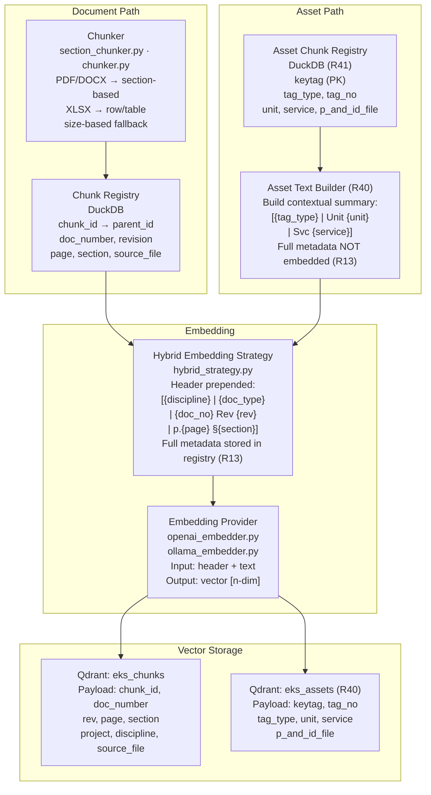

# EKS Phase 2 — Chunking, Embedding & Vector Storage

**Document ID**: WP-EKS-P2-001  
**Current Version**: 0.7  
**Status**: 🔷 PLANNED  
**Last Updated**: 2026-07-08  
**Parent Workplan**: [eks_system_workplan.md](eks_system_workplan.md)  
**Phase Dependency**: Phase 1 must be complete and approved  

---

## 1. Title and Description

Implement the chunking, embedding, and vector storage layer. This phase takes parsed documents from Phase 1 and transforms them into indexed, searchable vector representations. Key concerns are parent-child chunking quality, embedding pollution prevention, source traceability at chunk level, and a swappable plug-in architecture for embedding providers and vector databases.

---

## 2. Revision Control & Version History

| Version | Date       | Author | Summary of Changes                        |
| :------ | :--------- | :----- | :---------------------------------------- |
| 0.1     | 2026-06-11 | System | Initial phase workplan draft for approval |
| 0.2     | 2026-06-16 | System | Added Timestamp column to task breakdown table per AGENTS.md Section 8.8. Added CAD/DWG/DGN vector store gap note to Section 11: chunking pipeline has no ingestion path for CAD content; deferred to Phase 3 stubs only. |
| 0.3     | 2026-06-16 | System | Added T2.20–T2.21 for enriching chunk contextual headers with ontology taxonomy paths. Linked Appendix C. |
| 0.4     | 2026-06-16 | System | Ontology Option C gap closure: added R50 (Ontology-Enriched Embedding Headers) to scope table; updated T2.20 with exact taxonomy-path header format spec per Appendix C. |
| 0.5     | 2026-06-18 | System | Added R40 (Asset Embedding Strategy) and R41 (Asset Chunk Registry Extension) to scope and task breakdown. Asset text builder and dedicated Qdrant eks_assets collection added. Updated success criteria and deliverables. |
| 0.7     | 2026-07-11 | opencode | **I092 / R60 pipeline entry-point convergence**: Added T2.25 (Phase 2 standalone backend `phase2_server.py` + `run_phase2_pipeline(context)` reusing Phase 1 shared `run_pipeline()`, AGENTS.md §18.13) and T2.26 (serve.py `/api/v2/*` proxy wiring). Both 🔷 PLANNED for review. |
| 0.6     | 2026-06-22 | opencode | Added §14: Phase 2 Pipeline Architecture (detailed Mermaid diagram) moved from master workplan §10.3. |

---

## 3. Objective

- Implement parent-child chunk registry with full chunk metadata
- Enforce source traceability at chunk level (doc_number, revision, page, section, chunk_id, source_file)
- Implement hybrid embedding strategy: contextual header prepended to text; full metadata stored separately
- Build plug-in embedding provider interface (OpenAI, Ollama, custom)
- Integrate Qdrant as the default vector DB behind an abstract swappable interface
- Implement multi-level metadata hierarchy: project → document → chunk

---

## 4. Scope Summary

| ID  | Category             | Requirement                    | Details                                                              | Status     |
| :-- | :------------------- | :----------------------------- | :------------------------------------------------------------------- | :--------: |
| R03 | Knowledge Base       | Chunk Registry                 | Parent-child chunking strategy with chunk metadata                   | 🔷 PLANNED |
| R04 | Knowledge Base       | Vector Storage                 | Embed chunks and store in vector DB (Qdrant)                         | 🔷 PLANNED |
| R10 | Metadata             | Source Location Metadata       | file name, file location, section/paragraph, page per chunk         | 🔷 PLANNED |
| R12 | Metadata             | Multi-Level Metadata           | Project-level, document-level, and chunk-level metadata hierarchy    | 🔷 PLANNED |
| R13 | Embedding            | Embedding Pollution Prevention | Separate metadata, administrative data, and vector content           | 🔷 PLANNED |
| R14 | Embedding            | Hybrid Embedding Approach      | Prepend small contextual header; store full metadata separately      | 🔷 PLANNED |
| R15 | Embedding            | Plug-in Embedding Providers    | Support OpenAI, Ollama, or custom providers without code changes     | 🔷 PLANNED |
| R25 | Traceability         | Source Traceability            | doc_number, revision, page, section, chunk_id, source_file per chunk| 🔷 PLANNED |
| R28 | Plug-in Architecture | Vector DB Plug-in              | Swappable vector DB provider (Qdrant default)                        | 🔷 PLANNED |
| R30 | Infrastructure       | Vector DB                      | Qdrant for vector storage                                            | 🔷 PLANNED |
| R40 | Embedding            | Asset Embedding Strategy       | Contextual header + key field summary per asset; store vectors in `eks_assets` Qdrant collection; prevent null/code pollution per R13 | 🔷 PLANNED |
| R41 | Knowledge Base       | Asset Chunk Registry Extension | Extend DuckDB chunk registry to support asset records keyed on `keytag`; metadata: keytag, tag_type, tag_no, unit, service, p_and_id_file | 🔷 PLANNED |
| R44 | Schema               | ISO 15926 Ontology Integration (embedding) | Apply ontology taxonomy paths to embedding headers and class-aware asset representation | 🔷 PLANNED |
| R50 | Embedding | Ontology-Enriched Embedding Headers | Replace AT_ code in contextual embedding header with human-readable ontology taxonomy path resolved from T-Box (e.g. `[Pump \| Rotating Equipment \| Equipment \| Unit 003 \| Svc G2D]`); improves semantic similarity for class-based queries | 🔷 PLANNED |

**Status Legend:** ✅ PASS | 🔶 PARTIAL | ❌ FAIL | 🔷 PLANNED

---

## 5. Index of Content

- [1. Title and Description](#1-title-and-description)
- [2. Revision Control & Version History](#2-revision-control--version-history)
- [3. Objective](#3-objective)
- [4. Scope Summary](#4-scope-summary)
- [5. Index of Content](#5-index-of-content)
- [6. Evaluation and Alignment](#6-evaluation-and-alignment-with-existing-architecture)
- [7. Dependencies](#7-dependencies-with-other-tasks)
- [8. Task Breakdown](#8-task-breakdown)
- [9. Files and Modules](#9-files-and-modules-to-createupdate)
- [10. Risks and Mitigation](#10-risks-and-mitigation)
- [11. Potential Future Issues](#11-potential-future-issues)
- [12. Success Criteria](#12-success-criteria)
- [13. Deliverables](#13-deliverables)
- [14. Phase 2 Pipeline Architecture (Detailed)](#14-phase-2-pipeline-architecture-detailed)
- [15. References](#15-references)

---

## 6. Evaluation and Alignment with Existing Architecture

- **Phase 1 dependency**: Requires document registry (registry.py), parsers, and logger from Phase 1
- **Schema-driven**: Chunk metadata schema extends the canonical schema established in Phase 1
- **New patterns**: Parent-child chunking, vector DB integration, and embedding provider abstraction are all new to this workspace
- **SSOT**: Chunk and embedding configuration (chunk size, overlap, provider selection) managed via `eks_config.json`

---

## 7. Dependencies with Other Tasks

1. **Phase 1 (WP-EKS-P1-001)** — Document registry, parsers, schema, logger must be complete
2. **eks_config.json** — Must define chunk_size, chunk_overlap, embedding_provider, vector_db settings
3. **External**: Qdrant service (Docker or cloud), OpenAI API key or Ollama instance
4. **Next Phase**: Phase 3 knowledge graph depends on chunk registry and vector store from this phase

---

## 8. Task Breakdown

**Timeline**: TBD — starts after Phase 1 approval and completion  
**Estimated Effort**: Medium-High

| # | Task | Details | Status | Timestamp |
| :- | :--- | :------ | :----: | :-------- |
| T2.1 | Implement abstract chunker interface | `chunker.py`: base interface with chunk(), get_metadata() methods | 🔷 | — |
| T2.2 | Implement size-based chunker | Fixed token/character window with configurable overlap | 🔷 | — |
| T2.3 | Implement section-aware chunker | Split on document section/heading boundaries | 🔷 | — |
| T2.4 | Implement chunk registry | `chunk_registry.py`: parent-child relationship, chunk CRUD, metadata storage | 🔷 | — |
| T2.5 | Define chunk metadata schema | Extend eks_base_schema with chunk fields: chunk_id, parent_id, doc_number, revision, page, section, source_file | 🔷 | — |
| T2.6 | Implement multi-level metadata hierarchy | Project → Document → Chunk metadata inheritance and flattening | 🔷 | — |
| T2.7 | Implement abstract embedder interface | `base_embedder.py`: embed(text) → vector, supports batch | 🔷 | — |
| T2.8 | Implement OpenAI embedder | `openai_embedder.py`: calls OpenAI embeddings API | 🔷 | — |
| T2.9 | Implement Ollama embedder | `ollama_embedder.py`: calls local Ollama embeddings endpoint | 🔷 | — |
| T2.10 | Implement hybrid embedding strategy | Prepend contextual header to text before embedding; store full metadata separately | 🔷 | — |
| T2.11 | Implement abstract vector store interface | `base_vector_store.py`: upsert(), search(), delete() methods | 🔷 | — |
| T2.12 | Implement Qdrant vector store | `qdrant_store.py`: Qdrant collection management, upsert, similarity search | 🔷 | — |
| T2.13 | Implement chunk → embed → store pipeline | End-to-end: parse output → chunk → embed → store in Qdrant | 🔷 | — |
| T2.14 | Write unit and integration tests | Chunker, chunk registry, embedders, vector store, end-to-end pipeline | 🔷 | — |
| T2.15 | Update logs | `update_log.md`, `issue_log.md` under `eks/log/` | 🔷 | — |
| T2.16 | Extend chunk registry for asset records | Add `asset_records` table to DuckDB chunk registry: keytag (PK), tag_type, tag_no, unit, service, p_and_id_file, embedded_at; no parent-child fields needed | 🔷 | — |
| T2.17 | Implement asset text builder | `asset_text_builder.py`: build contextual text representation per asset — "[{tag_type} \| Unit {unit} \| Svc {service}] {description}: {key properties summary}"; select fields by fragment type, skip nulls | 🔷 | — |
| T2.18 | Add eks_assets Qdrant collection | Configure second Qdrant collection `eks_assets` in `eks_config.json`; same abstract vector store interface (R28); payload: keytag, tag_no, tag_type, unit, service, p_and_id_file | 🔷 | — |
| T2.19 | Write tests for R40/R41 additions | Asset text builder output, asset chunk registry CRUD, eks_assets collection upsert | 🔷 | — |
| T2.20 | Enrich chunk contextual headers with ontology | Update `hybrid_strategy.py` to resolve the full ontology ancestry path for each asset from the Neo4j T-Box (e.g. PumpTag → TaggedRotating → TaggedEquipment → FunctionalObject) and prepend human-readable class labels as header: `"[{leaf_label} | {parent_label} | ... | Unit {unit} | Svc {service}]"`. Labels come from `eks_ontology_config.json` class definitions — never AT_ codes. Resolves subclass chain via C5.4 Cypher query at embedding time. | 🔷 | — |
| T2.21 | Write ontology enrichment tests | Verify that taxonomy hierarchy is correctly prepended to headers before embedding | 🔷 | — |
| T2.22 | Integrate Appendix F architecture patterns | Apply universal pipeline architecture patterns per [Appendix F](appendix_f_pipeline_architecture_design.md): (1) Create ChunkerInput/ChunkerOutput and EmbedderInput/EmbedderOutput contracts in `eks/engine/chunking/io_contracts.py` and `eks/engine/embedding/io_contracts.py` extending EngineInput/EngineOutput base; (2) Add telemetry heartbeat checkpoints for chunking progress (documents processed, chunks generated) and embedding progress (chunks embedded, vectors stored); (3) Consider factory pattern for EmbedderProvider selection (OpenAI, Ollama) via Dependency Injection; (4) Ensure chunkers and embedders can be executed independently via CLI entry points; (5) Update task breakdown to reference Phase 1.2 completion for base patterns (PipelineContext, Dependency Injection, Telemetry Heartbeat). | 🔷 | — |
| T2.23 | Handle revision folder hierarchy inconsistency (I016) | Verify FileScanner handles edge cases where R0 revisions use 3-subfolder structure vs R1+ revisions with flat files; ensure recursive walk works across all submittal structures. | 🔷 | — |
| T2.24 | Handle dual project codes (I019) | Ensure FileScanner and chunk registry correctly handle both 131101 and 131242 project codes extracted dynamically from document number patterns. | 🔷 | — |
| T2.25 | Phase 2 standalone backend + runner (I092 / R60) | Create `eks/ui/backend/phase2_server.py` standalone backend (AGENTS.md §18.13): health endpoint, 409 concurrency guard, DuckDB cross-process retry; implement `run_phase2_pipeline(context)` reusing shared `bootstrap_pipeline()`/`run_pipeline()` from Phase 1 (T1.99.1); chunk → embed → Qdrant `eks_chunks`/`eks_assets` upsert. | 🔷 | I092, R60, T1.99.1 |
| T2.26 | Phase 2 proxy wiring (I092) | `serve.py` proxies `/api/v2/*` → phase2 backend on port 5002; document run command. | 🔷 | I092, T2.25 |

---

## 9. Files and Modules to Create/Update

| File/Folder                                    | Action | Purpose                                               |
| :--------------------------------------------- | :----- | :---------------------------------------------------- |
| `eks/engine/chunking/__init__.py`              | Create | Chunking package init                                 |
| `eks/engine/chunking/chunker.py`               | Create | Abstract chunker interface + size-based implementation|
| `eks/engine/chunking/section_chunker.py`       | Create | Section-aware chunking strategy                       |
| `eks/engine/chunking/chunk_registry.py`        | Create | Parent-child chunk management and metadata storage    |
| `eks/engine/chunking/io_contracts.py`           | Create | ChunkerInput/ChunkerOutput contracts per Appendix F  |
| `eks/engine/embedding/__init__.py`             | Create | Embedding package init                                |
| `eks/engine/embedding/base_embedder.py`        | Create | Abstract embedding provider interface                 |
| `eks/engine/embedding/openai_embedder.py`      | Create | OpenAI embedding provider                             |
| `eks/engine/embedding/ollama_embedder.py`      | Create | Ollama embedding provider                             |
| `eks/engine/embedding/hybrid_strategy.py`      | Create | Contextual header construction and embedding pipeline |
| `eks/engine/embedding/io_contracts.py`          | Create | EmbedderInput/EmbedderOutput contracts per Appendix F |
| `eks/engine/vector_store/__init__.py`          | Create | Vector store package init                             |
| `eks/engine/vector_store/base_vector_store.py` | Create | Abstract vector store interface                       |
| `eks/engine/vector_store/qdrant_store.py`      | Create | Qdrant vector store implementation                    |
| `eks/config/eks_base_schema.json`              | Update | Add chunk metadata schema definitions                 |
| `eks/config/eks_config.json`                   | Update | Add chunk_size, overlap, embedding_provider, qdrant settings, eks_assets collection config |
| `eks/engine/chunking/asset_text_builder.py`    | Create | Asset contextual text builder for embedding (R40) |
| `eks/engine/vector_store/asset_store.py`       | Create | Qdrant collection management for eks_assets (R40, R28) |
| `eks/test/test_phase2.py`                      | Create | Unit and integration tests for Phase 2 components     |

---

## 10. Risks and Mitigation

| Risk                                         | Likelihood | Impact | Mitigation                                              |
| :------------------------------------------- | :--------: | :----: | :------------------------------------------------------ |
| Embedding API costs/rate limits              | Medium     | Medium | Plug-in interface allows switching to Ollama locally    |
| Chunk boundary quality affects retrieval     | Medium     | High   | Section-aware chunking; evaluate chunk quality in tests |
| Vector DB schema changes during development  | Low        | Medium | Abstract interface isolates DB-specific logic           |
| Qdrant service unavailable in dev env        | Low        | High   | Document Docker Compose setup; use mock for unit tests  |
| Revision folder structure inconsistency (I016) | Low        | Medium | T2.23: verify FileScanner edge cases for R0 vs R1+ folder patterns |
| Dual project codes (131101 vs 131242) (I019)  | Low        | Medium | T2.24: ensure dynamic project code extraction from document number |

---

## 11. Potential Future Issues

- Fine-tuned domain-specific embeddings may outperform general models for engineering documents
- Chunk overlap strategy may need per-document-type tuning
- Very large documents may require streaming chunking to avoid memory issues
- **CAD/DWG/DGN content gap**: This phase has no ingestion path for CAD format content. DWG/DGN parser stubs are deferred to Phase 3 (interface-only). Until full CAD parsing is implemented in a future phase, CAD drawings will not enter the vector store and will not be retrievable via semantic search. This is a known gap — document-to-asset links via REFERENCED_BY_DWG (Phase 3) partially mitigate this by surfacing CAD-referenced assets, but the drawing content itself remains unsearchable.

---

## 12. Success Criteria

- [ ] Parent-child chunk registry operational with full metadata
- [ ] Chunk metadata includes all source traceability fields (doc_number, revision, page, section, chunk_id, source_file)
- [ ] Hybrid embedding implemented: contextual header prepended; full metadata stored separately
- [ ] At least one embedding provider (OpenAI or Ollama) functional end-to-end
- [ ] Qdrant vector store operational; abstract interface allows provider swap
- [ ] Multi-level metadata hierarchy (project → document → chunk) correctly propagated
- [ ] Integration tests passing for: chunk → embed → store pipeline
- [ ] Asset text builder produces clean contextual summaries (no nulls, no raw codes)
- [ ] Asset records stored in DuckDB chunk registry with correct metadata (R41)
- [ ] Asset vectors stored in `eks_assets` Qdrant collection with keytag payload (R40)
- [ ] Ontology taxonomy paths correctly prepended to contextual chunk headers (T2.20)
- [ ] Embedding contextual header uses ontology class label path (not AT_ code); verified by T2.21 tests (R50)
- [ ] All unit tests passing for Phase 2 components

---

## 13. Deliverables

- Chunking modules: `chunker.py`, `section_chunker.py`, `chunk_registry.py`
- Embedding modules: `base_embedder.py`, `openai_embedder.py`, `ollama_embedder.py`, `hybrid_strategy.py`
- Vector store modules: `base_vector_store.py`, `qdrant_store.py`
- Updated schema: `eks_base_schema.json` (chunk definitions), `eks_config.json`
- Test file: `test_phase2.py`
- Asset embedding modules: `asset_text_builder.py`, `asset_store.py`
- Report: `eks/workplan/reports/phase_2_chunking_embedding_report.md`

---

## 14. Phase 2 Pipeline Architecture (Detailed)

---

## 15. References

1. [eks_system_workplan.md](eks_system_workplan.md) — Master workplan
2. [phase_1_foundation_workplan.md](phase_1_foundation_workplan.md) — Phase 1 prerequisite
3. [AGENTS.md](../AGENTS.md) — Repository guidelines
4. [eks/readme.md](../readme.md) — EKS project overview
5. [appendix_c_ontology.md](appendix_c_ontology.md) — Dynamic ISO 15926-Aligned Ontology
